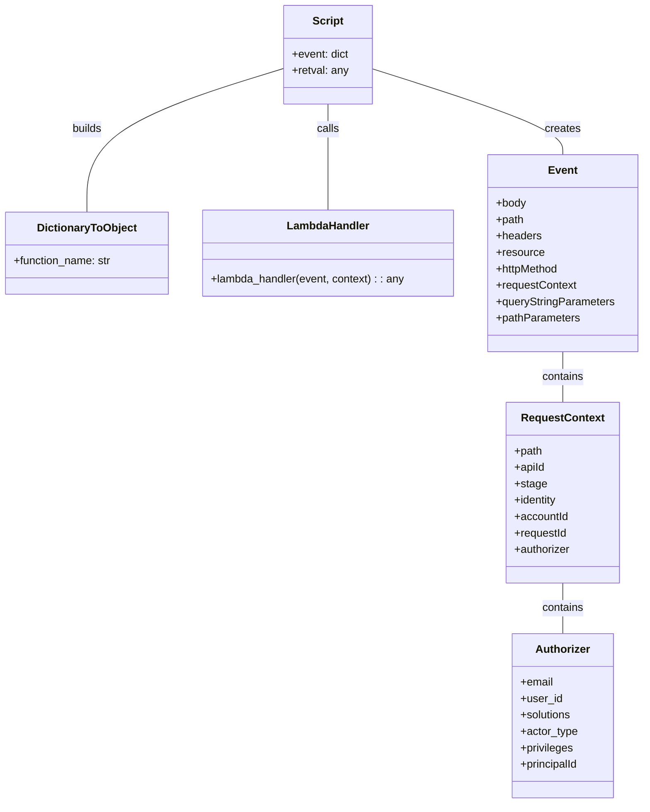

# Diagram: platform/tools/ide_local_testing/localTest/test/entity/extract/getEntityExtractViaLambda.py


> Auto-generated by Obscura crawlers

## Diagram 1

```mermaid
flowchart LR
    Script[Local test script] --> Event[Event dict]
    Script --> Context[DictionaryToObject(context)]
    Event --> Handler[entityExtract.lambda_handler]
    Context --> Handler
    Handler --> Retval[Return value printed]
```

> SVG rendering failed for this diagram.

## Diagram 2



### SVG

<svg id="container" width="941.8203125" xmlns="http://www.w3.org/2000/svg" class="classDiagram" height="1174" viewBox="0 0 941.8203125 1174" role="graphics-document document" aria-roledescription="class"><style>#container{font-family:"trebuchet ms",verdana,arial,sans-serif;font-size:16px;fill:#333;}@keyframes edge-animation-frame{from{stroke-dashoffset:0;}}@keyframes dash{to{stroke-dashoffset:0;}}#container .edge-animation-slow{stroke-dasharray:9,5!important;stroke-dashoffset:900;animation:dash 50s linear infinite;stroke-linecap:round;}#container .edge-animation-fast{stroke-dasharray:9,5!important;stroke-dashoffset:900;animation:dash 20s linear infinite;stroke-linecap:round;}#container .error-icon{fill:#552222;}#container .error-text{fill:#552222;stroke:#552222;}#container .edge-thickness-normal{stroke-width:1px;}#container .edge-thickness-thick{stroke-width:3.5px;}#container .edge-pattern-solid{stroke-dasharray:0;}#container .edge-thickness-invisible{stroke-width:0;fill:none;}#container .edge-pattern-dashed{stroke-dasharray:3;}#container .edge-pattern-dotted{stroke-dasharray:2;}#container .marker{fill:#333333;stroke:#333333;}#container .marker.cross{stroke:#333333;}#container svg{font-family:"trebuchet ms",verdana,arial,sans-serif;font-size:16px;}#container p{margin:0;}#container g.classGroup text{fill:#9370DB;stroke:none;font-family:"trebuchet ms",verdana,arial,sans-serif;font-size:10px;}#container g.classGroup text .title{font-weight:bolder;}#container .nodeLabel,#container .edgeLabel{color:#131300;}#container .edgeLabel .label rect{fill:#ECECFF;}#container .label text{fill:#131300;}#container .labelBkg{background:#ECECFF;}#container .edgeLabel .label span{background:#ECECFF;}#container .classTitle{font-weight:bolder;}#container .node rect,#container .node circle,#container .node ellipse,#container .node polygon,#container .node path{fill:#ECECFF;stroke:#9370DB;stroke-width:1px;}#container .divider{stroke:#9370DB;stroke-width:1;}#container g.clickable{cursor:pointer;}#container g.classGroup rect{fill:#ECECFF;stroke:#9370DB;}#container g.classGroup line{stroke:#9370DB;stroke-width:1;}#container .classLabel .box{stroke:none;stroke-width:0;fill:#ECECFF;opacity:0.5;}#container .classLabel .label{fill:#9370DB;font-size:10px;}#container .relation{stroke:#333333;stroke-width:1;fill:none;}#container .dashed-line{stroke-dasharray:3;}#container .dotted-line{stroke-dasharray:1 2;}#container #compositionStart,#container .composition{fill:#333333!important;stroke:#333333!important;stroke-width:1;}#container #compositionEnd,#container .composition{fill:#333333!important;stroke:#333333!important;stroke-width:1;}#container #dependencyStart,#container .dependency{fill:#333333!important;stroke:#333333!important;stroke-width:1;}#container #dependencyStart,#container .dependency{fill:#333333!important;stroke:#333333!important;stroke-width:1;}#container #extensionStart,#container .extension{fill:transparent!important;stroke:#333333!important;stroke-width:1;}#container #extensionEnd,#container .extension{fill:transparent!important;stroke:#333333!important;stroke-width:1;}#container #aggregationStart,#container .aggregation{fill:transparent!important;stroke:#333333!important;stroke-width:1;}#container #aggregationEnd,#container .aggregation{fill:transparent!important;stroke:#333333!important;stroke-width:1;}#container #lollipopStart,#container .lollipop{fill:#ECECFF!important;stroke:#333333!important;stroke-width:1;}#container #lollipopEnd,#container .lollipop{fill:#ECECFF!important;stroke:#333333!important;stroke-width:1;}#container .edgeTerminals{font-size:11px;line-height:initial;}#container .classTitleText{text-anchor:middle;font-size:18px;fill:#333;}#container .label-icon{display:inline-block;height:1em;overflow:visible;vertical-align:-0.125em;}#container .node .label-icon path{fill:currentColor;stroke:revert;stroke-width:revert;}#container :root{--mermaid-font-family:"trebuchet ms",verdana,arial,sans-serif;}</style><g><defs><marker id="container_class-aggregationStart" class="marker aggregation class" refX="18" refY="7" markerWidth="190" markerHeight="240" orient="auto"><path d="M 18,7 L9,13 L1,7 L9,1 Z"></path></marker></defs><defs><marker id="container_class-aggregationEnd" class="marker aggregation class" refX="1" refY="7" markerWidth="20" markerHeight="28" orient="auto"><path d="M 18,7 L9,13 L1,7 L9,1 Z"></path></marker></defs><defs><marker id="container_class-extensionStart" class="marker extension class" refX="18" refY="7" markerWidth="190" markerHeight="240" orient="auto"><path d="M 1,7 L18,13 V 1 Z"></path></marker></defs><defs><marker id="container_class-extensionEnd" class="marker extension class" refX="1" refY="7" markerWidth="20" markerHeight="28" orient="auto"><path d="M 1,1 V 13 L18,7 Z"></path></marker></defs><defs><marker id="container_class-compositionStart" class="marker composition class" refX="18" refY="7" markerWidth="190" markerHeight="240" orient="auto"><path d="M 18,7 L9,13 L1,7 L9,1 Z"></path></marker></defs><defs><marker id="container_class-compositionEnd" class="marker composition class" refX="1" refY="7" markerWidth="20" markerHeight="28" orient="auto"><path d="M 18,7 L9,13 L1,7 L9,1 Z"></path></marker></defs><defs><marker id="container_class-dependencyStart" class="marker dependency class" refX="6" refY="7" markerWidth="190" markerHeight="240" orient="auto"><path d="M 5,7 L9,13 L1,7 L9,1 Z"></path></marker></defs><defs><marker id="container_class-dependencyEnd" class="marker dependency class" refX="13" refY="7" markerWidth="20" markerHeight="28" orient="auto"><path d="M 18,7 L9,13 L14,7 L9,1 Z"></path></marker></defs><defs><marker id="container_class-lollipopStart" class="marker lollipop class" refX="13" refY="7" markerWidth="190" markerHeight="240" orient="auto"><circle stroke="black" fill="transparent" cx="7" cy="7" r="6"></circle></marker></defs><defs><marker id="container_class-lollipopEnd" class="marker lollipop class" refX="1" refY="7" markerWidth="190" markerHeight="240" orient="auto"><circle stroke="black" fill="transparent" cx="7" cy="7" r="6"></circle></marker></defs><g class="root"><g class="clusters"></g><g class="edgePaths"><path d="M481.227,152L481.227,158.167C481.227,164.333,481.227,176.667,481.227,202.5C481.227,228.333,481.227,267.667,481.227,287.333L481.227,307" id="id_Script_LambdaHandler_1" class="edge-thickness-normal edge-pattern-solid relation" style=";;;" data-edge="true" data-et="edge" data-id="id_Script_LambdaHandler_1" data-points="W3sieCI6NDgxLjIyNjU2MjUsInkiOjE1Mn0seyJ4Ijo0ODEuMjI2NTYyNSwieSI6MTg5fSx7IngiOjQ4MS4yMjY1NjI1LCJ5IjozMDd9XQ=="></path><path d="M416.371,99.982L368.218,114.819C320.065,129.655,223.759,159.327,175.606,194.33C127.453,229.333,127.453,269.667,127.453,289.833L127.453,310" id="id_Script_DictionaryToObject_2" class="edge-thickness-normal edge-pattern-solid relation" style=";;;" data-edge="true" data-et="edge" data-id="id_Script_DictionaryToObject_2" data-points="W3sieCI6NDE2LjM3MTA5Mzc1LCJ5Ijo5OS45ODI0MTA2MTc2NzEwOX0seyJ4IjoxMjcuNDUzMTI1LCJ5IjoxODl9LHsieCI6MTI3LjQ1MzEyNSwieSI6MzEwfV0="></path><path d="M546.082,100.583L592.516,115.319C638.949,130.055,731.816,159.528,778.25,180.43C824.684,201.333,824.684,213.667,824.684,219.833L824.684,226" id="id_Script_Event_3" class="edge-thickness-normal edge-pattern-solid relation" style=";;;" data-edge="true" data-et="edge" data-id="id_Script_Event_3" data-points="W3sieCI6NTQ2LjA4MjAzMTI1LCJ5IjoxMDAuNTgyNjIxNTUyNDU5NDl9LHsieCI6ODI0LjY4MzU5Mzc1LCJ5IjoxODl9LHsieCI6ODI0LjY4MzU5Mzc1LCJ5IjoyMjZ9XQ=="></path><path d="M824.684,514L824.684,520.167C824.684,526.333,824.684,538.667,824.684,551C824.684,563.333,824.684,575.667,824.684,581.833L824.684,588" id="id_Event_RequestContext_4" class="edge-thickness-normal edge-pattern-solid relation" style=";;;" data-edge="true" data-et="edge" data-id="id_Event_RequestContext_4" data-points="W3sieCI6ODI0LjY4MzU5Mzc1LCJ5Ijo1MTR9LHsieCI6ODI0LjY4MzU5Mzc1LCJ5Ijo1NTF9LHsieCI6ODI0LjY4MzU5Mzc1LCJ5Ijo1ODh9XQ=="></path><path d="M824.684,852L824.684,858.167C824.684,864.333,824.684,876.667,824.684,889C824.684,901.333,824.684,913.667,824.684,919.833L824.684,926" id="id_RequestContext_Authorizer_5" class="edge-thickness-normal edge-pattern-solid relation" style=";;;" data-edge="true" data-et="edge" data-id="id_RequestContext_Authorizer_5" data-points="W3sieCI6ODI0LjY4MzU5Mzc1LCJ5Ijo4NTJ9LHsieCI6ODI0LjY4MzU5Mzc1LCJ5Ijo4ODl9LHsieCI6ODI0LjY4MzU5Mzc1LCJ5Ijo5MjZ9XQ=="></path></g><g class="edgeLabels"><g class="edgeLabel" transform="translate(481.2265625, 189)"><g class="label" data-id="id_Script_LambdaHandler_1" transform="translate(-16.4453125, -12)"><foreignObject width="32.890625" height="24"><div xmlns="http://www.w3.org/1999/xhtml" class="labelBkg" style="display: table-cell; white-space: nowrap; line-height: 1.5; max-width: 200px; text-align: center;"><span class="edgeLabel"><p>calls</p></span></div></foreignObject></g></g><g class="edgeLabel" transform="translate(127.453125, 189)"><g class="label" data-id="id_Script_DictionaryToObject_2" transform="translate(-22.4921875, -12)"><foreignObject width="44.984375" height="24"><div xmlns="http://www.w3.org/1999/xhtml" class="labelBkg" style="display: table-cell; white-space: nowrap; line-height: 1.5; max-width: 200px; text-align: center;"><span class="edgeLabel"><p>builds</p></span></div></foreignObject></g></g><g class="edgeLabel" transform="translate(824.68359375, 189)"><g class="label" data-id="id_Script_Event_3" transform="translate(-26.171875, -12)"><foreignObject width="52.34375" height="24"><div xmlns="http://www.w3.org/1999/xhtml" class="labelBkg" style="display: table-cell; white-space: nowrap; line-height: 1.5; max-width: 200px; text-align: center;"><span class="edgeLabel"><p>creates</p></span></div></foreignObject></g></g><g class="edgeLabel" transform="translate(824.68359375, 551)"><g class="label" data-id="id_Event_RequestContext_4" transform="translate(-30.890625, -12)"><foreignObject width="61.78125" height="24"><div xmlns="http://www.w3.org/1999/xhtml" class="labelBkg" style="display: table-cell; white-space: nowrap; line-height: 1.5; max-width: 200px; text-align: center;"><span class="edgeLabel"><p>contains</p></span></div></foreignObject></g></g><g class="edgeLabel" transform="translate(824.68359375, 889)"><g class="label" data-id="id_RequestContext_Authorizer_5" transform="translate(-30.890625, -12)"><foreignObject width="61.78125" height="24"><div xmlns="http://www.w3.org/1999/xhtml" class="labelBkg" style="display: table-cell; white-space: nowrap; line-height: 1.5; max-width: 200px; text-align: center;"><span class="edgeLabel"><p>contains</p></span></div></foreignObject></g></g></g><g class="nodes"><g class="node default" id="classId-Script-0" transform="translate(481.2265625, 80)"><g class="basic label-container"><path d="M-64.85546875 -72 L64.85546875 -72 L64.85546875 72 L-64.85546875 72" stroke="none" stroke-width="0" fill="#ECECFF" style=""></path><path d="M-64.85546875 -72 C-15.581140499792745 -72, 33.69318775041451 -72, 64.85546875 -72 M-64.85546875 -72 C-27.27316795784565 -72, 10.309132834308699 -72, 64.85546875 -72 M64.85546875 -72 C64.85546875 -31.55409528687131, 64.85546875 8.891809426257382, 64.85546875 72 M64.85546875 -72 C64.85546875 -22.343930719137596, 64.85546875 27.312138561724808, 64.85546875 72 M64.85546875 72 C14.919631505599526 72, -35.01620573880095 72, -64.85546875 72 M64.85546875 72 C18.636404748162363 72, -27.582659253675274 72, -64.85546875 72 M-64.85546875 72 C-64.85546875 31.139852790647907, -64.85546875 -9.720294418704185, -64.85546875 -72 M-64.85546875 72 C-64.85546875 20.567210138208537, -64.85546875 -30.865579723582925, -64.85546875 -72" stroke="#9370DB" stroke-width="1.3" fill="none" stroke-dasharray="0 0" style=""></path></g><g class="annotation-group text" transform="translate(0, -48)"></g><g class="label-group text" transform="translate(-21.7421875, -48)"><g class="label" style="font-weight: bolder" transform="translate(0,-12)"><foreignObject width="43.484375" height="24"><div xmlns="http://www.w3.org/1999/xhtml" style="display: table-cell; white-space: nowrap; line-height: 1.5; max-width: 93px; text-align: center;"><span class="nodeLabel markdown-node-label" style=""><p>Script</p></span></div></foreignObject></g></g><g class="members-group text" transform="translate(-52.85546875, 0)"><g class="label" style="" transform="translate(0,-12)"><foreignObject width="83.96875" height="24"><div xmlns="http://www.w3.org/1999/xhtml" style="display: table-cell; white-space: nowrap; line-height: 1.5; max-width: 142px; text-align: center;"><span class="nodeLabel markdown-node-label" style=""><p>+event: dict</p></span></div></foreignObject></g><g class="label" style="" transform="translate(0,12)"><foreignObject width="83.03125" height="24"><div xmlns="http://www.w3.org/1999/xhtml" style="display: table-cell; white-space: nowrap; line-height: 1.5; max-width: 141px; text-align: center;"><span class="nodeLabel markdown-node-label" style=""><p>+retval: any</p></span></div></foreignObject></g></g><g class="methods-group text" transform="translate(-52.85546875, 72)"></g><g class="divider" style=""><path d="M-64.85546875 -24 C-19.227065525136425 -24, 26.40133769972715 -24, 64.85546875 -24 M-64.85546875 -24 C-28.833237982573365 -24, 7.188992784853269 -24, 64.85546875 -24" stroke="#9370DB" stroke-width="1.3" fill="none" stroke-dasharray="0 0" style=""></path></g><g class="divider" style=""><path d="M-64.85546875 48 C-36.689159121302126 48, -8.522849492604259 48, 64.85546875 48 M-64.85546875 48 C-26.27754890978116 48, 12.30037093043768 48, 64.85546875 48" stroke="#9370DB" stroke-width="1.3" fill="none" stroke-dasharray="0 0" style=""></path></g></g><g class="node default" id="classId-DictionaryToObject-1" transform="translate(127.453125, 370)"><g class="basic label-container"><path d="M-119.453125 -60 L119.453125 -60 L119.453125 60 L-119.453125 60" stroke="none" stroke-width="0" fill="#ECECFF" style=""></path><path d="M-119.453125 -60 C-62.16745785715982 -60, -4.881790714319635 -60, 119.453125 -60 M-119.453125 -60 C-67.79947553889453 -60, -16.145826077789053 -60, 119.453125 -60 M119.453125 -60 C119.453125 -16.264440797087822, 119.453125 27.471118405824356, 119.453125 60 M119.453125 -60 C119.453125 -20.366850107087465, 119.453125 19.26629978582507, 119.453125 60 M119.453125 60 C33.870014308757675 60, -51.71309638248465 60, -119.453125 60 M119.453125 60 C26.576528514288825 60, -66.30006797142235 60, -119.453125 60 M-119.453125 60 C-119.453125 26.42299637791693, -119.453125 -7.154007244166138, -119.453125 -60 M-119.453125 60 C-119.453125 20.57321807847424, -119.453125 -18.853563843051518, -119.453125 -60" stroke="#9370DB" stroke-width="1.3" fill="none" stroke-dasharray="0 0" style=""></path></g><g class="annotation-group text" transform="translate(0, -36)"></g><g class="label-group text" transform="translate(-70.109375, -36)"><g class="label" style="font-weight: bolder" transform="translate(0,-12)"><foreignObject width="140.21875" height="24"><div xmlns="http://www.w3.org/1999/xhtml" style="display: table-cell; white-space: nowrap; line-height: 1.5; max-width: 188px; text-align: center;"><span class="nodeLabel markdown-node-label" style=""><p>DictionaryToObject</p></span></div></foreignObject></g></g><g class="members-group text" transform="translate(-107.453125, 12)"><g class="label" style="" transform="translate(0,-12)"><foreignObject width="144.796875" height="24"><div xmlns="http://www.w3.org/1999/xhtml" style="display: table-cell; white-space: nowrap; line-height: 1.5; max-width: 203px; text-align: center;"><span class="nodeLabel markdown-node-label" style=""><p>+function_name: str</p></span></div></foreignObject></g></g><g class="methods-group text" transform="translate(-107.453125, 60)"></g><g class="divider" style=""><path d="M-119.453125 -12 C-36.81980614558417 -12, 45.81351270883167 -12, 119.453125 -12 M-119.453125 -12 C-47.92739531002853 -12, 23.59833437994294 -12, 119.453125 -12" stroke="#9370DB" stroke-width="1.3" fill="none" stroke-dasharray="0 0" style=""></path></g><g class="divider" style=""><path d="M-119.453125 36 C-49.149394999287736 36, 21.154335001424528 36, 119.453125 36 M-119.453125 36 C-52.894296460168064 36, 13.664532079663871 36, 119.453125 36" stroke="#9370DB" stroke-width="1.3" fill="none" stroke-dasharray="0 0" style=""></path></g></g><g class="node default" id="classId-LambdaHandler-2" transform="translate(481.2265625, 370)"><g class="basic label-container"><path d="M-184.3203125 -63 L184.3203125 -63 L184.3203125 63 L-184.3203125 63" stroke="none" stroke-width="0" fill="#ECECFF" style=""></path><path d="M-184.3203125 -63 C-99.26086438144632 -63, -14.20141626289265 -63, 184.3203125 -63 M-184.3203125 -63 C-40.32933758593367 -63, 103.66163732813266 -63, 184.3203125 -63 M184.3203125 -63 C184.3203125 -17.54296635673996, 184.3203125 27.91406728652008, 184.3203125 63 M184.3203125 -63 C184.3203125 -12.652456536606508, 184.3203125 37.695086926786985, 184.3203125 63 M184.3203125 63 C97.80708958635886 63, 11.293866672717712 63, -184.3203125 63 M184.3203125 63 C79.93563223197978 63, -24.449048036040438 63, -184.3203125 63 M-184.3203125 63 C-184.3203125 22.94585711851198, -184.3203125 -17.10828576297604, -184.3203125 -63 M-184.3203125 63 C-184.3203125 34.678111991202414, -184.3203125 6.356223982404821, -184.3203125 -63" stroke="#9370DB" stroke-width="1.3" fill="none" stroke-dasharray="0 0" style=""></path></g><g class="annotation-group text" transform="translate(0, -39)"></g><g class="label-group text" transform="translate(-58.21875, -39)"><g class="label" style="font-weight: bolder" transform="translate(0,-12)"><foreignObject width="116.4375" height="24"><div xmlns="http://www.w3.org/1999/xhtml" style="display: table-cell; white-space: nowrap; line-height: 1.5; max-width: 167px; text-align: center;"><span class="nodeLabel markdown-node-label" style=""><p>LambdaHandler</p></span></div></foreignObject></g></g><g class="members-group text" transform="translate(-172.3203125, 9)"></g><g class="methods-group text" transform="translate(-172.3203125, 39)"><g class="label" style="" transform="translate(0,-12)"><foreignObject width="286.421875" height="24"><div xmlns="http://www.w3.org/1999/xhtml" style="display: table-cell; white-space: nowrap; line-height: 1.5; max-width: 344px; text-align: center;"><span class="nodeLabel markdown-node-label" style=""><p>+lambda_handler(event, context) : : any</p></span></div></foreignObject></g></g><g class="divider" style=""><path d="M-184.3203125 -15 C-69.98764706789991 -15, 44.34501836420017 -15, 184.3203125 -15 M-184.3203125 -15 C-50.49858529924413 -15, 83.32314190151175 -15, 184.3203125 -15" stroke="#9370DB" stroke-width="1.3" fill="none" stroke-dasharray="0 0" style=""></path></g><g class="divider" style=""><path d="M-184.3203125 9 C-38.39304998153639 9, 107.53421253692721 9, 184.3203125 9 M-184.3203125 9 C-41.07135659632718 9, 102.17759930734564 9, 184.3203125 9" stroke="#9370DB" stroke-width="1.3" fill="none" stroke-dasharray="0 0" style=""></path></g></g><g class="node default" id="classId-Event-3" transform="translate(824.68359375, 370)"><g class="basic label-container"><path d="M-109.13671875 -144 L109.13671875 -144 L109.13671875 144 L-109.13671875 144" stroke="none" stroke-width="0" fill="#ECECFF" style=""></path><path d="M-109.13671875 -144 C-30.76120380789591 -144, 47.61431113420818 -144, 109.13671875 -144 M-109.13671875 -144 C-46.37433277654428 -144, 16.388053196911443 -144, 109.13671875 -144 M109.13671875 -144 C109.13671875 -83.62219317054866, 109.13671875 -23.24438634109731, 109.13671875 144 M109.13671875 -144 C109.13671875 -40.25781495694872, 109.13671875 63.48437008610256, 109.13671875 144 M109.13671875 144 C61.9232741612922 144, 14.709829572584397 144, -109.13671875 144 M109.13671875 144 C64.5916944663645 144, 20.046670182729002 144, -109.13671875 144 M-109.13671875 144 C-109.13671875 38.58974751921103, -109.13671875 -66.82050496157794, -109.13671875 -144 M-109.13671875 144 C-109.13671875 59.13259493449385, -109.13671875 -25.734810131012296, -109.13671875 -144" stroke="#9370DB" stroke-width="1.3" fill="none" stroke-dasharray="0 0" style=""></path></g><g class="annotation-group text" transform="translate(0, -120)"></g><g class="label-group text" transform="translate(-20.2109375, -120)"><g class="label" style="font-weight: bolder" transform="translate(0,-12)"><foreignObject width="40.421875" height="24"><div xmlns="http://www.w3.org/1999/xhtml" style="display: table-cell; white-space: nowrap; line-height: 1.5; max-width: 90px; text-align: center;"><span class="nodeLabel markdown-node-label" style=""><p>Event</p></span></div></foreignObject></g></g><g class="members-group text" transform="translate(-97.13671875, -72)"><g class="label" style="" transform="translate(0,-12)"><foreignObject width="44.28125" height="24"><div xmlns="http://www.w3.org/1999/xhtml" style="display: table-cell; white-space: nowrap; line-height: 1.5; max-width: 102px; text-align: center;"><span class="nodeLabel markdown-node-label" style=""><p>+body</p></span></div></foreignObject></g><g class="label" style="" transform="translate(0,12)"><foreignObject width="41.1875" height="24"><div xmlns="http://www.w3.org/1999/xhtml" style="display: table-cell; white-space: nowrap; line-height: 1.5; max-width: 99px; text-align: center;"><span class="nodeLabel markdown-node-label" style=""><p>+path</p></span></div></foreignObject></g><g class="label" style="" transform="translate(0,36)"><foreignObject width="66.328125" height="24"><div xmlns="http://www.w3.org/1999/xhtml" style="display: table-cell; white-space: nowrap; line-height: 1.5; max-width: 124px; text-align: center;"><span class="nodeLabel markdown-node-label" style=""><p>+headers</p></span></div></foreignObject></g><g class="label" style="" transform="translate(0,60)"><foreignObject width="70.28125" height="24"><div xmlns="http://www.w3.org/1999/xhtml" style="display: table-cell; white-space: nowrap; line-height: 1.5; max-width: 128px; text-align: center;"><span class="nodeLabel markdown-node-label" style=""><p>+resource</p></span></div></foreignObject></g><g class="label" style="" transform="translate(0,84)"><foreignObject width="93.65625" height="24"><div xmlns="http://www.w3.org/1999/xhtml" style="display: table-cell; white-space: nowrap; line-height: 1.5; max-width: 151px; text-align: center;"><span class="nodeLabel markdown-node-label" style=""><p>+httpMethod</p></span></div></foreignObject></g><g class="label" style="" transform="translate(0,108)"><foreignObject width="118.265625" height="24"><div xmlns="http://www.w3.org/1999/xhtml" style="display: table-cell; white-space: nowrap; line-height: 1.5; max-width: 176px; text-align: center;"><span class="nodeLabel markdown-node-label" style=""><p>+requestContext</p></span></div></foreignObject></g><g class="label" style="" transform="translate(0,132)"><foreignObject width="174.0625" height="24"><div xmlns="http://www.w3.org/1999/xhtml" style="display: table-cell; white-space: nowrap; line-height: 1.5; max-width: 231px; text-align: center;"><span class="nodeLabel markdown-node-label" style=""><p>+queryStringParameters</p></span></div></foreignObject></g><g class="label" style="" transform="translate(0,156)"><foreignObject width="122.734375" height="24"><div xmlns="http://www.w3.org/1999/xhtml" style="display: table-cell; white-space: nowrap; line-height: 1.5; max-width: 180px; text-align: center;"><span class="nodeLabel markdown-node-label" style=""><p>+pathParameters</p></span></div></foreignObject></g></g><g class="methods-group text" transform="translate(-97.13671875, 144)"></g><g class="divider" style=""><path d="M-109.13671875 -96 C-61.20054923615974 -96, -13.264379722319475 -96, 109.13671875 -96 M-109.13671875 -96 C-53.752355645006695 -96, 1.6320074599866103 -96, 109.13671875 -96" stroke="#9370DB" stroke-width="1.3" fill="none" stroke-dasharray="0 0" style=""></path></g><g class="divider" style=""><path d="M-109.13671875 120 C-55.03357887707195 120, -0.9304390041439063 120, 109.13671875 120 M-109.13671875 120 C-58.65797164919796 120, -8.179224548395922 120, 109.13671875 120" stroke="#9370DB" stroke-width="1.3" fill="none" stroke-dasharray="0 0" style=""></path></g></g><g class="node default" id="classId-RequestContext-4" transform="translate(824.68359375, 720)"><g class="basic label-container"><path d="M-82.44140625 -132 L82.44140625 -132 L82.44140625 132 L-82.44140625 132" stroke="none" stroke-width="0" fill="#ECECFF" style=""></path><path d="M-82.44140625 -132 C-19.16868885572063 -132, 44.10402853855874 -132, 82.44140625 -132 M-82.44140625 -132 C-42.064350481803025 -132, -1.6872947136060503 -132, 82.44140625 -132 M82.44140625 -132 C82.44140625 -72.00470573347556, 82.44140625 -12.009411466951107, 82.44140625 132 M82.44140625 -132 C82.44140625 -56.88651377605437, 82.44140625 18.226972447891256, 82.44140625 132 M82.44140625 132 C24.93109166790903 132, -32.57922291418194 132, -82.44140625 132 M82.44140625 132 C41.05418449001137 132, -0.3330372699772539 132, -82.44140625 132 M-82.44140625 132 C-82.44140625 32.98721318514983, -82.44140625 -66.02557362970035, -82.44140625 -132 M-82.44140625 132 C-82.44140625 40.1790328078247, -82.44140625 -51.641934384350606, -82.44140625 -132" stroke="#9370DB" stroke-width="1.3" fill="none" stroke-dasharray="0 0" style=""></path></g><g class="annotation-group text" transform="translate(0, -108)"></g><g class="label-group text" transform="translate(-58.1484375, -108)"><g class="label" style="font-weight: bolder" transform="translate(0,-12)"><foreignObject width="116.296875" height="24"><div xmlns="http://www.w3.org/1999/xhtml" style="display: table-cell; white-space: nowrap; line-height: 1.5; max-width: 164px; text-align: center;"><span class="nodeLabel markdown-node-label" style=""><p>RequestContext</p></span></div></foreignObject></g></g><g class="members-group text" transform="translate(-70.44140625, -60)"><g class="label" style="" transform="translate(0,-12)"><foreignObject width="41.1875" height="24"><div xmlns="http://www.w3.org/1999/xhtml" style="display: table-cell; white-space: nowrap; line-height: 1.5; max-width: 99px; text-align: center;"><span class="nodeLabel markdown-node-label" style=""><p>+path</p></span></div></foreignObject></g><g class="label" style="" transform="translate(0,12)"><foreignObject width="44.765625" height="24"><div xmlns="http://www.w3.org/1999/xhtml" style="display: table-cell; white-space: nowrap; line-height: 1.5; max-width: 102px; text-align: center;"><span class="nodeLabel markdown-node-label" style=""><p>+apiId</p></span></div></foreignObject></g><g class="label" style="" transform="translate(0,36)"><foreignObject width="46.453125" height="24"><div xmlns="http://www.w3.org/1999/xhtml" style="display: table-cell; white-space: nowrap; line-height: 1.5; max-width: 104px; text-align: center;"><span class="nodeLabel markdown-node-label" style=""><p>+stage</p></span></div></foreignObject></g><g class="label" style="" transform="translate(0,60)"><foreignObject width="64.03125" height="24"><div xmlns="http://www.w3.org/1999/xhtml" style="display: table-cell; white-space: nowrap; line-height: 1.5; max-width: 122px; text-align: center;"><span class="nodeLabel markdown-node-label" style=""><p>+identity</p></span></div></foreignObject></g><g class="label" style="" transform="translate(0,84)"><foreignObject width="79.203125" height="24"><div xmlns="http://www.w3.org/1999/xhtml" style="display: table-cell; white-space: nowrap; line-height: 1.5; max-width: 137px; text-align: center;"><span class="nodeLabel markdown-node-label" style=""><p>+accountId</p></span></div></foreignObject></g><g class="label" style="" transform="translate(0,108)"><foreignObject width="77.546875" height="24"><div xmlns="http://www.w3.org/1999/xhtml" style="display: table-cell; white-space: nowrap; line-height: 1.5; max-width: 135px; text-align: center;"><span class="nodeLabel markdown-node-label" style=""><p>+requestId</p></span></div></foreignObject></g><g class="label" style="" transform="translate(0,132)"><foreignObject width="82.734375" height="24"><div xmlns="http://www.w3.org/1999/xhtml" style="display: table-cell; white-space: nowrap; line-height: 1.5; max-width: 141px; text-align: center;"><span class="nodeLabel markdown-node-label" style=""><p>+authorizer</p></span></div></foreignObject></g></g><g class="methods-group text" transform="translate(-70.44140625, 132)"></g><g class="divider" style=""><path d="M-82.44140625 -84 C-46.27418859545119 -84, -10.106970940902386 -84, 82.44140625 -84 M-82.44140625 -84 C-28.126692258046504 -84, 26.188021733906993 -84, 82.44140625 -84" stroke="#9370DB" stroke-width="1.3" fill="none" stroke-dasharray="0 0" style=""></path></g><g class="divider" style=""><path d="M-82.44140625 108 C-33.08008148090162 108, 16.281243288196762 108, 82.44140625 108 M-82.44140625 108 C-43.33742915083771 108, -4.233452051675414 108, 82.44140625 108" stroke="#9370DB" stroke-width="1.3" fill="none" stroke-dasharray="0 0" style=""></path></g></g><g class="node default" id="classId-Authorizer-5" transform="translate(824.68359375, 1046)"><g class="basic label-container"><path d="M-74.47265625 -120 L74.47265625 -120 L74.47265625 120 L-74.47265625 120" stroke="none" stroke-width="0" fill="#ECECFF" style=""></path><path d="M-74.47265625 -120 C-34.12942480126525 -120, 6.213806647469497 -120, 74.47265625 -120 M-74.47265625 -120 C-27.919094618875683 -120, 18.634467012248635 -120, 74.47265625 -120 M74.47265625 -120 C74.47265625 -35.86058054198253, 74.47265625 48.27883891603494, 74.47265625 120 M74.47265625 -120 C74.47265625 -45.251849660801454, 74.47265625 29.49630067839709, 74.47265625 120 M74.47265625 120 C41.88890480583291 120, 9.305153361665816 120, -74.47265625 120 M74.47265625 120 C32.59085869718442 120, -9.290938855631154 120, -74.47265625 120 M-74.47265625 120 C-74.47265625 60.27131951191953, -74.47265625 0.5426390238390582, -74.47265625 -120 M-74.47265625 120 C-74.47265625 40.5746502114243, -74.47265625 -38.8506995771514, -74.47265625 -120" stroke="#9370DB" stroke-width="1.3" fill="none" stroke-dasharray="0 0" style=""></path></g><g class="annotation-group text" transform="translate(0, -96)"></g><g class="label-group text" transform="translate(-38.3671875, -96)"><g class="label" style="font-weight: bolder" transform="translate(0,-12)"><foreignObject width="76.734375" height="24"><div xmlns="http://www.w3.org/1999/xhtml" style="display: table-cell; white-space: nowrap; line-height: 1.5; max-width: 126px; text-align: center;"><span class="nodeLabel markdown-node-label" style=""><p>Authorizer</p></span></div></foreignObject></g></g><g class="members-group text" transform="translate(-62.47265625, -48)"><g class="label" style="" transform="translate(0,-12)"><foreignObject width="48.328125" height="24"><div xmlns="http://www.w3.org/1999/xhtml" style="display: table-cell; white-space: nowrap; line-height: 1.5; max-width: 106px; text-align: center;"><span class="nodeLabel markdown-node-label" style=""><p>+email</p></span></div></foreignObject></g><g class="label" style="" transform="translate(0,12)"><foreignObject width="60.796875" height="24"><div xmlns="http://www.w3.org/1999/xhtml" style="display: table-cell; white-space: nowrap; line-height: 1.5; max-width: 118px; text-align: center;"><span class="nodeLabel markdown-node-label" style=""><p>+user_id</p></span></div></foreignObject></g><g class="label" style="" transform="translate(0,36)"><foreignObject width="75.28125" height="24"><div xmlns="http://www.w3.org/1999/xhtml" style="display: table-cell; white-space: nowrap; line-height: 1.5; max-width: 133px; text-align: center;"><span class="nodeLabel markdown-node-label" style=""><p>+solutions</p></span></div></foreignObject></g><g class="label" style="" transform="translate(0,60)"><foreignObject width="83.671875" height="24"><div xmlns="http://www.w3.org/1999/xhtml" style="display: table-cell; white-space: nowrap; line-height: 1.5; max-width: 141px; text-align: center;"><span class="nodeLabel markdown-node-label" style=""><p>+actor_type</p></span></div></foreignObject></g><g class="label" style="" transform="translate(0,84)"><foreignObject width="78.15625" height="24"><div xmlns="http://www.w3.org/1999/xhtml" style="display: table-cell; white-space: nowrap; line-height: 1.5; max-width: 136px; text-align: center;"><span class="nodeLabel markdown-node-label" style=""><p>+privileges</p></span></div></foreignObject></g><g class="label" style="" transform="translate(0,108)"><foreignObject width="86.578125" height="24"><div xmlns="http://www.w3.org/1999/xhtml" style="display: table-cell; white-space: nowrap; line-height: 1.5; max-width: 144px; text-align: center;"><span class="nodeLabel markdown-node-label" style=""><p>+principalId</p></span></div></foreignObject></g></g><g class="methods-group text" transform="translate(-62.47265625, 120)"></g><g class="divider" style=""><path d="M-74.47265625 -72 C-39.3012630154306 -72, -4.129869780861199 -72, 74.47265625 -72 M-74.47265625 -72 C-16.344552139749872 -72, 41.783551970500255 -72, 74.47265625 -72" stroke="#9370DB" stroke-width="1.3" fill="none" stroke-dasharray="0 0" style=""></path></g><g class="divider" style=""><path d="M-74.47265625 96 C-22.940678459395635 96, 28.59129933120873 96, 74.47265625 96 M-74.47265625 96 C-33.75551626218378 96, 6.961623725632435 96, 74.47265625 96" stroke="#9370DB" stroke-width="1.3" fill="none" stroke-dasharray="0 0" style=""></path></g></g></g></g></g></svg>
