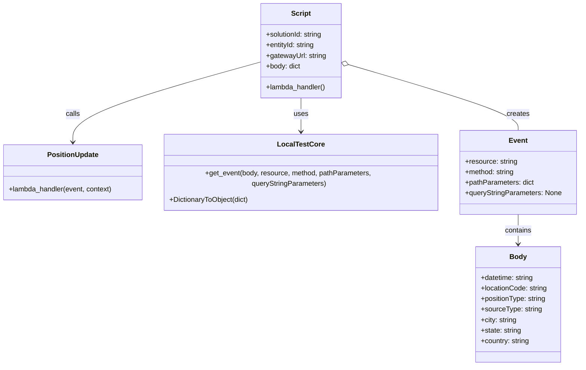

# Diagram: platform/tools/ide_local_testing/localTest/test/entity/positionUpdate/milestonePositionUpdate.py


> Auto-generated by Obscura crawlers

## Diagram 1

```mermaid
flowchart TD
    A[Script start] --> B[Import modules: positionUpdate, localTest.core]
    B --> C[Assemble body dict]
    C --> D[Create event via get_event(resource, method, pathParameters)]
    D --> G[Create context via DictionaryToObject(function_name=addMilestoneTelematicsByLambda)]
    D --> E[Call positionUpdate.lambda_handler(event, context)]
    G --> E
    E --> F[Print result]
    subgraph Modules
        P[positionUpdate module]
        L[localTest.core]
    end
    B --> P
    B --> L
    D --> L
    E --> P
```

> SVG rendering failed for this diagram.

## Diagram 2



### SVG

<svg id="container" width="1332.828125" xmlns="http://www.w3.org/2000/svg" class="classDiagram" height="836" viewBox="0 0 1332.828125 836" role="graphics-document document" aria-roledescription="class"><style>#container{font-family:"trebuchet ms",verdana,arial,sans-serif;font-size:16px;fill:#333;}@keyframes edge-animation-frame{from{stroke-dashoffset:0;}}@keyframes dash{to{stroke-dashoffset:0;}}#container .edge-animation-slow{stroke-dasharray:9,5!important;stroke-dashoffset:900;animation:dash 50s linear infinite;stroke-linecap:round;}#container .edge-animation-fast{stroke-dasharray:9,5!important;stroke-dashoffset:900;animation:dash 20s linear infinite;stroke-linecap:round;}#container .error-icon{fill:#552222;}#container .error-text{fill:#552222;stroke:#552222;}#container .edge-thickness-normal{stroke-width:1px;}#container .edge-thickness-thick{stroke-width:3.5px;}#container .edge-pattern-solid{stroke-dasharray:0;}#container .edge-thickness-invisible{stroke-width:0;fill:none;}#container .edge-pattern-dashed{stroke-dasharray:3;}#container .edge-pattern-dotted{stroke-dasharray:2;}#container .marker{fill:#333333;stroke:#333333;}#container .marker.cross{stroke:#333333;}#container svg{font-family:"trebuchet ms",verdana,arial,sans-serif;font-size:16px;}#container p{margin:0;}#container g.classGroup text{fill:#9370DB;stroke:none;font-family:"trebuchet ms",verdana,arial,sans-serif;font-size:10px;}#container g.classGroup text .title{font-weight:bolder;}#container .nodeLabel,#container .edgeLabel{color:#131300;}#container .edgeLabel .label rect{fill:#ECECFF;}#container .label text{fill:#131300;}#container .labelBkg{background:#ECECFF;}#container .edgeLabel .label span{background:#ECECFF;}#container .classTitle{font-weight:bolder;}#container .node rect,#container .node circle,#container .node ellipse,#container .node polygon,#container .node path{fill:#ECECFF;stroke:#9370DB;stroke-width:1px;}#container .divider{stroke:#9370DB;stroke-width:1;}#container g.clickable{cursor:pointer;}#container g.classGroup rect{fill:#ECECFF;stroke:#9370DB;}#container g.classGroup line{stroke:#9370DB;stroke-width:1;}#container .classLabel .box{stroke:none;stroke-width:0;fill:#ECECFF;opacity:0.5;}#container .classLabel .label{fill:#9370DB;font-size:10px;}#container .relation{stroke:#333333;stroke-width:1;fill:none;}#container .dashed-line{stroke-dasharray:3;}#container .dotted-line{stroke-dasharray:1 2;}#container #compositionStart,#container .composition{fill:#333333!important;stroke:#333333!important;stroke-width:1;}#container #compositionEnd,#container .composition{fill:#333333!important;stroke:#333333!important;stroke-width:1;}#container #dependencyStart,#container .dependency{fill:#333333!important;stroke:#333333!important;stroke-width:1;}#container #dependencyStart,#container .dependency{fill:#333333!important;stroke:#333333!important;stroke-width:1;}#container #extensionStart,#container .extension{fill:transparent!important;stroke:#333333!important;stroke-width:1;}#container #extensionEnd,#container .extension{fill:transparent!important;stroke:#333333!important;stroke-width:1;}#container #aggregationStart,#container .aggregation{fill:transparent!important;stroke:#333333!important;stroke-width:1;}#container #aggregationEnd,#container .aggregation{fill:transparent!important;stroke:#333333!important;stroke-width:1;}#container #lollipopStart,#container .lollipop{fill:#ECECFF!important;stroke:#333333!important;stroke-width:1;}#container #lollipopEnd,#container .lollipop{fill:#ECECFF!important;stroke:#333333!important;stroke-width:1;}#container .edgeTerminals{font-size:11px;line-height:initial;}#container .classTitleText{text-anchor:middle;font-size:18px;fill:#333;}#container .label-icon{display:inline-block;height:1em;overflow:visible;vertical-align:-0.125em;}#container .node .label-icon path{fill:currentColor;stroke:revert;stroke-width:revert;}#container :root{--mermaid-font-family:"trebuchet ms",verdana,arial,sans-serif;}</style><g><defs><marker id="container_class-aggregationStart" class="marker aggregation class" refX="18" refY="7" markerWidth="190" markerHeight="240" orient="auto"><path d="M 18,7 L9,13 L1,7 L9,1 Z"></path></marker></defs><defs><marker id="container_class-aggregationEnd" class="marker aggregation class" refX="1" refY="7" markerWidth="20" markerHeight="28" orient="auto"><path d="M 18,7 L9,13 L1,7 L9,1 Z"></path></marker></defs><defs><marker id="container_class-extensionStart" class="marker extension class" refX="18" refY="7" markerWidth="190" markerHeight="240" orient="auto"><path d="M 1,7 L18,13 V 1 Z"></path></marker></defs><defs><marker id="container_class-extensionEnd" class="marker extension class" refX="1" refY="7" markerWidth="20" markerHeight="28" orient="auto"><path d="M 1,1 V 13 L18,7 Z"></path></marker></defs><defs><marker id="container_class-compositionStart" class="marker composition class" refX="18" refY="7" markerWidth="190" markerHeight="240" orient="auto"><path d="M 18,7 L9,13 L1,7 L9,1 Z"></path></marker></defs><defs><marker id="container_class-compositionEnd" class="marker composition class" refX="1" refY="7" markerWidth="20" markerHeight="28" orient="auto"><path d="M 18,7 L9,13 L1,7 L9,1 Z"></path></marker></defs><defs><marker id="container_class-dependencyStart" class="marker dependency class" refX="6" refY="7" markerWidth="190" markerHeight="240" orient="auto"><path d="M 5,7 L9,13 L1,7 L9,1 Z"></path></marker></defs><defs><marker id="container_class-dependencyEnd" class="marker dependency class" refX="13" refY="7" markerWidth="20" markerHeight="28" orient="auto"><path d="M 18,7 L9,13 L14,7 L9,1 Z"></path></marker></defs><defs><marker id="container_class-lollipopStart" class="marker lollipop class" refX="13" refY="7" markerWidth="190" markerHeight="240" orient="auto"><circle stroke="black" fill="transparent" cx="7" cy="7" r="6"></circle></marker></defs><defs><marker id="container_class-lollipopEnd" class="marker lollipop class" refX="1" refY="7" markerWidth="190" markerHeight="240" orient="auto"><circle stroke="black" fill="transparent" cx="7" cy="7" r="6"></circle></marker></defs><g class="root"><g class="clusters"></g><g class="edgePaths"><path d="M602.531,141.325L530.168,161.271C457.805,181.217,313.078,221.108,240.715,251.721C168.352,282.333,168.352,303.667,168.352,314.333L168.352,325" id="id_Script_PositionUpdate_1" class="edge-thickness-normal edge-pattern-solid relation" style=";;;" data-edge="true" data-et="edge" data-id="id_Script_PositionUpdate_1" data-points="W3sieCI6NjAyLjUzMTI1LCJ5IjoxNDEuMzI1MDE0Mjk0MDk0NX0seyJ4IjoxNjguMzUxNTYyNSwieSI6MjYxfSx7IngiOjE2OC4zNTE1NjI1LCJ5IjozMzF9XQ==" marker-end="url(#container_class-dependencyEnd)"></path><path d="M694.41,224L694.41,230.167C694.41,236.333,694.41,248.667,694.41,263.5C694.41,278.333,694.41,295.667,694.41,304.333L694.41,313" id="id_Script_LocalTestCore_2" class="edge-thickness-normal edge-pattern-solid relation" style=";;;" data-edge="true" data-et="edge" data-id="id_Script_LocalTestCore_2" data-points="W3sieCI6Njk0LjQxMDE1NjI1LCJ5IjoyMjR9LHsieCI6Njk0LjQxMDE1NjI1LCJ5IjoyNjF9LHsieCI6Njk0LjQxMDE1NjI1LCJ5IjozMTl9XQ==" marker-end="url(#container_class-dependencyEnd)"></path><path d="M802.851,147.57L867.788,166.475C932.725,185.38,1062.599,223.19,1127.536,248.262C1192.473,273.333,1192.473,285.667,1192.473,291.833L1192.473,298" id="id_Script_Event_3" class="edge-thickness-normal edge-pattern-solid relation" style=";;;" data-edge="true" data-et="edge" data-id="id_Script_Event_3" data-points="W3sieCI6Nzg2LjI4OTA2MjUsInkiOjE0Mi43NDg1MzMzNzkzNDQ5Nn0seyJ4IjoxMTkyLjQ3MjY1NjI1LCJ5IjoyNjF9LHsieCI6MTE5Mi40NzI2NTYyNSwieSI6Mjk4fV0=" marker-start="url(#container_class-aggregationStart)"></path><path d="M1192.473,490L1192.473,496.167C1192.473,502.333,1192.473,514.667,1192.473,526C1192.473,537.333,1192.473,547.667,1192.473,552.833L1192.473,558" id="id_Event_Body_4" class="edge-thickness-normal edge-pattern-solid relation" style=";;;" data-edge="true" data-et="edge" data-id="id_Event_Body_4" data-points="W3sieCI6MTE5Mi40NzI2NTYyNSwieSI6NDkwfSx7IngiOjExOTIuNDcyNjU2MjUsInkiOjUyN30seyJ4IjoxMTkyLjQ3MjY1NjI1LCJ5Ijo1NjR9XQ==" marker-end="url(#container_class-dependencyEnd)"></path></g><g class="edgeLabels"><g class="edgeLabel" transform="translate(168.3515625, 261)"><g class="label" data-id="id_Script_PositionUpdate_1" transform="translate(-16.4453125, -12)"><foreignObject width="32.890625" height="24"><div xmlns="http://www.w3.org/1999/xhtml" class="labelBkg" style="display: table-cell; white-space: nowrap; line-height: 1.5; max-width: 200px; text-align: center;"><span class="edgeLabel"><p>calls</p></span></div></foreignObject></g></g><g class="edgeLabel" transform="translate(694.41015625, 261)"><g class="label" data-id="id_Script_LocalTestCore_2" transform="translate(-16.4921875, -12)"><foreignObject width="32.984375" height="24"><div xmlns="http://www.w3.org/1999/xhtml" class="labelBkg" style="display: table-cell; white-space: nowrap; line-height: 1.5; max-width: 200px; text-align: center;"><span class="edgeLabel"><p>uses</p></span></div></foreignObject></g></g><g class="edgeLabel" transform="translate(1192.47265625, 261)"><g class="label" data-id="id_Script_Event_3" transform="translate(-26.171875, -12)"><foreignObject width="52.34375" height="24"><div xmlns="http://www.w3.org/1999/xhtml" class="labelBkg" style="display: table-cell; white-space: nowrap; line-height: 1.5; max-width: 200px; text-align: center;"><span class="edgeLabel"><p>creates</p></span></div></foreignObject></g></g><g class="edgeLabel" transform="translate(1192.47265625, 527)"><g class="label" data-id="id_Event_Body_4" transform="translate(-30.890625, -12)"><foreignObject width="61.78125" height="24"><div xmlns="http://www.w3.org/1999/xhtml" class="labelBkg" style="display: table-cell; white-space: nowrap; line-height: 1.5; max-width: 200px; text-align: center;"><span class="edgeLabel"><p>contains</p></span></div></foreignObject></g></g></g><g class="nodes"><g class="node default" id="classId-Script-0" transform="translate(694.41015625, 116)"><g class="basic label-container"><path d="M-91.87890625 -108 L91.87890625 -108 L91.87890625 108 L-91.87890625 108" stroke="none" stroke-width="0" fill="#ECECFF" style=""></path><path d="M-91.87890625 -108 C-44.11849113585368 -108, 3.6419239782926383 -108, 91.87890625 -108 M-91.87890625 -108 C-50.47341404337806 -108, -9.067921836756113 -108, 91.87890625 -108 M91.87890625 -108 C91.87890625 -61.86382014758509, 91.87890625 -15.727640295170175, 91.87890625 108 M91.87890625 -108 C91.87890625 -53.96568714140909, 91.87890625 0.06862571718181698, 91.87890625 108 M91.87890625 108 C33.17849502421529 108, -25.521916201569425 108, -91.87890625 108 M91.87890625 108 C43.93130565983007 108, -4.016294930339853 108, -91.87890625 108 M-91.87890625 108 C-91.87890625 32.905974391591414, -91.87890625 -42.18805121681717, -91.87890625 -108 M-91.87890625 108 C-91.87890625 24.08247802848902, -91.87890625 -59.83504394302196, -91.87890625 -108" stroke="#9370DB" stroke-width="1.3" fill="none" stroke-dasharray="0 0" style=""></path></g><g class="annotation-group text" transform="translate(0, -84)"></g><g class="label-group text" transform="translate(-21.7421875, -84)"><g class="label" style="font-weight: bolder" transform="translate(0,-12)"><foreignObject width="43.484375" height="24"><div xmlns="http://www.w3.org/1999/xhtml" style="display: table-cell; white-space: nowrap; line-height: 1.5; max-width: 93px; text-align: center;"><span class="nodeLabel markdown-node-label" style=""><p>Script</p></span></div></foreignObject></g></g><g class="members-group text" transform="translate(-79.87890625, -36)"><g class="label" style="" transform="translate(0,-12)"><foreignObject width="131.8125" height="24"><div xmlns="http://www.w3.org/1999/xhtml" style="display: table-cell; white-space: nowrap; line-height: 1.5; max-width: 190px; text-align: center;"><span class="nodeLabel markdown-node-label" style=""><p>+solutionId: string</p></span></div></foreignObject></g><g class="label" style="" transform="translate(0,12)"><foreignObject width="113.9375" height="24"><div xmlns="http://www.w3.org/1999/xhtml" style="display: table-cell; white-space: nowrap; line-height: 1.5; max-width: 172px; text-align: center;"><span class="nodeLabel markdown-node-label" style=""><p>+entityId: string</p></span></div></foreignObject></g><g class="label" style="" transform="translate(0,36)"><foreignObject width="137.90625" height="24"><div xmlns="http://www.w3.org/1999/xhtml" style="display: table-cell; white-space: nowrap; line-height: 1.5; max-width: 196px; text-align: center;"><span class="nodeLabel markdown-node-label" style=""><p>+gatewayUrl: string</p></span></div></foreignObject></g><g class="label" style="" transform="translate(0,60)"><foreignObject width="79.921875" height="24"><div xmlns="http://www.w3.org/1999/xhtml" style="display: table-cell; white-space: nowrap; line-height: 1.5; max-width: 138px; text-align: center;"><span class="nodeLabel markdown-node-label" style=""><p>+body: dict</p></span></div></foreignObject></g></g><g class="methods-group text" transform="translate(-79.87890625, 84)"><g class="label" style="" transform="translate(0,-12)"><foreignObject width="138.015625" height="24"><div xmlns="http://www.w3.org/1999/xhtml" style="display: table-cell; white-space: nowrap; line-height: 1.5; max-width: 195px; text-align: center;"><span class="nodeLabel markdown-node-label" style=""><p>+lambda_handler()</p></span></div></foreignObject></g></g><g class="divider" style=""><path d="M-91.87890625 -60 C-41.361168905106325 -60, 9.15656843978735 -60, 91.87890625 -60 M-91.87890625 -60 C-21.62265284680015 -60, 48.6336005563997 -60, 91.87890625 -60" stroke="#9370DB" stroke-width="1.3" fill="none" stroke-dasharray="0 0" style=""></path></g><g class="divider" style=""><path d="M-91.87890625 60 C-47.5427313301781 60, -3.2065564103561996 60, 91.87890625 60 M-91.87890625 60 C-26.373662647047666 60, 39.13158095590467 60, 91.87890625 60" stroke="#9370DB" stroke-width="1.3" fill="none" stroke-dasharray="0 0" style=""></path></g></g><g class="node default" id="classId-PositionUpdate-1" transform="translate(168.3515625, 394)"><g class="basic label-container"><path d="M-160.3515625 -63 L160.3515625 -63 L160.3515625 63 L-160.3515625 63" stroke="none" stroke-width="0" fill="#ECECFF" style=""></path><path d="M-160.3515625 -63 C-45.6377790786112 -63, 69.0760043427776 -63, 160.3515625 -63 M-160.3515625 -63 C-64.2639383970972 -63, 31.823685705805588 -63, 160.3515625 -63 M160.3515625 -63 C160.3515625 -29.14114585404898, 160.3515625 4.717708291902042, 160.3515625 63 M160.3515625 -63 C160.3515625 -28.865334102122404, 160.3515625 5.269331795755193, 160.3515625 63 M160.3515625 63 C65.01877799160908 63, -30.31400651678183 63, -160.3515625 63 M160.3515625 63 C56.86599280363404 63, -46.619576892731914 63, -160.3515625 63 M-160.3515625 63 C-160.3515625 36.315661509145286, -160.3515625 9.631323018290566, -160.3515625 -63 M-160.3515625 63 C-160.3515625 18.57315235639004, -160.3515625 -25.85369528721992, -160.3515625 -63" stroke="#9370DB" stroke-width="1.3" fill="none" stroke-dasharray="0 0" style=""></path></g><g class="annotation-group text" transform="translate(0, -39)"></g><g class="label-group text" transform="translate(-56.515625, -39)"><g class="label" style="font-weight: bolder" transform="translate(0,-12)"><foreignObject width="113.03125" height="24"><div xmlns="http://www.w3.org/1999/xhtml" style="display: table-cell; white-space: nowrap; line-height: 1.5; max-width: 162px; text-align: center;"><span class="nodeLabel markdown-node-label" style=""><p>PositionUpdate</p></span></div></foreignObject></g></g><g class="members-group text" transform="translate(-148.3515625, 9)"></g><g class="methods-group text" transform="translate(-148.3515625, 39)"><g class="label" style="" transform="translate(0,-12)"><foreignObject width="240.1875" height="24"><div xmlns="http://www.w3.org/1999/xhtml" style="display: table-cell; white-space: nowrap; line-height: 1.5; max-width: 298px; text-align: center;"><span class="nodeLabel markdown-node-label" style=""><p>+lambda_handler(event, context)</p></span></div></foreignObject></g></g><g class="divider" style=""><path d="M-160.3515625 -15 C-80.39178457734438 -15, -0.4320066546887631 -15, 160.3515625 -15 M-160.3515625 -15 C-71.57985564190248 -15, 17.191851216195033 -15, 160.3515625 -15" stroke="#9370DB" stroke-width="1.3" fill="none" stroke-dasharray="0 0" style=""></path></g><g class="divider" style=""><path d="M-160.3515625 9 C-37.0975729865942 9, 86.1564165268116 9, 160.3515625 9 M-160.3515625 9 C-93.7492611070172 9, -27.14695971403441 9, 160.3515625 9" stroke="#9370DB" stroke-width="1.3" fill="none" stroke-dasharray="0 0" style=""></path></g></g><g class="node default" id="classId-LocalTestCore-2" transform="translate(694.41015625, 394)"><g class="basic label-container"><path d="M-315.70703125 -75 L315.70703125 -75 L315.70703125 75 L-315.70703125 75" stroke="none" stroke-width="0" fill="#ECECFF" style=""></path><path d="M-315.70703125 -75 C-77.77061361365796 -75, 160.16580402268409 -75, 315.70703125 -75 M-315.70703125 -75 C-168.146975316062 -75, -20.586919382123995 -75, 315.70703125 -75 M315.70703125 -75 C315.70703125 -25.382944074174837, 315.70703125 24.234111851650326, 315.70703125 75 M315.70703125 -75 C315.70703125 -26.707388639094567, 315.70703125 21.585222721810865, 315.70703125 75 M315.70703125 75 C170.49664519443277 75, 25.286259138865546 75, -315.70703125 75 M315.70703125 75 C70.84177656977698 75, -174.02347811044604 75, -315.70703125 75 M-315.70703125 75 C-315.70703125 35.55853762322498, -315.70703125 -3.882924753550043, -315.70703125 -75 M-315.70703125 75 C-315.70703125 17.48632007674712, -315.70703125 -40.02735984650576, -315.70703125 -75" stroke="#9370DB" stroke-width="1.3" fill="none" stroke-dasharray="0 0" style=""></path></g><g class="annotation-group text" transform="translate(0, -51)"></g><g class="label-group text" transform="translate(-50.7578125, -51)"><g class="label" style="font-weight: bolder" transform="translate(0,-12)"><foreignObject width="101.515625" height="24"><div xmlns="http://www.w3.org/1999/xhtml" style="display: table-cell; white-space: nowrap; line-height: 1.5; max-width: 149px; text-align: center;"><span class="nodeLabel markdown-node-label" style=""><p>LocalTestCore</p></span></div></foreignObject></g></g><g class="members-group text" transform="translate(-303.70703125, -3)"></g><g class="methods-group text" transform="translate(-303.70703125, 27)"><g class="label" style="" transform="translate(0,-12)"><foreignObject width="556.65625" height="24"><div xmlns="http://www.w3.org/1999/xhtml" style="display: table-cell; white-space: nowrap; line-height: 1.5; max-width: 614px; text-align: center;"><span class="nodeLabel markdown-node-label" style=""><p>+get_event(body, resource, method, pathParameters, queryStringParameters)</p></span></div></foreignObject></g><g class="label" style="" transform="translate(0,12)"><foreignObject width="184.03125" height="24"><div xmlns="http://www.w3.org/1999/xhtml" style="display: table-cell; white-space: nowrap; line-height: 1.5; max-width: 241px; text-align: center;"><span class="nodeLabel markdown-node-label" style=""><p>+DictionaryToObject(dict)</p></span></div></foreignObject></g></g><g class="divider" style=""><path d="M-315.70703125 -27 C-153.6940565262109 -27, 8.318918197578228 -27, 315.70703125 -27 M-315.70703125 -27 C-77.85798583816009 -27, 159.99105957367982 -27, 315.70703125 -27" stroke="#9370DB" stroke-width="1.3" fill="none" stroke-dasharray="0 0" style=""></path></g><g class="divider" style=""><path d="M-315.70703125 -3 C-167.99027978713602 -3, -20.273528324272036 -3, 315.70703125 -3 M-315.70703125 -3 C-94.08959393223196 -3, 127.52784338553607 -3, 315.70703125 -3" stroke="#9370DB" stroke-width="1.3" fill="none" stroke-dasharray="0 0" style=""></path></g></g><g class="node default" id="classId-Event-3" transform="translate(1192.47265625, 394)"><g class="basic label-container"><path d="M-132.35546875 -96 L132.35546875 -96 L132.35546875 96 L-132.35546875 96" stroke="none" stroke-width="0" fill="#ECECFF" style=""></path><path d="M-132.35546875 -96 C-54.52032312900069 -96, 23.314822491998626 -96, 132.35546875 -96 M-132.35546875 -96 C-65.1258009202651 -96, 2.1038669094697866 -96, 132.35546875 -96 M132.35546875 -96 C132.35546875 -21.973500057801445, 132.35546875 52.05299988439711, 132.35546875 96 M132.35546875 -96 C132.35546875 -50.52743601559903, 132.35546875 -5.054872031198059, 132.35546875 96 M132.35546875 96 C57.301297309446596 96, -17.752874131106807 96, -132.35546875 96 M132.35546875 96 C40.57998923462364 96, -51.19549028075272 96, -132.35546875 96 M-132.35546875 96 C-132.35546875 20.222782675554456, -132.35546875 -55.55443464889109, -132.35546875 -96 M-132.35546875 96 C-132.35546875 48.74369052377633, -132.35546875 1.4873810475526597, -132.35546875 -96" stroke="#9370DB" stroke-width="1.3" fill="none" stroke-dasharray="0 0" style=""></path></g><g class="annotation-group text" transform="translate(0, -72)"></g><g class="label-group text" transform="translate(-20.2109375, -72)"><g class="label" style="font-weight: bolder" transform="translate(0,-12)"><foreignObject width="40.421875" height="24"><div xmlns="http://www.w3.org/1999/xhtml" style="display: table-cell; white-space: nowrap; line-height: 1.5; max-width: 90px; text-align: center;"><span class="nodeLabel markdown-node-label" style=""><p>Event</p></span></div></foreignObject></g></g><g class="members-group text" transform="translate(-120.35546875, -24)"><g class="label" style="" transform="translate(0,-12)"><foreignObject width="119.984375" height="24"><div xmlns="http://www.w3.org/1999/xhtml" style="display: table-cell; white-space: nowrap; line-height: 1.5; max-width: 178px; text-align: center;"><span class="nodeLabel markdown-node-label" style=""><p>+resource: string</p></span></div></foreignObject></g><g class="label" style="" transform="translate(0,12)"><foreignObject width="114.203125" height="24"><div xmlns="http://www.w3.org/1999/xhtml" style="display: table-cell; white-space: nowrap; line-height: 1.5; max-width: 172px; text-align: center;"><span class="nodeLabel markdown-node-label" style=""><p>+method: string</p></span></div></foreignObject></g><g class="label" style="" transform="translate(0,36)"><foreignObject width="158.3125" height="24"><div xmlns="http://www.w3.org/1999/xhtml" style="display: table-cell; white-space: nowrap; line-height: 1.5; max-width: 216px; text-align: center;"><span class="nodeLabel markdown-node-label" style=""><p>+pathParameters: dict</p></span></div></foreignObject></g><g class="label" style="" transform="translate(0,60)"><foreignObject width="220.5" height="24"><div xmlns="http://www.w3.org/1999/xhtml" style="display: table-cell; white-space: nowrap; line-height: 1.5; max-width: 278px; text-align: center;"><span class="nodeLabel markdown-node-label" style=""><p>+queryStringParameters: None</p></span></div></foreignObject></g></g><g class="methods-group text" transform="translate(-120.35546875, 96)"></g><g class="divider" style=""><path d="M-132.35546875 -48 C-70.4077586218848 -48, -8.460048493769577 -48, 132.35546875 -48 M-132.35546875 -48 C-71.11266102271114 -48, -9.869853295422288 -48, 132.35546875 -48" stroke="#9370DB" stroke-width="1.3" fill="none" stroke-dasharray="0 0" style=""></path></g><g class="divider" style=""><path d="M-132.35546875 72 C-63.13096726937103 72, 6.093534211257946 72, 132.35546875 72 M-132.35546875 72 C-73.005387011724 72, -13.655305273447993 72, 132.35546875 72" stroke="#9370DB" stroke-width="1.3" fill="none" stroke-dasharray="0 0" style=""></path></g></g><g class="node default" id="classId-Body-4" transform="translate(1192.47265625, 696)"><g class="basic label-container"><path d="M-97.83984375 -132 L97.83984375 -132 L97.83984375 132 L-97.83984375 132" stroke="none" stroke-width="0" fill="#ECECFF" style=""></path><path d="M-97.83984375 -132 C-34.782795691324914 -132, 28.274252367350172 -132, 97.83984375 -132 M-97.83984375 -132 C-23.0591081148566 -132, 51.7216275202868 -132, 97.83984375 -132 M97.83984375 -132 C97.83984375 -64.78528168042126, 97.83984375 2.4294366391574727, 97.83984375 132 M97.83984375 -132 C97.83984375 -77.59095026936012, 97.83984375 -23.181900538720242, 97.83984375 132 M97.83984375 132 C51.067745030997784 132, 4.295646311995569 132, -97.83984375 132 M97.83984375 132 C44.07787813509876 132, -9.684087479802486 132, -97.83984375 132 M-97.83984375 132 C-97.83984375 79.09321217433188, -97.83984375 26.186424348663763, -97.83984375 -132 M-97.83984375 132 C-97.83984375 59.70979177432049, -97.83984375 -12.580416451359014, -97.83984375 -132" stroke="#9370DB" stroke-width="1.3" fill="none" stroke-dasharray="0 0" style=""></path></g><g class="annotation-group text" transform="translate(0, -108)"></g><g class="label-group text" transform="translate(-18.5546875, -108)"><g class="label" style="font-weight: bolder" transform="translate(0,-12)"><foreignObject width="37.109375" height="24"><div xmlns="http://www.w3.org/1999/xhtml" style="display: table-cell; white-space: nowrap; line-height: 1.5; max-width: 87px; text-align: center;"><span class="nodeLabel markdown-node-label" style=""><p>Body</p></span></div></foreignObject></g></g><g class="members-group text" transform="translate(-85.83984375, -60)"><g class="label" style="" transform="translate(0,-12)"><foreignObject width="122.953125" height="24"><div xmlns="http://www.w3.org/1999/xhtml" style="display: table-cell; white-space: nowrap; line-height: 1.5; max-width: 181px; text-align: center;"><span class="nodeLabel markdown-node-label" style=""><p>+datetime: string</p></span></div></foreignObject></g><g class="label" style="" transform="translate(0,12)"><foreignObject width="153.125" height="24"><div xmlns="http://www.w3.org/1999/xhtml" style="display: table-cell; white-space: nowrap; line-height: 1.5; max-width: 211px; text-align: center;"><span class="nodeLabel markdown-node-label" style=""><p>+locationCode: string</p></span></div></foreignObject></g><g class="label" style="" transform="translate(0,36)"><foreignObject width="151.265625" height="24"><div xmlns="http://www.w3.org/1999/xhtml" style="display: table-cell; white-space: nowrap; line-height: 1.5; max-width: 209px; text-align: center;"><span class="nodeLabel markdown-node-label" style=""><p>+positionType: string</p></span></div></foreignObject></g><g class="label" style="" transform="translate(0,60)"><foreignObject width="139.296875" height="24"><div xmlns="http://www.w3.org/1999/xhtml" style="display: table-cell; white-space: nowrap; line-height: 1.5; max-width: 197px; text-align: center;"><span class="nodeLabel markdown-node-label" style=""><p>+sourceType: string</p></span></div></foreignObject></g><g class="label" style="" transform="translate(0,84)"><foreignObject width="83.5" height="24"><div xmlns="http://www.w3.org/1999/xhtml" style="display: table-cell; white-space: nowrap; line-height: 1.5; max-width: 142px; text-align: center;"><span class="nodeLabel markdown-node-label" style=""><p>+city: string</p></span></div></foreignObject></g><g class="label" style="" transform="translate(0,108)"><foreignObject width="93.796875" height="24"><div xmlns="http://www.w3.org/1999/xhtml" style="display: table-cell; white-space: nowrap; line-height: 1.5; max-width: 152px; text-align: center;"><span class="nodeLabel markdown-node-label" style=""><p>+state: string</p></span></div></foreignObject></g><g class="label" style="" transform="translate(0,132)"><foreignObject width="112.953125" height="24"><div xmlns="http://www.w3.org/1999/xhtml" style="display: table-cell; white-space: nowrap; line-height: 1.5; max-width: 171px; text-align: center;"><span class="nodeLabel markdown-node-label" style=""><p>+country: string</p></span></div></foreignObject></g></g><g class="methods-group text" transform="translate(-85.83984375, 132)"></g><g class="divider" style=""><path d="M-97.83984375 -84 C-28.476633182340265 -84, 40.88657738531947 -84, 97.83984375 -84 M-97.83984375 -84 C-37.435698466117955 -84, 22.96844681776409 -84, 97.83984375 -84" stroke="#9370DB" stroke-width="1.3" fill="none" stroke-dasharray="0 0" style=""></path></g><g class="divider" style=""><path d="M-97.83984375 108 C-57.03071105654422 108, -16.22157836308844 108, 97.83984375 108 M-97.83984375 108 C-35.54764066428373 108, 26.744562421432533 108, 97.83984375 108" stroke="#9370DB" stroke-width="1.3" fill="none" stroke-dasharray="0 0" style=""></path></g></g></g></g></g></svg>
