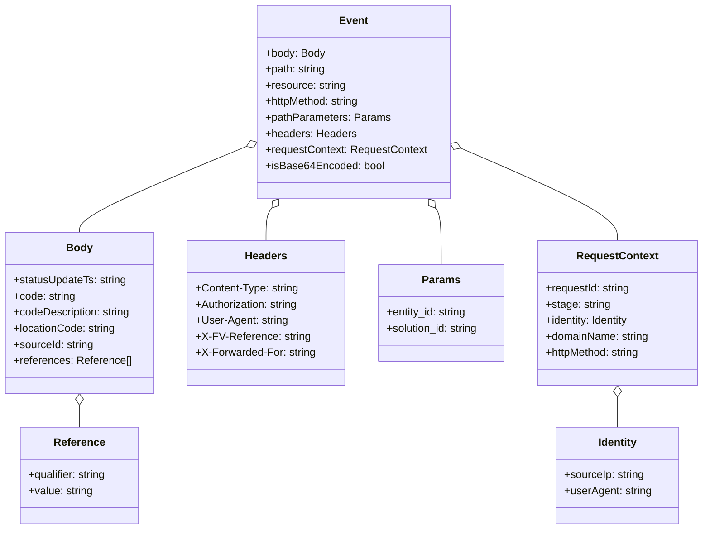
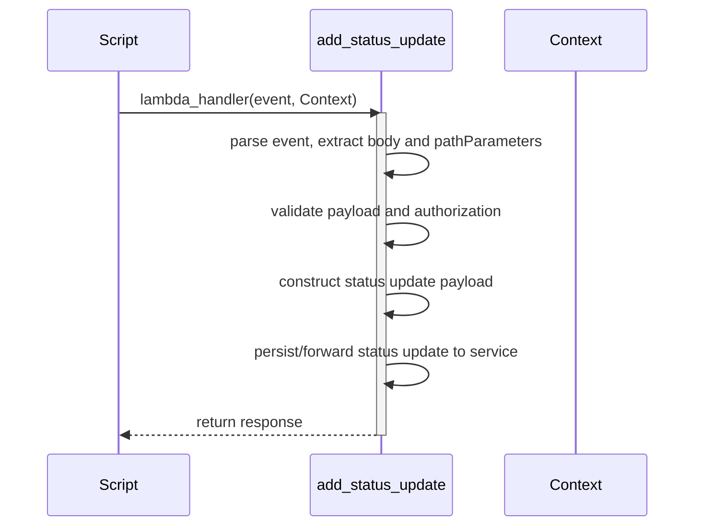
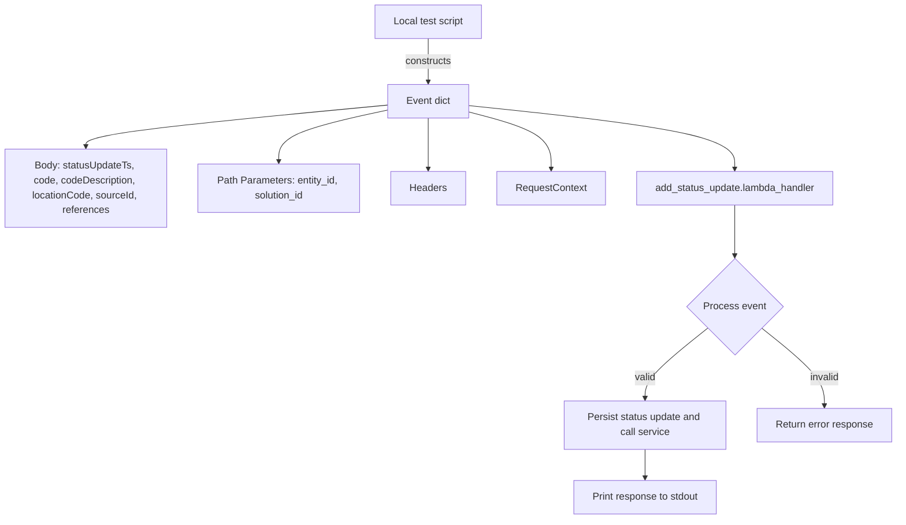

# Diagram: platform/tools/ide_local_testing/localTest/test/entity/statusUpdate/addStatusUpdateViaLambda.py

> Auto-generated by Obscura crawlers

## Diagram 1

### SVG

<svg id="container" width="1044.0625" xmlns="http://www.w3.org/2000/svg" class="classDiagram" height="788" viewBox="0 0 1044.0625 788" role="graphics-document document" aria-roledescription="class"><g><defs><marker id="container_class-aggregationStart" class="marker aggregation class" refX="18" refY="7" markerWidth="190" markerHeight="240" orient="auto"><path d="M 18,7 L9,13 L1,7 L9,1 Z"></path></marker></defs><defs><marker id="container_class-aggregationEnd" class="marker aggregation class" refX="1" refY="7" markerWidth="20" markerHeight="28" orient="auto"><path d="M 18,7 L9,13 L1,7 L9,1 Z"></path></marker></defs><defs><marker id="container_class-extensionStart" class="marker extension class" refX="18" refY="7" markerWidth="190" markerHeight="240" orient="auto"><path d="M 1,7 L18,13 V 1 Z"></path></marker></defs><defs><marker id="container_class-extensionEnd" class="marker extension class" refX="1" refY="7" markerWidth="20" markerHeight="28" orient="auto"><path d="M 1,1 V 13 L18,7 Z"></path></marker></defs><defs><marker id="container_class-compositionStart" class="marker composition class" refX="18" refY="7" markerWidth="190" markerHeight="240" orient="auto"><path d="M 18,7 L9,13 L1,7 L9,1 Z"></path></marker></defs><defs><marker id="container_class-compositionEnd" class="marker composition class" refX="1" refY="7" markerWidth="20" markerHeight="28" orient="auto"><path d="M 18,7 L9,13 L1,7 L9,1 Z"></path></marker></defs><defs><marker id="container_class-dependencyStart" class="marker dependency class" refX="6" refY="7" markerWidth="190" markerHeight="240" orient="auto"><path d="M 5,7 L9,13 L1,7 L9,1 Z"></path></marker></defs><defs><marker id="container_class-dependencyEnd" class="marker dependency class" refX="13" refY="7" markerWidth="20" markerHeight="28" orient="auto"><path d="M 18,7 L9,13 L14,7 L9,1 Z"></path></marker></defs><defs><marker id="container_class-lollipopStart" class="marker lollipop class" refX="13" refY="7" markerWidth="190" markerHeight="240" orient="auto"><circle stroke="black" fill="transparent" cx="7" cy="7" r="6"></circle></marker></defs><defs><marker id="container_class-lollipopEnd" class="marker lollipop class" refX="1" refY="7" markerWidth="190" markerHeight="240" orient="auto"><circle stroke="black" fill="transparent" cx="7" cy="7" r="6"></circle></marker></defs><g class="root"><g class="clusters"></g><g class="edgePaths"><path d="M364.783,217.911L323.533,235.092C282.284,252.274,199.784,286.637,158.535,307.985C117.285,329.333,117.285,337.667,117.285,341.833L117.285,346" id="id_Event_Body_1" class="edge-thickness-normal edge-pattern-solid relation" style=";;;" data-edge="true" data-et="edge" data-id="id_Event_Body_1" data-points="W3sieCI6MzgwLjcwNzAzMTI1LCJ5IjoyMTEuMjc4MjkyODQ5NjQ3MTZ9LHsieCI6MTE3LjI4NTE1NjI1LCJ5IjozMjF9LHsieCI6MTE3LjI4NTE1NjI1LCJ5IjozNDZ9XQ==" marker-start="url(#container_class-aggregationStart)"></path><path d="M117.285,603.25L117.285,604.542C117.285,605.833,117.285,608.417,117.285,613.875C117.285,619.333,117.285,627.667,117.285,631.833L117.285,636" id="id_Body_Reference_2" class="edge-thickness-normal edge-pattern-solid relation" style=";;;" data-edge="true" data-et="edge" data-id="id_Body_Reference_2" data-points="W3sieCI6MTE3LjI4NTE1NjI1LCJ5Ijo1ODZ9LHsieCI6MTE3LjI4NTE1NjI1LCJ5Ijo2MTF9LHsieCI6MTE3LjI4NTE1NjI1LCJ5Ijo2MzZ9XQ==" marker-start="url(#container_class-aggregationStart)"></path><path d="M401.204,309.65L399.742,311.541C398.281,313.433,395.357,317.217,393.895,325.275C392.434,333.333,392.434,345.667,392.434,351.833L392.434,358" id="id_Event_Headers_3" class="edge-thickness-normal edge-pattern-solid relation" style=";;;" data-edge="true" data-et="edge" data-id="id_Event_Headers_3" data-points="W3sieCI6NDExLjc1MTYxNzk3MzM3MjgsInkiOjI5Nn0seyJ4IjozOTIuNDMzNTkzNzUsInkiOjMyMX0seyJ4IjozOTIuNDMzNTkzNzUsInkiOjM1OH1d" marker-start="url(#container_class-aggregationStart)"></path><path d="M644.843,309.65L646.304,311.541C647.766,313.433,650.69,317.217,652.152,331.275C653.613,345.333,653.613,369.667,653.613,381.833L653.613,394" id="id_Event_Params_4" class="edge-thickness-normal edge-pattern-solid relation" style=";;;" data-edge="true" data-et="edge" data-id="id_Event_Params_4" data-points="W3sieCI6NjM0LjI5NTI1NzAyNjYyNzMsInkiOjI5Nn0seyJ4Ijo2NTMuNjEzMjgxMjUsInkiOjMyMX0seyJ4Ijo2NTMuNjEzMjgxMjUsInkiOjM5NH1d" marker-start="url(#container_class-aggregationStart)"></path><path d="M681.196,219.764L720.579,236.637C759.963,253.51,838.729,287.255,878.113,310.294C917.496,333.333,917.496,345.667,917.496,351.833L917.496,358" id="id_Event_RequestContext_5" class="edge-thickness-normal edge-pattern-solid relation" style=";;;" data-edge="true" data-et="edge" data-id="id_Event_RequestContext_5" data-points="W3sieCI6NjY1LjMzOTg0Mzc1LCJ5IjoyMTIuOTcxMjAzNjQ0MTA1NTd9LHsieCI6OTE3LjQ5NjA5Mzc1LCJ5IjozMjF9LHsieCI6OTE3LjQ5NjA5Mzc1LCJ5IjozNTh9XQ==" marker-start="url(#container_class-aggregationStart)"></path><path d="M917.496,591.25L917.496,594.542C917.496,597.833,917.496,604.417,917.496,611.875C917.496,619.333,917.496,627.667,917.496,631.833L917.496,636" id="id_RequestContext_Identity_6" class="edge-thickness-normal edge-pattern-solid relation" style=";;;" data-edge="true" data-et="edge" data-id="id_RequestContext_Identity_6" data-points="W3sieCI6OTE3LjQ5NjA5Mzc1LCJ5Ijo1NzR9LHsieCI6OTE3LjQ5NjA5Mzc1LCJ5Ijo2MTF9LHsieCI6OTE3LjQ5NjA5Mzc1LCJ5Ijo2MzZ9XQ==" marker-start="url(#container_class-aggregationStart)"></path></g><g class="edgeLabels"><g class="edgeLabel"><g class="label" data-id="id_Event_Body_1" transform="translate(0, 0)"><foreignObject width="0" height="0">

</foreignObject></g></g><g class="edgeLabel"><g class="label" data-id="id_Body_Reference_2" transform="translate(0, 0)"><foreignObject width="0" height="0">

</foreignObject></g></g><g class="edgeLabel"><g class="label" data-id="id_Event_Headers_3" transform="translate(0, 0)"><foreignObject width="0" height="0">

</foreignObject></g></g><g class="edgeLabel"><g class="label" data-id="id_Event_Params_4" transform="translate(0, 0)"><foreignObject width="0" height="0">

</foreignObject></g></g><g class="edgeLabel"><g class="label" data-id="id_Event_RequestContext_5" transform="translate(0, 0)"><foreignObject width="0" height="0">

</foreignObject></g></g><g class="edgeLabel"><g class="label" data-id="id_RequestContext_Identity_6" transform="translate(0, 0)"><foreignObject width="0" height="0">

</foreignObject></g></g></g><g class="nodes"><g class="node default" id="classId-Event-0" transform="translate(523.0234375, 152)"><g class="basic label-container"><path d="M-142.31640625 -144 L142.31640625 -144 L142.31640625 144 L-142.31640625 144" stroke="none" stroke-width="0" fill="#ECECFF" style=""></path><path d="M-142.31640625 -144 C-34.37728919831339 -144, 73.56182785337322 -144, 142.31640625 -144 M-142.31640625 -144 C-73.34378045865482 -144, -4.371154667309639 -144, 142.31640625 -144 M142.31640625 -144 C142.31640625 -50.6383305531057, 142.31640625 42.72333889378859, 142.31640625 144 M142.31640625 -144 C142.31640625 -36.51293076647923, 142.31640625 70.97413846704154, 142.31640625 144 M142.31640625 144 C33.132143156190295 144, -76.05211993761941 144, -142.31640625 144 M142.31640625 144 C54.2744984997244 144, -33.7674092505512 144, -142.31640625 144 M-142.31640625 144 C-142.31640625 61.68701519340942, -142.31640625 -20.625969613181155, -142.31640625 -144 M-142.31640625 144 C-142.31640625 75.40873864124757, -142.31640625 6.817477282495133, -142.31640625 -144" stroke="#9370DB" stroke-width="1.3" fill="none" stroke-dasharray="0 0" style=""></path></g><g class="annotation-group text" transform="translate(0, -120)"></g><g class="label-group text" transform="translate(-20.2109375, -120)"><g class="label" style="font-weight: bolder" transform="translate(0,-12)"><foreignObject width="40.421875" height="24">

Event

</foreignObject></g></g><g class="members-group text" transform="translate(-130.31640625, -72)"><g class="label" style="" transform="translate(0,-12)"><foreignObject width="88.9375" height="24">

+body: Body

</foreignObject></g><g class="label" style="" transform="translate(0,12)"><foreignObject width="90.90625" height="24">

+path: string

</foreignObject></g><g class="label" style="" transform="translate(0,36)"><foreignObject width="119.984375" height="24">

+resource: string

</foreignObject></g><g class="label" style="" transform="translate(0,60)"><foreignObject width="143.375" height="24">

+httpMethod: string

</foreignObject></g><g class="label" style="" transform="translate(0,84)"><foreignObject width="183.4375" height="24">

+pathParameters: Params

</foreignObject></g><g class="label" style="" transform="translate(0,108)"><foreignObject width="134.25" height="24">

+headers: Headers

</foreignObject></g><g class="label" style="" transform="translate(0,132)"><foreignObject width="240.421875" height="24">

+requestContext: RequestContext

</foreignObject></g><g class="label" style="" transform="translate(0,156)"><foreignObject width="174.75" height="24">

+isBase64Encoded: bool

</foreignObject></g></g><g class="methods-group text" transform="translate(-130.31640625, 144)"></g><g class="divider" style=""><path d="M-142.31640625 -96 C-45.39601749406536 -96, 51.52437126186928 -96, 142.31640625 -96 M-142.31640625 -96 C-72.54515344864441 -96, -2.7739006472888263 -96, 142.31640625 -96" stroke="#9370DB" stroke-width="1.3" fill="none" stroke-dasharray="0 0" style=""></path></g><g class="divider" style=""><path d="M-142.31640625 120 C-69.81924975824494 120, 2.6779067335101274 120, 142.31640625 120 M-142.31640625 120 C-54.49377164657756 120, 33.32886295684489 120, 142.31640625 120" stroke="#9370DB" stroke-width="1.3" fill="none" stroke-dasharray="0 0" style=""></path></g></g><g class="node default" id="classId-Body-1" transform="translate(117.28515625, 466)"><g class="basic label-container"><path d="M-109.28515625 -120 L109.28515625 -120 L109.28515625 120 L-109.28515625 120" stroke="none" stroke-width="0" fill="#ECECFF" style=""></path><path d="M-109.28515625 -120 C-30.736949689610782 -120, 47.811256870778436 -120, 109.28515625 -120 M-109.28515625 -120 C-48.91619135354087 -120, 11.452773542918266 -120, 109.28515625 -120 M109.28515625 -120 C109.28515625 -52.532936435718625, 109.28515625 14.93412712856275, 109.28515625 120 M109.28515625 -120 C109.28515625 -59.74100384861256, 109.28515625 0.5179923027748856, 109.28515625 120 M109.28515625 120 C23.17383994127394 120, -62.93747636745212 120, -109.28515625 120 M109.28515625 120 C43.61131898828421 120, -22.06251827343158 120, -109.28515625 120 M-109.28515625 120 C-109.28515625 60.431800409931, -109.28515625 0.8636008198620004, -109.28515625 -120 M-109.28515625 120 C-109.28515625 44.04001041479398, -109.28515625 -31.919979170412034, -109.28515625 -120" stroke="#9370DB" stroke-width="1.3" fill="none" stroke-dasharray="0 0" style=""></path></g><g class="annotation-group text" transform="translate(0, -96)"></g><g class="label-group text" transform="translate(-18.5546875, -96)"><g class="label" style="font-weight: bolder" transform="translate(0,-12)"><foreignObject width="37.109375" height="24">

Body

</foreignObject></g></g><g class="members-group text" transform="translate(-97.28515625, -48)"><g class="label" style="" transform="translate(0,-12)"><foreignObject width="169.671875" height="24">

+statusUpdateTs: string

</foreignObject></g><g class="label" style="" transform="translate(0,12)"><foreignObject width="92.65625" height="24">

+code: string

</foreignObject></g><g class="label" style="" transform="translate(0,36)"><foreignObject width="176.015625" height="24">

+codeDescription: string

</foreignObject></g><g class="label" style="" transform="translate(0,60)"><foreignObject width="153.125" height="24">

+locationCode: string

</foreignObject></g><g class="label" style="" transform="translate(0,84)"><foreignObject width="119.859375" height="24">

+sourceId: string

</foreignObject></g><g class="label" style="" transform="translate(0,108)"><foreignObject width="173.9375" height="24">

+references: Reference[]

</foreignObject></g></g><g class="methods-group text" transform="translate(-97.28515625, 120)"></g><g class="divider" style=""><path d="M-109.28515625 -72 C-39.78250046605629 -72, 29.720155317887418 -72, 109.28515625 -72 M-109.28515625 -72 C-28.381899117767077 -72, 52.52135801446585 -72, 109.28515625 -72" stroke="#9370DB" stroke-width="1.3" fill="none" stroke-dasharray="0 0" style=""></path></g><g class="divider" style=""><path d="M-109.28515625 96 C-48.75560019912273 96, 11.773955851754536 96, 109.28515625 96 M-109.28515625 96 C-45.20733097801239 96, 18.870494293975213 96, 109.28515625 96" stroke="#9370DB" stroke-width="1.3" fill="none" stroke-dasharray="0 0" style=""></path></g></g><g class="node default" id="classId-Reference-2" transform="translate(117.28515625, 708)"><g class="basic label-container"><path d="M-89.54296875 -72 L89.54296875 -72 L89.54296875 72 L-89.54296875 72" stroke="none" stroke-width="0" fill="#ECECFF" style=""></path><path d="M-89.54296875 -72 C-24.845296814113453 -72, 39.85237512177309 -72, 89.54296875 -72 M-89.54296875 -72 C-25.85436547705084 -72, 37.83423779589832 -72, 89.54296875 -72 M89.54296875 -72 C89.54296875 -17.38558623493175, 89.54296875 37.2288275301365, 89.54296875 72 M89.54296875 -72 C89.54296875 -17.272385806904133, 89.54296875 37.455228386191735, 89.54296875 72 M89.54296875 72 C38.879897859814015 72, -11.78317303037197 72, -89.54296875 72 M89.54296875 72 C32.199754201527924 72, -25.143460346944153 72, -89.54296875 72 M-89.54296875 72 C-89.54296875 42.65073428202958, -89.54296875 13.301468564059164, -89.54296875 -72 M-89.54296875 72 C-89.54296875 21.94382802327241, -89.54296875 -28.11234395345518, -89.54296875 -72" stroke="#9370DB" stroke-width="1.3" fill="none" stroke-dasharray="0 0" style=""></path></g><g class="annotation-group text" transform="translate(0, -48)"></g><g class="label-group text" transform="translate(-36.5078125, -48)"><g class="label" style="font-weight: bolder" transform="translate(0,-12)"><foreignObject width="73.015625" height="24">

Reference

</foreignObject></g></g><g class="members-group text" transform="translate(-77.54296875, 0)"><g class="label" style="" transform="translate(0,-12)"><foreignObject width="118.578125" height="24">

+qualifier: string

</foreignObject></g><g class="label" style="" transform="translate(0,12)"><foreignObject width="96.421875" height="24">

+value: string

</foreignObject></g></g><g class="methods-group text" transform="translate(-77.54296875, 72)"></g><g class="divider" style=""><path d="M-89.54296875 -24 C-18.625222189580057 -24, 52.292524370839885 -24, 89.54296875 -24 M-89.54296875 -24 C-38.03623736843615 -24, 13.470494013127706 -24, 89.54296875 -24" stroke="#9370DB" stroke-width="1.3" fill="none" stroke-dasharray="0 0" style=""></path></g><g class="divider" style=""><path d="M-89.54296875 48 C-47.890759790124065 48, -6.23855083024813 48, 89.54296875 48 M-89.54296875 48 C-28.911625223157294 48, 31.71971830368541 48, 89.54296875 48" stroke="#9370DB" stroke-width="1.3" fill="none" stroke-dasharray="0 0" style=""></path></g></g><g class="node default" id="classId-Headers-3" transform="translate(392.43359375, 466)"><g class="basic label-container"><path d="M-115.86328125 -108 L115.86328125 -108 L115.86328125 108 L-115.86328125 108" stroke="none" stroke-width="0" fill="#ECECFF" style=""></path><path d="M-115.86328125 -108 C-37.94636679223608 -108, 39.970547665527846 -108, 115.86328125 -108 M-115.86328125 -108 C-24.462408464725115 -108, 66.93846432054977 -108, 115.86328125 -108 M115.86328125 -108 C115.86328125 -30.21246900793672, 115.86328125 47.57506198412656, 115.86328125 108 M115.86328125 -108 C115.86328125 -42.693784239823515, 115.86328125 22.61243152035297, 115.86328125 108 M115.86328125 108 C57.62482795939738 108, -0.6136253312052418 108, -115.86328125 108 M115.86328125 108 C26.72233654442047 108, -62.41860816115906 108, -115.86328125 108 M-115.86328125 108 C-115.86328125 40.494721483504264, -115.86328125 -27.01055703299147, -115.86328125 -108 M-115.86328125 108 C-115.86328125 38.92062040164453, -115.86328125 -30.158759196710946, -115.86328125 -108" stroke="#9370DB" stroke-width="1.3" fill="none" stroke-dasharray="0 0" style=""></path></g><g class="annotation-group text" transform="translate(0, -84)"></g><g class="label-group text" transform="translate(-30.2421875, -84)"><g class="label" style="font-weight: bolder" transform="translate(0,-12)"><foreignObject width="60.484375" height="24">

Headers

</foreignObject></g></g><g class="members-group text" transform="translate(-103.86328125, -36)"><g class="label" style="" transform="translate(0,-12)"><foreignObject width="153.203125" height="24">

+Content-Type: string

</foreignObject></g><g class="label" style="" transform="translate(0,12)"><foreignObject width="155.671875" height="24">

+Authorization: string

</foreignObject></g><g class="label" style="" transform="translate(0,36)"><foreignObject width="137.515625" height="24">

+User-Agent: string

</foreignObject></g><g class="label" style="" transform="translate(0,60)"><foreignObject width="166.421875" height="24">

+X-FV-Reference: string

</foreignObject></g><g class="label" style="" transform="translate(0,84)"><foreignObject width="177.484375" height="24">

+X-Forwarded-For: string

</foreignObject></g></g><g class="methods-group text" transform="translate(-103.86328125, 108)"></g><g class="divider" style=""><path d="M-115.86328125 -60 C-58.82612132610957 -60, -1.7889614022191438 -60, 115.86328125 -60 M-115.86328125 -60 C-44.11300487075384 -60, 27.63727150849232 -60, 115.86328125 -60" stroke="#9370DB" stroke-width="1.3" fill="none" stroke-dasharray="0 0" style=""></path></g><g class="divider" style=""><path d="M-115.86328125 84 C-52.58685804118243 84, 10.689565167635138 84, 115.86328125 84 M-115.86328125 84 C-66.93834835755857 84, -18.01341546511715 84, 115.86328125 84" stroke="#9370DB" stroke-width="1.3" fill="none" stroke-dasharray="0 0" style=""></path></g></g><g class="node default" id="classId-Params-4" transform="translate(653.61328125, 466)"><g class="basic label-container"><path d="M-95.31640625 -72 L95.31640625 -72 L95.31640625 72 L-95.31640625 72" stroke="none" stroke-width="0" fill="#ECECFF" style=""></path><path d="M-95.31640625 -72 C-28.706048162793607 -72, 37.904309924412786 -72, 95.31640625 -72 M-95.31640625 -72 C-43.456736717326244 -72, 8.402932815347512 -72, 95.31640625 -72 M95.31640625 -72 C95.31640625 -27.973317035634622, 95.31640625 16.053365928730756, 95.31640625 72 M95.31640625 -72 C95.31640625 -14.802505233691704, 95.31640625 42.39498953261659, 95.31640625 72 M95.31640625 72 C33.83981956141805 72, -27.636767127163907 72, -95.31640625 72 M95.31640625 72 C33.601789721032134 72, -28.112826807935733 72, -95.31640625 72 M-95.31640625 72 C-95.31640625 34.68345165195066, -95.31640625 -2.6330966960986757, -95.31640625 -72 M-95.31640625 72 C-95.31640625 32.966271903849055, -95.31640625 -6.06745619230189, -95.31640625 -72" stroke="#9370DB" stroke-width="1.3" fill="none" stroke-dasharray="0 0" style=""></path></g><g class="annotation-group text" transform="translate(0, -48)"></g><g class="label-group text" transform="translate(-26.7109375, -48)"><g class="label" style="font-weight: bolder" transform="translate(0,-12)"><foreignObject width="53.421875" height="24">

Params

</foreignObject></g></g><g class="members-group text" transform="translate(-83.31640625, 0)"><g class="label" style="" transform="translate(0,-12)"><foreignObject width="121.578125" height="24">

+entity_id: string

</foreignObject></g><g class="label" style="" transform="translate(0,12)"><foreignObject width="139.921875" height="24">

+solution_id: string

</foreignObject></g></g><g class="methods-group text" transform="translate(-83.31640625, 72)"></g><g class="divider" style=""><path d="M-95.31640625 -24 C-53.37811883457754 -24, -11.439831419155084 -24, 95.31640625 -24 M-95.31640625 -24 C-56.14124635938553 -24, -16.966086468771067 -24, 95.31640625 -24" stroke="#9370DB" stroke-width="1.3" fill="none" stroke-dasharray="0 0" style=""></path></g><g class="divider" style=""><path d="M-95.31640625 48 C-37.5550445834166 48, 20.206317083166795 48, 95.31640625 48 M-95.31640625 48 C-44.880840562321055 48, 5.554725125357891 48, 95.31640625 48" stroke="#9370DB" stroke-width="1.3" fill="none" stroke-dasharray="0 0" style=""></path></g></g><g class="node default" id="classId-RequestContext-5" transform="translate(917.49609375, 466)"><g class="basic label-container"><path d="M-118.56640625 -108 L118.56640625 -108 L118.56640625 108 L-118.56640625 108" stroke="none" stroke-width="0" fill="#ECECFF" style=""></path><path d="M-118.56640625 -108 C-48.17350495238334 -108, 22.21939634523332 -108, 118.56640625 -108 M-118.56640625 -108 C-48.4723680413026 -108, 21.621670167394797 -108, 118.56640625 -108 M118.56640625 -108 C118.56640625 -42.15804946471029, 118.56640625 23.683901070579424, 118.56640625 108 M118.56640625 -108 C118.56640625 -60.38823150108121, 118.56640625 -12.776463002162416, 118.56640625 108 M118.56640625 108 C62.232072443058236 108, 5.897738636116472 108, -118.56640625 108 M118.56640625 108 C35.96572653011654 108, -46.63495318976692 108, -118.56640625 108 M-118.56640625 108 C-118.56640625 22.997489323952493, -118.56640625 -62.005021352095014, -118.56640625 -108 M-118.56640625 108 C-118.56640625 31.424559128737258, -118.56640625 -45.150881742525485, -118.56640625 -108" stroke="#9370DB" stroke-width="1.3" fill="none" stroke-dasharray="0 0" style=""></path></g><g class="annotation-group text" transform="translate(0, -84)"></g><g class="label-group text" transform="translate(-58.1484375, -84)"><g class="label" style="font-weight: bolder" transform="translate(0,-12)"><foreignObject width="116.296875" height="24">

RequestContext

</foreignObject></g></g><g class="members-group text" transform="translate(-106.56640625, -36)"><g class="label" style="" transform="translate(0,-12)"><foreignObject width="127.25" height="24">

+requestId: string

</foreignObject></g><g class="label" style="" transform="translate(0,12)"><foreignObject width="96.171875" height="24">

+stage: string

</foreignObject></g><g class="label" style="" transform="translate(0,36)"><foreignObject width="128.40625" height="24">

+identity: Identity

</foreignObject></g><g class="label" style="" transform="translate(0,60)"><foreignObject width="154.984375" height="24">

+domainName: string

</foreignObject></g><g class="label" style="" transform="translate(0,84)"><foreignObject width="143.375" height="24">

+httpMethod: string

</foreignObject></g></g><g class="methods-group text" transform="translate(-106.56640625, 108)"></g><g class="divider" style=""><path d="M-118.56640625 -60 C-34.161547032844425 -60, 50.24331218431115 -60, 118.56640625 -60 M-118.56640625 -60 C-69.29411644857146 -60, -20.021826647142902 -60, 118.56640625 -60" stroke="#9370DB" stroke-width="1.3" fill="none" stroke-dasharray="0 0" style=""></path></g><g class="divider" style=""><path d="M-118.56640625 84 C-25.894507735339587 84, 66.77739077932083 84, 118.56640625 84 M-118.56640625 84 C-44.34119054224158 84, 29.884025165516846 84, 118.56640625 84" stroke="#9370DB" stroke-width="1.3" fill="none" stroke-dasharray="0 0" style=""></path></g></g><g class="node default" id="classId-Identity-6" transform="translate(917.49609375, 708)"><g class="basic label-container"><path d="M-91.6328125 -72 L91.6328125 -72 L91.6328125 72 L-91.6328125 72" stroke="none" stroke-width="0" fill="#ECECFF" style=""></path><path d="M-91.6328125 -72 C-52.875799641215984 -72, -14.118786782431968 -72, 91.6328125 -72 M-91.6328125 -72 C-25.67888963417856 -72, 40.27503323164288 -72, 91.6328125 -72 M91.6328125 -72 C91.6328125 -30.058086528845557, 91.6328125 11.883826942308886, 91.6328125 72 M91.6328125 -72 C91.6328125 -30.5070935782402, 91.6328125 10.985812843519597, 91.6328125 72 M91.6328125 72 C36.77908871246086 72, -18.074635075078277 72, -91.6328125 72 M91.6328125 72 C31.120769754422902 72, -29.391272991154196 72, -91.6328125 72 M-91.6328125 72 C-91.6328125 24.296967887284595, -91.6328125 -23.40606422543081, -91.6328125 -72 M-91.6328125 72 C-91.6328125 34.189445663712846, -91.6328125 -3.6211086725743087, -91.6328125 -72" stroke="#9370DB" stroke-width="1.3" fill="none" stroke-dasharray="0 0" style=""></path></g><g class="annotation-group text" transform="translate(0, -48)"></g><g class="label-group text" transform="translate(-28.71875, -48)"><g class="label" style="font-weight: bolder" transform="translate(0,-12)"><foreignObject width="57.4375" height="24">

Identity

</foreignObject></g></g><g class="members-group text" transform="translate(-79.6328125, 0)"><g class="label" style="" transform="translate(0,-12)"><foreignObject width="119.796875" height="24">

+sourceIp: string

</foreignObject></g><g class="label" style="" transform="translate(0,12)"><foreignObject width="130.546875" height="24">

+userAgent: string

</foreignObject></g></g><g class="methods-group text" transform="translate(-79.6328125, 72)"></g><g class="divider" style=""><path d="M-91.6328125 -24 C-20.5121636293063 -24, 50.6084852413874 -24, 91.6328125 -24 M-91.6328125 -24 C-44.73812119695142 -24, 2.1565701060971634 -24, 91.6328125 -24" stroke="#9370DB" stroke-width="1.3" fill="none" stroke-dasharray="0 0" style=""></path></g><g class="divider" style=""><path d="M-91.6328125 48 C-18.50674731564615 48, 54.6193178687077 48, 91.6328125 48 M-91.6328125 48 C-40.860874758405885 48, 9.91106298318823 48, 91.6328125 48" stroke="#9370DB" stroke-width="1.3" fill="none" stroke-dasharray="0 0" style=""></path></g></g></g></g></g></svg>

## Diagram 2

### SVG

<svg id="container" width="781" xmlns="http://www.w3.org/2000/svg" height="579" viewBox="-50 -10 781 579" role="graphics-document document" aria-roledescription="sequence"><g><rect x="531" y="493" fill="#eaeaea" stroke="#666" width="150" height="65" name="Context" rx="3" ry="3" class="actor actor-bottom"></rect><text x="606" y="525.5" dominant-baseline="central" alignment-baseline="central" class="actor actor-box" style="text-anchor: middle; font-size: 16px; font-weight: 400;"><tspan x="606" dy="0">Context</tspan></text></g><g><rect x="299" y="493" fill="#eaeaea" stroke="#666" width="160" height="65" name="add_status_update" rx="3" ry="3" class="actor actor-bottom"></rect><text x="379" y="525.5" dominant-baseline="central" alignment-baseline="central" class="actor actor-box" style="text-anchor: middle; font-size: 16px; font-weight: 400;"><tspan x="379" dy="0">add_status_update</tspan></text></g><g><rect x="0" y="493" fill="#eaeaea" stroke="#666" width="150" height="65" name="Script" rx="3" ry="3" class="actor actor-bottom"></rect><text x="75" y="525.5" dominant-baseline="central" alignment-baseline="central" class="actor actor-box" style="text-anchor: middle; font-size: 16px; font-weight: 400;"><tspan x="75" dy="0">Script</tspan></text></g><g><line id="actor2" x1="606" y1="65" x2="606" y2="493" class="actor-line 200" stroke-width="0.5px" stroke="#999" name="Context"></line><g id="root-2"><rect x="531" y="0" fill="#eaeaea" stroke="#666" width="150" height="65" name="Context" rx="3" ry="3" class="actor actor-top"></rect><text x="606" y="32.5" dominant-baseline="central" alignment-baseline="central" class="actor actor-box" style="text-anchor: middle; font-size: 16px; font-weight: 400;"><tspan x="606" dy="0">Context</tspan></text></g></g><g><line id="actor1" x1="379" y1="65" x2="379" y2="493" class="actor-line 200" stroke-width="0.5px" stroke="#999" name="add_status_update"></line><g id="root-1"><rect x="299" y="0" fill="#eaeaea" stroke="#666" width="160" height="65" name="add_status_update" rx="3" ry="3" class="actor actor-top"></rect><text x="379" y="32.5" dominant-baseline="central" alignment-baseline="central" class="actor actor-box" style="text-anchor: middle; font-size: 16px; font-weight: 400;"><tspan x="379" dy="0">add_status_update</tspan></text></g></g><g><line id="actor0" x1="75" y1="65" x2="75" y2="493" class="actor-line 200" stroke-width="0.5px" stroke="#999" name="Script"></line><g id="root-0"><rect x="0" y="0" fill="#eaeaea" stroke="#666" width="150" height="65" name="Script" rx="3" ry="3" class="actor actor-top"></rect><text x="75" y="32.5" dominant-baseline="central" alignment-baseline="central" class="actor actor-box" style="text-anchor: middle; font-size: 16px; font-weight: 400;"><tspan x="75" dy="0">Script</tspan></text></g></g><g></g><defs><symbol id="computer" width="24" height="24"><path transform="scale(.5)" d="M2 2v13h20v-13h-20zm18 11h-16v-9h16v9zm-10.228 6l.466-1h3.524l.467 1h-4.457zm14.228 3h-24l2-6h2.104l-1.33 4h18.45l-1.297-4h2.073l2 6zm-5-10h-14v-7h14v7z"></path></symbol></defs><defs><symbol id="database" fill-rule="evenodd" clip-rule="evenodd"><path transform="scale(.5)" d="M12.258.001l.256.004.255.005.253.008.251.01.249.012.247.015.246.016.242.019.241.02.239.023.236.024.233.027.231.028.229.031.225.032.223.034.22.036.217.038.214.04.211.041.208.043.205.045.201.046.198.048.194.05.191.051.187.053.183.054.18.056.175.057.172.059.168.06.163.061.16.063.155.064.15.066.074.033.073.033.071.034.07.034.069.035.068.035.067.035.066.035.064.036.064.036.062.036.06.036.06.037.058.037.058.037.055.038.055.038.053.038.052.038.051.039.05.039.048.039.047.039.045.04.044.04.043.04.041.04.04.041.039.041.037.041.036.041.034.041.033.042.032.042.03.042.029.042.027.042.026.043.024.043.023.043.021.043.02.043.018.044.017.043.015.044.013.044.012.044.011.045.009.044.007.045.006.045.004.045.002.045.001.045v17l-.001.045-.002.045-.004.045-.006.045-.007.045-.009.044-.011.045-.012.044-.013.044-.015.044-.017.043-.018.044-.02.043-.021.043-.023.043-.024.043-.026.043-.027.042-.029.042-.03.042-.032.042-.033.042-.034.041-.036.041-.037.041-.039.041-.04.041-.041.04-.043.04-.044.04-.045.04-.047.039-.048.039-.05.039-.051.039-.052.038-.053.038-.055.038-.055.038-.058.037-.058.037-.06.037-.06.036-.062.036-.064.036-.064.036-.066.035-.067.035-.068.035-.069.035-.07.034-.071.034-.073.033-.074.033-.15.066-.155.064-.16.063-.163.061-.168.06-.172.059-.175.057-.18.056-.183.054-.187.053-.191.051-.194.05-.198.048-.201.046-.205.045-.208.043-.211.041-.214.04-.217.038-.22.036-.223.034-.225.032-.229.031-.231.028-.233.027-.236.024-.239.023-.241.02-.242.019-.246.016-.247.015-.249.012-.251.01-.253.008-.255.005-.256.004-.258.001-.258-.001-.256-.004-.255-.005-.253-.008-.251-.01-.249-.012-.247-.015-.245-.016-.243-.019-.241-.02-.238-.023-.236-.024-.234-.027-.231-.028-.228-.031-.226-.032-.223-.034-.22-.036-.217-.038-.214-.04-.211-.041-.208-.043-.204-.045-.201-.046-.198-.048-.195-.05-.19-.051-.187-.053-.184-.054-.179-.056-.176-.057-.172-.059-.167-.06-.164-.061-.159-.063-.155-.064-.151-.066-.074-.033-.072-.033-.072-.034-.07-.034-.069-.035-.068-.035-.067-.035-.066-.035-.064-.036-.063-.036-.062-.036-.061-.036-.06-.037-.058-.037-.057-.037-.056-.038-.055-.038-.053-.038-.052-.038-.051-.039-.049-.039-.049-.039-.046-.039-.046-.04-.044-.04-.043-.04-.041-.04-.04-.041-.039-.041-.037-.041-.036-.041-.034-.041-.033-.042-.032-.042-.03-.042-.029-.042-.027-.042-.026-.043-.024-.043-.023-.043-.021-.043-.02-.043-.018-.044-.017-.043-.015-.044-.013-.044-.012-.044-.011-.045-.009-.044-.007-.045-.006-.045-.004-.045-.002-.045-.001-.045v-17l.001-.045.002-.045.004-.045.006-.045.007-.045.009-.044.011-.045.012-.044.013-.044.015-.044.017-.043.018-.044.02-.043.021-.043.023-.043.024-.043.026-.043.027-.042.029-.042.03-.042.032-.042.033-.042.034-.041.036-.041.037-.041.039-.041.04-.041.041-.04.043-.04.044-.04.046-.04.046-.039.049-.039.049-.039.051-.039.052-.038.053-.038.055-.038.056-.038.057-.037.058-.037.06-.037.061-.036.062-.036.063-.036.064-.036.066-.035.067-.035.068-.035.069-.035.07-.034.072-.034.072-.033.074-.033.151-.066.155-.064.159-.063.164-.061.167-.06.172-.059.176-.057.179-.056.184-.054.187-.053.19-.051.195-.05.198-.048.201-.046.204-.045.208-.043.211-.041.214-.04.217-.038.22-.036.223-.034.226-.032.228-.031.231-.028.234-.027.236-.024.238-.023.241-.02.243-.019.245-.016.247-.015.249-.012.251-.01.253-.008.255-.005.256-.004.258-.001.258.001zm-9.258 20.499v.01l.001.021.003.021.004.022.005.021.006.022.007.022.009.023.01.022.011.023.012.023.013.023.015.023.016.024.017.023.018.024.019.024.021.024.022.025.023.024.024.025.052.049.056.05.061.051.066.051.07.051.075.051.079.052.084.052.088.052.092.052.097.052.102.051.105.052.11.052.114.051.119.051.123.051.127.05.131.05.135.05.139.048.144.049.147.047.152.047.155.047.16.045.163.045.167.043.171.043.176.041.178.041.183.039.187.039.19.037.194.035.197.035.202.033.204.031.209.03.212.029.216.027.219.025.222.024.226.021.23.02.233.018.236.016.24.015.243.012.246.01.249.008.253.005.256.004.259.001.26-.001.257-.004.254-.005.25-.008.247-.011.244-.012.241-.014.237-.016.233-.018.231-.021.226-.021.224-.024.22-.026.216-.027.212-.028.21-.031.205-.031.202-.034.198-.034.194-.036.191-.037.187-.039.183-.04.179-.04.175-.042.172-.043.168-.044.163-.045.16-.046.155-.046.152-.047.148-.048.143-.049.139-.049.136-.05.131-.05.126-.05.123-.051.118-.052.114-.051.11-.052.106-.052.101-.052.096-.052.092-.052.088-.053.083-.051.079-.052.074-.052.07-.051.065-.051.06-.051.056-.05.051-.05.023-.024.023-.025.021-.024.02-.024.019-.024.018-.024.017-.024.015-.023.014-.024.013-.023.012-.023.01-.023.01-.022.008-.022.006-.022.006-.022.004-.022.004-.021.001-.021.001-.021v-4.127l-.077.055-.08.053-.083.054-.085.053-.087.052-.09.052-.093.051-.095.05-.097.05-.1.049-.102.049-.105.048-.106.047-.109.047-.111.046-.114.045-.115.045-.118.044-.12.043-.122.042-.124.042-.126.041-.128.04-.13.04-.132.038-.134.038-.135.037-.138.037-.139.035-.142.035-.143.034-.144.033-.147.032-.148.031-.15.03-.151.03-.153.029-.154.027-.156.027-.158.026-.159.025-.161.024-.162.023-.163.022-.165.021-.166.02-.167.019-.169.018-.169.017-.171.016-.173.015-.173.014-.175.013-.175.012-.177.011-.178.01-.179.008-.179.008-.181.006-.182.005-.182.004-.184.003-.184.002h-.37l-.184-.002-.184-.003-.182-.004-.182-.005-.181-.006-.179-.008-.179-.008-.178-.01-.176-.011-.176-.012-.175-.013-.173-.014-.172-.015-.171-.016-.17-.017-.169-.018-.167-.019-.166-.02-.165-.021-.163-.022-.162-.023-.161-.024-.159-.025-.157-.026-.156-.027-.155-.027-.153-.029-.151-.03-.15-.03-.148-.031-.146-.032-.145-.033-.143-.034-.141-.035-.14-.035-.137-.037-.136-.037-.134-.038-.132-.038-.13-.04-.128-.04-.126-.041-.124-.042-.122-.042-.12-.044-.117-.043-.116-.045-.113-.045-.112-.046-.109-.047-.106-.047-.105-.048-.102-.049-.1-.049-.097-.05-.095-.05-.093-.052-.09-.051-.087-.052-.085-.053-.083-.054-.08-.054-.077-.054v4.127zm0-5.654v.011l.001.021.003.021.004.021.005.022.006.022.007.022.009.022.01.022.011.023.012.023.013.023.015.024.016.023.017.024.018.024.019.024.021.024.022.024.023.025.024.024.052.05.056.05.061.05.066.051.07.051.075.052.079.051.084.052.088.052.092.052.097.052.102.052.105.052.11.051.114.051.119.052.123.05.127.051.131.05.135.049.139.049.144.048.147.048.152.047.155.046.16.045.163.045.167.044.171.042.176.042.178.04.183.04.187.038.19.037.194.036.197.034.202.033.204.032.209.03.212.028.216.027.219.025.222.024.226.022.23.02.233.018.236.016.24.014.243.012.246.01.249.008.253.006.256.003.259.001.26-.001.257-.003.254-.006.25-.008.247-.01.244-.012.241-.015.237-.016.233-.018.231-.02.226-.022.224-.024.22-.025.216-.027.212-.029.21-.03.205-.032.202-.033.198-.035.194-.036.191-.037.187-.039.183-.039.179-.041.175-.042.172-.043.168-.044.163-.045.16-.045.155-.047.152-.047.148-.048.143-.048.139-.05.136-.049.131-.05.126-.051.123-.051.118-.051.114-.052.11-.052.106-.052.101-.052.096-.052.092-.052.088-.052.083-.052.079-.052.074-.051.07-.052.065-.051.06-.05.056-.051.051-.049.023-.025.023-.024.021-.025.02-.024.019-.024.018-.024.017-.024.015-.023.014-.023.013-.024.012-.022.01-.023.01-.023.008-.022.006-.022.006-.022.004-.021.004-.022.001-.021.001-.021v-4.139l-.077.054-.08.054-.083.054-.085.052-.087.053-.09.051-.093.051-.095.051-.097.05-.1.049-.102.049-.105.048-.106.047-.109.047-.111.046-.114.045-.115.044-.118.044-.12.044-.122.042-.124.042-.126.041-.128.04-.13.039-.132.039-.134.038-.135.037-.138.036-.139.036-.142.035-.143.033-.144.033-.147.033-.148.031-.15.03-.151.03-.153.028-.154.028-.156.027-.158.026-.159.025-.161.024-.162.023-.163.022-.165.021-.166.02-.167.019-.169.018-.169.017-.171.016-.173.015-.173.014-.175.013-.175.012-.177.011-.178.009-.179.009-.179.007-.181.007-.182.005-.182.004-.184.003-.184.002h-.37l-.184-.002-.184-.003-.182-.004-.182-.005-.181-.007-.179-.007-.179-.009-.178-.009-.176-.011-.176-.012-.175-.013-.173-.014-.172-.015-.171-.016-.17-.017-.169-.018-.167-.019-.166-.02-.165-.021-.163-.022-.162-.023-.161-.024-.159-.025-.157-.026-.156-.027-.155-.028-.153-.028-.151-.03-.15-.03-.148-.031-.146-.033-.145-.033-.143-.033-.141-.035-.14-.036-.137-.036-.136-.037-.134-.038-.132-.039-.13-.039-.128-.04-.126-.041-.124-.042-.122-.043-.12-.043-.117-.044-.116-.044-.113-.046-.112-.046-.109-.046-.106-.047-.105-.048-.102-.049-.1-.049-.097-.05-.095-.051-.093-.051-.09-.051-.087-.053-.085-.052-.083-.054-.08-.054-.077-.054v4.139zm0-5.666v.011l.001.02.003.022.004.021.005.022.006.021.007.022.009.023.01.022.011.023.012.023.013.023.015.023.016.024.017.024.018.023.019.024.021.025.022.024.023.024.024.025.052.05.056.05.061.05.066.051.07.051.075.052.079.051.084.052.088.052.092.052.097.052.102.052.105.051.11.052.114.051.119.051.123.051.127.05.131.05.135.05.139.049.144.048.147.048.152.047.155.046.16.045.163.045.167.043.171.043.176.042.178.04.183.04.187.038.19.037.194.036.197.034.202.033.204.032.209.03.212.028.216.027.219.025.222.024.226.021.23.02.233.018.236.017.24.014.243.012.246.01.249.008.253.006.256.003.259.001.26-.001.257-.003.254-.006.25-.008.247-.01.244-.013.241-.014.237-.016.233-.018.231-.02.226-.022.224-.024.22-.025.216-.027.212-.029.21-.03.205-.032.202-.033.198-.035.194-.036.191-.037.187-.039.183-.039.179-.041.175-.042.172-.043.168-.044.163-.045.16-.045.155-.047.152-.047.148-.048.143-.049.139-.049.136-.049.131-.051.126-.05.123-.051.118-.052.114-.051.11-.052.106-.052.101-.052.096-.052.092-.052.088-.052.083-.052.079-.052.074-.052.07-.051.065-.051.06-.051.056-.05.051-.049.023-.025.023-.025.021-.024.02-.024.019-.024.018-.024.017-.024.015-.023.014-.024.013-.023.012-.023.01-.022.01-.023.008-.022.006-.022.006-.022.004-.022.004-.021.001-.021.001-.021v-4.153l-.077.054-.08.054-.083.053-.085.053-.087.053-.09.051-.093.051-.095.051-.097.05-.1.049-.102.048-.105.048-.106.048-.109.046-.111.046-.114.046-.115.044-.118.044-.12.043-.122.043-.124.042-.126.041-.128.04-.13.039-.132.039-.134.038-.135.037-.138.036-.139.036-.142.034-.143.034-.144.033-.147.032-.148.032-.15.03-.151.03-.153.028-.154.028-.156.027-.158.026-.159.024-.161.024-.162.023-.163.023-.165.021-.166.02-.167.019-.169.018-.169.017-.171.016-.173.015-.173.014-.175.013-.175.012-.177.01-.178.01-.179.009-.179.007-.181.006-.182.006-.182.004-.184.003-.184.001-.185.001-.185-.001-.184-.001-.184-.003-.182-.004-.182-.006-.181-.006-.179-.007-.179-.009-.178-.01-.176-.01-.176-.012-.175-.013-.173-.014-.172-.015-.171-.016-.17-.017-.169-.018-.167-.019-.166-.02-.165-.021-.163-.023-.162-.023-.161-.024-.159-.024-.157-.026-.156-.027-.155-.028-.153-.028-.151-.03-.15-.03-.148-.032-.146-.032-.145-.033-.143-.034-.141-.034-.14-.036-.137-.036-.136-.037-.134-.038-.132-.039-.13-.039-.128-.041-.126-.041-.124-.041-.122-.043-.12-.043-.117-.044-.116-.044-.113-.046-.112-.046-.109-.046-.106-.048-.105-.048-.102-.048-.1-.05-.097-.049-.095-.051-.093-.051-.09-.052-.087-.052-.085-.053-.083-.053-.08-.054-.077-.054v4.153zm8.74-8.179l-.257.004-.254.005-.25.008-.247.011-.244.012-.241.014-.237.016-.233.018-.231.021-.226.022-.224.023-.22.026-.216.027-.212.028-.21.031-.205.032-.202.033-.198.034-.194.036-.191.038-.187.038-.183.04-.179.041-.175.042-.172.043-.168.043-.163.045-.16.046-.155.046-.152.048-.148.048-.143.048-.139.049-.136.05-.131.05-.126.051-.123.051-.118.051-.114.052-.11.052-.106.052-.101.052-.096.052-.092.052-.088.052-.083.052-.079.052-.074.051-.07.052-.065.051-.06.05-.056.05-.051.05-.023.025-.023.024-.021.024-.02.025-.019.024-.018.024-.017.023-.015.024-.014.023-.013.023-.012.023-.01.023-.01.022-.008.022-.006.023-.006.021-.004.022-.004.021-.001.021-.001.021.001.021.001.021.004.021.004.022.006.021.006.023.008.022.01.022.01.023.012.023.013.023.014.023.015.024.017.023.018.024.019.024.02.025.021.024.023.024.023.025.051.05.056.05.06.05.065.051.07.052.074.051.079.052.083.052.088.052.092.052.096.052.101.052.106.052.11.052.114.052.118.051.123.051.126.051.131.05.136.05.139.049.143.048.148.048.152.048.155.046.16.046.163.045.168.043.172.043.175.042.179.041.183.04.187.038.191.038.194.036.198.034.202.033.205.032.21.031.212.028.216.027.22.026.224.023.226.022.231.021.233.018.237.016.241.014.244.012.247.011.25.008.254.005.257.004.26.001.26-.001.257-.004.254-.005.25-.008.247-.011.244-.012.241-.014.237-.016.233-.018.231-.021.226-.022.224-.023.22-.026.216-.027.212-.028.21-.031.205-.032.202-.033.198-.034.194-.036.191-.038.187-.038.183-.04.179-.041.175-.042.172-.043.168-.043.163-.045.16-.046.155-.046.152-.048.148-.048.143-.048.139-.049.136-.05.131-.05.126-.051.123-.051.118-.051.114-.052.11-.052.106-.052.101-.052.096-.052.092-.052.088-.052.083-.052.079-.052.074-.051.07-.052.065-.051.06-.05.056-.05.051-.05.023-.025.023-.024.021-.024.02-.025.019-.024.018-.024.017-.023.015-.024.014-.023.013-.023.012-.023.01-.023.01-.022.008-.022.006-.023.006-.021.004-.022.004-.021.001-.021.001-.021-.001-.021-.001-.021-.004-.021-.004-.022-.006-.021-.006-.023-.008-.022-.01-.022-.01-.023-.012-.023-.013-.023-.014-.023-.015-.024-.017-.023-.018-.024-.019-.024-.02-.025-.021-.024-.023-.024-.023-.025-.051-.05-.056-.05-.06-.05-.065-.051-.07-.052-.074-.051-.079-.052-.083-.052-.088-.052-.092-.052-.096-.052-.101-.052-.106-.052-.11-.052-.114-.052-.118-.051-.123-.051-.126-.051-.131-.05-.136-.05-.139-.049-.143-.048-.148-.048-.152-.048-.155-.046-.16-.046-.163-.045-.168-.043-.172-.043-.175-.042-.179-.041-.183-.04-.187-.038-.191-.038-.194-.036-.198-.034-.202-.033-.205-.032-.21-.031-.212-.028-.216-.027-.22-.026-.224-.023-.226-.022-.231-.021-.233-.018-.237-.016-.241-.014-.244-.012-.247-.011-.25-.008-.254-.005-.257-.004-.26-.001-.26.001z"></path></symbol></defs><defs><symbol id="clock" width="24" height="24"><path transform="scale(.5)" d="M12 2c5.514 0 10 4.486 10 10s-4.486 10-10 10-10-4.486-10-10 4.486-10 10-10zm0-2c-6.627 0-12 5.373-12 12s5.373 12 12 12 12-5.373 12-12-5.373-12-12-12zm5.848 12.459c.202.038.202.333.001.372-1.907.361-6.045 1.111-6.547 1.111-.719 0-1.301-.582-1.301-1.301 0-.512.77-5.447 1.125-7.445.034-.192.312-.181.343.014l.985 6.238 5.394 1.011z"></path></symbol></defs><defs><marker id="arrowhead" refX="7.9" refY="5" markerUnits="userSpaceOnUse" markerWidth="12" markerHeight="12" orient="auto-start-reverse"><path d="M -1 0 L 10 5 L 0 10 z"></path></marker></defs><defs><marker id="crosshead" markerWidth="15" markerHeight="8" orient="auto" refX="4" refY="4.5"><path fill="none" stroke="#000000" stroke-width="1pt" d="M 1,2 L 6,7 M 6,2 L 1,7" style="stroke-dasharray: 0, 0;"></path></marker></defs><defs><marker id="filled-head" refX="15.5" refY="7" markerWidth="20" markerHeight="28" orient="auto"><path d="M 18,7 L9,13 L14,7 L9,1 Z"></path></marker></defs><defs><marker id="sequencenumber" refX="15" refY="15" markerWidth="60" markerHeight="40" orient="auto"><circle cx="15" cy="15" r="6"></circle></marker></defs><g><rect x="374" y="113" fill="#EDF2AE" stroke="#666" width="10" height="360" class="activation0"></rect></g><text x="226" y="80" text-anchor="middle" dominant-baseline="middle" alignment-baseline="middle" class="messageText" dy="1em" style="font-size: 16px; font-weight: 400;">lambda_handler(event, Context)</text><line x1="76" y1="113" x2="375" y2="113" class="messageLine0" stroke-width="2" stroke="none" marker-end="url(#arrowhead)" style="fill: none;"></line><text x="384" y="128" text-anchor="middle" dominant-baseline="middle" alignment-baseline="middle" class="messageText" dy="1em" style="font-size: 16px; font-weight: 400;">parse event, extract body and pathParameters</text><path d="M 384,161 C 444,151 444,191 384,181" class="messageLine0" stroke-width="2" stroke="none" marker-end="url(#arrowhead)" style="fill: none;"></path><text x="384" y="206" text-anchor="middle" dominant-baseline="middle" alignment-baseline="middle" class="messageText" dy="1em" style="font-size: 16px; font-weight: 400;">validate payload and authorization</text><path d="M 384,239 C 444,229 444,269 384,259" class="messageLine0" stroke-width="2" stroke="none" marker-end="url(#arrowhead)" style="fill: none;"></path><text x="384" y="284" text-anchor="middle" dominant-baseline="middle" alignment-baseline="middle" class="messageText" dy="1em" style="font-size: 16px; font-weight: 400;">construct status update payload</text><path d="M 384,317 C 444,307 444,347 384,337" class="messageLine0" stroke-width="2" stroke="none" marker-end="url(#arrowhead)" style="fill: none;"></path><text x="384" y="362" text-anchor="middle" dominant-baseline="middle" alignment-baseline="middle" class="messageText" dy="1em" style="font-size: 16px; font-weight: 400;">persist/forward status update to service</text><path d="M 384,395 C 444,385 444,425 384,415" class="messageLine0" stroke-width="2" stroke="none" marker-end="url(#arrowhead)" style="fill: none;"></path><text x="227" y="440" text-anchor="middle" dominant-baseline="middle" alignment-baseline="middle" class="messageText" dy="1em" style="font-size: 16px; font-weight: 400;">return response</text><line x1="374" y1="473" x2="79" y2="473" class="messageLine1" stroke-width="2" stroke="none" marker-end="url(#arrowhead)" style="stroke-dasharray: 3, 3; fill: none;"></line></svg>

## Diagram 3

### SVG

<svg id="container" width="1446.11328125" xmlns="http://www.w3.org/2000/svg" class="flowchart" height="833.4375" viewBox="0 0 1446.11328125 833.4375" role="graphics-document document" aria-roledescription="flowchart-v2"><g><marker id="container_flowchart-v2-pointEnd" class="marker flowchart-v2" viewBox="0 0 10 10" refX="5" refY="5" markerUnits="userSpaceOnUse" markerWidth="8" markerHeight="8" orient="auto"><path d="M 0 0 L 10 5 L 0 10 z" class="arrowMarkerPath" style="stroke-width: 1; stroke-dasharray: 1, 0;"></path></marker><marker id="container_flowchart-v2-pointStart" class="marker flowchart-v2" viewBox="0 0 10 10" refX="4.5" refY="5" markerUnits="userSpaceOnUse" markerWidth="8" markerHeight="8" orient="auto"><path d="M 0 5 L 10 10 L 10 0 z" class="arrowMarkerPath" style="stroke-width: 1; stroke-dasharray: 1, 0;"></path></marker><marker id="container_flowchart-v2-circleEnd" class="marker flowchart-v2" viewBox="0 0 10 10" refX="11" refY="5" markerUnits="userSpaceOnUse" markerWidth="11" markerHeight="11" orient="auto"><circle cx="5" cy="5" r="5" class="arrowMarkerPath" style="stroke-width: 1; stroke-dasharray: 1, 0;"></circle></marker><marker id="container_flowchart-v2-circleStart" class="marker flowchart-v2" viewBox="0 0 10 10" refX="-1" refY="5" markerUnits="userSpaceOnUse" markerWidth="11" markerHeight="11" orient="auto"><circle cx="5" cy="5" r="5" class="arrowMarkerPath" style="stroke-width: 1; stroke-dasharray: 1, 0;"></circle></marker><marker id="container_flowchart-v2-crossEnd" class="marker cross flowchart-v2" viewBox="0 0 11 11" refX="12" refY="5.2" markerUnits="userSpaceOnUse" markerWidth="11" markerHeight="11" orient="auto"><path d="M 1,1 l 9,9 M 10,1 l -9,9" class="arrowMarkerPath" style="stroke-width: 2; stroke-dasharray: 1, 0;"></path></marker><marker id="container_flowchart-v2-crossStart" class="marker cross flowchart-v2" viewBox="0 0 11 11" refX="-1" refY="5.2" markerUnits="userSpaceOnUse" markerWidth="11" markerHeight="11" orient="auto"><path d="M 1,1 l 9,9 M 10,1 l -9,9" class="arrowMarkerPath" style="stroke-width: 2; stroke-dasharray: 1, 0;"></path></marker><g class="root"><g class="clusters"></g><g class="edgePaths"><path d="M687.922,62L687.922,68.167C687.922,74.333,687.922,86.667,687.922,98.333C687.922,110,687.922,121,687.922,126.5L687.922,132" id="L_src_event_0" class="edge-thickness-normal edge-pattern-solid edge-thickness-normal edge-pattern-solid flowchart-link" style=";" data-edge="true" data-et="edge" data-id="L_src_event_0" data-points="W3sieCI6Njg3LjkyMTg3NSwieSI6NjJ9LHsieCI6Njg3LjkyMTg3NSwieSI6OTl9LHsieCI6Njg3LjkyMTg3NSwieSI6MTM2fV0=" marker-end="url(#container_flowchart-v2-pointEnd)"></path><path d="M622.086,169.225L541.405,176.854C460.724,184.484,299.362,199.742,218.681,210.871C138,222,138,229,138,232.5L138,236" id="L_event_body_0" class="edge-thickness-normal edge-pattern-solid edge-thickness-normal edge-pattern-solid flowchart-link" style=";" data-edge="true" data-et="edge" data-id="L_event_body_0" data-points="W3sieCI6NjIyLjA4NTkzNzUsInkiOjE2OS4yMjUzNzI5MjIyOTAxfSx7IngiOjEzOCwieSI6MjE1fSx7IngiOjEzOCwieSI6MjQwfV0=" marker-end="url(#container_flowchart-v2-pointEnd)"></path><path d="M622.086,177.269L593.072,183.558C564.057,189.846,506.029,202.423,477.014,216.212C448,230,448,245,448,252.5L448,260" id="L_event_params_0" class="edge-thickness-normal edge-pattern-solid edge-thickness-normal edge-pattern-solid flowchart-link" style=";" data-edge="true" data-et="edge" data-id="L_event_params_0" data-points="W3sieCI6NjIyLjA4NTkzNzUsInkiOjE3Ny4yNjkwOTgwMTM2NzYzNH0seyJ4Ijo0NDgsInkiOjIxNX0seyJ4Ijo0NDgsInkiOjI2NH1d" marker-end="url(#container_flowchart-v2-pointEnd)"></path><path d="M687.922,190L687.922,194.167C687.922,198.333,687.922,206.667,687.922,220.333C687.922,234,687.922,253,687.922,262.5L687.922,272" id="L_event_headers_0" class="edge-thickness-normal edge-pattern-solid edge-thickness-normal edge-pattern-solid flowchart-link" style=";" data-edge="true" data-et="edge" data-id="L_event_headers_0" data-points="W3sieCI6Njg3LjkyMTg3NSwieSI6MTkwfSx7IngiOjY4Ny45MjE4NzUsInkiOjIxNX0seyJ4Ijo2ODcuOTIxODc1LCJ5IjoyNzZ9XQ==" marker-end="url(#container_flowchart-v2-pointEnd)"></path><path d="M753.758,180.384L775.608,186.153C797.458,191.922,841.159,203.461,863.009,218.731C884.859,234,884.859,253,884.859,262.5L884.859,272" id="L_event_requestContext_0" class="edge-thickness-normal edge-pattern-solid edge-thickness-normal edge-pattern-solid flowchart-link" style=";" data-edge="true" data-et="edge" data-id="L_event_requestContext_0" data-points="W3sieCI6NzUzLjc1NzgxMjUsInkiOjE4MC4zODM1MjkwMzg0MDA1fSx7IngiOjg4NC44NTkzNzUsInkiOjIxNX0seyJ4Ijo4ODQuODU5Mzc1LCJ5IjoyNzZ9XQ==" marker-end="url(#container_flowchart-v2-pointEnd)"></path><path d="M753.758,169.91L825.354,177.425C896.951,184.94,1040.143,199.97,1111.74,216.985C1183.336,234,1183.336,253,1183.336,262.5L1183.336,272" id="L_event_handler_0" class="edge-thickness-normal edge-pattern-solid edge-thickness-normal edge-pattern-solid flowchart-link" style=";" data-edge="true" data-et="edge" data-id="L_event_handler_0" data-points="W3sieCI6NzUzLjc1NzgxMjUsInkiOjE2OS45MTAzMTgwNzM1ODExMn0seyJ4IjoxMTgzLjMzNTkzNzUsInkiOjIxNX0seyJ4IjoxMTgzLjMzNTkzNzUsInkiOjI3Nn1d" marker-end="url(#container_flowchart-v2-pointEnd)"></path><path d="M1183.336,330L1183.336,340.167C1183.336,350.333,1183.336,370.667,1183.336,384.333C1183.336,398,1183.336,405,1183.336,408.5L1183.336,412" id="L_handler_process_0" class="edge-thickness-normal edge-pattern-solid edge-thickness-normal edge-pattern-solid flowchart-link" style=";" data-edge="true" data-et="edge" data-id="L_handler_process_0" data-points="W3sieCI6MTE4My4zMzU5Mzc1LCJ5IjozMzB9LHsieCI6MTE4My4zMzU5Mzc1LCJ5IjozOTF9LHsieCI6MTE4My4zMzU5Mzc1LCJ5Ijo0MTZ9XQ==" marker-end="url(#container_flowchart-v2-pointEnd)"></path><path d="M1140.348,526.45L1123.359,539.781C1106.369,553.112,1072.39,579.775,1055.4,598.606C1038.41,617.438,1038.41,628.438,1038.41,633.938L1038.41,639.438" id="L_process_persist_0" class="edge-thickness-normal edge-pattern-solid edge-thickness-normal edge-pattern-solid flowchart-link" style=";" data-edge="true" data-et="edge" data-id="L_process_persist_0" data-points="W3sieCI6MTE0MC4zNDgyNzEyNzUwODk1LCJ5Ijo1MjYuNDQ5ODMzNzc1MDg5NX0seyJ4IjoxMDM4LjQxMDE1NjI1LCJ5Ijo2MDYuNDM3NX0seyJ4IjoxMDM4LjQxMDE1NjI1LCJ5Ijo2NDMuNDM3NX1d" marker-end="url(#container_flowchart-v2-pointEnd)"></path><path d="M1226.324,526.45L1243.313,539.781C1260.303,553.112,1294.282,579.775,1311.272,600.606C1328.262,621.438,1328.262,636.438,1328.262,643.938L1328.262,651.438" id="L_process_error_0" class="edge-thickness-normal edge-pattern-solid edge-thickness-normal edge-pattern-solid flowchart-link" style=";" data-edge="true" data-et="edge" data-id="L_process_error_0" data-points="W3sieCI6MTIyNi4zMjM2MDM3MjQ5MTA1LCJ5Ijo1MjYuNDQ5ODMzNzc1MDg5NX0seyJ4IjoxMzI4LjI2MTcxODc1LCJ5Ijo2MDYuNDM3NX0seyJ4IjoxMzI4LjI2MTcxODc1LCJ5Ijo2NTUuNDM3NX1d" marker-end="url(#container_flowchart-v2-pointEnd)"></path><path d="M1038.41,721.438L1038.41,725.604C1038.41,729.771,1038.41,738.104,1038.41,745.771C1038.41,753.438,1038.41,760.438,1038.41,763.938L1038.41,767.438" id="L_persist_response_0" class="edge-thickness-normal edge-pattern-solid edge-thickness-normal edge-pattern-solid flowchart-link" style=";" data-edge="true" data-et="edge" data-id="L_persist_response_0" data-points="W3sieCI6MTAzOC40MTAxNTYyNSwieSI6NzIxLjQzNzV9LHsieCI6MTAzOC40MTAxNTYyNSwieSI6NzQ2LjQzNzV9LHsieCI6MTAzOC40MTAxNTYyNSwieSI6NzcxLjQzNzV9XQ==" marker-end="url(#container_flowchart-v2-pointEnd)"></path></g><g class="edgeLabels"><g class="edgeLabel" transform="translate(687.921875, 99)"><g class="label" data-id="L_src_event_0" transform="translate(-37.84375, -12)"><foreignObject width="75.6875" height="24">

constructs

</foreignObject></g></g><g class="edgeLabel"><g class="label" data-id="L_event_body_0" transform="translate(0, 0)"><foreignObject width="0" height="0">

</foreignObject></g></g><g class="edgeLabel"><g class="label" data-id="L_event_params_0" transform="translate(0, 0)"><foreignObject width="0" height="0">

</foreignObject></g></g><g class="edgeLabel"><g class="label" data-id="L_event_headers_0" transform="translate(0, 0)"><foreignObject width="0" height="0">

</foreignObject></g></g><g class="edgeLabel"><g class="label" data-id="L_event_requestContext_0" transform="translate(0, 0)"><foreignObject width="0" height="0">

</foreignObject></g></g><g class="edgeLabel"><g class="label" data-id="L_event_handler_0" transform="translate(0, 0)"><foreignObject width="0" height="0">

</foreignObject></g></g><g class="edgeLabel"><g class="label" data-id="L_handler_process_0" transform="translate(0, 0)"><foreignObject width="0" height="0">

</foreignObject></g></g><g class="edgeLabel" transform="translate(1038.41015625, 606.4375)"><g class="label" data-id="L_process_persist_0" transform="translate(-17.46875, -12)"><foreignObject width="34.9375" height="24">

valid

</foreignObject></g></g><g class="edgeLabel" transform="translate(1328.26171875, 606.4375)"><g class="label" data-id="L_process_error_0" transform="translate(-24.359375, -12)"><foreignObject width="48.71875" height="24">

invalid

</foreignObject></g></g><g class="edgeLabel"><g class="label" data-id="L_persist_response_0" transform="translate(0, 0)"><foreignObject width="0" height="0">

</foreignObject></g></g></g><g class="nodes"><g class="node default" id="flowchart-src-0" transform="translate(687.921875, 35)"><rect class="basic label-container" style="" x="-87.359375" y="-27" width="174.71875" height="54"></rect><g class="label" style="" transform="translate(-57.359375, -12)"><rect></rect><foreignObject width="114.71875" height="24">

Local test script

</foreignObject></g></g><g class="node default" id="flowchart-event-1" transform="translate(687.921875, 163)"><rect class="basic label-container" style="" x="-65.8359375" y="-27" width="131.671875" height="54"></rect><g class="label" style="" transform="translate(-35.8359375, -12)"><rect></rect><foreignObject width="71.671875" height="24">

Event dict

</foreignObject></g></g><g class="node default" id="flowchart-body-3" transform="translate(138, 303)"><rect class="basic label-container" style="" x="-130" y="-63" width="260" height="126"></rect><g class="label" style="" transform="translate(-100, -48)"><rect></rect><foreignObject width="200" height="96">

Body: statusUpdateTs, code, codeDescription, locationCode, sourceId, references

</foreignObject></g></g><g class="node default" id="flowchart-params-5" transform="translate(448, 303)"><rect class="basic label-container" style="" x="-130" y="-39" width="260" height="78"></rect><g class="label" style="" transform="translate(-100, -24)"><rect></rect><foreignObject width="200" height="48">

Path Parameters: entity_id, solution_id

</foreignObject></g></g><g class="node default" id="flowchart-headers-7" transform="translate(687.921875, 303)"><rect class="basic label-container" style="" x="-59.921875" y="-27" width="119.84375" height="54"></rect><g class="label" style="" transform="translate(-29.921875, -12)"><rect></rect><foreignObject width="59.84375" height="24">

Headers

</foreignObject></g></g><g class="node default" id="flowchart-requestContext-9" transform="translate(884.859375, 303)"><rect class="basic label-container" style="" x="-87.015625" y="-27" width="174.03125" height="54"></rect><g class="label" style="" transform="translate(-57.015625, -12)"><rect></rect><foreignObject width="114.03125" height="24">

RequestContext

</foreignObject></g></g><g class="node default" id="flowchart-handler-11" transform="translate(1183.3359375, 303)"><rect class="basic label-container" style="" x="-161.4609375" y="-27" width="322.921875" height="54"></rect><g class="label" style="" transform="translate(-131.4609375, -12)"><rect></rect><foreignObject width="262.921875" height="24">

add_status_update.lambda_handler

</foreignObject></g></g><g class="node default" id="flowchart-process-13" transform="translate(1183.3359375, 492.71875)"><polygon points="76.71875,0 153.4375,-76.71875 76.71875,-153.4375 0,-76.71875" class="label-container" transform="translate(-76.21875, 76.71875)"></polygon><g class="label" style="" transform="translate(-49.71875, -12)"><rect></rect><foreignObject width="99.4375" height="24">

Process event

</foreignObject></g></g><g class="node default" id="flowchart-persist-15" transform="translate(1038.41015625, 682.4375)"><rect class="basic label-container" style="" x="-130" y="-39" width="260" height="78"></rect><g class="label" style="" transform="translate(-100, -24)"><rect></rect><foreignObject width="200" height="48">

Persist status update and call service

</foreignObject></g></g><g class="node default" id="flowchart-error-17" transform="translate(1328.26171875, 682.4375)"><rect class="basic label-container" style="" x="-109.8515625" y="-27" width="219.703125" height="54"></rect><g class="label" style="" transform="translate(-79.8515625, -12)"><rect></rect><foreignObject width="159.703125" height="24">

Return error response

</foreignObject></g></g><g class="node default" id="flowchart-response-19" transform="translate(1038.41015625, 798.4375)"><rect class="basic label-container" style="" x="-117.8671875" y="-27" width="235.734375" height="54"></rect><g class="label" style="" transform="translate(-87.8671875, -12)"><rect></rect><foreignObject width="175.734375" height="24">

Print response to stdout

</foreignObject></g></g></g></g></g></svg>
