# Diagram: platform/tools/ide_local_testing/localTest/test/entity/statusUpdate/etaProxy.py

> Auto-generated by Obscura crawlers

## Mermaid

```mermaid
flowchart TD
  event["event"]
  event --> body["body: None"]
  subgraph headers_group
    headers[headers]
    headers --> headers_XFVRef["X-FV-Reference: 4bbefddc-7008-4fb3-8a79-bf11d519267f"]
    headers --> headers_XFVInvocation["X-FV-Invocation-Source: None"]
  end
  event --> headers
  subgraph requestContext_group
    requestContext[requestContext]
    requestContext --> rc_path["path: /entity/solution/FORD_FV/entity/1FT8W2BT3NEF41946/status-update"]
    requestContext --> rc_apiId["apiId: sg7adkt6ck"]
    requestContext --> rc_stage["stage: prod-b"]
    requestContext --> rc_FVKEY1["FV-KEY-1: 1FT8W2BT3NEF41946"]
    requestContext --> rc_FVKEY2["FV-KEY-2: FORD_FV"]
    requestContext --> identity["identity"]
    subgraph identity_group
      identity --> id_user["user: None"]
      identity --> id_caller["caller: None"]
      identity --> id_userArn["userArn: None"]
      identity --> id_sourceIp["sourceIp: 54.224.43.178"]
      identity --> id_accessKey["accessKey: None"]
      identity --> id_accountId["accountId: None"]
      identity --> id_userAgent["userAgent: python-requests/2.28.1"]
      identity --> id_principalOrgId["principalOrgId: None"]
    end
    requestContext --> rc_protocol["protocol: HTTP/1.1"]
    requestContext --> rc_accountId["accountId: 519940785508"]
    requestContext --> rc_requestId["requestId: 4bbefddc-7008-4fb3-8a79-bf11d519267f"]
    requestContext --> authorizer["authorizer"]
    subgraph authorizer_group
      authorizer --> auth_email["email: integration@freightverify-api.com"]
      authorizer --> auth_user_id["user_id: auth0|5c2e6eca5a5e217bcd5f9200"]
      authorizer --> auth_features["features: [Event API Read Access, Finished Vehicle, ...]"]
      authorizer --> auth_solutions["solutions: [FORD_NOTIFICATION_MANAGEMENT, FORD_FV, ...]"]
      authorizer --> auth_actor_type["actor_type: system"]
      authorizer --> auth_privileges["privileges: [MANAGE_ENTITY, MANAGE_SHIPPER_LOCATIONS, ...]"]
      authorizer --> auth_principalId["principalId: auth0|5c2e6eca5a5e217bcd5f9200"]
      authorizer --> auth_org_profiles["org_profiles: [SH]"]
      authorizer --> auth_organization_id["organization_id: 137"]
      authorizer --> auth_integrationLatency["integrationLatency: 72"]
      authorizer --> auth_privileges_by_org["privileges_by_organization: [ {...} ]"]
    end
    requestContext --> rc_domainName["domainName: data-b.freightverify.com"]
    requestContext --> rc_httpMethod["httpMethod: POST"]
    requestContext --> rc_resourceId["resourceId: s9hbcj"]
    requestContext --> rc_requestTime["requestTime: 10/Nov/2022:14:41:40 +0000"]
    requestContext --> rc_domainPrefix["domainPrefix: data-b"]
    requestContext --> rc_lambda_level["lambda_level: 2"]
    requestContext --> rc_resourcePath["resourcePath: /solution/{solution_id}/entity/{entity_id}/status-update"]
    requestContext --> rc_requestTimeEpoch["requestTimeEpoch: 1668091300706"]
    requestContext --> rc_extendedRequestId["extendedRequestId: bY8RxEL0IAMFSWA="]
  end
  event --> requestContext
  subgraph query_group
    query[queryStringParameters]
    query --> q_status["status: ACTIVE"]
    query --> q_modeId["mode-id: 1"]
    query --> q_departure["departure: 2022-11-10T14:28:00"]
    query --> q_etaSource["eta-source: ENTITY"]
    query --> q_shipTo["ship-to-id: 775611"]
    query --> q_destLoc["dest-loc-id: 777670"]
    query --> q_originLoc["orgin-loc-id: 812223"]
    query --> q_externalEntityId["external_entity_id: 1FT8W2BT3NEF41946"]
    query --> q_points["points-of-interest: J1"]
    query --> q_creator_shipment_id["creator_shipment_id: None"]
    query --> q_pointsDate["points-interest-date: 2022-11-10T14:28:00"]
    query --> q_nextPlanned["nextPlannedLocationId: -1"]
    query --> q_carrierOrg["carrier-organization-id: -1"]
  end
  event --> query
```

### SVG

<svg id="container" width="14771.6875" xmlns="http://www.w3.org/2000/svg" class="flowchart" height="603" viewBox="0 0 14771.6875 603" role="graphics-document document" aria-roledescription="flowchart-v2"><g><marker id="container_flowchart-v2-pointEnd" class="marker flowchart-v2" viewBox="0 0 10 10" refX="5" refY="5" markerUnits="userSpaceOnUse" markerWidth="8" markerHeight="8" orient="auto"><path d="M 0 0 L 10 5 L 0 10 z" class="arrowMarkerPath" style="stroke-width: 1; stroke-dasharray: 1, 0;"></path></marker><marker id="container_flowchart-v2-pointStart" class="marker flowchart-v2" viewBox="0 0 10 10" refX="4.5" refY="5" markerUnits="userSpaceOnUse" markerWidth="8" markerHeight="8" orient="auto"><path d="M 0 5 L 10 10 L 10 0 z" class="arrowMarkerPath" style="stroke-width: 1; stroke-dasharray: 1, 0;"></path></marker><marker id="container_flowchart-v2-circleEnd" class="marker flowchart-v2" viewBox="0 0 10 10" refX="11" refY="5" markerUnits="userSpaceOnUse" markerWidth="11" markerHeight="11" orient="auto"><circle cx="5" cy="5" r="5" class="arrowMarkerPath" style="stroke-width: 1; stroke-dasharray: 1, 0;"></circle></marker><marker id="container_flowchart-v2-circleStart" class="marker flowchart-v2" viewBox="0 0 10 10" refX="-1" refY="5" markerUnits="userSpaceOnUse" markerWidth="11" markerHeight="11" orient="auto"><circle cx="5" cy="5" r="5" class="arrowMarkerPath" style="stroke-width: 1; stroke-dasharray: 1, 0;"></circle></marker><marker id="container_flowchart-v2-crossEnd" class="marker cross flowchart-v2" viewBox="0 0 11 11" refX="12" refY="5.2" markerUnits="userSpaceOnUse" markerWidth="11" markerHeight="11" orient="auto"><path d="M 1,1 l 9,9 M 10,1 l -9,9" class="arrowMarkerPath" style="stroke-width: 2; stroke-dasharray: 1, 0;"></path></marker><marker id="container_flowchart-v2-crossStart" class="marker cross flowchart-v2" viewBox="0 0 11 11" refX="-1" refY="5.2" markerUnits="userSpaceOnUse" markerWidth="11" markerHeight="11" orient="auto"><path d="M 1,1 l 9,9 M 10,1 l -9,9" class="arrowMarkerPath" style="stroke-width: 2; stroke-dasharray: 1, 0;"></path></marker><g class="root"><g class="clusters"><g class="cluster" id="query_group" data-look="classic"><rect style="" x="8" y="112" width="3476.5" height="281"></rect><g class="cluster-label" transform="translate(1700.34375, 112)"><foreignObject width="91.8125" height="24">

query_group

</foreignObject></g></g><g class="cluster" id="requestContext_group" data-look="classic"><rect style="" x="3697.3125" y="112" width="10406.375" height="483"></rect><g class="cluster-label" transform="translate(8820.0390625, 112)"><foreignObject width="160.921875" height="24">

requestContext_group

</foreignObject></g></g><g class="cluster" id="headers_group" data-look="classic"><rect style="" x="14123.6875" y="112" width="640" height="281"></rect><g class="cluster-label" transform="translate(14389.359375, 112)"><foreignObject width="108.65625" height="24">

headers_group

</foreignObject></g></g><g class="cluster" id="authorizer_group" data-look="classic"><rect style="" x="3717.3125" y="241" width="3368.4375" height="329"></rect><g class="cluster-label" transform="translate(5339.359375, 241)"><foreignObject width="124.34375" height="24">

authorizer_group

</foreignObject></g></g><g class="cluster" id="identity_group" data-look="classic"><rect style="" x="12169.515625" y="241" width="1914.171875" height="329"></rect><g class="cluster-label" transform="translate(13073.5, 241)"><foreignObject width="106.203125" height="24">

identity_group

</foreignObject></g></g></g><g class="edgePaths"><path d="M6564.07,35.863L6068.543,44.386C5573.016,52.909,4581.961,69.954,4086.434,82.644C3590.906,95.333,3590.906,103.667,3590.906,111.333C3590.906,119,3590.906,126,3590.906,129.5L3590.906,133" id="L_event_body_0" class="edge-thickness-normal edge-pattern-solid edge-thickness-normal edge-pattern-solid flowchart-link" style=";" data-edge="true" data-et="edge" data-id="L_event_body_0" data-points="W3sieCI6NjU2NC4wNzAzMTI1LCJ5IjozNS44NjI5MzMzODAxOTEwNjZ9LHsieCI6MzU5MC45MDYyNSwieSI6ODd9LHsieCI6MzU5MC45MDYyNSwieSI6MTEyfSx7IngiOjM1OTAuOTA2MjUsInkiOjEzN31d" marker-end="url(#container_flowchart-v2-pointEnd)"></path><path d="M14400.848,181.959L14382.154,187.632C14363.461,193.306,14326.074,204.653,14307.381,214.493C14288.688,224.333,14288.688,232.667,14288.688,240.333C14288.688,248,14288.688,255,14288.688,258.5L14288.688,262" id="L_headers_headers_XFVRef_0" class="edge-thickness-normal edge-pattern-solid edge-thickness-normal edge-pattern-solid flowchart-link" style=";" data-edge="true" data-et="edge" data-id="L_headers_headers_XFVRef_0" data-points="W3sieCI6MTQ0MDAuODQ3NjU2MjUsInkiOjE4MS45NTg5MTU2NjUzOTc1fSx7IngiOjE0Mjg4LjY4NzUsInkiOjIxNn0seyJ4IjoxNDI4OC42ODc1LCJ5IjoyNDF9LHsieCI6MTQyODguNjg3NSwieSI6MjY2fV0=" marker-end="url(#container_flowchart-v2-pointEnd)"></path><path d="M14519.191,186.189L14532.441,191.158C14545.69,196.126,14572.189,206.063,14585.438,215.198C14598.688,224.333,14598.688,232.667,14598.688,242.333C14598.688,252,14598.688,263,14598.688,268.5L14598.688,274" id="L_headers_headers_XFVInvocation_0" class="edge-thickness-normal edge-pattern-solid edge-thickness-normal edge-pattern-solid flowchart-link" style=";" data-edge="true" data-et="edge" data-id="L_headers_headers_XFVInvocation_0" data-points="W3sieCI6MTQ1MTkuMTkxNDA2MjUsInkiOjE4Ni4xODkyNDQ3Njc0NTgyM30seyJ4IjoxNDU5OC42ODc1LCJ5IjoyMTZ9LHsieCI6MTQ1OTguNjg3NSwieSI6MjQxfSx7IngiOjE0NTk4LjY4NzUsInkiOjI3OH1d" marker-end="url(#container_flowchart-v2-pointEnd)"></path><path d="M6664.414,35.333L7963.682,43.944C9262.949,52.555,11861.484,69.778,13160.752,82.555C14460.02,95.333,14460.02,103.667,14460.02,111.333C14460.02,119,14460.02,126,14460.02,129.5L14460.02,133" id="L_event_headers_0" class="edge-thickness-normal edge-pattern-solid edge-thickness-normal edge-pattern-solid flowchart-link" style=";" data-edge="true" data-et="edge" data-id="L_event_headers_0" data-points="W3sieCI6NjY2NC40MTQwNjI1LCJ5IjozNS4zMzI1Mjc1OTg2OTMzN30seyJ4IjoxNDQ2MC4wMTk1MzEyNSwieSI6ODd9LHsieCI6MTQ0NjAuMDE5NTMxMjUsInkiOjExMn0seyJ4IjoxNDQ2MC4wMTk1MzEyNSwieSI6MTM3fV0=" marker-end="url(#container_flowchart-v2-pointEnd)"></path><path d="M9552.438,165.957L9189.484,174.297C8826.531,182.638,8100.625,199.319,7737.672,211.826C7374.719,224.333,7374.719,232.667,7374.719,240.333C7374.719,248,7374.719,255,7374.719,258.5L7374.719,262" id="L_requestContext_rc_path_0" class="edge-thickness-normal edge-pattern-solid edge-thickness-normal edge-pattern-solid flowchart-link" style=";" data-edge="true" data-et="edge" data-id="L_requestContext_rc_path_0" data-points="W3sieCI6OTU1Mi40Mzc1LCJ5IjoxNjUuOTU2NTEyNDMyNDE3NX0seyJ4Ijo3Mzc0LjcxODc1LCJ5IjoyMTZ9LHsieCI6NzM3NC43MTg3NSwieSI6MjQxfSx7IngiOjczNzQuNzE4NzUsInkiOjI2Nn1d" marker-end="url(#container_flowchart-v2-pointEnd)"></path><path d="M9552.438,166.371L9255.475,174.643C8958.513,182.914,8364.589,199.457,8067.626,211.895C7770.664,224.333,7770.664,232.667,7770.664,244.333C7770.664,256,7770.664,271,7770.664,278.5L7770.664,286" id="L_requestContext_rc_apiId_0" class="edge-thickness-normal edge-pattern-solid edge-thickness-normal edge-pattern-solid flowchart-link" style=";" data-edge="true" data-et="edge" data-id="L_requestContext_rc_apiId_0" data-points="W3sieCI6OTU1Mi40Mzc1LCJ5IjoxNjYuMzcxNDYwMjU1Njg1OTd9LHsieCI6Nzc3MC42NjQwNjI1LCJ5IjoyMTZ9LHsieCI6Nzc3MC42NjQwNjI1LCJ5IjoyNDF9LHsieCI6Nzc3MC42NjQwNjI1LCJ5IjoyOTB9XQ==" marker-end="url(#container_flowchart-v2-pointEnd)"></path><path d="M9552.438,166.689L9292.189,174.907C9031.94,183.126,8511.443,199.563,8251.194,211.948C7990.945,224.333,7990.945,232.667,7990.945,244.333C7990.945,256,7990.945,271,7990.945,278.5L7990.945,286" id="L_requestContext_rc_stage_0" class="edge-thickness-normal edge-pattern-solid edge-thickness-normal edge-pattern-solid flowchart-link" style=";" data-edge="true" data-et="edge" data-id="L_requestContext_rc_stage_0" data-points="W3sieCI6OTU1Mi40Mzc1LCJ5IjoxNjYuNjg4NzA2NTkzNDc0MzZ9LHsieCI6Nzk5MC45NDUzMTI1LCJ5IjoyMTZ9LHsieCI6Nzk5MC45NDUzMTI1LCJ5IjoyNDF9LHsieCI6Nzk5MC45NDUzMTI1LCJ5IjoyOTB9XQ==" marker-end="url(#container_flowchart-v2-pointEnd)"></path><path d="M9552.438,167.189L9335.24,175.324C9118.042,183.459,8683.646,199.73,8466.448,212.031C8249.25,224.333,8249.25,232.667,8249.25,242.333C8249.25,252,8249.25,263,8249.25,268.5L8249.25,274" id="L_requestContext_rc_FVKEY1_0" class="edge-thickness-normal edge-pattern-solid edge-thickness-normal edge-pattern-solid flowchart-link" style=";" data-edge="true" data-et="edge" data-id="L_requestContext_rc_FVKEY1_0" data-points="W3sieCI6OTU1Mi40Mzc1LCJ5IjoxNjcuMTg4OTUyNTM5NTg3ODZ9LHsieCI6ODI0OS4yNSwieSI6MjE2fSx7IngiOjgyNDkuMjUsInkiOjI0MX0seyJ4Ijo4MjQ5LjI1LCJ5IjoyNzh9XQ==" marker-end="url(#container_flowchart-v2-pointEnd)"></path><path d="M9552.438,167.982L9381.339,175.985C9210.24,183.988,8868.042,199.994,8696.943,212.164C8525.844,224.333,8525.844,232.667,8525.844,244.333C8525.844,256,8525.844,271,8525.844,278.5L8525.844,286" id="L_requestContext_rc_FVKEY2_0" class="edge-thickness-normal edge-pattern-solid edge-thickness-normal edge-pattern-solid flowchart-link" style=";" data-edge="true" data-et="edge" data-id="L_requestContext_rc_FVKEY2_0" data-points="W3sieCI6OTU1Mi40Mzc1LCJ5IjoxNjcuOTgyMzQ3NDAyMDA0Mn0seyJ4Ijo4NTI1Ljg0Mzc1LCJ5IjoyMTZ9LHsieCI6ODUyNS44NDM3NSwieSI6MjQxfSx7IngiOjg1MjUuODQzNzUsInkiOjI5MH1d" marker-end="url(#container_flowchart-v2-pointEnd)"></path><path d="M9722.719,165.303L10274.995,173.752C10827.272,182.202,11931.826,199.101,12484.102,211.717C13036.379,224.333,13036.379,232.667,13036.379,244.333C13036.379,256,13036.379,271,13036.379,278.5L13036.379,286" id="L_requestContext_identity_0" class="edge-thickness-normal edge-pattern-solid edge-thickness-normal edge-pattern-solid flowchart-link" style=";" data-edge="true" data-et="edge" data-id="L_requestContext_identity_0" data-points="W3sieCI6OTcyMi43MTg3NSwieSI6MTY1LjMwMjYxMDE4MDc1MDh9LHsieCI6MTMwMzYuMzc4OTA2MjUsInkiOjIxNn0seyJ4IjoxMzAzNi4zNzg5MDYyNSwieSI6MjQxfSx7IngiOjEzMDM2LjM3ODkwNjI1LCJ5IjoyOTB9XQ==" marker-end="url(#container_flowchart-v2-pointEnd)"></path><path d="M12978.355,322.782L12860.907,334.485C12743.458,346.188,12508.561,369.594,12391.113,385.464C12273.664,401.333,12273.664,409.667,12273.664,421.333C12273.664,433,12273.664,448,12273.664,455.5L12273.664,463" id="L_identity_id_user_0" class="edge-thickness-normal edge-pattern-solid edge-thickness-normal edge-pattern-solid flowchart-link" style=";" data-edge="true" data-et="edge" data-id="L_identity_id_user_0" data-points="W3sieCI6MTI5NzguMzU1NDY4NzUsInkiOjMyMi43ODE2OTA2MDk3MTU1fSx7IngiOjEyMjczLjY2NDA2MjUsInkiOjM5M30seyJ4IjoxMjI3My42NjQwNjI1LCJ5Ijo0MTh9LHsieCI6MTIyNzMuNjY0MDYyNSwieSI6NDY3fV0=" marker-end="url(#container_flowchart-v2-pointEnd)"></path><path d="M12978.355,324.734L12893.002,336.112C12807.648,347.49,12636.941,370.245,12551.588,385.789C12466.234,401.333,12466.234,409.667,12466.234,421.333C12466.234,433,12466.234,448,12466.234,455.5L12466.234,463" id="L_identity_id_caller_0" class="edge-thickness-normal edge-pattern-solid edge-thickness-normal edge-pattern-solid flowchart-link" style=";" data-edge="true" data-et="edge" data-id="L_identity_id_caller_0" data-points="W3sieCI6MTI5NzguMzU1NDY4NzUsInkiOjMyNC43MzQ0OTcxNDY0MTk4fSx7IngiOjEyNDY2LjIzNDM3NSwieSI6MzkzfSx7IngiOjEyNDY2LjIzNDM3NSwieSI6NDE4fSx7IngiOjEyNDY2LjIzNDM3NSwieSI6NDY3fV0=" marker-end="url(#container_flowchart-v2-pointEnd)"></path><path d="M12978.355,329.072L12927.144,339.727C12875.932,350.381,12773.509,371.691,12722.298,386.512C12671.086,401.333,12671.086,409.667,12671.086,421.333C12671.086,433,12671.086,448,12671.086,455.5L12671.086,463" id="L_identity_id_userArn_0" class="edge-thickness-normal edge-pattern-solid edge-thickness-normal edge-pattern-solid flowchart-link" style=";" data-edge="true" data-et="edge" data-id="L_identity_id_userArn_0" data-points="W3sieCI6MTI5NzguMzU1NDY4NzUsInkiOjMyOS4wNzE5MDI5MDMyNzc1M30seyJ4IjoxMjY3MS4wODU5Mzc1LCJ5IjozOTN9LHsieCI6MTI2NzEuMDg1OTM3NSwieSI6NDE4fSx7IngiOjEyNjcxLjA4NTkzNzUsInkiOjQ2N31d" marker-end="url(#container_flowchart-v2-pointEnd)"></path><path d="M12992.158,344L12978.783,352.167C12965.408,360.333,12938.657,376.667,12925.282,389C12911.906,401.333,12911.906,409.667,12911.906,421.333C12911.906,433,12911.906,448,12911.906,455.5L12911.906,463" id="L_identity_id_sourceIp_0" class="edge-thickness-normal edge-pattern-solid edge-thickness-normal edge-pattern-solid flowchart-link" style=";" data-edge="true" data-et="edge" data-id="L_identity_id_sourceIp_0" data-points="W3sieCI6MTI5OTIuMTU4MzU3MzE5MDc4LCJ5IjozNDR9LHsieCI6MTI5MTEuOTA2MjUsInkiOjM5M30seyJ4IjoxMjkxMS45MDYyNSwieSI6NDE4fSx7IngiOjEyOTExLjkwNjI1LCJ5Ijo0Njd9XQ==" marker-end="url(#container_flowchart-v2-pointEnd)"></path><path d="M13080.599,344L13093.975,352.167C13107.35,360.333,13134.101,376.667,13147.476,389C13160.852,401.333,13160.852,409.667,13160.852,421.333C13160.852,433,13160.852,448,13160.852,455.5L13160.852,463" id="L_identity_id_accessKey_0" class="edge-thickness-normal edge-pattern-solid edge-thickness-normal edge-pattern-solid flowchart-link" style=";" data-edge="true" data-et="edge" data-id="L_identity_id_accessKey_0" data-points="W3sieCI6MTMwODAuNTk5NDU1MTgwOTIyLCJ5IjozNDR9LHsieCI6MTMxNjAuODUxNTYyNSwieSI6MzkzfSx7IngiOjEzMTYwLjg1MTU2MjUsInkiOjQxOH0seyJ4IjoxMzE2MC44NTE1NjI1LCJ5Ijo0Njd9XQ==" marker-end="url(#container_flowchart-v2-pointEnd)"></path><path d="M13094.402,329.493L13143.562,340.077C13192.721,350.662,13291.04,371.831,13340.2,386.582C13389.359,401.333,13389.359,409.667,13389.359,421.333C13389.359,433,13389.359,448,13389.359,455.5L13389.359,463" id="L_identity_id_accountId_0" class="edge-thickness-normal edge-pattern-solid edge-thickness-normal edge-pattern-solid flowchart-link" style=";" data-edge="true" data-et="edge" data-id="L_identity_id_accountId_0" data-points="W3sieCI6MTMwOTQuNDAyMzQzNzUsInkiOjMyOS40OTI5ODkzODcyNDkyfSx7IngiOjEzMzg5LjM1OTM3NSwieSI6MzkzfSx7IngiOjEzMzg5LjM1OTM3NSwieSI6NDE4fSx7IngiOjEzMzg5LjM1OTM3NSwieSI6NDY3fV0=" marker-end="url(#container_flowchart-v2-pointEnd)"></path><path d="M13094.402,324.09L13188.387,335.575C13282.372,347.06,13470.342,370.03,13564.327,385.682C13658.313,401.333,13658.313,409.667,13658.313,419.333C13658.313,429,13658.313,440,13658.313,445.5L13658.313,451" id="L_identity_id_userAgent_0" class="edge-thickness-normal edge-pattern-solid edge-thickness-normal edge-pattern-solid flowchart-link" style=";" data-edge="true" data-et="edge" data-id="L_identity_id_userAgent_0" data-points="W3sieCI6MTMwOTQuNDAyMzQzNzUsInkiOjMyNC4wOTA0Mzc0NTg3ODIxNn0seyJ4IjoxMzY1OC4zMTI1LCJ5IjozOTN9LHsieCI6MTM2NTguMzEyNSwieSI6NDE4fSx7IngiOjEzNjU4LjMxMjUsInkiOjQ1NX1d" marker-end="url(#container_flowchart-v2-pointEnd)"></path><path d="M13094.402,321.861L13235.919,333.718C13377.435,345.574,13660.467,369.287,13801.984,385.31C13943.5,401.333,13943.5,409.667,13943.5,421.333C13943.5,433,13943.5,448,13943.5,455.5L13943.5,463" id="L_identity_id_principalOrgId_0" class="edge-thickness-normal edge-pattern-solid edge-thickness-normal edge-pattern-solid flowchart-link" style=";" data-edge="true" data-et="edge" data-id="L_identity_id_principalOrgId_0" data-points="W3sieCI6MTMwOTQuNDAyMzQzNzUsInkiOjMyMS44NjEyOTI4MDkwNjcxNX0seyJ4IjoxMzk0My41LCJ5IjozOTN9LHsieCI6MTM5NDMuNSwieSI6NDE4fSx7IngiOjEzOTQzLjUsInkiOjQ2N31d" marker-end="url(#container_flowchart-v2-pointEnd)"></path><path d="M9552.438,169.083L9421.471,176.903C9290.505,184.722,9028.573,200.361,8897.607,212.347C8766.641,224.333,8766.641,232.667,8766.641,244.333C8766.641,256,8766.641,271,8766.641,278.5L8766.641,286" id="L_requestContext_rc_protocol_0" class="edge-thickness-normal edge-pattern-solid edge-thickness-normal edge-pattern-solid flowchart-link" style=";" data-edge="true" data-et="edge" data-id="L_requestContext_rc_protocol_0" data-points="W3sieCI6OTU1Mi40Mzc1LCJ5IjoxNjkuMDgzMzg3MTU0NjQ2NTd9LHsieCI6ODc2Ni42NDA2MjUsInkiOjIxNn0seyJ4Ijo4NzY2LjY0MDYyNSwieSI6MjQxfSx7IngiOjg3NjYuNjQwNjI1LCJ5IjoyOTB9XQ==" marker-end="url(#container_flowchart-v2-pointEnd)"></path><path d="M9552.438,171.277L9465.233,178.731C9378.029,186.185,9203.62,201.092,9116.415,212.713C9029.211,224.333,9029.211,232.667,9029.211,244.333C9029.211,256,9029.211,271,9029.211,278.5L9029.211,286" id="L_requestContext_rc_accountId_0" class="edge-thickness-normal edge-pattern-solid edge-thickness-normal edge-pattern-solid flowchart-link" style=";" data-edge="true" data-et="edge" data-id="L_requestContext_rc_accountId_0" data-points="W3sieCI6OTU1Mi40Mzc1LCJ5IjoxNzEuMjc3MzY4OTgyMDM0NH0seyJ4Ijo5MDI5LjIxMDkzNzUsInkiOjIxNn0seyJ4Ijo5MDI5LjIxMDkzNzUsInkiOjI0MX0seyJ4Ijo5MDI5LjIxMDkzNzUsInkiOjI5MH1d" marker-end="url(#container_flowchart-v2-pointEnd)"></path><path d="M9552.438,178.282L9514.961,184.568C9477.484,190.854,9402.531,203.427,9365.055,213.88C9327.578,224.333,9327.578,232.667,9327.578,242.333C9327.578,252,9327.578,263,9327.578,268.5L9327.578,274" id="L_requestContext_rc_requestId_0" class="edge-thickness-normal edge-pattern-solid edge-thickness-normal edge-pattern-solid flowchart-link" style=";" data-edge="true" data-et="edge" data-id="L_requestContext_rc_requestId_0" data-points="W3sieCI6OTU1Mi40Mzc1LCJ5IjoxNzguMjgxNjUzMjI1ODA2NDV9LHsieCI6OTMyNy41NzgxMjUsInkiOjIxNn0seyJ4Ijo5MzI3LjU3ODEyNSwieSI6MjQxfSx7IngiOjkzMjcuNTc4MTI1LCJ5IjoyNzh9XQ==" marker-end="url(#container_flowchart-v2-pointEnd)"></path><path d="M9552.438,165.067L8875.116,173.556C8197.794,182.045,6843.151,199.022,6165.829,211.678C5488.508,224.333,5488.508,232.667,5488.508,244.333C5488.508,256,5488.508,271,5488.508,278.5L5488.508,286" id="L_requestContext_authorizer_0" class="edge-thickness-normal edge-pattern-solid edge-thickness-normal edge-pattern-solid flowchart-link" style=";" data-edge="true" data-et="edge" data-id="L_requestContext_authorizer_0" data-points="W3sieCI6OTU1Mi40Mzc1LCJ5IjoxNjUuMDY3MDYxMzMzMzkzNTh9LHsieCI6NTQ4OC41MDc4MTI1LCJ5IjoyMTZ9LHsieCI6NTQ4OC41MDc4MTI1LCJ5IjoyNDF9LHsieCI6NTQ4OC41MDc4MTI1LCJ5IjoyOTB9XQ==" marker-end="url(#container_flowchart-v2-pointEnd)"></path><path d="M5421.016,320.194L5164.565,332.328C4908.115,344.462,4395.214,368.731,4138.763,385.032C3882.313,401.333,3882.313,409.667,3882.313,417.333C3882.313,425,3882.313,432,3882.313,435.5L3882.313,439" id="L_authorizer_auth_email_0" class="edge-thickness-normal edge-pattern-solid edge-thickness-normal edge-pattern-solid flowchart-link" style=";" data-edge="true" data-et="edge" data-id="L_authorizer_auth_email_0" data-points="W3sieCI6NTQyMS4wMTU2MjUsInkiOjMyMC4xOTM1MTMzOTc4Mjk3fSx7IngiOjM4ODIuMzEyNSwieSI6MzkzfSx7IngiOjM4ODIuMzEyNSwieSI6NDE4fSx7IngiOjM4ODIuMzEyNSwieSI6NDQzfV0=" marker-end="url(#container_flowchart-v2-pointEnd)"></path><path d="M5421.016,321.023L5219.78,333.019C5018.544,345.016,4616.073,369.008,4414.837,385.171C4213.602,401.333,4213.602,409.667,4213.602,419.333C4213.602,429,4213.602,440,4213.602,445.5L4213.602,451" id="L_authorizer_auth_user_id_0" class="edge-thickness-normal edge-pattern-solid edge-thickness-normal edge-pattern-solid flowchart-link" style=";" data-edge="true" data-et="edge" data-id="L_authorizer_auth_user_id_0" data-points="W3sieCI6NTQyMS4wMTU2MjUsInkiOjMyMS4wMjMzNTk1NjA3NTJ9LHsieCI6NDIxMy42MDE1NjI1LCJ5IjozOTN9LHsieCI6NDIxMy42MDE1NjI1LCJ5Ijo0MTh9LHsieCI6NDIxMy42MDE1NjI1LCJ5Ijo0NTV9XQ==" marker-end="url(#container_flowchart-v2-pointEnd)"></path><path d="M5421.016,322.436L5274.995,334.197C5128.974,345.957,4836.932,369.479,4690.911,385.406C4544.891,401.333,4544.891,409.667,4544.891,419.333C4544.891,429,4544.891,440,4544.891,445.5L4544.891,451" id="L_authorizer_auth_features_0" class="edge-thickness-normal edge-pattern-solid edge-thickness-normal edge-pattern-solid flowchart-link" style=";" data-edge="true" data-et="edge" data-id="L_authorizer_auth_features_0" data-points="W3sieCI6NTQyMS4wMTU2MjUsInkiOjMyMi40MzU4OTc0MzU4OTc0Nn0seyJ4Ijo0NTQ0Ljg5MDYyNSwieSI6MzkzfSx7IngiOjQ1NDQuODkwNjI1LCJ5Ijo0MTh9LHsieCI6NDU0NC44OTA2MjUsInkiOjQ1NX1d" marker-end="url(#container_flowchart-v2-pointEnd)"></path><path d="M5421.016,325.545L5332.216,336.787C5243.417,348.03,5065.818,370.515,4977.018,385.924C4888.219,401.333,4888.219,409.667,4888.219,417.333C4888.219,425,4888.219,432,4888.219,435.5L4888.219,439" id="L_authorizer_auth_solutions_0" class="edge-thickness-normal edge-pattern-solid edge-thickness-normal edge-pattern-solid flowchart-link" style=";" data-edge="true" data-et="edge" data-id="L_authorizer_auth_solutions_0" data-points="W3sieCI6NTQyMS4wMTU2MjUsInkiOjMyNS41NDQ4OTM3MzYwOTA2N30seyJ4Ijo0ODg4LjIxODc1LCJ5IjozOTN9LHsieCI6NDg4OC4yMTg3NSwieSI6NDE4fSx7IngiOjQ4ODguMjE4NzUsInkiOjQ0M31d" marker-end="url(#container_flowchart-v2-pointEnd)"></path><path d="M5421.016,334.702L5383.971,344.419C5346.927,354.135,5272.839,373.567,5235.794,387.45C5198.75,401.333,5198.75,409.667,5198.75,421.333C5198.75,433,5198.75,448,5198.75,455.5L5198.75,463" id="L_authorizer_auth_actor_type_0" class="edge-thickness-normal edge-pattern-solid edge-thickness-normal edge-pattern-solid flowchart-link" style=";" data-edge="true" data-et="edge" data-id="L_authorizer_auth_actor_type_0" data-points="W3sieCI6NTQyMS4wMTU2MjUsInkiOjMzNC43MDIzOTE1NDQ2NjI4fSx7IngiOjUxOTguNzUsInkiOjM5M30seyJ4Ijo1MTk4Ljc1LCJ5Ijo0MTh9LHsieCI6NTE5OC43NSwieSI6NDY3fV0=" marker-end="url(#container_flowchart-v2-pointEnd)"></path><path d="M5488.508,344L5488.508,352.167C5488.508,360.333,5488.508,376.667,5488.508,389C5488.508,401.333,5488.508,409.667,5488.508,417.333C5488.508,425,5488.508,432,5488.508,435.5L5488.508,439" id="L_authorizer_auth_privileges_0" class="edge-thickness-normal edge-pattern-solid edge-thickness-normal edge-pattern-solid flowchart-link" style=";" data-edge="true" data-et="edge" data-id="L_authorizer_auth_privileges_0" data-points="W3sieCI6NTQ4OC41MDc4MTI1LCJ5IjozNDR9LHsieCI6NTQ4OC41MDc4MTI1LCJ5IjozOTN9LHsieCI6NTQ4OC41MDc4MTI1LCJ5Ijo0MTh9LHsieCI6NTQ4OC41MDc4MTI1LCJ5Ijo0NDN9XQ==" marker-end="url(#container_flowchart-v2-pointEnd)"></path><path d="M5556,331.918L5602.057,342.098C5648.115,352.279,5740.229,372.639,5786.286,386.986C5832.344,401.333,5832.344,409.667,5832.344,419.333C5832.344,429,5832.344,440,5832.344,445.5L5832.344,451" id="L_authorizer_auth_principalId_0" class="edge-thickness-normal edge-pattern-solid edge-thickness-normal edge-pattern-solid flowchart-link" style=";" data-edge="true" data-et="edge" data-id="L_authorizer_auth_principalId_0" data-points="W3sieCI6NTU1NiwieSI6MzMxLjkxODE3OTU0NjAyMjZ9LHsieCI6NTgzMi4zNDM3NSwieSI6MzkzfSx7IngiOjU4MzIuMzQzNzUsInkiOjQxOH0seyJ4Ijo1ODMyLjM0Mzc1LCJ5Ijo0NTV9XQ==" marker-end="url(#container_flowchart-v2-pointEnd)"></path><path d="M5556,325.048L5650.98,336.373C5745.961,347.698,5935.922,370.349,6030.902,385.841C6125.883,401.333,6125.883,409.667,6125.883,421.333C6125.883,433,6125.883,448,6125.883,455.5L6125.883,463" id="L_authorizer_auth_org_profiles_0" class="edge-thickness-normal edge-pattern-solid edge-thickness-normal edge-pattern-solid flowchart-link" style=";" data-edge="true" data-et="edge" data-id="L_authorizer_auth_org_profiles_0" data-points="W3sieCI6NTU1NiwieSI6MzI1LjA0NzcwNTQzMjQzNzc0fSx7IngiOjYxMjUuODgyODEyNSwieSI6MzkzfSx7IngiOjYxMjUuODgyODEyNSwieSI6NDE4fSx7IngiOjYxMjUuODgyODEyNSwieSI6NDY3fV0=" marker-end="url(#container_flowchart-v2-pointEnd)"></path><path d="M5556,322.822L5691.589,334.518C5827.177,346.215,6098.354,369.607,6233.943,385.47C6369.531,401.333,6369.531,409.667,6369.531,421.333C6369.531,433,6369.531,448,6369.531,455.5L6369.531,463" id="L_authorizer_auth_organization_id_0" class="edge-thickness-normal edge-pattern-solid edge-thickness-normal edge-pattern-solid flowchart-link" style=";" data-edge="true" data-et="edge" data-id="L_authorizer_auth_organization_id_0" data-points="W3sieCI6NTU1NiwieSI6MzIyLjgyMjA5OTY1MzI3OTd9LHsieCI6NjM2OS41MzEyNSwieSI6MzkzfSx7IngiOjYzNjkuNTMxMjUsInkiOjQxOH0seyJ4Ijo2MzY5LjUzMTI1LCJ5Ijo0Njd9XQ==" marker-end="url(#container_flowchart-v2-pointEnd)"></path><path d="M5556,321.493L5735.02,333.411C5914.039,345.329,6272.078,369.164,6451.098,385.249C6630.117,401.333,6630.117,409.667,6630.117,421.333C6630.117,433,6630.117,448,6630.117,455.5L6630.117,463" id="L_authorizer_auth_integrationLatency_0" class="edge-thickness-normal edge-pattern-solid edge-thickness-normal edge-pattern-solid flowchart-link" style=";" data-edge="true" data-et="edge" data-id="L_authorizer_auth_integrationLatency_0" data-points="W3sieCI6NTU1NiwieSI6MzIxLjQ5MzEzNjA2MDY2fSx7IngiOjY2MzAuMTE3MTg3NSwieSI6MzkzfSx7IngiOjY2MzAuMTE3MTg3NSwieSI6NDE4fSx7IngiOjY2MzAuMTE3MTg3NSwieSI6NDY3fV0=" marker-end="url(#container_flowchart-v2-pointEnd)"></path><path d="M5556,320.583L5783.339,332.653C6010.677,344.722,6465.354,368.861,6692.693,385.097C6920.031,401.333,6920.031,409.667,6920.031,419.333C6920.031,429,6920.031,440,6920.031,445.5L6920.031,451" id="L_authorizer_auth_privileges_by_org_0" class="edge-thickness-normal edge-pattern-solid edge-thickness-normal edge-pattern-solid flowchart-link" style=";" data-edge="true" data-et="edge" data-id="L_authorizer_auth_privileges_by_org_0" data-points="W3sieCI6NTU1NiwieSI6MzIwLjU4MzE4MDA2OTMwOTl9LHsieCI6NjkyMC4wMzEyNSwieSI6MzkzfSx7IngiOjY5MjAuMDMxMjUsInkiOjQxOH0seyJ4Ijo2OTIwLjAzMTI1LCJ5Ijo0NTV9XQ==" marker-end="url(#container_flowchart-v2-pointEnd)"></path><path d="M9637.578,191L9637.578,195.167C9637.578,199.333,9637.578,207.667,9637.578,216C9637.578,224.333,9637.578,232.667,9637.578,242.333C9637.578,252,9637.578,263,9637.578,268.5L9637.578,274" id="L_requestContext_rc_domainName_0" class="edge-thickness-normal edge-pattern-solid edge-thickness-normal edge-pattern-solid flowchart-link" style=";" data-edge="true" data-et="edge" data-id="L_requestContext_rc_domainName_0" data-points="W3sieCI6OTYzNy41NzgxMjUsInkiOjE5MX0seyJ4Ijo5NjM3LjU3ODEyNSwieSI6MjE2fSx7IngiOjk2MzcuNTc4MTI1LCJ5IjoyNDF9LHsieCI6OTYzNy41NzgxMjUsInkiOjI3OH1d" marker-end="url(#container_flowchart-v2-pointEnd)"></path><path d="M9722.719,180.077L9754.426,186.064C9786.133,192.051,9849.547,204.026,9881.254,214.179C9912.961,224.333,9912.961,232.667,9912.961,244.333C9912.961,256,9912.961,271,9912.961,278.5L9912.961,286" id="L_requestContext_rc_httpMethod_0" class="edge-thickness-normal edge-pattern-solid edge-thickness-normal edge-pattern-solid flowchart-link" style=";" data-edge="true" data-et="edge" data-id="L_requestContext_rc_httpMethod_0" data-points="W3sieCI6OTcyMi43MTg3NSwieSI6MTgwLjA3NjkzODM1Mjg2MTA4fSx7IngiOjk5MTIuOTYwOTM3NSwieSI6MjE2fSx7IngiOjk5MTIuOTYwOTM3NSwieSI6MjQxfSx7IngiOjk5MTIuOTYwOTM3NSwieSI6MjkwfV0=" marker-end="url(#container_flowchart-v2-pointEnd)"></path><path d="M9722.719,172.572L9794.605,179.81C9866.492,187.048,10010.266,201.524,10082.152,212.929C10154.039,224.333,10154.039,232.667,10154.039,244.333C10154.039,256,10154.039,271,10154.039,278.5L10154.039,286" id="L_requestContext_rc_resourceId_0" class="edge-thickness-normal edge-pattern-solid edge-thickness-normal edge-pattern-solid flowchart-link" style=";" data-edge="true" data-et="edge" data-id="L_requestContext_rc_resourceId_0" data-points="W3sieCI6OTcyMi43MTg3NSwieSI6MTcyLjU3MjQwNTM0Mjg1MzI0fSx7IngiOjEwMTU0LjAzOTA2MjUsInkiOjIxNn0seyJ4IjoxMDE1NC4wMzkwNjI1LCJ5IjoyNDF9LHsieCI6MTAxNTQuMDM5MDYyNSwieSI6MjkwfV0=" marker-end="url(#container_flowchart-v2-pointEnd)"></path><path d="M9722.719,169.589L9840.555,177.324C9958.391,185.059,10194.063,200.53,10311.898,212.431C10429.734,224.333,10429.734,232.667,10429.734,242.333C10429.734,252,10429.734,263,10429.734,268.5L10429.734,274" id="L_requestContext_rc_requestTime_0" class="edge-thickness-normal edge-pattern-solid edge-thickness-normal edge-pattern-solid flowchart-link" style=";" data-edge="true" data-et="edge" data-id="L_requestContext_rc_requestTime_0" data-points="W3sieCI6OTcyMi43MTg3NSwieSI6MTY5LjU4ODkzODQxOTY2MTUzfSx7IngiOjEwNDI5LjczNDM3NSwieSI6MjE2fSx7IngiOjEwNDI5LjczNDM3NSwieSI6MjQxfSx7IngiOjEwNDI5LjczNDM3NSwieSI6Mjc4fV0=" marker-end="url(#container_flowchart-v2-pointEnd)"></path><path d="M9722.719,168.106L9888.234,176.088C10053.75,184.071,10384.781,200.035,10550.297,212.184C10715.813,224.333,10715.813,232.667,10715.813,244.333C10715.813,256,10715.813,271,10715.813,278.5L10715.813,286" id="L_requestContext_rc_domainPrefix_0" class="edge-thickness-normal edge-pattern-solid edge-thickness-normal edge-pattern-solid flowchart-link" style=";" data-edge="true" data-et="edge" data-id="L_requestContext_rc_domainPrefix_0" data-points="W3sieCI6OTcyMi43MTg3NSwieSI6MTY4LjEwNjA3NjE5NTE2ODZ9LHsieCI6MTA3MTUuODEyNSwieSI6MjE2fSx7IngiOjEwNzE1LjgxMjUsInkiOjI0MX0seyJ4IjoxMDcxNS44MTI1LCJ5IjoyOTB9XQ==" marker-end="url(#container_flowchart-v2-pointEnd)"></path><path d="M9722.719,167.351L9928.715,175.459C10134.711,183.567,10546.703,199.784,10752.699,212.059C10958.695,224.333,10958.695,232.667,10958.695,244.333C10958.695,256,10958.695,271,10958.695,278.5L10958.695,286" id="L_requestContext_rc_lambda_level_0" class="edge-thickness-normal edge-pattern-solid edge-thickness-normal edge-pattern-solid flowchart-link" style=";" data-edge="true" data-et="edge" data-id="L_requestContext_rc_lambda_level_0" data-points="W3sieCI6OTcyMi43MTg3NSwieSI6MTY3LjM1MTE4ODMyOTAwNjZ9LHsieCI6MTA5NTguNjk1MzEyNSwieSI6MjE2fSx7IngiOjEwOTU4LjY5NTMxMjUsInkiOjI0MX0seyJ4IjoxMDk1OC42OTUzMTI1LCJ5IjoyOTB9XQ==" marker-end="url(#container_flowchart-v2-pointEnd)"></path><path d="M9722.719,166.655L9986.434,174.879C10250.148,183.103,10777.578,199.552,11041.293,211.943C11305.008,224.333,11305.008,232.667,11305.008,240.333C11305.008,248,11305.008,255,11305.008,258.5L11305.008,262" id="L_requestContext_rc_resourcePath_0" class="edge-thickness-normal edge-pattern-solid edge-thickness-normal edge-pattern-solid flowchart-link" style=";" data-edge="true" data-et="edge" data-id="L_requestContext_rc_resourcePath_0" data-points="W3sieCI6OTcyMi43MTg3NSwieSI6MTY2LjY1NTE3MTkyOTEwMTIxfSx7IngiOjExMzA1LjAwNzgxMjUsInkiOjIxNn0seyJ4IjoxMTMwNS4wMDc4MTI1LCJ5IjoyNDF9LHsieCI6MTEzMDUuMDA3ODEyNSwieSI6MjY2fV0=" marker-end="url(#container_flowchart-v2-pointEnd)"></path><path d="M9722.719,166.152L10051.352,174.46C10379.984,182.768,11037.25,199.384,11365.883,211.859C11694.516,224.333,11694.516,232.667,11694.516,242.333C11694.516,252,11694.516,263,11694.516,268.5L11694.516,274" id="L_requestContext_rc_requestTimeEpoch_0" class="edge-thickness-normal edge-pattern-solid edge-thickness-normal edge-pattern-solid flowchart-link" style=";" data-edge="true" data-et="edge" data-id="L_requestContext_rc_requestTimeEpoch_0" data-points="W3sieCI6OTcyMi43MTg3NSwieSI6MTY2LjE1MjM4MDY2MzAwMDJ9LHsieCI6MTE2OTQuNTE1NjI1LCJ5IjoyMTZ9LHsieCI6MTE2OTQuNTE1NjI1LCJ5IjoyNDF9LHsieCI6MTE2OTQuNTE1NjI1LCJ5IjoyNzh9XQ==" marker-end="url(#container_flowchart-v2-pointEnd)"></path><path d="M9722.719,165.87L10103.018,174.225C10483.318,182.58,11243.917,199.29,11624.216,211.812C12004.516,224.333,12004.516,232.667,12004.516,242.333C12004.516,252,12004.516,263,12004.516,268.5L12004.516,274" id="L_requestContext_rc_extendedRequestId_0" class="edge-thickness-normal edge-pattern-solid edge-thickness-normal edge-pattern-solid flowchart-link" style=";" data-edge="true" data-et="edge" data-id="L_requestContext_rc_extendedRequestId_0" data-points="W3sieCI6OTcyMi43MTg3NSwieSI6MTY1Ljg3MDQ4MTM3MDk2OTg4fSx7IngiOjEyMDA0LjUxNTYyNSwieSI6MjE2fSx7IngiOjEyMDA0LjUxNTYyNSwieSI6MjQxfSx7IngiOjEyMDA0LjUxNTYyNSwieSI6Mjc4fV0=" marker-end="url(#container_flowchart-v2-pointEnd)"></path><path d="M6664.414,35.863L7159.941,44.386C7655.469,52.909,8646.523,69.954,9142.051,82.644C9637.578,95.333,9637.578,103.667,9637.578,111.333C9637.578,119,9637.578,126,9637.578,129.5L9637.578,133" id="L_event_requestContext_0" class="edge-thickness-normal edge-pattern-solid edge-thickness-normal edge-pattern-solid flowchart-link" style=";" data-edge="true" data-et="edge" data-id="L_event_requestContext_0" data-points="W3sieCI6NjY2NC40MTQwNjI1LCJ5IjozNS44NjI5MzMzODAxOTEwNjZ9LHsieCI6OTYzNy41NzgxMjUsInkiOjg3fSx7IngiOjk2MzcuNTc4MTI1LCJ5IjoxMTJ9LHsieCI6OTYzNy41NzgxMjUsInkiOjEzN31d" marker-end="url(#container_flowchart-v2-pointEnd)"></path><path d="M1458.563,168.059L1236.031,176.049C1013.5,184.039,568.438,200.02,345.906,212.176C123.375,224.333,123.375,232.667,123.375,244.333C123.375,256,123.375,271,123.375,278.5L123.375,286" id="L_query_q_status_0" class="edge-thickness-normal edge-pattern-solid edge-thickness-normal edge-pattern-solid flowchart-link" style=";" data-edge="true" data-et="edge" data-id="L_query_q_status_0" data-points="W3sieCI6MTQ1OC41NjI1LCJ5IjoxNjguMDU4Nzc4Nzg2NTU0Njh9LHsieCI6MTIzLjM3NSwieSI6MjE2fSx7IngiOjEyMy4zNzUsInkiOjI0MX0seyJ4IjoxMjMuMzc1LCJ5IjoyOTB9XQ==" marker-end="url(#container_flowchart-v2-pointEnd)"></path><path d="M1458.563,168.705L1269.168,176.587C1079.773,184.47,700.984,200.235,511.59,212.284C322.195,224.333,322.195,232.667,322.195,244.333C322.195,256,322.195,271,322.195,278.5L322.195,286" id="L_query_q_modeId_0" class="edge-thickness-normal edge-pattern-solid edge-thickness-normal edge-pattern-solid flowchart-link" style=";" data-edge="true" data-et="edge" data-id="L_query_q_modeId_0" data-points="W3sieCI6MTQ1OC41NjI1LCJ5IjoxNjguNzA0NjU5NzEzMzYzODR9LHsieCI6MzIyLjE5NTMxMjUsInkiOjIxNn0seyJ4IjozMjIuMTk1MzEyNSwieSI6MjQxfSx7IngiOjMyMi4xOTUzMTI1LCJ5IjoyOTB9XQ==" marker-end="url(#container_flowchart-v2-pointEnd)"></path><path d="M1458.563,169.872L1310.576,177.56C1162.589,185.248,866.615,200.624,718.628,212.479C570.641,224.333,570.641,232.667,570.641,242.333C570.641,252,570.641,263,570.641,268.5L570.641,274" id="L_query_q_departure_0" class="edge-thickness-normal edge-pattern-solid edge-thickness-normal edge-pattern-solid flowchart-link" style=";" data-edge="true" data-et="edge" data-id="L_query_q_departure_0" data-points="W3sieCI6MTQ1OC41NjI1LCJ5IjoxNjkuODcyMzg4MjUxOTE0MTd9LHsieCI6NTcwLjY0MDYyNSwieSI6MjE2fSx7IngiOjU3MC42NDA2MjUsInkiOjI0MX0seyJ4Ijo1NzAuNjQwNjI1LCJ5IjoyNzh9XQ==" marker-end="url(#container_flowchart-v2-pointEnd)"></path><path d="M1458.563,172.124L1356.816,179.437C1255.07,186.75,1051.578,201.375,949.832,212.854C848.086,224.333,848.086,232.667,848.086,244.333C848.086,256,848.086,271,848.086,278.5L848.086,286" id="L_query_q_etaSource_0" class="edge-thickness-normal edge-pattern-solid edge-thickness-normal edge-pattern-solid flowchart-link" style=";" data-edge="true" data-et="edge" data-id="L_query_q_etaSource_0" data-points="W3sieCI6MTQ1OC41NjI1LCJ5IjoxNzIuMTI0MjYzMDM4NTQ4NzV9LHsieCI6ODQ4LjA4NTkzNzUsInkiOjIxNn0seyJ4Ijo4NDguMDg1OTM3NSwieSI6MjQxfSx7IngiOjg0OC4wODU5Mzc1LCJ5IjoyOTB9XQ==" marker-end="url(#container_flowchart-v2-pointEnd)"></path><path d="M1458.563,176.144L1396.732,182.787C1334.901,189.429,1211.24,202.715,1149.409,213.524C1087.578,224.333,1087.578,232.667,1087.578,244.333C1087.578,256,1087.578,271,1087.578,278.5L1087.578,286" id="L_query_q_shipTo_0" class="edge-thickness-normal edge-pattern-solid edge-thickness-normal edge-pattern-solid flowchart-link" style=";" data-edge="true" data-et="edge" data-id="L_query_q_shipTo_0" data-points="W3sieCI6MTQ1OC41NjI1LCJ5IjoxNzYuMTQ0MTA0NTkyMDQyNjJ9LHsieCI6MTA4Ny41NzgxMjUsInkiOjIxNn0seyJ4IjoxMDg3LjU3ODEyNSwieSI6MjQxfSx7IngiOjEwODcuNTc4MTI1LCJ5IjoyOTB9XQ==" marker-end="url(#container_flowchart-v2-pointEnd)"></path><path d="M1458.563,187.886L1436.388,192.572C1414.214,197.257,1369.865,206.629,1347.69,215.481C1325.516,224.333,1325.516,232.667,1325.516,244.333C1325.516,256,1325.516,271,1325.516,278.5L1325.516,286" id="L_query_q_destLoc_0" class="edge-thickness-normal edge-pattern-solid edge-thickness-normal edge-pattern-solid flowchart-link" style=";" data-edge="true" data-et="edge" data-id="L_query_q_destLoc_0" data-points="W3sieCI6MTQ1OC41NjI1LCJ5IjoxODcuODg2MDkxNjIxOTU2Mjd9LHsieCI6MTMyNS41MTU2MjUsInkiOjIxNn0seyJ4IjoxMzI1LjUxNTYyNSwieSI6MjQxfSx7IngiOjEzMjUuNTE1NjI1LCJ5IjoyOTB9XQ==" marker-end="url(#container_flowchart-v2-pointEnd)"></path><path d="M1571.602,191L1571.602,195.167C1571.602,199.333,1571.602,207.667,1571.602,216C1571.602,224.333,1571.602,232.667,1571.602,244.333C1571.602,256,1571.602,271,1571.602,278.5L1571.602,286" id="L_query_q_originLoc_0" class="edge-thickness-normal edge-pattern-solid edge-thickness-normal edge-pattern-solid flowchart-link" style=";" data-edge="true" data-et="edge" data-id="L_query_q_originLoc_0" data-points="W3sieCI6MTU3MS42MDE1NjI1LCJ5IjoxOTF9LHsieCI6MTU3MS42MDE1NjI1LCJ5IjoyMTZ9LHsieCI6MTU3MS42MDE1NjI1LCJ5IjoyNDF9LHsieCI6MTU3MS42MDE1NjI1LCJ5IjoyOTB9XQ==" marker-end="url(#container_flowchart-v2-pointEnd)"></path><path d="M1684.641,184.978L1712.5,190.149C1740.359,195.319,1796.078,205.659,1823.938,214.996C1851.797,224.333,1851.797,232.667,1851.797,242.333C1851.797,252,1851.797,263,1851.797,268.5L1851.797,274" id="L_query_q_externalEntityId_0" class="edge-thickness-normal edge-pattern-solid edge-thickness-normal edge-pattern-solid flowchart-link" style=";" data-edge="true" data-et="edge" data-id="L_query_q_externalEntityId_0" data-points="W3sieCI6MTY4NC42NDA2MjUsInkiOjE4NC45NzgzMzU0MjQ1MDg1N30seyJ4IjoxODUxLjc5Njg3NSwieSI6MjE2fSx7IngiOjE4NTEuNzk2ODc1LCJ5IjoyNDF9LHsieCI6MTg1MS43OTY4NzUsInkiOjI3OH1d" marker-end="url(#container_flowchart-v2-pointEnd)"></path><path d="M1684.641,174.41L1759.906,181.342C1835.172,188.274,1985.703,202.137,2060.969,213.235C2136.234,224.333,2136.234,232.667,2136.234,244.333C2136.234,256,2136.234,271,2136.234,278.5L2136.234,286" id="L_query_q_points_0" class="edge-thickness-normal edge-pattern-solid edge-thickness-normal edge-pattern-solid flowchart-link" style=";" data-edge="true" data-et="edge" data-id="L_query_q_points_0" data-points="W3sieCI6MTY4NC42NDA2MjUsInkiOjE3NC40MTAzNjA3MTU2MTk5M30seyJ4IjoyMTM2LjIzNDM3NSwieSI6MjE2fSx7IngiOjIxMzYuMjM0Mzc1LCJ5IjoyNDF9LHsieCI6MjEzNi4yMzQzNzUsInkiOjI5MH1d" marker-end="url(#container_flowchart-v2-pointEnd)"></path><path d="M1684.641,170.939L1806.98,178.449C1929.32,185.959,2174,200.98,2296.34,212.657C2418.68,224.333,2418.68,232.667,2418.68,244.333C2418.68,256,2418.68,271,2418.68,278.5L2418.68,286" id="L_query_q_creator_shipment_id_0" class="edge-thickness-normal edge-pattern-solid edge-thickness-normal edge-pattern-solid flowchart-link" style=";" data-edge="true" data-et="edge" data-id="L_query_q_creator_shipment_id_0" data-points="W3sieCI6MTY4NC42NDA2MjUsInkiOjE3MC45MzkxODQzMjg0ODIxfSx7IngiOjI0MTguNjc5Njg3NSwieSI6MjE2fSx7IngiOjI0MTguNjc5Njg3NSwieSI6MjQxfSx7IngiOjI0MTguNjc5Njg3NSwieSI6MjkwfV0=" marker-end="url(#container_flowchart-v2-pointEnd)"></path><path d="M1684.641,169.089L1858.315,176.907C2031.99,184.726,2379.339,200.363,2553.013,212.348C2726.688,224.333,2726.688,232.667,2726.688,242.333C2726.688,252,2726.688,263,2726.688,268.5L2726.688,274" id="L_query_q_pointsDate_0" class="edge-thickness-normal edge-pattern-solid edge-thickness-normal edge-pattern-solid flowchart-link" style=";" data-edge="true" data-et="edge" data-id="L_query_q_pointsDate_0" data-points="W3sieCI6MTY4NC42NDA2MjUsInkiOjE2OS4wODg4MjU5MTI1NzQxNX0seyJ4IjoyNzI2LjY4NzUsInkiOjIxNn0seyJ4IjoyNzI2LjY4NzUsInkiOjI0MX0seyJ4IjoyNzI2LjY4NzUsInkiOjI3OH1d" marker-end="url(#container_flowchart-v2-pointEnd)"></path><path d="M1684.641,168.029L1908.958,176.024C2133.276,184.019,2581.911,200.01,2806.229,212.171C3030.547,224.333,3030.547,232.667,3030.547,244.333C3030.547,256,3030.547,271,3030.547,278.5L3030.547,286" id="L_query_q_nextPlanned_0" class="edge-thickness-normal edge-pattern-solid edge-thickness-normal edge-pattern-solid flowchart-link" style=";" data-edge="true" data-et="edge" data-id="L_query_q_nextPlanned_0" data-points="W3sieCI6MTY4NC42NDA2MjUsInkiOjE2OC4wMjg5NTkyNzYwMTgxfSx7IngiOjMwMzAuNTQ2ODc1LCJ5IjoyMTZ9LHsieCI6MzAzMC41NDY4NzUsInkiOjI0MX0seyJ4IjozMDMwLjU0Njg3NSwieSI6MjkwfV0=" marker-end="url(#container_flowchart-v2-pointEnd)"></path><path d="M1684.641,167.349L1958.359,175.457C2232.078,183.566,2779.516,199.783,3053.234,212.058C3326.953,224.333,3326.953,232.667,3326.953,244.333C3326.953,256,3326.953,271,3326.953,278.5L3326.953,286" id="L_query_q_carrierOrg_0" class="edge-thickness-normal edge-pattern-solid edge-thickness-normal edge-pattern-solid flowchart-link" style=";" data-edge="true" data-et="edge" data-id="L_query_q_carrierOrg_0" data-points="W3sieCI6MTY4NC42NDA2MjUsInkiOjE2Ny4zNDg2MzQ3NTUzMjQxM30seyJ4IjozMzI2Ljk1MzEyNSwieSI6MjE2fSx7IngiOjMzMjYuOTUzMTI1LCJ5IjoyNDF9LHsieCI6MzMyNi45NTMxMjUsInkiOjI5MH1d" marker-end="url(#container_flowchart-v2-pointEnd)"></path><path d="M6564.07,35.517L5731.992,44.098C4899.914,52.678,3235.758,69.839,2403.68,82.586C1571.602,95.333,1571.602,103.667,1571.602,111.333C1571.602,119,1571.602,126,1571.602,129.5L1571.602,133" id="L_event_query_0" class="edge-thickness-normal edge-pattern-solid edge-thickness-normal edge-pattern-solid flowchart-link" style=";" data-edge="true" data-et="edge" data-id="L_event_query_0" data-points="W3sieCI6NjU2NC4wNzAzMTI1LCJ5IjozNS41MTczNzUyNTkxMTgzM30seyJ4IjoxNTcxLjYwMTU2MjUsInkiOjg3fSx7IngiOjE1NzEuNjAxNTYyNSwieSI6MTEyfSx7IngiOjE1NzEuNjAxNTYyNSwieSI6MTM3fV0=" marker-end="url(#container_flowchart-v2-pointEnd)"></path></g><g class="edgeLabels"><g class="edgeLabel"><g class="label" data-id="L_event_body_0" transform="translate(0, 0)"><foreignObject width="0" height="0">

</foreignObject></g></g><g class="edgeLabel"><g class="label" data-id="L_headers_headers_XFVRef_0" transform="translate(0, 0)"><foreignObject width="0" height="0">

</foreignObject></g></g><g class="edgeLabel"><g class="label" data-id="L_headers_headers_XFVInvocation_0" transform="translate(0, 0)"><foreignObject width="0" height="0">

</foreignObject></g></g><g class="edgeLabel"><g class="label" data-id="L_event_headers_0" transform="translate(0, 0)"><foreignObject width="0" height="0">

</foreignObject></g></g><g class="edgeLabel"><g class="label" data-id="L_requestContext_rc_path_0" transform="translate(0, 0)"><foreignObject width="0" height="0">

</foreignObject></g></g><g class="edgeLabel"><g class="label" data-id="L_requestContext_rc_apiId_0" transform="translate(0, 0)"><foreignObject width="0" height="0">

</foreignObject></g></g><g class="edgeLabel"><g class="label" data-id="L_requestContext_rc_stage_0" transform="translate(0, 0)"><foreignObject width="0" height="0">

</foreignObject></g></g><g class="edgeLabel"><g class="label" data-id="L_requestContext_rc_FVKEY1_0" transform="translate(0, 0)"><foreignObject width="0" height="0">

</foreignObject></g></g><g class="edgeLabel"><g class="label" data-id="L_requestContext_rc_FVKEY2_0" transform="translate(0, 0)"><foreignObject width="0" height="0">

</foreignObject></g></g><g class="edgeLabel"><g class="label" data-id="L_requestContext_identity_0" transform="translate(0, 0)"><foreignObject width="0" height="0">

</foreignObject></g></g><g class="edgeLabel"><g class="label" data-id="L_identity_id_user_0" transform="translate(0, 0)"><foreignObject width="0" height="0">

</foreignObject></g></g><g class="edgeLabel"><g class="label" data-id="L_identity_id_caller_0" transform="translate(0, 0)"><foreignObject width="0" height="0">

</foreignObject></g></g><g class="edgeLabel"><g class="label" data-id="L_identity_id_userArn_0" transform="translate(0, 0)"><foreignObject width="0" height="0">

</foreignObject></g></g><g class="edgeLabel"><g class="label" data-id="L_identity_id_sourceIp_0" transform="translate(0, 0)"><foreignObject width="0" height="0">

</foreignObject></g></g><g class="edgeLabel"><g class="label" data-id="L_identity_id_accessKey_0" transform="translate(0, 0)"><foreignObject width="0" height="0">

</foreignObject></g></g><g class="edgeLabel"><g class="label" data-id="L_identity_id_accountId_0" transform="translate(0, 0)"><foreignObject width="0" height="0">

</foreignObject></g></g><g class="edgeLabel"><g class="label" data-id="L_identity_id_userAgent_0" transform="translate(0, 0)"><foreignObject width="0" height="0">

</foreignObject></g></g><g class="edgeLabel"><g class="label" data-id="L_identity_id_principalOrgId_0" transform="translate(0, 0)"><foreignObject width="0" height="0">

</foreignObject></g></g><g class="edgeLabel"><g class="label" data-id="L_requestContext_rc_protocol_0" transform="translate(0, 0)"><foreignObject width="0" height="0">

</foreignObject></g></g><g class="edgeLabel"><g class="label" data-id="L_requestContext_rc_accountId_0" transform="translate(0, 0)"><foreignObject width="0" height="0">

</foreignObject></g></g><g class="edgeLabel"><g class="label" data-id="L_requestContext_rc_requestId_0" transform="translate(0, 0)"><foreignObject width="0" height="0">

</foreignObject></g></g><g class="edgeLabel"><g class="label" data-id="L_requestContext_authorizer_0" transform="translate(0, 0)"><foreignObject width="0" height="0">

</foreignObject></g></g><g class="edgeLabel"><g class="label" data-id="L_authorizer_auth_email_0" transform="translate(0, 0)"><foreignObject width="0" height="0">

</foreignObject></g></g><g class="edgeLabel"><g class="label" data-id="L_authorizer_auth_user_id_0" transform="translate(0, 0)"><foreignObject width="0" height="0">

</foreignObject></g></g><g class="edgeLabel"><g class="label" data-id="L_authorizer_auth_features_0" transform="translate(0, 0)"><foreignObject width="0" height="0">

</foreignObject></g></g><g class="edgeLabel"><g class="label" data-id="L_authorizer_auth_solutions_0" transform="translate(0, 0)"><foreignObject width="0" height="0">

</foreignObject></g></g><g class="edgeLabel"><g class="label" data-id="L_authorizer_auth_actor_type_0" transform="translate(0, 0)"><foreignObject width="0" height="0">

</foreignObject></g></g><g class="edgeLabel"><g class="label" data-id="L_authorizer_auth_privileges_0" transform="translate(0, 0)"><foreignObject width="0" height="0">

</foreignObject></g></g><g class="edgeLabel"><g class="label" data-id="L_authorizer_auth_principalId_0" transform="translate(0, 0)"><foreignObject width="0" height="0">

</foreignObject></g></g><g class="edgeLabel"><g class="label" data-id="L_authorizer_auth_org_profiles_0" transform="translate(0, 0)"><foreignObject width="0" height="0">

</foreignObject></g></g><g class="edgeLabel"><g class="label" data-id="L_authorizer_auth_organization_id_0" transform="translate(0, 0)"><foreignObject width="0" height="0">

</foreignObject></g></g><g class="edgeLabel"><g class="label" data-id="L_authorizer_auth_integrationLatency_0" transform="translate(0, 0)"><foreignObject width="0" height="0">

</foreignObject></g></g><g class="edgeLabel"><g class="label" data-id="L_authorizer_auth_privileges_by_org_0" transform="translate(0, 0)"><foreignObject width="0" height="0">

</foreignObject></g></g><g class="edgeLabel"><g class="label" data-id="L_requestContext_rc_domainName_0" transform="translate(0, 0)"><foreignObject width="0" height="0">

</foreignObject></g></g><g class="edgeLabel"><g class="label" data-id="L_requestContext_rc_httpMethod_0" transform="translate(0, 0)"><foreignObject width="0" height="0">

</foreignObject></g></g><g class="edgeLabel"><g class="label" data-id="L_requestContext_rc_resourceId_0" transform="translate(0, 0)"><foreignObject width="0" height="0">

</foreignObject></g></g><g class="edgeLabel"><g class="label" data-id="L_requestContext_rc_requestTime_0" transform="translate(0, 0)"><foreignObject width="0" height="0">

</foreignObject></g></g><g class="edgeLabel"><g class="label" data-id="L_requestContext_rc_domainPrefix_0" transform="translate(0, 0)"><foreignObject width="0" height="0">

</foreignObject></g></g><g class="edgeLabel"><g class="label" data-id="L_requestContext_rc_lambda_level_0" transform="translate(0, 0)"><foreignObject width="0" height="0">

</foreignObject></g></g><g class="edgeLabel"><g class="label" data-id="L_requestContext_rc_resourcePath_0" transform="translate(0, 0)"><foreignObject width="0" height="0">

</foreignObject></g></g><g class="edgeLabel"><g class="label" data-id="L_requestContext_rc_requestTimeEpoch_0" transform="translate(0, 0)"><foreignObject width="0" height="0">

</foreignObject></g></g><g class="edgeLabel"><g class="label" data-id="L_requestContext_rc_extendedRequestId_0" transform="translate(0, 0)"><foreignObject width="0" height="0">

</foreignObject></g></g><g class="edgeLabel"><g class="label" data-id="L_event_requestContext_0" transform="translate(0, 0)"><foreignObject width="0" height="0">

</foreignObject></g></g><g class="edgeLabel"><g class="label" data-id="L_query_q_status_0" transform="translate(0, 0)"><foreignObject width="0" height="0">

</foreignObject></g></g><g class="edgeLabel"><g class="label" data-id="L_query_q_modeId_0" transform="translate(0, 0)"><foreignObject width="0" height="0">

</foreignObject></g></g><g class="edgeLabel"><g class="label" data-id="L_query_q_departure_0" transform="translate(0, 0)"><foreignObject width="0" height="0">

</foreignObject></g></g><g class="edgeLabel"><g class="label" data-id="L_query_q_etaSource_0" transform="translate(0, 0)"><foreignObject width="0" height="0">

</foreignObject></g></g><g class="edgeLabel"><g class="label" data-id="L_query_q_shipTo_0" transform="translate(0, 0)"><foreignObject width="0" height="0">

</foreignObject></g></g><g class="edgeLabel"><g class="label" data-id="L_query_q_destLoc_0" transform="translate(0, 0)"><foreignObject width="0" height="0">

</foreignObject></g></g><g class="edgeLabel"><g class="label" data-id="L_query_q_originLoc_0" transform="translate(0, 0)"><foreignObject width="0" height="0">

</foreignObject></g></g><g class="edgeLabel"><g class="label" data-id="L_query_q_externalEntityId_0" transform="translate(0, 0)"><foreignObject width="0" height="0">

</foreignObject></g></g><g class="edgeLabel"><g class="label" data-id="L_query_q_points_0" transform="translate(0, 0)"><foreignObject width="0" height="0">

</foreignObject></g></g><g class="edgeLabel"><g class="label" data-id="L_query_q_creator_shipment_id_0" transform="translate(0, 0)"><foreignObject width="0" height="0">

</foreignObject></g></g><g class="edgeLabel"><g class="label" data-id="L_query_q_pointsDate_0" transform="translate(0, 0)"><foreignObject width="0" height="0">

</foreignObject></g></g><g class="edgeLabel"><g class="label" data-id="L_query_q_nextPlanned_0" transform="translate(0, 0)"><foreignObject width="0" height="0">

</foreignObject></g></g><g class="edgeLabel"><g class="label" data-id="L_query_q_carrierOrg_0" transform="translate(0, 0)"><foreignObject width="0" height="0">

</foreignObject></g></g><g class="edgeLabel"><g class="label" data-id="L_event_query_0" transform="translate(0, 0)"><foreignObject width="0" height="0">

</foreignObject></g></g></g><g class="nodes"><g class="node default" id="flowchart-event-0" transform="translate(6614.2421875, 35)"><rect class="basic label-container" style="" x="-50.171875" y="-27" width="100.34375" height="54"></rect><g class="label" style="" transform="translate(-20.171875, -12)"><rect></rect><foreignObject width="40.34375" height="24">

event

</foreignObject></g></g><g class="node default" id="flowchart-body-2" transform="translate(3590.90625, 164)"><rect class="basic label-container" style="" x="-71.40625" y="-27" width="142.8125" height="54"></rect><g class="label" style="" transform="translate(-41.40625, -12)"><rect></rect><foreignObject width="82.8125" height="24">

body: None

</foreignObject></g></g><g class="node default" id="flowchart-headers-3" transform="translate(14460.01953125, 164)"><rect class="basic label-container" style="" x="-59.171875" y="-27" width="118.34375" height="54"></rect><g class="label" style="" transform="translate(-29.171875, -12)"><rect></rect><foreignObject width="58.34375" height="24">

headers

</foreignObject></g></g><g class="node default" id="flowchart-headers_XFVRef-5" transform="translate(14288.6875, 317)"><rect class="basic label-container" style="" x="-130" y="-51" width="260" height="102"></rect><g class="label" style="" transform="translate(-100, -36)"><rect></rect><foreignObject width="200" height="72">

X-FV-Reference: 4bbefddc-7008-4fb3-8a79-bf11d519267f

</foreignObject></g></g><g class="node default" id="flowchart-headers_XFVInvocation-7" transform="translate(14598.6875, 317)"><rect class="basic label-container" style="" x="-130" y="-39" width="260" height="78"></rect><g class="label" style="" transform="translate(-100, -24)"><rect></rect><foreignObject width="200" height="48">

X-FV-Invocation-Source: None

</foreignObject></g></g><g class="node default" id="flowchart-requestContext-10" transform="translate(9637.578125, 164)"><rect class="basic label-container" style="" x="-85.140625" y="-27" width="170.28125" height="54"></rect><g class="label" style="" transform="translate(-55.140625, -12)"><rect></rect><foreignObject width="110.28125" height="24">

requestContext

</foreignObject></g></g><g class="node default" id="flowchart-rc_path-12" transform="translate(7374.71875, 317)"><rect class="basic label-container" style="" x="-253.96875" y="-51" width="507.9375" height="102"></rect><g class="label" style="" transform="translate(-223.96875, -36)"><rect></rect><foreignObject width="447.9375" height="72">

path: /entity/solution/FORD_FV/entity/1FT8W2BT3NEF41946/status-update

</foreignObject></g></g><g class="node default" id="flowchart-rc_apiId-14" transform="translate(7770.6640625, 317)"><rect class="basic label-container" style="" x="-91.9765625" y="-27" width="183.953125" height="54"></rect><g class="label" style="" transform="translate(-61.9765625, -12)"><rect></rect><foreignObject width="123.953125" height="24">

apiId: sg7adkt6ck

</foreignObject></g></g><g class="node default" id="flowchart-rc_stage-16" transform="translate(7990.9453125, 317)"><rect class="basic label-container" style="" x="-78.3046875" y="-27" width="156.609375" height="54"></rect><g class="label" style="" transform="translate(-48.3046875, -12)"><rect></rect><foreignObject width="96.609375" height="24">

stage: prod-b

</foreignObject></g></g><g class="node default" id="flowchart-rc_FVKEY1-18" transform="translate(8249.25, 317)"><rect class="basic label-container" style="" x="-130" y="-39" width="260" height="78"></rect><g class="label" style="" transform="translate(-100, -24)"><rect></rect><foreignObject width="200" height="48">

FV-KEY-1: 1FT8W2BT3NEF41946

</foreignObject></g></g><g class="node default" id="flowchart-rc_FVKEY2-20" transform="translate(8525.84375, 317)"><rect class="basic label-container" style="" x="-96.59375" y="-27" width="193.1875" height="54"></rect><g class="label" style="" transform="translate(-66.59375, -12)"><rect></rect><foreignObject width="133.1875" height="24">

FV-KEY-2: FORD_FV

</foreignObject></g></g><g class="node default" id="flowchart-identity-22" transform="translate(13036.37890625, 317)"><rect class="basic label-container" style="" x="-58.0234375" y="-27" width="116.046875" height="54"></rect><g class="label" style="" transform="translate(-28.0234375, -12)"><rect></rect><foreignObject width="56.046875" height="24">

identity

</foreignObject></g></g><g class="node default" id="flowchart-id_user-24" transform="translate(12273.6640625, 494)"><rect class="basic label-container" style="" x="-69.1484375" y="-27" width="138.296875" height="54"></rect><g class="label" style="" transform="translate(-39.1484375, -12)"><rect></rect><foreignObject width="78.296875" height="24">

user: None

</foreignObject></g></g><g class="node default" id="flowchart-id_caller-26" transform="translate(12466.234375, 494)"><rect class="basic label-container" style="" x="-73.421875" y="-27" width="146.84375" height="54"></rect><g class="label" style="" transform="translate(-43.421875, -12)"><rect></rect><foreignObject width="86.84375" height="24">

caller: None

</foreignObject></g></g><g class="node default" id="flowchart-id_userArn-28" transform="translate(12671.0859375, 494)"><rect class="basic label-container" style="" x="-81.4296875" y="-27" width="162.859375" height="54"></rect><g class="label" style="" transform="translate(-51.4296875, -12)"><rect></rect><foreignObject width="102.859375" height="24">

userArn: None

</foreignObject></g></g><g class="node default" id="flowchart-id_sourceIp-30" transform="translate(12911.90625, 494)"><rect class="basic label-container" style="" x="-109.390625" y="-27" width="218.78125" height="54"></rect><g class="label" style="" transform="translate(-79.390625, -12)"><rect></rect><foreignObject width="158.78125" height="24">

sourceIp: 54.224.43.178

</foreignObject></g></g><g class="node default" id="flowchart-id_accessKey-32" transform="translate(13160.8515625, 494)"><rect class="basic label-container" style="" x="-89.5546875" y="-27" width="179.109375" height="54"></rect><g class="label" style="" transform="translate(-59.5546875, -12)"><rect></rect><foreignObject width="119.109375" height="24">

accessKey: None

</foreignObject></g></g><g class="node default" id="flowchart-id_accountId-34" transform="translate(13389.359375, 494)"><rect class="basic label-container" style="" x="-88.953125" y="-27" width="177.90625" height="54"></rect><g class="label" style="" transform="translate(-58.953125, -12)"><rect></rect><foreignObject width="117.90625" height="24">

accountId: None

</foreignObject></g></g><g class="node default" id="flowchart-id_userAgent-36" transform="translate(13658.3125, 494)"><rect class="basic label-container" style="" x="-130" y="-39" width="260" height="78"></rect><g class="label" style="" transform="translate(-100, -24)"><rect></rect><foreignObject width="200" height="48">

userAgent: python-requests/2.28.1

</foreignObject></g></g><g class="node default" id="flowchart-id_principalOrgId-38" transform="translate(13943.5, 494)"><rect class="basic label-container" style="" x="-105.1875" y="-27" width="210.375" height="54"></rect><g class="label" style="" transform="translate(-75.1875, -12)"><rect></rect><foreignObject width="150.375" height="24">

principalOrgId: None

</foreignObject></g></g><g class="node default" id="flowchart-rc_protocol-40" transform="translate(8766.640625, 317)"><rect class="basic label-container" style="" x="-94.203125" y="-27" width="188.40625" height="54"></rect><g class="label" style="" transform="translate(-64.203125, -12)"><rect></rect><foreignObject width="128.40625" height="24">

protocol: HTTP/1.1

</foreignObject></g></g><g class="node default" id="flowchart-rc_accountId-42" transform="translate(9029.2109375, 317)"><rect class="basic label-container" style="" x="-118.3671875" y="-27" width="236.734375" height="54"></rect><g class="label" style="" transform="translate(-88.3671875, -12)"><rect></rect><foreignObject width="176.734375" height="24">

accountId: 519940785508

</foreignObject></g></g><g class="node default" id="flowchart-rc_requestId-44" transform="translate(9327.578125, 317)"><rect class="basic label-container" style="" x="-130" y="-39" width="260" height="78"></rect><g class="label" style="" transform="translate(-100, -24)"><rect></rect><foreignObject width="200" height="48">

requestId: 4bbefddc-7008-4fb3-8a79-bf11d519267f

</foreignObject></g></g><g class="node default" id="flowchart-authorizer-46" transform="translate(5488.5078125, 317)"><rect class="basic label-container" style="" x="-67.4921875" y="-27" width="134.984375" height="54"></rect><g class="label" style="" transform="translate(-37.4921875, -12)"><rect></rect><foreignObject width="74.984375" height="24">

authorizer

</foreignObject></g></g><g class="node default" id="flowchart-auth_email-48" transform="translate(3882.3125, 494)"><rect class="basic label-container" style="" x="-130" y="-51" width="260" height="102"></rect><g class="label" style="" transform="translate(-100, -36)"><rect></rect><foreignObject width="200" height="72">

email: integration@freightverify-api.com

</foreignObject></g></g><g class="node default" id="flowchart-auth_user_id-50" transform="translate(4213.6015625, 494)"><rect class="basic label-container" style="" x="-151.2890625" y="-39" width="302.578125" height="78"></rect><g class="label" style="" transform="translate(-121.2890625, -24)"><rect></rect><foreignObject width="242.578125" height="48">

user_id: auth0|5c2e6eca5a5e217bcd5f9200

</foreignObject></g></g><g class="node default" id="flowchart-auth_features-52" transform="translate(4544.890625, 494)"><rect class="basic label-container" style="" x="-130" y="-39" width="260" height="78"></rect><g class="label" style="" transform="translate(-100, -24)"><rect></rect><foreignObject width="200" height="48">

features: [Event API Read Access, Finished Vehicle, ...]

</foreignObject></g></g><g class="node default" id="flowchart-auth_solutions-54" transform="translate(4888.21875, 494)"><rect class="basic label-container" style="" x="-163.328125" y="-51" width="326.65625" height="102"></rect><g class="label" style="" transform="translate(-133.328125, -36)"><rect></rect><foreignObject width="266.65625" height="72">

solutions: [FORD_NOTIFICATION_MANAGEMENT, FORD_FV, ...]

</foreignObject></g></g><g class="node default" id="flowchart-auth_actor_type-56" transform="translate(5198.75, 494)"><rect class="basic label-container" style="" x="-97.203125" y="-27" width="194.40625" height="54"></rect><g class="label" style="" transform="translate(-67.203125, -12)"><rect></rect><foreignObject width="134.40625" height="24">

actor_type: system

</foreignObject></g></g><g class="node default" id="flowchart-auth_privileges-58" transform="translate(5488.5078125, 494)"><rect class="basic label-container" style="" x="-142.5546875" y="-51" width="285.109375" height="102"></rect><g class="label" style="" transform="translate(-112.5546875, -36)"><rect></rect><foreignObject width="225.109375" height="72">

privileges: [MANAGE_ENTITY, MANAGE_SHIPPER_LOCATIONS, ...]

</foreignObject></g></g><g class="node default" id="flowchart-auth_principalId-60" transform="translate(5832.34375, 494)"><rect class="basic label-container" style="" x="-151.28125" y="-39" width="302.5625" height="78"></rect><g class="label" style="" transform="translate(-121.28125, -24)"><rect></rect><foreignObject width="242.5625" height="48">

principalId: auth0|5c2e6eca5a5e217bcd5f9200

</foreignObject></g></g><g class="node default" id="flowchart-auth_org_profiles-62" transform="translate(6125.8828125, 494)"><rect class="basic label-container" style="" x="-92.2578125" y="-27" width="184.515625" height="54"></rect><g class="label" style="" transform="translate(-62.2578125, -12)"><rect></rect><foreignObject width="124.515625" height="24">

org_profiles: [SH]

</foreignObject></g></g><g class="node default" id="flowchart-auth_organization_id-64" transform="translate(6369.53125, 494)"><rect class="basic label-container" style="" x="-101.390625" y="-27" width="202.78125" height="54"></rect><g class="label" style="" transform="translate(-71.390625, -12)"><rect></rect><foreignObject width="142.78125" height="24">

organization_id: 137

</foreignObject></g></g><g class="node default" id="flowchart-auth_integrationLatency-66" transform="translate(6630.1171875, 494)"><rect class="basic label-container" style="" x="-109.1953125" y="-27" width="218.390625" height="54"></rect><g class="label" style="" transform="translate(-79.1953125, -12)"><rect></rect><foreignObject width="158.390625" height="24">

integrationLatency: 72

</foreignObject></g></g><g class="node default" id="flowchart-auth_privileges_by_org-68" transform="translate(6920.03125, 494)"><rect class="basic label-container" style="" x="-130.71875" y="-39" width="261.4375" height="78"></rect><g class="label" style="" transform="translate(-100.71875, -24)"><rect></rect><foreignObject width="201.4375" height="48">

privileges_by_organization: [ {...} ]

</foreignObject></g></g><g class="node default" id="flowchart-rc_domainName-70" transform="translate(9637.578125, 317)"><rect class="basic label-container" style="" x="-130" y="-39" width="260" height="78"></rect><g class="label" style="" transform="translate(-100, -24)"><rect></rect><foreignObject width="200" height="48">

domainName: data-b.freightverify.com

</foreignObject></g></g><g class="node default" id="flowchart-rc_httpMethod-72" transform="translate(9912.9609375, 317)"><rect class="basic label-container" style="" x="-95.3828125" y="-27" width="190.765625" height="54"></rect><g class="label" style="" transform="translate(-65.3828125, -12)"><rect></rect><foreignObject width="130.765625" height="24">

httpMethod: POST

</foreignObject></g></g><g class="node default" id="flowchart-rc_resourceId-74" transform="translate(10154.0390625, 317)"><rect class="basic label-container" style="" x="-95.6953125" y="-27" width="191.390625" height="54"></rect><g class="label" style="" transform="translate(-65.6953125, -12)"><rect></rect><foreignObject width="131.390625" height="24">

resourceId: s9hbcj

</foreignObject></g></g><g class="node default" id="flowchart-rc_requestTime-76" transform="translate(10429.734375, 317)"><rect class="basic label-container" style="" x="-130" y="-39" width="260" height="78"></rect><g class="label" style="" transform="translate(-100, -24)"><rect></rect><foreignObject width="200" height="48">

requestTime: 10/Nov/2022:14:41:40 +0000

</foreignObject></g></g><g class="node default" id="flowchart-rc_domainPrefix-78" transform="translate(10715.8125, 317)"><rect class="basic label-container" style="" x="-106.078125" y="-27" width="212.15625" height="54"></rect><g class="label" style="" transform="translate(-76.078125, -12)"><rect></rect><foreignObject width="152.15625" height="24">

domainPrefix: data-b

</foreignObject></g></g><g class="node default" id="flowchart-rc_lambda_level-80" transform="translate(10958.6953125, 317)"><rect class="basic label-container" style="" x="-86.8046875" y="-27" width="173.609375" height="54"></rect><g class="label" style="" transform="translate(-56.8046875, -12)"><rect></rect><foreignObject width="113.609375" height="24">

lambda_level: 2

</foreignObject></g></g><g class="node default" id="flowchart-rc_resourcePath-82" transform="translate(11305.0078125, 317)"><rect class="basic label-container" style="" x="-209.5078125" y="-51" width="419.015625" height="102"></rect><g class="label" style="" transform="translate(-179.5078125, -36)"><rect></rect><foreignObject width="359.015625" height="72">

resourcePath: /solution/{solution_id}/entity/{entity_id}/status-update

</foreignObject></g></g><g class="node default" id="flowchart-rc_requestTimeEpoch-84" transform="translate(11694.515625, 317)"><rect class="basic label-container" style="" x="-130" y="-39" width="260" height="78"></rect><g class="label" style="" transform="translate(-100, -24)"><rect></rect><foreignObject width="200" height="48">

requestTimeEpoch: 1668091300706

</foreignObject></g></g><g class="node default" id="flowchart-rc_extendedRequestId-86" transform="translate(12004.515625, 317)"><rect class="basic label-container" style="" x="-130" y="-39" width="260" height="78"></rect><g class="label" style="" transform="translate(-100, -24)"><rect></rect><foreignObject width="200" height="48">

extendedRequestId: bY8RxEL0IAMFSWA=

</foreignObject></g></g><g class="node default" id="flowchart-query-89" transform="translate(1571.6015625, 164)"><rect class="basic label-container" style="" x="-113.0390625" y="-27" width="226.078125" height="54"></rect><g class="label" style="" transform="translate(-83.0390625, -12)"><rect></rect><foreignObject width="166.078125" height="24">

queryStringParameters

</foreignObject></g></g><g class="node default" id="flowchart-q_status-91" transform="translate(123.375, 317)"><rect class="basic label-container" style="" x="-80.375" y="-27" width="160.75" height="54"></rect><g class="label" style="" transform="translate(-50.375, -12)"><rect></rect><foreignObject width="100.75" height="24">

status: ACTIVE

</foreignObject></g></g><g class="node default" id="flowchart-q_modeId-93" transform="translate(322.1953125, 317)"><rect class="basic label-container" style="" x="-68.4453125" y="-27" width="136.890625" height="54"></rect><g class="label" style="" transform="translate(-38.4453125, -12)"><rect></rect><foreignObject width="76.890625" height="24">

mode-id: 1

</foreignObject></g></g><g class="node default" id="flowchart-q_departure-95" transform="translate(570.640625, 317)"><rect class="basic label-container" style="" x="-130" y="-39" width="260" height="78"></rect><g class="label" style="" transform="translate(-100, -24)"><rect></rect><foreignObject width="200" height="48">

departure: 2022-11-10T14:28:00

</foreignObject></g></g><g class="node default" id="flowchart-q_etaSource-97" transform="translate(848.0859375, 317)"><rect class="basic label-container" style="" x="-97.4453125" y="-27" width="194.890625" height="54"></rect><g class="label" style="" transform="translate(-67.4453125, -12)"><rect></rect><foreignObject width="134.890625" height="24">

eta-source: ENTITY

</foreignObject></g></g><g class="node default" id="flowchart-q_shipTo-99" transform="translate(1087.578125, 317)"><rect class="basic label-container" style="" x="-92.046875" y="-27" width="184.09375" height="54"></rect><g class="label" style="" transform="translate(-62.046875, -12)"><rect></rect><foreignObject width="124.09375" height="24">

ship-to-id: 775611

</foreignObject></g></g><g class="node default" id="flowchart-q_destLoc-101" transform="translate(1325.515625, 317)"><rect class="basic label-container" style="" x="-95.890625" y="-27" width="191.78125" height="54"></rect><g class="label" style="" transform="translate(-65.890625, -12)"><rect></rect><foreignObject width="131.78125" height="24">

dest-loc-id: 777670

</foreignObject></g></g><g class="node default" id="flowchart-q_originLoc-103" transform="translate(1571.6015625, 317)"><rect class="basic label-container" style="" x="-100.1953125" y="-27" width="200.390625" height="54"></rect><g class="label" style="" transform="translate(-70.1953125, -12)"><rect></rect><foreignObject width="140.390625" height="24">

orgin-loc-id: 812223

</foreignObject></g></g><g class="node default" id="flowchart-q_externalEntityId-105" transform="translate(1851.796875, 317)"><rect class="basic label-container" style="" x="-130" y="-39" width="260" height="78"></rect><g class="label" style="" transform="translate(-100, -24)"><rect></rect><foreignObject width="200" height="48">

external_entity_id: 1FT8W2BT3NEF41946

</foreignObject></g></g><g class="node default" id="flowchart-q_points-107" transform="translate(2136.234375, 317)"><rect class="basic label-container" style="" x="-104.4375" y="-27" width="208.875" height="54"></rect><g class="label" style="" transform="translate(-74.4375, -12)"><rect></rect><foreignObject width="148.875" height="24">

points-of-interest: J1

</foreignObject></g></g><g class="node default" id="flowchart-q_creator_shipment_id-109" transform="translate(2418.6796875, 317)"><rect class="basic label-container" style="" x="-128.0078125" y="-27" width="256.015625" height="54"></rect><g class="label" style="" transform="translate(-98.0078125, -12)"><rect></rect><foreignObject width="196.015625" height="24">

creator_shipment_id: None

</foreignObject></g></g><g class="node default" id="flowchart-q_pointsDate-111" transform="translate(2726.6875, 317)"><rect class="basic label-container" style="" x="-130" y="-39" width="260" height="78"></rect><g class="label" style="" transform="translate(-100, -24)"><rect></rect><foreignObject width="200" height="48">

points-interest-date: 2022-11-10T14:28:00

</foreignObject></g></g><g class="node default" id="flowchart-q_nextPlanned-113" transform="translate(3030.546875, 317)"><rect class="basic label-container" style="" x="-123.859375" y="-27" width="247.71875" height="54"></rect><g class="label" style="" transform="translate(-93.859375, -12)"><rect></rect><foreignObject width="187.71875" height="24">

nextPlannedLocationId: -1

</foreignObject></g></g><g class="node default" id="flowchart-q_carrierOrg-115" transform="translate(3326.953125, 317)"><rect class="basic label-container" style="" x="-122.546875" y="-27" width="245.09375" height="54"></rect><g class="label" style="" transform="translate(-92.546875, -12)"><rect></rect><foreignObject width="185.09375" height="24">

carrier-organization-id: -1

</foreignObject></g></g></g></g></g></svg>
