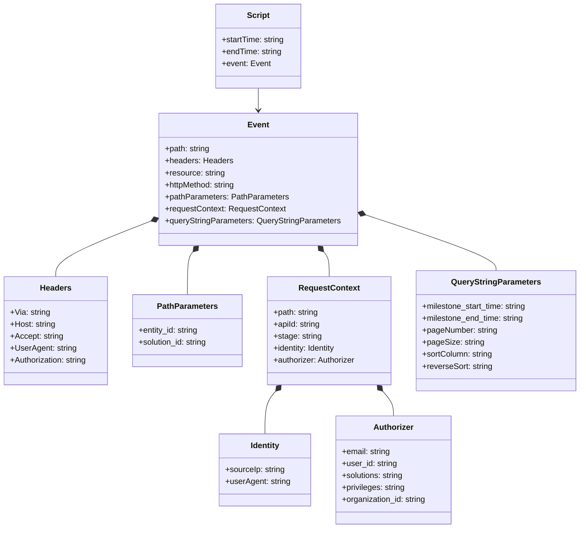

# Diagram: platform/tools/ide_local_testing/localTest/test/entitySearch/getSearchMilestonesViaLambda.py


> Auto-generated by Obscura crawlers

## Diagram 1

```mermaid
flowchart TD
    Start([Start]) --> Import[Import searchMilestone and DictionaryToObject]
    Import --> SetVars[Set startTime and endTime (overwritten)]
    SetVars --> EventDef[Define event object (API Gateway payload)]
    EventDef --> DTO[Create DictionaryToObject(function_name='getSearchMilestonesByLambda')]
    DTO --> CallLambda[Call searchMilestone(event, dto)]
    CallLambda --> Print[print(response)]
    Print --> End([End])
```

> SVG rendering failed for this diagram.

## Diagram 2



### SVG

<svg id="container" width="1168.2890625" xmlns="http://www.w3.org/2000/svg" class="classDiagram" height="1054" viewBox="0 0 1168.2890625 1054" role="graphics-document document" aria-roledescription="class"><style>#container{font-family:"trebuchet ms",verdana,arial,sans-serif;font-size:16px;fill:#333;}@keyframes edge-animation-frame{from{stroke-dashoffset:0;}}@keyframes dash{to{stroke-dashoffset:0;}}#container .edge-animation-slow{stroke-dasharray:9,5!important;stroke-dashoffset:900;animation:dash 50s linear infinite;stroke-linecap:round;}#container .edge-animation-fast{stroke-dasharray:9,5!important;stroke-dashoffset:900;animation:dash 20s linear infinite;stroke-linecap:round;}#container .error-icon{fill:#552222;}#container .error-text{fill:#552222;stroke:#552222;}#container .edge-thickness-normal{stroke-width:1px;}#container .edge-thickness-thick{stroke-width:3.5px;}#container .edge-pattern-solid{stroke-dasharray:0;}#container .edge-thickness-invisible{stroke-width:0;fill:none;}#container .edge-pattern-dashed{stroke-dasharray:3;}#container .edge-pattern-dotted{stroke-dasharray:2;}#container .marker{fill:#333333;stroke:#333333;}#container .marker.cross{stroke:#333333;}#container svg{font-family:"trebuchet ms",verdana,arial,sans-serif;font-size:16px;}#container p{margin:0;}#container g.classGroup text{fill:#9370DB;stroke:none;font-family:"trebuchet ms",verdana,arial,sans-serif;font-size:10px;}#container g.classGroup text .title{font-weight:bolder;}#container .nodeLabel,#container .edgeLabel{color:#131300;}#container .edgeLabel .label rect{fill:#ECECFF;}#container .label text{fill:#131300;}#container .labelBkg{background:#ECECFF;}#container .edgeLabel .label span{background:#ECECFF;}#container .classTitle{font-weight:bolder;}#container .node rect,#container .node circle,#container .node ellipse,#container .node polygon,#container .node path{fill:#ECECFF;stroke:#9370DB;stroke-width:1px;}#container .divider{stroke:#9370DB;stroke-width:1;}#container g.clickable{cursor:pointer;}#container g.classGroup rect{fill:#ECECFF;stroke:#9370DB;}#container g.classGroup line{stroke:#9370DB;stroke-width:1;}#container .classLabel .box{stroke:none;stroke-width:0;fill:#ECECFF;opacity:0.5;}#container .classLabel .label{fill:#9370DB;font-size:10px;}#container .relation{stroke:#333333;stroke-width:1;fill:none;}#container .dashed-line{stroke-dasharray:3;}#container .dotted-line{stroke-dasharray:1 2;}#container #compositionStart,#container .composition{fill:#333333!important;stroke:#333333!important;stroke-width:1;}#container #compositionEnd,#container .composition{fill:#333333!important;stroke:#333333!important;stroke-width:1;}#container #dependencyStart,#container .dependency{fill:#333333!important;stroke:#333333!important;stroke-width:1;}#container #dependencyStart,#container .dependency{fill:#333333!important;stroke:#333333!important;stroke-width:1;}#container #extensionStart,#container .extension{fill:transparent!important;stroke:#333333!important;stroke-width:1;}#container #extensionEnd,#container .extension{fill:transparent!important;stroke:#333333!important;stroke-width:1;}#container #aggregationStart,#container .aggregation{fill:transparent!important;stroke:#333333!important;stroke-width:1;}#container #aggregationEnd,#container .aggregation{fill:transparent!important;stroke:#333333!important;stroke-width:1;}#container #lollipopStart,#container .lollipop{fill:#ECECFF!important;stroke:#333333!important;stroke-width:1;}#container #lollipopEnd,#container .lollipop{fill:#ECECFF!important;stroke:#333333!important;stroke-width:1;}#container .edgeTerminals{font-size:11px;line-height:initial;}#container .classTitleText{text-anchor:middle;font-size:18px;fill:#333;}#container .label-icon{display:inline-block;height:1em;overflow:visible;vertical-align:-0.125em;}#container .node .label-icon path{fill:currentColor;stroke:revert;stroke-width:revert;}#container :root{--mermaid-font-family:"trebuchet ms",verdana,arial,sans-serif;}</style><g><defs><marker id="container_class-aggregationStart" class="marker aggregation class" refX="18" refY="7" markerWidth="190" markerHeight="240" orient="auto"><path d="M 18,7 L9,13 L1,7 L9,1 Z"></path></marker></defs><defs><marker id="container_class-aggregationEnd" class="marker aggregation class" refX="1" refY="7" markerWidth="20" markerHeight="28" orient="auto"><path d="M 18,7 L9,13 L1,7 L9,1 Z"></path></marker></defs><defs><marker id="container_class-extensionStart" class="marker extension class" refX="18" refY="7" markerWidth="190" markerHeight="240" orient="auto"><path d="M 1,7 L18,13 V 1 Z"></path></marker></defs><defs><marker id="container_class-extensionEnd" class="marker extension class" refX="1" refY="7" markerWidth="20" markerHeight="28" orient="auto"><path d="M 1,1 V 13 L18,7 Z"></path></marker></defs><defs><marker id="container_class-compositionStart" class="marker composition class" refX="18" refY="7" markerWidth="190" markerHeight="240" orient="auto"><path d="M 18,7 L9,13 L1,7 L9,1 Z"></path></marker></defs><defs><marker id="container_class-compositionEnd" class="marker composition class" refX="1" refY="7" markerWidth="20" markerHeight="28" orient="auto"><path d="M 18,7 L9,13 L1,7 L9,1 Z"></path></marker></defs><defs><marker id="container_class-dependencyStart" class="marker dependency class" refX="6" refY="7" markerWidth="190" markerHeight="240" orient="auto"><path d="M 5,7 L9,13 L1,7 L9,1 Z"></path></marker></defs><defs><marker id="container_class-dependencyEnd" class="marker dependency class" refX="13" refY="7" markerWidth="20" markerHeight="28" orient="auto"><path d="M 18,7 L9,13 L14,7 L9,1 Z"></path></marker></defs><defs><marker id="container_class-lollipopStart" class="marker lollipop class" refX="13" refY="7" markerWidth="190" markerHeight="240" orient="auto"><circle stroke="black" fill="transparent" cx="7" cy="7" r="6"></circle></marker></defs><defs><marker id="container_class-lollipopEnd" class="marker lollipop class" refX="1" refY="7" markerWidth="190" markerHeight="240" orient="auto"><circle stroke="black" fill="transparent" cx="7" cy="7" r="6"></circle></marker></defs><g class="root"><g class="clusters"></g><g class="edgePaths"><path d="M521.547,176L521.547,180.167C521.547,184.333,521.547,192.667,521.547,200C521.547,207.333,521.547,213.667,521.547,216.833L521.547,220" id="id_Script_Event_1" class="edge-thickness-normal edge-pattern-solid relation" style=";;;" data-edge="true" data-et="edge" data-id="id_Script_Event_1" data-points="W3sieCI6NTIxLjU0Njg3NSwieSI6MTc2fSx7IngiOjUyMS41NDY4NzUsInkiOjIwMX0seyJ4Ijo1MjEuNTQ2ODc1LCJ5IjoyMjZ9XQ==" marker-end="url(#container_class-dependencyEnd)"></path><path d="M308.495,439.865L275.906,452.387C243.316,464.91,178.137,489.955,145.547,508.644C112.957,527.333,112.957,539.667,112.957,545.833L112.957,552" id="id_Event_Headers_2" class="edge-thickness-normal edge-pattern-solid relation" style=";;;" data-edge="true" data-et="edge" data-id="id_Event_Headers_2" data-points="W3sieCI6MzI0LjU5NzY1NjI1LCJ5Ijo0MzMuNjc3NDI1MjE0MzkwMn0seyJ4IjoxMTIuOTU3MDMxMjUsInkiOjUxNX0seyJ4IjoxMTIuOTU3MDMxMjUsInkiOjU1Mn1d" marker-start="url(#container_class-compositionStart)"></path><path d="M390.023,502.768L388.171,504.806C386.319,506.845,382.615,510.923,380.762,525.128C378.91,539.333,378.91,563.667,378.91,575.833L378.91,588" id="id_Event_PathParameters_3" class="edge-thickness-normal edge-pattern-solid relation" style=";;;" data-edge="true" data-et="edge" data-id="id_Event_PathParameters_3" data-points="W3sieCI6NDAxLjYyMzAwOTU1NDE0MDE0LCJ5Ijo0OTB9LHsieCI6Mzc4LjkxMDE1NjI1LCJ5Ijo1MTV9LHsieCI6Mzc4LjkxMDE1NjI1LCJ5Ijo1ODh9XQ==" marker-start="url(#container_class-compositionStart)"></path><path d="M653.07,502.768L654.923,504.806C656.775,506.845,660.479,510.923,662.331,519.128C664.184,527.333,664.184,539.667,664.184,545.833L664.184,552" id="id_Event_RequestContext_4" class="edge-thickness-normal edge-pattern-solid relation" style=";;;" data-edge="true" data-et="edge" data-id="id_Event_RequestContext_4" data-points="W3sieCI6NjQxLjQ3MDc0MDQ0NTg1OTksInkiOjQ5MH0seyJ4Ijo2NjQuMTgzNTkzNzUsInkiOjUxNX0seyJ4Ijo2NjQuMTgzNTkzNzUsInkiOjU1Mn1d" marker-start="url(#container_class-compositionStart)"></path><path d="M556.618,780.887L553.042,784.906C549.466,788.925,542.314,796.962,538.738,811.148C535.162,825.333,535.162,845.667,535.162,855.833L535.162,866" id="id_RequestContext_Identity_5" class="edge-thickness-normal edge-pattern-solid relation" style=";;;" data-edge="true" data-et="edge" data-id="id_RequestContext_Identity_5" data-points="W3sieCI6NTY4LjA4NDgzMjk3NDEzOCwieSI6NzY4fSx7IngiOjUzNS4xNjIxMDkzNzUsInkiOjgwNX0seyJ4Ijo1MzUuMTYyMTA5Mzc1LCJ5Ijo4NjZ9XQ==" marker-start="url(#container_class-compositionStart)"></path><path d="M771.749,780.887L775.325,784.906C778.901,788.925,786.053,796.962,789.629,805.148C793.205,813.333,793.205,821.667,793.205,825.833L793.205,830" id="id_RequestContext_Authorizer_6" class="edge-thickness-normal edge-pattern-solid relation" style=";;;" data-edge="true" data-et="edge" data-id="id_RequestContext_Authorizer_6" data-points="W3sieCI6NzYwLjI4MjM1NDUyNTg2MiwieSI6NzY4fSx7IngiOjc5My4yMDUwNzgxMjUsInkiOjgwNX0seyJ4Ijo3OTMuMjA1MDc4MTI1LCJ5Ijo4MzB9XQ==" marker-start="url(#container_class-compositionStart)"></path><path d="M734.884,428.096L778.966,442.58C823.048,457.064,911.211,486.032,955.293,504.683C999.375,523.333,999.375,531.667,999.375,535.833L999.375,540" id="id_Event_QueryStringParameters_7" class="edge-thickness-normal edge-pattern-solid relation" style=";;;" data-edge="true" data-et="edge" data-id="id_Event_QueryStringParameters_7" data-points="W3sieCI6NzE4LjQ5NjA5Mzc1LCJ5Ijo0MjIuNzExNjEwMTUwMDkzMn0seyJ4Ijo5OTkuMzc1LCJ5Ijo1MTV9LHsieCI6OTk5LjM3NSwieSI6NTQwfV0=" marker-start="url(#container_class-compositionStart)"></path></g><g class="edgeLabels"><g class="edgeLabel"><g class="label" data-id="id_Script_Event_1" transform="translate(0, 0)"><foreignObject width="0" height="0"><div xmlns="http://www.w3.org/1999/xhtml" class="labelBkg" style="display: table-cell; white-space: nowrap; line-height: 1.5; max-width: 200px; text-align: center;"><span class="edgeLabel"></span></div></foreignObject></g></g><g class="edgeLabel"><g class="label" data-id="id_Event_Headers_2" transform="translate(0, 0)"><foreignObject width="0" height="0"><div xmlns="http://www.w3.org/1999/xhtml" class="labelBkg" style="display: table-cell; white-space: nowrap; line-height: 1.5; max-width: 200px; text-align: center;"><span class="edgeLabel"></span></div></foreignObject></g></g><g class="edgeLabel"><g class="label" data-id="id_Event_PathParameters_3" transform="translate(0, 0)"><foreignObject width="0" height="0"><div xmlns="http://www.w3.org/1999/xhtml" class="labelBkg" style="display: table-cell; white-space: nowrap; line-height: 1.5; max-width: 200px; text-align: center;"><span class="edgeLabel"></span></div></foreignObject></g></g><g class="edgeLabel"><g class="label" data-id="id_Event_RequestContext_4" transform="translate(0, 0)"><foreignObject width="0" height="0"><div xmlns="http://www.w3.org/1999/xhtml" class="labelBkg" style="display: table-cell; white-space: nowrap; line-height: 1.5; max-width: 200px; text-align: center;"><span class="edgeLabel"></span></div></foreignObject></g></g><g class="edgeLabel"><g class="label" data-id="id_RequestContext_Identity_5" transform="translate(0, 0)"><foreignObject width="0" height="0"><div xmlns="http://www.w3.org/1999/xhtml" class="labelBkg" style="display: table-cell; white-space: nowrap; line-height: 1.5; max-width: 200px; text-align: center;"><span class="edgeLabel"></span></div></foreignObject></g></g><g class="edgeLabel"><g class="label" data-id="id_RequestContext_Authorizer_6" transform="translate(0, 0)"><foreignObject width="0" height="0"><div xmlns="http://www.w3.org/1999/xhtml" class="labelBkg" style="display: table-cell; white-space: nowrap; line-height: 1.5; max-width: 200px; text-align: center;"><span class="edgeLabel"></span></div></foreignObject></g></g><g class="edgeLabel"><g class="label" data-id="id_Event_QueryStringParameters_7" transform="translate(0, 0)"><foreignObject width="0" height="0"><div xmlns="http://www.w3.org/1999/xhtml" class="labelBkg" style="display: table-cell; white-space: nowrap; line-height: 1.5; max-width: 200px; text-align: center;"><span class="edgeLabel"></span></div></foreignObject></g></g></g><g class="nodes"><g class="node default" id="classId-Script-0" transform="translate(521.546875, 92)"><g class="basic label-container"><path d="M-86.23046875 -84 L86.23046875 -84 L86.23046875 84 L-86.23046875 84" stroke="none" stroke-width="0" fill="#ECECFF" style=""></path><path d="M-86.23046875 -84 C-20.186707234303555 -84, 45.85705428139289 -84, 86.23046875 -84 M-86.23046875 -84 C-44.28086293926045 -84, -2.331257128520903 -84, 86.23046875 -84 M86.23046875 -84 C86.23046875 -26.8207913214383, 86.23046875 30.3584173571234, 86.23046875 84 M86.23046875 -84 C86.23046875 -47.394183050652735, 86.23046875 -10.78836610130547, 86.23046875 84 M86.23046875 84 C28.83123553302893 84, -28.56799768394214 84, -86.23046875 84 M86.23046875 84 C50.0160486313366 84, 13.801628512673204 84, -86.23046875 84 M-86.23046875 84 C-86.23046875 23.74834088744082, -86.23046875 -36.50331822511836, -86.23046875 -84 M-86.23046875 84 C-86.23046875 34.75250895790954, -86.23046875 -14.494982084180918, -86.23046875 -84" stroke="#9370DB" stroke-width="1.3" fill="none" stroke-dasharray="0 0" style=""></path></g><g class="annotation-group text" transform="translate(0, -60)"></g><g class="label-group text" transform="translate(-21.7421875, -60)"><g class="label" style="font-weight: bolder" transform="translate(0,-12)"><foreignObject width="43.484375" height="24"><div xmlns="http://www.w3.org/1999/xhtml" style="display: table-cell; white-space: nowrap; line-height: 1.5; max-width: 93px; text-align: center;"><span class="nodeLabel markdown-node-label" style=""><p>Script</p></span></div></foreignObject></g></g><g class="members-group text" transform="translate(-74.23046875, -12)"><g class="label" style="" transform="translate(0,-12)"><foreignObject width="126.71875" height="24"><div xmlns="http://www.w3.org/1999/xhtml" style="display: table-cell; white-space: nowrap; line-height: 1.5; max-width: 185px; text-align: center;"><span class="nodeLabel markdown-node-label" style=""><p>+startTime: string</p></span></div></foreignObject></g><g class="label" style="" transform="translate(0,12)"><foreignObject width="120.578125" height="24"><div xmlns="http://www.w3.org/1999/xhtml" style="display: table-cell; white-space: nowrap; line-height: 1.5; max-width: 179px; text-align: center;"><span class="nodeLabel markdown-node-label" style=""><p>+endTime: string</p></span></div></foreignObject></g><g class="label" style="" transform="translate(0,36)"><foreignObject width="96.390625" height="24"><div xmlns="http://www.w3.org/1999/xhtml" style="display: table-cell; white-space: nowrap; line-height: 1.5; max-width: 154px; text-align: center;"><span class="nodeLabel markdown-node-label" style=""><p>+event: Event</p></span></div></foreignObject></g></g><g class="methods-group text" transform="translate(-74.23046875, 84)"></g><g class="divider" style=""><path d="M-86.23046875 -36 C-34.739612456579856 -36, 16.75124383684029 -36, 86.23046875 -36 M-86.23046875 -36 C-34.26351414932692 -36, 17.703440451346154 -36, 86.23046875 -36" stroke="#9370DB" stroke-width="1.3" fill="none" stroke-dasharray="0 0" style=""></path></g><g class="divider" style=""><path d="M-86.23046875 60 C-47.08648131665945 60, -7.942493883318903 60, 86.23046875 60 M-86.23046875 60 C-22.475836896901043 60, 41.27879495619791 60, 86.23046875 60" stroke="#9370DB" stroke-width="1.3" fill="none" stroke-dasharray="0 0" style=""></path></g></g><g class="node default" id="classId-Event-1" transform="translate(521.546875, 358)"><g class="basic label-container"><path d="M-196.94921875 -132 L196.94921875 -132 L196.94921875 132 L-196.94921875 132" stroke="none" stroke-width="0" fill="#ECECFF" style=""></path><path d="M-196.94921875 -132 C-87.45580827491267 -132, 22.03760220017466 -132, 196.94921875 -132 M-196.94921875 -132 C-56.04940038729001 -132, 84.85041797541999 -132, 196.94921875 -132 M196.94921875 -132 C196.94921875 -67.62653183086859, 196.94921875 -3.2530636617371727, 196.94921875 132 M196.94921875 -132 C196.94921875 -51.95308785500069, 196.94921875 28.093824289998622, 196.94921875 132 M196.94921875 132 C65.21538390307157 132, -66.51845094385686 132, -196.94921875 132 M196.94921875 132 C117.31289929888051 132, 37.67657984776102 132, -196.94921875 132 M-196.94921875 132 C-196.94921875 67.79495246750594, -196.94921875 3.589904935011873, -196.94921875 -132 M-196.94921875 132 C-196.94921875 74.08196046874019, -196.94921875 16.16392093748037, -196.94921875 -132" stroke="#9370DB" stroke-width="1.3" fill="none" stroke-dasharray="0 0" style=""></path></g><g class="annotation-group text" transform="translate(0, -108)"></g><g class="label-group text" transform="translate(-20.2109375, -108)"><g class="label" style="font-weight: bolder" transform="translate(0,-12)"><foreignObject width="40.421875" height="24"><div xmlns="http://www.w3.org/1999/xhtml" style="display: table-cell; white-space: nowrap; line-height: 1.5; max-width: 90px; text-align: center;"><span class="nodeLabel markdown-node-label" style=""><p>Event</p></span></div></foreignObject></g></g><g class="members-group text" transform="translate(-184.94921875, -60)"><g class="label" style="" transform="translate(0,-12)"><foreignObject width="90.90625" height="24"><div xmlns="http://www.w3.org/1999/xhtml" style="display: table-cell; white-space: nowrap; line-height: 1.5; max-width: 149px; text-align: center;"><span class="nodeLabel markdown-node-label" style=""><p>+path: string</p></span></div></foreignObject></g><g class="label" style="" transform="translate(0,12)"><foreignObject width="134.25" height="24"><div xmlns="http://www.w3.org/1999/xhtml" style="display: table-cell; white-space: nowrap; line-height: 1.5; max-width: 192px; text-align: center;"><span class="nodeLabel markdown-node-label" style=""><p>+headers: Headers</p></span></div></foreignObject></g><g class="label" style="" transform="translate(0,36)"><foreignObject width="119.984375" height="24"><div xmlns="http://www.w3.org/1999/xhtml" style="display: table-cell; white-space: nowrap; line-height: 1.5; max-width: 178px; text-align: center;"><span class="nodeLabel markdown-node-label" style=""><p>+resource: string</p></span></div></foreignObject></g><g class="label" style="" transform="translate(0,60)"><foreignObject width="143.375" height="24"><div xmlns="http://www.w3.org/1999/xhtml" style="display: table-cell; white-space: nowrap; line-height: 1.5; max-width: 201px; text-align: center;"><span class="nodeLabel markdown-node-label" style=""><p>+httpMethod: string</p></span></div></foreignObject></g><g class="label" style="" transform="translate(0,84)"><foreignObject width="244.609375" height="24"><div xmlns="http://www.w3.org/1999/xhtml" style="display: table-cell; white-space: nowrap; line-height: 1.5; max-width: 302px; text-align: center;"><span class="nodeLabel markdown-node-label" style=""><p>+pathParameters: PathParameters</p></span></div></foreignObject></g><g class="label" style="" transform="translate(0,108)"><foreignObject width="240.421875" height="24"><div xmlns="http://www.w3.org/1999/xhtml" style="display: table-cell; white-space: nowrap; line-height: 1.5; max-width: 298px; text-align: center;"><span class="nodeLabel markdown-node-label" style=""><p>+requestContext: RequestContext</p></span></div></foreignObject></g><g class="label" style="" transform="translate(0,132)"><foreignObject width="349.6875" height="24"><div xmlns="http://www.w3.org/1999/xhtml" style="display: table-cell; white-space: nowrap; line-height: 1.5; max-width: 407px; text-align: center;"><span class="nodeLabel markdown-node-label" style=""><p>+queryStringParameters: QueryStringParameters</p></span></div></foreignObject></g></g><g class="methods-group text" transform="translate(-184.94921875, 132)"></g><g class="divider" style=""><path d="M-196.94921875 -84 C-50.997513786821514 -84, 94.95419117635697 -84, 196.94921875 -84 M-196.94921875 -84 C-62.01864337442524 -84, 72.91193200114952 -84, 196.94921875 -84" stroke="#9370DB" stroke-width="1.3" fill="none" stroke-dasharray="0 0" style=""></path></g><g class="divider" style=""><path d="M-196.94921875 108 C-52.76890769877079 108, 91.41140335245842 108, 196.94921875 108 M-196.94921875 108 C-107.65726887069552 108, -18.365318991391035 108, 196.94921875 108" stroke="#9370DB" stroke-width="1.3" fill="none" stroke-dasharray="0 0" style=""></path></g></g><g class="node default" id="classId-Headers-2" transform="translate(112.95703125, 660)"><g class="basic label-container"><path d="M-104.95703125 -108 L104.95703125 -108 L104.95703125 108 L-104.95703125 108" stroke="none" stroke-width="0" fill="#ECECFF" style=""></path><path d="M-104.95703125 -108 C-54.97653011334838 -108, -4.996028976696763 -108, 104.95703125 -108 M-104.95703125 -108 C-24.74840655280697 -108, 55.46021814438606 -108, 104.95703125 -108 M104.95703125 -108 C104.95703125 -34.08016762465435, 104.95703125 39.8396647506913, 104.95703125 108 M104.95703125 -108 C104.95703125 -47.11907913761888, 104.95703125 13.761841724762235, 104.95703125 108 M104.95703125 108 C59.637384655840506 108, 14.317738061681013 108, -104.95703125 108 M104.95703125 108 C61.912288979536825 108, 18.86754670907365 108, -104.95703125 108 M-104.95703125 108 C-104.95703125 25.579236584708255, -104.95703125 -56.84152683058349, -104.95703125 -108 M-104.95703125 108 C-104.95703125 51.30803758805698, -104.95703125 -5.3839248238860336, -104.95703125 -108" stroke="#9370DB" stroke-width="1.3" fill="none" stroke-dasharray="0 0" style=""></path></g><g class="annotation-group text" transform="translate(0, -84)"></g><g class="label-group text" transform="translate(-30.2421875, -84)"><g class="label" style="font-weight: bolder" transform="translate(0,-12)"><foreignObject width="60.484375" height="24"><div xmlns="http://www.w3.org/1999/xhtml" style="display: table-cell; white-space: nowrap; line-height: 1.5; max-width: 110px; text-align: center;"><span class="nodeLabel markdown-node-label" style=""><p>Headers</p></span></div></foreignObject></g></g><g class="members-group text" transform="translate(-92.95703125, -36)"><g class="label" style="" transform="translate(0,-12)"><foreignObject width="79.421875" height="24"><div xmlns="http://www.w3.org/1999/xhtml" style="display: table-cell; white-space: nowrap; line-height: 1.5; max-width: 137px; text-align: center;"><span class="nodeLabel markdown-node-label" style=""><p>+Via: string</p></span></div></foreignObject></g><g class="label" style="" transform="translate(0,12)"><foreignObject width="91.234375" height="24"><div xmlns="http://www.w3.org/1999/xhtml" style="display: table-cell; white-space: nowrap; line-height: 1.5; max-width: 149px; text-align: center;"><span class="nodeLabel markdown-node-label" style=""><p>+Host: string</p></span></div></foreignObject></g><g class="label" style="" transform="translate(0,36)"><foreignObject width="105.4375" height="24"><div xmlns="http://www.w3.org/1999/xhtml" style="display: table-cell; white-space: nowrap; line-height: 1.5; max-width: 163px; text-align: center;"><span class="nodeLabel markdown-node-label" style=""><p>+Accept: string</p></span></div></foreignObject></g><g class="label" style="" transform="translate(0,60)"><foreignObject width="131.75" height="24"><div xmlns="http://www.w3.org/1999/xhtml" style="display: table-cell; white-space: nowrap; line-height: 1.5; max-width: 190px; text-align: center;"><span class="nodeLabel markdown-node-label" style=""><p>+UserAgent: string</p></span></div></foreignObject></g><g class="label" style="" transform="translate(0,84)"><foreignObject width="155.671875" height="24"><div xmlns="http://www.w3.org/1999/xhtml" style="display: table-cell; white-space: nowrap; line-height: 1.5; max-width: 214px; text-align: center;"><span class="nodeLabel markdown-node-label" style=""><p>+Authorization: string</p></span></div></foreignObject></g></g><g class="methods-group text" transform="translate(-92.95703125, 108)"></g><g class="divider" style=""><path d="M-104.95703125 -60 C-36.89495752814213 -60, 31.167116193715742 -60, 104.95703125 -60 M-104.95703125 -60 C-54.90818812423148 -60, -4.859344998462959 -60, 104.95703125 -60" stroke="#9370DB" stroke-width="1.3" fill="none" stroke-dasharray="0 0" style=""></path></g><g class="divider" style=""><path d="M-104.95703125 84 C-21.26422289553885 84, 62.4285854589223 84, 104.95703125 84 M-104.95703125 84 C-51.06496891579591 84, 2.8270934184081824 84, 104.95703125 84" stroke="#9370DB" stroke-width="1.3" fill="none" stroke-dasharray="0 0" style=""></path></g></g><g class="node default" id="classId-PathParameters-3" transform="translate(378.91015625, 660)"><g class="basic label-container"><path d="M-110.99609375 -72 L110.99609375 -72 L110.99609375 72 L-110.99609375 72" stroke="none" stroke-width="0" fill="#ECECFF" style=""></path><path d="M-110.99609375 -72 C-49.35257528466204 -72, 12.290943180675924 -72, 110.99609375 -72 M-110.99609375 -72 C-66.00162790843521 -72, -21.007162066870407 -72, 110.99609375 -72 M110.99609375 -72 C110.99609375 -22.426529384786, 110.99609375 27.146941230428, 110.99609375 72 M110.99609375 -72 C110.99609375 -39.866080869771984, 110.99609375 -7.732161739543969, 110.99609375 72 M110.99609375 72 C38.1546755178918 72, -34.68674271421639 72, -110.99609375 72 M110.99609375 72 C60.566738114653276 72, 10.137382479306552 72, -110.99609375 72 M-110.99609375 72 C-110.99609375 29.783585818132295, -110.99609375 -12.43282836373541, -110.99609375 -72 M-110.99609375 72 C-110.99609375 33.742826902135675, -110.99609375 -4.514346195728649, -110.99609375 -72" stroke="#9370DB" stroke-width="1.3" fill="none" stroke-dasharray="0 0" style=""></path></g><g class="annotation-group text" transform="translate(0, -48)"></g><g class="label-group text" transform="translate(-58.0703125, -48)"><g class="label" style="font-weight: bolder" transform="translate(0,-12)"><foreignObject width="116.140625" height="24"><div xmlns="http://www.w3.org/1999/xhtml" style="display: table-cell; white-space: nowrap; line-height: 1.5; max-width: 164px; text-align: center;"><span class="nodeLabel markdown-node-label" style=""><p>PathParameters</p></span></div></foreignObject></g></g><g class="members-group text" transform="translate(-98.99609375, 0)"><g class="label" style="" transform="translate(0,-12)"><foreignObject width="121.578125" height="24"><div xmlns="http://www.w3.org/1999/xhtml" style="display: table-cell; white-space: nowrap; line-height: 1.5; max-width: 180px; text-align: center;"><span class="nodeLabel markdown-node-label" style=""><p>+entity_id: string</p></span></div></foreignObject></g><g class="label" style="" transform="translate(0,12)"><foreignObject width="139.921875" height="24"><div xmlns="http://www.w3.org/1999/xhtml" style="display: table-cell; white-space: nowrap; line-height: 1.5; max-width: 198px; text-align: center;"><span class="nodeLabel markdown-node-label" style=""><p>+solution_id: string</p></span></div></foreignObject></g></g><g class="methods-group text" transform="translate(-98.99609375, 72)"></g><g class="divider" style=""><path d="M-110.99609375 -24 C-60.12336115464443 -24, -9.250628559288856 -24, 110.99609375 -24 M-110.99609375 -24 C-58.926663367195076 -24, -6.857232984390151 -24, 110.99609375 -24" stroke="#9370DB" stroke-width="1.3" fill="none" stroke-dasharray="0 0" style=""></path></g><g class="divider" style=""><path d="M-110.99609375 48 C-39.06707164747225 48, 32.861950455055506 48, 110.99609375 48 M-110.99609375 48 C-35.509717162099705 48, 39.97665942580059 48, 110.99609375 48" stroke="#9370DB" stroke-width="1.3" fill="none" stroke-dasharray="0 0" style=""></path></g></g><g class="node default" id="classId-RequestContext-4" transform="translate(664.18359375, 660)"><g class="basic label-container"><path d="M-124.27734375 -108 L124.27734375 -108 L124.27734375 108 L-124.27734375 108" stroke="none" stroke-width="0" fill="#ECECFF" style=""></path><path d="M-124.27734375 -108 C-54.75744041145275 -108, 14.762462927094504 -108, 124.27734375 -108 M-124.27734375 -108 C-66.1495338061182 -108, -8.021723862236385 -108, 124.27734375 -108 M124.27734375 -108 C124.27734375 -28.80905810209613, 124.27734375 50.38188379580774, 124.27734375 108 M124.27734375 -108 C124.27734375 -54.2037971839422, 124.27734375 -0.40759436788439984, 124.27734375 108 M124.27734375 108 C41.979793105738196 108, -40.31775753852361 108, -124.27734375 108 M124.27734375 108 C65.83897843624806 108, 7.400613122496097 108, -124.27734375 108 M-124.27734375 108 C-124.27734375 24.928000443044965, -124.27734375 -58.14399911391007, -124.27734375 -108 M-124.27734375 108 C-124.27734375 64.11659059431649, -124.27734375 20.233181188632983, -124.27734375 -108" stroke="#9370DB" stroke-width="1.3" fill="none" stroke-dasharray="0 0" style=""></path></g><g class="annotation-group text" transform="translate(0, -84)"></g><g class="label-group text" transform="translate(-58.1484375, -84)"><g class="label" style="font-weight: bolder" transform="translate(0,-12)"><foreignObject width="116.296875" height="24"><div xmlns="http://www.w3.org/1999/xhtml" style="display: table-cell; white-space: nowrap; line-height: 1.5; max-width: 164px; text-align: center;"><span class="nodeLabel markdown-node-label" style=""><p>RequestContext</p></span></div></foreignObject></g></g><g class="members-group text" transform="translate(-112.27734375, -36)"><g class="label" style="" transform="translate(0,-12)"><foreignObject width="90.90625" height="24"><div xmlns="http://www.w3.org/1999/xhtml" style="display: table-cell; white-space: nowrap; line-height: 1.5; max-width: 149px; text-align: center;"><span class="nodeLabel markdown-node-label" style=""><p>+path: string</p></span></div></foreignObject></g><g class="label" style="" transform="translate(0,12)"><foreignObject width="94.46875" height="24"><div xmlns="http://www.w3.org/1999/xhtml" style="display: table-cell; white-space: nowrap; line-height: 1.5; max-width: 153px; text-align: center;"><span class="nodeLabel markdown-node-label" style=""><p>+apiId: string</p></span></div></foreignObject></g><g class="label" style="" transform="translate(0,36)"><foreignObject width="96.171875" height="24"><div xmlns="http://www.w3.org/1999/xhtml" style="display: table-cell; white-space: nowrap; line-height: 1.5; max-width: 154px; text-align: center;"><span class="nodeLabel markdown-node-label" style=""><p>+stage: string</p></span></div></foreignObject></g><g class="label" style="" transform="translate(0,60)"><foreignObject width="128.40625" height="24"><div xmlns="http://www.w3.org/1999/xhtml" style="display: table-cell; white-space: nowrap; line-height: 1.5; max-width: 186px; text-align: center;"><span class="nodeLabel markdown-node-label" style=""><p>+identity: Identity</p></span></div></foreignObject></g><g class="label" style="" transform="translate(0,84)"><foreignObject width="166.40625" height="24"><div xmlns="http://www.w3.org/1999/xhtml" style="display: table-cell; white-space: nowrap; line-height: 1.5; max-width: 225px; text-align: center;"><span class="nodeLabel markdown-node-label" style=""><p>+authorizer: Authorizer</p></span></div></foreignObject></g></g><g class="methods-group text" transform="translate(-112.27734375, 108)"></g><g class="divider" style=""><path d="M-124.27734375 -60 C-73.60182392089078 -60, -22.926304091781574 -60, 124.27734375 -60 M-124.27734375 -60 C-65.16779840272014 -60, -6.058253055440289 -60, 124.27734375 -60" stroke="#9370DB" stroke-width="1.3" fill="none" stroke-dasharray="0 0" style=""></path></g><g class="divider" style=""><path d="M-124.27734375 84 C-38.992185677114975 84, 46.29297239577005 84, 124.27734375 84 M-124.27734375 84 C-69.48055798139993 84, -14.683772212799838 84, 124.27734375 84" stroke="#9370DB" stroke-width="1.3" fill="none" stroke-dasharray="0 0" style=""></path></g></g><g class="node default" id="classId-Identity-5" transform="translate(535.162109375, 938)"><g class="basic label-container"><path d="M-91.6328125 -72 L91.6328125 -72 L91.6328125 72 L-91.6328125 72" stroke="none" stroke-width="0" fill="#ECECFF" style=""></path><path d="M-91.6328125 -72 C-44.542276659227504 -72, 2.548259181544992 -72, 91.6328125 -72 M-91.6328125 -72 C-32.60119673546538 -72, 26.430419029069242 -72, 91.6328125 -72 M91.6328125 -72 C91.6328125 -22.35758875901074, 91.6328125 27.284822481978523, 91.6328125 72 M91.6328125 -72 C91.6328125 -42.84234199884554, 91.6328125 -13.684683997691081, 91.6328125 72 M91.6328125 72 C29.111643399256707 72, -33.40952570148659 72, -91.6328125 72 M91.6328125 72 C36.289584131120215 72, -19.05364423775957 72, -91.6328125 72 M-91.6328125 72 C-91.6328125 31.549635693195924, -91.6328125 -8.900728613608152, -91.6328125 -72 M-91.6328125 72 C-91.6328125 29.145757615666724, -91.6328125 -13.708484768666551, -91.6328125 -72" stroke="#9370DB" stroke-width="1.3" fill="none" stroke-dasharray="0 0" style=""></path></g><g class="annotation-group text" transform="translate(0, -48)"></g><g class="label-group text" transform="translate(-28.71875, -48)"><g class="label" style="font-weight: bolder" transform="translate(0,-12)"><foreignObject width="57.4375" height="24"><div xmlns="http://www.w3.org/1999/xhtml" style="display: table-cell; white-space: nowrap; line-height: 1.5; max-width: 106px; text-align: center;"><span class="nodeLabel markdown-node-label" style=""><p>Identity</p></span></div></foreignObject></g></g><g class="members-group text" transform="translate(-79.6328125, 0)"><g class="label" style="" transform="translate(0,-12)"><foreignObject width="119.796875" height="24"><div xmlns="http://www.w3.org/1999/xhtml" style="display: table-cell; white-space: nowrap; line-height: 1.5; max-width: 178px; text-align: center;"><span class="nodeLabel markdown-node-label" style=""><p>+sourceIp: string</p></span></div></foreignObject></g><g class="label" style="" transform="translate(0,12)"><foreignObject width="130.546875" height="24"><div xmlns="http://www.w3.org/1999/xhtml" style="display: table-cell; white-space: nowrap; line-height: 1.5; max-width: 189px; text-align: center;"><span class="nodeLabel markdown-node-label" style=""><p>+userAgent: string</p></span></div></foreignObject></g></g><g class="methods-group text" transform="translate(-79.6328125, 72)"></g><g class="divider" style=""><path d="M-91.6328125 -24 C-38.62297230108869 -24, 14.386867897822626 -24, 91.6328125 -24 M-91.6328125 -24 C-35.05855466530385 -24, 21.515703169392296 -24, 91.6328125 -24" stroke="#9370DB" stroke-width="1.3" fill="none" stroke-dasharray="0 0" style=""></path></g><g class="divider" style=""><path d="M-91.6328125 48 C-30.221454637607877 48, 31.189903224784246 48, 91.6328125 48 M-91.6328125 48 C-35.683790870675054 48, 20.265230758649892 48, 91.6328125 48" stroke="#9370DB" stroke-width="1.3" fill="none" stroke-dasharray="0 0" style=""></path></g></g><g class="node default" id="classId-Authorizer-6" transform="translate(793.205078125, 938)"><g class="basic label-container"><path d="M-116.41015625 -108 L116.41015625 -108 L116.41015625 108 L-116.41015625 108" stroke="none" stroke-width="0" fill="#ECECFF" style=""></path><path d="M-116.41015625 -108 C-43.5106974286886 -108, 29.388761392622797 -108, 116.41015625 -108 M-116.41015625 -108 C-53.45011109443997 -108, 9.509934061120063 -108, 116.41015625 -108 M116.41015625 -108 C116.41015625 -54.44446230072772, 116.41015625 -0.888924601455443, 116.41015625 108 M116.41015625 -108 C116.41015625 -63.35943111701331, 116.41015625 -18.718862234026616, 116.41015625 108 M116.41015625 108 C44.52788463372664 108, -27.354386982546714 108, -116.41015625 108 M116.41015625 108 C50.377713902177106 108, -15.654728445645787 108, -116.41015625 108 M-116.41015625 108 C-116.41015625 59.744988655007525, -116.41015625 11.48997731001505, -116.41015625 -108 M-116.41015625 108 C-116.41015625 25.296472885475026, -116.41015625 -57.40705422904995, -116.41015625 -108" stroke="#9370DB" stroke-width="1.3" fill="none" stroke-dasharray="0 0" style=""></path></g><g class="annotation-group text" transform="translate(0, -84)"></g><g class="label-group text" transform="translate(-38.3671875, -84)"><g class="label" style="font-weight: bolder" transform="translate(0,-12)"><foreignObject width="76.734375" height="24"><div xmlns="http://www.w3.org/1999/xhtml" style="display: table-cell; white-space: nowrap; line-height: 1.5; max-width: 126px; text-align: center;"><span class="nodeLabel markdown-node-label" style=""><p>Authorizer</p></span></div></foreignObject></g></g><g class="members-group text" transform="translate(-104.41015625, -36)"><g class="label" style="" transform="translate(0,-12)"><foreignObject width="98.203125" height="24"><div xmlns="http://www.w3.org/1999/xhtml" style="display: table-cell; white-space: nowrap; line-height: 1.5; max-width: 156px; text-align: center;"><span class="nodeLabel markdown-node-label" style=""><p>+email: string</p></span></div></foreignObject></g><g class="label" style="" transform="translate(0,12)"><foreignObject width="110.5" height="24"><div xmlns="http://www.w3.org/1999/xhtml" style="display: table-cell; white-space: nowrap; line-height: 1.5; max-width: 169px; text-align: center;"><span class="nodeLabel markdown-node-label" style=""><p>+user_id: string</p></span></div></foreignObject></g><g class="label" style="" transform="translate(0,36)"><foreignObject width="125" height="24"><div xmlns="http://www.w3.org/1999/xhtml" style="display: table-cell; white-space: nowrap; line-height: 1.5; max-width: 183px; text-align: center;"><span class="nodeLabel markdown-node-label" style=""><p>+solutions: string</p></span></div></foreignObject></g><g class="label" style="" transform="translate(0,60)"><foreignObject width="127.859375" height="24"><div xmlns="http://www.w3.org/1999/xhtml" style="display: table-cell; white-space: nowrap; line-height: 1.5; max-width: 186px; text-align: center;"><span class="nodeLabel markdown-node-label" style=""><p>+privileges: string</p></span></div></foreignObject></g><g class="label" style="" transform="translate(0,84)"><foreignObject width="170.453125" height="24"><div xmlns="http://www.w3.org/1999/xhtml" style="display: table-cell; white-space: nowrap; line-height: 1.5; max-width: 228px; text-align: center;"><span class="nodeLabel markdown-node-label" style=""><p>+organization_id: string</p></span></div></foreignObject></g></g><g class="methods-group text" transform="translate(-104.41015625, 108)"></g><g class="divider" style=""><path d="M-116.41015625 -60 C-48.75775675887117 -60, 18.894642732257665 -60, 116.41015625 -60 M-116.41015625 -60 C-60.26204010095737 -60, -4.113923951914742 -60, 116.41015625 -60" stroke="#9370DB" stroke-width="1.3" fill="none" stroke-dasharray="0 0" style=""></path></g><g class="divider" style=""><path d="M-116.41015625 84 C-60.83634737989591 84, -5.262538509791824 84, 116.41015625 84 M-116.41015625 84 C-52.03407661636422 84, 12.342003017271566 84, 116.41015625 84" stroke="#9370DB" stroke-width="1.3" fill="none" stroke-dasharray="0 0" style=""></path></g></g><g class="node default" id="classId-QueryStringParameters-7" transform="translate(999.375, 660)"><g class="basic label-container"><path d="M-160.9140625 -120 L160.9140625 -120 L160.9140625 120 L-160.9140625 120" stroke="none" stroke-width="0" fill="#ECECFF" style=""></path><path d="M-160.9140625 -120 C-93.36870146618783 -120, -25.82334043237566 -120, 160.9140625 -120 M-160.9140625 -120 C-81.41148342778384 -120, -1.908904355567671 -120, 160.9140625 -120 M160.9140625 -120 C160.9140625 -45.0119363681856, 160.9140625 29.976127263628797, 160.9140625 120 M160.9140625 -120 C160.9140625 -55.310356195285806, 160.9140625 9.379287609428388, 160.9140625 120 M160.9140625 120 C96.38861807280713 120, 31.863173645614268 120, -160.9140625 120 M160.9140625 120 C66.20879793705537 120, -28.49646662588927 120, -160.9140625 120 M-160.9140625 120 C-160.9140625 40.0337541718945, -160.9140625 -39.932491656211, -160.9140625 -120 M-160.9140625 120 C-160.9140625 71.10609066395918, -160.9140625 22.212181327918373, -160.9140625 -120" stroke="#9370DB" stroke-width="1.3" fill="none" stroke-dasharray="0 0" style=""></path></g><g class="annotation-group text" transform="translate(0, -96)"></g><g class="label-group text" transform="translate(-85.609375, -96)"><g class="label" style="font-weight: bolder" transform="translate(0,-12)"><foreignObject width="171.21875" height="24"><div xmlns="http://www.w3.org/1999/xhtml" style="display: table-cell; white-space: nowrap; line-height: 1.5; max-width: 218px; text-align: center;"><span class="nodeLabel markdown-node-label" style=""><p>QueryStringParameters</p></span></div></foreignObject></g></g><g class="members-group text" transform="translate(-148.9140625, -48)"><g class="label" style="" transform="translate(0,-12)"><foreignObject width="212.21875" height="24"><div xmlns="http://www.w3.org/1999/xhtml" style="display: table-cell; white-space: nowrap; line-height: 1.5; max-width: 270px; text-align: center;"><span class="nodeLabel markdown-node-label" style=""><p>+milestone_start_time: string</p></span></div></foreignObject></g><g class="label" style="" transform="translate(0,12)"><foreignObject width="205.765625" height="24"><div xmlns="http://www.w3.org/1999/xhtml" style="display: table-cell; white-space: nowrap; line-height: 1.5; max-width: 264px; text-align: center;"><span class="nodeLabel markdown-node-label" style=""><p>+milestone_end_time: string</p></span></div></foreignObject></g><g class="label" style="" transform="translate(0,36)"><foreignObject width="150.890625" height="24"><div xmlns="http://www.w3.org/1999/xhtml" style="display: table-cell; white-space: nowrap; line-height: 1.5; max-width: 209px; text-align: center;"><span class="nodeLabel markdown-node-label" style=""><p>+pageNumber: string</p></span></div></foreignObject></g><g class="label" style="" transform="translate(0,60)"><foreignObject width="121.203125" height="24"><div xmlns="http://www.w3.org/1999/xhtml" style="display: table-cell; white-space: nowrap; line-height: 1.5; max-width: 179px; text-align: center;"><span class="nodeLabel markdown-node-label" style=""><p>+pageSize: string</p></span></div></foreignObject></g><g class="label" style="" transform="translate(0,84)"><foreignObject width="141.546875" height="24"><div xmlns="http://www.w3.org/1999/xhtml" style="display: table-cell; white-space: nowrap; line-height: 1.5; max-width: 200px; text-align: center;"><span class="nodeLabel markdown-node-label" style=""><p>+sortColumn: string</p></span></div></foreignObject></g><g class="label" style="" transform="translate(0,108)"><foreignObject width="140.796875" height="24"><div xmlns="http://www.w3.org/1999/xhtml" style="display: table-cell; white-space: nowrap; line-height: 1.5; max-width: 199px; text-align: center;"><span class="nodeLabel markdown-node-label" style=""><p>+reverseSort: string</p></span></div></foreignObject></g></g><g class="methods-group text" transform="translate(-148.9140625, 120)"></g><g class="divider" style=""><path d="M-160.9140625 -72 C-86.61428001530447 -72, -12.314497530608946 -72, 160.9140625 -72 M-160.9140625 -72 C-56.67875403015974 -72, 47.556554439680525 -72, 160.9140625 -72" stroke="#9370DB" stroke-width="1.3" fill="none" stroke-dasharray="0 0" style=""></path></g><g class="divider" style=""><path d="M-160.9140625 96 C-39.00195103011697 96, 82.91016043976606 96, 160.9140625 96 M-160.9140625 96 C-82.51320156300946 96, -4.11234062601892 96, 160.9140625 96" stroke="#9370DB" stroke-width="1.3" fill="none" stroke-dasharray="0 0" style=""></path></g></g></g></g></g></svg>
