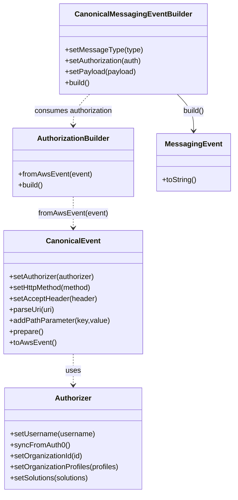

# Diagram: platform/tools/ide_local_testing/localTest/test/generalTest.py


> Auto-generated by Obscura crawlers

## Diagram 1

```mermaid
sequenceDiagram
participant Script
participant Authorizer
participant CanonicalEvent
participant AuthorizationBuilder
participant MessageBuilder
participant Console
Script->>Authorizer: Authorizer().setUsername(dave.damon@freightverify.com).syncFromAuth0()
alt activeOrgId
  Script->>Authorizer: setOrganizationId(1028)
end
Script->>CanonicalEvent: CanonicalEvent().setAuthorizer(authorizer).setHttpMethod(GET).setAcceptHeader(application/json).parseUri(uri).prepare().toAwsEvent()
Script->>Script: acceptType=*/* , activeOrgId=1004 , solutionId=FV_TEST , feature=PartView , organizationProfiles=[SH,FV]
Script->>Authorizer: Authorizer().setUsername(shipper-org-admin@yopmail.com).syncFromAuth0()
alt activeOrgId
  Script->>Authorizer: setOrganizationId(1004); setOrganizationProfiles([SH,FV]); setSolutions([FV_TEST])
end
Script->>CanonicalEvent: CanonicalEvent().setAuthorizer(authorizer).setHttpMethod(GET).setAcceptHeader(*/*).parseUri(uri).addPathParameter(orgType,Dealer).addPathParameter(feature,PartView).addPathParameter(paginate,true).addPathParameter(pageNumber,0).addPathParameter(pageSize,20).prepare().toAwsEvent()
Script->>AuthorizationBuilder: AuthorizationBuilder().fromAwsEvent(event).build()
AuthorizationBuilder-->>Script: authorization
Script->>MessageBuilder: MessageBuilder().setMessageType(VisiblityGrant).setAuthorization(authorization).setPayload({}).build()
MessageBuilder-->>Script: messagingEvent
Script->>Console: print(messagingEvent)
```

> SVG rendering failed for this diagram.

## Diagram 2



### SVG

<svg id="container" width="506.62890625" xmlns="http://www.w3.org/2000/svg" class="classDiagram" height="1078" viewBox="0 0 506.62890625 1078" role="graphics-document document" aria-roledescription="class"><style>#container{font-family:"trebuchet ms",verdana,arial,sans-serif;font-size:16px;fill:#333;}@keyframes edge-animation-frame{from{stroke-dashoffset:0;}}@keyframes dash{to{stroke-dashoffset:0;}}#container .edge-animation-slow{stroke-dasharray:9,5!important;stroke-dashoffset:900;animation:dash 50s linear infinite;stroke-linecap:round;}#container .edge-animation-fast{stroke-dasharray:9,5!important;stroke-dashoffset:900;animation:dash 20s linear infinite;stroke-linecap:round;}#container .error-icon{fill:#552222;}#container .error-text{fill:#552222;stroke:#552222;}#container .edge-thickness-normal{stroke-width:1px;}#container .edge-thickness-thick{stroke-width:3.5px;}#container .edge-pattern-solid{stroke-dasharray:0;}#container .edge-thickness-invisible{stroke-width:0;fill:none;}#container .edge-pattern-dashed{stroke-dasharray:3;}#container .edge-pattern-dotted{stroke-dasharray:2;}#container .marker{fill:#333333;stroke:#333333;}#container .marker.cross{stroke:#333333;}#container svg{font-family:"trebuchet ms",verdana,arial,sans-serif;font-size:16px;}#container p{margin:0;}#container g.classGroup text{fill:#9370DB;stroke:none;font-family:"trebuchet ms",verdana,arial,sans-serif;font-size:10px;}#container g.classGroup text .title{font-weight:bolder;}#container .nodeLabel,#container .edgeLabel{color:#131300;}#container .edgeLabel .label rect{fill:#ECECFF;}#container .label text{fill:#131300;}#container .labelBkg{background:#ECECFF;}#container .edgeLabel .label span{background:#ECECFF;}#container .classTitle{font-weight:bolder;}#container .node rect,#container .node circle,#container .node ellipse,#container .node polygon,#container .node path{fill:#ECECFF;stroke:#9370DB;stroke-width:1px;}#container .divider{stroke:#9370DB;stroke-width:1;}#container g.clickable{cursor:pointer;}#container g.classGroup rect{fill:#ECECFF;stroke:#9370DB;}#container g.classGroup line{stroke:#9370DB;stroke-width:1;}#container .classLabel .box{stroke:none;stroke-width:0;fill:#ECECFF;opacity:0.5;}#container .classLabel .label{fill:#9370DB;font-size:10px;}#container .relation{stroke:#333333;stroke-width:1;fill:none;}#container .dashed-line{stroke-dasharray:3;}#container .dotted-line{stroke-dasharray:1 2;}#container #compositionStart,#container .composition{fill:#333333!important;stroke:#333333!important;stroke-width:1;}#container #compositionEnd,#container .composition{fill:#333333!important;stroke:#333333!important;stroke-width:1;}#container #dependencyStart,#container .dependency{fill:#333333!important;stroke:#333333!important;stroke-width:1;}#container #dependencyStart,#container .dependency{fill:#333333!important;stroke:#333333!important;stroke-width:1;}#container #extensionStart,#container .extension{fill:transparent!important;stroke:#333333!important;stroke-width:1;}#container #extensionEnd,#container .extension{fill:transparent!important;stroke:#333333!important;stroke-width:1;}#container #aggregationStart,#container .aggregation{fill:transparent!important;stroke:#333333!important;stroke-width:1;}#container #aggregationEnd,#container .aggregation{fill:transparent!important;stroke:#333333!important;stroke-width:1;}#container #lollipopStart,#container .lollipop{fill:#ECECFF!important;stroke:#333333!important;stroke-width:1;}#container #lollipopEnd,#container .lollipop{fill:#ECECFF!important;stroke:#333333!important;stroke-width:1;}#container .edgeTerminals{font-size:11px;line-height:initial;}#container .classTitleText{text-anchor:middle;font-size:18px;fill:#333;}#container .label-icon{display:inline-block;height:1em;overflow:visible;vertical-align:-0.125em;}#container .node .label-icon path{fill:currentColor;stroke:revert;stroke-width:revert;}#container :root{--mermaid-font-family:"trebuchet ms",verdana,arial,sans-serif;}</style><g><defs><marker id="container_class-aggregationStart" class="marker aggregation class" refX="18" refY="7" markerWidth="190" markerHeight="240" orient="auto"><path d="M 18,7 L9,13 L1,7 L9,1 Z"></path></marker></defs><defs><marker id="container_class-aggregationEnd" class="marker aggregation class" refX="1" refY="7" markerWidth="20" markerHeight="28" orient="auto"><path d="M 18,7 L9,13 L1,7 L9,1 Z"></path></marker></defs><defs><marker id="container_class-extensionStart" class="marker extension class" refX="18" refY="7" markerWidth="190" markerHeight="240" orient="auto"><path d="M 1,7 L18,13 V 1 Z"></path></marker></defs><defs><marker id="container_class-extensionEnd" class="marker extension class" refX="1" refY="7" markerWidth="20" markerHeight="28" orient="auto"><path d="M 1,1 V 13 L18,7 Z"></path></marker></defs><defs><marker id="container_class-compositionStart" class="marker composition class" refX="18" refY="7" markerWidth="190" markerHeight="240" orient="auto"><path d="M 18,7 L9,13 L1,7 L9,1 Z"></path></marker></defs><defs><marker id="container_class-compositionEnd" class="marker composition class" refX="1" refY="7" markerWidth="20" markerHeight="28" orient="auto"><path d="M 18,7 L9,13 L1,7 L9,1 Z"></path></marker></defs><defs><marker id="container_class-dependencyStart" class="marker dependency class" refX="6" refY="7" markerWidth="190" markerHeight="240" orient="auto"><path d="M 5,7 L9,13 L1,7 L9,1 Z"></path></marker></defs><defs><marker id="container_class-dependencyEnd" class="marker dependency class" refX="13" refY="7" markerWidth="20" markerHeight="28" orient="auto"><path d="M 18,7 L9,13 L14,7 L9,1 Z"></path></marker></defs><defs><marker id="container_class-lollipopStart" class="marker lollipop class" refX="13" refY="7" markerWidth="190" markerHeight="240" orient="auto"><circle stroke="black" fill="transparent" cx="7" cy="7" r="6"></circle></marker></defs><defs><marker id="container_class-lollipopEnd" class="marker lollipop class" refX="1" refY="7" markerWidth="190" markerHeight="240" orient="auto"><circle stroke="black" fill="transparent" cx="7" cy="7" r="6"></circle></marker></defs><g class="root"><g class="clusters"></g><g class="edgePaths"><path d="M159.668,774L159.668,780.167C159.668,786.333,159.668,798.667,159.668,810C159.668,821.333,159.668,831.667,159.668,836.833L159.668,842" id="id_CanonicalEvent_Authorizer_1" class="edge-thickness-normal edge-pattern-dashed relation" style=";;;" data-edge="true" data-et="edge" data-id="id_CanonicalEvent_Authorizer_1" data-points="W3sieCI6MTU5LjY2Nzk2ODc1LCJ5Ijo3NzR9LHsieCI6MTU5LjY2Nzk2ODc1LCJ5Ijo4MTF9LHsieCI6MTU5LjY2Nzk2ODc1LCJ5Ijo4NDh9XQ==" marker-end="url(#container_class-dependencyEnd)"></path><path d="M159.668,430L159.668,436.167C159.668,442.333,159.668,454.667,159.668,466C159.668,477.333,159.668,487.667,159.668,492.833L159.668,498" id="id_AuthorizationBuilder_CanonicalEvent_2" class="edge-thickness-normal edge-pattern-dashed relation" style=";;;" data-edge="true" data-et="edge" data-id="id_AuthorizationBuilder_CanonicalEvent_2" data-points="W3sieCI6MTU5LjY2Nzk2ODc1LCJ5Ijo0MzB9LHsieCI6MTU5LjY2Nzk2ODc1LCJ5Ijo0Njd9LHsieCI6MTU5LjY2Nzk2ODc1LCJ5Ijo1MDR9XQ==" marker-end="url(#container_class-dependencyEnd)"></path><path d="M194.993,206L189.106,212.167C183.218,218.333,171.443,230.667,165.555,242C159.668,253.333,159.668,263.667,159.668,268.833L159.668,274" id="id_CanonicalMessagingEventBuilder_AuthorizationBuilder_3" class="edge-thickness-normal edge-pattern-dashed relation" style=";;;" data-edge="true" data-et="edge" data-id="id_CanonicalMessagingEventBuilder_AuthorizationBuilder_3" data-points="W3sieCI6MTk0Ljk5MzEwNjYxNzY0NzA3LCJ5IjoyMDZ9LHsieCI6MTU5LjY2Nzk2ODc1LCJ5IjoyNDN9LHsieCI6MTU5LjY2Nzk2ODc1LCJ5IjoyODB9XQ==" marker-end="url(#container_class-dependencyEnd)"></path><path d="M384.03,206L389.918,212.167C395.805,218.333,407.58,230.667,413.468,244C419.355,257.333,419.355,271.667,419.355,278.833L419.355,286" id="id_CanonicalMessagingEventBuilder_MessagingEvent_4" class="edge-thickness-normal edge-pattern-solid relation" style=";;;" data-edge="true" data-et="edge" data-id="id_CanonicalMessagingEventBuilder_MessagingEvent_4" data-points="W3sieCI6Mzg0LjAzMDMzMDg4MjM1MjksInkiOjIwNn0seyJ4Ijo0MTkuMzU1NDY4NzUsInkiOjI0M30seyJ4Ijo0MTkuMzU1NDY4NzUsInkiOjI5Mn1d" marker-end="url(#container_class-dependencyEnd)"></path></g><g class="edgeLabels"><g class="edgeLabel" transform="translate(159.66796875, 811)"><g class="label" data-id="id_CanonicalEvent_Authorizer_1" transform="translate(-16.4921875, -12)"><foreignObject width="32.984375" height="24"><div xmlns="http://www.w3.org/1999/xhtml" class="labelBkg" style="display: table-cell; white-space: nowrap; line-height: 1.5; max-width: 200px; text-align: center;"><span class="edgeLabel"><p>uses</p></span></div></foreignObject></g></g><g class="edgeLabel" transform="translate(159.66796875, 467)"><g class="label" data-id="id_AuthorizationBuilder_CanonicalEvent_2" transform="translate(-76.4296875, -12)"><foreignObject width="152.859375" height="24"><div xmlns="http://www.w3.org/1999/xhtml" class="labelBkg" style="display: table-cell; white-space: nowrap; line-height: 1.5; max-width: 200px; text-align: center;"><span class="edgeLabel"><p>fromAwsEvent(event)</p></span></div></foreignObject></g></g><g class="edgeLabel" transform="translate(159.66796875, 243)"><g class="label" data-id="id_CanonicalMessagingEventBuilder_AuthorizationBuilder_3" transform="translate(-87.3203125, -12)"><foreignObject width="174.640625" height="24"><div xmlns="http://www.w3.org/1999/xhtml" class="labelBkg" style="display: table-cell; white-space: nowrap; line-height: 1.5; max-width: 200px; text-align: center;"><span class="edgeLabel"><p>consumes authorization</p></span></div></foreignObject></g></g><g class="edgeLabel" transform="translate(419.35546875, 243)"><g class="label" data-id="id_CanonicalMessagingEventBuilder_MessagingEvent_4" transform="translate(-23.9375, -12)"><foreignObject width="47.875" height="24"><div xmlns="http://www.w3.org/1999/xhtml" class="labelBkg" style="display: table-cell; white-space: nowrap; line-height: 1.5; max-width: 200px; text-align: center;"><span class="edgeLabel"><p>build()</p></span></div></foreignObject></g></g></g><g class="nodes"><g class="node default" id="classId-Authorizer-0" transform="translate(159.66796875, 959)"><g class="basic label-container"><path d="M-151.66796875 -111 L151.66796875 -111 L151.66796875 111 L-151.66796875 111" stroke="none" stroke-width="0" fill="#ECECFF" style=""></path><path d="M-151.66796875 -111 C-68.0322821371918 -111, 15.6034044756164 -111, 151.66796875 -111 M-151.66796875 -111 C-58.59646544639665 -111, 34.4750378572067 -111, 151.66796875 -111 M151.66796875 -111 C151.66796875 -43.58795559218534, 151.66796875 23.824088815629324, 151.66796875 111 M151.66796875 -111 C151.66796875 -60.253780377028804, 151.66796875 -9.507560754057607, 151.66796875 111 M151.66796875 111 C53.85733061962958 111, -43.95330751074084 111, -151.66796875 111 M151.66796875 111 C72.42117965146036 111, -6.825609447079273 111, -151.66796875 111 M-151.66796875 111 C-151.66796875 60.62655800770567, -151.66796875 10.253116015411337, -151.66796875 -111 M-151.66796875 111 C-151.66796875 23.45989291047748, -151.66796875 -64.08021417904504, -151.66796875 -111" stroke="#9370DB" stroke-width="1.3" fill="none" stroke-dasharray="0 0" style=""></path></g><g class="annotation-group text" transform="translate(0, -87)"></g><g class="label-group text" transform="translate(-38.3671875, -87)"><g class="label" style="font-weight: bolder" transform="translate(0,-12)"><foreignObject width="76.734375" height="24"><div xmlns="http://www.w3.org/1999/xhtml" style="display: table-cell; white-space: nowrap; line-height: 1.5; max-width: 126px; text-align: center;"><span class="nodeLabel markdown-node-label" style=""><p>Authorizer</p></span></div></foreignObject></g></g><g class="members-group text" transform="translate(-139.66796875, -39)"></g><g class="methods-group text" transform="translate(-139.66796875, -9)"><g class="label" style="" transform="translate(0,-12)"><foreignObject width="185.90625" height="24"><div xmlns="http://www.w3.org/1999/xhtml" style="display: table-cell; white-space: nowrap; line-height: 1.5; max-width: 243px; text-align: center;"><span class="nodeLabel markdown-node-label" style=""><p>+setUsername(username)</p></span></div></foreignObject></g><g class="label" style="" transform="translate(0,12)"><foreignObject width="129.0625" height="24"><div xmlns="http://www.w3.org/1999/xhtml" style="display: table-cell; white-space: nowrap; line-height: 1.5; max-width: 186px; text-align: center;"><span class="nodeLabel markdown-node-label" style=""><p>+syncFromAuth0()</p></span></div></foreignObject></g><g class="label" style="" transform="translate(0,36)"><foreignObject width="160.78125" height="24"><div xmlns="http://www.w3.org/1999/xhtml" style="display: table-cell; white-space: nowrap; line-height: 1.5; max-width: 218px; text-align: center;"><span class="nodeLabel markdown-node-label" style=""><p>+setOrganizationId(id)</p></span></div></foreignObject></g><g class="label" style="" transform="translate(0,60)"><foreignObject width="240.96875" height="24"><div xmlns="http://www.w3.org/1999/xhtml" style="display: table-cell; white-space: nowrap; line-height: 1.5; max-width: 298px; text-align: center;"><span class="nodeLabel markdown-node-label" style=""><p>+setOrganizationProfiles(profiles)</p></span></div></foreignObject></g><g class="label" style="" transform="translate(0,84)"><foreignObject width="176.171875" height="24"><div xmlns="http://www.w3.org/1999/xhtml" style="display: table-cell; white-space: nowrap; line-height: 1.5; max-width: 234px; text-align: center;"><span class="nodeLabel markdown-node-label" style=""><p>+setSolutions(solutions)</p></span></div></foreignObject></g></g><g class="divider" style=""><path d="M-151.66796875 -63 C-49.25557260786324 -63, 53.156823534273514 -63, 151.66796875 -63 M-151.66796875 -63 C-56.32476109756509 -63, 39.018446554869826 -63, 151.66796875 -63" stroke="#9370DB" stroke-width="1.3" fill="none" stroke-dasharray="0 0" style=""></path></g><g class="divider" style=""><path d="M-151.66796875 -39 C-35.94501273205117 -39, 79.77794328589766 -39, 151.66796875 -39 M-151.66796875 -39 C-41.40925972949239 -39, 68.84944929101522 -39, 151.66796875 -39" stroke="#9370DB" stroke-width="1.3" fill="none" stroke-dasharray="0 0" style=""></path></g></g><g class="node default" id="classId-CanonicalEvent-1" transform="translate(159.66796875, 639)"><g class="basic label-container"><path d="M-149.12890625 -135 L149.12890625 -135 L149.12890625 135 L-149.12890625 135" stroke="none" stroke-width="0" fill="#ECECFF" style=""></path><path d="M-149.12890625 -135 C-73.74950968696477 -135, 1.629886876070458 -135, 149.12890625 -135 M-149.12890625 -135 C-53.94815172498919 -135, 41.232602800021624 -135, 149.12890625 -135 M149.12890625 -135 C149.12890625 -40.65849844256833, 149.12890625 53.68300311486334, 149.12890625 135 M149.12890625 -135 C149.12890625 -28.11520712403501, 149.12890625 78.76958575192998, 149.12890625 135 M149.12890625 135 C89.20238860991171 135, 29.27587096982343 135, -149.12890625 135 M149.12890625 135 C79.27435327629111 135, 9.419800302582217 135, -149.12890625 135 M-149.12890625 135 C-149.12890625 64.56767050098645, -149.12890625 -5.864658998027096, -149.12890625 -135 M-149.12890625 135 C-149.12890625 29.028820774617188, -149.12890625 -76.94235845076562, -149.12890625 -135" stroke="#9370DB" stroke-width="1.3" fill="none" stroke-dasharray="0 0" style=""></path></g><g class="annotation-group text" transform="translate(0, -111)"></g><g class="label-group text" transform="translate(-55.7109375, -111)"><g class="label" style="font-weight: bolder" transform="translate(0,-12)"><foreignObject width="111.421875" height="24"><div xmlns="http://www.w3.org/1999/xhtml" style="display: table-cell; white-space: nowrap; line-height: 1.5; max-width: 161px; text-align: center;"><span class="nodeLabel markdown-node-label" style=""><p>CanonicalEvent</p></span></div></foreignObject></g></g><g class="members-group text" transform="translate(-137.12890625, -63)"></g><g class="methods-group text" transform="translate(-137.12890625, -33)"><g class="label" style="" transform="translate(0,-12)"><foreignObject width="190.75" height="24"><div xmlns="http://www.w3.org/1999/xhtml" style="display: table-cell; white-space: nowrap; line-height: 1.5; max-width: 248px; text-align: center;"><span class="nodeLabel markdown-node-label" style=""><p>+setAuthorizer(authorizer)</p></span></div></foreignObject></g><g class="label" style="" transform="translate(0,12)"><foreignObject width="184" height="24"><div xmlns="http://www.w3.org/1999/xhtml" style="display: table-cell; white-space: nowrap; line-height: 1.5; max-width: 241px; text-align: center;"><span class="nodeLabel markdown-node-label" style=""><p>+setHttpMethod(method)</p></span></div></foreignObject></g><g class="label" style="" transform="translate(0,36)"><foreignObject width="191.859375" height="24"><div xmlns="http://www.w3.org/1999/xhtml" style="display: table-cell; white-space: nowrap; line-height: 1.5; max-width: 249px; text-align: center;"><span class="nodeLabel markdown-node-label" style=""><p>+setAcceptHeader(header)</p></span></div></foreignObject></g><g class="label" style="" transform="translate(0,60)"><foreignObject width="99.8125" height="24"><div xmlns="http://www.w3.org/1999/xhtml" style="display: table-cell; white-space: nowrap; line-height: 1.5; max-width: 157px; text-align: center;"><span class="nodeLabel markdown-node-label" style=""><p>+parseUri(uri)</p></span></div></foreignObject></g><g class="label" style="" transform="translate(0,84)"><foreignObject width="218.546875" height="24"><div xmlns="http://www.w3.org/1999/xhtml" style="display: table-cell; white-space: nowrap; line-height: 1.5; max-width: 276px; text-align: center;"><span class="nodeLabel markdown-node-label" style=""><p>+addPathParameter(key,value)</p></span></div></foreignObject></g><g class="label" style="" transform="translate(0,108)"><foreignObject width="74.75" height="24"><div xmlns="http://www.w3.org/1999/xhtml" style="display: table-cell; white-space: nowrap; line-height: 1.5; max-width: 132px; text-align: center;"><span class="nodeLabel markdown-node-label" style=""><p>+prepare()</p></span></div></foreignObject></g><g class="label" style="" transform="translate(0,132)"><foreignObject width="101.1875" height="24"><div xmlns="http://www.w3.org/1999/xhtml" style="display: table-cell; white-space: nowrap; line-height: 1.5; max-width: 159px; text-align: center;"><span class="nodeLabel markdown-node-label" style=""><p>+toAwsEvent()</p></span></div></foreignObject></g></g><g class="divider" style=""><path d="M-149.12890625 -87 C-78.65754532727722 -87, -8.186184404554439 -87, 149.12890625 -87 M-149.12890625 -87 C-57.40411882063374 -87, 34.32066860873252 -87, 149.12890625 -87" stroke="#9370DB" stroke-width="1.3" fill="none" stroke-dasharray="0 0" style=""></path></g><g class="divider" style=""><path d="M-149.12890625 -63 C-54.950436595217354 -63, 39.22803305956529 -63, 149.12890625 -63 M-149.12890625 -63 C-82.5653964848716 -63, -16.001886719743197 -63, 149.12890625 -63" stroke="#9370DB" stroke-width="1.3" fill="none" stroke-dasharray="0 0" style=""></path></g></g><g class="node default" id="classId-AuthorizationBuilder-2" transform="translate(159.66796875, 355)"><g class="basic label-container"><path d="M-130.4140625 -75 L130.4140625 -75 L130.4140625 75 L-130.4140625 75" stroke="none" stroke-width="0" fill="#ECECFF" style=""></path><path d="M-130.4140625 -75 C-38.697154774616976 -75, 53.01975295076605 -75, 130.4140625 -75 M-130.4140625 -75 C-29.323851250870774 -75, 71.76635999825845 -75, 130.4140625 -75 M130.4140625 -75 C130.4140625 -27.043266372134887, 130.4140625 20.913467255730225, 130.4140625 75 M130.4140625 -75 C130.4140625 -22.948104698055452, 130.4140625 29.103790603889095, 130.4140625 75 M130.4140625 75 C34.83326788714771 75, -60.747526725704574 75, -130.4140625 75 M130.4140625 75 C36.67164930588652 75, -57.07076388822696 75, -130.4140625 75 M-130.4140625 75 C-130.4140625 31.870039899525892, -130.4140625 -11.259920200948216, -130.4140625 -75 M-130.4140625 75 C-130.4140625 21.882107194875594, -130.4140625 -31.23578561024881, -130.4140625 -75" stroke="#9370DB" stroke-width="1.3" fill="none" stroke-dasharray="0 0" style=""></path></g><g class="annotation-group text" transform="translate(0, -51)"></g><g class="label-group text" transform="translate(-76.234375, -51)"><g class="label" style="font-weight: bolder" transform="translate(0,-12)"><foreignObject width="152.46875" height="24"><div xmlns="http://www.w3.org/1999/xhtml" style="display: table-cell; white-space: nowrap; line-height: 1.5; max-width: 202px; text-align: center;"><span class="nodeLabel markdown-node-label" style=""><p>AuthorizationBuilder</p></span></div></foreignObject></g></g><g class="members-group text" transform="translate(-118.4140625, -3)"></g><g class="methods-group text" transform="translate(-118.4140625, 27)"><g class="label" style="" transform="translate(0,-12)"><foreignObject width="160.59375" height="24"><div xmlns="http://www.w3.org/1999/xhtml" style="display: table-cell; white-space: nowrap; line-height: 1.5; max-width: 218px; text-align: center;"><span class="nodeLabel markdown-node-label" style=""><p>+fromAwsEvent(event)</p></span></div></foreignObject></g><g class="label" style="" transform="translate(0,12)"><foreignObject width="55.859375" height="24"><div xmlns="http://www.w3.org/1999/xhtml" style="display: table-cell; white-space: nowrap; line-height: 1.5; max-width: 113px; text-align: center;"><span class="nodeLabel markdown-node-label" style=""><p>+build()</p></span></div></foreignObject></g></g><g class="divider" style=""><path d="M-130.4140625 -27 C-36.75981796880481 -27, 56.89442656239038 -27, 130.4140625 -27 M-130.4140625 -27 C-75.08653592842234 -27, -19.759009356844686 -27, 130.4140625 -27" stroke="#9370DB" stroke-width="1.3" fill="none" stroke-dasharray="0 0" style=""></path></g><g class="divider" style=""><path d="M-130.4140625 -3 C-49.34038721728909 -3, 31.733288065421817 -3, 130.4140625 -3 M-130.4140625 -3 C-37.468708997125816 -3, 55.47664450574837 -3, 130.4140625 -3" stroke="#9370DB" stroke-width="1.3" fill="none" stroke-dasharray="0 0" style=""></path></g></g><g class="node default" id="classId-CanonicalMessagingEventBuilder-3" transform="translate(289.51171875, 107)"><g class="basic label-container"><path d="M-158.07421875 -99 L158.07421875 -99 L158.07421875 99 L-158.07421875 99" stroke="none" stroke-width="0" fill="#ECECFF" style=""></path><path d="M-158.07421875 -99 C-43.25769758446643 -99, 71.55882358106714 -99, 158.07421875 -99 M-158.07421875 -99 C-52.26355908429355 -99, 53.547100581412906 -99, 158.07421875 -99 M158.07421875 -99 C158.07421875 -34.464559029802345, 158.07421875 30.07088194039531, 158.07421875 99 M158.07421875 -99 C158.07421875 -30.88018124691159, 158.07421875 37.23963750617682, 158.07421875 99 M158.07421875 99 C87.74191714675726 99, 17.40961554351452 99, -158.07421875 99 M158.07421875 99 C76.77181384287462 99, -4.530591064250757 99, -158.07421875 99 M-158.07421875 99 C-158.07421875 52.8108575939142, -158.07421875 6.6217151878284, -158.07421875 -99 M-158.07421875 99 C-158.07421875 34.25462230846384, -158.07421875 -30.490755383072326, -158.07421875 -99" stroke="#9370DB" stroke-width="1.3" fill="none" stroke-dasharray="0 0" style=""></path></g><g class="annotation-group text" transform="translate(0, -75)"></g><g class="label-group text" transform="translate(-120.5234375, -75)"><g class="label" style="font-weight: bolder" transform="translate(0,-12)"><foreignObject width="241.046875" height="24"><div xmlns="http://www.w3.org/1999/xhtml" style="display: table-cell; white-space: nowrap; line-height: 1.5; max-width: 289px; text-align: center;"><span class="nodeLabel markdown-node-label" style=""><p>CanonicalMessagingEventBuilder</p></span></div></foreignObject></g></g><g class="members-group text" transform="translate(-146.07421875, -27)"></g><g class="methods-group text" transform="translate(-146.07421875, 3)"><g class="label" style="" transform="translate(0,-12)"><foreignObject width="166.96875" height="24"><div xmlns="http://www.w3.org/1999/xhtml" style="display: table-cell; white-space: nowrap; line-height: 1.5; max-width: 224px; text-align: center;"><span class="nodeLabel markdown-node-label" style=""><p>+setMessageType(type)</p></span></div></foreignObject></g><g class="label" style="" transform="translate(0,12)"><foreignObject width="171.625" height="24"><div xmlns="http://www.w3.org/1999/xhtml" style="display: table-cell; white-space: nowrap; line-height: 1.5; max-width: 229px; text-align: center;"><span class="nodeLabel markdown-node-label" style=""><p>+setAuthorization(auth)</p></span></div></foreignObject></g><g class="label" style="" transform="translate(0,36)"><foreignObject width="154.890625" height="24"><div xmlns="http://www.w3.org/1999/xhtml" style="display: table-cell; white-space: nowrap; line-height: 1.5; max-width: 212px; text-align: center;"><span class="nodeLabel markdown-node-label" style=""><p>+setPayload(payload)</p></span></div></foreignObject></g><g class="label" style="" transform="translate(0,60)"><foreignObject width="55.859375" height="24"><div xmlns="http://www.w3.org/1999/xhtml" style="display: table-cell; white-space: nowrap; line-height: 1.5; max-width: 113px; text-align: center;"><span class="nodeLabel markdown-node-label" style=""><p>+build()</p></span></div></foreignObject></g></g><g class="divider" style=""><path d="M-158.07421875 -51 C-76.91693668543532 -51, 4.240345379129366 -51, 158.07421875 -51 M-158.07421875 -51 C-34.718024949744674 -51, 88.63816885051065 -51, 158.07421875 -51" stroke="#9370DB" stroke-width="1.3" fill="none" stroke-dasharray="0 0" style=""></path></g><g class="divider" style=""><path d="M-158.07421875 -27 C-46.68067293523299 -27, 64.71287287953402 -27, 158.07421875 -27 M-158.07421875 -27 C-68.74060535606417 -27, 20.59300803787167 -27, 158.07421875 -27" stroke="#9370DB" stroke-width="1.3" fill="none" stroke-dasharray="0 0" style=""></path></g></g><g class="node default" id="classId-MessagingEvent-4" transform="translate(419.35546875, 355)"><g class="basic label-container"><path d="M-79.2734375 -63 L79.2734375 -63 L79.2734375 63 L-79.2734375 63" stroke="none" stroke-width="0" fill="#ECECFF" style=""></path><path d="M-79.2734375 -63 C-46.395350582526866 -63, -13.517263665053733 -63, 79.2734375 -63 M-79.2734375 -63 C-32.07445498971841 -63, 15.124527520563177 -63, 79.2734375 -63 M79.2734375 -63 C79.2734375 -20.69074659539649, 79.2734375 21.61850680920702, 79.2734375 63 M79.2734375 -63 C79.2734375 -36.50840853683793, 79.2734375 -10.016817073675874, 79.2734375 63 M79.2734375 63 C40.62713070593367 63, 1.980823911867347 63, -79.2734375 63 M79.2734375 63 C35.04525208344003 63, -9.182933333119934 63, -79.2734375 63 M-79.2734375 63 C-79.2734375 17.729206155864603, -79.2734375 -27.541587688270795, -79.2734375 -63 M-79.2734375 63 C-79.2734375 33.788887700472, -79.2734375 4.577775400944006, -79.2734375 -63" stroke="#9370DB" stroke-width="1.3" fill="none" stroke-dasharray="0 0" style=""></path></g><g class="annotation-group text" transform="translate(0, -39)"></g><g class="label-group text" transform="translate(-58.5, -39)"><g class="label" style="font-weight: bolder" transform="translate(0,-12)"><foreignObject width="117" height="24"><div xmlns="http://www.w3.org/1999/xhtml" style="display: table-cell; white-space: nowrap; line-height: 1.5; max-width: 165px; text-align: center;"><span class="nodeLabel markdown-node-label" style=""><p>MessagingEvent</p></span></div></foreignObject></g></g><g class="members-group text" transform="translate(-67.2734375, 9)"></g><g class="methods-group text" transform="translate(-67.2734375, 39)"><g class="label" style="" transform="translate(0,-12)"><foreignObject width="76.046875" height="24"><div xmlns="http://www.w3.org/1999/xhtml" style="display: table-cell; white-space: nowrap; line-height: 1.5; max-width: 133px; text-align: center;"><span class="nodeLabel markdown-node-label" style=""><p>+toString()</p></span></div></foreignObject></g></g><g class="divider" style=""><path d="M-79.2734375 -15 C-35.595235653562575 -15, 8.08296619287485 -15, 79.2734375 -15 M-79.2734375 -15 C-44.287521312228655 -15, -9.30160512445731 -15, 79.2734375 -15" stroke="#9370DB" stroke-width="1.3" fill="none" stroke-dasharray="0 0" style=""></path></g><g class="divider" style=""><path d="M-79.2734375 9 C-20.613481958980294 9, 38.04647358203941 9, 79.2734375 9 M-79.2734375 9 C-34.74865937674341 9, 9.776118746513177 9, 79.2734375 9" stroke="#9370DB" stroke-width="1.3" fill="none" stroke-dasharray="0 0" style=""></path></g></g></g></g></g></svg>

## Diagram 3

```mermaid
flowchart TD
Start([Start]) --> CreateAuth1[Create Authorizer: dave.damon@freightverify.com]
CreateAuth1 --> CheckOrg1{activeOrgId?}
CheckOrg1 -- yes --> SetOrg1[authorizer.setOrganizationId(1028)]
SetOrg1 --> BuildEvent1[Build CanonicalEvent and toAwsEvent()]
CheckOrg1 -- no --> BuildEvent1
BuildEvent1 --> VarsReset[Set acceptType="*/*", activeOrgId=1004, solutionId=FV_TEST, feature=PartView]
VarsReset --> CreateAuth2[Create Authorizer: shipper-org-admin@yopmail.com]
CreateAuth2 --> CheckOrg2{activeOrgId?}
CheckOrg2 -- yes --> SetOrg2[setOrganizationId(1004); setOrganizationProfiles([SH,FV]); setSolutions([FV_TEST])]
SetOrg2 --> BuildEvent2[Build CanonicalEvent with path parameters and toAwsEvent()]
CheckOrg2 -- no --> BuildEvent2
BuildEvent2 --> Authz[AuthorizationBuilder.fromAwsEvent(event).build() -> authorization]
Authz --> MsgBuild[MessageBuilder.setMessageType("VisiblityGrant").setAuthorization(authorization).setPayload({}).build() -> messagingEvent]
MsgBuild --> Print[print(messagingEvent)]
Print --> End([End])
```

> SVG rendering failed for this diagram.
