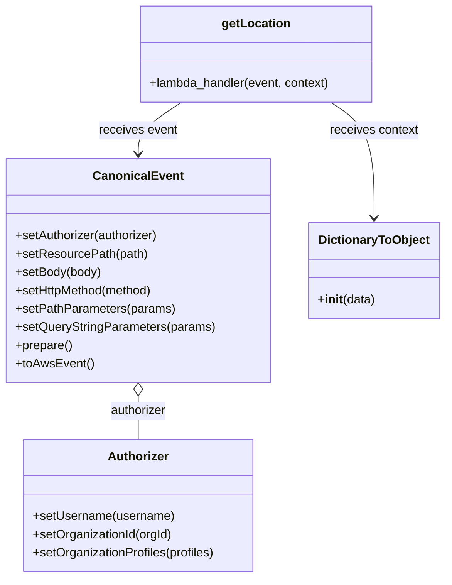

# Diagram: platform/tools/ide_local_testing/localTest/test/location/getLocationById.py


> Auto-generated by Obscura crawlers

## Diagram 1

```mermaid
flowchart TD
    Script[Script] --> Imports[Import modules: json, getLocation, DictionaryToObject, CanonicalEvent, Authorizer]
    Imports --> AuthorizerInst[Authorizer() instance]
    AuthorizerInst --> AuthorizerCfg[Configure Authorizer:<br/>setUsername("dave.damon@freightverify.com")<br/>setOrganizationId(295)<br/>setOrganizationProfiles(["SH"])]
    Script --> EventInst[CanonicalEvent() instance]
    EventInst --> EventCfg[Configure Event:<br/>setAuthorizer(authorizer)<br/>setResourcePath("/location/locations/402550")<br/>setBody(None)<br/>setHttpMethod("GET")<br/>setPathParameters(id=402550)<br/>setQueryStringParameters(grants_only=True)]
    EventCfg --> Prepared[prepare() -> toAwsEvent()]
    Prepared --> JsonDump[json.dumps(event)]
    JsonDump --> ContextObj[Context: DictionaryToObject({"function_name":"getLocationByLambda"})]
    Prepared --> Invoke[getLocation.lambda_handler(event, context)]
    ContextObj --> Invoke
    Invoke --> Output[print(retval)]
    AuthorizerCfg --> EventCfg
```

> SVG rendering failed for this diagram.

## Diagram 2



### SVG

<svg id="container" width="576.6953125" xmlns="http://www.w3.org/2000/svg" class="classDiagram" height="758" viewBox="0 0 576.6953125 758" role="graphics-document document" aria-roledescription="class"><style>#container{font-family:"trebuchet ms",verdana,arial,sans-serif;font-size:16px;fill:#333;}@keyframes edge-animation-frame{from{stroke-dashoffset:0;}}@keyframes dash{to{stroke-dashoffset:0;}}#container .edge-animation-slow{stroke-dasharray:9,5!important;stroke-dashoffset:900;animation:dash 50s linear infinite;stroke-linecap:round;}#container .edge-animation-fast{stroke-dasharray:9,5!important;stroke-dashoffset:900;animation:dash 20s linear infinite;stroke-linecap:round;}#container .error-icon{fill:#552222;}#container .error-text{fill:#552222;stroke:#552222;}#container .edge-thickness-normal{stroke-width:1px;}#container .edge-thickness-thick{stroke-width:3.5px;}#container .edge-pattern-solid{stroke-dasharray:0;}#container .edge-thickness-invisible{stroke-width:0;fill:none;}#container .edge-pattern-dashed{stroke-dasharray:3;}#container .edge-pattern-dotted{stroke-dasharray:2;}#container .marker{fill:#333333;stroke:#333333;}#container .marker.cross{stroke:#333333;}#container svg{font-family:"trebuchet ms",verdana,arial,sans-serif;font-size:16px;}#container p{margin:0;}#container g.classGroup text{fill:#9370DB;stroke:none;font-family:"trebuchet ms",verdana,arial,sans-serif;font-size:10px;}#container g.classGroup text .title{font-weight:bolder;}#container .nodeLabel,#container .edgeLabel{color:#131300;}#container .edgeLabel .label rect{fill:#ECECFF;}#container .label text{fill:#131300;}#container .labelBkg{background:#ECECFF;}#container .edgeLabel .label span{background:#ECECFF;}#container .classTitle{font-weight:bolder;}#container .node rect,#container .node circle,#container .node ellipse,#container .node polygon,#container .node path{fill:#ECECFF;stroke:#9370DB;stroke-width:1px;}#container .divider{stroke:#9370DB;stroke-width:1;}#container g.clickable{cursor:pointer;}#container g.classGroup rect{fill:#ECECFF;stroke:#9370DB;}#container g.classGroup line{stroke:#9370DB;stroke-width:1;}#container .classLabel .box{stroke:none;stroke-width:0;fill:#ECECFF;opacity:0.5;}#container .classLabel .label{fill:#9370DB;font-size:10px;}#container .relation{stroke:#333333;stroke-width:1;fill:none;}#container .dashed-line{stroke-dasharray:3;}#container .dotted-line{stroke-dasharray:1 2;}#container #compositionStart,#container .composition{fill:#333333!important;stroke:#333333!important;stroke-width:1;}#container #compositionEnd,#container .composition{fill:#333333!important;stroke:#333333!important;stroke-width:1;}#container #dependencyStart,#container .dependency{fill:#333333!important;stroke:#333333!important;stroke-width:1;}#container #dependencyStart,#container .dependency{fill:#333333!important;stroke:#333333!important;stroke-width:1;}#container #extensionStart,#container .extension{fill:transparent!important;stroke:#333333!important;stroke-width:1;}#container #extensionEnd,#container .extension{fill:transparent!important;stroke:#333333!important;stroke-width:1;}#container #aggregationStart,#container .aggregation{fill:transparent!important;stroke:#333333!important;stroke-width:1;}#container #aggregationEnd,#container .aggregation{fill:transparent!important;stroke:#333333!important;stroke-width:1;}#container #lollipopStart,#container .lollipop{fill:#ECECFF!important;stroke:#333333!important;stroke-width:1;}#container #lollipopEnd,#container .lollipop{fill:#ECECFF!important;stroke:#333333!important;stroke-width:1;}#container .edgeTerminals{font-size:11px;line-height:initial;}#container .classTitleText{text-anchor:middle;font-size:18px;fill:#333;}#container .label-icon{display:inline-block;height:1em;overflow:visible;vertical-align:-0.125em;}#container .node .label-icon path{fill:currentColor;stroke:revert;stroke-width:revert;}#container :root{--mermaid-font-family:"trebuchet ms",verdana,arial,sans-serif;}</style><g><defs><marker id="container_class-aggregationStart" class="marker aggregation class" refX="18" refY="7" markerWidth="190" markerHeight="240" orient="auto"><path d="M 18,7 L9,13 L1,7 L9,1 Z"></path></marker></defs><defs><marker id="container_class-aggregationEnd" class="marker aggregation class" refX="1" refY="7" markerWidth="20" markerHeight="28" orient="auto"><path d="M 18,7 L9,13 L1,7 L9,1 Z"></path></marker></defs><defs><marker id="container_class-extensionStart" class="marker extension class" refX="18" refY="7" markerWidth="190" markerHeight="240" orient="auto"><path d="M 1,7 L18,13 V 1 Z"></path></marker></defs><defs><marker id="container_class-extensionEnd" class="marker extension class" refX="1" refY="7" markerWidth="20" markerHeight="28" orient="auto"><path d="M 1,1 V 13 L18,7 Z"></path></marker></defs><defs><marker id="container_class-compositionStart" class="marker composition class" refX="18" refY="7" markerWidth="190" markerHeight="240" orient="auto"><path d="M 18,7 L9,13 L1,7 L9,1 Z"></path></marker></defs><defs><marker id="container_class-compositionEnd" class="marker composition class" refX="1" refY="7" markerWidth="20" markerHeight="28" orient="auto"><path d="M 18,7 L9,13 L1,7 L9,1 Z"></path></marker></defs><defs><marker id="container_class-dependencyStart" class="marker dependency class" refX="6" refY="7" markerWidth="190" markerHeight="240" orient="auto"><path d="M 5,7 L9,13 L1,7 L9,1 Z"></path></marker></defs><defs><marker id="container_class-dependencyEnd" class="marker dependency class" refX="13" refY="7" markerWidth="20" markerHeight="28" orient="auto"><path d="M 18,7 L9,13 L14,7 L9,1 Z"></path></marker></defs><defs><marker id="container_class-lollipopStart" class="marker lollipop class" refX="13" refY="7" markerWidth="190" markerHeight="240" orient="auto"><circle stroke="black" fill="transparent" cx="7" cy="7" r="6"></circle></marker></defs><defs><marker id="container_class-lollipopEnd" class="marker lollipop class" refX="1" refY="7" markerWidth="190" markerHeight="240" orient="auto"><circle stroke="black" fill="transparent" cx="7" cy="7" r="6"></circle></marker></defs><g class="root"><g class="clusters"></g><g class="edgePaths"><path d="M178.574,519.25L178.574,522.542C178.574,525.833,178.574,532.417,178.574,541.875C178.574,551.333,178.574,563.667,178.574,569.833L178.574,576" id="id_CanonicalEvent_Authorizer_1" class="edge-thickness-normal edge-pattern-solid relation" style=";;;" data-edge="true" data-et="edge" data-id="id_CanonicalEvent_Authorizer_1" data-points="W3sieCI6MTc4LjU3NDIxODc1LCJ5Ijo1MDJ9LHsieCI6MTc4LjU3NDIxODc1LCJ5Ijo1Mzl9LHsieCI6MTc4LjU3NDIxODc1LCJ5Ijo1NzZ9XQ==" marker-start="url(#container_class-aggregationStart)"></path><path d="M235.064,134L225.649,140.167C216.234,146.333,197.404,158.667,187.989,170C178.574,181.333,178.574,191.667,178.574,196.833L178.574,202" id="id_getLocation_CanonicalEvent_2" class="edge-thickness-normal edge-pattern-solid relation" style=";;;" data-edge="true" data-et="edge" data-id="id_getLocation_CanonicalEvent_2" data-points="W3sieCI6MjM1LjA2MzUzNTE1NjI1LCJ5IjoxMzR9LHsieCI6MTc4LjU3NDIxODc1LCJ5IjoxNzF9LHsieCI6MTc4LjU3NDIxODc1LCJ5IjoyMDh9XQ==" marker-end="url(#container_class-dependencyEnd)"></path><path d="M427.433,134L436.847,140.167C446.262,146.333,465.092,158.667,474.507,184C483.922,209.333,483.922,247.667,483.922,266.833L483.922,286" id="id_getLocation_DictionaryToObject_3" class="edge-thickness-normal edge-pattern-solid relation" style=";;;" data-edge="true" data-et="edge" data-id="id_getLocation_DictionaryToObject_3" data-points="W3sieCI6NDI3LjQzMjU1ODU5Mzc1LCJ5IjoxMzR9LHsieCI6NDgzLjkyMTg3NSwieSI6MTcxfSx7IngiOjQ4My45MjE4NzUsInkiOjI5Mn1d" marker-end="url(#container_class-dependencyEnd)"></path></g><g class="edgeLabels"><g class="edgeLabel" transform="translate(178.57421875, 539)"><g class="label" data-id="id_CanonicalEvent_Authorizer_1" transform="translate(-37.4921875, -12)"><foreignObject width="74.984375" height="24"><div xmlns="http://www.w3.org/1999/xhtml" class="labelBkg" style="display: table-cell; white-space: nowrap; line-height: 1.5; max-width: 200px; text-align: center;"><span class="edgeLabel"><p>authorizer</p></span></div></foreignObject></g></g><g class="edgeLabel" transform="translate(178.57421875, 171)"><g class="label" data-id="id_getLocation_CanonicalEvent_2" transform="translate(-51.78125, -12)"><foreignObject width="103.5625" height="24"><div xmlns="http://www.w3.org/1999/xhtml" class="labelBkg" style="display: table-cell; white-space: nowrap; line-height: 1.5; max-width: 200px; text-align: center;"><span class="edgeLabel"><p>receives event</p></span></div></foreignObject></g></g><g class="edgeLabel" transform="translate(483.921875, 171)"><g class="label" data-id="id_getLocation_DictionaryToObject_3" transform="translate(-58.4609375, -12)"><foreignObject width="116.921875" height="24"><div xmlns="http://www.w3.org/1999/xhtml" class="labelBkg" style="display: table-cell; white-space: nowrap; line-height: 1.5; max-width: 200px; text-align: center;"><span class="edgeLabel"><p>receives context</p></span></div></foreignObject></g></g></g><g class="nodes"><g class="node default" id="classId-Authorizer-0" transform="translate(178.57421875, 663)"><g class="basic label-container"><path d="M-151.66796875 -87 L151.66796875 -87 L151.66796875 87 L-151.66796875 87" stroke="none" stroke-width="0" fill="#ECECFF" style=""></path><path d="M-151.66796875 -87 C-66.31626940481905 -87, 19.035429940361894 -87, 151.66796875 -87 M-151.66796875 -87 C-63.31898930228478 -87, 25.029990145430446 -87, 151.66796875 -87 M151.66796875 -87 C151.66796875 -50.313422870811564, 151.66796875 -13.626845741623129, 151.66796875 87 M151.66796875 -87 C151.66796875 -32.8655736240483, 151.66796875 21.268852751903395, 151.66796875 87 M151.66796875 87 C32.8537212631136 87, -85.9605262237728 87, -151.66796875 87 M151.66796875 87 C36.33907392286868 87, -78.98982090426264 87, -151.66796875 87 M-151.66796875 87 C-151.66796875 37.06192843048902, -151.66796875 -12.876143139021963, -151.66796875 -87 M-151.66796875 87 C-151.66796875 39.72000560926082, -151.66796875 -7.559988781478367, -151.66796875 -87" stroke="#9370DB" stroke-width="1.3" fill="none" stroke-dasharray="0 0" style=""></path></g><g class="annotation-group text" transform="translate(0, -63)"></g><g class="label-group text" transform="translate(-38.3671875, -63)"><g class="label" style="font-weight: bolder" transform="translate(0,-12)"><foreignObject width="76.734375" height="24"><div xmlns="http://www.w3.org/1999/xhtml" style="display: table-cell; white-space: nowrap; line-height: 1.5; max-width: 126px; text-align: center;"><span class="nodeLabel markdown-node-label" style=""><p>Authorizer</p></span></div></foreignObject></g></g><g class="members-group text" transform="translate(-139.66796875, -15)"></g><g class="methods-group text" transform="translate(-139.66796875, 15)"><g class="label" style="" transform="translate(0,-12)"><foreignObject width="185.90625" height="24"><div xmlns="http://www.w3.org/1999/xhtml" style="display: table-cell; white-space: nowrap; line-height: 1.5; max-width: 243px; text-align: center;"><span class="nodeLabel markdown-node-label" style=""><p>+setUsername(username)</p></span></div></foreignObject></g><g class="label" style="" transform="translate(0,12)"><foreignObject width="184.578125" height="24"><div xmlns="http://www.w3.org/1999/xhtml" style="display: table-cell; white-space: nowrap; line-height: 1.5; max-width: 242px; text-align: center;"><span class="nodeLabel markdown-node-label" style=""><p>+setOrganizationId(orgId)</p></span></div></foreignObject></g><g class="label" style="" transform="translate(0,36)"><foreignObject width="240.96875" height="24"><div xmlns="http://www.w3.org/1999/xhtml" style="display: table-cell; white-space: nowrap; line-height: 1.5; max-width: 298px; text-align: center;"><span class="nodeLabel markdown-node-label" style=""><p>+setOrganizationProfiles(profiles)</p></span></div></foreignObject></g></g><g class="divider" style=""><path d="M-151.66796875 -39 C-88.97993777255321 -39, -26.291906795106428 -39, 151.66796875 -39 M-151.66796875 -39 C-54.59766843596256 -39, 42.47263187807488 -39, 151.66796875 -39" stroke="#9370DB" stroke-width="1.3" fill="none" stroke-dasharray="0 0" style=""></path></g><g class="divider" style=""><path d="M-151.66796875 -15 C-56.41049379948369 -15, 38.84698115103262 -15, 151.66796875 -15 M-151.66796875 -15 C-86.88617535328108 -15, -22.10438195656215 -15, 151.66796875 -15" stroke="#9370DB" stroke-width="1.3" fill="none" stroke-dasharray="0 0" style=""></path></g></g><g class="node default" id="classId-CanonicalEvent-1" transform="translate(178.57421875, 355)"><g class="basic label-container"><path d="M-170.57421875 -147 L170.57421875 -147 L170.57421875 147 L-170.57421875 147" stroke="none" stroke-width="0" fill="#ECECFF" style=""></path><path d="M-170.57421875 -147 C-61.535444167316015 -147, 47.50333041536797 -147, 170.57421875 -147 M-170.57421875 -147 C-79.83596529998213 -147, 10.90228815003573 -147, 170.57421875 -147 M170.57421875 -147 C170.57421875 -29.551116773482605, 170.57421875 87.89776645303479, 170.57421875 147 M170.57421875 -147 C170.57421875 -35.77209912094108, 170.57421875 75.45580175811784, 170.57421875 147 M170.57421875 147 C57.03561064356602 147, -56.50299746286797 147, -170.57421875 147 M170.57421875 147 C83.89537835911001 147, -2.783462031779976 147, -170.57421875 147 M-170.57421875 147 C-170.57421875 80.03511550888152, -170.57421875 13.070231017763035, -170.57421875 -147 M-170.57421875 147 C-170.57421875 85.14967605839199, -170.57421875 23.29935211678398, -170.57421875 -147" stroke="#9370DB" stroke-width="1.3" fill="none" stroke-dasharray="0 0" style=""></path></g><g class="annotation-group text" transform="translate(0, -123)"></g><g class="label-group text" transform="translate(-55.7109375, -123)"><g class="label" style="font-weight: bolder" transform="translate(0,-12)"><foreignObject width="111.421875" height="24"><div xmlns="http://www.w3.org/1999/xhtml" style="display: table-cell; white-space: nowrap; line-height: 1.5; max-width: 161px; text-align: center;"><span class="nodeLabel markdown-node-label" style=""><p>CanonicalEvent</p></span></div></foreignObject></g></g><g class="members-group text" transform="translate(-158.57421875, -75)"></g><g class="methods-group text" transform="translate(-158.57421875, -45)"><g class="label" style="" transform="translate(0,-12)"><foreignObject width="190.75" height="24"><div xmlns="http://www.w3.org/1999/xhtml" style="display: table-cell; white-space: nowrap; line-height: 1.5; max-width: 248px; text-align: center;"><span class="nodeLabel markdown-node-label" style=""><p>+setAuthorizer(authorizer)</p></span></div></foreignObject></g><g class="label" style="" transform="translate(0,12)"><foreignObject width="171.828125" height="24"><div xmlns="http://www.w3.org/1999/xhtml" style="display: table-cell; white-space: nowrap; line-height: 1.5; max-width: 229px; text-align: center;"><span class="nodeLabel markdown-node-label" style=""><p>+setResourcePath(path)</p></span></div></foreignObject></g><g class="label" style="" transform="translate(0,36)"><foreignObject width="113.125" height="24"><div xmlns="http://www.w3.org/1999/xhtml" style="display: table-cell; white-space: nowrap; line-height: 1.5; max-width: 170px; text-align: center;"><span class="nodeLabel markdown-node-label" style=""><p>+setBody(body)</p></span></div></foreignObject></g><g class="label" style="" transform="translate(0,60)"><foreignObject width="184" height="24"><div xmlns="http://www.w3.org/1999/xhtml" style="display: table-cell; white-space: nowrap; line-height: 1.5; max-width: 241px; text-align: center;"><span class="nodeLabel markdown-node-label" style=""><p>+setHttpMethod(method)</p></span></div></foreignObject></g><g class="label" style="" transform="translate(0,84)"><foreignObject width="207.6875" height="24"><div xmlns="http://www.w3.org/1999/xhtml" style="display: table-cell; white-space: nowrap; line-height: 1.5; max-width: 265px; text-align: center;"><span class="nodeLabel markdown-node-label" style=""><p>+setPathParameters(params)</p></span></div></foreignObject></g><g class="label" style="" transform="translate(0,108)"><foreignObject width="261.4375" height="24"><div xmlns="http://www.w3.org/1999/xhtml" style="display: table-cell; white-space: nowrap; line-height: 1.5; max-width: 319px; text-align: center;"><span class="nodeLabel markdown-node-label" style=""><p>+setQueryStringParameters(params)</p></span></div></foreignObject></g><g class="label" style="" transform="translate(0,132)"><foreignObject width="74.75" height="24"><div xmlns="http://www.w3.org/1999/xhtml" style="display: table-cell; white-space: nowrap; line-height: 1.5; max-width: 132px; text-align: center;"><span class="nodeLabel markdown-node-label" style=""><p>+prepare()</p></span></div></foreignObject></g><g class="label" style="" transform="translate(0,156)"><foreignObject width="101.1875" height="24"><div xmlns="http://www.w3.org/1999/xhtml" style="display: table-cell; white-space: nowrap; line-height: 1.5; max-width: 159px; text-align: center;"><span class="nodeLabel markdown-node-label" style=""><p>+toAwsEvent()</p></span></div></foreignObject></g></g><g class="divider" style=""><path d="M-170.57421875 -99 C-58.43358082019574 -99, 53.70705710960851 -99, 170.57421875 -99 M-170.57421875 -99 C-56.94518447661943 -99, 56.68384979676114 -99, 170.57421875 -99" stroke="#9370DB" stroke-width="1.3" fill="none" stroke-dasharray="0 0" style=""></path></g><g class="divider" style=""><path d="M-170.57421875 -75 C-91.612142045697 -75, -12.650065341393997 -75, 170.57421875 -75 M-170.57421875 -75 C-81.57230960678875 -75, 7.429599536422501 -75, 170.57421875 -75" stroke="#9370DB" stroke-width="1.3" fill="none" stroke-dasharray="0 0" style=""></path></g></g><g class="node default" id="classId-DictionaryToObject-2" transform="translate(483.921875, 355)"><g class="basic label-container"><path d="M-84.7734375 -63 L84.7734375 -63 L84.7734375 63 L-84.7734375 63" stroke="none" stroke-width="0" fill="#ECECFF" style=""></path><path d="M-84.7734375 -63 C-45.17339824438252 -63, -5.573358988765037 -63, 84.7734375 -63 M-84.7734375 -63 C-48.42978776668559 -63, -12.086138033371185 -63, 84.7734375 -63 M84.7734375 -63 C84.7734375 -17.24466656742794, 84.7734375 28.510666865144117, 84.7734375 63 M84.7734375 -63 C84.7734375 -20.17555615120927, 84.7734375 22.648887697581458, 84.7734375 63 M84.7734375 63 C36.33690946360186 63, -12.099618572796274 63, -84.7734375 63 M84.7734375 63 C29.480605207167564 63, -25.812227085664873 63, -84.7734375 63 M-84.7734375 63 C-84.7734375 25.53026620600904, -84.7734375 -11.939467587981923, -84.7734375 -63 M-84.7734375 63 C-84.7734375 29.52171023769835, -84.7734375 -3.956579524603299, -84.7734375 -63" stroke="#9370DB" stroke-width="1.3" fill="none" stroke-dasharray="0 0" style=""></path></g><g class="annotation-group text" transform="translate(0, -39)"></g><g class="label-group text" transform="translate(-70.109375, -39)"><g class="label" style="font-weight: bolder" transform="translate(0,-12)"><foreignObject width="140.21875" height="24"><div xmlns="http://www.w3.org/1999/xhtml" style="display: table-cell; white-space: nowrap; line-height: 1.5; max-width: 188px; text-align: center;"><span class="nodeLabel markdown-node-label" style=""><p>DictionaryToObject</p></span></div></foreignObject></g></g><g class="members-group text" transform="translate(-72.7734375, 9)"></g><g class="methods-group text" transform="translate(-72.7734375, 39)"><g class="label" style="" transform="translate(0,-12)"><foreignObject width="75.4375" height="24"><div xmlns="http://www.w3.org/1999/xhtml" style="display: table-cell; white-space: nowrap; line-height: 1.5; max-width: 164px; text-align: center;"><span class="nodeLabel markdown-node-label" style=""><p>+<strong>init</strong>(data)</p></span></div></foreignObject></g></g><g class="divider" style=""><path d="M-84.7734375 -15 C-47.18103338555586 -15, -9.588629271111714 -15, 84.7734375 -15 M-84.7734375 -15 C-30.896255129312124 -15, 22.980927241375753 -15, 84.7734375 -15" stroke="#9370DB" stroke-width="1.3" fill="none" stroke-dasharray="0 0" style=""></path></g><g class="divider" style=""><path d="M-84.7734375 9 C-23.49130139513013 9, 37.79083470973974 9, 84.7734375 9 M-84.7734375 9 C-19.85118016953068 9, 45.07107716093864 9, 84.7734375 9" stroke="#9370DB" stroke-width="1.3" fill="none" stroke-dasharray="0 0" style=""></path></g></g><g class="node default" id="classId-getLocation-3" transform="translate(331.248046875, 71)"><g class="basic label-container"><path d="M-153.63671875 -63 L153.63671875 -63 L153.63671875 63 L-153.63671875 63" stroke="none" stroke-width="0" fill="#ECECFF" style=""></path><path d="M-153.63671875 -63 C-65.34982803836405 -63, 22.937062673271896 -63, 153.63671875 -63 M-153.63671875 -63 C-63.99686444723589 -63, 25.642989855528214 -63, 153.63671875 -63 M153.63671875 -63 C153.63671875 -35.353307996872175, 153.63671875 -7.706615993744343, 153.63671875 63 M153.63671875 -63 C153.63671875 -18.241909534134734, 153.63671875 26.51618093173053, 153.63671875 63 M153.63671875 63 C37.28029468346354 63, -79.07612938307292 63, -153.63671875 63 M153.63671875 63 C60.16606702972629 63, -33.304584690547415 63, -153.63671875 63 M-153.63671875 63 C-153.63671875 16.51270022643513, -153.63671875 -29.974599547129742, -153.63671875 -63 M-153.63671875 63 C-153.63671875 20.814567151678794, -153.63671875 -21.37086569664241, -153.63671875 -63" stroke="#9370DB" stroke-width="1.3" fill="none" stroke-dasharray="0 0" style=""></path></g><g class="annotation-group text" transform="translate(0, -39)"></g><g class="label-group text" transform="translate(-43.0859375, -39)"><g class="label" style="font-weight: bolder" transform="translate(0,-12)"><foreignObject width="86.171875" height="24"><div xmlns="http://www.w3.org/1999/xhtml" style="display: table-cell; white-space: nowrap; line-height: 1.5; max-width: 135px; text-align: center;"><span class="nodeLabel markdown-node-label" style=""><p>getLocation</p></span></div></foreignObject></g></g><g class="members-group text" transform="translate(-141.63671875, 9)"></g><g class="methods-group text" transform="translate(-141.63671875, 39)"><g class="label" style="" transform="translate(0,-12)"><foreignObject width="240.1875" height="24"><div xmlns="http://www.w3.org/1999/xhtml" style="display: table-cell; white-space: nowrap; line-height: 1.5; max-width: 298px; text-align: center;"><span class="nodeLabel markdown-node-label" style=""><p>+lambda_handler(event, context)</p></span></div></foreignObject></g></g><g class="divider" style=""><path d="M-153.63671875 -15 C-85.81760916677199 -15, -17.998499583543975 -15, 153.63671875 -15 M-153.63671875 -15 C-71.21330396152486 -15, 11.210110826950284 -15, 153.63671875 -15" stroke="#9370DB" stroke-width="1.3" fill="none" stroke-dasharray="0 0" style=""></path></g><g class="divider" style=""><path d="M-153.63671875 9 C-76.73130347353043 9, 0.1741118029391373 9, 153.63671875 9 M-153.63671875 9 C-56.26292723118897 9, 41.110864287622064 9, 153.63671875 9" stroke="#9370DB" stroke-width="1.3" fill="none" stroke-dasharray="0 0" style=""></path></g></g></g></g></g></svg>
