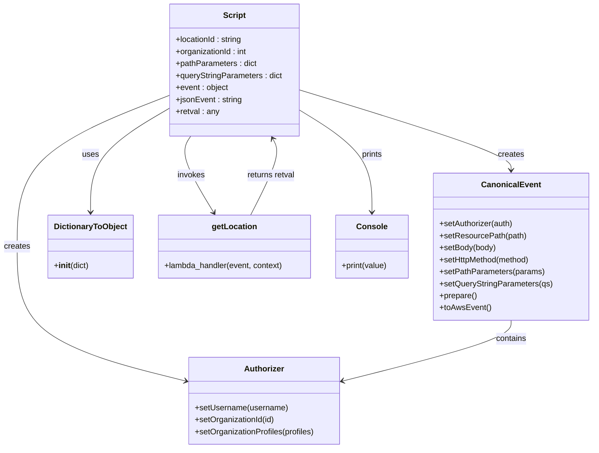
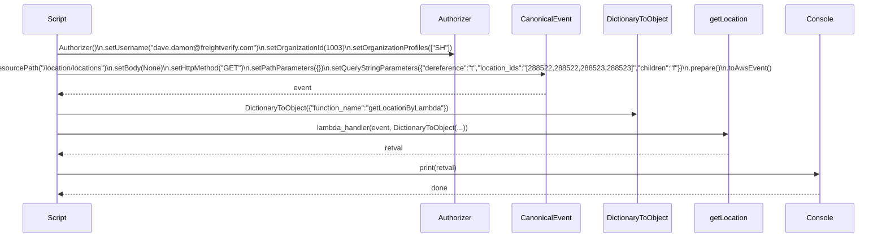

# Diagram: platform/tools/ide_local_testing/localTest/test/location/getLocationsByIdList.py

> Auto-generated by Obscura crawlers

## Diagram 1

### SVG

<svg id="container" width="1175.2578125" xmlns="http://www.w3.org/2000/svg" class="classDiagram" height="896" viewBox="0 0 1175.2578125 896" role="graphics-document document" aria-roledescription="class"><g><defs><marker id="container_class-aggregationStart" class="marker aggregation class" refX="18" refY="7" markerWidth="190" markerHeight="240" orient="auto"><path d="M 18,7 L9,13 L1,7 L9,1 Z"></path></marker></defs><defs><marker id="container_class-aggregationEnd" class="marker aggregation class" refX="1" refY="7" markerWidth="20" markerHeight="28" orient="auto"><path d="M 18,7 L9,13 L1,7 L9,1 Z"></path></marker></defs><defs><marker id="container_class-extensionStart" class="marker extension class" refX="18" refY="7" markerWidth="190" markerHeight="240" orient="auto"><path d="M 1,7 L18,13 V 1 Z"></path></marker></defs><defs><marker id="container_class-extensionEnd" class="marker extension class" refX="1" refY="7" markerWidth="20" markerHeight="28" orient="auto"><path d="M 1,1 V 13 L18,7 Z"></path></marker></defs><defs><marker id="container_class-compositionStart" class="marker composition class" refX="18" refY="7" markerWidth="190" markerHeight="240" orient="auto"><path d="M 18,7 L9,13 L1,7 L9,1 Z"></path></marker></defs><defs><marker id="container_class-compositionEnd" class="marker composition class" refX="1" refY="7" markerWidth="20" markerHeight="28" orient="auto"><path d="M 18,7 L9,13 L1,7 L9,1 Z"></path></marker></defs><defs><marker id="container_class-dependencyStart" class="marker dependency class" refX="6" refY="7" markerWidth="190" markerHeight="240" orient="auto"><path d="M 5,7 L9,13 L1,7 L9,1 Z"></path></marker></defs><defs><marker id="container_class-dependencyEnd" class="marker dependency class" refX="13" refY="7" markerWidth="20" markerHeight="28" orient="auto"><path d="M 18,7 L9,13 L14,7 L9,1 Z"></path></marker></defs><defs><marker id="container_class-lollipopStart" class="marker lollipop class" refX="13" refY="7" markerWidth="190" markerHeight="240" orient="auto"><circle stroke="black" fill="transparent" cx="7" cy="7" r="6"></circle></marker></defs><defs><marker id="container_class-lollipopEnd" class="marker lollipop class" refX="1" refY="7" markerWidth="190" markerHeight="240" orient="auto"><circle stroke="black" fill="transparent" cx="7" cy="7" r="6"></circle></marker></defs><g class="root"><g class="clusters"></g><g class="edgePaths"><path d="M333.578,191.111L283.677,210.759C233.776,230.407,133.974,269.704,84.073,320.019C34.172,370.333,34.172,431.667,34.172,493C34.172,554.333,34.172,615.667,89.655,660.363C145.139,705.059,256.105,733.119,311.588,747.148L367.072,761.178" id="id_Script_Authorizer_1" class="edge-thickness-normal edge-pattern-solid relation" style=";;;" data-edge="true" data-et="edge" data-id="id_Script_Authorizer_1" data-points="W3sieCI6MzMzLjU3ODEyNSwieSI6MTkxLjExMTEyMjIzNDQ1Nzl9LHsieCI6MzQuMTcxODc1LCJ5IjozMDl9LHsieCI6MzQuMTcxODc1LCJ5Ijo0OTN9LHsieCI6MzQuMTcxODc1LCJ5Ijo2Nzd9LHsieCI6MzcyLjg4ODY3MTg3NSwieSI6NzYyLjY0ODgzMjgyODE3NjJ9XQ==" marker-end="url(#container_class-dependencyEnd)"></path><path d="M593.195,179.774L663.486,201.312C733.777,222.849,874.359,265.925,944.65,292.629C1014.941,319.333,1014.941,329.667,1014.941,334.833L1014.941,340" id="id_Script_CanonicalEvent_2" class="edge-thickness-normal edge-pattern-solid relation" style=";;;" data-edge="true" data-et="edge" data-id="id_Script_CanonicalEvent_2" data-points="W3sieCI6NTkzLjE5NTMxMjUsInkiOjE3OS43NzQyMTA2ODI4NzA4Nn0seyJ4IjoxMDE0Ljk0MTQwNjI1LCJ5IjozMDl9LHsieCI6MTAxNC45NDE0MDYyNSwieSI6MzQ2fV0=" marker-end="url(#container_class-dependencyEnd)"></path><path d="M333.578,216.748L307.573,232.123C281.568,247.499,229.557,278.249,203.552,312.791C177.547,347.333,177.547,385.667,177.547,404.833L177.547,424" id="id_Script_DictionaryToObject_3" class="edge-thickness-normal edge-pattern-solid relation" style=";;;" data-edge="true" data-et="edge" data-id="id_Script_DictionaryToObject_3" data-points="W3sieCI6MzMzLjU3ODEyNSwieSI6MjE2Ljc0ODA1NjAzMDA2NDl9LHsieCI6MTc3LjU0Njg3NSwieSI6MzA5fSx7IngiOjE3Ny41NDY4NzUsInkiOjQzMH1d" marker-end="url(#container_class-dependencyEnd)"></path><path d="M376.782,272L372.736,278.167C368.69,284.333,360.598,296.667,368.188,322.143C375.779,347.62,399.052,386.241,410.689,405.551L422.325,424.861" id="id_Script_getLocation_4" class="edge-thickness-normal edge-pattern-solid relation" style=";;;" data-edge="true" data-et="edge" data-id="id_Script_getLocation_4" data-points="W3sieCI6Mzc2Ljc4MTU1MDQ4MDc2OTIsInkiOjI3Mn0seyJ4IjozNTIuNTA1ODU5Mzc1LCJ5IjozMDl9LHsieCI6NDI1LjQyMjA3NjY4MTM4NTksInkiOjQzMH1d" marker-end="url(#container_class-dependencyEnd)"></path><path d="M1014.941,640L1014.941,646.167C1014.941,652.333,1014.941,664.667,959.458,684.863C903.975,705.059,793.008,733.119,737.525,747.148L682.042,761.178" id="id_CanonicalEvent_Authorizer_5" class="edge-thickness-normal edge-pattern-solid relation" style=";;;" data-edge="true" data-et="edge" data-id="id_CanonicalEvent_Authorizer_5" data-points="W3sieCI6MTAxNC45NDE0MDYyNSwieSI6NjQwfSx7IngiOjEwMTQuOTQxNDA2MjUsInkiOjY3N30seyJ4Ijo2NzYuMjI0NjA5Mzc1LCJ5Ijo3NjIuNjQ4ODMyODI4MTc2Mn1d" marker-end="url(#container_class-dependencyEnd)"></path><path d="M495.256,430L505.457,409.833C515.659,389.667,536.062,349.333,543.349,323.876C550.637,298.419,544.809,287.837,541.895,282.546L538.981,277.256" id="id_getLocation_Script_6" class="edge-thickness-normal edge-pattern-solid relation" style=";;;" data-edge="true" data-et="edge" data-id="id_getLocation_Script_6" data-points="W3sieCI6NDk1LjI1NTg1OTM3NSwieSI6NDMwfSx7IngiOjU1Ni40NjQ4NDM3NSwieSI6MzA5fSx7IngiOjUzNi4wODY3OTI3MTQ0OTcsInkiOjI3Mn1d" marker-end="url(#container_class-dependencyEnd)"></path><path d="M593.195,219.358L617.633,234.299C642.072,249.239,690.948,279.119,715.386,313.226C739.824,347.333,739.824,385.667,739.824,404.833L739.824,424" id="id_Script_Console_7" class="edge-thickness-normal edge-pattern-solid relation" style=";;;" data-edge="true" data-et="edge" data-id="id_Script_Console_7" data-points="W3sieCI6NTkzLjE5NTMxMjUsInkiOjIxOS4zNTg0NTI5NzMwOTUxOH0seyJ4Ijo3MzkuODI0MjE4NzUsInkiOjMwOX0seyJ4Ijo3MzkuODI0MjE4NzUsInkiOjQzMH1d" marker-end="url(#container_class-dependencyEnd)"></path></g><g class="edgeLabels"><g class="edgeLabel" transform="translate(34.171875, 493)"><g class="label" data-id="id_Script_Authorizer_1" transform="translate(-26.171875, -12)"><foreignObject width="52.34375" height="24">

creates

</foreignObject></g></g><g class="edgeLabel" transform="translate(1014.94140625, 309)"><g class="label" data-id="id_Script_CanonicalEvent_2" transform="translate(-26.171875, -12)"><foreignObject width="52.34375" height="24">

creates

</foreignObject></g></g><g class="edgeLabel" transform="translate(177.546875, 309)"><g class="label" data-id="id_Script_DictionaryToObject_3" transform="translate(-16.4921875, -12)"><foreignObject width="32.984375" height="24">

uses

</foreignObject></g></g><g class="edgeLabel" transform="translate(377.54364, 350.54866)"><g class="label" data-id="id_Script_getLocation_4" transform="translate(-27.5859375, -12)"><foreignObject width="55.171875" height="24">

invokes

</foreignObject></g></g><g class="edgeLabel" transform="translate(1014.94140625, 677)"><g class="label" data-id="id_CanonicalEvent_Authorizer_5" transform="translate(-30.890625, -12)"><foreignObject width="61.78125" height="24">

contains

</foreignObject></g></g><g class="edgeLabel" transform="translate(535.39387, 350.65382)"><g class="label" data-id="id_getLocation_Script_6" transform="translate(-48.8671875, -12)"><foreignObject width="97.734375" height="24">

returns retval

</foreignObject></g></g><g class="edgeLabel" transform="translate(739.82421875, 309)"><g class="label" data-id="id_Script_Console_7" transform="translate(-21.4140625, -12)"><foreignObject width="42.828125" height="24">

prints

</foreignObject></g></g></g><g class="nodes"><g class="node default" id="classId-Script-0" transform="translate(463.38671875, 140)"><g class="basic label-container"><path d="M-129.80859375 -132 L129.80859375 -132 L129.80859375 132 L-129.80859375 132" stroke="none" stroke-width="0" fill="#ECECFF" style=""></path><path d="M-129.80859375 -132 C-40.0538494995299 -132, 49.70089475094019 -132, 129.80859375 -132 M-129.80859375 -132 C-75.49068378029133 -132, -21.172773810582683 -132, 129.80859375 -132 M129.80859375 -132 C129.80859375 -58.0397278194841, 129.80859375 15.920544361031801, 129.80859375 132 M129.80859375 -132 C129.80859375 -29.616820057375463, 129.80859375 72.76635988524907, 129.80859375 132 M129.80859375 132 C35.92538399620025 132, -57.957825757599494 132, -129.80859375 132 M129.80859375 132 C28.595484947484223 132, -72.61762385503155 132, -129.80859375 132 M-129.80859375 132 C-129.80859375 44.47629846686061, -129.80859375 -43.047403066278775, -129.80859375 -132 M-129.80859375 132 C-129.80859375 45.418729501062714, -129.80859375 -41.16254099787457, -129.80859375 -132" stroke="#9370DB" stroke-width="1.3" fill="none" stroke-dasharray="0 0" style=""></path></g><g class="annotation-group text" transform="translate(0, -108)"></g><g class="label-group text" transform="translate(-21.7421875, -108)"><g class="label" style="font-weight: bolder" transform="translate(0,-12)"><foreignObject width="43.484375" height="24">

Script

</foreignObject></g></g><g class="members-group text" transform="translate(-117.80859375, -60)"><g class="label" style="" transform="translate(0,-12)"><foreignObject width="135.390625" height="24">

+locationId : string

</foreignObject></g><g class="label" style="" transform="translate(0,12)"><foreignObject width="144.609375" height="24">

+organizationId : int

</foreignObject></g><g class="label" style="" transform="translate(0,36)"><foreignObject width="162.546875" height="24">

+pathParameters : dict

</foreignObject></g><g class="label" style="" transform="translate(0,60)"><foreignObject width="213.875" height="24">

+queryStringParameters : dict

</foreignObject></g><g class="label" style="" transform="translate(0,84)"><foreignObject width="106.125" height="24">

+event : object

</foreignObject></g><g class="label" style="" transform="translate(0,108)"><foreignObject width="132.375" height="24">

+jsonEvent : string

</foreignObject></g><g class="label" style="" transform="translate(0,132)"><foreignObject width="87.109375" height="24">

+retval : any

</foreignObject></g></g><g class="methods-group text" transform="translate(-117.80859375, 132)"></g><g class="divider" style=""><path d="M-129.80859375 -84 C-59.369150864942185 -84, 11.07029202011563 -84, 129.80859375 -84 M-129.80859375 -84 C-42.21804311496861 -84, 45.37250752006278 -84, 129.80859375 -84" stroke="#9370DB" stroke-width="1.3" fill="none" stroke-dasharray="0 0" style=""></path></g><g class="divider" style=""><path d="M-129.80859375 108 C-60.98134049872806 108, 7.845912752543882 108, 129.80859375 108 M-129.80859375 108 C-67.87208168664226 108, -5.935569623284522 108, 129.80859375 108" stroke="#9370DB" stroke-width="1.3" fill="none" stroke-dasharray="0 0" style=""></path></g></g><g class="node default" id="classId-Authorizer-1" transform="translate(524.556640625, 801)"><g class="basic label-container"><path d="M-151.66796875 -87 L151.66796875 -87 L151.66796875 87 L-151.66796875 87" stroke="none" stroke-width="0" fill="#ECECFF" style=""></path><path d="M-151.66796875 -87 C-62.49620095402102 -87, 26.67556684195796 -87, 151.66796875 -87 M-151.66796875 -87 C-68.10924736854534 -87, 15.44947401290932 -87, 151.66796875 -87 M151.66796875 -87 C151.66796875 -48.30123831317319, 151.66796875 -9.602476626346373, 151.66796875 87 M151.66796875 -87 C151.66796875 -25.651273709669717, 151.66796875 35.69745258066057, 151.66796875 87 M151.66796875 87 C42.24218383888726 87, -67.18360107222549 87, -151.66796875 87 M151.66796875 87 C33.85361973047013 87, -83.96072928905974 87, -151.66796875 87 M-151.66796875 87 C-151.66796875 27.927081671370246, -151.66796875 -31.14583665725951, -151.66796875 -87 M-151.66796875 87 C-151.66796875 22.156789044265622, -151.66796875 -42.686421911468756, -151.66796875 -87" stroke="#9370DB" stroke-width="1.3" fill="none" stroke-dasharray="0 0" style=""></path></g><g class="annotation-group text" transform="translate(0, -63)"></g><g class="label-group text" transform="translate(-38.3671875, -63)"><g class="label" style="font-weight: bolder" transform="translate(0,-12)"><foreignObject width="76.734375" height="24">

Authorizer

</foreignObject></g></g><g class="members-group text" transform="translate(-139.66796875, -15)"></g><g class="methods-group text" transform="translate(-139.66796875, 15)"><g class="label" style="" transform="translate(0,-12)"><foreignObject width="185.90625" height="24">

+setUsername(username)

</foreignObject></g><g class="label" style="" transform="translate(0,12)"><foreignObject width="160.78125" height="24">

+setOrganizationId(id)

</foreignObject></g><g class="label" style="" transform="translate(0,36)"><foreignObject width="240.96875" height="24">

+setOrganizationProfiles(profiles)

</foreignObject></g></g><g class="divider" style=""><path d="M-151.66796875 -39 C-57.285733777053935 -39, 37.09650119589213 -39, 151.66796875 -39 M-151.66796875 -39 C-90.36970828411289 -39, -29.071447818225778 -39, 151.66796875 -39" stroke="#9370DB" stroke-width="1.3" fill="none" stroke-dasharray="0 0" style=""></path></g><g class="divider" style=""><path d="M-151.66796875 -15 C-52.985427989778216 -15, 45.69711277044357 -15, 151.66796875 -15 M-151.66796875 -15 C-35.01588391022331 -15, 81.63620092955338 -15, 151.66796875 -15" stroke="#9370DB" stroke-width="1.3" fill="none" stroke-dasharray="0 0" style=""></path></g></g><g class="node default" id="classId-CanonicalEvent-2" transform="translate(1014.94140625, 493)"><g class="basic label-container"><path d="M-152.31640625 -147 L152.31640625 -147 L152.31640625 147 L-152.31640625 147" stroke="none" stroke-width="0" fill="#ECECFF" style=""></path><path d="M-152.31640625 -147 C-39.434122229566626 -147, 73.44816179086675 -147, 152.31640625 -147 M-152.31640625 -147 C-51.48571141354587 -147, 49.34498342290826 -147, 152.31640625 -147 M152.31640625 -147 C152.31640625 -30.460988493630182, 152.31640625 86.07802301273964, 152.31640625 147 M152.31640625 -147 C152.31640625 -82.94487764469788, 152.31640625 -18.889755289395765, 152.31640625 147 M152.31640625 147 C56.57202216018082 147, -39.172361929638356 147, -152.31640625 147 M152.31640625 147 C57.29721978069993 147, -37.72196668860013 147, -152.31640625 147 M-152.31640625 147 C-152.31640625 45.99345653689966, -152.31640625 -55.013086926200685, -152.31640625 -147 M-152.31640625 147 C-152.31640625 80.83586213899841, -152.31640625 14.671724277996816, -152.31640625 -147" stroke="#9370DB" stroke-width="1.3" fill="none" stroke-dasharray="0 0" style=""></path></g><g class="annotation-group text" transform="translate(0, -123)"></g><g class="label-group text" transform="translate(-55.7109375, -123)"><g class="label" style="font-weight: bolder" transform="translate(0,-12)"><foreignObject width="111.421875" height="24">

CanonicalEvent

</foreignObject></g></g><g class="members-group text" transform="translate(-140.31640625, -75)"></g><g class="methods-group text" transform="translate(-140.31640625, -45)"><g class="label" style="" transform="translate(0,-12)"><foreignObject width="148.9375" height="24">

+setAuthorizer(auth)

</foreignObject></g><g class="label" style="" transform="translate(0,12)"><foreignObject width="171.828125" height="24">

+setResourcePath(path)

</foreignObject></g><g class="label" style="" transform="translate(0,36)"><foreignObject width="113.125" height="24">

+setBody(body)

</foreignObject></g><g class="label" style="" transform="translate(0,60)"><foreignObject width="184" height="24">

+setHttpMethod(method)

</foreignObject></g><g class="label" style="" transform="translate(0,84)"><foreignObject width="207.6875" height="24">

+setPathParameters(params)

</foreignObject></g><g class="label" style="" transform="translate(0,108)"><foreignObject width="224.921875" height="24">

+setQueryStringParameters(qs)

</foreignObject></g><g class="label" style="" transform="translate(0,132)"><foreignObject width="74.75" height="24">

+prepare()

</foreignObject></g><g class="label" style="" transform="translate(0,156)"><foreignObject width="101.1875" height="24">

+toAwsEvent()

</foreignObject></g></g><g class="divider" style=""><path d="M-152.31640625 -99 C-91.23019849116673 -99, -30.143990732333478 -99, 152.31640625 -99 M-152.31640625 -99 C-81.0027262542043 -99, -9.68904625840861 -99, 152.31640625 -99" stroke="#9370DB" stroke-width="1.3" fill="none" stroke-dasharray="0 0" style=""></path></g><g class="divider" style=""><path d="M-152.31640625 -75 C-90.84733043737579 -75, -29.378254624751577 -75, 152.31640625 -75 M-152.31640625 -75 C-63.444505147749126 -75, 25.427395954501748 -75, 152.31640625 -75" stroke="#9370DB" stroke-width="1.3" fill="none" stroke-dasharray="0 0" style=""></path></g></g><g class="node default" id="classId-DictionaryToObject-3" transform="translate(177.546875, 493)"><g class="basic label-container"><path d="M-82.203125 -63 L82.203125 -63 L82.203125 63 L-82.203125 63" stroke="none" stroke-width="0" fill="#ECECFF" style=""></path><path d="M-82.203125 -63 C-43.635263563842514 -63, -5.067402127685028 -63, 82.203125 -63 M-82.203125 -63 C-16.529103637567815 -63, 49.14491772486437 -63, 82.203125 -63 M82.203125 -63 C82.203125 -18.35757682992051, 82.203125 26.28484634015898, 82.203125 63 M82.203125 -63 C82.203125 -13.673910813540282, 82.203125 35.65217837291944, 82.203125 63 M82.203125 63 C17.348010131289442 63, -47.507104737421116 63, -82.203125 63 M82.203125 63 C44.10885742880549 63, 6.014589857610986 63, -82.203125 63 M-82.203125 63 C-82.203125 17.947324283964306, -82.203125 -27.105351432071387, -82.203125 -63 M-82.203125 63 C-82.203125 33.48171088790883, -82.203125 3.9634217758176575, -82.203125 -63" stroke="#9370DB" stroke-width="1.3" fill="none" stroke-dasharray="0 0" style=""></path></g><g class="annotation-group text" transform="translate(0, -39)"></g><g class="label-group text" transform="translate(-70.109375, -39)"><g class="label" style="font-weight: bolder" transform="translate(0,-12)"><foreignObject width="140.21875" height="24">

DictionaryToObject

</foreignObject></g></g><g class="members-group text" transform="translate(-70.203125, 9)"></g><g class="methods-group text" transform="translate(-70.203125, 39)"><g class="label" style="" transform="translate(0,-12)"><foreignObject width="70.296875" height="24">

+<strong>init</strong>(dict)

</foreignObject></g></g><g class="divider" style=""><path d="M-82.203125 -15 C-24.06665497608453 -15, 34.06981504783094 -15, 82.203125 -15 M-82.203125 -15 C-42.23174327272802 -15, -2.2603615454560355 -15, 82.203125 -15" stroke="#9370DB" stroke-width="1.3" fill="none" stroke-dasharray="0 0" style=""></path></g><g class="divider" style=""><path d="M-82.203125 9 C-43.4088503296877 9, -4.614575659375404 9, 82.203125 9 M-82.203125 9 C-34.47736763157074 9, 13.248389736858513 9, 82.203125 9" stroke="#9370DB" stroke-width="1.3" fill="none" stroke-dasharray="0 0" style=""></path></g></g><g class="node default" id="classId-getLocation-4" transform="translate(463.38671875, 493)"><g class="basic label-container"><path d="M-153.63671875 -63 L153.63671875 -63 L153.63671875 63 L-153.63671875 63" stroke="none" stroke-width="0" fill="#ECECFF" style=""></path><path d="M-153.63671875 -63 C-84.58012391904225 -63, -15.523529088084501 -63, 153.63671875 -63 M-153.63671875 -63 C-57.94200547586229 -63, 37.752707798275424 -63, 153.63671875 -63 M153.63671875 -63 C153.63671875 -19.340104231638087, 153.63671875 24.319791536723827, 153.63671875 63 M153.63671875 -63 C153.63671875 -13.10070750227424, 153.63671875 36.79858499545152, 153.63671875 63 M153.63671875 63 C35.298962029867354 63, -83.03879469026529 63, -153.63671875 63 M153.63671875 63 C31.90256076515925 63, -89.8315972196815 63, -153.63671875 63 M-153.63671875 63 C-153.63671875 18.209655504343353, -153.63671875 -26.580688991313295, -153.63671875 -63 M-153.63671875 63 C-153.63671875 35.21039124093205, -153.63671875 7.420782481864094, -153.63671875 -63" stroke="#9370DB" stroke-width="1.3" fill="none" stroke-dasharray="0 0" style=""></path></g><g class="annotation-group text" transform="translate(0, -39)"></g><g class="label-group text" transform="translate(-43.0859375, -39)"><g class="label" style="font-weight: bolder" transform="translate(0,-12)"><foreignObject width="86.171875" height="24">

getLocation

</foreignObject></g></g><g class="members-group text" transform="translate(-141.63671875, 9)"></g><g class="methods-group text" transform="translate(-141.63671875, 39)"><g class="label" style="" transform="translate(0,-12)"><foreignObject width="240.1875" height="24">

+lambda_handler(event, context)

</foreignObject></g></g><g class="divider" style=""><path d="M-153.63671875 -15 C-41.221702283412725 -15, 71.19331418317455 -15, 153.63671875 -15 M-153.63671875 -15 C-30.843221077606714 -15, 91.95027659478657 -15, 153.63671875 -15" stroke="#9370DB" stroke-width="1.3" fill="none" stroke-dasharray="0 0" style=""></path></g><g class="divider" style=""><path d="M-153.63671875 9 C-51.56958938814995 9, 50.4975399737001 9, 153.63671875 9 M-153.63671875 9 C-70.03817690543626 9, 13.560364939127481 9, 153.63671875 9" stroke="#9370DB" stroke-width="1.3" fill="none" stroke-dasharray="0 0" style=""></path></g></g><g class="node default" id="classId-Console-5" transform="translate(739.82421875, 493)"><g class="basic label-container"><path d="M-72.80078125 -63 L72.80078125 -63 L72.80078125 63 L-72.80078125 63" stroke="none" stroke-width="0" fill="#ECECFF" style=""></path><path d="M-72.80078125 -63 C-23.625465339857307 -63, 25.549850570285386 -63, 72.80078125 -63 M-72.80078125 -63 C-33.361006519814794 -63, 6.078768210370413 -63, 72.80078125 -63 M72.80078125 -63 C72.80078125 -32.9601086772247, 72.80078125 -2.920217354449406, 72.80078125 63 M72.80078125 -63 C72.80078125 -30.845700471555354, 72.80078125 1.3085990568892925, 72.80078125 63 M72.80078125 63 C25.083674020544258 63, -22.633433208911484 63, -72.80078125 63 M72.80078125 63 C35.78152670985337 63, -1.2377278302932666 63, -72.80078125 63 M-72.80078125 63 C-72.80078125 18.813580401410064, -72.80078125 -25.37283919717987, -72.80078125 -63 M-72.80078125 63 C-72.80078125 37.11604901726763, -72.80078125 11.232098034535262, -72.80078125 -63" stroke="#9370DB" stroke-width="1.3" fill="none" stroke-dasharray="0 0" style=""></path></g><g class="annotation-group text" transform="translate(0, -39)"></g><g class="label-group text" transform="translate(-29.0234375, -39)"><g class="label" style="font-weight: bolder" transform="translate(0,-12)"><foreignObject width="58.046875" height="24">

Console

</foreignObject></g></g><g class="members-group text" transform="translate(-60.80078125, 9)"></g><g class="methods-group text" transform="translate(-60.80078125, 39)"><g class="label" style="" transform="translate(0,-12)"><foreignObject width="92.578125" height="24">

+print(value)

</foreignObject></g></g><g class="divider" style=""><path d="M-72.80078125 -15 C-30.60930248471466 -15, 11.582176280570678 -15, 72.80078125 -15 M-72.80078125 -15 C-24.013810606918085 -15, 24.77316003616383 -15, 72.80078125 -15" stroke="#9370DB" stroke-width="1.3" fill="none" stroke-dasharray="0 0" style=""></path></g><g class="divider" style=""><path d="M-72.80078125 9 C-17.700089094057482 9, 37.400603061885036 9, 72.80078125 9 M-72.80078125 9 C-15.905758794843386 9, 40.98926366031323 9, 72.80078125 9" stroke="#9370DB" stroke-width="1.3" fill="none" stroke-dasharray="0 0" style=""></path></g></g></g></g></g></svg>

## Diagram 2

### SVG

<svg id="container" width="2016" xmlns="http://www.w3.org/2000/svg" height="555" viewBox="-50 -10 2016 555" role="graphics-document document" aria-roledescription="sequence"><g><rect x="1766" y="469" fill="#eaeaea" stroke="#666" width="150" height="65" name="Console" rx="3" ry="3" class="actor actor-bottom"></rect><text x="1841" y="501.5" dominant-baseline="central" alignment-baseline="central" class="actor actor-box" style="text-anchor: middle; font-size: 16px; font-weight: 400;"><tspan x="1841" dy="0">Console</tspan></text></g><g><rect x="1566" y="469" fill="#eaeaea" stroke="#666" width="150" height="65" name="getLocation" rx="3" ry="3" class="actor actor-bottom"></rect><text x="1641" y="501.5" dominant-baseline="central" alignment-baseline="central" class="actor actor-box" style="text-anchor: middle; font-size: 16px; font-weight: 400;"><tspan x="1641" dy="0">getLocation</tspan></text></g><g><rect x="1358" y="469" fill="#eaeaea" stroke="#666" width="158" height="65" name="DictionaryToObject" rx="3" ry="3" class="actor actor-bottom"></rect><text x="1437" y="501.5" dominant-baseline="central" alignment-baseline="central" class="actor actor-box" style="text-anchor: middle; font-size: 16px; font-weight: 400;"><tspan x="1437" dy="0">DictionaryToObject</tspan></text></g><g><rect x="1158" y="469" fill="#eaeaea" stroke="#666" width="150" height="65" name="CanonicalEvent" rx="3" ry="3" class="actor actor-bottom"></rect><text x="1233" y="501.5" dominant-baseline="central" alignment-baseline="central" class="actor actor-box" style="text-anchor: middle; font-size: 16px; font-weight: 400;"><tspan x="1233" dy="0">CanonicalEvent</tspan></text></g><g><rect x="958" y="469" fill="#eaeaea" stroke="#666" width="150" height="65" name="Authorizer" rx="3" ry="3" class="actor actor-bottom"></rect><text x="1033" y="501.5" dominant-baseline="central" alignment-baseline="central" class="actor actor-box" style="text-anchor: middle; font-size: 16px; font-weight: 400;"><tspan x="1033" dy="0">Authorizer</tspan></text></g><g><rect x="0" y="469" fill="#eaeaea" stroke="#666" width="150" height="65" name="Script" rx="3" ry="3" class="actor actor-bottom"></rect><text x="75" y="501.5" dominant-baseline="central" alignment-baseline="central" class="actor actor-box" style="text-anchor: middle; font-size: 16px; font-weight: 400;"><tspan x="75" dy="0">Script</tspan></text></g><g><line id="actor5" x1="1841" y1="65" x2="1841" y2="469" class="actor-line 200" stroke-width="0.5px" stroke="#999" name="Console"></line><g id="root-5"><rect x="1766" y="0" fill="#eaeaea" stroke="#666" width="150" height="65" name="Console" rx="3" ry="3" class="actor actor-top"></rect><text x="1841" y="32.5" dominant-baseline="central" alignment-baseline="central" class="actor actor-box" style="text-anchor: middle; font-size: 16px; font-weight: 400;"><tspan x="1841" dy="0">Console</tspan></text></g></g><g><line id="actor4" x1="1641" y1="65" x2="1641" y2="469" class="actor-line 200" stroke-width="0.5px" stroke="#999" name="getLocation"></line><g id="root-4"><rect x="1566" y="0" fill="#eaeaea" stroke="#666" width="150" height="65" name="getLocation" rx="3" ry="3" class="actor actor-top"></rect><text x="1641" y="32.5" dominant-baseline="central" alignment-baseline="central" class="actor actor-box" style="text-anchor: middle; font-size: 16px; font-weight: 400;"><tspan x="1641" dy="0">getLocation</tspan></text></g></g><g><line id="actor3" x1="1437" y1="65" x2="1437" y2="469" class="actor-line 200" stroke-width="0.5px" stroke="#999" name="DictionaryToObject"></line><g id="root-3"><rect x="1358" y="0" fill="#eaeaea" stroke="#666" width="158" height="65" name="DictionaryToObject" rx="3" ry="3" class="actor actor-top"></rect><text x="1437" y="32.5" dominant-baseline="central" alignment-baseline="central" class="actor actor-box" style="text-anchor: middle; font-size: 16px; font-weight: 400;"><tspan x="1437" dy="0">DictionaryToObject</tspan></text></g></g><g><line id="actor2" x1="1233" y1="65" x2="1233" y2="469" class="actor-line 200" stroke-width="0.5px" stroke="#999" name="CanonicalEvent"></line><g id="root-2"><rect x="1158" y="0" fill="#eaeaea" stroke="#666" width="150" height="65" name="CanonicalEvent" rx="3" ry="3" class="actor actor-top"></rect><text x="1233" y="32.5" dominant-baseline="central" alignment-baseline="central" class="actor actor-box" style="text-anchor: middle; font-size: 16px; font-weight: 400;"><tspan x="1233" dy="0">CanonicalEvent</tspan></text></g></g><g><line id="actor1" x1="1033" y1="65" x2="1033" y2="469" class="actor-line 200" stroke-width="0.5px" stroke="#999" name="Authorizer"></line><g id="root-1"><rect x="958" y="0" fill="#eaeaea" stroke="#666" width="150" height="65" name="Authorizer" rx="3" ry="3" class="actor actor-top"></rect><text x="1033" y="32.5" dominant-baseline="central" alignment-baseline="central" class="actor actor-box" style="text-anchor: middle; font-size: 16px; font-weight: 400;"><tspan x="1033" dy="0">Authorizer</tspan></text></g></g><g><line id="actor0" x1="75" y1="65" x2="75" y2="469" class="actor-line 200" stroke-width="0.5px" stroke="#999" name="Script"></line><g id="root-0"><rect x="0" y="0" fill="#eaeaea" stroke="#666" width="150" height="65" name="Script" rx="3" ry="3" class="actor actor-top"></rect><text x="75" y="32.5" dominant-baseline="central" alignment-baseline="central" class="actor actor-box" style="text-anchor: middle; font-size: 16px; font-weight: 400;"><tspan x="75" dy="0">Script</tspan></text></g></g><g></g><defs><symbol id="computer" width="24" height="24"><path transform="scale(.5)" d="M2 2v13h20v-13h-20zm18 11h-16v-9h16v9zm-10.228 6l.466-1h3.524l.467 1h-4.457zm14.228 3h-24l2-6h2.104l-1.33 4h18.45l-1.297-4h2.073l2 6zm-5-10h-14v-7h14v7z"></path></symbol></defs><defs><symbol id="database" fill-rule="evenodd" clip-rule="evenodd"><path transform="scale(.5)" d="M12.258.001l.256.004.255.005.253.008.251.01.249.012.247.015.246.016.242.019.241.02.239.023.236.024.233.027.231.028.229.031.225.032.223.034.22.036.217.038.214.04.211.041.208.043.205.045.201.046.198.048.194.05.191.051.187.053.183.054.18.056.175.057.172.059.168.06.163.061.16.063.155.064.15.066.074.033.073.033.071.034.07.034.069.035.068.035.067.035.066.035.064.036.064.036.062.036.06.036.06.037.058.037.058.037.055.038.055.038.053.038.052.038.051.039.05.039.048.039.047.039.045.04.044.04.043.04.041.04.04.041.039.041.037.041.036.041.034.041.033.042.032.042.03.042.029.042.027.042.026.043.024.043.023.043.021.043.02.043.018.044.017.043.015.044.013.044.012.044.011.045.009.044.007.045.006.045.004.045.002.045.001.045v17l-.001.045-.002.045-.004.045-.006.045-.007.045-.009.044-.011.045-.012.044-.013.044-.015.044-.017.043-.018.044-.02.043-.021.043-.023.043-.024.043-.026.043-.027.042-.029.042-.03.042-.032.042-.033.042-.034.041-.036.041-.037.041-.039.041-.04.041-.041.04-.043.04-.044.04-.045.04-.047.039-.048.039-.05.039-.051.039-.052.038-.053.038-.055.038-.055.038-.058.037-.058.037-.06.037-.06.036-.062.036-.064.036-.064.036-.066.035-.067.035-.068.035-.069.035-.07.034-.071.034-.073.033-.074.033-.15.066-.155.064-.16.063-.163.061-.168.06-.172.059-.175.057-.18.056-.183.054-.187.053-.191.051-.194.05-.198.048-.201.046-.205.045-.208.043-.211.041-.214.04-.217.038-.22.036-.223.034-.225.032-.229.031-.231.028-.233.027-.236.024-.239.023-.241.02-.242.019-.246.016-.247.015-.249.012-.251.01-.253.008-.255.005-.256.004-.258.001-.258-.001-.256-.004-.255-.005-.253-.008-.251-.01-.249-.012-.247-.015-.245-.016-.243-.019-.241-.02-.238-.023-.236-.024-.234-.027-.231-.028-.228-.031-.226-.032-.223-.034-.22-.036-.217-.038-.214-.04-.211-.041-.208-.043-.204-.045-.201-.046-.198-.048-.195-.05-.19-.051-.187-.053-.184-.054-.179-.056-.176-.057-.172-.059-.167-.06-.164-.061-.159-.063-.155-.064-.151-.066-.074-.033-.072-.033-.072-.034-.07-.034-.069-.035-.068-.035-.067-.035-.066-.035-.064-.036-.063-.036-.062-.036-.061-.036-.06-.037-.058-.037-.057-.037-.056-.038-.055-.038-.053-.038-.052-.038-.051-.039-.049-.039-.049-.039-.046-.039-.046-.04-.044-.04-.043-.04-.041-.04-.04-.041-.039-.041-.037-.041-.036-.041-.034-.041-.033-.042-.032-.042-.03-.042-.029-.042-.027-.042-.026-.043-.024-.043-.023-.043-.021-.043-.02-.043-.018-.044-.017-.043-.015-.044-.013-.044-.012-.044-.011-.045-.009-.044-.007-.045-.006-.045-.004-.045-.002-.045-.001-.045v-17l.001-.045.002-.045.004-.045.006-.045.007-.045.009-.044.011-.045.012-.044.013-.044.015-.044.017-.043.018-.044.02-.043.021-.043.023-.043.024-.043.026-.043.027-.042.029-.042.03-.042.032-.042.033-.042.034-.041.036-.041.037-.041.039-.041.04-.041.041-.04.043-.04.044-.04.046-.04.046-.039.049-.039.049-.039.051-.039.052-.038.053-.038.055-.038.056-.038.057-.037.058-.037.06-.037.061-.036.062-.036.063-.036.064-.036.066-.035.067-.035.068-.035.069-.035.07-.034.072-.034.072-.033.074-.033.151-.066.155-.064.159-.063.164-.061.167-.06.172-.059.176-.057.179-.056.184-.054.187-.053.19-.051.195-.05.198-.048.201-.046.204-.045.208-.043.211-.041.214-.04.217-.038.22-.036.223-.034.226-.032.228-.031.231-.028.234-.027.236-.024.238-.023.241-.02.243-.019.245-.016.247-.015.249-.012.251-.01.253-.008.255-.005.256-.004.258-.001.258.001zm-9.258 20.499v.01l.001.021.003.021.004.022.005.021.006.022.007.022.009.023.01.022.011.023.012.023.013.023.015.023.016.024.017.023.018.024.019.024.021.024.022.025.023.024.024.025.052.049.056.05.061.051.066.051.07.051.075.051.079.052.084.052.088.052.092.052.097.052.102.051.105.052.11.052.114.051.119.051.123.051.127.05.131.05.135.05.139.048.144.049.147.047.152.047.155.047.16.045.163.045.167.043.171.043.176.041.178.041.183.039.187.039.19.037.194.035.197.035.202.033.204.031.209.03.212.029.216.027.219.025.222.024.226.021.23.02.233.018.236.016.24.015.243.012.246.01.249.008.253.005.256.004.259.001.26-.001.257-.004.254-.005.25-.008.247-.011.244-.012.241-.014.237-.016.233-.018.231-.021.226-.021.224-.024.22-.026.216-.027.212-.028.21-.031.205-.031.202-.034.198-.034.194-.036.191-.037.187-.039.183-.04.179-.04.175-.042.172-.043.168-.044.163-.045.16-.046.155-.046.152-.047.148-.048.143-.049.139-.049.136-.05.131-.05.126-.05.123-.051.118-.052.114-.051.11-.052.106-.052.101-.052.096-.052.092-.052.088-.053.083-.051.079-.052.074-.052.07-.051.065-.051.06-.051.056-.05.051-.05.023-.024.023-.025.021-.024.02-.024.019-.024.018-.024.017-.024.015-.023.014-.024.013-.023.012-.023.01-.023.01-.022.008-.022.006-.022.006-.022.004-.022.004-.021.001-.021.001-.021v-4.127l-.077.055-.08.053-.083.054-.085.053-.087.052-.09.052-.093.051-.095.05-.097.05-.1.049-.102.049-.105.048-.106.047-.109.047-.111.046-.114.045-.115.045-.118.044-.12.043-.122.042-.124.042-.126.041-.128.04-.13.04-.132.038-.134.038-.135.037-.138.037-.139.035-.142.035-.143.034-.144.033-.147.032-.148.031-.15.03-.151.03-.153.029-.154.027-.156.027-.158.026-.159.025-.161.024-.162.023-.163.022-.165.021-.166.02-.167.019-.169.018-.169.017-.171.016-.173.015-.173.014-.175.013-.175.012-.177.011-.178.01-.179.008-.179.008-.181.006-.182.005-.182.004-.184.003-.184.002h-.37l-.184-.002-.184-.003-.182-.004-.182-.005-.181-.006-.179-.008-.179-.008-.178-.01-.176-.011-.176-.012-.175-.013-.173-.014-.172-.015-.171-.016-.17-.017-.169-.018-.167-.019-.166-.02-.165-.021-.163-.022-.162-.023-.161-.024-.159-.025-.157-.026-.156-.027-.155-.027-.153-.029-.151-.03-.15-.03-.148-.031-.146-.032-.145-.033-.143-.034-.141-.035-.14-.035-.137-.037-.136-.037-.134-.038-.132-.038-.13-.04-.128-.04-.126-.041-.124-.042-.122-.042-.12-.044-.117-.043-.116-.045-.113-.045-.112-.046-.109-.047-.106-.047-.105-.048-.102-.049-.1-.049-.097-.05-.095-.05-.093-.052-.09-.051-.087-.052-.085-.053-.083-.054-.08-.054-.077-.054v4.127zm0-5.654v.011l.001.021.003.021.004.021.005.022.006.022.007.022.009.022.01.022.011.023.012.023.013.023.015.024.016.023.017.024.018.024.019.024.021.024.022.024.023.025.024.024.052.05.056.05.061.05.066.051.07.051.075.052.079.051.084.052.088.052.092.052.097.052.102.052.105.052.11.051.114.051.119.052.123.05.127.051.131.05.135.049.139.049.144.048.147.048.152.047.155.046.16.045.163.045.167.044.171.042.176.042.178.04.183.04.187.038.19.037.194.036.197.034.202.033.204.032.209.03.212.028.216.027.219.025.222.024.226.022.23.02.233.018.236.016.24.014.243.012.246.01.249.008.253.006.256.003.259.001.26-.001.257-.003.254-.006.25-.008.247-.01.244-.012.241-.015.237-.016.233-.018.231-.02.226-.022.224-.024.22-.025.216-.027.212-.029.21-.03.205-.032.202-.033.198-.035.194-.036.191-.037.187-.039.183-.039.179-.041.175-.042.172-.043.168-.044.163-.045.16-.045.155-.047.152-.047.148-.048.143-.048.139-.05.136-.049.131-.05.126-.051.123-.051.118-.051.114-.052.11-.052.106-.052.101-.052.096-.052.092-.052.088-.052.083-.052.079-.052.074-.051.07-.052.065-.051.06-.05.056-.051.051-.049.023-.025.023-.024.021-.025.02-.024.019-.024.018-.024.017-.024.015-.023.014-.023.013-.024.012-.022.01-.023.01-.023.008-.022.006-.022.006-.022.004-.021.004-.022.001-.021.001-.021v-4.139l-.077.054-.08.054-.083.054-.085.052-.087.053-.09.051-.093.051-.095.051-.097.05-.1.049-.102.049-.105.048-.106.047-.109.047-.111.046-.114.045-.115.044-.118.044-.12.044-.122.042-.124.042-.126.041-.128.04-.13.039-.132.039-.134.038-.135.037-.138.036-.139.036-.142.035-.143.033-.144.033-.147.033-.148.031-.15.03-.151.03-.153.028-.154.028-.156.027-.158.026-.159.025-.161.024-.162.023-.163.022-.165.021-.166.02-.167.019-.169.018-.169.017-.171.016-.173.015-.173.014-.175.013-.175.012-.177.011-.178.009-.179.009-.179.007-.181.007-.182.005-.182.004-.184.003-.184.002h-.37l-.184-.002-.184-.003-.182-.004-.182-.005-.181-.007-.179-.007-.179-.009-.178-.009-.176-.011-.176-.012-.175-.013-.173-.014-.172-.015-.171-.016-.17-.017-.169-.018-.167-.019-.166-.02-.165-.021-.163-.022-.162-.023-.161-.024-.159-.025-.157-.026-.156-.027-.155-.028-.153-.028-.151-.03-.15-.03-.148-.031-.146-.033-.145-.033-.143-.033-.141-.035-.14-.036-.137-.036-.136-.037-.134-.038-.132-.039-.13-.039-.128-.04-.126-.041-.124-.042-.122-.043-.12-.043-.117-.044-.116-.044-.113-.046-.112-.046-.109-.046-.106-.047-.105-.048-.102-.049-.1-.049-.097-.05-.095-.051-.093-.051-.09-.051-.087-.053-.085-.052-.083-.054-.08-.054-.077-.054v4.139zm0-5.666v.011l.001.02.003.022.004.021.005.022.006.021.007.022.009.023.01.022.011.023.012.023.013.023.015.023.016.024.017.024.018.023.019.024.021.025.022.024.023.024.024.025.052.05.056.05.061.05.066.051.07.051.075.052.079.051.084.052.088.052.092.052.097.052.102.052.105.051.11.052.114.051.119.051.123.051.127.05.131.05.135.05.139.049.144.048.147.048.152.047.155.046.16.045.163.045.167.043.171.043.176.042.178.04.183.04.187.038.19.037.194.036.197.034.202.033.204.032.209.03.212.028.216.027.219.025.222.024.226.021.23.02.233.018.236.017.24.014.243.012.246.01.249.008.253.006.256.003.259.001.26-.001.257-.003.254-.006.25-.008.247-.01.244-.013.241-.014.237-.016.233-.018.231-.02.226-.022.224-.024.22-.025.216-.027.212-.029.21-.03.205-.032.202-.033.198-.035.194-.036.191-.037.187-.039.183-.039.179-.041.175-.042.172-.043.168-.044.163-.045.16-.045.155-.047.152-.047.148-.048.143-.049.139-.049.136-.049.131-.051.126-.05.123-.051.118-.052.114-.051.11-.052.106-.052.101-.052.096-.052.092-.052.088-.052.083-.052.079-.052.074-.052.07-.051.065-.051.06-.051.056-.05.051-.049.023-.025.023-.025.021-.024.02-.024.019-.024.018-.024.017-.024.015-.023.014-.024.013-.023.012-.023.01-.022.01-.023.008-.022.006-.022.006-.022.004-.022.004-.021.001-.021.001-.021v-4.153l-.077.054-.08.054-.083.053-.085.053-.087.053-.09.051-.093.051-.095.051-.097.05-.1.049-.102.048-.105.048-.106.048-.109.046-.111.046-.114.046-.115.044-.118.044-.12.043-.122.043-.124.042-.126.041-.128.04-.13.039-.132.039-.134.038-.135.037-.138.036-.139.036-.142.034-.143.034-.144.033-.147.032-.148.032-.15.03-.151.03-.153.028-.154.028-.156.027-.158.026-.159.024-.161.024-.162.023-.163.023-.165.021-.166.02-.167.019-.169.018-.169.017-.171.016-.173.015-.173.014-.175.013-.175.012-.177.01-.178.01-.179.009-.179.007-.181.006-.182.006-.182.004-.184.003-.184.001-.185.001-.185-.001-.184-.001-.184-.003-.182-.004-.182-.006-.181-.006-.179-.007-.179-.009-.178-.01-.176-.01-.176-.012-.175-.013-.173-.014-.172-.015-.171-.016-.17-.017-.169-.018-.167-.019-.166-.02-.165-.021-.163-.023-.162-.023-.161-.024-.159-.024-.157-.026-.156-.027-.155-.028-.153-.028-.151-.03-.15-.03-.148-.032-.146-.032-.145-.033-.143-.034-.141-.034-.14-.036-.137-.036-.136-.037-.134-.038-.132-.039-.13-.039-.128-.041-.126-.041-.124-.041-.122-.043-.12-.043-.117-.044-.116-.044-.113-.046-.112-.046-.109-.046-.106-.048-.105-.048-.102-.048-.1-.05-.097-.049-.095-.051-.093-.051-.09-.052-.087-.052-.085-.053-.083-.053-.08-.054-.077-.054v4.153zm8.74-8.179l-.257.004-.254.005-.25.008-.247.011-.244.012-.241.014-.237.016-.233.018-.231.021-.226.022-.224.023-.22.026-.216.027-.212.028-.21.031-.205.032-.202.033-.198.034-.194.036-.191.038-.187.038-.183.04-.179.041-.175.042-.172.043-.168.043-.163.045-.16.046-.155.046-.152.048-.148.048-.143.048-.139.049-.136.05-.131.05-.126.051-.123.051-.118.051-.114.052-.11.052-.106.052-.101.052-.096.052-.092.052-.088.052-.083.052-.079.052-.074.051-.07.052-.065.051-.06.05-.056.05-.051.05-.023.025-.023.024-.021.024-.02.025-.019.024-.018.024-.017.023-.015.024-.014.023-.013.023-.012.023-.01.023-.01.022-.008.022-.006.023-.006.021-.004.022-.004.021-.001.021-.001.021.001.021.001.021.004.021.004.022.006.021.006.023.008.022.01.022.01.023.012.023.013.023.014.023.015.024.017.023.018.024.019.024.02.025.021.024.023.024.023.025.051.05.056.05.06.05.065.051.07.052.074.051.079.052.083.052.088.052.092.052.096.052.101.052.106.052.11.052.114.052.118.051.123.051.126.051.131.05.136.05.139.049.143.048.148.048.152.048.155.046.16.046.163.045.168.043.172.043.175.042.179.041.183.04.187.038.191.038.194.036.198.034.202.033.205.032.21.031.212.028.216.027.22.026.224.023.226.022.231.021.233.018.237.016.241.014.244.012.247.011.25.008.254.005.257.004.26.001.26-.001.257-.004.254-.005.25-.008.247-.011.244-.012.241-.014.237-.016.233-.018.231-.021.226-.022.224-.023.22-.026.216-.027.212-.028.21-.031.205-.032.202-.033.198-.034.194-.036.191-.038.187-.038.183-.04.179-.041.175-.042.172-.043.168-.043.163-.045.16-.046.155-.046.152-.048.148-.048.143-.048.139-.049.136-.05.131-.05.126-.051.123-.051.118-.051.114-.052.11-.052.106-.052.101-.052.096-.052.092-.052.088-.052.083-.052.079-.052.074-.051.07-.052.065-.051.06-.05.056-.05.051-.05.023-.025.023-.024.021-.024.02-.025.019-.024.018-.024.017-.023.015-.024.014-.023.013-.023.012-.023.01-.023.01-.022.008-.022.006-.023.006-.021.004-.022.004-.021.001-.021.001-.021-.001-.021-.001-.021-.004-.021-.004-.022-.006-.021-.006-.023-.008-.022-.01-.022-.01-.023-.012-.023-.013-.023-.014-.023-.015-.024-.017-.023-.018-.024-.019-.024-.02-.025-.021-.024-.023-.024-.023-.025-.051-.05-.056-.05-.06-.05-.065-.051-.07-.052-.074-.051-.079-.052-.083-.052-.088-.052-.092-.052-.096-.052-.101-.052-.106-.052-.11-.052-.114-.052-.118-.051-.123-.051-.126-.051-.131-.05-.136-.05-.139-.049-.143-.048-.148-.048-.152-.048-.155-.046-.16-.046-.163-.045-.168-.043-.172-.043-.175-.042-.179-.041-.183-.04-.187-.038-.191-.038-.194-.036-.198-.034-.202-.033-.205-.032-.21-.031-.212-.028-.216-.027-.22-.026-.224-.023-.226-.022-.231-.021-.233-.018-.237-.016-.241-.014-.244-.012-.247-.011-.25-.008-.254-.005-.257-.004-.26-.001-.26.001z"></path></symbol></defs><defs><symbol id="clock" width="24" height="24"><path transform="scale(.5)" d="M12 2c5.514 0 10 4.486 10 10s-4.486 10-10 10-10-4.486-10-10 4.486-10 10-10zm0-2c-6.627 0-12 5.373-12 12s5.373 12 12 12 12-5.373 12-12-5.373-12-12-12zm5.848 12.459c.202.038.202.333.001.372-1.907.361-6.045 1.111-6.547 1.111-.719 0-1.301-.582-1.301-1.301 0-.512.77-5.447 1.125-7.445.034-.192.312-.181.343.014l.985 6.238 5.394 1.011z"></path></symbol></defs><defs><marker id="arrowhead" refX="7.9" refY="5" markerUnits="userSpaceOnUse" markerWidth="12" markerHeight="12" orient="auto-start-reverse"><path d="M -1 0 L 10 5 L 0 10 z"></path></marker></defs><defs><marker id="crosshead" markerWidth="15" markerHeight="8" orient="auto" refX="4" refY="4.5"><path fill="none" stroke="#000000" stroke-width="1pt" d="M 1,2 L 6,7 M 6,2 L 1,7" style="stroke-dasharray: 0, 0;"></path></marker></defs><defs><marker id="filled-head" refX="15.5" refY="7" markerWidth="20" markerHeight="28" orient="auto"><path d="M 18,7 L9,13 L14,7 L9,1 Z"></path></marker></defs><defs><marker id="sequencenumber" refX="15" refY="15" markerWidth="60" markerHeight="40" orient="auto"><circle cx="15" cy="15" r="6"></circle></marker></defs><text x="553" y="80" text-anchor="middle" dominant-baseline="middle" alignment-baseline="middle" class="messageText" dy="1em" style="font-size: 16px; font-weight: 400;">Authorizer()\n.setUsername("dave.damon@freightverify.com")\n.setOrganizationId(1003)\n.setOrganizationProfiles(["SH"])</text><line x1="76" y1="113" x2="1029" y2="113" class="messageLine0" stroke-width="2" stroke="none" marker-end="url(#arrowhead)" style="fill: none;"></line><text x="653" y="128" text-anchor="middle" dominant-baseline="middle" alignment-baseline="middle" class="messageText" dy="1em" style="font-size: 16px; font-weight: 400;">CanonicalEvent()\n.setAuthorizer(authorizer)\n.setResourcePath("/location/locations")\n.setBody(None)\n.setHttpMethod("GET")\n.setPathParameters({})\n.setQueryStringParameters({"dereference":"t","location_ids":"[288522,288522,288523,288523]","children":"f"})\n.prepare()\n.toAwsEvent()</text><line x1="76" y1="161" x2="1229" y2="161" class="messageLine0" stroke-width="2" stroke="none" marker-end="url(#arrowhead)" style="fill: none;"></line><text x="656" y="176" text-anchor="middle" dominant-baseline="middle" alignment-baseline="middle" class="messageText" dy="1em" style="font-size: 16px; font-weight: 400;">event</text><line x1="1232" y1="209" x2="79" y2="209" class="messageLine1" stroke-width="2" stroke="none" marker-end="url(#arrowhead)" style="stroke-dasharray: 3, 3; fill: none;"></line><text x="755" y="224" text-anchor="middle" dominant-baseline="middle" alignment-baseline="middle" class="messageText" dy="1em" style="font-size: 16px; font-weight: 400;">DictionaryToObject({"function_name":"getLocationByLambda"})</text><line x1="76" y1="257" x2="1433" y2="257" class="messageLine0" stroke-width="2" stroke="none" marker-end="url(#arrowhead)" style="fill: none;"></line><text x="857" y="272" text-anchor="middle" dominant-baseline="middle" alignment-baseline="middle" class="messageText" dy="1em" style="font-size: 16px; font-weight: 400;">lambda_handler(event, DictionaryToObject(...))</text><line x1="76" y1="305" x2="1637" y2="305" class="messageLine0" stroke-width="2" stroke="none" marker-end="url(#arrowhead)" style="fill: none;"></line><text x="860" y="320" text-anchor="middle" dominant-baseline="middle" alignment-baseline="middle" class="messageText" dy="1em" style="font-size: 16px; font-weight: 400;">retval</text><line x1="1640" y1="353" x2="79" y2="353" class="messageLine1" stroke-width="2" stroke="none" marker-end="url(#arrowhead)" style="stroke-dasharray: 3, 3; fill: none;"></line><text x="957" y="368" text-anchor="middle" dominant-baseline="middle" alignment-baseline="middle" class="messageText" dy="1em" style="font-size: 16px; font-weight: 400;">print(retval)</text><line x1="76" y1="401" x2="1837" y2="401" class="messageLine0" stroke-width="2" stroke="none" marker-end="url(#arrowhead)" style="fill: none;"></line><text x="960" y="416" text-anchor="middle" dominant-baseline="middle" alignment-baseline="middle" class="messageText" dy="1em" style="font-size: 16px; font-weight: 400;">done</text><line x1="1840" y1="449" x2="79" y2="449" class="messageLine1" stroke-width="2" stroke="none" marker-end="url(#arrowhead)" style="stroke-dasharray: 3, 3; fill: none;"></line></svg>
