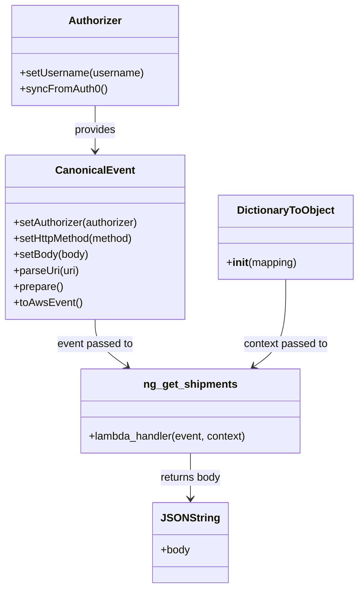

# Diagram: platform/tools/ide_local_testing/localTest/test/ngShipment/getBatchNgShipments.py


> Auto-generated by Obscura crawlers

## Diagram 1



### SVG

<svg id="container" width="537.0078125" xmlns="http://www.w3.org/2000/svg" class="classDiagram" height="880" viewBox="0 0 537.0078125 880" role="graphics-document document" aria-roledescription="class"><style>#container{font-family:"trebuchet ms",verdana,arial,sans-serif;font-size:16px;fill:#333;}@keyframes edge-animation-frame{from{stroke-dashoffset:0;}}@keyframes dash{to{stroke-dashoffset:0;}}#container .edge-animation-slow{stroke-dasharray:9,5!important;stroke-dashoffset:900;animation:dash 50s linear infinite;stroke-linecap:round;}#container .edge-animation-fast{stroke-dasharray:9,5!important;stroke-dashoffset:900;animation:dash 20s linear infinite;stroke-linecap:round;}#container .error-icon{fill:#552222;}#container .error-text{fill:#552222;stroke:#552222;}#container .edge-thickness-normal{stroke-width:1px;}#container .edge-thickness-thick{stroke-width:3.5px;}#container .edge-pattern-solid{stroke-dasharray:0;}#container .edge-thickness-invisible{stroke-width:0;fill:none;}#container .edge-pattern-dashed{stroke-dasharray:3;}#container .edge-pattern-dotted{stroke-dasharray:2;}#container .marker{fill:#333333;stroke:#333333;}#container .marker.cross{stroke:#333333;}#container svg{font-family:"trebuchet ms",verdana,arial,sans-serif;font-size:16px;}#container p{margin:0;}#container g.classGroup text{fill:#9370DB;stroke:none;font-family:"trebuchet ms",verdana,arial,sans-serif;font-size:10px;}#container g.classGroup text .title{font-weight:bolder;}#container .nodeLabel,#container .edgeLabel{color:#131300;}#container .edgeLabel .label rect{fill:#ECECFF;}#container .label text{fill:#131300;}#container .labelBkg{background:#ECECFF;}#container .edgeLabel .label span{background:#ECECFF;}#container .classTitle{font-weight:bolder;}#container .node rect,#container .node circle,#container .node ellipse,#container .node polygon,#container .node path{fill:#ECECFF;stroke:#9370DB;stroke-width:1px;}#container .divider{stroke:#9370DB;stroke-width:1;}#container g.clickable{cursor:pointer;}#container g.classGroup rect{fill:#ECECFF;stroke:#9370DB;}#container g.classGroup line{stroke:#9370DB;stroke-width:1;}#container .classLabel .box{stroke:none;stroke-width:0;fill:#ECECFF;opacity:0.5;}#container .classLabel .label{fill:#9370DB;font-size:10px;}#container .relation{stroke:#333333;stroke-width:1;fill:none;}#container .dashed-line{stroke-dasharray:3;}#container .dotted-line{stroke-dasharray:1 2;}#container #compositionStart,#container .composition{fill:#333333!important;stroke:#333333!important;stroke-width:1;}#container #compositionEnd,#container .composition{fill:#333333!important;stroke:#333333!important;stroke-width:1;}#container #dependencyStart,#container .dependency{fill:#333333!important;stroke:#333333!important;stroke-width:1;}#container #dependencyStart,#container .dependency{fill:#333333!important;stroke:#333333!important;stroke-width:1;}#container #extensionStart,#container .extension{fill:transparent!important;stroke:#333333!important;stroke-width:1;}#container #extensionEnd,#container .extension{fill:transparent!important;stroke:#333333!important;stroke-width:1;}#container #aggregationStart,#container .aggregation{fill:transparent!important;stroke:#333333!important;stroke-width:1;}#container #aggregationEnd,#container .aggregation{fill:transparent!important;stroke:#333333!important;stroke-width:1;}#container #lollipopStart,#container .lollipop{fill:#ECECFF!important;stroke:#333333!important;stroke-width:1;}#container #lollipopEnd,#container .lollipop{fill:#ECECFF!important;stroke:#333333!important;stroke-width:1;}#container .edgeTerminals{font-size:11px;line-height:initial;}#container .classTitleText{text-anchor:middle;font-size:18px;fill:#333;}#container .label-icon{display:inline-block;height:1em;overflow:visible;vertical-align:-0.125em;}#container .node .label-icon path{fill:currentColor;stroke:revert;stroke-width:revert;}#container :root{--mermaid-font-family:"trebuchet ms",verdana,arial,sans-serif;}</style><g><defs><marker id="container_class-aggregationStart" class="marker aggregation class" refX="18" refY="7" markerWidth="190" markerHeight="240" orient="auto"><path d="M 18,7 L9,13 L1,7 L9,1 Z"></path></marker></defs><defs><marker id="container_class-aggregationEnd" class="marker aggregation class" refX="1" refY="7" markerWidth="20" markerHeight="28" orient="auto"><path d="M 18,7 L9,13 L1,7 L9,1 Z"></path></marker></defs><defs><marker id="container_class-extensionStart" class="marker extension class" refX="18" refY="7" markerWidth="190" markerHeight="240" orient="auto"><path d="M 1,7 L18,13 V 1 Z"></path></marker></defs><defs><marker id="container_class-extensionEnd" class="marker extension class" refX="1" refY="7" markerWidth="20" markerHeight="28" orient="auto"><path d="M 1,1 V 13 L18,7 Z"></path></marker></defs><defs><marker id="container_class-compositionStart" class="marker composition class" refX="18" refY="7" markerWidth="190" markerHeight="240" orient="auto"><path d="M 18,7 L9,13 L1,7 L9,1 Z"></path></marker></defs><defs><marker id="container_class-compositionEnd" class="marker composition class" refX="1" refY="7" markerWidth="20" markerHeight="28" orient="auto"><path d="M 18,7 L9,13 L1,7 L9,1 Z"></path></marker></defs><defs><marker id="container_class-dependencyStart" class="marker dependency class" refX="6" refY="7" markerWidth="190" markerHeight="240" orient="auto"><path d="M 5,7 L9,13 L1,7 L9,1 Z"></path></marker></defs><defs><marker id="container_class-dependencyEnd" class="marker dependency class" refX="13" refY="7" markerWidth="20" markerHeight="28" orient="auto"><path d="M 18,7 L9,13 L14,7 L9,1 Z"></path></marker></defs><defs><marker id="container_class-lollipopStart" class="marker lollipop class" refX="13" refY="7" markerWidth="190" markerHeight="240" orient="auto"><circle stroke="black" fill="transparent" cx="7" cy="7" r="6"></circle></marker></defs><defs><marker id="container_class-lollipopEnd" class="marker lollipop class" refX="1" refY="7" markerWidth="190" markerHeight="240" orient="auto"><circle stroke="black" fill="transparent" cx="7" cy="7" r="6"></circle></marker></defs><g class="root"><g class="clusters"></g><g class="edgePaths"><path d="M143.23,158L143.23,164.167C143.23,170.333,143.23,182.667,143.23,194C143.23,205.333,143.23,215.667,143.23,220.833L143.23,226" id="id_Authorizer_CanonicalEvent_1" class="edge-thickness-normal edge-pattern-solid relation" style=";;;" data-edge="true" data-et="edge" data-id="id_Authorizer_CanonicalEvent_1" data-points="W3sieCI6MTQzLjIzMDQ2ODc1LCJ5IjoxNTh9LHsieCI6MTQzLjIzMDQ2ODc1LCJ5IjoxOTV9LHsieCI6MTQzLjIzMDQ2ODc1LCJ5IjoyMzJ9XQ==" marker-end="url(#container_class-dependencyEnd)"></path><path d="M143.23,478L143.23,484.167C143.23,490.333,143.23,502.667,151.214,514.426C159.198,526.186,175.166,537.372,183.15,542.965L191.134,548.558" id="id_CanonicalEvent_ng_get_shipments_2" class="edge-thickness-normal edge-pattern-solid relation" style=";;;" data-edge="true" data-et="edge" data-id="id_CanonicalEvent_ng_get_shipments_2" data-points="W3sieCI6MTQzLjIzMDQ2ODc1LCJ5Ijo0Nzh9LHsieCI6MTQzLjIzMDQ2ODc1LCJ5Ijo1MTV9LHsieCI6MTk2LjA0ODY5MTQwNjI1LCJ5Ijo1NTJ9XQ==" marker-end="url(#container_class-dependencyEnd)"></path><path d="M428.734,418L428.734,434.167C428.734,450.333,428.734,482.667,420.75,504.426C412.766,526.186,396.798,537.372,388.814,542.965L380.83,548.558" id="id_DictionaryToObject_ng_get_shipments_3" class="edge-thickness-normal edge-pattern-solid relation" style=";;;" data-edge="true" data-et="edge" data-id="id_DictionaryToObject_ng_get_shipments_3" data-points="W3sieCI6NDI4LjczNDM3NSwieSI6NDE4fSx7IngiOjQyOC43MzQzNzUsInkiOjUxNX0seyJ4IjozNzUuOTE2MTUyMzQzNzUsInkiOjU1Mn1d" marker-end="url(#container_class-dependencyEnd)"></path><path d="M285.982,678L285.982,684.167C285.982,690.333,285.982,702.667,285.982,714C285.982,725.333,285.982,735.667,285.982,740.833L285.982,746" id="id_ng_get_shipments_JSONString_4" class="edge-thickness-normal edge-pattern-solid relation" style=";;;" data-edge="true" data-et="edge" data-id="id_ng_get_shipments_JSONString_4" data-points="W3sieCI6Mjg1Ljk4MjQyMTg3NSwieSI6Njc4fSx7IngiOjI4NS45ODI0MjE4NzUsInkiOjcxNX0seyJ4IjoyODUuOTgyNDIxODc1LCJ5Ijo3NTJ9XQ==" marker-end="url(#container_class-dependencyEnd)"></path></g><g class="edgeLabels"><g class="edgeLabel" transform="translate(143.23046875, 195)"><g class="label" data-id="id_Authorizer_CanonicalEvent_1" transform="translate(-31.3125, -12)"><foreignObject width="62.625" height="24"><div xmlns="http://www.w3.org/1999/xhtml" class="labelBkg" style="display: table-cell; white-space: nowrap; line-height: 1.5; max-width: 200px; text-align: center;"><span class="edgeLabel"><p>provides</p></span></div></foreignObject></g></g><g class="edgeLabel" transform="translate(143.23046875, 515)"><g class="label" data-id="id_CanonicalEvent_ng_get_shipments_2" transform="translate(-57.328125, -12)"><foreignObject width="114.65625" height="24"><div xmlns="http://www.w3.org/1999/xhtml" class="labelBkg" style="display: table-cell; white-space: nowrap; line-height: 1.5; max-width: 200px; text-align: center;"><span class="edgeLabel"><p>event passed to</p></span></div></foreignObject></g></g><g class="edgeLabel" transform="translate(428.734375, 515)"><g class="label" data-id="id_DictionaryToObject_ng_get_shipments_3" transform="translate(-64.015625, -12)"><foreignObject width="128.03125" height="24"><div xmlns="http://www.w3.org/1999/xhtml" class="labelBkg" style="display: table-cell; white-space: nowrap; line-height: 1.5; max-width: 200px; text-align: center;"><span class="edgeLabel"><p>context passed to</p></span></div></foreignObject></g></g><g class="edgeLabel" transform="translate(285.982421875, 715)"><g class="label" data-id="id_ng_get_shipments_JSONString_4" transform="translate(-46.53125, -12)"><foreignObject width="93.0625" height="24"><div xmlns="http://www.w3.org/1999/xhtml" class="labelBkg" style="display: table-cell; white-space: nowrap; line-height: 1.5; max-width: 200px; text-align: center;"><span class="edgeLabel"><p>returns body</p></span></div></foreignObject></g></g></g><g class="nodes"><g class="node default" id="classId-Authorizer-0" transform="translate(143.23046875, 83)"><g class="basic label-container"><path d="M-124.13671875 -75 L124.13671875 -75 L124.13671875 75 L-124.13671875 75" stroke="none" stroke-width="0" fill="#ECECFF" style=""></path><path d="M-124.13671875 -75 C-47.77935746427816 -75, 28.578003821443673 -75, 124.13671875 -75 M-124.13671875 -75 C-58.09681293987839 -75, 7.94309287024322 -75, 124.13671875 -75 M124.13671875 -75 C124.13671875 -23.831683159953926, 124.13671875 27.33663368009215, 124.13671875 75 M124.13671875 -75 C124.13671875 -29.32317042453382, 124.13671875 16.35365915093236, 124.13671875 75 M124.13671875 75 C46.15049209022722 75, -31.835734569545565 75, -124.13671875 75 M124.13671875 75 C65.0115843971566 75, 5.886450044313193 75, -124.13671875 75 M-124.13671875 75 C-124.13671875 39.57214684719931, -124.13671875 4.144293694398627, -124.13671875 -75 M-124.13671875 75 C-124.13671875 37.937452666843576, -124.13671875 0.8749053336871526, -124.13671875 -75" stroke="#9370DB" stroke-width="1.3" fill="none" stroke-dasharray="0 0" style=""></path></g><g class="annotation-group text" transform="translate(0, -51)"></g><g class="label-group text" transform="translate(-38.3671875, -51)"><g class="label" style="font-weight: bolder" transform="translate(0,-12)"><foreignObject width="76.734375" height="24"><div xmlns="http://www.w3.org/1999/xhtml" style="display: table-cell; white-space: nowrap; line-height: 1.5; max-width: 126px; text-align: center;"><span class="nodeLabel markdown-node-label" style=""><p>Authorizer</p></span></div></foreignObject></g></g><g class="members-group text" transform="translate(-112.13671875, -3)"></g><g class="methods-group text" transform="translate(-112.13671875, 27)"><g class="label" style="" transform="translate(0,-12)"><foreignObject width="185.90625" height="24"><div xmlns="http://www.w3.org/1999/xhtml" style="display: table-cell; white-space: nowrap; line-height: 1.5; max-width: 243px; text-align: center;"><span class="nodeLabel markdown-node-label" style=""><p>+setUsername(username)</p></span></div></foreignObject></g><g class="label" style="" transform="translate(0,12)"><foreignObject width="129.0625" height="24"><div xmlns="http://www.w3.org/1999/xhtml" style="display: table-cell; white-space: nowrap; line-height: 1.5; max-width: 186px; text-align: center;"><span class="nodeLabel markdown-node-label" style=""><p>+syncFromAuth0()</p></span></div></foreignObject></g></g><g class="divider" style=""><path d="M-124.13671875 -27 C-65.3405020946827 -27, -6.544285439365396 -27, 124.13671875 -27 M-124.13671875 -27 C-57.67428950997345 -27, 8.788139730053103 -27, 124.13671875 -27" stroke="#9370DB" stroke-width="1.3" fill="none" stroke-dasharray="0 0" style=""></path></g><g class="divider" style=""><path d="M-124.13671875 -3 C-70.23551149013531 -3, -16.334304230270618 -3, 124.13671875 -3 M-124.13671875 -3 C-70.28963079250543 -3, -16.44254283501087 -3, 124.13671875 -3" stroke="#9370DB" stroke-width="1.3" fill="none" stroke-dasharray="0 0" style=""></path></g></g><g class="node default" id="classId-CanonicalEvent-1" transform="translate(143.23046875, 355)"><g class="basic label-container"><path d="M-135.23046875 -123 L135.23046875 -123 L135.23046875 123 L-135.23046875 123" stroke="none" stroke-width="0" fill="#ECECFF" style=""></path><path d="M-135.23046875 -123 C-40.98124859233684 -123, 53.26797156532632 -123, 135.23046875 -123 M-135.23046875 -123 C-54.39497779751062 -123, 26.44051315497876 -123, 135.23046875 -123 M135.23046875 -123 C135.23046875 -53.99330982351998, 135.23046875 15.013380352960041, 135.23046875 123 M135.23046875 -123 C135.23046875 -58.233494651542074, 135.23046875 6.533010696915852, 135.23046875 123 M135.23046875 123 C73.22416802803488 123, 11.21786730606975 123, -135.23046875 123 M135.23046875 123 C66.98709009018802 123, -1.2562885696239618 123, -135.23046875 123 M-135.23046875 123 C-135.23046875 43.86875090250422, -135.23046875 -35.262498194991565, -135.23046875 -123 M-135.23046875 123 C-135.23046875 27.745139678761646, -135.23046875 -67.50972064247671, -135.23046875 -123" stroke="#9370DB" stroke-width="1.3" fill="none" stroke-dasharray="0 0" style=""></path></g><g class="annotation-group text" transform="translate(0, -99)"></g><g class="label-group text" transform="translate(-55.7109375, -99)"><g class="label" style="font-weight: bolder" transform="translate(0,-12)"><foreignObject width="111.421875" height="24"><div xmlns="http://www.w3.org/1999/xhtml" style="display: table-cell; white-space: nowrap; line-height: 1.5; max-width: 161px; text-align: center;"><span class="nodeLabel markdown-node-label" style=""><p>CanonicalEvent</p></span></div></foreignObject></g></g><g class="members-group text" transform="translate(-123.23046875, -51)"></g><g class="methods-group text" transform="translate(-123.23046875, -21)"><g class="label" style="" transform="translate(0,-12)"><foreignObject width="190.75" height="24"><div xmlns="http://www.w3.org/1999/xhtml" style="display: table-cell; white-space: nowrap; line-height: 1.5; max-width: 248px; text-align: center;"><span class="nodeLabel markdown-node-label" style=""><p>+setAuthorizer(authorizer)</p></span></div></foreignObject></g><g class="label" style="" transform="translate(0,12)"><foreignObject width="184" height="24"><div xmlns="http://www.w3.org/1999/xhtml" style="display: table-cell; white-space: nowrap; line-height: 1.5; max-width: 241px; text-align: center;"><span class="nodeLabel markdown-node-label" style=""><p>+setHttpMethod(method)</p></span></div></foreignObject></g><g class="label" style="" transform="translate(0,36)"><foreignObject width="113.125" height="24"><div xmlns="http://www.w3.org/1999/xhtml" style="display: table-cell; white-space: nowrap; line-height: 1.5; max-width: 170px; text-align: center;"><span class="nodeLabel markdown-node-label" style=""><p>+setBody(body)</p></span></div></foreignObject></g><g class="label" style="" transform="translate(0,60)"><foreignObject width="99.8125" height="24"><div xmlns="http://www.w3.org/1999/xhtml" style="display: table-cell; white-space: nowrap; line-height: 1.5; max-width: 157px; text-align: center;"><span class="nodeLabel markdown-node-label" style=""><p>+parseUri(uri)</p></span></div></foreignObject></g><g class="label" style="" transform="translate(0,84)"><foreignObject width="74.75" height="24"><div xmlns="http://www.w3.org/1999/xhtml" style="display: table-cell; white-space: nowrap; line-height: 1.5; max-width: 132px; text-align: center;"><span class="nodeLabel markdown-node-label" style=""><p>+prepare()</p></span></div></foreignObject></g><g class="label" style="" transform="translate(0,108)"><foreignObject width="101.1875" height="24"><div xmlns="http://www.w3.org/1999/xhtml" style="display: table-cell; white-space: nowrap; line-height: 1.5; max-width: 159px; text-align: center;"><span class="nodeLabel markdown-node-label" style=""><p>+toAwsEvent()</p></span></div></foreignObject></g></g><g class="divider" style=""><path d="M-135.23046875 -75 C-39.868747889136586 -75, 55.49297297172683 -75, 135.23046875 -75 M-135.23046875 -75 C-39.88254335999818 -75, 55.46538203000364 -75, 135.23046875 -75" stroke="#9370DB" stroke-width="1.3" fill="none" stroke-dasharray="0 0" style=""></path></g><g class="divider" style=""><path d="M-135.23046875 -51 C-37.42361865053749 -51, 60.38323144892502 -51, 135.23046875 -51 M-135.23046875 -51 C-44.463044135073204 -51, 46.30438047985359 -51, 135.23046875 -51" stroke="#9370DB" stroke-width="1.3" fill="none" stroke-dasharray="0 0" style=""></path></g></g><g class="node default" id="classId-DictionaryToObject-2" transform="translate(428.734375, 355)"><g class="basic label-container"><path d="M-100.2734375 -63 L100.2734375 -63 L100.2734375 63 L-100.2734375 63" stroke="none" stroke-width="0" fill="#ECECFF" style=""></path><path d="M-100.2734375 -63 C-32.48017581111543 -63, 35.31308587776914 -63, 100.2734375 -63 M-100.2734375 -63 C-58.82251982104905 -63, -17.371602142098098 -63, 100.2734375 -63 M100.2734375 -63 C100.2734375 -22.214474683462072, 100.2734375 18.571050633075856, 100.2734375 63 M100.2734375 -63 C100.2734375 -30.711927691136395, 100.2734375 1.5761446177272092, 100.2734375 63 M100.2734375 63 C28.249606976776136 63, -43.77422354644773 63, -100.2734375 63 M100.2734375 63 C26.401162480255394 63, -47.47111253948921 63, -100.2734375 63 M-100.2734375 63 C-100.2734375 18.607041315515993, -100.2734375 -25.785917368968015, -100.2734375 -63 M-100.2734375 63 C-100.2734375 27.91151058547503, -100.2734375 -7.176978829049943, -100.2734375 -63" stroke="#9370DB" stroke-width="1.3" fill="none" stroke-dasharray="0 0" style=""></path></g><g class="annotation-group text" transform="translate(0, -39)"></g><g class="label-group text" transform="translate(-70.109375, -39)"><g class="label" style="font-weight: bolder" transform="translate(0,-12)"><foreignObject width="140.21875" height="24"><div xmlns="http://www.w3.org/1999/xhtml" style="display: table-cell; white-space: nowrap; line-height: 1.5; max-width: 188px; text-align: center;"><span class="nodeLabel markdown-node-label" style=""><p>DictionaryToObject</p></span></div></foreignObject></g></g><g class="members-group text" transform="translate(-88.2734375, 9)"></g><g class="methods-group text" transform="translate(-88.2734375, 39)"><g class="label" style="" transform="translate(0,-12)"><foreignObject width="106.4375" height="24"><div xmlns="http://www.w3.org/1999/xhtml" style="display: table-cell; white-space: nowrap; line-height: 1.5; max-width: 195px; text-align: center;"><span class="nodeLabel markdown-node-label" style=""><p>+<strong>init</strong>(mapping)</p></span></div></foreignObject></g></g><g class="divider" style=""><path d="M-100.2734375 -15 C-33.47224615082298 -15, 33.328945198354035 -15, 100.2734375 -15 M-100.2734375 -15 C-39.29452424331929 -15, 21.684389013361425 -15, 100.2734375 -15" stroke="#9370DB" stroke-width="1.3" fill="none" stroke-dasharray="0 0" style=""></path></g><g class="divider" style=""><path d="M-100.2734375 9 C-52.47451753244705 9, -4.675597564894105 9, 100.2734375 9 M-100.2734375 9 C-48.90935230314392 9, 2.454732893712162 9, 100.2734375 9" stroke="#9370DB" stroke-width="1.3" fill="none" stroke-dasharray="0 0" style=""></path></g></g><g class="node default" id="classId-ng_get_shipments-3" transform="translate(285.982421875, 615)"><g class="basic label-container"><path d="M-165.859375 -63 L165.859375 -63 L165.859375 63 L-165.859375 63" stroke="none" stroke-width="0" fill="#ECECFF" style=""></path><path d="M-165.859375 -63 C-62.31475396521883 -63, 41.229867069562346 -63, 165.859375 -63 M-165.859375 -63 C-84.74776810441452 -63, -3.636161208829037 -63, 165.859375 -63 M165.859375 -63 C165.859375 -17.33038304971199, 165.859375 28.33923390057602, 165.859375 63 M165.859375 -63 C165.859375 -34.19553814465732, 165.859375 -5.391076289314633, 165.859375 63 M165.859375 63 C68.03616263505786 63, -29.787049729884274 63, -165.859375 63 M165.859375 63 C37.204015280895305 63, -91.45134443820939 63, -165.859375 63 M-165.859375 63 C-165.859375 34.570267296698674, -165.859375 6.140534593397348, -165.859375 -63 M-165.859375 63 C-165.859375 37.37868857159343, -165.859375 11.757377143186865, -165.859375 -63" stroke="#9370DB" stroke-width="1.3" fill="none" stroke-dasharray="0 0" style=""></path></g><g class="annotation-group text" transform="translate(0, -39)"></g><g class="label-group text" transform="translate(-67.53125, -39)"><g class="label" style="font-weight: bolder" transform="translate(0,-12)"><foreignObject width="135.0625" height="24"><div xmlns="http://www.w3.org/1999/xhtml" style="display: table-cell; white-space: nowrap; line-height: 1.5; max-width: 183px; text-align: center;"><span class="nodeLabel markdown-node-label" style=""><p>ng_get_shipments</p></span></div></foreignObject></g></g><g class="members-group text" transform="translate(-153.859375, 9)"></g><g class="methods-group text" transform="translate(-153.859375, 39)"><g class="label" style="" transform="translate(0,-12)"><foreignObject width="240.1875" height="24"><div xmlns="http://www.w3.org/1999/xhtml" style="display: table-cell; white-space: nowrap; line-height: 1.5; max-width: 298px; text-align: center;"><span class="nodeLabel markdown-node-label" style=""><p>+lambda_handler(event, context)</p></span></div></foreignObject></g></g><g class="divider" style=""><path d="M-165.859375 -15 C-80.08685015904581 -15, 5.685674681908381 -15, 165.859375 -15 M-165.859375 -15 C-45.94276422189603 -15, 73.97384655620795 -15, 165.859375 -15" stroke="#9370DB" stroke-width="1.3" fill="none" stroke-dasharray="0 0" style=""></path></g><g class="divider" style=""><path d="M-165.859375 9 C-53.797690458681544 9, 58.26399408263691 9, 165.859375 9 M-165.859375 9 C-72.52937408137855 9, 20.800626837242902 9, 165.859375 9" stroke="#9370DB" stroke-width="1.3" fill="none" stroke-dasharray="0 0" style=""></path></g></g><g class="node default" id="classId-JSONString-4" transform="translate(285.982421875, 812)"><g class="basic label-container"><path d="M-54.19140625 -60 L54.19140625 -60 L54.19140625 60 L-54.19140625 60" stroke="none" stroke-width="0" fill="#ECECFF" style=""></path><path d="M-54.19140625 -60 C-11.730745732717892 -60, 30.729914784564215 -60, 54.19140625 -60 M-54.19140625 -60 C-12.092009586687574 -60, 30.007387076624852 -60, 54.19140625 -60 M54.19140625 -60 C54.19140625 -14.613677726872844, 54.19140625 30.772644546254313, 54.19140625 60 M54.19140625 -60 C54.19140625 -19.167606321429254, 54.19140625 21.664787357141492, 54.19140625 60 M54.19140625 60 C13.29480097420187 60, -27.60180430159626 60, -54.19140625 60 M54.19140625 60 C27.102135108736324 60, 0.012863967472647175 60, -54.19140625 60 M-54.19140625 60 C-54.19140625 33.69275215764223, -54.19140625 7.385504315284464, -54.19140625 -60 M-54.19140625 60 C-54.19140625 18.257059976865094, -54.19140625 -23.485880046269813, -54.19140625 -60" stroke="#9370DB" stroke-width="1.3" fill="none" stroke-dasharray="0 0" style=""></path></g><g class="annotation-group text" transform="translate(0, -36)"></g><g class="label-group text" transform="translate(-40.1015625, -36)"><g class="label" style="font-weight: bolder" transform="translate(0,-12)"><foreignObject width="80.203125" height="24"><div xmlns="http://www.w3.org/1999/xhtml" style="display: table-cell; white-space: nowrap; line-height: 1.5; max-width: 129px; text-align: center;"><span class="nodeLabel markdown-node-label" style=""><p>JSONString</p></span></div></foreignObject></g></g><g class="members-group text" transform="translate(-42.19140625, 12)"><g class="label" style="" transform="translate(0,-12)"><foreignObject width="44.28125" height="24"><div xmlns="http://www.w3.org/1999/xhtml" style="display: table-cell; white-space: nowrap; line-height: 1.5; max-width: 102px; text-align: center;"><span class="nodeLabel markdown-node-label" style=""><p>+body</p></span></div></foreignObject></g></g><g class="methods-group text" transform="translate(-42.19140625, 60)"></g><g class="divider" style=""><path d="M-54.19140625 -12 C-28.29785293139554 -12, -2.4042996127910783 -12, 54.19140625 -12 M-54.19140625 -12 C-29.794603525990304 -12, -5.397800801980608 -12, 54.19140625 -12" stroke="#9370DB" stroke-width="1.3" fill="none" stroke-dasharray="0 0" style=""></path></g><g class="divider" style=""><path d="M-54.19140625 36 C-26.338975009199068 36, 1.5134562316018645 36, 54.19140625 36 M-54.19140625 36 C-28.437486045205443 36, -2.6835658404108855 36, 54.19140625 36" stroke="#9370DB" stroke-width="1.3" fill="none" stroke-dasharray="0 0" style=""></path></g></g></g></g></g></svg>

## Diagram 2

```mermaid
flowchart TD
    Start([Start])
    Start --> Auth[Authorizer.setUsername(shipper-org-admin@yopmail.com)\nsyncFromAuth0()]
    Auth --> BuildEvent[CanonicalEvent\n.setAuthorizer(authorizer)\n.setHttpMethod(POST)\n.setBody(body)\n.parseUri(uri)\n.prepare()\n.toAwsEvent()]
    BuildEvent --> Context[context = DictionaryToObject({function_name: ngGetShipments})]
    Context --> Call[ng_get_shipments.lambda_handler(event, context)]
    Call --> Check{retval and retval.get(body)?}
    Check -->|yes| Load[body = json.loads(retval.get(body))]
    Load --> Pretty[prettyRetval = json.dumps(body, indent=2, sort_keys=True)]
    Check -->|no| Empty[prettyRetval = ""]
    Pretty --> Print[print(prettyRetval)]
    Empty --> Print
    Print --> End([End])
```

> SVG rendering failed for this diagram.
