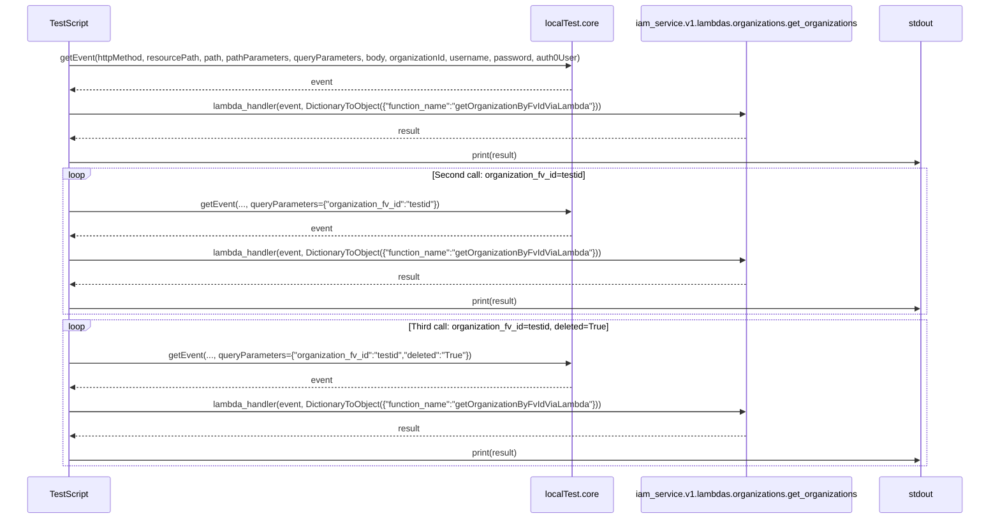
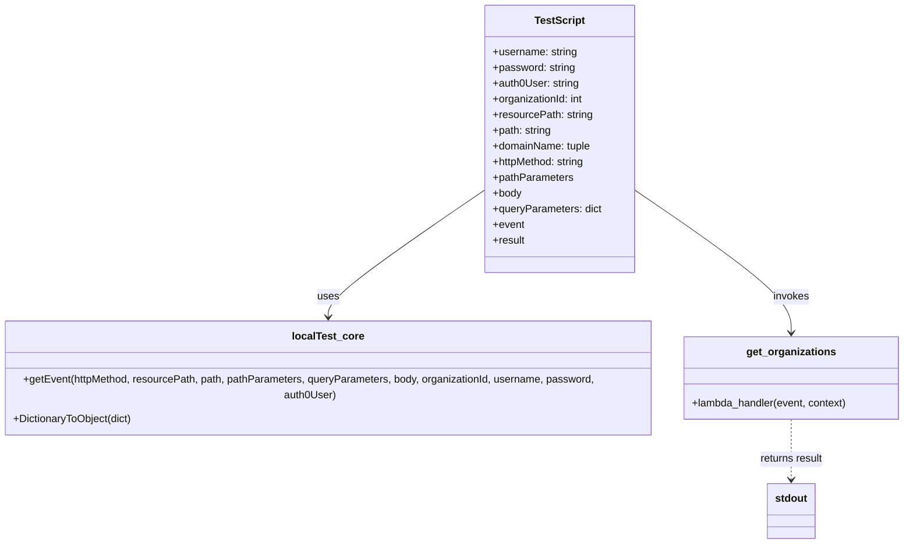

# Diagram: platform/tools/ide_local_testing/localTest/test/organization/getOrganizationByFvidViaLambda.py

> Auto-generated by Obscura crawlers

## Diagram 1

### SVG

<svg id="container" width="1946" xmlns="http://www.w3.org/2000/svg" height="1001" viewBox="-50 -10 1946 1001" role="graphics-document document" aria-roledescription="sequence"><g><rect x="1696" y="915" fill="#eaeaea" stroke="#666" width="150" height="65" name="Console" rx="3" ry="3" class="actor actor-bottom"></rect><text x="1771" y="947.5" dominant-baseline="central" alignment-baseline="central" class="actor actor-box" style="text-anchor: middle; font-size: 16px; font-weight: 400;"><tspan x="1771" dy="0">stdout</tspan></text></g><g><rect x="1223" y="915" fill="#eaeaea" stroke="#666" width="423" height="65" name="Orgs" rx="3" ry="3" class="actor actor-bottom"></rect><text x="1434.5" y="947.5" dominant-baseline="central" alignment-baseline="central" class="actor actor-box" style="text-anchor: middle; font-size: 16px; font-weight: 400;"><tspan x="1434.5" dy="0">iam_service.v1.lambdas.organizations.get_organizations</tspan></text></g><g><rect x="1023" y="915" fill="#eaeaea" stroke="#666" width="150" height="65" name="Core" rx="3" ry="3" class="actor actor-bottom"></rect><text x="1098" y="947.5" dominant-baseline="central" alignment-baseline="central" class="actor actor-box" style="text-anchor: middle; font-size: 16px; font-weight: 400;"><tspan x="1098" dy="0">localTest.core</tspan></text></g><g><rect x="0" y="915" fill="#eaeaea" stroke="#666" width="150" height="65" name="Script" rx="3" ry="3" class="actor actor-bottom"></rect><text x="75" y="947.5" dominant-baseline="central" alignment-baseline="central" class="actor actor-box" style="text-anchor: middle; font-size: 16px; font-weight: 400;"><tspan x="75" dy="0">TestScript</tspan></text></g><g><line id="actor3" x1="1771" y1="65" x2="1771" y2="915" class="actor-line 200" stroke-width="0.5px" stroke="#999" name="Console"></line><g id="root-3"><rect x="1696" y="0" fill="#eaeaea" stroke="#666" width="150" height="65" name="Console" rx="3" ry="3" class="actor actor-top"></rect><text x="1771" y="32.5" dominant-baseline="central" alignment-baseline="central" class="actor actor-box" style="text-anchor: middle; font-size: 16px; font-weight: 400;"><tspan x="1771" dy="0">stdout</tspan></text></g></g><g><line id="actor2" x1="1434.5" y1="65" x2="1434.5" y2="915" class="actor-line 200" stroke-width="0.5px" stroke="#999" name="Orgs"></line><g id="root-2"><rect x="1223" y="0" fill="#eaeaea" stroke="#666" width="423" height="65" name="Orgs" rx="3" ry="3" class="actor actor-top"></rect><text x="1434.5" y="32.5" dominant-baseline="central" alignment-baseline="central" class="actor actor-box" style="text-anchor: middle; font-size: 16px; font-weight: 400;"><tspan x="1434.5" dy="0">iam_service.v1.lambdas.organizations.get_organizations</tspan></text></g></g><g><line id="actor1" x1="1098" y1="65" x2="1098" y2="915" class="actor-line 200" stroke-width="0.5px" stroke="#999" name="Core"></line><g id="root-1"><rect x="1023" y="0" fill="#eaeaea" stroke="#666" width="150" height="65" name="Core" rx="3" ry="3" class="actor actor-top"></rect><text x="1098" y="32.5" dominant-baseline="central" alignment-baseline="central" class="actor actor-box" style="text-anchor: middle; font-size: 16px; font-weight: 400;"><tspan x="1098" dy="0">localTest.core</tspan></text></g></g><g><line id="actor0" x1="75" y1="65" x2="75" y2="915" class="actor-line 200" stroke-width="0.5px" stroke="#999" name="Script"></line><g id="root-0"><rect x="0" y="0" fill="#eaeaea" stroke="#666" width="150" height="65" name="Script" rx="3" ry="3" class="actor actor-top"></rect><text x="75" y="32.5" dominant-baseline="central" alignment-baseline="central" class="actor actor-box" style="text-anchor: middle; font-size: 16px; font-weight: 400;"><tspan x="75" dy="0">TestScript</tspan></text></g></g><g></g><defs><symbol id="computer" width="24" height="24"><path transform="scale(.5)" d="M2 2v13h20v-13h-20zm18 11h-16v-9h16v9zm-10.228 6l.466-1h3.524l.467 1h-4.457zm14.228 3h-24l2-6h2.104l-1.33 4h18.45l-1.297-4h2.073l2 6zm-5-10h-14v-7h14v7z"></path></symbol></defs><defs><symbol id="database" fill-rule="evenodd" clip-rule="evenodd"><path transform="scale(.5)" d="M12.258.001l.256.004.255.005.253.008.251.01.249.012.247.015.246.016.242.019.241.02.239.023.236.024.233.027.231.028.229.031.225.032.223.034.22.036.217.038.214.04.211.041.208.043.205.045.201.046.198.048.194.05.191.051.187.053.183.054.18.056.175.057.172.059.168.06.163.061.16.063.155.064.15.066.074.033.073.033.071.034.07.034.069.035.068.035.067.035.066.035.064.036.064.036.062.036.06.036.06.037.058.037.058.037.055.038.055.038.053.038.052.038.051.039.05.039.048.039.047.039.045.04.044.04.043.04.041.04.04.041.039.041.037.041.036.041.034.041.033.042.032.042.03.042.029.042.027.042.026.043.024.043.023.043.021.043.02.043.018.044.017.043.015.044.013.044.012.044.011.045.009.044.007.045.006.045.004.045.002.045.001.045v17l-.001.045-.002.045-.004.045-.006.045-.007.045-.009.044-.011.045-.012.044-.013.044-.015.044-.017.043-.018.044-.02.043-.021.043-.023.043-.024.043-.026.043-.027.042-.029.042-.03.042-.032.042-.033.042-.034.041-.036.041-.037.041-.039.041-.04.041-.041.04-.043.04-.044.04-.045.04-.047.039-.048.039-.05.039-.051.039-.052.038-.053.038-.055.038-.055.038-.058.037-.058.037-.06.037-.06.036-.062.036-.064.036-.064.036-.066.035-.067.035-.068.035-.069.035-.07.034-.071.034-.073.033-.074.033-.15.066-.155.064-.16.063-.163.061-.168.06-.172.059-.175.057-.18.056-.183.054-.187.053-.191.051-.194.05-.198.048-.201.046-.205.045-.208.043-.211.041-.214.04-.217.038-.22.036-.223.034-.225.032-.229.031-.231.028-.233.027-.236.024-.239.023-.241.02-.242.019-.246.016-.247.015-.249.012-.251.01-.253.008-.255.005-.256.004-.258.001-.258-.001-.256-.004-.255-.005-.253-.008-.251-.01-.249-.012-.247-.015-.245-.016-.243-.019-.241-.02-.238-.023-.236-.024-.234-.027-.231-.028-.228-.031-.226-.032-.223-.034-.22-.036-.217-.038-.214-.04-.211-.041-.208-.043-.204-.045-.201-.046-.198-.048-.195-.05-.19-.051-.187-.053-.184-.054-.179-.056-.176-.057-.172-.059-.167-.06-.164-.061-.159-.063-.155-.064-.151-.066-.074-.033-.072-.033-.072-.034-.07-.034-.069-.035-.068-.035-.067-.035-.066-.035-.064-.036-.063-.036-.062-.036-.061-.036-.06-.037-.058-.037-.057-.037-.056-.038-.055-.038-.053-.038-.052-.038-.051-.039-.049-.039-.049-.039-.046-.039-.046-.04-.044-.04-.043-.04-.041-.04-.04-.041-.039-.041-.037-.041-.036-.041-.034-.041-.033-.042-.032-.042-.03-.042-.029-.042-.027-.042-.026-.043-.024-.043-.023-.043-.021-.043-.02-.043-.018-.044-.017-.043-.015-.044-.013-.044-.012-.044-.011-.045-.009-.044-.007-.045-.006-.045-.004-.045-.002-.045-.001-.045v-17l.001-.045.002-.045.004-.045.006-.045.007-.045.009-.044.011-.045.012-.044.013-.044.015-.044.017-.043.018-.044.02-.043.021-.043.023-.043.024-.043.026-.043.027-.042.029-.042.03-.042.032-.042.033-.042.034-.041.036-.041.037-.041.039-.041.04-.041.041-.04.043-.04.044-.04.046-.04.046-.039.049-.039.049-.039.051-.039.052-.038.053-.038.055-.038.056-.038.057-.037.058-.037.06-.037.061-.036.062-.036.063-.036.064-.036.066-.035.067-.035.068-.035.069-.035.07-.034.072-.034.072-.033.074-.033.151-.066.155-.064.159-.063.164-.061.167-.06.172-.059.176-.057.179-.056.184-.054.187-.053.19-.051.195-.05.198-.048.201-.046.204-.045.208-.043.211-.041.214-.04.217-.038.22-.036.223-.034.226-.032.228-.031.231-.028.234-.027.236-.024.238-.023.241-.02.243-.019.245-.016.247-.015.249-.012.251-.01.253-.008.255-.005.256-.004.258-.001.258.001zm-9.258 20.499v.01l.001.021.003.021.004.022.005.021.006.022.007.022.009.023.01.022.011.023.012.023.013.023.015.023.016.024.017.023.018.024.019.024.021.024.022.025.023.024.024.025.052.049.056.05.061.051.066.051.07.051.075.051.079.052.084.052.088.052.092.052.097.052.102.051.105.052.11.052.114.051.119.051.123.051.127.05.131.05.135.05.139.048.144.049.147.047.152.047.155.047.16.045.163.045.167.043.171.043.176.041.178.041.183.039.187.039.19.037.194.035.197.035.202.033.204.031.209.03.212.029.216.027.219.025.222.024.226.021.23.02.233.018.236.016.24.015.243.012.246.01.249.008.253.005.256.004.259.001.26-.001.257-.004.254-.005.25-.008.247-.011.244-.012.241-.014.237-.016.233-.018.231-.021.226-.021.224-.024.22-.026.216-.027.212-.028.21-.031.205-.031.202-.034.198-.034.194-.036.191-.037.187-.039.183-.04.179-.04.175-.042.172-.043.168-.044.163-.045.16-.046.155-.046.152-.047.148-.048.143-.049.139-.049.136-.05.131-.05.126-.05.123-.051.118-.052.114-.051.11-.052.106-.052.101-.052.096-.052.092-.052.088-.053.083-.051.079-.052.074-.052.07-.051.065-.051.06-.051.056-.05.051-.05.023-.024.023-.025.021-.024.02-.024.019-.024.018-.024.017-.024.015-.023.014-.024.013-.023.012-.023.01-.023.01-.022.008-.022.006-.022.006-.022.004-.022.004-.021.001-.021.001-.021v-4.127l-.077.055-.08.053-.083.054-.085.053-.087.052-.09.052-.093.051-.095.05-.097.05-.1.049-.102.049-.105.048-.106.047-.109.047-.111.046-.114.045-.115.045-.118.044-.12.043-.122.042-.124.042-.126.041-.128.04-.13.04-.132.038-.134.038-.135.037-.138.037-.139.035-.142.035-.143.034-.144.033-.147.032-.148.031-.15.03-.151.03-.153.029-.154.027-.156.027-.158.026-.159.025-.161.024-.162.023-.163.022-.165.021-.166.02-.167.019-.169.018-.169.017-.171.016-.173.015-.173.014-.175.013-.175.012-.177.011-.178.01-.179.008-.179.008-.181.006-.182.005-.182.004-.184.003-.184.002h-.37l-.184-.002-.184-.003-.182-.004-.182-.005-.181-.006-.179-.008-.179-.008-.178-.01-.176-.011-.176-.012-.175-.013-.173-.014-.172-.015-.171-.016-.17-.017-.169-.018-.167-.019-.166-.02-.165-.021-.163-.022-.162-.023-.161-.024-.159-.025-.157-.026-.156-.027-.155-.027-.153-.029-.151-.03-.15-.03-.148-.031-.146-.032-.145-.033-.143-.034-.141-.035-.14-.035-.137-.037-.136-.037-.134-.038-.132-.038-.13-.04-.128-.04-.126-.041-.124-.042-.122-.042-.12-.044-.117-.043-.116-.045-.113-.045-.112-.046-.109-.047-.106-.047-.105-.048-.102-.049-.1-.049-.097-.05-.095-.05-.093-.052-.09-.051-.087-.052-.085-.053-.083-.054-.08-.054-.077-.054v4.127zm0-5.654v.011l.001.021.003.021.004.021.005.022.006.022.007.022.009.022.01.022.011.023.012.023.013.023.015.024.016.023.017.024.018.024.019.024.021.024.022.024.023.025.024.024.052.05.056.05.061.05.066.051.07.051.075.052.079.051.084.052.088.052.092.052.097.052.102.052.105.052.11.051.114.051.119.052.123.05.127.051.131.05.135.049.139.049.144.048.147.048.152.047.155.046.16.045.163.045.167.044.171.042.176.042.178.04.183.04.187.038.19.037.194.036.197.034.202.033.204.032.209.03.212.028.216.027.219.025.222.024.226.022.23.02.233.018.236.016.24.014.243.012.246.01.249.008.253.006.256.003.259.001.26-.001.257-.003.254-.006.25-.008.247-.01.244-.012.241-.015.237-.016.233-.018.231-.02.226-.022.224-.024.22-.025.216-.027.212-.029.21-.03.205-.032.202-.033.198-.035.194-.036.191-.037.187-.039.183-.039.179-.041.175-.042.172-.043.168-.044.163-.045.16-.045.155-.047.152-.047.148-.048.143-.048.139-.05.136-.049.131-.05.126-.051.123-.051.118-.051.114-.052.11-.052.106-.052.101-.052.096-.052.092-.052.088-.052.083-.052.079-.052.074-.051.07-.052.065-.051.06-.05.056-.051.051-.049.023-.025.023-.024.021-.025.02-.024.019-.024.018-.024.017-.024.015-.023.014-.023.013-.024.012-.022.01-.023.01-.023.008-.022.006-.022.006-.022.004-.021.004-.022.001-.021.001-.021v-4.139l-.077.054-.08.054-.083.054-.085.052-.087.053-.09.051-.093.051-.095.051-.097.05-.1.049-.102.049-.105.048-.106.047-.109.047-.111.046-.114.045-.115.044-.118.044-.12.044-.122.042-.124.042-.126.041-.128.04-.13.039-.132.039-.134.038-.135.037-.138.036-.139.036-.142.035-.143.033-.144.033-.147.033-.148.031-.15.03-.151.03-.153.028-.154.028-.156.027-.158.026-.159.025-.161.024-.162.023-.163.022-.165.021-.166.02-.167.019-.169.018-.169.017-.171.016-.173.015-.173.014-.175.013-.175.012-.177.011-.178.009-.179.009-.179.007-.181.007-.182.005-.182.004-.184.003-.184.002h-.37l-.184-.002-.184-.003-.182-.004-.182-.005-.181-.007-.179-.007-.179-.009-.178-.009-.176-.011-.176-.012-.175-.013-.173-.014-.172-.015-.171-.016-.17-.017-.169-.018-.167-.019-.166-.02-.165-.021-.163-.022-.162-.023-.161-.024-.159-.025-.157-.026-.156-.027-.155-.028-.153-.028-.151-.03-.15-.03-.148-.031-.146-.033-.145-.033-.143-.033-.141-.035-.14-.036-.137-.036-.136-.037-.134-.038-.132-.039-.13-.039-.128-.04-.126-.041-.124-.042-.122-.043-.12-.043-.117-.044-.116-.044-.113-.046-.112-.046-.109-.046-.106-.047-.105-.048-.102-.049-.1-.049-.097-.05-.095-.051-.093-.051-.09-.051-.087-.053-.085-.052-.083-.054-.08-.054-.077-.054v4.139zm0-5.666v.011l.001.02.003.022.004.021.005.022.006.021.007.022.009.023.01.022.011.023.012.023.013.023.015.023.016.024.017.024.018.023.019.024.021.025.022.024.023.024.024.025.052.05.056.05.061.05.066.051.07.051.075.052.079.051.084.052.088.052.092.052.097.052.102.052.105.051.11.052.114.051.119.051.123.051.127.05.131.05.135.05.139.049.144.048.147.048.152.047.155.046.16.045.163.045.167.043.171.043.176.042.178.04.183.04.187.038.19.037.194.036.197.034.202.033.204.032.209.03.212.028.216.027.219.025.222.024.226.021.23.02.233.018.236.017.24.014.243.012.246.01.249.008.253.006.256.003.259.001.26-.001.257-.003.254-.006.25-.008.247-.01.244-.013.241-.014.237-.016.233-.018.231-.02.226-.022.224-.024.22-.025.216-.027.212-.029.21-.03.205-.032.202-.033.198-.035.194-.036.191-.037.187-.039.183-.039.179-.041.175-.042.172-.043.168-.044.163-.045.16-.045.155-.047.152-.047.148-.048.143-.049.139-.049.136-.049.131-.051.126-.05.123-.051.118-.052.114-.051.11-.052.106-.052.101-.052.096-.052.092-.052.088-.052.083-.052.079-.052.074-.052.07-.051.065-.051.06-.051.056-.05.051-.049.023-.025.023-.025.021-.024.02-.024.019-.024.018-.024.017-.024.015-.023.014-.024.013-.023.012-.023.01-.022.01-.023.008-.022.006-.022.006-.022.004-.022.004-.021.001-.021.001-.021v-4.153l-.077.054-.08.054-.083.053-.085.053-.087.053-.09.051-.093.051-.095.051-.097.05-.1.049-.102.048-.105.048-.106.048-.109.046-.111.046-.114.046-.115.044-.118.044-.12.043-.122.043-.124.042-.126.041-.128.04-.13.039-.132.039-.134.038-.135.037-.138.036-.139.036-.142.034-.143.034-.144.033-.147.032-.148.032-.15.03-.151.03-.153.028-.154.028-.156.027-.158.026-.159.024-.161.024-.162.023-.163.023-.165.021-.166.02-.167.019-.169.018-.169.017-.171.016-.173.015-.173.014-.175.013-.175.012-.177.01-.178.01-.179.009-.179.007-.181.006-.182.006-.182.004-.184.003-.184.001-.185.001-.185-.001-.184-.001-.184-.003-.182-.004-.182-.006-.181-.006-.179-.007-.179-.009-.178-.01-.176-.01-.176-.012-.175-.013-.173-.014-.172-.015-.171-.016-.17-.017-.169-.018-.167-.019-.166-.02-.165-.021-.163-.023-.162-.023-.161-.024-.159-.024-.157-.026-.156-.027-.155-.028-.153-.028-.151-.03-.15-.03-.148-.032-.146-.032-.145-.033-.143-.034-.141-.034-.14-.036-.137-.036-.136-.037-.134-.038-.132-.039-.13-.039-.128-.041-.126-.041-.124-.041-.122-.043-.12-.043-.117-.044-.116-.044-.113-.046-.112-.046-.109-.046-.106-.048-.105-.048-.102-.048-.1-.05-.097-.049-.095-.051-.093-.051-.09-.052-.087-.052-.085-.053-.083-.053-.08-.054-.077-.054v4.153zm8.74-8.179l-.257.004-.254.005-.25.008-.247.011-.244.012-.241.014-.237.016-.233.018-.231.021-.226.022-.224.023-.22.026-.216.027-.212.028-.21.031-.205.032-.202.033-.198.034-.194.036-.191.038-.187.038-.183.04-.179.041-.175.042-.172.043-.168.043-.163.045-.16.046-.155.046-.152.048-.148.048-.143.048-.139.049-.136.05-.131.05-.126.051-.123.051-.118.051-.114.052-.11.052-.106.052-.101.052-.096.052-.092.052-.088.052-.083.052-.079.052-.074.051-.07.052-.065.051-.06.05-.056.05-.051.05-.023.025-.023.024-.021.024-.02.025-.019.024-.018.024-.017.023-.015.024-.014.023-.013.023-.012.023-.01.023-.01.022-.008.022-.006.023-.006.021-.004.022-.004.021-.001.021-.001.021.001.021.001.021.004.021.004.022.006.021.006.023.008.022.01.022.01.023.012.023.013.023.014.023.015.024.017.023.018.024.019.024.02.025.021.024.023.024.023.025.051.05.056.05.06.05.065.051.07.052.074.051.079.052.083.052.088.052.092.052.096.052.101.052.106.052.11.052.114.052.118.051.123.051.126.051.131.05.136.05.139.049.143.048.148.048.152.048.155.046.16.046.163.045.168.043.172.043.175.042.179.041.183.04.187.038.191.038.194.036.198.034.202.033.205.032.21.031.212.028.216.027.22.026.224.023.226.022.231.021.233.018.237.016.241.014.244.012.247.011.25.008.254.005.257.004.26.001.26-.001.257-.004.254-.005.25-.008.247-.011.244-.012.241-.014.237-.016.233-.018.231-.021.226-.022.224-.023.22-.026.216-.027.212-.028.21-.031.205-.032.202-.033.198-.034.194-.036.191-.038.187-.038.183-.04.179-.041.175-.042.172-.043.168-.043.163-.045.16-.046.155-.046.152-.048.148-.048.143-.048.139-.049.136-.05.131-.05.126-.051.123-.051.118-.051.114-.052.11-.052.106-.052.101-.052.096-.052.092-.052.088-.052.083-.052.079-.052.074-.051.07-.052.065-.051.06-.05.056-.05.051-.05.023-.025.023-.024.021-.024.02-.025.019-.024.018-.024.017-.023.015-.024.014-.023.013-.023.012-.023.01-.023.01-.022.008-.022.006-.023.006-.021.004-.022.004-.021.001-.021.001-.021-.001-.021-.001-.021-.004-.021-.004-.022-.006-.021-.006-.023-.008-.022-.01-.022-.01-.023-.012-.023-.013-.023-.014-.023-.015-.024-.017-.023-.018-.024-.019-.024-.02-.025-.021-.024-.023-.024-.023-.025-.051-.05-.056-.05-.06-.05-.065-.051-.07-.052-.074-.051-.079-.052-.083-.052-.088-.052-.092-.052-.096-.052-.101-.052-.106-.052-.11-.052-.114-.052-.118-.051-.123-.051-.126-.051-.131-.05-.136-.05-.139-.049-.143-.048-.148-.048-.152-.048-.155-.046-.16-.046-.163-.045-.168-.043-.172-.043-.175-.042-.179-.041-.183-.04-.187-.038-.191-.038-.194-.036-.198-.034-.202-.033-.205-.032-.21-.031-.212-.028-.216-.027-.22-.026-.224-.023-.226-.022-.231-.021-.233-.018-.237-.016-.241-.014-.244-.012-.247-.011-.25-.008-.254-.005-.257-.004-.26-.001-.26.001z"></path></symbol></defs><defs><symbol id="clock" width="24" height="24"><path transform="scale(.5)" d="M12 2c5.514 0 10 4.486 10 10s-4.486 10-10 10-10-4.486-10-10 4.486-10 10-10zm0-2c-6.627 0-12 5.373-12 12s5.373 12 12 12 12-5.373 12-12-5.373-12-12-12zm5.848 12.459c.202.038.202.333.001.372-1.907.361-6.045 1.111-6.547 1.111-.719 0-1.301-.582-1.301-1.301 0-.512.77-5.447 1.125-7.445.034-.192.312-.181.343.014l.985 6.238 5.394 1.011z"></path></symbol></defs><defs><marker id="arrowhead" refX="7.9" refY="5" markerUnits="userSpaceOnUse" markerWidth="12" markerHeight="12" orient="auto-start-reverse"><path d="M -1 0 L 10 5 L 0 10 z"></path></marker></defs><defs><marker id="crosshead" markerWidth="15" markerHeight="8" orient="auto" refX="4" refY="4.5"><path fill="none" stroke="#000000" stroke-width="1pt" d="M 1,2 L 6,7 M 6,2 L 1,7" style="stroke-dasharray: 0, 0;"></path></marker></defs><defs><marker id="filled-head" refX="15.5" refY="7" markerWidth="20" markerHeight="28" orient="auto"><path d="M 18,7 L9,13 L14,7 L9,1 Z"></path></marker></defs><defs><marker id="sequencenumber" refX="15" refY="15" markerWidth="60" markerHeight="40" orient="auto"><circle cx="15" cy="15" r="6"></circle></marker></defs><g><line x1="64" y1="315" x2="1782" y2="315" class="loopLine"></line><line x1="1782" y1="315" x2="1782" y2="600" class="loopLine"></line><line x1="64" y1="600" x2="1782" y2="600" class="loopLine"></line><line x1="64" y1="315" x2="64" y2="600" class="loopLine"></line><polygon points="64,315 114,315 114,328 105.6,335 64,335" class="labelBox"></polygon><text x="89" y="328" text-anchor="middle" dominant-baseline="middle" alignment-baseline="middle" class="labelText" style="font-size: 16px; font-weight: 400;">loop</text><text x="948" y="333" text-anchor="middle" class="loopText" style="font-size: 16px; font-weight: 400;"><tspan x="948">[Second call: organization_fv_id=testid]</tspan></text></g><g><line x1="64" y1="610" x2="1782" y2="610" class="loopLine"></line><line x1="1782" y1="610" x2="1782" y2="895" class="loopLine"></line><line x1="64" y1="895" x2="1782" y2="895" class="loopLine"></line><line x1="64" y1="610" x2="64" y2="895" class="loopLine"></line><polygon points="64,610 114,610 114,623 105.6,630 64,630" class="labelBox"></polygon><text x="89" y="623" text-anchor="middle" dominant-baseline="middle" alignment-baseline="middle" class="labelText" style="font-size: 16px; font-weight: 400;">loop</text><text x="948" y="628" text-anchor="middle" class="loopText" style="font-size: 16px; font-weight: 400;"><tspan x="948">[Third call: organization_fv_id=testid, deleted=True]</tspan></text></g><text x="585" y="80" text-anchor="middle" dominant-baseline="middle" alignment-baseline="middle" class="messageText" dy="1em" style="font-size: 16px; font-weight: 400;">getEvent(httpMethod, resourcePath, path, pathParameters, queryParameters, body, organizationId, username, password, auth0User)</text><line x1="76" y1="113" x2="1094" y2="113" class="messageLine0" stroke-width="2" stroke="none" marker-end="url(#arrowhead)" style="fill: none;"></line><text x="588" y="128" text-anchor="middle" dominant-baseline="middle" alignment-baseline="middle" class="messageText" dy="1em" style="font-size: 16px; font-weight: 400;">event</text><line x1="1097" y1="161" x2="79" y2="161" class="messageLine1" stroke-width="2" stroke="none" marker-end="url(#arrowhead)" style="stroke-dasharray: 3, 3; fill: none;"></line><text x="753" y="176" text-anchor="middle" dominant-baseline="middle" alignment-baseline="middle" class="messageText" dy="1em" style="font-size: 16px; font-weight: 400;">lambda_handler(event, DictionaryToObject({"function_name":"getOrganizationByFvIdViaLambda"}))</text><line x1="76" y1="209" x2="1430.5" y2="209" class="messageLine0" stroke-width="2" stroke="none" marker-end="url(#arrowhead)" style="fill: none;"></line><text x="756" y="224" text-anchor="middle" dominant-baseline="middle" alignment-baseline="middle" class="messageText" dy="1em" style="font-size: 16px; font-weight: 400;">result</text><line x1="1433.5" y1="257" x2="79" y2="257" class="messageLine1" stroke-width="2" stroke="none" marker-end="url(#arrowhead)" style="stroke-dasharray: 3, 3; fill: none;"></line><text x="922" y="272" text-anchor="middle" dominant-baseline="middle" alignment-baseline="middle" class="messageText" dy="1em" style="font-size: 16px; font-weight: 400;">print(result)</text><line x1="76" y1="305" x2="1767" y2="305" class="messageLine0" stroke-width="2" stroke="none" marker-end="url(#arrowhead)" style="fill: none;"></line><text x="585" y="365" text-anchor="middle" dominant-baseline="middle" alignment-baseline="middle" class="messageText" dy="1em" style="font-size: 16px; font-weight: 400;">getEvent(..., queryParameters={"organization_fv_id":"testid"})</text><line x1="76" y1="398" x2="1094" y2="398" class="messageLine0" stroke-width="2" stroke="none" marker-end="url(#arrowhead)" style="fill: none;"></line><text x="588" y="413" text-anchor="middle" dominant-baseline="middle" alignment-baseline="middle" class="messageText" dy="1em" style="font-size: 16px; font-weight: 400;">event</text><line x1="1097" y1="446" x2="79" y2="446" class="messageLine1" stroke-width="2" stroke="none" marker-end="url(#arrowhead)" style="stroke-dasharray: 3, 3; fill: none;"></line><text x="753" y="461" text-anchor="middle" dominant-baseline="middle" alignment-baseline="middle" class="messageText" dy="1em" style="font-size: 16px; font-weight: 400;">lambda_handler(event, DictionaryToObject({"function_name":"getOrganizationByFvIdViaLambda"}))</text><line x1="76" y1="494" x2="1430.5" y2="494" class="messageLine0" stroke-width="2" stroke="none" marker-end="url(#arrowhead)" style="fill: none;"></line><text x="756" y="509" text-anchor="middle" dominant-baseline="middle" alignment-baseline="middle" class="messageText" dy="1em" style="font-size: 16px; font-weight: 400;">result</text><line x1="1433.5" y1="542" x2="79" y2="542" class="messageLine1" stroke-width="2" stroke="none" marker-end="url(#arrowhead)" style="stroke-dasharray: 3, 3; fill: none;"></line><text x="922" y="557" text-anchor="middle" dominant-baseline="middle" alignment-baseline="middle" class="messageText" dy="1em" style="font-size: 16px; font-weight: 400;">print(result)</text><line x1="76" y1="590" x2="1767" y2="590" class="messageLine0" stroke-width="2" stroke="none" marker-end="url(#arrowhead)" style="fill: none;"></line><text x="585" y="660" text-anchor="middle" dominant-baseline="middle" alignment-baseline="middle" class="messageText" dy="1em" style="font-size: 16px; font-weight: 400;">getEvent(..., queryParameters={"organization_fv_id":"testid","deleted":"True"})</text><line x1="76" y1="693" x2="1094" y2="693" class="messageLine0" stroke-width="2" stroke="none" marker-end="url(#arrowhead)" style="fill: none;"></line><text x="588" y="708" text-anchor="middle" dominant-baseline="middle" alignment-baseline="middle" class="messageText" dy="1em" style="font-size: 16px; font-weight: 400;">event</text><line x1="1097" y1="741" x2="79" y2="741" class="messageLine1" stroke-width="2" stroke="none" marker-end="url(#arrowhead)" style="stroke-dasharray: 3, 3; fill: none;"></line><text x="753" y="756" text-anchor="middle" dominant-baseline="middle" alignment-baseline="middle" class="messageText" dy="1em" style="font-size: 16px; font-weight: 400;">lambda_handler(event, DictionaryToObject({"function_name":"getOrganizationByFvIdViaLambda"}))</text><line x1="76" y1="789" x2="1430.5" y2="789" class="messageLine0" stroke-width="2" stroke="none" marker-end="url(#arrowhead)" style="fill: none;"></line><text x="756" y="804" text-anchor="middle" dominant-baseline="middle" alignment-baseline="middle" class="messageText" dy="1em" style="font-size: 16px; font-weight: 400;">result</text><line x1="1433.5" y1="837" x2="79" y2="837" class="messageLine1" stroke-width="2" stroke="none" marker-end="url(#arrowhead)" style="stroke-dasharray: 3, 3; fill: none;"></line><text x="922" y="852" text-anchor="middle" dominant-baseline="middle" alignment-baseline="middle" class="messageText" dy="1em" style="font-size: 16px; font-weight: 400;">print(result)</text><line x1="76" y1="885" x2="1767" y2="885" class="messageLine0" stroke-width="2" stroke="none" marker-end="url(#arrowhead)" style="fill: none;"></line></svg>

## Diagram 2

### SVG

<svg id="container" width="1432.890625" xmlns="http://www.w3.org/2000/svg" class="classDiagram" height="806" viewBox="0 0 1432.890625 806" role="graphics-document document" aria-roledescription="class"><g><defs><marker id="container_class-aggregationStart" class="marker aggregation class" refX="18" refY="7" markerWidth="190" markerHeight="240" orient="auto"><path d="M 18,7 L9,13 L1,7 L9,1 Z"></path></marker></defs><defs><marker id="container_class-aggregationEnd" class="marker aggregation class" refX="1" refY="7" markerWidth="20" markerHeight="28" orient="auto"><path d="M 18,7 L9,13 L1,7 L9,1 Z"></path></marker></defs><defs><marker id="container_class-extensionStart" class="marker extension class" refX="18" refY="7" markerWidth="190" markerHeight="240" orient="auto"><path d="M 1,7 L18,13 V 1 Z"></path></marker></defs><defs><marker id="container_class-extensionEnd" class="marker extension class" refX="1" refY="7" markerWidth="20" markerHeight="28" orient="auto"><path d="M 1,1 V 13 L18,7 Z"></path></marker></defs><defs><marker id="container_class-compositionStart" class="marker composition class" refX="18" refY="7" markerWidth="190" markerHeight="240" orient="auto"><path d="M 18,7 L9,13 L1,7 L9,1 Z"></path></marker></defs><defs><marker id="container_class-compositionEnd" class="marker composition class" refX="1" refY="7" markerWidth="20" markerHeight="28" orient="auto"><path d="M 18,7 L9,13 L1,7 L9,1 Z"></path></marker></defs><defs><marker id="container_class-dependencyStart" class="marker dependency class" refX="6" refY="7" markerWidth="190" markerHeight="240" orient="auto"><path d="M 5,7 L9,13 L1,7 L9,1 Z"></path></marker></defs><defs><marker id="container_class-dependencyEnd" class="marker dependency class" refX="13" refY="7" markerWidth="20" markerHeight="28" orient="auto"><path d="M 18,7 L9,13 L14,7 L9,1 Z"></path></marker></defs><defs><marker id="container_class-lollipopStart" class="marker lollipop class" refX="13" refY="7" markerWidth="190" markerHeight="240" orient="auto"><circle stroke="black" fill="transparent" cx="7" cy="7" r="6"></circle></marker></defs><defs><marker id="container_class-lollipopEnd" class="marker lollipop class" refX="1" refY="7" markerWidth="190" markerHeight="240" orient="auto"><circle stroke="black" fill="transparent" cx="7" cy="7" r="6"></circle></marker></defs><g class="root"><g class="clusters"></g><g class="edgePaths"><path d="M779.48,286.836L737.339,314.53C695.198,342.224,610.915,397.612,568.774,430.473C526.633,463.333,526.633,473.667,526.633,478.833L526.633,484" id="id_TestScript_localTest_core_1" class="edge-thickness-normal edge-pattern-solid relation" style=";;;" data-edge="true" data-et="edge" data-id="id_TestScript_localTest_core_1" data-points="W3sieCI6Nzc5LjQ4MDQ2ODc1LCJ5IjoyODYuODM1NTA0NTIxNjgxN30seyJ4Ijo1MjYuNjMyODEyNSwieSI6NDUzfSx7IngiOjUyNi42MzI4MTI1LCJ5Ijo0OTB9XQ==" marker-end="url(#container_class-dependencyEnd)"></path><path d="M1007.23,286.836L1049.372,314.53C1091.513,342.224,1175.796,397.612,1217.937,432.473C1260.078,467.333,1260.078,481.667,1260.078,488.833L1260.078,496" id="id_TestScript_get_organizations_2" class="edge-thickness-normal edge-pattern-solid relation" style=";;;" data-edge="true" data-et="edge" data-id="id_TestScript_get_organizations_2" data-points="W3sieCI6MTAwNy4yMzA0Njg3NSwieSI6Mjg2LjgzNTUwNDUyMTY4MTd9LHsieCI6MTI2MC4wNzgxMjUsInkiOjQ1M30seyJ4IjoxMjYwLjA3ODEyNSwieSI6NTAyfV0=" marker-end="url(#container_class-dependencyEnd)"></path><path d="M1260.078,628L1260.078,636.167C1260.078,644.333,1260.078,660.667,1260.078,674C1260.078,687.333,1260.078,697.667,1260.078,702.833L1260.078,708" id="id_get_organizations_stdout_3" class="edge-thickness-normal edge-pattern-dashed relation" style=";;;" data-edge="true" data-et="edge" data-id="id_get_organizations_stdout_3" data-points="W3sieCI6MTI2MC4wNzgxMjUsInkiOjYyOH0seyJ4IjoxMjYwLjA3ODEyNSwieSI6Njc3fSx7IngiOjEyNjAuMDc4MTI1LCJ5Ijo3MTR9XQ==" marker-end="url(#container_class-dependencyEnd)"></path></g><g class="edgeLabels"><g class="edgeLabel" transform="translate(526.6328125, 453)"><g class="label" data-id="id_TestScript_localTest_core_1" transform="translate(-16.4921875, -12)"><foreignObject width="32.984375" height="24">

uses

</foreignObject></g></g><g class="edgeLabel" transform="translate(1260.078125, 453)"><g class="label" data-id="id_TestScript_get_organizations_2" transform="translate(-27.5859375, -12)"><foreignObject width="55.171875" height="24">

invokes

</foreignObject></g></g><g class="edgeLabel" transform="translate(1260.078125, 677)"><g class="label" data-id="id_get_organizations_stdout_3" transform="translate(-49.21875, -12)"><foreignObject width="98.4375" height="24">

returns result

</foreignObject></g></g></g><g class="nodes"><g class="node default" id="classId-TestScript-0" transform="translate(893.35546875, 212)"><g class="basic label-container"><path d="M-113.875 -204 L113.875 -204 L113.875 204 L-113.875 204" stroke="none" stroke-width="0" fill="#ECECFF" style=""></path><path d="M-113.875 -204 C-48.96442894819296 -204, 15.94614210361408 -204, 113.875 -204 M-113.875 -204 C-54.52800321431964 -204, 4.818993571360721 -204, 113.875 -204 M113.875 -204 C113.875 -112.09513588425396, 113.875 -20.190271768507927, 113.875 204 M113.875 -204 C113.875 -77.93006886502151, 113.875 48.13986226995698, 113.875 204 M113.875 204 C40.742351149546735 204, -32.39029770090653 204, -113.875 204 M113.875 204 C48.32317370961529 204, -17.22865258076942 204, -113.875 204 M-113.875 204 C-113.875 101.15509705672302, -113.875 -1.6898058865539554, -113.875 -204 M-113.875 204 C-113.875 57.94599322460735, -113.875 -88.1080135507853, -113.875 -204" stroke="#9370DB" stroke-width="1.3" fill="none" stroke-dasharray="0 0" style=""></path></g><g class="annotation-group text" transform="translate(0, -180)"></g><g class="label-group text" transform="translate(-36.984375, -180)"><g class="label" style="font-weight: bolder" transform="translate(0,-12)"><foreignObject width="73.96875" height="24">

TestScript

</foreignObject></g></g><g class="members-group text" transform="translate(-101.875, -132)"><g class="label" style="" transform="translate(0,-12)"><foreignObject width="129.890625" height="24">

+username: string

</foreignObject></g><g class="label" style="" transform="translate(0,12)"><foreignObject width="126.34375" height="24">

+password: string

</foreignObject></g><g class="label" style="" transform="translate(0,36)"><foreignObject width="132.59375" height="24">

+auth0User: string

</foreignObject></g><g class="label" style="" transform="translate(0,60)"><foreignObject width="140.375" height="24">

+organizationId: int

</foreignObject></g><g class="label" style="" transform="translate(0,84)"><foreignObject width="152.265625" height="24">

+resourcePath: string

</foreignObject></g><g class="label" style="" transform="translate(0,108)"><foreignObject width="90.90625" height="24">

+path: string

</foreignObject></g><g class="label" style="" transform="translate(0,132)"><foreignObject width="151.265625" height="24">

+domainName: tuple

</foreignObject></g><g class="label" style="" transform="translate(0,156)"><foreignObject width="143.375" height="24">

+httpMethod: string

</foreignObject></g><g class="label" style="" transform="translate(0,180)"><foreignObject width="122.734375" height="24">

+pathParameters

</foreignObject></g><g class="label" style="" transform="translate(0,204)"><foreignObject width="44.28125" height="24">

+body

</foreignObject></g><g class="label" style="" transform="translate(0,228)"><foreignObject width="166.765625" height="24">

+queryParameters: dict

</foreignObject></g><g class="label" style="" transform="translate(0,252)"><foreignObject width="48.328125" height="24">

+event

</foreignObject></g><g class="label" style="" transform="translate(0,276)"><foreignObject width="49.65625" height="24">

+result

</foreignObject></g></g><g class="methods-group text" transform="translate(-101.875, 204)"></g><g class="divider" style=""><path d="M-113.875 -156 C-63.17537762643122 -156, -12.475755252862442 -156, 113.875 -156 M-113.875 -156 C-59.02471851201963 -156, -4.174437024039264 -156, 113.875 -156" stroke="#9370DB" stroke-width="1.3" fill="none" stroke-dasharray="0 0" style=""></path></g><g class="divider" style=""><path d="M-113.875 180 C-47.465200931097954 180, 18.944598137804093 180, 113.875 180 M-113.875 180 C-63.41032225917992 180, -12.945644518359842 180, 113.875 180" stroke="#9370DB" stroke-width="1.3" fill="none" stroke-dasharray="0 0" style=""></path></g></g><g class="node default" id="classId-localTest_core-1" transform="translate(526.6328125, 565)"><g class="basic label-container"><path d="M-518.6328125 -75 L518.6328125 -75 L518.6328125 75 L-518.6328125 75" stroke="none" stroke-width="0" fill="#ECECFF" style=""></path><path d="M-518.6328125 -75 C-244.84131411963222 -75, 28.95018426073557 -75, 518.6328125 -75 M-518.6328125 -75 C-300.12345011297646 -75, -81.61408772595291 -75, 518.6328125 -75 M518.6328125 -75 C518.6328125 -25.127734892103817, 518.6328125 24.744530215792366, 518.6328125 75 M518.6328125 -75 C518.6328125 -39.2307034326338, 518.6328125 -3.4614068652676053, 518.6328125 75 M518.6328125 75 C228.1343705617868 75, -62.36407137642641 75, -518.6328125 75 M518.6328125 75 C159.68434709810913 75, -199.26411830378174 75, -518.6328125 75 M-518.6328125 75 C-518.6328125 20.127396648664835, -518.6328125 -34.74520670267033, -518.6328125 -75 M-518.6328125 75 C-518.6328125 25.661021634403234, -518.6328125 -23.677956731193532, -518.6328125 -75" stroke="#9370DB" stroke-width="1.3" fill="none" stroke-dasharray="0 0" style=""></path></g><g class="annotation-group text" transform="translate(0, -51)"></g><g class="label-group text" transform="translate(-52.421875, -51)"><g class="label" style="font-weight: bolder" transform="translate(0,-12)"><foreignObject width="104.84375" height="24">

localTest_core

</foreignObject></g></g><g class="members-group text" transform="translate(-506.6328125, -3)"></g><g class="methods-group text" transform="translate(-506.6328125, 27)"><g class="label" style="" transform="translate(0,-12)"><foreignObject width="960.84375" height="24">

+getEvent(httpMethod, resourcePath, path, pathParameters, queryParameters, body, organizationId, username, password, auth0User)

</foreignObject></g><g class="label" style="" transform="translate(0,12)"><foreignObject width="184.03125" height="24">

+DictionaryToObject(dict)

</foreignObject></g></g><g class="divider" style=""><path d="M-518.6328125 -27 C-197.93941295149983 -27, 122.75398659700033 -27, 518.6328125 -27 M-518.6328125 -27 C-275.7324513199019 -27, -32.832090139803825 -27, 518.6328125 -27" stroke="#9370DB" stroke-width="1.3" fill="none" stroke-dasharray="0 0" style=""></path></g><g class="divider" style=""><path d="M-518.6328125 -3 C-161.79946982206803 -3, 195.03387285586393 -3, 518.6328125 -3 M-518.6328125 -3 C-184.17419139872857 -3, 150.28442970254287 -3, 518.6328125 -3" stroke="#9370DB" stroke-width="1.3" fill="none" stroke-dasharray="0 0" style=""></path></g></g><g class="node default" id="classId-get_organizations-2" transform="translate(1260.078125, 565)"><g class="basic label-container"><path d="M-164.8125 -63 L164.8125 -63 L164.8125 63 L-164.8125 63" stroke="none" stroke-width="0" fill="#ECECFF" style=""></path><path d="M-164.8125 -63 C-80.4092932985155 -63, 3.9939134029690138 -63, 164.8125 -63 M-164.8125 -63 C-39.889761302983715 -63, 85.03297739403257 -63, 164.8125 -63 M164.8125 -63 C164.8125 -14.410823543926824, 164.8125 34.17835291214635, 164.8125 63 M164.8125 -63 C164.8125 -15.602861049214518, 164.8125 31.794277901570965, 164.8125 63 M164.8125 63 C38.59049939250902 63, -87.63150121498197 63, -164.8125 63 M164.8125 63 C89.4747729711227 63, 14.137045942245408 63, -164.8125 63 M-164.8125 63 C-164.8125 23.356093526541976, -164.8125 -16.28781294691605, -164.8125 -63 M-164.8125 63 C-164.8125 18.49816426050827, -164.8125 -26.003671478983463, -164.8125 -63" stroke="#9370DB" stroke-width="1.3" fill="none" stroke-dasharray="0 0" style=""></path></g><g class="annotation-group text" transform="translate(0, -39)"></g><g class="label-group text" transform="translate(-65.4375, -39)"><g class="label" style="font-weight: bolder" transform="translate(0,-12)"><foreignObject width="130.875" height="24">

get_organizations

</foreignObject></g></g><g class="members-group text" transform="translate(-152.8125, 9)"></g><g class="methods-group text" transform="translate(-152.8125, 39)"><g class="label" style="" transform="translate(0,-12)"><foreignObject width="240.1875" height="24">

+lambda_handler(event, context)

</foreignObject></g></g><g class="divider" style=""><path d="M-164.8125 -15 C-79.67854536084863 -15, 5.455409278302739 -15, 164.8125 -15 M-164.8125 -15 C-84.35014640813357 -15, -3.8877928162671367 -15, 164.8125 -15" stroke="#9370DB" stroke-width="1.3" fill="none" stroke-dasharray="0 0" style=""></path></g><g class="divider" style=""><path d="M-164.8125 9 C-71.54471685592402 9, 21.723066288151955 9, 164.8125 9 M-164.8125 9 C-94.14120112275016 9, -23.46990224550032 9, 164.8125 9" stroke="#9370DB" stroke-width="1.3" fill="none" stroke-dasharray="0 0" style=""></path></g></g><g class="node default" id="classId-stdout-3" transform="translate(1260.078125, 756)"><g class="basic label-container"><path d="M-35.9453125 -42 L35.9453125 -42 L35.9453125 42 L-35.9453125 42" stroke="none" stroke-width="0" fill="#ECECFF" style=""></path><path d="M-35.9453125 -42 C-19.639801645406045 -42, -3.3342907908120907 -42, 35.9453125 -42 M-35.9453125 -42 C-21.251534271698734 -42, -6.557756043397468 -42, 35.9453125 -42 M35.9453125 -42 C35.9453125 -8.767697069340961, 35.9453125 24.464605861318077, 35.9453125 42 M35.9453125 -42 C35.9453125 -21.370485763129963, 35.9453125 -0.7409715262599263, 35.9453125 42 M35.9453125 42 C8.87793140063977 42, -18.18944969872046 42, -35.9453125 42 M35.9453125 42 C9.621337799570924 42, -16.702636900858153 42, -35.9453125 42 M-35.9453125 42 C-35.9453125 18.93405707337682, -35.9453125 -4.131885853246359, -35.9453125 -42 M-35.9453125 42 C-35.9453125 13.68906865243062, -35.9453125 -14.62186269513876, -35.9453125 -42" stroke="#9370DB" stroke-width="1.3" fill="none" stroke-dasharray="0 0" style=""></path></g><g class="annotation-group text" transform="translate(0, -18)"></g><g class="label-group text" transform="translate(-23.9453125, -18)"><g class="label" style="font-weight: bolder" transform="translate(0,-12)"><foreignObject width="47.890625" height="24">

stdout

</foreignObject></g></g><g class="members-group text" transform="translate(-23.9453125, 30)"></g><g class="methods-group text" transform="translate(-23.9453125, 60)"></g><g class="divider" style=""><path d="M-35.9453125 6 C-9.845108222869737 6, 16.255096054260527 6, 35.9453125 6 M-35.9453125 6 C-7.773398886576295 6, 20.39851472684741 6, 35.9453125 6" stroke="#9370DB" stroke-width="1.3" fill="none" stroke-dasharray="0 0" style=""></path></g><g class="divider" style=""><path d="M-35.9453125 24 C-15.038704157492297 24, 5.867904185015405 24, 35.9453125 24 M-35.9453125 24 C-18.558225700435727 24, -1.1711389008714548 24, 35.9453125 24" stroke="#9370DB" stroke-width="1.3" fill="none" stroke-dasharray="0 0" style=""></path></g></g></g></g></g></svg>
