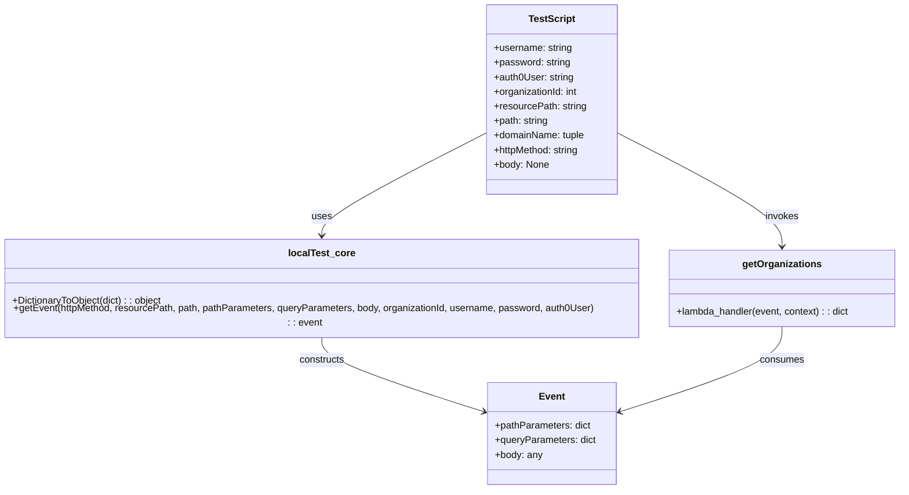
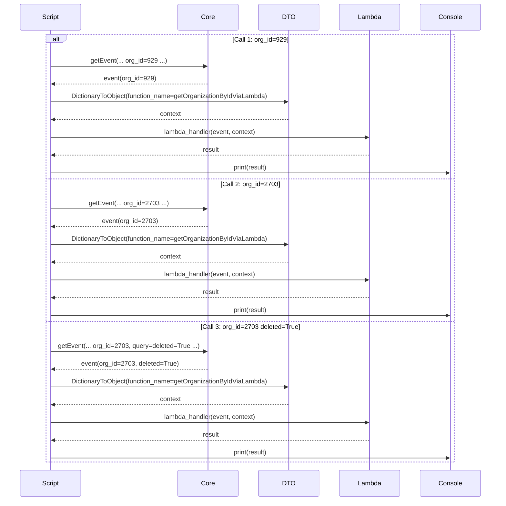

# Diagram: platform/tools/ide_local_testing/localTest/test/organization/getOrganizationByIdViaLambda.py

> Auto-generated by Obscura crawlers

## Diagram 1

### SVG

<svg id="container" width="1538.3828125" xmlns="http://www.w3.org/2000/svg" class="classDiagram" height="794" viewBox="0 0 1538.3828125 794" role="graphics-document document" aria-roledescription="class"><g><defs><marker id="container_class-aggregationStart" class="marker aggregation class" refX="18" refY="7" markerWidth="190" markerHeight="240" orient="auto"><path d="M 18,7 L9,13 L1,7 L9,1 Z"></path></marker></defs><defs><marker id="container_class-aggregationEnd" class="marker aggregation class" refX="1" refY="7" markerWidth="20" markerHeight="28" orient="auto"><path d="M 18,7 L9,13 L1,7 L9,1 Z"></path></marker></defs><defs><marker id="container_class-extensionStart" class="marker extension class" refX="18" refY="7" markerWidth="190" markerHeight="240" orient="auto"><path d="M 1,7 L18,13 V 1 Z"></path></marker></defs><defs><marker id="container_class-extensionEnd" class="marker extension class" refX="1" refY="7" markerWidth="20" markerHeight="28" orient="auto"><path d="M 1,1 V 13 L18,7 Z"></path></marker></defs><defs><marker id="container_class-compositionStart" class="marker composition class" refX="18" refY="7" markerWidth="190" markerHeight="240" orient="auto"><path d="M 18,7 L9,13 L1,7 L9,1 Z"></path></marker></defs><defs><marker id="container_class-compositionEnd" class="marker composition class" refX="1" refY="7" markerWidth="20" markerHeight="28" orient="auto"><path d="M 18,7 L9,13 L1,7 L9,1 Z"></path></marker></defs><defs><marker id="container_class-dependencyStart" class="marker dependency class" refX="6" refY="7" markerWidth="190" markerHeight="240" orient="auto"><path d="M 5,7 L9,13 L1,7 L9,1 Z"></path></marker></defs><defs><marker id="container_class-dependencyEnd" class="marker dependency class" refX="13" refY="7" markerWidth="20" markerHeight="28" orient="auto"><path d="M 18,7 L9,13 L14,7 L9,1 Z"></path></marker></defs><defs><marker id="container_class-lollipopStart" class="marker lollipop class" refX="13" refY="7" markerWidth="190" markerHeight="240" orient="auto"><circle stroke="black" fill="transparent" cx="7" cy="7" r="6"></circle></marker></defs><defs><marker id="container_class-lollipopEnd" class="marker lollipop class" refX="1" refY="7" markerWidth="190" markerHeight="240" orient="auto"><circle stroke="black" fill="transparent" cx="7" cy="7" r="6"></circle></marker></defs><g class="root"><g class="clusters"></g><g class="edgePaths"><path d="M843.471,216.35L795.726,239.792C747.98,263.233,652.49,310.117,604.745,338.725C557,367.333,557,377.667,557,382.833L557,388" id="id_TestScript_localTest_core_1" class="edge-thickness-normal edge-pattern-solid relation" style=";;;" data-edge="true" data-et="edge" data-id="id_TestScript_localTest_core_1" data-points="W3sieCI6ODQzLjQ3MDcwMzEyNSwieSI6MjE2LjM1MDE2NTIwNTA3Nzg3fSx7IngiOjU1NywieSI6MzU3fSx7IngiOjU1NywieSI6Mzk0fV0=" marker-end="url(#container_class-dependencyEnd)"></path><path d="M1056.721,216.35L1104.466,239.792C1152.211,263.233,1247.701,310.117,1295.446,340.725C1343.191,371.333,1343.191,385.667,1343.191,392.833L1343.191,400" id="id_TestScript_getOrganizations_2" class="edge-thickness-normal edge-pattern-solid relation" style=";;;" data-edge="true" data-et="edge" data-id="id_TestScript_getOrganizations_2" data-points="W3sieCI6MTA1Ni43MjA3MDMxMjUsInkiOjIxNi4zNTAxNjUyMDUwNzc4N30seyJ4IjoxMzQzLjE5MTQwNjI1LCJ5IjozNTd9LHsieCI6MTM0My4xOTE0MDYyNSwieSI6NDA2fV0=" marker-end="url(#container_class-dependencyEnd)"></path><path d="M557,544L557,550.167C557,556.333,557,568.667,603.979,589.294C650.958,609.921,744.915,638.843,791.894,653.303L838.873,667.764" id="id_localTest_core_Event_3" class="edge-thickness-normal edge-pattern-solid relation" style=";;;" data-edge="true" data-et="edge" data-id="id_localTest_core_Event_3" data-points="W3sieCI6NTU3LCJ5Ijo1NDR9LHsieCI6NTU3LCJ5Ijo1ODF9LHsieCI6ODQ0LjYwNzQyMTg3NSwieSI6NjY5LjUyOTMyNzAwNjY4Mjd9XQ==" marker-end="url(#container_class-dependencyEnd)"></path><path d="M1343.191,532L1343.191,540.167C1343.191,548.333,1343.191,564.667,1296.213,587.294C1249.234,609.921,1155.276,638.843,1108.297,653.303L1061.318,667.764" id="id_getOrganizations_Event_4" class="edge-thickness-normal edge-pattern-solid relation" style=";;;" data-edge="true" data-et="edge" data-id="id_getOrganizations_Event_4" data-points="W3sieCI6MTM0My4xOTE0MDYyNSwieSI6NTMyfSx7IngiOjEzNDMuMTkxNDA2MjUsInkiOjU4MX0seyJ4IjoxMDU1LjU4Mzk4NDM3NSwieSI6NjY5LjUyOTMyNzAwNjY4Mjd9XQ==" marker-end="url(#container_class-dependencyEnd)"></path></g><g class="edgeLabels"><g class="edgeLabel" transform="translate(557, 357)"><g class="label" data-id="id_TestScript_localTest_core_1" transform="translate(-16.4921875, -12)"><foreignObject width="32.984375" height="24">

uses

</foreignObject></g></g><g class="edgeLabel" transform="translate(1343.19140625, 357)"><g class="label" data-id="id_TestScript_getOrganizations_2" transform="translate(-27.5859375, -12)"><foreignObject width="55.171875" height="24">

invokes

</foreignObject></g></g><g class="edgeLabel" transform="translate(557, 581)"><g class="label" data-id="id_localTest_core_Event_3" transform="translate(-37.84375, -12)"><foreignObject width="75.6875" height="24">

constructs

</foreignObject></g></g><g class="edgeLabel" transform="translate(1343.19140625, 581)"><g class="label" data-id="id_getOrganizations_Event_4" transform="translate(-36.375, -12)"><foreignObject width="72.75" height="24">

consumes

</foreignObject></g></g></g><g class="nodes"><g class="node default" id="classId-TestScript-0" transform="translate(950.095703125, 164)"><g class="basic label-container"><path d="M-106.625 -156 L106.625 -156 L106.625 156 L-106.625 156" stroke="none" stroke-width="0" fill="#ECECFF" style=""></path><path d="M-106.625 -156 C-22.45731968044923 -156, 61.71036063910154 -156, 106.625 -156 M-106.625 -156 C-60.0920052837445 -156, -13.559010567488997 -156, 106.625 -156 M106.625 -156 C106.625 -52.60663432544756, 106.625 50.78673134910488, 106.625 156 M106.625 -156 C106.625 -85.26247106520832, 106.625 -14.524942130416633, 106.625 156 M106.625 156 C61.914014371299565 156, 17.20302874259913 156, -106.625 156 M106.625 156 C28.261825916259866 156, -50.10134816748027 156, -106.625 156 M-106.625 156 C-106.625 46.62403803612281, -106.625 -62.751923927754376, -106.625 -156 M-106.625 156 C-106.625 54.13792485294799, -106.625 -47.72415029410402, -106.625 -156" stroke="#9370DB" stroke-width="1.3" fill="none" stroke-dasharray="0 0" style=""></path></g><g class="annotation-group text" transform="translate(0, -132)"></g><g class="label-group text" transform="translate(-36.984375, -132)"><g class="label" style="font-weight: bolder" transform="translate(0,-12)"><foreignObject width="73.96875" height="24">

TestScript

</foreignObject></g></g><g class="members-group text" transform="translate(-94.625, -84)"><g class="label" style="" transform="translate(0,-12)"><foreignObject width="129.890625" height="24">

+username: string

</foreignObject></g><g class="label" style="" transform="translate(0,12)"><foreignObject width="126.34375" height="24">

+password: string

</foreignObject></g><g class="label" style="" transform="translate(0,36)"><foreignObject width="132.59375" height="24">

+auth0User: string

</foreignObject></g><g class="label" style="" transform="translate(0,60)"><foreignObject width="140.375" height="24">

+organizationId: int

</foreignObject></g><g class="label" style="" transform="translate(0,84)"><foreignObject width="152.265625" height="24">

+resourcePath: string

</foreignObject></g><g class="label" style="" transform="translate(0,108)"><foreignObject width="90.90625" height="24">

+path: string

</foreignObject></g><g class="label" style="" transform="translate(0,132)"><foreignObject width="151.265625" height="24">

+domainName: tuple

</foreignObject></g><g class="label" style="" transform="translate(0,156)"><foreignObject width="143.375" height="24">

+httpMethod: string

</foreignObject></g><g class="label" style="" transform="translate(0,180)"><foreignObject width="90.796875" height="24">

+body: None

</foreignObject></g></g><g class="methods-group text" transform="translate(-94.625, 156)"></g><g class="divider" style=""><path d="M-106.625 -108 C-59.43752937512708 -108, -12.250058750254155 -108, 106.625 -108 M-106.625 -108 C-61.86472371941495 -108, -17.104447438829894 -108, 106.625 -108" stroke="#9370DB" stroke-width="1.3" fill="none" stroke-dasharray="0 0" style=""></path></g><g class="divider" style=""><path d="M-106.625 132 C-46.752428698517626 132, 13.120142602964748 132, 106.625 132 M-106.625 132 C-26.468107813982883 132, 53.688784372034235 132, 106.625 132" stroke="#9370DB" stroke-width="1.3" fill="none" stroke-dasharray="0 0" style=""></path></g></g><g class="node default" id="classId-localTest_core-1" transform="translate(557, 469)"><g class="basic label-container"><path d="M-549 -75 L549 -75 L549 75 L-549 75" stroke="none" stroke-width="0" fill="#ECECFF" style=""></path><path d="M-549 -75 C-141.99942033863306 -75, 265.0011593227339 -75, 549 -75 M-549 -75 C-192.54610219761156 -75, 163.90779560477688 -75, 549 -75 M549 -75 C549 -38.77951859178345, 549 -2.5590371835669004, 549 75 M549 -75 C549 -18.874492436009554, 549 37.25101512798089, 549 75 M549 75 C328.4837859404033 75, 107.96757188080659 75, -549 75 M549 75 C151.45319048587123 75, -246.09361902825754 75, -549 75 M-549 75 C-549 32.57241299735175, -549 -9.855174005296504, -549 -75 M-549 75 C-549 21.154007492577904, -549 -32.69198501484419, -549 -75" stroke="#9370DB" stroke-width="1.3" fill="none" stroke-dasharray="0 0" style=""></path></g><g class="annotation-group text" transform="translate(0, -51)"></g><g class="label-group text" transform="translate(-52.421875, -51)"><g class="label" style="font-weight: bolder" transform="translate(0,-12)"><foreignObject width="104.84375" height="24">

localTest_core

</foreignObject></g></g><g class="members-group text" transform="translate(-537, -3)"></g><g class="methods-group text" transform="translate(-537, 27)"><g class="label" style="" transform="translate(0,-12)"><foreignObject width="249.890625" height="24">

+DictionaryToObject(dict) : : object

</foreignObject></g><g class="label" style="" transform="translate(0,12)"><foreignObject width="1021.578125" height="24">

+getEvent(httpMethod, resourcePath, path, pathParameters, queryParameters, body, organizationId, username, password, auth0User) : : event

</foreignObject></g></g><g class="divider" style=""><path d="M-549 -27 C-206.06071195542535 -27, 136.8785760891493 -27, 549 -27 M-549 -27 C-307.19499096078226 -27, -65.38998192156453 -27, 549 -27" stroke="#9370DB" stroke-width="1.3" fill="none" stroke-dasharray="0 0" style=""></path></g><g class="divider" style=""><path d="M-549 -3 C-215.33585015969527 -3, 118.32829968060946 -3, 549 -3 M-549 -3 C-186.13582733352825 -3, 176.7283453329435 -3, 549 -3" stroke="#9370DB" stroke-width="1.3" fill="none" stroke-dasharray="0 0" style=""></path></g></g><g class="node default" id="classId-getOrganizations-2" transform="translate(1343.19140625, 469)"><g class="basic label-container"><path d="M-187.19140625 -63 L187.19140625 -63 L187.19140625 63 L-187.19140625 63" stroke="none" stroke-width="0" fill="#ECECFF" style=""></path><path d="M-187.19140625 -63 C-93.60775623181898 -63, -0.024106213637963947 -63, 187.19140625 -63 M-187.19140625 -63 C-97.49495772494231 -63, -7.79850919988462 -63, 187.19140625 -63 M187.19140625 -63 C187.19140625 -29.429357131207674, 187.19140625 4.141285737584653, 187.19140625 63 M187.19140625 -63 C187.19140625 -28.343550496786172, 187.19140625 6.3128990064276564, 187.19140625 63 M187.19140625 63 C55.09500331130684 63, -77.00139962738632 63, -187.19140625 63 M187.19140625 63 C45.89003405563932 63, -95.41133813872136 63, -187.19140625 63 M-187.19140625 63 C-187.19140625 24.058461697605814, -187.19140625 -14.883076604788371, -187.19140625 -63 M-187.19140625 63 C-187.19140625 31.548676190568738, -187.19140625 0.09735238113747613, -187.19140625 -63" stroke="#9370DB" stroke-width="1.3" fill="none" stroke-dasharray="0 0" style=""></path></g><g class="annotation-group text" transform="translate(0, -39)"></g><g class="label-group text" transform="translate(-62.2890625, -39)"><g class="label" style="font-weight: bolder" transform="translate(0,-12)"><foreignObject width="124.578125" height="24">

getOrganizations

</foreignObject></g></g><g class="members-group text" transform="translate(-175.19140625, 9)"></g><g class="methods-group text" transform="translate(-175.19140625, 39)"><g class="label" style="" transform="translate(0,-12)"><foreignObject width="288.09375" height="24">

+lambda_handler(event, context) : : dict

</foreignObject></g></g><g class="divider" style=""><path d="M-187.19140625 -15 C-106.4794477202212 -15, -25.767489190442404 -15, 187.19140625 -15 M-187.19140625 -15 C-69.02319048929485 -15, 49.145025271410304 -15, 187.19140625 -15" stroke="#9370DB" stroke-width="1.3" fill="none" stroke-dasharray="0 0" style=""></path></g><g class="divider" style=""><path d="M-187.19140625 9 C-53.706276496644875 9, 79.77885325671025 9, 187.19140625 9 M-187.19140625 9 C-47.86523719090158 9, 91.46093186819684 9, 187.19140625 9" stroke="#9370DB" stroke-width="1.3" fill="none" stroke-dasharray="0 0" style=""></path></g></g><g class="node default" id="classId-Event-3" transform="translate(950.095703125, 702)"><g class="basic label-container"><path d="M-105.48828125 -84 L105.48828125 -84 L105.48828125 84 L-105.48828125 84" stroke="none" stroke-width="0" fill="#ECECFF" style=""></path><path d="M-105.48828125 -84 C-62.35009935272755 -84, -19.211917455455094 -84, 105.48828125 -84 M-105.48828125 -84 C-50.46451476204189 -84, 4.559251725916226 -84, 105.48828125 -84 M105.48828125 -84 C105.48828125 -47.311271408023515, 105.48828125 -10.62254281604703, 105.48828125 84 M105.48828125 -84 C105.48828125 -38.49505183831988, 105.48828125 7.009896323360238, 105.48828125 84 M105.48828125 84 C58.344018324544564 84, 11.199755399089128 84, -105.48828125 84 M105.48828125 84 C58.20521816116377 84, 10.922155072327541 84, -105.48828125 84 M-105.48828125 84 C-105.48828125 26.966915294438273, -105.48828125 -30.066169411123454, -105.48828125 -84 M-105.48828125 84 C-105.48828125 20.171846639168443, -105.48828125 -43.656306721663114, -105.48828125 -84" stroke="#9370DB" stroke-width="1.3" fill="none" stroke-dasharray="0 0" style=""></path></g><g class="annotation-group text" transform="translate(0, -60)"></g><g class="label-group text" transform="translate(-20.2109375, -60)"><g class="label" style="font-weight: bolder" transform="translate(0,-12)"><foreignObject width="40.421875" height="24">

Event

</foreignObject></g></g><g class="members-group text" transform="translate(-93.48828125, -12)"><g class="label" style="" transform="translate(0,-12)"><foreignObject width="158.3125" height="24">

+pathParameters: dict

</foreignObject></g><g class="label" style="" transform="translate(0,12)"><foreignObject width="166.765625" height="24">

+queryParameters: dict

</foreignObject></g><g class="label" style="" transform="translate(0,36)"><foreignObject width="78.265625" height="24">

+body: any

</foreignObject></g></g><g class="methods-group text" transform="translate(-93.48828125, 84)"></g><g class="divider" style=""><path d="M-105.48828125 -36 C-53.20554116265804 -36, -0.9228010753160731 -36, 105.48828125 -36 M-105.48828125 -36 C-53.049609065002514 -36, -0.6109368800050277 -36, 105.48828125 -36" stroke="#9370DB" stroke-width="1.3" fill="none" stroke-dasharray="0 0" style=""></path></g><g class="divider" style=""><path d="M-105.48828125 60 C-56.89453618915974 60, -8.300791128319474 60, 105.48828125 60 M-105.48828125 60 C-31.299302369458132 60, 42.889676511083735 60, 105.48828125 60" stroke="#9370DB" stroke-width="1.3" fill="none" stroke-dasharray="0 0" style=""></path></g></g></g></g></g></svg>

## Diagram 2

### SVG

<svg id="container" width="1263" xmlns="http://www.w3.org/2000/svg" height="1324" viewBox="-50 -10 1263 1324" role="graphics-document document" aria-roledescription="sequence"><g><rect x="1013" y="1238" fill="#eaeaea" stroke="#666" width="150" height="65" name="Console" rx="3" ry="3" class="actor actor-bottom"></rect><text x="1088" y="1270.5" dominant-baseline="central" alignment-baseline="central" class="actor actor-box" style="text-anchor: middle; font-size: 16px; font-weight: 400;"><tspan x="1088" dy="0">Console</tspan></text></g><g><rect x="813" y="1238" fill="#eaeaea" stroke="#666" width="150" height="65" name="Lambda" rx="3" ry="3" class="actor actor-bottom"></rect><text x="888" y="1270.5" dominant-baseline="central" alignment-baseline="central" class="actor actor-box" style="text-anchor: middle; font-size: 16px; font-weight: 400;"><tspan x="888" dy="0">Lambda</tspan></text></g><g><rect x="613" y="1238" fill="#eaeaea" stroke="#666" width="150" height="65" name="DTO" rx="3" ry="3" class="actor actor-bottom"></rect><text x="688" y="1270.5" dominant-baseline="central" alignment-baseline="central" class="actor actor-box" style="text-anchor: middle; font-size: 16px; font-weight: 400;"><tspan x="688" dy="0">DTO</tspan></text></g><g><rect x="413" y="1238" fill="#eaeaea" stroke="#666" width="150" height="65" name="Core" rx="3" ry="3" class="actor actor-bottom"></rect><text x="488" y="1270.5" dominant-baseline="central" alignment-baseline="central" class="actor actor-box" style="text-anchor: middle; font-size: 16px; font-weight: 400;"><tspan x="488" dy="0">Core</tspan></text></g><g><rect x="0" y="1238" fill="#eaeaea" stroke="#666" width="150" height="65" name="Script" rx="3" ry="3" class="actor actor-bottom"></rect><text x="75" y="1270.5" dominant-baseline="central" alignment-baseline="central" class="actor actor-box" style="text-anchor: middle; font-size: 16px; font-weight: 400;"><tspan x="75" dy="0">Script</tspan></text></g><g><line id="actor4" x1="1088" y1="65" x2="1088" y2="1238" class="actor-line 200" stroke-width="0.5px" stroke="#999" name="Console"></line><g id="root-4"><rect x="1013" y="0" fill="#eaeaea" stroke="#666" width="150" height="65" name="Console" rx="3" ry="3" class="actor actor-top"></rect><text x="1088" y="32.5" dominant-baseline="central" alignment-baseline="central" class="actor actor-box" style="text-anchor: middle; font-size: 16px; font-weight: 400;"><tspan x="1088" dy="0">Console</tspan></text></g></g><g><line id="actor3" x1="888" y1="65" x2="888" y2="1238" class="actor-line 200" stroke-width="0.5px" stroke="#999" name="Lambda"></line><g id="root-3"><rect x="813" y="0" fill="#eaeaea" stroke="#666" width="150" height="65" name="Lambda" rx="3" ry="3" class="actor actor-top"></rect><text x="888" y="32.5" dominant-baseline="central" alignment-baseline="central" class="actor actor-box" style="text-anchor: middle; font-size: 16px; font-weight: 400;"><tspan x="888" dy="0">Lambda</tspan></text></g></g><g><line id="actor2" x1="688" y1="65" x2="688" y2="1238" class="actor-line 200" stroke-width="0.5px" stroke="#999" name="DTO"></line><g id="root-2"><rect x="613" y="0" fill="#eaeaea" stroke="#666" width="150" height="65" name="DTO" rx="3" ry="3" class="actor actor-top"></rect><text x="688" y="32.5" dominant-baseline="central" alignment-baseline="central" class="actor actor-box" style="text-anchor: middle; font-size: 16px; font-weight: 400;"><tspan x="688" dy="0">DTO</tspan></text></g></g><g><line id="actor1" x1="488" y1="65" x2="488" y2="1238" class="actor-line 200" stroke-width="0.5px" stroke="#999" name="Core"></line><g id="root-1"><rect x="413" y="0" fill="#eaeaea" stroke="#666" width="150" height="65" name="Core" rx="3" ry="3" class="actor actor-top"></rect><text x="488" y="32.5" dominant-baseline="central" alignment-baseline="central" class="actor actor-box" style="text-anchor: middle; font-size: 16px; font-weight: 400;"><tspan x="488" dy="0">Core</tspan></text></g></g><g><line id="actor0" x1="75" y1="65" x2="75" y2="1238" class="actor-line 200" stroke-width="0.5px" stroke="#999" name="Script"></line><g id="root-0"><rect x="0" y="0" fill="#eaeaea" stroke="#666" width="150" height="65" name="Script" rx="3" ry="3" class="actor actor-top"></rect><text x="75" y="32.5" dominant-baseline="central" alignment-baseline="central" class="actor actor-box" style="text-anchor: middle; font-size: 16px; font-weight: 400;"><tspan x="75" dy="0">Script</tspan></text></g></g><g></g><defs><symbol id="computer" width="24" height="24"><path transform="scale(.5)" d="M2 2v13h20v-13h-20zm18 11h-16v-9h16v9zm-10.228 6l.466-1h3.524l.467 1h-4.457zm14.228 3h-24l2-6h2.104l-1.33 4h18.45l-1.297-4h2.073l2 6zm-5-10h-14v-7h14v7z"></path></symbol></defs><defs><symbol id="database" fill-rule="evenodd" clip-rule="evenodd"><path transform="scale(.5)" d="M12.258.001l.256.004.255.005.253.008.251.01.249.012.247.015.246.016.242.019.241.02.239.023.236.024.233.027.231.028.229.031.225.032.223.034.22.036.217.038.214.04.211.041.208.043.205.045.201.046.198.048.194.05.191.051.187.053.183.054.18.056.175.057.172.059.168.06.163.061.16.063.155.064.15.066.074.033.073.033.071.034.07.034.069.035.068.035.067.035.066.035.064.036.064.036.062.036.06.036.06.037.058.037.058.037.055.038.055.038.053.038.052.038.051.039.05.039.048.039.047.039.045.04.044.04.043.04.041.04.04.041.039.041.037.041.036.041.034.041.033.042.032.042.03.042.029.042.027.042.026.043.024.043.023.043.021.043.02.043.018.044.017.043.015.044.013.044.012.044.011.045.009.044.007.045.006.045.004.045.002.045.001.045v17l-.001.045-.002.045-.004.045-.006.045-.007.045-.009.044-.011.045-.012.044-.013.044-.015.044-.017.043-.018.044-.02.043-.021.043-.023.043-.024.043-.026.043-.027.042-.029.042-.03.042-.032.042-.033.042-.034.041-.036.041-.037.041-.039.041-.04.041-.041.04-.043.04-.044.04-.045.04-.047.039-.048.039-.05.039-.051.039-.052.038-.053.038-.055.038-.055.038-.058.037-.058.037-.06.037-.06.036-.062.036-.064.036-.064.036-.066.035-.067.035-.068.035-.069.035-.07.034-.071.034-.073.033-.074.033-.15.066-.155.064-.16.063-.163.061-.168.06-.172.059-.175.057-.18.056-.183.054-.187.053-.191.051-.194.05-.198.048-.201.046-.205.045-.208.043-.211.041-.214.04-.217.038-.22.036-.223.034-.225.032-.229.031-.231.028-.233.027-.236.024-.239.023-.241.02-.242.019-.246.016-.247.015-.249.012-.251.01-.253.008-.255.005-.256.004-.258.001-.258-.001-.256-.004-.255-.005-.253-.008-.251-.01-.249-.012-.247-.015-.245-.016-.243-.019-.241-.02-.238-.023-.236-.024-.234-.027-.231-.028-.228-.031-.226-.032-.223-.034-.22-.036-.217-.038-.214-.04-.211-.041-.208-.043-.204-.045-.201-.046-.198-.048-.195-.05-.19-.051-.187-.053-.184-.054-.179-.056-.176-.057-.172-.059-.167-.06-.164-.061-.159-.063-.155-.064-.151-.066-.074-.033-.072-.033-.072-.034-.07-.034-.069-.035-.068-.035-.067-.035-.066-.035-.064-.036-.063-.036-.062-.036-.061-.036-.06-.037-.058-.037-.057-.037-.056-.038-.055-.038-.053-.038-.052-.038-.051-.039-.049-.039-.049-.039-.046-.039-.046-.04-.044-.04-.043-.04-.041-.04-.04-.041-.039-.041-.037-.041-.036-.041-.034-.041-.033-.042-.032-.042-.03-.042-.029-.042-.027-.042-.026-.043-.024-.043-.023-.043-.021-.043-.02-.043-.018-.044-.017-.043-.015-.044-.013-.044-.012-.044-.011-.045-.009-.044-.007-.045-.006-.045-.004-.045-.002-.045-.001-.045v-17l.001-.045.002-.045.004-.045.006-.045.007-.045.009-.044.011-.045.012-.044.013-.044.015-.044.017-.043.018-.044.02-.043.021-.043.023-.043.024-.043.026-.043.027-.042.029-.042.03-.042.032-.042.033-.042.034-.041.036-.041.037-.041.039-.041.04-.041.041-.04.043-.04.044-.04.046-.04.046-.039.049-.039.049-.039.051-.039.052-.038.053-.038.055-.038.056-.038.057-.037.058-.037.06-.037.061-.036.062-.036.063-.036.064-.036.066-.035.067-.035.068-.035.069-.035.07-.034.072-.034.072-.033.074-.033.151-.066.155-.064.159-.063.164-.061.167-.06.172-.059.176-.057.179-.056.184-.054.187-.053.19-.051.195-.05.198-.048.201-.046.204-.045.208-.043.211-.041.214-.04.217-.038.22-.036.223-.034.226-.032.228-.031.231-.028.234-.027.236-.024.238-.023.241-.02.243-.019.245-.016.247-.015.249-.012.251-.01.253-.008.255-.005.256-.004.258-.001.258.001zm-9.258 20.499v.01l.001.021.003.021.004.022.005.021.006.022.007.022.009.023.01.022.011.023.012.023.013.023.015.023.016.024.017.023.018.024.019.024.021.024.022.025.023.024.024.025.052.049.056.05.061.051.066.051.07.051.075.051.079.052.084.052.088.052.092.052.097.052.102.051.105.052.11.052.114.051.119.051.123.051.127.05.131.05.135.05.139.048.144.049.147.047.152.047.155.047.16.045.163.045.167.043.171.043.176.041.178.041.183.039.187.039.19.037.194.035.197.035.202.033.204.031.209.03.212.029.216.027.219.025.222.024.226.021.23.02.233.018.236.016.24.015.243.012.246.01.249.008.253.005.256.004.259.001.26-.001.257-.004.254-.005.25-.008.247-.011.244-.012.241-.014.237-.016.233-.018.231-.021.226-.021.224-.024.22-.026.216-.027.212-.028.21-.031.205-.031.202-.034.198-.034.194-.036.191-.037.187-.039.183-.04.179-.04.175-.042.172-.043.168-.044.163-.045.16-.046.155-.046.152-.047.148-.048.143-.049.139-.049.136-.05.131-.05.126-.05.123-.051.118-.052.114-.051.11-.052.106-.052.101-.052.096-.052.092-.052.088-.053.083-.051.079-.052.074-.052.07-.051.065-.051.06-.051.056-.05.051-.05.023-.024.023-.025.021-.024.02-.024.019-.024.018-.024.017-.024.015-.023.014-.024.013-.023.012-.023.01-.023.01-.022.008-.022.006-.022.006-.022.004-.022.004-.021.001-.021.001-.021v-4.127l-.077.055-.08.053-.083.054-.085.053-.087.052-.09.052-.093.051-.095.05-.097.05-.1.049-.102.049-.105.048-.106.047-.109.047-.111.046-.114.045-.115.045-.118.044-.12.043-.122.042-.124.042-.126.041-.128.04-.13.04-.132.038-.134.038-.135.037-.138.037-.139.035-.142.035-.143.034-.144.033-.147.032-.148.031-.15.03-.151.03-.153.029-.154.027-.156.027-.158.026-.159.025-.161.024-.162.023-.163.022-.165.021-.166.02-.167.019-.169.018-.169.017-.171.016-.173.015-.173.014-.175.013-.175.012-.177.011-.178.01-.179.008-.179.008-.181.006-.182.005-.182.004-.184.003-.184.002h-.37l-.184-.002-.184-.003-.182-.004-.182-.005-.181-.006-.179-.008-.179-.008-.178-.01-.176-.011-.176-.012-.175-.013-.173-.014-.172-.015-.171-.016-.17-.017-.169-.018-.167-.019-.166-.02-.165-.021-.163-.022-.162-.023-.161-.024-.159-.025-.157-.026-.156-.027-.155-.027-.153-.029-.151-.03-.15-.03-.148-.031-.146-.032-.145-.033-.143-.034-.141-.035-.14-.035-.137-.037-.136-.037-.134-.038-.132-.038-.13-.04-.128-.04-.126-.041-.124-.042-.122-.042-.12-.044-.117-.043-.116-.045-.113-.045-.112-.046-.109-.047-.106-.047-.105-.048-.102-.049-.1-.049-.097-.05-.095-.05-.093-.052-.09-.051-.087-.052-.085-.053-.083-.054-.08-.054-.077-.054v4.127zm0-5.654v.011l.001.021.003.021.004.021.005.022.006.022.007.022.009.022.01.022.011.023.012.023.013.023.015.024.016.023.017.024.018.024.019.024.021.024.022.024.023.025.024.024.052.05.056.05.061.05.066.051.07.051.075.052.079.051.084.052.088.052.092.052.097.052.102.052.105.052.11.051.114.051.119.052.123.05.127.051.131.05.135.049.139.049.144.048.147.048.152.047.155.046.16.045.163.045.167.044.171.042.176.042.178.04.183.04.187.038.19.037.194.036.197.034.202.033.204.032.209.03.212.028.216.027.219.025.222.024.226.022.23.02.233.018.236.016.24.014.243.012.246.01.249.008.253.006.256.003.259.001.26-.001.257-.003.254-.006.25-.008.247-.01.244-.012.241-.015.237-.016.233-.018.231-.02.226-.022.224-.024.22-.025.216-.027.212-.029.21-.03.205-.032.202-.033.198-.035.194-.036.191-.037.187-.039.183-.039.179-.041.175-.042.172-.043.168-.044.163-.045.16-.045.155-.047.152-.047.148-.048.143-.048.139-.05.136-.049.131-.05.126-.051.123-.051.118-.051.114-.052.11-.052.106-.052.101-.052.096-.052.092-.052.088-.052.083-.052.079-.052.074-.051.07-.052.065-.051.06-.05.056-.051.051-.049.023-.025.023-.024.021-.025.02-.024.019-.024.018-.024.017-.024.015-.023.014-.023.013-.024.012-.022.01-.023.01-.023.008-.022.006-.022.006-.022.004-.021.004-.022.001-.021.001-.021v-4.139l-.077.054-.08.054-.083.054-.085.052-.087.053-.09.051-.093.051-.095.051-.097.05-.1.049-.102.049-.105.048-.106.047-.109.047-.111.046-.114.045-.115.044-.118.044-.12.044-.122.042-.124.042-.126.041-.128.04-.13.039-.132.039-.134.038-.135.037-.138.036-.139.036-.142.035-.143.033-.144.033-.147.033-.148.031-.15.03-.151.03-.153.028-.154.028-.156.027-.158.026-.159.025-.161.024-.162.023-.163.022-.165.021-.166.02-.167.019-.169.018-.169.017-.171.016-.173.015-.173.014-.175.013-.175.012-.177.011-.178.009-.179.009-.179.007-.181.007-.182.005-.182.004-.184.003-.184.002h-.37l-.184-.002-.184-.003-.182-.004-.182-.005-.181-.007-.179-.007-.179-.009-.178-.009-.176-.011-.176-.012-.175-.013-.173-.014-.172-.015-.171-.016-.17-.017-.169-.018-.167-.019-.166-.02-.165-.021-.163-.022-.162-.023-.161-.024-.159-.025-.157-.026-.156-.027-.155-.028-.153-.028-.151-.03-.15-.03-.148-.031-.146-.033-.145-.033-.143-.033-.141-.035-.14-.036-.137-.036-.136-.037-.134-.038-.132-.039-.13-.039-.128-.04-.126-.041-.124-.042-.122-.043-.12-.043-.117-.044-.116-.044-.113-.046-.112-.046-.109-.046-.106-.047-.105-.048-.102-.049-.1-.049-.097-.05-.095-.051-.093-.051-.09-.051-.087-.053-.085-.052-.083-.054-.08-.054-.077-.054v4.139zm0-5.666v.011l.001.02.003.022.004.021.005.022.006.021.007.022.009.023.01.022.011.023.012.023.013.023.015.023.016.024.017.024.018.023.019.024.021.025.022.024.023.024.024.025.052.05.056.05.061.05.066.051.07.051.075.052.079.051.084.052.088.052.092.052.097.052.102.052.105.051.11.052.114.051.119.051.123.051.127.05.131.05.135.05.139.049.144.048.147.048.152.047.155.046.16.045.163.045.167.043.171.043.176.042.178.04.183.04.187.038.19.037.194.036.197.034.202.033.204.032.209.03.212.028.216.027.219.025.222.024.226.021.23.02.233.018.236.017.24.014.243.012.246.01.249.008.253.006.256.003.259.001.26-.001.257-.003.254-.006.25-.008.247-.01.244-.013.241-.014.237-.016.233-.018.231-.02.226-.022.224-.024.22-.025.216-.027.212-.029.21-.03.205-.032.202-.033.198-.035.194-.036.191-.037.187-.039.183-.039.179-.041.175-.042.172-.043.168-.044.163-.045.16-.045.155-.047.152-.047.148-.048.143-.049.139-.049.136-.049.131-.051.126-.05.123-.051.118-.052.114-.051.11-.052.106-.052.101-.052.096-.052.092-.052.088-.052.083-.052.079-.052.074-.052.07-.051.065-.051.06-.051.056-.05.051-.049.023-.025.023-.025.021-.024.02-.024.019-.024.018-.024.017-.024.015-.023.014-.024.013-.023.012-.023.01-.022.01-.023.008-.022.006-.022.006-.022.004-.022.004-.021.001-.021.001-.021v-4.153l-.077.054-.08.054-.083.053-.085.053-.087.053-.09.051-.093.051-.095.051-.097.05-.1.049-.102.048-.105.048-.106.048-.109.046-.111.046-.114.046-.115.044-.118.044-.12.043-.122.043-.124.042-.126.041-.128.04-.13.039-.132.039-.134.038-.135.037-.138.036-.139.036-.142.034-.143.034-.144.033-.147.032-.148.032-.15.03-.151.03-.153.028-.154.028-.156.027-.158.026-.159.024-.161.024-.162.023-.163.023-.165.021-.166.02-.167.019-.169.018-.169.017-.171.016-.173.015-.173.014-.175.013-.175.012-.177.01-.178.01-.179.009-.179.007-.181.006-.182.006-.182.004-.184.003-.184.001-.185.001-.185-.001-.184-.001-.184-.003-.182-.004-.182-.006-.181-.006-.179-.007-.179-.009-.178-.01-.176-.01-.176-.012-.175-.013-.173-.014-.172-.015-.171-.016-.17-.017-.169-.018-.167-.019-.166-.02-.165-.021-.163-.023-.162-.023-.161-.024-.159-.024-.157-.026-.156-.027-.155-.028-.153-.028-.151-.03-.15-.03-.148-.032-.146-.032-.145-.033-.143-.034-.141-.034-.14-.036-.137-.036-.136-.037-.134-.038-.132-.039-.13-.039-.128-.041-.126-.041-.124-.041-.122-.043-.12-.043-.117-.044-.116-.044-.113-.046-.112-.046-.109-.046-.106-.048-.105-.048-.102-.048-.1-.05-.097-.049-.095-.051-.093-.051-.09-.052-.087-.052-.085-.053-.083-.053-.08-.054-.077-.054v4.153zm8.74-8.179l-.257.004-.254.005-.25.008-.247.011-.244.012-.241.014-.237.016-.233.018-.231.021-.226.022-.224.023-.22.026-.216.027-.212.028-.21.031-.205.032-.202.033-.198.034-.194.036-.191.038-.187.038-.183.04-.179.041-.175.042-.172.043-.168.043-.163.045-.16.046-.155.046-.152.048-.148.048-.143.048-.139.049-.136.05-.131.05-.126.051-.123.051-.118.051-.114.052-.11.052-.106.052-.101.052-.096.052-.092.052-.088.052-.083.052-.079.052-.074.051-.07.052-.065.051-.06.05-.056.05-.051.05-.023.025-.023.024-.021.024-.02.025-.019.024-.018.024-.017.023-.015.024-.014.023-.013.023-.012.023-.01.023-.01.022-.008.022-.006.023-.006.021-.004.022-.004.021-.001.021-.001.021.001.021.001.021.004.021.004.022.006.021.006.023.008.022.01.022.01.023.012.023.013.023.014.023.015.024.017.023.018.024.019.024.02.025.021.024.023.024.023.025.051.05.056.05.06.05.065.051.07.052.074.051.079.052.083.052.088.052.092.052.096.052.101.052.106.052.11.052.114.052.118.051.123.051.126.051.131.05.136.05.139.049.143.048.148.048.152.048.155.046.16.046.163.045.168.043.172.043.175.042.179.041.183.04.187.038.191.038.194.036.198.034.202.033.205.032.21.031.212.028.216.027.22.026.224.023.226.022.231.021.233.018.237.016.241.014.244.012.247.011.25.008.254.005.257.004.26.001.26-.001.257-.004.254-.005.25-.008.247-.011.244-.012.241-.014.237-.016.233-.018.231-.021.226-.022.224-.023.22-.026.216-.027.212-.028.21-.031.205-.032.202-.033.198-.034.194-.036.191-.038.187-.038.183-.04.179-.041.175-.042.172-.043.168-.043.163-.045.16-.046.155-.046.152-.048.148-.048.143-.048.139-.049.136-.05.131-.05.126-.051.123-.051.118-.051.114-.052.11-.052.106-.052.101-.052.096-.052.092-.052.088-.052.083-.052.079-.052.074-.051.07-.052.065-.051.06-.05.056-.05.051-.05.023-.025.023-.024.021-.024.02-.025.019-.024.018-.024.017-.023.015-.024.014-.023.013-.023.012-.023.01-.023.01-.022.008-.022.006-.023.006-.021.004-.022.004-.021.001-.021.001-.021-.001-.021-.001-.021-.004-.021-.004-.022-.006-.021-.006-.023-.008-.022-.01-.022-.01-.023-.012-.023-.013-.023-.014-.023-.015-.024-.017-.023-.018-.024-.019-.024-.02-.025-.021-.024-.023-.024-.023-.025-.051-.05-.056-.05-.06-.05-.065-.051-.07-.052-.074-.051-.079-.052-.083-.052-.088-.052-.092-.052-.096-.052-.101-.052-.106-.052-.11-.052-.114-.052-.118-.051-.123-.051-.126-.051-.131-.05-.136-.05-.139-.049-.143-.048-.148-.048-.152-.048-.155-.046-.16-.046-.163-.045-.168-.043-.172-.043-.175-.042-.179-.041-.183-.04-.187-.038-.191-.038-.194-.036-.198-.034-.202-.033-.205-.032-.21-.031-.212-.028-.216-.027-.22-.026-.224-.023-.226-.022-.231-.021-.233-.018-.237-.016-.241-.014-.244-.012-.247-.011-.25-.008-.254-.005-.257-.004-.26-.001-.26.001z"></path></symbol></defs><defs><symbol id="clock" width="24" height="24"><path transform="scale(.5)" d="M12 2c5.514 0 10 4.486 10 10s-4.486 10-10 10-10-4.486-10-10 4.486-10 10-10zm0-2c-6.627 0-12 5.373-12 12s5.373 12 12 12 12-5.373 12-12-5.373-12-12-12zm5.848 12.459c.202.038.202.333.001.372-1.907.361-6.045 1.111-6.547 1.111-.719 0-1.301-.582-1.301-1.301 0-.512.77-5.447 1.125-7.445.034-.192.312-.181.343.014l.985 6.238 5.394 1.011z"></path></symbol></defs><defs><marker id="arrowhead" refX="7.9" refY="5" markerUnits="userSpaceOnUse" markerWidth="12" markerHeight="12" orient="auto-start-reverse"><path d="M -1 0 L 10 5 L 0 10 z"></path></marker></defs><defs><marker id="crosshead" markerWidth="15" markerHeight="8" orient="auto" refX="4" refY="4.5"><path fill="none" stroke="#000000" stroke-width="1pt" d="M 1,2 L 6,7 M 6,2 L 1,7" style="stroke-dasharray: 0, 0;"></path></marker></defs><defs><marker id="filled-head" refX="15.5" refY="7" markerWidth="20" markerHeight="28" orient="auto"><path d="M 18,7 L9,13 L14,7 L9,1 Z"></path></marker></defs><defs><marker id="sequencenumber" refX="15" refY="15" markerWidth="60" markerHeight="40" orient="auto"><circle cx="15" cy="15" r="6"></circle></marker></defs><g><line x1="64" y1="75" x2="1099" y2="75" class="loopLine"></line><line x1="1099" y1="75" x2="1099" y2="1218" class="loopLine"></line><line x1="64" y1="1218" x2="1099" y2="1218" class="loopLine"></line><line x1="64" y1="75" x2="64" y2="1218" class="loopLine"></line><line x1="64" y1="461" x2="1099" y2="461" class="loopLine" style="stroke-dasharray: 3, 3;"></line><line x1="64" y1="842" x2="1099" y2="842" class="loopLine" style="stroke-dasharray: 3, 3;"></line><polygon points="64,75 114,75 114,88 105.6,95 64,95" class="labelBox"></polygon><text x="89" y="88" text-anchor="middle" dominant-baseline="middle" alignment-baseline="middle" class="labelText" style="font-size: 16px; font-weight: 400;">alt</text><text x="606.5" y="93" text-anchor="middle" class="loopText" style="font-size: 16px; font-weight: 400;"><tspan x="606.5">[Call 1: org_id=929]</tspan></text><text x="581.5" y="479" text-anchor="middle" class="loopText" style="font-size: 16px; font-weight: 400;">[Call 2: org_id=2703]</text><text x="581.5" y="860" text-anchor="middle" class="loopText" style="font-size: 16px; font-weight: 400;">[Call 3: org_id=2703 deleted=True]</text></g><text x="280" y="125" text-anchor="middle" dominant-baseline="middle" alignment-baseline="middle" class="messageText" dy="1em" style="font-size: 16px; font-weight: 400;">getEvent(... org_id=929 ...)</text><line x1="76" y1="158" x2="484" y2="158" class="messageLine0" stroke-width="2" stroke="none" marker-end="url(#arrowhead)" style="fill: none;"></line><text x="283" y="173" text-anchor="middle" dominant-baseline="middle" alignment-baseline="middle" class="messageText" dy="1em" style="font-size: 16px; font-weight: 400;">event(org_id=929)</text><line x1="487" y1="206" x2="79" y2="206" class="messageLine1" stroke-width="2" stroke="none" marker-end="url(#arrowhead)" style="stroke-dasharray: 3, 3; fill: none;"></line><text x="380" y="221" text-anchor="middle" dominant-baseline="middle" alignment-baseline="middle" class="messageText" dy="1em" style="font-size: 16px; font-weight: 400;">DictionaryToObject(function_name=getOrganizationByIdViaLambda)</text><line x1="76" y1="254" x2="684" y2="254" class="messageLine0" stroke-width="2" stroke="none" marker-end="url(#arrowhead)" style="fill: none;"></line><text x="383" y="269" text-anchor="middle" dominant-baseline="middle" alignment-baseline="middle" class="messageText" dy="1em" style="font-size: 16px; font-weight: 400;">context</text><line x1="687" y1="302" x2="79" y2="302" class="messageLine1" stroke-width="2" stroke="none" marker-end="url(#arrowhead)" style="stroke-dasharray: 3, 3; fill: none;"></line><text x="480" y="317" text-anchor="middle" dominant-baseline="middle" alignment-baseline="middle" class="messageText" dy="1em" style="font-size: 16px; font-weight: 400;">lambda_handler(event, context)</text><line x1="76" y1="350" x2="884" y2="350" class="messageLine0" stroke-width="2" stroke="none" marker-end="url(#arrowhead)" style="fill: none;"></line><text x="483" y="365" text-anchor="middle" dominant-baseline="middle" alignment-baseline="middle" class="messageText" dy="1em" style="font-size: 16px; font-weight: 400;">result</text><line x1="887" y1="398" x2="79" y2="398" class="messageLine1" stroke-width="2" stroke="none" marker-end="url(#arrowhead)" style="stroke-dasharray: 3, 3; fill: none;"></line><text x="580" y="413" text-anchor="middle" dominant-baseline="middle" alignment-baseline="middle" class="messageText" dy="1em" style="font-size: 16px; font-weight: 400;">print(result)</text><line x1="76" y1="446" x2="1084" y2="446" class="messageLine0" stroke-width="2" stroke="none" marker-end="url(#arrowhead)" style="fill: none;"></line><text x="280" y="506" text-anchor="middle" dominant-baseline="middle" alignment-baseline="middle" class="messageText" dy="1em" style="font-size: 16px; font-weight: 400;">getEvent(... org_id=2703 ...)</text><line x1="76" y1="539" x2="484" y2="539" class="messageLine0" stroke-width="2" stroke="none" marker-end="url(#arrowhead)" style="fill: none;"></line><text x="283" y="554" text-anchor="middle" dominant-baseline="middle" alignment-baseline="middle" class="messageText" dy="1em" style="font-size: 16px; font-weight: 400;">event(org_id=2703)</text><line x1="487" y1="587" x2="79" y2="587" class="messageLine1" stroke-width="2" stroke="none" marker-end="url(#arrowhead)" style="stroke-dasharray: 3, 3; fill: none;"></line><text x="380" y="602" text-anchor="middle" dominant-baseline="middle" alignment-baseline="middle" class="messageText" dy="1em" style="font-size: 16px; font-weight: 400;">DictionaryToObject(function_name=getOrganizationByIdViaLambda)</text><line x1="76" y1="635" x2="684" y2="635" class="messageLine0" stroke-width="2" stroke="none" marker-end="url(#arrowhead)" style="fill: none;"></line><text x="383" y="650" text-anchor="middle" dominant-baseline="middle" alignment-baseline="middle" class="messageText" dy="1em" style="font-size: 16px; font-weight: 400;">context</text><line x1="687" y1="683" x2="79" y2="683" class="messageLine1" stroke-width="2" stroke="none" marker-end="url(#arrowhead)" style="stroke-dasharray: 3, 3; fill: none;"></line><text x="480" y="698" text-anchor="middle" dominant-baseline="middle" alignment-baseline="middle" class="messageText" dy="1em" style="font-size: 16px; font-weight: 400;">lambda_handler(event, context)</text><line x1="76" y1="731" x2="884" y2="731" class="messageLine0" stroke-width="2" stroke="none" marker-end="url(#arrowhead)" style="fill: none;"></line><text x="483" y="746" text-anchor="middle" dominant-baseline="middle" alignment-baseline="middle" class="messageText" dy="1em" style="font-size: 16px; font-weight: 400;">result</text><line x1="887" y1="779" x2="79" y2="779" class="messageLine1" stroke-width="2" stroke="none" marker-end="url(#arrowhead)" style="stroke-dasharray: 3, 3; fill: none;"></line><text x="580" y="794" text-anchor="middle" dominant-baseline="middle" alignment-baseline="middle" class="messageText" dy="1em" style="font-size: 16px; font-weight: 400;">print(result)</text><line x1="76" y1="827" x2="1084" y2="827" class="messageLine0" stroke-width="2" stroke="none" marker-end="url(#arrowhead)" style="fill: none;"></line><text x="280" y="887" text-anchor="middle" dominant-baseline="middle" alignment-baseline="middle" class="messageText" dy="1em" style="font-size: 16px; font-weight: 400;">getEvent(... org_id=2703, query=deleted=True ...)</text><line x1="76" y1="920" x2="484" y2="920" class="messageLine0" stroke-width="2" stroke="none" marker-end="url(#arrowhead)" style="fill: none;"></line><text x="283" y="935" text-anchor="middle" dominant-baseline="middle" alignment-baseline="middle" class="messageText" dy="1em" style="font-size: 16px; font-weight: 400;">event(org_id=2703, deleted=True)</text><line x1="487" y1="968" x2="79" y2="968" class="messageLine1" stroke-width="2" stroke="none" marker-end="url(#arrowhead)" style="stroke-dasharray: 3, 3; fill: none;"></line><text x="380" y="983" text-anchor="middle" dominant-baseline="middle" alignment-baseline="middle" class="messageText" dy="1em" style="font-size: 16px; font-weight: 400;">DictionaryToObject(function_name=getOrganizationByIdViaLambda)</text><line x1="76" y1="1016" x2="684" y2="1016" class="messageLine0" stroke-width="2" stroke="none" marker-end="url(#arrowhead)" style="fill: none;"></line><text x="383" y="1031" text-anchor="middle" dominant-baseline="middle" alignment-baseline="middle" class="messageText" dy="1em" style="font-size: 16px; font-weight: 400;">context</text><line x1="687" y1="1064" x2="79" y2="1064" class="messageLine1" stroke-width="2" stroke="none" marker-end="url(#arrowhead)" style="stroke-dasharray: 3, 3; fill: none;"></line><text x="480" y="1079" text-anchor="middle" dominant-baseline="middle" alignment-baseline="middle" class="messageText" dy="1em" style="font-size: 16px; font-weight: 400;">lambda_handler(event, context)</text><line x1="76" y1="1112" x2="884" y2="1112" class="messageLine0" stroke-width="2" stroke="none" marker-end="url(#arrowhead)" style="fill: none;"></line><text x="483" y="1127" text-anchor="middle" dominant-baseline="middle" alignment-baseline="middle" class="messageText" dy="1em" style="font-size: 16px; font-weight: 400;">result</text><line x1="887" y1="1160" x2="79" y2="1160" class="messageLine1" stroke-width="2" stroke="none" marker-end="url(#arrowhead)" style="stroke-dasharray: 3, 3; fill: none;"></line><text x="580" y="1175" text-anchor="middle" dominant-baseline="middle" alignment-baseline="middle" class="messageText" dy="1em" style="font-size: 16px; font-weight: 400;">print(result)</text><line x1="76" y1="1208" x2="1084" y2="1208" class="messageLine0" stroke-width="2" stroke="none" marker-end="url(#arrowhead)" style="fill: none;"></line></svg>
