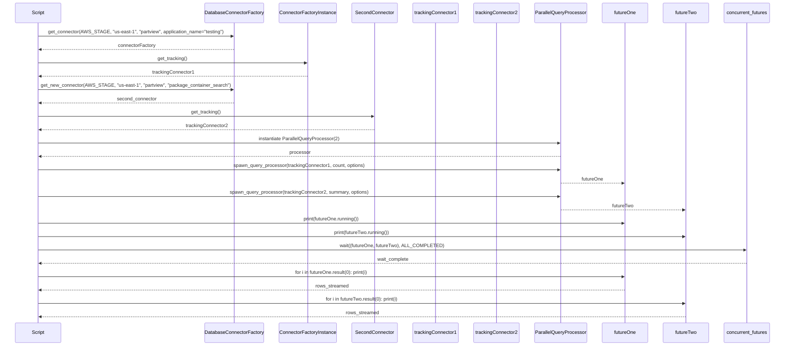
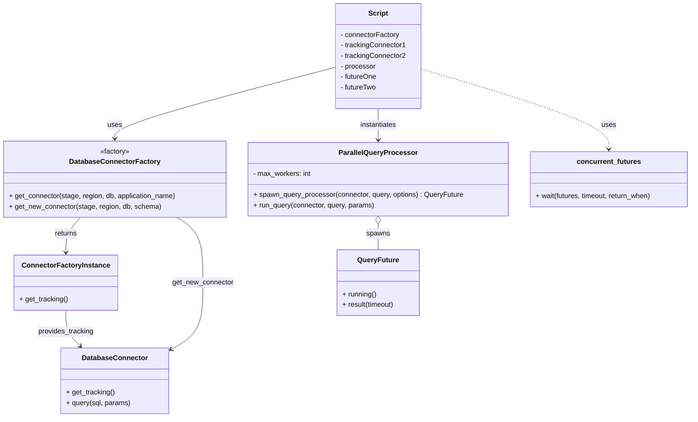

# Diagram: platform/tools/ide_local_testing/localTest/test/partview/ParallelQueryProcessorTest.py


> Auto-generated by Obscura crawlers

## Diagram 1



### SVG

<svg id="container" width="2685" xmlns="http://www.w3.org/2000/svg" height="1227" viewBox="-50 -10 2685 1227" role="graphics-document document" aria-roledescription="sequence"><g><rect x="2427" y="1141" fill="#eaeaea" stroke="#666" width="158" height="65" name="CF" rx="3" ry="3" class="actor actor-bottom"></rect><text x="2506" y="1173.5" dominant-baseline="central" alignment-baseline="central" class="actor actor-box" style="text-anchor: middle; font-size: 16px; font-weight: 400;"><tspan x="2506" dy="0">concurrent_futures</tspan></text></g><g><rect x="2227" y="1141" fill="#eaeaea" stroke="#666" width="150" height="65" name="F2" rx="3" ry="3" class="actor actor-bottom"></rect><text x="2302" y="1173.5" dominant-baseline="central" alignment-baseline="central" class="actor actor-box" style="text-anchor: middle; font-size: 16px; font-weight: 400;"><tspan x="2302" dy="0">futureTwo</tspan></text></g><g><rect x="2027" y="1141" fill="#eaeaea" stroke="#666" width="150" height="65" name="F1" rx="3" ry="3" class="actor actor-bottom"></rect><text x="2102" y="1173.5" dominant-baseline="central" alignment-baseline="central" class="actor actor-box" style="text-anchor: middle; font-size: 16px; font-weight: 400;"><tspan x="2102" dy="0">futureOne</tspan></text></g><g><rect x="1789" y="1141" fill="#eaeaea" stroke="#666" width="188" height="65" name="Processor" rx="3" ry="3" class="actor actor-bottom"></rect><text x="1883" y="1173.5" dominant-baseline="central" alignment-baseline="central" class="actor actor-box" style="text-anchor: middle; font-size: 16px; font-weight: 400;"><tspan x="1883" dy="0">ParallelQueryProcessor</tspan></text></g><g><rect x="1579" y="1141" fill="#eaeaea" stroke="#666" width="160" height="65" name="C2" rx="3" ry="3" class="actor actor-bottom"></rect><text x="1659" y="1173.5" dominant-baseline="central" alignment-baseline="central" class="actor actor-box" style="text-anchor: middle; font-size: 16px; font-weight: 400;"><tspan x="1659" dy="0">trackingConnector2</tspan></text></g><g><rect x="1370" y="1141" fill="#eaeaea" stroke="#666" width="159" height="65" name="C1" rx="3" ry="3" class="actor actor-bottom"></rect><text x="1449.5" y="1173.5" dominant-baseline="central" alignment-baseline="central" class="actor actor-box" style="text-anchor: middle; font-size: 16px; font-weight: 400;"><tspan x="1449.5" dy="0">trackingConnector1</tspan></text></g><g><rect x="1170" y="1141" fill="#eaeaea" stroke="#666" width="150" height="65" name="SecondConn" rx="3" ry="3" class="actor actor-bottom"></rect><text x="1245" y="1173.5" dominant-baseline="central" alignment-baseline="central" class="actor actor-box" style="text-anchor: middle; font-size: 16px; font-weight: 400;"><tspan x="1245" dy="0">SecondConnector</tspan></text></g><g><rect x="912" y="1141" fill="#eaeaea" stroke="#666" width="208" height="65" name="ConnFactory" rx="3" ry="3" class="actor actor-bottom"></rect><text x="1016" y="1173.5" dominant-baseline="central" alignment-baseline="central" class="actor actor-box" style="text-anchor: middle; font-size: 16px; font-weight: 400;"><tspan x="1016" dy="0">ConnectorFactoryInstance</tspan></text></g><g><rect x="648" y="1141" fill="#eaeaea" stroke="#666" width="214" height="65" name="DBFactory" rx="3" ry="3" class="actor actor-bottom"></rect><text x="755" y="1173.5" dominant-baseline="central" alignment-baseline="central" class="actor actor-box" style="text-anchor: middle; font-size: 16px; font-weight: 400;"><tspan x="755" dy="0">DatabaseConnectorFactory</tspan></text></g><g><rect x="0" y="1141" fill="#eaeaea" stroke="#666" width="150" height="65" name="Script" rx="3" ry="3" class="actor actor-bottom"></rect><text x="75" y="1173.5" dominant-baseline="central" alignment-baseline="central" class="actor actor-box" style="text-anchor: middle; font-size: 16px; font-weight: 400;"><tspan x="75" dy="0">Script</tspan></text></g><g><line id="actor9" x1="2506" y1="65" x2="2506" y2="1141" class="actor-line 200" stroke-width="0.5px" stroke="#999" name="CF"></line><g id="root-9"><rect x="2427" y="0" fill="#eaeaea" stroke="#666" width="158" height="65" name="CF" rx="3" ry="3" class="actor actor-top"></rect><text x="2506" y="32.5" dominant-baseline="central" alignment-baseline="central" class="actor actor-box" style="text-anchor: middle; font-size: 16px; font-weight: 400;"><tspan x="2506" dy="0">concurrent_futures</tspan></text></g></g><g><line id="actor8" x1="2302" y1="65" x2="2302" y2="1141" class="actor-line 200" stroke-width="0.5px" stroke="#999" name="F2"></line><g id="root-8"><rect x="2227" y="0" fill="#eaeaea" stroke="#666" width="150" height="65" name="F2" rx="3" ry="3" class="actor actor-top"></rect><text x="2302" y="32.5" dominant-baseline="central" alignment-baseline="central" class="actor actor-box" style="text-anchor: middle; font-size: 16px; font-weight: 400;"><tspan x="2302" dy="0">futureTwo</tspan></text></g></g><g><line id="actor7" x1="2102" y1="65" x2="2102" y2="1141" class="actor-line 200" stroke-width="0.5px" stroke="#999" name="F1"></line><g id="root-7"><rect x="2027" y="0" fill="#eaeaea" stroke="#666" width="150" height="65" name="F1" rx="3" ry="3" class="actor actor-top"></rect><text x="2102" y="32.5" dominant-baseline="central" alignment-baseline="central" class="actor actor-box" style="text-anchor: middle; font-size: 16px; font-weight: 400;"><tspan x="2102" dy="0">futureOne</tspan></text></g></g><g><line id="actor6" x1="1883" y1="65" x2="1883" y2="1141" class="actor-line 200" stroke-width="0.5px" stroke="#999" name="Processor"></line><g id="root-6"><rect x="1789" y="0" fill="#eaeaea" stroke="#666" width="188" height="65" name="Processor" rx="3" ry="3" class="actor actor-top"></rect><text x="1883" y="32.5" dominant-baseline="central" alignment-baseline="central" class="actor actor-box" style="text-anchor: middle; font-size: 16px; font-weight: 400;"><tspan x="1883" dy="0">ParallelQueryProcessor</tspan></text></g></g><g><line id="actor5" x1="1659" y1="65" x2="1659" y2="1141" class="actor-line 200" stroke-width="0.5px" stroke="#999" name="C2"></line><g id="root-5"><rect x="1579" y="0" fill="#eaeaea" stroke="#666" width="160" height="65" name="C2" rx="3" ry="3" class="actor actor-top"></rect><text x="1659" y="32.5" dominant-baseline="central" alignment-baseline="central" class="actor actor-box" style="text-anchor: middle; font-size: 16px; font-weight: 400;"><tspan x="1659" dy="0">trackingConnector2</tspan></text></g></g><g><line id="actor4" x1="1449.5" y1="65" x2="1449.5" y2="1141" class="actor-line 200" stroke-width="0.5px" stroke="#999" name="C1"></line><g id="root-4"><rect x="1370" y="0" fill="#eaeaea" stroke="#666" width="159" height="65" name="C1" rx="3" ry="3" class="actor actor-top"></rect><text x="1449.5" y="32.5" dominant-baseline="central" alignment-baseline="central" class="actor actor-box" style="text-anchor: middle; font-size: 16px; font-weight: 400;"><tspan x="1449.5" dy="0">trackingConnector1</tspan></text></g></g><g><line id="actor3" x1="1245" y1="65" x2="1245" y2="1141" class="actor-line 200" stroke-width="0.5px" stroke="#999" name="SecondConn"></line><g id="root-3"><rect x="1170" y="0" fill="#eaeaea" stroke="#666" width="150" height="65" name="SecondConn" rx="3" ry="3" class="actor actor-top"></rect><text x="1245" y="32.5" dominant-baseline="central" alignment-baseline="central" class="actor actor-box" style="text-anchor: middle; font-size: 16px; font-weight: 400;"><tspan x="1245" dy="0">SecondConnector</tspan></text></g></g><g><line id="actor2" x1="1016" y1="65" x2="1016" y2="1141" class="actor-line 200" stroke-width="0.5px" stroke="#999" name="ConnFactory"></line><g id="root-2"><rect x="912" y="0" fill="#eaeaea" stroke="#666" width="208" height="65" name="ConnFactory" rx="3" ry="3" class="actor actor-top"></rect><text x="1016" y="32.5" dominant-baseline="central" alignment-baseline="central" class="actor actor-box" style="text-anchor: middle; font-size: 16px; font-weight: 400;"><tspan x="1016" dy="0">ConnectorFactoryInstance</tspan></text></g></g><g><line id="actor1" x1="755" y1="65" x2="755" y2="1141" class="actor-line 200" stroke-width="0.5px" stroke="#999" name="DBFactory"></line><g id="root-1"><rect x="648" y="0" fill="#eaeaea" stroke="#666" width="214" height="65" name="DBFactory" rx="3" ry="3" class="actor actor-top"></rect><text x="755" y="32.5" dominant-baseline="central" alignment-baseline="central" class="actor actor-box" style="text-anchor: middle; font-size: 16px; font-weight: 400;"><tspan x="755" dy="0">DatabaseConnectorFactory</tspan></text></g></g><g><line id="actor0" x1="75" y1="65" x2="75" y2="1141" class="actor-line 200" stroke-width="0.5px" stroke="#999" name="Script"></line><g id="root-0"><rect x="0" y="0" fill="#eaeaea" stroke="#666" width="150" height="65" name="Script" rx="3" ry="3" class="actor actor-top"></rect><text x="75" y="32.5" dominant-baseline="central" alignment-baseline="central" class="actor actor-box" style="text-anchor: middle; font-size: 16px; font-weight: 400;"><tspan x="75" dy="0">Script</tspan></text></g></g><style>#container{font-family:"trebuchet ms",verdana,arial,sans-serif;font-size:16px;fill:#333;}@keyframes edge-animation-frame{from{stroke-dashoffset:0;}}@keyframes dash{to{stroke-dashoffset:0;}}#container .edge-animation-slow{stroke-dasharray:9,5!important;stroke-dashoffset:900;animation:dash 50s linear infinite;stroke-linecap:round;}#container .edge-animation-fast{stroke-dasharray:9,5!important;stroke-dashoffset:900;animation:dash 20s linear infinite;stroke-linecap:round;}#container .error-icon{fill:#552222;}#container .error-text{fill:#552222;stroke:#552222;}#container .edge-thickness-normal{stroke-width:1px;}#container .edge-thickness-thick{stroke-width:3.5px;}#container .edge-pattern-solid{stroke-dasharray:0;}#container .edge-thickness-invisible{stroke-width:0;fill:none;}#container .edge-pattern-dashed{stroke-dasharray:3;}#container .edge-pattern-dotted{stroke-dasharray:2;}#container .marker{fill:#333333;stroke:#333333;}#container .marker.cross{stroke:#333333;}#container svg{font-family:"trebuchet ms",verdana,arial,sans-serif;font-size:16px;}#container p{margin:0;}#container .actor{stroke:hsl(259.6261682243, 59.7765363128%, 87.9019607843%);fill:#ECECFF;}#container text.actor&gt;tspan{fill:black;stroke:none;}#container .actor-line{stroke:hsl(259.6261682243, 59.7765363128%, 87.9019607843%);}#container .innerArc{stroke-width:1.5;stroke-dasharray:none;}#container .messageLine0{stroke-width:1.5;stroke-dasharray:none;stroke:#333;}#container .messageLine1{stroke-width:1.5;stroke-dasharray:2,2;stroke:#333;}#container #arrowhead path{fill:#333;stroke:#333;}#container .sequenceNumber{fill:white;}#container #sequencenumber{fill:#333;}#container #crosshead path{fill:#333;stroke:#333;}#container .messageText{fill:#333;stroke:none;}#container .labelBox{stroke:hsl(259.6261682243, 59.7765363128%, 87.9019607843%);fill:#ECECFF;}#container .labelText,#container .labelText&gt;tspan{fill:black;stroke:none;}#container .loopText,#container .loopText&gt;tspan{fill:black;stroke:none;}#container .loopLine{stroke-width:2px;stroke-dasharray:2,2;stroke:hsl(259.6261682243, 59.7765363128%, 87.9019607843%);fill:hsl(259.6261682243, 59.7765363128%, 87.9019607843%);}#container .note{stroke:#aaaa33;fill:#fff5ad;}#container .noteText,#container .noteText&gt;tspan{fill:black;stroke:none;}#container .activation0{fill:#f4f4f4;stroke:#666;}#container .activation1{fill:#f4f4f4;stroke:#666;}#container .activation2{fill:#f4f4f4;stroke:#666;}#container .actorPopupMenu{position:absolute;}#container .actorPopupMenuPanel{position:absolute;fill:#ECECFF;box-shadow:0px 8px 16px 0px rgba(0,0,0,0.2);filter:drop-shadow(3px 5px 2px rgb(0 0 0 / 0.4));}#container .actor-man line{stroke:hsl(259.6261682243, 59.7765363128%, 87.9019607843%);fill:#ECECFF;}#container .actor-man circle,#container line{stroke:hsl(259.6261682243, 59.7765363128%, 87.9019607843%);fill:#ECECFF;stroke-width:2px;}#container :root{--mermaid-font-family:"trebuchet ms",verdana,arial,sans-serif;}</style><g></g><defs><symbol id="computer" width="24" height="24"><path transform="scale(.5)" d="M2 2v13h20v-13h-20zm18 11h-16v-9h16v9zm-10.228 6l.466-1h3.524l.467 1h-4.457zm14.228 3h-24l2-6h2.104l-1.33 4h18.45l-1.297-4h2.073l2 6zm-5-10h-14v-7h14v7z"></path></symbol></defs><defs><symbol id="database" fill-rule="evenodd" clip-rule="evenodd"><path transform="scale(.5)" d="M12.258.001l.256.004.255.005.253.008.251.01.249.012.247.015.246.016.242.019.241.02.239.023.236.024.233.027.231.028.229.031.225.032.223.034.22.036.217.038.214.04.211.041.208.043.205.045.201.046.198.048.194.05.191.051.187.053.183.054.18.056.175.057.172.059.168.06.163.061.16.063.155.064.15.066.074.033.073.033.071.034.07.034.069.035.068.035.067.035.066.035.064.036.064.036.062.036.06.036.06.037.058.037.058.037.055.038.055.038.053.038.052.038.051.039.05.039.048.039.047.039.045.04.044.04.043.04.041.04.04.041.039.041.037.041.036.041.034.041.033.042.032.042.03.042.029.042.027.042.026.043.024.043.023.043.021.043.02.043.018.044.017.043.015.044.013.044.012.044.011.045.009.044.007.045.006.045.004.045.002.045.001.045v17l-.001.045-.002.045-.004.045-.006.045-.007.045-.009.044-.011.045-.012.044-.013.044-.015.044-.017.043-.018.044-.02.043-.021.043-.023.043-.024.043-.026.043-.027.042-.029.042-.03.042-.032.042-.033.042-.034.041-.036.041-.037.041-.039.041-.04.041-.041.04-.043.04-.044.04-.045.04-.047.039-.048.039-.05.039-.051.039-.052.038-.053.038-.055.038-.055.038-.058.037-.058.037-.06.037-.06.036-.062.036-.064.036-.064.036-.066.035-.067.035-.068.035-.069.035-.07.034-.071.034-.073.033-.074.033-.15.066-.155.064-.16.063-.163.061-.168.06-.172.059-.175.057-.18.056-.183.054-.187.053-.191.051-.194.05-.198.048-.201.046-.205.045-.208.043-.211.041-.214.04-.217.038-.22.036-.223.034-.225.032-.229.031-.231.028-.233.027-.236.024-.239.023-.241.02-.242.019-.246.016-.247.015-.249.012-.251.01-.253.008-.255.005-.256.004-.258.001-.258-.001-.256-.004-.255-.005-.253-.008-.251-.01-.249-.012-.247-.015-.245-.016-.243-.019-.241-.02-.238-.023-.236-.024-.234-.027-.231-.028-.228-.031-.226-.032-.223-.034-.22-.036-.217-.038-.214-.04-.211-.041-.208-.043-.204-.045-.201-.046-.198-.048-.195-.05-.19-.051-.187-.053-.184-.054-.179-.056-.176-.057-.172-.059-.167-.06-.164-.061-.159-.063-.155-.064-.151-.066-.074-.033-.072-.033-.072-.034-.07-.034-.069-.035-.068-.035-.067-.035-.066-.035-.064-.036-.063-.036-.062-.036-.061-.036-.06-.037-.058-.037-.057-.037-.056-.038-.055-.038-.053-.038-.052-.038-.051-.039-.049-.039-.049-.039-.046-.039-.046-.04-.044-.04-.043-.04-.041-.04-.04-.041-.039-.041-.037-.041-.036-.041-.034-.041-.033-.042-.032-.042-.03-.042-.029-.042-.027-.042-.026-.043-.024-.043-.023-.043-.021-.043-.02-.043-.018-.044-.017-.043-.015-.044-.013-.044-.012-.044-.011-.045-.009-.044-.007-.045-.006-.045-.004-.045-.002-.045-.001-.045v-17l.001-.045.002-.045.004-.045.006-.045.007-.045.009-.044.011-.045.012-.044.013-.044.015-.044.017-.043.018-.044.02-.043.021-.043.023-.043.024-.043.026-.043.027-.042.029-.042.03-.042.032-.042.033-.042.034-.041.036-.041.037-.041.039-.041.04-.041.041-.04.043-.04.044-.04.046-.04.046-.039.049-.039.049-.039.051-.039.052-.038.053-.038.055-.038.056-.038.057-.037.058-.037.06-.037.061-.036.062-.036.063-.036.064-.036.066-.035.067-.035.068-.035.069-.035.07-.034.072-.034.072-.033.074-.033.151-.066.155-.064.159-.063.164-.061.167-.06.172-.059.176-.057.179-.056.184-.054.187-.053.19-.051.195-.05.198-.048.201-.046.204-.045.208-.043.211-.041.214-.04.217-.038.22-.036.223-.034.226-.032.228-.031.231-.028.234-.027.236-.024.238-.023.241-.02.243-.019.245-.016.247-.015.249-.012.251-.01.253-.008.255-.005.256-.004.258-.001.258.001zm-9.258 20.499v.01l.001.021.003.021.004.022.005.021.006.022.007.022.009.023.01.022.011.023.012.023.013.023.015.023.016.024.017.023.018.024.019.024.021.024.022.025.023.024.024.025.052.049.056.05.061.051.066.051.07.051.075.051.079.052.084.052.088.052.092.052.097.052.102.051.105.052.11.052.114.051.119.051.123.051.127.05.131.05.135.05.139.048.144.049.147.047.152.047.155.047.16.045.163.045.167.043.171.043.176.041.178.041.183.039.187.039.19.037.194.035.197.035.202.033.204.031.209.03.212.029.216.027.219.025.222.024.226.021.23.02.233.018.236.016.24.015.243.012.246.01.249.008.253.005.256.004.259.001.26-.001.257-.004.254-.005.25-.008.247-.011.244-.012.241-.014.237-.016.233-.018.231-.021.226-.021.224-.024.22-.026.216-.027.212-.028.21-.031.205-.031.202-.034.198-.034.194-.036.191-.037.187-.039.183-.04.179-.04.175-.042.172-.043.168-.044.163-.045.16-.046.155-.046.152-.047.148-.048.143-.049.139-.049.136-.05.131-.05.126-.05.123-.051.118-.052.114-.051.11-.052.106-.052.101-.052.096-.052.092-.052.088-.053.083-.051.079-.052.074-.052.07-.051.065-.051.06-.051.056-.05.051-.05.023-.024.023-.025.021-.024.02-.024.019-.024.018-.024.017-.024.015-.023.014-.024.013-.023.012-.023.01-.023.01-.022.008-.022.006-.022.006-.022.004-.022.004-.021.001-.021.001-.021v-4.127l-.077.055-.08.053-.083.054-.085.053-.087.052-.09.052-.093.051-.095.05-.097.05-.1.049-.102.049-.105.048-.106.047-.109.047-.111.046-.114.045-.115.045-.118.044-.12.043-.122.042-.124.042-.126.041-.128.04-.13.04-.132.038-.134.038-.135.037-.138.037-.139.035-.142.035-.143.034-.144.033-.147.032-.148.031-.15.03-.151.03-.153.029-.154.027-.156.027-.158.026-.159.025-.161.024-.162.023-.163.022-.165.021-.166.02-.167.019-.169.018-.169.017-.171.016-.173.015-.173.014-.175.013-.175.012-.177.011-.178.01-.179.008-.179.008-.181.006-.182.005-.182.004-.184.003-.184.002h-.37l-.184-.002-.184-.003-.182-.004-.182-.005-.181-.006-.179-.008-.179-.008-.178-.01-.176-.011-.176-.012-.175-.013-.173-.014-.172-.015-.171-.016-.17-.017-.169-.018-.167-.019-.166-.02-.165-.021-.163-.022-.162-.023-.161-.024-.159-.025-.157-.026-.156-.027-.155-.027-.153-.029-.151-.03-.15-.03-.148-.031-.146-.032-.145-.033-.143-.034-.141-.035-.14-.035-.137-.037-.136-.037-.134-.038-.132-.038-.13-.04-.128-.04-.126-.041-.124-.042-.122-.042-.12-.044-.117-.043-.116-.045-.113-.045-.112-.046-.109-.047-.106-.047-.105-.048-.102-.049-.1-.049-.097-.05-.095-.05-.093-.052-.09-.051-.087-.052-.085-.053-.083-.054-.08-.054-.077-.054v4.127zm0-5.654v.011l.001.021.003.021.004.021.005.022.006.022.007.022.009.022.01.022.011.023.012.023.013.023.015.024.016.023.017.024.018.024.019.024.021.024.022.024.023.025.024.024.052.05.056.05.061.05.066.051.07.051.075.052.079.051.084.052.088.052.092.052.097.052.102.052.105.052.11.051.114.051.119.052.123.05.127.051.131.05.135.049.139.049.144.048.147.048.152.047.155.046.16.045.163.045.167.044.171.042.176.042.178.04.183.04.187.038.19.037.194.036.197.034.202.033.204.032.209.03.212.028.216.027.219.025.222.024.226.022.23.02.233.018.236.016.24.014.243.012.246.01.249.008.253.006.256.003.259.001.26-.001.257-.003.254-.006.25-.008.247-.01.244-.012.241-.015.237-.016.233-.018.231-.02.226-.022.224-.024.22-.025.216-.027.212-.029.21-.03.205-.032.202-.033.198-.035.194-.036.191-.037.187-.039.183-.039.179-.041.175-.042.172-.043.168-.044.163-.045.16-.045.155-.047.152-.047.148-.048.143-.048.139-.05.136-.049.131-.05.126-.051.123-.051.118-.051.114-.052.11-.052.106-.052.101-.052.096-.052.092-.052.088-.052.083-.052.079-.052.074-.051.07-.052.065-.051.06-.05.056-.051.051-.049.023-.025.023-.024.021-.025.02-.024.019-.024.018-.024.017-.024.015-.023.014-.023.013-.024.012-.022.01-.023.01-.023.008-.022.006-.022.006-.022.004-.021.004-.022.001-.021.001-.021v-4.139l-.077.054-.08.054-.083.054-.085.052-.087.053-.09.051-.093.051-.095.051-.097.05-.1.049-.102.049-.105.048-.106.047-.109.047-.111.046-.114.045-.115.044-.118.044-.12.044-.122.042-.124.042-.126.041-.128.04-.13.039-.132.039-.134.038-.135.037-.138.036-.139.036-.142.035-.143.033-.144.033-.147.033-.148.031-.15.03-.151.03-.153.028-.154.028-.156.027-.158.026-.159.025-.161.024-.162.023-.163.022-.165.021-.166.02-.167.019-.169.018-.169.017-.171.016-.173.015-.173.014-.175.013-.175.012-.177.011-.178.009-.179.009-.179.007-.181.007-.182.005-.182.004-.184.003-.184.002h-.37l-.184-.002-.184-.003-.182-.004-.182-.005-.181-.007-.179-.007-.179-.009-.178-.009-.176-.011-.176-.012-.175-.013-.173-.014-.172-.015-.171-.016-.17-.017-.169-.018-.167-.019-.166-.02-.165-.021-.163-.022-.162-.023-.161-.024-.159-.025-.157-.026-.156-.027-.155-.028-.153-.028-.151-.03-.15-.03-.148-.031-.146-.033-.145-.033-.143-.033-.141-.035-.14-.036-.137-.036-.136-.037-.134-.038-.132-.039-.13-.039-.128-.04-.126-.041-.124-.042-.122-.043-.12-.043-.117-.044-.116-.044-.113-.046-.112-.046-.109-.046-.106-.047-.105-.048-.102-.049-.1-.049-.097-.05-.095-.051-.093-.051-.09-.051-.087-.053-.085-.052-.083-.054-.08-.054-.077-.054v4.139zm0-5.666v.011l.001.02.003.022.004.021.005.022.006.021.007.022.009.023.01.022.011.023.012.023.013.023.015.023.016.024.017.024.018.023.019.024.021.025.022.024.023.024.024.025.052.05.056.05.061.05.066.051.07.051.075.052.079.051.084.052.088.052.092.052.097.052.102.052.105.051.11.052.114.051.119.051.123.051.127.05.131.05.135.05.139.049.144.048.147.048.152.047.155.046.16.045.163.045.167.043.171.043.176.042.178.04.183.04.187.038.19.037.194.036.197.034.202.033.204.032.209.03.212.028.216.027.219.025.222.024.226.021.23.02.233.018.236.017.24.014.243.012.246.01.249.008.253.006.256.003.259.001.26-.001.257-.003.254-.006.25-.008.247-.01.244-.013.241-.014.237-.016.233-.018.231-.02.226-.022.224-.024.22-.025.216-.027.212-.029.21-.03.205-.032.202-.033.198-.035.194-.036.191-.037.187-.039.183-.039.179-.041.175-.042.172-.043.168-.044.163-.045.16-.045.155-.047.152-.047.148-.048.143-.049.139-.049.136-.049.131-.051.126-.05.123-.051.118-.052.114-.051.11-.052.106-.052.101-.052.096-.052.092-.052.088-.052.083-.052.079-.052.074-.052.07-.051.065-.051.06-.051.056-.05.051-.049.023-.025.023-.025.021-.024.02-.024.019-.024.018-.024.017-.024.015-.023.014-.024.013-.023.012-.023.01-.022.01-.023.008-.022.006-.022.006-.022.004-.022.004-.021.001-.021.001-.021v-4.153l-.077.054-.08.054-.083.053-.085.053-.087.053-.09.051-.093.051-.095.051-.097.05-.1.049-.102.048-.105.048-.106.048-.109.046-.111.046-.114.046-.115.044-.118.044-.12.043-.122.043-.124.042-.126.041-.128.04-.13.039-.132.039-.134.038-.135.037-.138.036-.139.036-.142.034-.143.034-.144.033-.147.032-.148.032-.15.03-.151.03-.153.028-.154.028-.156.027-.158.026-.159.024-.161.024-.162.023-.163.023-.165.021-.166.02-.167.019-.169.018-.169.017-.171.016-.173.015-.173.014-.175.013-.175.012-.177.01-.178.01-.179.009-.179.007-.181.006-.182.006-.182.004-.184.003-.184.001-.185.001-.185-.001-.184-.001-.184-.003-.182-.004-.182-.006-.181-.006-.179-.007-.179-.009-.178-.01-.176-.01-.176-.012-.175-.013-.173-.014-.172-.015-.171-.016-.17-.017-.169-.018-.167-.019-.166-.02-.165-.021-.163-.023-.162-.023-.161-.024-.159-.024-.157-.026-.156-.027-.155-.028-.153-.028-.151-.03-.15-.03-.148-.032-.146-.032-.145-.033-.143-.034-.141-.034-.14-.036-.137-.036-.136-.037-.134-.038-.132-.039-.13-.039-.128-.041-.126-.041-.124-.041-.122-.043-.12-.043-.117-.044-.116-.044-.113-.046-.112-.046-.109-.046-.106-.048-.105-.048-.102-.048-.1-.05-.097-.049-.095-.051-.093-.051-.09-.052-.087-.052-.085-.053-.083-.053-.08-.054-.077-.054v4.153zm8.74-8.179l-.257.004-.254.005-.25.008-.247.011-.244.012-.241.014-.237.016-.233.018-.231.021-.226.022-.224.023-.22.026-.216.027-.212.028-.21.031-.205.032-.202.033-.198.034-.194.036-.191.038-.187.038-.183.04-.179.041-.175.042-.172.043-.168.043-.163.045-.16.046-.155.046-.152.048-.148.048-.143.048-.139.049-.136.05-.131.05-.126.051-.123.051-.118.051-.114.052-.11.052-.106.052-.101.052-.096.052-.092.052-.088.052-.083.052-.079.052-.074.051-.07.052-.065.051-.06.05-.056.05-.051.05-.023.025-.023.024-.021.024-.02.025-.019.024-.018.024-.017.023-.015.024-.014.023-.013.023-.012.023-.01.023-.01.022-.008.022-.006.023-.006.021-.004.022-.004.021-.001.021-.001.021.001.021.001.021.004.021.004.022.006.021.006.023.008.022.01.022.01.023.012.023.013.023.014.023.015.024.017.023.018.024.019.024.02.025.021.024.023.024.023.025.051.05.056.05.06.05.065.051.07.052.074.051.079.052.083.052.088.052.092.052.096.052.101.052.106.052.11.052.114.052.118.051.123.051.126.051.131.05.136.05.139.049.143.048.148.048.152.048.155.046.16.046.163.045.168.043.172.043.175.042.179.041.183.04.187.038.191.038.194.036.198.034.202.033.205.032.21.031.212.028.216.027.22.026.224.023.226.022.231.021.233.018.237.016.241.014.244.012.247.011.25.008.254.005.257.004.26.001.26-.001.257-.004.254-.005.25-.008.247-.011.244-.012.241-.014.237-.016.233-.018.231-.021.226-.022.224-.023.22-.026.216-.027.212-.028.21-.031.205-.032.202-.033.198-.034.194-.036.191-.038.187-.038.183-.04.179-.041.175-.042.172-.043.168-.043.163-.045.16-.046.155-.046.152-.048.148-.048.143-.048.139-.049.136-.05.131-.05.126-.051.123-.051.118-.051.114-.052.11-.052.106-.052.101-.052.096-.052.092-.052.088-.052.083-.052.079-.052.074-.051.07-.052.065-.051.06-.05.056-.05.051-.05.023-.025.023-.024.021-.024.02-.025.019-.024.018-.024.017-.023.015-.024.014-.023.013-.023.012-.023.01-.023.01-.022.008-.022.006-.023.006-.021.004-.022.004-.021.001-.021.001-.021-.001-.021-.001-.021-.004-.021-.004-.022-.006-.021-.006-.023-.008-.022-.01-.022-.01-.023-.012-.023-.013-.023-.014-.023-.015-.024-.017-.023-.018-.024-.019-.024-.02-.025-.021-.024-.023-.024-.023-.025-.051-.05-.056-.05-.06-.05-.065-.051-.07-.052-.074-.051-.079-.052-.083-.052-.088-.052-.092-.052-.096-.052-.101-.052-.106-.052-.11-.052-.114-.052-.118-.051-.123-.051-.126-.051-.131-.05-.136-.05-.139-.049-.143-.048-.148-.048-.152-.048-.155-.046-.16-.046-.163-.045-.168-.043-.172-.043-.175-.042-.179-.041-.183-.04-.187-.038-.191-.038-.194-.036-.198-.034-.202-.033-.205-.032-.21-.031-.212-.028-.216-.027-.22-.026-.224-.023-.226-.022-.231-.021-.233-.018-.237-.016-.241-.014-.244-.012-.247-.011-.25-.008-.254-.005-.257-.004-.26-.001-.26.001z"></path></symbol></defs><defs><symbol id="clock" width="24" height="24"><path transform="scale(.5)" d="M12 2c5.514 0 10 4.486 10 10s-4.486 10-10 10-10-4.486-10-10 4.486-10 10-10zm0-2c-6.627 0-12 5.373-12 12s5.373 12 12 12 12-5.373 12-12-5.373-12-12-12zm5.848 12.459c.202.038.202.333.001.372-1.907.361-6.045 1.111-6.547 1.111-.719 0-1.301-.582-1.301-1.301 0-.512.77-5.447 1.125-7.445.034-.192.312-.181.343.014l.985 6.238 5.394 1.011z"></path></symbol></defs><defs><marker id="arrowhead" refX="7.9" refY="5" markerUnits="userSpaceOnUse" markerWidth="12" markerHeight="12" orient="auto-start-reverse"><path d="M -1 0 L 10 5 L 0 10 z"></path></marker></defs><defs><marker id="crosshead" markerWidth="15" markerHeight="8" orient="auto" refX="4" refY="4.5"><path fill="none" stroke="#000000" stroke-width="1pt" d="M 1,2 L 6,7 M 6,2 L 1,7" style="stroke-dasharray: 0, 0;"></path></marker></defs><defs><marker id="filled-head" refX="15.5" refY="7" markerWidth="20" markerHeight="28" orient="auto"><path d="M 18,7 L9,13 L14,7 L9,1 Z"></path></marker></defs><defs><marker id="sequencenumber" refX="15" refY="15" markerWidth="60" markerHeight="40" orient="auto"><circle cx="15" cy="15" r="6"></circle></marker></defs><text x="414" y="80" text-anchor="middle" dominant-baseline="middle" alignment-baseline="middle" class="messageText" dy="1em" style="font-size: 16px; font-weight: 400;">get_connector(AWS_STAGE, "us-east-1", "partview", application_name="testing")</text><line x1="76" y1="113" x2="751" y2="113" class="messageLine0" stroke-width="2" stroke="none" marker-end="url(#arrowhead)" style="fill: none;"></line><text x="417" y="128" text-anchor="middle" dominant-baseline="middle" alignment-baseline="middle" class="messageText" dy="1em" style="font-size: 16px; font-weight: 400;">connectorFactory</text><line x1="754" y1="161" x2="79" y2="161" class="messageLine1" stroke-width="2" stroke="none" marker-end="url(#arrowhead)" style="stroke-dasharray: 3, 3; fill: none;"></line><text x="544" y="176" text-anchor="middle" dominant-baseline="middle" alignment-baseline="middle" class="messageText" dy="1em" style="font-size: 16px; font-weight: 400;">get_tracking()</text><line x1="76" y1="209" x2="1012" y2="209" class="messageLine0" stroke-width="2" stroke="none" marker-end="url(#arrowhead)" style="fill: none;"></line><text x="547" y="224" text-anchor="middle" dominant-baseline="middle" alignment-baseline="middle" class="messageText" dy="1em" style="font-size: 16px; font-weight: 400;">trackingConnector1</text><line x1="1015" y1="257" x2="79" y2="257" class="messageLine1" stroke-width="2" stroke="none" marker-end="url(#arrowhead)" style="stroke-dasharray: 3, 3; fill: none;"></line><text x="414" y="272" text-anchor="middle" dominant-baseline="middle" alignment-baseline="middle" class="messageText" dy="1em" style="font-size: 16px; font-weight: 400;">get_new_connector(AWS_STAGE, "us-east-1", "partview", "package_container_search")</text><line x1="76" y1="305" x2="751" y2="305" class="messageLine0" stroke-width="2" stroke="none" marker-end="url(#arrowhead)" style="fill: none;"></line><text x="417" y="320" text-anchor="middle" dominant-baseline="middle" alignment-baseline="middle" class="messageText" dy="1em" style="font-size: 16px; font-weight: 400;">second_connector</text><line x1="754" y1="353" x2="79" y2="353" class="messageLine1" stroke-width="2" stroke="none" marker-end="url(#arrowhead)" style="stroke-dasharray: 3, 3; fill: none;"></line><text x="659" y="368" text-anchor="middle" dominant-baseline="middle" alignment-baseline="middle" class="messageText" dy="1em" style="font-size: 16px; font-weight: 400;">get_tracking()</text><line x1="76" y1="401" x2="1241" y2="401" class="messageLine0" stroke-width="2" stroke="none" marker-end="url(#arrowhead)" style="fill: none;"></line><text x="662" y="416" text-anchor="middle" dominant-baseline="middle" alignment-baseline="middle" class="messageText" dy="1em" style="font-size: 16px; font-weight: 400;">trackingConnector2</text><line x1="1244" y1="449" x2="79" y2="449" class="messageLine1" stroke-width="2" stroke="none" marker-end="url(#arrowhead)" style="stroke-dasharray: 3, 3; fill: none;"></line><text x="978" y="464" text-anchor="middle" dominant-baseline="middle" alignment-baseline="middle" class="messageText" dy="1em" style="font-size: 16px; font-weight: 400;">instantiate ParallelQueryProcessor(2)</text><line x1="76" y1="497" x2="1879" y2="497" class="messageLine0" stroke-width="2" stroke="none" marker-end="url(#arrowhead)" style="fill: none;"></line><text x="981" y="512" text-anchor="middle" dominant-baseline="middle" alignment-baseline="middle" class="messageText" dy="1em" style="font-size: 16px; font-weight: 400;">processor</text><line x1="1882" y1="545" x2="79" y2="545" class="messageLine1" stroke-width="2" stroke="none" marker-end="url(#arrowhead)" style="stroke-dasharray: 3, 3; fill: none;"></line><text x="978" y="560" text-anchor="middle" dominant-baseline="middle" alignment-baseline="middle" class="messageText" dy="1em" style="font-size: 16px; font-weight: 400;">spawn_query_processor(trackingConnector1, count, options)</text><line x1="76" y1="593" x2="1879" y2="593" class="messageLine0" stroke-width="2" stroke="none" marker-end="url(#arrowhead)" style="fill: none;"></line><text x="1991" y="608" text-anchor="middle" dominant-baseline="middle" alignment-baseline="middle" class="messageText" dy="1em" style="font-size: 16px; font-weight: 400;">futureOne</text><line x1="1884" y1="641" x2="2098" y2="641" class="messageLine1" stroke-width="2" stroke="none" marker-end="url(#arrowhead)" style="stroke-dasharray: 3, 3; fill: none;"></line><text x="978" y="656" text-anchor="middle" dominant-baseline="middle" alignment-baseline="middle" class="messageText" dy="1em" style="font-size: 16px; font-weight: 400;">spawn_query_processor(trackingConnector2, summary, options)</text><line x1="76" y1="689" x2="1879" y2="689" class="messageLine0" stroke-width="2" stroke="none" marker-end="url(#arrowhead)" style="fill: none;"></line><text x="2091" y="704" text-anchor="middle" dominant-baseline="middle" alignment-baseline="middle" class="messageText" dy="1em" style="font-size: 16px; font-weight: 400;">futureTwo</text><line x1="1884" y1="737" x2="2298" y2="737" class="messageLine1" stroke-width="2" stroke="none" marker-end="url(#arrowhead)" style="stroke-dasharray: 3, 3; fill: none;"></line><text x="1087" y="752" text-anchor="middle" dominant-baseline="middle" alignment-baseline="middle" class="messageText" dy="1em" style="font-size: 16px; font-weight: 400;">print(futureOne.running())</text><line x1="76" y1="785" x2="2098" y2="785" class="messageLine0" stroke-width="2" stroke="none" marker-end="url(#arrowhead)" style="fill: none;"></line><text x="1187" y="800" text-anchor="middle" dominant-baseline="middle" alignment-baseline="middle" class="messageText" dy="1em" style="font-size: 16px; font-weight: 400;">print(futureTwo.running())</text><line x1="76" y1="833" x2="2298" y2="833" class="messageLine0" stroke-width="2" stroke="none" marker-end="url(#arrowhead)" style="fill: none;"></line><text x="1289" y="848" text-anchor="middle" dominant-baseline="middle" alignment-baseline="middle" class="messageText" dy="1em" style="font-size: 16px; font-weight: 400;">wait((futureOne, futureTwo), ALL_COMPLETED)</text><line x1="76" y1="881" x2="2502" y2="881" class="messageLine0" stroke-width="2" stroke="none" marker-end="url(#arrowhead)" style="fill: none;"></line><text x="1292" y="896" text-anchor="middle" dominant-baseline="middle" alignment-baseline="middle" class="messageText" dy="1em" style="font-size: 16px; font-weight: 400;">wait_complete</text><line x1="2505" y1="929" x2="79" y2="929" class="messageLine1" stroke-width="2" stroke="none" marker-end="url(#arrowhead)" style="stroke-dasharray: 3, 3; fill: none;"></line><text x="1087" y="944" text-anchor="middle" dominant-baseline="middle" alignment-baseline="middle" class="messageText" dy="1em" style="font-size: 16px; font-weight: 400;">for i in futureOne.result(0): print(i)</text><line x1="76" y1="977" x2="2098" y2="977" class="messageLine0" stroke-width="2" stroke="none" marker-end="url(#arrowhead)" style="fill: none;"></line><text x="1090" y="992" text-anchor="middle" dominant-baseline="middle" alignment-baseline="middle" class="messageText" dy="1em" style="font-size: 16px; font-weight: 400;">rows_streamed</text><line x1="2101" y1="1025" x2="79" y2="1025" class="messageLine1" stroke-width="2" stroke="none" marker-end="url(#arrowhead)" style="stroke-dasharray: 3, 3; fill: none;"></line><text x="1187" y="1040" text-anchor="middle" dominant-baseline="middle" alignment-baseline="middle" class="messageText" dy="1em" style="font-size: 16px; font-weight: 400;">for i in futureTwo.result(0): print(i)</text><line x1="76" y1="1073" x2="2298" y2="1073" class="messageLine0" stroke-width="2" stroke="none" marker-end="url(#arrowhead)" style="fill: none;"></line><text x="1190" y="1088" text-anchor="middle" dominant-baseline="middle" alignment-baseline="middle" class="messageText" dy="1em" style="font-size: 16px; font-weight: 400;">rows_streamed</text><line x1="2301" y1="1121" x2="79" y2="1121" class="messageLine1" stroke-width="2" stroke="none" marker-end="url(#arrowhead)" style="stroke-dasharray: 3, 3; fill: none;"></line></svg>

## Diagram 2



### SVG

<svg id="container" width="1578.5390625" xmlns="http://www.w3.org/2000/svg" class="classDiagram" height="952" viewBox="0 0 1578.5390625 952" role="graphics-document document" aria-roledescription="class"><style>#container{font-family:"trebuchet ms",verdana,arial,sans-serif;font-size:16px;fill:#333;}@keyframes edge-animation-frame{from{stroke-dashoffset:0;}}@keyframes dash{to{stroke-dashoffset:0;}}#container .edge-animation-slow{stroke-dasharray:9,5!important;stroke-dashoffset:900;animation:dash 50s linear infinite;stroke-linecap:round;}#container .edge-animation-fast{stroke-dasharray:9,5!important;stroke-dashoffset:900;animation:dash 20s linear infinite;stroke-linecap:round;}#container .error-icon{fill:#552222;}#container .error-text{fill:#552222;stroke:#552222;}#container .edge-thickness-normal{stroke-width:1px;}#container .edge-thickness-thick{stroke-width:3.5px;}#container .edge-pattern-solid{stroke-dasharray:0;}#container .edge-thickness-invisible{stroke-width:0;fill:none;}#container .edge-pattern-dashed{stroke-dasharray:3;}#container .edge-pattern-dotted{stroke-dasharray:2;}#container .marker{fill:#333333;stroke:#333333;}#container .marker.cross{stroke:#333333;}#container svg{font-family:"trebuchet ms",verdana,arial,sans-serif;font-size:16px;}#container p{margin:0;}#container g.classGroup text{fill:#9370DB;stroke:none;font-family:"trebuchet ms",verdana,arial,sans-serif;font-size:10px;}#container g.classGroup text .title{font-weight:bolder;}#container .nodeLabel,#container .edgeLabel{color:#131300;}#container .edgeLabel .label rect{fill:#ECECFF;}#container .label text{fill:#131300;}#container .labelBkg{background:#ECECFF;}#container .edgeLabel .label span{background:#ECECFF;}#container .classTitle{font-weight:bolder;}#container .node rect,#container .node circle,#container .node ellipse,#container .node polygon,#container .node path{fill:#ECECFF;stroke:#9370DB;stroke-width:1px;}#container .divider{stroke:#9370DB;stroke-width:1;}#container g.clickable{cursor:pointer;}#container g.classGroup rect{fill:#ECECFF;stroke:#9370DB;}#container g.classGroup line{stroke:#9370DB;stroke-width:1;}#container .classLabel .box{stroke:none;stroke-width:0;fill:#ECECFF;opacity:0.5;}#container .classLabel .label{fill:#9370DB;font-size:10px;}#container .relation{stroke:#333333;stroke-width:1;fill:none;}#container .dashed-line{stroke-dasharray:3;}#container .dotted-line{stroke-dasharray:1 2;}#container #compositionStart,#container .composition{fill:#333333!important;stroke:#333333!important;stroke-width:1;}#container #compositionEnd,#container .composition{fill:#333333!important;stroke:#333333!important;stroke-width:1;}#container #dependencyStart,#container .dependency{fill:#333333!important;stroke:#333333!important;stroke-width:1;}#container #dependencyStart,#container .dependency{fill:#333333!important;stroke:#333333!important;stroke-width:1;}#container #extensionStart,#container .extension{fill:transparent!important;stroke:#333333!important;stroke-width:1;}#container #extensionEnd,#container .extension{fill:transparent!important;stroke:#333333!important;stroke-width:1;}#container #aggregationStart,#container .aggregation{fill:transparent!important;stroke:#333333!important;stroke-width:1;}#container #aggregationEnd,#container .aggregation{fill:transparent!important;stroke:#333333!important;stroke-width:1;}#container #lollipopStart,#container .lollipop{fill:#ECECFF!important;stroke:#333333!important;stroke-width:1;}#container #lollipopEnd,#container .lollipop{fill:#ECECFF!important;stroke:#333333!important;stroke-width:1;}#container .edgeTerminals{font-size:11px;line-height:initial;}#container .classTitleText{text-anchor:middle;font-size:18px;fill:#333;}#container .label-icon{display:inline-block;height:1em;overflow:visible;vertical-align:-0.125em;}#container .node .label-icon path{fill:currentColor;stroke:revert;stroke-width:revert;}#container :root{--mermaid-font-family:"trebuchet ms",verdana,arial,sans-serif;}</style><g><defs><marker id="container_class-aggregationStart" class="marker aggregation class" refX="18" refY="7" markerWidth="190" markerHeight="240" orient="auto"><path d="M 18,7 L9,13 L1,7 L9,1 Z"></path></marker></defs><defs><marker id="container_class-aggregationEnd" class="marker aggregation class" refX="1" refY="7" markerWidth="20" markerHeight="28" orient="auto"><path d="M 18,7 L9,13 L1,7 L9,1 Z"></path></marker></defs><defs><marker id="container_class-extensionStart" class="marker extension class" refX="18" refY="7" markerWidth="190" markerHeight="240" orient="auto"><path d="M 1,7 L18,13 V 1 Z"></path></marker></defs><defs><marker id="container_class-extensionEnd" class="marker extension class" refX="1" refY="7" markerWidth="20" markerHeight="28" orient="auto"><path d="M 1,1 V 13 L18,7 Z"></path></marker></defs><defs><marker id="container_class-compositionStart" class="marker composition class" refX="18" refY="7" markerWidth="190" markerHeight="240" orient="auto"><path d="M 18,7 L9,13 L1,7 L9,1 Z"></path></marker></defs><defs><marker id="container_class-compositionEnd" class="marker composition class" refX="1" refY="7" markerWidth="20" markerHeight="28" orient="auto"><path d="M 18,7 L9,13 L1,7 L9,1 Z"></path></marker></defs><defs><marker id="container_class-dependencyStart" class="marker dependency class" refX="6" refY="7" markerWidth="190" markerHeight="240" orient="auto"><path d="M 5,7 L9,13 L1,7 L9,1 Z"></path></marker></defs><defs><marker id="container_class-dependencyEnd" class="marker dependency class" refX="13" refY="7" markerWidth="20" markerHeight="28" orient="auto"><path d="M 18,7 L9,13 L14,7 L9,1 Z"></path></marker></defs><defs><marker id="container_class-lollipopStart" class="marker lollipop class" refX="13" refY="7" markerWidth="190" markerHeight="240" orient="auto"><circle stroke="black" fill="transparent" cx="7" cy="7" r="6"></circle></marker></defs><defs><marker id="container_class-lollipopEnd" class="marker lollipop class" refX="1" refY="7" markerWidth="190" markerHeight="240" orient="auto"><circle stroke="black" fill="transparent" cx="7" cy="7" r="6"></circle></marker></defs><g class="root"><g class="clusters"></g><g class="edgePaths"><path d="M183.893,496L178.407,502.167C172.922,508.333,161.951,520.667,156.466,534C150.98,547.333,150.98,561.667,150.98,568.833L150.98,576" id="id_DatabaseConnectorFactory_ConnectorFactoryInstance_1" class="edge-thickness-normal edge-pattern-solid relation" style=";;;" data-edge="true" data-et="edge" data-id="id_DatabaseConnectorFactory_ConnectorFactoryInstance_1" data-points="W3sieCI6MTgzLjg5Mjc5ODYzOTExMjksInkiOjQ5Nn0seyJ4IjoxNTAuOTgwNDY4NzUsInkiOjUzM30seyJ4IjoxNTAuOTgwNDY4NzUsInkiOjU4Mn1d" marker-end="url(#container_class-dependencyEnd)"></path><path d="M150.98,708L150.98,716.167C150.98,724.333,150.98,740.667,156.352,754.288C161.723,767.908,172.466,778.817,177.838,784.271L183.209,789.725" id="id_ConnectorFactoryInstance_DatabaseConnector_2" class="edge-thickness-normal edge-pattern-solid relation" style=";;;" data-edge="true" data-et="edge" data-id="id_ConnectorFactoryInstance_DatabaseConnector_2" data-points="W3sieCI6MTUwLjk4MDQ2ODc1LCJ5Ijo3MDh9LHsieCI6MTUwLjk4MDQ2ODc1LCJ5Ijo3NTd9LHsieCI6MTg3LjQxOTExOTY5ODY2MDcyLCJ5Ijo3OTR9XQ==" marker-end="url(#container_class-dependencyEnd)"></path><path d="M401.116,496L411.028,502.167C420.939,508.333,440.763,520.667,450.674,545.5C460.586,570.333,460.586,607.667,460.586,645C460.586,682.333,460.586,719.667,448.512,745.118C436.438,770.57,412.289,784.141,400.215,790.926L388.141,797.711" id="id_DatabaseConnectorFactory_DatabaseConnector_3" class="edge-thickness-normal edge-pattern-solid relation" style=";;;" data-edge="true" data-et="edge" data-id="id_DatabaseConnectorFactory_DatabaseConnector_3" data-points="W3sieCI6NDAxLjExNTk5MDQyMzM4NzEsInkiOjQ5Nn0seyJ4Ijo0NjAuNTg1OTM3NSwieSI6NTMzfSx7IngiOjQ2MC41ODU5Mzc1LCJ5Ijo2NDV9LHsieCI6NDYwLjU4NTkzNzUsInkiOjc1N30seyJ4IjozODIuOTEwMTU2MjUsInkiOjgwMC42NTAxOTAxMTQwNjg0fV0=" marker-end="url(#container_class-dependencyEnd)"></path><path d="M762.352,153.747L678.84,175.623C595.328,197.498,428.305,241.249,344.793,268.291C261.281,295.333,261.281,305.667,261.281,310.833L261.281,316" id="id_Script_DatabaseConnectorFactory_4" class="edge-thickness-normal edge-pattern-solid relation" style=";;;" data-edge="true" data-et="edge" data-id="id_Script_DatabaseConnectorFactory_4" data-points="W3sieCI6NzYyLjM1MTU2MjUsInkiOjE1My43NDczMTY0ODgyMDAzN30seyJ4IjoyNjEuMjgxMjUsInkiOjI4NX0seyJ4IjoyNjEuMjgxMjUsInkiOjMyMn1d" marker-end="url(#container_class-dependencyEnd)"></path><path d="M860.645,248L860.645,254.167C860.645,260.333,860.645,272.667,860.645,284.5C860.645,296.333,860.645,307.667,860.645,313.333L860.645,319" id="id_Script_ParallelQueryProcessor_5" class="edge-thickness-normal edge-pattern-solid relation" style=";;;" data-edge="true" data-et="edge" data-id="id_Script_ParallelQueryProcessor_5" data-points="W3sieCI6ODYwLjY0NDUzMTI1LCJ5IjoyNDh9LHsieCI6ODYwLjY0NDUzMTI1LCJ5IjoyODV9LHsieCI6ODYwLjY0NDUzMTI1LCJ5IjozMjV9XQ==" marker-end="url(#container_class-dependencyEnd)"></path><path d="M860.645,510.25L860.645,514.042C860.645,517.833,860.645,525.417,860.645,535.375C860.645,545.333,860.645,557.667,860.645,563.833L860.645,570" id="id_ParallelQueryProcessor_QueryFuture_6" class="edge-thickness-normal edge-pattern-solid relation" style=";;;" data-edge="true" data-et="edge" data-id="id_ParallelQueryProcessor_QueryFuture_6" data-points="W3sieCI6ODYwLjY0NDUzMTI1LCJ5Ijo0OTN9LHsieCI6ODYwLjY0NDUzMTI1LCJ5Ijo1MzN9LHsieCI6ODYwLjY0NDUzMTI1LCJ5Ijo1NzB9XQ==" marker-start="url(#container_class-aggregationStart)"></path><path d="M958.938,157.228L1030.553,178.523C1102.169,199.819,1245.401,242.409,1317.017,272.871C1388.633,303.333,1388.633,321.667,1388.633,330.833L1388.633,340" id="id_Script_concurrent_futures_7" class="edge-thickness-normal edge-pattern-dashed relation" style=";;;" data-edge="true" data-et="edge" data-id="id_Script_concurrent_futures_7" data-points="W3sieCI6OTU4LjkzNzUsInkiOjE1Ny4yMjc5MTQwMzA5OTkxNn0seyJ4IjoxMzg4LjYzMjgxMjUsInkiOjI4NX0seyJ4IjoxMzg4LjYzMjgxMjUsInkiOjM0Nn1d" marker-end="url(#container_class-dependencyEnd)"></path></g><g class="edgeLabels"><g class="edgeLabel" transform="translate(150.98046875, 533)"><g class="label" data-id="id_DatabaseConnectorFactory_ConnectorFactoryInstance_1" transform="translate(-26.265625, -12)"><foreignObject width="52.53125" height="24"><div xmlns="http://www.w3.org/1999/xhtml" class="labelBkg" style="display: table-cell; white-space: nowrap; line-height: 1.5; max-width: 200px; text-align: center;"><span class="edgeLabel"><p>returns</p></span></div></foreignObject></g></g><g class="edgeLabel" transform="translate(150.98046875, 757)"><g class="label" data-id="id_ConnectorFactoryInstance_DatabaseConnector_2" transform="translate(-64.2265625, -12)"><foreignObject width="128.453125" height="24"><div xmlns="http://www.w3.org/1999/xhtml" class="labelBkg" style="display: table-cell; white-space: nowrap; line-height: 1.5; max-width: 200px; text-align: center;"><span class="edgeLabel"><p>provides_tracking</p></span></div></foreignObject></g></g><g class="edgeLabel" transform="translate(460.5859375, 645)"><g class="label" data-id="id_DatabaseConnectorFactory_DatabaseConnector_3" transform="translate(-70.4921875, -12)"><foreignObject width="140.984375" height="24"><div xmlns="http://www.w3.org/1999/xhtml" class="labelBkg" style="display: table-cell; white-space: nowrap; line-height: 1.5; max-width: 200px; text-align: center;"><span class="edgeLabel"><p>get_new_connector</p></span></div></foreignObject></g></g><g class="edgeLabel" transform="translate(261.28125, 285)"><g class="label" data-id="id_Script_DatabaseConnectorFactory_4" transform="translate(-16.4921875, -12)"><foreignObject width="32.984375" height="24"><div xmlns="http://www.w3.org/1999/xhtml" class="labelBkg" style="display: table-cell; white-space: nowrap; line-height: 1.5; max-width: 200px; text-align: center;"><span class="edgeLabel"><p>uses</p></span></div></foreignObject></g></g><g class="edgeLabel" transform="translate(860.64453125, 285)"><g class="label" data-id="id_Script_ParallelQueryProcessor_5" transform="translate(-42.9140625, -12)"><foreignObject width="85.828125" height="24"><div xmlns="http://www.w3.org/1999/xhtml" class="labelBkg" style="display: table-cell; white-space: nowrap; line-height: 1.5; max-width: 200px; text-align: center;"><span class="edgeLabel"><p>instantiates</p></span></div></foreignObject></g></g><g class="edgeLabel" transform="translate(860.64453125, 533)"><g class="label" data-id="id_ParallelQueryProcessor_QueryFuture_6" transform="translate(-26.8828125, -12)"><foreignObject width="53.765625" height="24"><div xmlns="http://www.w3.org/1999/xhtml" class="labelBkg" style="display: table-cell; white-space: nowrap; line-height: 1.5; max-width: 200px; text-align: center;"><span class="edgeLabel"><p>spawns</p></span></div></foreignObject></g></g><g class="edgeLabel" transform="translate(1388.6328125, 285)"><g class="label" data-id="id_Script_concurrent_futures_7" transform="translate(-16.4921875, -12)"><foreignObject width="32.984375" height="24"><div xmlns="http://www.w3.org/1999/xhtml" class="labelBkg" style="display: table-cell; white-space: nowrap; line-height: 1.5; max-width: 200px; text-align: center;"><span class="edgeLabel"><p>uses</p></span></div></foreignObject></g></g></g><g class="nodes"><g class="node default" id="classId-DatabaseConnectorFactory-0" transform="translate(261.28125, 409)"><g class="basic label-container"><path d="M-253.28125 -87 L253.28125 -87 L253.28125 87 L-253.28125 87" stroke="none" stroke-width="0" fill="#ECECFF" style=""></path><path d="M-253.28125 -87 C-64.82839524132288 -87, 123.62445951735424 -87, 253.28125 -87 M-253.28125 -87 C-108.95453912688981 -87, 35.372171746220374 -87, 253.28125 -87 M253.28125 -87 C253.28125 -26.33844763484349, 253.28125 34.32310473031302, 253.28125 87 M253.28125 -87 C253.28125 -40.45729894875923, 253.28125 6.085402102481538, 253.28125 87 M253.28125 87 C122.0110005538595 87, -9.259248892280993 87, -253.28125 87 M253.28125 87 C62.27700079898088 87, -128.72724840203824 87, -253.28125 87 M-253.28125 87 C-253.28125 33.28007326490005, -253.28125 -20.439853470199907, -253.28125 -87 M-253.28125 87 C-253.28125 31.466547299932927, -253.28125 -24.066905400134146, -253.28125 -87" stroke="#9370DB" stroke-width="1.3" fill="none" stroke-dasharray="0 0" style=""></path></g><g class="annotation-group text" transform="translate(-34.2734375, -63)"><g class="label" style="" transform="translate(0,-12)"><foreignObject width="68.546875" height="24"><div xmlns="http://www.w3.org/1999/xhtml" style="display: table-cell; white-space: nowrap; line-height: 1.5; max-width: 119px; text-align: center;"><span class="nodeLabel markdown-node-label" style=""><p>«factory»</p></span></div></foreignObject></g></g><g class="label-group text" transform="translate(-98.1875, -39)"><g class="label" style="font-weight: bolder" transform="translate(0,-12)"><foreignObject width="196.375" height="24"><div xmlns="http://www.w3.org/1999/xhtml" style="display: table-cell; white-space: nowrap; line-height: 1.5; max-width: 244px; text-align: center;"><span class="nodeLabel markdown-node-label" style=""><p>DatabaseConnectorFactory</p></span></div></foreignObject></g></g><g class="members-group text" transform="translate(-241.28125, 9)"></g><g class="methods-group text" transform="translate(-241.28125, 39)"><g class="label" style="" transform="translate(0,-12)"><foreignObject width="384.375" height="24"><div xmlns="http://www.w3.org/1999/xhtml" style="display: table-cell; white-space: nowrap; line-height: 1.5; max-width: 442px; text-align: center;"><span class="nodeLabel markdown-node-label" style=""><p>+ get_connector(stage, region, db, application_name)</p></span></div></foreignObject></g><g class="label" style="" transform="translate(0,12)"><foreignObject width="346.625" height="24"><div xmlns="http://www.w3.org/1999/xhtml" style="display: table-cell; white-space: nowrap; line-height: 1.5; max-width: 404px; text-align: center;"><span class="nodeLabel markdown-node-label" style=""><p>+ get_new_connector(stage, region, db, schema)</p></span></div></foreignObject></g></g><g class="divider" style=""><path d="M-253.28125 -15 C-52.89934646412888 -15, 147.48255707174224 -15, 253.28125 -15 M-253.28125 -15 C-123.3237963781799 -15, 6.633657243640187 -15, 253.28125 -15" stroke="#9370DB" stroke-width="1.3" fill="none" stroke-dasharray="0 0" style=""></path></g><g class="divider" style=""><path d="M-253.28125 9 C-106.23173857389125 9, 40.8177728522175 9, 253.28125 9 M-253.28125 9 C-144.76352065370182 9, -36.245791307403636 9, 253.28125 9" stroke="#9370DB" stroke-width="1.3" fill="none" stroke-dasharray="0 0" style=""></path></g></g><g class="node default" id="classId-ConnectorFactoryInstance-1" transform="translate(150.98046875, 645)"><g class="basic label-container"><path d="M-115.109375 -63 L115.109375 -63 L115.109375 63 L-115.109375 63" stroke="none" stroke-width="0" fill="#ECECFF" style=""></path><path d="M-115.109375 -63 C-44.336449959986254 -63, 26.436475080027492 -63, 115.109375 -63 M-115.109375 -63 C-64.04827215667369 -63, -12.98716931334738 -63, 115.109375 -63 M115.109375 -63 C115.109375 -20.92390194654078, 115.109375 21.15219610691844, 115.109375 63 M115.109375 -63 C115.109375 -23.29000725012692, 115.109375 16.41998549974616, 115.109375 63 M115.109375 63 C60.75098039395424 63, 6.392585787908473 63, -115.109375 63 M115.109375 63 C42.40824612652446 63, -30.29288274695108 63, -115.109375 63 M-115.109375 63 C-115.109375 18.660402396721345, -115.109375 -25.67919520655731, -115.109375 -63 M-115.109375 63 C-115.109375 15.71968104213596, -115.109375 -31.56063791572808, -115.109375 -63" stroke="#9370DB" stroke-width="1.3" fill="none" stroke-dasharray="0 0" style=""></path></g><g class="annotation-group text" transform="translate(0, -39)"></g><g class="label-group text" transform="translate(-94.921875, -39)"><g class="label" style="font-weight: bolder" transform="translate(0,-12)"><foreignObject width="189.84375" height="24"><div xmlns="http://www.w3.org/1999/xhtml" style="display: table-cell; white-space: nowrap; line-height: 1.5; max-width: 238px; text-align: center;"><span class="nodeLabel markdown-node-label" style=""><p>ConnectorFactoryInstance</p></span></div></foreignObject></g></g><g class="members-group text" transform="translate(-103.109375, 9)"></g><g class="methods-group text" transform="translate(-103.109375, 39)"><g class="label" style="" transform="translate(0,-12)"><foreignObject width="111.296875" height="24"><div xmlns="http://www.w3.org/1999/xhtml" style="display: table-cell; white-space: nowrap; line-height: 1.5; max-width: 169px; text-align: center;"><span class="nodeLabel markdown-node-label" style=""><p>+ get_tracking()</p></span></div></foreignObject></g></g><g class="divider" style=""><path d="M-115.109375 -15 C-43.60496671832924 -15, 27.899441563341526 -15, 115.109375 -15 M-115.109375 -15 C-45.085113757504885 -15, 24.93914748499023 -15, 115.109375 -15" stroke="#9370DB" stroke-width="1.3" fill="none" stroke-dasharray="0 0" style=""></path></g><g class="divider" style=""><path d="M-115.109375 9 C-59.061265643280905 9, -3.0131562865618093 9, 115.109375 9 M-115.109375 9 C-47.725228047786516 9, 19.65891890442697 9, 115.109375 9" stroke="#9370DB" stroke-width="1.3" fill="none" stroke-dasharray="0 0" style=""></path></g></g><g class="node default" id="classId-DatabaseConnector-2" transform="translate(261.28125, 869)"><g class="basic label-container"><path d="M-121.62890625 -75 L121.62890625 -75 L121.62890625 75 L-121.62890625 75" stroke="none" stroke-width="0" fill="#ECECFF" style=""></path><path d="M-121.62890625 -75 C-37.17822525392238 -75, 47.272455742155245 -75, 121.62890625 -75 M-121.62890625 -75 C-54.66373502758752 -75, 12.301436194824959 -75, 121.62890625 -75 M121.62890625 -75 C121.62890625 -37.08596261791386, 121.62890625 0.8280747641722854, 121.62890625 75 M121.62890625 -75 C121.62890625 -44.80032668666271, 121.62890625 -14.600653373325414, 121.62890625 75 M121.62890625 75 C62.496871980191024 75, 3.364837710382048 75, -121.62890625 75 M121.62890625 75 C65.9846505475378 75, 10.340394845075593 75, -121.62890625 75 M-121.62890625 75 C-121.62890625 28.203392266814156, -121.62890625 -18.59321546637169, -121.62890625 -75 M-121.62890625 75 C-121.62890625 24.54770263687123, -121.62890625 -25.904594726257542, -121.62890625 -75" stroke="#9370DB" stroke-width="1.3" fill="none" stroke-dasharray="0 0" style=""></path></g><g class="annotation-group text" transform="translate(0, -51)"></g><g class="label-group text" transform="translate(-71.5859375, -51)"><g class="label" style="font-weight: bolder" transform="translate(0,-12)"><foreignObject width="143.171875" height="24"><div xmlns="http://www.w3.org/1999/xhtml" style="display: table-cell; white-space: nowrap; line-height: 1.5; max-width: 192px; text-align: center;"><span class="nodeLabel markdown-node-label" style=""><p>DatabaseConnector</p></span></div></foreignObject></g></g><g class="members-group text" transform="translate(-109.62890625, -3)"></g><g class="methods-group text" transform="translate(-109.62890625, 27)"><g class="label" style="" transform="translate(0,-12)"><foreignObject width="111.296875" height="24"><div xmlns="http://www.w3.org/1999/xhtml" style="display: table-cell; white-space: nowrap; line-height: 1.5; max-width: 169px; text-align: center;"><span class="nodeLabel markdown-node-label" style=""><p>+ get_tracking()</p></span></div></foreignObject></g><g class="label" style="" transform="translate(0,12)"><foreignObject width="147.671875" height="24"><div xmlns="http://www.w3.org/1999/xhtml" style="display: table-cell; white-space: nowrap; line-height: 1.5; max-width: 205px; text-align: center;"><span class="nodeLabel markdown-node-label" style=""><p>+ query(sql, params)</p></span></div></foreignObject></g></g><g class="divider" style=""><path d="M-121.62890625 -27 C-72.20227447331011 -27, -22.775642696620224 -27, 121.62890625 -27 M-121.62890625 -27 C-48.7468904726944 -27, 24.135125304611194 -27, 121.62890625 -27" stroke="#9370DB" stroke-width="1.3" fill="none" stroke-dasharray="0 0" style=""></path></g><g class="divider" style=""><path d="M-121.62890625 -3 C-38.92161491121749 -3, 43.78567642756502 -3, 121.62890625 -3 M-121.62890625 -3 C-45.51336097896191 -3, 30.602184292076174 -3, 121.62890625 -3" stroke="#9370DB" stroke-width="1.3" fill="none" stroke-dasharray="0 0" style=""></path></g></g><g class="node default" id="classId-ParallelQueryProcessor-3" transform="translate(860.64453125, 409)"><g class="basic label-container"><path d="M-296.08203125 -84 L296.08203125 -84 L296.08203125 84 L-296.08203125 84" stroke="none" stroke-width="0" fill="#ECECFF" style=""></path><path d="M-296.08203125 -84 C-114.06091690054163 -84, 67.96019744891674 -84, 296.08203125 -84 M-296.08203125 -84 C-84.70337330443556 -84, 126.67528464112888 -84, 296.08203125 -84 M296.08203125 -84 C296.08203125 -32.0373853101107, 296.08203125 19.9252293797786, 296.08203125 84 M296.08203125 -84 C296.08203125 -33.35653876453259, 296.08203125 17.286922470934826, 296.08203125 84 M296.08203125 84 C131.90802433370985 84, -32.26598258258031 84, -296.08203125 84 M296.08203125 84 C141.4889728981311 84, -13.10408545373781 84, -296.08203125 84 M-296.08203125 84 C-296.08203125 18.8750080810576, -296.08203125 -46.2499838378848, -296.08203125 -84 M-296.08203125 84 C-296.08203125 32.17697105104017, -296.08203125 -19.64605789791966, -296.08203125 -84" stroke="#9370DB" stroke-width="1.3" fill="none" stroke-dasharray="0 0" style=""></path></g><g class="annotation-group text" transform="translate(0, -60)"></g><g class="label-group text" transform="translate(-85.2890625, -60)"><g class="label" style="font-weight: bolder" transform="translate(0,-12)"><foreignObject width="170.578125" height="24"><div xmlns="http://www.w3.org/1999/xhtml" style="display: table-cell; white-space: nowrap; line-height: 1.5; max-width: 218px; text-align: center;"><span class="nodeLabel markdown-node-label" style=""><p>ParallelQueryProcessor</p></span></div></foreignObject></g></g><g class="members-group text" transform="translate(-284.08203125, -12)"><g class="label" style="" transform="translate(0,-12)"><foreignObject width="133.78125" height="24"><div xmlns="http://www.w3.org/1999/xhtml" style="display: table-cell; white-space: nowrap; line-height: 1.5; max-width: 191px; text-align: center;"><span class="nodeLabel markdown-node-label" style=""><p>- max_workers: int</p></span></div></foreignObject></g></g><g class="methods-group text" transform="translate(-284.08203125, 36)"><g class="label" style="" transform="translate(0,-12)"><foreignObject width="482.875" height="24"><div xmlns="http://www.w3.org/1999/xhtml" style="display: table-cell; white-space: nowrap; line-height: 1.5; max-width: 540px; text-align: center;"><span class="nodeLabel markdown-node-label" style=""><p>+ spawn_query_processor(connector, query, options) : QueryFuture</p></span></div></foreignObject></g><g class="label" style="" transform="translate(0,12)"><foreignObject width="279.40625" height="24"><div xmlns="http://www.w3.org/1999/xhtml" style="display: table-cell; white-space: nowrap; line-height: 1.5; max-width: 337px; text-align: center;"><span class="nodeLabel markdown-node-label" style=""><p>+ run_query(connector, query, params)</p></span></div></foreignObject></g></g><g class="divider" style=""><path d="M-296.08203125 -36 C-88.09729203317971 -36, 119.88744718364057 -36, 296.08203125 -36 M-296.08203125 -36 C-69.99918639492483 -36, 156.08365846015033 -36, 296.08203125 -36" stroke="#9370DB" stroke-width="1.3" fill="none" stroke-dasharray="0 0" style=""></path></g><g class="divider" style=""><path d="M-296.08203125 12 C-88.5746736923409 12, 118.93268386531821 12, 296.08203125 12 M-296.08203125 12 C-69.63622338878608 12, 156.80958447242784 12, 296.08203125 12" stroke="#9370DB" stroke-width="1.3" fill="none" stroke-dasharray="0 0" style=""></path></g></g><g class="node default" id="classId-QueryFuture-4" transform="translate(860.64453125, 645)"><g class="basic label-container"><path d="M-95.26171875 -75 L95.26171875 -75 L95.26171875 75 L-95.26171875 75" stroke="none" stroke-width="0" fill="#ECECFF" style=""></path><path d="M-95.26171875 -75 C-26.288584059749624 -75, 42.68455063050075 -75, 95.26171875 -75 M-95.26171875 -75 C-23.945664565257516 -75, 47.37038961948497 -75, 95.26171875 -75 M95.26171875 -75 C95.26171875 -16.654661704966045, 95.26171875 41.69067659006791, 95.26171875 75 M95.26171875 -75 C95.26171875 -19.17403672147187, 95.26171875 36.65192655705626, 95.26171875 75 M95.26171875 75 C43.21191376428202 75, -8.837891221435953 75, -95.26171875 75 M95.26171875 75 C45.16108526368154 75, -4.939548222636915 75, -95.26171875 75 M-95.26171875 75 C-95.26171875 35.58764293269749, -95.26171875 -3.824714134605017, -95.26171875 -75 M-95.26171875 75 C-95.26171875 36.63098935149992, -95.26171875 -1.7380212970001594, -95.26171875 -75" stroke="#9370DB" stroke-width="1.3" fill="none" stroke-dasharray="0 0" style=""></path></g><g class="annotation-group text" transform="translate(0, -51)"></g><g class="label-group text" transform="translate(-45.1015625, -51)"><g class="label" style="font-weight: bolder" transform="translate(0,-12)"><foreignObject width="90.203125" height="24"><div xmlns="http://www.w3.org/1999/xhtml" style="display: table-cell; white-space: nowrap; line-height: 1.5; max-width: 139px; text-align: center;"><span class="nodeLabel markdown-node-label" style=""><p>QueryFuture</p></span></div></foreignObject></g></g><g class="members-group text" transform="translate(-83.26171875, -3)"></g><g class="methods-group text" transform="translate(-83.26171875, 27)"><g class="label" style="" transform="translate(0,-12)"><foreignObject width="79.046875" height="24"><div xmlns="http://www.w3.org/1999/xhtml" style="display: table-cell; white-space: nowrap; line-height: 1.5; max-width: 136px; text-align: center;"><span class="nodeLabel markdown-node-label" style=""><p>+ running()</p></span></div></foreignObject></g><g class="label" style="" transform="translate(0,12)"><foreignObject width="121.421875" height="24"><div xmlns="http://www.w3.org/1999/xhtml" style="display: table-cell; white-space: nowrap; line-height: 1.5; max-width: 179px; text-align: center;"><span class="nodeLabel markdown-node-label" style=""><p>+ result(timeout)</p></span></div></foreignObject></g></g><g class="divider" style=""><path d="M-95.26171875 -27 C-25.057455976425715 -27, 45.14680679714857 -27, 95.26171875 -27 M-95.26171875 -27 C-48.95648146718527 -27, -2.6512441843705403 -27, 95.26171875 -27" stroke="#9370DB" stroke-width="1.3" fill="none" stroke-dasharray="0 0" style=""></path></g><g class="divider" style=""><path d="M-95.26171875 -3 C-33.44327108716981 -3, 28.375176575660376 -3, 95.26171875 -3 M-95.26171875 -3 C-54.16528455226996 -3, -13.068850354539919 -3, 95.26171875 -3" stroke="#9370DB" stroke-width="1.3" fill="none" stroke-dasharray="0 0" style=""></path></g></g><g class="node default" id="classId-concurrent_futures-5" transform="translate(1388.6328125, 409)"><g class="basic label-container"><path d="M-181.90625 -63 L181.90625 -63 L181.90625 63 L-181.90625 63" stroke="none" stroke-width="0" fill="#ECECFF" style=""></path><path d="M-181.90625 -63 C-38.060675256451844 -63, 105.78489948709631 -63, 181.90625 -63 M-181.90625 -63 C-81.43970354481971 -63, 19.026842910360585 -63, 181.90625 -63 M181.90625 -63 C181.90625 -29.40810266640748, 181.90625 4.18379466718504, 181.90625 63 M181.90625 -63 C181.90625 -19.73465140810095, 181.90625 23.530697183798097, 181.90625 63 M181.90625 63 C108.36819462946195 63, 34.83013925892391 63, -181.90625 63 M181.90625 63 C59.436075539571036 63, -63.03409892085793 63, -181.90625 63 M-181.90625 63 C-181.90625 34.82780475699397, -181.90625 6.655609513987947, -181.90625 -63 M-181.90625 63 C-181.90625 34.890744332412446, -181.90625 6.7814886648248915, -181.90625 -63" stroke="#9370DB" stroke-width="1.3" fill="none" stroke-dasharray="0 0" style=""></path></g><g class="annotation-group text" transform="translate(0, -39)"></g><g class="label-group text" transform="translate(-69.921875, -39)"><g class="label" style="font-weight: bolder" transform="translate(0,-12)"><foreignObject width="139.84375" height="24"><div xmlns="http://www.w3.org/1999/xhtml" style="display: table-cell; white-space: nowrap; line-height: 1.5; max-width: 188px; text-align: center;"><span class="nodeLabel markdown-node-label" style=""><p>concurrent_futures</p></span></div></foreignObject></g></g><g class="members-group text" transform="translate(-169.90625, 9)"></g><g class="methods-group text" transform="translate(-169.90625, 39)"><g class="label" style="" transform="translate(0,-12)"><foreignObject width="269.890625" height="24"><div xmlns="http://www.w3.org/1999/xhtml" style="display: table-cell; white-space: nowrap; line-height: 1.5; max-width: 327px; text-align: center;"><span class="nodeLabel markdown-node-label" style=""><p>+ wait(futures, timeout, return_when)</p></span></div></foreignObject></g></g><g class="divider" style=""><path d="M-181.90625 -15 C-60.360577444938016 -15, 61.18509511012397 -15, 181.90625 -15 M-181.90625 -15 C-81.14090462843129 -15, 19.624440743137427 -15, 181.90625 -15" stroke="#9370DB" stroke-width="1.3" fill="none" stroke-dasharray="0 0" style=""></path></g><g class="divider" style=""><path d="M-181.90625 9 C-96.1950916611716 9, -10.483933322343205 9, 181.90625 9 M-181.90625 9 C-104.0215864742058 9, -26.13692294841161 9, 181.90625 9" stroke="#9370DB" stroke-width="1.3" fill="none" stroke-dasharray="0 0" style=""></path></g></g><g class="node default" id="classId-Script-6" transform="translate(860.64453125, 128)"><g class="basic label-container"><path d="M-98.29296875 -120 L98.29296875 -120 L98.29296875 120 L-98.29296875 120" stroke="none" stroke-width="0" fill="#ECECFF" style=""></path><path d="M-98.29296875 -120 C-49.115774876068485 -120, 0.06141899786302929 -120, 98.29296875 -120 M-98.29296875 -120 C-48.12650418970799 -120, 2.0399603705840264 -120, 98.29296875 -120 M98.29296875 -120 C98.29296875 -50.36941103554541, 98.29296875 19.261177928909177, 98.29296875 120 M98.29296875 -120 C98.29296875 -70.82683919866871, 98.29296875 -21.653678397337416, 98.29296875 120 M98.29296875 120 C46.91672914602772 120, -4.45951045794456 120, -98.29296875 120 M98.29296875 120 C27.504650226756084 120, -43.28366829648783 120, -98.29296875 120 M-98.29296875 120 C-98.29296875 27.14626247575437, -98.29296875 -65.70747504849126, -98.29296875 -120 M-98.29296875 120 C-98.29296875 56.63738565097553, -98.29296875 -6.725228698048937, -98.29296875 -120" stroke="#9370DB" stroke-width="1.3" fill="none" stroke-dasharray="0 0" style=""></path></g><g class="annotation-group text" transform="translate(0, -96)"></g><g class="label-group text" transform="translate(-21.7421875, -96)"><g class="label" style="font-weight: bolder" transform="translate(0,-12)"><foreignObject width="43.484375" height="24"><div xmlns="http://www.w3.org/1999/xhtml" style="display: table-cell; white-space: nowrap; line-height: 1.5; max-width: 93px; text-align: center;"><span class="nodeLabel markdown-node-label" style=""><p>Script</p></span></div></foreignObject></g></g><g class="members-group text" transform="translate(-86.29296875, -48)"><g class="label" style="" transform="translate(0,-12)"><foreignObject width="135.71875" height="24"><div xmlns="http://www.w3.org/1999/xhtml" style="display: table-cell; white-space: nowrap; line-height: 1.5; max-width: 193px; text-align: center;"><span class="nodeLabel markdown-node-label" style=""><p>- connectorFactory</p></span></div></foreignObject></g><g class="label" style="" transform="translate(0,12)"><foreignObject width="150.09375" height="24"><div xmlns="http://www.w3.org/1999/xhtml" style="display: table-cell; white-space: nowrap; line-height: 1.5; max-width: 207px; text-align: center;"><span class="nodeLabel markdown-node-label" style=""><p>- trackingConnector1</p></span></div></foreignObject></g><g class="label" style="" transform="translate(0,36)"><foreignObject width="150.84375" height="24"><div xmlns="http://www.w3.org/1999/xhtml" style="display: table-cell; white-space: nowrap; line-height: 1.5; max-width: 208px; text-align: center;"><span class="nodeLabel markdown-node-label" style=""><p>- trackingConnector2</p></span></div></foreignObject></g><g class="label" style="" transform="translate(0,60)"><foreignObject width="81.59375" height="24"><div xmlns="http://www.w3.org/1999/xhtml" style="display: table-cell; white-space: nowrap; line-height: 1.5; max-width: 140px; text-align: center;"><span class="nodeLabel markdown-node-label" style=""><p>- processor</p></span></div></foreignObject></g><g class="label" style="" transform="translate(0,84)"><foreignObject width="84.046875" height="24"><div xmlns="http://www.w3.org/1999/xhtml" style="display: table-cell; white-space: nowrap; line-height: 1.5; max-width: 141px; text-align: center;"><span class="nodeLabel markdown-node-label" style=""><p>- futureOne</p></span></div></foreignObject></g><g class="label" style="" transform="translate(0,108)"><foreignObject width="83.484375" height="24"><div xmlns="http://www.w3.org/1999/xhtml" style="display: table-cell; white-space: nowrap; line-height: 1.5; max-width: 141px; text-align: center;"><span class="nodeLabel markdown-node-label" style=""><p>- futureTwo</p></span></div></foreignObject></g></g><g class="methods-group text" transform="translate(-86.29296875, 120)"></g><g class="divider" style=""><path d="M-98.29296875 -72 C-54.87418345717546 -72, -11.455398164350925 -72, 98.29296875 -72 M-98.29296875 -72 C-58.02238915750601 -72, -17.751809565012024 -72, 98.29296875 -72" stroke="#9370DB" stroke-width="1.3" fill="none" stroke-dasharray="0 0" style=""></path></g><g class="divider" style=""><path d="M-98.29296875 96 C-43.25190727920616 96, 11.789154191587684 96, 98.29296875 96 M-98.29296875 96 C-47.140058767403644 96, 4.012851215192711 96, 98.29296875 96" stroke="#9370DB" stroke-width="1.3" fill="none" stroke-dasharray="0 0" style=""></path></g></g></g></g></g></svg>

## Diagram 3

```mermaid
flowchart TD
    A[Script] --> B[DatabaseConnectorFactory.get_connector(AWS_STAGE, "us-east-1", "partview", application_name="testing")]
    B --> C[connectorFactory instance]
    C --> D[trackingConnector1]
    A --> E[DatabaseConnectorFactory.get_new_connector(AWS_STAGE, "us-east-1", "partview", "package_container_search")]
    E --> F[second_connector instance]
    F --> G[trackingConnector2]
    A --> H[ParallelQueryProcessor(max_workers=2)]
    H --> I[spawn_query_processor(trackingConnector1, count, options)]
    H --> J[spawn_query_processor(trackingConnector2, summary, options)]
    I --> K[futureOne]
    J --> L[futureTwo]
    K --> M[print(futureOne.running())]
    L --> N[print(futureTwo.running())]
    M --> O[concurrent.futures.wait((futureOne, futureTwo), ALL_COMPLETED)]
    N --> O
    O --> P[futureOne.result(0) -> iterate and print rows]
    O --> Q[futureTwo.result(0) -> iterate and print rows]
```

> SVG rendering failed for this diagram.
