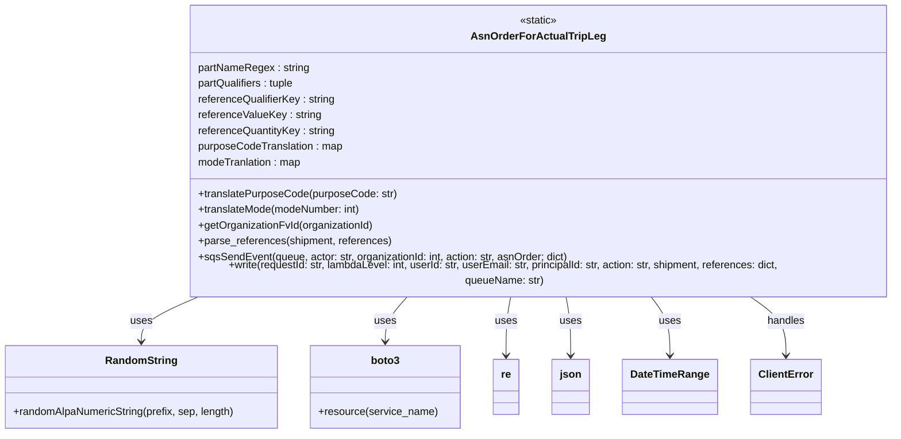
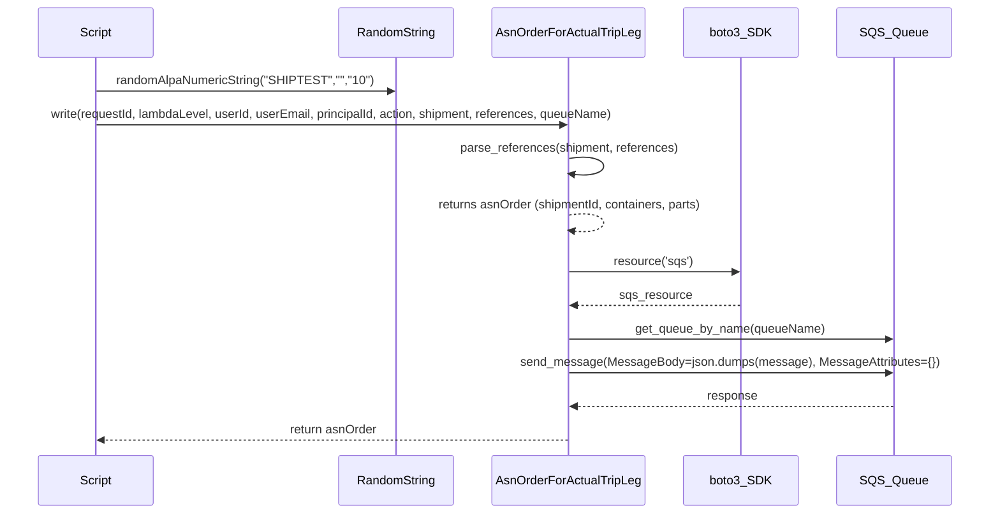

# Diagram: platform/tools/ide_local_testing/localTest/test/partview/carrierShipmentWithParts/asnOrderFromShipment.py

> Auto-generated by Obscura crawlers

## Diagram 1

### SVG

<svg id="container" width="1372.65625" xmlns="http://www.w3.org/2000/svg" class="classDiagram" height="648" viewBox="0 0 1372.65625 648" role="graphics-document document" aria-roledescription="class"><g><defs><marker id="container_class-aggregationStart" class="marker aggregation class" refX="18" refY="7" markerWidth="190" markerHeight="240" orient="auto"><path d="M 18,7 L9,13 L1,7 L9,1 Z"></path></marker></defs><defs><marker id="container_class-aggregationEnd" class="marker aggregation class" refX="1" refY="7" markerWidth="20" markerHeight="28" orient="auto"><path d="M 18,7 L9,13 L1,7 L9,1 Z"></path></marker></defs><defs><marker id="container_class-extensionStart" class="marker extension class" refX="18" refY="7" markerWidth="190" markerHeight="240" orient="auto"><path d="M 1,7 L18,13 V 1 Z"></path></marker></defs><defs><marker id="container_class-extensionEnd" class="marker extension class" refX="1" refY="7" markerWidth="20" markerHeight="28" orient="auto"><path d="M 1,1 V 13 L18,7 Z"></path></marker></defs><defs><marker id="container_class-compositionStart" class="marker composition class" refX="18" refY="7" markerWidth="190" markerHeight="240" orient="auto"><path d="M 18,7 L9,13 L1,7 L9,1 Z"></path></marker></defs><defs><marker id="container_class-compositionEnd" class="marker composition class" refX="1" refY="7" markerWidth="20" markerHeight="28" orient="auto"><path d="M 18,7 L9,13 L1,7 L9,1 Z"></path></marker></defs><defs><marker id="container_class-dependencyStart" class="marker dependency class" refX="6" refY="7" markerWidth="190" markerHeight="240" orient="auto"><path d="M 5,7 L9,13 L1,7 L9,1 Z"></path></marker></defs><defs><marker id="container_class-dependencyEnd" class="marker dependency class" refX="13" refY="7" markerWidth="20" markerHeight="28" orient="auto"><path d="M 18,7 L9,13 L14,7 L9,1 Z"></path></marker></defs><defs><marker id="container_class-lollipopStart" class="marker lollipop class" refX="13" refY="7" markerWidth="190" markerHeight="240" orient="auto"><circle stroke="black" fill="transparent" cx="7" cy="7" r="6"></circle></marker></defs><defs><marker id="container_class-lollipopEnd" class="marker lollipop class" refX="1" refY="7" markerWidth="190" markerHeight="240" orient="auto"><circle stroke="black" fill="transparent" cx="7" cy="7" r="6"></circle></marker></defs><g class="root"><g class="clusters"></g><g class="edgePaths"><path d="M303.593,440L288.954,446.167C274.316,452.333,245.039,464.667,230.4,476C215.762,487.333,215.762,497.667,215.762,502.833L215.762,508" id="id_AsnOrderForActualTripLeg_RandomString_1" class="edge-thickness-normal edge-pattern-solid relation" style=";;;" data-edge="true" data-et="edge" data-id="id_AsnOrderForActualTripLeg_RandomString_1" data-points="W3sieCI6MzAzLjU5MjczMDk3ODI2MDksInkiOjQ0MH0seyJ4IjoyMTUuNzYxNzE4NzUsInkiOjQ3N30seyJ4IjoyMTUuNzYxNzE4NzUsInkiOjUxNH1d" marker-end="url(#container_class-dependencyEnd)"></path><path d="M619.716,440L614.102,446.167C608.489,452.333,597.262,464.667,591.649,476C586.035,487.333,586.035,497.667,586.035,502.833L586.035,508" id="id_AsnOrderForActualTripLeg_boto3_2" class="edge-thickness-normal edge-pattern-solid relation" style=";;;" data-edge="true" data-et="edge" data-id="id_AsnOrderForActualTripLeg_boto3_2" data-points="W3sieCI6NjE5LjcxNTUwNzY1ODEwMjgsInkiOjQ0MH0seyJ4Ijo1ODYuMDM1MTU2MjUsInkiOjQ3N30seyJ4Ijo1ODYuMDM1MTU2MjUsInkiOjUxNH1d" marker-end="url(#container_class-dependencyEnd)"></path><path d="M775.016,440L773.836,446.167C772.656,452.333,770.297,464.667,769.117,479.5C767.938,494.333,767.938,511.667,767.938,520.333L767.938,529" id="id_AsnOrderForActualTripLeg_re_3" class="edge-thickness-normal edge-pattern-solid relation" style=";;;" data-edge="true" data-et="edge" data-id="id_AsnOrderForActualTripLeg_re_3" data-points="W3sieCI6Nzc1LjAxNTUzMjM2MTY2MDEsInkiOjQ0MH0seyJ4Ijo3NjcuOTM3NSwieSI6NDc3fSx7IngiOjc2Ny45Mzc1LCJ5Ijo1MzV9XQ==" marker-end="url(#container_class-dependencyEnd)"></path><path d="M857.656,440L858.836,446.167C860.016,452.333,862.375,464.667,863.555,479.5C864.734,494.333,864.734,511.667,864.734,520.333L864.734,529" id="id_AsnOrderForActualTripLeg_json_4" class="edge-thickness-normal edge-pattern-solid relation" style=";;;" data-edge="true" data-et="edge" data-id="id_AsnOrderForActualTripLeg_json_4" data-points="W3sieCI6ODU3LjY1NjM0MjYzODMzOTksInkiOjQ0MH0seyJ4Ijo4NjQuNzM0Mzc1LCJ5Ijo0Nzd9LHsieCI6ODY0LjczNDM3NSwieSI6NTM1fV0=" marker-end="url(#container_class-dependencyEnd)"></path><path d="M982.765,440L987.516,446.167C992.268,452.333,1001.771,464.667,1006.522,479.5C1011.273,494.333,1011.273,511.667,1011.273,520.333L1011.273,529" id="id_AsnOrderForActualTripLeg_DateTimeRange_5" class="edge-thickness-normal edge-pattern-solid relation" style=";;;" data-edge="true" data-et="edge" data-id="id_AsnOrderForActualTripLeg_DateTimeRange_5" data-points="W3sieCI6OTgyLjc2NDc5MTI1NDk0MDcsInkiOjQ0MH0seyJ4IjoxMDExLjI3MzQzNzUsInkiOjQ3N30seyJ4IjoxMDExLjI3MzQzNzUsInkiOjUzNX1d" marker-end="url(#container_class-dependencyEnd)"></path><path d="M1128.41,440L1137.32,446.167C1146.229,452.333,1164.048,464.667,1172.958,479.5C1181.867,494.333,1181.867,511.667,1181.867,520.333L1181.867,529" id="id_AsnOrderForActualTripLeg_ClientError_6" class="edge-thickness-normal edge-pattern-solid relation" style=";;;" data-edge="true" data-et="edge" data-id="id_AsnOrderForActualTripLeg_ClientError_6" data-points="W3sieCI6MTEyOC40MTAwNDgxNzE5MzY4LCJ5Ijo0NDB9LHsieCI6MTE4MS44NjcxODc1LCJ5Ijo0Nzd9LHsieCI6MTE4MS44NjcxODc1LCJ5Ijo1MzV9XQ==" marker-end="url(#container_class-dependencyEnd)"></path></g><g class="edgeLabels"><g class="edgeLabel" transform="translate(215.76171875, 477)"><g class="label" data-id="id_AsnOrderForActualTripLeg_RandomString_1" transform="translate(-16.4921875, -12)"><foreignObject width="32.984375" height="24">

uses

</foreignObject></g></g><g class="edgeLabel" transform="translate(586.03515625, 477)"><g class="label" data-id="id_AsnOrderForActualTripLeg_boto3_2" transform="translate(-16.4921875, -12)"><foreignObject width="32.984375" height="24">

uses

</foreignObject></g></g><g class="edgeLabel" transform="translate(767.9375, 477)"><g class="label" data-id="id_AsnOrderForActualTripLeg_re_3" transform="translate(-16.4921875, -12)"><foreignObject width="32.984375" height="24">

uses

</foreignObject></g></g><g class="edgeLabel" transform="translate(864.734375, 477)"><g class="label" data-id="id_AsnOrderForActualTripLeg_json_4" transform="translate(-16.4921875, -12)"><foreignObject width="32.984375" height="24">

uses

</foreignObject></g></g><g class="edgeLabel" transform="translate(1011.2734375, 477)"><g class="label" data-id="id_AsnOrderForActualTripLeg_DateTimeRange_5" transform="translate(-16.4921875, -12)"><foreignObject width="32.984375" height="24">

uses

</foreignObject></g></g><g class="edgeLabel" transform="translate(1181.8671875, 477)"><g class="label" data-id="id_AsnOrderForActualTripLeg_ClientError_6" transform="translate(-28.9140625, -12)"><foreignObject width="57.828125" height="24">

handles

</foreignObject></g></g></g><g class="nodes"><g class="node default" id="classId-AsnOrderForActualTripLeg-0" transform="translate(816.3359375, 224)"><g class="basic label-container"><path d="M-548.3203125 -216 L548.3203125 -216 L548.3203125 216 L-548.3203125 216" stroke="none" stroke-width="0" fill="#ECECFF" style=""></path><path d="M-548.3203125 -216 C-243.4615124693638 -216, 61.39728756127238 -216, 548.3203125 -216 M-548.3203125 -216 C-207.28982503837136 -216, 133.74066242325728 -216, 548.3203125 -216 M548.3203125 -216 C548.3203125 -128.7490551968306, 548.3203125 -41.49811039366119, 548.3203125 216 M548.3203125 -216 C548.3203125 -78.56395053295637, 548.3203125 58.87209893408726, 548.3203125 216 M548.3203125 216 C175.08676383977996 216, -198.14678482044008 216, -548.3203125 216 M548.3203125 216 C125.78752084281751 216, -296.74527081436497 216, -548.3203125 216 M-548.3203125 216 C-548.3203125 73.25257497330281, -548.3203125 -69.49485005339437, -548.3203125 -216 M-548.3203125 216 C-548.3203125 122.1121392839117, -548.3203125 28.224278567823404, -548.3203125 -216" stroke="#9370DB" stroke-width="1.3" fill="none" stroke-dasharray="0 0" style=""></path></g><g class="annotation-group text" transform="translate(-29.0234375, -192)"><g class="label" style="" transform="translate(0,-12)"><foreignObject width="58.046875" height="24">

«static»

</foreignObject></g></g><g class="label-group text" transform="translate(-95.5625, -168)"><g class="label" style="font-weight: bolder" transform="translate(0,-12)"><foreignObject width="191.125" height="24">

AsnOrderForActualTripLeg

</foreignObject></g></g><g class="members-group text" transform="translate(-536.3203125, -120)"><g class="label" style="" transform="translate(0,-12)"><foreignObject width="168.578125" height="24">

partNameRegex : string

</foreignObject></g><g class="label" style="" transform="translate(0,12)"><foreignObject width="149.6875" height="24">

partQualifiers : tuple

</foreignObject></g><g class="label" style="" transform="translate(0,36)"><foreignObject width="210.078125" height="24">

referenceQualifierKey : string

</foreignObject></g><g class="label" style="" transform="translate(0,60)"><foreignObject width="187.390625" height="24">

referenceValueKey : string

</foreignObject></g><g class="label" style="" transform="translate(0,84)"><foreignObject width="210.171875" height="24">

referenceQuantityKey : string

</foreignObject></g><g class="label" style="" transform="translate(0,108)"><foreignObject width="221.828125" height="24">

purposeCodeTranslation : map

</foreignObject></g><g class="label" style="" transform="translate(0,132)"><foreignObject width="159.40625" height="24">

modeTranlation : map

</foreignObject></g></g><g class="methods-group text" transform="translate(-536.3203125, 72)"><g class="label" style="" transform="translate(0,-12)"><foreignObject width="302.265625" height="24">

+translatePurposeCode(purposeCode: str)

</foreignObject></g><g class="label" style="" transform="translate(0,12)"><foreignObject width="250.46875" height="24">

+translateMode(modeNumber: int)

</foreignObject></g><g class="label" style="" transform="translate(0,36)"><foreignObject width="267.09375" height="24">

+getOrganizationFvId(organizationId)

</foreignObject></g><g class="label" style="" transform="translate(0,60)"><foreignObject width="294.421875" height="24">

+parse_references(shipment, references)

</foreignObject></g><g class="label" style="" transform="translate(0,84)"><foreignObject width="567.15625" height="24">

+sqsSendEvent(queue, actor: str, organizationId: int, action: str, asnOrder: dict)

</foreignObject></g><g class="label" style="" transform="translate(0,108)"><foreignObject width="977.078125" height="24">

+write(requestId: str, lambdaLevel: int, userId: str, userEmail: str, principalId: str, action: str, shipment, references: dict, queueName: str)

</foreignObject></g></g><g class="divider" style=""><path d="M-548.3203125 -144 C-282.16662976378325 -144, -16.012947027566497 -144, 548.3203125 -144 M-548.3203125 -144 C-292.1924355504048 -144, -36.06455860080962 -144, 548.3203125 -144" stroke="#9370DB" stroke-width="1.3" fill="none" stroke-dasharray="0 0" style=""></path></g><g class="divider" style=""><path d="M-548.3203125 48 C-202.3175224835146 48, 143.68526753297078 48, 548.3203125 48 M-548.3203125 48 C-155.9483554277818 48, 236.42360164443642 48, 548.3203125 48" stroke="#9370DB" stroke-width="1.3" fill="none" stroke-dasharray="0 0" style=""></path></g></g><g class="node default" id="classId-RandomString-1" transform="translate(215.76171875, 577)"><g class="basic label-container"><path d="M-207.76171875 -63 L207.76171875 -63 L207.76171875 63 L-207.76171875 63" stroke="none" stroke-width="0" fill="#ECECFF" style=""></path><path d="M-207.76171875 -63 C-58.65143975602757 -63, 90.45883923794486 -63, 207.76171875 -63 M-207.76171875 -63 C-94.56048427977646 -63, 18.64075019044708 -63, 207.76171875 -63 M207.76171875 -63 C207.76171875 -13.509986288556604, 207.76171875 35.98002742288679, 207.76171875 63 M207.76171875 -63 C207.76171875 -18.194581710439486, 207.76171875 26.610836579121028, 207.76171875 63 M207.76171875 63 C86.01477387591294 63, -35.73217099817413 63, -207.76171875 63 M207.76171875 63 C63.602395231321196 63, -80.55692828735761 63, -207.76171875 63 M-207.76171875 63 C-207.76171875 28.88017587260903, -207.76171875 -5.23964825478194, -207.76171875 -63 M-207.76171875 63 C-207.76171875 18.62399294060306, -207.76171875 -25.75201411879388, -207.76171875 -63" stroke="#9370DB" stroke-width="1.3" fill="none" stroke-dasharray="0 0" style=""></path></g><g class="annotation-group text" transform="translate(0, -39)"></g><g class="label-group text" transform="translate(-52.2421875, -39)"><g class="label" style="font-weight: bolder" transform="translate(0,-12)"><foreignObject width="104.484375" height="24">

RandomString

</foreignObject></g></g><g class="members-group text" transform="translate(-195.76171875, 9)"></g><g class="methods-group text" transform="translate(-195.76171875, 39)"><g class="label" style="" transform="translate(0,-12)"><foreignObject width="339.28125" height="24">

+randomAlpaNumericString(prefix, sep, length)

</foreignObject></g></g><g class="divider" style=""><path d="M-207.76171875 -15 C-108.31436892826761 -15, -8.867019106535224 -15, 207.76171875 -15 M-207.76171875 -15 C-71.07582931019078 -15, 65.61006012961843 -15, 207.76171875 -15" stroke="#9370DB" stroke-width="1.3" fill="none" stroke-dasharray="0 0" style=""></path></g><g class="divider" style=""><path d="M-207.76171875 9 C-76.02052501852936 9, 55.72066871294129 9, 207.76171875 9 M-207.76171875 9 C-91.69804945831787 9, 24.365619833364264 9, 207.76171875 9" stroke="#9370DB" stroke-width="1.3" fill="none" stroke-dasharray="0 0" style=""></path></g></g><g class="node default" id="classId-boto3-2" transform="translate(586.03515625, 577)"><g class="basic label-container"><path d="M-112.51171875 -63 L112.51171875 -63 L112.51171875 63 L-112.51171875 63" stroke="none" stroke-width="0" fill="#ECECFF" style=""></path><path d="M-112.51171875 -63 C-62.72787260827771 -63, -12.944026466555414 -63, 112.51171875 -63 M-112.51171875 -63 C-31.612030528401775 -63, 49.28765769319645 -63, 112.51171875 -63 M112.51171875 -63 C112.51171875 -35.65110384758527, 112.51171875 -8.302207695170537, 112.51171875 63 M112.51171875 -63 C112.51171875 -24.747582365050086, 112.51171875 13.504835269899829, 112.51171875 63 M112.51171875 63 C52.877956748724436 63, -6.755805252551127 63, -112.51171875 63 M112.51171875 63 C59.65810621781224 63, 6.804493685624479 63, -112.51171875 63 M-112.51171875 63 C-112.51171875 33.55202871068623, -112.51171875 4.1040574213724526, -112.51171875 -63 M-112.51171875 63 C-112.51171875 30.681402758613117, -112.51171875 -1.637194482773765, -112.51171875 -63" stroke="#9370DB" stroke-width="1.3" fill="none" stroke-dasharray="0 0" style=""></path></g><g class="annotation-group text" transform="translate(0, -39)"></g><g class="label-group text" transform="translate(-21.0703125, -39)"><g class="label" style="font-weight: bolder" transform="translate(0,-12)"><foreignObject width="42.140625" height="24">

boto3

</foreignObject></g></g><g class="members-group text" transform="translate(-100.51171875, 9)"></g><g class="methods-group text" transform="translate(-100.51171875, 39)"><g class="label" style="" transform="translate(0,-12)"><foreignObject width="179.953125" height="24">

+resource(service_name)

</foreignObject></g></g><g class="divider" style=""><path d="M-112.51171875 -15 C-34.659748849806206 -15, 43.19222105038759 -15, 112.51171875 -15 M-112.51171875 -15 C-43.68853684565505 -15, 25.134645058689898 -15, 112.51171875 -15" stroke="#9370DB" stroke-width="1.3" fill="none" stroke-dasharray="0 0" style=""></path></g><g class="divider" style=""><path d="M-112.51171875 9 C-29.659738482803007 9, 53.192241784393985 9, 112.51171875 9 M-112.51171875 9 C-41.74752226667903 9, 29.016674216641945 9, 112.51171875 9" stroke="#9370DB" stroke-width="1.3" fill="none" stroke-dasharray="0 0" style=""></path></g></g><g class="node default" id="classId-ClientError-3" transform="translate(1181.8671875, 577)"><g class="basic label-container"><path d="M-51.4609375 -42 L51.4609375 -42 L51.4609375 42 L-51.4609375 42" stroke="none" stroke-width="0" fill="#ECECFF" style=""></path><path d="M-51.4609375 -42 C-12.044343761263939 -42, 27.372249977472123 -42, 51.4609375 -42 M-51.4609375 -42 C-16.201463303519006 -42, 19.05801089296199 -42, 51.4609375 -42 M51.4609375 -42 C51.4609375 -15.055925331008552, 51.4609375 11.888149337982895, 51.4609375 42 M51.4609375 -42 C51.4609375 -15.356718481419133, 51.4609375 11.286563037161734, 51.4609375 42 M51.4609375 42 C21.12239088773969 42, -9.216155724520618 42, -51.4609375 42 M51.4609375 42 C20.94581588229617 42, -9.56930573540766 42, -51.4609375 42 M-51.4609375 42 C-51.4609375 10.279870993693791, -51.4609375 -21.440258012612418, -51.4609375 -42 M-51.4609375 42 C-51.4609375 11.453855611143744, -51.4609375 -19.09228877771251, -51.4609375 -42" stroke="#9370DB" stroke-width="1.3" fill="none" stroke-dasharray="0 0" style=""></path></g><g class="annotation-group text" transform="translate(0, -18)"></g><g class="label-group text" transform="translate(-39.4609375, -18)"><g class="label" style="font-weight: bolder" transform="translate(0,-12)"><foreignObject width="78.921875" height="24">

ClientError

</foreignObject></g></g><g class="members-group text" transform="translate(-39.4609375, 30)"></g><g class="methods-group text" transform="translate(-39.4609375, 60)"></g><g class="divider" style=""><path d="M-51.4609375 6 C-24.087751460635207 6, 3.2854345787295856 6, 51.4609375 6 M-51.4609375 6 C-16.0351702823015 6, 19.390596935397 6, 51.4609375 6" stroke="#9370DB" stroke-width="1.3" fill="none" stroke-dasharray="0 0" style=""></path></g><g class="divider" style=""><path d="M-51.4609375 24 C-27.63048766571139 24, -3.8000378314227774 24, 51.4609375 24 M-51.4609375 24 C-26.19556594996517 24, -0.9301943999303433 24, 51.4609375 24" stroke="#9370DB" stroke-width="1.3" fill="none" stroke-dasharray="0 0" style=""></path></g></g><g class="node default" id="classId-DateTimeRange-4" transform="translate(1011.2734375, 577)"><g class="basic label-container"><path d="M-69.1328125 -42 L69.1328125 -42 L69.1328125 42 L-69.1328125 42" stroke="none" stroke-width="0" fill="#ECECFF" style=""></path><path d="M-69.1328125 -42 C-36.28221342254447 -42, -3.4316143450889456 -42, 69.1328125 -42 M-69.1328125 -42 C-31.32905461254937 -42, 6.474703274901259 -42, 69.1328125 -42 M69.1328125 -42 C69.1328125 -23.10457184662415, 69.1328125 -4.209143693248301, 69.1328125 42 M69.1328125 -42 C69.1328125 -16.405106242178665, 69.1328125 9.18978751564267, 69.1328125 42 M69.1328125 42 C32.42964552531592 42, -4.273521449368161 42, -69.1328125 42 M69.1328125 42 C27.505327861454965 42, -14.12215677709007 42, -69.1328125 42 M-69.1328125 42 C-69.1328125 19.031407101267636, -69.1328125 -3.9371857974647284, -69.1328125 -42 M-69.1328125 42 C-69.1328125 12.50474409431509, -69.1328125 -16.99051181136982, -69.1328125 -42" stroke="#9370DB" stroke-width="1.3" fill="none" stroke-dasharray="0 0" style=""></path></g><g class="annotation-group text" transform="translate(0, -18)"></g><g class="label-group text" transform="translate(-57.1328125, -18)"><g class="label" style="font-weight: bolder" transform="translate(0,-12)"><foreignObject width="114.265625" height="24">

DateTimeRange

</foreignObject></g></g><g class="members-group text" transform="translate(-57.1328125, 30)"></g><g class="methods-group text" transform="translate(-57.1328125, 60)"></g><g class="divider" style=""><path d="M-69.1328125 6 C-31.02140617441809 6, 7.090000151163821 6, 69.1328125 6 M-69.1328125 6 C-33.57491876695468 6, 1.9829749660906373 6, 69.1328125 6" stroke="#9370DB" stroke-width="1.3" fill="none" stroke-dasharray="0 0" style=""></path></g><g class="divider" style=""><path d="M-69.1328125 24 C-41.38678870642029 24, -13.64076491284058 24, 69.1328125 24 M-69.1328125 24 C-40.781682662522854 24, -12.430552825045709 24, 69.1328125 24" stroke="#9370DB" stroke-width="1.3" fill="none" stroke-dasharray="0 0" style=""></path></g></g><g class="node default" id="classId-re-5" transform="translate(767.9375, 577)"><g class="basic label-container"><path d="M-19.390625 -42 L19.390625 -42 L19.390625 42 L-19.390625 42" stroke="none" stroke-width="0" fill="#ECECFF" style=""></path><path d="M-19.390625 -42 C-4.255082001293355 -42, 10.88046099741329 -42, 19.390625 -42 M-19.390625 -42 C-5.234224777929301 -42, 8.922175444141399 -42, 19.390625 -42 M19.390625 -42 C19.390625 -22.03667611199847, 19.390625 -2.0733522239969417, 19.390625 42 M19.390625 -42 C19.390625 -16.88431980610485, 19.390625 8.231360387790303, 19.390625 42 M19.390625 42 C9.581169248675597 42, -0.2282865026488068 42, -19.390625 42 M19.390625 42 C8.920469075914303 42, -1.549686848171394 42, -19.390625 42 M-19.390625 42 C-19.390625 12.054594087884514, -19.390625 -17.890811824230973, -19.390625 -42 M-19.390625 42 C-19.390625 14.78888821792632, -19.390625 -12.422223564147359, -19.390625 -42" stroke="#9370DB" stroke-width="1.3" fill="none" stroke-dasharray="0 0" style=""></path></g><g class="annotation-group text" transform="translate(0, -18)"></g><g class="label-group text" transform="translate(-7.390625, -18)"><g class="label" style="font-weight: bolder" transform="translate(0,-12)"><foreignObject width="14.78125" height="24">

re

</foreignObject></g></g><g class="members-group text" transform="translate(-7.390625, 30)"></g><g class="methods-group text" transform="translate(-7.390625, 60)"></g><g class="divider" style=""><path d="M-19.390625 6 C-4.136704978670615 6, 11.11721504265877 6, 19.390625 6 M-19.390625 6 C-11.095186377587867 6, -2.7997477551757335 6, 19.390625 6" stroke="#9370DB" stroke-width="1.3" fill="none" stroke-dasharray="0 0" style=""></path></g><g class="divider" style=""><path d="M-19.390625 24 C-4.150202080809638 24, 11.090220838380723 24, 19.390625 24 M-19.390625 24 C-6.067829010158118 24, 7.254966979683765 24, 19.390625 24" stroke="#9370DB" stroke-width="1.3" fill="none" stroke-dasharray="0 0" style=""></path></g></g><g class="node default" id="classId-json-6" transform="translate(864.734375, 577)"><g class="basic label-container"><path d="M-27.40625 -42 L27.40625 -42 L27.40625 42 L-27.40625 42" stroke="none" stroke-width="0" fill="#ECECFF" style=""></path><path d="M-27.40625 -42 C-11.103872223895223 -42, 5.198505552209554 -42, 27.40625 -42 M-27.40625 -42 C-6.87597720006125 -42, 13.6542955998775 -42, 27.40625 -42 M27.40625 -42 C27.40625 -20.976147643429112, 27.40625 0.04770471314177627, 27.40625 42 M27.40625 -42 C27.40625 -19.071856072588755, 27.40625 3.85628785482249, 27.40625 42 M27.40625 42 C8.005266045998653 42, -11.395717908002695 42, -27.40625 42 M27.40625 42 C7.268529988058283 42, -12.869190023883434 42, -27.40625 42 M-27.40625 42 C-27.40625 19.975596189831258, -27.40625 -2.0488076203374845, -27.40625 -42 M-27.40625 42 C-27.40625 15.933630747663653, -27.40625 -10.132738504672695, -27.40625 -42" stroke="#9370DB" stroke-width="1.3" fill="none" stroke-dasharray="0 0" style=""></path></g><g class="annotation-group text" transform="translate(0, -18)"></g><g class="label-group text" transform="translate(-15.40625, -18)"><g class="label" style="font-weight: bolder" transform="translate(0,-12)"><foreignObject width="30.8125" height="24">

json

</foreignObject></g></g><g class="members-group text" transform="translate(-15.40625, 30)"></g><g class="methods-group text" transform="translate(-15.40625, 60)"></g><g class="divider" style=""><path d="M-27.40625 6 C-15.873010777456702 6, -4.339771554913405 6, 27.40625 6 M-27.40625 6 C-5.876454389182648 6, 15.653341221634705 6, 27.40625 6" stroke="#9370DB" stroke-width="1.3" fill="none" stroke-dasharray="0 0" style=""></path></g><g class="divider" style=""><path d="M-27.40625 24 C-14.539202909982773 24, -1.6721558199655462 24, 27.40625 24 M-27.40625 24 C-5.64093493806195 24, 16.1243801238761 24, 27.40625 24" stroke="#9370DB" stroke-width="1.3" fill="none" stroke-dasharray="0 0" style=""></path></g></g></g></g></g></svg>

## Diagram 2

### SVG

<svg id="container" width="1308.5" xmlns="http://www.w3.org/2000/svg" height="711" viewBox="-50 -10 1308.5 711" role="graphics-document document" aria-roledescription="sequence"><g><rect x="1058.5" y="625" fill="#eaeaea" stroke="#666" width="150" height="65" name="SQS" rx="3" ry="3" class="actor actor-bottom"></rect><text x="1133.5" y="657.5" dominant-baseline="central" alignment-baseline="central" class="actor actor-box" style="text-anchor: middle; font-size: 16px; font-weight: 400;"><tspan x="1133.5" dy="0">SQS_Queue</tspan></text></g><g><rect x="858.5" y="625" fill="#eaeaea" stroke="#666" width="150" height="65" name="boto3" rx="3" ry="3" class="actor actor-bottom"></rect><text x="933.5" y="657.5" dominant-baseline="central" alignment-baseline="central" class="actor actor-box" style="text-anchor: middle; font-size: 16px; font-weight: 400;"><tspan x="933.5" dy="0">boto3_SDK</tspan></text></g><g><rect x="594" y="625" fill="#eaeaea" stroke="#666" width="208" height="65" name="Asn" rx="3" ry="3" class="actor actor-bottom"></rect><text x="698" y="657.5" dominant-baseline="central" alignment-baseline="central" class="actor actor-box" style="text-anchor: middle; font-size: 16px; font-weight: 400;"><tspan x="698" dy="0">AsnOrderForActualTripLeg</tspan></text></g><g><rect x="394" y="625" fill="#eaeaea" stroke="#666" width="150" height="65" name="RandomString" rx="3" ry="3" class="actor actor-bottom"></rect><text x="469" y="657.5" dominant-baseline="central" alignment-baseline="central" class="actor actor-box" style="text-anchor: middle; font-size: 16px; font-weight: 400;"><tspan x="469" dy="0">RandomString</tspan></text></g><g><rect x="0" y="625" fill="#eaeaea" stroke="#666" width="150" height="65" name="Script" rx="3" ry="3" class="actor actor-bottom"></rect><text x="75" y="657.5" dominant-baseline="central" alignment-baseline="central" class="actor actor-box" style="text-anchor: middle; font-size: 16px; font-weight: 400;"><tspan x="75" dy="0">Script</tspan></text></g><g><line id="actor4" x1="1133.5" y1="65" x2="1133.5" y2="625" class="actor-line 200" stroke-width="0.5px" stroke="#999" name="SQS"></line><g id="root-4"><rect x="1058.5" y="0" fill="#eaeaea" stroke="#666" width="150" height="65" name="SQS" rx="3" ry="3" class="actor actor-top"></rect><text x="1133.5" y="32.5" dominant-baseline="central" alignment-baseline="central" class="actor actor-box" style="text-anchor: middle; font-size: 16px; font-weight: 400;"><tspan x="1133.5" dy="0">SQS_Queue</tspan></text></g></g><g><line id="actor3" x1="933.5" y1="65" x2="933.5" y2="625" class="actor-line 200" stroke-width="0.5px" stroke="#999" name="boto3"></line><g id="root-3"><rect x="858.5" y="0" fill="#eaeaea" stroke="#666" width="150" height="65" name="boto3" rx="3" ry="3" class="actor actor-top"></rect><text x="933.5" y="32.5" dominant-baseline="central" alignment-baseline="central" class="actor actor-box" style="text-anchor: middle; font-size: 16px; font-weight: 400;"><tspan x="933.5" dy="0">boto3_SDK</tspan></text></g></g><g><line id="actor2" x1="698" y1="65" x2="698" y2="625" class="actor-line 200" stroke-width="0.5px" stroke="#999" name="Asn"></line><g id="root-2"><rect x="594" y="0" fill="#eaeaea" stroke="#666" width="208" height="65" name="Asn" rx="3" ry="3" class="actor actor-top"></rect><text x="698" y="32.5" dominant-baseline="central" alignment-baseline="central" class="actor actor-box" style="text-anchor: middle; font-size: 16px; font-weight: 400;"><tspan x="698" dy="0">AsnOrderForActualTripLeg</tspan></text></g></g><g><line id="actor1" x1="469" y1="65" x2="469" y2="625" class="actor-line 200" stroke-width="0.5px" stroke="#999" name="RandomString"></line><g id="root-1"><rect x="394" y="0" fill="#eaeaea" stroke="#666" width="150" height="65" name="RandomString" rx="3" ry="3" class="actor actor-top"></rect><text x="469" y="32.5" dominant-baseline="central" alignment-baseline="central" class="actor actor-box" style="text-anchor: middle; font-size: 16px; font-weight: 400;"><tspan x="469" dy="0">RandomString</tspan></text></g></g><g><line id="actor0" x1="75" y1="65" x2="75" y2="625" class="actor-line 200" stroke-width="0.5px" stroke="#999" name="Script"></line><g id="root-0"><rect x="0" y="0" fill="#eaeaea" stroke="#666" width="150" height="65" name="Script" rx="3" ry="3" class="actor actor-top"></rect><text x="75" y="32.5" dominant-baseline="central" alignment-baseline="central" class="actor actor-box" style="text-anchor: middle; font-size: 16px; font-weight: 400;"><tspan x="75" dy="0">Script</tspan></text></g></g><g></g><defs><symbol id="computer" width="24" height="24"><path transform="scale(.5)" d="M2 2v13h20v-13h-20zm18 11h-16v-9h16v9zm-10.228 6l.466-1h3.524l.467 1h-4.457zm14.228 3h-24l2-6h2.104l-1.33 4h18.45l-1.297-4h2.073l2 6zm-5-10h-14v-7h14v7z"></path></symbol></defs><defs><symbol id="database" fill-rule="evenodd" clip-rule="evenodd"><path transform="scale(.5)" d="M12.258.001l.256.004.255.005.253.008.251.01.249.012.247.015.246.016.242.019.241.02.239.023.236.024.233.027.231.028.229.031.225.032.223.034.22.036.217.038.214.04.211.041.208.043.205.045.201.046.198.048.194.05.191.051.187.053.183.054.18.056.175.057.172.059.168.06.163.061.16.063.155.064.15.066.074.033.073.033.071.034.07.034.069.035.068.035.067.035.066.035.064.036.064.036.062.036.06.036.06.037.058.037.058.037.055.038.055.038.053.038.052.038.051.039.05.039.048.039.047.039.045.04.044.04.043.04.041.04.04.041.039.041.037.041.036.041.034.041.033.042.032.042.03.042.029.042.027.042.026.043.024.043.023.043.021.043.02.043.018.044.017.043.015.044.013.044.012.044.011.045.009.044.007.045.006.045.004.045.002.045.001.045v17l-.001.045-.002.045-.004.045-.006.045-.007.045-.009.044-.011.045-.012.044-.013.044-.015.044-.017.043-.018.044-.02.043-.021.043-.023.043-.024.043-.026.043-.027.042-.029.042-.03.042-.032.042-.033.042-.034.041-.036.041-.037.041-.039.041-.04.041-.041.04-.043.04-.044.04-.045.04-.047.039-.048.039-.05.039-.051.039-.052.038-.053.038-.055.038-.055.038-.058.037-.058.037-.06.037-.06.036-.062.036-.064.036-.064.036-.066.035-.067.035-.068.035-.069.035-.07.034-.071.034-.073.033-.074.033-.15.066-.155.064-.16.063-.163.061-.168.06-.172.059-.175.057-.18.056-.183.054-.187.053-.191.051-.194.05-.198.048-.201.046-.205.045-.208.043-.211.041-.214.04-.217.038-.22.036-.223.034-.225.032-.229.031-.231.028-.233.027-.236.024-.239.023-.241.02-.242.019-.246.016-.247.015-.249.012-.251.01-.253.008-.255.005-.256.004-.258.001-.258-.001-.256-.004-.255-.005-.253-.008-.251-.01-.249-.012-.247-.015-.245-.016-.243-.019-.241-.02-.238-.023-.236-.024-.234-.027-.231-.028-.228-.031-.226-.032-.223-.034-.22-.036-.217-.038-.214-.04-.211-.041-.208-.043-.204-.045-.201-.046-.198-.048-.195-.05-.19-.051-.187-.053-.184-.054-.179-.056-.176-.057-.172-.059-.167-.06-.164-.061-.159-.063-.155-.064-.151-.066-.074-.033-.072-.033-.072-.034-.07-.034-.069-.035-.068-.035-.067-.035-.066-.035-.064-.036-.063-.036-.062-.036-.061-.036-.06-.037-.058-.037-.057-.037-.056-.038-.055-.038-.053-.038-.052-.038-.051-.039-.049-.039-.049-.039-.046-.039-.046-.04-.044-.04-.043-.04-.041-.04-.04-.041-.039-.041-.037-.041-.036-.041-.034-.041-.033-.042-.032-.042-.03-.042-.029-.042-.027-.042-.026-.043-.024-.043-.023-.043-.021-.043-.02-.043-.018-.044-.017-.043-.015-.044-.013-.044-.012-.044-.011-.045-.009-.044-.007-.045-.006-.045-.004-.045-.002-.045-.001-.045v-17l.001-.045.002-.045.004-.045.006-.045.007-.045.009-.044.011-.045.012-.044.013-.044.015-.044.017-.043.018-.044.02-.043.021-.043.023-.043.024-.043.026-.043.027-.042.029-.042.03-.042.032-.042.033-.042.034-.041.036-.041.037-.041.039-.041.04-.041.041-.04.043-.04.044-.04.046-.04.046-.039.049-.039.049-.039.051-.039.052-.038.053-.038.055-.038.056-.038.057-.037.058-.037.06-.037.061-.036.062-.036.063-.036.064-.036.066-.035.067-.035.068-.035.069-.035.07-.034.072-.034.072-.033.074-.033.151-.066.155-.064.159-.063.164-.061.167-.06.172-.059.176-.057.179-.056.184-.054.187-.053.19-.051.195-.05.198-.048.201-.046.204-.045.208-.043.211-.041.214-.04.217-.038.22-.036.223-.034.226-.032.228-.031.231-.028.234-.027.236-.024.238-.023.241-.02.243-.019.245-.016.247-.015.249-.012.251-.01.253-.008.255-.005.256-.004.258-.001.258.001zm-9.258 20.499v.01l.001.021.003.021.004.022.005.021.006.022.007.022.009.023.01.022.011.023.012.023.013.023.015.023.016.024.017.023.018.024.019.024.021.024.022.025.023.024.024.025.052.049.056.05.061.051.066.051.07.051.075.051.079.052.084.052.088.052.092.052.097.052.102.051.105.052.11.052.114.051.119.051.123.051.127.05.131.05.135.05.139.048.144.049.147.047.152.047.155.047.16.045.163.045.167.043.171.043.176.041.178.041.183.039.187.039.19.037.194.035.197.035.202.033.204.031.209.03.212.029.216.027.219.025.222.024.226.021.23.02.233.018.236.016.24.015.243.012.246.01.249.008.253.005.256.004.259.001.26-.001.257-.004.254-.005.25-.008.247-.011.244-.012.241-.014.237-.016.233-.018.231-.021.226-.021.224-.024.22-.026.216-.027.212-.028.21-.031.205-.031.202-.034.198-.034.194-.036.191-.037.187-.039.183-.04.179-.04.175-.042.172-.043.168-.044.163-.045.16-.046.155-.046.152-.047.148-.048.143-.049.139-.049.136-.05.131-.05.126-.05.123-.051.118-.052.114-.051.11-.052.106-.052.101-.052.096-.052.092-.052.088-.053.083-.051.079-.052.074-.052.07-.051.065-.051.06-.051.056-.05.051-.05.023-.024.023-.025.021-.024.02-.024.019-.024.018-.024.017-.024.015-.023.014-.024.013-.023.012-.023.01-.023.01-.022.008-.022.006-.022.006-.022.004-.022.004-.021.001-.021.001-.021v-4.127l-.077.055-.08.053-.083.054-.085.053-.087.052-.09.052-.093.051-.095.05-.097.05-.1.049-.102.049-.105.048-.106.047-.109.047-.111.046-.114.045-.115.045-.118.044-.12.043-.122.042-.124.042-.126.041-.128.04-.13.04-.132.038-.134.038-.135.037-.138.037-.139.035-.142.035-.143.034-.144.033-.147.032-.148.031-.15.03-.151.03-.153.029-.154.027-.156.027-.158.026-.159.025-.161.024-.162.023-.163.022-.165.021-.166.02-.167.019-.169.018-.169.017-.171.016-.173.015-.173.014-.175.013-.175.012-.177.011-.178.01-.179.008-.179.008-.181.006-.182.005-.182.004-.184.003-.184.002h-.37l-.184-.002-.184-.003-.182-.004-.182-.005-.181-.006-.179-.008-.179-.008-.178-.01-.176-.011-.176-.012-.175-.013-.173-.014-.172-.015-.171-.016-.17-.017-.169-.018-.167-.019-.166-.02-.165-.021-.163-.022-.162-.023-.161-.024-.159-.025-.157-.026-.156-.027-.155-.027-.153-.029-.151-.03-.15-.03-.148-.031-.146-.032-.145-.033-.143-.034-.141-.035-.14-.035-.137-.037-.136-.037-.134-.038-.132-.038-.13-.04-.128-.04-.126-.041-.124-.042-.122-.042-.12-.044-.117-.043-.116-.045-.113-.045-.112-.046-.109-.047-.106-.047-.105-.048-.102-.049-.1-.049-.097-.05-.095-.05-.093-.052-.09-.051-.087-.052-.085-.053-.083-.054-.08-.054-.077-.054v4.127zm0-5.654v.011l.001.021.003.021.004.021.005.022.006.022.007.022.009.022.01.022.011.023.012.023.013.023.015.024.016.023.017.024.018.024.019.024.021.024.022.024.023.025.024.024.052.05.056.05.061.05.066.051.07.051.075.052.079.051.084.052.088.052.092.052.097.052.102.052.105.052.11.051.114.051.119.052.123.05.127.051.131.05.135.049.139.049.144.048.147.048.152.047.155.046.16.045.163.045.167.044.171.042.176.042.178.04.183.04.187.038.19.037.194.036.197.034.202.033.204.032.209.03.212.028.216.027.219.025.222.024.226.022.23.02.233.018.236.016.24.014.243.012.246.01.249.008.253.006.256.003.259.001.26-.001.257-.003.254-.006.25-.008.247-.01.244-.012.241-.015.237-.016.233-.018.231-.02.226-.022.224-.024.22-.025.216-.027.212-.029.21-.03.205-.032.202-.033.198-.035.194-.036.191-.037.187-.039.183-.039.179-.041.175-.042.172-.043.168-.044.163-.045.16-.045.155-.047.152-.047.148-.048.143-.048.139-.05.136-.049.131-.05.126-.051.123-.051.118-.051.114-.052.11-.052.106-.052.101-.052.096-.052.092-.052.088-.052.083-.052.079-.052.074-.051.07-.052.065-.051.06-.05.056-.051.051-.049.023-.025.023-.024.021-.025.02-.024.019-.024.018-.024.017-.024.015-.023.014-.023.013-.024.012-.022.01-.023.01-.023.008-.022.006-.022.006-.022.004-.021.004-.022.001-.021.001-.021v-4.139l-.077.054-.08.054-.083.054-.085.052-.087.053-.09.051-.093.051-.095.051-.097.05-.1.049-.102.049-.105.048-.106.047-.109.047-.111.046-.114.045-.115.044-.118.044-.12.044-.122.042-.124.042-.126.041-.128.04-.13.039-.132.039-.134.038-.135.037-.138.036-.139.036-.142.035-.143.033-.144.033-.147.033-.148.031-.15.03-.151.03-.153.028-.154.028-.156.027-.158.026-.159.025-.161.024-.162.023-.163.022-.165.021-.166.02-.167.019-.169.018-.169.017-.171.016-.173.015-.173.014-.175.013-.175.012-.177.011-.178.009-.179.009-.179.007-.181.007-.182.005-.182.004-.184.003-.184.002h-.37l-.184-.002-.184-.003-.182-.004-.182-.005-.181-.007-.179-.007-.179-.009-.178-.009-.176-.011-.176-.012-.175-.013-.173-.014-.172-.015-.171-.016-.17-.017-.169-.018-.167-.019-.166-.02-.165-.021-.163-.022-.162-.023-.161-.024-.159-.025-.157-.026-.156-.027-.155-.028-.153-.028-.151-.03-.15-.03-.148-.031-.146-.033-.145-.033-.143-.033-.141-.035-.14-.036-.137-.036-.136-.037-.134-.038-.132-.039-.13-.039-.128-.04-.126-.041-.124-.042-.122-.043-.12-.043-.117-.044-.116-.044-.113-.046-.112-.046-.109-.046-.106-.047-.105-.048-.102-.049-.1-.049-.097-.05-.095-.051-.093-.051-.09-.051-.087-.053-.085-.052-.083-.054-.08-.054-.077-.054v4.139zm0-5.666v.011l.001.02.003.022.004.021.005.022.006.021.007.022.009.023.01.022.011.023.012.023.013.023.015.023.016.024.017.024.018.023.019.024.021.025.022.024.023.024.024.025.052.05.056.05.061.05.066.051.07.051.075.052.079.051.084.052.088.052.092.052.097.052.102.052.105.051.11.052.114.051.119.051.123.051.127.05.131.05.135.05.139.049.144.048.147.048.152.047.155.046.16.045.163.045.167.043.171.043.176.042.178.04.183.04.187.038.19.037.194.036.197.034.202.033.204.032.209.03.212.028.216.027.219.025.222.024.226.021.23.02.233.018.236.017.24.014.243.012.246.01.249.008.253.006.256.003.259.001.26-.001.257-.003.254-.006.25-.008.247-.01.244-.013.241-.014.237-.016.233-.018.231-.02.226-.022.224-.024.22-.025.216-.027.212-.029.21-.03.205-.032.202-.033.198-.035.194-.036.191-.037.187-.039.183-.039.179-.041.175-.042.172-.043.168-.044.163-.045.16-.045.155-.047.152-.047.148-.048.143-.049.139-.049.136-.049.131-.051.126-.05.123-.051.118-.052.114-.051.11-.052.106-.052.101-.052.096-.052.092-.052.088-.052.083-.052.079-.052.074-.052.07-.051.065-.051.06-.051.056-.05.051-.049.023-.025.023-.025.021-.024.02-.024.019-.024.018-.024.017-.024.015-.023.014-.024.013-.023.012-.023.01-.022.01-.023.008-.022.006-.022.006-.022.004-.022.004-.021.001-.021.001-.021v-4.153l-.077.054-.08.054-.083.053-.085.053-.087.053-.09.051-.093.051-.095.051-.097.05-.1.049-.102.048-.105.048-.106.048-.109.046-.111.046-.114.046-.115.044-.118.044-.12.043-.122.043-.124.042-.126.041-.128.04-.13.039-.132.039-.134.038-.135.037-.138.036-.139.036-.142.034-.143.034-.144.033-.147.032-.148.032-.15.03-.151.03-.153.028-.154.028-.156.027-.158.026-.159.024-.161.024-.162.023-.163.023-.165.021-.166.02-.167.019-.169.018-.169.017-.171.016-.173.015-.173.014-.175.013-.175.012-.177.01-.178.01-.179.009-.179.007-.181.006-.182.006-.182.004-.184.003-.184.001-.185.001-.185-.001-.184-.001-.184-.003-.182-.004-.182-.006-.181-.006-.179-.007-.179-.009-.178-.01-.176-.01-.176-.012-.175-.013-.173-.014-.172-.015-.171-.016-.17-.017-.169-.018-.167-.019-.166-.02-.165-.021-.163-.023-.162-.023-.161-.024-.159-.024-.157-.026-.156-.027-.155-.028-.153-.028-.151-.03-.15-.03-.148-.032-.146-.032-.145-.033-.143-.034-.141-.034-.14-.036-.137-.036-.136-.037-.134-.038-.132-.039-.13-.039-.128-.041-.126-.041-.124-.041-.122-.043-.12-.043-.117-.044-.116-.044-.113-.046-.112-.046-.109-.046-.106-.048-.105-.048-.102-.048-.1-.05-.097-.049-.095-.051-.093-.051-.09-.052-.087-.052-.085-.053-.083-.053-.08-.054-.077-.054v4.153zm8.74-8.179l-.257.004-.254.005-.25.008-.247.011-.244.012-.241.014-.237.016-.233.018-.231.021-.226.022-.224.023-.22.026-.216.027-.212.028-.21.031-.205.032-.202.033-.198.034-.194.036-.191.038-.187.038-.183.04-.179.041-.175.042-.172.043-.168.043-.163.045-.16.046-.155.046-.152.048-.148.048-.143.048-.139.049-.136.05-.131.05-.126.051-.123.051-.118.051-.114.052-.11.052-.106.052-.101.052-.096.052-.092.052-.088.052-.083.052-.079.052-.074.051-.07.052-.065.051-.06.05-.056.05-.051.05-.023.025-.023.024-.021.024-.02.025-.019.024-.018.024-.017.023-.015.024-.014.023-.013.023-.012.023-.01.023-.01.022-.008.022-.006.023-.006.021-.004.022-.004.021-.001.021-.001.021.001.021.001.021.004.021.004.022.006.021.006.023.008.022.01.022.01.023.012.023.013.023.014.023.015.024.017.023.018.024.019.024.02.025.021.024.023.024.023.025.051.05.056.05.06.05.065.051.07.052.074.051.079.052.083.052.088.052.092.052.096.052.101.052.106.052.11.052.114.052.118.051.123.051.126.051.131.05.136.05.139.049.143.048.148.048.152.048.155.046.16.046.163.045.168.043.172.043.175.042.179.041.183.04.187.038.191.038.194.036.198.034.202.033.205.032.21.031.212.028.216.027.22.026.224.023.226.022.231.021.233.018.237.016.241.014.244.012.247.011.25.008.254.005.257.004.26.001.26-.001.257-.004.254-.005.25-.008.247-.011.244-.012.241-.014.237-.016.233-.018.231-.021.226-.022.224-.023.22-.026.216-.027.212-.028.21-.031.205-.032.202-.033.198-.034.194-.036.191-.038.187-.038.183-.04.179-.041.175-.042.172-.043.168-.043.163-.045.16-.046.155-.046.152-.048.148-.048.143-.048.139-.049.136-.05.131-.05.126-.051.123-.051.118-.051.114-.052.11-.052.106-.052.101-.052.096-.052.092-.052.088-.052.083-.052.079-.052.074-.051.07-.052.065-.051.06-.05.056-.05.051-.05.023-.025.023-.024.021-.024.02-.025.019-.024.018-.024.017-.023.015-.024.014-.023.013-.023.012-.023.01-.023.01-.022.008-.022.006-.023.006-.021.004-.022.004-.021.001-.021.001-.021-.001-.021-.001-.021-.004-.021-.004-.022-.006-.021-.006-.023-.008-.022-.01-.022-.01-.023-.012-.023-.013-.023-.014-.023-.015-.024-.017-.023-.018-.024-.019-.024-.02-.025-.021-.024-.023-.024-.023-.025-.051-.05-.056-.05-.06-.05-.065-.051-.07-.052-.074-.051-.079-.052-.083-.052-.088-.052-.092-.052-.096-.052-.101-.052-.106-.052-.11-.052-.114-.052-.118-.051-.123-.051-.126-.051-.131-.05-.136-.05-.139-.049-.143-.048-.148-.048-.152-.048-.155-.046-.16-.046-.163-.045-.168-.043-.172-.043-.175-.042-.179-.041-.183-.04-.187-.038-.191-.038-.194-.036-.198-.034-.202-.033-.205-.032-.21-.031-.212-.028-.216-.027-.22-.026-.224-.023-.226-.022-.231-.021-.233-.018-.237-.016-.241-.014-.244-.012-.247-.011-.25-.008-.254-.005-.257-.004-.26-.001-.26.001z"></path></symbol></defs><defs><symbol id="clock" width="24" height="24"><path transform="scale(.5)" d="M12 2c5.514 0 10 4.486 10 10s-4.486 10-10 10-10-4.486-10-10 4.486-10 10-10zm0-2c-6.627 0-12 5.373-12 12s5.373 12 12 12 12-5.373 12-12-5.373-12-12-12zm5.848 12.459c.202.038.202.333.001.372-1.907.361-6.045 1.111-6.547 1.111-.719 0-1.301-.582-1.301-1.301 0-.512.77-5.447 1.125-7.445.034-.192.312-.181.343.014l.985 6.238 5.394 1.011z"></path></symbol></defs><defs><marker id="arrowhead" refX="7.9" refY="5" markerUnits="userSpaceOnUse" markerWidth="12" markerHeight="12" orient="auto-start-reverse"><path d="M -1 0 L 10 5 L 0 10 z"></path></marker></defs><defs><marker id="crosshead" markerWidth="15" markerHeight="8" orient="auto" refX="4" refY="4.5"><path fill="none" stroke="#000000" stroke-width="1pt" d="M 1,2 L 6,7 M 6,2 L 1,7" style="stroke-dasharray: 0, 0;"></path></marker></defs><defs><marker id="filled-head" refX="15.5" refY="7" markerWidth="20" markerHeight="28" orient="auto"><path d="M 18,7 L9,13 L14,7 L9,1 Z"></path></marker></defs><defs><marker id="sequencenumber" refX="15" refY="15" markerWidth="60" markerHeight="40" orient="auto"><circle cx="15" cy="15" r="6"></circle></marker></defs><text x="271" y="80" text-anchor="middle" dominant-baseline="middle" alignment-baseline="middle" class="messageText" dy="1em" style="font-size: 16px; font-weight: 400;">randomAlpaNumericString("SHIPTEST","","10")</text><line x1="76" y1="113" x2="465" y2="113" class="messageLine0" stroke-width="2" stroke="none" marker-end="url(#arrowhead)" style="fill: none;"></line><text x="385" y="128" text-anchor="middle" dominant-baseline="middle" alignment-baseline="middle" class="messageText" dy="1em" style="font-size: 16px; font-weight: 400;">write(requestId, lambdaLevel, userId, userEmail, principalId, action, shipment, references, queueName)</text><line x1="76" y1="161" x2="694" y2="161" class="messageLine0" stroke-width="2" stroke="none" marker-end="url(#arrowhead)" style="fill: none;"></line><text x="699" y="176" text-anchor="middle" dominant-baseline="middle" alignment-baseline="middle" class="messageText" dy="1em" style="font-size: 16px; font-weight: 400;">parse_references(shipment, references)</text><path d="M 699,209 C 759,199 759,239 699,229" class="messageLine0" stroke-width="2" stroke="none" marker-end="url(#arrowhead)" style="fill: none;"></path><text x="699" y="254" text-anchor="middle" dominant-baseline="middle" alignment-baseline="middle" class="messageText" dy="1em" style="font-size: 16px; font-weight: 400;">returns asnOrder (shipmentId, containers, parts)</text><path d="M 699,287 C 759,277 759,317 699,307" class="messageLine1" stroke-width="2" stroke="none" marker-end="url(#arrowhead)" style="stroke-dasharray: 3, 3; fill: none;"></path><text x="814" y="332" text-anchor="middle" dominant-baseline="middle" alignment-baseline="middle" class="messageText" dy="1em" style="font-size: 16px; font-weight: 400;">resource('sqs')</text><line x1="699" y1="365" x2="929.5" y2="365" class="messageLine0" stroke-width="2" stroke="none" marker-end="url(#arrowhead)" style="fill: none;"></line><text x="817" y="380" text-anchor="middle" dominant-baseline="middle" alignment-baseline="middle" class="messageText" dy="1em" style="font-size: 16px; font-weight: 400;">sqs_resource</text><line x1="932.5" y1="413" x2="702" y2="413" class="messageLine1" stroke-width="2" stroke="none" marker-end="url(#arrowhead)" style="stroke-dasharray: 3, 3; fill: none;"></line><text x="914" y="428" text-anchor="middle" dominant-baseline="middle" alignment-baseline="middle" class="messageText" dy="1em" style="font-size: 16px; font-weight: 400;">get_queue_by_name(queueName)</text><line x1="699" y1="461" x2="1129.5" y2="461" class="messageLine0" stroke-width="2" stroke="none" marker-end="url(#arrowhead)" style="fill: none;"></line><text x="914" y="476" text-anchor="middle" dominant-baseline="middle" alignment-baseline="middle" class="messageText" dy="1em" style="font-size: 16px; font-weight: 400;">send_message(MessageBody=json.dumps(message), MessageAttributes={})</text><line x1="699" y1="509" x2="1129.5" y2="509" class="messageLine0" stroke-width="2" stroke="none" marker-end="url(#arrowhead)" style="fill: none;"></line><text x="917" y="524" text-anchor="middle" dominant-baseline="middle" alignment-baseline="middle" class="messageText" dy="1em" style="font-size: 16px; font-weight: 400;">response</text><line x1="1132.5" y1="557" x2="702" y2="557" class="messageLine1" stroke-width="2" stroke="none" marker-end="url(#arrowhead)" style="stroke-dasharray: 3, 3; fill: none;"></line><text x="388" y="572" text-anchor="middle" dominant-baseline="middle" alignment-baseline="middle" class="messageText" dy="1em" style="font-size: 16px; font-weight: 400;">return asnOrder</text><line x1="697" y1="605" x2="79" y2="605" class="messageLine1" stroke-width="2" stroke="none" marker-end="url(#arrowhead)" style="stroke-dasharray: 3, 3; fill: none;"></line></svg>
