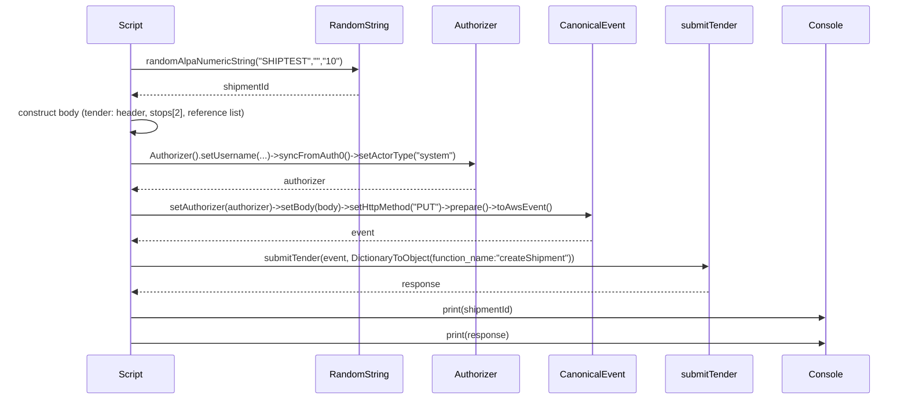
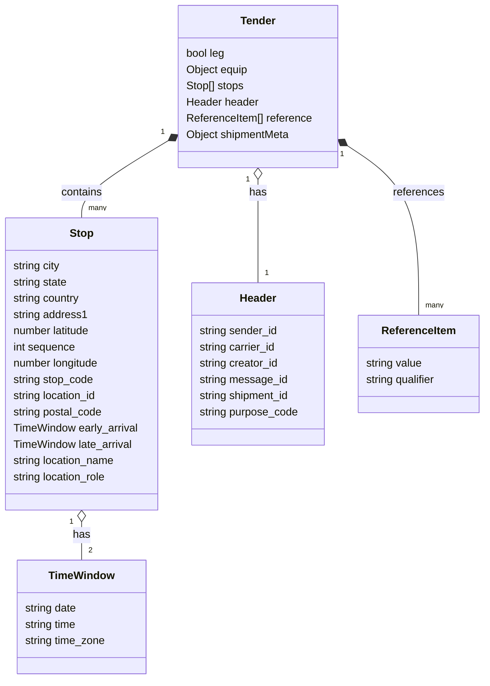

# Diagram: platform/tools/ide_local_testing/localTest/test/partview/carrierShipmentWithParts/createShipmentWithParts.py

> Auto-generated by Obscura crawlers

## Diagram 1

### SVG

<svg id="container" width="1567" xmlns="http://www.w3.org/2000/svg" height="729" viewBox="-173 -10 1567 729" role="graphics-document document" aria-roledescription="sequence"><g><rect x="1194" y="643" fill="#eaeaea" stroke="#666" width="150" height="65" name="Console" rx="3" ry="3" class="actor actor-bottom"></rect><text x="1269" y="675.5" dominant-baseline="central" alignment-baseline="central" class="actor actor-box" style="text-anchor: middle; font-size: 16px; font-weight: 400;"><tspan x="1269" dy="0">Console</tspan></text></g><g><rect x="994" y="643" fill="#eaeaea" stroke="#666" width="150" height="65" name="Lambda" rx="3" ry="3" class="actor actor-bottom"></rect><text x="1069" y="675.5" dominant-baseline="central" alignment-baseline="central" class="actor actor-box" style="text-anchor: middle; font-size: 16px; font-weight: 400;"><tspan x="1069" dy="0">submitTender</tspan></text></g><g><rect x="794" y="643" fill="#eaeaea" stroke="#666" width="150" height="65" name="CE" rx="3" ry="3" class="actor actor-bottom"></rect><text x="869" y="675.5" dominant-baseline="central" alignment-baseline="central" class="actor actor-box" style="text-anchor: middle; font-size: 16px; font-weight: 400;"><tspan x="869" dy="0">CanonicalEvent</tspan></text></g><g><rect x="594" y="643" fill="#eaeaea" stroke="#666" width="150" height="65" name="Auth" rx="3" ry="3" class="actor actor-bottom"></rect><text x="669" y="675.5" dominant-baseline="central" alignment-baseline="central" class="actor actor-box" style="text-anchor: middle; font-size: 16px; font-weight: 400;"><tspan x="669" dy="0">Authorizer</tspan></text></g><g><rect x="394" y="643" fill="#eaeaea" stroke="#666" width="150" height="65" name="RS" rx="3" ry="3" class="actor actor-bottom"></rect><text x="469" y="675.5" dominant-baseline="central" alignment-baseline="central" class="actor actor-box" style="text-anchor: middle; font-size: 16px; font-weight: 400;"><tspan x="469" dy="0">RandomString</tspan></text></g><g><rect x="0" y="643" fill="#eaeaea" stroke="#666" width="150" height="65" name="Script" rx="3" ry="3" class="actor actor-bottom"></rect><text x="75" y="675.5" dominant-baseline="central" alignment-baseline="central" class="actor actor-box" style="text-anchor: middle; font-size: 16px; font-weight: 400;"><tspan x="75" dy="0">Script</tspan></text></g><g><line id="actor5" x1="1269" y1="65" x2="1269" y2="643" class="actor-line 200" stroke-width="0.5px" stroke="#999" name="Console"></line><g id="root-5"><rect x="1194" y="0" fill="#eaeaea" stroke="#666" width="150" height="65" name="Console" rx="3" ry="3" class="actor actor-top"></rect><text x="1269" y="32.5" dominant-baseline="central" alignment-baseline="central" class="actor actor-box" style="text-anchor: middle; font-size: 16px; font-weight: 400;"><tspan x="1269" dy="0">Console</tspan></text></g></g><g><line id="actor4" x1="1069" y1="65" x2="1069" y2="643" class="actor-line 200" stroke-width="0.5px" stroke="#999" name="Lambda"></line><g id="root-4"><rect x="994" y="0" fill="#eaeaea" stroke="#666" width="150" height="65" name="Lambda" rx="3" ry="3" class="actor actor-top"></rect><text x="1069" y="32.5" dominant-baseline="central" alignment-baseline="central" class="actor actor-box" style="text-anchor: middle; font-size: 16px; font-weight: 400;"><tspan x="1069" dy="0">submitTender</tspan></text></g></g><g><line id="actor3" x1="869" y1="65" x2="869" y2="643" class="actor-line 200" stroke-width="0.5px" stroke="#999" name="CE"></line><g id="root-3"><rect x="794" y="0" fill="#eaeaea" stroke="#666" width="150" height="65" name="CE" rx="3" ry="3" class="actor actor-top"></rect><text x="869" y="32.5" dominant-baseline="central" alignment-baseline="central" class="actor actor-box" style="text-anchor: middle; font-size: 16px; font-weight: 400;"><tspan x="869" dy="0">CanonicalEvent</tspan></text></g></g><g><line id="actor2" x1="669" y1="65" x2="669" y2="643" class="actor-line 200" stroke-width="0.5px" stroke="#999" name="Auth"></line><g id="root-2"><rect x="594" y="0" fill="#eaeaea" stroke="#666" width="150" height="65" name="Auth" rx="3" ry="3" class="actor actor-top"></rect><text x="669" y="32.5" dominant-baseline="central" alignment-baseline="central" class="actor actor-box" style="text-anchor: middle; font-size: 16px; font-weight: 400;"><tspan x="669" dy="0">Authorizer</tspan></text></g></g><g><line id="actor1" x1="469" y1="65" x2="469" y2="643" class="actor-line 200" stroke-width="0.5px" stroke="#999" name="RS"></line><g id="root-1"><rect x="394" y="0" fill="#eaeaea" stroke="#666" width="150" height="65" name="RS" rx="3" ry="3" class="actor actor-top"></rect><text x="469" y="32.5" dominant-baseline="central" alignment-baseline="central" class="actor actor-box" style="text-anchor: middle; font-size: 16px; font-weight: 400;"><tspan x="469" dy="0">RandomString</tspan></text></g></g><g><line id="actor0" x1="75" y1="65" x2="75" y2="643" class="actor-line 200" stroke-width="0.5px" stroke="#999" name="Script"></line><g id="root-0"><rect x="0" y="0" fill="#eaeaea" stroke="#666" width="150" height="65" name="Script" rx="3" ry="3" class="actor actor-top"></rect><text x="75" y="32.5" dominant-baseline="central" alignment-baseline="central" class="actor actor-box" style="text-anchor: middle; font-size: 16px; font-weight: 400;"><tspan x="75" dy="0">Script</tspan></text></g></g><g></g><defs><symbol id="computer" width="24" height="24"><path transform="scale(.5)" d="M2 2v13h20v-13h-20zm18 11h-16v-9h16v9zm-10.228 6l.466-1h3.524l.467 1h-4.457zm14.228 3h-24l2-6h2.104l-1.33 4h18.45l-1.297-4h2.073l2 6zm-5-10h-14v-7h14v7z"></path></symbol></defs><defs><symbol id="database" fill-rule="evenodd" clip-rule="evenodd"><path transform="scale(.5)" d="M12.258.001l.256.004.255.005.253.008.251.01.249.012.247.015.246.016.242.019.241.02.239.023.236.024.233.027.231.028.229.031.225.032.223.034.22.036.217.038.214.04.211.041.208.043.205.045.201.046.198.048.194.05.191.051.187.053.183.054.18.056.175.057.172.059.168.06.163.061.16.063.155.064.15.066.074.033.073.033.071.034.07.034.069.035.068.035.067.035.066.035.064.036.064.036.062.036.06.036.06.037.058.037.058.037.055.038.055.038.053.038.052.038.051.039.05.039.048.039.047.039.045.04.044.04.043.04.041.04.04.041.039.041.037.041.036.041.034.041.033.042.032.042.03.042.029.042.027.042.026.043.024.043.023.043.021.043.02.043.018.044.017.043.015.044.013.044.012.044.011.045.009.044.007.045.006.045.004.045.002.045.001.045v17l-.001.045-.002.045-.004.045-.006.045-.007.045-.009.044-.011.045-.012.044-.013.044-.015.044-.017.043-.018.044-.02.043-.021.043-.023.043-.024.043-.026.043-.027.042-.029.042-.03.042-.032.042-.033.042-.034.041-.036.041-.037.041-.039.041-.04.041-.041.04-.043.04-.044.04-.045.04-.047.039-.048.039-.05.039-.051.039-.052.038-.053.038-.055.038-.055.038-.058.037-.058.037-.06.037-.06.036-.062.036-.064.036-.064.036-.066.035-.067.035-.068.035-.069.035-.07.034-.071.034-.073.033-.074.033-.15.066-.155.064-.16.063-.163.061-.168.06-.172.059-.175.057-.18.056-.183.054-.187.053-.191.051-.194.05-.198.048-.201.046-.205.045-.208.043-.211.041-.214.04-.217.038-.22.036-.223.034-.225.032-.229.031-.231.028-.233.027-.236.024-.239.023-.241.02-.242.019-.246.016-.247.015-.249.012-.251.01-.253.008-.255.005-.256.004-.258.001-.258-.001-.256-.004-.255-.005-.253-.008-.251-.01-.249-.012-.247-.015-.245-.016-.243-.019-.241-.02-.238-.023-.236-.024-.234-.027-.231-.028-.228-.031-.226-.032-.223-.034-.22-.036-.217-.038-.214-.04-.211-.041-.208-.043-.204-.045-.201-.046-.198-.048-.195-.05-.19-.051-.187-.053-.184-.054-.179-.056-.176-.057-.172-.059-.167-.06-.164-.061-.159-.063-.155-.064-.151-.066-.074-.033-.072-.033-.072-.034-.07-.034-.069-.035-.068-.035-.067-.035-.066-.035-.064-.036-.063-.036-.062-.036-.061-.036-.06-.037-.058-.037-.057-.037-.056-.038-.055-.038-.053-.038-.052-.038-.051-.039-.049-.039-.049-.039-.046-.039-.046-.04-.044-.04-.043-.04-.041-.04-.04-.041-.039-.041-.037-.041-.036-.041-.034-.041-.033-.042-.032-.042-.03-.042-.029-.042-.027-.042-.026-.043-.024-.043-.023-.043-.021-.043-.02-.043-.018-.044-.017-.043-.015-.044-.013-.044-.012-.044-.011-.045-.009-.044-.007-.045-.006-.045-.004-.045-.002-.045-.001-.045v-17l.001-.045.002-.045.004-.045.006-.045.007-.045.009-.044.011-.045.012-.044.013-.044.015-.044.017-.043.018-.044.02-.043.021-.043.023-.043.024-.043.026-.043.027-.042.029-.042.03-.042.032-.042.033-.042.034-.041.036-.041.037-.041.039-.041.04-.041.041-.04.043-.04.044-.04.046-.04.046-.039.049-.039.049-.039.051-.039.052-.038.053-.038.055-.038.056-.038.057-.037.058-.037.06-.037.061-.036.062-.036.063-.036.064-.036.066-.035.067-.035.068-.035.069-.035.07-.034.072-.034.072-.033.074-.033.151-.066.155-.064.159-.063.164-.061.167-.06.172-.059.176-.057.179-.056.184-.054.187-.053.19-.051.195-.05.198-.048.201-.046.204-.045.208-.043.211-.041.214-.04.217-.038.22-.036.223-.034.226-.032.228-.031.231-.028.234-.027.236-.024.238-.023.241-.02.243-.019.245-.016.247-.015.249-.012.251-.01.253-.008.255-.005.256-.004.258-.001.258.001zm-9.258 20.499v.01l.001.021.003.021.004.022.005.021.006.022.007.022.009.023.01.022.011.023.012.023.013.023.015.023.016.024.017.023.018.024.019.024.021.024.022.025.023.024.024.025.052.049.056.05.061.051.066.051.07.051.075.051.079.052.084.052.088.052.092.052.097.052.102.051.105.052.11.052.114.051.119.051.123.051.127.05.131.05.135.05.139.048.144.049.147.047.152.047.155.047.16.045.163.045.167.043.171.043.176.041.178.041.183.039.187.039.19.037.194.035.197.035.202.033.204.031.209.03.212.029.216.027.219.025.222.024.226.021.23.02.233.018.236.016.24.015.243.012.246.01.249.008.253.005.256.004.259.001.26-.001.257-.004.254-.005.25-.008.247-.011.244-.012.241-.014.237-.016.233-.018.231-.021.226-.021.224-.024.22-.026.216-.027.212-.028.21-.031.205-.031.202-.034.198-.034.194-.036.191-.037.187-.039.183-.04.179-.04.175-.042.172-.043.168-.044.163-.045.16-.046.155-.046.152-.047.148-.048.143-.049.139-.049.136-.05.131-.05.126-.05.123-.051.118-.052.114-.051.11-.052.106-.052.101-.052.096-.052.092-.052.088-.053.083-.051.079-.052.074-.052.07-.051.065-.051.06-.051.056-.05.051-.05.023-.024.023-.025.021-.024.02-.024.019-.024.018-.024.017-.024.015-.023.014-.024.013-.023.012-.023.01-.023.01-.022.008-.022.006-.022.006-.022.004-.022.004-.021.001-.021.001-.021v-4.127l-.077.055-.08.053-.083.054-.085.053-.087.052-.09.052-.093.051-.095.05-.097.05-.1.049-.102.049-.105.048-.106.047-.109.047-.111.046-.114.045-.115.045-.118.044-.12.043-.122.042-.124.042-.126.041-.128.04-.13.04-.132.038-.134.038-.135.037-.138.037-.139.035-.142.035-.143.034-.144.033-.147.032-.148.031-.15.03-.151.03-.153.029-.154.027-.156.027-.158.026-.159.025-.161.024-.162.023-.163.022-.165.021-.166.02-.167.019-.169.018-.169.017-.171.016-.173.015-.173.014-.175.013-.175.012-.177.011-.178.01-.179.008-.179.008-.181.006-.182.005-.182.004-.184.003-.184.002h-.37l-.184-.002-.184-.003-.182-.004-.182-.005-.181-.006-.179-.008-.179-.008-.178-.01-.176-.011-.176-.012-.175-.013-.173-.014-.172-.015-.171-.016-.17-.017-.169-.018-.167-.019-.166-.02-.165-.021-.163-.022-.162-.023-.161-.024-.159-.025-.157-.026-.156-.027-.155-.027-.153-.029-.151-.03-.15-.03-.148-.031-.146-.032-.145-.033-.143-.034-.141-.035-.14-.035-.137-.037-.136-.037-.134-.038-.132-.038-.13-.04-.128-.04-.126-.041-.124-.042-.122-.042-.12-.044-.117-.043-.116-.045-.113-.045-.112-.046-.109-.047-.106-.047-.105-.048-.102-.049-.1-.049-.097-.05-.095-.05-.093-.052-.09-.051-.087-.052-.085-.053-.083-.054-.08-.054-.077-.054v4.127zm0-5.654v.011l.001.021.003.021.004.021.005.022.006.022.007.022.009.022.01.022.011.023.012.023.013.023.015.024.016.023.017.024.018.024.019.024.021.024.022.024.023.025.024.024.052.05.056.05.061.05.066.051.07.051.075.052.079.051.084.052.088.052.092.052.097.052.102.052.105.052.11.051.114.051.119.052.123.05.127.051.131.05.135.049.139.049.144.048.147.048.152.047.155.046.16.045.163.045.167.044.171.042.176.042.178.04.183.04.187.038.19.037.194.036.197.034.202.033.204.032.209.03.212.028.216.027.219.025.222.024.226.022.23.02.233.018.236.016.24.014.243.012.246.01.249.008.253.006.256.003.259.001.26-.001.257-.003.254-.006.25-.008.247-.01.244-.012.241-.015.237-.016.233-.018.231-.02.226-.022.224-.024.22-.025.216-.027.212-.029.21-.03.205-.032.202-.033.198-.035.194-.036.191-.037.187-.039.183-.039.179-.041.175-.042.172-.043.168-.044.163-.045.16-.045.155-.047.152-.047.148-.048.143-.048.139-.05.136-.049.131-.05.126-.051.123-.051.118-.051.114-.052.11-.052.106-.052.101-.052.096-.052.092-.052.088-.052.083-.052.079-.052.074-.051.07-.052.065-.051.06-.05.056-.051.051-.049.023-.025.023-.024.021-.025.02-.024.019-.024.018-.024.017-.024.015-.023.014-.023.013-.024.012-.022.01-.023.01-.023.008-.022.006-.022.006-.022.004-.021.004-.022.001-.021.001-.021v-4.139l-.077.054-.08.054-.083.054-.085.052-.087.053-.09.051-.093.051-.095.051-.097.05-.1.049-.102.049-.105.048-.106.047-.109.047-.111.046-.114.045-.115.044-.118.044-.12.044-.122.042-.124.042-.126.041-.128.04-.13.039-.132.039-.134.038-.135.037-.138.036-.139.036-.142.035-.143.033-.144.033-.147.033-.148.031-.15.03-.151.03-.153.028-.154.028-.156.027-.158.026-.159.025-.161.024-.162.023-.163.022-.165.021-.166.02-.167.019-.169.018-.169.017-.171.016-.173.015-.173.014-.175.013-.175.012-.177.011-.178.009-.179.009-.179.007-.181.007-.182.005-.182.004-.184.003-.184.002h-.37l-.184-.002-.184-.003-.182-.004-.182-.005-.181-.007-.179-.007-.179-.009-.178-.009-.176-.011-.176-.012-.175-.013-.173-.014-.172-.015-.171-.016-.17-.017-.169-.018-.167-.019-.166-.02-.165-.021-.163-.022-.162-.023-.161-.024-.159-.025-.157-.026-.156-.027-.155-.028-.153-.028-.151-.03-.15-.03-.148-.031-.146-.033-.145-.033-.143-.033-.141-.035-.14-.036-.137-.036-.136-.037-.134-.038-.132-.039-.13-.039-.128-.04-.126-.041-.124-.042-.122-.043-.12-.043-.117-.044-.116-.044-.113-.046-.112-.046-.109-.046-.106-.047-.105-.048-.102-.049-.1-.049-.097-.05-.095-.051-.093-.051-.09-.051-.087-.053-.085-.052-.083-.054-.08-.054-.077-.054v4.139zm0-5.666v.011l.001.02.003.022.004.021.005.022.006.021.007.022.009.023.01.022.011.023.012.023.013.023.015.023.016.024.017.024.018.023.019.024.021.025.022.024.023.024.024.025.052.05.056.05.061.05.066.051.07.051.075.052.079.051.084.052.088.052.092.052.097.052.102.052.105.051.11.052.114.051.119.051.123.051.127.05.131.05.135.05.139.049.144.048.147.048.152.047.155.046.16.045.163.045.167.043.171.043.176.042.178.04.183.04.187.038.19.037.194.036.197.034.202.033.204.032.209.03.212.028.216.027.219.025.222.024.226.021.23.02.233.018.236.017.24.014.243.012.246.01.249.008.253.006.256.003.259.001.26-.001.257-.003.254-.006.25-.008.247-.01.244-.013.241-.014.237-.016.233-.018.231-.02.226-.022.224-.024.22-.025.216-.027.212-.029.21-.03.205-.032.202-.033.198-.035.194-.036.191-.037.187-.039.183-.039.179-.041.175-.042.172-.043.168-.044.163-.045.16-.045.155-.047.152-.047.148-.048.143-.049.139-.049.136-.049.131-.051.126-.05.123-.051.118-.052.114-.051.11-.052.106-.052.101-.052.096-.052.092-.052.088-.052.083-.052.079-.052.074-.052.07-.051.065-.051.06-.051.056-.05.051-.049.023-.025.023-.025.021-.024.02-.024.019-.024.018-.024.017-.024.015-.023.014-.024.013-.023.012-.023.01-.022.01-.023.008-.022.006-.022.006-.022.004-.022.004-.021.001-.021.001-.021v-4.153l-.077.054-.08.054-.083.053-.085.053-.087.053-.09.051-.093.051-.095.051-.097.05-.1.049-.102.048-.105.048-.106.048-.109.046-.111.046-.114.046-.115.044-.118.044-.12.043-.122.043-.124.042-.126.041-.128.04-.13.039-.132.039-.134.038-.135.037-.138.036-.139.036-.142.034-.143.034-.144.033-.147.032-.148.032-.15.03-.151.03-.153.028-.154.028-.156.027-.158.026-.159.024-.161.024-.162.023-.163.023-.165.021-.166.02-.167.019-.169.018-.169.017-.171.016-.173.015-.173.014-.175.013-.175.012-.177.01-.178.01-.179.009-.179.007-.181.006-.182.006-.182.004-.184.003-.184.001-.185.001-.185-.001-.184-.001-.184-.003-.182-.004-.182-.006-.181-.006-.179-.007-.179-.009-.178-.01-.176-.01-.176-.012-.175-.013-.173-.014-.172-.015-.171-.016-.17-.017-.169-.018-.167-.019-.166-.02-.165-.021-.163-.023-.162-.023-.161-.024-.159-.024-.157-.026-.156-.027-.155-.028-.153-.028-.151-.03-.15-.03-.148-.032-.146-.032-.145-.033-.143-.034-.141-.034-.14-.036-.137-.036-.136-.037-.134-.038-.132-.039-.13-.039-.128-.041-.126-.041-.124-.041-.122-.043-.12-.043-.117-.044-.116-.044-.113-.046-.112-.046-.109-.046-.106-.048-.105-.048-.102-.048-.1-.05-.097-.049-.095-.051-.093-.051-.09-.052-.087-.052-.085-.053-.083-.053-.08-.054-.077-.054v4.153zm8.74-8.179l-.257.004-.254.005-.25.008-.247.011-.244.012-.241.014-.237.016-.233.018-.231.021-.226.022-.224.023-.22.026-.216.027-.212.028-.21.031-.205.032-.202.033-.198.034-.194.036-.191.038-.187.038-.183.04-.179.041-.175.042-.172.043-.168.043-.163.045-.16.046-.155.046-.152.048-.148.048-.143.048-.139.049-.136.05-.131.05-.126.051-.123.051-.118.051-.114.052-.11.052-.106.052-.101.052-.096.052-.092.052-.088.052-.083.052-.079.052-.074.051-.07.052-.065.051-.06.05-.056.05-.051.05-.023.025-.023.024-.021.024-.02.025-.019.024-.018.024-.017.023-.015.024-.014.023-.013.023-.012.023-.01.023-.01.022-.008.022-.006.023-.006.021-.004.022-.004.021-.001.021-.001.021.001.021.001.021.004.021.004.022.006.021.006.023.008.022.01.022.01.023.012.023.013.023.014.023.015.024.017.023.018.024.019.024.02.025.021.024.023.024.023.025.051.05.056.05.06.05.065.051.07.052.074.051.079.052.083.052.088.052.092.052.096.052.101.052.106.052.11.052.114.052.118.051.123.051.126.051.131.05.136.05.139.049.143.048.148.048.152.048.155.046.16.046.163.045.168.043.172.043.175.042.179.041.183.04.187.038.191.038.194.036.198.034.202.033.205.032.21.031.212.028.216.027.22.026.224.023.226.022.231.021.233.018.237.016.241.014.244.012.247.011.25.008.254.005.257.004.26.001.26-.001.257-.004.254-.005.25-.008.247-.011.244-.012.241-.014.237-.016.233-.018.231-.021.226-.022.224-.023.22-.026.216-.027.212-.028.21-.031.205-.032.202-.033.198-.034.194-.036.191-.038.187-.038.183-.04.179-.041.175-.042.172-.043.168-.043.163-.045.16-.046.155-.046.152-.048.148-.048.143-.048.139-.049.136-.05.131-.05.126-.051.123-.051.118-.051.114-.052.11-.052.106-.052.101-.052.096-.052.092-.052.088-.052.083-.052.079-.052.074-.051.07-.052.065-.051.06-.05.056-.05.051-.05.023-.025.023-.024.021-.024.02-.025.019-.024.018-.024.017-.023.015-.024.014-.023.013-.023.012-.023.01-.023.01-.022.008-.022.006-.023.006-.021.004-.022.004-.021.001-.021.001-.021-.001-.021-.001-.021-.004-.021-.004-.022-.006-.021-.006-.023-.008-.022-.01-.022-.01-.023-.012-.023-.013-.023-.014-.023-.015-.024-.017-.023-.018-.024-.019-.024-.02-.025-.021-.024-.023-.024-.023-.025-.051-.05-.056-.05-.06-.05-.065-.051-.07-.052-.074-.051-.079-.052-.083-.052-.088-.052-.092-.052-.096-.052-.101-.052-.106-.052-.11-.052-.114-.052-.118-.051-.123-.051-.126-.051-.131-.05-.136-.05-.139-.049-.143-.048-.148-.048-.152-.048-.155-.046-.16-.046-.163-.045-.168-.043-.172-.043-.175-.042-.179-.041-.183-.04-.187-.038-.191-.038-.194-.036-.198-.034-.202-.033-.205-.032-.21-.031-.212-.028-.216-.027-.22-.026-.224-.023-.226-.022-.231-.021-.233-.018-.237-.016-.241-.014-.244-.012-.247-.011-.25-.008-.254-.005-.257-.004-.26-.001-.26.001z"></path></symbol></defs><defs><symbol id="clock" width="24" height="24"><path transform="scale(.5)" d="M12 2c5.514 0 10 4.486 10 10s-4.486 10-10 10-10-4.486-10-10 4.486-10 10-10zm0-2c-6.627 0-12 5.373-12 12s5.373 12 12 12 12-5.373 12-12-5.373-12-12-12zm5.848 12.459c.202.038.202.333.001.372-1.907.361-6.045 1.111-6.547 1.111-.719 0-1.301-.582-1.301-1.301 0-.512.77-5.447 1.125-7.445.034-.192.312-.181.343.014l.985 6.238 5.394 1.011z"></path></symbol></defs><defs><marker id="arrowhead" refX="7.9" refY="5" markerUnits="userSpaceOnUse" markerWidth="12" markerHeight="12" orient="auto-start-reverse"><path d="M -1 0 L 10 5 L 0 10 z"></path></marker></defs><defs><marker id="crosshead" markerWidth="15" markerHeight="8" orient="auto" refX="4" refY="4.5"><path fill="none" stroke="#000000" stroke-width="1pt" d="M 1,2 L 6,7 M 6,2 L 1,7" style="stroke-dasharray: 0, 0;"></path></marker></defs><defs><marker id="filled-head" refX="15.5" refY="7" markerWidth="20" markerHeight="28" orient="auto"><path d="M 18,7 L9,13 L14,7 L9,1 Z"></path></marker></defs><defs><marker id="sequencenumber" refX="15" refY="15" markerWidth="60" markerHeight="40" orient="auto"><circle cx="15" cy="15" r="6"></circle></marker></defs><text x="271" y="80" text-anchor="middle" dominant-baseline="middle" alignment-baseline="middle" class="messageText" dy="1em" style="font-size: 16px; font-weight: 400;">randomAlpaNumericString("SHIPTEST","","10")</text><line x1="76" y1="113" x2="465" y2="113" class="messageLine0" stroke-width="2" stroke="none" marker-end="url(#arrowhead)" style="fill: none;"></line><text x="274" y="128" text-anchor="middle" dominant-baseline="middle" alignment-baseline="middle" class="messageText" dy="1em" style="font-size: 16px; font-weight: 400;">shipmentId</text><line x1="468" y1="161" x2="79" y2="161" class="messageLine1" stroke-width="2" stroke="none" marker-end="url(#arrowhead)" style="stroke-dasharray: 3, 3; fill: none;"></line><text x="76" y="176" text-anchor="middle" dominant-baseline="middle" alignment-baseline="middle" class="messageText" dy="1em" style="font-size: 16px; font-weight: 400;">construct body (tender: header, stops[2], reference list)</text><path d="M 76,209 C 136,199 136,239 76,229" class="messageLine0" stroke-width="2" stroke="none" marker-end="url(#arrowhead)" style="fill: none;"></path><text x="371" y="254" text-anchor="middle" dominant-baseline="middle" alignment-baseline="middle" class="messageText" dy="1em" style="font-size: 16px; font-weight: 400;">Authorizer().setUsername(...)-&gt;syncFromAuth0()-&gt;setActorType("system")</text><line x1="76" y1="287" x2="665" y2="287" class="messageLine0" stroke-width="2" stroke="none" marker-end="url(#arrowhead)" style="fill: none;"></line><text x="374" y="302" text-anchor="middle" dominant-baseline="middle" alignment-baseline="middle" class="messageText" dy="1em" style="font-size: 16px; font-weight: 400;">authorizer</text><line x1="668" y1="335" x2="79" y2="335" class="messageLine1" stroke-width="2" stroke="none" marker-end="url(#arrowhead)" style="stroke-dasharray: 3, 3; fill: none;"></line><text x="471" y="350" text-anchor="middle" dominant-baseline="middle" alignment-baseline="middle" class="messageText" dy="1em" style="font-size: 16px; font-weight: 400;">setAuthorizer(authorizer)-&gt;setBody(body)-&gt;setHttpMethod("PUT")-&gt;prepare()-&gt;toAwsEvent()</text><line x1="76" y1="383" x2="865" y2="383" class="messageLine0" stroke-width="2" stroke="none" marker-end="url(#arrowhead)" style="fill: none;"></line><text x="474" y="398" text-anchor="middle" dominant-baseline="middle" alignment-baseline="middle" class="messageText" dy="1em" style="font-size: 16px; font-weight: 400;">event</text><line x1="868" y1="431" x2="79" y2="431" class="messageLine1" stroke-width="2" stroke="none" marker-end="url(#arrowhead)" style="stroke-dasharray: 3, 3; fill: none;"></line><text x="571" y="446" text-anchor="middle" dominant-baseline="middle" alignment-baseline="middle" class="messageText" dy="1em" style="font-size: 16px; font-weight: 400;">submitTender(event, DictionaryToObject(function_name:"createShipment"))</text><line x1="76" y1="479" x2="1065" y2="479" class="messageLine0" stroke-width="2" stroke="none" marker-end="url(#arrowhead)" style="fill: none;"></line><text x="574" y="494" text-anchor="middle" dominant-baseline="middle" alignment-baseline="middle" class="messageText" dy="1em" style="font-size: 16px; font-weight: 400;">response</text><line x1="1068" y1="527" x2="79" y2="527" class="messageLine1" stroke-width="2" stroke="none" marker-end="url(#arrowhead)" style="stroke-dasharray: 3, 3; fill: none;"></line><text x="671" y="542" text-anchor="middle" dominant-baseline="middle" alignment-baseline="middle" class="messageText" dy="1em" style="font-size: 16px; font-weight: 400;">print(shipmentId)</text><line x1="76" y1="575" x2="1265" y2="575" class="messageLine0" stroke-width="2" stroke="none" marker-end="url(#arrowhead)" style="fill: none;"></line><text x="671" y="590" text-anchor="middle" dominant-baseline="middle" alignment-baseline="middle" class="messageText" dy="1em" style="font-size: 16px; font-weight: 400;">print(response)</text><line x1="76" y1="623" x2="1265" y2="623" class="messageLine0" stroke-width="2" stroke="none" marker-end="url(#arrowhead)" style="fill: none;"></line></svg>

## Diagram 2

### SVG

<svg id="container" width="726.2890625" xmlns="http://www.w3.org/2000/svg" class="classDiagram" height="1004" viewBox="0 0 726.2890625 1004" role="graphics-document document" aria-roledescription="class"><g><defs><marker id="container_class-aggregationStart" class="marker aggregation class" refX="18" refY="7" markerWidth="190" markerHeight="240" orient="auto"><path d="M 18,7 L9,13 L1,7 L9,1 Z"></path></marker></defs><defs><marker id="container_class-aggregationEnd" class="marker aggregation class" refX="1" refY="7" markerWidth="20" markerHeight="28" orient="auto"><path d="M 18,7 L9,13 L1,7 L9,1 Z"></path></marker></defs><defs><marker id="container_class-extensionStart" class="marker extension class" refX="18" refY="7" markerWidth="190" markerHeight="240" orient="auto"><path d="M 1,7 L18,13 V 1 Z"></path></marker></defs><defs><marker id="container_class-extensionEnd" class="marker extension class" refX="1" refY="7" markerWidth="20" markerHeight="28" orient="auto"><path d="M 1,1 V 13 L18,7 Z"></path></marker></defs><defs><marker id="container_class-compositionStart" class="marker composition class" refX="18" refY="7" markerWidth="190" markerHeight="240" orient="auto"><path d="M 18,7 L9,13 L1,7 L9,1 Z"></path></marker></defs><defs><marker id="container_class-compositionEnd" class="marker composition class" refX="1" refY="7" markerWidth="20" markerHeight="28" orient="auto"><path d="M 18,7 L9,13 L1,7 L9,1 Z"></path></marker></defs><defs><marker id="container_class-dependencyStart" class="marker dependency class" refX="6" refY="7" markerWidth="190" markerHeight="240" orient="auto"><path d="M 5,7 L9,13 L1,7 L9,1 Z"></path></marker></defs><defs><marker id="container_class-dependencyEnd" class="marker dependency class" refX="13" refY="7" markerWidth="20" markerHeight="28" orient="auto"><path d="M 18,7 L9,13 L14,7 L9,1 Z"></path></marker></defs><defs><marker id="container_class-lollipopStart" class="marker lollipop class" refX="13" refY="7" markerWidth="190" markerHeight="240" orient="auto"><circle stroke="black" fill="transparent" cx="7" cy="7" r="6"></circle></marker></defs><defs><marker id="container_class-lollipopEnd" class="marker lollipop class" refX="1" refY="7" markerWidth="190" markerHeight="240" orient="auto"><circle stroke="black" fill="transparent" cx="7" cy="7" r="6"></circle></marker></defs><g class="root"><g class="clusters"></g><g class="edgePaths"><path d="M252.054,207.382L230.354,220.318C208.653,233.254,165.252,259.127,143.552,278.23C121.852,297.333,121.852,309.667,121.852,315.833L121.852,322" id="id_Tender_Stop_1" class="edge-thickness-normal edge-pattern-solid relation" style=";;;" data-edge="true" data-et="edge" data-id="id_Tender_Stop_1" data-points="W3sieCI6MjY2Ljg3MTA5Mzc1LCJ5IjoxOTguNTQ4ODIwMTAwNTYyMTJ9LHsieCI6MTIxLjg1MTU2MjUsInkiOjI4NX0seyJ4IjoxMjEuODUxNTYyNSwieSI6MzIyfV0=" marker-start="url(#container_class-compositionStart)"></path><path d="M385.215,265.25L385.215,268.542C385.215,271.833,385.215,278.417,385.215,303.875C385.215,329.333,385.215,373.667,385.215,395.833L385.215,418" id="id_Tender_Header_2" class="edge-thickness-normal edge-pattern-solid relation" style=";;;" data-edge="true" data-et="edge" data-id="id_Tender_Header_2" data-points="W3sieCI6Mzg1LjIxNDg0Mzc1LCJ5IjoyNDh9LHsieCI6Mzg1LjIxNDg0Mzc1LCJ5IjoyODV9LHsieCI6Mzg1LjIxNDg0Mzc1LCJ5Ijo0MTh9XQ==" marker-start="url(#container_class-aggregationStart)"></path><path d="M518.017,214.409L536.099,226.175C554.181,237.94,590.344,261.47,608.426,303.402C626.508,345.333,626.508,405.667,626.508,435.833L626.508,466" id="id_Tender_ReferenceItem_3" class="edge-thickness-normal edge-pattern-solid relation" style=";;;" data-edge="true" data-et="edge" data-id="id_Tender_ReferenceItem_3" data-points="W3sieCI6NTAzLjU1ODU5Mzc1LCJ5IjoyMDUuMDAxNjk5ODI2Nzc5NTR9LHsieCI6NjI2LjUwNzgxMjUsInkiOjI4NX0seyJ4Ijo2MjYuNTA3ODEyNSwieSI6NDY2fV0=" marker-start="url(#container_class-compositionStart)"></path><path d="M121.852,771.25L121.852,774.542C121.852,777.833,121.852,784.417,121.852,793.875C121.852,803.333,121.852,815.667,121.852,821.833L121.852,828" id="id_Stop_TimeWindow_4" class="edge-thickness-normal edge-pattern-solid relation" style=";;;" data-edge="true" data-et="edge" data-id="id_Stop_TimeWindow_4" data-points="W3sieCI6MTIxLjg1MTU2MjUsInkiOjc1NH0seyJ4IjoxMjEuODUxNTYyNSwieSI6NzkxfSx7IngiOjEyMS44NTE1NjI1LCJ5Ijo4Mjh9XQ==" marker-start="url(#container_class-aggregationStart)"></path></g><g class="edgeLabels"><g class="edgeLabel" transform="translate(121.8515625, 285)"><g class="label" data-id="id_Tender_Stop_1" transform="translate(-30.890625, -12)"><foreignObject width="61.78125" height="24">

contains

</foreignObject></g></g><g class="edgeLabel" transform="translate(385.21484375, 285)"><g class="label" data-id="id_Tender_Header_2" transform="translate(-12.703125, -12)"><foreignObject width="25.40625" height="24">

has

</foreignObject></g></g><g class="edgeLabel" transform="translate(626.5078125, 285)"><g class="label" data-id="id_Tender_ReferenceItem_3" transform="translate(-37.828125, -12)"><foreignObject width="75.65625" height="24">

references

</foreignObject></g></g><g class="edgeLabel" transform="translate(121.8515625, 791)"><g class="label" data-id="id_Stop_TimeWindow_4" transform="translate(-12.703125, -12)"><foreignObject width="25.40625" height="24">

has

</foreignObject></g></g><g class="edgeTerminals" transform="translate(244.15860831265024, 194.62542838607186)"><g class="inner" transform="translate(0, 0)"><foreignObject style="width: 9px; height: 12px;">
1
</foreignObject></g></g><g class="edgeTerminals" transform="translate(370.2148418750001, 265.49999839285715)"><g class="inner" transform="translate(0, 0)"><foreignObject style="width: 9px; height: 12px;">
1
</foreignObject></g></g><g class="edgeTerminals" transform="translate(510.0462515706238, 227.1186679456612)"><g class="inner" transform="translate(0, 0)"><foreignObject style="width: 9px; height: 12px;">
1
</foreignObject></g></g><g class="edgeTerminals" transform="translate(106.85156125000005, 771.4999989285715)"><g class="inner" transform="translate(0, 0)"><foreignObject style="width: 9px; height: 12px;">
1
</foreignObject></g></g><g class="edgeTerminals" transform="translate(131.85156124999997, 299.4999989285714)"><g class="inner" transform="translate(0, 0)"></g><foreignObject style="width: 36px; height: 12px;">
many
</foreignObject></g><g class="edgeTerminals" transform="translate(395.2148418749999, 395.49999839285715)"><g class="inner" transform="translate(0, 0)"></g><foreignObject style="width: 9px; height: 12px;">
1
</foreignObject></g><g class="edgeTerminals" transform="translate(636.50781125, 443.4999989285714)"><g class="inner" transform="translate(0, 0)"></g><foreignObject style="width: 36px; height: 12px;">
many
</foreignObject></g><g class="edgeTerminals" transform="translate(131.85156124999997, 805.4999989285715)"><g class="inner" transform="translate(0, 0)"></g><foreignObject style="width: 9px; height: 12px;">
2
</foreignObject></g></g><g class="nodes"><g class="node default" id="classId-Tender-0" transform="translate(385.21484375, 128)"><g class="basic label-container"><path d="M-118.34375 -120 L118.34375 -120 L118.34375 120 L-118.34375 120" stroke="none" stroke-width="0" fill="#ECECFF" style=""></path><path d="M-118.34375 -120 C-60.39814897409237 -120, -2.452547948184744 -120, 118.34375 -120 M-118.34375 -120 C-66.93271890645434 -120, -15.521687812908695 -120, 118.34375 -120 M118.34375 -120 C118.34375 -61.59696154187302, 118.34375 -3.193923083746043, 118.34375 120 M118.34375 -120 C118.34375 -25.39285663934419, 118.34375 69.21428672131162, 118.34375 120 M118.34375 120 C39.50808060159777 120, -39.32758879680446 120, -118.34375 120 M118.34375 120 C68.33466178086024 120, 18.325573561720475 120, -118.34375 120 M-118.34375 120 C-118.34375 52.52159510474905, -118.34375 -14.956809790501893, -118.34375 -120 M-118.34375 120 C-118.34375 63.902706111758064, -118.34375 7.805412223516129, -118.34375 -120" stroke="#9370DB" stroke-width="1.3" fill="none" stroke-dasharray="0 0" style=""></path></g><g class="annotation-group text" transform="translate(0, -96)"></g><g class="label-group text" transform="translate(-25.34375, -96)"><g class="label" style="font-weight: bolder" transform="translate(0,-12)"><foreignObject width="50.6875" height="24">

Tender

</foreignObject></g></g><g class="members-group text" transform="translate(-106.34375, -48)"><g class="label" style="" transform="translate(0,-12)"><foreignObject width="58.78125" height="24">

bool leg

</foreignObject></g><g class="label" style="" transform="translate(0,12)"><foreignObject width="93.0625" height="24">

Object equip

</foreignObject></g><g class="label" style="" transform="translate(0,36)"><foreignObject width="86.984375" height="24">

Stop[] stops

</foreignObject></g><g class="label" style="" transform="translate(0,60)"><foreignObject width="107.953125" height="24">

Header header

</foreignObject></g><g class="label" style="" transform="translate(0,84)"><foreignObject width="187.34375" height="24">

ReferenceItem[] reference

</foreignObject></g><g class="label" style="" transform="translate(0,108)"><foreignObject width="155.4375" height="24">

Object shipmentMeta

</foreignObject></g></g><g class="methods-group text" transform="translate(-106.34375, 120)"></g><g class="divider" style=""><path d="M-118.34375 -72 C-40.42736642847183 -72, 37.489017143056344 -72, 118.34375 -72 M-118.34375 -72 C-46.90324685570694 -72, 24.53725628858612 -72, 118.34375 -72" stroke="#9370DB" stroke-width="1.3" fill="none" stroke-dasharray="0 0" style=""></path></g><g class="divider" style=""><path d="M-118.34375 96 C-52.957371793983526 96, 12.429006412032948 96, 118.34375 96 M-118.34375 96 C-42.9547739129782 96, 32.434202174043605 96, 118.34375 96" stroke="#9370DB" stroke-width="1.3" fill="none" stroke-dasharray="0 0" style=""></path></g></g><g class="node default" id="classId-Stop-1" transform="translate(121.8515625, 538)"><g class="basic label-container"><path d="M-113.8515625 -216 L113.8515625 -216 L113.8515625 216 L-113.8515625 216" stroke="none" stroke-width="0" fill="#ECECFF" style=""></path><path d="M-113.8515625 -216 C-29.96914397115235 -216, 53.9132745576953 -216, 113.8515625 -216 M-113.8515625 -216 C-32.16425051467178 -216, 49.523061470656444 -216, 113.8515625 -216 M113.8515625 -216 C113.8515625 -98.28698044908444, 113.8515625 19.426039101831122, 113.8515625 216 M113.8515625 -216 C113.8515625 -72.17784539470159, 113.8515625 71.64430921059682, 113.8515625 216 M113.8515625 216 C66.11265653615777 216, 18.37375057231553 216, -113.8515625 216 M113.8515625 216 C49.81317901171428 216, -14.225204476571434 216, -113.8515625 216 M-113.8515625 216 C-113.8515625 79.04253732702898, -113.8515625 -57.91492534594204, -113.8515625 -216 M-113.8515625 216 C-113.8515625 60.22971208950702, -113.8515625 -95.54057582098596, -113.8515625 -216" stroke="#9370DB" stroke-width="1.3" fill="none" stroke-dasharray="0 0" style=""></path></g><g class="annotation-group text" transform="translate(0, -192)"></g><g class="label-group text" transform="translate(-16.96875, -192)"><g class="label" style="font-weight: bolder" transform="translate(0,-12)"><foreignObject width="33.9375" height="24">

Stop

</foreignObject></g></g><g class="members-group text" transform="translate(-101.8515625, -144)"><g class="label" style="" transform="translate(0,-12)"><foreignObject width="71.609375" height="24">

string city

</foreignObject></g><g class="label" style="" transform="translate(0,12)"><foreignObject width="81.96875" height="24">

string state

</foreignObject></g><g class="label" style="" transform="translate(0,36)"><foreignObject width="101.0625" height="24">

string country

</foreignObject></g><g class="label" style="" transform="translate(0,60)"><foreignObject width="109.375" height="24">

string address1

</foreignObject></g><g class="label" style="" transform="translate(0,84)"><foreignObject width="118.03125" height="24">

number latitude

</foreignObject></g><g class="label" style="" transform="translate(0,108)"><foreignObject width="93.125" height="24">

int sequence

</foreignObject></g><g class="label" style="" transform="translate(0,132)"><foreignObject width="130.578125" height="24">

number longitude

</foreignObject></g><g class="label" style="" transform="translate(0,156)"><foreignObject width="120.375" height="24">

string stop_code

</foreignObject></g><g class="label" style="" transform="translate(0,180)"><foreignObject width="127.4375" height="24">

string location_id

</foreignObject></g><g class="label" style="" transform="translate(0,204)"><foreignObject width="134.0625" height="24">

string postal_code

</foreignObject></g><g class="label" style="" transform="translate(0,228)"><foreignObject width="186.734375" height="24">

TimeWindow early_arrival

</foreignObject></g><g class="label" style="" transform="translate(0,252)"><foreignObject width="178.609375" height="24">

TimeWindow late_arrival

</foreignObject></g><g class="label" style="" transform="translate(0,276)"><foreignObject width="153.859375" height="24">

string location_name

</foreignObject></g><g class="label" style="" transform="translate(0,300)"><foreignObject width="141.71875" height="24">

string location_role

</foreignObject></g></g><g class="methods-group text" transform="translate(-101.8515625, 216)"></g><g class="divider" style=""><path d="M-113.8515625 -168 C-34.56598832897265 -168, 44.7195858420547 -168, 113.8515625 -168 M-113.8515625 -168 C-33.034300339376856 -168, 47.78296182124629 -168, 113.8515625 -168" stroke="#9370DB" stroke-width="1.3" fill="none" stroke-dasharray="0 0" style=""></path></g><g class="divider" style=""><path d="M-113.8515625 192 C-29.89211118722902 192, 54.06734012554196 192, 113.8515625 192 M-113.8515625 192 C-35.58938554263287 192, 42.67279141473426 192, 113.8515625 192" stroke="#9370DB" stroke-width="1.3" fill="none" stroke-dasharray="0 0" style=""></path></g></g><g class="node default" id="classId-Header-2" transform="translate(385.21484375, 538)"><g class="basic label-container"><path d="M-99.51171875 -120 L99.51171875 -120 L99.51171875 120 L-99.51171875 120" stroke="none" stroke-width="0" fill="#ECECFF" style=""></path><path d="M-99.51171875 -120 C-57.256362828677844 -120, -15.001006907355688 -120, 99.51171875 -120 M-99.51171875 -120 C-48.830315853044745 -120, 1.8510870439105105 -120, 99.51171875 -120 M99.51171875 -120 C99.51171875 -35.81099172024902, 99.51171875 48.37801655950196, 99.51171875 120 M99.51171875 -120 C99.51171875 -36.64650388314766, 99.51171875 46.70699223370468, 99.51171875 120 M99.51171875 120 C24.920588510573438 120, -49.670541728853124 120, -99.51171875 120 M99.51171875 120 C38.804441696855804 120, -21.902835356288392 120, -99.51171875 120 M-99.51171875 120 C-99.51171875 60.403133644868944, -99.51171875 0.8062672897378889, -99.51171875 -120 M-99.51171875 120 C-99.51171875 41.264719255792485, -99.51171875 -37.47056148841503, -99.51171875 -120" stroke="#9370DB" stroke-width="1.3" fill="none" stroke-dasharray="0 0" style=""></path></g><g class="annotation-group text" transform="translate(0, -96)"></g><g class="label-group text" transform="translate(-26.4765625, -96)"><g class="label" style="font-weight: bolder" transform="translate(0,-12)"><foreignObject width="52.953125" height="24">

Header

</foreignObject></g></g><g class="members-group text" transform="translate(-87.51171875, -48)"><g class="label" style="" transform="translate(0,-12)"><foreignObject width="117.03125" height="24">

string sender_id

</foreignObject></g><g class="label" style="" transform="translate(0,12)"><foreignObject width="114.953125" height="24">

string carrier_id

</foreignObject></g><g class="label" style="" transform="translate(0,36)"><foreignObject width="118.671875" height="24">

string creator_id

</foreignObject></g><g class="label" style="" transform="translate(0,60)"><foreignObject width="130.34375" height="24">

string message_id

</foreignObject></g><g class="label" style="" transform="translate(0,84)"><foreignObject width="136.734375" height="24">

string shipment_id

</foreignObject></g><g class="label" style="" transform="translate(0,108)"><foreignObject width="148.546875" height="24">

string purpose_code

</foreignObject></g></g><g class="methods-group text" transform="translate(-87.51171875, 120)"></g><g class="divider" style=""><path d="M-99.51171875 -72 C-39.14533611611007 -72, 21.221046517779854 -72, 99.51171875 -72 M-99.51171875 -72 C-49.400556330134144 -72, 0.7106060897317121 -72, 99.51171875 -72" stroke="#9370DB" stroke-width="1.3" fill="none" stroke-dasharray="0 0" style=""></path></g><g class="divider" style=""><path d="M-99.51171875 96 C-23.237239499752903 96, 53.037239750494194 96, 99.51171875 96 M-99.51171875 96 C-53.483239546320476 96, -7.454760342640952 96, 99.51171875 96" stroke="#9370DB" stroke-width="1.3" fill="none" stroke-dasharray="0 0" style=""></path></g></g><g class="node default" id="classId-ReferenceItem-3" transform="translate(626.5078125, 538)"><g class="basic label-container"><path d="M-91.78125 -72 L91.78125 -72 L91.78125 72 L-91.78125 72" stroke="none" stroke-width="0" fill="#ECECFF" style=""></path><path d="M-91.78125 -72 C-23.12693299065802 -72, 45.52738401868396 -72, 91.78125 -72 M-91.78125 -72 C-19.575228465086894 -72, 52.63079306982621 -72, 91.78125 -72 M91.78125 -72 C91.78125 -36.68548054349704, 91.78125 -1.370961086994086, 91.78125 72 M91.78125 -72 C91.78125 -37.483612395055424, 91.78125 -2.9672247901108477, 91.78125 72 M91.78125 72 C18.46284720261471 72, -54.85555559477058 72, -91.78125 72 M91.78125 72 C43.10036819279956 72, -5.580513614400886 72, -91.78125 72 M-91.78125 72 C-91.78125 32.84470514244573, -91.78125 -6.310589715108534, -91.78125 -72 M-91.78125 72 C-91.78125 17.890894912085507, -91.78125 -36.218210175828986, -91.78125 -72" stroke="#9370DB" stroke-width="1.3" fill="none" stroke-dasharray="0 0" style=""></path></g><g class="annotation-group text" transform="translate(0, -48)"></g><g class="label-group text" transform="translate(-52.96875, -48)"><g class="label" style="font-weight: bolder" transform="translate(0,-12)"><foreignObject width="105.9375" height="24">

ReferenceItem

</foreignObject></g></g><g class="members-group text" transform="translate(-79.78125, 0)"><g class="label" style="" transform="translate(0,-12)"><foreignObject width="84.765625" height="24">

string value

</foreignObject></g><g class="label" style="" transform="translate(0,12)"><foreignObject width="106.59375" height="24">

string qualifier

</foreignObject></g></g><g class="methods-group text" transform="translate(-79.78125, 72)"></g><g class="divider" style=""><path d="M-91.78125 -24 C-32.70385815998045 -24, 26.373533680039102 -24, 91.78125 -24 M-91.78125 -24 C-27.821913847408226 -24, 36.13742230518355 -24, 91.78125 -24" stroke="#9370DB" stroke-width="1.3" fill="none" stroke-dasharray="0 0" style=""></path></g><g class="divider" style=""><path d="M-91.78125 48 C-46.625171898848215 48, -1.4690937976964307 48, 91.78125 48 M-91.78125 48 C-50.476437819960914 48, -9.171625639921828 48, 91.78125 48" stroke="#9370DB" stroke-width="1.3" fill="none" stroke-dasharray="0 0" style=""></path></g></g><g class="node default" id="classId-TimeWindow-4" transform="translate(121.8515625, 912)"><g class="basic label-container"><path d="M-95.89453125 -84 L95.89453125 -84 L95.89453125 84 L-95.89453125 84" stroke="none" stroke-width="0" fill="#ECECFF" style=""></path><path d="M-95.89453125 -84 C-54.35116240613867 -84, -12.80779356227734 -84, 95.89453125 -84 M-95.89453125 -84 C-34.837589232318074 -84, 26.219352785363853 -84, 95.89453125 -84 M95.89453125 -84 C95.89453125 -35.83417784182437, 95.89453125 12.331644316351259, 95.89453125 84 M95.89453125 -84 C95.89453125 -18.426846471836768, 95.89453125 47.146307056326464, 95.89453125 84 M95.89453125 84 C32.59271518402691 84, -30.709100881946185 84, -95.89453125 84 M95.89453125 84 C30.520459074973203 84, -34.85361310005359 84, -95.89453125 84 M-95.89453125 84 C-95.89453125 30.749114640746882, -95.89453125 -22.501770718506236, -95.89453125 -84 M-95.89453125 84 C-95.89453125 32.258758286997036, -95.89453125 -19.482483426005928, -95.89453125 -84" stroke="#9370DB" stroke-width="1.3" fill="none" stroke-dasharray="0 0" style=""></path></g><g class="annotation-group text" transform="translate(0, -60)"></g><g class="label-group text" transform="translate(-46.8671875, -60)"><g class="label" style="font-weight: bolder" transform="translate(0,-12)"><foreignObject width="93.734375" height="24">

TimeWindow

</foreignObject></g></g><g class="members-group text" transform="translate(-83.89453125, -12)"><g class="label" style="" transform="translate(0,-12)"><foreignObject width="78.40625" height="24">

string date

</foreignObject></g><g class="label" style="" transform="translate(0,12)"><foreignObject width="78.59375" height="24">

string time

</foreignObject></g><g class="label" style="" transform="translate(0,36)"><foreignObject width="120.921875" height="24">

string time_zone

</foreignObject></g></g><g class="methods-group text" transform="translate(-83.89453125, 84)"></g><g class="divider" style=""><path d="M-95.89453125 -36 C-37.456770689802624 -36, 20.98098987039475 -36, 95.89453125 -36 M-95.89453125 -36 C-50.12146734794145 -36, -4.348403445882894 -36, 95.89453125 -36" stroke="#9370DB" stroke-width="1.3" fill="none" stroke-dasharray="0 0" style=""></path></g><g class="divider" style=""><path d="M-95.89453125 60 C-47.59598049082414 60, 0.702570268351721 60, 95.89453125 60 M-95.89453125 60 C-25.2284479815838 60, 45.4376352868324 60, 95.89453125 60" stroke="#9370DB" stroke-width="1.3" fill="none" stroke-dasharray="0 0" style=""></path></g></g></g></g></g></svg>
