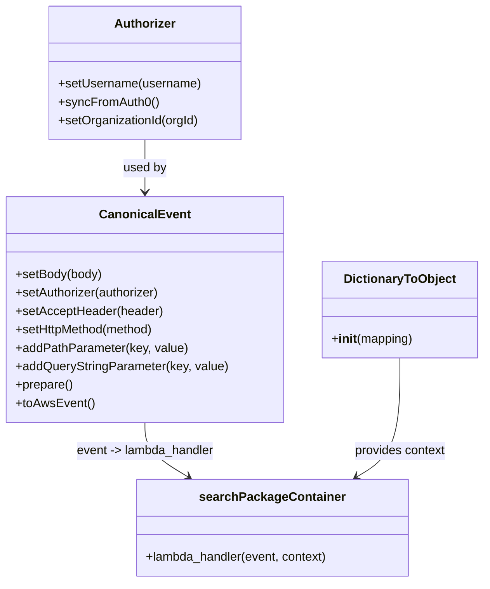

# Diagram: platform/tools/ide_local_testing/localTest/test/partview/containerSearch/searchContainerCount.py


> Auto-generated by Obscura crawlers

## Diagram 1



### SVG

<svg id="container" width="623.4296875" xmlns="http://www.w3.org/2000/svg" class="classDiagram" height="758" viewBox="0 0 623.4296875 758" role="graphics-document document" aria-roledescription="class"><style>#container{font-family:"trebuchet ms",verdana,arial,sans-serif;font-size:16px;fill:#333;}@keyframes edge-animation-frame{from{stroke-dashoffset:0;}}@keyframes dash{to{stroke-dashoffset:0;}}#container .edge-animation-slow{stroke-dasharray:9,5!important;stroke-dashoffset:900;animation:dash 50s linear infinite;stroke-linecap:round;}#container .edge-animation-fast{stroke-dasharray:9,5!important;stroke-dashoffset:900;animation:dash 20s linear infinite;stroke-linecap:round;}#container .error-icon{fill:#552222;}#container .error-text{fill:#552222;stroke:#552222;}#container .edge-thickness-normal{stroke-width:1px;}#container .edge-thickness-thick{stroke-width:3.5px;}#container .edge-pattern-solid{stroke-dasharray:0;}#container .edge-thickness-invisible{stroke-width:0;fill:none;}#container .edge-pattern-dashed{stroke-dasharray:3;}#container .edge-pattern-dotted{stroke-dasharray:2;}#container .marker{fill:#333333;stroke:#333333;}#container .marker.cross{stroke:#333333;}#container svg{font-family:"trebuchet ms",verdana,arial,sans-serif;font-size:16px;}#container p{margin:0;}#container g.classGroup text{fill:#9370DB;stroke:none;font-family:"trebuchet ms",verdana,arial,sans-serif;font-size:10px;}#container g.classGroup text .title{font-weight:bolder;}#container .nodeLabel,#container .edgeLabel{color:#131300;}#container .edgeLabel .label rect{fill:#ECECFF;}#container .label text{fill:#131300;}#container .labelBkg{background:#ECECFF;}#container .edgeLabel .label span{background:#ECECFF;}#container .classTitle{font-weight:bolder;}#container .node rect,#container .node circle,#container .node ellipse,#container .node polygon,#container .node path{fill:#ECECFF;stroke:#9370DB;stroke-width:1px;}#container .divider{stroke:#9370DB;stroke-width:1;}#container g.clickable{cursor:pointer;}#container g.classGroup rect{fill:#ECECFF;stroke:#9370DB;}#container g.classGroup line{stroke:#9370DB;stroke-width:1;}#container .classLabel .box{stroke:none;stroke-width:0;fill:#ECECFF;opacity:0.5;}#container .classLabel .label{fill:#9370DB;font-size:10px;}#container .relation{stroke:#333333;stroke-width:1;fill:none;}#container .dashed-line{stroke-dasharray:3;}#container .dotted-line{stroke-dasharray:1 2;}#container #compositionStart,#container .composition{fill:#333333!important;stroke:#333333!important;stroke-width:1;}#container #compositionEnd,#container .composition{fill:#333333!important;stroke:#333333!important;stroke-width:1;}#container #dependencyStart,#container .dependency{fill:#333333!important;stroke:#333333!important;stroke-width:1;}#container #dependencyStart,#container .dependency{fill:#333333!important;stroke:#333333!important;stroke-width:1;}#container #extensionStart,#container .extension{fill:transparent!important;stroke:#333333!important;stroke-width:1;}#container #extensionEnd,#container .extension{fill:transparent!important;stroke:#333333!important;stroke-width:1;}#container #aggregationStart,#container .aggregation{fill:transparent!important;stroke:#333333!important;stroke-width:1;}#container #aggregationEnd,#container .aggregation{fill:transparent!important;stroke:#333333!important;stroke-width:1;}#container #lollipopStart,#container .lollipop{fill:#ECECFF!important;stroke:#333333!important;stroke-width:1;}#container #lollipopEnd,#container .lollipop{fill:#ECECFF!important;stroke:#333333!important;stroke-width:1;}#container .edgeTerminals{font-size:11px;line-height:initial;}#container .classTitleText{text-anchor:middle;font-size:18px;fill:#333;}#container .label-icon{display:inline-block;height:1em;overflow:visible;vertical-align:-0.125em;}#container .node .label-icon path{fill:currentColor;stroke:revert;stroke-width:revert;}#container :root{--mermaid-font-family:"trebuchet ms",verdana,arial,sans-serif;}</style><g><defs><marker id="container_class-aggregationStart" class="marker aggregation class" refX="18" refY="7" markerWidth="190" markerHeight="240" orient="auto"><path d="M 18,7 L9,13 L1,7 L9,1 Z"></path></marker></defs><defs><marker id="container_class-aggregationEnd" class="marker aggregation class" refX="1" refY="7" markerWidth="20" markerHeight="28" orient="auto"><path d="M 18,7 L9,13 L1,7 L9,1 Z"></path></marker></defs><defs><marker id="container_class-extensionStart" class="marker extension class" refX="18" refY="7" markerWidth="190" markerHeight="240" orient="auto"><path d="M 1,7 L18,13 V 1 Z"></path></marker></defs><defs><marker id="container_class-extensionEnd" class="marker extension class" refX="1" refY="7" markerWidth="20" markerHeight="28" orient="auto"><path d="M 1,1 V 13 L18,7 Z"></path></marker></defs><defs><marker id="container_class-compositionStart" class="marker composition class" refX="18" refY="7" markerWidth="190" markerHeight="240" orient="auto"><path d="M 18,7 L9,13 L1,7 L9,1 Z"></path></marker></defs><defs><marker id="container_class-compositionEnd" class="marker composition class" refX="1" refY="7" markerWidth="20" markerHeight="28" orient="auto"><path d="M 18,7 L9,13 L1,7 L9,1 Z"></path></marker></defs><defs><marker id="container_class-dependencyStart" class="marker dependency class" refX="6" refY="7" markerWidth="190" markerHeight="240" orient="auto"><path d="M 5,7 L9,13 L1,7 L9,1 Z"></path></marker></defs><defs><marker id="container_class-dependencyEnd" class="marker dependency class" refX="13" refY="7" markerWidth="20" markerHeight="28" orient="auto"><path d="M 18,7 L9,13 L14,7 L9,1 Z"></path></marker></defs><defs><marker id="container_class-lollipopStart" class="marker lollipop class" refX="13" refY="7" markerWidth="190" markerHeight="240" orient="auto"><circle stroke="black" fill="transparent" cx="7" cy="7" r="6"></circle></marker></defs><defs><marker id="container_class-lollipopEnd" class="marker lollipop class" refX="1" refY="7" markerWidth="190" markerHeight="240" orient="auto"><circle stroke="black" fill="transparent" cx="7" cy="7" r="6"></circle></marker></defs><g class="root"><g class="clusters"></g><g class="edgePaths"><path d="M186.441,182L186.441,188.167C186.441,194.333,186.441,206.667,186.441,218C186.441,229.333,186.441,239.667,186.441,244.833L186.441,250" id="id_Authorizer_CanonicalEvent_1" class="edge-thickness-normal edge-pattern-solid relation" style=";;;" data-edge="true" data-et="edge" data-id="id_Authorizer_CanonicalEvent_1" data-points="W3sieCI6MTg2LjQ0MTQwNjI1LCJ5IjoxODJ9LHsieCI6MTg2LjQ0MTQwNjI1LCJ5IjoyMTl9LHsieCI6MTg2LjQ0MTQwNjI1LCJ5IjoyNTZ9XQ==" marker-end="url(#container_class-dependencyEnd)"></path><path d="M186.441,550L186.441,556.167C186.441,562.333,186.441,574.667,195.722,586.48C205.004,598.294,223.566,609.588,232.847,615.234L242.128,620.881" id="id_CanonicalEvent_searchPackageContainer_2" class="edge-thickness-normal edge-pattern-solid relation" style=";;;" data-edge="true" data-et="edge" data-id="id_CanonicalEvent_searchPackageContainer_2" data-points="W3sieCI6MTg2LjQ0MTQwNjI1LCJ5Ijo1NTB9LHsieCI6MTg2LjQ0MTQwNjI1LCJ5Ijo1ODd9LHsieCI6MjQ3LjI1MzY1MjM0Mzc1LCJ5Ijo2MjR9XQ==" marker-end="url(#container_class-dependencyEnd)"></path><path d="M515.156,466L515.156,486.167C515.156,506.333,515.156,546.667,505.875,572.48C496.594,598.294,478.032,609.588,468.751,615.234L459.47,620.881" id="id_DictionaryToObject_searchPackageContainer_3" class="edge-thickness-normal edge-pattern-solid relation" style=";;;" data-edge="true" data-et="edge" data-id="id_DictionaryToObject_searchPackageContainer_3" data-points="W3sieCI6NTE1LjE1NjI1LCJ5Ijo0NjZ9LHsieCI6NTE1LjE1NjI1LCJ5Ijo1ODd9LHsieCI6NDU0LjM0NDAwMzkwNjI1LCJ5Ijo2MjR9XQ==" marker-end="url(#container_class-dependencyEnd)"></path></g><g class="edgeLabels"><g class="edgeLabel" transform="translate(186.44140625, 219)"><g class="label" data-id="id_Authorizer_CanonicalEvent_1" transform="translate(-28.3125, -12)"><foreignObject width="56.625" height="24"><div xmlns="http://www.w3.org/1999/xhtml" class="labelBkg" style="display: table-cell; white-space: nowrap; line-height: 1.5; max-width: 200px; text-align: center;"><span class="edgeLabel"><p>used by</p></span></div></foreignObject></g></g><g class="edgeLabel" transform="translate(186.44140625, 587)"><g class="label" data-id="id_CanonicalEvent_searchPackageContainer_2" transform="translate(-91.4609375, -12)"><foreignObject width="182.921875" height="24"><div xmlns="http://www.w3.org/1999/xhtml" class="labelBkg" style="display: table-cell; white-space: nowrap; line-height: 1.5; max-width: 200px; text-align: center;"><span class="edgeLabel"><p>event -&gt; lambda_handler</p></span></div></foreignObject></g></g><g class="edgeLabel" transform="translate(515.15625, 587)"><g class="label" data-id="id_DictionaryToObject_searchPackageContainer_3" transform="translate(-60.28125, -12)"><foreignObject width="120.5625" height="24"><div xmlns="http://www.w3.org/1999/xhtml" class="labelBkg" style="display: table-cell; white-space: nowrap; line-height: 1.5; max-width: 200px; text-align: center;"><span class="edgeLabel"><p>provides context</p></span></div></foreignObject></g></g></g><g class="nodes"><g class="node default" id="classId-Authorizer-0" transform="translate(186.44140625, 95)"><g class="basic label-container"><path d="M-124.13671875 -87 L124.13671875 -87 L124.13671875 87 L-124.13671875 87" stroke="none" stroke-width="0" fill="#ECECFF" style=""></path><path d="M-124.13671875 -87 C-41.53934703914807 -87, 41.05802467170386 -87, 124.13671875 -87 M-124.13671875 -87 C-49.89923510852729 -87, 24.338248532945414 -87, 124.13671875 -87 M124.13671875 -87 C124.13671875 -27.012307540442038, 124.13671875 32.975384919115925, 124.13671875 87 M124.13671875 -87 C124.13671875 -39.2936301440147, 124.13671875 8.412739711970602, 124.13671875 87 M124.13671875 87 C25.934789617823654 87, -72.26713951435269 87, -124.13671875 87 M124.13671875 87 C71.66428651965273 87, 19.191854289305482 87, -124.13671875 87 M-124.13671875 87 C-124.13671875 21.152350468463013, -124.13671875 -44.695299063073975, -124.13671875 -87 M-124.13671875 87 C-124.13671875 28.917815629277477, -124.13671875 -29.164368741445045, -124.13671875 -87" stroke="#9370DB" stroke-width="1.3" fill="none" stroke-dasharray="0 0" style=""></path></g><g class="annotation-group text" transform="translate(0, -63)"></g><g class="label-group text" transform="translate(-38.3671875, -63)"><g class="label" style="font-weight: bolder" transform="translate(0,-12)"><foreignObject width="76.734375" height="24"><div xmlns="http://www.w3.org/1999/xhtml" style="display: table-cell; white-space: nowrap; line-height: 1.5; max-width: 126px; text-align: center;"><span class="nodeLabel markdown-node-label" style=""><p>Authorizer</p></span></div></foreignObject></g></g><g class="members-group text" transform="translate(-112.13671875, -15)"></g><g class="methods-group text" transform="translate(-112.13671875, 15)"><g class="label" style="" transform="translate(0,-12)"><foreignObject width="185.90625" height="24"><div xmlns="http://www.w3.org/1999/xhtml" style="display: table-cell; white-space: nowrap; line-height: 1.5; max-width: 243px; text-align: center;"><span class="nodeLabel markdown-node-label" style=""><p>+setUsername(username)</p></span></div></foreignObject></g><g class="label" style="" transform="translate(0,12)"><foreignObject width="129.0625" height="24"><div xmlns="http://www.w3.org/1999/xhtml" style="display: table-cell; white-space: nowrap; line-height: 1.5; max-width: 186px; text-align: center;"><span class="nodeLabel markdown-node-label" style=""><p>+syncFromAuth0()</p></span></div></foreignObject></g><g class="label" style="" transform="translate(0,36)"><foreignObject width="184.578125" height="24"><div xmlns="http://www.w3.org/1999/xhtml" style="display: table-cell; white-space: nowrap; line-height: 1.5; max-width: 242px; text-align: center;"><span class="nodeLabel markdown-node-label" style=""><p>+setOrganizationId(orgId)</p></span></div></foreignObject></g></g><g class="divider" style=""><path d="M-124.13671875 -39 C-52.88798017763568 -39, 18.360758394728634 -39, 124.13671875 -39 M-124.13671875 -39 C-52.49900548207064 -39, 19.138707785858713 -39, 124.13671875 -39" stroke="#9370DB" stroke-width="1.3" fill="none" stroke-dasharray="0 0" style=""></path></g><g class="divider" style=""><path d="M-124.13671875 -15 C-39.64825104179958 -15, 44.840216666400835 -15, 124.13671875 -15 M-124.13671875 -15 C-49.37623108073703 -15, 25.384256588525943 -15, 124.13671875 -15" stroke="#9370DB" stroke-width="1.3" fill="none" stroke-dasharray="0 0" style=""></path></g></g><g class="node default" id="classId-CanonicalEvent-1" transform="translate(186.44140625, 403)"><g class="basic label-container"><path d="M-178.44140625 -147 L178.44140625 -147 L178.44140625 147 L-178.44140625 147" stroke="none" stroke-width="0" fill="#ECECFF" style=""></path><path d="M-178.44140625 -147 C-53.18250841448689 -147, 72.07638942102622 -147, 178.44140625 -147 M-178.44140625 -147 C-94.40593756984191 -147, -10.37046888968382 -147, 178.44140625 -147 M178.44140625 -147 C178.44140625 -37.218620437619464, 178.44140625 72.56275912476107, 178.44140625 147 M178.44140625 -147 C178.44140625 -56.38776181013134, 178.44140625 34.224476379737325, 178.44140625 147 M178.44140625 147 C86.67792374272406 147, -5.085558764551877 147, -178.44140625 147 M178.44140625 147 C75.57777646213243 147, -27.285853325735133 147, -178.44140625 147 M-178.44140625 147 C-178.44140625 87.93851743144111, -178.44140625 28.87703486288224, -178.44140625 -147 M-178.44140625 147 C-178.44140625 45.235002282116255, -178.44140625 -56.52999543576749, -178.44140625 -147" stroke="#9370DB" stroke-width="1.3" fill="none" stroke-dasharray="0 0" style=""></path></g><g class="annotation-group text" transform="translate(0, -123)"></g><g class="label-group text" transform="translate(-55.7109375, -123)"><g class="label" style="font-weight: bolder" transform="translate(0,-12)"><foreignObject width="111.421875" height="24"><div xmlns="http://www.w3.org/1999/xhtml" style="display: table-cell; white-space: nowrap; line-height: 1.5; max-width: 161px; text-align: center;"><span class="nodeLabel markdown-node-label" style=""><p>CanonicalEvent</p></span></div></foreignObject></g></g><g class="members-group text" transform="translate(-166.44140625, -75)"></g><g class="methods-group text" transform="translate(-166.44140625, -45)"><g class="label" style="" transform="translate(0,-12)"><foreignObject width="113.125" height="24"><div xmlns="http://www.w3.org/1999/xhtml" style="display: table-cell; white-space: nowrap; line-height: 1.5; max-width: 170px; text-align: center;"><span class="nodeLabel markdown-node-label" style=""><p>+setBody(body)</p></span></div></foreignObject></g><g class="label" style="" transform="translate(0,12)"><foreignObject width="190.75" height="24"><div xmlns="http://www.w3.org/1999/xhtml" style="display: table-cell; white-space: nowrap; line-height: 1.5; max-width: 248px; text-align: center;"><span class="nodeLabel markdown-node-label" style=""><p>+setAuthorizer(authorizer)</p></span></div></foreignObject></g><g class="label" style="" transform="translate(0,36)"><foreignObject width="191.859375" height="24"><div xmlns="http://www.w3.org/1999/xhtml" style="display: table-cell; white-space: nowrap; line-height: 1.5; max-width: 249px; text-align: center;"><span class="nodeLabel markdown-node-label" style=""><p>+setAcceptHeader(header)</p></span></div></foreignObject></g><g class="label" style="" transform="translate(0,60)"><foreignObject width="184" height="24"><div xmlns="http://www.w3.org/1999/xhtml" style="display: table-cell; white-space: nowrap; line-height: 1.5; max-width: 241px; text-align: center;"><span class="nodeLabel markdown-node-label" style=""><p>+setHttpMethod(method)</p></span></div></foreignObject></g><g class="label" style="" transform="translate(0,84)"><foreignObject width="223.4375" height="24"><div xmlns="http://www.w3.org/1999/xhtml" style="display: table-cell; white-space: nowrap; line-height: 1.5; max-width: 281px; text-align: center;"><span class="nodeLabel markdown-node-label" style=""><p>+addPathParameter(key, value)</p></span></div></foreignObject></g><g class="label" style="" transform="translate(0,108)"><foreignObject width="277.171875" height="24"><div xmlns="http://www.w3.org/1999/xhtml" style="display: table-cell; white-space: nowrap; line-height: 1.5; max-width: 335px; text-align: center;"><span class="nodeLabel markdown-node-label" style=""><p>+addQueryStringParameter(key, value)</p></span></div></foreignObject></g><g class="label" style="" transform="translate(0,132)"><foreignObject width="74.75" height="24"><div xmlns="http://www.w3.org/1999/xhtml" style="display: table-cell; white-space: nowrap; line-height: 1.5; max-width: 132px; text-align: center;"><span class="nodeLabel markdown-node-label" style=""><p>+prepare()</p></span></div></foreignObject></g><g class="label" style="" transform="translate(0,156)"><foreignObject width="101.1875" height="24"><div xmlns="http://www.w3.org/1999/xhtml" style="display: table-cell; white-space: nowrap; line-height: 1.5; max-width: 159px; text-align: center;"><span class="nodeLabel markdown-node-label" style=""><p>+toAwsEvent()</p></span></div></foreignObject></g></g><g class="divider" style=""><path d="M-178.44140625 -99 C-53.199687558467105 -99, 72.04203113306579 -99, 178.44140625 -99 M-178.44140625 -99 C-52.20920577158215 -99, 74.0229947068357 -99, 178.44140625 -99" stroke="#9370DB" stroke-width="1.3" fill="none" stroke-dasharray="0 0" style=""></path></g><g class="divider" style=""><path d="M-178.44140625 -75 C-95.44365325285564 -75, -12.44590025571128 -75, 178.44140625 -75 M-178.44140625 -75 C-103.70029681043678 -75, -28.959187370873565 -75, 178.44140625 -75" stroke="#9370DB" stroke-width="1.3" fill="none" stroke-dasharray="0 0" style=""></path></g></g><g class="node default" id="classId-DictionaryToObject-2" transform="translate(515.15625, 403)"><g class="basic label-container"><path d="M-100.2734375 -63 L100.2734375 -63 L100.2734375 63 L-100.2734375 63" stroke="none" stroke-width="0" fill="#ECECFF" style=""></path><path d="M-100.2734375 -63 C-23.715088700345163 -63, 52.843260099309674 -63, 100.2734375 -63 M-100.2734375 -63 C-52.99953595527568 -63, -5.725634410551365 -63, 100.2734375 -63 M100.2734375 -63 C100.2734375 -17.952722611859997, 100.2734375 27.094554776280006, 100.2734375 63 M100.2734375 -63 C100.2734375 -34.242335390958246, 100.2734375 -5.484670781916492, 100.2734375 63 M100.2734375 63 C24.900581771281125 63, -50.47227395743775 63, -100.2734375 63 M100.2734375 63 C43.413931890953876 63, -13.445573718092248 63, -100.2734375 63 M-100.2734375 63 C-100.2734375 23.334887626303292, -100.2734375 -16.330224747393416, -100.2734375 -63 M-100.2734375 63 C-100.2734375 29.310911872534135, -100.2734375 -4.378176254931731, -100.2734375 -63" stroke="#9370DB" stroke-width="1.3" fill="none" stroke-dasharray="0 0" style=""></path></g><g class="annotation-group text" transform="translate(0, -39)"></g><g class="label-group text" transform="translate(-70.109375, -39)"><g class="label" style="font-weight: bolder" transform="translate(0,-12)"><foreignObject width="140.21875" height="24"><div xmlns="http://www.w3.org/1999/xhtml" style="display: table-cell; white-space: nowrap; line-height: 1.5; max-width: 188px; text-align: center;"><span class="nodeLabel markdown-node-label" style=""><p>DictionaryToObject</p></span></div></foreignObject></g></g><g class="members-group text" transform="translate(-88.2734375, 9)"></g><g class="methods-group text" transform="translate(-88.2734375, 39)"><g class="label" style="" transform="translate(0,-12)"><foreignObject width="106.4375" height="24"><div xmlns="http://www.w3.org/1999/xhtml" style="display: table-cell; white-space: nowrap; line-height: 1.5; max-width: 195px; text-align: center;"><span class="nodeLabel markdown-node-label" style=""><p>+<strong>init</strong>(mapping)</p></span></div></foreignObject></g></g><g class="divider" style=""><path d="M-100.2734375 -15 C-38.7255529092368 -15, 22.822331681526407 -15, 100.2734375 -15 M-100.2734375 -15 C-24.977333447163403 -15, 50.318770605673194 -15, 100.2734375 -15" stroke="#9370DB" stroke-width="1.3" fill="none" stroke-dasharray="0 0" style=""></path></g><g class="divider" style=""><path d="M-100.2734375 9 C-26.808373765981415 9, 46.65668996803717 9, 100.2734375 9 M-100.2734375 9 C-44.41317003345398 9, 11.44709743309204 9, 100.2734375 9" stroke="#9370DB" stroke-width="1.3" fill="none" stroke-dasharray="0 0" style=""></path></g></g><g class="node default" id="classId-searchPackageContainer-3" transform="translate(350.798828125, 687)"><g class="basic label-container"><path d="M-176.8203125 -63 L176.8203125 -63 L176.8203125 63 L-176.8203125 63" stroke="none" stroke-width="0" fill="#ECECFF" style=""></path><path d="M-176.8203125 -63 C-102.21721292395317 -63, -27.61411334790634 -63, 176.8203125 -63 M-176.8203125 -63 C-65.35281286008271 -63, 46.114686779834585 -63, 176.8203125 -63 M176.8203125 -63 C176.8203125 -14.628349748727572, 176.8203125 33.743300502544855, 176.8203125 63 M176.8203125 -63 C176.8203125 -31.846721658986535, 176.8203125 -0.6934433179730704, 176.8203125 63 M176.8203125 63 C42.09768902218602 63, -92.62493445562797 63, -176.8203125 63 M176.8203125 63 C43.18144969360179 63, -90.45741311279642 63, -176.8203125 63 M-176.8203125 63 C-176.8203125 32.26621590112259, -176.8203125 1.5324318022451848, -176.8203125 -63 M-176.8203125 63 C-176.8203125 35.15851754135769, -176.8203125 7.317035082715378, -176.8203125 -63" stroke="#9370DB" stroke-width="1.3" fill="none" stroke-dasharray="0 0" style=""></path></g><g class="annotation-group text" transform="translate(0, -39)"></g><g class="label-group text" transform="translate(-89.453125, -39)"><g class="label" style="font-weight: bolder" transform="translate(0,-12)"><foreignObject width="178.90625" height="24"><div xmlns="http://www.w3.org/1999/xhtml" style="display: table-cell; white-space: nowrap; line-height: 1.5; max-width: 227px; text-align: center;"><span class="nodeLabel markdown-node-label" style=""><p>searchPackageContainer</p></span></div></foreignObject></g></g><g class="members-group text" transform="translate(-164.8203125, 9)"></g><g class="methods-group text" transform="translate(-164.8203125, 39)"><g class="label" style="" transform="translate(0,-12)"><foreignObject width="240.1875" height="24"><div xmlns="http://www.w3.org/1999/xhtml" style="display: table-cell; white-space: nowrap; line-height: 1.5; max-width: 298px; text-align: center;"><span class="nodeLabel markdown-node-label" style=""><p>+lambda_handler(event, context)</p></span></div></foreignObject></g></g><g class="divider" style=""><path d="M-176.8203125 -15 C-50.00030022656691 -15, 76.81971204686619 -15, 176.8203125 -15 M-176.8203125 -15 C-100.76645945382728 -15, -24.71260640765456 -15, 176.8203125 -15" stroke="#9370DB" stroke-width="1.3" fill="none" stroke-dasharray="0 0" style=""></path></g><g class="divider" style=""><path d="M-176.8203125 9 C-92.26526050310532 9, -7.710208506210648 9, 176.8203125 9 M-176.8203125 9 C-85.64780589810597 9, 5.524700703788056 9, 176.8203125 9" stroke="#9370DB" stroke-width="1.3" fill="none" stroke-dasharray="0 0" style=""></path></g></g></g></g></g></svg>

## Diagram 2

```mermaid
sequenceDiagram
    participant Script
    participant Auth as Authorizer
    participant CE as CanonicalEvent
    participant DTO as DictionaryToObject
    participant SPC as searchPackageContainer

    Script->>Auth: Authorizer()
    Auth->>Auth: setUsername("shipper-org-admin@yopmail.com")
    Auth->>Auth: syncFromAuth0()
    Auth->>Auth: setOrganizationId(18)
    Script->>CE: CanonicalEvent()
    CE->>CE: setBody(None)
    CE->>CE: setAuthorizer(authorizer)
    CE->>CE: setAcceptHeader("application/json;version=COUNT")
    CE->>CE: setHttpMethod("GET")
    CE->>CE: addPathParameter("type","app")
    CE->>CE: addQueryStringParameter("status","active, delivered")
    CE->>CE: addQueryStringParameter("lifecycleState","Created/Packaged, In Route")
    CE->>CE: addQueryStringParameter("exception","DM")
    CE->>CE: addQueryStringParameter("pageNumber",0)
    CE->>CE: addQueryStringParameter("pageSize",20)
    CE->>CE: prepare()
    CE-->>Script: toAwsEvent() -> event
    Script->>DTO: DictionaryToObject(function_name=searchPartviewPackageContainer)
    Script->>SPC: lambda_handler(event, context)
    SPC-->>Script: result
    Script->>Script: print(result)
```

> SVG rendering failed for this diagram.
