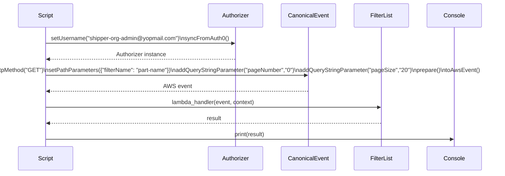
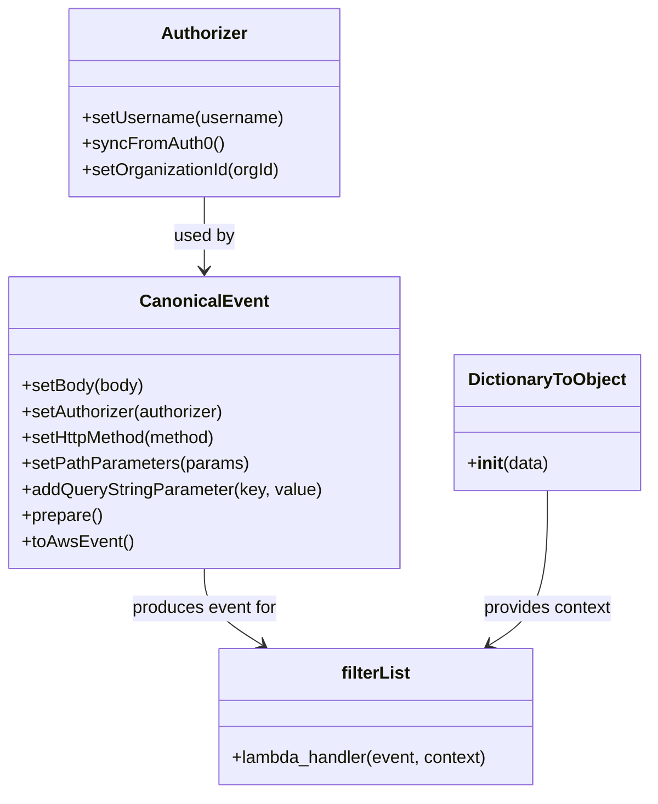
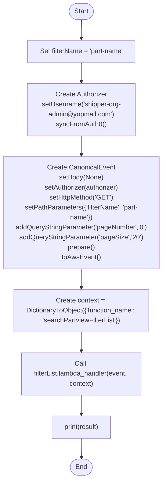

# Diagram: platform/tools/ide_local_testing/localTest/test/partview/filterSearch/getFilterList.py

> Auto-generated by Obscura crawlers

## Diagram 1

### SVG

<svg id="container" width="1422" xmlns="http://www.w3.org/2000/svg" height="507" viewBox="-50 -10 1422 507" role="graphics-document document" aria-roledescription="sequence"><g><rect x="1172" y="421" fill="#eaeaea" stroke="#666" width="150" height="65" name="Console" rx="3" ry="3" class="actor actor-bottom"></rect><text x="1247" y="453.5" dominant-baseline="central" alignment-baseline="central" class="actor actor-box" style="text-anchor: middle; font-size: 16px; font-weight: 400;"><tspan x="1247" dy="0">Console</tspan></text></g><g><rect x="972" y="421" fill="#eaeaea" stroke="#666" width="150" height="65" name="FilterList" rx="3" ry="3" class="actor actor-bottom"></rect><text x="1047" y="453.5" dominant-baseline="central" alignment-baseline="central" class="actor actor-box" style="text-anchor: middle; font-size: 16px; font-weight: 400;"><tspan x="1047" dy="0">FilterList</tspan></text></g><g><rect x="772" y="421" fill="#eaeaea" stroke="#666" width="150" height="65" name="CanonicalEvent" rx="3" ry="3" class="actor actor-bottom"></rect><text x="847" y="453.5" dominant-baseline="central" alignment-baseline="central" class="actor actor-box" style="text-anchor: middle; font-size: 16px; font-weight: 400;"><tspan x="847" dy="0">CanonicalEvent</tspan></text></g><g><rect x="572" y="421" fill="#eaeaea" stroke="#666" width="150" height="65" name="Authorizer" rx="3" ry="3" class="actor actor-bottom"></rect><text x="647" y="453.5" dominant-baseline="central" alignment-baseline="central" class="actor actor-box" style="text-anchor: middle; font-size: 16px; font-weight: 400;"><tspan x="647" dy="0">Authorizer</tspan></text></g><g><rect x="0" y="421" fill="#eaeaea" stroke="#666" width="150" height="65" name="Script" rx="3" ry="3" class="actor actor-bottom"></rect><text x="75" y="453.5" dominant-baseline="central" alignment-baseline="central" class="actor actor-box" style="text-anchor: middle; font-size: 16px; font-weight: 400;"><tspan x="75" dy="0">Script</tspan></text></g><g><line id="actor4" x1="1247" y1="65" x2="1247" y2="421" class="actor-line 200" stroke-width="0.5px" stroke="#999" name="Console"></line><g id="root-4"><rect x="1172" y="0" fill="#eaeaea" stroke="#666" width="150" height="65" name="Console" rx="3" ry="3" class="actor actor-top"></rect><text x="1247" y="32.5" dominant-baseline="central" alignment-baseline="central" class="actor actor-box" style="text-anchor: middle; font-size: 16px; font-weight: 400;"><tspan x="1247" dy="0">Console</tspan></text></g></g><g><line id="actor3" x1="1047" y1="65" x2="1047" y2="421" class="actor-line 200" stroke-width="0.5px" stroke="#999" name="FilterList"></line><g id="root-3"><rect x="972" y="0" fill="#eaeaea" stroke="#666" width="150" height="65" name="FilterList" rx="3" ry="3" class="actor actor-top"></rect><text x="1047" y="32.5" dominant-baseline="central" alignment-baseline="central" class="actor actor-box" style="text-anchor: middle; font-size: 16px; font-weight: 400;"><tspan x="1047" dy="0">FilterList</tspan></text></g></g><g><line id="actor2" x1="847" y1="65" x2="847" y2="421" class="actor-line 200" stroke-width="0.5px" stroke="#999" name="CanonicalEvent"></line><g id="root-2"><rect x="772" y="0" fill="#eaeaea" stroke="#666" width="150" height="65" name="CanonicalEvent" rx="3" ry="3" class="actor actor-top"></rect><text x="847" y="32.5" dominant-baseline="central" alignment-baseline="central" class="actor actor-box" style="text-anchor: middle; font-size: 16px; font-weight: 400;"><tspan x="847" dy="0">CanonicalEvent</tspan></text></g></g><g><line id="actor1" x1="647" y1="65" x2="647" y2="421" class="actor-line 200" stroke-width="0.5px" stroke="#999" name="Authorizer"></line><g id="root-1"><rect x="572" y="0" fill="#eaeaea" stroke="#666" width="150" height="65" name="Authorizer" rx="3" ry="3" class="actor actor-top"></rect><text x="647" y="32.5" dominant-baseline="central" alignment-baseline="central" class="actor actor-box" style="text-anchor: middle; font-size: 16px; font-weight: 400;"><tspan x="647" dy="0">Authorizer</tspan></text></g></g><g><line id="actor0" x1="75" y1="65" x2="75" y2="421" class="actor-line 200" stroke-width="0.5px" stroke="#999" name="Script"></line><g id="root-0"><rect x="0" y="0" fill="#eaeaea" stroke="#666" width="150" height="65" name="Script" rx="3" ry="3" class="actor actor-top"></rect><text x="75" y="32.5" dominant-baseline="central" alignment-baseline="central" class="actor actor-box" style="text-anchor: middle; font-size: 16px; font-weight: 400;"><tspan x="75" dy="0">Script</tspan></text></g></g><g></g><defs><symbol id="computer" width="24" height="24"><path transform="scale(.5)" d="M2 2v13h20v-13h-20zm18 11h-16v-9h16v9zm-10.228 6l.466-1h3.524l.467 1h-4.457zm14.228 3h-24l2-6h2.104l-1.33 4h18.45l-1.297-4h2.073l2 6zm-5-10h-14v-7h14v7z"></path></symbol></defs><defs><symbol id="database" fill-rule="evenodd" clip-rule="evenodd"><path transform="scale(.5)" d="M12.258.001l.256.004.255.005.253.008.251.01.249.012.247.015.246.016.242.019.241.02.239.023.236.024.233.027.231.028.229.031.225.032.223.034.22.036.217.038.214.04.211.041.208.043.205.045.201.046.198.048.194.05.191.051.187.053.183.054.18.056.175.057.172.059.168.06.163.061.16.063.155.064.15.066.074.033.073.033.071.034.07.034.069.035.068.035.067.035.066.035.064.036.064.036.062.036.06.036.06.037.058.037.058.037.055.038.055.038.053.038.052.038.051.039.05.039.048.039.047.039.045.04.044.04.043.04.041.04.04.041.039.041.037.041.036.041.034.041.033.042.032.042.03.042.029.042.027.042.026.043.024.043.023.043.021.043.02.043.018.044.017.043.015.044.013.044.012.044.011.045.009.044.007.045.006.045.004.045.002.045.001.045v17l-.001.045-.002.045-.004.045-.006.045-.007.045-.009.044-.011.045-.012.044-.013.044-.015.044-.017.043-.018.044-.02.043-.021.043-.023.043-.024.043-.026.043-.027.042-.029.042-.03.042-.032.042-.033.042-.034.041-.036.041-.037.041-.039.041-.04.041-.041.04-.043.04-.044.04-.045.04-.047.039-.048.039-.05.039-.051.039-.052.038-.053.038-.055.038-.055.038-.058.037-.058.037-.06.037-.06.036-.062.036-.064.036-.064.036-.066.035-.067.035-.068.035-.069.035-.07.034-.071.034-.073.033-.074.033-.15.066-.155.064-.16.063-.163.061-.168.06-.172.059-.175.057-.18.056-.183.054-.187.053-.191.051-.194.05-.198.048-.201.046-.205.045-.208.043-.211.041-.214.04-.217.038-.22.036-.223.034-.225.032-.229.031-.231.028-.233.027-.236.024-.239.023-.241.02-.242.019-.246.016-.247.015-.249.012-.251.01-.253.008-.255.005-.256.004-.258.001-.258-.001-.256-.004-.255-.005-.253-.008-.251-.01-.249-.012-.247-.015-.245-.016-.243-.019-.241-.02-.238-.023-.236-.024-.234-.027-.231-.028-.228-.031-.226-.032-.223-.034-.22-.036-.217-.038-.214-.04-.211-.041-.208-.043-.204-.045-.201-.046-.198-.048-.195-.05-.19-.051-.187-.053-.184-.054-.179-.056-.176-.057-.172-.059-.167-.06-.164-.061-.159-.063-.155-.064-.151-.066-.074-.033-.072-.033-.072-.034-.07-.034-.069-.035-.068-.035-.067-.035-.066-.035-.064-.036-.063-.036-.062-.036-.061-.036-.06-.037-.058-.037-.057-.037-.056-.038-.055-.038-.053-.038-.052-.038-.051-.039-.049-.039-.049-.039-.046-.039-.046-.04-.044-.04-.043-.04-.041-.04-.04-.041-.039-.041-.037-.041-.036-.041-.034-.041-.033-.042-.032-.042-.03-.042-.029-.042-.027-.042-.026-.043-.024-.043-.023-.043-.021-.043-.02-.043-.018-.044-.017-.043-.015-.044-.013-.044-.012-.044-.011-.045-.009-.044-.007-.045-.006-.045-.004-.045-.002-.045-.001-.045v-17l.001-.045.002-.045.004-.045.006-.045.007-.045.009-.044.011-.045.012-.044.013-.044.015-.044.017-.043.018-.044.02-.043.021-.043.023-.043.024-.043.026-.043.027-.042.029-.042.03-.042.032-.042.033-.042.034-.041.036-.041.037-.041.039-.041.04-.041.041-.04.043-.04.044-.04.046-.04.046-.039.049-.039.049-.039.051-.039.052-.038.053-.038.055-.038.056-.038.057-.037.058-.037.06-.037.061-.036.062-.036.063-.036.064-.036.066-.035.067-.035.068-.035.069-.035.07-.034.072-.034.072-.033.074-.033.151-.066.155-.064.159-.063.164-.061.167-.06.172-.059.176-.057.179-.056.184-.054.187-.053.19-.051.195-.05.198-.048.201-.046.204-.045.208-.043.211-.041.214-.04.217-.038.22-.036.223-.034.226-.032.228-.031.231-.028.234-.027.236-.024.238-.023.241-.02.243-.019.245-.016.247-.015.249-.012.251-.01.253-.008.255-.005.256-.004.258-.001.258.001zm-9.258 20.499v.01l.001.021.003.021.004.022.005.021.006.022.007.022.009.023.01.022.011.023.012.023.013.023.015.023.016.024.017.023.018.024.019.024.021.024.022.025.023.024.024.025.052.049.056.05.061.051.066.051.07.051.075.051.079.052.084.052.088.052.092.052.097.052.102.051.105.052.11.052.114.051.119.051.123.051.127.05.131.05.135.05.139.048.144.049.147.047.152.047.155.047.16.045.163.045.167.043.171.043.176.041.178.041.183.039.187.039.19.037.194.035.197.035.202.033.204.031.209.03.212.029.216.027.219.025.222.024.226.021.23.02.233.018.236.016.24.015.243.012.246.01.249.008.253.005.256.004.259.001.26-.001.257-.004.254-.005.25-.008.247-.011.244-.012.241-.014.237-.016.233-.018.231-.021.226-.021.224-.024.22-.026.216-.027.212-.028.21-.031.205-.031.202-.034.198-.034.194-.036.191-.037.187-.039.183-.04.179-.04.175-.042.172-.043.168-.044.163-.045.16-.046.155-.046.152-.047.148-.048.143-.049.139-.049.136-.05.131-.05.126-.05.123-.051.118-.052.114-.051.11-.052.106-.052.101-.052.096-.052.092-.052.088-.053.083-.051.079-.052.074-.052.07-.051.065-.051.06-.051.056-.05.051-.05.023-.024.023-.025.021-.024.02-.024.019-.024.018-.024.017-.024.015-.023.014-.024.013-.023.012-.023.01-.023.01-.022.008-.022.006-.022.006-.022.004-.022.004-.021.001-.021.001-.021v-4.127l-.077.055-.08.053-.083.054-.085.053-.087.052-.09.052-.093.051-.095.05-.097.05-.1.049-.102.049-.105.048-.106.047-.109.047-.111.046-.114.045-.115.045-.118.044-.12.043-.122.042-.124.042-.126.041-.128.04-.13.04-.132.038-.134.038-.135.037-.138.037-.139.035-.142.035-.143.034-.144.033-.147.032-.148.031-.15.03-.151.03-.153.029-.154.027-.156.027-.158.026-.159.025-.161.024-.162.023-.163.022-.165.021-.166.02-.167.019-.169.018-.169.017-.171.016-.173.015-.173.014-.175.013-.175.012-.177.011-.178.01-.179.008-.179.008-.181.006-.182.005-.182.004-.184.003-.184.002h-.37l-.184-.002-.184-.003-.182-.004-.182-.005-.181-.006-.179-.008-.179-.008-.178-.01-.176-.011-.176-.012-.175-.013-.173-.014-.172-.015-.171-.016-.17-.017-.169-.018-.167-.019-.166-.02-.165-.021-.163-.022-.162-.023-.161-.024-.159-.025-.157-.026-.156-.027-.155-.027-.153-.029-.151-.03-.15-.03-.148-.031-.146-.032-.145-.033-.143-.034-.141-.035-.14-.035-.137-.037-.136-.037-.134-.038-.132-.038-.13-.04-.128-.04-.126-.041-.124-.042-.122-.042-.12-.044-.117-.043-.116-.045-.113-.045-.112-.046-.109-.047-.106-.047-.105-.048-.102-.049-.1-.049-.097-.05-.095-.05-.093-.052-.09-.051-.087-.052-.085-.053-.083-.054-.08-.054-.077-.054v4.127zm0-5.654v.011l.001.021.003.021.004.021.005.022.006.022.007.022.009.022.01.022.011.023.012.023.013.023.015.024.016.023.017.024.018.024.019.024.021.024.022.024.023.025.024.024.052.05.056.05.061.05.066.051.07.051.075.052.079.051.084.052.088.052.092.052.097.052.102.052.105.052.11.051.114.051.119.052.123.05.127.051.131.05.135.049.139.049.144.048.147.048.152.047.155.046.16.045.163.045.167.044.171.042.176.042.178.04.183.04.187.038.19.037.194.036.197.034.202.033.204.032.209.03.212.028.216.027.219.025.222.024.226.022.23.02.233.018.236.016.24.014.243.012.246.01.249.008.253.006.256.003.259.001.26-.001.257-.003.254-.006.25-.008.247-.01.244-.012.241-.015.237-.016.233-.018.231-.02.226-.022.224-.024.22-.025.216-.027.212-.029.21-.03.205-.032.202-.033.198-.035.194-.036.191-.037.187-.039.183-.039.179-.041.175-.042.172-.043.168-.044.163-.045.16-.045.155-.047.152-.047.148-.048.143-.048.139-.05.136-.049.131-.05.126-.051.123-.051.118-.051.114-.052.11-.052.106-.052.101-.052.096-.052.092-.052.088-.052.083-.052.079-.052.074-.051.07-.052.065-.051.06-.05.056-.051.051-.049.023-.025.023-.024.021-.025.02-.024.019-.024.018-.024.017-.024.015-.023.014-.023.013-.024.012-.022.01-.023.01-.023.008-.022.006-.022.006-.022.004-.021.004-.022.001-.021.001-.021v-4.139l-.077.054-.08.054-.083.054-.085.052-.087.053-.09.051-.093.051-.095.051-.097.05-.1.049-.102.049-.105.048-.106.047-.109.047-.111.046-.114.045-.115.044-.118.044-.12.044-.122.042-.124.042-.126.041-.128.04-.13.039-.132.039-.134.038-.135.037-.138.036-.139.036-.142.035-.143.033-.144.033-.147.033-.148.031-.15.03-.151.03-.153.028-.154.028-.156.027-.158.026-.159.025-.161.024-.162.023-.163.022-.165.021-.166.02-.167.019-.169.018-.169.017-.171.016-.173.015-.173.014-.175.013-.175.012-.177.011-.178.009-.179.009-.179.007-.181.007-.182.005-.182.004-.184.003-.184.002h-.37l-.184-.002-.184-.003-.182-.004-.182-.005-.181-.007-.179-.007-.179-.009-.178-.009-.176-.011-.176-.012-.175-.013-.173-.014-.172-.015-.171-.016-.17-.017-.169-.018-.167-.019-.166-.02-.165-.021-.163-.022-.162-.023-.161-.024-.159-.025-.157-.026-.156-.027-.155-.028-.153-.028-.151-.03-.15-.03-.148-.031-.146-.033-.145-.033-.143-.033-.141-.035-.14-.036-.137-.036-.136-.037-.134-.038-.132-.039-.13-.039-.128-.04-.126-.041-.124-.042-.122-.043-.12-.043-.117-.044-.116-.044-.113-.046-.112-.046-.109-.046-.106-.047-.105-.048-.102-.049-.1-.049-.097-.05-.095-.051-.093-.051-.09-.051-.087-.053-.085-.052-.083-.054-.08-.054-.077-.054v4.139zm0-5.666v.011l.001.02.003.022.004.021.005.022.006.021.007.022.009.023.01.022.011.023.012.023.013.023.015.023.016.024.017.024.018.023.019.024.021.025.022.024.023.024.024.025.052.05.056.05.061.05.066.051.07.051.075.052.079.051.084.052.088.052.092.052.097.052.102.052.105.051.11.052.114.051.119.051.123.051.127.05.131.05.135.05.139.049.144.048.147.048.152.047.155.046.16.045.163.045.167.043.171.043.176.042.178.04.183.04.187.038.19.037.194.036.197.034.202.033.204.032.209.03.212.028.216.027.219.025.222.024.226.021.23.02.233.018.236.017.24.014.243.012.246.01.249.008.253.006.256.003.259.001.26-.001.257-.003.254-.006.25-.008.247-.01.244-.013.241-.014.237-.016.233-.018.231-.02.226-.022.224-.024.22-.025.216-.027.212-.029.21-.03.205-.032.202-.033.198-.035.194-.036.191-.037.187-.039.183-.039.179-.041.175-.042.172-.043.168-.044.163-.045.16-.045.155-.047.152-.047.148-.048.143-.049.139-.049.136-.049.131-.051.126-.05.123-.051.118-.052.114-.051.11-.052.106-.052.101-.052.096-.052.092-.052.088-.052.083-.052.079-.052.074-.052.07-.051.065-.051.06-.051.056-.05.051-.049.023-.025.023-.025.021-.024.02-.024.019-.024.018-.024.017-.024.015-.023.014-.024.013-.023.012-.023.01-.022.01-.023.008-.022.006-.022.006-.022.004-.022.004-.021.001-.021.001-.021v-4.153l-.077.054-.08.054-.083.053-.085.053-.087.053-.09.051-.093.051-.095.051-.097.05-.1.049-.102.048-.105.048-.106.048-.109.046-.111.046-.114.046-.115.044-.118.044-.12.043-.122.043-.124.042-.126.041-.128.04-.13.039-.132.039-.134.038-.135.037-.138.036-.139.036-.142.034-.143.034-.144.033-.147.032-.148.032-.15.03-.151.03-.153.028-.154.028-.156.027-.158.026-.159.024-.161.024-.162.023-.163.023-.165.021-.166.02-.167.019-.169.018-.169.017-.171.016-.173.015-.173.014-.175.013-.175.012-.177.01-.178.01-.179.009-.179.007-.181.006-.182.006-.182.004-.184.003-.184.001-.185.001-.185-.001-.184-.001-.184-.003-.182-.004-.182-.006-.181-.006-.179-.007-.179-.009-.178-.01-.176-.01-.176-.012-.175-.013-.173-.014-.172-.015-.171-.016-.17-.017-.169-.018-.167-.019-.166-.02-.165-.021-.163-.023-.162-.023-.161-.024-.159-.024-.157-.026-.156-.027-.155-.028-.153-.028-.151-.03-.15-.03-.148-.032-.146-.032-.145-.033-.143-.034-.141-.034-.14-.036-.137-.036-.136-.037-.134-.038-.132-.039-.13-.039-.128-.041-.126-.041-.124-.041-.122-.043-.12-.043-.117-.044-.116-.044-.113-.046-.112-.046-.109-.046-.106-.048-.105-.048-.102-.048-.1-.05-.097-.049-.095-.051-.093-.051-.09-.052-.087-.052-.085-.053-.083-.053-.08-.054-.077-.054v4.153zm8.74-8.179l-.257.004-.254.005-.25.008-.247.011-.244.012-.241.014-.237.016-.233.018-.231.021-.226.022-.224.023-.22.026-.216.027-.212.028-.21.031-.205.032-.202.033-.198.034-.194.036-.191.038-.187.038-.183.04-.179.041-.175.042-.172.043-.168.043-.163.045-.16.046-.155.046-.152.048-.148.048-.143.048-.139.049-.136.05-.131.05-.126.051-.123.051-.118.051-.114.052-.11.052-.106.052-.101.052-.096.052-.092.052-.088.052-.083.052-.079.052-.074.051-.07.052-.065.051-.06.05-.056.05-.051.05-.023.025-.023.024-.021.024-.02.025-.019.024-.018.024-.017.023-.015.024-.014.023-.013.023-.012.023-.01.023-.01.022-.008.022-.006.023-.006.021-.004.022-.004.021-.001.021-.001.021.001.021.001.021.004.021.004.022.006.021.006.023.008.022.01.022.01.023.012.023.013.023.014.023.015.024.017.023.018.024.019.024.02.025.021.024.023.024.023.025.051.05.056.05.06.05.065.051.07.052.074.051.079.052.083.052.088.052.092.052.096.052.101.052.106.052.11.052.114.052.118.051.123.051.126.051.131.05.136.05.139.049.143.048.148.048.152.048.155.046.16.046.163.045.168.043.172.043.175.042.179.041.183.04.187.038.191.038.194.036.198.034.202.033.205.032.21.031.212.028.216.027.22.026.224.023.226.022.231.021.233.018.237.016.241.014.244.012.247.011.25.008.254.005.257.004.26.001.26-.001.257-.004.254-.005.25-.008.247-.011.244-.012.241-.014.237-.016.233-.018.231-.021.226-.022.224-.023.22-.026.216-.027.212-.028.21-.031.205-.032.202-.033.198-.034.194-.036.191-.038.187-.038.183-.04.179-.041.175-.042.172-.043.168-.043.163-.045.16-.046.155-.046.152-.048.148-.048.143-.048.139-.049.136-.05.131-.05.126-.051.123-.051.118-.051.114-.052.11-.052.106-.052.101-.052.096-.052.092-.052.088-.052.083-.052.079-.052.074-.051.07-.052.065-.051.06-.05.056-.05.051-.05.023-.025.023-.024.021-.024.02-.025.019-.024.018-.024.017-.023.015-.024.014-.023.013-.023.012-.023.01-.023.01-.022.008-.022.006-.023.006-.021.004-.022.004-.021.001-.021.001-.021-.001-.021-.001-.021-.004-.021-.004-.022-.006-.021-.006-.023-.008-.022-.01-.022-.01-.023-.012-.023-.013-.023-.014-.023-.015-.024-.017-.023-.018-.024-.019-.024-.02-.025-.021-.024-.023-.024-.023-.025-.051-.05-.056-.05-.06-.05-.065-.051-.07-.052-.074-.051-.079-.052-.083-.052-.088-.052-.092-.052-.096-.052-.101-.052-.106-.052-.11-.052-.114-.052-.118-.051-.123-.051-.126-.051-.131-.05-.136-.05-.139-.049-.143-.048-.148-.048-.152-.048-.155-.046-.16-.046-.163-.045-.168-.043-.172-.043-.175-.042-.179-.041-.183-.04-.187-.038-.191-.038-.194-.036-.198-.034-.202-.033-.205-.032-.21-.031-.212-.028-.216-.027-.22-.026-.224-.023-.226-.022-.231-.021-.233-.018-.237-.016-.241-.014-.244-.012-.247-.011-.25-.008-.254-.005-.257-.004-.26-.001-.26.001z"></path></symbol></defs><defs><symbol id="clock" width="24" height="24"><path transform="scale(.5)" d="M12 2c5.514 0 10 4.486 10 10s-4.486 10-10 10-10-4.486-10-10 4.486-10 10-10zm0-2c-6.627 0-12 5.373-12 12s5.373 12 12 12 12-5.373 12-12-5.373-12-12-12zm5.848 12.459c.202.038.202.333.001.372-1.907.361-6.045 1.111-6.547 1.111-.719 0-1.301-.582-1.301-1.301 0-.512.77-5.447 1.125-7.445.034-.192.312-.181.343.014l.985 6.238 5.394 1.011z"></path></symbol></defs><defs><marker id="arrowhead" refX="7.9" refY="5" markerUnits="userSpaceOnUse" markerWidth="12" markerHeight="12" orient="auto-start-reverse"><path d="M -1 0 L 10 5 L 0 10 z"></path></marker></defs><defs><marker id="crosshead" markerWidth="15" markerHeight="8" orient="auto" refX="4" refY="4.5"><path fill="none" stroke="#000000" stroke-width="1pt" d="M 1,2 L 6,7 M 6,2 L 1,7" style="stroke-dasharray: 0, 0;"></path></marker></defs><defs><marker id="filled-head" refX="15.5" refY="7" markerWidth="20" markerHeight="28" orient="auto"><path d="M 18,7 L9,13 L14,7 L9,1 Z"></path></marker></defs><defs><marker id="sequencenumber" refX="15" refY="15" markerWidth="60" markerHeight="40" orient="auto"><circle cx="15" cy="15" r="6"></circle></marker></defs><text x="360" y="80" text-anchor="middle" dominant-baseline="middle" alignment-baseline="middle" class="messageText" dy="1em" style="font-size: 16px; font-weight: 400;">setUsername("shipper-org-admin@yopmail.com")\nsyncFromAuth0()</text><line x1="76" y1="113" x2="643" y2="113" class="messageLine0" stroke-width="2" stroke="none" marker-end="url(#arrowhead)" style="fill: none;"></line><text x="363" y="128" text-anchor="middle" dominant-baseline="middle" alignment-baseline="middle" class="messageText" dy="1em" style="font-size: 16px; font-weight: 400;">Authorizer instance</text><line x1="646" y1="161" x2="79" y2="161" class="messageLine1" stroke-width="2" stroke="none" marker-end="url(#arrowhead)" style="stroke-dasharray: 3, 3; fill: none;"></line><text x="460" y="176" text-anchor="middle" dominant-baseline="middle" alignment-baseline="middle" class="messageText" dy="1em" style="font-size: 16px; font-weight: 400;">setBody(None)\nsetAuthorizer(authorizer)\nsetHttpMethod("GET")\nsetPathParameters({"filterName": "part-name"})\naddQueryStringParameter("pageNumber","0")\naddQueryStringParameter("pageSize","20")\nprepare()\ntoAwsEvent()</text><line x1="76" y1="209" x2="843" y2="209" class="messageLine0" stroke-width="2" stroke="none" marker-end="url(#arrowhead)" style="fill: none;"></line><text x="463" y="224" text-anchor="middle" dominant-baseline="middle" alignment-baseline="middle" class="messageText" dy="1em" style="font-size: 16px; font-weight: 400;">AWS event</text><line x1="846" y1="257" x2="79" y2="257" class="messageLine1" stroke-width="2" stroke="none" marker-end="url(#arrowhead)" style="stroke-dasharray: 3, 3; fill: none;"></line><text x="560" y="272" text-anchor="middle" dominant-baseline="middle" alignment-baseline="middle" class="messageText" dy="1em" style="font-size: 16px; font-weight: 400;">lambda_handler(event, context)</text><line x1="76" y1="305" x2="1043" y2="305" class="messageLine0" stroke-width="2" stroke="none" marker-end="url(#arrowhead)" style="fill: none;"></line><text x="563" y="320" text-anchor="middle" dominant-baseline="middle" alignment-baseline="middle" class="messageText" dy="1em" style="font-size: 16px; font-weight: 400;">result</text><line x1="1046" y1="353" x2="79" y2="353" class="messageLine1" stroke-width="2" stroke="none" marker-end="url(#arrowhead)" style="stroke-dasharray: 3, 3; fill: none;"></line><text x="660" y="368" text-anchor="middle" dominant-baseline="middle" alignment-baseline="middle" class="messageText" dy="1em" style="font-size: 16px; font-weight: 400;">print(result)</text><line x1="76" y1="401" x2="1243" y2="401" class="messageLine0" stroke-width="2" stroke="none" marker-end="url(#arrowhead)" style="fill: none;"></line></svg>

## Diagram 2

### SVG

<svg id="container" width="592.4296875" xmlns="http://www.w3.org/2000/svg" class="classDiagram" height="734" viewBox="0 0 592.4296875 734" role="graphics-document document" aria-roledescription="class"><g><defs><marker id="container_class-aggregationStart" class="marker aggregation class" refX="18" refY="7" markerWidth="190" markerHeight="240" orient="auto"><path d="M 18,7 L9,13 L1,7 L9,1 Z"></path></marker></defs><defs><marker id="container_class-aggregationEnd" class="marker aggregation class" refX="1" refY="7" markerWidth="20" markerHeight="28" orient="auto"><path d="M 18,7 L9,13 L1,7 L9,1 Z"></path></marker></defs><defs><marker id="container_class-extensionStart" class="marker extension class" refX="18" refY="7" markerWidth="190" markerHeight="240" orient="auto"><path d="M 1,7 L18,13 V 1 Z"></path></marker></defs><defs><marker id="container_class-extensionEnd" class="marker extension class" refX="1" refY="7" markerWidth="20" markerHeight="28" orient="auto"><path d="M 1,1 V 13 L18,7 Z"></path></marker></defs><defs><marker id="container_class-compositionStart" class="marker composition class" refX="18" refY="7" markerWidth="190" markerHeight="240" orient="auto"><path d="M 18,7 L9,13 L1,7 L9,1 Z"></path></marker></defs><defs><marker id="container_class-compositionEnd" class="marker composition class" refX="1" refY="7" markerWidth="20" markerHeight="28" orient="auto"><path d="M 18,7 L9,13 L1,7 L9,1 Z"></path></marker></defs><defs><marker id="container_class-dependencyStart" class="marker dependency class" refX="6" refY="7" markerWidth="190" markerHeight="240" orient="auto"><path d="M 5,7 L9,13 L1,7 L9,1 Z"></path></marker></defs><defs><marker id="container_class-dependencyEnd" class="marker dependency class" refX="13" refY="7" markerWidth="20" markerHeight="28" orient="auto"><path d="M 18,7 L9,13 L14,7 L9,1 Z"></path></marker></defs><defs><marker id="container_class-lollipopStart" class="marker lollipop class" refX="13" refY="7" markerWidth="190" markerHeight="240" orient="auto"><circle stroke="black" fill="transparent" cx="7" cy="7" r="6"></circle></marker></defs><defs><marker id="container_class-lollipopEnd" class="marker lollipop class" refX="1" refY="7" markerWidth="190" markerHeight="240" orient="auto"><circle stroke="black" fill="transparent" cx="7" cy="7" r="6"></circle></marker></defs><g class="root"><g class="clusters"></g><g class="edgePaths"><path d="M186.441,182L186.441,188.167C186.441,194.333,186.441,206.667,186.441,218C186.441,229.333,186.441,239.667,186.441,244.833L186.441,250" id="id_Authorizer_CanonicalEvent_1" class="edge-thickness-normal edge-pattern-solid relation" style=";;;" data-edge="true" data-et="edge" data-id="id_Authorizer_CanonicalEvent_1" data-points="W3sieCI6MTg2LjQ0MTQwNjI1LCJ5IjoxODJ9LHsieCI6MTg2LjQ0MTQwNjI1LCJ5IjoyMTl9LHsieCI6MTg2LjQ0MTQwNjI1LCJ5IjoyNTZ9XQ==" marker-end="url(#container_class-dependencyEnd)"></path><path d="M186.441,526L186.441,532.167C186.441,538.333,186.441,550.667,195.256,562.462C204.071,574.257,221.7,585.514,230.515,591.142L239.329,596.771" id="id_CanonicalEvent_filterList_2" class="edge-thickness-normal edge-pattern-solid relation" style=";;;" data-edge="true" data-et="edge" data-id="id_CanonicalEvent_filterList_2" data-points="W3sieCI6MTg2LjQ0MTQwNjI1LCJ5Ijo1MjZ9LHsieCI6MTg2LjQ0MTQwNjI1LCJ5Ijo1NjN9LHsieCI6MjQ0LjM4NjE1MjM0Mzc0OTk4LCJ5Ijo2MDB9XQ==" marker-end="url(#container_class-dependencyEnd)"></path><path d="M499.656,454L499.656,472.167C499.656,490.333,499.656,526.667,490.842,550.462C482.027,574.257,464.398,585.514,455.583,591.142L446.768,596.771" id="id_DictionaryToObject_filterList_3" class="edge-thickness-normal edge-pattern-solid relation" style=";;;" data-edge="true" data-et="edge" data-id="id_DictionaryToObject_filterList_3" data-points="W3sieCI6NDk5LjY1NjI1LCJ5Ijo0NTR9LHsieCI6NDk5LjY1NjI1LCJ5Ijo1NjN9LHsieCI6NDQxLjcxMTUwMzkwNjI1LCJ5Ijo2MDB9XQ==" marker-end="url(#container_class-dependencyEnd)"></path></g><g class="edgeLabels"><g class="edgeLabel" transform="translate(186.44140625, 219)"><g class="label" data-id="id_Authorizer_CanonicalEvent_1" transform="translate(-28.3125, -12)"><foreignObject width="56.625" height="24">

used by

</foreignObject></g></g><g class="edgeLabel" transform="translate(186.44140625, 563)"><g class="label" data-id="id_CanonicalEvent_filterList_2" transform="translate(-68.2421875, -12)"><foreignObject width="136.484375" height="24">

produces event for

</foreignObject></g></g><g class="edgeLabel" transform="translate(499.65625, 563)"><g class="label" data-id="id_DictionaryToObject_filterList_3" transform="translate(-60.28125, -12)"><foreignObject width="120.5625" height="24">

provides context

</foreignObject></g></g></g><g class="nodes"><g class="node default" id="classId-Authorizer-0" transform="translate(186.44140625, 95)"><g class="basic label-container"><path d="M-124.13671875 -87 L124.13671875 -87 L124.13671875 87 L-124.13671875 87" stroke="none" stroke-width="0" fill="#ECECFF" style=""></path><path d="M-124.13671875 -87 C-70.81001654798689 -87, -17.483314345973767 -87, 124.13671875 -87 M-124.13671875 -87 C-47.30991747428844 -87, 29.51688380142312 -87, 124.13671875 -87 M124.13671875 -87 C124.13671875 -36.00930999357118, 124.13671875 14.981380012857642, 124.13671875 87 M124.13671875 -87 C124.13671875 -26.17145719134937, 124.13671875 34.65708561730126, 124.13671875 87 M124.13671875 87 C58.73442915073373 87, -6.667860448532537 87, -124.13671875 87 M124.13671875 87 C33.87474715152355 87, -56.3872244469529 87, -124.13671875 87 M-124.13671875 87 C-124.13671875 26.692304062134056, -124.13671875 -33.61539187573189, -124.13671875 -87 M-124.13671875 87 C-124.13671875 44.14797808500883, -124.13671875 1.2959561700176607, -124.13671875 -87" stroke="#9370DB" stroke-width="1.3" fill="none" stroke-dasharray="0 0" style=""></path></g><g class="annotation-group text" transform="translate(0, -63)"></g><g class="label-group text" transform="translate(-38.3671875, -63)"><g class="label" style="font-weight: bolder" transform="translate(0,-12)"><foreignObject width="76.734375" height="24">

Authorizer

</foreignObject></g></g><g class="members-group text" transform="translate(-112.13671875, -15)"></g><g class="methods-group text" transform="translate(-112.13671875, 15)"><g class="label" style="" transform="translate(0,-12)"><foreignObject width="185.90625" height="24">

+setUsername(username)

</foreignObject></g><g class="label" style="" transform="translate(0,12)"><foreignObject width="129.0625" height="24">

+syncFromAuth0()

</foreignObject></g><g class="label" style="" transform="translate(0,36)"><foreignObject width="184.578125" height="24">

+setOrganizationId(orgId)

</foreignObject></g></g><g class="divider" style=""><path d="M-124.13671875 -39 C-34.831799445452006 -39, 54.47311985909599 -39, 124.13671875 -39 M-124.13671875 -39 C-58.63695129838942 -39, 6.862816153221161 -39, 124.13671875 -39" stroke="#9370DB" stroke-width="1.3" fill="none" stroke-dasharray="0 0" style=""></path></g><g class="divider" style=""><path d="M-124.13671875 -15 C-58.46548685865166 -15, 7.205745032696683 -15, 124.13671875 -15 M-124.13671875 -15 C-58.40555886704304 -15, 7.325601015913918 -15, 124.13671875 -15" stroke="#9370DB" stroke-width="1.3" fill="none" stroke-dasharray="0 0" style=""></path></g></g><g class="node default" id="classId-CanonicalEvent-1" transform="translate(186.44140625, 391)"><g class="basic label-container"><path d="M-178.44140625 -135 L178.44140625 -135 L178.44140625 135 L-178.44140625 135" stroke="none" stroke-width="0" fill="#ECECFF" style=""></path><path d="M-178.44140625 -135 C-101.49808108819194 -135, -24.554755926383876 -135, 178.44140625 -135 M-178.44140625 -135 C-73.66182282537426 -135, 31.117760599251483 -135, 178.44140625 -135 M178.44140625 -135 C178.44140625 -77.01171047027235, 178.44140625 -19.023420940544696, 178.44140625 135 M178.44140625 -135 C178.44140625 -66.84014444330667, 178.44140625 1.31971111338666, 178.44140625 135 M178.44140625 135 C103.1428891246668 135, 27.84437199933359 135, -178.44140625 135 M178.44140625 135 C42.069845676222 135, -94.301714897556 135, -178.44140625 135 M-178.44140625 135 C-178.44140625 39.40902093946086, -178.44140625 -56.18195812107828, -178.44140625 -135 M-178.44140625 135 C-178.44140625 44.780728636376736, -178.44140625 -45.43854272724653, -178.44140625 -135" stroke="#9370DB" stroke-width="1.3" fill="none" stroke-dasharray="0 0" style=""></path></g><g class="annotation-group text" transform="translate(0, -111)"></g><g class="label-group text" transform="translate(-55.7109375, -111)"><g class="label" style="font-weight: bolder" transform="translate(0,-12)"><foreignObject width="111.421875" height="24">

CanonicalEvent

</foreignObject></g></g><g class="members-group text" transform="translate(-166.44140625, -63)"></g><g class="methods-group text" transform="translate(-166.44140625, -33)"><g class="label" style="" transform="translate(0,-12)"><foreignObject width="113.125" height="24">

+setBody(body)

</foreignObject></g><g class="label" style="" transform="translate(0,12)"><foreignObject width="190.75" height="24">

+setAuthorizer(authorizer)

</foreignObject></g><g class="label" style="" transform="translate(0,36)"><foreignObject width="184" height="24">

+setHttpMethod(method)

</foreignObject></g><g class="label" style="" transform="translate(0,60)"><foreignObject width="207.6875" height="24">

+setPathParameters(params)

</foreignObject></g><g class="label" style="" transform="translate(0,84)"><foreignObject width="277.171875" height="24">

+addQueryStringParameter(key, value)

</foreignObject></g><g class="label" style="" transform="translate(0,108)"><foreignObject width="74.75" height="24">

+prepare()

</foreignObject></g><g class="label" style="" transform="translate(0,132)"><foreignObject width="101.1875" height="24">

+toAwsEvent()

</foreignObject></g></g><g class="divider" style=""><path d="M-178.44140625 -87 C-73.97875649687066 -87, 30.483893256258682 -87, 178.44140625 -87 M-178.44140625 -87 C-75.32181584192675 -87, 27.7977745661465 -87, 178.44140625 -87" stroke="#9370DB" stroke-width="1.3" fill="none" stroke-dasharray="0 0" style=""></path></g><g class="divider" style=""><path d="M-178.44140625 -63 C-75.8918501453769 -63, 26.657705959246186 -63, 178.44140625 -63 M-178.44140625 -63 C-55.9077900022947 -63, 66.6258262454106 -63, 178.44140625 -63" stroke="#9370DB" stroke-width="1.3" fill="none" stroke-dasharray="0 0" style=""></path></g></g><g class="node default" id="classId-DictionaryToObject-2" transform="translate(499.65625, 391)"><g class="basic label-container"><path d="M-84.7734375 -63 L84.7734375 -63 L84.7734375 63 L-84.7734375 63" stroke="none" stroke-width="0" fill="#ECECFF" style=""></path><path d="M-84.7734375 -63 C-40.46448264074468 -63, 3.8444722185106457 -63, 84.7734375 -63 M-84.7734375 -63 C-50.50933256102649 -63, -16.24522762205298 -63, 84.7734375 -63 M84.7734375 -63 C84.7734375 -35.883789273141616, 84.7734375 -8.767578546283225, 84.7734375 63 M84.7734375 -63 C84.7734375 -13.09859324353792, 84.7734375 36.80281351292416, 84.7734375 63 M84.7734375 63 C36.84059695095397 63, -11.092243598092054 63, -84.7734375 63 M84.7734375 63 C41.11574960593062 63, -2.541938288138766 63, -84.7734375 63 M-84.7734375 63 C-84.7734375 17.06929422029294, -84.7734375 -28.861411559414123, -84.7734375 -63 M-84.7734375 63 C-84.7734375 28.5458157983648, -84.7734375 -5.908368403270401, -84.7734375 -63" stroke="#9370DB" stroke-width="1.3" fill="none" stroke-dasharray="0 0" style=""></path></g><g class="annotation-group text" transform="translate(0, -39)"></g><g class="label-group text" transform="translate(-70.109375, -39)"><g class="label" style="font-weight: bolder" transform="translate(0,-12)"><foreignObject width="140.21875" height="24">

DictionaryToObject

</foreignObject></g></g><g class="members-group text" transform="translate(-72.7734375, 9)"></g><g class="methods-group text" transform="translate(-72.7734375, 39)"><g class="label" style="" transform="translate(0,-12)"><foreignObject width="75.4375" height="24">

+<strong>init</strong>(data)

</foreignObject></g></g><g class="divider" style=""><path d="M-84.7734375 -15 C-28.753116679438577 -15, 27.267204141122846 -15, 84.7734375 -15 M-84.7734375 -15 C-25.57105088964937 -15, 33.63133572070126 -15, 84.7734375 -15" stroke="#9370DB" stroke-width="1.3" fill="none" stroke-dasharray="0 0" style=""></path></g><g class="divider" style=""><path d="M-84.7734375 9 C-21.003782629139742 9, 42.765872241720515 9, 84.7734375 9 M-84.7734375 9 C-25.80440667662409 9, 33.16462414675182 9, 84.7734375 9" stroke="#9370DB" stroke-width="1.3" fill="none" stroke-dasharray="0 0" style=""></path></g></g><g class="node default" id="classId-filterList-3" transform="translate(343.048828125, 663)"><g class="basic label-container"><path d="M-147.62109375 -63 L147.62109375 -63 L147.62109375 63 L-147.62109375 63" stroke="none" stroke-width="0" fill="#ECECFF" style=""></path><path d="M-147.62109375 -63 C-85.32881737718779 -63, -23.036541004375593 -63, 147.62109375 -63 M-147.62109375 -63 C-43.13819510504457 -63, 61.34470353991085 -63, 147.62109375 -63 M147.62109375 -63 C147.62109375 -29.84501093503996, 147.62109375 3.309978129920083, 147.62109375 63 M147.62109375 -63 C147.62109375 -14.320946528356195, 147.62109375 34.35810694328761, 147.62109375 63 M147.62109375 63 C54.15352988530141 63, -39.31403397939718 63, -147.62109375 63 M147.62109375 63 C59.99211022611108 63, -27.63687329777784 63, -147.62109375 63 M-147.62109375 63 C-147.62109375 28.94837531926079, -147.62109375 -5.103249361478419, -147.62109375 -63 M-147.62109375 63 C-147.62109375 19.493097898914783, -147.62109375 -24.013804202170434, -147.62109375 -63" stroke="#9370DB" stroke-width="1.3" fill="none" stroke-dasharray="0 0" style=""></path></g><g class="annotation-group text" transform="translate(0, -39)"></g><g class="label-group text" transform="translate(-31.0546875, -39)"><g class="label" style="font-weight: bolder" transform="translate(0,-12)"><foreignObject width="62.109375" height="24">

filterList

</foreignObject></g></g><g class="members-group text" transform="translate(-135.62109375, 9)"></g><g class="methods-group text" transform="translate(-135.62109375, 39)"><g class="label" style="" transform="translate(0,-12)"><foreignObject width="240.1875" height="24">

+lambda_handler(event, context)

</foreignObject></g></g><g class="divider" style=""><path d="M-147.62109375 -15 C-63.00755922305467 -15, 21.60597530389066 -15, 147.62109375 -15 M-147.62109375 -15 C-48.87060618119149 -15, 49.87988138761702 -15, 147.62109375 -15" stroke="#9370DB" stroke-width="1.3" fill="none" stroke-dasharray="0 0" style=""></path></g><g class="divider" style=""><path d="M-147.62109375 9 C-33.29999378870164 9, 81.02110617259672 9, 147.62109375 9 M-147.62109375 9 C-73.88269665381057 9, -0.14429955762113877 9, 147.62109375 9" stroke="#9370DB" stroke-width="1.3" fill="none" stroke-dasharray="0 0" style=""></path></g></g></g></g></g></svg>

## Diagram 3

### SVG

<svg id="container" width="969.265625" xmlns="http://www.w3.org/2000/svg" class="flowchart" height="1008" viewBox="0 0 969.265625 1008" role="graphics-document document" aria-roledescription="flowchart-v2"><g><marker id="container_flowchart-v2-pointEnd" class="marker flowchart-v2" viewBox="0 0 10 10" refX="5" refY="5" markerUnits="userSpaceOnUse" markerWidth="8" markerHeight="8" orient="auto"><path d="M 0 0 L 10 5 L 0 10 z" class="arrowMarkerPath" style="stroke-width: 1; stroke-dasharray: 1, 0;"></path></marker><marker id="container_flowchart-v2-pointStart" class="marker flowchart-v2" viewBox="0 0 10 10" refX="4.5" refY="5" markerUnits="userSpaceOnUse" markerWidth="8" markerHeight="8" orient="auto"><path d="M 0 5 L 10 10 L 10 0 z" class="arrowMarkerPath" style="stroke-width: 1; stroke-dasharray: 1, 0;"></path></marker><marker id="container_flowchart-v2-circleEnd" class="marker flowchart-v2" viewBox="0 0 10 10" refX="11" refY="5" markerUnits="userSpaceOnUse" markerWidth="11" markerHeight="11" orient="auto"><circle cx="5" cy="5" r="5" class="arrowMarkerPath" style="stroke-width: 1; stroke-dasharray: 1, 0;"></circle></marker><marker id="container_flowchart-v2-circleStart" class="marker flowchart-v2" viewBox="0 0 10 10" refX="-1" refY="5" markerUnits="userSpaceOnUse" markerWidth="11" markerHeight="11" orient="auto"><circle cx="5" cy="5" r="5" class="arrowMarkerPath" style="stroke-width: 1; stroke-dasharray: 1, 0;"></circle></marker><marker id="container_flowchart-v2-crossEnd" class="marker cross flowchart-v2" viewBox="0 0 11 11" refX="12" refY="5.2" markerUnits="userSpaceOnUse" markerWidth="11" markerHeight="11" orient="auto"><path d="M 1,1 l 9,9 M 10,1 l -9,9" class="arrowMarkerPath" style="stroke-width: 2; stroke-dasharray: 1, 0;"></path></marker><marker id="container_flowchart-v2-crossStart" class="marker cross flowchart-v2" viewBox="0 0 11 11" refX="-1" refY="5.2" markerUnits="userSpaceOnUse" markerWidth="11" markerHeight="11" orient="auto"><path d="M 1,1 l 9,9 M 10,1 l -9,9" class="arrowMarkerPath" style="stroke-width: 2; stroke-dasharray: 1, 0;"></path></marker><g class="root"><g class="clusters"></g><g class="edgePaths"><path d="M485.133,47.5L485.049,51.583C484.966,55.667,484.799,63.833,484.716,71.417C484.633,79,484.633,86,484.633,89.5L484.633,93" id="L_Start_SetFilter_0" class="edge-thickness-normal edge-pattern-solid edge-thickness-normal edge-pattern-solid flowchart-link" style=";" data-edge="true" data-et="edge" data-id="L_Start_SetFilter_0" data-points="W3sieCI6NDg1LjEzMjgxMjUsInkiOjQ3LjV9LHsieCI6NDg0LjYzMjgxMjUsInkiOjcyfSx7IngiOjQ4NC42MzI4MTI1LCJ5Ijo5N31d" marker-end="url(#container_flowchart-v2-pointEnd)"></path><path d="M484.633,175L484.633,179.167C484.633,183.333,484.633,191.667,484.633,199.333C484.633,207,484.633,214,484.633,217.5L484.633,221" id="L_SetFilter_CreateAuth_0" class="edge-thickness-normal edge-pattern-solid edge-thickness-normal edge-pattern-solid flowchart-link" style=";" data-edge="true" data-et="edge" data-id="L_SetFilter_CreateAuth_0" data-points="W3sieCI6NDg0LjYzMjgxMjUsInkiOjE3NX0seyJ4Ijo0ODQuNjMyODEyNSwieSI6MjAwfSx7IngiOjQ4NC42MzI4MTI1LCJ5IjoyMjV9XQ==" marker-end="url(#container_flowchart-v2-pointEnd)"></path><path d="M484.633,327L484.633,331.167C484.633,335.333,484.633,343.667,484.633,351.333C484.633,359,484.633,366,484.633,369.5L484.633,373" id="L_CreateAuth_CreateEvent_0" class="edge-thickness-normal edge-pattern-solid edge-thickness-normal edge-pattern-solid flowchart-link" style=";" data-edge="true" data-et="edge" data-id="L_CreateAuth_CreateEvent_0" data-points="W3sieCI6NDg0LjYzMjgxMjUsInkiOjMyN30seyJ4Ijo0ODQuNjMyODEyNSwieSI6MzUyfSx7IngiOjQ4NC42MzI4MTI1LCJ5IjozNzd9XQ==" marker-end="url(#container_flowchart-v2-pointEnd)"></path><path d="M484.633,503L484.633,507.167C484.633,511.333,484.633,519.667,484.633,527.333C484.633,535,484.633,542,484.633,545.5L484.633,549" id="L_CreateEvent_CreateContext_0" class="edge-thickness-normal edge-pattern-solid edge-thickness-normal edge-pattern-solid flowchart-link" style=";" data-edge="true" data-et="edge" data-id="L_CreateEvent_CreateContext_0" data-points="W3sieCI6NDg0LjYzMjgxMjUsInkiOjUwM30seyJ4Ijo0ODQuNjMyODEyNSwieSI6NTI4fSx7IngiOjQ4NC42MzI4MTI1LCJ5Ijo1NTN9XQ==" marker-end="url(#container_flowchart-v2-pointEnd)"></path><path d="M484.633,655L484.633,659.167C484.633,663.333,484.633,671.667,484.633,679.333C484.633,687,484.633,694,484.633,697.5L484.633,701" id="L_CreateContext_CallLambda_0" class="edge-thickness-normal edge-pattern-solid edge-thickness-normal edge-pattern-solid flowchart-link" style=";" data-edge="true" data-et="edge" data-id="L_CreateContext_CallLambda_0" data-points="W3sieCI6NDg0LjYzMjgxMjUsInkiOjY1NX0seyJ4Ijo0ODQuNjMyODEyNSwieSI6NjgwfSx7IngiOjQ4NC42MzI4MTI1LCJ5Ijo3MDV9XQ==" marker-end="url(#container_flowchart-v2-pointEnd)"></path><path d="M484.633,807L484.633,811.167C484.633,815.333,484.633,823.667,484.633,831.333C484.633,839,484.633,846,484.633,849.5L484.633,853" id="L_CallLambda_PrintResult_0" class="edge-thickness-normal edge-pattern-solid edge-thickness-normal edge-pattern-solid flowchart-link" style=";" data-edge="true" data-et="edge" data-id="L_CallLambda_PrintResult_0" data-points="W3sieCI6NDg0LjYzMjgxMjUsInkiOjgwN30seyJ4Ijo0ODQuNjMyODEyNSwieSI6ODMyfSx7IngiOjQ4NC42MzI4MTI1LCJ5Ijo4NTd9XQ==" marker-end="url(#container_flowchart-v2-pointEnd)"></path><path d="M484.633,911L484.633,915.167C484.633,919.333,484.633,927.667,484.703,935.417C484.773,943.167,484.914,950.334,484.984,953.917L485.054,957.501" id="L_PrintResult_End_0" class="edge-thickness-normal edge-pattern-solid edge-thickness-normal edge-pattern-solid flowchart-link" style=";" data-edge="true" data-et="edge" data-id="L_PrintResult_End_0" data-points="W3sieCI6NDg0LjYzMjgxMjUsInkiOjkxMX0seyJ4Ijo0ODQuNjMyODEyNSwieSI6OTM2fSx7IngiOjQ4NS4xMzI4MTI1LCJ5Ijo5NjEuNX1d" marker-end="url(#container_flowchart-v2-pointEnd)"></path></g><g class="edgeLabels"><g class="edgeLabel"><g class="label" data-id="L_Start_SetFilter_0" transform="translate(0, 0)"><foreignObject width="0" height="0">

</foreignObject></g></g><g class="edgeLabel"><g class="label" data-id="L_SetFilter_CreateAuth_0" transform="translate(0, 0)"><foreignObject width="0" height="0">

</foreignObject></g></g><g class="edgeLabel"><g class="label" data-id="L_CreateAuth_CreateEvent_0" transform="translate(0, 0)"><foreignObject width="0" height="0">

</foreignObject></g></g><g class="edgeLabel"><g class="label" data-id="L_CreateEvent_CreateContext_0" transform="translate(0, 0)"><foreignObject width="0" height="0">

</foreignObject></g></g><g class="edgeLabel"><g class="label" data-id="L_CreateContext_CallLambda_0" transform="translate(0, 0)"><foreignObject width="0" height="0">

</foreignObject></g></g><g class="edgeLabel"><g class="label" data-id="L_CallLambda_PrintResult_0" transform="translate(0, 0)"><foreignObject width="0" height="0">

</foreignObject></g></g><g class="edgeLabel"><g class="label" data-id="L_PrintResult_End_0" transform="translate(0, 0)"><foreignObject width="0" height="0">

</foreignObject></g></g></g><g class="nodes"><g class="node default" id="flowchart-Start-0" transform="translate(484.6328125, 27.5)"><g class="basic label-container outer-path"><path d="M-10.3984375 -19.5 C-2.230223479087746 -19.5, 5.937990541824508 -19.5, 10.3984375 -19.5 C10.3984375 -19.5, 10.398437499999998 -19.5, 10.398437499999998 -19.5 C10.71257119855431 -19.489926343711513, 11.02670489710862 -19.47985268742303, 11.6478067896239 -19.45993515863156 C12.121843257547996 -19.414205430683182, 12.595879725472091 -19.36847570273481, 12.892042152847864 -19.3399052695533 C13.340108333716703 -19.267465404235555, 13.788174514585542 -19.19502553891781, 14.126030759676757 -19.140403561325776 C14.445926789214926 -19.06738938010037, 14.765822818753097 -18.994375198874963, 15.34470188623539 -18.862249829261074 C15.672953975421079 -18.76482633222114, 16.00120606460677 -18.667402835181203, 16.543047751460602 -18.50658706670804 C17.001154656350092 -18.337999491014898, 17.459261561239583 -18.16941191532176, 17.716144095147794 -18.074876768247425 C18.081875896736687 -17.91297814873245, 18.44760769832558 -17.751079529217474, 18.85917041279238 -17.568892924097174 C19.09515844279788 -17.445778120000853, 19.331146472803386 -17.322663315904528, 19.967429764076783 -16.990714730406097 C20.338415884089294 -16.765820764298077, 20.709402004101804 -16.540926798190057, 21.036368073605697 -16.342718045390892 C21.348074508476724 -16.125285129978952, 21.65978094334775 -15.907852214567011, 22.061592844578712 -15.627565626425154 C22.273888138261867 -15.458265779127863, 22.486183431945022 -15.288965931830573, 23.03889120850187 -14.848196188198123 C23.348497983813377 -14.567019506606593, 23.658104759124885 -14.285842825015063, 23.964247236767985 -14.007812326905688 C24.258995514224498 -13.703460531148215, 24.553743791681008 -13.39910873539074, 24.833858442968648 -13.10986736009568 C25.120111748493667 -12.773617939151483, 25.406365054018686 -12.437368518207286, 25.644151408126582 -12.158051136245305 C25.888477904138814 -11.830675890190603, 26.132804400151045 -11.503300644135903, 26.391796464640635 -11.156274872382312 C26.564540513345438 -10.890893625299686, 26.73728456205024 -10.62551237821706, 27.073721378604247 -10.108655082055241 C27.307614654278602 -9.69335388683303, 27.541507929952957 -9.278052691610819, 27.6871239742735 -9.019496659696287 C27.896072718386637 -8.585610121758439, 28.105021462499778 -8.15172358382059, 28.22948364880834 -7.893275190886684 C28.37823889840923 -7.525846848385387, 28.52699414801012 -7.15841850588409, 28.698571729970325 -6.734618561215508 C28.847855189960647 -6.285000564813926, 28.997138649950973 -5.835382568412344, 29.09246063421488 -5.548287939305138 C29.197562529619173 -5.147488860678964, 29.302664425023462 -4.74668978205279, 29.40953178754556 -4.339158212148133 C29.495455023779513 -3.8979605539691913, 29.581378260013466 -3.4567628957902494, 29.648482276581777 -3.1121979531509023 C29.68075212400052 -2.861919388973275, 29.713021971419263 -2.611640824795647, 29.808330202509367 -1.872449005199798 C29.839020830194876 -1.3944177059691907, 29.869711457880385 -0.9163864067385834, 29.888418715913414 -0.6250057626472757 C29.888418715913414 -0.3073131474885136, 29.888418715913414 0.010379467670248443, 29.888418715913414 0.625005762647271 C29.857359678914104 1.1087753343149336, 29.8263006419148 1.5925449059825962, 29.808330202509367 1.8724490051997846 C29.76479354486981 2.210110724566708, 29.721256887230254 2.5477724439336322, 29.648482276581777 3.1121979531508885 C29.583603243697326 3.445338074824098, 29.518724210812874 3.7784781964973075, 29.40953178754556 4.339158212148129 C29.30423313674104 4.740707604389711, 29.19893448593652 5.142256996631293, 29.092460634214884 5.548287939305125 C28.99353548269359 5.846234734104831, 28.8946103311723 6.144181528904536, 28.69857172997033 6.734618561215495 C28.598016596531707 6.9829916849101386, 28.49746146309309 7.2313648086047815, 28.229483648808344 7.893275190886679 C28.097108170112158 8.168155704780817, 27.964732691415968 8.443036218674957, 27.687123974273504 9.019496659696284 C27.533748681375496 9.291830023169222, 27.380373388477484 9.56416338664216, 27.07372137860425 10.108655082055236 C26.880544032133148 10.405427361615615, 26.687366685662045 10.702199641175994, 26.39179646464064 11.156274872382301 C26.170677552008023 11.452554070962664, 25.9495586393754 11.748833269543027, 25.644151408126582 12.158051136245302 C25.33396241350502 12.522416779581592, 25.02377341888346 12.88678242291788, 24.83385844296866 13.10986736009567 C24.53774572339019 13.415628054366845, 24.24163300381172 13.72138874863802, 23.96424723676799 14.007812326905684 C23.756810837642323 14.196200576125252, 23.549374438516658 14.384588825344819, 23.038891208501887 14.848196188198111 C22.704309817619805 15.115015943841833, 22.369728426737723 15.381835699485556, 22.061592844578715 15.627565626425152 C21.749424183158617 15.845320971068261, 21.43725552173852 16.06307631571137, 21.036368073605708 16.34271804539089 C20.814221841218895 16.477384396939943, 20.592075608832083 16.612050748488993, 19.967429764076787 16.990714730406093 C19.699870408626403 17.130300274764615, 19.432311053176015 17.269885819123132, 18.859170412792388 17.56889292409717 C18.616413491671114 17.67635421194935, 18.37365657054984 17.78381549980153, 17.716144095147804 18.07487676824742 C17.43767030715226 18.177357696413257, 17.15919651915672 18.279838624579096, 16.543047751460616 18.506587066708033 C16.1823123821706 18.613651430774716, 15.821577012880589 18.7207157948414, 15.344701886235413 18.86224982926107 C14.997155250435757 18.94157508092859, 14.649608614636099 19.020900332596113, 14.126030759676766 19.140403561325773 C13.703641838641 19.208692126403832, 13.281252917605231 19.27698069148189, 12.892042152847878 19.3399052695533 C12.548732637397263 19.373023925618718, 12.205423121946648 19.40614258168414, 11.6478067896239 19.45993515863156 C11.26935789901873 19.472071277947187, 10.890909008413562 19.484207397262818, 10.398437500000004 19.5 C10.398437500000002 19.5, 10.398437500000002 19.5, 10.3984375 19.5 C5.066088632671492 19.5, -0.2662602346570164 19.5, -10.398437499999996 19.5 C-10.671840692048631 19.49123249177803, -10.945243884097264 19.48246498355606, -11.647806789623893 19.45993515863156 C-11.952047739378871 19.430585400111973, -12.25628868913385 19.401235641592386, -12.892042152847871 19.3399052695533 C-13.18797163972805 19.292061685081958, -13.483901126608226 19.244218100610617, -14.126030759676759 19.140403561325773 C-14.605680527878665 19.03092663174094, -15.08533029608057 18.921449702156107, -15.344701886235388 18.862249829261074 C-15.623146669361036 18.779608879215875, -15.901591452486683 18.696967929170675, -16.54304775146059 18.506587066708043 C-16.95799634312005 18.35388214923463, -17.37294493477951 18.201177231761214, -17.716144095147797 18.074876768247425 C-18.169009114378404 17.874406857997528, -18.62187413360901 17.67393694774763, -18.85917041279238 17.568892924097174 C-19.262989561469638 17.358220732890757, -19.666808710146892 17.147548541684344, -19.96742976407678 16.990714730406097 C-20.393343875752716 16.732523092959, -20.819257987428653 16.474331455511905, -21.036368073605686 16.3427180453909 C-21.395557643749587 16.0921629503244, -21.754747213893488 15.841607855257902, -22.061592844578712 15.627565626425156 C-22.386623790034882 15.368362096860572, -22.711654735491052 15.109158567295987, -23.03889120850187 14.848196188198125 C-23.313481101224788 14.598820912877608, -23.588070993947706 14.349445637557091, -23.964247236767974 14.007812326905697 C-24.152481854608702 13.813444629635608, -24.340716472449433 13.619076932365521, -24.833858442968655 13.109867360095677 C-25.139125052259317 12.75128383066072, -25.44439166154998 12.392700301225764, -25.64415140812658 12.158051136245307 C-25.916971950405586 11.792496464054146, -26.18979249268459 11.426941791862985, -26.391796464640635 11.156274872382316 C-26.62800281106588 10.79339849398805, -26.86420915749112 10.430522115593783, -27.073721378604244 10.108655082055249 C-27.20899278781521 9.868466997285667, -27.344264197026174 9.628278912516086, -27.6871239742735 9.019496659696289 C-27.85851593296501 8.66359759027293, -28.029907891656517 8.307698520849572, -28.22948364880834 7.893275190886686 C-28.369196424970497 7.548181932603396, -28.50890920113265 7.203088674320107, -28.698571729970325 6.73461856121551 C-28.82271247667047 6.360726411296594, -28.946853223370617 5.986834261377677, -29.09246063421488 5.5482879393051325 C-29.156733933482297 5.3031859929743685, -29.22100723274971 5.058084046643604, -29.409531787545557 4.339158212148136 C-29.47170076784245 4.019933637742241, -29.53386974813934 3.7007090633363466, -29.648482276581777 3.112197953150904 C-29.701163718615106 2.7036110918678, -29.753845160648435 2.295024230584696, -29.808330202509364 1.872449005199809 C-29.8294254816542 1.5438730047161264, -29.85052076079904 1.2152970042324438, -29.888418715913414 0.6250057626472781 C-29.888418715913414 0.18098818488342144, -29.888418715913414 -0.26302939288043525, -29.888418715913414 -0.6250057626472687 C-29.858403570185455 -1.092515885149773, -29.8283884244575 -1.5600260076522772, -29.808330202509367 -1.8724490051997822 C-29.767461399615136 -2.1894193699894675, -29.72659259672091 -2.5063897347791526, -29.648482276581777 -3.112197953150895 C-29.56029385388923 -3.565026865047389, -29.472105431196685 -4.0178557769438825, -29.40953178754556 -4.339158212148126 C-29.31409554430898 -4.703097969938668, -29.218659301072403 -5.067037727729209, -29.092460634214884 -5.548287939305123 C-28.972298672259658 -5.9101966235056, -28.852136710304432 -6.272105307706078, -28.698571729970332 -6.734618561215485 C-28.52802382948673 -7.155875172729325, -28.35747592900313 -7.577131784243164, -28.229483648808344 -7.893275190886676 C-28.046945359001814 -8.272319855363662, -27.86440706919528 -8.651364519840646, -27.687123974273504 -9.019496659696282 C-27.44606708676604 -9.44751757312254, -27.205010199258574 -9.875538486548795, -27.073721378604247 -10.108655082055243 C-26.836360909973276 -10.473304502082714, -26.599000441342305 -10.837953922110183, -26.39179646464064 -11.156274872382308 C-26.137981884517306 -11.496363286763643, -25.884167304393973 -11.836451701144979, -25.644151408126586 -12.158051136245302 C-25.332262183776603 -12.524413966166406, -25.020372959426624 -12.89077679608751, -24.833858442968662 -13.10986736009567 C-24.622920862845856 -13.327677729869873, -24.41198328272305 -13.545488099644075, -23.964247236767996 -14.007812326905677 C-23.7339918680375 -14.2169241605635, -23.503736499307003 -14.426035994221326, -23.038891208501887 -14.848196188198107 C-22.828520980031183 -15.015960847216608, -22.618150751560478 -15.183725506235106, -22.06159284457872 -15.627565626425149 C-21.791643234606425 -15.815870788411548, -21.521693624634135 -16.004175950397947, -21.03636807360571 -16.342718045390885 C-20.67004937873114 -16.564782590951452, -20.303730683856564 -16.786847136512016, -19.96742976407679 -16.99071473040609 C-19.741345567867803 -17.10866271075448, -19.51526137165882 -17.226610691102866, -18.859170412792388 -17.56889292409717 C-18.60611594740805 -17.68091262932881, -18.353061482023715 -17.79293233456045, -17.716144095147804 -18.07487676824742 C-17.480018609426516 -18.16177312971292, -17.243893123705224 -18.248669491178415, -16.54304775146062 -18.506587066708033 C-16.16361549880497 -18.619200567615692, -15.78418324614932 -18.731814068523352, -15.344701886235413 -18.862249829261067 C-15.001019531450124 -18.94069308400385, -14.657337176664836 -19.019136338746634, -14.126030759676768 -19.140403561325773 C-13.8274986870407 -19.188667911678774, -13.52896661440463 -19.23693226203177, -12.89204215284788 -19.3399052695533 C-12.524443576222929 -19.375367062138338, -12.156844999597975 -19.410828854723377, -11.647806789623903 -19.45993515863156 C-11.367840202767823 -19.468913142150132, -11.087873615911745 -19.4778911256687, -10.398437500000005 -19.5 C-10.398437500000004 -19.5, -10.398437500000002 -19.5, -10.3984375 -19.5" stroke="none" stroke-width="0" fill="#ECECFF" style=""></path><path d="M-10.3984375 -19.5 C-2.475627833220112 -19.5, 5.447181833559776 -19.5, 10.3984375 -19.5 M-10.3984375 -19.5 C-4.288719959365789 -19.5, 1.820997581268422 -19.5, 10.3984375 -19.5 M10.3984375 -19.5 C10.3984375 -19.5, 10.398437499999998 -19.5, 10.398437499999998 -19.5 M10.3984375 -19.5 C10.3984375 -19.5, 10.398437499999998 -19.5, 10.398437499999998 -19.5 M10.398437499999998 -19.5 C10.786128844343 -19.487567493182343, 11.173820188686003 -19.475134986364687, 11.6478067896239 -19.45993515863156 M10.398437499999998 -19.5 C10.870309533890529 -19.484867982316327, 11.34218156778106 -19.46973596463265, 11.6478067896239 -19.45993515863156 M11.6478067896239 -19.45993515863156 C12.138568120239524 -19.412592003293923, 12.629329450855147 -19.365248847956288, 12.892042152847864 -19.3399052695533 M11.6478067896239 -19.45993515863156 C11.972220105525503 -19.428639396210627, 12.296633421427105 -19.397343633789696, 12.892042152847864 -19.3399052695533 M12.892042152847864 -19.3399052695533 C13.143754412420838 -19.299210383483267, 13.39546667199381 -19.25851549741324, 14.126030759676757 -19.140403561325776 M12.892042152847864 -19.3399052695533 C13.255102044717379 -19.281208561807347, 13.618161936586894 -19.2225118540614, 14.126030759676757 -19.140403561325776 M14.126030759676757 -19.140403561325776 C14.558108965215933 -19.041784530485252, 14.99018717075511 -18.943165499644728, 15.34470188623539 -18.862249829261074 M14.126030759676757 -19.140403561325776 C14.571045980603765 -19.038831741144897, 15.016061201530773 -18.937259920964014, 15.34470188623539 -18.862249829261074 M15.34470188623539 -18.862249829261074 C15.62696777473112 -18.778474795199426, 15.90923366322685 -18.694699761137777, 16.543047751460602 -18.50658706670804 M15.34470188623539 -18.862249829261074 C15.610855924419075 -18.78325670779921, 15.877009962602761 -18.70426358633735, 16.543047751460602 -18.50658706670804 M16.543047751460602 -18.50658706670804 C16.93667612126436 -18.361728187959493, 17.330304491068116 -18.21686930921095, 17.716144095147794 -18.074876768247425 M16.543047751460602 -18.50658706670804 C16.821023886637505 -18.404289279379714, 17.099000021814405 -18.30199149205139, 17.716144095147794 -18.074876768247425 M17.716144095147794 -18.074876768247425 C18.1354698683377 -17.88925368731336, 18.55479564152761 -17.703630606379296, 18.85917041279238 -17.568892924097174 M17.716144095147794 -18.074876768247425 C18.16474419209319 -17.876294812578767, 18.613344289038583 -17.67771285691011, 18.85917041279238 -17.568892924097174 M18.85917041279238 -17.568892924097174 C19.187122529068976 -17.397800515099032, 19.51507464534557 -17.226708106100887, 19.967429764076783 -16.990714730406097 M18.85917041279238 -17.568892924097174 C19.270233121513456 -17.35444177225562, 19.681295830234536 -17.139990620414064, 19.967429764076783 -16.990714730406097 M19.967429764076783 -16.990714730406097 C20.227743866448254 -16.832910791773042, 20.488057968819724 -16.67510685313999, 21.036368073605697 -16.342718045390892 M19.967429764076783 -16.990714730406097 C20.245616613309068 -16.8220762275941, 20.52380346254135 -16.6534377247821, 21.036368073605697 -16.342718045390892 M21.036368073605697 -16.342718045390892 C21.34796560511804 -16.12536109624762, 21.659563136630386 -15.908004147104345, 22.061592844578712 -15.627565626425154 M21.036368073605697 -16.342718045390892 C21.28542383871469 -16.168987525101166, 21.53447960382368 -15.995257004811439, 22.061592844578712 -15.627565626425154 M22.061592844578712 -15.627565626425154 C22.334480298735734 -15.409945143575062, 22.607367752892756 -15.19232466072497, 23.03889120850187 -14.848196188198123 M22.061592844578712 -15.627565626425154 C22.265984558138143 -15.464568673953433, 22.470376271697575 -15.30157172148171, 23.03889120850187 -14.848196188198123 M23.03889120850187 -14.848196188198123 C23.395975796912946 -14.52390141294366, 23.753060385324027 -14.199606637689199, 23.964247236767985 -14.007812326905688 M23.03889120850187 -14.848196188198123 C23.311144232836885 -14.600943194917352, 23.5833972571719 -14.35369020163658, 23.964247236767985 -14.007812326905688 M23.964247236767985 -14.007812326905688 C24.205070321950572 -13.759142719511665, 24.445893407133156 -13.510473112117644, 24.833858442968648 -13.10986736009568 M23.964247236767985 -14.007812326905688 C24.208807753705464 -13.755283514375884, 24.453368270642944 -13.50275470184608, 24.833858442968648 -13.10986736009568 M24.833858442968648 -13.10986736009568 C25.1319133764195 -12.759755075458147, 25.429968309870354 -12.409642790820614, 25.644151408126582 -12.158051136245305 M24.833858442968648 -13.10986736009568 C25.098901184149533 -12.798533074945407, 25.363943925330414 -12.487198789795134, 25.644151408126582 -12.158051136245305 M25.644151408126582 -12.158051136245305 C25.798828649019903 -11.950797724834787, 25.953505889913224 -11.74354431342427, 26.391796464640635 -11.156274872382312 M25.644151408126582 -12.158051136245305 C25.943060791804278 -11.757539793322241, 26.241970175481974 -11.357028450399179, 26.391796464640635 -11.156274872382312 M26.391796464640635 -11.156274872382312 C26.570906090767327 -10.88111438898279, 26.75001571689402 -10.605953905583265, 27.073721378604247 -10.108655082055241 M26.391796464640635 -11.156274872382312 C26.64860240753176 -10.761751982050276, 26.905408350422892 -10.36722909171824, 27.073721378604247 -10.108655082055241 M27.073721378604247 -10.108655082055241 C27.286227548780083 -9.73132885832492, 27.49873371895592 -9.354002634594597, 27.6871239742735 -9.019496659696287 M27.073721378604247 -10.108655082055241 C27.243888259106622 -9.80650655445813, 27.414055139608998 -9.504358026861018, 27.6871239742735 -9.019496659696287 M27.6871239742735 -9.019496659696287 C27.879160555130305 -8.62072859062254, 28.071197135987106 -8.221960521548796, 28.22948364880834 -7.893275190886684 M27.6871239742735 -9.019496659696287 C27.81781617690499 -8.748111504566829, 27.94850837953648 -8.476726349437373, 28.22948364880834 -7.893275190886684 M28.22948364880834 -7.893275190886684 C28.34596834007654 -7.605555751375941, 28.462453031344733 -7.317836311865198, 28.698571729970325 -6.734618561215508 M28.22948364880834 -7.893275190886684 C28.328071399434677 -7.64976154077514, 28.426659150061017 -7.406247890663596, 28.698571729970325 -6.734618561215508 M28.698571729970325 -6.734618561215508 C28.817095945498707 -6.377642508313229, 28.935620161027092 -6.020666455410949, 29.09246063421488 -5.548287939305138 M28.698571729970325 -6.734618561215508 C28.789101930098965 -6.461956022456613, 28.879632130227606 -6.1892934836977185, 29.09246063421488 -5.548287939305138 M29.09246063421488 -5.548287939305138 C29.17902644170594 -5.218174997483444, 29.265592249196995 -4.88806205566175, 29.40953178754556 -4.339158212148133 M29.09246063421488 -5.548287939305138 C29.158560203290115 -5.296221634686821, 29.224659772365346 -5.044155330068505, 29.40953178754556 -4.339158212148133 M29.40953178754556 -4.339158212148133 C29.49864714108161 -3.8815697062771735, 29.587762494617653 -3.423981200406214, 29.648482276581777 -3.1121979531509023 M29.40953178754556 -4.339158212148133 C29.458297675872203 -4.0887556822649795, 29.50706356419884 -3.838353152381827, 29.648482276581777 -3.1121979531509023 M29.648482276581777 -3.1121979531509023 C29.704985199491208 -2.6739724408295253, 29.761488122400635 -2.2357469285081484, 29.808330202509367 -1.872449005199798 M29.648482276581777 -3.1121979531509023 C29.70272610870114 -2.6914935028893496, 29.756969940820504 -2.2707890526277965, 29.808330202509367 -1.872449005199798 M29.808330202509367 -1.872449005199798 C29.83633756693673 -1.4362116971059216, 29.864344931364094 -0.9999743890120452, 29.888418715913414 -0.6250057626472757 M29.808330202509367 -1.872449005199798 C29.83812419677741 -1.4083834951956697, 29.867918191045458 -0.9443179851915416, 29.888418715913414 -0.6250057626472757 M29.888418715913414 -0.6250057626472757 C29.888418715913414 -0.3275239394113858, 29.888418715913414 -0.030042116175495903, 29.888418715913414 0.625005762647271 M29.888418715913414 -0.6250057626472757 C29.888418715913414 -0.13970026595125573, 29.888418715913414 0.34560523074476424, 29.888418715913414 0.625005762647271 M29.888418715913414 0.625005762647271 C29.861657598035872 1.0418317747755537, 29.834896480158328 1.458657786903836, 29.808330202509367 1.8724490051997846 M29.888418715913414 0.625005762647271 C29.861058502085925 1.0511631777775412, 29.833698288258432 1.4773205929078115, 29.808330202509367 1.8724490051997846 M29.808330202509367 1.8724490051997846 C29.746368740744447 2.35300986697394, 29.684407278979524 2.833570728748095, 29.648482276581777 3.1121979531508885 M29.808330202509367 1.8724490051997846 C29.75980184114511 2.248825392932115, 29.71127347978085 2.625201780664445, 29.648482276581777 3.1121979531508885 M29.648482276581777 3.1121979531508885 C29.56066798776615 3.5631057666626265, 29.472853698950523 4.014013580174365, 29.40953178754556 4.339158212148129 M29.648482276581777 3.1121979531508885 C29.58055108038039 3.461010288381626, 29.512619884179 3.809822623612364, 29.40953178754556 4.339158212148129 M29.40953178754556 4.339158212148129 C29.295872474720014 4.772590432209722, 29.182213161894467 5.206022652271316, 29.092460634214884 5.548287939305125 M29.40953178754556 4.339158212148129 C29.31828734532202 4.6871128159379, 29.227042903098482 5.035067419727671, 29.092460634214884 5.548287939305125 M29.092460634214884 5.548287939305125 C29.0127397239641 5.7883946191783835, 28.93301881371331 6.028501299051642, 28.69857172997033 6.734618561215495 M29.092460634214884 5.548287939305125 C28.976271762692633 5.898230308147473, 28.860082891170382 6.24817267698982, 28.69857172997033 6.734618561215495 M28.69857172997033 6.734618561215495 C28.51311294081604 7.1927053560283545, 28.32765415166175 7.650792150841215, 28.229483648808344 7.893275190886679 M28.69857172997033 6.734618561215495 C28.603863874086617 6.968548796300093, 28.509156018202905 7.202479031384691, 28.229483648808344 7.893275190886679 M28.229483648808344 7.893275190886679 C28.09187578755189 8.179020859122263, 27.954267926295437 8.464766527357847, 27.687123974273504 9.019496659696284 M28.229483648808344 7.893275190886679 C28.116169476968857 8.128574493246246, 28.002855305129373 8.363873795605814, 27.687123974273504 9.019496659696284 M27.687123974273504 9.019496659696284 C27.453285262356616 9.434700971441934, 27.219446550439727 9.849905283187585, 27.07372137860425 10.108655082055236 M27.687123974273504 9.019496659696284 C27.557399706599945 9.249835232957212, 27.427675438926382 9.480173806218142, 27.07372137860425 10.108655082055236 M27.07372137860425 10.108655082055236 C26.828063338336435 10.48605180032686, 26.582405298068622 10.863448518598485, 26.39179646464064 11.156274872382301 M27.07372137860425 10.108655082055236 C26.906492674478702 10.365563278786734, 26.739263970353157 10.622471475518234, 26.39179646464064 11.156274872382301 M26.39179646464064 11.156274872382301 C26.118546080822203 11.522405493076935, 25.845295697003763 11.88853611377157, 25.644151408126582 12.158051136245302 M26.39179646464064 11.156274872382301 C26.10805579320839 11.53646152279458, 25.82431512177614 11.916648173206859, 25.644151408126582 12.158051136245302 M25.644151408126582 12.158051136245302 C25.352726679260666 12.50037520530804, 25.061301950394753 12.842699274370778, 24.83385844296866 13.10986736009567 M25.644151408126582 12.158051136245302 C25.43669353637036 12.401742957097474, 25.22923566461414 12.645434777949648, 24.83385844296866 13.10986736009567 M24.83385844296866 13.10986736009567 C24.64310496632055 13.306835985886533, 24.45235148967244 13.503804611677396, 23.96424723676799 14.007812326905684 M24.83385844296866 13.10986736009567 C24.505663611676717 13.448755468701364, 24.177468780384775 13.787643577307058, 23.96424723676799 14.007812326905684 M23.96424723676799 14.007812326905684 C23.761604630475563 14.191846980310912, 23.55896202418314 14.375881633716139, 23.038891208501887 14.848196188198111 M23.96424723676799 14.007812326905684 C23.773265515305713 14.181256873238276, 23.582283793843438 14.354701419570866, 23.038891208501887 14.848196188198111 M23.038891208501887 14.848196188198111 C22.71901900098086 15.1032857615392, 22.399146793459835 15.358375334880288, 22.061592844578715 15.627565626425152 M23.038891208501887 14.848196188198111 C22.741530477711848 15.085333457901793, 22.44416974692181 15.322470727605474, 22.061592844578715 15.627565626425152 M22.061592844578715 15.627565626425152 C21.711717658045433 15.871623410698055, 21.36184247151215 16.115681194970957, 21.036368073605708 16.34271804539089 M22.061592844578715 15.627565626425152 C21.739378078987105 15.852328698449467, 21.41716331339549 16.077091770473782, 21.036368073605708 16.34271804539089 M21.036368073605708 16.34271804539089 C20.613159658849515 16.599269473464798, 20.18995124409332 16.855820901538706, 19.967429764076787 16.990714730406093 M21.036368073605708 16.34271804539089 C20.759606502114845 16.510492536460173, 20.482844930623987 16.678267027529458, 19.967429764076787 16.990714730406093 M19.967429764076787 16.990714730406093 C19.566862543726682 17.19969039268719, 19.16629532337658 17.408666054968293, 18.859170412792388 17.56889292409717 M19.967429764076787 16.990714730406093 C19.52540101861441 17.22132084378089, 19.083372273152033 17.45192695715569, 18.859170412792388 17.56889292409717 M18.859170412792388 17.56889292409717 C18.57793404389796 17.69338792202626, 18.29669767500354 17.817882919955352, 17.716144095147804 18.07487676824742 M18.859170412792388 17.56889292409717 C18.59859520438886 17.68424183916849, 18.338019995985338 17.79959075423981, 17.716144095147804 18.07487676824742 M17.716144095147804 18.07487676824742 C17.394726935143606 18.193161254276625, 17.073309775139407 18.311445740305825, 16.543047751460616 18.506587066708033 M17.716144095147804 18.07487676824742 C17.360705749570766 18.20568136505582, 17.005267403993727 18.336485961864216, 16.543047751460616 18.506587066708033 M16.543047751460616 18.506587066708033 C16.176983015095168 18.615233158948286, 15.810918278729718 18.723879251188542, 15.344701886235413 18.86224982926107 M16.543047751460616 18.506587066708033 C16.113564568637994 18.634055420966558, 15.684081385815373 18.761523775225083, 15.344701886235413 18.86224982926107 M15.344701886235413 18.86224982926107 C14.900323172187921 18.963676370900295, 14.45594445814043 19.065102912539523, 14.126030759676766 19.140403561325773 M15.344701886235413 18.86224982926107 C14.902263394926848 18.963233527721272, 14.459824903618284 19.064217226181476, 14.126030759676766 19.140403561325773 M14.126030759676766 19.140403561325773 C13.713718479192314 19.20706301330501, 13.301406198707863 19.273722465284244, 12.892042152847878 19.3399052695533 M14.126030759676766 19.140403561325773 C13.73896055452328 19.202982070320715, 13.351890349369793 19.26556057931566, 12.892042152847878 19.3399052695533 M12.892042152847878 19.3399052695533 C12.517478929141777 19.37603893326604, 12.142915705435676 19.412172596978788, 11.6478067896239 19.45993515863156 M12.892042152847878 19.3399052695533 C12.50730554844622 19.377020347066463, 12.122568944044565 19.414135424579626, 11.6478067896239 19.45993515863156 M11.6478067896239 19.45993515863156 C11.29841479722206 19.47113947977763, 10.94902280482022 19.482343800923697, 10.398437500000004 19.5 M11.6478067896239 19.45993515863156 C11.383462594706318 19.468412162447805, 11.119118399788736 19.476889166264048, 10.398437500000004 19.5 M10.398437500000004 19.5 C10.398437500000004 19.5, 10.398437500000002 19.5, 10.3984375 19.5 M10.398437500000004 19.5 C10.398437500000002 19.5, 10.398437500000002 19.5, 10.3984375 19.5 M10.3984375 19.5 C3.7578580622376707 19.5, -2.8827213755246586 19.5, -10.398437499999996 19.5 M10.3984375 19.5 C4.854173988561808 19.5, -0.6900895228763844 19.5, -10.398437499999996 19.5 M-10.398437499999996 19.5 C-10.659863686509478 19.491616571033845, -10.921289873018958 19.48323314206769, -11.647806789623893 19.45993515863156 M-10.398437499999996 19.5 C-10.788443339994252 19.4874932718117, -11.178449179988508 19.4749865436234, -11.647806789623893 19.45993515863156 M-11.647806789623893 19.45993515863156 C-12.061722906291552 19.420005168663593, -12.47563902295921 19.380075178695623, -12.892042152847871 19.3399052695533 M-11.647806789623893 19.45993515863156 C-12.096358091942644 19.416663953958736, -12.544909394261397 19.373392749285912, -12.892042152847871 19.3399052695533 M-12.892042152847871 19.3399052695533 C-13.216853572612647 19.28739227815591, -13.541664992377422 19.23487928675852, -14.126030759676759 19.140403561325773 M-12.892042152847871 19.3399052695533 C-13.142199077420047 19.299461837984392, -13.392356001992221 19.25901840641549, -14.126030759676759 19.140403561325773 M-14.126030759676759 19.140403561325773 C-14.416313886573427 19.07414833188604, -14.706597013470097 19.007893102446307, -15.344701886235388 18.862249829261074 M-14.126030759676759 19.140403561325773 C-14.570191716467697 19.039026721359356, -15.014352673258635 18.93764988139294, -15.344701886235388 18.862249829261074 M-15.344701886235388 18.862249829261074 C-15.752827866863296 18.7411201805077, -16.160953847491204 18.619990531754326, -16.54304775146059 18.506587066708043 M-15.344701886235388 18.862249829261074 C-15.720454457236817 18.750728438553345, -16.096207028238247 18.639207047845616, -16.54304775146059 18.506587066708043 M-16.54304775146059 18.506587066708043 C-16.99197937103147 18.341376080827562, -17.440910990602347 18.176165094947077, -17.716144095147797 18.074876768247425 M-16.54304775146059 18.506587066708043 C-16.94233035151243 18.35964737896107, -17.341612951564276 18.2127076912141, -17.716144095147797 18.074876768247425 M-17.716144095147797 18.074876768247425 C-18.127233738080584 17.892899577862064, -18.53832338101337 17.710922387476707, -18.85917041279238 17.568892924097174 M-17.716144095147797 18.074876768247425 C-18.11948774833047 17.896328497747817, -18.522831401513148 17.71778022724821, -18.85917041279238 17.568892924097174 M-18.85917041279238 17.568892924097174 C-19.259818295616597 17.359875180254996, -19.660466178440814 17.15085743641282, -19.96742976407678 16.990714730406097 M-18.85917041279238 17.568892924097174 C-19.269957549013462 17.354585538252355, -19.680744685234544 17.140278152407536, -19.96742976407678 16.990714730406097 M-19.96742976407678 16.990714730406097 C-20.230067578495962 16.831502143874072, -20.492705392915145 16.672289557342047, -21.036368073605686 16.3427180453909 M-19.96742976407678 16.990714730406097 C-20.20619304522771 16.845975026243618, -20.444956326378637 16.70123532208114, -21.036368073605686 16.3427180453909 M-21.036368073605686 16.3427180453909 C-21.39916654014161 16.089645540427934, -21.76196500667753 15.836573035464966, -22.061592844578712 15.627565626425156 M-21.036368073605686 16.3427180453909 C-21.29323459359755 16.16353908061701, -21.550101113589417 15.98436011584312, -22.061592844578712 15.627565626425156 M-22.061592844578712 15.627565626425156 C-22.392230827551018 15.363890633650987, -22.722868810523327 15.100215640876819, -23.03889120850187 14.848196188198125 M-22.061592844578712 15.627565626425156 C-22.38725289929941 15.367860398963412, -22.71291295402011 15.108155171501666, -23.03889120850187 14.848196188198125 M-23.03889120850187 14.848196188198125 C-23.269434543830982 14.638822830894615, -23.4999778791601 14.429449473591106, -23.964247236767974 14.007812326905697 M-23.03889120850187 14.848196188198125 C-23.257251338264023 14.649887295840575, -23.475611468026173 14.451578403483024, -23.964247236767974 14.007812326905697 M-23.964247236767974 14.007812326905697 C-24.221450037933746 13.742229317959344, -24.47865283909952 13.476646309012992, -24.833858442968655 13.109867360095677 M-23.964247236767974 14.007812326905697 C-24.188308322953787 13.776450859661555, -24.412369409139604 13.545089392417411, -24.833858442968655 13.109867360095677 M-24.833858442968655 13.109867360095677 C-25.014689291903686 12.897453155369792, -25.19552014083872 12.685038950643909, -25.64415140812658 12.158051136245307 M-24.833858442968655 13.109867360095677 C-24.997383442646044 12.917781590638539, -25.160908442323436 12.725695821181398, -25.64415140812658 12.158051136245307 M-25.64415140812658 12.158051136245307 C-25.909529827108056 11.802468231281456, -26.174908246089533 11.446885326317604, -26.391796464640635 11.156274872382316 M-25.64415140812658 12.158051136245307 C-25.817060213576838 11.926369089258191, -25.9899690190271 11.694687042271076, -26.391796464640635 11.156274872382316 M-26.391796464640635 11.156274872382316 C-26.577624994491057 10.870792348584871, -26.76345352434148 10.585309824787426, -27.073721378604244 10.108655082055249 M-26.391796464640635 11.156274872382316 C-26.617509434972355 10.80951913753372, -26.843222405304076 10.462763402685123, -27.073721378604244 10.108655082055249 M-27.073721378604244 10.108655082055249 C-27.22354132863508 9.842634589860486, -27.37336127866591 9.576614097665722, -27.6871239742735 9.019496659696289 M-27.073721378604244 10.108655082055249 C-27.21472358074737 9.858291394128903, -27.3557257828905 9.607927706202558, -27.6871239742735 9.019496659696289 M-27.6871239742735 9.019496659696289 C-27.843667569004463 8.694430535741095, -28.00021116373543 8.3693644117859, -28.22948364880834 7.893275190886686 M-27.6871239742735 9.019496659696289 C-27.836415254178014 8.7094901226529, -27.985706534082524 8.39948358560951, -28.22948364880834 7.893275190886686 M-28.22948364880834 7.893275190886686 C-28.358716979035457 7.5740663666692445, -28.487950309262573 7.254857542451802, -28.698571729970325 6.73461856121551 M-28.22948364880834 7.893275190886686 C-28.329316958160042 7.646684986642256, -28.42915026751174 7.400094782397828, -28.698571729970325 6.73461856121551 M-28.698571729970325 6.73461856121551 C-28.822573030584245 6.361146400690589, -28.946574331198168 5.987674240165669, -29.09246063421488 5.5482879393051325 M-28.698571729970325 6.73461856121551 C-28.787926027449814 6.465497653881214, -28.877280324929302 6.196376746546919, -29.09246063421488 5.5482879393051325 M-29.09246063421488 5.5482879393051325 C-29.17777132302141 5.22296130899942, -29.26308201182794 4.897634678693706, -29.409531787545557 4.339158212148136 M-29.09246063421488 5.5482879393051325 C-29.21261359474897 5.090092626166143, -29.33276655528306 4.631897313027153, -29.409531787545557 4.339158212148136 M-29.409531787545557 4.339158212148136 C-29.49321907091481 3.90944169936063, -29.576906354284063 3.4797251865731247, -29.648482276581777 3.112197953150904 M-29.409531787545557 4.339158212148136 C-29.47375855137661 4.009367354207031, -29.53798531520766 3.679576496265926, -29.648482276581777 3.112197953150904 M-29.648482276581777 3.112197953150904 C-29.689887033513134 2.7910708346853665, -29.731291790444487 2.4699437162198286, -29.808330202509364 1.872449005199809 M-29.648482276581777 3.112197953150904 C-29.7086442415934 2.645593632844495, -29.768806206605024 2.1789893125380857, -29.808330202509364 1.872449005199809 M-29.808330202509364 1.872449005199809 C-29.830261548658626 1.5308505862610904, -29.852192894807885 1.1892521673223717, -29.888418715913414 0.6250057626472781 M-29.808330202509364 1.872449005199809 C-29.825170387389885 1.6101495325331237, -29.842010572270407 1.3478500598664382, -29.888418715913414 0.6250057626472781 M-29.888418715913414 0.6250057626472781 C-29.888418715913414 0.2874258474024302, -29.888418715913414 -0.050154067842417716, -29.888418715913414 -0.6250057626472687 M-29.888418715913414 0.6250057626472781 C-29.888418715913414 0.2954149478183925, -29.888418715913414 -0.03417586701049313, -29.888418715913414 -0.6250057626472687 M-29.888418715913414 -0.6250057626472687 C-29.85717517354304 -1.1116491543993217, -29.82593163117267 -1.5982925461513744, -29.808330202509367 -1.8724490051997822 M-29.888418715913414 -0.6250057626472687 C-29.871440439876935 -0.8894561165331988, -29.854462163840452 -1.1539064704191289, -29.808330202509367 -1.8724490051997822 M-29.808330202509367 -1.8724490051997822 C-29.75798816452505 -2.2628919106463314, -29.70764612654073 -2.653334816092881, -29.648482276581777 -3.112197953150895 M-29.808330202509367 -1.8724490051997822 C-29.759594896697735 -2.2504304132001334, -29.710859590886102 -2.6284118212004848, -29.648482276581777 -3.112197953150895 M-29.648482276581777 -3.112197953150895 C-29.59615449917407 -3.380890030659799, -29.543826721766365 -3.6495821081687034, -29.40953178754556 -4.339158212148126 M-29.648482276581777 -3.112197953150895 C-29.597202044746684 -3.3755111055432714, -29.545921812911587 -3.638824257935648, -29.40953178754556 -4.339158212148126 M-29.40953178754556 -4.339158212148126 C-29.31233882753319 -4.709797092370636, -29.215145867520814 -5.080435972593145, -29.092460634214884 -5.548287939305123 M-29.40953178754556 -4.339158212148126 C-29.303020208769926 -4.745333024429866, -29.196508629994295 -5.151507836711606, -29.092460634214884 -5.548287939305123 M-29.092460634214884 -5.548287939305123 C-29.004069305563814 -5.814508537956466, -28.915677976912747 -6.080729136607809, -28.698571729970332 -6.734618561215485 M-29.092460634214884 -5.548287939305123 C-28.991641699160777 -5.851938508372233, -28.890822764106673 -6.155589077439342, -28.698571729970332 -6.734618561215485 M-28.698571729970332 -6.734618561215485 C-28.525189420411223 -7.1628762179453975, -28.351807110852114 -7.59113387467531, -28.229483648808344 -7.893275190886676 M-28.698571729970332 -6.734618561215485 C-28.545682844747013 -7.112257063622596, -28.39279395952369 -7.489895566029707, -28.229483648808344 -7.893275190886676 M-28.229483648808344 -7.893275190886676 C-28.086590111311427 -8.189996678930939, -27.943696573814506 -8.486718166975201, -27.687123974273504 -9.019496659696282 M-28.229483648808344 -7.893275190886676 C-28.041168037829916 -8.284316586391977, -27.852852426851488 -8.675357981897278, -27.687123974273504 -9.019496659696282 M-27.687123974273504 -9.019496659696282 C-27.501237260679133 -9.349557342753942, -27.315350547084766 -9.679618025811601, -27.073721378604247 -10.108655082055243 M-27.687123974273504 -9.019496659696282 C-27.555757478060997 -9.252751176021782, -27.42439098184849 -9.486005692347282, -27.073721378604247 -10.108655082055243 M-27.073721378604247 -10.108655082055243 C-26.925271048700182 -10.336714653283023, -26.776820718796117 -10.564774224510805, -26.39179646464064 -11.156274872382308 M-27.073721378604247 -10.108655082055243 C-26.906612579926158 -10.365379071820326, -26.739503781248068 -10.622103061585412, -26.39179646464064 -11.156274872382308 M-26.39179646464064 -11.156274872382308 C-26.155058659856195 -11.473481963535772, -25.918320855071745 -11.790689054689237, -25.644151408126586 -12.158051136245302 M-26.39179646464064 -11.156274872382308 C-26.184941735105028 -11.433441365106496, -25.97808700556941 -11.710607857830684, -25.644151408126586 -12.158051136245302 M-25.644151408126586 -12.158051136245302 C-25.465914057168696 -12.367418870673019, -25.287676706210807 -12.576786605100736, -24.833858442968662 -13.10986736009567 M-25.644151408126586 -12.158051136245302 C-25.454658408136464 -12.380640396490854, -25.26516540814634 -12.603229656736405, -24.833858442968662 -13.10986736009567 M-24.833858442968662 -13.10986736009567 C-24.64852432560638 -13.301240052486243, -24.4631902082441 -13.492612744876816, -23.964247236767996 -14.007812326905677 M-24.833858442968662 -13.10986736009567 C-24.579806806470035 -13.372196532807765, -24.32575516997141 -13.63452570551986, -23.964247236767996 -14.007812326905677 M-23.964247236767996 -14.007812326905677 C-23.599035704943244 -14.339487777141299, -23.233824173118492 -14.67116322737692, -23.038891208501887 -14.848196188198107 M-23.964247236767996 -14.007812326905677 C-23.755383351604934 -14.197496981175197, -23.54651946644187 -14.387181635444717, -23.038891208501887 -14.848196188198107 M-23.038891208501887 -14.848196188198107 C-22.813539969518455 -15.027907804439073, -22.588188730535027 -15.20761942068004, -22.06159284457872 -15.627565626425149 M-23.038891208501887 -14.848196188198107 C-22.65327710986231 -15.155713170241048, -22.267663011222727 -15.46323015228399, -22.06159284457872 -15.627565626425149 M-22.06159284457872 -15.627565626425149 C-21.843383748734748 -15.779778845566387, -21.62517465289078 -15.931992064707627, -21.03636807360571 -16.342718045390885 M-22.06159284457872 -15.627565626425149 C-21.800504002583263 -15.80968990024737, -21.539415160587808 -15.991814174069594, -21.03636807360571 -16.342718045390885 M-21.03636807360571 -16.342718045390885 C-20.730694812917168 -16.52801897235575, -20.425021552228625 -16.713319899320616, -19.96742976407679 -16.99071473040609 M-21.03636807360571 -16.342718045390885 C-20.795645880031444 -16.488645253776237, -20.554923686457176 -16.63457246216159, -19.96742976407679 -16.99071473040609 M-19.96742976407679 -16.99071473040609 C-19.645215981753502 -17.15881345425637, -19.323002199430213 -17.326912178106653, -18.859170412792388 -17.56889292409717 M-19.96742976407679 -16.99071473040609 C-19.607292228020068 -17.17859825228778, -19.247154691963345 -17.366481774169472, -18.859170412792388 -17.56889292409717 M-18.859170412792388 -17.56889292409717 C-18.56932116728794 -17.69720058700961, -18.27947192178349 -17.825508249922052, -17.716144095147804 -18.07487676824742 M-18.859170412792388 -17.56889292409717 C-18.450180518425626 -17.74994061807918, -18.041190624058864 -17.93098831206119, -17.716144095147804 -18.07487676824742 M-17.716144095147804 -18.07487676824742 C-17.29521068662929 -18.22978415364801, -16.87427727811077 -18.384691539048596, -16.54304775146062 -18.506587066708033 M-17.716144095147804 -18.07487676824742 C-17.364293150084766 -18.204361168505102, -17.012442205021724 -18.333845568762783, -16.54304775146062 -18.506587066708033 M-16.54304775146062 -18.506587066708033 C-16.21512061981215 -18.603914118056657, -15.887193488163685 -18.701241169405282, -15.344701886235413 -18.862249829261067 M-16.54304775146062 -18.506587066708033 C-16.22843550891676 -18.59996232886169, -15.913823266372903 -18.693337591015347, -15.344701886235413 -18.862249829261067 M-15.344701886235413 -18.862249829261067 C-14.999638606476802 -18.941008271117635, -14.65457532671819 -19.0197667129742, -14.126030759676768 -19.140403561325773 M-15.344701886235413 -18.862249829261067 C-15.043715449857713 -18.930948019244223, -14.74272901348001 -18.999646209227382, -14.126030759676768 -19.140403561325773 M-14.126030759676768 -19.140403561325773 C-13.85278823900756 -19.184579293040176, -13.579545718338355 -19.228755024754577, -12.89204215284788 -19.3399052695533 M-14.126030759676768 -19.140403561325773 C-13.866450009888977 -19.182370563872684, -13.606869260101185 -19.224337566419592, -12.89204215284788 -19.3399052695533 M-12.89204215284788 -19.3399052695533 C-12.512664340654378 -19.376503390827033, -12.133286528460877 -19.413101512100766, -11.647806789623903 -19.45993515863156 M-12.89204215284788 -19.3399052695533 C-12.498046246189242 -19.377913580819254, -12.104050339530602 -19.41592189208521, -11.647806789623903 -19.45993515863156 M-11.647806789623903 -19.45993515863156 C-11.208734820667537 -19.474015342074246, -10.76966285171117 -19.488095525516936, -10.398437500000005 -19.5 M-11.647806789623903 -19.45993515863156 C-11.246236331344626 -19.472812741619094, -10.844665873065349 -19.485690324606633, -10.398437500000005 -19.5 M-10.398437500000005 -19.5 C-10.398437500000004 -19.5, -10.398437500000002 -19.5, -10.3984375 -19.5 M-10.398437500000005 -19.5 C-10.398437500000004 -19.5, -10.398437500000002 -19.5, -10.3984375 -19.5" stroke="#9370DB" stroke-width="1.3" fill="none" stroke-dasharray="0 0" style=""></path></g><g class="label" style="" transform="translate(-17.5234375, -12)"><rect></rect><foreignObject width="35.046875" height="24">

Start

</foreignObject></g></g><g class="node default" id="flowchart-SetFilter-1" transform="translate(484.6328125, 136)"><rect class="basic label-container" style="" x="-130" y="-39" width="260" height="78"></rect><g class="label" style="" transform="translate(-100, -24)"><rect></rect><foreignObject width="200" height="48">

Set filterName = 'part-name'

</foreignObject></g></g><g class="node default" id="flowchart-CreateAuth-3" transform="translate(484.6328125, 276)"><rect class="basic label-container" style="" x="-180.9453125" y="-51" width="361.890625" height="102"></rect><g class="label" style="" transform="translate(-150.9453125, -36)"><rect></rect><foreignObject width="301.890625" height="72">

Create Authorizer\nsetUsername('shipper-org-admin@yopmail.com')\nsyncFromAuth0()

</foreignObject></g></g><g class="node default" id="flowchart-CreateEvent-5" transform="translate(484.6328125, 440)"><rect class="basic label-container" style="" x="-476.6328125" y="-63" width="953.265625" height="126"></rect><g class="label" style="" transform="translate(-446.6328125, -48)"><rect></rect><foreignObject width="893.265625" height="96">

Create CanonicalEvent\nsetBody(None)\nsetAuthorizer(authorizer)\nsetHttpMethod('GET')\nsetPathParameters({'filterName': 'part-name'})\naddQueryStringParameter('pageNumber','0')\naddQueryStringParameter('pageSize','20')\nprepare()\ntoAwsEvent()

</foreignObject></g></g><g class="node default" id="flowchart-CreateContext-7" transform="translate(484.6328125, 604)"><rect class="basic label-container" style="" x="-166.5625" y="-51" width="333.125" height="102"></rect><g class="label" style="" transform="translate(-136.5625, -36)"><rect></rect><foreignObject width="273.125" height="72">

Create context = DictionaryToObject({'function_name': 'searchPartviewFilterList'})

</foreignObject></g></g><g class="node default" id="flowchart-CallLambda-9" transform="translate(484.6328125, 756)"><rect class="basic label-container" style="" x="-148.6328125" y="-51" width="297.265625" height="102"></rect><g class="label" style="" transform="translate(-118.6328125, -36)"><rect></rect><foreignObject width="237.265625" height="72">

Call filterList.lambda_handler(event, context)

</foreignObject></g></g><g class="node default" id="flowchart-PrintResult-11" transform="translate(484.6328125, 884)"><rect class="basic label-container" style="" x="-73.6953125" y="-27" width="147.390625" height="54"></rect><g class="label" style="" transform="translate(-43.6953125, -12)"><rect></rect><foreignObject width="87.390625" height="24">

print(result)

</foreignObject></g></g><g class="node default" id="flowchart-End-13" transform="translate(484.6328125, 980.5)"><g class="basic label-container outer-path"><path d="M-6.5546875 -19.5 C-2.7696866336013906 -19.5, 1.0153142327972189 -19.5, 6.5546875 -19.5 C6.5546875 -19.5, 6.554687499999999 -19.5, 6.554687499999999 -19.5 C6.852009629679683 -19.49046545800359, 7.1493317593593675 -19.480930916007182, 7.8040567896239 -19.45993515863156 C8.215860271460661 -19.420208972004914, 8.627663753297423 -19.380482785378266, 9.048292152847864 -19.3399052695533 C9.304316938281003 -19.298513167746332, 9.560341723714142 -19.25712106593937, 10.282280759676757 -19.140403561325776 C10.603775954885153 -19.06702438097167, 10.92527115009355 -18.993645200617568, 11.50095188623539 -18.862249829261074 C11.868739202126562 -18.75309248445959, 12.236526518017735 -18.643935139658108, 12.699297751460602 -18.50658706670804 C13.002930870327388 -18.39484727221128, 13.306563989194172 -18.28310747771452, 13.872394095147794 -18.074876768247425 C14.207799556250187 -17.926402720066893, 14.54320501735258 -17.777928671886364, 15.015420412792382 -17.568892924097174 C15.35084410593363 -17.393902598234515, 15.686267799074878 -17.218912272371856, 16.123679764076783 -16.990714730406097 C16.353100082062166 -16.85163878541992, 16.582520400047553 -16.712562840433737, 17.192618073605697 -16.342718045390892 C17.49979072487684 -16.128447701153906, 17.806963376147976 -15.914177356916916, 18.217842844578712 -15.627565626425154 C18.561052176660546 -15.353865317273788, 18.90426150874238 -15.080165008122421, 19.19514120850187 -14.848196188198123 C19.38476525385653 -14.67598464738433, 19.574389299211184 -14.503773106570538, 20.120497236767985 -14.007812326905688 C20.445461935894954 -13.672259594959113, 20.77042663502192 -13.336706863012537, 20.990108442968648 -13.10986736009568 C21.254747504780394 -12.799007259702403, 21.51938656659214 -12.488147159309127, 21.800401408126582 -12.158051136245305 C21.985199487489844 -11.910438545349903, 22.1699975668531 -11.662825954454501, 22.548046464640635 -11.156274872382312 C22.759914470045025 -10.830788721555734, 22.971782475449412 -10.505302570729159, 23.229971378604247 -10.108655082055241 C23.417843765076075 -9.775068635732476, 23.605716151547902 -9.441482189409708, 23.8433739742735 -9.019496659696287 C24.01386793975854 -8.665462292380138, 24.18436190524358 -8.311427925063988, 24.38573364880834 -7.893275190886684 C24.504776642144265 -7.599236695807251, 24.62381963548019 -7.305198200727818, 24.854821729970325 -6.734618561215508 C24.959446386167073 -6.41950576642608, 25.06407104236382 -6.104392971636652, 25.24871063421488 -5.548287939305138 C25.33514487536103 -5.218676716977782, 25.421579116507186 -4.889065494650428, 25.56578178754556 -4.339158212148133 C25.630419363103726 -4.0072579228133876, 25.695056938661892 -3.675357633478643, 25.804732276581777 -3.1121979531509023 C25.84809274822067 -2.775902697613279, 25.891453219859557 -2.439607442075656, 25.964580202509367 -1.872449005199798 C25.99477309843254 -1.4021702799294629, 26.02496599435571 -0.9318915546591277, 26.044668715913414 -0.6250057626472757 C26.044668715913414 -0.2600537094906629, 26.044668715913414 0.10489834366594986, 26.044668715913414 0.625005762647271 C26.021786495041503 0.981414822923526, 25.998904274169593 1.3378238831997809, 25.964580202509367 1.8724490051997846 C25.919428826087405 2.222634164580767, 25.874277449665442 2.57281932396175, 25.804732276581777 3.1121979531508885 C25.732182422138877 3.484726122298013, 25.65963256769598 3.8572542914451375, 25.56578178754556 4.339158212148129 C25.478384921770953 4.6724403393879355, 25.39098805599635 5.005722466627741, 25.248710634214884 5.548287939305125 C25.103843310747102 5.984605236116617, 24.95897598727932 6.420922532928109, 24.85482172997033 6.734618561215495 C24.740397234845954 7.017249276419814, 24.625972739721583 7.299879991624132, 24.385733648808344 7.893275190886679 C24.23373258599425 8.20890865012188, 24.081731523180157 8.524542109357082, 23.843373974273504 9.019496659696284 C23.643625335045964 9.374170595387813, 23.443876695818428 9.728844531079341, 23.22997137860425 10.108655082055236 C23.076632058913436 10.34422545447304, 22.92329273922262 10.579795826890845, 22.54804646464064 11.156274872382301 C22.378824906820444 11.383016343460305, 22.209603349000243 11.60975781453831, 21.800401408126582 12.158051136245302 C21.559201747314408 12.441377982484783, 21.318002086502236 12.724704828724265, 20.99010844296866 13.10986736009567 C20.795748798370244 13.310559650367116, 20.601389153771834 13.511251940638564, 20.12049723676799 14.007812326905684 C19.90488063993536 14.203629615246543, 19.689264043102735 14.399446903587403, 19.195141208501887 14.848196188198111 C18.923251528463506 15.06502097274047, 18.65136184842513 15.28184575728283, 18.217842844578715 15.627565626425152 C17.85375210349245 15.881539566172776, 17.489661362406185 16.1355135059204, 17.192618073605708 16.34271804539089 C16.838597475850246 16.55732741220621, 16.484576878094785 16.77193677902153, 16.123679764076787 16.990714730406093 C15.83139322867251 17.14320042870804, 15.539106693268232 17.295686127009994, 15.015420412792386 17.56889292409717 C14.691064182883977 17.71247580539192, 14.366707952975569 17.856058686686673, 13.872394095147804 18.07487676824742 C13.423208099672427 18.240181366812184, 12.974022104197052 18.405485965376947, 12.699297751460616 18.506587066708033 C12.246736478411474 18.64090487700642, 11.794175205362333 18.77522268730481, 11.500951886235413 18.86224982926107 C11.217317956872527 18.926987422753786, 10.933684027509642 18.9917250162465, 10.282280759676766 19.140403561325773 C9.98099005509745 19.189113905897845, 9.679699350518135 19.23782425046992, 9.048292152847878 19.3399052695533 C8.728521558036118 19.370753154254384, 8.408750963224358 19.401601038955466, 7.804056789623901 19.45993515863156 C7.316171993394184 19.4755806744365, 6.828287197164467 19.49122619024144, 6.5546875000000036 19.5 C6.554687500000003 19.5, 6.554687500000002 19.5, 6.5546875 19.5 C1.7708943057988682 19.5, -3.0128988884022636 19.5, -6.5546874999999964 19.5 C-6.999098169947715 19.48574861480767, -7.443508839895433 19.47149722961534, -7.8040567896238935 19.45993515863156 C-8.136556865809533 19.427859276171777, -8.469056941995174 19.395783393711998, -9.048292152847871 19.3399052695533 C-9.369863976890827 19.287916030868775, -9.691435800933784 19.235926792184248, -10.282280759676759 19.140403561325773 C-10.640158270381647 19.058720354876392, -10.998035781086537 18.97703714842701, -11.500951886235388 18.862249829261074 C-11.922180185117051 18.737231481225457, -12.343408483998715 18.61221313318984, -12.699297751460593 18.506587066708043 C-13.155061200281807 18.3388619045107, -13.610824649103021 18.171136742313355, -13.872394095147797 18.074876768247425 C-14.249210187939777 17.908071461820658, -14.626026280731756 17.74126615539389, -15.01542041279238 17.568892924097174 C-15.25799279853047 17.44234306583264, -15.500565184268561 17.315793207568106, -16.12367976407678 16.990714730406097 C-16.528654866174254 16.745216443616744, -16.93362996827173 16.499718156827388, -17.192618073605686 16.3427180453909 C-17.434683495133402 16.17386368617637, -17.676748916661122 16.005009326961847, -18.217842844578712 15.627565626425156 C-18.49883892513877 15.403478729798252, -18.779835005698832 15.179391833171348, -19.19514120850187 14.848196188198125 C-19.448516662775873 14.618087304573631, -19.701892117049876 14.387978420949135, -20.120497236767974 14.007812326905697 C-20.38243237026261 13.737342796298083, -20.644367503757245 13.466873265690472, -20.990108442968655 13.109867360095677 C-21.237070292825983 12.81977191872591, -21.48403214268331 12.529676477356144, -21.80040140812658 12.158051136245307 C-22.002288555827054 11.887540750624193, -22.204175703527525 11.61703036500308, -22.548046464640635 11.156274872382316 C-22.715993516686552 10.898263100341705, -22.88394056873247 10.640251328301092, -23.229971378604244 10.108655082055249 C-23.368751646761822 9.86223666291546, -23.5075319149194 9.61581824377567, -23.8433739742735 9.019496659696289 C-24.0573592512131 8.575151653579757, -24.271344528152696 8.130806647463226, -24.38573364880834 7.893275190886686 C-24.557192352001543 7.469768879070961, -24.72865105519475 7.046262567255235, -24.854821729970325 6.73461856121551 C-24.99981888213157 6.297910241064699, -25.144816034292816 5.861201920913887, -25.24871063421488 5.5482879393051325 C-25.32923061950152 5.241230337824802, -25.409750604788158 4.934172736344472, -25.565781787545557 4.339158212148136 C-25.627007675871006 4.024776215693032, -25.68823356419646 3.7103942192379282, -25.804732276581777 3.112197953150904 C-25.84891303881342 2.7695406857605662, -25.89309380104507 2.426883418370228, -25.964580202509364 1.872449005199809 C-25.985282120650872 1.5499999198582386, -26.005984038792384 1.2275508345166684, -26.044668715913414 0.6250057626472781 C-26.044668715913414 0.345359998876413, -26.044668715913414 0.06571423510554786, -26.044668715913414 -0.6250057626472687 C-26.017065933281444 -1.0549413827053482, -25.98946315064947 -1.4848770027634277, -25.964580202509367 -1.8724490051997822 C-25.93245659568217 -2.1215933562278684, -25.90033298885497 -2.3707377072559543, -25.804732276581777 -3.112197953150895 C-25.755548901949354 -3.3647441869784913, -25.706365527316926 -3.6172904208060874, -25.56578178754556 -4.339158212148126 C-25.452546296480463 -4.7709742161516155, -25.339310805415366 -5.202790220155105, -25.248710634214884 -5.548287939305123 C-25.121455453152876 -5.931560269304232, -24.994200272090872 -6.314832599303343, -24.854821729970332 -6.734618561215485 C-24.731018019433552 -7.040416119823242, -24.607214308896772 -7.346213678430997, -24.385733648808344 -7.893275190886676 C-24.25694586261981 -8.160705784524357, -24.128158076431273 -8.428136378162035, -23.843373974273504 -9.019496659696282 C-23.60252062725164 -9.447156166379646, -23.361667280229774 -9.87481567306301, -23.229971378604247 -10.108655082055243 C-23.080675673188612 -10.338013377083904, -22.931379967772976 -10.567371672112566, -22.54804646464064 -11.156274872382308 C-22.32414234089191 -11.456286000120308, -22.100238217143175 -11.756297127858309, -21.800401408126586 -12.158051136245302 C-21.592131657479598 -12.402696636239785, -21.38386190683261 -12.64734213623427, -20.990108442968662 -13.10986736009567 C-20.741830335310873 -13.366234890264066, -20.493552227653083 -13.622602420432461, -20.120497236767996 -14.007812326905677 C-19.933102995237775 -14.177998818883493, -19.745708753707554 -14.348185310861309, -19.195141208501887 -14.848196188198107 C-18.96022346210727 -15.035536839524042, -18.72530571571265 -15.222877490849976, -18.21784284457872 -15.627565626425149 C-17.99221016181511 -15.784957218439631, -17.766577479051495 -15.942348810454115, -17.19261807360571 -16.342718045390885 C-16.837702950974666 -16.557869678442596, -16.482787828343618 -16.773021311494308, -16.12367976407679 -16.99071473040609 C-15.759310915068749 -17.1808057255442, -15.39494206606071 -17.370896720682307, -15.01542041279239 -17.56889292409717 C-14.70887189819437 -17.70459285807112, -14.402323383596352 -17.840292792045066, -13.872394095147806 -18.07487676824742 C-13.53850936193111 -18.197749436467806, -13.204624628714416 -18.320622104688187, -12.699297751460618 -18.506587066708033 C-12.435370241605533 -18.584919366249252, -12.171442731750448 -18.663251665790472, -11.500951886235413 -18.862249829261067 C-11.185676644428435 -18.934209345840287, -10.870401402621457 -19.006168862419507, -10.282280759676768 -19.140403561325773 C-9.85940211254084 -19.20877130152182, -9.436523465404914 -19.277139041717874, -9.04829215284788 -19.3399052695533 C-8.767689480234337 -19.366974671906238, -8.487086807620793 -19.39404407425918, -7.804056789623903 -19.45993515863156 C-7.447348835253197 -19.471374088438314, -7.090640880882492 -19.482813018245068, -6.554687500000006 -19.5 C-6.554687500000004 -19.5, -6.554687500000003 -19.5, -6.5546875 -19.5" stroke="none" stroke-width="0" fill="#ECECFF" style=""></path><path d="M-6.5546875 -19.5 C-1.3150038066741985 -19.5, 3.924679886651603 -19.5, 6.5546875 -19.5 M-6.5546875 -19.5 C-1.676880903231968 -19.5, 3.200925693536064 -19.5, 6.5546875 -19.5 M6.5546875 -19.5 C6.5546875 -19.5, 6.5546875 -19.5, 6.554687499999999 -19.5 M6.5546875 -19.5 C6.5546875 -19.5, 6.5546875 -19.5, 6.554687499999999 -19.5 M6.554687499999999 -19.5 C7.0433961786530155 -19.484328063889336, 7.532104857306033 -19.46865612777867, 7.8040567896239 -19.45993515863156 M6.554687499999999 -19.5 C6.823413296631069 -19.491382486745074, 7.09213909326214 -19.48276497349015, 7.8040567896239 -19.45993515863156 M7.8040567896239 -19.45993515863156 C8.175187330147356 -19.42413264173704, 8.546317870670812 -19.38833012484252, 9.048292152847864 -19.3399052695533 M7.8040567896239 -19.45993515863156 C8.267085056846584 -19.415267378565552, 8.730113324069267 -19.370599598499542, 9.048292152847864 -19.3399052695533 M9.048292152847864 -19.3399052695533 C9.506468784836464 -19.26583082490623, 9.964645416825066 -19.191756380259164, 10.282280759676757 -19.140403561325776 M9.048292152847864 -19.3399052695533 C9.516094351351478 -19.264274637959467, 9.983896549855093 -19.188644006365635, 10.282280759676757 -19.140403561325776 M10.282280759676757 -19.140403561325776 C10.639779300557107 -19.058806852265835, 10.997277841437457 -18.977210143205895, 11.50095188623539 -18.862249829261074 M10.282280759676757 -19.140403561325776 C10.565544438909622 -19.07575047500913, 10.84880811814249 -19.011097388692484, 11.50095188623539 -18.862249829261074 M11.50095188623539 -18.862249829261074 C11.908096423523004 -18.741411467739397, 12.31524096081062 -18.620573106217723, 12.699297751460602 -18.50658706670804 M11.50095188623539 -18.862249829261074 C11.827936419349136 -18.765202536209753, 12.15492095246288 -18.668155243158434, 12.699297751460602 -18.50658706670804 M12.699297751460602 -18.50658706670804 C12.960868301335012 -18.4103266864226, 13.22243885120942 -18.31406630613716, 13.872394095147794 -18.074876768247425 M12.699297751460602 -18.50658706670804 C13.03818225947694 -18.381874435143974, 13.377066767493279 -18.25716180357991, 13.872394095147794 -18.074876768247425 M13.872394095147794 -18.074876768247425 C14.16294469666339 -17.946258635833836, 14.453495298178986 -17.817640503420247, 15.015420412792382 -17.568892924097174 M13.872394095147794 -18.074876768247425 C14.318644131753906 -17.877335114578905, 14.76489416836002 -17.679793460910386, 15.015420412792382 -17.568892924097174 M15.015420412792382 -17.568892924097174 C15.414227609449489 -17.360835465049362, 15.813034806106597 -17.15277800600155, 16.123679764076783 -16.990714730406097 M15.015420412792382 -17.568892924097174 C15.400072592973173 -17.368220128078335, 15.784724773153965 -17.1675473320595, 16.123679764076783 -16.990714730406097 M16.123679764076783 -16.990714730406097 C16.511143587838447 -16.755831883451606, 16.89860741160011 -16.52094903649711, 17.192618073605697 -16.342718045390892 M16.123679764076783 -16.990714730406097 C16.47858574876379 -16.77556863682976, 16.833491733450796 -16.560422543253427, 17.192618073605697 -16.342718045390892 M17.192618073605697 -16.342718045390892 C17.541882039880406 -16.099086621911074, 17.891146006155115 -15.855455198431255, 18.217842844578712 -15.627565626425154 M17.192618073605697 -16.342718045390892 C17.52399947435057 -16.1115607255009, 17.85538087509545 -15.88040340561091, 18.217842844578712 -15.627565626425154 M18.217842844578712 -15.627565626425154 C18.566794957026353 -15.349285602753861, 18.91574706947399 -15.071005579082566, 19.19514120850187 -14.848196188198123 M18.217842844578712 -15.627565626425154 C18.566688228493707 -15.34937071591848, 18.9155336124087 -15.071175805411805, 19.19514120850187 -14.848196188198123 M19.19514120850187 -14.848196188198123 C19.51389722932265 -14.55871040391084, 19.832653250143434 -14.269224619623559, 20.120497236767985 -14.007812326905688 M19.19514120850187 -14.848196188198123 C19.55577250652298 -14.520680385116622, 19.916403804544093 -14.193164582035122, 20.120497236767985 -14.007812326905688 M20.120497236767985 -14.007812326905688 C20.355788620108463 -13.76485465582481, 20.591080003448944 -13.52189698474393, 20.990108442968648 -13.10986736009568 M20.120497236767985 -14.007812326905688 C20.29689093273505 -13.825671353627921, 20.473284628702114 -13.643530380350155, 20.990108442968648 -13.10986736009568 M20.990108442968648 -13.10986736009568 C21.269553661645062 -12.78161510535497, 21.54899888032148 -12.453362850614258, 21.800401408126582 -12.158051136245305 M20.990108442968648 -13.10986736009568 C21.200897044645757 -12.862263074354534, 21.411685646322866 -12.614658788613385, 21.800401408126582 -12.158051136245305 M21.800401408126582 -12.158051136245305 C22.001375692510116 -11.88876390430533, 22.20234997689365 -11.619476672365355, 22.548046464640635 -11.156274872382312 M21.800401408126582 -12.158051136245305 C21.996544360382373 -11.895237449213095, 22.192687312638164 -11.632423762180887, 22.548046464640635 -11.156274872382312 M22.548046464640635 -11.156274872382312 C22.79059801141888 -10.78365056232097, 23.033149558197124 -10.411026252259626, 23.229971378604247 -10.108655082055241 M22.548046464640635 -11.156274872382312 C22.738308575673948 -10.863981177304705, 22.928570686707257 -10.571687482227096, 23.229971378604247 -10.108655082055241 M23.229971378604247 -10.108655082055241 C23.380268397526354 -9.84178750573556, 23.53056541644846 -9.574919929415877, 23.8433739742735 -9.019496659696287 M23.229971378604247 -10.108655082055241 C23.409748741291946 -9.789442170171242, 23.589526103979644 -9.470229258287242, 23.8433739742735 -9.019496659696287 M23.8433739742735 -9.019496659696287 C24.010810403412407 -8.67181133202368, 24.178246832551313 -8.324126004351072, 24.38573364880834 -7.893275190886684 M23.8433739742735 -9.019496659696287 C24.036643397364212 -8.618168567345231, 24.229912820454924 -8.216840474994175, 24.38573364880834 -7.893275190886684 M24.38573364880834 -7.893275190886684 C24.54925911900205 -7.4893641179583375, 24.712784589195756 -7.08545304502999, 24.854821729970325 -6.734618561215508 M24.38573364880834 -7.893275190886684 C24.52853551276073 -7.540551826038065, 24.67133737671312 -7.187828461189445, 24.854821729970325 -6.734618561215508 M24.854821729970325 -6.734618561215508 C24.971744723771952 -6.38246513303418, 25.08866771757358 -6.030311704852853, 25.24871063421488 -5.548287939305138 M24.854821729970325 -6.734618561215508 C24.98598459785749 -6.339576901104356, 25.11714746574466 -5.944535240993203, 25.24871063421488 -5.548287939305138 M25.24871063421488 -5.548287939305138 C25.348951214773802 -5.166027161091548, 25.44919179533272 -4.783766382877959, 25.56578178754556 -4.339158212148133 M25.24871063421488 -5.548287939305138 C25.321067803787383 -5.272358691929524, 25.393424973359885 -4.996429444553911, 25.56578178754556 -4.339158212148133 M25.56578178754556 -4.339158212148133 C25.643647306483867 -3.939335229283178, 25.721512825422177 -3.539512246418223, 25.804732276581777 -3.1121979531509023 M25.56578178754556 -4.339158212148133 C25.656790031676444 -3.8718501131352543, 25.747798275807327 -3.4045420141223754, 25.804732276581777 -3.1121979531509023 M25.804732276581777 -3.1121979531509023 C25.86450774524175 -2.648591222225574, 25.92428321390172 -2.184984491300246, 25.964580202509367 -1.872449005199798 M25.804732276581777 -3.1121979531509023 C25.8401342061597 -2.837627578246261, 25.875536135737622 -2.5630572033416192, 25.964580202509367 -1.872449005199798 M25.964580202509367 -1.872449005199798 C25.982292873732714 -1.5965598534853145, 26.000005544956057 -1.320670701770831, 26.044668715913414 -0.6250057626472757 M25.964580202509367 -1.872449005199798 C25.98175218703934 -1.6049814851689979, 25.998924171569318 -1.3375139651381978, 26.044668715913414 -0.6250057626472757 M26.044668715913414 -0.6250057626472757 C26.044668715913414 -0.21348961676312678, 26.044668715913414 0.19802652912102214, 26.044668715913414 0.625005762647271 M26.044668715913414 -0.6250057626472757 C26.044668715913414 -0.2334467886618552, 26.044668715913414 0.1581121853235653, 26.044668715913414 0.625005762647271 M26.044668715913414 0.625005762647271 C26.018710399135017 1.0293274996469992, 25.992752082356617 1.4336492366467275, 25.964580202509367 1.8724490051997846 M26.044668715913414 0.625005762647271 C26.02734030135094 0.894909806702317, 26.01001188678846 1.1648138507573629, 25.964580202509367 1.8724490051997846 M25.964580202509367 1.8724490051997846 C25.913813026571443 2.266189196661511, 25.863045850633522 2.659929388123237, 25.804732276581777 3.1121979531508885 M25.964580202509367 1.8724490051997846 C25.902203765196102 2.3562283353806994, 25.839827327882837 2.840007665561614, 25.804732276581777 3.1121979531508885 M25.804732276581777 3.1121979531508885 C25.74150934623232 3.4368343383243016, 25.67828641588286 3.7614707234977147, 25.56578178754556 4.339158212148129 M25.804732276581777 3.1121979531508885 C25.754974746453257 3.367692354103134, 25.705217216324733 3.6231867550553796, 25.56578178754556 4.339158212148129 M25.56578178754556 4.339158212148129 C25.49721604622636 4.600629100378506, 25.42865030490716 4.862099988608884, 25.248710634214884 5.548287939305125 M25.56578178754556 4.339158212148129 C25.468592807029143 4.709781916827833, 25.371403826512726 5.080405621507537, 25.248710634214884 5.548287939305125 M25.248710634214884 5.548287939305125 C25.169497197480425 5.786866189802135, 25.090283760745965 6.025444440299143, 24.85482172997033 6.734618561215495 M25.248710634214884 5.548287939305125 C25.098815262023304 5.999748917761924, 24.948919889831725 6.451209896218723, 24.85482172997033 6.734618561215495 M24.85482172997033 6.734618561215495 C24.6780258982683 7.171307683634389, 24.501230066566265 7.607996806053283, 24.385733648808344 7.893275190886679 M24.85482172997033 6.734618561215495 C24.69084472698274 7.139644928874524, 24.52686772399515 7.544671296533552, 24.385733648808344 7.893275190886679 M24.385733648808344 7.893275190886679 C24.2634594248154 8.147180233257302, 24.14118520082246 8.401085275627924, 23.843373974273504 9.019496659696284 M24.385733648808344 7.893275190886679 C24.173145239019018 8.334719572477503, 23.96055682922969 8.776163954068329, 23.843373974273504 9.019496659696284 M23.843373974273504 9.019496659696284 C23.634695571740036 9.39002629437408, 23.426017169206563 9.760555929051876, 23.22997137860425 10.108655082055236 M23.843373974273504 9.019496659696284 C23.67597837815424 9.316724491248207, 23.508582782034978 9.613952322800131, 23.22997137860425 10.108655082055236 M23.22997137860425 10.108655082055236 C22.975534797487654 10.499537996438873, 22.721098216371054 10.890420910822508, 22.54804646464064 11.156274872382301 M23.22997137860425 10.108655082055236 C23.078200411602964 10.341816043580257, 22.92642944460168 10.574977005105278, 22.54804646464064 11.156274872382301 M22.54804646464064 11.156274872382301 C22.35081128532481 11.420552044171036, 22.153576106008977 11.684829215959768, 21.800401408126582 12.158051136245302 M22.54804646464064 11.156274872382301 C22.279661618088316 11.515886116399908, 22.01127677153599 11.875497360417514, 21.800401408126582 12.158051136245302 M21.800401408126582 12.158051136245302 C21.58593197821068 12.409979132280796, 21.37146254829478 12.66190712831629, 20.99010844296866 13.10986736009567 M21.800401408126582 12.158051136245302 C21.482684586276985 12.531259393789147, 21.164967764427384 12.904467651332993, 20.99010844296866 13.10986736009567 M20.99010844296866 13.10986736009567 C20.72914695665649 13.379331520049467, 20.468185470344324 13.648795680003264, 20.12049723676799 14.007812326905684 M20.99010844296866 13.10986736009567 C20.770459091184073 13.336673349360415, 20.550809739399487 13.56347933862516, 20.12049723676799 14.007812326905684 M20.12049723676799 14.007812326905684 C19.920524537729957 14.189422241184348, 19.72055183869192 14.37103215546301, 19.195141208501887 14.848196188198111 M20.12049723676799 14.007812326905684 C19.807399909603063 14.292159035335548, 19.49430258243814 14.576505743765411, 19.195141208501887 14.848196188198111 M19.195141208501887 14.848196188198111 C18.903184662845245 15.081023764069315, 18.611228117188602 15.313851339940518, 18.217842844578715 15.627565626425152 M19.195141208501887 14.848196188198111 C18.898998539605923 15.084362085955256, 18.602855870709956 15.320527983712402, 18.217842844578715 15.627565626425152 M18.217842844578715 15.627565626425152 C17.944187610688655 15.818455671242715, 17.67053237679859 16.009345716060277, 17.192618073605708 16.34271804539089 M18.217842844578715 15.627565626425152 C17.95235873391535 15.812755849401995, 17.68687462325198 15.997946072378838, 17.192618073605708 16.34271804539089 M17.192618073605708 16.34271804539089 C16.875616742957835 16.534886114936228, 16.55861541230996 16.727054184481567, 16.123679764076787 16.990714730406093 M17.192618073605708 16.34271804539089 C16.921830564786585 16.506871024561075, 16.651043055967463 16.671024003731265, 16.123679764076787 16.990714730406093 M16.123679764076787 16.990714730406093 C15.776080673163099 17.17205695348792, 15.42848158224941 17.35339917656975, 15.015420412792386 17.56889292409717 M16.123679764076787 16.990714730406093 C15.850111913298619 17.133434902928492, 15.57654406252045 17.27615507545089, 15.015420412792386 17.56889292409717 M15.015420412792386 17.56889292409717 C14.675080550786493 17.71955128518388, 14.334740688780602 17.870209646270585, 13.872394095147804 18.07487676824742 M15.015420412792386 17.56889292409717 C14.70860429044766 17.704711320082282, 14.401788168102936 17.840529716067397, 13.872394095147804 18.07487676824742 M13.872394095147804 18.07487676824742 C13.550963829704896 18.193166077199212, 13.22953356426199 18.311455386151003, 12.699297751460616 18.506587066708033 M13.872394095147804 18.07487676824742 C13.528472658801846 18.20144303599764, 13.184551222455887 18.32800930374786, 12.699297751460616 18.506587066708033 M12.699297751460616 18.506587066708033 C12.3499444961683 18.610273279086137, 12.000591240875982 18.713959491464237, 11.500951886235413 18.86224982926107 M12.699297751460616 18.506587066708033 C12.358152133043841 18.60783729554424, 12.017006514627068 18.709087524380447, 11.500951886235413 18.86224982926107 M11.500951886235413 18.86224982926107 C11.081593168356735 18.957965720045497, 10.662234450478055 19.053681610829926, 10.282280759676766 19.140403561325773 M11.500951886235413 18.86224982926107 C11.185682362709455 18.934208040679962, 10.870412839183498 19.006166252098854, 10.282280759676766 19.140403561325773 M10.282280759676766 19.140403561325773 C9.859719552071645 19.20871998036026, 9.437158344466525 19.277036399394753, 9.048292152847878 19.3399052695533 M10.282280759676766 19.140403561325773 C9.82340962074986 19.214590288468646, 9.364538481822954 19.28877701561152, 9.048292152847878 19.3399052695533 M9.048292152847878 19.3399052695533 C8.694845584148444 19.374001834954043, 8.341399015449012 19.40809840035479, 7.804056789623901 19.45993515863156 M9.048292152847878 19.3399052695533 C8.74793629730418 19.368880237706833, 8.447580441760483 19.397855205860367, 7.804056789623901 19.45993515863156 M7.804056789623901 19.45993515863156 C7.387200028023386 19.473302943613625, 6.970343266422871 19.486670728595687, 6.5546875000000036 19.5 M7.804056789623901 19.45993515863156 C7.368553798847708 19.473900891890604, 6.933050808071516 19.48786662514965, 6.5546875000000036 19.5 M6.5546875000000036 19.5 C6.554687500000003 19.5, 6.554687500000002 19.5, 6.5546875 19.5 M6.5546875000000036 19.5 C6.554687500000003 19.5, 6.554687500000001 19.5, 6.5546875 19.5 M6.5546875 19.5 C3.453550317111973 19.5, 0.35241313422394605 19.5, -6.5546874999999964 19.5 M6.5546875 19.5 C1.833996333620684 19.5, -2.886694832758632 19.5, -6.5546874999999964 19.5 M-6.5546874999999964 19.5 C-6.976138497142216 19.48648488682625, -7.3975894942844365 19.4729697736525, -7.8040567896238935 19.45993515863156 M-6.5546874999999964 19.5 C-6.908195097825479 19.488663699398533, -7.261702695650962 19.47732739879707, -7.8040567896238935 19.45993515863156 M-7.8040567896238935 19.45993515863156 C-8.270794394129704 19.41490954325898, -8.737531998635514 19.3698839278864, -9.048292152847871 19.3399052695533 M-7.8040567896238935 19.45993515863156 C-8.096569893238723 19.431716771324314, -8.389082996853551 19.40349838401707, -9.048292152847871 19.3399052695533 M-9.048292152847871 19.3399052695533 C-9.522686816985889 19.26320881924103, -9.997081481123905 19.18651236892876, -10.282280759676759 19.140403561325773 M-9.048292152847871 19.3399052695533 C-9.473850563485477 19.271104285976175, -9.899408974123086 19.20230330239905, -10.282280759676759 19.140403561325773 M-10.282280759676759 19.140403561325773 C-10.664718737366185 19.053114588559197, -11.04715671505561 18.965825615792617, -11.500951886235388 18.862249829261074 M-10.282280759676759 19.140403561325773 C-10.750175945214295 19.033609538528264, -11.218071130751829 18.926815515730752, -11.500951886235388 18.862249829261074 M-11.500951886235388 18.862249829261074 C-11.859220633227686 18.75591754574479, -12.217489380219982 18.649585262228506, -12.699297751460593 18.506587066708043 M-11.500951886235388 18.862249829261074 C-11.803437414350512 18.772473712295444, -12.105922942465636 18.682697595329813, -12.699297751460593 18.506587066708043 M-12.699297751460593 18.506587066708043 C-13.018209920554604 18.389224440489674, -13.337122089648613 18.271861814271304, -13.872394095147797 18.074876768247425 M-12.699297751460593 18.506587066708043 C-13.124638251819212 18.350057830771586, -13.54997875217783 18.193528594835133, -13.872394095147797 18.074876768247425 M-13.872394095147797 18.074876768247425 C-14.205755313784815 17.927307645566017, -14.539116532421833 17.77973852288461, -15.01542041279238 17.568892924097174 M-13.872394095147797 18.074876768247425 C-14.222154720464466 17.92004811470005, -14.571915345781136 17.765219461152675, -15.01542041279238 17.568892924097174 M-15.01542041279238 17.568892924097174 C-15.41545990917938 17.360192575069604, -15.815499405566376 17.151492226042034, -16.12367976407678 16.990714730406097 M-15.01542041279238 17.568892924097174 C-15.241969928268027 17.45070218698542, -15.468519443743675 17.332511449873664, -16.12367976407678 16.990714730406097 M-16.12367976407678 16.990714730406097 C-16.51091373148358 16.75597122372471, -16.898147698890376 16.521227717043324, -17.192618073605686 16.3427180453909 M-16.12367976407678 16.990714730406097 C-16.40516137721713 16.82007892235085, -16.686642990357477 16.6494431142956, -17.192618073605686 16.3427180453909 M-17.192618073605686 16.3427180453909 C-17.4356120642908 16.173215956529283, -17.678606054975912 16.00371386766767, -18.217842844578712 15.627565626425156 M-17.192618073605686 16.3427180453909 C-17.454980948533244 16.159705061347243, -17.717343823460798 15.976692077303586, -18.217842844578712 15.627565626425156 M-18.217842844578712 15.627565626425156 C-18.45640157749703 15.437321385237292, -18.694960310415347 15.24707714404943, -19.19514120850187 14.848196188198125 M-18.217842844578712 15.627565626425156 C-18.55132613578454 15.361621576051586, -18.88480942699037 15.095677525678017, -19.19514120850187 14.848196188198125 M-19.19514120850187 14.848196188198125 C-19.40017803176693 14.66198717028586, -19.605214855031992 14.475778152373596, -20.120497236767974 14.007812326905697 M-19.19514120850187 14.848196188198125 C-19.499738997519398 14.571568535428272, -19.804336786536926 14.29494088265842, -20.120497236767974 14.007812326905697 M-20.120497236767974 14.007812326905697 C-20.369808885740696 13.750377580474312, -20.61912053471342 13.492942834042926, -20.990108442968655 13.109867360095677 M-20.120497236767974 14.007812326905697 C-20.3428041608726 13.778262176029767, -20.565111084977225 13.548712025153838, -20.990108442968655 13.109867360095677 M-20.990108442968655 13.109867360095677 C-21.223880731323273 12.835265128174306, -21.45765301967789 12.560662896252936, -21.80040140812658 12.158051136245307 M-20.990108442968655 13.109867360095677 C-21.286591237740502 12.761601799007728, -21.583074032512346 12.413336237919777, -21.80040140812658 12.158051136245307 M-21.80040140812658 12.158051136245307 C-22.0144676161397 11.871221919340464, -22.228533824152823 11.58439270243562, -22.548046464640635 11.156274872382316 M-21.80040140812658 12.158051136245307 C-22.08839509982766 11.772165826130914, -22.37638879152874 11.386280516016521, -22.548046464640635 11.156274872382316 M-22.548046464640635 11.156274872382316 C-22.811023662321798 10.752271277478842, -23.07400086000296 10.348267682575369, -23.229971378604244 10.108655082055249 M-22.548046464640635 11.156274872382316 C-22.800647130256888 10.768212417219551, -23.053247795873137 10.380149962056786, -23.229971378604244 10.108655082055249 M-23.229971378604244 10.108655082055249 C-23.445571269819773 9.725835643345729, -23.6611711610353 9.343016204636209, -23.8433739742735 9.019496659696289 M-23.229971378604244 10.108655082055249 C-23.43291575708434 9.748306787717114, -23.635860135564435 9.387958493378978, -23.8433739742735 9.019496659696289 M-23.8433739742735 9.019496659696289 C-23.97977287482885 8.736261424224166, -24.1161717753842 8.453026188752041, -24.38573364880834 7.893275190886686 M-23.8433739742735 9.019496659696289 C-23.996394761078264 8.701745721775865, -24.149415547883027 8.38399478385544, -24.38573364880834 7.893275190886686 M-24.38573364880834 7.893275190886686 C-24.53198918135817 7.532021197830248, -24.678244713908 7.17076720477381, -24.854821729970325 6.73461856121551 M-24.38573364880834 7.893275190886686 C-24.498058296813433 7.615831138664778, -24.61038294481852 7.33838708644287, -24.854821729970325 6.73461856121551 M-24.854821729970325 6.73461856121551 C-24.992926918331364 6.318667737945611, -25.131032106692402 5.902716914675711, -25.24871063421488 5.5482879393051325 M-24.854821729970325 6.73461856121551 C-24.943399480340826 6.4678364900475005, -25.03197723071133 6.201054418879491, -25.24871063421488 5.5482879393051325 M-25.24871063421488 5.5482879393051325 C-25.331284679799786 5.233397315672146, -25.413858725384692 4.918506692039159, -25.565781787545557 4.339158212148136 M-25.24871063421488 5.5482879393051325 C-25.315135594171476 5.294980778230882, -25.38156055412807 5.041673617156631, -25.565781787545557 4.339158212148136 M-25.565781787545557 4.339158212148136 C-25.63167143615655 4.00082879231285, -25.697561084767546 3.662499372477565, -25.804732276581777 3.112197953150904 M-25.565781787545557 4.339158212148136 C-25.617735827557407 4.072385197177535, -25.669689867569257 3.8056121822069353, -25.804732276581777 3.112197953150904 M-25.804732276581777 3.112197953150904 C-25.85794944004921 2.6994561422150563, -25.911166603516644 2.2867143312792084, -25.964580202509364 1.872449005199809 M-25.804732276581777 3.112197953150904 C-25.867088853316567 2.628572657694733, -25.929445430051352 2.144947362238562, -25.964580202509364 1.872449005199809 M-25.964580202509364 1.872449005199809 C-25.992490166583686 1.4377287862247243, -26.020400130658007 1.0030085672496394, -26.044668715913414 0.6250057626472781 M-25.964580202509364 1.872449005199809 C-25.99609446049987 1.3815889991465014, -26.027608718490374 0.8907289930931938, -26.044668715913414 0.6250057626472781 M-26.044668715913414 0.6250057626472781 C-26.044668715913414 0.29298008255914204, -26.044668715913414 -0.03904559752899406, -26.044668715913414 -0.6250057626472687 M-26.044668715913414 0.6250057626472781 C-26.044668715913414 0.3179043782780355, -26.044668715913414 0.010802993908792913, -26.044668715913414 -0.6250057626472687 M-26.044668715913414 -0.6250057626472687 C-26.02546980595873 -0.9240442822726807, -26.006270896004043 -1.2230828018980926, -25.964580202509367 -1.8724490051997822 M-26.044668715913414 -0.6250057626472687 C-26.026126974306035 -0.9138083548066454, -26.007585232698656 -1.202610946966022, -25.964580202509367 -1.8724490051997822 M-25.964580202509367 -1.8724490051997822 C-25.919090900271833 -2.225255050475353, -25.873601598034295 -2.578061095750924, -25.804732276581777 -3.112197953150895 M-25.964580202509367 -1.8724490051997822 C-25.904961809889187 -2.334837485378669, -25.845343417269007 -2.797225965557556, -25.804732276581777 -3.112197953150895 M-25.804732276581777 -3.112197953150895 C-25.72581029143945 -3.517445666689277, -25.646888306297125 -3.9226933802276585, -25.56578178754556 -4.339158212148126 M-25.804732276581777 -3.112197953150895 C-25.71510832665673 -3.572397993987493, -25.62548437673168 -4.03259803482409, -25.56578178754556 -4.339158212148126 M-25.56578178754556 -4.339158212148126 C-25.47113611818172 -4.7000831691250236, -25.376490448817883 -5.061008126101921, -25.248710634214884 -5.548287939305123 M-25.56578178754556 -4.339158212148126 C-25.48564252162525 -4.644763965679832, -25.405503255704936 -4.950369719211538, -25.248710634214884 -5.548287939305123 M-25.248710634214884 -5.548287939305123 C-25.107617594197862 -5.973237695713328, -24.96652455418084 -6.398187452121533, -24.854821729970332 -6.734618561215485 M-25.248710634214884 -5.548287939305123 C-25.164622789101937 -5.8015471312066245, -25.080534943988994 -6.054806323108126, -24.854821729970332 -6.734618561215485 M-24.854821729970332 -6.734618561215485 C-24.716031447173673 -7.0774332430508045, -24.577241164377014 -7.420247924886124, -24.385733648808344 -7.893275190886676 M-24.854821729970332 -6.734618561215485 C-24.693725106167523 -7.132530336599765, -24.53262848236471 -7.530442111984045, -24.385733648808344 -7.893275190886676 M-24.385733648808344 -7.893275190886676 C-24.184663613270526 -8.310801421890517, -23.98359357773271 -8.728327652894356, -23.843373974273504 -9.019496659696282 M-24.385733648808344 -7.893275190886676 C-24.20653904820915 -8.265376613181134, -24.02734444760996 -8.637478035475592, -23.843373974273504 -9.019496659696282 M-23.843373974273504 -9.019496659696282 C-23.63364265370455 -9.391895856965597, -23.423911333135592 -9.764295054234914, -23.229971378604247 -10.108655082055243 M-23.843373974273504 -9.019496659696282 C-23.611314243405754 -9.431542210447821, -23.379254512538008 -9.843587761199359, -23.229971378604247 -10.108655082055243 M-23.229971378604247 -10.108655082055243 C-23.083294463449693 -10.333990211999236, -22.93661754829514 -10.55932534194323, -22.54804646464064 -11.156274872382308 M-23.229971378604247 -10.108655082055243 C-23.06352990218154 -10.364353885634946, -22.897088425758827 -10.62005268921465, -22.54804646464064 -11.156274872382308 M-22.54804646464064 -11.156274872382308 C-22.33323994516537 -11.444096039202671, -22.118433425690096 -11.731917206023034, -21.800401408126586 -12.158051136245302 M-22.54804646464064 -11.156274872382308 C-22.360562289303523 -11.4074865871743, -22.173078113966408 -11.658698301966293, -21.800401408126586 -12.158051136245302 M-21.800401408126586 -12.158051136245302 C-21.497666040455925 -12.513661325241673, -21.19493067278527 -12.869271514238045, -20.990108442968662 -13.10986736009567 M-21.800401408126586 -12.158051136245302 C-21.49193582412657 -12.52039236340068, -21.183470240126557 -12.88273359055606, -20.990108442968662 -13.10986736009567 M-20.990108442968662 -13.10986736009567 C-20.742483143254884 -13.365560812465349, -20.4948578435411 -13.621254264835025, -20.120497236767996 -14.007812326905677 M-20.990108442968662 -13.10986736009567 C-20.72573215850521 -13.382857579500808, -20.46135587404176 -13.655847798905945, -20.120497236767996 -14.007812326905677 M-20.120497236767996 -14.007812326905677 C-19.762208776998484 -14.333200426275178, -19.403920317228973 -14.658588525644682, -19.195141208501887 -14.848196188198107 M-20.120497236767996 -14.007812326905677 C-19.862299076415468 -14.242301064588878, -19.604100916062936 -14.47678980227208, -19.195141208501887 -14.848196188198107 M-19.195141208501887 -14.848196188198107 C-18.844162137206816 -15.128092657610587, -18.493183065911747 -15.407989127023066, -18.21784284457872 -15.627565626425149 M-19.195141208501887 -14.848196188198107 C-18.936451299681405 -15.054494506454859, -18.677761390860923 -15.26079282471161, -18.21784284457872 -15.627565626425149 M-18.21784284457872 -15.627565626425149 C-17.891486999413537 -15.855217336295542, -17.565131154248352 -16.082869046165936, -17.19261807360571 -16.342718045390885 M-18.21784284457872 -15.627565626425149 C-18.012114486102693 -15.771072823460923, -17.806386127626666 -15.914580020496699, -17.19261807360571 -16.342718045390885 M-17.19261807360571 -16.342718045390885 C-16.829497788608574 -16.562843696087807, -16.466377503611433 -16.782969346784732, -16.12367976407679 -16.99071473040609 M-17.19261807360571 -16.342718045390885 C-16.925040634731598 -16.504925061295943, -16.65746319585749 -16.667132077201, -16.12367976407679 -16.99071473040609 M-16.12367976407679 -16.99071473040609 C-15.757989578651236 -17.18149506590686, -15.39229939322568 -17.37227540140763, -15.01542041279239 -17.56889292409717 M-16.12367976407679 -16.99071473040609 C-15.885418751399193 -17.11501534810653, -15.647157738721594 -17.239315965806973, -15.01542041279239 -17.56889292409717 M-15.01542041279239 -17.56889292409717 C-14.728609267675607 -17.69585571009004, -14.441798122558824 -17.822818496082906, -13.872394095147806 -18.07487676824742 M-15.01542041279239 -17.56889292409717 C-14.628642053089163 -17.740108230565397, -14.241863693385936 -17.911323537033624, -13.872394095147806 -18.07487676824742 M-13.872394095147806 -18.07487676824742 C-13.542902144603017 -18.196132851838104, -13.213410194058229 -18.317388935428788, -12.699297751460618 -18.506587066708033 M-13.872394095147806 -18.07487676824742 C-13.566642304167948 -18.18739625366658, -13.26089051318809 -18.29991573908574, -12.699297751460618 -18.506587066708033 M-12.699297751460618 -18.506587066708033 C-12.220518536792788 -18.648686224458064, -11.741739322124957 -18.790785382208092, -11.500951886235413 -18.862249829261067 M-12.699297751460618 -18.506587066708033 C-12.378010551081529 -18.601943421309617, -12.056723350702438 -18.6972997759112, -11.500951886235413 -18.862249829261067 M-11.500951886235413 -18.862249829261067 C-11.102924369489143 -18.95309701258612, -10.704896852742873 -19.043944195911173, -10.282280759676768 -19.140403561325773 M-11.500951886235413 -18.862249829261067 C-11.220708076560204 -18.92621365005767, -10.940464266884995 -18.99017747085427, -10.282280759676768 -19.140403561325773 M-10.282280759676768 -19.140403561325773 C-9.928224822438473 -19.19764457951366, -9.57416888520018 -19.254885597701545, -9.04829215284788 -19.3399052695533 M-10.282280759676768 -19.140403561325773 C-9.79425669178781 -19.21930350793889, -9.306232623898852 -19.298203454552006, -9.04829215284788 -19.3399052695533 M-9.04829215284788 -19.3399052695533 C-8.671474669359482 -19.376256398996098, -8.294657185871083 -19.412607528438894, -7.804056789623903 -19.45993515863156 M-9.04829215284788 -19.3399052695533 C-8.58458917448863 -19.384638138191193, -8.12088619612938 -19.429371006829086, -7.804056789623903 -19.45993515863156 M-7.804056789623903 -19.45993515863156 C-7.401918191960846 -19.472830960743316, -6.999779594297787 -19.485726762855077, -6.554687500000006 -19.5 M-7.804056789623903 -19.45993515863156 C-7.549917865948119 -19.468084899262436, -7.295778942272335 -19.47623463989331, -6.554687500000006 -19.5 M-6.554687500000006 -19.5 C-6.554687500000004 -19.5, -6.554687500000003 -19.5, -6.5546875 -19.5 M-6.554687500000006 -19.5 C-6.554687500000004 -19.5, -6.554687500000003 -19.5, -6.5546875 -19.5" stroke="#9370DB" stroke-width="1.3" fill="none" stroke-dasharray="0 0" style=""></path></g><g class="label" style="" transform="translate(-13.6796875, -12)"><rect></rect><foreignObject width="27.359375" height="24">

End

</foreignObject></g></g></g></g></g></svg>
