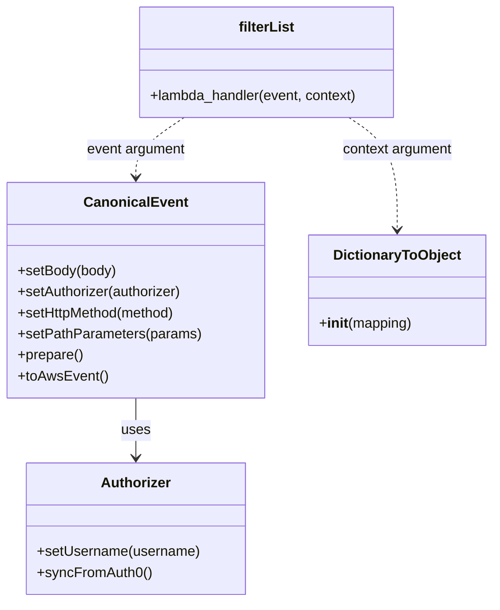

# Diagram: platform/tools/ide_local_testing/localTest/test/partview/filterSearch/getOrderNumberList.py


> Auto-generated by Obscura crawlers

## Diagram 1

```mermaid
flowchart TD
    Start([Start]) --> A[Create Authorizer]
    A --> B[Authorizer.setUsername("shipper-org-admin@yopmail.com")]
    B --> C[Authorizer.syncFromAuth0()]
    C --> D[Create CanonicalEvent]
    D --> E[CanonicalEvent.setBody(None)]
    E --> F[CanonicalEvent.setAuthorizer(authorizer)]
    F --> G[CanonicalEvent.setHttpMethod("GET")]
    G --> H[CanonicalEvent.setPathParameters(filterName: order-number)]
    H --> I[CanonicalEvent.prepare()]
    I --> J[CanonicalEvent.toAwsEvent()]
    J --> K[event]
    K --> L[context = DictionaryToObject({function_name: searchPartviewFilterList})]
    L --> M[filterList.lambda_handler(event, context)]
    M --> N[print(result)]
    N --> End([End])
```

> SVG rendering failed for this diagram.

## Diagram 2



### SVG

<svg id="container" width="553.9453125" xmlns="http://www.w3.org/2000/svg" class="classDiagram" height="686" viewBox="0 0 553.9453125 686" role="graphics-document document" aria-roledescription="class"><style>#container{font-family:"trebuchet ms",verdana,arial,sans-serif;font-size:16px;fill:#333;}@keyframes edge-animation-frame{from{stroke-dashoffset:0;}}@keyframes dash{to{stroke-dashoffset:0;}}#container .edge-animation-slow{stroke-dasharray:9,5!important;stroke-dashoffset:900;animation:dash 50s linear infinite;stroke-linecap:round;}#container .edge-animation-fast{stroke-dasharray:9,5!important;stroke-dashoffset:900;animation:dash 20s linear infinite;stroke-linecap:round;}#container .error-icon{fill:#552222;}#container .error-text{fill:#552222;stroke:#552222;}#container .edge-thickness-normal{stroke-width:1px;}#container .edge-thickness-thick{stroke-width:3.5px;}#container .edge-pattern-solid{stroke-dasharray:0;}#container .edge-thickness-invisible{stroke-width:0;fill:none;}#container .edge-pattern-dashed{stroke-dasharray:3;}#container .edge-pattern-dotted{stroke-dasharray:2;}#container .marker{fill:#333333;stroke:#333333;}#container .marker.cross{stroke:#333333;}#container svg{font-family:"trebuchet ms",verdana,arial,sans-serif;font-size:16px;}#container p{margin:0;}#container g.classGroup text{fill:#9370DB;stroke:none;font-family:"trebuchet ms",verdana,arial,sans-serif;font-size:10px;}#container g.classGroup text .title{font-weight:bolder;}#container .nodeLabel,#container .edgeLabel{color:#131300;}#container .edgeLabel .label rect{fill:#ECECFF;}#container .label text{fill:#131300;}#container .labelBkg{background:#ECECFF;}#container .edgeLabel .label span{background:#ECECFF;}#container .classTitle{font-weight:bolder;}#container .node rect,#container .node circle,#container .node ellipse,#container .node polygon,#container .node path{fill:#ECECFF;stroke:#9370DB;stroke-width:1px;}#container .divider{stroke:#9370DB;stroke-width:1;}#container g.clickable{cursor:pointer;}#container g.classGroup rect{fill:#ECECFF;stroke:#9370DB;}#container g.classGroup line{stroke:#9370DB;stroke-width:1;}#container .classLabel .box{stroke:none;stroke-width:0;fill:#ECECFF;opacity:0.5;}#container .classLabel .label{fill:#9370DB;font-size:10px;}#container .relation{stroke:#333333;stroke-width:1;fill:none;}#container .dashed-line{stroke-dasharray:3;}#container .dotted-line{stroke-dasharray:1 2;}#container #compositionStart,#container .composition{fill:#333333!important;stroke:#333333!important;stroke-width:1;}#container #compositionEnd,#container .composition{fill:#333333!important;stroke:#333333!important;stroke-width:1;}#container #dependencyStart,#container .dependency{fill:#333333!important;stroke:#333333!important;stroke-width:1;}#container #dependencyStart,#container .dependency{fill:#333333!important;stroke:#333333!important;stroke-width:1;}#container #extensionStart,#container .extension{fill:transparent!important;stroke:#333333!important;stroke-width:1;}#container #extensionEnd,#container .extension{fill:transparent!important;stroke:#333333!important;stroke-width:1;}#container #aggregationStart,#container .aggregation{fill:transparent!important;stroke:#333333!important;stroke-width:1;}#container #aggregationEnd,#container .aggregation{fill:transparent!important;stroke:#333333!important;stroke-width:1;}#container #lollipopStart,#container .lollipop{fill:#ECECFF!important;stroke:#333333!important;stroke-width:1;}#container #lollipopEnd,#container .lollipop{fill:#ECECFF!important;stroke:#333333!important;stroke-width:1;}#container .edgeTerminals{font-size:11px;line-height:initial;}#container .classTitleText{text-anchor:middle;font-size:18px;fill:#333;}#container .label-icon{display:inline-block;height:1em;overflow:visible;vertical-align:-0.125em;}#container .node .label-icon path{fill:currentColor;stroke:revert;stroke-width:revert;}#container :root{--mermaid-font-family:"trebuchet ms",verdana,arial,sans-serif;}</style><g><defs><marker id="container_class-aggregationStart" class="marker aggregation class" refX="18" refY="7" markerWidth="190" markerHeight="240" orient="auto"><path d="M 18,7 L9,13 L1,7 L9,1 Z"></path></marker></defs><defs><marker id="container_class-aggregationEnd" class="marker aggregation class" refX="1" refY="7" markerWidth="20" markerHeight="28" orient="auto"><path d="M 18,7 L9,13 L1,7 L9,1 Z"></path></marker></defs><defs><marker id="container_class-extensionStart" class="marker extension class" refX="18" refY="7" markerWidth="190" markerHeight="240" orient="auto"><path d="M 1,7 L18,13 V 1 Z"></path></marker></defs><defs><marker id="container_class-extensionEnd" class="marker extension class" refX="1" refY="7" markerWidth="20" markerHeight="28" orient="auto"><path d="M 1,1 V 13 L18,7 Z"></path></marker></defs><defs><marker id="container_class-compositionStart" class="marker composition class" refX="18" refY="7" markerWidth="190" markerHeight="240" orient="auto"><path d="M 18,7 L9,13 L1,7 L9,1 Z"></path></marker></defs><defs><marker id="container_class-compositionEnd" class="marker composition class" refX="1" refY="7" markerWidth="20" markerHeight="28" orient="auto"><path d="M 18,7 L9,13 L1,7 L9,1 Z"></path></marker></defs><defs><marker id="container_class-dependencyStart" class="marker dependency class" refX="6" refY="7" markerWidth="190" markerHeight="240" orient="auto"><path d="M 5,7 L9,13 L1,7 L9,1 Z"></path></marker></defs><defs><marker id="container_class-dependencyEnd" class="marker dependency class" refX="13" refY="7" markerWidth="20" markerHeight="28" orient="auto"><path d="M 18,7 L9,13 L14,7 L9,1 Z"></path></marker></defs><defs><marker id="container_class-lollipopStart" class="marker lollipop class" refX="13" refY="7" markerWidth="190" markerHeight="240" orient="auto"><circle stroke="black" fill="transparent" cx="7" cy="7" r="6"></circle></marker></defs><defs><marker id="container_class-lollipopEnd" class="marker lollipop class" refX="1" refY="7" markerWidth="190" markerHeight="240" orient="auto"><circle stroke="black" fill="transparent" cx="7" cy="7" r="6"></circle></marker></defs><g class="root"><g class="clusters"></g><g class="edgePaths"><path d="M151.699,454L151.699,460.167C151.699,466.333,151.699,478.667,151.699,490C151.699,501.333,151.699,511.667,151.699,516.833L151.699,522" id="id_CanonicalEvent_Authorizer_1" class="edge-thickness-normal edge-pattern-solid relation" style=";;;" data-edge="true" data-et="edge" data-id="id_CanonicalEvent_Authorizer_1" data-points="W3sieCI6MTUxLjY5OTIxODc1LCJ5Ijo0NTR9LHsieCI6MTUxLjY5OTIxODc1LCJ5Ijo0OTF9LHsieCI6MTUxLjY5OTIxODc1LCJ5Ijo1Mjh9XQ==" marker-end="url(#container_class-dependencyEnd)"></path><path d="M206.084,134L197.02,140.167C187.956,146.333,169.828,158.667,160.763,170C151.699,181.333,151.699,191.667,151.699,196.833L151.699,202" id="id_filterList_CanonicalEvent_2" class="edge-thickness-normal edge-pattern-dashed relation" style=";;;" data-edge="true" data-et="edge" data-id="id_filterList_CanonicalEvent_2" data-points="W3sieCI6MjA2LjA4NDE2MDE1NjI1LCJ5IjoxMzR9LHsieCI6MTUxLjY5OTIxODc1LCJ5IjoxNzF9LHsieCI6MTUxLjY5OTIxODc1LCJ5IjoyMDh9XQ==" marker-end="url(#container_class-dependencyEnd)"></path><path d="M391.287,134L400.351,140.167C409.415,146.333,427.544,158.667,436.608,180C445.672,201.333,445.672,231.667,445.672,246.833L445.672,262" id="id_filterList_DictionaryToObject_3" class="edge-thickness-normal edge-pattern-dashed relation" style=";;;" data-edge="true" data-et="edge" data-id="id_filterList_DictionaryToObject_3" data-points="W3sieCI6MzkxLjI4NjkzMzU5Mzc1LCJ5IjoxMzR9LHsieCI6NDQ1LjY3MTg3NSwieSI6MTcxfSx7IngiOjQ0NS42NzE4NzUsInkiOjI2OH1d" marker-end="url(#container_class-dependencyEnd)"></path></g><g class="edgeLabels"><g class="edgeLabel" transform="translate(151.69921875, 491)"><g class="label" data-id="id_CanonicalEvent_Authorizer_1" transform="translate(-16.4921875, -12)"><foreignObject width="32.984375" height="24"><div xmlns="http://www.w3.org/1999/xhtml" class="labelBkg" style="display: table-cell; white-space: nowrap; line-height: 1.5; max-width: 200px; text-align: center;"><span class="edgeLabel"><p>uses</p></span></div></foreignObject></g></g><g class="edgeLabel" transform="translate(151.69921875, 171)"><g class="label" data-id="id_filterList_CanonicalEvent_2" transform="translate(-57.140625, -12)"><foreignObject width="114.28125" height="24"><div xmlns="http://www.w3.org/1999/xhtml" class="labelBkg" style="display: table-cell; white-space: nowrap; line-height: 1.5; max-width: 200px; text-align: center;"><span class="edgeLabel"><p>event argument</p></span></div></foreignObject></g></g><g class="edgeLabel" transform="translate(445.671875, 171)"><g class="label" data-id="id_filterList_DictionaryToObject_3" transform="translate(-63.8203125, -12)"><foreignObject width="127.640625" height="24"><div xmlns="http://www.w3.org/1999/xhtml" class="labelBkg" style="display: table-cell; white-space: nowrap; line-height: 1.5; max-width: 200px; text-align: center;"><span class="edgeLabel"><p>context argument</p></span></div></foreignObject></g></g></g><g class="nodes"><g class="node default" id="classId-Authorizer-0" transform="translate(151.69921875, 603)"><g class="basic label-container"><path d="M-124.13671875 -75 L124.13671875 -75 L124.13671875 75 L-124.13671875 75" stroke="none" stroke-width="0" fill="#ECECFF" style=""></path><path d="M-124.13671875 -75 C-35.50343661350581 -75, 53.129845522988376 -75, 124.13671875 -75 M-124.13671875 -75 C-68.3908165893904 -75, -12.64491442878078 -75, 124.13671875 -75 M124.13671875 -75 C124.13671875 -44.37126081929024, 124.13671875 -13.742521638580484, 124.13671875 75 M124.13671875 -75 C124.13671875 -15.913397647179693, 124.13671875 43.173204705640615, 124.13671875 75 M124.13671875 75 C30.36865833806891 75, -63.39940207386218 75, -124.13671875 75 M124.13671875 75 C41.74149707453812 75, -40.653724600923766 75, -124.13671875 75 M-124.13671875 75 C-124.13671875 19.478494478983436, -124.13671875 -36.04301104203313, -124.13671875 -75 M-124.13671875 75 C-124.13671875 15.333943328303981, -124.13671875 -44.33211334339204, -124.13671875 -75" stroke="#9370DB" stroke-width="1.3" fill="none" stroke-dasharray="0 0" style=""></path></g><g class="annotation-group text" transform="translate(0, -51)"></g><g class="label-group text" transform="translate(-38.3671875, -51)"><g class="label" style="font-weight: bolder" transform="translate(0,-12)"><foreignObject width="76.734375" height="24"><div xmlns="http://www.w3.org/1999/xhtml" style="display: table-cell; white-space: nowrap; line-height: 1.5; max-width: 126px; text-align: center;"><span class="nodeLabel markdown-node-label" style=""><p>Authorizer</p></span></div></foreignObject></g></g><g class="members-group text" transform="translate(-112.13671875, -3)"></g><g class="methods-group text" transform="translate(-112.13671875, 27)"><g class="label" style="" transform="translate(0,-12)"><foreignObject width="185.90625" height="24"><div xmlns="http://www.w3.org/1999/xhtml" style="display: table-cell; white-space: nowrap; line-height: 1.5; max-width: 243px; text-align: center;"><span class="nodeLabel markdown-node-label" style=""><p>+setUsername(username)</p></span></div></foreignObject></g><g class="label" style="" transform="translate(0,12)"><foreignObject width="129.0625" height="24"><div xmlns="http://www.w3.org/1999/xhtml" style="display: table-cell; white-space: nowrap; line-height: 1.5; max-width: 186px; text-align: center;"><span class="nodeLabel markdown-node-label" style=""><p>+syncFromAuth0()</p></span></div></foreignObject></g></g><g class="divider" style=""><path d="M-124.13671875 -27 C-62.27684638559974 -27, -0.41697402119947924 -27, 124.13671875 -27 M-124.13671875 -27 C-51.627041758468295 -27, 20.88263523306341 -27, 124.13671875 -27" stroke="#9370DB" stroke-width="1.3" fill="none" stroke-dasharray="0 0" style=""></path></g><g class="divider" style=""><path d="M-124.13671875 -3 C-65.0784038127677 -3, -6.020088875535421 -3, 124.13671875 -3 M-124.13671875 -3 C-54.34546480144597 -3, 15.445789147108059 -3, 124.13671875 -3" stroke="#9370DB" stroke-width="1.3" fill="none" stroke-dasharray="0 0" style=""></path></g></g><g class="node default" id="classId-CanonicalEvent-1" transform="translate(151.69921875, 331)"><g class="basic label-container"><path d="M-143.69921875 -123 L143.69921875 -123 L143.69921875 123 L-143.69921875 123" stroke="none" stroke-width="0" fill="#ECECFF" style=""></path><path d="M-143.69921875 -123 C-49.29543499621013 -123, 45.10834875757973 -123, 143.69921875 -123 M-143.69921875 -123 C-76.71416583010287 -123, -9.729112910205743 -123, 143.69921875 -123 M143.69921875 -123 C143.69921875 -27.98004367817576, 143.69921875 67.03991264364848, 143.69921875 123 M143.69921875 -123 C143.69921875 -44.86923462248929, 143.69921875 33.261530755021425, 143.69921875 123 M143.69921875 123 C70.21099892414229 123, -3.277220901715424 123, -143.69921875 123 M143.69921875 123 C65.68887310329312 123, -12.321472543413762 123, -143.69921875 123 M-143.69921875 123 C-143.69921875 47.26003909280293, -143.69921875 -28.479921814394146, -143.69921875 -123 M-143.69921875 123 C-143.69921875 38.88579940160746, -143.69921875 -45.228401196785086, -143.69921875 -123" stroke="#9370DB" stroke-width="1.3" fill="none" stroke-dasharray="0 0" style=""></path></g><g class="annotation-group text" transform="translate(0, -99)"></g><g class="label-group text" transform="translate(-55.7109375, -99)"><g class="label" style="font-weight: bolder" transform="translate(0,-12)"><foreignObject width="111.421875" height="24"><div xmlns="http://www.w3.org/1999/xhtml" style="display: table-cell; white-space: nowrap; line-height: 1.5; max-width: 161px; text-align: center;"><span class="nodeLabel markdown-node-label" style=""><p>CanonicalEvent</p></span></div></foreignObject></g></g><g class="members-group text" transform="translate(-131.69921875, -51)"></g><g class="methods-group text" transform="translate(-131.69921875, -21)"><g class="label" style="" transform="translate(0,-12)"><foreignObject width="113.125" height="24"><div xmlns="http://www.w3.org/1999/xhtml" style="display: table-cell; white-space: nowrap; line-height: 1.5; max-width: 170px; text-align: center;"><span class="nodeLabel markdown-node-label" style=""><p>+setBody(body)</p></span></div></foreignObject></g><g class="label" style="" transform="translate(0,12)"><foreignObject width="190.75" height="24"><div xmlns="http://www.w3.org/1999/xhtml" style="display: table-cell; white-space: nowrap; line-height: 1.5; max-width: 248px; text-align: center;"><span class="nodeLabel markdown-node-label" style=""><p>+setAuthorizer(authorizer)</p></span></div></foreignObject></g><g class="label" style="" transform="translate(0,36)"><foreignObject width="184" height="24"><div xmlns="http://www.w3.org/1999/xhtml" style="display: table-cell; white-space: nowrap; line-height: 1.5; max-width: 241px; text-align: center;"><span class="nodeLabel markdown-node-label" style=""><p>+setHttpMethod(method)</p></span></div></foreignObject></g><g class="label" style="" transform="translate(0,60)"><foreignObject width="207.6875" height="24"><div xmlns="http://www.w3.org/1999/xhtml" style="display: table-cell; white-space: nowrap; line-height: 1.5; max-width: 265px; text-align: center;"><span class="nodeLabel markdown-node-label" style=""><p>+setPathParameters(params)</p></span></div></foreignObject></g><g class="label" style="" transform="translate(0,84)"><foreignObject width="74.75" height="24"><div xmlns="http://www.w3.org/1999/xhtml" style="display: table-cell; white-space: nowrap; line-height: 1.5; max-width: 132px; text-align: center;"><span class="nodeLabel markdown-node-label" style=""><p>+prepare()</p></span></div></foreignObject></g><g class="label" style="" transform="translate(0,108)"><foreignObject width="101.1875" height="24"><div xmlns="http://www.w3.org/1999/xhtml" style="display: table-cell; white-space: nowrap; line-height: 1.5; max-width: 159px; text-align: center;"><span class="nodeLabel markdown-node-label" style=""><p>+toAwsEvent()</p></span></div></foreignObject></g></g><g class="divider" style=""><path d="M-143.69921875 -75 C-60.00558774828116 -75, 23.688043253437684 -75, 143.69921875 -75 M-143.69921875 -75 C-34.4495657702908 -75, 74.8000872094184 -75, 143.69921875 -75" stroke="#9370DB" stroke-width="1.3" fill="none" stroke-dasharray="0 0" style=""></path></g><g class="divider" style=""><path d="M-143.69921875 -51 C-74.02210548811999 -51, -4.344992226239981 -51, 143.69921875 -51 M-143.69921875 -51 C-68.1405337158718 -51, 7.418151318256406 -51, 143.69921875 -51" stroke="#9370DB" stroke-width="1.3" fill="none" stroke-dasharray="0 0" style=""></path></g></g><g class="node default" id="classId-DictionaryToObject-2" transform="translate(445.671875, 331)"><g class="basic label-container"><path d="M-100.2734375 -63 L100.2734375 -63 L100.2734375 63 L-100.2734375 63" stroke="none" stroke-width="0" fill="#ECECFF" style=""></path><path d="M-100.2734375 -63 C-48.21360972218102 -63, 3.846218055637962 -63, 100.2734375 -63 M-100.2734375 -63 C-56.35135893278628 -63, -12.429280365572566 -63, 100.2734375 -63 M100.2734375 -63 C100.2734375 -35.873442952445565, 100.2734375 -8.74688590489113, 100.2734375 63 M100.2734375 -63 C100.2734375 -21.643680319686965, 100.2734375 19.71263936062607, 100.2734375 63 M100.2734375 63 C35.277530399195854 63, -29.718376701608292 63, -100.2734375 63 M100.2734375 63 C29.230495801444633 63, -41.812445897110734 63, -100.2734375 63 M-100.2734375 63 C-100.2734375 15.508091265504262, -100.2734375 -31.983817468991475, -100.2734375 -63 M-100.2734375 63 C-100.2734375 13.756027661893746, -100.2734375 -35.48794467621251, -100.2734375 -63" stroke="#9370DB" stroke-width="1.3" fill="none" stroke-dasharray="0 0" style=""></path></g><g class="annotation-group text" transform="translate(0, -39)"></g><g class="label-group text" transform="translate(-70.109375, -39)"><g class="label" style="font-weight: bolder" transform="translate(0,-12)"><foreignObject width="140.21875" height="24"><div xmlns="http://www.w3.org/1999/xhtml" style="display: table-cell; white-space: nowrap; line-height: 1.5; max-width: 188px; text-align: center;"><span class="nodeLabel markdown-node-label" style=""><p>DictionaryToObject</p></span></div></foreignObject></g></g><g class="members-group text" transform="translate(-88.2734375, 9)"></g><g class="methods-group text" transform="translate(-88.2734375, 39)"><g class="label" style="" transform="translate(0,-12)"><foreignObject width="106.4375" height="24"><div xmlns="http://www.w3.org/1999/xhtml" style="display: table-cell; white-space: nowrap; line-height: 1.5; max-width: 195px; text-align: center;"><span class="nodeLabel markdown-node-label" style=""><p>+<strong>init</strong>(mapping)</p></span></div></foreignObject></g></g><g class="divider" style=""><path d="M-100.2734375 -15 C-21.857589159165812 -15, 56.558259181668376 -15, 100.2734375 -15 M-100.2734375 -15 C-28.42443430891261 -15, 43.42456888217478 -15, 100.2734375 -15" stroke="#9370DB" stroke-width="1.3" fill="none" stroke-dasharray="0 0" style=""></path></g><g class="divider" style=""><path d="M-100.2734375 9 C-25.2460508604793 9, 49.7813357790414 9, 100.2734375 9 M-100.2734375 9 C-55.44243125283496 9, -10.611425005669915 9, 100.2734375 9" stroke="#9370DB" stroke-width="1.3" fill="none" stroke-dasharray="0 0" style=""></path></g></g><g class="node default" id="classId-filterList-3" transform="translate(298.685546875, 71)"><g class="basic label-container"><path d="M-147.62109375 -63 L147.62109375 -63 L147.62109375 63 L-147.62109375 63" stroke="none" stroke-width="0" fill="#ECECFF" style=""></path><path d="M-147.62109375 -63 C-64.82796074856533 -63, 17.965172252869337 -63, 147.62109375 -63 M-147.62109375 -63 C-53.49520441526451 -63, 40.63068491947098 -63, 147.62109375 -63 M147.62109375 -63 C147.62109375 -15.998540089873153, 147.62109375 31.002919820253695, 147.62109375 63 M147.62109375 -63 C147.62109375 -35.95471037105127, 147.62109375 -8.90942074210254, 147.62109375 63 M147.62109375 63 C36.08986988831269 63, -75.44135397337462 63, -147.62109375 63 M147.62109375 63 C33.042892048055464 63, -81.53530965388907 63, -147.62109375 63 M-147.62109375 63 C-147.62109375 17.47744328050001, -147.62109375 -28.045113438999977, -147.62109375 -63 M-147.62109375 63 C-147.62109375 12.82622862860621, -147.62109375 -37.34754274278758, -147.62109375 -63" stroke="#9370DB" stroke-width="1.3" fill="none" stroke-dasharray="0 0" style=""></path></g><g class="annotation-group text" transform="translate(0, -39)"></g><g class="label-group text" transform="translate(-31.0546875, -39)"><g class="label" style="font-weight: bolder" transform="translate(0,-12)"><foreignObject width="62.109375" height="24"><div xmlns="http://www.w3.org/1999/xhtml" style="display: table-cell; white-space: nowrap; line-height: 1.5; max-width: 110px; text-align: center;"><span class="nodeLabel markdown-node-label" style=""><p>filterList</p></span></div></foreignObject></g></g><g class="members-group text" transform="translate(-135.62109375, 9)"></g><g class="methods-group text" transform="translate(-135.62109375, 39)"><g class="label" style="" transform="translate(0,-12)"><foreignObject width="240.1875" height="24"><div xmlns="http://www.w3.org/1999/xhtml" style="display: table-cell; white-space: nowrap; line-height: 1.5; max-width: 298px; text-align: center;"><span class="nodeLabel markdown-node-label" style=""><p>+lambda_handler(event, context)</p></span></div></foreignObject></g></g><g class="divider" style=""><path d="M-147.62109375 -15 C-52.508260305145086 -15, 42.60457313970983 -15, 147.62109375 -15 M-147.62109375 -15 C-57.728492990332384 -15, 32.16410776933523 -15, 147.62109375 -15" stroke="#9370DB" stroke-width="1.3" fill="none" stroke-dasharray="0 0" style=""></path></g><g class="divider" style=""><path d="M-147.62109375 9 C-45.69323214759646 9, 56.23462945480708 9, 147.62109375 9 M-147.62109375 9 C-32.15664168269977 9, 83.30781038460046 9, 147.62109375 9" stroke="#9370DB" stroke-width="1.3" fill="none" stroke-dasharray="0 0" style=""></path></g></g></g></g></g></svg>
