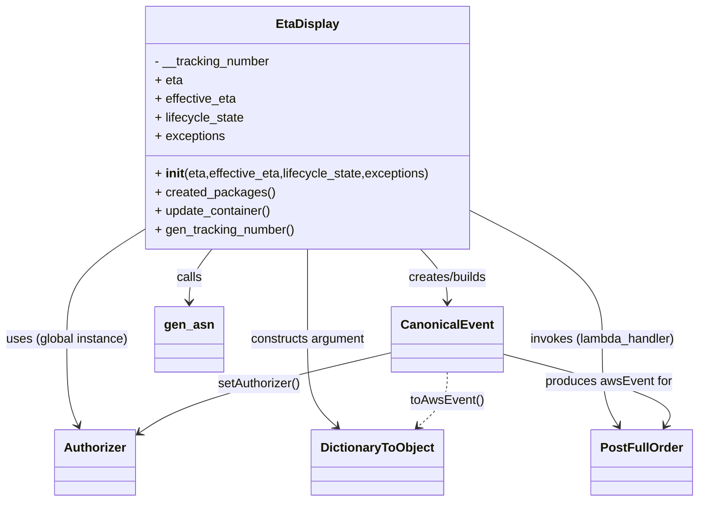
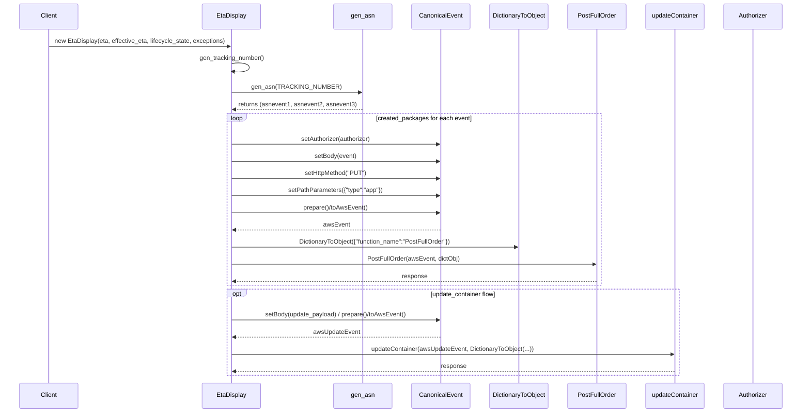

# Diagram: platform/tools/ide_local_testing/localTest/test/partview/searchContainer/eta_display.py


> Auto-generated by Obscura crawlers

## Diagram 1



### SVG

<svg id="container" width="890.66015625" xmlns="http://www.w3.org/2000/svg" class="classDiagram" height="644" viewBox="0 0 890.66015625 644" role="graphics-document document" aria-roledescription="class"><style>#container{font-family:"trebuchet ms",verdana,arial,sans-serif;font-size:16px;fill:#333;}@keyframes edge-animation-frame{from{stroke-dashoffset:0;}}@keyframes dash{to{stroke-dashoffset:0;}}#container .edge-animation-slow{stroke-dasharray:9,5!important;stroke-dashoffset:900;animation:dash 50s linear infinite;stroke-linecap:round;}#container .edge-animation-fast{stroke-dasharray:9,5!important;stroke-dashoffset:900;animation:dash 20s linear infinite;stroke-linecap:round;}#container .error-icon{fill:#552222;}#container .error-text{fill:#552222;stroke:#552222;}#container .edge-thickness-normal{stroke-width:1px;}#container .edge-thickness-thick{stroke-width:3.5px;}#container .edge-pattern-solid{stroke-dasharray:0;}#container .edge-thickness-invisible{stroke-width:0;fill:none;}#container .edge-pattern-dashed{stroke-dasharray:3;}#container .edge-pattern-dotted{stroke-dasharray:2;}#container .marker{fill:#333333;stroke:#333333;}#container .marker.cross{stroke:#333333;}#container svg{font-family:"trebuchet ms",verdana,arial,sans-serif;font-size:16px;}#container p{margin:0;}#container g.classGroup text{fill:#9370DB;stroke:none;font-family:"trebuchet ms",verdana,arial,sans-serif;font-size:10px;}#container g.classGroup text .title{font-weight:bolder;}#container .nodeLabel,#container .edgeLabel{color:#131300;}#container .edgeLabel .label rect{fill:#ECECFF;}#container .label text{fill:#131300;}#container .labelBkg{background:#ECECFF;}#container .edgeLabel .label span{background:#ECECFF;}#container .classTitle{font-weight:bolder;}#container .node rect,#container .node circle,#container .node ellipse,#container .node polygon,#container .node path{fill:#ECECFF;stroke:#9370DB;stroke-width:1px;}#container .divider{stroke:#9370DB;stroke-width:1;}#container g.clickable{cursor:pointer;}#container g.classGroup rect{fill:#ECECFF;stroke:#9370DB;}#container g.classGroup line{stroke:#9370DB;stroke-width:1;}#container .classLabel .box{stroke:none;stroke-width:0;fill:#ECECFF;opacity:0.5;}#container .classLabel .label{fill:#9370DB;font-size:10px;}#container .relation{stroke:#333333;stroke-width:1;fill:none;}#container .dashed-line{stroke-dasharray:3;}#container .dotted-line{stroke-dasharray:1 2;}#container #compositionStart,#container .composition{fill:#333333!important;stroke:#333333!important;stroke-width:1;}#container #compositionEnd,#container .composition{fill:#333333!important;stroke:#333333!important;stroke-width:1;}#container #dependencyStart,#container .dependency{fill:#333333!important;stroke:#333333!important;stroke-width:1;}#container #dependencyStart,#container .dependency{fill:#333333!important;stroke:#333333!important;stroke-width:1;}#container #extensionStart,#container .extension{fill:transparent!important;stroke:#333333!important;stroke-width:1;}#container #extensionEnd,#container .extension{fill:transparent!important;stroke:#333333!important;stroke-width:1;}#container #aggregationStart,#container .aggregation{fill:transparent!important;stroke:#333333!important;stroke-width:1;}#container #aggregationEnd,#container .aggregation{fill:transparent!important;stroke:#333333!important;stroke-width:1;}#container #lollipopStart,#container .lollipop{fill:#ECECFF!important;stroke:#333333!important;stroke-width:1;}#container #lollipopEnd,#container .lollipop{fill:#ECECFF!important;stroke:#333333!important;stroke-width:1;}#container .edgeTerminals{font-size:11px;line-height:initial;}#container .classTitleText{text-anchor:middle;font-size:18px;fill:#333;}#container .label-icon{display:inline-block;height:1em;overflow:visible;vertical-align:-0.125em;}#container .node .label-icon path{fill:currentColor;stroke:revert;stroke-width:revert;}#container :root{--mermaid-font-family:"trebuchet ms",verdana,arial,sans-serif;}</style><g><defs><marker id="container_class-aggregationStart" class="marker aggregation class" refX="18" refY="7" markerWidth="190" markerHeight="240" orient="auto"><path d="M 18,7 L9,13 L1,7 L9,1 Z"></path></marker></defs><defs><marker id="container_class-aggregationEnd" class="marker aggregation class" refX="1" refY="7" markerWidth="20" markerHeight="28" orient="auto"><path d="M 18,7 L9,13 L1,7 L9,1 Z"></path></marker></defs><defs><marker id="container_class-extensionStart" class="marker extension class" refX="18" refY="7" markerWidth="190" markerHeight="240" orient="auto"><path d="M 1,7 L18,13 V 1 Z"></path></marker></defs><defs><marker id="container_class-extensionEnd" class="marker extension class" refX="1" refY="7" markerWidth="20" markerHeight="28" orient="auto"><path d="M 1,1 V 13 L18,7 Z"></path></marker></defs><defs><marker id="container_class-compositionStart" class="marker composition class" refX="18" refY="7" markerWidth="190" markerHeight="240" orient="auto"><path d="M 18,7 L9,13 L1,7 L9,1 Z"></path></marker></defs><defs><marker id="container_class-compositionEnd" class="marker composition class" refX="1" refY="7" markerWidth="20" markerHeight="28" orient="auto"><path d="M 18,7 L9,13 L1,7 L9,1 Z"></path></marker></defs><defs><marker id="container_class-dependencyStart" class="marker dependency class" refX="6" refY="7" markerWidth="190" markerHeight="240" orient="auto"><path d="M 5,7 L9,13 L1,7 L9,1 Z"></path></marker></defs><defs><marker id="container_class-dependencyEnd" class="marker dependency class" refX="13" refY="7" markerWidth="20" markerHeight="28" orient="auto"><path d="M 18,7 L9,13 L14,7 L9,1 Z"></path></marker></defs><defs><marker id="container_class-lollipopStart" class="marker lollipop class" refX="13" refY="7" markerWidth="190" markerHeight="240" orient="auto"><circle stroke="black" fill="transparent" cx="7" cy="7" r="6"></circle></marker></defs><defs><marker id="container_class-lollipopEnd" class="marker lollipop class" refX="1" refY="7" markerWidth="190" markerHeight="240" orient="auto"><circle stroke="black" fill="transparent" cx="7" cy="7" r="6"></circle></marker></defs><g class="root"><g class="clusters"></g><g class="edgePaths"><path d="M538.24,320L543.913,326.167C549.585,332.333,560.929,344.667,566.601,356C572.273,367.333,572.273,377.667,572.273,382.833L572.273,388" id="id_EtaDisplay_CanonicalEvent_1" class="edge-thickness-normal edge-pattern-solid relation" style=";;;" data-edge="true" data-et="edge" data-id="id_EtaDisplay_CanonicalEvent_1" data-points="W3sieCI6NTM4LjI0MDQ0Njg5MTE5MTcsInkiOjMyMH0seyJ4Ijo1NzIuMjczNDM3NSwieSI6MzU3fSx7IngiOjU3Mi4yNzM0Mzc1LCJ5IjozOTR9XQ==" marker-end="url(#container_class-dependencyEnd)"></path><path d="M271.997,320L267.145,326.167C262.292,332.333,252.588,344.667,247.735,356C242.883,367.333,242.883,377.667,242.883,382.833L242.883,388" id="id_EtaDisplay_gen_asn_2" class="edge-thickness-normal edge-pattern-solid relation" style=";;;" data-edge="true" data-et="edge" data-id="id_EtaDisplay_gen_asn_2" data-points="W3sieCI6MjcxLjk5NzI0NzQwOTMyNjQsInkiOjMyMH0seyJ4IjoyNDIuODgyODEyNSwieSI6MzU3fSx7IngiOjI0Mi44ODI4MTI1LCJ5IjozOTR9XQ==" marker-end="url(#container_class-dependencyEnd)"></path><path d="M604.035,271.726L631.646,285.938C659.258,300.15,714.48,328.575,742.092,355.954C769.703,383.333,769.703,409.667,769.703,436C769.703,462.333,769.703,488.667,773.135,507.159C776.568,525.652,783.432,536.304,786.865,541.63L790.297,546.957" id="id_EtaDisplay_PostFullOrder_3" class="edge-thickness-normal edge-pattern-solid relation" style=";;;" data-edge="true" data-et="edge" data-id="id_EtaDisplay_PostFullOrder_3" data-points="W3sieCI6NjA0LjAzNTE1NjI1LCJ5IjoyNzEuNzI1NTU5NDQ0OTMwNn0seyJ4Ijo3NjkuNzAzMTI1LCJ5IjozNTd9LHsieCI6NzY5LjcwMzEyNSwieSI6NDM2fSx7IngiOjc2OS43MDMxMjUsInkiOjUxNX0seyJ4Ijo3OTMuNTQ3MTIyMjMxMDEyNiwieSI6NTUyfV0=" marker-end="url(#container_class-dependencyEnd)"></path><path d="M394.75,320L394.75,326.167C394.75,332.333,394.75,344.667,394.75,364C394.75,383.333,394.75,409.667,394.75,436C394.75,462.333,394.75,488.667,400.932,507.335C407.113,526.004,419.477,537.007,425.658,542.509L431.84,548.011" id="id_EtaDisplay_DictionaryToObject_4" class="edge-thickness-normal edge-pattern-solid relation" style=";;;" data-edge="true" data-et="edge" data-id="id_EtaDisplay_DictionaryToObject_4" data-points="W3sieCI6Mzk0Ljc1LCJ5IjozMjB9LHsieCI6Mzk0Ljc1LCJ5IjozNTd9LHsieCI6Mzk0Ljc1LCJ5Ijo0MzZ9LHsieCI6Mzk0Ljc1LCJ5Ijo1MTV9LHsieCI6NDM2LjMyMTk0NDIyNDY4MzUzLCJ5Ijo1NTJ9XQ==" marker-end="url(#container_class-dependencyEnd)"></path><path d="M185.465,295.213L169.04,305.511C152.615,315.809,119.764,336.404,103.339,359.869C86.914,383.333,86.914,409.667,86.914,436C86.914,462.333,86.914,488.667,89.374,507.094C91.835,525.522,96.755,536.043,99.216,541.304L101.676,546.565" id="id_EtaDisplay_Authorizer_5" class="edge-thickness-normal edge-pattern-solid relation" style=";;;" data-edge="true" data-et="edge" data-id="id_EtaDisplay_Authorizer_5" data-points="W3sieCI6MTg1LjQ2NDg0Mzc1LCJ5IjoyOTUuMjEyODY0NTAyNzAyOH0seyJ4Ijo4Ni45MTQwNjI1LCJ5IjozNTd9LHsieCI6ODYuOTE0MDYyNSwieSI6NDM2fSx7IngiOjg2LjkxNDA2MjUsInkiOjUxNX0seyJ4IjoxMDQuMjE3NTYzMjkxMTM5MjQsInkiOjU1Mn1d" marker-end="url(#container_class-dependencyEnd)"></path><path d="M504.563,452.139L460.607,462.616C416.652,473.093,328.742,494.046,274.515,511.461C220.288,528.875,199.743,542.75,189.471,549.688L179.199,556.625" id="id_CanonicalEvent_Authorizer_6" class="edge-thickness-normal edge-pattern-solid relation" style=";;;" data-edge="true" data-et="edge" data-id="id_CanonicalEvent_Authorizer_6" data-points="W3sieCI6NTA0LjU2MjUsInkiOjQ1Mi4xMzkwOTQxNTU0OTk4fSx7IngiOjI0MC44MzIwMzEyNSwieSI6NTE1fSx7IngiOjE3NC4yMjY1NjI1LCJ5Ijo1NTkuOTgzNDM2Mjk5ODgzMX1d" marker-end="url(#container_class-dependencyEnd)"></path><path d="M572.273,478L572.273,484.167C572.273,490.333,572.273,502.667,566.092,514.335C559.91,526.004,547.547,537.007,541.365,542.509L535.183,548.011" id="id_CanonicalEvent_DictionaryToObject_7" class="edge-thickness-normal edge-pattern-dashed relation" style=";;;" data-edge="true" data-et="edge" data-id="id_CanonicalEvent_DictionaryToObject_7" data-points="W3sieCI6NTcyLjI3MzQzNzUsInkiOjQ3OH0seyJ4Ijo1NzIuMjczNDM3NSwieSI6NTE1fSx7IngiOjUzMC43MDE0OTMyNzUzMTY1LCJ5Ijo1NTJ9XQ==" marker-end="url(#container_class-dependencyEnd)"></path><path d="M639.984,453.875L678.574,464.063C717.164,474.25,794.344,494.625,829.501,510.139C864.659,525.652,857.794,536.304,854.362,541.63L850.93,546.957" id="id_CanonicalEvent_PostFullOrder_8" class="edge-thickness-normal edge-pattern-solid relation" style=";;;" data-edge="true" data-et="edge" data-id="id_CanonicalEvent_PostFullOrder_8" data-points="W3sieCI6NjM5Ljk4NDM3NSwieSI6NDUzLjg3NTIzNDk2MjQwNn0seyJ4Ijo4NzEuNTIzNDM3NSwieSI6NTE1fSx7IngiOjg0Ny42Nzk0NDAyNjg5ODc0LCJ5Ijo1NTJ9XQ==" marker-end="url(#container_class-dependencyEnd)"></path></g><g class="edgeLabels"><g class="edgeLabel" transform="translate(572.2734375, 357)"><g class="label" data-id="id_EtaDisplay_CanonicalEvent_1" transform="translate(-52.8203125, -12)"><foreignObject width="105.640625" height="24"><div xmlns="http://www.w3.org/1999/xhtml" class="labelBkg" style="display: table-cell; white-space: nowrap; line-height: 1.5; max-width: 200px; text-align: center;"><span class="edgeLabel"><p>creates/builds</p></span></div></foreignObject></g></g><g class="edgeLabel" transform="translate(242.8828125, 357)"><g class="label" data-id="id_EtaDisplay_gen_asn_2" transform="translate(-16.4453125, -12)"><foreignObject width="32.890625" height="24"><div xmlns="http://www.w3.org/1999/xhtml" class="labelBkg" style="display: table-cell; white-space: nowrap; line-height: 1.5; max-width: 200px; text-align: center;"><span class="edgeLabel"><p>calls</p></span></div></foreignObject></g></g><g class="edgeLabel" transform="translate(769.703125, 436)"><g class="label" data-id="id_EtaDisplay_PostFullOrder_3" transform="translate(-94.71875, -12)"><foreignObject width="189.4375" height="24"><div xmlns="http://www.w3.org/1999/xhtml" class="labelBkg" style="display: table-cell; white-space: nowrap; line-height: 1.5; max-width: 200px; text-align: center;"><span class="edgeLabel"><p>invokes (lambda_handler)</p></span></div></foreignObject></g></g><g class="edgeLabel" transform="translate(394.75, 436)"><g class="label" data-id="id_EtaDisplay_DictionaryToObject_4" transform="translate(-74.8125, -12)"><foreignObject width="149.625" height="24"><div xmlns="http://www.w3.org/1999/xhtml" class="labelBkg" style="display: table-cell; white-space: nowrap; line-height: 1.5; max-width: 200px; text-align: center;"><span class="edgeLabel"><p>constructs argument</p></span></div></foreignObject></g></g><g class="edgeLabel" transform="translate(86.9140625, 436)"><g class="label" data-id="id_EtaDisplay_Authorizer_5" transform="translate(-78.9140625, -12)"><foreignObject width="157.828125" height="24"><div xmlns="http://www.w3.org/1999/xhtml" class="labelBkg" style="display: table-cell; white-space: nowrap; line-height: 1.5; max-width: 200px; text-align: center;"><span class="edgeLabel"><p>uses (global instance)</p></span></div></foreignObject></g></g><g class="edgeLabel" transform="translate(333.60592, 492.88708)"><g class="label" data-id="id_CanonicalEvent_Authorizer_6" transform="translate(-53.890625, -12)"><foreignObject width="107.78125" height="24"><div xmlns="http://www.w3.org/1999/xhtml" class="labelBkg" style="display: table-cell; white-space: nowrap; line-height: 1.5; max-width: 200px; text-align: center;"><span class="edgeLabel"><p>setAuthorizer()</p></span></div></foreignObject></g></g><g class="edgeLabel" transform="translate(572.2734375, 515)"><g class="label" data-id="id_CanonicalEvent_DictionaryToObject_7" transform="translate(-46.640625, -12)"><foreignObject width="93.28125" height="24"><div xmlns="http://www.w3.org/1999/xhtml" class="labelBkg" style="display: table-cell; white-space: nowrap; line-height: 1.5; max-width: 200px; text-align: center;"><span class="edgeLabel"><p>toAwsEvent()</p></span></div></foreignObject></g></g><g class="edgeLabel" transform="translate(777.0336, 490.05532)"><g class="label" data-id="id_CanonicalEvent_PostFullOrder_8" transform="translate(-81.8203125, -12)"><foreignObject width="163.640625" height="24"><div xmlns="http://www.w3.org/1999/xhtml" class="labelBkg" style="display: table-cell; white-space: nowrap; line-height: 1.5; max-width: 200px; text-align: center;"><span class="edgeLabel"><p>produces awsEvent for</p></span></div></foreignObject></g></g></g><g class="nodes"><g class="node default" id="classId-EtaDisplay-0" transform="translate(394.75, 164)"><g class="basic label-container"><path d="M-209.28515625 -156 L209.28515625 -156 L209.28515625 156 L-209.28515625 156" stroke="none" stroke-width="0" fill="#ECECFF" style=""></path><path d="M-209.28515625 -156 C-61.054171213147384 -156, 87.17681382370523 -156, 209.28515625 -156 M-209.28515625 -156 C-49.71860984956703 -156, 109.84793655086594 -156, 209.28515625 -156 M209.28515625 -156 C209.28515625 -70.57340567210008, 209.28515625 14.85318865579984, 209.28515625 156 M209.28515625 -156 C209.28515625 -85.63879756432128, 209.28515625 -15.27759512864256, 209.28515625 156 M209.28515625 156 C65.48649852855237 156, -78.31215919289525 156, -209.28515625 156 M209.28515625 156 C103.24977413578014 156, -2.785607978439714 156, -209.28515625 156 M-209.28515625 156 C-209.28515625 43.81040376100019, -209.28515625 -68.37919247799962, -209.28515625 -156 M-209.28515625 156 C-209.28515625 63.659966129722434, -209.28515625 -28.68006774055513, -209.28515625 -156" stroke="#9370DB" stroke-width="1.3" fill="none" stroke-dasharray="0 0" style=""></path></g><g class="annotation-group text" transform="translate(0, -132)"></g><g class="label-group text" transform="translate(-38.2890625, -132)"><g class="label" style="font-weight: bolder" transform="translate(0,-12)"><foreignObject width="76.578125" height="24"><div xmlns="http://www.w3.org/1999/xhtml" style="display: table-cell; white-space: nowrap; line-height: 1.5; max-width: 126px; text-align: center;"><span class="nodeLabel markdown-node-label" style=""><p>EtaDisplay</p></span></div></foreignObject></g></g><g class="members-group text" transform="translate(-197.28515625, -84)"><g class="label" style="" transform="translate(0,-12)"><foreignObject width="150.1875" height="24"><div xmlns="http://www.w3.org/1999/xhtml" style="display: table-cell; white-space: nowrap; line-height: 1.5; max-width: 208px; text-align: center;"><span class="nodeLabel markdown-node-label" style=""><p>- __tracking_number</p></span></div></foreignObject></g><g class="label" style="" transform="translate(0,12)"><foreignObject width="35.3125" height="24"><div xmlns="http://www.w3.org/1999/xhtml" style="display: table-cell; white-space: nowrap; line-height: 1.5; max-width: 93px; text-align: center;"><span class="nodeLabel markdown-node-label" style=""><p>+ eta</p></span></div></foreignObject></g><g class="label" style="" transform="translate(0,36)"><foreignObject width="105.46875" height="24"><div xmlns="http://www.w3.org/1999/xhtml" style="display: table-cell; white-space: nowrap; line-height: 1.5; max-width: 163px; text-align: center;"><span class="nodeLabel markdown-node-label" style=""><p>+ effective_eta</p></span></div></foreignObject></g><g class="label" style="" transform="translate(0,60)"><foreignObject width="115.875" height="24"><div xmlns="http://www.w3.org/1999/xhtml" style="display: table-cell; white-space: nowrap; line-height: 1.5; max-width: 173px; text-align: center;"><span class="nodeLabel markdown-node-label" style=""><p>+ lifecycle_state</p></span></div></foreignObject></g><g class="label" style="" transform="translate(0,84)"><foreignObject width="90.453125" height="24"><div xmlns="http://www.w3.org/1999/xhtml" style="display: table-cell; white-space: nowrap; line-height: 1.5; max-width: 148px; text-align: center;"><span class="nodeLabel markdown-node-label" style=""><p>+ exceptions</p></span></div></foreignObject></g></g><g class="methods-group text" transform="translate(-197.28515625, 60)"><g class="label" style="" transform="translate(0,-12)"><foreignObject width="356.28125" height="24"><div xmlns="http://www.w3.org/1999/xhtml" style="display: table-cell; white-space: nowrap; line-height: 1.5; max-width: 446px; text-align: center;"><span class="nodeLabel markdown-node-label" style=""><p>+ <strong>init</strong>(eta,effective_eta,lifecycle_state,exceptions)</p></span></div></foreignObject></g><g class="label" style="" transform="translate(0,12)"><foreignObject width="151.796875" height="24"><div xmlns="http://www.w3.org/1999/xhtml" style="display: table-cell; white-space: nowrap; line-height: 1.5; max-width: 209px; text-align: center;"><span class="nodeLabel markdown-node-label" style=""><p>+ created_packages()</p></span></div></foreignObject></g><g class="label" style="" transform="translate(0,36)"><foreignObject width="150.828125" height="24"><div xmlns="http://www.w3.org/1999/xhtml" style="display: table-cell; white-space: nowrap; line-height: 1.5; max-width: 208px; text-align: center;"><span class="nodeLabel markdown-node-label" style=""><p>+ update_container()</p></span></div></foreignObject></g><g class="label" style="" transform="translate(0,60)"><foreignObject width="180.09375" height="24"><div xmlns="http://www.w3.org/1999/xhtml" style="display: table-cell; white-space: nowrap; line-height: 1.5; max-width: 237px; text-align: center;"><span class="nodeLabel markdown-node-label" style=""><p>+ gen_tracking_number()</p></span></div></foreignObject></g></g><g class="divider" style=""><path d="M-209.28515625 -108 C-95.45370320024772 -108, 18.377749849504568 -108, 209.28515625 -108 M-209.28515625 -108 C-96.44793632945384 -108, 16.389283591092322 -108, 209.28515625 -108" stroke="#9370DB" stroke-width="1.3" fill="none" stroke-dasharray="0 0" style=""></path></g><g class="divider" style=""><path d="M-209.28515625 36 C-64.5886101704229 36, 80.10793590915421 36, 209.28515625 36 M-209.28515625 36 C-108.6837805373918 36, -8.082404824783595 36, 209.28515625 36" stroke="#9370DB" stroke-width="1.3" fill="none" stroke-dasharray="0 0" style=""></path></g></g><g class="node default" id="classId-Authorizer-1" transform="translate(123.859375, 594)"><g class="basic label-container"><path d="M-50.3671875 -42 L50.3671875 -42 L50.3671875 42 L-50.3671875 42" stroke="none" stroke-width="0" fill="#ECECFF" style=""></path><path d="M-50.3671875 -42 C-14.071924254345667 -42, 22.223338991308665 -42, 50.3671875 -42 M-50.3671875 -42 C-27.184542619651463 -42, -4.001897739302926 -42, 50.3671875 -42 M50.3671875 -42 C50.3671875 -10.09713859988642, 50.3671875 21.80572280022716, 50.3671875 42 M50.3671875 -42 C50.3671875 -18.893632279288934, 50.3671875 4.212735441422133, 50.3671875 42 M50.3671875 42 C24.830026976345067 42, -0.7071335473098657 42, -50.3671875 42 M50.3671875 42 C13.987165564051928 42, -22.392856371896144 42, -50.3671875 42 M-50.3671875 42 C-50.3671875 15.49726830287861, -50.3671875 -11.005463394242781, -50.3671875 -42 M-50.3671875 42 C-50.3671875 18.811169887264167, -50.3671875 -4.377660225471665, -50.3671875 -42" stroke="#9370DB" stroke-width="1.3" fill="none" stroke-dasharray="0 0" style=""></path></g><g class="annotation-group text" transform="translate(0, -18)"></g><g class="label-group text" transform="translate(-38.3671875, -18)"><g class="label" style="font-weight: bolder" transform="translate(0,-12)"><foreignObject width="76.734375" height="24"><div xmlns="http://www.w3.org/1999/xhtml" style="display: table-cell; white-space: nowrap; line-height: 1.5; max-width: 126px; text-align: center;"><span class="nodeLabel markdown-node-label" style=""><p>Authorizer</p></span></div></foreignObject></g></g><g class="members-group text" transform="translate(-38.3671875, 30)"></g><g class="methods-group text" transform="translate(-38.3671875, 60)"></g><g class="divider" style=""><path d="M-50.3671875 6 C-26.899225288104013 6, -3.431263076208026 6, 50.3671875 6 M-50.3671875 6 C-23.707014966792183 6, 2.9531575664156335 6, 50.3671875 6" stroke="#9370DB" stroke-width="1.3" fill="none" stroke-dasharray="0 0" style=""></path></g><g class="divider" style=""><path d="M-50.3671875 24 C-19.711221886791865 24, 10.94474372641627 24, 50.3671875 24 M-50.3671875 24 C-14.261783772795503 24, 21.843619954408993 24, 50.3671875 24" stroke="#9370DB" stroke-width="1.3" fill="none" stroke-dasharray="0 0" style=""></path></g></g><g class="node default" id="classId-CanonicalEvent-2" transform="translate(572.2734375, 436)"><g class="basic label-container"><path d="M-67.7109375 -42 L67.7109375 -42 L67.7109375 42 L-67.7109375 42" stroke="none" stroke-width="0" fill="#ECECFF" style=""></path><path d="M-67.7109375 -42 C-29.459398308577164 -42, 8.792140882845672 -42, 67.7109375 -42 M-67.7109375 -42 C-20.09980235422413 -42, 27.511332791551737 -42, 67.7109375 -42 M67.7109375 -42 C67.7109375 -10.488024409381058, 67.7109375 21.023951181237884, 67.7109375 42 M67.7109375 -42 C67.7109375 -21.143091351904488, 67.7109375 -0.2861827038089757, 67.7109375 42 M67.7109375 42 C26.853389992165788 42, -14.004157515668425 42, -67.7109375 42 M67.7109375 42 C27.511786233961452 42, -12.687365032077096 42, -67.7109375 42 M-67.7109375 42 C-67.7109375 10.446304817854497, -67.7109375 -21.107390364291007, -67.7109375 -42 M-67.7109375 42 C-67.7109375 13.715923992766228, -67.7109375 -14.568152014467543, -67.7109375 -42" stroke="#9370DB" stroke-width="1.3" fill="none" stroke-dasharray="0 0" style=""></path></g><g class="annotation-group text" transform="translate(0, -18)"></g><g class="label-group text" transform="translate(-55.7109375, -18)"><g class="label" style="font-weight: bolder" transform="translate(0,-12)"><foreignObject width="111.421875" height="24"><div xmlns="http://www.w3.org/1999/xhtml" style="display: table-cell; white-space: nowrap; line-height: 1.5; max-width: 161px; text-align: center;"><span class="nodeLabel markdown-node-label" style=""><p>CanonicalEvent</p></span></div></foreignObject></g></g><g class="members-group text" transform="translate(-55.7109375, 30)"></g><g class="methods-group text" transform="translate(-55.7109375, 60)"></g><g class="divider" style=""><path d="M-67.7109375 6 C-18.957971648219498 6, 29.794994203561004 6, 67.7109375 6 M-67.7109375 6 C-17.213974334400454 6, 33.28298883119909 6, 67.7109375 6" stroke="#9370DB" stroke-width="1.3" fill="none" stroke-dasharray="0 0" style=""></path></g><g class="divider" style=""><path d="M-67.7109375 24 C-25.971871630290018 24, 15.767194239419965 24, 67.7109375 24 M-67.7109375 24 C-25.850992068480195 24, 16.00895336303961 24, 67.7109375 24" stroke="#9370DB" stroke-width="1.3" fill="none" stroke-dasharray="0 0" style=""></path></g></g><g class="node default" id="classId-DictionaryToObject-3" transform="translate(483.51171875, 594)"><g class="basic label-container"><path d="M-82.109375 -42 L82.109375 -42 L82.109375 42 L-82.109375 42" stroke="none" stroke-width="0" fill="#ECECFF" style=""></path><path d="M-82.109375 -42 C-23.1739823032673 -42, 35.7614103934654 -42, 82.109375 -42 M-82.109375 -42 C-39.08096797463254 -42, 3.947439050734914 -42, 82.109375 -42 M82.109375 -42 C82.109375 -22.7131046740522, 82.109375 -3.4262093481044005, 82.109375 42 M82.109375 -42 C82.109375 -10.303413641293297, 82.109375 21.393172717413407, 82.109375 42 M82.109375 42 C18.839482347987428 42, -44.430410304025145 42, -82.109375 42 M82.109375 42 C20.74356554416196 42, -40.62224391167608 42, -82.109375 42 M-82.109375 42 C-82.109375 22.51742641388271, -82.109375 3.0348528277654196, -82.109375 -42 M-82.109375 42 C-82.109375 11.005940576312739, -82.109375 -19.988118847374523, -82.109375 -42" stroke="#9370DB" stroke-width="1.3" fill="none" stroke-dasharray="0 0" style=""></path></g><g class="annotation-group text" transform="translate(0, -18)"></g><g class="label-group text" transform="translate(-70.109375, -18)"><g class="label" style="font-weight: bolder" transform="translate(0,-12)"><foreignObject width="140.21875" height="24"><div xmlns="http://www.w3.org/1999/xhtml" style="display: table-cell; white-space: nowrap; line-height: 1.5; max-width: 188px; text-align: center;"><span class="nodeLabel markdown-node-label" style=""><p>DictionaryToObject</p></span></div></foreignObject></g></g><g class="members-group text" transform="translate(-70.109375, 30)"></g><g class="methods-group text" transform="translate(-70.109375, 60)"></g><g class="divider" style=""><path d="M-82.109375 6 C-26.403373845601948 6, 29.302627308796104 6, 82.109375 6 M-82.109375 6 C-40.631207337298214 6, 0.8469603254035718 6, 82.109375 6" stroke="#9370DB" stroke-width="1.3" fill="none" stroke-dasharray="0 0" style=""></path></g><g class="divider" style=""><path d="M-82.109375 24 C-21.332004081678733 24, 39.445366836642535 24, 82.109375 24 M-82.109375 24 C-21.643797849915316 24, 38.82177930016937 24, 82.109375 24" stroke="#9370DB" stroke-width="1.3" fill="none" stroke-dasharray="0 0" style=""></path></g></g><g class="node default" id="classId-PostFullOrder-4" transform="translate(820.61328125, 594)"><g class="basic label-container"><path d="M-62.046875 -42 L62.046875 -42 L62.046875 42 L-62.046875 42" stroke="none" stroke-width="0" fill="#ECECFF" style=""></path><path d="M-62.046875 -42 C-16.92269770951181 -42, 28.201479580976383 -42, 62.046875 -42 M-62.046875 -42 C-24.27921472935956 -42, 13.488445541280882 -42, 62.046875 -42 M62.046875 -42 C62.046875 -22.30356954404044, 62.046875 -2.607139088080878, 62.046875 42 M62.046875 -42 C62.046875 -8.913894529147882, 62.046875 24.172210941704236, 62.046875 42 M62.046875 42 C36.0216094495285 42, 9.996343899056995 42, -62.046875 42 M62.046875 42 C19.956438126779474 42, -22.13399874644105 42, -62.046875 42 M-62.046875 42 C-62.046875 23.09596442652326, -62.046875 4.1919288530465195, -62.046875 -42 M-62.046875 42 C-62.046875 16.517609968376224, -62.046875 -8.964780063247552, -62.046875 -42" stroke="#9370DB" stroke-width="1.3" fill="none" stroke-dasharray="0 0" style=""></path></g><g class="annotation-group text" transform="translate(0, -18)"></g><g class="label-group text" transform="translate(-50.046875, -18)"><g class="label" style="font-weight: bolder" transform="translate(0,-12)"><foreignObject width="100.09375" height="24"><div xmlns="http://www.w3.org/1999/xhtml" style="display: table-cell; white-space: nowrap; line-height: 1.5; max-width: 149px; text-align: center;"><span class="nodeLabel markdown-node-label" style=""><p>PostFullOrder</p></span></div></foreignObject></g></g><g class="members-group text" transform="translate(-50.046875, 30)"></g><g class="methods-group text" transform="translate(-50.046875, 60)"></g><g class="divider" style=""><path d="M-62.046875 6 C-22.145308285679377 6, 17.756258428641246 6, 62.046875 6 M-62.046875 6 C-34.495690305761514 6, -6.94450561152302 6, 62.046875 6" stroke="#9370DB" stroke-width="1.3" fill="none" stroke-dasharray="0 0" style=""></path></g><g class="divider" style=""><path d="M-62.046875 24 C-18.127981907756457 24, 25.790911184487086 24, 62.046875 24 M-62.046875 24 C-34.104200369272306 24, -6.161525738544604 24, 62.046875 24" stroke="#9370DB" stroke-width="1.3" fill="none" stroke-dasharray="0 0" style=""></path></g></g><g class="node default" id="classId-gen_asn-5" transform="translate(242.8828125, 436)"><g class="basic label-container"><path d="M-42.0546875 -42 L42.0546875 -42 L42.0546875 42 L-42.0546875 42" stroke="none" stroke-width="0" fill="#ECECFF" style=""></path><path d="M-42.0546875 -42 C-23.467747080110712 -42, -4.880806660221424 -42, 42.0546875 -42 M-42.0546875 -42 C-21.250490253022402 -42, -0.4462930060448045 -42, 42.0546875 -42 M42.0546875 -42 C42.0546875 -16.539035212534053, 42.0546875 8.921929574931895, 42.0546875 42 M42.0546875 -42 C42.0546875 -22.154244124586267, 42.0546875 -2.308488249172534, 42.0546875 42 M42.0546875 42 C12.154221994356945 42, -17.74624351128611 42, -42.0546875 42 M42.0546875 42 C20.79540440541151 42, -0.4638786891769797 42, -42.0546875 42 M-42.0546875 42 C-42.0546875 10.26173980182567, -42.0546875 -21.47652039634866, -42.0546875 -42 M-42.0546875 42 C-42.0546875 17.645611123651154, -42.0546875 -6.708777752697692, -42.0546875 -42" stroke="#9370DB" stroke-width="1.3" fill="none" stroke-dasharray="0 0" style=""></path></g><g class="annotation-group text" transform="translate(0, -18)"></g><g class="label-group text" transform="translate(-30.0546875, -18)"><g class="label" style="font-weight: bolder" transform="translate(0,-12)"><foreignObject width="60.109375" height="24"><div xmlns="http://www.w3.org/1999/xhtml" style="display: table-cell; white-space: nowrap; line-height: 1.5; max-width: 110px; text-align: center;"><span class="nodeLabel markdown-node-label" style=""><p>gen_asn</p></span></div></foreignObject></g></g><g class="members-group text" transform="translate(-30.0546875, 30)"></g><g class="methods-group text" transform="translate(-30.0546875, 60)"></g><g class="divider" style=""><path d="M-42.0546875 6 C-17.315595531955765 6, 7.42349643608847 6, 42.0546875 6 M-42.0546875 6 C-20.241624595785733 6, 1.571438308428533 6, 42.0546875 6" stroke="#9370DB" stroke-width="1.3" fill="none" stroke-dasharray="0 0" style=""></path></g><g class="divider" style=""><path d="M-42.0546875 24 C-9.536775343660388 24, 22.981136812679225 24, 42.0546875 24 M-42.0546875 24 C-11.420772478752028 24, 19.213142542495945 24, 42.0546875 24" stroke="#9370DB" stroke-width="1.3" fill="none" stroke-dasharray="0 0" style=""></path></g></g></g></g></g></svg>

## Diagram 2



### SVG

<svg id="container" width="2143" xmlns="http://www.w3.org/2000/svg" height="1127" viewBox="-50 -10 2143 1127" role="graphics-document document" aria-roledescription="sequence"><g><rect x="1893" y="1041" fill="#eaeaea" stroke="#666" width="150" height="65" name="Authorizer" rx="3" ry="3" class="actor actor-bottom"></rect><text x="1968" y="1073.5" dominant-baseline="central" alignment-baseline="central" class="actor actor-box" style="text-anchor: middle; font-size: 16px; font-weight: 400;"><tspan x="1968" dy="0">Authorizer</tspan></text></g><g><rect x="1693" y="1041" fill="#eaeaea" stroke="#666" width="150" height="65" name="updateContainer" rx="3" ry="3" class="actor actor-bottom"></rect><text x="1768" y="1073.5" dominant-baseline="central" alignment-baseline="central" class="actor actor-box" style="text-anchor: middle; font-size: 16px; font-weight: 400;"><tspan x="1768" dy="0">updateContainer</tspan></text></g><g><rect x="1493" y="1041" fill="#eaeaea" stroke="#666" width="150" height="65" name="PostFullOrder" rx="3" ry="3" class="actor actor-bottom"></rect><text x="1568" y="1073.5" dominant-baseline="central" alignment-baseline="central" class="actor actor-box" style="text-anchor: middle; font-size: 16px; font-weight: 400;"><tspan x="1568" dy="0">PostFullOrder</tspan></text></g><g><rect x="1285" y="1041" fill="#eaeaea" stroke="#666" width="158" height="65" name="DictionaryToObject" rx="3" ry="3" class="actor actor-bottom"></rect><text x="1364" y="1073.5" dominant-baseline="central" alignment-baseline="central" class="actor actor-box" style="text-anchor: middle; font-size: 16px; font-weight: 400;"><tspan x="1364" dy="0">DictionaryToObject</tspan></text></g><g><rect x="1085" y="1041" fill="#eaeaea" stroke="#666" width="150" height="65" name="CanonicalEvent" rx="3" ry="3" class="actor actor-bottom"></rect><text x="1160" y="1073.5" dominant-baseline="central" alignment-baseline="central" class="actor actor-box" style="text-anchor: middle; font-size: 16px; font-weight: 400;"><tspan x="1160" dy="0">CanonicalEvent</tspan></text></g><g><rect x="885" y="1041" fill="#eaeaea" stroke="#666" width="150" height="65" name="gen_asn" rx="3" ry="3" class="actor actor-bottom"></rect><text x="960" y="1073.5" dominant-baseline="central" alignment-baseline="central" class="actor actor-box" style="text-anchor: middle; font-size: 16px; font-weight: 400;"><tspan x="960" dy="0">gen_asn</tspan></text></g><g><rect x="512" y="1041" fill="#eaeaea" stroke="#666" width="150" height="65" name="EtaDisplay" rx="3" ry="3" class="actor actor-bottom"></rect><text x="587" y="1073.5" dominant-baseline="central" alignment-baseline="central" class="actor actor-box" style="text-anchor: middle; font-size: 16px; font-weight: 400;"><tspan x="587" dy="0">EtaDisplay</tspan></text></g><g><rect x="0" y="1041" fill="#eaeaea" stroke="#666" width="150" height="65" name="Client" rx="3" ry="3" class="actor actor-bottom"></rect><text x="75" y="1073.5" dominant-baseline="central" alignment-baseline="central" class="actor actor-box" style="text-anchor: middle; font-size: 16px; font-weight: 400;"><tspan x="75" dy="0">Client</tspan></text></g><g><line id="actor7" x1="1968" y1="65" x2="1968" y2="1041" class="actor-line 200" stroke-width="0.5px" stroke="#999" name="Authorizer"></line><g id="root-7"><rect x="1893" y="0" fill="#eaeaea" stroke="#666" width="150" height="65" name="Authorizer" rx="3" ry="3" class="actor actor-top"></rect><text x="1968" y="32.5" dominant-baseline="central" alignment-baseline="central" class="actor actor-box" style="text-anchor: middle; font-size: 16px; font-weight: 400;"><tspan x="1968" dy="0">Authorizer</tspan></text></g></g><g><line id="actor6" x1="1768" y1="65" x2="1768" y2="1041" class="actor-line 200" stroke-width="0.5px" stroke="#999" name="updateContainer"></line><g id="root-6"><rect x="1693" y="0" fill="#eaeaea" stroke="#666" width="150" height="65" name="updateContainer" rx="3" ry="3" class="actor actor-top"></rect><text x="1768" y="32.5" dominant-baseline="central" alignment-baseline="central" class="actor actor-box" style="text-anchor: middle; font-size: 16px; font-weight: 400;"><tspan x="1768" dy="0">updateContainer</tspan></text></g></g><g><line id="actor5" x1="1568" y1="65" x2="1568" y2="1041" class="actor-line 200" stroke-width="0.5px" stroke="#999" name="PostFullOrder"></line><g id="root-5"><rect x="1493" y="0" fill="#eaeaea" stroke="#666" width="150" height="65" name="PostFullOrder" rx="3" ry="3" class="actor actor-top"></rect><text x="1568" y="32.5" dominant-baseline="central" alignment-baseline="central" class="actor actor-box" style="text-anchor: middle; font-size: 16px; font-weight: 400;"><tspan x="1568" dy="0">PostFullOrder</tspan></text></g></g><g><line id="actor4" x1="1364" y1="65" x2="1364" y2="1041" class="actor-line 200" stroke-width="0.5px" stroke="#999" name="DictionaryToObject"></line><g id="root-4"><rect x="1285" y="0" fill="#eaeaea" stroke="#666" width="158" height="65" name="DictionaryToObject" rx="3" ry="3" class="actor actor-top"></rect><text x="1364" y="32.5" dominant-baseline="central" alignment-baseline="central" class="actor actor-box" style="text-anchor: middle; font-size: 16px; font-weight: 400;"><tspan x="1364" dy="0">DictionaryToObject</tspan></text></g></g><g><line id="actor3" x1="1160" y1="65" x2="1160" y2="1041" class="actor-line 200" stroke-width="0.5px" stroke="#999" name="CanonicalEvent"></line><g id="root-3"><rect x="1085" y="0" fill="#eaeaea" stroke="#666" width="150" height="65" name="CanonicalEvent" rx="3" ry="3" class="actor actor-top"></rect><text x="1160" y="32.5" dominant-baseline="central" alignment-baseline="central" class="actor actor-box" style="text-anchor: middle; font-size: 16px; font-weight: 400;"><tspan x="1160" dy="0">CanonicalEvent</tspan></text></g></g><g><line id="actor2" x1="960" y1="65" x2="960" y2="1041" class="actor-line 200" stroke-width="0.5px" stroke="#999" name="gen_asn"></line><g id="root-2"><rect x="885" y="0" fill="#eaeaea" stroke="#666" width="150" height="65" name="gen_asn" rx="3" ry="3" class="actor actor-top"></rect><text x="960" y="32.5" dominant-baseline="central" alignment-baseline="central" class="actor actor-box" style="text-anchor: middle; font-size: 16px; font-weight: 400;"><tspan x="960" dy="0">gen_asn</tspan></text></g></g><g><line id="actor1" x1="587" y1="65" x2="587" y2="1041" class="actor-line 200" stroke-width="0.5px" stroke="#999" name="EtaDisplay"></line><g id="root-1"><rect x="512" y="0" fill="#eaeaea" stroke="#666" width="150" height="65" name="EtaDisplay" rx="3" ry="3" class="actor actor-top"></rect><text x="587" y="32.5" dominant-baseline="central" alignment-baseline="central" class="actor actor-box" style="text-anchor: middle; font-size: 16px; font-weight: 400;"><tspan x="587" dy="0">EtaDisplay</tspan></text></g></g><g><line id="actor0" x1="75" y1="65" x2="75" y2="1041" class="actor-line 200" stroke-width="0.5px" stroke="#999" name="Client"></line><g id="root-0"><rect x="0" y="0" fill="#eaeaea" stroke="#666" width="150" height="65" name="Client" rx="3" ry="3" class="actor actor-top"></rect><text x="75" y="32.5" dominant-baseline="central" alignment-baseline="central" class="actor actor-box" style="text-anchor: middle; font-size: 16px; font-weight: 400;"><tspan x="75" dy="0">Client</tspan></text></g></g><style>#container{font-family:"trebuchet ms",verdana,arial,sans-serif;font-size:16px;fill:#333;}@keyframes edge-animation-frame{from{stroke-dashoffset:0;}}@keyframes dash{to{stroke-dashoffset:0;}}#container .edge-animation-slow{stroke-dasharray:9,5!important;stroke-dashoffset:900;animation:dash 50s linear infinite;stroke-linecap:round;}#container .edge-animation-fast{stroke-dasharray:9,5!important;stroke-dashoffset:900;animation:dash 20s linear infinite;stroke-linecap:round;}#container .error-icon{fill:#552222;}#container .error-text{fill:#552222;stroke:#552222;}#container .edge-thickness-normal{stroke-width:1px;}#container .edge-thickness-thick{stroke-width:3.5px;}#container .edge-pattern-solid{stroke-dasharray:0;}#container .edge-thickness-invisible{stroke-width:0;fill:none;}#container .edge-pattern-dashed{stroke-dasharray:3;}#container .edge-pattern-dotted{stroke-dasharray:2;}#container .marker{fill:#333333;stroke:#333333;}#container .marker.cross{stroke:#333333;}#container svg{font-family:"trebuchet ms",verdana,arial,sans-serif;font-size:16px;}#container p{margin:0;}#container .actor{stroke:hsl(259.6261682243, 59.7765363128%, 87.9019607843%);fill:#ECECFF;}#container text.actor&gt;tspan{fill:black;stroke:none;}#container .actor-line{stroke:hsl(259.6261682243, 59.7765363128%, 87.9019607843%);}#container .innerArc{stroke-width:1.5;stroke-dasharray:none;}#container .messageLine0{stroke-width:1.5;stroke-dasharray:none;stroke:#333;}#container .messageLine1{stroke-width:1.5;stroke-dasharray:2,2;stroke:#333;}#container #arrowhead path{fill:#333;stroke:#333;}#container .sequenceNumber{fill:white;}#container #sequencenumber{fill:#333;}#container #crosshead path{fill:#333;stroke:#333;}#container .messageText{fill:#333;stroke:none;}#container .labelBox{stroke:hsl(259.6261682243, 59.7765363128%, 87.9019607843%);fill:#ECECFF;}#container .labelText,#container .labelText&gt;tspan{fill:black;stroke:none;}#container .loopText,#container .loopText&gt;tspan{fill:black;stroke:none;}#container .loopLine{stroke-width:2px;stroke-dasharray:2,2;stroke:hsl(259.6261682243, 59.7765363128%, 87.9019607843%);fill:hsl(259.6261682243, 59.7765363128%, 87.9019607843%);}#container .note{stroke:#aaaa33;fill:#fff5ad;}#container .noteText,#container .noteText&gt;tspan{fill:black;stroke:none;}#container .activation0{fill:#f4f4f4;stroke:#666;}#container .activation1{fill:#f4f4f4;stroke:#666;}#container .activation2{fill:#f4f4f4;stroke:#666;}#container .actorPopupMenu{position:absolute;}#container .actorPopupMenuPanel{position:absolute;fill:#ECECFF;box-shadow:0px 8px 16px 0px rgba(0,0,0,0.2);filter:drop-shadow(3px 5px 2px rgb(0 0 0 / 0.4));}#container .actor-man line{stroke:hsl(259.6261682243, 59.7765363128%, 87.9019607843%);fill:#ECECFF;}#container .actor-man circle,#container line{stroke:hsl(259.6261682243, 59.7765363128%, 87.9019607843%);fill:#ECECFF;stroke-width:2px;}#container :root{--mermaid-font-family:"trebuchet ms",verdana,arial,sans-serif;}</style><g></g><defs><symbol id="computer" width="24" height="24"><path transform="scale(.5)" d="M2 2v13h20v-13h-20zm18 11h-16v-9h16v9zm-10.228 6l.466-1h3.524l.467 1h-4.457zm14.228 3h-24l2-6h2.104l-1.33 4h18.45l-1.297-4h2.073l2 6zm-5-10h-14v-7h14v7z"></path></symbol></defs><defs><symbol id="database" fill-rule="evenodd" clip-rule="evenodd"><path transform="scale(.5)" d="M12.258.001l.256.004.255.005.253.008.251.01.249.012.247.015.246.016.242.019.241.02.239.023.236.024.233.027.231.028.229.031.225.032.223.034.22.036.217.038.214.04.211.041.208.043.205.045.201.046.198.048.194.05.191.051.187.053.183.054.18.056.175.057.172.059.168.06.163.061.16.063.155.064.15.066.074.033.073.033.071.034.07.034.069.035.068.035.067.035.066.035.064.036.064.036.062.036.06.036.06.037.058.037.058.037.055.038.055.038.053.038.052.038.051.039.05.039.048.039.047.039.045.04.044.04.043.04.041.04.04.041.039.041.037.041.036.041.034.041.033.042.032.042.03.042.029.042.027.042.026.043.024.043.023.043.021.043.02.043.018.044.017.043.015.044.013.044.012.044.011.045.009.044.007.045.006.045.004.045.002.045.001.045v17l-.001.045-.002.045-.004.045-.006.045-.007.045-.009.044-.011.045-.012.044-.013.044-.015.044-.017.043-.018.044-.02.043-.021.043-.023.043-.024.043-.026.043-.027.042-.029.042-.03.042-.032.042-.033.042-.034.041-.036.041-.037.041-.039.041-.04.041-.041.04-.043.04-.044.04-.045.04-.047.039-.048.039-.05.039-.051.039-.052.038-.053.038-.055.038-.055.038-.058.037-.058.037-.06.037-.06.036-.062.036-.064.036-.064.036-.066.035-.067.035-.068.035-.069.035-.07.034-.071.034-.073.033-.074.033-.15.066-.155.064-.16.063-.163.061-.168.06-.172.059-.175.057-.18.056-.183.054-.187.053-.191.051-.194.05-.198.048-.201.046-.205.045-.208.043-.211.041-.214.04-.217.038-.22.036-.223.034-.225.032-.229.031-.231.028-.233.027-.236.024-.239.023-.241.02-.242.019-.246.016-.247.015-.249.012-.251.01-.253.008-.255.005-.256.004-.258.001-.258-.001-.256-.004-.255-.005-.253-.008-.251-.01-.249-.012-.247-.015-.245-.016-.243-.019-.241-.02-.238-.023-.236-.024-.234-.027-.231-.028-.228-.031-.226-.032-.223-.034-.22-.036-.217-.038-.214-.04-.211-.041-.208-.043-.204-.045-.201-.046-.198-.048-.195-.05-.19-.051-.187-.053-.184-.054-.179-.056-.176-.057-.172-.059-.167-.06-.164-.061-.159-.063-.155-.064-.151-.066-.074-.033-.072-.033-.072-.034-.07-.034-.069-.035-.068-.035-.067-.035-.066-.035-.064-.036-.063-.036-.062-.036-.061-.036-.06-.037-.058-.037-.057-.037-.056-.038-.055-.038-.053-.038-.052-.038-.051-.039-.049-.039-.049-.039-.046-.039-.046-.04-.044-.04-.043-.04-.041-.04-.04-.041-.039-.041-.037-.041-.036-.041-.034-.041-.033-.042-.032-.042-.03-.042-.029-.042-.027-.042-.026-.043-.024-.043-.023-.043-.021-.043-.02-.043-.018-.044-.017-.043-.015-.044-.013-.044-.012-.044-.011-.045-.009-.044-.007-.045-.006-.045-.004-.045-.002-.045-.001-.045v-17l.001-.045.002-.045.004-.045.006-.045.007-.045.009-.044.011-.045.012-.044.013-.044.015-.044.017-.043.018-.044.02-.043.021-.043.023-.043.024-.043.026-.043.027-.042.029-.042.03-.042.032-.042.033-.042.034-.041.036-.041.037-.041.039-.041.04-.041.041-.04.043-.04.044-.04.046-.04.046-.039.049-.039.049-.039.051-.039.052-.038.053-.038.055-.038.056-.038.057-.037.058-.037.06-.037.061-.036.062-.036.063-.036.064-.036.066-.035.067-.035.068-.035.069-.035.07-.034.072-.034.072-.033.074-.033.151-.066.155-.064.159-.063.164-.061.167-.06.172-.059.176-.057.179-.056.184-.054.187-.053.19-.051.195-.05.198-.048.201-.046.204-.045.208-.043.211-.041.214-.04.217-.038.22-.036.223-.034.226-.032.228-.031.231-.028.234-.027.236-.024.238-.023.241-.02.243-.019.245-.016.247-.015.249-.012.251-.01.253-.008.255-.005.256-.004.258-.001.258.001zm-9.258 20.499v.01l.001.021.003.021.004.022.005.021.006.022.007.022.009.023.01.022.011.023.012.023.013.023.015.023.016.024.017.023.018.024.019.024.021.024.022.025.023.024.024.025.052.049.056.05.061.051.066.051.07.051.075.051.079.052.084.052.088.052.092.052.097.052.102.051.105.052.11.052.114.051.119.051.123.051.127.05.131.05.135.05.139.048.144.049.147.047.152.047.155.047.16.045.163.045.167.043.171.043.176.041.178.041.183.039.187.039.19.037.194.035.197.035.202.033.204.031.209.03.212.029.216.027.219.025.222.024.226.021.23.02.233.018.236.016.24.015.243.012.246.01.249.008.253.005.256.004.259.001.26-.001.257-.004.254-.005.25-.008.247-.011.244-.012.241-.014.237-.016.233-.018.231-.021.226-.021.224-.024.22-.026.216-.027.212-.028.21-.031.205-.031.202-.034.198-.034.194-.036.191-.037.187-.039.183-.04.179-.04.175-.042.172-.043.168-.044.163-.045.16-.046.155-.046.152-.047.148-.048.143-.049.139-.049.136-.05.131-.05.126-.05.123-.051.118-.052.114-.051.11-.052.106-.052.101-.052.096-.052.092-.052.088-.053.083-.051.079-.052.074-.052.07-.051.065-.051.06-.051.056-.05.051-.05.023-.024.023-.025.021-.024.02-.024.019-.024.018-.024.017-.024.015-.023.014-.024.013-.023.012-.023.01-.023.01-.022.008-.022.006-.022.006-.022.004-.022.004-.021.001-.021.001-.021v-4.127l-.077.055-.08.053-.083.054-.085.053-.087.052-.09.052-.093.051-.095.05-.097.05-.1.049-.102.049-.105.048-.106.047-.109.047-.111.046-.114.045-.115.045-.118.044-.12.043-.122.042-.124.042-.126.041-.128.04-.13.04-.132.038-.134.038-.135.037-.138.037-.139.035-.142.035-.143.034-.144.033-.147.032-.148.031-.15.03-.151.03-.153.029-.154.027-.156.027-.158.026-.159.025-.161.024-.162.023-.163.022-.165.021-.166.02-.167.019-.169.018-.169.017-.171.016-.173.015-.173.014-.175.013-.175.012-.177.011-.178.01-.179.008-.179.008-.181.006-.182.005-.182.004-.184.003-.184.002h-.37l-.184-.002-.184-.003-.182-.004-.182-.005-.181-.006-.179-.008-.179-.008-.178-.01-.176-.011-.176-.012-.175-.013-.173-.014-.172-.015-.171-.016-.17-.017-.169-.018-.167-.019-.166-.02-.165-.021-.163-.022-.162-.023-.161-.024-.159-.025-.157-.026-.156-.027-.155-.027-.153-.029-.151-.03-.15-.03-.148-.031-.146-.032-.145-.033-.143-.034-.141-.035-.14-.035-.137-.037-.136-.037-.134-.038-.132-.038-.13-.04-.128-.04-.126-.041-.124-.042-.122-.042-.12-.044-.117-.043-.116-.045-.113-.045-.112-.046-.109-.047-.106-.047-.105-.048-.102-.049-.1-.049-.097-.05-.095-.05-.093-.052-.09-.051-.087-.052-.085-.053-.083-.054-.08-.054-.077-.054v4.127zm0-5.654v.011l.001.021.003.021.004.021.005.022.006.022.007.022.009.022.01.022.011.023.012.023.013.023.015.024.016.023.017.024.018.024.019.024.021.024.022.024.023.025.024.024.052.05.056.05.061.05.066.051.07.051.075.052.079.051.084.052.088.052.092.052.097.052.102.052.105.052.11.051.114.051.119.052.123.05.127.051.131.05.135.049.139.049.144.048.147.048.152.047.155.046.16.045.163.045.167.044.171.042.176.042.178.04.183.04.187.038.19.037.194.036.197.034.202.033.204.032.209.03.212.028.216.027.219.025.222.024.226.022.23.02.233.018.236.016.24.014.243.012.246.01.249.008.253.006.256.003.259.001.26-.001.257-.003.254-.006.25-.008.247-.01.244-.012.241-.015.237-.016.233-.018.231-.02.226-.022.224-.024.22-.025.216-.027.212-.029.21-.03.205-.032.202-.033.198-.035.194-.036.191-.037.187-.039.183-.039.179-.041.175-.042.172-.043.168-.044.163-.045.16-.045.155-.047.152-.047.148-.048.143-.048.139-.05.136-.049.131-.05.126-.051.123-.051.118-.051.114-.052.11-.052.106-.052.101-.052.096-.052.092-.052.088-.052.083-.052.079-.052.074-.051.07-.052.065-.051.06-.05.056-.051.051-.049.023-.025.023-.024.021-.025.02-.024.019-.024.018-.024.017-.024.015-.023.014-.023.013-.024.012-.022.01-.023.01-.023.008-.022.006-.022.006-.022.004-.021.004-.022.001-.021.001-.021v-4.139l-.077.054-.08.054-.083.054-.085.052-.087.053-.09.051-.093.051-.095.051-.097.05-.1.049-.102.049-.105.048-.106.047-.109.047-.111.046-.114.045-.115.044-.118.044-.12.044-.122.042-.124.042-.126.041-.128.04-.13.039-.132.039-.134.038-.135.037-.138.036-.139.036-.142.035-.143.033-.144.033-.147.033-.148.031-.15.03-.151.03-.153.028-.154.028-.156.027-.158.026-.159.025-.161.024-.162.023-.163.022-.165.021-.166.02-.167.019-.169.018-.169.017-.171.016-.173.015-.173.014-.175.013-.175.012-.177.011-.178.009-.179.009-.179.007-.181.007-.182.005-.182.004-.184.003-.184.002h-.37l-.184-.002-.184-.003-.182-.004-.182-.005-.181-.007-.179-.007-.179-.009-.178-.009-.176-.011-.176-.012-.175-.013-.173-.014-.172-.015-.171-.016-.17-.017-.169-.018-.167-.019-.166-.02-.165-.021-.163-.022-.162-.023-.161-.024-.159-.025-.157-.026-.156-.027-.155-.028-.153-.028-.151-.03-.15-.03-.148-.031-.146-.033-.145-.033-.143-.033-.141-.035-.14-.036-.137-.036-.136-.037-.134-.038-.132-.039-.13-.039-.128-.04-.126-.041-.124-.042-.122-.043-.12-.043-.117-.044-.116-.044-.113-.046-.112-.046-.109-.046-.106-.047-.105-.048-.102-.049-.1-.049-.097-.05-.095-.051-.093-.051-.09-.051-.087-.053-.085-.052-.083-.054-.08-.054-.077-.054v4.139zm0-5.666v.011l.001.02.003.022.004.021.005.022.006.021.007.022.009.023.01.022.011.023.012.023.013.023.015.023.016.024.017.024.018.023.019.024.021.025.022.024.023.024.024.025.052.05.056.05.061.05.066.051.07.051.075.052.079.051.084.052.088.052.092.052.097.052.102.052.105.051.11.052.114.051.119.051.123.051.127.05.131.05.135.05.139.049.144.048.147.048.152.047.155.046.16.045.163.045.167.043.171.043.176.042.178.04.183.04.187.038.19.037.194.036.197.034.202.033.204.032.209.03.212.028.216.027.219.025.222.024.226.021.23.02.233.018.236.017.24.014.243.012.246.01.249.008.253.006.256.003.259.001.26-.001.257-.003.254-.006.25-.008.247-.01.244-.013.241-.014.237-.016.233-.018.231-.02.226-.022.224-.024.22-.025.216-.027.212-.029.21-.03.205-.032.202-.033.198-.035.194-.036.191-.037.187-.039.183-.039.179-.041.175-.042.172-.043.168-.044.163-.045.16-.045.155-.047.152-.047.148-.048.143-.049.139-.049.136-.049.131-.051.126-.05.123-.051.118-.052.114-.051.11-.052.106-.052.101-.052.096-.052.092-.052.088-.052.083-.052.079-.052.074-.052.07-.051.065-.051.06-.051.056-.05.051-.049.023-.025.023-.025.021-.024.02-.024.019-.024.018-.024.017-.024.015-.023.014-.024.013-.023.012-.023.01-.022.01-.023.008-.022.006-.022.006-.022.004-.022.004-.021.001-.021.001-.021v-4.153l-.077.054-.08.054-.083.053-.085.053-.087.053-.09.051-.093.051-.095.051-.097.05-.1.049-.102.048-.105.048-.106.048-.109.046-.111.046-.114.046-.115.044-.118.044-.12.043-.122.043-.124.042-.126.041-.128.04-.13.039-.132.039-.134.038-.135.037-.138.036-.139.036-.142.034-.143.034-.144.033-.147.032-.148.032-.15.03-.151.03-.153.028-.154.028-.156.027-.158.026-.159.024-.161.024-.162.023-.163.023-.165.021-.166.02-.167.019-.169.018-.169.017-.171.016-.173.015-.173.014-.175.013-.175.012-.177.01-.178.01-.179.009-.179.007-.181.006-.182.006-.182.004-.184.003-.184.001-.185.001-.185-.001-.184-.001-.184-.003-.182-.004-.182-.006-.181-.006-.179-.007-.179-.009-.178-.01-.176-.01-.176-.012-.175-.013-.173-.014-.172-.015-.171-.016-.17-.017-.169-.018-.167-.019-.166-.02-.165-.021-.163-.023-.162-.023-.161-.024-.159-.024-.157-.026-.156-.027-.155-.028-.153-.028-.151-.03-.15-.03-.148-.032-.146-.032-.145-.033-.143-.034-.141-.034-.14-.036-.137-.036-.136-.037-.134-.038-.132-.039-.13-.039-.128-.041-.126-.041-.124-.041-.122-.043-.12-.043-.117-.044-.116-.044-.113-.046-.112-.046-.109-.046-.106-.048-.105-.048-.102-.048-.1-.05-.097-.049-.095-.051-.093-.051-.09-.052-.087-.052-.085-.053-.083-.053-.08-.054-.077-.054v4.153zm8.74-8.179l-.257.004-.254.005-.25.008-.247.011-.244.012-.241.014-.237.016-.233.018-.231.021-.226.022-.224.023-.22.026-.216.027-.212.028-.21.031-.205.032-.202.033-.198.034-.194.036-.191.038-.187.038-.183.04-.179.041-.175.042-.172.043-.168.043-.163.045-.16.046-.155.046-.152.048-.148.048-.143.048-.139.049-.136.05-.131.05-.126.051-.123.051-.118.051-.114.052-.11.052-.106.052-.101.052-.096.052-.092.052-.088.052-.083.052-.079.052-.074.051-.07.052-.065.051-.06.05-.056.05-.051.05-.023.025-.023.024-.021.024-.02.025-.019.024-.018.024-.017.023-.015.024-.014.023-.013.023-.012.023-.01.023-.01.022-.008.022-.006.023-.006.021-.004.022-.004.021-.001.021-.001.021.001.021.001.021.004.021.004.022.006.021.006.023.008.022.01.022.01.023.012.023.013.023.014.023.015.024.017.023.018.024.019.024.02.025.021.024.023.024.023.025.051.05.056.05.06.05.065.051.07.052.074.051.079.052.083.052.088.052.092.052.096.052.101.052.106.052.11.052.114.052.118.051.123.051.126.051.131.05.136.05.139.049.143.048.148.048.152.048.155.046.16.046.163.045.168.043.172.043.175.042.179.041.183.04.187.038.191.038.194.036.198.034.202.033.205.032.21.031.212.028.216.027.22.026.224.023.226.022.231.021.233.018.237.016.241.014.244.012.247.011.25.008.254.005.257.004.26.001.26-.001.257-.004.254-.005.25-.008.247-.011.244-.012.241-.014.237-.016.233-.018.231-.021.226-.022.224-.023.22-.026.216-.027.212-.028.21-.031.205-.032.202-.033.198-.034.194-.036.191-.038.187-.038.183-.04.179-.041.175-.042.172-.043.168-.043.163-.045.16-.046.155-.046.152-.048.148-.048.143-.048.139-.049.136-.05.131-.05.126-.051.123-.051.118-.051.114-.052.11-.052.106-.052.101-.052.096-.052.092-.052.088-.052.083-.052.079-.052.074-.051.07-.052.065-.051.06-.05.056-.05.051-.05.023-.025.023-.024.021-.024.02-.025.019-.024.018-.024.017-.023.015-.024.014-.023.013-.023.012-.023.01-.023.01-.022.008-.022.006-.023.006-.021.004-.022.004-.021.001-.021.001-.021-.001-.021-.001-.021-.004-.021-.004-.022-.006-.021-.006-.023-.008-.022-.01-.022-.01-.023-.012-.023-.013-.023-.014-.023-.015-.024-.017-.023-.018-.024-.019-.024-.02-.025-.021-.024-.023-.024-.023-.025-.051-.05-.056-.05-.06-.05-.065-.051-.07-.052-.074-.051-.079-.052-.083-.052-.088-.052-.092-.052-.096-.052-.101-.052-.106-.052-.11-.052-.114-.052-.118-.051-.123-.051-.126-.051-.131-.05-.136-.05-.139-.049-.143-.048-.148-.048-.152-.048-.155-.046-.16-.046-.163-.045-.168-.043-.172-.043-.175-.042-.179-.041-.183-.04-.187-.038-.191-.038-.194-.036-.198-.034-.202-.033-.205-.032-.21-.031-.212-.028-.216-.027-.22-.026-.224-.023-.226-.022-.231-.021-.233-.018-.237-.016-.241-.014-.244-.012-.247-.011-.25-.008-.254-.005-.257-.004-.26-.001-.26.001z"></path></symbol></defs><defs><symbol id="clock" width="24" height="24"><path transform="scale(.5)" d="M12 2c5.514 0 10 4.486 10 10s-4.486 10-10 10-10-4.486-10-10 4.486-10 10-10zm0-2c-6.627 0-12 5.373-12 12s5.373 12 12 12 12-5.373 12-12-5.373-12-12-12zm5.848 12.459c.202.038.202.333.001.372-1.907.361-6.045 1.111-6.547 1.111-.719 0-1.301-.582-1.301-1.301 0-.512.77-5.447 1.125-7.445.034-.192.312-.181.343.014l.985 6.238 5.394 1.011z"></path></symbol></defs><defs><marker id="arrowhead" refX="7.9" refY="5" markerUnits="userSpaceOnUse" markerWidth="12" markerHeight="12" orient="auto-start-reverse"><path d="M -1 0 L 10 5 L 0 10 z"></path></marker></defs><defs><marker id="crosshead" markerWidth="15" markerHeight="8" orient="auto" refX="4" refY="4.5"><path fill="none" stroke="#000000" stroke-width="1pt" d="M 1,2 L 6,7 M 6,2 L 1,7" style="stroke-dasharray: 0, 0;"></path></marker></defs><defs><marker id="filled-head" refX="15.5" refY="7" markerWidth="20" markerHeight="28" orient="auto"><path d="M 18,7 L9,13 L14,7 L9,1 Z"></path></marker></defs><defs><marker id="sequencenumber" refX="15" refY="15" markerWidth="60" markerHeight="40" orient="auto"><circle cx="15" cy="15" r="6"></circle></marker></defs><g><line x1="576" y1="297" x2="1579" y2="297" class="loopLine"></line><line x1="1579" y1="297" x2="1579" y2="774" class="loopLine"></line><line x1="576" y1="774" x2="1579" y2="774" class="loopLine"></line><line x1="576" y1="297" x2="576" y2="774" class="loopLine"></line><polygon points="576,297 626,297 626,310 617.6,317 576,317" class="labelBox"></polygon><text x="601" y="310" text-anchor="middle" dominant-baseline="middle" alignment-baseline="middle" class="labelText" style="font-size: 16px; font-weight: 400;">loop</text><text x="1102.5" y="315" text-anchor="middle" class="loopText" style="font-size: 16px; font-weight: 400;"><tspan x="1102.5">[created_packages for each event]</tspan></text></g><g><line x1="576" y1="784" x2="1779" y2="784" class="loopLine"></line><line x1="1779" y1="784" x2="1779" y2="1021" class="loopLine"></line><line x1="576" y1="1021" x2="1779" y2="1021" class="loopLine"></line><line x1="576" y1="784" x2="576" y2="1021" class="loopLine"></line><polygon points="576,784 626,784 626,797 617.6,804 576,804" class="labelBox"></polygon><text x="601" y="797" text-anchor="middle" dominant-baseline="middle" alignment-baseline="middle" class="labelText" style="font-size: 16px; font-weight: 400;">opt</text><text x="1202.5" y="802" text-anchor="middle" class="loopText" style="font-size: 16px; font-weight: 400;"><tspan x="1202.5">[update_container flow]</tspan></text></g><text x="330" y="80" text-anchor="middle" dominant-baseline="middle" alignment-baseline="middle" class="messageText" dy="1em" style="font-size: 16px; font-weight: 400;">new EtaDisplay(eta, effective_eta, lifecycle_state, exceptions)</text><line x1="76" y1="113" x2="583" y2="113" class="messageLine0" stroke-width="2" stroke="none" marker-end="url(#arrowhead)" style="fill: none;"></line><text x="588" y="128" text-anchor="middle" dominant-baseline="middle" alignment-baseline="middle" class="messageText" dy="1em" style="font-size: 16px; font-weight: 400;">gen_tracking_number()</text><path d="M 588,161 C 648,151 648,191 588,181" class="messageLine0" stroke-width="2" stroke="none" marker-end="url(#arrowhead)" style="fill: none;"></path><text x="772" y="206" text-anchor="middle" dominant-baseline="middle" alignment-baseline="middle" class="messageText" dy="1em" style="font-size: 16px; font-weight: 400;">gen_asn(TRACKING_NUMBER)</text><line x1="588" y1="239" x2="956" y2="239" class="messageLine0" stroke-width="2" stroke="none" marker-end="url(#arrowhead)" style="fill: none;"></line><text x="775" y="254" text-anchor="middle" dominant-baseline="middle" alignment-baseline="middle" class="messageText" dy="1em" style="font-size: 16px; font-weight: 400;">returns (asnevent1, asnevent2, asnevent3)</text><line x1="959" y1="287" x2="591" y2="287" class="messageLine1" stroke-width="2" stroke="none" marker-end="url(#arrowhead)" style="stroke-dasharray: 3, 3; fill: none;"></line><text x="872" y="347" text-anchor="middle" dominant-baseline="middle" alignment-baseline="middle" class="messageText" dy="1em" style="font-size: 16px; font-weight: 400;">setAuthorizer(authorizer)</text><line x1="588" y1="380" x2="1156" y2="380" class="messageLine0" stroke-width="2" stroke="none" marker-end="url(#arrowhead)" style="fill: none;"></line><text x="872" y="395" text-anchor="middle" dominant-baseline="middle" alignment-baseline="middle" class="messageText" dy="1em" style="font-size: 16px; font-weight: 400;">setBody(event)</text><line x1="588" y1="428" x2="1156" y2="428" class="messageLine0" stroke-width="2" stroke="none" marker-end="url(#arrowhead)" style="fill: none;"></line><text x="872" y="443" text-anchor="middle" dominant-baseline="middle" alignment-baseline="middle" class="messageText" dy="1em" style="font-size: 16px; font-weight: 400;">setHttpMethod("PUT")</text><line x1="588" y1="476" x2="1156" y2="476" class="messageLine0" stroke-width="2" stroke="none" marker-end="url(#arrowhead)" style="fill: none;"></line><text x="872" y="491" text-anchor="middle" dominant-baseline="middle" alignment-baseline="middle" class="messageText" dy="1em" style="font-size: 16px; font-weight: 400;">setPathParameters({"type":"app"})</text><line x1="588" y1="524" x2="1156" y2="524" class="messageLine0" stroke-width="2" stroke="none" marker-end="url(#arrowhead)" style="fill: none;"></line><text x="872" y="539" text-anchor="middle" dominant-baseline="middle" alignment-baseline="middle" class="messageText" dy="1em" style="font-size: 16px; font-weight: 400;">prepare()/toAwsEvent()</text><line x1="588" y1="572" x2="1156" y2="572" class="messageLine0" stroke-width="2" stroke="none" marker-end="url(#arrowhead)" style="fill: none;"></line><text x="875" y="587" text-anchor="middle" dominant-baseline="middle" alignment-baseline="middle" class="messageText" dy="1em" style="font-size: 16px; font-weight: 400;">awsEvent</text><line x1="1159" y1="620" x2="591" y2="620" class="messageLine1" stroke-width="2" stroke="none" marker-end="url(#arrowhead)" style="stroke-dasharray: 3, 3; fill: none;"></line><text x="974" y="635" text-anchor="middle" dominant-baseline="middle" alignment-baseline="middle" class="messageText" dy="1em" style="font-size: 16px; font-weight: 400;">DictionaryToObject({"function_name":"PostFullOrder"})</text><line x1="588" y1="668" x2="1360" y2="668" class="messageLine0" stroke-width="2" stroke="none" marker-end="url(#arrowhead)" style="fill: none;"></line><text x="1076" y="683" text-anchor="middle" dominant-baseline="middle" alignment-baseline="middle" class="messageText" dy="1em" style="font-size: 16px; font-weight: 400;">PostFullOrder(awsEvent, dictObj)</text><line x1="588" y1="716" x2="1564" y2="716" class="messageLine0" stroke-width="2" stroke="none" marker-end="url(#arrowhead)" style="fill: none;"></line><text x="1079" y="731" text-anchor="middle" dominant-baseline="middle" alignment-baseline="middle" class="messageText" dy="1em" style="font-size: 16px; font-weight: 400;">response</text><line x1="1567" y1="764" x2="591" y2="764" class="messageLine1" stroke-width="2" stroke="none" marker-end="url(#arrowhead)" style="stroke-dasharray: 3, 3; fill: none;"></line><text x="872" y="834" text-anchor="middle" dominant-baseline="middle" alignment-baseline="middle" class="messageText" dy="1em" style="font-size: 16px; font-weight: 400;">setBody(update_payload) / prepare()/toAwsEvent()</text><line x1="588" y1="867" x2="1156" y2="867" class="messageLine0" stroke-width="2" stroke="none" marker-end="url(#arrowhead)" style="fill: none;"></line><text x="875" y="882" text-anchor="middle" dominant-baseline="middle" alignment-baseline="middle" class="messageText" dy="1em" style="font-size: 16px; font-weight: 400;">awsUpdateEvent</text><line x1="1159" y1="915" x2="591" y2="915" class="messageLine1" stroke-width="2" stroke="none" marker-end="url(#arrowhead)" style="stroke-dasharray: 3, 3; fill: none;"></line><text x="1176" y="930" text-anchor="middle" dominant-baseline="middle" alignment-baseline="middle" class="messageText" dy="1em" style="font-size: 16px; font-weight: 400;">updateContainer(awsUpdateEvent, DictionaryToObject(...))</text><line x1="588" y1="963" x2="1764" y2="963" class="messageLine0" stroke-width="2" stroke="none" marker-end="url(#arrowhead)" style="fill: none;"></line><text x="1179" y="978" text-anchor="middle" dominant-baseline="middle" alignment-baseline="middle" class="messageText" dy="1em" style="font-size: 16px; font-weight: 400;">response</text><line x1="1767" y1="1011" x2="591" y2="1011" class="messageLine1" stroke-width="2" stroke="none" marker-end="url(#arrowhead)" style="stroke-dasharray: 3, 3; fill: none;"></line></svg>

## Diagram 3

```mermaid
flowchart TD
    gen_asn[gen_asn(TRACKING_NUMBER)]
    gen_asn --> Shipment1[Shipment: seq=1, shipmentNumber=BSYBUPV0S8T]
    gen_asn --> Shipment2[Shipment: seq=2, shipmentNumber=BNRQ5WT320V]
    gen_asn --> Shipment3[Shipment: seq=3, shipmentNumber=00FFV5YY8TW4]

    Shipment1 --> Container1[Container: proNumber=PRO0001, trackingNumber=TRACKING_NUMBER, type=TOT]
    Container1 --> Part1[Part: 9410000 | planned=589 | actual=589]
    Container1 --> Part2[Part: 899 | planned=238 | actual=238]
    Container1 --> Part3[Part: 9410001 | planned=589 | actual=589]
    Container1 --> Part4[Part: 898 | planned=238 | actual=238]

    Shipment2 --> Container2[Container: proNumber=PRO0001, trackingNumber=TRACKING_NUMBER, type=TOT]
    Container2 --> Part5[Part: 9410000 | planned=589 | actual=589]
    Container2 --> Part6[Part: 899 | planned=238 | actual=238]
    Container2 --> Part7[Part: 9410001 | planned=589 | actual=589]
    Container2 --> Part8[Part: 6674556 | planned=238 | actual=238]

    Shipment3 --> Container3[Container: proNumber=PRO0001, trackingNumber=TRACKING_NUMBER, type=TOT]
    Container3 --> Part9[Part: 9410000 | planned=589 | actual=589]
    Container3 --> Part10[Part: 899 | planned=238 | actual=238]
    Container3 --> Part11[Part: 9410001 | planned=589 | actual=589]
    Container3 --> Part12[Part: 898 | planned=238 | actual=238]
```

> SVG rendering failed for this diagram.
