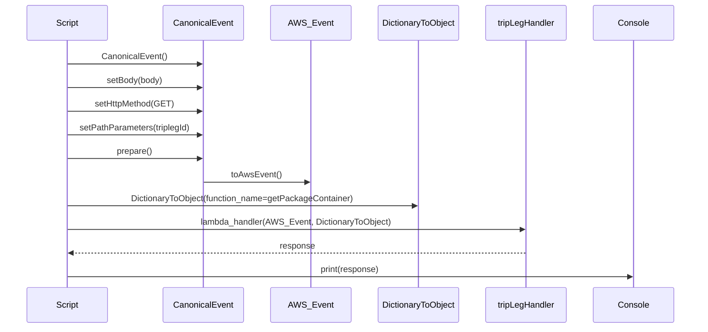
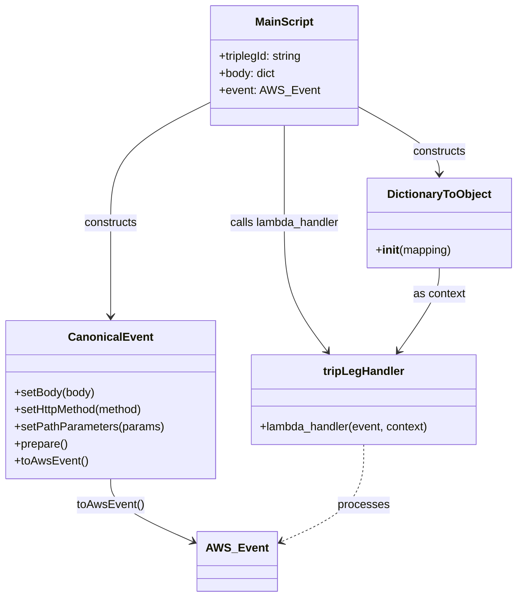

# Diagram: platform/tools/ide_local_testing/localTest/test/partview/trip_leg/getTripLeg.py

> Auto-generated by Obscura crawlers

## Diagram 1

### SVG

<svg id="container" width="1336" xmlns="http://www.w3.org/2000/svg" height="651" viewBox="-50 -10 1336 651" role="graphics-document document" aria-roledescription="sequence"><g><rect x="1086" y="565" fill="#eaeaea" stroke="#666" width="150" height="65" name="Console" rx="3" ry="3" class="actor actor-bottom"></rect><text x="1161" y="597.5" dominant-baseline="central" alignment-baseline="central" class="actor actor-box" style="text-anchor: middle; font-size: 16px; font-weight: 400;"><tspan x="1161" dy="0">Console</tspan></text></g><g><rect x="886" y="565" fill="#eaeaea" stroke="#666" width="150" height="65" name="tripLegHandler" rx="3" ry="3" class="actor actor-bottom"></rect><text x="961" y="597.5" dominant-baseline="central" alignment-baseline="central" class="actor actor-box" style="text-anchor: middle; font-size: 16px; font-weight: 400;"><tspan x="961" dy="0">tripLegHandler</tspan></text></g><g><rect x="678" y="565" fill="#eaeaea" stroke="#666" width="158" height="65" name="DictionaryToObject" rx="3" ry="3" class="actor actor-bottom"></rect><text x="757" y="597.5" dominant-baseline="central" alignment-baseline="central" class="actor actor-box" style="text-anchor: middle; font-size: 16px; font-weight: 400;"><tspan x="757" dy="0">DictionaryToObject</tspan></text></g><g><rect x="478" y="565" fill="#eaeaea" stroke="#666" width="150" height="65" name="AWS_Event" rx="3" ry="3" class="actor actor-bottom"></rect><text x="553" y="597.5" dominant-baseline="central" alignment-baseline="central" class="actor actor-box" style="text-anchor: middle; font-size: 16px; font-weight: 400;"><tspan x="553" dy="0">AWS_Event</tspan></text></g><g><rect x="278" y="565" fill="#eaeaea" stroke="#666" width="150" height="65" name="CanonicalEvent" rx="3" ry="3" class="actor actor-bottom"></rect><text x="353" y="597.5" dominant-baseline="central" alignment-baseline="central" class="actor actor-box" style="text-anchor: middle; font-size: 16px; font-weight: 400;"><tspan x="353" dy="0">CanonicalEvent</tspan></text></g><g><rect x="0" y="565" fill="#eaeaea" stroke="#666" width="150" height="65" name="Script" rx="3" ry="3" class="actor actor-bottom"></rect><text x="75" y="597.5" dominant-baseline="central" alignment-baseline="central" class="actor actor-box" style="text-anchor: middle; font-size: 16px; font-weight: 400;"><tspan x="75" dy="0">Script</tspan></text></g><g><line id="actor5" x1="1161" y1="65" x2="1161" y2="565" class="actor-line 200" stroke-width="0.5px" stroke="#999" name="Console"></line><g id="root-5"><rect x="1086" y="0" fill="#eaeaea" stroke="#666" width="150" height="65" name="Console" rx="3" ry="3" class="actor actor-top"></rect><text x="1161" y="32.5" dominant-baseline="central" alignment-baseline="central" class="actor actor-box" style="text-anchor: middle; font-size: 16px; font-weight: 400;"><tspan x="1161" dy="0">Console</tspan></text></g></g><g><line id="actor4" x1="961" y1="65" x2="961" y2="565" class="actor-line 200" stroke-width="0.5px" stroke="#999" name="tripLegHandler"></line><g id="root-4"><rect x="886" y="0" fill="#eaeaea" stroke="#666" width="150" height="65" name="tripLegHandler" rx="3" ry="3" class="actor actor-top"></rect><text x="961" y="32.5" dominant-baseline="central" alignment-baseline="central" class="actor actor-box" style="text-anchor: middle; font-size: 16px; font-weight: 400;"><tspan x="961" dy="0">tripLegHandler</tspan></text></g></g><g><line id="actor3" x1="757" y1="65" x2="757" y2="565" class="actor-line 200" stroke-width="0.5px" stroke="#999" name="DictionaryToObject"></line><g id="root-3"><rect x="678" y="0" fill="#eaeaea" stroke="#666" width="158" height="65" name="DictionaryToObject" rx="3" ry="3" class="actor actor-top"></rect><text x="757" y="32.5" dominant-baseline="central" alignment-baseline="central" class="actor actor-box" style="text-anchor: middle; font-size: 16px; font-weight: 400;"><tspan x="757" dy="0">DictionaryToObject</tspan></text></g></g><g><line id="actor2" x1="553" y1="65" x2="553" y2="565" class="actor-line 200" stroke-width="0.5px" stroke="#999" name="AWS_Event"></line><g id="root-2"><rect x="478" y="0" fill="#eaeaea" stroke="#666" width="150" height="65" name="AWS_Event" rx="3" ry="3" class="actor actor-top"></rect><text x="553" y="32.5" dominant-baseline="central" alignment-baseline="central" class="actor actor-box" style="text-anchor: middle; font-size: 16px; font-weight: 400;"><tspan x="553" dy="0">AWS_Event</tspan></text></g></g><g><line id="actor1" x1="353" y1="65" x2="353" y2="565" class="actor-line 200" stroke-width="0.5px" stroke="#999" name="CanonicalEvent"></line><g id="root-1"><rect x="278" y="0" fill="#eaeaea" stroke="#666" width="150" height="65" name="CanonicalEvent" rx="3" ry="3" class="actor actor-top"></rect><text x="353" y="32.5" dominant-baseline="central" alignment-baseline="central" class="actor actor-box" style="text-anchor: middle; font-size: 16px; font-weight: 400;"><tspan x="353" dy="0">CanonicalEvent</tspan></text></g></g><g><line id="actor0" x1="75" y1="65" x2="75" y2="565" class="actor-line 200" stroke-width="0.5px" stroke="#999" name="Script"></line><g id="root-0"><rect x="0" y="0" fill="#eaeaea" stroke="#666" width="150" height="65" name="Script" rx="3" ry="3" class="actor actor-top"></rect><text x="75" y="32.5" dominant-baseline="central" alignment-baseline="central" class="actor actor-box" style="text-anchor: middle; font-size: 16px; font-weight: 400;"><tspan x="75" dy="0">Script</tspan></text></g></g><g></g><defs><symbol id="computer" width="24" height="24"><path transform="scale(.5)" d="M2 2v13h20v-13h-20zm18 11h-16v-9h16v9zm-10.228 6l.466-1h3.524l.467 1h-4.457zm14.228 3h-24l2-6h2.104l-1.33 4h18.45l-1.297-4h2.073l2 6zm-5-10h-14v-7h14v7z"></path></symbol></defs><defs><symbol id="database" fill-rule="evenodd" clip-rule="evenodd"><path transform="scale(.5)" d="M12.258.001l.256.004.255.005.253.008.251.01.249.012.247.015.246.016.242.019.241.02.239.023.236.024.233.027.231.028.229.031.225.032.223.034.22.036.217.038.214.04.211.041.208.043.205.045.201.046.198.048.194.05.191.051.187.053.183.054.18.056.175.057.172.059.168.06.163.061.16.063.155.064.15.066.074.033.073.033.071.034.07.034.069.035.068.035.067.035.066.035.064.036.064.036.062.036.06.036.06.037.058.037.058.037.055.038.055.038.053.038.052.038.051.039.05.039.048.039.047.039.045.04.044.04.043.04.041.04.04.041.039.041.037.041.036.041.034.041.033.042.032.042.03.042.029.042.027.042.026.043.024.043.023.043.021.043.02.043.018.044.017.043.015.044.013.044.012.044.011.045.009.044.007.045.006.045.004.045.002.045.001.045v17l-.001.045-.002.045-.004.045-.006.045-.007.045-.009.044-.011.045-.012.044-.013.044-.015.044-.017.043-.018.044-.02.043-.021.043-.023.043-.024.043-.026.043-.027.042-.029.042-.03.042-.032.042-.033.042-.034.041-.036.041-.037.041-.039.041-.04.041-.041.04-.043.04-.044.04-.045.04-.047.039-.048.039-.05.039-.051.039-.052.038-.053.038-.055.038-.055.038-.058.037-.058.037-.06.037-.06.036-.062.036-.064.036-.064.036-.066.035-.067.035-.068.035-.069.035-.07.034-.071.034-.073.033-.074.033-.15.066-.155.064-.16.063-.163.061-.168.06-.172.059-.175.057-.18.056-.183.054-.187.053-.191.051-.194.05-.198.048-.201.046-.205.045-.208.043-.211.041-.214.04-.217.038-.22.036-.223.034-.225.032-.229.031-.231.028-.233.027-.236.024-.239.023-.241.02-.242.019-.246.016-.247.015-.249.012-.251.01-.253.008-.255.005-.256.004-.258.001-.258-.001-.256-.004-.255-.005-.253-.008-.251-.01-.249-.012-.247-.015-.245-.016-.243-.019-.241-.02-.238-.023-.236-.024-.234-.027-.231-.028-.228-.031-.226-.032-.223-.034-.22-.036-.217-.038-.214-.04-.211-.041-.208-.043-.204-.045-.201-.046-.198-.048-.195-.05-.19-.051-.187-.053-.184-.054-.179-.056-.176-.057-.172-.059-.167-.06-.164-.061-.159-.063-.155-.064-.151-.066-.074-.033-.072-.033-.072-.034-.07-.034-.069-.035-.068-.035-.067-.035-.066-.035-.064-.036-.063-.036-.062-.036-.061-.036-.06-.037-.058-.037-.057-.037-.056-.038-.055-.038-.053-.038-.052-.038-.051-.039-.049-.039-.049-.039-.046-.039-.046-.04-.044-.04-.043-.04-.041-.04-.04-.041-.039-.041-.037-.041-.036-.041-.034-.041-.033-.042-.032-.042-.03-.042-.029-.042-.027-.042-.026-.043-.024-.043-.023-.043-.021-.043-.02-.043-.018-.044-.017-.043-.015-.044-.013-.044-.012-.044-.011-.045-.009-.044-.007-.045-.006-.045-.004-.045-.002-.045-.001-.045v-17l.001-.045.002-.045.004-.045.006-.045.007-.045.009-.044.011-.045.012-.044.013-.044.015-.044.017-.043.018-.044.02-.043.021-.043.023-.043.024-.043.026-.043.027-.042.029-.042.03-.042.032-.042.033-.042.034-.041.036-.041.037-.041.039-.041.04-.041.041-.04.043-.04.044-.04.046-.04.046-.039.049-.039.049-.039.051-.039.052-.038.053-.038.055-.038.056-.038.057-.037.058-.037.06-.037.061-.036.062-.036.063-.036.064-.036.066-.035.067-.035.068-.035.069-.035.07-.034.072-.034.072-.033.074-.033.151-.066.155-.064.159-.063.164-.061.167-.06.172-.059.176-.057.179-.056.184-.054.187-.053.19-.051.195-.05.198-.048.201-.046.204-.045.208-.043.211-.041.214-.04.217-.038.22-.036.223-.034.226-.032.228-.031.231-.028.234-.027.236-.024.238-.023.241-.02.243-.019.245-.016.247-.015.249-.012.251-.01.253-.008.255-.005.256-.004.258-.001.258.001zm-9.258 20.499v.01l.001.021.003.021.004.022.005.021.006.022.007.022.009.023.01.022.011.023.012.023.013.023.015.023.016.024.017.023.018.024.019.024.021.024.022.025.023.024.024.025.052.049.056.05.061.051.066.051.07.051.075.051.079.052.084.052.088.052.092.052.097.052.102.051.105.052.11.052.114.051.119.051.123.051.127.05.131.05.135.05.139.048.144.049.147.047.152.047.155.047.16.045.163.045.167.043.171.043.176.041.178.041.183.039.187.039.19.037.194.035.197.035.202.033.204.031.209.03.212.029.216.027.219.025.222.024.226.021.23.02.233.018.236.016.24.015.243.012.246.01.249.008.253.005.256.004.259.001.26-.001.257-.004.254-.005.25-.008.247-.011.244-.012.241-.014.237-.016.233-.018.231-.021.226-.021.224-.024.22-.026.216-.027.212-.028.21-.031.205-.031.202-.034.198-.034.194-.036.191-.037.187-.039.183-.04.179-.04.175-.042.172-.043.168-.044.163-.045.16-.046.155-.046.152-.047.148-.048.143-.049.139-.049.136-.05.131-.05.126-.05.123-.051.118-.052.114-.051.11-.052.106-.052.101-.052.096-.052.092-.052.088-.053.083-.051.079-.052.074-.052.07-.051.065-.051.06-.051.056-.05.051-.05.023-.024.023-.025.021-.024.02-.024.019-.024.018-.024.017-.024.015-.023.014-.024.013-.023.012-.023.01-.023.01-.022.008-.022.006-.022.006-.022.004-.022.004-.021.001-.021.001-.021v-4.127l-.077.055-.08.053-.083.054-.085.053-.087.052-.09.052-.093.051-.095.05-.097.05-.1.049-.102.049-.105.048-.106.047-.109.047-.111.046-.114.045-.115.045-.118.044-.12.043-.122.042-.124.042-.126.041-.128.04-.13.04-.132.038-.134.038-.135.037-.138.037-.139.035-.142.035-.143.034-.144.033-.147.032-.148.031-.15.03-.151.03-.153.029-.154.027-.156.027-.158.026-.159.025-.161.024-.162.023-.163.022-.165.021-.166.02-.167.019-.169.018-.169.017-.171.016-.173.015-.173.014-.175.013-.175.012-.177.011-.178.01-.179.008-.179.008-.181.006-.182.005-.182.004-.184.003-.184.002h-.37l-.184-.002-.184-.003-.182-.004-.182-.005-.181-.006-.179-.008-.179-.008-.178-.01-.176-.011-.176-.012-.175-.013-.173-.014-.172-.015-.171-.016-.17-.017-.169-.018-.167-.019-.166-.02-.165-.021-.163-.022-.162-.023-.161-.024-.159-.025-.157-.026-.156-.027-.155-.027-.153-.029-.151-.03-.15-.03-.148-.031-.146-.032-.145-.033-.143-.034-.141-.035-.14-.035-.137-.037-.136-.037-.134-.038-.132-.038-.13-.04-.128-.04-.126-.041-.124-.042-.122-.042-.12-.044-.117-.043-.116-.045-.113-.045-.112-.046-.109-.047-.106-.047-.105-.048-.102-.049-.1-.049-.097-.05-.095-.05-.093-.052-.09-.051-.087-.052-.085-.053-.083-.054-.08-.054-.077-.054v4.127zm0-5.654v.011l.001.021.003.021.004.021.005.022.006.022.007.022.009.022.01.022.011.023.012.023.013.023.015.024.016.023.017.024.018.024.019.024.021.024.022.024.023.025.024.024.052.05.056.05.061.05.066.051.07.051.075.052.079.051.084.052.088.052.092.052.097.052.102.052.105.052.11.051.114.051.119.052.123.05.127.051.131.05.135.049.139.049.144.048.147.048.152.047.155.046.16.045.163.045.167.044.171.042.176.042.178.04.183.04.187.038.19.037.194.036.197.034.202.033.204.032.209.03.212.028.216.027.219.025.222.024.226.022.23.02.233.018.236.016.24.014.243.012.246.01.249.008.253.006.256.003.259.001.26-.001.257-.003.254-.006.25-.008.247-.01.244-.012.241-.015.237-.016.233-.018.231-.02.226-.022.224-.024.22-.025.216-.027.212-.029.21-.03.205-.032.202-.033.198-.035.194-.036.191-.037.187-.039.183-.039.179-.041.175-.042.172-.043.168-.044.163-.045.16-.045.155-.047.152-.047.148-.048.143-.048.139-.05.136-.049.131-.05.126-.051.123-.051.118-.051.114-.052.11-.052.106-.052.101-.052.096-.052.092-.052.088-.052.083-.052.079-.052.074-.051.07-.052.065-.051.06-.05.056-.051.051-.049.023-.025.023-.024.021-.025.02-.024.019-.024.018-.024.017-.024.015-.023.014-.023.013-.024.012-.022.01-.023.01-.023.008-.022.006-.022.006-.022.004-.021.004-.022.001-.021.001-.021v-4.139l-.077.054-.08.054-.083.054-.085.052-.087.053-.09.051-.093.051-.095.051-.097.05-.1.049-.102.049-.105.048-.106.047-.109.047-.111.046-.114.045-.115.044-.118.044-.12.044-.122.042-.124.042-.126.041-.128.04-.13.039-.132.039-.134.038-.135.037-.138.036-.139.036-.142.035-.143.033-.144.033-.147.033-.148.031-.15.03-.151.03-.153.028-.154.028-.156.027-.158.026-.159.025-.161.024-.162.023-.163.022-.165.021-.166.02-.167.019-.169.018-.169.017-.171.016-.173.015-.173.014-.175.013-.175.012-.177.011-.178.009-.179.009-.179.007-.181.007-.182.005-.182.004-.184.003-.184.002h-.37l-.184-.002-.184-.003-.182-.004-.182-.005-.181-.007-.179-.007-.179-.009-.178-.009-.176-.011-.176-.012-.175-.013-.173-.014-.172-.015-.171-.016-.17-.017-.169-.018-.167-.019-.166-.02-.165-.021-.163-.022-.162-.023-.161-.024-.159-.025-.157-.026-.156-.027-.155-.028-.153-.028-.151-.03-.15-.03-.148-.031-.146-.033-.145-.033-.143-.033-.141-.035-.14-.036-.137-.036-.136-.037-.134-.038-.132-.039-.13-.039-.128-.04-.126-.041-.124-.042-.122-.043-.12-.043-.117-.044-.116-.044-.113-.046-.112-.046-.109-.046-.106-.047-.105-.048-.102-.049-.1-.049-.097-.05-.095-.051-.093-.051-.09-.051-.087-.053-.085-.052-.083-.054-.08-.054-.077-.054v4.139zm0-5.666v.011l.001.02.003.022.004.021.005.022.006.021.007.022.009.023.01.022.011.023.012.023.013.023.015.023.016.024.017.024.018.023.019.024.021.025.022.024.023.024.024.025.052.05.056.05.061.05.066.051.07.051.075.052.079.051.084.052.088.052.092.052.097.052.102.052.105.051.11.052.114.051.119.051.123.051.127.05.131.05.135.05.139.049.144.048.147.048.152.047.155.046.16.045.163.045.167.043.171.043.176.042.178.04.183.04.187.038.19.037.194.036.197.034.202.033.204.032.209.03.212.028.216.027.219.025.222.024.226.021.23.02.233.018.236.017.24.014.243.012.246.01.249.008.253.006.256.003.259.001.26-.001.257-.003.254-.006.25-.008.247-.01.244-.013.241-.014.237-.016.233-.018.231-.02.226-.022.224-.024.22-.025.216-.027.212-.029.21-.03.205-.032.202-.033.198-.035.194-.036.191-.037.187-.039.183-.039.179-.041.175-.042.172-.043.168-.044.163-.045.16-.045.155-.047.152-.047.148-.048.143-.049.139-.049.136-.049.131-.051.126-.05.123-.051.118-.052.114-.051.11-.052.106-.052.101-.052.096-.052.092-.052.088-.052.083-.052.079-.052.074-.052.07-.051.065-.051.06-.051.056-.05.051-.049.023-.025.023-.025.021-.024.02-.024.019-.024.018-.024.017-.024.015-.023.014-.024.013-.023.012-.023.01-.022.01-.023.008-.022.006-.022.006-.022.004-.022.004-.021.001-.021.001-.021v-4.153l-.077.054-.08.054-.083.053-.085.053-.087.053-.09.051-.093.051-.095.051-.097.05-.1.049-.102.048-.105.048-.106.048-.109.046-.111.046-.114.046-.115.044-.118.044-.12.043-.122.043-.124.042-.126.041-.128.04-.13.039-.132.039-.134.038-.135.037-.138.036-.139.036-.142.034-.143.034-.144.033-.147.032-.148.032-.15.03-.151.03-.153.028-.154.028-.156.027-.158.026-.159.024-.161.024-.162.023-.163.023-.165.021-.166.02-.167.019-.169.018-.169.017-.171.016-.173.015-.173.014-.175.013-.175.012-.177.01-.178.01-.179.009-.179.007-.181.006-.182.006-.182.004-.184.003-.184.001-.185.001-.185-.001-.184-.001-.184-.003-.182-.004-.182-.006-.181-.006-.179-.007-.179-.009-.178-.01-.176-.01-.176-.012-.175-.013-.173-.014-.172-.015-.171-.016-.17-.017-.169-.018-.167-.019-.166-.02-.165-.021-.163-.023-.162-.023-.161-.024-.159-.024-.157-.026-.156-.027-.155-.028-.153-.028-.151-.03-.15-.03-.148-.032-.146-.032-.145-.033-.143-.034-.141-.034-.14-.036-.137-.036-.136-.037-.134-.038-.132-.039-.13-.039-.128-.041-.126-.041-.124-.041-.122-.043-.12-.043-.117-.044-.116-.044-.113-.046-.112-.046-.109-.046-.106-.048-.105-.048-.102-.048-.1-.05-.097-.049-.095-.051-.093-.051-.09-.052-.087-.052-.085-.053-.083-.053-.08-.054-.077-.054v4.153zm8.74-8.179l-.257.004-.254.005-.25.008-.247.011-.244.012-.241.014-.237.016-.233.018-.231.021-.226.022-.224.023-.22.026-.216.027-.212.028-.21.031-.205.032-.202.033-.198.034-.194.036-.191.038-.187.038-.183.04-.179.041-.175.042-.172.043-.168.043-.163.045-.16.046-.155.046-.152.048-.148.048-.143.048-.139.049-.136.05-.131.05-.126.051-.123.051-.118.051-.114.052-.11.052-.106.052-.101.052-.096.052-.092.052-.088.052-.083.052-.079.052-.074.051-.07.052-.065.051-.06.05-.056.05-.051.05-.023.025-.023.024-.021.024-.02.025-.019.024-.018.024-.017.023-.015.024-.014.023-.013.023-.012.023-.01.023-.01.022-.008.022-.006.023-.006.021-.004.022-.004.021-.001.021-.001.021.001.021.001.021.004.021.004.022.006.021.006.023.008.022.01.022.01.023.012.023.013.023.014.023.015.024.017.023.018.024.019.024.02.025.021.024.023.024.023.025.051.05.056.05.06.05.065.051.07.052.074.051.079.052.083.052.088.052.092.052.096.052.101.052.106.052.11.052.114.052.118.051.123.051.126.051.131.05.136.05.139.049.143.048.148.048.152.048.155.046.16.046.163.045.168.043.172.043.175.042.179.041.183.04.187.038.191.038.194.036.198.034.202.033.205.032.21.031.212.028.216.027.22.026.224.023.226.022.231.021.233.018.237.016.241.014.244.012.247.011.25.008.254.005.257.004.26.001.26-.001.257-.004.254-.005.25-.008.247-.011.244-.012.241-.014.237-.016.233-.018.231-.021.226-.022.224-.023.22-.026.216-.027.212-.028.21-.031.205-.032.202-.033.198-.034.194-.036.191-.038.187-.038.183-.04.179-.041.175-.042.172-.043.168-.043.163-.045.16-.046.155-.046.152-.048.148-.048.143-.048.139-.049.136-.05.131-.05.126-.051.123-.051.118-.051.114-.052.11-.052.106-.052.101-.052.096-.052.092-.052.088-.052.083-.052.079-.052.074-.051.07-.052.065-.051.06-.05.056-.05.051-.05.023-.025.023-.024.021-.024.02-.025.019-.024.018-.024.017-.023.015-.024.014-.023.013-.023.012-.023.01-.023.01-.022.008-.022.006-.023.006-.021.004-.022.004-.021.001-.021.001-.021-.001-.021-.001-.021-.004-.021-.004-.022-.006-.021-.006-.023-.008-.022-.01-.022-.01-.023-.012-.023-.013-.023-.014-.023-.015-.024-.017-.023-.018-.024-.019-.024-.02-.025-.021-.024-.023-.024-.023-.025-.051-.05-.056-.05-.06-.05-.065-.051-.07-.052-.074-.051-.079-.052-.083-.052-.088-.052-.092-.052-.096-.052-.101-.052-.106-.052-.11-.052-.114-.052-.118-.051-.123-.051-.126-.051-.131-.05-.136-.05-.139-.049-.143-.048-.148-.048-.152-.048-.155-.046-.16-.046-.163-.045-.168-.043-.172-.043-.175-.042-.179-.041-.183-.04-.187-.038-.191-.038-.194-.036-.198-.034-.202-.033-.205-.032-.21-.031-.212-.028-.216-.027-.22-.026-.224-.023-.226-.022-.231-.021-.233-.018-.237-.016-.241-.014-.244-.012-.247-.011-.25-.008-.254-.005-.257-.004-.26-.001-.26.001z"></path></symbol></defs><defs><symbol id="clock" width="24" height="24"><path transform="scale(.5)" d="M12 2c5.514 0 10 4.486 10 10s-4.486 10-10 10-10-4.486-10-10 4.486-10 10-10zm0-2c-6.627 0-12 5.373-12 12s5.373 12 12 12 12-5.373 12-12-5.373-12-12-12zm5.848 12.459c.202.038.202.333.001.372-1.907.361-6.045 1.111-6.547 1.111-.719 0-1.301-.582-1.301-1.301 0-.512.77-5.447 1.125-7.445.034-.192.312-.181.343.014l.985 6.238 5.394 1.011z"></path></symbol></defs><defs><marker id="arrowhead" refX="7.9" refY="5" markerUnits="userSpaceOnUse" markerWidth="12" markerHeight="12" orient="auto-start-reverse"><path d="M -1 0 L 10 5 L 0 10 z"></path></marker></defs><defs><marker id="crosshead" markerWidth="15" markerHeight="8" orient="auto" refX="4" refY="4.5"><path fill="none" stroke="#000000" stroke-width="1pt" d="M 1,2 L 6,7 M 6,2 L 1,7" style="stroke-dasharray: 0, 0;"></path></marker></defs><defs><marker id="filled-head" refX="15.5" refY="7" markerWidth="20" markerHeight="28" orient="auto"><path d="M 18,7 L9,13 L14,7 L9,1 Z"></path></marker></defs><defs><marker id="sequencenumber" refX="15" refY="15" markerWidth="60" markerHeight="40" orient="auto"><circle cx="15" cy="15" r="6"></circle></marker></defs><text x="213" y="80" text-anchor="middle" dominant-baseline="middle" alignment-baseline="middle" class="messageText" dy="1em" style="font-size: 16px; font-weight: 400;">CanonicalEvent()</text><line x1="76" y1="113" x2="349" y2="113" class="messageLine0" stroke-width="2" stroke="none" marker-end="url(#arrowhead)" style="fill: none;"></line><text x="213" y="128" text-anchor="middle" dominant-baseline="middle" alignment-baseline="middle" class="messageText" dy="1em" style="font-size: 16px; font-weight: 400;">setBody(body)</text><line x1="76" y1="161" x2="349" y2="161" class="messageLine0" stroke-width="2" stroke="none" marker-end="url(#arrowhead)" style="fill: none;"></line><text x="213" y="176" text-anchor="middle" dominant-baseline="middle" alignment-baseline="middle" class="messageText" dy="1em" style="font-size: 16px; font-weight: 400;">setHttpMethod(GET)</text><line x1="76" y1="209" x2="349" y2="209" class="messageLine0" stroke-width="2" stroke="none" marker-end="url(#arrowhead)" style="fill: none;"></line><text x="213" y="224" text-anchor="middle" dominant-baseline="middle" alignment-baseline="middle" class="messageText" dy="1em" style="font-size: 16px; font-weight: 400;">setPathParameters(triplegId)</text><line x1="76" y1="257" x2="349" y2="257" class="messageLine0" stroke-width="2" stroke="none" marker-end="url(#arrowhead)" style="fill: none;"></line><text x="213" y="272" text-anchor="middle" dominant-baseline="middle" alignment-baseline="middle" class="messageText" dy="1em" style="font-size: 16px; font-weight: 400;">prepare()</text><line x1="76" y1="305" x2="349" y2="305" class="messageLine0" stroke-width="2" stroke="none" marker-end="url(#arrowhead)" style="fill: none;"></line><text x="452" y="320" text-anchor="middle" dominant-baseline="middle" alignment-baseline="middle" class="messageText" dy="1em" style="font-size: 16px; font-weight: 400;">toAwsEvent()</text><line x1="354" y1="353" x2="549" y2="353" class="messageLine0" stroke-width="2" stroke="none" marker-end="url(#arrowhead)" style="fill: none;"></line><text x="415" y="368" text-anchor="middle" dominant-baseline="middle" alignment-baseline="middle" class="messageText" dy="1em" style="font-size: 16px; font-weight: 400;">DictionaryToObject(function_name=getPackageContainer)</text><line x1="76" y1="401" x2="753" y2="401" class="messageLine0" stroke-width="2" stroke="none" marker-end="url(#arrowhead)" style="fill: none;"></line><text x="517" y="416" text-anchor="middle" dominant-baseline="middle" alignment-baseline="middle" class="messageText" dy="1em" style="font-size: 16px; font-weight: 400;">lambda_handler(AWS_Event, DictionaryToObject)</text><line x1="76" y1="449" x2="957" y2="449" class="messageLine0" stroke-width="2" stroke="none" marker-end="url(#arrowhead)" style="fill: none;"></line><text x="520" y="464" text-anchor="middle" dominant-baseline="middle" alignment-baseline="middle" class="messageText" dy="1em" style="font-size: 16px; font-weight: 400;">response</text><line x1="960" y1="497" x2="79" y2="497" class="messageLine1" stroke-width="2" stroke="none" marker-end="url(#arrowhead)" style="stroke-dasharray: 3, 3; fill: none;"></line><text x="617" y="512" text-anchor="middle" dominant-baseline="middle" alignment-baseline="middle" class="messageText" dy="1em" style="font-size: 16px; font-weight: 400;">print(response)</text><line x1="76" y1="545" x2="1157" y2="545" class="messageLine0" stroke-width="2" stroke="none" marker-end="url(#arrowhead)" style="fill: none;"></line></svg>

## Diagram 2

### SVG

<svg id="container" width="720.171875" xmlns="http://www.w3.org/2000/svg" class="classDiagram" height="838" viewBox="0 0 720.171875 838" role="graphics-document document" aria-roledescription="class"><g><defs><marker id="container_class-aggregationStart" class="marker aggregation class" refX="18" refY="7" markerWidth="190" markerHeight="240" orient="auto"><path d="M 18,7 L9,13 L1,7 L9,1 Z"></path></marker></defs><defs><marker id="container_class-aggregationEnd" class="marker aggregation class" refX="1" refY="7" markerWidth="20" markerHeight="28" orient="auto"><path d="M 18,7 L9,13 L1,7 L9,1 Z"></path></marker></defs><defs><marker id="container_class-extensionStart" class="marker extension class" refX="18" refY="7" markerWidth="190" markerHeight="240" orient="auto"><path d="M 1,7 L18,13 V 1 Z"></path></marker></defs><defs><marker id="container_class-extensionEnd" class="marker extension class" refX="1" refY="7" markerWidth="20" markerHeight="28" orient="auto"><path d="M 1,1 V 13 L18,7 Z"></path></marker></defs><defs><marker id="container_class-compositionStart" class="marker composition class" refX="18" refY="7" markerWidth="190" markerHeight="240" orient="auto"><path d="M 18,7 L9,13 L1,7 L9,1 Z"></path></marker></defs><defs><marker id="container_class-compositionEnd" class="marker composition class" refX="1" refY="7" markerWidth="20" markerHeight="28" orient="auto"><path d="M 18,7 L9,13 L1,7 L9,1 Z"></path></marker></defs><defs><marker id="container_class-dependencyStart" class="marker dependency class" refX="6" refY="7" markerWidth="190" markerHeight="240" orient="auto"><path d="M 5,7 L9,13 L1,7 L9,1 Z"></path></marker></defs><defs><marker id="container_class-dependencyEnd" class="marker dependency class" refX="13" refY="7" markerWidth="20" markerHeight="28" orient="auto"><path d="M 18,7 L9,13 L14,7 L9,1 Z"></path></marker></defs><defs><marker id="container_class-lollipopStart" class="marker lollipop class" refX="13" refY="7" markerWidth="190" markerHeight="240" orient="auto"><circle stroke="black" fill="transparent" cx="7" cy="7" r="6"></circle></marker></defs><defs><marker id="container_class-lollipopEnd" class="marker lollipop class" refX="1" refY="7" markerWidth="190" markerHeight="240" orient="auto"><circle stroke="black" fill="transparent" cx="7" cy="7" r="6"></circle></marker></defs><g class="root"><g class="clusters"></g><g class="edgePaths"><path d="M297.273,141.046L273.011,153.038C248.749,165.03,200.224,189.015,175.962,217.674C151.699,246.333,151.699,279.667,151.699,313C151.699,346.333,151.699,379.667,151.699,401.5C151.699,423.333,151.699,433.667,151.699,438.833L151.699,444" id="id_MainScript_CanonicalEvent_1" class="edge-thickness-normal edge-pattern-solid relation" style=";;;" data-edge="true" data-et="edge" data-id="id_MainScript_CanonicalEvent_1" data-points="W3sieCI6Mjk3LjI3MzQzNzUsInkiOjE0MS4wNDU2NTI1NTU0ODk5N30seyJ4IjoxNTEuNjk5MjE4NzUsInkiOjIxM30seyJ4IjoxNTEuNjk5MjE4NzUsInkiOjMxM30seyJ4IjoxNTEuNjk5MjE4NzUsInkiOjQxM30seyJ4IjoxNTEuNjk5MjE4NzUsInkiOjQ1MH1d" marker-end="url(#container_class-dependencyEnd)"></path><path d="M495.727,147.74L515.089,158.617C534.451,169.494,573.174,191.247,592.536,207.29C611.898,223.333,611.898,233.667,611.898,238.833L611.898,244" id="id_MainScript_DictionaryToObject_2" class="edge-thickness-normal edge-pattern-solid relation" style=";;;" data-edge="true" data-et="edge" data-id="id_MainScript_DictionaryToObject_2" data-points="W3sieCI6NDk1LjcyNjU2MjUsInkiOjE0Ny43NDA0ODgxOTQxMTd9LHsieCI6NjExLjg5ODQzNzUsInkiOjIxM30seyJ4Ijo2MTEuODk4NDM3NSwieSI6MjUwfV0=" marker-end="url(#container_class-dependencyEnd)"></path><path d="M151.699,672L151.699,678.167C151.699,684.333,151.699,696.667,171.546,711.707C191.393,726.748,231.087,744.496,250.934,753.37L270.78,762.244" id="id_CanonicalEvent_AWS_Event_3" class="edge-thickness-normal edge-pattern-solid relation" style=";;;" data-edge="true" data-et="edge" data-id="id_CanonicalEvent_AWS_Event_3" data-points="W3sieCI6MTUxLjY5OTIxODc1LCJ5Ijo2NzJ9LHsieCI6MTUxLjY5OTIxODc1LCJ5Ijo3MDl9LHsieCI6Mjc2LjI1NzgxMjUsInkiOjc2NC42OTM1MDY2NjU3ODI0fV0=" marker-end="url(#container_class-dependencyEnd)"></path><path d="M396.5,176L396.5,182.167C396.5,188.333,396.5,200.667,396.5,223.5C396.5,246.333,396.5,279.667,396.5,313C396.5,346.333,396.5,379.667,406.301,409.694C416.101,439.721,435.702,466.441,445.503,479.802L455.303,493.162" id="id_MainScript_tripLegHandler_4" class="edge-thickness-normal edge-pattern-solid relation" style=";;;" data-edge="true" data-et="edge" data-id="id_MainScript_tripLegHandler_4" data-points="W3sieCI6Mzk2LjUsInkiOjE3Nn0seyJ4IjozOTYuNSwieSI6MjEzfSx7IngiOjM5Ni41LCJ5IjozMTN9LHsieCI6Mzk2LjUsInkiOjQxM30seyJ4Ijo0NTguODUyMzI3OTEzODUxMzUsInkiOjQ5OH1d" marker-end="url(#container_class-dependencyEnd)"></path><path d="M611.898,376L611.898,382.167C611.898,388.333,611.898,400.667,602.258,420.189C592.617,439.712,573.335,466.423,563.695,479.779L554.054,493.135" id="id_DictionaryToObject_tripLegHandler_5" class="edge-thickness-normal edge-pattern-solid relation" style=";;;" data-edge="true" data-et="edge" data-id="id_DictionaryToObject_tripLegHandler_5" data-points="W3sieCI6NjExLjg5ODQzNzUsInkiOjM3Nn0seyJ4Ijo2MTEuODk4NDM3NSwieSI6NDEzfSx7IngiOjU1MC41NDIyMDMzMzYxNDg2LCJ5Ijo0OTh9XQ==" marker-end="url(#container_class-dependencyEnd)"></path><path d="M505.066,624L505.066,638.167C505.066,652.333,505.066,680.667,485.22,703.707C465.373,726.748,425.679,744.496,405.832,753.37L385.985,762.244" id="id_tripLegHandler_AWS_Event_6" class="edge-thickness-normal edge-pattern-dashed relation" style=";;;" data-edge="true" data-et="edge" data-id="id_tripLegHandler_AWS_Event_6" data-points="W3sieCI6NTA1LjA2NjQwNjI1LCJ5Ijo2MjR9LHsieCI6NTA1LjA2NjQwNjI1LCJ5Ijo3MDl9LHsieCI6MzgwLjUwNzgxMjUsInkiOjc2NC42OTM1MDY2NjU3ODI0fV0=" marker-end="url(#container_class-dependencyEnd)"></path></g><g class="edgeLabels"><g class="edgeLabel" transform="translate(151.69921875, 313)"><g class="label" data-id="id_MainScript_CanonicalEvent_1" transform="translate(-37.84375, -12)"><foreignObject width="75.6875" height="24">

constructs

</foreignObject></g></g><g class="edgeLabel" transform="translate(611.8984375, 213)"><g class="label" data-id="id_MainScript_DictionaryToObject_2" transform="translate(-37.84375, -12)"><foreignObject width="75.6875" height="24">

constructs

</foreignObject></g></g><g class="edgeLabel" transform="translate(151.69921875, 709)"><g class="label" data-id="id_CanonicalEvent_AWS_Event_3" transform="translate(-46.640625, -12)"><foreignObject width="93.28125" height="24">

toAwsEvent()

</foreignObject></g></g><g class="edgeLabel" transform="translate(396.5, 313)"><g class="label" data-id="id_MainScript_tripLegHandler_4" transform="translate(-78.390625, -12)"><foreignObject width="156.78125" height="24">

calls lambda_handler

</foreignObject></g></g><g class="edgeLabel" transform="translate(611.8984375, 413)"><g class="label" data-id="id_DictionaryToObject_tripLegHandler_5" transform="translate(-36.9765625, -12)"><foreignObject width="73.953125" height="24">

as context

</foreignObject></g></g><g class="edgeLabel" transform="translate(505.06640625, 709)"><g class="label" data-id="id_tripLegHandler_AWS_Event_6" transform="translate(-35.7890625, -12)"><foreignObject width="71.578125" height="24">

processes

</foreignObject></g></g></g><g class="nodes"><g class="node default" id="classId-MainScript-0" transform="translate(396.5, 92)"><g class="basic label-container"><path d="M-99.2265625 -84 L99.2265625 -84 L99.2265625 84 L-99.2265625 84" stroke="none" stroke-width="0" fill="#ECECFF" style=""></path><path d="M-99.2265625 -84 C-26.73041639615137 -84, 45.76572970769726 -84, 99.2265625 -84 M-99.2265625 -84 C-30.249785783776375 -84, 38.72699093244725 -84, 99.2265625 -84 M99.2265625 -84 C99.2265625 -50.0226200578986, 99.2265625 -16.0452401157972, 99.2265625 84 M99.2265625 -84 C99.2265625 -45.608033472457784, 99.2265625 -7.216066944915568, 99.2265625 84 M99.2265625 84 C55.062316290175715 84, 10.898070080351431 84, -99.2265625 84 M99.2265625 84 C37.02369666869812 84, -25.179169162603756 84, -99.2265625 84 M-99.2265625 84 C-99.2265625 26.060130159703988, -99.2265625 -31.879739680592024, -99.2265625 -84 M-99.2265625 84 C-99.2265625 33.40794659628645, -99.2265625 -17.1841068074271, -99.2265625 -84" stroke="#9370DB" stroke-width="1.3" fill="none" stroke-dasharray="0 0" style=""></path></g><g class="annotation-group text" transform="translate(0, -60)"></g><g class="label-group text" transform="translate(-39.28125, -60)"><g class="label" style="font-weight: bolder" transform="translate(0,-12)"><foreignObject width="78.5625" height="24">

MainScript

</foreignObject></g></g><g class="members-group text" transform="translate(-87.2265625, -12)"><g class="label" style="" transform="translate(0,-12)"><foreignObject width="119.53125" height="24">

+triplegId: string

</foreignObject></g><g class="label" style="" transform="translate(0,12)"><foreignObject width="79.921875" height="24">

+body: dict

</foreignObject></g><g class="label" style="" transform="translate(0,36)"><foreignObject width="135.171875" height="24">

+event: AWS_Event

</foreignObject></g></g><g class="methods-group text" transform="translate(-87.2265625, 84)"></g><g class="divider" style=""><path d="M-99.2265625 -36 C-32.09216832621941 -36, 35.042225847561184 -36, 99.2265625 -36 M-99.2265625 -36 C-53.710097853601276 -36, -8.193633207202552 -36, 99.2265625 -36" stroke="#9370DB" stroke-width="1.3" fill="none" stroke-dasharray="0 0" style=""></path></g><g class="divider" style=""><path d="M-99.2265625 60 C-38.50913042924684 60, 22.208301641506324 60, 99.2265625 60 M-99.2265625 60 C-49.404038423329666 60, 0.41848565334066734 60, 99.2265625 60" stroke="#9370DB" stroke-width="1.3" fill="none" stroke-dasharray="0 0" style=""></path></g></g><g class="node default" id="classId-CanonicalEvent-1" transform="translate(151.69921875, 561)"><g class="basic label-container"><path d="M-143.69921875 -111 L143.69921875 -111 L143.69921875 111 L-143.69921875 111" stroke="none" stroke-width="0" fill="#ECECFF" style=""></path><path d="M-143.69921875 -111 C-72.42511581446117 -111, -1.1510128789223302 -111, 143.69921875 -111 M-143.69921875 -111 C-47.1234414644651 -111, 49.452335821069795 -111, 143.69921875 -111 M143.69921875 -111 C143.69921875 -49.86799025244898, 143.69921875 11.264019495102033, 143.69921875 111 M143.69921875 -111 C143.69921875 -51.489392561445264, 143.69921875 8.021214877109472, 143.69921875 111 M143.69921875 111 C54.53956664968882 111, -34.620085450622355 111, -143.69921875 111 M143.69921875 111 C73.13478523345223 111, 2.5703517169044687 111, -143.69921875 111 M-143.69921875 111 C-143.69921875 22.653034609886745, -143.69921875 -65.69393078022651, -143.69921875 -111 M-143.69921875 111 C-143.69921875 44.37158019109849, -143.69921875 -22.256839617803024, -143.69921875 -111" stroke="#9370DB" stroke-width="1.3" fill="none" stroke-dasharray="0 0" style=""></path></g><g class="annotation-group text" transform="translate(0, -87)"></g><g class="label-group text" transform="translate(-55.7109375, -87)"><g class="label" style="font-weight: bolder" transform="translate(0,-12)"><foreignObject width="111.421875" height="24">

CanonicalEvent

</foreignObject></g></g><g class="members-group text" transform="translate(-131.69921875, -39)"></g><g class="methods-group text" transform="translate(-131.69921875, -9)"><g class="label" style="" transform="translate(0,-12)"><foreignObject width="113.125" height="24">

+setBody(body)

</foreignObject></g><g class="label" style="" transform="translate(0,12)"><foreignObject width="184" height="24">

+setHttpMethod(method)

</foreignObject></g><g class="label" style="" transform="translate(0,36)"><foreignObject width="207.6875" height="24">

+setPathParameters(params)

</foreignObject></g><g class="label" style="" transform="translate(0,60)"><foreignObject width="74.75" height="24">

+prepare()

</foreignObject></g><g class="label" style="" transform="translate(0,84)"><foreignObject width="101.1875" height="24">

+toAwsEvent()

</foreignObject></g></g><g class="divider" style=""><path d="M-143.69921875 -63 C-55.101739589606325 -63, 33.49573957078735 -63, 143.69921875 -63 M-143.69921875 -63 C-50.78878604333015 -63, 42.1216466633397 -63, 143.69921875 -63" stroke="#9370DB" stroke-width="1.3" fill="none" stroke-dasharray="0 0" style=""></path></g><g class="divider" style=""><path d="M-143.69921875 -39 C-63.74890806032397 -39, 16.20140262935206 -39, 143.69921875 -39 M-143.69921875 -39 C-32.886498876874384 -39, 77.92622099625123 -39, 143.69921875 -39" stroke="#9370DB" stroke-width="1.3" fill="none" stroke-dasharray="0 0" style=""></path></g></g><g class="node default" id="classId-DictionaryToObject-2" transform="translate(611.8984375, 313)"><g class="basic label-container"><path d="M-100.2734375 -63 L100.2734375 -63 L100.2734375 63 L-100.2734375 63" stroke="none" stroke-width="0" fill="#ECECFF" style=""></path><path d="M-100.2734375 -63 C-52.74589831659688 -63, -5.218359133193758 -63, 100.2734375 -63 M-100.2734375 -63 C-49.80321917161556 -63, 0.6669991567688811 -63, 100.2734375 -63 M100.2734375 -63 C100.2734375 -16.13573250679353, 100.2734375 30.72853498641294, 100.2734375 63 M100.2734375 -63 C100.2734375 -20.464343077462537, 100.2734375 22.071313845074926, 100.2734375 63 M100.2734375 63 C52.59153541995059 63, 4.909633339901177 63, -100.2734375 63 M100.2734375 63 C45.720282355365946 63, -8.832872789268109 63, -100.2734375 63 M-100.2734375 63 C-100.2734375 27.370319653139653, -100.2734375 -8.259360693720694, -100.2734375 -63 M-100.2734375 63 C-100.2734375 33.94956039482278, -100.2734375 4.899120789645572, -100.2734375 -63" stroke="#9370DB" stroke-width="1.3" fill="none" stroke-dasharray="0 0" style=""></path></g><g class="annotation-group text" transform="translate(0, -39)"></g><g class="label-group text" transform="translate(-70.109375, -39)"><g class="label" style="font-weight: bolder" transform="translate(0,-12)"><foreignObject width="140.21875" height="24">

DictionaryToObject

</foreignObject></g></g><g class="members-group text" transform="translate(-88.2734375, 9)"></g><g class="methods-group text" transform="translate(-88.2734375, 39)"><g class="label" style="" transform="translate(0,-12)"><foreignObject width="106.4375" height="24">

+<strong>init</strong>(mapping)

</foreignObject></g></g><g class="divider" style=""><path d="M-100.2734375 -15 C-21.039837809289068 -15, 58.193761881421864 -15, 100.2734375 -15 M-100.2734375 -15 C-35.076452398882125 -15, 30.12053270223575 -15, 100.2734375 -15" stroke="#9370DB" stroke-width="1.3" fill="none" stroke-dasharray="0 0" style=""></path></g><g class="divider" style=""><path d="M-100.2734375 9 C-38.50415644782547 9, 23.265124604349054 9, 100.2734375 9 M-100.2734375 9 C-40.987806690604366 9, 18.29782411879127 9, 100.2734375 9" stroke="#9370DB" stroke-width="1.3" fill="none" stroke-dasharray="0 0" style=""></path></g></g><g class="node default" id="classId-tripLegHandler-3" transform="translate(505.06640625, 561)"><g class="basic label-container"><path d="M-159.66796875 -63 L159.66796875 -63 L159.66796875 63 L-159.66796875 63" stroke="none" stroke-width="0" fill="#ECECFF" style=""></path><path d="M-159.66796875 -63 C-43.473543335763964 -63, 72.72088207847207 -63, 159.66796875 -63 M-159.66796875 -63 C-67.34606724292756 -63, 24.97583426414488 -63, 159.66796875 -63 M159.66796875 -63 C159.66796875 -24.160897945996354, 159.66796875 14.678204108007293, 159.66796875 63 M159.66796875 -63 C159.66796875 -26.14199490586632, 159.66796875 10.716010188267362, 159.66796875 63 M159.66796875 63 C90.70851140702818 63, 21.749054064056367 63, -159.66796875 63 M159.66796875 63 C55.289846103429326 63, -49.08827654314135 63, -159.66796875 63 M-159.66796875 63 C-159.66796875 30.081446331156975, -159.66796875 -2.8371073376860494, -159.66796875 -63 M-159.66796875 63 C-159.66796875 28.8987847895014, -159.66796875 -5.202430420997203, -159.66796875 -63" stroke="#9370DB" stroke-width="1.3" fill="none" stroke-dasharray="0 0" style=""></path></g><g class="annotation-group text" transform="translate(0, -39)"></g><g class="label-group text" transform="translate(-55.1484375, -39)"><g class="label" style="font-weight: bolder" transform="translate(0,-12)"><foreignObject width="110.296875" height="24">

tripLegHandler

</foreignObject></g></g><g class="members-group text" transform="translate(-147.66796875, 9)"></g><g class="methods-group text" transform="translate(-147.66796875, 39)"><g class="label" style="" transform="translate(0,-12)"><foreignObject width="240.1875" height="24">

+lambda_handler(event, context)

</foreignObject></g></g><g class="divider" style=""><path d="M-159.66796875 -15 C-56.434055524242424 -15, 46.79985770151515 -15, 159.66796875 -15 M-159.66796875 -15 C-91.89134679426694 -15, -24.114724838533874 -15, 159.66796875 -15" stroke="#9370DB" stroke-width="1.3" fill="none" stroke-dasharray="0 0" style=""></path></g><g class="divider" style=""><path d="M-159.66796875 9 C-85.84391016870015 9, -12.019851587400296 9, 159.66796875 9 M-159.66796875 9 C-47.2412104216796 9, 65.1855479066408 9, 159.66796875 9" stroke="#9370DB" stroke-width="1.3" fill="none" stroke-dasharray="0 0" style=""></path></g></g><g class="node default" id="classId-AWS_Event-4" transform="translate(328.3828125, 788)"><g class="basic label-container"><path d="M-52.125 -42 L52.125 -42 L52.125 42 L-52.125 42" stroke="none" stroke-width="0" fill="#ECECFF" style=""></path><path d="M-52.125 -42 C-10.467775789867616 -42, 31.189448420264767 -42, 52.125 -42 M-52.125 -42 C-14.813909674250034 -42, 22.49718065149993 -42, 52.125 -42 M52.125 -42 C52.125 -19.947033600269098, 52.125 2.1059327994618044, 52.125 42 M52.125 -42 C52.125 -16.095892239155013, 52.125 9.808215521689974, 52.125 42 M52.125 42 C10.74423170167102 42, -30.63653659665796 42, -52.125 42 M52.125 42 C29.541444577290616 42, 6.957889154581231 42, -52.125 42 M-52.125 42 C-52.125 22.112001950245897, -52.125 2.2240039004917946, -52.125 -42 M-52.125 42 C-52.125 13.581704552395333, -52.125 -14.836590895209333, -52.125 -42" stroke="#9370DB" stroke-width="1.3" fill="none" stroke-dasharray="0 0" style=""></path></g><g class="annotation-group text" transform="translate(0, -18)"></g><g class="label-group text" transform="translate(-40.125, -18)"><g class="label" style="font-weight: bolder" transform="translate(0,-12)"><foreignObject width="80.25" height="24">

AWS_Event

</foreignObject></g></g><g class="members-group text" transform="translate(-40.125, 30)"></g><g class="methods-group text" transform="translate(-40.125, 60)"></g><g class="divider" style=""><path d="M-52.125 6 C-23.374307421318218 6, 5.376385157363565 6, 52.125 6 M-52.125 6 C-29.273861106591788 6, -6.422722213183576 6, 52.125 6" stroke="#9370DB" stroke-width="1.3" fill="none" stroke-dasharray="0 0" style=""></path></g><g class="divider" style=""><path d="M-52.125 24 C-15.676728644229442 24, 20.771542711541116 24, 52.125 24 M-52.125 24 C-30.3653904105584 24, -8.605780821116802 24, 52.125 24" stroke="#9370DB" stroke-width="1.3" fill="none" stroke-dasharray="0 0" style=""></path></g></g></g></g></g></svg>
