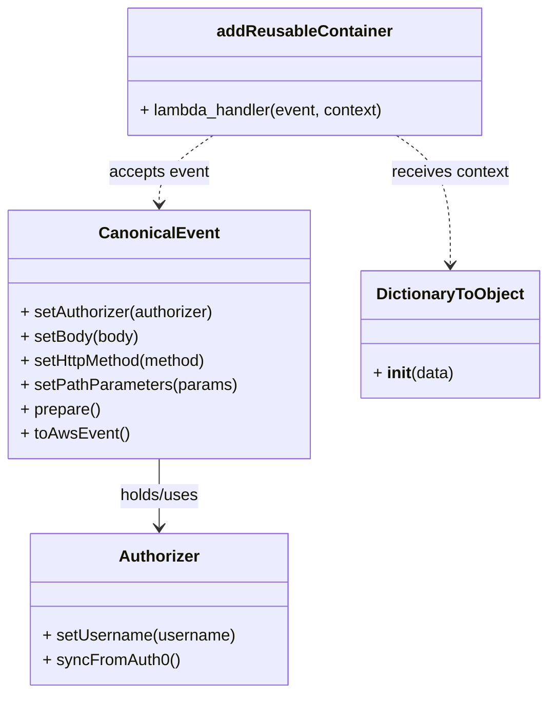

# Diagram: platform/tools/ide_local_testing/localTest/test/reusableContainerTracking/addReuseableContainer.py


> Auto-generated by Obscura crawlers

## Diagram 1

```mermaid
flowchart TD
    Start[Start]
    Imports[Import modules: uuid, addReusableContainer, DictionaryToObject, CanonicalEvent, Authorizer]
    GenUUID[Generate tagId via uuid.uuid4()]
    Body[Construct body dict (containerId, tagId, ...)]
    Auth[Authorizer.setUsername(...) ; syncFromAuth0()]
    CE[CanonicalEvent chain: setAuthorizer, setBody, setHttpMethod('POST'), setPathParameters, prepare, toAwsEvent]
    Context[DictionaryToObject({'function_name':'addReusableContainer'})]
    Call[Invoke addReusableContainer.lambda_handler(event, context)]
    Print[print(lambda_handler result)]
    Start --> Imports --> GenUUID --> Body --> Auth --> CE --> Call --> Print
    Context --> Call
```

> SVG rendering failed for this diagram.

## Diagram 2



### SVG

<svg id="container" width="531.4296875" xmlns="http://www.w3.org/2000/svg" class="classDiagram" height="686" viewBox="0 0 531.4296875 686" role="graphics-document document" aria-roledescription="class"><style>#container{font-family:"trebuchet ms",verdana,arial,sans-serif;font-size:16px;fill:#333;}@keyframes edge-animation-frame{from{stroke-dashoffset:0;}}@keyframes dash{to{stroke-dashoffset:0;}}#container .edge-animation-slow{stroke-dasharray:9,5!important;stroke-dashoffset:900;animation:dash 50s linear infinite;stroke-linecap:round;}#container .edge-animation-fast{stroke-dasharray:9,5!important;stroke-dashoffset:900;animation:dash 20s linear infinite;stroke-linecap:round;}#container .error-icon{fill:#552222;}#container .error-text{fill:#552222;stroke:#552222;}#container .edge-thickness-normal{stroke-width:1px;}#container .edge-thickness-thick{stroke-width:3.5px;}#container .edge-pattern-solid{stroke-dasharray:0;}#container .edge-thickness-invisible{stroke-width:0;fill:none;}#container .edge-pattern-dashed{stroke-dasharray:3;}#container .edge-pattern-dotted{stroke-dasharray:2;}#container .marker{fill:#333333;stroke:#333333;}#container .marker.cross{stroke:#333333;}#container svg{font-family:"trebuchet ms",verdana,arial,sans-serif;font-size:16px;}#container p{margin:0;}#container g.classGroup text{fill:#9370DB;stroke:none;font-family:"trebuchet ms",verdana,arial,sans-serif;font-size:10px;}#container g.classGroup text .title{font-weight:bolder;}#container .nodeLabel,#container .edgeLabel{color:#131300;}#container .edgeLabel .label rect{fill:#ECECFF;}#container .label text{fill:#131300;}#container .labelBkg{background:#ECECFF;}#container .edgeLabel .label span{background:#ECECFF;}#container .classTitle{font-weight:bolder;}#container .node rect,#container .node circle,#container .node ellipse,#container .node polygon,#container .node path{fill:#ECECFF;stroke:#9370DB;stroke-width:1px;}#container .divider{stroke:#9370DB;stroke-width:1;}#container g.clickable{cursor:pointer;}#container g.classGroup rect{fill:#ECECFF;stroke:#9370DB;}#container g.classGroup line{stroke:#9370DB;stroke-width:1;}#container .classLabel .box{stroke:none;stroke-width:0;fill:#ECECFF;opacity:0.5;}#container .classLabel .label{fill:#9370DB;font-size:10px;}#container .relation{stroke:#333333;stroke-width:1;fill:none;}#container .dashed-line{stroke-dasharray:3;}#container .dotted-line{stroke-dasharray:1 2;}#container #compositionStart,#container .composition{fill:#333333!important;stroke:#333333!important;stroke-width:1;}#container #compositionEnd,#container .composition{fill:#333333!important;stroke:#333333!important;stroke-width:1;}#container #dependencyStart,#container .dependency{fill:#333333!important;stroke:#333333!important;stroke-width:1;}#container #dependencyStart,#container .dependency{fill:#333333!important;stroke:#333333!important;stroke-width:1;}#container #extensionStart,#container .extension{fill:transparent!important;stroke:#333333!important;stroke-width:1;}#container #extensionEnd,#container .extension{fill:transparent!important;stroke:#333333!important;stroke-width:1;}#container #aggregationStart,#container .aggregation{fill:transparent!important;stroke:#333333!important;stroke-width:1;}#container #aggregationEnd,#container .aggregation{fill:transparent!important;stroke:#333333!important;stroke-width:1;}#container #lollipopStart,#container .lollipop{fill:#ECECFF!important;stroke:#333333!important;stroke-width:1;}#container #lollipopEnd,#container .lollipop{fill:#ECECFF!important;stroke:#333333!important;stroke-width:1;}#container .edgeTerminals{font-size:11px;line-height:initial;}#container .classTitleText{text-anchor:middle;font-size:18px;fill:#333;}#container .label-icon{display:inline-block;height:1em;overflow:visible;vertical-align:-0.125em;}#container .node .label-icon path{fill:currentColor;stroke:revert;stroke-width:revert;}#container :root{--mermaid-font-family:"trebuchet ms",verdana,arial,sans-serif;}</style><g><defs><marker id="container_class-aggregationStart" class="marker aggregation class" refX="18" refY="7" markerWidth="190" markerHeight="240" orient="auto"><path d="M 18,7 L9,13 L1,7 L9,1 Z"></path></marker></defs><defs><marker id="container_class-aggregationEnd" class="marker aggregation class" refX="1" refY="7" markerWidth="20" markerHeight="28" orient="auto"><path d="M 18,7 L9,13 L1,7 L9,1 Z"></path></marker></defs><defs><marker id="container_class-extensionStart" class="marker extension class" refX="18" refY="7" markerWidth="190" markerHeight="240" orient="auto"><path d="M 1,7 L18,13 V 1 Z"></path></marker></defs><defs><marker id="container_class-extensionEnd" class="marker extension class" refX="1" refY="7" markerWidth="20" markerHeight="28" orient="auto"><path d="M 1,1 V 13 L18,7 Z"></path></marker></defs><defs><marker id="container_class-compositionStart" class="marker composition class" refX="18" refY="7" markerWidth="190" markerHeight="240" orient="auto"><path d="M 18,7 L9,13 L1,7 L9,1 Z"></path></marker></defs><defs><marker id="container_class-compositionEnd" class="marker composition class" refX="1" refY="7" markerWidth="20" markerHeight="28" orient="auto"><path d="M 18,7 L9,13 L1,7 L9,1 Z"></path></marker></defs><defs><marker id="container_class-dependencyStart" class="marker dependency class" refX="6" refY="7" markerWidth="190" markerHeight="240" orient="auto"><path d="M 5,7 L9,13 L1,7 L9,1 Z"></path></marker></defs><defs><marker id="container_class-dependencyEnd" class="marker dependency class" refX="13" refY="7" markerWidth="20" markerHeight="28" orient="auto"><path d="M 18,7 L9,13 L14,7 L9,1 Z"></path></marker></defs><defs><marker id="container_class-lollipopStart" class="marker lollipop class" refX="13" refY="7" markerWidth="190" markerHeight="240" orient="auto"><circle stroke="black" fill="transparent" cx="7" cy="7" r="6"></circle></marker></defs><defs><marker id="container_class-lollipopEnd" class="marker lollipop class" refX="1" refY="7" markerWidth="190" markerHeight="240" orient="auto"><circle stroke="black" fill="transparent" cx="7" cy="7" r="6"></circle></marker></defs><g class="root"><g class="clusters"></g><g class="edgePaths"><path d="M153.816,454L153.816,460.167C153.816,466.333,153.816,478.667,153.816,490C153.816,501.333,153.816,511.667,153.816,516.833L153.816,522" id="id_CanonicalEvent_Authorizer_1" class="edge-thickness-normal edge-pattern-solid relation" style=";;;" data-edge="true" data-et="edge" data-id="id_CanonicalEvent_Authorizer_1" data-points="W3sieCI6MTUzLjgxNjQwNjI1LCJ5Ijo0NTR9LHsieCI6MTUzLjgxNjQwNjI1LCJ5Ijo0OTF9LHsieCI6MTUzLjgxNjQwNjI1LCJ5Ijo1Mjh9XQ==" marker-end="url(#container_class-dependencyEnd)"></path><path d="M206.119,134L197.402,140.167C188.685,146.333,171.25,158.667,162.533,170C153.816,181.333,153.816,191.667,153.816,196.833L153.816,202" id="id_addReusableContainer_CanonicalEvent_2" class="edge-thickness-normal edge-pattern-dashed relation" style=";;;" data-edge="true" data-et="edge" data-id="id_addReusableContainer_CanonicalEvent_2" data-points="W3sieCI6MjA2LjExODY1MjM0Mzc1LCJ5IjoxMzR9LHsieCI6MTUzLjgxNjQwNjI1LCJ5IjoxNzF9LHsieCI6MTUzLjgxNjQwNjI1LCJ5IjoyMDh9XQ==" marker-end="url(#container_class-dependencyEnd)"></path><path d="M384.229,134L392.946,140.167C401.663,146.333,419.097,158.667,427.814,180C436.531,201.333,436.531,231.667,436.531,246.833L436.531,262" id="id_addReusableContainer_DictionaryToObject_3" class="edge-thickness-normal edge-pattern-dashed relation" style=";;;" data-edge="true" data-et="edge" data-id="id_addReusableContainer_DictionaryToObject_3" data-points="W3sieCI6Mzg0LjIyOTAwMzkwNjI1LCJ5IjoxMzR9LHsieCI6NDM2LjUzMTI1LCJ5IjoxNzF9LHsieCI6NDM2LjUzMTI1LCJ5IjoyNjh9XQ==" marker-end="url(#container_class-dependencyEnd)"></path></g><g class="edgeLabels"><g class="edgeLabel" transform="translate(153.81640625, 491)"><g class="label" data-id="id_CanonicalEvent_Authorizer_1" transform="translate(-40.59375, -12)"><foreignObject width="81.1875" height="24"><div xmlns="http://www.w3.org/1999/xhtml" class="labelBkg" style="display: table-cell; white-space: nowrap; line-height: 1.5; max-width: 200px; text-align: center;"><span class="edgeLabel"><p>holds/uses</p></span></div></foreignObject></g></g><g class="edgeLabel" transform="translate(153.81640625, 171)"><g class="label" data-id="id_addReusableContainer_CanonicalEvent_2" transform="translate(-49.7109375, -12)"><foreignObject width="99.421875" height="24"><div xmlns="http://www.w3.org/1999/xhtml" class="labelBkg" style="display: table-cell; white-space: nowrap; line-height: 1.5; max-width: 200px; text-align: center;"><span class="edgeLabel"><p>accepts event</p></span></div></foreignObject></g></g><g class="edgeLabel" transform="translate(436.53125, 171)"><g class="label" data-id="id_addReusableContainer_DictionaryToObject_3" transform="translate(-58.4609375, -12)"><foreignObject width="116.921875" height="24"><div xmlns="http://www.w3.org/1999/xhtml" class="labelBkg" style="display: table-cell; white-space: nowrap; line-height: 1.5; max-width: 200px; text-align: center;"><span class="edgeLabel"><p>receives context</p></span></div></foreignObject></g></g></g><g class="nodes"><g class="node default" id="classId-Authorizer-0" transform="translate(153.81640625, 603)"><g class="basic label-container"><path d="M-126.26171875 -75 L126.26171875 -75 L126.26171875 75 L-126.26171875 75" stroke="none" stroke-width="0" fill="#ECECFF" style=""></path><path d="M-126.26171875 -75 C-72.50869940833064 -75, -18.755680066661284 -75, 126.26171875 -75 M-126.26171875 -75 C-39.98072196785226 -75, 46.30027481429548 -75, 126.26171875 -75 M126.26171875 -75 C126.26171875 -39.45330330157075, 126.26171875 -3.9066066031414977, 126.26171875 75 M126.26171875 -75 C126.26171875 -44.417200820528976, 126.26171875 -13.834401641057958, 126.26171875 75 M126.26171875 75 C34.82712544122316 75, -56.60746786755368 75, -126.26171875 75 M126.26171875 75 C32.710524762877995 75, -60.84066922424401 75, -126.26171875 75 M-126.26171875 75 C-126.26171875 42.43505757923923, -126.26171875 9.870115158478455, -126.26171875 -75 M-126.26171875 75 C-126.26171875 23.16444350513843, -126.26171875 -28.67111298972314, -126.26171875 -75" stroke="#9370DB" stroke-width="1.3" fill="none" stroke-dasharray="0 0" style=""></path></g><g class="annotation-group text" transform="translate(0, -51)"></g><g class="label-group text" transform="translate(-38.3671875, -51)"><g class="label" style="font-weight: bolder" transform="translate(0,-12)"><foreignObject width="76.734375" height="24"><div xmlns="http://www.w3.org/1999/xhtml" style="display: table-cell; white-space: nowrap; line-height: 1.5; max-width: 126px; text-align: center;"><span class="nodeLabel markdown-node-label" style=""><p>Authorizer</p></span></div></foreignObject></g></g><g class="members-group text" transform="translate(-114.26171875, -3)"></g><g class="methods-group text" transform="translate(-114.26171875, 27)"><g class="label" style="" transform="translate(0,-12)"><foreignObject width="190.15625" height="24"><div xmlns="http://www.w3.org/1999/xhtml" style="display: table-cell; white-space: nowrap; line-height: 1.5; max-width: 248px; text-align: center;"><span class="nodeLabel markdown-node-label" style=""><p>+ setUsername(username)</p></span></div></foreignObject></g><g class="label" style="" transform="translate(0,12)"><foreignObject width="133.296875" height="24"><div xmlns="http://www.w3.org/1999/xhtml" style="display: table-cell; white-space: nowrap; line-height: 1.5; max-width: 191px; text-align: center;"><span class="nodeLabel markdown-node-label" style=""><p>+ syncFromAuth0()</p></span></div></foreignObject></g></g><g class="divider" style=""><path d="M-126.26171875 -27 C-48.83866769090565 -27, 28.584383368188696 -27, 126.26171875 -27 M-126.26171875 -27 C-61.96250150110373 -27, 2.336715747792539 -27, 126.26171875 -27" stroke="#9370DB" stroke-width="1.3" fill="none" stroke-dasharray="0 0" style=""></path></g><g class="divider" style=""><path d="M-126.26171875 -3 C-35.45373046454566 -3, 55.354257820908686 -3, 126.26171875 -3 M-126.26171875 -3 C-59.50562480974787 -3, 7.250469130504257 -3, 126.26171875 -3" stroke="#9370DB" stroke-width="1.3" fill="none" stroke-dasharray="0 0" style=""></path></g></g><g class="node default" id="classId-CanonicalEvent-1" transform="translate(153.81640625, 331)"><g class="basic label-container"><path d="M-145.81640625 -123 L145.81640625 -123 L145.81640625 123 L-145.81640625 123" stroke="none" stroke-width="0" fill="#ECECFF" style=""></path><path d="M-145.81640625 -123 C-78.78998532196523 -123, -11.763564393930466 -123, 145.81640625 -123 M-145.81640625 -123 C-34.74230972726973 -123, 76.33178679546054 -123, 145.81640625 -123 M145.81640625 -123 C145.81640625 -57.092738989541175, 145.81640625 8.81452202091765, 145.81640625 123 M145.81640625 -123 C145.81640625 -53.25533612130684, 145.81640625 16.48932775738632, 145.81640625 123 M145.81640625 123 C57.58766247401579 123, -30.641081301968427 123, -145.81640625 123 M145.81640625 123 C54.767206248084065 123, -36.28199375383187 123, -145.81640625 123 M-145.81640625 123 C-145.81640625 51.03812329402044, -145.81640625 -20.923753411959126, -145.81640625 -123 M-145.81640625 123 C-145.81640625 35.56848819392644, -145.81640625 -51.86302361214712, -145.81640625 -123" stroke="#9370DB" stroke-width="1.3" fill="none" stroke-dasharray="0 0" style=""></path></g><g class="annotation-group text" transform="translate(0, -99)"></g><g class="label-group text" transform="translate(-55.7109375, -99)"><g class="label" style="font-weight: bolder" transform="translate(0,-12)"><foreignObject width="111.421875" height="24"><div xmlns="http://www.w3.org/1999/xhtml" style="display: table-cell; white-space: nowrap; line-height: 1.5; max-width: 161px; text-align: center;"><span class="nodeLabel markdown-node-label" style=""><p>CanonicalEvent</p></span></div></foreignObject></g></g><g class="members-group text" transform="translate(-133.81640625, -51)"></g><g class="methods-group text" transform="translate(-133.81640625, -21)"><g class="label" style="" transform="translate(0,-12)"><foreignObject width="194.984375" height="24"><div xmlns="http://www.w3.org/1999/xhtml" style="display: table-cell; white-space: nowrap; line-height: 1.5; max-width: 252px; text-align: center;"><span class="nodeLabel markdown-node-label" style=""><p>+ setAuthorizer(authorizer)</p></span></div></foreignObject></g><g class="label" style="" transform="translate(0,12)"><foreignObject width="117.375" height="24"><div xmlns="http://www.w3.org/1999/xhtml" style="display: table-cell; white-space: nowrap; line-height: 1.5; max-width: 175px; text-align: center;"><span class="nodeLabel markdown-node-label" style=""><p>+ setBody(body)</p></span></div></foreignObject></g><g class="label" style="" transform="translate(0,36)"><foreignObject width="188.234375" height="24"><div xmlns="http://www.w3.org/1999/xhtml" style="display: table-cell; white-space: nowrap; line-height: 1.5; max-width: 246px; text-align: center;"><span class="nodeLabel markdown-node-label" style=""><p>+ setHttpMethod(method)</p></span></div></foreignObject></g><g class="label" style="" transform="translate(0,60)"><foreignObject width="211.921875" height="24"><div xmlns="http://www.w3.org/1999/xhtml" style="display: table-cell; white-space: nowrap; line-height: 1.5; max-width: 269px; text-align: center;"><span class="nodeLabel markdown-node-label" style=""><p>+ setPathParameters(params)</p></span></div></foreignObject></g><g class="label" style="" transform="translate(0,84)"><foreignObject width="78.984375" height="24"><div xmlns="http://www.w3.org/1999/xhtml" style="display: table-cell; white-space: nowrap; line-height: 1.5; max-width: 136px; text-align: center;"><span class="nodeLabel markdown-node-label" style=""><p>+ prepare()</p></span></div></foreignObject></g><g class="label" style="" transform="translate(0,108)"><foreignObject width="105.515625" height="24"><div xmlns="http://www.w3.org/1999/xhtml" style="display: table-cell; white-space: nowrap; line-height: 1.5; max-width: 163px; text-align: center;"><span class="nodeLabel markdown-node-label" style=""><p>+ toAwsEvent()</p></span></div></foreignObject></g></g><g class="divider" style=""><path d="M-145.81640625 -75 C-64.5722932741968 -75, 16.67181970160641 -75, 145.81640625 -75 M-145.81640625 -75 C-32.11318119866789 -75, 81.59004385266422 -75, 145.81640625 -75" stroke="#9370DB" stroke-width="1.3" fill="none" stroke-dasharray="0 0" style=""></path></g><g class="divider" style=""><path d="M-145.81640625 -51 C-76.39356005425383 -51, -6.970713858507651 -51, 145.81640625 -51 M-145.81640625 -51 C-43.469544859397914 -51, 58.87731653120417 -51, 145.81640625 -51" stroke="#9370DB" stroke-width="1.3" fill="none" stroke-dasharray="0 0" style=""></path></g></g><g class="node default" id="classId-DictionaryToObject-2" transform="translate(436.53125, 331)"><g class="basic label-container"><path d="M-86.8984375 -63 L86.8984375 -63 L86.8984375 63 L-86.8984375 63" stroke="none" stroke-width="0" fill="#ECECFF" style=""></path><path d="M-86.8984375 -63 C-24.325943699884675 -63, 38.24655010023065 -63, 86.8984375 -63 M-86.8984375 -63 C-19.97233786761214 -63, 46.95376176477572 -63, 86.8984375 -63 M86.8984375 -63 C86.8984375 -20.78069481311129, 86.8984375 21.438610373777422, 86.8984375 63 M86.8984375 -63 C86.8984375 -18.181276515113325, 86.8984375 26.63744696977335, 86.8984375 63 M86.8984375 63 C51.505058895645874 63, 16.111680291291748 63, -86.8984375 63 M86.8984375 63 C48.556514442352196 63, 10.214591384704391 63, -86.8984375 63 M-86.8984375 63 C-86.8984375 17.14582850229369, -86.8984375 -28.70834299541262, -86.8984375 -63 M-86.8984375 63 C-86.8984375 26.772735713797353, -86.8984375 -9.454528572405295, -86.8984375 -63" stroke="#9370DB" stroke-width="1.3" fill="none" stroke-dasharray="0 0" style=""></path></g><g class="annotation-group text" transform="translate(0, -39)"></g><g class="label-group text" transform="translate(-70.109375, -39)"><g class="label" style="font-weight: bolder" transform="translate(0,-12)"><foreignObject width="140.21875" height="24"><div xmlns="http://www.w3.org/1999/xhtml" style="display: table-cell; white-space: nowrap; line-height: 1.5; max-width: 188px; text-align: center;"><span class="nodeLabel markdown-node-label" style=""><p>DictionaryToObject</p></span></div></foreignObject></g></g><g class="members-group text" transform="translate(-74.8984375, 9)"></g><g class="methods-group text" transform="translate(-74.8984375, 39)"><g class="label" style="" transform="translate(0,-12)"><foreignObject width="79.6875" height="24"><div xmlns="http://www.w3.org/1999/xhtml" style="display: table-cell; white-space: nowrap; line-height: 1.5; max-width: 170px; text-align: center;"><span class="nodeLabel markdown-node-label" style=""><p>+ <strong>init</strong>(data)</p></span></div></foreignObject></g></g><g class="divider" style=""><path d="M-86.8984375 -15 C-18.73441708709028 -15, 49.42960332581944 -15, 86.8984375 -15 M-86.8984375 -15 C-18.062196772129965 -15, 50.77404395574007 -15, 86.8984375 -15" stroke="#9370DB" stroke-width="1.3" fill="none" stroke-dasharray="0 0" style=""></path></g><g class="divider" style=""><path d="M-86.8984375 9 C-35.732416796562894 9, 15.433603906874211 9, 86.8984375 9 M-86.8984375 9 C-39.39304754222534 9, 8.112342415549321 9, 86.8984375 9" stroke="#9370DB" stroke-width="1.3" fill="none" stroke-dasharray="0 0" style=""></path></g></g><g class="node default" id="classId-addReusableContainer-3" transform="translate(295.173828125, 71)"><g class="basic label-container"><path d="M-175.7578125 -63 L175.7578125 -63 L175.7578125 63 L-175.7578125 63" stroke="none" stroke-width="0" fill="#ECECFF" style=""></path><path d="M-175.7578125 -63 C-81.84692063903385 -63, 12.063971221932292 -63, 175.7578125 -63 M-175.7578125 -63 C-103.22688254520205 -63, -30.69595259040409 -63, 175.7578125 -63 M175.7578125 -63 C175.7578125 -26.792904784179882, 175.7578125 9.414190431640236, 175.7578125 63 M175.7578125 -63 C175.7578125 -31.67122428048468, 175.7578125 -0.34244856096935905, 175.7578125 63 M175.7578125 63 C103.91104380373058 63, 32.06427510746116 63, -175.7578125 63 M175.7578125 63 C94.78083474588125 63, 13.803856991762501 63, -175.7578125 63 M-175.7578125 63 C-175.7578125 24.046090952054357, -175.7578125 -14.907818095891287, -175.7578125 -63 M-175.7578125 63 C-175.7578125 32.16922707928955, -175.7578125 1.338454158579097, -175.7578125 -63" stroke="#9370DB" stroke-width="1.3" fill="none" stroke-dasharray="0 0" style=""></path></g><g class="annotation-group text" transform="translate(0, -39)"></g><g class="label-group text" transform="translate(-83.09375, -39)"><g class="label" style="font-weight: bolder" transform="translate(0,-12)"><foreignObject width="166.1875" height="24"><div xmlns="http://www.w3.org/1999/xhtml" style="display: table-cell; white-space: nowrap; line-height: 1.5; max-width: 215px; text-align: center;"><span class="nodeLabel markdown-node-label" style=""><p>addReusableContainer</p></span></div></foreignObject></g></g><g class="members-group text" transform="translate(-163.7578125, 9)"></g><g class="methods-group text" transform="translate(-163.7578125, 39)"><g class="label" style="" transform="translate(0,-12)"><foreignObject width="244.421875" height="24"><div xmlns="http://www.w3.org/1999/xhtml" style="display: table-cell; white-space: nowrap; line-height: 1.5; max-width: 302px; text-align: center;"><span class="nodeLabel markdown-node-label" style=""><p>+ lambda_handler(event, context)</p></span></div></foreignObject></g></g><g class="divider" style=""><path d="M-175.7578125 -15 C-104.05884385856923 -15, -32.359875217138466 -15, 175.7578125 -15 M-175.7578125 -15 C-51.50698104930453 -15, 72.74385040139094 -15, 175.7578125 -15" stroke="#9370DB" stroke-width="1.3" fill="none" stroke-dasharray="0 0" style=""></path></g><g class="divider" style=""><path d="M-175.7578125 9 C-90.47640380883321 9, -5.194995117666423 9, 175.7578125 9 M-175.7578125 9 C-81.99960174306041 9, 11.75860901387918 9, 175.7578125 9" stroke="#9370DB" stroke-width="1.3" fill="none" stroke-dasharray="0 0" style=""></path></g></g></g></g></g></svg>

## Diagram 3

```mermaid
sequenceDiagram
    participant Script
    participant Authorizer
    participant CanonicalEvent
    participant DictionaryToObject
    participant Lambda as addReusableContainer
    Script->>Authorizer: setUsername(...) ; syncFromAuth0()
    Authorizer-->>Script: authorizer
    Script->>CanonicalEvent: setAuthorizer(authorizer); setBody(body); setHttpMethod('POST'); setPathParameters(solution_id); prepare(); toAwsEvent()
    CanonicalEvent-->>Script: event (AWS format)
    Script->>DictionaryToObject: DictionaryToObject({'function_name':'addReusableContainer'})
    DictionaryToObject-->>Script: context
    Script->>Lambda: lambda_handler(event, context)
    Lambda-->>Script: result
    Script->>Script: print(result)
```

> SVG rendering failed for this diagram.
