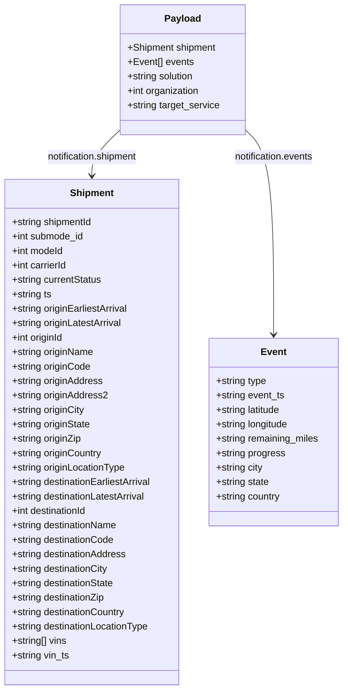

# Diagram: platform/tools/ide_local_testing/localTest/test/scheduledServices/progressUpdateWithNoProgress.py


> Auto-generated by Obscura crawlers

## Diagram 1

```mermaid
sequenceDiagram
    participant Script
    participant LocalTest
    participant Orchestrator
    participant Console
    Script->>LocalTest: localTest.core.get_event(None)
    LocalTest-->>Script: event
    Script->>Script: construct payload (shipment, events, solution, organization, target_service)
    Script->>Script: set event.notification = payload; set target_service="ENTITY"; set sync_type="Finished Vehicle"; set row_id=-1
    Script->>Orchestrator: scheduled_services.finished_vehicle_event_orchestrator.post_message.lambda_handler(event, context)
    Orchestrator-->>Script: response
    Script->>Console: print(response)
```

> SVG rendering failed for this diagram.

## Diagram 2



### SVG

<svg id="container" width="581.8203125" xmlns="http://www.w3.org/2000/svg" class="classDiagram" height="1146" viewBox="0 0 581.8203125 1146" role="graphics-document document" aria-roledescription="class"><style>#container{font-family:"trebuchet ms",verdana,arial,sans-serif;font-size:16px;fill:#333;}@keyframes edge-animation-frame{from{stroke-dashoffset:0;}}@keyframes dash{to{stroke-dashoffset:0;}}#container .edge-animation-slow{stroke-dasharray:9,5!important;stroke-dashoffset:900;animation:dash 50s linear infinite;stroke-linecap:round;}#container .edge-animation-fast{stroke-dasharray:9,5!important;stroke-dashoffset:900;animation:dash 20s linear infinite;stroke-linecap:round;}#container .error-icon{fill:#552222;}#container .error-text{fill:#552222;stroke:#552222;}#container .edge-thickness-normal{stroke-width:1px;}#container .edge-thickness-thick{stroke-width:3.5px;}#container .edge-pattern-solid{stroke-dasharray:0;}#container .edge-thickness-invisible{stroke-width:0;fill:none;}#container .edge-pattern-dashed{stroke-dasharray:3;}#container .edge-pattern-dotted{stroke-dasharray:2;}#container .marker{fill:#333333;stroke:#333333;}#container .marker.cross{stroke:#333333;}#container svg{font-family:"trebuchet ms",verdana,arial,sans-serif;font-size:16px;}#container p{margin:0;}#container g.classGroup text{fill:#9370DB;stroke:none;font-family:"trebuchet ms",verdana,arial,sans-serif;font-size:10px;}#container g.classGroup text .title{font-weight:bolder;}#container .nodeLabel,#container .edgeLabel{color:#131300;}#container .edgeLabel .label rect{fill:#ECECFF;}#container .label text{fill:#131300;}#container .labelBkg{background:#ECECFF;}#container .edgeLabel .label span{background:#ECECFF;}#container .classTitle{font-weight:bolder;}#container .node rect,#container .node circle,#container .node ellipse,#container .node polygon,#container .node path{fill:#ECECFF;stroke:#9370DB;stroke-width:1px;}#container .divider{stroke:#9370DB;stroke-width:1;}#container g.clickable{cursor:pointer;}#container g.classGroup rect{fill:#ECECFF;stroke:#9370DB;}#container g.classGroup line{stroke:#9370DB;stroke-width:1;}#container .classLabel .box{stroke:none;stroke-width:0;fill:#ECECFF;opacity:0.5;}#container .classLabel .label{fill:#9370DB;font-size:10px;}#container .relation{stroke:#333333;stroke-width:1;fill:none;}#container .dashed-line{stroke-dasharray:3;}#container .dotted-line{stroke-dasharray:1 2;}#container #compositionStart,#container .composition{fill:#333333!important;stroke:#333333!important;stroke-width:1;}#container #compositionEnd,#container .composition{fill:#333333!important;stroke:#333333!important;stroke-width:1;}#container #dependencyStart,#container .dependency{fill:#333333!important;stroke:#333333!important;stroke-width:1;}#container #dependencyStart,#container .dependency{fill:#333333!important;stroke:#333333!important;stroke-width:1;}#container #extensionStart,#container .extension{fill:transparent!important;stroke:#333333!important;stroke-width:1;}#container #extensionEnd,#container .extension{fill:transparent!important;stroke:#333333!important;stroke-width:1;}#container #aggregationStart,#container .aggregation{fill:transparent!important;stroke:#333333!important;stroke-width:1;}#container #aggregationEnd,#container .aggregation{fill:transparent!important;stroke:#333333!important;stroke-width:1;}#container #lollipopStart,#container .lollipop{fill:#ECECFF!important;stroke:#333333!important;stroke-width:1;}#container #lollipopEnd,#container .lollipop{fill:#ECECFF!important;stroke:#333333!important;stroke-width:1;}#container .edgeTerminals{font-size:11px;line-height:initial;}#container .classTitleText{text-anchor:middle;font-size:18px;fill:#333;}#container .label-icon{display:inline-block;height:1em;overflow:visible;vertical-align:-0.125em;}#container .node .label-icon path{fill:currentColor;stroke:revert;stroke-width:revert;}#container :root{--mermaid-font-family:"trebuchet ms",verdana,arial,sans-serif;}</style><g><defs><marker id="container_class-aggregationStart" class="marker aggregation class" refX="18" refY="7" markerWidth="190" markerHeight="240" orient="auto"><path d="M 18,7 L9,13 L1,7 L9,1 Z"></path></marker></defs><defs><marker id="container_class-aggregationEnd" class="marker aggregation class" refX="1" refY="7" markerWidth="20" markerHeight="28" orient="auto"><path d="M 18,7 L9,13 L1,7 L9,1 Z"></path></marker></defs><defs><marker id="container_class-extensionStart" class="marker extension class" refX="18" refY="7" markerWidth="190" markerHeight="240" orient="auto"><path d="M 1,7 L18,13 V 1 Z"></path></marker></defs><defs><marker id="container_class-extensionEnd" class="marker extension class" refX="1" refY="7" markerWidth="20" markerHeight="28" orient="auto"><path d="M 1,1 V 13 L18,7 Z"></path></marker></defs><defs><marker id="container_class-compositionStart" class="marker composition class" refX="18" refY="7" markerWidth="190" markerHeight="240" orient="auto"><path d="M 18,7 L9,13 L1,7 L9,1 Z"></path></marker></defs><defs><marker id="container_class-compositionEnd" class="marker composition class" refX="1" refY="7" markerWidth="20" markerHeight="28" orient="auto"><path d="M 18,7 L9,13 L1,7 L9,1 Z"></path></marker></defs><defs><marker id="container_class-dependencyStart" class="marker dependency class" refX="6" refY="7" markerWidth="190" markerHeight="240" orient="auto"><path d="M 5,7 L9,13 L1,7 L9,1 Z"></path></marker></defs><defs><marker id="container_class-dependencyEnd" class="marker dependency class" refX="13" refY="7" markerWidth="20" markerHeight="28" orient="auto"><path d="M 18,7 L9,13 L14,7 L9,1 Z"></path></marker></defs><defs><marker id="container_class-lollipopStart" class="marker lollipop class" refX="13" refY="7" markerWidth="190" markerHeight="240" orient="auto"><circle stroke="black" fill="transparent" cx="7" cy="7" r="6"></circle></marker></defs><defs><marker id="container_class-lollipopEnd" class="marker lollipop class" refX="1" refY="7" markerWidth="190" markerHeight="240" orient="auto"><circle stroke="black" fill="transparent" cx="7" cy="7" r="6"></circle></marker></defs><g class="root"><g class="clusters"></g><g class="edgePaths"><path d="M206.283,214.304L198.02,222.087C189.757,229.869,173.23,245.435,164.966,258.384C156.703,271.333,156.703,281.667,156.703,286.833L156.703,292" id="id_Payload_Shipment_1" class="edge-thickness-normal edge-pattern-solid relation" style=";;;" data-edge="true" data-et="edge" data-id="id_Payload_Shipment_1" data-points="W3sieCI6MjA2LjI4MzIwMzEyNSwieSI6MjE0LjMwMzgzNzYxNDk2OTg2fSx7IngiOjE1Ni43MDMxMjUsInkiOjI2MX0seyJ4IjoxNTYuNzAzMTI1LCJ5IjoyOTh9XQ==" marker-end="url(#container_class-dependencyEnd)"></path><path d="M415.033,214.304L423.297,222.087C431.56,229.869,448.087,245.435,456.35,302.384C464.613,359.333,464.613,457.667,464.613,506.833L464.613,556" id="id_Payload_Event_2" class="edge-thickness-normal edge-pattern-solid relation" style=";;;" data-edge="true" data-et="edge" data-id="id_Payload_Event_2" data-points="W3sieCI6NDE1LjAzMzIwMzEyNSwieSI6MjE0LjMwMzgzNzYxNDk2OTg2fSx7IngiOjQ2NC42MTMyODEyNSwieSI6MjYxfSx7IngiOjQ2NC42MTMyODEyNSwieSI6NTYyfV0=" marker-end="url(#container_class-dependencyEnd)"></path></g><g class="edgeLabels"><g class="edgeLabel" transform="translate(156.703125, 261)"><g class="label" data-id="id_Payload_Shipment_1" transform="translate(-77.8828125, -12)"><foreignObject width="155.765625" height="24"><div xmlns="http://www.w3.org/1999/xhtml" class="labelBkg" style="display: table-cell; white-space: nowrap; line-height: 1.5; max-width: 200px; text-align: center;"><span class="edgeLabel"><p>notification.shipment</p></span></div></foreignObject></g></g><g class="edgeLabel" transform="translate(464.61328125, 261)"><g class="label" data-id="id_Payload_Event_2" transform="translate(-67.453125, -12)"><foreignObject width="134.90625" height="24"><div xmlns="http://www.w3.org/1999/xhtml" class="labelBkg" style="display: table-cell; white-space: nowrap; line-height: 1.5; max-width: 200px; text-align: center;"><span class="edgeLabel"><p>notification.events</p></span></div></foreignObject></g></g></g><g class="nodes"><g class="node default" id="classId-Payload-0" transform="translate(310.658203125, 116)"><g class="basic label-container"><path d="M-104.375 -108 L104.375 -108 L104.375 108 L-104.375 108" stroke="none" stroke-width="0" fill="#ECECFF" style=""></path><path d="M-104.375 -108 C-35.79148594219323 -108, 32.79202811561353 -108, 104.375 -108 M-104.375 -108 C-57.897511479431316 -108, -11.420022958862631 -108, 104.375 -108 M104.375 -108 C104.375 -45.14308309587358, 104.375 17.713833808252843, 104.375 108 M104.375 -108 C104.375 -37.28349679545484, 104.375 33.433006409090325, 104.375 108 M104.375 108 C30.4763023746428 108, -43.4223952507144 108, -104.375 108 M104.375 108 C53.3981266835965 108, 2.421253367193003 108, -104.375 108 M-104.375 108 C-104.375 39.28788976470021, -104.375 -29.42422047059958, -104.375 -108 M-104.375 108 C-104.375 37.32266897079032, -104.375 -33.354662058419365, -104.375 -108" stroke="#9370DB" stroke-width="1.3" fill="none" stroke-dasharray="0 0" style=""></path></g><g class="annotation-group text" transform="translate(0, -84)"></g><g class="label-group text" transform="translate(-28.90625, -84)"><g class="label" style="font-weight: bolder" transform="translate(0,-12)"><foreignObject width="57.8125" height="24"><div xmlns="http://www.w3.org/1999/xhtml" style="display: table-cell; white-space: nowrap; line-height: 1.5; max-width: 107px; text-align: center;"><span class="nodeLabel markdown-node-label" style=""><p>Payload</p></span></div></foreignObject></g></g><g class="members-group text" transform="translate(-92.375, -36)"><g class="label" style="" transform="translate(0,-12)"><foreignObject width="149.734375" height="24"><div xmlns="http://www.w3.org/1999/xhtml" style="display: table-cell; white-space: nowrap; line-height: 1.5; max-width: 207px; text-align: center;"><span class="nodeLabel markdown-node-label" style=""><p>+Shipment shipment</p></span></div></foreignObject></g><g class="label" style="" transform="translate(0,12)"><foreignObject width="110.265625" height="24"><div xmlns="http://www.w3.org/1999/xhtml" style="display: table-cell; white-space: nowrap; line-height: 1.5; max-width: 168px; text-align: center;"><span class="nodeLabel markdown-node-label" style=""><p>+Event[] events</p></span></div></foreignObject></g><g class="label" style="" transform="translate(0,36)"><foreignObject width="113.6875" height="24"><div xmlns="http://www.w3.org/1999/xhtml" style="display: table-cell; white-space: nowrap; line-height: 1.5; max-width: 171px; text-align: center;"><span class="nodeLabel markdown-node-label" style=""><p>+string solution</p></span></div></foreignObject></g><g class="label" style="" transform="translate(0,60)"><foreignObject width="122.25" height="24"><div xmlns="http://www.w3.org/1999/xhtml" style="display: table-cell; white-space: nowrap; line-height: 1.5; max-width: 180px; text-align: center;"><span class="nodeLabel markdown-node-label" style=""><p>+int organization</p></span></div></foreignObject></g><g class="label" style="" transform="translate(0,84)"><foreignObject width="155.84375" height="24"><div xmlns="http://www.w3.org/1999/xhtml" style="display: table-cell; white-space: nowrap; line-height: 1.5; max-width: 213px; text-align: center;"><span class="nodeLabel markdown-node-label" style=""><p>+string target_service</p></span></div></foreignObject></g></g><g class="methods-group text" transform="translate(-92.375, 108)"></g><g class="divider" style=""><path d="M-104.375 -60 C-51.42037211421955 -60, 1.5342557715608933 -60, 104.375 -60 M-104.375 -60 C-45.879670704158094 -60, 12.615658591683811 -60, 104.375 -60" stroke="#9370DB" stroke-width="1.3" fill="none" stroke-dasharray="0 0" style=""></path></g><g class="divider" style=""><path d="M-104.375 84 C-48.8548996904414 84, 6.665200619117201 84, 104.375 84 M-104.375 84 C-21.2130269627704 84, 61.9489460744592 84, 104.375 84" stroke="#9370DB" stroke-width="1.3" fill="none" stroke-dasharray="0 0" style=""></path></g></g><g class="node default" id="classId-Shipment-1" transform="translate(156.703125, 718)"><g class="basic label-container"><path d="M-148.703125 -420 L148.703125 -420 L148.703125 420 L-148.703125 420" stroke="none" stroke-width="0" fill="#ECECFF" style=""></path><path d="M-148.703125 -420 C-61.22883159112901 -420, 26.245461817741983 -420, 148.703125 -420 M-148.703125 -420 C-65.47095216596905 -420, 17.761220668061895 -420, 148.703125 -420 M148.703125 -420 C148.703125 -218.76142378758672, 148.703125 -17.522847575173444, 148.703125 420 M148.703125 -420 C148.703125 -113.79854292717283, 148.703125 192.40291414565434, 148.703125 420 M148.703125 420 C50.65745669412537 420, -47.388211611749256 420, -148.703125 420 M148.703125 420 C38.47536334324636 420, -71.75239831350729 420, -148.703125 420 M-148.703125 420 C-148.703125 223.1242279836188, -148.703125 26.24845596723759, -148.703125 -420 M-148.703125 420 C-148.703125 238.98381334283303, -148.703125 57.96762668566606, -148.703125 -420" stroke="#9370DB" stroke-width="1.3" fill="none" stroke-dasharray="0 0" style=""></path></g><g class="annotation-group text" transform="translate(0, -396)"></g><g class="label-group text" transform="translate(-35.109375, -396)"><g class="label" style="font-weight: bolder" transform="translate(0,-12)"><foreignObject width="70.21875" height="24"><div xmlns="http://www.w3.org/1999/xhtml" style="display: table-cell; white-space: nowrap; line-height: 1.5; max-width: 120px; text-align: center;"><span class="nodeLabel markdown-node-label" style=""><p>Shipment</p></span></div></foreignObject></g></g><g class="members-group text" transform="translate(-136.703125, -348)"><g class="label" style="" transform="translate(0,-12)"><foreignObject width="136.59375" height="24"><div xmlns="http://www.w3.org/1999/xhtml" style="display: table-cell; white-space: nowrap; line-height: 1.5; max-width: 194px; text-align: center;"><span class="nodeLabel markdown-node-label" style=""><p>+string shipmentId</p></span></div></foreignObject></g><g class="label" style="" transform="translate(0,12)"><foreignObject width="121.609375" height="24"><div xmlns="http://www.w3.org/1999/xhtml" style="display: table-cell; white-space: nowrap; line-height: 1.5; max-width: 179px; text-align: center;"><span class="nodeLabel markdown-node-label" style=""><p>+int submode_id</p></span></div></foreignObject></g><g class="label" style="" transform="translate(0,36)"><foreignObject width="87.53125" height="24"><div xmlns="http://www.w3.org/1999/xhtml" style="display: table-cell; white-space: nowrap; line-height: 1.5; max-width: 145px; text-align: center;"><span class="nodeLabel markdown-node-label" style=""><p>+int modeId</p></span></div></foreignObject></g><g class="label" style="" transform="translate(0,60)"><foreignObject width="94.140625" height="24"><div xmlns="http://www.w3.org/1999/xhtml" style="display: table-cell; white-space: nowrap; line-height: 1.5; max-width: 152px; text-align: center;"><span class="nodeLabel markdown-node-label" style=""><p>+int carrierId</p></span></div></foreignObject></g><g class="label" style="" transform="translate(0,84)"><foreignObject width="152.0625" height="24"><div xmlns="http://www.w3.org/1999/xhtml" style="display: table-cell; white-space: nowrap; line-height: 1.5; max-width: 209px; text-align: center;"><span class="nodeLabel markdown-node-label" style=""><p>+string currentStatus</p></span></div></foreignObject></g><g class="label" style="" transform="translate(0,108)"><foreignObject width="67.109375" height="24"><div xmlns="http://www.w3.org/1999/xhtml" style="display: table-cell; white-space: nowrap; line-height: 1.5; max-width: 124px; text-align: center;"><span class="nodeLabel markdown-node-label" style=""><p>+string ts</p></span></div></foreignObject></g><g class="label" style="" transform="translate(0,132)"><foreignObject width="197.40625" height="24"><div xmlns="http://www.w3.org/1999/xhtml" style="display: table-cell; white-space: nowrap; line-height: 1.5; max-width: 255px; text-align: center;"><span class="nodeLabel markdown-node-label" style=""><p>+string originEarliestArrival</p></span></div></foreignObject></g><g class="label" style="" transform="translate(0,156)"><foreignObject width="187" height="24"><div xmlns="http://www.w3.org/1999/xhtml" style="display: table-cell; white-space: nowrap; line-height: 1.5; max-width: 245px; text-align: center;"><span class="nodeLabel markdown-node-label" style=""><p>+string originLatestArrival</p></span></div></foreignObject></g><g class="label" style="" transform="translate(0,180)"><foreignObject width="88.421875" height="24"><div xmlns="http://www.w3.org/1999/xhtml" style="display: table-cell; white-space: nowrap; line-height: 1.5; max-width: 146px; text-align: center;"><span class="nodeLabel markdown-node-label" style=""><p>+int originId</p></span></div></foreignObject></g><g class="label" style="" transform="translate(0,204)"><foreignObject width="138.171875" height="24"><div xmlns="http://www.w3.org/1999/xhtml" style="display: table-cell; white-space: nowrap; line-height: 1.5; max-width: 196px; text-align: center;"><span class="nodeLabel markdown-node-label" style=""><p>+string originName</p></span></div></foreignObject></g><g class="label" style="" transform="translate(0,228)"><foreignObject width="132.375" height="24"><div xmlns="http://www.w3.org/1999/xhtml" style="display: table-cell; white-space: nowrap; line-height: 1.5; max-width: 190px; text-align: center;"><span class="nodeLabel markdown-node-label" style=""><p>+string originCode</p></span></div></foreignObject></g><g class="label" style="" transform="translate(0,252)"><foreignObject width="153.609375" height="24"><div xmlns="http://www.w3.org/1999/xhtml" style="display: table-cell; white-space: nowrap; line-height: 1.5; max-width: 211px; text-align: center;"><span class="nodeLabel markdown-node-label" style=""><p>+string originAddress</p></span></div></foreignObject></g><g class="label" style="" transform="translate(0,276)"><foreignObject width="161.375" height="24"><div xmlns="http://www.w3.org/1999/xhtml" style="display: table-cell; white-space: nowrap; line-height: 1.5; max-width: 219px; text-align: center;"><span class="nodeLabel markdown-node-label" style=""><p>+string originAddress2</p></span></div></foreignObject></g><g class="label" style="" transform="translate(0,300)"><foreignObject width="123.140625" height="24"><div xmlns="http://www.w3.org/1999/xhtml" style="display: table-cell; white-space: nowrap; line-height: 1.5; max-width: 181px; text-align: center;"><span class="nodeLabel markdown-node-label" style=""><p>+string originCity</p></span></div></foreignObject></g><g class="label" style="" transform="translate(0,324)"><foreignObject width="133.453125" height="24"><div xmlns="http://www.w3.org/1999/xhtml" style="display: table-cell; white-space: nowrap; line-height: 1.5; max-width: 191px; text-align: center;"><span class="nodeLabel markdown-node-label" style=""><p>+string originState</p></span></div></foreignObject></g><g class="label" style="" transform="translate(0,348)"><foreignObject width="118.46875" height="24"><div xmlns="http://www.w3.org/1999/xhtml" style="display: table-cell; white-space: nowrap; line-height: 1.5; max-width: 176px; text-align: center;"><span class="nodeLabel markdown-node-label" style=""><p>+string originZip</p></span></div></foreignObject></g><g class="label" style="" transform="translate(0,372)"><foreignObject width="152.59375" height="24"><div xmlns="http://www.w3.org/1999/xhtml" style="display: table-cell; white-space: nowrap; line-height: 1.5; max-width: 210px; text-align: center;"><span class="nodeLabel markdown-node-label" style=""><p>+string originCountry</p></span></div></foreignObject></g><g class="label" style="" transform="translate(0,396)"><foreignObject width="191.9375" height="24"><div xmlns="http://www.w3.org/1999/xhtml" style="display: table-cell; white-space: nowrap; line-height: 1.5; max-width: 249px; text-align: center;"><span class="nodeLabel markdown-node-label" style=""><p>+string originLocationType</p></span></div></foreignObject></g><g class="label" style="" transform="translate(0,420)"><foreignObject width="238.296875" height="24"><div xmlns="http://www.w3.org/1999/xhtml" style="display: table-cell; white-space: nowrap; line-height: 1.5; max-width: 296px; text-align: center;"><span class="nodeLabel markdown-node-label" style=""><p>+string destinationEarliestArrival</p></span></div></foreignObject></g><g class="label" style="" transform="translate(0,444)"><foreignObject width="227.890625" height="24"><div xmlns="http://www.w3.org/1999/xhtml" style="display: table-cell; white-space: nowrap; line-height: 1.5; max-width: 286px; text-align: center;"><span class="nodeLabel markdown-node-label" style=""><p>+string destinationLatestArrival</p></span></div></foreignObject></g><g class="label" style="" transform="translate(0,468)"><foreignObject width="129.3125" height="24"><div xmlns="http://www.w3.org/1999/xhtml" style="display: table-cell; white-space: nowrap; line-height: 1.5; max-width: 187px; text-align: center;"><span class="nodeLabel markdown-node-label" style=""><p>+int destinationId</p></span></div></foreignObject></g><g class="label" style="" transform="translate(0,492)"><foreignObject width="179.0625" height="24"><div xmlns="http://www.w3.org/1999/xhtml" style="display: table-cell; white-space: nowrap; line-height: 1.5; max-width: 236px; text-align: center;"><span class="nodeLabel markdown-node-label" style=""><p>+string destinationName</p></span></div></foreignObject></g><g class="label" style="" transform="translate(0,516)"><foreignObject width="173.265625" height="24"><div xmlns="http://www.w3.org/1999/xhtml" style="display: table-cell; white-space: nowrap; line-height: 1.5; max-width: 231px; text-align: center;"><span class="nodeLabel markdown-node-label" style=""><p>+string destinationCode</p></span></div></foreignObject></g><g class="label" style="" transform="translate(0,540)"><foreignObject width="194.5" height="24"><div xmlns="http://www.w3.org/1999/xhtml" style="display: table-cell; white-space: nowrap; line-height: 1.5; max-width: 252px; text-align: center;"><span class="nodeLabel markdown-node-label" style=""><p>+string destinationAddress</p></span></div></foreignObject></g><g class="label" style="" transform="translate(0,564)"><foreignObject width="164.046875" height="24"><div xmlns="http://www.w3.org/1999/xhtml" style="display: table-cell; white-space: nowrap; line-height: 1.5; max-width: 222px; text-align: center;"><span class="nodeLabel markdown-node-label" style=""><p>+string destinationCity</p></span></div></foreignObject></g><g class="label" style="" transform="translate(0,588)"><foreignObject width="174.34375" height="24"><div xmlns="http://www.w3.org/1999/xhtml" style="display: table-cell; white-space: nowrap; line-height: 1.5; max-width: 232px; text-align: center;"><span class="nodeLabel markdown-node-label" style=""><p>+string destinationState</p></span></div></foreignObject></g><g class="label" style="" transform="translate(0,612)"><foreignObject width="159.375" height="24"><div xmlns="http://www.w3.org/1999/xhtml" style="display: table-cell; white-space: nowrap; line-height: 1.5; max-width: 217px; text-align: center;"><span class="nodeLabel markdown-node-label" style=""><p>+string destinationZip</p></span></div></foreignObject></g><g class="label" style="" transform="translate(0,636)"><foreignObject width="193.5" height="24"><div xmlns="http://www.w3.org/1999/xhtml" style="display: table-cell; white-space: nowrap; line-height: 1.5; max-width: 251px; text-align: center;"><span class="nodeLabel markdown-node-label" style=""><p>+string destinationCountry</p></span></div></foreignObject></g><g class="label" style="" transform="translate(0,660)"><foreignObject width="232.84375" height="24"><div xmlns="http://www.w3.org/1999/xhtml" style="display: table-cell; white-space: nowrap; line-height: 1.5; max-width: 290px; text-align: center;"><span class="nodeLabel markdown-node-label" style=""><p>+string destinationLocationType</p></span></div></foreignObject></g><g class="label" style="" transform="translate(0,684)"><foreignObject width="93.40625" height="24"><div xmlns="http://www.w3.org/1999/xhtml" style="display: table-cell; white-space: nowrap; line-height: 1.5; max-width: 151px; text-align: center;"><span class="nodeLabel markdown-node-label" style=""><p>+string[] vins</p></span></div></foreignObject></g><g class="label" style="" transform="translate(0,708)"><foreignObject width="96.875" height="24"><div xmlns="http://www.w3.org/1999/xhtml" style="display: table-cell; white-space: nowrap; line-height: 1.5; max-width: 154px; text-align: center;"><span class="nodeLabel markdown-node-label" style=""><p>+string vin_ts</p></span></div></foreignObject></g></g><g class="methods-group text" transform="translate(-136.703125, 420)"></g><g class="divider" style=""><path d="M-148.703125 -372 C-58.500796487357874 -372, 31.70153202528425 -372, 148.703125 -372 M-148.703125 -372 C-42.5897659164836 -372, 63.5235931670328 -372, 148.703125 -372" stroke="#9370DB" stroke-width="1.3" fill="none" stroke-dasharray="0 0" style=""></path></g><g class="divider" style=""><path d="M-148.703125 396 C-30.243900032270602 396, 88.2153249354588 396, 148.703125 396 M-148.703125 396 C-50.62174518132038 396, 47.459634637359244 396, 148.703125 396" stroke="#9370DB" stroke-width="1.3" fill="none" stroke-dasharray="0 0" style=""></path></g></g><g class="node default" id="classId-Event-2" transform="translate(464.61328125, 718)"><g class="basic label-container"><path d="M-109.20703125 -156 L109.20703125 -156 L109.20703125 156 L-109.20703125 156" stroke="none" stroke-width="0" fill="#ECECFF" style=""></path><path d="M-109.20703125 -156 C-62.765040742829235 -156, -16.32305023565847 -156, 109.20703125 -156 M-109.20703125 -156 C-41.95065535713978 -156, 25.30572053572044 -156, 109.20703125 -156 M109.20703125 -156 C109.20703125 -47.43271310160823, 109.20703125 61.13457379678354, 109.20703125 156 M109.20703125 -156 C109.20703125 -71.03586030014303, 109.20703125 13.928279399713944, 109.20703125 156 M109.20703125 156 C51.21143764391507 156, -6.784155962169862 156, -109.20703125 156 M109.20703125 156 C27.92502760611201 156, -53.35697603777598 156, -109.20703125 156 M-109.20703125 156 C-109.20703125 58.57704210385435, -109.20703125 -38.845915792291294, -109.20703125 -156 M-109.20703125 156 C-109.20703125 43.22578453437151, -109.20703125 -69.54843093125697, -109.20703125 -156" stroke="#9370DB" stroke-width="1.3" fill="none" stroke-dasharray="0 0" style=""></path></g><g class="annotation-group text" transform="translate(0, -132)"></g><g class="label-group text" transform="translate(-20.2109375, -132)"><g class="label" style="font-weight: bolder" transform="translate(0,-12)"><foreignObject width="40.421875" height="24"><div xmlns="http://www.w3.org/1999/xhtml" style="display: table-cell; white-space: nowrap; line-height: 1.5; max-width: 90px; text-align: center;"><span class="nodeLabel markdown-node-label" style=""><p>Event</p></span></div></foreignObject></g></g><g class="members-group text" transform="translate(-97.20703125, -84)"><g class="label" style="" transform="translate(0,-12)"><foreignObject width="85.65625" height="24"><div xmlns="http://www.w3.org/1999/xhtml" style="display: table-cell; white-space: nowrap; line-height: 1.5; max-width: 143px; text-align: center;"><span class="nodeLabel markdown-node-label" style=""><p>+string type</p></span></div></foreignObject></g><g class="label" style="" transform="translate(0,12)"><foreignObject width="115.453125" height="24"><div xmlns="http://www.w3.org/1999/xhtml" style="display: table-cell; white-space: nowrap; line-height: 1.5; max-width: 173px; text-align: center;"><span class="nodeLabel markdown-node-label" style=""><p>+string event_ts</p></span></div></foreignObject></g><g class="label" style="" transform="translate(0,36)"><foreignObject width="110.84375" height="24"><div xmlns="http://www.w3.org/1999/xhtml" style="display: table-cell; white-space: nowrap; line-height: 1.5; max-width: 168px; text-align: center;"><span class="nodeLabel markdown-node-label" style=""><p>+string latitude</p></span></div></foreignObject></g><g class="label" style="" transform="translate(0,60)"><foreignObject width="123.40625" height="24"><div xmlns="http://www.w3.org/1999/xhtml" style="display: table-cell; white-space: nowrap; line-height: 1.5; max-width: 181px; text-align: center;"><span class="nodeLabel markdown-node-label" style=""><p>+string longitude</p></span></div></foreignObject></g><g class="label" style="" transform="translate(0,84)"><foreignObject width="174.203125" height="24"><div xmlns="http://www.w3.org/1999/xhtml" style="display: table-cell; white-space: nowrap; line-height: 1.5; max-width: 232px; text-align: center;"><span class="nodeLabel markdown-node-label" style=""><p>+string remaining_miles</p></span></div></foreignObject></g><g class="label" style="" transform="translate(0,108)"><foreignObject width="115.921875" height="24"><div xmlns="http://www.w3.org/1999/xhtml" style="display: table-cell; white-space: nowrap; line-height: 1.5; max-width: 173px; text-align: center;"><span class="nodeLabel markdown-node-label" style=""><p>+string progress</p></span></div></foreignObject></g><g class="label" style="" transform="translate(0,132)"><foreignObject width="79.59375" height="24"><div xmlns="http://www.w3.org/1999/xhtml" style="display: table-cell; white-space: nowrap; line-height: 1.5; max-width: 137px; text-align: center;"><span class="nodeLabel markdown-node-label" style=""><p>+string city</p></span></div></foreignObject></g><g class="label" style="" transform="translate(0,156)"><foreignObject width="89.953125" height="24"><div xmlns="http://www.w3.org/1999/xhtml" style="display: table-cell; white-space: nowrap; line-height: 1.5; max-width: 147px; text-align: center;"><span class="nodeLabel markdown-node-label" style=""><p>+string state</p></span></div></foreignObject></g><g class="label" style="" transform="translate(0,180)"><foreignObject width="109.046875" height="24"><div xmlns="http://www.w3.org/1999/xhtml" style="display: table-cell; white-space: nowrap; line-height: 1.5; max-width: 167px; text-align: center;"><span class="nodeLabel markdown-node-label" style=""><p>+string country</p></span></div></foreignObject></g></g><g class="methods-group text" transform="translate(-97.20703125, 156)"></g><g class="divider" style=""><path d="M-109.20703125 -108 C-59.37794693458633 -108, -9.548862619172667 -108, 109.20703125 -108 M-109.20703125 -108 C-54.5978093167443 -108, 0.011412616511393026 -108, 109.20703125 -108" stroke="#9370DB" stroke-width="1.3" fill="none" stroke-dasharray="0 0" style=""></path></g><g class="divider" style=""><path d="M-109.20703125 132 C-24.5941506318227 132, 60.0187299863546 132, 109.20703125 132 M-109.20703125 132 C-30.871181141013793 132, 47.464668967972415 132, 109.20703125 132" stroke="#9370DB" stroke-width="1.3" fill="none" stroke-dasharray="0 0" style=""></path></g></g></g></g></g></svg>
