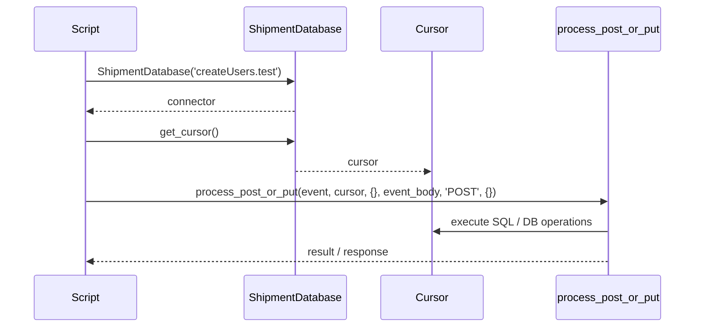
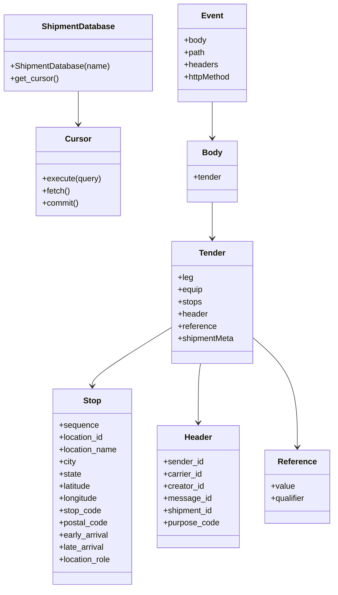

# Diagram: platform/tools/ide_local_testing/localTest/test/shipment/cancelShipment.py


> Auto-generated by Obscura crawlers

## Diagram 1

```mermaid
flowchart TD
  S[Script Entry] --> I1[Import lambda_handler]
  S --> DBInit[Instantiate ShipmentDatabase('createUsers.test')]
  DBInit --> Connector[connector]
  S --> SID[Set shipmentId = 'TTT000005']
  S --> EventDef[Construct event object: body, headers, pathParameters]
  EventDef --> EB[event_body = event.body]
  Connector --> CursorOp[connector.get_cursor()]
  EB --> CallProc[Call process_post_or_put(event, cursor, {}, event_body, 'POST', {})]
  CursorOp --> CallProc
  CallProc --> DBOps[DB operations via cursor]
  DBOps --> Result[Return result]
```

> SVG rendering failed for this diagram.

## Diagram 2



### SVG

<svg id="container" width="1081" xmlns="http://www.w3.org/2000/svg" height="507" viewBox="-50 -10 1081 507" role="graphics-document document" aria-roledescription="sequence"><g><rect x="810" y="421" fill="#eaeaea" stroke="#666" width="171" height="65" name="Processor" rx="3" ry="3" class="actor actor-bottom"></rect><text x="895.5" y="453.5" dominant-baseline="central" alignment-baseline="central" class="actor actor-box" style="text-anchor: middle; font-size: 16px; font-weight: 400;"><tspan x="895.5" dy="0">process_post_or_put</tspan></text></g><g><rect x="543.5" y="421" fill="#eaeaea" stroke="#666" width="150" height="65" name="Cursor" rx="3" ry="3" class="actor actor-bottom"></rect><text x="618.5" y="453.5" dominant-baseline="central" alignment-baseline="central" class="actor actor-box" style="text-anchor: middle; font-size: 16px; font-weight: 400;"><tspan x="618.5" dy="0">Cursor</tspan></text></g><g><rect x="336.5" y="421" fill="#eaeaea" stroke="#666" width="157" height="65" name="ShipmentDB" rx="3" ry="3" class="actor actor-bottom"></rect><text x="415" y="453.5" dominant-baseline="central" alignment-baseline="central" class="actor actor-box" style="text-anchor: middle; font-size: 16px; font-weight: 400;"><tspan x="415" dy="0">ShipmentDatabase</tspan></text></g><g><rect x="0" y="421" fill="#eaeaea" stroke="#666" width="150" height="65" name="Script" rx="3" ry="3" class="actor actor-bottom"></rect><text x="75" y="453.5" dominant-baseline="central" alignment-baseline="central" class="actor actor-box" style="text-anchor: middle; font-size: 16px; font-weight: 400;"><tspan x="75" dy="0">Script</tspan></text></g><g><line id="actor3" x1="895.5" y1="65" x2="895.5" y2="421" class="actor-line 200" stroke-width="0.5px" stroke="#999" name="Processor"></line><g id="root-3"><rect x="810" y="0" fill="#eaeaea" stroke="#666" width="171" height="65" name="Processor" rx="3" ry="3" class="actor actor-top"></rect><text x="895.5" y="32.5" dominant-baseline="central" alignment-baseline="central" class="actor actor-box" style="text-anchor: middle; font-size: 16px; font-weight: 400;"><tspan x="895.5" dy="0">process_post_or_put</tspan></text></g></g><g><line id="actor2" x1="618.5" y1="65" x2="618.5" y2="421" class="actor-line 200" stroke-width="0.5px" stroke="#999" name="Cursor"></line><g id="root-2"><rect x="543.5" y="0" fill="#eaeaea" stroke="#666" width="150" height="65" name="Cursor" rx="3" ry="3" class="actor actor-top"></rect><text x="618.5" y="32.5" dominant-baseline="central" alignment-baseline="central" class="actor actor-box" style="text-anchor: middle; font-size: 16px; font-weight: 400;"><tspan x="618.5" dy="0">Cursor</tspan></text></g></g><g><line id="actor1" x1="415" y1="65" x2="415" y2="421" class="actor-line 200" stroke-width="0.5px" stroke="#999" name="ShipmentDB"></line><g id="root-1"><rect x="336.5" y="0" fill="#eaeaea" stroke="#666" width="157" height="65" name="ShipmentDB" rx="3" ry="3" class="actor actor-top"></rect><text x="415" y="32.5" dominant-baseline="central" alignment-baseline="central" class="actor actor-box" style="text-anchor: middle; font-size: 16px; font-weight: 400;"><tspan x="415" dy="0">ShipmentDatabase</tspan></text></g></g><g><line id="actor0" x1="75" y1="65" x2="75" y2="421" class="actor-line 200" stroke-width="0.5px" stroke="#999" name="Script"></line><g id="root-0"><rect x="0" y="0" fill="#eaeaea" stroke="#666" width="150" height="65" name="Script" rx="3" ry="3" class="actor actor-top"></rect><text x="75" y="32.5" dominant-baseline="central" alignment-baseline="central" class="actor actor-box" style="text-anchor: middle; font-size: 16px; font-weight: 400;"><tspan x="75" dy="0">Script</tspan></text></g></g><style>#container{font-family:"trebuchet ms",verdana,arial,sans-serif;font-size:16px;fill:#333;}@keyframes edge-animation-frame{from{stroke-dashoffset:0;}}@keyframes dash{to{stroke-dashoffset:0;}}#container .edge-animation-slow{stroke-dasharray:9,5!important;stroke-dashoffset:900;animation:dash 50s linear infinite;stroke-linecap:round;}#container .edge-animation-fast{stroke-dasharray:9,5!important;stroke-dashoffset:900;animation:dash 20s linear infinite;stroke-linecap:round;}#container .error-icon{fill:#552222;}#container .error-text{fill:#552222;stroke:#552222;}#container .edge-thickness-normal{stroke-width:1px;}#container .edge-thickness-thick{stroke-width:3.5px;}#container .edge-pattern-solid{stroke-dasharray:0;}#container .edge-thickness-invisible{stroke-width:0;fill:none;}#container .edge-pattern-dashed{stroke-dasharray:3;}#container .edge-pattern-dotted{stroke-dasharray:2;}#container .marker{fill:#333333;stroke:#333333;}#container .marker.cross{stroke:#333333;}#container svg{font-family:"trebuchet ms",verdana,arial,sans-serif;font-size:16px;}#container p{margin:0;}#container .actor{stroke:hsl(259.6261682243, 59.7765363128%, 87.9019607843%);fill:#ECECFF;}#container text.actor&gt;tspan{fill:black;stroke:none;}#container .actor-line{stroke:hsl(259.6261682243, 59.7765363128%, 87.9019607843%);}#container .innerArc{stroke-width:1.5;stroke-dasharray:none;}#container .messageLine0{stroke-width:1.5;stroke-dasharray:none;stroke:#333;}#container .messageLine1{stroke-width:1.5;stroke-dasharray:2,2;stroke:#333;}#container #arrowhead path{fill:#333;stroke:#333;}#container .sequenceNumber{fill:white;}#container #sequencenumber{fill:#333;}#container #crosshead path{fill:#333;stroke:#333;}#container .messageText{fill:#333;stroke:none;}#container .labelBox{stroke:hsl(259.6261682243, 59.7765363128%, 87.9019607843%);fill:#ECECFF;}#container .labelText,#container .labelText&gt;tspan{fill:black;stroke:none;}#container .loopText,#container .loopText&gt;tspan{fill:black;stroke:none;}#container .loopLine{stroke-width:2px;stroke-dasharray:2,2;stroke:hsl(259.6261682243, 59.7765363128%, 87.9019607843%);fill:hsl(259.6261682243, 59.7765363128%, 87.9019607843%);}#container .note{stroke:#aaaa33;fill:#fff5ad;}#container .noteText,#container .noteText&gt;tspan{fill:black;stroke:none;}#container .activation0{fill:#f4f4f4;stroke:#666;}#container .activation1{fill:#f4f4f4;stroke:#666;}#container .activation2{fill:#f4f4f4;stroke:#666;}#container .actorPopupMenu{position:absolute;}#container .actorPopupMenuPanel{position:absolute;fill:#ECECFF;box-shadow:0px 8px 16px 0px rgba(0,0,0,0.2);filter:drop-shadow(3px 5px 2px rgb(0 0 0 / 0.4));}#container .actor-man line{stroke:hsl(259.6261682243, 59.7765363128%, 87.9019607843%);fill:#ECECFF;}#container .actor-man circle,#container line{stroke:hsl(259.6261682243, 59.7765363128%, 87.9019607843%);fill:#ECECFF;stroke-width:2px;}#container :root{--mermaid-font-family:"trebuchet ms",verdana,arial,sans-serif;}</style><g></g><defs><symbol id="computer" width="24" height="24"><path transform="scale(.5)" d="M2 2v13h20v-13h-20zm18 11h-16v-9h16v9zm-10.228 6l.466-1h3.524l.467 1h-4.457zm14.228 3h-24l2-6h2.104l-1.33 4h18.45l-1.297-4h2.073l2 6zm-5-10h-14v-7h14v7z"></path></symbol></defs><defs><symbol id="database" fill-rule="evenodd" clip-rule="evenodd"><path transform="scale(.5)" d="M12.258.001l.256.004.255.005.253.008.251.01.249.012.247.015.246.016.242.019.241.02.239.023.236.024.233.027.231.028.229.031.225.032.223.034.22.036.217.038.214.04.211.041.208.043.205.045.201.046.198.048.194.05.191.051.187.053.183.054.18.056.175.057.172.059.168.06.163.061.16.063.155.064.15.066.074.033.073.033.071.034.07.034.069.035.068.035.067.035.066.035.064.036.064.036.062.036.06.036.06.037.058.037.058.037.055.038.055.038.053.038.052.038.051.039.05.039.048.039.047.039.045.04.044.04.043.04.041.04.04.041.039.041.037.041.036.041.034.041.033.042.032.042.03.042.029.042.027.042.026.043.024.043.023.043.021.043.02.043.018.044.017.043.015.044.013.044.012.044.011.045.009.044.007.045.006.045.004.045.002.045.001.045v17l-.001.045-.002.045-.004.045-.006.045-.007.045-.009.044-.011.045-.012.044-.013.044-.015.044-.017.043-.018.044-.02.043-.021.043-.023.043-.024.043-.026.043-.027.042-.029.042-.03.042-.032.042-.033.042-.034.041-.036.041-.037.041-.039.041-.04.041-.041.04-.043.04-.044.04-.045.04-.047.039-.048.039-.05.039-.051.039-.052.038-.053.038-.055.038-.055.038-.058.037-.058.037-.06.037-.06.036-.062.036-.064.036-.064.036-.066.035-.067.035-.068.035-.069.035-.07.034-.071.034-.073.033-.074.033-.15.066-.155.064-.16.063-.163.061-.168.06-.172.059-.175.057-.18.056-.183.054-.187.053-.191.051-.194.05-.198.048-.201.046-.205.045-.208.043-.211.041-.214.04-.217.038-.22.036-.223.034-.225.032-.229.031-.231.028-.233.027-.236.024-.239.023-.241.02-.242.019-.246.016-.247.015-.249.012-.251.01-.253.008-.255.005-.256.004-.258.001-.258-.001-.256-.004-.255-.005-.253-.008-.251-.01-.249-.012-.247-.015-.245-.016-.243-.019-.241-.02-.238-.023-.236-.024-.234-.027-.231-.028-.228-.031-.226-.032-.223-.034-.22-.036-.217-.038-.214-.04-.211-.041-.208-.043-.204-.045-.201-.046-.198-.048-.195-.05-.19-.051-.187-.053-.184-.054-.179-.056-.176-.057-.172-.059-.167-.06-.164-.061-.159-.063-.155-.064-.151-.066-.074-.033-.072-.033-.072-.034-.07-.034-.069-.035-.068-.035-.067-.035-.066-.035-.064-.036-.063-.036-.062-.036-.061-.036-.06-.037-.058-.037-.057-.037-.056-.038-.055-.038-.053-.038-.052-.038-.051-.039-.049-.039-.049-.039-.046-.039-.046-.04-.044-.04-.043-.04-.041-.04-.04-.041-.039-.041-.037-.041-.036-.041-.034-.041-.033-.042-.032-.042-.03-.042-.029-.042-.027-.042-.026-.043-.024-.043-.023-.043-.021-.043-.02-.043-.018-.044-.017-.043-.015-.044-.013-.044-.012-.044-.011-.045-.009-.044-.007-.045-.006-.045-.004-.045-.002-.045-.001-.045v-17l.001-.045.002-.045.004-.045.006-.045.007-.045.009-.044.011-.045.012-.044.013-.044.015-.044.017-.043.018-.044.02-.043.021-.043.023-.043.024-.043.026-.043.027-.042.029-.042.03-.042.032-.042.033-.042.034-.041.036-.041.037-.041.039-.041.04-.041.041-.04.043-.04.044-.04.046-.04.046-.039.049-.039.049-.039.051-.039.052-.038.053-.038.055-.038.056-.038.057-.037.058-.037.06-.037.061-.036.062-.036.063-.036.064-.036.066-.035.067-.035.068-.035.069-.035.07-.034.072-.034.072-.033.074-.033.151-.066.155-.064.159-.063.164-.061.167-.06.172-.059.176-.057.179-.056.184-.054.187-.053.19-.051.195-.05.198-.048.201-.046.204-.045.208-.043.211-.041.214-.04.217-.038.22-.036.223-.034.226-.032.228-.031.231-.028.234-.027.236-.024.238-.023.241-.02.243-.019.245-.016.247-.015.249-.012.251-.01.253-.008.255-.005.256-.004.258-.001.258.001zm-9.258 20.499v.01l.001.021.003.021.004.022.005.021.006.022.007.022.009.023.01.022.011.023.012.023.013.023.015.023.016.024.017.023.018.024.019.024.021.024.022.025.023.024.024.025.052.049.056.05.061.051.066.051.07.051.075.051.079.052.084.052.088.052.092.052.097.052.102.051.105.052.11.052.114.051.119.051.123.051.127.05.131.05.135.05.139.048.144.049.147.047.152.047.155.047.16.045.163.045.167.043.171.043.176.041.178.041.183.039.187.039.19.037.194.035.197.035.202.033.204.031.209.03.212.029.216.027.219.025.222.024.226.021.23.02.233.018.236.016.24.015.243.012.246.01.249.008.253.005.256.004.259.001.26-.001.257-.004.254-.005.25-.008.247-.011.244-.012.241-.014.237-.016.233-.018.231-.021.226-.021.224-.024.22-.026.216-.027.212-.028.21-.031.205-.031.202-.034.198-.034.194-.036.191-.037.187-.039.183-.04.179-.04.175-.042.172-.043.168-.044.163-.045.16-.046.155-.046.152-.047.148-.048.143-.049.139-.049.136-.05.131-.05.126-.05.123-.051.118-.052.114-.051.11-.052.106-.052.101-.052.096-.052.092-.052.088-.053.083-.051.079-.052.074-.052.07-.051.065-.051.06-.051.056-.05.051-.05.023-.024.023-.025.021-.024.02-.024.019-.024.018-.024.017-.024.015-.023.014-.024.013-.023.012-.023.01-.023.01-.022.008-.022.006-.022.006-.022.004-.022.004-.021.001-.021.001-.021v-4.127l-.077.055-.08.053-.083.054-.085.053-.087.052-.09.052-.093.051-.095.05-.097.05-.1.049-.102.049-.105.048-.106.047-.109.047-.111.046-.114.045-.115.045-.118.044-.12.043-.122.042-.124.042-.126.041-.128.04-.13.04-.132.038-.134.038-.135.037-.138.037-.139.035-.142.035-.143.034-.144.033-.147.032-.148.031-.15.03-.151.03-.153.029-.154.027-.156.027-.158.026-.159.025-.161.024-.162.023-.163.022-.165.021-.166.02-.167.019-.169.018-.169.017-.171.016-.173.015-.173.014-.175.013-.175.012-.177.011-.178.01-.179.008-.179.008-.181.006-.182.005-.182.004-.184.003-.184.002h-.37l-.184-.002-.184-.003-.182-.004-.182-.005-.181-.006-.179-.008-.179-.008-.178-.01-.176-.011-.176-.012-.175-.013-.173-.014-.172-.015-.171-.016-.17-.017-.169-.018-.167-.019-.166-.02-.165-.021-.163-.022-.162-.023-.161-.024-.159-.025-.157-.026-.156-.027-.155-.027-.153-.029-.151-.03-.15-.03-.148-.031-.146-.032-.145-.033-.143-.034-.141-.035-.14-.035-.137-.037-.136-.037-.134-.038-.132-.038-.13-.04-.128-.04-.126-.041-.124-.042-.122-.042-.12-.044-.117-.043-.116-.045-.113-.045-.112-.046-.109-.047-.106-.047-.105-.048-.102-.049-.1-.049-.097-.05-.095-.05-.093-.052-.09-.051-.087-.052-.085-.053-.083-.054-.08-.054-.077-.054v4.127zm0-5.654v.011l.001.021.003.021.004.021.005.022.006.022.007.022.009.022.01.022.011.023.012.023.013.023.015.024.016.023.017.024.018.024.019.024.021.024.022.024.023.025.024.024.052.05.056.05.061.05.066.051.07.051.075.052.079.051.084.052.088.052.092.052.097.052.102.052.105.052.11.051.114.051.119.052.123.05.127.051.131.05.135.049.139.049.144.048.147.048.152.047.155.046.16.045.163.045.167.044.171.042.176.042.178.04.183.04.187.038.19.037.194.036.197.034.202.033.204.032.209.03.212.028.216.027.219.025.222.024.226.022.23.02.233.018.236.016.24.014.243.012.246.01.249.008.253.006.256.003.259.001.26-.001.257-.003.254-.006.25-.008.247-.01.244-.012.241-.015.237-.016.233-.018.231-.02.226-.022.224-.024.22-.025.216-.027.212-.029.21-.03.205-.032.202-.033.198-.035.194-.036.191-.037.187-.039.183-.039.179-.041.175-.042.172-.043.168-.044.163-.045.16-.045.155-.047.152-.047.148-.048.143-.048.139-.05.136-.049.131-.05.126-.051.123-.051.118-.051.114-.052.11-.052.106-.052.101-.052.096-.052.092-.052.088-.052.083-.052.079-.052.074-.051.07-.052.065-.051.06-.05.056-.051.051-.049.023-.025.023-.024.021-.025.02-.024.019-.024.018-.024.017-.024.015-.023.014-.023.013-.024.012-.022.01-.023.01-.023.008-.022.006-.022.006-.022.004-.021.004-.022.001-.021.001-.021v-4.139l-.077.054-.08.054-.083.054-.085.052-.087.053-.09.051-.093.051-.095.051-.097.05-.1.049-.102.049-.105.048-.106.047-.109.047-.111.046-.114.045-.115.044-.118.044-.12.044-.122.042-.124.042-.126.041-.128.04-.13.039-.132.039-.134.038-.135.037-.138.036-.139.036-.142.035-.143.033-.144.033-.147.033-.148.031-.15.03-.151.03-.153.028-.154.028-.156.027-.158.026-.159.025-.161.024-.162.023-.163.022-.165.021-.166.02-.167.019-.169.018-.169.017-.171.016-.173.015-.173.014-.175.013-.175.012-.177.011-.178.009-.179.009-.179.007-.181.007-.182.005-.182.004-.184.003-.184.002h-.37l-.184-.002-.184-.003-.182-.004-.182-.005-.181-.007-.179-.007-.179-.009-.178-.009-.176-.011-.176-.012-.175-.013-.173-.014-.172-.015-.171-.016-.17-.017-.169-.018-.167-.019-.166-.02-.165-.021-.163-.022-.162-.023-.161-.024-.159-.025-.157-.026-.156-.027-.155-.028-.153-.028-.151-.03-.15-.03-.148-.031-.146-.033-.145-.033-.143-.033-.141-.035-.14-.036-.137-.036-.136-.037-.134-.038-.132-.039-.13-.039-.128-.04-.126-.041-.124-.042-.122-.043-.12-.043-.117-.044-.116-.044-.113-.046-.112-.046-.109-.046-.106-.047-.105-.048-.102-.049-.1-.049-.097-.05-.095-.051-.093-.051-.09-.051-.087-.053-.085-.052-.083-.054-.08-.054-.077-.054v4.139zm0-5.666v.011l.001.02.003.022.004.021.005.022.006.021.007.022.009.023.01.022.011.023.012.023.013.023.015.023.016.024.017.024.018.023.019.024.021.025.022.024.023.024.024.025.052.05.056.05.061.05.066.051.07.051.075.052.079.051.084.052.088.052.092.052.097.052.102.052.105.051.11.052.114.051.119.051.123.051.127.05.131.05.135.05.139.049.144.048.147.048.152.047.155.046.16.045.163.045.167.043.171.043.176.042.178.04.183.04.187.038.19.037.194.036.197.034.202.033.204.032.209.03.212.028.216.027.219.025.222.024.226.021.23.02.233.018.236.017.24.014.243.012.246.01.249.008.253.006.256.003.259.001.26-.001.257-.003.254-.006.25-.008.247-.01.244-.013.241-.014.237-.016.233-.018.231-.02.226-.022.224-.024.22-.025.216-.027.212-.029.21-.03.205-.032.202-.033.198-.035.194-.036.191-.037.187-.039.183-.039.179-.041.175-.042.172-.043.168-.044.163-.045.16-.045.155-.047.152-.047.148-.048.143-.049.139-.049.136-.049.131-.051.126-.05.123-.051.118-.052.114-.051.11-.052.106-.052.101-.052.096-.052.092-.052.088-.052.083-.052.079-.052.074-.052.07-.051.065-.051.06-.051.056-.05.051-.049.023-.025.023-.025.021-.024.02-.024.019-.024.018-.024.017-.024.015-.023.014-.024.013-.023.012-.023.01-.022.01-.023.008-.022.006-.022.006-.022.004-.022.004-.021.001-.021.001-.021v-4.153l-.077.054-.08.054-.083.053-.085.053-.087.053-.09.051-.093.051-.095.051-.097.05-.1.049-.102.048-.105.048-.106.048-.109.046-.111.046-.114.046-.115.044-.118.044-.12.043-.122.043-.124.042-.126.041-.128.04-.13.039-.132.039-.134.038-.135.037-.138.036-.139.036-.142.034-.143.034-.144.033-.147.032-.148.032-.15.03-.151.03-.153.028-.154.028-.156.027-.158.026-.159.024-.161.024-.162.023-.163.023-.165.021-.166.02-.167.019-.169.018-.169.017-.171.016-.173.015-.173.014-.175.013-.175.012-.177.01-.178.01-.179.009-.179.007-.181.006-.182.006-.182.004-.184.003-.184.001-.185.001-.185-.001-.184-.001-.184-.003-.182-.004-.182-.006-.181-.006-.179-.007-.179-.009-.178-.01-.176-.01-.176-.012-.175-.013-.173-.014-.172-.015-.171-.016-.17-.017-.169-.018-.167-.019-.166-.02-.165-.021-.163-.023-.162-.023-.161-.024-.159-.024-.157-.026-.156-.027-.155-.028-.153-.028-.151-.03-.15-.03-.148-.032-.146-.032-.145-.033-.143-.034-.141-.034-.14-.036-.137-.036-.136-.037-.134-.038-.132-.039-.13-.039-.128-.041-.126-.041-.124-.041-.122-.043-.12-.043-.117-.044-.116-.044-.113-.046-.112-.046-.109-.046-.106-.048-.105-.048-.102-.048-.1-.05-.097-.049-.095-.051-.093-.051-.09-.052-.087-.052-.085-.053-.083-.053-.08-.054-.077-.054v4.153zm8.74-8.179l-.257.004-.254.005-.25.008-.247.011-.244.012-.241.014-.237.016-.233.018-.231.021-.226.022-.224.023-.22.026-.216.027-.212.028-.21.031-.205.032-.202.033-.198.034-.194.036-.191.038-.187.038-.183.04-.179.041-.175.042-.172.043-.168.043-.163.045-.16.046-.155.046-.152.048-.148.048-.143.048-.139.049-.136.05-.131.05-.126.051-.123.051-.118.051-.114.052-.11.052-.106.052-.101.052-.096.052-.092.052-.088.052-.083.052-.079.052-.074.051-.07.052-.065.051-.06.05-.056.05-.051.05-.023.025-.023.024-.021.024-.02.025-.019.024-.018.024-.017.023-.015.024-.014.023-.013.023-.012.023-.01.023-.01.022-.008.022-.006.023-.006.021-.004.022-.004.021-.001.021-.001.021.001.021.001.021.004.021.004.022.006.021.006.023.008.022.01.022.01.023.012.023.013.023.014.023.015.024.017.023.018.024.019.024.02.025.021.024.023.024.023.025.051.05.056.05.06.05.065.051.07.052.074.051.079.052.083.052.088.052.092.052.096.052.101.052.106.052.11.052.114.052.118.051.123.051.126.051.131.05.136.05.139.049.143.048.148.048.152.048.155.046.16.046.163.045.168.043.172.043.175.042.179.041.183.04.187.038.191.038.194.036.198.034.202.033.205.032.21.031.212.028.216.027.22.026.224.023.226.022.231.021.233.018.237.016.241.014.244.012.247.011.25.008.254.005.257.004.26.001.26-.001.257-.004.254-.005.25-.008.247-.011.244-.012.241-.014.237-.016.233-.018.231-.021.226-.022.224-.023.22-.026.216-.027.212-.028.21-.031.205-.032.202-.033.198-.034.194-.036.191-.038.187-.038.183-.04.179-.041.175-.042.172-.043.168-.043.163-.045.16-.046.155-.046.152-.048.148-.048.143-.048.139-.049.136-.05.131-.05.126-.051.123-.051.118-.051.114-.052.11-.052.106-.052.101-.052.096-.052.092-.052.088-.052.083-.052.079-.052.074-.051.07-.052.065-.051.06-.05.056-.05.051-.05.023-.025.023-.024.021-.024.02-.025.019-.024.018-.024.017-.023.015-.024.014-.023.013-.023.012-.023.01-.023.01-.022.008-.022.006-.023.006-.021.004-.022.004-.021.001-.021.001-.021-.001-.021-.001-.021-.004-.021-.004-.022-.006-.021-.006-.023-.008-.022-.01-.022-.01-.023-.012-.023-.013-.023-.014-.023-.015-.024-.017-.023-.018-.024-.019-.024-.02-.025-.021-.024-.023-.024-.023-.025-.051-.05-.056-.05-.06-.05-.065-.051-.07-.052-.074-.051-.079-.052-.083-.052-.088-.052-.092-.052-.096-.052-.101-.052-.106-.052-.11-.052-.114-.052-.118-.051-.123-.051-.126-.051-.131-.05-.136-.05-.139-.049-.143-.048-.148-.048-.152-.048-.155-.046-.16-.046-.163-.045-.168-.043-.172-.043-.175-.042-.179-.041-.183-.04-.187-.038-.191-.038-.194-.036-.198-.034-.202-.033-.205-.032-.21-.031-.212-.028-.216-.027-.22-.026-.224-.023-.226-.022-.231-.021-.233-.018-.237-.016-.241-.014-.244-.012-.247-.011-.25-.008-.254-.005-.257-.004-.26-.001-.26.001z"></path></symbol></defs><defs><symbol id="clock" width="24" height="24"><path transform="scale(.5)" d="M12 2c5.514 0 10 4.486 10 10s-4.486 10-10 10-10-4.486-10-10 4.486-10 10-10zm0-2c-6.627 0-12 5.373-12 12s5.373 12 12 12 12-5.373 12-12-5.373-12-12-12zm5.848 12.459c.202.038.202.333.001.372-1.907.361-6.045 1.111-6.547 1.111-.719 0-1.301-.582-1.301-1.301 0-.512.77-5.447 1.125-7.445.034-.192.312-.181.343.014l.985 6.238 5.394 1.011z"></path></symbol></defs><defs><marker id="arrowhead" refX="7.9" refY="5" markerUnits="userSpaceOnUse" markerWidth="12" markerHeight="12" orient="auto-start-reverse"><path d="M -1 0 L 10 5 L 0 10 z"></path></marker></defs><defs><marker id="crosshead" markerWidth="15" markerHeight="8" orient="auto" refX="4" refY="4.5"><path fill="none" stroke="#000000" stroke-width="1pt" d="M 1,2 L 6,7 M 6,2 L 1,7" style="stroke-dasharray: 0, 0;"></path></marker></defs><defs><marker id="filled-head" refX="15.5" refY="7" markerWidth="20" markerHeight="28" orient="auto"><path d="M 18,7 L9,13 L14,7 L9,1 Z"></path></marker></defs><defs><marker id="sequencenumber" refX="15" refY="15" markerWidth="60" markerHeight="40" orient="auto"><circle cx="15" cy="15" r="6"></circle></marker></defs><text x="244" y="80" text-anchor="middle" dominant-baseline="middle" alignment-baseline="middle" class="messageText" dy="1em" style="font-size: 16px; font-weight: 400;">ShipmentDatabase('createUsers.test')</text><line x1="76" y1="113" x2="411" y2="113" class="messageLine0" stroke-width="2" stroke="none" marker-end="url(#arrowhead)" style="fill: none;"></line><text x="247" y="128" text-anchor="middle" dominant-baseline="middle" alignment-baseline="middle" class="messageText" dy="1em" style="font-size: 16px; font-weight: 400;">connector</text><line x1="414" y1="161" x2="79" y2="161" class="messageLine1" stroke-width="2" stroke="none" marker-end="url(#arrowhead)" style="stroke-dasharray: 3, 3; fill: none;"></line><text x="244" y="176" text-anchor="middle" dominant-baseline="middle" alignment-baseline="middle" class="messageText" dy="1em" style="font-size: 16px; font-weight: 400;">get_cursor()</text><line x1="76" y1="209" x2="411" y2="209" class="messageLine0" stroke-width="2" stroke="none" marker-end="url(#arrowhead)" style="fill: none;"></line><text x="515" y="224" text-anchor="middle" dominant-baseline="middle" alignment-baseline="middle" class="messageText" dy="1em" style="font-size: 16px; font-weight: 400;">cursor</text><line x1="416" y1="257" x2="614.5" y2="257" class="messageLine1" stroke-width="2" stroke="none" marker-end="url(#arrowhead)" style="stroke-dasharray: 3, 3; fill: none;"></line><text x="484" y="272" text-anchor="middle" dominant-baseline="middle" alignment-baseline="middle" class="messageText" dy="1em" style="font-size: 16px; font-weight: 400;">process_post_or_put(event, cursor, {}, event_body, 'POST', {})</text><line x1="76" y1="305" x2="891.5" y2="305" class="messageLine0" stroke-width="2" stroke="none" marker-end="url(#arrowhead)" style="fill: none;"></line><text x="759" y="320" text-anchor="middle" dominant-baseline="middle" alignment-baseline="middle" class="messageText" dy="1em" style="font-size: 16px; font-weight: 400;">execute SQL / DB operations</text><line x1="894.5" y1="353" x2="622.5" y2="353" class="messageLine0" stroke-width="2" stroke="none" marker-end="url(#arrowhead)" style="fill: none;"></line><text x="487" y="368" text-anchor="middle" dominant-baseline="middle" alignment-baseline="middle" class="messageText" dy="1em" style="font-size: 16px; font-weight: 400;">result / response</text><line x1="894.5" y1="401" x2="79" y2="401" class="messageLine1" stroke-width="2" stroke="none" marker-end="url(#arrowhead)" style="stroke-dasharray: 3, 3; fill: none;"></line></svg>

## Diagram 3



### SVG

<svg id="container" width="656.146484375" xmlns="http://www.w3.org/2000/svg" class="classDiagram" height="1156" viewBox="0 0 656.146484375 1156" role="graphics-document document" aria-roledescription="class"><style>#container{font-family:"trebuchet ms",verdana,arial,sans-serif;font-size:16px;fill:#333;}@keyframes edge-animation-frame{from{stroke-dashoffset:0;}}@keyframes dash{to{stroke-dashoffset:0;}}#container .edge-animation-slow{stroke-dasharray:9,5!important;stroke-dashoffset:900;animation:dash 50s linear infinite;stroke-linecap:round;}#container .edge-animation-fast{stroke-dasharray:9,5!important;stroke-dashoffset:900;animation:dash 20s linear infinite;stroke-linecap:round;}#container .error-icon{fill:#552222;}#container .error-text{fill:#552222;stroke:#552222;}#container .edge-thickness-normal{stroke-width:1px;}#container .edge-thickness-thick{stroke-width:3.5px;}#container .edge-pattern-solid{stroke-dasharray:0;}#container .edge-thickness-invisible{stroke-width:0;fill:none;}#container .edge-pattern-dashed{stroke-dasharray:3;}#container .edge-pattern-dotted{stroke-dasharray:2;}#container .marker{fill:#333333;stroke:#333333;}#container .marker.cross{stroke:#333333;}#container svg{font-family:"trebuchet ms",verdana,arial,sans-serif;font-size:16px;}#container p{margin:0;}#container g.classGroup text{fill:#9370DB;stroke:none;font-family:"trebuchet ms",verdana,arial,sans-serif;font-size:10px;}#container g.classGroup text .title{font-weight:bolder;}#container .nodeLabel,#container .edgeLabel{color:#131300;}#container .edgeLabel .label rect{fill:#ECECFF;}#container .label text{fill:#131300;}#container .labelBkg{background:#ECECFF;}#container .edgeLabel .label span{background:#ECECFF;}#container .classTitle{font-weight:bolder;}#container .node rect,#container .node circle,#container .node ellipse,#container .node polygon,#container .node path{fill:#ECECFF;stroke:#9370DB;stroke-width:1px;}#container .divider{stroke:#9370DB;stroke-width:1;}#container g.clickable{cursor:pointer;}#container g.classGroup rect{fill:#ECECFF;stroke:#9370DB;}#container g.classGroup line{stroke:#9370DB;stroke-width:1;}#container .classLabel .box{stroke:none;stroke-width:0;fill:#ECECFF;opacity:0.5;}#container .classLabel .label{fill:#9370DB;font-size:10px;}#container .relation{stroke:#333333;stroke-width:1;fill:none;}#container .dashed-line{stroke-dasharray:3;}#container .dotted-line{stroke-dasharray:1 2;}#container #compositionStart,#container .composition{fill:#333333!important;stroke:#333333!important;stroke-width:1;}#container #compositionEnd,#container .composition{fill:#333333!important;stroke:#333333!important;stroke-width:1;}#container #dependencyStart,#container .dependency{fill:#333333!important;stroke:#333333!important;stroke-width:1;}#container #dependencyStart,#container .dependency{fill:#333333!important;stroke:#333333!important;stroke-width:1;}#container #extensionStart,#container .extension{fill:transparent!important;stroke:#333333!important;stroke-width:1;}#container #extensionEnd,#container .extension{fill:transparent!important;stroke:#333333!important;stroke-width:1;}#container #aggregationStart,#container .aggregation{fill:transparent!important;stroke:#333333!important;stroke-width:1;}#container #aggregationEnd,#container .aggregation{fill:transparent!important;stroke:#333333!important;stroke-width:1;}#container #lollipopStart,#container .lollipop{fill:#ECECFF!important;stroke:#333333!important;stroke-width:1;}#container #lollipopEnd,#container .lollipop{fill:#ECECFF!important;stroke:#333333!important;stroke-width:1;}#container .edgeTerminals{font-size:11px;line-height:initial;}#container .classTitleText{text-anchor:middle;font-size:18px;fill:#333;}#container .label-icon{display:inline-block;height:1em;overflow:visible;vertical-align:-0.125em;}#container .node .label-icon path{fill:currentColor;stroke:revert;stroke-width:revert;}#container :root{--mermaid-font-family:"trebuchet ms",verdana,arial,sans-serif;}</style><g><defs><marker id="container_class-aggregationStart" class="marker aggregation class" refX="18" refY="7" markerWidth="190" markerHeight="240" orient="auto"><path d="M 18,7 L9,13 L1,7 L9,1 Z"></path></marker></defs><defs><marker id="container_class-aggregationEnd" class="marker aggregation class" refX="1" refY="7" markerWidth="20" markerHeight="28" orient="auto"><path d="M 18,7 L9,13 L1,7 L9,1 Z"></path></marker></defs><defs><marker id="container_class-extensionStart" class="marker extension class" refX="18" refY="7" markerWidth="190" markerHeight="240" orient="auto"><path d="M 1,7 L18,13 V 1 Z"></path></marker></defs><defs><marker id="container_class-extensionEnd" class="marker extension class" refX="1" refY="7" markerWidth="20" markerHeight="28" orient="auto"><path d="M 1,1 V 13 L18,7 Z"></path></marker></defs><defs><marker id="container_class-compositionStart" class="marker composition class" refX="18" refY="7" markerWidth="190" markerHeight="240" orient="auto"><path d="M 18,7 L9,13 L1,7 L9,1 Z"></path></marker></defs><defs><marker id="container_class-compositionEnd" class="marker composition class" refX="1" refY="7" markerWidth="20" markerHeight="28" orient="auto"><path d="M 18,7 L9,13 L1,7 L9,1 Z"></path></marker></defs><defs><marker id="container_class-dependencyStart" class="marker dependency class" refX="6" refY="7" markerWidth="190" markerHeight="240" orient="auto"><path d="M 5,7 L9,13 L1,7 L9,1 Z"></path></marker></defs><defs><marker id="container_class-dependencyEnd" class="marker dependency class" refX="13" refY="7" markerWidth="20" markerHeight="28" orient="auto"><path d="M 18,7 L9,13 L14,7 L9,1 Z"></path></marker></defs><defs><marker id="container_class-lollipopStart" class="marker lollipop class" refX="13" refY="7" markerWidth="190" markerHeight="240" orient="auto"><circle stroke="black" fill="transparent" cx="7" cy="7" r="6"></circle></marker></defs><defs><marker id="container_class-lollipopEnd" class="marker lollipop class" refX="1" refY="7" markerWidth="190" markerHeight="240" orient="auto"><circle stroke="black" fill="transparent" cx="7" cy="7" r="6"></circle></marker></defs><g class="root"><g class="clusters"></g><g class="edgePaths"><path d="M415.426,200L415.426,204.167C415.426,208.333,415.426,216.667,415.426,228.5C415.426,240.333,415.426,255.667,415.426,263.333L415.426,271" id="id_Event_Body_1" class="edge-thickness-normal edge-pattern-solid relation" style=";;;" data-edge="true" data-et="edge" data-id="id_Event_Body_1" data-points="W3sieCI6NDE1LjQyNTc4MTI1LCJ5IjoyMDB9LHsieCI6NDE1LjQyNTc4MTI1LCJ5IjoyMjV9LHsieCI6NDE1LjQyNTc4MTI1LCJ5IjoyNzd9XQ==" marker-end="url(#container_class-dependencyEnd)"></path><path d="M415.426,397L415.426,405.667C415.426,414.333,415.426,431.667,415.426,443.5C415.426,455.333,415.426,461.667,415.426,464.833L415.426,468" id="id_Body_Tender_2" class="edge-thickness-normal edge-pattern-solid relation" style=";;;" data-edge="true" data-et="edge" data-id="id_Body_Tender_2" data-points="W3sieCI6NDE1LjQyNTc4MTI1LCJ5IjozOTd9LHsieCI6NDE1LjQyNTc4MTI1LCJ5Ijo0NDl9LHsieCI6NDE1LjQyNTc4MTI1LCJ5Ijo0NzR9XQ==" marker-end="url(#container_class-dependencyEnd)"></path><path d="M334.77,643.533L308.861,659.444C282.952,675.355,231.135,707.178,205.227,726.256C179.318,745.333,179.318,751.667,179.318,754.833L179.318,758" id="id_Tender_Stop_3" class="edge-thickness-normal edge-pattern-solid relation" style=";;;" data-edge="true" data-et="edge" data-id="id_Tender_Stop_3" data-points="W3sieCI6MzM0Ljc2OTUzMTI1LCJ5Ijo2NDMuNTMzMjAwNDI2ODQ0OX0seyJ4IjoxNzkuMzE4MzU5Mzc1LCJ5Ijo3Mzl9LHsieCI6MTc5LjMxODM1OTM3NSwieSI6NzY0fV0=" marker-end="url(#container_class-dependencyEnd)"></path><path d="M393.021,714L392.243,718.167C391.465,722.333,389.909,730.667,389.131,750C388.354,769.333,388.354,799.667,388.354,814.833L388.354,830" id="id_Tender_Header_4" class="edge-thickness-normal edge-pattern-solid relation" style=";;;" data-edge="true" data-et="edge" data-id="id_Tender_Header_4" data-points="W3sieCI6MzkzLjAyMTE0NzYyOTMxMDM1LCJ5Ijo3MTR9LHsieCI6Mzg4LjM1MzUxNTYyNSwieSI6NzM5fSx7IngiOjM4OC4zNTM1MTU2MjUsInkiOjgzNn1d" marker-end="url(#container_class-dependencyEnd)"></path><path d="M496.082,663.57L510.657,676.141C525.232,688.713,554.383,713.857,568.958,749.595C583.533,785.333,583.533,831.667,583.533,854.833L583.533,878" id="id_Tender_Reference_5" class="edge-thickness-normal edge-pattern-solid relation" style=";;;" data-edge="true" data-et="edge" data-id="id_Tender_Reference_5" data-points="W3sieCI6NDk2LjA4MjAzMTI1LCJ5Ijo2NjMuNTY5NTQxNDI1MTAyNn0seyJ4Ijo1ODMuNTMzMjAzMTI1LCJ5Ijo3Mzl9LHsieCI6NTgzLjUzMzIwMzEyNSwieSI6ODg0fV0=" marker-end="url(#container_class-dependencyEnd)"></path><path d="M152.246,179L152.246,186.667C152.246,194.333,152.246,209.667,152.246,220.5C152.246,231.333,152.246,237.667,152.246,240.833L152.246,244" id="id_ShipmentDatabase_Cursor_6" class="edge-thickness-normal edge-pattern-solid relation" style=";;;" data-edge="true" data-et="edge" data-id="id_ShipmentDatabase_Cursor_6" data-points="W3sieCI6MTUyLjI0NjA5Mzc1LCJ5IjoxNzl9LHsieCI6MTUyLjI0NjA5Mzc1LCJ5IjoyMjV9LHsieCI6MTUyLjI0NjA5Mzc1LCJ5IjoyNTB9XQ==" marker-end="url(#container_class-dependencyEnd)"></path></g><g class="edgeLabels"><g class="edgeLabel"><g class="label" data-id="id_Event_Body_1" transform="translate(0, 0)"><foreignObject width="0" height="0"><div xmlns="http://www.w3.org/1999/xhtml" class="labelBkg" style="display: table-cell; white-space: nowrap; line-height: 1.5; max-width: 200px; text-align: center;"><span class="edgeLabel"></span></div></foreignObject></g></g><g class="edgeLabel"><g class="label" data-id="id_Body_Tender_2" transform="translate(0, 0)"><foreignObject width="0" height="0"><div xmlns="http://www.w3.org/1999/xhtml" class="labelBkg" style="display: table-cell; white-space: nowrap; line-height: 1.5; max-width: 200px; text-align: center;"><span class="edgeLabel"></span></div></foreignObject></g></g><g class="edgeLabel"><g class="label" data-id="id_Tender_Stop_3" transform="translate(0, 0)"><foreignObject width="0" height="0"><div xmlns="http://www.w3.org/1999/xhtml" class="labelBkg" style="display: table-cell; white-space: nowrap; line-height: 1.5; max-width: 200px; text-align: center;"><span class="edgeLabel"></span></div></foreignObject></g></g><g class="edgeLabel"><g class="label" data-id="id_Tender_Header_4" transform="translate(0, 0)"><foreignObject width="0" height="0"><div xmlns="http://www.w3.org/1999/xhtml" class="labelBkg" style="display: table-cell; white-space: nowrap; line-height: 1.5; max-width: 200px; text-align: center;"><span class="edgeLabel"></span></div></foreignObject></g></g><g class="edgeLabel"><g class="label" data-id="id_Tender_Reference_5" transform="translate(0, 0)"><foreignObject width="0" height="0"><div xmlns="http://www.w3.org/1999/xhtml" class="labelBkg" style="display: table-cell; white-space: nowrap; line-height: 1.5; max-width: 200px; text-align: center;"><span class="edgeLabel"></span></div></foreignObject></g></g><g class="edgeLabel"><g class="label" data-id="id_ShipmentDatabase_Cursor_6" transform="translate(0, 0)"><foreignObject width="0" height="0"><div xmlns="http://www.w3.org/1999/xhtml" class="labelBkg" style="display: table-cell; white-space: nowrap; line-height: 1.5; max-width: 200px; text-align: center;"><span class="edgeLabel"></span></div></foreignObject></g></g></g><g class="nodes"><g class="node default" id="classId-ShipmentDatabase-0" transform="translate(152.24609375, 104)"><g class="basic label-container"><path d="M-144.24609375 -75 L144.24609375 -75 L144.24609375 75 L-144.24609375 75" stroke="none" stroke-width="0" fill="#ECECFF" style=""></path><path d="M-144.24609375 -75 C-36.90440109730396 -75, 70.43729155539208 -75, 144.24609375 -75 M-144.24609375 -75 C-57.28982734904018 -75, 29.66643905191964 -75, 144.24609375 -75 M144.24609375 -75 C144.24609375 -37.0870978684576, 144.24609375 0.8258042630848053, 144.24609375 75 M144.24609375 -75 C144.24609375 -41.92246931390063, 144.24609375 -8.844938627801255, 144.24609375 75 M144.24609375 75 C62.2934903428843 75, -19.659113064231406 75, -144.24609375 75 M144.24609375 75 C65.77245495411047 75, -12.701183841779056 75, -144.24609375 75 M-144.24609375 75 C-144.24609375 41.05768293453782, -144.24609375 7.115365869075646, -144.24609375 -75 M-144.24609375 75 C-144.24609375 31.041525227091043, -144.24609375 -12.916949545817914, -144.24609375 -75" stroke="#9370DB" stroke-width="1.3" fill="none" stroke-dasharray="0 0" style=""></path></g><g class="annotation-group text" transform="translate(0, -51)"></g><g class="label-group text" transform="translate(-69.2734375, -51)"><g class="label" style="font-weight: bolder" transform="translate(0,-12)"><foreignObject width="138.546875" height="24"><div xmlns="http://www.w3.org/1999/xhtml" style="display: table-cell; white-space: nowrap; line-height: 1.5; max-width: 187px; text-align: center;"><span class="nodeLabel markdown-node-label" style=""><p>ShipmentDatabase</p></span></div></foreignObject></g></g><g class="members-group text" transform="translate(-132.24609375, -3)"></g><g class="methods-group text" transform="translate(-132.24609375, 27)"><g class="label" style="" transform="translate(0,-12)"><foreignObject width="195.21875" height="24"><div xmlns="http://www.w3.org/1999/xhtml" style="display: table-cell; white-space: nowrap; line-height: 1.5; max-width: 253px; text-align: center;"><span class="nodeLabel markdown-node-label" style=""><p>+ShipmentDatabase(name)</p></span></div></foreignObject></g><g class="label" style="" transform="translate(0,12)"><foreignObject width="94.640625" height="24"><div xmlns="http://www.w3.org/1999/xhtml" style="display: table-cell; white-space: nowrap; line-height: 1.5; max-width: 152px; text-align: center;"><span class="nodeLabel markdown-node-label" style=""><p>+get_cursor()</p></span></div></foreignObject></g></g><g class="divider" style=""><path d="M-144.24609375 -27 C-43.75084431785038 -27, 56.74440511429924 -27, 144.24609375 -27 M-144.24609375 -27 C-64.62598141937185 -27, 14.994130911256292 -27, 144.24609375 -27" stroke="#9370DB" stroke-width="1.3" fill="none" stroke-dasharray="0 0" style=""></path></g><g class="divider" style=""><path d="M-144.24609375 -3 C-54.44051892046561 -3, 35.365055909068786 -3, 144.24609375 -3 M-144.24609375 -3 C-50.30323942254641 -3, 43.63961490490718 -3, 144.24609375 -3" stroke="#9370DB" stroke-width="1.3" fill="none" stroke-dasharray="0 0" style=""></path></g></g><g class="node default" id="classId-Cursor-1" transform="translate(152.24609375, 337)"><g class="basic label-container"><path d="M-81.9375 -87 L81.9375 -87 L81.9375 87 L-81.9375 87" stroke="none" stroke-width="0" fill="#ECECFF" style=""></path><path d="M-81.9375 -87 C-34.50014587313185 -87, 12.937208253736301 -87, 81.9375 -87 M-81.9375 -87 C-30.590519292694687 -87, 20.756461414610627 -87, 81.9375 -87 M81.9375 -87 C81.9375 -48.94589584362703, 81.9375 -10.891791687254056, 81.9375 87 M81.9375 -87 C81.9375 -42.2801781199951, 81.9375 2.439643760009801, 81.9375 87 M81.9375 87 C48.58757750174873 87, 15.237655003497466 87, -81.9375 87 M81.9375 87 C22.746582438711897 87, -36.444335122576206 87, -81.9375 87 M-81.9375 87 C-81.9375 52.18912882908564, -81.9375 17.37825765817128, -81.9375 -87 M-81.9375 87 C-81.9375 24.987830407948728, -81.9375 -37.024339184102544, -81.9375 -87" stroke="#9370DB" stroke-width="1.3" fill="none" stroke-dasharray="0 0" style=""></path></g><g class="annotation-group text" transform="translate(0, -63)"></g><g class="label-group text" transform="translate(-23.90625, -63)"><g class="label" style="font-weight: bolder" transform="translate(0,-12)"><foreignObject width="47.8125" height="24"><div xmlns="http://www.w3.org/1999/xhtml" style="display: table-cell; white-space: nowrap; line-height: 1.5; max-width: 98px; text-align: center;"><span class="nodeLabel markdown-node-label" style=""><p>Cursor</p></span></div></foreignObject></g></g><g class="members-group text" transform="translate(-69.9375, -15)"></g><g class="methods-group text" transform="translate(-69.9375, 15)"><g class="label" style="" transform="translate(0,-12)"><foreignObject width="115.96875" height="24"><div xmlns="http://www.w3.org/1999/xhtml" style="display: table-cell; white-space: nowrap; line-height: 1.5; max-width: 173px; text-align: center;"><span class="nodeLabel markdown-node-label" style=""><p>+execute(query)</p></span></div></foreignObject></g><g class="label" style="" transform="translate(0,12)"><foreignObject width="54.59375" height="24"><div xmlns="http://www.w3.org/1999/xhtml" style="display: table-cell; white-space: nowrap; line-height: 1.5; max-width: 112px; text-align: center;"><span class="nodeLabel markdown-node-label" style=""><p>+fetch()</p></span></div></foreignObject></g><g class="label" style="" transform="translate(0,36)"><foreignObject width="72.75" height="24"><div xmlns="http://www.w3.org/1999/xhtml" style="display: table-cell; white-space: nowrap; line-height: 1.5; max-width: 130px; text-align: center;"><span class="nodeLabel markdown-node-label" style=""><p>+commit()</p></span></div></foreignObject></g></g><g class="divider" style=""><path d="M-81.9375 -39 C-41.964255171159515 -39, -1.9910103423190293 -39, 81.9375 -39 M-81.9375 -39 C-19.174462763044566 -39, 43.58857447391087 -39, 81.9375 -39" stroke="#9370DB" stroke-width="1.3" fill="none" stroke-dasharray="0 0" style=""></path></g><g class="divider" style=""><path d="M-81.9375 -15 C-42.042184361822926 -15, -2.146868723645852 -15, 81.9375 -15 M-81.9375 -15 C-18.593422897910685 -15, 44.75065420417863 -15, 81.9375 -15" stroke="#9370DB" stroke-width="1.3" fill="none" stroke-dasharray="0 0" style=""></path></g></g><g class="node default" id="classId-Event-2" transform="translate(415.42578125, 104)"><g class="basic label-container"><path d="M-68.93359375 -96 L68.93359375 -96 L68.93359375 96 L-68.93359375 96" stroke="none" stroke-width="0" fill="#ECECFF" style=""></path><path d="M-68.93359375 -96 C-26.02205490551004 -96, 16.88948393897992 -96, 68.93359375 -96 M-68.93359375 -96 C-29.126759875570073 -96, 10.680073998859854 -96, 68.93359375 -96 M68.93359375 -96 C68.93359375 -43.18399974492581, 68.93359375 9.632000510148373, 68.93359375 96 M68.93359375 -96 C68.93359375 -51.57396997138431, 68.93359375 -7.147939942768616, 68.93359375 96 M68.93359375 96 C30.072241770678154 96, -8.789110208643692 96, -68.93359375 96 M68.93359375 96 C28.086767459087547 96, -12.760058831824907 96, -68.93359375 96 M-68.93359375 96 C-68.93359375 20.69363374393498, -68.93359375 -54.61273251213004, -68.93359375 -96 M-68.93359375 96 C-68.93359375 31.962162185221672, -68.93359375 -32.075675629556656, -68.93359375 -96" stroke="#9370DB" stroke-width="1.3" fill="none" stroke-dasharray="0 0" style=""></path></g><g class="annotation-group text" transform="translate(0, -72)"></g><g class="label-group text" transform="translate(-20.2109375, -72)"><g class="label" style="font-weight: bolder" transform="translate(0,-12)"><foreignObject width="40.421875" height="24"><div xmlns="http://www.w3.org/1999/xhtml" style="display: table-cell; white-space: nowrap; line-height: 1.5; max-width: 90px; text-align: center;"><span class="nodeLabel markdown-node-label" style=""><p>Event</p></span></div></foreignObject></g></g><g class="members-group text" transform="translate(-56.93359375, -24)"><g class="label" style="" transform="translate(0,-12)"><foreignObject width="44.28125" height="24"><div xmlns="http://www.w3.org/1999/xhtml" style="display: table-cell; white-space: nowrap; line-height: 1.5; max-width: 102px; text-align: center;"><span class="nodeLabel markdown-node-label" style=""><p>+body</p></span></div></foreignObject></g><g class="label" style="" transform="translate(0,12)"><foreignObject width="41.1875" height="24"><div xmlns="http://www.w3.org/1999/xhtml" style="display: table-cell; white-space: nowrap; line-height: 1.5; max-width: 99px; text-align: center;"><span class="nodeLabel markdown-node-label" style=""><p>+path</p></span></div></foreignObject></g><g class="label" style="" transform="translate(0,36)"><foreignObject width="66.328125" height="24"><div xmlns="http://www.w3.org/1999/xhtml" style="display: table-cell; white-space: nowrap; line-height: 1.5; max-width: 124px; text-align: center;"><span class="nodeLabel markdown-node-label" style=""><p>+headers</p></span></div></foreignObject></g><g class="label" style="" transform="translate(0,60)"><foreignObject width="93.65625" height="24"><div xmlns="http://www.w3.org/1999/xhtml" style="display: table-cell; white-space: nowrap; line-height: 1.5; max-width: 151px; text-align: center;"><span class="nodeLabel markdown-node-label" style=""><p>+httpMethod</p></span></div></foreignObject></g></g><g class="methods-group text" transform="translate(-56.93359375, 96)"></g><g class="divider" style=""><path d="M-68.93359375 -48 C-21.210537863046525 -48, 26.51251802390695 -48, 68.93359375 -48 M-68.93359375 -48 C-29.746226654707947 -48, 9.441140440584107 -48, 68.93359375 -48" stroke="#9370DB" stroke-width="1.3" fill="none" stroke-dasharray="0 0" style=""></path></g><g class="divider" style=""><path d="M-68.93359375 72 C-40.131337032151976 72, -11.329080314303958 72, 68.93359375 72 M-68.93359375 72 C-15.729239855571187 72, 37.475114038857626 72, 68.93359375 72" stroke="#9370DB" stroke-width="1.3" fill="none" stroke-dasharray="0 0" style=""></path></g></g><g class="node default" id="classId-Body-3" transform="translate(415.42578125, 337)"><g class="basic label-container"><path d="M-49.28515625 -60 L49.28515625 -60 L49.28515625 60 L-49.28515625 60" stroke="none" stroke-width="0" fill="#ECECFF" style=""></path><path d="M-49.28515625 -60 C-26.44591472857998 -60, -3.6066732071599574 -60, 49.28515625 -60 M-49.28515625 -60 C-27.531558110968454 -60, -5.777959971936909 -60, 49.28515625 -60 M49.28515625 -60 C49.28515625 -21.76928058492399, 49.28515625 16.46143883015202, 49.28515625 60 M49.28515625 -60 C49.28515625 -22.558613410870564, 49.28515625 14.882773178258873, 49.28515625 60 M49.28515625 60 C18.518360465715357 60, -12.248435318569285 60, -49.28515625 60 M49.28515625 60 C14.874580604346221 60, -19.535995041307558 60, -49.28515625 60 M-49.28515625 60 C-49.28515625 27.475409535100567, -49.28515625 -5.049180929798865, -49.28515625 -60 M-49.28515625 60 C-49.28515625 27.20785741792337, -49.28515625 -5.584285164153258, -49.28515625 -60" stroke="#9370DB" stroke-width="1.3" fill="none" stroke-dasharray="0 0" style=""></path></g><g class="annotation-group text" transform="translate(0, -36)"></g><g class="label-group text" transform="translate(-18.5546875, -36)"><g class="label" style="font-weight: bolder" transform="translate(0,-12)"><foreignObject width="37.109375" height="24"><div xmlns="http://www.w3.org/1999/xhtml" style="display: table-cell; white-space: nowrap; line-height: 1.5; max-width: 87px; text-align: center;"><span class="nodeLabel markdown-node-label" style=""><p>Body</p></span></div></foreignObject></g></g><g class="members-group text" transform="translate(-37.28515625, 12)"><g class="label" style="" transform="translate(0,-12)"><foreignObject width="56.015625" height="24"><div xmlns="http://www.w3.org/1999/xhtml" style="display: table-cell; white-space: nowrap; line-height: 1.5; max-width: 114px; text-align: center;"><span class="nodeLabel markdown-node-label" style=""><p>+tender</p></span></div></foreignObject></g></g><g class="methods-group text" transform="translate(-37.28515625, 60)"></g><g class="divider" style=""><path d="M-49.28515625 -12 C-13.580392800530326 -12, 22.124370648939347 -12, 49.28515625 -12 M-49.28515625 -12 C-17.974802836531342 -12, 13.335550576937315 -12, 49.28515625 -12" stroke="#9370DB" stroke-width="1.3" fill="none" stroke-dasharray="0 0" style=""></path></g><g class="divider" style=""><path d="M-49.28515625 36 C-23.303775765718857 36, 2.6776047185622858 36, 49.28515625 36 M-49.28515625 36 C-22.605795252073637 36, 4.073565745852726 36, 49.28515625 36" stroke="#9370DB" stroke-width="1.3" fill="none" stroke-dasharray="0 0" style=""></path></g></g><g class="node default" id="classId-Tender-4" transform="translate(415.42578125, 594)"><g class="basic label-container"><path d="M-80.65625 -120 L80.65625 -120 L80.65625 120 L-80.65625 120" stroke="none" stroke-width="0" fill="#ECECFF" style=""></path><path d="M-80.65625 -120 C-21.55273295331117 -120, 37.55078409337766 -120, 80.65625 -120 M-80.65625 -120 C-30.957300105960385 -120, 18.74164978807923 -120, 80.65625 -120 M80.65625 -120 C80.65625 -49.7410581633045, 80.65625 20.517883673390998, 80.65625 120 M80.65625 -120 C80.65625 -59.76580527049357, 80.65625 0.46838945901285456, 80.65625 120 M80.65625 120 C40.33895750421782 120, 0.021665008435633126 120, -80.65625 120 M80.65625 120 C22.75455593130028 120, -35.14713813739944 120, -80.65625 120 M-80.65625 120 C-80.65625 49.68284883018623, -80.65625 -20.63430233962754, -80.65625 -120 M-80.65625 120 C-80.65625 30.806374894581396, -80.65625 -58.38725021083721, -80.65625 -120" stroke="#9370DB" stroke-width="1.3" fill="none" stroke-dasharray="0 0" style=""></path></g><g class="annotation-group text" transform="translate(0, -96)"></g><g class="label-group text" transform="translate(-25.34375, -96)"><g class="label" style="font-weight: bolder" transform="translate(0,-12)"><foreignObject width="50.6875" height="24"><div xmlns="http://www.w3.org/1999/xhtml" style="display: table-cell; white-space: nowrap; line-height: 1.5; max-width: 101px; text-align: center;"><span class="nodeLabel markdown-node-label" style=""><p>Tender</p></span></div></foreignObject></g></g><g class="members-group text" transform="translate(-68.65625, -48)"><g class="label" style="" transform="translate(0,-12)"><foreignObject width="29.640625" height="24"><div xmlns="http://www.w3.org/1999/xhtml" style="display: table-cell; white-space: nowrap; line-height: 1.5; max-width: 88px; text-align: center;"><span class="nodeLabel markdown-node-label" style=""><p>+leg</p></span></div></foreignObject></g><g class="label" style="" transform="translate(0,12)"><foreignObject width="49.609375" height="24"><div xmlns="http://www.w3.org/1999/xhtml" style="display: table-cell; white-space: nowrap; line-height: 1.5; max-width: 107px; text-align: center;"><span class="nodeLabel markdown-node-label" style=""><p>+equip</p></span></div></foreignObject></g><g class="label" style="" transform="translate(0,36)"><foreignObject width="47.3125" height="24"><div xmlns="http://www.w3.org/1999/xhtml" style="display: table-cell; white-space: nowrap; line-height: 1.5; max-width: 105px; text-align: center;"><span class="nodeLabel markdown-node-label" style=""><p>+stops</p></span></div></foreignObject></g><g class="label" style="" transform="translate(0,60)"><foreignObject width="59.09375" height="24"><div xmlns="http://www.w3.org/1999/xhtml" style="display: table-cell; white-space: nowrap; line-height: 1.5; max-width: 117px; text-align: center;"><span class="nodeLabel markdown-node-label" style=""><p>+header</p></span></div></foreignObject></g><g class="label" style="" transform="translate(0,84)"><foreignObject width="76.171875" height="24"><div xmlns="http://www.w3.org/1999/xhtml" style="display: table-cell; white-space: nowrap; line-height: 1.5; max-width: 134px; text-align: center;"><span class="nodeLabel markdown-node-label" style=""><p>+reference</p></span></div></foreignObject></g><g class="label" style="" transform="translate(0,108)"><foreignObject width="111.96875" height="24"><div xmlns="http://www.w3.org/1999/xhtml" style="display: table-cell; white-space: nowrap; line-height: 1.5; max-width: 169px; text-align: center;"><span class="nodeLabel markdown-node-label" style=""><p>+shipmentMeta</p></span></div></foreignObject></g></g><g class="methods-group text" transform="translate(-68.65625, 120)"></g><g class="divider" style=""><path d="M-80.65625 -72 C-42.69767407079699 -72, -4.739098141593985 -72, 80.65625 -72 M-80.65625 -72 C-31.317930805394525 -72, 18.02038838921095 -72, 80.65625 -72" stroke="#9370DB" stroke-width="1.3" fill="none" stroke-dasharray="0 0" style=""></path></g><g class="divider" style=""><path d="M-80.65625 96 C-26.418469216228118 96, 27.819311567543764 96, 80.65625 96 M-80.65625 96 C-27.11920670645226 96, 26.41783658709548 96, 80.65625 96" stroke="#9370DB" stroke-width="1.3" fill="none" stroke-dasharray="0 0" style=""></path></g></g><g class="node default" id="classId-Stop-5" transform="translate(179.318359375, 956)"><g class="basic label-container"><path d="M-78.46875 -192 L78.46875 -192 L78.46875 192 L-78.46875 192" stroke="none" stroke-width="0" fill="#ECECFF" style=""></path><path d="M-78.46875 -192 C-40.108545113987496 -192, -1.7483402279749924 -192, 78.46875 -192 M-78.46875 -192 C-41.49255764381304 -192, -4.516365287626087 -192, 78.46875 -192 M78.46875 -192 C78.46875 -97.96868224378217, 78.46875 -3.937364487564338, 78.46875 192 M78.46875 -192 C78.46875 -71.86078626303058, 78.46875 48.27842747393885, 78.46875 192 M78.46875 192 C19.568402099447916 192, -39.33194580110417 192, -78.46875 192 M78.46875 192 C17.318005175893134 192, -43.83273964821373 192, -78.46875 192 M-78.46875 192 C-78.46875 87.90122339768448, -78.46875 -16.19755320463105, -78.46875 -192 M-78.46875 192 C-78.46875 55.16732121725485, -78.46875 -81.6653575654903, -78.46875 -192" stroke="#9370DB" stroke-width="1.3" fill="none" stroke-dasharray="0 0" style=""></path></g><g class="annotation-group text" transform="translate(0, -168)"></g><g class="label-group text" transform="translate(-16.96875, -168)"><g class="label" style="font-weight: bolder" transform="translate(0,-12)"><foreignObject width="33.9375" height="24"><div xmlns="http://www.w3.org/1999/xhtml" style="display: table-cell; white-space: nowrap; line-height: 1.5; max-width: 83px; text-align: center;"><span class="nodeLabel markdown-node-label" style=""><p>Stop</p></span></div></foreignObject></g></g><g class="members-group text" transform="translate(-66.46875, -120)"><g class="label" style="" transform="translate(0,-12)"><foreignObject width="77.203125" height="24"><div xmlns="http://www.w3.org/1999/xhtml" style="display: table-cell; white-space: nowrap; line-height: 1.5; max-width: 135px; text-align: center;"><span class="nodeLabel markdown-node-label" style=""><p>+sequence</p></span></div></foreignObject></g><g class="label" style="" transform="translate(0,12)"><foreignObject width="89.546875" height="24"><div xmlns="http://www.w3.org/1999/xhtml" style="display: table-cell; white-space: nowrap; line-height: 1.5; max-width: 147px; text-align: center;"><span class="nodeLabel markdown-node-label" style=""><p>+location_id</p></span></div></foreignObject></g><g class="label" style="" transform="translate(0,36)"><foreignObject width="115.96875" height="24"><div xmlns="http://www.w3.org/1999/xhtml" style="display: table-cell; white-space: nowrap; line-height: 1.5; max-width: 173px; text-align: center;"><span class="nodeLabel markdown-node-label" style=""><p>+location_name</p></span></div></foreignObject></g><g class="label" style="" transform="translate(0,60)"><foreignObject width="33.71875" height="24"><div xmlns="http://www.w3.org/1999/xhtml" style="display: table-cell; white-space: nowrap; line-height: 1.5; max-width: 91px; text-align: center;"><span class="nodeLabel markdown-node-label" style=""><p>+city</p></span></div></foreignObject></g><g class="label" style="" transform="translate(0,84)"><foreignObject width="44.09375" height="24"><div xmlns="http://www.w3.org/1999/xhtml" style="display: table-cell; white-space: nowrap; line-height: 1.5; max-width: 101px; text-align: center;"><span class="nodeLabel markdown-node-label" style=""><p>+state</p></span></div></foreignObject></g><g class="label" style="" transform="translate(0,108)"><foreignObject width="64.96875" height="24"><div xmlns="http://www.w3.org/1999/xhtml" style="display: table-cell; white-space: nowrap; line-height: 1.5; max-width: 122px; text-align: center;"><span class="nodeLabel markdown-node-label" style=""><p>+latitude</p></span></div></foreignObject></g><g class="label" style="" transform="translate(0,132)"><foreignObject width="77.53125" height="24"><div xmlns="http://www.w3.org/1999/xhtml" style="display: table-cell; white-space: nowrap; line-height: 1.5; max-width: 135px; text-align: center;"><span class="nodeLabel markdown-node-label" style=""><p>+longitude</p></span></div></foreignObject></g><g class="label" style="" transform="translate(0,156)"><foreignObject width="82.484375" height="24"><div xmlns="http://www.w3.org/1999/xhtml" style="display: table-cell; white-space: nowrap; line-height: 1.5; max-width: 140px; text-align: center;"><span class="nodeLabel markdown-node-label" style=""><p>+stop_code</p></span></div></foreignObject></g><g class="label" style="" transform="translate(0,180)"><foreignObject width="96.171875" height="24"><div xmlns="http://www.w3.org/1999/xhtml" style="display: table-cell; white-space: nowrap; line-height: 1.5; max-width: 154px; text-align: center;"><span class="nodeLabel markdown-node-label" style=""><p>+postal_code</p></span></div></foreignObject></g><g class="label" style="" transform="translate(0,204)"><foreignObject width="97.765625" height="24"><div xmlns="http://www.w3.org/1999/xhtml" style="display: table-cell; white-space: nowrap; line-height: 1.5; max-width: 155px; text-align: center;"><span class="nodeLabel markdown-node-label" style=""><p>+early_arrival</p></span></div></foreignObject></g><g class="label" style="" transform="translate(0,228)"><foreignObject width="89.65625" height="24"><div xmlns="http://www.w3.org/1999/xhtml" style="display: table-cell; white-space: nowrap; line-height: 1.5; max-width: 147px; text-align: center;"><span class="nodeLabel markdown-node-label" style=""><p>+late_arrival</p></span></div></foreignObject></g><g class="label" style="" transform="translate(0,252)"><foreignObject width="103.828125" height="24"><div xmlns="http://www.w3.org/1999/xhtml" style="display: table-cell; white-space: nowrap; line-height: 1.5; max-width: 161px; text-align: center;"><span class="nodeLabel markdown-node-label" style=""><p>+location_role</p></span></div></foreignObject></g></g><g class="methods-group text" transform="translate(-66.46875, 192)"></g><g class="divider" style=""><path d="M-78.46875 -144 C-35.15279133519547 -144, 8.163167329609067 -144, 78.46875 -144 M-78.46875 -144 C-19.397121327310444 -144, 39.67450734537911 -144, 78.46875 -144" stroke="#9370DB" stroke-width="1.3" fill="none" stroke-dasharray="0 0" style=""></path></g><g class="divider" style=""><path d="M-78.46875 168 C-28.931457140645605 168, 20.60583571870879 168, 78.46875 168 M-78.46875 168 C-25.683457775383424 168, 27.101834449233152 168, 78.46875 168" stroke="#9370DB" stroke-width="1.3" fill="none" stroke-dasharray="0 0" style=""></path></g></g><g class="node default" id="classId-Header-6" transform="translate(388.353515625, 956)"><g class="basic label-container"><path d="M-80.56640625 -120 L80.56640625 -120 L80.56640625 120 L-80.56640625 120" stroke="none" stroke-width="0" fill="#ECECFF" style=""></path><path d="M-80.56640625 -120 C-21.59275299571962 -120, 37.38090025856076 -120, 80.56640625 -120 M-80.56640625 -120 C-27.28303451469999 -120, 26.000337220600017 -120, 80.56640625 -120 M80.56640625 -120 C80.56640625 -36.863829698671665, 80.56640625 46.27234060265667, 80.56640625 120 M80.56640625 -120 C80.56640625 -63.99993511774237, 80.56640625 -7.999870235484735, 80.56640625 120 M80.56640625 120 C30.468383146341942 120, -19.629639957316115 120, -80.56640625 120 M80.56640625 120 C29.21016453194347 120, -22.14607718611306 120, -80.56640625 120 M-80.56640625 120 C-80.56640625 69.55008316433498, -80.56640625 19.10016632866997, -80.56640625 -120 M-80.56640625 120 C-80.56640625 52.468751336681294, -80.56640625 -15.062497326637413, -80.56640625 -120" stroke="#9370DB" stroke-width="1.3" fill="none" stroke-dasharray="0 0" style=""></path></g><g class="annotation-group text" transform="translate(0, -96)"></g><g class="label-group text" transform="translate(-26.4765625, -96)"><g class="label" style="font-weight: bolder" transform="translate(0,-12)"><foreignObject width="52.953125" height="24"><div xmlns="http://www.w3.org/1999/xhtml" style="display: table-cell; white-space: nowrap; line-height: 1.5; max-width: 103px; text-align: center;"><span class="nodeLabel markdown-node-label" style=""><p>Header</p></span></div></foreignObject></g></g><g class="members-group text" transform="translate(-68.56640625, -48)"><g class="label" style="" transform="translate(0,-12)"><foreignObject width="79.140625" height="24"><div xmlns="http://www.w3.org/1999/xhtml" style="display: table-cell; white-space: nowrap; line-height: 1.5; max-width: 137px; text-align: center;"><span class="nodeLabel markdown-node-label" style=""><p>+sender_id</p></span></div></foreignObject></g><g class="label" style="" transform="translate(0,12)"><foreignObject width="77.0625" height="24"><div xmlns="http://www.w3.org/1999/xhtml" style="display: table-cell; white-space: nowrap; line-height: 1.5; max-width: 134px; text-align: center;"><span class="nodeLabel markdown-node-label" style=""><p>+carrier_id</p></span></div></foreignObject></g><g class="label" style="" transform="translate(0,36)"><foreignObject width="80.78125" height="24"><div xmlns="http://www.w3.org/1999/xhtml" style="display: table-cell; white-space: nowrap; line-height: 1.5; max-width: 138px; text-align: center;"><span class="nodeLabel markdown-node-label" style=""><p>+creator_id</p></span></div></foreignObject></g><g class="label" style="" transform="translate(0,60)"><foreignObject width="92.453125" height="24"><div xmlns="http://www.w3.org/1999/xhtml" style="display: table-cell; white-space: nowrap; line-height: 1.5; max-width: 150px; text-align: center;"><span class="nodeLabel markdown-node-label" style=""><p>+message_id</p></span></div></foreignObject></g><g class="label" style="" transform="translate(0,84)"><foreignObject width="98.84375" height="24"><div xmlns="http://www.w3.org/1999/xhtml" style="display: table-cell; white-space: nowrap; line-height: 1.5; max-width: 156px; text-align: center;"><span class="nodeLabel markdown-node-label" style=""><p>+shipment_id</p></span></div></foreignObject></g><g class="label" style="" transform="translate(0,108)"><foreignObject width="110.65625" height="24"><div xmlns="http://www.w3.org/1999/xhtml" style="display: table-cell; white-space: nowrap; line-height: 1.5; max-width: 168px; text-align: center;"><span class="nodeLabel markdown-node-label" style=""><p>+purpose_code</p></span></div></foreignObject></g></g><g class="methods-group text" transform="translate(-68.56640625, 120)"></g><g class="divider" style=""><path d="M-80.56640625 -72 C-47.42541016827582 -72, -14.284414086551635 -72, 80.56640625 -72 M-80.56640625 -72 C-34.08111953689182 -72, 12.404167176216362 -72, 80.56640625 -72" stroke="#9370DB" stroke-width="1.3" fill="none" stroke-dasharray="0 0" style=""></path></g><g class="divider" style=""><path d="M-80.56640625 96 C-27.6683950310167 96, 25.2296161879666 96, 80.56640625 96 M-80.56640625 96 C-41.39747666122309 96, -2.228547072446176 96, 80.56640625 96" stroke="#9370DB" stroke-width="1.3" fill="none" stroke-dasharray="0 0" style=""></path></g></g><g class="node default" id="classId-Reference-7" transform="translate(583.533203125, 956)"><g class="basic label-container"><path d="M-64.61328125 -72 L64.61328125 -72 L64.61328125 72 L-64.61328125 72" stroke="none" stroke-width="0" fill="#ECECFF" style=""></path><path d="M-64.61328125 -72 C-30.29728793575834 -72, 4.018705378483318 -72, 64.61328125 -72 M-64.61328125 -72 C-14.459281230155305 -72, 35.69471878968939 -72, 64.61328125 -72 M64.61328125 -72 C64.61328125 -15.072092223017044, 64.61328125 41.85581555396591, 64.61328125 72 M64.61328125 -72 C64.61328125 -29.21550518752055, 64.61328125 13.568989624958903, 64.61328125 72 M64.61328125 72 C21.737211839135995 72, -21.13885757172801 72, -64.61328125 72 M64.61328125 72 C34.08515258182254 72, 3.5570239136450894 72, -64.61328125 72 M-64.61328125 72 C-64.61328125 33.71934994838851, -64.61328125 -4.561300103222976, -64.61328125 -72 M-64.61328125 72 C-64.61328125 30.730979135067827, -64.61328125 -10.538041729864347, -64.61328125 -72" stroke="#9370DB" stroke-width="1.3" fill="none" stroke-dasharray="0 0" style=""></path></g><g class="annotation-group text" transform="translate(0, -48)"></g><g class="label-group text" transform="translate(-36.5078125, -48)"><g class="label" style="font-weight: bolder" transform="translate(0,-12)"><foreignObject width="73.015625" height="24"><div xmlns="http://www.w3.org/1999/xhtml" style="display: table-cell; white-space: nowrap; line-height: 1.5; max-width: 122px; text-align: center;"><span class="nodeLabel markdown-node-label" style=""><p>Reference</p></span></div></foreignObject></g></g><g class="members-group text" transform="translate(-52.61328125, 0)"><g class="label" style="" transform="translate(0,-12)"><foreignObject width="46.71875" height="24"><div xmlns="http://www.w3.org/1999/xhtml" style="display: table-cell; white-space: nowrap; line-height: 1.5; max-width: 104px; text-align: center;"><span class="nodeLabel markdown-node-label" style=""><p>+value</p></span></div></foreignObject></g><g class="label" style="" transform="translate(0,12)"><foreignObject width="68.71875" height="24"><div xmlns="http://www.w3.org/1999/xhtml" style="display: table-cell; white-space: nowrap; line-height: 1.5; max-width: 127px; text-align: center;"><span class="nodeLabel markdown-node-label" style=""><p>+qualifier</p></span></div></foreignObject></g></g><g class="methods-group text" transform="translate(-52.61328125, 72)"></g><g class="divider" style=""><path d="M-64.61328125 -24 C-21.13085670104276 -24, 22.35156784791448 -24, 64.61328125 -24 M-64.61328125 -24 C-35.600074147554565 -24, -6.5868670451091305 -24, 64.61328125 -24" stroke="#9370DB" stroke-width="1.3" fill="none" stroke-dasharray="0 0" style=""></path></g><g class="divider" style=""><path d="M-64.61328125 48 C-25.08641197625188 48, 14.440457297496238 48, 64.61328125 48 M-64.61328125 48 C-31.243711361729325 48, 2.12585852654135 48, 64.61328125 48" stroke="#9370DB" stroke-width="1.3" fill="none" stroke-dasharray="0 0" style=""></path></g></g></g></g></g></svg>
