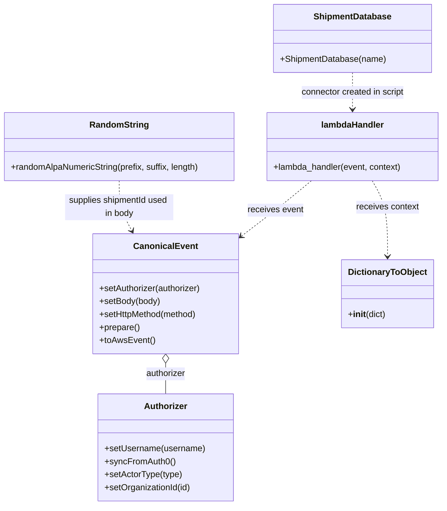

# Diagram: platform/tools/ide_local_testing/localTest/test/shipment/createShipment.py


> Auto-generated by Obscura crawlers

## Diagram 1

```mermaid
flowchart TD
    Start([Start]) --> Imports[Imports: os, localTest.core, shipment_service.shipments, fv.db]
    Imports --> Connector[Create ShipmentDatabase("createUsers.test")]
    Imports --> GenId[Generate shipmentId via RandomString.randomAlpaNumericString("TEST_", "", 10)]
    GenId --> BodyDef[Define body dict: tender (stops, header, reference)]
    BodyDef --> ActiveOrg[Set activeOrgId = 1028]
    ActiveOrg --> AuthInit[Authorizer: setUsername / syncFromAuth0 / setActorType("system")]
    AuthInit --> OrgCond{activeOrgId ?}
    OrgCond -- Yes --> SetOrg[authorizer.setOrganizationId(activeOrgId)]
    OrgCond -- No --> SkipOrg[skip setOrganizationId]
    SetOrg --> EventPrep[CanonicalEvent: setAuthorizer -> setBody -> setHttpMethod("POST") -> prepare -> toAwsEvent]
    SkipOrg --> EventPrep
    EventPrep --> CallLambda[Call lambdaHandler(event, DictionaryToObject({"function_name":"subscriptService.subscribe"}))]
    CallLambda --> Print[print(retval)]
    Print --> End([End])
```

> SVG rendering failed for this diagram.

## Diagram 2



### SVG

<svg id="container" width="823.01953125" xmlns="http://www.w3.org/2000/svg" class="classDiagram" height="934" viewBox="0 0 823.01953125 934" role="graphics-document document" aria-roledescription="class"><style>#container{font-family:"trebuchet ms",verdana,arial,sans-serif;font-size:16px;fill:#333;}@keyframes edge-animation-frame{from{stroke-dashoffset:0;}}@keyframes dash{to{stroke-dashoffset:0;}}#container .edge-animation-slow{stroke-dasharray:9,5!important;stroke-dashoffset:900;animation:dash 50s linear infinite;stroke-linecap:round;}#container .edge-animation-fast{stroke-dasharray:9,5!important;stroke-dashoffset:900;animation:dash 20s linear infinite;stroke-linecap:round;}#container .error-icon{fill:#552222;}#container .error-text{fill:#552222;stroke:#552222;}#container .edge-thickness-normal{stroke-width:1px;}#container .edge-thickness-thick{stroke-width:3.5px;}#container .edge-pattern-solid{stroke-dasharray:0;}#container .edge-thickness-invisible{stroke-width:0;fill:none;}#container .edge-pattern-dashed{stroke-dasharray:3;}#container .edge-pattern-dotted{stroke-dasharray:2;}#container .marker{fill:#333333;stroke:#333333;}#container .marker.cross{stroke:#333333;}#container svg{font-family:"trebuchet ms",verdana,arial,sans-serif;font-size:16px;}#container p{margin:0;}#container g.classGroup text{fill:#9370DB;stroke:none;font-family:"trebuchet ms",verdana,arial,sans-serif;font-size:10px;}#container g.classGroup text .title{font-weight:bolder;}#container .nodeLabel,#container .edgeLabel{color:#131300;}#container .edgeLabel .label rect{fill:#ECECFF;}#container .label text{fill:#131300;}#container .labelBkg{background:#ECECFF;}#container .edgeLabel .label span{background:#ECECFF;}#container .classTitle{font-weight:bolder;}#container .node rect,#container .node circle,#container .node ellipse,#container .node polygon,#container .node path{fill:#ECECFF;stroke:#9370DB;stroke-width:1px;}#container .divider{stroke:#9370DB;stroke-width:1;}#container g.clickable{cursor:pointer;}#container g.classGroup rect{fill:#ECECFF;stroke:#9370DB;}#container g.classGroup line{stroke:#9370DB;stroke-width:1;}#container .classLabel .box{stroke:none;stroke-width:0;fill:#ECECFF;opacity:0.5;}#container .classLabel .label{fill:#9370DB;font-size:10px;}#container .relation{stroke:#333333;stroke-width:1;fill:none;}#container .dashed-line{stroke-dasharray:3;}#container .dotted-line{stroke-dasharray:1 2;}#container #compositionStart,#container .composition{fill:#333333!important;stroke:#333333!important;stroke-width:1;}#container #compositionEnd,#container .composition{fill:#333333!important;stroke:#333333!important;stroke-width:1;}#container #dependencyStart,#container .dependency{fill:#333333!important;stroke:#333333!important;stroke-width:1;}#container #dependencyStart,#container .dependency{fill:#333333!important;stroke:#333333!important;stroke-width:1;}#container #extensionStart,#container .extension{fill:transparent!important;stroke:#333333!important;stroke-width:1;}#container #extensionEnd,#container .extension{fill:transparent!important;stroke:#333333!important;stroke-width:1;}#container #aggregationStart,#container .aggregation{fill:transparent!important;stroke:#333333!important;stroke-width:1;}#container #aggregationEnd,#container .aggregation{fill:transparent!important;stroke:#333333!important;stroke-width:1;}#container #lollipopStart,#container .lollipop{fill:#ECECFF!important;stroke:#333333!important;stroke-width:1;}#container #lollipopEnd,#container .lollipop{fill:#ECECFF!important;stroke:#333333!important;stroke-width:1;}#container .edgeTerminals{font-size:11px;line-height:initial;}#container .classTitleText{text-anchor:middle;font-size:18px;fill:#333;}#container .label-icon{display:inline-block;height:1em;overflow:visible;vertical-align:-0.125em;}#container .node .label-icon path{fill:currentColor;stroke:revert;stroke-width:revert;}#container :root{--mermaid-font-family:"trebuchet ms",verdana,arial,sans-serif;}</style><g><defs><marker id="container_class-aggregationStart" class="marker aggregation class" refX="18" refY="7" markerWidth="190" markerHeight="240" orient="auto"><path d="M 18,7 L9,13 L1,7 L9,1 Z"></path></marker></defs><defs><marker id="container_class-aggregationEnd" class="marker aggregation class" refX="1" refY="7" markerWidth="20" markerHeight="28" orient="auto"><path d="M 18,7 L9,13 L1,7 L9,1 Z"></path></marker></defs><defs><marker id="container_class-extensionStart" class="marker extension class" refX="18" refY="7" markerWidth="190" markerHeight="240" orient="auto"><path d="M 1,7 L18,13 V 1 Z"></path></marker></defs><defs><marker id="container_class-extensionEnd" class="marker extension class" refX="1" refY="7" markerWidth="20" markerHeight="28" orient="auto"><path d="M 1,1 V 13 L18,7 Z"></path></marker></defs><defs><marker id="container_class-compositionStart" class="marker composition class" refX="18" refY="7" markerWidth="190" markerHeight="240" orient="auto"><path d="M 18,7 L9,13 L1,7 L9,1 Z"></path></marker></defs><defs><marker id="container_class-compositionEnd" class="marker composition class" refX="1" refY="7" markerWidth="20" markerHeight="28" orient="auto"><path d="M 18,7 L9,13 L1,7 L9,1 Z"></path></marker></defs><defs><marker id="container_class-dependencyStart" class="marker dependency class" refX="6" refY="7" markerWidth="190" markerHeight="240" orient="auto"><path d="M 5,7 L9,13 L1,7 L9,1 Z"></path></marker></defs><defs><marker id="container_class-dependencyEnd" class="marker dependency class" refX="13" refY="7" markerWidth="20" markerHeight="28" orient="auto"><path d="M 18,7 L9,13 L14,7 L9,1 Z"></path></marker></defs><defs><marker id="container_class-lollipopStart" class="marker lollipop class" refX="13" refY="7" markerWidth="190" markerHeight="240" orient="auto"><circle stroke="black" fill="transparent" cx="7" cy="7" r="6"></circle></marker></defs><defs><marker id="container_class-lollipopEnd" class="marker lollipop class" refX="1" refY="7" markerWidth="190" markerHeight="240" orient="auto"><circle stroke="black" fill="transparent" cx="7" cy="7" r="6"></circle></marker></defs><g class="root"><g class="clusters"></g><g class="edgePaths"><path d="M308.473,671.25L308.473,674.542C308.473,677.833,308.473,684.417,308.473,693.875C308.473,703.333,308.473,715.667,308.473,721.833L308.473,728" id="id_CanonicalEvent_Authorizer_1" class="edge-thickness-normal edge-pattern-solid relation" style=";;;" data-edge="true" data-et="edge" data-id="id_CanonicalEvent_Authorizer_1" data-points="W3sieCI6MzA4LjQ3MjY1NjI1LCJ5Ijo2NTR9LHsieCI6MzA4LjQ3MjY1NjI1LCJ5Ijo2OTF9LHsieCI6MzA4LjQ3MjY1NjI1LCJ5Ijo3Mjh9XQ==" marker-start="url(#container_class-aggregationStart)"></path><path d="M579.444,334L569.694,342.167C559.944,350.333,540.444,366.667,518.619,383.926C496.794,401.185,472.645,419.371,460.571,428.463L448.496,437.556" id="id_lambdaHandler_CanonicalEvent_2" class="edge-thickness-normal edge-pattern-dashed relation" style=";;;" data-edge="true" data-et="edge" data-id="id_lambdaHandler_CanonicalEvent_2" data-points="W3sieCI6NTc5LjQ0NDQ1ODAwNzgxMjUsInkiOjMzNH0seyJ4Ijo1MjAuOTQzMzU5Mzc1LCJ5IjozODN9LHsieCI6NDQzLjcwMzEyNSwieSI6NDQxLjE2NTM3MjA2NDE2MzI1fV0=" marker-end="url(#container_class-dependencyEnd)"></path><path d="M691.291,334L696.039,342.167C700.788,350.333,710.284,366.667,715.033,390C719.781,413.333,719.781,443.667,719.781,458.833L719.781,474" id="id_lambdaHandler_DictionaryToObject_3" class="edge-thickness-normal edge-pattern-dashed relation" style=";;;" data-edge="true" data-et="edge" data-id="id_lambdaHandler_DictionaryToObject_3" data-points="W3sieCI6NjkxLjI5MDc3MTQ4NDM3NSwieSI6MzM0fSx7IngiOjcxOS43ODEyNSwieSI6MzgzfSx7IngiOjcxOS43ODEyNSwieSI6NDgwfV0=" marker-end="url(#container_class-dependencyEnd)"></path><path d="M222.582,334L222.582,342.167C222.582,350.333,222.582,366.667,226.493,382.119C230.404,397.571,238.226,412.142,242.137,419.428L246.048,426.714" id="id_RandomString_CanonicalEvent_4" class="edge-thickness-normal edge-pattern-dashed relation" style=";;;" data-edge="true" data-et="edge" data-id="id_RandomString_CanonicalEvent_4" data-points="W3sieCI6MjIyLjU4MjAzMTI1LCJ5IjozMzR9LHsieCI6MjIyLjU4MjAzMTI1LCJ5IjozODN9LHsieCI6MjQ4Ljg4NjAzNTE1NjI1LCJ5Ijo0MzJ9XQ==" marker-end="url(#container_class-dependencyEnd)"></path><path d="M654.66,134L654.66,140.167C654.66,146.333,654.66,158.667,654.66,170C654.66,181.333,654.66,191.667,654.66,196.833L654.66,202" id="id_ShipmentDatabase_lambdaHandler_5" class="edge-thickness-normal edge-pattern-dashed relation" style=";;;" data-edge="true" data-et="edge" data-id="id_ShipmentDatabase_lambdaHandler_5" data-points="W3sieCI6NjU0LjY2MDE1NjI1LCJ5IjoxMzR9LHsieCI6NjU0LjY2MDE1NjI1LCJ5IjoxNzF9LHsieCI6NjU0LjY2MDE1NjI1LCJ5IjoyMDh9XQ==" marker-end="url(#container_class-dependencyEnd)"></path></g><g class="edgeLabels"><g class="edgeLabel" transform="translate(308.47265625, 691)"><g class="label" data-id="id_CanonicalEvent_Authorizer_1" transform="translate(-37.4921875, -12)"><foreignObject width="74.984375" height="24"><div xmlns="http://www.w3.org/1999/xhtml" class="labelBkg" style="display: table-cell; white-space: nowrap; line-height: 1.5; max-width: 200px; text-align: center;"><span class="edgeLabel"><p>authorizer</p></span></div></foreignObject></g></g><g class="edgeLabel" transform="translate(512.80306, 389.13001)"><g class="label" data-id="id_lambdaHandler_CanonicalEvent_2" transform="translate(-51.78125, -12)"><foreignObject width="103.5625" height="24"><div xmlns="http://www.w3.org/1999/xhtml" class="labelBkg" style="display: table-cell; white-space: nowrap; line-height: 1.5; max-width: 200px; text-align: center;"><span class="edgeLabel"><p>receives event</p></span></div></foreignObject></g></g><g class="edgeLabel" transform="translate(719.78125, 383)"><g class="label" data-id="id_lambdaHandler_DictionaryToObject_3" transform="translate(-58.4609375, -12)"><foreignObject width="116.921875" height="24"><div xmlns="http://www.w3.org/1999/xhtml" class="labelBkg" style="display: table-cell; white-space: nowrap; line-height: 1.5; max-width: 200px; text-align: center;"><span class="edgeLabel"><p>receives context</p></span></div></foreignObject></g></g><g class="edgeLabel" transform="translate(222.58203125, 383)"><g class="label" data-id="id_RandomString_CanonicalEvent_4" transform="translate(-100, -24)"><foreignObject width="200" height="48"><div xmlns="http://www.w3.org/1999/xhtml" class="labelBkg" style="display: table; white-space: break-spaces; line-height: 1.5; max-width: 200px; text-align: center; width: 200px;"><span class="edgeLabel"><p>supplies shipmentId used in body</p></span></div></foreignObject></g></g><g class="edgeLabel" transform="translate(654.66015625, 171)"><g class="label" data-id="id_ShipmentDatabase_lambdaHandler_5" transform="translate(-97.4921875, -12)"><foreignObject width="194.984375" height="24"><div xmlns="http://www.w3.org/1999/xhtml" class="labelBkg" style="display: table-cell; white-space: nowrap; line-height: 1.5; max-width: 200px; text-align: center;"><span class="edgeLabel"><p>connector created in script</p></span></div></foreignObject></g></g></g><g class="nodes"><g class="node default" id="classId-ShipmentDatabase-0" transform="translate(654.66015625, 71)"><g class="basic label-container"><path d="M-144.24609375 -63 L144.24609375 -63 L144.24609375 63 L-144.24609375 63" stroke="none" stroke-width="0" fill="#ECECFF" style=""></path><path d="M-144.24609375 -63 C-69.31995232941894 -63, 5.606189091162122 -63, 144.24609375 -63 M-144.24609375 -63 C-75.38861979328297 -63, -6.5311458365659405 -63, 144.24609375 -63 M144.24609375 -63 C144.24609375 -31.70827475259333, 144.24609375 -0.41654950518665856, 144.24609375 63 M144.24609375 -63 C144.24609375 -21.120346458157847, 144.24609375 20.759307083684305, 144.24609375 63 M144.24609375 63 C55.66347222558838 63, -32.91914929882324 63, -144.24609375 63 M144.24609375 63 C36.7267272998685 63, -70.792639150263 63, -144.24609375 63 M-144.24609375 63 C-144.24609375 12.658931362852258, -144.24609375 -37.682137274295485, -144.24609375 -63 M-144.24609375 63 C-144.24609375 20.740802352601527, -144.24609375 -21.518395294796946, -144.24609375 -63" stroke="#9370DB" stroke-width="1.3" fill="none" stroke-dasharray="0 0" style=""></path></g><g class="annotation-group text" transform="translate(0, -39)"></g><g class="label-group text" transform="translate(-69.2734375, -39)"><g class="label" style="font-weight: bolder" transform="translate(0,-12)"><foreignObject width="138.546875" height="24"><div xmlns="http://www.w3.org/1999/xhtml" style="display: table-cell; white-space: nowrap; line-height: 1.5; max-width: 187px; text-align: center;"><span class="nodeLabel markdown-node-label" style=""><p>ShipmentDatabase</p></span></div></foreignObject></g></g><g class="members-group text" transform="translate(-132.24609375, 9)"></g><g class="methods-group text" transform="translate(-132.24609375, 39)"><g class="label" style="" transform="translate(0,-12)"><foreignObject width="195.21875" height="24"><div xmlns="http://www.w3.org/1999/xhtml" style="display: table-cell; white-space: nowrap; line-height: 1.5; max-width: 253px; text-align: center;"><span class="nodeLabel markdown-node-label" style=""><p>+ShipmentDatabase(name)</p></span></div></foreignObject></g></g><g class="divider" style=""><path d="M-144.24609375 -15 C-62.290706196504885 -15, 19.66468135699023 -15, 144.24609375 -15 M-144.24609375 -15 C-69.63213114309995 -15, 4.981831463800091 -15, 144.24609375 -15" stroke="#9370DB" stroke-width="1.3" fill="none" stroke-dasharray="0 0" style=""></path></g><g class="divider" style=""><path d="M-144.24609375 9 C-56.950092587994305 9, 30.34590857401139 9, 144.24609375 9 M-144.24609375 9 C-60.18082091596327 9, 23.884451918073466 9, 144.24609375 9" stroke="#9370DB" stroke-width="1.3" fill="none" stroke-dasharray="0 0" style=""></path></g></g><g class="node default" id="classId-RandomString-1" transform="translate(222.58203125, 271)"><g class="basic label-container"><path d="M-214.58203125 -63 L214.58203125 -63 L214.58203125 63 L-214.58203125 63" stroke="none" stroke-width="0" fill="#ECECFF" style=""></path><path d="M-214.58203125 -63 C-68.09340443877113 -63, 78.39522237245774 -63, 214.58203125 -63 M-214.58203125 -63 C-125.6693153415903 -63, -36.75659943318061 -63, 214.58203125 -63 M214.58203125 -63 C214.58203125 -26.354326369642386, 214.58203125 10.291347260715227, 214.58203125 63 M214.58203125 -63 C214.58203125 -31.656313028971283, 214.58203125 -0.31262605794256615, 214.58203125 63 M214.58203125 63 C103.33824202048977 63, -7.905547209020455 63, -214.58203125 63 M214.58203125 63 C51.482954484791776 63, -111.61612228041645 63, -214.58203125 63 M-214.58203125 63 C-214.58203125 23.620420453069308, -214.58203125 -15.759159093861385, -214.58203125 -63 M-214.58203125 63 C-214.58203125 24.315035851282026, -214.58203125 -14.369928297435948, -214.58203125 -63" stroke="#9370DB" stroke-width="1.3" fill="none" stroke-dasharray="0 0" style=""></path></g><g class="annotation-group text" transform="translate(0, -39)"></g><g class="label-group text" transform="translate(-52.2421875, -39)"><g class="label" style="font-weight: bolder" transform="translate(0,-12)"><foreignObject width="104.484375" height="24"><div xmlns="http://www.w3.org/1999/xhtml" style="display: table-cell; white-space: nowrap; line-height: 1.5; max-width: 154px; text-align: center;"><span class="nodeLabel markdown-node-label" style=""><p>RandomString</p></span></div></foreignObject></g></g><g class="members-group text" transform="translate(-202.58203125, 9)"></g><g class="methods-group text" transform="translate(-202.58203125, 39)"><g class="label" style="" transform="translate(0,-12)"><foreignObject width="352.921875" height="24"><div xmlns="http://www.w3.org/1999/xhtml" style="display: table-cell; white-space: nowrap; line-height: 1.5; max-width: 410px; text-align: center;"><span class="nodeLabel markdown-node-label" style=""><p>+randomAlpaNumericString(prefix, suffix, length)</p></span></div></foreignObject></g></g><g class="divider" style=""><path d="M-214.58203125 -15 C-51.404726439336 -15, 111.772578371328 -15, 214.58203125 -15 M-214.58203125 -15 C-92.54837791177629 -15, 29.48527542644743 -15, 214.58203125 -15" stroke="#9370DB" stroke-width="1.3" fill="none" stroke-dasharray="0 0" style=""></path></g><g class="divider" style=""><path d="M-214.58203125 9 C-58.511261962074116 9, 97.55950732585177 9, 214.58203125 9 M-214.58203125 9 C-62.736909578765136 9, 89.10821209246973 9, 214.58203125 9" stroke="#9370DB" stroke-width="1.3" fill="none" stroke-dasharray="0 0" style=""></path></g></g><g class="node default" id="classId-Authorizer-2" transform="translate(308.47265625, 827)"><g class="basic label-container"><path d="M-124.13671875 -99 L124.13671875 -99 L124.13671875 99 L-124.13671875 99" stroke="none" stroke-width="0" fill="#ECECFF" style=""></path><path d="M-124.13671875 -99 C-60.00945924819568 -99, 4.117800253608635 -99, 124.13671875 -99 M-124.13671875 -99 C-74.42956205947124 -99, -24.72240536894246 -99, 124.13671875 -99 M124.13671875 -99 C124.13671875 -38.13080040446172, 124.13671875 22.738399191076553, 124.13671875 99 M124.13671875 -99 C124.13671875 -50.061051259683914, 124.13671875 -1.1221025193678287, 124.13671875 99 M124.13671875 99 C32.20956981369716 99, -59.717579122605684 99, -124.13671875 99 M124.13671875 99 C52.91724908134802 99, -18.302220587303964 99, -124.13671875 99 M-124.13671875 99 C-124.13671875 51.657123161456326, -124.13671875 4.314246322912652, -124.13671875 -99 M-124.13671875 99 C-124.13671875 27.1240761867427, -124.13671875 -44.7518476265146, -124.13671875 -99" stroke="#9370DB" stroke-width="1.3" fill="none" stroke-dasharray="0 0" style=""></path></g><g class="annotation-group text" transform="translate(0, -75)"></g><g class="label-group text" transform="translate(-38.3671875, -75)"><g class="label" style="font-weight: bolder" transform="translate(0,-12)"><foreignObject width="76.734375" height="24"><div xmlns="http://www.w3.org/1999/xhtml" style="display: table-cell; white-space: nowrap; line-height: 1.5; max-width: 126px; text-align: center;"><span class="nodeLabel markdown-node-label" style=""><p>Authorizer</p></span></div></foreignObject></g></g><g class="members-group text" transform="translate(-112.13671875, -27)"></g><g class="methods-group text" transform="translate(-112.13671875, 3)"><g class="label" style="" transform="translate(0,-12)"><foreignObject width="185.90625" height="24"><div xmlns="http://www.w3.org/1999/xhtml" style="display: table-cell; white-space: nowrap; line-height: 1.5; max-width: 243px; text-align: center;"><span class="nodeLabel markdown-node-label" style=""><p>+setUsername(username)</p></span></div></foreignObject></g><g class="label" style="" transform="translate(0,12)"><foreignObject width="129.0625" height="24"><div xmlns="http://www.w3.org/1999/xhtml" style="display: table-cell; white-space: nowrap; line-height: 1.5; max-width: 186px; text-align: center;"><span class="nodeLabel markdown-node-label" style=""><p>+syncFromAuth0()</p></span></div></foreignObject></g><g class="label" style="" transform="translate(0,36)"><foreignObject width="143.71875" height="24"><div xmlns="http://www.w3.org/1999/xhtml" style="display: table-cell; white-space: nowrap; line-height: 1.5; max-width: 201px; text-align: center;"><span class="nodeLabel markdown-node-label" style=""><p>+setActorType(type)</p></span></div></foreignObject></g><g class="label" style="" transform="translate(0,60)"><foreignObject width="160.78125" height="24"><div xmlns="http://www.w3.org/1999/xhtml" style="display: table-cell; white-space: nowrap; line-height: 1.5; max-width: 218px; text-align: center;"><span class="nodeLabel markdown-node-label" style=""><p>+setOrganizationId(id)</p></span></div></foreignObject></g></g><g class="divider" style=""><path d="M-124.13671875 -51 C-73.51661129931838 -51, -22.89650384863677 -51, 124.13671875 -51 M-124.13671875 -51 C-67.57052275315127 -51, -11.004326756302547 -51, 124.13671875 -51" stroke="#9370DB" stroke-width="1.3" fill="none" stroke-dasharray="0 0" style=""></path></g><g class="divider" style=""><path d="M-124.13671875 -27 C-30.241227077598523 -27, 63.65426459480295 -27, 124.13671875 -27 M-124.13671875 -27 C-43.65573878155227 -27, 36.825241186895454 -27, 124.13671875 -27" stroke="#9370DB" stroke-width="1.3" fill="none" stroke-dasharray="0 0" style=""></path></g></g><g class="node default" id="classId-CanonicalEvent-3" transform="translate(308.47265625, 543)"><g class="basic label-container"><path d="M-135.23046875 -111 L135.23046875 -111 L135.23046875 111 L-135.23046875 111" stroke="none" stroke-width="0" fill="#ECECFF" style=""></path><path d="M-135.23046875 -111 C-60.729533249536516 -111, 13.771402250926968 -111, 135.23046875 -111 M-135.23046875 -111 C-70.5117671893424 -111, -5.793065628684786 -111, 135.23046875 -111 M135.23046875 -111 C135.23046875 -54.084792577172294, 135.23046875 2.8304148456554117, 135.23046875 111 M135.23046875 -111 C135.23046875 -50.40699850682223, 135.23046875 10.186002986355547, 135.23046875 111 M135.23046875 111 C73.17337463673604 111, 11.116280523472085 111, -135.23046875 111 M135.23046875 111 C79.06209926520896 111, 22.893729780417928 111, -135.23046875 111 M-135.23046875 111 C-135.23046875 48.38214885479125, -135.23046875 -14.235702290417507, -135.23046875 -111 M-135.23046875 111 C-135.23046875 32.33215031947239, -135.23046875 -46.33569936105522, -135.23046875 -111" stroke="#9370DB" stroke-width="1.3" fill="none" stroke-dasharray="0 0" style=""></path></g><g class="annotation-group text" transform="translate(0, -87)"></g><g class="label-group text" transform="translate(-55.7109375, -87)"><g class="label" style="font-weight: bolder" transform="translate(0,-12)"><foreignObject width="111.421875" height="24"><div xmlns="http://www.w3.org/1999/xhtml" style="display: table-cell; white-space: nowrap; line-height: 1.5; max-width: 161px; text-align: center;"><span class="nodeLabel markdown-node-label" style=""><p>CanonicalEvent</p></span></div></foreignObject></g></g><g class="members-group text" transform="translate(-123.23046875, -39)"></g><g class="methods-group text" transform="translate(-123.23046875, -9)"><g class="label" style="" transform="translate(0,-12)"><foreignObject width="190.75" height="24"><div xmlns="http://www.w3.org/1999/xhtml" style="display: table-cell; white-space: nowrap; line-height: 1.5; max-width: 248px; text-align: center;"><span class="nodeLabel markdown-node-label" style=""><p>+setAuthorizer(authorizer)</p></span></div></foreignObject></g><g class="label" style="" transform="translate(0,12)"><foreignObject width="113.125" height="24"><div xmlns="http://www.w3.org/1999/xhtml" style="display: table-cell; white-space: nowrap; line-height: 1.5; max-width: 170px; text-align: center;"><span class="nodeLabel markdown-node-label" style=""><p>+setBody(body)</p></span></div></foreignObject></g><g class="label" style="" transform="translate(0,36)"><foreignObject width="184" height="24"><div xmlns="http://www.w3.org/1999/xhtml" style="display: table-cell; white-space: nowrap; line-height: 1.5; max-width: 241px; text-align: center;"><span class="nodeLabel markdown-node-label" style=""><p>+setHttpMethod(method)</p></span></div></foreignObject></g><g class="label" style="" transform="translate(0,60)"><foreignObject width="74.75" height="24"><div xmlns="http://www.w3.org/1999/xhtml" style="display: table-cell; white-space: nowrap; line-height: 1.5; max-width: 132px; text-align: center;"><span class="nodeLabel markdown-node-label" style=""><p>+prepare()</p></span></div></foreignObject></g><g class="label" style="" transform="translate(0,84)"><foreignObject width="101.1875" height="24"><div xmlns="http://www.w3.org/1999/xhtml" style="display: table-cell; white-space: nowrap; line-height: 1.5; max-width: 159px; text-align: center;"><span class="nodeLabel markdown-node-label" style=""><p>+toAwsEvent()</p></span></div></foreignObject></g></g><g class="divider" style=""><path d="M-135.23046875 -63 C-70.87019902485058 -63, -6.509929299701156 -63, 135.23046875 -63 M-135.23046875 -63 C-67.37434892943153 -63, 0.4817708911369323 -63, 135.23046875 -63" stroke="#9370DB" stroke-width="1.3" fill="none" stroke-dasharray="0 0" style=""></path></g><g class="divider" style=""><path d="M-135.23046875 -39 C-76.01835011321438 -39, -16.806231476428778 -39, 135.23046875 -39 M-135.23046875 -39 C-33.60709370540347 -39, 68.01628133919306 -39, 135.23046875 -39" stroke="#9370DB" stroke-width="1.3" fill="none" stroke-dasharray="0 0" style=""></path></g></g><g class="node default" id="classId-DictionaryToObject-4" transform="translate(719.78125, 543)"><g class="basic label-container"><path d="M-82.203125 -63 L82.203125 -63 L82.203125 63 L-82.203125 63" stroke="none" stroke-width="0" fill="#ECECFF" style=""></path><path d="M-82.203125 -63 C-38.73692039170034 -63, 4.729284216599325 -63, 82.203125 -63 M-82.203125 -63 C-49.20456657919006 -63, -16.206008158380115 -63, 82.203125 -63 M82.203125 -63 C82.203125 -20.396948036480367, 82.203125 22.206103927039265, 82.203125 63 M82.203125 -63 C82.203125 -29.647920125667724, 82.203125 3.7041597486645514, 82.203125 63 M82.203125 63 C19.925677318655133 63, -42.351770362689734 63, -82.203125 63 M82.203125 63 C38.970904559528044 63, -4.261315880943911 63, -82.203125 63 M-82.203125 63 C-82.203125 26.365371744921895, -82.203125 -10.269256510156211, -82.203125 -63 M-82.203125 63 C-82.203125 16.566495145290503, -82.203125 -29.867009709418994, -82.203125 -63" stroke="#9370DB" stroke-width="1.3" fill="none" stroke-dasharray="0 0" style=""></path></g><g class="annotation-group text" transform="translate(0, -39)"></g><g class="label-group text" transform="translate(-70.109375, -39)"><g class="label" style="font-weight: bolder" transform="translate(0,-12)"><foreignObject width="140.21875" height="24"><div xmlns="http://www.w3.org/1999/xhtml" style="display: table-cell; white-space: nowrap; line-height: 1.5; max-width: 188px; text-align: center;"><span class="nodeLabel markdown-node-label" style=""><p>DictionaryToObject</p></span></div></foreignObject></g></g><g class="members-group text" transform="translate(-70.203125, 9)"></g><g class="methods-group text" transform="translate(-70.203125, 39)"><g class="label" style="" transform="translate(0,-12)"><foreignObject width="70.296875" height="24"><div xmlns="http://www.w3.org/1999/xhtml" style="display: table-cell; white-space: nowrap; line-height: 1.5; max-width: 159px; text-align: center;"><span class="nodeLabel markdown-node-label" style=""><p>+<strong>init</strong>(dict)</p></span></div></foreignObject></g></g><g class="divider" style=""><path d="M-82.203125 -15 C-22.024240403818204 -15, 38.15464419236359 -15, 82.203125 -15 M-82.203125 -15 C-20.141314135104125 -15, 41.92049672979175 -15, 82.203125 -15" stroke="#9370DB" stroke-width="1.3" fill="none" stroke-dasharray="0 0" style=""></path></g><g class="divider" style=""><path d="M-82.203125 9 C-20.160892573865098 9, 41.881339852269804 9, 82.203125 9 M-82.203125 9 C-25.347847986452457 9, 31.507429027095085 9, 82.203125 9" stroke="#9370DB" stroke-width="1.3" fill="none" stroke-dasharray="0 0" style=""></path></g></g><g class="node default" id="classId-lambdaHandler-5" transform="translate(654.66015625, 271)"><g class="basic label-container"><path d="M-160.359375 -63 L160.359375 -63 L160.359375 63 L-160.359375 63" stroke="none" stroke-width="0" fill="#ECECFF" style=""></path><path d="M-160.359375 -63 C-72.6804660851733 -63, 14.998442829653413 -63, 160.359375 -63 M-160.359375 -63 C-50.947516915722176 -63, 58.46434116855565 -63, 160.359375 -63 M160.359375 -63 C160.359375 -26.429043025826317, 160.359375 10.141913948347366, 160.359375 63 M160.359375 -63 C160.359375 -35.48698560213511, 160.359375 -7.973971204270207, 160.359375 63 M160.359375 63 C68.22271349227073 63, -23.913948015458544 63, -160.359375 63 M160.359375 63 C47.15351308603125 63, -66.0523488279375 63, -160.359375 63 M-160.359375 63 C-160.359375 18.802614500946383, -160.359375 -25.394770998107234, -160.359375 -63 M-160.359375 63 C-160.359375 22.325296250472178, -160.359375 -18.349407499055644, -160.359375 -63" stroke="#9370DB" stroke-width="1.3" fill="none" stroke-dasharray="0 0" style=""></path></g><g class="annotation-group text" transform="translate(0, -39)"></g><g class="label-group text" transform="translate(-56.53125, -39)"><g class="label" style="font-weight: bolder" transform="translate(0,-12)"><foreignObject width="113.0625" height="24"><div xmlns="http://www.w3.org/1999/xhtml" style="display: table-cell; white-space: nowrap; line-height: 1.5; max-width: 164px; text-align: center;"><span class="nodeLabel markdown-node-label" style=""><p>lambdaHandler</p></span></div></foreignObject></g></g><g class="members-group text" transform="translate(-148.359375, 9)"></g><g class="methods-group text" transform="translate(-148.359375, 39)"><g class="label" style="" transform="translate(0,-12)"><foreignObject width="240.1875" height="24"><div xmlns="http://www.w3.org/1999/xhtml" style="display: table-cell; white-space: nowrap; line-height: 1.5; max-width: 298px; text-align: center;"><span class="nodeLabel markdown-node-label" style=""><p>+lambda_handler(event, context)</p></span></div></foreignObject></g></g><g class="divider" style=""><path d="M-160.359375 -15 C-88.05460502667248 -15, -15.749835053344952 -15, 160.359375 -15 M-160.359375 -15 C-48.32668318246634 -15, 63.70600863506732 -15, 160.359375 -15" stroke="#9370DB" stroke-width="1.3" fill="none" stroke-dasharray="0 0" style=""></path></g><g class="divider" style=""><path d="M-160.359375 9 C-38.15016330813897 9, 84.05904838372206 9, 160.359375 9 M-160.359375 9 C-93.82296852214759 9, -27.28656204429518 9, 160.359375 9" stroke="#9370DB" stroke-width="1.3" fill="none" stroke-dasharray="0 0" style=""></path></g></g></g></g></g></svg>
