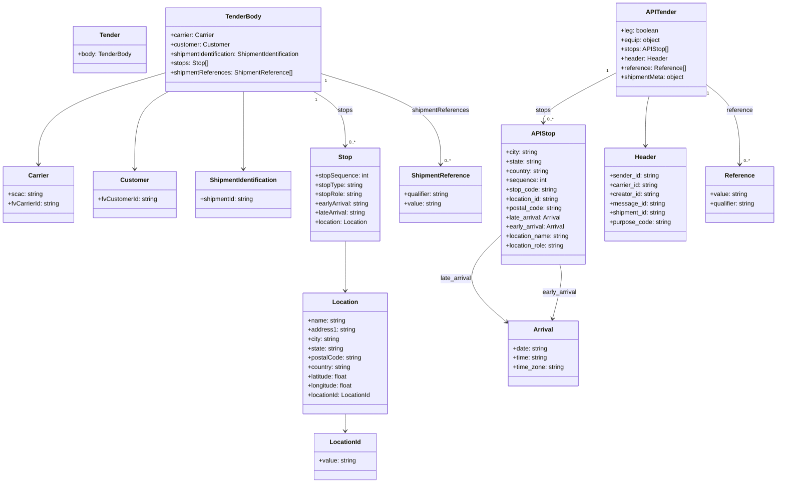

# Diagram: platform/tools/ide_local_testing/localTest/test/shipment/createShipmentFromTender.py


> Auto-generated by Obscura crawlers

## Diagram 1



### SVG

<svg id="container" width="2015.125" xmlns="http://www.w3.org/2000/svg" class="classDiagram" height="1246" viewBox="0 0 2015.125 1246" role="graphics-document document" aria-roledescription="class"><style>#container{font-family:"trebuchet ms",verdana,arial,sans-serif;font-size:16px;fill:#333;}@keyframes edge-animation-frame{from{stroke-dashoffset:0;}}@keyframes dash{to{stroke-dashoffset:0;}}#container .edge-animation-slow{stroke-dasharray:9,5!important;stroke-dashoffset:900;animation:dash 50s linear infinite;stroke-linecap:round;}#container .edge-animation-fast{stroke-dasharray:9,5!important;stroke-dashoffset:900;animation:dash 20s linear infinite;stroke-linecap:round;}#container .error-icon{fill:#552222;}#container .error-text{fill:#552222;stroke:#552222;}#container .edge-thickness-normal{stroke-width:1px;}#container .edge-thickness-thick{stroke-width:3.5px;}#container .edge-pattern-solid{stroke-dasharray:0;}#container .edge-thickness-invisible{stroke-width:0;fill:none;}#container .edge-pattern-dashed{stroke-dasharray:3;}#container .edge-pattern-dotted{stroke-dasharray:2;}#container .marker{fill:#333333;stroke:#333333;}#container .marker.cross{stroke:#333333;}#container svg{font-family:"trebuchet ms",verdana,arial,sans-serif;font-size:16px;}#container p{margin:0;}#container g.classGroup text{fill:#9370DB;stroke:none;font-family:"trebuchet ms",verdana,arial,sans-serif;font-size:10px;}#container g.classGroup text .title{font-weight:bolder;}#container .nodeLabel,#container .edgeLabel{color:#131300;}#container .edgeLabel .label rect{fill:#ECECFF;}#container .label text{fill:#131300;}#container .labelBkg{background:#ECECFF;}#container .edgeLabel .label span{background:#ECECFF;}#container .classTitle{font-weight:bolder;}#container .node rect,#container .node circle,#container .node ellipse,#container .node polygon,#container .node path{fill:#ECECFF;stroke:#9370DB;stroke-width:1px;}#container .divider{stroke:#9370DB;stroke-width:1;}#container g.clickable{cursor:pointer;}#container g.classGroup rect{fill:#ECECFF;stroke:#9370DB;}#container g.classGroup line{stroke:#9370DB;stroke-width:1;}#container .classLabel .box{stroke:none;stroke-width:0;fill:#ECECFF;opacity:0.5;}#container .classLabel .label{fill:#9370DB;font-size:10px;}#container .relation{stroke:#333333;stroke-width:1;fill:none;}#container .dashed-line{stroke-dasharray:3;}#container .dotted-line{stroke-dasharray:1 2;}#container #compositionStart,#container .composition{fill:#333333!important;stroke:#333333!important;stroke-width:1;}#container #compositionEnd,#container .composition{fill:#333333!important;stroke:#333333!important;stroke-width:1;}#container #dependencyStart,#container .dependency{fill:#333333!important;stroke:#333333!important;stroke-width:1;}#container #dependencyStart,#container .dependency{fill:#333333!important;stroke:#333333!important;stroke-width:1;}#container #extensionStart,#container .extension{fill:transparent!important;stroke:#333333!important;stroke-width:1;}#container #extensionEnd,#container .extension{fill:transparent!important;stroke:#333333!important;stroke-width:1;}#container #aggregationStart,#container .aggregation{fill:transparent!important;stroke:#333333!important;stroke-width:1;}#container #aggregationEnd,#container .aggregation{fill:transparent!important;stroke:#333333!important;stroke-width:1;}#container #lollipopStart,#container .lollipop{fill:#ECECFF!important;stroke:#333333!important;stroke-width:1;}#container #lollipopEnd,#container .lollipop{fill:#ECECFF!important;stroke:#333333!important;stroke-width:1;}#container .edgeTerminals{font-size:11px;line-height:initial;}#container .classTitleText{text-anchor:middle;font-size:18px;fill:#333;}#container .label-icon{display:inline-block;height:1em;overflow:visible;vertical-align:-0.125em;}#container .node .label-icon path{fill:currentColor;stroke:revert;stroke-width:revert;}#container :root{--mermaid-font-family:"trebuchet ms",verdana,arial,sans-serif;}</style><g><defs><marker id="container_class-aggregationStart" class="marker aggregation class" refX="18" refY="7" markerWidth="190" markerHeight="240" orient="auto"><path d="M 18,7 L9,13 L1,7 L9,1 Z"></path></marker></defs><defs><marker id="container_class-aggregationEnd" class="marker aggregation class" refX="1" refY="7" markerWidth="20" markerHeight="28" orient="auto"><path d="M 18,7 L9,13 L1,7 L9,1 Z"></path></marker></defs><defs><marker id="container_class-extensionStart" class="marker extension class" refX="18" refY="7" markerWidth="190" markerHeight="240" orient="auto"><path d="M 1,7 L18,13 V 1 Z"></path></marker></defs><defs><marker id="container_class-extensionEnd" class="marker extension class" refX="1" refY="7" markerWidth="20" markerHeight="28" orient="auto"><path d="M 1,1 V 13 L18,7 Z"></path></marker></defs><defs><marker id="container_class-compositionStart" class="marker composition class" refX="18" refY="7" markerWidth="190" markerHeight="240" orient="auto"><path d="M 18,7 L9,13 L1,7 L9,1 Z"></path></marker></defs><defs><marker id="container_class-compositionEnd" class="marker composition class" refX="1" refY="7" markerWidth="20" markerHeight="28" orient="auto"><path d="M 18,7 L9,13 L1,7 L9,1 Z"></path></marker></defs><defs><marker id="container_class-dependencyStart" class="marker dependency class" refX="6" refY="7" markerWidth="190" markerHeight="240" orient="auto"><path d="M 5,7 L9,13 L1,7 L9,1 Z"></path></marker></defs><defs><marker id="container_class-dependencyEnd" class="marker dependency class" refX="13" refY="7" markerWidth="20" markerHeight="28" orient="auto"><path d="M 18,7 L9,13 L14,7 L9,1 Z"></path></marker></defs><defs><marker id="container_class-lollipopStart" class="marker lollipop class" refX="13" refY="7" markerWidth="190" markerHeight="240" orient="auto"><circle stroke="black" fill="transparent" cx="7" cy="7" r="6"></circle></marker></defs><defs><marker id="container_class-lollipopEnd" class="marker lollipop class" refX="1" refY="7" markerWidth="190" markerHeight="240" orient="auto"><circle stroke="black" fill="transparent" cx="7" cy="7" r="6"></circle></marker></defs><g class="root"><g class="clusters"></g><g class="edgePaths"><path d="M420.492,189.781L367.031,205.651C313.57,221.521,206.648,253.26,153.188,292.297C99.727,331.333,99.727,377.667,99.727,400.833L99.727,424" id="id_TenderBody_Carrier_1" class="edge-thickness-normal edge-pattern-solid relation" style=";;;" data-edge="true" data-et="edge" data-id="id_TenderBody_Carrier_1" data-points="W3sieCI6NDIwLjQ5MjE4NzUsInkiOjE4OS43ODE0NDExMDYwODg4fSx7IngiOjk5LjcyNjU2MjUsInkiOjI4NX0seyJ4Ijo5OS43MjY1NjI1LCJ5Ijo0MzB9XQ==" marker-end="url(#container_class-dependencyEnd)"></path><path d="M435.498,236L420.895,244.167C406.292,252.333,377.085,268.667,362.482,302C347.879,335.333,347.879,385.667,347.879,410.833L347.879,436" id="id_TenderBody_Customer_2" class="edge-thickness-normal edge-pattern-solid relation" style=";;;" data-edge="true" data-et="edge" data-id="id_TenderBody_Customer_2" data-points="W3sieCI6NDM1LjQ5Nzg2MDI3MDcwMDY0LCJ5IjoyMzZ9LHsieCI6MzQ3Ljg3ODkwNjI1LCJ5IjoyODV9LHsieCI6MzQ3Ljg3ODkwNjI1LCJ5Ijo0NDJ9XQ==" marker-end="url(#container_class-dependencyEnd)"></path><path d="M628.617,236L628.617,244.167C628.617,252.333,628.617,268.667,628.617,302C628.617,335.333,628.617,385.667,628.617,410.833L628.617,436" id="id_TenderBody_ShipmentIdentification_3" class="edge-thickness-normal edge-pattern-solid relation" style=";;;" data-edge="true" data-et="edge" data-id="id_TenderBody_ShipmentIdentification_3" data-points="W3sieCI6NjI4LjYxNzE4NzUsInkiOjIzNn0seyJ4Ijo2MjguNjE3MTg3NSwieSI6Mjg1fSx7IngiOjYyOC42MTcxODc1LCJ5Ijo0NDJ9XQ==" marker-end="url(#container_class-dependencyEnd)"></path><path d="M810.969,236L824.758,244.167C838.547,252.333,866.125,268.667,879.914,292C893.703,315.333,893.703,345.667,893.703,360.833L893.703,376" id="id_TenderBody_Stop_4" class="edge-thickness-normal edge-pattern-solid relation" style=";;;" data-edge="true" data-et="edge" data-id="id_TenderBody_Stop_4" data-points="W3sieCI6ODEwLjk2OTI5NzM3MjYxMTQsInkiOjIzNn0seyJ4Ijo4OTMuNzAzMTI1LCJ5IjoyODV9LHsieCI6ODkzLjcwMzEyNSwieSI6MzgyfV0=" marker-end="url(#container_class-dependencyEnd)"></path><path d="M893.703,622L893.703,638.167C893.703,654.333,893.703,686.667,893.703,708C893.703,729.333,893.703,739.667,893.703,744.833L893.703,750" id="id_Stop_Location_5" class="edge-thickness-normal edge-pattern-solid relation" style=";;;" data-edge="true" data-et="edge" data-id="id_Stop_Location_5" data-points="W3sieCI6ODkzLjcwMzEyNSwieSI6NjIyfSx7IngiOjg5My43MDMxMjUsInkiOjcxOX0seyJ4Ijo4OTMuNzAzMTI1LCJ5Ijo3NTZ9XQ==" marker-end="url(#container_class-dependencyEnd)"></path><path d="M893.703,1068L893.703,1072.167C893.703,1076.333,893.703,1084.667,893.703,1092C893.703,1099.333,893.703,1105.667,893.703,1108.833L893.703,1112" id="id_Location_LocationId_6" class="edge-thickness-normal edge-pattern-solid relation" style=";;;" data-edge="true" data-et="edge" data-id="id_Location_LocationId_6" data-points="W3sieCI6ODkzLjcwMzEyNSwieSI6MTA2OH0seyJ4Ijo4OTMuNzAzMTI1LCJ5IjoxMDkzfSx7IngiOjg5My43MDMxMjUsInkiOjExMTh9XQ==" marker-end="url(#container_class-dependencyEnd)"></path><path d="M836.742,191.701L887.547,207.251C938.352,222.801,1039.961,253.9,1090.766,292.617C1141.57,331.333,1141.57,377.667,1141.57,400.833L1141.57,424" id="id_TenderBody_ShipmentReference_7" class="edge-thickness-normal edge-pattern-solid relation" style=";;;" data-edge="true" data-et="edge" data-id="id_TenderBody_ShipmentReference_7" data-points="W3sieCI6ODM2Ljc0MjE4NzUsInkiOjE5MS43MDA5OTYwNzA1NDczOH0seyJ4IjoxMTQxLjU3MDMxMjUsInkiOjI4NX0seyJ4IjoxMTQxLjU3MDMxMjUsInkiOjQzMH1d" marker-end="url(#container_class-dependencyEnd)"></path><path d="M1602.555,185.939L1570.117,202.449C1537.678,218.96,1472.802,251.98,1440.364,273.657C1407.926,295.333,1407.926,305.667,1407.926,310.833L1407.926,316" id="id_APITender_APIStop_8" class="edge-thickness-normal edge-pattern-solid relation" style=";;;" data-edge="true" data-et="edge" data-id="id_APITender_APIStop_8" data-points="W3sieCI6MTYwMi41NTQ2ODc1LCJ5IjoxODUuOTM5MzE2NDIzMzE2MX0seyJ4IjoxNDA3LjkyNTc4MTI1LCJ5IjoyODV9LHsieCI6MTQwNy45MjU3ODEyNSwieSI6MzIyfV0=" marker-end="url(#container_class-dependencyEnd)"></path><path d="M1682.93,248L1681.211,254.167C1679.491,260.333,1676.052,272.667,1674.333,294C1672.613,315.333,1672.613,345.667,1672.613,360.833L1672.613,376" id="id_APITender_Header_9" class="edge-thickness-normal edge-pattern-solid relation" style=";;;" data-edge="true" data-et="edge" data-id="id_APITender_Header_9" data-points="W3sieCI6MTY4Mi45MzAyMzQ4NzI2MTE0LCJ5IjoyNDh9LHsieCI6MTY3Mi42MTMyODEyNSwieSI6Mjg1fSx7IngiOjE2NzIuNjEzMjgxMjUsInkiOjM4Mn1d" marker-end="url(#container_class-dependencyEnd)"></path><path d="M1830.227,216.832L1844.786,228.193C1859.345,239.555,1888.464,262.277,1903.023,296.805C1917.582,331.333,1917.582,377.667,1917.582,400.833L1917.582,424" id="id_APITender_Reference_10" class="edge-thickness-normal edge-pattern-solid relation" style=";;;" data-edge="true" data-et="edge" data-id="id_APITender_Reference_10" data-points="W3sieCI6MTgzMC4yMjY1NjI1LCJ5IjoyMTYuODMyMDM1NzI0Njg2OTN9LHsieCI6MTkxNy41ODIwMzEyNSwieSI6Mjg1fSx7IngiOjE5MTcuNTgyMDMxMjUsInkiOjQzMH1d" marker-end="url(#container_class-dependencyEnd)"></path><path d="M1298.664,606.59L1279.092,625.325C1259.52,644.06,1220.376,681.53,1222.769,718.965C1225.161,756.399,1269.089,793.799,1291.053,812.498L1313.017,831.198" id="id_APIStop_Arrival_11" class="edge-thickness-normal edge-pattern-solid relation" style=";;;" data-edge="true" data-et="edge" data-id="id_APIStop_Arrival_11" data-points="W3sieCI6MTI5OC42NjQwNjI1LCJ5Ijo2MDYuNTg5NzExMTE1MTMxOH0seyJ4IjoxMTgxLjIzMjQyMTg3NSwieSI6NzE5fSx7IngiOjEzMTcuNTg1OTM3NSwieSI6ODM1LjA4NzMzNzQ4NjEwNzF9XQ==" marker-end="url(#container_class-dependencyEnd)"></path><path d="M1451.776,682L1453.278,688.167C1454.78,694.333,1457.785,706.667,1454.575,730.036C1451.366,753.404,1441.942,787.809,1437.23,805.011L1432.519,822.213" id="id_APIStop_Arrival_12" class="edge-thickness-normal edge-pattern-solid relation" style=";;;" data-edge="true" data-et="edge" data-id="id_APIStop_Arrival_12" data-points="W3sieCI6MTQ1MS43NzU1MDc2MzI0ODg0LCJ5Ijo2ODJ9LHsieCI6MTQ2MC43ODkwNjI1LCJ5Ijo3MTl9LHsieCI6MTQzMC45MzM2MzQyMjkyNzQ1LCJ5Ijo4Mjh9XQ==" marker-end="url(#container_class-dependencyEnd)"></path></g><g class="edgeLabels"><g class="edgeLabel"><g class="label" data-id="id_TenderBody_Carrier_1" transform="translate(0, 0)"><foreignObject width="0" height="0"><div xmlns="http://www.w3.org/1999/xhtml" class="labelBkg" style="display: table-cell; white-space: nowrap; line-height: 1.5; max-width: 200px; text-align: center;"><span class="edgeLabel"></span></div></foreignObject></g></g><g class="edgeLabel"><g class="label" data-id="id_TenderBody_Customer_2" transform="translate(0, 0)"><foreignObject width="0" height="0"><div xmlns="http://www.w3.org/1999/xhtml" class="labelBkg" style="display: table-cell; white-space: nowrap; line-height: 1.5; max-width: 200px; text-align: center;"><span class="edgeLabel"></span></div></foreignObject></g></g><g class="edgeLabel"><g class="label" data-id="id_TenderBody_ShipmentIdentification_3" transform="translate(0, 0)"><foreignObject width="0" height="0"><div xmlns="http://www.w3.org/1999/xhtml" class="labelBkg" style="display: table-cell; white-space: nowrap; line-height: 1.5; max-width: 200px; text-align: center;"><span class="edgeLabel"></span></div></foreignObject></g></g><g class="edgeLabel" transform="translate(893.703125, 285)"><g class="label" data-id="id_TenderBody_Stop_4" transform="translate(-19.6640625, -12)"><foreignObject width="39.328125" height="24"><div xmlns="http://www.w3.org/1999/xhtml" class="labelBkg" style="display: table-cell; white-space: nowrap; line-height: 1.5; max-width: 200px; text-align: center;"><span class="edgeLabel"><p>stops</p></span></div></foreignObject></g></g><g class="edgeLabel"><g class="label" data-id="id_Stop_Location_5" transform="translate(0, 0)"><foreignObject width="0" height="0"><div xmlns="http://www.w3.org/1999/xhtml" class="labelBkg" style="display: table-cell; white-space: nowrap; line-height: 1.5; max-width: 200px; text-align: center;"><span class="edgeLabel"></span></div></foreignObject></g></g><g class="edgeLabel"><g class="label" data-id="id_Location_LocationId_6" transform="translate(0, 0)"><foreignObject width="0" height="0"><div xmlns="http://www.w3.org/1999/xhtml" class="labelBkg" style="display: table-cell; white-space: nowrap; line-height: 1.5; max-width: 200px; text-align: center;"><span class="edgeLabel"></span></div></foreignObject></g></g><g class="edgeLabel" transform="translate(1141.5703125, 285)"><g class="label" data-id="id_TenderBody_ShipmentReference_7" transform="translate(-73.921875, -12)"><foreignObject width="147.84375" height="24"><div xmlns="http://www.w3.org/1999/xhtml" class="labelBkg" style="display: table-cell; white-space: nowrap; line-height: 1.5; max-width: 200px; text-align: center;"><span class="edgeLabel"><p>shipmentReferences</p></span></div></foreignObject></g></g><g class="edgeLabel" transform="translate(1407.92578125, 285)"><g class="label" data-id="id_APITender_APIStop_8" transform="translate(-19.6640625, -12)"><foreignObject width="39.328125" height="24"><div xmlns="http://www.w3.org/1999/xhtml" class="labelBkg" style="display: table-cell; white-space: nowrap; line-height: 1.5; max-width: 200px; text-align: center;"><span class="edgeLabel"><p>stops</p></span></div></foreignObject></g></g><g class="edgeLabel"><g class="label" data-id="id_APITender_Header_9" transform="translate(0, 0)"><foreignObject width="0" height="0"><div xmlns="http://www.w3.org/1999/xhtml" class="labelBkg" style="display: table-cell; white-space: nowrap; line-height: 1.5; max-width: 200px; text-align: center;"><span class="edgeLabel"></span></div></foreignObject></g></g><g class="edgeLabel" transform="translate(1917.58203125, 285)"><g class="label" data-id="id_APITender_Reference_10" transform="translate(-34.09375, -12)"><foreignObject width="68.1875" height="24"><div xmlns="http://www.w3.org/1999/xhtml" class="labelBkg" style="display: table-cell; white-space: nowrap; line-height: 1.5; max-width: 200px; text-align: center;"><span class="edgeLabel"><p>reference</p></span></div></foreignObject></g></g><g class="edgeLabel" transform="translate(1181.232421875, 719)"><g class="label" data-id="id_APIStop_Arrival_11" transform="translate(-40.8359375, -12)"><foreignObject width="81.671875" height="24"><div xmlns="http://www.w3.org/1999/xhtml" class="labelBkg" style="display: table-cell; white-space: nowrap; line-height: 1.5; max-width: 200px; text-align: center;"><span class="edgeLabel"><p>late_arrival</p></span></div></foreignObject></g></g><g class="edgeLabel" transform="translate(1450.89147, 755.13539)"><g class="label" data-id="id_APIStop_Arrival_12" transform="translate(-44.890625, -12)"><foreignObject width="89.78125" height="24"><div xmlns="http://www.w3.org/1999/xhtml" class="labelBkg" style="display: table-cell; white-space: nowrap; line-height: 1.5; max-width: 200px; text-align: center;"><span class="edgeLabel"><p>early_arrival</p></span></div></foreignObject></g></g><g class="edgeTerminals" transform="translate(818.3827213081983, 257.8240950946597)"><g class="inner" transform="translate(0, 0)"><foreignObject style="width: 9px; height: 12px;"><div xmlns="http://www.w3.org/1999/xhtml" style="display: inline-block; padding-right: 1px; white-space: nowrap;"><span class="edgeLabel">1</span></div></foreignObject></g></g><g class="edgeTerminals" transform="translate(849.08589013576, 211.16591412615458)"><g class="inner" transform="translate(0, 0)"><foreignObject style="width: 9px; height: 12px;"><div xmlns="http://www.w3.org/1999/xhtml" style="display: inline-block; padding-right: 1px; white-space: nowrap;"><span class="edgeLabel">1</span></div></foreignObject></g></g><g class="edgeTerminals" transform="translate(1580.154599438339, 180.50920943701743)"><g class="inner" transform="translate(0, 0)"><foreignObject style="width: 9px; height: 12px;"><div xmlns="http://www.w3.org/1999/xhtml" style="display: inline-block; padding-right: 1px; white-space: nowrap;"><span class="edgeLabel">1</span></div></foreignObject></g></g><g class="edgeTerminals" transform="translate(1834.7949398916421, 239.4236261836002)"><g class="inner" transform="translate(0, 0)"><foreignObject style="width: 9px; height: 12px;"><div xmlns="http://www.w3.org/1999/xhtml" style="display: inline-block; padding-right: 1px; white-space: nowrap;"><span class="edgeLabel">1</span></div></foreignObject></g></g><g class="edgeTerminals" transform="translate(903.7031274999998, 359.5000021428571)"><g class="inner" transform="translate(0, 0)"></g><foreignObject style="width: 36px; height: 12px;"><div xmlns="http://www.w3.org/1999/xhtml" style="display: inline-block; padding-right: 1px; white-space: nowrap;"><span class="edgeLabel">0..*</span></div></foreignObject></g><g class="edgeTerminals" transform="translate(1151.57031125, 407.4999989285715)"><g class="inner" transform="translate(0, 0)"></g><foreignObject style="width: 36px; height: 12px;"><div xmlns="http://www.w3.org/1999/xhtml" style="display: inline-block; padding-right: 1px; white-space: nowrap;"><span class="edgeLabel">0..*</span></div></foreignObject></g><g class="edgeTerminals" transform="translate(1417.925780625, 299.49999946428574)"><g class="inner" transform="translate(0, 0)"></g><foreignObject style="width: 36px; height: 12px;"><div xmlns="http://www.w3.org/1999/xhtml" style="display: inline-block; padding-right: 1px; white-space: nowrap;"><span class="edgeLabel">0..*</span></div></foreignObject></g><g class="edgeTerminals" transform="translate(1927.582030625, 407.49999946428574)"><g class="inner" transform="translate(0, 0)"></g><foreignObject style="width: 36px; height: 12px;"><div xmlns="http://www.w3.org/1999/xhtml" style="display: inline-block; padding-right: 1px; white-space: nowrap;"><span class="edgeLabel">0..*</span></div></foreignObject></g></g><g class="nodes"><g class="node default" id="classId-Tender-0" transform="translate(276.375, 128)"><g class="basic label-container"><path d="M-94.1171875 -60 L94.1171875 -60 L94.1171875 60 L-94.1171875 60" stroke="none" stroke-width="0" fill="#ECECFF" style=""></path><path d="M-94.1171875 -60 C-50.02107942515069 -60, -5.924971350301377 -60, 94.1171875 -60 M-94.1171875 -60 C-45.552082367315684 -60, 3.013022765368632 -60, 94.1171875 -60 M94.1171875 -60 C94.1171875 -20.63829840229566, 94.1171875 18.72340319540868, 94.1171875 60 M94.1171875 -60 C94.1171875 -20.125747318396606, 94.1171875 19.74850536320679, 94.1171875 60 M94.1171875 60 C25.728753497995186 60, -42.65968050400963 60, -94.1171875 60 M94.1171875 60 C36.72584443120879 60, -20.665498637582417 60, -94.1171875 60 M-94.1171875 60 C-94.1171875 12.8283606179711, -94.1171875 -34.3432787640578, -94.1171875 -60 M-94.1171875 60 C-94.1171875 19.9377120103128, -94.1171875 -20.1245759793744, -94.1171875 -60" stroke="#9370DB" stroke-width="1.3" fill="none" stroke-dasharray="0 0" style=""></path></g><g class="annotation-group text" transform="translate(0, -36)"></g><g class="label-group text" transform="translate(-25.34375, -36)"><g class="label" style="font-weight: bolder" transform="translate(0,-12)"><foreignObject width="50.6875" height="24"><div xmlns="http://www.w3.org/1999/xhtml" style="display: table-cell; white-space: nowrap; line-height: 1.5; max-width: 101px; text-align: center;"><span class="nodeLabel markdown-node-label" style=""><p>Tender</p></span></div></foreignObject></g></g><g class="members-group text" transform="translate(-82.1171875, 12)"><g class="label" style="" transform="translate(0,-12)"><foreignObject width="138.890625" height="24"><div xmlns="http://www.w3.org/1999/xhtml" style="display: table-cell; white-space: nowrap; line-height: 1.5; max-width: 196px; text-align: center;"><span class="nodeLabel markdown-node-label" style=""><p>+body: TenderBody</p></span></div></foreignObject></g></g><g class="methods-group text" transform="translate(-82.1171875, 60)"></g><g class="divider" style=""><path d="M-94.1171875 -12 C-23.359052901803906 -12, 47.39908169639219 -12, 94.1171875 -12 M-94.1171875 -12 C-32.28541125474484 -12, 29.546364990510327 -12, 94.1171875 -12" stroke="#9370DB" stroke-width="1.3" fill="none" stroke-dasharray="0 0" style=""></path></g><g class="divider" style=""><path d="M-94.1171875 36 C-46.86877275549687 36, 0.37964198900625945 36, 94.1171875 36 M-94.1171875 36 C-51.29644155034431 36, -8.475695600688624 36, 94.1171875 36" stroke="#9370DB" stroke-width="1.3" fill="none" stroke-dasharray="0 0" style=""></path></g></g><g class="node default" id="classId-TenderBody-1" transform="translate(628.6171875, 128)"><g class="basic label-container"><path d="M-208.125 -108 L208.125 -108 L208.125 108 L-208.125 108" stroke="none" stroke-width="0" fill="#ECECFF" style=""></path><path d="M-208.125 -108 C-121.44653638685438 -108, -34.76807277370875 -108, 208.125 -108 M-208.125 -108 C-57.77748772171043 -108, 92.57002455657914 -108, 208.125 -108 M208.125 -108 C208.125 -54.74823671666068, 208.125 -1.4964734333213556, 208.125 108 M208.125 -108 C208.125 -36.854227756649564, 208.125 34.29154448670087, 208.125 108 M208.125 108 C113.46993804552473 108, 18.814876091049456 108, -208.125 108 M208.125 108 C57.26073497981665 108, -93.6035300403667 108, -208.125 108 M-208.125 108 C-208.125 43.221011433962985, -208.125 -21.55797713207403, -208.125 -108 M-208.125 108 C-208.125 34.38806398346607, -208.125 -39.22387203306786, -208.125 -108" stroke="#9370DB" stroke-width="1.3" fill="none" stroke-dasharray="0 0" style=""></path></g><g class="annotation-group text" transform="translate(0, -84)"></g><g class="label-group text" transform="translate(-43.890625, -84)"><g class="label" style="font-weight: bolder" transform="translate(0,-12)"><foreignObject width="87.78125" height="24"><div xmlns="http://www.w3.org/1999/xhtml" style="display: table-cell; white-space: nowrap; line-height: 1.5; max-width: 137px; text-align: center;"><span class="nodeLabel markdown-node-label" style=""><p>TenderBody</p></span></div></foreignObject></g></g><g class="members-group text" transform="translate(-196.125, -36)"><g class="label" style="" transform="translate(0,-12)"><foreignObject width="113.453125" height="24"><div xmlns="http://www.w3.org/1999/xhtml" style="display: table-cell; white-space: nowrap; line-height: 1.5; max-width: 172px; text-align: center;"><span class="nodeLabel markdown-node-label" style=""><p>+carrier: Carrier</p></span></div></foreignObject></g><g class="label" style="" transform="translate(0,12)"><foreignObject width="152.953125" height="24"><div xmlns="http://www.w3.org/1999/xhtml" style="display: table-cell; white-space: nowrap; line-height: 1.5; max-width: 211px; text-align: center;"><span class="nodeLabel markdown-node-label" style=""><p>+customer: Customer</p></span></div></foreignObject></g><g class="label" style="" transform="translate(0,36)"><foreignObject width="348.359375" height="24"><div xmlns="http://www.w3.org/1999/xhtml" style="display: table-cell; white-space: nowrap; line-height: 1.5; max-width: 406px; text-align: center;"><span class="nodeLabel markdown-node-label" style=""><p>+shipmentIdentification: ShipmentIdentification</p></span></div></foreignObject></g><g class="label" style="" transform="translate(0,60)"><foreignObject width="98.8125" height="24"><div xmlns="http://www.w3.org/1999/xhtml" style="display: table-cell; white-space: nowrap; line-height: 1.5; max-width: 156px; text-align: center;"><span class="nodeLabel markdown-node-label" style=""><p>+stops: Stop[]</p></span></div></foreignObject></g><g class="label" style="" transform="translate(0,84)"><foreignObject width="315.828125" height="24"><div xmlns="http://www.w3.org/1999/xhtml" style="display: table-cell; white-space: nowrap; line-height: 1.5; max-width: 373px; text-align: center;"><span class="nodeLabel markdown-node-label" style=""><p>+shipmentReferences: ShipmentReference[]</p></span></div></foreignObject></g></g><g class="methods-group text" transform="translate(-196.125, 108)"></g><g class="divider" style=""><path d="M-208.125 -60 C-119.89407185677634 -60, -31.66314371355267 -60, 208.125 -60 M-208.125 -60 C-87.84794127728712 -60, 32.42911744542576 -60, 208.125 -60" stroke="#9370DB" stroke-width="1.3" fill="none" stroke-dasharray="0 0" style=""></path></g><g class="divider" style=""><path d="M-208.125 84 C-113.54064806873708 84, -18.95629613747417 84, 208.125 84 M-208.125 84 C-70.04044063436936 84, 68.04411873126128 84, 208.125 84" stroke="#9370DB" stroke-width="1.3" fill="none" stroke-dasharray="0 0" style=""></path></g></g><g class="node default" id="classId-Carrier-2" transform="translate(99.7265625, 502)"><g class="basic label-container"><path d="M-91.7265625 -72 L91.7265625 -72 L91.7265625 72 L-91.7265625 72" stroke="none" stroke-width="0" fill="#ECECFF" style=""></path><path d="M-91.7265625 -72 C-28.29489243785332 -72, 35.13677762429336 -72, 91.7265625 -72 M-91.7265625 -72 C-28.11571150144927 -72, 35.49513949710146 -72, 91.7265625 -72 M91.7265625 -72 C91.7265625 -41.05277578641433, 91.7265625 -10.10555157282866, 91.7265625 72 M91.7265625 -72 C91.7265625 -16.97968251971311, 91.7265625 38.04063496057378, 91.7265625 72 M91.7265625 72 C42.11344161958897 72, -7.499679260822063 72, -91.7265625 72 M91.7265625 72 C21.269175040508074 72, -49.18821241898385 72, -91.7265625 72 M-91.7265625 72 C-91.7265625 21.39432282037363, -91.7265625 -29.211354359252738, -91.7265625 -72 M-91.7265625 72 C-91.7265625 14.421933830170374, -91.7265625 -43.15613233965925, -91.7265625 -72" stroke="#9370DB" stroke-width="1.3" fill="none" stroke-dasharray="0 0" style=""></path></g><g class="annotation-group text" transform="translate(0, -48)"></g><g class="label-group text" transform="translate(-25.203125, -48)"><g class="label" style="font-weight: bolder" transform="translate(0,-12)"><foreignObject width="50.40625" height="24"><div xmlns="http://www.w3.org/1999/xhtml" style="display: table-cell; white-space: nowrap; line-height: 1.5; max-width: 100px; text-align: center;"><span class="nodeLabel markdown-node-label" style=""><p>Carrier</p></span></div></foreignObject></g></g><g class="members-group text" transform="translate(-79.7265625, 0)"><g class="label" style="" transform="translate(0,-12)"><foreignObject width="89.078125" height="24"><div xmlns="http://www.w3.org/1999/xhtml" style="display: table-cell; white-space: nowrap; line-height: 1.5; max-width: 147px; text-align: center;"><span class="nodeLabel markdown-node-label" style=""><p>+scac: string</p></span></div></foreignObject></g><g class="label" style="" transform="translate(0,12)"><foreignObject width="134.25" height="24"><div xmlns="http://www.w3.org/1999/xhtml" style="display: table-cell; white-space: nowrap; line-height: 1.5; max-width: 192px; text-align: center;"><span class="nodeLabel markdown-node-label" style=""><p>+fvCarrierId: string</p></span></div></foreignObject></g></g><g class="methods-group text" transform="translate(-79.7265625, 72)"></g><g class="divider" style=""><path d="M-91.7265625 -24 C-36.79527325395424 -24, 18.136015992091515 -24, 91.7265625 -24 M-91.7265625 -24 C-53.81597640242927 -24, -15.905390304858543 -24, 91.7265625 -24" stroke="#9370DB" stroke-width="1.3" fill="none" stroke-dasharray="0 0" style=""></path></g><g class="divider" style=""><path d="M-91.7265625 48 C-44.44509391017857 48, 2.8363746796428586 48, 91.7265625 48 M-91.7265625 48 C-54.35858002088281 48, -16.990597541765624 48, 91.7265625 48" stroke="#9370DB" stroke-width="1.3" fill="none" stroke-dasharray="0 0" style=""></path></g></g><g class="node default" id="classId-Customer-3" transform="translate(347.87890625, 502)"><g class="basic label-container"><path d="M-106.42578125 -60 L106.42578125 -60 L106.42578125 60 L-106.42578125 60" stroke="none" stroke-width="0" fill="#ECECFF" style=""></path><path d="M-106.42578125 -60 C-33.5417789753249 -60, 39.342223299350195 -60, 106.42578125 -60 M-106.42578125 -60 C-23.280787440029485 -60, 59.86420636994103 -60, 106.42578125 -60 M106.42578125 -60 C106.42578125 -19.66916727414467, 106.42578125 20.66166545171066, 106.42578125 60 M106.42578125 -60 C106.42578125 -19.063846358545405, 106.42578125 21.87230728290919, 106.42578125 60 M106.42578125 60 C35.658744599774835 60, -35.10829205045033 60, -106.42578125 60 M106.42578125 60 C43.3028952510184 60, -19.819990747963203 60, -106.42578125 60 M-106.42578125 60 C-106.42578125 34.94225201187064, -106.42578125 9.884504023741286, -106.42578125 -60 M-106.42578125 60 C-106.42578125 20.036666074699134, -106.42578125 -19.92666785060173, -106.42578125 -60" stroke="#9370DB" stroke-width="1.3" fill="none" stroke-dasharray="0 0" style=""></path></g><g class="annotation-group text" transform="translate(0, -36)"></g><g class="label-group text" transform="translate(-34.9140625, -36)"><g class="label" style="font-weight: bolder" transform="translate(0,-12)"><foreignObject width="69.828125" height="24"><div xmlns="http://www.w3.org/1999/xhtml" style="display: table-cell; white-space: nowrap; line-height: 1.5; max-width: 120px; text-align: center;"><span class="nodeLabel markdown-node-label" style=""><p>Customer</p></span></div></foreignObject></g></g><g class="members-group text" transform="translate(-94.42578125, 12)"><g class="label" style="" transform="translate(0,-12)"><foreignObject width="153.9375" height="24"><div xmlns="http://www.w3.org/1999/xhtml" style="display: table-cell; white-space: nowrap; line-height: 1.5; max-width: 212px; text-align: center;"><span class="nodeLabel markdown-node-label" style=""><p>+fvCustomerId: string</p></span></div></foreignObject></g></g><g class="methods-group text" transform="translate(-94.42578125, 60)"></g><g class="divider" style=""><path d="M-106.42578125 -12 C-61.43402134826576 -12, -16.442261446531518 -12, 106.42578125 -12 M-106.42578125 -12 C-52.74484731812164 -12, 0.9360866137567143 -12, 106.42578125 -12" stroke="#9370DB" stroke-width="1.3" fill="none" stroke-dasharray="0 0" style=""></path></g><g class="divider" style=""><path d="M-106.42578125 36 C-54.780250328658454 36, -3.134719407316908 36, 106.42578125 36 M-106.42578125 36 C-60.891558639982804 36, -15.357336029965609 36, 106.42578125 36" stroke="#9370DB" stroke-width="1.3" fill="none" stroke-dasharray="0 0" style=""></path></g></g><g class="node default" id="classId-ShipmentIdentification-4" transform="translate(628.6171875, 502)"><g class="basic label-container"><path d="M-124.3125 -60 L124.3125 -60 L124.3125 60 L-124.3125 60" stroke="none" stroke-width="0" fill="#ECECFF" style=""></path><path d="M-124.3125 -60 C-37.551322900697585 -60, 49.20985419860483 -60, 124.3125 -60 M-124.3125 -60 C-45.50796080000704 -60, 33.29657839998592 -60, 124.3125 -60 M124.3125 -60 C124.3125 -22.322400587425825, 124.3125 15.35519882514835, 124.3125 60 M124.3125 -60 C124.3125 -16.350614467745622, 124.3125 27.298771064508756, 124.3125 60 M124.3125 60 C35.66082608587212 60, -52.99084782825577 60, -124.3125 60 M124.3125 60 C44.55196473528163 60, -35.20857052943674 60, -124.3125 60 M-124.3125 60 C-124.3125 20.3076362542306, -124.3125 -19.384727491538797, -124.3125 -60 M-124.3125 60 C-124.3125 35.348516544992776, -124.3125 10.697033089985553, -124.3125 -60" stroke="#9370DB" stroke-width="1.3" fill="none" stroke-dasharray="0 0" style=""></path></g><g class="annotation-group text" transform="translate(0, -36)"></g><g class="label-group text" transform="translate(-84.1875, -36)"><g class="label" style="font-weight: bolder" transform="translate(0,-12)"><foreignObject width="168.375" height="24"><div xmlns="http://www.w3.org/1999/xhtml" style="display: table-cell; white-space: nowrap; line-height: 1.5; max-width: 217px; text-align: center;"><span class="nodeLabel markdown-node-label" style=""><p>ShipmentIdentification</p></span></div></foreignObject></g></g><g class="members-group text" transform="translate(-112.3125, 12)"><g class="label" style="" transform="translate(0,-12)"><foreignObject width="140.4375" height="24"><div xmlns="http://www.w3.org/1999/xhtml" style="display: table-cell; white-space: nowrap; line-height: 1.5; max-width: 198px; text-align: center;"><span class="nodeLabel markdown-node-label" style=""><p>+shipmentId: string</p></span></div></foreignObject></g></g><g class="methods-group text" transform="translate(-112.3125, 60)"></g><g class="divider" style=""><path d="M-124.3125 -12 C-48.469707774313065 -12, 27.37308445137387 -12, 124.3125 -12 M-124.3125 -12 C-61.16447304532606 -12, 1.9835539093478758 -12, 124.3125 -12" stroke="#9370DB" stroke-width="1.3" fill="none" stroke-dasharray="0 0" style=""></path></g><g class="divider" style=""><path d="M-124.3125 36 C-64.49202024667011 36, -4.671540493340231 36, 124.3125 36 M-124.3125 36 C-42.09527385982996 36, 40.12195228034008 36, 124.3125 36" stroke="#9370DB" stroke-width="1.3" fill="none" stroke-dasharray="0 0" style=""></path></g></g><g class="node default" id="classId-Stop-5" transform="translate(893.703125, 502)"><g class="basic label-container"><path d="M-90.7734375 -120 L90.7734375 -120 L90.7734375 120 L-90.7734375 120" stroke="none" stroke-width="0" fill="#ECECFF" style=""></path><path d="M-90.7734375 -120 C-31.087287762455702 -120, 28.598861975088596 -120, 90.7734375 -120 M-90.7734375 -120 C-22.215288219465393 -120, 46.342861061069215 -120, 90.7734375 -120 M90.7734375 -120 C90.7734375 -26.328802852151142, 90.7734375 67.34239429569772, 90.7734375 120 M90.7734375 -120 C90.7734375 -49.79946840536269, 90.7734375 20.401063189274623, 90.7734375 120 M90.7734375 120 C42.023548461040434 120, -6.726340577919132 120, -90.7734375 120 M90.7734375 120 C41.395245419627784 120, -7.982946660744432 120, -90.7734375 120 M-90.7734375 120 C-90.7734375 43.88135336531141, -90.7734375 -32.237293269377176, -90.7734375 -120 M-90.7734375 120 C-90.7734375 64.82538541152381, -90.7734375 9.650770823047623, -90.7734375 -120" stroke="#9370DB" stroke-width="1.3" fill="none" stroke-dasharray="0 0" style=""></path></g><g class="annotation-group text" transform="translate(0, -96)"></g><g class="label-group text" transform="translate(-16.96875, -96)"><g class="label" style="font-weight: bolder" transform="translate(0,-12)"><foreignObject width="33.9375" height="24"><div xmlns="http://www.w3.org/1999/xhtml" style="display: table-cell; white-space: nowrap; line-height: 1.5; max-width: 83px; text-align: center;"><span class="nodeLabel markdown-node-label" style=""><p>Stop</p></span></div></foreignObject></g></g><g class="members-group text" transform="translate(-78.7734375, -48)"><g class="label" style="" transform="translate(0,-12)"><foreignObject width="138.0625" height="24"><div xmlns="http://www.w3.org/1999/xhtml" style="display: table-cell; white-space: nowrap; line-height: 1.5; max-width: 196px; text-align: center;"><span class="nodeLabel markdown-node-label" style=""><p>+stopSequence: int</p></span></div></foreignObject></g><g class="label" style="" transform="translate(0,12)"><foreignObject width="123.28125" height="24"><div xmlns="http://www.w3.org/1999/xhtml" style="display: table-cell; white-space: nowrap; line-height: 1.5; max-width: 181px; text-align: center;"><span class="nodeLabel markdown-node-label" style=""><p>+stopType: string</p></span></div></foreignObject></g><g class="label" style="" transform="translate(0,36)"><foreignObject width="121.671875" height="24"><div xmlns="http://www.w3.org/1999/xhtml" style="display: table-cell; white-space: nowrap; line-height: 1.5; max-width: 180px; text-align: center;"><span class="nodeLabel markdown-node-label" style=""><p>+stopRole: string</p></span></div></foreignObject></g><g class="label" style="" transform="translate(0,60)"><foreignObject width="140.578125" height="24"><div xmlns="http://www.w3.org/1999/xhtml" style="display: table-cell; white-space: nowrap; line-height: 1.5; max-width: 199px; text-align: center;"><span class="nodeLabel markdown-node-label" style=""><p>+earlyArrival: string</p></span></div></foreignObject></g><g class="label" style="" transform="translate(0,84)"><foreignObject width="132.3125" height="24"><div xmlns="http://www.w3.org/1999/xhtml" style="display: table-cell; white-space: nowrap; line-height: 1.5; max-width: 190px; text-align: center;"><span class="nodeLabel markdown-node-label" style=""><p>+lateArrival: string</p></span></div></foreignObject></g><g class="label" style="" transform="translate(0,108)"><foreignObject width="137.34375" height="24"><div xmlns="http://www.w3.org/1999/xhtml" style="display: table-cell; white-space: nowrap; line-height: 1.5; max-width: 195px; text-align: center;"><span class="nodeLabel markdown-node-label" style=""><p>+location: Location</p></span></div></foreignObject></g></g><g class="methods-group text" transform="translate(-78.7734375, 120)"></g><g class="divider" style=""><path d="M-90.7734375 -72 C-36.22742333826914 -72, 18.31859082346172 -72, 90.7734375 -72 M-90.7734375 -72 C-43.32070639014753 -72, 4.132024719704944 -72, 90.7734375 -72" stroke="#9370DB" stroke-width="1.3" fill="none" stroke-dasharray="0 0" style=""></path></g><g class="divider" style=""><path d="M-90.7734375 96 C-43.87042852277651 96, 3.032580454446986 96, 90.7734375 96 M-90.7734375 96 C-34.610398511567944 96, 21.552640476864113 96, 90.7734375 96" stroke="#9370DB" stroke-width="1.3" fill="none" stroke-dasharray="0 0" style=""></path></g></g><g class="node default" id="classId-Location-6" transform="translate(893.703125, 912)"><g class="basic label-container"><path d="M-110.62890625 -156 L110.62890625 -156 L110.62890625 156 L-110.62890625 156" stroke="none" stroke-width="0" fill="#ECECFF" style=""></path><path d="M-110.62890625 -156 C-50.58127801978429 -156, 9.466350210431415 -156, 110.62890625 -156 M-110.62890625 -156 C-66.10096431486295 -156, -21.573022379725913 -156, 110.62890625 -156 M110.62890625 -156 C110.62890625 -81.57741583993558, 110.62890625 -7.154831679871165, 110.62890625 156 M110.62890625 -156 C110.62890625 -37.29624122390702, 110.62890625 81.40751755218596, 110.62890625 156 M110.62890625 156 C38.012981354975196 156, -34.60294354004961 156, -110.62890625 156 M110.62890625 156 C56.74898728713861 156, 2.8690683242772224 156, -110.62890625 156 M-110.62890625 156 C-110.62890625 39.84188745559287, -110.62890625 -76.31622508881426, -110.62890625 -156 M-110.62890625 156 C-110.62890625 83.9179444657404, -110.62890625 11.83588893148081, -110.62890625 -156" stroke="#9370DB" stroke-width="1.3" fill="none" stroke-dasharray="0 0" style=""></path></g><g class="annotation-group text" transform="translate(0, -132)"></g><g class="label-group text" transform="translate(-31.3515625, -132)"><g class="label" style="font-weight: bolder" transform="translate(0,-12)"><foreignObject width="62.703125" height="24"><div xmlns="http://www.w3.org/1999/xhtml" style="display: table-cell; white-space: nowrap; line-height: 1.5; max-width: 112px; text-align: center;"><span class="nodeLabel markdown-node-label" style=""><p>Location</p></span></div></foreignObject></g></g><g class="members-group text" transform="translate(-98.62890625, -84)"><g class="label" style="" transform="translate(0,-12)"><foreignObject width="98.21875" height="24"><div xmlns="http://www.w3.org/1999/xhtml" style="display: table-cell; white-space: nowrap; line-height: 1.5; max-width: 156px; text-align: center;"><span class="nodeLabel markdown-node-label" style=""><p>+name: string</p></span></div></foreignObject></g><g class="label" style="" transform="translate(0,12)"><foreignObject width="120.953125" height="24"><div xmlns="http://www.w3.org/1999/xhtml" style="display: table-cell; white-space: nowrap; line-height: 1.5; max-width: 179px; text-align: center;"><span class="nodeLabel markdown-node-label" style=""><p>+address1: string</p></span></div></foreignObject></g><g class="label" style="" transform="translate(0,36)"><foreignObject width="83.5" height="24"><div xmlns="http://www.w3.org/1999/xhtml" style="display: table-cell; white-space: nowrap; line-height: 1.5; max-width: 142px; text-align: center;"><span class="nodeLabel markdown-node-label" style=""><p>+city: string</p></span></div></foreignObject></g><g class="label" style="" transform="translate(0,60)"><foreignObject width="93.796875" height="24"><div xmlns="http://www.w3.org/1999/xhtml" style="display: table-cell; white-space: nowrap; line-height: 1.5; max-width: 152px; text-align: center;"><span class="nodeLabel markdown-node-label" style=""><p>+state: string</p></span></div></foreignObject></g><g class="label" style="" transform="translate(0,84)"><foreignObject width="139.1875" height="24"><div xmlns="http://www.w3.org/1999/xhtml" style="display: table-cell; white-space: nowrap; line-height: 1.5; max-width: 197px; text-align: center;"><span class="nodeLabel markdown-node-label" style=""><p>+postalCode: string</p></span></div></foreignObject></g><g class="label" style="" transform="translate(0,108)"><foreignObject width="112.953125" height="24"><div xmlns="http://www.w3.org/1999/xhtml" style="display: table-cell; white-space: nowrap; line-height: 1.5; max-width: 171px; text-align: center;"><span class="nodeLabel markdown-node-label" style=""><p>+country: string</p></span></div></foreignObject></g><g class="label" style="" transform="translate(0,132)"><foreignObject width="106.109375" height="24"><div xmlns="http://www.w3.org/1999/xhtml" style="display: table-cell; white-space: nowrap; line-height: 1.5; max-width: 164px; text-align: center;"><span class="nodeLabel markdown-node-label" style=""><p>+latitude: float</p></span></div></foreignObject></g><g class="label" style="" transform="translate(0,156)"><foreignObject width="118.65625" height="24"><div xmlns="http://www.w3.org/1999/xhtml" style="display: table-cell; white-space: nowrap; line-height: 1.5; max-width: 176px; text-align: center;"><span class="nodeLabel markdown-node-label" style=""><p>+longitude: float</p></span></div></foreignObject></g><g class="label" style="" transform="translate(0,180)"><foreignObject width="165.90625" height="24"><div xmlns="http://www.w3.org/1999/xhtml" style="display: table-cell; white-space: nowrap; line-height: 1.5; max-width: 223px; text-align: center;"><span class="nodeLabel markdown-node-label" style=""><p>+locationId: LocationId</p></span></div></foreignObject></g></g><g class="methods-group text" transform="translate(-98.62890625, 156)"></g><g class="divider" style=""><path d="M-110.62890625 -108 C-34.13277119166894 -108, 42.36336386666213 -108, 110.62890625 -108 M-110.62890625 -108 C-31.48385958772215 -108, 47.6611870745557 -108, 110.62890625 -108" stroke="#9370DB" stroke-width="1.3" fill="none" stroke-dasharray="0 0" style=""></path></g><g class="divider" style=""><path d="M-110.62890625 132 C-32.43975098872781 132, 45.74940427254438 132, 110.62890625 132 M-110.62890625 132 C-30.227121186860643 132, 50.174663876278714 132, 110.62890625 132" stroke="#9370DB" stroke-width="1.3" fill="none" stroke-dasharray="0 0" style=""></path></g></g><g class="node default" id="classId-LocationId-7" transform="translate(893.703125, 1178)"><g class="basic label-container"><path d="M-79.45703125 -60 L79.45703125 -60 L79.45703125 60 L-79.45703125 60" stroke="none" stroke-width="0" fill="#ECECFF" style=""></path><path d="M-79.45703125 -60 C-24.9364743595438 -60, 29.584082530912397 -60, 79.45703125 -60 M-79.45703125 -60 C-40.643741130256 -60, -1.830451010511993 -60, 79.45703125 -60 M79.45703125 -60 C79.45703125 -17.41045951705923, 79.45703125 25.17908096588154, 79.45703125 60 M79.45703125 -60 C79.45703125 -28.474906744190275, 79.45703125 3.050186511619451, 79.45703125 60 M79.45703125 60 C28.855643834978004 60, -21.745743580043992 60, -79.45703125 60 M79.45703125 60 C24.257611285064137 60, -30.941808679871727 60, -79.45703125 60 M-79.45703125 60 C-79.45703125 22.8403429600028, -79.45703125 -14.319314079994399, -79.45703125 -60 M-79.45703125 60 C-79.45703125 19.972177581868465, -79.45703125 -20.05564483626307, -79.45703125 -60" stroke="#9370DB" stroke-width="1.3" fill="none" stroke-dasharray="0 0" style=""></path></g><g class="annotation-group text" transform="translate(0, -36)"></g><g class="label-group text" transform="translate(-38.4921875, -36)"><g class="label" style="font-weight: bolder" transform="translate(0,-12)"><foreignObject width="76.984375" height="24"><div xmlns="http://www.w3.org/1999/xhtml" style="display: table-cell; white-space: nowrap; line-height: 1.5; max-width: 126px; text-align: center;"><span class="nodeLabel markdown-node-label" style=""><p>LocationId</p></span></div></foreignObject></g></g><g class="members-group text" transform="translate(-67.45703125, 12)"><g class="label" style="" transform="translate(0,-12)"><foreignObject width="96.421875" height="24"><div xmlns="http://www.w3.org/1999/xhtml" style="display: table-cell; white-space: nowrap; line-height: 1.5; max-width: 154px; text-align: center;"><span class="nodeLabel markdown-node-label" style=""><p>+value: string</p></span></div></foreignObject></g></g><g class="methods-group text" transform="translate(-67.45703125, 60)"></g><g class="divider" style=""><path d="M-79.45703125 -12 C-44.370648457102604 -12, -9.284265664205208 -12, 79.45703125 -12 M-79.45703125 -12 C-15.961247663150317 -12, 47.534535923699366 -12, 79.45703125 -12" stroke="#9370DB" stroke-width="1.3" fill="none" stroke-dasharray="0 0" style=""></path></g><g class="divider" style=""><path d="M-79.45703125 36 C-43.70509097857684 36, -7.953150707153682 36, 79.45703125 36 M-79.45703125 36 C-27.90537713427571 36, 23.64627698144858 36, 79.45703125 36" stroke="#9370DB" stroke-width="1.3" fill="none" stroke-dasharray="0 0" style=""></path></g></g><g class="node default" id="classId-ShipmentReference-8" transform="translate(1141.5703125, 502)"><g class="basic label-container"><path d="M-107.09375 -72 L107.09375 -72 L107.09375 72 L-107.09375 72" stroke="none" stroke-width="0" fill="#ECECFF" style=""></path><path d="M-107.09375 -72 C-28.407374887932107 -72, 50.279000224135785 -72, 107.09375 -72 M-107.09375 -72 C-37.862104988731204 -72, 31.369540022537592 -72, 107.09375 -72 M107.09375 -72 C107.09375 -40.74608781876803, 107.09375 -9.492175637536072, 107.09375 72 M107.09375 -72 C107.09375 -42.146499124990626, 107.09375 -12.29299824998126, 107.09375 72 M107.09375 72 C50.57644088650053 72, -5.940868226998944 72, -107.09375 72 M107.09375 72 C33.91448354461127 72, -39.264782910777456 72, -107.09375 72 M-107.09375 72 C-107.09375 15.921026648095157, -107.09375 -40.157946703809685, -107.09375 -72 M-107.09375 72 C-107.09375 18.04697811231859, -107.09375 -35.90604377536282, -107.09375 -72" stroke="#9370DB" stroke-width="1.3" fill="none" stroke-dasharray="0 0" style=""></path></g><g class="annotation-group text" transform="translate(0, -48)"></g><g class="label-group text" transform="translate(-71.609375, -48)"><g class="label" style="font-weight: bolder" transform="translate(0,-12)"><foreignObject width="143.21875" height="24"><div xmlns="http://www.w3.org/1999/xhtml" style="display: table-cell; white-space: nowrap; line-height: 1.5; max-width: 192px; text-align: center;"><span class="nodeLabel markdown-node-label" style=""><p>ShipmentReference</p></span></div></foreignObject></g></g><g class="members-group text" transform="translate(-95.09375, 0)"><g class="label" style="" transform="translate(0,-12)"><foreignObject width="118.578125" height="24"><div xmlns="http://www.w3.org/1999/xhtml" style="display: table-cell; white-space: nowrap; line-height: 1.5; max-width: 177px; text-align: center;"><span class="nodeLabel markdown-node-label" style=""><p>+qualifier: string</p></span></div></foreignObject></g><g class="label" style="" transform="translate(0,12)"><foreignObject width="96.421875" height="24"><div xmlns="http://www.w3.org/1999/xhtml" style="display: table-cell; white-space: nowrap; line-height: 1.5; max-width: 154px; text-align: center;"><span class="nodeLabel markdown-node-label" style=""><p>+value: string</p></span></div></foreignObject></g></g><g class="methods-group text" transform="translate(-95.09375, 72)"></g><g class="divider" style=""><path d="M-107.09375 -24 C-49.528347210985714 -24, 8.037055578028571 -24, 107.09375 -24 M-107.09375 -24 C-21.588805924378164 -24, 63.91613815124367 -24, 107.09375 -24" stroke="#9370DB" stroke-width="1.3" fill="none" stroke-dasharray="0 0" style=""></path></g><g class="divider" style=""><path d="M-107.09375 48 C-22.806399561852317 48, 61.48095087629537 48, 107.09375 48 M-107.09375 48 C-58.77607042945806 48, -10.458390858916118 48, 107.09375 48" stroke="#9370DB" stroke-width="1.3" fill="none" stroke-dasharray="0 0" style=""></path></g></g><g class="node default" id="classId-APITender-9" transform="translate(1716.390625, 128)"><g class="basic label-container"><path d="M-113.8359375 -120 L113.8359375 -120 L113.8359375 120 L-113.8359375 120" stroke="none" stroke-width="0" fill="#ECECFF" style=""></path><path d="M-113.8359375 -120 C-49.77507178058295 -120, 14.285793938834104 -120, 113.8359375 -120 M-113.8359375 -120 C-52.628563674198254 -120, 8.578810151603491 -120, 113.8359375 -120 M113.8359375 -120 C113.8359375 -53.264778847457194, 113.8359375 13.470442305085612, 113.8359375 120 M113.8359375 -120 C113.8359375 -30.338472757115596, 113.8359375 59.32305448576881, 113.8359375 120 M113.8359375 120 C54.408385542659104 120, -5.019166414681791 120, -113.8359375 120 M113.8359375 120 C33.45775020603297 120, -46.92043708793406 120, -113.8359375 120 M-113.8359375 120 C-113.8359375 50.0600686041777, -113.8359375 -19.879862791644598, -113.8359375 -120 M-113.8359375 120 C-113.8359375 58.218897438450284, -113.8359375 -3.5622051230994316, -113.8359375 -120" stroke="#9370DB" stroke-width="1.3" fill="none" stroke-dasharray="0 0" style=""></path></g><g class="annotation-group text" transform="translate(0, -96)"></g><g class="label-group text" transform="translate(-37.203125, -96)"><g class="label" style="font-weight: bolder" transform="translate(0,-12)"><foreignObject width="74.40625" height="24"><div xmlns="http://www.w3.org/1999/xhtml" style="display: table-cell; white-space: nowrap; line-height: 1.5; max-width: 124px; text-align: center;"><span class="nodeLabel markdown-node-label" style=""><p>APITender</p></span></div></foreignObject></g></g><g class="members-group text" transform="translate(-101.8359375, -48)"><g class="label" style="" transform="translate(0,-12)"><foreignObject width="97.15625" height="24"><div xmlns="http://www.w3.org/1999/xhtml" style="display: table-cell; white-space: nowrap; line-height: 1.5; max-width: 155px; text-align: center;"><span class="nodeLabel markdown-node-label" style=""><p>+leg: boolean</p></span></div></foreignObject></g><g class="label" style="" transform="translate(0,12)"><foreignObject width="103.15625" height="24"><div xmlns="http://www.w3.org/1999/xhtml" style="display: table-cell; white-space: nowrap; line-height: 1.5; max-width: 161px; text-align: center;"><span class="nodeLabel markdown-node-label" style=""><p>+equip: object</p></span></div></foreignObject></g><g class="label" style="" transform="translate(0,36)"><foreignObject width="121.984375" height="24"><div xmlns="http://www.w3.org/1999/xhtml" style="display: table-cell; white-space: nowrap; line-height: 1.5; max-width: 179px; text-align: center;"><span class="nodeLabel markdown-node-label" style=""><p>+stops: APIStop[]</p></span></div></foreignObject></g><g class="label" style="" transform="translate(0,60)"><foreignObject width="119.9375" height="24"><div xmlns="http://www.w3.org/1999/xhtml" style="display: table-cell; white-space: nowrap; line-height: 1.5; max-width: 178px; text-align: center;"><span class="nodeLabel markdown-node-label" style=""><p>+header: Header</p></span></div></foreignObject></g><g class="label" style="" transform="translate(0,84)"><foreignObject width="166.46875" height="24"><div xmlns="http://www.w3.org/1999/xhtml" style="display: table-cell; white-space: nowrap; line-height: 1.5; max-width: 224px; text-align: center;"><span class="nodeLabel markdown-node-label" style=""><p>+reference: Reference[]</p></span></div></foreignObject></g><g class="label" style="" transform="translate(0,108)"><foreignObject width="165.53125" height="24"><div xmlns="http://www.w3.org/1999/xhtml" style="display: table-cell; white-space: nowrap; line-height: 1.5; max-width: 223px; text-align: center;"><span class="nodeLabel markdown-node-label" style=""><p>+shipmentMeta: object</p></span></div></foreignObject></g></g><g class="methods-group text" transform="translate(-101.8359375, 120)"></g><g class="divider" style=""><path d="M-113.8359375 -72 C-27.928664749001797 -72, 57.978608001996406 -72, 113.8359375 -72 M-113.8359375 -72 C-31.153118203683533 -72, 51.52970109263293 -72, 113.8359375 -72" stroke="#9370DB" stroke-width="1.3" fill="none" stroke-dasharray="0 0" style=""></path></g><g class="divider" style=""><path d="M-113.8359375 96 C-50.609801268292216 96, 12.616334963415568 96, 113.8359375 96 M-113.8359375 96 C-30.23955938551046 96, 53.35681872897908 96, 113.8359375 96" stroke="#9370DB" stroke-width="1.3" fill="none" stroke-dasharray="0 0" style=""></path></g></g><g class="node default" id="classId-APIStop-10" transform="translate(1407.92578125, 502)"><g class="basic label-container"><path d="M-109.26171875 -180 L109.26171875 -180 L109.26171875 180 L-109.26171875 180" stroke="none" stroke-width="0" fill="#ECECFF" style=""></path><path d="M-109.26171875 -180 C-37.01178606973562 -180, 35.23814661052876 -180, 109.26171875 -180 M-109.26171875 -180 C-58.029376214366444 -180, -6.7970336787328876 -180, 109.26171875 -180 M109.26171875 -180 C109.26171875 -83.3146564426174, 109.26171875 13.37068711476519, 109.26171875 180 M109.26171875 -180 C109.26171875 -67.38518375032325, 109.26171875 45.2296324993535, 109.26171875 180 M109.26171875 180 C41.76015261107368 180, -25.741413527852643 180, -109.26171875 180 M109.26171875 180 C23.974392786271224 180, -61.31293317745755 180, -109.26171875 180 M-109.26171875 180 C-109.26171875 103.42903018147094, -109.26171875 26.85806036294187, -109.26171875 -180 M-109.26171875 180 C-109.26171875 105.0559653581763, -109.26171875 30.11193071635259, -109.26171875 -180" stroke="#9370DB" stroke-width="1.3" fill="none" stroke-dasharray="0 0" style=""></path></g><g class="annotation-group text" transform="translate(0, -156)"></g><g class="label-group text" transform="translate(-28.8359375, -156)"><g class="label" style="font-weight: bolder" transform="translate(0,-12)"><foreignObject width="57.671875" height="24"><div xmlns="http://www.w3.org/1999/xhtml" style="display: table-cell; white-space: nowrap; line-height: 1.5; max-width: 106px; text-align: center;"><span class="nodeLabel markdown-node-label" style=""><p>APIStop</p></span></div></foreignObject></g></g><g class="members-group text" transform="translate(-97.26171875, -108)"><g class="label" style="" transform="translate(0,-12)"><foreignObject width="83.5" height="24"><div xmlns="http://www.w3.org/1999/xhtml" style="display: table-cell; white-space: nowrap; line-height: 1.5; max-width: 142px; text-align: center;"><span class="nodeLabel markdown-node-label" style=""><p>+city: string</p></span></div></foreignObject></g><g class="label" style="" transform="translate(0,12)"><foreignObject width="93.796875" height="24"><div xmlns="http://www.w3.org/1999/xhtml" style="display: table-cell; white-space: nowrap; line-height: 1.5; max-width: 152px; text-align: center;"><span class="nodeLabel markdown-node-label" style=""><p>+state: string</p></span></div></foreignObject></g><g class="label" style="" transform="translate(0,36)"><foreignObject width="112.953125" height="24"><div xmlns="http://www.w3.org/1999/xhtml" style="display: table-cell; white-space: nowrap; line-height: 1.5; max-width: 171px; text-align: center;"><span class="nodeLabel markdown-node-label" style=""><p>+country: string</p></span></div></foreignObject></g><g class="label" style="" transform="translate(0,60)"><foreignObject width="104.953125" height="24"><div xmlns="http://www.w3.org/1999/xhtml" style="display: table-cell; white-space: nowrap; line-height: 1.5; max-width: 163px; text-align: center;"><span class="nodeLabel markdown-node-label" style=""><p>+sequence: int</p></span></div></foreignObject></g><g class="label" style="" transform="translate(0,84)"><foreignObject width="132.203125" height="24"><div xmlns="http://www.w3.org/1999/xhtml" style="display: table-cell; white-space: nowrap; line-height: 1.5; max-width: 190px; text-align: center;"><span class="nodeLabel markdown-node-label" style=""><p>+stop_code: string</p></span></div></foreignObject></g><g class="label" style="" transform="translate(0,108)"><foreignObject width="139.25" height="24"><div xmlns="http://www.w3.org/1999/xhtml" style="display: table-cell; white-space: nowrap; line-height: 1.5; max-width: 197px; text-align: center;"><span class="nodeLabel markdown-node-label" style=""><p>+location_id: string</p></span></div></foreignObject></g><g class="label" style="" transform="translate(0,132)"><foreignObject width="145.875" height="24"><div xmlns="http://www.w3.org/1999/xhtml" style="display: table-cell; white-space: nowrap; line-height: 1.5; max-width: 204px; text-align: center;"><span class="nodeLabel markdown-node-label" style=""><p>+postal_code: string</p></span></div></foreignObject></g><g class="label" style="" transform="translate(0,156)"><foreignObject width="144.78125" height="24"><div xmlns="http://www.w3.org/1999/xhtml" style="display: table-cell; white-space: nowrap; line-height: 1.5; max-width: 202px; text-align: center;"><span class="nodeLabel markdown-node-label" style=""><p>+late_arrival: Arrival</p></span></div></foreignObject></g><g class="label" style="" transform="translate(0,180)"><foreignObject width="152.890625" height="24"><div xmlns="http://www.w3.org/1999/xhtml" style="display: table-cell; white-space: nowrap; line-height: 1.5; max-width: 211px; text-align: center;"><span class="nodeLabel markdown-node-label" style=""><p>+early_arrival: Arrival</p></span></div></foreignObject></g><g class="label" style="" transform="translate(0,204)"><foreignObject width="165.6875" height="24"><div xmlns="http://www.w3.org/1999/xhtml" style="display: table-cell; white-space: nowrap; line-height: 1.5; max-width: 224px; text-align: center;"><span class="nodeLabel markdown-node-label" style=""><p>+location_name: string</p></span></div></foreignObject></g><g class="label" style="" transform="translate(0,228)"><foreignObject width="153.546875" height="24"><div xmlns="http://www.w3.org/1999/xhtml" style="display: table-cell; white-space: nowrap; line-height: 1.5; max-width: 212px; text-align: center;"><span class="nodeLabel markdown-node-label" style=""><p>+location_role: string</p></span></div></foreignObject></g></g><g class="methods-group text" transform="translate(-97.26171875, 180)"></g><g class="divider" style=""><path d="M-109.26171875 -132 C-61.65767209542812 -132, -14.053625440856237 -132, 109.26171875 -132 M-109.26171875 -132 C-60.05289184045375 -132, -10.844064930907507 -132, 109.26171875 -132" stroke="#9370DB" stroke-width="1.3" fill="none" stroke-dasharray="0 0" style=""></path></g><g class="divider" style=""><path d="M-109.26171875 156 C-27.375568015014338 156, 54.510582719971325 156, 109.26171875 156 M-109.26171875 156 C-31.946649619880247 156, 45.368419510239505 156, 109.26171875 156" stroke="#9370DB" stroke-width="1.3" fill="none" stroke-dasharray="0 0" style=""></path></g></g><g class="node default" id="classId-Arrival-11" transform="translate(1407.92578125, 912)"><g class="basic label-container"><path d="M-90.33984375 -84 L90.33984375 -84 L90.33984375 84 L-90.33984375 84" stroke="none" stroke-width="0" fill="#ECECFF" style=""></path><path d="M-90.33984375 -84 C-23.100130870364538 -84, 44.139582009270924 -84, 90.33984375 -84 M-90.33984375 -84 C-23.324055971739696 -84, 43.69173180652061 -84, 90.33984375 -84 M90.33984375 -84 C90.33984375 -47.4182348293392, 90.33984375 -10.836469658678396, 90.33984375 84 M90.33984375 -84 C90.33984375 -35.56871958301238, 90.33984375 12.862560833975238, 90.33984375 84 M90.33984375 84 C25.531198878261435 84, -39.27744599347713 84, -90.33984375 84 M90.33984375 84 C34.348869527703336 84, -21.64210469459333 84, -90.33984375 84 M-90.33984375 84 C-90.33984375 40.61200579440621, -90.33984375 -2.7759884111875834, -90.33984375 -84 M-90.33984375 84 C-90.33984375 43.95686638598964, -90.33984375 3.9137327719792836, -90.33984375 -84" stroke="#9370DB" stroke-width="1.3" fill="none" stroke-dasharray="0 0" style=""></path></g><g class="annotation-group text" transform="translate(0, -60)"></g><g class="label-group text" transform="translate(-24.0078125, -60)"><g class="label" style="font-weight: bolder" transform="translate(0,-12)"><foreignObject width="48.015625" height="24"><div xmlns="http://www.w3.org/1999/xhtml" style="display: table-cell; white-space: nowrap; line-height: 1.5; max-width: 97px; text-align: center;"><span class="nodeLabel markdown-node-label" style=""><p>Arrival</p></span></div></foreignObject></g></g><g class="members-group text" transform="translate(-78.33984375, -12)"><g class="label" style="" transform="translate(0,-12)"><foreignObject width="90.234375" height="24"><div xmlns="http://www.w3.org/1999/xhtml" style="display: table-cell; white-space: nowrap; line-height: 1.5; max-width: 148px; text-align: center;"><span class="nodeLabel markdown-node-label" style=""><p>+date: string</p></span></div></foreignObject></g><g class="label" style="" transform="translate(0,12)"><foreignObject width="90.34375" height="24"><div xmlns="http://www.w3.org/1999/xhtml" style="display: table-cell; white-space: nowrap; line-height: 1.5; max-width: 148px; text-align: center;"><span class="nodeLabel markdown-node-label" style=""><p>+time: string</p></span></div></foreignObject></g><g class="label" style="" transform="translate(0,36)"><foreignObject width="132.671875" height="24"><div xmlns="http://www.w3.org/1999/xhtml" style="display: table-cell; white-space: nowrap; line-height: 1.5; max-width: 191px; text-align: center;"><span class="nodeLabel markdown-node-label" style=""><p>+time_zone: string</p></span></div></foreignObject></g></g><g class="methods-group text" transform="translate(-78.33984375, 84)"></g><g class="divider" style=""><path d="M-90.33984375 -36 C-43.636402541012835 -36, 3.0670386679743302 -36, 90.33984375 -36 M-90.33984375 -36 C-35.189068982640215 -36, 19.96170578471957 -36, 90.33984375 -36" stroke="#9370DB" stroke-width="1.3" fill="none" stroke-dasharray="0 0" style=""></path></g><g class="divider" style=""><path d="M-90.33984375 60 C-51.023797802731956 60, -11.707751855463911 60, 90.33984375 60 M-90.33984375 60 C-49.5297558320526 60, -8.719667914105202 60, 90.33984375 60" stroke="#9370DB" stroke-width="1.3" fill="none" stroke-dasharray="0 0" style=""></path></g></g><g class="node default" id="classId-Header-12" transform="translate(1672.61328125, 502)"><g class="basic label-container"><path d="M-105.42578125 -120 L105.42578125 -120 L105.42578125 120 L-105.42578125 120" stroke="none" stroke-width="0" fill="#ECECFF" style=""></path><path d="M-105.42578125 -120 C-62.40443815487578 -120, -19.383095059751554 -120, 105.42578125 -120 M-105.42578125 -120 C-28.662926451024234 -120, 48.09992834795153 -120, 105.42578125 -120 M105.42578125 -120 C105.42578125 -51.7878838933988, 105.42578125 16.4242322132024, 105.42578125 120 M105.42578125 -120 C105.42578125 -27.089372496469636, 105.42578125 65.82125500706073, 105.42578125 120 M105.42578125 120 C36.70882287819167 120, -32.00813549361666 120, -105.42578125 120 M105.42578125 120 C26.88886683015437 120, -51.64804758969126 120, -105.42578125 120 M-105.42578125 120 C-105.42578125 52.424142194364805, -105.42578125 -15.15171561127039, -105.42578125 -120 M-105.42578125 120 C-105.42578125 28.414514667303038, -105.42578125 -63.170970665393924, -105.42578125 -120" stroke="#9370DB" stroke-width="1.3" fill="none" stroke-dasharray="0 0" style=""></path></g><g class="annotation-group text" transform="translate(0, -96)"></g><g class="label-group text" transform="translate(-26.4765625, -96)"><g class="label" style="font-weight: bolder" transform="translate(0,-12)"><foreignObject width="52.953125" height="24"><div xmlns="http://www.w3.org/1999/xhtml" style="display: table-cell; white-space: nowrap; line-height: 1.5; max-width: 103px; text-align: center;"><span class="nodeLabel markdown-node-label" style=""><p>Header</p></span></div></foreignObject></g></g><g class="members-group text" transform="translate(-93.42578125, -48)"><g class="label" style="" transform="translate(0,-12)"><foreignObject width="128.859375" height="24"><div xmlns="http://www.w3.org/1999/xhtml" style="display: table-cell; white-space: nowrap; line-height: 1.5; max-width: 187px; text-align: center;"><span class="nodeLabel markdown-node-label" style=""><p>+sender_id: string</p></span></div></foreignObject></g><g class="label" style="" transform="translate(0,12)"><foreignObject width="126.78125" height="24"><div xmlns="http://www.w3.org/1999/xhtml" style="display: table-cell; white-space: nowrap; line-height: 1.5; max-width: 185px; text-align: center;"><span class="nodeLabel markdown-node-label" style=""><p>+carrier_id: string</p></span></div></foreignObject></g><g class="label" style="" transform="translate(0,36)"><foreignObject width="130.484375" height="24"><div xmlns="http://www.w3.org/1999/xhtml" style="display: table-cell; white-space: nowrap; line-height: 1.5; max-width: 189px; text-align: center;"><span class="nodeLabel markdown-node-label" style=""><p>+creator_id: string</p></span></div></foreignObject></g><g class="label" style="" transform="translate(0,60)"><foreignObject width="142.171875" height="24"><div xmlns="http://www.w3.org/1999/xhtml" style="display: table-cell; white-space: nowrap; line-height: 1.5; max-width: 200px; text-align: center;"><span class="nodeLabel markdown-node-label" style=""><p>+message_id: string</p></span></div></foreignObject></g><g class="label" style="" transform="translate(0,84)"><foreignObject width="148.546875" height="24"><div xmlns="http://www.w3.org/1999/xhtml" style="display: table-cell; white-space: nowrap; line-height: 1.5; max-width: 207px; text-align: center;"><span class="nodeLabel markdown-node-label" style=""><p>+shipment_id: string</p></span></div></foreignObject></g><g class="label" style="" transform="translate(0,108)"><foreignObject width="160.375" height="24"><div xmlns="http://www.w3.org/1999/xhtml" style="display: table-cell; white-space: nowrap; line-height: 1.5; max-width: 218px; text-align: center;"><span class="nodeLabel markdown-node-label" style=""><p>+purpose_code: string</p></span></div></foreignObject></g></g><g class="methods-group text" transform="translate(-93.42578125, 120)"></g><g class="divider" style=""><path d="M-105.42578125 -72 C-36.51182394491171 -72, 32.40213336017658 -72, 105.42578125 -72 M-105.42578125 -72 C-58.66884937947509 -72, -11.911917508950182 -72, 105.42578125 -72" stroke="#9370DB" stroke-width="1.3" fill="none" stroke-dasharray="0 0" style=""></path></g><g class="divider" style=""><path d="M-105.42578125 96 C-44.58122348250706 96, 16.263334284985874 96, 105.42578125 96 M-105.42578125 96 C-23.31905360014595 96, 58.7876740497081 96, 105.42578125 96" stroke="#9370DB" stroke-width="1.3" fill="none" stroke-dasharray="0 0" style=""></path></g></g><g class="node default" id="classId-Reference-13" transform="translate(1917.58203125, 502)"><g class="basic label-container"><path d="M-89.54296875 -72 L89.54296875 -72 L89.54296875 72 L-89.54296875 72" stroke="none" stroke-width="0" fill="#ECECFF" style=""></path><path d="M-89.54296875 -72 C-46.56462306510908 -72, -3.5862773802181636 -72, 89.54296875 -72 M-89.54296875 -72 C-45.759527486076855 -72, -1.976086222153711 -72, 89.54296875 -72 M89.54296875 -72 C89.54296875 -21.3282092821754, 89.54296875 29.3435814356492, 89.54296875 72 M89.54296875 -72 C89.54296875 -33.08780534780078, 89.54296875 5.824389304398437, 89.54296875 72 M89.54296875 72 C41.693002209206824 72, -6.156964331586352 72, -89.54296875 72 M89.54296875 72 C30.235960886729536 72, -29.071046976540927 72, -89.54296875 72 M-89.54296875 72 C-89.54296875 36.11112189015329, -89.54296875 0.22224378030658443, -89.54296875 -72 M-89.54296875 72 C-89.54296875 17.68295655823482, -89.54296875 -36.63408688353036, -89.54296875 -72" stroke="#9370DB" stroke-width="1.3" fill="none" stroke-dasharray="0 0" style=""></path></g><g class="annotation-group text" transform="translate(0, -48)"></g><g class="label-group text" transform="translate(-36.5078125, -48)"><g class="label" style="font-weight: bolder" transform="translate(0,-12)"><foreignObject width="73.015625" height="24"><div xmlns="http://www.w3.org/1999/xhtml" style="display: table-cell; white-space: nowrap; line-height: 1.5; max-width: 122px; text-align: center;"><span class="nodeLabel markdown-node-label" style=""><p>Reference</p></span></div></foreignObject></g></g><g class="members-group text" transform="translate(-77.54296875, 0)"><g class="label" style="" transform="translate(0,-12)"><foreignObject width="96.421875" height="24"><div xmlns="http://www.w3.org/1999/xhtml" style="display: table-cell; white-space: nowrap; line-height: 1.5; max-width: 154px; text-align: center;"><span class="nodeLabel markdown-node-label" style=""><p>+value: string</p></span></div></foreignObject></g><g class="label" style="" transform="translate(0,12)"><foreignObject width="118.578125" height="24"><div xmlns="http://www.w3.org/1999/xhtml" style="display: table-cell; white-space: nowrap; line-height: 1.5; max-width: 177px; text-align: center;"><span class="nodeLabel markdown-node-label" style=""><p>+qualifier: string</p></span></div></foreignObject></g></g><g class="methods-group text" transform="translate(-77.54296875, 72)"></g><g class="divider" style=""><path d="M-89.54296875 -24 C-47.17426606359009 -24, -4.805563377180178 -24, 89.54296875 -24 M-89.54296875 -24 C-31.26093465684456 -24, 27.021099436310877 -24, 89.54296875 -24" stroke="#9370DB" stroke-width="1.3" fill="none" stroke-dasharray="0 0" style=""></path></g><g class="divider" style=""><path d="M-89.54296875 48 C-33.31802667332602 48, 22.906915403347966 48, 89.54296875 48 M-89.54296875 48 C-45.19757625720011 48, -0.8521837644002233 48, 89.54296875 48" stroke="#9370DB" stroke-width="1.3" fill="none" stroke-dasharray="0 0" style=""></path></g></g></g></g></g></svg>

## Diagram 2

```mermaid
sequenceDiagram
    participant Script
    participant Core as "localTest.core"
    participant Create as "shipment_service.create_shipments.lambda_handler"
    participant STDOUT
    Script->>Core: get_event(body, resource="/shipping/ws/rest/v2/tl/shipment", method="POST", ...)
    Core-->>Script: event
    Script->>Core: DictionaryToObject({"function_name":"getStatusUpdateEventsByLambda"})
    Core-->>Script: contextObj
    Script->>Create: submitTender(event, contextObj)
    Create-->>Script: retval
    Script->>STDOUT: print(retval)
```

> SVG rendering failed for this diagram.
