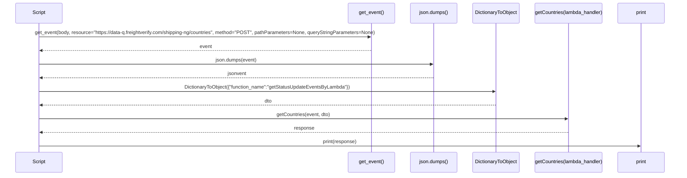
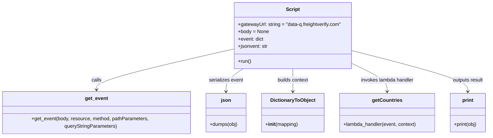

# Diagram: platform/tools/ide_local_testing/localTest/test/shipment/getCountries.py

> Auto-generated by Obscura crawlers

## Diagram 1

### SVG

<svg id="container" width="2336" xmlns="http://www.w3.org/2000/svg" height="603" viewBox="-50 -10 2336 603" role="graphics-document document" aria-roledescription="sequence"><g><rect x="2086" y="517" fill="#eaeaea" stroke="#666" width="150" height="65" name="Print" rx="3" ry="3" class="actor actor-bottom"></rect><text x="2161" y="549.5" dominant-baseline="central" alignment-baseline="central" class="actor actor-box" style="text-anchor: middle; font-size: 16px; font-weight: 400;"><tspan x="2161" dy="0">print</tspan></text></g><g><rect x="1794" y="517" fill="#eaeaea" stroke="#666" width="242" height="65" name="GetCountries" rx="3" ry="3" class="actor actor-bottom"></rect><text x="1915" y="549.5" dominant-baseline="central" alignment-baseline="central" class="actor actor-box" style="text-anchor: middle; font-size: 16px; font-weight: 400;"><tspan x="1915" dy="0">getCountries(lambda_handler)</tspan></text></g><g><rect x="1586" y="517" fill="#eaeaea" stroke="#666" width="158" height="65" name="DTO" rx="3" ry="3" class="actor actor-bottom"></rect><text x="1665" y="549.5" dominant-baseline="central" alignment-baseline="central" class="actor actor-box" style="text-anchor: middle; font-size: 16px; font-weight: 400;"><tspan x="1665" dy="0">DictionaryToObject</tspan></text></g><g><rect x="1386" y="517" fill="#eaeaea" stroke="#666" width="150" height="65" name="JSON" rx="3" ry="3" class="actor actor-bottom"></rect><text x="1461" y="549.5" dominant-baseline="central" alignment-baseline="central" class="actor actor-box" style="text-anchor: middle; font-size: 16px; font-weight: 400;"><tspan x="1461" dy="0">json.dumps()</tspan></text></g><g><rect x="1186" y="517" fill="#eaeaea" stroke="#666" width="150" height="65" name="GetEvent" rx="3" ry="3" class="actor actor-bottom"></rect><text x="1261" y="549.5" dominant-baseline="central" alignment-baseline="central" class="actor actor-box" style="text-anchor: middle; font-size: 16px; font-weight: 400;"><tspan x="1261" dy="0">get_event()</tspan></text></g><g><rect x="0" y="517" fill="#eaeaea" stroke="#666" width="150" height="65" name="Script" rx="3" ry="3" class="actor actor-bottom"></rect><text x="75" y="549.5" dominant-baseline="central" alignment-baseline="central" class="actor actor-box" style="text-anchor: middle; font-size: 16px; font-weight: 400;"><tspan x="75" dy="0">Script</tspan></text></g><g><line id="actor5" x1="2161" y1="65" x2="2161" y2="517" class="actor-line 200" stroke-width="0.5px" stroke="#999" name="Print"></line><g id="root-5"><rect x="2086" y="0" fill="#eaeaea" stroke="#666" width="150" height="65" name="Print" rx="3" ry="3" class="actor actor-top"></rect><text x="2161" y="32.5" dominant-baseline="central" alignment-baseline="central" class="actor actor-box" style="text-anchor: middle; font-size: 16px; font-weight: 400;"><tspan x="2161" dy="0">print</tspan></text></g></g><g><line id="actor4" x1="1915" y1="65" x2="1915" y2="517" class="actor-line 200" stroke-width="0.5px" stroke="#999" name="GetCountries"></line><g id="root-4"><rect x="1794" y="0" fill="#eaeaea" stroke="#666" width="242" height="65" name="GetCountries" rx="3" ry="3" class="actor actor-top"></rect><text x="1915" y="32.5" dominant-baseline="central" alignment-baseline="central" class="actor actor-box" style="text-anchor: middle; font-size: 16px; font-weight: 400;"><tspan x="1915" dy="0">getCountries(lambda_handler)</tspan></text></g></g><g><line id="actor3" x1="1665" y1="65" x2="1665" y2="517" class="actor-line 200" stroke-width="0.5px" stroke="#999" name="DTO"></line><g id="root-3"><rect x="1586" y="0" fill="#eaeaea" stroke="#666" width="158" height="65" name="DTO" rx="3" ry="3" class="actor actor-top"></rect><text x="1665" y="32.5" dominant-baseline="central" alignment-baseline="central" class="actor actor-box" style="text-anchor: middle; font-size: 16px; font-weight: 400;"><tspan x="1665" dy="0">DictionaryToObject</tspan></text></g></g><g><line id="actor2" x1="1461" y1="65" x2="1461" y2="517" class="actor-line 200" stroke-width="0.5px" stroke="#999" name="JSON"></line><g id="root-2"><rect x="1386" y="0" fill="#eaeaea" stroke="#666" width="150" height="65" name="JSON" rx="3" ry="3" class="actor actor-top"></rect><text x="1461" y="32.5" dominant-baseline="central" alignment-baseline="central" class="actor actor-box" style="text-anchor: middle; font-size: 16px; font-weight: 400;"><tspan x="1461" dy="0">json.dumps()</tspan></text></g></g><g><line id="actor1" x1="1261" y1="65" x2="1261" y2="517" class="actor-line 200" stroke-width="0.5px" stroke="#999" name="GetEvent"></line><g id="root-1"><rect x="1186" y="0" fill="#eaeaea" stroke="#666" width="150" height="65" name="GetEvent" rx="3" ry="3" class="actor actor-top"></rect><text x="1261" y="32.5" dominant-baseline="central" alignment-baseline="central" class="actor actor-box" style="text-anchor: middle; font-size: 16px; font-weight: 400;"><tspan x="1261" dy="0">get_event()</tspan></text></g></g><g><line id="actor0" x1="75" y1="65" x2="75" y2="517" class="actor-line 200" stroke-width="0.5px" stroke="#999" name="Script"></line><g id="root-0"><rect x="0" y="0" fill="#eaeaea" stroke="#666" width="150" height="65" name="Script" rx="3" ry="3" class="actor actor-top"></rect><text x="75" y="32.5" dominant-baseline="central" alignment-baseline="central" class="actor actor-box" style="text-anchor: middle; font-size: 16px; font-weight: 400;"><tspan x="75" dy="0">Script</tspan></text></g></g><g></g><defs><symbol id="computer" width="24" height="24"><path transform="scale(.5)" d="M2 2v13h20v-13h-20zm18 11h-16v-9h16v9zm-10.228 6l.466-1h3.524l.467 1h-4.457zm14.228 3h-24l2-6h2.104l-1.33 4h18.45l-1.297-4h2.073l2 6zm-5-10h-14v-7h14v7z"></path></symbol></defs><defs><symbol id="database" fill-rule="evenodd" clip-rule="evenodd"><path transform="scale(.5)" d="M12.258.001l.256.004.255.005.253.008.251.01.249.012.247.015.246.016.242.019.241.02.239.023.236.024.233.027.231.028.229.031.225.032.223.034.22.036.217.038.214.04.211.041.208.043.205.045.201.046.198.048.194.05.191.051.187.053.183.054.18.056.175.057.172.059.168.06.163.061.16.063.155.064.15.066.074.033.073.033.071.034.07.034.069.035.068.035.067.035.066.035.064.036.064.036.062.036.06.036.06.037.058.037.058.037.055.038.055.038.053.038.052.038.051.039.05.039.048.039.047.039.045.04.044.04.043.04.041.04.04.041.039.041.037.041.036.041.034.041.033.042.032.042.03.042.029.042.027.042.026.043.024.043.023.043.021.043.02.043.018.044.017.043.015.044.013.044.012.044.011.045.009.044.007.045.006.045.004.045.002.045.001.045v17l-.001.045-.002.045-.004.045-.006.045-.007.045-.009.044-.011.045-.012.044-.013.044-.015.044-.017.043-.018.044-.02.043-.021.043-.023.043-.024.043-.026.043-.027.042-.029.042-.03.042-.032.042-.033.042-.034.041-.036.041-.037.041-.039.041-.04.041-.041.04-.043.04-.044.04-.045.04-.047.039-.048.039-.05.039-.051.039-.052.038-.053.038-.055.038-.055.038-.058.037-.058.037-.06.037-.06.036-.062.036-.064.036-.064.036-.066.035-.067.035-.068.035-.069.035-.07.034-.071.034-.073.033-.074.033-.15.066-.155.064-.16.063-.163.061-.168.06-.172.059-.175.057-.18.056-.183.054-.187.053-.191.051-.194.05-.198.048-.201.046-.205.045-.208.043-.211.041-.214.04-.217.038-.22.036-.223.034-.225.032-.229.031-.231.028-.233.027-.236.024-.239.023-.241.02-.242.019-.246.016-.247.015-.249.012-.251.01-.253.008-.255.005-.256.004-.258.001-.258-.001-.256-.004-.255-.005-.253-.008-.251-.01-.249-.012-.247-.015-.245-.016-.243-.019-.241-.02-.238-.023-.236-.024-.234-.027-.231-.028-.228-.031-.226-.032-.223-.034-.22-.036-.217-.038-.214-.04-.211-.041-.208-.043-.204-.045-.201-.046-.198-.048-.195-.05-.19-.051-.187-.053-.184-.054-.179-.056-.176-.057-.172-.059-.167-.06-.164-.061-.159-.063-.155-.064-.151-.066-.074-.033-.072-.033-.072-.034-.07-.034-.069-.035-.068-.035-.067-.035-.066-.035-.064-.036-.063-.036-.062-.036-.061-.036-.06-.037-.058-.037-.057-.037-.056-.038-.055-.038-.053-.038-.052-.038-.051-.039-.049-.039-.049-.039-.046-.039-.046-.04-.044-.04-.043-.04-.041-.04-.04-.041-.039-.041-.037-.041-.036-.041-.034-.041-.033-.042-.032-.042-.03-.042-.029-.042-.027-.042-.026-.043-.024-.043-.023-.043-.021-.043-.02-.043-.018-.044-.017-.043-.015-.044-.013-.044-.012-.044-.011-.045-.009-.044-.007-.045-.006-.045-.004-.045-.002-.045-.001-.045v-17l.001-.045.002-.045.004-.045.006-.045.007-.045.009-.044.011-.045.012-.044.013-.044.015-.044.017-.043.018-.044.02-.043.021-.043.023-.043.024-.043.026-.043.027-.042.029-.042.03-.042.032-.042.033-.042.034-.041.036-.041.037-.041.039-.041.04-.041.041-.04.043-.04.044-.04.046-.04.046-.039.049-.039.049-.039.051-.039.052-.038.053-.038.055-.038.056-.038.057-.037.058-.037.06-.037.061-.036.062-.036.063-.036.064-.036.066-.035.067-.035.068-.035.069-.035.07-.034.072-.034.072-.033.074-.033.151-.066.155-.064.159-.063.164-.061.167-.06.172-.059.176-.057.179-.056.184-.054.187-.053.19-.051.195-.05.198-.048.201-.046.204-.045.208-.043.211-.041.214-.04.217-.038.22-.036.223-.034.226-.032.228-.031.231-.028.234-.027.236-.024.238-.023.241-.02.243-.019.245-.016.247-.015.249-.012.251-.01.253-.008.255-.005.256-.004.258-.001.258.001zm-9.258 20.499v.01l.001.021.003.021.004.022.005.021.006.022.007.022.009.023.01.022.011.023.012.023.013.023.015.023.016.024.017.023.018.024.019.024.021.024.022.025.023.024.024.025.052.049.056.05.061.051.066.051.07.051.075.051.079.052.084.052.088.052.092.052.097.052.102.051.105.052.11.052.114.051.119.051.123.051.127.05.131.05.135.05.139.048.144.049.147.047.152.047.155.047.16.045.163.045.167.043.171.043.176.041.178.041.183.039.187.039.19.037.194.035.197.035.202.033.204.031.209.03.212.029.216.027.219.025.222.024.226.021.23.02.233.018.236.016.24.015.243.012.246.01.249.008.253.005.256.004.259.001.26-.001.257-.004.254-.005.25-.008.247-.011.244-.012.241-.014.237-.016.233-.018.231-.021.226-.021.224-.024.22-.026.216-.027.212-.028.21-.031.205-.031.202-.034.198-.034.194-.036.191-.037.187-.039.183-.04.179-.04.175-.042.172-.043.168-.044.163-.045.16-.046.155-.046.152-.047.148-.048.143-.049.139-.049.136-.05.131-.05.126-.05.123-.051.118-.052.114-.051.11-.052.106-.052.101-.052.096-.052.092-.052.088-.053.083-.051.079-.052.074-.052.07-.051.065-.051.06-.051.056-.05.051-.05.023-.024.023-.025.021-.024.02-.024.019-.024.018-.024.017-.024.015-.023.014-.024.013-.023.012-.023.01-.023.01-.022.008-.022.006-.022.006-.022.004-.022.004-.021.001-.021.001-.021v-4.127l-.077.055-.08.053-.083.054-.085.053-.087.052-.09.052-.093.051-.095.05-.097.05-.1.049-.102.049-.105.048-.106.047-.109.047-.111.046-.114.045-.115.045-.118.044-.12.043-.122.042-.124.042-.126.041-.128.04-.13.04-.132.038-.134.038-.135.037-.138.037-.139.035-.142.035-.143.034-.144.033-.147.032-.148.031-.15.03-.151.03-.153.029-.154.027-.156.027-.158.026-.159.025-.161.024-.162.023-.163.022-.165.021-.166.02-.167.019-.169.018-.169.017-.171.016-.173.015-.173.014-.175.013-.175.012-.177.011-.178.01-.179.008-.179.008-.181.006-.182.005-.182.004-.184.003-.184.002h-.37l-.184-.002-.184-.003-.182-.004-.182-.005-.181-.006-.179-.008-.179-.008-.178-.01-.176-.011-.176-.012-.175-.013-.173-.014-.172-.015-.171-.016-.17-.017-.169-.018-.167-.019-.166-.02-.165-.021-.163-.022-.162-.023-.161-.024-.159-.025-.157-.026-.156-.027-.155-.027-.153-.029-.151-.03-.15-.03-.148-.031-.146-.032-.145-.033-.143-.034-.141-.035-.14-.035-.137-.037-.136-.037-.134-.038-.132-.038-.13-.04-.128-.04-.126-.041-.124-.042-.122-.042-.12-.044-.117-.043-.116-.045-.113-.045-.112-.046-.109-.047-.106-.047-.105-.048-.102-.049-.1-.049-.097-.05-.095-.05-.093-.052-.09-.051-.087-.052-.085-.053-.083-.054-.08-.054-.077-.054v4.127zm0-5.654v.011l.001.021.003.021.004.021.005.022.006.022.007.022.009.022.01.022.011.023.012.023.013.023.015.024.016.023.017.024.018.024.019.024.021.024.022.024.023.025.024.024.052.05.056.05.061.05.066.051.07.051.075.052.079.051.084.052.088.052.092.052.097.052.102.052.105.052.11.051.114.051.119.052.123.05.127.051.131.05.135.049.139.049.144.048.147.048.152.047.155.046.16.045.163.045.167.044.171.042.176.042.178.04.183.04.187.038.19.037.194.036.197.034.202.033.204.032.209.03.212.028.216.027.219.025.222.024.226.022.23.02.233.018.236.016.24.014.243.012.246.01.249.008.253.006.256.003.259.001.26-.001.257-.003.254-.006.25-.008.247-.01.244-.012.241-.015.237-.016.233-.018.231-.02.226-.022.224-.024.22-.025.216-.027.212-.029.21-.03.205-.032.202-.033.198-.035.194-.036.191-.037.187-.039.183-.039.179-.041.175-.042.172-.043.168-.044.163-.045.16-.045.155-.047.152-.047.148-.048.143-.048.139-.05.136-.049.131-.05.126-.051.123-.051.118-.051.114-.052.11-.052.106-.052.101-.052.096-.052.092-.052.088-.052.083-.052.079-.052.074-.051.07-.052.065-.051.06-.05.056-.051.051-.049.023-.025.023-.024.021-.025.02-.024.019-.024.018-.024.017-.024.015-.023.014-.023.013-.024.012-.022.01-.023.01-.023.008-.022.006-.022.006-.022.004-.021.004-.022.001-.021.001-.021v-4.139l-.077.054-.08.054-.083.054-.085.052-.087.053-.09.051-.093.051-.095.051-.097.05-.1.049-.102.049-.105.048-.106.047-.109.047-.111.046-.114.045-.115.044-.118.044-.12.044-.122.042-.124.042-.126.041-.128.04-.13.039-.132.039-.134.038-.135.037-.138.036-.139.036-.142.035-.143.033-.144.033-.147.033-.148.031-.15.03-.151.03-.153.028-.154.028-.156.027-.158.026-.159.025-.161.024-.162.023-.163.022-.165.021-.166.02-.167.019-.169.018-.169.017-.171.016-.173.015-.173.014-.175.013-.175.012-.177.011-.178.009-.179.009-.179.007-.181.007-.182.005-.182.004-.184.003-.184.002h-.37l-.184-.002-.184-.003-.182-.004-.182-.005-.181-.007-.179-.007-.179-.009-.178-.009-.176-.011-.176-.012-.175-.013-.173-.014-.172-.015-.171-.016-.17-.017-.169-.018-.167-.019-.166-.02-.165-.021-.163-.022-.162-.023-.161-.024-.159-.025-.157-.026-.156-.027-.155-.028-.153-.028-.151-.03-.15-.03-.148-.031-.146-.033-.145-.033-.143-.033-.141-.035-.14-.036-.137-.036-.136-.037-.134-.038-.132-.039-.13-.039-.128-.04-.126-.041-.124-.042-.122-.043-.12-.043-.117-.044-.116-.044-.113-.046-.112-.046-.109-.046-.106-.047-.105-.048-.102-.049-.1-.049-.097-.05-.095-.051-.093-.051-.09-.051-.087-.053-.085-.052-.083-.054-.08-.054-.077-.054v4.139zm0-5.666v.011l.001.02.003.022.004.021.005.022.006.021.007.022.009.023.01.022.011.023.012.023.013.023.015.023.016.024.017.024.018.023.019.024.021.025.022.024.023.024.024.025.052.05.056.05.061.05.066.051.07.051.075.052.079.051.084.052.088.052.092.052.097.052.102.052.105.051.11.052.114.051.119.051.123.051.127.05.131.05.135.05.139.049.144.048.147.048.152.047.155.046.16.045.163.045.167.043.171.043.176.042.178.04.183.04.187.038.19.037.194.036.197.034.202.033.204.032.209.03.212.028.216.027.219.025.222.024.226.021.23.02.233.018.236.017.24.014.243.012.246.01.249.008.253.006.256.003.259.001.26-.001.257-.003.254-.006.25-.008.247-.01.244-.013.241-.014.237-.016.233-.018.231-.02.226-.022.224-.024.22-.025.216-.027.212-.029.21-.03.205-.032.202-.033.198-.035.194-.036.191-.037.187-.039.183-.039.179-.041.175-.042.172-.043.168-.044.163-.045.16-.045.155-.047.152-.047.148-.048.143-.049.139-.049.136-.049.131-.051.126-.05.123-.051.118-.052.114-.051.11-.052.106-.052.101-.052.096-.052.092-.052.088-.052.083-.052.079-.052.074-.052.07-.051.065-.051.06-.051.056-.05.051-.049.023-.025.023-.025.021-.024.02-.024.019-.024.018-.024.017-.024.015-.023.014-.024.013-.023.012-.023.01-.022.01-.023.008-.022.006-.022.006-.022.004-.022.004-.021.001-.021.001-.021v-4.153l-.077.054-.08.054-.083.053-.085.053-.087.053-.09.051-.093.051-.095.051-.097.05-.1.049-.102.048-.105.048-.106.048-.109.046-.111.046-.114.046-.115.044-.118.044-.12.043-.122.043-.124.042-.126.041-.128.04-.13.039-.132.039-.134.038-.135.037-.138.036-.139.036-.142.034-.143.034-.144.033-.147.032-.148.032-.15.03-.151.03-.153.028-.154.028-.156.027-.158.026-.159.024-.161.024-.162.023-.163.023-.165.021-.166.02-.167.019-.169.018-.169.017-.171.016-.173.015-.173.014-.175.013-.175.012-.177.01-.178.01-.179.009-.179.007-.181.006-.182.006-.182.004-.184.003-.184.001-.185.001-.185-.001-.184-.001-.184-.003-.182-.004-.182-.006-.181-.006-.179-.007-.179-.009-.178-.01-.176-.01-.176-.012-.175-.013-.173-.014-.172-.015-.171-.016-.17-.017-.169-.018-.167-.019-.166-.02-.165-.021-.163-.023-.162-.023-.161-.024-.159-.024-.157-.026-.156-.027-.155-.028-.153-.028-.151-.03-.15-.03-.148-.032-.146-.032-.145-.033-.143-.034-.141-.034-.14-.036-.137-.036-.136-.037-.134-.038-.132-.039-.13-.039-.128-.041-.126-.041-.124-.041-.122-.043-.12-.043-.117-.044-.116-.044-.113-.046-.112-.046-.109-.046-.106-.048-.105-.048-.102-.048-.1-.05-.097-.049-.095-.051-.093-.051-.09-.052-.087-.052-.085-.053-.083-.053-.08-.054-.077-.054v4.153zm8.74-8.179l-.257.004-.254.005-.25.008-.247.011-.244.012-.241.014-.237.016-.233.018-.231.021-.226.022-.224.023-.22.026-.216.027-.212.028-.21.031-.205.032-.202.033-.198.034-.194.036-.191.038-.187.038-.183.04-.179.041-.175.042-.172.043-.168.043-.163.045-.16.046-.155.046-.152.048-.148.048-.143.048-.139.049-.136.05-.131.05-.126.051-.123.051-.118.051-.114.052-.11.052-.106.052-.101.052-.096.052-.092.052-.088.052-.083.052-.079.052-.074.051-.07.052-.065.051-.06.05-.056.05-.051.05-.023.025-.023.024-.021.024-.02.025-.019.024-.018.024-.017.023-.015.024-.014.023-.013.023-.012.023-.01.023-.01.022-.008.022-.006.023-.006.021-.004.022-.004.021-.001.021-.001.021.001.021.001.021.004.021.004.022.006.021.006.023.008.022.01.022.01.023.012.023.013.023.014.023.015.024.017.023.018.024.019.024.02.025.021.024.023.024.023.025.051.05.056.05.06.05.065.051.07.052.074.051.079.052.083.052.088.052.092.052.096.052.101.052.106.052.11.052.114.052.118.051.123.051.126.051.131.05.136.05.139.049.143.048.148.048.152.048.155.046.16.046.163.045.168.043.172.043.175.042.179.041.183.04.187.038.191.038.194.036.198.034.202.033.205.032.21.031.212.028.216.027.22.026.224.023.226.022.231.021.233.018.237.016.241.014.244.012.247.011.25.008.254.005.257.004.26.001.26-.001.257-.004.254-.005.25-.008.247-.011.244-.012.241-.014.237-.016.233-.018.231-.021.226-.022.224-.023.22-.026.216-.027.212-.028.21-.031.205-.032.202-.033.198-.034.194-.036.191-.038.187-.038.183-.04.179-.041.175-.042.172-.043.168-.043.163-.045.16-.046.155-.046.152-.048.148-.048.143-.048.139-.049.136-.05.131-.05.126-.051.123-.051.118-.051.114-.052.11-.052.106-.052.101-.052.096-.052.092-.052.088-.052.083-.052.079-.052.074-.051.07-.052.065-.051.06-.05.056-.05.051-.05.023-.025.023-.024.021-.024.02-.025.019-.024.018-.024.017-.023.015-.024.014-.023.013-.023.012-.023.01-.023.01-.022.008-.022.006-.023.006-.021.004-.022.004-.021.001-.021.001-.021-.001-.021-.001-.021-.004-.021-.004-.022-.006-.021-.006-.023-.008-.022-.01-.022-.01-.023-.012-.023-.013-.023-.014-.023-.015-.024-.017-.023-.018-.024-.019-.024-.02-.025-.021-.024-.023-.024-.023-.025-.051-.05-.056-.05-.06-.05-.065-.051-.07-.052-.074-.051-.079-.052-.083-.052-.088-.052-.092-.052-.096-.052-.101-.052-.106-.052-.11-.052-.114-.052-.118-.051-.123-.051-.126-.051-.131-.05-.136-.05-.139-.049-.143-.048-.148-.048-.152-.048-.155-.046-.16-.046-.163-.045-.168-.043-.172-.043-.175-.042-.179-.041-.183-.04-.187-.038-.191-.038-.194-.036-.198-.034-.202-.033-.205-.032-.21-.031-.212-.028-.216-.027-.22-.026-.224-.023-.226-.022-.231-.021-.233-.018-.237-.016-.241-.014-.244-.012-.247-.011-.25-.008-.254-.005-.257-.004-.26-.001-.26.001z"></path></symbol></defs><defs><symbol id="clock" width="24" height="24"><path transform="scale(.5)" d="M12 2c5.514 0 10 4.486 10 10s-4.486 10-10 10-10-4.486-10-10 4.486-10 10-10zm0-2c-6.627 0-12 5.373-12 12s5.373 12 12 12 12-5.373 12-12-5.373-12-12-12zm5.848 12.459c.202.038.202.333.001.372-1.907.361-6.045 1.111-6.547 1.111-.719 0-1.301-.582-1.301-1.301 0-.512.77-5.447 1.125-7.445.034-.192.312-.181.343.014l.985 6.238 5.394 1.011z"></path></symbol></defs><defs><marker id="arrowhead" refX="7.9" refY="5" markerUnits="userSpaceOnUse" markerWidth="12" markerHeight="12" orient="auto-start-reverse"><path d="M -1 0 L 10 5 L 0 10 z"></path></marker></defs><defs><marker id="crosshead" markerWidth="15" markerHeight="8" orient="auto" refX="4" refY="4.5"><path fill="none" stroke="#000000" stroke-width="1pt" d="M 1,2 L 6,7 M 6,2 L 1,7" style="stroke-dasharray: 0, 0;"></path></marker></defs><defs><marker id="filled-head" refX="15.5" refY="7" markerWidth="20" markerHeight="28" orient="auto"><path d="M 18,7 L9,13 L14,7 L9,1 Z"></path></marker></defs><defs><marker id="sequencenumber" refX="15" refY="15" markerWidth="60" markerHeight="40" orient="auto"><circle cx="15" cy="15" r="6"></circle></marker></defs><text x="667" y="80" text-anchor="middle" dominant-baseline="middle" alignment-baseline="middle" class="messageText" dy="1em" style="font-size: 16px; font-weight: 400;">get_event(body, resource="https://data-q.freightverify.com/shipping-ng/countries", method="POST", pathParameters=None, queryStringParameters=None)</text><line x1="76" y1="113" x2="1257" y2="113" class="messageLine0" stroke-width="2" stroke="none" marker-end="url(#arrowhead)" style="fill: none;"></line><text x="670" y="128" text-anchor="middle" dominant-baseline="middle" alignment-baseline="middle" class="messageText" dy="1em" style="font-size: 16px; font-weight: 400;">event</text><line x1="1260" y1="161" x2="79" y2="161" class="messageLine1" stroke-width="2" stroke="none" marker-end="url(#arrowhead)" style="stroke-dasharray: 3, 3; fill: none;"></line><text x="767" y="176" text-anchor="middle" dominant-baseline="middle" alignment-baseline="middle" class="messageText" dy="1em" style="font-size: 16px; font-weight: 400;">json.dumps(event)</text><line x1="76" y1="209" x2="1457" y2="209" class="messageLine0" stroke-width="2" stroke="none" marker-end="url(#arrowhead)" style="fill: none;"></line><text x="770" y="224" text-anchor="middle" dominant-baseline="middle" alignment-baseline="middle" class="messageText" dy="1em" style="font-size: 16px; font-weight: 400;">jsonvent</text><line x1="1460" y1="257" x2="79" y2="257" class="messageLine1" stroke-width="2" stroke="none" marker-end="url(#arrowhead)" style="stroke-dasharray: 3, 3; fill: none;"></line><text x="869" y="272" text-anchor="middle" dominant-baseline="middle" alignment-baseline="middle" class="messageText" dy="1em" style="font-size: 16px; font-weight: 400;">DictionaryToObject({"function_name":"getStatusUpdateEventsByLambda"})</text><line x1="76" y1="305" x2="1661" y2="305" class="messageLine0" stroke-width="2" stroke="none" marker-end="url(#arrowhead)" style="fill: none;"></line><text x="872" y="320" text-anchor="middle" dominant-baseline="middle" alignment-baseline="middle" class="messageText" dy="1em" style="font-size: 16px; font-weight: 400;">dto</text><line x1="1664" y1="353" x2="79" y2="353" class="messageLine1" stroke-width="2" stroke="none" marker-end="url(#arrowhead)" style="stroke-dasharray: 3, 3; fill: none;"></line><text x="994" y="368" text-anchor="middle" dominant-baseline="middle" alignment-baseline="middle" class="messageText" dy="1em" style="font-size: 16px; font-weight: 400;">getCountries(event, dto)</text><line x1="76" y1="401" x2="1911" y2="401" class="messageLine0" stroke-width="2" stroke="none" marker-end="url(#arrowhead)" style="fill: none;"></line><text x="997" y="416" text-anchor="middle" dominant-baseline="middle" alignment-baseline="middle" class="messageText" dy="1em" style="font-size: 16px; font-weight: 400;">response</text><line x1="1914" y1="449" x2="79" y2="449" class="messageLine1" stroke-width="2" stroke="none" marker-end="url(#arrowhead)" style="stroke-dasharray: 3, 3; fill: none;"></line><text x="1117" y="464" text-anchor="middle" dominant-baseline="middle" alignment-baseline="middle" class="messageText" dy="1em" style="font-size: 16px; font-weight: 400;">print(response)</text><line x1="76" y1="497" x2="2157" y2="497" class="messageLine0" stroke-width="2" stroke="none" marker-end="url(#arrowhead)" style="fill: none;"></line></svg>

## Diagram 2

### SVG

<svg id="container" width="1594.1484375" xmlns="http://www.w3.org/2000/svg" class="classDiagram" height="432" viewBox="0 0 1594.1484375 432" role="graphics-document document" aria-roledescription="class"><g><defs><marker id="container_class-aggregationStart" class="marker aggregation class" refX="18" refY="7" markerWidth="190" markerHeight="240" orient="auto"><path d="M 18,7 L9,13 L1,7 L9,1 Z"></path></marker></defs><defs><marker id="container_class-aggregationEnd" class="marker aggregation class" refX="1" refY="7" markerWidth="20" markerHeight="28" orient="auto"><path d="M 18,7 L9,13 L1,7 L9,1 Z"></path></marker></defs><defs><marker id="container_class-extensionStart" class="marker extension class" refX="18" refY="7" markerWidth="190" markerHeight="240" orient="auto"><path d="M 1,7 L18,13 V 1 Z"></path></marker></defs><defs><marker id="container_class-extensionEnd" class="marker extension class" refX="1" refY="7" markerWidth="20" markerHeight="28" orient="auto"><path d="M 1,1 V 13 L18,7 Z"></path></marker></defs><defs><marker id="container_class-compositionStart" class="marker composition class" refX="18" refY="7" markerWidth="190" markerHeight="240" orient="auto"><path d="M 18,7 L9,13 L1,7 L9,1 Z"></path></marker></defs><defs><marker id="container_class-compositionEnd" class="marker composition class" refX="1" refY="7" markerWidth="20" markerHeight="28" orient="auto"><path d="M 18,7 L9,13 L1,7 L9,1 Z"></path></marker></defs><defs><marker id="container_class-dependencyStart" class="marker dependency class" refX="6" refY="7" markerWidth="190" markerHeight="240" orient="auto"><path d="M 5,7 L9,13 L1,7 L9,1 Z"></path></marker></defs><defs><marker id="container_class-dependencyEnd" class="marker dependency class" refX="13" refY="7" markerWidth="20" markerHeight="28" orient="auto"><path d="M 18,7 L9,13 L14,7 L9,1 Z"></path></marker></defs><defs><marker id="container_class-lollipopStart" class="marker lollipop class" refX="13" refY="7" markerWidth="190" markerHeight="240" orient="auto"><circle stroke="black" fill="transparent" cx="7" cy="7" r="6"></circle></marker></defs><defs><marker id="container_class-lollipopEnd" class="marker lollipop class" refX="1" refY="7" markerWidth="190" markerHeight="240" orient="auto"><circle stroke="black" fill="transparent" cx="7" cy="7" r="6"></circle></marker></defs><g class="root"><g class="clusters"></g><g class="edgePaths"><path d="M762.715,159.796L688.338,176.664C613.961,193.531,465.207,227.265,390.83,249.299C316.453,271.333,316.453,281.667,316.453,286.833L316.453,292" id="id_Script_get_event_1" class="edge-thickness-normal edge-pattern-solid relation" style=";;;" data-edge="true" data-et="edge" data-id="id_Script_get_event_1" data-points="W3sieCI6NzYyLjcxNDg0Mzc1LCJ5IjoxNTkuNzk2MjMyOTM5NDgwMn0seyJ4IjozMTYuNDUzMTI1LCJ5IjoyNjF9LHsieCI6MzE2LjQ1MzEyNSwieSI6Mjk4fV0=" marker-end="url(#container_class-dependencyEnd)"></path><path d="M795.25,224L786.081,230.167C776.911,236.333,758.573,248.667,749.404,260C740.234,271.333,740.234,281.667,740.234,286.833L740.234,292" id="id_Script_json_2" class="edge-thickness-normal edge-pattern-solid relation" style=";;;" data-edge="true" data-et="edge" data-id="id_Script_json_2" data-points="W3sieCI6Nzk1LjI0OTk0NjEyMDY4OTYsInkiOjIyNH0seyJ4Ijo3NDAuMjM0Mzc1LCJ5IjoyNjF9LHsieCI6NzQwLjIzNDM3NSwieSI6Mjk4fV0=" marker-end="url(#container_class-dependencyEnd)"></path><path d="M955.836,224L955.836,230.167C955.836,236.333,955.836,248.667,955.836,260C955.836,271.333,955.836,281.667,955.836,286.833L955.836,292" id="id_Script_DictionaryToObject_3" class="edge-thickness-normal edge-pattern-solid relation" style=";;;" data-edge="true" data-et="edge" data-id="id_Script_DictionaryToObject_3" data-points="W3sieCI6OTU1LjgzNTkzNzUsInkiOjIyNH0seyJ4Ijo5NTUuODM1OTM3NSwieSI6MjYxfSx7IngiOjk1NS44MzU5Mzc1LCJ5IjoyOTh9XQ==" marker-end="url(#container_class-dependencyEnd)"></path><path d="M1148.957,207.57L1167.738,216.475C1186.518,225.38,1224.079,243.19,1242.86,257.262C1261.641,271.333,1261.641,281.667,1261.641,286.833L1261.641,292" id="id_Script_getCountries_4" class="edge-thickness-normal edge-pattern-solid relation" style=";;;" data-edge="true" data-et="edge" data-id="id_Script_getCountries_4" data-points="W3sieCI6MTE0OC45NTcwMzEyNSwieSI6MjA3LjU3MDA3NjM4NjU4MjV9LHsieCI6MTI2MS42NDA2MjUsInkiOjI2MX0seyJ4IjoxMjYxLjY0MDYyNSwieSI6Mjk4fV0=" marker-end="url(#container_class-dependencyEnd)"></path><path d="M1148.957,165.056L1211.908,181.047C1274.858,197.038,1400.759,229.019,1463.71,250.176C1526.66,271.333,1526.66,281.667,1526.66,286.833L1526.66,292" id="id_Script_print_5" class="edge-thickness-normal edge-pattern-solid relation" style=";;;" data-edge="true" data-et="edge" data-id="id_Script_print_5" data-points="W3sieCI6MTE0OC45NTcwMzEyNSwieSI6MTY1LjA1NjM2MDM4ODk2NjA2fSx7IngiOjE1MjYuNjYwMTU2MjUsInkiOjI2MX0seyJ4IjoxNTI2LjY2MDE1NjI1LCJ5IjoyOTh9XQ==" marker-end="url(#container_class-dependencyEnd)"></path></g><g class="edgeLabels"><g class="edgeLabel" transform="translate(316.453125, 261)"><g class="label" data-id="id_Script_get_event_1" transform="translate(-16.4453125, -12)"><foreignObject width="32.890625" height="24">

calls

</foreignObject></g></g><g class="edgeLabel" transform="translate(740.234375, 261)"><g class="label" data-id="id_Script_json_2" transform="translate(-56.140625, -12)"><foreignObject width="112.28125" height="24">

serializes event

</foreignObject></g></g><g class="edgeLabel" transform="translate(955.8359375, 261)"><g class="label" data-id="id_Script_DictionaryToObject_3" transform="translate(-51.4609375, -12)"><foreignObject width="102.921875" height="24">

builds context

</foreignObject></g></g><g class="edgeLabel" transform="translate(1261.640625, 261)"><g class="label" data-id="id_Script_getCountries_4" transform="translate(-87.4921875, -12)"><foreignObject width="174.984375" height="24">

invokes lambda handler

</foreignObject></g></g><g class="edgeLabel" transform="translate(1526.66015625, 261)"><g class="label" data-id="id_Script_print_5" transform="translate(-51.203125, -12)"><foreignObject width="102.40625" height="24">

outputs result

</foreignObject></g></g></g><g class="nodes"><g class="node default" id="classId-Script-0" transform="translate(955.8359375, 116)"><g class="basic label-container"><path d="M-193.12109375 -108 L193.12109375 -108 L193.12109375 108 L-193.12109375 108" stroke="none" stroke-width="0" fill="#ECECFF" style=""></path><path d="M-193.12109375 -108 C-113.99603002024911 -108, -34.87096629049822 -108, 193.12109375 -108 M-193.12109375 -108 C-100.36235455737288 -108, -7.603615364745764 -108, 193.12109375 -108 M193.12109375 -108 C193.12109375 -56.301925226905254, 193.12109375 -4.603850453810509, 193.12109375 108 M193.12109375 -108 C193.12109375 -25.56629175931232, 193.12109375 56.86741648137536, 193.12109375 108 M193.12109375 108 C112.2257223005069 108, 31.330350851013804 108, -193.12109375 108 M193.12109375 108 C114.96443343535209 108, 36.807773120704184 108, -193.12109375 108 M-193.12109375 108 C-193.12109375 50.53931513889127, -193.12109375 -6.921369722217463, -193.12109375 -108 M-193.12109375 108 C-193.12109375 24.31820715427986, -193.12109375 -59.36358569144028, -193.12109375 -108" stroke="#9370DB" stroke-width="1.3" fill="none" stroke-dasharray="0 0" style=""></path></g><g class="annotation-group text" transform="translate(0, -84)"></g><g class="label-group text" transform="translate(-21.7421875, -84)"><g class="label" style="font-weight: bolder" transform="translate(0,-12)"><foreignObject width="43.484375" height="24">

Script

</foreignObject></g></g><g class="members-group text" transform="translate(-181.12109375, -36)"><g class="label" style="" transform="translate(0,-12)"><foreignObject width="340.5" height="24">

+gatewayUrl: string = "data-q.freightverify.com"

</foreignObject></g><g class="label" style="" transform="translate(0,12)"><foreignObject width="99.125" height="24">

+body = None

</foreignObject></g><g class="label" style="" transform="translate(0,36)"><foreignObject width="83.96875" height="24">

+event: dict

</foreignObject></g><g class="label" style="" transform="translate(0,60)"><foreignObject width="97.640625" height="24">

+jsonvent: str

</foreignObject></g></g><g class="methods-group text" transform="translate(-181.12109375, 84)"><g class="label" style="" transform="translate(0,-12)"><foreignObject width="43.21875" height="24">

+run()

</foreignObject></g></g><g class="divider" style=""><path d="M-193.12109375 -60 C-94.86991033724752 -60, 3.3812730755049643 -60, 193.12109375 -60 M-193.12109375 -60 C-61.71292894110104 -60, 69.69523586779792 -60, 193.12109375 -60" stroke="#9370DB" stroke-width="1.3" fill="none" stroke-dasharray="0 0" style=""></path></g><g class="divider" style=""><path d="M-193.12109375 60 C-80.74155933677419 60, 31.637975076451625 60, 193.12109375 60 M-193.12109375 60 C-89.9941577741359 60, 13.1327782017282 60, 193.12109375 60" stroke="#9370DB" stroke-width="1.3" fill="none" stroke-dasharray="0 0" style=""></path></g></g><g class="node default" id="classId-get_event-1" transform="translate(316.453125, 361)"><g class="basic label-container"><path d="M-308.453125 -63 L308.453125 -63 L308.453125 63 L-308.453125 63" stroke="none" stroke-width="0" fill="#ECECFF" style=""></path><path d="M-308.453125 -63 C-96.52132696183901 -63, 115.41047107632198 -63, 308.453125 -63 M-308.453125 -63 C-151.99622435111533 -63, 4.460676297769339 -63, 308.453125 -63 M308.453125 -63 C308.453125 -20.748095532524843, 308.453125 21.503808934950314, 308.453125 63 M308.453125 -63 C308.453125 -25.423205432149942, 308.453125 12.153589135700116, 308.453125 63 M308.453125 63 C178.46589613742066 63, 48.478667274841314 63, -308.453125 63 M308.453125 63 C169.72432537791144 63, 30.995525755822882 63, -308.453125 63 M-308.453125 63 C-308.453125 25.005566720625673, -308.453125 -12.988866558748654, -308.453125 -63 M-308.453125 63 C-308.453125 18.532419055355625, -308.453125 -25.93516188928875, -308.453125 -63" stroke="#9370DB" stroke-width="1.3" fill="none" stroke-dasharray="0 0" style=""></path></g><g class="annotation-group text" transform="translate(0, -39)"></g><g class="label-group text" transform="translate(-36.25, -39)"><g class="label" style="font-weight: bolder" transform="translate(0,-12)"><foreignObject width="72.5" height="24">

get_event

</foreignObject></g></g><g class="members-group text" transform="translate(-296.453125, 9)"></g><g class="methods-group text" transform="translate(-296.453125, 39)"><g class="label" style="" transform="translate(0,-12)"><foreignObject width="556.65625" height="24">

+get_event(body, resource, method, pathParameters, queryStringParameters)

</foreignObject></g></g><g class="divider" style=""><path d="M-308.453125 -15 C-156.0752959288324 -15, -3.6974668576647787 -15, 308.453125 -15 M-308.453125 -15 C-99.96966038458814 -15, 108.51380423082372 -15, 308.453125 -15" stroke="#9370DB" stroke-width="1.3" fill="none" stroke-dasharray="0 0" style=""></path></g><g class="divider" style=""><path d="M-308.453125 9 C-163.8732125149949 9, -19.29330002998978 9, 308.453125 9 M-308.453125 9 C-122.24145156729128 9, 63.97022186541744 9, 308.453125 9" stroke="#9370DB" stroke-width="1.3" fill="none" stroke-dasharray="0 0" style=""></path></g></g><g class="node default" id="classId-DictionaryToObject-2" transform="translate(955.8359375, 361)"><g class="basic label-container"><path d="M-100.2734375 -63 L100.2734375 -63 L100.2734375 63 L-100.2734375 63" stroke="none" stroke-width="0" fill="#ECECFF" style=""></path><path d="M-100.2734375 -63 C-42.35406678124505 -63, 15.565303937509896 -63, 100.2734375 -63 M-100.2734375 -63 C-32.83484695293764 -63, 34.60374359412472 -63, 100.2734375 -63 M100.2734375 -63 C100.2734375 -37.322454454572274, 100.2734375 -11.644908909144547, 100.2734375 63 M100.2734375 -63 C100.2734375 -22.08434093345131, 100.2734375 18.831318133097383, 100.2734375 63 M100.2734375 63 C24.98393382860759 63, -50.30556984278482 63, -100.2734375 63 M100.2734375 63 C52.640608526269034 63, 5.007779552538068 63, -100.2734375 63 M-100.2734375 63 C-100.2734375 35.49373994724989, -100.2734375 7.987479894499792, -100.2734375 -63 M-100.2734375 63 C-100.2734375 30.023340725106365, -100.2734375 -2.9533185497872694, -100.2734375 -63" stroke="#9370DB" stroke-width="1.3" fill="none" stroke-dasharray="0 0" style=""></path></g><g class="annotation-group text" transform="translate(0, -39)"></g><g class="label-group text" transform="translate(-70.109375, -39)"><g class="label" style="font-weight: bolder" transform="translate(0,-12)"><foreignObject width="140.21875" height="24">

DictionaryToObject

</foreignObject></g></g><g class="members-group text" transform="translate(-88.2734375, 9)"></g><g class="methods-group text" transform="translate(-88.2734375, 39)"><g class="label" style="" transform="translate(0,-12)"><foreignObject width="106.4375" height="24">

+<strong>init</strong>(mapping)

</foreignObject></g></g><g class="divider" style=""><path d="M-100.2734375 -15 C-51.69248282997872 -15, -3.1115281599574445 -15, 100.2734375 -15 M-100.2734375 -15 C-51.42547644640208 -15, -2.577515392804159 -15, 100.2734375 -15" stroke="#9370DB" stroke-width="1.3" fill="none" stroke-dasharray="0 0" style=""></path></g><g class="divider" style=""><path d="M-100.2734375 9 C-54.23265473195762 9, -8.191871963915247 9, 100.2734375 9 M-100.2734375 9 C-20.846888974494973 9, 58.57965955101005 9, 100.2734375 9" stroke="#9370DB" stroke-width="1.3" fill="none" stroke-dasharray="0 0" style=""></path></g></g><g class="node default" id="classId-getCountries-3" transform="translate(1261.640625, 361)"><g class="basic label-container"><path d="M-155.53125 -63 L155.53125 -63 L155.53125 63 L-155.53125 63" stroke="none" stroke-width="0" fill="#ECECFF" style=""></path><path d="M-155.53125 -63 C-53.00092422503569 -63, 49.52940154992862 -63, 155.53125 -63 M-155.53125 -63 C-54.69424307624237 -63, 46.142763847515255 -63, 155.53125 -63 M155.53125 -63 C155.53125 -22.56093940396267, 155.53125 17.87812119207466, 155.53125 63 M155.53125 -63 C155.53125 -23.916132449074134, 155.53125 15.167735101851733, 155.53125 63 M155.53125 63 C41.25139771572651 63, -73.02845456854698 63, -155.53125 63 M155.53125 63 C41.12399415947149 63, -73.28326168105701 63, -155.53125 63 M-155.53125 63 C-155.53125 15.672690864495863, -155.53125 -31.654618271008275, -155.53125 -63 M-155.53125 63 C-155.53125 32.670925261339136, -155.53125 2.3418505226782713, -155.53125 -63" stroke="#9370DB" stroke-width="1.3" fill="none" stroke-dasharray="0 0" style=""></path></g><g class="annotation-group text" transform="translate(0, -39)"></g><g class="label-group text" transform="translate(-46.875, -39)"><g class="label" style="font-weight: bolder" transform="translate(0,-12)"><foreignObject width="93.75" height="24">

getCountries

</foreignObject></g></g><g class="members-group text" transform="translate(-143.53125, 9)"></g><g class="methods-group text" transform="translate(-143.53125, 39)"><g class="label" style="" transform="translate(0,-12)"><foreignObject width="240.1875" height="24">

+lambda_handler(event, context)

</foreignObject></g></g><g class="divider" style=""><path d="M-155.53125 -15 C-77.50900572086421 -15, 0.5132385582715813 -15, 155.53125 -15 M-155.53125 -15 C-69.64862730441926 -15, 16.23399539116147 -15, 155.53125 -15" stroke="#9370DB" stroke-width="1.3" fill="none" stroke-dasharray="0 0" style=""></path></g><g class="divider" style=""><path d="M-155.53125 9 C-92.10160915213648 9, -28.67196830427295 9, 155.53125 9 M-155.53125 9 C-64.72727687535809 9, 26.076696249283827 9, 155.53125 9" stroke="#9370DB" stroke-width="1.3" fill="none" stroke-dasharray="0 0" style=""></path></g></g><g class="node default" id="classId-json-4" transform="translate(740.234375, 361)"><g class="basic label-container"><path d="M-65.328125 -63 L65.328125 -63 L65.328125 63 L-65.328125 63" stroke="none" stroke-width="0" fill="#ECECFF" style=""></path><path d="M-65.328125 -63 C-34.92846589447581 -63, -4.528806788951627 -63, 65.328125 -63 M-65.328125 -63 C-34.1031442622578 -63, -2.8781635245156068 -63, 65.328125 -63 M65.328125 -63 C65.328125 -25.03868912461398, 65.328125 12.922621750772038, 65.328125 63 M65.328125 -63 C65.328125 -28.376069556074157, 65.328125 6.247860887851687, 65.328125 63 M65.328125 63 C17.231904602046257 63, -30.864315795907487 63, -65.328125 63 M65.328125 63 C34.66511988995376 63, 4.002114779907508 63, -65.328125 63 M-65.328125 63 C-65.328125 13.857495052128264, -65.328125 -35.28500989574347, -65.328125 -63 M-65.328125 63 C-65.328125 19.05593436757519, -65.328125 -24.88813126484962, -65.328125 -63" stroke="#9370DB" stroke-width="1.3" fill="none" stroke-dasharray="0 0" style=""></path></g><g class="annotation-group text" transform="translate(0, -39)"></g><g class="label-group text" transform="translate(-15.40625, -39)"><g class="label" style="font-weight: bolder" transform="translate(0,-12)"><foreignObject width="30.8125" height="24">

json

</foreignObject></g></g><g class="members-group text" transform="translate(-53.328125, 9)"></g><g class="methods-group text" transform="translate(-53.328125, 39)"><g class="label" style="" transform="translate(0,-12)"><foreignObject width="91.25" height="24">

+dumps(obj)

</foreignObject></g></g><g class="divider" style=""><path d="M-65.328125 -15 C-25.804244408476407 -15, 13.719636183047186 -15, 65.328125 -15 M-65.328125 -15 C-34.79727982249238 -15, -4.266434644984756 -15, 65.328125 -15" stroke="#9370DB" stroke-width="1.3" fill="none" stroke-dasharray="0 0" style=""></path></g><g class="divider" style=""><path d="M-65.328125 9 C-20.78243603666911 9, 23.763252926661778 9, 65.328125 9 M-65.328125 9 C-15.235643796013825 9, 34.85683740797235 9, 65.328125 9" stroke="#9370DB" stroke-width="1.3" fill="none" stroke-dasharray="0 0" style=""></path></g></g><g class="node default" id="classId-print-5" transform="translate(1526.66015625, 361)"><g class="basic label-container"><path d="M-59.48828125 -63 L59.48828125 -63 L59.48828125 63 L-59.48828125 63" stroke="none" stroke-width="0" fill="#ECECFF" style=""></path><path d="M-59.48828125 -63 C-35.58793617228366 -63, -11.687591094567331 -63, 59.48828125 -63 M-59.48828125 -63 C-20.163750358058138 -63, 19.160780533883724 -63, 59.48828125 -63 M59.48828125 -63 C59.48828125 -34.76235065115783, 59.48828125 -6.5247013023156555, 59.48828125 63 M59.48828125 -63 C59.48828125 -32.83123553692822, 59.48828125 -2.6624710738564303, 59.48828125 63 M59.48828125 63 C30.90774770226057 63, 2.327214154521137 63, -59.48828125 63 M59.48828125 63 C22.444837148255914 63, -14.598606953488172 63, -59.48828125 63 M-59.48828125 63 C-59.48828125 20.376809994287576, -59.48828125 -22.246380011424847, -59.48828125 -63 M-59.48828125 63 C-59.48828125 17.318790291038148, -59.48828125 -28.362419417923704, -59.48828125 -63" stroke="#9370DB" stroke-width="1.3" fill="none" stroke-dasharray="0 0" style=""></path></g><g class="annotation-group text" transform="translate(0, -39)"></g><g class="label-group text" transform="translate(-17.9453125, -39)"><g class="label" style="font-weight: bolder" transform="translate(0,-12)"><foreignObject width="35.890625" height="24">

print

</foreignObject></g></g><g class="members-group text" transform="translate(-47.48828125, 9)"></g><g class="methods-group text" transform="translate(-47.48828125, 39)"><g class="label" style="" transform="translate(0,-12)"><foreignObject width="77.03125" height="24">

+print(obj)

</foreignObject></g></g><g class="divider" style=""><path d="M-59.48828125 -15 C-14.124214303922031 -15, 31.239852642155938 -15, 59.48828125 -15 M-59.48828125 -15 C-11.900416259939597 -15, 35.687448730120806 -15, 59.48828125 -15" stroke="#9370DB" stroke-width="1.3" fill="none" stroke-dasharray="0 0" style=""></path></g><g class="divider" style=""><path d="M-59.48828125 9 C-15.930504207413279 9, 27.627272835173443 9, 59.48828125 9 M-59.48828125 9 C-14.85447567011709 9, 29.77932990976582 9, 59.48828125 9" stroke="#9370DB" stroke-width="1.3" fill="none" stroke-dasharray="0 0" style=""></path></g></g></g></g></g></svg>
