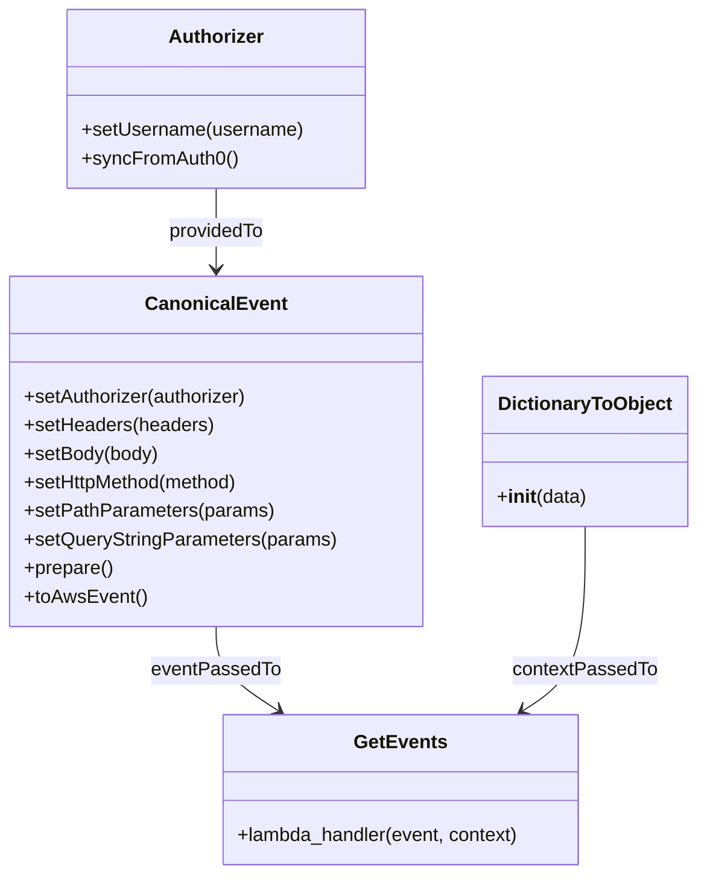

# Diagram: platform/tools/ide_local_testing/localTest/test/shipment/getEvents.py


> Auto-generated by Obscura crawlers

## Diagram 1

```mermaid
flowchart TD
    Start[Start] --> Imports[Imports: getEvents, DictionaryToObject, Authorizer, CanonicalEvent]
    Imports --> Config[Set constants: startTime, endTime, gatewayUrl, pathParameters, body]
    Config --> AuthorizerInit[Create Authorizer and syncFromAuth0]
    AuthorizerInit --> CanonicalEventBuilder[Build CanonicalEvent with chained setters]
    CanonicalEventBuilder --> PrepareEvent[prepare() -> toAwsEvent()]
    PrepareEvent --> JSONify[json.dumps(event)]
    JSONify --> CallGetEvents[Call getEvents(event, DictionaryToObject({"function_name":"getEventsByLambda"}))]
    CallGetEvents --> PrintResult[print(getEvents(...) result)]
    PrintResult --> End[End]
```

> SVG rendering failed for this diagram.

## Diagram 2



### SVG

<svg id="container" width="576.6953125" xmlns="http://www.w3.org/2000/svg" class="classDiagram" height="734" viewBox="0 0 576.6953125 734" role="graphics-document document" aria-roledescription="class"><style>#container{font-family:"trebuchet ms",verdana,arial,sans-serif;font-size:16px;fill:#333;}@keyframes edge-animation-frame{from{stroke-dashoffset:0;}}@keyframes dash{to{stroke-dashoffset:0;}}#container .edge-animation-slow{stroke-dasharray:9,5!important;stroke-dashoffset:900;animation:dash 50s linear infinite;stroke-linecap:round;}#container .edge-animation-fast{stroke-dasharray:9,5!important;stroke-dashoffset:900;animation:dash 20s linear infinite;stroke-linecap:round;}#container .error-icon{fill:#552222;}#container .error-text{fill:#552222;stroke:#552222;}#container .edge-thickness-normal{stroke-width:1px;}#container .edge-thickness-thick{stroke-width:3.5px;}#container .edge-pattern-solid{stroke-dasharray:0;}#container .edge-thickness-invisible{stroke-width:0;fill:none;}#container .edge-pattern-dashed{stroke-dasharray:3;}#container .edge-pattern-dotted{stroke-dasharray:2;}#container .marker{fill:#333333;stroke:#333333;}#container .marker.cross{stroke:#333333;}#container svg{font-family:"trebuchet ms",verdana,arial,sans-serif;font-size:16px;}#container p{margin:0;}#container g.classGroup text{fill:#9370DB;stroke:none;font-family:"trebuchet ms",verdana,arial,sans-serif;font-size:10px;}#container g.classGroup text .title{font-weight:bolder;}#container .nodeLabel,#container .edgeLabel{color:#131300;}#container .edgeLabel .label rect{fill:#ECECFF;}#container .label text{fill:#131300;}#container .labelBkg{background:#ECECFF;}#container .edgeLabel .label span{background:#ECECFF;}#container .classTitle{font-weight:bolder;}#container .node rect,#container .node circle,#container .node ellipse,#container .node polygon,#container .node path{fill:#ECECFF;stroke:#9370DB;stroke-width:1px;}#container .divider{stroke:#9370DB;stroke-width:1;}#container g.clickable{cursor:pointer;}#container g.classGroup rect{fill:#ECECFF;stroke:#9370DB;}#container g.classGroup line{stroke:#9370DB;stroke-width:1;}#container .classLabel .box{stroke:none;stroke-width:0;fill:#ECECFF;opacity:0.5;}#container .classLabel .label{fill:#9370DB;font-size:10px;}#container .relation{stroke:#333333;stroke-width:1;fill:none;}#container .dashed-line{stroke-dasharray:3;}#container .dotted-line{stroke-dasharray:1 2;}#container #compositionStart,#container .composition{fill:#333333!important;stroke:#333333!important;stroke-width:1;}#container #compositionEnd,#container .composition{fill:#333333!important;stroke:#333333!important;stroke-width:1;}#container #dependencyStart,#container .dependency{fill:#333333!important;stroke:#333333!important;stroke-width:1;}#container #dependencyStart,#container .dependency{fill:#333333!important;stroke:#333333!important;stroke-width:1;}#container #extensionStart,#container .extension{fill:transparent!important;stroke:#333333!important;stroke-width:1;}#container #extensionEnd,#container .extension{fill:transparent!important;stroke:#333333!important;stroke-width:1;}#container #aggregationStart,#container .aggregation{fill:transparent!important;stroke:#333333!important;stroke-width:1;}#container #aggregationEnd,#container .aggregation{fill:transparent!important;stroke:#333333!important;stroke-width:1;}#container #lollipopStart,#container .lollipop{fill:#ECECFF!important;stroke:#333333!important;stroke-width:1;}#container #lollipopEnd,#container .lollipop{fill:#ECECFF!important;stroke:#333333!important;stroke-width:1;}#container .edgeTerminals{font-size:11px;line-height:initial;}#container .classTitleText{text-anchor:middle;font-size:18px;fill:#333;}#container .label-icon{display:inline-block;height:1em;overflow:visible;vertical-align:-0.125em;}#container .node .label-icon path{fill:currentColor;stroke:revert;stroke-width:revert;}#container :root{--mermaid-font-family:"trebuchet ms",verdana,arial,sans-serif;}</style><g><defs><marker id="container_class-aggregationStart" class="marker aggregation class" refX="18" refY="7" markerWidth="190" markerHeight="240" orient="auto"><path d="M 18,7 L9,13 L1,7 L9,1 Z"></path></marker></defs><defs><marker id="container_class-aggregationEnd" class="marker aggregation class" refX="1" refY="7" markerWidth="20" markerHeight="28" orient="auto"><path d="M 18,7 L9,13 L1,7 L9,1 Z"></path></marker></defs><defs><marker id="container_class-extensionStart" class="marker extension class" refX="18" refY="7" markerWidth="190" markerHeight="240" orient="auto"><path d="M 1,7 L18,13 V 1 Z"></path></marker></defs><defs><marker id="container_class-extensionEnd" class="marker extension class" refX="1" refY="7" markerWidth="20" markerHeight="28" orient="auto"><path d="M 1,1 V 13 L18,7 Z"></path></marker></defs><defs><marker id="container_class-compositionStart" class="marker composition class" refX="18" refY="7" markerWidth="190" markerHeight="240" orient="auto"><path d="M 18,7 L9,13 L1,7 L9,1 Z"></path></marker></defs><defs><marker id="container_class-compositionEnd" class="marker composition class" refX="1" refY="7" markerWidth="20" markerHeight="28" orient="auto"><path d="M 18,7 L9,13 L1,7 L9,1 Z"></path></marker></defs><defs><marker id="container_class-dependencyStart" class="marker dependency class" refX="6" refY="7" markerWidth="190" markerHeight="240" orient="auto"><path d="M 5,7 L9,13 L1,7 L9,1 Z"></path></marker></defs><defs><marker id="container_class-dependencyEnd" class="marker dependency class" refX="13" refY="7" markerWidth="20" markerHeight="28" orient="auto"><path d="M 18,7 L9,13 L14,7 L9,1 Z"></path></marker></defs><defs><marker id="container_class-lollipopStart" class="marker lollipop class" refX="13" refY="7" markerWidth="190" markerHeight="240" orient="auto"><circle stroke="black" fill="transparent" cx="7" cy="7" r="6"></circle></marker></defs><defs><marker id="container_class-lollipopEnd" class="marker lollipop class" refX="1" refY="7" markerWidth="190" markerHeight="240" orient="auto"><circle stroke="black" fill="transparent" cx="7" cy="7" r="6"></circle></marker></defs><g class="root"><g class="clusters"></g><g class="edgePaths"><path d="M178.574,158L178.574,164.167C178.574,170.333,178.574,182.667,178.574,194C178.574,205.333,178.574,215.667,178.574,220.833L178.574,226" id="id_Authorizer_CanonicalEvent_1" class="edge-thickness-normal edge-pattern-solid relation" style=";;;" data-edge="true" data-et="edge" data-id="id_Authorizer_CanonicalEvent_1" data-points="W3sieCI6MTc4LjU3NDIxODc1LCJ5IjoxNTh9LHsieCI6MTc4LjU3NDIxODc1LCJ5IjoxOTV9LHsieCI6MTc4LjU3NDIxODc1LCJ5IjoyMzJ9XQ==" marker-end="url(#container_class-dependencyEnd)"></path><path d="M178.574,526L178.574,532.167C178.574,538.333,178.574,550.667,187.153,562.452C195.731,574.237,212.888,585.475,221.466,591.094L230.044,596.712" id="id_CanonicalEvent_GetEvents_2" class="edge-thickness-normal edge-pattern-solid relation" style=";;;" data-edge="true" data-et="edge" data-id="id_CanonicalEvent_GetEvents_2" data-points="W3sieCI6MTc4LjU3NDIxODc1LCJ5Ijo1MjZ9LHsieCI6MTc4LjU3NDIxODc1LCJ5Ijo1NjN9LHsieCI6MjM1LjA2MzUzNTE1NjI1LCJ5Ijo2MDB9XQ==" marker-end="url(#container_class-dependencyEnd)"></path><path d="M483.922,442L483.922,462.167C483.922,482.333,483.922,522.667,475.344,548.452C466.765,574.237,449.608,585.475,441.03,591.094L432.452,596.712" id="id_DictionaryToObject_GetEvents_3" class="edge-thickness-normal edge-pattern-solid relation" style=";;;" data-edge="true" data-et="edge" data-id="id_DictionaryToObject_GetEvents_3" data-points="W3sieCI6NDgzLjkyMTg3NSwieSI6NDQyfSx7IngiOjQ4My45MjE4NzUsInkiOjU2M30seyJ4Ijo0MjcuNDMyNTU4NTkzNzUsInkiOjYwMH1d" marker-end="url(#container_class-dependencyEnd)"></path></g><g class="edgeLabels"><g class="edgeLabel" transform="translate(178.57421875, 195)"><g class="label" data-id="id_Authorizer_CanonicalEvent_1" transform="translate(-40.734375, -12)"><foreignObject width="81.46875" height="24"><div xmlns="http://www.w3.org/1999/xhtml" class="labelBkg" style="display: table-cell; white-space: nowrap; line-height: 1.5; max-width: 200px; text-align: center;"><span class="edgeLabel"><p>providedTo</p></span></div></foreignObject></g></g><g class="edgeLabel" transform="translate(178.57421875, 563)"><g class="label" data-id="id_CanonicalEvent_GetEvents_2" transform="translate(-53.5546875, -12)"><foreignObject width="107.109375" height="24"><div xmlns="http://www.w3.org/1999/xhtml" class="labelBkg" style="display: table-cell; white-space: nowrap; line-height: 1.5; max-width: 200px; text-align: center;"><span class="edgeLabel"><p>eventPassedTo</p></span></div></foreignObject></g></g><g class="edgeLabel" transform="translate(483.921875, 563)"><g class="label" data-id="id_DictionaryToObject_GetEvents_3" transform="translate(-60.234375, -12)"><foreignObject width="120.46875" height="24"><div xmlns="http://www.w3.org/1999/xhtml" class="labelBkg" style="display: table-cell; white-space: nowrap; line-height: 1.5; max-width: 200px; text-align: center;"><span class="edgeLabel"><p>contextPassedTo</p></span></div></foreignObject></g></g></g><g class="nodes"><g class="node default" id="classId-Authorizer-0" transform="translate(178.57421875, 83)"><g class="basic label-container"><path d="M-124.13671875 -75 L124.13671875 -75 L124.13671875 75 L-124.13671875 75" stroke="none" stroke-width="0" fill="#ECECFF" style=""></path><path d="M-124.13671875 -75 C-39.01469782260422 -75, 46.10732310479156 -75, 124.13671875 -75 M-124.13671875 -75 C-45.21988546398795 -75, 33.6969478220241 -75, 124.13671875 -75 M124.13671875 -75 C124.13671875 -39.7118373924823, 124.13671875 -4.423674784964604, 124.13671875 75 M124.13671875 -75 C124.13671875 -39.60433582780124, 124.13671875 -4.208671655602487, 124.13671875 75 M124.13671875 75 C38.017898497373366 75, -48.10092175525327 75, -124.13671875 75 M124.13671875 75 C41.421286151582905 75, -41.29414644683419 75, -124.13671875 75 M-124.13671875 75 C-124.13671875 44.1194685529952, -124.13671875 13.238937105990395, -124.13671875 -75 M-124.13671875 75 C-124.13671875 44.06663210451761, -124.13671875 13.133264209035225, -124.13671875 -75" stroke="#9370DB" stroke-width="1.3" fill="none" stroke-dasharray="0 0" style=""></path></g><g class="annotation-group text" transform="translate(0, -51)"></g><g class="label-group text" transform="translate(-38.3671875, -51)"><g class="label" style="font-weight: bolder" transform="translate(0,-12)"><foreignObject width="76.734375" height="24"><div xmlns="http://www.w3.org/1999/xhtml" style="display: table-cell; white-space: nowrap; line-height: 1.5; max-width: 126px; text-align: center;"><span class="nodeLabel markdown-node-label" style=""><p>Authorizer</p></span></div></foreignObject></g></g><g class="members-group text" transform="translate(-112.13671875, -3)"></g><g class="methods-group text" transform="translate(-112.13671875, 27)"><g class="label" style="" transform="translate(0,-12)"><foreignObject width="185.90625" height="24"><div xmlns="http://www.w3.org/1999/xhtml" style="display: table-cell; white-space: nowrap; line-height: 1.5; max-width: 243px; text-align: center;"><span class="nodeLabel markdown-node-label" style=""><p>+setUsername(username)</p></span></div></foreignObject></g><g class="label" style="" transform="translate(0,12)"><foreignObject width="129.0625" height="24"><div xmlns="http://www.w3.org/1999/xhtml" style="display: table-cell; white-space: nowrap; line-height: 1.5; max-width: 186px; text-align: center;"><span class="nodeLabel markdown-node-label" style=""><p>+syncFromAuth0()</p></span></div></foreignObject></g></g><g class="divider" style=""><path d="M-124.13671875 -27 C-33.94649750712911 -27, 56.24372373574178 -27, 124.13671875 -27 M-124.13671875 -27 C-29.986561454197826 -27, 64.16359584160435 -27, 124.13671875 -27" stroke="#9370DB" stroke-width="1.3" fill="none" stroke-dasharray="0 0" style=""></path></g><g class="divider" style=""><path d="M-124.13671875 -3 C-73.0595450735315 -3, -21.982371397062977 -3, 124.13671875 -3 M-124.13671875 -3 C-30.016858955917428 -3, 64.10300083816514 -3, 124.13671875 -3" stroke="#9370DB" stroke-width="1.3" fill="none" stroke-dasharray="0 0" style=""></path></g></g><g class="node default" id="classId-CanonicalEvent-1" transform="translate(178.57421875, 379)"><g class="basic label-container"><path d="M-170.57421875 -147 L170.57421875 -147 L170.57421875 147 L-170.57421875 147" stroke="none" stroke-width="0" fill="#ECECFF" style=""></path><path d="M-170.57421875 -147 C-43.35232302020874 -147, 83.86957270958251 -147, 170.57421875 -147 M-170.57421875 -147 C-51.99463613034645 -147, 66.5849464893071 -147, 170.57421875 -147 M170.57421875 -147 C170.57421875 -85.99669398904166, 170.57421875 -24.993387978083334, 170.57421875 147 M170.57421875 -147 C170.57421875 -83.48384081818679, 170.57421875 -19.967681636373584, 170.57421875 147 M170.57421875 147 C55.88572968681454 147, -58.802759376370915 147, -170.57421875 147 M170.57421875 147 C55.615619254857805 147, -59.34298024028439 147, -170.57421875 147 M-170.57421875 147 C-170.57421875 40.78405661922203, -170.57421875 -65.43188676155594, -170.57421875 -147 M-170.57421875 147 C-170.57421875 63.96052421171173, -170.57421875 -19.078951576576543, -170.57421875 -147" stroke="#9370DB" stroke-width="1.3" fill="none" stroke-dasharray="0 0" style=""></path></g><g class="annotation-group text" transform="translate(0, -123)"></g><g class="label-group text" transform="translate(-55.7109375, -123)"><g class="label" style="font-weight: bolder" transform="translate(0,-12)"><foreignObject width="111.421875" height="24"><div xmlns="http://www.w3.org/1999/xhtml" style="display: table-cell; white-space: nowrap; line-height: 1.5; max-width: 161px; text-align: center;"><span class="nodeLabel markdown-node-label" style=""><p>CanonicalEvent</p></span></div></foreignObject></g></g><g class="members-group text" transform="translate(-158.57421875, -75)"></g><g class="methods-group text" transform="translate(-158.57421875, -45)"><g class="label" style="" transform="translate(0,-12)"><foreignObject width="190.75" height="24"><div xmlns="http://www.w3.org/1999/xhtml" style="display: table-cell; white-space: nowrap; line-height: 1.5; max-width: 248px; text-align: center;"><span class="nodeLabel markdown-node-label" style=""><p>+setAuthorizer(authorizer)</p></span></div></foreignObject></g><g class="label" style="" transform="translate(0,12)"><foreignObject width="158.5" height="24"><div xmlns="http://www.w3.org/1999/xhtml" style="display: table-cell; white-space: nowrap; line-height: 1.5; max-width: 216px; text-align: center;"><span class="nodeLabel markdown-node-label" style=""><p>+setHeaders(headers)</p></span></div></foreignObject></g><g class="label" style="" transform="translate(0,36)"><foreignObject width="113.125" height="24"><div xmlns="http://www.w3.org/1999/xhtml" style="display: table-cell; white-space: nowrap; line-height: 1.5; max-width: 170px; text-align: center;"><span class="nodeLabel markdown-node-label" style=""><p>+setBody(body)</p></span></div></foreignObject></g><g class="label" style="" transform="translate(0,60)"><foreignObject width="184" height="24"><div xmlns="http://www.w3.org/1999/xhtml" style="display: table-cell; white-space: nowrap; line-height: 1.5; max-width: 241px; text-align: center;"><span class="nodeLabel markdown-node-label" style=""><p>+setHttpMethod(method)</p></span></div></foreignObject></g><g class="label" style="" transform="translate(0,84)"><foreignObject width="207.6875" height="24"><div xmlns="http://www.w3.org/1999/xhtml" style="display: table-cell; white-space: nowrap; line-height: 1.5; max-width: 265px; text-align: center;"><span class="nodeLabel markdown-node-label" style=""><p>+setPathParameters(params)</p></span></div></foreignObject></g><g class="label" style="" transform="translate(0,108)"><foreignObject width="261.4375" height="24"><div xmlns="http://www.w3.org/1999/xhtml" style="display: table-cell; white-space: nowrap; line-height: 1.5; max-width: 319px; text-align: center;"><span class="nodeLabel markdown-node-label" style=""><p>+setQueryStringParameters(params)</p></span></div></foreignObject></g><g class="label" style="" transform="translate(0,132)"><foreignObject width="74.75" height="24"><div xmlns="http://www.w3.org/1999/xhtml" style="display: table-cell; white-space: nowrap; line-height: 1.5; max-width: 132px; text-align: center;"><span class="nodeLabel markdown-node-label" style=""><p>+prepare()</p></span></div></foreignObject></g><g class="label" style="" transform="translate(0,156)"><foreignObject width="101.1875" height="24"><div xmlns="http://www.w3.org/1999/xhtml" style="display: table-cell; white-space: nowrap; line-height: 1.5; max-width: 159px; text-align: center;"><span class="nodeLabel markdown-node-label" style=""><p>+toAwsEvent()</p></span></div></foreignObject></g></g><g class="divider" style=""><path d="M-170.57421875 -99 C-101.31501707848157 -99, -32.05581540696315 -99, 170.57421875 -99 M-170.57421875 -99 C-84.28750890998872 -99, 1.9992009300225675 -99, 170.57421875 -99" stroke="#9370DB" stroke-width="1.3" fill="none" stroke-dasharray="0 0" style=""></path></g><g class="divider" style=""><path d="M-170.57421875 -75 C-47.77612686379361 -75, 75.02196502241279 -75, 170.57421875 -75 M-170.57421875 -75 C-67.01638707952463 -75, 36.54144459095073 -75, 170.57421875 -75" stroke="#9370DB" stroke-width="1.3" fill="none" stroke-dasharray="0 0" style=""></path></g></g><g class="node default" id="classId-DictionaryToObject-2" transform="translate(483.921875, 379)"><g class="basic label-container"><path d="M-84.7734375 -63 L84.7734375 -63 L84.7734375 63 L-84.7734375 63" stroke="none" stroke-width="0" fill="#ECECFF" style=""></path><path d="M-84.7734375 -63 C-25.031427963070705 -63, 34.71058157385859 -63, 84.7734375 -63 M-84.7734375 -63 C-22.766762569642133 -63, 39.239912360715735 -63, 84.7734375 -63 M84.7734375 -63 C84.7734375 -32.42662528412305, 84.7734375 -1.8532505682460965, 84.7734375 63 M84.7734375 -63 C84.7734375 -37.197368306334766, 84.7734375 -11.394736612669526, 84.7734375 63 M84.7734375 63 C30.015987415962314 63, -24.74146266807537 63, -84.7734375 63 M84.7734375 63 C24.331814343292734 63, -36.10980881341453 63, -84.7734375 63 M-84.7734375 63 C-84.7734375 16.020566662753502, -84.7734375 -30.958866674492995, -84.7734375 -63 M-84.7734375 63 C-84.7734375 37.268648725150285, -84.7734375 11.53729745030057, -84.7734375 -63" stroke="#9370DB" stroke-width="1.3" fill="none" stroke-dasharray="0 0" style=""></path></g><g class="annotation-group text" transform="translate(0, -39)"></g><g class="label-group text" transform="translate(-70.109375, -39)"><g class="label" style="font-weight: bolder" transform="translate(0,-12)"><foreignObject width="140.21875" height="24"><div xmlns="http://www.w3.org/1999/xhtml" style="display: table-cell; white-space: nowrap; line-height: 1.5; max-width: 188px; text-align: center;"><span class="nodeLabel markdown-node-label" style=""><p>DictionaryToObject</p></span></div></foreignObject></g></g><g class="members-group text" transform="translate(-72.7734375, 9)"></g><g class="methods-group text" transform="translate(-72.7734375, 39)"><g class="label" style="" transform="translate(0,-12)"><foreignObject width="75.4375" height="24"><div xmlns="http://www.w3.org/1999/xhtml" style="display: table-cell; white-space: nowrap; line-height: 1.5; max-width: 164px; text-align: center;"><span class="nodeLabel markdown-node-label" style=""><p>+<strong>init</strong>(data)</p></span></div></foreignObject></g></g><g class="divider" style=""><path d="M-84.7734375 -15 C-34.62036350859685 -15, 15.532710482806294 -15, 84.7734375 -15 M-84.7734375 -15 C-24.821211849685653 -15, 35.13101380062869 -15, 84.7734375 -15" stroke="#9370DB" stroke-width="1.3" fill="none" stroke-dasharray="0 0" style=""></path></g><g class="divider" style=""><path d="M-84.7734375 9 C-47.40751724854217 9, -10.04159699708434 9, 84.7734375 9 M-84.7734375 9 C-24.54360348443131 9, 35.68623053113738 9, 84.7734375 9" stroke="#9370DB" stroke-width="1.3" fill="none" stroke-dasharray="0 0" style=""></path></g></g><g class="node default" id="classId-GetEvents-3" transform="translate(331.248046875, 663)"><g class="basic label-container"><path d="M-150.46484375 -63 L150.46484375 -63 L150.46484375 63 L-150.46484375 63" stroke="none" stroke-width="0" fill="#ECECFF" style=""></path><path d="M-150.46484375 -63 C-66.549698859352 -63, 17.36544603129599 -63, 150.46484375 -63 M-150.46484375 -63 C-38.17102941865757 -63, 74.12278491268486 -63, 150.46484375 -63 M150.46484375 -63 C150.46484375 -19.302964755437493, 150.46484375 24.394070489125014, 150.46484375 63 M150.46484375 -63 C150.46484375 -15.534594063496435, 150.46484375 31.93081187300713, 150.46484375 63 M150.46484375 63 C30.67995729935207 63, -89.10492915129586 63, -150.46484375 63 M150.46484375 63 C72.49525842151816 63, -5.474326906963682 63, -150.46484375 63 M-150.46484375 63 C-150.46484375 12.90446062996292, -150.46484375 -37.19107874007416, -150.46484375 -63 M-150.46484375 63 C-150.46484375 15.475500499722628, -150.46484375 -32.048999000554744, -150.46484375 -63" stroke="#9370DB" stroke-width="1.3" fill="none" stroke-dasharray="0 0" style=""></path></g><g class="annotation-group text" transform="translate(0, -39)"></g><g class="label-group text" transform="translate(-36.7421875, -39)"><g class="label" style="font-weight: bolder" transform="translate(0,-12)"><foreignObject width="73.484375" height="24"><div xmlns="http://www.w3.org/1999/xhtml" style="display: table-cell; white-space: nowrap; line-height: 1.5; max-width: 122px; text-align: center;"><span class="nodeLabel markdown-node-label" style=""><p>GetEvents</p></span></div></foreignObject></g></g><g class="members-group text" transform="translate(-138.46484375, 9)"></g><g class="methods-group text" transform="translate(-138.46484375, 39)"><g class="label" style="" transform="translate(0,-12)"><foreignObject width="240.1875" height="24"><div xmlns="http://www.w3.org/1999/xhtml" style="display: table-cell; white-space: nowrap; line-height: 1.5; max-width: 298px; text-align: center;"><span class="nodeLabel markdown-node-label" style=""><p>+lambda_handler(event, context)</p></span></div></foreignObject></g></g><g class="divider" style=""><path d="M-150.46484375 -15 C-40.978971850204545 -15, 68.50690004959091 -15, 150.46484375 -15 M-150.46484375 -15 C-47.63026104486519 -15, 55.20432166026961 -15, 150.46484375 -15" stroke="#9370DB" stroke-width="1.3" fill="none" stroke-dasharray="0 0" style=""></path></g><g class="divider" style=""><path d="M-150.46484375 9 C-73.1396645372254 9, 4.1855146755492 9, 150.46484375 9 M-150.46484375 9 C-70.64835815612493 9, 9.168127437750144 9, 150.46484375 9" stroke="#9370DB" stroke-width="1.3" fill="none" stroke-dasharray="0 0" style=""></path></g></g></g></g></g></svg>
