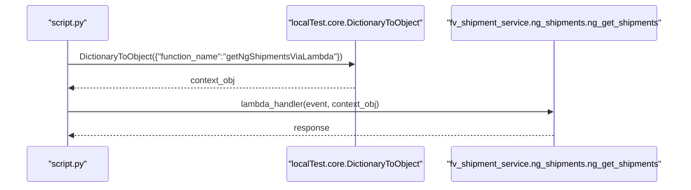
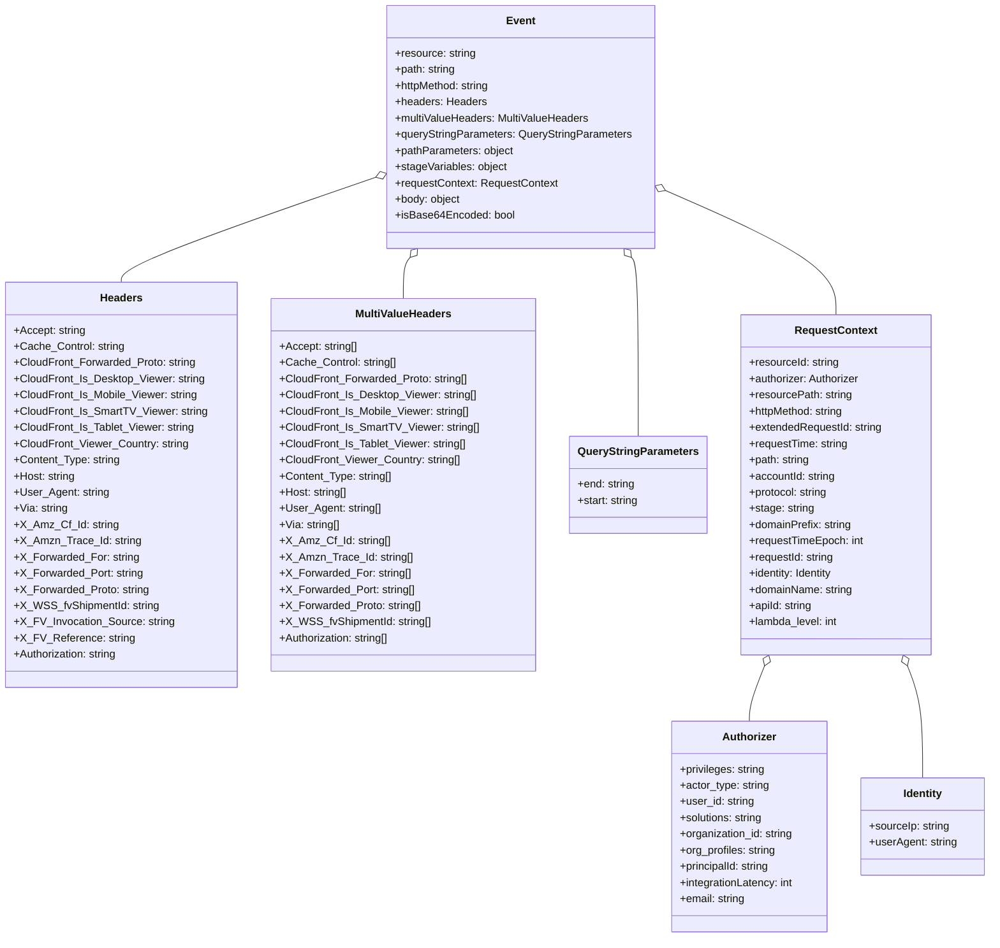

# Diagram: platform/tools/ide_local_testing/localTest/test/shipment/getNgShipmentsViaLambda.py

> Auto-generated by Obscura crawlers

## Diagram 1

### SVG

<svg id="container" width="1352.5" xmlns="http://www.w3.org/2000/svg" height="363" viewBox="-50 -10 1352.5 363" role="graphics-document document" aria-roledescription="sequence"><g><rect x="828.5" y="277" fill="#eaeaea" stroke="#666" width="424" height="65" name="NG" rx="3" ry="3" class="actor actor-bottom"></rect><text x="1040.5" y="309.5" dominant-baseline="central" alignment-baseline="central" class="actor actor-box" style="text-anchor: middle; font-size: 16px; font-weight: 400;"><tspan x="1040.5" dy="0">"fv_shipment_service.ng_shipments.ng_get_shipments"</tspan></text></g><g><rect x="505.5" y="277" fill="#eaeaea" stroke="#666" width="273" height="65" name="DTO" rx="3" ry="3" class="actor actor-bottom"></rect><text x="642" y="309.5" dominant-baseline="central" alignment-baseline="central" class="actor actor-box" style="text-anchor: middle; font-size: 16px; font-weight: 400;"><tspan x="642" dy="0">"localTest.core.DictionaryToObject"</tspan></text></g><g><rect x="0" y="277" fill="#eaeaea" stroke="#666" width="150" height="65" name="Script" rx="3" ry="3" class="actor actor-bottom"></rect><text x="75" y="309.5" dominant-baseline="central" alignment-baseline="central" class="actor actor-box" style="text-anchor: middle; font-size: 16px; font-weight: 400;"><tspan x="75" dy="0">"script.py"</tspan></text></g><g><line id="actor2" x1="1040.5" y1="65" x2="1040.5" y2="277" class="actor-line 200" stroke-width="0.5px" stroke="#999" name="NG"></line><g id="root-2"><rect x="828.5" y="0" fill="#eaeaea" stroke="#666" width="424" height="65" name="NG" rx="3" ry="3" class="actor actor-top"></rect><text x="1040.5" y="32.5" dominant-baseline="central" alignment-baseline="central" class="actor actor-box" style="text-anchor: middle; font-size: 16px; font-weight: 400;"><tspan x="1040.5" dy="0">"fv_shipment_service.ng_shipments.ng_get_shipments"</tspan></text></g></g><g><line id="actor1" x1="642" y1="65" x2="642" y2="277" class="actor-line 200" stroke-width="0.5px" stroke="#999" name="DTO"></line><g id="root-1"><rect x="505.5" y="0" fill="#eaeaea" stroke="#666" width="273" height="65" name="DTO" rx="3" ry="3" class="actor actor-top"></rect><text x="642" y="32.5" dominant-baseline="central" alignment-baseline="central" class="actor actor-box" style="text-anchor: middle; font-size: 16px; font-weight: 400;"><tspan x="642" dy="0">"localTest.core.DictionaryToObject"</tspan></text></g></g><g><line id="actor0" x1="75" y1="65" x2="75" y2="277" class="actor-line 200" stroke-width="0.5px" stroke="#999" name="Script"></line><g id="root-0"><rect x="0" y="0" fill="#eaeaea" stroke="#666" width="150" height="65" name="Script" rx="3" ry="3" class="actor actor-top"></rect><text x="75" y="32.5" dominant-baseline="central" alignment-baseline="central" class="actor actor-box" style="text-anchor: middle; font-size: 16px; font-weight: 400;"><tspan x="75" dy="0">"script.py"</tspan></text></g></g><g></g><defs><symbol id="computer" width="24" height="24"><path transform="scale(.5)" d="M2 2v13h20v-13h-20zm18 11h-16v-9h16v9zm-10.228 6l.466-1h3.524l.467 1h-4.457zm14.228 3h-24l2-6h2.104l-1.33 4h18.45l-1.297-4h2.073l2 6zm-5-10h-14v-7h14v7z"></path></symbol></defs><defs><symbol id="database" fill-rule="evenodd" clip-rule="evenodd"><path transform="scale(.5)" d="M12.258.001l.256.004.255.005.253.008.251.01.249.012.247.015.246.016.242.019.241.02.239.023.236.024.233.027.231.028.229.031.225.032.223.034.22.036.217.038.214.04.211.041.208.043.205.045.201.046.198.048.194.05.191.051.187.053.183.054.18.056.175.057.172.059.168.06.163.061.16.063.155.064.15.066.074.033.073.033.071.034.07.034.069.035.068.035.067.035.066.035.064.036.064.036.062.036.06.036.06.037.058.037.058.037.055.038.055.038.053.038.052.038.051.039.05.039.048.039.047.039.045.04.044.04.043.04.041.04.04.041.039.041.037.041.036.041.034.041.033.042.032.042.03.042.029.042.027.042.026.043.024.043.023.043.021.043.02.043.018.044.017.043.015.044.013.044.012.044.011.045.009.044.007.045.006.045.004.045.002.045.001.045v17l-.001.045-.002.045-.004.045-.006.045-.007.045-.009.044-.011.045-.012.044-.013.044-.015.044-.017.043-.018.044-.02.043-.021.043-.023.043-.024.043-.026.043-.027.042-.029.042-.03.042-.032.042-.033.042-.034.041-.036.041-.037.041-.039.041-.04.041-.041.04-.043.04-.044.04-.045.04-.047.039-.048.039-.05.039-.051.039-.052.038-.053.038-.055.038-.055.038-.058.037-.058.037-.06.037-.06.036-.062.036-.064.036-.064.036-.066.035-.067.035-.068.035-.069.035-.07.034-.071.034-.073.033-.074.033-.15.066-.155.064-.16.063-.163.061-.168.06-.172.059-.175.057-.18.056-.183.054-.187.053-.191.051-.194.05-.198.048-.201.046-.205.045-.208.043-.211.041-.214.04-.217.038-.22.036-.223.034-.225.032-.229.031-.231.028-.233.027-.236.024-.239.023-.241.02-.242.019-.246.016-.247.015-.249.012-.251.01-.253.008-.255.005-.256.004-.258.001-.258-.001-.256-.004-.255-.005-.253-.008-.251-.01-.249-.012-.247-.015-.245-.016-.243-.019-.241-.02-.238-.023-.236-.024-.234-.027-.231-.028-.228-.031-.226-.032-.223-.034-.22-.036-.217-.038-.214-.04-.211-.041-.208-.043-.204-.045-.201-.046-.198-.048-.195-.05-.19-.051-.187-.053-.184-.054-.179-.056-.176-.057-.172-.059-.167-.06-.164-.061-.159-.063-.155-.064-.151-.066-.074-.033-.072-.033-.072-.034-.07-.034-.069-.035-.068-.035-.067-.035-.066-.035-.064-.036-.063-.036-.062-.036-.061-.036-.06-.037-.058-.037-.057-.037-.056-.038-.055-.038-.053-.038-.052-.038-.051-.039-.049-.039-.049-.039-.046-.039-.046-.04-.044-.04-.043-.04-.041-.04-.04-.041-.039-.041-.037-.041-.036-.041-.034-.041-.033-.042-.032-.042-.03-.042-.029-.042-.027-.042-.026-.043-.024-.043-.023-.043-.021-.043-.02-.043-.018-.044-.017-.043-.015-.044-.013-.044-.012-.044-.011-.045-.009-.044-.007-.045-.006-.045-.004-.045-.002-.045-.001-.045v-17l.001-.045.002-.045.004-.045.006-.045.007-.045.009-.044.011-.045.012-.044.013-.044.015-.044.017-.043.018-.044.02-.043.021-.043.023-.043.024-.043.026-.043.027-.042.029-.042.03-.042.032-.042.033-.042.034-.041.036-.041.037-.041.039-.041.04-.041.041-.04.043-.04.044-.04.046-.04.046-.039.049-.039.049-.039.051-.039.052-.038.053-.038.055-.038.056-.038.057-.037.058-.037.06-.037.061-.036.062-.036.063-.036.064-.036.066-.035.067-.035.068-.035.069-.035.07-.034.072-.034.072-.033.074-.033.151-.066.155-.064.159-.063.164-.061.167-.06.172-.059.176-.057.179-.056.184-.054.187-.053.19-.051.195-.05.198-.048.201-.046.204-.045.208-.043.211-.041.214-.04.217-.038.22-.036.223-.034.226-.032.228-.031.231-.028.234-.027.236-.024.238-.023.241-.02.243-.019.245-.016.247-.015.249-.012.251-.01.253-.008.255-.005.256-.004.258-.001.258.001zm-9.258 20.499v.01l.001.021.003.021.004.022.005.021.006.022.007.022.009.023.01.022.011.023.012.023.013.023.015.023.016.024.017.023.018.024.019.024.021.024.022.025.023.024.024.025.052.049.056.05.061.051.066.051.07.051.075.051.079.052.084.052.088.052.092.052.097.052.102.051.105.052.11.052.114.051.119.051.123.051.127.05.131.05.135.05.139.048.144.049.147.047.152.047.155.047.16.045.163.045.167.043.171.043.176.041.178.041.183.039.187.039.19.037.194.035.197.035.202.033.204.031.209.03.212.029.216.027.219.025.222.024.226.021.23.02.233.018.236.016.24.015.243.012.246.01.249.008.253.005.256.004.259.001.26-.001.257-.004.254-.005.25-.008.247-.011.244-.012.241-.014.237-.016.233-.018.231-.021.226-.021.224-.024.22-.026.216-.027.212-.028.21-.031.205-.031.202-.034.198-.034.194-.036.191-.037.187-.039.183-.04.179-.04.175-.042.172-.043.168-.044.163-.045.16-.046.155-.046.152-.047.148-.048.143-.049.139-.049.136-.05.131-.05.126-.05.123-.051.118-.052.114-.051.11-.052.106-.052.101-.052.096-.052.092-.052.088-.053.083-.051.079-.052.074-.052.07-.051.065-.051.06-.051.056-.05.051-.05.023-.024.023-.025.021-.024.02-.024.019-.024.018-.024.017-.024.015-.023.014-.024.013-.023.012-.023.01-.023.01-.022.008-.022.006-.022.006-.022.004-.022.004-.021.001-.021.001-.021v-4.127l-.077.055-.08.053-.083.054-.085.053-.087.052-.09.052-.093.051-.095.05-.097.05-.1.049-.102.049-.105.048-.106.047-.109.047-.111.046-.114.045-.115.045-.118.044-.12.043-.122.042-.124.042-.126.041-.128.04-.13.04-.132.038-.134.038-.135.037-.138.037-.139.035-.142.035-.143.034-.144.033-.147.032-.148.031-.15.03-.151.03-.153.029-.154.027-.156.027-.158.026-.159.025-.161.024-.162.023-.163.022-.165.021-.166.02-.167.019-.169.018-.169.017-.171.016-.173.015-.173.014-.175.013-.175.012-.177.011-.178.01-.179.008-.179.008-.181.006-.182.005-.182.004-.184.003-.184.002h-.37l-.184-.002-.184-.003-.182-.004-.182-.005-.181-.006-.179-.008-.179-.008-.178-.01-.176-.011-.176-.012-.175-.013-.173-.014-.172-.015-.171-.016-.17-.017-.169-.018-.167-.019-.166-.02-.165-.021-.163-.022-.162-.023-.161-.024-.159-.025-.157-.026-.156-.027-.155-.027-.153-.029-.151-.03-.15-.03-.148-.031-.146-.032-.145-.033-.143-.034-.141-.035-.14-.035-.137-.037-.136-.037-.134-.038-.132-.038-.13-.04-.128-.04-.126-.041-.124-.042-.122-.042-.12-.044-.117-.043-.116-.045-.113-.045-.112-.046-.109-.047-.106-.047-.105-.048-.102-.049-.1-.049-.097-.05-.095-.05-.093-.052-.09-.051-.087-.052-.085-.053-.083-.054-.08-.054-.077-.054v4.127zm0-5.654v.011l.001.021.003.021.004.021.005.022.006.022.007.022.009.022.01.022.011.023.012.023.013.023.015.024.016.023.017.024.018.024.019.024.021.024.022.024.023.025.024.024.052.05.056.05.061.05.066.051.07.051.075.052.079.051.084.052.088.052.092.052.097.052.102.052.105.052.11.051.114.051.119.052.123.05.127.051.131.05.135.049.139.049.144.048.147.048.152.047.155.046.16.045.163.045.167.044.171.042.176.042.178.04.183.04.187.038.19.037.194.036.197.034.202.033.204.032.209.03.212.028.216.027.219.025.222.024.226.022.23.02.233.018.236.016.24.014.243.012.246.01.249.008.253.006.256.003.259.001.26-.001.257-.003.254-.006.25-.008.247-.01.244-.012.241-.015.237-.016.233-.018.231-.02.226-.022.224-.024.22-.025.216-.027.212-.029.21-.03.205-.032.202-.033.198-.035.194-.036.191-.037.187-.039.183-.039.179-.041.175-.042.172-.043.168-.044.163-.045.16-.045.155-.047.152-.047.148-.048.143-.048.139-.05.136-.049.131-.05.126-.051.123-.051.118-.051.114-.052.11-.052.106-.052.101-.052.096-.052.092-.052.088-.052.083-.052.079-.052.074-.051.07-.052.065-.051.06-.05.056-.051.051-.049.023-.025.023-.024.021-.025.02-.024.019-.024.018-.024.017-.024.015-.023.014-.023.013-.024.012-.022.01-.023.01-.023.008-.022.006-.022.006-.022.004-.021.004-.022.001-.021.001-.021v-4.139l-.077.054-.08.054-.083.054-.085.052-.087.053-.09.051-.093.051-.095.051-.097.05-.1.049-.102.049-.105.048-.106.047-.109.047-.111.046-.114.045-.115.044-.118.044-.12.044-.122.042-.124.042-.126.041-.128.04-.13.039-.132.039-.134.038-.135.037-.138.036-.139.036-.142.035-.143.033-.144.033-.147.033-.148.031-.15.03-.151.03-.153.028-.154.028-.156.027-.158.026-.159.025-.161.024-.162.023-.163.022-.165.021-.166.02-.167.019-.169.018-.169.017-.171.016-.173.015-.173.014-.175.013-.175.012-.177.011-.178.009-.179.009-.179.007-.181.007-.182.005-.182.004-.184.003-.184.002h-.37l-.184-.002-.184-.003-.182-.004-.182-.005-.181-.007-.179-.007-.179-.009-.178-.009-.176-.011-.176-.012-.175-.013-.173-.014-.172-.015-.171-.016-.17-.017-.169-.018-.167-.019-.166-.02-.165-.021-.163-.022-.162-.023-.161-.024-.159-.025-.157-.026-.156-.027-.155-.028-.153-.028-.151-.03-.15-.03-.148-.031-.146-.033-.145-.033-.143-.033-.141-.035-.14-.036-.137-.036-.136-.037-.134-.038-.132-.039-.13-.039-.128-.04-.126-.041-.124-.042-.122-.043-.12-.043-.117-.044-.116-.044-.113-.046-.112-.046-.109-.046-.106-.047-.105-.048-.102-.049-.1-.049-.097-.05-.095-.051-.093-.051-.09-.051-.087-.053-.085-.052-.083-.054-.08-.054-.077-.054v4.139zm0-5.666v.011l.001.02.003.022.004.021.005.022.006.021.007.022.009.023.01.022.011.023.012.023.013.023.015.023.016.024.017.024.018.023.019.024.021.025.022.024.023.024.024.025.052.05.056.05.061.05.066.051.07.051.075.052.079.051.084.052.088.052.092.052.097.052.102.052.105.051.11.052.114.051.119.051.123.051.127.05.131.05.135.05.139.049.144.048.147.048.152.047.155.046.16.045.163.045.167.043.171.043.176.042.178.04.183.04.187.038.19.037.194.036.197.034.202.033.204.032.209.03.212.028.216.027.219.025.222.024.226.021.23.02.233.018.236.017.24.014.243.012.246.01.249.008.253.006.256.003.259.001.26-.001.257-.003.254-.006.25-.008.247-.01.244-.013.241-.014.237-.016.233-.018.231-.02.226-.022.224-.024.22-.025.216-.027.212-.029.21-.03.205-.032.202-.033.198-.035.194-.036.191-.037.187-.039.183-.039.179-.041.175-.042.172-.043.168-.044.163-.045.16-.045.155-.047.152-.047.148-.048.143-.049.139-.049.136-.049.131-.051.126-.05.123-.051.118-.052.114-.051.11-.052.106-.052.101-.052.096-.052.092-.052.088-.052.083-.052.079-.052.074-.052.07-.051.065-.051.06-.051.056-.05.051-.049.023-.025.023-.025.021-.024.02-.024.019-.024.018-.024.017-.024.015-.023.014-.024.013-.023.012-.023.01-.022.01-.023.008-.022.006-.022.006-.022.004-.022.004-.021.001-.021.001-.021v-4.153l-.077.054-.08.054-.083.053-.085.053-.087.053-.09.051-.093.051-.095.051-.097.05-.1.049-.102.048-.105.048-.106.048-.109.046-.111.046-.114.046-.115.044-.118.044-.12.043-.122.043-.124.042-.126.041-.128.04-.13.039-.132.039-.134.038-.135.037-.138.036-.139.036-.142.034-.143.034-.144.033-.147.032-.148.032-.15.03-.151.03-.153.028-.154.028-.156.027-.158.026-.159.024-.161.024-.162.023-.163.023-.165.021-.166.02-.167.019-.169.018-.169.017-.171.016-.173.015-.173.014-.175.013-.175.012-.177.01-.178.01-.179.009-.179.007-.181.006-.182.006-.182.004-.184.003-.184.001-.185.001-.185-.001-.184-.001-.184-.003-.182-.004-.182-.006-.181-.006-.179-.007-.179-.009-.178-.01-.176-.01-.176-.012-.175-.013-.173-.014-.172-.015-.171-.016-.17-.017-.169-.018-.167-.019-.166-.02-.165-.021-.163-.023-.162-.023-.161-.024-.159-.024-.157-.026-.156-.027-.155-.028-.153-.028-.151-.03-.15-.03-.148-.032-.146-.032-.145-.033-.143-.034-.141-.034-.14-.036-.137-.036-.136-.037-.134-.038-.132-.039-.13-.039-.128-.041-.126-.041-.124-.041-.122-.043-.12-.043-.117-.044-.116-.044-.113-.046-.112-.046-.109-.046-.106-.048-.105-.048-.102-.048-.1-.05-.097-.049-.095-.051-.093-.051-.09-.052-.087-.052-.085-.053-.083-.053-.08-.054-.077-.054v4.153zm8.74-8.179l-.257.004-.254.005-.25.008-.247.011-.244.012-.241.014-.237.016-.233.018-.231.021-.226.022-.224.023-.22.026-.216.027-.212.028-.21.031-.205.032-.202.033-.198.034-.194.036-.191.038-.187.038-.183.04-.179.041-.175.042-.172.043-.168.043-.163.045-.16.046-.155.046-.152.048-.148.048-.143.048-.139.049-.136.05-.131.05-.126.051-.123.051-.118.051-.114.052-.11.052-.106.052-.101.052-.096.052-.092.052-.088.052-.083.052-.079.052-.074.051-.07.052-.065.051-.06.05-.056.05-.051.05-.023.025-.023.024-.021.024-.02.025-.019.024-.018.024-.017.023-.015.024-.014.023-.013.023-.012.023-.01.023-.01.022-.008.022-.006.023-.006.021-.004.022-.004.021-.001.021-.001.021.001.021.001.021.004.021.004.022.006.021.006.023.008.022.01.022.01.023.012.023.013.023.014.023.015.024.017.023.018.024.019.024.02.025.021.024.023.024.023.025.051.05.056.05.06.05.065.051.07.052.074.051.079.052.083.052.088.052.092.052.096.052.101.052.106.052.11.052.114.052.118.051.123.051.126.051.131.05.136.05.139.049.143.048.148.048.152.048.155.046.16.046.163.045.168.043.172.043.175.042.179.041.183.04.187.038.191.038.194.036.198.034.202.033.205.032.21.031.212.028.216.027.22.026.224.023.226.022.231.021.233.018.237.016.241.014.244.012.247.011.25.008.254.005.257.004.26.001.26-.001.257-.004.254-.005.25-.008.247-.011.244-.012.241-.014.237-.016.233-.018.231-.021.226-.022.224-.023.22-.026.216-.027.212-.028.21-.031.205-.032.202-.033.198-.034.194-.036.191-.038.187-.038.183-.04.179-.041.175-.042.172-.043.168-.043.163-.045.16-.046.155-.046.152-.048.148-.048.143-.048.139-.049.136-.05.131-.05.126-.051.123-.051.118-.051.114-.052.11-.052.106-.052.101-.052.096-.052.092-.052.088-.052.083-.052.079-.052.074-.051.07-.052.065-.051.06-.05.056-.05.051-.05.023-.025.023-.024.021-.024.02-.025.019-.024.018-.024.017-.023.015-.024.014-.023.013-.023.012-.023.01-.023.01-.022.008-.022.006-.023.006-.021.004-.022.004-.021.001-.021.001-.021-.001-.021-.001-.021-.004-.021-.004-.022-.006-.021-.006-.023-.008-.022-.01-.022-.01-.023-.012-.023-.013-.023-.014-.023-.015-.024-.017-.023-.018-.024-.019-.024-.02-.025-.021-.024-.023-.024-.023-.025-.051-.05-.056-.05-.06-.05-.065-.051-.07-.052-.074-.051-.079-.052-.083-.052-.088-.052-.092-.052-.096-.052-.101-.052-.106-.052-.11-.052-.114-.052-.118-.051-.123-.051-.126-.051-.131-.05-.136-.05-.139-.049-.143-.048-.148-.048-.152-.048-.155-.046-.16-.046-.163-.045-.168-.043-.172-.043-.175-.042-.179-.041-.183-.04-.187-.038-.191-.038-.194-.036-.198-.034-.202-.033-.205-.032-.21-.031-.212-.028-.216-.027-.22-.026-.224-.023-.226-.022-.231-.021-.233-.018-.237-.016-.241-.014-.244-.012-.247-.011-.25-.008-.254-.005-.257-.004-.26-.001-.26.001z"></path></symbol></defs><defs><symbol id="clock" width="24" height="24"><path transform="scale(.5)" d="M12 2c5.514 0 10 4.486 10 10s-4.486 10-10 10-10-4.486-10-10 4.486-10 10-10zm0-2c-6.627 0-12 5.373-12 12s5.373 12 12 12 12-5.373 12-12-5.373-12-12-12zm5.848 12.459c.202.038.202.333.001.372-1.907.361-6.045 1.111-6.547 1.111-.719 0-1.301-.582-1.301-1.301 0-.512.77-5.447 1.125-7.445.034-.192.312-.181.343.014l.985 6.238 5.394 1.011z"></path></symbol></defs><defs><marker id="arrowhead" refX="7.9" refY="5" markerUnits="userSpaceOnUse" markerWidth="12" markerHeight="12" orient="auto-start-reverse"><path d="M -1 0 L 10 5 L 0 10 z"></path></marker></defs><defs><marker id="crosshead" markerWidth="15" markerHeight="8" orient="auto" refX="4" refY="4.5"><path fill="none" stroke="#000000" stroke-width="1pt" d="M 1,2 L 6,7 M 6,2 L 1,7" style="stroke-dasharray: 0, 0;"></path></marker></defs><defs><marker id="filled-head" refX="15.5" refY="7" markerWidth="20" markerHeight="28" orient="auto"><path d="M 18,7 L9,13 L14,7 L9,1 Z"></path></marker></defs><defs><marker id="sequencenumber" refX="15" refY="15" markerWidth="60" markerHeight="40" orient="auto"><circle cx="15" cy="15" r="6"></circle></marker></defs><text x="357" y="80" text-anchor="middle" dominant-baseline="middle" alignment-baseline="middle" class="messageText" dy="1em" style="font-size: 16px; font-weight: 400;">DictionaryToObject({"function_name":"getNgShipmentsViaLambda"})</text><line x1="76" y1="113" x2="638" y2="113" class="messageLine0" stroke-width="2" stroke="none" marker-end="url(#arrowhead)" style="fill: none;"></line><text x="360" y="128" text-anchor="middle" dominant-baseline="middle" alignment-baseline="middle" class="messageText" dy="1em" style="font-size: 16px; font-weight: 400;">context_obj</text><line x1="641" y1="161" x2="79" y2="161" class="messageLine1" stroke-width="2" stroke="none" marker-end="url(#arrowhead)" style="stroke-dasharray: 3, 3; fill: none;"></line><text x="556" y="176" text-anchor="middle" dominant-baseline="middle" alignment-baseline="middle" class="messageText" dy="1em" style="font-size: 16px; font-weight: 400;">lambda_handler(event, context_obj)</text><line x1="76" y1="209" x2="1036.5" y2="209" class="messageLine0" stroke-width="2" stroke="none" marker-end="url(#arrowhead)" style="fill: none;"></line><text x="559" y="224" text-anchor="middle" dominant-baseline="middle" alignment-baseline="middle" class="messageText" dy="1em" style="font-size: 16px; font-weight: 400;">response</text><line x1="1039.5" y1="257" x2="79" y2="257" class="messageLine1" stroke-width="2" stroke="none" marker-end="url(#arrowhead)" style="stroke-dasharray: 3, 3; fill: none;"></line></svg>

## Diagram 2

### SVG

<svg id="container" width="1447.091796875" xmlns="http://www.w3.org/2000/svg" class="classDiagram" height="1388" viewBox="0 0 1447.091796875 1388" role="graphics-document document" aria-roledescription="class"><g><defs><marker id="container_class-aggregationStart" class="marker aggregation class" refX="18" refY="7" markerWidth="190" markerHeight="240" orient="auto"><path d="M 18,7 L9,13 L1,7 L9,1 Z"></path></marker></defs><defs><marker id="container_class-aggregationEnd" class="marker aggregation class" refX="1" refY="7" markerWidth="20" markerHeight="28" orient="auto"><path d="M 18,7 L9,13 L1,7 L9,1 Z"></path></marker></defs><defs><marker id="container_class-extensionStart" class="marker extension class" refX="18" refY="7" markerWidth="190" markerHeight="240" orient="auto"><path d="M 1,7 L18,13 V 1 Z"></path></marker></defs><defs><marker id="container_class-extensionEnd" class="marker extension class" refX="1" refY="7" markerWidth="20" markerHeight="28" orient="auto"><path d="M 1,1 V 13 L18,7 Z"></path></marker></defs><defs><marker id="container_class-compositionStart" class="marker composition class" refX="18" refY="7" markerWidth="190" markerHeight="240" orient="auto"><path d="M 18,7 L9,13 L1,7 L9,1 Z"></path></marker></defs><defs><marker id="container_class-compositionEnd" class="marker composition class" refX="1" refY="7" markerWidth="20" markerHeight="28" orient="auto"><path d="M 18,7 L9,13 L1,7 L9,1 Z"></path></marker></defs><defs><marker id="container_class-dependencyStart" class="marker dependency class" refX="6" refY="7" markerWidth="190" markerHeight="240" orient="auto"><path d="M 5,7 L9,13 L1,7 L9,1 Z"></path></marker></defs><defs><marker id="container_class-dependencyEnd" class="marker dependency class" refX="13" refY="7" markerWidth="20" markerHeight="28" orient="auto"><path d="M 18,7 L9,13 L14,7 L9,1 Z"></path></marker></defs><defs><marker id="container_class-lollipopStart" class="marker lollipop class" refX="13" refY="7" markerWidth="190" markerHeight="240" orient="auto"><circle stroke="black" fill="transparent" cx="7" cy="7" r="6"></circle></marker></defs><defs><marker id="container_class-lollipopEnd" class="marker lollipop class" refX="1" refY="7" markerWidth="190" markerHeight="240" orient="auto"><circle stroke="black" fill="transparent" cx="7" cy="7" r="6"></circle></marker></defs><g class="root"><g class="clusters"></g><g class="edgePaths"><path d="M542.732,263.295L481.517,284.912C420.302,306.53,297.872,349.765,236.657,375.549C175.441,401.333,175.441,409.667,175.441,413.833L175.441,418" id="id_Event_Headers_1" class="edge-thickness-normal edge-pattern-solid relation" style=";;;" data-edge="true" data-et="edge" data-id="id_Event_Headers_1" data-points="W3sieCI6NTU4Ljk5ODA0Njg3NSwieSI6MjU3LjU1MDcwMTY3MTE1ODN9LHsieCI6MTc1LjQ0MTQwNjI1LCJ5IjozOTN9LHsieCI6MTc1LjQ0MTQwNjI1LCJ5Ijo0MTh9XQ==" marker-start="url(#container_class-aggregationStart)"></path><path d="M594.553,381.24L592.916,383.2C591.279,385.16,588.005,389.08,586.368,399.207C584.73,409.333,584.73,425.667,584.73,433.833L584.73,442" id="id_Event_MultiValueHeaders_2" class="edge-thickness-normal edge-pattern-solid relation" style=";;;" data-edge="true" data-et="edge" data-id="id_Event_MultiValueHeaders_2" data-points="W3sieCI6NjA1LjYxMDU2NTkyOTg3OCwieSI6MzY4fSx7IngiOjU4NC43MzA0Njg3NSwieSI6MzkzfSx7IngiOjU4NC43MzA0Njg3NSwieSI6NDQyfV0=" marker-start="url(#container_class-aggregationStart)"></path><path d="M917.342,381.24L918.979,383.2C920.616,385.16,923.89,389.08,925.527,433.207C927.164,477.333,927.164,561.667,927.164,603.833L927.164,646" id="id_Event_QueryStringParameters_3" class="edge-thickness-normal edge-pattern-solid relation" style=";;;" data-edge="true" data-et="edge" data-id="id_Event_QueryStringParameters_3" data-points="W3sieCI6OTA2LjI4Mzk2NTMyMDEyMiwieSI6MzY4fSx7IngiOjkyNy4xNjQwNjI1LCJ5IjozOTN9LHsieCI6OTI3LjE2NDA2MjUsInkiOjY0Nn1d" marker-start="url(#container_class-aggregationStart)"></path><path d="M968.666,282.329L1010.261,300.774C1051.856,319.219,1135.047,356.11,1176.643,386.721C1218.238,417.333,1218.238,441.667,1218.238,453.833L1218.238,466" id="id_Event_RequestContext_4" class="edge-thickness-normal edge-pattern-solid relation" style=";;;" data-edge="true" data-et="edge" data-id="id_Event_RequestContext_4" data-points="W3sieCI6OTUyLjg5NjQ4NDM3NSwieSI6Mjc1LjMzNTg3Mzg5NTcyMTV9LHsieCI6MTIxOC4yMzgyODEyNSwieSI6MzkzfSx7IngiOjEyMTguMjM4MjgxMjUsInkiOjQ2Nn1d" marker-start="url(#container_class-aggregationStart)"></path><path d="M1111.669,986.029L1107.894,995.525C1104.119,1005.02,1096.568,1024.01,1092.793,1037.672C1089.018,1051.333,1089.018,1059.667,1089.018,1063.833L1089.018,1068" id="id_RequestContext_Authorizer_5" class="edge-thickness-normal edge-pattern-solid relation" style=";;;" data-edge="true" data-et="edge" data-id="id_RequestContext_Authorizer_5" data-points="W3sieCI6MTExOC4wNDI1MzYwNTc2OTI0LCJ5Ijo5NzB9LHsieCI6MTA4OS4wMTc1NzgxMjUsInkiOjEwNDN9LHsieCI6MTA4OS4wMTc1NzgxMjUsInkiOjEwNjh9XQ==" marker-start="url(#container_class-aggregationStart)"></path><path d="M1324.807,986.029L1328.583,995.525C1332.358,1005.02,1339.908,1024.01,1343.684,1051.672C1347.459,1079.333,1347.459,1115.667,1347.459,1133.833L1347.459,1152" id="id_RequestContext_Identity_6" class="edge-thickness-normal edge-pattern-solid relation" style=";;;" data-edge="true" data-et="edge" data-id="id_RequestContext_Identity_6" data-points="W3sieCI6MTMxOC40MzQwMjY0NDIzMDc2LCJ5Ijo5NzB9LHsieCI6MTM0Ny40NTg5ODQzNzUsInkiOjEwNDN9LHsieCI6MTM0Ny40NTg5ODQzNzUsInkiOjExNTJ9XQ==" marker-start="url(#container_class-aggregationStart)"></path></g><g class="edgeLabels"><g class="edgeLabel"><g class="label" data-id="id_Event_Headers_1" transform="translate(0, 0)"><foreignObject width="0" height="0">

</foreignObject></g></g><g class="edgeLabel"><g class="label" data-id="id_Event_MultiValueHeaders_2" transform="translate(0, 0)"><foreignObject width="0" height="0">

</foreignObject></g></g><g class="edgeLabel"><g class="label" data-id="id_Event_QueryStringParameters_3" transform="translate(0, 0)"><foreignObject width="0" height="0">

</foreignObject></g></g><g class="edgeLabel"><g class="label" data-id="id_Event_RequestContext_4" transform="translate(0, 0)"><foreignObject width="0" height="0">

</foreignObject></g></g><g class="edgeLabel"><g class="label" data-id="id_RequestContext_Authorizer_5" transform="translate(0, 0)"><foreignObject width="0" height="0">

</foreignObject></g></g><g class="edgeLabel"><g class="label" data-id="id_RequestContext_Identity_6" transform="translate(0, 0)"><foreignObject width="0" height="0">

</foreignObject></g></g></g><g class="nodes"><g class="node default" id="classId-Event-0" transform="translate(755.947265625, 188)"><g class="basic label-container"><path d="M-196.94921875 -180 L196.94921875 -180 L196.94921875 180 L-196.94921875 180" stroke="none" stroke-width="0" fill="#ECECFF" style=""></path><path d="M-196.94921875 -180 C-65.34663976580083 -180, 66.25593921839834 -180, 196.94921875 -180 M-196.94921875 -180 C-115.80759923165182 -180, -34.66597971330364 -180, 196.94921875 -180 M196.94921875 -180 C196.94921875 -95.15478188062093, 196.94921875 -10.309563761241861, 196.94921875 180 M196.94921875 -180 C196.94921875 -90.00363678416214, 196.94921875 -0.007273568324279722, 196.94921875 180 M196.94921875 180 C46.114204026753214 180, -104.72081069649357 180, -196.94921875 180 M196.94921875 180 C110.5491584012506 180, 24.149098052501188 180, -196.94921875 180 M-196.94921875 180 C-196.94921875 98.16253714516746, -196.94921875 16.325074290334925, -196.94921875 -180 M-196.94921875 180 C-196.94921875 90.76320072749688, -196.94921875 1.52640145499376, -196.94921875 -180" stroke="#9370DB" stroke-width="1.3" fill="none" stroke-dasharray="0 0" style=""></path></g><g class="annotation-group text" transform="translate(0, -156)"></g><g class="label-group text" transform="translate(-20.2109375, -156)"><g class="label" style="font-weight: bolder" transform="translate(0,-12)"><foreignObject width="40.421875" height="24">

Event

</foreignObject></g></g><g class="members-group text" transform="translate(-184.94921875, -108)"><g class="label" style="" transform="translate(0,-12)"><foreignObject width="119.984375" height="24">

+resource: string

</foreignObject></g><g class="label" style="" transform="translate(0,12)"><foreignObject width="90.90625" height="24">

+path: string

</foreignObject></g><g class="label" style="" transform="translate(0,36)"><foreignObject width="143.375" height="24">

+httpMethod: string

</foreignObject></g><g class="label" style="" transform="translate(0,60)"><foreignObject width="134.25" height="24">

+headers: Headers

</foreignObject></g><g class="label" style="" transform="translate(0,84)"><foreignObject width="289.53125" height="24">

+multiValueHeaders: MultiValueHeaders

</foreignObject></g><g class="label" style="" transform="translate(0,108)"><foreignObject width="349.6875" height="24">

+queryStringParameters: QueryStringParameters

</foreignObject></g><g class="label" style="" transform="translate(0,132)"><foreignObject width="176.28125" height="24">

+pathParameters: object

</foreignObject></g><g class="label" style="" transform="translate(0,156)"><foreignObject width="166.671875" height="24">

+stageVariables: object

</foreignObject></g><g class="label" style="" transform="translate(0,180)"><foreignObject width="240.421875" height="24">

+requestContext: RequestContext

</foreignObject></g><g class="label" style="" transform="translate(0,204)"><foreignObject width="97.890625" height="24">

+body: object

</foreignObject></g><g class="label" style="" transform="translate(0,228)"><foreignObject width="174.75" height="24">

+isBase64Encoded: bool

</foreignObject></g></g><g class="methods-group text" transform="translate(-184.94921875, 180)"></g><g class="divider" style=""><path d="M-196.94921875 -132 C-42.40206136712035 -132, 112.1450960157593 -132, 196.94921875 -132 M-196.94921875 -132 C-108.53832042420215 -132, -20.12742209840431 -132, 196.94921875 -132" stroke="#9370DB" stroke-width="1.3" fill="none" stroke-dasharray="0 0" style=""></path></g><g class="divider" style=""><path d="M-196.94921875 156 C-79.80868723409307 156, 37.33184428181386 156, 196.94921875 156 M-196.94921875 156 C-61.67111496677896 156, 73.60698881644208 156, 196.94921875 156" stroke="#9370DB" stroke-width="1.3" fill="none" stroke-dasharray="0 0" style=""></path></g></g><g class="node default" id="classId-Headers-1" transform="translate(175.44140625, 718)"><g class="basic label-container"><path d="M-167.44140625 -300 L167.44140625 -300 L167.44140625 300 L-167.44140625 300" stroke="none" stroke-width="0" fill="#ECECFF" style=""></path><path d="M-167.44140625 -300 C-81.88089593998272 -300, 3.6796143700345567 -300, 167.44140625 -300 M-167.44140625 -300 C-90.91773536767298 -300, -14.39406448534595 -300, 167.44140625 -300 M167.44140625 -300 C167.44140625 -72.48007199605306, 167.44140625 155.0398560078939, 167.44140625 300 M167.44140625 -300 C167.44140625 -127.90896646301678, 167.44140625 44.18206707396644, 167.44140625 300 M167.44140625 300 C89.48991018113095 300, 11.538414112261904 300, -167.44140625 300 M167.44140625 300 C86.95923946557808 300, 6.477072681156159 300, -167.44140625 300 M-167.44140625 300 C-167.44140625 151.57101679330862, -167.44140625 3.142033586617231, -167.44140625 -300 M-167.44140625 300 C-167.44140625 166.84012079083772, -167.44140625 33.68024158167543, -167.44140625 -300" stroke="#9370DB" stroke-width="1.3" fill="none" stroke-dasharray="0 0" style=""></path></g><g class="annotation-group text" transform="translate(0, -276)"></g><g class="label-group text" transform="translate(-30.2421875, -276)"><g class="label" style="font-weight: bolder" transform="translate(0,-12)"><foreignObject width="60.484375" height="24">

Headers

</foreignObject></g></g><g class="members-group text" transform="translate(-155.44140625, -228)"><g class="label" style="" transform="translate(0,-12)"><foreignObject width="105.4375" height="24">

+Accept: string

</foreignObject></g><g class="label" style="" transform="translate(0,12)"><foreignObject width="161.34375" height="24">

+Cache_Control: string

</foreignObject></g><g class="label" style="" transform="translate(0,36)"><foreignObject width="268.71875" height="24">

+CloudFront_Forwarded_Proto: string

</foreignObject></g><g class="label" style="" transform="translate(0,60)"><foreignObject width="280.265625" height="24">

+CloudFront_Is_Desktop_Viewer: string

</foreignObject></g><g class="label" style="" transform="translate(0,84)"><foreignObject width="270.328125" height="24">

+CloudFront_Is_Mobile_Viewer: string

</foreignObject></g><g class="label" style="" transform="translate(0,108)"><foreignObject width="280.640625" height="24">

+CloudFront_Is_SmartTV_Viewer: string

</foreignObject></g><g class="label" style="" transform="translate(0,132)"><foreignObject width="265.5" height="24">

+CloudFront_Is_Tablet_Viewer: string

</foreignObject></g><g class="label" style="" transform="translate(0,156)"><foreignObject width="255.796875" height="24">

+CloudFront_Viewer_Country: string

</foreignObject></g><g class="label" style="" transform="translate(0,180)"><foreignObject width="155.71875" height="24">

+Content_Type: string

</foreignObject></g><g class="label" style="" transform="translate(0,204)"><foreignObject width="91.234375" height="24">

+Host: string

</foreignObject></g><g class="label" style="" transform="translate(0,228)"><foreignObject width="138.796875" height="24">

+User_Agent: string

</foreignObject></g><g class="label" style="" transform="translate(0,252)"><foreignObject width="79.421875" height="24">

+Via: string

</foreignObject></g><g class="label" style="" transform="translate(0,276)"><foreignObject width="147.765625" height="24">

+X_Amz_Cf_Id: string

</foreignObject></g><g class="label" style="" transform="translate(0,300)"><foreignObject width="181.34375" height="24">

+X_Amzn_Trace_Id: string

</foreignObject></g><g class="label" style="" transform="translate(0,324)"><foreignObject width="181.765625" height="24">

+X_Forwarded_For: string

</foreignObject></g><g class="label" style="" transform="translate(0,348)"><foreignObject width="188.96875" height="24">

+X_Forwarded_Port: string

</foreignObject></g><g class="label" style="" transform="translate(0,372)"><foreignObject width="197.6875" height="24">

+X_Forwarded_Proto: string

</foreignObject></g><g class="label" style="" transform="translate(0,396)"><foreignObject width="208.203125" height="24">

+X_WSS_fvShipmentId: string

</foreignObject></g><g class="label" style="" transform="translate(0,420)"><foreignObject width="231.84375" height="24">

+X_FV_Invocation_Source: string

</foreignObject></g><g class="label" style="" transform="translate(0,444)"><foreignObject width="170.3125" height="24">

+X_FV_Reference: string

</foreignObject></g><g class="label" style="" transform="translate(0,468)"><foreignObject width="155.671875" height="24">

+Authorization: string

</foreignObject></g></g><g class="methods-group text" transform="translate(-155.44140625, 300)"></g><g class="divider" style=""><path d="M-167.44140625 -252 C-72.54136157047154 -252, 22.358683109056926 -252, 167.44140625 -252 M-167.44140625 -252 C-39.3881907785933 -252, 88.6650246928134 -252, 167.44140625 -252" stroke="#9370DB" stroke-width="1.3" fill="none" stroke-dasharray="0 0" style=""></path></g><g class="divider" style=""><path d="M-167.44140625 276 C-55.08419570193276 276, 57.27301484613449 276, 167.44140625 276 M-167.44140625 276 C-70.10493627569876 276, 27.231533698602476 276, 167.44140625 276" stroke="#9370DB" stroke-width="1.3" fill="none" stroke-dasharray="0 0" style=""></path></g></g><g class="node default" id="classId-MultiValueHeaders-2" transform="translate(584.73046875, 718)"><g class="basic label-container"><path d="M-191.84765625 -276 L191.84765625 -276 L191.84765625 276 L-191.84765625 276" stroke="none" stroke-width="0" fill="#ECECFF" style=""></path><path d="M-191.84765625 -276 C-43.09574852300847 -276, 105.65615920398307 -276, 191.84765625 -276 M-191.84765625 -276 C-78.17313641915466 -276, 35.50138341169068 -276, 191.84765625 -276 M191.84765625 -276 C191.84765625 -124.00184715127068, 191.84765625 27.996305697458638, 191.84765625 276 M191.84765625 -276 C191.84765625 -109.23973442838937, 191.84765625 57.52053114322126, 191.84765625 276 M191.84765625 276 C92.2631385351381 276, -7.321379179723806 276, -191.84765625 276 M191.84765625 276 C107.32456729993342 276, 22.80147834986684 276, -191.84765625 276 M-191.84765625 276 C-191.84765625 153.56558020515098, -191.84765625 31.13116041030196, -191.84765625 -276 M-191.84765625 276 C-191.84765625 148.2869734011686, -191.84765625 20.57394680233719, -191.84765625 -276" stroke="#9370DB" stroke-width="1.3" fill="none" stroke-dasharray="0 0" style=""></path></g><g class="annotation-group text" transform="translate(0, -252)"></g><g class="label-group text" transform="translate(-68.7421875, -252)"><g class="label" style="font-weight: bolder" transform="translate(0,-12)"><foreignObject width="137.484375" height="24">

MultiValueHeaders

</foreignObject></g></g><g class="members-group text" transform="translate(-179.84765625, -204)"><g class="label" style="" transform="translate(0,-12)"><foreignObject width="115.734375" height="24">

+Accept: string[]

</foreignObject></g><g class="label" style="" transform="translate(0,12)"><foreignObject width="171.640625" height="24">

+Cache_Control: string[]

</foreignObject></g><g class="label" style="" transform="translate(0,36)"><foreignObject width="279.015625" height="24">

+CloudFront_Forwarded_Proto: string[]

</foreignObject></g><g class="label" style="" transform="translate(0,60)"><foreignObject width="290.5625" height="24">

+CloudFront_Is_Desktop_Viewer: string[]

</foreignObject></g><g class="label" style="" transform="translate(0,84)"><foreignObject width="280.625" height="24">

+CloudFront_Is_Mobile_Viewer: string[]

</foreignObject></g><g class="label" style="" transform="translate(0,108)"><foreignObject width="290.953125" height="24">

+CloudFront_Is_SmartTV_Viewer: string[]

</foreignObject></g><g class="label" style="" transform="translate(0,132)"><foreignObject width="275.796875" height="24">

+CloudFront_Is_Tablet_Viewer: string[]

</foreignObject></g><g class="label" style="" transform="translate(0,156)"><foreignObject width="266.109375" height="24">

+CloudFront_Viewer_Country: string[]

</foreignObject></g><g class="label" style="" transform="translate(0,180)"><foreignObject width="166.03125" height="24">

+Content_Type: string[]

</foreignObject></g><g class="label" style="" transform="translate(0,204)"><foreignObject width="101.546875" height="24">

+Host: string[]

</foreignObject></g><g class="label" style="" transform="translate(0,228)"><foreignObject width="149.09375" height="24">

+User_Agent: string[]

</foreignObject></g><g class="label" style="" transform="translate(0,252)"><foreignObject width="89.71875" height="24">

+Via: string[]

</foreignObject></g><g class="label" style="" transform="translate(0,276)"><foreignObject width="158.078125" height="24">

+X_Amz_Cf_Id: string[]

</foreignObject></g><g class="label" style="" transform="translate(0,300)"><foreignObject width="191.640625" height="24">

+X_Amzn_Trace_Id: string[]

</foreignObject></g><g class="label" style="" transform="translate(0,324)"><foreignObject width="192.078125" height="24">

+X_Forwarded_For: string[]

</foreignObject></g><g class="label" style="" transform="translate(0,348)"><foreignObject width="199.265625" height="24">

+X_Forwarded_Port: string[]

</foreignObject></g><g class="label" style="" transform="translate(0,372)"><foreignObject width="208" height="24">

+X_Forwarded_Proto: string[]

</foreignObject></g><g class="label" style="" transform="translate(0,396)"><foreignObject width="218.5" height="24">

+X_WSS_fvShipmentId: string[]

</foreignObject></g><g class="label" style="" transform="translate(0,420)"><foreignObject width="165.96875" height="24">

+Authorization: string[]

</foreignObject></g></g><g class="methods-group text" transform="translate(-179.84765625, 276)"></g><g class="divider" style=""><path d="M-191.84765625 -228 C-52.888448565532286 -228, 86.07075911893543 -228, 191.84765625 -228 M-191.84765625 -228 C-105.11325078332102 -228, -18.378845316642042 -228, 191.84765625 -228" stroke="#9370DB" stroke-width="1.3" fill="none" stroke-dasharray="0 0" style=""></path></g><g class="divider" style=""><path d="M-191.84765625 252 C-68.00482663625054 252, 55.83800297749892 252, 191.84765625 252 M-191.84765625 252 C-67.39554208640169 252, 57.05657207719662 252, 191.84765625 252" stroke="#9370DB" stroke-width="1.3" fill="none" stroke-dasharray="0 0" style=""></path></g></g><g class="node default" id="classId-QueryStringParameters-3" transform="translate(927.1640625, 718)"><g class="basic label-container"><path d="M-100.5859375 -72 L100.5859375 -72 L100.5859375 72 L-100.5859375 72" stroke="none" stroke-width="0" fill="#ECECFF" style=""></path><path d="M-100.5859375 -72 C-23.971605348679688 -72, 52.642726802640624 -72, 100.5859375 -72 M-100.5859375 -72 C-34.007861640796776 -72, 32.57021421840645 -72, 100.5859375 -72 M100.5859375 -72 C100.5859375 -34.76870589981214, 100.5859375 2.46258820037572, 100.5859375 72 M100.5859375 -72 C100.5859375 -22.222043807449104, 100.5859375 27.55591238510179, 100.5859375 72 M100.5859375 72 C45.87962950876945 72, -8.826678482461105 72, -100.5859375 72 M100.5859375 72 C23.89381771846172 72, -52.79830206307656 72, -100.5859375 72 M-100.5859375 72 C-100.5859375 24.727197135203653, -100.5859375 -22.545605729592694, -100.5859375 -72 M-100.5859375 72 C-100.5859375 21.519759377384, -100.5859375 -28.960481245232003, -100.5859375 -72" stroke="#9370DB" stroke-width="1.3" fill="none" stroke-dasharray="0 0" style=""></path></g><g class="annotation-group text" transform="translate(0, -48)"></g><g class="label-group text" transform="translate(-85.609375, -48)"><g class="label" style="font-weight: bolder" transform="translate(0,-12)"><foreignObject width="171.21875" height="24">

QueryStringParameters

</foreignObject></g></g><g class="members-group text" transform="translate(-88.5859375, 0)"><g class="label" style="" transform="translate(0,-12)"><foreignObject width="85.375" height="24">

+end: string

</foreignObject></g><g class="label" style="" transform="translate(0,12)"><foreignObject width="91.5625" height="24">

+start: string

</foreignObject></g></g><g class="methods-group text" transform="translate(-88.5859375, 72)"></g><g class="divider" style=""><path d="M-100.5859375 -24 C-31.201326620749 -24, 38.183284258502 -24, 100.5859375 -24 M-100.5859375 -24 C-60.34665490891252 -24, -20.10737231782504 -24, 100.5859375 -24" stroke="#9370DB" stroke-width="1.3" fill="none" stroke-dasharray="0 0" style=""></path></g><g class="divider" style=""><path d="M-100.5859375 48 C-29.21574029668632 48, 42.15445690662736 48, 100.5859375 48 M-100.5859375 48 C-34.03295119202541 48, 32.520035115949185 48, 100.5859375 48" stroke="#9370DB" stroke-width="1.3" fill="none" stroke-dasharray="0 0" style=""></path></g></g><g class="node default" id="classId-RequestContext-4" transform="translate(1218.23828125, 718)"><g class="basic label-container"><path d="M-140.48828125 -252 L140.48828125 -252 L140.48828125 252 L-140.48828125 252" stroke="none" stroke-width="0" fill="#ECECFF" style=""></path><path d="M-140.48828125 -252 C-51.54606312702329 -252, 37.396154995953424 -252, 140.48828125 -252 M-140.48828125 -252 C-67.02894664177764 -252, 6.4303879664447265 -252, 140.48828125 -252 M140.48828125 -252 C140.48828125 -88.25518051878205, 140.48828125 75.48963896243589, 140.48828125 252 M140.48828125 -252 C140.48828125 -150.45737128348367, 140.48828125 -48.91474256696736, 140.48828125 252 M140.48828125 252 C29.243073823473793 252, -82.00213360305241 252, -140.48828125 252 M140.48828125 252 C42.5530251302322 252, -55.3822309895356 252, -140.48828125 252 M-140.48828125 252 C-140.48828125 59.172669086573734, -140.48828125 -133.65466182685253, -140.48828125 -252 M-140.48828125 252 C-140.48828125 98.44004330649071, -140.48828125 -55.119913387018585, -140.48828125 -252" stroke="#9370DB" stroke-width="1.3" fill="none" stroke-dasharray="0 0" style=""></path></g><g class="annotation-group text" transform="translate(0, -228)"></g><g class="label-group text" transform="translate(-58.1484375, -228)"><g class="label" style="font-weight: bolder" transform="translate(0,-12)"><foreignObject width="116.296875" height="24">

RequestContext

</foreignObject></g></g><g class="members-group text" transform="translate(-128.48828125, -180)"><g class="label" style="" transform="translate(0,-12)"><foreignObject width="134.28125" height="24">

+resourceId: string

</foreignObject></g><g class="label" style="" transform="translate(0,12)"><foreignObject width="166.40625" height="24">

+authorizer: Authorizer

</foreignObject></g><g class="label" style="" transform="translate(0,36)"><foreignObject width="152.265625" height="24">

+resourcePath: string

</foreignObject></g><g class="label" style="" transform="translate(0,60)"><foreignObject width="143.375" height="24">

+httpMethod: string

</foreignObject></g><g class="label" style="" transform="translate(0,84)"><foreignObject width="198.828125" height="24">

+extendedRequestId: string

</foreignObject></g><g class="label" style="" transform="translate(0,108)"><foreignObject width="148.1875" height="24">

+requestTime: string

</foreignObject></g><g class="label" style="" transform="translate(0,132)"><foreignObject width="90.90625" height="24">

+path: string

</foreignObject></g><g class="label" style="" transform="translate(0,156)"><foreignObject width="128.921875" height="24">

+accountId: string

</foreignObject></g><g class="label" style="" transform="translate(0,180)"><foreignObject width="118.640625" height="24">

+protocol: string

</foreignObject></g><g class="label" style="" transform="translate(0,204)"><foreignObject width="96.171875" height="24">

+stage: string

</foreignObject></g><g class="label" style="" transform="translate(0,228)"><foreignObject width="153.34375" height="24">

+domainPrefix: string

</foreignObject></g><g class="label" style="" transform="translate(0,252)"><foreignObject width="170.484375" height="24">

+requestTimeEpoch: int

</foreignObject></g><g class="label" style="" transform="translate(0,276)"><foreignObject width="127.25" height="24">

+requestId: string

</foreignObject></g><g class="label" style="" transform="translate(0,300)"><foreignObject width="128.40625" height="24">

+identity: Identity

</foreignObject></g><g class="label" style="" transform="translate(0,324)"><foreignObject width="154.984375" height="24">

+domainName: string

</foreignObject></g><g class="label" style="" transform="translate(0,348)"><foreignObject width="94.46875" height="24">

+apiId: string

</foreignObject></g><g class="label" style="" transform="translate(0,372)"><foreignObject width="133.34375" height="24">

+lambda_level: int

</foreignObject></g></g><g class="methods-group text" transform="translate(-128.48828125, 252)"></g><g class="divider" style=""><path d="M-140.48828125 -204 C-72.01271066056098 -204, -3.537140071121968 -204, 140.48828125 -204 M-140.48828125 -204 C-43.783754702985135 -204, 52.92077184402973 -204, 140.48828125 -204" stroke="#9370DB" stroke-width="1.3" fill="none" stroke-dasharray="0 0" style=""></path></g><g class="divider" style=""><path d="M-140.48828125 228 C-34.77321567428699 228, 70.94184990142602 228, 140.48828125 228 M-140.48828125 228 C-41.25443702266132 228, 57.97940720467736 228, 140.48828125 228" stroke="#9370DB" stroke-width="1.3" fill="none" stroke-dasharray="0 0" style=""></path></g></g><g class="node default" id="classId-Authorizer-5" transform="translate(1089.017578125, 1224)"><g class="basic label-container"><path d="M-116.80859375 -156 L116.80859375 -156 L116.80859375 156 L-116.80859375 156" stroke="none" stroke-width="0" fill="#ECECFF" style=""></path><path d="M-116.80859375 -156 C-57.91512490117926 -156, 0.978343947641477 -156, 116.80859375 -156 M-116.80859375 -156 C-62.27016723094478 -156, -7.731740711889557 -156, 116.80859375 -156 M116.80859375 -156 C116.80859375 -39.077487287564324, 116.80859375 77.84502542487135, 116.80859375 156 M116.80859375 -156 C116.80859375 -56.10256858718385, 116.80859375 43.79486282563229, 116.80859375 156 M116.80859375 156 C65.53070914890492 156, 14.252824547809851 156, -116.80859375 156 M116.80859375 156 C41.92440654925096 156, -32.95978065149808 156, -116.80859375 156 M-116.80859375 156 C-116.80859375 39.48497999296522, -116.80859375 -77.03004001406956, -116.80859375 -156 M-116.80859375 156 C-116.80859375 46.508844502996794, -116.80859375 -62.98231099400641, -116.80859375 -156" stroke="#9370DB" stroke-width="1.3" fill="none" stroke-dasharray="0 0" style=""></path></g><g class="annotation-group text" transform="translate(0, -132)"></g><g class="label-group text" transform="translate(-38.3671875, -132)"><g class="label" style="font-weight: bolder" transform="translate(0,-12)"><foreignObject width="76.734375" height="24">

Authorizer

</foreignObject></g></g><g class="members-group text" transform="translate(-104.80859375, -84)"><g class="label" style="" transform="translate(0,-12)"><foreignObject width="127.859375" height="24">

+privileges: string

</foreignObject></g><g class="label" style="" transform="translate(0,12)"><foreignObject width="133.390625" height="24">

+actor_type: string

</foreignObject></g><g class="label" style="" transform="translate(0,36)"><foreignObject width="110.5" height="24">

+user_id: string

</foreignObject></g><g class="label" style="" transform="translate(0,60)"><foreignObject width="125" height="24">

+solutions: string

</foreignObject></g><g class="label" style="" transform="translate(0,84)"><foreignObject width="170.453125" height="24">

+organization_id: string

</foreignObject></g><g class="label" style="" transform="translate(0,108)"><foreignObject width="144.234375" height="24">

+org_profiles: string

</foreignObject></g><g class="label" style="" transform="translate(0,132)"><foreignObject width="136.296875" height="24">

+principalId: string

</foreignObject></g><g class="label" style="" transform="translate(0,156)"><foreignObject width="171.25" height="24">

+integrationLatency: int

</foreignObject></g><g class="label" style="" transform="translate(0,180)"><foreignObject width="98.203125" height="24">

+email: string

</foreignObject></g></g><g class="methods-group text" transform="translate(-104.80859375, 156)"></g><g class="divider" style=""><path d="M-116.80859375 -108 C-39.39144899399544 -108, 38.02569576200912 -108, 116.80859375 -108 M-116.80859375 -108 C-38.21410788916994 -108, 40.380377971660124 -108, 116.80859375 -108" stroke="#9370DB" stroke-width="1.3" fill="none" stroke-dasharray="0 0" style=""></path></g><g class="divider" style=""><path d="M-116.80859375 132 C-25.15442569098542 132, 66.49974236802916 132, 116.80859375 132 M-116.80859375 132 C-31.121848511256232 132, 54.564896727487536 132, 116.80859375 132" stroke="#9370DB" stroke-width="1.3" fill="none" stroke-dasharray="0 0" style=""></path></g></g><g class="node default" id="classId-Identity-6" transform="translate(1347.458984375, 1224)"><g class="basic label-container"><path d="M-91.6328125 -72 L91.6328125 -72 L91.6328125 72 L-91.6328125 72" stroke="none" stroke-width="0" fill="#ECECFF" style=""></path><path d="M-91.6328125 -72 C-19.855281822134444 -72, 51.92224885573111 -72, 91.6328125 -72 M-91.6328125 -72 C-42.31058210693393 -72, 7.011648286132143 -72, 91.6328125 -72 M91.6328125 -72 C91.6328125 -32.7666658208782, 91.6328125 6.466668358243595, 91.6328125 72 M91.6328125 -72 C91.6328125 -23.653259765111088, 91.6328125 24.693480469777825, 91.6328125 72 M91.6328125 72 C40.64841314097782 72, -10.335986218044354 72, -91.6328125 72 M91.6328125 72 C50.81661063117924 72, 10.000408762358475 72, -91.6328125 72 M-91.6328125 72 C-91.6328125 31.259656590494025, -91.6328125 -9.48068681901195, -91.6328125 -72 M-91.6328125 72 C-91.6328125 42.549904957979905, -91.6328125 13.099809915959803, -91.6328125 -72" stroke="#9370DB" stroke-width="1.3" fill="none" stroke-dasharray="0 0" style=""></path></g><g class="annotation-group text" transform="translate(0, -48)"></g><g class="label-group text" transform="translate(-28.71875, -48)"><g class="label" style="font-weight: bolder" transform="translate(0,-12)"><foreignObject width="57.4375" height="24">

Identity

</foreignObject></g></g><g class="members-group text" transform="translate(-79.6328125, 0)"><g class="label" style="" transform="translate(0,-12)"><foreignObject width="119.796875" height="24">

+sourceIp: string

</foreignObject></g><g class="label" style="" transform="translate(0,12)"><foreignObject width="130.546875" height="24">

+userAgent: string

</foreignObject></g></g><g class="methods-group text" transform="translate(-79.6328125, 72)"></g><g class="divider" style=""><path d="M-91.6328125 -24 C-52.464914243065536 -24, -13.297015986131072 -24, 91.6328125 -24 M-91.6328125 -24 C-40.296256902694005 -24, 11.040298694611991 -24, 91.6328125 -24" stroke="#9370DB" stroke-width="1.3" fill="none" stroke-dasharray="0 0" style=""></path></g><g class="divider" style=""><path d="M-91.6328125 48 C-34.685773159020535 48, 22.26126618195893 48, 91.6328125 48 M-91.6328125 48 C-42.60766980357421 48, 6.417472892851578 48, 91.6328125 48" stroke="#9370DB" stroke-width="1.3" fill="none" stroke-dasharray="0 0" style=""></path></g></g></g></g></g></svg>
