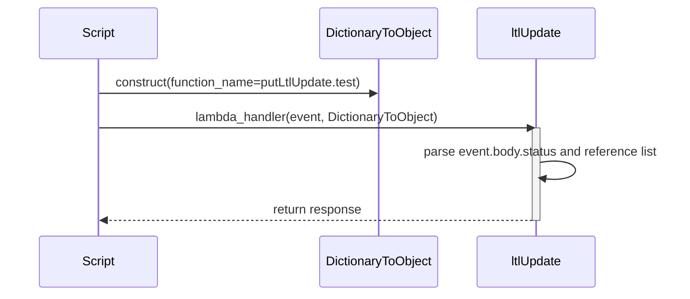
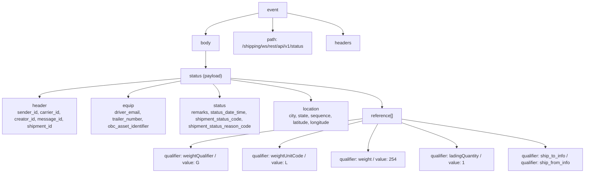
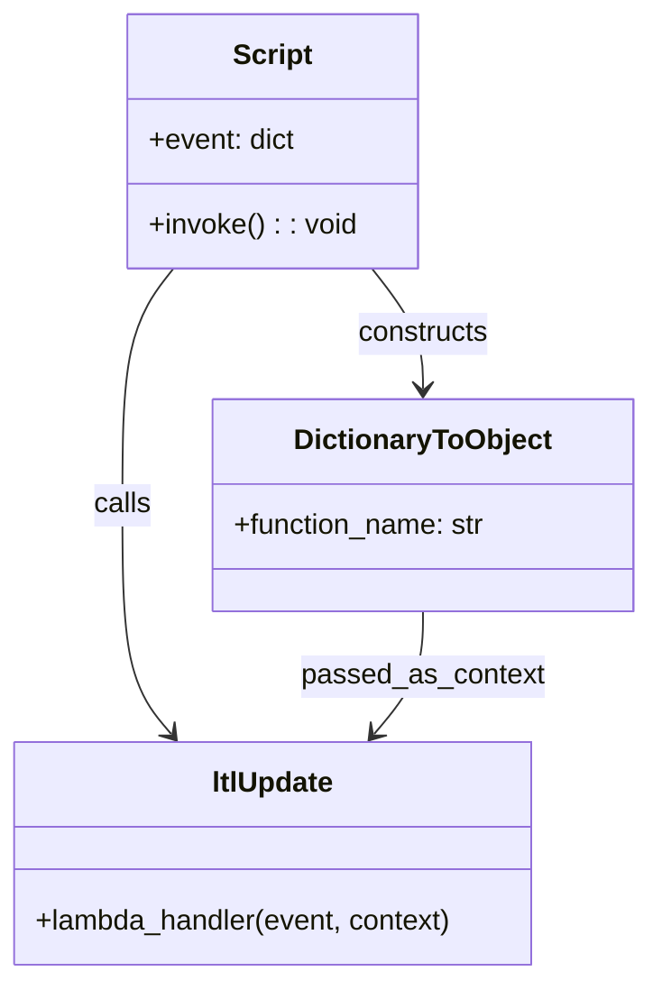

# Diagram: platform/tools/ide_local_testing/localTest/test/shipment/ltlUpdate.py

> Auto-generated by Obscura crawlers

## Diagram 1

### SVG

<svg id="container" width="928" xmlns="http://www.w3.org/2000/svg" height="393" viewBox="-50 -10 928 393" role="graphics-document document" aria-roledescription="sequence"><g><rect x="596" y="307" fill="#eaeaea" stroke="#666" width="150" height="65" name="ltlUpdate" rx="3" ry="3" class="actor actor-bottom"></rect><text x="671" y="339.5" dominant-baseline="central" alignment-baseline="central" class="actor actor-box" style="text-anchor: middle; font-size: 16px; font-weight: 400;"><tspan x="671" dy="0">ltlUpdate</tspan></text></g><g><rect x="388" y="307" fill="#eaeaea" stroke="#666" width="158" height="65" name="DictionaryToObject" rx="3" ry="3" class="actor actor-bottom"></rect><text x="467" y="339.5" dominant-baseline="central" alignment-baseline="central" class="actor actor-box" style="text-anchor: middle; font-size: 16px; font-weight: 400;"><tspan x="467" dy="0">DictionaryToObject</tspan></text></g><g><rect x="0" y="307" fill="#eaeaea" stroke="#666" width="150" height="65" name="Script" rx="3" ry="3" class="actor actor-bottom"></rect><text x="75" y="339.5" dominant-baseline="central" alignment-baseline="central" class="actor actor-box" style="text-anchor: middle; font-size: 16px; font-weight: 400;"><tspan x="75" dy="0">Script</tspan></text></g><g><line id="actor2" x1="671" y1="65" x2="671" y2="307" class="actor-line 200" stroke-width="0.5px" stroke="#999" name="ltlUpdate"></line><g id="root-2"><rect x="596" y="0" fill="#eaeaea" stroke="#666" width="150" height="65" name="ltlUpdate" rx="3" ry="3" class="actor actor-top"></rect><text x="671" y="32.5" dominant-baseline="central" alignment-baseline="central" class="actor actor-box" style="text-anchor: middle; font-size: 16px; font-weight: 400;"><tspan x="671" dy="0">ltlUpdate</tspan></text></g></g><g><line id="actor1" x1="467" y1="65" x2="467" y2="307" class="actor-line 200" stroke-width="0.5px" stroke="#999" name="DictionaryToObject"></line><g id="root-1"><rect x="388" y="0" fill="#eaeaea" stroke="#666" width="158" height="65" name="DictionaryToObject" rx="3" ry="3" class="actor actor-top"></rect><text x="467" y="32.5" dominant-baseline="central" alignment-baseline="central" class="actor actor-box" style="text-anchor: middle; font-size: 16px; font-weight: 400;"><tspan x="467" dy="0">DictionaryToObject</tspan></text></g></g><g><line id="actor0" x1="75" y1="65" x2="75" y2="307" class="actor-line 200" stroke-width="0.5px" stroke="#999" name="Script"></line><g id="root-0"><rect x="0" y="0" fill="#eaeaea" stroke="#666" width="150" height="65" name="Script" rx="3" ry="3" class="actor actor-top"></rect><text x="75" y="32.5" dominant-baseline="central" alignment-baseline="central" class="actor actor-box" style="text-anchor: middle; font-size: 16px; font-weight: 400;"><tspan x="75" dy="0">Script</tspan></text></g></g><g></g><defs><symbol id="computer" width="24" height="24"><path transform="scale(.5)" d="M2 2v13h20v-13h-20zm18 11h-16v-9h16v9zm-10.228 6l.466-1h3.524l.467 1h-4.457zm14.228 3h-24l2-6h2.104l-1.33 4h18.45l-1.297-4h2.073l2 6zm-5-10h-14v-7h14v7z"></path></symbol></defs><defs><symbol id="database" fill-rule="evenodd" clip-rule="evenodd"><path transform="scale(.5)" d="M12.258.001l.256.004.255.005.253.008.251.01.249.012.247.015.246.016.242.019.241.02.239.023.236.024.233.027.231.028.229.031.225.032.223.034.22.036.217.038.214.04.211.041.208.043.205.045.201.046.198.048.194.05.191.051.187.053.183.054.18.056.175.057.172.059.168.06.163.061.16.063.155.064.15.066.074.033.073.033.071.034.07.034.069.035.068.035.067.035.066.035.064.036.064.036.062.036.06.036.06.037.058.037.058.037.055.038.055.038.053.038.052.038.051.039.05.039.048.039.047.039.045.04.044.04.043.04.041.04.04.041.039.041.037.041.036.041.034.041.033.042.032.042.03.042.029.042.027.042.026.043.024.043.023.043.021.043.02.043.018.044.017.043.015.044.013.044.012.044.011.045.009.044.007.045.006.045.004.045.002.045.001.045v17l-.001.045-.002.045-.004.045-.006.045-.007.045-.009.044-.011.045-.012.044-.013.044-.015.044-.017.043-.018.044-.02.043-.021.043-.023.043-.024.043-.026.043-.027.042-.029.042-.03.042-.032.042-.033.042-.034.041-.036.041-.037.041-.039.041-.04.041-.041.04-.043.04-.044.04-.045.04-.047.039-.048.039-.05.039-.051.039-.052.038-.053.038-.055.038-.055.038-.058.037-.058.037-.06.037-.06.036-.062.036-.064.036-.064.036-.066.035-.067.035-.068.035-.069.035-.07.034-.071.034-.073.033-.074.033-.15.066-.155.064-.16.063-.163.061-.168.06-.172.059-.175.057-.18.056-.183.054-.187.053-.191.051-.194.05-.198.048-.201.046-.205.045-.208.043-.211.041-.214.04-.217.038-.22.036-.223.034-.225.032-.229.031-.231.028-.233.027-.236.024-.239.023-.241.02-.242.019-.246.016-.247.015-.249.012-.251.01-.253.008-.255.005-.256.004-.258.001-.258-.001-.256-.004-.255-.005-.253-.008-.251-.01-.249-.012-.247-.015-.245-.016-.243-.019-.241-.02-.238-.023-.236-.024-.234-.027-.231-.028-.228-.031-.226-.032-.223-.034-.22-.036-.217-.038-.214-.04-.211-.041-.208-.043-.204-.045-.201-.046-.198-.048-.195-.05-.19-.051-.187-.053-.184-.054-.179-.056-.176-.057-.172-.059-.167-.06-.164-.061-.159-.063-.155-.064-.151-.066-.074-.033-.072-.033-.072-.034-.07-.034-.069-.035-.068-.035-.067-.035-.066-.035-.064-.036-.063-.036-.062-.036-.061-.036-.06-.037-.058-.037-.057-.037-.056-.038-.055-.038-.053-.038-.052-.038-.051-.039-.049-.039-.049-.039-.046-.039-.046-.04-.044-.04-.043-.04-.041-.04-.04-.041-.039-.041-.037-.041-.036-.041-.034-.041-.033-.042-.032-.042-.03-.042-.029-.042-.027-.042-.026-.043-.024-.043-.023-.043-.021-.043-.02-.043-.018-.044-.017-.043-.015-.044-.013-.044-.012-.044-.011-.045-.009-.044-.007-.045-.006-.045-.004-.045-.002-.045-.001-.045v-17l.001-.045.002-.045.004-.045.006-.045.007-.045.009-.044.011-.045.012-.044.013-.044.015-.044.017-.043.018-.044.02-.043.021-.043.023-.043.024-.043.026-.043.027-.042.029-.042.03-.042.032-.042.033-.042.034-.041.036-.041.037-.041.039-.041.04-.041.041-.04.043-.04.044-.04.046-.04.046-.039.049-.039.049-.039.051-.039.052-.038.053-.038.055-.038.056-.038.057-.037.058-.037.06-.037.061-.036.062-.036.063-.036.064-.036.066-.035.067-.035.068-.035.069-.035.07-.034.072-.034.072-.033.074-.033.151-.066.155-.064.159-.063.164-.061.167-.06.172-.059.176-.057.179-.056.184-.054.187-.053.19-.051.195-.05.198-.048.201-.046.204-.045.208-.043.211-.041.214-.04.217-.038.22-.036.223-.034.226-.032.228-.031.231-.028.234-.027.236-.024.238-.023.241-.02.243-.019.245-.016.247-.015.249-.012.251-.01.253-.008.255-.005.256-.004.258-.001.258.001zm-9.258 20.499v.01l.001.021.003.021.004.022.005.021.006.022.007.022.009.023.01.022.011.023.012.023.013.023.015.023.016.024.017.023.018.024.019.024.021.024.022.025.023.024.024.025.052.049.056.05.061.051.066.051.07.051.075.051.079.052.084.052.088.052.092.052.097.052.102.051.105.052.11.052.114.051.119.051.123.051.127.05.131.05.135.05.139.048.144.049.147.047.152.047.155.047.16.045.163.045.167.043.171.043.176.041.178.041.183.039.187.039.19.037.194.035.197.035.202.033.204.031.209.03.212.029.216.027.219.025.222.024.226.021.23.02.233.018.236.016.24.015.243.012.246.01.249.008.253.005.256.004.259.001.26-.001.257-.004.254-.005.25-.008.247-.011.244-.012.241-.014.237-.016.233-.018.231-.021.226-.021.224-.024.22-.026.216-.027.212-.028.21-.031.205-.031.202-.034.198-.034.194-.036.191-.037.187-.039.183-.04.179-.04.175-.042.172-.043.168-.044.163-.045.16-.046.155-.046.152-.047.148-.048.143-.049.139-.049.136-.05.131-.05.126-.05.123-.051.118-.052.114-.051.11-.052.106-.052.101-.052.096-.052.092-.052.088-.053.083-.051.079-.052.074-.052.07-.051.065-.051.06-.051.056-.05.051-.05.023-.024.023-.025.021-.024.02-.024.019-.024.018-.024.017-.024.015-.023.014-.024.013-.023.012-.023.01-.023.01-.022.008-.022.006-.022.006-.022.004-.022.004-.021.001-.021.001-.021v-4.127l-.077.055-.08.053-.083.054-.085.053-.087.052-.09.052-.093.051-.095.05-.097.05-.1.049-.102.049-.105.048-.106.047-.109.047-.111.046-.114.045-.115.045-.118.044-.12.043-.122.042-.124.042-.126.041-.128.04-.13.04-.132.038-.134.038-.135.037-.138.037-.139.035-.142.035-.143.034-.144.033-.147.032-.148.031-.15.03-.151.03-.153.029-.154.027-.156.027-.158.026-.159.025-.161.024-.162.023-.163.022-.165.021-.166.02-.167.019-.169.018-.169.017-.171.016-.173.015-.173.014-.175.013-.175.012-.177.011-.178.01-.179.008-.179.008-.181.006-.182.005-.182.004-.184.003-.184.002h-.37l-.184-.002-.184-.003-.182-.004-.182-.005-.181-.006-.179-.008-.179-.008-.178-.01-.176-.011-.176-.012-.175-.013-.173-.014-.172-.015-.171-.016-.17-.017-.169-.018-.167-.019-.166-.02-.165-.021-.163-.022-.162-.023-.161-.024-.159-.025-.157-.026-.156-.027-.155-.027-.153-.029-.151-.03-.15-.03-.148-.031-.146-.032-.145-.033-.143-.034-.141-.035-.14-.035-.137-.037-.136-.037-.134-.038-.132-.038-.13-.04-.128-.04-.126-.041-.124-.042-.122-.042-.12-.044-.117-.043-.116-.045-.113-.045-.112-.046-.109-.047-.106-.047-.105-.048-.102-.049-.1-.049-.097-.05-.095-.05-.093-.052-.09-.051-.087-.052-.085-.053-.083-.054-.08-.054-.077-.054v4.127zm0-5.654v.011l.001.021.003.021.004.021.005.022.006.022.007.022.009.022.01.022.011.023.012.023.013.023.015.024.016.023.017.024.018.024.019.024.021.024.022.024.023.025.024.024.052.05.056.05.061.05.066.051.07.051.075.052.079.051.084.052.088.052.092.052.097.052.102.052.105.052.11.051.114.051.119.052.123.05.127.051.131.05.135.049.139.049.144.048.147.048.152.047.155.046.16.045.163.045.167.044.171.042.176.042.178.04.183.04.187.038.19.037.194.036.197.034.202.033.204.032.209.03.212.028.216.027.219.025.222.024.226.022.23.02.233.018.236.016.24.014.243.012.246.01.249.008.253.006.256.003.259.001.26-.001.257-.003.254-.006.25-.008.247-.01.244-.012.241-.015.237-.016.233-.018.231-.02.226-.022.224-.024.22-.025.216-.027.212-.029.21-.03.205-.032.202-.033.198-.035.194-.036.191-.037.187-.039.183-.039.179-.041.175-.042.172-.043.168-.044.163-.045.16-.045.155-.047.152-.047.148-.048.143-.048.139-.05.136-.049.131-.05.126-.051.123-.051.118-.051.114-.052.11-.052.106-.052.101-.052.096-.052.092-.052.088-.052.083-.052.079-.052.074-.051.07-.052.065-.051.06-.05.056-.051.051-.049.023-.025.023-.024.021-.025.02-.024.019-.024.018-.024.017-.024.015-.023.014-.023.013-.024.012-.022.01-.023.01-.023.008-.022.006-.022.006-.022.004-.021.004-.022.001-.021.001-.021v-4.139l-.077.054-.08.054-.083.054-.085.052-.087.053-.09.051-.093.051-.095.051-.097.05-.1.049-.102.049-.105.048-.106.047-.109.047-.111.046-.114.045-.115.044-.118.044-.12.044-.122.042-.124.042-.126.041-.128.04-.13.039-.132.039-.134.038-.135.037-.138.036-.139.036-.142.035-.143.033-.144.033-.147.033-.148.031-.15.03-.151.03-.153.028-.154.028-.156.027-.158.026-.159.025-.161.024-.162.023-.163.022-.165.021-.166.02-.167.019-.169.018-.169.017-.171.016-.173.015-.173.014-.175.013-.175.012-.177.011-.178.009-.179.009-.179.007-.181.007-.182.005-.182.004-.184.003-.184.002h-.37l-.184-.002-.184-.003-.182-.004-.182-.005-.181-.007-.179-.007-.179-.009-.178-.009-.176-.011-.176-.012-.175-.013-.173-.014-.172-.015-.171-.016-.17-.017-.169-.018-.167-.019-.166-.02-.165-.021-.163-.022-.162-.023-.161-.024-.159-.025-.157-.026-.156-.027-.155-.028-.153-.028-.151-.03-.15-.03-.148-.031-.146-.033-.145-.033-.143-.033-.141-.035-.14-.036-.137-.036-.136-.037-.134-.038-.132-.039-.13-.039-.128-.04-.126-.041-.124-.042-.122-.043-.12-.043-.117-.044-.116-.044-.113-.046-.112-.046-.109-.046-.106-.047-.105-.048-.102-.049-.1-.049-.097-.05-.095-.051-.093-.051-.09-.051-.087-.053-.085-.052-.083-.054-.08-.054-.077-.054v4.139zm0-5.666v.011l.001.02.003.022.004.021.005.022.006.021.007.022.009.023.01.022.011.023.012.023.013.023.015.023.016.024.017.024.018.023.019.024.021.025.022.024.023.024.024.025.052.05.056.05.061.05.066.051.07.051.075.052.079.051.084.052.088.052.092.052.097.052.102.052.105.051.11.052.114.051.119.051.123.051.127.05.131.05.135.05.139.049.144.048.147.048.152.047.155.046.16.045.163.045.167.043.171.043.176.042.178.04.183.04.187.038.19.037.194.036.197.034.202.033.204.032.209.03.212.028.216.027.219.025.222.024.226.021.23.02.233.018.236.017.24.014.243.012.246.01.249.008.253.006.256.003.259.001.26-.001.257-.003.254-.006.25-.008.247-.01.244-.013.241-.014.237-.016.233-.018.231-.02.226-.022.224-.024.22-.025.216-.027.212-.029.21-.03.205-.032.202-.033.198-.035.194-.036.191-.037.187-.039.183-.039.179-.041.175-.042.172-.043.168-.044.163-.045.16-.045.155-.047.152-.047.148-.048.143-.049.139-.049.136-.049.131-.051.126-.05.123-.051.118-.052.114-.051.11-.052.106-.052.101-.052.096-.052.092-.052.088-.052.083-.052.079-.052.074-.052.07-.051.065-.051.06-.051.056-.05.051-.049.023-.025.023-.025.021-.024.02-.024.019-.024.018-.024.017-.024.015-.023.014-.024.013-.023.012-.023.01-.022.01-.023.008-.022.006-.022.006-.022.004-.022.004-.021.001-.021.001-.021v-4.153l-.077.054-.08.054-.083.053-.085.053-.087.053-.09.051-.093.051-.095.051-.097.05-.1.049-.102.048-.105.048-.106.048-.109.046-.111.046-.114.046-.115.044-.118.044-.12.043-.122.043-.124.042-.126.041-.128.04-.13.039-.132.039-.134.038-.135.037-.138.036-.139.036-.142.034-.143.034-.144.033-.147.032-.148.032-.15.03-.151.03-.153.028-.154.028-.156.027-.158.026-.159.024-.161.024-.162.023-.163.023-.165.021-.166.02-.167.019-.169.018-.169.017-.171.016-.173.015-.173.014-.175.013-.175.012-.177.01-.178.01-.179.009-.179.007-.181.006-.182.006-.182.004-.184.003-.184.001-.185.001-.185-.001-.184-.001-.184-.003-.182-.004-.182-.006-.181-.006-.179-.007-.179-.009-.178-.01-.176-.01-.176-.012-.175-.013-.173-.014-.172-.015-.171-.016-.17-.017-.169-.018-.167-.019-.166-.02-.165-.021-.163-.023-.162-.023-.161-.024-.159-.024-.157-.026-.156-.027-.155-.028-.153-.028-.151-.03-.15-.03-.148-.032-.146-.032-.145-.033-.143-.034-.141-.034-.14-.036-.137-.036-.136-.037-.134-.038-.132-.039-.13-.039-.128-.041-.126-.041-.124-.041-.122-.043-.12-.043-.117-.044-.116-.044-.113-.046-.112-.046-.109-.046-.106-.048-.105-.048-.102-.048-.1-.05-.097-.049-.095-.051-.093-.051-.09-.052-.087-.052-.085-.053-.083-.053-.08-.054-.077-.054v4.153zm8.74-8.179l-.257.004-.254.005-.25.008-.247.011-.244.012-.241.014-.237.016-.233.018-.231.021-.226.022-.224.023-.22.026-.216.027-.212.028-.21.031-.205.032-.202.033-.198.034-.194.036-.191.038-.187.038-.183.04-.179.041-.175.042-.172.043-.168.043-.163.045-.16.046-.155.046-.152.048-.148.048-.143.048-.139.049-.136.05-.131.05-.126.051-.123.051-.118.051-.114.052-.11.052-.106.052-.101.052-.096.052-.092.052-.088.052-.083.052-.079.052-.074.051-.07.052-.065.051-.06.05-.056.05-.051.05-.023.025-.023.024-.021.024-.02.025-.019.024-.018.024-.017.023-.015.024-.014.023-.013.023-.012.023-.01.023-.01.022-.008.022-.006.023-.006.021-.004.022-.004.021-.001.021-.001.021.001.021.001.021.004.021.004.022.006.021.006.023.008.022.01.022.01.023.012.023.013.023.014.023.015.024.017.023.018.024.019.024.02.025.021.024.023.024.023.025.051.05.056.05.06.05.065.051.07.052.074.051.079.052.083.052.088.052.092.052.096.052.101.052.106.052.11.052.114.052.118.051.123.051.126.051.131.05.136.05.139.049.143.048.148.048.152.048.155.046.16.046.163.045.168.043.172.043.175.042.179.041.183.04.187.038.191.038.194.036.198.034.202.033.205.032.21.031.212.028.216.027.22.026.224.023.226.022.231.021.233.018.237.016.241.014.244.012.247.011.25.008.254.005.257.004.26.001.26-.001.257-.004.254-.005.25-.008.247-.011.244-.012.241-.014.237-.016.233-.018.231-.021.226-.022.224-.023.22-.026.216-.027.212-.028.21-.031.205-.032.202-.033.198-.034.194-.036.191-.038.187-.038.183-.04.179-.041.175-.042.172-.043.168-.043.163-.045.16-.046.155-.046.152-.048.148-.048.143-.048.139-.049.136-.05.131-.05.126-.051.123-.051.118-.051.114-.052.11-.052.106-.052.101-.052.096-.052.092-.052.088-.052.083-.052.079-.052.074-.051.07-.052.065-.051.06-.05.056-.05.051-.05.023-.025.023-.024.021-.024.02-.025.019-.024.018-.024.017-.023.015-.024.014-.023.013-.023.012-.023.01-.023.01-.022.008-.022.006-.023.006-.021.004-.022.004-.021.001-.021.001-.021-.001-.021-.001-.021-.004-.021-.004-.022-.006-.021-.006-.023-.008-.022-.01-.022-.01-.023-.012-.023-.013-.023-.014-.023-.015-.024-.017-.023-.018-.024-.019-.024-.02-.025-.021-.024-.023-.024-.023-.025-.051-.05-.056-.05-.06-.05-.065-.051-.07-.052-.074-.051-.079-.052-.083-.052-.088-.052-.092-.052-.096-.052-.101-.052-.106-.052-.11-.052-.114-.052-.118-.051-.123-.051-.126-.051-.131-.05-.136-.05-.139-.049-.143-.048-.148-.048-.152-.048-.155-.046-.16-.046-.163-.045-.168-.043-.172-.043-.175-.042-.179-.041-.183-.04-.187-.038-.191-.038-.194-.036-.198-.034-.202-.033-.205-.032-.21-.031-.212-.028-.216-.027-.22-.026-.224-.023-.226-.022-.231-.021-.233-.018-.237-.016-.241-.014-.244-.012-.247-.011-.25-.008-.254-.005-.257-.004-.26-.001-.26.001z"></path></symbol></defs><defs><symbol id="clock" width="24" height="24"><path transform="scale(.5)" d="M12 2c5.514 0 10 4.486 10 10s-4.486 10-10 10-10-4.486-10-10 4.486-10 10-10zm0-2c-6.627 0-12 5.373-12 12s5.373 12 12 12 12-5.373 12-12-5.373-12-12-12zm5.848 12.459c.202.038.202.333.001.372-1.907.361-6.045 1.111-6.547 1.111-.719 0-1.301-.582-1.301-1.301 0-.512.77-5.447 1.125-7.445.034-.192.312-.181.343.014l.985 6.238 5.394 1.011z"></path></symbol></defs><defs><marker id="arrowhead" refX="7.9" refY="5" markerUnits="userSpaceOnUse" markerWidth="12" markerHeight="12" orient="auto-start-reverse"><path d="M -1 0 L 10 5 L 0 10 z"></path></marker></defs><defs><marker id="crosshead" markerWidth="15" markerHeight="8" orient="auto" refX="4" refY="4.5"><path fill="none" stroke="#000000" stroke-width="1pt" d="M 1,2 L 6,7 M 6,2 L 1,7" style="stroke-dasharray: 0, 0;"></path></marker></defs><defs><marker id="filled-head" refX="15.5" refY="7" markerWidth="20" markerHeight="28" orient="auto"><path d="M 18,7 L9,13 L14,7 L9,1 Z"></path></marker></defs><defs><marker id="sequencenumber" refX="15" refY="15" markerWidth="60" markerHeight="40" orient="auto"><circle cx="15" cy="15" r="6"></circle></marker></defs><g><rect x="666" y="161" fill="#EDF2AE" stroke="#666" width="10" height="126" class="activation0"></rect></g><text x="270" y="80" text-anchor="middle" dominant-baseline="middle" alignment-baseline="middle" class="messageText" dy="1em" style="font-size: 16px; font-weight: 400;">construct(function_name=putLtlUpdate.test)</text><line x1="76" y1="113" x2="463" y2="113" class="messageLine0" stroke-width="2" stroke="none" marker-end="url(#arrowhead)" style="fill: none;"></line><text x="372" y="128" text-anchor="middle" dominant-baseline="middle" alignment-baseline="middle" class="messageText" dy="1em" style="font-size: 16px; font-weight: 400;">lambda_handler(event, DictionaryToObject)</text><line x1="76" y1="161" x2="667" y2="161" class="messageLine0" stroke-width="2" stroke="none" marker-end="url(#arrowhead)" style="fill: none;"></line><text x="676" y="176" text-anchor="middle" dominant-baseline="middle" alignment-baseline="middle" class="messageText" dy="1em" style="font-size: 16px; font-weight: 400;">parse event.body.status and reference list</text><path d="M 676,209 C 736,199 736,239 676,229" class="messageLine0" stroke-width="2" stroke="none" marker-end="url(#arrowhead)" style="fill: none;"></path><text x="373" y="254" text-anchor="middle" dominant-baseline="middle" alignment-baseline="middle" class="messageText" dy="1em" style="font-size: 16px; font-weight: 400;">return response</text><line x1="666" y1="287" x2="79" y2="287" class="messageLine1" stroke-width="2" stroke="none" marker-end="url(#arrowhead)" style="stroke-dasharray: 3, 3; fill: none;"></line></svg>

## Diagram 2

### SVG

<svg id="container" width="2058.9140625" xmlns="http://www.w3.org/2000/svg" class="flowchart" height="606" viewBox="0 0 2058.9140625 606" role="graphics-document document" aria-roledescription="flowchart-v2"><g><marker id="container_flowchart-v2-pointEnd" class="marker flowchart-v2" viewBox="0 0 10 10" refX="5" refY="5" markerUnits="userSpaceOnUse" markerWidth="8" markerHeight="8" orient="auto"><path d="M 0 0 L 10 5 L 0 10 z" class="arrowMarkerPath" style="stroke-width: 1; stroke-dasharray: 1, 0;"></path></marker><marker id="container_flowchart-v2-pointStart" class="marker flowchart-v2" viewBox="0 0 10 10" refX="4.5" refY="5" markerUnits="userSpaceOnUse" markerWidth="8" markerHeight="8" orient="auto"><path d="M 0 5 L 10 10 L 10 0 z" class="arrowMarkerPath" style="stroke-width: 1; stroke-dasharray: 1, 0;"></path></marker><marker id="container_flowchart-v2-circleEnd" class="marker flowchart-v2" viewBox="0 0 10 10" refX="11" refY="5" markerUnits="userSpaceOnUse" markerWidth="11" markerHeight="11" orient="auto"><circle cx="5" cy="5" r="5" class="arrowMarkerPath" style="stroke-width: 1; stroke-dasharray: 1, 0;"></circle></marker><marker id="container_flowchart-v2-circleStart" class="marker flowchart-v2" viewBox="0 0 10 10" refX="-1" refY="5" markerUnits="userSpaceOnUse" markerWidth="11" markerHeight="11" orient="auto"><circle cx="5" cy="5" r="5" class="arrowMarkerPath" style="stroke-width: 1; stroke-dasharray: 1, 0;"></circle></marker><marker id="container_flowchart-v2-crossEnd" class="marker cross flowchart-v2" viewBox="0 0 11 11" refX="12" refY="5.2" markerUnits="userSpaceOnUse" markerWidth="11" markerHeight="11" orient="auto"><path d="M 1,1 l 9,9 M 10,1 l -9,9" class="arrowMarkerPath" style="stroke-width: 2; stroke-dasharray: 1, 0;"></path></marker><marker id="container_flowchart-v2-crossStart" class="marker cross flowchart-v2" viewBox="0 0 11 11" refX="-1" refY="5.2" markerUnits="userSpaceOnUse" markerWidth="11" markerHeight="11" orient="auto"><path d="M 1,1 l 9,9 M 10,1 l -9,9" class="arrowMarkerPath" style="stroke-width: 2; stroke-dasharray: 1, 0;"></path></marker><g class="root"><g class="clusters"></g><g class="edgePaths"><path d="M928.172,45.553L895.329,52.461C862.487,59.369,796.802,73.184,763.96,85.592C731.117,98,731.117,109,731.117,114.5L731.117,120" id="L_Evt_Body_0" class="edge-thickness-normal edge-pattern-solid edge-thickness-normal edge-pattern-solid flowchart-link" style=";" data-edge="true" data-et="edge" data-id="L_Evt_Body_0" data-points="W3sieCI6OTI4LjE3MTg3NSwieSI6NDUuNTUyODIwMzUwNzY2MzF9LHsieCI6NzMxLjExNzE4NzUsInkiOjg3fSx7IngiOjczMS4xMTcxODc1LCJ5IjoxMjR9XQ==" marker-end="url(#container_flowchart-v2-pointEnd)"></path><path d="M978.344,62L978.344,66.167C978.344,70.333,978.344,78.667,978.344,86.333C978.344,94,978.344,101,978.344,104.5L978.344,108" id="L_Evt_Path_0" class="edge-thickness-normal edge-pattern-solid edge-thickness-normal edge-pattern-solid flowchart-link" style=";" data-edge="true" data-et="edge" data-id="L_Evt_Path_0" data-points="W3sieCI6OTc4LjM0Mzc1LCJ5Ijo2Mn0seyJ4Ijo5NzguMzQzNzUsInkiOjg3fSx7IngiOjk3OC4zNDM3NSwieSI6MTEyfV0=" marker-end="url(#container_flowchart-v2-pointEnd)"></path><path d="M1028.516,45.102L1063.195,52.085C1097.875,59.068,1167.234,73.034,1201.914,85.517C1236.594,98,1236.594,109,1236.594,114.5L1236.594,120" id="L_Evt_Headers_0" class="edge-thickness-normal edge-pattern-solid edge-thickness-normal edge-pattern-solid flowchart-link" style=";" data-edge="true" data-et="edge" data-id="L_Evt_Headers_0" data-points="W3sieCI6MTAyOC41MTU2MjUsInkiOjQ1LjEwMjM3MTczMjgxNzAzfSx7IngiOjEyMzYuNTkzNzUsInkiOjg3fSx7IngiOjEyMzYuNTkzNzUsInkiOjEyNH1d" marker-end="url(#container_flowchart-v2-pointEnd)"></path><path d="M731.117,178L731.117,184.167C731.117,190.333,731.117,202.667,731.117,212.333C731.117,222,731.117,229,731.117,232.5L731.117,236" id="L_Body_StatusTop_0" class="edge-thickness-normal edge-pattern-solid edge-thickness-normal edge-pattern-solid flowchart-link" style=";" data-edge="true" data-et="edge" data-id="L_Body_StatusTop_0" data-points="W3sieCI6NzMxLjExNzE4NzUsInkiOjE3OH0seyJ4Ijo3MzEuMTE3MTg3NSwieSI6MjE1fSx7IngiOjczMS4xMTcxODc1LCJ5IjoyNDB9XQ==" marker-end="url(#container_flowchart-v2-pointEnd)"></path><path d="M642.734,274.749L558.612,282.124C474.49,289.499,306.245,304.25,222.122,315.125C138,326,138,333,138,336.5L138,340" id="L_StatusTop_Header_0" class="edge-thickness-normal edge-pattern-solid edge-thickness-normal edge-pattern-solid flowchart-link" style=";" data-edge="true" data-et="edge" data-id="L_StatusTop_Header_0" data-points="W3sieCI6NjQyLjczNDM3NSwieSI6Mjc0Ljc0ODczMjIwMTQyNTJ9LHsieCI6MTM4LCJ5IjozMTl9LHsieCI6MTM4LCJ5IjozNDR9XQ==" marker-end="url(#container_flowchart-v2-pointEnd)"></path><path d="M642.734,283.233L610.279,289.194C577.823,295.155,512.911,307.078,480.456,316.539C448,326,448,333,448,336.5L448,340" id="L_StatusTop_Equip_0" class="edge-thickness-normal edge-pattern-solid edge-thickness-normal edge-pattern-solid flowchart-link" style=";" data-edge="true" data-et="edge" data-id="L_StatusTop_Equip_0" data-points="W3sieCI6NjQyLjczNDM3NSwieSI6MjgzLjIzMzIyOTM5Mzc0NzF9LHsieCI6NDQ4LCJ5IjozMTl9LHsieCI6NDQ4LCJ5IjozNDR9XQ==" marker-end="url(#container_flowchart-v2-pointEnd)"></path><path d="M750.556,294L753.556,298.167C756.555,302.333,762.555,310.667,765.555,318.333C768.555,326,768.555,333,768.555,336.5L768.555,340" id="L_StatusTop_StatusDetail_0" class="edge-thickness-normal edge-pattern-solid edge-thickness-normal edge-pattern-solid flowchart-link" style=";" data-edge="true" data-et="edge" data-id="L_StatusTop_StatusDetail_0" data-points="W3sieCI6NzUwLjU1NTg4OTQyMzA3NjksInkiOjI5NH0seyJ4Ijo3NjguNTU0Njg3NSwieSI6MzE5fSx7IngiOjc2OC41NTQ2ODc1LCJ5IjozNDR9XQ==" marker-end="url(#container_flowchart-v2-pointEnd)"></path><path d="M819.5,279.838L864.435,286.365C909.37,292.892,999.24,305.946,1044.174,317.973C1089.109,330,1089.109,341,1089.109,346.5L1089.109,352" id="L_StatusTop_Location_0" class="edge-thickness-normal edge-pattern-solid edge-thickness-normal edge-pattern-solid flowchart-link" style=";" data-edge="true" data-et="edge" data-id="L_StatusTop_Location_0" data-points="W3sieCI6ODE5LjUsInkiOjI3OS44MzgwMDcxMTQzMzEyfSx7IngiOjEwODkuMTA5Mzc1LCJ5IjozMTl9LHsieCI6MTA4OS4xMDkzNzUsInkiOjM1Nn1d" marker-end="url(#container_flowchart-v2-pointEnd)"></path><path d="M819.5,274.569L905.975,281.974C992.451,289.379,1165.401,304.19,1251.876,321.095C1338.352,338,1338.352,357,1338.352,366.5L1338.352,376" id="L_StatusTop_ReferenceList_0" class="edge-thickness-normal edge-pattern-solid edge-thickness-normal edge-pattern-solid flowchart-link" style=";" data-edge="true" data-et="edge" data-id="L_StatusTop_ReferenceList_0" data-points="W3sieCI6ODE5LjUsInkiOjI3NC41Njg1ODcwODc5NzU3fSx7IngiOjEzMzguMzUxNTYyNSwieSI6MzE5fSx7IngiOjEzMzguMzUxNTYyNSwieSI6MzgwfV0=" marker-end="url(#container_flowchart-v2-pointEnd)"></path><path d="M1269.109,416.268L1171.077,429.39C1073.044,442.512,876.979,468.756,778.947,485.378C680.914,502,680.914,509,680.914,512.5L680.914,516" id="L_ReferenceList_RefA_0" class="edge-thickness-normal edge-pattern-solid edge-thickness-normal edge-pattern-solid flowchart-link" style=";" data-edge="true" data-et="edge" data-id="L_ReferenceList_RefA_0" data-points="W3sieCI6MTI2OS4xMDkzNzUsInkiOjQxNi4yNjgyNzY0NTIxMzQyfSx7IngiOjY4MC45MTQwNjI1LCJ5Ijo0OTV9LHsieCI6NjgwLjkxNDA2MjUsInkiOjUyMH1d" marker-end="url(#container_flowchart-v2-pointEnd)"></path><path d="M1269.109,424.538L1222.743,436.282C1176.378,448.025,1083.646,471.513,1037.28,486.756C990.914,502,990.914,509,990.914,512.5L990.914,516" id="L_ReferenceList_RefB_0" class="edge-thickness-normal edge-pattern-solid edge-thickness-normal edge-pattern-solid flowchart-link" style=";" data-edge="true" data-et="edge" data-id="L_ReferenceList_RefB_0" data-points="W3sieCI6MTI2OS4xMDkzNzUsInkiOjQyNC41Mzc4NjY1MjI3NTU5fSx7IngiOjk5MC45MTQwNjI1LCJ5Ijo0OTV9LHsieCI6OTkwLjkxNDA2MjUsInkiOjUyMH1d" marker-end="url(#container_flowchart-v2-pointEnd)"></path><path d="M1326.865,434L1322.54,444.167C1318.215,454.333,1309.564,474.667,1305.239,488.333C1300.914,502,1300.914,509,1300.914,512.5L1300.914,516" id="L_ReferenceList_RefC_0" class="edge-thickness-normal edge-pattern-solid edge-thickness-normal edge-pattern-solid flowchart-link" style=";" data-edge="true" data-et="edge" data-id="L_ReferenceList_RefC_0" data-points="W3sieCI6MTMyNi44NjUwNTY4MTgxODE4LCJ5Ijo0MzR9LHsieCI6MTMwMC45MTQwNjI1LCJ5Ijo0OTV9LHsieCI6MTMwMC45MTQwNjI1LCJ5Ijo1MjB9XQ==" marker-end="url(#container_flowchart-v2-pointEnd)"></path><path d="M1407.594,429.356L1441.48,440.296C1475.367,451.237,1543.141,473.119,1577.027,487.559C1610.914,502,1610.914,509,1610.914,512.5L1610.914,516" id="L_ReferenceList_RefD_0" class="edge-thickness-normal edge-pattern-solid edge-thickness-normal edge-pattern-solid flowchart-link" style=";" data-edge="true" data-et="edge" data-id="L_ReferenceList_RefD_0" data-points="W3sieCI6MTQwNy41OTM3NSwieSI6NDI5LjM1NTY1MjM3MzMwODl9LHsieCI6MTYxMC45MTQwNjI1LCJ5Ijo0OTV9LHsieCI6MTYxMC45MTQwNjI1LCJ5Ijo1MjB9XQ==" marker-end="url(#container_flowchart-v2-pointEnd)"></path><path d="M1407.594,417.46L1493.147,430.383C1578.701,443.306,1749.807,469.153,1835.361,485.577C1920.914,502,1920.914,509,1920.914,512.5L1920.914,516" id="L_ReferenceList_RefE_0" class="edge-thickness-normal edge-pattern-solid edge-thickness-normal edge-pattern-solid flowchart-link" style=";" data-edge="true" data-et="edge" data-id="L_ReferenceList_RefE_0" data-points="W3sieCI6MTQwNy41OTM3NSwieSI6NDE3LjQ1OTUwMDA1MzY0MjMzfSx7IngiOjE5MjAuOTE0MDYyNSwieSI6NDk1fSx7IngiOjE5MjAuOTE0MDYyNSwieSI6NTIwfV0=" marker-end="url(#container_flowchart-v2-pointEnd)"></path></g><g class="edgeLabels"><g class="edgeLabel"><g class="label" data-id="L_Evt_Body_0" transform="translate(0, 0)"><foreignObject width="0" height="0">

</foreignObject></g></g><g class="edgeLabel"><g class="label" data-id="L_Evt_Path_0" transform="translate(0, 0)"><foreignObject width="0" height="0">

</foreignObject></g></g><g class="edgeLabel"><g class="label" data-id="L_Evt_Headers_0" transform="translate(0, 0)"><foreignObject width="0" height="0">

</foreignObject></g></g><g class="edgeLabel"><g class="label" data-id="L_Body_StatusTop_0" transform="translate(0, 0)"><foreignObject width="0" height="0">

</foreignObject></g></g><g class="edgeLabel"><g class="label" data-id="L_StatusTop_Header_0" transform="translate(0, 0)"><foreignObject width="0" height="0">

</foreignObject></g></g><g class="edgeLabel"><g class="label" data-id="L_StatusTop_Equip_0" transform="translate(0, 0)"><foreignObject width="0" height="0">

</foreignObject></g></g><g class="edgeLabel"><g class="label" data-id="L_StatusTop_StatusDetail_0" transform="translate(0, 0)"><foreignObject width="0" height="0">

</foreignObject></g></g><g class="edgeLabel"><g class="label" data-id="L_StatusTop_Location_0" transform="translate(0, 0)"><foreignObject width="0" height="0">

</foreignObject></g></g><g class="edgeLabel"><g class="label" data-id="L_StatusTop_ReferenceList_0" transform="translate(0, 0)"><foreignObject width="0" height="0">

</foreignObject></g></g><g class="edgeLabel"><g class="label" data-id="L_ReferenceList_RefA_0" transform="translate(0, 0)"><foreignObject width="0" height="0">

</foreignObject></g></g><g class="edgeLabel"><g class="label" data-id="L_ReferenceList_RefB_0" transform="translate(0, 0)"><foreignObject width="0" height="0">

</foreignObject></g></g><g class="edgeLabel"><g class="label" data-id="L_ReferenceList_RefC_0" transform="translate(0, 0)"><foreignObject width="0" height="0">

</foreignObject></g></g><g class="edgeLabel"><g class="label" data-id="L_ReferenceList_RefD_0" transform="translate(0, 0)"><foreignObject width="0" height="0">

</foreignObject></g></g><g class="edgeLabel"><g class="label" data-id="L_ReferenceList_RefE_0" transform="translate(0, 0)"><foreignObject width="0" height="0">

</foreignObject></g></g></g><g class="nodes"><g class="node default" id="flowchart-Evt-0" transform="translate(978.34375, 35)"><rect class="basic label-container" style="" x="-50.171875" y="-27" width="100.34375" height="54"></rect><g class="label" style="" transform="translate(-20.171875, -12)"><rect></rect><foreignObject width="40.34375" height="24">

event

</foreignObject></g></g><g class="node default" id="flowchart-Body-2" transform="translate(731.1171875, 151)"><rect class="basic label-container" style="" x="-48.1484375" y="-27" width="96.296875" height="54"></rect><g class="label" style="" transform="translate(-18.1484375, -12)"><rect></rect><foreignObject width="36.296875" height="24">

body

</foreignObject></g></g><g class="node default" id="flowchart-Path-4" transform="translate(978.34375, 151)"><rect class="basic label-container" style="" x="-149.078125" y="-39" width="298.15625" height="78"></rect><g class="label" style="" transform="translate(-119.078125, -24)"><rect></rect><foreignObject width="238.15625" height="48">

path: /shipping/ws/rest/api/v1/status

</foreignObject></g></g><g class="node default" id="flowchart-Headers-6" transform="translate(1236.59375, 151)"><rect class="basic label-container" style="" x="-59.171875" y="-27" width="118.34375" height="54"></rect><g class="label" style="" transform="translate(-29.171875, -12)"><rect></rect><foreignObject width="58.34375" height="24">

headers

</foreignObject></g></g><g class="node default" id="flowchart-StatusTop-8" transform="translate(731.1171875, 267)"><rect class="basic label-container" style="" x="-88.3828125" y="-27" width="176.765625" height="54"></rect><g class="label" style="" transform="translate(-58.3828125, -12)"><rect></rect><foreignObject width="116.765625" height="24">

status (payload)

</foreignObject></g></g><g class="node default" id="flowchart-Header-10" transform="translate(138, 407)"><rect class="basic label-container" style="" x="-130" y="-63" width="260" height="126"></rect><g class="label" style="" transform="translate(-100, -48)"><rect></rect><foreignObject width="200" height="96">

header sender_id, carrier_id, creator_id, message_id, shipment_id

</foreignObject></g></g><g class="node default" id="flowchart-Equip-12" transform="translate(448, 407)"><rect class="basic label-container" style="" x="-130" y="-63" width="260" height="126"></rect><g class="label" style="" transform="translate(-100, -48)"><rect></rect><foreignObject width="200" height="96">

equip driver_email, trailer_number, obc_asset_identifier

</foreignObject></g></g><g class="node default" id="flowchart-StatusDetail-14" transform="translate(768.5546875, 407)"><rect class="basic label-container" style="" x="-140.5546875" y="-63" width="281.109375" height="126"></rect><g class="label" style="" transform="translate(-110.5546875, -48)"><rect></rect><foreignObject width="221.109375" height="96">

status remarks, status_date_time, shipment_status_code, shipment_status_reason_code

</foreignObject></g></g><g class="node default" id="flowchart-Location-16" transform="translate(1089.109375, 407)"><rect class="basic label-container" style="" x="-130" y="-51" width="260" height="102"></rect><g class="label" style="" transform="translate(-100, -36)"><rect></rect><foreignObject width="200" height="72">

location city, state, sequence, latitude, longitude

</foreignObject></g></g><g class="node default" id="flowchart-ReferenceList-18" transform="translate(1338.3515625, 407)"><rect class="basic label-container" style="" x="-69.2421875" y="-27" width="138.484375" height="54"></rect><g class="label" style="" transform="translate(-39.2421875, -12)"><rect></rect><foreignObject width="78.484375" height="24">

reference[]

</foreignObject></g></g><g class="node default" id="flowchart-RefA-20" transform="translate(680.9140625, 559)"><rect class="basic label-container" style="" x="-130" y="-39" width="260" height="78"></rect><g class="label" style="" transform="translate(-100, -24)"><rect></rect><foreignObject width="200" height="48">

qualifier: weightQualifier / value: G

</foreignObject></g></g><g class="node default" id="flowchart-RefB-22" transform="translate(990.9140625, 559)"><rect class="basic label-container" style="" x="-130" y="-39" width="260" height="78"></rect><g class="label" style="" transform="translate(-100, -24)"><rect></rect><foreignObject width="200" height="48">

qualifier: weightUnitCode / value: L

</foreignObject></g></g><g class="node default" id="flowchart-RefC-24" transform="translate(1300.9140625, 559)"><rect class="basic label-container" style="" x="-130" y="-39" width="260" height="78"></rect><g class="label" style="" transform="translate(-100, -24)"><rect></rect><foreignObject width="200" height="48">

qualifier: weight / value: 254

</foreignObject></g></g><g class="node default" id="flowchart-RefD-26" transform="translate(1610.9140625, 559)"><rect class="basic label-container" style="" x="-130" y="-39" width="260" height="78"></rect><g class="label" style="" transform="translate(-100, -24)"><rect></rect><foreignObject width="200" height="48">

qualifier: ladingQuantity / value: 1

</foreignObject></g></g><g class="node default" id="flowchart-RefE-28" transform="translate(1920.9140625, 559)"><rect class="basic label-container" style="" x="-130" y="-39" width="260" height="78"></rect><g class="label" style="" transform="translate(-100, -24)"><rect></rect><foreignObject width="200" height="48">

qualifier: ship_to_info / qualifier: ship_from_info

</foreignObject></g></g></g></g></g></svg>

## Diagram 3

### SVG

<svg id="container" width="370.140625" xmlns="http://www.w3.org/2000/svg" class="classDiagram" height="554" viewBox="0 0 370.140625 554" role="graphics-document document" aria-roledescription="class"><g><defs><marker id="container_class-aggregationStart" class="marker aggregation class" refX="18" refY="7" markerWidth="190" markerHeight="240" orient="auto"><path d="M 18,7 L9,13 L1,7 L9,1 Z"></path></marker></defs><defs><marker id="container_class-aggregationEnd" class="marker aggregation class" refX="1" refY="7" markerWidth="20" markerHeight="28" orient="auto"><path d="M 18,7 L9,13 L1,7 L9,1 Z"></path></marker></defs><defs><marker id="container_class-extensionStart" class="marker extension class" refX="18" refY="7" markerWidth="190" markerHeight="240" orient="auto"><path d="M 1,7 L18,13 V 1 Z"></path></marker></defs><defs><marker id="container_class-extensionEnd" class="marker extension class" refX="1" refY="7" markerWidth="20" markerHeight="28" orient="auto"><path d="M 1,1 V 13 L18,7 Z"></path></marker></defs><defs><marker id="container_class-compositionStart" class="marker composition class" refX="18" refY="7" markerWidth="190" markerHeight="240" orient="auto"><path d="M 18,7 L9,13 L1,7 L9,1 Z"></path></marker></defs><defs><marker id="container_class-compositionEnd" class="marker composition class" refX="1" refY="7" markerWidth="20" markerHeight="28" orient="auto"><path d="M 18,7 L9,13 L1,7 L9,1 Z"></path></marker></defs><defs><marker id="container_class-dependencyStart" class="marker dependency class" refX="6" refY="7" markerWidth="190" markerHeight="240" orient="auto"><path d="M 5,7 L9,13 L1,7 L9,1 Z"></path></marker></defs><defs><marker id="container_class-dependencyEnd" class="marker dependency class" refX="13" refY="7" markerWidth="20" markerHeight="28" orient="auto"><path d="M 18,7 L9,13 L14,7 L9,1 Z"></path></marker></defs><defs><marker id="container_class-lollipopStart" class="marker lollipop class" refX="13" refY="7" markerWidth="190" markerHeight="240" orient="auto"><circle stroke="black" fill="transparent" cx="7" cy="7" r="6"></circle></marker></defs><defs><marker id="container_class-lollipopEnd" class="marker lollipop class" refX="1" refY="7" markerWidth="190" markerHeight="240" orient="auto"><circle stroke="black" fill="transparent" cx="7" cy="7" r="6"></circle></marker></defs><g class="root"><g class="clusters"></g><g class="edgePaths"><path d="M100.795,152L95.96,158.167C91.126,164.333,81.458,176.667,76.623,199C71.789,221.333,71.789,253.667,71.789,286C71.789,318.333,71.789,350.667,76.409,372.24C81.029,393.813,90.268,404.626,94.888,410.032L99.507,415.438" id="id_Script_ltlUpdate_1" class="edge-thickness-normal edge-pattern-solid relation" style=";;;" data-edge="true" data-et="edge" data-id="id_Script_ltlUpdate_1" data-points="W3sieCI6MTAwLjc5NDc2MDYwNzc5ODE3LCJ5IjoxNTJ9LHsieCI6NzEuNzg5MDYyNSwieSI6MTg5fSx7IngiOjcxLjc4OTA2MjUsInkiOjI4Nn0seyJ4Ijo3MS43ODkwNjI1LCJ5IjozODN9LHsieCI6MTAzLjQwNTI3MzQzNzUsInkiOjQyMH1d" marker-end="url(#container_class-dependencyEnd)"></path><path d="M213.682,152L218.516,158.167C223.35,164.333,233.019,176.667,237.853,188C242.688,199.333,242.688,209.667,242.688,214.833L242.688,220" id="id_Script_DictionaryToObject_2" class="edge-thickness-normal edge-pattern-solid relation" style=";;;" data-edge="true" data-et="edge" data-id="id_Script_DictionaryToObject_2" data-points="W3sieCI6MjEzLjY4MTgwMTg5MjIwMTgzLCJ5IjoxNTJ9LHsieCI6MjQyLjY4NzUsInkiOjE4OX0seyJ4IjoyNDIuNjg3NSwieSI6MjI2fV0=" marker-end="url(#container_class-dependencyEnd)"></path><path d="M242.688,346L242.688,352.167C242.688,358.333,242.688,370.667,238.068,382.24C233.448,393.813,224.209,404.626,219.589,410.032L214.969,415.438" id="id_DictionaryToObject_ltlUpdate_3" class="edge-thickness-normal edge-pattern-solid relation" style=";;;" data-edge="true" data-et="edge" data-id="id_DictionaryToObject_ltlUpdate_3" data-points="W3sieCI6MjQyLjY4NzUsInkiOjM0Nn0seyJ4IjoyNDIuNjg3NSwieSI6MzgzfSx7IngiOjIxMS4wNzEyODkwNjI1LCJ5Ijo0MjB9XQ==" marker-end="url(#container_class-dependencyEnd)"></path></g><g class="edgeLabels"><g class="edgeLabel" transform="translate(71.7890625, 286)"><g class="label" data-id="id_Script_ltlUpdate_1" transform="translate(-16.4453125, -12)"><foreignObject width="32.890625" height="24">

calls

</foreignObject></g></g><g class="edgeLabel" transform="translate(242.6875, 189)"><g class="label" data-id="id_Script_DictionaryToObject_2" transform="translate(-37.84375, -12)"><foreignObject width="75.6875" height="24">

constructs

</foreignObject></g></g><g class="edgeLabel" transform="translate(242.6875, 383)"><g class="label" data-id="id_DictionaryToObject_ltlUpdate_3" transform="translate(-68.1796875, -12)"><foreignObject width="136.359375" height="24">

passed_as_context

</foreignObject></g></g></g><g class="nodes"><g class="node default" id="classId-Script-0" transform="translate(157.23828125, 80)"><g class="basic label-container"><path d="M-81.71484375 -72 L81.71484375 -72 L81.71484375 72 L-81.71484375 72" stroke="none" stroke-width="0" fill="#ECECFF" style=""></path><path d="M-81.71484375 -72 C-17.0087335490323 -72, 47.6973766519354 -72, 81.71484375 -72 M-81.71484375 -72 C-47.439149000591975 -72, -13.16345425118395 -72, 81.71484375 -72 M81.71484375 -72 C81.71484375 -17.49544954843916, 81.71484375 37.00910090312168, 81.71484375 72 M81.71484375 -72 C81.71484375 -41.51279941665342, 81.71484375 -11.025598833306852, 81.71484375 72 M81.71484375 72 C34.293013871256704 72, -13.128816007486591 72, -81.71484375 72 M81.71484375 72 C37.81782004073675 72, -6.079203668526503 72, -81.71484375 72 M-81.71484375 72 C-81.71484375 29.235638157819068, -81.71484375 -13.528723684361864, -81.71484375 -72 M-81.71484375 72 C-81.71484375 24.33979414439662, -81.71484375 -23.32041171120676, -81.71484375 -72" stroke="#9370DB" stroke-width="1.3" fill="none" stroke-dasharray="0 0" style=""></path></g><g class="annotation-group text" transform="translate(0, -48)"></g><g class="label-group text" transform="translate(-21.7421875, -48)"><g class="label" style="font-weight: bolder" transform="translate(0,-12)"><foreignObject width="43.484375" height="24">

Script

</foreignObject></g></g><g class="members-group text" transform="translate(-69.71484375, 0)"><g class="label" style="" transform="translate(0,-12)"><foreignObject width="83.96875" height="24">

+event: dict

</foreignObject></g></g><g class="methods-group text" transform="translate(-69.71484375, 48)"><g class="label" style="" transform="translate(0,-12)"><foreignObject width="117.6875" height="24">

+invoke() : : void

</foreignObject></g></g><g class="divider" style=""><path d="M-81.71484375 -24 C-21.58823228112925 -24, 38.5383791877415 -24, 81.71484375 -24 M-81.71484375 -24 C-41.75188407402774 -24, -1.7889243980554852 -24, 81.71484375 -24" stroke="#9370DB" stroke-width="1.3" fill="none" stroke-dasharray="0 0" style=""></path></g><g class="divider" style=""><path d="M-81.71484375 24 C-22.36506113609606 24, 36.98472147780788 24, 81.71484375 24 M-81.71484375 24 C-35.06983223162296 24, 11.575179286754079 24, 81.71484375 24" stroke="#9370DB" stroke-width="1.3" fill="none" stroke-dasharray="0 0" style=""></path></g></g><g class="node default" id="classId-ltlUpdate-1" transform="translate(157.23828125, 483)"><g class="basic label-container"><path d="M-149.23828125 -63 L149.23828125 -63 L149.23828125 63 L-149.23828125 63" stroke="none" stroke-width="0" fill="#ECECFF" style=""></path><path d="M-149.23828125 -63 C-35.00517910027503 -63, 79.22792304944994 -63, 149.23828125 -63 M-149.23828125 -63 C-71.4908581928389 -63, 6.2565648643222005 -63, 149.23828125 -63 M149.23828125 -63 C149.23828125 -13.411620288772937, 149.23828125 36.176759422454126, 149.23828125 63 M149.23828125 -63 C149.23828125 -33.48880433519856, 149.23828125 -3.9776086703971174, 149.23828125 63 M149.23828125 63 C82.78826034692585 63, 16.338239443851705 63, -149.23828125 63 M149.23828125 63 C38.6571756540978 63, -71.9239299418044 63, -149.23828125 63 M-149.23828125 63 C-149.23828125 33.22405798806827, -149.23828125 3.448115976136542, -149.23828125 -63 M-149.23828125 63 C-149.23828125 14.184071527453227, -149.23828125 -34.631856945093546, -149.23828125 -63" stroke="#9370DB" stroke-width="1.3" fill="none" stroke-dasharray="0 0" style=""></path></g><g class="annotation-group text" transform="translate(0, -39)"></g><g class="label-group text" transform="translate(-34.2890625, -39)"><g class="label" style="font-weight: bolder" transform="translate(0,-12)"><foreignObject width="68.578125" height="24">

ltlUpdate

</foreignObject></g></g><g class="members-group text" transform="translate(-137.23828125, 9)"></g><g class="methods-group text" transform="translate(-137.23828125, 39)"><g class="label" style="" transform="translate(0,-12)"><foreignObject width="240.1875" height="24">

+lambda_handler(event, context)

</foreignObject></g></g><g class="divider" style=""><path d="M-149.23828125 -15 C-88.23627463992624 -15, -27.234268029852473 -15, 149.23828125 -15 M-149.23828125 -15 C-77.56223026795344 -15, -5.886179285906877 -15, 149.23828125 -15" stroke="#9370DB" stroke-width="1.3" fill="none" stroke-dasharray="0 0" style=""></path></g><g class="divider" style=""><path d="M-149.23828125 9 C-71.69569865348063 9, 5.846883943038733 9, 149.23828125 9 M-149.23828125 9 C-72.86510080694025 9, 3.508079636119504 9, 149.23828125 9" stroke="#9370DB" stroke-width="1.3" fill="none" stroke-dasharray="0 0" style=""></path></g></g><g class="node default" id="classId-DictionaryToObject-2" transform="translate(242.6875, 286)"><g class="basic label-container"><path d="M-119.453125 -60 L119.453125 -60 L119.453125 60 L-119.453125 60" stroke="none" stroke-width="0" fill="#ECECFF" style=""></path><path d="M-119.453125 -60 C-67.87516851286982 -60, -16.29721202573964 -60, 119.453125 -60 M-119.453125 -60 C-54.44174069427375 -60, 10.569643611452506 -60, 119.453125 -60 M119.453125 -60 C119.453125 -27.290355994696277, 119.453125 5.4192880106074455, 119.453125 60 M119.453125 -60 C119.453125 -12.028588440148681, 119.453125 35.94282311970264, 119.453125 60 M119.453125 60 C30.3737751884387 60, -58.7055746231226 60, -119.453125 60 M119.453125 60 C43.042464891550466 60, -33.36819521689907 60, -119.453125 60 M-119.453125 60 C-119.453125 23.917184009208853, -119.453125 -12.165631981582294, -119.453125 -60 M-119.453125 60 C-119.453125 17.43078829387109, -119.453125 -25.138423412257822, -119.453125 -60" stroke="#9370DB" stroke-width="1.3" fill="none" stroke-dasharray="0 0" style=""></path></g><g class="annotation-group text" transform="translate(0, -36)"></g><g class="label-group text" transform="translate(-70.109375, -36)"><g class="label" style="font-weight: bolder" transform="translate(0,-12)"><foreignObject width="140.21875" height="24">

DictionaryToObject

</foreignObject></g></g><g class="members-group text" transform="translate(-107.453125, 12)"><g class="label" style="" transform="translate(0,-12)"><foreignObject width="144.796875" height="24">

+function_name: str

</foreignObject></g></g><g class="methods-group text" transform="translate(-107.453125, 60)"></g><g class="divider" style=""><path d="M-119.453125 -12 C-67.96120206172964 -12, -16.46927912345926 -12, 119.453125 -12 M-119.453125 -12 C-61.38439524560998 -12, -3.31566549121996 -12, 119.453125 -12" stroke="#9370DB" stroke-width="1.3" fill="none" stroke-dasharray="0 0" style=""></path></g><g class="divider" style=""><path d="M-119.453125 36 C-52.380961260602504 36, 14.691202478794992 36, 119.453125 36 M-119.453125 36 C-40.592895376563874 36, 38.26733424687225 36, 119.453125 36" stroke="#9370DB" stroke-width="1.3" fill="none" stroke-dasharray="0 0" style=""></path></g></g></g></g></g></svg>
