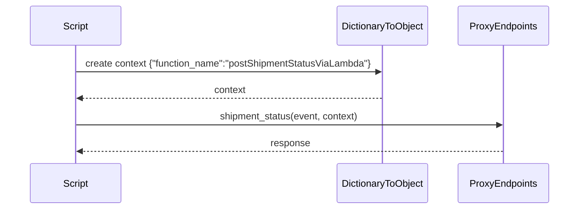
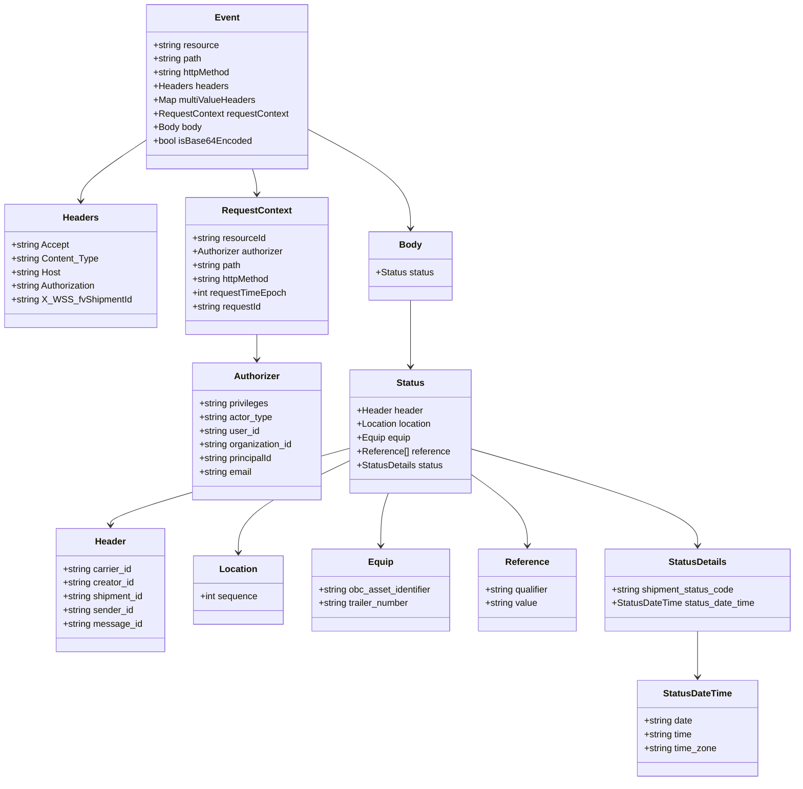

# Diagram: platform/tools/ide_local_testing/localTest/test/shipment/postShipmentStatusViaLambda.py


> Auto-generated by Obscura crawlers

## Diagram 1



### SVG

<svg id="container" width="1008" xmlns="http://www.w3.org/2000/svg" height="363" viewBox="-50 -10 1008 363" role="graphics-document document" aria-roledescription="sequence"><g><rect x="758" y="277" fill="#eaeaea" stroke="#666" width="150" height="65" name="ProxyEndpoints" rx="3" ry="3" class="actor actor-bottom"></rect><text x="833" y="309.5" dominant-baseline="central" alignment-baseline="central" class="actor actor-box" style="text-anchor: middle; font-size: 16px; font-weight: 400;"><tspan x="833" dy="0">ProxyEndpoints</tspan></text></g><g><rect x="550" y="277" fill="#eaeaea" stroke="#666" width="158" height="65" name="DictionaryToObject" rx="3" ry="3" class="actor actor-bottom"></rect><text x="629" y="309.5" dominant-baseline="central" alignment-baseline="central" class="actor actor-box" style="text-anchor: middle; font-size: 16px; font-weight: 400;"><tspan x="629" dy="0">DictionaryToObject</tspan></text></g><g><rect x="0" y="277" fill="#eaeaea" stroke="#666" width="150" height="65" name="Script" rx="3" ry="3" class="actor actor-bottom"></rect><text x="75" y="309.5" dominant-baseline="central" alignment-baseline="central" class="actor actor-box" style="text-anchor: middle; font-size: 16px; font-weight: 400;"><tspan x="75" dy="0">Script</tspan></text></g><g><line id="actor2" x1="833" y1="65" x2="833" y2="277" class="actor-line 200" stroke-width="0.5px" stroke="#999" name="ProxyEndpoints"></line><g id="root-2"><rect x="758" y="0" fill="#eaeaea" stroke="#666" width="150" height="65" name="ProxyEndpoints" rx="3" ry="3" class="actor actor-top"></rect><text x="833" y="32.5" dominant-baseline="central" alignment-baseline="central" class="actor actor-box" style="text-anchor: middle; font-size: 16px; font-weight: 400;"><tspan x="833" dy="0">ProxyEndpoints</tspan></text></g></g><g><line id="actor1" x1="629" y1="65" x2="629" y2="277" class="actor-line 200" stroke-width="0.5px" stroke="#999" name="DictionaryToObject"></line><g id="root-1"><rect x="550" y="0" fill="#eaeaea" stroke="#666" width="158" height="65" name="DictionaryToObject" rx="3" ry="3" class="actor actor-top"></rect><text x="629" y="32.5" dominant-baseline="central" alignment-baseline="central" class="actor actor-box" style="text-anchor: middle; font-size: 16px; font-weight: 400;"><tspan x="629" dy="0">DictionaryToObject</tspan></text></g></g><g><line id="actor0" x1="75" y1="65" x2="75" y2="277" class="actor-line 200" stroke-width="0.5px" stroke="#999" name="Script"></line><g id="root-0"><rect x="0" y="0" fill="#eaeaea" stroke="#666" width="150" height="65" name="Script" rx="3" ry="3" class="actor actor-top"></rect><text x="75" y="32.5" dominant-baseline="central" alignment-baseline="central" class="actor actor-box" style="text-anchor: middle; font-size: 16px; font-weight: 400;"><tspan x="75" dy="0">Script</tspan></text></g></g><style>#container{font-family:"trebuchet ms",verdana,arial,sans-serif;font-size:16px;fill:#333;}@keyframes edge-animation-frame{from{stroke-dashoffset:0;}}@keyframes dash{to{stroke-dashoffset:0;}}#container .edge-animation-slow{stroke-dasharray:9,5!important;stroke-dashoffset:900;animation:dash 50s linear infinite;stroke-linecap:round;}#container .edge-animation-fast{stroke-dasharray:9,5!important;stroke-dashoffset:900;animation:dash 20s linear infinite;stroke-linecap:round;}#container .error-icon{fill:#552222;}#container .error-text{fill:#552222;stroke:#552222;}#container .edge-thickness-normal{stroke-width:1px;}#container .edge-thickness-thick{stroke-width:3.5px;}#container .edge-pattern-solid{stroke-dasharray:0;}#container .edge-thickness-invisible{stroke-width:0;fill:none;}#container .edge-pattern-dashed{stroke-dasharray:3;}#container .edge-pattern-dotted{stroke-dasharray:2;}#container .marker{fill:#333333;stroke:#333333;}#container .marker.cross{stroke:#333333;}#container svg{font-family:"trebuchet ms",verdana,arial,sans-serif;font-size:16px;}#container p{margin:0;}#container .actor{stroke:hsl(259.6261682243, 59.7765363128%, 87.9019607843%);fill:#ECECFF;}#container text.actor&gt;tspan{fill:black;stroke:none;}#container .actor-line{stroke:hsl(259.6261682243, 59.7765363128%, 87.9019607843%);}#container .innerArc{stroke-width:1.5;stroke-dasharray:none;}#container .messageLine0{stroke-width:1.5;stroke-dasharray:none;stroke:#333;}#container .messageLine1{stroke-width:1.5;stroke-dasharray:2,2;stroke:#333;}#container #arrowhead path{fill:#333;stroke:#333;}#container .sequenceNumber{fill:white;}#container #sequencenumber{fill:#333;}#container #crosshead path{fill:#333;stroke:#333;}#container .messageText{fill:#333;stroke:none;}#container .labelBox{stroke:hsl(259.6261682243, 59.7765363128%, 87.9019607843%);fill:#ECECFF;}#container .labelText,#container .labelText&gt;tspan{fill:black;stroke:none;}#container .loopText,#container .loopText&gt;tspan{fill:black;stroke:none;}#container .loopLine{stroke-width:2px;stroke-dasharray:2,2;stroke:hsl(259.6261682243, 59.7765363128%, 87.9019607843%);fill:hsl(259.6261682243, 59.7765363128%, 87.9019607843%);}#container .note{stroke:#aaaa33;fill:#fff5ad;}#container .noteText,#container .noteText&gt;tspan{fill:black;stroke:none;}#container .activation0{fill:#f4f4f4;stroke:#666;}#container .activation1{fill:#f4f4f4;stroke:#666;}#container .activation2{fill:#f4f4f4;stroke:#666;}#container .actorPopupMenu{position:absolute;}#container .actorPopupMenuPanel{position:absolute;fill:#ECECFF;box-shadow:0px 8px 16px 0px rgba(0,0,0,0.2);filter:drop-shadow(3px 5px 2px rgb(0 0 0 / 0.4));}#container .actor-man line{stroke:hsl(259.6261682243, 59.7765363128%, 87.9019607843%);fill:#ECECFF;}#container .actor-man circle,#container line{stroke:hsl(259.6261682243, 59.7765363128%, 87.9019607843%);fill:#ECECFF;stroke-width:2px;}#container :root{--mermaid-font-family:"trebuchet ms",verdana,arial,sans-serif;}</style><g></g><defs><symbol id="computer" width="24" height="24"><path transform="scale(.5)" d="M2 2v13h20v-13h-20zm18 11h-16v-9h16v9zm-10.228 6l.466-1h3.524l.467 1h-4.457zm14.228 3h-24l2-6h2.104l-1.33 4h18.45l-1.297-4h2.073l2 6zm-5-10h-14v-7h14v7z"></path></symbol></defs><defs><symbol id="database" fill-rule="evenodd" clip-rule="evenodd"><path transform="scale(.5)" d="M12.258.001l.256.004.255.005.253.008.251.01.249.012.247.015.246.016.242.019.241.02.239.023.236.024.233.027.231.028.229.031.225.032.223.034.22.036.217.038.214.04.211.041.208.043.205.045.201.046.198.048.194.05.191.051.187.053.183.054.18.056.175.057.172.059.168.06.163.061.16.063.155.064.15.066.074.033.073.033.071.034.07.034.069.035.068.035.067.035.066.035.064.036.064.036.062.036.06.036.06.037.058.037.058.037.055.038.055.038.053.038.052.038.051.039.05.039.048.039.047.039.045.04.044.04.043.04.041.04.04.041.039.041.037.041.036.041.034.041.033.042.032.042.03.042.029.042.027.042.026.043.024.043.023.043.021.043.02.043.018.044.017.043.015.044.013.044.012.044.011.045.009.044.007.045.006.045.004.045.002.045.001.045v17l-.001.045-.002.045-.004.045-.006.045-.007.045-.009.044-.011.045-.012.044-.013.044-.015.044-.017.043-.018.044-.02.043-.021.043-.023.043-.024.043-.026.043-.027.042-.029.042-.03.042-.032.042-.033.042-.034.041-.036.041-.037.041-.039.041-.04.041-.041.04-.043.04-.044.04-.045.04-.047.039-.048.039-.05.039-.051.039-.052.038-.053.038-.055.038-.055.038-.058.037-.058.037-.06.037-.06.036-.062.036-.064.036-.064.036-.066.035-.067.035-.068.035-.069.035-.07.034-.071.034-.073.033-.074.033-.15.066-.155.064-.16.063-.163.061-.168.06-.172.059-.175.057-.18.056-.183.054-.187.053-.191.051-.194.05-.198.048-.201.046-.205.045-.208.043-.211.041-.214.04-.217.038-.22.036-.223.034-.225.032-.229.031-.231.028-.233.027-.236.024-.239.023-.241.02-.242.019-.246.016-.247.015-.249.012-.251.01-.253.008-.255.005-.256.004-.258.001-.258-.001-.256-.004-.255-.005-.253-.008-.251-.01-.249-.012-.247-.015-.245-.016-.243-.019-.241-.02-.238-.023-.236-.024-.234-.027-.231-.028-.228-.031-.226-.032-.223-.034-.22-.036-.217-.038-.214-.04-.211-.041-.208-.043-.204-.045-.201-.046-.198-.048-.195-.05-.19-.051-.187-.053-.184-.054-.179-.056-.176-.057-.172-.059-.167-.06-.164-.061-.159-.063-.155-.064-.151-.066-.074-.033-.072-.033-.072-.034-.07-.034-.069-.035-.068-.035-.067-.035-.066-.035-.064-.036-.063-.036-.062-.036-.061-.036-.06-.037-.058-.037-.057-.037-.056-.038-.055-.038-.053-.038-.052-.038-.051-.039-.049-.039-.049-.039-.046-.039-.046-.04-.044-.04-.043-.04-.041-.04-.04-.041-.039-.041-.037-.041-.036-.041-.034-.041-.033-.042-.032-.042-.03-.042-.029-.042-.027-.042-.026-.043-.024-.043-.023-.043-.021-.043-.02-.043-.018-.044-.017-.043-.015-.044-.013-.044-.012-.044-.011-.045-.009-.044-.007-.045-.006-.045-.004-.045-.002-.045-.001-.045v-17l.001-.045.002-.045.004-.045.006-.045.007-.045.009-.044.011-.045.012-.044.013-.044.015-.044.017-.043.018-.044.02-.043.021-.043.023-.043.024-.043.026-.043.027-.042.029-.042.03-.042.032-.042.033-.042.034-.041.036-.041.037-.041.039-.041.04-.041.041-.04.043-.04.044-.04.046-.04.046-.039.049-.039.049-.039.051-.039.052-.038.053-.038.055-.038.056-.038.057-.037.058-.037.06-.037.061-.036.062-.036.063-.036.064-.036.066-.035.067-.035.068-.035.069-.035.07-.034.072-.034.072-.033.074-.033.151-.066.155-.064.159-.063.164-.061.167-.06.172-.059.176-.057.179-.056.184-.054.187-.053.19-.051.195-.05.198-.048.201-.046.204-.045.208-.043.211-.041.214-.04.217-.038.22-.036.223-.034.226-.032.228-.031.231-.028.234-.027.236-.024.238-.023.241-.02.243-.019.245-.016.247-.015.249-.012.251-.01.253-.008.255-.005.256-.004.258-.001.258.001zm-9.258 20.499v.01l.001.021.003.021.004.022.005.021.006.022.007.022.009.023.01.022.011.023.012.023.013.023.015.023.016.024.017.023.018.024.019.024.021.024.022.025.023.024.024.025.052.049.056.05.061.051.066.051.07.051.075.051.079.052.084.052.088.052.092.052.097.052.102.051.105.052.11.052.114.051.119.051.123.051.127.05.131.05.135.05.139.048.144.049.147.047.152.047.155.047.16.045.163.045.167.043.171.043.176.041.178.041.183.039.187.039.19.037.194.035.197.035.202.033.204.031.209.03.212.029.216.027.219.025.222.024.226.021.23.02.233.018.236.016.24.015.243.012.246.01.249.008.253.005.256.004.259.001.26-.001.257-.004.254-.005.25-.008.247-.011.244-.012.241-.014.237-.016.233-.018.231-.021.226-.021.224-.024.22-.026.216-.027.212-.028.21-.031.205-.031.202-.034.198-.034.194-.036.191-.037.187-.039.183-.04.179-.04.175-.042.172-.043.168-.044.163-.045.16-.046.155-.046.152-.047.148-.048.143-.049.139-.049.136-.05.131-.05.126-.05.123-.051.118-.052.114-.051.11-.052.106-.052.101-.052.096-.052.092-.052.088-.053.083-.051.079-.052.074-.052.07-.051.065-.051.06-.051.056-.05.051-.05.023-.024.023-.025.021-.024.02-.024.019-.024.018-.024.017-.024.015-.023.014-.024.013-.023.012-.023.01-.023.01-.022.008-.022.006-.022.006-.022.004-.022.004-.021.001-.021.001-.021v-4.127l-.077.055-.08.053-.083.054-.085.053-.087.052-.09.052-.093.051-.095.05-.097.05-.1.049-.102.049-.105.048-.106.047-.109.047-.111.046-.114.045-.115.045-.118.044-.12.043-.122.042-.124.042-.126.041-.128.04-.13.04-.132.038-.134.038-.135.037-.138.037-.139.035-.142.035-.143.034-.144.033-.147.032-.148.031-.15.03-.151.03-.153.029-.154.027-.156.027-.158.026-.159.025-.161.024-.162.023-.163.022-.165.021-.166.02-.167.019-.169.018-.169.017-.171.016-.173.015-.173.014-.175.013-.175.012-.177.011-.178.01-.179.008-.179.008-.181.006-.182.005-.182.004-.184.003-.184.002h-.37l-.184-.002-.184-.003-.182-.004-.182-.005-.181-.006-.179-.008-.179-.008-.178-.01-.176-.011-.176-.012-.175-.013-.173-.014-.172-.015-.171-.016-.17-.017-.169-.018-.167-.019-.166-.02-.165-.021-.163-.022-.162-.023-.161-.024-.159-.025-.157-.026-.156-.027-.155-.027-.153-.029-.151-.03-.15-.03-.148-.031-.146-.032-.145-.033-.143-.034-.141-.035-.14-.035-.137-.037-.136-.037-.134-.038-.132-.038-.13-.04-.128-.04-.126-.041-.124-.042-.122-.042-.12-.044-.117-.043-.116-.045-.113-.045-.112-.046-.109-.047-.106-.047-.105-.048-.102-.049-.1-.049-.097-.05-.095-.05-.093-.052-.09-.051-.087-.052-.085-.053-.083-.054-.08-.054-.077-.054v4.127zm0-5.654v.011l.001.021.003.021.004.021.005.022.006.022.007.022.009.022.01.022.011.023.012.023.013.023.015.024.016.023.017.024.018.024.019.024.021.024.022.024.023.025.024.024.052.05.056.05.061.05.066.051.07.051.075.052.079.051.084.052.088.052.092.052.097.052.102.052.105.052.11.051.114.051.119.052.123.05.127.051.131.05.135.049.139.049.144.048.147.048.152.047.155.046.16.045.163.045.167.044.171.042.176.042.178.04.183.04.187.038.19.037.194.036.197.034.202.033.204.032.209.03.212.028.216.027.219.025.222.024.226.022.23.02.233.018.236.016.24.014.243.012.246.01.249.008.253.006.256.003.259.001.26-.001.257-.003.254-.006.25-.008.247-.01.244-.012.241-.015.237-.016.233-.018.231-.02.226-.022.224-.024.22-.025.216-.027.212-.029.21-.03.205-.032.202-.033.198-.035.194-.036.191-.037.187-.039.183-.039.179-.041.175-.042.172-.043.168-.044.163-.045.16-.045.155-.047.152-.047.148-.048.143-.048.139-.05.136-.049.131-.05.126-.051.123-.051.118-.051.114-.052.11-.052.106-.052.101-.052.096-.052.092-.052.088-.052.083-.052.079-.052.074-.051.07-.052.065-.051.06-.05.056-.051.051-.049.023-.025.023-.024.021-.025.02-.024.019-.024.018-.024.017-.024.015-.023.014-.023.013-.024.012-.022.01-.023.01-.023.008-.022.006-.022.006-.022.004-.021.004-.022.001-.021.001-.021v-4.139l-.077.054-.08.054-.083.054-.085.052-.087.053-.09.051-.093.051-.095.051-.097.05-.1.049-.102.049-.105.048-.106.047-.109.047-.111.046-.114.045-.115.044-.118.044-.12.044-.122.042-.124.042-.126.041-.128.04-.13.039-.132.039-.134.038-.135.037-.138.036-.139.036-.142.035-.143.033-.144.033-.147.033-.148.031-.15.03-.151.03-.153.028-.154.028-.156.027-.158.026-.159.025-.161.024-.162.023-.163.022-.165.021-.166.02-.167.019-.169.018-.169.017-.171.016-.173.015-.173.014-.175.013-.175.012-.177.011-.178.009-.179.009-.179.007-.181.007-.182.005-.182.004-.184.003-.184.002h-.37l-.184-.002-.184-.003-.182-.004-.182-.005-.181-.007-.179-.007-.179-.009-.178-.009-.176-.011-.176-.012-.175-.013-.173-.014-.172-.015-.171-.016-.17-.017-.169-.018-.167-.019-.166-.02-.165-.021-.163-.022-.162-.023-.161-.024-.159-.025-.157-.026-.156-.027-.155-.028-.153-.028-.151-.03-.15-.03-.148-.031-.146-.033-.145-.033-.143-.033-.141-.035-.14-.036-.137-.036-.136-.037-.134-.038-.132-.039-.13-.039-.128-.04-.126-.041-.124-.042-.122-.043-.12-.043-.117-.044-.116-.044-.113-.046-.112-.046-.109-.046-.106-.047-.105-.048-.102-.049-.1-.049-.097-.05-.095-.051-.093-.051-.09-.051-.087-.053-.085-.052-.083-.054-.08-.054-.077-.054v4.139zm0-5.666v.011l.001.02.003.022.004.021.005.022.006.021.007.022.009.023.01.022.011.023.012.023.013.023.015.023.016.024.017.024.018.023.019.024.021.025.022.024.023.024.024.025.052.05.056.05.061.05.066.051.07.051.075.052.079.051.084.052.088.052.092.052.097.052.102.052.105.051.11.052.114.051.119.051.123.051.127.05.131.05.135.05.139.049.144.048.147.048.152.047.155.046.16.045.163.045.167.043.171.043.176.042.178.04.183.04.187.038.19.037.194.036.197.034.202.033.204.032.209.03.212.028.216.027.219.025.222.024.226.021.23.02.233.018.236.017.24.014.243.012.246.01.249.008.253.006.256.003.259.001.26-.001.257-.003.254-.006.25-.008.247-.01.244-.013.241-.014.237-.016.233-.018.231-.02.226-.022.224-.024.22-.025.216-.027.212-.029.21-.03.205-.032.202-.033.198-.035.194-.036.191-.037.187-.039.183-.039.179-.041.175-.042.172-.043.168-.044.163-.045.16-.045.155-.047.152-.047.148-.048.143-.049.139-.049.136-.049.131-.051.126-.05.123-.051.118-.052.114-.051.11-.052.106-.052.101-.052.096-.052.092-.052.088-.052.083-.052.079-.052.074-.052.07-.051.065-.051.06-.051.056-.05.051-.049.023-.025.023-.025.021-.024.02-.024.019-.024.018-.024.017-.024.015-.023.014-.024.013-.023.012-.023.01-.022.01-.023.008-.022.006-.022.006-.022.004-.022.004-.021.001-.021.001-.021v-4.153l-.077.054-.08.054-.083.053-.085.053-.087.053-.09.051-.093.051-.095.051-.097.05-.1.049-.102.048-.105.048-.106.048-.109.046-.111.046-.114.046-.115.044-.118.044-.12.043-.122.043-.124.042-.126.041-.128.04-.13.039-.132.039-.134.038-.135.037-.138.036-.139.036-.142.034-.143.034-.144.033-.147.032-.148.032-.15.03-.151.03-.153.028-.154.028-.156.027-.158.026-.159.024-.161.024-.162.023-.163.023-.165.021-.166.02-.167.019-.169.018-.169.017-.171.016-.173.015-.173.014-.175.013-.175.012-.177.01-.178.01-.179.009-.179.007-.181.006-.182.006-.182.004-.184.003-.184.001-.185.001-.185-.001-.184-.001-.184-.003-.182-.004-.182-.006-.181-.006-.179-.007-.179-.009-.178-.01-.176-.01-.176-.012-.175-.013-.173-.014-.172-.015-.171-.016-.17-.017-.169-.018-.167-.019-.166-.02-.165-.021-.163-.023-.162-.023-.161-.024-.159-.024-.157-.026-.156-.027-.155-.028-.153-.028-.151-.03-.15-.03-.148-.032-.146-.032-.145-.033-.143-.034-.141-.034-.14-.036-.137-.036-.136-.037-.134-.038-.132-.039-.13-.039-.128-.041-.126-.041-.124-.041-.122-.043-.12-.043-.117-.044-.116-.044-.113-.046-.112-.046-.109-.046-.106-.048-.105-.048-.102-.048-.1-.05-.097-.049-.095-.051-.093-.051-.09-.052-.087-.052-.085-.053-.083-.053-.08-.054-.077-.054v4.153zm8.74-8.179l-.257.004-.254.005-.25.008-.247.011-.244.012-.241.014-.237.016-.233.018-.231.021-.226.022-.224.023-.22.026-.216.027-.212.028-.21.031-.205.032-.202.033-.198.034-.194.036-.191.038-.187.038-.183.04-.179.041-.175.042-.172.043-.168.043-.163.045-.16.046-.155.046-.152.048-.148.048-.143.048-.139.049-.136.05-.131.05-.126.051-.123.051-.118.051-.114.052-.11.052-.106.052-.101.052-.096.052-.092.052-.088.052-.083.052-.079.052-.074.051-.07.052-.065.051-.06.05-.056.05-.051.05-.023.025-.023.024-.021.024-.02.025-.019.024-.018.024-.017.023-.015.024-.014.023-.013.023-.012.023-.01.023-.01.022-.008.022-.006.023-.006.021-.004.022-.004.021-.001.021-.001.021.001.021.001.021.004.021.004.022.006.021.006.023.008.022.01.022.01.023.012.023.013.023.014.023.015.024.017.023.018.024.019.024.02.025.021.024.023.024.023.025.051.05.056.05.06.05.065.051.07.052.074.051.079.052.083.052.088.052.092.052.096.052.101.052.106.052.11.052.114.052.118.051.123.051.126.051.131.05.136.05.139.049.143.048.148.048.152.048.155.046.16.046.163.045.168.043.172.043.175.042.179.041.183.04.187.038.191.038.194.036.198.034.202.033.205.032.21.031.212.028.216.027.22.026.224.023.226.022.231.021.233.018.237.016.241.014.244.012.247.011.25.008.254.005.257.004.26.001.26-.001.257-.004.254-.005.25-.008.247-.011.244-.012.241-.014.237-.016.233-.018.231-.021.226-.022.224-.023.22-.026.216-.027.212-.028.21-.031.205-.032.202-.033.198-.034.194-.036.191-.038.187-.038.183-.04.179-.041.175-.042.172-.043.168-.043.163-.045.16-.046.155-.046.152-.048.148-.048.143-.048.139-.049.136-.05.131-.05.126-.051.123-.051.118-.051.114-.052.11-.052.106-.052.101-.052.096-.052.092-.052.088-.052.083-.052.079-.052.074-.051.07-.052.065-.051.06-.05.056-.05.051-.05.023-.025.023-.024.021-.024.02-.025.019-.024.018-.024.017-.023.015-.024.014-.023.013-.023.012-.023.01-.023.01-.022.008-.022.006-.023.006-.021.004-.022.004-.021.001-.021.001-.021-.001-.021-.001-.021-.004-.021-.004-.022-.006-.021-.006-.023-.008-.022-.01-.022-.01-.023-.012-.023-.013-.023-.014-.023-.015-.024-.017-.023-.018-.024-.019-.024-.02-.025-.021-.024-.023-.024-.023-.025-.051-.05-.056-.05-.06-.05-.065-.051-.07-.052-.074-.051-.079-.052-.083-.052-.088-.052-.092-.052-.096-.052-.101-.052-.106-.052-.11-.052-.114-.052-.118-.051-.123-.051-.126-.051-.131-.05-.136-.05-.139-.049-.143-.048-.148-.048-.152-.048-.155-.046-.16-.046-.163-.045-.168-.043-.172-.043-.175-.042-.179-.041-.183-.04-.187-.038-.191-.038-.194-.036-.198-.034-.202-.033-.205-.032-.21-.031-.212-.028-.216-.027-.22-.026-.224-.023-.226-.022-.231-.021-.233-.018-.237-.016-.241-.014-.244-.012-.247-.011-.25-.008-.254-.005-.257-.004-.26-.001-.26.001z"></path></symbol></defs><defs><symbol id="clock" width="24" height="24"><path transform="scale(.5)" d="M12 2c5.514 0 10 4.486 10 10s-4.486 10-10 10-10-4.486-10-10 4.486-10 10-10zm0-2c-6.627 0-12 5.373-12 12s5.373 12 12 12 12-5.373 12-12-5.373-12-12-12zm5.848 12.459c.202.038.202.333.001.372-1.907.361-6.045 1.111-6.547 1.111-.719 0-1.301-.582-1.301-1.301 0-.512.77-5.447 1.125-7.445.034-.192.312-.181.343.014l.985 6.238 5.394 1.011z"></path></symbol></defs><defs><marker id="arrowhead" refX="7.9" refY="5" markerUnits="userSpaceOnUse" markerWidth="12" markerHeight="12" orient="auto-start-reverse"><path d="M -1 0 L 10 5 L 0 10 z"></path></marker></defs><defs><marker id="crosshead" markerWidth="15" markerHeight="8" orient="auto" refX="4" refY="4.5"><path fill="none" stroke="#000000" stroke-width="1pt" d="M 1,2 L 6,7 M 6,2 L 1,7" style="stroke-dasharray: 0, 0;"></path></marker></defs><defs><marker id="filled-head" refX="15.5" refY="7" markerWidth="20" markerHeight="28" orient="auto"><path d="M 18,7 L9,13 L14,7 L9,1 Z"></path></marker></defs><defs><marker id="sequencenumber" refX="15" refY="15" markerWidth="60" markerHeight="40" orient="auto"><circle cx="15" cy="15" r="6"></circle></marker></defs><text x="351" y="80" text-anchor="middle" dominant-baseline="middle" alignment-baseline="middle" class="messageText" dy="1em" style="font-size: 16px; font-weight: 400;">create context {"function_name":"postShipmentStatusViaLambda"}</text><line x1="76" y1="113" x2="625" y2="113" class="messageLine0" stroke-width="2" stroke="none" marker-end="url(#arrowhead)" style="fill: none;"></line><text x="354" y="128" text-anchor="middle" dominant-baseline="middle" alignment-baseline="middle" class="messageText" dy="1em" style="font-size: 16px; font-weight: 400;">context</text><line x1="628" y1="161" x2="79" y2="161" class="messageLine1" stroke-width="2" stroke="none" marker-end="url(#arrowhead)" style="stroke-dasharray: 3, 3; fill: none;"></line><text x="453" y="176" text-anchor="middle" dominant-baseline="middle" alignment-baseline="middle" class="messageText" dy="1em" style="font-size: 16px; font-weight: 400;">shipment_status(event, context)</text><line x1="76" y1="209" x2="829" y2="209" class="messageLine0" stroke-width="2" stroke="none" marker-end="url(#arrowhead)" style="fill: none;"></line><text x="456" y="224" text-anchor="middle" dominant-baseline="middle" alignment-baseline="middle" class="messageText" dy="1em" style="font-size: 16px; font-weight: 400;">response</text><line x1="832" y1="257" x2="79" y2="257" class="messageLine1" stroke-width="2" stroke="none" marker-end="url(#arrowhead)" style="stroke-dasharray: 3, 3; fill: none;"></line></svg>

## Diagram 2



### SVG

<svg id="container" width="1392.126953125" xmlns="http://www.w3.org/2000/svg" class="classDiagram" height="1368" viewBox="0 0 1392.126953125 1368" role="graphics-document document" aria-roledescription="class"><style>#container{font-family:"trebuchet ms",verdana,arial,sans-serif;font-size:16px;fill:#333;}@keyframes edge-animation-frame{from{stroke-dashoffset:0;}}@keyframes dash{to{stroke-dashoffset:0;}}#container .edge-animation-slow{stroke-dasharray:9,5!important;stroke-dashoffset:900;animation:dash 50s linear infinite;stroke-linecap:round;}#container .edge-animation-fast{stroke-dasharray:9,5!important;stroke-dashoffset:900;animation:dash 20s linear infinite;stroke-linecap:round;}#container .error-icon{fill:#552222;}#container .error-text{fill:#552222;stroke:#552222;}#container .edge-thickness-normal{stroke-width:1px;}#container .edge-thickness-thick{stroke-width:3.5px;}#container .edge-pattern-solid{stroke-dasharray:0;}#container .edge-thickness-invisible{stroke-width:0;fill:none;}#container .edge-pattern-dashed{stroke-dasharray:3;}#container .edge-pattern-dotted{stroke-dasharray:2;}#container .marker{fill:#333333;stroke:#333333;}#container .marker.cross{stroke:#333333;}#container svg{font-family:"trebuchet ms",verdana,arial,sans-serif;font-size:16px;}#container p{margin:0;}#container g.classGroup text{fill:#9370DB;stroke:none;font-family:"trebuchet ms",verdana,arial,sans-serif;font-size:10px;}#container g.classGroup text .title{font-weight:bolder;}#container .nodeLabel,#container .edgeLabel{color:#131300;}#container .edgeLabel .label rect{fill:#ECECFF;}#container .label text{fill:#131300;}#container .labelBkg{background:#ECECFF;}#container .edgeLabel .label span{background:#ECECFF;}#container .classTitle{font-weight:bolder;}#container .node rect,#container .node circle,#container .node ellipse,#container .node polygon,#container .node path{fill:#ECECFF;stroke:#9370DB;stroke-width:1px;}#container .divider{stroke:#9370DB;stroke-width:1;}#container g.clickable{cursor:pointer;}#container g.classGroup rect{fill:#ECECFF;stroke:#9370DB;}#container g.classGroup line{stroke:#9370DB;stroke-width:1;}#container .classLabel .box{stroke:none;stroke-width:0;fill:#ECECFF;opacity:0.5;}#container .classLabel .label{fill:#9370DB;font-size:10px;}#container .relation{stroke:#333333;stroke-width:1;fill:none;}#container .dashed-line{stroke-dasharray:3;}#container .dotted-line{stroke-dasharray:1 2;}#container #compositionStart,#container .composition{fill:#333333!important;stroke:#333333!important;stroke-width:1;}#container #compositionEnd,#container .composition{fill:#333333!important;stroke:#333333!important;stroke-width:1;}#container #dependencyStart,#container .dependency{fill:#333333!important;stroke:#333333!important;stroke-width:1;}#container #dependencyStart,#container .dependency{fill:#333333!important;stroke:#333333!important;stroke-width:1;}#container #extensionStart,#container .extension{fill:transparent!important;stroke:#333333!important;stroke-width:1;}#container #extensionEnd,#container .extension{fill:transparent!important;stroke:#333333!important;stroke-width:1;}#container #aggregationStart,#container .aggregation{fill:transparent!important;stroke:#333333!important;stroke-width:1;}#container #aggregationEnd,#container .aggregation{fill:transparent!important;stroke:#333333!important;stroke-width:1;}#container #lollipopStart,#container .lollipop{fill:#ECECFF!important;stroke:#333333!important;stroke-width:1;}#container #lollipopEnd,#container .lollipop{fill:#ECECFF!important;stroke:#333333!important;stroke-width:1;}#container .edgeTerminals{font-size:11px;line-height:initial;}#container .classTitleText{text-anchor:middle;font-size:18px;fill:#333;}#container .label-icon{display:inline-block;height:1em;overflow:visible;vertical-align:-0.125em;}#container .node .label-icon path{fill:currentColor;stroke:revert;stroke-width:revert;}#container :root{--mermaid-font-family:"trebuchet ms",verdana,arial,sans-serif;}</style><g><defs><marker id="container_class-aggregationStart" class="marker aggregation class" refX="18" refY="7" markerWidth="190" markerHeight="240" orient="auto"><path d="M 18,7 L9,13 L1,7 L9,1 Z"></path></marker></defs><defs><marker id="container_class-aggregationEnd" class="marker aggregation class" refX="1" refY="7" markerWidth="20" markerHeight="28" orient="auto"><path d="M 18,7 L9,13 L1,7 L9,1 Z"></path></marker></defs><defs><marker id="container_class-extensionStart" class="marker extension class" refX="18" refY="7" markerWidth="190" markerHeight="240" orient="auto"><path d="M 1,7 L18,13 V 1 Z"></path></marker></defs><defs><marker id="container_class-extensionEnd" class="marker extension class" refX="1" refY="7" markerWidth="20" markerHeight="28" orient="auto"><path d="M 1,1 V 13 L18,7 Z"></path></marker></defs><defs><marker id="container_class-compositionStart" class="marker composition class" refX="18" refY="7" markerWidth="190" markerHeight="240" orient="auto"><path d="M 18,7 L9,13 L1,7 L9,1 Z"></path></marker></defs><defs><marker id="container_class-compositionEnd" class="marker composition class" refX="1" refY="7" markerWidth="20" markerHeight="28" orient="auto"><path d="M 18,7 L9,13 L1,7 L9,1 Z"></path></marker></defs><defs><marker id="container_class-dependencyStart" class="marker dependency class" refX="6" refY="7" markerWidth="190" markerHeight="240" orient="auto"><path d="M 5,7 L9,13 L1,7 L9,1 Z"></path></marker></defs><defs><marker id="container_class-dependencyEnd" class="marker dependency class" refX="13" refY="7" markerWidth="20" markerHeight="28" orient="auto"><path d="M 18,7 L9,13 L14,7 L9,1 Z"></path></marker></defs><defs><marker id="container_class-lollipopStart" class="marker lollipop class" refX="13" refY="7" markerWidth="190" markerHeight="240" orient="auto"><circle stroke="black" fill="transparent" cx="7" cy="7" r="6"></circle></marker></defs><defs><marker id="container_class-lollipopEnd" class="marker lollipop class" refX="1" refY="7" markerWidth="190" markerHeight="240" orient="auto"><circle stroke="black" fill="transparent" cx="7" cy="7" r="6"></circle></marker></defs><g class="root"><g class="clusters"></g><g class="edgePaths"><path d="M252.834,244.798L233.624,257.499C214.414,270.199,175.994,295.599,156.784,313.466C137.574,331.333,137.574,341.667,137.574,346.833L137.574,352" id="id_Event_Headers_1" class="edge-thickness-normal edge-pattern-solid relation" style=";;;" data-edge="true" data-et="edge" data-id="id_Event_Headers_1" data-points="W3sieCI6MjUyLjgzMzk4NDM3NSwieSI6MjQ0Ljc5ODM0MDQ1MTg2Nzc3fSx7IngiOjEzNy41NzQyMTg3NSwieSI6MzIxfSx7IngiOjEzNy41NzQyMTg3NSwieSI6MzU4fV0=" marker-end="url(#container_class-dependencyEnd)"></path><path d="M434.391,296L435.583,300.167C436.775,304.333,439.159,312.667,440.351,320C441.543,327.333,441.543,333.667,441.543,336.833L441.543,340" id="id_Event_RequestContext_2" class="edge-thickness-normal edge-pattern-solid relation" style=";;;" data-edge="true" data-et="edge" data-id="id_Event_RequestContext_2" data-points="W3sieCI6NDM0LjM5MTIzNzUxODQ5MTE1LCJ5IjoyOTZ9LHsieCI6NDQxLjU0Mjk2ODc1LCJ5IjozMjF9LHsieCI6NDQxLjU0Mjk2ODc1LCJ5IjozNDZ9XQ==" marker-end="url(#container_class-dependencyEnd)"></path><path d="M533.561,226.622L563.148,242.351C592.736,258.081,651.911,289.541,681.498,318.437C711.086,347.333,711.086,373.667,711.086,386.833L711.086,400" id="id_Event_Body_3" class="edge-thickness-normal edge-pattern-solid relation" style=";;;" data-edge="true" data-et="edge" data-id="id_Event_Body_3" data-points="W3sieCI6NTMzLjU2MDU0Njg3NSwieSI6MjI2LjYyMTcwNDQ4MzMxNTgyfSx7IngiOjcxMS4wODU5Mzc1LCJ5IjozMjF9LHsieCI6NzExLjA4NTkzNzUsInkiOjQwNn1d" marker-end="url(#container_class-dependencyEnd)"></path><path d="M441.543,586L441.543,590.167C441.543,594.333,441.543,602.667,441.543,610C441.543,617.333,441.543,623.667,441.543,626.833L441.543,630" id="id_RequestContext_Authorizer_4" class="edge-thickness-normal edge-pattern-solid relation" style=";;;" data-edge="true" data-et="edge" data-id="id_RequestContext_Authorizer_4" data-points="W3sieCI6NDQxLjU0Mjk2ODc1LCJ5Ijo1ODZ9LHsieCI6NDQxLjU0Mjk2ODc1LCJ5Ijo2MTF9LHsieCI6NDQxLjU0Mjk2ODc1LCJ5Ijo2MzZ9XQ==" marker-end="url(#container_class-dependencyEnd)"></path><path d="M711.086,526L711.086,540.167C711.086,554.333,711.086,582.667,711.086,602C711.086,621.333,711.086,631.667,711.086,636.833L711.086,642" id="id_Body_Status_5" class="edge-thickness-normal edge-pattern-solid relation" style=";;;" data-edge="true" data-et="edge" data-id="id_Body_Status_5" data-points="W3sieCI6NzExLjA4NTkzNzUsInkiOjUyNn0seyJ4Ijo3MTEuMDg1OTM3NSwieSI6NjExfSx7IngiOjcxMS4wODU5Mzc1LCJ5Ijo2NDh9XQ==" marker-end="url(#container_class-dependencyEnd)"></path><path d="M606.031,785.006L536.013,804.338C465.994,823.671,325.957,862.335,255.938,884.834C185.92,907.333,185.92,913.667,185.92,916.833L185.92,920" id="id_Status_Header_6" class="edge-thickness-normal edge-pattern-solid relation" style=";;;" data-edge="true" data-et="edge" data-id="id_Status_Header_6" data-points="W3sieCI6NjA2LjAzMTI1LCJ5Ijo3ODUuMDA1OTMxOTAzOTczOH0seyJ4IjoxODUuOTE5OTIxODc1LCJ5Ijo5MDF9LHsieCI6MTg1LjkxOTkyMTg3NSwieSI6OTI2fV0=" marker-end="url(#container_class-dependencyEnd)"></path><path d="M606.031,806.889L573.651,822.574C541.27,838.259,476.509,869.63,444.129,896.481C411.748,923.333,411.748,945.667,411.748,956.833L411.748,968" id="id_Status_Location_7" class="edge-thickness-normal edge-pattern-solid relation" style=";;;" data-edge="true" data-et="edge" data-id="id_Status_Location_7" data-points="W3sieCI6NjA2LjAzMTI1LCJ5Ijo4MDYuODg4NzQ1MzQyOTExOH0seyJ4Ijo0MTEuNzQ4MDQ2ODc1LCJ5Ijo5MDF9LHsieCI6NDExLjc0ODA0Njg3NSwieSI6OTc0fV0=" marker-end="url(#container_class-dependencyEnd)"></path><path d="M675.077,864L673.021,870.167C670.965,876.333,666.852,888.667,664.796,904C662.74,919.333,662.74,937.667,662.74,946.833L662.74,956" id="id_Status_Equip_8" class="edge-thickness-normal edge-pattern-solid relation" style=";;;" data-edge="true" data-et="edge" data-id="id_Status_Equip_8" data-points="W3sieCI6Njc1LjA3NjcyNDEzNzkzMSwieSI6ODY0fSx7IngiOjY2Mi43NDAyMzQzNzUsInkiOjkwMX0seyJ4Ijo2NjIuNzQwMjM0Mzc1LCJ5Ijo5NjJ9XQ==" marker-end="url(#container_class-dependencyEnd)"></path><path d="M816.141,827.867L833.958,840.056C851.775,852.245,887.41,876.622,905.228,897.978C923.045,919.333,923.045,937.667,923.045,946.833L923.045,956" id="id_Status_Reference_9" class="edge-thickness-normal edge-pattern-solid relation" style=";;;" data-edge="true" data-et="edge" data-id="id_Status_Reference_9" data-points="W3sieCI6ODE2LjE0MDYyNSwieSI6ODI3Ljg2NzM0NjA5MjUzMzR9LHsieCI6OTIzLjA0NDkyMTg3NSwieSI6OTAxfSx7IngiOjkyMy4wNDQ5MjE4NzUsInkiOjk2Mn1d" marker-end="url(#container_class-dependencyEnd)"></path><path d="M816.141,785.794L883.843,804.995C951.546,824.196,1086.952,862.598,1154.655,890.966C1222.357,919.333,1222.357,937.667,1222.357,946.833L1222.357,956" id="id_Status_StatusDetails_10" class="edge-thickness-normal edge-pattern-solid relation" style=";;;" data-edge="true" data-et="edge" data-id="id_Status_StatusDetails_10" data-points="W3sieCI6ODE2LjE0MDYyNSwieSI6Nzg1Ljc5NDIwOTQ0MjYwNDR9LHsieCI6MTIyMi4zNTc0MjE4NzUsInkiOjkwMX0seyJ4IjoxMjIyLjM1NzQyMTg3NSwieSI6OTYyfV0=" marker-end="url(#container_class-dependencyEnd)"></path><path d="M1222.357,1106L1222.357,1116.167C1222.357,1126.333,1222.357,1146.667,1222.357,1160C1222.357,1173.333,1222.357,1179.667,1222.357,1182.833L1222.357,1186" id="id_StatusDetails_StatusDateTime_11" class="edge-thickness-normal edge-pattern-solid relation" style=";;;" data-edge="true" data-et="edge" data-id="id_StatusDetails_StatusDateTime_11" data-points="W3sieCI6MTIyMi4zNTc0MjE4NzUsInkiOjExMDZ9LHsieCI6MTIyMi4zNTc0MjE4NzUsInkiOjExNjd9LHsieCI6MTIyMi4zNTc0MjE4NzUsInkiOjExOTJ9XQ==" marker-end="url(#container_class-dependencyEnd)"></path></g><g class="edgeLabels"><g class="edgeLabel"><g class="label" data-id="id_Event_Headers_1" transform="translate(0, 0)"><foreignObject width="0" height="0"><div xmlns="http://www.w3.org/1999/xhtml" class="labelBkg" style="display: table-cell; white-space: nowrap; line-height: 1.5; max-width: 200px; text-align: center;"><span class="edgeLabel"></span></div></foreignObject></g></g><g class="edgeLabel"><g class="label" data-id="id_Event_RequestContext_2" transform="translate(0, 0)"><foreignObject width="0" height="0"><div xmlns="http://www.w3.org/1999/xhtml" class="labelBkg" style="display: table-cell; white-space: nowrap; line-height: 1.5; max-width: 200px; text-align: center;"><span class="edgeLabel"></span></div></foreignObject></g></g><g class="edgeLabel"><g class="label" data-id="id_Event_Body_3" transform="translate(0, 0)"><foreignObject width="0" height="0"><div xmlns="http://www.w3.org/1999/xhtml" class="labelBkg" style="display: table-cell; white-space: nowrap; line-height: 1.5; max-width: 200px; text-align: center;"><span class="edgeLabel"></span></div></foreignObject></g></g><g class="edgeLabel"><g class="label" data-id="id_RequestContext_Authorizer_4" transform="translate(0, 0)"><foreignObject width="0" height="0"><div xmlns="http://www.w3.org/1999/xhtml" class="labelBkg" style="display: table-cell; white-space: nowrap; line-height: 1.5; max-width: 200px; text-align: center;"><span class="edgeLabel"></span></div></foreignObject></g></g><g class="edgeLabel"><g class="label" data-id="id_Body_Status_5" transform="translate(0, 0)"><foreignObject width="0" height="0"><div xmlns="http://www.w3.org/1999/xhtml" class="labelBkg" style="display: table-cell; white-space: nowrap; line-height: 1.5; max-width: 200px; text-align: center;"><span class="edgeLabel"></span></div></foreignObject></g></g><g class="edgeLabel"><g class="label" data-id="id_Status_Header_6" transform="translate(0, 0)"><foreignObject width="0" height="0"><div xmlns="http://www.w3.org/1999/xhtml" class="labelBkg" style="display: table-cell; white-space: nowrap; line-height: 1.5; max-width: 200px; text-align: center;"><span class="edgeLabel"></span></div></foreignObject></g></g><g class="edgeLabel"><g class="label" data-id="id_Status_Location_7" transform="translate(0, 0)"><foreignObject width="0" height="0"><div xmlns="http://www.w3.org/1999/xhtml" class="labelBkg" style="display: table-cell; white-space: nowrap; line-height: 1.5; max-width: 200px; text-align: center;"><span class="edgeLabel"></span></div></foreignObject></g></g><g class="edgeLabel"><g class="label" data-id="id_Status_Equip_8" transform="translate(0, 0)"><foreignObject width="0" height="0"><div xmlns="http://www.w3.org/1999/xhtml" class="labelBkg" style="display: table-cell; white-space: nowrap; line-height: 1.5; max-width: 200px; text-align: center;"><span class="edgeLabel"></span></div></foreignObject></g></g><g class="edgeLabel"><g class="label" data-id="id_Status_Reference_9" transform="translate(0, 0)"><foreignObject width="0" height="0"><div xmlns="http://www.w3.org/1999/xhtml" class="labelBkg" style="display: table-cell; white-space: nowrap; line-height: 1.5; max-width: 200px; text-align: center;"><span class="edgeLabel"></span></div></foreignObject></g></g><g class="edgeLabel"><g class="label" data-id="id_Status_StatusDetails_10" transform="translate(0, 0)"><foreignObject width="0" height="0"><div xmlns="http://www.w3.org/1999/xhtml" class="labelBkg" style="display: table-cell; white-space: nowrap; line-height: 1.5; max-width: 200px; text-align: center;"><span class="edgeLabel"></span></div></foreignObject></g></g><g class="edgeLabel"><g class="label" data-id="id_StatusDetails_StatusDateTime_11" transform="translate(0, 0)"><foreignObject width="0" height="0"><div xmlns="http://www.w3.org/1999/xhtml" class="labelBkg" style="display: table-cell; white-space: nowrap; line-height: 1.5; max-width: 200px; text-align: center;"><span class="edgeLabel"></span></div></foreignObject></g></g></g><g class="nodes"><g class="node default" id="classId-Event-0" transform="translate(393.197265625, 152)"><g class="basic label-container"><path d="M-140.36328125 -144 L140.36328125 -144 L140.36328125 144 L-140.36328125 144" stroke="none" stroke-width="0" fill="#ECECFF" style=""></path><path d="M-140.36328125 -144 C-79.1428332872244 -144, -17.92238532444881 -144, 140.36328125 -144 M-140.36328125 -144 C-71.83227816447483 -144, -3.301275078949658 -144, 140.36328125 -144 M140.36328125 -144 C140.36328125 -53.5836498477921, 140.36328125 36.832700304415795, 140.36328125 144 M140.36328125 -144 C140.36328125 -36.363939438501816, 140.36328125 71.27212112299637, 140.36328125 144 M140.36328125 144 C66.8907658730902 144, -6.581749503819594 144, -140.36328125 144 M140.36328125 144 C78.22938289161189 144, 16.095484533223782 144, -140.36328125 144 M-140.36328125 144 C-140.36328125 50.77597361917219, -140.36328125 -42.44805276165562, -140.36328125 -144 M-140.36328125 144 C-140.36328125 35.550623316791444, -140.36328125 -72.89875336641711, -140.36328125 -144" stroke="#9370DB" stroke-width="1.3" fill="none" stroke-dasharray="0 0" style=""></path></g><g class="annotation-group text" transform="translate(0, -120)"></g><g class="label-group text" transform="translate(-20.2109375, -120)"><g class="label" style="font-weight: bolder" transform="translate(0,-12)"><foreignObject width="40.421875" height="24"><div xmlns="http://www.w3.org/1999/xhtml" style="display: table-cell; white-space: nowrap; line-height: 1.5; max-width: 90px; text-align: center;"><span class="nodeLabel markdown-node-label" style=""><p>Event</p></span></div></foreignObject></g></g><g class="members-group text" transform="translate(-128.36328125, -72)"><g class="label" style="" transform="translate(0,-12)"><foreignObject width="116.15625" height="24"><div xmlns="http://www.w3.org/1999/xhtml" style="display: table-cell; white-space: nowrap; line-height: 1.5; max-width: 174px; text-align: center;"><span class="nodeLabel markdown-node-label" style=""><p>+string resource</p></span></div></foreignObject></g><g class="label" style="" transform="translate(0,12)"><foreignObject width="87.0625" height="24"><div xmlns="http://www.w3.org/1999/xhtml" style="display: table-cell; white-space: nowrap; line-height: 1.5; max-width: 144px; text-align: center;"><span class="nodeLabel markdown-node-label" style=""><p>+string path</p></span></div></foreignObject></g><g class="label" style="" transform="translate(0,36)"><foreignObject width="139.53125" height="24"><div xmlns="http://www.w3.org/1999/xhtml" style="display: table-cell; white-space: nowrap; line-height: 1.5; max-width: 197px; text-align: center;"><span class="nodeLabel markdown-node-label" style=""><p>+string httpMethod</p></span></div></foreignObject></g><g class="label" style="" transform="translate(0,60)"><foreignObject width="130.40625" height="24"><div xmlns="http://www.w3.org/1999/xhtml" style="display: table-cell; white-space: nowrap; line-height: 1.5; max-width: 188px; text-align: center;"><span class="nodeLabel markdown-node-label" style=""><p>+Headers headers</p></span></div></foreignObject></g><g class="label" style="" transform="translate(0,84)"><foreignObject width="180.25" height="24"><div xmlns="http://www.w3.org/1999/xhtml" style="display: table-cell; white-space: nowrap; line-height: 1.5; max-width: 238px; text-align: center;"><span class="nodeLabel markdown-node-label" style=""><p>+Map multiValueHeaders</p></span></div></foreignObject></g><g class="label" style="" transform="translate(0,108)"><foreignObject width="236.515625" height="24"><div xmlns="http://www.w3.org/1999/xhtml" style="display: table-cell; white-space: nowrap; line-height: 1.5; max-width: 294px; text-align: center;"><span class="nodeLabel markdown-node-label" style=""><p>+RequestContext requestContext</p></span></div></foreignObject></g><g class="label" style="" transform="translate(0,132)"><foreignObject width="85.03125" height="24"><div xmlns="http://www.w3.org/1999/xhtml" style="display: table-cell; white-space: nowrap; line-height: 1.5; max-width: 143px; text-align: center;"><span class="nodeLabel markdown-node-label" style=""><p>+Body body</p></span></div></foreignObject></g><g class="label" style="" transform="translate(0,156)"><foreignObject width="170.90625" height="24"><div xmlns="http://www.w3.org/1999/xhtml" style="display: table-cell; white-space: nowrap; line-height: 1.5; max-width: 228px; text-align: center;"><span class="nodeLabel markdown-node-label" style=""><p>+bool isBase64Encoded</p></span></div></foreignObject></g></g><g class="methods-group text" transform="translate(-128.36328125, 144)"></g><g class="divider" style=""><path d="M-140.36328125 -96 C-55.63830563687259 -96, 29.086669976254825 -96, 140.36328125 -96 M-140.36328125 -96 C-70.19404630937703 -96, -0.024811368754058094 -96, 140.36328125 -96" stroke="#9370DB" stroke-width="1.3" fill="none" stroke-dasharray="0 0" style=""></path></g><g class="divider" style=""><path d="M-140.36328125 120 C-60.84847634560208 120, 18.66632855879584 120, 140.36328125 120 M-140.36328125 120 C-67.04313997324044 120, 6.277001303519114 120, 140.36328125 120" stroke="#9370DB" stroke-width="1.3" fill="none" stroke-dasharray="0 0" style=""></path></g></g><g class="node default" id="classId-Headers-1" transform="translate(137.57421875, 466)"><g class="basic label-container"><path d="M-129.57421875 -108 L129.57421875 -108 L129.57421875 108 L-129.57421875 108" stroke="none" stroke-width="0" fill="#ECECFF" style=""></path><path d="M-129.57421875 -108 C-74.76503305844105 -108, -19.955847366882082 -108, 129.57421875 -108 M-129.57421875 -108 C-77.07690538046556 -108, -24.579592010931123 -108, 129.57421875 -108 M129.57421875 -108 C129.57421875 -57.58514440614517, 129.57421875 -7.170288812290337, 129.57421875 108 M129.57421875 -108 C129.57421875 -28.971912439201205, 129.57421875 50.05617512159759, 129.57421875 108 M129.57421875 108 C74.01823520428886 108, 18.462251658577728 108, -129.57421875 108 M129.57421875 108 C74.04921348666798 108, 18.524208223335947 108, -129.57421875 108 M-129.57421875 108 C-129.57421875 61.758228378496725, -129.57421875 15.516456756993449, -129.57421875 -108 M-129.57421875 108 C-129.57421875 58.009615985500844, -129.57421875 8.019231971001687, -129.57421875 -108" stroke="#9370DB" stroke-width="1.3" fill="none" stroke-dasharray="0 0" style=""></path></g><g class="annotation-group text" transform="translate(0, -84)"></g><g class="label-group text" transform="translate(-30.2421875, -84)"><g class="label" style="font-weight: bolder" transform="translate(0,-12)"><foreignObject width="60.484375" height="24"><div xmlns="http://www.w3.org/1999/xhtml" style="display: table-cell; white-space: nowrap; line-height: 1.5; max-width: 110px; text-align: center;"><span class="nodeLabel markdown-node-label" style=""><p>Headers</p></span></div></foreignObject></g></g><g class="members-group text" transform="translate(-117.57421875, -36)"><g class="label" style="" transform="translate(0,-12)"><foreignObject width="101.6875" height="24"><div xmlns="http://www.w3.org/1999/xhtml" style="display: table-cell; white-space: nowrap; line-height: 1.5; max-width: 159px; text-align: center;"><span class="nodeLabel markdown-node-label" style=""><p>+string Accept</p></span></div></foreignObject></g><g class="label" style="" transform="translate(0,12)"><foreignObject width="151.875" height="24"><div xmlns="http://www.w3.org/1999/xhtml" style="display: table-cell; white-space: nowrap; line-height: 1.5; max-width: 209px; text-align: center;"><span class="nodeLabel markdown-node-label" style=""><p>+string Content_Type</p></span></div></foreignObject></g><g class="label" style="" transform="translate(0,36)"><foreignObject width="87.34375" height="24"><div xmlns="http://www.w3.org/1999/xhtml" style="display: table-cell; white-space: nowrap; line-height: 1.5; max-width: 145px; text-align: center;"><span class="nodeLabel markdown-node-label" style=""><p>+string Host</p></span></div></foreignObject></g><g class="label" style="" transform="translate(0,60)"><foreignObject width="151.984375" height="24"><div xmlns="http://www.w3.org/1999/xhtml" style="display: table-cell; white-space: nowrap; line-height: 1.5; max-width: 209px; text-align: center;"><span class="nodeLabel markdown-node-label" style=""><p>+string Authorization</p></span></div></foreignObject></g><g class="label" style="" transform="translate(0,84)"><foreignObject width="204.90625" height="24"><div xmlns="http://www.w3.org/1999/xhtml" style="display: table-cell; white-space: nowrap; line-height: 1.5; max-width: 262px; text-align: center;"><span class="nodeLabel markdown-node-label" style=""><p>+string X_WSS_fvShipmentId</p></span></div></foreignObject></g></g><g class="methods-group text" transform="translate(-117.57421875, 108)"></g><g class="divider" style=""><path d="M-129.57421875 -60 C-57.81658611743599 -60, 13.941046515128022 -60, 129.57421875 -60 M-129.57421875 -60 C-74.48302535276031 -60, -19.39183195552063 -60, 129.57421875 -60" stroke="#9370DB" stroke-width="1.3" fill="none" stroke-dasharray="0 0" style=""></path></g><g class="divider" style=""><path d="M-129.57421875 84 C-67.91762447091722 84, -6.261030191834436 84, 129.57421875 84 M-129.57421875 84 C-31.33686962814454 84, 66.90047949371092 84, 129.57421875 84" stroke="#9370DB" stroke-width="1.3" fill="none" stroke-dasharray="0 0" style=""></path></g></g><g class="node default" id="classId-RequestContext-2" transform="translate(441.54296875, 466)"><g class="basic label-container"><path d="M-124.39453125 -120 L124.39453125 -120 L124.39453125 120 L-124.39453125 120" stroke="none" stroke-width="0" fill="#ECECFF" style=""></path><path d="M-124.39453125 -120 C-68.54919394382534 -120, -12.703856637650688 -120, 124.39453125 -120 M-124.39453125 -120 C-72.20764107633653 -120, -20.020750902673043 -120, 124.39453125 -120 M124.39453125 -120 C124.39453125 -29.01666547897031, 124.39453125 61.96666904205938, 124.39453125 120 M124.39453125 -120 C124.39453125 -69.52737204260843, 124.39453125 -19.054744085216868, 124.39453125 120 M124.39453125 120 C27.23375697516569 120, -69.92701729966862 120, -124.39453125 120 M124.39453125 120 C25.367898104587994 120, -73.65873504082401 120, -124.39453125 120 M-124.39453125 120 C-124.39453125 28.305525608874206, -124.39453125 -63.38894878225159, -124.39453125 -120 M-124.39453125 120 C-124.39453125 43.64089887250914, -124.39453125 -32.71820225498172, -124.39453125 -120" stroke="#9370DB" stroke-width="1.3" fill="none" stroke-dasharray="0 0" style=""></path></g><g class="annotation-group text" transform="translate(0, -96)"></g><g class="label-group text" transform="translate(-58.1484375, -96)"><g class="label" style="font-weight: bolder" transform="translate(0,-12)"><foreignObject width="116.296875" height="24"><div xmlns="http://www.w3.org/1999/xhtml" style="display: table-cell; white-space: nowrap; line-height: 1.5; max-width: 164px; text-align: center;"><span class="nodeLabel markdown-node-label" style=""><p>RequestContext</p></span></div></foreignObject></g></g><g class="members-group text" transform="translate(-112.39453125, -48)"><g class="label" style="" transform="translate(0,-12)"><foreignObject width="130.4375" height="24"><div xmlns="http://www.w3.org/1999/xhtml" style="display: table-cell; white-space: nowrap; line-height: 1.5; max-width: 188px; text-align: center;"><span class="nodeLabel markdown-node-label" style=""><p>+string resourceId</p></span></div></foreignObject></g><g class="label" style="" transform="translate(0,12)"><foreignObject width="162.484375" height="24"><div xmlns="http://www.w3.org/1999/xhtml" style="display: table-cell; white-space: nowrap; line-height: 1.5; max-width: 221px; text-align: center;"><span class="nodeLabel markdown-node-label" style=""><p>+Authorizer authorizer</p></span></div></foreignObject></g><g class="label" style="" transform="translate(0,36)"><foreignObject width="87.0625" height="24"><div xmlns="http://www.w3.org/1999/xhtml" style="display: table-cell; white-space: nowrap; line-height: 1.5; max-width: 144px; text-align: center;"><span class="nodeLabel markdown-node-label" style=""><p>+string path</p></span></div></foreignObject></g><g class="label" style="" transform="translate(0,60)"><foreignObject width="139.53125" height="24"><div xmlns="http://www.w3.org/1999/xhtml" style="display: table-cell; white-space: nowrap; line-height: 1.5; max-width: 197px; text-align: center;"><span class="nodeLabel markdown-node-label" style=""><p>+string httpMethod</p></span></div></foreignObject></g><g class="label" style="" transform="translate(0,84)"><foreignObject width="166.640625" height="24"><div xmlns="http://www.w3.org/1999/xhtml" style="display: table-cell; white-space: nowrap; line-height: 1.5; max-width: 224px; text-align: center;"><span class="nodeLabel markdown-node-label" style=""><p>+int requestTimeEpoch</p></span></div></foreignObject></g><g class="label" style="" transform="translate(0,108)"><foreignObject width="123.421875" height="24"><div xmlns="http://www.w3.org/1999/xhtml" style="display: table-cell; white-space: nowrap; line-height: 1.5; max-width: 181px; text-align: center;"><span class="nodeLabel markdown-node-label" style=""><p>+string requestId</p></span></div></foreignObject></g></g><g class="methods-group text" transform="translate(-112.39453125, 120)"></g><g class="divider" style=""><path d="M-124.39453125 -72 C-57.242156324935536 -72, 9.910218600128928 -72, 124.39453125 -72 M-124.39453125 -72 C-47.807806393162764 -72, 28.778918463674472 -72, 124.39453125 -72" stroke="#9370DB" stroke-width="1.3" fill="none" stroke-dasharray="0 0" style=""></path></g><g class="divider" style=""><path d="M-124.39453125 96 C-49.04971239580348 96, 26.295106458393036 96, 124.39453125 96 M-124.39453125 96 C-52.91253094322006 96, 18.569469363559875 96, 124.39453125 96" stroke="#9370DB" stroke-width="1.3" fill="none" stroke-dasharray="0 0" style=""></path></g></g><g class="node default" id="classId-Authorizer-3" transform="translate(441.54296875, 756)"><g class="basic label-container"><path d="M-114.48828125 -120 L114.48828125 -120 L114.48828125 120 L-114.48828125 120" stroke="none" stroke-width="0" fill="#ECECFF" style=""></path><path d="M-114.48828125 -120 C-61.9186441918306 -120, -9.349007133661203 -120, 114.48828125 -120 M-114.48828125 -120 C-48.92744789377453 -120, 16.633385462450946 -120, 114.48828125 -120 M114.48828125 -120 C114.48828125 -32.80555745611781, 114.48828125 54.38888508776438, 114.48828125 120 M114.48828125 -120 C114.48828125 -49.91028979564484, 114.48828125 20.179420408710314, 114.48828125 120 M114.48828125 120 C32.64366638547048 120, -49.200948479059036 120, -114.48828125 120 M114.48828125 120 C38.578156746925416 120, -37.33196775614917 120, -114.48828125 120 M-114.48828125 120 C-114.48828125 56.562184508539225, -114.48828125 -6.87563098292155, -114.48828125 -120 M-114.48828125 120 C-114.48828125 41.27110031265869, -114.48828125 -37.45779937468262, -114.48828125 -120" stroke="#9370DB" stroke-width="1.3" fill="none" stroke-dasharray="0 0" style=""></path></g><g class="annotation-group text" transform="translate(0, -96)"></g><g class="label-group text" transform="translate(-38.3671875, -96)"><g class="label" style="font-weight: bolder" transform="translate(0,-12)"><foreignObject width="76.734375" height="24"><div xmlns="http://www.w3.org/1999/xhtml" style="display: table-cell; white-space: nowrap; line-height: 1.5; max-width: 126px; text-align: center;"><span class="nodeLabel markdown-node-label" style=""><p>Authorizer</p></span></div></foreignObject></g></g><g class="members-group text" transform="translate(-102.48828125, -48)"><g class="label" style="" transform="translate(0,-12)"><foreignObject width="124.03125" height="24"><div xmlns="http://www.w3.org/1999/xhtml" style="display: table-cell; white-space: nowrap; line-height: 1.5; max-width: 181px; text-align: center;"><span class="nodeLabel markdown-node-label" style=""><p>+string privileges</p></span></div></foreignObject></g><g class="label" style="" transform="translate(0,12)"><foreignObject width="129.78125" height="24"><div xmlns="http://www.w3.org/1999/xhtml" style="display: table-cell; white-space: nowrap; line-height: 1.5; max-width: 187px; text-align: center;"><span class="nodeLabel markdown-node-label" style=""><p>+string actor_type</p></span></div></foreignObject></g><g class="label" style="" transform="translate(0,36)"><foreignObject width="106.65625" height="24"><div xmlns="http://www.w3.org/1999/xhtml" style="display: table-cell; white-space: nowrap; line-height: 1.5; max-width: 164px; text-align: center;"><span class="nodeLabel markdown-node-label" style=""><p>+string user_id</p></span></div></foreignObject></g><g class="label" style="" transform="translate(0,60)"><foreignObject width="166.609375" height="24"><div xmlns="http://www.w3.org/1999/xhtml" style="display: table-cell; white-space: nowrap; line-height: 1.5; max-width: 224px; text-align: center;"><span class="nodeLabel markdown-node-label" style=""><p>+string organization_id</p></span></div></foreignObject></g><g class="label" style="" transform="translate(0,84)"><foreignObject width="132.453125" height="24"><div xmlns="http://www.w3.org/1999/xhtml" style="display: table-cell; white-space: nowrap; line-height: 1.5; max-width: 190px; text-align: center;"><span class="nodeLabel markdown-node-label" style=""><p>+string principalId</p></span></div></foreignObject></g><g class="label" style="" transform="translate(0,108)"><foreignObject width="94.203125" height="24"><div xmlns="http://www.w3.org/1999/xhtml" style="display: table-cell; white-space: nowrap; line-height: 1.5; max-width: 152px; text-align: center;"><span class="nodeLabel markdown-node-label" style=""><p>+string email</p></span></div></foreignObject></g></g><g class="methods-group text" transform="translate(-102.48828125, 120)"></g><g class="divider" style=""><path d="M-114.48828125 -72 C-57.59215681504173 -72, -0.6960323800834658 -72, 114.48828125 -72 M-114.48828125 -72 C-59.66266880709103 -72, -4.837056364182061 -72, 114.48828125 -72" stroke="#9370DB" stroke-width="1.3" fill="none" stroke-dasharray="0 0" style=""></path></g><g class="divider" style=""><path d="M-114.48828125 96 C-23.698819471375757 96, 67.09064230724849 96, 114.48828125 96 M-114.48828125 96 C-64.75612624173768 96, -15.02397123347535 96, 114.48828125 96" stroke="#9370DB" stroke-width="1.3" fill="none" stroke-dasharray="0 0" style=""></path></g></g><g class="node default" id="classId-Body-4" transform="translate(711.0859375, 466)"><g class="basic label-container"><path d="M-72.09765625 -60 L72.09765625 -60 L72.09765625 60 L-72.09765625 60" stroke="none" stroke-width="0" fill="#ECECFF" style=""></path><path d="M-72.09765625 -60 C-31.27228253080697 -60, 9.553091188386063 -60, 72.09765625 -60 M-72.09765625 -60 C-16.526947854783515 -60, 39.04376054043297 -60, 72.09765625 -60 M72.09765625 -60 C72.09765625 -23.75195663243413, 72.09765625 12.49608673513174, 72.09765625 60 M72.09765625 -60 C72.09765625 -29.430242742400463, 72.09765625 1.1395145151990747, 72.09765625 60 M72.09765625 60 C18.451350862590132 60, -35.194954524819735 60, -72.09765625 60 M72.09765625 60 C26.835532581862147 60, -18.426591086275707 60, -72.09765625 60 M-72.09765625 60 C-72.09765625 16.230348414194914, -72.09765625 -27.53930317161017, -72.09765625 -60 M-72.09765625 60 C-72.09765625 32.03728956507285, -72.09765625 4.074579130145693, -72.09765625 -60" stroke="#9370DB" stroke-width="1.3" fill="none" stroke-dasharray="0 0" style=""></path></g><g class="annotation-group text" transform="translate(0, -36)"></g><g class="label-group text" transform="translate(-18.5546875, -36)"><g class="label" style="font-weight: bolder" transform="translate(0,-12)"><foreignObject width="37.109375" height="24"><div xmlns="http://www.w3.org/1999/xhtml" style="display: table-cell; white-space: nowrap; line-height: 1.5; max-width: 87px; text-align: center;"><span class="nodeLabel markdown-node-label" style=""><p>Body</p></span></div></foreignObject></g></g><g class="members-group text" transform="translate(-60.09765625, 12)"><g class="label" style="" transform="translate(0,-12)"><foreignObject width="101.640625" height="24"><div xmlns="http://www.w3.org/1999/xhtml" style="display: table-cell; white-space: nowrap; line-height: 1.5; max-width: 159px; text-align: center;"><span class="nodeLabel markdown-node-label" style=""><p>+Status status</p></span></div></foreignObject></g></g><g class="methods-group text" transform="translate(-60.09765625, 60)"></g><g class="divider" style=""><path d="M-72.09765625 -12 C-26.457321751786814 -12, 19.18301274642637 -12, 72.09765625 -12 M-72.09765625 -12 C-26.760183521246006 -12, 18.577289207507988 -12, 72.09765625 -12" stroke="#9370DB" stroke-width="1.3" fill="none" stroke-dasharray="0 0" style=""></path></g><g class="divider" style=""><path d="M-72.09765625 36 C-41.37203854907591 36, -10.646420848151827 36, 72.09765625 36 M-72.09765625 36 C-23.43832761271497 36, 25.221001024570057 36, 72.09765625 36" stroke="#9370DB" stroke-width="1.3" fill="none" stroke-dasharray="0 0" style=""></path></g></g><g class="node default" id="classId-Status-5" transform="translate(711.0859375, 756)"><g class="basic label-container"><path d="M-105.0546875 -108 L105.0546875 -108 L105.0546875 108 L-105.0546875 108" stroke="none" stroke-width="0" fill="#ECECFF" style=""></path><path d="M-105.0546875 -108 C-47.7530342110539 -108, 9.548619077892198 -108, 105.0546875 -108 M-105.0546875 -108 C-37.914637930598985 -108, 29.22541163880203 -108, 105.0546875 -108 M105.0546875 -108 C105.0546875 -44.96328703267777, 105.0546875 18.07342593464446, 105.0546875 108 M105.0546875 -108 C105.0546875 -25.40460462183816, 105.0546875 57.19079075632368, 105.0546875 108 M105.0546875 108 C39.38422546195011 108, -26.286236576099782 108, -105.0546875 108 M105.0546875 108 C61.552050084742845 108, 18.04941266948569 108, -105.0546875 108 M-105.0546875 108 C-105.0546875 61.995695949003725, -105.0546875 15.99139189800745, -105.0546875 -108 M-105.0546875 108 C-105.0546875 22.510052152872063, -105.0546875 -62.97989569425587, -105.0546875 -108" stroke="#9370DB" stroke-width="1.3" fill="none" stroke-dasharray="0 0" style=""></path></g><g class="annotation-group text" transform="translate(0, -84)"></g><g class="label-group text" transform="translate(-23.484375, -84)"><g class="label" style="font-weight: bolder" transform="translate(0,-12)"><foreignObject width="46.96875" height="24"><div xmlns="http://www.w3.org/1999/xhtml" style="display: table-cell; white-space: nowrap; line-height: 1.5; max-width: 96px; text-align: center;"><span class="nodeLabel markdown-node-label" style=""><p>Status</p></span></div></foreignObject></g></g><g class="members-group text" transform="translate(-93.0546875, -36)"><g class="label" style="" transform="translate(0,-12)"><foreignObject width="115.9375" height="24"><div xmlns="http://www.w3.org/1999/xhtml" style="display: table-cell; white-space: nowrap; line-height: 1.5; max-width: 174px; text-align: center;"><span class="nodeLabel markdown-node-label" style=""><p>+Header header</p></span></div></foreignObject></g><g class="label" style="" transform="translate(0,12)"><foreignObject width="133.5" height="24"><div xmlns="http://www.w3.org/1999/xhtml" style="display: table-cell; white-space: nowrap; line-height: 1.5; max-width: 191px; text-align: center;"><span class="nodeLabel markdown-node-label" style=""><p>+Location location</p></span></div></foreignObject></g><g class="label" style="" transform="translate(0,36)"><foreignObject width="94.984375" height="24"><div xmlns="http://www.w3.org/1999/xhtml" style="display: table-cell; white-space: nowrap; line-height: 1.5; max-width: 152px; text-align: center;"><span class="nodeLabel markdown-node-label" style=""><p>+Equip equip</p></span></div></foreignObject></g><g class="label" style="" transform="translate(0,60)"><foreignObject width="162.625" height="24"><div xmlns="http://www.w3.org/1999/xhtml" style="display: table-cell; white-space: nowrap; line-height: 1.5; max-width: 220px; text-align: center;"><span class="nodeLabel markdown-node-label" style=""><p>+Reference[] reference</p></span></div></foreignObject></g><g class="label" style="" transform="translate(0,84)"><foreignObject width="151.703125" height="24"><div xmlns="http://www.w3.org/1999/xhtml" style="display: table-cell; white-space: nowrap; line-height: 1.5; max-width: 209px; text-align: center;"><span class="nodeLabel markdown-node-label" style=""><p>+StatusDetails status</p></span></div></foreignObject></g></g><g class="methods-group text" transform="translate(-93.0546875, 108)"></g><g class="divider" style=""><path d="M-105.0546875 -60 C-44.87740331610211 -60, 15.299880867795778 -60, 105.0546875 -60 M-105.0546875 -60 C-57.89510144880196 -60, -10.735515397603919 -60, 105.0546875 -60" stroke="#9370DB" stroke-width="1.3" fill="none" stroke-dasharray="0 0" style=""></path></g><g class="divider" style=""><path d="M-105.0546875 84 C-54.293272740622164 84, -3.531857981244329 84, 105.0546875 84 M-105.0546875 84 C-44.233997026852784 84, 16.586693446294433 84, 105.0546875 84" stroke="#9370DB" stroke-width="1.3" fill="none" stroke-dasharray="0 0" style=""></path></g></g><g class="node default" id="classId-Header-6" transform="translate(185.919921875, 1034)"><g class="basic label-container"><path d="M-97.59765625 -108 L97.59765625 -108 L97.59765625 108 L-97.59765625 108" stroke="none" stroke-width="0" fill="#ECECFF" style=""></path><path d="M-97.59765625 -108 C-42.37044860116928 -108, 12.856759047661441 -108, 97.59765625 -108 M-97.59765625 -108 C-40.963973370142725 -108, 15.66970950971455 -108, 97.59765625 -108 M97.59765625 -108 C97.59765625 -41.584393375950896, 97.59765625 24.83121324809821, 97.59765625 108 M97.59765625 -108 C97.59765625 -26.714379901832288, 97.59765625 54.571240196335424, 97.59765625 108 M97.59765625 108 C47.352830638747726 108, -2.8919949725045484 108, -97.59765625 108 M97.59765625 108 C40.03233806560006 108, -17.532980118799884 108, -97.59765625 108 M-97.59765625 108 C-97.59765625 58.03072527576037, -97.59765625 8.061450551520736, -97.59765625 -108 M-97.59765625 108 C-97.59765625 61.885552050016635, -97.59765625 15.77110410003327, -97.59765625 -108" stroke="#9370DB" stroke-width="1.3" fill="none" stroke-dasharray="0 0" style=""></path></g><g class="annotation-group text" transform="translate(0, -84)"></g><g class="label-group text" transform="translate(-26.4765625, -84)"><g class="label" style="font-weight: bolder" transform="translate(0,-12)"><foreignObject width="52.953125" height="24"><div xmlns="http://www.w3.org/1999/xhtml" style="display: table-cell; white-space: nowrap; line-height: 1.5; max-width: 103px; text-align: center;"><span class="nodeLabel markdown-node-label" style=""><p>Header</p></span></div></foreignObject></g></g><g class="members-group text" transform="translate(-85.59765625, -36)"><g class="label" style="" transform="translate(0,-12)"><foreignObject width="122.9375" height="24"><div xmlns="http://www.w3.org/1999/xhtml" style="display: table-cell; white-space: nowrap; line-height: 1.5; max-width: 180px; text-align: center;"><span class="nodeLabel markdown-node-label" style=""><p>+string carrier_id</p></span></div></foreignObject></g><g class="label" style="" transform="translate(0,12)"><foreignObject width="126.640625" height="24"><div xmlns="http://www.w3.org/1999/xhtml" style="display: table-cell; white-space: nowrap; line-height: 1.5; max-width: 184px; text-align: center;"><span class="nodeLabel markdown-node-label" style=""><p>+string creator_id</p></span></div></foreignObject></g><g class="label" style="" transform="translate(0,36)"><foreignObject width="144.71875" height="24"><div xmlns="http://www.w3.org/1999/xhtml" style="display: table-cell; white-space: nowrap; line-height: 1.5; max-width: 202px; text-align: center;"><span class="nodeLabel markdown-node-label" style=""><p>+string shipment_id</p></span></div></foreignObject></g><g class="label" style="" transform="translate(0,60)"><foreignObject width="125.015625" height="24"><div xmlns="http://www.w3.org/1999/xhtml" style="display: table-cell; white-space: nowrap; line-height: 1.5; max-width: 182px; text-align: center;"><span class="nodeLabel markdown-node-label" style=""><p>+string sender_id</p></span></div></foreignObject></g><g class="label" style="" transform="translate(0,84)"><foreignObject width="138.328125" height="24"><div xmlns="http://www.w3.org/1999/xhtml" style="display: table-cell; white-space: nowrap; line-height: 1.5; max-width: 196px; text-align: center;"><span class="nodeLabel markdown-node-label" style=""><p>+string message_id</p></span></div></foreignObject></g></g><g class="methods-group text" transform="translate(-85.59765625, 108)"></g><g class="divider" style=""><path d="M-97.59765625 -60 C-38.210119935344245 -60, 21.17741637931151 -60, 97.59765625 -60 M-97.59765625 -60 C-42.01388987732692 -60, 13.569876495346165 -60, 97.59765625 -60" stroke="#9370DB" stroke-width="1.3" fill="none" stroke-dasharray="0 0" style=""></path></g><g class="divider" style=""><path d="M-97.59765625 84 C-36.11063968382218 84, 25.376376882355643 84, 97.59765625 84 M-97.59765625 84 C-31.7199360457857 84, 34.1577841584286 84, 97.59765625 84" stroke="#9370DB" stroke-width="1.3" fill="none" stroke-dasharray="0 0" style=""></path></g></g><g class="node default" id="classId-Location-7" transform="translate(411.748046875, 1034)"><g class="basic label-container"><path d="M-78.23046875 -60 L78.23046875 -60 L78.23046875 60 L-78.23046875 60" stroke="none" stroke-width="0" fill="#ECECFF" style=""></path><path d="M-78.23046875 -60 C-42.41413842988883 -60, -6.5978081097776595 -60, 78.23046875 -60 M-78.23046875 -60 C-43.724620298893804 -60, -9.218771847787607 -60, 78.23046875 -60 M78.23046875 -60 C78.23046875 -35.49882328449441, 78.23046875 -10.997646568988813, 78.23046875 60 M78.23046875 -60 C78.23046875 -21.576797205565825, 78.23046875 16.84640558886835, 78.23046875 60 M78.23046875 60 C28.37242743332463 60, -21.485613883350737 60, -78.23046875 60 M78.23046875 60 C33.96749832707474 60, -10.295472095850513 60, -78.23046875 60 M-78.23046875 60 C-78.23046875 23.009905466676898, -78.23046875 -13.980189066646204, -78.23046875 -60 M-78.23046875 60 C-78.23046875 14.690675118858671, -78.23046875 -30.618649762282658, -78.23046875 -60" stroke="#9370DB" stroke-width="1.3" fill="none" stroke-dasharray="0 0" style=""></path></g><g class="annotation-group text" transform="translate(0, -36)"></g><g class="label-group text" transform="translate(-31.3515625, -36)"><g class="label" style="font-weight: bolder" transform="translate(0,-12)"><foreignObject width="62.703125" height="24"><div xmlns="http://www.w3.org/1999/xhtml" style="display: table-cell; white-space: nowrap; line-height: 1.5; max-width: 112px; text-align: center;"><span class="nodeLabel markdown-node-label" style=""><p>Location</p></span></div></foreignObject></g></g><g class="members-group text" transform="translate(-66.23046875, 12)"><g class="label" style="" transform="translate(0,-12)"><foreignObject width="101.109375" height="24"><div xmlns="http://www.w3.org/1999/xhtml" style="display: table-cell; white-space: nowrap; line-height: 1.5; max-width: 158px; text-align: center;"><span class="nodeLabel markdown-node-label" style=""><p>+int sequence</p></span></div></foreignObject></g></g><g class="methods-group text" transform="translate(-66.23046875, 60)"></g><g class="divider" style=""><path d="M-78.23046875 -12 C-29.661144481873905 -12, 18.90817978625219 -12, 78.23046875 -12 M-78.23046875 -12 C-16.654968618353195 -12, 44.92053151329361 -12, 78.23046875 -12" stroke="#9370DB" stroke-width="1.3" fill="none" stroke-dasharray="0 0" style=""></path></g><g class="divider" style=""><path d="M-78.23046875 36 C-32.15682140203429 36, 13.916825945931421 36, 78.23046875 36 M-78.23046875 36 C-37.44778488119508 36, 3.334898987609833 36, 78.23046875 36" stroke="#9370DB" stroke-width="1.3" fill="none" stroke-dasharray="0 0" style=""></path></g></g><g class="node default" id="classId-Equip-8" transform="translate(662.740234375, 1034)"><g class="basic label-container"><path d="M-122.76171875 -72 L122.76171875 -72 L122.76171875 72 L-122.76171875 72" stroke="none" stroke-width="0" fill="#ECECFF" style=""></path><path d="M-122.76171875 -72 C-59.568031078215846 -72, 3.6256565935683085 -72, 122.76171875 -72 M-122.76171875 -72 C-58.07077878736334 -72, 6.620161175273324 -72, 122.76171875 -72 M122.76171875 -72 C122.76171875 -34.850643661872155, 122.76171875 2.2987126762556898, 122.76171875 72 M122.76171875 -72 C122.76171875 -17.827260782861345, 122.76171875 36.34547843427731, 122.76171875 72 M122.76171875 72 C39.83541198773486 72, -43.090894774530284 72, -122.76171875 72 M122.76171875 72 C67.89121687753274 72, 13.020715005065469 72, -122.76171875 72 M-122.76171875 72 C-122.76171875 32.16642332757445, -122.76171875 -7.667153344851101, -122.76171875 -72 M-122.76171875 72 C-122.76171875 34.65649574848553, -122.76171875 -2.6870085030289346, -122.76171875 -72" stroke="#9370DB" stroke-width="1.3" fill="none" stroke-dasharray="0 0" style=""></path></g><g class="annotation-group text" transform="translate(0, -48)"></g><g class="label-group text" transform="translate(-20.4609375, -48)"><g class="label" style="font-weight: bolder" transform="translate(0,-12)"><foreignObject width="40.921875" height="24"><div xmlns="http://www.w3.org/1999/xhtml" style="display: table-cell; white-space: nowrap; line-height: 1.5; max-width: 91px; text-align: center;"><span class="nodeLabel markdown-node-label" style=""><p>Equip</p></span></div></foreignObject></g></g><g class="members-group text" transform="translate(-110.76171875, 0)"><g class="label" style="" transform="translate(0,-12)"><foreignObject width="201.0625" height="24"><div xmlns="http://www.w3.org/1999/xhtml" style="display: table-cell; white-space: nowrap; line-height: 1.5; max-width: 259px; text-align: center;"><span class="nodeLabel markdown-node-label" style=""><p>+string obc_asset_identifier</p></span></div></foreignObject></g><g class="label" style="" transform="translate(0,12)"><foreignObject width="161.8125" height="24"><div xmlns="http://www.w3.org/1999/xhtml" style="display: table-cell; white-space: nowrap; line-height: 1.5; max-width: 220px; text-align: center;"><span class="nodeLabel markdown-node-label" style=""><p>+string trailer_number</p></span></div></foreignObject></g></g><g class="methods-group text" transform="translate(-110.76171875, 72)"></g><g class="divider" style=""><path d="M-122.76171875 -24 C-63.56545000877558 -24, -4.369181267551156 -24, 122.76171875 -24 M-122.76171875 -24 C-71.8950905522152 -24, -21.02846235443039 -24, 122.76171875 -24" stroke="#9370DB" stroke-width="1.3" fill="none" stroke-dasharray="0 0" style=""></path></g><g class="divider" style=""><path d="M-122.76171875 48 C-54.331360742867034 48, 14.098997264265932 48, 122.76171875 48 M-122.76171875 48 C-65.41218901828256 48, -8.062659286565108 48, 122.76171875 48" stroke="#9370DB" stroke-width="1.3" fill="none" stroke-dasharray="0 0" style=""></path></g></g><g class="node default" id="classId-Reference-9" transform="translate(923.044921875, 1034)"><g class="basic label-container"><path d="M-87.54296875 -72 L87.54296875 -72 L87.54296875 72 L-87.54296875 72" stroke="none" stroke-width="0" fill="#ECECFF" style=""></path><path d="M-87.54296875 -72 C-47.389755888001915 -72, -7.2365430260038295 -72, 87.54296875 -72 M-87.54296875 -72 C-32.49015601282961 -72, 22.562656724340783 -72, 87.54296875 -72 M87.54296875 -72 C87.54296875 -36.143596159528045, 87.54296875 -0.2871923190560892, 87.54296875 72 M87.54296875 -72 C87.54296875 -20.28213103607858, 87.54296875 31.435737927842837, 87.54296875 72 M87.54296875 72 C18.962187475152675 72, -49.61859379969465 72, -87.54296875 72 M87.54296875 72 C30.898256777307523 72, -25.746455195384954 72, -87.54296875 72 M-87.54296875 72 C-87.54296875 19.713805704708257, -87.54296875 -32.572388590583486, -87.54296875 -72 M-87.54296875 72 C-87.54296875 37.07466283381716, -87.54296875 2.149325667634315, -87.54296875 -72" stroke="#9370DB" stroke-width="1.3" fill="none" stroke-dasharray="0 0" style=""></path></g><g class="annotation-group text" transform="translate(0, -48)"></g><g class="label-group text" transform="translate(-36.5078125, -48)"><g class="label" style="font-weight: bolder" transform="translate(0,-12)"><foreignObject width="73.015625" height="24"><div xmlns="http://www.w3.org/1999/xhtml" style="display: table-cell; white-space: nowrap; line-height: 1.5; max-width: 122px; text-align: center;"><span class="nodeLabel markdown-node-label" style=""><p>Reference</p></span></div></foreignObject></g></g><g class="members-group text" transform="translate(-75.54296875, 0)"><g class="label" style="" transform="translate(0,-12)"><foreignObject width="114.578125" height="24"><div xmlns="http://www.w3.org/1999/xhtml" style="display: table-cell; white-space: nowrap; line-height: 1.5; max-width: 173px; text-align: center;"><span class="nodeLabel markdown-node-label" style=""><p>+string qualifier</p></span></div></foreignObject></g><g class="label" style="" transform="translate(0,12)"><foreignObject width="92.75" height="24"><div xmlns="http://www.w3.org/1999/xhtml" style="display: table-cell; white-space: nowrap; line-height: 1.5; max-width: 150px; text-align: center;"><span class="nodeLabel markdown-node-label" style=""><p>+string value</p></span></div></foreignObject></g></g><g class="methods-group text" transform="translate(-75.54296875, 72)"></g><g class="divider" style=""><path d="M-87.54296875 -24 C-29.541697953727528 -24, 28.459572842544944 -24, 87.54296875 -24 M-87.54296875 -24 C-34.04560134435563 -24, 19.451766061288737 -24, 87.54296875 -24" stroke="#9370DB" stroke-width="1.3" fill="none" stroke-dasharray="0 0" style=""></path></g><g class="divider" style=""><path d="M-87.54296875 48 C-44.14651593601034 48, -0.750063122020677 48, 87.54296875 48 M-87.54296875 48 C-32.0511549513324 48, 23.4406588473352 48, 87.54296875 48" stroke="#9370DB" stroke-width="1.3" fill="none" stroke-dasharray="0 0" style=""></path></g></g><g class="node default" id="classId-StatusDetails-10" transform="translate(1222.357421875, 1034)"><g class="basic label-container"><path d="M-161.76953125 -72 L161.76953125 -72 L161.76953125 72 L-161.76953125 72" stroke="none" stroke-width="0" fill="#ECECFF" style=""></path><path d="M-161.76953125 -72 C-67.69045478214458 -72, 26.38862168571083 -72, 161.76953125 -72 M-161.76953125 -72 C-67.0006569012197 -72, 27.768217447560602 -72, 161.76953125 -72 M161.76953125 -72 C161.76953125 -36.24325961369657, 161.76953125 -0.48651922739314557, 161.76953125 72 M161.76953125 -72 C161.76953125 -22.23965469628053, 161.76953125 27.520690607438937, 161.76953125 72 M161.76953125 72 C35.20117036856104 72, -91.36719051287793 72, -161.76953125 72 M161.76953125 72 C36.50412829833495 72, -88.7612746533301 72, -161.76953125 72 M-161.76953125 72 C-161.76953125 42.8756935697336, -161.76953125 13.751387139467191, -161.76953125 -72 M-161.76953125 72 C-161.76953125 20.410064261341418, -161.76953125 -31.179871477317164, -161.76953125 -72" stroke="#9370DB" stroke-width="1.3" fill="none" stroke-dasharray="0 0" style=""></path></g><g class="annotation-group text" transform="translate(0, -48)"></g><g class="label-group text" transform="translate(-48.9765625, -48)"><g class="label" style="font-weight: bolder" transform="translate(0,-12)"><foreignObject width="97.953125" height="24"><div xmlns="http://www.w3.org/1999/xhtml" style="display: table-cell; white-space: nowrap; line-height: 1.5; max-width: 146px; text-align: center;"><span class="nodeLabel markdown-node-label" style=""><p>StatusDetails</p></span></div></foreignObject></g></g><g class="members-group text" transform="translate(-149.76953125, 0)"><g class="label" style="" transform="translate(0,-12)"><foreignObject width="217.671875" height="24"><div xmlns="http://www.w3.org/1999/xhtml" style="display: table-cell; white-space: nowrap; line-height: 1.5; max-width: 275px; text-align: center;"><span class="nodeLabel markdown-node-label" style=""><p>+string shipment_status_code</p></span></div></foreignObject></g><g class="label" style="" transform="translate(0,12)"><foreignObject width="250.5625" height="24"><div xmlns="http://www.w3.org/1999/xhtml" style="display: table-cell; white-space: nowrap; line-height: 1.5; max-width: 308px; text-align: center;"><span class="nodeLabel markdown-node-label" style=""><p>+StatusDateTime status_date_time</p></span></div></foreignObject></g></g><g class="methods-group text" transform="translate(-149.76953125, 72)"></g><g class="divider" style=""><path d="M-161.76953125 -24 C-72.13994175254878 -24, 17.48964774490244 -24, 161.76953125 -24 M-161.76953125 -24 C-40.58390994294243 -24, 80.60171136411515 -24, 161.76953125 -24" stroke="#9370DB" stroke-width="1.3" fill="none" stroke-dasharray="0 0" style=""></path></g><g class="divider" style=""><path d="M-161.76953125 48 C-44.55625798952302 48, 72.65701527095396 48, 161.76953125 48 M-161.76953125 48 C-34.3165047010946 48, 93.1365218478108 48, 161.76953125 48" stroke="#9370DB" stroke-width="1.3" fill="none" stroke-dasharray="0 0" style=""></path></g></g><g class="node default" id="classId-StatusDateTime-11" transform="translate(1222.357421875, 1276)"><g class="basic label-container"><path d="M-105.5078125 -84 L105.5078125 -84 L105.5078125 84 L-105.5078125 84" stroke="none" stroke-width="0" fill="#ECECFF" style=""></path><path d="M-105.5078125 -84 C-48.79548129326465 -84, 7.916849913470699 -84, 105.5078125 -84 M-105.5078125 -84 C-42.402448285397014 -84, 20.70291592920597 -84, 105.5078125 -84 M105.5078125 -84 C105.5078125 -43.009793437178224, 105.5078125 -2.019586874356449, 105.5078125 84 M105.5078125 -84 C105.5078125 -25.10757124952115, 105.5078125 33.7848575009577, 105.5078125 84 M105.5078125 84 C23.854175963191793 84, -57.799460573616415 84, -105.5078125 84 M105.5078125 84 C60.11999084451282 84, 14.73216918902564 84, -105.5078125 84 M-105.5078125 84 C-105.5078125 37.16731150803566, -105.5078125 -9.665376983928681, -105.5078125 -84 M-105.5078125 84 C-105.5078125 18.765024181147254, -105.5078125 -46.46995163770549, -105.5078125 -84" stroke="#9370DB" stroke-width="1.3" fill="none" stroke-dasharray="0 0" style=""></path></g><g class="annotation-group text" transform="translate(0, -60)"></g><g class="label-group text" transform="translate(-58.109375, -60)"><g class="label" style="font-weight: bolder" transform="translate(0,-12)"><foreignObject width="116.21875" height="24"><div xmlns="http://www.w3.org/1999/xhtml" style="display: table-cell; white-space: nowrap; line-height: 1.5; max-width: 164px; text-align: center;"><span class="nodeLabel markdown-node-label" style=""><p>StatusDateTime</p></span></div></foreignObject></g></g><g class="members-group text" transform="translate(-93.5078125, -12)"><g class="label" style="" transform="translate(0,-12)"><foreignObject width="86.390625" height="24"><div xmlns="http://www.w3.org/1999/xhtml" style="display: table-cell; white-space: nowrap; line-height: 1.5; max-width: 144px; text-align: center;"><span class="nodeLabel markdown-node-label" style=""><p>+string date</p></span></div></foreignObject></g><g class="label" style="" transform="translate(0,12)"><foreignObject width="86.578125" height="24"><div xmlns="http://www.w3.org/1999/xhtml" style="display: table-cell; white-space: nowrap; line-height: 1.5; max-width: 144px; text-align: center;"><span class="nodeLabel markdown-node-label" style=""><p>+string time</p></span></div></foreignObject></g><g class="label" style="" transform="translate(0,36)"><foreignObject width="128.90625" height="24"><div xmlns="http://www.w3.org/1999/xhtml" style="display: table-cell; white-space: nowrap; line-height: 1.5; max-width: 186px; text-align: center;"><span class="nodeLabel markdown-node-label" style=""><p>+string time_zone</p></span></div></foreignObject></g></g><g class="methods-group text" transform="translate(-93.5078125, 84)"></g><g class="divider" style=""><path d="M-105.5078125 -36 C-36.64105542241711 -36, 32.22570165516578 -36, 105.5078125 -36 M-105.5078125 -36 C-57.49341508229411 -36, -9.479017664588227 -36, 105.5078125 -36" stroke="#9370DB" stroke-width="1.3" fill="none" stroke-dasharray="0 0" style=""></path></g><g class="divider" style=""><path d="M-105.5078125 60 C-30.740297292533654 60, 44.02721791493269 60, 105.5078125 60 M-105.5078125 60 C-59.57904071632899 60, -13.65026893265798 60, 105.5078125 60" stroke="#9370DB" stroke-width="1.3" fill="none" stroke-dasharray="0 0" style=""></path></g></g></g></g></g></svg>

## Diagram 3

```mermaid
flowchart TD
    Script[script.py] --> ConstructBody[Construct body object]
    ConstructBody --> ShipmentHeader[Set shipmentHeader]
    ConstructBody --> ConstructEvent[Assemble event dict]
    ConstructEvent --> EventHeaders[Add headers & multiValueHeaders]
    ConstructEvent --> EventBody[Attach body.status and related fields]
    Script --> DTO[DictionaryToObject({"function_name":"postShipmentStatusViaLambda"})]
    DTO --> CallShipment[Call proxy_endpoints.shipment_status(event, context)]
    ConstructEvent --> CallShipment
    CallShipment --> HTTP[POST /ws/rest/v2/tl/shipment/event]
```

> SVG rendering failed for this diagram.
