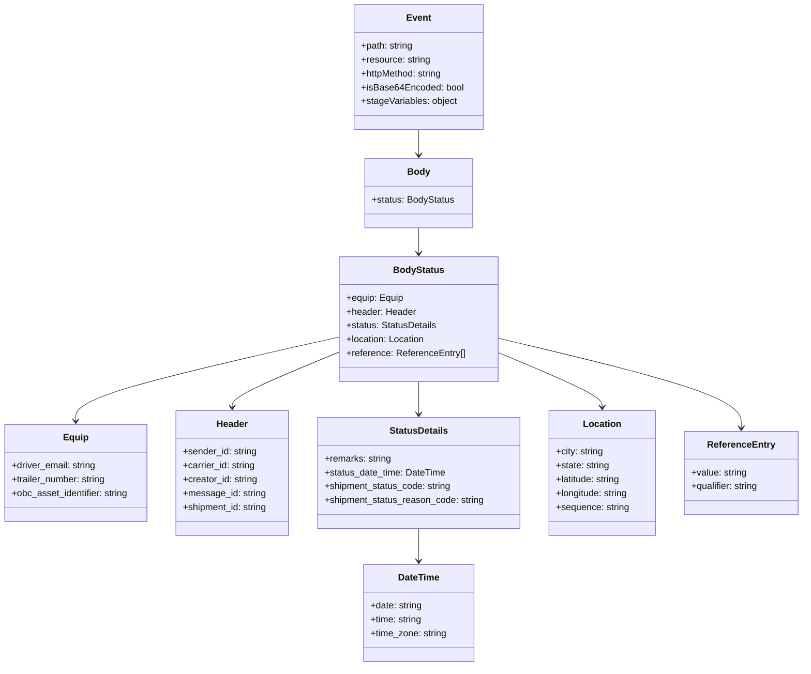
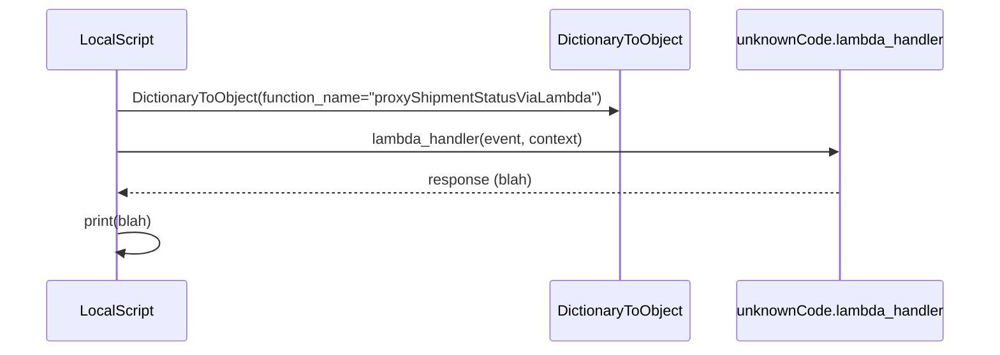

# Diagram: platform/tools/ide_local_testing/localTest/test/shipment/proxyShipmentStatus.py


> Auto-generated by Obscura crawlers

## Diagram 1



### SVG

<svg id="container" width="1397.2109375" xmlns="http://www.w3.org/2000/svg" class="classDiagram" height="1152" viewBox="0 0 1397.2109375 1152" role="graphics-document document" aria-roledescription="class"><style>#container{font-family:"trebuchet ms",verdana,arial,sans-serif;font-size:16px;fill:#333;}@keyframes edge-animation-frame{from{stroke-dashoffset:0;}}@keyframes dash{to{stroke-dashoffset:0;}}#container .edge-animation-slow{stroke-dasharray:9,5!important;stroke-dashoffset:900;animation:dash 50s linear infinite;stroke-linecap:round;}#container .edge-animation-fast{stroke-dasharray:9,5!important;stroke-dashoffset:900;animation:dash 20s linear infinite;stroke-linecap:round;}#container .error-icon{fill:#552222;}#container .error-text{fill:#552222;stroke:#552222;}#container .edge-thickness-normal{stroke-width:1px;}#container .edge-thickness-thick{stroke-width:3.5px;}#container .edge-pattern-solid{stroke-dasharray:0;}#container .edge-thickness-invisible{stroke-width:0;fill:none;}#container .edge-pattern-dashed{stroke-dasharray:3;}#container .edge-pattern-dotted{stroke-dasharray:2;}#container .marker{fill:#333333;stroke:#333333;}#container .marker.cross{stroke:#333333;}#container svg{font-family:"trebuchet ms",verdana,arial,sans-serif;font-size:16px;}#container p{margin:0;}#container g.classGroup text{fill:#9370DB;stroke:none;font-family:"trebuchet ms",verdana,arial,sans-serif;font-size:10px;}#container g.classGroup text .title{font-weight:bolder;}#container .nodeLabel,#container .edgeLabel{color:#131300;}#container .edgeLabel .label rect{fill:#ECECFF;}#container .label text{fill:#131300;}#container .labelBkg{background:#ECECFF;}#container .edgeLabel .label span{background:#ECECFF;}#container .classTitle{font-weight:bolder;}#container .node rect,#container .node circle,#container .node ellipse,#container .node polygon,#container .node path{fill:#ECECFF;stroke:#9370DB;stroke-width:1px;}#container .divider{stroke:#9370DB;stroke-width:1;}#container g.clickable{cursor:pointer;}#container g.classGroup rect{fill:#ECECFF;stroke:#9370DB;}#container g.classGroup line{stroke:#9370DB;stroke-width:1;}#container .classLabel .box{stroke:none;stroke-width:0;fill:#ECECFF;opacity:0.5;}#container .classLabel .label{fill:#9370DB;font-size:10px;}#container .relation{stroke:#333333;stroke-width:1;fill:none;}#container .dashed-line{stroke-dasharray:3;}#container .dotted-line{stroke-dasharray:1 2;}#container #compositionStart,#container .composition{fill:#333333!important;stroke:#333333!important;stroke-width:1;}#container #compositionEnd,#container .composition{fill:#333333!important;stroke:#333333!important;stroke-width:1;}#container #dependencyStart,#container .dependency{fill:#333333!important;stroke:#333333!important;stroke-width:1;}#container #dependencyStart,#container .dependency{fill:#333333!important;stroke:#333333!important;stroke-width:1;}#container #extensionStart,#container .extension{fill:transparent!important;stroke:#333333!important;stroke-width:1;}#container #extensionEnd,#container .extension{fill:transparent!important;stroke:#333333!important;stroke-width:1;}#container #aggregationStart,#container .aggregation{fill:transparent!important;stroke:#333333!important;stroke-width:1;}#container #aggregationEnd,#container .aggregation{fill:transparent!important;stroke:#333333!important;stroke-width:1;}#container #lollipopStart,#container .lollipop{fill:#ECECFF!important;stroke:#333333!important;stroke-width:1;}#container #lollipopEnd,#container .lollipop{fill:#ECECFF!important;stroke:#333333!important;stroke-width:1;}#container .edgeTerminals{font-size:11px;line-height:initial;}#container .classTitleText{text-anchor:middle;font-size:18px;fill:#333;}#container .label-icon{display:inline-block;height:1em;overflow:visible;vertical-align:-0.125em;}#container .node .label-icon path{fill:currentColor;stroke:revert;stroke-width:revert;}#container :root{--mermaid-font-family:"trebuchet ms",verdana,arial,sans-serif;}</style><g><defs><marker id="container_class-aggregationStart" class="marker aggregation class" refX="18" refY="7" markerWidth="190" markerHeight="240" orient="auto"><path d="M 18,7 L9,13 L1,7 L9,1 Z"></path></marker></defs><defs><marker id="container_class-aggregationEnd" class="marker aggregation class" refX="1" refY="7" markerWidth="20" markerHeight="28" orient="auto"><path d="M 18,7 L9,13 L1,7 L9,1 Z"></path></marker></defs><defs><marker id="container_class-extensionStart" class="marker extension class" refX="18" refY="7" markerWidth="190" markerHeight="240" orient="auto"><path d="M 1,7 L18,13 V 1 Z"></path></marker></defs><defs><marker id="container_class-extensionEnd" class="marker extension class" refX="1" refY="7" markerWidth="20" markerHeight="28" orient="auto"><path d="M 1,1 V 13 L18,7 Z"></path></marker></defs><defs><marker id="container_class-compositionStart" class="marker composition class" refX="18" refY="7" markerWidth="190" markerHeight="240" orient="auto"><path d="M 18,7 L9,13 L1,7 L9,1 Z"></path></marker></defs><defs><marker id="container_class-compositionEnd" class="marker composition class" refX="1" refY="7" markerWidth="20" markerHeight="28" orient="auto"><path d="M 18,7 L9,13 L1,7 L9,1 Z"></path></marker></defs><defs><marker id="container_class-dependencyStart" class="marker dependency class" refX="6" refY="7" markerWidth="190" markerHeight="240" orient="auto"><path d="M 5,7 L9,13 L1,7 L9,1 Z"></path></marker></defs><defs><marker id="container_class-dependencyEnd" class="marker dependency class" refX="13" refY="7" markerWidth="20" markerHeight="28" orient="auto"><path d="M 18,7 L9,13 L14,7 L9,1 Z"></path></marker></defs><defs><marker id="container_class-lollipopStart" class="marker lollipop class" refX="13" refY="7" markerWidth="190" markerHeight="240" orient="auto"><circle stroke="black" fill="transparent" cx="7" cy="7" r="6"></circle></marker></defs><defs><marker id="container_class-lollipopEnd" class="marker lollipop class" refX="1" refY="7" markerWidth="190" markerHeight="240" orient="auto"><circle stroke="black" fill="transparent" cx="7" cy="7" r="6"></circle></marker></defs><g class="root"><g class="clusters"></g><g class="edgePaths"><path d="M732.449,224L732.449,228.167C732.449,232.333,732.449,240.667,732.449,248C732.449,255.333,732.449,261.667,732.449,264.833L732.449,268" id="id_Event_Body_1" class="edge-thickness-normal edge-pattern-solid relation" style=";;;" data-edge="true" data-et="edge" data-id="id_Event_Body_1" data-points="W3sieCI6NzMyLjQ0OTIxODc1LCJ5IjoyMjR9LHsieCI6NzMyLjQ0OTIxODc1LCJ5IjoyNDl9LHsieCI6NzMyLjQ0OTIxODc1LCJ5IjoyNzR9XQ==" marker-end="url(#container_class-dependencyEnd)"></path><path d="M732.449,394L732.449,398.167C732.449,402.333,732.449,410.667,732.449,418C732.449,425.333,732.449,431.667,732.449,434.833L732.449,438" id="id_Body_BodyStatus_2" class="edge-thickness-normal edge-pattern-solid relation" style=";;;" data-edge="true" data-et="edge" data-id="id_Body_BodyStatus_2" data-points="W3sieCI6NzMyLjQ0OTIxODc1LCJ5IjozOTR9LHsieCI6NzMyLjQ0OTIxODc1LCJ5Ijo0MTl9LHsieCI6NzMyLjQ0OTIxODc1LCJ5Ijo0NDR9XQ==" marker-end="url(#container_class-dependencyEnd)"></path><path d="M597.391,581.954L519.952,599.128C442.514,616.302,287.638,650.651,210.2,674.992C132.762,699.333,132.762,713.667,132.762,720.833L132.762,728" id="id_BodyStatus_Equip_3" class="edge-thickness-normal edge-pattern-solid relation" style=";;;" data-edge="true" data-et="edge" data-id="id_BodyStatus_Equip_3" data-points="W3sieCI6NTk3LjM5MDYyNSwieSI6NTgxLjk1MzU4OTEwODkxMDl9LHsieCI6MTMyLjc2MTcxODc1LCJ5Ijo2ODV9LHsieCI6MTMyLjc2MTcxODc1LCJ5Ijo3MzR9XQ==" marker-end="url(#container_class-dependencyEnd)"></path><path d="M597.391,607.2L565.665,620.167C533.939,633.133,470.487,659.067,438.761,675.2C407.035,691.333,407.035,697.667,407.035,700.833L407.035,704" id="id_BodyStatus_Header_4" class="edge-thickness-normal edge-pattern-solid relation" style=";;;" data-edge="true" data-et="edge" data-id="id_BodyStatus_Header_4" data-points="W3sieCI6NTk3LjM5MDYyNSwieSI6NjA3LjE5OTgwNTUzNjIxNTl9LHsieCI6NDA3LjAzNTE1NjI1LCJ5Ijo2ODV9LHsieCI6NDA3LjAzNTE1NjI1LCJ5Ijo3MTB9XQ==" marker-end="url(#container_class-dependencyEnd)"></path><path d="M732.449,660L732.449,664.167C732.449,668.333,732.449,676.667,732.449,686C732.449,695.333,732.449,705.667,732.449,710.833L732.449,716" id="id_BodyStatus_StatusDetails_5" class="edge-thickness-normal edge-pattern-solid relation" style=";;;" data-edge="true" data-et="edge" data-id="id_BodyStatus_StatusDetails_5" data-points="W3sieCI6NzMyLjQ0OTIxODc1LCJ5Ijo2NjB9LHsieCI6NzMyLjQ0OTIxODc1LCJ5Ijo2ODV9LHsieCI6NzMyLjQ0OTIxODc1LCJ5Ijo3MjJ9XQ==" marker-end="url(#container_class-dependencyEnd)"></path><path d="M867.508,608.63L897.864,621.358C928.22,634.087,988.932,659.543,1019.288,675.438C1049.645,691.333,1049.645,697.667,1049.645,700.833L1049.645,704" id="id_BodyStatus_Location_6" class="edge-thickness-normal edge-pattern-solid relation" style=";;;" data-edge="true" data-et="edge" data-id="id_BodyStatus_Location_6" data-points="W3sieCI6ODY3LjUwNzgxMjUsInkiOjYwOC42MzAwNzA2ODc5MTQxfSx7IngiOjEwNDkuNjQ0NTMxMjUsInkiOjY4NX0seyJ4IjoxMDQ5LjY0NDUzMTI1LCJ5Ijo3MTB9XQ==" marker-end="url(#container_class-dependencyEnd)"></path><path d="M867.508,584.213L937.936,601.011C1008.363,617.809,1149.219,651.404,1219.646,677.369C1290.074,703.333,1290.074,721.667,1290.074,730.833L1290.074,740" id="id_BodyStatus_ReferenceEntry_7" class="edge-thickness-normal edge-pattern-solid relation" style=";;;" data-edge="true" data-et="edge" data-id="id_BodyStatus_ReferenceEntry_7" data-points="W3sieCI6ODY3LjUwNzgxMjUsInkiOjU4NC4yMTMwMzM3OTI4NzE2fSx7IngiOjEyOTAuMDc0MjE4NzUsInkiOjY4NX0seyJ4IjoxMjkwLjA3NDIxODc1LCJ5Ijo3NDZ9XQ==" marker-end="url(#container_class-dependencyEnd)"></path><path d="M732.449,914L732.449,920.167C732.449,926.333,732.449,938.667,732.449,948C732.449,957.333,732.449,963.667,732.449,966.833L732.449,970" id="id_StatusDetails_DateTime_8" class="edge-thickness-normal edge-pattern-solid relation" style=";;;" data-edge="true" data-et="edge" data-id="id_StatusDetails_DateTime_8" data-points="W3sieCI6NzMyLjQ0OTIxODc1LCJ5Ijo5MTR9LHsieCI6NzMyLjQ0OTIxODc1LCJ5Ijo5NTF9LHsieCI6NzMyLjQ0OTIxODc1LCJ5Ijo5NzZ9XQ==" marker-end="url(#container_class-dependencyEnd)"></path></g><g class="edgeLabels"><g class="edgeLabel"><g class="label" data-id="id_Event_Body_1" transform="translate(0, 0)"><foreignObject width="0" height="0"><div xmlns="http://www.w3.org/1999/xhtml" class="labelBkg" style="display: table-cell; white-space: nowrap; line-height: 1.5; max-width: 200px; text-align: center;"><span class="edgeLabel"></span></div></foreignObject></g></g><g class="edgeLabel"><g class="label" data-id="id_Body_BodyStatus_2" transform="translate(0, 0)"><foreignObject width="0" height="0"><div xmlns="http://www.w3.org/1999/xhtml" class="labelBkg" style="display: table-cell; white-space: nowrap; line-height: 1.5; max-width: 200px; text-align: center;"><span class="edgeLabel"></span></div></foreignObject></g></g><g class="edgeLabel"><g class="label" data-id="id_BodyStatus_Equip_3" transform="translate(0, 0)"><foreignObject width="0" height="0"><div xmlns="http://www.w3.org/1999/xhtml" class="labelBkg" style="display: table-cell; white-space: nowrap; line-height: 1.5; max-width: 200px; text-align: center;"><span class="edgeLabel"></span></div></foreignObject></g></g><g class="edgeLabel"><g class="label" data-id="id_BodyStatus_Header_4" transform="translate(0, 0)"><foreignObject width="0" height="0"><div xmlns="http://www.w3.org/1999/xhtml" class="labelBkg" style="display: table-cell; white-space: nowrap; line-height: 1.5; max-width: 200px; text-align: center;"><span class="edgeLabel"></span></div></foreignObject></g></g><g class="edgeLabel"><g class="label" data-id="id_BodyStatus_StatusDetails_5" transform="translate(0, 0)"><foreignObject width="0" height="0"><div xmlns="http://www.w3.org/1999/xhtml" class="labelBkg" style="display: table-cell; white-space: nowrap; line-height: 1.5; max-width: 200px; text-align: center;"><span class="edgeLabel"></span></div></foreignObject></g></g><g class="edgeLabel"><g class="label" data-id="id_BodyStatus_Location_6" transform="translate(0, 0)"><foreignObject width="0" height="0"><div xmlns="http://www.w3.org/1999/xhtml" class="labelBkg" style="display: table-cell; white-space: nowrap; line-height: 1.5; max-width: 200px; text-align: center;"><span class="edgeLabel"></span></div></foreignObject></g></g><g class="edgeLabel"><g class="label" data-id="id_BodyStatus_ReferenceEntry_7" transform="translate(0, 0)"><foreignObject width="0" height="0"><div xmlns="http://www.w3.org/1999/xhtml" class="labelBkg" style="display: table-cell; white-space: nowrap; line-height: 1.5; max-width: 200px; text-align: center;"><span class="edgeLabel"></span></div></foreignObject></g></g><g class="edgeLabel"><g class="label" data-id="id_StatusDetails_DateTime_8" transform="translate(0, 0)"><foreignObject width="0" height="0"><div xmlns="http://www.w3.org/1999/xhtml" class="labelBkg" style="display: table-cell; white-space: nowrap; line-height: 1.5; max-width: 200px; text-align: center;"><span class="edgeLabel"></span></div></foreignObject></g></g></g><g class="nodes"><g class="node default" id="classId-Event-0" transform="translate(732.44921875, 116)"><g class="basic label-container"><path d="M-109.48046875 -108 L109.48046875 -108 L109.48046875 108 L-109.48046875 108" stroke="none" stroke-width="0" fill="#ECECFF" style=""></path><path d="M-109.48046875 -108 C-49.827412649056036 -108, 9.825643451887927 -108, 109.48046875 -108 M-109.48046875 -108 C-54.87675313555865 -108, -0.2730375211173026 -108, 109.48046875 -108 M109.48046875 -108 C109.48046875 -41.56233424203708, 109.48046875 24.875331515925836, 109.48046875 108 M109.48046875 -108 C109.48046875 -27.284552893770098, 109.48046875 53.430894212459805, 109.48046875 108 M109.48046875 108 C33.64761667954099 108, -42.185235390918024 108, -109.48046875 108 M109.48046875 108 C58.603854557122375 108, 7.72724036424475 108, -109.48046875 108 M-109.48046875 108 C-109.48046875 56.277696417221634, -109.48046875 4.555392834443268, -109.48046875 -108 M-109.48046875 108 C-109.48046875 37.490344445538284, -109.48046875 -33.01931110892343, -109.48046875 -108" stroke="#9370DB" stroke-width="1.3" fill="none" stroke-dasharray="0 0" style=""></path></g><g class="annotation-group text" transform="translate(0, -84)"></g><g class="label-group text" transform="translate(-20.2109375, -84)"><g class="label" style="font-weight: bolder" transform="translate(0,-12)"><foreignObject width="40.421875" height="24"><div xmlns="http://www.w3.org/1999/xhtml" style="display: table-cell; white-space: nowrap; line-height: 1.5; max-width: 90px; text-align: center;"><span class="nodeLabel markdown-node-label" style=""><p>Event</p></span></div></foreignObject></g></g><g class="members-group text" transform="translate(-97.48046875, -36)"><g class="label" style="" transform="translate(0,-12)"><foreignObject width="90.90625" height="24"><div xmlns="http://www.w3.org/1999/xhtml" style="display: table-cell; white-space: nowrap; line-height: 1.5; max-width: 149px; text-align: center;"><span class="nodeLabel markdown-node-label" style=""><p>+path: string</p></span></div></foreignObject></g><g class="label" style="" transform="translate(0,12)"><foreignObject width="119.984375" height="24"><div xmlns="http://www.w3.org/1999/xhtml" style="display: table-cell; white-space: nowrap; line-height: 1.5; max-width: 178px; text-align: center;"><span class="nodeLabel markdown-node-label" style=""><p>+resource: string</p></span></div></foreignObject></g><g class="label" style="" transform="translate(0,36)"><foreignObject width="143.375" height="24"><div xmlns="http://www.w3.org/1999/xhtml" style="display: table-cell; white-space: nowrap; line-height: 1.5; max-width: 201px; text-align: center;"><span class="nodeLabel markdown-node-label" style=""><p>+httpMethod: string</p></span></div></foreignObject></g><g class="label" style="" transform="translate(0,60)"><foreignObject width="174.75" height="24"><div xmlns="http://www.w3.org/1999/xhtml" style="display: table-cell; white-space: nowrap; line-height: 1.5; max-width: 232px; text-align: center;"><span class="nodeLabel markdown-node-label" style=""><p>+isBase64Encoded: bool</p></span></div></foreignObject></g><g class="label" style="" transform="translate(0,84)"><foreignObject width="166.671875" height="24"><div xmlns="http://www.w3.org/1999/xhtml" style="display: table-cell; white-space: nowrap; line-height: 1.5; max-width: 224px; text-align: center;"><span class="nodeLabel markdown-node-label" style=""><p>+stageVariables: object</p></span></div></foreignObject></g></g><g class="methods-group text" transform="translate(-97.48046875, 108)"></g><g class="divider" style=""><path d="M-109.48046875 -60 C-30.72641538422782 -60, 48.02763798154436 -60, 109.48046875 -60 M-109.48046875 -60 C-30.27825487844352 -60, 48.92395899311296 -60, 109.48046875 -60" stroke="#9370DB" stroke-width="1.3" fill="none" stroke-dasharray="0 0" style=""></path></g><g class="divider" style=""><path d="M-109.48046875 84 C-65.3950888731099 84, -21.309708996219797 84, 109.48046875 84 M-109.48046875 84 C-64.76685044791604 84, -20.053232145832084 84, 109.48046875 84" stroke="#9370DB" stroke-width="1.3" fill="none" stroke-dasharray="0 0" style=""></path></g></g><g class="node default" id="classId-Body-1" transform="translate(732.44921875, 334)"><g class="basic label-container"><path d="M-92.58984375 -60 L92.58984375 -60 L92.58984375 60 L-92.58984375 60" stroke="none" stroke-width="0" fill="#ECECFF" style=""></path><path d="M-92.58984375 -60 C-28.091198209668462 -60, 36.407447330663075 -60, 92.58984375 -60 M-92.58984375 -60 C-52.31067215322555 -60, -12.031500556451107 -60, 92.58984375 -60 M92.58984375 -60 C92.58984375 -29.98164341453395, 92.58984375 0.03671317093210291, 92.58984375 60 M92.58984375 -60 C92.58984375 -24.575135894197942, 92.58984375 10.849728211604116, 92.58984375 60 M92.58984375 60 C35.52292154993415 60, -21.544000650131693 60, -92.58984375 60 M92.58984375 60 C39.42279102293863 60, -13.744261704122735 60, -92.58984375 60 M-92.58984375 60 C-92.58984375 23.03168065645665, -92.58984375 -13.936638687086699, -92.58984375 -60 M-92.58984375 60 C-92.58984375 25.47921875023132, -92.58984375 -9.041562499537363, -92.58984375 -60" stroke="#9370DB" stroke-width="1.3" fill="none" stroke-dasharray="0 0" style=""></path></g><g class="annotation-group text" transform="translate(0, -36)"></g><g class="label-group text" transform="translate(-18.5546875, -36)"><g class="label" style="font-weight: bolder" transform="translate(0,-12)"><foreignObject width="37.109375" height="24"><div xmlns="http://www.w3.org/1999/xhtml" style="display: table-cell; white-space: nowrap; line-height: 1.5; max-width: 87px; text-align: center;"><span class="nodeLabel markdown-node-label" style=""><p>Body</p></span></div></foreignObject></g></g><g class="members-group text" transform="translate(-80.58984375, 12)"><g class="label" style="" transform="translate(0,-12)"><foreignObject width="142.625" height="24"><div xmlns="http://www.w3.org/1999/xhtml" style="display: table-cell; white-space: nowrap; line-height: 1.5; max-width: 200px; text-align: center;"><span class="nodeLabel markdown-node-label" style=""><p>+status: BodyStatus</p></span></div></foreignObject></g></g><g class="methods-group text" transform="translate(-80.58984375, 60)"></g><g class="divider" style=""><path d="M-92.58984375 -12 C-18.99479066830753 -12, 54.60026241338494 -12, 92.58984375 -12 M-92.58984375 -12 C-32.17761644617595 -12, 28.234610857648093 -12, 92.58984375 -12" stroke="#9370DB" stroke-width="1.3" fill="none" stroke-dasharray="0 0" style=""></path></g><g class="divider" style=""><path d="M-92.58984375 36 C-21.360333038693213 36, 49.869177672613574 36, 92.58984375 36 M-92.58984375 36 C-44.180292370108226 36, 4.229259009783547 36, 92.58984375 36" stroke="#9370DB" stroke-width="1.3" fill="none" stroke-dasharray="0 0" style=""></path></g></g><g class="node default" id="classId-BodyStatus-2" transform="translate(732.44921875, 552)"><g class="basic label-container"><path d="M-135.05859375 -108 L135.05859375 -108 L135.05859375 108 L-135.05859375 108" stroke="none" stroke-width="0" fill="#ECECFF" style=""></path><path d="M-135.05859375 -108 C-28.100417883637675 -108, 78.85775798272465 -108, 135.05859375 -108 M-135.05859375 -108 C-68.76208019757857 -108, -2.465566645157139 -108, 135.05859375 -108 M135.05859375 -108 C135.05859375 -27.657006868379398, 135.05859375 52.685986263241205, 135.05859375 108 M135.05859375 -108 C135.05859375 -28.886273635134714, 135.05859375 50.22745272973057, 135.05859375 108 M135.05859375 108 C79.3262456828181 108, 23.59389761563618 108, -135.05859375 108 M135.05859375 108 C36.90897860676611 108, -61.240636536467775 108, -135.05859375 108 M-135.05859375 108 C-135.05859375 53.77133775419421, -135.05859375 -0.45732449161158684, -135.05859375 -108 M-135.05859375 108 C-135.05859375 59.261823242036094, -135.05859375 10.523646484072188, -135.05859375 -108" stroke="#9370DB" stroke-width="1.3" fill="none" stroke-dasharray="0 0" style=""></path></g><g class="annotation-group text" transform="translate(0, -84)"></g><g class="label-group text" transform="translate(-42.0390625, -84)"><g class="label" style="font-weight: bolder" transform="translate(0,-12)"><foreignObject width="84.078125" height="24"><div xmlns="http://www.w3.org/1999/xhtml" style="display: table-cell; white-space: nowrap; line-height: 1.5; max-width: 132px; text-align: center;"><span class="nodeLabel markdown-node-label" style=""><p>BodyStatus</p></span></div></foreignObject></g></g><g class="members-group text" transform="translate(-123.05859375, -36)"><g class="label" style="" transform="translate(0,-12)"><foreignObject width="98.828125" height="24"><div xmlns="http://www.w3.org/1999/xhtml" style="display: table-cell; white-space: nowrap; line-height: 1.5; max-width: 156px; text-align: center;"><span class="nodeLabel markdown-node-label" style=""><p>+equip: Equip</p></span></div></foreignObject></g><g class="label" style="" transform="translate(0,12)"><foreignObject width="119.9375" height="24"><div xmlns="http://www.w3.org/1999/xhtml" style="display: table-cell; white-space: nowrap; line-height: 1.5; max-width: 178px; text-align: center;"><span class="nodeLabel markdown-node-label" style=""><p>+header: Header</p></span></div></foreignObject></g><g class="label" style="" transform="translate(0,36)"><foreignObject width="156.1875" height="24"><div xmlns="http://www.w3.org/1999/xhtml" style="display: table-cell; white-space: nowrap; line-height: 1.5; max-width: 214px; text-align: center;"><span class="nodeLabel markdown-node-label" style=""><p>+status: StatusDetails</p></span></div></foreignObject></g><g class="label" style="" transform="translate(0,60)"><foreignObject width="137.34375" height="24"><div xmlns="http://www.w3.org/1999/xhtml" style="display: table-cell; white-space: nowrap; line-height: 1.5; max-width: 195px; text-align: center;"><span class="nodeLabel markdown-node-label" style=""><p>+location: Location</p></span></div></foreignObject></g><g class="label" style="" transform="translate(0,84)"><foreignObject width="204.078125" height="24"><div xmlns="http://www.w3.org/1999/xhtml" style="display: table-cell; white-space: nowrap; line-height: 1.5; max-width: 261px; text-align: center;"><span class="nodeLabel markdown-node-label" style=""><p>+reference: ReferenceEntry[]</p></span></div></foreignObject></g></g><g class="methods-group text" transform="translate(-123.05859375, 108)"></g><g class="divider" style=""><path d="M-135.05859375 -60 C-45.23616385263381 -60, 44.58626604473238 -60, 135.05859375 -60 M-135.05859375 -60 C-48.051296056577755 -60, 38.95600163684449 -60, 135.05859375 -60" stroke="#9370DB" stroke-width="1.3" fill="none" stroke-dasharray="0 0" style=""></path></g><g class="divider" style=""><path d="M-135.05859375 84 C-63.49962063876856 84, 8.059352472462876 84, 135.05859375 84 M-135.05859375 84 C-55.46806782819142 84, 24.122458093617155 84, 135.05859375 84" stroke="#9370DB" stroke-width="1.3" fill="none" stroke-dasharray="0 0" style=""></path></g></g><g class="node default" id="classId-Equip-3" transform="translate(132.76171875, 818)"><g class="basic label-container"><path d="M-124.76171875 -84 L124.76171875 -84 L124.76171875 84 L-124.76171875 84" stroke="none" stroke-width="0" fill="#ECECFF" style=""></path><path d="M-124.76171875 -84 C-54.77839154025288 -84, 15.204935669494233 -84, 124.76171875 -84 M-124.76171875 -84 C-31.837861881639967 -84, 61.08599498672007 -84, 124.76171875 -84 M124.76171875 -84 C124.76171875 -30.8803827841853, 124.76171875 22.2392344316294, 124.76171875 84 M124.76171875 -84 C124.76171875 -40.13548310529898, 124.76171875 3.7290337894020382, 124.76171875 84 M124.76171875 84 C68.55844511499707 84, 12.35517147999414 84, -124.76171875 84 M124.76171875 84 C58.730328028074496 84, -7.301062693851009 84, -124.76171875 84 M-124.76171875 84 C-124.76171875 47.03690632739866, -124.76171875 10.073812654797322, -124.76171875 -84 M-124.76171875 84 C-124.76171875 17.727910912642983, -124.76171875 -48.544178174714034, -124.76171875 -84" stroke="#9370DB" stroke-width="1.3" fill="none" stroke-dasharray="0 0" style=""></path></g><g class="annotation-group text" transform="translate(0, -60)"></g><g class="label-group text" transform="translate(-20.4609375, -60)"><g class="label" style="font-weight: bolder" transform="translate(0,-12)"><foreignObject width="40.921875" height="24"><div xmlns="http://www.w3.org/1999/xhtml" style="display: table-cell; white-space: nowrap; line-height: 1.5; max-width: 91px; text-align: center;"><span class="nodeLabel markdown-node-label" style=""><p>Equip</p></span></div></foreignObject></g></g><g class="members-group text" transform="translate(-112.76171875, -12)"><g class="label" style="" transform="translate(0,-12)"><foreignObject width="147.875" height="24"><div xmlns="http://www.w3.org/1999/xhtml" style="display: table-cell; white-space: nowrap; line-height: 1.5; max-width: 206px; text-align: center;"><span class="nodeLabel markdown-node-label" style=""><p>+driver_email: string</p></span></div></foreignObject></g><g class="label" style="" transform="translate(0,12)"><foreignObject width="165.734375" height="24"><div xmlns="http://www.w3.org/1999/xhtml" style="display: table-cell; white-space: nowrap; line-height: 1.5; max-width: 224px; text-align: center;"><span class="nodeLabel markdown-node-label" style=""><p>+trailer_number: string</p></span></div></foreignObject></g><g class="label" style="" transform="translate(0,36)"><foreignObject width="205.0625" height="24"><div xmlns="http://www.w3.org/1999/xhtml" style="display: table-cell; white-space: nowrap; line-height: 1.5; max-width: 263px; text-align: center;"><span class="nodeLabel markdown-node-label" style=""><p>+obc_asset_identifier: string</p></span></div></foreignObject></g></g><g class="methods-group text" transform="translate(-112.76171875, 84)"></g><g class="divider" style=""><path d="M-124.76171875 -36 C-37.79157814260873 -36, 49.178562464782544 -36, 124.76171875 -36 M-124.76171875 -36 C-50.15920970705899 -36, 24.443299335882017 -36, 124.76171875 -36" stroke="#9370DB" stroke-width="1.3" fill="none" stroke-dasharray="0 0" style=""></path></g><g class="divider" style=""><path d="M-124.76171875 60 C-30.875680687896462 60, 63.010357374207075 60, 124.76171875 60 M-124.76171875 60 C-71.08845927269846 60, -17.41519979539693 60, 124.76171875 60" stroke="#9370DB" stroke-width="1.3" fill="none" stroke-dasharray="0 0" style=""></path></g></g><g class="node default" id="classId-Header-4" transform="translate(407.03515625, 818)"><g class="basic label-container"><path d="M-99.51171875 -108 L99.51171875 -108 L99.51171875 108 L-99.51171875 108" stroke="none" stroke-width="0" fill="#ECECFF" style=""></path><path d="M-99.51171875 -108 C-41.83306391275235 -108, 15.845590924495298 -108, 99.51171875 -108 M-99.51171875 -108 C-28.87415368661526 -108, 41.76341137676948 -108, 99.51171875 -108 M99.51171875 -108 C99.51171875 -23.35768771381356, 99.51171875 61.28462457237288, 99.51171875 108 M99.51171875 -108 C99.51171875 -54.77106574065386, 99.51171875 -1.5421314813077203, 99.51171875 108 M99.51171875 108 C52.15657376339515 108, 4.801428776790303 108, -99.51171875 108 M99.51171875 108 C31.965394822512593 108, -35.580929104974814 108, -99.51171875 108 M-99.51171875 108 C-99.51171875 37.045161070182516, -99.51171875 -33.90967785963497, -99.51171875 -108 M-99.51171875 108 C-99.51171875 49.54031252525484, -99.51171875 -8.919374949490319, -99.51171875 -108" stroke="#9370DB" stroke-width="1.3" fill="none" stroke-dasharray="0 0" style=""></path></g><g class="annotation-group text" transform="translate(0, -84)"></g><g class="label-group text" transform="translate(-26.4765625, -84)"><g class="label" style="font-weight: bolder" transform="translate(0,-12)"><foreignObject width="52.953125" height="24"><div xmlns="http://www.w3.org/1999/xhtml" style="display: table-cell; white-space: nowrap; line-height: 1.5; max-width: 103px; text-align: center;"><span class="nodeLabel markdown-node-label" style=""><p>Header</p></span></div></foreignObject></g></g><g class="members-group text" transform="translate(-87.51171875, -36)"><g class="label" style="" transform="translate(0,-12)"><foreignObject width="128.859375" height="24"><div xmlns="http://www.w3.org/1999/xhtml" style="display: table-cell; white-space: nowrap; line-height: 1.5; max-width: 187px; text-align: center;"><span class="nodeLabel markdown-node-label" style=""><p>+sender_id: string</p></span></div></foreignObject></g><g class="label" style="" transform="translate(0,12)"><foreignObject width="126.78125" height="24"><div xmlns="http://www.w3.org/1999/xhtml" style="display: table-cell; white-space: nowrap; line-height: 1.5; max-width: 185px; text-align: center;"><span class="nodeLabel markdown-node-label" style=""><p>+carrier_id: string</p></span></div></foreignObject></g><g class="label" style="" transform="translate(0,36)"><foreignObject width="130.484375" height="24"><div xmlns="http://www.w3.org/1999/xhtml" style="display: table-cell; white-space: nowrap; line-height: 1.5; max-width: 189px; text-align: center;"><span class="nodeLabel markdown-node-label" style=""><p>+creator_id: string</p></span></div></foreignObject></g><g class="label" style="" transform="translate(0,60)"><foreignObject width="142.171875" height="24"><div xmlns="http://www.w3.org/1999/xhtml" style="display: table-cell; white-space: nowrap; line-height: 1.5; max-width: 200px; text-align: center;"><span class="nodeLabel markdown-node-label" style=""><p>+message_id: string</p></span></div></foreignObject></g><g class="label" style="" transform="translate(0,84)"><foreignObject width="148.546875" height="24"><div xmlns="http://www.w3.org/1999/xhtml" style="display: table-cell; white-space: nowrap; line-height: 1.5; max-width: 207px; text-align: center;"><span class="nodeLabel markdown-node-label" style=""><p>+shipment_id: string</p></span></div></foreignObject></g></g><g class="methods-group text" transform="translate(-87.51171875, 108)"></g><g class="divider" style=""><path d="M-99.51171875 -60 C-56.62528852334202 -60, -13.738858296684043 -60, 99.51171875 -60 M-99.51171875 -60 C-54.85511665836454 -60, -10.198514566729074 -60, 99.51171875 -60" stroke="#9370DB" stroke-width="1.3" fill="none" stroke-dasharray="0 0" style=""></path></g><g class="divider" style=""><path d="M-99.51171875 84 C-20.844639910377538 84, 57.822438929244925 84, 99.51171875 84 M-99.51171875 84 C-29.596742142121826 84, 40.31823446575635 84, 99.51171875 84" stroke="#9370DB" stroke-width="1.3" fill="none" stroke-dasharray="0 0" style=""></path></g></g><g class="node default" id="classId-StatusDetails-5" transform="translate(732.44921875, 818)"><g class="basic label-container"><path d="M-175.90234375 -96 L175.90234375 -96 L175.90234375 96 L-175.90234375 96" stroke="none" stroke-width="0" fill="#ECECFF" style=""></path><path d="M-175.90234375 -96 C-43.189368793569656 -96, 89.52360616286069 -96, 175.90234375 -96 M-175.90234375 -96 C-84.21842583677044 -96, 7.465492076459128 -96, 175.90234375 -96 M175.90234375 -96 C175.90234375 -31.14129652191494, 175.90234375 33.71740695617012, 175.90234375 96 M175.90234375 -96 C175.90234375 -36.94908497177922, 175.90234375 22.101830056441557, 175.90234375 96 M175.90234375 96 C100.85453299354565 96, 25.806722237091293 96, -175.90234375 96 M175.90234375 96 C65.18237261395036 96, -45.53759852209927 96, -175.90234375 96 M-175.90234375 96 C-175.90234375 37.43171831523826, -175.90234375 -21.136563369523486, -175.90234375 -96 M-175.90234375 96 C-175.90234375 32.25215330921678, -175.90234375 -31.49569338156644, -175.90234375 -96" stroke="#9370DB" stroke-width="1.3" fill="none" stroke-dasharray="0 0" style=""></path></g><g class="annotation-group text" transform="translate(0, -72)"></g><g class="label-group text" transform="translate(-48.9765625, -72)"><g class="label" style="font-weight: bolder" transform="translate(0,-12)"><foreignObject width="97.953125" height="24"><div xmlns="http://www.w3.org/1999/xhtml" style="display: table-cell; white-space: nowrap; line-height: 1.5; max-width: 146px; text-align: center;"><span class="nodeLabel markdown-node-label" style=""><p>StatusDetails</p></span></div></foreignObject></g></g><g class="members-group text" transform="translate(-163.90234375, -24)"><g class="label" style="" transform="translate(0,-12)"><foreignObject width="116.296875" height="24"><div xmlns="http://www.w3.org/1999/xhtml" style="display: table-cell; white-space: nowrap; line-height: 1.5; max-width: 174px; text-align: center;"><span class="nodeLabel markdown-node-label" style=""><p>+remarks: string</p></span></div></foreignObject></g><g class="label" style="" transform="translate(0,12)"><foreignObject width="209.40625" height="24"><div xmlns="http://www.w3.org/1999/xhtml" style="display: table-cell; white-space: nowrap; line-height: 1.5; max-width: 267px; text-align: center;"><span class="nodeLabel markdown-node-label" style=""><p>+status_date_time: DateTime</p></span></div></foreignObject></g><g class="label" style="" transform="translate(0,36)"><foreignObject width="221.515625" height="24"><div xmlns="http://www.w3.org/1999/xhtml" style="display: table-cell; white-space: nowrap; line-height: 1.5; max-width: 280px; text-align: center;"><span class="nodeLabel markdown-node-label" style=""><p>+shipment_status_code: string</p></span></div></foreignObject></g><g class="label" style="" transform="translate(0,60)"><foreignObject width="278.828125" height="24"><div xmlns="http://www.w3.org/1999/xhtml" style="display: table-cell; white-space: nowrap; line-height: 1.5; max-width: 337px; text-align: center;"><span class="nodeLabel markdown-node-label" style=""><p>+shipment_status_reason_code: string</p></span></div></foreignObject></g></g><g class="methods-group text" transform="translate(-163.90234375, 96)"></g><g class="divider" style=""><path d="M-175.90234375 -48 C-35.50989575777561 -48, 104.88255223444878 -48, 175.90234375 -48 M-175.90234375 -48 C-36.35923651131904 -48, 103.18387072736192 -48, 175.90234375 -48" stroke="#9370DB" stroke-width="1.3" fill="none" stroke-dasharray="0 0" style=""></path></g><g class="divider" style=""><path d="M-175.90234375 72 C-92.86964224981837 72, -9.836940749636739 72, 175.90234375 72 M-175.90234375 72 C-96.70315635372464 72, -17.503968957449274 72, 175.90234375 72" stroke="#9370DB" stroke-width="1.3" fill="none" stroke-dasharray="0 0" style=""></path></g></g><g class="node default" id="classId-DateTime-6" transform="translate(732.44921875, 1060)"><g class="basic label-container"><path d="M-95.6484375 -84 L95.6484375 -84 L95.6484375 84 L-95.6484375 84" stroke="none" stroke-width="0" fill="#ECECFF" style=""></path><path d="M-95.6484375 -84 C-27.809847661182047 -84, 40.028742177635905 -84, 95.6484375 -84 M-95.6484375 -84 C-34.26527301970824 -84, 27.11789146058352 -84, 95.6484375 -84 M95.6484375 -84 C95.6484375 -39.16830581416044, 95.6484375 5.663388371679119, 95.6484375 84 M95.6484375 -84 C95.6484375 -18.989570458528306, 95.6484375 46.02085908294339, 95.6484375 84 M95.6484375 84 C25.48146086445672 84, -44.68551577108656 84, -95.6484375 84 M95.6484375 84 C26.002698501761785 84, -43.64304049647643 84, -95.6484375 84 M-95.6484375 84 C-95.6484375 17.000765271984847, -95.6484375 -49.99846945603031, -95.6484375 -84 M-95.6484375 84 C-95.6484375 30.154449803107326, -95.6484375 -23.691100393785348, -95.6484375 -84" stroke="#9370DB" stroke-width="1.3" fill="none" stroke-dasharray="0 0" style=""></path></g><g class="annotation-group text" transform="translate(0, -60)"></g><g class="label-group text" transform="translate(-34.625, -60)"><g class="label" style="font-weight: bolder" transform="translate(0,-12)"><foreignObject width="69.25" height="24"><div xmlns="http://www.w3.org/1999/xhtml" style="display: table-cell; white-space: nowrap; line-height: 1.5; max-width: 118px; text-align: center;"><span class="nodeLabel markdown-node-label" style=""><p>DateTime</p></span></div></foreignObject></g></g><g class="members-group text" transform="translate(-83.6484375, -12)"><g class="label" style="" transform="translate(0,-12)"><foreignObject width="90.234375" height="24"><div xmlns="http://www.w3.org/1999/xhtml" style="display: table-cell; white-space: nowrap; line-height: 1.5; max-width: 148px; text-align: center;"><span class="nodeLabel markdown-node-label" style=""><p>+date: string</p></span></div></foreignObject></g><g class="label" style="" transform="translate(0,12)"><foreignObject width="90.34375" height="24"><div xmlns="http://www.w3.org/1999/xhtml" style="display: table-cell; white-space: nowrap; line-height: 1.5; max-width: 148px; text-align: center;"><span class="nodeLabel markdown-node-label" style=""><p>+time: string</p></span></div></foreignObject></g><g class="label" style="" transform="translate(0,36)"><foreignObject width="132.671875" height="24"><div xmlns="http://www.w3.org/1999/xhtml" style="display: table-cell; white-space: nowrap; line-height: 1.5; max-width: 191px; text-align: center;"><span class="nodeLabel markdown-node-label" style=""><p>+time_zone: string</p></span></div></foreignObject></g></g><g class="methods-group text" transform="translate(-83.6484375, 84)"></g><g class="divider" style=""><path d="M-95.6484375 -36 C-26.1739417514014 -36, 43.3005539971972 -36, 95.6484375 -36 M-95.6484375 -36 C-51.73069127162933 -36, -7.812945043258665 -36, 95.6484375 -36" stroke="#9370DB" stroke-width="1.3" fill="none" stroke-dasharray="0 0" style=""></path></g><g class="divider" style=""><path d="M-95.6484375 60 C-44.986684747397526 60, 5.675068005204949 60, 95.6484375 60 M-95.6484375 60 C-25.550032120294077 60, 44.54837325941185 60, 95.6484375 60" stroke="#9370DB" stroke-width="1.3" fill="none" stroke-dasharray="0 0" style=""></path></g></g><g class="node default" id="classId-Location-7" transform="translate(1049.64453125, 818)"><g class="basic label-container"><path d="M-91.29296875 -108 L91.29296875 -108 L91.29296875 108 L-91.29296875 108" stroke="none" stroke-width="0" fill="#ECECFF" style=""></path><path d="M-91.29296875 -108 C-49.10423667508717 -108, -6.915504600174344 -108, 91.29296875 -108 M-91.29296875 -108 C-47.57505418079218 -108, -3.8571396115843584 -108, 91.29296875 -108 M91.29296875 -108 C91.29296875 -36.01690612861181, 91.29296875 35.966187742776384, 91.29296875 108 M91.29296875 -108 C91.29296875 -37.487067696604015, 91.29296875 33.02586460679197, 91.29296875 108 M91.29296875 108 C31.37207795645677 108, -28.54881283708646 108, -91.29296875 108 M91.29296875 108 C32.47809854407037 108, -26.33677166185926 108, -91.29296875 108 M-91.29296875 108 C-91.29296875 29.332382388583014, -91.29296875 -49.33523522283397, -91.29296875 -108 M-91.29296875 108 C-91.29296875 53.3967080764494, -91.29296875 -1.2065838471012, -91.29296875 -108" stroke="#9370DB" stroke-width="1.3" fill="none" stroke-dasharray="0 0" style=""></path></g><g class="annotation-group text" transform="translate(0, -84)"></g><g class="label-group text" transform="translate(-31.3515625, -84)"><g class="label" style="font-weight: bolder" transform="translate(0,-12)"><foreignObject width="62.703125" height="24"><div xmlns="http://www.w3.org/1999/xhtml" style="display: table-cell; white-space: nowrap; line-height: 1.5; max-width: 112px; text-align: center;"><span class="nodeLabel markdown-node-label" style=""><p>Location</p></span></div></foreignObject></g></g><g class="members-group text" transform="translate(-79.29296875, -36)"><g class="label" style="" transform="translate(0,-12)"><foreignObject width="83.5" height="24"><div xmlns="http://www.w3.org/1999/xhtml" style="display: table-cell; white-space: nowrap; line-height: 1.5; max-width: 142px; text-align: center;"><span class="nodeLabel markdown-node-label" style=""><p>+city: string</p></span></div></foreignObject></g><g class="label" style="" transform="translate(0,12)"><foreignObject width="93.796875" height="24"><div xmlns="http://www.w3.org/1999/xhtml" style="display: table-cell; white-space: nowrap; line-height: 1.5; max-width: 152px; text-align: center;"><span class="nodeLabel markdown-node-label" style=""><p>+state: string</p></span></div></foreignObject></g><g class="label" style="" transform="translate(0,36)"><foreignObject width="114.6875" height="24"><div xmlns="http://www.w3.org/1999/xhtml" style="display: table-cell; white-space: nowrap; line-height: 1.5; max-width: 173px; text-align: center;"><span class="nodeLabel markdown-node-label" style=""><p>+latitude: string</p></span></div></foreignObject></g><g class="label" style="" transform="translate(0,60)"><foreignObject width="127.234375" height="24"><div xmlns="http://www.w3.org/1999/xhtml" style="display: table-cell; white-space: nowrap; line-height: 1.5; max-width: 185px; text-align: center;"><span class="nodeLabel markdown-node-label" style=""><p>+longitude: string</p></span></div></foreignObject></g><g class="label" style="" transform="translate(0,84)"><foreignObject width="126.921875" height="24"><div xmlns="http://www.w3.org/1999/xhtml" style="display: table-cell; white-space: nowrap; line-height: 1.5; max-width: 185px; text-align: center;"><span class="nodeLabel markdown-node-label" style=""><p>+sequence: string</p></span></div></foreignObject></g></g><g class="methods-group text" transform="translate(-79.29296875, 108)"></g><g class="divider" style=""><path d="M-91.29296875 -60 C-34.0116707910273 -60, 23.2696271679454 -60, 91.29296875 -60 M-91.29296875 -60 C-45.479494465520546 -60, 0.33397981895890894 -60, 91.29296875 -60" stroke="#9370DB" stroke-width="1.3" fill="none" stroke-dasharray="0 0" style=""></path></g><g class="divider" style=""><path d="M-91.29296875 84 C-50.28292248054155 84, -9.272876211083101 84, 91.29296875 84 M-91.29296875 84 C-51.44134863625003 84, -11.589728522500053 84, 91.29296875 84" stroke="#9370DB" stroke-width="1.3" fill="none" stroke-dasharray="0 0" style=""></path></g></g><g class="node default" id="classId-ReferenceEntry-8" transform="translate(1290.07421875, 818)"><g class="basic label-container"><path d="M-99.13671875 -72 L99.13671875 -72 L99.13671875 72 L-99.13671875 72" stroke="none" stroke-width="0" fill="#ECECFF" style=""></path><path d="M-99.13671875 -72 C-37.36821721791529 -72, 24.400284314169426 -72, 99.13671875 -72 M-99.13671875 -72 C-56.161132210124116 -72, -13.185545670248231 -72, 99.13671875 -72 M99.13671875 -72 C99.13671875 -25.212386688142296, 99.13671875 21.57522662371541, 99.13671875 72 M99.13671875 -72 C99.13671875 -26.241188655134074, 99.13671875 19.51762268973185, 99.13671875 72 M99.13671875 72 C49.03627842423334 72, -1.0641619015333248 72, -99.13671875 72 M99.13671875 72 C36.2310692979367 72, -26.674580154126602 72, -99.13671875 72 M-99.13671875 72 C-99.13671875 41.888987096023506, -99.13671875 11.777974192047012, -99.13671875 -72 M-99.13671875 72 C-99.13671875 24.703094442435678, -99.13671875 -22.593811115128645, -99.13671875 -72" stroke="#9370DB" stroke-width="1.3" fill="none" stroke-dasharray="0 0" style=""></path></g><g class="annotation-group text" transform="translate(0, -48)"></g><g class="label-group text" transform="translate(-55.6953125, -48)"><g class="label" style="font-weight: bolder" transform="translate(0,-12)"><foreignObject width="111.390625" height="24"><div xmlns="http://www.w3.org/1999/xhtml" style="display: table-cell; white-space: nowrap; line-height: 1.5; max-width: 160px; text-align: center;"><span class="nodeLabel markdown-node-label" style=""><p>ReferenceEntry</p></span></div></foreignObject></g></g><g class="members-group text" transform="translate(-87.13671875, 0)"><g class="label" style="" transform="translate(0,-12)"><foreignObject width="96.421875" height="24"><div xmlns="http://www.w3.org/1999/xhtml" style="display: table-cell; white-space: nowrap; line-height: 1.5; max-width: 154px; text-align: center;"><span class="nodeLabel markdown-node-label" style=""><p>+value: string</p></span></div></foreignObject></g><g class="label" style="" transform="translate(0,12)"><foreignObject width="118.578125" height="24"><div xmlns="http://www.w3.org/1999/xhtml" style="display: table-cell; white-space: nowrap; line-height: 1.5; max-width: 177px; text-align: center;"><span class="nodeLabel markdown-node-label" style=""><p>+qualifier: string</p></span></div></foreignObject></g></g><g class="methods-group text" transform="translate(-87.13671875, 72)"></g><g class="divider" style=""><path d="M-99.13671875 -24 C-23.170149294673323 -24, 52.796420160653355 -24, 99.13671875 -24 M-99.13671875 -24 C-51.126973308736005 -24, -3.1172278674720104 -24, 99.13671875 -24" stroke="#9370DB" stroke-width="1.3" fill="none" stroke-dasharray="0 0" style=""></path></g><g class="divider" style=""><path d="M-99.13671875 48 C-35.85564589260215 48, 27.425426964795705 48, 99.13671875 48 M-99.13671875 48 C-25.627105536650205 48, 47.88250767669959 48, 99.13671875 48" stroke="#9370DB" stroke-width="1.3" fill="none" stroke-dasharray="0 0" style=""></path></g></g></g></g></g></svg>

## Diagram 2

```mermaid
flowchart LR
    Script[Local script] --> Module[fv_shipment_service.unknown_code.unknownCode]
    Script --> EventData[event dict]
    Script --> Context[DictionaryToObject(context)]
    Script --> Call[call lambda_handler(event, context)]
    Call --> Module
    Module --> Response[response]
    Response --> Print[print(blah)]
```

> SVG rendering failed for this diagram.

## Diagram 3



### SVG

<svg id="container" width="1135" xmlns="http://www.w3.org/2000/svg" height="393" viewBox="-50 -10 1135 393" role="graphics-document document" aria-roledescription="sequence"><g><rect x="788" y="307" fill="#eaeaea" stroke="#666" width="247" height="65" name="Unknown" rx="3" ry="3" class="actor actor-bottom"></rect><text x="911.5" y="339.5" dominant-baseline="central" alignment-baseline="central" class="actor actor-box" style="text-anchor: middle; font-size: 16px; font-weight: 400;"><tspan x="911.5" dy="0">unknownCode.lambda_handler</tspan></text></g><g><rect x="580" y="307" fill="#eaeaea" stroke="#666" width="158" height="65" name="Context" rx="3" ry="3" class="actor actor-bottom"></rect><text x="659" y="339.5" dominant-baseline="central" alignment-baseline="central" class="actor actor-box" style="text-anchor: middle; font-size: 16px; font-weight: 400;"><tspan x="659" dy="0">DictionaryToObject</tspan></text></g><g><rect x="0" y="307" fill="#eaeaea" stroke="#666" width="150" height="65" name="Script" rx="3" ry="3" class="actor actor-bottom"></rect><text x="75" y="339.5" dominant-baseline="central" alignment-baseline="central" class="actor actor-box" style="text-anchor: middle; font-size: 16px; font-weight: 400;"><tspan x="75" dy="0">LocalScript</tspan></text></g><g><line id="actor2" x1="911.5" y1="65" x2="911.5" y2="307" class="actor-line 200" stroke-width="0.5px" stroke="#999" name="Unknown"></line><g id="root-2"><rect x="788" y="0" fill="#eaeaea" stroke="#666" width="247" height="65" name="Unknown" rx="3" ry="3" class="actor actor-top"></rect><text x="911.5" y="32.5" dominant-baseline="central" alignment-baseline="central" class="actor actor-box" style="text-anchor: middle; font-size: 16px; font-weight: 400;"><tspan x="911.5" dy="0">unknownCode.lambda_handler</tspan></text></g></g><g><line id="actor1" x1="659" y1="65" x2="659" y2="307" class="actor-line 200" stroke-width="0.5px" stroke="#999" name="Context"></line><g id="root-1"><rect x="580" y="0" fill="#eaeaea" stroke="#666" width="158" height="65" name="Context" rx="3" ry="3" class="actor actor-top"></rect><text x="659" y="32.5" dominant-baseline="central" alignment-baseline="central" class="actor actor-box" style="text-anchor: middle; font-size: 16px; font-weight: 400;"><tspan x="659" dy="0">DictionaryToObject</tspan></text></g></g><g><line id="actor0" x1="75" y1="65" x2="75" y2="307" class="actor-line 200" stroke-width="0.5px" stroke="#999" name="Script"></line><g id="root-0"><rect x="0" y="0" fill="#eaeaea" stroke="#666" width="150" height="65" name="Script" rx="3" ry="3" class="actor actor-top"></rect><text x="75" y="32.5" dominant-baseline="central" alignment-baseline="central" class="actor actor-box" style="text-anchor: middle; font-size: 16px; font-weight: 400;"><tspan x="75" dy="0">LocalScript</tspan></text></g></g><style>#container{font-family:"trebuchet ms",verdana,arial,sans-serif;font-size:16px;fill:#333;}@keyframes edge-animation-frame{from{stroke-dashoffset:0;}}@keyframes dash{to{stroke-dashoffset:0;}}#container .edge-animation-slow{stroke-dasharray:9,5!important;stroke-dashoffset:900;animation:dash 50s linear infinite;stroke-linecap:round;}#container .edge-animation-fast{stroke-dasharray:9,5!important;stroke-dashoffset:900;animation:dash 20s linear infinite;stroke-linecap:round;}#container .error-icon{fill:#552222;}#container .error-text{fill:#552222;stroke:#552222;}#container .edge-thickness-normal{stroke-width:1px;}#container .edge-thickness-thick{stroke-width:3.5px;}#container .edge-pattern-solid{stroke-dasharray:0;}#container .edge-thickness-invisible{stroke-width:0;fill:none;}#container .edge-pattern-dashed{stroke-dasharray:3;}#container .edge-pattern-dotted{stroke-dasharray:2;}#container .marker{fill:#333333;stroke:#333333;}#container .marker.cross{stroke:#333333;}#container svg{font-family:"trebuchet ms",verdana,arial,sans-serif;font-size:16px;}#container p{margin:0;}#container .actor{stroke:hsl(259.6261682243, 59.7765363128%, 87.9019607843%);fill:#ECECFF;}#container text.actor&gt;tspan{fill:black;stroke:none;}#container .actor-line{stroke:hsl(259.6261682243, 59.7765363128%, 87.9019607843%);}#container .innerArc{stroke-width:1.5;stroke-dasharray:none;}#container .messageLine0{stroke-width:1.5;stroke-dasharray:none;stroke:#333;}#container .messageLine1{stroke-width:1.5;stroke-dasharray:2,2;stroke:#333;}#container #arrowhead path{fill:#333;stroke:#333;}#container .sequenceNumber{fill:white;}#container #sequencenumber{fill:#333;}#container #crosshead path{fill:#333;stroke:#333;}#container .messageText{fill:#333;stroke:none;}#container .labelBox{stroke:hsl(259.6261682243, 59.7765363128%, 87.9019607843%);fill:#ECECFF;}#container .labelText,#container .labelText&gt;tspan{fill:black;stroke:none;}#container .loopText,#container .loopText&gt;tspan{fill:black;stroke:none;}#container .loopLine{stroke-width:2px;stroke-dasharray:2,2;stroke:hsl(259.6261682243, 59.7765363128%, 87.9019607843%);fill:hsl(259.6261682243, 59.7765363128%, 87.9019607843%);}#container .note{stroke:#aaaa33;fill:#fff5ad;}#container .noteText,#container .noteText&gt;tspan{fill:black;stroke:none;}#container .activation0{fill:#f4f4f4;stroke:#666;}#container .activation1{fill:#f4f4f4;stroke:#666;}#container .activation2{fill:#f4f4f4;stroke:#666;}#container .actorPopupMenu{position:absolute;}#container .actorPopupMenuPanel{position:absolute;fill:#ECECFF;box-shadow:0px 8px 16px 0px rgba(0,0,0,0.2);filter:drop-shadow(3px 5px 2px rgb(0 0 0 / 0.4));}#container .actor-man line{stroke:hsl(259.6261682243, 59.7765363128%, 87.9019607843%);fill:#ECECFF;}#container .actor-man circle,#container line{stroke:hsl(259.6261682243, 59.7765363128%, 87.9019607843%);fill:#ECECFF;stroke-width:2px;}#container :root{--mermaid-font-family:"trebuchet ms",verdana,arial,sans-serif;}</style><g></g><defs><symbol id="computer" width="24" height="24"><path transform="scale(.5)" d="M2 2v13h20v-13h-20zm18 11h-16v-9h16v9zm-10.228 6l.466-1h3.524l.467 1h-4.457zm14.228 3h-24l2-6h2.104l-1.33 4h18.45l-1.297-4h2.073l2 6zm-5-10h-14v-7h14v7z"></path></symbol></defs><defs><symbol id="database" fill-rule="evenodd" clip-rule="evenodd"><path transform="scale(.5)" d="M12.258.001l.256.004.255.005.253.008.251.01.249.012.247.015.246.016.242.019.241.02.239.023.236.024.233.027.231.028.229.031.225.032.223.034.22.036.217.038.214.04.211.041.208.043.205.045.201.046.198.048.194.05.191.051.187.053.183.054.18.056.175.057.172.059.168.06.163.061.16.063.155.064.15.066.074.033.073.033.071.034.07.034.069.035.068.035.067.035.066.035.064.036.064.036.062.036.06.036.06.037.058.037.058.037.055.038.055.038.053.038.052.038.051.039.05.039.048.039.047.039.045.04.044.04.043.04.041.04.04.041.039.041.037.041.036.041.034.041.033.042.032.042.03.042.029.042.027.042.026.043.024.043.023.043.021.043.02.043.018.044.017.043.015.044.013.044.012.044.011.045.009.044.007.045.006.045.004.045.002.045.001.045v17l-.001.045-.002.045-.004.045-.006.045-.007.045-.009.044-.011.045-.012.044-.013.044-.015.044-.017.043-.018.044-.02.043-.021.043-.023.043-.024.043-.026.043-.027.042-.029.042-.03.042-.032.042-.033.042-.034.041-.036.041-.037.041-.039.041-.04.041-.041.04-.043.04-.044.04-.045.04-.047.039-.048.039-.05.039-.051.039-.052.038-.053.038-.055.038-.055.038-.058.037-.058.037-.06.037-.06.036-.062.036-.064.036-.064.036-.066.035-.067.035-.068.035-.069.035-.07.034-.071.034-.073.033-.074.033-.15.066-.155.064-.16.063-.163.061-.168.06-.172.059-.175.057-.18.056-.183.054-.187.053-.191.051-.194.05-.198.048-.201.046-.205.045-.208.043-.211.041-.214.04-.217.038-.22.036-.223.034-.225.032-.229.031-.231.028-.233.027-.236.024-.239.023-.241.02-.242.019-.246.016-.247.015-.249.012-.251.01-.253.008-.255.005-.256.004-.258.001-.258-.001-.256-.004-.255-.005-.253-.008-.251-.01-.249-.012-.247-.015-.245-.016-.243-.019-.241-.02-.238-.023-.236-.024-.234-.027-.231-.028-.228-.031-.226-.032-.223-.034-.22-.036-.217-.038-.214-.04-.211-.041-.208-.043-.204-.045-.201-.046-.198-.048-.195-.05-.19-.051-.187-.053-.184-.054-.179-.056-.176-.057-.172-.059-.167-.06-.164-.061-.159-.063-.155-.064-.151-.066-.074-.033-.072-.033-.072-.034-.07-.034-.069-.035-.068-.035-.067-.035-.066-.035-.064-.036-.063-.036-.062-.036-.061-.036-.06-.037-.058-.037-.057-.037-.056-.038-.055-.038-.053-.038-.052-.038-.051-.039-.049-.039-.049-.039-.046-.039-.046-.04-.044-.04-.043-.04-.041-.04-.04-.041-.039-.041-.037-.041-.036-.041-.034-.041-.033-.042-.032-.042-.03-.042-.029-.042-.027-.042-.026-.043-.024-.043-.023-.043-.021-.043-.02-.043-.018-.044-.017-.043-.015-.044-.013-.044-.012-.044-.011-.045-.009-.044-.007-.045-.006-.045-.004-.045-.002-.045-.001-.045v-17l.001-.045.002-.045.004-.045.006-.045.007-.045.009-.044.011-.045.012-.044.013-.044.015-.044.017-.043.018-.044.02-.043.021-.043.023-.043.024-.043.026-.043.027-.042.029-.042.03-.042.032-.042.033-.042.034-.041.036-.041.037-.041.039-.041.04-.041.041-.04.043-.04.044-.04.046-.04.046-.039.049-.039.049-.039.051-.039.052-.038.053-.038.055-.038.056-.038.057-.037.058-.037.06-.037.061-.036.062-.036.063-.036.064-.036.066-.035.067-.035.068-.035.069-.035.07-.034.072-.034.072-.033.074-.033.151-.066.155-.064.159-.063.164-.061.167-.06.172-.059.176-.057.179-.056.184-.054.187-.053.19-.051.195-.05.198-.048.201-.046.204-.045.208-.043.211-.041.214-.04.217-.038.22-.036.223-.034.226-.032.228-.031.231-.028.234-.027.236-.024.238-.023.241-.02.243-.019.245-.016.247-.015.249-.012.251-.01.253-.008.255-.005.256-.004.258-.001.258.001zm-9.258 20.499v.01l.001.021.003.021.004.022.005.021.006.022.007.022.009.023.01.022.011.023.012.023.013.023.015.023.016.024.017.023.018.024.019.024.021.024.022.025.023.024.024.025.052.049.056.05.061.051.066.051.07.051.075.051.079.052.084.052.088.052.092.052.097.052.102.051.105.052.11.052.114.051.119.051.123.051.127.05.131.05.135.05.139.048.144.049.147.047.152.047.155.047.16.045.163.045.167.043.171.043.176.041.178.041.183.039.187.039.19.037.194.035.197.035.202.033.204.031.209.03.212.029.216.027.219.025.222.024.226.021.23.02.233.018.236.016.24.015.243.012.246.01.249.008.253.005.256.004.259.001.26-.001.257-.004.254-.005.25-.008.247-.011.244-.012.241-.014.237-.016.233-.018.231-.021.226-.021.224-.024.22-.026.216-.027.212-.028.21-.031.205-.031.202-.034.198-.034.194-.036.191-.037.187-.039.183-.04.179-.04.175-.042.172-.043.168-.044.163-.045.16-.046.155-.046.152-.047.148-.048.143-.049.139-.049.136-.05.131-.05.126-.05.123-.051.118-.052.114-.051.11-.052.106-.052.101-.052.096-.052.092-.052.088-.053.083-.051.079-.052.074-.052.07-.051.065-.051.06-.051.056-.05.051-.05.023-.024.023-.025.021-.024.02-.024.019-.024.018-.024.017-.024.015-.023.014-.024.013-.023.012-.023.01-.023.01-.022.008-.022.006-.022.006-.022.004-.022.004-.021.001-.021.001-.021v-4.127l-.077.055-.08.053-.083.054-.085.053-.087.052-.09.052-.093.051-.095.05-.097.05-.1.049-.102.049-.105.048-.106.047-.109.047-.111.046-.114.045-.115.045-.118.044-.12.043-.122.042-.124.042-.126.041-.128.04-.13.04-.132.038-.134.038-.135.037-.138.037-.139.035-.142.035-.143.034-.144.033-.147.032-.148.031-.15.03-.151.03-.153.029-.154.027-.156.027-.158.026-.159.025-.161.024-.162.023-.163.022-.165.021-.166.02-.167.019-.169.018-.169.017-.171.016-.173.015-.173.014-.175.013-.175.012-.177.011-.178.01-.179.008-.179.008-.181.006-.182.005-.182.004-.184.003-.184.002h-.37l-.184-.002-.184-.003-.182-.004-.182-.005-.181-.006-.179-.008-.179-.008-.178-.01-.176-.011-.176-.012-.175-.013-.173-.014-.172-.015-.171-.016-.17-.017-.169-.018-.167-.019-.166-.02-.165-.021-.163-.022-.162-.023-.161-.024-.159-.025-.157-.026-.156-.027-.155-.027-.153-.029-.151-.03-.15-.03-.148-.031-.146-.032-.145-.033-.143-.034-.141-.035-.14-.035-.137-.037-.136-.037-.134-.038-.132-.038-.13-.04-.128-.04-.126-.041-.124-.042-.122-.042-.12-.044-.117-.043-.116-.045-.113-.045-.112-.046-.109-.047-.106-.047-.105-.048-.102-.049-.1-.049-.097-.05-.095-.05-.093-.052-.09-.051-.087-.052-.085-.053-.083-.054-.08-.054-.077-.054v4.127zm0-5.654v.011l.001.021.003.021.004.021.005.022.006.022.007.022.009.022.01.022.011.023.012.023.013.023.015.024.016.023.017.024.018.024.019.024.021.024.022.024.023.025.024.024.052.05.056.05.061.05.066.051.07.051.075.052.079.051.084.052.088.052.092.052.097.052.102.052.105.052.11.051.114.051.119.052.123.05.127.051.131.05.135.049.139.049.144.048.147.048.152.047.155.046.16.045.163.045.167.044.171.042.176.042.178.04.183.04.187.038.19.037.194.036.197.034.202.033.204.032.209.03.212.028.216.027.219.025.222.024.226.022.23.02.233.018.236.016.24.014.243.012.246.01.249.008.253.006.256.003.259.001.26-.001.257-.003.254-.006.25-.008.247-.01.244-.012.241-.015.237-.016.233-.018.231-.02.226-.022.224-.024.22-.025.216-.027.212-.029.21-.03.205-.032.202-.033.198-.035.194-.036.191-.037.187-.039.183-.039.179-.041.175-.042.172-.043.168-.044.163-.045.16-.045.155-.047.152-.047.148-.048.143-.048.139-.05.136-.049.131-.05.126-.051.123-.051.118-.051.114-.052.11-.052.106-.052.101-.052.096-.052.092-.052.088-.052.083-.052.079-.052.074-.051.07-.052.065-.051.06-.05.056-.051.051-.049.023-.025.023-.024.021-.025.02-.024.019-.024.018-.024.017-.024.015-.023.014-.023.013-.024.012-.022.01-.023.01-.023.008-.022.006-.022.006-.022.004-.021.004-.022.001-.021.001-.021v-4.139l-.077.054-.08.054-.083.054-.085.052-.087.053-.09.051-.093.051-.095.051-.097.05-.1.049-.102.049-.105.048-.106.047-.109.047-.111.046-.114.045-.115.044-.118.044-.12.044-.122.042-.124.042-.126.041-.128.04-.13.039-.132.039-.134.038-.135.037-.138.036-.139.036-.142.035-.143.033-.144.033-.147.033-.148.031-.15.03-.151.03-.153.028-.154.028-.156.027-.158.026-.159.025-.161.024-.162.023-.163.022-.165.021-.166.02-.167.019-.169.018-.169.017-.171.016-.173.015-.173.014-.175.013-.175.012-.177.011-.178.009-.179.009-.179.007-.181.007-.182.005-.182.004-.184.003-.184.002h-.37l-.184-.002-.184-.003-.182-.004-.182-.005-.181-.007-.179-.007-.179-.009-.178-.009-.176-.011-.176-.012-.175-.013-.173-.014-.172-.015-.171-.016-.17-.017-.169-.018-.167-.019-.166-.02-.165-.021-.163-.022-.162-.023-.161-.024-.159-.025-.157-.026-.156-.027-.155-.028-.153-.028-.151-.03-.15-.03-.148-.031-.146-.033-.145-.033-.143-.033-.141-.035-.14-.036-.137-.036-.136-.037-.134-.038-.132-.039-.13-.039-.128-.04-.126-.041-.124-.042-.122-.043-.12-.043-.117-.044-.116-.044-.113-.046-.112-.046-.109-.046-.106-.047-.105-.048-.102-.049-.1-.049-.097-.05-.095-.051-.093-.051-.09-.051-.087-.053-.085-.052-.083-.054-.08-.054-.077-.054v4.139zm0-5.666v.011l.001.02.003.022.004.021.005.022.006.021.007.022.009.023.01.022.011.023.012.023.013.023.015.023.016.024.017.024.018.023.019.024.021.025.022.024.023.024.024.025.052.05.056.05.061.05.066.051.07.051.075.052.079.051.084.052.088.052.092.052.097.052.102.052.105.051.11.052.114.051.119.051.123.051.127.05.131.05.135.05.139.049.144.048.147.048.152.047.155.046.16.045.163.045.167.043.171.043.176.042.178.04.183.04.187.038.19.037.194.036.197.034.202.033.204.032.209.03.212.028.216.027.219.025.222.024.226.021.23.02.233.018.236.017.24.014.243.012.246.01.249.008.253.006.256.003.259.001.26-.001.257-.003.254-.006.25-.008.247-.01.244-.013.241-.014.237-.016.233-.018.231-.02.226-.022.224-.024.22-.025.216-.027.212-.029.21-.03.205-.032.202-.033.198-.035.194-.036.191-.037.187-.039.183-.039.179-.041.175-.042.172-.043.168-.044.163-.045.16-.045.155-.047.152-.047.148-.048.143-.049.139-.049.136-.049.131-.051.126-.05.123-.051.118-.052.114-.051.11-.052.106-.052.101-.052.096-.052.092-.052.088-.052.083-.052.079-.052.074-.052.07-.051.065-.051.06-.051.056-.05.051-.049.023-.025.023-.025.021-.024.02-.024.019-.024.018-.024.017-.024.015-.023.014-.024.013-.023.012-.023.01-.022.01-.023.008-.022.006-.022.006-.022.004-.022.004-.021.001-.021.001-.021v-4.153l-.077.054-.08.054-.083.053-.085.053-.087.053-.09.051-.093.051-.095.051-.097.05-.1.049-.102.048-.105.048-.106.048-.109.046-.111.046-.114.046-.115.044-.118.044-.12.043-.122.043-.124.042-.126.041-.128.04-.13.039-.132.039-.134.038-.135.037-.138.036-.139.036-.142.034-.143.034-.144.033-.147.032-.148.032-.15.03-.151.03-.153.028-.154.028-.156.027-.158.026-.159.024-.161.024-.162.023-.163.023-.165.021-.166.02-.167.019-.169.018-.169.017-.171.016-.173.015-.173.014-.175.013-.175.012-.177.01-.178.01-.179.009-.179.007-.181.006-.182.006-.182.004-.184.003-.184.001-.185.001-.185-.001-.184-.001-.184-.003-.182-.004-.182-.006-.181-.006-.179-.007-.179-.009-.178-.01-.176-.01-.176-.012-.175-.013-.173-.014-.172-.015-.171-.016-.17-.017-.169-.018-.167-.019-.166-.02-.165-.021-.163-.023-.162-.023-.161-.024-.159-.024-.157-.026-.156-.027-.155-.028-.153-.028-.151-.03-.15-.03-.148-.032-.146-.032-.145-.033-.143-.034-.141-.034-.14-.036-.137-.036-.136-.037-.134-.038-.132-.039-.13-.039-.128-.041-.126-.041-.124-.041-.122-.043-.12-.043-.117-.044-.116-.044-.113-.046-.112-.046-.109-.046-.106-.048-.105-.048-.102-.048-.1-.05-.097-.049-.095-.051-.093-.051-.09-.052-.087-.052-.085-.053-.083-.053-.08-.054-.077-.054v4.153zm8.74-8.179l-.257.004-.254.005-.25.008-.247.011-.244.012-.241.014-.237.016-.233.018-.231.021-.226.022-.224.023-.22.026-.216.027-.212.028-.21.031-.205.032-.202.033-.198.034-.194.036-.191.038-.187.038-.183.04-.179.041-.175.042-.172.043-.168.043-.163.045-.16.046-.155.046-.152.048-.148.048-.143.048-.139.049-.136.05-.131.05-.126.051-.123.051-.118.051-.114.052-.11.052-.106.052-.101.052-.096.052-.092.052-.088.052-.083.052-.079.052-.074.051-.07.052-.065.051-.06.05-.056.05-.051.05-.023.025-.023.024-.021.024-.02.025-.019.024-.018.024-.017.023-.015.024-.014.023-.013.023-.012.023-.01.023-.01.022-.008.022-.006.023-.006.021-.004.022-.004.021-.001.021-.001.021.001.021.001.021.004.021.004.022.006.021.006.023.008.022.01.022.01.023.012.023.013.023.014.023.015.024.017.023.018.024.019.024.02.025.021.024.023.024.023.025.051.05.056.05.06.05.065.051.07.052.074.051.079.052.083.052.088.052.092.052.096.052.101.052.106.052.11.052.114.052.118.051.123.051.126.051.131.05.136.05.139.049.143.048.148.048.152.048.155.046.16.046.163.045.168.043.172.043.175.042.179.041.183.04.187.038.191.038.194.036.198.034.202.033.205.032.21.031.212.028.216.027.22.026.224.023.226.022.231.021.233.018.237.016.241.014.244.012.247.011.25.008.254.005.257.004.26.001.26-.001.257-.004.254-.005.25-.008.247-.011.244-.012.241-.014.237-.016.233-.018.231-.021.226-.022.224-.023.22-.026.216-.027.212-.028.21-.031.205-.032.202-.033.198-.034.194-.036.191-.038.187-.038.183-.04.179-.041.175-.042.172-.043.168-.043.163-.045.16-.046.155-.046.152-.048.148-.048.143-.048.139-.049.136-.05.131-.05.126-.051.123-.051.118-.051.114-.052.11-.052.106-.052.101-.052.096-.052.092-.052.088-.052.083-.052.079-.052.074-.051.07-.052.065-.051.06-.05.056-.05.051-.05.023-.025.023-.024.021-.024.02-.025.019-.024.018-.024.017-.023.015-.024.014-.023.013-.023.012-.023.01-.023.01-.022.008-.022.006-.023.006-.021.004-.022.004-.021.001-.021.001-.021-.001-.021-.001-.021-.004-.021-.004-.022-.006-.021-.006-.023-.008-.022-.01-.022-.01-.023-.012-.023-.013-.023-.014-.023-.015-.024-.017-.023-.018-.024-.019-.024-.02-.025-.021-.024-.023-.024-.023-.025-.051-.05-.056-.05-.06-.05-.065-.051-.07-.052-.074-.051-.079-.052-.083-.052-.088-.052-.092-.052-.096-.052-.101-.052-.106-.052-.11-.052-.114-.052-.118-.051-.123-.051-.126-.051-.131-.05-.136-.05-.139-.049-.143-.048-.148-.048-.152-.048-.155-.046-.16-.046-.163-.045-.168-.043-.172-.043-.175-.042-.179-.041-.183-.04-.187-.038-.191-.038-.194-.036-.198-.034-.202-.033-.205-.032-.21-.031-.212-.028-.216-.027-.22-.026-.224-.023-.226-.022-.231-.021-.233-.018-.237-.016-.241-.014-.244-.012-.247-.011-.25-.008-.254-.005-.257-.004-.26-.001-.26.001z"></path></symbol></defs><defs><symbol id="clock" width="24" height="24"><path transform="scale(.5)" d="M12 2c5.514 0 10 4.486 10 10s-4.486 10-10 10-10-4.486-10-10 4.486-10 10-10zm0-2c-6.627 0-12 5.373-12 12s5.373 12 12 12 12-5.373 12-12-5.373-12-12-12zm5.848 12.459c.202.038.202.333.001.372-1.907.361-6.045 1.111-6.547 1.111-.719 0-1.301-.582-1.301-1.301 0-.512.77-5.447 1.125-7.445.034-.192.312-.181.343.014l.985 6.238 5.394 1.011z"></path></symbol></defs><defs><marker id="arrowhead" refX="7.9" refY="5" markerUnits="userSpaceOnUse" markerWidth="12" markerHeight="12" orient="auto-start-reverse"><path d="M -1 0 L 10 5 L 0 10 z"></path></marker></defs><defs><marker id="crosshead" markerWidth="15" markerHeight="8" orient="auto" refX="4" refY="4.5"><path fill="none" stroke="#000000" stroke-width="1pt" d="M 1,2 L 6,7 M 6,2 L 1,7" style="stroke-dasharray: 0, 0;"></path></marker></defs><defs><marker id="filled-head" refX="15.5" refY="7" markerWidth="20" markerHeight="28" orient="auto"><path d="M 18,7 L9,13 L14,7 L9,1 Z"></path></marker></defs><defs><marker id="sequencenumber" refX="15" refY="15" markerWidth="60" markerHeight="40" orient="auto"><circle cx="15" cy="15" r="6"></circle></marker></defs><text x="366" y="80" text-anchor="middle" dominant-baseline="middle" alignment-baseline="middle" class="messageText" dy="1em" style="font-size: 16px; font-weight: 400;">DictionaryToObject(function_name="proxyShipmentStatusViaLambda")</text><line x1="76" y1="113" x2="655" y2="113" class="messageLine0" stroke-width="2" stroke="none" marker-end="url(#arrowhead)" style="fill: none;"></line><text x="492" y="128" text-anchor="middle" dominant-baseline="middle" alignment-baseline="middle" class="messageText" dy="1em" style="font-size: 16px; font-weight: 400;">lambda_handler(event, context)</text><line x1="76" y1="161" x2="907.5" y2="161" class="messageLine0" stroke-width="2" stroke="none" marker-end="url(#arrowhead)" style="fill: none;"></line><text x="495" y="176" text-anchor="middle" dominant-baseline="middle" alignment-baseline="middle" class="messageText" dy="1em" style="font-size: 16px; font-weight: 400;">response (blah)</text><line x1="910.5" y1="209" x2="79" y2="209" class="messageLine1" stroke-width="2" stroke="none" marker-end="url(#arrowhead)" style="stroke-dasharray: 3, 3; fill: none;"></line><text x="76" y="224" text-anchor="middle" dominant-baseline="middle" alignment-baseline="middle" class="messageText" dy="1em" style="font-size: 16px; font-weight: 400;">print(blah)</text><path d="M 76,257 C 136,247 136,287 76,277" class="messageLine0" stroke-width="2" stroke="none" marker-end="url(#arrowhead)" style="fill: none;"></path></svg>
