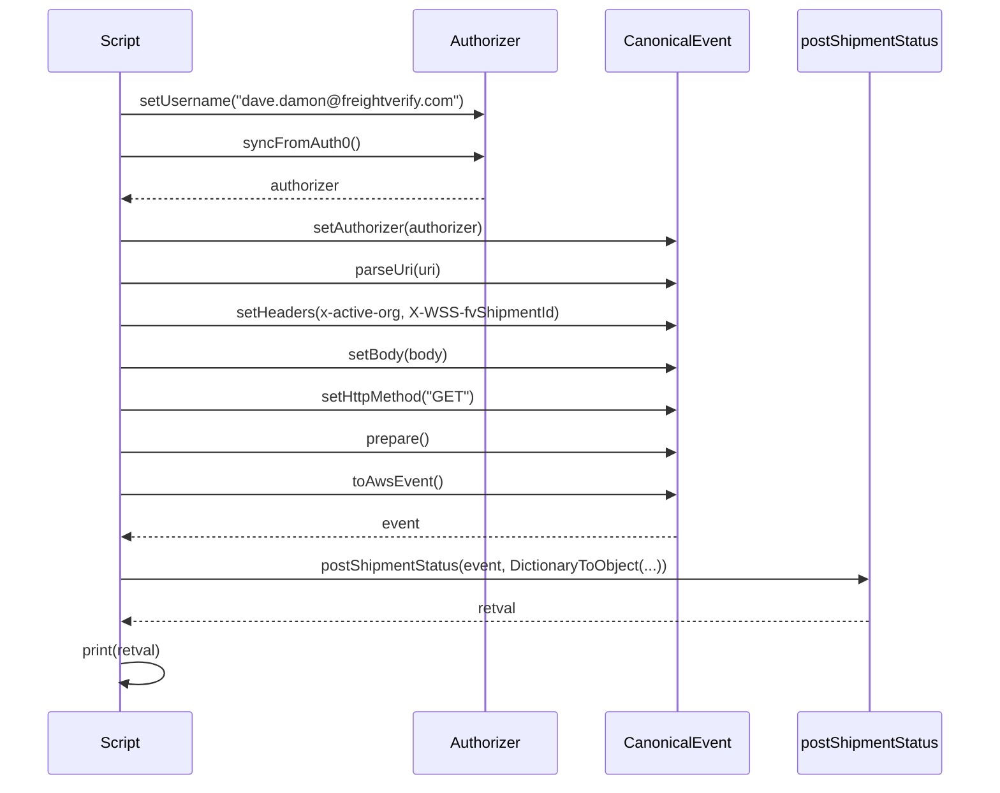
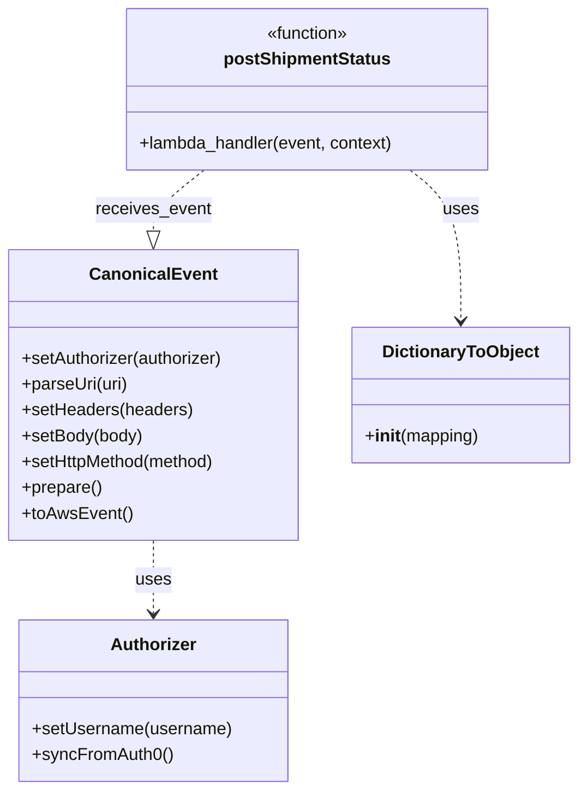
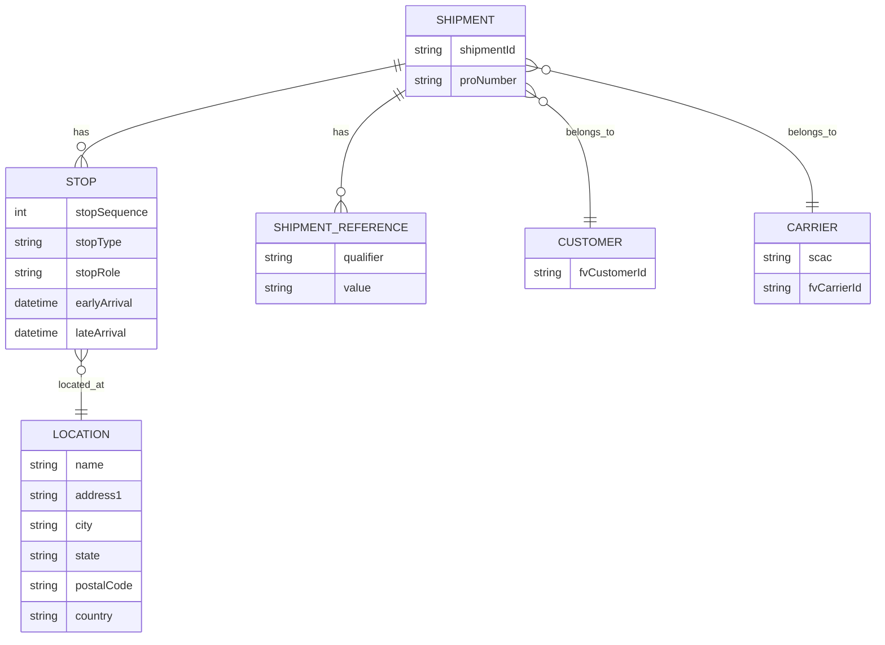

# Diagram: platform/tools/ide_local_testing/localTest/test/shipment/statusUpdateAssetAssignment.py


> Auto-generated by Obscura crawlers

## Diagram 1

```mermaid
flowchart TD
    S([Script]) --> B[Construct body payload]
    B --> A_set[Authorizer.setUsername("dave.damon@freightverify.com")]
    A_set --> A_sync[Authorizer.syncFromAuth0()]
    A_sync --> CE_init[CanonicalEvent()]
    CE_init --> CE_setAuth[setAuthorizer(authorizer)]
    CE_setAuth --> CE_parse[parseUri(uri)]
    CE_parse --> CE_headers[setHeaders(x-active-org, X-WSS-fvShipmentId)]
    CE_headers --> CE_body[setBody(body)]
    CE_body --> CE_method[setHttpMethod("GET")]
    CE_method --> CE_prepare[prepare()]
    CE_prepare --> CE_toAws[toAwsEvent()]
    CE_toAws --> LambdaCall[postShipmentStatus(event, context)]
    LambdaCall --> Output[print(retval)]
```

> SVG rendering failed for this diagram.

## Diagram 2



### SVG

<svg id="container" width="1082" xmlns="http://www.w3.org/2000/svg" height="873" viewBox="-50 -10 1082 873" role="graphics-document document" aria-roledescription="sequence"><g><rect x="815" y="787" fill="#eaeaea" stroke="#666" width="167" height="65" name="Lambda" rx="3" ry="3" class="actor actor-bottom"></rect><text x="898.5" y="819.5" dominant-baseline="central" alignment-baseline="central" class="actor actor-box" style="text-anchor: middle; font-size: 16px; font-weight: 400;"><tspan x="898.5" dy="0">postShipmentStatus</tspan></text></g><g><rect x="615" y="787" fill="#eaeaea" stroke="#666" width="150" height="65" name="CE" rx="3" ry="3" class="actor actor-bottom"></rect><text x="690" y="819.5" dominant-baseline="central" alignment-baseline="central" class="actor actor-box" style="text-anchor: middle; font-size: 16px; font-weight: 400;"><tspan x="690" dy="0">CanonicalEvent</tspan></text></g><g><rect x="415" y="787" fill="#eaeaea" stroke="#666" width="150" height="65" name="Auth" rx="3" ry="3" class="actor actor-bottom"></rect><text x="490" y="819.5" dominant-baseline="central" alignment-baseline="central" class="actor actor-box" style="text-anchor: middle; font-size: 16px; font-weight: 400;"><tspan x="490" dy="0">Authorizer</tspan></text></g><g><rect x="0" y="787" fill="#eaeaea" stroke="#666" width="150" height="65" name="Script" rx="3" ry="3" class="actor actor-bottom"></rect><text x="75" y="819.5" dominant-baseline="central" alignment-baseline="central" class="actor actor-box" style="text-anchor: middle; font-size: 16px; font-weight: 400;"><tspan x="75" dy="0">Script</tspan></text></g><g><line id="actor3" x1="898.5" y1="65" x2="898.5" y2="787" class="actor-line 200" stroke-width="0.5px" stroke="#999" name="Lambda"></line><g id="root-3"><rect x="815" y="0" fill="#eaeaea" stroke="#666" width="167" height="65" name="Lambda" rx="3" ry="3" class="actor actor-top"></rect><text x="898.5" y="32.5" dominant-baseline="central" alignment-baseline="central" class="actor actor-box" style="text-anchor: middle; font-size: 16px; font-weight: 400;"><tspan x="898.5" dy="0">postShipmentStatus</tspan></text></g></g><g><line id="actor2" x1="690" y1="65" x2="690" y2="787" class="actor-line 200" stroke-width="0.5px" stroke="#999" name="CE"></line><g id="root-2"><rect x="615" y="0" fill="#eaeaea" stroke="#666" width="150" height="65" name="CE" rx="3" ry="3" class="actor actor-top"></rect><text x="690" y="32.5" dominant-baseline="central" alignment-baseline="central" class="actor actor-box" style="text-anchor: middle; font-size: 16px; font-weight: 400;"><tspan x="690" dy="0">CanonicalEvent</tspan></text></g></g><g><line id="actor1" x1="490" y1="65" x2="490" y2="787" class="actor-line 200" stroke-width="0.5px" stroke="#999" name="Auth"></line><g id="root-1"><rect x="415" y="0" fill="#eaeaea" stroke="#666" width="150" height="65" name="Auth" rx="3" ry="3" class="actor actor-top"></rect><text x="490" y="32.5" dominant-baseline="central" alignment-baseline="central" class="actor actor-box" style="text-anchor: middle; font-size: 16px; font-weight: 400;"><tspan x="490" dy="0">Authorizer</tspan></text></g></g><g><line id="actor0" x1="75" y1="65" x2="75" y2="787" class="actor-line 200" stroke-width="0.5px" stroke="#999" name="Script"></line><g id="root-0"><rect x="0" y="0" fill="#eaeaea" stroke="#666" width="150" height="65" name="Script" rx="3" ry="3" class="actor actor-top"></rect><text x="75" y="32.5" dominant-baseline="central" alignment-baseline="central" class="actor actor-box" style="text-anchor: middle; font-size: 16px; font-weight: 400;"><tspan x="75" dy="0">Script</tspan></text></g></g><style>#container{font-family:"trebuchet ms",verdana,arial,sans-serif;font-size:16px;fill:#333;}@keyframes edge-animation-frame{from{stroke-dashoffset:0;}}@keyframes dash{to{stroke-dashoffset:0;}}#container .edge-animation-slow{stroke-dasharray:9,5!important;stroke-dashoffset:900;animation:dash 50s linear infinite;stroke-linecap:round;}#container .edge-animation-fast{stroke-dasharray:9,5!important;stroke-dashoffset:900;animation:dash 20s linear infinite;stroke-linecap:round;}#container .error-icon{fill:#552222;}#container .error-text{fill:#552222;stroke:#552222;}#container .edge-thickness-normal{stroke-width:1px;}#container .edge-thickness-thick{stroke-width:3.5px;}#container .edge-pattern-solid{stroke-dasharray:0;}#container .edge-thickness-invisible{stroke-width:0;fill:none;}#container .edge-pattern-dashed{stroke-dasharray:3;}#container .edge-pattern-dotted{stroke-dasharray:2;}#container .marker{fill:#333333;stroke:#333333;}#container .marker.cross{stroke:#333333;}#container svg{font-family:"trebuchet ms",verdana,arial,sans-serif;font-size:16px;}#container p{margin:0;}#container .actor{stroke:hsl(259.6261682243, 59.7765363128%, 87.9019607843%);fill:#ECECFF;}#container text.actor&gt;tspan{fill:black;stroke:none;}#container .actor-line{stroke:hsl(259.6261682243, 59.7765363128%, 87.9019607843%);}#container .innerArc{stroke-width:1.5;stroke-dasharray:none;}#container .messageLine0{stroke-width:1.5;stroke-dasharray:none;stroke:#333;}#container .messageLine1{stroke-width:1.5;stroke-dasharray:2,2;stroke:#333;}#container #arrowhead path{fill:#333;stroke:#333;}#container .sequenceNumber{fill:white;}#container #sequencenumber{fill:#333;}#container #crosshead path{fill:#333;stroke:#333;}#container .messageText{fill:#333;stroke:none;}#container .labelBox{stroke:hsl(259.6261682243, 59.7765363128%, 87.9019607843%);fill:#ECECFF;}#container .labelText,#container .labelText&gt;tspan{fill:black;stroke:none;}#container .loopText,#container .loopText&gt;tspan{fill:black;stroke:none;}#container .loopLine{stroke-width:2px;stroke-dasharray:2,2;stroke:hsl(259.6261682243, 59.7765363128%, 87.9019607843%);fill:hsl(259.6261682243, 59.7765363128%, 87.9019607843%);}#container .note{stroke:#aaaa33;fill:#fff5ad;}#container .noteText,#container .noteText&gt;tspan{fill:black;stroke:none;}#container .activation0{fill:#f4f4f4;stroke:#666;}#container .activation1{fill:#f4f4f4;stroke:#666;}#container .activation2{fill:#f4f4f4;stroke:#666;}#container .actorPopupMenu{position:absolute;}#container .actorPopupMenuPanel{position:absolute;fill:#ECECFF;box-shadow:0px 8px 16px 0px rgba(0,0,0,0.2);filter:drop-shadow(3px 5px 2px rgb(0 0 0 / 0.4));}#container .actor-man line{stroke:hsl(259.6261682243, 59.7765363128%, 87.9019607843%);fill:#ECECFF;}#container .actor-man circle,#container line{stroke:hsl(259.6261682243, 59.7765363128%, 87.9019607843%);fill:#ECECFF;stroke-width:2px;}#container :root{--mermaid-font-family:"trebuchet ms",verdana,arial,sans-serif;}</style><g></g><defs><symbol id="computer" width="24" height="24"><path transform="scale(.5)" d="M2 2v13h20v-13h-20zm18 11h-16v-9h16v9zm-10.228 6l.466-1h3.524l.467 1h-4.457zm14.228 3h-24l2-6h2.104l-1.33 4h18.45l-1.297-4h2.073l2 6zm-5-10h-14v-7h14v7z"></path></symbol></defs><defs><symbol id="database" fill-rule="evenodd" clip-rule="evenodd"><path transform="scale(.5)" d="M12.258.001l.256.004.255.005.253.008.251.01.249.012.247.015.246.016.242.019.241.02.239.023.236.024.233.027.231.028.229.031.225.032.223.034.22.036.217.038.214.04.211.041.208.043.205.045.201.046.198.048.194.05.191.051.187.053.183.054.18.056.175.057.172.059.168.06.163.061.16.063.155.064.15.066.074.033.073.033.071.034.07.034.069.035.068.035.067.035.066.035.064.036.064.036.062.036.06.036.06.037.058.037.058.037.055.038.055.038.053.038.052.038.051.039.05.039.048.039.047.039.045.04.044.04.043.04.041.04.04.041.039.041.037.041.036.041.034.041.033.042.032.042.03.042.029.042.027.042.026.043.024.043.023.043.021.043.02.043.018.044.017.043.015.044.013.044.012.044.011.045.009.044.007.045.006.045.004.045.002.045.001.045v17l-.001.045-.002.045-.004.045-.006.045-.007.045-.009.044-.011.045-.012.044-.013.044-.015.044-.017.043-.018.044-.02.043-.021.043-.023.043-.024.043-.026.043-.027.042-.029.042-.03.042-.032.042-.033.042-.034.041-.036.041-.037.041-.039.041-.04.041-.041.04-.043.04-.044.04-.045.04-.047.039-.048.039-.05.039-.051.039-.052.038-.053.038-.055.038-.055.038-.058.037-.058.037-.06.037-.06.036-.062.036-.064.036-.064.036-.066.035-.067.035-.068.035-.069.035-.07.034-.071.034-.073.033-.074.033-.15.066-.155.064-.16.063-.163.061-.168.06-.172.059-.175.057-.18.056-.183.054-.187.053-.191.051-.194.05-.198.048-.201.046-.205.045-.208.043-.211.041-.214.04-.217.038-.22.036-.223.034-.225.032-.229.031-.231.028-.233.027-.236.024-.239.023-.241.02-.242.019-.246.016-.247.015-.249.012-.251.01-.253.008-.255.005-.256.004-.258.001-.258-.001-.256-.004-.255-.005-.253-.008-.251-.01-.249-.012-.247-.015-.245-.016-.243-.019-.241-.02-.238-.023-.236-.024-.234-.027-.231-.028-.228-.031-.226-.032-.223-.034-.22-.036-.217-.038-.214-.04-.211-.041-.208-.043-.204-.045-.201-.046-.198-.048-.195-.05-.19-.051-.187-.053-.184-.054-.179-.056-.176-.057-.172-.059-.167-.06-.164-.061-.159-.063-.155-.064-.151-.066-.074-.033-.072-.033-.072-.034-.07-.034-.069-.035-.068-.035-.067-.035-.066-.035-.064-.036-.063-.036-.062-.036-.061-.036-.06-.037-.058-.037-.057-.037-.056-.038-.055-.038-.053-.038-.052-.038-.051-.039-.049-.039-.049-.039-.046-.039-.046-.04-.044-.04-.043-.04-.041-.04-.04-.041-.039-.041-.037-.041-.036-.041-.034-.041-.033-.042-.032-.042-.03-.042-.029-.042-.027-.042-.026-.043-.024-.043-.023-.043-.021-.043-.02-.043-.018-.044-.017-.043-.015-.044-.013-.044-.012-.044-.011-.045-.009-.044-.007-.045-.006-.045-.004-.045-.002-.045-.001-.045v-17l.001-.045.002-.045.004-.045.006-.045.007-.045.009-.044.011-.045.012-.044.013-.044.015-.044.017-.043.018-.044.02-.043.021-.043.023-.043.024-.043.026-.043.027-.042.029-.042.03-.042.032-.042.033-.042.034-.041.036-.041.037-.041.039-.041.04-.041.041-.04.043-.04.044-.04.046-.04.046-.039.049-.039.049-.039.051-.039.052-.038.053-.038.055-.038.056-.038.057-.037.058-.037.06-.037.061-.036.062-.036.063-.036.064-.036.066-.035.067-.035.068-.035.069-.035.07-.034.072-.034.072-.033.074-.033.151-.066.155-.064.159-.063.164-.061.167-.06.172-.059.176-.057.179-.056.184-.054.187-.053.19-.051.195-.05.198-.048.201-.046.204-.045.208-.043.211-.041.214-.04.217-.038.22-.036.223-.034.226-.032.228-.031.231-.028.234-.027.236-.024.238-.023.241-.02.243-.019.245-.016.247-.015.249-.012.251-.01.253-.008.255-.005.256-.004.258-.001.258.001zm-9.258 20.499v.01l.001.021.003.021.004.022.005.021.006.022.007.022.009.023.01.022.011.023.012.023.013.023.015.023.016.024.017.023.018.024.019.024.021.024.022.025.023.024.024.025.052.049.056.05.061.051.066.051.07.051.075.051.079.052.084.052.088.052.092.052.097.052.102.051.105.052.11.052.114.051.119.051.123.051.127.05.131.05.135.05.139.048.144.049.147.047.152.047.155.047.16.045.163.045.167.043.171.043.176.041.178.041.183.039.187.039.19.037.194.035.197.035.202.033.204.031.209.03.212.029.216.027.219.025.222.024.226.021.23.02.233.018.236.016.24.015.243.012.246.01.249.008.253.005.256.004.259.001.26-.001.257-.004.254-.005.25-.008.247-.011.244-.012.241-.014.237-.016.233-.018.231-.021.226-.021.224-.024.22-.026.216-.027.212-.028.21-.031.205-.031.202-.034.198-.034.194-.036.191-.037.187-.039.183-.04.179-.04.175-.042.172-.043.168-.044.163-.045.16-.046.155-.046.152-.047.148-.048.143-.049.139-.049.136-.05.131-.05.126-.05.123-.051.118-.052.114-.051.11-.052.106-.052.101-.052.096-.052.092-.052.088-.053.083-.051.079-.052.074-.052.07-.051.065-.051.06-.051.056-.05.051-.05.023-.024.023-.025.021-.024.02-.024.019-.024.018-.024.017-.024.015-.023.014-.024.013-.023.012-.023.01-.023.01-.022.008-.022.006-.022.006-.022.004-.022.004-.021.001-.021.001-.021v-4.127l-.077.055-.08.053-.083.054-.085.053-.087.052-.09.052-.093.051-.095.05-.097.05-.1.049-.102.049-.105.048-.106.047-.109.047-.111.046-.114.045-.115.045-.118.044-.12.043-.122.042-.124.042-.126.041-.128.04-.13.04-.132.038-.134.038-.135.037-.138.037-.139.035-.142.035-.143.034-.144.033-.147.032-.148.031-.15.03-.151.03-.153.029-.154.027-.156.027-.158.026-.159.025-.161.024-.162.023-.163.022-.165.021-.166.02-.167.019-.169.018-.169.017-.171.016-.173.015-.173.014-.175.013-.175.012-.177.011-.178.01-.179.008-.179.008-.181.006-.182.005-.182.004-.184.003-.184.002h-.37l-.184-.002-.184-.003-.182-.004-.182-.005-.181-.006-.179-.008-.179-.008-.178-.01-.176-.011-.176-.012-.175-.013-.173-.014-.172-.015-.171-.016-.17-.017-.169-.018-.167-.019-.166-.02-.165-.021-.163-.022-.162-.023-.161-.024-.159-.025-.157-.026-.156-.027-.155-.027-.153-.029-.151-.03-.15-.03-.148-.031-.146-.032-.145-.033-.143-.034-.141-.035-.14-.035-.137-.037-.136-.037-.134-.038-.132-.038-.13-.04-.128-.04-.126-.041-.124-.042-.122-.042-.12-.044-.117-.043-.116-.045-.113-.045-.112-.046-.109-.047-.106-.047-.105-.048-.102-.049-.1-.049-.097-.05-.095-.05-.093-.052-.09-.051-.087-.052-.085-.053-.083-.054-.08-.054-.077-.054v4.127zm0-5.654v.011l.001.021.003.021.004.021.005.022.006.022.007.022.009.022.01.022.011.023.012.023.013.023.015.024.016.023.017.024.018.024.019.024.021.024.022.024.023.025.024.024.052.05.056.05.061.05.066.051.07.051.075.052.079.051.084.052.088.052.092.052.097.052.102.052.105.052.11.051.114.051.119.052.123.05.127.051.131.05.135.049.139.049.144.048.147.048.152.047.155.046.16.045.163.045.167.044.171.042.176.042.178.04.183.04.187.038.19.037.194.036.197.034.202.033.204.032.209.03.212.028.216.027.219.025.222.024.226.022.23.02.233.018.236.016.24.014.243.012.246.01.249.008.253.006.256.003.259.001.26-.001.257-.003.254-.006.25-.008.247-.01.244-.012.241-.015.237-.016.233-.018.231-.02.226-.022.224-.024.22-.025.216-.027.212-.029.21-.03.205-.032.202-.033.198-.035.194-.036.191-.037.187-.039.183-.039.179-.041.175-.042.172-.043.168-.044.163-.045.16-.045.155-.047.152-.047.148-.048.143-.048.139-.05.136-.049.131-.05.126-.051.123-.051.118-.051.114-.052.11-.052.106-.052.101-.052.096-.052.092-.052.088-.052.083-.052.079-.052.074-.051.07-.052.065-.051.06-.05.056-.051.051-.049.023-.025.023-.024.021-.025.02-.024.019-.024.018-.024.017-.024.015-.023.014-.023.013-.024.012-.022.01-.023.01-.023.008-.022.006-.022.006-.022.004-.021.004-.022.001-.021.001-.021v-4.139l-.077.054-.08.054-.083.054-.085.052-.087.053-.09.051-.093.051-.095.051-.097.05-.1.049-.102.049-.105.048-.106.047-.109.047-.111.046-.114.045-.115.044-.118.044-.12.044-.122.042-.124.042-.126.041-.128.04-.13.039-.132.039-.134.038-.135.037-.138.036-.139.036-.142.035-.143.033-.144.033-.147.033-.148.031-.15.03-.151.03-.153.028-.154.028-.156.027-.158.026-.159.025-.161.024-.162.023-.163.022-.165.021-.166.02-.167.019-.169.018-.169.017-.171.016-.173.015-.173.014-.175.013-.175.012-.177.011-.178.009-.179.009-.179.007-.181.007-.182.005-.182.004-.184.003-.184.002h-.37l-.184-.002-.184-.003-.182-.004-.182-.005-.181-.007-.179-.007-.179-.009-.178-.009-.176-.011-.176-.012-.175-.013-.173-.014-.172-.015-.171-.016-.17-.017-.169-.018-.167-.019-.166-.02-.165-.021-.163-.022-.162-.023-.161-.024-.159-.025-.157-.026-.156-.027-.155-.028-.153-.028-.151-.03-.15-.03-.148-.031-.146-.033-.145-.033-.143-.033-.141-.035-.14-.036-.137-.036-.136-.037-.134-.038-.132-.039-.13-.039-.128-.04-.126-.041-.124-.042-.122-.043-.12-.043-.117-.044-.116-.044-.113-.046-.112-.046-.109-.046-.106-.047-.105-.048-.102-.049-.1-.049-.097-.05-.095-.051-.093-.051-.09-.051-.087-.053-.085-.052-.083-.054-.08-.054-.077-.054v4.139zm0-5.666v.011l.001.02.003.022.004.021.005.022.006.021.007.022.009.023.01.022.011.023.012.023.013.023.015.023.016.024.017.024.018.023.019.024.021.025.022.024.023.024.024.025.052.05.056.05.061.05.066.051.07.051.075.052.079.051.084.052.088.052.092.052.097.052.102.052.105.051.11.052.114.051.119.051.123.051.127.05.131.05.135.05.139.049.144.048.147.048.152.047.155.046.16.045.163.045.167.043.171.043.176.042.178.04.183.04.187.038.19.037.194.036.197.034.202.033.204.032.209.03.212.028.216.027.219.025.222.024.226.021.23.02.233.018.236.017.24.014.243.012.246.01.249.008.253.006.256.003.259.001.26-.001.257-.003.254-.006.25-.008.247-.01.244-.013.241-.014.237-.016.233-.018.231-.02.226-.022.224-.024.22-.025.216-.027.212-.029.21-.03.205-.032.202-.033.198-.035.194-.036.191-.037.187-.039.183-.039.179-.041.175-.042.172-.043.168-.044.163-.045.16-.045.155-.047.152-.047.148-.048.143-.049.139-.049.136-.049.131-.051.126-.05.123-.051.118-.052.114-.051.11-.052.106-.052.101-.052.096-.052.092-.052.088-.052.083-.052.079-.052.074-.052.07-.051.065-.051.06-.051.056-.05.051-.049.023-.025.023-.025.021-.024.02-.024.019-.024.018-.024.017-.024.015-.023.014-.024.013-.023.012-.023.01-.022.01-.023.008-.022.006-.022.006-.022.004-.022.004-.021.001-.021.001-.021v-4.153l-.077.054-.08.054-.083.053-.085.053-.087.053-.09.051-.093.051-.095.051-.097.05-.1.049-.102.048-.105.048-.106.048-.109.046-.111.046-.114.046-.115.044-.118.044-.12.043-.122.043-.124.042-.126.041-.128.04-.13.039-.132.039-.134.038-.135.037-.138.036-.139.036-.142.034-.143.034-.144.033-.147.032-.148.032-.15.03-.151.03-.153.028-.154.028-.156.027-.158.026-.159.024-.161.024-.162.023-.163.023-.165.021-.166.02-.167.019-.169.018-.169.017-.171.016-.173.015-.173.014-.175.013-.175.012-.177.01-.178.01-.179.009-.179.007-.181.006-.182.006-.182.004-.184.003-.184.001-.185.001-.185-.001-.184-.001-.184-.003-.182-.004-.182-.006-.181-.006-.179-.007-.179-.009-.178-.01-.176-.01-.176-.012-.175-.013-.173-.014-.172-.015-.171-.016-.17-.017-.169-.018-.167-.019-.166-.02-.165-.021-.163-.023-.162-.023-.161-.024-.159-.024-.157-.026-.156-.027-.155-.028-.153-.028-.151-.03-.15-.03-.148-.032-.146-.032-.145-.033-.143-.034-.141-.034-.14-.036-.137-.036-.136-.037-.134-.038-.132-.039-.13-.039-.128-.041-.126-.041-.124-.041-.122-.043-.12-.043-.117-.044-.116-.044-.113-.046-.112-.046-.109-.046-.106-.048-.105-.048-.102-.048-.1-.05-.097-.049-.095-.051-.093-.051-.09-.052-.087-.052-.085-.053-.083-.053-.08-.054-.077-.054v4.153zm8.74-8.179l-.257.004-.254.005-.25.008-.247.011-.244.012-.241.014-.237.016-.233.018-.231.021-.226.022-.224.023-.22.026-.216.027-.212.028-.21.031-.205.032-.202.033-.198.034-.194.036-.191.038-.187.038-.183.04-.179.041-.175.042-.172.043-.168.043-.163.045-.16.046-.155.046-.152.048-.148.048-.143.048-.139.049-.136.05-.131.05-.126.051-.123.051-.118.051-.114.052-.11.052-.106.052-.101.052-.096.052-.092.052-.088.052-.083.052-.079.052-.074.051-.07.052-.065.051-.06.05-.056.05-.051.05-.023.025-.023.024-.021.024-.02.025-.019.024-.018.024-.017.023-.015.024-.014.023-.013.023-.012.023-.01.023-.01.022-.008.022-.006.023-.006.021-.004.022-.004.021-.001.021-.001.021.001.021.001.021.004.021.004.022.006.021.006.023.008.022.01.022.01.023.012.023.013.023.014.023.015.024.017.023.018.024.019.024.02.025.021.024.023.024.023.025.051.05.056.05.06.05.065.051.07.052.074.051.079.052.083.052.088.052.092.052.096.052.101.052.106.052.11.052.114.052.118.051.123.051.126.051.131.05.136.05.139.049.143.048.148.048.152.048.155.046.16.046.163.045.168.043.172.043.175.042.179.041.183.04.187.038.191.038.194.036.198.034.202.033.205.032.21.031.212.028.216.027.22.026.224.023.226.022.231.021.233.018.237.016.241.014.244.012.247.011.25.008.254.005.257.004.26.001.26-.001.257-.004.254-.005.25-.008.247-.011.244-.012.241-.014.237-.016.233-.018.231-.021.226-.022.224-.023.22-.026.216-.027.212-.028.21-.031.205-.032.202-.033.198-.034.194-.036.191-.038.187-.038.183-.04.179-.041.175-.042.172-.043.168-.043.163-.045.16-.046.155-.046.152-.048.148-.048.143-.048.139-.049.136-.05.131-.05.126-.051.123-.051.118-.051.114-.052.11-.052.106-.052.101-.052.096-.052.092-.052.088-.052.083-.052.079-.052.074-.051.07-.052.065-.051.06-.05.056-.05.051-.05.023-.025.023-.024.021-.024.02-.025.019-.024.018-.024.017-.023.015-.024.014-.023.013-.023.012-.023.01-.023.01-.022.008-.022.006-.023.006-.021.004-.022.004-.021.001-.021.001-.021-.001-.021-.001-.021-.004-.021-.004-.022-.006-.021-.006-.023-.008-.022-.01-.022-.01-.023-.012-.023-.013-.023-.014-.023-.015-.024-.017-.023-.018-.024-.019-.024-.02-.025-.021-.024-.023-.024-.023-.025-.051-.05-.056-.05-.06-.05-.065-.051-.07-.052-.074-.051-.079-.052-.083-.052-.088-.052-.092-.052-.096-.052-.101-.052-.106-.052-.11-.052-.114-.052-.118-.051-.123-.051-.126-.051-.131-.05-.136-.05-.139-.049-.143-.048-.148-.048-.152-.048-.155-.046-.16-.046-.163-.045-.168-.043-.172-.043-.175-.042-.179-.041-.183-.04-.187-.038-.191-.038-.194-.036-.198-.034-.202-.033-.205-.032-.21-.031-.212-.028-.216-.027-.22-.026-.224-.023-.226-.022-.231-.021-.233-.018-.237-.016-.241-.014-.244-.012-.247-.011-.25-.008-.254-.005-.257-.004-.26-.001-.26.001z"></path></symbol></defs><defs><symbol id="clock" width="24" height="24"><path transform="scale(.5)" d="M12 2c5.514 0 10 4.486 10 10s-4.486 10-10 10-10-4.486-10-10 4.486-10 10-10zm0-2c-6.627 0-12 5.373-12 12s5.373 12 12 12 12-5.373 12-12-5.373-12-12-12zm5.848 12.459c.202.038.202.333.001.372-1.907.361-6.045 1.111-6.547 1.111-.719 0-1.301-.582-1.301-1.301 0-.512.77-5.447 1.125-7.445.034-.192.312-.181.343.014l.985 6.238 5.394 1.011z"></path></symbol></defs><defs><marker id="arrowhead" refX="7.9" refY="5" markerUnits="userSpaceOnUse" markerWidth="12" markerHeight="12" orient="auto-start-reverse"><path d="M -1 0 L 10 5 L 0 10 z"></path></marker></defs><defs><marker id="crosshead" markerWidth="15" markerHeight="8" orient="auto" refX="4" refY="4.5"><path fill="none" stroke="#000000" stroke-width="1pt" d="M 1,2 L 6,7 M 6,2 L 1,7" style="stroke-dasharray: 0, 0;"></path></marker></defs><defs><marker id="filled-head" refX="15.5" refY="7" markerWidth="20" markerHeight="28" orient="auto"><path d="M 18,7 L9,13 L14,7 L9,1 Z"></path></marker></defs><defs><marker id="sequencenumber" refX="15" refY="15" markerWidth="60" markerHeight="40" orient="auto"><circle cx="15" cy="15" r="6"></circle></marker></defs><text x="281" y="80" text-anchor="middle" dominant-baseline="middle" alignment-baseline="middle" class="messageText" dy="1em" style="font-size: 16px; font-weight: 400;">setUsername("dave.damon@freightverify.com")</text><line x1="76" y1="113" x2="486" y2="113" class="messageLine0" stroke-width="2" stroke="none" marker-end="url(#arrowhead)" style="fill: none;"></line><text x="281" y="128" text-anchor="middle" dominant-baseline="middle" alignment-baseline="middle" class="messageText" dy="1em" style="font-size: 16px; font-weight: 400;">syncFromAuth0()</text><line x1="76" y1="161" x2="486" y2="161" class="messageLine0" stroke-width="2" stroke="none" marker-end="url(#arrowhead)" style="fill: none;"></line><text x="284" y="176" text-anchor="middle" dominant-baseline="middle" alignment-baseline="middle" class="messageText" dy="1em" style="font-size: 16px; font-weight: 400;">authorizer</text><line x1="489" y1="209" x2="79" y2="209" class="messageLine1" stroke-width="2" stroke="none" marker-end="url(#arrowhead)" style="stroke-dasharray: 3, 3; fill: none;"></line><text x="381" y="224" text-anchor="middle" dominant-baseline="middle" alignment-baseline="middle" class="messageText" dy="1em" style="font-size: 16px; font-weight: 400;">setAuthorizer(authorizer)</text><line x1="76" y1="257" x2="686" y2="257" class="messageLine0" stroke-width="2" stroke="none" marker-end="url(#arrowhead)" style="fill: none;"></line><text x="381" y="272" text-anchor="middle" dominant-baseline="middle" alignment-baseline="middle" class="messageText" dy="1em" style="font-size: 16px; font-weight: 400;">parseUri(uri)</text><line x1="76" y1="305" x2="686" y2="305" class="messageLine0" stroke-width="2" stroke="none" marker-end="url(#arrowhead)" style="fill: none;"></line><text x="381" y="320" text-anchor="middle" dominant-baseline="middle" alignment-baseline="middle" class="messageText" dy="1em" style="font-size: 16px; font-weight: 400;">setHeaders(x-active-org, X-WSS-fvShipmentId)</text><line x1="76" y1="353" x2="686" y2="353" class="messageLine0" stroke-width="2" stroke="none" marker-end="url(#arrowhead)" style="fill: none;"></line><text x="381" y="368" text-anchor="middle" dominant-baseline="middle" alignment-baseline="middle" class="messageText" dy="1em" style="font-size: 16px; font-weight: 400;">setBody(body)</text><line x1="76" y1="401" x2="686" y2="401" class="messageLine0" stroke-width="2" stroke="none" marker-end="url(#arrowhead)" style="fill: none;"></line><text x="381" y="416" text-anchor="middle" dominant-baseline="middle" alignment-baseline="middle" class="messageText" dy="1em" style="font-size: 16px; font-weight: 400;">setHttpMethod("GET")</text><line x1="76" y1="449" x2="686" y2="449" class="messageLine0" stroke-width="2" stroke="none" marker-end="url(#arrowhead)" style="fill: none;"></line><text x="381" y="464" text-anchor="middle" dominant-baseline="middle" alignment-baseline="middle" class="messageText" dy="1em" style="font-size: 16px; font-weight: 400;">prepare()</text><line x1="76" y1="497" x2="686" y2="497" class="messageLine0" stroke-width="2" stroke="none" marker-end="url(#arrowhead)" style="fill: none;"></line><text x="381" y="512" text-anchor="middle" dominant-baseline="middle" alignment-baseline="middle" class="messageText" dy="1em" style="font-size: 16px; font-weight: 400;">toAwsEvent()</text><line x1="76" y1="545" x2="686" y2="545" class="messageLine0" stroke-width="2" stroke="none" marker-end="url(#arrowhead)" style="fill: none;"></line><text x="384" y="560" text-anchor="middle" dominant-baseline="middle" alignment-baseline="middle" class="messageText" dy="1em" style="font-size: 16px; font-weight: 400;">event</text><line x1="689" y1="593" x2="79" y2="593" class="messageLine1" stroke-width="2" stroke="none" marker-end="url(#arrowhead)" style="stroke-dasharray: 3, 3; fill: none;"></line><text x="485" y="608" text-anchor="middle" dominant-baseline="middle" alignment-baseline="middle" class="messageText" dy="1em" style="font-size: 16px; font-weight: 400;">postShipmentStatus(event, DictionaryToObject(...))</text><line x1="76" y1="641" x2="894.5" y2="641" class="messageLine0" stroke-width="2" stroke="none" marker-end="url(#arrowhead)" style="fill: none;"></line><text x="488" y="656" text-anchor="middle" dominant-baseline="middle" alignment-baseline="middle" class="messageText" dy="1em" style="font-size: 16px; font-weight: 400;">retval</text><line x1="897.5" y1="689" x2="79" y2="689" class="messageLine1" stroke-width="2" stroke="none" marker-end="url(#arrowhead)" style="stroke-dasharray: 3, 3; fill: none;"></line><text x="76" y="704" text-anchor="middle" dominant-baseline="middle" alignment-baseline="middle" class="messageText" dy="1em" style="font-size: 16px; font-weight: 400;">print(retval)</text><path d="M 76,737 C 136,727 136,767 76,757" class="messageLine0" stroke-width="2" stroke="none" marker-end="url(#arrowhead)" style="fill: none;"></path></svg>

## Diagram 3



### SVG

<svg id="container" width="537.0078125" xmlns="http://www.w3.org/2000/svg" class="classDiagram" height="734" viewBox="0 0 537.0078125 734" role="graphics-document document" aria-roledescription="class"><style>#container{font-family:"trebuchet ms",verdana,arial,sans-serif;font-size:16px;fill:#333;}@keyframes edge-animation-frame{from{stroke-dashoffset:0;}}@keyframes dash{to{stroke-dashoffset:0;}}#container .edge-animation-slow{stroke-dasharray:9,5!important;stroke-dashoffset:900;animation:dash 50s linear infinite;stroke-linecap:round;}#container .edge-animation-fast{stroke-dasharray:9,5!important;stroke-dashoffset:900;animation:dash 20s linear infinite;stroke-linecap:round;}#container .error-icon{fill:#552222;}#container .error-text{fill:#552222;stroke:#552222;}#container .edge-thickness-normal{stroke-width:1px;}#container .edge-thickness-thick{stroke-width:3.5px;}#container .edge-pattern-solid{stroke-dasharray:0;}#container .edge-thickness-invisible{stroke-width:0;fill:none;}#container .edge-pattern-dashed{stroke-dasharray:3;}#container .edge-pattern-dotted{stroke-dasharray:2;}#container .marker{fill:#333333;stroke:#333333;}#container .marker.cross{stroke:#333333;}#container svg{font-family:"trebuchet ms",verdana,arial,sans-serif;font-size:16px;}#container p{margin:0;}#container g.classGroup text{fill:#9370DB;stroke:none;font-family:"trebuchet ms",verdana,arial,sans-serif;font-size:10px;}#container g.classGroup text .title{font-weight:bolder;}#container .nodeLabel,#container .edgeLabel{color:#131300;}#container .edgeLabel .label rect{fill:#ECECFF;}#container .label text{fill:#131300;}#container .labelBkg{background:#ECECFF;}#container .edgeLabel .label span{background:#ECECFF;}#container .classTitle{font-weight:bolder;}#container .node rect,#container .node circle,#container .node ellipse,#container .node polygon,#container .node path{fill:#ECECFF;stroke:#9370DB;stroke-width:1px;}#container .divider{stroke:#9370DB;stroke-width:1;}#container g.clickable{cursor:pointer;}#container g.classGroup rect{fill:#ECECFF;stroke:#9370DB;}#container g.classGroup line{stroke:#9370DB;stroke-width:1;}#container .classLabel .box{stroke:none;stroke-width:0;fill:#ECECFF;opacity:0.5;}#container .classLabel .label{fill:#9370DB;font-size:10px;}#container .relation{stroke:#333333;stroke-width:1;fill:none;}#container .dashed-line{stroke-dasharray:3;}#container .dotted-line{stroke-dasharray:1 2;}#container #compositionStart,#container .composition{fill:#333333!important;stroke:#333333!important;stroke-width:1;}#container #compositionEnd,#container .composition{fill:#333333!important;stroke:#333333!important;stroke-width:1;}#container #dependencyStart,#container .dependency{fill:#333333!important;stroke:#333333!important;stroke-width:1;}#container #dependencyStart,#container .dependency{fill:#333333!important;stroke:#333333!important;stroke-width:1;}#container #extensionStart,#container .extension{fill:transparent!important;stroke:#333333!important;stroke-width:1;}#container #extensionEnd,#container .extension{fill:transparent!important;stroke:#333333!important;stroke-width:1;}#container #aggregationStart,#container .aggregation{fill:transparent!important;stroke:#333333!important;stroke-width:1;}#container #aggregationEnd,#container .aggregation{fill:transparent!important;stroke:#333333!important;stroke-width:1;}#container #lollipopStart,#container .lollipop{fill:#ECECFF!important;stroke:#333333!important;stroke-width:1;}#container #lollipopEnd,#container .lollipop{fill:#ECECFF!important;stroke:#333333!important;stroke-width:1;}#container .edgeTerminals{font-size:11px;line-height:initial;}#container .classTitleText{text-anchor:middle;font-size:18px;fill:#333;}#container .label-icon{display:inline-block;height:1em;overflow:visible;vertical-align:-0.125em;}#container .node .label-icon path{fill:currentColor;stroke:revert;stroke-width:revert;}#container :root{--mermaid-font-family:"trebuchet ms",verdana,arial,sans-serif;}</style><g><defs><marker id="container_class-aggregationStart" class="marker aggregation class" refX="18" refY="7" markerWidth="190" markerHeight="240" orient="auto"><path d="M 18,7 L9,13 L1,7 L9,1 Z"></path></marker></defs><defs><marker id="container_class-aggregationEnd" class="marker aggregation class" refX="1" refY="7" markerWidth="20" markerHeight="28" orient="auto"><path d="M 18,7 L9,13 L1,7 L9,1 Z"></path></marker></defs><defs><marker id="container_class-extensionStart" class="marker extension class" refX="18" refY="7" markerWidth="190" markerHeight="240" orient="auto"><path d="M 1,7 L18,13 V 1 Z"></path></marker></defs><defs><marker id="container_class-extensionEnd" class="marker extension class" refX="1" refY="7" markerWidth="20" markerHeight="28" orient="auto"><path d="M 1,1 V 13 L18,7 Z"></path></marker></defs><defs><marker id="container_class-compositionStart" class="marker composition class" refX="18" refY="7" markerWidth="190" markerHeight="240" orient="auto"><path d="M 18,7 L9,13 L1,7 L9,1 Z"></path></marker></defs><defs><marker id="container_class-compositionEnd" class="marker composition class" refX="1" refY="7" markerWidth="20" markerHeight="28" orient="auto"><path d="M 18,7 L9,13 L1,7 L9,1 Z"></path></marker></defs><defs><marker id="container_class-dependencyStart" class="marker dependency class" refX="6" refY="7" markerWidth="190" markerHeight="240" orient="auto"><path d="M 5,7 L9,13 L1,7 L9,1 Z"></path></marker></defs><defs><marker id="container_class-dependencyEnd" class="marker dependency class" refX="13" refY="7" markerWidth="20" markerHeight="28" orient="auto"><path d="M 18,7 L9,13 L14,7 L9,1 Z"></path></marker></defs><defs><marker id="container_class-lollipopStart" class="marker lollipop class" refX="13" refY="7" markerWidth="190" markerHeight="240" orient="auto"><circle stroke="black" fill="transparent" cx="7" cy="7" r="6"></circle></marker></defs><defs><marker id="container_class-lollipopEnd" class="marker lollipop class" refX="1" refY="7" markerWidth="190" markerHeight="240" orient="auto"><circle stroke="black" fill="transparent" cx="7" cy="7" r="6"></circle></marker></defs><g class="root"><g class="clusters"></g><g class="edgePaths"><path d="M143.23,502L143.23,508.167C143.23,514.333,143.23,526.667,143.23,538C143.23,549.333,143.23,559.667,143.23,564.833L143.23,570" id="id_CanonicalEvent_Authorizer_1" class="edge-thickness-normal edge-pattern-dashed relation" style=";;;" data-edge="true" data-et="edge" data-id="id_CanonicalEvent_Authorizer_1" data-points="W3sieCI6MTQzLjIzMDQ2ODc1LCJ5Ijo1MDJ9LHsieCI6MTQzLjIzMDQ2ODc1LCJ5Ijo1Mzl9LHsieCI6MTQzLjIzMDQ2ODc1LCJ5Ijo1NzZ9XQ==" marker-end="url(#container_class-dependencyEnd)"></path><path d="M381.575,158L389.435,164.167C397.295,170.333,413.015,182.667,420.875,206C428.734,229.333,428.734,263.667,428.734,280.833L428.734,298" id="id_postShipmentStatus_DictionaryToObject_2" class="edge-thickness-normal edge-pattern-dashed relation" style=";;;" data-edge="true" data-et="edge" data-id="id_postShipmentStatus_DictionaryToObject_2" data-points="W3sieCI6MzgxLjU3NTI0NzYyODM0ODIsInkiOjE1OH0seyJ4Ijo0MjguNzM0Mzc1LCJ5IjoxOTV9LHsieCI6NDI4LjczNDM3NSwieSI6MzA0fV0=" marker-end="url(#container_class-dependencyEnd)"></path><path d="M190.39,158L182.53,164.167C174.67,170.333,158.95,182.667,151.09,192.125C143.23,201.583,143.23,208.167,143.23,211.458L143.23,214.75" id="id_postShipmentStatus_CanonicalEvent_3" class="edge-thickness-normal edge-pattern-dashed relation" style=";;;" data-edge="true" data-et="edge" data-id="id_postShipmentStatus_CanonicalEvent_3" data-points="W3sieCI6MTkwLjM4OTU5NjEyMTY1MTc4LCJ5IjoxNTh9LHsieCI6MTQzLjIzMDQ2ODc1LCJ5IjoxOTV9LHsieCI6MTQzLjIzMDQ2ODc1LCJ5IjoyMzJ9XQ==" marker-end="url(#container_class-extensionEnd)"></path></g><g class="edgeLabels"><g class="edgeLabel" transform="translate(143.23046875, 539)"><g class="label" data-id="id_CanonicalEvent_Authorizer_1" transform="translate(-16.4921875, -12)"><foreignObject width="32.984375" height="24"><div xmlns="http://www.w3.org/1999/xhtml" class="labelBkg" style="display: table-cell; white-space: nowrap; line-height: 1.5; max-width: 200px; text-align: center;"><span class="edgeLabel"><p>uses</p></span></div></foreignObject></g></g><g class="edgeLabel" transform="translate(428.734375, 195)"><g class="label" data-id="id_postShipmentStatus_DictionaryToObject_2" transform="translate(-16.4921875, -12)"><foreignObject width="32.984375" height="24"><div xmlns="http://www.w3.org/1999/xhtml" class="labelBkg" style="display: table-cell; white-space: nowrap; line-height: 1.5; max-width: 200px; text-align: center;"><span class="edgeLabel"><p>uses</p></span></div></foreignObject></g></g><g class="edgeLabel" transform="translate(143.23046875, 195)"><g class="label" data-id="id_postShipmentStatus_CanonicalEvent_3" transform="translate(-53.5, -12)"><foreignObject width="107" height="24"><div xmlns="http://www.w3.org/1999/xhtml" class="labelBkg" style="display: table-cell; white-space: nowrap; line-height: 1.5; max-width: 200px; text-align: center;"><span class="edgeLabel"><p>receives_event</p></span></div></foreignObject></g></g></g><g class="nodes"><g class="node default" id="classId-Authorizer-0" transform="translate(143.23046875, 651)"><g class="basic label-container"><path d="M-124.13671875 -75 L124.13671875 -75 L124.13671875 75 L-124.13671875 75" stroke="none" stroke-width="0" fill="#ECECFF" style=""></path><path d="M-124.13671875 -75 C-73.0378068368897 -75, -21.938894923779415 -75, 124.13671875 -75 M-124.13671875 -75 C-51.74150597799179 -75, 20.653706794016415 -75, 124.13671875 -75 M124.13671875 -75 C124.13671875 -24.851808857041554, 124.13671875 25.29638228591689, 124.13671875 75 M124.13671875 -75 C124.13671875 -42.00469123381453, 124.13671875 -9.009382467629067, 124.13671875 75 M124.13671875 75 C58.3118213343983 75, -7.513076081203394 75, -124.13671875 75 M124.13671875 75 C74.23619112365964 75, 24.335663497319274 75, -124.13671875 75 M-124.13671875 75 C-124.13671875 41.28247973692523, -124.13671875 7.564959473850465, -124.13671875 -75 M-124.13671875 75 C-124.13671875 39.26575180076126, -124.13671875 3.531503601522516, -124.13671875 -75" stroke="#9370DB" stroke-width="1.3" fill="none" stroke-dasharray="0 0" style=""></path></g><g class="annotation-group text" transform="translate(0, -51)"></g><g class="label-group text" transform="translate(-38.3671875, -51)"><g class="label" style="font-weight: bolder" transform="translate(0,-12)"><foreignObject width="76.734375" height="24"><div xmlns="http://www.w3.org/1999/xhtml" style="display: table-cell; white-space: nowrap; line-height: 1.5; max-width: 126px; text-align: center;"><span class="nodeLabel markdown-node-label" style=""><p>Authorizer</p></span></div></foreignObject></g></g><g class="members-group text" transform="translate(-112.13671875, -3)"></g><g class="methods-group text" transform="translate(-112.13671875, 27)"><g class="label" style="" transform="translate(0,-12)"><foreignObject width="185.90625" height="24"><div xmlns="http://www.w3.org/1999/xhtml" style="display: table-cell; white-space: nowrap; line-height: 1.5; max-width: 243px; text-align: center;"><span class="nodeLabel markdown-node-label" style=""><p>+setUsername(username)</p></span></div></foreignObject></g><g class="label" style="" transform="translate(0,12)"><foreignObject width="129.0625" height="24"><div xmlns="http://www.w3.org/1999/xhtml" style="display: table-cell; white-space: nowrap; line-height: 1.5; max-width: 186px; text-align: center;"><span class="nodeLabel markdown-node-label" style=""><p>+syncFromAuth0()</p></span></div></foreignObject></g></g><g class="divider" style=""><path d="M-124.13671875 -27 C-50.000221028849765 -27, 24.13627669230047 -27, 124.13671875 -27 M-124.13671875 -27 C-51.15820246485835 -27, 21.820313820283303 -27, 124.13671875 -27" stroke="#9370DB" stroke-width="1.3" fill="none" stroke-dasharray="0 0" style=""></path></g><g class="divider" style=""><path d="M-124.13671875 -3 C-55.41074807650044 -3, 13.31522259699912 -3, 124.13671875 -3 M-124.13671875 -3 C-62.78701867421656 -3, -1.437318598433123 -3, 124.13671875 -3" stroke="#9370DB" stroke-width="1.3" fill="none" stroke-dasharray="0 0" style=""></path></g></g><g class="node default" id="classId-CanonicalEvent-1" transform="translate(143.23046875, 367)"><g class="basic label-container"><path d="M-135.23046875 -135 L135.23046875 -135 L135.23046875 135 L-135.23046875 135" stroke="none" stroke-width="0" fill="#ECECFF" style=""></path><path d="M-135.23046875 -135 C-73.31037374089662 -135, -11.390278731793245 -135, 135.23046875 -135 M-135.23046875 -135 C-79.92859732803208 -135, -24.626725906064152 -135, 135.23046875 -135 M135.23046875 -135 C135.23046875 -50.95742552975585, 135.23046875 33.085148940488295, 135.23046875 135 M135.23046875 -135 C135.23046875 -73.94306470760672, 135.23046875 -12.886129415213446, 135.23046875 135 M135.23046875 135 C38.41379352206965 135, -58.40288170586069 135, -135.23046875 135 M135.23046875 135 C48.13597300682042 135, -38.95852273635916 135, -135.23046875 135 M-135.23046875 135 C-135.23046875 41.259017029901585, -135.23046875 -52.48196594019683, -135.23046875 -135 M-135.23046875 135 C-135.23046875 32.548638607901026, -135.23046875 -69.90272278419795, -135.23046875 -135" stroke="#9370DB" stroke-width="1.3" fill="none" stroke-dasharray="0 0" style=""></path></g><g class="annotation-group text" transform="translate(0, -111)"></g><g class="label-group text" transform="translate(-55.7109375, -111)"><g class="label" style="font-weight: bolder" transform="translate(0,-12)"><foreignObject width="111.421875" height="24"><div xmlns="http://www.w3.org/1999/xhtml" style="display: table-cell; white-space: nowrap; line-height: 1.5; max-width: 161px; text-align: center;"><span class="nodeLabel markdown-node-label" style=""><p>CanonicalEvent</p></span></div></foreignObject></g></g><g class="members-group text" transform="translate(-123.23046875, -63)"></g><g class="methods-group text" transform="translate(-123.23046875, -33)"><g class="label" style="" transform="translate(0,-12)"><foreignObject width="190.75" height="24"><div xmlns="http://www.w3.org/1999/xhtml" style="display: table-cell; white-space: nowrap; line-height: 1.5; max-width: 248px; text-align: center;"><span class="nodeLabel markdown-node-label" style=""><p>+setAuthorizer(authorizer)</p></span></div></foreignObject></g><g class="label" style="" transform="translate(0,12)"><foreignObject width="99.8125" height="24"><div xmlns="http://www.w3.org/1999/xhtml" style="display: table-cell; white-space: nowrap; line-height: 1.5; max-width: 157px; text-align: center;"><span class="nodeLabel markdown-node-label" style=""><p>+parseUri(uri)</p></span></div></foreignObject></g><g class="label" style="" transform="translate(0,36)"><foreignObject width="158.5" height="24"><div xmlns="http://www.w3.org/1999/xhtml" style="display: table-cell; white-space: nowrap; line-height: 1.5; max-width: 216px; text-align: center;"><span class="nodeLabel markdown-node-label" style=""><p>+setHeaders(headers)</p></span></div></foreignObject></g><g class="label" style="" transform="translate(0,60)"><foreignObject width="113.125" height="24"><div xmlns="http://www.w3.org/1999/xhtml" style="display: table-cell; white-space: nowrap; line-height: 1.5; max-width: 170px; text-align: center;"><span class="nodeLabel markdown-node-label" style=""><p>+setBody(body)</p></span></div></foreignObject></g><g class="label" style="" transform="translate(0,84)"><foreignObject width="184" height="24"><div xmlns="http://www.w3.org/1999/xhtml" style="display: table-cell; white-space: nowrap; line-height: 1.5; max-width: 241px; text-align: center;"><span class="nodeLabel markdown-node-label" style=""><p>+setHttpMethod(method)</p></span></div></foreignObject></g><g class="label" style="" transform="translate(0,108)"><foreignObject width="74.75" height="24"><div xmlns="http://www.w3.org/1999/xhtml" style="display: table-cell; white-space: nowrap; line-height: 1.5; max-width: 132px; text-align: center;"><span class="nodeLabel markdown-node-label" style=""><p>+prepare()</p></span></div></foreignObject></g><g class="label" style="" transform="translate(0,132)"><foreignObject width="101.1875" height="24"><div xmlns="http://www.w3.org/1999/xhtml" style="display: table-cell; white-space: nowrap; line-height: 1.5; max-width: 159px; text-align: center;"><span class="nodeLabel markdown-node-label" style=""><p>+toAwsEvent()</p></span></div></foreignObject></g></g><g class="divider" style=""><path d="M-135.23046875 -87 C-33.06553393836673 -87, 69.09940087326655 -87, 135.23046875 -87 M-135.23046875 -87 C-49.280177420150864 -87, 36.67011390969827 -87, 135.23046875 -87" stroke="#9370DB" stroke-width="1.3" fill="none" stroke-dasharray="0 0" style=""></path></g><g class="divider" style=""><path d="M-135.23046875 -63 C-79.6140769417517 -63, -23.997685133503396 -63, 135.23046875 -63 M-135.23046875 -63 C-76.26257838694829 -63, -17.294688023896597 -63, 135.23046875 -63" stroke="#9370DB" stroke-width="1.3" fill="none" stroke-dasharray="0 0" style=""></path></g></g><g class="node default" id="classId-DictionaryToObject-2" transform="translate(428.734375, 367)"><g class="basic label-container"><path d="M-100.2734375 -63 L100.2734375 -63 L100.2734375 63 L-100.2734375 63" stroke="none" stroke-width="0" fill="#ECECFF" style=""></path><path d="M-100.2734375 -63 C-20.437384850801394 -63, 59.39866779839721 -63, 100.2734375 -63 M-100.2734375 -63 C-47.92091790095161 -63, 4.4316016980967845 -63, 100.2734375 -63 M100.2734375 -63 C100.2734375 -24.971951991028625, 100.2734375 13.05609601794275, 100.2734375 63 M100.2734375 -63 C100.2734375 -26.930169704455366, 100.2734375 9.139660591089267, 100.2734375 63 M100.2734375 63 C36.65561109463974 63, -26.962215310720524 63, -100.2734375 63 M100.2734375 63 C53.78514380450927 63, 7.296850109018536 63, -100.2734375 63 M-100.2734375 63 C-100.2734375 21.885116257461974, -100.2734375 -19.229767485076053, -100.2734375 -63 M-100.2734375 63 C-100.2734375 17.566141156260763, -100.2734375 -27.867717687478475, -100.2734375 -63" stroke="#9370DB" stroke-width="1.3" fill="none" stroke-dasharray="0 0" style=""></path></g><g class="annotation-group text" transform="translate(0, -39)"></g><g class="label-group text" transform="translate(-70.109375, -39)"><g class="label" style="font-weight: bolder" transform="translate(0,-12)"><foreignObject width="140.21875" height="24"><div xmlns="http://www.w3.org/1999/xhtml" style="display: table-cell; white-space: nowrap; line-height: 1.5; max-width: 188px; text-align: center;"><span class="nodeLabel markdown-node-label" style=""><p>DictionaryToObject</p></span></div></foreignObject></g></g><g class="members-group text" transform="translate(-88.2734375, 9)"></g><g class="methods-group text" transform="translate(-88.2734375, 39)"><g class="label" style="" transform="translate(0,-12)"><foreignObject width="106.4375" height="24"><div xmlns="http://www.w3.org/1999/xhtml" style="display: table-cell; white-space: nowrap; line-height: 1.5; max-width: 195px; text-align: center;"><span class="nodeLabel markdown-node-label" style=""><p>+<strong>init</strong>(mapping)</p></span></div></foreignObject></g></g><g class="divider" style=""><path d="M-100.2734375 -15 C-36.127542696135635 -15, 28.01835210772873 -15, 100.2734375 -15 M-100.2734375 -15 C-21.420021039386313 -15, 57.433395421227374 -15, 100.2734375 -15" stroke="#9370DB" stroke-width="1.3" fill="none" stroke-dasharray="0 0" style=""></path></g><g class="divider" style=""><path d="M-100.2734375 9 C-49.62544133920402 9, 1.022554821591953 9, 100.2734375 9 M-100.2734375 9 C-34.82016949456552 9, 30.63309851086896 9, 100.2734375 9" stroke="#9370DB" stroke-width="1.3" fill="none" stroke-dasharray="0 0" style=""></path></g></g><g class="node default" id="classId-postShipmentStatus-3" transform="translate(285.982421875, 83)"><g class="basic label-container"><path d="M-169.5859375 -75 L169.5859375 -75 L169.5859375 75 L-169.5859375 75" stroke="none" stroke-width="0" fill="#ECECFF" style=""></path><path d="M-169.5859375 -75 C-100.79449264037527 -75, -32.003047780750535 -75, 169.5859375 -75 M-169.5859375 -75 C-62.91433691335516 -75, 43.757263673289685 -75, 169.5859375 -75 M169.5859375 -75 C169.5859375 -34.870249607886066, 169.5859375 5.259500784227868, 169.5859375 75 M169.5859375 -75 C169.5859375 -28.434720768953852, 169.5859375 18.130558462092296, 169.5859375 75 M169.5859375 75 C99.80532772364849 75, 30.024717947296978 75, -169.5859375 75 M169.5859375 75 C91.45349108631915 75, 13.321044672638294 75, -169.5859375 75 M-169.5859375 75 C-169.5859375 29.483879510698124, -169.5859375 -16.032240978603753, -169.5859375 -75 M-169.5859375 75 C-169.5859375 26.694918405164742, -169.5859375 -21.610163189670516, -169.5859375 -75" stroke="#9370DB" stroke-width="1.3" fill="none" stroke-dasharray="0 0" style=""></path></g><g class="annotation-group text" transform="translate(-39.484375, -51)"><g class="label" style="" transform="translate(0,-12)"><foreignObject width="78.96875" height="24"><div xmlns="http://www.w3.org/1999/xhtml" style="display: table-cell; white-space: nowrap; line-height: 1.5; max-width: 129px; text-align: center;"><span class="nodeLabel markdown-node-label" style=""><p>«function»</p></span></div></foreignObject></g></g><g class="label-group text" transform="translate(-74.984375, -27)"><g class="label" style="font-weight: bolder" transform="translate(0,-12)"><foreignObject width="149.96875" height="24"><div xmlns="http://www.w3.org/1999/xhtml" style="display: table-cell; white-space: nowrap; line-height: 1.5; max-width: 197px; text-align: center;"><span class="nodeLabel markdown-node-label" style=""><p>postShipmentStatus</p></span></div></foreignObject></g></g><g class="members-group text" transform="translate(-157.5859375, 21)"></g><g class="methods-group text" transform="translate(-157.5859375, 51)"><g class="label" style="" transform="translate(0,-12)"><foreignObject width="240.1875" height="24"><div xmlns="http://www.w3.org/1999/xhtml" style="display: table-cell; white-space: nowrap; line-height: 1.5; max-width: 298px; text-align: center;"><span class="nodeLabel markdown-node-label" style=""><p>+lambda_handler(event, context)</p></span></div></foreignObject></g></g><g class="divider" style=""><path d="M-169.5859375 -3 C-96.56952400449029 -3, -23.55311050898058 -3, 169.5859375 -3 M-169.5859375 -3 C-91.27981020202071 -3, -12.973682904041425 -3, 169.5859375 -3" stroke="#9370DB" stroke-width="1.3" fill="none" stroke-dasharray="0 0" style=""></path></g><g class="divider" style=""><path d="M-169.5859375 21 C-75.64692439459986 21, 18.29208871080027 21, 169.5859375 21 M-169.5859375 21 C-70.41270583228504 21, 28.760525835429917 21, 169.5859375 21" stroke="#9370DB" stroke-width="1.3" fill="none" stroke-dasharray="0 0" style=""></path></g></g></g></g></g></svg>

## Diagram 4



### SVG

<svg id="container" width="1222.359375" xmlns="http://www.w3.org/2000/svg" class="erDiagram" height="902" viewBox="0 0 1222.359375 902" role="graphics-document document" aria-roledescription="er"><style>#container{font-family:"trebuchet ms",verdana,arial,sans-serif;font-size:16px;fill:#333;}@keyframes edge-animation-frame{from{stroke-dashoffset:0;}}@keyframes dash{to{stroke-dashoffset:0;}}#container .edge-animation-slow{stroke-dasharray:9,5!important;stroke-dashoffset:900;animation:dash 50s linear infinite;stroke-linecap:round;}#container .edge-animation-fast{stroke-dasharray:9,5!important;stroke-dashoffset:900;animation:dash 20s linear infinite;stroke-linecap:round;}#container .error-icon{fill:#552222;}#container .error-text{fill:#552222;stroke:#552222;}#container .edge-thickness-normal{stroke-width:1px;}#container .edge-thickness-thick{stroke-width:3.5px;}#container .edge-pattern-solid{stroke-dasharray:0;}#container .edge-thickness-invisible{stroke-width:0;fill:none;}#container .edge-pattern-dashed{stroke-dasharray:3;}#container .edge-pattern-dotted{stroke-dasharray:2;}#container .marker{fill:#333333;stroke:#333333;}#container .marker.cross{stroke:#333333;}#container svg{font-family:"trebuchet ms",verdana,arial,sans-serif;font-size:16px;}#container p{margin:0;}#container .entityBox{fill:#ECECFF;stroke:#9370DB;}#container .relationshipLabelBox{fill:hsl(80, 100%, 96.2745098039%);opacity:0.7;background-color:hsl(80, 100%, 96.2745098039%);}#container .relationshipLabelBox rect{opacity:0.5;}#container .labelBkg{background-color:rgba(248.6666666666, 255, 235.9999999999, 0.5);}#container .edgeLabel .label{fill:#9370DB;font-size:14px;}#container .label{font-family:"trebuchet ms",verdana,arial,sans-serif;color:#333;}#container .edge-pattern-dashed{stroke-dasharray:8,8;}#container .node rect,#container .node circle,#container .node ellipse,#container .node polygon{fill:#ECECFF;stroke:#9370DB;stroke-width:1px;}#container .relationshipLine{stroke:#333333;stroke-width:1;fill:none;}#container .marker{fill:none!important;stroke:#333333!important;stroke-width:1;}#container :root{--mermaid-font-family:"trebuchet ms",verdana,arial,sans-serif;}</style><g><defs><marker id="container_er-onlyOneStart" class="marker onlyOne er" refX="0" refY="9" markerWidth="18" markerHeight="18" orient="auto"><path d="M9,0 L9,18 M15,0 L15,18"></path></marker></defs><defs><marker id="container_er-onlyOneEnd" class="marker onlyOne er" refX="18" refY="9" markerWidth="18" markerHeight="18" orient="auto"><path d="M3,0 L3,18 M9,0 L9,18"></path></marker></defs><defs><marker id="container_er-zeroOrOneStart" class="marker zeroOrOne er" refX="0" refY="9" markerWidth="30" markerHeight="18" orient="auto"><circle fill="white" cx="21" cy="9" r="6"></circle><path d="M9,0 L9,18"></path></marker></defs><defs><marker id="container_er-zeroOrOneEnd" class="marker zeroOrOne er" refX="30" refY="9" markerWidth="30" markerHeight="18" orient="auto"><circle fill="white" cx="9" cy="9" r="6"></circle><path d="M21,0 L21,18"></path></marker></defs><defs><marker id="container_er-oneOrMoreStart" class="marker oneOrMore er" refX="18" refY="18" markerWidth="45" markerHeight="36" orient="auto"><path d="M0,18 Q 18,0 36,18 Q 18,36 0,18 M42,9 L42,27"></path></marker></defs><defs><marker id="container_er-oneOrMoreEnd" class="marker oneOrMore er" refX="27" refY="18" markerWidth="45" markerHeight="36" orient="auto"><path d="M3,9 L3,27 M9,18 Q27,0 45,18 Q27,36 9,18"></path></marker></defs><defs><marker id="container_er-zeroOrMoreStart" class="marker zeroOrMore er" refX="18" refY="18" markerWidth="57" markerHeight="36" orient="auto"><circle fill="white" cx="48" cy="18" r="6"></circle><path d="M0,18 Q18,0 36,18 Q18,36 0,18"></path></marker></defs><defs><marker id="container_er-zeroOrMoreEnd" class="marker zeroOrMore er" refX="39" refY="18" markerWidth="57" markerHeight="36" orient="auto"><circle fill="white" cx="9" cy="18" r="6"></circle><path d="M21,18 Q39,0 57,18 Q39,36 21,18"></path></marker></defs><g class="root"><g class="clusters"></g><g class="edgePaths"><path d="M554.5,91.18L481.548,107.109C408.596,123.037,262.693,154.893,189.741,179.238C116.789,203.583,116.789,220.417,116.789,228.833L116.789,237.25" id="id_entity-SHIPMENT-0_entity-STOP-1_0" class="edge-thickness-normal edge-pattern-solid relationshipLine" style="undefined;;;undefined" data-edge="true" data-et="edge" data-id="id_entity-SHIPMENT-0_entity-STOP-1_0" data-points="W3sieCI6NTU0LjUsInkiOjkxLjE4MDI2NzY0MTg5NDF9LHsieCI6MTE2Ljc4OTA2MjUsInkiOjE4Ni43NX0seyJ4IjoxMTYuNzg5MDYyNSwieSI6MjM3LjI1fV0=" marker-start="url(#container_er-onlyOneStart)" marker-end="url(#container_er-zeroOrMoreEnd)"></path><path d="M554.5,130.941L540.698,140.242C526.896,149.544,499.292,168.147,485.49,196.553C471.688,224.958,471.688,263.167,471.688,282.271L471.688,301.375" id="id_entity-SHIPMENT-0_entity-SHIPMENT_REFERENCE-2_1" class="edge-thickness-normal edge-pattern-solid relationshipLine" style="undefined;;;undefined" data-edge="true" data-et="edge" data-id="id_entity-SHIPMENT-0_entity-SHIPMENT_REFERENCE-2_1" data-points="W3sieCI6NTU0LjUsInkiOjEzMC45NDA2NjY0ODI5MzYwMn0seyJ4Ijo0NzEuNjg3NSwieSI6MTg2Ljc1fSx7IngiOjQ3MS42ODc1LCJ5IjozMDEuMzc1fV0=" marker-start="url(#container_er-onlyOneStart)" marker-end="url(#container_er-zeroOrMoreEnd)"></path><path d="M729.047,130.941L742.849,140.242C756.651,149.544,784.255,168.147,798.057,200.115C811.859,232.083,811.859,277.417,811.859,300.083L811.859,322.75" id="id_entity-SHIPMENT-0_entity-CUSTOMER-3_2" class="edge-thickness-normal edge-pattern-solid relationshipLine" style="undefined;;;undefined" data-edge="true" data-et="edge" data-id="id_entity-SHIPMENT-0_entity-CUSTOMER-3_2" data-points="W3sieCI6NzI5LjA0Njg3NSwieSI6MTMwLjk0MDY2NjQ4MjkzNjAyfSx7IngiOjgxMS44NTkzNzUsInkiOjE4Ni43NX0seyJ4Ijo4MTEuODU5Mzc1LCJ5IjozMjIuNzV9XQ==" marker-start="url(#container_er-zeroOrMoreStart)" marker-end="url(#container_er-onlyOneEnd)"></path><path d="M729.047,92.609L795.896,108.299C862.745,123.989,996.443,155.37,1063.292,190.164C1130.141,224.958,1130.141,263.167,1130.141,282.271L1130.141,301.375" id="id_entity-SHIPMENT-0_entity-CARRIER-4_3" class="edge-thickness-normal edge-pattern-solid relationshipLine" style="undefined;;;undefined" data-edge="true" data-et="edge" data-id="id_entity-SHIPMENT-0_entity-CARRIER-4_3" data-points="W3sieCI6NzI5LjA0Njg3NSwieSI6OTIuNjA5MDA4ODE0NDQ4NjZ9LHsieCI6MTEzMC4xNDA2MjUsInkiOjE4Ni43NX0seyJ4IjoxMTMwLjE0MDYyNSwieSI6MzAxLjM3NX1d" marker-start="url(#container_er-zeroOrMoreStart)" marker-end="url(#container_er-onlyOneEnd)"></path><path d="M116.789,493.75L116.789,502.167C116.789,510.583,116.789,527.417,116.789,544.25C116.789,561.083,116.789,577.917,116.789,586.333L116.789,594.75" id="id_entity-STOP-1_entity-LOCATION-5_4" class="edge-thickness-normal edge-pattern-solid relationshipLine" style="undefined;;;undefined" data-edge="true" data-et="edge" data-id="id_entity-STOP-1_entity-LOCATION-5_4" data-points="W3sieCI6MTE2Ljc4OTA2MjUsInkiOjQ5My43NX0seyJ4IjoxMTYuNzg5MDYyNSwieSI6NTQ0LjI1fSx7IngiOjExNi43ODkwNjI1LCJ5Ijo1OTQuNzV9XQ==" marker-start="url(#container_er-zeroOrMoreStart)" marker-end="url(#container_er-onlyOneEnd)"></path></g><g class="edgeLabels"><g class="edgeLabel" transform="translate(116.7890625, 186.75)"><g class="label" data-id="id_entity-SHIPMENT-0_entity-STOP-1_0" transform="translate(-11.109375, -10.5)"><foreignObject width="22.21875" height="21"><div xmlns="http://www.w3.org/1999/xhtml" class="labelBkg" style="display: table-cell; white-space: nowrap; line-height: 1.5; max-width: 200px; text-align: center;"><span class="edgeLabel"><p>has</p></span></div></foreignObject></g></g><g class="edgeLabel" transform="translate(471.6875, 186.75)"><g class="label" data-id="id_entity-SHIPMENT-0_entity-SHIPMENT_REFERENCE-2_1" transform="translate(-11.109375, -10.5)"><foreignObject width="22.21875" height="21"><div xmlns="http://www.w3.org/1999/xhtml" class="labelBkg" style="display: table-cell; white-space: nowrap; line-height: 1.5; max-width: 200px; text-align: center;"><span class="edgeLabel"><p>has</p></span></div></foreignObject></g></g><g class="edgeLabel" transform="translate(811.859375, 186.75)"><g class="label" data-id="id_entity-SHIPMENT-0_entity-CUSTOMER-3_2" transform="translate(-34.9140625, -10.5)"><foreignObject width="69.828125" height="21"><div xmlns="http://www.w3.org/1999/xhtml" class="labelBkg" style="display: table-cell; white-space: nowrap; line-height: 1.5; max-width: 200px; text-align: center;"><span class="edgeLabel"><p>belongs_to</p></span></div></foreignObject></g></g><g class="edgeLabel" transform="translate(1130.140625, 186.75)"><g class="label" data-id="id_entity-SHIPMENT-0_entity-CARRIER-4_3" transform="translate(-34.9140625, -10.5)"><foreignObject width="69.828125" height="21"><div xmlns="http://www.w3.org/1999/xhtml" class="labelBkg" style="display: table-cell; white-space: nowrap; line-height: 1.5; max-width: 200px; text-align: center;"><span class="edgeLabel"><p>belongs_to</p></span></div></foreignObject></g></g><g class="edgeLabel" transform="translate(116.7890625, 544.25)"><g class="label" data-id="id_entity-STOP-1_entity-LOCATION-5_4" transform="translate(-33.453125, -10.5)"><foreignObject width="66.90625" height="21"><div xmlns="http://www.w3.org/1999/xhtml" class="labelBkg" style="display: table-cell; white-space: nowrap; line-height: 1.5; max-width: 200px; text-align: center;"><span class="edgeLabel"><p>located_at</p></span></div></foreignObject></g></g></g><g class="nodes"><g class="node default" id="entity-SHIPMENT-0" transform="translate(641.7734375, 72.125)"><g style=""><path d="M-87.2734375 -64.125 L87.2734375 -64.125 L87.2734375 64.125 L-87.2734375 64.125" stroke="none" stroke-width="0" fill="#ECECFF"></path><path d="M-87.2734375 -64.125 C-50.576004880872134 -64.125, -13.878572261744267 -64.125, 87.2734375 -64.125 M-87.2734375 -64.125 C-38.195962623478856 -64.125, 10.881512253042288 -64.125, 87.2734375 -64.125 M87.2734375 -64.125 C87.2734375 -23.11488389614604, 87.2734375 17.89523220770792, 87.2734375 64.125 M87.2734375 -64.125 C87.2734375 -22.925759269959656, 87.2734375 18.27348146008069, 87.2734375 64.125 M87.2734375 64.125 C25.90077589707129 64.125, -35.47188570585742 64.125, -87.2734375 64.125 M87.2734375 64.125 C22.64854908788854 64.125, -41.97633932422292 64.125, -87.2734375 64.125 M-87.2734375 64.125 C-87.2734375 16.85212544334739, -87.2734375 -30.42074911330522, -87.2734375 -64.125 M-87.2734375 64.125 C-87.2734375 32.214533823725176, -87.2734375 0.30406764745034565, -87.2734375 -64.125" stroke="#9370DB" stroke-width="1.3" fill="none" stroke-dasharray="0 0"></path></g><g style="" class="row-rect-odd"><path d="M-87.2734375 -21.375 L87.2734375 -21.375 L87.2734375 21.375 L-87.2734375 21.375" stroke="none" stroke-width="0" fill="hsl(240, 100%, 100%)"></path><path d="M-87.2734375 -21.375 C-42.83671429278712 -21.375, 1.6000089144257572 -21.375, 87.2734375 -21.375 M-87.2734375 -21.375 C-18.615454800497602 -21.375, 50.042527899004796 -21.375, 87.2734375 -21.375 M87.2734375 -21.375 C87.2734375 -11.553887260820641, 87.2734375 -1.7327745216412822, 87.2734375 21.375 M87.2734375 -21.375 C87.2734375 -12.230631014403494, 87.2734375 -3.0862620288069884, 87.2734375 21.375 M87.2734375 21.375 C26.926306083780283 21.375, -33.420825332439435 21.375, -87.2734375 21.375 M87.2734375 21.375 C37.218688542628286 21.375, -12.836060414743429 21.375, -87.2734375 21.375 M-87.2734375 21.375 C-87.2734375 8.955499198134753, -87.2734375 -3.4640016037304946, -87.2734375 -21.375 M-87.2734375 21.375 C-87.2734375 8.018481531830972, -87.2734375 -5.338036936338057, -87.2734375 -21.375" stroke="#9370DB" stroke-width="1.3" fill="none" stroke-dasharray="0 0"></path></g><g style="" class="row-rect-even"><path d="M-87.2734375 21.375 L87.2734375 21.375 L87.2734375 64.125 L-87.2734375 64.125" stroke="none" stroke-width="0" fill="hsl(240, 100%, 97.2745098039%)"></path><path d="M-87.2734375 21.375 C-22.66968281053252 21.375, 41.93407187893496 21.375, 87.2734375 21.375 M-87.2734375 21.375 C-33.196223511744236 21.375, 20.880990476511528 21.375, 87.2734375 21.375 M87.2734375 21.375 C87.2734375 34.24392968436053, 87.2734375 47.11285936872106, 87.2734375 64.125 M87.2734375 21.375 C87.2734375 30.469727686943557, 87.2734375 39.564455373887114, 87.2734375 64.125 M87.2734375 64.125 C27.006254527451425 64.125, -33.26092844509715 64.125, -87.2734375 64.125 M87.2734375 64.125 C18.7023136561036 64.125, -49.8688101877928 64.125, -87.2734375 64.125 M-87.2734375 64.125 C-87.2734375 53.37044306525628, -87.2734375 42.615886130512564, -87.2734375 21.375 M-87.2734375 64.125 C-87.2734375 54.001477472743886, -87.2734375 43.87795494548777, -87.2734375 21.375" stroke="#9370DB" stroke-width="1.3" fill="none" stroke-dasharray="0 0"></path></g><g class="label name" transform="translate(-36.6796875, -54.75)" style=""><foreignObject width="73.359375" height="24"><div xmlns="http://www.w3.org/1999/xhtml" style="display: table-cell; white-space: nowrap; line-height: 1.5; max-width: 174px; text-align: start;"><span class="nodeLabel"><p>SHIPMENT</p></span></div></foreignObject></g><g class="label attribute-type" transform="translate(-74.7734375, -12)" style=""><foreignObject width="41.640625" height="24"><div xmlns="http://www.w3.org/1999/xhtml" style="display: table-cell; white-space: nowrap; line-height: 1.5; max-width: 142px; text-align: start;"><span class="nodeLabel"><p>string</p></span></div></foreignObject></g><g class="label attribute-name" transform="translate(-8.1328125, -12)" style=""><foreignObject width="82.75" height="24"><div xmlns="http://www.w3.org/1999/xhtml" style="display: table-cell; white-space: nowrap; line-height: 1.5; max-width: 183px; text-align: start;"><span class="nodeLabel"><p>shipmentId</p></span></div></foreignObject></g><g class="label attribute-keys" transform="translate(99.7734375, -12)" style=""><foreignObject width="0" height="0"><div xmlns="http://www.w3.org/1999/xhtml" style="display: table-cell; white-space: nowrap; line-height: 1.5; max-width: 100px; text-align: start;"><span class="nodeLabel"></span></div></foreignObject></g><g class="label attribute-comment" transform="translate(99.7734375, -12)" style=""><foreignObject width="0" height="0"><div xmlns="http://www.w3.org/1999/xhtml" style="display: table-cell; white-space: nowrap; line-height: 1.5; max-width: 100px; text-align: start;"><span class="nodeLabel"></span></div></foreignObject></g><g class="label attribute-type" transform="translate(-74.7734375, 30.75)" style=""><foreignObject width="41.640625" height="24"><div xmlns="http://www.w3.org/1999/xhtml" style="display: table-cell; white-space: nowrap; line-height: 1.5; max-width: 142px; text-align: start;"><span class="nodeLabel"><p>string</p></span></div></foreignObject></g><g class="label attribute-name" transform="translate(-8.1328125, 30.75)" style=""><foreignObject width="82.90625" height="24"><div xmlns="http://www.w3.org/1999/xhtml" style="display: table-cell; white-space: nowrap; line-height: 1.5; max-width: 184px; text-align: start;"><span class="nodeLabel"><p>proNumber</p></span></div></foreignObject></g><g class="label attribute-keys" transform="translate(99.7734375, 30.75)" style=""><foreignObject width="0" height="0"><div xmlns="http://www.w3.org/1999/xhtml" style="display: table-cell; white-space: nowrap; line-height: 1.5; max-width: 100px; text-align: start;"><span class="nodeLabel"></span></div></foreignObject></g><g class="label attribute-comment" transform="translate(99.7734375, 30.75)" style=""><foreignObject width="0" height="0"><div xmlns="http://www.w3.org/1999/xhtml" style="display: table-cell; white-space: nowrap; line-height: 1.5; max-width: 100px; text-align: start;"><span class="nodeLabel"></span></div></foreignObject></g><g class="divider"><path d="M-87.2734375 -21.375 C-37.226645667150265 -21.375, 12.82014616569947 -21.375, 87.2734375 -21.375 M-87.2734375 -21.375 C-25.559634832289134 -21.375, 36.15416783542173 -21.375, 87.2734375 -21.375" stroke="#9370DB" stroke-width="1.3" fill="none" stroke-dasharray="0 0"></path></g><g class="divider"><path d="M-20.6328125 -21.375 C-20.6328125 11.964486682073229, -20.6328125 45.30397336414646, -20.6328125 64.125 M-20.6328125 -21.375 C-20.6328125 7.855920289066777, -20.6328125 37.086840578133554, -20.6328125 64.125" stroke="#9370DB" stroke-width="1.3" fill="none" stroke-dasharray="0 0"></path></g><g class="divider"><path d="M-87.2734375 -21.375 C-19.520333843924277 -21.375, 48.232769812151446 -21.375, 87.2734375 -21.375 M-87.2734375 -21.375 C-36.32280724076404 -21.375, 14.627823018471915 -21.375, 87.2734375 -21.375" stroke="#9370DB" stroke-width="1.3" fill="none" stroke-dasharray="0 0"></path></g></g><g class="node default" id="entity-STOP-1" transform="translate(116.7890625, 365.5)"><g style=""><path d="M-108.7890625 -128.25 L108.7890625 -128.25 L108.7890625 128.25 L-108.7890625 128.25" stroke="none" stroke-width="0" fill="#ECECFF"></path><path d="M-108.7890625 -128.25 C-31.36386581745755 -128.25, 46.0613308650849 -128.25, 108.7890625 -128.25 M-108.7890625 -128.25 C-27.62135604930596 -128.25, 53.54635040138808 -128.25, 108.7890625 -128.25 M108.7890625 -128.25 C108.7890625 -27.127967155718565, 108.7890625 73.99406568856287, 108.7890625 128.25 M108.7890625 -128.25 C108.7890625 -48.760102907779384, 108.7890625 30.729794184441232, 108.7890625 128.25 M108.7890625 128.25 C30.50302265166637 128.25, -47.78301719666726 128.25, -108.7890625 128.25 M108.7890625 128.25 C59.104011086597495 128.25, 9.41895967319499 128.25, -108.7890625 128.25 M-108.7890625 128.25 C-108.7890625 51.47304547876902, -108.7890625 -25.303909042461953, -108.7890625 -128.25 M-108.7890625 128.25 C-108.7890625 50.17184170779363, -108.7890625 -27.906316584412735, -108.7890625 -128.25" stroke="#9370DB" stroke-width="1.3" fill="none" stroke-dasharray="0 0"></path></g><g style="" class="row-rect-odd"><path d="M-108.7890625 -85.5 L108.7890625 -85.5 L108.7890625 -42.75 L-108.7890625 -42.75" stroke="none" stroke-width="0" fill="hsl(240, 100%, 100%)"></path><path d="M-108.7890625 -85.5 C-44.51280005439699 -85.5, 19.76346239120602 -85.5, 108.7890625 -85.5 M-108.7890625 -85.5 C-59.75574290653955 -85.5, -10.722423313079105 -85.5, 108.7890625 -85.5 M108.7890625 -85.5 C108.7890625 -74.12608281404572, 108.7890625 -62.75216562809143, 108.7890625 -42.75 M108.7890625 -85.5 C108.7890625 -70.02051891787289, 108.7890625 -54.54103783574577, 108.7890625 -42.75 M108.7890625 -42.75 C29.698575871393217 -42.75, -49.391910757213566 -42.75, -108.7890625 -42.75 M108.7890625 -42.75 C25.264227236770452 -42.75, -58.260608026459096 -42.75, -108.7890625 -42.75 M-108.7890625 -42.75 C-108.7890625 -55.67375504509096, -108.7890625 -68.59751009018191, -108.7890625 -85.5 M-108.7890625 -42.75 C-108.7890625 -54.36141656253096, -108.7890625 -65.97283312506192, -108.7890625 -85.5" stroke="#9370DB" stroke-width="1.3" fill="none" stroke-dasharray="0 0"></path></g><g style="" class="row-rect-even"><path d="M-108.7890625 -42.75 L108.7890625 -42.75 L108.7890625 0 L-108.7890625 0" stroke="none" stroke-width="0" fill="hsl(240, 100%, 97.2745098039%)"></path><path d="M-108.7890625 -42.75 C-54.93872150519361 -42.75, -1.0883805103872248 -42.75, 108.7890625 -42.75 M-108.7890625 -42.75 C-25.579911463665425 -42.75, 57.62923957266915 -42.75, 108.7890625 -42.75 M108.7890625 -42.75 C108.7890625 -25.92137103817226, 108.7890625 -9.092742076344521, 108.7890625 0 M108.7890625 -42.75 C108.7890625 -33.142295238020296, 108.7890625 -23.534590476040584, 108.7890625 0 M108.7890625 0 C47.775526942057 0, -13.238008615886002 0, -108.7890625 0 M108.7890625 0 C31.750168852973403 0, -45.288724794053195 0, -108.7890625 0 M-108.7890625 0 C-108.7890625 -11.831984625118853, -108.7890625 -23.663969250237706, -108.7890625 -42.75 M-108.7890625 0 C-108.7890625 -15.141640655047087, -108.7890625 -30.283281310094175, -108.7890625 -42.75" stroke="#9370DB" stroke-width="1.3" fill="none" stroke-dasharray="0 0"></path></g><g style="" class="row-rect-odd"><path d="M-108.7890625 0 L108.7890625 0 L108.7890625 42.75 L-108.7890625 42.75" stroke="none" stroke-width="0" fill="hsl(240, 100%, 100%)"></path><path d="M-108.7890625 0 C-46.4053397961588 0, 15.978382907682402 0, 108.7890625 0 M-108.7890625 0 C-60.3417512303229 0, -11.894439960645798 0, 108.7890625 0 M108.7890625 0 C108.7890625 10.633428649357857, 108.7890625 21.266857298715713, 108.7890625 42.75 M108.7890625 0 C108.7890625 9.3275420330394, 108.7890625 18.6550840660788, 108.7890625 42.75 M108.7890625 42.75 C40.974248631122336 42.75, -26.840565237755328 42.75, -108.7890625 42.75 M108.7890625 42.75 C29.512951781761288 42.75, -49.763158936477424 42.75, -108.7890625 42.75 M-108.7890625 42.75 C-108.7890625 25.848603763867033, -108.7890625 8.947207527734065, -108.7890625 0 M-108.7890625 42.75 C-108.7890625 26.60918185969671, -108.7890625 10.468363719393423, -108.7890625 0" stroke="#9370DB" stroke-width="1.3" fill="none" stroke-dasharray="0 0"></path></g><g style="" class="row-rect-even"><path d="M-108.7890625 42.75 L108.7890625 42.75 L108.7890625 85.5 L-108.7890625 85.5" stroke="none" stroke-width="0" fill="hsl(240, 100%, 97.2745098039%)"></path><path d="M-108.7890625 42.75 C-38.36885700811247 42.75, 32.05134848377506 42.75, 108.7890625 42.75 M-108.7890625 42.75 C-54.35669838496855 42.75, 0.07566573006289445 42.75, 108.7890625 42.75 M108.7890625 42.75 C108.7890625 55.857574706465314, 108.7890625 68.96514941293063, 108.7890625 85.5 M108.7890625 42.75 C108.7890625 59.43023518019734, 108.7890625 76.11047036039469, 108.7890625 85.5 M108.7890625 85.5 C57.924503045978106 85.5, 7.059943591956213 85.5, -108.7890625 85.5 M108.7890625 85.5 C63.01281862426636 85.5, 17.236574748532718 85.5, -108.7890625 85.5 M-108.7890625 85.5 C-108.7890625 74.52099048774579, -108.7890625 63.5419809754916, -108.7890625 42.75 M-108.7890625 85.5 C-108.7890625 76.32755711998406, -108.7890625 67.15511423996813, -108.7890625 42.75" stroke="#9370DB" stroke-width="1.3" fill="none" stroke-dasharray="0 0"></path></g><g style="" class="row-rect-odd"><path d="M-108.7890625 85.5 L108.7890625 85.5 L108.7890625 128.25 L-108.7890625 128.25" stroke="none" stroke-width="0" fill="hsl(240, 100%, 100%)"></path><path d="M-108.7890625 85.5 C-45.95272421488347 85.5, 16.883614070233065 85.5, 108.7890625 85.5 M-108.7890625 85.5 C-22.573400595468456 85.5, 63.64226130906309 85.5, 108.7890625 85.5 M108.7890625 85.5 C108.7890625 97.42321903494171, 108.7890625 109.34643806988342, 108.7890625 128.25 M108.7890625 85.5 C108.7890625 94.87818010275343, 108.7890625 104.25636020550687, 108.7890625 128.25 M108.7890625 128.25 C48.73102971896576 128.25, -11.327003062068485 128.25, -108.7890625 128.25 M108.7890625 128.25 C56.15690174765991 128.25, 3.524740995319817 128.25, -108.7890625 128.25 M-108.7890625 128.25 C-108.7890625 112.60133598563942, -108.7890625 96.95267197127886, -108.7890625 85.5 M-108.7890625 128.25 C-108.7890625 119.5112595044177, -108.7890625 110.77251900883539, -108.7890625 85.5" stroke="#9370DB" stroke-width="1.3" fill="none" stroke-dasharray="0 0"></path></g><g class="label name" transform="translate(-18.2265625, -118.875)" style=""><foreignObject width="36.453125" height="24"><div xmlns="http://www.w3.org/1999/xhtml" style="display: table-cell; white-space: nowrap; line-height: 1.5; max-width: 136px; text-align: start;"><span class="nodeLabel"><p>STOP</p></span></div></foreignObject></g><g class="label attribute-type" transform="translate(-96.2890625, -76.125)" style=""><foreignObject width="19.671875" height="24"><div xmlns="http://www.w3.org/1999/xhtml" style="display: table-cell; white-space: nowrap; line-height: 1.5; max-width: 120px; text-align: start;"><span class="nodeLabel"><p>int</p></span></div></foreignObject></g><g class="label attribute-name" transform="translate(-6.0390625, -76.125)" style=""><foreignObject width="102.328125" height="24"><div xmlns="http://www.w3.org/1999/xhtml" style="display: table-cell; white-space: nowrap; line-height: 1.5; max-width: 202px; text-align: start;"><span class="nodeLabel"><p>stopSequence</p></span></div></foreignObject></g><g class="label attribute-keys" transform="translate(121.2890625, -76.125)" style=""><foreignObject width="0" height="0"><div xmlns="http://www.w3.org/1999/xhtml" style="display: table-cell; white-space: nowrap; line-height: 1.5; max-width: 100px; text-align: start;"><span class="nodeLabel"></span></div></foreignObject></g><g class="label attribute-comment" transform="translate(121.2890625, -76.125)" style=""><foreignObject width="0" height="0"><div xmlns="http://www.w3.org/1999/xhtml" style="display: table-cell; white-space: nowrap; line-height: 1.5; max-width: 100px; text-align: start;"><span class="nodeLabel"></span></div></foreignObject></g><g class="label attribute-type" transform="translate(-96.2890625, -33.375)" style=""><foreignObject width="41.640625" height="24"><div xmlns="http://www.w3.org/1999/xhtml" style="display: table-cell; white-space: nowrap; line-height: 1.5; max-width: 142px; text-align: start;"><span class="nodeLabel"><p>string</p></span></div></foreignObject></g><g class="label attribute-name" transform="translate(-6.0390625, -33.375)" style=""><foreignObject width="65.59375" height="24"><div xmlns="http://www.w3.org/1999/xhtml" style="display: table-cell; white-space: nowrap; line-height: 1.5; max-width: 166px; text-align: start;"><span class="nodeLabel"><p>stopType</p></span></div></foreignObject></g><g class="label attribute-keys" transform="translate(121.2890625, -33.375)" style=""><foreignObject width="0" height="0"><div xmlns="http://www.w3.org/1999/xhtml" style="display: table-cell; white-space: nowrap; line-height: 1.5; max-width: 100px; text-align: start;"><span class="nodeLabel"></span></div></foreignObject></g><g class="label attribute-comment" transform="translate(121.2890625, -33.375)" style=""><foreignObject width="0" height="0"><div xmlns="http://www.w3.org/1999/xhtml" style="display: table-cell; white-space: nowrap; line-height: 1.5; max-width: 100px; text-align: start;"><span class="nodeLabel"></span></div></foreignObject></g><g class="label attribute-type" transform="translate(-96.2890625, 9.375)" style=""><foreignObject width="41.640625" height="24"><div xmlns="http://www.w3.org/1999/xhtml" style="display: table-cell; white-space: nowrap; line-height: 1.5; max-width: 142px; text-align: start;"><span class="nodeLabel"><p>string</p></span></div></foreignObject></g><g class="label attribute-name" transform="translate(-6.0390625, 9.375)" style=""><foreignObject width="63.96875" height="24"><div xmlns="http://www.w3.org/1999/xhtml" style="display: table-cell; white-space: nowrap; line-height: 1.5; max-width: 164px; text-align: start;"><span class="nodeLabel"><p>stopRole</p></span></div></foreignObject></g><g class="label attribute-keys" transform="translate(121.2890625, 9.375)" style=""><foreignObject width="0" height="0"><div xmlns="http://www.w3.org/1999/xhtml" style="display: table-cell; white-space: nowrap; line-height: 1.5; max-width: 100px; text-align: start;"><span class="nodeLabel"></span></div></foreignObject></g><g class="label attribute-comment" transform="translate(121.2890625, 9.375)" style=""><foreignObject width="0" height="0"><div xmlns="http://www.w3.org/1999/xhtml" style="display: table-cell; white-space: nowrap; line-height: 1.5; max-width: 100px; text-align: start;"><span class="nodeLabel"></span></div></foreignObject></g><g class="label attribute-type" transform="translate(-96.2890625, 52.125)" style=""><foreignObject width="65.25" height="24"><div xmlns="http://www.w3.org/1999/xhtml" style="display: table-cell; white-space: nowrap; line-height: 1.5; max-width: 165px; text-align: start;"><span class="nodeLabel"><p>datetime</p></span></div></foreignObject></g><g class="label attribute-name" transform="translate(-6.0390625, 52.125)" style=""><foreignObject width="82.734375" height="24"><div xmlns="http://www.w3.org/1999/xhtml" style="display: table-cell; white-space: nowrap; line-height: 1.5; max-width: 183px; text-align: start;"><span class="nodeLabel"><p>earlyArrival</p></span></div></foreignObject></g><g class="label attribute-keys" transform="translate(121.2890625, 52.125)" style=""><foreignObject width="0" height="0"><div xmlns="http://www.w3.org/1999/xhtml" style="display: table-cell; white-space: nowrap; line-height: 1.5; max-width: 100px; text-align: start;"><span class="nodeLabel"></span></div></foreignObject></g><g class="label attribute-comment" transform="translate(121.2890625, 52.125)" style=""><foreignObject width="0" height="0"><div xmlns="http://www.w3.org/1999/xhtml" style="display: table-cell; white-space: nowrap; line-height: 1.5; max-width: 100px; text-align: start;"><span class="nodeLabel"></span></div></foreignObject></g><g class="label attribute-type" transform="translate(-96.2890625, 94.875)" style=""><foreignObject width="65.25" height="24"><div xmlns="http://www.w3.org/1999/xhtml" style="display: table-cell; white-space: nowrap; line-height: 1.5; max-width: 165px; text-align: start;"><span class="nodeLabel"><p>datetime</p></span></div></foreignObject></g><g class="label attribute-name" transform="translate(-6.0390625, 94.875)" style=""><foreignObject width="74.453125" height="24"><div xmlns="http://www.w3.org/1999/xhtml" style="display: table-cell; white-space: nowrap; line-height: 1.5; max-width: 175px; text-align: start;"><span class="nodeLabel"><p>lateArrival</p></span></div></foreignObject></g><g class="label attribute-keys" transform="translate(121.2890625, 94.875)" style=""><foreignObject width="0" height="0"><div xmlns="http://www.w3.org/1999/xhtml" style="display: table-cell; white-space: nowrap; line-height: 1.5; max-width: 100px; text-align: start;"><span class="nodeLabel"></span></div></foreignObject></g><g class="label attribute-comment" transform="translate(121.2890625, 94.875)" style=""><foreignObject width="0" height="0"><div xmlns="http://www.w3.org/1999/xhtml" style="display: table-cell; white-space: nowrap; line-height: 1.5; max-width: 100px; text-align: start;"><span class="nodeLabel"></span></div></foreignObject></g><g class="divider"><path d="M-108.7890625 -85.5 C-35.68005371992298 -85.5, 37.42895506015404 -85.5, 108.7890625 -85.5 M-108.7890625 -85.5 C-56.25981198716545 -85.5, -3.730561474330898 -85.5, 108.7890625 -85.5" stroke="#9370DB" stroke-width="1.3" fill="none" stroke-dasharray="0 0"></path></g><g class="divider"><path d="M-18.5390625 -85.5 C-18.5390625 -24.355231165274212, -18.5390625 36.789537669451576, -18.5390625 128.25 M-18.5390625 -85.5 C-18.5390625 -21.143304403055325, -18.5390625 43.21339119388935, -18.5390625 128.25" stroke="#9370DB" stroke-width="1.3" fill="none" stroke-dasharray="0 0"></path></g><g class="divider"><path d="M-108.7890625 -85.5 C-34.44754262216986 -85.5, 39.893977255660275 -85.5, 108.7890625 -85.5 M-108.7890625 -85.5 C-56.45460680625083 -85.5, -4.120151112501659 -85.5, 108.7890625 -85.5" stroke="#9370DB" stroke-width="1.3" fill="none" stroke-dasharray="0 0"></path></g></g><g class="node default" id="entity-SHIPMENT_REFERENCE-2" transform="translate(471.6875, 365.5)"><g style=""><path d="M-106.109375 -64.125 L106.109375 -64.125 L106.109375 64.125 L-106.109375 64.125" stroke="none" stroke-width="0" fill="#ECECFF"></path><path d="M-106.109375 -64.125 C-24.80667759894814 -64.125, 56.49601980210372 -64.125, 106.109375 -64.125 M-106.109375 -64.125 C-51.31075396799677 -64.125, 3.4878670640064655 -64.125, 106.109375 -64.125 M106.109375 -64.125 C106.109375 -33.757708230216096, 106.109375 -3.390416460432185, 106.109375 64.125 M106.109375 -64.125 C106.109375 -12.896471781199814, 106.109375 38.33205643760037, 106.109375 64.125 M106.109375 64.125 C38.20952136718002 64.125, -29.690332265639967 64.125, -106.109375 64.125 M106.109375 64.125 C24.118531210529767 64.125, -57.872312578940466 64.125, -106.109375 64.125 M-106.109375 64.125 C-106.109375 21.37803611148398, -106.109375 -21.36892777703204, -106.109375 -64.125 M-106.109375 64.125 C-106.109375 38.36131523826481, -106.109375 12.59763047652961, -106.109375 -64.125" stroke="#9370DB" stroke-width="1.3" fill="none" stroke-dasharray="0 0"></path></g><g style="" class="row-rect-odd"><path d="M-106.109375 -21.375 L106.109375 -21.375 L106.109375 21.375 L-106.109375 21.375" stroke="none" stroke-width="0" fill="hsl(240, 100%, 100%)"></path><path d="M-106.109375 -21.375 C-47.76885922756774 -21.375, 10.571656544864524 -21.375, 106.109375 -21.375 M-106.109375 -21.375 C-25.34315128692512 -21.375, 55.42307242614976 -21.375, 106.109375 -21.375 M106.109375 -21.375 C106.109375 -5.867236462729219, 106.109375 9.640527074541563, 106.109375 21.375 M106.109375 -21.375 C106.109375 -12.499816986376903, 106.109375 -3.6246339727538057, 106.109375 21.375 M106.109375 21.375 C50.21283382663741 21.375, -5.6837073467251855 21.375, -106.109375 21.375 M106.109375 21.375 C23.507334838620125 21.375, -59.09470532275975 21.375, -106.109375 21.375 M-106.109375 21.375 C-106.109375 9.7098615824957, -106.109375 -1.9552768350086005, -106.109375 -21.375 M-106.109375 21.375 C-106.109375 5.877913259886229, -106.109375 -9.619173480227541, -106.109375 -21.375" stroke="#9370DB" stroke-width="1.3" fill="none" stroke-dasharray="0 0"></path></g><g style="" class="row-rect-even"><path d="M-106.109375 21.375 L106.109375 21.375 L106.109375 64.125 L-106.109375 64.125" stroke="none" stroke-width="0" fill="hsl(240, 100%, 97.2745098039%)"></path><path d="M-106.109375 21.375 C-39.66025317129818 21.375, 26.78886865740364 21.375, 106.109375 21.375 M-106.109375 21.375 C-52.82966349613992 21.375, 0.45004800772015585 21.375, 106.109375 21.375 M106.109375 21.375 C106.109375 35.19073145776146, 106.109375 49.00646291552292, 106.109375 64.125 M106.109375 21.375 C106.109375 36.19889285685514, 106.109375 51.022785713710284, 106.109375 64.125 M106.109375 64.125 C35.92164667891139 64.125, -34.26608164217723 64.125, -106.109375 64.125 M106.109375 64.125 C53.650880644433435 64.125, 1.1923862888668708 64.125, -106.109375 64.125 M-106.109375 64.125 C-106.109375 47.337202438786434, -106.109375 30.549404877572876, -106.109375 21.375 M-106.109375 64.125 C-106.109375 52.99866901527332, -106.109375 41.872338030546636, -106.109375 21.375" stroke="#9370DB" stroke-width="1.3" fill="none" stroke-dasharray="0 0"></path></g><g class="label name" transform="translate(-81.109375, -54.75)" style=""><foreignObject width="162.21875" height="24"><div xmlns="http://www.w3.org/1999/xhtml" style="display: table-cell; white-space: nowrap; line-height: 1.5; max-width: 262px; text-align: start;"><span class="nodeLabel"><p>SHIPMENT_REFERENCE</p></span></div></foreignObject></g><g class="label attribute-type" transform="translate(-93.609375, -12)" style=""><foreignObject width="41.640625" height="24"><div xmlns="http://www.w3.org/1999/xhtml" style="display: table-cell; white-space: nowrap; line-height: 1.5; max-width: 142px; text-align: start;"><span class="nodeLabel"><p>string</p></span></div></foreignObject></g><g class="label attribute-name" transform="translate(2.953125, -12)" style=""><foreignObject width="60.734375" height="24"><div xmlns="http://www.w3.org/1999/xhtml" style="display: table-cell; white-space: nowrap; line-height: 1.5; max-width: 162px; text-align: start;"><span class="nodeLabel"><p>qualifier</p></span></div></foreignObject></g><g class="label attribute-keys" transform="translate(118.609375, -12)" style=""><foreignObject width="0" height="0"><div xmlns="http://www.w3.org/1999/xhtml" style="display: table-cell; white-space: nowrap; line-height: 1.5; max-width: 100px; text-align: start;"><span class="nodeLabel"></span></div></foreignObject></g><g class="label attribute-comment" transform="translate(118.609375, -12)" style=""><foreignObject width="0" height="0"><div xmlns="http://www.w3.org/1999/xhtml" style="display: table-cell; white-space: nowrap; line-height: 1.5; max-width: 100px; text-align: start;"><span class="nodeLabel"></span></div></foreignObject></g><g class="label attribute-type" transform="translate(-93.609375, 30.75)" style=""><foreignObject width="41.640625" height="24"><div xmlns="http://www.w3.org/1999/xhtml" style="display: table-cell; white-space: nowrap; line-height: 1.5; max-width: 142px; text-align: start;"><span class="nodeLabel"><p>string</p></span></div></foreignObject></g><g class="label attribute-name" transform="translate(2.953125, 30.75)" style=""><foreignObject width="38.890625" height="24"><div xmlns="http://www.w3.org/1999/xhtml" style="display: table-cell; white-space: nowrap; line-height: 1.5; max-width: 139px; text-align: start;"><span class="nodeLabel"><p>value</p></span></div></foreignObject></g><g class="label attribute-keys" transform="translate(118.609375, 30.75)" style=""><foreignObject width="0" height="0"><div xmlns="http://www.w3.org/1999/xhtml" style="display: table-cell; white-space: nowrap; line-height: 1.5; max-width: 100px; text-align: start;"><span class="nodeLabel"></span></div></foreignObject></g><g class="label attribute-comment" transform="translate(118.609375, 30.75)" style=""><foreignObject width="0" height="0"><div xmlns="http://www.w3.org/1999/xhtml" style="display: table-cell; white-space: nowrap; line-height: 1.5; max-width: 100px; text-align: start;"><span class="nodeLabel"></span></div></foreignObject></g><g class="divider"><path d="M-106.109375 -21.375 C-36.584013328784124 -21.375, 32.94134834243175 -21.375, 106.109375 -21.375 M-106.109375 -21.375 C-43.55237863263978 -21.375, 19.00461773472044 -21.375, 106.109375 -21.375" stroke="#9370DB" stroke-width="1.3" fill="none" stroke-dasharray="0 0"></path></g><g class="divider"><path d="M-9.546875 -21.375 C-9.546875 -2.743472689880001, -9.546875 15.888054620239998, -9.546875 64.125 M-9.546875 -21.375 C-9.546875 9.42729166348785, -9.546875 40.2295833269757, -9.546875 64.125" stroke="#9370DB" stroke-width="1.3" fill="none" stroke-dasharray="0 0"></path></g><g class="divider"><path d="M-106.109375 -21.375 C-38.86756006222191 -21.375, 28.374254875556176 -21.375, 106.109375 -21.375 M-106.109375 -21.375 C-25.664363426238154 -21.375, 54.78064814752369 -21.375, 106.109375 -21.375" stroke="#9370DB" stroke-width="1.3" fill="none" stroke-dasharray="0 0"></path></g></g><g class="node default" id="entity-CUSTOMER-3" transform="translate(811.859375, 365.5)"><g style=""><path d="M-94.0625 -42.75 L94.0625 -42.75 L94.0625 42.75 L-94.0625 42.75" stroke="none" stroke-width="0" fill="#ECECFF"></path><path d="M-94.0625 -42.75 C-40.632725571261126 -42.75, 12.797048857477748 -42.75, 94.0625 -42.75 M-94.0625 -42.75 C-52.11904362073624 -42.75, -10.175587241472485 -42.75, 94.0625 -42.75 M94.0625 -42.75 C94.0625 -13.757536987543482, 94.0625 15.234926024913037, 94.0625 42.75 M94.0625 -42.75 C94.0625 -20.50244495065299, 94.0625 1.7451100986940205, 94.0625 42.75 M94.0625 42.75 C36.29633297975487 42.75, -21.469834040490255 42.75, -94.0625 42.75 M94.0625 42.75 C47.01837067248088 42.75, -0.025758655038245593 42.75, -94.0625 42.75 M-94.0625 42.75 C-94.0625 13.63099125802113, -94.0625 -15.48801748395774, -94.0625 -42.75 M-94.0625 42.75 C-94.0625 14.544914081319355, -94.0625 -13.66017183736129, -94.0625 -42.75" stroke="#9370DB" stroke-width="1.3" fill="none" stroke-dasharray="0 0"></path></g><g style="" class="row-rect-odd"><path d="M-94.0625 0 L94.0625 0 L94.0625 42.75 L-94.0625 42.75" stroke="none" stroke-width="0" fill="hsl(240, 100%, 100%)"></path><path d="M-94.0625 0 C-42.8706673886402 0, 8.3211652227196 0, 94.0625 0 M-94.0625 0 C-39.62685938536799 0, 14.808781229264014 0, 94.0625 0 M94.0625 0 C94.0625 15.764914050457875, 94.0625 31.52982810091575, 94.0625 42.75 M94.0625 0 C94.0625 14.402294335816448, 94.0625 28.804588671632896, 94.0625 42.75 M94.0625 42.75 C48.12801240090784 42.75, 2.193524801815684 42.75, -94.0625 42.75 M94.0625 42.75 C21.47202071906335 42.75, -51.1184585618733 42.75, -94.0625 42.75 M-94.0625 42.75 C-94.0625 34.08597041725125, -94.0625 25.42194083450249, -94.0625 0 M-94.0625 42.75 C-94.0625 31.560784589471567, -94.0625 20.37156917894313, -94.0625 0" stroke="#9370DB" stroke-width="1.3" fill="none" stroke-dasharray="0 0"></path></g><g class="label name" transform="translate(-38.5078125, -33.375)" style=""><foreignObject width="77.015625" height="24"><div xmlns="http://www.w3.org/1999/xhtml" style="display: table-cell; white-space: nowrap; line-height: 1.5; max-width: 177px; text-align: start;"><span class="nodeLabel"><p>CUSTOMER</p></span></div></foreignObject></g><g class="label attribute-type" transform="translate(-81.5625, 9.375)" style=""><foreignObject width="41.640625" height="24"><div xmlns="http://www.w3.org/1999/xhtml" style="display: table-cell; white-space: nowrap; line-height: 1.5; max-width: 142px; text-align: start;"><span class="nodeLabel"><p>string</p></span></div></foreignObject></g><g class="label attribute-name" transform="translate(-14.921875, 9.375)" style=""><foreignObject width="96.484375" height="24"><div xmlns="http://www.w3.org/1999/xhtml" style="display: table-cell; white-space: nowrap; line-height: 1.5; max-width: 196px; text-align: start;"><span class="nodeLabel"><p>fvCustomerId</p></span></div></foreignObject></g><g class="label attribute-keys" transform="translate(106.5625, 9.375)" style=""><foreignObject width="0" height="0"><div xmlns="http://www.w3.org/1999/xhtml" style="display: table-cell; white-space: nowrap; line-height: 1.5; max-width: 100px; text-align: start;"><span class="nodeLabel"></span></div></foreignObject></g><g class="label attribute-comment" transform="translate(106.5625, 9.375)" style=""><foreignObject width="0" height="0"><div xmlns="http://www.w3.org/1999/xhtml" style="display: table-cell; white-space: nowrap; line-height: 1.5; max-width: 100px; text-align: start;"><span class="nodeLabel"></span></div></foreignObject></g><g class="divider"><path d="M-94.0625 0 C-36.87115224899871 0, 20.320195502002576 0, 94.0625 0 M-94.0625 0 C-35.16048044602985 0, 23.741539107940298 0, 94.0625 0" stroke="#9370DB" stroke-width="1.3" fill="none" stroke-dasharray="0 0"></path></g><g class="divider"><path d="M-27.421875 0 C-27.421875 14.78550685865413, -27.421875 29.57101371730826, -27.421875 42.75 M-27.421875 0 C-27.421875 8.66974279197389, -27.421875 17.33948558394778, -27.421875 42.75" stroke="#9370DB" stroke-width="1.3" fill="none" stroke-dasharray="0 0"></path></g><g class="divider"><path d="M-94.0625 0 C-50.83245103336137 0, -7.602402066722746 0, 94.0625 0 M-94.0625 0 C-29.545545246805162 0, 34.971409506389676 0, 94.0625 0" stroke="#9370DB" stroke-width="1.3" fill="none" stroke-dasharray="0 0"></path></g></g><g class="node default" id="entity-CARRIER-4" transform="translate(1130.140625, 365.5)"><g style=""><path d="M-84.21875 -64.125 L84.21875 -64.125 L84.21875 64.125 L-84.21875 64.125" stroke="none" stroke-width="0" fill="#ECECFF"></path><path d="M-84.21875 -64.125 C-23.079182948383398 -64.125, 38.060384103233204 -64.125, 84.21875 -64.125 M-84.21875 -64.125 C-34.21060859806719 -64.125, 15.797532803865622 -64.125, 84.21875 -64.125 M84.21875 -64.125 C84.21875 -25.85856547508807, 84.21875 12.407869049823859, 84.21875 64.125 M84.21875 -64.125 C84.21875 -36.94505845451462, 84.21875 -9.765116909029238, 84.21875 64.125 M84.21875 64.125 C22.67510389663444 64.125, -38.86854220673112 64.125, -84.21875 64.125 M84.21875 64.125 C32.357907091100685 64.125, -19.50293581779863 64.125, -84.21875 64.125 M-84.21875 64.125 C-84.21875 30.77447260844353, -84.21875 -2.5760547831129372, -84.21875 -64.125 M-84.21875 64.125 C-84.21875 15.072714216431883, -84.21875 -33.97957156713623, -84.21875 -64.125" stroke="#9370DB" stroke-width="1.3" fill="none" stroke-dasharray="0 0"></path></g><g style="" class="row-rect-odd"><path d="M-84.21875 -21.375 L84.21875 -21.375 L84.21875 21.375 L-84.21875 21.375" stroke="none" stroke-width="0" fill="hsl(240, 100%, 100%)"></path><path d="M-84.21875 -21.375 C-31.25908699034916 -21.375, 21.70057601930168 -21.375, 84.21875 -21.375 M-84.21875 -21.375 C-35.68164645008865 -21.375, 12.8554570998227 -21.375, 84.21875 -21.375 M84.21875 -21.375 C84.21875 -7.389130446951146, 84.21875 6.596739106097708, 84.21875 21.375 M84.21875 -21.375 C84.21875 -6.37871758149832, 84.21875 8.61756483700336, 84.21875 21.375 M84.21875 21.375 C39.8321243699983 21.375, -4.554501260003406 21.375, -84.21875 21.375 M84.21875 21.375 C28.152667377582524 21.375, -27.91341524483495 21.375, -84.21875 21.375 M-84.21875 21.375 C-84.21875 10.007857276066362, -84.21875 -1.3592854478672756, -84.21875 -21.375 M-84.21875 21.375 C-84.21875 4.38571223721431, -84.21875 -12.60357552557138, -84.21875 -21.375" stroke="#9370DB" stroke-width="1.3" fill="none" stroke-dasharray="0 0"></path></g><g style="" class="row-rect-even"><path d="M-84.21875 21.375 L84.21875 21.375 L84.21875 64.125 L-84.21875 64.125" stroke="none" stroke-width="0" fill="hsl(240, 100%, 97.2745098039%)"></path><path d="M-84.21875 21.375 C-45.14618666219276 21.375, -6.073623324385522 21.375, 84.21875 21.375 M-84.21875 21.375 C-29.442644106774168 21.375, 25.333461786451664 21.375, 84.21875 21.375 M84.21875 21.375 C84.21875 37.63067366157502, 84.21875 53.886347323150034, 84.21875 64.125 M84.21875 21.375 C84.21875 36.37124265020581, 84.21875 51.367485300411616, 84.21875 64.125 M84.21875 64.125 C45.73109005883071 64.125, 7.243430117661418 64.125, -84.21875 64.125 M84.21875 64.125 C50.49749416035255 64.125, 16.776238320705104 64.125, -84.21875 64.125 M-84.21875 64.125 C-84.21875 55.21667451184504, -84.21875 46.308349023690084, -84.21875 21.375 M-84.21875 64.125 C-84.21875 48.00485683649465, -84.21875 31.8847136729893, -84.21875 21.375" stroke="#9370DB" stroke-width="1.3" fill="none" stroke-dasharray="0 0"></path></g><g class="label name" transform="translate(-30.2265625, -54.75)" style=""><foreignObject width="60.453125" height="24"><div xmlns="http://www.w3.org/1999/xhtml" style="display: table-cell; white-space: nowrap; line-height: 1.5; max-width: 161px; text-align: start;"><span class="nodeLabel"><p>CARRIER</p></span></div></foreignObject></g><g class="label attribute-type" transform="translate(-71.71875, -12)" style=""><foreignObject width="41.640625" height="24"><div xmlns="http://www.w3.org/1999/xhtml" style="display: table-cell; white-space: nowrap; line-height: 1.5; max-width: 142px; text-align: start;"><span class="nodeLabel"><p>string</p></span></div></foreignObject></g><g class="label attribute-name" transform="translate(-5.078125, -12)" style=""><foreignObject width="31.3125" height="24"><div xmlns="http://www.w3.org/1999/xhtml" style="display: table-cell; white-space: nowrap; line-height: 1.5; max-width: 132px; text-align: start;"><span class="nodeLabel"><p>scac</p></span></div></foreignObject></g><g class="label attribute-keys" transform="translate(96.71875, -12)" style=""><foreignObject width="0" height="0"><div xmlns="http://www.w3.org/1999/xhtml" style="display: table-cell; white-space: nowrap; line-height: 1.5; max-width: 100px; text-align: start;"><span class="nodeLabel"></span></div></foreignObject></g><g class="label attribute-comment" transform="translate(96.71875, -12)" style=""><foreignObject width="0" height="0"><div xmlns="http://www.w3.org/1999/xhtml" style="display: table-cell; white-space: nowrap; line-height: 1.5; max-width: 100px; text-align: start;"><span class="nodeLabel"></span></div></foreignObject></g><g class="label attribute-type" transform="translate(-71.71875, 30.75)" style=""><foreignObject width="41.640625" height="24"><div xmlns="http://www.w3.org/1999/xhtml" style="display: table-cell; white-space: nowrap; line-height: 1.5; max-width: 142px; text-align: start;"><span class="nodeLabel"><p>string</p></span></div></foreignObject></g><g class="label attribute-name" transform="translate(-5.078125, 30.75)" style=""><foreignObject width="76.796875" height="24"><div xmlns="http://www.w3.org/1999/xhtml" style="display: table-cell; white-space: nowrap; line-height: 1.5; max-width: 177px; text-align: start;"><span class="nodeLabel"><p>fvCarrierId</p></span></div></foreignObject></g><g class="label attribute-keys" transform="translate(96.71875, 30.75)" style=""><foreignObject width="0" height="0"><div xmlns="http://www.w3.org/1999/xhtml" style="display: table-cell; white-space: nowrap; line-height: 1.5; max-width: 100px; text-align: start;"><span class="nodeLabel"></span></div></foreignObject></g><g class="label attribute-comment" transform="translate(96.71875, 30.75)" style=""><foreignObject width="0" height="0"><div xmlns="http://www.w3.org/1999/xhtml" style="display: table-cell; white-space: nowrap; line-height: 1.5; max-width: 100px; text-align: start;"><span class="nodeLabel"></span></div></foreignObject></g><g class="divider"><path d="M-84.21875 -21.375 C-44.332965499468486 -21.375, -4.447180998936972 -21.375, 84.21875 -21.375 M-84.21875 -21.375 C-30.17065183556921 -21.375, 23.87744632886158 -21.375, 84.21875 -21.375" stroke="#9370DB" stroke-width="1.3" fill="none" stroke-dasharray="0 0"></path></g><g class="divider"><path d="M-17.578125 -21.375 C-17.578125 -2.371469029518078, -17.578125 16.632061940963844, -17.578125 64.125 M-17.578125 -21.375 C-17.578125 9.900336841122186, -17.578125 41.17567368224437, -17.578125 64.125" stroke="#9370DB" stroke-width="1.3" fill="none" stroke-dasharray="0 0"></path></g><g class="divider"><path d="M-84.21875 -21.375 C-41.529809716432815 -21.375, 1.159130567134369 -21.375, 84.21875 -21.375 M-84.21875 -21.375 C-40.00304309292097 -21.375, 4.212663814158063 -21.375, 84.21875 -21.375" stroke="#9370DB" stroke-width="1.3" fill="none" stroke-dasharray="0 0"></path></g></g><g class="node default" id="entity-LOCATION-5" transform="translate(116.7890625, 744.375)"><g style=""><path d="M-86.5703125 -149.625 L86.5703125 -149.625 L86.5703125 149.625 L-86.5703125 149.625" stroke="none" stroke-width="0" fill="#ECECFF"></path><path d="M-86.5703125 -149.625 C-36.830318323316604 -149.625, 12.909675853366792 -149.625, 86.5703125 -149.625 M-86.5703125 -149.625 C-47.13568978993022 -149.625, -7.701067079860437 -149.625, 86.5703125 -149.625 M86.5703125 -149.625 C86.5703125 -31.002048284688215, 86.5703125 87.62090343062357, 86.5703125 149.625 M86.5703125 -149.625 C86.5703125 -38.2626113889925, 86.5703125 73.099777222015, 86.5703125 149.625 M86.5703125 149.625 C27.946032932747116 149.625, -30.67824663450577 149.625, -86.5703125 149.625 M86.5703125 149.625 C50.65467019957362 149.625, 14.739027899147246 149.625, -86.5703125 149.625 M-86.5703125 149.625 C-86.5703125 36.31383363133611, -86.5703125 -76.99733273732778, -86.5703125 -149.625 M-86.5703125 149.625 C-86.5703125 79.79893879506217, -86.5703125 9.972877590124341, -86.5703125 -149.625" stroke="#9370DB" stroke-width="1.3" fill="none" stroke-dasharray="0 0"></path></g><g style="" class="row-rect-odd"><path d="M-86.5703125 -106.875 L86.5703125 -106.875 L86.5703125 -64.125 L-86.5703125 -64.125" stroke="none" stroke-width="0" fill="hsl(240, 100%, 100%)"></path><path d="M-86.5703125 -106.875 C-45.1607119152548 -106.875, -3.7511113305096018 -106.875, 86.5703125 -106.875 M-86.5703125 -106.875 C-25.574362270554012 -106.875, 35.421587958891976 -106.875, 86.5703125 -106.875 M86.5703125 -106.875 C86.5703125 -94.24804526316395, 86.5703125 -81.62109052632789, 86.5703125 -64.125 M86.5703125 -106.875 C86.5703125 -91.23410408727784, 86.5703125 -75.59320817455568, 86.5703125 -64.125 M86.5703125 -64.125 C36.8132974726297 -64.125, -12.943717554740601 -64.125, -86.5703125 -64.125 M86.5703125 -64.125 C43.147733668349076 -64.125, -0.2748451633018476 -64.125, -86.5703125 -64.125 M-86.5703125 -64.125 C-86.5703125 -77.92161865798597, -86.5703125 -91.71823731597195, -86.5703125 -106.875 M-86.5703125 -64.125 C-86.5703125 -77.68188062381599, -86.5703125 -91.23876124763197, -86.5703125 -106.875" stroke="#9370DB" stroke-width="1.3" fill="none" stroke-dasharray="0 0"></path></g><g style="" class="row-rect-even"><path d="M-86.5703125 -64.125 L86.5703125 -64.125 L86.5703125 -21.375 L-86.5703125 -21.375" stroke="none" stroke-width="0" fill="hsl(240, 100%, 97.2745098039%)"></path><path d="M-86.5703125 -64.125 C-50.0928516787816 -64.125, -13.615390857563199 -64.125, 86.5703125 -64.125 M-86.5703125 -64.125 C-36.981430786978045 -64.125, 12.60745092604391 -64.125, 86.5703125 -64.125 M86.5703125 -64.125 C86.5703125 -53.53107882062839, 86.5703125 -42.937157641256775, 86.5703125 -21.375 M86.5703125 -64.125 C86.5703125 -53.76573234339835, 86.5703125 -43.406464686796696, 86.5703125 -21.375 M86.5703125 -21.375 C20.567080292596813 -21.375, -45.43615191480637 -21.375, -86.5703125 -21.375 M86.5703125 -21.375 C20.102272269787548 -21.375, -46.365767960424904 -21.375, -86.5703125 -21.375 M-86.5703125 -21.375 C-86.5703125 -37.29143485925176, -86.5703125 -53.20786971850352, -86.5703125 -64.125 M-86.5703125 -21.375 C-86.5703125 -35.0732816032452, -86.5703125 -48.7715632064904, -86.5703125 -64.125" stroke="#9370DB" stroke-width="1.3" fill="none" stroke-dasharray="0 0"></path></g><g style="" class="row-rect-odd"><path d="M-86.5703125 -21.375 L86.5703125 -21.375 L86.5703125 21.375 L-86.5703125 21.375" stroke="none" stroke-width="0" fill="hsl(240, 100%, 100%)"></path><path d="M-86.5703125 -21.375 C-36.310786990776506 -21.375, 13.948738518446987 -21.375, 86.5703125 -21.375 M-86.5703125 -21.375 C-40.96268261913051 -21.375, 4.644947261738977 -21.375, 86.5703125 -21.375 M86.5703125 -21.375 C86.5703125 -8.495682292114662, 86.5703125 4.3836354157706765, 86.5703125 21.375 M86.5703125 -21.375 C86.5703125 -8.95049943419394, 86.5703125 3.4740011316121198, 86.5703125 21.375 M86.5703125 21.375 C18.21254751403049 21.375, -50.14521747193902 21.375, -86.5703125 21.375 M86.5703125 21.375 C46.11834671358597 21.375, 5.666380927171943 21.375, -86.5703125 21.375 M-86.5703125 21.375 C-86.5703125 5.942577058664453, -86.5703125 -9.489845882671094, -86.5703125 -21.375 M-86.5703125 21.375 C-86.5703125 6.083809074490805, -86.5703125 -9.20738185101839, -86.5703125 -21.375" stroke="#9370DB" stroke-width="1.3" fill="none" stroke-dasharray="0 0"></path></g><g style="" class="row-rect-even"><path d="M-86.5703125 21.375 L86.5703125 21.375 L86.5703125 64.125 L-86.5703125 64.125" stroke="none" stroke-width="0" fill="hsl(240, 100%, 97.2745098039%)"></path><path d="M-86.5703125 21.375 C-46.560716029495026 21.375, -6.551119558990052 21.375, 86.5703125 21.375 M-86.5703125 21.375 C-29.437464573583938 21.375, 27.695383352832124 21.375, 86.5703125 21.375 M86.5703125 21.375 C86.5703125 37.07729633303232, 86.5703125 52.779592666064644, 86.5703125 64.125 M86.5703125 21.375 C86.5703125 30.895105060163477, 86.5703125 40.415210120326954, 86.5703125 64.125 M86.5703125 64.125 C20.574536606123004 64.125, -45.42123928775399 64.125, -86.5703125 64.125 M86.5703125 64.125 C24.636355466599156 64.125, -37.29760156680169 64.125, -86.5703125 64.125 M-86.5703125 64.125 C-86.5703125 51.67960325576066, -86.5703125 39.23420651152132, -86.5703125 21.375 M-86.5703125 64.125 C-86.5703125 47.13096401331402, -86.5703125 30.13692802662804, -86.5703125 21.375" stroke="#9370DB" stroke-width="1.3" fill="none" stroke-dasharray="0 0"></path></g><g style="" class="row-rect-odd"><path d="M-86.5703125 64.125 L86.5703125 64.125 L86.5703125 106.875 L-86.5703125 106.875" stroke="none" stroke-width="0" fill="hsl(240, 100%, 100%)"></path><path d="M-86.5703125 64.125 C-25.070763624105602 64.125, 36.428785251788796 64.125, 86.5703125 64.125 M-86.5703125 64.125 C-51.165748488673074 64.125, -15.761184477346148 64.125, 86.5703125 64.125 M86.5703125 64.125 C86.5703125 75.86803221349525, 86.5703125 87.6110644269905, 86.5703125 106.875 M86.5703125 64.125 C86.5703125 77.0035350164422, 86.5703125 89.8820700328844, 86.5703125 106.875 M86.5703125 106.875 C44.00844331664191 106.875, 1.4465741332838178 106.875, -86.5703125 106.875 M86.5703125 106.875 C35.563288089772605 106.875, -15.44373632045479 106.875, -86.5703125 106.875 M-86.5703125 106.875 C-86.5703125 94.0251631936032, -86.5703125 81.17532638720641, -86.5703125 64.125 M-86.5703125 106.875 C-86.5703125 94.13350789183474, -86.5703125 81.39201578366946, -86.5703125 64.125" stroke="#9370DB" stroke-width="1.3" fill="none" stroke-dasharray="0 0"></path></g><g style="" class="row-rect-even"><path d="M-86.5703125 106.875 L86.5703125 106.875 L86.5703125 149.625 L-86.5703125 149.625" stroke="none" stroke-width="0" fill="hsl(240, 100%, 97.2745098039%)"></path><path d="M-86.5703125 106.875 C-36.83811520321679 106.875, 12.894082093566425 106.875, 86.5703125 106.875 M-86.5703125 106.875 C-34.929375376040724 106.875, 16.71156174791855 106.875, 86.5703125 106.875 M86.5703125 106.875 C86.5703125 118.65383349540613, 86.5703125 130.43266699081227, 86.5703125 149.625 M86.5703125 106.875 C86.5703125 120.56626104442569, 86.5703125 134.25752208885137, 86.5703125 149.625 M86.5703125 149.625 C44.42415396494178 149.625, 2.2779954298835605 149.625, -86.5703125 149.625 M86.5703125 149.625 C44.96418158624714 149.625, 3.3580506724942865 149.625, -86.5703125 149.625 M-86.5703125 149.625 C-86.5703125 137.5105579843354, -86.5703125 125.39611596867084, -86.5703125 106.875 M-86.5703125 149.625 C-86.5703125 132.56712886603626, -86.5703125 115.5092577320725, -86.5703125 106.875" stroke="#9370DB" stroke-width="1.3" fill="none" stroke-dasharray="0 0"></path></g><g class="label name" transform="translate(-35.3203125, -140.25)" style=""><foreignObject width="70.640625" height="24"><div xmlns="http://www.w3.org/1999/xhtml" style="display: table-cell; white-space: nowrap; line-height: 1.5; max-width: 171px; text-align: start;"><span class="nodeLabel"><p>LOCATION</p></span></div></foreignObject></g><g class="label attribute-type" transform="translate(-74.0703125, -97.5)" style=""><foreignObject width="41.640625" height="24"><div xmlns="http://www.w3.org/1999/xhtml" style="display: table-cell; white-space: nowrap; line-height: 1.5; max-width: 142px; text-align: start;"><span class="nodeLabel"><p>string</p></span></div></foreignObject></g><g class="label attribute-name" transform="translate(-7.4296875, -97.5)" style=""><foreignObject width="40.515625" height="24"><div xmlns="http://www.w3.org/1999/xhtml" style="display: table-cell; white-space: nowrap; line-height: 1.5; max-width: 141px; text-align: start;"><span class="nodeLabel"><p>name</p></span></div></foreignObject></g><g class="label attribute-keys" transform="translate(99.0703125, -97.5)" style=""><foreignObject width="0" height="0"><div xmlns="http://www.w3.org/1999/xhtml" style="display: table-cell; white-space: nowrap; line-height: 1.5; max-width: 100px; text-align: start;"><span class="nodeLabel"></span></div></foreignObject></g><g class="label attribute-comment" transform="translate(99.0703125, -97.5)" style=""><foreignObject width="0" height="0"><div xmlns="http://www.w3.org/1999/xhtml" style="display: table-cell; white-space: nowrap; line-height: 1.5; max-width: 100px; text-align: start;"><span class="nodeLabel"></span></div></foreignObject></g><g class="label attribute-type" transform="translate(-74.0703125, -54.75)" style=""><foreignObject width="41.640625" height="24"><div xmlns="http://www.w3.org/1999/xhtml" style="display: table-cell; white-space: nowrap; line-height: 1.5; max-width: 142px; text-align: start;"><span class="nodeLabel"><p>string</p></span></div></foreignObject></g><g class="label attribute-name" transform="translate(-7.4296875, -54.75)" style=""><foreignObject width="63.5" height="24"><div xmlns="http://www.w3.org/1999/xhtml" style="display: table-cell; white-space: nowrap; line-height: 1.5; max-width: 164px; text-align: start;"><span class="nodeLabel"><p>address1</p></span></div></foreignObject></g><g class="label attribute-keys" transform="translate(99.0703125, -54.75)" style=""><foreignObject width="0" height="0"><div xmlns="http://www.w3.org/1999/xhtml" style="display: table-cell; white-space: nowrap; line-height: 1.5; max-width: 100px; text-align: start;"><span class="nodeLabel"></span></div></foreignObject></g><g class="label attribute-comment" transform="translate(99.0703125, -54.75)" style=""><foreignObject width="0" height="0"><div xmlns="http://www.w3.org/1999/xhtml" style="display: table-cell; white-space: nowrap; line-height: 1.5; max-width: 100px; text-align: start;"><span class="nodeLabel"></span></div></foreignObject></g><g class="label attribute-type" transform="translate(-74.0703125, -12)" style=""><foreignObject width="41.640625" height="24"><div xmlns="http://www.w3.org/1999/xhtml" style="display: table-cell; white-space: nowrap; line-height: 1.5; max-width: 142px; text-align: start;"><span class="nodeLabel"><p>string</p></span></div></foreignObject></g><g class="label attribute-name" transform="translate(-7.4296875, -12)" style=""><foreignObject width="25.734375" height="24"><div xmlns="http://www.w3.org/1999/xhtml" style="display: table-cell; white-space: nowrap; line-height: 1.5; max-width: 126px; text-align: start;"><span class="nodeLabel"><p>city</p></span></div></foreignObject></g><g class="label attribute-keys" transform="translate(99.0703125, -12)" style=""><foreignObject width="0" height="0"><div xmlns="http://www.w3.org/1999/xhtml" style="display: table-cell; white-space: nowrap; line-height: 1.5; max-width: 100px; text-align: start;"><span class="nodeLabel"></span></div></foreignObject></g><g class="label attribute-comment" transform="translate(99.0703125, -12)" style=""><foreignObject width="0" height="0"><div xmlns="http://www.w3.org/1999/xhtml" style="display: table-cell; white-space: nowrap; line-height: 1.5; max-width: 100px; text-align: start;"><span class="nodeLabel"></span></div></foreignObject></g><g class="label attribute-type" transform="translate(-74.0703125, 30.75)" style=""><foreignObject width="41.640625" height="24"><div xmlns="http://www.w3.org/1999/xhtml" style="display: table-cell; white-space: nowrap; line-height: 1.5; max-width: 142px; text-align: start;"><span class="nodeLabel"><p>string</p></span></div></foreignObject></g><g class="label attribute-name" transform="translate(-7.4296875, 30.75)" style=""><foreignObject width="36.109375" height="24"><div xmlns="http://www.w3.org/1999/xhtml" style="display: table-cell; white-space: nowrap; line-height: 1.5; max-width: 136px; text-align: start;"><span class="nodeLabel"><p>state</p></span></div></foreignObject></g><g class="label attribute-keys" transform="translate(99.0703125, 30.75)" style=""><foreignObject width="0" height="0"><div xmlns="http://www.w3.org/1999/xhtml" style="display: table-cell; white-space: nowrap; line-height: 1.5; max-width: 100px; text-align: start;"><span class="nodeLabel"></span></div></foreignObject></g><g class="label attribute-comment" transform="translate(99.0703125, 30.75)" style=""><foreignObject width="0" height="0"><div xmlns="http://www.w3.org/1999/xhtml" style="display: table-cell; white-space: nowrap; line-height: 1.5; max-width: 100px; text-align: start;"><span class="nodeLabel"></span></div></foreignObject></g><g class="label attribute-type" transform="translate(-74.0703125, 73.5)" style=""><foreignObject width="41.640625" height="24"><div xmlns="http://www.w3.org/1999/xhtml" style="display: table-cell; white-space: nowrap; line-height: 1.5; max-width: 142px; text-align: start;"><span class="nodeLabel"><p>string</p></span></div></foreignObject></g><g class="label attribute-name" transform="translate(-7.4296875, 73.5)" style=""><foreignObject width="81.5" height="24"><div xmlns="http://www.w3.org/1999/xhtml" style="display: table-cell; white-space: nowrap; line-height: 1.5; max-width: 182px; text-align: start;"><span class="nodeLabel"><p>postalCode</p></span></div></foreignObject></g><g class="label attribute-keys" transform="translate(99.0703125, 73.5)" style=""><foreignObject width="0" height="0"><div xmlns="http://www.w3.org/1999/xhtml" style="display: table-cell; white-space: nowrap; line-height: 1.5; max-width: 100px; text-align: start;"><span class="nodeLabel"></span></div></foreignObject></g><g class="label attribute-comment" transform="translate(99.0703125, 73.5)" style=""><foreignObject width="0" height="0"><div xmlns="http://www.w3.org/1999/xhtml" style="display: table-cell; white-space: nowrap; line-height: 1.5; max-width: 100px; text-align: start;"><span class="nodeLabel"></span></div></foreignObject></g><g class="label attribute-type" transform="translate(-74.0703125, 116.25)" style=""><foreignObject width="41.640625" height="24"><div xmlns="http://www.w3.org/1999/xhtml" style="display: table-cell; white-space: nowrap; line-height: 1.5; max-width: 142px; text-align: start;"><span class="nodeLabel"><p>string</p></span></div></foreignObject></g><g class="label attribute-name" transform="translate(-7.4296875, 116.25)" style=""><foreignObject width="55.1875" height="24"><div xmlns="http://www.w3.org/1999/xhtml" style="display: table-cell; white-space: nowrap; line-height: 1.5; max-width: 155px; text-align: start;"><span class="nodeLabel"><p>country</p></span></div></foreignObject></g><g class="label attribute-keys" transform="translate(99.0703125, 116.25)" style=""><foreignObject width="0" height="0"><div xmlns="http://www.w3.org/1999/xhtml" style="display: table-cell; white-space: nowrap; line-height: 1.5; max-width: 100px; text-align: start;"><span class="nodeLabel"></span></div></foreignObject></g><g class="label attribute-comment" transform="translate(99.0703125, 116.25)" style=""><foreignObject width="0" height="0"><div xmlns="http://www.w3.org/1999/xhtml" style="display: table-cell; white-space: nowrap; line-height: 1.5; max-width: 100px; text-align: start;"><span class="nodeLabel"></span></div></foreignObject></g><g class="divider"><path d="M-86.5703125 -106.875 C-35.93704424972111 -106.875, 14.696224000557777 -106.875, 86.5703125 -106.875 M-86.5703125 -106.875 C-42.05307044695492 -106.875, 2.4641716060901615 -106.875, 86.5703125 -106.875" stroke="#9370DB" stroke-width="1.3" fill="none" stroke-dasharray="0 0"></path></g><g class="divider"><path d="M-19.9296875 -106.875 C-19.9296875 -46.349049182513525, -19.9296875 14.17690163497295, -19.9296875 149.625 M-19.9296875 -106.875 C-19.9296875 -10.835237131147522, -19.9296875 85.20452573770496, -19.9296875 149.625" stroke="#9370DB" stroke-width="1.3" fill="none" stroke-dasharray="0 0"></path></g><g class="divider"><path d="M-86.5703125 -106.875 C-25.33046884327282 -106.875, 35.90937481345436 -106.875, 86.5703125 -106.875 M-86.5703125 -106.875 C-35.88816910501013 -106.875, 14.793974289979744 -106.875, 86.5703125 -106.875" stroke="#9370DB" stroke-width="1.3" fill="none" stroke-dasharray="0 0"></path></g></g></g></g></g></svg>
