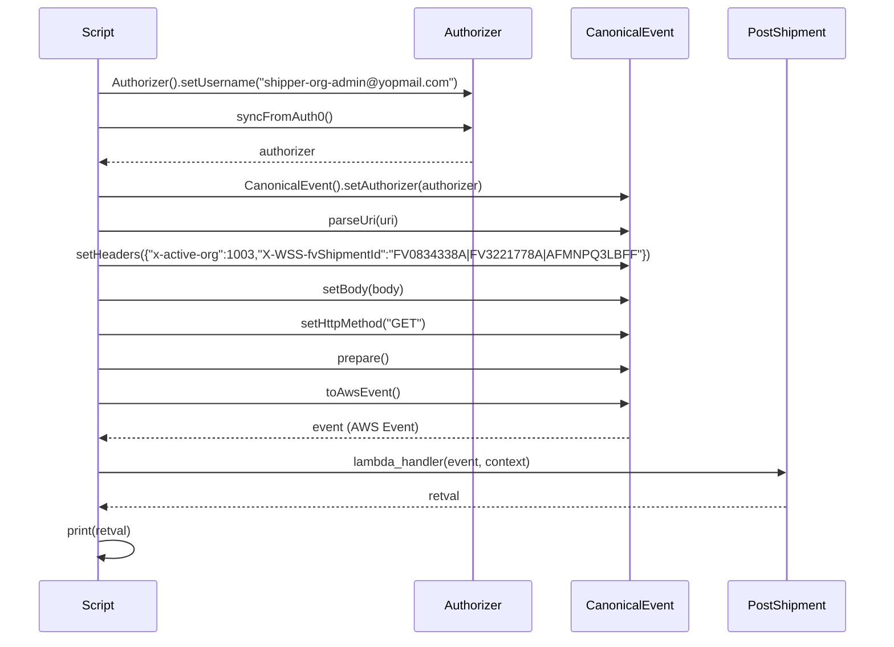
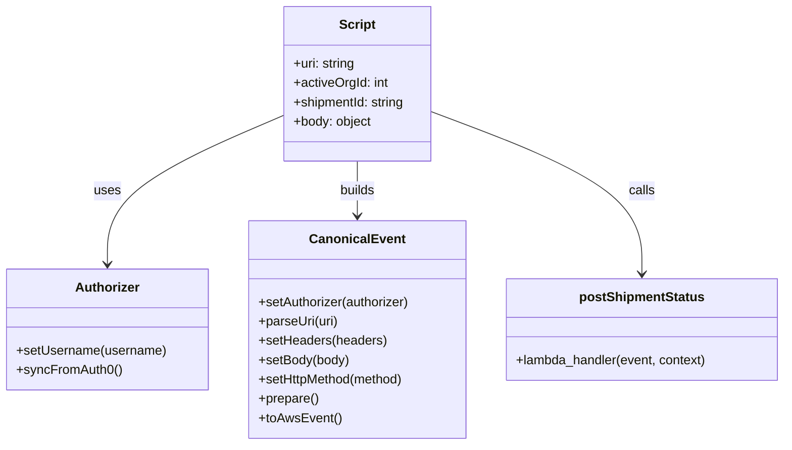
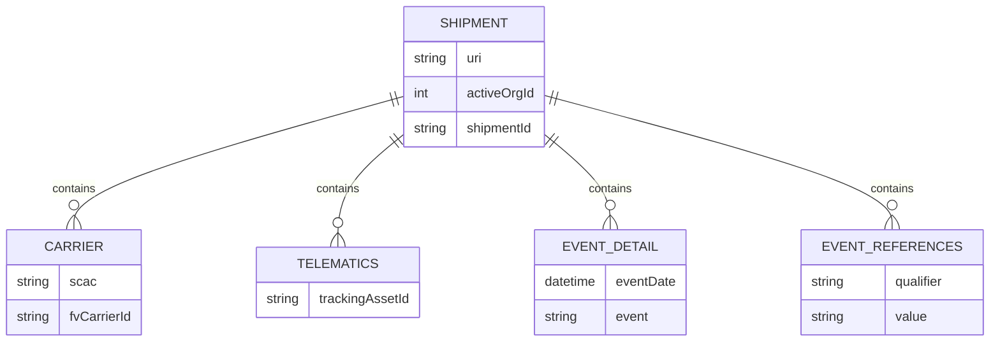

# Diagram: platform/tools/ide_local_testing/localTest/test/shipment/statusUpdatePositionUpdate.py

> Auto-generated by Obscura crawlers

## Diagram 1

### SVG

<svg id="container" width="1173" xmlns="http://www.w3.org/2000/svg" height="873" viewBox="-50 -10 1173 873" role="graphics-document document" aria-roledescription="sequence"><g><rect x="923" y="787" fill="#eaeaea" stroke="#666" width="150" height="65" name="PostShipment" rx="3" ry="3" class="actor actor-bottom"></rect><text x="998" y="819.5" dominant-baseline="central" alignment-baseline="central" class="actor actor-box" style="text-anchor: middle; font-size: 16px; font-weight: 400;"><tspan x="998" dy="0">PostShipment</tspan></text></g><g><rect x="723" y="787" fill="#eaeaea" stroke="#666" width="150" height="65" name="CanonicalEvent" rx="3" ry="3" class="actor actor-bottom"></rect><text x="798" y="819.5" dominant-baseline="central" alignment-baseline="central" class="actor actor-box" style="text-anchor: middle; font-size: 16px; font-weight: 400;"><tspan x="798" dy="0">CanonicalEvent</tspan></text></g><g><rect x="523" y="787" fill="#eaeaea" stroke="#666" width="150" height="65" name="Authorizer" rx="3" ry="3" class="actor actor-bottom"></rect><text x="598" y="819.5" dominant-baseline="central" alignment-baseline="central" class="actor actor-box" style="text-anchor: middle; font-size: 16px; font-weight: 400;"><tspan x="598" dy="0">Authorizer</tspan></text></g><g><rect x="0" y="787" fill="#eaeaea" stroke="#666" width="150" height="65" name="Script" rx="3" ry="3" class="actor actor-bottom"></rect><text x="75" y="819.5" dominant-baseline="central" alignment-baseline="central" class="actor actor-box" style="text-anchor: middle; font-size: 16px; font-weight: 400;"><tspan x="75" dy="0">Script</tspan></text></g><g><line id="actor3" x1="998" y1="65" x2="998" y2="787" class="actor-line 200" stroke-width="0.5px" stroke="#999" name="PostShipment"></line><g id="root-3"><rect x="923" y="0" fill="#eaeaea" stroke="#666" width="150" height="65" name="PostShipment" rx="3" ry="3" class="actor actor-top"></rect><text x="998" y="32.5" dominant-baseline="central" alignment-baseline="central" class="actor actor-box" style="text-anchor: middle; font-size: 16px; font-weight: 400;"><tspan x="998" dy="0">PostShipment</tspan></text></g></g><g><line id="actor2" x1="798" y1="65" x2="798" y2="787" class="actor-line 200" stroke-width="0.5px" stroke="#999" name="CanonicalEvent"></line><g id="root-2"><rect x="723" y="0" fill="#eaeaea" stroke="#666" width="150" height="65" name="CanonicalEvent" rx="3" ry="3" class="actor actor-top"></rect><text x="798" y="32.5" dominant-baseline="central" alignment-baseline="central" class="actor actor-box" style="text-anchor: middle; font-size: 16px; font-weight: 400;"><tspan x="798" dy="0">CanonicalEvent</tspan></text></g></g><g><line id="actor1" x1="598" y1="65" x2="598" y2="787" class="actor-line 200" stroke-width="0.5px" stroke="#999" name="Authorizer"></line><g id="root-1"><rect x="523" y="0" fill="#eaeaea" stroke="#666" width="150" height="65" name="Authorizer" rx="3" ry="3" class="actor actor-top"></rect><text x="598" y="32.5" dominant-baseline="central" alignment-baseline="central" class="actor actor-box" style="text-anchor: middle; font-size: 16px; font-weight: 400;"><tspan x="598" dy="0">Authorizer</tspan></text></g></g><g><line id="actor0" x1="75" y1="65" x2="75" y2="787" class="actor-line 200" stroke-width="0.5px" stroke="#999" name="Script"></line><g id="root-0"><rect x="0" y="0" fill="#eaeaea" stroke="#666" width="150" height="65" name="Script" rx="3" ry="3" class="actor actor-top"></rect><text x="75" y="32.5" dominant-baseline="central" alignment-baseline="central" class="actor actor-box" style="text-anchor: middle; font-size: 16px; font-weight: 400;"><tspan x="75" dy="0">Script</tspan></text></g></g><g></g><defs><symbol id="computer" width="24" height="24"><path transform="scale(.5)" d="M2 2v13h20v-13h-20zm18 11h-16v-9h16v9zm-10.228 6l.466-1h3.524l.467 1h-4.457zm14.228 3h-24l2-6h2.104l-1.33 4h18.45l-1.297-4h2.073l2 6zm-5-10h-14v-7h14v7z"></path></symbol></defs><defs><symbol id="database" fill-rule="evenodd" clip-rule="evenodd"><path transform="scale(.5)" d="M12.258.001l.256.004.255.005.253.008.251.01.249.012.247.015.246.016.242.019.241.02.239.023.236.024.233.027.231.028.229.031.225.032.223.034.22.036.217.038.214.04.211.041.208.043.205.045.201.046.198.048.194.05.191.051.187.053.183.054.18.056.175.057.172.059.168.06.163.061.16.063.155.064.15.066.074.033.073.033.071.034.07.034.069.035.068.035.067.035.066.035.064.036.064.036.062.036.06.036.06.037.058.037.058.037.055.038.055.038.053.038.052.038.051.039.05.039.048.039.047.039.045.04.044.04.043.04.041.04.04.041.039.041.037.041.036.041.034.041.033.042.032.042.03.042.029.042.027.042.026.043.024.043.023.043.021.043.02.043.018.044.017.043.015.044.013.044.012.044.011.045.009.044.007.045.006.045.004.045.002.045.001.045v17l-.001.045-.002.045-.004.045-.006.045-.007.045-.009.044-.011.045-.012.044-.013.044-.015.044-.017.043-.018.044-.02.043-.021.043-.023.043-.024.043-.026.043-.027.042-.029.042-.03.042-.032.042-.033.042-.034.041-.036.041-.037.041-.039.041-.04.041-.041.04-.043.04-.044.04-.045.04-.047.039-.048.039-.05.039-.051.039-.052.038-.053.038-.055.038-.055.038-.058.037-.058.037-.06.037-.06.036-.062.036-.064.036-.064.036-.066.035-.067.035-.068.035-.069.035-.07.034-.071.034-.073.033-.074.033-.15.066-.155.064-.16.063-.163.061-.168.06-.172.059-.175.057-.18.056-.183.054-.187.053-.191.051-.194.05-.198.048-.201.046-.205.045-.208.043-.211.041-.214.04-.217.038-.22.036-.223.034-.225.032-.229.031-.231.028-.233.027-.236.024-.239.023-.241.02-.242.019-.246.016-.247.015-.249.012-.251.01-.253.008-.255.005-.256.004-.258.001-.258-.001-.256-.004-.255-.005-.253-.008-.251-.01-.249-.012-.247-.015-.245-.016-.243-.019-.241-.02-.238-.023-.236-.024-.234-.027-.231-.028-.228-.031-.226-.032-.223-.034-.22-.036-.217-.038-.214-.04-.211-.041-.208-.043-.204-.045-.201-.046-.198-.048-.195-.05-.19-.051-.187-.053-.184-.054-.179-.056-.176-.057-.172-.059-.167-.06-.164-.061-.159-.063-.155-.064-.151-.066-.074-.033-.072-.033-.072-.034-.07-.034-.069-.035-.068-.035-.067-.035-.066-.035-.064-.036-.063-.036-.062-.036-.061-.036-.06-.037-.058-.037-.057-.037-.056-.038-.055-.038-.053-.038-.052-.038-.051-.039-.049-.039-.049-.039-.046-.039-.046-.04-.044-.04-.043-.04-.041-.04-.04-.041-.039-.041-.037-.041-.036-.041-.034-.041-.033-.042-.032-.042-.03-.042-.029-.042-.027-.042-.026-.043-.024-.043-.023-.043-.021-.043-.02-.043-.018-.044-.017-.043-.015-.044-.013-.044-.012-.044-.011-.045-.009-.044-.007-.045-.006-.045-.004-.045-.002-.045-.001-.045v-17l.001-.045.002-.045.004-.045.006-.045.007-.045.009-.044.011-.045.012-.044.013-.044.015-.044.017-.043.018-.044.02-.043.021-.043.023-.043.024-.043.026-.043.027-.042.029-.042.03-.042.032-.042.033-.042.034-.041.036-.041.037-.041.039-.041.04-.041.041-.04.043-.04.044-.04.046-.04.046-.039.049-.039.049-.039.051-.039.052-.038.053-.038.055-.038.056-.038.057-.037.058-.037.06-.037.061-.036.062-.036.063-.036.064-.036.066-.035.067-.035.068-.035.069-.035.07-.034.072-.034.072-.033.074-.033.151-.066.155-.064.159-.063.164-.061.167-.06.172-.059.176-.057.179-.056.184-.054.187-.053.19-.051.195-.05.198-.048.201-.046.204-.045.208-.043.211-.041.214-.04.217-.038.22-.036.223-.034.226-.032.228-.031.231-.028.234-.027.236-.024.238-.023.241-.02.243-.019.245-.016.247-.015.249-.012.251-.01.253-.008.255-.005.256-.004.258-.001.258.001zm-9.258 20.499v.01l.001.021.003.021.004.022.005.021.006.022.007.022.009.023.01.022.011.023.012.023.013.023.015.023.016.024.017.023.018.024.019.024.021.024.022.025.023.024.024.025.052.049.056.05.061.051.066.051.07.051.075.051.079.052.084.052.088.052.092.052.097.052.102.051.105.052.11.052.114.051.119.051.123.051.127.05.131.05.135.05.139.048.144.049.147.047.152.047.155.047.16.045.163.045.167.043.171.043.176.041.178.041.183.039.187.039.19.037.194.035.197.035.202.033.204.031.209.03.212.029.216.027.219.025.222.024.226.021.23.02.233.018.236.016.24.015.243.012.246.01.249.008.253.005.256.004.259.001.26-.001.257-.004.254-.005.25-.008.247-.011.244-.012.241-.014.237-.016.233-.018.231-.021.226-.021.224-.024.22-.026.216-.027.212-.028.21-.031.205-.031.202-.034.198-.034.194-.036.191-.037.187-.039.183-.04.179-.04.175-.042.172-.043.168-.044.163-.045.16-.046.155-.046.152-.047.148-.048.143-.049.139-.049.136-.05.131-.05.126-.05.123-.051.118-.052.114-.051.11-.052.106-.052.101-.052.096-.052.092-.052.088-.053.083-.051.079-.052.074-.052.07-.051.065-.051.06-.051.056-.05.051-.05.023-.024.023-.025.021-.024.02-.024.019-.024.018-.024.017-.024.015-.023.014-.024.013-.023.012-.023.01-.023.01-.022.008-.022.006-.022.006-.022.004-.022.004-.021.001-.021.001-.021v-4.127l-.077.055-.08.053-.083.054-.085.053-.087.052-.09.052-.093.051-.095.05-.097.05-.1.049-.102.049-.105.048-.106.047-.109.047-.111.046-.114.045-.115.045-.118.044-.12.043-.122.042-.124.042-.126.041-.128.04-.13.04-.132.038-.134.038-.135.037-.138.037-.139.035-.142.035-.143.034-.144.033-.147.032-.148.031-.15.03-.151.03-.153.029-.154.027-.156.027-.158.026-.159.025-.161.024-.162.023-.163.022-.165.021-.166.02-.167.019-.169.018-.169.017-.171.016-.173.015-.173.014-.175.013-.175.012-.177.011-.178.01-.179.008-.179.008-.181.006-.182.005-.182.004-.184.003-.184.002h-.37l-.184-.002-.184-.003-.182-.004-.182-.005-.181-.006-.179-.008-.179-.008-.178-.01-.176-.011-.176-.012-.175-.013-.173-.014-.172-.015-.171-.016-.17-.017-.169-.018-.167-.019-.166-.02-.165-.021-.163-.022-.162-.023-.161-.024-.159-.025-.157-.026-.156-.027-.155-.027-.153-.029-.151-.03-.15-.03-.148-.031-.146-.032-.145-.033-.143-.034-.141-.035-.14-.035-.137-.037-.136-.037-.134-.038-.132-.038-.13-.04-.128-.04-.126-.041-.124-.042-.122-.042-.12-.044-.117-.043-.116-.045-.113-.045-.112-.046-.109-.047-.106-.047-.105-.048-.102-.049-.1-.049-.097-.05-.095-.05-.093-.052-.09-.051-.087-.052-.085-.053-.083-.054-.08-.054-.077-.054v4.127zm0-5.654v.011l.001.021.003.021.004.021.005.022.006.022.007.022.009.022.01.022.011.023.012.023.013.023.015.024.016.023.017.024.018.024.019.024.021.024.022.024.023.025.024.024.052.05.056.05.061.05.066.051.07.051.075.052.079.051.084.052.088.052.092.052.097.052.102.052.105.052.11.051.114.051.119.052.123.05.127.051.131.05.135.049.139.049.144.048.147.048.152.047.155.046.16.045.163.045.167.044.171.042.176.042.178.04.183.04.187.038.19.037.194.036.197.034.202.033.204.032.209.03.212.028.216.027.219.025.222.024.226.022.23.02.233.018.236.016.24.014.243.012.246.01.249.008.253.006.256.003.259.001.26-.001.257-.003.254-.006.25-.008.247-.01.244-.012.241-.015.237-.016.233-.018.231-.02.226-.022.224-.024.22-.025.216-.027.212-.029.21-.03.205-.032.202-.033.198-.035.194-.036.191-.037.187-.039.183-.039.179-.041.175-.042.172-.043.168-.044.163-.045.16-.045.155-.047.152-.047.148-.048.143-.048.139-.05.136-.049.131-.05.126-.051.123-.051.118-.051.114-.052.11-.052.106-.052.101-.052.096-.052.092-.052.088-.052.083-.052.079-.052.074-.051.07-.052.065-.051.06-.05.056-.051.051-.049.023-.025.023-.024.021-.025.02-.024.019-.024.018-.024.017-.024.015-.023.014-.023.013-.024.012-.022.01-.023.01-.023.008-.022.006-.022.006-.022.004-.021.004-.022.001-.021.001-.021v-4.139l-.077.054-.08.054-.083.054-.085.052-.087.053-.09.051-.093.051-.095.051-.097.05-.1.049-.102.049-.105.048-.106.047-.109.047-.111.046-.114.045-.115.044-.118.044-.12.044-.122.042-.124.042-.126.041-.128.04-.13.039-.132.039-.134.038-.135.037-.138.036-.139.036-.142.035-.143.033-.144.033-.147.033-.148.031-.15.03-.151.03-.153.028-.154.028-.156.027-.158.026-.159.025-.161.024-.162.023-.163.022-.165.021-.166.02-.167.019-.169.018-.169.017-.171.016-.173.015-.173.014-.175.013-.175.012-.177.011-.178.009-.179.009-.179.007-.181.007-.182.005-.182.004-.184.003-.184.002h-.37l-.184-.002-.184-.003-.182-.004-.182-.005-.181-.007-.179-.007-.179-.009-.178-.009-.176-.011-.176-.012-.175-.013-.173-.014-.172-.015-.171-.016-.17-.017-.169-.018-.167-.019-.166-.02-.165-.021-.163-.022-.162-.023-.161-.024-.159-.025-.157-.026-.156-.027-.155-.028-.153-.028-.151-.03-.15-.03-.148-.031-.146-.033-.145-.033-.143-.033-.141-.035-.14-.036-.137-.036-.136-.037-.134-.038-.132-.039-.13-.039-.128-.04-.126-.041-.124-.042-.122-.043-.12-.043-.117-.044-.116-.044-.113-.046-.112-.046-.109-.046-.106-.047-.105-.048-.102-.049-.1-.049-.097-.05-.095-.051-.093-.051-.09-.051-.087-.053-.085-.052-.083-.054-.08-.054-.077-.054v4.139zm0-5.666v.011l.001.02.003.022.004.021.005.022.006.021.007.022.009.023.01.022.011.023.012.023.013.023.015.023.016.024.017.024.018.023.019.024.021.025.022.024.023.024.024.025.052.05.056.05.061.05.066.051.07.051.075.052.079.051.084.052.088.052.092.052.097.052.102.052.105.051.11.052.114.051.119.051.123.051.127.05.131.05.135.05.139.049.144.048.147.048.152.047.155.046.16.045.163.045.167.043.171.043.176.042.178.04.183.04.187.038.19.037.194.036.197.034.202.033.204.032.209.03.212.028.216.027.219.025.222.024.226.021.23.02.233.018.236.017.24.014.243.012.246.01.249.008.253.006.256.003.259.001.26-.001.257-.003.254-.006.25-.008.247-.01.244-.013.241-.014.237-.016.233-.018.231-.02.226-.022.224-.024.22-.025.216-.027.212-.029.21-.03.205-.032.202-.033.198-.035.194-.036.191-.037.187-.039.183-.039.179-.041.175-.042.172-.043.168-.044.163-.045.16-.045.155-.047.152-.047.148-.048.143-.049.139-.049.136-.049.131-.051.126-.05.123-.051.118-.052.114-.051.11-.052.106-.052.101-.052.096-.052.092-.052.088-.052.083-.052.079-.052.074-.052.07-.051.065-.051.06-.051.056-.05.051-.049.023-.025.023-.025.021-.024.02-.024.019-.024.018-.024.017-.024.015-.023.014-.024.013-.023.012-.023.01-.022.01-.023.008-.022.006-.022.006-.022.004-.022.004-.021.001-.021.001-.021v-4.153l-.077.054-.08.054-.083.053-.085.053-.087.053-.09.051-.093.051-.095.051-.097.05-.1.049-.102.048-.105.048-.106.048-.109.046-.111.046-.114.046-.115.044-.118.044-.12.043-.122.043-.124.042-.126.041-.128.04-.13.039-.132.039-.134.038-.135.037-.138.036-.139.036-.142.034-.143.034-.144.033-.147.032-.148.032-.15.03-.151.03-.153.028-.154.028-.156.027-.158.026-.159.024-.161.024-.162.023-.163.023-.165.021-.166.02-.167.019-.169.018-.169.017-.171.016-.173.015-.173.014-.175.013-.175.012-.177.01-.178.01-.179.009-.179.007-.181.006-.182.006-.182.004-.184.003-.184.001-.185.001-.185-.001-.184-.001-.184-.003-.182-.004-.182-.006-.181-.006-.179-.007-.179-.009-.178-.01-.176-.01-.176-.012-.175-.013-.173-.014-.172-.015-.171-.016-.17-.017-.169-.018-.167-.019-.166-.02-.165-.021-.163-.023-.162-.023-.161-.024-.159-.024-.157-.026-.156-.027-.155-.028-.153-.028-.151-.03-.15-.03-.148-.032-.146-.032-.145-.033-.143-.034-.141-.034-.14-.036-.137-.036-.136-.037-.134-.038-.132-.039-.13-.039-.128-.041-.126-.041-.124-.041-.122-.043-.12-.043-.117-.044-.116-.044-.113-.046-.112-.046-.109-.046-.106-.048-.105-.048-.102-.048-.1-.05-.097-.049-.095-.051-.093-.051-.09-.052-.087-.052-.085-.053-.083-.053-.08-.054-.077-.054v4.153zm8.74-8.179l-.257.004-.254.005-.25.008-.247.011-.244.012-.241.014-.237.016-.233.018-.231.021-.226.022-.224.023-.22.026-.216.027-.212.028-.21.031-.205.032-.202.033-.198.034-.194.036-.191.038-.187.038-.183.04-.179.041-.175.042-.172.043-.168.043-.163.045-.16.046-.155.046-.152.048-.148.048-.143.048-.139.049-.136.05-.131.05-.126.051-.123.051-.118.051-.114.052-.11.052-.106.052-.101.052-.096.052-.092.052-.088.052-.083.052-.079.052-.074.051-.07.052-.065.051-.06.05-.056.05-.051.05-.023.025-.023.024-.021.024-.02.025-.019.024-.018.024-.017.023-.015.024-.014.023-.013.023-.012.023-.01.023-.01.022-.008.022-.006.023-.006.021-.004.022-.004.021-.001.021-.001.021.001.021.001.021.004.021.004.022.006.021.006.023.008.022.01.022.01.023.012.023.013.023.014.023.015.024.017.023.018.024.019.024.02.025.021.024.023.024.023.025.051.05.056.05.06.05.065.051.07.052.074.051.079.052.083.052.088.052.092.052.096.052.101.052.106.052.11.052.114.052.118.051.123.051.126.051.131.05.136.05.139.049.143.048.148.048.152.048.155.046.16.046.163.045.168.043.172.043.175.042.179.041.183.04.187.038.191.038.194.036.198.034.202.033.205.032.21.031.212.028.216.027.22.026.224.023.226.022.231.021.233.018.237.016.241.014.244.012.247.011.25.008.254.005.257.004.26.001.26-.001.257-.004.254-.005.25-.008.247-.011.244-.012.241-.014.237-.016.233-.018.231-.021.226-.022.224-.023.22-.026.216-.027.212-.028.21-.031.205-.032.202-.033.198-.034.194-.036.191-.038.187-.038.183-.04.179-.041.175-.042.172-.043.168-.043.163-.045.16-.046.155-.046.152-.048.148-.048.143-.048.139-.049.136-.05.131-.05.126-.051.123-.051.118-.051.114-.052.11-.052.106-.052.101-.052.096-.052.092-.052.088-.052.083-.052.079-.052.074-.051.07-.052.065-.051.06-.05.056-.05.051-.05.023-.025.023-.024.021-.024.02-.025.019-.024.018-.024.017-.023.015-.024.014-.023.013-.023.012-.023.01-.023.01-.022.008-.022.006-.023.006-.021.004-.022.004-.021.001-.021.001-.021-.001-.021-.001-.021-.004-.021-.004-.022-.006-.021-.006-.023-.008-.022-.01-.022-.01-.023-.012-.023-.013-.023-.014-.023-.015-.024-.017-.023-.018-.024-.019-.024-.02-.025-.021-.024-.023-.024-.023-.025-.051-.05-.056-.05-.06-.05-.065-.051-.07-.052-.074-.051-.079-.052-.083-.052-.088-.052-.092-.052-.096-.052-.101-.052-.106-.052-.11-.052-.114-.052-.118-.051-.123-.051-.126-.051-.131-.05-.136-.05-.139-.049-.143-.048-.148-.048-.152-.048-.155-.046-.16-.046-.163-.045-.168-.043-.172-.043-.175-.042-.179-.041-.183-.04-.187-.038-.191-.038-.194-.036-.198-.034-.202-.033-.205-.032-.21-.031-.212-.028-.216-.027-.22-.026-.224-.023-.226-.022-.231-.021-.233-.018-.237-.016-.241-.014-.244-.012-.247-.011-.25-.008-.254-.005-.257-.004-.26-.001-.26.001z"></path></symbol></defs><defs><symbol id="clock" width="24" height="24"><path transform="scale(.5)" d="M12 2c5.514 0 10 4.486 10 10s-4.486 10-10 10-10-4.486-10-10 4.486-10 10-10zm0-2c-6.627 0-12 5.373-12 12s5.373 12 12 12 12-5.373 12-12-5.373-12-12-12zm5.848 12.459c.202.038.202.333.001.372-1.907.361-6.045 1.111-6.547 1.111-.719 0-1.301-.582-1.301-1.301 0-.512.77-5.447 1.125-7.445.034-.192.312-.181.343.014l.985 6.238 5.394 1.011z"></path></symbol></defs><defs><marker id="arrowhead" refX="7.9" refY="5" markerUnits="userSpaceOnUse" markerWidth="12" markerHeight="12" orient="auto-start-reverse"><path d="M -1 0 L 10 5 L 0 10 z"></path></marker></defs><defs><marker id="crosshead" markerWidth="15" markerHeight="8" orient="auto" refX="4" refY="4.5"><path fill="none" stroke="#000000" stroke-width="1pt" d="M 1,2 L 6,7 M 6,2 L 1,7" style="stroke-dasharray: 0, 0;"></path></marker></defs><defs><marker id="filled-head" refX="15.5" refY="7" markerWidth="20" markerHeight="28" orient="auto"><path d="M 18,7 L9,13 L14,7 L9,1 Z"></path></marker></defs><defs><marker id="sequencenumber" refX="15" refY="15" markerWidth="60" markerHeight="40" orient="auto"><circle cx="15" cy="15" r="6"></circle></marker></defs><text x="335" y="80" text-anchor="middle" dominant-baseline="middle" alignment-baseline="middle" class="messageText" dy="1em" style="font-size: 16px; font-weight: 400;">Authorizer().setUsername("shipper-org-admin@yopmail.com")</text><line x1="76" y1="113" x2="594" y2="113" class="messageLine0" stroke-width="2" stroke="none" marker-end="url(#arrowhead)" style="fill: none;"></line><text x="335" y="128" text-anchor="middle" dominant-baseline="middle" alignment-baseline="middle" class="messageText" dy="1em" style="font-size: 16px; font-weight: 400;">syncFromAuth0()</text><line x1="76" y1="161" x2="594" y2="161" class="messageLine0" stroke-width="2" stroke="none" marker-end="url(#arrowhead)" style="fill: none;"></line><text x="338" y="176" text-anchor="middle" dominant-baseline="middle" alignment-baseline="middle" class="messageText" dy="1em" style="font-size: 16px; font-weight: 400;">authorizer</text><line x1="597" y1="209" x2="79" y2="209" class="messageLine1" stroke-width="2" stroke="none" marker-end="url(#arrowhead)" style="stroke-dasharray: 3, 3; fill: none;"></line><text x="435" y="224" text-anchor="middle" dominant-baseline="middle" alignment-baseline="middle" class="messageText" dy="1em" style="font-size: 16px; font-weight: 400;">CanonicalEvent().setAuthorizer(authorizer)</text><line x1="76" y1="257" x2="794" y2="257" class="messageLine0" stroke-width="2" stroke="none" marker-end="url(#arrowhead)" style="fill: none;"></line><text x="435" y="272" text-anchor="middle" dominant-baseline="middle" alignment-baseline="middle" class="messageText" dy="1em" style="font-size: 16px; font-weight: 400;">parseUri(uri)</text><line x1="76" y1="305" x2="794" y2="305" class="messageLine0" stroke-width="2" stroke="none" marker-end="url(#arrowhead)" style="fill: none;"></line><text x="435" y="320" text-anchor="middle" dominant-baseline="middle" alignment-baseline="middle" class="messageText" dy="1em" style="font-size: 16px; font-weight: 400;">setHeaders({"x-active-org":1003,"X-WSS-fvShipmentId":"FV0834338A|FV3221778A|AFMNPQ3LBFF"})</text><line x1="76" y1="353" x2="794" y2="353" class="messageLine0" stroke-width="2" stroke="none" marker-end="url(#arrowhead)" style="fill: none;"></line><text x="435" y="368" text-anchor="middle" dominant-baseline="middle" alignment-baseline="middle" class="messageText" dy="1em" style="font-size: 16px; font-weight: 400;">setBody(body)</text><line x1="76" y1="401" x2="794" y2="401" class="messageLine0" stroke-width="2" stroke="none" marker-end="url(#arrowhead)" style="fill: none;"></line><text x="435" y="416" text-anchor="middle" dominant-baseline="middle" alignment-baseline="middle" class="messageText" dy="1em" style="font-size: 16px; font-weight: 400;">setHttpMethod("GET")</text><line x1="76" y1="449" x2="794" y2="449" class="messageLine0" stroke-width="2" stroke="none" marker-end="url(#arrowhead)" style="fill: none;"></line><text x="435" y="464" text-anchor="middle" dominant-baseline="middle" alignment-baseline="middle" class="messageText" dy="1em" style="font-size: 16px; font-weight: 400;">prepare()</text><line x1="76" y1="497" x2="794" y2="497" class="messageLine0" stroke-width="2" stroke="none" marker-end="url(#arrowhead)" style="fill: none;"></line><text x="435" y="512" text-anchor="middle" dominant-baseline="middle" alignment-baseline="middle" class="messageText" dy="1em" style="font-size: 16px; font-weight: 400;">toAwsEvent()</text><line x1="76" y1="545" x2="794" y2="545" class="messageLine0" stroke-width="2" stroke="none" marker-end="url(#arrowhead)" style="fill: none;"></line><text x="438" y="560" text-anchor="middle" dominant-baseline="middle" alignment-baseline="middle" class="messageText" dy="1em" style="font-size: 16px; font-weight: 400;">event (AWS Event)</text><line x1="797" y1="593" x2="79" y2="593" class="messageLine1" stroke-width="2" stroke="none" marker-end="url(#arrowhead)" style="stroke-dasharray: 3, 3; fill: none;"></line><text x="535" y="608" text-anchor="middle" dominant-baseline="middle" alignment-baseline="middle" class="messageText" dy="1em" style="font-size: 16px; font-weight: 400;">lambda_handler(event, context)</text><line x1="76" y1="641" x2="994" y2="641" class="messageLine0" stroke-width="2" stroke="none" marker-end="url(#arrowhead)" style="fill: none;"></line><text x="538" y="656" text-anchor="middle" dominant-baseline="middle" alignment-baseline="middle" class="messageText" dy="1em" style="font-size: 16px; font-weight: 400;">retval</text><line x1="997" y1="689" x2="79" y2="689" class="messageLine1" stroke-width="2" stroke="none" marker-end="url(#arrowhead)" style="stroke-dasharray: 3, 3; fill: none;"></line><text x="76" y="704" text-anchor="middle" dominant-baseline="middle" alignment-baseline="middle" class="messageText" dy="1em" style="font-size: 16px; font-weight: 400;">print(retval)</text><path d="M 76,737 C 136,727 136,767 76,757" class="messageLine0" stroke-width="2" stroke="none" marker-end="url(#arrowhead)" style="fill: none;"></path></svg>

## Diagram 2

### SVG

<svg id="container" width="973.90625" xmlns="http://www.w3.org/2000/svg" class="classDiagram" height="552" viewBox="0 0 973.90625 552" role="graphics-document document" aria-roledescription="class"><g><defs><marker id="container_class-aggregationStart" class="marker aggregation class" refX="18" refY="7" markerWidth="190" markerHeight="240" orient="auto"><path d="M 18,7 L9,13 L1,7 L9,1 Z"></path></marker></defs><defs><marker id="container_class-aggregationEnd" class="marker aggregation class" refX="1" refY="7" markerWidth="20" markerHeight="28" orient="auto"><path d="M 18,7 L9,13 L1,7 L9,1 Z"></path></marker></defs><defs><marker id="container_class-extensionStart" class="marker extension class" refX="18" refY="7" markerWidth="190" markerHeight="240" orient="auto"><path d="M 1,7 L18,13 V 1 Z"></path></marker></defs><defs><marker id="container_class-extensionEnd" class="marker extension class" refX="1" refY="7" markerWidth="20" markerHeight="28" orient="auto"><path d="M 1,1 V 13 L18,7 Z"></path></marker></defs><defs><marker id="container_class-compositionStart" class="marker composition class" refX="18" refY="7" markerWidth="190" markerHeight="240" orient="auto"><path d="M 18,7 L9,13 L1,7 L9,1 Z"></path></marker></defs><defs><marker id="container_class-compositionEnd" class="marker composition class" refX="1" refY="7" markerWidth="20" markerHeight="28" orient="auto"><path d="M 18,7 L9,13 L1,7 L9,1 Z"></path></marker></defs><defs><marker id="container_class-dependencyStart" class="marker dependency class" refX="6" refY="7" markerWidth="190" markerHeight="240" orient="auto"><path d="M 5,7 L9,13 L1,7 L9,1 Z"></path></marker></defs><defs><marker id="container_class-dependencyEnd" class="marker dependency class" refX="13" refY="7" markerWidth="20" markerHeight="28" orient="auto"><path d="M 18,7 L9,13 L14,7 L9,1 Z"></path></marker></defs><defs><marker id="container_class-lollipopStart" class="marker lollipop class" refX="13" refY="7" markerWidth="190" markerHeight="240" orient="auto"><circle stroke="black" fill="transparent" cx="7" cy="7" r="6"></circle></marker></defs><defs><marker id="container_class-lollipopEnd" class="marker lollipop class" refX="1" refY="7" markerWidth="190" markerHeight="240" orient="auto"><circle stroke="black" fill="transparent" cx="7" cy="7" r="6"></circle></marker></defs><g class="root"><g class="clusters"></g><g class="edgePaths"><path d="M348.414,144.02L312.368,159.517C276.322,175.013,204.229,206.007,168.183,236.67C132.137,267.333,132.137,297.667,132.137,312.833L132.137,328" id="id_Script_Authorizer_1" class="edge-thickness-normal edge-pattern-solid relation" style=";;;" data-edge="true" data-et="edge" data-id="id_Script_Authorizer_1" data-points="W3sieCI6MzQ4LjQxNDA2MjUsInkiOjE0NC4wMjAyNDA0MTAxMTEzN30seyJ4IjoxMzIuMTM2NzE4NzUsInkiOjIzN30seyJ4IjoxMzIuMTM2NzE4NzUsInkiOjMzNH1d" marker-end="url(#container_class-dependencyEnd)"></path><path d="M441.504,200L441.504,206.167C441.504,212.333,441.504,224.667,441.504,236C441.504,247.333,441.504,257.667,441.504,262.833L441.504,268" id="id_Script_CanonicalEvent_2" class="edge-thickness-normal edge-pattern-solid relation" style=";;;" data-edge="true" data-et="edge" data-id="id_Script_CanonicalEvent_2" data-points="W3sieCI6NDQxLjUwMzkwNjI1LCJ5IjoyMDB9LHsieCI6NDQxLjUwMzkwNjI1LCJ5IjoyMzd9LHsieCI6NDQxLjUwMzkwNjI1LCJ5IjoyNzR9XQ==" marker-end="url(#container_class-dependencyEnd)"></path><path d="M534.594,138.894L578.215,155.245C621.836,171.596,709.078,204.298,752.699,237.816C796.32,271.333,796.32,305.667,796.32,322.833L796.32,340" id="id_Script_postShipmentStatus_3" class="edge-thickness-normal edge-pattern-solid relation" style=";;;" data-edge="true" data-et="edge" data-id="id_Script_postShipmentStatus_3" data-points="W3sieCI6NTM0LjU5Mzc1LCJ5IjoxMzguODkzOTU5MjQzODg3MTR9LHsieCI6Nzk2LjMyMDMxMjUsInkiOjIzN30seyJ4Ijo3OTYuMzIwMzEyNSwieSI6MzQ2fV0=" marker-end="url(#container_class-dependencyEnd)"></path></g><g class="edgeLabels"><g class="edgeLabel" transform="translate(132.13671875, 237)"><g class="label" data-id="id_Script_Authorizer_1" transform="translate(-16.4921875, -12)"><foreignObject width="32.984375" height="24">

uses

</foreignObject></g></g><g class="edgeLabel" transform="translate(441.50390625, 237)"><g class="label" data-id="id_Script_CanonicalEvent_2" transform="translate(-22.4921875, -12)"><foreignObject width="44.984375" height="24">

builds

</foreignObject></g></g><g class="edgeLabel" transform="translate(796.3203125, 237)"><g class="label" data-id="id_Script_postShipmentStatus_3" transform="translate(-16.4453125, -12)"><foreignObject width="32.890625" height="24">

calls

</foreignObject></g></g></g><g class="nodes"><g class="node default" id="classId-Script-0" transform="translate(441.50390625, 104)"><g class="basic label-container"><path d="M-93.08984375 -96 L93.08984375 -96 L93.08984375 96 L-93.08984375 96" stroke="none" stroke-width="0" fill="#ECECFF" style=""></path><path d="M-93.08984375 -96 C-55.69190396288005 -96, -18.293964175760095 -96, 93.08984375 -96 M-93.08984375 -96 C-44.177750031388754 -96, 4.734343687222491 -96, 93.08984375 -96 M93.08984375 -96 C93.08984375 -32.50287896742903, 93.08984375 30.994242065141947, 93.08984375 96 M93.08984375 -96 C93.08984375 -50.8822766443727, 93.08984375 -5.764553288745404, 93.08984375 96 M93.08984375 96 C40.449622053023866 96, -12.190599643952268 96, -93.08984375 96 M93.08984375 96 C44.90006137085817 96, -3.2897210082836637 96, -93.08984375 96 M-93.08984375 96 C-93.08984375 46.15769763594344, -93.08984375 -3.684604728113115, -93.08984375 -96 M-93.08984375 96 C-93.08984375 27.69277806686742, -93.08984375 -40.61444386626516, -93.08984375 -96" stroke="#9370DB" stroke-width="1.3" fill="none" stroke-dasharray="0 0" style=""></path></g><g class="annotation-group text" transform="translate(0, -72)"></g><g class="label-group text" transform="translate(-21.7421875, -72)"><g class="label" style="font-weight: bolder" transform="translate(0,-12)"><foreignObject width="43.484375" height="24">

Script

</foreignObject></g></g><g class="members-group text" transform="translate(-81.08984375, -24)"><g class="label" style="" transform="translate(0,-12)"><foreignObject width="77.703125" height="24">

+uri: string

</foreignObject></g><g class="label" style="" transform="translate(0,12)"><foreignObject width="118.28125" height="24">

+activeOrgId: int

</foreignObject></g><g class="label" style="" transform="translate(0,36)"><foreignObject width="140.4375" height="24">

+shipmentId: string

</foreignObject></g><g class="label" style="" transform="translate(0,60)"><foreignObject width="97.890625" height="24">

+body: object

</foreignObject></g></g><g class="methods-group text" transform="translate(-81.08984375, 96)"></g><g class="divider" style=""><path d="M-93.08984375 -48 C-38.28077093637194 -48, 16.528301877256126 -48, 93.08984375 -48 M-93.08984375 -48 C-52.81797038711193 -48, -12.546097024223855 -48, 93.08984375 -48" stroke="#9370DB" stroke-width="1.3" fill="none" stroke-dasharray="0 0" style=""></path></g><g class="divider" style=""><path d="M-93.08984375 72 C-48.26109319279062 72, -3.432342635581236 72, 93.08984375 72 M-93.08984375 72 C-26.408498348186853 72, 40.27284705362629 72, 93.08984375 72" stroke="#9370DB" stroke-width="1.3" fill="none" stroke-dasharray="0 0" style=""></path></g></g><g class="node default" id="classId-Authorizer-1" transform="translate(132.13671875, 409)"><g class="basic label-container"><path d="M-124.13671875 -75 L124.13671875 -75 L124.13671875 75 L-124.13671875 75" stroke="none" stroke-width="0" fill="#ECECFF" style=""></path><path d="M-124.13671875 -75 C-51.879923416470675 -75, 20.37687191705865 -75, 124.13671875 -75 M-124.13671875 -75 C-41.97655656386908 -75, 40.18360562226184 -75, 124.13671875 -75 M124.13671875 -75 C124.13671875 -27.78687796764303, 124.13671875 19.42624406471394, 124.13671875 75 M124.13671875 -75 C124.13671875 -29.05465606755086, 124.13671875 16.890687864898283, 124.13671875 75 M124.13671875 75 C67.24306745545312 75, 10.349416160906244 75, -124.13671875 75 M124.13671875 75 C69.74810104474653 75, 15.359483339493082 75, -124.13671875 75 M-124.13671875 75 C-124.13671875 38.02938221375749, -124.13671875 1.058764427514987, -124.13671875 -75 M-124.13671875 75 C-124.13671875 36.62228700318005, -124.13671875 -1.7554259936399035, -124.13671875 -75" stroke="#9370DB" stroke-width="1.3" fill="none" stroke-dasharray="0 0" style=""></path></g><g class="annotation-group text" transform="translate(0, -51)"></g><g class="label-group text" transform="translate(-38.3671875, -51)"><g class="label" style="font-weight: bolder" transform="translate(0,-12)"><foreignObject width="76.734375" height="24">

Authorizer

</foreignObject></g></g><g class="members-group text" transform="translate(-112.13671875, -3)"></g><g class="methods-group text" transform="translate(-112.13671875, 27)"><g class="label" style="" transform="translate(0,-12)"><foreignObject width="185.90625" height="24">

+setUsername(username)

</foreignObject></g><g class="label" style="" transform="translate(0,12)"><foreignObject width="129.0625" height="24">

+syncFromAuth0()

</foreignObject></g></g><g class="divider" style=""><path d="M-124.13671875 -27 C-52.524089085764984 -27, 19.08854057847003 -27, 124.13671875 -27 M-124.13671875 -27 C-63.092161449393394 -27, -2.047604148786789 -27, 124.13671875 -27" stroke="#9370DB" stroke-width="1.3" fill="none" stroke-dasharray="0 0" style=""></path></g><g class="divider" style=""><path d="M-124.13671875 -3 C-27.00168863928353 -3, 70.13334147143294 -3, 124.13671875 -3 M-124.13671875 -3 C-31.84610837928267 -3, 60.44450199143466 -3, 124.13671875 -3" stroke="#9370DB" stroke-width="1.3" fill="none" stroke-dasharray="0 0" style=""></path></g></g><g class="node default" id="classId-CanonicalEvent-2" transform="translate(441.50390625, 409)"><g class="basic label-container"><path d="M-135.23046875 -135 L135.23046875 -135 L135.23046875 135 L-135.23046875 135" stroke="none" stroke-width="0" fill="#ECECFF" style=""></path><path d="M-135.23046875 -135 C-79.82659332109463 -135, -24.42271789218927 -135, 135.23046875 -135 M-135.23046875 -135 C-67.28768736766382 -135, 0.6550940146723576 -135, 135.23046875 -135 M135.23046875 -135 C135.23046875 -45.15385276368315, 135.23046875 44.692294472633705, 135.23046875 135 M135.23046875 -135 C135.23046875 -67.30719116531641, 135.23046875 0.38561766936717845, 135.23046875 135 M135.23046875 135 C34.68803538095439 135, -65.85439798809122 135, -135.23046875 135 M135.23046875 135 C64.42409965241069 135, -6.382269445178622 135, -135.23046875 135 M-135.23046875 135 C-135.23046875 75.78038402954996, -135.23046875 16.560768059099914, -135.23046875 -135 M-135.23046875 135 C-135.23046875 79.1273144467118, -135.23046875 23.254628893423586, -135.23046875 -135" stroke="#9370DB" stroke-width="1.3" fill="none" stroke-dasharray="0 0" style=""></path></g><g class="annotation-group text" transform="translate(0, -111)"></g><g class="label-group text" transform="translate(-55.7109375, -111)"><g class="label" style="font-weight: bolder" transform="translate(0,-12)"><foreignObject width="111.421875" height="24">

CanonicalEvent

</foreignObject></g></g><g class="members-group text" transform="translate(-123.23046875, -63)"></g><g class="methods-group text" transform="translate(-123.23046875, -33)"><g class="label" style="" transform="translate(0,-12)"><foreignObject width="190.75" height="24">

+setAuthorizer(authorizer)

</foreignObject></g><g class="label" style="" transform="translate(0,12)"><foreignObject width="99.8125" height="24">

+parseUri(uri)

</foreignObject></g><g class="label" style="" transform="translate(0,36)"><foreignObject width="158.5" height="24">

+setHeaders(headers)

</foreignObject></g><g class="label" style="" transform="translate(0,60)"><foreignObject width="113.125" height="24">

+setBody(body)

</foreignObject></g><g class="label" style="" transform="translate(0,84)"><foreignObject width="184" height="24">

+setHttpMethod(method)

</foreignObject></g><g class="label" style="" transform="translate(0,108)"><foreignObject width="74.75" height="24">

+prepare()

</foreignObject></g><g class="label" style="" transform="translate(0,132)"><foreignObject width="101.1875" height="24">

+toAwsEvent()

</foreignObject></g></g><g class="divider" style=""><path d="M-135.23046875 -87 C-54.29981559103305 -87, 26.630837567933895 -87, 135.23046875 -87 M-135.23046875 -87 C-43.30820421426664 -87, 48.614060321466724 -87, 135.23046875 -87" stroke="#9370DB" stroke-width="1.3" fill="none" stroke-dasharray="0 0" style=""></path></g><g class="divider" style=""><path d="M-135.23046875 -63 C-64.8010437023062 -63, 5.628381345387595 -63, 135.23046875 -63 M-135.23046875 -63 C-27.979528430821105 -63, 79.27141188835779 -63, 135.23046875 -63" stroke="#9370DB" stroke-width="1.3" fill="none" stroke-dasharray="0 0" style=""></path></g></g><g class="node default" id="classId-postShipmentStatus-3" transform="translate(796.3203125, 409)"><g class="basic label-container"><path d="M-169.5859375 -63 L169.5859375 -63 L169.5859375 63 L-169.5859375 63" stroke="none" stroke-width="0" fill="#ECECFF" style=""></path><path d="M-169.5859375 -63 C-51.23040557104487 -63, 67.12512635791026 -63, 169.5859375 -63 M-169.5859375 -63 C-49.95146971537683 -63, 69.68299806924634 -63, 169.5859375 -63 M169.5859375 -63 C169.5859375 -36.267455169238914, 169.5859375 -9.534910338477829, 169.5859375 63 M169.5859375 -63 C169.5859375 -29.009444300142313, 169.5859375 4.981111399715374, 169.5859375 63 M169.5859375 63 C68.54320595764632 63, -32.49952558470736 63, -169.5859375 63 M169.5859375 63 C48.47816328875497 63, -72.62961092249006 63, -169.5859375 63 M-169.5859375 63 C-169.5859375 32.08946983735784, -169.5859375 1.1789396747156857, -169.5859375 -63 M-169.5859375 63 C-169.5859375 35.5397765110664, -169.5859375 8.0795530221328, -169.5859375 -63" stroke="#9370DB" stroke-width="1.3" fill="none" stroke-dasharray="0 0" style=""></path></g><g class="annotation-group text" transform="translate(0, -39)"></g><g class="label-group text" transform="translate(-74.984375, -39)"><g class="label" style="font-weight: bolder" transform="translate(0,-12)"><foreignObject width="149.96875" height="24">

postShipmentStatus

</foreignObject></g></g><g class="members-group text" transform="translate(-157.5859375, 9)"></g><g class="methods-group text" transform="translate(-157.5859375, 39)"><g class="label" style="" transform="translate(0,-12)"><foreignObject width="240.1875" height="24">

+lambda_handler(event, context)

</foreignObject></g></g><g class="divider" style=""><path d="M-169.5859375 -15 C-93.761942971634 -15, -17.937948443268 -15, 169.5859375 -15 M-169.5859375 -15 C-63.738187262766786 -15, 42.10956297446643 -15, 169.5859375 -15" stroke="#9370DB" stroke-width="1.3" fill="none" stroke-dasharray="0 0" style=""></path></g><g class="divider" style=""><path d="M-169.5859375 9 C-44.46520170728408 9, 80.65553408543184 9, 169.5859375 9 M-169.5859375 9 C-81.8192137936853 9, 5.947509912629414 9, 169.5859375 9" stroke="#9370DB" stroke-width="1.3" fill="none" stroke-dasharray="0 0" style=""></path></g></g></g></g></g></svg>

## Diagram 3

### SVG

<svg id="container" width="1188.3125" xmlns="http://www.w3.org/2000/svg" class="erDiagram" height="416.25" viewBox="0 0 1188.3125 416.25" role="graphics-document document" aria-roledescription="er"><g><defs><marker id="container_er-onlyOneStart" class="marker onlyOne er" refX="0" refY="9" markerWidth="18" markerHeight="18" orient="auto"><path d="M9,0 L9,18 M15,0 L15,18"></path></marker></defs><defs><marker id="container_er-onlyOneEnd" class="marker onlyOne er" refX="18" refY="9" markerWidth="18" markerHeight="18" orient="auto"><path d="M3,0 L3,18 M9,0 L9,18"></path></marker></defs><defs><marker id="container_er-zeroOrOneStart" class="marker zeroOrOne er" refX="0" refY="9" markerWidth="30" markerHeight="18" orient="auto"><circle fill="white" cx="21" cy="9" r="6"></circle><path d="M9,0 L9,18"></path></marker></defs><defs><marker id="container_er-zeroOrOneEnd" class="marker zeroOrOne er" refX="30" refY="9" markerWidth="30" markerHeight="18" orient="auto"><circle fill="white" cx="9" cy="9" r="6"></circle><path d="M21,0 L21,18"></path></marker></defs><defs><marker id="container_er-oneOrMoreStart" class="marker oneOrMore er" refX="18" refY="18" markerWidth="45" markerHeight="36" orient="auto"><path d="M0,18 Q 18,0 36,18 Q 18,36 0,18 M42,9 L42,27"></path></marker></defs><defs><marker id="container_er-oneOrMoreEnd" class="marker oneOrMore er" refX="27" refY="18" markerWidth="45" markerHeight="36" orient="auto"><path d="M3,9 L3,27 M9,18 Q27,0 45,18 Q27,36 9,18"></path></marker></defs><defs><marker id="container_er-zeroOrMoreStart" class="marker zeroOrMore er" refX="18" refY="18" markerWidth="57" markerHeight="36" orient="auto"><circle fill="white" cx="48" cy="18" r="6"></circle><path d="M0,18 Q18,0 36,18 Q18,36 0,18"></path></marker></defs><defs><marker id="container_er-zeroOrMoreEnd" class="marker zeroOrMore er" refX="39" refY="18" markerWidth="57" markerHeight="36" orient="auto"><circle fill="white" cx="9" cy="18" r="6"></circle><path d="M21,18 Q39,0 57,18 Q39,36 21,18"></path></marker></defs><g class="root"><g class="clusters"></g><g class="edgePaths"><path d="M498.293,117.546L430.614,136.205C362.935,154.864,227.577,192.182,159.898,219.258C92.219,246.333,92.219,263.167,92.219,271.583L92.219,280" id="id_entity-SHIPMENT-0_entity-CARRIER-1_0" class="edge-thickness-normal edge-pattern-solid relationshipLine" style="undefined;;;undefined" data-edge="true" data-et="edge" data-id="id_entity-SHIPMENT-0_entity-CARRIER-1_0" data-points="W3sieCI6NDk4LjI5Mjk2ODc1LCJ5IjoxMTcuNTQ2MDU1Mjg4NTE4NjR9LHsieCI6OTIuMjE4NzUsInkiOjIyOS41fSx7IngiOjkyLjIxODc1LCJ5IjoyODB9XQ==" marker-start="url(#container_er-onlyOneStart)" marker-end="url(#container_er-zeroOrMoreEnd)"></path><path d="M498.293,164.186L484.861,175.072C471.43,185.957,444.566,207.729,431.135,230.594C417.703,253.458,417.703,277.417,417.703,289.396L417.703,301.375" id="id_entity-SHIPMENT-0_entity-TELEMATICS-2_1" class="edge-thickness-normal edge-pattern-solid relationshipLine" style="undefined;;;undefined" data-edge="true" data-et="edge" data-id="id_entity-SHIPMENT-0_entity-TELEMATICS-2_1" data-points="W3sieCI6NDk4LjI5Mjk2ODc1LCJ5IjoxNjQuMTg2MTg5MTU3MTAzMjl9LHsieCI6NDE3LjcwMzEyNSwieSI6MjI5LjV9LHsieCI6NDE3LjcwMzEyNSwieSI6MzAxLjM3NX1d" marker-start="url(#container_er-onlyOneStart)" marker-end="url(#container_er-zeroOrMoreEnd)"></path><path d="M672.73,164.186L686.162,175.072C699.594,185.957,726.457,207.729,739.889,227.031C753.32,246.333,753.32,263.167,753.32,271.583L753.32,280" id="id_entity-SHIPMENT-0_entity-EVENT_DETAIL-3_2" class="edge-thickness-normal edge-pattern-solid relationshipLine" style="undefined;;;undefined" data-edge="true" data-et="edge" data-id="id_entity-SHIPMENT-0_entity-EVENT_DETAIL-3_2" data-points="W3sieCI6NjcyLjczMDQ2ODc1LCJ5IjoxNjQuMTg2MTg5MTU3MTAzMjl9LHsieCI6NzUzLjMyMDMxMjUsInkiOjIyOS41fSx7IngiOjc1My4zMjAzMTI1LCJ5IjoyODB9XQ==" marker-start="url(#container_er-onlyOneStart)" marker-end="url(#container_er-zeroOrMoreEnd)"></path><path d="M672.73,117.296L741.274,135.997C809.818,154.697,946.905,192.099,1015.449,219.216C1083.992,246.333,1083.992,263.167,1083.992,271.583L1083.992,280" id="id_entity-SHIPMENT-0_entity-EVENT_REFERENCES-4_3" class="edge-thickness-normal edge-pattern-solid relationshipLine" style="undefined;;;undefined" data-edge="true" data-et="edge" data-id="id_entity-SHIPMENT-0_entity-EVENT_REFERENCES-4_3" data-points="W3sieCI6NjcyLjczMDQ2ODc1LCJ5IjoxMTcuMjk1ODE2OTc1MDI1NjZ9LHsieCI6MTA4My45OTIxODc1LCJ5IjoyMjkuNX0seyJ4IjoxMDgzLjk5MjE4NzUsInkiOjI4MH1d" marker-start="url(#container_er-onlyOneStart)" marker-end="url(#container_er-zeroOrMoreEnd)"></path></g><g class="edgeLabels"><g class="edgeLabel" transform="translate(92.21875, 229.5)"><g class="label" data-id="id_entity-SHIPMENT-0_entity-CARRIER-1_0" transform="translate(-27.03125, -10.5)"><foreignObject width="54.0625" height="21">

contains

</foreignObject></g></g><g class="edgeLabel" transform="translate(417.703125, 229.5)"><g class="label" data-id="id_entity-SHIPMENT-0_entity-TELEMATICS-2_1" transform="translate(-27.03125, -10.5)"><foreignObject width="54.0625" height="21">

contains

</foreignObject></g></g><g class="edgeLabel" transform="translate(753.3203125, 229.5)"><g class="label" data-id="id_entity-SHIPMENT-0_entity-EVENT_DETAIL-3_2" transform="translate(-27.03125, -10.5)"><foreignObject width="54.0625" height="21">

contains

</foreignObject></g></g><g class="edgeLabel" transform="translate(1083.9921875, 229.5)"><g class="label" data-id="id_entity-SHIPMENT-0_entity-EVENT_REFERENCES-4_3" transform="translate(-27.03125, -10.5)"><foreignObject width="54.0625" height="21">

contains

</foreignObject></g></g></g><g class="nodes"><g class="node default" id="entity-SHIPMENT-0" transform="translate(585.51171875, 93.5)"><g style=""><path d="M-87.21875 -85.5 L87.21875 -85.5 L87.21875 85.5 L-87.21875 85.5" stroke="none" stroke-width="0" fill="#ECECFF"></path><path d="M-87.21875 -85.5 C-50.030471853748246 -85.5, -12.842193707496492 -85.5, 87.21875 -85.5 M-87.21875 -85.5 C-35.01670159919001 -85.5, 17.185346801619986 -85.5, 87.21875 -85.5 M87.21875 -85.5 C87.21875 -39.895244374363905, 87.21875 5.70951125127219, 87.21875 85.5 M87.21875 -85.5 C87.21875 -18.16735628151322, 87.21875 49.16528743697356, 87.21875 85.5 M87.21875 85.5 C25.222053263829224 85.5, -36.77464347234155 85.5, -87.21875 85.5 M87.21875 85.5 C33.27244225785483 85.5, -20.673865484290346 85.5, -87.21875 85.5 M-87.21875 85.5 C-87.21875 36.41744306447964, -87.21875 -12.665113871040717, -87.21875 -85.5 M-87.21875 85.5 C-87.21875 43.267267765819106, -87.21875 1.0345355316382125, -87.21875 -85.5" stroke="#9370DB" stroke-width="1.3" fill="none" stroke-dasharray="0 0"></path></g><g style="" class="row-rect-odd"><path d="M-87.21875 -42.75 L87.21875 -42.75 L87.21875 0 L-87.21875 0" stroke="none" stroke-width="0" fill="hsl(240, 100%, 100%)"></path><path d="M-87.21875 -42.75 C-29.326758154667317 -42.75, 28.565233690665366 -42.75, 87.21875 -42.75 M-87.21875 -42.75 C-24.44078735958162 -42.75, 38.33717528083676 -42.75, 87.21875 -42.75 M87.21875 -42.75 C87.21875 -32.87383907094068, 87.21875 -22.997678141881362, 87.21875 0 M87.21875 -42.75 C87.21875 -33.113200265792024, 87.21875 -23.476400531584044, 87.21875 0 M87.21875 0 C35.58961099770029 0, -16.03952800459942 0, -87.21875 0 M87.21875 0 C37.89415337205013 0, -11.430443255899746 0, -87.21875 0 M-87.21875 0 C-87.21875 -9.525670683793312, -87.21875 -19.051341367586623, -87.21875 -42.75 M-87.21875 0 C-87.21875 -13.879070528340643, -87.21875 -27.758141056681286, -87.21875 -42.75" stroke="#9370DB" stroke-width="1.3" fill="none" stroke-dasharray="0 0"></path></g><g style="" class="row-rect-even"><path d="M-87.21875 0 L87.21875 0 L87.21875 42.75 L-87.21875 42.75" stroke="none" stroke-width="0" fill="hsl(240, 100%, 97.2745098039%)"></path><path d="M-87.21875 0 C-39.594343418212866 0, 8.030063163574269 0, 87.21875 0 M-87.21875 0 C-18.134913101928987 0, 50.948923796142026 0, 87.21875 0 M87.21875 0 C87.21875 9.978162741239753, 87.21875 19.956325482479507, 87.21875 42.75 M87.21875 0 C87.21875 12.583342162087412, 87.21875 25.166684324174824, 87.21875 42.75 M87.21875 42.75 C39.72373748920723 42.75, -7.771275021585538 42.75, -87.21875 42.75 M87.21875 42.75 C50.31063916125122 42.75, 13.402528322502434 42.75, -87.21875 42.75 M-87.21875 42.75 C-87.21875 31.896698956162254, -87.21875 21.043397912324508, -87.21875 0 M-87.21875 42.75 C-87.21875 30.827160267125926, -87.21875 18.904320534251852, -87.21875 0" stroke="#9370DB" stroke-width="1.3" fill="none" stroke-dasharray="0 0"></path></g><g style="" class="row-rect-odd"><path d="M-87.21875 42.75 L87.21875 42.75 L87.21875 85.5 L-87.21875 85.5" stroke="none" stroke-width="0" fill="hsl(240, 100%, 100%)"></path><path d="M-87.21875 42.75 C-25.14780542237522 42.75, 36.92313915524956 42.75, 87.21875 42.75 M-87.21875 42.75 C-22.85766778086716 42.75, 41.50341443826568 42.75, 87.21875 42.75 M87.21875 42.75 C87.21875 58.228597190266555, 87.21875 73.70719438053311, 87.21875 85.5 M87.21875 42.75 C87.21875 54.064026947796506, 87.21875 65.37805389559301, 87.21875 85.5 M87.21875 85.5 C46.61260000117693 85.5, 6.0064500023538585 85.5, -87.21875 85.5 M87.21875 85.5 C30.267682601075954 85.5, -26.683384797848092 85.5, -87.21875 85.5 M-87.21875 85.5 C-87.21875 69.46167853623669, -87.21875 53.423357072473394, -87.21875 42.75 M-87.21875 85.5 C-87.21875 68.97800812512239, -87.21875 52.45601625024479, -87.21875 42.75" stroke="#9370DB" stroke-width="1.3" fill="none" stroke-dasharray="0 0"></path></g><g class="label name" transform="translate(-36.6796875, -76.125)" style=""><foreignObject width="73.359375" height="24">

SHIPMENT

</foreignObject></g><g class="label attribute-type" transform="translate(-74.71875, -33.375)" style=""><foreignObject width="41.640625" height="24">

string

</foreignObject></g><g class="label attribute-name" transform="translate(-8.078125, -33.375)" style=""><foreignObject width="20.015625" height="24">

uri

</foreignObject></g><g class="label attribute-keys" transform="translate(99.71875, -33.375)" style=""><foreignObject width="0" height="0">

</foreignObject></g><g class="label attribute-comment" transform="translate(99.71875, -33.375)" style=""><foreignObject width="0" height="0">

</foreignObject></g><g class="label attribute-type" transform="translate(-74.71875, 9.375)" style=""><foreignObject width="19.671875" height="24">

int

</foreignObject></g><g class="label attribute-name" transform="translate(-8.078125, 9.375)" style=""><foreignObject width="82.796875" height="24">

activeOrgId

</foreignObject></g><g class="label attribute-keys" transform="translate(99.71875, 9.375)" style=""><foreignObject width="0" height="0">

</foreignObject></g><g class="label attribute-comment" transform="translate(99.71875, 9.375)" style=""><foreignObject width="0" height="0">

</foreignObject></g><g class="label attribute-type" transform="translate(-74.71875, 52.125)" style=""><foreignObject width="41.640625" height="24">

string

</foreignObject></g><g class="label attribute-name" transform="translate(-8.078125, 52.125)" style=""><foreignObject width="82.75" height="24">

shipmentId

</foreignObject></g><g class="label attribute-keys" transform="translate(99.71875, 52.125)" style=""><foreignObject width="0" height="0">

</foreignObject></g><g class="label attribute-comment" transform="translate(99.71875, 52.125)" style=""><foreignObject width="0" height="0">

</foreignObject></g><g class="divider"><path d="M-87.21875 -42.75 C-35.21292966278383 -42.75, 16.792890674432343 -42.75, 87.21875 -42.75 M-87.21875 -42.75 C-36.38590091702413 -42.75, 14.446948165951738 -42.75, 87.21875 -42.75" stroke="#9370DB" stroke-width="1.3" fill="none" stroke-dasharray="0 0"></path></g><g class="divider"><path d="M-20.578125 -42.75 C-20.578125 -6.3167023336682036, -20.578125 30.116595332663593, -20.578125 85.5 M-20.578125 -42.75 C-20.578125 3.984113395770983, -20.578125 50.718226791541966, -20.578125 85.5" stroke="#9370DB" stroke-width="1.3" fill="none" stroke-dasharray="0 0"></path></g><g class="divider"><path d="M-87.21875 -42.75 C-30.90246755554751 -42.75, 25.41381488890498 -42.75, 87.21875 -42.75 M-87.21875 -42.75 C-49.98787297800987 -42.75, -12.756995956019736 -42.75, 87.21875 -42.75" stroke="#9370DB" stroke-width="1.3" fill="none" stroke-dasharray="0 0"></path></g></g><g class="node default" id="entity-CARRIER-1" transform="translate(92.21875, 344.125)"><g style=""><path d="M-84.21875 -64.125 L84.21875 -64.125 L84.21875 64.125 L-84.21875 64.125" stroke="none" stroke-width="0" fill="#ECECFF"></path><path d="M-84.21875 -64.125 C-19.771265331301507 -64.125, 44.67621933739699 -64.125, 84.21875 -64.125 M-84.21875 -64.125 C-20.663522862104422 -64.125, 42.891704275791156 -64.125, 84.21875 -64.125 M84.21875 -64.125 C84.21875 -24.559861459683482, 84.21875 15.005277080633036, 84.21875 64.125 M84.21875 -64.125 C84.21875 -17.78857796921462, 84.21875 28.547844061570757, 84.21875 64.125 M84.21875 64.125 C25.093250456212665 64.125, -34.03224908757467 64.125, -84.21875 64.125 M84.21875 64.125 C16.92937365604473 64.125, -50.36000268791054 64.125, -84.21875 64.125 M-84.21875 64.125 C-84.21875 25.86299488338642, -84.21875 -12.399010233227159, -84.21875 -64.125 M-84.21875 64.125 C-84.21875 12.960086913401433, -84.21875 -38.204826173197134, -84.21875 -64.125" stroke="#9370DB" stroke-width="1.3" fill="none" stroke-dasharray="0 0"></path></g><g style="" class="row-rect-odd"><path d="M-84.21875 -21.375 L84.21875 -21.375 L84.21875 21.375 L-84.21875 21.375" stroke="none" stroke-width="0" fill="hsl(240, 100%, 100%)"></path><path d="M-84.21875 -21.375 C-19.443743438097584 -21.375, 45.33126312380483 -21.375, 84.21875 -21.375 M-84.21875 -21.375 C-17.872472265851925 -21.375, 48.47380546829615 -21.375, 84.21875 -21.375 M84.21875 -21.375 C84.21875 -12.571396767771985, 84.21875 -3.7677935355439693, 84.21875 21.375 M84.21875 -21.375 C84.21875 -7.171692329040656, 84.21875 7.0316153419186875, 84.21875 21.375 M84.21875 21.375 C23.594497706813364 21.375, -37.02975458637327 21.375, -84.21875 21.375 M84.21875 21.375 C27.890271117677806 21.375, -28.43820776464439 21.375, -84.21875 21.375 M-84.21875 21.375 C-84.21875 11.881941152162728, -84.21875 2.388882304325456, -84.21875 -21.375 M-84.21875 21.375 C-84.21875 6.1614757405095695, -84.21875 -9.052048518980861, -84.21875 -21.375" stroke="#9370DB" stroke-width="1.3" fill="none" stroke-dasharray="0 0"></path></g><g style="" class="row-rect-even"><path d="M-84.21875 21.375 L84.21875 21.375 L84.21875 64.125 L-84.21875 64.125" stroke="none" stroke-width="0" fill="hsl(240, 100%, 97.2745098039%)"></path><path d="M-84.21875 21.375 C-49.8988504981061 21.375, -15.5789509962122 21.375, 84.21875 21.375 M-84.21875 21.375 C-45.0461244288085 21.375, -5.873498857616994 21.375, 84.21875 21.375 M84.21875 21.375 C84.21875 32.29898528519537, 84.21875 43.22297057039074, 84.21875 64.125 M84.21875 21.375 C84.21875 38.083487560276694, 84.21875 54.79197512055338, 84.21875 64.125 M84.21875 64.125 C25.492542652864657 64.125, -33.233664694270686 64.125, -84.21875 64.125 M84.21875 64.125 C17.071148581198244 64.125, -50.07645283760351 64.125, -84.21875 64.125 M-84.21875 64.125 C-84.21875 47.92260486395914, -84.21875 31.72020972791828, -84.21875 21.375 M-84.21875 64.125 C-84.21875 55.549967903050884, -84.21875 46.974935806101776, -84.21875 21.375" stroke="#9370DB" stroke-width="1.3" fill="none" stroke-dasharray="0 0"></path></g><g class="label name" transform="translate(-30.2265625, -54.75)" style=""><foreignObject width="60.453125" height="24">

CARRIER

</foreignObject></g><g class="label attribute-type" transform="translate(-71.71875, -12)" style=""><foreignObject width="41.640625" height="24">

string

</foreignObject></g><g class="label attribute-name" transform="translate(-5.078125, -12)" style=""><foreignObject width="31.3125" height="24">

scac

</foreignObject></g><g class="label attribute-keys" transform="translate(96.71875, -12)" style=""><foreignObject width="0" height="0">

</foreignObject></g><g class="label attribute-comment" transform="translate(96.71875, -12)" style=""><foreignObject width="0" height="0">

</foreignObject></g><g class="label attribute-type" transform="translate(-71.71875, 30.75)" style=""><foreignObject width="41.640625" height="24">

string

</foreignObject></g><g class="label attribute-name" transform="translate(-5.078125, 30.75)" style=""><foreignObject width="76.796875" height="24">

fvCarrierId

</foreignObject></g><g class="label attribute-keys" transform="translate(96.71875, 30.75)" style=""><foreignObject width="0" height="0">

</foreignObject></g><g class="label attribute-comment" transform="translate(96.71875, 30.75)" style=""><foreignObject width="0" height="0">

</foreignObject></g><g class="divider"><path d="M-84.21875 -21.375 C-36.59162833427144 -21.375, 11.035493331457118 -21.375, 84.21875 -21.375 M-84.21875 -21.375 C-48.59799997404378 -21.375, -12.977249948087561 -21.375, 84.21875 -21.375" stroke="#9370DB" stroke-width="1.3" fill="none" stroke-dasharray="0 0"></path></g><g class="divider"><path d="M-17.578125 -21.375 C-17.578125 7.63158931527359, -17.578125 36.63817863054718, -17.578125 64.125 M-17.578125 -21.375 C-17.578125 -0.390791970812959, -17.578125 20.593416058374082, -17.578125 64.125" stroke="#9370DB" stroke-width="1.3" fill="none" stroke-dasharray="0 0"></path></g><g class="divider"><path d="M-84.21875 -21.375 C-33.50461347893039 -21.375, 17.209523042139224 -21.375, 84.21875 -21.375 M-84.21875 -21.375 C-39.941585155007886 -21.375, 4.335579689984229 -21.375, 84.21875 -21.375" stroke="#9370DB" stroke-width="1.3" fill="none" stroke-dasharray="0 0"></path></g></g><g class="node default" id="entity-TELEMATICS-2" transform="translate(417.703125, 344.125)"><g style=""><path d="M-101.265625 -42.75 L101.265625 -42.75 L101.265625 42.75 L-101.265625 42.75" stroke="none" stroke-width="0" fill="#ECECFF"></path><path d="M-101.265625 -42.75 C-50.6434665352293 -42.75, -0.021308070458601946 -42.75, 101.265625 -42.75 M-101.265625 -42.75 C-55.01457807108479 -42.75, -8.763531142169583 -42.75, 101.265625 -42.75 M101.265625 -42.75 C101.265625 -18.479635152724132, 101.265625 5.790729694551736, 101.265625 42.75 M101.265625 -42.75 C101.265625 -14.321870868714448, 101.265625 14.106258262571103, 101.265625 42.75 M101.265625 42.75 C36.43994627995879 42.75, -28.38573244008242 42.75, -101.265625 42.75 M101.265625 42.75 C35.629166019463995 42.75, -30.00729296107201 42.75, -101.265625 42.75 M-101.265625 42.75 C-101.265625 18.937618327818367, -101.265625 -4.8747633443632665, -101.265625 -42.75 M-101.265625 42.75 C-101.265625 13.096146038156608, -101.265625 -16.557707923686785, -101.265625 -42.75" stroke="#9370DB" stroke-width="1.3" fill="none" stroke-dasharray="0 0"></path></g><g style="" class="row-rect-odd"><path d="M-101.265625 0 L101.265625 0 L101.265625 42.75 L-101.265625 42.75" stroke="none" stroke-width="0" fill="hsl(240, 100%, 100%)"></path><path d="M-101.265625 0 C-48.80803333671824 0, 3.649558326563522 0, 101.265625 0 M-101.265625 0 C-34.17380786346628 0, 32.91800927306744 0, 101.265625 0 M101.265625 0 C101.265625 11.342094507175139, 101.265625 22.684189014350277, 101.265625 42.75 M101.265625 0 C101.265625 14.964835521316884, 101.265625 29.929671042633768, 101.265625 42.75 M101.265625 42.75 C42.75817331502013 42.75, -15.74927836995974 42.75, -101.265625 42.75 M101.265625 42.75 C41.93048757795152 42.75, -17.404649844096966 42.75, -101.265625 42.75 M-101.265625 42.75 C-101.265625 28.40015881314084, -101.265625 14.050317626281686, -101.265625 0 M-101.265625 42.75 C-101.265625 30.39123918781889, -101.265625 18.032478375637776, -101.265625 0" stroke="#9370DB" stroke-width="1.3" fill="none" stroke-dasharray="0 0"></path></g><g class="label name" transform="translate(-42.3515625, -33.375)" style=""><foreignObject width="84.703125" height="24">

TELEMATICS

</foreignObject></g><g class="label attribute-type" transform="translate(-88.765625, 9.375)" style=""><foreignObject width="41.640625" height="24">

string

</foreignObject></g><g class="label attribute-name" transform="translate(-22.125, 9.375)" style=""><foreignObject width="110.890625" height="24">

trackingAssetId

</foreignObject></g><g class="label attribute-keys" transform="translate(113.765625, 9.375)" style=""><foreignObject width="0" height="0">

</foreignObject></g><g class="label attribute-comment" transform="translate(113.765625, 9.375)" style=""><foreignObject width="0" height="0">

</foreignObject></g><g class="divider"><path d="M-101.265625 0 C-52.671160446748516 0, -4.076695893497032 0, 101.265625 0 M-101.265625 0 C-52.11560369110383 0, -2.965582382207657 0, 101.265625 0" stroke="#9370DB" stroke-width="1.3" fill="none" stroke-dasharray="0 0"></path></g><g class="divider"><path d="M-34.625 0 C-34.625 14.895498647093723, -34.625 29.790997294187445, -34.625 42.75 M-34.625 0 C-34.625 11.212609921318759, -34.625 22.425219842637517, -34.625 42.75" stroke="#9370DB" stroke-width="1.3" fill="none" stroke-dasharray="0 0"></path></g><g class="divider"><path d="M-101.265625 0 C-40.15058511884965 0, 20.964454762300704 0, 101.265625 0 M-101.265625 0 C-24.20790105024811 0, 52.84982289950378 0, 101.265625 0" stroke="#9370DB" stroke-width="1.3" fill="none" stroke-dasharray="0 0"></path></g></g><g class="node default" id="entity-EVENT_DETAIL-3" transform="translate(753.3203125, 344.125)"><g style=""><path d="M-94.3515625 -64.125 L94.3515625 -64.125 L94.3515625 64.125 L-94.3515625 64.125" stroke="none" stroke-width="0" fill="#ECECFF"></path><path d="M-94.3515625 -64.125 C-54.19025993518956 -64.125, -14.028957370379118 -64.125, 94.3515625 -64.125 M-94.3515625 -64.125 C-20.492539238890785 -64.125, 53.36648402221843 -64.125, 94.3515625 -64.125 M94.3515625 -64.125 C94.3515625 -37.14904906360319, 94.3515625 -10.173098127206366, 94.3515625 64.125 M94.3515625 -64.125 C94.3515625 -20.500581441528055, 94.3515625 23.12383711694389, 94.3515625 64.125 M94.3515625 64.125 C51.612737581386696 64.125, 8.873912662773392 64.125, -94.3515625 64.125 M94.3515625 64.125 C24.499800209141384 64.125, -45.35196208171723 64.125, -94.3515625 64.125 M-94.3515625 64.125 C-94.3515625 38.01903837408264, -94.3515625 11.913076748165288, -94.3515625 -64.125 M-94.3515625 64.125 C-94.3515625 23.09919446105676, -94.3515625 -17.926611077886477, -94.3515625 -64.125" stroke="#9370DB" stroke-width="1.3" fill="none" stroke-dasharray="0 0"></path></g><g style="" class="row-rect-odd"><path d="M-94.3515625 -21.375 L94.3515625 -21.375 L94.3515625 21.375 L-94.3515625 21.375" stroke="none" stroke-width="0" fill="hsl(240, 100%, 100%)"></path><path d="M-94.3515625 -21.375 C-20.740419501453275 -21.375, 52.87072349709345 -21.375, 94.3515625 -21.375 M-94.3515625 -21.375 C-51.76091223907636 -21.375, -9.170261978152723 -21.375, 94.3515625 -21.375 M94.3515625 -21.375 C94.3515625 -6.746975619056679, 94.3515625 7.8810487618866425, 94.3515625 21.375 M94.3515625 -21.375 C94.3515625 -10.973495498393367, 94.3515625 -0.5719909967867345, 94.3515625 21.375 M94.3515625 21.375 C53.74652669252137 21.375, 13.141490885042742 21.375, -94.3515625 21.375 M94.3515625 21.375 C19.585193499631075 21.375, -55.18117550073785 21.375, -94.3515625 21.375 M-94.3515625 21.375 C-94.3515625 8.543627676276337, -94.3515625 -4.287744647447326, -94.3515625 -21.375 M-94.3515625 21.375 C-94.3515625 5.86737831054451, -94.3515625 -9.64024337891098, -94.3515625 -21.375" stroke="#9370DB" stroke-width="1.3" fill="none" stroke-dasharray="0 0"></path></g><g style="" class="row-rect-even"><path d="M-94.3515625 21.375 L94.3515625 21.375 L94.3515625 64.125 L-94.3515625 64.125" stroke="none" stroke-width="0" fill="hsl(240, 100%, 97.2745098039%)"></path><path d="M-94.3515625 21.375 C-47.07052393780526 21.375, 0.2105146243894751 21.375, 94.3515625 21.375 M-94.3515625 21.375 C-18.958196513952615 21.375, 56.43516947209477 21.375, 94.3515625 21.375 M94.3515625 21.375 C94.3515625 31.12371612161459, 94.3515625 40.87243224322918, 94.3515625 64.125 M94.3515625 21.375 C94.3515625 35.420491293959536, 94.3515625 49.46598258791907, 94.3515625 64.125 M94.3515625 64.125 C50.98425789493178 64.125, 7.6169532898635595 64.125, -94.3515625 64.125 M94.3515625 64.125 C46.45004811903468 64.125, -1.4514662619306336 64.125, -94.3515625 64.125 M-94.3515625 64.125 C-94.3515625 50.50565581826838, -94.3515625 36.88631163653675, -94.3515625 21.375 M-94.3515625 64.125 C-94.3515625 55.46797753567812, -94.3515625 46.81095507135625, -94.3515625 21.375" stroke="#9370DB" stroke-width="1.3" fill="none" stroke-dasharray="0 0"></path></g><g class="label name" transform="translate(-50.46875, -54.75)" style=""><foreignObject width="100.9375" height="24">

EVENT_DETAIL

</foreignObject></g><g class="label attribute-type" transform="translate(-81.8515625, -12)" style=""><foreignObject width="65.25" height="24">

datetime

</foreignObject></g><g class="label attribute-name" transform="translate(8.3984375, -12)" style=""><foreignObject width="73.453125" height="24">

eventDate

</foreignObject></g><g class="label attribute-keys" transform="translate(106.8515625, -12)" style=""><foreignObject width="0" height="0">

</foreignObject></g><g class="label attribute-comment" transform="translate(106.8515625, -12)" style=""><foreignObject width="0" height="0">

</foreignObject></g><g class="label attribute-type" transform="translate(-81.8515625, 30.75)" style=""><foreignObject width="41.640625" height="24">

string

</foreignObject></g><g class="label attribute-name" transform="translate(8.3984375, 30.75)" style=""><foreignObject width="40.34375" height="24">

event

</foreignObject></g><g class="label attribute-keys" transform="translate(106.8515625, 30.75)" style=""><foreignObject width="0" height="0">

</foreignObject></g><g class="label attribute-comment" transform="translate(106.8515625, 30.75)" style=""><foreignObject width="0" height="0">

</foreignObject></g><g class="divider"><path d="M-94.3515625 -21.375 C-38.10560853899281 -21.375, 18.140345422014377 -21.375, 94.3515625 -21.375 M-94.3515625 -21.375 C-47.46681526401683 -21.375, -0.5820680280336603 -21.375, 94.3515625 -21.375" stroke="#9370DB" stroke-width="1.3" fill="none" stroke-dasharray="0 0"></path></g><g class="divider"><path d="M-4.1015625 -21.375 C-4.1015625 2.238979768487731, -4.1015625 25.85295953697546, -4.1015625 64.125 M-4.1015625 -21.375 C-4.1015625 5.135099330718514, -4.1015625 31.64519866143703, -4.1015625 64.125" stroke="#9370DB" stroke-width="1.3" fill="none" stroke-dasharray="0 0"></path></g><g class="divider"><path d="M-94.3515625 -21.375 C-53.3930459287947 -21.375, -12.434529357589398 -21.375, 94.3515625 -21.375 M-94.3515625 -21.375 C-32.54790065600276 -21.375, 29.25576118799448 -21.375, 94.3515625 -21.375" stroke="#9370DB" stroke-width="1.3" fill="none" stroke-dasharray="0 0"></path></g></g><g class="node default" id="entity-EVENT_REFERENCES-4" transform="translate(1083.9921875, 344.125)"><g style=""><path d="M-96.3203125 -64.125 L96.3203125 -64.125 L96.3203125 64.125 L-96.3203125 64.125" stroke="none" stroke-width="0" fill="#ECECFF"></path><path d="M-96.3203125 -64.125 C-35.32533351414543 -64.125, 25.669645471709146 -64.125, 96.3203125 -64.125 M-96.3203125 -64.125 C-47.166927375894446 -64.125, 1.9864577482111088 -64.125, 96.3203125 -64.125 M96.3203125 -64.125 C96.3203125 -22.755324072286044, 96.3203125 18.614351855427913, 96.3203125 64.125 M96.3203125 -64.125 C96.3203125 -33.904661870338614, 96.3203125 -3.684323740677222, 96.3203125 64.125 M96.3203125 64.125 C22.85001340570048 64.125, -50.62028568859904 64.125, -96.3203125 64.125 M96.3203125 64.125 C53.41356267488792 64.125, 10.50681284977584 64.125, -96.3203125 64.125 M-96.3203125 64.125 C-96.3203125 14.640228872659982, -96.3203125 -34.844542254680036, -96.3203125 -64.125 M-96.3203125 64.125 C-96.3203125 37.832224906735604, -96.3203125 11.539449813471201, -96.3203125 -64.125" stroke="#9370DB" stroke-width="1.3" fill="none" stroke-dasharray="0 0"></path></g><g style="" class="row-rect-odd"><path d="M-96.3203125 -21.375 L96.3203125 -21.375 L96.3203125 21.375 L-96.3203125 21.375" stroke="none" stroke-width="0" fill="hsl(240, 100%, 100%)"></path><path d="M-96.3203125 -21.375 C-43.95754514436912 -21.375, 8.405222211261759 -21.375, 96.3203125 -21.375 M-96.3203125 -21.375 C-28.77907578425352 -21.375, 38.76216093149296 -21.375, 96.3203125 -21.375 M96.3203125 -21.375 C96.3203125 -12.042713169577118, 96.3203125 -2.7104263391542354, 96.3203125 21.375 M96.3203125 -21.375 C96.3203125 -4.295225466137172, 96.3203125 12.784549067725656, 96.3203125 21.375 M96.3203125 21.375 C38.99204427206441 21.375, -18.336223955871176 21.375, -96.3203125 21.375 M96.3203125 21.375 C50.36501530776326 21.375, 4.409718115526516 21.375, -96.3203125 21.375 M-96.3203125 21.375 C-96.3203125 11.933990997919361, -96.3203125 2.492981995838722, -96.3203125 -21.375 M-96.3203125 21.375 C-96.3203125 10.297416865711922, -96.3203125 -0.7801662685761563, -96.3203125 -21.375" stroke="#9370DB" stroke-width="1.3" fill="none" stroke-dasharray="0 0"></path></g><g style="" class="row-rect-even"><path d="M-96.3203125 21.375 L96.3203125 21.375 L96.3203125 64.125 L-96.3203125 64.125" stroke="none" stroke-width="0" fill="hsl(240, 100%, 97.2745098039%)"></path><path d="M-96.3203125 21.375 C-31.760947596437617 21.375, 32.798417307124765 21.375, 96.3203125 21.375 M-96.3203125 21.375 C-28.828422875123934 21.375, 38.66346674975213 21.375, 96.3203125 21.375 M96.3203125 21.375 C96.3203125 35.01302272398099, 96.3203125 48.65104544796198, 96.3203125 64.125 M96.3203125 21.375 C96.3203125 38.43401269694587, 96.3203125 55.49302539389175, 96.3203125 64.125 M96.3203125 64.125 C33.22021739157906 64.125, -29.879877716841875 64.125, -96.3203125 64.125 M96.3203125 64.125 C51.33111077529559 64.125, 6.341909050591184 64.125, -96.3203125 64.125 M-96.3203125 64.125 C-96.3203125 53.03264438237477, -96.3203125 41.94028876474954, -96.3203125 21.375 M-96.3203125 64.125 C-96.3203125 48.985892528756466, -96.3203125 33.84678505751294, -96.3203125 21.375" stroke="#9370DB" stroke-width="1.3" fill="none" stroke-dasharray="0 0"></path></g><g class="label name" transform="translate(-71.3203125, -54.75)" style=""><foreignObject width="142.640625" height="24">

EVENT_REFERENCES

</foreignObject></g><g class="label attribute-type" transform="translate(-83.8203125, -12)" style=""><foreignObject width="41.640625" height="24">

string

</foreignObject></g><g class="label attribute-name" transform="translate(2.953125, -12)" style=""><foreignObject width="60.734375" height="24">

qualifier

</foreignObject></g><g class="label attribute-keys" transform="translate(108.8203125, -12)" style=""><foreignObject width="0" height="0">

</foreignObject></g><g class="label attribute-comment" transform="translate(108.8203125, -12)" style=""><foreignObject width="0" height="0">

</foreignObject></g><g class="label attribute-type" transform="translate(-83.8203125, 30.75)" style=""><foreignObject width="41.640625" height="24">

string

</foreignObject></g><g class="label attribute-name" transform="translate(2.953125, 30.75)" style=""><foreignObject width="38.890625" height="24">

value

</foreignObject></g><g class="label attribute-keys" transform="translate(108.8203125, 30.75)" style=""><foreignObject width="0" height="0">

</foreignObject></g><g class="label attribute-comment" transform="translate(108.8203125, 30.75)" style=""><foreignObject width="0" height="0">

</foreignObject></g><g class="divider"><path d="M-96.3203125 -21.375 C-31.000649069185258 -21.375, 34.319014361629485 -21.375, 96.3203125 -21.375 M-96.3203125 -21.375 C-27.55479076328686 -21.375, 41.21073097342628 -21.375, 96.3203125 -21.375" stroke="#9370DB" stroke-width="1.3" fill="none" stroke-dasharray="0 0"></path></g><g class="divider"><path d="M-9.546875 -21.375 C-9.546875 1.280191352107785, -9.546875 23.93538270421557, -9.546875 64.125 M-9.546875 -21.375 C-9.546875 1.1990042142610662, -9.546875 23.773008428522132, -9.546875 64.125" stroke="#9370DB" stroke-width="1.3" fill="none" stroke-dasharray="0 0"></path></g><g class="divider"><path d="M-96.3203125 -21.375 C-43.3677756688965 -21.375, 9.584761162207002 -21.375, 96.3203125 -21.375 M-96.3203125 -21.375 C-57.2640500383794 -21.375, -18.207787576758804 -21.375, 96.3203125 -21.375" stroke="#9370DB" stroke-width="1.3" fill="none" stroke-dasharray="0 0"></path></g></g></g></g></g></svg>
