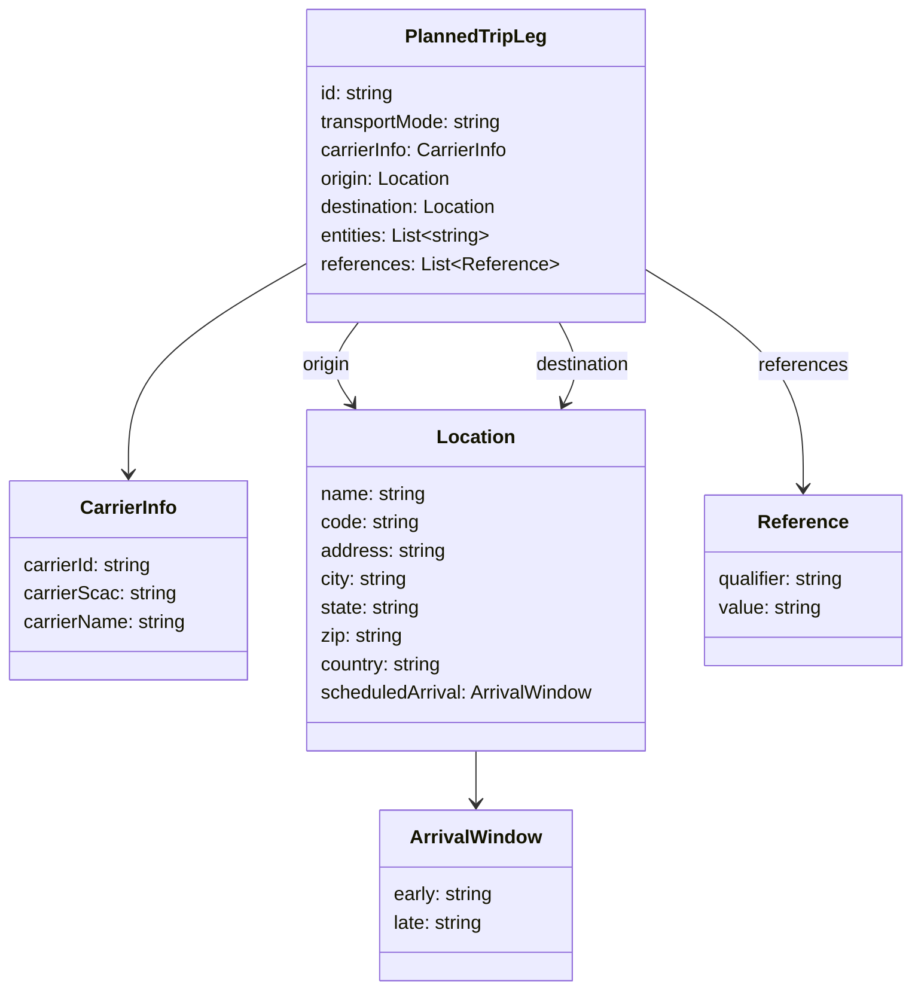
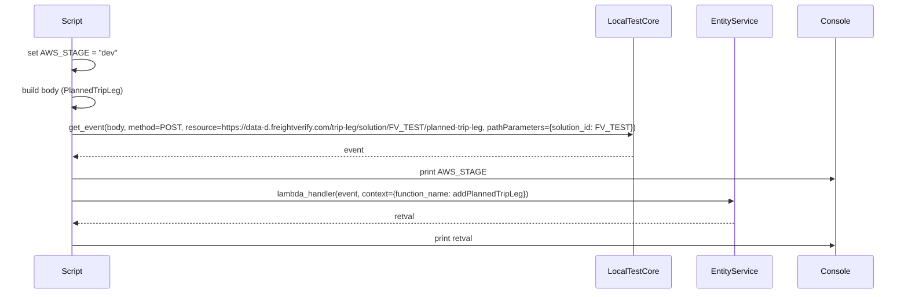

# Diagram: platform/tools/ide_local_testing/localTest/test/tripLeg/addPlannedTripLeg.py

> Auto-generated by Obscura crawlers

## Diagram 1

### SVG

<svg id="container" width="780.2734375" xmlns="http://www.w3.org/2000/svg" class="classDiagram" height="836" viewBox="0 0 780.2734375 836" role="graphics-document document" aria-roledescription="class"><g><defs><marker id="container_class-aggregationStart" class="marker aggregation class" refX="18" refY="7" markerWidth="190" markerHeight="240" orient="auto"><path d="M 18,7 L9,13 L1,7 L9,1 Z"></path></marker></defs><defs><marker id="container_class-aggregationEnd" class="marker aggregation class" refX="1" refY="7" markerWidth="20" markerHeight="28" orient="auto"><path d="M 18,7 L9,13 L1,7 L9,1 Z"></path></marker></defs><defs><marker id="container_class-extensionStart" class="marker extension class" refX="18" refY="7" markerWidth="190" markerHeight="240" orient="auto"><path d="M 1,7 L18,13 V 1 Z"></path></marker></defs><defs><marker id="container_class-extensionEnd" class="marker extension class" refX="1" refY="7" markerWidth="20" markerHeight="28" orient="auto"><path d="M 1,1 V 13 L18,7 Z"></path></marker></defs><defs><marker id="container_class-compositionStart" class="marker composition class" refX="18" refY="7" markerWidth="190" markerHeight="240" orient="auto"><path d="M 18,7 L9,13 L1,7 L9,1 Z"></path></marker></defs><defs><marker id="container_class-compositionEnd" class="marker composition class" refX="1" refY="7" markerWidth="20" markerHeight="28" orient="auto"><path d="M 18,7 L9,13 L1,7 L9,1 Z"></path></marker></defs><defs><marker id="container_class-dependencyStart" class="marker dependency class" refX="6" refY="7" markerWidth="190" markerHeight="240" orient="auto"><path d="M 5,7 L9,13 L1,7 L9,1 Z"></path></marker></defs><defs><marker id="container_class-dependencyEnd" class="marker dependency class" refX="13" refY="7" markerWidth="20" markerHeight="28" orient="auto"><path d="M 18,7 L9,13 L14,7 L9,1 Z"></path></marker></defs><defs><marker id="container_class-lollipopStart" class="marker lollipop class" refX="13" refY="7" markerWidth="190" markerHeight="240" orient="auto"><circle stroke="black" fill="transparent" cx="7" cy="7" r="6"></circle></marker></defs><defs><marker id="container_class-lollipopEnd" class="marker lollipop class" refX="1" refY="7" markerWidth="190" markerHeight="240" orient="auto"><circle stroke="black" fill="transparent" cx="7" cy="7" r="6"></circle></marker></defs><g class="root"><g class="clusters"></g><g class="edgePaths"><path d="M267.09,219.298L240.853,234.248C214.616,249.199,162.142,279.099,135.905,309.216C109.668,339.333,109.668,369.667,109.668,384.833L109.668,400" id="id_PlannedTripLeg_CarrierInfo_1" class="edge-thickness-normal edge-pattern-solid relation" style=";;;" data-edge="true" data-et="edge" data-id="id_PlannedTripLeg_CarrierInfo_1" data-points="W3sieCI6MjY3LjA4OTg0Mzc1LCJ5IjoyMTkuMjk4MTg1MDc0OTQxNH0seyJ4IjoxMDkuNjY3OTY4NzUsInkiOjMwOX0seyJ4IjoxMDkuNjY3OTY4NzUsInkiOjQwNn1d" marker-end="url(#container_class-dependencyEnd)"></path><path d="M306.488,272L301.827,278.167C297.167,284.333,287.845,296.667,286.959,308.183C286.074,319.699,293.624,330.399,297.399,335.748L301.175,341.098" id="id_PlannedTripLeg_Location_2" class="edge-thickness-normal edge-pattern-solid relation" style=";;;" data-edge="true" data-et="edge" data-id="id_PlannedTripLeg_Location_2" data-points="W3sieCI6MzA2LjQ4ODA5NjMzODc1NzQsInkiOjI3Mn0seyJ4IjoyNzguNTIzNDM3NSwieSI6MzA5fSx7IngiOjMwNC42MzQwODU4MDgwMTEwNCwieSI6MzQ2fV0=" marker-end="url(#container_class-dependencyEnd)"></path><path d="M476.968,272L480.271,278.167C483.575,284.333,490.182,296.667,490.848,308.106C491.515,319.545,486.24,330.089,483.603,335.362L480.966,340.634" id="id_PlannedTripLeg_Location_3" class="edge-thickness-normal edge-pattern-solid relation" style=";;;" data-edge="true" data-et="edge" data-id="id_PlannedTripLeg_Location_3" data-points="W3sieCI6NDc2Ljk2Nzc1NjEwMjA3MSwieSI6MjcyfSx7IngiOjQ5Ni43ODkwNjI1LCJ5IjozMDl9LHsieCI6NDc4LjI4MTg3NTg2MzI1OTY0LCJ5IjozNDZ9XQ==" marker-end="url(#container_class-dependencyEnd)"></path><path d="M406.254,634L406.254,638.167C406.254,642.333,406.254,650.667,406.254,658C406.254,665.333,406.254,671.667,406.254,674.833L406.254,678" id="id_Location_ArrivalWindow_4" class="edge-thickness-normal edge-pattern-solid relation" style=";;;" data-edge="true" data-et="edge" data-id="id_Location_ArrivalWindow_4" data-points="W3sieCI6NDA2LjI1MzkwNjI1LCJ5Ijo2MzR9LHsieCI6NDA2LjI1MzkwNjI1LCJ5Ijo2NTl9LHsieCI6NDA2LjI1MzkwNjI1LCJ5Ijo2ODR9XQ==" marker-end="url(#container_class-dependencyEnd)"></path><path d="M545.418,223.855L568.969,238.046C592.52,252.237,639.621,280.618,663.172,311.976C686.723,343.333,686.723,377.667,686.723,394.833L686.723,412" id="id_PlannedTripLeg_Reference_5" class="edge-thickness-normal edge-pattern-solid relation" style=";;;" data-edge="true" data-et="edge" data-id="id_PlannedTripLeg_Reference_5" data-points="W3sieCI6NTQ1LjQxNzk2ODc1LCJ5IjoyMjMuODU1MDY5NjM3ODgzfSx7IngiOjY4Ni43MjI2NTYyNSwieSI6MzA5fSx7IngiOjY4Ni43MjI2NTYyNSwieSI6NDE4fV0=" marker-end="url(#container_class-dependencyEnd)"></path></g><g class="edgeLabels"><g class="edgeLabel"><g class="label" data-id="id_PlannedTripLeg_CarrierInfo_1" transform="translate(0, 0)"><foreignObject width="0" height="0">

</foreignObject></g></g><g class="edgeLabel" transform="translate(278.85317, 308.56373)"><g class="label" data-id="id_PlannedTripLeg_Location_2" transform="translate(-21.125, -12)"><foreignObject width="42.25" height="24">

origin

</foreignObject></g></g><g class="edgeLabel" transform="translate(496.64637, 308.73365)"><g class="label" data-id="id_PlannedTripLeg_Location_3" transform="translate(-41.5703125, -12)"><foreignObject width="83.140625" height="24">

destination

</foreignObject></g></g><g class="edgeLabel"><g class="label" data-id="id_Location_ArrivalWindow_4" transform="translate(0, 0)"><foreignObject width="0" height="0">

</foreignObject></g></g><g class="edgeLabel" transform="translate(686.72265625, 309)"><g class="label" data-id="id_PlannedTripLeg_Reference_5" transform="translate(-37.828125, -12)"><foreignObject width="75.65625" height="24">

references

</foreignObject></g></g></g><g class="nodes"><g class="node default" id="classId-PlannedTripLeg-0" transform="translate(406.25390625, 140)"><g class="basic label-container"><path d="M-139.1640625 -132 L139.1640625 -132 L139.1640625 132 L-139.1640625 132" stroke="none" stroke-width="0" fill="#ECECFF" style=""></path><path d="M-139.1640625 -132 C-70.68977231483481 -132, -2.215482129669624 -132, 139.1640625 -132 M-139.1640625 -132 C-41.666087619763246 -132, 55.83188726047351 -132, 139.1640625 -132 M139.1640625 -132 C139.1640625 -43.21362060652304, 139.1640625 45.572758786953926, 139.1640625 132 M139.1640625 -132 C139.1640625 -47.481671834117876, 139.1640625 37.03665633176425, 139.1640625 132 M139.1640625 132 C28.077892490844164 132, -83.00827751831167 132, -139.1640625 132 M139.1640625 132 C61.33899758349456 132, -16.48606733301088 132, -139.1640625 132 M-139.1640625 132 C-139.1640625 77.86166596339584, -139.1640625 23.723331926791673, -139.1640625 -132 M-139.1640625 132 C-139.1640625 29.540741916697158, -139.1640625 -72.91851616660568, -139.1640625 -132" stroke="#9370DB" stroke-width="1.3" fill="none" stroke-dasharray="0 0" style=""></path></g><g class="annotation-group text" transform="translate(0, -108)"></g><g class="label-group text" transform="translate(-56.9375, -108)"><g class="label" style="font-weight: bolder" transform="translate(0,-12)"><foreignObject width="113.875" height="24">

PlannedTripLeg

</foreignObject></g></g><g class="members-group text" transform="translate(-127.1640625, -60)"><g class="label" style="" transform="translate(0,-12)"><foreignObject width="63.796875" height="24">

id: string

</foreignObject></g><g class="label" style="" transform="translate(0,12)"><foreignObject width="157.546875" height="24">

transportMode: string

</foreignObject></g><g class="label" style="" transform="translate(0,36)"><foreignObject width="162.578125" height="24">

carrierInfo: CarrierInfo

</foreignObject></g><g class="label" style="" transform="translate(0,60)"><foreignObject width="112.4375" height="24">

origin: Location

</foreignObject></g><g class="label" style="" transform="translate(0,84)"><foreignObject width="153.34375" height="24">

destination: Location

</foreignObject></g><g class="label" style="" transform="translate(0,108)"><foreignObject width="146.3125" height="24">

entities: List&lt;string&gt;

</foreignObject></g><g class="label" style="" transform="translate(0,132)"><foreignObject width="197.390625" height="24">

references: List&lt;Reference&gt;

</foreignObject></g></g><g class="methods-group text" transform="translate(-127.1640625, 132)"></g><g class="divider" style=""><path d="M-139.1640625 -84 C-35.51000186919791 -84, 68.14405876160419 -84, 139.1640625 -84 M-139.1640625 -84 C-41.4337270605824 -84, 56.2966083788352 -84, 139.1640625 -84" stroke="#9370DB" stroke-width="1.3" fill="none" stroke-dasharray="0 0" style=""></path></g><g class="divider" style=""><path d="M-139.1640625 108 C-77.64044747575095 108, -16.116832451501892 108, 139.1640625 108 M-139.1640625 108 C-33.02065736776429 108, 73.12274776447143 108, 139.1640625 108" stroke="#9370DB" stroke-width="1.3" fill="none" stroke-dasharray="0 0" style=""></path></g></g><g class="node default" id="classId-CarrierInfo-1" transform="translate(109.66796875, 490)"><g class="basic label-container"><path d="M-101.66796875 -84 L101.66796875 -84 L101.66796875 84 L-101.66796875 84" stroke="none" stroke-width="0" fill="#ECECFF" style=""></path><path d="M-101.66796875 -84 C-50.721042914486794 -84, 0.22588292102641105 -84, 101.66796875 -84 M-101.66796875 -84 C-34.25185124352828 -84, 33.16426626294344 -84, 101.66796875 -84 M101.66796875 -84 C101.66796875 -26.251889337363757, 101.66796875 31.496221325272487, 101.66796875 84 M101.66796875 -84 C101.66796875 -31.158800643296274, 101.66796875 21.68239871340745, 101.66796875 84 M101.66796875 84 C33.26553564528446 84, -35.13689745943108 84, -101.66796875 84 M101.66796875 84 C33.836159826510226 84, -33.99564909697955 84, -101.66796875 84 M-101.66796875 84 C-101.66796875 21.959512846854615, -101.66796875 -40.08097430629077, -101.66796875 -84 M-101.66796875 84 C-101.66796875 30.591452312988686, -101.66796875 -22.817095374022628, -101.66796875 -84" stroke="#9370DB" stroke-width="1.3" fill="none" stroke-dasharray="0 0" style=""></path></g><g class="annotation-group text" transform="translate(0, -60)"></g><g class="label-group text" transform="translate(-39.6015625, -60)"><g class="label" style="font-weight: bolder" transform="translate(0,-12)"><foreignObject width="79.203125" height="24">

CarrierInfo

</foreignObject></g></g><g class="members-group text" transform="translate(-89.66796875, -12)"><g class="label" style="" transform="translate(0,-12)"><foreignObject width="111.953125" height="24">

carrierId: string

</foreignObject></g><g class="label" style="" transform="translate(0,12)"><foreignObject width="130.296875" height="24">

carrierScac: string

</foreignObject></g><g class="label" style="" transform="translate(0,36)"><foreignObject width="139.734375" height="24">

carrierName: string

</foreignObject></g></g><g class="methods-group text" transform="translate(-89.66796875, 84)"></g><g class="divider" style=""><path d="M-101.66796875 -36 C-27.337219028849432 -36, 46.993530692301135 -36, 101.66796875 -36 M-101.66796875 -36 C-37.32187067461021 -36, 27.02422740077958 -36, 101.66796875 -36" stroke="#9370DB" stroke-width="1.3" fill="none" stroke-dasharray="0 0" style=""></path></g><g class="divider" style=""><path d="M-101.66796875 60 C-49.33401978496713 60, 2.9999291800657346 60, 101.66796875 60 M-101.66796875 60 C-44.93494493448801 60, 11.798078881023983 60, 101.66796875 60" stroke="#9370DB" stroke-width="1.3" fill="none" stroke-dasharray="0 0" style=""></path></g></g><g class="node default" id="classId-Location-2" transform="translate(406.25390625, 490)"><g class="basic label-container"><path d="M-144.91796875 -144 L144.91796875 -144 L144.91796875 144 L-144.91796875 144" stroke="none" stroke-width="0" fill="#ECECFF" style=""></path><path d="M-144.91796875 -144 C-75.79076709306763 -144, -6.663565436135258 -144, 144.91796875 -144 M-144.91796875 -144 C-73.7252203389288 -144, -2.532471927857614 -144, 144.91796875 -144 M144.91796875 -144 C144.91796875 -50.13505277998159, 144.91796875 43.729894440036816, 144.91796875 144 M144.91796875 -144 C144.91796875 -48.68038770051457, 144.91796875 46.639224598970856, 144.91796875 144 M144.91796875 144 C84.8647941139401 144, 24.811619477880214 144, -144.91796875 144 M144.91796875 144 C67.11994472935014 144, -10.678079291299724 144, -144.91796875 144 M-144.91796875 144 C-144.91796875 43.43345216397894, -144.91796875 -57.13309567204212, -144.91796875 -144 M-144.91796875 144 C-144.91796875 57.54707540202335, -144.91796875 -28.905849195953294, -144.91796875 -144" stroke="#9370DB" stroke-width="1.3" fill="none" stroke-dasharray="0 0" style=""></path></g><g class="annotation-group text" transform="translate(0, -120)"></g><g class="label-group text" transform="translate(-31.3515625, -120)"><g class="label" style="font-weight: bolder" transform="translate(0,-12)"><foreignObject width="62.703125" height="24">

Location

</foreignObject></g></g><g class="members-group text" transform="translate(-132.91796875, -72)"><g class="label" style="" transform="translate(0,-12)"><foreignObject width="90.234375" height="24">

name: string

</foreignObject></g><g class="label" style="" transform="translate(0,12)"><foreignObject width="84.6875" height="24">

code: string

</foreignObject></g><g class="label" style="" transform="translate(0,36)"><foreignObject width="106.765625" height="24">

address: string

</foreignObject></g><g class="label" style="" transform="translate(0,60)"><foreignObject width="75.515625" height="24">

city: string

</foreignObject></g><g class="label" style="" transform="translate(0,84)"><foreignObject width="85.8125" height="24">

state: string

</foreignObject></g><g class="label" style="" transform="translate(0,108)"><foreignObject width="70.734375" height="24">

zip: string

</foreignObject></g><g class="label" style="" transform="translate(0,132)"><foreignObject width="104.96875" height="24">

country: string

</foreignObject></g><g class="label" style="" transform="translate(0,156)"><foreignObject width="234.484375" height="24">

scheduledArrival: ArrivalWindow

</foreignObject></g></g><g class="methods-group text" transform="translate(-132.91796875, 144)"></g><g class="divider" style=""><path d="M-144.91796875 -96 C-45.793014507303525 -96, 53.33193973539295 -96, 144.91796875 -96 M-144.91796875 -96 C-33.67851730634686 -96, 77.56093413730628 -96, 144.91796875 -96" stroke="#9370DB" stroke-width="1.3" fill="none" stroke-dasharray="0 0" style=""></path></g><g class="divider" style=""><path d="M-144.91796875 120 C-86.42855050346527 120, -27.93913225693055 120, 144.91796875 120 M-144.91796875 120 C-61.60607432490848 120, 21.705820100183047 120, 144.91796875 120" stroke="#9370DB" stroke-width="1.3" fill="none" stroke-dasharray="0 0" style=""></path></g></g><g class="node default" id="classId-ArrivalWindow-3" transform="translate(406.25390625, 756)"><g class="basic label-container"><path d="M-81.37109375 -72 L81.37109375 -72 L81.37109375 72 L-81.37109375 72" stroke="none" stroke-width="0" fill="#ECECFF" style=""></path><path d="M-81.37109375 -72 C-32.224212820683306 -72, 16.92266810863339 -72, 81.37109375 -72 M-81.37109375 -72 C-34.85388536167343 -72, 11.663323026653146 -72, 81.37109375 -72 M81.37109375 -72 C81.37109375 -38.48615679268292, 81.37109375 -4.972313585365839, 81.37109375 72 M81.37109375 -72 C81.37109375 -17.54021299724377, 81.37109375 36.91957400551246, 81.37109375 72 M81.37109375 72 C35.25255332757729 72, -10.865987094845423 72, -81.37109375 72 M81.37109375 72 C31.748585257657354 72, -17.873923234685293 72, -81.37109375 72 M-81.37109375 72 C-81.37109375 14.816729815003228, -81.37109375 -42.366540369993544, -81.37109375 -72 M-81.37109375 72 C-81.37109375 36.74665202728157, -81.37109375 1.49330405456314, -81.37109375 -72" stroke="#9370DB" stroke-width="1.3" fill="none" stroke-dasharray="0 0" style=""></path></g><g class="annotation-group text" transform="translate(0, -48)"></g><g class="label-group text" transform="translate(-53.1171875, -48)"><g class="label" style="font-weight: bolder" transform="translate(0,-12)"><foreignObject width="106.234375" height="24">

ArrivalWindow

</foreignObject></g></g><g class="members-group text" transform="translate(-69.37109375, 0)"><g class="label" style="" transform="translate(0,-12)"><foreignObject width="85.625" height="24">

early: string

</foreignObject></g><g class="label" style="" transform="translate(0,12)"><foreignObject width="77.28125" height="24">

late: string

</foreignObject></g></g><g class="methods-group text" transform="translate(-69.37109375, 72)"></g><g class="divider" style=""><path d="M-81.37109375 -24 C-44.20659808864858 -24, -7.042102427297166 -24, 81.37109375 -24 M-81.37109375 -24 C-25.58504238319614 -24, 30.20100898360772 -24, 81.37109375 -24" stroke="#9370DB" stroke-width="1.3" fill="none" stroke-dasharray="0 0" style=""></path></g><g class="divider" style=""><path d="M-81.37109375 48 C-38.18923942812916 48, 4.992614893741674 48, 81.37109375 48 M-81.37109375 48 C-38.88244608275061 48, 3.606201584498777 48, 81.37109375 48" stroke="#9370DB" stroke-width="1.3" fill="none" stroke-dasharray="0 0" style=""></path></g></g><g class="node default" id="classId-Reference-4" transform="translate(686.72265625, 490)"><g class="basic label-container"><path d="M-85.55078125 -72 L85.55078125 -72 L85.55078125 72 L-85.55078125 72" stroke="none" stroke-width="0" fill="#ECECFF" style=""></path><path d="M-85.55078125 -72 C-25.178942794111485 -72, 35.19289566177703 -72, 85.55078125 -72 M-85.55078125 -72 C-38.1455552868311 -72, 9.259670676337805 -72, 85.55078125 -72 M85.55078125 -72 C85.55078125 -22.834971631800215, 85.55078125 26.33005673639957, 85.55078125 72 M85.55078125 -72 C85.55078125 -27.972116360496784, 85.55078125 16.05576727900643, 85.55078125 72 M85.55078125 72 C38.61714989206108 72, -8.316481465877843 72, -85.55078125 72 M85.55078125 72 C39.92761845665579 72, -5.695544336688414 72, -85.55078125 72 M-85.55078125 72 C-85.55078125 38.96476531280026, -85.55078125 5.9295306256005205, -85.55078125 -72 M-85.55078125 72 C-85.55078125 31.881328317817008, -85.55078125 -8.237343364365984, -85.55078125 -72" stroke="#9370DB" stroke-width="1.3" fill="none" stroke-dasharray="0 0" style=""></path></g><g class="annotation-group text" transform="translate(0, -48)"></g><g class="label-group text" transform="translate(-36.5078125, -48)"><g class="label" style="font-weight: bolder" transform="translate(0,-12)"><foreignObject width="73.015625" height="24">

Reference

</foreignObject></g></g><g class="members-group text" transform="translate(-73.55078125, 0)"><g class="label" style="" transform="translate(0,-12)"><foreignObject width="110.59375" height="24">

qualifier: string

</foreignObject></g><g class="label" style="" transform="translate(0,12)"><foreignObject width="88.59375" height="24">

value: string

</foreignObject></g></g><g class="methods-group text" transform="translate(-73.55078125, 72)"></g><g class="divider" style=""><path d="M-85.55078125 -24 C-36.483023347649194 -24, 12.584734554701612 -24, 85.55078125 -24 M-85.55078125 -24 C-30.43307176690074 -24, 24.684637716198523 -24, 85.55078125 -24" stroke="#9370DB" stroke-width="1.3" fill="none" stroke-dasharray="0 0" style=""></path></g><g class="divider" style=""><path d="M-85.55078125 48 C-49.361551575805905 48, -13.17232190161181 48, 85.55078125 48 M-85.55078125 48 C-43.448652580898866 48, -1.346523911797732 48, 85.55078125 48" stroke="#9370DB" stroke-width="1.3" fill="none" stroke-dasharray="0 0" style=""></path></g></g></g></g></g></svg>

## Diagram 2

### SVG

<svg id="container" width="1889.5" xmlns="http://www.w3.org/2000/svg" height="615" viewBox="-76.5 -10 1889.5 615" role="graphics-document document" aria-roledescription="sequence"><g><rect x="1613" y="529" fill="#eaeaea" stroke="#666" width="150" height="65" name="Console" rx="3" ry="3" class="actor actor-bottom"></rect><text x="1688" y="561.5" dominant-baseline="central" alignment-baseline="central" class="actor actor-box" style="text-anchor: middle; font-size: 16px; font-weight: 400;"><tspan x="1688" dy="0">Console</tspan></text></g><g><rect x="1413" y="529" fill="#eaeaea" stroke="#666" width="150" height="65" name="EntityService" rx="3" ry="3" class="actor actor-bottom"></rect><text x="1488" y="561.5" dominant-baseline="central" alignment-baseline="central" class="actor actor-box" style="text-anchor: middle; font-size: 16px; font-weight: 400;"><tspan x="1488" dy="0">EntityService</tspan></text></g><g><rect x="1213" y="529" fill="#eaeaea" stroke="#666" width="150" height="65" name="LocalTestCore" rx="3" ry="3" class="actor actor-bottom"></rect><text x="1288" y="561.5" dominant-baseline="central" alignment-baseline="central" class="actor actor-box" style="text-anchor: middle; font-size: 16px; font-weight: 400;"><tspan x="1288" dy="0">LocalTestCore</tspan></text></g><g><rect x="0" y="529" fill="#eaeaea" stroke="#666" width="150" height="65" name="Script" rx="3" ry="3" class="actor actor-bottom"></rect><text x="75" y="561.5" dominant-baseline="central" alignment-baseline="central" class="actor actor-box" style="text-anchor: middle; font-size: 16px; font-weight: 400;"><tspan x="75" dy="0">Script</tspan></text></g><g><line id="actor3" x1="1688" y1="65" x2="1688" y2="529" class="actor-line 200" stroke-width="0.5px" stroke="#999" name="Console"></line><g id="root-3"><rect x="1613" y="0" fill="#eaeaea" stroke="#666" width="150" height="65" name="Console" rx="3" ry="3" class="actor actor-top"></rect><text x="1688" y="32.5" dominant-baseline="central" alignment-baseline="central" class="actor actor-box" style="text-anchor: middle; font-size: 16px; font-weight: 400;"><tspan x="1688" dy="0">Console</tspan></text></g></g><g><line id="actor2" x1="1488" y1="65" x2="1488" y2="529" class="actor-line 200" stroke-width="0.5px" stroke="#999" name="EntityService"></line><g id="root-2"><rect x="1413" y="0" fill="#eaeaea" stroke="#666" width="150" height="65" name="EntityService" rx="3" ry="3" class="actor actor-top"></rect><text x="1488" y="32.5" dominant-baseline="central" alignment-baseline="central" class="actor actor-box" style="text-anchor: middle; font-size: 16px; font-weight: 400;"><tspan x="1488" dy="0">EntityService</tspan></text></g></g><g><line id="actor1" x1="1288" y1="65" x2="1288" y2="529" class="actor-line 200" stroke-width="0.5px" stroke="#999" name="LocalTestCore"></line><g id="root-1"><rect x="1213" y="0" fill="#eaeaea" stroke="#666" width="150" height="65" name="LocalTestCore" rx="3" ry="3" class="actor actor-top"></rect><text x="1288" y="32.5" dominant-baseline="central" alignment-baseline="central" class="actor actor-box" style="text-anchor: middle; font-size: 16px; font-weight: 400;"><tspan x="1288" dy="0">LocalTestCore</tspan></text></g></g><g><line id="actor0" x1="75" y1="65" x2="75" y2="529" class="actor-line 200" stroke-width="0.5px" stroke="#999" name="Script"></line><g id="root-0"><rect x="0" y="0" fill="#eaeaea" stroke="#666" width="150" height="65" name="Script" rx="3" ry="3" class="actor actor-top"></rect><text x="75" y="32.5" dominant-baseline="central" alignment-baseline="central" class="actor actor-box" style="text-anchor: middle; font-size: 16px; font-weight: 400;"><tspan x="75" dy="0">Script</tspan></text></g></g><g></g><defs><symbol id="computer" width="24" height="24"><path transform="scale(.5)" d="M2 2v13h20v-13h-20zm18 11h-16v-9h16v9zm-10.228 6l.466-1h3.524l.467 1h-4.457zm14.228 3h-24l2-6h2.104l-1.33 4h18.45l-1.297-4h2.073l2 6zm-5-10h-14v-7h14v7z"></path></symbol></defs><defs><symbol id="database" fill-rule="evenodd" clip-rule="evenodd"><path transform="scale(.5)" d="M12.258.001l.256.004.255.005.253.008.251.01.249.012.247.015.246.016.242.019.241.02.239.023.236.024.233.027.231.028.229.031.225.032.223.034.22.036.217.038.214.04.211.041.208.043.205.045.201.046.198.048.194.05.191.051.187.053.183.054.18.056.175.057.172.059.168.06.163.061.16.063.155.064.15.066.074.033.073.033.071.034.07.034.069.035.068.035.067.035.066.035.064.036.064.036.062.036.06.036.06.037.058.037.058.037.055.038.055.038.053.038.052.038.051.039.05.039.048.039.047.039.045.04.044.04.043.04.041.04.04.041.039.041.037.041.036.041.034.041.033.042.032.042.03.042.029.042.027.042.026.043.024.043.023.043.021.043.02.043.018.044.017.043.015.044.013.044.012.044.011.045.009.044.007.045.006.045.004.045.002.045.001.045v17l-.001.045-.002.045-.004.045-.006.045-.007.045-.009.044-.011.045-.012.044-.013.044-.015.044-.017.043-.018.044-.02.043-.021.043-.023.043-.024.043-.026.043-.027.042-.029.042-.03.042-.032.042-.033.042-.034.041-.036.041-.037.041-.039.041-.04.041-.041.04-.043.04-.044.04-.045.04-.047.039-.048.039-.05.039-.051.039-.052.038-.053.038-.055.038-.055.038-.058.037-.058.037-.06.037-.06.036-.062.036-.064.036-.064.036-.066.035-.067.035-.068.035-.069.035-.07.034-.071.034-.073.033-.074.033-.15.066-.155.064-.16.063-.163.061-.168.06-.172.059-.175.057-.18.056-.183.054-.187.053-.191.051-.194.05-.198.048-.201.046-.205.045-.208.043-.211.041-.214.04-.217.038-.22.036-.223.034-.225.032-.229.031-.231.028-.233.027-.236.024-.239.023-.241.02-.242.019-.246.016-.247.015-.249.012-.251.01-.253.008-.255.005-.256.004-.258.001-.258-.001-.256-.004-.255-.005-.253-.008-.251-.01-.249-.012-.247-.015-.245-.016-.243-.019-.241-.02-.238-.023-.236-.024-.234-.027-.231-.028-.228-.031-.226-.032-.223-.034-.22-.036-.217-.038-.214-.04-.211-.041-.208-.043-.204-.045-.201-.046-.198-.048-.195-.05-.19-.051-.187-.053-.184-.054-.179-.056-.176-.057-.172-.059-.167-.06-.164-.061-.159-.063-.155-.064-.151-.066-.074-.033-.072-.033-.072-.034-.07-.034-.069-.035-.068-.035-.067-.035-.066-.035-.064-.036-.063-.036-.062-.036-.061-.036-.06-.037-.058-.037-.057-.037-.056-.038-.055-.038-.053-.038-.052-.038-.051-.039-.049-.039-.049-.039-.046-.039-.046-.04-.044-.04-.043-.04-.041-.04-.04-.041-.039-.041-.037-.041-.036-.041-.034-.041-.033-.042-.032-.042-.03-.042-.029-.042-.027-.042-.026-.043-.024-.043-.023-.043-.021-.043-.02-.043-.018-.044-.017-.043-.015-.044-.013-.044-.012-.044-.011-.045-.009-.044-.007-.045-.006-.045-.004-.045-.002-.045-.001-.045v-17l.001-.045.002-.045.004-.045.006-.045.007-.045.009-.044.011-.045.012-.044.013-.044.015-.044.017-.043.018-.044.02-.043.021-.043.023-.043.024-.043.026-.043.027-.042.029-.042.03-.042.032-.042.033-.042.034-.041.036-.041.037-.041.039-.041.04-.041.041-.04.043-.04.044-.04.046-.04.046-.039.049-.039.049-.039.051-.039.052-.038.053-.038.055-.038.056-.038.057-.037.058-.037.06-.037.061-.036.062-.036.063-.036.064-.036.066-.035.067-.035.068-.035.069-.035.07-.034.072-.034.072-.033.074-.033.151-.066.155-.064.159-.063.164-.061.167-.06.172-.059.176-.057.179-.056.184-.054.187-.053.19-.051.195-.05.198-.048.201-.046.204-.045.208-.043.211-.041.214-.04.217-.038.22-.036.223-.034.226-.032.228-.031.231-.028.234-.027.236-.024.238-.023.241-.02.243-.019.245-.016.247-.015.249-.012.251-.01.253-.008.255-.005.256-.004.258-.001.258.001zm-9.258 20.499v.01l.001.021.003.021.004.022.005.021.006.022.007.022.009.023.01.022.011.023.012.023.013.023.015.023.016.024.017.023.018.024.019.024.021.024.022.025.023.024.024.025.052.049.056.05.061.051.066.051.07.051.075.051.079.052.084.052.088.052.092.052.097.052.102.051.105.052.11.052.114.051.119.051.123.051.127.05.131.05.135.05.139.048.144.049.147.047.152.047.155.047.16.045.163.045.167.043.171.043.176.041.178.041.183.039.187.039.19.037.194.035.197.035.202.033.204.031.209.03.212.029.216.027.219.025.222.024.226.021.23.02.233.018.236.016.24.015.243.012.246.01.249.008.253.005.256.004.259.001.26-.001.257-.004.254-.005.25-.008.247-.011.244-.012.241-.014.237-.016.233-.018.231-.021.226-.021.224-.024.22-.026.216-.027.212-.028.21-.031.205-.031.202-.034.198-.034.194-.036.191-.037.187-.039.183-.04.179-.04.175-.042.172-.043.168-.044.163-.045.16-.046.155-.046.152-.047.148-.048.143-.049.139-.049.136-.05.131-.05.126-.05.123-.051.118-.052.114-.051.11-.052.106-.052.101-.052.096-.052.092-.052.088-.053.083-.051.079-.052.074-.052.07-.051.065-.051.06-.051.056-.05.051-.05.023-.024.023-.025.021-.024.02-.024.019-.024.018-.024.017-.024.015-.023.014-.024.013-.023.012-.023.01-.023.01-.022.008-.022.006-.022.006-.022.004-.022.004-.021.001-.021.001-.021v-4.127l-.077.055-.08.053-.083.054-.085.053-.087.052-.09.052-.093.051-.095.05-.097.05-.1.049-.102.049-.105.048-.106.047-.109.047-.111.046-.114.045-.115.045-.118.044-.12.043-.122.042-.124.042-.126.041-.128.04-.13.04-.132.038-.134.038-.135.037-.138.037-.139.035-.142.035-.143.034-.144.033-.147.032-.148.031-.15.03-.151.03-.153.029-.154.027-.156.027-.158.026-.159.025-.161.024-.162.023-.163.022-.165.021-.166.02-.167.019-.169.018-.169.017-.171.016-.173.015-.173.014-.175.013-.175.012-.177.011-.178.01-.179.008-.179.008-.181.006-.182.005-.182.004-.184.003-.184.002h-.37l-.184-.002-.184-.003-.182-.004-.182-.005-.181-.006-.179-.008-.179-.008-.178-.01-.176-.011-.176-.012-.175-.013-.173-.014-.172-.015-.171-.016-.17-.017-.169-.018-.167-.019-.166-.02-.165-.021-.163-.022-.162-.023-.161-.024-.159-.025-.157-.026-.156-.027-.155-.027-.153-.029-.151-.03-.15-.03-.148-.031-.146-.032-.145-.033-.143-.034-.141-.035-.14-.035-.137-.037-.136-.037-.134-.038-.132-.038-.13-.04-.128-.04-.126-.041-.124-.042-.122-.042-.12-.044-.117-.043-.116-.045-.113-.045-.112-.046-.109-.047-.106-.047-.105-.048-.102-.049-.1-.049-.097-.05-.095-.05-.093-.052-.09-.051-.087-.052-.085-.053-.083-.054-.08-.054-.077-.054v4.127zm0-5.654v.011l.001.021.003.021.004.021.005.022.006.022.007.022.009.022.01.022.011.023.012.023.013.023.015.024.016.023.017.024.018.024.019.024.021.024.022.024.023.025.024.024.052.05.056.05.061.05.066.051.07.051.075.052.079.051.084.052.088.052.092.052.097.052.102.052.105.052.11.051.114.051.119.052.123.05.127.051.131.05.135.049.139.049.144.048.147.048.152.047.155.046.16.045.163.045.167.044.171.042.176.042.178.04.183.04.187.038.19.037.194.036.197.034.202.033.204.032.209.03.212.028.216.027.219.025.222.024.226.022.23.02.233.018.236.016.24.014.243.012.246.01.249.008.253.006.256.003.259.001.26-.001.257-.003.254-.006.25-.008.247-.01.244-.012.241-.015.237-.016.233-.018.231-.02.226-.022.224-.024.22-.025.216-.027.212-.029.21-.03.205-.032.202-.033.198-.035.194-.036.191-.037.187-.039.183-.039.179-.041.175-.042.172-.043.168-.044.163-.045.16-.045.155-.047.152-.047.148-.048.143-.048.139-.05.136-.049.131-.05.126-.051.123-.051.118-.051.114-.052.11-.052.106-.052.101-.052.096-.052.092-.052.088-.052.083-.052.079-.052.074-.051.07-.052.065-.051.06-.05.056-.051.051-.049.023-.025.023-.024.021-.025.02-.024.019-.024.018-.024.017-.024.015-.023.014-.023.013-.024.012-.022.01-.023.01-.023.008-.022.006-.022.006-.022.004-.021.004-.022.001-.021.001-.021v-4.139l-.077.054-.08.054-.083.054-.085.052-.087.053-.09.051-.093.051-.095.051-.097.05-.1.049-.102.049-.105.048-.106.047-.109.047-.111.046-.114.045-.115.044-.118.044-.12.044-.122.042-.124.042-.126.041-.128.04-.13.039-.132.039-.134.038-.135.037-.138.036-.139.036-.142.035-.143.033-.144.033-.147.033-.148.031-.15.03-.151.03-.153.028-.154.028-.156.027-.158.026-.159.025-.161.024-.162.023-.163.022-.165.021-.166.02-.167.019-.169.018-.169.017-.171.016-.173.015-.173.014-.175.013-.175.012-.177.011-.178.009-.179.009-.179.007-.181.007-.182.005-.182.004-.184.003-.184.002h-.37l-.184-.002-.184-.003-.182-.004-.182-.005-.181-.007-.179-.007-.179-.009-.178-.009-.176-.011-.176-.012-.175-.013-.173-.014-.172-.015-.171-.016-.17-.017-.169-.018-.167-.019-.166-.02-.165-.021-.163-.022-.162-.023-.161-.024-.159-.025-.157-.026-.156-.027-.155-.028-.153-.028-.151-.03-.15-.03-.148-.031-.146-.033-.145-.033-.143-.033-.141-.035-.14-.036-.137-.036-.136-.037-.134-.038-.132-.039-.13-.039-.128-.04-.126-.041-.124-.042-.122-.043-.12-.043-.117-.044-.116-.044-.113-.046-.112-.046-.109-.046-.106-.047-.105-.048-.102-.049-.1-.049-.097-.05-.095-.051-.093-.051-.09-.051-.087-.053-.085-.052-.083-.054-.08-.054-.077-.054v4.139zm0-5.666v.011l.001.02.003.022.004.021.005.022.006.021.007.022.009.023.01.022.011.023.012.023.013.023.015.023.016.024.017.024.018.023.019.024.021.025.022.024.023.024.024.025.052.05.056.05.061.05.066.051.07.051.075.052.079.051.084.052.088.052.092.052.097.052.102.052.105.051.11.052.114.051.119.051.123.051.127.05.131.05.135.05.139.049.144.048.147.048.152.047.155.046.16.045.163.045.167.043.171.043.176.042.178.04.183.04.187.038.19.037.194.036.197.034.202.033.204.032.209.03.212.028.216.027.219.025.222.024.226.021.23.02.233.018.236.017.24.014.243.012.246.01.249.008.253.006.256.003.259.001.26-.001.257-.003.254-.006.25-.008.247-.01.244-.013.241-.014.237-.016.233-.018.231-.02.226-.022.224-.024.22-.025.216-.027.212-.029.21-.03.205-.032.202-.033.198-.035.194-.036.191-.037.187-.039.183-.039.179-.041.175-.042.172-.043.168-.044.163-.045.16-.045.155-.047.152-.047.148-.048.143-.049.139-.049.136-.049.131-.051.126-.05.123-.051.118-.052.114-.051.11-.052.106-.052.101-.052.096-.052.092-.052.088-.052.083-.052.079-.052.074-.052.07-.051.065-.051.06-.051.056-.05.051-.049.023-.025.023-.025.021-.024.02-.024.019-.024.018-.024.017-.024.015-.023.014-.024.013-.023.012-.023.01-.022.01-.023.008-.022.006-.022.006-.022.004-.022.004-.021.001-.021.001-.021v-4.153l-.077.054-.08.054-.083.053-.085.053-.087.053-.09.051-.093.051-.095.051-.097.05-.1.049-.102.048-.105.048-.106.048-.109.046-.111.046-.114.046-.115.044-.118.044-.12.043-.122.043-.124.042-.126.041-.128.04-.13.039-.132.039-.134.038-.135.037-.138.036-.139.036-.142.034-.143.034-.144.033-.147.032-.148.032-.15.03-.151.03-.153.028-.154.028-.156.027-.158.026-.159.024-.161.024-.162.023-.163.023-.165.021-.166.02-.167.019-.169.018-.169.017-.171.016-.173.015-.173.014-.175.013-.175.012-.177.01-.178.01-.179.009-.179.007-.181.006-.182.006-.182.004-.184.003-.184.001-.185.001-.185-.001-.184-.001-.184-.003-.182-.004-.182-.006-.181-.006-.179-.007-.179-.009-.178-.01-.176-.01-.176-.012-.175-.013-.173-.014-.172-.015-.171-.016-.17-.017-.169-.018-.167-.019-.166-.02-.165-.021-.163-.023-.162-.023-.161-.024-.159-.024-.157-.026-.156-.027-.155-.028-.153-.028-.151-.03-.15-.03-.148-.032-.146-.032-.145-.033-.143-.034-.141-.034-.14-.036-.137-.036-.136-.037-.134-.038-.132-.039-.13-.039-.128-.041-.126-.041-.124-.041-.122-.043-.12-.043-.117-.044-.116-.044-.113-.046-.112-.046-.109-.046-.106-.048-.105-.048-.102-.048-.1-.05-.097-.049-.095-.051-.093-.051-.09-.052-.087-.052-.085-.053-.083-.053-.08-.054-.077-.054v4.153zm8.74-8.179l-.257.004-.254.005-.25.008-.247.011-.244.012-.241.014-.237.016-.233.018-.231.021-.226.022-.224.023-.22.026-.216.027-.212.028-.21.031-.205.032-.202.033-.198.034-.194.036-.191.038-.187.038-.183.04-.179.041-.175.042-.172.043-.168.043-.163.045-.16.046-.155.046-.152.048-.148.048-.143.048-.139.049-.136.05-.131.05-.126.051-.123.051-.118.051-.114.052-.11.052-.106.052-.101.052-.096.052-.092.052-.088.052-.083.052-.079.052-.074.051-.07.052-.065.051-.06.05-.056.05-.051.05-.023.025-.023.024-.021.024-.02.025-.019.024-.018.024-.017.023-.015.024-.014.023-.013.023-.012.023-.01.023-.01.022-.008.022-.006.023-.006.021-.004.022-.004.021-.001.021-.001.021.001.021.001.021.004.021.004.022.006.021.006.023.008.022.01.022.01.023.012.023.013.023.014.023.015.024.017.023.018.024.019.024.02.025.021.024.023.024.023.025.051.05.056.05.06.05.065.051.07.052.074.051.079.052.083.052.088.052.092.052.096.052.101.052.106.052.11.052.114.052.118.051.123.051.126.051.131.05.136.05.139.049.143.048.148.048.152.048.155.046.16.046.163.045.168.043.172.043.175.042.179.041.183.04.187.038.191.038.194.036.198.034.202.033.205.032.21.031.212.028.216.027.22.026.224.023.226.022.231.021.233.018.237.016.241.014.244.012.247.011.25.008.254.005.257.004.26.001.26-.001.257-.004.254-.005.25-.008.247-.011.244-.012.241-.014.237-.016.233-.018.231-.021.226-.022.224-.023.22-.026.216-.027.212-.028.21-.031.205-.032.202-.033.198-.034.194-.036.191-.038.187-.038.183-.04.179-.041.175-.042.172-.043.168-.043.163-.045.16-.046.155-.046.152-.048.148-.048.143-.048.139-.049.136-.05.131-.05.126-.051.123-.051.118-.051.114-.052.11-.052.106-.052.101-.052.096-.052.092-.052.088-.052.083-.052.079-.052.074-.051.07-.052.065-.051.06-.05.056-.05.051-.05.023-.025.023-.024.021-.024.02-.025.019-.024.018-.024.017-.023.015-.024.014-.023.013-.023.012-.023.01-.023.01-.022.008-.022.006-.023.006-.021.004-.022.004-.021.001-.021.001-.021-.001-.021-.001-.021-.004-.021-.004-.022-.006-.021-.006-.023-.008-.022-.01-.022-.01-.023-.012-.023-.013-.023-.014-.023-.015-.024-.017-.023-.018-.024-.019-.024-.02-.025-.021-.024-.023-.024-.023-.025-.051-.05-.056-.05-.06-.05-.065-.051-.07-.052-.074-.051-.079-.052-.083-.052-.088-.052-.092-.052-.096-.052-.101-.052-.106-.052-.11-.052-.114-.052-.118-.051-.123-.051-.126-.051-.131-.05-.136-.05-.139-.049-.143-.048-.148-.048-.152-.048-.155-.046-.16-.046-.163-.045-.168-.043-.172-.043-.175-.042-.179-.041-.183-.04-.187-.038-.191-.038-.194-.036-.198-.034-.202-.033-.205-.032-.21-.031-.212-.028-.216-.027-.22-.026-.224-.023-.226-.022-.231-.021-.233-.018-.237-.016-.241-.014-.244-.012-.247-.011-.25-.008-.254-.005-.257-.004-.26-.001-.26.001z"></path></symbol></defs><defs><symbol id="clock" width="24" height="24"><path transform="scale(.5)" d="M12 2c5.514 0 10 4.486 10 10s-4.486 10-10 10-10-4.486-10-10 4.486-10 10-10zm0-2c-6.627 0-12 5.373-12 12s5.373 12 12 12 12-5.373 12-12-5.373-12-12-12zm5.848 12.459c.202.038.202.333.001.372-1.907.361-6.045 1.111-6.547 1.111-.719 0-1.301-.582-1.301-1.301 0-.512.77-5.447 1.125-7.445.034-.192.312-.181.343.014l.985 6.238 5.394 1.011z"></path></symbol></defs><defs><marker id="arrowhead" refX="7.9" refY="5" markerUnits="userSpaceOnUse" markerWidth="12" markerHeight="12" orient="auto-start-reverse"><path d="M -1 0 L 10 5 L 0 10 z"></path></marker></defs><defs><marker id="crosshead" markerWidth="15" markerHeight="8" orient="auto" refX="4" refY="4.5"><path fill="none" stroke="#000000" stroke-width="1pt" d="M 1,2 L 6,7 M 6,2 L 1,7" style="stroke-dasharray: 0, 0;"></path></marker></defs><defs><marker id="filled-head" refX="15.5" refY="7" markerWidth="20" markerHeight="28" orient="auto"><path d="M 18,7 L9,13 L14,7 L9,1 Z"></path></marker></defs><defs><marker id="sequencenumber" refX="15" refY="15" markerWidth="60" markerHeight="40" orient="auto"><circle cx="15" cy="15" r="6"></circle></marker></defs><text x="76" y="80" text-anchor="middle" dominant-baseline="middle" alignment-baseline="middle" class="messageText" dy="1em" style="font-size: 16px; font-weight: 400;">set AWS_STAGE = "dev"</text><path d="M 76,113 C 136,103 136,143 76,133" class="messageLine0" stroke-width="2" stroke="none" marker-end="url(#arrowhead)" style="fill: none;"></path><text x="76" y="158" text-anchor="middle" dominant-baseline="middle" alignment-baseline="middle" class="messageText" dy="1em" style="font-size: 16px; font-weight: 400;">build body (PlannedTripLeg)</text><path d="M 76,191 C 136,181 136,221 76,211" class="messageLine0" stroke-width="2" stroke="none" marker-end="url(#arrowhead)" style="fill: none;"></path><text x="680" y="236" text-anchor="middle" dominant-baseline="middle" alignment-baseline="middle" class="messageText" dy="1em" style="font-size: 16px; font-weight: 400;">get_event(body, method=POST, resource=https://data-d.freightverify.com/trip-leg/solution/FV_TEST/planned-trip-leg, pathParameters={solution_id: FV_TEST})</text><line x1="76" y1="269" x2="1284" y2="269" class="messageLine0" stroke-width="2" stroke="none" marker-end="url(#arrowhead)" style="fill: none;"></line><text x="683" y="284" text-anchor="middle" dominant-baseline="middle" alignment-baseline="middle" class="messageText" dy="1em" style="font-size: 16px; font-weight: 400;">event</text><line x1="1287" y1="317" x2="79" y2="317" class="messageLine1" stroke-width="2" stroke="none" marker-end="url(#arrowhead)" style="stroke-dasharray: 3, 3; fill: none;"></line><text x="880" y="332" text-anchor="middle" dominant-baseline="middle" alignment-baseline="middle" class="messageText" dy="1em" style="font-size: 16px; font-weight: 400;">print AWS_STAGE</text><line x1="76" y1="365" x2="1684" y2="365" class="messageLine0" stroke-width="2" stroke="none" marker-end="url(#arrowhead)" style="fill: none;"></line><text x="780" y="380" text-anchor="middle" dominant-baseline="middle" alignment-baseline="middle" class="messageText" dy="1em" style="font-size: 16px; font-weight: 400;">lambda_handler(event, context={function_name: addPlannedTripLeg})</text><line x1="76" y1="413" x2="1484" y2="413" class="messageLine0" stroke-width="2" stroke="none" marker-end="url(#arrowhead)" style="fill: none;"></line><text x="783" y="428" text-anchor="middle" dominant-baseline="middle" alignment-baseline="middle" class="messageText" dy="1em" style="font-size: 16px; font-weight: 400;">retval</text><line x1="1487" y1="461" x2="79" y2="461" class="messageLine1" stroke-width="2" stroke="none" marker-end="url(#arrowhead)" style="stroke-dasharray: 3, 3; fill: none;"></line><text x="880" y="476" text-anchor="middle" dominant-baseline="middle" alignment-baseline="middle" class="messageText" dy="1em" style="font-size: 16px; font-weight: 400;">print retval</text><line x1="76" y1="509" x2="1684" y2="509" class="messageLine0" stroke-width="2" stroke="none" marker-end="url(#arrowhead)" style="fill: none;"></line></svg>
