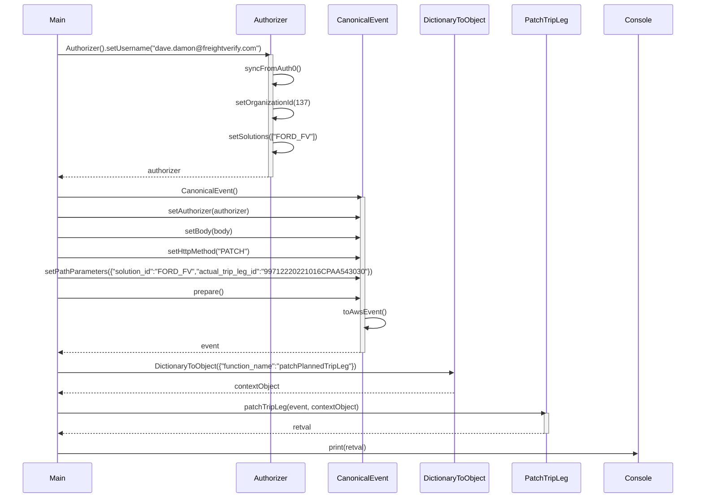
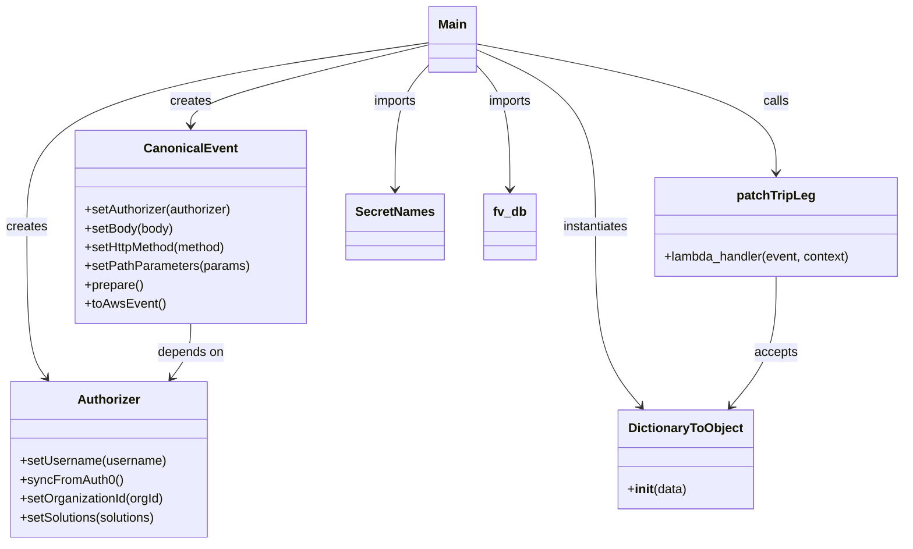

# Diagram: platform/tools/ide_local_testing/localTest/test/tripLeg/patchTripLegWithDestinationArrival.py

> Auto-generated by Obscura crawlers

## Diagram 1

### SVG

<svg id="container" width="1563" xmlns="http://www.w3.org/2000/svg" height="1155" viewBox="-50 -10 1563 1155" role="graphics-document document" aria-roledescription="sequence"><g><rect x="1313" y="1069" fill="#eaeaea" stroke="#666" width="150" height="65" name="Console" rx="3" ry="3" class="actor actor-bottom"></rect><text x="1388" y="1101.5" dominant-baseline="central" alignment-baseline="central" class="actor actor-box" style="text-anchor: middle; font-size: 16px; font-weight: 400;"><tspan x="1388" dy="0">Console</tspan></text></g><g><rect x="1113" y="1069" fill="#eaeaea" stroke="#666" width="150" height="65" name="PatchTripLeg" rx="3" ry="3" class="actor actor-bottom"></rect><text x="1188" y="1101.5" dominant-baseline="central" alignment-baseline="central" class="actor actor-box" style="text-anchor: middle; font-size: 16px; font-weight: 400;"><tspan x="1188" dy="0">PatchTripLeg</tspan></text></g><g><rect x="905" y="1069" fill="#eaeaea" stroke="#666" width="158" height="65" name="DictionaryToObject" rx="3" ry="3" class="actor actor-bottom"></rect><text x="984" y="1101.5" dominant-baseline="central" alignment-baseline="central" class="actor actor-box" style="text-anchor: middle; font-size: 16px; font-weight: 400;"><tspan x="984" dy="0">DictionaryToObject</tspan></text></g><g><rect x="705" y="1069" fill="#eaeaea" stroke="#666" width="150" height="65" name="CanonicalEvent" rx="3" ry="3" class="actor actor-bottom"></rect><text x="780" y="1101.5" dominant-baseline="central" alignment-baseline="central" class="actor actor-box" style="text-anchor: middle; font-size: 16px; font-weight: 400;"><tspan x="780" dy="0">CanonicalEvent</tspan></text></g><g><rect x="505" y="1069" fill="#eaeaea" stroke="#666" width="150" height="65" name="Authorizer" rx="3" ry="3" class="actor actor-bottom"></rect><text x="580" y="1101.5" dominant-baseline="central" alignment-baseline="central" class="actor actor-box" style="text-anchor: middle; font-size: 16px; font-weight: 400;"><tspan x="580" dy="0">Authorizer</tspan></text></g><g><rect x="0" y="1069" fill="#eaeaea" stroke="#666" width="150" height="65" name="Main" rx="3" ry="3" class="actor actor-bottom"></rect><text x="75" y="1101.5" dominant-baseline="central" alignment-baseline="central" class="actor actor-box" style="text-anchor: middle; font-size: 16px; font-weight: 400;"><tspan x="75" dy="0">Main</tspan></text></g><g><line id="actor5" x1="1388" y1="65" x2="1388" y2="1069" class="actor-line 200" stroke-width="0.5px" stroke="#999" name="Console"></line><g id="root-5"><rect x="1313" y="0" fill="#eaeaea" stroke="#666" width="150" height="65" name="Console" rx="3" ry="3" class="actor actor-top"></rect><text x="1388" y="32.5" dominant-baseline="central" alignment-baseline="central" class="actor actor-box" style="text-anchor: middle; font-size: 16px; font-weight: 400;"><tspan x="1388" dy="0">Console</tspan></text></g></g><g><line id="actor4" x1="1188" y1="65" x2="1188" y2="1069" class="actor-line 200" stroke-width="0.5px" stroke="#999" name="PatchTripLeg"></line><g id="root-4"><rect x="1113" y="0" fill="#eaeaea" stroke="#666" width="150" height="65" name="PatchTripLeg" rx="3" ry="3" class="actor actor-top"></rect><text x="1188" y="32.5" dominant-baseline="central" alignment-baseline="central" class="actor actor-box" style="text-anchor: middle; font-size: 16px; font-weight: 400;"><tspan x="1188" dy="0">PatchTripLeg</tspan></text></g></g><g><line id="actor3" x1="984" y1="65" x2="984" y2="1069" class="actor-line 200" stroke-width="0.5px" stroke="#999" name="DictionaryToObject"></line><g id="root-3"><rect x="905" y="0" fill="#eaeaea" stroke="#666" width="158" height="65" name="DictionaryToObject" rx="3" ry="3" class="actor actor-top"></rect><text x="984" y="32.5" dominant-baseline="central" alignment-baseline="central" class="actor actor-box" style="text-anchor: middle; font-size: 16px; font-weight: 400;"><tspan x="984" dy="0">DictionaryToObject</tspan></text></g></g><g><line id="actor2" x1="780" y1="65" x2="780" y2="1069" class="actor-line 200" stroke-width="0.5px" stroke="#999" name="CanonicalEvent"></line><g id="root-2"><rect x="705" y="0" fill="#eaeaea" stroke="#666" width="150" height="65" name="CanonicalEvent" rx="3" ry="3" class="actor actor-top"></rect><text x="780" y="32.5" dominant-baseline="central" alignment-baseline="central" class="actor actor-box" style="text-anchor: middle; font-size: 16px; font-weight: 400;"><tspan x="780" dy="0">CanonicalEvent</tspan></text></g></g><g><line id="actor1" x1="580" y1="65" x2="580" y2="1069" class="actor-line 200" stroke-width="0.5px" stroke="#999" name="Authorizer"></line><g id="root-1"><rect x="505" y="0" fill="#eaeaea" stroke="#666" width="150" height="65" name="Authorizer" rx="3" ry="3" class="actor actor-top"></rect><text x="580" y="32.5" dominant-baseline="central" alignment-baseline="central" class="actor actor-box" style="text-anchor: middle; font-size: 16px; font-weight: 400;"><tspan x="580" dy="0">Authorizer</tspan></text></g></g><g><line id="actor0" x1="75" y1="65" x2="75" y2="1069" class="actor-line 200" stroke-width="0.5px" stroke="#999" name="Main"></line><g id="root-0"><rect x="0" y="0" fill="#eaeaea" stroke="#666" width="150" height="65" name="Main" rx="3" ry="3" class="actor actor-top"></rect><text x="75" y="32.5" dominant-baseline="central" alignment-baseline="central" class="actor actor-box" style="text-anchor: middle; font-size: 16px; font-weight: 400;"><tspan x="75" dy="0">Main</tspan></text></g></g><g></g><defs><symbol id="computer" width="24" height="24"><path transform="scale(.5)" d="M2 2v13h20v-13h-20zm18 11h-16v-9h16v9zm-10.228 6l.466-1h3.524l.467 1h-4.457zm14.228 3h-24l2-6h2.104l-1.33 4h18.45l-1.297-4h2.073l2 6zm-5-10h-14v-7h14v7z"></path></symbol></defs><defs><symbol id="database" fill-rule="evenodd" clip-rule="evenodd"><path transform="scale(.5)" d="M12.258.001l.256.004.255.005.253.008.251.01.249.012.247.015.246.016.242.019.241.02.239.023.236.024.233.027.231.028.229.031.225.032.223.034.22.036.217.038.214.04.211.041.208.043.205.045.201.046.198.048.194.05.191.051.187.053.183.054.18.056.175.057.172.059.168.06.163.061.16.063.155.064.15.066.074.033.073.033.071.034.07.034.069.035.068.035.067.035.066.035.064.036.064.036.062.036.06.036.06.037.058.037.058.037.055.038.055.038.053.038.052.038.051.039.05.039.048.039.047.039.045.04.044.04.043.04.041.04.04.041.039.041.037.041.036.041.034.041.033.042.032.042.03.042.029.042.027.042.026.043.024.043.023.043.021.043.02.043.018.044.017.043.015.044.013.044.012.044.011.045.009.044.007.045.006.045.004.045.002.045.001.045v17l-.001.045-.002.045-.004.045-.006.045-.007.045-.009.044-.011.045-.012.044-.013.044-.015.044-.017.043-.018.044-.02.043-.021.043-.023.043-.024.043-.026.043-.027.042-.029.042-.03.042-.032.042-.033.042-.034.041-.036.041-.037.041-.039.041-.04.041-.041.04-.043.04-.044.04-.045.04-.047.039-.048.039-.05.039-.051.039-.052.038-.053.038-.055.038-.055.038-.058.037-.058.037-.06.037-.06.036-.062.036-.064.036-.064.036-.066.035-.067.035-.068.035-.069.035-.07.034-.071.034-.073.033-.074.033-.15.066-.155.064-.16.063-.163.061-.168.06-.172.059-.175.057-.18.056-.183.054-.187.053-.191.051-.194.05-.198.048-.201.046-.205.045-.208.043-.211.041-.214.04-.217.038-.22.036-.223.034-.225.032-.229.031-.231.028-.233.027-.236.024-.239.023-.241.02-.242.019-.246.016-.247.015-.249.012-.251.01-.253.008-.255.005-.256.004-.258.001-.258-.001-.256-.004-.255-.005-.253-.008-.251-.01-.249-.012-.247-.015-.245-.016-.243-.019-.241-.02-.238-.023-.236-.024-.234-.027-.231-.028-.228-.031-.226-.032-.223-.034-.22-.036-.217-.038-.214-.04-.211-.041-.208-.043-.204-.045-.201-.046-.198-.048-.195-.05-.19-.051-.187-.053-.184-.054-.179-.056-.176-.057-.172-.059-.167-.06-.164-.061-.159-.063-.155-.064-.151-.066-.074-.033-.072-.033-.072-.034-.07-.034-.069-.035-.068-.035-.067-.035-.066-.035-.064-.036-.063-.036-.062-.036-.061-.036-.06-.037-.058-.037-.057-.037-.056-.038-.055-.038-.053-.038-.052-.038-.051-.039-.049-.039-.049-.039-.046-.039-.046-.04-.044-.04-.043-.04-.041-.04-.04-.041-.039-.041-.037-.041-.036-.041-.034-.041-.033-.042-.032-.042-.03-.042-.029-.042-.027-.042-.026-.043-.024-.043-.023-.043-.021-.043-.02-.043-.018-.044-.017-.043-.015-.044-.013-.044-.012-.044-.011-.045-.009-.044-.007-.045-.006-.045-.004-.045-.002-.045-.001-.045v-17l.001-.045.002-.045.004-.045.006-.045.007-.045.009-.044.011-.045.012-.044.013-.044.015-.044.017-.043.018-.044.02-.043.021-.043.023-.043.024-.043.026-.043.027-.042.029-.042.03-.042.032-.042.033-.042.034-.041.036-.041.037-.041.039-.041.04-.041.041-.04.043-.04.044-.04.046-.04.046-.039.049-.039.049-.039.051-.039.052-.038.053-.038.055-.038.056-.038.057-.037.058-.037.06-.037.061-.036.062-.036.063-.036.064-.036.066-.035.067-.035.068-.035.069-.035.07-.034.072-.034.072-.033.074-.033.151-.066.155-.064.159-.063.164-.061.167-.06.172-.059.176-.057.179-.056.184-.054.187-.053.19-.051.195-.05.198-.048.201-.046.204-.045.208-.043.211-.041.214-.04.217-.038.22-.036.223-.034.226-.032.228-.031.231-.028.234-.027.236-.024.238-.023.241-.02.243-.019.245-.016.247-.015.249-.012.251-.01.253-.008.255-.005.256-.004.258-.001.258.001zm-9.258 20.499v.01l.001.021.003.021.004.022.005.021.006.022.007.022.009.023.01.022.011.023.012.023.013.023.015.023.016.024.017.023.018.024.019.024.021.024.022.025.023.024.024.025.052.049.056.05.061.051.066.051.07.051.075.051.079.052.084.052.088.052.092.052.097.052.102.051.105.052.11.052.114.051.119.051.123.051.127.05.131.05.135.05.139.048.144.049.147.047.152.047.155.047.16.045.163.045.167.043.171.043.176.041.178.041.183.039.187.039.19.037.194.035.197.035.202.033.204.031.209.03.212.029.216.027.219.025.222.024.226.021.23.02.233.018.236.016.24.015.243.012.246.01.249.008.253.005.256.004.259.001.26-.001.257-.004.254-.005.25-.008.247-.011.244-.012.241-.014.237-.016.233-.018.231-.021.226-.021.224-.024.22-.026.216-.027.212-.028.21-.031.205-.031.202-.034.198-.034.194-.036.191-.037.187-.039.183-.04.179-.04.175-.042.172-.043.168-.044.163-.045.16-.046.155-.046.152-.047.148-.048.143-.049.139-.049.136-.05.131-.05.126-.05.123-.051.118-.052.114-.051.11-.052.106-.052.101-.052.096-.052.092-.052.088-.053.083-.051.079-.052.074-.052.07-.051.065-.051.06-.051.056-.05.051-.05.023-.024.023-.025.021-.024.02-.024.019-.024.018-.024.017-.024.015-.023.014-.024.013-.023.012-.023.01-.023.01-.022.008-.022.006-.022.006-.022.004-.022.004-.021.001-.021.001-.021v-4.127l-.077.055-.08.053-.083.054-.085.053-.087.052-.09.052-.093.051-.095.05-.097.05-.1.049-.102.049-.105.048-.106.047-.109.047-.111.046-.114.045-.115.045-.118.044-.12.043-.122.042-.124.042-.126.041-.128.04-.13.04-.132.038-.134.038-.135.037-.138.037-.139.035-.142.035-.143.034-.144.033-.147.032-.148.031-.15.03-.151.03-.153.029-.154.027-.156.027-.158.026-.159.025-.161.024-.162.023-.163.022-.165.021-.166.02-.167.019-.169.018-.169.017-.171.016-.173.015-.173.014-.175.013-.175.012-.177.011-.178.01-.179.008-.179.008-.181.006-.182.005-.182.004-.184.003-.184.002h-.37l-.184-.002-.184-.003-.182-.004-.182-.005-.181-.006-.179-.008-.179-.008-.178-.01-.176-.011-.176-.012-.175-.013-.173-.014-.172-.015-.171-.016-.17-.017-.169-.018-.167-.019-.166-.02-.165-.021-.163-.022-.162-.023-.161-.024-.159-.025-.157-.026-.156-.027-.155-.027-.153-.029-.151-.03-.15-.03-.148-.031-.146-.032-.145-.033-.143-.034-.141-.035-.14-.035-.137-.037-.136-.037-.134-.038-.132-.038-.13-.04-.128-.04-.126-.041-.124-.042-.122-.042-.12-.044-.117-.043-.116-.045-.113-.045-.112-.046-.109-.047-.106-.047-.105-.048-.102-.049-.1-.049-.097-.05-.095-.05-.093-.052-.09-.051-.087-.052-.085-.053-.083-.054-.08-.054-.077-.054v4.127zm0-5.654v.011l.001.021.003.021.004.021.005.022.006.022.007.022.009.022.01.022.011.023.012.023.013.023.015.024.016.023.017.024.018.024.019.024.021.024.022.024.023.025.024.024.052.05.056.05.061.05.066.051.07.051.075.052.079.051.084.052.088.052.092.052.097.052.102.052.105.052.11.051.114.051.119.052.123.05.127.051.131.05.135.049.139.049.144.048.147.048.152.047.155.046.16.045.163.045.167.044.171.042.176.042.178.04.183.04.187.038.19.037.194.036.197.034.202.033.204.032.209.03.212.028.216.027.219.025.222.024.226.022.23.02.233.018.236.016.24.014.243.012.246.01.249.008.253.006.256.003.259.001.26-.001.257-.003.254-.006.25-.008.247-.01.244-.012.241-.015.237-.016.233-.018.231-.02.226-.022.224-.024.22-.025.216-.027.212-.029.21-.03.205-.032.202-.033.198-.035.194-.036.191-.037.187-.039.183-.039.179-.041.175-.042.172-.043.168-.044.163-.045.16-.045.155-.047.152-.047.148-.048.143-.048.139-.05.136-.049.131-.05.126-.051.123-.051.118-.051.114-.052.11-.052.106-.052.101-.052.096-.052.092-.052.088-.052.083-.052.079-.052.074-.051.07-.052.065-.051.06-.05.056-.051.051-.049.023-.025.023-.024.021-.025.02-.024.019-.024.018-.024.017-.024.015-.023.014-.023.013-.024.012-.022.01-.023.01-.023.008-.022.006-.022.006-.022.004-.021.004-.022.001-.021.001-.021v-4.139l-.077.054-.08.054-.083.054-.085.052-.087.053-.09.051-.093.051-.095.051-.097.05-.1.049-.102.049-.105.048-.106.047-.109.047-.111.046-.114.045-.115.044-.118.044-.12.044-.122.042-.124.042-.126.041-.128.04-.13.039-.132.039-.134.038-.135.037-.138.036-.139.036-.142.035-.143.033-.144.033-.147.033-.148.031-.15.03-.151.03-.153.028-.154.028-.156.027-.158.026-.159.025-.161.024-.162.023-.163.022-.165.021-.166.02-.167.019-.169.018-.169.017-.171.016-.173.015-.173.014-.175.013-.175.012-.177.011-.178.009-.179.009-.179.007-.181.007-.182.005-.182.004-.184.003-.184.002h-.37l-.184-.002-.184-.003-.182-.004-.182-.005-.181-.007-.179-.007-.179-.009-.178-.009-.176-.011-.176-.012-.175-.013-.173-.014-.172-.015-.171-.016-.17-.017-.169-.018-.167-.019-.166-.02-.165-.021-.163-.022-.162-.023-.161-.024-.159-.025-.157-.026-.156-.027-.155-.028-.153-.028-.151-.03-.15-.03-.148-.031-.146-.033-.145-.033-.143-.033-.141-.035-.14-.036-.137-.036-.136-.037-.134-.038-.132-.039-.13-.039-.128-.04-.126-.041-.124-.042-.122-.043-.12-.043-.117-.044-.116-.044-.113-.046-.112-.046-.109-.046-.106-.047-.105-.048-.102-.049-.1-.049-.097-.05-.095-.051-.093-.051-.09-.051-.087-.053-.085-.052-.083-.054-.08-.054-.077-.054v4.139zm0-5.666v.011l.001.02.003.022.004.021.005.022.006.021.007.022.009.023.01.022.011.023.012.023.013.023.015.023.016.024.017.024.018.023.019.024.021.025.022.024.023.024.024.025.052.05.056.05.061.05.066.051.07.051.075.052.079.051.084.052.088.052.092.052.097.052.102.052.105.051.11.052.114.051.119.051.123.051.127.05.131.05.135.05.139.049.144.048.147.048.152.047.155.046.16.045.163.045.167.043.171.043.176.042.178.04.183.04.187.038.19.037.194.036.197.034.202.033.204.032.209.03.212.028.216.027.219.025.222.024.226.021.23.02.233.018.236.017.24.014.243.012.246.01.249.008.253.006.256.003.259.001.26-.001.257-.003.254-.006.25-.008.247-.01.244-.013.241-.014.237-.016.233-.018.231-.02.226-.022.224-.024.22-.025.216-.027.212-.029.21-.03.205-.032.202-.033.198-.035.194-.036.191-.037.187-.039.183-.039.179-.041.175-.042.172-.043.168-.044.163-.045.16-.045.155-.047.152-.047.148-.048.143-.049.139-.049.136-.049.131-.051.126-.05.123-.051.118-.052.114-.051.11-.052.106-.052.101-.052.096-.052.092-.052.088-.052.083-.052.079-.052.074-.052.07-.051.065-.051.06-.051.056-.05.051-.049.023-.025.023-.025.021-.024.02-.024.019-.024.018-.024.017-.024.015-.023.014-.024.013-.023.012-.023.01-.022.01-.023.008-.022.006-.022.006-.022.004-.022.004-.021.001-.021.001-.021v-4.153l-.077.054-.08.054-.083.053-.085.053-.087.053-.09.051-.093.051-.095.051-.097.05-.1.049-.102.048-.105.048-.106.048-.109.046-.111.046-.114.046-.115.044-.118.044-.12.043-.122.043-.124.042-.126.041-.128.04-.13.039-.132.039-.134.038-.135.037-.138.036-.139.036-.142.034-.143.034-.144.033-.147.032-.148.032-.15.03-.151.03-.153.028-.154.028-.156.027-.158.026-.159.024-.161.024-.162.023-.163.023-.165.021-.166.02-.167.019-.169.018-.169.017-.171.016-.173.015-.173.014-.175.013-.175.012-.177.01-.178.01-.179.009-.179.007-.181.006-.182.006-.182.004-.184.003-.184.001-.185.001-.185-.001-.184-.001-.184-.003-.182-.004-.182-.006-.181-.006-.179-.007-.179-.009-.178-.01-.176-.01-.176-.012-.175-.013-.173-.014-.172-.015-.171-.016-.17-.017-.169-.018-.167-.019-.166-.02-.165-.021-.163-.023-.162-.023-.161-.024-.159-.024-.157-.026-.156-.027-.155-.028-.153-.028-.151-.03-.15-.03-.148-.032-.146-.032-.145-.033-.143-.034-.141-.034-.14-.036-.137-.036-.136-.037-.134-.038-.132-.039-.13-.039-.128-.041-.126-.041-.124-.041-.122-.043-.12-.043-.117-.044-.116-.044-.113-.046-.112-.046-.109-.046-.106-.048-.105-.048-.102-.048-.1-.05-.097-.049-.095-.051-.093-.051-.09-.052-.087-.052-.085-.053-.083-.053-.08-.054-.077-.054v4.153zm8.74-8.179l-.257.004-.254.005-.25.008-.247.011-.244.012-.241.014-.237.016-.233.018-.231.021-.226.022-.224.023-.22.026-.216.027-.212.028-.21.031-.205.032-.202.033-.198.034-.194.036-.191.038-.187.038-.183.04-.179.041-.175.042-.172.043-.168.043-.163.045-.16.046-.155.046-.152.048-.148.048-.143.048-.139.049-.136.05-.131.05-.126.051-.123.051-.118.051-.114.052-.11.052-.106.052-.101.052-.096.052-.092.052-.088.052-.083.052-.079.052-.074.051-.07.052-.065.051-.06.05-.056.05-.051.05-.023.025-.023.024-.021.024-.02.025-.019.024-.018.024-.017.023-.015.024-.014.023-.013.023-.012.023-.01.023-.01.022-.008.022-.006.023-.006.021-.004.022-.004.021-.001.021-.001.021.001.021.001.021.004.021.004.022.006.021.006.023.008.022.01.022.01.023.012.023.013.023.014.023.015.024.017.023.018.024.019.024.02.025.021.024.023.024.023.025.051.05.056.05.06.05.065.051.07.052.074.051.079.052.083.052.088.052.092.052.096.052.101.052.106.052.11.052.114.052.118.051.123.051.126.051.131.05.136.05.139.049.143.048.148.048.152.048.155.046.16.046.163.045.168.043.172.043.175.042.179.041.183.04.187.038.191.038.194.036.198.034.202.033.205.032.21.031.212.028.216.027.22.026.224.023.226.022.231.021.233.018.237.016.241.014.244.012.247.011.25.008.254.005.257.004.26.001.26-.001.257-.004.254-.005.25-.008.247-.011.244-.012.241-.014.237-.016.233-.018.231-.021.226-.022.224-.023.22-.026.216-.027.212-.028.21-.031.205-.032.202-.033.198-.034.194-.036.191-.038.187-.038.183-.04.179-.041.175-.042.172-.043.168-.043.163-.045.16-.046.155-.046.152-.048.148-.048.143-.048.139-.049.136-.05.131-.05.126-.051.123-.051.118-.051.114-.052.11-.052.106-.052.101-.052.096-.052.092-.052.088-.052.083-.052.079-.052.074-.051.07-.052.065-.051.06-.05.056-.05.051-.05.023-.025.023-.024.021-.024.02-.025.019-.024.018-.024.017-.023.015-.024.014-.023.013-.023.012-.023.01-.023.01-.022.008-.022.006-.023.006-.021.004-.022.004-.021.001-.021.001-.021-.001-.021-.001-.021-.004-.021-.004-.022-.006-.021-.006-.023-.008-.022-.01-.022-.01-.023-.012-.023-.013-.023-.014-.023-.015-.024-.017-.023-.018-.024-.019-.024-.02-.025-.021-.024-.023-.024-.023-.025-.051-.05-.056-.05-.06-.05-.065-.051-.07-.052-.074-.051-.079-.052-.083-.052-.088-.052-.092-.052-.096-.052-.101-.052-.106-.052-.11-.052-.114-.052-.118-.051-.123-.051-.126-.051-.131-.05-.136-.05-.139-.049-.143-.048-.148-.048-.152-.048-.155-.046-.16-.046-.163-.045-.168-.043-.172-.043-.175-.042-.179-.041-.183-.04-.187-.038-.191-.038-.194-.036-.198-.034-.202-.033-.205-.032-.21-.031-.212-.028-.216-.027-.22-.026-.224-.023-.226-.022-.231-.021-.233-.018-.237-.016-.241-.014-.244-.012-.247-.011-.25-.008-.254-.005-.257-.004-.26-.001-.26.001z"></path></symbol></defs><defs><symbol id="clock" width="24" height="24"><path transform="scale(.5)" d="M12 2c5.514 0 10 4.486 10 10s-4.486 10-10 10-10-4.486-10-10 4.486-10 10-10zm0-2c-6.627 0-12 5.373-12 12s5.373 12 12 12 12-5.373 12-12-5.373-12-12-12zm5.848 12.459c.202.038.202.333.001.372-1.907.361-6.045 1.111-6.547 1.111-.719 0-1.301-.582-1.301-1.301 0-.512.77-5.447 1.125-7.445.034-.192.312-.181.343.014l.985 6.238 5.394 1.011z"></path></symbol></defs><defs><marker id="arrowhead" refX="7.9" refY="5" markerUnits="userSpaceOnUse" markerWidth="12" markerHeight="12" orient="auto-start-reverse"><path d="M -1 0 L 10 5 L 0 10 z"></path></marker></defs><defs><marker id="crosshead" markerWidth="15" markerHeight="8" orient="auto" refX="4" refY="4.5"><path fill="none" stroke="#000000" stroke-width="1pt" d="M 1,2 L 6,7 M 6,2 L 1,7" style="stroke-dasharray: 0, 0;"></path></marker></defs><defs><marker id="filled-head" refX="15.5" refY="7" markerWidth="20" markerHeight="28" orient="auto"><path d="M 18,7 L9,13 L14,7 L9,1 Z"></path></marker></defs><defs><marker id="sequencenumber" refX="15" refY="15" markerWidth="60" markerHeight="40" orient="auto"><circle cx="15" cy="15" r="6"></circle></marker></defs><g><rect x="575" y="113" fill="#EDF2AE" stroke="#666" width="10" height="282" class="activation0"></rect></g><g><rect x="775" y="443" fill="#EDF2AE" stroke="#666" width="10" height="366" class="activation0"></rect></g><g><rect x="1183" y="953" fill="#EDF2AE" stroke="#666" width="10" height="48" class="activation0"></rect></g><text x="326" y="80" text-anchor="middle" dominant-baseline="middle" alignment-baseline="middle" class="messageText" dy="1em" style="font-size: 16px; font-weight: 400;">Authorizer().setUsername("dave.damon@freightverify.com")</text><line x1="76" y1="113" x2="576" y2="113" class="messageLine0" stroke-width="2" stroke="none" marker-end="url(#arrowhead)" style="fill: none;"></line><text x="585" y="128" text-anchor="middle" dominant-baseline="middle" alignment-baseline="middle" class="messageText" dy="1em" style="font-size: 16px; font-weight: 400;">syncFromAuth0()</text><path d="M 585,161 C 645,151 645,191 585,181" class="messageLine0" stroke-width="2" stroke="none" marker-end="url(#arrowhead)" style="fill: none;"></path><text x="585" y="206" text-anchor="middle" dominant-baseline="middle" alignment-baseline="middle" class="messageText" dy="1em" style="font-size: 16px; font-weight: 400;">setOrganizationId(137)</text><path d="M 585,239 C 645,229 645,269 585,259" class="messageLine0" stroke-width="2" stroke="none" marker-end="url(#arrowhead)" style="fill: none;"></path><text x="585" y="284" text-anchor="middle" dominant-baseline="middle" alignment-baseline="middle" class="messageText" dy="1em" style="font-size: 16px; font-weight: 400;">setSolutions(["FORD_FV"])</text><path d="M 585,317 C 645,307 645,347 585,337" class="messageLine0" stroke-width="2" stroke="none" marker-end="url(#arrowhead)" style="fill: none;"></path><text x="327" y="362" text-anchor="middle" dominant-baseline="middle" alignment-baseline="middle" class="messageText" dy="1em" style="font-size: 16px; font-weight: 400;">authorizer</text><line x1="575" y1="395" x2="79" y2="395" class="messageLine1" stroke-width="2" stroke="none" marker-end="url(#arrowhead)" style="stroke-dasharray: 3, 3; fill: none;"></line><text x="426" y="410" text-anchor="middle" dominant-baseline="middle" alignment-baseline="middle" class="messageText" dy="1em" style="font-size: 16px; font-weight: 400;">CanonicalEvent()</text><line x1="76" y1="443" x2="776" y2="443" class="messageLine0" stroke-width="2" stroke="none" marker-end="url(#arrowhead)" style="fill: none;"></line><text x="424" y="458" text-anchor="middle" dominant-baseline="middle" alignment-baseline="middle" class="messageText" dy="1em" style="font-size: 16px; font-weight: 400;">setAuthorizer(authorizer)</text><line x1="76" y1="491" x2="772" y2="491" class="messageLine0" stroke-width="2" stroke="none" marker-end="url(#arrowhead)" style="fill: none;"></line><text x="424" y="506" text-anchor="middle" dominant-baseline="middle" alignment-baseline="middle" class="messageText" dy="1em" style="font-size: 16px; font-weight: 400;">setBody(body)</text><line x1="76" y1="539" x2="772" y2="539" class="messageLine0" stroke-width="2" stroke="none" marker-end="url(#arrowhead)" style="fill: none;"></line><text x="424" y="554" text-anchor="middle" dominant-baseline="middle" alignment-baseline="middle" class="messageText" dy="1em" style="font-size: 16px; font-weight: 400;">setHttpMethod("PATCH")</text><line x1="76" y1="587" x2="772" y2="587" class="messageLine0" stroke-width="2" stroke="none" marker-end="url(#arrowhead)" style="fill: none;"></line><text x="424" y="602" text-anchor="middle" dominant-baseline="middle" alignment-baseline="middle" class="messageText" dy="1em" style="font-size: 16px; font-weight: 400;">setPathParameters({"solution_id":"FORD_FV","actual_trip_leg_id":"99712220221016CPAA543030"})</text><line x1="76" y1="635" x2="772" y2="635" class="messageLine0" stroke-width="2" stroke="none" marker-end="url(#arrowhead)" style="fill: none;"></line><text x="424" y="650" text-anchor="middle" dominant-baseline="middle" alignment-baseline="middle" class="messageText" dy="1em" style="font-size: 16px; font-weight: 400;">prepare()</text><line x1="76" y1="683" x2="772" y2="683" class="messageLine0" stroke-width="2" stroke="none" marker-end="url(#arrowhead)" style="fill: none;"></line><text x="785" y="698" text-anchor="middle" dominant-baseline="middle" alignment-baseline="middle" class="messageText" dy="1em" style="font-size: 16px; font-weight: 400;">toAwsEvent()</text><path d="M 785,731 C 845,721 845,761 785,751" class="messageLine0" stroke-width="2" stroke="none" marker-end="url(#arrowhead)" style="fill: none;"></path><text x="427" y="776" text-anchor="middle" dominant-baseline="middle" alignment-baseline="middle" class="messageText" dy="1em" style="font-size: 16px; font-weight: 400;">event</text><line x1="775" y1="809" x2="79" y2="809" class="messageLine1" stroke-width="2" stroke="none" marker-end="url(#arrowhead)" style="stroke-dasharray: 3, 3; fill: none;"></line><text x="528" y="824" text-anchor="middle" dominant-baseline="middle" alignment-baseline="middle" class="messageText" dy="1em" style="font-size: 16px; font-weight: 400;">DictionaryToObject({"function_name":"patchPlannedTripLeg"})</text><line x1="76" y1="857" x2="980" y2="857" class="messageLine0" stroke-width="2" stroke="none" marker-end="url(#arrowhead)" style="fill: none;"></line><text x="531" y="872" text-anchor="middle" dominant-baseline="middle" alignment-baseline="middle" class="messageText" dy="1em" style="font-size: 16px; font-weight: 400;">contextObject</text><line x1="983" y1="905" x2="79" y2="905" class="messageLine1" stroke-width="2" stroke="none" marker-end="url(#arrowhead)" style="stroke-dasharray: 3, 3; fill: none;"></line><text x="630" y="920" text-anchor="middle" dominant-baseline="middle" alignment-baseline="middle" class="messageText" dy="1em" style="font-size: 16px; font-weight: 400;">patchTripLeg(event, contextObject)</text><line x1="76" y1="953" x2="1184" y2="953" class="messageLine0" stroke-width="2" stroke="none" marker-end="url(#arrowhead)" style="fill: none;"></line><text x="631" y="968" text-anchor="middle" dominant-baseline="middle" alignment-baseline="middle" class="messageText" dy="1em" style="font-size: 16px; font-weight: 400;">retval</text><line x1="1183" y1="1001" x2="79" y2="1001" class="messageLine1" stroke-width="2" stroke="none" marker-end="url(#arrowhead)" style="stroke-dasharray: 3, 3; fill: none;"></line><text x="730" y="1016" text-anchor="middle" dominant-baseline="middle" alignment-baseline="middle" class="messageText" dy="1em" style="font-size: 16px; font-weight: 400;">print(retval)</text><line x1="76" y1="1049" x2="1384" y2="1049" class="messageLine0" stroke-width="2" stroke="none" marker-end="url(#arrowhead)" style="fill: none;"></line></svg>

## Diagram 2

### SVG

<svg id="container" width="1142.921875" xmlns="http://www.w3.org/2000/svg" class="classDiagram" height="692" viewBox="0 0 1142.921875 692" role="graphics-document document" aria-roledescription="class"><g><defs><marker id="container_class-aggregationStart" class="marker aggregation class" refX="18" refY="7" markerWidth="190" markerHeight="240" orient="auto"><path d="M 18,7 L9,13 L1,7 L9,1 Z"></path></marker></defs><defs><marker id="container_class-aggregationEnd" class="marker aggregation class" refX="1" refY="7" markerWidth="20" markerHeight="28" orient="auto"><path d="M 18,7 L9,13 L1,7 L9,1 Z"></path></marker></defs><defs><marker id="container_class-extensionStart" class="marker extension class" refX="18" refY="7" markerWidth="190" markerHeight="240" orient="auto"><path d="M 1,7 L18,13 V 1 Z"></path></marker></defs><defs><marker id="container_class-extensionEnd" class="marker extension class" refX="1" refY="7" markerWidth="20" markerHeight="28" orient="auto"><path d="M 1,1 V 13 L18,7 Z"></path></marker></defs><defs><marker id="container_class-compositionStart" class="marker composition class" refX="18" refY="7" markerWidth="190" markerHeight="240" orient="auto"><path d="M 18,7 L9,13 L1,7 L9,1 Z"></path></marker></defs><defs><marker id="container_class-compositionEnd" class="marker composition class" refX="1" refY="7" markerWidth="20" markerHeight="28" orient="auto"><path d="M 18,7 L9,13 L1,7 L9,1 Z"></path></marker></defs><defs><marker id="container_class-dependencyStart" class="marker dependency class" refX="6" refY="7" markerWidth="190" markerHeight="240" orient="auto"><path d="M 5,7 L9,13 L1,7 L9,1 Z"></path></marker></defs><defs><marker id="container_class-dependencyEnd" class="marker dependency class" refX="13" refY="7" markerWidth="20" markerHeight="28" orient="auto"><path d="M 18,7 L9,13 L14,7 L9,1 Z"></path></marker></defs><defs><marker id="container_class-lollipopStart" class="marker lollipop class" refX="13" refY="7" markerWidth="190" markerHeight="240" orient="auto"><circle stroke="black" fill="transparent" cx="7" cy="7" r="6"></circle></marker></defs><defs><marker id="container_class-lollipopEnd" class="marker lollipop class" refX="1" refY="7" markerWidth="190" markerHeight="240" orient="auto"><circle stroke="black" fill="transparent" cx="7" cy="7" r="6"></circle></marker></defs><g class="root"><g class="clusters"></g><g class="edgePaths"><path d="M534.387,54.406L451.018,66.838C367.648,79.271,200.91,104.135,117.541,143.234C34.172,182.333,34.172,235.667,34.172,289C34.172,342.333,34.172,395.667,38.215,427.701C42.258,459.736,50.344,470.472,54.387,475.839L58.431,481.207" id="id_Main_Authorizer_1" class="edge-thickness-normal edge-pattern-solid relation" style=";;;" data-edge="true" data-et="edge" data-id="id_Main_Authorizer_1" data-points="W3sieCI6NTM0LjM4NjcxODc1LCJ5Ijo1NC40MDYxMzc3ODMwNTR9LHsieCI6MzQuMTcxODc1LCJ5IjoxMjl9LHsieCI6MzQuMTcxODc1LCJ5IjoyODl9LHsieCI6MzQuMTcxODc1LCJ5Ijo0NDl9LHsieCI6NjIuMDQwMzY5MzcwNDA0NDA2LCJ5Ijo0ODZ9XQ==" marker-end="url(#container_class-dependencyEnd)"></path><path d="M534.387,57.185L485.163,69.154C435.939,81.123,337.491,105.062,288.267,122.197C239.043,139.333,239.043,149.667,239.043,154.833L239.043,160" id="id_Main_CanonicalEvent_2" class="edge-thickness-normal edge-pattern-solid relation" style=";;;" data-edge="true" data-et="edge" data-id="id_Main_CanonicalEvent_2" data-points="W3sieCI6NTM0LjM4NjcxODc1LCJ5Ijo1Ny4xODQ1ODEzNDk0OTI2Mn0seyJ4IjoyMzkuMDQyOTY4NzUsInkiOjEyOX0seyJ4IjoyMzkuMDQyOTY4NzUsInkiOjE2Nn1d" marker-end="url(#container_class-dependencyEnd)"></path><path d="M239.043,412L239.043,418.167C239.043,424.333,239.043,436.667,235,448.201C230.957,459.736,222.871,470.472,218.827,475.839L214.784,481.207" id="id_CanonicalEvent_Authorizer_3" class="edge-thickness-normal edge-pattern-solid relation" style=";;;" data-edge="true" data-et="edge" data-id="id_CanonicalEvent_Authorizer_3" data-points="W3sieCI6MjM5LjA0Mjk2ODc1LCJ5Ijo0MTJ9LHsieCI6MjM5LjA0Mjk2ODc1LCJ5Ijo0NDl9LHsieCI6MjExLjE3NDQ3NDM3OTU5NTYsInkiOjQ4Nn1d" marker-end="url(#container_class-dependencyEnd)"></path><path d="M593.48,62.87L618.783,73.892C644.086,84.914,694.691,106.957,719.994,144.645C745.297,182.333,745.297,235.667,745.297,289C745.297,342.333,745.297,395.667,755.102,433.742C764.906,471.817,784.516,494.633,794.321,506.041L804.126,517.45" id="id_Main_DictionaryToObject_4" class="edge-thickness-normal edge-pattern-solid relation" style=";;;" data-edge="true" data-et="edge" data-id="id_Main_DictionaryToObject_4" data-points="W3sieCI6NTkzLjQ4MDQ2ODc1LCJ5Ijo2Mi44NzAzMTgxMjAxNDA0M30seyJ4Ijo3NDUuMjk2ODc1LCJ5IjoxMjl9LHsieCI6NzQ1LjI5Njg3NSwieSI6Mjg5fSx7IngiOjc0NS4yOTY4NzUsInkiOjQ0OX0seyJ4Ijo4MDguMDM2NDkxODQyODMwOSwieSI6NTIyfV0=" marker-end="url(#container_class-dependencyEnd)"></path><path d="M593.48,55.623L657.745,67.852C722.009,80.082,850.538,104.541,914.802,131.937C979.066,159.333,979.066,189.667,979.066,204.833L979.066,220" id="id_Main_patchTripLeg_5" class="edge-thickness-normal edge-pattern-solid relation" style=";;;" data-edge="true" data-et="edge" data-id="id_Main_patchTripLeg_5" data-points="W3sieCI6NTkzLjQ4MDQ2ODc1LCJ5Ijo1NS42MjI3ODYzODIzNzAxfSx7IngiOjk3OS4wNjY0MDYyNSwieSI6MTI5fSx7IngiOjk3OS4wNjY0MDYyNSwieSI6MjI2fV0=" marker-end="url(#container_class-dependencyEnd)"></path><path d="M979.066,352L979.066,368.167C979.066,384.333,979.066,416.667,969.262,444.242C959.457,471.817,939.847,494.633,930.042,506.041L920.238,517.45" id="id_patchTripLeg_DictionaryToObject_6" class="edge-thickness-normal edge-pattern-solid relation" style=";;;" data-edge="true" data-et="edge" data-id="id_patchTripLeg_DictionaryToObject_6" data-points="W3sieCI6OTc5LjA2NjQwNjI1LCJ5IjozNTJ9LHsieCI6OTc5LjA2NjQwNjI1LCJ5Ijo0NDl9LHsieCI6OTE2LjMyNjc4OTQwNzE2OTEsInkiOjUyMn1d" marker-end="url(#container_class-dependencyEnd)"></path><path d="M534.387,82.802L527.451,90.502C520.516,98.201,506.645,113.601,499.709,139.967C492.773,166.333,492.773,203.667,492.773,222.333L492.773,241" id="id_Main_SecretNames_7" class="edge-thickness-normal edge-pattern-solid relation" style=";;;" data-edge="true" data-et="edge" data-id="id_Main_SecretNames_7" data-points="W3sieCI6NTM0LjM4NjcxODc1LCJ5Ijo4Mi44MDIxMDc5MjExNzI1NH0seyJ4Ijo0OTIuNzczNDM3NSwieSI6MTI5fSx7IngiOjQ5Mi43NzM0Mzc1LCJ5IjoyNDd9XQ==" marker-end="url(#container_class-dependencyEnd)"></path><path d="M593.48,82.802L600.416,90.502C607.352,98.201,621.223,113.601,628.158,139.967C635.094,166.333,635.094,203.667,635.094,222.333L635.094,241" id="id_Main_fv_db_8" class="edge-thickness-normal edge-pattern-solid relation" style=";;;" data-edge="true" data-et="edge" data-id="id_Main_fv_db_8" data-points="W3sieCI6NTkzLjQ4MDQ2ODc1LCJ5Ijo4Mi44MDIxMDc5MjExNzI1NH0seyJ4Ijo2MzUuMDkzNzUsInkiOjEyOX0seyJ4Ijo2MzUuMDkzNzUsInkiOjI0N31d" marker-end="url(#container_class-dependencyEnd)"></path></g><g class="edgeLabels"><g class="edgeLabel" transform="translate(34.171875, 289)"><g class="label" data-id="id_Main_Authorizer_1" transform="translate(-26.171875, -12)"><foreignObject width="52.34375" height="24">

creates

</foreignObject></g></g><g class="edgeLabel" transform="translate(239.04296875, 129)"><g class="label" data-id="id_Main_CanonicalEvent_2" transform="translate(-26.171875, -12)"><foreignObject width="52.34375" height="24">

creates

</foreignObject></g></g><g class="edgeLabel" transform="translate(239.04296875, 449)"><g class="label" data-id="id_CanonicalEvent_Authorizer_3" transform="translate(-42.9453125, -12)"><foreignObject width="85.890625" height="24">

depends on

</foreignObject></g></g><g class="edgeLabel" transform="translate(745.296875, 289)"><g class="label" data-id="id_Main_DictionaryToObject_4" transform="translate(-42.9140625, -12)"><foreignObject width="85.828125" height="24">

instantiates

</foreignObject></g></g><g class="edgeLabel" transform="translate(979.06640625, 129)"><g class="label" data-id="id_Main_patchTripLeg_5" transform="translate(-16.4453125, -12)"><foreignObject width="32.890625" height="24">

calls

</foreignObject></g></g><g class="edgeLabel" transform="translate(979.06640625, 449)"><g class="label" data-id="id_patchTripLeg_DictionaryToObject_6" transform="translate(-27.421875, -12)"><foreignObject width="54.84375" height="24">

accepts

</foreignObject></g></g><g class="edgeLabel" transform="translate(492.7734375, 129)"><g class="label" data-id="id_Main_SecretNames_7" transform="translate(-28.25, -12)"><foreignObject width="56.5" height="24">

imports

</foreignObject></g></g><g class="edgeLabel" transform="translate(635.09375, 129)"><g class="label" data-id="id_Main_fv_db_8" transform="translate(-28.25, -12)"><foreignObject width="56.5" height="24">

imports

</foreignObject></g></g></g><g class="nodes"><g class="node default" id="classId-Main-0" transform="translate(563.93359375, 50)"><g class="basic label-container"><path d="M-29.546875 -42 L29.546875 -42 L29.546875 42 L-29.546875 42" stroke="none" stroke-width="0" fill="#ECECFF" style=""></path><path d="M-29.546875 -42 C-6.062341422693393 -42, 17.422192154613214 -42, 29.546875 -42 M-29.546875 -42 C-13.030414901093572 -42, 3.4860451978128566 -42, 29.546875 -42 M29.546875 -42 C29.546875 -22.577225989143137, 29.546875 -3.154451978286275, 29.546875 42 M29.546875 -42 C29.546875 -21.083640068257466, 29.546875 -0.16728013651493256, 29.546875 42 M29.546875 42 C7.30502224240438 42, -14.93683051519124 42, -29.546875 42 M29.546875 42 C7.5595534502331745 42, -14.427768099533651 42, -29.546875 42 M-29.546875 42 C-29.546875 10.125221532138479, -29.546875 -21.749556935723042, -29.546875 -42 M-29.546875 42 C-29.546875 12.061744045018592, -29.546875 -17.876511909962815, -29.546875 -42" stroke="#9370DB" stroke-width="1.3" fill="none" stroke-dasharray="0 0" style=""></path></g><g class="annotation-group text" transform="translate(0, -18)"></g><g class="label-group text" transform="translate(-17.546875, -18)"><g class="label" style="font-weight: bolder" transform="translate(0,-12)"><foreignObject width="35.09375" height="24">

Main

</foreignObject></g></g><g class="members-group text" transform="translate(-17.546875, 30)"></g><g class="methods-group text" transform="translate(-17.546875, 60)"></g><g class="divider" style=""><path d="M-29.546875 6 C-13.918294269737311 6, 1.7102864605253778 6, 29.546875 6 M-29.546875 6 C-5.979171638987832 6, 17.588531722024335 6, 29.546875 6" stroke="#9370DB" stroke-width="1.3" fill="none" stroke-dasharray="0 0" style=""></path></g><g class="divider" style=""><path d="M-29.546875 24 C-15.345175113040538 24, -1.143475226081076 24, 29.546875 24 M-29.546875 24 C-8.834980098978043 24, 11.876914802043913 24, 29.546875 24" stroke="#9370DB" stroke-width="1.3" fill="none" stroke-dasharray="0 0" style=""></path></g></g><g class="node default" id="classId-Authorizer-1" transform="translate(136.607421875, 585)"><g class="basic label-container"><path d="M-124.13671875 -99 L124.13671875 -99 L124.13671875 99 L-124.13671875 99" stroke="none" stroke-width="0" fill="#ECECFF" style=""></path><path d="M-124.13671875 -99 C-47.86118672468842 -99, 28.414345300623154 -99, 124.13671875 -99 M-124.13671875 -99 C-25.011849089367274 -99, 74.11302057126545 -99, 124.13671875 -99 M124.13671875 -99 C124.13671875 -39.44479242256358, 124.13671875 20.11041515487284, 124.13671875 99 M124.13671875 -99 C124.13671875 -22.045517554992642, 124.13671875 54.908964890014715, 124.13671875 99 M124.13671875 99 C41.92657360515831 99, -40.28357153968338 99, -124.13671875 99 M124.13671875 99 C70.66601481005527 99, 17.195310870110546 99, -124.13671875 99 M-124.13671875 99 C-124.13671875 21.17340093828456, -124.13671875 -56.65319812343088, -124.13671875 -99 M-124.13671875 99 C-124.13671875 25.97809667628377, -124.13671875 -47.04380664743246, -124.13671875 -99" stroke="#9370DB" stroke-width="1.3" fill="none" stroke-dasharray="0 0" style=""></path></g><g class="annotation-group text" transform="translate(0, -75)"></g><g class="label-group text" transform="translate(-38.3671875, -75)"><g class="label" style="font-weight: bolder" transform="translate(0,-12)"><foreignObject width="76.734375" height="24">

Authorizer

</foreignObject></g></g><g class="members-group text" transform="translate(-112.13671875, -27)"></g><g class="methods-group text" transform="translate(-112.13671875, 3)"><g class="label" style="" transform="translate(0,-12)"><foreignObject width="185.90625" height="24">

+setUsername(username)

</foreignObject></g><g class="label" style="" transform="translate(0,12)"><foreignObject width="129.0625" height="24">

+syncFromAuth0()

</foreignObject></g><g class="label" style="" transform="translate(0,36)"><foreignObject width="184.578125" height="24">

+setOrganizationId(orgId)

</foreignObject></g><g class="label" style="" transform="translate(0,60)"><foreignObject width="176.171875" height="24">

+setSolutions(solutions)

</foreignObject></g></g><g class="divider" style=""><path d="M-124.13671875 -51 C-69.08875863207577 -51, -14.040798514151533 -51, 124.13671875 -51 M-124.13671875 -51 C-44.37200739086575 -51, 35.392703968268506 -51, 124.13671875 -51" stroke="#9370DB" stroke-width="1.3" fill="none" stroke-dasharray="0 0" style=""></path></g><g class="divider" style=""><path d="M-124.13671875 -27 C-65.29717902168404 -27, -6.457639293368089 -27, 124.13671875 -27 M-124.13671875 -27 C-61.53733466042253 -27, 1.0620494291549392 -27, 124.13671875 -27" stroke="#9370DB" stroke-width="1.3" fill="none" stroke-dasharray="0 0" style=""></path></g></g><g class="node default" id="classId-CanonicalEvent-2" transform="translate(239.04296875, 289)"><g class="basic label-container"><path d="M-143.69921875 -123 L143.69921875 -123 L143.69921875 123 L-143.69921875 123" stroke="none" stroke-width="0" fill="#ECECFF" style=""></path><path d="M-143.69921875 -123 C-66.01416421432856 -123, 11.670890321342881 -123, 143.69921875 -123 M-143.69921875 -123 C-77.31872116786751 -123, -10.938223585735017 -123, 143.69921875 -123 M143.69921875 -123 C143.69921875 -51.0733928599405, 143.69921875 20.853214280119005, 143.69921875 123 M143.69921875 -123 C143.69921875 -31.683879984214784, 143.69921875 59.63224003157043, 143.69921875 123 M143.69921875 123 C82.51244083012992 123, 21.32566291025985 123, -143.69921875 123 M143.69921875 123 C58.265047465608546 123, -27.169123818782907 123, -143.69921875 123 M-143.69921875 123 C-143.69921875 48.09680675904802, -143.69921875 -26.806386481903957, -143.69921875 -123 M-143.69921875 123 C-143.69921875 64.86586726267853, -143.69921875 6.7317345253570835, -143.69921875 -123" stroke="#9370DB" stroke-width="1.3" fill="none" stroke-dasharray="0 0" style=""></path></g><g class="annotation-group text" transform="translate(0, -99)"></g><g class="label-group text" transform="translate(-55.7109375, -99)"><g class="label" style="font-weight: bolder" transform="translate(0,-12)"><foreignObject width="111.421875" height="24">

CanonicalEvent

</foreignObject></g></g><g class="members-group text" transform="translate(-131.69921875, -51)"></g><g class="methods-group text" transform="translate(-131.69921875, -21)"><g class="label" style="" transform="translate(0,-12)"><foreignObject width="190.75" height="24">

+setAuthorizer(authorizer)

</foreignObject></g><g class="label" style="" transform="translate(0,12)"><foreignObject width="113.125" height="24">

+setBody(body)

</foreignObject></g><g class="label" style="" transform="translate(0,36)"><foreignObject width="184" height="24">

+setHttpMethod(method)

</foreignObject></g><g class="label" style="" transform="translate(0,60)"><foreignObject width="207.6875" height="24">

+setPathParameters(params)

</foreignObject></g><g class="label" style="" transform="translate(0,84)"><foreignObject width="74.75" height="24">

+prepare()

</foreignObject></g><g class="label" style="" transform="translate(0,108)"><foreignObject width="101.1875" height="24">

+toAwsEvent()

</foreignObject></g></g><g class="divider" style=""><path d="M-143.69921875 -75 C-57.78172682194449 -75, 28.135765106111023 -75, 143.69921875 -75 M-143.69921875 -75 C-43.526863225732924 -75, 56.64549229853415 -75, 143.69921875 -75" stroke="#9370DB" stroke-width="1.3" fill="none" stroke-dasharray="0 0" style=""></path></g><g class="divider" style=""><path d="M-143.69921875 -51 C-48.63485441828492 -51, 46.42950991343017 -51, 143.69921875 -51 M-143.69921875 -51 C-71.30528552193168 -51, 1.0886477061366406 -51, 143.69921875 -51" stroke="#9370DB" stroke-width="1.3" fill="none" stroke-dasharray="0 0" style=""></path></g></g><g class="node default" id="classId-DictionaryToObject-3" transform="translate(862.181640625, 585)"><g class="basic label-container"><path d="M-84.7734375 -63 L84.7734375 -63 L84.7734375 63 L-84.7734375 63" stroke="none" stroke-width="0" fill="#ECECFF" style=""></path><path d="M-84.7734375 -63 C-38.052139024669174 -63, 8.669159450661652 -63, 84.7734375 -63 M-84.7734375 -63 C-23.954343266930813 -63, 36.864750966138374 -63, 84.7734375 -63 M84.7734375 -63 C84.7734375 -18.83240038897288, 84.7734375 25.335199222054243, 84.7734375 63 M84.7734375 -63 C84.7734375 -26.837246797410955, 84.7734375 9.32550640517809, 84.7734375 63 M84.7734375 63 C39.28178319701677 63, -6.209871105966457 63, -84.7734375 63 M84.7734375 63 C22.26841992979447 63, -40.23659764041106 63, -84.7734375 63 M-84.7734375 63 C-84.7734375 17.560665123393527, -84.7734375 -27.878669753212947, -84.7734375 -63 M-84.7734375 63 C-84.7734375 36.66968108904322, -84.7734375 10.339362178086446, -84.7734375 -63" stroke="#9370DB" stroke-width="1.3" fill="none" stroke-dasharray="0 0" style=""></path></g><g class="annotation-group text" transform="translate(0, -39)"></g><g class="label-group text" transform="translate(-70.109375, -39)"><g class="label" style="font-weight: bolder" transform="translate(0,-12)"><foreignObject width="140.21875" height="24">

DictionaryToObject

</foreignObject></g></g><g class="members-group text" transform="translate(-72.7734375, 9)"></g><g class="methods-group text" transform="translate(-72.7734375, 39)"><g class="label" style="" transform="translate(0,-12)"><foreignObject width="75.4375" height="24">

+<strong>init</strong>(data)

</foreignObject></g></g><g class="divider" style=""><path d="M-84.7734375 -15 C-27.49492283194106 -15, 29.78359183611788 -15, 84.7734375 -15 M-84.7734375 -15 C-40.9325113490509 -15, 2.9084148018982035 -15, 84.7734375 -15" stroke="#9370DB" stroke-width="1.3" fill="none" stroke-dasharray="0 0" style=""></path></g><g class="divider" style=""><path d="M-84.7734375 9 C-21.724690785532914 9, 41.32405592893417 9, 84.7734375 9 M-84.7734375 9 C-47.0723615414876 9, -9.371285582975204 9, 84.7734375 9" stroke="#9370DB" stroke-width="1.3" fill="none" stroke-dasharray="0 0" style=""></path></g></g><g class="node default" id="classId-patchTripLeg-4" transform="translate(979.06640625, 289)"><g class="basic label-container"><path d="M-155.85546875 -63 L155.85546875 -63 L155.85546875 63 L-155.85546875 63" stroke="none" stroke-width="0" fill="#ECECFF" style=""></path><path d="M-155.85546875 -63 C-47.92009286574732 -63, 60.01528301850536 -63, 155.85546875 -63 M-155.85546875 -63 C-63.48765906270009 -63, 28.88015062459982 -63, 155.85546875 -63 M155.85546875 -63 C155.85546875 -13.161832680005176, 155.85546875 36.67633463998965, 155.85546875 63 M155.85546875 -63 C155.85546875 -24.733727598878232, 155.85546875 13.532544802243535, 155.85546875 63 M155.85546875 63 C37.60783737859791 63, -80.63979399280419 63, -155.85546875 63 M155.85546875 63 C39.24753525656281 63, -77.36039823687437 63, -155.85546875 63 M-155.85546875 63 C-155.85546875 34.107079041731325, -155.85546875 5.214158083462657, -155.85546875 -63 M-155.85546875 63 C-155.85546875 35.91928700633024, -155.85546875 8.83857401266048, -155.85546875 -63" stroke="#9370DB" stroke-width="1.3" fill="none" stroke-dasharray="0 0" style=""></path></g><g class="annotation-group text" transform="translate(0, -39)"></g><g class="label-group text" transform="translate(-47.5234375, -39)"><g class="label" style="font-weight: bolder" transform="translate(0,-12)"><foreignObject width="95.046875" height="24">

patchTripLeg

</foreignObject></g></g><g class="members-group text" transform="translate(-143.85546875, 9)"></g><g class="methods-group text" transform="translate(-143.85546875, 39)"><g class="label" style="" transform="translate(0,-12)"><foreignObject width="240.1875" height="24">

+lambda_handler(event, context)

</foreignObject></g></g><g class="divider" style=""><path d="M-155.85546875 -15 C-32.44807620184733 -15, 90.95931634630534 -15, 155.85546875 -15 M-155.85546875 -15 C-76.74768869621938 -15, 2.360091357561231 -15, 155.85546875 -15" stroke="#9370DB" stroke-width="1.3" fill="none" stroke-dasharray="0 0" style=""></path></g><g class="divider" style=""><path d="M-155.85546875 9 C-71.19566768987978 9, 13.464133370240432 9, 155.85546875 9 M-155.85546875 9 C-46.34122468051346 9, 63.173019388973074 9, 155.85546875 9" stroke="#9370DB" stroke-width="1.3" fill="none" stroke-dasharray="0 0" style=""></path></g></g><g class="node default" id="classId-SecretNames-5" transform="translate(492.7734375, 289)"><g class="basic label-container"><path d="M-60.03125 -42 L60.03125 -42 L60.03125 42 L-60.03125 42" stroke="none" stroke-width="0" fill="#ECECFF" style=""></path><path d="M-60.03125 -42 C-16.696255551587214 -42, 26.638738896825572 -42, 60.03125 -42 M-60.03125 -42 C-30.15691245737279 -42, -0.28257491474558094 -42, 60.03125 -42 M60.03125 -42 C60.03125 -10.937564029384735, 60.03125 20.12487194123053, 60.03125 42 M60.03125 -42 C60.03125 -9.899787817096332, 60.03125 22.200424365807336, 60.03125 42 M60.03125 42 C25.83390669024297 42, -8.363436619514061 42, -60.03125 42 M60.03125 42 C25.933666473138118 42, -8.163917053723765 42, -60.03125 42 M-60.03125 42 C-60.03125 15.302235415081547, -60.03125 -11.395529169836905, -60.03125 -42 M-60.03125 42 C-60.03125 22.221967693084167, -60.03125 2.4439353861683344, -60.03125 -42" stroke="#9370DB" stroke-width="1.3" fill="none" stroke-dasharray="0 0" style=""></path></g><g class="annotation-group text" transform="translate(0, -18)"></g><g class="label-group text" transform="translate(-48.03125, -18)"><g class="label" style="font-weight: bolder" transform="translate(0,-12)"><foreignObject width="96.0625" height="24">

SecretNames

</foreignObject></g></g><g class="members-group text" transform="translate(-48.03125, 30)"></g><g class="methods-group text" transform="translate(-48.03125, 60)"></g><g class="divider" style=""><path d="M-60.03125 6 C-33.84821516034634 6, -7.665180320692677 6, 60.03125 6 M-60.03125 6 C-17.623787008513723 6, 24.783675982972554 6, 60.03125 6" stroke="#9370DB" stroke-width="1.3" fill="none" stroke-dasharray="0 0" style=""></path></g><g class="divider" style=""><path d="M-60.03125 24 C-22.033003210106173 24, 15.965243579787654 24, 60.03125 24 M-60.03125 24 C-12.621190287326868 24, 34.78886942534626 24, 60.03125 24" stroke="#9370DB" stroke-width="1.3" fill="none" stroke-dasharray="0 0" style=""></path></g></g><g class="node default" id="classId-fv_db-6" transform="translate(635.09375, 289)"><g class="basic label-container"><path d="M-32.2890625 -42 L32.2890625 -42 L32.2890625 42 L-32.2890625 42" stroke="none" stroke-width="0" fill="#ECECFF" style=""></path><path d="M-32.2890625 -42 C-12.549378319353298 -42, 7.190305861293403 -42, 32.2890625 -42 M-32.2890625 -42 C-13.02703198001425 -42, 6.2349985399714996 -42, 32.2890625 -42 M32.2890625 -42 C32.2890625 -22.135203571080613, 32.2890625 -2.2704071421612255, 32.2890625 42 M32.2890625 -42 C32.2890625 -16.53834026024393, 32.2890625 8.923319479512138, 32.2890625 42 M32.2890625 42 C7.251051444842606 42, -17.78695961031479 42, -32.2890625 42 M32.2890625 42 C9.350821197897332 42, -13.587420104205336 42, -32.2890625 42 M-32.2890625 42 C-32.2890625 14.794282804655985, -32.2890625 -12.41143439068803, -32.2890625 -42 M-32.2890625 42 C-32.2890625 10.056732914234178, -32.2890625 -21.886534171531643, -32.2890625 -42" stroke="#9370DB" stroke-width="1.3" fill="none" stroke-dasharray="0 0" style=""></path></g><g class="annotation-group text" transform="translate(0, -18)"></g><g class="label-group text" transform="translate(-20.2890625, -18)"><g class="label" style="font-weight: bolder" transform="translate(0,-12)"><foreignObject width="40.578125" height="24">

fv_db

</foreignObject></g></g><g class="members-group text" transform="translate(-20.2890625, 30)"></g><g class="methods-group text" transform="translate(-20.2890625, 60)"></g><g class="divider" style=""><path d="M-32.2890625 6 C-10.092507938704514 6, 12.104046622590971 6, 32.2890625 6 M-32.2890625 6 C-19.309783642899433 6, -6.330504785798862 6, 32.2890625 6" stroke="#9370DB" stroke-width="1.3" fill="none" stroke-dasharray="0 0" style=""></path></g><g class="divider" style=""><path d="M-32.2890625 24 C-14.68959058889352 24, 2.9098813222129607 24, 32.2890625 24 M-32.2890625 24 C-18.414698882470432 24, -4.540335264940868 24, 32.2890625 24" stroke="#9370DB" stroke-width="1.3" fill="none" stroke-dasharray="0 0" style=""></path></g></g></g></g></g></svg>
