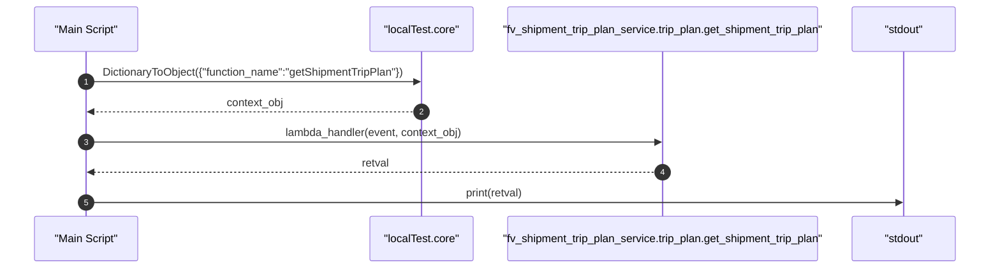
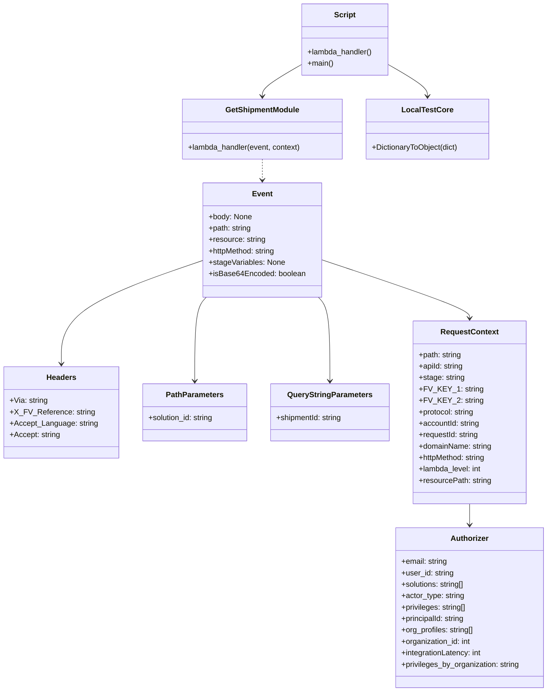

# Diagram: platform/tools/ide_local_testing/localTest/test/tripPlanService/getShipmentTripPlan.py

> Auto-generated by Obscura crawlers

## Diagram 1

### SVG

<svg id="container" width="1522" xmlns="http://www.w3.org/2000/svg" height="411" viewBox="-50 -10 1522 411" role="graphics-document document" aria-roledescription="sequence"><g><rect x="1272" y="325" fill="#eaeaea" stroke="#666" width="150" height="65" name="Console" rx="3" ry="3" class="actor actor-bottom"></rect><text x="1347" y="357.5" dominant-baseline="central" alignment-baseline="central" class="actor actor-box" style="text-anchor: middle; font-size: 16px; font-weight: 400;"><tspan x="1347" dy="0">"stdout"</tspan></text></g><g><rect x="720" y="325" fill="#eaeaea" stroke="#666" width="502" height="65" name="GetModule" rx="3" ry="3" class="actor actor-bottom"></rect><text x="971" y="357.5" dominant-baseline="central" alignment-baseline="central" class="actor actor-box" style="text-anchor: middle; font-size: 16px; font-weight: 400;"><tspan x="971" dy="0">"fv_shipment_trip_plan_service.trip_plan.get_shipment_trip_plan"</tspan></text></g><g><rect x="520" y="325" fill="#eaeaea" stroke="#666" width="150" height="65" name="LocalTest" rx="3" ry="3" class="actor actor-bottom"></rect><text x="595" y="357.5" dominant-baseline="central" alignment-baseline="central" class="actor actor-box" style="text-anchor: middle; font-size: 16px; font-weight: 400;"><tspan x="595" dy="0">"localTest.core"</tspan></text></g><g><rect x="0" y="325" fill="#eaeaea" stroke="#666" width="150" height="65" name="Script" rx="3" ry="3" class="actor actor-bottom"></rect><text x="75" y="357.5" dominant-baseline="central" alignment-baseline="central" class="actor actor-box" style="text-anchor: middle; font-size: 16px; font-weight: 400;"><tspan x="75" dy="0">"Main Script"</tspan></text></g><g><line id="actor3" x1="1347" y1="65" x2="1347" y2="325" class="actor-line 200" stroke-width="0.5px" stroke="#999" name="Console"></line><g id="root-3"><rect x="1272" y="0" fill="#eaeaea" stroke="#666" width="150" height="65" name="Console" rx="3" ry="3" class="actor actor-top"></rect><text x="1347" y="32.5" dominant-baseline="central" alignment-baseline="central" class="actor actor-box" style="text-anchor: middle; font-size: 16px; font-weight: 400;"><tspan x="1347" dy="0">"stdout"</tspan></text></g></g><g><line id="actor2" x1="971" y1="65" x2="971" y2="325" class="actor-line 200" stroke-width="0.5px" stroke="#999" name="GetModule"></line><g id="root-2"><rect x="720" y="0" fill="#eaeaea" stroke="#666" width="502" height="65" name="GetModule" rx="3" ry="3" class="actor actor-top"></rect><text x="971" y="32.5" dominant-baseline="central" alignment-baseline="central" class="actor actor-box" style="text-anchor: middle; font-size: 16px; font-weight: 400;"><tspan x="971" dy="0">"fv_shipment_trip_plan_service.trip_plan.get_shipment_trip_plan"</tspan></text></g></g><g><line id="actor1" x1="595" y1="65" x2="595" y2="325" class="actor-line 200" stroke-width="0.5px" stroke="#999" name="LocalTest"></line><g id="root-1"><rect x="520" y="0" fill="#eaeaea" stroke="#666" width="150" height="65" name="LocalTest" rx="3" ry="3" class="actor actor-top"></rect><text x="595" y="32.5" dominant-baseline="central" alignment-baseline="central" class="actor actor-box" style="text-anchor: middle; font-size: 16px; font-weight: 400;"><tspan x="595" dy="0">"localTest.core"</tspan></text></g></g><g><line id="actor0" x1="75" y1="65" x2="75" y2="325" class="actor-line 200" stroke-width="0.5px" stroke="#999" name="Script"></line><g id="root-0"><rect x="0" y="0" fill="#eaeaea" stroke="#666" width="150" height="65" name="Script" rx="3" ry="3" class="actor actor-top"></rect><text x="75" y="32.5" dominant-baseline="central" alignment-baseline="central" class="actor actor-box" style="text-anchor: middle; font-size: 16px; font-weight: 400;"><tspan x="75" dy="0">"Main Script"</tspan></text></g></g><g></g><defs><symbol id="computer" width="24" height="24"><path transform="scale(.5)" d="M2 2v13h20v-13h-20zm18 11h-16v-9h16v9zm-10.228 6l.466-1h3.524l.467 1h-4.457zm14.228 3h-24l2-6h2.104l-1.33 4h18.45l-1.297-4h2.073l2 6zm-5-10h-14v-7h14v7z"></path></symbol></defs><defs><symbol id="database" fill-rule="evenodd" clip-rule="evenodd"><path transform="scale(.5)" d="M12.258.001l.256.004.255.005.253.008.251.01.249.012.247.015.246.016.242.019.241.02.239.023.236.024.233.027.231.028.229.031.225.032.223.034.22.036.217.038.214.04.211.041.208.043.205.045.201.046.198.048.194.05.191.051.187.053.183.054.18.056.175.057.172.059.168.06.163.061.16.063.155.064.15.066.074.033.073.033.071.034.07.034.069.035.068.035.067.035.066.035.064.036.064.036.062.036.06.036.06.037.058.037.058.037.055.038.055.038.053.038.052.038.051.039.05.039.048.039.047.039.045.04.044.04.043.04.041.04.04.041.039.041.037.041.036.041.034.041.033.042.032.042.03.042.029.042.027.042.026.043.024.043.023.043.021.043.02.043.018.044.017.043.015.044.013.044.012.044.011.045.009.044.007.045.006.045.004.045.002.045.001.045v17l-.001.045-.002.045-.004.045-.006.045-.007.045-.009.044-.011.045-.012.044-.013.044-.015.044-.017.043-.018.044-.02.043-.021.043-.023.043-.024.043-.026.043-.027.042-.029.042-.03.042-.032.042-.033.042-.034.041-.036.041-.037.041-.039.041-.04.041-.041.04-.043.04-.044.04-.045.04-.047.039-.048.039-.05.039-.051.039-.052.038-.053.038-.055.038-.055.038-.058.037-.058.037-.06.037-.06.036-.062.036-.064.036-.064.036-.066.035-.067.035-.068.035-.069.035-.07.034-.071.034-.073.033-.074.033-.15.066-.155.064-.16.063-.163.061-.168.06-.172.059-.175.057-.18.056-.183.054-.187.053-.191.051-.194.05-.198.048-.201.046-.205.045-.208.043-.211.041-.214.04-.217.038-.22.036-.223.034-.225.032-.229.031-.231.028-.233.027-.236.024-.239.023-.241.02-.242.019-.246.016-.247.015-.249.012-.251.01-.253.008-.255.005-.256.004-.258.001-.258-.001-.256-.004-.255-.005-.253-.008-.251-.01-.249-.012-.247-.015-.245-.016-.243-.019-.241-.02-.238-.023-.236-.024-.234-.027-.231-.028-.228-.031-.226-.032-.223-.034-.22-.036-.217-.038-.214-.04-.211-.041-.208-.043-.204-.045-.201-.046-.198-.048-.195-.05-.19-.051-.187-.053-.184-.054-.179-.056-.176-.057-.172-.059-.167-.06-.164-.061-.159-.063-.155-.064-.151-.066-.074-.033-.072-.033-.072-.034-.07-.034-.069-.035-.068-.035-.067-.035-.066-.035-.064-.036-.063-.036-.062-.036-.061-.036-.06-.037-.058-.037-.057-.037-.056-.038-.055-.038-.053-.038-.052-.038-.051-.039-.049-.039-.049-.039-.046-.039-.046-.04-.044-.04-.043-.04-.041-.04-.04-.041-.039-.041-.037-.041-.036-.041-.034-.041-.033-.042-.032-.042-.03-.042-.029-.042-.027-.042-.026-.043-.024-.043-.023-.043-.021-.043-.02-.043-.018-.044-.017-.043-.015-.044-.013-.044-.012-.044-.011-.045-.009-.044-.007-.045-.006-.045-.004-.045-.002-.045-.001-.045v-17l.001-.045.002-.045.004-.045.006-.045.007-.045.009-.044.011-.045.012-.044.013-.044.015-.044.017-.043.018-.044.02-.043.021-.043.023-.043.024-.043.026-.043.027-.042.029-.042.03-.042.032-.042.033-.042.034-.041.036-.041.037-.041.039-.041.04-.041.041-.04.043-.04.044-.04.046-.04.046-.039.049-.039.049-.039.051-.039.052-.038.053-.038.055-.038.056-.038.057-.037.058-.037.06-.037.061-.036.062-.036.063-.036.064-.036.066-.035.067-.035.068-.035.069-.035.07-.034.072-.034.072-.033.074-.033.151-.066.155-.064.159-.063.164-.061.167-.06.172-.059.176-.057.179-.056.184-.054.187-.053.19-.051.195-.05.198-.048.201-.046.204-.045.208-.043.211-.041.214-.04.217-.038.22-.036.223-.034.226-.032.228-.031.231-.028.234-.027.236-.024.238-.023.241-.02.243-.019.245-.016.247-.015.249-.012.251-.01.253-.008.255-.005.256-.004.258-.001.258.001zm-9.258 20.499v.01l.001.021.003.021.004.022.005.021.006.022.007.022.009.023.01.022.011.023.012.023.013.023.015.023.016.024.017.023.018.024.019.024.021.024.022.025.023.024.024.025.052.049.056.05.061.051.066.051.07.051.075.051.079.052.084.052.088.052.092.052.097.052.102.051.105.052.11.052.114.051.119.051.123.051.127.05.131.05.135.05.139.048.144.049.147.047.152.047.155.047.16.045.163.045.167.043.171.043.176.041.178.041.183.039.187.039.19.037.194.035.197.035.202.033.204.031.209.03.212.029.216.027.219.025.222.024.226.021.23.02.233.018.236.016.24.015.243.012.246.01.249.008.253.005.256.004.259.001.26-.001.257-.004.254-.005.25-.008.247-.011.244-.012.241-.014.237-.016.233-.018.231-.021.226-.021.224-.024.22-.026.216-.027.212-.028.21-.031.205-.031.202-.034.198-.034.194-.036.191-.037.187-.039.183-.04.179-.04.175-.042.172-.043.168-.044.163-.045.16-.046.155-.046.152-.047.148-.048.143-.049.139-.049.136-.05.131-.05.126-.05.123-.051.118-.052.114-.051.11-.052.106-.052.101-.052.096-.052.092-.052.088-.053.083-.051.079-.052.074-.052.07-.051.065-.051.06-.051.056-.05.051-.05.023-.024.023-.025.021-.024.02-.024.019-.024.018-.024.017-.024.015-.023.014-.024.013-.023.012-.023.01-.023.01-.022.008-.022.006-.022.006-.022.004-.022.004-.021.001-.021.001-.021v-4.127l-.077.055-.08.053-.083.054-.085.053-.087.052-.09.052-.093.051-.095.05-.097.05-.1.049-.102.049-.105.048-.106.047-.109.047-.111.046-.114.045-.115.045-.118.044-.12.043-.122.042-.124.042-.126.041-.128.04-.13.04-.132.038-.134.038-.135.037-.138.037-.139.035-.142.035-.143.034-.144.033-.147.032-.148.031-.15.03-.151.03-.153.029-.154.027-.156.027-.158.026-.159.025-.161.024-.162.023-.163.022-.165.021-.166.02-.167.019-.169.018-.169.017-.171.016-.173.015-.173.014-.175.013-.175.012-.177.011-.178.01-.179.008-.179.008-.181.006-.182.005-.182.004-.184.003-.184.002h-.37l-.184-.002-.184-.003-.182-.004-.182-.005-.181-.006-.179-.008-.179-.008-.178-.01-.176-.011-.176-.012-.175-.013-.173-.014-.172-.015-.171-.016-.17-.017-.169-.018-.167-.019-.166-.02-.165-.021-.163-.022-.162-.023-.161-.024-.159-.025-.157-.026-.156-.027-.155-.027-.153-.029-.151-.03-.15-.03-.148-.031-.146-.032-.145-.033-.143-.034-.141-.035-.14-.035-.137-.037-.136-.037-.134-.038-.132-.038-.13-.04-.128-.04-.126-.041-.124-.042-.122-.042-.12-.044-.117-.043-.116-.045-.113-.045-.112-.046-.109-.047-.106-.047-.105-.048-.102-.049-.1-.049-.097-.05-.095-.05-.093-.052-.09-.051-.087-.052-.085-.053-.083-.054-.08-.054-.077-.054v4.127zm0-5.654v.011l.001.021.003.021.004.021.005.022.006.022.007.022.009.022.01.022.011.023.012.023.013.023.015.024.016.023.017.024.018.024.019.024.021.024.022.024.023.025.024.024.052.05.056.05.061.05.066.051.07.051.075.052.079.051.084.052.088.052.092.052.097.052.102.052.105.052.11.051.114.051.119.052.123.05.127.051.131.05.135.049.139.049.144.048.147.048.152.047.155.046.16.045.163.045.167.044.171.042.176.042.178.04.183.04.187.038.19.037.194.036.197.034.202.033.204.032.209.03.212.028.216.027.219.025.222.024.226.022.23.02.233.018.236.016.24.014.243.012.246.01.249.008.253.006.256.003.259.001.26-.001.257-.003.254-.006.25-.008.247-.01.244-.012.241-.015.237-.016.233-.018.231-.02.226-.022.224-.024.22-.025.216-.027.212-.029.21-.03.205-.032.202-.033.198-.035.194-.036.191-.037.187-.039.183-.039.179-.041.175-.042.172-.043.168-.044.163-.045.16-.045.155-.047.152-.047.148-.048.143-.048.139-.05.136-.049.131-.05.126-.051.123-.051.118-.051.114-.052.11-.052.106-.052.101-.052.096-.052.092-.052.088-.052.083-.052.079-.052.074-.051.07-.052.065-.051.06-.05.056-.051.051-.049.023-.025.023-.024.021-.025.02-.024.019-.024.018-.024.017-.024.015-.023.014-.023.013-.024.012-.022.01-.023.01-.023.008-.022.006-.022.006-.022.004-.021.004-.022.001-.021.001-.021v-4.139l-.077.054-.08.054-.083.054-.085.052-.087.053-.09.051-.093.051-.095.051-.097.05-.1.049-.102.049-.105.048-.106.047-.109.047-.111.046-.114.045-.115.044-.118.044-.12.044-.122.042-.124.042-.126.041-.128.04-.13.039-.132.039-.134.038-.135.037-.138.036-.139.036-.142.035-.143.033-.144.033-.147.033-.148.031-.15.03-.151.03-.153.028-.154.028-.156.027-.158.026-.159.025-.161.024-.162.023-.163.022-.165.021-.166.02-.167.019-.169.018-.169.017-.171.016-.173.015-.173.014-.175.013-.175.012-.177.011-.178.009-.179.009-.179.007-.181.007-.182.005-.182.004-.184.003-.184.002h-.37l-.184-.002-.184-.003-.182-.004-.182-.005-.181-.007-.179-.007-.179-.009-.178-.009-.176-.011-.176-.012-.175-.013-.173-.014-.172-.015-.171-.016-.17-.017-.169-.018-.167-.019-.166-.02-.165-.021-.163-.022-.162-.023-.161-.024-.159-.025-.157-.026-.156-.027-.155-.028-.153-.028-.151-.03-.15-.03-.148-.031-.146-.033-.145-.033-.143-.033-.141-.035-.14-.036-.137-.036-.136-.037-.134-.038-.132-.039-.13-.039-.128-.04-.126-.041-.124-.042-.122-.043-.12-.043-.117-.044-.116-.044-.113-.046-.112-.046-.109-.046-.106-.047-.105-.048-.102-.049-.1-.049-.097-.05-.095-.051-.093-.051-.09-.051-.087-.053-.085-.052-.083-.054-.08-.054-.077-.054v4.139zm0-5.666v.011l.001.02.003.022.004.021.005.022.006.021.007.022.009.023.01.022.011.023.012.023.013.023.015.023.016.024.017.024.018.023.019.024.021.025.022.024.023.024.024.025.052.05.056.05.061.05.066.051.07.051.075.052.079.051.084.052.088.052.092.052.097.052.102.052.105.051.11.052.114.051.119.051.123.051.127.05.131.05.135.05.139.049.144.048.147.048.152.047.155.046.16.045.163.045.167.043.171.043.176.042.178.04.183.04.187.038.19.037.194.036.197.034.202.033.204.032.209.03.212.028.216.027.219.025.222.024.226.021.23.02.233.018.236.017.24.014.243.012.246.01.249.008.253.006.256.003.259.001.26-.001.257-.003.254-.006.25-.008.247-.01.244-.013.241-.014.237-.016.233-.018.231-.02.226-.022.224-.024.22-.025.216-.027.212-.029.21-.03.205-.032.202-.033.198-.035.194-.036.191-.037.187-.039.183-.039.179-.041.175-.042.172-.043.168-.044.163-.045.16-.045.155-.047.152-.047.148-.048.143-.049.139-.049.136-.049.131-.051.126-.05.123-.051.118-.052.114-.051.11-.052.106-.052.101-.052.096-.052.092-.052.088-.052.083-.052.079-.052.074-.052.07-.051.065-.051.06-.051.056-.05.051-.049.023-.025.023-.025.021-.024.02-.024.019-.024.018-.024.017-.024.015-.023.014-.024.013-.023.012-.023.01-.022.01-.023.008-.022.006-.022.006-.022.004-.022.004-.021.001-.021.001-.021v-4.153l-.077.054-.08.054-.083.053-.085.053-.087.053-.09.051-.093.051-.095.051-.097.05-.1.049-.102.048-.105.048-.106.048-.109.046-.111.046-.114.046-.115.044-.118.044-.12.043-.122.043-.124.042-.126.041-.128.04-.13.039-.132.039-.134.038-.135.037-.138.036-.139.036-.142.034-.143.034-.144.033-.147.032-.148.032-.15.03-.151.03-.153.028-.154.028-.156.027-.158.026-.159.024-.161.024-.162.023-.163.023-.165.021-.166.02-.167.019-.169.018-.169.017-.171.016-.173.015-.173.014-.175.013-.175.012-.177.01-.178.01-.179.009-.179.007-.181.006-.182.006-.182.004-.184.003-.184.001-.185.001-.185-.001-.184-.001-.184-.003-.182-.004-.182-.006-.181-.006-.179-.007-.179-.009-.178-.01-.176-.01-.176-.012-.175-.013-.173-.014-.172-.015-.171-.016-.17-.017-.169-.018-.167-.019-.166-.02-.165-.021-.163-.023-.162-.023-.161-.024-.159-.024-.157-.026-.156-.027-.155-.028-.153-.028-.151-.03-.15-.03-.148-.032-.146-.032-.145-.033-.143-.034-.141-.034-.14-.036-.137-.036-.136-.037-.134-.038-.132-.039-.13-.039-.128-.041-.126-.041-.124-.041-.122-.043-.12-.043-.117-.044-.116-.044-.113-.046-.112-.046-.109-.046-.106-.048-.105-.048-.102-.048-.1-.05-.097-.049-.095-.051-.093-.051-.09-.052-.087-.052-.085-.053-.083-.053-.08-.054-.077-.054v4.153zm8.74-8.179l-.257.004-.254.005-.25.008-.247.011-.244.012-.241.014-.237.016-.233.018-.231.021-.226.022-.224.023-.22.026-.216.027-.212.028-.21.031-.205.032-.202.033-.198.034-.194.036-.191.038-.187.038-.183.04-.179.041-.175.042-.172.043-.168.043-.163.045-.16.046-.155.046-.152.048-.148.048-.143.048-.139.049-.136.05-.131.05-.126.051-.123.051-.118.051-.114.052-.11.052-.106.052-.101.052-.096.052-.092.052-.088.052-.083.052-.079.052-.074.051-.07.052-.065.051-.06.05-.056.05-.051.05-.023.025-.023.024-.021.024-.02.025-.019.024-.018.024-.017.023-.015.024-.014.023-.013.023-.012.023-.01.023-.01.022-.008.022-.006.023-.006.021-.004.022-.004.021-.001.021-.001.021.001.021.001.021.004.021.004.022.006.021.006.023.008.022.01.022.01.023.012.023.013.023.014.023.015.024.017.023.018.024.019.024.02.025.021.024.023.024.023.025.051.05.056.05.06.05.065.051.07.052.074.051.079.052.083.052.088.052.092.052.096.052.101.052.106.052.11.052.114.052.118.051.123.051.126.051.131.05.136.05.139.049.143.048.148.048.152.048.155.046.16.046.163.045.168.043.172.043.175.042.179.041.183.04.187.038.191.038.194.036.198.034.202.033.205.032.21.031.212.028.216.027.22.026.224.023.226.022.231.021.233.018.237.016.241.014.244.012.247.011.25.008.254.005.257.004.26.001.26-.001.257-.004.254-.005.25-.008.247-.011.244-.012.241-.014.237-.016.233-.018.231-.021.226-.022.224-.023.22-.026.216-.027.212-.028.21-.031.205-.032.202-.033.198-.034.194-.036.191-.038.187-.038.183-.04.179-.041.175-.042.172-.043.168-.043.163-.045.16-.046.155-.046.152-.048.148-.048.143-.048.139-.049.136-.05.131-.05.126-.051.123-.051.118-.051.114-.052.11-.052.106-.052.101-.052.096-.052.092-.052.088-.052.083-.052.079-.052.074-.051.07-.052.065-.051.06-.05.056-.05.051-.05.023-.025.023-.024.021-.024.02-.025.019-.024.018-.024.017-.023.015-.024.014-.023.013-.023.012-.023.01-.023.01-.022.008-.022.006-.023.006-.021.004-.022.004-.021.001-.021.001-.021-.001-.021-.001-.021-.004-.021-.004-.022-.006-.021-.006-.023-.008-.022-.01-.022-.01-.023-.012-.023-.013-.023-.014-.023-.015-.024-.017-.023-.018-.024-.019-.024-.02-.025-.021-.024-.023-.024-.023-.025-.051-.05-.056-.05-.06-.05-.065-.051-.07-.052-.074-.051-.079-.052-.083-.052-.088-.052-.092-.052-.096-.052-.101-.052-.106-.052-.11-.052-.114-.052-.118-.051-.123-.051-.126-.051-.131-.05-.136-.05-.139-.049-.143-.048-.148-.048-.152-.048-.155-.046-.16-.046-.163-.045-.168-.043-.172-.043-.175-.042-.179-.041-.183-.04-.187-.038-.191-.038-.194-.036-.198-.034-.202-.033-.205-.032-.21-.031-.212-.028-.216-.027-.22-.026-.224-.023-.226-.022-.231-.021-.233-.018-.237-.016-.241-.014-.244-.012-.247-.011-.25-.008-.254-.005-.257-.004-.26-.001-.26.001z"></path></symbol></defs><defs><symbol id="clock" width="24" height="24"><path transform="scale(.5)" d="M12 2c5.514 0 10 4.486 10 10s-4.486 10-10 10-10-4.486-10-10 4.486-10 10-10zm0-2c-6.627 0-12 5.373-12 12s5.373 12 12 12 12-5.373 12-12-5.373-12-12-12zm5.848 12.459c.202.038.202.333.001.372-1.907.361-6.045 1.111-6.547 1.111-.719 0-1.301-.582-1.301-1.301 0-.512.77-5.447 1.125-7.445.034-.192.312-.181.343.014l.985 6.238 5.394 1.011z"></path></symbol></defs><defs><marker id="arrowhead" refX="7.9" refY="5" markerUnits="userSpaceOnUse" markerWidth="12" markerHeight="12" orient="auto-start-reverse"><path d="M -1 0 L 10 5 L 0 10 z"></path></marker></defs><defs><marker id="crosshead" markerWidth="15" markerHeight="8" orient="auto" refX="4" refY="4.5"><path fill="none" stroke="#000000" stroke-width="1pt" d="M 1,2 L 6,7 M 6,2 L 1,7" style="stroke-dasharray: 0, 0;"></path></marker></defs><defs><marker id="filled-head" refX="15.5" refY="7" markerWidth="20" markerHeight="28" orient="auto"><path d="M 18,7 L9,13 L14,7 L9,1 Z"></path></marker></defs><defs><marker id="sequencenumber" refX="15" refY="15" markerWidth="60" markerHeight="40" orient="auto"><circle cx="15" cy="15" r="6"></circle></marker></defs><text x="334" y="80" text-anchor="middle" dominant-baseline="middle" alignment-baseline="middle" class="messageText" dy="1em" style="font-size: 16px; font-weight: 400;">DictionaryToObject({"function_name":"getShipmentTripPlan"})</text><line x1="76" y1="113" x2="591" y2="113" class="messageLine0" stroke-width="2" stroke="none" marker-end="url(#arrowhead)" style="fill: none;"></line><line x1="76" y1="113" x2="76" y2="113" stroke-width="0" marker-start="url(#sequencenumber)"></line><text x="76" y="117" font-family="sans-serif" font-size="12px" text-anchor="middle" class="sequenceNumber">1</text><text x="337" y="128" text-anchor="middle" dominant-baseline="middle" alignment-baseline="middle" class="messageText" dy="1em" style="font-size: 16px; font-weight: 400;">context_obj</text><line x1="594" y1="161" x2="79" y2="161" class="messageLine1" stroke-width="2" stroke="none" marker-end="url(#arrowhead)" style="stroke-dasharray: 3, 3; fill: none;"></line><line x1="594" y1="161" x2="594" y2="161" stroke-width="0" marker-start="url(#sequencenumber)"></line><text x="594" y="165" font-family="sans-serif" font-size="12px" text-anchor="middle" class="sequenceNumber">2</text><text x="522" y="176" text-anchor="middle" dominant-baseline="middle" alignment-baseline="middle" class="messageText" dy="1em" style="font-size: 16px; font-weight: 400;">lambda_handler(event, context_obj)</text><line x1="76" y1="209" x2="967" y2="209" class="messageLine0" stroke-width="2" stroke="none" marker-end="url(#arrowhead)" style="fill: none;"></line><line x1="76" y1="209" x2="76" y2="209" stroke-width="0" marker-start="url(#sequencenumber)"></line><text x="76" y="213" font-family="sans-serif" font-size="12px" text-anchor="middle" class="sequenceNumber">3</text><text x="525" y="224" text-anchor="middle" dominant-baseline="middle" alignment-baseline="middle" class="messageText" dy="1em" style="font-size: 16px; font-weight: 400;">retval</text><line x1="970" y1="257" x2="79" y2="257" class="messageLine1" stroke-width="2" stroke="none" marker-end="url(#arrowhead)" style="stroke-dasharray: 3, 3; fill: none;"></line><line x1="970" y1="257" x2="970" y2="257" stroke-width="0" marker-start="url(#sequencenumber)"></line><text x="970" y="261" font-family="sans-serif" font-size="12px" text-anchor="middle" class="sequenceNumber">4</text><text x="710" y="272" text-anchor="middle" dominant-baseline="middle" alignment-baseline="middle" class="messageText" dy="1em" style="font-size: 16px; font-weight: 400;">print(retval)</text><line x1="76" y1="305" x2="1343" y2="305" class="messageLine0" stroke-width="2" stroke="none" marker-end="url(#arrowhead)" style="fill: none;"></line><line x1="76" y1="305" x2="76" y2="305" stroke-width="0" marker-start="url(#sequencenumber)"></line><text x="76" y="309" font-family="sans-serif" font-size="12px" text-anchor="middle" class="sequenceNumber">5</text></svg>

## Diagram 2

### SVG

<svg id="container" width="1149.9296875" xmlns="http://www.w3.org/2000/svg" class="classDiagram" height="1452" viewBox="0 0 1149.9296875 1452" role="graphics-document document" aria-roledescription="class"><g><defs><marker id="container_class-aggregationStart" class="marker aggregation class" refX="18" refY="7" markerWidth="190" markerHeight="240" orient="auto"><path d="M 18,7 L9,13 L1,7 L9,1 Z"></path></marker></defs><defs><marker id="container_class-aggregationEnd" class="marker aggregation class" refX="1" refY="7" markerWidth="20" markerHeight="28" orient="auto"><path d="M 18,7 L9,13 L1,7 L9,1 Z"></path></marker></defs><defs><marker id="container_class-extensionStart" class="marker extension class" refX="18" refY="7" markerWidth="190" markerHeight="240" orient="auto"><path d="M 1,7 L18,13 V 1 Z"></path></marker></defs><defs><marker id="container_class-extensionEnd" class="marker extension class" refX="1" refY="7" markerWidth="20" markerHeight="28" orient="auto"><path d="M 1,1 V 13 L18,7 Z"></path></marker></defs><defs><marker id="container_class-compositionStart" class="marker composition class" refX="18" refY="7" markerWidth="190" markerHeight="240" orient="auto"><path d="M 18,7 L9,13 L1,7 L9,1 Z"></path></marker></defs><defs><marker id="container_class-compositionEnd" class="marker composition class" refX="1" refY="7" markerWidth="20" markerHeight="28" orient="auto"><path d="M 18,7 L9,13 L1,7 L9,1 Z"></path></marker></defs><defs><marker id="container_class-dependencyStart" class="marker dependency class" refX="6" refY="7" markerWidth="190" markerHeight="240" orient="auto"><path d="M 5,7 L9,13 L1,7 L9,1 Z"></path></marker></defs><defs><marker id="container_class-dependencyEnd" class="marker dependency class" refX="13" refY="7" markerWidth="20" markerHeight="28" orient="auto"><path d="M 18,7 L9,13 L14,7 L9,1 Z"></path></marker></defs><defs><marker id="container_class-lollipopStart" class="marker lollipop class" refX="13" refY="7" markerWidth="190" markerHeight="240" orient="auto"><circle stroke="black" fill="transparent" cx="7" cy="7" r="6"></circle></marker></defs><defs><marker id="container_class-lollipopEnd" class="marker lollipop class" refX="1" refY="7" markerWidth="190" markerHeight="240" orient="auto"><circle stroke="black" fill="transparent" cx="7" cy="7" r="6"></circle></marker></defs><g class="root"><g class="clusters"></g><g class="edgePaths"><path d="M425.869,546.147L375.942,563.289C326.016,580.431,226.162,614.716,176.235,651.025C126.309,687.333,126.309,725.667,126.309,744.833L126.309,764" id="id_Event_Headers_1" class="edge-thickness-normal edge-pattern-solid relation" style=";;;" data-edge="true" data-et="edge" data-id="id_Event_Headers_1" data-points="W3sieCI6NDI1Ljg2OTE0MDYyNSwieSI6NTQ2LjE0NzA2OTAyNTMyMDl9LHsieCI6MTI2LjMwODU5Mzc1LCJ5Ijo2NDl9LHsieCI6MTI2LjMwODU5Mzc1LCJ5Ijo3NzB9XQ==" marker-end="url(#container_class-dependencyEnd)"></path><path d="M430.27,624L426.161,628.167C422.051,632.333,413.832,640.667,409.723,670C405.613,699.333,405.613,749.667,405.613,774.833L405.613,800" id="id_Event_PathParameters_2" class="edge-thickness-normal edge-pattern-solid relation" style=";;;" data-edge="true" data-et="edge" data-id="id_Event_PathParameters_2" data-points="W3sieCI6NDMwLjI3MDEzNzM5MjI0MTQsInkiOjYyNH0seyJ4Ijo0MDUuNjEzMjgxMjUsInkiOjY0OX0seyJ4Ijo0MDUuNjEzMjgxMjUsInkiOjgwNn1d" marker-end="url(#container_class-dependencyEnd)"></path><path d="M671.377,544.768L723.685,562.14C775.992,579.512,880.607,614.256,932.915,634.795C985.223,655.333,985.223,661.667,985.223,664.833L985.223,668" id="id_Event_RequestContext_3" class="edge-thickness-normal edge-pattern-solid relation" style=";;;" data-edge="true" data-et="edge" data-id="id_Event_RequestContext_3" data-points="W3sieCI6NjcxLjM3Njk1MzEyNSwieSI6NTQ0Ljc2ODA1Mzg5NjYzNTV9LHsieCI6OTg1LjIyMjY1NjI1LCJ5Ijo2NDl9LHsieCI6OTg1LjIyMjY1NjI1LCJ5Ijo2NzR9XQ==" marker-end="url(#container_class-dependencyEnd)"></path><path d="M666.976,624L671.085,628.167C675.195,632.333,683.414,640.667,687.523,670C691.633,699.333,691.633,749.667,691.633,774.833L691.633,800" id="id_Event_QueryStringParameters_4" class="edge-thickness-normal edge-pattern-solid relation" style=";;;" data-edge="true" data-et="edge" data-id="id_Event_QueryStringParameters_4" data-points="W3sieCI6NjY2Ljk3NTk1NjM1Nzc1ODYsInkiOjYyNH0seyJ4Ijo2OTEuNjMyODEyNSwieSI6NjQ5fSx7IngiOjY5MS42MzI4MTI1LCJ5Ijo4MDZ9XQ==" marker-end="url(#container_class-dependencyEnd)"></path><path d="M985.223,1058L985.223,1062.167C985.223,1066.333,985.223,1074.667,985.223,1082C985.223,1089.333,985.223,1095.667,985.223,1098.833L985.223,1102" id="id_RequestContext_Authorizer_5" class="edge-thickness-normal edge-pattern-solid relation" style=";;;" data-edge="true" data-et="edge" data-id="id_RequestContext_Authorizer_5" data-points="W3sieCI6OTg1LjIyMjY1NjI1LCJ5IjoxMDU4fSx7IngiOjk4NS4yMjI2NTYyNSwieSI6MTA4M30seyJ4Ijo5ODUuMjIyNjU2MjUsInkiOjExMDh9XQ==" marker-end="url(#container_class-dependencyEnd)"></path><path d="M631.203,135.665L617.44,143.554C603.676,151.443,576.15,167.222,562.386,178.278C548.623,189.333,548.623,195.667,548.623,198.833L548.623,202" id="id_Script_GetShipmentModule_6" class="edge-thickness-normal edge-pattern-solid relation" style=";;;" data-edge="true" data-et="edge" data-id="id_Script_GetShipmentModule_6" data-points="W3sieCI6NjMxLjIwMzEyNSwieSI6MTM1LjY2NTA0NzA3NjM0MDkzfSx7IngiOjU0OC42MjMwNDY4NzUsInkiOjE4M30seyJ4Ijo1NDguNjIzMDQ2ODc1LCJ5IjoyMDh9XQ==" marker-end="url(#container_class-dependencyEnd)"></path><path d="M814.961,135.665L828.724,143.554C842.488,151.443,870.014,167.222,883.778,178.278C897.541,189.333,897.541,195.667,897.541,198.833L897.541,202" id="id_Script_LocalTestCore_7" class="edge-thickness-normal edge-pattern-solid relation" style=";;;" data-edge="true" data-et="edge" data-id="id_Script_LocalTestCore_7" data-points="W3sieCI6ODE0Ljk2MDkzNzUsInkiOjEzNS42NjUwNDcwNzYzNDA5M30seyJ4Ijo4OTcuNTQxMDE1NjI1LCJ5IjoxODN9LHsieCI6ODk3LjU0MTAxNTYyNSwieSI6MjA4fV0=" marker-end="url(#container_class-dependencyEnd)"></path><path d="M548.623,334L548.623,338.167C548.623,342.333,548.623,350.667,548.623,358C548.623,365.333,548.623,371.667,548.623,374.833L548.623,378" id="id_GetShipmentModule_Event_8" class="edge-thickness-normal edge-pattern-dashed relation" style=";;;" data-edge="true" data-et="edge" data-id="id_GetShipmentModule_Event_8" data-points="W3sieCI6NTQ4LjYyMzA0Njg3NSwieSI6MzM0fSx7IngiOjU0OC42MjMwNDY4NzUsInkiOjM1OX0seyJ4Ijo1NDguNjIzMDQ2ODc1LCJ5IjozODR9XQ==" marker-end="url(#container_class-dependencyEnd)"></path></g><g class="edgeLabels"><g class="edgeLabel"><g class="label" data-id="id_Event_Headers_1" transform="translate(0, 0)"><foreignObject width="0" height="0">

</foreignObject></g></g><g class="edgeLabel"><g class="label" data-id="id_Event_PathParameters_2" transform="translate(0, 0)"><foreignObject width="0" height="0">

</foreignObject></g></g><g class="edgeLabel"><g class="label" data-id="id_Event_RequestContext_3" transform="translate(0, 0)"><foreignObject width="0" height="0">

</foreignObject></g></g><g class="edgeLabel"><g class="label" data-id="id_Event_QueryStringParameters_4" transform="translate(0, 0)"><foreignObject width="0" height="0">

</foreignObject></g></g><g class="edgeLabel"><g class="label" data-id="id_RequestContext_Authorizer_5" transform="translate(0, 0)"><foreignObject width="0" height="0">

</foreignObject></g></g><g class="edgeLabel"><g class="label" data-id="id_Script_GetShipmentModule_6" transform="translate(0, 0)"><foreignObject width="0" height="0">

</foreignObject></g></g><g class="edgeLabel"><g class="label" data-id="id_Script_LocalTestCore_7" transform="translate(0, 0)"><foreignObject width="0" height="0">

</foreignObject></g></g><g class="edgeLabel"><g class="label" data-id="id_GetShipmentModule_Event_8" transform="translate(0, 0)"><foreignObject width="0" height="0">

</foreignObject></g></g></g><g class="nodes"><g class="node default" id="classId-Event-0" transform="translate(548.623046875, 504)"><g class="basic label-container"><path d="M-122.75390625 -120 L122.75390625 -120 L122.75390625 120 L-122.75390625 120" stroke="none" stroke-width="0" fill="#ECECFF" style=""></path><path d="M-122.75390625 -120 C-69.11283715530827 -120, -15.47176806061654 -120, 122.75390625 -120 M-122.75390625 -120 C-39.86196880313591 -120, 43.02996864372818 -120, 122.75390625 -120 M122.75390625 -120 C122.75390625 -53.550835987094416, 122.75390625 12.898328025811168, 122.75390625 120 M122.75390625 -120 C122.75390625 -62.539531647818485, 122.75390625 -5.079063295636971, 122.75390625 120 M122.75390625 120 C60.96888606721623 120, -0.8161341155675359 120, -122.75390625 120 M122.75390625 120 C51.142056620396644 120, -20.46979300920671 120, -122.75390625 120 M-122.75390625 120 C-122.75390625 60.54963098058642, -122.75390625 1.099261961172843, -122.75390625 -120 M-122.75390625 120 C-122.75390625 28.29921348364047, -122.75390625 -63.40157303271906, -122.75390625 -120" stroke="#9370DB" stroke-width="1.3" fill="none" stroke-dasharray="0 0" style=""></path></g><g class="annotation-group text" transform="translate(0, -96)"></g><g class="label-group text" transform="translate(-20.2109375, -96)"><g class="label" style="font-weight: bolder" transform="translate(0,-12)"><foreignObject width="40.421875" height="24">

Event

</foreignObject></g></g><g class="members-group text" transform="translate(-110.75390625, -48)"><g class="label" style="" transform="translate(0,-12)"><foreignObject width="90.796875" height="24">

+body: None

</foreignObject></g><g class="label" style="" transform="translate(0,12)"><foreignObject width="90.90625" height="24">

+path: string

</foreignObject></g><g class="label" style="" transform="translate(0,36)"><foreignObject width="119.984375" height="24">

+resource: string

</foreignObject></g><g class="label" style="" transform="translate(0,60)"><foreignObject width="143.375" height="24">

+httpMethod: string

</foreignObject></g><g class="label" style="" transform="translate(0,84)"><foreignObject width="159.5625" height="24">

+stageVariables: None

</foreignObject></g><g class="label" style="" transform="translate(0,108)"><foreignObject width="201.296875" height="24">

+isBase64Encoded: boolean

</foreignObject></g></g><g class="methods-group text" transform="translate(-110.75390625, 120)"></g><g class="divider" style=""><path d="M-122.75390625 -72 C-42.63253811963533 -72, 37.488830010729345 -72, 122.75390625 -72 M-122.75390625 -72 C-52.71135127471477 -72, 17.331203700570455 -72, 122.75390625 -72" stroke="#9370DB" stroke-width="1.3" fill="none" stroke-dasharray="0 0" style=""></path></g><g class="divider" style=""><path d="M-122.75390625 96 C-72.9652945741829 96, -23.176682898365797 96, 122.75390625 96 M-122.75390625 96 C-36.66258378335219 96, 49.42873868329562 96, 122.75390625 96" stroke="#9370DB" stroke-width="1.3" fill="none" stroke-dasharray="0 0" style=""></path></g></g><g class="node default" id="classId-Headers-1" transform="translate(126.30859375, 866)"><g class="basic label-container"><path d="M-118.30859375 -96 L118.30859375 -96 L118.30859375 96 L-118.30859375 96" stroke="none" stroke-width="0" fill="#ECECFF" style=""></path><path d="M-118.30859375 -96 C-56.096558232985274 -96, 6.115477284029453 -96, 118.30859375 -96 M-118.30859375 -96 C-57.20136091724327 -96, 3.9058719155134582 -96, 118.30859375 -96 M118.30859375 -96 C118.30859375 -24.366855223169907, 118.30859375 47.26628955366019, 118.30859375 96 M118.30859375 -96 C118.30859375 -51.26268199976527, 118.30859375 -6.525363999530541, 118.30859375 96 M118.30859375 96 C42.05841692539907 96, -34.191759899201855 96, -118.30859375 96 M118.30859375 96 C36.87328162440576 96, -44.562030501188474 96, -118.30859375 96 M-118.30859375 96 C-118.30859375 50.20035230360193, -118.30859375 4.400704607203863, -118.30859375 -96 M-118.30859375 96 C-118.30859375 19.607819773264282, -118.30859375 -56.784360453471436, -118.30859375 -96" stroke="#9370DB" stroke-width="1.3" fill="none" stroke-dasharray="0 0" style=""></path></g><g class="annotation-group text" transform="translate(0, -72)"></g><g class="label-group text" transform="translate(-30.2421875, -72)"><g class="label" style="font-weight: bolder" transform="translate(0,-12)"><foreignObject width="60.484375" height="24">

Headers

</foreignObject></g></g><g class="members-group text" transform="translate(-106.30859375, -24)"><g class="label" style="" transform="translate(0,-12)"><foreignObject width="79.421875" height="24">

+Via: string

</foreignObject></g><g class="label" style="" transform="translate(0,12)"><foreignObject width="170.3125" height="24">

+X_FV_Reference: string

</foreignObject></g><g class="label" style="" transform="translate(0,36)"><foreignObject width="182.375" height="24">

+Accept_Language: string

</foreignObject></g><g class="label" style="" transform="translate(0,60)"><foreignObject width="105.4375" height="24">

+Accept: string

</foreignObject></g></g><g class="methods-group text" transform="translate(-106.30859375, 96)"></g><g class="divider" style=""><path d="M-118.30859375 -48 C-24.703732698733006 -48, 68.90112835253399 -48, 118.30859375 -48 M-118.30859375 -48 C-39.81697218190929 -48, 38.674649386181414 -48, 118.30859375 -48" stroke="#9370DB" stroke-width="1.3" fill="none" stroke-dasharray="0 0" style=""></path></g><g class="divider" style=""><path d="M-118.30859375 72 C-69.72762561669651 72, -21.146657483393014 72, 118.30859375 72 M-118.30859375 72 C-51.934922261317496 72, 14.438749227365008 72, 118.30859375 72" stroke="#9370DB" stroke-width="1.3" fill="none" stroke-dasharray="0 0" style=""></path></g></g><g class="node default" id="classId-PathParameters-2" transform="translate(405.61328125, 866)"><g class="basic label-container"><path d="M-110.99609375 -60 L110.99609375 -60 L110.99609375 60 L-110.99609375 60" stroke="none" stroke-width="0" fill="#ECECFF" style=""></path><path d="M-110.99609375 -60 C-28.3998232315855 -60, 54.196447286829 -60, 110.99609375 -60 M-110.99609375 -60 C-36.81583093002382 -60, 37.36443188995236 -60, 110.99609375 -60 M110.99609375 -60 C110.99609375 -34.97795963292175, 110.99609375 -9.955919265843505, 110.99609375 60 M110.99609375 -60 C110.99609375 -27.77665876460855, 110.99609375 4.446682470782903, 110.99609375 60 M110.99609375 60 C23.3845983384454 60, -64.2268970731092 60, -110.99609375 60 M110.99609375 60 C23.41072633455302 60, -64.17464108089396 60, -110.99609375 60 M-110.99609375 60 C-110.99609375 25.324750380492496, -110.99609375 -9.350499239015008, -110.99609375 -60 M-110.99609375 60 C-110.99609375 33.82458866408968, -110.99609375 7.649177328179363, -110.99609375 -60" stroke="#9370DB" stroke-width="1.3" fill="none" stroke-dasharray="0 0" style=""></path></g><g class="annotation-group text" transform="translate(0, -36)"></g><g class="label-group text" transform="translate(-58.0703125, -36)"><g class="label" style="font-weight: bolder" transform="translate(0,-12)"><foreignObject width="116.140625" height="24">

PathParameters

</foreignObject></g></g><g class="members-group text" transform="translate(-98.99609375, 12)"><g class="label" style="" transform="translate(0,-12)"><foreignObject width="139.921875" height="24">

+solution_id: string

</foreignObject></g></g><g class="methods-group text" transform="translate(-98.99609375, 60)"></g><g class="divider" style=""><path d="M-110.99609375 -12 C-28.26052048607437 -12, 54.47505277785126 -12, 110.99609375 -12 M-110.99609375 -12 C-33.72631463411287 -12, 43.543464481774265 -12, 110.99609375 -12" stroke="#9370DB" stroke-width="1.3" fill="none" stroke-dasharray="0 0" style=""></path></g><g class="divider" style=""><path d="M-110.99609375 36 C-52.69319753004086 36, 5.609698689918275 36, 110.99609375 36 M-110.99609375 36 C-45.88764927727277 36, 19.220795195454457 36, 110.99609375 36" stroke="#9370DB" stroke-width="1.3" fill="none" stroke-dasharray="0 0" style=""></path></g></g><g class="node default" id="classId-QueryStringParameters-3" transform="translate(691.6328125, 866)"><g class="basic label-container"><path d="M-125.0234375 -60 L125.0234375 -60 L125.0234375 60 L-125.0234375 60" stroke="none" stroke-width="0" fill="#ECECFF" style=""></path><path d="M-125.0234375 -60 C-69.74437792488166 -60, -14.465318349763322 -60, 125.0234375 -60 M-125.0234375 -60 C-30.658942526134226 -60, 63.70555244773155 -60, 125.0234375 -60 M125.0234375 -60 C125.0234375 -26.41425997199476, 125.0234375 7.1714800560104806, 125.0234375 60 M125.0234375 -60 C125.0234375 -20.42884539783674, 125.0234375 19.142309204326523, 125.0234375 60 M125.0234375 60 C72.194224223905 60, 19.365010947810006 60, -125.0234375 60 M125.0234375 60 C39.48509636616468 60, -46.053244767670634 60, -125.0234375 60 M-125.0234375 60 C-125.0234375 24.29793617856516, -125.0234375 -11.404127642869682, -125.0234375 -60 M-125.0234375 60 C-125.0234375 21.236918110818706, -125.0234375 -17.526163778362587, -125.0234375 -60" stroke="#9370DB" stroke-width="1.3" fill="none" stroke-dasharray="0 0" style=""></path></g><g class="annotation-group text" transform="translate(0, -36)"></g><g class="label-group text" transform="translate(-85.609375, -36)"><g class="label" style="font-weight: bolder" transform="translate(0,-12)"><foreignObject width="171.21875" height="24">

QueryStringParameters

</foreignObject></g></g><g class="members-group text" transform="translate(-113.0234375, 12)"><g class="label" style="" transform="translate(0,-12)"><foreignObject width="140.4375" height="24">

+shipmentId: string

</foreignObject></g></g><g class="methods-group text" transform="translate(-113.0234375, 60)"></g><g class="divider" style=""><path d="M-125.0234375 -12 C-64.80325379935567 -12, -4.58307009871136 -12, 125.0234375 -12 M-125.0234375 -12 C-56.80066578617479 -12, 11.42210592765042 -12, 125.0234375 -12" stroke="#9370DB" stroke-width="1.3" fill="none" stroke-dasharray="0 0" style=""></path></g><g class="divider" style=""><path d="M-125.0234375 36 C-59.81524895003683 36, 5.392939599926336 36, 125.0234375 36 M-125.0234375 36 C-65.29593113519351 36, -5.568424770387011 36, 125.0234375 36" stroke="#9370DB" stroke-width="1.3" fill="none" stroke-dasharray="0 0" style=""></path></g></g><g class="node default" id="classId-RequestContext-4" transform="translate(985.22265625, 866)"><g class="basic label-container"><path d="M-118.56640625 -192 L118.56640625 -192 L118.56640625 192 L-118.56640625 192" stroke="none" stroke-width="0" fill="#ECECFF" style=""></path><path d="M-118.56640625 -192 C-33.962904155477844 -192, 50.64059793904431 -192, 118.56640625 -192 M-118.56640625 -192 C-36.00837935744815 -192, 46.5496475351037 -192, 118.56640625 -192 M118.56640625 -192 C118.56640625 -53.26071259092191, 118.56640625 85.47857481815618, 118.56640625 192 M118.56640625 -192 C118.56640625 -103.05564422536781, 118.56640625 -14.111288450735628, 118.56640625 192 M118.56640625 192 C35.450350856487745 192, -47.66570453702451 192, -118.56640625 192 M118.56640625 192 C58.724163355610614 192, -1.1180795387787725 192, -118.56640625 192 M-118.56640625 192 C-118.56640625 42.14898972346481, -118.56640625 -107.70202055307038, -118.56640625 -192 M-118.56640625 192 C-118.56640625 56.042368796527114, -118.56640625 -79.91526240694577, -118.56640625 -192" stroke="#9370DB" stroke-width="1.3" fill="none" stroke-dasharray="0 0" style=""></path></g><g class="annotation-group text" transform="translate(0, -168)"></g><g class="label-group text" transform="translate(-58.1484375, -168)"><g class="label" style="font-weight: bolder" transform="translate(0,-12)"><foreignObject width="116.296875" height="24">

RequestContext

</foreignObject></g></g><g class="members-group text" transform="translate(-106.56640625, -120)"><g class="label" style="" transform="translate(0,-12)"><foreignObject width="90.90625" height="24">

+path: string

</foreignObject></g><g class="label" style="" transform="translate(0,12)"><foreignObject width="94.46875" height="24">

+apiId: string

</foreignObject></g><g class="label" style="" transform="translate(0,36)"><foreignObject width="96.171875" height="24">

+stage: string

</foreignObject></g><g class="label" style="" transform="translate(0,60)"><foreignObject width="121.046875" height="24">

+FV_KEY_1: string

</foreignObject></g><g class="label" style="" transform="translate(0,84)"><foreignObject width="123.640625" height="24">

+FV_KEY_2: string

</foreignObject></g><g class="label" style="" transform="translate(0,108)"><foreignObject width="118.640625" height="24">

+protocol: string

</foreignObject></g><g class="label" style="" transform="translate(0,132)"><foreignObject width="128.921875" height="24">

+accountId: string

</foreignObject></g><g class="label" style="" transform="translate(0,156)"><foreignObject width="127.25" height="24">

+requestId: string

</foreignObject></g><g class="label" style="" transform="translate(0,180)"><foreignObject width="154.984375" height="24">

+domainName: string

</foreignObject></g><g class="label" style="" transform="translate(0,204)"><foreignObject width="143.375" height="24">

+httpMethod: string

</foreignObject></g><g class="label" style="" transform="translate(0,228)"><foreignObject width="133.34375" height="24">

+lambda_level: int

</foreignObject></g><g class="label" style="" transform="translate(0,252)"><foreignObject width="152.265625" height="24">

+resourcePath: string

</foreignObject></g></g><g class="methods-group text" transform="translate(-106.56640625, 192)"></g><g class="divider" style=""><path d="M-118.56640625 -144 C-62.647211172467244 -144, -6.728016094934489 -144, 118.56640625 -144 M-118.56640625 -144 C-55.517270022693864 -144, 7.531866204612271 -144, 118.56640625 -144" stroke="#9370DB" stroke-width="1.3" fill="none" stroke-dasharray="0 0" style=""></path></g><g class="divider" style=""><path d="M-118.56640625 168 C-50.25863098976829 168, 18.049144270463415 168, 118.56640625 168 M-118.56640625 168 C-44.45867738675061 168, 29.649051476498784 168, 118.56640625 168" stroke="#9370DB" stroke-width="1.3" fill="none" stroke-dasharray="0 0" style=""></path></g></g><g class="node default" id="classId-Authorizer-5" transform="translate(985.22265625, 1276)"><g class="basic label-container"><path d="M-156.70703125 -168 L156.70703125 -168 L156.70703125 168 L-156.70703125 168" stroke="none" stroke-width="0" fill="#ECECFF" style=""></path><path d="M-156.70703125 -168 C-38.59847781211745 -168, 79.5100756257651 -168, 156.70703125 -168 M-156.70703125 -168 C-80.84241772462157 -168, -4.977804199243138 -168, 156.70703125 -168 M156.70703125 -168 C156.70703125 -80.77858479008002, 156.70703125 6.442830419839964, 156.70703125 168 M156.70703125 -168 C156.70703125 -43.89005943732576, 156.70703125 80.21988112534848, 156.70703125 168 M156.70703125 168 C32.738596281849055 168, -91.22983868630189 168, -156.70703125 168 M156.70703125 168 C71.96304722158933 168, -12.78093680682133 168, -156.70703125 168 M-156.70703125 168 C-156.70703125 38.43475836193639, -156.70703125 -91.13048327612722, -156.70703125 -168 M-156.70703125 168 C-156.70703125 95.7114093399476, -156.70703125 23.422818679895187, -156.70703125 -168" stroke="#9370DB" stroke-width="1.3" fill="none" stroke-dasharray="0 0" style=""></path></g><g class="annotation-group text" transform="translate(0, -144)"></g><g class="label-group text" transform="translate(-38.3671875, -144)"><g class="label" style="font-weight: bolder" transform="translate(0,-12)"><foreignObject width="76.734375" height="24">

Authorizer

</foreignObject></g></g><g class="members-group text" transform="translate(-144.70703125, -96)"><g class="label" style="" transform="translate(0,-12)"><foreignObject width="98.203125" height="24">

+email: string

</foreignObject></g><g class="label" style="" transform="translate(0,12)"><foreignObject width="110.5" height="24">

+user_id: string

</foreignObject></g><g class="label" style="" transform="translate(0,36)"><foreignObject width="135.296875" height="24">

+solutions: string[]

</foreignObject></g><g class="label" style="" transform="translate(0,60)"><foreignObject width="133.390625" height="24">

+actor_type: string

</foreignObject></g><g class="label" style="" transform="translate(0,84)"><foreignObject width="138.171875" height="24">

+privileges: string[]

</foreignObject></g><g class="label" style="" transform="translate(0,108)"><foreignObject width="136.296875" height="24">

+principalId: string

</foreignObject></g><g class="label" style="" transform="translate(0,132)"><foreignObject width="154.53125" height="24">

+org_profiles: string[]

</foreignObject></g><g class="label" style="" transform="translate(0,156)"><foreignObject width="148.484375" height="24">

+organization_id: int

</foreignObject></g><g class="label" style="" transform="translate(0,180)"><foreignObject width="171.25" height="24">

+integrationLatency: int

</foreignObject></g><g class="label" style="" transform="translate(0,204)"><foreignObject width="251.046875" height="24">

+privileges_by_organization: string

</foreignObject></g></g><g class="methods-group text" transform="translate(-144.70703125, 168)"></g><g class="divider" style=""><path d="M-156.70703125 -120 C-32.88566948732348 -120, 90.93569227535303 -120, 156.70703125 -120 M-156.70703125 -120 C-42.69663156518416 -120, 71.31376811963167 -120, 156.70703125 -120" stroke="#9370DB" stroke-width="1.3" fill="none" stroke-dasharray="0 0" style=""></path></g><g class="divider" style=""><path d="M-156.70703125 144 C-58.45444801108063 144, 39.79813522783874 144, 156.70703125 144 M-156.70703125 144 C-34.76103890595478 144, 87.18495343809045 144, 156.70703125 144" stroke="#9370DB" stroke-width="1.3" fill="none" stroke-dasharray="0 0" style=""></path></g></g><g class="node default" id="classId-Script-6" transform="translate(723.08203125, 83)"><g class="basic label-container"><path d="M-91.87890625 -75 L91.87890625 -75 L91.87890625 75 L-91.87890625 75" stroke="none" stroke-width="0" fill="#ECECFF" style=""></path><path d="M-91.87890625 -75 C-50.742201545086516 -75, -9.605496840173032 -75, 91.87890625 -75 M-91.87890625 -75 C-24.345663711988948 -75, 43.187578826022104 -75, 91.87890625 -75 M91.87890625 -75 C91.87890625 -35.16630566070475, 91.87890625 4.667388678590498, 91.87890625 75 M91.87890625 -75 C91.87890625 -22.09810717457232, 91.87890625 30.80378565085536, 91.87890625 75 M91.87890625 75 C50.946862628126965 75, 10.01481900625393 75, -91.87890625 75 M91.87890625 75 C43.699772279969636 75, -4.479361690060728 75, -91.87890625 75 M-91.87890625 75 C-91.87890625 16.426583301839976, -91.87890625 -42.14683339632005, -91.87890625 -75 M-91.87890625 75 C-91.87890625 16.179243325249708, -91.87890625 -42.641513349500585, -91.87890625 -75" stroke="#9370DB" stroke-width="1.3" fill="none" stroke-dasharray="0 0" style=""></path></g><g class="annotation-group text" transform="translate(0, -51)"></g><g class="label-group text" transform="translate(-21.7421875, -51)"><g class="label" style="font-weight: bolder" transform="translate(0,-12)"><foreignObject width="43.484375" height="24">

Script

</foreignObject></g></g><g class="members-group text" transform="translate(-79.87890625, -3)"></g><g class="methods-group text" transform="translate(-79.87890625, 27)"><g class="label" style="" transform="translate(0,-12)"><foreignObject width="138.015625" height="24">

+lambda_handler()

</foreignObject></g><g class="label" style="" transform="translate(0,12)"><foreignObject width="54.65625" height="24">

+main()

</foreignObject></g></g><g class="divider" style=""><path d="M-91.87890625 -27 C-26.649852407460827 -27, 38.579201435078346 -27, 91.87890625 -27 M-91.87890625 -27 C-41.79996612185734 -27, 8.278974006285324 -27, 91.87890625 -27" stroke="#9370DB" stroke-width="1.3" fill="none" stroke-dasharray="0 0" style=""></path></g><g class="divider" style=""><path d="M-91.87890625 -3 C-44.732894120313524 -3, 2.413118009372951 -3, 91.87890625 -3 M-91.87890625 -3 C-42.03879953776882 -3, 7.801307174462366 -3, 91.87890625 -3" stroke="#9370DB" stroke-width="1.3" fill="none" stroke-dasharray="0 0" style=""></path></g></g><g class="node default" id="classId-GetShipmentModule-7" transform="translate(548.623046875, 271)"><g class="basic label-container"><path d="M-169.5234375 -63 L169.5234375 -63 L169.5234375 63 L-169.5234375 63" stroke="none" stroke-width="0" fill="#ECECFF" style=""></path><path d="M-169.5234375 -63 C-45.17687673841729 -63, 79.16968402316542 -63, 169.5234375 -63 M-169.5234375 -63 C-42.68056837237492 -63, 84.16230075525016 -63, 169.5234375 -63 M169.5234375 -63 C169.5234375 -14.69512442605329, 169.5234375 33.60975114789342, 169.5234375 63 M169.5234375 -63 C169.5234375 -24.416297507473537, 169.5234375 14.167404985052926, 169.5234375 63 M169.5234375 63 C74.66703059963106 63, -20.189376300737877 63, -169.5234375 63 M169.5234375 63 C77.99298271435836 63, -13.537472071283275 63, -169.5234375 63 M-169.5234375 63 C-169.5234375 28.431534692478706, -169.5234375 -6.136930615042587, -169.5234375 -63 M-169.5234375 63 C-169.5234375 30.77801784036963, -169.5234375 -1.4439643192607434, -169.5234375 -63" stroke="#9370DB" stroke-width="1.3" fill="none" stroke-dasharray="0 0" style=""></path></g><g class="annotation-group text" transform="translate(0, -39)"></g><g class="label-group text" transform="translate(-74.859375, -39)"><g class="label" style="font-weight: bolder" transform="translate(0,-12)"><foreignObject width="149.71875" height="24">

GetShipmentModule

</foreignObject></g></g><g class="members-group text" transform="translate(-157.5234375, 9)"></g><g class="methods-group text" transform="translate(-157.5234375, 39)"><g class="label" style="" transform="translate(0,-12)"><foreignObject width="240.1875" height="24">

+lambda_handler(event, context)

</foreignObject></g></g><g class="divider" style=""><path d="M-169.5234375 -15 C-74.41300431087292 -15, 20.697428878254158 -15, 169.5234375 -15 M-169.5234375 -15 C-36.65694005168223 -15, 96.20955739663555 -15, 169.5234375 -15" stroke="#9370DB" stroke-width="1.3" fill="none" stroke-dasharray="0 0" style=""></path></g><g class="divider" style=""><path d="M-169.5234375 9 C-42.057610213490506 9, 85.40821707301899 9, 169.5234375 9 M-169.5234375 9 C-76.18003780792893 9, 17.163361884142148 9, 169.5234375 9" stroke="#9370DB" stroke-width="1.3" fill="none" stroke-dasharray="0 0" style=""></path></g></g><g class="node default" id="classId-LocalTestCore-8" transform="translate(897.541015625, 271)"><g class="basic label-container"><path d="M-129.39453125 -63 L129.39453125 -63 L129.39453125 63 L-129.39453125 63" stroke="none" stroke-width="0" fill="#ECECFF" style=""></path><path d="M-129.39453125 -63 C-71.19797212540632 -63, -13.001413000812647 -63, 129.39453125 -63 M-129.39453125 -63 C-74.11159956946177 -63, -18.828667888923547 -63, 129.39453125 -63 M129.39453125 -63 C129.39453125 -14.534957950012824, 129.39453125 33.93008409997435, 129.39453125 63 M129.39453125 -63 C129.39453125 -34.68163064591251, 129.39453125 -6.363261291825026, 129.39453125 63 M129.39453125 63 C34.32203439870784 63, -60.750462452584316 63, -129.39453125 63 M129.39453125 63 C54.94724611350581 63, -19.500039022988375 63, -129.39453125 63 M-129.39453125 63 C-129.39453125 21.273841271799917, -129.39453125 -20.452317456400166, -129.39453125 -63 M-129.39453125 63 C-129.39453125 20.059172287765215, -129.39453125 -22.88165542446957, -129.39453125 -63" stroke="#9370DB" stroke-width="1.3" fill="none" stroke-dasharray="0 0" style=""></path></g><g class="annotation-group text" transform="translate(0, -39)"></g><g class="label-group text" transform="translate(-50.7578125, -39)"><g class="label" style="font-weight: bolder" transform="translate(0,-12)"><foreignObject width="101.515625" height="24">

LocalTestCore

</foreignObject></g></g><g class="members-group text" transform="translate(-117.39453125, 9)"></g><g class="methods-group text" transform="translate(-117.39453125, 39)"><g class="label" style="" transform="translate(0,-12)"><foreignObject width="184.03125" height="24">

+DictionaryToObject(dict)

</foreignObject></g></g><g class="divider" style=""><path d="M-129.39453125 -15 C-34.41953417230452 -15, 60.555462905390954 -15, 129.39453125 -15 M-129.39453125 -15 C-64.89724203856555 -15, -0.39995282713110214 -15, 129.39453125 -15" stroke="#9370DB" stroke-width="1.3" fill="none" stroke-dasharray="0 0" style=""></path></g><g class="divider" style=""><path d="M-129.39453125 9 C-67.67474011172948 9, -5.9549489734589685 9, 129.39453125 9 M-129.39453125 9 C-71.41790286527271 9, -13.441274480545431 9, 129.39453125 9" stroke="#9370DB" stroke-width="1.3" fill="none" stroke-dasharray="0 0" style=""></path></g></g></g></g></g></svg>
