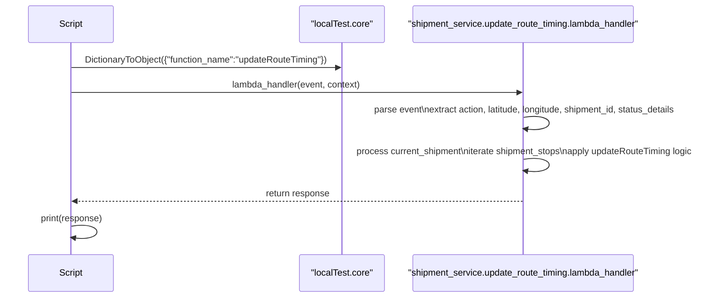
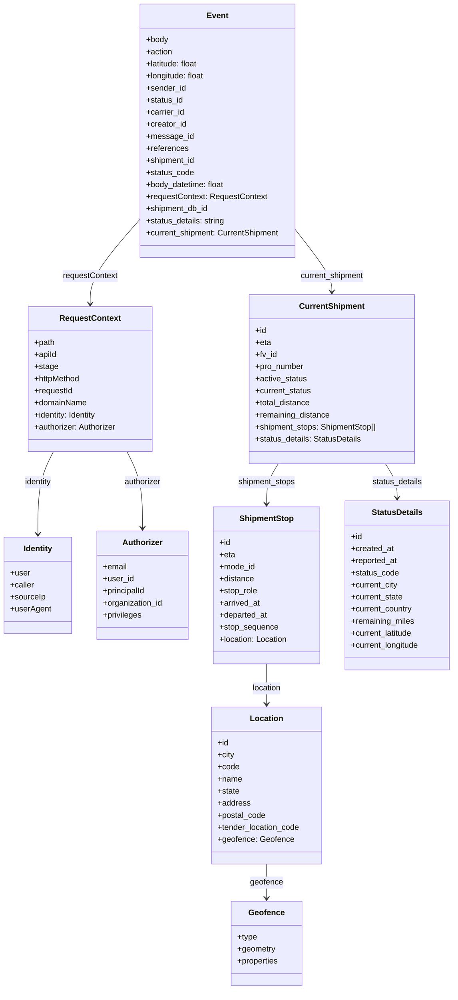

# Diagram: platform/tools/ide_local_testing/localTest/test/updateRouteTiming/updateRouteTiming.py

> Auto-generated by Obscura crawlers

## Diagram 1

### SVG

<svg id="container" width="1338.5" xmlns="http://www.w3.org/2000/svg" height="549" viewBox="-50 -10 1338.5 549" role="graphics-document document" aria-roledescription="sequence"><g><rect x="710" y="463" fill="#eaeaea" stroke="#666" width="439" height="65" name="Lambda" rx="3" ry="3" class="actor actor-bottom"></rect><text x="929.5" y="495.5" dominant-baseline="central" alignment-baseline="central" class="actor actor-box" style="text-anchor: middle; font-size: 16px; font-weight: 400;"><tspan x="929.5" dy="0">"shipment_service.update_route_timing.lambda_handler"</tspan></text></g><g><rect x="510" y="463" fill="#eaeaea" stroke="#666" width="150" height="65" name="LocalTestCore" rx="3" ry="3" class="actor actor-bottom"></rect><text x="585" y="495.5" dominant-baseline="central" alignment-baseline="central" class="actor actor-box" style="text-anchor: middle; font-size: 16px; font-weight: 400;"><tspan x="585" dy="0">"localTest.core"</tspan></text></g><g><rect x="0" y="463" fill="#eaeaea" stroke="#666" width="150" height="65" name="Script" rx="3" ry="3" class="actor actor-bottom"></rect><text x="75" y="495.5" dominant-baseline="central" alignment-baseline="central" class="actor actor-box" style="text-anchor: middle; font-size: 16px; font-weight: 400;"><tspan x="75" dy="0">Script</tspan></text></g><g><line id="actor2" x1="929.5" y1="65" x2="929.5" y2="463" class="actor-line 200" stroke-width="0.5px" stroke="#999" name="Lambda"></line><g id="root-2"><rect x="710" y="0" fill="#eaeaea" stroke="#666" width="439" height="65" name="Lambda" rx="3" ry="3" class="actor actor-top"></rect><text x="929.5" y="32.5" dominant-baseline="central" alignment-baseline="central" class="actor actor-box" style="text-anchor: middle; font-size: 16px; font-weight: 400;"><tspan x="929.5" dy="0">"shipment_service.update_route_timing.lambda_handler"</tspan></text></g></g><g><line id="actor1" x1="585" y1="65" x2="585" y2="463" class="actor-line 200" stroke-width="0.5px" stroke="#999" name="LocalTestCore"></line><g id="root-1"><rect x="510" y="0" fill="#eaeaea" stroke="#666" width="150" height="65" name="LocalTestCore" rx="3" ry="3" class="actor actor-top"></rect><text x="585" y="32.5" dominant-baseline="central" alignment-baseline="central" class="actor actor-box" style="text-anchor: middle; font-size: 16px; font-weight: 400;"><tspan x="585" dy="0">"localTest.core"</tspan></text></g></g><g><line id="actor0" x1="75" y1="65" x2="75" y2="463" class="actor-line 200" stroke-width="0.5px" stroke="#999" name="Script"></line><g id="root-0"><rect x="0" y="0" fill="#eaeaea" stroke="#666" width="150" height="65" name="Script" rx="3" ry="3" class="actor actor-top"></rect><text x="75" y="32.5" dominant-baseline="central" alignment-baseline="central" class="actor actor-box" style="text-anchor: middle; font-size: 16px; font-weight: 400;"><tspan x="75" dy="0">Script</tspan></text></g></g><g></g><defs><symbol id="computer" width="24" height="24"><path transform="scale(.5)" d="M2 2v13h20v-13h-20zm18 11h-16v-9h16v9zm-10.228 6l.466-1h3.524l.467 1h-4.457zm14.228 3h-24l2-6h2.104l-1.33 4h18.45l-1.297-4h2.073l2 6zm-5-10h-14v-7h14v7z"></path></symbol></defs><defs><symbol id="database" fill-rule="evenodd" clip-rule="evenodd"><path transform="scale(.5)" d="M12.258.001l.256.004.255.005.253.008.251.01.249.012.247.015.246.016.242.019.241.02.239.023.236.024.233.027.231.028.229.031.225.032.223.034.22.036.217.038.214.04.211.041.208.043.205.045.201.046.198.048.194.05.191.051.187.053.183.054.18.056.175.057.172.059.168.06.163.061.16.063.155.064.15.066.074.033.073.033.071.034.07.034.069.035.068.035.067.035.066.035.064.036.064.036.062.036.06.036.06.037.058.037.058.037.055.038.055.038.053.038.052.038.051.039.05.039.048.039.047.039.045.04.044.04.043.04.041.04.04.041.039.041.037.041.036.041.034.041.033.042.032.042.03.042.029.042.027.042.026.043.024.043.023.043.021.043.02.043.018.044.017.043.015.044.013.044.012.044.011.045.009.044.007.045.006.045.004.045.002.045.001.045v17l-.001.045-.002.045-.004.045-.006.045-.007.045-.009.044-.011.045-.012.044-.013.044-.015.044-.017.043-.018.044-.02.043-.021.043-.023.043-.024.043-.026.043-.027.042-.029.042-.03.042-.032.042-.033.042-.034.041-.036.041-.037.041-.039.041-.04.041-.041.04-.043.04-.044.04-.045.04-.047.039-.048.039-.05.039-.051.039-.052.038-.053.038-.055.038-.055.038-.058.037-.058.037-.06.037-.06.036-.062.036-.064.036-.064.036-.066.035-.067.035-.068.035-.069.035-.07.034-.071.034-.073.033-.074.033-.15.066-.155.064-.16.063-.163.061-.168.06-.172.059-.175.057-.18.056-.183.054-.187.053-.191.051-.194.05-.198.048-.201.046-.205.045-.208.043-.211.041-.214.04-.217.038-.22.036-.223.034-.225.032-.229.031-.231.028-.233.027-.236.024-.239.023-.241.02-.242.019-.246.016-.247.015-.249.012-.251.01-.253.008-.255.005-.256.004-.258.001-.258-.001-.256-.004-.255-.005-.253-.008-.251-.01-.249-.012-.247-.015-.245-.016-.243-.019-.241-.02-.238-.023-.236-.024-.234-.027-.231-.028-.228-.031-.226-.032-.223-.034-.22-.036-.217-.038-.214-.04-.211-.041-.208-.043-.204-.045-.201-.046-.198-.048-.195-.05-.19-.051-.187-.053-.184-.054-.179-.056-.176-.057-.172-.059-.167-.06-.164-.061-.159-.063-.155-.064-.151-.066-.074-.033-.072-.033-.072-.034-.07-.034-.069-.035-.068-.035-.067-.035-.066-.035-.064-.036-.063-.036-.062-.036-.061-.036-.06-.037-.058-.037-.057-.037-.056-.038-.055-.038-.053-.038-.052-.038-.051-.039-.049-.039-.049-.039-.046-.039-.046-.04-.044-.04-.043-.04-.041-.04-.04-.041-.039-.041-.037-.041-.036-.041-.034-.041-.033-.042-.032-.042-.03-.042-.029-.042-.027-.042-.026-.043-.024-.043-.023-.043-.021-.043-.02-.043-.018-.044-.017-.043-.015-.044-.013-.044-.012-.044-.011-.045-.009-.044-.007-.045-.006-.045-.004-.045-.002-.045-.001-.045v-17l.001-.045.002-.045.004-.045.006-.045.007-.045.009-.044.011-.045.012-.044.013-.044.015-.044.017-.043.018-.044.02-.043.021-.043.023-.043.024-.043.026-.043.027-.042.029-.042.03-.042.032-.042.033-.042.034-.041.036-.041.037-.041.039-.041.04-.041.041-.04.043-.04.044-.04.046-.04.046-.039.049-.039.049-.039.051-.039.052-.038.053-.038.055-.038.056-.038.057-.037.058-.037.06-.037.061-.036.062-.036.063-.036.064-.036.066-.035.067-.035.068-.035.069-.035.07-.034.072-.034.072-.033.074-.033.151-.066.155-.064.159-.063.164-.061.167-.06.172-.059.176-.057.179-.056.184-.054.187-.053.19-.051.195-.05.198-.048.201-.046.204-.045.208-.043.211-.041.214-.04.217-.038.22-.036.223-.034.226-.032.228-.031.231-.028.234-.027.236-.024.238-.023.241-.02.243-.019.245-.016.247-.015.249-.012.251-.01.253-.008.255-.005.256-.004.258-.001.258.001zm-9.258 20.499v.01l.001.021.003.021.004.022.005.021.006.022.007.022.009.023.01.022.011.023.012.023.013.023.015.023.016.024.017.023.018.024.019.024.021.024.022.025.023.024.024.025.052.049.056.05.061.051.066.051.07.051.075.051.079.052.084.052.088.052.092.052.097.052.102.051.105.052.11.052.114.051.119.051.123.051.127.05.131.05.135.05.139.048.144.049.147.047.152.047.155.047.16.045.163.045.167.043.171.043.176.041.178.041.183.039.187.039.19.037.194.035.197.035.202.033.204.031.209.03.212.029.216.027.219.025.222.024.226.021.23.02.233.018.236.016.24.015.243.012.246.01.249.008.253.005.256.004.259.001.26-.001.257-.004.254-.005.25-.008.247-.011.244-.012.241-.014.237-.016.233-.018.231-.021.226-.021.224-.024.22-.026.216-.027.212-.028.21-.031.205-.031.202-.034.198-.034.194-.036.191-.037.187-.039.183-.04.179-.04.175-.042.172-.043.168-.044.163-.045.16-.046.155-.046.152-.047.148-.048.143-.049.139-.049.136-.05.131-.05.126-.05.123-.051.118-.052.114-.051.11-.052.106-.052.101-.052.096-.052.092-.052.088-.053.083-.051.079-.052.074-.052.07-.051.065-.051.06-.051.056-.05.051-.05.023-.024.023-.025.021-.024.02-.024.019-.024.018-.024.017-.024.015-.023.014-.024.013-.023.012-.023.01-.023.01-.022.008-.022.006-.022.006-.022.004-.022.004-.021.001-.021.001-.021v-4.127l-.077.055-.08.053-.083.054-.085.053-.087.052-.09.052-.093.051-.095.05-.097.05-.1.049-.102.049-.105.048-.106.047-.109.047-.111.046-.114.045-.115.045-.118.044-.12.043-.122.042-.124.042-.126.041-.128.04-.13.04-.132.038-.134.038-.135.037-.138.037-.139.035-.142.035-.143.034-.144.033-.147.032-.148.031-.15.03-.151.03-.153.029-.154.027-.156.027-.158.026-.159.025-.161.024-.162.023-.163.022-.165.021-.166.02-.167.019-.169.018-.169.017-.171.016-.173.015-.173.014-.175.013-.175.012-.177.011-.178.01-.179.008-.179.008-.181.006-.182.005-.182.004-.184.003-.184.002h-.37l-.184-.002-.184-.003-.182-.004-.182-.005-.181-.006-.179-.008-.179-.008-.178-.01-.176-.011-.176-.012-.175-.013-.173-.014-.172-.015-.171-.016-.17-.017-.169-.018-.167-.019-.166-.02-.165-.021-.163-.022-.162-.023-.161-.024-.159-.025-.157-.026-.156-.027-.155-.027-.153-.029-.151-.03-.15-.03-.148-.031-.146-.032-.145-.033-.143-.034-.141-.035-.14-.035-.137-.037-.136-.037-.134-.038-.132-.038-.13-.04-.128-.04-.126-.041-.124-.042-.122-.042-.12-.044-.117-.043-.116-.045-.113-.045-.112-.046-.109-.047-.106-.047-.105-.048-.102-.049-.1-.049-.097-.05-.095-.05-.093-.052-.09-.051-.087-.052-.085-.053-.083-.054-.08-.054-.077-.054v4.127zm0-5.654v.011l.001.021.003.021.004.021.005.022.006.022.007.022.009.022.01.022.011.023.012.023.013.023.015.024.016.023.017.024.018.024.019.024.021.024.022.024.023.025.024.024.052.05.056.05.061.05.066.051.07.051.075.052.079.051.084.052.088.052.092.052.097.052.102.052.105.052.11.051.114.051.119.052.123.05.127.051.131.05.135.049.139.049.144.048.147.048.152.047.155.046.16.045.163.045.167.044.171.042.176.042.178.04.183.04.187.038.19.037.194.036.197.034.202.033.204.032.209.03.212.028.216.027.219.025.222.024.226.022.23.02.233.018.236.016.24.014.243.012.246.01.249.008.253.006.256.003.259.001.26-.001.257-.003.254-.006.25-.008.247-.01.244-.012.241-.015.237-.016.233-.018.231-.02.226-.022.224-.024.22-.025.216-.027.212-.029.21-.03.205-.032.202-.033.198-.035.194-.036.191-.037.187-.039.183-.039.179-.041.175-.042.172-.043.168-.044.163-.045.16-.045.155-.047.152-.047.148-.048.143-.048.139-.05.136-.049.131-.05.126-.051.123-.051.118-.051.114-.052.11-.052.106-.052.101-.052.096-.052.092-.052.088-.052.083-.052.079-.052.074-.051.07-.052.065-.051.06-.05.056-.051.051-.049.023-.025.023-.024.021-.025.02-.024.019-.024.018-.024.017-.024.015-.023.014-.023.013-.024.012-.022.01-.023.01-.023.008-.022.006-.022.006-.022.004-.021.004-.022.001-.021.001-.021v-4.139l-.077.054-.08.054-.083.054-.085.052-.087.053-.09.051-.093.051-.095.051-.097.05-.1.049-.102.049-.105.048-.106.047-.109.047-.111.046-.114.045-.115.044-.118.044-.12.044-.122.042-.124.042-.126.041-.128.04-.13.039-.132.039-.134.038-.135.037-.138.036-.139.036-.142.035-.143.033-.144.033-.147.033-.148.031-.15.03-.151.03-.153.028-.154.028-.156.027-.158.026-.159.025-.161.024-.162.023-.163.022-.165.021-.166.02-.167.019-.169.018-.169.017-.171.016-.173.015-.173.014-.175.013-.175.012-.177.011-.178.009-.179.009-.179.007-.181.007-.182.005-.182.004-.184.003-.184.002h-.37l-.184-.002-.184-.003-.182-.004-.182-.005-.181-.007-.179-.007-.179-.009-.178-.009-.176-.011-.176-.012-.175-.013-.173-.014-.172-.015-.171-.016-.17-.017-.169-.018-.167-.019-.166-.02-.165-.021-.163-.022-.162-.023-.161-.024-.159-.025-.157-.026-.156-.027-.155-.028-.153-.028-.151-.03-.15-.03-.148-.031-.146-.033-.145-.033-.143-.033-.141-.035-.14-.036-.137-.036-.136-.037-.134-.038-.132-.039-.13-.039-.128-.04-.126-.041-.124-.042-.122-.043-.12-.043-.117-.044-.116-.044-.113-.046-.112-.046-.109-.046-.106-.047-.105-.048-.102-.049-.1-.049-.097-.05-.095-.051-.093-.051-.09-.051-.087-.053-.085-.052-.083-.054-.08-.054-.077-.054v4.139zm0-5.666v.011l.001.02.003.022.004.021.005.022.006.021.007.022.009.023.01.022.011.023.012.023.013.023.015.023.016.024.017.024.018.023.019.024.021.025.022.024.023.024.024.025.052.05.056.05.061.05.066.051.07.051.075.052.079.051.084.052.088.052.092.052.097.052.102.052.105.051.11.052.114.051.119.051.123.051.127.05.131.05.135.05.139.049.144.048.147.048.152.047.155.046.16.045.163.045.167.043.171.043.176.042.178.04.183.04.187.038.19.037.194.036.197.034.202.033.204.032.209.03.212.028.216.027.219.025.222.024.226.021.23.02.233.018.236.017.24.014.243.012.246.01.249.008.253.006.256.003.259.001.26-.001.257-.003.254-.006.25-.008.247-.01.244-.013.241-.014.237-.016.233-.018.231-.02.226-.022.224-.024.22-.025.216-.027.212-.029.21-.03.205-.032.202-.033.198-.035.194-.036.191-.037.187-.039.183-.039.179-.041.175-.042.172-.043.168-.044.163-.045.16-.045.155-.047.152-.047.148-.048.143-.049.139-.049.136-.049.131-.051.126-.05.123-.051.118-.052.114-.051.11-.052.106-.052.101-.052.096-.052.092-.052.088-.052.083-.052.079-.052.074-.052.07-.051.065-.051.06-.051.056-.05.051-.049.023-.025.023-.025.021-.024.02-.024.019-.024.018-.024.017-.024.015-.023.014-.024.013-.023.012-.023.01-.022.01-.023.008-.022.006-.022.006-.022.004-.022.004-.021.001-.021.001-.021v-4.153l-.077.054-.08.054-.083.053-.085.053-.087.053-.09.051-.093.051-.095.051-.097.05-.1.049-.102.048-.105.048-.106.048-.109.046-.111.046-.114.046-.115.044-.118.044-.12.043-.122.043-.124.042-.126.041-.128.04-.13.039-.132.039-.134.038-.135.037-.138.036-.139.036-.142.034-.143.034-.144.033-.147.032-.148.032-.15.03-.151.03-.153.028-.154.028-.156.027-.158.026-.159.024-.161.024-.162.023-.163.023-.165.021-.166.02-.167.019-.169.018-.169.017-.171.016-.173.015-.173.014-.175.013-.175.012-.177.01-.178.01-.179.009-.179.007-.181.006-.182.006-.182.004-.184.003-.184.001-.185.001-.185-.001-.184-.001-.184-.003-.182-.004-.182-.006-.181-.006-.179-.007-.179-.009-.178-.01-.176-.01-.176-.012-.175-.013-.173-.014-.172-.015-.171-.016-.17-.017-.169-.018-.167-.019-.166-.02-.165-.021-.163-.023-.162-.023-.161-.024-.159-.024-.157-.026-.156-.027-.155-.028-.153-.028-.151-.03-.15-.03-.148-.032-.146-.032-.145-.033-.143-.034-.141-.034-.14-.036-.137-.036-.136-.037-.134-.038-.132-.039-.13-.039-.128-.041-.126-.041-.124-.041-.122-.043-.12-.043-.117-.044-.116-.044-.113-.046-.112-.046-.109-.046-.106-.048-.105-.048-.102-.048-.1-.05-.097-.049-.095-.051-.093-.051-.09-.052-.087-.052-.085-.053-.083-.053-.08-.054-.077-.054v4.153zm8.74-8.179l-.257.004-.254.005-.25.008-.247.011-.244.012-.241.014-.237.016-.233.018-.231.021-.226.022-.224.023-.22.026-.216.027-.212.028-.21.031-.205.032-.202.033-.198.034-.194.036-.191.038-.187.038-.183.04-.179.041-.175.042-.172.043-.168.043-.163.045-.16.046-.155.046-.152.048-.148.048-.143.048-.139.049-.136.05-.131.05-.126.051-.123.051-.118.051-.114.052-.11.052-.106.052-.101.052-.096.052-.092.052-.088.052-.083.052-.079.052-.074.051-.07.052-.065.051-.06.05-.056.05-.051.05-.023.025-.023.024-.021.024-.02.025-.019.024-.018.024-.017.023-.015.024-.014.023-.013.023-.012.023-.01.023-.01.022-.008.022-.006.023-.006.021-.004.022-.004.021-.001.021-.001.021.001.021.001.021.004.021.004.022.006.021.006.023.008.022.01.022.01.023.012.023.013.023.014.023.015.024.017.023.018.024.019.024.02.025.021.024.023.024.023.025.051.05.056.05.06.05.065.051.07.052.074.051.079.052.083.052.088.052.092.052.096.052.101.052.106.052.11.052.114.052.118.051.123.051.126.051.131.05.136.05.139.049.143.048.148.048.152.048.155.046.16.046.163.045.168.043.172.043.175.042.179.041.183.04.187.038.191.038.194.036.198.034.202.033.205.032.21.031.212.028.216.027.22.026.224.023.226.022.231.021.233.018.237.016.241.014.244.012.247.011.25.008.254.005.257.004.26.001.26-.001.257-.004.254-.005.25-.008.247-.011.244-.012.241-.014.237-.016.233-.018.231-.021.226-.022.224-.023.22-.026.216-.027.212-.028.21-.031.205-.032.202-.033.198-.034.194-.036.191-.038.187-.038.183-.04.179-.041.175-.042.172-.043.168-.043.163-.045.16-.046.155-.046.152-.048.148-.048.143-.048.139-.049.136-.05.131-.05.126-.051.123-.051.118-.051.114-.052.11-.052.106-.052.101-.052.096-.052.092-.052.088-.052.083-.052.079-.052.074-.051.07-.052.065-.051.06-.05.056-.05.051-.05.023-.025.023-.024.021-.024.02-.025.019-.024.018-.024.017-.023.015-.024.014-.023.013-.023.012-.023.01-.023.01-.022.008-.022.006-.023.006-.021.004-.022.004-.021.001-.021.001-.021-.001-.021-.001-.021-.004-.021-.004-.022-.006-.021-.006-.023-.008-.022-.01-.022-.01-.023-.012-.023-.013-.023-.014-.023-.015-.024-.017-.023-.018-.024-.019-.024-.02-.025-.021-.024-.023-.024-.023-.025-.051-.05-.056-.05-.06-.05-.065-.051-.07-.052-.074-.051-.079-.052-.083-.052-.088-.052-.092-.052-.096-.052-.101-.052-.106-.052-.11-.052-.114-.052-.118-.051-.123-.051-.126-.051-.131-.05-.136-.05-.139-.049-.143-.048-.148-.048-.152-.048-.155-.046-.16-.046-.163-.045-.168-.043-.172-.043-.175-.042-.179-.041-.183-.04-.187-.038-.191-.038-.194-.036-.198-.034-.202-.033-.205-.032-.21-.031-.212-.028-.216-.027-.22-.026-.224-.023-.226-.022-.231-.021-.233-.018-.237-.016-.241-.014-.244-.012-.247-.011-.25-.008-.254-.005-.257-.004-.26-.001-.26.001z"></path></symbol></defs><defs><symbol id="clock" width="24" height="24"><path transform="scale(.5)" d="M12 2c5.514 0 10 4.486 10 10s-4.486 10-10 10-10-4.486-10-10 4.486-10 10-10zm0-2c-6.627 0-12 5.373-12 12s5.373 12 12 12 12-5.373 12-12-5.373-12-12-12zm5.848 12.459c.202.038.202.333.001.372-1.907.361-6.045 1.111-6.547 1.111-.719 0-1.301-.582-1.301-1.301 0-.512.77-5.447 1.125-7.445.034-.192.312-.181.343.014l.985 6.238 5.394 1.011z"></path></symbol></defs><defs><marker id="arrowhead" refX="7.9" refY="5" markerUnits="userSpaceOnUse" markerWidth="12" markerHeight="12" orient="auto-start-reverse"><path d="M -1 0 L 10 5 L 0 10 z"></path></marker></defs><defs><marker id="crosshead" markerWidth="15" markerHeight="8" orient="auto" refX="4" refY="4.5"><path fill="none" stroke="#000000" stroke-width="1pt" d="M 1,2 L 6,7 M 6,2 L 1,7" style="stroke-dasharray: 0, 0;"></path></marker></defs><defs><marker id="filled-head" refX="15.5" refY="7" markerWidth="20" markerHeight="28" orient="auto"><path d="M 18,7 L9,13 L14,7 L9,1 Z"></path></marker></defs><defs><marker id="sequencenumber" refX="15" refY="15" markerWidth="60" markerHeight="40" orient="auto"><circle cx="15" cy="15" r="6"></circle></marker></defs><text x="329" y="80" text-anchor="middle" dominant-baseline="middle" alignment-baseline="middle" class="messageText" dy="1em" style="font-size: 16px; font-weight: 400;">DictionaryToObject({"function_name":"updateRouteTiming"})</text><line x1="76" y1="113" x2="581" y2="113" class="messageLine0" stroke-width="2" stroke="none" marker-end="url(#arrowhead)" style="fill: none;"></line><text x="501" y="128" text-anchor="middle" dominant-baseline="middle" alignment-baseline="middle" class="messageText" dy="1em" style="font-size: 16px; font-weight: 400;">lambda_handler(event, context)</text><line x1="76" y1="161" x2="925.5" y2="161" class="messageLine0" stroke-width="2" stroke="none" marker-end="url(#arrowhead)" style="fill: none;"></line><text x="931" y="176" text-anchor="middle" dominant-baseline="middle" alignment-baseline="middle" class="messageText" dy="1em" style="font-size: 16px; font-weight: 400;">parse event\nextract action, latitude, longitude, shipment_id, status_details</text><path d="M 930.5,209 C 990.5,199 990.5,239 930.5,229" class="messageLine0" stroke-width="2" stroke="none" marker-end="url(#arrowhead)" style="fill: none;"></path><text x="931" y="254" text-anchor="middle" dominant-baseline="middle" alignment-baseline="middle" class="messageText" dy="1em" style="font-size: 16px; font-weight: 400;">process current_shipment\niterate shipment_stops\napply updateRouteTiming logic</text><path d="M 930.5,287 C 990.5,277 990.5,317 930.5,307" class="messageLine0" stroke-width="2" stroke="none" marker-end="url(#arrowhead)" style="fill: none;"></path><text x="504" y="332" text-anchor="middle" dominant-baseline="middle" alignment-baseline="middle" class="messageText" dy="1em" style="font-size: 16px; font-weight: 400;">return response</text><line x1="928.5" y1="365" x2="79" y2="365" class="messageLine1" stroke-width="2" stroke="none" marker-end="url(#arrowhead)" style="stroke-dasharray: 3, 3; fill: none;"></line><text x="76" y="380" text-anchor="middle" dominant-baseline="middle" alignment-baseline="middle" class="messageText" dy="1em" style="font-size: 16px; font-weight: 400;">print(response)</text><path d="M 76,413 C 136,403 136,443 76,433" class="messageLine0" stroke-width="2" stroke="none" marker-end="url(#arrowhead)" style="fill: none;"></path></svg>

## Diagram 2

### SVG

<svg id="container" width="907.25" xmlns="http://www.w3.org/2000/svg" class="classDiagram" height="1968" viewBox="0 0 907.25 1968" role="graphics-document document" aria-roledescription="class"><g><defs><marker id="container_class-aggregationStart" class="marker aggregation class" refX="18" refY="7" markerWidth="190" markerHeight="240" orient="auto"><path d="M 18,7 L9,13 L1,7 L9,1 Z"></path></marker></defs><defs><marker id="container_class-aggregationEnd" class="marker aggregation class" refX="1" refY="7" markerWidth="20" markerHeight="28" orient="auto"><path d="M 18,7 L9,13 L1,7 L9,1 Z"></path></marker></defs><defs><marker id="container_class-extensionStart" class="marker extension class" refX="18" refY="7" markerWidth="190" markerHeight="240" orient="auto"><path d="M 1,7 L18,13 V 1 Z"></path></marker></defs><defs><marker id="container_class-extensionEnd" class="marker extension class" refX="1" refY="7" markerWidth="20" markerHeight="28" orient="auto"><path d="M 1,1 V 13 L18,7 Z"></path></marker></defs><defs><marker id="container_class-compositionStart" class="marker composition class" refX="18" refY="7" markerWidth="190" markerHeight="240" orient="auto"><path d="M 18,7 L9,13 L1,7 L9,1 Z"></path></marker></defs><defs><marker id="container_class-compositionEnd" class="marker composition class" refX="1" refY="7" markerWidth="20" markerHeight="28" orient="auto"><path d="M 18,7 L9,13 L1,7 L9,1 Z"></path></marker></defs><defs><marker id="container_class-dependencyStart" class="marker dependency class" refX="6" refY="7" markerWidth="190" markerHeight="240" orient="auto"><path d="M 5,7 L9,13 L1,7 L9,1 Z"></path></marker></defs><defs><marker id="container_class-dependencyEnd" class="marker dependency class" refX="13" refY="7" markerWidth="20" markerHeight="28" orient="auto"><path d="M 18,7 L9,13 L14,7 L9,1 Z"></path></marker></defs><defs><marker id="container_class-lollipopStart" class="marker lollipop class" refX="13" refY="7" markerWidth="190" markerHeight="240" orient="auto"><circle stroke="black" fill="transparent" cx="7" cy="7" r="6"></circle></marker></defs><defs><marker id="container_class-lollipopEnd" class="marker lollipop class" refX="1" refY="7" markerWidth="190" markerHeight="240" orient="auto"><circle stroke="black" fill="transparent" cx="7" cy="7" r="6"></circle></marker></defs><g class="root"><g class="clusters"></g><g class="edgePaths"><path d="M277.646,437.221L261.189,455.851C244.732,474.48,211.818,511.74,195.361,539.537C178.904,567.333,178.904,585.667,178.904,594.833L178.904,604" id="id_Event_RequestContext_1" class="edge-thickness-normal edge-pattern-solid relation" style=";;;" data-edge="true" data-et="edge" data-id="id_Event_RequestContext_1" data-points="W3sieCI6Mjc3LjY0NjQ4NDM3NSwieSI6NDM3LjIyMDYxMDUxMTgyMDA0fSx7IngiOjE3OC45MDQyOTY4NzUsInkiOjU0OX0seyJ4IjoxNzguOTA0Mjk2ODc1LCJ5Ijo2MTB9XQ==" marker-end="url(#container_class-dependencyEnd)"></path><path d="M105.742,898L100.577,908.167C95.412,918.333,85.081,938.667,79.915,966C74.75,993.333,74.75,1027.667,74.75,1044.833L74.75,1062" id="id_RequestContext_Identity_2" class="edge-thickness-normal edge-pattern-solid relation" style=";;;" data-edge="true" data-et="edge" data-id="id_RequestContext_Identity_2" data-points="W3sieCI6MTA1Ljc0MjI1NDE5MjA3MzE4LCJ5Ijo4OTh9LHsieCI6NzQuNzUsInkiOjk1OX0seyJ4Ijo3NC43NSwieSI6MTA2OH1d" marker-end="url(#container_class-dependencyEnd)"></path><path d="M252.066,898L257.232,908.167C262.397,918.333,272.728,938.667,277.893,964C283.059,989.333,283.059,1019.667,283.059,1034.833L283.059,1050" id="id_RequestContext_Authorizer_3" class="edge-thickness-normal edge-pattern-solid relation" style=";;;" data-edge="true" data-et="edge" data-id="id_RequestContext_Authorizer_3" data-points="W3sieCI6MjUyLjA2NjMzOTU1NzkyNjgyLCJ5Ijo4OTh9LHsieCI6MjgzLjA1ODU5Mzc1LCJ5Ijo5NTl9LHsieCI6MjgzLjA1ODU5Mzc1LCJ5IjoxMDU2fV0=" marker-end="url(#container_class-dependencyEnd)"></path><path d="M590.748,458.184L602.704,473.32C614.661,488.456,638.574,518.728,650.53,539.031C662.486,559.333,662.486,569.667,662.486,574.833L662.486,580" id="id_Event_CurrentShipment_4" class="edge-thickness-normal edge-pattern-solid relation" style=";;;" data-edge="true" data-et="edge" data-id="id_Event_CurrentShipment_4" data-points="W3sieCI6NTkwLjc0ODA0Njg3NSwieSI6NDU4LjE4MzcyMDYxMTg4ODd9LHsieCI6NjYyLjQ4NjMyODEyNSwieSI6NTQ5fSx7IngiOjY2Mi40ODYzMjgxMjUsInkiOjU4Nn1d" marker-end="url(#container_class-dependencyEnd)"></path><path d="M555.001,922L551.055,928.167C547.11,934.333,539.219,946.667,535.274,960C531.328,973.333,531.328,987.667,531.328,994.833L531.328,1002" id="id_CurrentShipment_ShipmentStop_5" class="edge-thickness-normal edge-pattern-solid relation" style=";;;" data-edge="true" data-et="edge" data-id="id_CurrentShipment_ShipmentStop_5" data-points="W3sieCI6NTU1LjAwMDU4MTE3Mzc4MDUsInkiOjkyMn0seyJ4Ijo1MzEuMzI4MTI1LCJ5Ijo5NTl9LHsieCI6NTMxLjMyODEyNSwieSI6MTAwOH1d" marker-end="url(#container_class-dependencyEnd)"></path><path d="M531.328,1320L531.328,1328.167C531.328,1336.333,531.328,1352.667,531.328,1366C531.328,1379.333,531.328,1389.667,531.328,1394.833L531.328,1400" id="id_ShipmentStop_Location_6" class="edge-thickness-normal edge-pattern-solid relation" style=";;;" data-edge="true" data-et="edge" data-id="id_ShipmentStop_Location_6" data-points="W3sieCI6NTMxLjMyODEyNSwieSI6MTMyMH0seyJ4Ijo1MzEuMzI4MTI1LCJ5IjoxMzY5fSx7IngiOjUzMS4zMjgxMjUsInkiOjE0MDZ9XQ==" marker-end="url(#container_class-dependencyEnd)"></path><path d="M531.328,1718L531.328,1724.167C531.328,1730.333,531.328,1742.667,531.328,1754C531.328,1765.333,531.328,1775.667,531.328,1780.833L531.328,1786" id="id_Location_Geofence_7" class="edge-thickness-normal edge-pattern-solid relation" style=";;;" data-edge="true" data-et="edge" data-id="id_Location_Geofence_7" data-points="W3sieCI6NTMxLjMyODEyNSwieSI6MTcxOH0seyJ4Ijo1MzEuMzI4MTI1LCJ5IjoxNzU1fSx7IngiOjUzMS4zMjgxMjUsInkiOjE3OTJ9XQ==" marker-end="url(#container_class-dependencyEnd)"></path><path d="M769.972,922L773.917,928.167C777.863,934.333,785.754,946.667,789.699,958C793.645,969.333,793.645,979.667,793.645,984.833L793.645,990" id="id_CurrentShipment_StatusDetails_8" class="edge-thickness-normal edge-pattern-solid relation" style=";;;" data-edge="true" data-et="edge" data-id="id_CurrentShipment_StatusDetails_8" data-points="W3sieCI6NzY5Ljk3MjA3NTA3NjIxOTUsInkiOjkyMn0seyJ4Ijo3OTMuNjQ0NTMxMjUsInkiOjk1OX0seyJ4Ijo3OTMuNjQ0NTMxMjUsInkiOjk5Nn1d" marker-end="url(#container_class-dependencyEnd)"></path></g><g class="edgeLabels"><g class="edgeLabel" transform="translate(178.904296875, 549)"><g class="label" data-id="id_Event_RequestContext_1" transform="translate(-55.140625, -12)"><foreignObject width="110.28125" height="24">

requestContext

</foreignObject></g></g><g class="edgeLabel" transform="translate(74.75, 959)"><g class="label" data-id="id_RequestContext_Identity_2" transform="translate(-28.0234375, -12)"><foreignObject width="56.046875" height="24">

identity

</foreignObject></g></g><g class="edgeLabel" transform="translate(283.05859375, 959)"><g class="label" data-id="id_RequestContext_Authorizer_3" transform="translate(-37.4921875, -12)"><foreignObject width="74.984375" height="24">

authorizer

</foreignObject></g></g><g class="edgeLabel" transform="translate(662.486328125, 549)"><g class="label" data-id="id_Event_CurrentShipment_4" transform="translate(-64.65625, -12)"><foreignObject width="129.3125" height="24">

current_shipment

</foreignObject></g></g><g class="edgeLabel" transform="translate(531.328125, 959)"><g class="label" data-id="id_CurrentShipment_ShipmentStop_5" transform="translate(-58.0546875, -12)"><foreignObject width="116.109375" height="24">

shipment_stops

</foreignObject></g></g><g class="edgeLabel" transform="translate(531.328125, 1369)"><g class="label" data-id="id_ShipmentStop_Location_6" transform="translate(-29.578125, -12)"><foreignObject width="59.15625" height="24">

location

</foreignObject></g></g><g class="edgeLabel" transform="translate(531.328125, 1755)"><g class="label" data-id="id_Location_Geofence_7" transform="translate(-32.7421875, -12)"><foreignObject width="65.484375" height="24">

geofence

</foreignObject></g></g><g class="edgeLabel" transform="translate(793.64453125, 959)"><g class="label" data-id="id_CurrentShipment_StatusDetails_8" transform="translate(-50.7109375, -12)"><foreignObject width="101.421875" height="24">

status_details

</foreignObject></g></g></g><g class="nodes"><g class="node default" id="classId-Event-0" transform="translate(434.197265625, 260)"><g class="basic label-container"><path d="M-156.55078125 -252 L156.55078125 -252 L156.55078125 252 L-156.55078125 252" stroke="none" stroke-width="0" fill="#ECECFF" style=""></path><path d="M-156.55078125 -252 C-81.05194225616633 -252, -5.553103262332655 -252, 156.55078125 -252 M-156.55078125 -252 C-78.1663092149988 -252, 0.21816282000239084 -252, 156.55078125 -252 M156.55078125 -252 C156.55078125 -88.61505239300791, 156.55078125 74.76989521398417, 156.55078125 252 M156.55078125 -252 C156.55078125 -121.9380030810392, 156.55078125 8.123993837921603, 156.55078125 252 M156.55078125 252 C37.20523617234318 252, -82.14030890531365 252, -156.55078125 252 M156.55078125 252 C43.39088572374857 252, -69.76900980250286 252, -156.55078125 252 M-156.55078125 252 C-156.55078125 94.5268420787981, -156.55078125 -62.946315842403806, -156.55078125 -252 M-156.55078125 252 C-156.55078125 99.24371236259503, -156.55078125 -53.51257527480993, -156.55078125 -252" stroke="#9370DB" stroke-width="1.3" fill="none" stroke-dasharray="0 0" style=""></path></g><g class="annotation-group text" transform="translate(0, -228)"></g><g class="label-group text" transform="translate(-20.2109375, -228)"><g class="label" style="font-weight: bolder" transform="translate(0,-12)"><foreignObject width="40.421875" height="24">

Event

</foreignObject></g></g><g class="members-group text" transform="translate(-144.55078125, -180)"><g class="label" style="" transform="translate(0,-12)"><foreignObject width="44.28125" height="24">

+body

</foreignObject></g><g class="label" style="" transform="translate(0,12)"><foreignObject width="53.109375" height="24">

+action

</foreignObject></g><g class="label" style="" transform="translate(0,36)"><foreignObject width="106.109375" height="24">

+latitude: float

</foreignObject></g><g class="label" style="" transform="translate(0,60)"><foreignObject width="118.65625" height="24">

+longitude: float

</foreignObject></g><g class="label" style="" transform="translate(0,84)"><foreignObject width="79.140625" height="24">

+sender_id

</foreignObject></g><g class="label" style="" transform="translate(0,108)"><foreignObject width="74.46875" height="24">

+status_id

</foreignObject></g><g class="label" style="" transform="translate(0,132)"><foreignObject width="77.0625" height="24">

+carrier_id

</foreignObject></g><g class="label" style="" transform="translate(0,156)"><foreignObject width="80.78125" height="24">

+creator_id

</foreignObject></g><g class="label" style="" transform="translate(0,180)"><foreignObject width="92.453125" height="24">

+message_id

</foreignObject></g><g class="label" style="" transform="translate(0,204)"><foreignObject width="83.640625" height="24">

+references

</foreignObject></g><g class="label" style="" transform="translate(0,228)"><foreignObject width="98.84375" height="24">

+shipment_id

</foreignObject></g><g class="label" style="" transform="translate(0,252)"><foreignObject width="95.03125" height="24">

+status_code

</foreignObject></g><g class="label" style="" transform="translate(0,276)"><foreignObject width="158.1875" height="24">

+body_datetime: float

</foreignObject></g><g class="label" style="" transform="translate(0,300)"><foreignObject width="240.421875" height="24">

+requestContext: RequestContext

</foreignObject></g><g class="label" style="" transform="translate(0,324)"><foreignObject width="125.59375" height="24">

+shipment_db_id

</foreignObject></g><g class="label" style="" transform="translate(0,348)"><foreignObject width="159.109375" height="24">

+status_details: string

</foreignObject></g><g class="label" style="" transform="translate(0,372)"><foreignObject width="268.890625" height="24">

+current_shipment: CurrentShipment

</foreignObject></g></g><g class="methods-group text" transform="translate(-144.55078125, 252)"></g><g class="divider" style=""><path d="M-156.55078125 -204 C-50.963429294343385 -204, 54.62392266131323 -204, 156.55078125 -204 M-156.55078125 -204 C-32.59341337875077 -204, 91.36395449249846 -204, 156.55078125 -204" stroke="#9370DB" stroke-width="1.3" fill="none" stroke-dasharray="0 0" style=""></path></g><g class="divider" style=""><path d="M-156.55078125 228 C-42.02706174137677 228, 72.49665776724646 228, 156.55078125 228 M-156.55078125 228 C-77.71428581990891 228, 1.122209610182182 228, 156.55078125 228" stroke="#9370DB" stroke-width="1.3" fill="none" stroke-dasharray="0 0" style=""></path></g></g><g class="node default" id="classId-RequestContext-1" transform="translate(178.904296875, 754)"><g class="basic label-container"><path d="M-124.27734375 -144 L124.27734375 -144 L124.27734375 144 L-124.27734375 144" stroke="none" stroke-width="0" fill="#ECECFF" style=""></path><path d="M-124.27734375 -144 C-58.10580501780798 -144, 8.065733714384038 -144, 124.27734375 -144 M-124.27734375 -144 C-26.966483529699957 -144, 70.34437669060009 -144, 124.27734375 -144 M124.27734375 -144 C124.27734375 -31.58107887143771, 124.27734375 80.83784225712458, 124.27734375 144 M124.27734375 -144 C124.27734375 -54.951397883866505, 124.27734375 34.09720423226699, 124.27734375 144 M124.27734375 144 C46.354701738512304 144, -31.56794027297539 144, -124.27734375 144 M124.27734375 144 C35.393149292955215 144, -53.49104516408957 144, -124.27734375 144 M-124.27734375 144 C-124.27734375 75.19718198347621, -124.27734375 6.394363966952426, -124.27734375 -144 M-124.27734375 144 C-124.27734375 31.587495385238896, -124.27734375 -80.82500922952221, -124.27734375 -144" stroke="#9370DB" stroke-width="1.3" fill="none" stroke-dasharray="0 0" style=""></path></g><g class="annotation-group text" transform="translate(0, -120)"></g><g class="label-group text" transform="translate(-58.1484375, -120)"><g class="label" style="font-weight: bolder" transform="translate(0,-12)"><foreignObject width="116.296875" height="24">

RequestContext

</foreignObject></g></g><g class="members-group text" transform="translate(-112.27734375, -72)"><g class="label" style="" transform="translate(0,-12)"><foreignObject width="41.1875" height="24">

+path

</foreignObject></g><g class="label" style="" transform="translate(0,12)"><foreignObject width="44.765625" height="24">

+apiId

</foreignObject></g><g class="label" style="" transform="translate(0,36)"><foreignObject width="46.453125" height="24">

+stage

</foreignObject></g><g class="label" style="" transform="translate(0,60)"><foreignObject width="93.65625" height="24">

+httpMethod

</foreignObject></g><g class="label" style="" transform="translate(0,84)"><foreignObject width="77.546875" height="24">

+requestId

</foreignObject></g><g class="label" style="" transform="translate(0,108)"><foreignObject width="105.265625" height="24">

+domainName

</foreignObject></g><g class="label" style="" transform="translate(0,132)"><foreignObject width="128.40625" height="24">

+identity: Identity

</foreignObject></g><g class="label" style="" transform="translate(0,156)"><foreignObject width="166.40625" height="24">

+authorizer: Authorizer

</foreignObject></g></g><g class="methods-group text" transform="translate(-112.27734375, 144)"></g><g class="divider" style=""><path d="M-124.27734375 -96 C-43.614469468435516 -96, 37.04840481312897 -96, 124.27734375 -96 M-124.27734375 -96 C-45.68031586091912 -96, 32.916712028161754 -96, 124.27734375 -96" stroke="#9370DB" stroke-width="1.3" fill="none" stroke-dasharray="0 0" style=""></path></g><g class="divider" style=""><path d="M-124.27734375 120 C-71.81033364612018 120, -19.34332354224037 120, 124.27734375 120 M-124.27734375 120 C-36.58809500371714 120, 51.101153742565714 120, 124.27734375 120" stroke="#9370DB" stroke-width="1.3" fill="none" stroke-dasharray="0 0" style=""></path></g></g><g class="node default" id="classId-Identity-2" transform="translate(74.75, 1164)"><g class="basic label-container"><path d="M-66.75 -96 L66.75 -96 L66.75 96 L-66.75 96" stroke="none" stroke-width="0" fill="#ECECFF" style=""></path><path d="M-66.75 -96 C-13.375947484762527 -96, 39.998105030474946 -96, 66.75 -96 M-66.75 -96 C-37.26533963841962 -96, -7.78067927683923 -96, 66.75 -96 M66.75 -96 C66.75 -36.636986149358165, 66.75 22.72602770128367, 66.75 96 M66.75 -96 C66.75 -21.005186132062434, 66.75 53.98962773587513, 66.75 96 M66.75 96 C18.340335259773262 96, -30.069329480453476 96, -66.75 96 M66.75 96 C13.587564501052697 96, -39.57487099789461 96, -66.75 96 M-66.75 96 C-66.75 51.71452194063057, -66.75 7.429043881261137, -66.75 -96 M-66.75 96 C-66.75 33.80295970014632, -66.75 -28.394080599707365, -66.75 -96" stroke="#9370DB" stroke-width="1.3" fill="none" stroke-dasharray="0 0" style=""></path></g><g class="annotation-group text" transform="translate(0, -72)"></g><g class="label-group text" transform="translate(-28.71875, -72)"><g class="label" style="font-weight: bolder" transform="translate(0,-12)"><foreignObject width="57.4375" height="24">

Identity

</foreignObject></g></g><g class="members-group text" transform="translate(-54.75, -24)"><g class="label" style="" transform="translate(0,-12)"><foreignObject width="39.671875" height="24">

+user

</foreignObject></g><g class="label" style="" transform="translate(0,12)"><foreignObject width="48.21875" height="24">

+caller

</foreignObject></g><g class="label" style="" transform="translate(0,36)"><foreignObject width="70.09375" height="24">

+sourceIp

</foreignObject></g><g class="label" style="" transform="translate(0,60)"><foreignObject width="80.78125" height="24">

+userAgent

</foreignObject></g></g><g class="methods-group text" transform="translate(-54.75, 96)"></g><g class="divider" style=""><path d="M-66.75 -48 C-28.546586713661895 -48, 9.65682657267621 -48, 66.75 -48 M-66.75 -48 C-16.700627496268268 -48, 33.348745007463464 -48, 66.75 -48" stroke="#9370DB" stroke-width="1.3" fill="none" stroke-dasharray="0 0" style=""></path></g><g class="divider" style=""><path d="M-66.75 72 C-16.934889403084988 72, 32.880221193830025 72, 66.75 72 M-66.75 72 C-30.408916160468635 72, 5.932167679062729 72, 66.75 72" stroke="#9370DB" stroke-width="1.3" fill="none" stroke-dasharray="0 0" style=""></path></g></g><g class="node default" id="classId-Authorizer-3" transform="translate(283.05859375, 1164)"><g class="basic label-container"><path d="M-91.55859375 -108 L91.55859375 -108 L91.55859375 108 L-91.55859375 108" stroke="none" stroke-width="0" fill="#ECECFF" style=""></path><path d="M-91.55859375 -108 C-20.435474753074473 -108, 50.687644243851054 -108, 91.55859375 -108 M-91.55859375 -108 C-38.330237870954996 -108, 14.898118008090009 -108, 91.55859375 -108 M91.55859375 -108 C91.55859375 -56.511868705112185, 91.55859375 -5.023737410224371, 91.55859375 108 M91.55859375 -108 C91.55859375 -23.91810986674038, 91.55859375 60.16378026651924, 91.55859375 108 M91.55859375 108 C22.8042890533723 108, -45.9500156432554 108, -91.55859375 108 M91.55859375 108 C54.04686792935744 108, 16.53514210871488 108, -91.55859375 108 M-91.55859375 108 C-91.55859375 24.127026015358993, -91.55859375 -59.745947969282014, -91.55859375 -108 M-91.55859375 108 C-91.55859375 63.85902516586168, -91.55859375 19.71805033172336, -91.55859375 -108" stroke="#9370DB" stroke-width="1.3" fill="none" stroke-dasharray="0 0" style=""></path></g><g class="annotation-group text" transform="translate(0, -84)"></g><g class="label-group text" transform="translate(-38.3671875, -84)"><g class="label" style="font-weight: bolder" transform="translate(0,-12)"><foreignObject width="76.734375" height="24">

Authorizer

</foreignObject></g></g><g class="members-group text" transform="translate(-79.55859375, -36)"><g class="label" style="" transform="translate(0,-12)"><foreignObject width="48.328125" height="24">

+email

</foreignObject></g><g class="label" style="" transform="translate(0,12)"><foreignObject width="60.796875" height="24">

+user_id

</foreignObject></g><g class="label" style="" transform="translate(0,36)"><foreignObject width="86.578125" height="24">

+principalId

</foreignObject></g><g class="label" style="" transform="translate(0,60)"><foreignObject width="120.75" height="24">

+organization_id

</foreignObject></g><g class="label" style="" transform="translate(0,84)"><foreignObject width="78.15625" height="24">

+privileges

</foreignObject></g></g><g class="methods-group text" transform="translate(-79.55859375, 108)"></g><g class="divider" style=""><path d="M-91.55859375 -60 C-33.54922390479877 -60, 24.460145940402455 -60, 91.55859375 -60 M-91.55859375 -60 C-35.39854122653197 -60, 20.761511296936064 -60, 91.55859375 -60" stroke="#9370DB" stroke-width="1.3" fill="none" stroke-dasharray="0 0" style=""></path></g><g class="divider" style=""><path d="M-91.55859375 84 C-24.025060521276984 84, 43.50847270744603 84, 91.55859375 84 M-91.55859375 84 C-23.794187238372203 84, 43.970219273255594 84, 91.55859375 84" stroke="#9370DB" stroke-width="1.3" fill="none" stroke-dasharray="0 0" style=""></path></g></g><g class="node default" id="classId-CurrentShipment-4" transform="translate(662.486328125, 754)"><g class="basic label-container"><path d="M-165.859375 -168 L165.859375 -168 L165.859375 168 L-165.859375 168" stroke="none" stroke-width="0" fill="#ECECFF" style=""></path><path d="M-165.859375 -168 C-47.29438770495558 -168, 71.27059959008884 -168, 165.859375 -168 M-165.859375 -168 C-59.694755826341705 -168, 46.46986334731659 -168, 165.859375 -168 M165.859375 -168 C165.859375 -61.17979721928994, 165.859375 45.640405561420124, 165.859375 168 M165.859375 -168 C165.859375 -86.76139486167985, 165.859375 -5.522789723359693, 165.859375 168 M165.859375 168 C84.0065116245013 168, 2.1536482490026003 168, -165.859375 168 M165.859375 168 C37.06390900875937 168, -91.73155698248127 168, -165.859375 168 M-165.859375 168 C-165.859375 58.56696681263105, -165.859375 -50.8660663747379, -165.859375 -168 M-165.859375 168 C-165.859375 46.54046674429125, -165.859375 -74.9190665114175, -165.859375 -168" stroke="#9370DB" stroke-width="1.3" fill="none" stroke-dasharray="0 0" style=""></path></g><g class="annotation-group text" transform="translate(0, -144)"></g><g class="label-group text" transform="translate(-62.453125, -144)"><g class="label" style="font-weight: bolder" transform="translate(0,-12)"><foreignObject width="124.90625" height="24">

CurrentShipment

</foreignObject></g></g><g class="members-group text" transform="translate(-153.859375, -96)"><g class="label" style="" transform="translate(0,-12)"><foreignObject width="22.078125" height="24">

+id

</foreignObject></g><g class="label" style="" transform="translate(0,12)"><foreignObject width="31.078125" height="24">

+eta

</foreignObject></g><g class="label" style="" transform="translate(0,36)"><foreignObject width="42.90625" height="24">

+fv_id

</foreignObject></g><g class="label" style="" transform="translate(0,60)"><foreignObject width="97.34375" height="24">

+pro_number

</foreignObject></g><g class="label" style="" transform="translate(0,84)"><foreignObject width="103.3125" height="24">

+active_status

</foreignObject></g><g class="label" style="" transform="translate(0,108)"><foreignObject width="113.25" height="24">

+current_status

</foreignObject></g><g class="label" style="" transform="translate(0,132)"><foreignObject width="111.03125" height="24">

+total_distance

</foreignObject></g><g class="label" style="" transform="translate(0,156)"><foreignObject width="150.328125" height="24">

+remaining_distance

</foreignObject></g><g class="label" style="" transform="translate(0,180)"><foreignObject width="245.265625" height="24">

+shipment_stops: ShipmentStop[]

</foreignObject></g><g class="label" style="" transform="translate(0,204)"><foreignObject width="213.1875" height="24">

+status_details: StatusDetails

</foreignObject></g></g><g class="methods-group text" transform="translate(-153.859375, 168)"></g><g class="divider" style=""><path d="M-165.859375 -120 C-79.04935082999438 -120, 7.7606733400112375 -120, 165.859375 -120 M-165.859375 -120 C-74.67327030490637 -120, 16.512834390187265 -120, 165.859375 -120" stroke="#9370DB" stroke-width="1.3" fill="none" stroke-dasharray="0 0" style=""></path></g><g class="divider" style=""><path d="M-165.859375 144 C-58.28255224577599 144, 49.29427050844802 144, 165.859375 144 M-165.859375 144 C-49.915706385006374 144, 66.02796222998725 144, 165.859375 144" stroke="#9370DB" stroke-width="1.3" fill="none" stroke-dasharray="0 0" style=""></path></g></g><g class="node default" id="classId-ShipmentStop-5" transform="translate(531.328125, 1164)"><g class="basic label-container"><path d="M-106.7109375 -156 L106.7109375 -156 L106.7109375 156 L-106.7109375 156" stroke="none" stroke-width="0" fill="#ECECFF" style=""></path><path d="M-106.7109375 -156 C-38.19257268614881 -156, 30.325792127702385 -156, 106.7109375 -156 M-106.7109375 -156 C-23.030494475193947 -156, 60.649948549612105 -156, 106.7109375 -156 M106.7109375 -156 C106.7109375 -41.57772013344385, 106.7109375 72.8445597331123, 106.7109375 156 M106.7109375 -156 C106.7109375 -53.88815921138054, 106.7109375 48.22368157723892, 106.7109375 156 M106.7109375 156 C30.716857894860723 156, -45.27722171027855 156, -106.7109375 156 M106.7109375 156 C46.6943138233131 156, -13.322309853373795 156, -106.7109375 156 M-106.7109375 156 C-106.7109375 49.098269320297916, -106.7109375 -57.80346135940417, -106.7109375 -156 M-106.7109375 156 C-106.7109375 57.129718834532156, -106.7109375 -41.74056233093569, -106.7109375 -156" stroke="#9370DB" stroke-width="1.3" fill="none" stroke-dasharray="0 0" style=""></path></g><g class="annotation-group text" transform="translate(0, -132)"></g><g class="label-group text" transform="translate(-52.078125, -132)"><g class="label" style="font-weight: bolder" transform="translate(0,-12)"><foreignObject width="104.15625" height="24">

ShipmentStop

</foreignObject></g></g><g class="members-group text" transform="translate(-94.7109375, -84)"><g class="label" style="" transform="translate(0,-12)"><foreignObject width="22.078125" height="24">

+id

</foreignObject></g><g class="label" style="" transform="translate(0,12)"><foreignObject width="31.078125" height="24">

+eta

</foreignObject></g><g class="label" style="" transform="translate(0,36)"><foreignObject width="71.421875" height="24">

+mode_id

</foreignObject></g><g class="label" style="" transform="translate(0,60)"><foreignObject width="69.34375" height="24">

+distance

</foreignObject></g><g class="label" style="" transform="translate(0,84)"><foreignObject width="76.21875" height="24">

+stop_role

</foreignObject></g><g class="label" style="" transform="translate(0,108)"><foreignObject width="81.890625" height="24">

+arrived_at

</foreignObject></g><g class="label" style="" transform="translate(0,132)"><foreignObject width="96.8125" height="24">

+departed_at

</foreignObject></g><g class="label" style="" transform="translate(0,156)"><foreignObject width="117.0625" height="24">

+stop_sequence

</foreignObject></g><g class="label" style="" transform="translate(0,180)"><foreignObject width="137.34375" height="24">

+location: Location

</foreignObject></g></g><g class="methods-group text" transform="translate(-94.7109375, 156)"></g><g class="divider" style=""><path d="M-106.7109375 -108 C-60.080824695907765 -108, -13.45071189181553 -108, 106.7109375 -108 M-106.7109375 -108 C-43.187919089392466 -108, 20.33509932121507 -108, 106.7109375 -108" stroke="#9370DB" stroke-width="1.3" fill="none" stroke-dasharray="0 0" style=""></path></g><g class="divider" style=""><path d="M-106.7109375 132 C-56.78155574835887 132, -6.852173996717738 132, 106.7109375 132 M-106.7109375 132 C-25.098713537652884 132, 56.51351042469423 132, 106.7109375 132" stroke="#9370DB" stroke-width="1.3" fill="none" stroke-dasharray="0 0" style=""></path></g></g><g class="node default" id="classId-Location-6" transform="translate(531.328125, 1562)"><g class="basic label-container"><path d="M-110.17578125 -156 L110.17578125 -156 L110.17578125 156 L-110.17578125 156" stroke="none" stroke-width="0" fill="#ECECFF" style=""></path><path d="M-110.17578125 -156 C-22.08015966512933 -156, 66.01546191974134 -156, 110.17578125 -156 M-110.17578125 -156 C-65.92377091335032 -156, -21.67176057670065 -156, 110.17578125 -156 M110.17578125 -156 C110.17578125 -83.97972380268503, 110.17578125 -11.959447605370059, 110.17578125 156 M110.17578125 -156 C110.17578125 -78.57679548952062, 110.17578125 -1.1535909790412404, 110.17578125 156 M110.17578125 156 C26.353784679817068 156, -57.468211890365865 156, -110.17578125 156 M110.17578125 156 C50.91480623959741 156, -8.346168770805178 156, -110.17578125 156 M-110.17578125 156 C-110.17578125 43.38100500558029, -110.17578125 -69.23798998883942, -110.17578125 -156 M-110.17578125 156 C-110.17578125 36.51397485791192, -110.17578125 -82.97205028417616, -110.17578125 -156" stroke="#9370DB" stroke-width="1.3" fill="none" stroke-dasharray="0 0" style=""></path></g><g class="annotation-group text" transform="translate(0, -132)"></g><g class="label-group text" transform="translate(-31.3515625, -132)"><g class="label" style="font-weight: bolder" transform="translate(0,-12)"><foreignObject width="62.703125" height="24">

Location

</foreignObject></g></g><g class="members-group text" transform="translate(-98.17578125, -84)"><g class="label" style="" transform="translate(0,-12)"><foreignObject width="22.078125" height="24">

+id

</foreignObject></g><g class="label" style="" transform="translate(0,12)"><foreignObject width="33.71875" height="24">

+city

</foreignObject></g><g class="label" style="" transform="translate(0,36)"><foreignObject width="42.953125" height="24">

+code

</foreignObject></g><g class="label" style="" transform="translate(0,60)"><foreignObject width="48.5" height="24">

+name

</foreignObject></g><g class="label" style="" transform="translate(0,84)"><foreignObject width="44.09375" height="24">

+state

</foreignObject></g><g class="label" style="" transform="translate(0,108)"><foreignObject width="64.796875" height="24">

+address

</foreignObject></g><g class="label" style="" transform="translate(0,132)"><foreignObject width="96.171875" height="24">

+postal_code

</foreignObject></g><g class="label" style="" transform="translate(0,156)"><foreignObject width="165" height="24">

+tender_location_code

</foreignObject></g><g class="label" style="" transform="translate(0,180)"><foreignObject width="149.046875" height="24">

+geofence: Geofence

</foreignObject></g></g><g class="methods-group text" transform="translate(-98.17578125, 156)"></g><g class="divider" style=""><path d="M-110.17578125 -108 C-26.62060227314886 -108, 56.93457670370228 -108, 110.17578125 -108 M-110.17578125 -108 C-49.51134347260295 -108, 11.153094304794095 -108, 110.17578125 -108" stroke="#9370DB" stroke-width="1.3" fill="none" stroke-dasharray="0 0" style=""></path></g><g class="divider" style=""><path d="M-110.17578125 132 C-54.7158212430969 132, 0.7441387638062054 132, 110.17578125 132 M-110.17578125 132 C-36.6020699274474 132, 36.971641395105195 132, 110.17578125 132" stroke="#9370DB" stroke-width="1.3" fill="none" stroke-dasharray="0 0" style=""></path></g></g><g class="node default" id="classId-Geofence-7" transform="translate(531.328125, 1876)"><g class="basic label-container"><path d="M-70.78125 -84 L70.78125 -84 L70.78125 84 L-70.78125 84" stroke="none" stroke-width="0" fill="#ECECFF" style=""></path><path d="M-70.78125 -84 C-35.22399613235213 -84, 0.33325773529574576 -84, 70.78125 -84 M-70.78125 -84 C-38.0630204729382 -84, -5.344790945876397 -84, 70.78125 -84 M70.78125 -84 C70.78125 -30.692268330979097, 70.78125 22.615463338041806, 70.78125 84 M70.78125 -84 C70.78125 -29.642645495755573, 70.78125 24.714709008488853, 70.78125 84 M70.78125 84 C15.87817349713719 84, -39.02490300572562 84, -70.78125 84 M70.78125 84 C33.147126641705576 84, -4.486996716588848 84, -70.78125 84 M-70.78125 84 C-70.78125 24.233948310043303, -70.78125 -35.532103379913394, -70.78125 -84 M-70.78125 84 C-70.78125 22.2654067649257, -70.78125 -39.4691864701486, -70.78125 -84" stroke="#9370DB" stroke-width="1.3" fill="none" stroke-dasharray="0 0" style=""></path></g><g class="annotation-group text" transform="translate(0, -60)"></g><g class="label-group text" transform="translate(-34.140625, -60)"><g class="label" style="font-weight: bolder" transform="translate(0,-12)"><foreignObject width="68.28125" height="24">

Geofence

</foreignObject></g></g><g class="members-group text" transform="translate(-58.78125, -12)"><g class="label" style="" transform="translate(0,-12)"><foreignObject width="39.703125" height="24">

+type

</foreignObject></g><g class="label" style="" transform="translate(0,12)"><foreignObject width="76.375" height="24">

+geometry

</foreignObject></g><g class="label" style="" transform="translate(0,36)"><foreignObject width="83.421875" height="24">

+properties

</foreignObject></g></g><g class="methods-group text" transform="translate(-58.78125, 84)"></g><g class="divider" style=""><path d="M-70.78125 -36 C-32.165338243602804 -36, 6.450573512794392 -36, 70.78125 -36 M-70.78125 -36 C-32.817573548454924 -36, 5.146102903090153 -36, 70.78125 -36" stroke="#9370DB" stroke-width="1.3" fill="none" stroke-dasharray="0 0" style=""></path></g><g class="divider" style=""><path d="M-70.78125 60 C-31.58516423042662 60, 7.610921539146759 60, 70.78125 60 M-70.78125 60 C-24.308091397707216 60, 22.16506720458557 60, 70.78125 60" stroke="#9370DB" stroke-width="1.3" fill="none" stroke-dasharray="0 0" style=""></path></g></g><g class="node default" id="classId-StatusDetails-8" transform="translate(793.64453125, 1164)"><g class="basic label-container"><path d="M-105.60546875 -168 L105.60546875 -168 L105.60546875 168 L-105.60546875 168" stroke="none" stroke-width="0" fill="#ECECFF" style=""></path><path d="M-105.60546875 -168 C-54.73599743248474 -168, -3.8665261149694743 -168, 105.60546875 -168 M-105.60546875 -168 C-46.371135530454765 -168, 12.86319768909047 -168, 105.60546875 -168 M105.60546875 -168 C105.60546875 -77.67642121523646, 105.60546875 12.647157569527081, 105.60546875 168 M105.60546875 -168 C105.60546875 -92.87226778608711, 105.60546875 -17.744535572174215, 105.60546875 168 M105.60546875 168 C25.746965595844472 168, -54.111537558311056 168, -105.60546875 168 M105.60546875 168 C29.080060703624554 168, -47.44534734275089 168, -105.60546875 168 M-105.60546875 168 C-105.60546875 59.31857885285258, -105.60546875 -49.362842294294836, -105.60546875 -168 M-105.60546875 168 C-105.60546875 91.73476358500156, -105.60546875 15.469527170003118, -105.60546875 -168" stroke="#9370DB" stroke-width="1.3" fill="none" stroke-dasharray="0 0" style=""></path></g><g class="annotation-group text" transform="translate(0, -144)"></g><g class="label-group text" transform="translate(-48.9765625, -144)"><g class="label" style="font-weight: bolder" transform="translate(0,-12)"><foreignObject width="97.953125" height="24">

StatusDetails

</foreignObject></g></g><g class="members-group text" transform="translate(-93.60546875, -96)"><g class="label" style="" transform="translate(0,-12)"><foreignObject width="22.078125" height="24">

+id

</foreignObject></g><g class="label" style="" transform="translate(0,12)"><foreignObject width="84.90625" height="24">

+created_at

</foreignObject></g><g class="label" style="" transform="translate(0,36)"><foreignObject width="93.734375" height="24">

+reported_at

</foreignObject></g><g class="label" style="" transform="translate(0,60)"><foreignObject width="95.03125" height="24">

+status_code

</foreignObject></g><g class="label" style="" transform="translate(0,84)"><foreignObject width="94.265625" height="24">

+current_city

</foreignObject></g><g class="label" style="" transform="translate(0,108)"><foreignObject width="104.953125" height="24">

+current_state

</foreignObject></g><g class="label" style="" transform="translate(0,132)"><foreignObject width="123.71875" height="24">

+current_country

</foreignObject></g><g class="label" style="" transform="translate(0,156)"><foreignObject width="128.328125" height="24">

+remaining_miles

</foreignObject></g><g class="label" style="" transform="translate(0,180)"><foreignObject width="125.671875" height="24">

+current_latitude

</foreignObject></g><g class="label" style="" transform="translate(0,204)"><foreignObject width="138.234375" height="24">

+current_longitude

</foreignObject></g></g><g class="methods-group text" transform="translate(-93.60546875, 168)"></g><g class="divider" style=""><path d="M-105.60546875 -120 C-45.92731458469948 -120, 13.750839580601038 -120, 105.60546875 -120 M-105.60546875 -120 C-58.79177750758359 -120, -11.978086265167178 -120, 105.60546875 -120" stroke="#9370DB" stroke-width="1.3" fill="none" stroke-dasharray="0 0" style=""></path></g><g class="divider" style=""><path d="M-105.60546875 144 C-40.464462746795434 144, 24.676543256409133 144, 105.60546875 144 M-105.60546875 144 C-57.335456298103715 144, -9.06544384620743 144, 105.60546875 144" stroke="#9370DB" stroke-width="1.3" fill="none" stroke-dasharray="0 0" style=""></path></g></g></g></g></g></svg>
