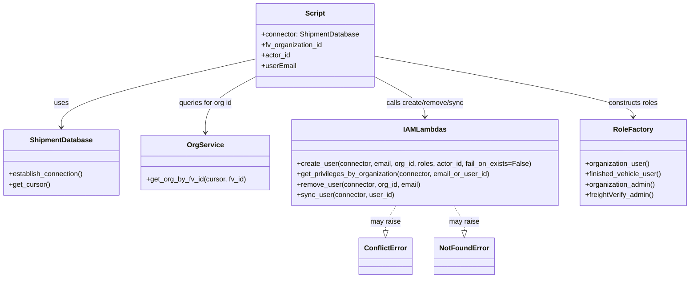
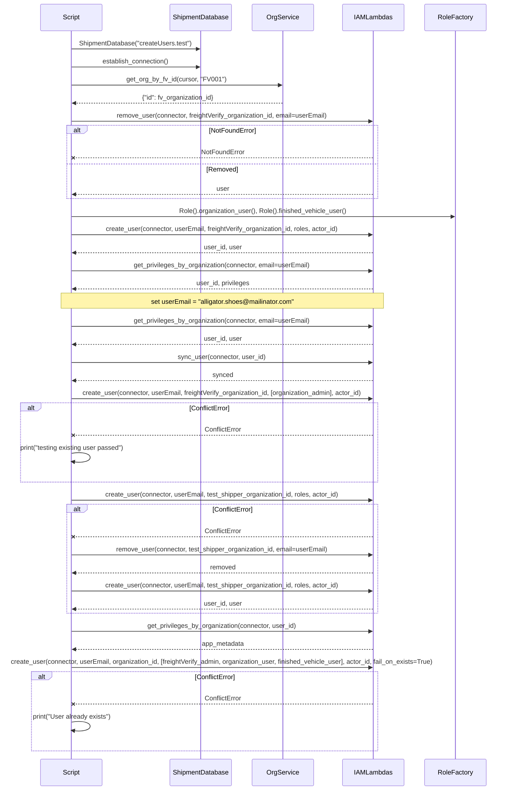

# Diagram: platform/tools/ide_local_testing/localTest/test/user/createUser.py


> Auto-generated by Obscura crawlers

## Diagram 1



### SVG

<svg id="container" width="1575.7578125" xmlns="http://www.w3.org/2000/svg" class="classDiagram" height="638" viewBox="0 0 1575.7578125 638" role="graphics-document document" aria-roledescription="class"><style>#container{font-family:"trebuchet ms",verdana,arial,sans-serif;font-size:16px;fill:#333;}@keyframes edge-animation-frame{from{stroke-dashoffset:0;}}@keyframes dash{to{stroke-dashoffset:0;}}#container .edge-animation-slow{stroke-dasharray:9,5!important;stroke-dashoffset:900;animation:dash 50s linear infinite;stroke-linecap:round;}#container .edge-animation-fast{stroke-dasharray:9,5!important;stroke-dashoffset:900;animation:dash 20s linear infinite;stroke-linecap:round;}#container .error-icon{fill:#552222;}#container .error-text{fill:#552222;stroke:#552222;}#container .edge-thickness-normal{stroke-width:1px;}#container .edge-thickness-thick{stroke-width:3.5px;}#container .edge-pattern-solid{stroke-dasharray:0;}#container .edge-thickness-invisible{stroke-width:0;fill:none;}#container .edge-pattern-dashed{stroke-dasharray:3;}#container .edge-pattern-dotted{stroke-dasharray:2;}#container .marker{fill:#333333;stroke:#333333;}#container .marker.cross{stroke:#333333;}#container svg{font-family:"trebuchet ms",verdana,arial,sans-serif;font-size:16px;}#container p{margin:0;}#container g.classGroup text{fill:#9370DB;stroke:none;font-family:"trebuchet ms",verdana,arial,sans-serif;font-size:10px;}#container g.classGroup text .title{font-weight:bolder;}#container .nodeLabel,#container .edgeLabel{color:#131300;}#container .edgeLabel .label rect{fill:#ECECFF;}#container .label text{fill:#131300;}#container .labelBkg{background:#ECECFF;}#container .edgeLabel .label span{background:#ECECFF;}#container .classTitle{font-weight:bolder;}#container .node rect,#container .node circle,#container .node ellipse,#container .node polygon,#container .node path{fill:#ECECFF;stroke:#9370DB;stroke-width:1px;}#container .divider{stroke:#9370DB;stroke-width:1;}#container g.clickable{cursor:pointer;}#container g.classGroup rect{fill:#ECECFF;stroke:#9370DB;}#container g.classGroup line{stroke:#9370DB;stroke-width:1;}#container .classLabel .box{stroke:none;stroke-width:0;fill:#ECECFF;opacity:0.5;}#container .classLabel .label{fill:#9370DB;font-size:10px;}#container .relation{stroke:#333333;stroke-width:1;fill:none;}#container .dashed-line{stroke-dasharray:3;}#container .dotted-line{stroke-dasharray:1 2;}#container #compositionStart,#container .composition{fill:#333333!important;stroke:#333333!important;stroke-width:1;}#container #compositionEnd,#container .composition{fill:#333333!important;stroke:#333333!important;stroke-width:1;}#container #dependencyStart,#container .dependency{fill:#333333!important;stroke:#333333!important;stroke-width:1;}#container #dependencyStart,#container .dependency{fill:#333333!important;stroke:#333333!important;stroke-width:1;}#container #extensionStart,#container .extension{fill:transparent!important;stroke:#333333!important;stroke-width:1;}#container #extensionEnd,#container .extension{fill:transparent!important;stroke:#333333!important;stroke-width:1;}#container #aggregationStart,#container .aggregation{fill:transparent!important;stroke:#333333!important;stroke-width:1;}#container #aggregationEnd,#container .aggregation{fill:transparent!important;stroke:#333333!important;stroke-width:1;}#container #lollipopStart,#container .lollipop{fill:#ECECFF!important;stroke:#333333!important;stroke-width:1;}#container #lollipopEnd,#container .lollipop{fill:#ECECFF!important;stroke:#333333!important;stroke-width:1;}#container .edgeTerminals{font-size:11px;line-height:initial;}#container .classTitleText{text-anchor:middle;font-size:18px;fill:#333;}#container .label-icon{display:inline-block;height:1em;overflow:visible;vertical-align:-0.125em;}#container .node .label-icon path{fill:currentColor;stroke:revert;stroke-width:revert;}#container :root{--mermaid-font-family:"trebuchet ms",verdana,arial,sans-serif;}</style><g><defs><marker id="container_class-aggregationStart" class="marker aggregation class" refX="18" refY="7" markerWidth="190" markerHeight="240" orient="auto"><path d="M 18,7 L9,13 L1,7 L9,1 Z"></path></marker></defs><defs><marker id="container_class-aggregationEnd" class="marker aggregation class" refX="1" refY="7" markerWidth="20" markerHeight="28" orient="auto"><path d="M 18,7 L9,13 L1,7 L9,1 Z"></path></marker></defs><defs><marker id="container_class-extensionStart" class="marker extension class" refX="18" refY="7" markerWidth="190" markerHeight="240" orient="auto"><path d="M 1,7 L18,13 V 1 Z"></path></marker></defs><defs><marker id="container_class-extensionEnd" class="marker extension class" refX="1" refY="7" markerWidth="20" markerHeight="28" orient="auto"><path d="M 1,1 V 13 L18,7 Z"></path></marker></defs><defs><marker id="container_class-compositionStart" class="marker composition class" refX="18" refY="7" markerWidth="190" markerHeight="240" orient="auto"><path d="M 18,7 L9,13 L1,7 L9,1 Z"></path></marker></defs><defs><marker id="container_class-compositionEnd" class="marker composition class" refX="1" refY="7" markerWidth="20" markerHeight="28" orient="auto"><path d="M 18,7 L9,13 L1,7 L9,1 Z"></path></marker></defs><defs><marker id="container_class-dependencyStart" class="marker dependency class" refX="6" refY="7" markerWidth="190" markerHeight="240" orient="auto"><path d="M 5,7 L9,13 L1,7 L9,1 Z"></path></marker></defs><defs><marker id="container_class-dependencyEnd" class="marker dependency class" refX="13" refY="7" markerWidth="20" markerHeight="28" orient="auto"><path d="M 18,7 L9,13 L14,7 L9,1 Z"></path></marker></defs><defs><marker id="container_class-lollipopStart" class="marker lollipop class" refX="13" refY="7" markerWidth="190" markerHeight="240" orient="auto"><circle stroke="black" fill="transparent" cx="7" cy="7" r="6"></circle></marker></defs><defs><marker id="container_class-lollipopEnd" class="marker lollipop class" refX="1" refY="7" markerWidth="190" markerHeight="240" orient="auto"><circle stroke="black" fill="transparent" cx="7" cy="7" r="6"></circle></marker></defs><g class="root"><g class="clusters"></g><g class="edgePaths"><path d="M585.121,135.178L511.146,152.149C437.171,169.119,289.22,203.059,215.245,229.196C141.27,255.333,141.27,273.667,141.27,282.833L141.27,292" id="id_Script_ShipmentDatabase_1" class="edge-thickness-normal edge-pattern-solid relation" style=";;;" data-edge="true" data-et="edge" data-id="id_Script_ShipmentDatabase_1" data-points="W3sieCI6NTg1LjEyMTA5Mzc1LCJ5IjoxMzUuMTc4NDEzODE0OTQyODR9LHsieCI6MTQxLjI2OTUzMTI1LCJ5IjoyMzd9LHsieCI6MTQxLjI2OTUzMTI1LCJ5IjoyOTh9XQ==" marker-end="url(#container_class-dependencyEnd)"></path><path d="M585.121,176.2L566.046,186.334C546.971,196.467,508.822,216.733,489.747,238.033C470.672,259.333,470.672,281.667,470.672,292.833L470.672,304" id="id_Script_OrgService_2" class="edge-thickness-normal edge-pattern-solid relation" style=";;;" data-edge="true" data-et="edge" data-id="id_Script_OrgService_2" data-points="W3sieCI6NTg1LjEyMTA5Mzc1LCJ5IjoxNzYuMjAwNDE1MDI4Mzk2NjZ9LHsieCI6NDcwLjY3MTg3NSwieSI6MjM3fSx7IngiOjQ3MC42NzE4NzUsInkiOjMxMH1d" marker-end="url(#container_class-dependencyEnd)"></path><path d="M856.941,176.2L876.016,186.334C895.091,196.467,933.241,216.733,952.316,232.033C971.391,247.333,971.391,257.667,971.391,262.833L971.391,268" id="id_Script_IAMLambdas_3" class="edge-thickness-normal edge-pattern-solid relation" style=";;;" data-edge="true" data-et="edge" data-id="id_Script_IAMLambdas_3" data-points="W3sieCI6ODU2Ljk0MTQwNjI1LCJ5IjoxNzYuMjAwNDE1MDI4Mzk2NjZ9LHsieCI6OTcxLjM5MDYyNSwieSI6MjM3fSx7IngiOjk3MS4zOTA2MjUsInkiOjI3NH1d" marker-end="url(#container_class-dependencyEnd)"></path><path d="M856.941,128.904L955.262,146.92C1053.583,164.936,1250.225,200.968,1348.546,224.151C1446.867,247.333,1446.867,257.667,1446.867,262.833L1446.867,268" id="id_Script_RoleFactory_4" class="edge-thickness-normal edge-pattern-solid relation" style=";;;" data-edge="true" data-et="edge" data-id="id_Script_RoleFactory_4" data-points="W3sieCI6ODU2Ljk0MTQwNjI1LCJ5IjoxMjguOTAzNzY5MzYwNzU4NjJ9LHsieCI6MTQ0Ni44NjcxODc1LCJ5IjoyMzd9LHsieCI6MTQ0Ni44NjcxODc1LCJ5IjoyNzR9XQ==" marker-end="url(#container_class-dependencyEnd)"></path><path d="M908.179,472L904.242,478.167C900.304,484.333,892.43,496.667,888.492,506.125C884.555,515.583,884.555,522.167,884.555,525.458L884.555,528.75" id="id_IAMLambdas_ConflictError_5" class="edge-thickness-normal edge-pattern-dashed relation" style=";;;" data-edge="true" data-et="edge" data-id="id_IAMLambdas_ConflictError_5" data-points="W3sieCI6OTA4LjE3OTE3MDQ5NjMyMzUsInkiOjQ3Mn0seyJ4Ijo4ODQuNTU0Njg3NSwieSI6NTA5fSx7IngiOjg4NC41NTQ2ODc1LCJ5Ijo1NDZ9XQ==" marker-end="url(#container_class-extensionEnd)"></path><path d="M1034.602,472L1038.539,478.167C1042.477,484.333,1050.352,496.667,1054.289,506.125C1058.227,515.583,1058.227,522.167,1058.227,525.458L1058.227,528.75" id="id_IAMLambdas_NotFoundError_6" class="edge-thickness-normal edge-pattern-dashed relation" style=";;;" data-edge="true" data-et="edge" data-id="id_IAMLambdas_NotFoundError_6" data-points="W3sieCI6MTAzNC42MDIwNzk1MDM2NzY2LCJ5Ijo0NzJ9LHsieCI6MTA1OC4yMjY1NjI1LCJ5Ijo1MDl9LHsieCI6MTA1OC4yMjY1NjI1LCJ5Ijo1NDZ9XQ==" marker-end="url(#container_class-extensionEnd)"></path></g><g class="edgeLabels"><g class="edgeLabel" transform="translate(141.26953125, 237)"><g class="label" data-id="id_Script_ShipmentDatabase_1" transform="translate(-16.4921875, -12)"><foreignObject width="32.984375" height="24"><div xmlns="http://www.w3.org/1999/xhtml" class="labelBkg" style="display: table-cell; white-space: nowrap; line-height: 1.5; max-width: 200px; text-align: center;"><span class="edgeLabel"><p>uses</p></span></div></foreignObject></g></g><g class="edgeLabel" transform="translate(470.671875, 237)"><g class="label" data-id="id_Script_OrgService_2" transform="translate(-62.8046875, -12)"><foreignObject width="125.609375" height="24"><div xmlns="http://www.w3.org/1999/xhtml" class="labelBkg" style="display: table-cell; white-space: nowrap; line-height: 1.5; max-width: 200px; text-align: center;"><span class="edgeLabel"><p>queries for org id</p></span></div></foreignObject></g></g><g class="edgeLabel" transform="translate(971.390625, 237)"><g class="label" data-id="id_Script_IAMLambdas_3" transform="translate(-91.8515625, -12)"><foreignObject width="183.703125" height="24"><div xmlns="http://www.w3.org/1999/xhtml" class="labelBkg" style="display: table-cell; white-space: nowrap; line-height: 1.5; max-width: 200px; text-align: center;"><span class="edgeLabel"><p>calls create/remove/sync</p></span></div></foreignObject></g></g><g class="edgeLabel" transform="translate(1446.8671875, 237)"><g class="label" data-id="id_Script_RoleFactory_4" transform="translate(-57.8828125, -12)"><foreignObject width="115.765625" height="24"><div xmlns="http://www.w3.org/1999/xhtml" class="labelBkg" style="display: table-cell; white-space: nowrap; line-height: 1.5; max-width: 200px; text-align: center;"><span class="edgeLabel"><p>constructs roles</p></span></div></foreignObject></g></g><g class="edgeLabel" transform="translate(884.5546875, 509)"><g class="label" data-id="id_IAMLambdas_ConflictError_5" transform="translate(-34.65625, -12)"><foreignObject width="69.3125" height="24"><div xmlns="http://www.w3.org/1999/xhtml" class="labelBkg" style="display: table-cell; white-space: nowrap; line-height: 1.5; max-width: 200px; text-align: center;"><span class="edgeLabel"><p>may raise</p></span></div></foreignObject></g></g><g class="edgeLabel" transform="translate(1058.2265625, 509)"><g class="label" data-id="id_IAMLambdas_NotFoundError_6" transform="translate(-34.65625, -12)"><foreignObject width="69.3125" height="24"><div xmlns="http://www.w3.org/1999/xhtml" class="labelBkg" style="display: table-cell; white-space: nowrap; line-height: 1.5; max-width: 200px; text-align: center;"><span class="edgeLabel"><p>may raise</p></span></div></foreignObject></g></g></g><g class="nodes"><g class="node default" id="classId-Script-0" transform="translate(721.03125, 104)"><g class="basic label-container"><path d="M-135.91015625 -96 L135.91015625 -96 L135.91015625 96 L-135.91015625 96" stroke="none" stroke-width="0" fill="#ECECFF" style=""></path><path d="M-135.91015625 -96 C-58.530075605592586 -96, 18.850005038814828 -96, 135.91015625 -96 M-135.91015625 -96 C-66.25005692024219 -96, 3.4100424095156256 -96, 135.91015625 -96 M135.91015625 -96 C135.91015625 -55.42675126412918, 135.91015625 -14.85350252825836, 135.91015625 96 M135.91015625 -96 C135.91015625 -54.0721468266305, 135.91015625 -12.144293653261002, 135.91015625 96 M135.91015625 96 C37.834788179401556 96, -60.24057989119689 96, -135.91015625 96 M135.91015625 96 C30.974848746337216 96, -73.96045875732557 96, -135.91015625 96 M-135.91015625 96 C-135.91015625 48.595769218107506, -135.91015625 1.191538436215012, -135.91015625 -96 M-135.91015625 96 C-135.91015625 32.60031717266175, -135.91015625 -30.799365654676507, -135.91015625 -96" stroke="#9370DB" stroke-width="1.3" fill="none" stroke-dasharray="0 0" style=""></path></g><g class="annotation-group text" transform="translate(0, -72)"></g><g class="label-group text" transform="translate(-21.7421875, -72)"><g class="label" style="font-weight: bolder" transform="translate(0,-12)"><foreignObject width="43.484375" height="24"><div xmlns="http://www.w3.org/1999/xhtml" style="display: table-cell; white-space: nowrap; line-height: 1.5; max-width: 93px; text-align: center;"><span class="nodeLabel markdown-node-label" style=""><p>Script</p></span></div></foreignObject></g></g><g class="members-group text" transform="translate(-123.91015625, -24)"><g class="label" style="" transform="translate(0,-12)"><foreignObject width="226.078125" height="24"><div xmlns="http://www.w3.org/1999/xhtml" style="display: table-cell; white-space: nowrap; line-height: 1.5; max-width: 283px; text-align: center;"><span class="nodeLabel markdown-node-label" style=""><p>+connector: ShipmentDatabase</p></span></div></foreignObject></g><g class="label" style="" transform="translate(0,12)"><foreignObject width="141.25" height="24"><div xmlns="http://www.w3.org/1999/xhtml" style="display: table-cell; white-space: nowrap; line-height: 1.5; max-width: 199px; text-align: center;"><span class="nodeLabel markdown-node-label" style=""><p>+fv_organization_id</p></span></div></foreignObject></g><g class="label" style="" transform="translate(0,36)"><foreignObject width="66.28125" height="24"><div xmlns="http://www.w3.org/1999/xhtml" style="display: table-cell; white-space: nowrap; line-height: 1.5; max-width: 124px; text-align: center;"><span class="nodeLabel markdown-node-label" style=""><p>+actor_id</p></span></div></foreignObject></g><g class="label" style="" transform="translate(0,60)"><foreignObject width="79.6875" height="24"><div xmlns="http://www.w3.org/1999/xhtml" style="display: table-cell; white-space: nowrap; line-height: 1.5; max-width: 137px; text-align: center;"><span class="nodeLabel markdown-node-label" style=""><p>+userEmail</p></span></div></foreignObject></g></g><g class="methods-group text" transform="translate(-123.91015625, 96)"></g><g class="divider" style=""><path d="M-135.91015625 -48 C-51.51014883012199 -48, 32.88985858975602 -48, 135.91015625 -48 M-135.91015625 -48 C-72.33626407601662 -48, -8.762371902033223 -48, 135.91015625 -48" stroke="#9370DB" stroke-width="1.3" fill="none" stroke-dasharray="0 0" style=""></path></g><g class="divider" style=""><path d="M-135.91015625 72 C-31.468903521033738 72, 72.97234920793252 72, 135.91015625 72 M-135.91015625 72 C-73.61487600262627 72, -11.31959575525255 72, 135.91015625 72" stroke="#9370DB" stroke-width="1.3" fill="none" stroke-dasharray="0 0" style=""></path></g></g><g class="node default" id="classId-ShipmentDatabase-1" transform="translate(141.26953125, 373)"><g class="basic label-container"><path d="M-133.26953125 -75 L133.26953125 -75 L133.26953125 75 L-133.26953125 75" stroke="none" stroke-width="0" fill="#ECECFF" style=""></path><path d="M-133.26953125 -75 C-56.61223647111237 -75, 20.045058307775264 -75, 133.26953125 -75 M-133.26953125 -75 C-51.46278038954644 -75, 30.343970470907124 -75, 133.26953125 -75 M133.26953125 -75 C133.26953125 -28.33716560830684, 133.26953125 18.32566878338632, 133.26953125 75 M133.26953125 -75 C133.26953125 -16.277370962543372, 133.26953125 42.445258074913255, 133.26953125 75 M133.26953125 75 C33.56272079995571 75, -66.14408965008857 75, -133.26953125 75 M133.26953125 75 C52.07061188991362 75, -29.128307470172757 75, -133.26953125 75 M-133.26953125 75 C-133.26953125 32.400316781982006, -133.26953125 -10.199366436035987, -133.26953125 -75 M-133.26953125 75 C-133.26953125 20.557970048279287, -133.26953125 -33.884059903441425, -133.26953125 -75" stroke="#9370DB" stroke-width="1.3" fill="none" stroke-dasharray="0 0" style=""></path></g><g class="annotation-group text" transform="translate(0, -51)"></g><g class="label-group text" transform="translate(-69.2734375, -51)"><g class="label" style="font-weight: bolder" transform="translate(0,-12)"><foreignObject width="138.546875" height="24"><div xmlns="http://www.w3.org/1999/xhtml" style="display: table-cell; white-space: nowrap; line-height: 1.5; max-width: 187px; text-align: center;"><span class="nodeLabel markdown-node-label" style=""><p>ShipmentDatabase</p></span></div></foreignObject></g></g><g class="members-group text" transform="translate(-121.26953125, -3)"></g><g class="methods-group text" transform="translate(-121.26953125, 27)"><g class="label" style="" transform="translate(0,-12)"><foreignObject width="173.265625" height="24"><div xmlns="http://www.w3.org/1999/xhtml" style="display: table-cell; white-space: nowrap; line-height: 1.5; max-width: 231px; text-align: center;"><span class="nodeLabel markdown-node-label" style=""><p>+establish_connection()</p></span></div></foreignObject></g><g class="label" style="" transform="translate(0,12)"><foreignObject width="94.640625" height="24"><div xmlns="http://www.w3.org/1999/xhtml" style="display: table-cell; white-space: nowrap; line-height: 1.5; max-width: 152px; text-align: center;"><span class="nodeLabel markdown-node-label" style=""><p>+get_cursor()</p></span></div></foreignObject></g></g><g class="divider" style=""><path d="M-133.26953125 -27 C-27.573286914637777 -27, 78.12295742072445 -27, 133.26953125 -27 M-133.26953125 -27 C-58.90679146695446 -27, 15.455948316091082 -27, 133.26953125 -27" stroke="#9370DB" stroke-width="1.3" fill="none" stroke-dasharray="0 0" style=""></path></g><g class="divider" style=""><path d="M-133.26953125 -3 C-68.05491033463639 -3, -2.8402894192727786 -3, 133.26953125 -3 M-133.26953125 -3 C-30.5675605641688 -3, 72.1344101216624 -3, 133.26953125 -3" stroke="#9370DB" stroke-width="1.3" fill="none" stroke-dasharray="0 0" style=""></path></g></g><g class="node default" id="classId-OrgService-2" transform="translate(470.671875, 373)"><g class="basic label-container"><path d="M-146.1328125 -63 L146.1328125 -63 L146.1328125 63 L-146.1328125 63" stroke="none" stroke-width="0" fill="#ECECFF" style=""></path><path d="M-146.1328125 -63 C-70.5012701596442 -63, 5.130272180711586 -63, 146.1328125 -63 M-146.1328125 -63 C-61.276672129182884 -63, 23.57946824163423 -63, 146.1328125 -63 M146.1328125 -63 C146.1328125 -28.870042640220724, 146.1328125 5.259914719558552, 146.1328125 63 M146.1328125 -63 C146.1328125 -36.81140903714014, 146.1328125 -10.622818074280268, 146.1328125 63 M146.1328125 63 C39.949118708875915 63, -66.23457508224817 63, -146.1328125 63 M146.1328125 63 C47.70671373420468 63, -50.71938503159063 63, -146.1328125 63 M-146.1328125 63 C-146.1328125 29.934081423167342, -146.1328125 -3.131837153665316, -146.1328125 -63 M-146.1328125 63 C-146.1328125 25.111075842687008, -146.1328125 -12.777848314625984, -146.1328125 -63" stroke="#9370DB" stroke-width="1.3" fill="none" stroke-dasharray="0 0" style=""></path></g><g class="annotation-group text" transform="translate(0, -39)"></g><g class="label-group text" transform="translate(-39.703125, -39)"><g class="label" style="font-weight: bolder" transform="translate(0,-12)"><foreignObject width="79.40625" height="24"><div xmlns="http://www.w3.org/1999/xhtml" style="display: table-cell; white-space: nowrap; line-height: 1.5; max-width: 127px; text-align: center;"><span class="nodeLabel markdown-node-label" style=""><p>OrgService</p></span></div></foreignObject></g></g><g class="members-group text" transform="translate(-134.1328125, 9)"></g><g class="methods-group text" transform="translate(-134.1328125, 39)"><g class="label" style="" transform="translate(0,-12)"><foreignObject width="228.5625" height="24"><div xmlns="http://www.w3.org/1999/xhtml" style="display: table-cell; white-space: nowrap; line-height: 1.5; max-width: 286px; text-align: center;"><span class="nodeLabel markdown-node-label" style=""><p>+get_org_by_fv_id(cursor, fv_id)</p></span></div></foreignObject></g></g><g class="divider" style=""><path d="M-146.1328125 -15 C-67.18598426883182 -15, 11.760843962336367 -15, 146.1328125 -15 M-146.1328125 -15 C-36.00960315660413 -15, 74.11360618679174 -15, 146.1328125 -15" stroke="#9370DB" stroke-width="1.3" fill="none" stroke-dasharray="0 0" style=""></path></g><g class="divider" style=""><path d="M-146.1328125 9 C-30.65894630447515 9, 84.8149198910497 9, 146.1328125 9 M-146.1328125 9 C-63.31716329852141 9, 19.498485902957185 9, 146.1328125 9" stroke="#9370DB" stroke-width="1.3" fill="none" stroke-dasharray="0 0" style=""></path></g></g><g class="node default" id="classId-IAMLambdas-3" transform="translate(971.390625, 373)"><g class="basic label-container"><path d="M-304.5859375 -99 L304.5859375 -99 L304.5859375 99 L-304.5859375 99" stroke="none" stroke-width="0" fill="#ECECFF" style=""></path><path d="M-304.5859375 -99 C-119.26754497249698 -99, 66.05084755500604 -99, 304.5859375 -99 M-304.5859375 -99 C-68.44710796635323 -99, 167.69172156729354 -99, 304.5859375 -99 M304.5859375 -99 C304.5859375 -34.730345413932326, 304.5859375 29.539309172135347, 304.5859375 99 M304.5859375 -99 C304.5859375 -30.01327139491478, 304.5859375 38.97345721017044, 304.5859375 99 M304.5859375 99 C146.43639104870212 99, -11.71315540259576 99, -304.5859375 99 M304.5859375 99 C85.56157955714548 99, -133.46277838570904 99, -304.5859375 99 M-304.5859375 99 C-304.5859375 22.841048472484914, -304.5859375 -53.31790305503017, -304.5859375 -99 M-304.5859375 99 C-304.5859375 52.83385798725674, -304.5859375 6.667715974513484, -304.5859375 -99" stroke="#9370DB" stroke-width="1.3" fill="none" stroke-dasharray="0 0" style=""></path></g><g class="annotation-group text" transform="translate(0, -75)"></g><g class="label-group text" transform="translate(-46.265625, -75)"><g class="label" style="font-weight: bolder" transform="translate(0,-12)"><foreignObject width="92.53125" height="24"><div xmlns="http://www.w3.org/1999/xhtml" style="display: table-cell; white-space: nowrap; line-height: 1.5; max-width: 142px; text-align: center;"><span class="nodeLabel markdown-node-label" style=""><p>IAMLambdas</p></span></div></foreignObject></g></g><g class="members-group text" transform="translate(-292.5859375, -27)"></g><g class="methods-group text" transform="translate(-292.5859375, 3)"><g class="label" style="" transform="translate(0,-12)"><foreignObject width="538.90625" height="24"><div xmlns="http://www.w3.org/1999/xhtml" style="display: table-cell; white-space: nowrap; line-height: 1.5; max-width: 596px; text-align: center;"><span class="nodeLabel markdown-node-label" style=""><p>+create_user(connector, email, org_id, roles, actor_id, fail_on_exists=False)</p></span></div></foreignObject></g><g class="label" style="" transform="translate(0,12)"><foreignObject width="445.609375" height="24"><div xmlns="http://www.w3.org/1999/xhtml" style="display: table-cell; white-space: nowrap; line-height: 1.5; max-width: 503px; text-align: center;"><span class="nodeLabel markdown-node-label" style=""><p>+get_privileges_by_organization(connector, email_or_user_id)</p></span></div></foreignObject></g><g class="label" style="" transform="translate(0,36)"><foreignObject width="285.78125" height="24"><div xmlns="http://www.w3.org/1999/xhtml" style="display: table-cell; white-space: nowrap; line-height: 1.5; max-width: 343px; text-align: center;"><span class="nodeLabel markdown-node-label" style=""><p>+remove_user(connector, org_id, email)</p></span></div></foreignObject></g><g class="label" style="" transform="translate(0,60)"><foreignObject width="222.578125" height="24"><div xmlns="http://www.w3.org/1999/xhtml" style="display: table-cell; white-space: nowrap; line-height: 1.5; max-width: 280px; text-align: center;"><span class="nodeLabel markdown-node-label" style=""><p>+sync_user(connector, user_id)</p></span></div></foreignObject></g></g><g class="divider" style=""><path d="M-304.5859375 -51 C-172.0127692178574 -51, -39.43960093571479 -51, 304.5859375 -51 M-304.5859375 -51 C-170.3869520024233 -51, -36.1879665048466 -51, 304.5859375 -51" stroke="#9370DB" stroke-width="1.3" fill="none" stroke-dasharray="0 0" style=""></path></g><g class="divider" style=""><path d="M-304.5859375 -27 C-182.33167755207302 -27, -60.077417604146035 -27, 304.5859375 -27 M-304.5859375 -27 C-122.44867506809706 -27, 59.68858736380588 -27, 304.5859375 -27" stroke="#9370DB" stroke-width="1.3" fill="none" stroke-dasharray="0 0" style=""></path></g></g><g class="node default" id="classId-RoleFactory-4" transform="translate(1446.8671875, 373)"><g class="basic label-container"><path d="M-120.890625 -99 L120.890625 -99 L120.890625 99 L-120.890625 99" stroke="none" stroke-width="0" fill="#ECECFF" style=""></path><path d="M-120.890625 -99 C-34.92827874955218 -99, 51.034067500895645 -99, 120.890625 -99 M-120.890625 -99 C-34.43912426307514 -99, 52.01237647384971 -99, 120.890625 -99 M120.890625 -99 C120.890625 -27.3694655666785, 120.890625 44.261068866643, 120.890625 99 M120.890625 -99 C120.890625 -40.08710153949815, 120.890625 18.8257969210037, 120.890625 99 M120.890625 99 C38.84311926124862 99, -43.204386477502766 99, -120.890625 99 M120.890625 99 C27.84708765582026 99, -65.19644968835948 99, -120.890625 99 M-120.890625 99 C-120.890625 50.211937645056246, -120.890625 1.4238752901124911, -120.890625 -99 M-120.890625 99 C-120.890625 44.550056869802845, -120.890625 -9.899886260394311, -120.890625 -99" stroke="#9370DB" stroke-width="1.3" fill="none" stroke-dasharray="0 0" style=""></path></g><g class="annotation-group text" transform="translate(0, -75)"></g><g class="label-group text" transform="translate(-42.84375, -75)"><g class="label" style="font-weight: bolder" transform="translate(0,-12)"><foreignObject width="85.6875" height="24"><div xmlns="http://www.w3.org/1999/xhtml" style="display: table-cell; white-space: nowrap; line-height: 1.5; max-width: 134px; text-align: center;"><span class="nodeLabel markdown-node-label" style=""><p>RoleFactory</p></span></div></foreignObject></g></g><g class="members-group text" transform="translate(-108.890625, -27)"></g><g class="methods-group text" transform="translate(-108.890625, 3)"><g class="label" style="" transform="translate(0,-12)"><foreignObject width="148.390625" height="24"><div xmlns="http://www.w3.org/1999/xhtml" style="display: table-cell; white-space: nowrap; line-height: 1.5; max-width: 206px; text-align: center;"><span class="nodeLabel markdown-node-label" style=""><p>+organization_user()</p></span></div></foreignObject></g><g class="label" style="" transform="translate(0,12)"><foreignObject width="174.9375" height="24"><div xmlns="http://www.w3.org/1999/xhtml" style="display: table-cell; white-space: nowrap; line-height: 1.5; max-width: 232px; text-align: center;"><span class="nodeLabel markdown-node-label" style=""><p>+finished_vehicle_user()</p></span></div></foreignObject></g><g class="label" style="" transform="translate(0,36)"><foreignObject width="162.578125" height="24"><div xmlns="http://www.w3.org/1999/xhtml" style="display: table-cell; white-space: nowrap; line-height: 1.5; max-width: 220px; text-align: center;"><span class="nodeLabel markdown-node-label" style=""><p>+organization_admin()</p></span></div></foreignObject></g><g class="label" style="" transform="translate(0,60)"><foreignObject width="160.40625" height="24"><div xmlns="http://www.w3.org/1999/xhtml" style="display: table-cell; white-space: nowrap; line-height: 1.5; max-width: 218px; text-align: center;"><span class="nodeLabel markdown-node-label" style=""><p>+freightVerify_admin()</p></span></div></foreignObject></g></g><g class="divider" style=""><path d="M-120.890625 -51 C-66.6550852307769 -51, -12.41954546155381 -51, 120.890625 -51 M-120.890625 -51 C-51.95726076979241 -51, 16.976103460415175 -51, 120.890625 -51" stroke="#9370DB" stroke-width="1.3" fill="none" stroke-dasharray="0 0" style=""></path></g><g class="divider" style=""><path d="M-120.890625 -27 C-66.3169749204456 -27, -11.74332484089119 -27, 120.890625 -27 M-120.890625 -27 C-26.414236592051935 -27, 68.06215181589613 -27, 120.890625 -27" stroke="#9370DB" stroke-width="1.3" fill="none" stroke-dasharray="0 0" style=""></path></g></g><g class="node default" id="classId-ConflictError-5" transform="translate(884.5546875, 588)"><g class="basic label-container"><path d="M-58.140625 -42 L58.140625 -42 L58.140625 42 L-58.140625 42" stroke="none" stroke-width="0" fill="#ECECFF" style=""></path><path d="M-58.140625 -42 C-20.47929154255941 -42, 17.182041914881182 -42, 58.140625 -42 M-58.140625 -42 C-25.081010140437563 -42, 7.978604719124874 -42, 58.140625 -42 M58.140625 -42 C58.140625 -21.664586252592144, 58.140625 -1.3291725051842889, 58.140625 42 M58.140625 -42 C58.140625 -21.404157291161127, 58.140625 -0.8083145823222537, 58.140625 42 M58.140625 42 C22.48073851048074 42, -13.179147979038518 42, -58.140625 42 M58.140625 42 C26.44271170817431 42, -5.2552015836513775 42, -58.140625 42 M-58.140625 42 C-58.140625 13.34819455116412, -58.140625 -15.30361089767176, -58.140625 -42 M-58.140625 42 C-58.140625 15.932950414321848, -58.140625 -10.134099171356304, -58.140625 -42" stroke="#9370DB" stroke-width="1.3" fill="none" stroke-dasharray="0 0" style=""></path></g><g class="annotation-group text" transform="translate(0, -18)"></g><g class="label-group text" transform="translate(-46.140625, -18)"><g class="label" style="font-weight: bolder" transform="translate(0,-12)"><foreignObject width="92.28125" height="24"><div xmlns="http://www.w3.org/1999/xhtml" style="display: table-cell; white-space: nowrap; line-height: 1.5; max-width: 141px; text-align: center;"><span class="nodeLabel markdown-node-label" style=""><p>ConflictError</p></span></div></foreignObject></g></g><g class="members-group text" transform="translate(-46.140625, 30)"></g><g class="methods-group text" transform="translate(-46.140625, 60)"></g><g class="divider" style=""><path d="M-58.140625 6 C-23.230737411291017 6, 11.679150177417966 6, 58.140625 6 M-58.140625 6 C-31.589833975759348 6, -5.039042951518695 6, 58.140625 6" stroke="#9370DB" stroke-width="1.3" fill="none" stroke-dasharray="0 0" style=""></path></g><g class="divider" style=""><path d="M-58.140625 24 C-26.30523604044983 24, 5.530152919100338 24, 58.140625 24 M-58.140625 24 C-25.54294327770259 24, 7.054738444594818 24, 58.140625 24" stroke="#9370DB" stroke-width="1.3" fill="none" stroke-dasharray="0 0" style=""></path></g></g><g class="node default" id="classId-NotFoundError-6" transform="translate(1058.2265625, 588)"><g class="basic label-container"><path d="M-65.53125 -42 L65.53125 -42 L65.53125 42 L-65.53125 42" stroke="none" stroke-width="0" fill="#ECECFF" style=""></path><path d="M-65.53125 -42 C-35.747260629900595 -42, -5.963271259801196 -42, 65.53125 -42 M-65.53125 -42 C-35.725606387479964 -42, -5.919962774959927 -42, 65.53125 -42 M65.53125 -42 C65.53125 -18.63728883633904, 65.53125 4.7254223273219225, 65.53125 42 M65.53125 -42 C65.53125 -23.029475724070902, 65.53125 -4.058951448141805, 65.53125 42 M65.53125 42 C38.456682892048775 42, 11.382115784097543 42, -65.53125 42 M65.53125 42 C17.4067945932567 42, -30.717660813486603 42, -65.53125 42 M-65.53125 42 C-65.53125 12.070483744035862, -65.53125 -17.859032511928277, -65.53125 -42 M-65.53125 42 C-65.53125 13.541712343951804, -65.53125 -14.916575312096391, -65.53125 -42" stroke="#9370DB" stroke-width="1.3" fill="none" stroke-dasharray="0 0" style=""></path></g><g class="annotation-group text" transform="translate(0, -18)"></g><g class="label-group text" transform="translate(-53.53125, -18)"><g class="label" style="font-weight: bolder" transform="translate(0,-12)"><foreignObject width="107.0625" height="24"><div xmlns="http://www.w3.org/1999/xhtml" style="display: table-cell; white-space: nowrap; line-height: 1.5; max-width: 158px; text-align: center;"><span class="nodeLabel markdown-node-label" style=""><p>NotFoundError</p></span></div></foreignObject></g></g><g class="members-group text" transform="translate(-53.53125, 30)"></g><g class="methods-group text" transform="translate(-53.53125, 60)"></g><g class="divider" style=""><path d="M-65.53125 6 C-26.905265455284436 6, 11.720719089431128 6, 65.53125 6 M-65.53125 6 C-39.147812589710696 6, -12.7643751794214 6, 65.53125 6" stroke="#9370DB" stroke-width="1.3" fill="none" stroke-dasharray="0 0" style=""></path></g><g class="divider" style=""><path d="M-65.53125 24 C-32.33066217699993 24, 0.8699256460001408 24, 65.53125 24 M-65.53125 24 C-17.072750336511447 24, 31.385749326977106 24, 65.53125 24" stroke="#9370DB" stroke-width="1.3" fill="none" stroke-dasharray="0 0" style=""></path></g></g></g></g></g></svg>

## Diagram 2

```mermaid
flowchart TD
    Start([Start]) --> DBInit[connector = ShipmentDatabase("createUsers.test")]
    DBInit --> Conn[establish_connection()]
    Conn --> OrgLookup[get_org_by_fv_id(cursor, "FV001") -> fv_organization_id]
    OrgLookup --> AttemptRemove[remove_user(connector, freightVerify_organization_id, email=userEmail)]
    AttemptRemove -->|NotFoundError| CreateFirst[create_user(..., roles=[organization_user, finished_vehicle_user])]
    AttemptRemove -->|Removed| CreateFirst
    CreateFirst --> Privs1[get_privileges_by_organization(connector, email=userEmail)]
    Privs1 --> SetEmailAlligator[set userEmail = "alligator.shoes@mailinator.com"]
    SetEmailAlligator --> Privs2[get_privileges_by_organization(connector, email=userEmail)]
    Privs2 --> Sync[sync_user(connector, user_id)]
    Sync --> TryCreateAdmin[try create_user(..., roles=[organization_admin])]
    TryCreateAdmin -->|ConflictError| PrintTest[print "testing existing user passed"]
    PrintTest --> TryCreateInShipper[create_user(connector, userEmail, test_shipper_organization_id, roles...)]
    TryCreateInShipper -->|ConflictError| RemovedFromShipper[remove_user(connector, test_shipper_organization_id, email=userEmail)]
    RemovedFromShipper --> RecreateInShipper[create_user(connector, userEmail, test_shipper_organization_id, roles...)]
    RecreateInShipper --> Privs3[get_privileges_by_organization(connector, user_id)]
    Privs3 --> PrintUser[print user and app_metadata]
    PrintUser --> TryFinalCreate[try create_user(connector, userEmail, organization_id, roles..., fail_on_exists=True)]
    TryFinalCreate -->|ConflictError| PrintExists[print "User already exists"]
    PrintExists --> End([End])
```

> SVG rendering failed for this diagram.

## Diagram 3



### SVG

<svg id="container" width="1301.5" xmlns="http://www.w3.org/2000/svg" height="2045" viewBox="-114 -10 1301.5 2045" role="graphics-document document" aria-roledescription="sequence"><g><rect x="987.5" y="1959" fill="#eaeaea" stroke="#666" width="150" height="65" name="Role" rx="3" ry="3" class="actor actor-bottom"></rect><text x="1062.5" y="1991.5" dominant-baseline="central" alignment-baseline="central" class="actor actor-box" style="text-anchor: middle; font-size: 16px; font-weight: 400;"><tspan x="1062.5" dy="0">RoleFactory</tspan></text></g><g><rect x="787.5" y="1959" fill="#eaeaea" stroke="#666" width="150" height="65" name="IAM" rx="3" ry="3" class="actor actor-bottom"></rect><text x="862.5" y="1991.5" dominant-baseline="central" alignment-baseline="central" class="actor actor-box" style="text-anchor: middle; font-size: 16px; font-weight: 400;"><tspan x="862.5" dy="0">IAMLambdas</tspan></text></g><g><rect x="549.5" y="1959" fill="#eaeaea" stroke="#666" width="150" height="65" name="Org" rx="3" ry="3" class="actor actor-bottom"></rect><text x="624.5" y="1991.5" dominant-baseline="central" alignment-baseline="central" class="actor actor-box" style="text-anchor: middle; font-size: 16px; font-weight: 400;"><tspan x="624.5" dy="0">OrgService</tspan></text></g><g><rect x="342.5" y="1959" fill="#eaeaea" stroke="#666" width="157" height="65" name="Connector" rx="3" ry="3" class="actor actor-bottom"></rect><text x="421" y="1991.5" dominant-baseline="central" alignment-baseline="central" class="actor actor-box" style="text-anchor: middle; font-size: 16px; font-weight: 400;"><tspan x="421" dy="0">ShipmentDatabase</tspan></text></g><g><rect x="0" y="1959" fill="#eaeaea" stroke="#666" width="150" height="65" name="Script" rx="3" ry="3" class="actor actor-bottom"></rect><text x="75" y="1991.5" dominant-baseline="central" alignment-baseline="central" class="actor actor-box" style="text-anchor: middle; font-size: 16px; font-weight: 400;"><tspan x="75" dy="0">Script</tspan></text></g><g><line id="actor4" x1="1062.5" y1="65" x2="1062.5" y2="1959" class="actor-line 200" stroke-width="0.5px" stroke="#999" name="Role"></line><g id="root-4"><rect x="987.5" y="0" fill="#eaeaea" stroke="#666" width="150" height="65" name="Role" rx="3" ry="3" class="actor actor-top"></rect><text x="1062.5" y="32.5" dominant-baseline="central" alignment-baseline="central" class="actor actor-box" style="text-anchor: middle; font-size: 16px; font-weight: 400;"><tspan x="1062.5" dy="0">RoleFactory</tspan></text></g></g><g><line id="actor3" x1="862.5" y1="65" x2="862.5" y2="1959" class="actor-line 200" stroke-width="0.5px" stroke="#999" name="IAM"></line><g id="root-3"><rect x="787.5" y="0" fill="#eaeaea" stroke="#666" width="150" height="65" name="IAM" rx="3" ry="3" class="actor actor-top"></rect><text x="862.5" y="32.5" dominant-baseline="central" alignment-baseline="central" class="actor actor-box" style="text-anchor: middle; font-size: 16px; font-weight: 400;"><tspan x="862.5" dy="0">IAMLambdas</tspan></text></g></g><g><line id="actor2" x1="624.5" y1="65" x2="624.5" y2="1959" class="actor-line 200" stroke-width="0.5px" stroke="#999" name="Org"></line><g id="root-2"><rect x="549.5" y="0" fill="#eaeaea" stroke="#666" width="150" height="65" name="Org" rx="3" ry="3" class="actor actor-top"></rect><text x="624.5" y="32.5" dominant-baseline="central" alignment-baseline="central" class="actor actor-box" style="text-anchor: middle; font-size: 16px; font-weight: 400;"><tspan x="624.5" dy="0">OrgService</tspan></text></g></g><g><line id="actor1" x1="421" y1="65" x2="421" y2="1959" class="actor-line 200" stroke-width="0.5px" stroke="#999" name="Connector"></line><g id="root-1"><rect x="342.5" y="0" fill="#eaeaea" stroke="#666" width="157" height="65" name="Connector" rx="3" ry="3" class="actor actor-top"></rect><text x="421" y="32.5" dominant-baseline="central" alignment-baseline="central" class="actor actor-box" style="text-anchor: middle; font-size: 16px; font-weight: 400;"><tspan x="421" dy="0">ShipmentDatabase</tspan></text></g></g><g><line id="actor0" x1="75" y1="65" x2="75" y2="1959" class="actor-line 200" stroke-width="0.5px" stroke="#999" name="Script"></line><g id="root-0"><rect x="0" y="0" fill="#eaeaea" stroke="#666" width="150" height="65" name="Script" rx="3" ry="3" class="actor actor-top"></rect><text x="75" y="32.5" dominant-baseline="central" alignment-baseline="central" class="actor actor-box" style="text-anchor: middle; font-size: 16px; font-weight: 400;"><tspan x="75" dy="0">Script</tspan></text></g></g><style>#container{font-family:"trebuchet ms",verdana,arial,sans-serif;font-size:16px;fill:#333;}@keyframes edge-animation-frame{from{stroke-dashoffset:0;}}@keyframes dash{to{stroke-dashoffset:0;}}#container .edge-animation-slow{stroke-dasharray:9,5!important;stroke-dashoffset:900;animation:dash 50s linear infinite;stroke-linecap:round;}#container .edge-animation-fast{stroke-dasharray:9,5!important;stroke-dashoffset:900;animation:dash 20s linear infinite;stroke-linecap:round;}#container .error-icon{fill:#552222;}#container .error-text{fill:#552222;stroke:#552222;}#container .edge-thickness-normal{stroke-width:1px;}#container .edge-thickness-thick{stroke-width:3.5px;}#container .edge-pattern-solid{stroke-dasharray:0;}#container .edge-thickness-invisible{stroke-width:0;fill:none;}#container .edge-pattern-dashed{stroke-dasharray:3;}#container .edge-pattern-dotted{stroke-dasharray:2;}#container .marker{fill:#333333;stroke:#333333;}#container .marker.cross{stroke:#333333;}#container svg{font-family:"trebuchet ms",verdana,arial,sans-serif;font-size:16px;}#container p{margin:0;}#container .actor{stroke:hsl(259.6261682243, 59.7765363128%, 87.9019607843%);fill:#ECECFF;}#container text.actor&gt;tspan{fill:black;stroke:none;}#container .actor-line{stroke:hsl(259.6261682243, 59.7765363128%, 87.9019607843%);}#container .innerArc{stroke-width:1.5;stroke-dasharray:none;}#container .messageLine0{stroke-width:1.5;stroke-dasharray:none;stroke:#333;}#container .messageLine1{stroke-width:1.5;stroke-dasharray:2,2;stroke:#333;}#container #arrowhead path{fill:#333;stroke:#333;}#container .sequenceNumber{fill:white;}#container #sequencenumber{fill:#333;}#container #crosshead path{fill:#333;stroke:#333;}#container .messageText{fill:#333;stroke:none;}#container .labelBox{stroke:hsl(259.6261682243, 59.7765363128%, 87.9019607843%);fill:#ECECFF;}#container .labelText,#container .labelText&gt;tspan{fill:black;stroke:none;}#container .loopText,#container .loopText&gt;tspan{fill:black;stroke:none;}#container .loopLine{stroke-width:2px;stroke-dasharray:2,2;stroke:hsl(259.6261682243, 59.7765363128%, 87.9019607843%);fill:hsl(259.6261682243, 59.7765363128%, 87.9019607843%);}#container .note{stroke:#aaaa33;fill:#fff5ad;}#container .noteText,#container .noteText&gt;tspan{fill:black;stroke:none;}#container .activation0{fill:#f4f4f4;stroke:#666;}#container .activation1{fill:#f4f4f4;stroke:#666;}#container .activation2{fill:#f4f4f4;stroke:#666;}#container .actorPopupMenu{position:absolute;}#container .actorPopupMenuPanel{position:absolute;fill:#ECECFF;box-shadow:0px 8px 16px 0px rgba(0,0,0,0.2);filter:drop-shadow(3px 5px 2px rgb(0 0 0 / 0.4));}#container .actor-man line{stroke:hsl(259.6261682243, 59.7765363128%, 87.9019607843%);fill:#ECECFF;}#container .actor-man circle,#container line{stroke:hsl(259.6261682243, 59.7765363128%, 87.9019607843%);fill:#ECECFF;stroke-width:2px;}#container :root{--mermaid-font-family:"trebuchet ms",verdana,arial,sans-serif;}</style><g></g><defs><symbol id="computer" width="24" height="24"><path transform="scale(.5)" d="M2 2v13h20v-13h-20zm18 11h-16v-9h16v9zm-10.228 6l.466-1h3.524l.467 1h-4.457zm14.228 3h-24l2-6h2.104l-1.33 4h18.45l-1.297-4h2.073l2 6zm-5-10h-14v-7h14v7z"></path></symbol></defs><defs><symbol id="database" fill-rule="evenodd" clip-rule="evenodd"><path transform="scale(.5)" d="M12.258.001l.256.004.255.005.253.008.251.01.249.012.247.015.246.016.242.019.241.02.239.023.236.024.233.027.231.028.229.031.225.032.223.034.22.036.217.038.214.04.211.041.208.043.205.045.201.046.198.048.194.05.191.051.187.053.183.054.18.056.175.057.172.059.168.06.163.061.16.063.155.064.15.066.074.033.073.033.071.034.07.034.069.035.068.035.067.035.066.035.064.036.064.036.062.036.06.036.06.037.058.037.058.037.055.038.055.038.053.038.052.038.051.039.05.039.048.039.047.039.045.04.044.04.043.04.041.04.04.041.039.041.037.041.036.041.034.041.033.042.032.042.03.042.029.042.027.042.026.043.024.043.023.043.021.043.02.043.018.044.017.043.015.044.013.044.012.044.011.045.009.044.007.045.006.045.004.045.002.045.001.045v17l-.001.045-.002.045-.004.045-.006.045-.007.045-.009.044-.011.045-.012.044-.013.044-.015.044-.017.043-.018.044-.02.043-.021.043-.023.043-.024.043-.026.043-.027.042-.029.042-.03.042-.032.042-.033.042-.034.041-.036.041-.037.041-.039.041-.04.041-.041.04-.043.04-.044.04-.045.04-.047.039-.048.039-.05.039-.051.039-.052.038-.053.038-.055.038-.055.038-.058.037-.058.037-.06.037-.06.036-.062.036-.064.036-.064.036-.066.035-.067.035-.068.035-.069.035-.07.034-.071.034-.073.033-.074.033-.15.066-.155.064-.16.063-.163.061-.168.06-.172.059-.175.057-.18.056-.183.054-.187.053-.191.051-.194.05-.198.048-.201.046-.205.045-.208.043-.211.041-.214.04-.217.038-.22.036-.223.034-.225.032-.229.031-.231.028-.233.027-.236.024-.239.023-.241.02-.242.019-.246.016-.247.015-.249.012-.251.01-.253.008-.255.005-.256.004-.258.001-.258-.001-.256-.004-.255-.005-.253-.008-.251-.01-.249-.012-.247-.015-.245-.016-.243-.019-.241-.02-.238-.023-.236-.024-.234-.027-.231-.028-.228-.031-.226-.032-.223-.034-.22-.036-.217-.038-.214-.04-.211-.041-.208-.043-.204-.045-.201-.046-.198-.048-.195-.05-.19-.051-.187-.053-.184-.054-.179-.056-.176-.057-.172-.059-.167-.06-.164-.061-.159-.063-.155-.064-.151-.066-.074-.033-.072-.033-.072-.034-.07-.034-.069-.035-.068-.035-.067-.035-.066-.035-.064-.036-.063-.036-.062-.036-.061-.036-.06-.037-.058-.037-.057-.037-.056-.038-.055-.038-.053-.038-.052-.038-.051-.039-.049-.039-.049-.039-.046-.039-.046-.04-.044-.04-.043-.04-.041-.04-.04-.041-.039-.041-.037-.041-.036-.041-.034-.041-.033-.042-.032-.042-.03-.042-.029-.042-.027-.042-.026-.043-.024-.043-.023-.043-.021-.043-.02-.043-.018-.044-.017-.043-.015-.044-.013-.044-.012-.044-.011-.045-.009-.044-.007-.045-.006-.045-.004-.045-.002-.045-.001-.045v-17l.001-.045.002-.045.004-.045.006-.045.007-.045.009-.044.011-.045.012-.044.013-.044.015-.044.017-.043.018-.044.02-.043.021-.043.023-.043.024-.043.026-.043.027-.042.029-.042.03-.042.032-.042.033-.042.034-.041.036-.041.037-.041.039-.041.04-.041.041-.04.043-.04.044-.04.046-.04.046-.039.049-.039.049-.039.051-.039.052-.038.053-.038.055-.038.056-.038.057-.037.058-.037.06-.037.061-.036.062-.036.063-.036.064-.036.066-.035.067-.035.068-.035.069-.035.07-.034.072-.034.072-.033.074-.033.151-.066.155-.064.159-.063.164-.061.167-.06.172-.059.176-.057.179-.056.184-.054.187-.053.19-.051.195-.05.198-.048.201-.046.204-.045.208-.043.211-.041.214-.04.217-.038.22-.036.223-.034.226-.032.228-.031.231-.028.234-.027.236-.024.238-.023.241-.02.243-.019.245-.016.247-.015.249-.012.251-.01.253-.008.255-.005.256-.004.258-.001.258.001zm-9.258 20.499v.01l.001.021.003.021.004.022.005.021.006.022.007.022.009.023.01.022.011.023.012.023.013.023.015.023.016.024.017.023.018.024.019.024.021.024.022.025.023.024.024.025.052.049.056.05.061.051.066.051.07.051.075.051.079.052.084.052.088.052.092.052.097.052.102.051.105.052.11.052.114.051.119.051.123.051.127.05.131.05.135.05.139.048.144.049.147.047.152.047.155.047.16.045.163.045.167.043.171.043.176.041.178.041.183.039.187.039.19.037.194.035.197.035.202.033.204.031.209.03.212.029.216.027.219.025.222.024.226.021.23.02.233.018.236.016.24.015.243.012.246.01.249.008.253.005.256.004.259.001.26-.001.257-.004.254-.005.25-.008.247-.011.244-.012.241-.014.237-.016.233-.018.231-.021.226-.021.224-.024.22-.026.216-.027.212-.028.21-.031.205-.031.202-.034.198-.034.194-.036.191-.037.187-.039.183-.04.179-.04.175-.042.172-.043.168-.044.163-.045.16-.046.155-.046.152-.047.148-.048.143-.049.139-.049.136-.05.131-.05.126-.05.123-.051.118-.052.114-.051.11-.052.106-.052.101-.052.096-.052.092-.052.088-.053.083-.051.079-.052.074-.052.07-.051.065-.051.06-.051.056-.05.051-.05.023-.024.023-.025.021-.024.02-.024.019-.024.018-.024.017-.024.015-.023.014-.024.013-.023.012-.023.01-.023.01-.022.008-.022.006-.022.006-.022.004-.022.004-.021.001-.021.001-.021v-4.127l-.077.055-.08.053-.083.054-.085.053-.087.052-.09.052-.093.051-.095.05-.097.05-.1.049-.102.049-.105.048-.106.047-.109.047-.111.046-.114.045-.115.045-.118.044-.12.043-.122.042-.124.042-.126.041-.128.04-.13.04-.132.038-.134.038-.135.037-.138.037-.139.035-.142.035-.143.034-.144.033-.147.032-.148.031-.15.03-.151.03-.153.029-.154.027-.156.027-.158.026-.159.025-.161.024-.162.023-.163.022-.165.021-.166.02-.167.019-.169.018-.169.017-.171.016-.173.015-.173.014-.175.013-.175.012-.177.011-.178.01-.179.008-.179.008-.181.006-.182.005-.182.004-.184.003-.184.002h-.37l-.184-.002-.184-.003-.182-.004-.182-.005-.181-.006-.179-.008-.179-.008-.178-.01-.176-.011-.176-.012-.175-.013-.173-.014-.172-.015-.171-.016-.17-.017-.169-.018-.167-.019-.166-.02-.165-.021-.163-.022-.162-.023-.161-.024-.159-.025-.157-.026-.156-.027-.155-.027-.153-.029-.151-.03-.15-.03-.148-.031-.146-.032-.145-.033-.143-.034-.141-.035-.14-.035-.137-.037-.136-.037-.134-.038-.132-.038-.13-.04-.128-.04-.126-.041-.124-.042-.122-.042-.12-.044-.117-.043-.116-.045-.113-.045-.112-.046-.109-.047-.106-.047-.105-.048-.102-.049-.1-.049-.097-.05-.095-.05-.093-.052-.09-.051-.087-.052-.085-.053-.083-.054-.08-.054-.077-.054v4.127zm0-5.654v.011l.001.021.003.021.004.021.005.022.006.022.007.022.009.022.01.022.011.023.012.023.013.023.015.024.016.023.017.024.018.024.019.024.021.024.022.024.023.025.024.024.052.05.056.05.061.05.066.051.07.051.075.052.079.051.084.052.088.052.092.052.097.052.102.052.105.052.11.051.114.051.119.052.123.05.127.051.131.05.135.049.139.049.144.048.147.048.152.047.155.046.16.045.163.045.167.044.171.042.176.042.178.04.183.04.187.038.19.037.194.036.197.034.202.033.204.032.209.03.212.028.216.027.219.025.222.024.226.022.23.02.233.018.236.016.24.014.243.012.246.01.249.008.253.006.256.003.259.001.26-.001.257-.003.254-.006.25-.008.247-.01.244-.012.241-.015.237-.016.233-.018.231-.02.226-.022.224-.024.22-.025.216-.027.212-.029.21-.03.205-.032.202-.033.198-.035.194-.036.191-.037.187-.039.183-.039.179-.041.175-.042.172-.043.168-.044.163-.045.16-.045.155-.047.152-.047.148-.048.143-.048.139-.05.136-.049.131-.05.126-.051.123-.051.118-.051.114-.052.11-.052.106-.052.101-.052.096-.052.092-.052.088-.052.083-.052.079-.052.074-.051.07-.052.065-.051.06-.05.056-.051.051-.049.023-.025.023-.024.021-.025.02-.024.019-.024.018-.024.017-.024.015-.023.014-.023.013-.024.012-.022.01-.023.01-.023.008-.022.006-.022.006-.022.004-.021.004-.022.001-.021.001-.021v-4.139l-.077.054-.08.054-.083.054-.085.052-.087.053-.09.051-.093.051-.095.051-.097.05-.1.049-.102.049-.105.048-.106.047-.109.047-.111.046-.114.045-.115.044-.118.044-.12.044-.122.042-.124.042-.126.041-.128.04-.13.039-.132.039-.134.038-.135.037-.138.036-.139.036-.142.035-.143.033-.144.033-.147.033-.148.031-.15.03-.151.03-.153.028-.154.028-.156.027-.158.026-.159.025-.161.024-.162.023-.163.022-.165.021-.166.02-.167.019-.169.018-.169.017-.171.016-.173.015-.173.014-.175.013-.175.012-.177.011-.178.009-.179.009-.179.007-.181.007-.182.005-.182.004-.184.003-.184.002h-.37l-.184-.002-.184-.003-.182-.004-.182-.005-.181-.007-.179-.007-.179-.009-.178-.009-.176-.011-.176-.012-.175-.013-.173-.014-.172-.015-.171-.016-.17-.017-.169-.018-.167-.019-.166-.02-.165-.021-.163-.022-.162-.023-.161-.024-.159-.025-.157-.026-.156-.027-.155-.028-.153-.028-.151-.03-.15-.03-.148-.031-.146-.033-.145-.033-.143-.033-.141-.035-.14-.036-.137-.036-.136-.037-.134-.038-.132-.039-.13-.039-.128-.04-.126-.041-.124-.042-.122-.043-.12-.043-.117-.044-.116-.044-.113-.046-.112-.046-.109-.046-.106-.047-.105-.048-.102-.049-.1-.049-.097-.05-.095-.051-.093-.051-.09-.051-.087-.053-.085-.052-.083-.054-.08-.054-.077-.054v4.139zm0-5.666v.011l.001.02.003.022.004.021.005.022.006.021.007.022.009.023.01.022.011.023.012.023.013.023.015.023.016.024.017.024.018.023.019.024.021.025.022.024.023.024.024.025.052.05.056.05.061.05.066.051.07.051.075.052.079.051.084.052.088.052.092.052.097.052.102.052.105.051.11.052.114.051.119.051.123.051.127.05.131.05.135.05.139.049.144.048.147.048.152.047.155.046.16.045.163.045.167.043.171.043.176.042.178.04.183.04.187.038.19.037.194.036.197.034.202.033.204.032.209.03.212.028.216.027.219.025.222.024.226.021.23.02.233.018.236.017.24.014.243.012.246.01.249.008.253.006.256.003.259.001.26-.001.257-.003.254-.006.25-.008.247-.01.244-.013.241-.014.237-.016.233-.018.231-.02.226-.022.224-.024.22-.025.216-.027.212-.029.21-.03.205-.032.202-.033.198-.035.194-.036.191-.037.187-.039.183-.039.179-.041.175-.042.172-.043.168-.044.163-.045.16-.045.155-.047.152-.047.148-.048.143-.049.139-.049.136-.049.131-.051.126-.05.123-.051.118-.052.114-.051.11-.052.106-.052.101-.052.096-.052.092-.052.088-.052.083-.052.079-.052.074-.052.07-.051.065-.051.06-.051.056-.05.051-.049.023-.025.023-.025.021-.024.02-.024.019-.024.018-.024.017-.024.015-.023.014-.024.013-.023.012-.023.01-.022.01-.023.008-.022.006-.022.006-.022.004-.022.004-.021.001-.021.001-.021v-4.153l-.077.054-.08.054-.083.053-.085.053-.087.053-.09.051-.093.051-.095.051-.097.05-.1.049-.102.048-.105.048-.106.048-.109.046-.111.046-.114.046-.115.044-.118.044-.12.043-.122.043-.124.042-.126.041-.128.04-.13.039-.132.039-.134.038-.135.037-.138.036-.139.036-.142.034-.143.034-.144.033-.147.032-.148.032-.15.03-.151.03-.153.028-.154.028-.156.027-.158.026-.159.024-.161.024-.162.023-.163.023-.165.021-.166.02-.167.019-.169.018-.169.017-.171.016-.173.015-.173.014-.175.013-.175.012-.177.01-.178.01-.179.009-.179.007-.181.006-.182.006-.182.004-.184.003-.184.001-.185.001-.185-.001-.184-.001-.184-.003-.182-.004-.182-.006-.181-.006-.179-.007-.179-.009-.178-.01-.176-.01-.176-.012-.175-.013-.173-.014-.172-.015-.171-.016-.17-.017-.169-.018-.167-.019-.166-.02-.165-.021-.163-.023-.162-.023-.161-.024-.159-.024-.157-.026-.156-.027-.155-.028-.153-.028-.151-.03-.15-.03-.148-.032-.146-.032-.145-.033-.143-.034-.141-.034-.14-.036-.137-.036-.136-.037-.134-.038-.132-.039-.13-.039-.128-.041-.126-.041-.124-.041-.122-.043-.12-.043-.117-.044-.116-.044-.113-.046-.112-.046-.109-.046-.106-.048-.105-.048-.102-.048-.1-.05-.097-.049-.095-.051-.093-.051-.09-.052-.087-.052-.085-.053-.083-.053-.08-.054-.077-.054v4.153zm8.74-8.179l-.257.004-.254.005-.25.008-.247.011-.244.012-.241.014-.237.016-.233.018-.231.021-.226.022-.224.023-.22.026-.216.027-.212.028-.21.031-.205.032-.202.033-.198.034-.194.036-.191.038-.187.038-.183.04-.179.041-.175.042-.172.043-.168.043-.163.045-.16.046-.155.046-.152.048-.148.048-.143.048-.139.049-.136.05-.131.05-.126.051-.123.051-.118.051-.114.052-.11.052-.106.052-.101.052-.096.052-.092.052-.088.052-.083.052-.079.052-.074.051-.07.052-.065.051-.06.05-.056.05-.051.05-.023.025-.023.024-.021.024-.02.025-.019.024-.018.024-.017.023-.015.024-.014.023-.013.023-.012.023-.01.023-.01.022-.008.022-.006.023-.006.021-.004.022-.004.021-.001.021-.001.021.001.021.001.021.004.021.004.022.006.021.006.023.008.022.01.022.01.023.012.023.013.023.014.023.015.024.017.023.018.024.019.024.02.025.021.024.023.024.023.025.051.05.056.05.06.05.065.051.07.052.074.051.079.052.083.052.088.052.092.052.096.052.101.052.106.052.11.052.114.052.118.051.123.051.126.051.131.05.136.05.139.049.143.048.148.048.152.048.155.046.16.046.163.045.168.043.172.043.175.042.179.041.183.04.187.038.191.038.194.036.198.034.202.033.205.032.21.031.212.028.216.027.22.026.224.023.226.022.231.021.233.018.237.016.241.014.244.012.247.011.25.008.254.005.257.004.26.001.26-.001.257-.004.254-.005.25-.008.247-.011.244-.012.241-.014.237-.016.233-.018.231-.021.226-.022.224-.023.22-.026.216-.027.212-.028.21-.031.205-.032.202-.033.198-.034.194-.036.191-.038.187-.038.183-.04.179-.041.175-.042.172-.043.168-.043.163-.045.16-.046.155-.046.152-.048.148-.048.143-.048.139-.049.136-.05.131-.05.126-.051.123-.051.118-.051.114-.052.11-.052.106-.052.101-.052.096-.052.092-.052.088-.052.083-.052.079-.052.074-.051.07-.052.065-.051.06-.05.056-.05.051-.05.023-.025.023-.024.021-.024.02-.025.019-.024.018-.024.017-.023.015-.024.014-.023.013-.023.012-.023.01-.023.01-.022.008-.022.006-.023.006-.021.004-.022.004-.021.001-.021.001-.021-.001-.021-.001-.021-.004-.021-.004-.022-.006-.021-.006-.023-.008-.022-.01-.022-.01-.023-.012-.023-.013-.023-.014-.023-.015-.024-.017-.023-.018-.024-.019-.024-.02-.025-.021-.024-.023-.024-.023-.025-.051-.05-.056-.05-.06-.05-.065-.051-.07-.052-.074-.051-.079-.052-.083-.052-.088-.052-.092-.052-.096-.052-.101-.052-.106-.052-.11-.052-.114-.052-.118-.051-.123-.051-.126-.051-.131-.05-.136-.05-.139-.049-.143-.048-.148-.048-.152-.048-.155-.046-.16-.046-.163-.045-.168-.043-.172-.043-.175-.042-.179-.041-.183-.04-.187-.038-.191-.038-.194-.036-.198-.034-.202-.033-.205-.032-.21-.031-.212-.028-.216-.027-.22-.026-.224-.023-.226-.022-.231-.021-.233-.018-.237-.016-.241-.014-.244-.012-.247-.011-.25-.008-.254-.005-.257-.004-.26-.001-.26.001z"></path></symbol></defs><defs><symbol id="clock" width="24" height="24"><path transform="scale(.5)" d="M12 2c5.514 0 10 4.486 10 10s-4.486 10-10 10-10-4.486-10-10 4.486-10 10-10zm0-2c-6.627 0-12 5.373-12 12s5.373 12 12 12 12-5.373 12-12-5.373-12-12-12zm5.848 12.459c.202.038.202.333.001.372-1.907.361-6.045 1.111-6.547 1.111-.719 0-1.301-.582-1.301-1.301 0-.512.77-5.447 1.125-7.445.034-.192.312-.181.343.014l.985 6.238 5.394 1.011z"></path></symbol></defs><defs><marker id="arrowhead" refX="7.9" refY="5" markerUnits="userSpaceOnUse" markerWidth="12" markerHeight="12" orient="auto-start-reverse"><path d="M -1 0 L 10 5 L 0 10 z"></path></marker></defs><defs><marker id="crosshead" markerWidth="15" markerHeight="8" orient="auto" refX="4" refY="4.5"><path fill="none" stroke="#000000" stroke-width="1pt" d="M 1,2 L 6,7 M 6,2 L 1,7" style="stroke-dasharray: 0, 0;"></path></marker></defs><defs><marker id="filled-head" refX="15.5" refY="7" markerWidth="20" markerHeight="28" orient="auto"><path d="M 18,7 L9,13 L14,7 L9,1 Z"></path></marker></defs><defs><marker id="sequencenumber" refX="15" refY="15" markerWidth="60" markerHeight="40" orient="auto"><circle cx="15" cy="15" r="6"></circle></marker></defs><g><line x1="64" y1="315" x2="873.5" y2="315" class="loopLine"></line><line x1="873.5" y1="315" x2="873.5" y2="501" class="loopLine"></line><line x1="64" y1="501" x2="873.5" y2="501" class="loopLine"></line><line x1="64" y1="315" x2="64" y2="501" class="loopLine"></line><line x1="64" y1="413" x2="873.5" y2="413" class="loopLine" style="stroke-dasharray: 3, 3;"></line><polygon points="64,315 114,315 114,328 105.6,335 64,335" class="labelBox"></polygon><text x="89" y="328" text-anchor="middle" dominant-baseline="middle" alignment-baseline="middle" class="labelText" style="font-size: 16px; font-weight: 400;">alt</text><text x="493.75" y="333" text-anchor="middle" class="loopText" style="font-size: 16px; font-weight: 400;"><tspan x="493.75">[NotFoundError]</tspan></text><text x="468.75" y="431" text-anchor="middle" class="loopText" style="font-size: 16px; font-weight: 400;">[Removed]</text></g><g><rect x="50" y="751" fill="#EDF2AE" stroke="#666" width="837.5" height="39" class="note"></rect><text x="469" y="756" text-anchor="middle" dominant-baseline="middle" alignment-baseline="middle" class="noteText" dy="1em" style="font-size: 16px; font-weight: 400;"><tspan x="469">set userEmail = "alligator.shoes@mailinator.com"</tspan></text></g><g><line x1="-64" y1="1040" x2="873.5" y2="1040" class="loopLine"></line><line x1="873.5" y1="1040" x2="873.5" y2="1241" class="loopLine"></line><line x1="-64" y1="1241" x2="873.5" y2="1241" class="loopLine"></line><line x1="-64" y1="1040" x2="-64" y2="1241" class="loopLine"></line><polygon points="-64,1040 -14,1040 -14,1053 -22.4,1060 -64,1060" class="labelBox"></polygon><text x="-39" y="1053" text-anchor="middle" dominant-baseline="middle" alignment-baseline="middle" class="labelText" style="font-size: 16px; font-weight: 400;">alt</text><text x="429.75" y="1058" text-anchor="middle" class="loopText" style="font-size: 16px; font-weight: 400;"><tspan x="429.75">[ConflictError]</tspan></text></g><g><line x1="64" y1="1299" x2="873.5" y2="1299" class="loopLine"></line><line x1="873.5" y1="1299" x2="873.5" y2="1584" class="loopLine"></line><line x1="64" y1="1584" x2="873.5" y2="1584" class="loopLine"></line><line x1="64" y1="1299" x2="64" y2="1584" class="loopLine"></line><polygon points="64,1299 114,1299 114,1312 105.6,1319 64,1319" class="labelBox"></polygon><text x="89" y="1312" text-anchor="middle" dominant-baseline="middle" alignment-baseline="middle" class="labelText" style="font-size: 16px; font-weight: 400;">alt</text><text x="493.75" y="1317" text-anchor="middle" class="loopText" style="font-size: 16px; font-weight: 400;"><tspan x="493.75">[ConflictError]</tspan></text></g><g><line x1="-31.5" y1="1738" x2="873.5" y2="1738" class="loopLine"></line><line x1="873.5" y1="1738" x2="873.5" y2="1939" class="loopLine"></line><line x1="-31.5" y1="1939" x2="873.5" y2="1939" class="loopLine"></line><line x1="-31.5" y1="1738" x2="-31.5" y2="1939" class="loopLine"></line><polygon points="-31.5,1738 18.5,1738 18.5,1751 10.1,1758 -31.5,1758" class="labelBox"></polygon><text x="-6" y="1751" text-anchor="middle" dominant-baseline="middle" alignment-baseline="middle" class="labelText" style="font-size: 16px; font-weight: 400;">alt</text><text x="446" y="1756" text-anchor="middle" class="loopText" style="font-size: 16px; font-weight: 400;"><tspan x="446">[ConflictError]</tspan></text></g><text x="247" y="80" text-anchor="middle" dominant-baseline="middle" alignment-baseline="middle" class="messageText" dy="1em" style="font-size: 16px; font-weight: 400;">ShipmentDatabase("createUsers.test")</text><line x1="76" y1="113" x2="417" y2="113" class="messageLine0" stroke-width="2" stroke="none" marker-end="url(#arrowhead)" style="fill: none;"></line><text x="247" y="128" text-anchor="middle" dominant-baseline="middle" alignment-baseline="middle" class="messageText" dy="1em" style="font-size: 16px; font-weight: 400;">establish_connection()</text><line x1="76" y1="161" x2="417" y2="161" class="messageLine0" stroke-width="2" stroke="none" marker-end="url(#arrowhead)" style="fill: none;"></line><text x="348" y="176" text-anchor="middle" dominant-baseline="middle" alignment-baseline="middle" class="messageText" dy="1em" style="font-size: 16px; font-weight: 400;">get_org_by_fv_id(cursor, "FV001")</text><line x1="76" y1="209" x2="620.5" y2="209" class="messageLine0" stroke-width="2" stroke="none" marker-end="url(#arrowhead)" style="fill: none;"></line><text x="351" y="224" text-anchor="middle" dominant-baseline="middle" alignment-baseline="middle" class="messageText" dy="1em" style="font-size: 16px; font-weight: 400;">{"id": fv_organization_id}</text><line x1="623.5" y1="257" x2="79" y2="257" class="messageLine1" stroke-width="2" stroke="none" marker-end="url(#arrowhead)" style="stroke-dasharray: 3, 3; fill: none;"></line><text x="467" y="272" text-anchor="middle" dominant-baseline="middle" alignment-baseline="middle" class="messageText" dy="1em" style="font-size: 16px; font-weight: 400;">remove_user(connector, freightVerify_organization_id, email=userEmail)</text><line x1="76" y1="305" x2="858.5" y2="305" class="messageLine0" stroke-width="2" stroke="none" marker-end="url(#arrowhead)" style="fill: none;"></line><text x="470" y="365" text-anchor="middle" dominant-baseline="middle" alignment-baseline="middle" class="messageText" dy="1em" style="font-size: 16px; font-weight: 400;">NotFoundError</text><line x1="861.5" y1="398" x2="79" y2="398" class="messageLine1" stroke-width="2" stroke="none" marker-end="url(#crosshead)" style="stroke-dasharray: 3, 3; fill: none;"></line><text x="470" y="458" text-anchor="middle" dominant-baseline="middle" alignment-baseline="middle" class="messageText" dy="1em" style="font-size: 16px; font-weight: 400;">user</text><line x1="861.5" y1="491" x2="79" y2="491" class="messageLine1" stroke-width="2" stroke="none" marker-end="url(#arrowhead)" style="stroke-dasharray: 3, 3; fill: none;"></line><text x="567" y="516" text-anchor="middle" dominant-baseline="middle" alignment-baseline="middle" class="messageText" dy="1em" style="font-size: 16px; font-weight: 400;">Role().organization_user(), Role().finished_vehicle_user()</text><line x1="76" y1="549" x2="1058.5" y2="549" class="messageLine0" stroke-width="2" stroke="none" marker-end="url(#arrowhead)" style="fill: none;"></line><text x="467" y="564" text-anchor="middle" dominant-baseline="middle" alignment-baseline="middle" class="messageText" dy="1em" style="font-size: 16px; font-weight: 400;">create_user(connector, userEmail, freightVerify_organization_id, roles, actor_id)</text><line x1="76" y1="597" x2="858.5" y2="597" class="messageLine0" stroke-width="2" stroke="none" marker-end="url(#arrowhead)" style="fill: none;"></line><text x="470" y="612" text-anchor="middle" dominant-baseline="middle" alignment-baseline="middle" class="messageText" dy="1em" style="font-size: 16px; font-weight: 400;">user_id, user</text><line x1="861.5" y1="645" x2="79" y2="645" class="messageLine1" stroke-width="2" stroke="none" marker-end="url(#arrowhead)" style="stroke-dasharray: 3, 3; fill: none;"></line><text x="467" y="660" text-anchor="middle" dominant-baseline="middle" alignment-baseline="middle" class="messageText" dy="1em" style="font-size: 16px; font-weight: 400;">get_privileges_by_organization(connector, email=userEmail)</text><line x1="76" y1="693" x2="858.5" y2="693" class="messageLine0" stroke-width="2" stroke="none" marker-end="url(#arrowhead)" style="fill: none;"></line><text x="470" y="708" text-anchor="middle" dominant-baseline="middle" alignment-baseline="middle" class="messageText" dy="1em" style="font-size: 16px; font-weight: 400;">user_id, privileges</text><line x1="861.5" y1="741" x2="79" y2="741" class="messageLine1" stroke-width="2" stroke="none" marker-end="url(#arrowhead)" style="stroke-dasharray: 3, 3; fill: none;"></line><text x="467" y="805" text-anchor="middle" dominant-baseline="middle" alignment-baseline="middle" class="messageText" dy="1em" style="font-size: 16px; font-weight: 400;">get_privileges_by_organization(connector, email=userEmail)</text><line x1="76" y1="838" x2="858.5" y2="838" class="messageLine0" stroke-width="2" stroke="none" marker-end="url(#arrowhead)" style="fill: none;"></line><text x="470" y="853" text-anchor="middle" dominant-baseline="middle" alignment-baseline="middle" class="messageText" dy="1em" style="font-size: 16px; font-weight: 400;">user_id, user</text><line x1="861.5" y1="886" x2="79" y2="886" class="messageLine1" stroke-width="2" stroke="none" marker-end="url(#arrowhead)" style="stroke-dasharray: 3, 3; fill: none;"></line><text x="467" y="901" text-anchor="middle" dominant-baseline="middle" alignment-baseline="middle" class="messageText" dy="1em" style="font-size: 16px; font-weight: 400;">sync_user(connector, user_id)</text><line x1="76" y1="934" x2="858.5" y2="934" class="messageLine0" stroke-width="2" stroke="none" marker-end="url(#arrowhead)" style="fill: none;"></line><text x="470" y="949" text-anchor="middle" dominant-baseline="middle" alignment-baseline="middle" class="messageText" dy="1em" style="font-size: 16px; font-weight: 400;">synced</text><line x1="861.5" y1="982" x2="79" y2="982" class="messageLine1" stroke-width="2" stroke="none" marker-end="url(#arrowhead)" style="stroke-dasharray: 3, 3; fill: none;"></line><text x="467" y="997" text-anchor="middle" dominant-baseline="middle" alignment-baseline="middle" class="messageText" dy="1em" style="font-size: 16px; font-weight: 400;">create_user(connector, userEmail, freightVerify_organization_id, [organization_admin], actor_id)</text><line x1="76" y1="1030" x2="858.5" y2="1030" class="messageLine0" stroke-width="2" stroke="none" marker-end="url(#arrowhead)" style="fill: none;"></line><text x="470" y="1090" text-anchor="middle" dominant-baseline="middle" alignment-baseline="middle" class="messageText" dy="1em" style="font-size: 16px; font-weight: 400;">ConflictError</text><line x1="861.5" y1="1123" x2="79" y2="1123" class="messageLine1" stroke-width="2" stroke="none" marker-end="url(#crosshead)" style="stroke-dasharray: 3, 3; fill: none;"></line><text x="76" y="1138" text-anchor="middle" dominant-baseline="middle" alignment-baseline="middle" class="messageText" dy="1em" style="font-size: 16px; font-weight: 400;">print("testing existing user passed")</text><path d="M 76,1171 C 136,1161 136,1201 76,1191" class="messageLine0" stroke-width="2" stroke="none" marker-end="url(#arrowhead)" style="fill: none;"></path><text x="467" y="1256" text-anchor="middle" dominant-baseline="middle" alignment-baseline="middle" class="messageText" dy="1em" style="font-size: 16px; font-weight: 400;">create_user(connector, userEmail, test_shipper_organization_id, roles, actor_id)</text><line x1="76" y1="1289" x2="858.5" y2="1289" class="messageLine0" stroke-width="2" stroke="none" marker-end="url(#arrowhead)" style="fill: none;"></line><text x="470" y="1349" text-anchor="middle" dominant-baseline="middle" alignment-baseline="middle" class="messageText" dy="1em" style="font-size: 16px; font-weight: 400;">ConflictError</text><line x1="861.5" y1="1382" x2="79" y2="1382" class="messageLine1" stroke-width="2" stroke="none" marker-end="url(#crosshead)" style="stroke-dasharray: 3, 3; fill: none;"></line><text x="467" y="1397" text-anchor="middle" dominant-baseline="middle" alignment-baseline="middle" class="messageText" dy="1em" style="font-size: 16px; font-weight: 400;">remove_user(connector, test_shipper_organization_id, email=userEmail)</text><line x1="76" y1="1430" x2="858.5" y2="1430" class="messageLine0" stroke-width="2" stroke="none" marker-end="url(#arrowhead)" style="fill: none;"></line><text x="470" y="1445" text-anchor="middle" dominant-baseline="middle" alignment-baseline="middle" class="messageText" dy="1em" style="font-size: 16px; font-weight: 400;">removed</text><line x1="861.5" y1="1478" x2="79" y2="1478" class="messageLine1" stroke-width="2" stroke="none" marker-end="url(#arrowhead)" style="stroke-dasharray: 3, 3; fill: none;"></line><text x="467" y="1493" text-anchor="middle" dominant-baseline="middle" alignment-baseline="middle" class="messageText" dy="1em" style="font-size: 16px; font-weight: 400;">create_user(connector, userEmail, test_shipper_organization_id, roles, actor_id)</text><line x1="76" y1="1526" x2="858.5" y2="1526" class="messageLine0" stroke-width="2" stroke="none" marker-end="url(#arrowhead)" style="fill: none;"></line><text x="470" y="1541" text-anchor="middle" dominant-baseline="middle" alignment-baseline="middle" class="messageText" dy="1em" style="font-size: 16px; font-weight: 400;">user_id, user</text><line x1="861.5" y1="1574" x2="79" y2="1574" class="messageLine1" stroke-width="2" stroke="none" marker-end="url(#arrowhead)" style="stroke-dasharray: 3, 3; fill: none;"></line><text x="467" y="1599" text-anchor="middle" dominant-baseline="middle" alignment-baseline="middle" class="messageText" dy="1em" style="font-size: 16px; font-weight: 400;">get_privileges_by_organization(connector, user_id)</text><line x1="76" y1="1632" x2="858.5" y2="1632" class="messageLine0" stroke-width="2" stroke="none" marker-end="url(#arrowhead)" style="fill: none;"></line><text x="470" y="1647" text-anchor="middle" dominant-baseline="middle" alignment-baseline="middle" class="messageText" dy="1em" style="font-size: 16px; font-weight: 400;">app_metadata</text><line x1="861.5" y1="1680" x2="79" y2="1680" class="messageLine1" stroke-width="2" stroke="none" marker-end="url(#arrowhead)" style="stroke-dasharray: 3, 3; fill: none;"></line><text x="467" y="1695" text-anchor="middle" dominant-baseline="middle" alignment-baseline="middle" class="messageText" dy="1em" style="font-size: 16px; font-weight: 400;">create_user(connector, userEmail, organization_id, [freightVerify_admin, organization_user, finished_vehicle_user], actor_id, fail_on_exists=True)</text><line x1="76" y1="1728" x2="858.5" y2="1728" class="messageLine0" stroke-width="2" stroke="none" marker-end="url(#arrowhead)" style="fill: none;"></line><text x="470" y="1788" text-anchor="middle" dominant-baseline="middle" alignment-baseline="middle" class="messageText" dy="1em" style="font-size: 16px; font-weight: 400;">ConflictError</text><line x1="861.5" y1="1821" x2="79" y2="1821" class="messageLine1" stroke-width="2" stroke="none" marker-end="url(#crosshead)" style="stroke-dasharray: 3, 3; fill: none;"></line><text x="76" y="1836" text-anchor="middle" dominant-baseline="middle" alignment-baseline="middle" class="messageText" dy="1em" style="font-size: 16px; font-weight: 400;">print("User already exists")</text><path d="M 76,1869 C 136,1859 136,1899 76,1889" class="messageLine0" stroke-width="2" stroke="none" marker-end="url(#arrowhead)" style="fill: none;"></path></svg>
