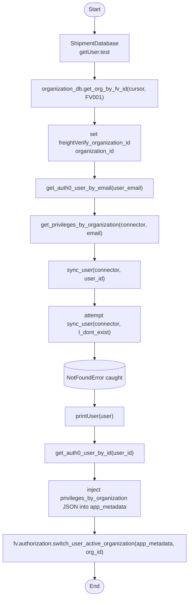
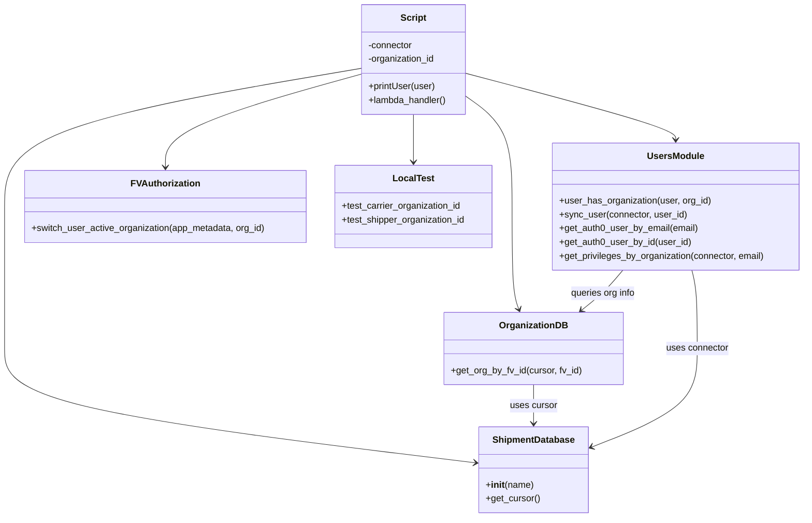

# Diagram: platform/tools/ide_local_testing/localTest/test/user/getUserWithSync.py

> Auto-generated by Obscura crawlers

## Diagram 1

### SVG

<svg id="container" width="545.921875" xmlns="http://www.w3.org/2000/svg" class="flowchart" height="1684.7451171875" viewBox="0 0 545.921875 1684.7451171875" role="graphics-document document" aria-roledescription="flowchart-v2"><g><marker id="container_flowchart-v2-pointEnd" class="marker flowchart-v2" viewBox="0 0 10 10" refX="5" refY="5" markerUnits="userSpaceOnUse" markerWidth="8" markerHeight="8" orient="auto"><path d="M 0 0 L 10 5 L 0 10 z" class="arrowMarkerPath" style="stroke-width: 1; stroke-dasharray: 1, 0;"></path></marker><marker id="container_flowchart-v2-pointStart" class="marker flowchart-v2" viewBox="0 0 10 10" refX="4.5" refY="5" markerUnits="userSpaceOnUse" markerWidth="8" markerHeight="8" orient="auto"><path d="M 0 5 L 10 10 L 10 0 z" class="arrowMarkerPath" style="stroke-width: 1; stroke-dasharray: 1, 0;"></path></marker><marker id="container_flowchart-v2-circleEnd" class="marker flowchart-v2" viewBox="0 0 10 10" refX="11" refY="5" markerUnits="userSpaceOnUse" markerWidth="11" markerHeight="11" orient="auto"><circle cx="5" cy="5" r="5" class="arrowMarkerPath" style="stroke-width: 1; stroke-dasharray: 1, 0;"></circle></marker><marker id="container_flowchart-v2-circleStart" class="marker flowchart-v2" viewBox="0 0 10 10" refX="-1" refY="5" markerUnits="userSpaceOnUse" markerWidth="11" markerHeight="11" orient="auto"><circle cx="5" cy="5" r="5" class="arrowMarkerPath" style="stroke-width: 1; stroke-dasharray: 1, 0;"></circle></marker><marker id="container_flowchart-v2-crossEnd" class="marker cross flowchart-v2" viewBox="0 0 11 11" refX="12" refY="5.2" markerUnits="userSpaceOnUse" markerWidth="11" markerHeight="11" orient="auto"><path d="M 1,1 l 9,9 M 10,1 l -9,9" class="arrowMarkerPath" style="stroke-width: 2; stroke-dasharray: 1, 0;"></path></marker><marker id="container_flowchart-v2-crossStart" class="marker cross flowchart-v2" viewBox="0 0 11 11" refX="-1" refY="5.2" markerUnits="userSpaceOnUse" markerWidth="11" markerHeight="11" orient="auto"><path d="M 1,1 l 9,9 M 10,1 l -9,9" class="arrowMarkerPath" style="stroke-width: 2; stroke-dasharray: 1, 0;"></path></marker><g class="root"><g class="clusters"></g><g class="edgePaths"><path d="M273.461,47.5L273.378,51.583C273.294,55.667,273.128,63.833,273.044,71.417C272.961,79,272.961,86,272.961,89.5L272.961,93" id="L_Start_DB_0" class="edge-thickness-normal edge-pattern-solid edge-thickness-normal edge-pattern-solid flowchart-link" style=";" data-edge="true" data-et="edge" data-id="L_Start_DB_0" data-points="W3sieCI6MjczLjQ2MDkzNzUsInkiOjQ3LjV9LHsieCI6MjcyLjk2MDkzNzUsInkiOjcyfSx7IngiOjI3Mi45NjA5Mzc1LCJ5Ijo5N31d" marker-end="url(#container_flowchart-v2-pointEnd)"></path><path d="M272.961,175L272.961,179.167C272.961,183.333,272.961,191.667,272.961,199.333C272.961,207,272.961,214,272.961,217.5L272.961,221" id="L_DB_OrgDB_0" class="edge-thickness-normal edge-pattern-solid edge-thickness-normal edge-pattern-solid flowchart-link" style=";" data-edge="true" data-et="edge" data-id="L_DB_OrgDB_0" data-points="W3sieCI6MjcyLjk2MDkzNzUsInkiOjE3NX0seyJ4IjoyNzIuOTYwOTM3NSwieSI6MjAwfSx7IngiOjI3Mi45NjA5Mzc1LCJ5IjoyMjV9XQ==" marker-end="url(#container_flowchart-v2-pointEnd)"></path><path d="M272.961,303L272.961,307.167C272.961,311.333,272.961,319.667,272.961,327.333C272.961,335,272.961,342,272.961,345.5L272.961,349" id="L_OrgDB_SetOrg_0" class="edge-thickness-normal edge-pattern-solid edge-thickness-normal edge-pattern-solid flowchart-link" style=";" data-edge="true" data-et="edge" data-id="L_OrgDB_SetOrg_0" data-points="W3sieCI6MjcyLjk2MDkzNzUsInkiOjMwM30seyJ4IjoyNzIuOTYwOTM3NSwieSI6MzI4fSx7IngiOjI3Mi45NjA5Mzc1LCJ5IjozNTN9XQ==" marker-end="url(#container_flowchart-v2-pointEnd)"></path><path d="M272.961,455L272.961,459.167C272.961,463.333,272.961,471.667,272.961,479.333C272.961,487,272.961,494,272.961,497.5L272.961,501" id="L_SetOrg_GetEmail_0" class="edge-thickness-normal edge-pattern-solid edge-thickness-normal edge-pattern-solid flowchart-link" style=";" data-edge="true" data-et="edge" data-id="L_SetOrg_GetEmail_0" data-points="W3sieCI6MjcyLjk2MDkzNzUsInkiOjQ1NX0seyJ4IjoyNzIuOTYwOTM3NSwieSI6NDgwfSx7IngiOjI3Mi45NjA5Mzc1LCJ5Ijo1MDV9XQ==" marker-end="url(#container_flowchart-v2-pointEnd)"></path><path d="M272.961,559L272.961,563.167C272.961,567.333,272.961,575.667,272.961,583.333C272.961,591,272.961,598,272.961,601.5L272.961,605" id="L_GetEmail_GetPrivileges_0" class="edge-thickness-normal edge-pattern-solid edge-thickness-normal edge-pattern-solid flowchart-link" style=";" data-edge="true" data-et="edge" data-id="L_GetEmail_GetPrivileges_0" data-points="W3sieCI6MjcyLjk2MDkzNzUsInkiOjU1OX0seyJ4IjoyNzIuOTYwOTM3NSwieSI6NTg0fSx7IngiOjI3Mi45NjA5Mzc1LCJ5Ijo2MDl9XQ==" marker-end="url(#container_flowchart-v2-pointEnd)"></path><path d="M272.961,687L272.961,691.167C272.961,695.333,272.961,703.667,272.961,711.333C272.961,719,272.961,726,272.961,729.5L272.961,733" id="L_GetPrivileges_SyncUser_0" class="edge-thickness-normal edge-pattern-solid edge-thickness-normal edge-pattern-solid flowchart-link" style=";" data-edge="true" data-et="edge" data-id="L_GetPrivileges_SyncUser_0" data-points="W3sieCI6MjcyLjk2MDkzNzUsInkiOjY4N30seyJ4IjoyNzIuOTYwOTM3NSwieSI6NzEyfSx7IngiOjI3Mi45NjA5Mzc1LCJ5Ijo3Mzd9XQ==" marker-end="url(#container_flowchart-v2-pointEnd)"></path><path d="M272.961,815L272.961,819.167C272.961,823.333,272.961,831.667,272.961,839.333C272.961,847,272.961,854,272.961,857.5L272.961,861" id="L_SyncUser_TrySync_0" class="edge-thickness-normal edge-pattern-solid edge-thickness-normal edge-pattern-solid flowchart-link" style=";" data-edge="true" data-et="edge" data-id="L_SyncUser_TrySync_0" data-points="W3sieCI6MjcyLjk2MDkzNzUsInkiOjgxNX0seyJ4IjoyNzIuOTYwOTM3NSwieSI6ODQwfSx7IngiOjI3Mi45NjA5Mzc1LCJ5Ijo4NjV9XQ==" marker-end="url(#container_flowchart-v2-pointEnd)"></path><path d="M272.961,967L272.961,971.167C272.961,975.333,272.961,983.667,272.961,991.333C272.961,999,272.961,1006,272.961,1009.5L272.961,1013" id="L_TrySync_NotFound_0" class="edge-thickness-normal edge-pattern-solid edge-thickness-normal edge-pattern-solid flowchart-link" style=";" data-edge="true" data-et="edge" data-id="L_TrySync_NotFound_0" data-points="W3sieCI6MjcyLjk2MDkzNzUsInkiOjk2N30seyJ4IjoyNzIuOTYwOTM3NSwieSI6OTkyfSx7IngiOjI3Mi45NjA5Mzc1LCJ5IjoxMDE3fV0=" marker-end="url(#container_flowchart-v2-pointEnd)"></path><path d="M272.961,1099.745L272.961,1103.912C272.961,1108.078,272.961,1116.412,272.961,1124.078C272.961,1131.745,272.961,1138.745,272.961,1142.245L272.961,1145.745" id="L_NotFound_PrintUser_0" class="edge-thickness-normal edge-pattern-solid edge-thickness-normal edge-pattern-solid flowchart-link" style=";" data-edge="true" data-et="edge" data-id="L_NotFound_PrintUser_0" data-points="W3sieCI6MjcyLjk2MDkzNzUsInkiOjEwOTkuNzQ1MTE3MTg3NX0seyJ4IjoyNzIuOTYwOTM3NSwieSI6MTEyNC43NDUxMTcxODc1fSx7IngiOjI3Mi45NjA5Mzc1LCJ5IjoxMTQ5Ljc0NTExNzE4NzV9XQ==" marker-end="url(#container_flowchart-v2-pointEnd)"></path><path d="M272.961,1203.745L272.961,1207.912C272.961,1212.078,272.961,1220.412,272.961,1228.078C272.961,1235.745,272.961,1242.745,272.961,1246.245L272.961,1249.745" id="L_PrintUser_GetById_0" class="edge-thickness-normal edge-pattern-solid edge-thickness-normal edge-pattern-solid flowchart-link" style=";" data-edge="true" data-et="edge" data-id="L_PrintUser_GetById_0" data-points="W3sieCI6MjcyLjk2MDkzNzUsInkiOjEyMDMuNzQ1MTE3MTg3NX0seyJ4IjoyNzIuOTYwOTM3NSwieSI6MTIyOC43NDUxMTcxODc1fSx7IngiOjI3Mi45NjA5Mzc1LCJ5IjoxMjUzLjc0NTExNzE4NzV9XQ==" marker-end="url(#container_flowchart-v2-pointEnd)"></path><path d="M272.961,1307.745L272.961,1311.912C272.961,1316.078,272.961,1324.412,272.961,1332.078C272.961,1339.745,272.961,1346.745,272.961,1350.245L272.961,1353.745" id="L_GetById_InjectPriv_0" class="edge-thickness-normal edge-pattern-solid edge-thickness-normal edge-pattern-solid flowchart-link" style=";" data-edge="true" data-et="edge" data-id="L_GetById_InjectPriv_0" data-points="W3sieCI6MjcyLjk2MDkzNzUsInkiOjEzMDcuNzQ1MTE3MTg3NX0seyJ4IjoyNzIuOTYwOTM3NSwieSI6MTMzMi43NDUxMTcxODc1fSx7IngiOjI3Mi45NjA5Mzc1LCJ5IjoxMzU3Ljc0NTExNzE4NzV9XQ==" marker-end="url(#container_flowchart-v2-pointEnd)"></path><path d="M272.961,1459.745L272.961,1463.912C272.961,1468.078,272.961,1476.412,272.961,1484.078C272.961,1491.745,272.961,1498.745,272.961,1502.245L272.961,1505.745" id="L_InjectPriv_SwitchOrg_0" class="edge-thickness-normal edge-pattern-solid edge-thickness-normal edge-pattern-solid flowchart-link" style=";" data-edge="true" data-et="edge" data-id="L_InjectPriv_SwitchOrg_0" data-points="W3sieCI6MjcyLjk2MDkzNzUsInkiOjE0NTkuNzQ1MTE3MTg3NX0seyJ4IjoyNzIuOTYwOTM3NSwieSI6MTQ4NC43NDUxMTcxODc1fSx7IngiOjI3Mi45NjA5Mzc1LCJ5IjoxNTA5Ljc0NTExNzE4NzV9XQ==" marker-end="url(#container_flowchart-v2-pointEnd)"></path><path d="M272.961,1587.745L272.961,1591.912C272.961,1596.078,272.961,1604.412,273.031,1612.162C273.101,1619.912,273.242,1627.079,273.312,1630.662L273.383,1634.246" id="L_SwitchOrg_End_0" class="edge-thickness-normal edge-pattern-solid edge-thickness-normal edge-pattern-solid flowchart-link" style=";" data-edge="true" data-et="edge" data-id="L_SwitchOrg_End_0" data-points="W3sieCI6MjcyLjk2MDkzNzUsInkiOjE1ODcuNzQ1MTE3MTg3NX0seyJ4IjoyNzIuOTYwOTM3NSwieSI6MTYxMi43NDUxMTcxODc1fSx7IngiOjI3My40NjA5Mzc1LCJ5IjoxNjM4LjI0NTExNzE4NzV9XQ==" marker-end="url(#container_flowchart-v2-pointEnd)"></path></g><g class="edgeLabels"><g class="edgeLabel"><g class="label" data-id="L_Start_DB_0" transform="translate(0, 0)"><foreignObject width="0" height="0">

</foreignObject></g></g><g class="edgeLabel"><g class="label" data-id="L_DB_OrgDB_0" transform="translate(0, 0)"><foreignObject width="0" height="0">

</foreignObject></g></g><g class="edgeLabel"><g class="label" data-id="L_OrgDB_SetOrg_0" transform="translate(0, 0)"><foreignObject width="0" height="0">

</foreignObject></g></g><g class="edgeLabel"><g class="label" data-id="L_SetOrg_GetEmail_0" transform="translate(0, 0)"><foreignObject width="0" height="0">

</foreignObject></g></g><g class="edgeLabel"><g class="label" data-id="L_GetEmail_GetPrivileges_0" transform="translate(0, 0)"><foreignObject width="0" height="0">

</foreignObject></g></g><g class="edgeLabel"><g class="label" data-id="L_GetPrivileges_SyncUser_0" transform="translate(0, 0)"><foreignObject width="0" height="0">

</foreignObject></g></g><g class="edgeLabel"><g class="label" data-id="L_SyncUser_TrySync_0" transform="translate(0, 0)"><foreignObject width="0" height="0">

</foreignObject></g></g><g class="edgeLabel"><g class="label" data-id="L_TrySync_NotFound_0" transform="translate(0, 0)"><foreignObject width="0" height="0">

</foreignObject></g></g><g class="edgeLabel"><g class="label" data-id="L_NotFound_PrintUser_0" transform="translate(0, 0)"><foreignObject width="0" height="0">

</foreignObject></g></g><g class="edgeLabel"><g class="label" data-id="L_PrintUser_GetById_0" transform="translate(0, 0)"><foreignObject width="0" height="0">

</foreignObject></g></g><g class="edgeLabel"><g class="label" data-id="L_GetById_InjectPriv_0" transform="translate(0, 0)"><foreignObject width="0" height="0">

</foreignObject></g></g><g class="edgeLabel"><g class="label" data-id="L_InjectPriv_SwitchOrg_0" transform="translate(0, 0)"><foreignObject width="0" height="0">

</foreignObject></g></g><g class="edgeLabel"><g class="label" data-id="L_SwitchOrg_End_0" transform="translate(0, 0)"><foreignObject width="0" height="0">

</foreignObject></g></g></g><g class="nodes"><g class="node default" id="flowchart-Start-0" transform="translate(272.9609375, 27.5)"><g class="basic label-container outer-path"><path d="M-10.3984375 -19.5 C-3.3685987882453867 -19.5, 3.6612399235092266 -19.5, 10.3984375 -19.5 C10.3984375 -19.5, 10.398437499999998 -19.5, 10.398437499999998 -19.5 C10.740477529472187 -19.489031441995355, 11.082517558944376 -19.478062883990713, 11.6478067896239 -19.45993515863156 C11.98221776518793 -19.427674934006937, 12.31662874075196 -19.395414709382315, 12.892042152847864 -19.3399052695533 C13.358240144162286 -19.264533993737004, 13.824438135476708 -19.189162717920706, 14.126030759676757 -19.140403561325776 C14.60235841907607 -19.031684881396348, 15.078686078475384 -18.92296620146692, 15.34470188623539 -18.862249829261074 C15.70879182352184 -18.754189847021536, 16.07288176080829 -18.646129864781997, 16.543047751460602 -18.50658706670804 C16.977615436430877 -18.346662141539333, 17.412183121401153 -18.186737216370627, 17.716144095147794 -18.074876768247425 C18.023568046373583 -17.93878930444727, 18.330991997599373 -17.80270184064711, 18.85917041279238 -17.568892924097174 C19.191199674586457 -17.3956734708941, 19.52322893638053 -17.22245401769102, 19.967429764076783 -16.990714730406097 C20.284084623630797 -16.798756693673944, 20.60073948318481 -16.60679865694179, 21.036368073605697 -16.342718045390892 C21.375996095898163 -16.105808239299794, 21.715624118190632 -15.868898433208695, 22.061592844578712 -15.627565626425154 C22.257505629414414 -15.471330393976837, 22.453418414250116 -15.31509516152852, 23.03889120850187 -14.848196188198123 C23.273207995984077 -14.635395881489249, 23.507524783466284 -14.422595574780372, 23.964247236767985 -14.007812326905688 C24.26196221629291 -13.700397167691806, 24.55967719581784 -13.392982008477922, 24.833858442968648 -13.10986736009568 C25.01498451281354 -12.89710637209053, 25.19611058265843 -12.68434538408538, 25.644151408126582 -12.158051136245305 C25.814275917004192 -11.930099793010903, 25.9844004258818 -11.7021484497765, 26.391796464640635 -11.156274872382312 C26.611393921481497 -10.818914208500981, 26.830991378322363 -10.48155354461965, 27.073721378604247 -10.108655082055241 C27.311490348585362 -9.68647219913477, 27.549259318566477 -9.264289316214299, 27.6871239742735 -9.019496659696287 C27.85718736300613 -8.666356394219381, 28.027250751738762 -8.313216128742475, 28.22948364880834 -7.893275190886684 C28.416242518673464 -7.431977171582722, 28.603001388538583 -6.970679152278761, 28.698571729970325 -6.734618561215508 C28.855223030818603 -6.262809802055782, 29.011874331666885 -5.791001042896055, 29.09246063421488 -5.548287939305138 C29.185809149215295 -5.192309594106232, 29.279157664215713 -4.836331248907326, 29.40953178754556 -4.339158212148133 C29.488959816397234 -3.9313120711146348, 29.568387845248907 -3.523465930081136, 29.648482276581777 -3.1121979531509023 C29.6862385188375 -2.8193679940288754, 29.72399476109322 -2.5265380349068485, 29.808330202509367 -1.872449005199798 C29.831302357681334 -1.514639145606497, 29.8542745128533 -1.156829286013196, 29.888418715913414 -0.6250057626472757 C29.888418715913414 -0.2971201164964877, 29.888418715913414 0.03076552965430035, 29.888418715913414 0.625005762647271 C29.86871350408604 0.9319303426193724, 29.84900829225866 1.2388549225914738, 29.808330202509367 1.8724490051997846 C29.768142799882167 2.1841345640760945, 29.727955397254966 2.4958201229524044, 29.648482276581777 3.1121979531508885 C29.582184762999898 3.452621673409382, 29.515887249418018 3.7930453936678754, 29.40953178754556 4.339158212148129 C29.322764971806297 4.6700376855377534, 29.235998156067037 5.000917158927377, 29.092460634214884 5.548287939305125 C28.97339775396777 5.906886364515652, 28.854334873720656 6.26548478972618, 28.69857172997033 6.734618561215495 C28.54058601970412 7.124846320018953, 28.38260030943791 7.515074078822412, 28.229483648808344 7.893275190886679 C28.035913997376387 8.295226713812184, 27.842344345944433 8.69717823673769, 27.687123974273504 9.019496659696284 C27.458238735895783 9.425905577579558, 27.22935349751806 9.832314495462832, 27.07372137860425 10.108655082055236 C26.81682346672322 10.503319261452893, 26.55992555484219 10.897983440850547, 26.39179646464064 11.156274872382301 C26.138060651593083 11.496257746057926, 25.88432483854552 11.836240619733552, 25.644151408126582 12.158051136245302 C25.400495258471267 12.444263514058113, 25.15683910881595 12.730475891870924, 24.83385844296866 13.10986736009567 C24.586932009832093 13.364839175346363, 24.340005576695525 13.619810990597056, 23.96424723676799 14.007812326905684 C23.632677315104637 14.308935356900951, 23.301107393441285 14.61005838689622, 23.038891208501887 14.848196188198111 C22.795240106306764 15.04250145837059, 22.55158900411164 15.236806728543066, 22.061592844578715 15.627565626425152 C21.698354605011364 15.880944898017379, 21.33511636544401 16.134324169609606, 21.036368073605708 16.34271804539089 C20.814234159695726 16.477376929406894, 20.592100245785748 16.6120358134229, 19.967429764076787 16.990714730406093 C19.541599520824686 17.212870095553427, 19.115769277572582 17.43502546070076, 18.859170412792388 17.56889292409717 C18.52386666893647 17.717321945070022, 18.188562925080554 17.86575096604287, 17.716144095147804 18.07487676824742 C17.29601108978471 18.229489597887966, 16.87587808442162 18.384102427528514, 16.543047751460616 18.506587066708033 C16.27958249395721 18.584782172177686, 16.016117236453805 18.66297727764734, 15.344701886235413 18.86224982926107 C15.09419192058408 18.919427094190688, 14.843681954932746 18.976604359120305, 14.126030759676766 19.140403561325773 C13.639325416052008 19.21909030682671, 13.15262007242725 19.297777052327653, 12.892042152847878 19.3399052695533 C12.548237894003183 19.37307165291893, 12.204433635158487 19.406238036284563, 11.6478067896239 19.45993515863156 C11.262024516630435 19.47230644524682, 10.87624224363697 19.484677731862078, 10.398437500000004 19.5 C10.398437500000002 19.5, 10.398437500000002 19.5, 10.3984375 19.5 C2.4540665883408446 19.5, -5.490304323318311 19.5, -10.398437499999996 19.5 C-10.876506049099715 19.484669272134354, -11.354574598199434 19.469338544268705, -11.647806789623893 19.45993515863156 C-11.95947439038792 19.429868960020983, -12.271141991151945 19.39980276141041, -12.892042152847871 19.3399052695533 C-13.175763031205326 19.29403547822874, -13.45948390956278 19.248165686904176, -14.126030759676759 19.140403561325773 C-14.427598597970345 19.07157267014932, -14.729166436263933 19.00274177897286, -15.344701886235388 18.862249829261074 C-15.756041837475891 18.74016629090036, -16.167381788716394 18.618082752539642, -16.54304775146059 18.506587066708043 C-16.887078699459426 18.37998049765725, -17.231109647458265 18.253373928606457, -17.716144095147797 18.074876768247425 C-18.03642627006993 17.93309735024255, -18.356708444992062 17.791317932237675, -18.85917041279238 17.568892924097174 C-19.270567421399022 17.35426736821945, -19.681964430005667 17.139641812341722, -19.96742976407678 16.990714730406097 C-20.314843772171983 16.780110317067454, -20.662257780267186 16.569505903728814, -21.036368073605686 16.3427180453909 C-21.3267065438025 16.14019049713141, -21.617045013999313 15.937662948871917, -22.061592844578712 15.627565626425156 C-22.33048304237542 15.413132849150953, -22.59937324017213 15.198700071876752, -23.03889120850187 14.848196188198125 C-23.358370942926 14.558053146364692, -23.677850677350133 14.26791010453126, -23.964247236767974 14.007812326905697 C-24.27991075272476 13.681863830223676, -24.595574268681546 13.355915333541658, -24.833858442968655 13.109867360095677 C-25.137882665186165 12.752743209210673, -25.441906887403675 12.395619058325666, -25.64415140812658 12.158051136245307 C-25.91590868454839 11.793921143437274, -26.187665960970204 11.42979115062924, -26.391796464640635 11.156274872382316 C-26.562354494746014 10.894251936896593, -26.732912524851393 10.632229001410868, -27.073721378604244 10.108655082055249 C-27.284604492887812 9.734210758413882, -27.495487607171377 9.359766434772514, -27.6871239742735 9.019496659696289 C-27.814571365206877 8.754849425485816, -27.94201875614025 8.490202191275342, -28.22948364880834 7.893275190886686 C-28.366650435422176 7.5544705760111, -28.503817222036016 7.215665961135515, -28.698571729970325 6.73461856121551 C-28.85391465354083 6.266750425954824, -29.009257577111338 5.798882290694138, -29.09246063421488 5.5482879393051325 C-29.156078566847608 5.305685189990127, -29.219696499480335 5.063082440675121, -29.409531787545557 4.339158212148136 C-29.497832016811827 3.885755197125913, -29.586132246078098 3.43235218210369, -29.648482276581777 3.112197953150904 C-29.697314750510074 2.733462928425718, -29.74614722443837 2.3547279037005318, -29.808330202509364 1.872449005199809 C-29.8260460847218 1.5965098397383866, -29.843761966934235 1.320570674276964, -29.888418715913414 0.6250057626472781 C-29.888418715913414 0.17386591950323022, -29.888418715913414 -0.2772739236408177, -29.888418715913414 -0.6250057626472687 C-29.86833011169059 -0.93790198864724, -29.848241507467765 -1.2507982146472112, -29.808330202509367 -1.8724490051997822 C-29.769372894203933 -2.1745941954260655, -29.7304155858985 -2.4767393856523485, -29.648482276581777 -3.112197953150895 C-29.570028744210944 -3.5150402607151823, -29.49157521184011 -3.917882568279469, -29.40953178754556 -4.339158212148126 C-29.28986805846237 -4.795487873730584, -29.170204329379178 -5.251817535313044, -29.092460634214884 -5.548287939305123 C-29.007351312333913 -5.804623656481697, -28.922241990452942 -6.060959373658271, -28.698571729970332 -6.734618561215485 C-28.603737731616256 -6.968860370640678, -28.508903733262184 -7.203102180065872, -28.229483648808344 -7.893275190886676 C-28.07423623195225 -8.215649773750947, -27.91898881509615 -8.538024356615217, -27.687123974273504 -9.019496659696282 C-27.538575794065252 -9.283258995790392, -27.390027613857 -9.547021331884501, -27.073721378604247 -10.108655082055243 C-26.9371523764497 -10.31846174327654, -26.80058337429515 -10.528268404497837, -26.39179646464064 -11.156274872382308 C-26.162803567467403 -11.463104492912352, -25.93381067029416 -11.769934113442394, -25.644151408126586 -12.158051136245302 C-25.32287593889919 -12.53543958349188, -25.001600469671793 -12.91282803073846, -24.833858442968662 -13.10986736009567 C-24.56295938240578 -13.389592881353348, -24.2920603218429 -13.669318402611024, -23.964247236767996 -14.007812326905677 C-23.70048307869217 -14.247355956452948, -23.436718920616343 -14.486899586000218, -23.038891208501887 -14.848196188198107 C-22.75627724542684 -15.073573303077053, -22.473663282351794 -15.298950417955998, -22.06159284457872 -15.627565626425149 C-21.72218576987863 -15.86432130904047, -21.382778695178544 -16.10107699165579, -21.03636807360571 -16.342718045390885 C-20.68653536679574 -16.55478868810427, -20.336702659985768 -16.766859330817656, -19.96742976407679 -16.99071473040609 C-19.5692774532269 -17.198430535947754, -19.171125142377008 -17.406146341489414, -18.859170412792388 -17.56889292409717 C-18.541400578952942 -17.70956020323069, -18.223630745113496 -17.850227482364208, -17.716144095147804 -18.07487676824742 C-17.420147458446003 -18.183806266716598, -17.124150821744202 -18.29273576518578, -16.54304775146062 -18.506587066708033 C-16.298822631588706 -18.5790718003222, -16.054597511716796 -18.651556533936372, -15.344701886235413 -18.862249829261067 C-15.017262655004895 -18.936985697048762, -14.689823423774378 -19.011721564836453, -14.126030759676768 -19.140403561325773 C-13.781665128225958 -19.19607792602338, -13.437299496775147 -19.251752290720994, -12.89204215284788 -19.3399052695533 C-12.588193023767184 -19.36921722960367, -12.284343894686488 -19.398529189654045, -11.647806789623903 -19.45993515863156 C-11.232001057045553 -19.473269239158586, -10.816195324467202 -19.486603319685614, -10.398437500000005 -19.5 C-10.398437500000004 -19.5, -10.398437500000002 -19.5, -10.3984375 -19.5" stroke="none" stroke-width="0" fill="#ECECFF" style=""></path><path d="M-10.3984375 -19.5 C-2.8972947390675756 -19.5, 4.603848021864849 -19.5, 10.3984375 -19.5 M-10.3984375 -19.5 C-4.433358576818319 -19.5, 1.5317203463633629 -19.5, 10.3984375 -19.5 M10.3984375 -19.5 C10.3984375 -19.5, 10.398437499999998 -19.5, 10.398437499999998 -19.5 M10.3984375 -19.5 C10.3984375 -19.5, 10.3984375 -19.5, 10.398437499999998 -19.5 M10.398437499999998 -19.5 C10.82776776979839 -19.48623221388824, 11.25709803959678 -19.472464427776483, 11.6478067896239 -19.45993515863156 M10.398437499999998 -19.5 C10.782246494169936 -19.487691992595856, 11.166055488339873 -19.475383985191716, 11.6478067896239 -19.45993515863156 M11.6478067896239 -19.45993515863156 C12.042887170623832 -19.42182222943017, 12.437967551623764 -19.383709300228784, 12.892042152847864 -19.3399052695533 M11.6478067896239 -19.45993515863156 C12.023015475891949 -19.423739227921747, 12.398224162159998 -19.387543297211934, 12.892042152847864 -19.3399052695533 M12.892042152847864 -19.3399052695533 C13.167437649370868 -19.295381461399433, 13.44283314589387 -19.250857653245568, 14.126030759676757 -19.140403561325776 M12.892042152847864 -19.3399052695533 C13.254060865291198 -19.281376891622507, 13.616079577734533 -19.222848513691712, 14.126030759676757 -19.140403561325776 M14.126030759676757 -19.140403561325776 C14.546495415227604 -19.044435247484593, 14.966960070778448 -18.94846693364341, 15.34470188623539 -18.862249829261074 M14.126030759676757 -19.140403561325776 C14.440274268471823 -19.068679531073837, 14.754517777266887 -18.9969555008219, 15.34470188623539 -18.862249829261074 M15.34470188623539 -18.862249829261074 C15.635646288015709 -18.775899058011007, 15.926590689796026 -18.689548286760935, 16.543047751460602 -18.50658706670804 M15.34470188623539 -18.862249829261074 C15.801358976403009 -18.726716401941307, 16.258016066570626 -18.59118297462154, 16.543047751460602 -18.50658706670804 M16.543047751460602 -18.50658706670804 C16.983482380927924 -18.34450305173098, 17.423917010395247 -18.18241903675392, 17.716144095147794 -18.074876768247425 M16.543047751460602 -18.50658706670804 C16.974206516505113 -18.347916655583727, 17.40536528154962 -18.18924624445941, 17.716144095147794 -18.074876768247425 M17.716144095147794 -18.074876768247425 C18.165342092119474 -17.876030139973206, 18.614540089091154 -17.677183511698985, 18.85917041279238 -17.568892924097174 M17.716144095147794 -18.074876768247425 C17.95286188483109 -17.97008882473837, 18.189579674514388 -17.865300881229313, 18.85917041279238 -17.568892924097174 M18.85917041279238 -17.568892924097174 C19.14892287642557 -17.41772924941505, 19.43867534005876 -17.266565574732926, 19.967429764076783 -16.990714730406097 M18.85917041279238 -17.568892924097174 C19.270573718956484 -17.354264082787758, 19.681977025120588 -17.139635241478338, 19.967429764076783 -16.990714730406097 M19.967429764076783 -16.990714730406097 C20.270513254317944 -16.806983737505615, 20.573596744559104 -16.623252744605132, 21.036368073605697 -16.342718045390892 M19.967429764076783 -16.990714730406097 C20.32490295381953 -16.7740123820384, 20.68237614356228 -16.557310033670703, 21.036368073605697 -16.342718045390892 M21.036368073605697 -16.342718045390892 C21.26375511587312 -16.18410268813155, 21.49114215814054 -16.02548733087221, 22.061592844578712 -15.627565626425154 M21.036368073605697 -16.342718045390892 C21.36071020344846 -16.11647101615709, 21.685052333291225 -15.890223986923285, 22.061592844578712 -15.627565626425154 M22.061592844578712 -15.627565626425154 C22.274737471812177 -15.457588458223206, 22.48788209904564 -15.28761129002126, 23.03889120850187 -14.848196188198123 M22.061592844578712 -15.627565626425154 C22.277689889551457 -15.455233983643266, 22.493786934524202 -15.282902340861376, 23.03889120850187 -14.848196188198123 M23.03889120850187 -14.848196188198123 C23.34029827519947 -14.574466265017344, 23.641705341897065 -14.300736341836565, 23.964247236767985 -14.007812326905688 M23.03889120850187 -14.848196188198123 C23.239464823561832 -14.666040537887714, 23.44003843862179 -14.483884887577302, 23.964247236767985 -14.007812326905688 M23.964247236767985 -14.007812326905688 C24.179825771163355 -13.785209790815632, 24.395404305558724 -13.562607254725576, 24.833858442968648 -13.10986736009568 M23.964247236767985 -14.007812326905688 C24.211608298647715 -13.752391721793995, 24.458969360527444 -13.496971116682303, 24.833858442968648 -13.10986736009568 M24.833858442968648 -13.10986736009568 C25.06606739313531 -12.837101514166346, 25.298276343301975 -12.564335668237009, 25.644151408126582 -12.158051136245305 M24.833858442968648 -13.10986736009568 C25.103382480729806 -12.793269088989216, 25.372906518490968 -12.47667081788275, 25.644151408126582 -12.158051136245305 M25.644151408126582 -12.158051136245305 C25.91861740012128 -11.790291711338666, 26.19308339211598 -11.422532286432027, 26.391796464640635 -11.156274872382312 M25.644151408126582 -12.158051136245305 C25.912150166161577 -11.798957215667535, 26.180148924196573 -11.439863295089763, 26.391796464640635 -11.156274872382312 M26.391796464640635 -11.156274872382312 C26.60133104636827 -10.834373486935222, 26.8108656280959 -10.512472101488134, 27.073721378604247 -10.108655082055241 M26.391796464640635 -11.156274872382312 C26.62936654029561 -10.791303439678606, 26.866936615950586 -10.426332006974897, 27.073721378604247 -10.108655082055241 M27.073721378604247 -10.108655082055241 C27.301094402557958 -9.704931254010113, 27.52846742651167 -9.301207425964982, 27.6871239742735 -9.019496659696287 M27.073721378604247 -10.108655082055241 C27.306957460773596 -9.694520800449226, 27.540193542942944 -9.28038651884321, 27.6871239742735 -9.019496659696287 M27.6871239742735 -9.019496659696287 C27.80092964782499 -8.78317674351529, 27.914735321376483 -8.546856827334292, 28.22948364880834 -7.893275190886684 M27.6871239742735 -9.019496659696287 C27.79958316550898 -8.785972742854595, 27.912042356744458 -8.552448826012903, 28.22948364880834 -7.893275190886684 M28.22948364880834 -7.893275190886684 C28.358110666902746 -7.575563969359283, 28.486737684997156 -7.2578527478318815, 28.698571729970325 -6.734618561215508 M28.22948364880834 -7.893275190886684 C28.36371335571822 -7.561725219664439, 28.497943062628107 -7.230175248442194, 28.698571729970325 -6.734618561215508 M28.698571729970325 -6.734618561215508 C28.793230211105968 -6.449522297815773, 28.887888692241614 -6.164426034416038, 29.09246063421488 -5.548287939305138 M28.698571729970325 -6.734618561215508 C28.84515053240522 -6.2931465624422165, 28.991729334840112 -5.851674563668926, 29.09246063421488 -5.548287939305138 M29.09246063421488 -5.548287939305138 C29.21138044894206 -5.094795145576676, 29.33030026366924 -4.641302351848214, 29.40953178754556 -4.339158212148133 M29.09246063421488 -5.548287939305138 C29.210626068213504 -5.09767192624534, 29.328791502212123 -4.647055913185543, 29.40953178754556 -4.339158212148133 M29.40953178754556 -4.339158212148133 C29.45813813872137 -4.089574871816302, 29.506744489897184 -3.83999153148447, 29.648482276581777 -3.1121979531509023 M29.40953178754556 -4.339158212148133 C29.471816336603638 -4.019340216579021, 29.53410088566171 -3.699522221009909, 29.648482276581777 -3.1121979531509023 M29.648482276581777 -3.1121979531509023 C29.700575706146246 -2.708171600460096, 29.752669135710715 -2.3041452477692896, 29.808330202509367 -1.872449005199798 M29.648482276581777 -3.1121979531509023 C29.69641785422086 -2.7404190789326406, 29.744353431859945 -2.368640204714379, 29.808330202509367 -1.872449005199798 M29.808330202509367 -1.872449005199798 C29.833946908912008 -1.4734481255454, 29.859563615314652 -1.074447245891002, 29.888418715913414 -0.6250057626472757 M29.808330202509367 -1.872449005199798 C29.837588641348823 -1.4167252032885285, 29.866847080188275 -0.961001401377259, 29.888418715913414 -0.6250057626472757 M29.888418715913414 -0.6250057626472757 C29.888418715913414 -0.32608155270020023, 29.888418715913414 -0.027157342753124758, 29.888418715913414 0.625005762647271 M29.888418715913414 -0.6250057626472757 C29.888418715913414 -0.27663791962178447, 29.888418715913414 0.07172992340370676, 29.888418715913414 0.625005762647271 M29.888418715913414 0.625005762647271 C29.8691064804452 0.9258094186205779, 29.84979424497699 1.2266130745938848, 29.808330202509367 1.8724490051997846 M29.888418715913414 0.625005762647271 C29.864623890658727 0.9956293728262504, 29.840829065404044 1.36625298300523, 29.808330202509367 1.8724490051997846 M29.808330202509367 1.8724490051997846 C29.76188523394851 2.232667009761348, 29.71544026538766 2.5928850143229107, 29.648482276581777 3.1121979531508885 M29.808330202509367 1.8724490051997846 C29.747622468903756 2.343286198946953, 29.686914735298146 2.8141233926941216, 29.648482276581777 3.1121979531508885 M29.648482276581777 3.1121979531508885 C29.597178042256676 3.375634353256515, 29.545873807931578 3.6390707533621414, 29.40953178754556 4.339158212148129 M29.648482276581777 3.1121979531508885 C29.58838535297504 3.420782954382187, 29.528288429368303 3.7293679556134856, 29.40953178754556 4.339158212148129 M29.40953178754556 4.339158212148129 C29.32867612554342 4.647495894427875, 29.247820463541277 4.955833576707621, 29.092460634214884 5.548287939305125 M29.40953178754556 4.339158212148129 C29.294479612514365 4.777902019470158, 29.17942743748317 5.2166458267921865, 29.092460634214884 5.548287939305125 M29.092460634214884 5.548287939305125 C28.986814086904122 5.866478507313725, 28.88116753959336 6.184669075322325, 28.69857172997033 6.734618561215495 M29.092460634214884 5.548287939305125 C28.938602064248123 6.011685438010962, 28.784743494281358 6.475082936716798, 28.69857172997033 6.734618561215495 M28.69857172997033 6.734618561215495 C28.53588177593645 7.136465893075462, 28.37319182190257 7.538313224935429, 28.229483648808344 7.893275190886679 M28.69857172997033 6.734618561215495 C28.561699253226756 7.072696225021433, 28.424826776483187 7.4107738888273715, 28.229483648808344 7.893275190886679 M28.229483648808344 7.893275190886679 C28.109490675774275 8.14244316683025, 27.989497702740206 8.39161114277382, 27.687123974273504 9.019496659696284 M28.229483648808344 7.893275190886679 C28.08669207190718 8.189784955572254, 27.943900495006012 8.48629472025783, 27.687123974273504 9.019496659696284 M27.687123974273504 9.019496659696284 C27.485233222686535 9.377974132794376, 27.28334247109957 9.73645160589247, 27.07372137860425 10.108655082055236 M27.687123974273504 9.019496659696284 C27.46010653171625 9.422589116965481, 27.233089089158995 9.825681574234679, 27.07372137860425 10.108655082055236 M27.07372137860425 10.108655082055236 C26.83585848157579 10.47407636702216, 26.597995584547334 10.839497651989086, 26.39179646464064 11.156274872382301 M27.07372137860425 10.108655082055236 C26.816848201646213 10.503281261968922, 26.55997502468817 10.89790744188261, 26.39179646464064 11.156274872382301 M26.39179646464064 11.156274872382301 C26.21413827207045 11.394320665432062, 26.036480079500254 11.63236645848182, 25.644151408126582 12.158051136245302 M26.39179646464064 11.156274872382301 C26.208583348657623 11.401763756741316, 26.0253702326746 11.64725264110033, 25.644151408126582 12.158051136245302 M25.644151408126582 12.158051136245302 C25.407651575886664 12.435857296415989, 25.171151743646746 12.713663456586676, 24.83385844296866 13.10986736009567 M25.644151408126582 12.158051136245302 C25.45050170941934 12.385523091326842, 25.256852010712095 12.612995046408383, 24.83385844296866 13.10986736009567 M24.83385844296866 13.10986736009567 C24.56542725941977 13.38704459571993, 24.29699607587088 13.664221831344191, 23.96424723676799 14.007812326905684 M24.83385844296866 13.10986736009567 C24.580235321820044 13.371754055527115, 24.326612200671427 13.633640750958557, 23.96424723676799 14.007812326905684 M23.96424723676799 14.007812326905684 C23.71246349947087 14.236475655286295, 23.460679762173754 14.465138983666908, 23.038891208501887 14.848196188198111 M23.96424723676799 14.007812326905684 C23.75628407167065 14.196678971043262, 23.54832090657331 14.38554561518084, 23.038891208501887 14.848196188198111 M23.038891208501887 14.848196188198111 C22.83309581329408 15.012312539430875, 22.62730041808627 15.176428890663638, 22.061592844578715 15.627565626425152 M23.038891208501887 14.848196188198111 C22.79967400442445 15.038965542612718, 22.560456800347012 15.229734897027326, 22.061592844578715 15.627565626425152 M22.061592844578715 15.627565626425152 C21.82823348348338 15.79034701476133, 21.59487412238805 15.953128403097509, 21.036368073605708 16.34271804539089 M22.061592844578715 15.627565626425152 C21.65178596508017 15.913429165309449, 21.24197908558162 16.199292704193745, 21.036368073605708 16.34271804539089 M21.036368073605708 16.34271804539089 C20.703324429989667 16.544611059332627, 20.370280786373623 16.746504073274366, 19.967429764076787 16.990714730406093 M21.036368073605708 16.34271804539089 C20.67104372589875 16.564179811855016, 20.30571937819179 16.78564157831914, 19.967429764076787 16.990714730406093 M19.967429764076787 16.990714730406093 C19.599232273974405 17.18280312515076, 19.231034783872026 17.37489151989542, 18.859170412792388 17.56889292409717 M19.967429764076787 16.990714730406093 C19.560057329921555 17.20324066837038, 19.152684895766328 17.415766606334664, 18.859170412792388 17.56889292409717 M18.859170412792388 17.56889292409717 C18.429154005378674 17.759248431675715, 17.999137597964957 17.949603939254263, 17.716144095147804 18.07487676824742 M18.859170412792388 17.56889292409717 C18.512767825776002 17.722235073701675, 18.166365238759617 17.87557722330618, 17.716144095147804 18.07487676824742 M17.716144095147804 18.07487676824742 C17.27104546771256 18.238677177590198, 16.825946840277314 18.402477586932978, 16.543047751460616 18.506587066708033 M17.716144095147804 18.07487676824742 C17.345442949667873 18.21129821650786, 16.97474180418794 18.3477196647683, 16.543047751460616 18.506587066708033 M16.543047751460616 18.506587066708033 C16.066265421603838 18.648093559528007, 15.58948309174706 18.789600052347982, 15.344701886235413 18.86224982926107 M16.543047751460616 18.506587066708033 C16.268564898032803 18.58805213681551, 15.99408204460499 18.669517206922986, 15.344701886235413 18.86224982926107 M15.344701886235413 18.86224982926107 C14.964066955272388 18.949127268378327, 14.583432024309364 19.036004707495582, 14.126030759676766 19.140403561325773 M15.344701886235413 18.86224982926107 C14.963690064883354 18.949213291150183, 14.582678243531296 19.036176753039296, 14.126030759676766 19.140403561325773 M14.126030759676766 19.140403561325773 C13.814563701988746 19.190759139749666, 13.503096644300726 19.241114718173556, 12.892042152847878 19.3399052695533 M14.126030759676766 19.140403561325773 C13.655207154200795 19.216522670567535, 13.184383548724822 19.292641779809298, 12.892042152847878 19.3399052695533 M12.892042152847878 19.3399052695533 C12.434818697484653 19.38401306640053, 11.977595242121426 19.428120863247766, 11.6478067896239 19.45993515863156 M12.892042152847878 19.3399052695533 C12.458145699626813 19.381762738558702, 12.02424924640575 19.423620207564106, 11.6478067896239 19.45993515863156 M11.6478067896239 19.45993515863156 C11.22860237098041 19.473378228405554, 10.809397952336917 19.48682129817955, 10.398437500000004 19.5 M11.6478067896239 19.45993515863156 C11.362475026667726 19.46908519290498, 11.077143263711552 19.4782352271784, 10.398437500000004 19.5 M10.398437500000004 19.5 C10.398437500000002 19.5, 10.398437500000002 19.5, 10.3984375 19.5 M10.398437500000004 19.5 C10.398437500000002 19.5, 10.398437500000002 19.5, 10.3984375 19.5 M10.3984375 19.5 C3.308168765844856 19.5, -3.7820999683102876 19.5, -10.398437499999996 19.5 M10.3984375 19.5 C4.761776531875703 19.5, -0.8748844362485944 19.5, -10.398437499999996 19.5 M-10.398437499999996 19.5 C-10.742627113410961 19.48896250902235, -11.086816726821926 19.4779250180447, -11.647806789623893 19.45993515863156 M-10.398437499999996 19.5 C-10.892703488590154 19.484149851776298, -11.386969477180312 19.468299703552596, -11.647806789623893 19.45993515863156 M-11.647806789623893 19.45993515863156 C-11.948897330550635 19.43088931626271, -12.249987871477375 19.401843473893862, -12.892042152847871 19.3399052695533 M-11.647806789623893 19.45993515863156 C-12.12047794142161 19.414337141087863, -12.593149093219326 19.368739123544167, -12.892042152847871 19.3399052695533 M-12.892042152847871 19.3399052695533 C-13.271411797712888 19.278571727427057, -13.650781442577905 19.21723818530082, -14.126030759676759 19.140403561325773 M-12.892042152847871 19.3399052695533 C-13.350242199927138 19.265827039335957, -13.808442247006402 19.191748809118618, -14.126030759676759 19.140403561325773 M-14.126030759676759 19.140403561325773 C-14.53488940409707 19.047084243788834, -14.943748048517381 18.953764926251896, -15.344701886235388 18.862249829261074 M-14.126030759676759 19.140403561325773 C-14.398374555975737 19.078242867029893, -14.670718352274715 19.01608217273401, -15.344701886235388 18.862249829261074 M-15.344701886235388 18.862249829261074 C-15.697106585151246 18.75765796443286, -16.049511284067105 18.653066099604647, -16.54304775146059 18.506587066708043 M-15.344701886235388 18.862249829261074 C-15.628758360948524 18.77794335860908, -15.91281483566166 18.693636887957084, -16.54304775146059 18.506587066708043 M-16.54304775146059 18.506587066708043 C-16.924521085526052 18.36620135347111, -17.305994419591517 18.225815640234174, -17.716144095147797 18.074876768247425 M-16.54304775146059 18.506587066708043 C-16.832663388194472 18.400005835212376, -17.122279024928353 18.293424603716712, -17.716144095147797 18.074876768247425 M-17.716144095147797 18.074876768247425 C-18.01062872033913 17.94451716025125, -18.30511334553047 17.81415755225508, -18.85917041279238 17.568892924097174 M-17.716144095147797 18.074876768247425 C-18.036627640011478 17.93300820974285, -18.357111184875162 17.791139651238282, -18.85917041279238 17.568892924097174 M-18.85917041279238 17.568892924097174 C-19.08288592831797 17.4521806829441, -19.30660144384356 17.335468441791026, -19.96742976407678 16.990714730406097 M-18.85917041279238 17.568892924097174 C-19.224818463217794 17.378134570398988, -19.59046651364321 17.187376216700805, -19.96742976407678 16.990714730406097 M-19.96742976407678 16.990714730406097 C-20.339641197819958 16.765077971913804, -20.711852631563133 16.539441213421515, -21.036368073605686 16.3427180453909 M-19.96742976407678 16.990714730406097 C-20.295840011044536 16.791630508741413, -20.62425025801229 16.592546287076726, -21.036368073605686 16.3427180453909 M-21.036368073605686 16.3427180453909 C-21.316168403309824 16.147541447750353, -21.595968733013958 15.952364850109802, -22.061592844578712 15.627565626425156 M-21.036368073605686 16.3427180453909 C-21.393167272969386 16.093830369503184, -21.74996647233309 15.844942693615469, -22.061592844578712 15.627565626425156 M-22.061592844578712 15.627565626425156 C-22.393207745658678 15.363111567457013, -22.724822646738644 15.098657508488868, -23.03889120850187 14.848196188198125 M-22.061592844578712 15.627565626425156 C-22.354694076290162 15.393825193886618, -22.647795308001616 15.16008476134808, -23.03889120850187 14.848196188198125 M-23.03889120850187 14.848196188198125 C-23.2966328210798 14.614122075124222, -23.55437443365773 14.380047962050318, -23.964247236767974 14.007812326905697 M-23.03889120850187 14.848196188198125 C-23.248218261550083 14.65809089711006, -23.457545314598296 14.467985606021998, -23.964247236767974 14.007812326905697 M-23.964247236767974 14.007812326905697 C-24.231018835466163 13.732348748894239, -24.497790434164347 13.456885170882781, -24.833858442968655 13.109867360095677 M-23.964247236767974 14.007812326905697 C-24.24762345477716 13.715203116191036, -24.53099967278634 13.422593905476376, -24.833858442968655 13.109867360095677 M-24.833858442968655 13.109867360095677 C-25.0716820051538 12.830506271408955, -25.30950556733895 12.551145182722232, -25.64415140812658 12.158051136245307 M-24.833858442968655 13.109867360095677 C-25.03724456396753 12.870958449372266, -25.2406306849664 12.632049538648854, -25.64415140812658 12.158051136245307 M-25.64415140812658 12.158051136245307 C-25.826893871414573 11.913192883620287, -26.009636334702567 11.668334630995265, -26.391796464640635 11.156274872382316 M-25.64415140812658 12.158051136245307 C-25.868205211718113 11.857839451154069, -26.092259015309644 11.557627766062831, -26.391796464640635 11.156274872382316 M-26.391796464640635 11.156274872382316 C-26.56180570478162 10.895095025652639, -26.731814944922608 10.633915178922962, -27.073721378604244 10.108655082055249 M-26.391796464640635 11.156274872382316 C-26.596877491719866 10.841215342822045, -26.801958518799097 10.526155813261774, -27.073721378604244 10.108655082055249 M-27.073721378604244 10.108655082055249 C-27.27043453319108 9.759370956719444, -27.46714768777791 9.410086831383637, -27.6871239742735 9.019496659696289 M-27.073721378604244 10.108655082055249 C-27.277251409378152 9.747266902765727, -27.480781440152057 9.385878723476205, -27.6871239742735 9.019496659696289 M-27.6871239742735 9.019496659696289 C-27.88953980245138 8.599175861480013, -28.09195563062926 8.178855063263736, -28.22948364880834 7.893275190886686 M-27.6871239742735 9.019496659696289 C-27.883975286805395 8.610730697280461, -28.08082659933729 8.201964734864635, -28.22948364880834 7.893275190886686 M-28.22948364880834 7.893275190886686 C-28.409207409708614 7.449354026740482, -28.588931170608884 7.005432862594278, -28.698571729970325 6.73461856121551 M-28.22948364880834 7.893275190886686 C-28.410141032329985 7.447047960815327, -28.59079841585163 7.0008207307439685, -28.698571729970325 6.73461856121551 M-28.698571729970325 6.73461856121551 C-28.78151089815624 6.484819001201406, -28.864450066342158 6.235019441187302, -29.09246063421488 5.5482879393051325 M-28.698571729970325 6.73461856121551 C-28.834124998488686 6.326353713918549, -28.969678267007044 5.918088866621589, -29.09246063421488 5.5482879393051325 M-29.09246063421488 5.5482879393051325 C-29.178549391262962 5.219994197577474, -29.264638148311043 4.891700455849817, -29.409531787545557 4.339158212148136 M-29.09246063421488 5.5482879393051325 C-29.18081847072777 5.211341214152911, -29.269176307240652 4.874394489000691, -29.409531787545557 4.339158212148136 M-29.409531787545557 4.339158212148136 C-29.501486157904004 3.8669919549205645, -29.593440528262455 3.394825697692993, -29.648482276581777 3.112197953150904 M-29.409531787545557 4.339158212148136 C-29.4739009497925 4.008636168437342, -29.538270112039445 3.678114124726549, -29.648482276581777 3.112197953150904 M-29.648482276581777 3.112197953150904 C-29.698133309385657 2.7271143474294237, -29.747784342189536 2.3420307417079433, -29.808330202509364 1.872449005199809 M-29.648482276581777 3.112197953150904 C-29.689226836335205 2.796191193626701, -29.72997139608863 2.4801844341024983, -29.808330202509364 1.872449005199809 M-29.808330202509364 1.872449005199809 C-29.838974921562855 1.3951327699696987, -29.869619640616346 0.9178165347395885, -29.888418715913414 0.6250057626472781 M-29.808330202509364 1.872449005199809 C-29.827343873656726 1.5762957295205202, -29.84635754480409 1.2801424538412314, -29.888418715913414 0.6250057626472781 M-29.888418715913414 0.6250057626472781 C-29.888418715913414 0.32692279723557194, -29.888418715913414 0.028839831823865736, -29.888418715913414 -0.6250057626472687 M-29.888418715913414 0.6250057626472781 C-29.888418715913414 0.34616942338755957, -29.888418715913414 0.067333084127841, -29.888418715913414 -0.6250057626472687 M-29.888418715913414 -0.6250057626472687 C-29.868661505197142 -0.9327402672866415, -29.84890429448087 -1.2404747719260143, -29.808330202509367 -1.8724490051997822 M-29.888418715913414 -0.6250057626472687 C-29.857133667348243 -1.1122956468864615, -29.825848618783077 -1.5995855311256544, -29.808330202509367 -1.8724490051997822 M-29.808330202509367 -1.8724490051997822 C-29.748205345159942 -2.3387655258059206, -29.688080487810517 -2.805082046412059, -29.648482276581777 -3.112197953150895 M-29.808330202509367 -1.8724490051997822 C-29.759062040972605 -2.2545631369799906, -29.70979387943584 -2.636677268760199, -29.648482276581777 -3.112197953150895 M-29.648482276581777 -3.112197953150895 C-29.580131684468558 -3.4631637977495138, -29.51178109235534 -3.8141296423481323, -29.40953178754556 -4.339158212148126 M-29.648482276581777 -3.112197953150895 C-29.55298950729351 -3.6025331410422106, -29.457496738005243 -4.092868328933526, -29.40953178754556 -4.339158212148126 M-29.40953178754556 -4.339158212148126 C-29.290687022680835 -4.792364808224241, -29.17184225781611 -5.245571404300357, -29.092460634214884 -5.548287939305123 M-29.40953178754556 -4.339158212148126 C-29.29436293331382 -4.778346967830916, -29.179194079082084 -5.217535723513705, -29.092460634214884 -5.548287939305123 M-29.092460634214884 -5.548287939305123 C-28.954503804226345 -5.963791930794748, -28.816546974237806 -6.379295922284372, -28.698571729970332 -6.734618561215485 M-29.092460634214884 -5.548287939305123 C-28.94285704867745 -5.9988701028495255, -28.793253463140015 -6.449452266393927, -28.698571729970332 -6.734618561215485 M-28.698571729970332 -6.734618561215485 C-28.520996180363348 -7.173233601934433, -28.343420630756363 -7.6118486426533805, -28.229483648808344 -7.893275190886676 M-28.698571729970332 -6.734618561215485 C-28.589496321108133 -7.004036929934684, -28.480420912245936 -7.273455298653884, -28.229483648808344 -7.893275190886676 M-28.229483648808344 -7.893275190886676 C-28.101421329983094 -8.159199336021981, -27.97335901115784 -8.425123481157284, -27.687123974273504 -9.019496659696282 M-28.229483648808344 -7.893275190886676 C-28.01273520925932 -8.343357963283891, -27.795986769710296 -8.793440735681108, -27.687123974273504 -9.019496659696282 M-27.687123974273504 -9.019496659696282 C-27.524016888324667 -9.309109807181871, -27.36090980237583 -9.59872295466746, -27.073721378604247 -10.108655082055243 M-27.687123974273504 -9.019496659696282 C-27.47678926885123 -9.392967227872004, -27.266454563428958 -9.766437796047725, -27.073721378604247 -10.108655082055243 M-27.073721378604247 -10.108655082055243 C-26.801867348981162 -10.526295874584646, -26.530013319358076 -10.943936667114048, -26.39179646464064 -11.156274872382308 M-27.073721378604247 -10.108655082055243 C-26.87832207253367 -10.408840888240109, -26.682922766463097 -10.709026694424974, -26.39179646464064 -11.156274872382308 M-26.39179646464064 -11.156274872382308 C-26.158714819032298 -11.468583043322743, -25.925633173423957 -11.78089121426318, -25.644151408126586 -12.158051136245302 M-26.39179646464064 -11.156274872382308 C-26.13813105112122 -11.496163417103755, -25.8844656376018 -11.836051961825202, -25.644151408126586 -12.158051136245302 M-25.644151408126586 -12.158051136245302 C-25.334061948091556 -12.522299860592572, -25.02397248805653 -12.886548584939842, -24.833858442968662 -13.10986736009567 M-25.644151408126586 -12.158051136245302 C-25.331379625999865 -12.525450668749922, -25.01860784387315 -12.892850201254543, -24.833858442968662 -13.10986736009567 M-24.833858442968662 -13.10986736009567 C-24.55006307279327 -13.402909379834973, -24.266267702617878 -13.695951399574279, -23.964247236767996 -14.007812326905677 M-24.833858442968662 -13.10986736009567 C-24.65100237821298 -13.298681259718027, -24.4681463134573 -13.487495159340382, -23.964247236767996 -14.007812326905677 M-23.964247236767996 -14.007812326905677 C-23.660205850129 -14.283934669756947, -23.356164463490003 -14.560057012608219, -23.038891208501887 -14.848196188198107 M-23.964247236767996 -14.007812326905677 C-23.76068795397981 -14.192679481650421, -23.557128671191627 -14.377546636395165, -23.038891208501887 -14.848196188198107 M-23.038891208501887 -14.848196188198107 C-22.813815257218526 -15.027688269823981, -22.588739305935167 -15.207180351449853, -22.06159284457872 -15.627565626425149 M-23.038891208501887 -14.848196188198107 C-22.802092345428743 -15.037036980016548, -22.5652934823556 -15.225877771834991, -22.06159284457872 -15.627565626425149 M-22.06159284457872 -15.627565626425149 C-21.752973615796602 -15.842845040512465, -21.44435438701448 -16.05812445459978, -21.03636807360571 -16.342718045390885 M-22.06159284457872 -15.627565626425149 C-21.715164262616273 -15.869219208550541, -21.36873568065383 -16.110872790675934, -21.03636807360571 -16.342718045390885 M-21.03636807360571 -16.342718045390885 C-20.70190602281857 -16.54547090609523, -20.36744397203143 -16.748223766799573, -19.96742976407679 -16.99071473040609 M-21.03636807360571 -16.342718045390885 C-20.768177447877985 -16.50529677877009, -20.49998682215026 -16.667875512149294, -19.96742976407679 -16.99071473040609 M-19.96742976407679 -16.99071473040609 C-19.6052048838607 -17.179687218398715, -19.242980003644607 -17.36865970639134, -18.859170412792388 -17.56889292409717 M-19.96742976407679 -16.99071473040609 C-19.73033990020405 -17.114404360525192, -19.493250036331307 -17.2380939906443, -18.859170412792388 -17.56889292409717 M-18.859170412792388 -17.56889292409717 C-18.590108496792613 -17.687998652872114, -18.32104658079284 -17.807104381647054, -17.716144095147804 -18.07487676824742 M-18.859170412792388 -17.56889292409717 C-18.52451068825695 -17.717036856821, -18.18985096372151 -17.865180789544826, -17.716144095147804 -18.07487676824742 M-17.716144095147804 -18.07487676824742 C-17.271813227492103 -18.238394634894235, -16.827482359836402 -18.401912501541048, -16.54304775146062 -18.506587066708033 M-17.716144095147804 -18.07487676824742 C-17.392022132861342 -18.194156646519414, -17.06790017057488 -18.313436524791406, -16.54304775146062 -18.506587066708033 M-16.54304775146062 -18.506587066708033 C-16.175760454431767 -18.61559600853583, -15.808473157402911 -18.724604950363634, -15.344701886235413 -18.862249829261067 M-16.54304775146062 -18.506587066708033 C-16.096483619098745 -18.639124957130072, -15.649919486736868 -18.771662847552115, -15.344701886235413 -18.862249829261067 M-15.344701886235413 -18.862249829261067 C-15.03815706994949 -18.932216683186457, -14.731612253663565 -19.002183537111847, -14.126030759676768 -19.140403561325773 M-15.344701886235413 -18.862249829261067 C-14.974195655602237 -18.94681545862398, -14.603689424969062 -19.031381087986897, -14.126030759676768 -19.140403561325773 M-14.126030759676768 -19.140403561325773 C-13.814704439809871 -19.190736386350185, -13.503378119942974 -19.241069211374594, -12.89204215284788 -19.3399052695533 M-14.126030759676768 -19.140403561325773 C-13.687214019793263 -19.211348048755497, -13.248397279909758 -19.282292536185217, -12.89204215284788 -19.3399052695533 M-12.89204215284788 -19.3399052695533 C-12.415351491570954 -19.385891044342287, -11.938660830294026 -19.431876819131276, -11.647806789623903 -19.45993515863156 M-12.89204215284788 -19.3399052695533 C-12.637794076454885 -19.364432275704882, -12.383546000061889 -19.388959281856465, -11.647806789623903 -19.45993515863156 M-11.647806789623903 -19.45993515863156 C-11.25422329678303 -19.472556615183173, -10.860639803942156 -19.485178071734783, -10.398437500000005 -19.5 M-11.647806789623903 -19.45993515863156 C-11.197362112208879 -19.474380042698883, -10.746917434793854 -19.488824926766206, -10.398437500000005 -19.5 M-10.398437500000005 -19.5 C-10.398437500000004 -19.5, -10.398437500000002 -19.5, -10.3984375 -19.5 M-10.398437500000005 -19.5 C-10.398437500000004 -19.5, -10.398437500000004 -19.5, -10.3984375 -19.5" stroke="#9370DB" stroke-width="1.3" fill="none" stroke-dasharray="0 0" style=""></path></g><g class="label" style="" transform="translate(-17.5234375, -12)"><rect></rect><foreignObject width="35.046875" height="24">

Start

</foreignObject></g></g><g class="node default" id="flowchart-DB-1" transform="translate(272.9609375, 136)"><rect class="basic label-container" style="" x="-98.5" y="-39" width="197" height="78"></rect><g class="label" style="" transform="translate(-68.5, -24)"><rect></rect><foreignObject width="137" height="48">

ShipmentDatabase getUser.test

</foreignObject></g></g><g class="node default" id="flowchart-OrgDB-2" transform="translate(272.9609375, 264)"><rect class="basic label-container" style="" x="-180.59375" y="-39" width="361.1875" height="78"></rect><g class="label" style="" transform="translate(-150.59375, -24)"><rect></rect><foreignObject width="301.1875" height="48">

organization_db.get_org_by_fv_id(cursor, FV001)

</foreignObject></g></g><g class="node default" id="flowchart-SetOrg-3" transform="translate(272.9609375, 404)"><rect class="basic label-container" style="" x="-134.5859375" y="-51" width="269.171875" height="102"></rect><g class="label" style="" transform="translate(-104.5859375, -36)"><rect></rect><foreignObject width="209.171875" height="72">

set freightVerify_organization_id organization_id

</foreignObject></g></g><g class="node default" id="flowchart-GetEmail-4" transform="translate(272.9609375, 532)"><rect class="basic label-container" style="" x="-166.5859375" y="-27" width="333.171875" height="54"></rect><g class="label" style="" transform="translate(-136.5859375, -12)"><rect></rect><foreignObject width="273.171875" height="24">

get_auth0_user_by_email(user_email)

</foreignObject></g></g><g class="node default" id="flowchart-GetPrivileges-5" transform="translate(272.9609375, 648)"><rect class="basic label-container" style="" x="-184.53125" y="-39" width="369.0625" height="78"></rect><g class="label" style="" transform="translate(-154.53125, -24)"><rect></rect><foreignObject width="309.0625" height="48">

get_privileges_by_organization(connector, email)

</foreignObject></g></g><g class="node default" id="flowchart-SyncUser-6" transform="translate(272.9609375, 776)"><rect class="basic label-container" style="" x="-130" y="-39" width="260" height="78"></rect><g class="label" style="" transform="translate(-100, -24)"><rect></rect><foreignObject width="200" height="48">

sync_user(connector, user_id)

</foreignObject></g></g><g class="node default" id="flowchart-TrySync-7" transform="translate(272.9609375, 916)"><rect class="basic label-container" style="" x="-130" y="-51" width="260" height="102"></rect><g class="label" style="" transform="translate(-100, -36)"><rect></rect><foreignObject width="200" height="72">

attempt sync_user(connector, I_dont_exist)

</foreignObject></g></g><g class="node default" id="flowchart-NotFound-8" transform="translate(272.9609375, 1058.37255859375)"><path d="M0,14.581705474813774 a87.4765625,14.581705474813774 0,0,0 174.953125,0 a87.4765625,14.581705474813774 0,0,0 -174.953125,0 l0,53.58170547481377 a87.4765625,14.581705474813774 0,0,0 174.953125,0 l0,-53.58170547481377" class="basic label-container" style="" transform="translate(-87.4765625, -41.37255821222066)"></path><g class="label" style="" transform="translate(-79.9765625, -2)"><rect></rect><foreignObject width="159.953125" height="24">

NotFoundError caught

</foreignObject></g></g><g class="node default" id="flowchart-PrintUser-9" transform="translate(272.9609375, 1176.7451171875)"><rect class="basic label-container" style="" x="-85.140625" y="-27" width="170.28125" height="54"></rect><g class="label" style="" transform="translate(-55.140625, -12)"><rect></rect><foreignObject width="110.28125" height="24">

printUser(user)

</foreignObject></g></g><g class="node default" id="flowchart-GetById-10" transform="translate(272.9609375, 1280.7451171875)"><rect class="basic label-container" style="" x="-140.6484375" y="-27" width="281.296875" height="54"></rect><g class="label" style="" transform="translate(-110.6484375, -12)"><rect></rect><foreignObject width="221.296875" height="24">

get_auth0_user_by_id(user_id)

</foreignObject></g></g><g class="node default" id="flowchart-InjectPriv-11" transform="translate(272.9609375, 1408.7451171875)"><rect class="basic label-container" style="" x="-130" y="-51" width="260" height="102"></rect><g class="label" style="" transform="translate(-100, -36)"><rect></rect><foreignObject width="200" height="72">

inject privileges_by_organization JSON into app_metadata

</foreignObject></g></g><g class="node default" id="flowchart-SwitchOrg-12" transform="translate(272.9609375, 1548.7451171875)"><rect class="basic label-container" style="" x="-264.9609375" y="-39" width="529.921875" height="78"></rect><g class="label" style="" transform="translate(-234.9609375, -24)"><rect></rect><foreignObject width="469.921875" height="48">

fv.authorization.switch_user_active_organization(app_metadata, org_id)

</foreignObject></g></g><g class="node default" id="flowchart-End-13" transform="translate(272.9609375, 1657.2451171875)"><g class="basic label-container outer-path"><path d="M-6.5546875 -19.5 C-1.6481989328117503 -19.5, 3.2582896343764993 -19.5, 6.5546875 -19.5 C6.5546875 -19.5, 6.554687499999999 -19.5, 6.554687499999999 -19.5 C6.999532882750595 -19.4857346744142, 7.44437826550119 -19.471469348828396, 7.8040567896239 -19.45993515863156 C8.212388561521808 -19.420543883687372, 8.620720333419714 -19.381152608743186, 9.048292152847864 -19.3399052695533 C9.532975120384236 -19.26154548613457, 10.01765808792061 -19.18318570271584, 10.282280759676757 -19.140403561325776 C10.599300643129558 -19.068045841675747, 10.91632052658236 -18.99568812202572, 11.50095188623539 -18.862249829261074 C11.745920282475515 -18.789544495122357, 11.990888678715642 -18.71683916098364, 12.699297751460602 -18.50658706670804 C12.939195068732671 -18.418302636365425, 13.179092386004742 -18.330018206022814, 13.872394095147794 -18.074876768247425 C14.132842926251252 -17.959583796657995, 14.39329175735471 -17.844290825068565, 15.015420412792382 -17.568892924097174 C15.446151377787446 -17.3441808555556, 15.876882342782512 -17.119468787014025, 16.123679764076783 -16.990714730406097 C16.483931950401185 -16.772327737979406, 16.844184136725588 -16.553940745552712, 17.192618073605697 -16.342718045390892 C17.586689085509303 -16.0678311665461, 17.980760097412908 -15.792944287701307, 18.217842844578712 -15.627565626425154 C18.478036326300817 -15.420068248791114, 18.738229808022922 -15.212570871157077, 19.19514120850187 -14.848196188198123 C19.44218089626723 -14.623841280081582, 19.689220584032594 -14.39948637196504, 20.120497236767985 -14.007812326905688 C20.303129602089886 -13.819229415314775, 20.485761967411786 -13.630646503723863, 20.990108442968648 -13.10986736009568 C21.303753400293648 -12.741442146318088, 21.617398357618644 -12.373016932540493, 21.800401408126582 -12.158051136245305 C22.081691606505593 -11.78114789648168, 22.3629818048846 -11.404244656718056, 22.548046464640635 -11.156274872382312 C22.81299635234443 -10.749240695862635, 23.077946240048224 -10.342206519342959, 23.229971378604247 -10.108655082055241 C23.3734325525165 -9.853925240754922, 23.516893726428755 -9.5991953994546, 23.8433739742735 -9.019496659696287 C23.993969785667097 -8.706781235103312, 24.144565597060694 -8.394065810510336, 24.38573364880834 -7.893275190886684 C24.54784620394122 -7.49285404547544, 24.709958759074098 -7.092432900064194, 24.854821729970325 -6.734618561215508 C24.997973105848438 -6.303469425144979, 25.141124481726553 -5.872320289074451, 25.24871063421488 -5.548287939305138 C25.343449080809304 -5.187009182538118, 25.438187527403727 -4.825730425771098, 25.56578178754556 -4.339158212148133 C25.645920589822847 -3.9276623997961297, 25.726059392100133 -3.5161665874441264, 25.804732276581777 -3.1121979531509023 C25.83781147976281 -2.8556421855063294, 25.87089068294384 -2.5990864178617565, 25.964580202509367 -1.872449005199798 C25.9833084357851 -1.5807416547724376, 26.002036669060832 -1.2890343043450772, 26.044668715913414 -0.6250057626472757 C26.044668715913414 -0.15145613793334084, 26.044668715913414 0.322093486780594, 26.044668715913414 0.625005762647271 C26.01576255440546 1.0752425607673002, 25.9868563928975 1.5254793588873294, 25.964580202509367 1.8724490051997846 C25.918621238142947 2.2288976572016974, 25.872662273776527 2.5853463092036106, 25.804732276581777 3.1121979531508885 C25.71118725966185 3.592531844288409, 25.617642242741915 4.07286573542593, 25.56578178754556 4.339158212148129 C25.45639597060302 4.75629374026299, 25.347010153660477 5.173429268377852, 25.248710634214884 5.548287939305125 C25.155326301875245 5.829546669539337, 25.061941969535606 6.110805399773549, 24.85482172997033 6.734618561215495 C24.747317398398405 7.000156338653, 24.639813066826484 7.265694116090505, 24.385733648808344 7.893275190886679 C24.272995908122574 8.127377521621902, 24.160258167436805 8.361479852357126, 23.843373974273504 9.019496659696284 C23.652036459687906 9.359235791867322, 23.460698945102305 9.69897492403836, 23.22997137860425 10.108655082055236 C22.971643166944926 10.505516586001622, 22.7133149552856 10.902378089948009, 22.54804646464064 11.156274872382301 C22.292028538579117 11.499315569591868, 22.03601061251759 11.842356266801435, 21.800401408126582 12.158051136245302 C21.50849914207919 12.50093614765404, 21.216596876031797 12.843821159062776, 20.99010844296866 13.10986736009567 C20.642291768879158 13.469016632373098, 20.294475094789657 13.828165904650525, 20.12049723676799 14.007812326905684 C19.91984170643917 14.190042370495913, 19.719186176110348 14.372272414086142, 19.195141208501887 14.848196188198111 C18.866223441768984 15.110499354298232, 18.537305675036077 15.372802520398354, 18.217842844578715 15.627565626425152 C17.828068944237884 15.899455026262716, 17.438295043897057 16.17134442610028, 17.192618073605708 16.34271804539089 C16.924649340657236 16.505162266063323, 16.65668060770877 16.667606486735753, 16.123679764076787 16.990714730406093 C15.804109482273143 17.157434341728518, 15.4845392004695 17.324153953050946, 15.015420412792386 17.56889292409717 C14.772116225081579 17.67659647063445, 14.52881203737077 17.78430001717173, 13.872394095147804 18.07487676824742 C13.427227888169625 18.238702047486697, 12.982061681191446 18.402527326725973, 12.699297751460616 18.506587066708033 C12.301361717056784 18.624692392910223, 11.90342568265295 18.742797719112414, 11.500951886235413 18.86224982926107 C11.018195545062591 18.972435813854233, 10.53543920388977 19.08262179844739, 10.282280759676766 19.140403561325773 C9.988655702252055 19.18787458351387, 9.695030644827346 19.23534560570197, 9.048292152847878 19.3399052695533 C8.73621515680877 19.370010962033692, 8.42413816076966 19.400116654514086, 7.804056789623901 19.45993515863156 C7.4504383298458805 19.471275014360064, 7.096819870067861 19.482614870088568, 6.5546875000000036 19.5 C6.554687500000003 19.5, 6.554687500000002 19.5, 6.5546875 19.5 C2.1321066632274492 19.5, -2.2904741735451015 19.5, -6.5546874999999964 19.5 C-6.972460925900964 19.486602819378, -7.390234351801931 19.473205638756, -7.8040567896238935 19.45993515863156 C-8.197414998313478 19.421988365321734, -8.590773207003062 19.38404157201191, -9.048292152847871 19.3399052695533 C-9.481466895363152 19.269872936503727, -9.91464163787843 19.199840603454156, -10.282280759676759 19.140403561325773 C-10.76301005847494 19.030680235926937, -11.243739357273121 18.920956910528098, -11.500951886235388 18.862249829261074 C-11.9221826214026 18.737230758148694, -12.34341335656981 18.612211687036318, -12.699297751460593 18.506587066708043 C-13.11733057181861 18.352747124563262, -13.535363392176624 18.19890718241848, -13.872394095147797 18.074876768247425 C-14.271125370320751 17.89837026067139, -14.669856645493706 17.721863753095352, -15.01542041279238 17.568892924097174 C-15.326841526242328 17.40642472868508, -15.638262639692275 17.243956533272986, -16.12367976407678 16.990714730406097 C-16.450719501224764 16.792461319848165, -16.777759238372752 16.594207909290233, -17.192618073605686 16.3427180453909 C-17.549602623515607 16.093701076985838, -17.906587173425528 15.844684108580774, -18.217842844578712 15.627565626425156 C-18.57188515964702 15.345226301619858, -18.92592747471533 15.06288697681456, -19.19514120850187 14.848196188198125 C-19.451824189395772 14.615083496409797, -19.70850717028967 14.38197080462147, -20.120497236767974 14.007812326905697 C-20.433317536618997 13.68479968428526, -20.74613783647002 13.361787041664824, -20.990108442968655 13.109867360095677 C-21.17190414481766 12.896319784235354, -21.353699846666668 12.68277220837503, -21.80040140812658 12.158051136245307 C-22.016596993810634 11.868368747251713, -22.232792579494685 11.57868635825812, -22.548046464640635 11.156274872382316 C-22.806481803202686 10.759248792745737, -23.06491714176474 10.362222713109158, -23.229971378604244 10.108655082055249 C-23.472420890185823 9.678161423566925, -23.7148704017674 9.247667765078603, -23.8433739742735 9.019496659696289 C-24.0528593339398 8.58449582808057, -24.262344693606096 8.14949499646485, -24.38573364880834 7.893275190886686 C-24.48594999219034 7.645738885181964, -24.586166335572337 7.398202579477242, -24.854821729970325 6.73461856121551 C-24.95796248787243 6.4239750316624615, -25.061103245774536 6.113331502109412, -25.24871063421488 5.5482879393051325 C-25.360466832808832 5.122113118623537, -25.472223031402784 4.695938297941942, -25.565781787545557 4.339158212148136 C-25.615741675790606 4.082624745035929, -25.665701564035658 3.826091277923722, -25.804732276581777 3.112197953150904 C-25.853623364920484 2.733008326633285, -25.902514453259194 2.3538187001156663, -25.964580202509364 1.872449005199809 C-25.986018140388488 1.538535818340448, -26.007456078267612 1.204622631481087, -26.044668715913414 0.6250057626472781 C-26.044668715913414 0.3246455709571642, -26.044668715913414 0.02428537926705021, -26.044668715913414 -0.6250057626472687 C-26.019695754869772 -1.0139797887133137, -25.99472279382613 -1.402953814779359, -25.964580202509367 -1.8724490051997822 C-25.918673280968342 -2.2284940233249686, -25.872766359427313 -2.5845390414501552, -25.804732276581777 -3.112197953150895 C-25.742015108621242 -3.4342373553500956, -25.67929794066071 -3.756276757549296, -25.56578178754556 -4.339158212148126 C-25.469839772387576 -4.705026697477923, -25.373897757229592 -5.07089518280772, -25.248710634214884 -5.548287939305123 C-25.141220483823925 -5.872031146053011, -25.03373033343297 -6.195774352800899, -24.854821729970332 -6.734618561215485 C-24.74550774697437 -7.004626212657605, -24.6361937639784 -7.274633864099726, -24.385733648808344 -7.893275190886676 C-24.259155445263044 -8.156117538888182, -24.132577241717744 -8.418959886889688, -23.843373974273504 -9.019496659696282 C-23.669944673134285 -9.327437945490022, -23.496515371995066 -9.635379231283764, -23.229971378604247 -10.108655082055243 C-23.083867097968067 -10.333110491605115, -22.937762817331887 -10.557565901154987, -22.54804646464064 -11.156274872382308 C-22.268344065446346 -11.531050605889897, -21.98864166625205 -11.905826339397484, -21.800401408126586 -12.158051136245302 C-21.59982980107964 -12.393653958730397, -21.399258194032697 -12.62925678121549, -20.990108442968662 -13.10986736009567 C-20.776834053507116 -13.330090677367735, -20.563559664045567 -13.550313994639803, -20.120497236767996 -14.007812326905677 C-19.91781244727224 -14.19188528998006, -19.71512765777649 -14.375958253054444, -19.195141208501887 -14.848196188198107 C-18.82777925201204 -15.141157572586538, -18.46041729552219 -15.43411895697497, -18.21784284457872 -15.627565626425149 C-17.86003698560085 -15.877155504482118, -17.502231126622977 -16.126745382539088, -17.19261807360571 -16.342718045390885 C-16.86742856462466 -16.539849836760872, -16.54223905564361 -16.736981628130863, -16.12367976407679 -16.99071473040609 C-15.900683386522147 -17.10705179774035, -15.677687008967503 -17.223388865074615, -15.01542041279239 -17.56889292409717 C-14.655806045849744 -17.728083536761503, -14.296191678907098 -17.88727414942584, -13.872394095147806 -18.07487676824742 C-13.423498192497284 -18.24007460997105, -12.974602289846764 -18.405272451694675, -12.699297751460618 -18.506587066708033 C-12.271374303993264 -18.63359249970033, -11.84345085652591 -18.76059793269263, -11.500951886235413 -18.862249829261067 C-11.109274039095757 -18.951647741933876, -10.717596191956101 -19.041045654606688, -10.282280759676768 -19.140403561325773 C-9.957074137544152 -19.192980445977152, -9.631867515411537 -19.245557330628532, -9.04829215284788 -19.3399052695533 C-8.768301641887676 -19.366915617407773, -8.488311130927473 -19.393925965262248, -7.804056789623903 -19.45993515863156 C-7.431452779433984 -19.47188384400864, -7.058848769244066 -19.483832529385722, -6.554687500000006 -19.5 C-6.5546875000000036 -19.5, -6.554687500000002 -19.5, -6.5546875 -19.5" stroke="none" stroke-width="0" fill="#ECECFF" style=""></path><path d="M-6.5546875 -19.5 C-2.4077281915361697 -19.5, 1.7392311169276606 -19.5, 6.5546875 -19.5 M-6.5546875 -19.5 C-3.4830776242337302 -19.5, -0.4114677484674605 -19.5, 6.5546875 -19.5 M6.5546875 -19.5 C6.5546875 -19.5, 6.554687499999999 -19.5, 6.554687499999999 -19.5 M6.5546875 -19.5 C6.5546875 -19.5, 6.5546875 -19.5, 6.554687499999999 -19.5 M6.554687499999999 -19.5 C6.981249646752848 -19.486320982206486, 7.407811793505696 -19.472641964412972, 7.8040567896239 -19.45993515863156 M6.554687499999999 -19.5 C6.892593328654531 -19.489164017768847, 7.230499157309063 -19.47832803553769, 7.8040567896239 -19.45993515863156 M7.8040567896239 -19.45993515863156 C8.275626030031717 -19.414443441154404, 8.747195270439532 -19.36895172367725, 9.048292152847864 -19.3399052695533 M7.8040567896239 -19.45993515863156 C8.1126022662593 -19.430170147580768, 8.421147742894698 -19.400405136529976, 9.048292152847864 -19.3399052695533 M9.048292152847864 -19.3399052695533 C9.340066084144487 -19.292733523081893, 9.631840015441112 -19.245561776610487, 10.282280759676757 -19.140403561325776 M9.048292152847864 -19.3399052695533 C9.476444332772369 -19.27068494547285, 9.904596512696873 -19.201464621392404, 10.282280759676757 -19.140403561325776 M10.282280759676757 -19.140403561325776 C10.554400176791777 -19.07829408011442, 10.826519593906799 -19.016184598903067, 11.50095188623539 -18.862249829261074 M10.282280759676757 -19.140403561325776 C10.744198301736015 -19.034973896644413, 11.206115843795272 -18.92954423196305, 11.50095188623539 -18.862249829261074 M11.50095188623539 -18.862249829261074 C11.897956818161942 -18.744420849386685, 12.294961750088495 -18.6265918695123, 12.699297751460602 -18.50658706670804 M11.50095188623539 -18.862249829261074 C11.822921247185773 -18.766691012982665, 12.144890608136159 -18.671132196704253, 12.699297751460602 -18.50658706670804 M12.699297751460602 -18.50658706670804 C13.02724436037122 -18.38589968312371, 13.35519096928184 -18.26521229953938, 13.872394095147794 -18.074876768247425 M12.699297751460602 -18.50658706670804 C13.117759968173573 -18.35258910273534, 13.536222184886544 -18.198591138762637, 13.872394095147794 -18.074876768247425 M13.872394095147794 -18.074876768247425 C14.237521835698258 -17.913245548635327, 14.602649576248723 -17.75161432902323, 15.015420412792382 -17.568892924097174 M13.872394095147794 -18.074876768247425 C14.193684401413273 -17.932651080402003, 14.514974707678753 -17.790425392556585, 15.015420412792382 -17.568892924097174 M15.015420412792382 -17.568892924097174 C15.237403738395058 -17.453084365317366, 15.459387063997733 -17.337275806537555, 16.123679764076783 -16.990714730406097 M15.015420412792382 -17.568892924097174 C15.239291369300998 -17.45209958948282, 15.463162325809614 -17.335306254868467, 16.123679764076783 -16.990714730406097 M16.123679764076783 -16.990714730406097 C16.446313566485006 -16.795132223379554, 16.76894736889323 -16.599549716353014, 17.192618073605697 -16.342718045390892 M16.123679764076783 -16.990714730406097 C16.54556820799332 -16.734963476412197, 16.967456651909853 -16.4792122224183, 17.192618073605697 -16.342718045390892 M17.192618073605697 -16.342718045390892 C17.493842952743115 -16.13259660951948, 17.795067831880537 -15.92247517364807, 18.217842844578712 -15.627565626425154 M17.192618073605697 -16.342718045390892 C17.59720703495778 -16.060494300325534, 18.001795996309863 -15.778270555260178, 18.217842844578712 -15.627565626425154 M18.217842844578712 -15.627565626425154 C18.583436098675218 -15.336014735128266, 18.949029352771728 -15.044463843831378, 19.19514120850187 -14.848196188198123 M18.217842844578712 -15.627565626425154 C18.415626226810307 -15.469838642332299, 18.613409609041906 -15.312111658239443, 19.19514120850187 -14.848196188198123 M19.19514120850187 -14.848196188198123 C19.55074768685849 -14.52524379338647, 19.90635416521511 -14.202291398574818, 20.120497236767985 -14.007812326905688 M19.19514120850187 -14.848196188198123 C19.436727681946596 -14.62879374504344, 19.67831415539132 -14.409391301888755, 20.120497236767985 -14.007812326905688 M20.120497236767985 -14.007812326905688 C20.417373908830736 -13.701262788972826, 20.714250580893484 -13.394713251039965, 20.990108442968648 -13.10986736009568 M20.120497236767985 -14.007812326905688 C20.40159661892812 -13.717554136136865, 20.68269600108826 -13.427295945368042, 20.990108442968648 -13.10986736009568 M20.990108442968648 -13.10986736009568 C21.308869293160992 -12.735432727453555, 21.627630143353333 -12.360998094811427, 21.800401408126582 -12.158051136245305 M20.990108442968648 -13.10986736009568 C21.29402422862333 -12.752870584967592, 21.59794001427801 -12.395873809839506, 21.800401408126582 -12.158051136245305 M21.800401408126582 -12.158051136245305 C22.037549519817794 -11.840294271216504, 22.274697631509007 -11.522537406187702, 22.548046464640635 -11.156274872382312 M21.800401408126582 -12.158051136245305 C22.001335796005066 -11.888817361987451, 22.20227018388355 -11.619583587729597, 22.548046464640635 -11.156274872382312 M22.548046464640635 -11.156274872382312 C22.684535721350912 -10.946590721578069, 22.821024978061185 -10.736906570773826, 23.229971378604247 -10.108655082055241 M22.548046464640635 -11.156274872382312 C22.764229656900884 -10.824159435755215, 22.980412849161137 -10.492043999128118, 23.229971378604247 -10.108655082055241 M23.229971378604247 -10.108655082055241 C23.393410583403664 -9.81845222391977, 23.55684978820308 -9.528249365784298, 23.8433739742735 -9.019496659696287 M23.229971378604247 -10.108655082055241 C23.379839538745934 -9.842548987926854, 23.52970769888762 -9.576442893798468, 23.8433739742735 -9.019496659696287 M23.8433739742735 -9.019496659696287 C24.04776723761334 -8.595069675055868, 24.252160500953178 -8.170642690415448, 24.38573364880834 -7.893275190886684 M23.8433739742735 -9.019496659696287 C24.009177666972604 -8.675201744175894, 24.17498135967171 -8.3309068286555, 24.38573364880834 -7.893275190886684 M24.38573364880834 -7.893275190886684 C24.55453856854303 -7.476323775520899, 24.72334348827772 -7.059372360155113, 24.854821729970325 -6.734618561215508 M24.38573364880834 -7.893275190886684 C24.519343471356606 -7.563256346022283, 24.652953293904872 -7.233237501157882, 24.854821729970325 -6.734618561215508 M24.854821729970325 -6.734618561215508 C24.98748081282255 -6.335070540019083, 25.12013989567478 -5.935522518822657, 25.24871063421488 -5.548287939305138 M24.854821729970325 -6.734618561215508 C25.009043831263895 -6.270126164074181, 25.163265932557465 -5.8056337669328535, 25.24871063421488 -5.548287939305138 M25.24871063421488 -5.548287939305138 C25.32443889810578 -5.259503248251957, 25.400167161996677 -4.9707185571987775, 25.56578178754556 -4.339158212148133 M25.24871063421488 -5.548287939305138 C25.346961044887706 -5.173616541412303, 25.445211455560536 -4.798945143519469, 25.56578178754556 -4.339158212148133 M25.56578178754556 -4.339158212148133 C25.634029285930854 -3.9887217320535466, 25.702276784316147 -3.63828525195896, 25.804732276581777 -3.1121979531509023 M25.56578178754556 -4.339158212148133 C25.642833599199417 -3.9435134442117397, 25.719885410853273 -3.547868676275346, 25.804732276581777 -3.1121979531509023 M25.804732276581777 -3.1121979531509023 C25.84038934112877 -2.8356488018082353, 25.876046405675766 -2.5590996504655688, 25.964580202509367 -1.872449005199798 M25.804732276581777 -3.1121979531509023 C25.855833762162632 -2.715864922115509, 25.906935247743487 -2.3195318910801164, 25.964580202509367 -1.872449005199798 M25.964580202509367 -1.872449005199798 C25.981188809614192 -1.613756543315763, 25.99779741671902 -1.3550640814317279, 26.044668715913414 -0.6250057626472757 M25.964580202509367 -1.872449005199798 C25.993272940033844 -1.4255364578952157, 26.021965677558317 -0.9786239105906331, 26.044668715913414 -0.6250057626472757 M26.044668715913414 -0.6250057626472757 C26.044668715913414 -0.3197184731328563, 26.044668715913414 -0.014431183618436871, 26.044668715913414 0.625005762647271 M26.044668715913414 -0.6250057626472757 C26.044668715913414 -0.19634233750720992, 26.044668715913414 0.23232108763285586, 26.044668715913414 0.625005762647271 M26.044668715913414 0.625005762647271 C26.02122590762305 0.9901464244639571, 25.997783099332686 1.3552870862806432, 25.964580202509367 1.8724490051997846 M26.044668715913414 0.625005762647271 C26.01694102584564 1.056886916841453, 25.989213335777865 1.488768071035635, 25.964580202509367 1.8724490051997846 M25.964580202509367 1.8724490051997846 C25.908033838669148 2.311011436801992, 25.851487474828925 2.7495738684042, 25.804732276581777 3.1121979531508885 M25.964580202509367 1.8724490051997846 C25.9057950628333 2.3283749400885374, 25.84700992315723 2.7843008749772897, 25.804732276581777 3.1121979531508885 M25.804732276581777 3.1121979531508885 C25.755056356031645 3.3672733061662905, 25.705380435481516 3.6223486591816925, 25.56578178754556 4.339158212148129 M25.804732276581777 3.1121979531508885 C25.751625335614964 3.3848908708595333, 25.69851839464815 3.6575837885681786, 25.56578178754556 4.339158212148129 M25.56578178754556 4.339158212148129 C25.462131789305115 4.734420577632355, 25.358481791064666 5.129682943116581, 25.248710634214884 5.548287939305125 M25.56578178754556 4.339158212148129 C25.474955559027443 4.685517985824159, 25.384129330509325 5.031877759500189, 25.248710634214884 5.548287939305125 M25.248710634214884 5.548287939305125 C25.159427346885597 5.817194975380943, 25.07014405955631 6.086102011456761, 24.85482172997033 6.734618561215495 M25.248710634214884 5.548287939305125 C25.112417136038786 5.958782240391608, 24.97612363786269 6.369276541478091, 24.85482172997033 6.734618561215495 M24.85482172997033 6.734618561215495 C24.71459230701749 7.080987947060463, 24.57436288406465 7.427357332905432, 24.385733648808344 7.893275190886679 M24.85482172997033 6.734618561215495 C24.72006097401554 7.0674802338458, 24.58530021806075 7.400341906476106, 24.385733648808344 7.893275190886679 M24.385733648808344 7.893275190886679 C24.212107822338265 8.253812934549359, 24.03848199586818 8.614350678212038, 23.843373974273504 9.019496659696284 M24.385733648808344 7.893275190886679 C24.225472376289336 8.226061152314312, 24.065211103770327 8.558847113741944, 23.843373974273504 9.019496659696284 M23.843373974273504 9.019496659696284 C23.62034543776671 9.415506410352357, 23.39731690125991 9.81151616100843, 23.22997137860425 10.108655082055236 M23.843373974273504 9.019496659696284 C23.616801761310377 9.421798566736724, 23.390229548347246 9.824100473777166, 23.22997137860425 10.108655082055236 M23.22997137860425 10.108655082055236 C23.08576211118109 10.33019924242761, 22.94155284375793 10.551743402799985, 22.54804646464064 11.156274872382301 M23.22997137860425 10.108655082055236 C23.05737369457828 10.373811473686755, 22.884776010552308 10.638967865318275, 22.54804646464064 11.156274872382301 M22.54804646464064 11.156274872382301 C22.36774707620397 11.397859627275249, 22.1874476877673 11.639444382168197, 21.800401408126582 12.158051136245302 M22.54804646464064 11.156274872382301 C22.309002581308967 11.476571898700973, 22.06995869797729 11.796868925019645, 21.800401408126582 12.158051136245302 M21.800401408126582 12.158051136245302 C21.525796261159176 12.480617967348731, 21.251191114191766 12.803184798452163, 20.99010844296866 13.10986736009567 M21.800401408126582 12.158051136245302 C21.623691525595284 12.365624619343729, 21.446981643063985 12.573198102442156, 20.99010844296866 13.10986736009567 M20.99010844296866 13.10986736009567 C20.786475612712753 13.32013497590118, 20.582842782456847 13.530402591706688, 20.12049723676799 14.007812326905684 M20.99010844296866 13.10986736009567 C20.708753328857348 13.400389615100062, 20.427398214746038 13.690911870104456, 20.12049723676799 14.007812326905684 M20.12049723676799 14.007812326905684 C19.777962018146383 14.318893749472577, 19.43542679952478 14.629975172039472, 19.195141208501887 14.848196188198111 M20.12049723676799 14.007812326905684 C19.90868745906467 14.20017236283622, 19.69687768136135 14.392532398766757, 19.195141208501887 14.848196188198111 M19.195141208501887 14.848196188198111 C18.917354009687468 15.069724087024797, 18.639566810873045 15.291251985851483, 18.217842844578715 15.627565626425152 M19.195141208501887 14.848196188198111 C18.905158146851047 15.079449963091301, 18.615175085200207 15.310703737984493, 18.217842844578715 15.627565626425152 M18.217842844578715 15.627565626425152 C17.822502453949962 15.903337968918091, 17.42716206332121 16.17911031141103, 17.192618073605708 16.34271804539089 M18.217842844578715 15.627565626425152 C17.915211003170484 15.838668498270268, 17.612579161762252 16.049771370115383, 17.192618073605708 16.34271804539089 M17.192618073605708 16.34271804539089 C16.961223786393656 16.482990622122603, 16.729829499181605 16.623263198854318, 16.123679764076787 16.990714730406093 M17.192618073605708 16.34271804539089 C16.93656181512897 16.497940854033086, 16.680505556652232 16.653163662675286, 16.123679764076787 16.990714730406093 M16.123679764076787 16.990714730406093 C15.70389496391388 17.209716191766084, 15.284110163750974 17.428717653126075, 15.015420412792386 17.56889292409717 M16.123679764076787 16.990714730406093 C15.830948620150936 17.143432380688964, 15.538217476225087 17.29615003097183, 15.015420412792386 17.56889292409717 M15.015420412792386 17.56889292409717 C14.665199315962015 17.72392541472426, 14.314978219131643 17.878957905351346, 13.872394095147804 18.07487676824742 M15.015420412792386 17.56889292409717 C14.648997127535988 17.731097642919618, 14.28257384227959 17.893302361742062, 13.872394095147804 18.07487676824742 M13.872394095147804 18.07487676824742 C13.607778759499833 18.172257657843222, 13.343163423851863 18.269638547439023, 12.699297751460616 18.506587066708033 M13.872394095147804 18.07487676824742 C13.54432348118422 18.19560978683753, 13.216252867220636 18.31634280542764, 12.699297751460616 18.506587066708033 M12.699297751460616 18.506587066708033 C12.39080656641209 18.598145631127164, 12.082315381363564 18.68970419554629, 11.500951886235413 18.86224982926107 M12.699297751460616 18.506587066708033 C12.23680893208235 18.64385132064615, 11.774320112704087 18.78111557458427, 11.500951886235413 18.86224982926107 M11.500951886235413 18.86224982926107 C11.1485349714001 18.94268669033694, 10.796118056564785 19.02312355141281, 10.282280759676766 19.140403561325773 M11.500951886235413 18.86224982926107 C11.02108560092451 18.971776177463127, 10.541219315613608 19.08130252566518, 10.282280759676766 19.140403561325773 M10.282280759676766 19.140403561325773 C9.91399790987091 19.19994467640623, 9.545715060065055 19.259485791486682, 9.048292152847878 19.3399052695533 M10.282280759676766 19.140403561325773 C9.927025163984114 19.19783853098907, 9.571769568291463 19.25527350065237, 9.048292152847878 19.3399052695533 M9.048292152847878 19.3399052695533 C8.760686140232314 19.367650275693485, 8.47308012761675 19.39539528183367, 7.804056789623901 19.45993515863156 M9.048292152847878 19.3399052695533 C8.621385076560594 19.381088481771855, 8.194478000273312 19.422271693990414, 7.804056789623901 19.45993515863156 M7.804056789623901 19.45993515863156 C7.510409312337483 19.469351861677993, 7.216761835051066 19.47876856472443, 6.5546875000000036 19.5 M7.804056789623901 19.45993515863156 C7.445407843474934 19.47143633226673, 7.086758897325966 19.482937505901905, 6.5546875000000036 19.5 M6.5546875000000036 19.5 C6.554687500000003 19.5, 6.554687500000001 19.5, 6.5546875 19.5 M6.5546875000000036 19.5 C6.554687500000003 19.5, 6.554687500000001 19.5, 6.5546875 19.5 M6.5546875 19.5 C3.04167147288599 19.5, -0.47134455422802013 19.5, -6.5546874999999964 19.5 M6.5546875 19.5 C3.719909130758975 19.5, 0.8851307615179502 19.5, -6.5546874999999964 19.5 M-6.5546874999999964 19.5 C-6.925119502809121 19.488120966672064, -7.295551505618245 19.476241933344127, -7.8040567896238935 19.45993515863156 M-6.5546874999999964 19.5 C-6.9622585221377875 19.48692999060891, -7.3698295442755795 19.47385998121782, -7.8040567896238935 19.45993515863156 M-7.8040567896238935 19.45993515863156 C-8.102459952045912 19.431148564435016, -8.40086311446793 19.402361970238474, -9.048292152847871 19.3399052695533 M-7.8040567896238935 19.45993515863156 C-8.068261226874377 19.43444767432233, -8.33246566412486 19.4089601900131, -9.048292152847871 19.3399052695533 M-9.048292152847871 19.3399052695533 C-9.330071013791581 19.29434944854362, -9.611849874735293 19.248793627533946, -10.282280759676759 19.140403561325773 M-9.048292152847871 19.3399052695533 C-9.296573462042268 19.29976507293306, -9.544854771236665 19.259624876312817, -10.282280759676759 19.140403561325773 M-10.282280759676759 19.140403561325773 C-10.678907651503215 19.049876061498736, -11.07553454332967 18.9593485616717, -11.500951886235388 18.862249829261074 M-10.282280759676759 19.140403561325773 C-10.573664900385484 19.073897032668224, -10.865049041094212 19.007390504010676, -11.500951886235388 18.862249829261074 M-11.500951886235388 18.862249829261074 C-11.834143234834452 18.763360385953952, -12.167334583433513 18.66447094264683, -12.699297751460593 18.506587066708043 M-11.500951886235388 18.862249829261074 C-11.881864370407467 18.749197003409233, -12.262776854579547 18.63614417755739, -12.699297751460593 18.506587066708043 M-12.699297751460593 18.506587066708043 C-13.094292049955113 18.36122551357479, -13.489286348449633 18.21586396044154, -13.872394095147797 18.074876768247425 M-12.699297751460593 18.506587066708043 C-13.0826826915504 18.365497864783457, -13.466067631640206 18.224408662858874, -13.872394095147797 18.074876768247425 M-13.872394095147797 18.074876768247425 C-14.316338569508348 17.87835571859294, -14.760283043868899 17.681834668938457, -15.01542041279238 17.568892924097174 M-13.872394095147797 18.074876768247425 C-14.142706186813896 17.955217623790144, -14.413018278479994 17.83555847933286, -15.01542041279238 17.568892924097174 M-15.01542041279238 17.568892924097174 C-15.392105269076643 17.37237667585184, -15.768790125360905 17.175860427606505, -16.12367976407678 16.990714730406097 M-15.01542041279238 17.568892924097174 C-15.258783089116315 17.44193077174021, -15.50214576544025 17.314968619383247, -16.12367976407678 16.990714730406097 M-16.12367976407678 16.990714730406097 C-16.537570741263217 16.739811587742317, -16.951461718449657 16.488908445078533, -17.192618073605686 16.3427180453909 M-16.12367976407678 16.990714730406097 C-16.43069706671891 16.804599037310503, -16.737714369361036 16.618483344214905, -17.192618073605686 16.3427180453909 M-17.192618073605686 16.3427180453909 C-17.463141153539986 16.15401285558412, -17.733664233474283 15.96530766577734, -18.217842844578712 15.627565626425156 M-17.192618073605686 16.3427180453909 C-17.556062317234854 16.089195074282923, -17.919506560864022 15.83567210317495, -18.217842844578712 15.627565626425156 M-18.217842844578712 15.627565626425156 C-18.44520495475859 15.446250393916552, -18.672567064938473 15.264935161407948, -19.19514120850187 14.848196188198125 M-18.217842844578712 15.627565626425156 C-18.427844836422892 15.460094626317122, -18.637846828267072 15.292623626209089, -19.19514120850187 14.848196188198125 M-19.19514120850187 14.848196188198125 C-19.446963787919795 14.619497584431103, -19.698786367337718 14.390798980664082, -20.120497236767974 14.007812326905697 M-19.19514120850187 14.848196188198125 C-19.50932236681931 14.56286517299215, -19.823503525136747 14.277534157786176, -20.120497236767974 14.007812326905697 M-20.120497236767974 14.007812326905697 C-20.359637208110495 13.76088067273776, -20.598777179453016 13.513949018569823, -20.990108442968655 13.109867360095677 M-20.120497236767974 14.007812326905697 C-20.317895567473627 13.803982343747759, -20.515293898179277 13.60015236058982, -20.990108442968655 13.109867360095677 M-20.990108442968655 13.109867360095677 C-21.210598526810813 12.850867161373488, -21.43108861065297 12.5918669626513, -21.80040140812658 12.158051136245307 M-20.990108442968655 13.109867360095677 C-21.282832270927734 12.766017295317276, -21.57555609888681 12.422167230538875, -21.80040140812658 12.158051136245307 M-21.80040140812658 12.158051136245307 C-22.0608070067324 11.809131357551577, -22.32121260533822 11.460211578857846, -22.548046464640635 11.156274872382316 M-21.80040140812658 12.158051136245307 C-22.059093544240106 11.811427241191609, -22.31778568035363 11.46480334613791, -22.548046464640635 11.156274872382316 M-22.548046464640635 11.156274872382316 C-22.796431922813166 10.77468810779479, -23.044817380985698 10.393101343207263, -23.229971378604244 10.108655082055249 M-22.548046464640635 11.156274872382316 C-22.720577880138073 10.891220287006213, -22.89310929563551 10.62616570163011, -23.229971378604244 10.108655082055249 M-23.229971378604244 10.108655082055249 C-23.413589625887877 9.782622290639424, -23.597207873171513 9.4565894992236, -23.8433739742735 9.019496659696289 M-23.229971378604244 10.108655082055249 C-23.35449286300252 9.887554577338523, -23.479014347400796 9.666454072621796, -23.8433739742735 9.019496659696289 M-23.8433739742735 9.019496659696289 C-24.05497003480233 8.580112912577759, -24.26656609533116 8.140729165459229, -24.38573364880834 7.893275190886686 M-23.8433739742735 9.019496659696289 C-24.011686603594935 8.669991883596984, -24.179999232916366 8.32048710749768, -24.38573364880834 7.893275190886686 M-24.38573364880834 7.893275190886686 C-24.482109608640343 7.655224706799217, -24.578485568472345 7.417174222711747, -24.854821729970325 6.73461856121551 M-24.38573364880834 7.893275190886686 C-24.53191624149527 7.532201360701805, -24.678098834182205 7.171127530516924, -24.854821729970325 6.73461856121551 M-24.854821729970325 6.73461856121551 C-24.96865573838296 6.391768664862846, -25.08248974679559 6.04891876851018, -25.24871063421488 5.5482879393051325 M-24.854821729970325 6.73461856121551 C-24.977859540577935 6.364048279078316, -25.10089735118554 5.993477996941124, -25.24871063421488 5.5482879393051325 M-25.24871063421488 5.5482879393051325 C-25.348060256315215 5.1694247718379644, -25.44740987841555 4.790561604370796, -25.565781787545557 4.339158212148136 M-25.24871063421488 5.5482879393051325 C-25.34444319937746 5.183218177584024, -25.440175764540037 4.818148415862916, -25.565781787545557 4.339158212148136 M-25.565781787545557 4.339158212148136 C-25.617741050341355 4.072358379285807, -25.66970031313715 3.805558546423478, -25.804732276581777 3.112197953150904 M-25.565781787545557 4.339158212148136 C-25.63512545698378 3.9830931253725876, -25.704469126422005 3.6270280385970395, -25.804732276581777 3.112197953150904 M-25.804732276581777 3.112197953150904 C-25.856899583298205 2.707598623858178, -25.909066890014635 2.3029992945654514, -25.964580202509364 1.872449005199809 M-25.804732276581777 3.112197953150904 C-25.84321548578992 2.8137297819017464, -25.881698694998065 2.5152616106525887, -25.964580202509364 1.872449005199809 M-25.964580202509364 1.872449005199809 C-25.988210254937947 1.5043918647896015, -26.011840307366533 1.136334724379394, -26.044668715913414 0.6250057626472781 M-25.964580202509364 1.872449005199809 C-25.98594087242793 1.5397393291957593, -26.00730154234649 1.2070296531917095, -26.044668715913414 0.6250057626472781 M-26.044668715913414 0.6250057626472781 C-26.044668715913414 0.1717532648336783, -26.044668715913414 -0.2814992329799215, -26.044668715913414 -0.6250057626472687 M-26.044668715913414 0.6250057626472781 C-26.044668715913414 0.22748420232301392, -26.044668715913414 -0.1700373580012503, -26.044668715913414 -0.6250057626472687 M-26.044668715913414 -0.6250057626472687 C-26.0210122347202 -0.9934745523994979, -25.99735575352699 -1.361943342151727, -25.964580202509367 -1.8724490051997822 M-26.044668715913414 -0.6250057626472687 C-26.023895227861544 -0.948569607112878, -26.003121739809675 -1.2721334515784872, -25.964580202509367 -1.8724490051997822 M-25.964580202509367 -1.8724490051997822 C-25.90757444613321 -2.314574394593401, -25.850568689757054 -2.75669978398702, -25.804732276581777 -3.112197953150895 M-25.964580202509367 -1.8724490051997822 C-25.906703015267976 -2.3213330403006815, -25.84882582802658 -2.7702170754015807, -25.804732276581777 -3.112197953150895 M-25.804732276581777 -3.112197953150895 C-25.75492983460207 -3.36792296696686, -25.70512739262236 -3.623647980782825, -25.56578178754556 -4.339158212148126 M-25.804732276581777 -3.112197953150895 C-25.748624404107606 -3.4003000199027245, -25.692516531633434 -3.688402086654554, -25.56578178754556 -4.339158212148126 M-25.56578178754556 -4.339158212148126 C-25.493811472360697 -4.613612216079918, -25.421841157175837 -4.88806622001171, -25.248710634214884 -5.548287939305123 M-25.56578178754556 -4.339158212148126 C-25.460078149275823 -4.742251997117262, -25.354374511006082 -5.145345782086397, -25.248710634214884 -5.548287939305123 M-25.248710634214884 -5.548287939305123 C-25.117462609901064 -5.943586077005512, -24.98621458558725 -6.338884214705901, -24.854821729970332 -6.734618561215485 M-25.248710634214884 -5.548287939305123 C-25.099437891141474 -5.9978736580604775, -24.950165148068063 -6.447459376815833, -24.854821729970332 -6.734618561215485 M-24.854821729970332 -6.734618561215485 C-24.68202717016851 -7.1614244646815335, -24.509232610366688 -7.588230368147581, -24.385733648808344 -7.893275190886676 M-24.854821729970332 -6.734618561215485 C-24.711694888833662 -7.088144625992287, -24.568568047696992 -7.441670690769089, -24.385733648808344 -7.893275190886676 M-24.385733648808344 -7.893275190886676 C-24.26697909920649 -8.139871554075237, -24.148224549604635 -8.386467917263797, -23.843373974273504 -9.019496659696282 M-24.385733648808344 -7.893275190886676 C-24.20114973168233 -8.276567644261977, -24.01656581455632 -8.65986009763728, -23.843373974273504 -9.019496659696282 M-23.843373974273504 -9.019496659696282 C-23.688352561211012 -9.294752876209001, -23.53333114814852 -9.57000909272172, -23.229971378604247 -10.108655082055243 M-23.843373974273504 -9.019496659696282 C-23.64074688726006 -9.379281570906128, -23.43811980024662 -9.739066482115973, -23.229971378604247 -10.108655082055243 M-23.229971378604247 -10.108655082055243 C-22.98989119188582 -10.477482719411611, -22.749811005167395 -10.84631035676798, -22.54804646464064 -11.156274872382308 M-23.229971378604247 -10.108655082055243 C-23.0742341676869 -10.347909259320954, -22.918496956769555 -10.587163436586662, -22.54804646464064 -11.156274872382308 M-22.54804646464064 -11.156274872382308 C-22.30489931168044 -11.482069906187649, -22.061752158720243 -11.80786493999299, -21.800401408126586 -12.158051136245302 M-22.54804646464064 -11.156274872382308 C-22.25217954195713 -11.55270959474706, -21.956312619273618 -11.949144317111813, -21.800401408126586 -12.158051136245302 M-21.800401408126586 -12.158051136245302 C-21.509666678875735 -12.499564692498094, -21.21893194962489 -12.841078248750886, -20.990108442968662 -13.10986736009567 M-21.800401408126586 -12.158051136245302 C-21.59282170761485 -12.401886064085954, -21.385242007103113 -12.645720991926607, -20.990108442968662 -13.10986736009567 M-20.990108442968662 -13.10986736009567 C-20.65563814646614 -13.455235401756562, -20.32116784996362 -13.800603443417454, -20.120497236767996 -14.007812326905677 M-20.990108442968662 -13.10986736009567 C-20.751501514463325 -13.356248603770585, -20.512894585957987 -13.602629847445499, -20.120497236767996 -14.007812326905677 M-20.120497236767996 -14.007812326905677 C-19.837333499374516 -14.2649741411045, -19.554169761981036 -14.52213595530332, -19.195141208501887 -14.848196188198107 M-20.120497236767996 -14.007812326905677 C-19.90611188816603 -14.202511428180491, -19.691726539564065 -14.397210529455306, -19.195141208501887 -14.848196188198107 M-19.195141208501887 -14.848196188198107 C-18.894965455045913 -15.087578363566973, -18.59478970158994 -15.32696053893584, -18.21784284457872 -15.627565626425149 M-19.195141208501887 -14.848196188198107 C-18.86983709310934 -15.107617563517596, -18.54453297771679 -15.367038938837085, -18.21784284457872 -15.627565626425149 M-18.21784284457872 -15.627565626425149 C-17.873666950527696 -15.867647830980822, -17.529491056476672 -16.107730035536495, -17.19261807360571 -16.342718045390885 M-18.21784284457872 -15.627565626425149 C-17.88412350519037 -15.860353791105094, -17.550404165802025 -16.09314195578504, -17.19261807360571 -16.342718045390885 M-17.19261807360571 -16.342718045390885 C-16.800259323153867 -16.580568225670746, -16.407900572702022 -16.818418405950606, -16.12367976407679 -16.99071473040609 M-17.19261807360571 -16.342718045390885 C-16.913413309529204 -16.51197361416338, -16.6342085454527 -16.681229182935876, -16.12367976407679 -16.99071473040609 M-16.12367976407679 -16.99071473040609 C-15.845710871750573 -17.135730923485106, -15.567741979424355 -17.28074711656412, -15.01542041279239 -17.56889292409717 M-16.12367976407679 -16.99071473040609 C-15.794619061713727 -17.162385488055463, -15.465558359350661 -17.334056245704833, -15.01542041279239 -17.56889292409717 M-15.01542041279239 -17.56889292409717 C-14.58777238211664 -17.758200021549218, -14.160124351440892 -17.94750711900127, -13.872394095147806 -18.07487676824742 M-15.01542041279239 -17.56889292409717 C-14.617939604331426 -17.744845887153584, -14.220458795870462 -17.92079885021, -13.872394095147806 -18.07487676824742 M-13.872394095147806 -18.07487676824742 C-13.566262020465478 -18.187536201584393, -13.26012994578315 -18.30019563492137, -12.699297751460618 -18.506587066708033 M-13.872394095147806 -18.07487676824742 C-13.565551007129605 -18.18779786106453, -13.258707919111405 -18.300718953881642, -12.699297751460618 -18.506587066708033 M-12.699297751460618 -18.506587066708033 C-12.434166637150208 -18.585276589733745, -12.169035522839797 -18.663966112759457, -11.500951886235413 -18.862249829261067 M-12.699297751460618 -18.506587066708033 C-12.341063291364634 -18.612909174053467, -11.982828831268648 -18.7192312813989, -11.500951886235413 -18.862249829261067 M-11.500951886235413 -18.862249829261067 C-11.06713719857778 -18.961265200813525, -10.633322510920149 -19.06028057236598, -10.282280759676768 -19.140403561325773 M-11.500951886235413 -18.862249829261067 C-11.225164620957385 -18.925196472880682, -10.949377355679355 -18.9881431165003, -10.282280759676768 -19.140403561325773 M-10.282280759676768 -19.140403561325773 C-9.929256405730651 -19.19747780112703, -9.576232051784537 -19.25455204092828, -9.04829215284788 -19.3399052695533 M-10.282280759676768 -19.140403561325773 C-9.82769153709718 -19.213898021440368, -9.373102314517592 -19.287392481554964, -9.04829215284788 -19.3399052695533 M-9.04829215284788 -19.3399052695533 C-8.791414072745843 -19.36468598899965, -8.534535992643804 -19.389466708446005, -7.804056789623903 -19.45993515863156 M-9.04829215284788 -19.3399052695533 C-8.631493649659593 -19.380113319882334, -8.214695146471303 -19.42032137021137, -7.804056789623903 -19.45993515863156 M-7.804056789623903 -19.45993515863156 C-7.4364078488286065 -19.471724944577613, -7.068758908033309 -19.483514730523666, -6.554687500000006 -19.5 M-7.804056789623903 -19.45993515863156 C-7.324895274956181 -19.475300935775643, -6.845733760288459 -19.49066671291973, -6.554687500000006 -19.5 M-6.554687500000006 -19.5 C-6.5546875000000036 -19.5, -6.554687500000002 -19.5, -6.5546875 -19.5 M-6.554687500000006 -19.5 C-6.5546875000000036 -19.5, -6.554687500000002 -19.5, -6.5546875 -19.5" stroke="#9370DB" stroke-width="1.3" fill="none" stroke-dasharray="0 0" style=""></path></g><g class="label" style="" transform="translate(-13.6796875, -12)"><rect></rect><foreignObject width="27.359375" height="24">

End

</foreignObject></g></g></g></g></g></svg>

## Diagram 2

### SVG

<svg id="container" width="1410.083984375" xmlns="http://www.w3.org/2000/svg" class="classDiagram" height="904" viewBox="-35 0 1410.083984375 904" role="graphics-document document" aria-roledescription="class"><g><defs><marker id="container_class-aggregationStart" class="marker aggregation class" refX="18" refY="7" markerWidth="190" markerHeight="240" orient="auto"><path d="M 18,7 L9,13 L1,7 L9,1 Z"></path></marker></defs><defs><marker id="container_class-aggregationEnd" class="marker aggregation class" refX="1" refY="7" markerWidth="20" markerHeight="28" orient="auto"><path d="M 18,7 L9,13 L1,7 L9,1 Z"></path></marker></defs><defs><marker id="container_class-extensionStart" class="marker extension class" refX="18" refY="7" markerWidth="190" markerHeight="240" orient="auto"><path d="M 1,7 L18,13 V 1 Z"></path></marker></defs><defs><marker id="container_class-extensionEnd" class="marker extension class" refX="1" refY="7" markerWidth="20" markerHeight="28" orient="auto"><path d="M 1,1 V 13 L18,7 Z"></path></marker></defs><defs><marker id="container_class-compositionStart" class="marker composition class" refX="18" refY="7" markerWidth="190" markerHeight="240" orient="auto"><path d="M 18,7 L9,13 L1,7 L9,1 Z"></path></marker></defs><defs><marker id="container_class-compositionEnd" class="marker composition class" refX="1" refY="7" markerWidth="20" markerHeight="28" orient="auto"><path d="M 18,7 L9,13 L1,7 L9,1 Z"></path></marker></defs><defs><marker id="container_class-dependencyStart" class="marker dependency class" refX="6" refY="7" markerWidth="190" markerHeight="240" orient="auto"><path d="M 5,7 L9,13 L1,7 L9,1 Z"></path></marker></defs><defs><marker id="container_class-dependencyEnd" class="marker dependency class" refX="13" refY="7" markerWidth="20" markerHeight="28" orient="auto"><path d="M 18,7 L9,13 L14,7 L9,1 Z"></path></marker></defs><defs><marker id="container_class-lollipopStart" class="marker lollipop class" refX="13" refY="7" markerWidth="190" markerHeight="240" orient="auto"><circle stroke="black" fill="transparent" cx="7" cy="7" r="6"></circle></marker></defs><defs><marker id="container_class-lollipopEnd" class="marker lollipop class" refX="1" refY="7" markerWidth="190" markerHeight="240" orient="auto"><circle stroke="black" fill="transparent" cx="7" cy="7" r="6"></circle></marker></defs><g class="root"><g class="clusters"></g><g class="edgePaths"><path d="M597.664,119.515L493.553,137.096C389.443,154.677,181.221,189.838,77.111,230.086C-27,270.333,-27,315.667,-27,363C-27,410.333,-27,459.667,-27,501C-27,542.333,-27,575.667,-27,609C-27,642.333,-27,675.667,111.124,708.992C249.247,742.317,525.495,775.633,663.619,792.292L801.742,808.95" id="id_Script_ShipmentDatabase_1" class="edge-thickness-normal edge-pattern-solid relation" style=";;;" data-edge="true" data-et="edge" data-id="id_Script_ShipmentDatabase_1" data-points="W3sieCI6NTk3LjY2NDA2MjUsInkiOjExOS41MTUyNTYwODUyNjE4MX0seyJ4IjotMjcsInkiOjIyNX0seyJ4IjotMjcsInkiOjM2MX0seyJ4IjotMjcsInkiOjUwOX0seyJ4IjotMjcsInkiOjYwOX0seyJ4IjotMjcsInkiOjcwOX0seyJ4Ijo4MDcuNjk5MjE4NzUsInkiOjgwOS42NjgzNzE2MzkxMjkxfV0=" marker-end="url(#container_class-dependencyEnd)"></path><path d="M781.422,168.127L795.003,177.606C808.583,187.085,835.745,206.042,849.326,238.188C862.906,270.333,862.906,315.667,862.906,363C862.906,410.333,862.906,459.667,864.935,489.568C866.963,519.468,871.019,529.937,873.048,535.171L875.076,540.405" id="id_Script_OrganizationDB_2" class="edge-thickness-normal edge-pattern-solid relation" style=";;;" data-edge="true" data-et="edge" data-id="id_Script_OrganizationDB_2" data-points="W3sieCI6NzgxLjQyMTg3NSwieSI6MTY4LjEyNzQ2NDQ1NTUxMDIyfSx7IngiOjg2Mi45MDYyNSwieSI6MjI1fSx7IngiOjg2Mi45MDYyNSwieSI6MzYxfSx7IngiOjg2Mi45MDYyNSwieSI6NTA5fSx7IngiOjg3Ny4yNDM3NSwieSI6NTQ2fV0=" marker-end="url(#container_class-dependencyEnd)"></path><path d="M781.422,128.142L842.859,144.285C904.296,160.428,1027.171,192.714,1088.608,212.024C1150.045,231.333,1150.045,237.667,1150.045,240.833L1150.045,244" id="id_Script_UsersModule_3" class="edge-thickness-normal edge-pattern-solid relation" style=";;;" data-edge="true" data-et="edge" data-id="id_Script_UsersModule_3" data-points="W3sieCI6NzgxLjQyMTg3NSwieSI6MTI4LjE0MTgwMzQ4MzgwMDM3fSx7IngiOjExNTAuMDQ0OTIxODc1LCJ5IjoyMjV9LHsieCI6MTE1MC4wNDQ5MjE4NzUsInkiOjI1MH1d" marker-end="url(#container_class-dependencyEnd)"></path><path d="M597.664,129.56L540.485,145.467C483.306,161.373,368.948,193.187,311.769,220.26C254.59,247.333,254.59,269.667,254.59,280.833L254.59,292" id="id_Script_FVAuthorization_4" class="edge-thickness-normal edge-pattern-solid relation" style=";;;" data-edge="true" data-et="edge" data-id="id_Script_FVAuthorization_4" data-points="W3sieCI6NTk3LjY2NDA2MjUsInkiOjEyOS41NTk4NzUzNDU3NjI4M30seyJ4IjoyNTQuNTg5ODQzNzUsInkiOjIyNX0seyJ4IjoyNTQuNTg5ODQzNzUsInkiOjI5OH1d" marker-end="url(#container_class-dependencyEnd)"></path><path d="M689.543,200L689.543,204.167C689.543,208.333,689.543,216.667,689.543,230.5C689.543,244.333,689.543,263.667,689.543,273.333L689.543,283" id="id_Script_LocalTest_5" class="edge-thickness-normal edge-pattern-solid relation" style=";;;" data-edge="true" data-et="edge" data-id="id_Script_LocalTest_5" data-points="W3sieCI6Njg5LjU0Mjk2ODc1LCJ5IjoyMDB9LHsieCI6Njg5LjU0Mjk2ODc1LCJ5IjoyMjV9LHsieCI6Njg5LjU0Mjk2ODc1LCJ5IjoyODl9XQ==" marker-end="url(#container_class-dependencyEnd)"></path><path d="M901.656,672L901.656,678.167C901.656,684.333,901.656,696.667,901.656,708C901.656,719.333,901.656,729.667,901.656,734.833L901.656,740" id="id_OrganizationDB_ShipmentDatabase_6" class="edge-thickness-normal edge-pattern-solid relation" style=";;;" data-edge="true" data-et="edge" data-id="id_OrganizationDB_ShipmentDatabase_6" data-points="W3sieCI6OTAxLjY1NjI1LCJ5Ijo2NzJ9LHsieCI6OTAxLjY1NjI1LCJ5Ijo3MDl9LHsieCI6OTAxLjY1NjI1LCJ5Ijo3NDZ9XQ==" marker-end="url(#container_class-dependencyEnd)"></path><path d="M1179.107,472L1180.722,478.167C1182.337,484.333,1185.566,496.667,1187.18,519.5C1188.795,542.333,1188.795,575.667,1188.795,609C1188.795,642.333,1188.795,675.667,1157.53,704.529C1126.264,733.39,1063.734,757.781,1032.468,769.976L1001.203,782.171" id="id_UsersModule_ShipmentDatabase_7" class="edge-thickness-normal edge-pattern-solid relation" style=";;;" data-edge="true" data-et="edge" data-id="id_UsersModule_ShipmentDatabase_7" data-points="W3sieCI6MTE3OS4xMDc0MjE4NzUsInkiOjQ3Mn0seyJ4IjoxMTg4Ljc5NDkyMTg3NSwieSI6NTA5fSx7IngiOjExODguNzk0OTIxODc1LCJ5Ijo2MDl9LHsieCI6MTE4OC43OTQ5MjE4NzUsInkiOjcwOX0seyJ4Ijo5OTUuNjEzMjgxMjUsInkiOjc4NC4zNTE1NDkxNjE2NTAyfV0=" marker-end="url(#container_class-dependencyEnd)"></path><path d="M1058.268,472L1053.169,478.167C1048.071,484.333,1037.873,496.667,1025.787,508.378C1013.7,520.09,999.724,531.18,992.736,536.725L985.749,542.27" id="id_UsersModule_OrganizationDB_8" class="edge-thickness-normal edge-pattern-solid relation" style=";;;" data-edge="true" data-et="edge" data-id="id_UsersModule_OrganizationDB_8" data-points="W3sieCI6MTA1OC4yNjgwNjY0MDYyNSwieSI6NDcyfSx7IngiOjEwMjcuNjc1NzgxMjUsInkiOjUwOX0seyJ4Ijo5ODEuMDQ4NTU0Njg3NSwieSI6NTQ2fV0=" marker-end="url(#container_class-dependencyEnd)"></path></g><g class="edgeLabels"><g class="edgeLabel"><g class="label" data-id="id_Script_ShipmentDatabase_1" transform="translate(0, 0)"><foreignObject width="0" height="0">

</foreignObject></g></g><g class="edgeLabel"><g class="label" data-id="id_Script_OrganizationDB_2" transform="translate(0, 0)"><foreignObject width="0" height="0">

</foreignObject></g></g><g class="edgeLabel"><g class="label" data-id="id_Script_UsersModule_3" transform="translate(0, 0)"><foreignObject width="0" height="0">

</foreignObject></g></g><g class="edgeLabel"><g class="label" data-id="id_Script_FVAuthorization_4" transform="translate(0, 0)"><foreignObject width="0" height="0">

</foreignObject></g></g><g class="edgeLabel"><g class="label" data-id="id_Script_LocalTest_5" transform="translate(0, 0)"><foreignObject width="0" height="0">

</foreignObject></g></g><g class="edgeLabel" transform="translate(901.65625, 709)"><g class="label" data-id="id_OrganizationDB_ShipmentDatabase_6" transform="translate(-41.4765625, -12)"><foreignObject width="82.953125" height="24">

uses cursor

</foreignObject></g></g><g class="edgeLabel" transform="translate(1188.794921875, 609)"><g class="label" data-id="id_UsersModule_ShipmentDatabase_7" transform="translate(-55.0390625, -12)"><foreignObject width="110.078125" height="24">

uses connector

</foreignObject></g></g><g class="edgeLabel" transform="translate(1023.16585, 512.57876)"><g class="label" data-id="id_UsersModule_OrganizationDB_8" transform="translate(-57.5, -12)"><foreignObject width="115" height="24">

queries org info

</foreignObject></g></g></g><g class="nodes"><g class="node default" id="classId-ShipmentDatabase-0" transform="translate(901.65625, 821)"><g class="basic label-container"><path d="M-93.95703125 -75 L93.95703125 -75 L93.95703125 75 L-93.95703125 75" stroke="none" stroke-width="0" fill="#ECECFF" style=""></path><path d="M-93.95703125 -75 C-51.805361488808536 -75, -9.653691727617073 -75, 93.95703125 -75 M-93.95703125 -75 C-42.18344164512159 -75, 9.59014795975682 -75, 93.95703125 -75 M93.95703125 -75 C93.95703125 -29.515624378003288, 93.95703125 15.968751243993424, 93.95703125 75 M93.95703125 -75 C93.95703125 -17.886761582165434, 93.95703125 39.22647683566913, 93.95703125 75 M93.95703125 75 C26.94290372771556 75, -40.07122379456888 75, -93.95703125 75 M93.95703125 75 C21.931179979887418 75, -50.094671290225165 75, -93.95703125 75 M-93.95703125 75 C-93.95703125 15.304440509233316, -93.95703125 -44.39111898153337, -93.95703125 -75 M-93.95703125 75 C-93.95703125 31.848699479454595, -93.95703125 -11.30260104109081, -93.95703125 -75" stroke="#9370DB" stroke-width="1.3" fill="none" stroke-dasharray="0 0" style=""></path></g><g class="annotation-group text" transform="translate(0, -51)"></g><g class="label-group text" transform="translate(-69.2734375, -51)"><g class="label" style="font-weight: bolder" transform="translate(0,-12)"><foreignObject width="138.546875" height="24">

ShipmentDatabase

</foreignObject></g></g><g class="members-group text" transform="translate(-81.95703125, -3)"></g><g class="methods-group text" transform="translate(-81.95703125, 27)"><g class="label" style="" transform="translate(0,-12)"><foreignObject width="83.3125" height="24">

+<strong>init</strong>(name)

</foreignObject></g><g class="label" style="" transform="translate(0,12)"><foreignObject width="94.640625" height="24">

+get_cursor()

</foreignObject></g></g><g class="divider" style=""><path d="M-93.95703125 -27 C-46.29517077442034 -27, 1.3666897011593164 -27, 93.95703125 -27 M-93.95703125 -27 C-36.902635589396944 -27, 20.151760071206112 -27, 93.95703125 -27" stroke="#9370DB" stroke-width="1.3" fill="none" stroke-dasharray="0 0" style=""></path></g><g class="divider" style=""><path d="M-93.95703125 -3 C-21.19332082129543 -3, 51.57038960740914 -3, 93.95703125 -3 M-93.95703125 -3 C-40.70808932737186 -3, 12.540852595256283 -3, 93.95703125 -3" stroke="#9370DB" stroke-width="1.3" fill="none" stroke-dasharray="0 0" style=""></path></g></g><g class="node default" id="classId-OrganizationDB-1" transform="translate(901.65625, 609)"><g class="basic label-container"><path d="M-154.69921875 -63 L154.69921875 -63 L154.69921875 63 L-154.69921875 63" stroke="none" stroke-width="0" fill="#ECECFF" style=""></path><path d="M-154.69921875 -63 C-55.55486801428421 -63, 43.58948272143158 -63, 154.69921875 -63 M-154.69921875 -63 C-56.69137928297987 -63, 41.31646018404027 -63, 154.69921875 -63 M154.69921875 -63 C154.69921875 -22.262324026372696, 154.69921875 18.47535194725461, 154.69921875 63 M154.69921875 -63 C154.69921875 -37.226919193244, 154.69921875 -11.453838386488009, 154.69921875 63 M154.69921875 63 C66.79819831638949 63, -21.102822117221024 63, -154.69921875 63 M154.69921875 63 C55.81861587330813 63, -43.061987003383734 63, -154.69921875 63 M-154.69921875 63 C-154.69921875 15.547979214786928, -154.69921875 -31.904041570426145, -154.69921875 -63 M-154.69921875 63 C-154.69921875 22.56006997425277, -154.69921875 -17.87986005149446, -154.69921875 -63" stroke="#9370DB" stroke-width="1.3" fill="none" stroke-dasharray="0 0" style=""></path></g><g class="annotation-group text" transform="translate(0, -39)"></g><g class="label-group text" transform="translate(-56.8359375, -39)"><g class="label" style="font-weight: bolder" transform="translate(0,-12)"><foreignObject width="113.671875" height="24">

OrganizationDB

</foreignObject></g></g><g class="members-group text" transform="translate(-142.69921875, 9)"></g><g class="methods-group text" transform="translate(-142.69921875, 39)"><g class="label" style="" transform="translate(0,-12)"><foreignObject width="228.5625" height="24">

+get_org_by_fv_id(cursor, fv_id)

</foreignObject></g></g><g class="divider" style=""><path d="M-154.69921875 -15 C-51.95140315326428 -15, 50.79641244347144 -15, 154.69921875 -15 M-154.69921875 -15 C-82.66336900477721 -15, -10.627519259554418 -15, 154.69921875 -15" stroke="#9370DB" stroke-width="1.3" fill="none" stroke-dasharray="0 0" style=""></path></g><g class="divider" style=""><path d="M-154.69921875 9 C-86.7336603103579 9, -18.76810187071581 9, 154.69921875 9 M-154.69921875 9 C-74.45913713626399 9, 5.780944477472019 9, 154.69921875 9" stroke="#9370DB" stroke-width="1.3" fill="none" stroke-dasharray="0 0" style=""></path></g></g><g class="node default" id="classId-UsersModule-2" transform="translate(1150.044921875, 361)"><g class="basic label-container"><path d="M-217.0390625 -111 L217.0390625 -111 L217.0390625 111 L-217.0390625 111" stroke="none" stroke-width="0" fill="#ECECFF" style=""></path><path d="M-217.0390625 -111 C-108.27346480399514 -111, 0.492132892009721 -111, 217.0390625 -111 M-217.0390625 -111 C-96.45010684979209 -111, 24.138848800415815 -111, 217.0390625 -111 M217.0390625 -111 C217.0390625 -44.41183581790153, 217.0390625 22.176328364196934, 217.0390625 111 M217.0390625 -111 C217.0390625 -65.68179528325301, 217.0390625 -20.36359056650602, 217.0390625 111 M217.0390625 111 C74.30595117561165 111, -68.4271601487767 111, -217.0390625 111 M217.0390625 111 C58.67480536048703 111, -99.68945177902594 111, -217.0390625 111 M-217.0390625 111 C-217.0390625 43.51232136484869, -217.0390625 -23.975357270302624, -217.0390625 -111 M-217.0390625 111 C-217.0390625 35.20814863895298, -217.0390625 -40.583702722094046, -217.0390625 -111" stroke="#9370DB" stroke-width="1.3" fill="none" stroke-dasharray="0 0" style=""></path></g><g class="annotation-group text" transform="translate(0, -87)"></g><g class="label-group text" transform="translate(-47.515625, -87)"><g class="label" style="font-weight: bolder" transform="translate(0,-12)"><foreignObject width="95.03125" height="24">

UsersModule

</foreignObject></g></g><g class="members-group text" transform="translate(-205.0390625, -39)"></g><g class="methods-group text" transform="translate(-205.0390625, -9)"><g class="label" style="" transform="translate(0,-12)"><foreignObject width="265.046875" height="24">

+user_has_organization(user, org_id)

</foreignObject></g><g class="label" style="" transform="translate(0,12)"><foreignObject width="222.578125" height="24">

+sync_user(connector, user_id)

</foreignObject></g><g class="label" style="" transform="translate(0,36)"><foreignObject width="242.765625" height="24">

+get_auth0_user_by_email(email)

</foreignObject></g><g class="label" style="" transform="translate(0,60)"><foreignObject width="229.28125" height="24">

+get_auth0_user_by_id(user_id)

</foreignObject></g><g class="label" style="" transform="translate(0,84)"><foreignObject width="362.5625" height="24">

+get_privileges_by_organization(connector, email)

</foreignObject></g></g><g class="divider" style=""><path d="M-217.0390625 -63 C-91.91604700111732 -63, 33.20696849776536 -63, 217.0390625 -63 M-217.0390625 -63 C-120.09261208535548 -63, -23.146161670710967 -63, 217.0390625 -63" stroke="#9370DB" stroke-width="1.3" fill="none" stroke-dasharray="0 0" style=""></path></g><g class="divider" style=""><path d="M-217.0390625 -39 C-115.57345376837992 -39, -14.10784503675984 -39, 217.0390625 -39 M-217.0390625 -39 C-60.666284701382466 -39, 95.70649309723507 -39, 217.0390625 -39" stroke="#9370DB" stroke-width="1.3" fill="none" stroke-dasharray="0 0" style=""></path></g></g><g class="node default" id="classId-FVAuthorization-3" transform="translate(254.58984375, 361)"><g class="basic label-container"><path d="M-246.58984375 -63 L246.58984375 -63 L246.58984375 63 L-246.58984375 63" stroke="none" stroke-width="0" fill="#ECECFF" style=""></path><path d="M-246.58984375 -63 C-128.69342699451 -63, -10.797010239019954 -63, 246.58984375 -63 M-246.58984375 -63 C-141.40346798825567 -63, -36.21709222651137 -63, 246.58984375 -63 M246.58984375 -63 C246.58984375 -16.43568656299184, 246.58984375 30.12862687401632, 246.58984375 63 M246.58984375 -63 C246.58984375 -24.1958447379293, 246.58984375 14.608310524141402, 246.58984375 63 M246.58984375 63 C55.15673142566908 63, -136.27638089866184 63, -246.58984375 63 M246.58984375 63 C77.64822516829275 63, -91.29339341341449 63, -246.58984375 63 M-246.58984375 63 C-246.58984375 29.1378554872435, -246.58984375 -4.724289025513002, -246.58984375 -63 M-246.58984375 63 C-246.58984375 30.80687546367635, -246.58984375 -1.3862490726473027, -246.58984375 -63" stroke="#9370DB" stroke-width="1.3" fill="none" stroke-dasharray="0 0" style=""></path></g><g class="annotation-group text" transform="translate(0, -39)"></g><g class="label-group text" transform="translate(-58.0234375, -39)"><g class="label" style="font-weight: bolder" transform="translate(0,-12)"><foreignObject width="116.046875" height="24">

FVAuthorization

</foreignObject></g></g><g class="members-group text" transform="translate(-234.58984375, 9)"></g><g class="methods-group text" transform="translate(-234.58984375, 39)"><g class="label" style="" transform="translate(0,-12)"><foreignObject width="411.15625" height="24">

+switch_user_active_organization(app_metadata, org_id)

</foreignObject></g></g><g class="divider" style=""><path d="M-246.58984375 -15 C-61.19323101086994 -15, 124.20338172826013 -15, 246.58984375 -15 M-246.58984375 -15 C-121.2396897046274 -15, 4.11046434074521 -15, 246.58984375 -15" stroke="#9370DB" stroke-width="1.3" fill="none" stroke-dasharray="0 0" style=""></path></g><g class="divider" style=""><path d="M-246.58984375 9 C-85.34430353985249 9, 75.90123667029502 9, 246.58984375 9 M-246.58984375 9 C-125.27058752343707 9, -3.9513312968741445 9, 246.58984375 9" stroke="#9370DB" stroke-width="1.3" fill="none" stroke-dasharray="0 0" style=""></path></g></g><g class="node default" id="classId-Script-4" transform="translate(689.54296875, 104)"><g class="basic label-container"><path d="M-91.87890625 -96 L91.87890625 -96 L91.87890625 96 L-91.87890625 96" stroke="none" stroke-width="0" fill="#ECECFF" style=""></path><path d="M-91.87890625 -96 C-27.936556643226076 -96, 36.00579296354785 -96, 91.87890625 -96 M-91.87890625 -96 C-54.34627366403678 -96, -16.81364107807356 -96, 91.87890625 -96 M91.87890625 -96 C91.87890625 -44.978785747162135, 91.87890625 6.04242850567573, 91.87890625 96 M91.87890625 -96 C91.87890625 -38.15806090768048, 91.87890625 19.683878184639042, 91.87890625 96 M91.87890625 96 C45.92137407438761 96, -0.036158101224785355 96, -91.87890625 96 M91.87890625 96 C18.743321399279324 96, -54.39226345144135 96, -91.87890625 96 M-91.87890625 96 C-91.87890625 52.15809775249466, -91.87890625 8.316195504989324, -91.87890625 -96 M-91.87890625 96 C-91.87890625 36.3041096043674, -91.87890625 -23.391780791265205, -91.87890625 -96" stroke="#9370DB" stroke-width="1.3" fill="none" stroke-dasharray="0 0" style=""></path></g><g class="annotation-group text" transform="translate(0, -72)"></g><g class="label-group text" transform="translate(-21.7421875, -72)"><g class="label" style="font-weight: bolder" transform="translate(0,-12)"><foreignObject width="43.484375" height="24">

Script

</foreignObject></g></g><g class="members-group text" transform="translate(-79.87890625, -24)"><g class="label" style="" transform="translate(0,-12)"><foreignObject width="79.296875" height="24">

-connector

</foreignObject></g><g class="label" style="" transform="translate(0,12)"><foreignObject width="119.203125" height="24">

-organization_id

</foreignObject></g></g><g class="methods-group text" transform="translate(-79.87890625, 48)"><g class="label" style="" transform="translate(0,-12)"><foreignObject width="118.265625" height="24">

+printUser(user)

</foreignObject></g><g class="label" style="" transform="translate(0,12)"><foreignObject width="138.015625" height="24">

+lambda_handler()

</foreignObject></g></g><g class="divider" style=""><path d="M-91.87890625 -48 C-37.99454248067258 -48, 15.889821288654844 -48, 91.87890625 -48 M-91.87890625 -48 C-50.42578098874137 -48, -8.972655727482746 -48, 91.87890625 -48" stroke="#9370DB" stroke-width="1.3" fill="none" stroke-dasharray="0 0" style=""></path></g><g class="divider" style=""><path d="M-91.87890625 24 C-42.65637481630538 24, 6.56615661738924 24, 91.87890625 24 M-91.87890625 24 C-27.548901498976946 24, 36.78110325204611 24, 91.87890625 24" stroke="#9370DB" stroke-width="1.3" fill="none" stroke-dasharray="0 0" style=""></path></g></g><g class="node default" id="classId-LocalTest-5" transform="translate(689.54296875, 361)"><g class="basic label-container"><path d="M-138.36328125 -72 L138.36328125 -72 L138.36328125 72 L-138.36328125 72" stroke="none" stroke-width="0" fill="#ECECFF" style=""></path><path d="M-138.36328125 -72 C-33.85206952736782 -72, 70.65914219526437 -72, 138.36328125 -72 M-138.36328125 -72 C-65.33797379312239 -72, 7.687333663755226 -72, 138.36328125 -72 M138.36328125 -72 C138.36328125 -23.792907259938495, 138.36328125 24.41418548012301, 138.36328125 72 M138.36328125 -72 C138.36328125 -18.179486216828302, 138.36328125 35.641027566343396, 138.36328125 72 M138.36328125 72 C69.96267876085123 72, 1.562076271702466 72, -138.36328125 72 M138.36328125 72 C38.54461529950224 72, -61.27405065099552 72, -138.36328125 72 M-138.36328125 72 C-138.36328125 24.638638438410396, -138.36328125 -22.722723123179208, -138.36328125 -72 M-138.36328125 72 C-138.36328125 26.40122431579873, -138.36328125 -19.197551368402543, -138.36328125 -72" stroke="#9370DB" stroke-width="1.3" fill="none" stroke-dasharray="0 0" style=""></path></g><g class="annotation-group text" transform="translate(0, -48)"></g><g class="label-group text" transform="translate(-34.2578125, -48)"><g class="label" style="font-weight: bolder" transform="translate(0,-12)"><foreignObject width="68.515625" height="24">

LocalTest

</foreignObject></g></g><g class="members-group text" transform="translate(-126.36328125, 0)"><g class="label" style="" transform="translate(0,-12)"><foreignObject width="210.84375" height="24">

+test_carrier_organization_id

</foreignObject></g><g class="label" style="" transform="translate(0,12)"><foreignObject width="218.46875" height="24">

+test_shipper_organization_id

</foreignObject></g></g><g class="methods-group text" transform="translate(-126.36328125, 72)"></g><g class="divider" style=""><path d="M-138.36328125 -24 C-48.85797913727889 -24, 40.64732297544222 -24, 138.36328125 -24 M-138.36328125 -24 C-41.390317403658 -24, 55.582646442683995 -24, 138.36328125 -24" stroke="#9370DB" stroke-width="1.3" fill="none" stroke-dasharray="0 0" style=""></path></g><g class="divider" style=""><path d="M-138.36328125 48 C-71.31983966798235 48, -4.276398085964701 48, 138.36328125 48 M-138.36328125 48 C-68.43595131316978 48, 1.491378623660438 48, 138.36328125 48" stroke="#9370DB" stroke-width="1.3" fill="none" stroke-dasharray="0 0" style=""></path></g></g></g></g></g></svg>
