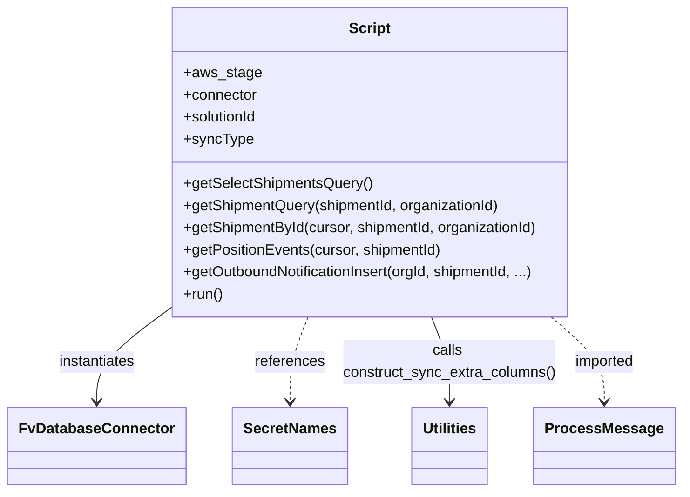
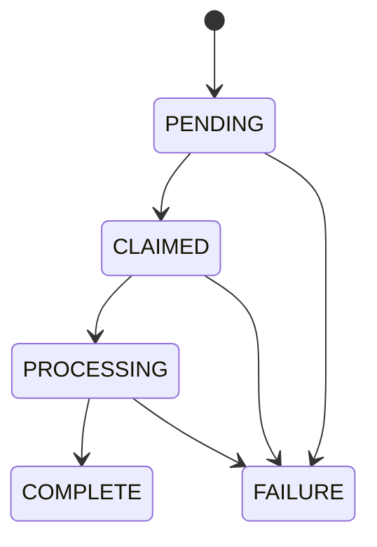

# Diagram: platform/tools/ide_local_testing/localTest/utility/createFinishedVehicleNotifications.py


> Auto-generated by Obscura crawlers

## Diagram 1

```mermaid
flowchart TD
  run([run()])
  connector[[FvDatabaseConnector (connector)]]
  selectQuery[getSelectShipmentsQuery()]
  execSelect[cursor.execute(selectShipmentsQuery) -> results]
  hasResults{results?}
  loop[/for row in results/]
  getShipmentById[getShipmentById(cursor, shipmentId, organizationId)]
  getShipmentQuery[getShipmentQuery -> (query, data)]
  mogrify[cursor.mogrify(query, data)]
  execShipment[cursor.execute(query)]
  fetchOne[cursor.fetchone() -> result]
  condition{shipment and positionEvents?}
  getPositionEvents[getPositionEvents(cursor, shipmentId)]
  positionRows[positionEvents (lat, long, timestamp)]
  buildEvents[Build events list from positionEvents]
  payload[payload JSON]
  outboundInsert[getOutboundNotificationInsert(..., PositionUpdate, ...)]
  insertExec[cursor.execute(insert)]
  printEvent[print(Event: payload)]
  end([end])

  run --> connector
  run --> selectQuery
  selectQuery --> execSelect
  execSelect --> hasResults
  hasResults -- yes --> loop
  hasResults -- no --> end
  loop --> getShipmentById
  getShipmentById --> getShipmentQuery
  getShipmentQuery --> mogrify
  mogrify --> execShipment
  execShipment --> fetchOne
  fetchOne --> condition
  condition -- yes --> getPositionEvents
  condition -- no --> loop
  getPositionEvents --> positionRows
  positionRows --> buildEvents
  buildEvents --> payload
  payload --> outboundInsert
  outboundInsert --> insertExec
  insertExec --> printEvent
  printEvent --> loop
```

> SVG rendering failed for this diagram.

## Diagram 2



### SVG

<svg id="container" width="723.953125" xmlns="http://www.w3.org/2000/svg" class="classDiagram" height="534" viewBox="0 0 723.953125 534" role="graphics-document document" aria-roledescription="class"><style>#container{font-family:"trebuchet ms",verdana,arial,sans-serif;font-size:16px;fill:#333;}@keyframes edge-animation-frame{from{stroke-dashoffset:0;}}@keyframes dash{to{stroke-dashoffset:0;}}#container .edge-animation-slow{stroke-dasharray:9,5!important;stroke-dashoffset:900;animation:dash 50s linear infinite;stroke-linecap:round;}#container .edge-animation-fast{stroke-dasharray:9,5!important;stroke-dashoffset:900;animation:dash 20s linear infinite;stroke-linecap:round;}#container .error-icon{fill:#552222;}#container .error-text{fill:#552222;stroke:#552222;}#container .edge-thickness-normal{stroke-width:1px;}#container .edge-thickness-thick{stroke-width:3.5px;}#container .edge-pattern-solid{stroke-dasharray:0;}#container .edge-thickness-invisible{stroke-width:0;fill:none;}#container .edge-pattern-dashed{stroke-dasharray:3;}#container .edge-pattern-dotted{stroke-dasharray:2;}#container .marker{fill:#333333;stroke:#333333;}#container .marker.cross{stroke:#333333;}#container svg{font-family:"trebuchet ms",verdana,arial,sans-serif;font-size:16px;}#container p{margin:0;}#container g.classGroup text{fill:#9370DB;stroke:none;font-family:"trebuchet ms",verdana,arial,sans-serif;font-size:10px;}#container g.classGroup text .title{font-weight:bolder;}#container .nodeLabel,#container .edgeLabel{color:#131300;}#container .edgeLabel .label rect{fill:#ECECFF;}#container .label text{fill:#131300;}#container .labelBkg{background:#ECECFF;}#container .edgeLabel .label span{background:#ECECFF;}#container .classTitle{font-weight:bolder;}#container .node rect,#container .node circle,#container .node ellipse,#container .node polygon,#container .node path{fill:#ECECFF;stroke:#9370DB;stroke-width:1px;}#container .divider{stroke:#9370DB;stroke-width:1;}#container g.clickable{cursor:pointer;}#container g.classGroup rect{fill:#ECECFF;stroke:#9370DB;}#container g.classGroup line{stroke:#9370DB;stroke-width:1;}#container .classLabel .box{stroke:none;stroke-width:0;fill:#ECECFF;opacity:0.5;}#container .classLabel .label{fill:#9370DB;font-size:10px;}#container .relation{stroke:#333333;stroke-width:1;fill:none;}#container .dashed-line{stroke-dasharray:3;}#container .dotted-line{stroke-dasharray:1 2;}#container #compositionStart,#container .composition{fill:#333333!important;stroke:#333333!important;stroke-width:1;}#container #compositionEnd,#container .composition{fill:#333333!important;stroke:#333333!important;stroke-width:1;}#container #dependencyStart,#container .dependency{fill:#333333!important;stroke:#333333!important;stroke-width:1;}#container #dependencyStart,#container .dependency{fill:#333333!important;stroke:#333333!important;stroke-width:1;}#container #extensionStart,#container .extension{fill:transparent!important;stroke:#333333!important;stroke-width:1;}#container #extensionEnd,#container .extension{fill:transparent!important;stroke:#333333!important;stroke-width:1;}#container #aggregationStart,#container .aggregation{fill:transparent!important;stroke:#333333!important;stroke-width:1;}#container #aggregationEnd,#container .aggregation{fill:transparent!important;stroke:#333333!important;stroke-width:1;}#container #lollipopStart,#container .lollipop{fill:#ECECFF!important;stroke:#333333!important;stroke-width:1;}#container #lollipopEnd,#container .lollipop{fill:#ECECFF!important;stroke:#333333!important;stroke-width:1;}#container .edgeTerminals{font-size:11px;line-height:initial;}#container .classTitleText{text-anchor:middle;font-size:18px;fill:#333;}#container .label-icon{display:inline-block;height:1em;overflow:visible;vertical-align:-0.125em;}#container .node .label-icon path{fill:currentColor;stroke:revert;stroke-width:revert;}#container :root{--mermaid-font-family:"trebuchet ms",verdana,arial,sans-serif;}</style><g><defs><marker id="container_class-aggregationStart" class="marker aggregation class" refX="18" refY="7" markerWidth="190" markerHeight="240" orient="auto"><path d="M 18,7 L9,13 L1,7 L9,1 Z"></path></marker></defs><defs><marker id="container_class-aggregationEnd" class="marker aggregation class" refX="1" refY="7" markerWidth="20" markerHeight="28" orient="auto"><path d="M 18,7 L9,13 L1,7 L9,1 Z"></path></marker></defs><defs><marker id="container_class-extensionStart" class="marker extension class" refX="18" refY="7" markerWidth="190" markerHeight="240" orient="auto"><path d="M 1,7 L18,13 V 1 Z"></path></marker></defs><defs><marker id="container_class-extensionEnd" class="marker extension class" refX="1" refY="7" markerWidth="20" markerHeight="28" orient="auto"><path d="M 1,1 V 13 L18,7 Z"></path></marker></defs><defs><marker id="container_class-compositionStart" class="marker composition class" refX="18" refY="7" markerWidth="190" markerHeight="240" orient="auto"><path d="M 18,7 L9,13 L1,7 L9,1 Z"></path></marker></defs><defs><marker id="container_class-compositionEnd" class="marker composition class" refX="1" refY="7" markerWidth="20" markerHeight="28" orient="auto"><path d="M 18,7 L9,13 L1,7 L9,1 Z"></path></marker></defs><defs><marker id="container_class-dependencyStart" class="marker dependency class" refX="6" refY="7" markerWidth="190" markerHeight="240" orient="auto"><path d="M 5,7 L9,13 L1,7 L9,1 Z"></path></marker></defs><defs><marker id="container_class-dependencyEnd" class="marker dependency class" refX="13" refY="7" markerWidth="20" markerHeight="28" orient="auto"><path d="M 18,7 L9,13 L14,7 L9,1 Z"></path></marker></defs><defs><marker id="container_class-lollipopStart" class="marker lollipop class" refX="13" refY="7" markerWidth="190" markerHeight="240" orient="auto"><circle stroke="black" fill="transparent" cx="7" cy="7" r="6"></circle></marker></defs><defs><marker id="container_class-lollipopEnd" class="marker lollipop class" refX="1" refY="7" markerWidth="190" markerHeight="240" orient="auto"><circle stroke="black" fill="transparent" cx="7" cy="7" r="6"></circle></marker></defs><g class="root"><g class="clusters"></g><g class="edgePaths"><path d="M169.605,340.106L157.889,348.922C146.172,357.738,122.738,375.369,111.021,391.351C99.305,407.333,99.305,421.667,99.305,428.833L99.305,436" id="id_Script_FvDatabaseConnector_1" class="edge-thickness-normal edge-pattern-solid relation" style=";;;" data-edge="true" data-et="edge" data-id="id_Script_FvDatabaseConnector_1" data-points="W3sieCI6MTY5LjYwNTQ2ODc1LCJ5IjozNDAuMTA2MzYwMjEzNDUxOH0seyJ4Ijo5OS4zMDQ2ODc1LCJ5IjozOTN9LHsieCI6OTkuMzA0Njg3NSwieSI6NDQyfV0=" marker-end="url(#container_class-dependencyEnd)"></path><path d="M320.303,344L317.026,352.167C313.749,360.333,307.195,376.667,303.918,392C300.641,407.333,300.641,421.667,300.641,428.833L300.641,436" id="id_Script_SecretNames_2" class="edge-thickness-normal edge-pattern-dashed relation" style=";;;" data-edge="true" data-et="edge" data-id="id_Script_SecretNames_2" data-points="W3sieCI6MzIwLjMwMzQyNzQxOTM1NDgsInkiOjM0NH0seyJ4IjozMDAuNjQwNjI1LCJ5IjozOTN9LHsieCI6MzAwLjY0MDYyNSwieSI6NDQyfV0=" marker-end="url(#container_class-dependencyEnd)"></path><path d="M455.134,344L458.411,352.167C461.688,360.333,468.243,376.667,471.52,392C474.797,407.333,474.797,421.667,474.797,428.833L474.797,436" id="id_Script_Utilities_3" class="edge-thickness-normal edge-pattern-solid relation" style=";;;" data-edge="true" data-et="edge" data-id="id_Script_Utilities_3" data-points="W3sieCI6NDU1LjEzNDA3MjU4MDY0NTIsInkiOjM0NH0seyJ4Ijo0NzQuNzk2ODc1LCJ5IjozOTN9LHsieCI6NDc0Ljc5Njg3NSwieSI6NDQyfV0=" marker-end="url(#container_class-dependencyEnd)"></path><path d="M586.644,344L596.314,352.167C605.984,360.333,625.324,376.667,634.994,392C644.664,407.333,644.664,421.667,644.664,428.833L644.664,436" id="id_Script_ProcessMessage_4" class="edge-thickness-normal edge-pattern-dashed relation" style=";;;" data-edge="true" data-et="edge" data-id="id_Script_ProcessMessage_4" data-points="W3sieCI6NTg2LjY0NDE1MzIyNTgwNjUsInkiOjM0NH0seyJ4Ijo2NDQuNjY0MDYyNSwieSI6MzkzfSx7IngiOjY0NC42NjQwNjI1LCJ5Ijo0NDJ9XQ==" marker-end="url(#container_class-dependencyEnd)"></path></g><g class="edgeLabels"><g class="edgeLabel" transform="translate(99.3046875, 393)"><g class="label" data-id="id_Script_FvDatabaseConnector_1" transform="translate(-42.9140625, -12)"><foreignObject width="85.828125" height="24"><div xmlns="http://www.w3.org/1999/xhtml" class="labelBkg" style="display: table-cell; white-space: nowrap; line-height: 1.5; max-width: 200px; text-align: center;"><span class="edgeLabel"><p>instantiates</p></span></div></foreignObject></g></g><g class="edgeLabel" transform="translate(300.640625, 393)"><g class="label" data-id="id_Script_SecretNames_2" transform="translate(-37.828125, -12)"><foreignObject width="75.65625" height="24"><div xmlns="http://www.w3.org/1999/xhtml" class="labelBkg" style="display: table-cell; white-space: nowrap; line-height: 1.5; max-width: 200px; text-align: center;"><span class="edgeLabel"><p>references</p></span></div></foreignObject></g></g><g class="edgeLabel" transform="translate(474.796875, 393)"><g class="label" data-id="id_Script_Utilities_3" transform="translate(-116.328125, -24)"><foreignObject width="232.65625" height="48"><div xmlns="http://www.w3.org/1999/xhtml" class="labelBkg" style="display: table; white-space: break-spaces; line-height: 1.5; max-width: 200px; text-align: center; width: 200px;"><span class="edgeLabel"><p>calls construct_sync_extra_columns()</p></span></div></foreignObject></g></g><g class="edgeLabel" transform="translate(644.6640625, 393)"><g class="label" data-id="id_Script_ProcessMessage_4" transform="translate(-33.5390625, -12)"><foreignObject width="67.078125" height="24"><div xmlns="http://www.w3.org/1999/xhtml" class="labelBkg" style="display: table-cell; white-space: nowrap; line-height: 1.5; max-width: 200px; text-align: center;"><span class="edgeLabel"><p>imported</p></span></div></foreignObject></g></g></g><g class="nodes"><g class="node default" id="classId-Script-0" transform="translate(387.71875, 176)"><g class="basic label-container"><path d="M-218.11328125 -168 L218.11328125 -168 L218.11328125 168 L-218.11328125 168" stroke="none" stroke-width="0" fill="#ECECFF" style=""></path><path d="M-218.11328125 -168 C-101.68569099919253 -168, 14.741899251614939 -168, 218.11328125 -168 M-218.11328125 -168 C-78.87395373773802 -168, 60.36537377452396 -168, 218.11328125 -168 M218.11328125 -168 C218.11328125 -45.82990855326021, 218.11328125 76.34018289347958, 218.11328125 168 M218.11328125 -168 C218.11328125 -93.62105592337336, 218.11328125 -19.242111846746724, 218.11328125 168 M218.11328125 168 C68.10838409058567 168, -81.89651306882865 168, -218.11328125 168 M218.11328125 168 C109.06938804323919 168, 0.025494836478372918 168, -218.11328125 168 M-218.11328125 168 C-218.11328125 56.306324393910955, -218.11328125 -55.38735121217809, -218.11328125 -168 M-218.11328125 168 C-218.11328125 77.13844202415707, -218.11328125 -13.723115951685855, -218.11328125 -168" stroke="#9370DB" stroke-width="1.3" fill="none" stroke-dasharray="0 0" style=""></path></g><g class="annotation-group text" transform="translate(0, -144)"></g><g class="label-group text" transform="translate(-21.7421875, -144)"><g class="label" style="font-weight: bolder" transform="translate(0,-12)"><foreignObject width="43.484375" height="24"><div xmlns="http://www.w3.org/1999/xhtml" style="display: table-cell; white-space: nowrap; line-height: 1.5; max-width: 93px; text-align: center;"><span class="nodeLabel markdown-node-label" style=""><p>Script</p></span></div></foreignObject></g></g><g class="members-group text" transform="translate(-206.11328125, -96)"><g class="label" style="" transform="translate(0,-12)"><foreignObject width="81.78125" height="24"><div xmlns="http://www.w3.org/1999/xhtml" style="display: table-cell; white-space: nowrap; line-height: 1.5; max-width: 139px; text-align: center;"><span class="nodeLabel markdown-node-label" style=""><p>+aws_stage</p></span></div></foreignObject></g><g class="label" style="" transform="translate(0,12)"><foreignObject width="80.84375" height="24"><div xmlns="http://www.w3.org/1999/xhtml" style="display: table-cell; white-space: nowrap; line-height: 1.5; max-width: 139px; text-align: center;"><span class="nodeLabel markdown-node-label" style=""><p>+connector</p></span></div></foreignObject></g><g class="label" style="" transform="translate(0,36)"><foreignObject width="82.109375" height="24"><div xmlns="http://www.w3.org/1999/xhtml" style="display: table-cell; white-space: nowrap; line-height: 1.5; max-width: 139px; text-align: center;"><span class="nodeLabel markdown-node-label" style=""><p>+solutionId</p></span></div></foreignObject></g><g class="label" style="" transform="translate(0,60)"><foreignObject width="73.8125" height="24"><div xmlns="http://www.w3.org/1999/xhtml" style="display: table-cell; white-space: nowrap; line-height: 1.5; max-width: 131px; text-align: center;"><span class="nodeLabel markdown-node-label" style=""><p>+syncType</p></span></div></foreignObject></g></g><g class="methods-group text" transform="translate(-206.11328125, 24)"><g class="label" style="" transform="translate(0,-12)"><foreignObject width="205.421875" height="24"><div xmlns="http://www.w3.org/1999/xhtml" style="display: table-cell; white-space: nowrap; line-height: 1.5; max-width: 263px; text-align: center;"><span class="nodeLabel markdown-node-label" style=""><p>+getSelectShipmentsQuery()</p></span></div></foreignObject></g><g class="label" style="" transform="translate(0,12)"><foreignObject width="349.203125" height="24"><div xmlns="http://www.w3.org/1999/xhtml" style="display: table-cell; white-space: nowrap; line-height: 1.5; max-width: 407px; text-align: center;"><span class="nodeLabel markdown-node-label" style=""><p>+getShipmentQuery(shipmentId, organizationId)</p></span></div></foreignObject></g><g class="label" style="" transform="translate(0,36)"><foreignObject width="390.484375" height="24"><div xmlns="http://www.w3.org/1999/xhtml" style="display: table-cell; white-space: nowrap; line-height: 1.5; max-width: 448px; text-align: center;"><span class="nodeLabel markdown-node-label" style=""><p>+getShipmentById(cursor, shipmentId, organizationId)</p></span></div></foreignObject></g><g class="label" style="" transform="translate(0,60)"><foreignObject width="282.734375" height="24"><div xmlns="http://www.w3.org/1999/xhtml" style="display: table-cell; white-space: nowrap; line-height: 1.5; max-width: 340px; text-align: center;"><span class="nodeLabel markdown-node-label" style=""><p>+getPositionEvents(cursor, shipmentId)</p></span></div></foreignObject></g><g class="label" style="" transform="translate(0,84)"><foreignObject width="389.6875" height="24"><div xmlns="http://www.w3.org/1999/xhtml" style="display: table-cell; white-space: nowrap; line-height: 1.5; max-width: 447px; text-align: center;"><span class="nodeLabel markdown-node-label" style=""><p>+getOutboundNotificationInsert(orgId, shipmentId, ...)</p></span></div></foreignObject></g><g class="label" style="" transform="translate(0,108)"><foreignObject width="43.21875" height="24"><div xmlns="http://www.w3.org/1999/xhtml" style="display: table-cell; white-space: nowrap; line-height: 1.5; max-width: 101px; text-align: center;"><span class="nodeLabel markdown-node-label" style=""><p>+run()</p></span></div></foreignObject></g></g><g class="divider" style=""><path d="M-218.11328125 -120 C-62.49672623145531 -120, 93.11982878708938 -120, 218.11328125 -120 M-218.11328125 -120 C-82.5858578061625 -120, 52.94156563767501 -120, 218.11328125 -120" stroke="#9370DB" stroke-width="1.3" fill="none" stroke-dasharray="0 0" style=""></path></g><g class="divider" style=""><path d="M-218.11328125 0 C-73.40151279542462 0, 71.31025565915076 0, 218.11328125 0 M-218.11328125 0 C-79.21711427993702 0, 59.67905269012596 0, 218.11328125 0" stroke="#9370DB" stroke-width="1.3" fill="none" stroke-dasharray="0 0" style=""></path></g></g><g class="node default" id="classId-FvDatabaseConnector-1" transform="translate(99.3046875, 484)"><g class="basic label-container"><path d="M-91.3046875 -42 L91.3046875 -42 L91.3046875 42 L-91.3046875 42" stroke="none" stroke-width="0" fill="#ECECFF" style=""></path><path d="M-91.3046875 -42 C-21.3635882982543 -42, 48.5775109034914 -42, 91.3046875 -42 M-91.3046875 -42 C-21.527149046875508 -42, 48.250389406248985 -42, 91.3046875 -42 M91.3046875 -42 C91.3046875 -17.486554474263574, 91.3046875 7.026891051472852, 91.3046875 42 M91.3046875 -42 C91.3046875 -13.928614111733864, 91.3046875 14.142771776532271, 91.3046875 42 M91.3046875 42 C45.81624905267281 42, 0.32781060534561846 42, -91.3046875 42 M91.3046875 42 C19.60864695903784 42, -52.08739358192432 42, -91.3046875 42 M-91.3046875 42 C-91.3046875 15.663694558602295, -91.3046875 -10.67261088279541, -91.3046875 -42 M-91.3046875 42 C-91.3046875 14.376908199253439, -91.3046875 -13.246183601493122, -91.3046875 -42" stroke="#9370DB" stroke-width="1.3" fill="none" stroke-dasharray="0 0" style=""></path></g><g class="annotation-group text" transform="translate(0, -18)"></g><g class="label-group text" transform="translate(-79.3046875, -18)"><g class="label" style="font-weight: bolder" transform="translate(0,-12)"><foreignObject width="158.609375" height="24"><div xmlns="http://www.w3.org/1999/xhtml" style="display: table-cell; white-space: nowrap; line-height: 1.5; max-width: 207px; text-align: center;"><span class="nodeLabel markdown-node-label" style=""><p>FvDatabaseConnector</p></span></div></foreignObject></g></g><g class="members-group text" transform="translate(-79.3046875, 30)"></g><g class="methods-group text" transform="translate(-79.3046875, 60)"></g><g class="divider" style=""><path d="M-91.3046875 6 C-40.60471873172959 6, 10.095250036540818 6, 91.3046875 6 M-91.3046875 6 C-45.759835356932804 6, -0.21498321386560804 6, 91.3046875 6" stroke="#9370DB" stroke-width="1.3" fill="none" stroke-dasharray="0 0" style=""></path></g><g class="divider" style=""><path d="M-91.3046875 24 C-23.354646125957387 24, 44.595395248085225 24, 91.3046875 24 M-91.3046875 24 C-40.15936097947417 24, 10.985965541051655 24, 91.3046875 24" stroke="#9370DB" stroke-width="1.3" fill="none" stroke-dasharray="0 0" style=""></path></g></g><g class="node default" id="classId-SecretNames-2" transform="translate(300.640625, 484)"><g class="basic label-container"><path d="M-60.03125 -42 L60.03125 -42 L60.03125 42 L-60.03125 42" stroke="none" stroke-width="0" fill="#ECECFF" style=""></path><path d="M-60.03125 -42 C-24.717461118093837 -42, 10.596327763812326 -42, 60.03125 -42 M-60.03125 -42 C-18.285459495441458 -42, 23.460331009117084 -42, 60.03125 -42 M60.03125 -42 C60.03125 -18.896121934285844, 60.03125 4.207756131428312, 60.03125 42 M60.03125 -42 C60.03125 -17.97968801826377, 60.03125 6.040623963472463, 60.03125 42 M60.03125 42 C35.72774707793356 42, 11.424244155867115 42, -60.03125 42 M60.03125 42 C34.248351803536195 42, 8.465453607072384 42, -60.03125 42 M-60.03125 42 C-60.03125 19.389130617336544, -60.03125 -3.2217387653269114, -60.03125 -42 M-60.03125 42 C-60.03125 12.694125050620947, -60.03125 -16.611749898758106, -60.03125 -42" stroke="#9370DB" stroke-width="1.3" fill="none" stroke-dasharray="0 0" style=""></path></g><g class="annotation-group text" transform="translate(0, -18)"></g><g class="label-group text" transform="translate(-48.03125, -18)"><g class="label" style="font-weight: bolder" transform="translate(0,-12)"><foreignObject width="96.0625" height="24"><div xmlns="http://www.w3.org/1999/xhtml" style="display: table-cell; white-space: nowrap; line-height: 1.5; max-width: 145px; text-align: center;"><span class="nodeLabel markdown-node-label" style=""><p>SecretNames</p></span></div></foreignObject></g></g><g class="members-group text" transform="translate(-48.03125, 30)"></g><g class="methods-group text" transform="translate(-48.03125, 60)"></g><g class="divider" style=""><path d="M-60.03125 6 C-26.205821097580106 6, 7.619607804839788 6, 60.03125 6 M-60.03125 6 C-27.669272778563794 6, 4.692704442872412 6, 60.03125 6" stroke="#9370DB" stroke-width="1.3" fill="none" stroke-dasharray="0 0" style=""></path></g><g class="divider" style=""><path d="M-60.03125 24 C-25.684951501266433 24, 8.661346997467135 24, 60.03125 24 M-60.03125 24 C-23.323755268722515 24, 13.38373946255497 24, 60.03125 24" stroke="#9370DB" stroke-width="1.3" fill="none" stroke-dasharray="0 0" style=""></path></g></g><g class="node default" id="classId-Utilities-3" transform="translate(474.796875, 484)"><g class="basic label-container"><path d="M-40.8125 -42 L40.8125 -42 L40.8125 42 L-40.8125 42" stroke="none" stroke-width="0" fill="#ECECFF" style=""></path><path d="M-40.8125 -42 C-16.807033174577025 -42, 7.198433650845949 -42, 40.8125 -42 M-40.8125 -42 C-19.46572493308725 -42, 1.8810501338254966 -42, 40.8125 -42 M40.8125 -42 C40.8125 -10.718676359051212, 40.8125 20.562647281897576, 40.8125 42 M40.8125 -42 C40.8125 -22.6386796340118, 40.8125 -3.277359268023602, 40.8125 42 M40.8125 42 C14.11596463454742 42, -12.580570730905158 42, -40.8125 42 M40.8125 42 C19.292384127116257 42, -2.2277317457674854 42, -40.8125 42 M-40.8125 42 C-40.8125 20.682814785208777, -40.8125 -0.6343704295824466, -40.8125 -42 M-40.8125 42 C-40.8125 17.578369711549417, -40.8125 -6.843260576901166, -40.8125 -42" stroke="#9370DB" stroke-width="1.3" fill="none" stroke-dasharray="0 0" style=""></path></g><g class="annotation-group text" transform="translate(0, -18)"></g><g class="label-group text" transform="translate(-28.8125, -18)"><g class="label" style="font-weight: bolder" transform="translate(0,-12)"><foreignObject width="57.625" height="24"><div xmlns="http://www.w3.org/1999/xhtml" style="display: table-cell; white-space: nowrap; line-height: 1.5; max-width: 107px; text-align: center;"><span class="nodeLabel markdown-node-label" style=""><p>Utilities</p></span></div></foreignObject></g></g><g class="members-group text" transform="translate(-28.8125, 30)"></g><g class="methods-group text" transform="translate(-28.8125, 60)"></g><g class="divider" style=""><path d="M-40.8125 6 C-20.342041946593852 6, 0.12841610681229554 6, 40.8125 6 M-40.8125 6 C-12.800957307812716 6, 15.210585384374568 6, 40.8125 6" stroke="#9370DB" stroke-width="1.3" fill="none" stroke-dasharray="0 0" style=""></path></g><g class="divider" style=""><path d="M-40.8125 24 C-16.263529127713873 24, 8.285441744572253 24, 40.8125 24 M-40.8125 24 C-12.414170691682912 24, 15.984158616634176 24, 40.8125 24" stroke="#9370DB" stroke-width="1.3" fill="none" stroke-dasharray="0 0" style=""></path></g></g><g class="node default" id="classId-ProcessMessage-4" transform="translate(644.6640625, 484)"><g class="basic label-container"><path d="M-71.2890625 -42 L71.2890625 -42 L71.2890625 42 L-71.2890625 42" stroke="none" stroke-width="0" fill="#ECECFF" style=""></path><path d="M-71.2890625 -42 C-41.772166010568725 -42, -12.25526952113745 -42, 71.2890625 -42 M-71.2890625 -42 C-31.948908821715882 -42, 7.391244856568235 -42, 71.2890625 -42 M71.2890625 -42 C71.2890625 -10.553049940223573, 71.2890625 20.893900119552853, 71.2890625 42 M71.2890625 -42 C71.2890625 -23.844802066449695, 71.2890625 -5.68960413289939, 71.2890625 42 M71.2890625 42 C37.54205466138775 42, 3.795046822775504 42, -71.2890625 42 M71.2890625 42 C26.924345780812082 42, -17.440370938375835 42, -71.2890625 42 M-71.2890625 42 C-71.2890625 17.78772313732778, -71.2890625 -6.424553725344438, -71.2890625 -42 M-71.2890625 42 C-71.2890625 15.802361883477367, -71.2890625 -10.395276233045266, -71.2890625 -42" stroke="#9370DB" stroke-width="1.3" fill="none" stroke-dasharray="0 0" style=""></path></g><g class="annotation-group text" transform="translate(0, -18)"></g><g class="label-group text" transform="translate(-59.2890625, -18)"><g class="label" style="font-weight: bolder" transform="translate(0,-12)"><foreignObject width="118.578125" height="24"><div xmlns="http://www.w3.org/1999/xhtml" style="display: table-cell; white-space: nowrap; line-height: 1.5; max-width: 166px; text-align: center;"><span class="nodeLabel markdown-node-label" style=""><p>ProcessMessage</p></span></div></foreignObject></g></g><g class="members-group text" transform="translate(-59.2890625, 30)"></g><g class="methods-group text" transform="translate(-59.2890625, 60)"></g><g class="divider" style=""><path d="M-71.2890625 6 C-38.63300954751457 6, -5.976956595029137 6, 71.2890625 6 M-71.2890625 6 C-34.07279253369015 6, 3.1434774326197044 6, 71.2890625 6" stroke="#9370DB" stroke-width="1.3" fill="none" stroke-dasharray="0 0" style=""></path></g><g class="divider" style=""><path d="M-71.2890625 24 C-27.045498127344707 24, 17.198066245310585 24, 71.2890625 24 M-71.2890625 24 C-34.20909297181706 24, 2.870876556365886 24, 71.2890625 24" stroke="#9370DB" stroke-width="1.3" fill="none" stroke-dasharray="0 0" style=""></path></g></g></g></g></g></svg>

## Diagram 3



### SVG

<svg id="container" width="245.16015625" xmlns="http://www.w3.org/2000/svg" class="statediagram" height="390" viewBox="0 0 245.16015625 390" role="graphics-document document" aria-roledescription="stateDiagram"><style>#container{font-family:"trebuchet ms",verdana,arial,sans-serif;font-size:16px;fill:#333;}@keyframes edge-animation-frame{from{stroke-dashoffset:0;}}@keyframes dash{to{stroke-dashoffset:0;}}#container .edge-animation-slow{stroke-dasharray:9,5!important;stroke-dashoffset:900;animation:dash 50s linear infinite;stroke-linecap:round;}#container .edge-animation-fast{stroke-dasharray:9,5!important;stroke-dashoffset:900;animation:dash 20s linear infinite;stroke-linecap:round;}#container .error-icon{fill:#552222;}#container .error-text{fill:#552222;stroke:#552222;}#container .edge-thickness-normal{stroke-width:1px;}#container .edge-thickness-thick{stroke-width:3.5px;}#container .edge-pattern-solid{stroke-dasharray:0;}#container .edge-thickness-invisible{stroke-width:0;fill:none;}#container .edge-pattern-dashed{stroke-dasharray:3;}#container .edge-pattern-dotted{stroke-dasharray:2;}#container .marker{fill:#333333;stroke:#333333;}#container .marker.cross{stroke:#333333;}#container svg{font-family:"trebuchet ms",verdana,arial,sans-serif;font-size:16px;}#container p{margin:0;}#container defs #statediagram-barbEnd{fill:#333333;stroke:#333333;}#container g.stateGroup text{fill:#9370DB;stroke:none;font-size:10px;}#container g.stateGroup text{fill:#333;stroke:none;font-size:10px;}#container g.stateGroup .state-title{font-weight:bolder;fill:#131300;}#container g.stateGroup rect{fill:#ECECFF;stroke:#9370DB;}#container g.stateGroup line{stroke:#333333;stroke-width:1;}#container .transition{stroke:#333333;stroke-width:1;fill:none;}#container .stateGroup .composit{fill:white;border-bottom:1px;}#container .stateGroup .alt-composit{fill:#e0e0e0;border-bottom:1px;}#container .state-note{stroke:#aaaa33;fill:#fff5ad;}#container .state-note text{fill:black;stroke:none;font-size:10px;}#container .stateLabel .box{stroke:none;stroke-width:0;fill:#ECECFF;opacity:0.5;}#container .edgeLabel .label rect{fill:#ECECFF;opacity:0.5;}#container .edgeLabel{background-color:rgba(232,232,232, 0.8);text-align:center;}#container .edgeLabel p{background-color:rgba(232,232,232, 0.8);}#container .edgeLabel rect{opacity:0.5;background-color:rgba(232,232,232, 0.8);fill:rgba(232,232,232, 0.8);}#container .edgeLabel .label text{fill:#333;}#container .label div .edgeLabel{color:#333;}#container .stateLabel text{fill:#131300;font-size:10px;font-weight:bold;}#container .node circle.state-start{fill:#333333;stroke:#333333;}#container .node .fork-join{fill:#333333;stroke:#333333;}#container .node circle.state-end{fill:#9370DB;stroke:white;stroke-width:1.5;}#container .end-state-inner{fill:white;stroke-width:1.5;}#container .node rect{fill:#ECECFF;stroke:#9370DB;stroke-width:1px;}#container .node polygon{fill:#ECECFF;stroke:#9370DB;stroke-width:1px;}#container #statediagram-barbEnd{fill:#333333;}#container .statediagram-cluster rect{fill:#ECECFF;stroke:#9370DB;stroke-width:1px;}#container .cluster-label,#container .nodeLabel{color:#131300;}#container .statediagram-cluster rect.outer{rx:5px;ry:5px;}#container .statediagram-state .divider{stroke:#9370DB;}#container .statediagram-state .title-state{rx:5px;ry:5px;}#container .statediagram-cluster.statediagram-cluster .inner{fill:white;}#container .statediagram-cluster.statediagram-cluster-alt .inner{fill:#f0f0f0;}#container .statediagram-cluster .inner{rx:0;ry:0;}#container .statediagram-state rect.basic{rx:5px;ry:5px;}#container .statediagram-state rect.divider{stroke-dasharray:10,10;fill:#f0f0f0;}#container .note-edge{stroke-dasharray:5;}#container .statediagram-note rect{fill:#fff5ad;stroke:#aaaa33;stroke-width:1px;rx:0;ry:0;}#container .statediagram-note rect{fill:#fff5ad;stroke:#aaaa33;stroke-width:1px;rx:0;ry:0;}#container .statediagram-note text{fill:black;}#container .statediagram-note .nodeLabel{color:black;}#container .statediagram .edgeLabel{color:red;}#container #dependencyStart,#container #dependencyEnd{fill:#333333;stroke:#333333;stroke-width:1;}#container .statediagramTitleText{text-anchor:middle;font-size:18px;fill:#333;}#container :root{--mermaid-font-family:"trebuchet ms",verdana,arial,sans-serif;}</style><g><defs><marker id="container_stateDiagram-barbEnd" refX="19" refY="7" markerWidth="20" markerHeight="14" markerUnits="userSpaceOnUse" orient="auto"><path d="M 19,7 L9,13 L14,7 L9,1 Z"></path></marker></defs><g class="root"><g class="clusters"></g><g class="edgePaths"><path d="M144.461,22L144.461,26.167C144.461,30.333,144.461,38.667,144.544,47.083C144.628,55.5,144.794,64,144.878,68.25L144.961,72.5" id="edge0" class="edge-thickness-normal edge-pattern-solid transition" style="fill:none;;;fill:none" data-edge="true" data-et="edge" data-id="edge0" data-points="W3sieCI6MTQ0LjQ2MDkzNzUsInkiOjIyfSx7IngiOjE0NC40NjA5Mzc1LCJ5Ijo0N30seyJ4IjoxNDQuOTYwOTM3NSwieSI6NzIuNX1d" marker-end="url(#container_stateDiagram-barbEnd)"></path><path d="M128.501,112.5L124.988,116.583C121.476,120.667,114.451,128.833,111.022,137.167C107.592,145.5,107.759,154,107.842,158.25L107.926,162.5" id="edge1" class="edge-thickness-normal edge-pattern-solid transition" style="fill:none;;;fill:none" data-edge="true" data-et="edge" data-id="edge1" data-points="W3sieCI6MTI4LjUwMDg2ODA1NTU1NTU0LCJ5IjoxMTIuNX0seyJ4IjoxMDcuNDI1NzgxMjUsInkiOjEzN30seyJ4IjoxMDcuOTI1NzgxMjUsInkiOjE2Mi41fV0=" marker-end="url(#container_stateDiagram-barbEnd)"></path><path d="M88.341,202.5L84.177,206.583C80.014,210.667,71.686,218.833,67.606,227.167C63.526,235.5,63.693,244,63.776,248.25L63.859,252.5" id="edge2" class="edge-thickness-normal edge-pattern-solid transition" style="fill:none;;;fill:none" data-edge="true" data-et="edge" data-id="edge2" data-points="W3sieCI6ODguMzQwNzExODA1NTU1NTYsInkiOjIwMi41fSx7IngiOjYzLjM1OTM3NSwieSI6MjI3fSx7IngiOjYzLjg1OTM3NSwieSI6MjUyLjV9XQ==" marker-end="url(#container_stateDiagram-barbEnd)"></path><path d="M59.415,292.5L58.406,296.583C57.396,300.667,55.378,308.833,54.452,317.167C53.526,325.5,53.693,334,53.776,338.25L53.859,342.5" id="edge3" class="edge-thickness-normal edge-pattern-solid transition" style="fill:none;;;fill:none" data-edge="true" data-et="edge" data-id="edge3" data-points="W3sieCI6NTkuNDE0OTMwNTU1NTU1NTYsInkiOjI5Mi41fSx7IngiOjUzLjM1OTM3NSwieSI6MzE3fSx7IngiOjUzLjg1OTM3NSwieSI6MzQyLjV9XQ==" marker-end="url(#container_stateDiagram-barbEnd)"></path><path d="M88.757,292.5L93.861,296.583C98.964,300.667,109.172,308.833,122.128,317.311C135.084,325.788,150.789,334.577,158.642,338.971L166.495,343.365" id="edge4" class="edge-thickness-normal edge-pattern-solid transition" style="fill:none;;;fill:none" data-edge="true" data-et="edge" data-id="edge4" data-points="W3sieCI6ODguNzU2OTQ0NDQ0NDQ0NDQsInkiOjI5Mi41fSx7IngiOjExOS4zNzg5MDYyNSwieSI6MzE3fSx7IngiOjE2Ni40OTQ1OTkwMDQxMDcxLCJ5IjozNDMuMzY1MTc1ODI3MzQzOTN9XQ==" marker-end="url(#container_stateDiagram-barbEnd)"></path><path d="M137.268,202.5L143.297,206.583C149.327,210.667,161.386,218.833,167.416,230.417C173.445,242,173.445,257,173.445,272C173.445,287,173.445,302,176.032,313.75C178.618,325.5,183.792,334,186.378,338.25L188.965,342.5" id="edge5" class="edge-thickness-normal edge-pattern-solid transition" style="fill:none;;;fill:none" data-edge="true" data-et="edge" data-id="edge5" data-points="W3sieCI6MTM3LjI2Nzc5NTEzODg4ODg5LCJ5IjoyMDIuNX0seyJ4IjoxNzMuNDQ1MzEyNSwieSI6MjI3fSx7IngiOjE3My40NDUzMTI1LCJ5IjoyNzJ9LHsieCI6MTczLjQ0NTMxMjUsInkiOjMxN30seyJ4IjoxODguOTY0ODQzNzUsInkiOjM0Mi41fV0=" marker-end="url(#container_stateDiagram-barbEnd)"></path><path d="M178.747,112.5L185.703,116.583C192.658,120.667,206.569,128.833,213.525,140.417C220.48,152,220.48,167,220.48,182C220.48,197,220.48,212,220.48,227C220.48,242,220.48,257,220.48,272C220.48,287,220.48,302,218.712,313.75C216.943,325.5,213.406,334,211.638,338.25L209.869,342.5" id="edge6" class="edge-thickness-normal edge-pattern-solid transition" style="fill:none;;;fill:none" data-edge="true" data-et="edge" data-id="edge6" data-points="W3sieCI6MTc4Ljc0NzM5NTgzMzMzMzM0LCJ5IjoxMTIuNX0seyJ4IjoyMjAuNDgwNDY4NzUsInkiOjEzN30seyJ4IjoyMjAuNDgwNDY4NzUsInkiOjE4Mn0seyJ4IjoyMjAuNDgwNDY4NzUsInkiOjIyN30seyJ4IjoyMjAuNDgwNDY4NzUsInkiOjI3Mn0seyJ4IjoyMjAuNDgwNDY4NzUsInkiOjMxN30seyJ4IjoyMDkuODY5MzU3NjM4ODg4ODksInkiOjM0Mi41fV0=" marker-end="url(#container_stateDiagram-barbEnd)"></path></g><g class="edgeLabels"><g class="edgeLabel"><g class="label" data-id="edge0" transform="translate(0, 0)"><foreignObject width="0" height="0"><div xmlns="http://www.w3.org/1999/xhtml" class="labelBkg" style="display: table-cell; white-space: nowrap; line-height: 1.5; max-width: 200px; text-align: center;"><span class="edgeLabel"></span></div></foreignObject></g></g><g class="edgeLabel"><g class="label" data-id="edge1" transform="translate(0, 0)"><foreignObject width="0" height="0"><div xmlns="http://www.w3.org/1999/xhtml" class="labelBkg" style="display: table-cell; white-space: nowrap; line-height: 1.5; max-width: 200px; text-align: center;"><span class="edgeLabel"></span></div></foreignObject></g></g><g class="edgeLabel"><g class="label" data-id="edge2" transform="translate(0, 0)"><foreignObject width="0" height="0"><div xmlns="http://www.w3.org/1999/xhtml" class="labelBkg" style="display: table-cell; white-space: nowrap; line-height: 1.5; max-width: 200px; text-align: center;"><span class="edgeLabel"></span></div></foreignObject></g></g><g class="edgeLabel"><g class="label" data-id="edge3" transform="translate(0, 0)"><foreignObject width="0" height="0"><div xmlns="http://www.w3.org/1999/xhtml" class="labelBkg" style="display: table-cell; white-space: nowrap; line-height: 1.5; max-width: 200px; text-align: center;"><span class="edgeLabel"></span></div></foreignObject></g></g><g class="edgeLabel"><g class="label" data-id="edge4" transform="translate(0, 0)"><foreignObject width="0" height="0"><div xmlns="http://www.w3.org/1999/xhtml" class="labelBkg" style="display: table-cell; white-space: nowrap; line-height: 1.5; max-width: 200px; text-align: center;"><span class="edgeLabel"></span></div></foreignObject></g></g><g class="edgeLabel"><g class="label" data-id="edge5" transform="translate(0, 0)"><foreignObject width="0" height="0"><div xmlns="http://www.w3.org/1999/xhtml" class="labelBkg" style="display: table-cell; white-space: nowrap; line-height: 1.5; max-width: 200px; text-align: center;"><span class="edgeLabel"></span></div></foreignObject></g></g><g class="edgeLabel"><g class="label" data-id="edge6" transform="translate(0, 0)"><foreignObject width="0" height="0"><div xmlns="http://www.w3.org/1999/xhtml" class="labelBkg" style="display: table-cell; white-space: nowrap; line-height: 1.5; max-width: 200px; text-align: center;"><span class="edgeLabel"></span></div></foreignObject></g></g></g><g class="nodes"><g class="node default" id="state-root_start-0" transform="translate(144.4609375, 15)"><circle class="state-start" r="7" width="14" height="14"></circle></g><g class="node  statediagram-state" id="state-PENDING-6" transform="translate(144.4609375, 92)"><g class="basic label-container outer-path"><path d="M-35.421875 -20 C-12.48001393287434 -20, 10.461847134251322 -20, 35.421875 -20 C35.421875 -20, 35.421875 -20, 35.421875 -20 C35.570254598725874 -19.993862974400958, 35.718634197451756 -19.987725948801916, 35.83477172736166 -19.982922465033347 C35.921303448836525 -19.972136297200038, 36.00783517031139 -19.96135012936673, 36.24484795140367 -19.931806517013612 C36.335748663135774 -19.9127466420835, 36.42664937486788 -19.893686767153394, 36.649302435703994 -19.847001329696653 C36.7889764210322 -19.80541858261478, 36.92865040636041 -19.76383583553291, 37.04537234602342 -19.729086208503173 C37.14678965135802 -19.689513053161647, 37.24820695669261 -19.649939897820126, 37.430352123264846 -19.578866633275286 C37.55101002738829 -19.51988057823176, 37.671667931511735 -19.46089452318823, 37.801611965185366 -19.397368756032446 C37.874074488817314 -19.35419046405461, 37.94653701244927 -19.311012172076772, 38.156615790612136 -19.185832391312644 C38.27776741643134 -19.09933179308363, 38.39891904225055 -19.01283119485461, 38.49293856344834 -18.94570254698197 C38.59331717238913 -18.860686201916586, 38.693695781329914 -18.775669856851202, 38.808282858128706 -18.678619553365657 C38.91177233592104 -18.57513007557332, 39.01526181371338 -18.47164059778098, 39.10049455336566 -18.386407858128706 C39.17246724643625 -18.301429859996798, 39.24443993950684 -18.21645186186489, 39.36757754698197 -18.07106356344834 C39.421192665172015 -17.995970918192697, 39.47480778336206 -17.92087827293705, 39.607707391312644 -17.734740790612136 C39.664233396624084 -17.639877913734043, 39.72075940193552 -17.545015036855954, 39.81924375603245 -17.37973696518537 C39.87638363635791 -17.262855471807885, 39.93352351668336 -17.1459739784304, 40.00074163327529 -17.008477123264846 C40.052664056172006 -16.87541135756627, 40.10458647906872 -16.742345591867696, 40.150961208503176 -16.623497346023417 C40.19105430253529 -16.488827017086788, 40.23114739656741 -16.35415668815016, 40.26887632969665 -16.227427435703994 C40.299310957544186 -16.08227803977211, 40.32974558539172 -15.937128643840225, 40.35368151701361 -15.82297295140367 C40.370933869637 -15.684566448272603, 40.388186222260394 -15.546159945141536, 40.40479746503335 -15.412896727361662 C40.409975425183106 -15.287705193312995, 40.415153385332864 -15.162513659264325, 40.421875 -15 C40.421875 -15, 40.421875 -15, 40.421875 -15 C40.421875 -8.454426841048768, 40.421875 -1.9088536820975346, 40.421875 15 C40.421875 15, 40.421875 15, 40.421875 15 C40.41819192055001 15.089048651019308, 40.41450884110001 15.178097302038614, 40.40479746503335 15.412896727361662 C40.39284626778371 15.508774863848958, 40.380895070534066 15.604653000336253, 40.35368151701361 15.822972951403669 C40.323261356204675 15.968053350864698, 40.29284119539574 16.11313375032573, 40.26887632969665 16.227427435703994 C40.24315600770193 16.3138204743807, 40.21743568570721 16.400213513057412, 40.150961208503176 16.623497346023417 C40.09814150721062 16.75886263917325, 40.04532180591807 16.89422793232308, 40.00074163327529 17.008477123264846 C39.93302443161593 17.146994873253277, 39.865307229956564 17.285512623241708, 39.81924375603245 17.379736965185366 C39.7708685877422 17.460920972584983, 39.72249341945196 17.542104979984604, 39.607707391312644 17.734740790612133 C39.54388974478614 17.82412296589109, 39.48007209825965 17.913505141170045, 39.36757754698197 18.07106356344834 C39.312177354236844 18.13647444742048, 39.25677716149171 18.20188533139262, 39.10049455336566 18.386407858128706 C38.99632707922009 18.490575332274272, 38.892159605074525 18.594742806419838, 38.808282858128706 18.678619553365657 C38.713894282461645 18.758562599038616, 38.61950570679458 18.838505644711574, 38.49293856344834 18.94570254698197 C38.36483590052575 19.037166090311306, 38.23673323760316 19.128629633640642, 38.156615790612136 19.185832391312644 C38.04623258527847 19.251606505026302, 37.93584937994479 19.317380618739964, 37.801611965185366 19.397368756032446 C37.68702693333344 19.453385964727428, 37.57244190148151 19.50940317342241, 37.430352123264846 19.578866633275286 C37.31644752233492 19.623312346478205, 37.20254292140499 19.667758059681123, 37.04537234602342 19.729086208503173 C36.9659243709518 19.75273889547854, 36.88647639588017 19.776391582453908, 36.649302435703994 19.847001329696653 C36.54633882100594 19.868590529397096, 36.443375206307884 19.89017972909754, 36.24484795140367 19.931806517013612 C36.11460630795444 19.94804112093904, 35.984364664505215 19.96427572486446, 35.83477172736166 19.982922465033347 C35.69387305744537 19.988750077128085, 35.55297438752908 19.994577689222822, 35.421875 20 C35.421875 20, 35.421875 20, 35.421875 20 C15.179685198338206 20, -5.062504603323589 20, -35.421875 20 C-35.421875 20, -35.421875 20, -35.421875 20 C-35.5825002337582 19.99335649118955, -35.743125467516414 19.986712982379103, -35.83477172736166 19.982922465033347 C-35.934260031752096 19.97052126082388, -36.03374833614254 19.95812005661441, -36.24484795140367 19.931806517013612 C-36.405555345260105 19.898109720048208, -36.56626273911654 19.864412923082803, -36.649302435703994 19.847001329696653 C-36.742925808583315 19.819128443945992, -36.836549181462644 19.79125555819533, -37.04537234602342 19.729086208503173 C-37.16556477988094 19.68218697527836, -37.28575721373846 19.635287742053546, -37.430352123264846 19.578866633275286 C-37.52685204591686 19.531690695730205, -37.623351968568876 19.484514758185124, -37.801611965185366 19.397368756032446 C-37.89135665355592 19.343892529098845, -37.98110134192647 19.290416302165248, -38.156615790612136 19.185832391312644 C-38.2588220175832 19.1128585478669, -38.36102824455427 19.039884704421155, -38.49293856344834 18.94570254698197 C-38.58999519946925 18.863499769458855, -38.68705183549016 18.781296991935744, -38.808282858128706 18.67861955336566 C-38.874198083653475 18.61270432784089, -38.940113309178244 18.546789102316122, -39.10049455336566 18.386407858128706 C-39.15507043072981 18.321970241487772, -39.209646308093966 18.25753262484684, -39.36757754698197 18.07106356344834 C-39.44712363100997 17.959652340811143, -39.52666971503798 17.848241118173945, -39.607707391312644 17.734740790612133 C-39.682370020980635 17.609440730815468, -39.75703265064863 17.484140671018807, -39.81924375603244 17.37973696518537 C-39.865283093919544 17.285561994294543, -39.911322431806646 17.191387023403717, -40.00074163327528 17.00847712326485 C-40.03364926900111 16.924142080697656, -40.06655690472693 16.839807038130463, -40.150961208503176 16.623497346023417 C-40.196886029076424 16.46923859293241, -40.242810849649665 16.314979839841406, -40.26887632969665 16.227427435703994 C-40.29968855556183 16.08047719224933, -40.330500781427006 15.933526948794665, -40.35368151701361 15.82297295140367 C-40.36427032670655 15.738024529938345, -40.37485913639949 15.65307610847302, -40.40479746503335 15.412896727361664 C-40.41097203224935 15.263609456023069, -40.41714659946535 15.114322184684472, -40.421875 15 C-40.421875 15, -40.421875 15, -40.421875 15 C-40.421875 3.625607286180534, -40.421875 -7.748785427638932, -40.421875 -15 C-40.421875 -15, -40.421875 -15, -40.421875 -15 C-40.41622694707325 -15.136557329495972, -40.410578894146504 -15.273114658991945, -40.40479746503335 -15.41289672736166 C-40.38494976718937 -15.572124312941057, -40.3651020693454 -15.731351898520455, -40.35368151701361 -15.822972951403669 C-40.328361414682114 -15.943730056657643, -40.30304131235062 -16.064487161911615, -40.26887632969665 -16.227427435703994 C-40.222613891359224 -16.3828202268745, -40.176351453021795 -16.538213018045006, -40.150961208503176 -16.623497346023417 C-40.11053742307957 -16.727094629426905, -40.070113637655965 -16.830691912830396, -40.00074163327529 -17.008477123264846 C-39.931046288961085 -17.151041228728555, -39.86135094464688 -17.293605334192264, -39.81924375603245 -17.379736965185366 C-39.75891284670541 -17.48098529490373, -39.69858193737837 -17.58223362462209, -39.607707391312644 -17.734740790612133 C-39.52990205693898 -17.843713941662717, -39.452096722565315 -17.952687092713298, -39.36757754698197 -18.07106356344834 C-39.289874540112564 -18.162807330297746, -39.21217153324316 -18.25455109714715, -39.10049455336566 -18.386407858128706 C-39.039556914185994 -18.447345497308365, -38.97861927500634 -18.50828313648803, -38.808282858128706 -18.678619553365657 C-38.72614598410445 -18.748185937063575, -38.6440091100802 -18.817752320761493, -38.49293856344834 -18.945702546981966 C-38.39610386802214 -19.014841190620075, -38.299269172595935 -19.083979834258184, -38.156615790612136 -19.185832391312644 C-38.07968957438687 -19.23167046675417, -38.0027633581616 -19.277508542195697, -37.801611965185366 -19.397368756032446 C-37.722264342668424 -19.43615944499194, -37.64291672015149 -19.474950133951438, -37.430352123264846 -19.578866633275286 C-37.28310567283006 -19.63632237652659, -37.135859222395275 -19.693778119777892, -37.04537234602342 -19.729086208503173 C-36.89732137733475 -19.77316289158586, -36.74927040864608 -19.81723957466854, -36.649302435703994 -19.847001329696653 C-36.56336662598091 -19.865020174149343, -36.47743081625783 -19.883039018602034, -36.24484795140367 -19.931806517013612 C-36.09021249008926 -19.951081807164904, -35.93557702877484 -19.970357097316192, -35.83477172736166 -19.982922465033347 C-35.71137667125784 -19.988026122305687, -35.587981615154014 -19.99312977957803, -35.421875 -20 C-35.421875 -20, -35.421875 -20, -35.421875 -20" stroke="none" stroke-width="0" fill="#ECECFF" style=""></path><path d="M-35.421875 -20 C-7.568941380045391 -20, 20.283992239909217 -20, 35.421875 -20 M-35.421875 -20 C-7.818179729382873 -20, 19.785515541234254 -20, 35.421875 -20 M35.421875 -20 C35.421875 -20, 35.421875 -20, 35.421875 -20 M35.421875 -20 C35.421875 -20, 35.421875 -20, 35.421875 -20 M35.421875 -20 C35.51958819445605 -19.995958552382604, 35.6173013889121 -19.991917104765207, 35.83477172736166 -19.982922465033347 M35.421875 -20 C35.52065001410836 -19.99591463519693, 35.619425028216725 -19.991829270393854, 35.83477172736166 -19.982922465033347 M35.83477172736166 -19.982922465033347 C35.92316619264832 -19.97190410642604, 36.01156065793498 -19.960885747818736, 36.24484795140367 -19.931806517013612 M35.83477172736166 -19.982922465033347 C35.94415088232454 -19.969288367585765, 36.05353003728742 -19.955654270138183, 36.24484795140367 -19.931806517013612 M36.24484795140367 -19.931806517013612 C36.383107909889304 -19.902816452289535, 36.52136786837494 -19.87382638756546, 36.649302435703994 -19.847001329696653 M36.24484795140367 -19.931806517013612 C36.36677200141099 -19.90624173209795, 36.488696051418316 -19.880676947182288, 36.649302435703994 -19.847001329696653 M36.649302435703994 -19.847001329696653 C36.78708584469051 -19.80598143157818, 36.92486925367702 -19.764961533459708, 37.04537234602342 -19.729086208503173 M36.649302435703994 -19.847001329696653 C36.772785221645485 -19.8102389115219, 36.89626800758698 -19.773476493347147, 37.04537234602342 -19.729086208503173 M37.04537234602342 -19.729086208503173 C37.16648327737687 -19.681828576443294, 37.287594208730326 -19.634570944383416, 37.430352123264846 -19.578866633275286 M37.04537234602342 -19.729086208503173 C37.18223771985487 -19.675681173912295, 37.319103093686316 -19.62227613932142, 37.430352123264846 -19.578866633275286 M37.430352123264846 -19.578866633275286 C37.56664442637613 -19.512237386300246, 37.70293672948742 -19.44560813932521, 37.801611965185366 -19.397368756032446 M37.430352123264846 -19.578866633275286 C37.57397458718433 -19.50865388903953, 37.717597051103816 -19.438441144803775, 37.801611965185366 -19.397368756032446 M37.801611965185366 -19.397368756032446 C37.938476266195956 -19.31581533428863, 38.075340567206545 -19.234261912544817, 38.156615790612136 -19.185832391312644 M37.801611965185366 -19.397368756032446 C37.8961792819678 -19.341018866311078, 37.990746598750235 -19.28466897658971, 38.156615790612136 -19.185832391312644 M38.156615790612136 -19.185832391312644 C38.28190429329658 -19.096378119773647, 38.40719279598102 -19.00692384823465, 38.49293856344834 -18.94570254698197 M38.156615790612136 -19.185832391312644 C38.24580915163559 -19.122149555573408, 38.335002512659045 -19.058466719834176, 38.49293856344834 -18.94570254698197 M38.49293856344834 -18.94570254698197 C38.6066463801302 -18.849396938828352, 38.72035419681207 -18.75309133067473, 38.808282858128706 -18.678619553365657 M38.49293856344834 -18.94570254698197 C38.558886768826696 -18.889847266219945, 38.62483497420505 -18.83399198545792, 38.808282858128706 -18.678619553365657 M38.808282858128706 -18.678619553365657 C38.87495794808302 -18.611944463411337, 38.941633038037345 -18.54526937345702, 39.10049455336566 -18.386407858128706 M38.808282858128706 -18.678619553365657 C38.868941343074084 -18.61796106842028, 38.92959982801946 -18.5573025834749, 39.10049455336566 -18.386407858128706 M39.10049455336566 -18.386407858128706 C39.16053161335134 -18.315522235350844, 39.22056867333703 -18.24463661257298, 39.36757754698197 -18.07106356344834 M39.10049455336566 -18.386407858128706 C39.17523832977947 -18.29815804807595, 39.24998210619328 -18.209908238023196, 39.36757754698197 -18.07106356344834 M39.36757754698197 -18.07106356344834 C39.440288877904045 -17.969225008143034, 39.51300020882613 -17.867386452837724, 39.607707391312644 -17.734740790612136 M39.36757754698197 -18.07106356344834 C39.462742134249666 -17.937777265966677, 39.557906721517355 -17.804490968485013, 39.607707391312644 -17.734740790612136 M39.607707391312644 -17.734740790612136 C39.65255130597727 -17.659482991442996, 39.697395220641894 -17.584225192273852, 39.81924375603245 -17.37973696518537 M39.607707391312644 -17.734740790612136 C39.65458742737132 -17.656065938848382, 39.70146746342999 -17.577391087084628, 39.81924375603245 -17.37973696518537 M39.81924375603245 -17.37973696518537 C39.86997148015931 -17.2759717469557, 39.920699204286166 -17.172206528726033, 40.00074163327529 -17.008477123264846 M39.81924375603245 -17.37973696518537 C39.886786912274445 -17.241575230788527, 39.954330068516434 -17.10341349639169, 40.00074163327529 -17.008477123264846 M40.00074163327529 -17.008477123264846 C40.044768018722515 -16.895647167272056, 40.08879440416974 -16.782817211279262, 40.150961208503176 -16.623497346023417 M40.00074163327529 -17.008477123264846 C40.04046194236603 -16.90668269519169, 40.080182251456776 -16.80488826711854, 40.150961208503176 -16.623497346023417 M40.150961208503176 -16.623497346023417 C40.18330814485986 -16.51484590206757, 40.215655081216546 -16.40619445811172, 40.26887632969665 -16.227427435703994 M40.150961208503176 -16.623497346023417 C40.18815836810317 -16.498554289375644, 40.22535552770316 -16.37361123272787, 40.26887632969665 -16.227427435703994 M40.26887632969665 -16.227427435703994 C40.298178001082015 -16.087681356905662, 40.32747967246737 -15.94793527810733, 40.35368151701361 -15.82297295140367 M40.26887632969665 -16.227427435703994 C40.29152764841751 -16.119398343123567, 40.31417896713835 -16.01136925054314, 40.35368151701361 -15.82297295140367 M40.35368151701361 -15.82297295140367 C40.36560248087282 -15.72733736142227, 40.377523444732034 -15.631701771440872, 40.40479746503335 -15.412896727361662 M40.35368151701361 -15.82297295140367 C40.37385377513777 -15.661141590303577, 40.39402603326193 -15.499310229203486, 40.40479746503335 -15.412896727361662 M40.40479746503335 -15.412896727361662 C40.4111332050766 -15.259712656336017, 40.41746894511986 -15.10652858531037, 40.421875 -15 M40.40479746503335 -15.412896727361662 C40.41143917367476 -15.252315017677898, 40.418080882316175 -15.091733307994135, 40.421875 -15 M40.421875 -15 C40.421875 -15, 40.421875 -15, 40.421875 -15 M40.421875 -15 C40.421875 -15, 40.421875 -15, 40.421875 -15 M40.421875 -15 C40.421875 -3.050096032980669, 40.421875 8.899807934038662, 40.421875 15 M40.421875 -15 C40.421875 -8.142014457873872, 40.421875 -1.2840289157477436, 40.421875 15 M40.421875 15 C40.421875 15, 40.421875 15, 40.421875 15 M40.421875 15 C40.421875 15, 40.421875 15, 40.421875 15 M40.421875 15 C40.41551622685606 15.153740960056263, 40.40915745371212 15.307481920112528, 40.40479746503335 15.412896727361662 M40.421875 15 C40.41733905277416 15.109669092681758, 40.41280310554832 15.219338185363513, 40.40479746503335 15.412896727361662 M40.40479746503335 15.412896727361662 C40.3896402463743 15.534495078472812, 40.37448302771524 15.656093429583962, 40.35368151701361 15.822972951403669 M40.40479746503335 15.412896727361662 C40.386721105076035 15.557913805649184, 40.36864474511872 15.702930883936705, 40.35368151701361 15.822972951403669 M40.35368151701361 15.822972951403669 C40.33450506834302 15.914429628797572, 40.31532861967242 16.005886306191478, 40.26887632969665 16.227427435703994 M40.35368151701361 15.822972951403669 C40.336711227668005 15.903907972513306, 40.3197409383224 15.984842993622943, 40.26887632969665 16.227427435703994 M40.26887632969665 16.227427435703994 C40.2286083437014 16.362685216389416, 40.18834035770615 16.497942997074837, 40.150961208503176 16.623497346023417 M40.26887632969665 16.227427435703994 C40.228083744562355 16.3644473138359, 40.18729115942806 16.50146719196781, 40.150961208503176 16.623497346023417 M40.150961208503176 16.623497346023417 C40.1078832440861 16.73389670722611, 40.06480527966903 16.8442960684288, 40.00074163327529 17.008477123264846 M40.150961208503176 16.623497346023417 C40.11169253825089 16.72413432295107, 40.07242386799861 16.824771299878723, 40.00074163327529 17.008477123264846 M40.00074163327529 17.008477123264846 C39.93630083479854 17.140292883422205, 39.87186003632178 17.272108643579564, 39.81924375603245 17.379736965185366 M40.00074163327529 17.008477123264846 C39.935758232751105 17.14140279365044, 39.87077483222692 17.27432846403603, 39.81924375603245 17.379736965185366 M39.81924375603245 17.379736965185366 C39.74067738914624 17.511588341337312, 39.662111022260035 17.643439717489255, 39.607707391312644 17.734740790612133 M39.81924375603245 17.379736965185366 C39.7430121840549 17.507670049911358, 39.666780612077346 17.635603134637346, 39.607707391312644 17.734740790612133 M39.607707391312644 17.734740790612133 C39.53464322880188 17.837073517304514, 39.461579066291115 17.9394062439969, 39.36757754698197 18.07106356344834 M39.607707391312644 17.734740790612133 C39.51934296359226 17.858502872055368, 39.43097853587188 17.9822649534986, 39.36757754698197 18.07106356344834 M39.36757754698197 18.07106356344834 C39.30144948638453 18.14914081705902, 39.235321425787085 18.2272180706697, 39.10049455336566 18.386407858128706 M39.36757754698197 18.07106356344834 C39.3082240557503 18.141142098123428, 39.24887056451864 18.211220632798515, 39.10049455336566 18.386407858128706 M39.10049455336566 18.386407858128706 C38.98478941807346 18.5021129934209, 38.869084282781266 18.617818128713097, 38.808282858128706 18.678619553365657 M39.10049455336566 18.386407858128706 C38.98378975491131 18.503112656583053, 38.867084956456964 18.619817455037403, 38.808282858128706 18.678619553365657 M38.808282858128706 18.678619553365657 C38.72272664298157 18.751081971267144, 38.637170427834434 18.823544389168628, 38.49293856344834 18.94570254698197 M38.808282858128706 18.678619553365657 C38.73935919279648 18.736994920158317, 38.67043552746426 18.79537028695098, 38.49293856344834 18.94570254698197 M38.49293856344834 18.94570254698197 C38.400389392062245 19.01178138526718, 38.30784022067614 19.07786022355239, 38.156615790612136 19.185832391312644 M38.49293856344834 18.94570254698197 C38.41260729812189 19.003057968011163, 38.33227603279545 19.060413389040356, 38.156615790612136 19.185832391312644 M38.156615790612136 19.185832391312644 C38.01934206244067 19.26762977869014, 37.882068334269206 19.34942716606763, 37.801611965185366 19.397368756032446 M38.156615790612136 19.185832391312644 C38.07639452581872 19.233633889528114, 37.99617326102531 19.281435387743585, 37.801611965185366 19.397368756032446 M37.801611965185366 19.397368756032446 C37.72256675225135 19.436011605955336, 37.64352153931734 19.47465445587823, 37.430352123264846 19.578866633275286 M37.801611965185366 19.397368756032446 C37.69470369762491 19.44963302334872, 37.58779543006446 19.501897290664996, 37.430352123264846 19.578866633275286 M37.430352123264846 19.578866633275286 C37.33495307218842 19.616091458518138, 37.239554021112 19.65331628376099, 37.04537234602342 19.729086208503173 M37.430352123264846 19.578866633275286 C37.33636807722135 19.615539321840945, 37.24238403117786 19.652212010406604, 37.04537234602342 19.729086208503173 M37.04537234602342 19.729086208503173 C36.91009158024802 19.769361037456193, 36.774810814472616 19.809635866409216, 36.649302435703994 19.847001329696653 M37.04537234602342 19.729086208503173 C36.93997803867484 19.760463453278188, 36.834583731326255 19.791840698053203, 36.649302435703994 19.847001329696653 M36.649302435703994 19.847001329696653 C36.49569794511151 19.879208804463453, 36.34209345451902 19.911416279230252, 36.24484795140367 19.931806517013612 M36.649302435703994 19.847001329696653 C36.53338744773907 19.87130614679916, 36.41747245977413 19.89561096390167, 36.24484795140367 19.931806517013612 M36.24484795140367 19.931806517013612 C36.11909792983119 19.947481240855982, 35.993347908258706 19.96315596469835, 35.83477172736166 19.982922465033347 M36.24484795140367 19.931806517013612 C36.120575253557035 19.947297092645595, 35.99630255571039 19.962787668277578, 35.83477172736166 19.982922465033347 M35.83477172736166 19.982922465033347 C35.7381928578714 19.98691699662312, 35.641613988381124 19.99091152821289, 35.421875 20 M35.83477172736166 19.982922465033347 C35.68469974257587 19.9891294882376, 35.53462775779009 19.995336511441856, 35.421875 20 M35.421875 20 C35.421875 20, 35.421875 20, 35.421875 20 M35.421875 20 C35.421875 20, 35.421875 20, 35.421875 20 M35.421875 20 C17.319002834195448 20, -0.7838693316091039 20, -35.421875 20 M35.421875 20 C7.951202919640252 20, -19.519469160719495 20, -35.421875 20 M-35.421875 20 C-35.421875 20, -35.421875 20, -35.421875 20 M-35.421875 20 C-35.421875 20, -35.421875 20, -35.421875 20 M-35.421875 20 C-35.52580556030844 19.99570140022879, -35.62973612061689 19.991402800457575, -35.83477172736166 19.982922465033347 M-35.421875 20 C-35.564409807248104 19.994104716764653, -35.7069446144962 19.988209433529306, -35.83477172736166 19.982922465033347 M-35.83477172736166 19.982922465033347 C-35.93266351628439 19.970720266269392, -36.030555305207116 19.958518067505437, -36.24484795140367 19.931806517013612 M-35.83477172736166 19.982922465033347 C-35.93865634698765 19.969973260701256, -36.04254096661364 19.957024056369168, -36.24484795140367 19.931806517013612 M-36.24484795140367 19.931806517013612 C-36.3608592303572 19.907481509813966, -36.47687050931073 19.883156502614323, -36.649302435703994 19.847001329696653 M-36.24484795140367 19.931806517013612 C-36.35030256465879 19.90969500984116, -36.45575717791391 19.887583502668704, -36.649302435703994 19.847001329696653 M-36.649302435703994 19.847001329696653 C-36.73244025653083 19.822250128044775, -36.81557807735766 19.797498926392894, -37.04537234602342 19.729086208503173 M-36.649302435703994 19.847001329696653 C-36.75886726145937 19.81438246779657, -36.86843208721476 19.781763605896483, -37.04537234602342 19.729086208503173 M-37.04537234602342 19.729086208503173 C-37.15033930787782 19.68812797288956, -37.25530626973222 19.64716973727595, -37.430352123264846 19.578866633275286 M-37.04537234602342 19.729086208503173 C-37.175423698592226 19.678340013259657, -37.30547505116104 19.62759381801614, -37.430352123264846 19.578866633275286 M-37.430352123264846 19.578866633275286 C-37.51681548999494 19.536597268941126, -37.603278856725034 19.494327904606966, -37.801611965185366 19.397368756032446 M-37.430352123264846 19.578866633275286 C-37.50639700890479 19.54169055398961, -37.582441894544736 19.504514474703935, -37.801611965185366 19.397368756032446 M-37.801611965185366 19.397368756032446 C-37.872717679952935 19.354998946651797, -37.943823394720496 19.312629137271145, -38.156615790612136 19.185832391312644 M-37.801611965185366 19.397368756032446 C-37.89825101604084 19.33978438075603, -37.99489006689632 19.28220000547961, -38.156615790612136 19.185832391312644 M-38.156615790612136 19.185832391312644 C-38.27420972120806 19.10187193864956, -38.39180365180398 19.017911485986478, -38.49293856344834 18.94570254698197 M-38.156615790612136 19.185832391312644 C-38.262211843464215 19.110438258707614, -38.3678078963163 19.035044126102584, -38.49293856344834 18.94570254698197 M-38.49293856344834 18.94570254698197 C-38.600648770919676 18.854476654711945, -38.70835897839101 18.763250762441917, -38.808282858128706 18.67861955336566 M-38.49293856344834 18.94570254698197 C-38.602832491357525 18.852627137845456, -38.712726419266716 18.759551728708942, -38.808282858128706 18.67861955336566 M-38.808282858128706 18.67861955336566 C-38.91154609587576 18.57535631561861, -39.01480933362281 18.47209307787156, -39.10049455336566 18.386407858128706 M-38.808282858128706 18.67861955336566 C-38.87235222031796 18.614550191176406, -38.936421582507215 18.550480828987155, -39.10049455336566 18.386407858128706 M-39.10049455336566 18.386407858128706 C-39.168908565700924 18.305631586401304, -39.23732257803619 18.224855314673903, -39.36757754698197 18.07106356344834 M-39.10049455336566 18.386407858128706 C-39.20191882586895 18.26665644586931, -39.303343098372245 18.146905033609915, -39.36757754698197 18.07106356344834 M-39.36757754698197 18.07106356344834 C-39.42762969843109 17.986955292165177, -39.48768184988021 17.902847020882014, -39.607707391312644 17.734740790612133 M-39.36757754698197 18.07106356344834 C-39.42814103372813 17.98623912252192, -39.48870452047429 17.901414681595497, -39.607707391312644 17.734740790612133 M-39.607707391312644 17.734740790612133 C-39.66225629548884 17.643195917554316, -39.716805199665025 17.551651044496502, -39.81924375603244 17.37973696518537 M-39.607707391312644 17.734740790612133 C-39.67929138514833 17.614607348380314, -39.75087537898402 17.494473906148492, -39.81924375603244 17.37973696518537 M-39.81924375603244 17.37973696518537 C-39.886473021051096 17.242217305548447, -39.953702286069756 17.104697645911525, -40.00074163327528 17.00847712326485 M-39.81924375603244 17.37973696518537 C-39.89050870050009 17.23396219129017, -39.961773644967735 17.08818741739497, -40.00074163327528 17.00847712326485 M-40.00074163327528 17.00847712326485 C-40.050535513263554 16.880866345529725, -40.100329393251826 16.753255567794604, -40.150961208503176 16.623497346023417 M-40.00074163327528 17.00847712326485 C-40.03366866303116 16.924092378058315, -40.06659569278704 16.839707632851777, -40.150961208503176 16.623497346023417 M-40.150961208503176 16.623497346023417 C-40.18551303248853 16.507439815074548, -40.22006485647388 16.39138228412568, -40.26887632969665 16.227427435703994 M-40.150961208503176 16.623497346023417 C-40.17789830175833 16.53301724472809, -40.2048353950135 16.44253714343276, -40.26887632969665 16.227427435703994 M-40.26887632969665 16.227427435703994 C-40.29858939416289 16.085719333335692, -40.32830245862913 15.944011230967392, -40.35368151701361 15.82297295140367 M-40.26887632969665 16.227427435703994 C-40.29849568726658 16.08616624201691, -40.3281150448365 15.94490504832982, -40.35368151701361 15.82297295140367 M-40.35368151701361 15.82297295140367 C-40.36809194874866 15.70736567692948, -40.38250238048372 15.591758402455293, -40.40479746503335 15.412896727361664 M-40.35368151701361 15.82297295140367 C-40.373796810139744 15.66159859036319, -40.39391210326588 15.500224229322708, -40.40479746503335 15.412896727361664 M-40.40479746503335 15.412896727361664 C-40.41109129667834 15.260725907986407, -40.417385128323346 15.108555088611151, -40.421875 15 M-40.40479746503335 15.412896727361664 C-40.41156080428019 15.249374260769553, -40.418324143527045 15.08585179417744, -40.421875 15 M-40.421875 15 C-40.421875 15, -40.421875 15, -40.421875 15 M-40.421875 15 C-40.421875 15, -40.421875 15, -40.421875 15 M-40.421875 15 C-40.421875 8.644640193683895, -40.421875 2.289280387367791, -40.421875 -15 M-40.421875 15 C-40.421875 4.430963762554615, -40.421875 -6.13807247489077, -40.421875 -15 M-40.421875 -15 C-40.421875 -15, -40.421875 -15, -40.421875 -15 M-40.421875 -15 C-40.421875 -15, -40.421875 -15, -40.421875 -15 M-40.421875 -15 C-40.41535494976518 -15.157640280605387, -40.408834899530355 -15.315280561210775, -40.40479746503335 -15.41289672736166 M-40.421875 -15 C-40.41778923850518 -15.098784605230511, -40.413703477010365 -15.197569210461022, -40.40479746503335 -15.41289672736166 M-40.40479746503335 -15.41289672736166 C-40.39172143836548 -15.51779877553185, -40.37864541169762 -15.622700823702036, -40.35368151701361 -15.822972951403669 M-40.40479746503335 -15.41289672736166 C-40.38717265167161 -15.554291286062524, -40.36954783830987 -15.695685844763386, -40.35368151701361 -15.822972951403669 M-40.35368151701361 -15.822972951403669 C-40.33350717054702 -15.919188821616215, -40.31333282408044 -16.015404691828763, -40.26887632969665 -16.227427435703994 M-40.35368151701361 -15.822972951403669 C-40.33007747327971 -15.935545797922085, -40.30647342954581 -16.048118644440503, -40.26887632969665 -16.227427435703994 M-40.26887632969665 -16.227427435703994 C-40.24442842624448 -16.309546495836322, -40.21998052279232 -16.39166555596865, -40.150961208503176 -16.623497346023417 M-40.26887632969665 -16.227427435703994 C-40.24085414184435 -16.321552305502532, -40.21283195399205 -16.415677175301067, -40.150961208503176 -16.623497346023417 M-40.150961208503176 -16.623497346023417 C-40.115211698069196 -16.71511548928129, -40.07946218763521 -16.80673363253916, -40.00074163327529 -17.008477123264846 M-40.150961208503176 -16.623497346023417 C-40.09228944228338 -16.77386019624045, -40.03361767606359 -16.924223046457485, -40.00074163327529 -17.008477123264846 M-40.00074163327529 -17.008477123264846 C-39.960856364211246 -17.090063745172614, -39.9209710951472 -17.17165036708038, -39.81924375603245 -17.379736965185366 M-40.00074163327529 -17.008477123264846 C-39.954922873274484 -17.102200894877523, -39.90910411327368 -17.1959246664902, -39.81924375603245 -17.379736965185366 M-39.81924375603245 -17.379736965185366 C-39.74194925043978 -17.50945388268186, -39.66465474484712 -17.639170800178352, -39.607707391312644 -17.734740790612133 M-39.81924375603245 -17.379736965185366 C-39.749748006533366 -17.49636588123842, -39.68025225703428 -17.612994797291478, -39.607707391312644 -17.734740790612133 M-39.607707391312644 -17.734740790612133 C-39.523966842991626 -17.85202672601367, -39.44022629467061 -17.969312661415206, -39.36757754698197 -18.07106356344834 M-39.607707391312644 -17.734740790612133 C-39.546770733612064 -17.820087889979785, -39.48583407591149 -17.90543498934744, -39.36757754698197 -18.07106356344834 M-39.36757754698197 -18.07106356344834 C-39.30657044551775 -18.143094512035674, -39.24556334405353 -18.215125460623007, -39.10049455336566 -18.386407858128706 M-39.36757754698197 -18.07106356344834 C-39.27280657557682 -18.182959437945176, -39.17803560417167 -18.29485531244201, -39.10049455336566 -18.386407858128706 M-39.10049455336566 -18.386407858128706 C-39.026143949043664 -18.4607584624507, -38.95179334472167 -18.53510906677269, -38.808282858128706 -18.678619553365657 M-39.10049455336566 -18.386407858128706 C-38.99358900255972 -18.493313408934636, -38.8866834517538 -18.60021895974057, -38.808282858128706 -18.678619553365657 M-38.808282858128706 -18.678619553365657 C-38.70842947036034 -18.763191058789392, -38.60857608259198 -18.84776256421313, -38.49293856344834 -18.945702546981966 M-38.808282858128706 -18.678619553365657 C-38.72392324392861 -18.75006850196235, -38.63956362972852 -18.821517450559043, -38.49293856344834 -18.945702546981966 M-38.49293856344834 -18.945702546981966 C-38.3825274105946 -19.024534594908893, -38.272116257740855 -19.103366642835816, -38.156615790612136 -19.185832391312644 M-38.49293856344834 -18.945702546981966 C-38.40157910081493 -19.010931949544545, -38.310219638181515 -19.076161352107125, -38.156615790612136 -19.185832391312644 M-38.156615790612136 -19.185832391312644 C-38.07196068302966 -19.236275886369167, -37.987305575447174 -19.286719381425687, -37.801611965185366 -19.397368756032446 M-38.156615790612136 -19.185832391312644 C-38.05382081551826 -19.24708490124456, -37.951025840424386 -19.308337411176474, -37.801611965185366 -19.397368756032446 M-37.801611965185366 -19.397368756032446 C-37.68235752647359 -19.45566869864409, -37.56310308776181 -19.513968641255733, -37.430352123264846 -19.578866633275286 M-37.801611965185366 -19.397368756032446 C-37.717511588367486 -19.43848292498971, -37.633411211549614 -19.479597093946975, -37.430352123264846 -19.578866633275286 M-37.430352123264846 -19.578866633275286 C-37.30932007416454 -19.626093485384477, -37.188288025064224 -19.673320337493664, -37.04537234602342 -19.729086208503173 M-37.430352123264846 -19.578866633275286 C-37.3113122303294 -19.625316143636766, -37.19227233739395 -19.671765653998246, -37.04537234602342 -19.729086208503173 M-37.04537234602342 -19.729086208503173 C-36.965235967983716 -19.752943841921823, -36.88509958994401 -19.77680147534047, -36.649302435703994 -19.847001329696653 M-37.04537234602342 -19.729086208503173 C-36.89345126689698 -19.774315073383594, -36.74153018777055 -19.819543938264015, -36.649302435703994 -19.847001329696653 M-36.649302435703994 -19.847001329696653 C-36.54177723842661 -19.869546992683123, -36.43425204114923 -19.892092655669593, -36.24484795140367 -19.931806517013612 M-36.649302435703994 -19.847001329696653 C-36.54408975399127 -19.86906210915915, -36.43887707227856 -19.891122888621645, -36.24484795140367 -19.931806517013612 M-36.24484795140367 -19.931806517013612 C-36.1139349046383 -19.948124811275118, -35.98302185787292 -19.96444310553662, -35.83477172736166 -19.982922465033347 M-36.24484795140367 -19.931806517013612 C-36.144305247246436 -19.944339152016948, -36.043762543089194 -19.956871787020287, -35.83477172736166 -19.982922465033347 M-35.83477172736166 -19.982922465033347 C-35.700391841642784 -19.9884804582193, -35.56601195592391 -19.994038451405256, -35.421875 -20 M-35.83477172736166 -19.982922465033347 C-35.671780255256095 -19.989663842185777, -35.50878878315052 -19.996405219338207, -35.421875 -20 M-35.421875 -20 C-35.421875 -20, -35.421875 -20, -35.421875 -20 M-35.421875 -20 C-35.421875 -20, -35.421875 -20, -35.421875 -20" stroke="#9370DB" stroke-width="1.3" fill="none" stroke-dasharray="0 0" style=""></path></g><g class="label" style="" transform="translate(-32.421875, -12)"><rect></rect><foreignObject width="64.84375" height="24"><div xmlns="http://www.w3.org/1999/xhtml" style="display: table-cell; white-space: nowrap; line-height: 1.5; max-width: 200px; text-align: center;"><span class="nodeLabel"><p>PENDING</p></span></div></foreignObject></g></g><g class="node  statediagram-state" id="state-CLAIMED-5" transform="translate(107.42578125, 182)"><g class="basic label-container outer-path"><path d="M-34.0703125 -20 C-19.205743813311614 -20, -4.341175126623227 -20, 34.0703125 -20 C34.0703125 -20, 34.0703125 -20, 34.0703125 -20 C34.22419428965444 -19.993635402100793, 34.37807607930888 -19.98727080420159, 34.48320922736166 -19.982922465033347 C34.622204316979 -19.965596745180957, 34.76119940659634 -19.948271025328566, 34.89328545140367 -19.931806517013612 C35.03359433034702 -19.902386838847335, 35.173903209290366 -19.872967160681057, 35.297739935703994 -19.847001329696653 C35.41012074087161 -19.81354411440233, 35.52250154603922 -19.780086899108007, 35.69380984602342 -19.729086208503173 C35.8271656609131 -19.67705060806088, 35.96052147580279 -19.62501500761859, 36.078789623264846 -19.578866633275286 C36.16043955547408 -19.53895041369081, 36.24208948768331 -19.499034194106333, 36.450049465185366 -19.397368756032446 C36.55480059454158 -19.334950631163878, 36.65955172389779 -19.27253250629531, 36.805053290612136 -19.185832391312644 C36.8847141650112 -19.1289556202056, 36.96437503941026 -19.07207884909855, 37.14137606344834 -18.94570254698197 C37.225906935952466 -18.87410855000072, 37.31043780845659 -18.80251455301947, 37.456720358128706 -18.678619553365657 C37.55839055619974 -18.576949355294627, 37.660060754270766 -18.475279157223593, 37.74893205336566 -18.386407858128706 C37.81533938386677 -18.30800087116583, 37.881746714367885 -18.229593884202956, 38.01601504698197 -18.07106356344834 C38.10901296823585 -17.940811870530744, 38.202010889489735 -17.81056017761315, 38.256144891312644 -17.734740790612136 C38.315168967099865 -17.63568561055126, 38.374193042887086 -17.536630430490387, 38.46768125603245 -17.37973696518537 C38.51845622453567 -17.275875107039212, 38.56923119303889 -17.17201324889305, 38.64917913327529 -17.008477123264846 C38.684955173324305 -16.916790990430588, 38.72073121337332 -16.82510485759633, 38.799398708503176 -16.623497346023417 C38.83656381462003 -16.498661955127613, 38.87372892073688 -16.37382656423181, 38.91731382969665 -16.227427435703994 C38.948053083564275 -16.080825211663864, 38.9787923374319 -15.934222987623732, 39.00211901701361 -15.82297295140367 C39.017891367269925 -15.696439724730835, 39.033663717526245 -15.569906498058, 39.05323496503335 -15.412896727361662 C39.05930612038367 -15.266109724416275, 39.06537727573398 -15.119322721470885, 39.0703125 -15 C39.0703125 -15, 39.0703125 -15, 39.0703125 -15 C39.0703125 -4.166087671430404, 39.0703125 6.667824657139192, 39.0703125 15 C39.0703125 15, 39.0703125 15, 39.0703125 15 C39.066118890191504 15.101392137046833, 39.061925280383 15.202784274093666, 39.05323496503335 15.412896727361662 C39.038942445409916 15.527558055308893, 39.02464992578648 15.642219383256121, 39.00211901701361 15.822972951403669 C38.97326797029149 15.960569902636246, 38.944416923569364 16.098166853868822, 38.91731382969665 16.227427435703994 C38.88641312629517 16.33122106879497, 38.85551242289368 16.435014701885947, 38.799398708503176 16.623497346023417 C38.76741564002206 16.70546292581339, 38.73543257154095 16.787428505603362, 38.64917913327529 17.008477123264846 C38.59601636682141 17.117223300187437, 38.542853600367536 17.225969477110024, 38.46768125603245 17.379736965185366 C38.39676316793137 17.49875287340136, 38.32584507983028 17.617768781617354, 38.256144891312644 17.734740790612133 C38.19651965542976 17.8182511294417, 38.13689441954687 17.901761468271264, 38.01601504698197 18.07106356344834 C37.9128905795322 18.192822392087773, 37.80976611208243 18.31458122072721, 37.74893205336566 18.386407858128706 C37.64852227095493 18.486817640539435, 37.5481124885442 18.58722742295016, 37.456720358128706 18.678619553365657 C37.35691107006804 18.76315370824224, 37.25710178200737 18.84768786311882, 37.14137606344834 18.94570254698197 C37.026343456503106 19.027834249708395, 36.91131084955788 19.10996595243482, 36.805053290612136 19.185832391312644 C36.723902849982764 19.23418755814926, 36.64275240935339 19.282542724985873, 36.450049465185366 19.397368756032446 C36.30197316380937 19.469758848725174, 36.15389686243338 19.542148941417903, 36.078789623264846 19.578866633275286 C35.96911233802763 19.621662842776313, 35.85943505279041 19.66445905227734, 35.69380984602342 19.729086208503173 C35.59255802770784 19.759230180859248, 35.491306209392256 19.789374153215324, 35.297739935703994 19.847001329696653 C35.20208255857934 19.86705857247723, 35.106425181454696 19.887115815257808, 34.89328545140367 19.931806517013612 C34.80084095404196 19.943329711592597, 34.70839645668025 19.954852906171585, 34.48320922736166 19.982922465033347 C34.38986094117933 19.986783378709127, 34.296512654997 19.99064429238491, 34.0703125 20 C34.0703125 20, 34.0703125 20, 34.0703125 20 C12.553218238175187 20, -8.963876023649625 20, -34.0703125 20 C-34.0703125 20, -34.0703125 20, -34.0703125 20 C-34.22705756639326 19.993516976098878, -34.38380263278652 19.987033952197752, -34.48320922736166 19.982922465033347 C-34.59945887296755 19.96843196182023, -34.71570851857345 19.953941458607115, -34.89328545140367 19.931806517013612 C-34.975800658595894 19.914504897488882, -35.058315865788124 19.897203277964156, -35.297739935703994 19.847001329696653 C-35.39686599928184 19.817490221946034, -35.495992062859685 19.787979114195416, -35.69380984602342 19.729086208503173 C-35.821345692676864 19.679321566713703, -35.94888153933031 19.629556924924234, -36.078789623264846 19.578866633275286 C-36.1781385922009 19.530297881872272, -36.277487561136965 19.48172913046926, -36.450049465185366 19.397368756032446 C-36.53374705503341 19.347495817702892, -36.61744464488146 19.297622879373343, -36.805053290612136 19.185832391312644 C-36.882082035143114 19.130834924809776, -36.95911077967409 19.07583745830691, -37.14137606344834 18.94570254698197 C-37.20865489790154 18.88872028088139, -37.27593373235474 18.83173801478081, -37.456720358128706 18.67861955336566 C-37.55114147723691 18.584198434257456, -37.645562596345115 18.48977731514925, -37.74893205336566 18.386407858128706 C-37.84774454038908 18.2697401751583, -37.94655702741251 18.153072492187896, -38.01601504698197 18.07106356344834 C-38.06816093126586 17.998028708313043, -38.12030681554974 17.924993853177746, -38.256144891312644 17.734740790612133 C-38.33360136232844 17.60475206006414, -38.41105783334423 17.47476332951615, -38.46768125603244 17.37973696518537 C-38.51982892454952 17.27306720428084, -38.571976593066594 17.166397443376304, -38.64917913327528 17.00847712326485 C-38.68194039134143 16.92451721448919, -38.714701649407566 16.840557305713528, -38.799398708503176 16.623497346023417 C-38.83382942733206 16.507846600124466, -38.86826014616095 16.39219585422552, -38.91731382969665 16.227427435703994 C-38.941597347647686 16.11161402805034, -38.96588086559872 15.99580062039669, -39.00211901701361 15.82297295140367 C-39.017768315782625 15.697426901751504, -39.033417614551645 15.571880852099339, -39.05323496503335 15.412896727361664 C-39.05717431009565 15.31765214508746, -39.061113655157946 15.222407562813252, -39.0703125 15 C-39.0703125 15, -39.0703125 15, -39.0703125 15 C-39.0703125 8.073433949210358, -39.0703125 1.1468678984207177, -39.0703125 -15 C-39.0703125 -15, -39.0703125 -15, -39.0703125 -15 C-39.06475718439093 -15.13431514787862, -39.05920186878185 -15.26863029575724, -39.05323496503335 -15.41289672736166 C-39.03578378663331 -15.552898304572121, -39.01833260823327 -15.692899881782582, -39.00211901701361 -15.822972951403669 C-38.97670491998968 -15.944178337901517, -38.95129082296574 -16.065383724399364, -38.91731382969665 -16.227427435703994 C-38.88172450307017 -16.346969876593757, -38.84613517644368 -16.46651231748352, -38.799398708503176 -16.623497346023417 C-38.764333847177 -16.71336088399358, -38.72926898585082 -16.80322442196374, -38.64917913327529 -17.008477123264846 C-38.60922456167581 -17.090205505774673, -38.56926999007633 -17.1719338882845, -38.46768125603245 -17.379736965185366 C-38.387429218495846 -17.514417261698565, -38.307177180959236 -17.64909755821176, -38.256144891312644 -17.734740790612133 C-38.17978392891664 -17.84169097283979, -38.10342296652064 -17.948641155067445, -38.01601504698197 -18.07106356344834 C-37.926115588970255 -18.177207652950266, -37.83621613095854 -18.283351742452187, -37.74893205336566 -18.386407858128706 C-37.68568719396548 -18.449652717528885, -37.6224423345653 -18.51289757692906, -37.456720358128706 -18.678619553365657 C-37.385921930008145 -18.738582763243716, -37.31512350188759 -18.79854597312178, -37.14137606344834 -18.945702546981966 C-37.04242260238317 -19.01635396020974, -36.943469141318 -19.087005373437513, -36.805053290612136 -19.185832391312644 C-36.72382951416551 -19.234231256811288, -36.642605737718874 -19.28263012230993, -36.450049465185366 -19.397368756032446 C-36.333340643301845 -19.45442422240822, -36.21663182141832 -19.511479688784, -36.078789623264846 -19.578866633275286 C-35.984786152155294 -19.615546901525242, -35.89078268104574 -19.6522271697752, -35.69380984602342 -19.729086208503173 C-35.56423027740374 -19.7676637175234, -35.434650708784055 -19.80624122654363, -35.297739935703994 -19.847001329696653 C-35.13708779921234 -19.880686540411062, -34.97643566272069 -19.914371751125472, -34.89328545140367 -19.931806517013612 C-34.733903319245634 -19.951673479068525, -34.57452118708759 -19.97154044112344, -34.48320922736166 -19.982922465033347 C-34.36219867781009 -19.98792749838516, -34.24118812825852 -19.99293253173698, -34.0703125 -20 C-34.0703125 -20, -34.0703125 -20, -34.0703125 -20" stroke="none" stroke-width="0" fill="#ECECFF" style=""></path><path d="M-34.0703125 -20 C-10.885929821346107 -20, 12.298452857307787 -20, 34.0703125 -20 M-34.0703125 -20 C-10.933625447277393 -20, 12.203061605445214 -20, 34.0703125 -20 M34.0703125 -20 C34.0703125 -20, 34.0703125 -20, 34.0703125 -20 M34.0703125 -20 C34.0703125 -20, 34.0703125 -20, 34.0703125 -20 M34.0703125 -20 C34.19621814648895 -19.99479250394123, 34.322123792977905 -19.989585007882464, 34.48320922736166 -19.982922465033347 M34.0703125 -20 C34.21754384315921 -19.993910466602497, 34.364775186318425 -19.987820933204993, 34.48320922736166 -19.982922465033347 M34.48320922736166 -19.982922465033347 C34.621094387331816 -19.965735097767194, 34.75897954730197 -19.94854773050104, 34.89328545140367 -19.931806517013612 M34.48320922736166 -19.982922465033347 C34.64474513206816 -19.962787035510246, 34.80628103677465 -19.94265160598714, 34.89328545140367 -19.931806517013612 M34.89328545140367 -19.931806517013612 C34.977731674629986 -19.914100006004578, 35.0621778978563 -19.896393494995543, 35.297739935703994 -19.847001329696653 M34.89328545140367 -19.931806517013612 C34.97452693910009 -19.914771968382208, 35.05576842679651 -19.897737419750804, 35.297739935703994 -19.847001329696653 M35.297739935703994 -19.847001329696653 C35.38037446201138 -19.82239996531519, 35.46300898831877 -19.797798600933728, 35.69380984602342 -19.729086208503173 M35.297739935703994 -19.847001329696653 C35.43896382735887 -19.804957155509147, 35.58018771901374 -19.762912981321644, 35.69380984602342 -19.729086208503173 M35.69380984602342 -19.729086208503173 C35.792134204398316 -19.690719924810384, 35.89045856277322 -19.652353641117593, 36.078789623264846 -19.578866633275286 M35.69380984602342 -19.729086208503173 C35.83551972707805 -19.673790841327897, 35.97722960813268 -19.61849547415262, 36.078789623264846 -19.578866633275286 M36.078789623264846 -19.578866633275286 C36.19117750467622 -19.523923545979702, 36.30356538608759 -19.468980458684115, 36.450049465185366 -19.397368756032446 M36.078789623264846 -19.578866633275286 C36.17515899853875 -19.531754516454484, 36.27152837381265 -19.48464239963368, 36.450049465185366 -19.397368756032446 M36.450049465185366 -19.397368756032446 C36.557690580248156 -19.333228573465693, 36.66533169531095 -19.26908839089894, 36.805053290612136 -19.185832391312644 M36.450049465185366 -19.397368756032446 C36.5765689967473 -19.32197947891553, 36.70308852830923 -19.246590201798618, 36.805053290612136 -19.185832391312644 M36.805053290612136 -19.185832391312644 C36.89431970224729 -19.122097398439156, 36.98358611388244 -19.05836240556567, 37.14137606344834 -18.94570254698197 M36.805053290612136 -19.185832391312644 C36.87705117719821 -19.134426888342226, 36.94904906378428 -19.083021385371804, 37.14137606344834 -18.94570254698197 M37.14137606344834 -18.94570254698197 C37.207901580841 -18.88935830788573, 37.274427098233666 -18.83301406878949, 37.456720358128706 -18.678619553365657 M37.14137606344834 -18.94570254698197 C37.22474229663675 -18.875094949184636, 37.308108529825155 -18.8044873513873, 37.456720358128706 -18.678619553365657 M37.456720358128706 -18.678619553365657 C37.54956179682334 -18.585778114671026, 37.64240323551797 -18.49293667597639, 37.74893205336566 -18.386407858128706 M37.456720358128706 -18.678619553365657 C37.532985177210385 -18.602354734283974, 37.60924999629207 -18.52608991520229, 37.74893205336566 -18.386407858128706 M37.74893205336566 -18.386407858128706 C37.82578928282432 -18.295662698781175, 37.90264651228298 -18.204917539433644, 38.01601504698197 -18.07106356344834 M37.74893205336566 -18.386407858128706 C37.81560673044997 -18.30768521565152, 37.88228140753428 -18.228962573174336, 38.01601504698197 -18.07106356344834 M38.01601504698197 -18.07106356344834 C38.096135538243985 -17.95884783342383, 38.17625602950599 -17.84663210339932, 38.256144891312644 -17.734740790612136 M38.01601504698197 -18.07106356344834 C38.08037152749328 -17.98092670421756, 38.14472800800459 -17.89078984498678, 38.256144891312644 -17.734740790612136 M38.256144891312644 -17.734740790612136 C38.32193725546379 -17.62432695709247, 38.38772961961494 -17.51391312357281, 38.46768125603245 -17.37973696518537 M38.256144891312644 -17.734740790612136 C38.30832781135146 -17.647166551259694, 38.36051073139027 -17.55959231190725, 38.46768125603245 -17.37973696518537 M38.46768125603245 -17.37973696518537 C38.53442776964658 -17.24320478932983, 38.601174283260704 -17.10667261347429, 38.64917913327529 -17.008477123264846 M38.46768125603245 -17.37973696518537 C38.51663625448172 -17.27959791528796, 38.565591252930986 -17.179458865390558, 38.64917913327529 -17.008477123264846 M38.64917913327529 -17.008477123264846 C38.70422505495644 -16.86740651622372, 38.75927097663759 -16.726335909182595, 38.799398708503176 -16.623497346023417 M38.64917913327529 -17.008477123264846 C38.683364554053895 -16.92086739825873, 38.717549974832494 -16.833257673252614, 38.799398708503176 -16.623497346023417 M38.799398708503176 -16.623497346023417 C38.84183451771071 -16.480957975525023, 38.88427032691824 -16.338418605026625, 38.91731382969665 -16.227427435703994 M38.799398708503176 -16.623497346023417 C38.82937825575641 -16.52279782189264, 38.859357803009644 -16.42209829776187, 38.91731382969665 -16.227427435703994 M38.91731382969665 -16.227427435703994 C38.944758115539884 -16.096539634746378, 38.97220240138312 -15.96565183378876, 39.00211901701361 -15.82297295140367 M38.91731382969665 -16.227427435703994 C38.94498623581069 -16.095451679287454, 38.97265864192473 -15.963475922870911, 39.00211901701361 -15.82297295140367 M39.00211901701361 -15.82297295140367 C39.0177396150923 -15.697657152214854, 39.033360213170994 -15.572341353026037, 39.05323496503335 -15.412896727361662 M39.00211901701361 -15.82297295140367 C39.01514032577339 -15.71850987607871, 39.028161634533156 -15.614046800753748, 39.05323496503335 -15.412896727361662 M39.05323496503335 -15.412896727361662 C39.05858151433663 -15.283629083388789, 39.06392806363991 -15.154361439415917, 39.0703125 -15 M39.05323496503335 -15.412896727361662 C39.05871947760673 -15.280293439056646, 39.064203990180104 -15.147690150751627, 39.0703125 -15 M39.0703125 -15 C39.0703125 -15, 39.0703125 -15, 39.0703125 -15 M39.0703125 -15 C39.0703125 -15, 39.0703125 -15, 39.0703125 -15 M39.0703125 -15 C39.0703125 -6.810944790497807, 39.0703125 1.3781104190043862, 39.0703125 15 M39.0703125 -15 C39.0703125 -6.4891964519181045, 39.0703125 2.021607096163791, 39.0703125 15 M39.0703125 15 C39.0703125 15, 39.0703125 15, 39.0703125 15 M39.0703125 15 C39.0703125 15, 39.0703125 15, 39.0703125 15 M39.0703125 15 C39.06538640581498 15.119101976464611, 39.06046031162995 15.238203952929222, 39.05323496503335 15.412896727361662 M39.0703125 15 C39.0655380292856 15.11543605893416, 39.060763558571196 15.230872117868318, 39.05323496503335 15.412896727361662 M39.05323496503335 15.412896727361662 C39.03307700156125 15.574613410026346, 39.012919038089166 15.736330092691032, 39.00211901701361 15.822972951403669 M39.05323496503335 15.412896727361662 C39.034733718734934 15.561322444110486, 39.01623247243652 15.709748160859311, 39.00211901701361 15.822972951403669 M39.00211901701361 15.822972951403669 C38.97196294273334 15.966793864456575, 38.94180686845308 16.110614777509483, 38.91731382969665 16.227427435703994 M39.00211901701361 15.822972951403669 C38.97476118261592 15.9534484465115, 38.947403348218224 16.08392394161933, 38.91731382969665 16.227427435703994 M38.91731382969665 16.227427435703994 C38.871682671401274 16.38069979459143, 38.826051513105895 16.533972153478864, 38.799398708503176 16.623497346023417 M38.91731382969665 16.227427435703994 C38.8886010738866 16.323871882384008, 38.85988831807654 16.420316329064022, 38.799398708503176 16.623497346023417 M38.799398708503176 16.623497346023417 C38.76772292306513 16.704675426865318, 38.73604713762709 16.785853507707223, 38.64917913327529 17.008477123264846 M38.799398708503176 16.623497346023417 C38.74177808013868 16.771166360788126, 38.68415745177418 16.91883537555284, 38.64917913327529 17.008477123264846 M38.64917913327529 17.008477123264846 C38.57942929273435 17.15115270254208, 38.50967945219341 17.293828281819316, 38.46768125603245 17.379736965185366 M38.64917913327529 17.008477123264846 C38.585332384435105 17.13907773546832, 38.52148563559492 17.269678347671793, 38.46768125603245 17.379736965185366 M38.46768125603245 17.379736965185366 C38.410718747592995 17.4753323888313, 38.35375623915354 17.570927812477237, 38.256144891312644 17.734740790612133 M38.46768125603245 17.379736965185366 C38.42446330117006 17.452266051726077, 38.381245346307665 17.524795138266786, 38.256144891312644 17.734740790612133 M38.256144891312644 17.734740790612133 C38.16027219366031 17.869018858394984, 38.06439949600798 18.003296926177836, 38.01601504698197 18.07106356344834 M38.256144891312644 17.734740790612133 C38.19802986469433 17.81613594976114, 38.13991483807602 17.897531108910144, 38.01601504698197 18.07106356344834 M38.01601504698197 18.07106356344834 C37.911299708569764 18.194700729883767, 37.806584370157566 18.318337896319193, 37.74893205336566 18.386407858128706 M38.01601504698197 18.07106356344834 C37.94022555330079 18.160548049545604, 37.86443605961961 18.250032535642863, 37.74893205336566 18.386407858128706 M37.74893205336566 18.386407858128706 C37.679059033081884 18.45628087841248, 37.60918601279811 18.52615389869625, 37.456720358128706 18.678619553365657 M37.74893205336566 18.386407858128706 C37.64820760259394 18.48713230890042, 37.54748315182223 18.587856759672132, 37.456720358128706 18.678619553365657 M37.456720358128706 18.678619553365657 C37.333178613264025 18.783254073829983, 37.20963686839934 18.887888594294314, 37.14137606344834 18.94570254698197 M37.456720358128706 18.678619553365657 C37.33216175199791 18.784115311390416, 37.20760314586712 18.889611069415174, 37.14137606344834 18.94570254698197 M37.14137606344834 18.94570254698197 C37.00955260467749 19.039822687485188, 36.87772914590664 19.133942827988406, 36.805053290612136 19.185832391312644 M37.14137606344834 18.94570254698197 C37.0509330530011 19.01027761526041, 36.96049004255387 19.07485268353885, 36.805053290612136 19.185832391312644 M36.805053290612136 19.185832391312644 C36.68892753710585 19.255028321011537, 36.57280178359956 19.324224250710426, 36.450049465185366 19.397368756032446 M36.805053290612136 19.185832391312644 C36.68352764617342 19.258245957599975, 36.5620020017347 19.330659523887306, 36.450049465185366 19.397368756032446 M36.450049465185366 19.397368756032446 C36.30352102034878 19.46900214777221, 36.15699257551219 19.54063553951197, 36.078789623264846 19.578866633275286 M36.450049465185366 19.397368756032446 C36.36714293529842 19.437899288788728, 36.28423640541147 19.478429821545006, 36.078789623264846 19.578866633275286 M36.078789623264846 19.578866633275286 C35.93198489692487 19.63615001524994, 35.785180170584894 19.69343339722459, 35.69380984602342 19.729086208503173 M36.078789623264846 19.578866633275286 C35.995263681287156 19.611458556971396, 35.91173773930946 19.644050480667506, 35.69380984602342 19.729086208503173 M35.69380984602342 19.729086208503173 C35.60046089094874 19.756877396533685, 35.507111935874065 19.784668584564198, 35.297739935703994 19.847001329696653 M35.69380984602342 19.729086208503173 C35.56536272209463 19.76732657413156, 35.43691559816585 19.805566939759945, 35.297739935703994 19.847001329696653 M35.297739935703994 19.847001329696653 C35.15638277591534 19.876640809242065, 35.01502561612668 19.90628028878748, 34.89328545140367 19.931806517013612 M35.297739935703994 19.847001329696653 C35.19494140058941 19.868555915848376, 35.09214286547481 19.8901105020001, 34.89328545140367 19.931806517013612 M34.89328545140367 19.931806517013612 C34.73880614918169 19.95106234195433, 34.58432684695972 19.970318166895048, 34.48320922736166 19.982922465033347 M34.89328545140367 19.931806517013612 C34.80859578573863 19.942363072829682, 34.72390612007359 19.952919628645752, 34.48320922736166 19.982922465033347 M34.48320922736166 19.982922465033347 C34.36447492944363 19.987833351921196, 34.2457406315256 19.992744238809045, 34.0703125 20 M34.48320922736166 19.982922465033347 C34.348791729986836 19.9884820138489, 34.21437423261201 19.99404156266445, 34.0703125 20 M34.0703125 20 C34.0703125 20, 34.0703125 20, 34.0703125 20 M34.0703125 20 C34.0703125 20, 34.0703125 20, 34.0703125 20 M34.0703125 20 C7.430143963879878 20, -19.210024572240243 20, -34.0703125 20 M34.0703125 20 C16.875611942379393 20, -0.31908861524121335 20, -34.0703125 20 M-34.0703125 20 C-34.0703125 20, -34.0703125 20, -34.0703125 20 M-34.0703125 20 C-34.0703125 20, -34.0703125 20, -34.0703125 20 M-34.0703125 20 C-34.16314071932103 19.996160596448714, -34.25596893864206 19.99232119289743, -34.48320922736166 19.982922465033347 M-34.0703125 20 C-34.203025975261625 19.994510930060386, -34.33573945052324 19.98902186012077, -34.48320922736166 19.982922465033347 M-34.48320922736166 19.982922465033347 C-34.57666926195655 19.971272683870257, -34.670129296551444 19.95962290270717, -34.89328545140367 19.931806517013612 M-34.48320922736166 19.982922465033347 C-34.585946381848615 19.970116292081673, -34.688683536335574 19.957310119130003, -34.89328545140367 19.931806517013612 M-34.89328545140367 19.931806517013612 C-35.00657548608009 19.908052094736657, -35.119865520756505 19.884297672459702, -35.297739935703994 19.847001329696653 M-34.89328545140367 19.931806517013612 C-34.996347508300175 19.910196676154758, -35.09940956519668 19.888586835295907, -35.297739935703994 19.847001329696653 M-35.297739935703994 19.847001329696653 C-35.37859110956242 19.822930892342644, -35.45944228342085 19.798860454988635, -35.69380984602342 19.729086208503173 M-35.297739935703994 19.847001329696653 C-35.39445037858249 19.818209383387234, -35.49116082146099 19.789417437077816, -35.69380984602342 19.729086208503173 M-35.69380984602342 19.729086208503173 C-35.811062095745044 19.683334238688275, -35.92831434546666 19.637582268873377, -36.078789623264846 19.578866633275286 M-35.69380984602342 19.729086208503173 C-35.78277279807102 19.694372756894445, -35.87173575011862 19.659659305285718, -36.078789623264846 19.578866633275286 M-36.078789623264846 19.578866633275286 C-36.226144132577495 19.506829403220838, -36.373498641890144 19.43479217316639, -36.450049465185366 19.397368756032446 M-36.078789623264846 19.578866633275286 C-36.16293422876997 19.537730842230356, -36.247078834275094 19.496595051185427, -36.450049465185366 19.397368756032446 M-36.450049465185366 19.397368756032446 C-36.57943936300055 19.320269111873998, -36.70882926081574 19.243169467715553, -36.805053290612136 19.185832391312644 M-36.450049465185366 19.397368756032446 C-36.576561395843015 19.321984008071404, -36.70307332650067 19.246599260110358, -36.805053290612136 19.185832391312644 M-36.805053290612136 19.185832391312644 C-36.87767849829177 19.133978989690366, -36.95030370597141 19.082125588068088, -37.14137606344834 18.94570254698197 M-36.805053290612136 19.185832391312644 C-36.891165374927105 19.124349544857836, -36.97727745924208 19.062866698403024, -37.14137606344834 18.94570254698197 M-37.14137606344834 18.94570254698197 C-37.236472212458054 18.865160217257436, -37.33156836146776 18.784617887532907, -37.456720358128706 18.67861955336566 M-37.14137606344834 18.94570254698197 C-37.20915771450213 18.888294416944124, -37.276939365555926 18.83088628690628, -37.456720358128706 18.67861955336566 M-37.456720358128706 18.67861955336566 C-37.51677891762167 18.618560993872695, -37.57683747711464 18.558502434379726, -37.74893205336566 18.386407858128706 M-37.456720358128706 18.67861955336566 C-37.567041078615254 18.56829883287911, -37.6773617991018 18.45797811239256, -37.74893205336566 18.386407858128706 M-37.74893205336566 18.386407858128706 C-37.82925655349381 18.291568900037447, -37.90958105362196 18.196729941946188, -38.01601504698197 18.07106356344834 M-37.74893205336566 18.386407858128706 C-37.83705492698493 18.28236137785524, -37.92517780060422 18.17831489758177, -38.01601504698197 18.07106356344834 M-38.01601504698197 18.07106356344834 C-38.07011397840194 17.995293295602806, -38.124212909821914 17.919523027757275, -38.256144891312644 17.734740790612133 M-38.01601504698197 18.07106356344834 C-38.0874517648731 17.97101021476762, -38.15888848276424 17.870956866086896, -38.256144891312644 17.734740790612133 M-38.256144891312644 17.734740790612133 C-38.30930957301242 17.645518942604973, -38.3624742547122 17.55629709459781, -38.46768125603244 17.37973696518537 M-38.256144891312644 17.734740790612133 C-38.3271091477589 17.615647401915798, -38.39807340420514 17.496554013219466, -38.46768125603244 17.37973696518537 M-38.46768125603244 17.37973696518537 C-38.51752220736704 17.27778566969506, -38.567363158701625 17.175834374204747, -38.64917913327528 17.00847712326485 M-38.46768125603244 17.37973696518537 C-38.534455196166846 17.243148687485903, -38.60122913630125 17.10656040978644, -38.64917913327528 17.00847712326485 M-38.64917913327528 17.00847712326485 C-38.693938451757525 16.89376882088395, -38.73869777023977 16.779060518503048, -38.799398708503176 16.623497346023417 M-38.64917913327528 17.00847712326485 C-38.70887528337101 16.855489002168397, -38.768571433466725 16.702500881071945, -38.799398708503176 16.623497346023417 M-38.799398708503176 16.623497346023417 C-38.83395968494586 16.50740907251229, -38.86852066138855 16.391320799001157, -38.91731382969665 16.227427435703994 M-38.799398708503176 16.623497346023417 C-38.82852840026986 16.52565243615191, -38.857658092036544 16.427807526280404, -38.91731382969665 16.227427435703994 M-38.91731382969665 16.227427435703994 C-38.95002374538875 16.07142669446033, -38.98273366108084 15.915425953216673, -39.00211901701361 15.82297295140367 M-38.91731382969665 16.227427435703994 C-38.950092016275555 16.071101095671033, -38.98287020285446 15.91477475563807, -39.00211901701361 15.82297295140367 M-39.00211901701361 15.82297295140367 C-39.0127406967484 15.737760830972208, -39.02336237648319 15.652548710540744, -39.05323496503335 15.412896727361664 M-39.00211901701361 15.82297295140367 C-39.01559259051254 15.71488159520583, -39.02906616401146 15.606790239007989, -39.05323496503335 15.412896727361664 M-39.05323496503335 15.412896727361664 C-39.059481508344014 15.261869234498526, -39.06572805165467 15.110841741635388, -39.0703125 15 M-39.05323496503335 15.412896727361664 C-39.057951959731405 15.298850310380963, -39.062668954429455 15.184803893400263, -39.0703125 15 M-39.0703125 15 C-39.0703125 15, -39.0703125 15, -39.0703125 15 M-39.0703125 15 C-39.0703125 15, -39.0703125 15, -39.0703125 15 M-39.0703125 15 C-39.0703125 6.865172861572036, -39.0703125 -1.2696542768559276, -39.0703125 -15 M-39.0703125 15 C-39.0703125 5.257396985731445, -39.0703125 -4.48520602853711, -39.0703125 -15 M-39.0703125 -15 C-39.0703125 -15, -39.0703125 -15, -39.0703125 -15 M-39.0703125 -15 C-39.0703125 -15, -39.0703125 -15, -39.0703125 -15 M-39.0703125 -15 C-39.06655646368802 -15.090812585311392, -39.06280042737605 -15.181625170622786, -39.05323496503335 -15.41289672736166 M-39.0703125 -15 C-39.06617162453044 -15.100117138283244, -39.06203074906088 -15.200234276566487, -39.05323496503335 -15.41289672736166 M-39.05323496503335 -15.41289672736166 C-39.040658757807485 -15.513788988421965, -39.02808255058162 -15.614681249482267, -39.00211901701361 -15.822972951403669 M-39.05323496503335 -15.41289672736166 C-39.039469713838194 -15.523328059495386, -39.02570446264304 -15.63375939162911, -39.00211901701361 -15.822972951403669 M-39.00211901701361 -15.822972951403669 C-38.97045824081557 -15.973970116964633, -38.93879746461753 -16.124967282525596, -38.91731382969665 -16.227427435703994 M-39.00211901701361 -15.822972951403669 C-38.974956738419806 -15.952515798116792, -38.94779445982601 -16.082058644829914, -38.91731382969665 -16.227427435703994 M-38.91731382969665 -16.227427435703994 C-38.878652186133394 -16.357289607272115, -38.83999054257013 -16.487151778840232, -38.799398708503176 -16.623497346023417 M-38.91731382969665 -16.227427435703994 C-38.878411892964344 -16.35809673779915, -38.839509956232035 -16.48876603989431, -38.799398708503176 -16.623497346023417 M-38.799398708503176 -16.623497346023417 C-38.74631842774472 -16.759530447110958, -38.69323814698627 -16.8955635481985, -38.64917913327529 -17.008477123264846 M-38.799398708503176 -16.623497346023417 C-38.7408022857305 -16.773667107533832, -38.68220586295783 -16.92383686904425, -38.64917913327529 -17.008477123264846 M-38.64917913327529 -17.008477123264846 C-38.57798183956935 -17.15411351531515, -38.50678454586341 -17.29974990736545, -38.46768125603245 -17.379736965185366 M-38.64917913327529 -17.008477123264846 C-38.609632680379626 -17.089370685622693, -38.57008622748397 -17.17026424798054, -38.46768125603245 -17.379736965185366 M-38.46768125603245 -17.379736965185366 C-38.39892494914318 -17.495124936422556, -38.3301686422539 -17.610512907659746, -38.256144891312644 -17.734740790612133 M-38.46768125603245 -17.379736965185366 C-38.395251905022725 -17.50128909980623, -38.322822554013 -17.622841234427092, -38.256144891312644 -17.734740790612133 M-38.256144891312644 -17.734740790612133 C-38.20253197216883 -17.8098303559119, -38.14891905302501 -17.88491992121167, -38.01601504698197 -18.07106356344834 M-38.256144891312644 -17.734740790612133 C-38.169505692202705 -17.856086539043286, -38.08286649309277 -17.977432287474443, -38.01601504698197 -18.07106356344834 M-38.01601504698197 -18.07106356344834 C-37.94561896599988 -18.154180059204897, -37.87522288501779 -18.237296554961457, -37.74893205336566 -18.386407858128706 M-38.01601504698197 -18.07106356344834 C-37.94423232209136 -18.155817266573976, -37.872449597200756 -18.24057096969961, -37.74893205336566 -18.386407858128706 M-37.74893205336566 -18.386407858128706 C-37.678148164286554 -18.45719174720781, -37.60736427520745 -18.52797563628691, -37.456720358128706 -18.678619553365657 M-37.74893205336566 -18.386407858128706 C-37.638406200861404 -18.49693371063296, -37.52788034835715 -18.607459563137212, -37.456720358128706 -18.678619553365657 M-37.456720358128706 -18.678619553365657 C-37.36041066060486 -18.760189706252117, -37.26410096308101 -18.841759859138573, -37.14137606344834 -18.945702546981966 M-37.456720358128706 -18.678619553365657 C-37.33099817769729 -18.785100808552553, -37.20527599726588 -18.89158206373945, -37.14137606344834 -18.945702546981966 M-37.14137606344834 -18.945702546981966 C-37.01759633718601 -19.03407957286104, -36.89381661092369 -19.122456598740108, -36.805053290612136 -19.185832391312644 M-37.14137606344834 -18.945702546981966 C-37.071300000166644 -18.995735894486913, -37.00122393688495 -19.04576924199186, -36.805053290612136 -19.185832391312644 M-36.805053290612136 -19.185832391312644 C-36.72880330478567 -19.231267520898292, -36.652553318959214 -19.27670265048394, -36.450049465185366 -19.397368756032446 M-36.805053290612136 -19.185832391312644 C-36.70611774325693 -19.244785181480253, -36.60718219590173 -19.303737971647866, -36.450049465185366 -19.397368756032446 M-36.450049465185366 -19.397368756032446 C-36.32220487657053 -19.459868167039428, -36.19436028795569 -19.522367578046406, -36.078789623264846 -19.578866633275286 M-36.450049465185366 -19.397368756032446 C-36.31625022143018 -19.46277922055412, -36.182450977674996 -19.528189685075787, -36.078789623264846 -19.578866633275286 M-36.078789623264846 -19.578866633275286 C-35.94019247260914 -19.63294740927989, -35.80159532195343 -19.687028185284493, -35.69380984602342 -19.729086208503173 M-36.078789623264846 -19.578866633275286 C-35.95656906632538 -19.626557242582404, -35.83434850938591 -19.674247851889525, -35.69380984602342 -19.729086208503173 M-35.69380984602342 -19.729086208503173 C-35.57318410207355 -19.76499804842414, -35.452558358123675 -19.800909888345107, -35.297739935703994 -19.847001329696653 M-35.69380984602342 -19.729086208503173 C-35.5852878514907 -19.76139460609683, -35.476765856957975 -19.793703003690485, -35.297739935703994 -19.847001329696653 M-35.297739935703994 -19.847001329696653 C-35.187313823363404 -19.870155250607993, -35.07688771102281 -19.893309171519338, -34.89328545140367 -19.931806517013612 M-35.297739935703994 -19.847001329696653 C-35.19188599011191 -19.869196568055067, -35.08603204451983 -19.891391806413484, -34.89328545140367 -19.931806517013612 M-34.89328545140367 -19.931806517013612 C-34.737458186057225 -19.95123036538257, -34.58163092071078 -19.970654213751526, -34.48320922736166 -19.982922465033347 M-34.89328545140367 -19.931806517013612 C-34.75934825331154 -19.948501771344876, -34.62541105521942 -19.96519702567614, -34.48320922736166 -19.982922465033347 M-34.48320922736166 -19.982922465033347 C-34.396252023712904 -19.98651904158023, -34.30929482006414 -19.990115618127113, -34.0703125 -20 M-34.48320922736166 -19.982922465033347 C-34.39146128683382 -19.986717187923244, -34.29971334630597 -19.99051191081314, -34.0703125 -20 M-34.0703125 -20 C-34.0703125 -20, -34.0703125 -20, -34.0703125 -20 M-34.0703125 -20 C-34.0703125 -20, -34.0703125 -20, -34.0703125 -20" stroke="#9370DB" stroke-width="1.3" fill="none" stroke-dasharray="0 0" style=""></path></g><g class="label" style="" transform="translate(-31.0703125, -12)"><rect></rect><foreignObject width="62.140625" height="24"><div xmlns="http://www.w3.org/1999/xhtml" style="display: table-cell; white-space: nowrap; line-height: 1.5; max-width: 200px; text-align: center;"><span class="nodeLabel"><p>CLAIMED</p></span></div></foreignObject></g></g><g class="node  statediagram-state" id="state-PROCESSING-4" transform="translate(63.359375, 272)"><g class="basic label-container outer-path"><path d="M-48.1328125 -20 C-22.88530188377096 -20, 2.362208732458079 -20, 48.1328125 -20 C48.1328125 -20, 48.1328125 -20, 48.1328125 -20 C48.24155122840206 -19.995502532925407, 48.35028995680412 -19.991005065850818, 48.54570922736166 -19.982922465033347 C48.68652741405212 -19.96536949636778, 48.827345600742575 -19.947816527702216, 48.95578545140367 -19.931806517013612 C49.08435824612314 -19.904847636933667, 49.212931040842605 -19.877888756853718, 49.360239935703994 -19.847001329696653 C49.44053532636163 -19.823096356170545, 49.520830717019265 -19.79919138264444, 49.75630984602342 -19.729086208503173 C49.9056903352197 -19.670797760743156, 50.055070824415985 -19.612509312983143, 50.141289623264846 -19.578866633275286 C50.22896939377689 -19.536002605367624, 50.31664916428893 -19.493138577459963, 50.512549465185366 -19.397368756032446 C50.61830268653975 -19.33435351394084, 50.724055907894126 -19.271338271849235, 50.867553290612136 -19.185832391312644 C50.98940107229603 -19.098834747349823, 51.11124885397994 -19.011837103387002, 51.20387606344834 -18.94570254698197 C51.272406598110585 -18.88766014488216, 51.34093713277282 -18.829617742782357, 51.519220358128706 -18.678619553365657 C51.59746253445046 -18.60037737704391, 51.6757047107722 -18.522135200722158, 51.81143205336566 -18.386407858128706 C51.90930643402478 -18.270847795249647, 52.007180814683906 -18.155287732370585, 52.07851504698197 -18.07106356344834 C52.14849393690591 -17.9730520298765, 52.21847282682984 -17.875040496304653, 52.318644891312644 -17.734740790612136 C52.387983393193586 -17.618375770112227, 52.457321895074536 -17.502010749612317, 52.53018125603245 -17.37973696518537 C52.5744517643386 -17.289180193033747, 52.61872227264475 -17.19862342088213, 52.71167913327529 -17.008477123264846 C52.75358290549571 -16.901086958763837, 52.795486677716134 -16.793696794262832, 52.861898708503176 -16.623497346023417 C52.90826156538205 -16.467767254917984, 52.95462442226093 -16.31203716381255, 52.97981382969665 -16.227427435703994 C52.999393039316715 -16.13404990326256, 53.018972248936784 -16.040672370821127, 53.06461901701361 -15.82297295140367 C53.08407929608605 -15.66685342178544, 53.1035395751585 -15.51073389216721, 53.11573496503335 -15.412896727361662 C53.122224982439235 -15.25598257361268, 53.12871499984512 -15.099068419863698, 53.1328125 -15 C53.1328125 -15, 53.1328125 -15, 53.1328125 -15 C53.1328125 -3.029183641266254, 53.1328125 8.941632717467492, 53.1328125 15 C53.1328125 15, 53.1328125 15, 53.1328125 15 C53.128688603355684 15.099706628136925, 53.12456470671137 15.19941325627385, 53.11573496503335 15.412896727361662 C53.10290240281232 15.515845589003657, 53.09006984059129 15.618794450645654, 53.06461901701361 15.822972951403669 C53.0385744225863 15.947185317901226, 53.012529828158996 16.071397684398786, 52.97981382969665 16.227427435703994 C52.947948767767265 16.334460291990403, 52.91608370583788 16.441493148276816, 52.861898708503176 16.623497346023417 C52.83184306619815 16.700523355861925, 52.80178742389311 16.77754936570043, 52.71167913327529 17.008477123264846 C52.67363965333944 17.08628812316335, 52.635600173403596 17.164099123061852, 52.53018125603245 17.379736965185366 C52.48497772047107 17.45559828609045, 52.439774184909695 17.531459606995533, 52.318644891312644 17.734740790612133 C52.23493562325124 17.851982915284204, 52.151226355189834 17.96922503995627, 52.07851504698197 18.07106356344834 C52.02456053777126 18.134767532096824, 51.97060602856055 18.198471500745306, 51.81143205336566 18.386407858128706 C51.73866310267657 18.459176808817794, 51.66589415198748 18.53194575950688, 51.519220358128706 18.678619553365657 C51.40385822539612 18.776326295741992, 51.288496092663536 18.874033038118323, 51.20387606344834 18.94570254698197 C51.11829873138289 19.00680358766921, 51.032721399317445 19.067904628356448, 50.867553290612136 19.185832391312644 C50.79334142247676 19.230053066359034, 50.719129554341386 19.274273741405423, 50.512549465185366 19.397368756032446 C50.383103916114266 19.460650828915426, 50.25365836704317 19.523932901798407, 50.141289623264846 19.578866633275286 C50.025713409309226 19.62396461190488, 49.91013719535361 19.669062590534477, 49.75630984602342 19.729086208503173 C49.632482640959964 19.765951164693185, 49.508655435896515 19.802816120883193, 49.360239935703994 19.847001329696653 C49.26137368012777 19.86773140353419, 49.16250742455155 19.888461477371724, 48.95578545140367 19.931806517013612 C48.80499975479967 19.950601934494195, 48.65421405819566 19.969397351974774, 48.54570922736166 19.982922465033347 C48.41317905329811 19.98840395357933, 48.28064887923456 19.993885442125315, 48.1328125 20 C48.1328125 20, 48.1328125 20, 48.1328125 20 C22.584738175586377 20, -2.9633361488272456 20, -48.1328125 20 C-48.1328125 20, -48.1328125 20, -48.1328125 20 C-48.292359831323495 19.99340107356403, -48.45190716264698 19.986802147128056, -48.54570922736166 19.982922465033347 C-48.62796204415518 19.972669662112338, -48.71021486094871 19.96241685919133, -48.95578545140367 19.931806517013612 C-49.08368948214813 19.904987861993277, -49.21159351289259 19.87816920697294, -49.360239935703994 19.847001329696653 C-49.50249894894395 19.804648986461274, -49.64475796218391 19.76229664322589, -49.75630984602342 19.729086208503173 C-49.85755179602347 19.689581477025513, -49.95879374602353 19.650076745547857, -50.141289623264846 19.578866633275286 C-50.27323385274596 19.514363029973126, -50.40517808222707 19.449859426670965, -50.512549465185366 19.397368756032446 C-50.65097475594341 19.31488518629334, -50.78940004670146 19.23240161655423, -50.867553290612136 19.185832391312644 C-50.951998677083246 19.12553954424568, -51.036444063554356 19.065246697178715, -51.20387606344834 18.94570254698197 C-51.28616127987981 18.87601052367405, -51.368446496311286 18.80631850036613, -51.519220358128706 18.67861955336566 C-51.60405831360324 18.593781597891127, -51.688896269077766 18.508943642416597, -51.81143205336566 18.386407858128706 C-51.89078565057526 18.292715242947224, -51.97013924778486 18.199022627765743, -52.07851504698197 18.07106356344834 C-52.13765290053599 17.988235846042752, -52.19679075409 17.905408128637166, -52.318644891312644 17.734740790612133 C-52.374287709536205 17.641360092910084, -52.429930527759765 17.54797939520803, -52.53018125603244 17.37973696518537 C-52.589130775221946 17.25915379634586, -52.64808029441145 17.13857062750635, -52.71167913327528 17.00847712326485 C-52.77017424861936 16.858566990442867, -52.82866936396344 16.708656857620884, -52.861898708503176 16.623497346023417 C-52.900260250333645 16.49464319840669, -52.93862179216411 16.36578905078996, -52.97981382969665 16.227427435703994 C-53.001290738853854 16.124999359163404, -53.022767648011055 16.02257128262281, -53.06461901701361 15.82297295140367 C-53.07565831685423 15.734410485674562, -53.08669761669485 15.645848019945452, -53.11573496503335 15.412896727361664 C-53.12230937040818 15.253942260635684, -53.12888377578302 15.094987793909702, -53.1328125 15 C-53.1328125 15, -53.1328125 15, -53.1328125 15 C-53.1328125 3.2618402554194343, -53.1328125 -8.476319489161131, -53.1328125 -15 C-53.1328125 -15, -53.1328125 -15, -53.1328125 -15 C-53.12796302742881 -15.117249436641977, -53.123113554857625 -15.234498873283954, -53.11573496503335 -15.41289672736166 C-53.0953622653778 -15.576336124887122, -53.074989565722255 -15.739775522412586, -53.06461901701361 -15.822972951403669 C-53.0337118854101 -15.970375821079335, -53.00280475380658 -16.117778690755003, -52.97981382969665 -16.227427435703994 C-52.93268519549029 -16.385729727510668, -52.885556561283934 -16.544032019317342, -52.861898708503176 -16.623497346023417 C-52.81262076087336 -16.749785902442657, -52.76334281324355 -16.876074458861893, -52.71167913327529 -17.008477123264846 C-52.65316571142731 -17.12816824073419, -52.59465228957933 -17.247859358203534, -52.53018125603245 -17.379736965185366 C-52.459522693779775 -17.498317332830812, -52.38886413152709 -17.61689770047626, -52.318644891312644 -17.734740790612133 C-52.25237078281087 -17.827563454953143, -52.18609667430909 -17.92038611929415, -52.07851504698197 -18.07106356344834 C-52.01532101782198 -18.14567661268687, -51.95212698866199 -18.220289661925396, -51.81143205336566 -18.386407858128706 C-51.72972496600064 -18.468114945493724, -51.64801787863562 -18.549822032858742, -51.519220358128706 -18.678619553365657 C-51.45268784138785 -18.734969720607424, -51.386155324646985 -18.791319887849195, -51.20387606344834 -18.945702546981966 C-51.075502448132 -19.037359546602065, -50.947128832815665 -19.129016546222164, -50.867553290612136 -19.185832391312644 C-50.765360301079625 -19.24672619570917, -50.66316731154711 -19.307620000105693, -50.512549465185366 -19.397368756032446 C-50.4282966407377 -19.438557452094646, -50.34404381629004 -19.479746148156845, -50.141289623264846 -19.578866633275286 C-49.988323364423245 -19.638554252692693, -49.835357105581636 -19.698241872110103, -49.75630984602342 -19.729086208503173 C-49.665218191083135 -19.756205369166842, -49.57412653614285 -19.783324529830516, -49.360239935703994 -19.847001329696653 C-49.22542642132035 -19.875268751085095, -49.0906129069367 -19.90353617247354, -48.95578545140367 -19.931806517013612 C-48.821592942833135 -19.94853359576282, -48.6874004342626 -19.96526067451203, -48.54570922736166 -19.982922465033347 C-48.41176950143431 -19.98846225307566, -48.27782977550695 -19.994002041117973, -48.1328125 -20 C-48.1328125 -20, -48.1328125 -20, -48.1328125 -20" stroke="none" stroke-width="0" fill="#ECECFF" style=""></path><path d="M-48.1328125 -20 C-10.137489526605073 -20, 27.857833446789854 -20, 48.1328125 -20 M-48.1328125 -20 C-23.7054627299163 -20, 0.7218870401674025 -20, 48.1328125 -20 M48.1328125 -20 C48.1328125 -20, 48.1328125 -20, 48.1328125 -20 M48.1328125 -20 C48.1328125 -20, 48.1328125 -20, 48.1328125 -20 M48.1328125 -20 C48.23397729422807 -19.99581579316004, 48.33514208845613 -19.99163158632008, 48.54570922736166 -19.982922465033347 M48.1328125 -20 C48.26372935671497 -19.99458523875314, 48.39464621342994 -19.989170477506274, 48.54570922736166 -19.982922465033347 M48.54570922736166 -19.982922465033347 C48.68624920333785 -19.96540417529715, 48.826789179314034 -19.947885885560954, 48.95578545140367 -19.931806517013612 M48.54570922736166 -19.982922465033347 C48.673116073201726 -19.9670412182614, 48.80052291904179 -19.951159971489453, 48.95578545140367 -19.931806517013612 M48.95578545140367 -19.931806517013612 C49.10374679644344 -19.90078228544038, 49.251708141483206 -19.86975805386714, 49.360239935703994 -19.847001329696653 M48.95578545140367 -19.931806517013612 C49.06442852777925 -19.909026459428986, 49.17307160415483 -19.88624640184436, 49.360239935703994 -19.847001329696653 M49.360239935703994 -19.847001329696653 C49.48167100491561 -19.810849734057403, 49.60310207412722 -19.774698138418156, 49.75630984602342 -19.729086208503173 M49.360239935703994 -19.847001329696653 C49.46541810677272 -19.815688431480083, 49.570596277841446 -19.784375533263518, 49.75630984602342 -19.729086208503173 M49.75630984602342 -19.729086208503173 C49.86239333391747 -19.687692303076958, 49.968476821811514 -19.646298397650746, 50.141289623264846 -19.578866633275286 M49.75630984602342 -19.729086208503173 C49.861334157635326 -19.68810559494474, 49.966358469247226 -19.647124981386312, 50.141289623264846 -19.578866633275286 M50.141289623264846 -19.578866633275286 C50.287669415822876 -19.507305913206302, 50.4340492083809 -19.43574519313732, 50.512549465185366 -19.397368756032446 M50.141289623264846 -19.578866633275286 C50.240383121367664 -19.530422773952417, 50.339476619470474 -19.481978914629547, 50.512549465185366 -19.397368756032446 M50.512549465185366 -19.397368756032446 C50.650934799413974 -19.314908995217014, 50.78932013364258 -19.23244923440158, 50.867553290612136 -19.185832391312644 M50.512549465185366 -19.397368756032446 C50.60585543370484 -19.34177046673643, 50.69916140222431 -19.286172177440413, 50.867553290612136 -19.185832391312644 M50.867553290612136 -19.185832391312644 C50.99296277407357 -19.09629174115914, 51.118372257535 -19.006751091005633, 51.20387606344834 -18.94570254698197 M50.867553290612136 -19.185832391312644 C50.940372095586696 -19.133840763878595, 51.01319090056125 -19.081849136444546, 51.20387606344834 -18.94570254698197 M51.20387606344834 -18.94570254698197 C51.31041940809175 -18.85546493711464, 51.41696275273515 -18.76522732724731, 51.519220358128706 -18.678619553365657 M51.20387606344834 -18.94570254698197 C51.312690907770765 -18.853541075023255, 51.42150575209318 -18.76137960306454, 51.519220358128706 -18.678619553365657 M51.519220358128706 -18.678619553365657 C51.5914490270586 -18.606390884435758, 51.663677695988504 -18.53416221550586, 51.81143205336566 -18.386407858128706 M51.519220358128706 -18.678619553365657 C51.58276489803623 -18.615075013458135, 51.64630943794375 -18.551530473550613, 51.81143205336566 -18.386407858128706 M51.81143205336566 -18.386407858128706 C51.87093771610836 -18.316149654890044, 51.93044337885106 -18.245891451651385, 52.07851504698197 -18.07106356344834 M51.81143205336566 -18.386407858128706 C51.89273114504678 -18.29041820196524, 51.974030236727906 -18.194428545801777, 52.07851504698197 -18.07106356344834 M52.07851504698197 -18.07106356344834 C52.17407797086225 -17.93721936082815, 52.26964089474253 -17.803375158207952, 52.318644891312644 -17.734740790612136 M52.07851504698197 -18.07106356344834 C52.14482313602923 -17.978193306392182, 52.21113122507649 -17.88532304933602, 52.318644891312644 -17.734740790612136 M52.318644891312644 -17.734740790612136 C52.38436446449478 -17.624449116100397, 52.450084037676916 -17.51415744158866, 52.53018125603245 -17.37973696518537 M52.318644891312644 -17.734740790612136 C52.38517459386288 -17.623089543597835, 52.45170429641311 -17.511438296583535, 52.53018125603245 -17.37973696518537 M52.53018125603245 -17.37973696518537 C52.599651611355114 -17.23763308205981, 52.66912196667777 -17.095529198934248, 52.71167913327529 -17.008477123264846 M52.53018125603245 -17.37973696518537 C52.5986020418118 -17.23978001087602, 52.667022827591154 -17.099823056566674, 52.71167913327529 -17.008477123264846 M52.71167913327529 -17.008477123264846 C52.753746579217506 -16.900667498964005, 52.79581402515972 -16.79285787466316, 52.861898708503176 -16.623497346023417 M52.71167913327529 -17.008477123264846 C52.75679753778564 -16.892848562263183, 52.801915942295985 -16.77722000126152, 52.861898708503176 -16.623497346023417 M52.861898708503176 -16.623497346023417 C52.88872744631508 -16.533381204246233, 52.91555618412699 -16.44326506246905, 52.97981382969665 -16.227427435703994 M52.861898708503176 -16.623497346023417 C52.88906156233804 -16.53225892830816, 52.91622441617291 -16.441020510592903, 52.97981382969665 -16.227427435703994 M52.97981382969665 -16.227427435703994 C52.999985089771236 -16.131226285169856, 53.02015634984583 -16.035025134635717, 53.06461901701361 -15.82297295140367 M52.97981382969665 -16.227427435703994 C53.01098386897031 -16.078770701854353, 53.04215390824396 -15.930113968004711, 53.06461901701361 -15.82297295140367 M53.06461901701361 -15.82297295140367 C53.07947267475132 -15.703809909060409, 53.094326332489025 -15.584646866717149, 53.11573496503335 -15.412896727361662 M53.06461901701361 -15.82297295140367 C53.08110033232254 -15.69075207297014, 53.09758164763147 -15.558531194536611, 53.11573496503335 -15.412896727361662 M53.11573496503335 -15.412896727361662 C53.12086739179501 -15.288806089137125, 53.12599981855667 -15.164715450912588, 53.1328125 -15 M53.11573496503335 -15.412896727361662 C53.119545415705105 -15.320768524127795, 53.12335586637686 -15.228640320893927, 53.1328125 -15 M53.1328125 -15 C53.1328125 -15, 53.1328125 -15, 53.1328125 -15 M53.1328125 -15 C53.1328125 -15, 53.1328125 -15, 53.1328125 -15 M53.1328125 -15 C53.1328125 -7.966562734919824, 53.1328125 -0.9331254698396485, 53.1328125 15 M53.1328125 -15 C53.1328125 -4.3024718614240545, 53.1328125 6.395056277151891, 53.1328125 15 M53.1328125 15 C53.1328125 15, 53.1328125 15, 53.1328125 15 M53.1328125 15 C53.1328125 15, 53.1328125 15, 53.1328125 15 M53.1328125 15 C53.12685531469598 15.144031461280603, 53.12089812939195 15.288062922561206, 53.11573496503335 15.412896727361662 M53.1328125 15 C53.12846456078091 15.105123478173764, 53.124116621561825 15.210246956347529, 53.11573496503335 15.412896727361662 M53.11573496503335 15.412896727361662 C53.102079227746465 15.522449487313443, 53.08842349045958 15.632002247265223, 53.06461901701361 15.822972951403669 M53.11573496503335 15.412896727361662 C53.097703650174324 15.557552432642652, 53.0796723353153 15.702208137923643, 53.06461901701361 15.822972951403669 M53.06461901701361 15.822972951403669 C53.03389018298169 15.969525480968613, 53.00316134894978 16.116078010533556, 52.97981382969665 16.227427435703994 M53.06461901701361 15.822972951403669 C53.045862470467895 15.912427023735942, 53.02710592392218 16.001881096068217, 52.97981382969665 16.227427435703994 M52.97981382969665 16.227427435703994 C52.95484271334456 16.311303936987652, 52.92987159699248 16.39518043827131, 52.861898708503176 16.623497346023417 M52.97981382969665 16.227427435703994 C52.94480538921686 16.345018714421364, 52.90979694873707 16.462609993138734, 52.861898708503176 16.623497346023417 M52.861898708503176 16.623497346023417 C52.82234624933803 16.724861611603632, 52.782793790172896 16.826225877183845, 52.71167913327529 17.008477123264846 M52.861898708503176 16.623497346023417 C52.80468083010406 16.77013420108643, 52.74746295170494 16.91677105614945, 52.71167913327529 17.008477123264846 M52.71167913327529 17.008477123264846 C52.64918482709341 17.13631126979305, 52.58669052091152 17.264145416321256, 52.53018125603245 17.379736965185366 M52.71167913327529 17.008477123264846 C52.66930560047585 17.09515356999642, 52.626932067676414 17.181830016727993, 52.53018125603245 17.379736965185366 M52.53018125603245 17.379736965185366 C52.45867125371349 17.499746233630223, 52.387161251394524 17.61975550207508, 52.318644891312644 17.734740790612133 M52.53018125603245 17.379736965185366 C52.44963976896788 17.514903020682997, 52.3690982819033 17.65006907618063, 52.318644891312644 17.734740790612133 M52.318644891312644 17.734740790612133 C52.2581887790543 17.819414844211327, 52.197732666795964 17.904088897810524, 52.07851504698197 18.07106356344834 M52.318644891312644 17.734740790612133 C52.230242409899674 17.858556169567983, 52.141839928486704 17.982371548523833, 52.07851504698197 18.07106356344834 M52.07851504698197 18.07106356344834 C51.98372874418485 18.182977539685467, 51.888942441387734 18.294891515922597, 51.81143205336566 18.386407858128706 M52.07851504698197 18.07106356344834 C52.00846002143542 18.153777375813082, 51.93840499588887 18.23649118817782, 51.81143205336566 18.386407858128706 M51.81143205336566 18.386407858128706 C51.7132532858727 18.484586625621656, 51.61507451837976 18.582765393114606, 51.519220358128706 18.678619553365657 M51.81143205336566 18.386407858128706 C51.742148574439085 18.455691337055274, 51.67286509551252 18.524974815981842, 51.519220358128706 18.678619553365657 M51.519220358128706 18.678619553365657 C51.44236180322461 18.743715428810678, 51.36550324832051 18.808811304255695, 51.20387606344834 18.94570254698197 M51.519220358128706 18.678619553365657 C51.43071764937237 18.753577524055295, 51.34221494061603 18.828535494744933, 51.20387606344834 18.94570254698197 M51.20387606344834 18.94570254698197 C51.10743690913485 19.01455877969375, 51.010997754821354 19.08341501240553, 50.867553290612136 19.185832391312644 M51.20387606344834 18.94570254698197 C51.12165881321489 19.004404535352734, 51.03944156298144 19.0631065237235, 50.867553290612136 19.185832391312644 M50.867553290612136 19.185832391312644 C50.741049875373776 19.261212065185152, 50.61454646013541 19.33659173905766, 50.512549465185366 19.397368756032446 M50.867553290612136 19.185832391312644 C50.72588294657651 19.27024959309877, 50.584212602540894 19.3546667948849, 50.512549465185366 19.397368756032446 M50.512549465185366 19.397368756032446 C50.421140101967644 19.442056070712948, 50.32973073874993 19.48674338539345, 50.141289623264846 19.578866633275286 M50.512549465185366 19.397368756032446 C50.42894396183382 19.438240996093825, 50.345338458482274 19.4791132361552, 50.141289623264846 19.578866633275286 M50.141289623264846 19.578866633275286 C50.01239503544487 19.629161457513153, 49.88350044762488 19.679456281751023, 49.75630984602342 19.729086208503173 M50.141289623264846 19.578866633275286 C50.05382224251355 19.612996511153302, 49.96635486176225 19.647126389031317, 49.75630984602342 19.729086208503173 M49.75630984602342 19.729086208503173 C49.61147445696406 19.772205572052567, 49.466639067904694 19.81532493560196, 49.360239935703994 19.847001329696653 M49.75630984602342 19.729086208503173 C49.64129335675967 19.76332810095051, 49.52627686749592 19.797569993397843, 49.360239935703994 19.847001329696653 M49.360239935703994 19.847001329696653 C49.23435161841177 19.873397334051635, 49.10846330111955 19.899793338406617, 48.95578545140367 19.931806517013612 M49.360239935703994 19.847001329696653 C49.263413651738034 19.86730366646798, 49.16658736777207 19.887606003239306, 48.95578545140367 19.931806517013612 M48.95578545140367 19.931806517013612 C48.86498775047373 19.94312443863145, 48.77419004954379 19.95444236024929, 48.54570922736166 19.982922465033347 M48.95578545140367 19.931806517013612 C48.84309374831311 19.9458535231547, 48.730402045222554 19.95990052929579, 48.54570922736166 19.982922465033347 M48.54570922736166 19.982922465033347 C48.44759474718585 19.986980509950882, 48.349480267010044 19.99103855486842, 48.1328125 20 M48.54570922736166 19.982922465033347 C48.39773830737905 19.989042587554536, 48.24976738739644 19.99516271007572, 48.1328125 20 M48.1328125 20 C48.1328125 20, 48.1328125 20, 48.1328125 20 M48.1328125 20 C48.1328125 20, 48.1328125 20, 48.1328125 20 M48.1328125 20 C17.677665602556672 20, -12.777481294886655 20, -48.1328125 20 M48.1328125 20 C15.511291436946749 20, -17.110229626106502 20, -48.1328125 20 M-48.1328125 20 C-48.1328125 20, -48.1328125 20, -48.1328125 20 M-48.1328125 20 C-48.1328125 20, -48.1328125 20, -48.1328125 20 M-48.1328125 20 C-48.271999602144106 19.99424317887196, -48.41118670428821 19.988486357743927, -48.54570922736166 19.982922465033347 M-48.1328125 20 C-48.22773950488859 19.99607379003553, -48.32266650977717 19.99214758007106, -48.54570922736166 19.982922465033347 M-48.54570922736166 19.982922465033347 C-48.65413506257802 19.969407198768245, -48.76256089779438 19.955891932503143, -48.95578545140367 19.931806517013612 M-48.54570922736166 19.982922465033347 C-48.66325334036721 19.968270606627136, -48.78079745337276 19.953618748220922, -48.95578545140367 19.931806517013612 M-48.95578545140367 19.931806517013612 C-49.07208951535633 19.907420119255427, -49.188393579308986 19.883033721497245, -49.360239935703994 19.847001329696653 M-48.95578545140367 19.931806517013612 C-49.050899189379194 19.911863263375604, -49.14601292735472 19.8919200097376, -49.360239935703994 19.847001329696653 M-49.360239935703994 19.847001329696653 C-49.461318791005255 19.816908850660983, -49.562397646306515 19.786816371625317, -49.75630984602342 19.729086208503173 M-49.360239935703994 19.847001329696653 C-49.47981764885372 19.8114015020634, -49.59939536200344 19.77580167443015, -49.75630984602342 19.729086208503173 M-49.75630984602342 19.729086208503173 C-49.88237007814199 19.679897353291942, -50.00843031026056 19.63070849808071, -50.141289623264846 19.578866633275286 M-49.75630984602342 19.729086208503173 C-49.86980742951627 19.684799313997033, -49.98330501300912 19.640512419490896, -50.141289623264846 19.578866633275286 M-50.141289623264846 19.578866633275286 C-50.25077451706914 19.525342730143603, -50.36025941087344 19.471818827011923, -50.512549465185366 19.397368756032446 M-50.141289623264846 19.578866633275286 C-50.216835334976196 19.54193458525339, -50.292381046687545 19.505002537231498, -50.512549465185366 19.397368756032446 M-50.512549465185366 19.397368756032446 C-50.6412647339834 19.320671103513533, -50.76998000278142 19.24397345099462, -50.867553290612136 19.185832391312644 M-50.512549465185366 19.397368756032446 C-50.60876379148812 19.34003746165672, -50.70497811779088 19.282706167281, -50.867553290612136 19.185832391312644 M-50.867553290612136 19.185832391312644 C-50.987728141958904 19.100029196652333, -51.107902993305665 19.01422600199202, -51.20387606344834 18.94570254698197 M-50.867553290612136 19.185832391312644 C-51.00077066649795 19.09071701311855, -51.13398804238377 18.995601634924455, -51.20387606344834 18.94570254698197 M-51.20387606344834 18.94570254698197 C-51.284502674671295 18.877415290628115, -51.36512928589424 18.809128034274256, -51.519220358128706 18.67861955336566 M-51.20387606344834 18.94570254698197 C-51.272978073582685 18.887176129847035, -51.34208008371703 18.828649712712096, -51.519220358128706 18.67861955336566 M-51.519220358128706 18.67861955336566 C-51.59037289952301 18.607467011971355, -51.66152544091731 18.536314470577054, -51.81143205336566 18.386407858128706 M-51.519220358128706 18.67861955336566 C-51.61167261770997 18.5861672937844, -51.70412487729123 18.493715034203134, -51.81143205336566 18.386407858128706 M-51.81143205336566 18.386407858128706 C-51.87322731113615 18.313446335148992, -51.935022568906646 18.240484812169274, -52.07851504698197 18.07106356344834 M-51.81143205336566 18.386407858128706 C-51.916063583129414 18.262869644377517, -52.020695112893165 18.13933143062633, -52.07851504698197 18.07106356344834 M-52.07851504698197 18.07106356344834 C-52.14718790701653 17.974881238549106, -52.21586076705109 17.87869891364987, -52.318644891312644 17.734740790612133 M-52.07851504698197 18.07106356344834 C-52.14147679688736 17.982880145973418, -52.20443854679275 17.89469672849849, -52.318644891312644 17.734740790612133 M-52.318644891312644 17.734740790612133 C-52.37019336984283 17.648231281491157, -52.42174184837302 17.561721772370184, -52.53018125603244 17.37973696518537 M-52.318644891312644 17.734740790612133 C-52.38642476235372 17.620991490162602, -52.45420463339479 17.507242189713075, -52.53018125603244 17.37973696518537 M-52.53018125603244 17.37973696518537 C-52.56966318941713 17.298975379596673, -52.60914512280181 17.218213794007973, -52.71167913327528 17.00847712326485 M-52.53018125603244 17.37973696518537 C-52.57304797591313 17.292051688154494, -52.61591469579381 17.204366411123623, -52.71167913327528 17.00847712326485 M-52.71167913327528 17.00847712326485 C-52.74443539533715 16.924530018150826, -52.777191657399015 16.840582913036805, -52.861898708503176 16.623497346023417 M-52.71167913327528 17.00847712326485 C-52.75402685510378 16.89994921342696, -52.79637457693229 16.791421303589075, -52.861898708503176 16.623497346023417 M-52.861898708503176 16.623497346023417 C-52.889709456820256 16.53008268910432, -52.917520205137336 16.43666803218522, -52.97981382969665 16.227427435703994 M-52.861898708503176 16.623497346023417 C-52.89468029184799 16.51338594856995, -52.9274618751928 16.403274551116485, -52.97981382969665 16.227427435703994 M-52.97981382969665 16.227427435703994 C-53.00023018070179 16.13005739292328, -53.02064653170694 16.032687350142567, -53.06461901701361 15.82297295140367 M-52.97981382969665 16.227427435703994 C-53.00530604826311 16.105849470485534, -53.030798266829564 15.984271505267076, -53.06461901701361 15.82297295140367 M-53.06461901701361 15.82297295140367 C-53.082913714286484 15.676204268276576, -53.10120841155935 15.529435585149482, -53.11573496503335 15.412896727361664 M-53.06461901701361 15.82297295140367 C-53.07883738677644 15.708906488582269, -53.09305575653927 15.594840025760867, -53.11573496503335 15.412896727361664 M-53.11573496503335 15.412896727361664 C-53.121871431254995 15.26453065313427, -53.12800789747664 15.116164578906877, -53.1328125 15 M-53.11573496503335 15.412896727361664 C-53.12155164877866 15.272262280573683, -53.12736833252397 15.131627833785704, -53.1328125 15 M-53.1328125 15 C-53.1328125 15, -53.1328125 15, -53.1328125 15 M-53.1328125 15 C-53.1328125 15, -53.1328125 15, -53.1328125 15 M-53.1328125 15 C-53.1328125 4.6421995301289645, -53.1328125 -5.715600939742071, -53.1328125 -15 M-53.1328125 15 C-53.1328125 3.6906642389260327, -53.1328125 -7.618671522147935, -53.1328125 -15 M-53.1328125 -15 C-53.1328125 -15, -53.1328125 -15, -53.1328125 -15 M-53.1328125 -15 C-53.1328125 -15, -53.1328125 -15, -53.1328125 -15 M-53.1328125 -15 C-53.12724692449913 -15.134563209191427, -53.121681348998266 -15.269126418382852, -53.11573496503335 -15.41289672736166 M-53.1328125 -15 C-53.12934749121091 -15.08377618854774, -53.12588248242181 -15.16755237709548, -53.11573496503335 -15.41289672736166 M-53.11573496503335 -15.41289672736166 C-53.10002810058313 -15.53890459603699, -53.08432123613291 -15.664912464712318, -53.06461901701361 -15.822972951403669 M-53.11573496503335 -15.41289672736166 C-53.10432172790426 -15.504459094241472, -53.09290849077517 -15.596021461121284, -53.06461901701361 -15.822972951403669 M-53.06461901701361 -15.822972951403669 C-53.041818247483995 -15.931714807574405, -53.01901747795437 -16.04045666374514, -52.97981382969665 -16.227427435703994 M-53.06461901701361 -15.822972951403669 C-53.04215467088588 -15.930110330798604, -53.01969032475815 -16.037247710193537, -52.97981382969665 -16.227427435703994 M-52.97981382969665 -16.227427435703994 C-52.9450118199207 -16.344325325909956, -52.91020981014474 -16.46122321611592, -52.861898708503176 -16.623497346023417 M-52.97981382969665 -16.227427435703994 C-52.94031807952712 -16.36009132197503, -52.90082232935758 -16.49275520824607, -52.861898708503176 -16.623497346023417 M-52.861898708503176 -16.623497346023417 C-52.820797298172785 -16.728831233230174, -52.7796958878424 -16.834165120436936, -52.71167913327529 -17.008477123264846 M-52.861898708503176 -16.623497346023417 C-52.831115732098425 -16.70238735340861, -52.800332755693674 -16.78127736079381, -52.71167913327529 -17.008477123264846 M-52.71167913327529 -17.008477123264846 C-52.67381970930918 -17.085919812790376, -52.63596028534307 -17.163362502315906, -52.53018125603245 -17.379736965185366 M-52.71167913327529 -17.008477123264846 C-52.66312530315473 -17.1077955702298, -52.61457147303417 -17.20711401719476, -52.53018125603245 -17.379736965185366 M-52.53018125603245 -17.379736965185366 C-52.44786500242221 -17.517881463249058, -52.36554874881197 -17.656025961312746, -52.318644891312644 -17.734740790612133 M-52.53018125603245 -17.379736965185366 C-52.47301288224572 -17.47567787546148, -52.41584450845898 -17.571618785737588, -52.318644891312644 -17.734740790612133 M-52.318644891312644 -17.734740790612133 C-52.247489308458704 -17.834400385174064, -52.176333725604756 -17.934059979736, -52.07851504698197 -18.07106356344834 M-52.318644891312644 -17.734740790612133 C-52.26951105590018 -17.80355700882131, -52.22037722048773 -17.872373227030494, -52.07851504698197 -18.07106356344834 M-52.07851504698197 -18.07106356344834 C-52.01082082871556 -18.150989975924556, -51.94312661044915 -18.230916388400775, -51.81143205336566 -18.386407858128706 M-52.07851504698197 -18.07106356344834 C-51.99867901398993 -18.1653257894818, -51.91884298099789 -18.25958801551526, -51.81143205336566 -18.386407858128706 M-51.81143205336566 -18.386407858128706 C-51.69495320419138 -18.50288670730298, -51.57847435501711 -18.619365556477256, -51.519220358128706 -18.678619553365657 M-51.81143205336566 -18.386407858128706 C-51.71947271594819 -18.478367195546166, -51.627513378530736 -18.570326532963627, -51.519220358128706 -18.678619553365657 M-51.519220358128706 -18.678619553365657 C-51.41920033347089 -18.763332193035463, -51.31918030881307 -18.848044832705273, -51.20387606344834 -18.945702546981966 M-51.519220358128706 -18.678619553365657 C-51.42503023033032 -18.758394522267483, -51.330840102531944 -18.83816949116931, -51.20387606344834 -18.945702546981966 M-51.20387606344834 -18.945702546981966 C-51.11326364056499 -19.01039857341489, -51.02265121768163 -19.075094599847816, -50.867553290612136 -19.185832391312644 M-51.20387606344834 -18.945702546981966 C-51.11017705901063 -19.012602350286468, -51.01647805457292 -19.07950215359097, -50.867553290612136 -19.185832391312644 M-50.867553290612136 -19.185832391312644 C-50.78833752598984 -19.233034741474803, -50.70912176136754 -19.280237091636963, -50.512549465185366 -19.397368756032446 M-50.867553290612136 -19.185832391312644 C-50.75981240650033 -19.25003202332875, -50.652071522388525 -19.314231655344855, -50.512549465185366 -19.397368756032446 M-50.512549465185366 -19.397368756032446 C-50.40729504958771 -19.44882450439076, -50.30204063399005 -19.50028025274908, -50.141289623264846 -19.578866633275286 M-50.512549465185366 -19.397368756032446 C-50.41473059147171 -19.445189489461285, -50.316911717758046 -19.493010222890128, -50.141289623264846 -19.578866633275286 M-50.141289623264846 -19.578866633275286 C-50.03939110561797 -19.61862755824373, -49.93749258797109 -19.658388483212175, -49.75630984602342 -19.729086208503173 M-50.141289623264846 -19.578866633275286 C-50.03968398299537 -19.618513277136444, -49.938078342725895 -19.658159920997598, -49.75630984602342 -19.729086208503173 M-49.75630984602342 -19.729086208503173 C-49.63513762612348 -19.76516074136345, -49.51396540622354 -19.801235274223725, -49.360239935703994 -19.847001329696653 M-49.75630984602342 -19.729086208503173 C-49.623669600471786 -19.768574920525605, -49.491029354920144 -19.808063632548038, -49.360239935703994 -19.847001329696653 M-49.360239935703994 -19.847001329696653 C-49.226180479784624 -19.87511064165179, -49.09212102386526 -19.903219953606925, -48.95578545140367 -19.931806517013612 M-49.360239935703994 -19.847001329696653 C-49.20770486040999 -19.87898457165549, -49.055169785115986 -19.91096781361433, -48.95578545140367 -19.931806517013612 M-48.95578545140367 -19.931806517013612 C-48.838012571666404 -19.946486891163193, -48.720239691929144 -19.961167265312778, -48.54570922736166 -19.982922465033347 M-48.95578545140367 -19.931806517013612 C-48.85865484199802 -19.943913834849713, -48.761524232592365 -19.956021152685814, -48.54570922736166 -19.982922465033347 M-48.54570922736166 -19.982922465033347 C-48.42820901374388 -19.98778230981698, -48.31070880012609 -19.99264215460061, -48.1328125 -20 M-48.54570922736166 -19.982922465033347 C-48.41675229243655 -19.988256163315356, -48.287795357511435 -19.993589861597364, -48.1328125 -20 M-48.1328125 -20 C-48.1328125 -20, -48.1328125 -20, -48.1328125 -20 M-48.1328125 -20 C-48.1328125 -20, -48.1328125 -20, -48.1328125 -20" stroke="#9370DB" stroke-width="1.3" fill="none" stroke-dasharray="0 0" style=""></path></g><g class="label" style="" transform="translate(-45.1328125, -12)"><rect></rect><foreignObject width="90.265625" height="24"><div xmlns="http://www.w3.org/1999/xhtml" style="display: table-cell; white-space: nowrap; line-height: 1.5; max-width: 200px; text-align: center;"><span class="nodeLabel"><p>PROCESSING</p></span></div></foreignObject></g></g><g class="node  statediagram-state" id="state-COMPLETE-3" transform="translate(53.359375, 362)"><g class="basic label-container outer-path"><path d="M-40.359375 -20 C-24.1189502523031 -20, -7.878525504606202 -20, 40.359375 -20 C40.359375 -20, 40.359375 -20, 40.359375 -20 C40.45693621187909 -19.995964838428485, 40.55449742375818 -19.99192967685697, 40.77227172736166 -19.982922465033347 C40.86379792226367 -19.97151373673659, 40.95532411716568 -19.960105008439832, 41.18234795140367 -19.931806517013612 C41.322811502021544 -19.90235440760763, 41.46327505263941 -19.872902298201645, 41.586802435703994 -19.847001329696653 C41.706975855037676 -19.811224152648442, 41.827149274371365 -19.775446975600236, 41.98287234602342 -19.729086208503173 C42.10420516857142 -19.681741994230507, 42.22553799111942 -19.634397779957844, 42.367852123264846 -19.578866633275286 C42.45179334533114 -19.537830270335004, 42.535734567397434 -19.49679390739472, 42.739111965185366 -19.397368756032446 C42.82137621011891 -19.34834990588698, 42.90364045505246 -19.29933105574151, 43.094115790612136 -19.185832391312644 C43.19047676343732 -19.117031979110607, 43.286837736262505 -19.048231566908566, 43.43043856344834 -18.94570254698197 C43.513432721733416 -18.875410080552818, 43.59642688001849 -18.805117614123667, 43.745782858128706 -18.678619553365657 C43.80956048648603 -18.614841925008335, 43.87333811484335 -18.551064296651013, 44.03799455336566 -18.386407858128706 C44.104748877698654 -18.307591176322696, 44.17150320203166 -18.22877449451668, 44.30507754698197 -18.07106356344834 C44.381640046942536 -17.963831110298745, 44.458202546903095 -17.85659865714915, 44.545207391312644 -17.734740790612136 C44.5995415574922 -17.643556294411372, 44.65387572367176 -17.552371798210604, 44.75674375603245 -17.37973696518537 C44.796799625124365 -17.29780137534288, 44.83685549421627 -17.215865785500384, 44.93824163327529 -17.008477123264846 C44.995502708735934 -16.86172956362089, 45.05276378419658 -16.71498200397693, 45.088461208503176 -16.623497346023417 C45.12539472938403 -16.499439836223143, 45.162328250264885 -16.375382326422873, 45.20637632969665 -16.227427435703994 C45.227193046423004 -16.12814796124315, 45.24800976314935 -16.028868486782308, 45.29118151701361 -15.82297295140367 C45.3014891343946 -15.740280387180208, 45.31179675177559 -15.657587822956746, 45.34229746503335 -15.412896727361662 C45.348201491888396 -15.270150518879783, 45.35410551874345 -15.127404310397905, 45.359375 -15 C45.359375 -15, 45.359375 -15, 45.359375 -15 C45.359375 -8.964945032563719, 45.359375 -2.929890065127438, 45.359375 15 C45.359375 15, 45.359375 15, 45.359375 15 C45.35354990996357 15.140837692168486, 45.34772481992714 15.28167538433697, 45.34229746503335 15.412896727361662 C45.327406352671915 15.53236024834738, 45.31251524031049 15.651823769333097, 45.29118151701361 15.822972951403669 C45.27217404205929 15.913623756191912, 45.25316656710498 16.004274560980154, 45.20637632969665 16.227427435703994 C45.16596172642649 16.363177695134627, 45.12554712315632 16.49892795456526, 45.088461208503176 16.623497346023417 C45.039559730286236 16.748821094024805, 44.99065825206929 16.874144842026194, 44.93824163327529 17.008477123264846 C44.88344981044317 17.12055558827066, 44.828657987611045 17.23263405327647, 44.75674375603245 17.379736965185366 C44.70985185720093 17.458431725250676, 44.66295995836941 17.53712648531599, 44.545207391312644 17.734740790612133 C44.465603307366315 17.846233247189282, 44.38599922341999 17.95772570376643, 44.30507754698197 18.07106356344834 C44.20477075924269 18.189495563940056, 44.104463971503414 18.307927564431775, 44.03799455336566 18.386407858128706 C43.93768142629841 18.486720985195955, 43.83736829923116 18.5870341122632, 43.745782858128706 18.678619553365657 C43.649783620448865 18.759926760177198, 43.553784382769024 18.84123396698874, 43.43043856344834 18.94570254698197 C43.33870630138152 19.011198123223945, 43.2469740393147 19.07669369946592, 43.094115790612136 19.185832391312644 C43.01490505558848 19.233031744484528, 42.935694320564814 19.280231097656415, 42.739111965185366 19.397368756032446 C42.63419253375173 19.448660740611828, 42.529273102318086 19.49995272519121, 42.367852123264846 19.578866633275286 C42.23283123257937 19.63155194830923, 42.0978103418939 19.684237263343178, 41.98287234602342 19.729086208503173 C41.85478918142227 19.767218218745022, 41.72670601682112 19.80535022898687, 41.586802435703994 19.847001329696653 C41.488496562442506 19.86761390371897, 41.390190689181026 19.88822647774128, 41.18234795140367 19.931806517013612 C41.02010438481673 19.95203015649812, 40.857860818229796 19.97225379598263, 40.77227172736166 19.982922465033347 C40.651026362422144 19.98793721042145, 40.529780997482625 19.992951955809552, 40.359375 20 C40.359375 20, 40.359375 20, 40.359375 20 C17.86162353450765 20, -4.636127930984699 20, -40.359375 20 C-40.359375 20, -40.359375 20, -40.359375 20 C-40.49904191010228 19.994223333868018, -40.63870882020456 19.98844666773604, -40.77227172736166 19.982922465033347 C-40.928662843849956 19.963428332692857, -41.08505396033825 19.943934200352363, -41.18234795140367 19.931806517013612 C-41.287192084977704 19.90982301396948, -41.39203621855174 19.887839510925343, -41.586802435703994 19.847001329696653 C-41.72477141580243 19.805926184664486, -41.862740395900865 19.76485103963232, -41.98287234602342 19.729086208503173 C-42.08406305493892 19.68960147135875, -42.18525376385443 19.65011673421433, -42.367852123264846 19.578866633275286 C-42.48967581555332 19.51931065912558, -42.611499507841785 19.459754684975874, -42.739111965185366 19.397368756032446 C-42.87398487642337 19.317001945032125, -43.00885778766138 19.236635134031804, -43.094115790612136 19.185832391312644 C-43.194007129225 19.11451134638664, -43.29389846783787 19.04319030146063, -43.43043856344834 18.94570254698197 C-43.54189283204624 18.8513055966943, -43.65334710064414 18.75690864640663, -43.745782858128706 18.67861955336566 C-43.812264746093206 18.61213766540116, -43.878746634057705 18.54565577743666, -44.03799455336566 18.386407858128706 C-44.094967869596125 18.319139590767183, -44.15194118582659 18.251871323405663, -44.30507754698197 18.07106356344834 C-44.365982176953516 17.985761321706224, -44.426886806925054 17.900459079964104, -44.545207391312644 17.734740790612133 C-44.60982881781218 17.626292044023067, -44.674450244311714 17.517843297434002, -44.75674375603244 17.37973696518537 C-44.79525171875935 17.30096766842083, -44.83375968148627 17.222198371656294, -44.93824163327528 17.00847712326485 C-44.98986707921901 16.876172444269084, -45.041492525162745 16.743867765273315, -45.088461208503176 16.623497346023417 C-45.11577335813467 16.531757452567113, -45.143085507766166 16.440017559110814, -45.20637632969665 16.227427435703994 C-45.239226600599245 16.07075730976729, -45.27207687150184 15.91408718383059, -45.29118151701361 15.82297295140367 C-45.306227411490156 15.702267695347539, -45.32127330596669 15.581562439291407, -45.34229746503335 15.412896727361664 C-45.346351199006676 15.314886476207173, -45.35040493298 15.216876225052681, -45.359375 15 C-45.359375 15, -45.359375 15, -45.359375 15 C-45.359375 5.175173050138115, -45.359375 -4.64965389972377, -45.359375 -15 C-45.359375 -15, -45.359375 -15, -45.359375 -15 C-45.35289810338723 -15.156596922219308, -45.34642120677447 -15.313193844438615, -45.34229746503335 -15.41289672736166 C-45.32737675177086 -15.53259772072544, -45.31245603850838 -15.652298714089218, -45.29118151701361 -15.822972951403669 C-45.25757246461551 -15.983261872229871, -45.223963412217394 -16.14355079305607, -45.20637632969665 -16.227427435703994 C-45.159556495160835 -16.38469248770138, -45.112736660625025 -16.541957539698764, -45.088461208503176 -16.623497346023417 C-45.03776911750629 -16.7534100412915, -44.98707702650942 -16.88332273655958, -44.93824163327529 -17.008477123264846 C-44.891279344151535 -17.104540021085867, -44.84431705502778 -17.20060291890689, -44.75674375603245 -17.379736965185366 C-44.680770391869515 -17.507236721286908, -44.60479702770658 -17.634736477388454, -44.545207391312644 -17.734740790612133 C-44.461147999909294 -17.85247329353571, -44.37708860850594 -17.970205796459286, -44.30507754698197 -18.07106356344834 C-44.2175330238298 -18.174427186615635, -44.129988500677634 -18.27779080978293, -44.03799455336566 -18.386407858128706 C-43.9573613600638 -18.46704105143056, -43.87672816676195 -18.547674244732416, -43.745782858128706 -18.678619553365657 C-43.62551824282945 -18.780478486671544, -43.505253627530195 -18.882337419977432, -43.43043856344834 -18.945702546981966 C-43.33869548061603 -19.011205849102005, -43.24695239778372 -19.07670915122204, -43.094115790612136 -19.185832391312644 C-42.98520756245862 -19.25072760939649, -42.87629933430511 -19.315622827480333, -42.739111965185366 -19.397368756032446 C-42.62062691019946 -19.455292569859708, -42.50214185521356 -19.51321638368697, -42.367852123264846 -19.578866633275286 C-42.25204518766666 -19.624054639769177, -42.13623825206848 -19.66924264626307, -41.98287234602342 -19.729086208503173 C-41.85250521998718 -19.767898183524984, -41.72213809395094 -19.8067101585468, -41.586802435703994 -19.847001329696653 C-41.488505187065165 -19.867612095325764, -41.390207938426336 -19.88822286095488, -41.18234795140367 -19.931806517013612 C-41.09330887187672 -19.942905226702177, -41.004269792349774 -19.95400393639074, -40.77227172736166 -19.982922465033347 C-40.648117291728944 -19.98805753047533, -40.523962856096226 -19.993192595917314, -40.359375 -20 C-40.359375 -20, -40.359375 -20, -40.359375 -20" stroke="none" stroke-width="0" fill="#ECECFF" style=""></path><path d="M-40.359375 -20 C-23.21541153787873 -20, -6.071448075757459 -20, 40.359375 -20 M-40.359375 -20 C-8.581798507018313 -20, 23.195777985963375 -20, 40.359375 -20 M40.359375 -20 C40.359375 -20, 40.359375 -20, 40.359375 -20 M40.359375 -20 C40.359375 -20, 40.359375 -20, 40.359375 -20 M40.359375 -20 C40.48301893268823 -19.994886049115987, 40.60666286537646 -19.98977209823197, 40.77227172736166 -19.982922465033347 M40.359375 -20 C40.484973987125194 -19.994805187466337, 40.610572974250395 -19.989610374932674, 40.77227172736166 -19.982922465033347 M40.77227172736166 -19.982922465033347 C40.931238961951514 -19.963107219906373, 41.09020619654137 -19.943291974779402, 41.18234795140367 -19.931806517013612 M40.77227172736166 -19.982922465033347 C40.9298768618982 -19.963277005500956, 41.08748199643473 -19.943631545968564, 41.18234795140367 -19.931806517013612 M41.18234795140367 -19.931806517013612 C41.316495118263916 -19.90367881400816, 41.45064228512416 -19.87555111100271, 41.586802435703994 -19.847001329696653 M41.18234795140367 -19.931806517013612 C41.328474099447995 -19.901167085785048, 41.47460024749232 -19.870527654556483, 41.586802435703994 -19.847001329696653 M41.586802435703994 -19.847001329696653 C41.726794519882105 -19.80532388048402, 41.866786604060216 -19.76364643127139, 41.98287234602342 -19.729086208503173 M41.586802435703994 -19.847001329696653 C41.70439857684774 -19.81199144160981, 41.82199471799148 -19.776981553522962, 41.98287234602342 -19.729086208503173 M41.98287234602342 -19.729086208503173 C42.1120261846226 -19.678690224297352, 42.24118002322177 -19.62829424009153, 42.367852123264846 -19.578866633275286 M41.98287234602342 -19.729086208503173 C42.12887878678556 -19.672114318527584, 42.27488522754771 -19.615142428551994, 42.367852123264846 -19.578866633275286 M42.367852123264846 -19.578866633275286 C42.44630668783045 -19.540512533744867, 42.52476125239605 -19.502158434214444, 42.739111965185366 -19.397368756032446 M42.367852123264846 -19.578866633275286 C42.47405531047051 -19.526947058740806, 42.580258497676176 -19.475027484206326, 42.739111965185366 -19.397368756032446 M42.739111965185366 -19.397368756032446 C42.869219059895705 -19.319841755284795, 42.99932615460605 -19.24231475453714, 43.094115790612136 -19.185832391312644 M42.739111965185366 -19.397368756032446 C42.84856936133516 -19.332146304850724, 42.958026757484944 -19.266923853669002, 43.094115790612136 -19.185832391312644 M43.094115790612136 -19.185832391312644 C43.20047575887962 -19.109892833584496, 43.306835727147096 -19.033953275856348, 43.43043856344834 -18.94570254698197 M43.094115790612136 -19.185832391312644 C43.18144426296719 -19.123481060490132, 43.26877273532224 -19.061129729667623, 43.43043856344834 -18.94570254698197 M43.43043856344834 -18.94570254698197 C43.553659081267135 -18.841340091947377, 43.67687959908593 -18.73697763691278, 43.745782858128706 -18.678619553365657 M43.43043856344834 -18.94570254698197 C43.55023917974227 -18.844236600787212, 43.67003979603619 -18.74277065459246, 43.745782858128706 -18.678619553365657 M43.745782858128706 -18.678619553365657 C43.84943018008957 -18.574972231404796, 43.95307750205043 -18.471324909443936, 44.03799455336566 -18.386407858128706 M43.745782858128706 -18.678619553365657 C43.84889973654065 -18.57550267495371, 43.9520166149526 -18.472385796541765, 44.03799455336566 -18.386407858128706 M44.03799455336566 -18.386407858128706 C44.12195987024139 -18.28727019582652, 44.20592518711712 -18.188132533524335, 44.30507754698197 -18.07106356344834 M44.03799455336566 -18.386407858128706 C44.10142269061654 -18.311518397989573, 44.16485082786742 -18.236628937850444, 44.30507754698197 -18.07106356344834 M44.30507754698197 -18.07106356344834 C44.39960772310651 -17.93866581405772, 44.494137899231056 -17.806268064667098, 44.545207391312644 -17.734740790612136 M44.30507754698197 -18.07106356344834 C44.389067458849624 -17.953428372669222, 44.473057370717285 -17.835793181890104, 44.545207391312644 -17.734740790612136 M44.545207391312644 -17.734740790612136 C44.60146586135924 -17.64032689583971, 44.65772433140583 -17.545913001067284, 44.75674375603245 -17.37973696518537 M44.545207391312644 -17.734740790612136 C44.62575914868399 -17.59955749931584, 44.706310906055336 -17.464374208019546, 44.75674375603245 -17.37973696518537 M44.75674375603245 -17.37973696518537 C44.80061402151168 -17.28999890282205, 44.8444842869909 -17.20026084045873, 44.93824163327529 -17.008477123264846 M44.75674375603245 -17.37973696518537 C44.82023796146905 -17.24985749204023, 44.883732166905645 -17.119978018895093, 44.93824163327529 -17.008477123264846 M44.93824163327529 -17.008477123264846 C44.98382898362396 -16.891646757078323, 45.02941633397263 -16.7748163908918, 45.088461208503176 -16.623497346023417 M44.93824163327529 -17.008477123264846 C44.993463353485375 -16.866955983206253, 45.04868507369547 -16.72543484314766, 45.088461208503176 -16.623497346023417 M45.088461208503176 -16.623497346023417 C45.11969634893708 -16.518580358742607, 45.15093148937098 -16.4136633714618, 45.20637632969665 -16.227427435703994 M45.088461208503176 -16.623497346023417 C45.130256711925746 -16.483108724744117, 45.17205221534832 -16.34272010346482, 45.20637632969665 -16.227427435703994 M45.20637632969665 -16.227427435703994 C45.22892049059539 -16.119909402211494, 45.25146465149413 -16.01239136871899, 45.29118151701361 -15.82297295140367 M45.20637632969665 -16.227427435703994 C45.23769563045724 -16.078058841181285, 45.269014931217825 -15.928690246658578, 45.29118151701361 -15.82297295140367 M45.29118151701361 -15.82297295140367 C45.30252576763668 -15.731964026785874, 45.313870018259756 -15.640955102168077, 45.34229746503335 -15.412896727361662 M45.29118151701361 -15.82297295140367 C45.30584871683313 -15.705305762350724, 45.32051591665265 -15.587638573297776, 45.34229746503335 -15.412896727361662 M45.34229746503335 -15.412896727361662 C45.346633638217405 -15.30805772568676, 45.35096981140147 -15.203218724011858, 45.359375 -15 M45.34229746503335 -15.412896727361662 C45.346376209324745 -15.31428178246752, 45.35045495361615 -15.215666837573377, 45.359375 -15 M45.359375 -15 C45.359375 -15, 45.359375 -15, 45.359375 -15 M45.359375 -15 C45.359375 -15, 45.359375 -15, 45.359375 -15 M45.359375 -15 C45.359375 -8.690587156284282, 45.359375 -2.3811743125685645, 45.359375 15 M45.359375 -15 C45.359375 -3.3311082385861024, 45.359375 8.337783522827795, 45.359375 15 M45.359375 15 C45.359375 15, 45.359375 15, 45.359375 15 M45.359375 15 C45.359375 15, 45.359375 15, 45.359375 15 M45.359375 15 C45.355354364508095 15.097210003654736, 45.35133372901619 15.194420007309473, 45.34229746503335 15.412896727361662 M45.359375 15 C45.35361333912635 15.13930411640455, 45.3478516782527 15.2786082328091, 45.34229746503335 15.412896727361662 M45.34229746503335 15.412896727361662 C45.32338975642511 15.564583276310321, 45.30448204781687 15.71626982525898, 45.29118151701361 15.822972951403669 M45.34229746503335 15.412896727361662 C45.32713465174272 15.534539961243867, 45.31197183845209 15.65618319512607, 45.29118151701361 15.822972951403669 M45.29118151701361 15.822972951403669 C45.269021706081325 15.928657935852938, 45.24686189514904 16.034342920302205, 45.20637632969665 16.227427435703994 M45.29118151701361 15.822972951403669 C45.271364490792934 15.917484683221373, 45.251547464572255 16.011996415039075, 45.20637632969665 16.227427435703994 M45.20637632969665 16.227427435703994 C45.16359603762963 16.371123903730545, 45.1208157455626 16.514820371757096, 45.088461208503176 16.623497346023417 M45.20637632969665 16.227427435703994 C45.18122988757717 16.311892845859276, 45.15608344545768 16.396358256014558, 45.088461208503176 16.623497346023417 M45.088461208503176 16.623497346023417 C45.057623270436956 16.702528208075236, 45.026785332370736 16.78155907012706, 44.93824163327529 17.008477123264846 M45.088461208503176 16.623497346023417 C45.034310150458936 16.762274614110048, 44.98015909241469 16.901051882196683, 44.93824163327529 17.008477123264846 M44.93824163327529 17.008477123264846 C44.87867373546144 17.13032520579816, 44.81910583764759 17.252173288331477, 44.75674375603245 17.379736965185366 M44.93824163327529 17.008477123264846 C44.88764143660027 17.111981479922303, 44.837041239925256 17.215485836579756, 44.75674375603245 17.379736965185366 M44.75674375603245 17.379736965185366 C44.68965617558322 17.492324452115334, 44.622568595133984 17.6049119390453, 44.545207391312644 17.734740790612133 M44.75674375603245 17.379736965185366 C44.70356700136962 17.46897907423877, 44.650390246706785 17.558221183292176, 44.545207391312644 17.734740790612133 M44.545207391312644 17.734740790612133 C44.49561228741441 17.804203055532376, 44.446017183516176 17.873665320452616, 44.30507754698197 18.07106356344834 M44.545207391312644 17.734740790612133 C44.449781258820494 17.868393404972714, 44.35435512632835 18.0020460193333, 44.30507754698197 18.07106356344834 M44.30507754698197 18.07106356344834 C44.24189450768914 18.145663636975236, 44.17871146839631 18.22026371050213, 44.03799455336566 18.386407858128706 M44.30507754698197 18.07106356344834 C44.20704508394308 18.186810273840504, 44.10901262090418 18.302556984232663, 44.03799455336566 18.386407858128706 M44.03799455336566 18.386407858128706 C43.96384669164312 18.460555719851246, 43.889698829920576 18.534703581573787, 43.745782858128706 18.678619553365657 M44.03799455336566 18.386407858128706 C43.94233254232512 18.482069869169244, 43.84667053128458 18.577731880209786, 43.745782858128706 18.678619553365657 M43.745782858128706 18.678619553365657 C43.64046987373471 18.76781510125761, 43.53515688934071 18.857010649149565, 43.43043856344834 18.94570254698197 M43.745782858128706 18.678619553365657 C43.66578506970458 18.746374223976254, 43.58578728128046 18.81412889458685, 43.43043856344834 18.94570254698197 M43.43043856344834 18.94570254698197 C43.297049866376625 19.040940246151695, 43.16366116930491 19.136177945321425, 43.094115790612136 19.185832391312644 M43.43043856344834 18.94570254698197 C43.321095939109824 19.023771680212814, 43.2117533147713 19.101840813443655, 43.094115790612136 19.185832391312644 M43.094115790612136 19.185832391312644 C42.99562407521823 19.244520715035346, 42.897132359824326 19.30320903875805, 42.739111965185366 19.397368756032446 M43.094115790612136 19.185832391312644 C42.99768199803514 19.243294459202637, 42.90124820545815 19.30075652709263, 42.739111965185366 19.397368756032446 M42.739111965185366 19.397368756032446 C42.61858955067208 19.456288574241672, 42.49806713615879 19.5152083924509, 42.367852123264846 19.578866633275286 M42.739111965185366 19.397368756032446 C42.59713392661879 19.466777589699007, 42.45515588805222 19.53618642336557, 42.367852123264846 19.578866633275286 M42.367852123264846 19.578866633275286 C42.24817470090822 19.625564908388856, 42.12849727855159 19.672263183502423, 41.98287234602342 19.729086208503173 M42.367852123264846 19.578866633275286 C42.24018711594224 19.628681673714254, 42.11252210861964 19.678496714153223, 41.98287234602342 19.729086208503173 M41.98287234602342 19.729086208503173 C41.83992795054141 19.771642598872734, 41.69698355505939 19.814198989242296, 41.586802435703994 19.847001329696653 M41.98287234602342 19.729086208503173 C41.89425505247246 19.755468719864545, 41.80563775892149 19.781851231225918, 41.586802435703994 19.847001329696653 M41.586802435703994 19.847001329696653 C41.44113936784854 19.877543663220322, 41.29547629999309 19.908085996743992, 41.18234795140367 19.931806517013612 M41.586802435703994 19.847001329696653 C41.50002311552225 19.865197039693495, 41.413243795340506 19.883392749690337, 41.18234795140367 19.931806517013612 M41.18234795140367 19.931806517013612 C41.0863033049955 19.943778469703243, 40.99025865858734 19.955750422392875, 40.77227172736166 19.982922465033347 M41.18234795140367 19.931806517013612 C41.06797660182833 19.946062890870685, 40.95360525225298 19.96031926472776, 40.77227172736166 19.982922465033347 M40.77227172736166 19.982922465033347 C40.634342738227886 19.988627250222365, 40.49641374909412 19.994332035411386, 40.359375 20 M40.77227172736166 19.982922465033347 C40.688263330374525 19.98639707803454, 40.60425493338739 19.98987169103573, 40.359375 20 M40.359375 20 C40.359375 20, 40.359375 20, 40.359375 20 M40.359375 20 C40.359375 20, 40.359375 20, 40.359375 20 M40.359375 20 C11.00687057223264 20, -18.34563385553472 20, -40.359375 20 M40.359375 20 C16.259890341539382 20, -7.839594316921236 20, -40.359375 20 M-40.359375 20 C-40.359375 20, -40.359375 20, -40.359375 20 M-40.359375 20 C-40.359375 20, -40.359375 20, -40.359375 20 M-40.359375 20 C-40.502914941601375 19.994063144100288, -40.64645488320275 19.988126288200576, -40.77227172736166 19.982922465033347 M-40.359375 20 C-40.47732994618396 19.99512134733831, -40.595284892367914 19.99024269467662, -40.77227172736166 19.982922465033347 M-40.77227172736166 19.982922465033347 C-40.90929202285268 19.965842903012092, -41.046312318343695 19.948763340990837, -41.18234795140367 19.931806517013612 M-40.77227172736166 19.982922465033347 C-40.9360559570131 19.962506782098124, -41.09984018666455 19.942091099162898, -41.18234795140367 19.931806517013612 M-41.18234795140367 19.931806517013612 C-41.26892253547128 19.913653735665562, -41.355497119538896 19.895500954317516, -41.586802435703994 19.847001329696653 M-41.18234795140367 19.931806517013612 C-41.26899318887653 19.91363892120436, -41.35563842634938 19.895471325395107, -41.586802435703994 19.847001329696653 M-41.586802435703994 19.847001329696653 C-41.66994724218946 19.82224804832409, -41.75309204867492 19.79749476695153, -41.98287234602342 19.729086208503173 M-41.586802435703994 19.847001329696653 C-41.71669543624902 19.808330507949304, -41.846588436794036 19.769659686201955, -41.98287234602342 19.729086208503173 M-41.98287234602342 19.729086208503173 C-42.121012831194264 19.67518362392371, -42.25915331636511 19.62128103934425, -42.367852123264846 19.578866633275286 M-41.98287234602342 19.729086208503173 C-42.09681330609551 19.684626307918958, -42.210754266167605 19.64016640733474, -42.367852123264846 19.578866633275286 M-42.367852123264846 19.578866633275286 C-42.444841959673894 19.541228595707764, -42.52183179608295 19.503590558140246, -42.739111965185366 19.397368756032446 M-42.367852123264846 19.578866633275286 C-42.48472093828269 19.52173295102218, -42.60158975330054 19.464599268769074, -42.739111965185366 19.397368756032446 M-42.739111965185366 19.397368756032446 C-42.84721977391056 19.332950484403796, -42.95532758263575 19.268532212775145, -43.094115790612136 19.185832391312644 M-42.739111965185366 19.397368756032446 C-42.86201663841685 19.32413346694448, -42.984921311648336 19.250898177856513, -43.094115790612136 19.185832391312644 M-43.094115790612136 19.185832391312644 C-43.19265900225518 19.115473890542273, -43.29120221389823 19.045115389771897, -43.43043856344834 18.94570254698197 M-43.094115790612136 19.185832391312644 C-43.207093389465854 19.10516793616197, -43.32007098831957 19.024503481011298, -43.43043856344834 18.94570254698197 M-43.43043856344834 18.94570254698197 C-43.5203664944779 18.86953747460151, -43.61029442550745 18.793372402221056, -43.745782858128706 18.67861955336566 M-43.43043856344834 18.94570254698197 C-43.497919282883934 18.88854929302344, -43.56540000231952 18.831396039064913, -43.745782858128706 18.67861955336566 M-43.745782858128706 18.67861955336566 C-43.8490308538546 18.575371557639762, -43.952278849580495 18.472123561913868, -44.03799455336566 18.386407858128706 M-43.745782858128706 18.67861955336566 C-43.826189578160175 18.59821283333419, -43.906596298191644 18.51780611330272, -44.03799455336566 18.386407858128706 M-44.03799455336566 18.386407858128706 C-44.138836265729445 18.267344273326287, -44.23967797809324 18.14828068852387, -44.30507754698197 18.07106356344834 M-44.03799455336566 18.386407858128706 C-44.105925531656744 18.306201903619584, -44.17385650994783 18.225995949110462, -44.30507754698197 18.07106356344834 M-44.30507754698197 18.07106356344834 C-44.369542799428416 17.980774359643593, -44.43400805187486 17.890485155838846, -44.545207391312644 17.734740790612133 M-44.30507754698197 18.07106356344834 C-44.37617718990907 17.971482317628777, -44.447276832836174 17.871901071809212, -44.545207391312644 17.734740790612133 M-44.545207391312644 17.734740790612133 C-44.597956854030336 17.646215769967142, -44.65070631674802 17.557690749322152, -44.75674375603244 17.37973696518537 M-44.545207391312644 17.734740790612133 C-44.61456584850104 17.61834228078526, -44.68392430568943 17.501943770958388, -44.75674375603244 17.37973696518537 M-44.75674375603244 17.37973696518537 C-44.82467162627202 17.240788285728353, -44.89259949651161 17.101839606271334, -44.93824163327528 17.00847712326485 M-44.75674375603244 17.37973696518537 C-44.80580279881356 17.27938508920546, -44.85486184159468 17.179033213225548, -44.93824163327528 17.00847712326485 M-44.93824163327528 17.00847712326485 C-44.98154340823367 16.897504184802273, -45.02484518319206 16.786531246339692, -45.088461208503176 16.623497346023417 M-44.93824163327528 17.00847712326485 C-44.99386664164963 16.865922444219038, -45.04949165002399 16.723367765173226, -45.088461208503176 16.623497346023417 M-45.088461208503176 16.623497346023417 C-45.12521482747805 16.50004411607333, -45.16196844645291 16.376590886123246, -45.20637632969665 16.227427435703994 M-45.088461208503176 16.623497346023417 C-45.13132029410605 16.479536215175326, -45.174179379708924 16.335575084327235, -45.20637632969665 16.227427435703994 M-45.20637632969665 16.227427435703994 C-45.22488245588433 16.139167672823465, -45.24338858207201 16.050907909942936, -45.29118151701361 15.82297295140367 M-45.20637632969665 16.227427435703994 C-45.23819056113869 16.075698408525408, -45.27000479258073 15.923969381346822, -45.29118151701361 15.82297295140367 M-45.29118151701361 15.82297295140367 C-45.30285926508151 15.729288553118673, -45.314537013149405 15.635604154833674, -45.34229746503335 15.412896727361664 M-45.29118151701361 15.82297295140367 C-45.30761084619428 15.691169130190175, -45.32404017537495 15.559365308976679, -45.34229746503335 15.412896727361664 M-45.34229746503335 15.412896727361664 C-45.34792318795144 15.276879287698412, -45.353548910869534 15.14086184803516, -45.359375 15 M-45.34229746503335 15.412896727361664 C-45.34583588237136 15.327345683738601, -45.34937429970938 15.241794640115536, -45.359375 15 M-45.359375 15 C-45.359375 15, -45.359375 15, -45.359375 15 M-45.359375 15 C-45.359375 15, -45.359375 15, -45.359375 15 M-45.359375 15 C-45.359375 6.593373414215002, -45.359375 -1.8132531715699969, -45.359375 -15 M-45.359375 15 C-45.359375 6.471944744572008, -45.359375 -2.0561105108559836, -45.359375 -15 M-45.359375 -15 C-45.359375 -15, -45.359375 -15, -45.359375 -15 M-45.359375 -15 C-45.359375 -15, -45.359375 -15, -45.359375 -15 M-45.359375 -15 C-45.354271974472844 -15.123379781913462, -45.34916894894569 -15.246759563826926, -45.34229746503335 -15.41289672736166 M-45.359375 -15 C-45.35467218345303 -15.113703620892434, -45.349969366906066 -15.227407241784867, -45.34229746503335 -15.41289672736166 M-45.34229746503335 -15.41289672736166 C-45.32726021873262 -15.533532603675862, -45.31222297243189 -15.654168479990062, -45.29118151701361 -15.822972951403669 M-45.34229746503335 -15.41289672736166 C-45.33058074263904 -15.506893796060238, -45.31886402024474 -15.600890864758817, -45.29118151701361 -15.822972951403669 M-45.29118151701361 -15.822972951403669 C-45.25821766475031 -15.980184771688627, -45.22525381248701 -16.137396591973584, -45.20637632969665 -16.227427435703994 M-45.29118151701361 -15.822972951403669 C-45.25994124791092 -15.971964626666484, -45.22870097880824 -16.120956301929297, -45.20637632969665 -16.227427435703994 M-45.20637632969665 -16.227427435703994 C-45.1681909412748 -16.355689894451235, -45.13000555285296 -16.48395235319848, -45.088461208503176 -16.623497346023417 M-45.20637632969665 -16.227427435703994 C-45.16129598323282 -16.378849650262914, -45.116215636768985 -16.530271864821835, -45.088461208503176 -16.623497346023417 M-45.088461208503176 -16.623497346023417 C-45.0297387418113 -16.7739901304146, -44.971016275119425 -16.924482914805786, -44.93824163327529 -17.008477123264846 M-45.088461208503176 -16.623497346023417 C-45.02902507755415 -16.775819095157217, -44.96958894660513 -16.928140844291015, -44.93824163327529 -17.008477123264846 M-44.93824163327529 -17.008477123264846 C-44.87062815777999 -17.146782697993398, -44.80301468228468 -17.285088272721946, -44.75674375603245 -17.379736965185366 M-44.93824163327529 -17.008477123264846 C-44.897784721151105 -17.091233059741832, -44.85732780902693 -17.17398899621882, -44.75674375603245 -17.379736965185366 M-44.75674375603245 -17.379736965185366 C-44.68565921905354 -17.499032210660676, -44.614574682074625 -17.61832745613599, -44.545207391312644 -17.734740790612133 M-44.75674375603245 -17.379736965185366 C-44.70841060267498 -17.460850462430002, -44.660077449317505 -17.541963959674643, -44.545207391312644 -17.734740790612133 M-44.545207391312644 -17.734740790612133 C-44.48773772076022 -17.815232072352007, -44.43026805020781 -17.895723354091885, -44.30507754698197 -18.07106356344834 M-44.545207391312644 -17.734740790612133 C-44.458026592392194 -17.856845096775032, -44.37084579347174 -17.978949402937936, -44.30507754698197 -18.07106356344834 M-44.30507754698197 -18.07106356344834 C-44.20130303810649 -18.19358989454882, -44.09752852923101 -18.316116225649296, -44.03799455336566 -18.386407858128706 M-44.30507754698197 -18.07106356344834 C-44.21089132085318 -18.18226903050199, -44.11670509472439 -18.293474497555636, -44.03799455336566 -18.386407858128706 M-44.03799455336566 -18.386407858128706 C-43.97151604660006 -18.452886364894304, -43.90503753983446 -18.519364871659903, -43.745782858128706 -18.678619553365657 M-44.03799455336566 -18.386407858128706 C-43.9461844427021 -18.47821796879227, -43.85437433203853 -18.57002807945583, -43.745782858128706 -18.678619553365657 M-43.745782858128706 -18.678619553365657 C-43.646649204075146 -18.762581475427968, -43.54751555002159 -18.846543397490283, -43.43043856344834 -18.945702546981966 M-43.745782858128706 -18.678619553365657 C-43.646499534959545 -18.762708238702654, -43.547216211790385 -18.84679692403965, -43.43043856344834 -18.945702546981966 M-43.43043856344834 -18.945702546981966 C-43.35975418944007 -18.996170219997627, -43.289069815431795 -19.046637893013287, -43.094115790612136 -19.185832391312644 M-43.43043856344834 -18.945702546981966 C-43.3581666011048 -18.997303736281985, -43.28589463876125 -19.048904925582004, -43.094115790612136 -19.185832391312644 M-43.094115790612136 -19.185832391312644 C-42.96365183515874 -19.26357203490775, -42.833187879705356 -19.34131167850286, -42.739111965185366 -19.397368756032446 M-43.094115790612136 -19.185832391312644 C-42.95904073967731 -19.266319651428063, -42.8239656887425 -19.346806911543485, -42.739111965185366 -19.397368756032446 M-42.739111965185366 -19.397368756032446 C-42.656951345123026 -19.437534635695407, -42.57479072506069 -19.47770051535837, -42.367852123264846 -19.578866633275286 M-42.739111965185366 -19.397368756032446 C-42.59622005938456 -19.467224352166603, -42.45332815358375 -19.53707994830076, -42.367852123264846 -19.578866633275286 M-42.367852123264846 -19.578866633275286 C-42.23577988847632 -19.630401379207896, -42.1037076536878 -19.681936125140506, -41.98287234602342 -19.729086208503173 M-42.367852123264846 -19.578866633275286 C-42.273332077892206 -19.615748469428187, -42.17881203251957 -19.652630305581084, -41.98287234602342 -19.729086208503173 M-41.98287234602342 -19.729086208503173 C-41.85306112734871 -19.767732682732827, -41.723249908674 -19.806379156962485, -41.586802435703994 -19.847001329696653 M-41.98287234602342 -19.729086208503173 C-41.838498219245 -19.772068248321727, -41.69412409246657 -19.81505028814028, -41.586802435703994 -19.847001329696653 M-41.586802435703994 -19.847001329696653 C-41.427289313710546 -19.88044771418555, -41.2677761917171 -19.913894098674447, -41.18234795140367 -19.931806517013612 M-41.586802435703994 -19.847001329696653 C-41.49420266815352 -19.866417459168453, -41.401602900603045 -19.885833588640253, -41.18234795140367 -19.931806517013612 M-41.18234795140367 -19.931806517013612 C-41.031456969876345 -19.9506150582462, -40.88056598834902 -19.969423599478784, -40.77227172736166 -19.982922465033347 M-41.18234795140367 -19.931806517013612 C-41.019214562291374 -19.952141072760238, -40.85608117317908 -19.97247562850686, -40.77227172736166 -19.982922465033347 M-40.77227172736166 -19.982922465033347 C-40.68173818983803 -19.98666695984345, -40.59120465231439 -19.990411454653554, -40.359375 -20 M-40.77227172736166 -19.982922465033347 C-40.642882423218126 -19.988274046238512, -40.51349311907459 -19.993625627443674, -40.359375 -20 M-40.359375 -20 C-40.359375 -20, -40.359375 -20, -40.359375 -20 M-40.359375 -20 C-40.359375 -20, -40.359375 -20, -40.359375 -20" stroke="#9370DB" stroke-width="1.3" fill="none" stroke-dasharray="0 0" style=""></path></g><g class="label" style="" transform="translate(-37.359375, -12)"><rect></rect><foreignObject width="74.71875" height="24"><div xmlns="http://www.w3.org/1999/xhtml" style="display: table-cell; white-space: nowrap; line-height: 1.5; max-width: 200px; text-align: center;"><span class="nodeLabel"><p>COMPLETE</p></span></div></foreignObject></g></g><g class="node  statediagram-state" id="state-FAILURE-6" transform="translate(200.48046875, 362)"><g class="basic label-container outer-path"><path d="M-31.6796875 -20 C-15.460617691073068 -20, 0.7584521178538637 -20, 31.6796875 -20 C31.6796875 -20, 31.6796875 -20, 31.6796875 -20 C31.796952163413103 -19.9951498976449, 31.914216826826205 -19.9902997952898, 32.09258422736166 -19.982922465033347 C32.204909530124695 -19.968921130645455, 32.317234832887735 -19.954919796257563, 32.50266045140367 -19.931806517013612 C32.64238000339415 -19.902510407714953, 32.78209955538464 -19.873214298416297, 32.907114935703994 -19.847001329696653 C33.01096074855332 -19.81608509170804, 33.11480656140265 -19.785168853719426, 33.30318484602342 -19.729086208503173 C33.401052336177386 -19.690898195343383, 33.49891982633135 -19.652710182183593, 33.688164623264846 -19.578866633275286 C33.836662972398834 -19.50627021400607, 33.98516132153282 -19.433673794736855, 34.059424465185366 -19.397368756032446 C34.15446368035645 -19.3407376759055, 34.24950289552754 -19.28410659577856, 34.414428290612136 -19.185832391312644 C34.510450060239904 -19.117274165538557, 34.60647182986767 -19.04871593976447, 34.75075106344834 -18.94570254698197 C34.876774162094506 -18.8389664270679, 35.00279726074067 -18.732230307153824, 35.066095358128706 -18.678619553365657 C35.153039488283454 -18.59167542321091, 35.2399836184382 -18.504731293056157, 35.35830705336566 -18.386407858128706 C35.44646171207298 -18.282323849272693, 35.53461637078031 -18.178239840416683, 35.62539004698197 -18.07106356344834 C35.70434278966197 -17.9604833670751, 35.783295532341974 -17.849903170701854, 35.865519891312644 -17.734740790612136 C35.94296012325927 -17.60477931273857, 36.02040035520589 -17.474817834865007, 36.07705625603245 -17.37973696518537 C36.12702053719958 -17.277533394490376, 36.1769848183667 -17.175329823795384, 36.25855413327529 -17.008477123264846 C36.30946189394053 -16.878011714006213, 36.36036965460577 -16.74754630474758, 36.408773708503176 -16.623497346023417 C36.444454891736164 -16.50364636423125, 36.48013607496915 -16.383795382439086, 36.52668882969665 -16.227427435703994 C36.55334276181134 -16.10030900451971, 36.57999669392603 -15.973190573335424, 36.61149401701361 -15.82297295140367 C36.62930977260173 -15.680046564178918, 36.64712552818984 -15.537120176954165, 36.66260996503335 -15.412896727361662 C36.6670613100832 -15.305273126705618, 36.67151265513305 -15.197649526049576, 36.6796875 -15 C36.6796875 -15, 36.6796875 -15, 36.6796875 -15 C36.6796875 -8.107027755940837, 36.6796875 -1.2140555118816732, 36.6796875 15 C36.6796875 15, 36.6796875 15, 36.6796875 15 C36.67433394851821 15.1294369410404, 36.668980397036414 15.258873882080797, 36.66260996503335 15.412896727361662 C36.644257088780456 15.560132149684085, 36.62590421252756 15.707367572006506, 36.61149401701361 15.822972951403669 C36.59366218298091 15.908016867536663, 36.5758303489482 15.993060783669655, 36.52668882969665 16.227427435703994 C36.49391836266163 16.337501494131082, 36.4611478956266 16.447575552558167, 36.408773708503176 16.623497346023417 C36.370772482217745 16.720886142444073, 36.332771255932315 16.81827493886473, 36.25855413327529 17.008477123264846 C36.21286850247008 17.101928574755313, 36.16718287166487 17.19538002624578, 36.07705625603245 17.379736965185366 C36.01692000100264 17.480658622843148, 35.95678374597282 17.581580280500926, 35.865519891312644 17.734740790612133 C35.775341105460775 17.861044038728753, 35.68516231960891 17.987347286845374, 35.62539004698197 18.07106356344834 C35.547241352644335 18.16333355249712, 35.4690926583067 18.255603541545902, 35.35830705336566 18.386407858128706 C35.2824275957415 18.462287315752857, 35.206548138117356 18.538166773377007, 35.066095358128706 18.678619553365657 C34.96244091020476 18.76641039252206, 34.85878646228082 18.854201231678463, 34.75075106344834 18.94570254698197 C34.653395179515144 19.015213312061622, 34.55603929558195 19.08472407714127, 34.414428290612136 19.185832391312644 C34.29151389642577 19.259073472832437, 34.1685995022394 19.33231455435223, 34.059424465185366 19.397368756032446 C33.91343082651478 19.46874069696901, 33.76743718784419 19.54011263790558, 33.688164623264846 19.578866633275286 C33.55895544419136 19.62928421140119, 33.429746265117885 19.679701789527094, 33.30318484602342 19.729086208503173 C33.22325310484652 19.75288291888816, 33.14332136366963 19.77667962927315, 32.907114935703994 19.847001329696653 C32.7509734518992 19.87974075600051, 32.5948319680944 19.91248018230436, 32.50266045140367 19.931806517013612 C32.3558480572153 19.950106662864588, 32.20903566302692 19.968406808715564, 32.09258422736166 19.982922465033347 C31.953379957672134 19.988679996216316, 31.814175687982605 19.994437527399285, 31.6796875 20 C31.6796875 20, 31.6796875 20, 31.6796875 20 C9.403694784165776 20, -12.872297931668449 20, -31.6796875 20 C-31.6796875 20, -31.6796875 20, -31.6796875 20 C-31.81794626246481 19.994281575285118, -31.956205024929623 19.988563150570236, -32.09258422736166 19.982922465033347 C-32.205369778767384 19.968863760711972, -32.318155330173106 19.9548050563906, -32.50266045140367 19.931806517013612 C-32.59523563455261 19.91239554234874, -32.687810817701546 19.892984567683868, -32.907114935703994 19.847001329696653 C-33.05492622087238 19.802996003489625, -33.20273750604077 19.758990677282597, -33.30318484602342 19.729086208503173 C-33.38559960098977 19.696927871324355, -33.46801435595612 19.664769534145538, -33.688164623264846 19.578866633275286 C-33.78720910986718 19.530446734214998, -33.88625359646951 19.482026835154713, -34.059424465185366 19.397368756032446 C-34.179335324372246 19.32591739290325, -34.299246183559134 19.254466029774058, -34.414428290612136 19.185832391312644 C-34.533022809085814 19.10115753263626, -34.651617327559485 19.016482673959878, -34.75075106344834 18.94570254698197 C-34.86216866944814 18.85133664833094, -34.973586275447936 18.75697074967991, -35.066095358128706 18.67861955336566 C-35.160019021498876 18.58469588999549, -35.25394268486904 18.490772226625324, -35.35830705336566 18.386407858128706 C-35.42303941804972 18.30997849956905, -35.48777178273378 18.233549141009394, -35.62539004698197 18.07106356344834 C-35.718555458657434 17.94057728559955, -35.8117208703329 17.810091007750756, -35.865519891312644 17.734740790612133 C-35.92154257280832 17.640722600085063, -35.977565254304 17.546704409557993, -36.07705625603244 17.37973696518537 C-36.136762461171806 17.2576059704958, -36.19646866631116 17.13547497580623, -36.25855413327528 17.00847712326485 C-36.313956404565054 16.866493270445073, -36.36935867585483 16.724509417625296, -36.408773708503176 16.623497346023417 C-36.4430604117988 16.50833033977354, -36.47734711509441 16.393163333523667, -36.52668882969665 16.227427435703994 C-36.5445924547567 16.142041132461667, -36.562496079816746 16.05665482921934, -36.61149401701361 15.82297295140367 C-36.62250306458381 15.734653183644662, -36.633512112154 15.646333415885653, -36.66260996503335 15.412896727361664 C-36.66666928005556 15.31475153888608, -36.67072859507777 15.216606350410498, -36.6796875 15 C-36.6796875 15, -36.6796875 15, -36.6796875 15 C-36.6796875 7.350960161843178, -36.6796875 -0.2980796763136446, -36.6796875 -15 C-36.6796875 -15, -36.6796875 -15, -36.6796875 -15 C-36.673657724714374 -15.145786525222864, -36.667627949428756 -15.291573050445727, -36.66260996503335 -15.41289672736166 C-36.64699743535475 -15.538147798042614, -36.63138490567615 -15.663398868723565, -36.61149401701361 -15.822972951403669 C-36.587043846791666 -15.939581160182353, -36.562593676569726 -16.05618936896104, -36.52668882969665 -16.227427435703994 C-36.48434978543364 -16.369641778483185, -36.44201074117064 -16.51185612126238, -36.408773708503176 -16.623497346023417 C-36.374847822349935 -16.710441940788648, -36.340921936196686 -16.79738653555388, -36.25855413327529 -17.008477123264846 C-36.18754439239766 -17.15372986987285, -36.116534651520034 -17.298982616480856, -36.07705625603245 -17.379736965185366 C-36.00345127482428 -17.50326206184653, -35.92984629361611 -17.626787158507696, -35.865519891312644 -17.734740790612133 C-35.77547671138239 -17.86085411081831, -35.685433531452134 -17.986967431024485, -35.62539004698197 -18.07106356344834 C-35.52793093286458 -18.186133322048068, -35.430471818747186 -18.301203080647795, -35.35830705336566 -18.386407858128706 C-35.2420031155205 -18.50271179597387, -35.12569917767533 -18.619015733819033, -35.066095358128706 -18.678619553365657 C-34.961165278390226 -18.76749079755721, -34.856235198651746 -18.856362041748763, -34.75075106344834 -18.945702546981966 C-34.66608678728223 -19.00615167828726, -34.58142251111613 -19.066600809592554, -34.414428290612136 -19.185832391312644 C-34.32842821929554 -19.23707731080073, -34.24242814797894 -19.28832223028881, -34.059424465185366 -19.397368756032446 C-33.96704282614509 -19.44253138739944, -33.874661187104806 -19.487694018766433, -33.688164623264846 -19.578866633275286 C-33.5712286571627 -19.6244951888389, -33.454292691060544 -19.67012374440251, -33.30318484602342 -19.729086208503173 C-33.164828314159834 -19.770276732694843, -33.02647178229625 -19.81146725688651, -32.907114935703994 -19.847001329696653 C-32.79435043497213 -19.870645559093226, -32.68158593424026 -19.894289788489797, -32.50266045140367 -19.931806517013612 C-32.38864825444896 -19.94601812254321, -32.27463605749425 -19.96022972807281, -32.09258422736166 -19.982922465033347 C-31.986731599798674 -19.98730056209425, -31.88087897223568 -19.991678659155156, -31.6796875 -20 C-31.6796875 -20, -31.6796875 -20, -31.6796875 -20" stroke="none" stroke-width="0" fill="#ECECFF" style=""></path><path d="M-31.6796875 -20 C-16.01931671647987 -20, -0.35894593295974175 -20, 31.6796875 -20 M-31.6796875 -20 C-8.320443302758704 -20, 15.038800894482591 -20, 31.6796875 -20 M31.6796875 -20 C31.6796875 -20, 31.6796875 -20, 31.6796875 -20 M31.6796875 -20 C31.6796875 -20, 31.6796875 -20, 31.6796875 -20 M31.6796875 -20 C31.81720549094902 -19.994312213821644, 31.954723481898043 -19.98862442764329, 32.09258422736166 -19.982922465033347 M31.6796875 -20 C31.829338861309054 -19.99381037391143, 31.978990222618105 -19.987620747822863, 32.09258422736166 -19.982922465033347 M32.09258422736166 -19.982922465033347 C32.19561959983336 -19.970079119248645, 32.29865497230506 -19.95723577346394, 32.50266045140367 -19.931806517013612 M32.09258422736166 -19.982922465033347 C32.177667111483096 -19.972316894587802, 32.26274999560453 -19.961711324142257, 32.50266045140367 -19.931806517013612 M32.50266045140367 -19.931806517013612 C32.62582716602363 -19.90598117272888, 32.74899388064359 -19.880155828444146, 32.907114935703994 -19.847001329696653 M32.50266045140367 -19.931806517013612 C32.66198859892248 -19.898398917593443, 32.82131674644129 -19.86499131817327, 32.907114935703994 -19.847001329696653 M32.907114935703994 -19.847001329696653 C33.05766963517185 -19.80217925366547, 33.20822433463971 -19.75735717763429, 33.30318484602342 -19.729086208503173 M32.907114935703994 -19.847001329696653 C33.00343823376493 -19.81832464139319, 33.09976153182587 -19.789647953089723, 33.30318484602342 -19.729086208503173 M33.30318484602342 -19.729086208503173 C33.41202220398927 -19.68661773964045, 33.520859561955106 -19.64414927077773, 33.688164623264846 -19.578866633275286 M33.30318484602342 -19.729086208503173 C33.42814256183062 -19.68032755649161, 33.553100277637824 -19.63156890448004, 33.688164623264846 -19.578866633275286 M33.688164623264846 -19.578866633275286 C33.83407776877236 -19.50753404304833, 33.97999091427988 -19.43620145282138, 34.059424465185366 -19.397368756032446 M33.688164623264846 -19.578866633275286 C33.77250431183647 -19.53763547193048, 33.856844000408095 -19.496404310585675, 34.059424465185366 -19.397368756032446 M34.059424465185366 -19.397368756032446 C34.157001104818264 -19.339225699109882, 34.254577744451154 -19.281082642187314, 34.414428290612136 -19.185832391312644 M34.059424465185366 -19.397368756032446 C34.154253333351164 -19.34086301551494, 34.24908220151697 -19.284357274997433, 34.414428290612136 -19.185832391312644 M34.414428290612136 -19.185832391312644 C34.509630266420224 -19.117859487075492, 34.60483224222831 -19.04988658283834, 34.75075106344834 -18.94570254698197 M34.414428290612136 -19.185832391312644 C34.488642080647885 -19.132844763688766, 34.56285587068364 -19.07985713606489, 34.75075106344834 -18.94570254698197 M34.75075106344834 -18.94570254698197 C34.845687269039374 -18.865295682422943, 34.9406234746304 -18.784888817863916, 35.066095358128706 -18.678619553365657 M34.75075106344834 -18.94570254698197 C34.864795702701244 -18.849111664662594, 34.97884034195415 -18.75252078234322, 35.066095358128706 -18.678619553365657 M35.066095358128706 -18.678619553365657 C35.15187493005717 -18.592839981437194, 35.23765450198563 -18.50706040950873, 35.35830705336566 -18.386407858128706 M35.066095358128706 -18.678619553365657 C35.152016984671285 -18.592697926823078, 35.23793861121386 -18.5067763002805, 35.35830705336566 -18.386407858128706 M35.35830705336566 -18.386407858128706 C35.4187663148751 -18.315023742953706, 35.47922557638454 -18.243639627778702, 35.62539004698197 -18.07106356344834 M35.35830705336566 -18.386407858128706 C35.42954526915676 -18.302297055682008, 35.50078348494787 -18.218186253235313, 35.62539004698197 -18.07106356344834 M35.62539004698197 -18.07106356344834 C35.699666154840564 -17.967033401682677, 35.773942262699165 -17.86300323991701, 35.865519891312644 -17.734740790612136 M35.62539004698197 -18.07106356344834 C35.71299474407627 -17.948365550952833, 35.80059944117056 -17.825667538457324, 35.865519891312644 -17.734740790612136 M35.865519891312644 -17.734740790612136 C35.934881659424 -17.618336724339592, 36.004243427535364 -17.50193265806705, 36.07705625603245 -17.37973696518537 M35.865519891312644 -17.734740790612136 C35.94198090208501 -17.606422657906496, 36.01844191285736 -17.478104525200855, 36.07705625603245 -17.37973696518537 M36.07705625603245 -17.37973696518537 C36.14320957933236 -17.244418179511754, 36.20936290263226 -17.109099393838136, 36.25855413327529 -17.008477123264846 M36.07705625603245 -17.37973696518537 C36.135353244411064 -17.260488569453845, 36.19365023278967 -17.141240173722316, 36.25855413327529 -17.008477123264846 M36.25855413327529 -17.008477123264846 C36.296067539694185 -16.912338502017885, 36.33358094611308 -16.816199880770927, 36.408773708503176 -16.623497346023417 M36.25855413327529 -17.008477123264846 C36.31192826372166 -16.871690949968, 36.36530239416804 -16.734904776671154, 36.408773708503176 -16.623497346023417 M36.408773708503176 -16.623497346023417 C36.43987264831141 -16.519037848579792, 36.47097158811964 -16.414578351136168, 36.52668882969665 -16.227427435703994 M36.408773708503176 -16.623497346023417 C36.43928601238378 -16.52100832392589, 36.46979831626439 -16.41851930182837, 36.52668882969665 -16.227427435703994 M36.52668882969665 -16.227427435703994 C36.55649342046428 -16.085282824388543, 36.58629801123191 -15.943138213073091, 36.61149401701361 -15.82297295140367 M36.52668882969665 -16.227427435703994 C36.55123545485929 -16.110359212219503, 36.575782080021916 -15.99329098873501, 36.61149401701361 -15.82297295140367 M36.61149401701361 -15.82297295140367 C36.62422145161808 -15.720867473044441, 36.63694888622254 -15.618761994685212, 36.66260996503335 -15.412896727361662 M36.61149401701361 -15.82297295140367 C36.63168750956198 -15.660971237745613, 36.651881002110336 -15.498969524087554, 36.66260996503335 -15.412896727361662 M36.66260996503335 -15.412896727361662 C36.66684365200303 -15.310535613894706, 36.67107733897272 -15.208174500427749, 36.6796875 -15 M36.66260996503335 -15.412896727361662 C36.6686353847725 -15.267215509543323, 36.67466080451165 -15.121534291724986, 36.6796875 -15 M36.6796875 -15 C36.6796875 -15, 36.6796875 -15, 36.6796875 -15 M36.6796875 -15 C36.6796875 -15, 36.6796875 -15, 36.6796875 -15 M36.6796875 -15 C36.6796875 -5.021970587669415, 36.6796875 4.95605882466117, 36.6796875 15 M36.6796875 -15 C36.6796875 -3.619340499595987, 36.6796875 7.761319000808026, 36.6796875 15 M36.6796875 15 C36.6796875 15, 36.6796875 15, 36.6796875 15 M36.6796875 15 C36.6796875 15, 36.6796875 15, 36.6796875 15 M36.6796875 15 C36.673540814574075 15.148613151806805, 36.66739412914816 15.297226303613607, 36.66260996503335 15.412896727361662 M36.6796875 15 C36.673142793953936 15.158236403160076, 36.66659808790787 15.316472806320151, 36.66260996503335 15.412896727361662 M36.66260996503335 15.412896727361662 C36.64563046970854 15.54911424065608, 36.62865097438374 15.685331753950496, 36.61149401701361 15.822972951403669 M36.66260996503335 15.412896727361662 C36.64557153633162 15.549587031978822, 36.6285331076299 15.686277336595982, 36.61149401701361 15.822972951403669 M36.61149401701361 15.822972951403669 C36.57883159248448 15.978747196905381, 36.546169167955334 16.134521442407095, 36.52668882969665 16.227427435703994 M36.61149401701361 15.822972951403669 C36.590828509652326 15.921531275334658, 36.57016300229104 16.02008959926565, 36.52668882969665 16.227427435703994 M36.52668882969665 16.227427435703994 C36.48568398063287 16.365160295806866, 36.44467913156908 16.502893155909742, 36.408773708503176 16.623497346023417 M36.52668882969665 16.227427435703994 C36.4823660015179 16.376305191196078, 36.438043173339146 16.525182946688158, 36.408773708503176 16.623497346023417 M36.408773708503176 16.623497346023417 C36.366199420625485 16.732605894882656, 36.32362513274779 16.841714443741896, 36.25855413327529 17.008477123264846 M36.408773708503176 16.623497346023417 C36.375121894630304 16.709739553731, 36.34147008075743 16.795981761438586, 36.25855413327529 17.008477123264846 M36.25855413327529 17.008477123264846 C36.2161695821765 17.095176108287998, 36.1737850310777 17.18187509331115, 36.07705625603245 17.379736965185366 M36.25855413327529 17.008477123264846 C36.194601885353364 17.139293537289277, 36.130649637431446 17.27010995131371, 36.07705625603245 17.379736965185366 M36.07705625603245 17.379736965185366 C35.99485532741343 17.517687922941665, 35.912654398794416 17.655638880697964, 35.865519891312644 17.734740790612133 M36.07705625603245 17.379736965185366 C35.99524842948609 17.517028212542648, 35.91344060293973 17.654319459899927, 35.865519891312644 17.734740790612133 M35.865519891312644 17.734740790612133 C35.77044430119708 17.86790243982668, 35.67536871108152 18.00106408904123, 35.62539004698197 18.07106356344834 M35.865519891312644 17.734740790612133 C35.80669281136883 17.817133242494602, 35.74786573142502 17.899525694377072, 35.62539004698197 18.07106356344834 M35.62539004698197 18.07106356344834 C35.54292058376198 18.16843507467655, 35.460451120542 18.265806585904762, 35.35830705336566 18.386407858128706 M35.62539004698197 18.07106356344834 C35.53039052718991 18.183229284515697, 35.43539100739785 18.29539500558305, 35.35830705336566 18.386407858128706 M35.35830705336566 18.386407858128706 C35.2796585218782 18.46505638961617, 35.20100999039073 18.543704921103632, 35.066095358128706 18.678619553365657 M35.35830705336566 18.386407858128706 C35.25261233211137 18.492102579382998, 35.146917610857074 18.597797300637286, 35.066095358128706 18.678619553365657 M35.066095358128706 18.678619553365657 C34.990926001449395 18.742284750893557, 34.915756644770084 18.80594994842146, 34.75075106344834 18.94570254698197 M35.066095358128706 18.678619553365657 C34.952709760722854 18.774652255713494, 34.83932416331701 18.870684958061332, 34.75075106344834 18.94570254698197 M34.75075106344834 18.94570254698197 C34.627005667208465 19.034055061696137, 34.50326027096858 19.1224075764103, 34.414428290612136 19.185832391312644 M34.75075106344834 18.94570254698197 C34.65391138113301 19.01484475119048, 34.55707169881767 19.08398695539899, 34.414428290612136 19.185832391312644 M34.414428290612136 19.185832391312644 C34.31845720672827 19.243018744667022, 34.22248612284441 19.300205098021404, 34.059424465185366 19.397368756032446 M34.414428290612136 19.185832391312644 C34.302583821152865 19.252477229449212, 34.19073935169359 19.31912206758578, 34.059424465185366 19.397368756032446 M34.059424465185366 19.397368756032446 C33.96230557829884 19.444847286753433, 33.86518669141232 19.492325817474416, 33.688164623264846 19.578866633275286 M34.059424465185366 19.397368756032446 C33.95115262128633 19.450299635201027, 33.84288077738731 19.503230514369612, 33.688164623264846 19.578866633275286 M33.688164623264846 19.578866633275286 C33.57607994309147 19.622602211195368, 33.4639952629181 19.66633778911545, 33.30318484602342 19.729086208503173 M33.688164623264846 19.578866633275286 C33.57686174811902 19.622297149926975, 33.465558872973205 19.665727666578668, 33.30318484602342 19.729086208503173 M33.30318484602342 19.729086208503173 C33.21293816912416 19.75595380830469, 33.122691492224895 19.78282140810621, 32.907114935703994 19.847001329696653 M33.30318484602342 19.729086208503173 C33.15454396797891 19.77333851521031, 33.00590308993441 19.817590821917445, 32.907114935703994 19.847001329696653 M32.907114935703994 19.847001329696653 C32.81831053993116 19.865621653392935, 32.72950614415832 19.884241977089218, 32.50266045140367 19.931806517013612 M32.907114935703994 19.847001329696653 C32.75712633971941 19.87845063109304, 32.607137743734825 19.909899932489424, 32.50266045140367 19.931806517013612 M32.50266045140367 19.931806517013612 C32.355467199600604 19.95015413671675, 32.20827394779753 19.968501756419887, 32.09258422736166 19.982922465033347 M32.50266045140367 19.931806517013612 C32.34905202191691 19.950953787781092, 32.19544359243015 19.970101058548572, 32.09258422736166 19.982922465033347 M32.09258422736166 19.982922465033347 C31.976595117060487 19.98771981012149, 31.860606006759312 19.992517155209637, 31.6796875 20 M32.09258422736166 19.982922465033347 C32.000873741886906 19.98671563877079, 31.90916325641215 19.99050881250823, 31.6796875 20 M31.6796875 20 C31.6796875 20, 31.6796875 20, 31.6796875 20 M31.6796875 20 C31.6796875 20, 31.6796875 20, 31.6796875 20 M31.6796875 20 C11.65061209815413 20, -8.378463303691738 20, -31.6796875 20 M31.6796875 20 C13.173653603105144 20, -5.332380293789711 20, -31.6796875 20 M-31.6796875 20 C-31.6796875 20, -31.6796875 20, -31.6796875 20 M-31.6796875 20 C-31.6796875 20, -31.6796875 20, -31.6796875 20 M-31.6796875 20 C-31.81407138809565 19.99444184127452, -31.948455276191293 19.988883682549037, -32.09258422736166 19.982922465033347 M-31.6796875 20 C-31.804066168167125 19.994855660231792, -31.92844483633425 19.989711320463584, -32.09258422736166 19.982922465033347 M-32.09258422736166 19.982922465033347 C-32.24339636167252 19.964123752096043, -32.39420849598337 19.945325039158742, -32.50266045140367 19.931806517013612 M-32.09258422736166 19.982922465033347 C-32.2067640686763 19.968689962656075, -32.320943909990945 19.954457460278803, -32.50266045140367 19.931806517013612 M-32.50266045140367 19.931806517013612 C-32.64725797321426 19.901487605000735, -32.79185549502485 19.871168692987858, -32.907114935703994 19.847001329696653 M-32.50266045140367 19.931806517013612 C-32.61959829078658 19.907287230522172, -32.736536130169476 19.88276794403073, -32.907114935703994 19.847001329696653 M-32.907114935703994 19.847001329696653 C-33.011328836799585 19.81597550708917, -33.115542737895176 19.78494968448169, -33.30318484602342 19.729086208503173 M-32.907114935703994 19.847001329696653 C-32.98761463739333 19.82303553014101, -33.068114339082655 19.79906973058537, -33.30318484602342 19.729086208503173 M-33.30318484602342 19.729086208503173 C-33.43710231531189 19.676831449834403, -33.57101978460036 19.624576691165633, -33.688164623264846 19.578866633275286 M-33.30318484602342 19.729086208503173 C-33.45184959776717 19.671077042363777, -33.60051434951092 19.613067876224385, -33.688164623264846 19.578866633275286 M-33.688164623264846 19.578866633275286 C-33.80438852338467 19.522048230704435, -33.92061242350448 19.465229828133584, -34.059424465185366 19.397368756032446 M-33.688164623264846 19.578866633275286 C-33.77491615701379 19.536456392669827, -33.86166769076274 19.494046152064367, -34.059424465185366 19.397368756032446 M-34.059424465185366 19.397368756032446 C-34.15790355102944 19.33868795788797, -34.25638263687352 19.280007159743494, -34.414428290612136 19.185832391312644 M-34.059424465185366 19.397368756032446 C-34.198532844142846 19.314478154075253, -34.337641223100334 19.231587552118064, -34.414428290612136 19.185832391312644 M-34.414428290612136 19.185832391312644 C-34.546627084614734 19.091444266604814, -34.67882587861733 18.997056141896984, -34.75075106344834 18.94570254698197 M-34.414428290612136 19.185832391312644 C-34.54854344006947 19.090076015108945, -34.6826585895268 18.994319638905246, -34.75075106344834 18.94570254698197 M-34.75075106344834 18.94570254698197 C-34.83365682288677 18.87548495055679, -34.9165625823252 18.805267354131605, -35.066095358128706 18.67861955336566 M-34.75075106344834 18.94570254698197 C-34.84241230212667 18.868069437907963, -34.934073540804995 18.79043632883396, -35.066095358128706 18.67861955336566 M-35.066095358128706 18.67861955336566 C-35.13160771905904 18.613107192435326, -35.197120079989375 18.547594831504988, -35.35830705336566 18.386407858128706 M-35.066095358128706 18.67861955336566 C-35.16704998966818 18.577664921826184, -35.26800462120765 18.476710290286707, -35.35830705336566 18.386407858128706 M-35.35830705336566 18.386407858128706 C-35.462923269802474 18.262887724788467, -35.56753948623929 18.13936759144823, -35.62539004698197 18.07106356344834 M-35.35830705336566 18.386407858128706 C-35.42530702218301 18.30730114442807, -35.49230699100036 18.228194430727434, -35.62539004698197 18.07106356344834 M-35.62539004698197 18.07106356344834 C-35.6750391839252 18.001525620539933, -35.72468832086843 17.931987677631522, -35.865519891312644 17.734740790612133 M-35.62539004698197 18.07106356344834 C-35.72075855668051 17.937491654831682, -35.816127066379046 17.803919746215026, -35.865519891312644 17.734740790612133 M-35.865519891312644 17.734740790612133 C-35.94106293204778 17.607963210403327, -36.01660597278292 17.48118563019452, -36.07705625603244 17.37973696518537 M-35.865519891312644 17.734740790612133 C-35.93526685855161 17.617690276793642, -36.00501382579058 17.50063976297515, -36.07705625603244 17.37973696518537 M-36.07705625603244 17.37973696518537 C-36.12301575879567 17.285725299650622, -36.16897526155889 17.191713634115874, -36.25855413327528 17.00847712326485 M-36.07705625603244 17.37973696518537 C-36.126552072279146 17.278491654801428, -36.176047888525844 17.177246344417487, -36.25855413327528 17.00847712326485 M-36.25855413327528 17.00847712326485 C-36.303461821163616 16.893388582683833, -36.34836950905195 16.778300042102813, -36.408773708503176 16.623497346023417 M-36.25855413327528 17.00847712326485 C-36.29303299737941 16.920115367466984, -36.32751186148354 16.831753611669118, -36.408773708503176 16.623497346023417 M-36.408773708503176 16.623497346023417 C-36.43887353612673 16.52239380725057, -36.46897336375027 16.421290268477723, -36.52668882969665 16.227427435703994 M-36.408773708503176 16.623497346023417 C-36.44160458107443 16.51322038897677, -36.474435453645675 16.40294343193012, -36.52668882969665 16.227427435703994 M-36.52668882969665 16.227427435703994 C-36.54415221209238 16.144140746004176, -36.5616155944881 16.060854056304358, -36.61149401701361 15.82297295140367 M-36.52668882969665 16.227427435703994 C-36.54921193538375 16.120009819120344, -36.57173504107085 16.012592202536695, -36.61149401701361 15.82297295140367 M-36.61149401701361 15.82297295140367 C-36.62933966112921 15.679806784326127, -36.647185305244804 15.536640617248583, -36.66260996503335 15.412896727361664 M-36.61149401701361 15.82297295140367 C-36.62227262329775 15.736501892239792, -36.63305122958187 15.650030833075915, -36.66260996503335 15.412896727361664 M-36.66260996503335 15.412896727361664 C-36.66924388799749 15.252503257998931, -36.67587781096164 15.092109788636197, -36.6796875 15 M-36.66260996503335 15.412896727361664 C-36.66929200568053 15.251339879683886, -36.67597404632771 15.089783032006107, -36.6796875 15 M-36.6796875 15 C-36.6796875 15, -36.6796875 15, -36.6796875 15 M-36.6796875 15 C-36.6796875 15, -36.6796875 15, -36.6796875 15 M-36.6796875 15 C-36.6796875 7.2312889379624155, -36.6796875 -0.5374221240751691, -36.6796875 -15 M-36.6796875 15 C-36.6796875 8.778552326608327, -36.6796875 2.557104653216653, -36.6796875 -15 M-36.6796875 -15 C-36.6796875 -15, -36.6796875 -15, -36.6796875 -15 M-36.6796875 -15 C-36.6796875 -15, -36.6796875 -15, -36.6796875 -15 M-36.6796875 -15 C-36.67601236234977 -15.088856636004296, -36.67233722469955 -15.177713272008594, -36.66260996503335 -15.41289672736166 M-36.6796875 -15 C-36.67595862495421 -15.090155886440995, -36.672229749908425 -15.18031177288199, -36.66260996503335 -15.41289672736166 M-36.66260996503335 -15.41289672736166 C-36.64320601733938 -15.568564340114914, -36.62380206964541 -15.724231952868168, -36.61149401701361 -15.822972951403669 M-36.66260996503335 -15.41289672736166 C-36.64928583024144 -15.51978921582696, -36.63596169544953 -15.626681704292258, -36.61149401701361 -15.822972951403669 M-36.61149401701361 -15.822972951403669 C-36.58320890923702 -15.957870816040195, -36.55492380146044 -16.09276868067672, -36.52668882969665 -16.227427435703994 M-36.61149401701361 -15.822972951403669 C-36.59022281902162 -15.924419946410556, -36.568951621029626 -16.02586694141744, -36.52668882969665 -16.227427435703994 M-36.52668882969665 -16.227427435703994 C-36.49494257003049 -16.334061242222525, -36.463196310364324 -16.440695048741055, -36.408773708503176 -16.623497346023417 M-36.52668882969665 -16.227427435703994 C-36.48767402560921 -16.358475852562165, -36.44865922152176 -16.489524269420336, -36.408773708503176 -16.623497346023417 M-36.408773708503176 -16.623497346023417 C-36.365920956453394 -16.73331953739415, -36.32306820440361 -16.843141728764877, -36.25855413327529 -17.008477123264846 M-36.408773708503176 -16.623497346023417 C-36.35379806174801 -16.764387853864353, -36.29882241499285 -16.90527836170529, -36.25855413327529 -17.008477123264846 M-36.25855413327529 -17.008477123264846 C-36.192954985893145 -17.142662323980066, -36.127355838510994 -17.276847524695285, -36.07705625603245 -17.379736965185366 M-36.25855413327529 -17.008477123264846 C-36.19034949526977 -17.147991940235933, -36.12214485726425 -17.28750675720702, -36.07705625603245 -17.379736965185366 M-36.07705625603245 -17.379736965185366 C-35.997449294334274 -17.513334684758963, -35.9178423326361 -17.646932404332556, -35.865519891312644 -17.734740790612133 M-36.07705625603245 -17.379736965185366 C-36.00387525328079 -17.50255053418953, -35.93069425052913 -17.6253641031937, -35.865519891312644 -17.734740790612133 M-35.865519891312644 -17.734740790612133 C-35.79078101845107 -17.839419095091618, -35.7160421455895 -17.944097399571103, -35.62539004698197 -18.07106356344834 M-35.865519891312644 -17.734740790612133 C-35.80750844700617 -17.815990873706834, -35.749497002699705 -17.89724095680154, -35.62539004698197 -18.07106356344834 M-35.62539004698197 -18.07106356344834 C-35.52692418585602 -18.18732198599495, -35.428458324730066 -18.303580408541553, -35.35830705336566 -18.386407858128706 M-35.62539004698197 -18.07106356344834 C-35.55753585566199 -18.151178855751994, -35.489681664342015 -18.231294148055643, -35.35830705336566 -18.386407858128706 M-35.35830705336566 -18.386407858128706 C-35.26801281877791 -18.476702092716454, -35.17771858419016 -18.566996327304203, -35.066095358128706 -18.678619553365657 M-35.35830705336566 -18.386407858128706 C-35.267031336866914 -18.477683574627445, -35.17575562036818 -18.568959291126184, -35.066095358128706 -18.678619553365657 M-35.066095358128706 -18.678619553365657 C-34.942972862359774 -18.782898987958916, -34.819850366590835 -18.887178422552175, -34.75075106344834 -18.945702546981966 M-35.066095358128706 -18.678619553365657 C-34.96497569897954 -18.76426353594157, -34.86385603983038 -18.849907518517483, -34.75075106344834 -18.945702546981966 M-34.75075106344834 -18.945702546981966 C-34.64991242740897 -19.017699949270405, -34.54907379136961 -19.08969735155884, -34.414428290612136 -19.185832391312644 M-34.75075106344834 -18.945702546981966 C-34.61819159176042 -19.04034819060741, -34.4856321200725 -19.134993834232855, -34.414428290612136 -19.185832391312644 M-34.414428290612136 -19.185832391312644 C-34.28832277904608 -19.260974966060243, -34.162217267480024 -19.33611754080784, -34.059424465185366 -19.397368756032446 M-34.414428290612136 -19.185832391312644 C-34.33309299791991 -19.23429770607045, -34.25175770522769 -19.28276302082826, -34.059424465185366 -19.397368756032446 M-34.059424465185366 -19.397368756032446 C-33.9486712446627 -19.451512706314514, -33.83791802414003 -19.505656656596578, -33.688164623264846 -19.578866633275286 M-34.059424465185366 -19.397368756032446 C-33.9643809691324 -19.443832689998793, -33.869337473079426 -19.490296623965143, -33.688164623264846 -19.578866633275286 M-33.688164623264846 -19.578866633275286 C-33.55116480295235 -19.63232412904586, -33.41416498263986 -19.685781624816432, -33.30318484602342 -19.729086208503173 M-33.688164623264846 -19.578866633275286 C-33.57064290324832 -19.62472375072554, -33.4531211832318 -19.670580868175794, -33.30318484602342 -19.729086208503173 M-33.30318484602342 -19.729086208503173 C-33.160670093860546 -19.77151468851467, -33.01815534169767 -19.813943168526173, -32.907114935703994 -19.847001329696653 M-33.30318484602342 -19.729086208503173 C-33.223194582913905 -19.752900341622375, -33.14320431980439 -19.776714474741574, -32.907114935703994 -19.847001329696653 M-32.907114935703994 -19.847001329696653 C-32.80106325042346 -19.869238029707667, -32.69501156514293 -19.891474729718677, -32.50266045140367 -19.931806517013612 M-32.907114935703994 -19.847001329696653 C-32.80468799063008 -19.86847800161024, -32.70226104555617 -19.889954673523828, -32.50266045140367 -19.931806517013612 M-32.50266045140367 -19.931806517013612 C-32.344471214710815 -19.95152478480386, -32.18628197801795 -19.971243052594108, -32.09258422736166 -19.982922465033347 M-32.50266045140367 -19.931806517013612 C-32.38168849439766 -19.946885655728885, -32.260716537391644 -19.96196479444416, -32.09258422736166 -19.982922465033347 M-32.09258422736166 -19.982922465033347 C-31.98010366995732 -19.98757469530026, -31.86762311255298 -19.992226925567174, -31.6796875 -20 M-32.09258422736166 -19.982922465033347 C-31.956080460652522 -19.988568302586845, -31.819576693943382 -19.994214140140343, -31.6796875 -20 M-31.6796875 -20 C-31.6796875 -20, -31.6796875 -20, -31.6796875 -20 M-31.6796875 -20 C-31.6796875 -20, -31.6796875 -20, -31.6796875 -20" stroke="#9370DB" stroke-width="1.3" fill="none" stroke-dasharray="0 0" style=""></path></g><g class="label" style="" transform="translate(-28.6796875, -12)"><rect></rect><foreignObject width="57.359375" height="24"><div xmlns="http://www.w3.org/1999/xhtml" style="display: table-cell; white-space: nowrap; line-height: 1.5; max-width: 200px; text-align: center;"><span class="nodeLabel"><p>FAILURE</p></span></div></foreignObject></g></g></g></g></g></svg>
