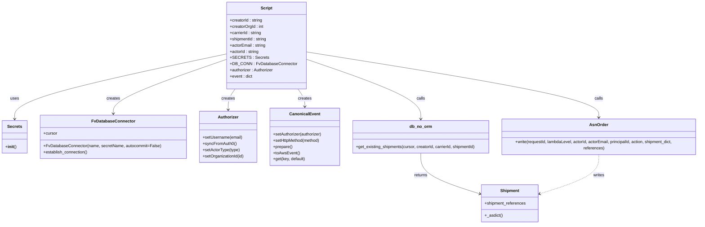
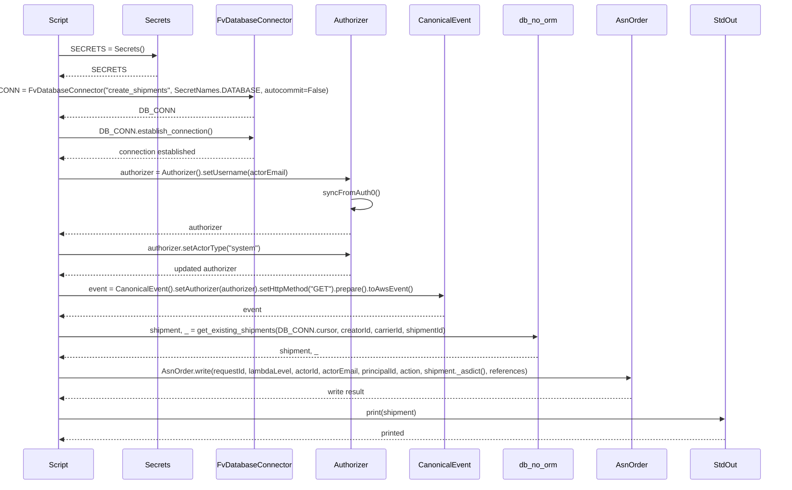

# Diagram: platform/tools/ide_local_testing/localTest/utility/postShipmentToAsnOrder.py

> Auto-generated by Obscura crawlers

## Diagram 1

### SVG

<svg id="container" width="2704.5234375" xmlns="http://www.w3.org/2000/svg" class="classDiagram" height="866" viewBox="0 0 2704.5234375 866" role="graphics-document document" aria-roledescription="class"><g><defs><marker id="container_class-aggregationStart" class="marker aggregation class" refX="18" refY="7" markerWidth="190" markerHeight="240" orient="auto"><path d="M 18,7 L9,13 L1,7 L9,1 Z"></path></marker></defs><defs><marker id="container_class-aggregationEnd" class="marker aggregation class" refX="1" refY="7" markerWidth="20" markerHeight="28" orient="auto"><path d="M 18,7 L9,13 L1,7 L9,1 Z"></path></marker></defs><defs><marker id="container_class-extensionStart" class="marker extension class" refX="18" refY="7" markerWidth="190" markerHeight="240" orient="auto"><path d="M 1,7 L18,13 V 1 Z"></path></marker></defs><defs><marker id="container_class-extensionEnd" class="marker extension class" refX="1" refY="7" markerWidth="20" markerHeight="28" orient="auto"><path d="M 1,1 V 13 L18,7 Z"></path></marker></defs><defs><marker id="container_class-compositionStart" class="marker composition class" refX="18" refY="7" markerWidth="190" markerHeight="240" orient="auto"><path d="M 18,7 L9,13 L1,7 L9,1 Z"></path></marker></defs><defs><marker id="container_class-compositionEnd" class="marker composition class" refX="1" refY="7" markerWidth="20" markerHeight="28" orient="auto"><path d="M 18,7 L9,13 L1,7 L9,1 Z"></path></marker></defs><defs><marker id="container_class-dependencyStart" class="marker dependency class" refX="6" refY="7" markerWidth="190" markerHeight="240" orient="auto"><path d="M 5,7 L9,13 L1,7 L9,1 Z"></path></marker></defs><defs><marker id="container_class-dependencyEnd" class="marker dependency class" refX="13" refY="7" markerWidth="20" markerHeight="28" orient="auto"><path d="M 18,7 L9,13 L14,7 L9,1 Z"></path></marker></defs><defs><marker id="container_class-lollipopStart" class="marker lollipop class" refX="13" refY="7" markerWidth="190" markerHeight="240" orient="auto"><circle stroke="black" fill="transparent" cx="7" cy="7" r="6"></circle></marker></defs><defs><marker id="container_class-lollipopEnd" class="marker lollipop class" refX="1" refY="7" markerWidth="190" markerHeight="240" orient="auto"><circle stroke="black" fill="transparent" cx="7" cy="7" r="6"></circle></marker></defs><g class="root"><g class="clusters"></g><g class="edgePaths"><path d="M868.457,207.161L732.878,236.134C597.298,265.107,326.139,323.054,190.56,365.193C54.98,407.333,54.98,433.667,54.98,446.833L54.98,460" id="id_Script_Secrets_1" class="edge-thickness-normal edge-pattern-solid relation" style=";;;" data-edge="true" data-et="edge" data-id="id_Script_Secrets_1" data-points="W3sieCI6ODY4LjQ1NzAzMTI1LCJ5IjoyMDcuMTYwODI4MDgzODM0NTN9LHsieCI6NTQuOTgwNDY4NzUsInkiOjM4MX0seyJ4Ijo1NC45ODA0Njg3NSwieSI6NDY2fV0=" marker-end="url(#container_class-dependencyEnd)"></path><path d="M868.457,226.998L795.069,252.665C721.681,278.332,574.905,329.666,501.517,365C428.129,400.333,428.129,419.667,428.129,429.333L428.129,439" id="id_Script_FvDatabaseConnector_2" class="edge-thickness-normal edge-pattern-solid relation" style=";;;" data-edge="true" data-et="edge" data-id="id_Script_FvDatabaseConnector_2" data-points="W3sieCI6ODY4LjQ1NzAzMTI1LCJ5IjoyMjYuOTk4MjgwNjA3NTE4Njd9LHsieCI6NDI4LjEyODkwNjI1LCJ5IjozODF9LHsieCI6NDI4LjEyODkwNjI1LCJ5Ijo0NDV9XQ==" marker-end="url(#container_class-dependencyEnd)"></path><path d="M892.656,344L888.192,350.167C883.728,356.333,874.799,368.667,870.335,382C865.871,395.333,865.871,409.667,865.871,416.833L865.871,424" id="id_Script_Authorizer_3" class="edge-thickness-normal edge-pattern-solid relation" style=";;;" data-edge="true" data-et="edge" data-id="id_Script_Authorizer_3" data-points="W3sieCI6ODkyLjY1NTkwNzAxMjE5NTEsInkiOjM0NH0seyJ4Ijo4NjUuODcxMDkzNzUsInkiOjM4MX0seyJ4Ijo4NjUuODcxMDkzNzUsInkiOjQzMH1d" marker-end="url(#container_class-dependencyEnd)"></path><path d="M1135.891,344L1140.355,350.167C1144.819,356.333,1153.748,368.667,1158.212,380C1162.676,391.333,1162.676,401.667,1162.676,406.833L1162.676,412" id="id_Script_CanonicalEvent_4" class="edge-thickness-normal edge-pattern-solid relation" style=";;;" data-edge="true" data-et="edge" data-id="id_Script_CanonicalEvent_4" data-points="W3sieCI6MTEzNS44OTA5Njc5ODc4MDUsInkiOjM0NH0seyJ4IjoxMTYyLjY3NTc4MTI1LCJ5IjozODF9LHsieCI6MTE2Mi42NzU3ODEyNSwieSI6NDE4fV0=" marker-end="url(#container_class-dependencyEnd)"></path><path d="M1160.09,225.748L1235.934,251.623C1311.777,277.498,1463.465,329.249,1539.309,368.291C1615.152,407.333,1615.152,433.667,1615.152,446.833L1615.152,460" id="id_Script_db_no_orm_5" class="edge-thickness-normal edge-pattern-solid relation" style=";;;" data-edge="true" data-et="edge" data-id="id_Script_db_no_orm_5" data-points="W3sieCI6MTE2MC4wODk4NDM3NSwieSI6MjI1Ljc0NzczMjgxMzI2MTgyfSx7IngiOjE2MTUuMTUyMzQzNzUsInkiOjM4MX0seyJ4IjoxNjE1LjE1MjM0Mzc1LCJ5Ijo0NjZ9XQ==" marker-end="url(#container_class-dependencyEnd)"></path><path d="M1160.09,198.991L1352.485,229.326C1544.88,259.661,1929.671,320.33,2122.066,363.832C2314.461,407.333,2314.461,433.667,2314.461,446.833L2314.461,460" id="id_Script_AsnOrder_6" class="edge-thickness-normal edge-pattern-solid relation" style=";;;" data-edge="true" data-et="edge" data-id="id_Script_AsnOrder_6" data-points="W3sieCI6MTE2MC4wODk4NDM3NSwieSI6MTk4Ljk5MDgwOTYxODgwNDk3fSx7IngiOjIzMTQuNDYwOTM3NSwieSI6MzgxfSx7IngiOjIzMTQuNDYwOTM3NSwieSI6NDY2fV0=" marker-end="url(#container_class-dependencyEnd)"></path><path d="M1615.152,592L1615.152,606.167C1615.152,620.333,1615.152,648.667,1654.18,675C1693.208,701.333,1771.265,725.666,1810.293,737.832L1849.321,749.999" id="id_db_no_orm_Shipment_7" class="edge-thickness-normal edge-pattern-solid relation" style=";;;" data-edge="true" data-et="edge" data-id="id_db_no_orm_Shipment_7" data-points="W3sieCI6MTYxNS4xNTIzNDM3NSwieSI6NTkyfSx7IngiOjE2MTUuMTUyMzQzNzUsInkiOjY3N30seyJ4IjoxODU1LjA0ODgyODEyNSwieSI6NzUxLjc4NDQ4NTc5MjMyODR9XQ==" marker-end="url(#container_class-dependencyEnd)"></path><path d="M2314.461,592L2314.461,606.167C2314.461,620.333,2314.461,648.667,2275.433,675C2236.405,701.333,2158.349,725.666,2119.321,737.832L2080.293,749.999" id="id_AsnOrder_Shipment_8" class="edge-thickness-normal edge-pattern-dashed relation" style=";;;" data-edge="true" data-et="edge" data-id="id_AsnOrder_Shipment_8" data-points="W3sieCI6MjMxNC40NjA5Mzc1LCJ5Ijo1OTJ9LHsieCI6MjMxNC40NjA5Mzc1LCJ5Ijo2Nzd9LHsieCI6MjA3NC41NjQ0NTMxMjUsInkiOjc1MS43ODQ0ODU3OTIzMjg0fV0=" marker-end="url(#container_class-dependencyEnd)"></path></g><g class="edgeLabels"><g class="edgeLabel" transform="translate(54.98046875, 381)"><g class="label" data-id="id_Script_Secrets_1" transform="translate(-16.4921875, -12)"><foreignObject width="32.984375" height="24">

uses

</foreignObject></g></g><g class="edgeLabel" transform="translate(428.12890625, 381)"><g class="label" data-id="id_Script_FvDatabaseConnector_2" transform="translate(-26.171875, -12)"><foreignObject width="52.34375" height="24">

creates

</foreignObject></g></g><g class="edgeLabel" transform="translate(865.87109375, 381)"><g class="label" data-id="id_Script_Authorizer_3" transform="translate(-26.171875, -12)"><foreignObject width="52.34375" height="24">

creates

</foreignObject></g></g><g class="edgeLabel" transform="translate(1162.67578125, 381)"><g class="label" data-id="id_Script_CanonicalEvent_4" transform="translate(-26.171875, -12)"><foreignObject width="52.34375" height="24">

creates

</foreignObject></g></g><g class="edgeLabel" transform="translate(1615.15234375, 381)"><g class="label" data-id="id_Script_db_no_orm_5" transform="translate(-16.4453125, -12)"><foreignObject width="32.890625" height="24">

calls

</foreignObject></g></g><g class="edgeLabel" transform="translate(2314.4609375, 381)"><g class="label" data-id="id_Script_AsnOrder_6" transform="translate(-16.4453125, -12)"><foreignObject width="32.890625" height="24">

calls

</foreignObject></g></g><g class="edgeLabel" transform="translate(1615.15234375, 677)"><g class="label" data-id="id_db_no_orm_Shipment_7" transform="translate(-26.265625, -12)"><foreignObject width="52.53125" height="24">

returns

</foreignObject></g></g><g class="edgeLabel" transform="translate(2314.4609375, 677)"><g class="label" data-id="id_AsnOrder_Shipment_8" transform="translate(-21.9453125, -12)"><foreignObject width="43.890625" height="24">

writes

</foreignObject></g></g></g><g class="nodes"><g class="node default" id="classId-Script-0" transform="translate(1014.2734375, 176)"><g class="basic label-container"><path d="M-145.81640625 -168 L145.81640625 -168 L145.81640625 168 L-145.81640625 168" stroke="none" stroke-width="0" fill="#ECECFF" style=""></path><path d="M-145.81640625 -168 C-48.84190487943036 -168, 48.13259649113928 -168, 145.81640625 -168 M-145.81640625 -168 C-53.617731990413034 -168, 38.58094226917393 -168, 145.81640625 -168 M145.81640625 -168 C145.81640625 -59.88702148418069, 145.81640625 48.225957031638615, 145.81640625 168 M145.81640625 -168 C145.81640625 -60.622511814739994, 145.81640625 46.75497637052001, 145.81640625 168 M145.81640625 168 C80.68605056911919 168, 15.555694888238378 168, -145.81640625 168 M145.81640625 168 C48.879738339265955 168, -48.05692957146809 168, -145.81640625 168 M-145.81640625 168 C-145.81640625 34.84050638291288, -145.81640625 -98.31898723417424, -145.81640625 -168 M-145.81640625 168 C-145.81640625 37.96538965882124, -145.81640625 -92.06922068235752, -145.81640625 -168" stroke="#9370DB" stroke-width="1.3" fill="none" stroke-dasharray="0 0" style=""></path></g><g class="annotation-group text" transform="translate(0, -144)"></g><g class="label-group text" transform="translate(-21.7421875, -144)"><g class="label" style="font-weight: bolder" transform="translate(0,-12)"><foreignObject width="43.484375" height="24">

Script

</foreignObject></g></g><g class="members-group text" transform="translate(-133.81640625, -96)"><g class="label" style="" transform="translate(0,-12)"><foreignObject width="127.890625" height="24">

+creatorId : string

</foreignObject></g><g class="label" style="" transform="translate(0,12)"><foreignObject width="131.25" height="24">

+creatorOrgId : int

</foreignObject></g><g class="label" style="" transform="translate(0,36)"><foreignObject width="124.1875" height="24">

+carrierId : string

</foreignObject></g><g class="label" style="" transform="translate(0,60)"><foreignObject width="144.6875" height="24">

+shipmentId : string

</foreignObject></g><g class="label" style="" transform="translate(0,84)"><foreignObject width="139.125" height="24">

+actorEmail : string

</foreignObject></g><g class="label" style="" transform="translate(0,108)"><foreignObject width="113.40625" height="24">

+actorId : string

</foreignObject></g><g class="label" style="" transform="translate(0,132)"><foreignObject width="133.390625" height="24">

+SECRETS : Secrets

</foreignObject></g><g class="label" style="" transform="translate(0,156)"><foreignObject width="245.890625" height="24">

+DB_CONN : FvDatabaseConnector

</foreignObject></g><g class="label" style="" transform="translate(0,180)"><foreignObject width="170.484375" height="24">

+authorizer : Authorizer

</foreignObject></g><g class="label" style="" transform="translate(0,204)"><foreignObject width="88.15625" height="24">

+event : dict

</foreignObject></g></g><g class="methods-group text" transform="translate(-133.81640625, 168)"></g><g class="divider" style=""><path d="M-145.81640625 -120 C-85.9060599158939 -120, -25.995713581787825 -120, 145.81640625 -120 M-145.81640625 -120 C-59.99521319689934 -120, 25.825979856201315 -120, 145.81640625 -120" stroke="#9370DB" stroke-width="1.3" fill="none" stroke-dasharray="0 0" style=""></path></g><g class="divider" style=""><path d="M-145.81640625 144 C-86.60232993328063 144, -27.388253616561258 144, 145.81640625 144 M-145.81640625 144 C-44.88834484551093 144, 56.03971655897814 144, 145.81640625 144" stroke="#9370DB" stroke-width="1.3" fill="none" stroke-dasharray="0 0" style=""></path></g></g><g class="node default" id="classId-Secrets-1" transform="translate(54.98046875, 529)"><g class="basic label-container"><path d="M-46.98046875 -63 L46.98046875 -63 L46.98046875 63 L-46.98046875 63" stroke="none" stroke-width="0" fill="#ECECFF" style=""></path><path d="M-46.98046875 -63 C-10.761691882809025 -63, 25.45708498438195 -63, 46.98046875 -63 M-46.98046875 -63 C-13.150270611782965 -63, 20.67992752643407 -63, 46.98046875 -63 M46.98046875 -63 C46.98046875 -28.15157554755151, 46.98046875 6.6968489048969815, 46.98046875 63 M46.98046875 -63 C46.98046875 -25.239870900891475, 46.98046875 12.52025819821705, 46.98046875 63 M46.98046875 63 C10.97021655014158 63, -25.04003564971684 63, -46.98046875 63 M46.98046875 63 C22.684968254471308 63, -1.6105322410573848 63, -46.98046875 63 M-46.98046875 63 C-46.98046875 20.807272444354638, -46.98046875 -21.385455111290725, -46.98046875 -63 M-46.98046875 63 C-46.98046875 13.109028275594795, -46.98046875 -36.78194344881041, -46.98046875 -63" stroke="#9370DB" stroke-width="1.3" fill="none" stroke-dasharray="0 0" style=""></path></g><g class="annotation-group text" transform="translate(0, -39)"></g><g class="label-group text" transform="translate(-27.1640625, -39)"><g class="label" style="font-weight: bolder" transform="translate(0,-12)"><foreignObject width="54.328125" height="24">

Secrets

</foreignObject></g></g><g class="members-group text" transform="translate(-34.98046875, 9)"></g><g class="methods-group text" transform="translate(-34.98046875, 39)"><g class="label" style="" transform="translate(0,-12)"><foreignObject width="42.796875" height="24">

+<strong>init</strong>()

</foreignObject></g></g><g class="divider" style=""><path d="M-46.98046875 -15 C-16.304762045833918 -15, 14.370944658332164 -15, 46.98046875 -15 M-46.98046875 -15 C-15.084461731357727 -15, 16.811545287284545 -15, 46.98046875 -15" stroke="#9370DB" stroke-width="1.3" fill="none" stroke-dasharray="0 0" style=""></path></g><g class="divider" style=""><path d="M-46.98046875 9 C-10.20249987553062 9, 26.57546899893876 9, 46.98046875 9 M-46.98046875 9 C-20.698957215116014 9, 5.582554319767972 9, 46.98046875 9" stroke="#9370DB" stroke-width="1.3" fill="none" stroke-dasharray="0 0" style=""></path></g></g><g class="node default" id="classId-FvDatabaseConnector-2" transform="translate(428.12890625, 529)"><g class="basic label-container"><path d="M-276.16796875 -84 L276.16796875 -84 L276.16796875 84 L-276.16796875 84" stroke="none" stroke-width="0" fill="#ECECFF" style=""></path><path d="M-276.16796875 -84 C-142.7024737579877 -84, -9.23697876597538 -84, 276.16796875 -84 M-276.16796875 -84 C-133.0923625110666 -84, 9.983243727866807 -84, 276.16796875 -84 M276.16796875 -84 C276.16796875 -38.67638571952284, 276.16796875 6.647228560954318, 276.16796875 84 M276.16796875 -84 C276.16796875 -37.81491573856255, 276.16796875 8.370168522874906, 276.16796875 84 M276.16796875 84 C154.61849507828853 84, 33.069021406577065 84, -276.16796875 84 M276.16796875 84 C113.63540398249629 84, -48.89716078500743 84, -276.16796875 84 M-276.16796875 84 C-276.16796875 37.64591242251134, -276.16796875 -8.708175154977326, -276.16796875 -84 M-276.16796875 84 C-276.16796875 33.6618450456625, -276.16796875 -16.676309908674995, -276.16796875 -84" stroke="#9370DB" stroke-width="1.3" fill="none" stroke-dasharray="0 0" style=""></path></g><g class="annotation-group text" transform="translate(0, -60)"></g><g class="label-group text" transform="translate(-79.3046875, -60)"><g class="label" style="font-weight: bolder" transform="translate(0,-12)"><foreignObject width="158.609375" height="24">

FvDatabaseConnector

</foreignObject></g></g><g class="members-group text" transform="translate(-264.16796875, -12)"><g class="label" style="" transform="translate(0,-12)"><foreignObject width="53.71875" height="24">

+cursor

</foreignObject></g></g><g class="methods-group text" transform="translate(-264.16796875, 36)"><g class="label" style="" transform="translate(0,-12)"><foreignObject width="449.03125" height="24">

+FvDatabaseConnector(name, secretName, autocommit=False)

</foreignObject></g><g class="label" style="" transform="translate(0,12)"><foreignObject width="173.265625" height="24">

+establish_connection()

</foreignObject></g></g><g class="divider" style=""><path d="M-276.16796875 -36 C-76.08978280614281 -36, 123.98840313771439 -36, 276.16796875 -36 M-276.16796875 -36 C-134.09420757479876 -36, 7.9795536004024825 -36, 276.16796875 -36" stroke="#9370DB" stroke-width="1.3" fill="none" stroke-dasharray="0 0" style=""></path></g><g class="divider" style=""><path d="M-276.16796875 12 C-86.12281670014306 12, 103.92233534971388 12, 276.16796875 12 M-276.16796875 12 C-129.89852073263376 12, 16.37092728473249 12, 276.16796875 12" stroke="#9370DB" stroke-width="1.3" fill="none" stroke-dasharray="0 0" style=""></path></g></g><g class="node default" id="classId-Authorizer-3" transform="translate(865.87109375, 529)"><g class="basic label-container"><path d="M-111.57421875 -99 L111.57421875 -99 L111.57421875 99 L-111.57421875 99" stroke="none" stroke-width="0" fill="#ECECFF" style=""></path><path d="M-111.57421875 -99 C-52.92171549610542 -99, 5.730787757789159 -99, 111.57421875 -99 M-111.57421875 -99 C-30.72286011271609 -99, 50.12849852456782 -99, 111.57421875 -99 M111.57421875 -99 C111.57421875 -49.69584865716064, 111.57421875 -0.3916973143212772, 111.57421875 99 M111.57421875 -99 C111.57421875 -46.215458469485625, 111.57421875 6.569083061028749, 111.57421875 99 M111.57421875 99 C43.11568115402818 99, -25.34285644194364 99, -111.57421875 99 M111.57421875 99 C60.919221975642174 99, 10.264225201284347 99, -111.57421875 99 M-111.57421875 99 C-111.57421875 36.122349167365286, -111.57421875 -26.755301665269428, -111.57421875 -99 M-111.57421875 99 C-111.57421875 40.460911368870576, -111.57421875 -18.078177262258848, -111.57421875 -99" stroke="#9370DB" stroke-width="1.3" fill="none" stroke-dasharray="0 0" style=""></path></g><g class="annotation-group text" transform="translate(0, -75)"></g><g class="label-group text" transform="translate(-38.3671875, -75)"><g class="label" style="font-weight: bolder" transform="translate(0,-12)"><foreignObject width="76.734375" height="24">

Authorizer

</foreignObject></g></g><g class="members-group text" transform="translate(-99.57421875, -27)"></g><g class="methods-group text" transform="translate(-99.57421875, 3)"><g class="label" style="" transform="translate(0,-12)"><foreignObject width="154.0625" height="24">

+setUsername(email)

</foreignObject></g><g class="label" style="" transform="translate(0,12)"><foreignObject width="129.0625" height="24">

+syncFromAuth0()

</foreignObject></g><g class="label" style="" transform="translate(0,36)"><foreignObject width="143.71875" height="24">

+setActorType(type)

</foreignObject></g><g class="label" style="" transform="translate(0,60)"><foreignObject width="160.78125" height="24">

+setOrganizationId(id)

</foreignObject></g></g><g class="divider" style=""><path d="M-111.57421875 -51 C-31.359334824870515 -51, 48.85554910025897 -51, 111.57421875 -51 M-111.57421875 -51 C-42.2036994853714 -51, 27.166819779257196 -51, 111.57421875 -51" stroke="#9370DB" stroke-width="1.3" fill="none" stroke-dasharray="0 0" style=""></path></g><g class="divider" style=""><path d="M-111.57421875 -27 C-59.062260782056995 -27, -6.550302814113991 -27, 111.57421875 -27 M-111.57421875 -27 C-33.77564741606112 -27, 44.02292391787776 -27, 111.57421875 -27" stroke="#9370DB" stroke-width="1.3" fill="none" stroke-dasharray="0 0" style=""></path></g></g><g class="node default" id="classId-CanonicalEvent-4" transform="translate(1162.67578125, 529)"><g class="basic label-container"><path d="M-135.23046875 -111 L135.23046875 -111 L135.23046875 111 L-135.23046875 111" stroke="none" stroke-width="0" fill="#ECECFF" style=""></path><path d="M-135.23046875 -111 C-45.22780051413439 -111, 44.774867721731226 -111, 135.23046875 -111 M-135.23046875 -111 C-66.7107103382172 -111, 1.8090480735656058 -111, 135.23046875 -111 M135.23046875 -111 C135.23046875 -28.878117418372085, 135.23046875 53.24376516325583, 135.23046875 111 M135.23046875 -111 C135.23046875 -32.997007656706714, 135.23046875 45.00598468658657, 135.23046875 111 M135.23046875 111 C70.95602941218517 111, 6.681590074370348 111, -135.23046875 111 M135.23046875 111 C35.98808114461464 111, -63.25430646077072 111, -135.23046875 111 M-135.23046875 111 C-135.23046875 27.940757890932176, -135.23046875 -55.11848421813565, -135.23046875 -111 M-135.23046875 111 C-135.23046875 39.23447564425639, -135.23046875 -32.531048711487216, -135.23046875 -111" stroke="#9370DB" stroke-width="1.3" fill="none" stroke-dasharray="0 0" style=""></path></g><g class="annotation-group text" transform="translate(0, -87)"></g><g class="label-group text" transform="translate(-55.7109375, -87)"><g class="label" style="font-weight: bolder" transform="translate(0,-12)"><foreignObject width="111.421875" height="24">

CanonicalEvent

</foreignObject></g></g><g class="members-group text" transform="translate(-123.23046875, -39)"></g><g class="methods-group text" transform="translate(-123.23046875, -9)"><g class="label" style="" transform="translate(0,-12)"><foreignObject width="190.75" height="24">

+setAuthorizer(authorizer)

</foreignObject></g><g class="label" style="" transform="translate(0,12)"><foreignObject width="184" height="24">

+setHttpMethod(method)

</foreignObject></g><g class="label" style="" transform="translate(0,36)"><foreignObject width="74.75" height="24">

+prepare()

</foreignObject></g><g class="label" style="" transform="translate(0,60)"><foreignObject width="101.1875" height="24">

+toAwsEvent()

</foreignObject></g><g class="label" style="" transform="translate(0,84)"><foreignObject width="124.71875" height="24">

+get(key, default)

</foreignObject></g></g><g class="divider" style=""><path d="M-135.23046875 -63 C-35.4916176999801 -63, 64.2472333500398 -63, 135.23046875 -63 M-135.23046875 -63 C-29.99549131677803 -63, 75.23948611644394 -63, 135.23046875 -63" stroke="#9370DB" stroke-width="1.3" fill="none" stroke-dasharray="0 0" style=""></path></g><g class="divider" style=""><path d="M-135.23046875 -39 C-42.79439600483664 -39, 49.641676740326716 -39, 135.23046875 -39 M-135.23046875 -39 C-73.26292383618849 -39, -11.295378922376997 -39, 135.23046875 -39" stroke="#9370DB" stroke-width="1.3" fill="none" stroke-dasharray="0 0" style=""></path></g></g><g class="node default" id="classId-db_no_orm-5" transform="translate(1615.15234375, 529)"><g class="basic label-container"><path d="M-267.24609375 -63 L267.24609375 -63 L267.24609375 63 L-267.24609375 63" stroke="none" stroke-width="0" fill="#ECECFF" style=""></path><path d="M-267.24609375 -63 C-106.71549402097813 -63, 53.815105708043745 -63, 267.24609375 -63 M-267.24609375 -63 C-130.4824314236071 -63, 6.281230902785808 -63, 267.24609375 -63 M267.24609375 -63 C267.24609375 -15.645769544452499, 267.24609375 31.708460911095003, 267.24609375 63 M267.24609375 -63 C267.24609375 -22.99947440766423, 267.24609375 17.00105118467154, 267.24609375 63 M267.24609375 63 C59.59776647458 63, -148.05056080084 63, -267.24609375 63 M267.24609375 63 C76.1347586655414 63, -114.9765764189172 63, -267.24609375 63 M-267.24609375 63 C-267.24609375 31.545420127236035, -267.24609375 0.09084025447207011, -267.24609375 -63 M-267.24609375 63 C-267.24609375 33.5680430665948, -267.24609375 4.136086133189586, -267.24609375 -63" stroke="#9370DB" stroke-width="1.3" fill="none" stroke-dasharray="0 0" style=""></path></g><g class="annotation-group text" transform="translate(0, -39)"></g><g class="label-group text" transform="translate(-41.3515625, -39)"><g class="label" style="font-weight: bolder" transform="translate(0,-12)"><foreignObject width="82.703125" height="24">

db_no_orm

</foreignObject></g></g><g class="members-group text" transform="translate(-255.24609375, 9)"></g><g class="methods-group text" transform="translate(-255.24609375, 39)"><g class="label" style="" transform="translate(0,-12)"><foreignObject width="469.140625" height="24">

+get_existing_shipments(cursor, creatorId, carrierId, shipmentId)

</foreignObject></g></g><g class="divider" style=""><path d="M-267.24609375 -15 C-150.77608554445965 -15, -34.306077338919266 -15, 267.24609375 -15 M-267.24609375 -15 C-112.94292451559008 -15, 41.36024471881984 -15, 267.24609375 -15" stroke="#9370DB" stroke-width="1.3" fill="none" stroke-dasharray="0 0" style=""></path></g><g class="divider" style=""><path d="M-267.24609375 9 C-62.932177593766596 9, 141.3817385624668 9, 267.24609375 9 M-267.24609375 9 C-54.78713547957287 9, 157.67182279085426 9, 267.24609375 9" stroke="#9370DB" stroke-width="1.3" fill="none" stroke-dasharray="0 0" style=""></path></g></g><g class="node default" id="classId-AsnOrder-6" transform="translate(2314.4609375, 529)"><g class="basic label-container"><path d="M-382.0625 -63 L382.0625 -63 L382.0625 63 L-382.0625 63" stroke="none" stroke-width="0" fill="#ECECFF" style=""></path><path d="M-382.0625 -63 C-131.15257078265063 -63, 119.75735843469874 -63, 382.0625 -63 M-382.0625 -63 C-131.70105604749622 -63, 118.66038790500755 -63, 382.0625 -63 M382.0625 -63 C382.0625 -27.741827684898176, 382.0625 7.516344630203648, 382.0625 63 M382.0625 -63 C382.0625 -22.492675194769888, 382.0625 18.014649610460225, 382.0625 63 M382.0625 63 C226.45006312626347 63, 70.83762625252695 63, -382.0625 63 M382.0625 63 C133.3981173331572 63, -115.26626533368562 63, -382.0625 63 M-382.0625 63 C-382.0625 28.29336300106999, -382.0625 -6.413273997860017, -382.0625 -63 M-382.0625 63 C-382.0625 16.918031321621555, -382.0625 -29.16393735675689, -382.0625 -63" stroke="#9370DB" stroke-width="1.3" fill="none" stroke-dasharray="0 0" style=""></path></g><g class="annotation-group text" transform="translate(0, -39)"></g><g class="label-group text" transform="translate(-34.125, -39)"><g class="label" style="font-weight: bolder" transform="translate(0,-12)"><foreignObject width="68.25" height="24">

AsnOrder

</foreignObject></g></g><g class="members-group text" transform="translate(-370.0625, 9)"></g><g class="methods-group text" transform="translate(-370.0625, 39)"><g class="label" style="" transform="translate(0,-12)"><foreignObject width="706" height="24">

+write(requestId, lambdaLevel, actorId, actorEmail, principalId, action, shipment_dict, references)

</foreignObject></g></g><g class="divider" style=""><path d="M-382.0625 -15 C-101.34639514683954 -15, 179.36970970632092 -15, 382.0625 -15 M-382.0625 -15 C-123.51653366266765 -15, 135.0294326746647 -15, 382.0625 -15" stroke="#9370DB" stroke-width="1.3" fill="none" stroke-dasharray="0 0" style=""></path></g><g class="divider" style=""><path d="M-382.0625 9 C-201.28920925626716 9, -20.515918512534313 9, 382.0625 9 M-382.0625 9 C-94.87964607397839 9, 192.30320785204322 9, 382.0625 9" stroke="#9370DB" stroke-width="1.3" fill="none" stroke-dasharray="0 0" style=""></path></g></g><g class="node default" id="classId-Shipment-7" transform="translate(1964.806640625, 786)"><g class="basic label-container"><path d="M-109.7578125 -72 L109.7578125 -72 L109.7578125 72 L-109.7578125 72" stroke="none" stroke-width="0" fill="#ECECFF" style=""></path><path d="M-109.7578125 -72 C-52.08342847051492 -72, 5.590955558970165 -72, 109.7578125 -72 M-109.7578125 -72 C-54.59018751742075 -72, 0.5774374651584964 -72, 109.7578125 -72 M109.7578125 -72 C109.7578125 -40.952624329220775, 109.7578125 -9.90524865844155, 109.7578125 72 M109.7578125 -72 C109.7578125 -42.90787419605953, 109.7578125 -13.815748392119062, 109.7578125 72 M109.7578125 72 C45.94045140126893 72, -17.87690969746214 72, -109.7578125 72 M109.7578125 72 C36.00908213462047 72, -37.73964823075906 72, -109.7578125 72 M-109.7578125 72 C-109.7578125 39.17235842312381, -109.7578125 6.344716846247621, -109.7578125 -72 M-109.7578125 72 C-109.7578125 38.1161868904938, -109.7578125 4.232373780987601, -109.7578125 -72" stroke="#9370DB" stroke-width="1.3" fill="none" stroke-dasharray="0 0" style=""></path></g><g class="annotation-group text" transform="translate(0, -48)"></g><g class="label-group text" transform="translate(-35.109375, -48)"><g class="label" style="font-weight: bolder" transform="translate(0,-12)"><foreignObject width="70.21875" height="24">

Shipment

</foreignObject></g></g><g class="members-group text" transform="translate(-97.7578125, 0)"><g class="label" style="" transform="translate(0,-12)"><foreignObject width="160.40625" height="24">

+shipment_references

</foreignObject></g></g><g class="methods-group text" transform="translate(-97.7578125, 48)"><g class="label" style="" transform="translate(0,-12)"><foreignObject width="68.59375" height="24">

+_asdict()

</foreignObject></g></g><g class="divider" style=""><path d="M-109.7578125 -24 C-45.69293826535582 -24, 18.37193596928836 -24, 109.7578125 -24 M-109.7578125 -24 C-38.13031432312488 -24, 33.49718385375024 -24, 109.7578125 -24" stroke="#9370DB" stroke-width="1.3" fill="none" stroke-dasharray="0 0" style=""></path></g><g class="divider" style=""><path d="M-109.7578125 24 C-54.28636417867603 24, 1.1850841426479377 24, 109.7578125 24 M-109.7578125 24 C-37.31793982759099 24, 35.12193284481802 24, 109.7578125 24" stroke="#9370DB" stroke-width="1.3" fill="none" stroke-dasharray="0 0" style=""></path></g></g></g></g></g></svg>

## Diagram 2

### SVG

<svg id="container" width="1688" xmlns="http://www.w3.org/2000/svg" height="1113" viewBox="-50 -10 1688 1113" role="graphics-document document" aria-roledescription="sequence"><g><rect x="1438" y="1027" fill="#eaeaea" stroke="#666" width="150" height="65" name="StdOut" rx="3" ry="3" class="actor actor-bottom"></rect><text x="1513" y="1059.5" dominant-baseline="central" alignment-baseline="central" class="actor actor-box" style="text-anchor: middle; font-size: 16px; font-weight: 400;"><tspan x="1513" dy="0">StdOut</tspan></text></g><g><rect x="1238" y="1027" fill="#eaeaea" stroke="#666" width="150" height="65" name="AsnOrder" rx="3" ry="3" class="actor actor-bottom"></rect><text x="1313" y="1059.5" dominant-baseline="central" alignment-baseline="central" class="actor actor-box" style="text-anchor: middle; font-size: 16px; font-weight: 400;"><tspan x="1313" dy="0">AsnOrder</tspan></text></g><g><rect x="1038" y="1027" fill="#eaeaea" stroke="#666" width="150" height="65" name="db_no_orm" rx="3" ry="3" class="actor actor-bottom"></rect><text x="1113" y="1059.5" dominant-baseline="central" alignment-baseline="central" class="actor actor-box" style="text-anchor: middle; font-size: 16px; font-weight: 400;"><tspan x="1113" dy="0">db_no_orm</tspan></text></g><g><rect x="838" y="1027" fill="#eaeaea" stroke="#666" width="150" height="65" name="CanonicalEvent" rx="3" ry="3" class="actor actor-bottom"></rect><text x="913" y="1059.5" dominant-baseline="central" alignment-baseline="central" class="actor actor-box" style="text-anchor: middle; font-size: 16px; font-weight: 400;"><tspan x="913" dy="0">CanonicalEvent</tspan></text></g><g><rect x="638" y="1027" fill="#eaeaea" stroke="#666" width="150" height="65" name="Authorizer" rx="3" ry="3" class="actor actor-bottom"></rect><text x="713" y="1059.5" dominant-baseline="central" alignment-baseline="central" class="actor actor-box" style="text-anchor: middle; font-size: 16px; font-weight: 400;"><tspan x="713" dy="0">Authorizer</tspan></text></g><g><rect x="411" y="1027" fill="#eaeaea" stroke="#666" width="177" height="65" name="FvDatabaseConnector" rx="3" ry="3" class="actor actor-bottom"></rect><text x="499.5" y="1059.5" dominant-baseline="central" alignment-baseline="central" class="actor actor-box" style="text-anchor: middle; font-size: 16px; font-weight: 400;"><tspan x="499.5" dy="0">FvDatabaseConnector</tspan></text></g><g><rect x="211" y="1027" fill="#eaeaea" stroke="#666" width="150" height="65" name="Secrets" rx="3" ry="3" class="actor actor-bottom"></rect><text x="286" y="1059.5" dominant-baseline="central" alignment-baseline="central" class="actor actor-box" style="text-anchor: middle; font-size: 16px; font-weight: 400;"><tspan x="286" dy="0">Secrets</tspan></text></g><g><rect x="0" y="1027" fill="#eaeaea" stroke="#666" width="150" height="65" name="Script" rx="3" ry="3" class="actor actor-bottom"></rect><text x="75" y="1059.5" dominant-baseline="central" alignment-baseline="central" class="actor actor-box" style="text-anchor: middle; font-size: 16px; font-weight: 400;"><tspan x="75" dy="0">Script</tspan></text></g><g><line id="actor7" x1="1513" y1="65" x2="1513" y2="1027" class="actor-line 200" stroke-width="0.5px" stroke="#999" name="StdOut"></line><g id="root-7"><rect x="1438" y="0" fill="#eaeaea" stroke="#666" width="150" height="65" name="StdOut" rx="3" ry="3" class="actor actor-top"></rect><text x="1513" y="32.5" dominant-baseline="central" alignment-baseline="central" class="actor actor-box" style="text-anchor: middle; font-size: 16px; font-weight: 400;"><tspan x="1513" dy="0">StdOut</tspan></text></g></g><g><line id="actor6" x1="1313" y1="65" x2="1313" y2="1027" class="actor-line 200" stroke-width="0.5px" stroke="#999" name="AsnOrder"></line><g id="root-6"><rect x="1238" y="0" fill="#eaeaea" stroke="#666" width="150" height="65" name="AsnOrder" rx="3" ry="3" class="actor actor-top"></rect><text x="1313" y="32.5" dominant-baseline="central" alignment-baseline="central" class="actor actor-box" style="text-anchor: middle; font-size: 16px; font-weight: 400;"><tspan x="1313" dy="0">AsnOrder</tspan></text></g></g><g><line id="actor5" x1="1113" y1="65" x2="1113" y2="1027" class="actor-line 200" stroke-width="0.5px" stroke="#999" name="db_no_orm"></line><g id="root-5"><rect x="1038" y="0" fill="#eaeaea" stroke="#666" width="150" height="65" name="db_no_orm" rx="3" ry="3" class="actor actor-top"></rect><text x="1113" y="32.5" dominant-baseline="central" alignment-baseline="central" class="actor actor-box" style="text-anchor: middle; font-size: 16px; font-weight: 400;"><tspan x="1113" dy="0">db_no_orm</tspan></text></g></g><g><line id="actor4" x1="913" y1="65" x2="913" y2="1027" class="actor-line 200" stroke-width="0.5px" stroke="#999" name="CanonicalEvent"></line><g id="root-4"><rect x="838" y="0" fill="#eaeaea" stroke="#666" width="150" height="65" name="CanonicalEvent" rx="3" ry="3" class="actor actor-top"></rect><text x="913" y="32.5" dominant-baseline="central" alignment-baseline="central" class="actor actor-box" style="text-anchor: middle; font-size: 16px; font-weight: 400;"><tspan x="913" dy="0">CanonicalEvent</tspan></text></g></g><g><line id="actor3" x1="713" y1="65" x2="713" y2="1027" class="actor-line 200" stroke-width="0.5px" stroke="#999" name="Authorizer"></line><g id="root-3"><rect x="638" y="0" fill="#eaeaea" stroke="#666" width="150" height="65" name="Authorizer" rx="3" ry="3" class="actor actor-top"></rect><text x="713" y="32.5" dominant-baseline="central" alignment-baseline="central" class="actor actor-box" style="text-anchor: middle; font-size: 16px; font-weight: 400;"><tspan x="713" dy="0">Authorizer</tspan></text></g></g><g><line id="actor2" x1="499.5" y1="65" x2="499.5" y2="1027" class="actor-line 200" stroke-width="0.5px" stroke="#999" name="FvDatabaseConnector"></line><g id="root-2"><rect x="411" y="0" fill="#eaeaea" stroke="#666" width="177" height="65" name="FvDatabaseConnector" rx="3" ry="3" class="actor actor-top"></rect><text x="499.5" y="32.5" dominant-baseline="central" alignment-baseline="central" class="actor actor-box" style="text-anchor: middle; font-size: 16px; font-weight: 400;"><tspan x="499.5" dy="0">FvDatabaseConnector</tspan></text></g></g><g><line id="actor1" x1="286" y1="65" x2="286" y2="1027" class="actor-line 200" stroke-width="0.5px" stroke="#999" name="Secrets"></line><g id="root-1"><rect x="211" y="0" fill="#eaeaea" stroke="#666" width="150" height="65" name="Secrets" rx="3" ry="3" class="actor actor-top"></rect><text x="286" y="32.5" dominant-baseline="central" alignment-baseline="central" class="actor actor-box" style="text-anchor: middle; font-size: 16px; font-weight: 400;"><tspan x="286" dy="0">Secrets</tspan></text></g></g><g><line id="actor0" x1="75" y1="65" x2="75" y2="1027" class="actor-line 200" stroke-width="0.5px" stroke="#999" name="Script"></line><g id="root-0"><rect x="0" y="0" fill="#eaeaea" stroke="#666" width="150" height="65" name="Script" rx="3" ry="3" class="actor actor-top"></rect><text x="75" y="32.5" dominant-baseline="central" alignment-baseline="central" class="actor actor-box" style="text-anchor: middle; font-size: 16px; font-weight: 400;"><tspan x="75" dy="0">Script</tspan></text></g></g><g></g><defs><symbol id="computer" width="24" height="24"><path transform="scale(.5)" d="M2 2v13h20v-13h-20zm18 11h-16v-9h16v9zm-10.228 6l.466-1h3.524l.467 1h-4.457zm14.228 3h-24l2-6h2.104l-1.33 4h18.45l-1.297-4h2.073l2 6zm-5-10h-14v-7h14v7z"></path></symbol></defs><defs><symbol id="database" fill-rule="evenodd" clip-rule="evenodd"><path transform="scale(.5)" d="M12.258.001l.256.004.255.005.253.008.251.01.249.012.247.015.246.016.242.019.241.02.239.023.236.024.233.027.231.028.229.031.225.032.223.034.22.036.217.038.214.04.211.041.208.043.205.045.201.046.198.048.194.05.191.051.187.053.183.054.18.056.175.057.172.059.168.06.163.061.16.063.155.064.15.066.074.033.073.033.071.034.07.034.069.035.068.035.067.035.066.035.064.036.064.036.062.036.06.036.06.037.058.037.058.037.055.038.055.038.053.038.052.038.051.039.05.039.048.039.047.039.045.04.044.04.043.04.041.04.04.041.039.041.037.041.036.041.034.041.033.042.032.042.03.042.029.042.027.042.026.043.024.043.023.043.021.043.02.043.018.044.017.043.015.044.013.044.012.044.011.045.009.044.007.045.006.045.004.045.002.045.001.045v17l-.001.045-.002.045-.004.045-.006.045-.007.045-.009.044-.011.045-.012.044-.013.044-.015.044-.017.043-.018.044-.02.043-.021.043-.023.043-.024.043-.026.043-.027.042-.029.042-.03.042-.032.042-.033.042-.034.041-.036.041-.037.041-.039.041-.04.041-.041.04-.043.04-.044.04-.045.04-.047.039-.048.039-.05.039-.051.039-.052.038-.053.038-.055.038-.055.038-.058.037-.058.037-.06.037-.06.036-.062.036-.064.036-.064.036-.066.035-.067.035-.068.035-.069.035-.07.034-.071.034-.073.033-.074.033-.15.066-.155.064-.16.063-.163.061-.168.06-.172.059-.175.057-.18.056-.183.054-.187.053-.191.051-.194.05-.198.048-.201.046-.205.045-.208.043-.211.041-.214.04-.217.038-.22.036-.223.034-.225.032-.229.031-.231.028-.233.027-.236.024-.239.023-.241.02-.242.019-.246.016-.247.015-.249.012-.251.01-.253.008-.255.005-.256.004-.258.001-.258-.001-.256-.004-.255-.005-.253-.008-.251-.01-.249-.012-.247-.015-.245-.016-.243-.019-.241-.02-.238-.023-.236-.024-.234-.027-.231-.028-.228-.031-.226-.032-.223-.034-.22-.036-.217-.038-.214-.04-.211-.041-.208-.043-.204-.045-.201-.046-.198-.048-.195-.05-.19-.051-.187-.053-.184-.054-.179-.056-.176-.057-.172-.059-.167-.06-.164-.061-.159-.063-.155-.064-.151-.066-.074-.033-.072-.033-.072-.034-.07-.034-.069-.035-.068-.035-.067-.035-.066-.035-.064-.036-.063-.036-.062-.036-.061-.036-.06-.037-.058-.037-.057-.037-.056-.038-.055-.038-.053-.038-.052-.038-.051-.039-.049-.039-.049-.039-.046-.039-.046-.04-.044-.04-.043-.04-.041-.04-.04-.041-.039-.041-.037-.041-.036-.041-.034-.041-.033-.042-.032-.042-.03-.042-.029-.042-.027-.042-.026-.043-.024-.043-.023-.043-.021-.043-.02-.043-.018-.044-.017-.043-.015-.044-.013-.044-.012-.044-.011-.045-.009-.044-.007-.045-.006-.045-.004-.045-.002-.045-.001-.045v-17l.001-.045.002-.045.004-.045.006-.045.007-.045.009-.044.011-.045.012-.044.013-.044.015-.044.017-.043.018-.044.02-.043.021-.043.023-.043.024-.043.026-.043.027-.042.029-.042.03-.042.032-.042.033-.042.034-.041.036-.041.037-.041.039-.041.04-.041.041-.04.043-.04.044-.04.046-.04.046-.039.049-.039.049-.039.051-.039.052-.038.053-.038.055-.038.056-.038.057-.037.058-.037.06-.037.061-.036.062-.036.063-.036.064-.036.066-.035.067-.035.068-.035.069-.035.07-.034.072-.034.072-.033.074-.033.151-.066.155-.064.159-.063.164-.061.167-.06.172-.059.176-.057.179-.056.184-.054.187-.053.19-.051.195-.05.198-.048.201-.046.204-.045.208-.043.211-.041.214-.04.217-.038.22-.036.223-.034.226-.032.228-.031.231-.028.234-.027.236-.024.238-.023.241-.02.243-.019.245-.016.247-.015.249-.012.251-.01.253-.008.255-.005.256-.004.258-.001.258.001zm-9.258 20.499v.01l.001.021.003.021.004.022.005.021.006.022.007.022.009.023.01.022.011.023.012.023.013.023.015.023.016.024.017.023.018.024.019.024.021.024.022.025.023.024.024.025.052.049.056.05.061.051.066.051.07.051.075.051.079.052.084.052.088.052.092.052.097.052.102.051.105.052.11.052.114.051.119.051.123.051.127.05.131.05.135.05.139.048.144.049.147.047.152.047.155.047.16.045.163.045.167.043.171.043.176.041.178.041.183.039.187.039.19.037.194.035.197.035.202.033.204.031.209.03.212.029.216.027.219.025.222.024.226.021.23.02.233.018.236.016.24.015.243.012.246.01.249.008.253.005.256.004.259.001.26-.001.257-.004.254-.005.25-.008.247-.011.244-.012.241-.014.237-.016.233-.018.231-.021.226-.021.224-.024.22-.026.216-.027.212-.028.21-.031.205-.031.202-.034.198-.034.194-.036.191-.037.187-.039.183-.04.179-.04.175-.042.172-.043.168-.044.163-.045.16-.046.155-.046.152-.047.148-.048.143-.049.139-.049.136-.05.131-.05.126-.05.123-.051.118-.052.114-.051.11-.052.106-.052.101-.052.096-.052.092-.052.088-.053.083-.051.079-.052.074-.052.07-.051.065-.051.06-.051.056-.05.051-.05.023-.024.023-.025.021-.024.02-.024.019-.024.018-.024.017-.024.015-.023.014-.024.013-.023.012-.023.01-.023.01-.022.008-.022.006-.022.006-.022.004-.022.004-.021.001-.021.001-.021v-4.127l-.077.055-.08.053-.083.054-.085.053-.087.052-.09.052-.093.051-.095.05-.097.05-.1.049-.102.049-.105.048-.106.047-.109.047-.111.046-.114.045-.115.045-.118.044-.12.043-.122.042-.124.042-.126.041-.128.04-.13.04-.132.038-.134.038-.135.037-.138.037-.139.035-.142.035-.143.034-.144.033-.147.032-.148.031-.15.03-.151.03-.153.029-.154.027-.156.027-.158.026-.159.025-.161.024-.162.023-.163.022-.165.021-.166.02-.167.019-.169.018-.169.017-.171.016-.173.015-.173.014-.175.013-.175.012-.177.011-.178.01-.179.008-.179.008-.181.006-.182.005-.182.004-.184.003-.184.002h-.37l-.184-.002-.184-.003-.182-.004-.182-.005-.181-.006-.179-.008-.179-.008-.178-.01-.176-.011-.176-.012-.175-.013-.173-.014-.172-.015-.171-.016-.17-.017-.169-.018-.167-.019-.166-.02-.165-.021-.163-.022-.162-.023-.161-.024-.159-.025-.157-.026-.156-.027-.155-.027-.153-.029-.151-.03-.15-.03-.148-.031-.146-.032-.145-.033-.143-.034-.141-.035-.14-.035-.137-.037-.136-.037-.134-.038-.132-.038-.13-.04-.128-.04-.126-.041-.124-.042-.122-.042-.12-.044-.117-.043-.116-.045-.113-.045-.112-.046-.109-.047-.106-.047-.105-.048-.102-.049-.1-.049-.097-.05-.095-.05-.093-.052-.09-.051-.087-.052-.085-.053-.083-.054-.08-.054-.077-.054v4.127zm0-5.654v.011l.001.021.003.021.004.021.005.022.006.022.007.022.009.022.01.022.011.023.012.023.013.023.015.024.016.023.017.024.018.024.019.024.021.024.022.024.023.025.024.024.052.05.056.05.061.05.066.051.07.051.075.052.079.051.084.052.088.052.092.052.097.052.102.052.105.052.11.051.114.051.119.052.123.05.127.051.131.05.135.049.139.049.144.048.147.048.152.047.155.046.16.045.163.045.167.044.171.042.176.042.178.04.183.04.187.038.19.037.194.036.197.034.202.033.204.032.209.03.212.028.216.027.219.025.222.024.226.022.23.02.233.018.236.016.24.014.243.012.246.01.249.008.253.006.256.003.259.001.26-.001.257-.003.254-.006.25-.008.247-.01.244-.012.241-.015.237-.016.233-.018.231-.02.226-.022.224-.024.22-.025.216-.027.212-.029.21-.03.205-.032.202-.033.198-.035.194-.036.191-.037.187-.039.183-.039.179-.041.175-.042.172-.043.168-.044.163-.045.16-.045.155-.047.152-.047.148-.048.143-.048.139-.05.136-.049.131-.05.126-.051.123-.051.118-.051.114-.052.11-.052.106-.052.101-.052.096-.052.092-.052.088-.052.083-.052.079-.052.074-.051.07-.052.065-.051.06-.05.056-.051.051-.049.023-.025.023-.024.021-.025.02-.024.019-.024.018-.024.017-.024.015-.023.014-.023.013-.024.012-.022.01-.023.01-.023.008-.022.006-.022.006-.022.004-.021.004-.022.001-.021.001-.021v-4.139l-.077.054-.08.054-.083.054-.085.052-.087.053-.09.051-.093.051-.095.051-.097.05-.1.049-.102.049-.105.048-.106.047-.109.047-.111.046-.114.045-.115.044-.118.044-.12.044-.122.042-.124.042-.126.041-.128.04-.13.039-.132.039-.134.038-.135.037-.138.036-.139.036-.142.035-.143.033-.144.033-.147.033-.148.031-.15.03-.151.03-.153.028-.154.028-.156.027-.158.026-.159.025-.161.024-.162.023-.163.022-.165.021-.166.02-.167.019-.169.018-.169.017-.171.016-.173.015-.173.014-.175.013-.175.012-.177.011-.178.009-.179.009-.179.007-.181.007-.182.005-.182.004-.184.003-.184.002h-.37l-.184-.002-.184-.003-.182-.004-.182-.005-.181-.007-.179-.007-.179-.009-.178-.009-.176-.011-.176-.012-.175-.013-.173-.014-.172-.015-.171-.016-.17-.017-.169-.018-.167-.019-.166-.02-.165-.021-.163-.022-.162-.023-.161-.024-.159-.025-.157-.026-.156-.027-.155-.028-.153-.028-.151-.03-.15-.03-.148-.031-.146-.033-.145-.033-.143-.033-.141-.035-.14-.036-.137-.036-.136-.037-.134-.038-.132-.039-.13-.039-.128-.04-.126-.041-.124-.042-.122-.043-.12-.043-.117-.044-.116-.044-.113-.046-.112-.046-.109-.046-.106-.047-.105-.048-.102-.049-.1-.049-.097-.05-.095-.051-.093-.051-.09-.051-.087-.053-.085-.052-.083-.054-.08-.054-.077-.054v4.139zm0-5.666v.011l.001.02.003.022.004.021.005.022.006.021.007.022.009.023.01.022.011.023.012.023.013.023.015.023.016.024.017.024.018.023.019.024.021.025.022.024.023.024.024.025.052.05.056.05.061.05.066.051.07.051.075.052.079.051.084.052.088.052.092.052.097.052.102.052.105.051.11.052.114.051.119.051.123.051.127.05.131.05.135.05.139.049.144.048.147.048.152.047.155.046.16.045.163.045.167.043.171.043.176.042.178.04.183.04.187.038.19.037.194.036.197.034.202.033.204.032.209.03.212.028.216.027.219.025.222.024.226.021.23.02.233.018.236.017.24.014.243.012.246.01.249.008.253.006.256.003.259.001.26-.001.257-.003.254-.006.25-.008.247-.01.244-.013.241-.014.237-.016.233-.018.231-.02.226-.022.224-.024.22-.025.216-.027.212-.029.21-.03.205-.032.202-.033.198-.035.194-.036.191-.037.187-.039.183-.039.179-.041.175-.042.172-.043.168-.044.163-.045.16-.045.155-.047.152-.047.148-.048.143-.049.139-.049.136-.049.131-.051.126-.05.123-.051.118-.052.114-.051.11-.052.106-.052.101-.052.096-.052.092-.052.088-.052.083-.052.079-.052.074-.052.07-.051.065-.051.06-.051.056-.05.051-.049.023-.025.023-.025.021-.024.02-.024.019-.024.018-.024.017-.024.015-.023.014-.024.013-.023.012-.023.01-.022.01-.023.008-.022.006-.022.006-.022.004-.022.004-.021.001-.021.001-.021v-4.153l-.077.054-.08.054-.083.053-.085.053-.087.053-.09.051-.093.051-.095.051-.097.05-.1.049-.102.048-.105.048-.106.048-.109.046-.111.046-.114.046-.115.044-.118.044-.12.043-.122.043-.124.042-.126.041-.128.04-.13.039-.132.039-.134.038-.135.037-.138.036-.139.036-.142.034-.143.034-.144.033-.147.032-.148.032-.15.03-.151.03-.153.028-.154.028-.156.027-.158.026-.159.024-.161.024-.162.023-.163.023-.165.021-.166.02-.167.019-.169.018-.169.017-.171.016-.173.015-.173.014-.175.013-.175.012-.177.01-.178.01-.179.009-.179.007-.181.006-.182.006-.182.004-.184.003-.184.001-.185.001-.185-.001-.184-.001-.184-.003-.182-.004-.182-.006-.181-.006-.179-.007-.179-.009-.178-.01-.176-.01-.176-.012-.175-.013-.173-.014-.172-.015-.171-.016-.17-.017-.169-.018-.167-.019-.166-.02-.165-.021-.163-.023-.162-.023-.161-.024-.159-.024-.157-.026-.156-.027-.155-.028-.153-.028-.151-.03-.15-.03-.148-.032-.146-.032-.145-.033-.143-.034-.141-.034-.14-.036-.137-.036-.136-.037-.134-.038-.132-.039-.13-.039-.128-.041-.126-.041-.124-.041-.122-.043-.12-.043-.117-.044-.116-.044-.113-.046-.112-.046-.109-.046-.106-.048-.105-.048-.102-.048-.1-.05-.097-.049-.095-.051-.093-.051-.09-.052-.087-.052-.085-.053-.083-.053-.08-.054-.077-.054v4.153zm8.74-8.179l-.257.004-.254.005-.25.008-.247.011-.244.012-.241.014-.237.016-.233.018-.231.021-.226.022-.224.023-.22.026-.216.027-.212.028-.21.031-.205.032-.202.033-.198.034-.194.036-.191.038-.187.038-.183.04-.179.041-.175.042-.172.043-.168.043-.163.045-.16.046-.155.046-.152.048-.148.048-.143.048-.139.049-.136.05-.131.05-.126.051-.123.051-.118.051-.114.052-.11.052-.106.052-.101.052-.096.052-.092.052-.088.052-.083.052-.079.052-.074.051-.07.052-.065.051-.06.05-.056.05-.051.05-.023.025-.023.024-.021.024-.02.025-.019.024-.018.024-.017.023-.015.024-.014.023-.013.023-.012.023-.01.023-.01.022-.008.022-.006.023-.006.021-.004.022-.004.021-.001.021-.001.021.001.021.001.021.004.021.004.022.006.021.006.023.008.022.01.022.01.023.012.023.013.023.014.023.015.024.017.023.018.024.019.024.02.025.021.024.023.024.023.025.051.05.056.05.06.05.065.051.07.052.074.051.079.052.083.052.088.052.092.052.096.052.101.052.106.052.11.052.114.052.118.051.123.051.126.051.131.05.136.05.139.049.143.048.148.048.152.048.155.046.16.046.163.045.168.043.172.043.175.042.179.041.183.04.187.038.191.038.194.036.198.034.202.033.205.032.21.031.212.028.216.027.22.026.224.023.226.022.231.021.233.018.237.016.241.014.244.012.247.011.25.008.254.005.257.004.26.001.26-.001.257-.004.254-.005.25-.008.247-.011.244-.012.241-.014.237-.016.233-.018.231-.021.226-.022.224-.023.22-.026.216-.027.212-.028.21-.031.205-.032.202-.033.198-.034.194-.036.191-.038.187-.038.183-.04.179-.041.175-.042.172-.043.168-.043.163-.045.16-.046.155-.046.152-.048.148-.048.143-.048.139-.049.136-.05.131-.05.126-.051.123-.051.118-.051.114-.052.11-.052.106-.052.101-.052.096-.052.092-.052.088-.052.083-.052.079-.052.074-.051.07-.052.065-.051.06-.05.056-.05.051-.05.023-.025.023-.024.021-.024.02-.025.019-.024.018-.024.017-.023.015-.024.014-.023.013-.023.012-.023.01-.023.01-.022.008-.022.006-.023.006-.021.004-.022.004-.021.001-.021.001-.021-.001-.021-.001-.021-.004-.021-.004-.022-.006-.021-.006-.023-.008-.022-.01-.022-.01-.023-.012-.023-.013-.023-.014-.023-.015-.024-.017-.023-.018-.024-.019-.024-.02-.025-.021-.024-.023-.024-.023-.025-.051-.05-.056-.05-.06-.05-.065-.051-.07-.052-.074-.051-.079-.052-.083-.052-.088-.052-.092-.052-.096-.052-.101-.052-.106-.052-.11-.052-.114-.052-.118-.051-.123-.051-.126-.051-.131-.05-.136-.05-.139-.049-.143-.048-.148-.048-.152-.048-.155-.046-.16-.046-.163-.045-.168-.043-.172-.043-.175-.042-.179-.041-.183-.04-.187-.038-.191-.038-.194-.036-.198-.034-.202-.033-.205-.032-.21-.031-.212-.028-.216-.027-.22-.026-.224-.023-.226-.022-.231-.021-.233-.018-.237-.016-.241-.014-.244-.012-.247-.011-.25-.008-.254-.005-.257-.004-.26-.001-.26.001z"></path></symbol></defs><defs><symbol id="clock" width="24" height="24"><path transform="scale(.5)" d="M12 2c5.514 0 10 4.486 10 10s-4.486 10-10 10-10-4.486-10-10 4.486-10 10-10zm0-2c-6.627 0-12 5.373-12 12s5.373 12 12 12 12-5.373 12-12-5.373-12-12-12zm5.848 12.459c.202.038.202.333.001.372-1.907.361-6.045 1.111-6.547 1.111-.719 0-1.301-.582-1.301-1.301 0-.512.77-5.447 1.125-7.445.034-.192.312-.181.343.014l.985 6.238 5.394 1.011z"></path></symbol></defs><defs><marker id="arrowhead" refX="7.9" refY="5" markerUnits="userSpaceOnUse" markerWidth="12" markerHeight="12" orient="auto-start-reverse"><path d="M -1 0 L 10 5 L 0 10 z"></path></marker></defs><defs><marker id="crosshead" markerWidth="15" markerHeight="8" orient="auto" refX="4" refY="4.5"><path fill="none" stroke="#000000" stroke-width="1pt" d="M 1,2 L 6,7 M 6,2 L 1,7" style="stroke-dasharray: 0, 0;"></path></marker></defs><defs><marker id="filled-head" refX="15.5" refY="7" markerWidth="20" markerHeight="28" orient="auto"><path d="M 18,7 L9,13 L14,7 L9,1 Z"></path></marker></defs><defs><marker id="sequencenumber" refX="15" refY="15" markerWidth="60" markerHeight="40" orient="auto"><circle cx="15" cy="15" r="6"></circle></marker></defs><text x="179" y="80" text-anchor="middle" dominant-baseline="middle" alignment-baseline="middle" class="messageText" dy="1em" style="font-size: 16px; font-weight: 400;">SECRETS = Secrets()</text><line x1="76" y1="113" x2="282" y2="113" class="messageLine0" stroke-width="2" stroke="none" marker-end="url(#arrowhead)" style="fill: none;"></line><text x="182" y="128" text-anchor="middle" dominant-baseline="middle" alignment-baseline="middle" class="messageText" dy="1em" style="font-size: 16px; font-weight: 400;">SECRETS</text><line x1="285" y1="161" x2="79" y2="161" class="messageLine1" stroke-width="2" stroke="none" marker-end="url(#arrowhead)" style="stroke-dasharray: 3, 3; fill: none;"></line><text x="286" y="176" text-anchor="middle" dominant-baseline="middle" alignment-baseline="middle" class="messageText" dy="1em" style="font-size: 16px; font-weight: 400;">DB_CONN = FvDatabaseConnector("create_shipments", SecretNames.DATABASE, autocommit=False)</text><line x1="76" y1="209" x2="495.5" y2="209" class="messageLine0" stroke-width="2" stroke="none" marker-end="url(#arrowhead)" style="fill: none;"></line><text x="289" y="224" text-anchor="middle" dominant-baseline="middle" alignment-baseline="middle" class="messageText" dy="1em" style="font-size: 16px; font-weight: 400;">DB_CONN</text><line x1="498.5" y1="257" x2="79" y2="257" class="messageLine1" stroke-width="2" stroke="none" marker-end="url(#arrowhead)" style="stroke-dasharray: 3, 3; fill: none;"></line><text x="286" y="272" text-anchor="middle" dominant-baseline="middle" alignment-baseline="middle" class="messageText" dy="1em" style="font-size: 16px; font-weight: 400;">DB_CONN.establish_connection()</text><line x1="76" y1="305" x2="495.5" y2="305" class="messageLine0" stroke-width="2" stroke="none" marker-end="url(#arrowhead)" style="fill: none;"></line><text x="289" y="320" text-anchor="middle" dominant-baseline="middle" alignment-baseline="middle" class="messageText" dy="1em" style="font-size: 16px; font-weight: 400;">connection established</text><line x1="498.5" y1="353" x2="79" y2="353" class="messageLine1" stroke-width="2" stroke="none" marker-end="url(#arrowhead)" style="stroke-dasharray: 3, 3; fill: none;"></line><text x="393" y="368" text-anchor="middle" dominant-baseline="middle" alignment-baseline="middle" class="messageText" dy="1em" style="font-size: 16px; font-weight: 400;">authorizer = Authorizer().setUsername(actorEmail)</text><line x1="76" y1="401" x2="709" y2="401" class="messageLine0" stroke-width="2" stroke="none" marker-end="url(#arrowhead)" style="fill: none;"></line><text x="714" y="416" text-anchor="middle" dominant-baseline="middle" alignment-baseline="middle" class="messageText" dy="1em" style="font-size: 16px; font-weight: 400;">syncFromAuth0()</text><path d="M 714,449 C 774,439 774,479 714,469" class="messageLine0" stroke-width="2" stroke="none" marker-end="url(#arrowhead)" style="fill: none;"></path><text x="396" y="494" text-anchor="middle" dominant-baseline="middle" alignment-baseline="middle" class="messageText" dy="1em" style="font-size: 16px; font-weight: 400;">authorizer</text><line x1="712" y1="527" x2="79" y2="527" class="messageLine1" stroke-width="2" stroke="none" marker-end="url(#arrowhead)" style="stroke-dasharray: 3, 3; fill: none;"></line><text x="393" y="542" text-anchor="middle" dominant-baseline="middle" alignment-baseline="middle" class="messageText" dy="1em" style="font-size: 16px; font-weight: 400;">authorizer.setActorType("system")</text><line x1="76" y1="575" x2="709" y2="575" class="messageLine0" stroke-width="2" stroke="none" marker-end="url(#arrowhead)" style="fill: none;"></line><text x="396" y="590" text-anchor="middle" dominant-baseline="middle" alignment-baseline="middle" class="messageText" dy="1em" style="font-size: 16px; font-weight: 400;">updated authorizer</text><line x1="712" y1="623" x2="79" y2="623" class="messageLine1" stroke-width="2" stroke="none" marker-end="url(#arrowhead)" style="stroke-dasharray: 3, 3; fill: none;"></line><text x="493" y="638" text-anchor="middle" dominant-baseline="middle" alignment-baseline="middle" class="messageText" dy="1em" style="font-size: 16px; font-weight: 400;">event = CanonicalEvent().setAuthorizer(authorizer).setHttpMethod("GET").prepare().toAwsEvent()</text><line x1="76" y1="671" x2="909" y2="671" class="messageLine0" stroke-width="2" stroke="none" marker-end="url(#arrowhead)" style="fill: none;"></line><text x="496" y="686" text-anchor="middle" dominant-baseline="middle" alignment-baseline="middle" class="messageText" dy="1em" style="font-size: 16px; font-weight: 400;">event</text><line x1="912" y1="719" x2="79" y2="719" class="messageLine1" stroke-width="2" stroke="none" marker-end="url(#arrowhead)" style="stroke-dasharray: 3, 3; fill: none;"></line><text x="593" y="734" text-anchor="middle" dominant-baseline="middle" alignment-baseline="middle" class="messageText" dy="1em" style="font-size: 16px; font-weight: 400;">shipment, _ = get_existing_shipments(DB_CONN.cursor, creatorId, carrierId, shipmentId)</text><line x1="76" y1="767" x2="1109" y2="767" class="messageLine0" stroke-width="2" stroke="none" marker-end="url(#arrowhead)" style="fill: none;"></line><text x="596" y="782" text-anchor="middle" dominant-baseline="middle" alignment-baseline="middle" class="messageText" dy="1em" style="font-size: 16px; font-weight: 400;">shipment, _</text><line x1="1112" y1="815" x2="79" y2="815" class="messageLine1" stroke-width="2" stroke="none" marker-end="url(#arrowhead)" style="stroke-dasharray: 3, 3; fill: none;"></line><text x="693" y="830" text-anchor="middle" dominant-baseline="middle" alignment-baseline="middle" class="messageText" dy="1em" style="font-size: 16px; font-weight: 400;">AsnOrder.write(requestId, lambdaLevel, actorId, actorEmail, principalId, action, shipment._asdict(), references)</text><line x1="76" y1="863" x2="1309" y2="863" class="messageLine0" stroke-width="2" stroke="none" marker-end="url(#arrowhead)" style="fill: none;"></line><text x="696" y="878" text-anchor="middle" dominant-baseline="middle" alignment-baseline="middle" class="messageText" dy="1em" style="font-size: 16px; font-weight: 400;">write result</text><line x1="1312" y1="911" x2="79" y2="911" class="messageLine1" stroke-width="2" stroke="none" marker-end="url(#arrowhead)" style="stroke-dasharray: 3, 3; fill: none;"></line><text x="793" y="926" text-anchor="middle" dominant-baseline="middle" alignment-baseline="middle" class="messageText" dy="1em" style="font-size: 16px; font-weight: 400;">print(shipment)</text><line x1="76" y1="959" x2="1509" y2="959" class="messageLine0" stroke-width="2" stroke="none" marker-end="url(#arrowhead)" style="fill: none;"></line><text x="796" y="974" text-anchor="middle" dominant-baseline="middle" alignment-baseline="middle" class="messageText" dy="1em" style="font-size: 16px; font-weight: 400;">printed</text><line x1="1512" y1="1007" x2="79" y2="1007" class="messageLine1" stroke-width="2" stroke="none" marker-end="url(#arrowhead)" style="stroke-dasharray: 3, 3; fill: none;"></line></svg>
