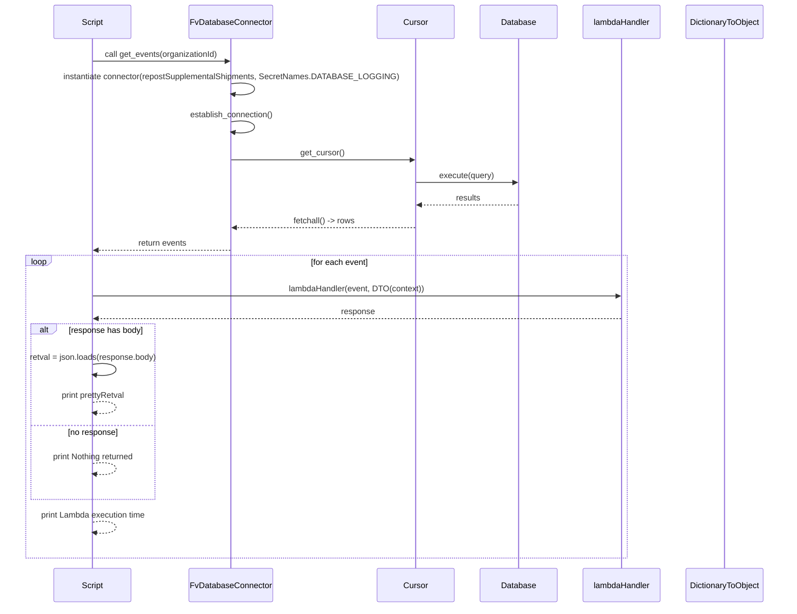
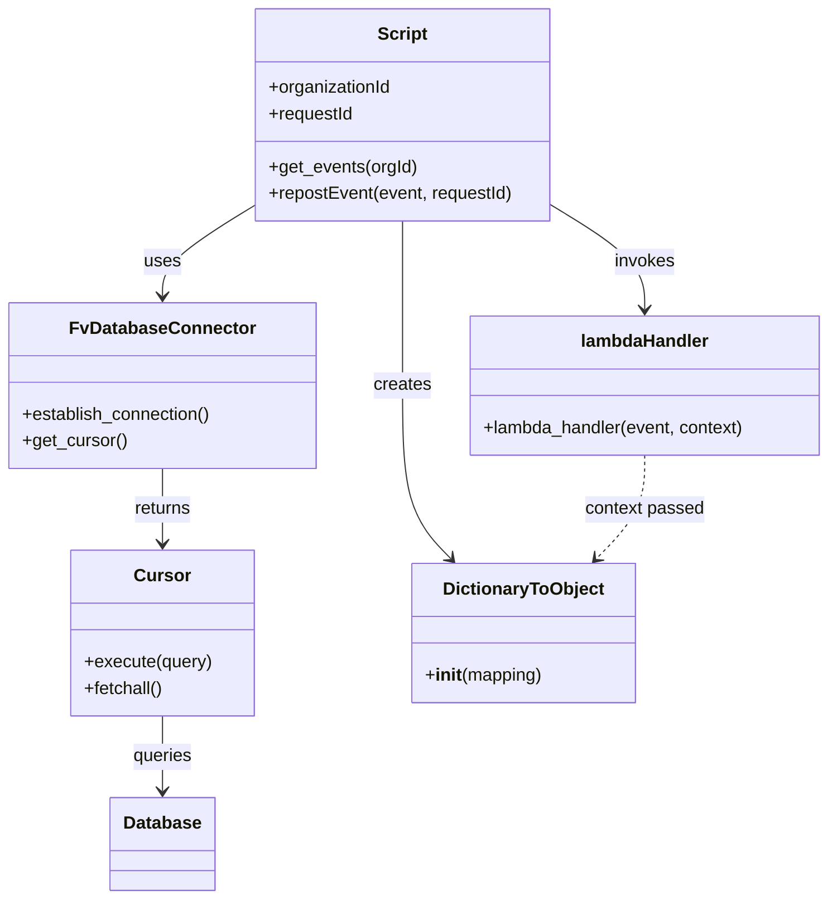

# Diagram: platform/tools/ide_local_testing/localTest/utility/reprocessFailedSupplementalShipments.py

> Auto-generated by Obscura crawlers

## Diagram 1

### SVG

<svg id="container" width="1599.5" xmlns="http://www.w3.org/2000/svg" height="1238" viewBox="-118 -10 1599.5 1238" role="graphics-document document" aria-roledescription="sequence"><g><rect x="1273.5" y="1152" fill="#eaeaea" stroke="#666" width="158" height="65" name="dto" rx="3" ry="3" class="actor actor-bottom"></rect><text x="1352.5" y="1184.5" dominant-baseline="central" alignment-baseline="central" class="actor actor-box" style="text-anchor: middle; font-size: 16px; font-weight: 400;"><tspan x="1352.5" dy="0">DictionaryToObject</tspan></text></g><g><rect x="1073.5" y="1152" fill="#eaeaea" stroke="#666" width="150" height="65" name="lambda" rx="3" ry="3" class="actor actor-bottom"></rect><text x="1148.5" y="1184.5" dominant-baseline="central" alignment-baseline="central" class="actor actor-box" style="text-anchor: middle; font-size: 16px; font-weight: 400;"><tspan x="1148.5" dy="0">lambdaHandler</tspan></text></g><g><rect x="873.5" y="1152" fill="#eaeaea" stroke="#666" width="150" height="65" name="db" rx="3" ry="3" class="actor actor-bottom"></rect><text x="948.5" y="1184.5" dominant-baseline="central" alignment-baseline="central" class="actor actor-box" style="text-anchor: middle; font-size: 16px; font-weight: 400;"><tspan x="948.5" dy="0">Database</tspan></text></g><g><rect x="673.5" y="1152" fill="#eaeaea" stroke="#666" width="150" height="65" name="cursor" rx="3" ry="3" class="actor actor-bottom"></rect><text x="748.5" y="1184.5" dominant-baseline="central" alignment-baseline="central" class="actor actor-box" style="text-anchor: middle; font-size: 16px; font-weight: 400;"><tspan x="748.5" dy="0">Cursor</tspan></text></g><g><rect x="279.5" y="1152" fill="#eaeaea" stroke="#666" width="177" height="65" name="fvdb" rx="3" ry="3" class="actor actor-bottom"></rect><text x="368" y="1184.5" dominant-baseline="central" alignment-baseline="central" class="actor actor-box" style="text-anchor: middle; font-size: 16px; font-weight: 400;"><tspan x="368" dy="0">FvDatabaseConnector</tspan></text></g><g><rect x="0" y="1152" fill="#eaeaea" stroke="#666" width="150" height="65" name="script" rx="3" ry="3" class="actor actor-bottom"></rect><text x="75" y="1184.5" dominant-baseline="central" alignment-baseline="central" class="actor actor-box" style="text-anchor: middle; font-size: 16px; font-weight: 400;"><tspan x="75" dy="0">Script</tspan></text></g><g><line id="actor5" x1="1352.5" y1="65" x2="1352.5" y2="1152" class="actor-line 200" stroke-width="0.5px" stroke="#999" name="dto"></line><g id="root-5"><rect x="1273.5" y="0" fill="#eaeaea" stroke="#666" width="158" height="65" name="dto" rx="3" ry="3" class="actor actor-top"></rect><text x="1352.5" y="32.5" dominant-baseline="central" alignment-baseline="central" class="actor actor-box" style="text-anchor: middle; font-size: 16px; font-weight: 400;"><tspan x="1352.5" dy="0">DictionaryToObject</tspan></text></g></g><g><line id="actor4" x1="1148.5" y1="65" x2="1148.5" y2="1152" class="actor-line 200" stroke-width="0.5px" stroke="#999" name="lambda"></line><g id="root-4"><rect x="1073.5" y="0" fill="#eaeaea" stroke="#666" width="150" height="65" name="lambda" rx="3" ry="3" class="actor actor-top"></rect><text x="1148.5" y="32.5" dominant-baseline="central" alignment-baseline="central" class="actor actor-box" style="text-anchor: middle; font-size: 16px; font-weight: 400;"><tspan x="1148.5" dy="0">lambdaHandler</tspan></text></g></g><g><line id="actor3" x1="948.5" y1="65" x2="948.5" y2="1152" class="actor-line 200" stroke-width="0.5px" stroke="#999" name="db"></line><g id="root-3"><rect x="873.5" y="0" fill="#eaeaea" stroke="#666" width="150" height="65" name="db" rx="3" ry="3" class="actor actor-top"></rect><text x="948.5" y="32.5" dominant-baseline="central" alignment-baseline="central" class="actor actor-box" style="text-anchor: middle; font-size: 16px; font-weight: 400;"><tspan x="948.5" dy="0">Database</tspan></text></g></g><g><line id="actor2" x1="748.5" y1="65" x2="748.5" y2="1152" class="actor-line 200" stroke-width="0.5px" stroke="#999" name="cursor"></line><g id="root-2"><rect x="673.5" y="0" fill="#eaeaea" stroke="#666" width="150" height="65" name="cursor" rx="3" ry="3" class="actor actor-top"></rect><text x="748.5" y="32.5" dominant-baseline="central" alignment-baseline="central" class="actor actor-box" style="text-anchor: middle; font-size: 16px; font-weight: 400;"><tspan x="748.5" dy="0">Cursor</tspan></text></g></g><g><line id="actor1" x1="368" y1="65" x2="368" y2="1152" class="actor-line 200" stroke-width="0.5px" stroke="#999" name="fvdb"></line><g id="root-1"><rect x="279.5" y="0" fill="#eaeaea" stroke="#666" width="177" height="65" name="fvdb" rx="3" ry="3" class="actor actor-top"></rect><text x="368" y="32.5" dominant-baseline="central" alignment-baseline="central" class="actor actor-box" style="text-anchor: middle; font-size: 16px; font-weight: 400;"><tspan x="368" dy="0">FvDatabaseConnector</tspan></text></g></g><g><line id="actor0" x1="75" y1="65" x2="75" y2="1152" class="actor-line 200" stroke-width="0.5px" stroke="#999" name="script"></line><g id="root-0"><rect x="0" y="0" fill="#eaeaea" stroke="#666" width="150" height="65" name="script" rx="3" ry="3" class="actor actor-top"></rect><text x="75" y="32.5" dominant-baseline="central" alignment-baseline="central" class="actor actor-box" style="text-anchor: middle; font-size: 16px; font-weight: 400;"><tspan x="75" dy="0">Script</tspan></text></g></g><g></g><defs><symbol id="computer" width="24" height="24"><path transform="scale(.5)" d="M2 2v13h20v-13h-20zm18 11h-16v-9h16v9zm-10.228 6l.466-1h3.524l.467 1h-4.457zm14.228 3h-24l2-6h2.104l-1.33 4h18.45l-1.297-4h2.073l2 6zm-5-10h-14v-7h14v7z"></path></symbol></defs><defs><symbol id="database" fill-rule="evenodd" clip-rule="evenodd"><path transform="scale(.5)" d="M12.258.001l.256.004.255.005.253.008.251.01.249.012.247.015.246.016.242.019.241.02.239.023.236.024.233.027.231.028.229.031.225.032.223.034.22.036.217.038.214.04.211.041.208.043.205.045.201.046.198.048.194.05.191.051.187.053.183.054.18.056.175.057.172.059.168.06.163.061.16.063.155.064.15.066.074.033.073.033.071.034.07.034.069.035.068.035.067.035.066.035.064.036.064.036.062.036.06.036.06.037.058.037.058.037.055.038.055.038.053.038.052.038.051.039.05.039.048.039.047.039.045.04.044.04.043.04.041.04.04.041.039.041.037.041.036.041.034.041.033.042.032.042.03.042.029.042.027.042.026.043.024.043.023.043.021.043.02.043.018.044.017.043.015.044.013.044.012.044.011.045.009.044.007.045.006.045.004.045.002.045.001.045v17l-.001.045-.002.045-.004.045-.006.045-.007.045-.009.044-.011.045-.012.044-.013.044-.015.044-.017.043-.018.044-.02.043-.021.043-.023.043-.024.043-.026.043-.027.042-.029.042-.03.042-.032.042-.033.042-.034.041-.036.041-.037.041-.039.041-.04.041-.041.04-.043.04-.044.04-.045.04-.047.039-.048.039-.05.039-.051.039-.052.038-.053.038-.055.038-.055.038-.058.037-.058.037-.06.037-.06.036-.062.036-.064.036-.064.036-.066.035-.067.035-.068.035-.069.035-.07.034-.071.034-.073.033-.074.033-.15.066-.155.064-.16.063-.163.061-.168.06-.172.059-.175.057-.18.056-.183.054-.187.053-.191.051-.194.05-.198.048-.201.046-.205.045-.208.043-.211.041-.214.04-.217.038-.22.036-.223.034-.225.032-.229.031-.231.028-.233.027-.236.024-.239.023-.241.02-.242.019-.246.016-.247.015-.249.012-.251.01-.253.008-.255.005-.256.004-.258.001-.258-.001-.256-.004-.255-.005-.253-.008-.251-.01-.249-.012-.247-.015-.245-.016-.243-.019-.241-.02-.238-.023-.236-.024-.234-.027-.231-.028-.228-.031-.226-.032-.223-.034-.22-.036-.217-.038-.214-.04-.211-.041-.208-.043-.204-.045-.201-.046-.198-.048-.195-.05-.19-.051-.187-.053-.184-.054-.179-.056-.176-.057-.172-.059-.167-.06-.164-.061-.159-.063-.155-.064-.151-.066-.074-.033-.072-.033-.072-.034-.07-.034-.069-.035-.068-.035-.067-.035-.066-.035-.064-.036-.063-.036-.062-.036-.061-.036-.06-.037-.058-.037-.057-.037-.056-.038-.055-.038-.053-.038-.052-.038-.051-.039-.049-.039-.049-.039-.046-.039-.046-.04-.044-.04-.043-.04-.041-.04-.04-.041-.039-.041-.037-.041-.036-.041-.034-.041-.033-.042-.032-.042-.03-.042-.029-.042-.027-.042-.026-.043-.024-.043-.023-.043-.021-.043-.02-.043-.018-.044-.017-.043-.015-.044-.013-.044-.012-.044-.011-.045-.009-.044-.007-.045-.006-.045-.004-.045-.002-.045-.001-.045v-17l.001-.045.002-.045.004-.045.006-.045.007-.045.009-.044.011-.045.012-.044.013-.044.015-.044.017-.043.018-.044.02-.043.021-.043.023-.043.024-.043.026-.043.027-.042.029-.042.03-.042.032-.042.033-.042.034-.041.036-.041.037-.041.039-.041.04-.041.041-.04.043-.04.044-.04.046-.04.046-.039.049-.039.049-.039.051-.039.052-.038.053-.038.055-.038.056-.038.057-.037.058-.037.06-.037.061-.036.062-.036.063-.036.064-.036.066-.035.067-.035.068-.035.069-.035.07-.034.072-.034.072-.033.074-.033.151-.066.155-.064.159-.063.164-.061.167-.06.172-.059.176-.057.179-.056.184-.054.187-.053.19-.051.195-.05.198-.048.201-.046.204-.045.208-.043.211-.041.214-.04.217-.038.22-.036.223-.034.226-.032.228-.031.231-.028.234-.027.236-.024.238-.023.241-.02.243-.019.245-.016.247-.015.249-.012.251-.01.253-.008.255-.005.256-.004.258-.001.258.001zm-9.258 20.499v.01l.001.021.003.021.004.022.005.021.006.022.007.022.009.023.01.022.011.023.012.023.013.023.015.023.016.024.017.023.018.024.019.024.021.024.022.025.023.024.024.025.052.049.056.05.061.051.066.051.07.051.075.051.079.052.084.052.088.052.092.052.097.052.102.051.105.052.11.052.114.051.119.051.123.051.127.05.131.05.135.05.139.048.144.049.147.047.152.047.155.047.16.045.163.045.167.043.171.043.176.041.178.041.183.039.187.039.19.037.194.035.197.035.202.033.204.031.209.03.212.029.216.027.219.025.222.024.226.021.23.02.233.018.236.016.24.015.243.012.246.01.249.008.253.005.256.004.259.001.26-.001.257-.004.254-.005.25-.008.247-.011.244-.012.241-.014.237-.016.233-.018.231-.021.226-.021.224-.024.22-.026.216-.027.212-.028.21-.031.205-.031.202-.034.198-.034.194-.036.191-.037.187-.039.183-.04.179-.04.175-.042.172-.043.168-.044.163-.045.16-.046.155-.046.152-.047.148-.048.143-.049.139-.049.136-.05.131-.05.126-.05.123-.051.118-.052.114-.051.11-.052.106-.052.101-.052.096-.052.092-.052.088-.053.083-.051.079-.052.074-.052.07-.051.065-.051.06-.051.056-.05.051-.05.023-.024.023-.025.021-.024.02-.024.019-.024.018-.024.017-.024.015-.023.014-.024.013-.023.012-.023.01-.023.01-.022.008-.022.006-.022.006-.022.004-.022.004-.021.001-.021.001-.021v-4.127l-.077.055-.08.053-.083.054-.085.053-.087.052-.09.052-.093.051-.095.05-.097.05-.1.049-.102.049-.105.048-.106.047-.109.047-.111.046-.114.045-.115.045-.118.044-.12.043-.122.042-.124.042-.126.041-.128.04-.13.04-.132.038-.134.038-.135.037-.138.037-.139.035-.142.035-.143.034-.144.033-.147.032-.148.031-.15.03-.151.03-.153.029-.154.027-.156.027-.158.026-.159.025-.161.024-.162.023-.163.022-.165.021-.166.02-.167.019-.169.018-.169.017-.171.016-.173.015-.173.014-.175.013-.175.012-.177.011-.178.01-.179.008-.179.008-.181.006-.182.005-.182.004-.184.003-.184.002h-.37l-.184-.002-.184-.003-.182-.004-.182-.005-.181-.006-.179-.008-.179-.008-.178-.01-.176-.011-.176-.012-.175-.013-.173-.014-.172-.015-.171-.016-.17-.017-.169-.018-.167-.019-.166-.02-.165-.021-.163-.022-.162-.023-.161-.024-.159-.025-.157-.026-.156-.027-.155-.027-.153-.029-.151-.03-.15-.03-.148-.031-.146-.032-.145-.033-.143-.034-.141-.035-.14-.035-.137-.037-.136-.037-.134-.038-.132-.038-.13-.04-.128-.04-.126-.041-.124-.042-.122-.042-.12-.044-.117-.043-.116-.045-.113-.045-.112-.046-.109-.047-.106-.047-.105-.048-.102-.049-.1-.049-.097-.05-.095-.05-.093-.052-.09-.051-.087-.052-.085-.053-.083-.054-.08-.054-.077-.054v4.127zm0-5.654v.011l.001.021.003.021.004.021.005.022.006.022.007.022.009.022.01.022.011.023.012.023.013.023.015.024.016.023.017.024.018.024.019.024.021.024.022.024.023.025.024.024.052.05.056.05.061.05.066.051.07.051.075.052.079.051.084.052.088.052.092.052.097.052.102.052.105.052.11.051.114.051.119.052.123.05.127.051.131.05.135.049.139.049.144.048.147.048.152.047.155.046.16.045.163.045.167.044.171.042.176.042.178.04.183.04.187.038.19.037.194.036.197.034.202.033.204.032.209.03.212.028.216.027.219.025.222.024.226.022.23.02.233.018.236.016.24.014.243.012.246.01.249.008.253.006.256.003.259.001.26-.001.257-.003.254-.006.25-.008.247-.01.244-.012.241-.015.237-.016.233-.018.231-.02.226-.022.224-.024.22-.025.216-.027.212-.029.21-.03.205-.032.202-.033.198-.035.194-.036.191-.037.187-.039.183-.039.179-.041.175-.042.172-.043.168-.044.163-.045.16-.045.155-.047.152-.047.148-.048.143-.048.139-.05.136-.049.131-.05.126-.051.123-.051.118-.051.114-.052.11-.052.106-.052.101-.052.096-.052.092-.052.088-.052.083-.052.079-.052.074-.051.07-.052.065-.051.06-.05.056-.051.051-.049.023-.025.023-.024.021-.025.02-.024.019-.024.018-.024.017-.024.015-.023.014-.023.013-.024.012-.022.01-.023.01-.023.008-.022.006-.022.006-.022.004-.021.004-.022.001-.021.001-.021v-4.139l-.077.054-.08.054-.083.054-.085.052-.087.053-.09.051-.093.051-.095.051-.097.05-.1.049-.102.049-.105.048-.106.047-.109.047-.111.046-.114.045-.115.044-.118.044-.12.044-.122.042-.124.042-.126.041-.128.04-.13.039-.132.039-.134.038-.135.037-.138.036-.139.036-.142.035-.143.033-.144.033-.147.033-.148.031-.15.03-.151.03-.153.028-.154.028-.156.027-.158.026-.159.025-.161.024-.162.023-.163.022-.165.021-.166.02-.167.019-.169.018-.169.017-.171.016-.173.015-.173.014-.175.013-.175.012-.177.011-.178.009-.179.009-.179.007-.181.007-.182.005-.182.004-.184.003-.184.002h-.37l-.184-.002-.184-.003-.182-.004-.182-.005-.181-.007-.179-.007-.179-.009-.178-.009-.176-.011-.176-.012-.175-.013-.173-.014-.172-.015-.171-.016-.17-.017-.169-.018-.167-.019-.166-.02-.165-.021-.163-.022-.162-.023-.161-.024-.159-.025-.157-.026-.156-.027-.155-.028-.153-.028-.151-.03-.15-.03-.148-.031-.146-.033-.145-.033-.143-.033-.141-.035-.14-.036-.137-.036-.136-.037-.134-.038-.132-.039-.13-.039-.128-.04-.126-.041-.124-.042-.122-.043-.12-.043-.117-.044-.116-.044-.113-.046-.112-.046-.109-.046-.106-.047-.105-.048-.102-.049-.1-.049-.097-.05-.095-.051-.093-.051-.09-.051-.087-.053-.085-.052-.083-.054-.08-.054-.077-.054v4.139zm0-5.666v.011l.001.02.003.022.004.021.005.022.006.021.007.022.009.023.01.022.011.023.012.023.013.023.015.023.016.024.017.024.018.023.019.024.021.025.022.024.023.024.024.025.052.05.056.05.061.05.066.051.07.051.075.052.079.051.084.052.088.052.092.052.097.052.102.052.105.051.11.052.114.051.119.051.123.051.127.05.131.05.135.05.139.049.144.048.147.048.152.047.155.046.16.045.163.045.167.043.171.043.176.042.178.04.183.04.187.038.19.037.194.036.197.034.202.033.204.032.209.03.212.028.216.027.219.025.222.024.226.021.23.02.233.018.236.017.24.014.243.012.246.01.249.008.253.006.256.003.259.001.26-.001.257-.003.254-.006.25-.008.247-.01.244-.013.241-.014.237-.016.233-.018.231-.02.226-.022.224-.024.22-.025.216-.027.212-.029.21-.03.205-.032.202-.033.198-.035.194-.036.191-.037.187-.039.183-.039.179-.041.175-.042.172-.043.168-.044.163-.045.16-.045.155-.047.152-.047.148-.048.143-.049.139-.049.136-.049.131-.051.126-.05.123-.051.118-.052.114-.051.11-.052.106-.052.101-.052.096-.052.092-.052.088-.052.083-.052.079-.052.074-.052.07-.051.065-.051.06-.051.056-.05.051-.049.023-.025.023-.025.021-.024.02-.024.019-.024.018-.024.017-.024.015-.023.014-.024.013-.023.012-.023.01-.022.01-.023.008-.022.006-.022.006-.022.004-.022.004-.021.001-.021.001-.021v-4.153l-.077.054-.08.054-.083.053-.085.053-.087.053-.09.051-.093.051-.095.051-.097.05-.1.049-.102.048-.105.048-.106.048-.109.046-.111.046-.114.046-.115.044-.118.044-.12.043-.122.043-.124.042-.126.041-.128.04-.13.039-.132.039-.134.038-.135.037-.138.036-.139.036-.142.034-.143.034-.144.033-.147.032-.148.032-.15.03-.151.03-.153.028-.154.028-.156.027-.158.026-.159.024-.161.024-.162.023-.163.023-.165.021-.166.02-.167.019-.169.018-.169.017-.171.016-.173.015-.173.014-.175.013-.175.012-.177.01-.178.01-.179.009-.179.007-.181.006-.182.006-.182.004-.184.003-.184.001-.185.001-.185-.001-.184-.001-.184-.003-.182-.004-.182-.006-.181-.006-.179-.007-.179-.009-.178-.01-.176-.01-.176-.012-.175-.013-.173-.014-.172-.015-.171-.016-.17-.017-.169-.018-.167-.019-.166-.02-.165-.021-.163-.023-.162-.023-.161-.024-.159-.024-.157-.026-.156-.027-.155-.028-.153-.028-.151-.03-.15-.03-.148-.032-.146-.032-.145-.033-.143-.034-.141-.034-.14-.036-.137-.036-.136-.037-.134-.038-.132-.039-.13-.039-.128-.041-.126-.041-.124-.041-.122-.043-.12-.043-.117-.044-.116-.044-.113-.046-.112-.046-.109-.046-.106-.048-.105-.048-.102-.048-.1-.05-.097-.049-.095-.051-.093-.051-.09-.052-.087-.052-.085-.053-.083-.053-.08-.054-.077-.054v4.153zm8.74-8.179l-.257.004-.254.005-.25.008-.247.011-.244.012-.241.014-.237.016-.233.018-.231.021-.226.022-.224.023-.22.026-.216.027-.212.028-.21.031-.205.032-.202.033-.198.034-.194.036-.191.038-.187.038-.183.04-.179.041-.175.042-.172.043-.168.043-.163.045-.16.046-.155.046-.152.048-.148.048-.143.048-.139.049-.136.05-.131.05-.126.051-.123.051-.118.051-.114.052-.11.052-.106.052-.101.052-.096.052-.092.052-.088.052-.083.052-.079.052-.074.051-.07.052-.065.051-.06.05-.056.05-.051.05-.023.025-.023.024-.021.024-.02.025-.019.024-.018.024-.017.023-.015.024-.014.023-.013.023-.012.023-.01.023-.01.022-.008.022-.006.023-.006.021-.004.022-.004.021-.001.021-.001.021.001.021.001.021.004.021.004.022.006.021.006.023.008.022.01.022.01.023.012.023.013.023.014.023.015.024.017.023.018.024.019.024.02.025.021.024.023.024.023.025.051.05.056.05.06.05.065.051.07.052.074.051.079.052.083.052.088.052.092.052.096.052.101.052.106.052.11.052.114.052.118.051.123.051.126.051.131.05.136.05.139.049.143.048.148.048.152.048.155.046.16.046.163.045.168.043.172.043.175.042.179.041.183.04.187.038.191.038.194.036.198.034.202.033.205.032.21.031.212.028.216.027.22.026.224.023.226.022.231.021.233.018.237.016.241.014.244.012.247.011.25.008.254.005.257.004.26.001.26-.001.257-.004.254-.005.25-.008.247-.011.244-.012.241-.014.237-.016.233-.018.231-.021.226-.022.224-.023.22-.026.216-.027.212-.028.21-.031.205-.032.202-.033.198-.034.194-.036.191-.038.187-.038.183-.04.179-.041.175-.042.172-.043.168-.043.163-.045.16-.046.155-.046.152-.048.148-.048.143-.048.139-.049.136-.05.131-.05.126-.051.123-.051.118-.051.114-.052.11-.052.106-.052.101-.052.096-.052.092-.052.088-.052.083-.052.079-.052.074-.051.07-.052.065-.051.06-.05.056-.05.051-.05.023-.025.023-.024.021-.024.02-.025.019-.024.018-.024.017-.023.015-.024.014-.023.013-.023.012-.023.01-.023.01-.022.008-.022.006-.023.006-.021.004-.022.004-.021.001-.021.001-.021-.001-.021-.001-.021-.004-.021-.004-.022-.006-.021-.006-.023-.008-.022-.01-.022-.01-.023-.012-.023-.013-.023-.014-.023-.015-.024-.017-.023-.018-.024-.019-.024-.02-.025-.021-.024-.023-.024-.023-.025-.051-.05-.056-.05-.06-.05-.065-.051-.07-.052-.074-.051-.079-.052-.083-.052-.088-.052-.092-.052-.096-.052-.101-.052-.106-.052-.11-.052-.114-.052-.118-.051-.123-.051-.126-.051-.131-.05-.136-.05-.139-.049-.143-.048-.148-.048-.152-.048-.155-.046-.16-.046-.163-.045-.168-.043-.172-.043-.175-.042-.179-.041-.183-.04-.187-.038-.191-.038-.194-.036-.198-.034-.202-.033-.205-.032-.21-.031-.212-.028-.216-.027-.22-.026-.224-.023-.226-.022-.231-.021-.233-.018-.237-.016-.241-.014-.244-.012-.247-.011-.25-.008-.254-.005-.257-.004-.26-.001-.26.001z"></path></symbol></defs><defs><symbol id="clock" width="24" height="24"><path transform="scale(.5)" d="M12 2c5.514 0 10 4.486 10 10s-4.486 10-10 10-10-4.486-10-10 4.486-10 10-10zm0-2c-6.627 0-12 5.373-12 12s5.373 12 12 12 12-5.373 12-12-5.373-12-12-12zm5.848 12.459c.202.038.202.333.001.372-1.907.361-6.045 1.111-6.547 1.111-.719 0-1.301-.582-1.301-1.301 0-.512.77-5.447 1.125-7.445.034-.192.312-.181.343.014l.985 6.238 5.394 1.011z"></path></symbol></defs><defs><marker id="arrowhead" refX="7.9" refY="5" markerUnits="userSpaceOnUse" markerWidth="12" markerHeight="12" orient="auto-start-reverse"><path d="M -1 0 L 10 5 L 0 10 z"></path></marker></defs><defs><marker id="crosshead" markerWidth="15" markerHeight="8" orient="auto" refX="4" refY="4.5"><path fill="none" stroke="#000000" stroke-width="1pt" d="M 1,2 L 6,7 M 6,2 L 1,7" style="stroke-dasharray: 0, 0;"></path></marker></defs><defs><marker id="filled-head" refX="15.5" refY="7" markerWidth="20" markerHeight="28" orient="auto"><path d="M 18,7 L9,13 L14,7 L9,1 Z"></path></marker></defs><defs><marker id="sequencenumber" refX="15" refY="15" markerWidth="60" markerHeight="40" orient="auto"><circle cx="15" cy="15" r="6"></circle></marker></defs><g><line x1="-58" y1="660" x2="210" y2="660" class="loopLine"></line><line x1="210" y1="660" x2="210" y2="1014" class="loopLine"></line><line x1="-58" y1="1014" x2="210" y2="1014" class="loopLine"></line><line x1="-58" y1="660" x2="-58" y2="1014" class="loopLine"></line><line x1="-58" y1="866" x2="210" y2="866" class="loopLine" style="stroke-dasharray: 3, 3;"></line><polygon points="-58,660 -8,660 -8,673 -16.4,680 -58,680" class="labelBox"></polygon><text x="-33" y="673" text-anchor="middle" dominant-baseline="middle" alignment-baseline="middle" class="labelText" style="font-size: 16px; font-weight: 400;">alt</text><text x="101" y="678" text-anchor="middle" class="loopText" style="font-size: 16px; font-weight: 400;"><tspan x="101">[response has body]</tspan></text><text x="76" y="884" text-anchor="middle" class="loopText" style="font-size: 16px; font-weight: 400;">[no response]</text></g><g><line x1="-68" y1="519" x2="1159.5" y2="519" class="loopLine"></line><line x1="1159.5" y1="519" x2="1159.5" y2="1132" class="loopLine"></line><line x1="-68" y1="1132" x2="1159.5" y2="1132" class="loopLine"></line><line x1="-68" y1="519" x2="-68" y2="1132" class="loopLine"></line><polygon points="-68,519 -18,519 -18,532 -26.4,539 -68,539" class="labelBox"></polygon><text x="-43" y="532" text-anchor="middle" dominant-baseline="middle" alignment-baseline="middle" class="labelText" style="font-size: 16px; font-weight: 400;">loop</text><text x="570.75" y="537" text-anchor="middle" class="loopText" style="font-size: 16px; font-weight: 400;"><tspan x="570.75">[for each event]</tspan></text></g><text x="220" y="80" text-anchor="middle" dominant-baseline="middle" alignment-baseline="middle" class="messageText" dy="1em" style="font-size: 16px; font-weight: 400;">call get_events(organizationId)</text><line x1="76" y1="113" x2="364" y2="113" class="messageLine0" stroke-width="2" stroke="none" marker-end="url(#arrowhead)" style="fill: none;"></line><text x="369" y="128" text-anchor="middle" dominant-baseline="middle" alignment-baseline="middle" class="messageText" dy="1em" style="font-size: 16px; font-weight: 400;">instantiate connector(repostSupplementalShipments, SecretNames.DATABASE_LOGGING)</text><path d="M 369,161 C 429,151 429,191 369,181" class="messageLine0" stroke-width="2" stroke="none" marker-end="url(#arrowhead)" style="fill: none;"></path><text x="369" y="206" text-anchor="middle" dominant-baseline="middle" alignment-baseline="middle" class="messageText" dy="1em" style="font-size: 16px; font-weight: 400;">establish_connection()</text><path d="M 369,239 C 429,229 429,269 369,259" class="messageLine0" stroke-width="2" stroke="none" marker-end="url(#arrowhead)" style="fill: none;"></path><text x="557" y="284" text-anchor="middle" dominant-baseline="middle" alignment-baseline="middle" class="messageText" dy="1em" style="font-size: 16px; font-weight: 400;">get_cursor()</text><line x1="369" y1="317" x2="744.5" y2="317" class="messageLine0" stroke-width="2" stroke="none" marker-end="url(#arrowhead)" style="fill: none;"></line><text x="847" y="332" text-anchor="middle" dominant-baseline="middle" alignment-baseline="middle" class="messageText" dy="1em" style="font-size: 16px; font-weight: 400;">execute(query)</text><line x1="749.5" y1="365" x2="944.5" y2="365" class="messageLine0" stroke-width="2" stroke="none" marker-end="url(#arrowhead)" style="fill: none;"></line><text x="850" y="380" text-anchor="middle" dominant-baseline="middle" alignment-baseline="middle" class="messageText" dy="1em" style="font-size: 16px; font-weight: 400;">results</text><line x1="947.5" y1="413" x2="752.5" y2="413" class="messageLine1" stroke-width="2" stroke="none" marker-end="url(#arrowhead)" style="stroke-dasharray: 3, 3; fill: none;"></line><text x="560" y="428" text-anchor="middle" dominant-baseline="middle" alignment-baseline="middle" class="messageText" dy="1em" style="font-size: 16px; font-weight: 400;">fetchall() -&gt; rows</text><line x1="747.5" y1="461" x2="372" y2="461" class="messageLine1" stroke-width="2" stroke="none" marker-end="url(#arrowhead)" style="stroke-dasharray: 3, 3; fill: none;"></line><text x="223" y="476" text-anchor="middle" dominant-baseline="middle" alignment-baseline="middle" class="messageText" dy="1em" style="font-size: 16px; font-weight: 400;">return events</text><line x1="367" y1="509" x2="79" y2="509" class="messageLine1" stroke-width="2" stroke="none" marker-end="url(#arrowhead)" style="stroke-dasharray: 3, 3; fill: none;"></line><text x="610" y="569" text-anchor="middle" dominant-baseline="middle" alignment-baseline="middle" class="messageText" dy="1em" style="font-size: 16px; font-weight: 400;">lambdaHandler(event, DTO(context))</text><line x1="76" y1="602" x2="1144.5" y2="602" class="messageLine0" stroke-width="2" stroke="none" marker-end="url(#arrowhead)" style="fill: none;"></line><text x="613" y="617" text-anchor="middle" dominant-baseline="middle" alignment-baseline="middle" class="messageText" dy="1em" style="font-size: 16px; font-weight: 400;">response</text><line x1="1147.5" y1="650" x2="79" y2="650" class="messageLine1" stroke-width="2" stroke="none" marker-end="url(#arrowhead)" style="stroke-dasharray: 3, 3; fill: none;"></line><text x="76" y="710" text-anchor="middle" dominant-baseline="middle" alignment-baseline="middle" class="messageText" dy="1em" style="font-size: 16px; font-weight: 400;">retval = json.loads(response.body)</text><path d="M 76,743 C 136,733 136,773 76,763" class="messageLine0" stroke-width="2" stroke="none" marker-end="url(#arrowhead)" style="fill: none;"></path><text x="76" y="788" text-anchor="middle" dominant-baseline="middle" alignment-baseline="middle" class="messageText" dy="1em" style="font-size: 16px; font-weight: 400;">print prettyRetval</text><path d="M 76,821 C 136,811 136,851 76,841" class="messageLine1" stroke-width="2" stroke="none" marker-end="url(#arrowhead)" style="stroke-dasharray: 3, 3; fill: none;"></path><text x="76" y="911" text-anchor="middle" dominant-baseline="middle" alignment-baseline="middle" class="messageText" dy="1em" style="font-size: 16px; font-weight: 400;">print Nothing returned</text><path d="M 76,944 C 136,934 136,974 76,964" class="messageLine1" stroke-width="2" stroke="none" marker-end="url(#arrowhead)" style="stroke-dasharray: 3, 3; fill: none;"></path><text x="76" y="1029" text-anchor="middle" dominant-baseline="middle" alignment-baseline="middle" class="messageText" dy="1em" style="font-size: 16px; font-weight: 400;">print Lambda execution time</text><path d="M 76,1062 C 136,1052 136,1092 76,1082" class="messageLine1" stroke-width="2" stroke="none" marker-end="url(#arrowhead)" style="stroke-dasharray: 3, 3; fill: none;"></path></svg>

## Diagram 2

### SVG

<svg id="container" width="752.009765625" xmlns="http://www.w3.org/2000/svg" class="classDiagram" height="814" viewBox="0 0 752.009765625 814" role="graphics-document document" aria-roledescription="class"><g><defs><marker id="container_class-aggregationStart" class="marker aggregation class" refX="18" refY="7" markerWidth="190" markerHeight="240" orient="auto"><path d="M 18,7 L9,13 L1,7 L9,1 Z"></path></marker></defs><defs><marker id="container_class-aggregationEnd" class="marker aggregation class" refX="1" refY="7" markerWidth="20" markerHeight="28" orient="auto"><path d="M 18,7 L9,13 L1,7 L9,1 Z"></path></marker></defs><defs><marker id="container_class-extensionStart" class="marker extension class" refX="18" refY="7" markerWidth="190" markerHeight="240" orient="auto"><path d="M 1,7 L18,13 V 1 Z"></path></marker></defs><defs><marker id="container_class-extensionEnd" class="marker extension class" refX="1" refY="7" markerWidth="20" markerHeight="28" orient="auto"><path d="M 1,1 V 13 L18,7 Z"></path></marker></defs><defs><marker id="container_class-compositionStart" class="marker composition class" refX="18" refY="7" markerWidth="190" markerHeight="240" orient="auto"><path d="M 18,7 L9,13 L1,7 L9,1 Z"></path></marker></defs><defs><marker id="container_class-compositionEnd" class="marker composition class" refX="1" refY="7" markerWidth="20" markerHeight="28" orient="auto"><path d="M 18,7 L9,13 L1,7 L9,1 Z"></path></marker></defs><defs><marker id="container_class-dependencyStart" class="marker dependency class" refX="6" refY="7" markerWidth="190" markerHeight="240" orient="auto"><path d="M 5,7 L9,13 L1,7 L9,1 Z"></path></marker></defs><defs><marker id="container_class-dependencyEnd" class="marker dependency class" refX="13" refY="7" markerWidth="20" markerHeight="28" orient="auto"><path d="M 18,7 L9,13 L14,7 L9,1 Z"></path></marker></defs><defs><marker id="container_class-lollipopStart" class="marker lollipop class" refX="13" refY="7" markerWidth="190" markerHeight="240" orient="auto"><circle stroke="black" fill="transparent" cx="7" cy="7" r="6"></circle></marker></defs><defs><marker id="container_class-lollipopEnd" class="marker lollipop class" refX="1" refY="7" markerWidth="190" markerHeight="240" orient="auto"><circle stroke="black" fill="transparent" cx="7" cy="7" r="6"></circle></marker></defs><g class="root"><g class="clusters"></g><g class="edgePaths"><path d="M227.834,186.748L214.243,195.124C200.651,203.499,173.468,220.249,159.877,233.791C146.285,247.333,146.285,257.667,146.285,262.833L146.285,268" id="id_Script_FvDatabaseConnector_1" class="edge-thickness-normal edge-pattern-solid relation" style=";;;" data-edge="true" data-et="edge" data-id="id_Script_FvDatabaseConnector_1" data-points="W3sieCI6MjI3LjgzMzk4NDM3NSwieSI6MTg2Ljc0ODQ0MTI3NTIxMzM0fSx7IngiOjE0Ni4yODUxNTYyNSwieSI6MjM3fSx7IngiOjE0Ni4yODUxNTYyNSwieSI6Mjc0fV0=" marker-end="url(#container_class-dependencyEnd)"></path><path d="M496.404,184.62L510.945,193.35C525.486,202.08,554.568,219.54,569.109,235.437C583.65,251.333,583.65,265.667,583.65,272.833L583.65,280" id="id_Script_lambdaHandler_2" class="edge-thickness-normal edge-pattern-solid relation" style=";;;" data-edge="true" data-et="edge" data-id="id_Script_lambdaHandler_2" data-points="W3sieCI6NDk2LjQwNDI5Njg3NSwieSI6MTg0LjYyMDM0NDkwMDU1MDE1fSx7IngiOjU4My42NTAzOTA2MjUsInkiOjIzN30seyJ4Ijo1ODMuNjUwMzkwNjI1LCJ5IjoyODZ9XQ==" marker-end="url(#container_class-dependencyEnd)"></path><path d="M362.119,200L362.119,206.167C362.119,212.333,362.119,224.667,362.119,249.5C362.119,274.333,362.119,311.667,362.119,349C362.119,386.333,362.119,423.667,369.493,449.789C376.866,475.911,391.613,490.823,398.987,498.278L406.36,505.734" id="id_Script_DictionaryToObject_3" class="edge-thickness-normal edge-pattern-solid relation" style=";;;" data-edge="true" data-et="edge" data-id="id_Script_DictionaryToObject_3" data-points="W3sieCI6MzYyLjExOTE0MDYyNSwieSI6MjAwfSx7IngiOjM2Mi4xMTkxNDA2MjUsInkiOjIzN30seyJ4IjozNjIuMTE5MTQwNjI1LCJ5IjozNDl9LHsieCI6MzYyLjExOTE0MDYyNSwieSI6NDYxfSx7IngiOjQxMC41NzkxMDE1NjI1LCJ5Ijo1MTB9XQ==" marker-end="url(#container_class-dependencyEnd)"></path><path d="M146.285,424L146.285,430.167C146.285,436.333,146.285,448.667,146.285,460C146.285,471.333,146.285,481.667,146.285,486.833L146.285,492" id="id_FvDatabaseConnector_Cursor_4" class="edge-thickness-normal edge-pattern-solid relation" style=";;;" data-edge="true" data-et="edge" data-id="id_FvDatabaseConnector_Cursor_4" data-points="W3sieCI6MTQ2LjI4NTE1NjI1LCJ5Ijo0MjR9LHsieCI6MTQ2LjI4NTE1NjI1LCJ5Ijo0NjF9LHsieCI6MTQ2LjI4NTE1NjI1LCJ5Ijo0OTh9XQ==" marker-end="url(#container_class-dependencyEnd)"></path><path d="M146.285,648L146.285,654.167C146.285,660.333,146.285,672.667,146.285,684C146.285,695.333,146.285,705.667,146.285,710.833L146.285,716" id="id_Cursor_Database_5" class="edge-thickness-normal edge-pattern-solid relation" style=";;;" data-edge="true" data-et="edge" data-id="id_Cursor_Database_5" data-points="W3sieCI6MTQ2LjI4NTE1NjI1LCJ5Ijo2NDh9LHsieCI6MTQ2LjI4NTE1NjI1LCJ5Ijo2ODV9LHsieCI6MTQ2LjI4NTE1NjI1LCJ5Ijo3MjJ9XQ==" marker-end="url(#container_class-dependencyEnd)"></path><path d="M583.65,412L583.65,420.167C583.65,428.333,583.65,444.667,576.277,460.289C568.903,475.911,554.156,490.823,546.783,498.278L539.409,505.734" id="id_lambdaHandler_DictionaryToObject_6" class="edge-thickness-normal edge-pattern-dashed relation" style=";;;" data-edge="true" data-et="edge" data-id="id_lambdaHandler_DictionaryToObject_6" data-points="W3sieCI6NTgzLjY1MDM5MDYyNSwieSI6NDEyfSx7IngiOjU4My42NTAzOTA2MjUsInkiOjQ2MX0seyJ4Ijo1MzUuMTkwNDI5Njg3NSwieSI6NTEwfV0=" marker-end="url(#container_class-dependencyEnd)"></path></g><g class="edgeLabels"><g class="edgeLabel" transform="translate(146.28515625, 237)"><g class="label" data-id="id_Script_FvDatabaseConnector_1" transform="translate(-16.4921875, -12)"><foreignObject width="32.984375" height="24">

uses

</foreignObject></g></g><g class="edgeLabel" transform="translate(583.650390625, 237)"><g class="label" data-id="id_Script_lambdaHandler_2" transform="translate(-27.5859375, -12)"><foreignObject width="55.171875" height="24">

invokes

</foreignObject></g></g><g class="edgeLabel" transform="translate(362.119140625, 349)"><g class="label" data-id="id_Script_DictionaryToObject_3" transform="translate(-26.171875, -12)"><foreignObject width="52.34375" height="24">

creates

</foreignObject></g></g><g class="edgeLabel" transform="translate(146.28515625, 461)"><g class="label" data-id="id_FvDatabaseConnector_Cursor_4" transform="translate(-26.265625, -12)"><foreignObject width="52.53125" height="24">

returns

</foreignObject></g></g><g class="edgeLabel" transform="translate(146.28515625, 685)"><g class="label" data-id="id_Cursor_Database_5" transform="translate(-27.2421875, -12)"><foreignObject width="54.484375" height="24">

queries

</foreignObject></g></g><g class="edgeLabel" transform="translate(583.650390625, 461)"><g class="label" data-id="id_lambdaHandler_DictionaryToObject_6" transform="translate(-54.453125, -12)"><foreignObject width="108.90625" height="24">

context passed

</foreignObject></g></g></g><g class="nodes"><g class="node default" id="classId-Script-0" transform="translate(362.119140625, 104)"><g class="basic label-container"><path d="M-134.28515625 -96 L134.28515625 -96 L134.28515625 96 L-134.28515625 96" stroke="none" stroke-width="0" fill="#ECECFF" style=""></path><path d="M-134.28515625 -96 C-34.60835333762515 -96, 65.0684495747497 -96, 134.28515625 -96 M-134.28515625 -96 C-30.090856618762842 -96, 74.10344301247432 -96, 134.28515625 -96 M134.28515625 -96 C134.28515625 -48.909681298462644, 134.28515625 -1.8193625969252878, 134.28515625 96 M134.28515625 -96 C134.28515625 -45.044633182160524, 134.28515625 5.910733635678952, 134.28515625 96 M134.28515625 96 C67.0077233304691 96, -0.2697095890617902 96, -134.28515625 96 M134.28515625 96 C57.57094751869762 96, -19.143261212604756 96, -134.28515625 96 M-134.28515625 96 C-134.28515625 21.070401852415785, -134.28515625 -53.85919629516843, -134.28515625 -96 M-134.28515625 96 C-134.28515625 42.95134333866186, -134.28515625 -10.097313322676285, -134.28515625 -96" stroke="#9370DB" stroke-width="1.3" fill="none" stroke-dasharray="0 0" style=""></path></g><g class="annotation-group text" transform="translate(0, -72)"></g><g class="label-group text" transform="translate(-21.7421875, -72)"><g class="label" style="font-weight: bolder" transform="translate(0,-12)"><foreignObject width="43.484375" height="24">

Script

</foreignObject></g></g><g class="members-group text" transform="translate(-122.28515625, -24)"><g class="label" style="" transform="translate(0,-12)"><foreignObject width="112.625" height="24">

+organizationId

</foreignObject></g><g class="label" style="" transform="translate(0,12)"><foreignObject width="77.546875" height="24">

+requestId

</foreignObject></g></g><g class="methods-group text" transform="translate(-122.28515625, 48)"><g class="label" style="" transform="translate(0,-12)"><foreignObject width="134.609375" height="24">

+get_events(orgId)

</foreignObject></g><g class="label" style="" transform="translate(0,12)"><foreignObject width="222.828125" height="24">

+repostEvent(event, requestId)

</foreignObject></g></g><g class="divider" style=""><path d="M-134.28515625 -48 C-56.04572334319252 -48, 22.19370956361496 -48, 134.28515625 -48 M-134.28515625 -48 C-47.999638063624545 -48, 38.28588012275091 -48, 134.28515625 -48" stroke="#9370DB" stroke-width="1.3" fill="none" stroke-dasharray="0 0" style=""></path></g><g class="divider" style=""><path d="M-134.28515625 24 C-65.76227100936465 24, 2.7606142312706936 24, 134.28515625 24 M-134.28515625 24 C-72.21974243788551 24, -10.154328625771015 24, 134.28515625 24" stroke="#9370DB" stroke-width="1.3" fill="none" stroke-dasharray="0 0" style=""></path></g></g><g class="node default" id="classId-FvDatabaseConnector-1" transform="translate(146.28515625, 349)"><g class="basic label-container"><path d="M-138.28515625 -75 L138.28515625 -75 L138.28515625 75 L-138.28515625 75" stroke="none" stroke-width="0" fill="#ECECFF" style=""></path><path d="M-138.28515625 -75 C-52.13346045375124 -75, 34.01823534249752 -75, 138.28515625 -75 M-138.28515625 -75 C-37.506948152628 -75, 63.271259944744 -75, 138.28515625 -75 M138.28515625 -75 C138.28515625 -17.36310362957083, 138.28515625 40.27379274085834, 138.28515625 75 M138.28515625 -75 C138.28515625 -22.547794800141965, 138.28515625 29.90441039971607, 138.28515625 75 M138.28515625 75 C38.61800053570141 75, -61.049155178597175 75, -138.28515625 75 M138.28515625 75 C65.1383041873433 75, -8.008547875313411 75, -138.28515625 75 M-138.28515625 75 C-138.28515625 25.008469671613994, -138.28515625 -24.98306065677201, -138.28515625 -75 M-138.28515625 75 C-138.28515625 15.82387825495529, -138.28515625 -43.35224349008942, -138.28515625 -75" stroke="#9370DB" stroke-width="1.3" fill="none" stroke-dasharray="0 0" style=""></path></g><g class="annotation-group text" transform="translate(0, -51)"></g><g class="label-group text" transform="translate(-79.3046875, -51)"><g class="label" style="font-weight: bolder" transform="translate(0,-12)"><foreignObject width="158.609375" height="24">

FvDatabaseConnector

</foreignObject></g></g><g class="members-group text" transform="translate(-126.28515625, -3)"></g><g class="methods-group text" transform="translate(-126.28515625, 27)"><g class="label" style="" transform="translate(0,-12)"><foreignObject width="173.265625" height="24">

+establish_connection()

</foreignObject></g><g class="label" style="" transform="translate(0,12)"><foreignObject width="94.640625" height="24">

+get_cursor()

</foreignObject></g></g><g class="divider" style=""><path d="M-138.28515625 -27 C-34.320003652855476 -27, 69.64514894428905 -27, 138.28515625 -27 M-138.28515625 -27 C-61.22355749727589 -27, 15.838041255448218 -27, 138.28515625 -27" stroke="#9370DB" stroke-width="1.3" fill="none" stroke-dasharray="0 0" style=""></path></g><g class="divider" style=""><path d="M-138.28515625 -3 C-33.40223864338486 -3, 71.48067896323028 -3, 138.28515625 -3 M-138.28515625 -3 C-80.90890616943531 -3, -23.532656088870638 -3, 138.28515625 -3" stroke="#9370DB" stroke-width="1.3" fill="none" stroke-dasharray="0 0" style=""></path></g></g><g class="node default" id="classId-Cursor-2" transform="translate(146.28515625, 573)"><g class="basic label-container"><path d="M-81.9375 -75 L81.9375 -75 L81.9375 75 L-81.9375 75" stroke="none" stroke-width="0" fill="#ECECFF" style=""></path><path d="M-81.9375 -75 C-45.751753297756835 -75, -9.56600659551367 -75, 81.9375 -75 M-81.9375 -75 C-36.12422542830601 -75, 9.689049143387976 -75, 81.9375 -75 M81.9375 -75 C81.9375 -25.2061937959931, 81.9375 24.587612408013797, 81.9375 75 M81.9375 -75 C81.9375 -25.325459366888644, 81.9375 24.34908126622271, 81.9375 75 M81.9375 75 C41.55556619700531 75, 1.1736323940106246 75, -81.9375 75 M81.9375 75 C35.13118707511762 75, -11.675125849764754 75, -81.9375 75 M-81.9375 75 C-81.9375 44.61374664587355, -81.9375 14.227493291747088, -81.9375 -75 M-81.9375 75 C-81.9375 31.839872032472236, -81.9375 -11.320255935055528, -81.9375 -75" stroke="#9370DB" stroke-width="1.3" fill="none" stroke-dasharray="0 0" style=""></path></g><g class="annotation-group text" transform="translate(0, -51)"></g><g class="label-group text" transform="translate(-23.90625, -51)"><g class="label" style="font-weight: bolder" transform="translate(0,-12)"><foreignObject width="47.8125" height="24">

Cursor

</foreignObject></g></g><g class="members-group text" transform="translate(-69.9375, -3)"></g><g class="methods-group text" transform="translate(-69.9375, 27)"><g class="label" style="" transform="translate(0,-12)"><foreignObject width="115.96875" height="24">

+execute(query)

</foreignObject></g><g class="label" style="" transform="translate(0,12)"><foreignObject width="72.515625" height="24">

+fetchall()

</foreignObject></g></g><g class="divider" style=""><path d="M-81.9375 -27 C-30.837368351463745 -27, 20.26276329707251 -27, 81.9375 -27 M-81.9375 -27 C-23.051394148105658 -27, 35.834711703788685 -27, 81.9375 -27" stroke="#9370DB" stroke-width="1.3" fill="none" stroke-dasharray="0 0" style=""></path></g><g class="divider" style=""><path d="M-81.9375 -3 C-23.45042275868115 -3, 35.0366544826377 -3, 81.9375 -3 M-81.9375 -3 C-39.63563993179141 -3, 2.6662201364171807 -3, 81.9375 -3" stroke="#9370DB" stroke-width="1.3" fill="none" stroke-dasharray="0 0" style=""></path></g></g><g class="node default" id="classId-Database-3" transform="translate(146.28515625, 764)"><g class="basic label-container"><path d="M-46.171875 -42 L46.171875 -42 L46.171875 42 L-46.171875 42" stroke="none" stroke-width="0" fill="#ECECFF" style=""></path><path d="M-46.171875 -42 C-18.508516899841496 -42, 9.154841200317009 -42, 46.171875 -42 M-46.171875 -42 C-19.475724677096668 -42, 7.220425645806664 -42, 46.171875 -42 M46.171875 -42 C46.171875 -24.038819097430046, 46.171875 -6.077638194860093, 46.171875 42 M46.171875 -42 C46.171875 -12.679272104158851, 46.171875 16.641455791682297, 46.171875 42 M46.171875 42 C16.4803711847467 42, -13.211132630506597 42, -46.171875 42 M46.171875 42 C20.216264133017 42, -5.739346733966002 42, -46.171875 42 M-46.171875 42 C-46.171875 13.996683356144299, -46.171875 -14.006633287711402, -46.171875 -42 M-46.171875 42 C-46.171875 19.996975221727592, -46.171875 -2.0060495565448164, -46.171875 -42" stroke="#9370DB" stroke-width="1.3" fill="none" stroke-dasharray="0 0" style=""></path></g><g class="annotation-group text" transform="translate(0, -18)"></g><g class="label-group text" transform="translate(-34.171875, -18)"><g class="label" style="font-weight: bolder" transform="translate(0,-12)"><foreignObject width="68.34375" height="24">

Database

</foreignObject></g></g><g class="members-group text" transform="translate(-34.171875, 30)"></g><g class="methods-group text" transform="translate(-34.171875, 60)"></g><g class="divider" style=""><path d="M-46.171875 6 C-18.944981315055685 6, 8.28191236988863 6, 46.171875 6 M-46.171875 6 C-24.855532847726714 6, -3.539190695453428 6, 46.171875 6" stroke="#9370DB" stroke-width="1.3" fill="none" stroke-dasharray="0 0" style=""></path></g><g class="divider" style=""><path d="M-46.171875 24 C-17.729536597575365 24, 10.71280180484927 24, 46.171875 24 M-46.171875 24 C-26.664310532341577 24, -7.156746064683155 24, 46.171875 24" stroke="#9370DB" stroke-width="1.3" fill="none" stroke-dasharray="0 0" style=""></path></g></g><g class="node default" id="classId-lambdaHandler-4" transform="translate(583.650390625, 349)"><g class="basic label-container"><path d="M-160.359375 -63 L160.359375 -63 L160.359375 63 L-160.359375 63" stroke="none" stroke-width="0" fill="#ECECFF" style=""></path><path d="M-160.359375 -63 C-89.99021409552674 -63, -19.621053191053477 -63, 160.359375 -63 M-160.359375 -63 C-71.04524658579304 -63, 18.268881828413924 -63, 160.359375 -63 M160.359375 -63 C160.359375 -23.849111039811447, 160.359375 15.301777920377106, 160.359375 63 M160.359375 -63 C160.359375 -24.800833845323965, 160.359375 13.398332309352071, 160.359375 63 M160.359375 63 C53.88533656761393 63, -52.58870186477213 63, -160.359375 63 M160.359375 63 C73.05765214503622 63, -14.24407070992757 63, -160.359375 63 M-160.359375 63 C-160.359375 27.831310005916762, -160.359375 -7.337379988166475, -160.359375 -63 M-160.359375 63 C-160.359375 13.718108212620365, -160.359375 -35.56378357475927, -160.359375 -63" stroke="#9370DB" stroke-width="1.3" fill="none" stroke-dasharray="0 0" style=""></path></g><g class="annotation-group text" transform="translate(0, -39)"></g><g class="label-group text" transform="translate(-56.53125, -39)"><g class="label" style="font-weight: bolder" transform="translate(0,-12)"><foreignObject width="113.0625" height="24">

lambdaHandler

</foreignObject></g></g><g class="members-group text" transform="translate(-148.359375, 9)"></g><g class="methods-group text" transform="translate(-148.359375, 39)"><g class="label" style="" transform="translate(0,-12)"><foreignObject width="240.1875" height="24">

+lambda_handler(event, context)

</foreignObject></g></g><g class="divider" style=""><path d="M-160.359375 -15 C-88.98268533921411 -15, -17.60599567842823 -15, 160.359375 -15 M-160.359375 -15 C-90.99840319206864 -15, -21.637431384137273 -15, 160.359375 -15" stroke="#9370DB" stroke-width="1.3" fill="none" stroke-dasharray="0 0" style=""></path></g><g class="divider" style=""><path d="M-160.359375 9 C-59.650784912336434 9, 41.05780517532713 9, 160.359375 9 M-160.359375 9 C-41.2760148399513 9, 77.8073453200974 9, 160.359375 9" stroke="#9370DB" stroke-width="1.3" fill="none" stroke-dasharray="0 0" style=""></path></g></g><g class="node default" id="classId-DictionaryToObject-5" transform="translate(472.884765625, 573)"><g class="basic label-container"><path d="M-100.2734375 -63 L100.2734375 -63 L100.2734375 63 L-100.2734375 63" stroke="none" stroke-width="0" fill="#ECECFF" style=""></path><path d="M-100.2734375 -63 C-39.41938337738963 -63, 21.434670745220743 -63, 100.2734375 -63 M-100.2734375 -63 C-46.76799491123804 -63, 6.737447677523917 -63, 100.2734375 -63 M100.2734375 -63 C100.2734375 -18.958819878325826, 100.2734375 25.082360243348347, 100.2734375 63 M100.2734375 -63 C100.2734375 -22.93716824724664, 100.2734375 17.125663505506722, 100.2734375 63 M100.2734375 63 C51.17985885024828 63, 2.08628020049656 63, -100.2734375 63 M100.2734375 63 C38.91072595479504 63, -22.45198559040992 63, -100.2734375 63 M-100.2734375 63 C-100.2734375 33.546361852789936, -100.2734375 4.092723705579871, -100.2734375 -63 M-100.2734375 63 C-100.2734375 18.041704495819808, -100.2734375 -26.916591008360385, -100.2734375 -63" stroke="#9370DB" stroke-width="1.3" fill="none" stroke-dasharray="0 0" style=""></path></g><g class="annotation-group text" transform="translate(0, -39)"></g><g class="label-group text" transform="translate(-70.109375, -39)"><g class="label" style="font-weight: bolder" transform="translate(0,-12)"><foreignObject width="140.21875" height="24">

DictionaryToObject

</foreignObject></g></g><g class="members-group text" transform="translate(-88.2734375, 9)"></g><g class="methods-group text" transform="translate(-88.2734375, 39)"><g class="label" style="" transform="translate(0,-12)"><foreignObject width="106.4375" height="24">

+<strong>init</strong>(mapping)

</foreignObject></g></g><g class="divider" style=""><path d="M-100.2734375 -15 C-29.692088236921393 -15, 40.889261026157214 -15, 100.2734375 -15 M-100.2734375 -15 C-44.49355874288903 -15, 11.286320014221943 -15, 100.2734375 -15" stroke="#9370DB" stroke-width="1.3" fill="none" stroke-dasharray="0 0" style=""></path></g><g class="divider" style=""><path d="M-100.2734375 9 C-22.653545372664055 9, 54.96634675467189 9, 100.2734375 9 M-100.2734375 9 C-30.146104336532602 9, 39.981228826934796 9, 100.2734375 9" stroke="#9370DB" stroke-width="1.3" fill="none" stroke-dasharray="0 0" style=""></path></g></g></g></g></g></svg>
