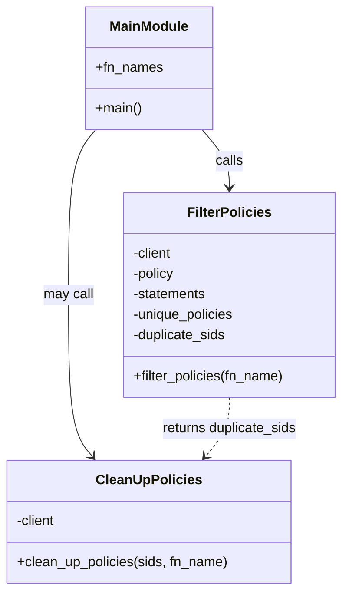

# Diagram: platform/tools/ide_local_testing/localTest/utility/resourceCleaner.py


> Auto-generated by Obscura crawlers

## Diagram 1

```mermaid
flowchart TD
    A[Start] --> B[fn_names = staging-get_train_ids]
    B --> C{For each fn_name}
    C --> D[call filter_policies(fn_name)]
    D --> E[boto3.client(lambda)]
    D --> F[get_policy(FunctionName) -> policy]
    F --> G[json.loads(policy) -> statements]
    G --> H{for each item in statements}
    H --> I[arn = item.Condition.ArnLike.AWS_SourceArn]
    I --> J{arn in unique_policies?}
    J -- No --> K[append arn to unique_policies]
    J -- Yes --> L[append item.Sid to duplicate_sids]
    K --> H
    L --> H
    H --> M[return unique_policies, duplicate_sids]
    M --> N[print counts and lists]
    N --> O{clean_up_policies enabled?}
    O -- Yes --> P[call clean_up_policies(sids, fn_name)]
    P --> Q[for each sid: client.remove_permission(FunctionName, StatementId)]
    Q --> Z[End]
    O -- No --> Z
```

> SVG rendering failed for this diagram.

## Diagram 2



### SVG

<svg id="container" width="402.119140625" xmlns="http://www.w3.org/2000/svg" class="classDiagram" height="692" viewBox="0 0 402.119140625 692" role="graphics-document document" aria-roledescription="class"><style>#container{font-family:"trebuchet ms",verdana,arial,sans-serif;font-size:16px;fill:#333;}@keyframes edge-animation-frame{from{stroke-dashoffset:0;}}@keyframes dash{to{stroke-dashoffset:0;}}#container .edge-animation-slow{stroke-dasharray:9,5!important;stroke-dashoffset:900;animation:dash 50s linear infinite;stroke-linecap:round;}#container .edge-animation-fast{stroke-dasharray:9,5!important;stroke-dashoffset:900;animation:dash 20s linear infinite;stroke-linecap:round;}#container .error-icon{fill:#552222;}#container .error-text{fill:#552222;stroke:#552222;}#container .edge-thickness-normal{stroke-width:1px;}#container .edge-thickness-thick{stroke-width:3.5px;}#container .edge-pattern-solid{stroke-dasharray:0;}#container .edge-thickness-invisible{stroke-width:0;fill:none;}#container .edge-pattern-dashed{stroke-dasharray:3;}#container .edge-pattern-dotted{stroke-dasharray:2;}#container .marker{fill:#333333;stroke:#333333;}#container .marker.cross{stroke:#333333;}#container svg{font-family:"trebuchet ms",verdana,arial,sans-serif;font-size:16px;}#container p{margin:0;}#container g.classGroup text{fill:#9370DB;stroke:none;font-family:"trebuchet ms",verdana,arial,sans-serif;font-size:10px;}#container g.classGroup text .title{font-weight:bolder;}#container .nodeLabel,#container .edgeLabel{color:#131300;}#container .edgeLabel .label rect{fill:#ECECFF;}#container .label text{fill:#131300;}#container .labelBkg{background:#ECECFF;}#container .edgeLabel .label span{background:#ECECFF;}#container .classTitle{font-weight:bolder;}#container .node rect,#container .node circle,#container .node ellipse,#container .node polygon,#container .node path{fill:#ECECFF;stroke:#9370DB;stroke-width:1px;}#container .divider{stroke:#9370DB;stroke-width:1;}#container g.clickable{cursor:pointer;}#container g.classGroup rect{fill:#ECECFF;stroke:#9370DB;}#container g.classGroup line{stroke:#9370DB;stroke-width:1;}#container .classLabel .box{stroke:none;stroke-width:0;fill:#ECECFF;opacity:0.5;}#container .classLabel .label{fill:#9370DB;font-size:10px;}#container .relation{stroke:#333333;stroke-width:1;fill:none;}#container .dashed-line{stroke-dasharray:3;}#container .dotted-line{stroke-dasharray:1 2;}#container #compositionStart,#container .composition{fill:#333333!important;stroke:#333333!important;stroke-width:1;}#container #compositionEnd,#container .composition{fill:#333333!important;stroke:#333333!important;stroke-width:1;}#container #dependencyStart,#container .dependency{fill:#333333!important;stroke:#333333!important;stroke-width:1;}#container #dependencyStart,#container .dependency{fill:#333333!important;stroke:#333333!important;stroke-width:1;}#container #extensionStart,#container .extension{fill:transparent!important;stroke:#333333!important;stroke-width:1;}#container #extensionEnd,#container .extension{fill:transparent!important;stroke:#333333!important;stroke-width:1;}#container #aggregationStart,#container .aggregation{fill:transparent!important;stroke:#333333!important;stroke-width:1;}#container #aggregationEnd,#container .aggregation{fill:transparent!important;stroke:#333333!important;stroke-width:1;}#container #lollipopStart,#container .lollipop{fill:#ECECFF!important;stroke:#333333!important;stroke-width:1;}#container #lollipopEnd,#container .lollipop{fill:#ECECFF!important;stroke:#333333!important;stroke-width:1;}#container .edgeTerminals{font-size:11px;line-height:initial;}#container .classTitleText{text-anchor:middle;font-size:18px;fill:#333;}#container .label-icon{display:inline-block;height:1em;overflow:visible;vertical-align:-0.125em;}#container .node .label-icon path{fill:currentColor;stroke:revert;stroke-width:revert;}#container :root{--mermaid-font-family:"trebuchet ms",verdana,arial,sans-serif;}</style><g><defs><marker id="container_class-aggregationStart" class="marker aggregation class" refX="18" refY="7" markerWidth="190" markerHeight="240" orient="auto"><path d="M 18,7 L9,13 L1,7 L9,1 Z"></path></marker></defs><defs><marker id="container_class-aggregationEnd" class="marker aggregation class" refX="1" refY="7" markerWidth="20" markerHeight="28" orient="auto"><path d="M 18,7 L9,13 L1,7 L9,1 Z"></path></marker></defs><defs><marker id="container_class-extensionStart" class="marker extension class" refX="18" refY="7" markerWidth="190" markerHeight="240" orient="auto"><path d="M 1,7 L18,13 V 1 Z"></path></marker></defs><defs><marker id="container_class-extensionEnd" class="marker extension class" refX="1" refY="7" markerWidth="20" markerHeight="28" orient="auto"><path d="M 1,1 V 13 L18,7 Z"></path></marker></defs><defs><marker id="container_class-compositionStart" class="marker composition class" refX="18" refY="7" markerWidth="190" markerHeight="240" orient="auto"><path d="M 18,7 L9,13 L1,7 L9,1 Z"></path></marker></defs><defs><marker id="container_class-compositionEnd" class="marker composition class" refX="1" refY="7" markerWidth="20" markerHeight="28" orient="auto"><path d="M 18,7 L9,13 L1,7 L9,1 Z"></path></marker></defs><defs><marker id="container_class-dependencyStart" class="marker dependency class" refX="6" refY="7" markerWidth="190" markerHeight="240" orient="auto"><path d="M 5,7 L9,13 L1,7 L9,1 Z"></path></marker></defs><defs><marker id="container_class-dependencyEnd" class="marker dependency class" refX="13" refY="7" markerWidth="20" markerHeight="28" orient="auto"><path d="M 18,7 L9,13 L14,7 L9,1 Z"></path></marker></defs><defs><marker id="container_class-lollipopStart" class="marker lollipop class" refX="13" refY="7" markerWidth="190" markerHeight="240" orient="auto"><circle stroke="black" fill="transparent" cx="7" cy="7" r="6"></circle></marker></defs><defs><marker id="container_class-lollipopEnd" class="marker lollipop class" refX="1" refY="7" markerWidth="190" markerHeight="240" orient="auto"><circle stroke="black" fill="transparent" cx="7" cy="7" r="6"></circle></marker></defs><g class="root"><g class="clusters"></g><g class="edgePaths"><path d="M236.572,152L241.95,158.167C247.329,164.333,258.085,176.667,263.464,188C268.842,199.333,268.842,209.667,268.842,214.833L268.842,220" id="id_MainModule_FilterPolicies_1" class="edge-thickness-normal edge-pattern-solid relation" style=";;;" data-edge="true" data-et="edge" data-id="id_MainModule_FilterPolicies_1" data-points="W3sieCI6MjM2LjU3MjIxMTg2OTI2NjA2LCJ5IjoxNTJ9LHsieCI6MjY4Ljg0MTc5Njg3NSwieSI6MTg5fSx7IngiOjI2OC44NDE3OTY4NzUsInkiOjIyNn1d" marker-end="url(#container_class-dependencyEnd)"></path><path d="M110.982,152L105.604,158.167C100.226,164.333,89.469,176.667,84.091,209C78.713,241.333,78.713,293.667,78.713,346C78.713,398.333,78.713,450.667,83.434,482.246C88.155,513.826,97.597,524.652,102.318,530.065L107.039,535.478" id="id_MainModule_CleanUpPolicies_2" class="edge-thickness-normal edge-pattern-solid relation" style=";;;" data-edge="true" data-et="edge" data-id="id_MainModule_CleanUpPolicies_2" data-points="W3sieCI6MTEwLjk4MjQ3NTYzMDczMzk0LCJ5IjoxNTJ9LHsieCI6NzguNzEyODkwNjI1LCJ5IjoxODl9LHsieCI6NzguNzEyODkwNjI1LCJ5IjozNDZ9LHsieCI6NzguNzEyODkwNjI1LCJ5Ijo1MDN9LHsieCI6MTEwLjk4MjQ3NTYzMDczMzk0LCJ5Ijo1NDB9XQ==" marker-end="url(#container_class-dependencyEnd)"></path><path d="M268.842,466L268.842,472.167C268.842,478.333,268.842,490.667,264.121,502.246C259.4,513.826,249.958,524.652,245.237,530.065L240.516,535.478" id="id_FilterPolicies_CleanUpPolicies_3" class="edge-thickness-normal edge-pattern-dashed relation" style=";;;" data-edge="true" data-et="edge" data-id="id_FilterPolicies_CleanUpPolicies_3" data-points="W3sieCI6MjY4Ljg0MTc5Njg3NSwieSI6NDY2fSx7IngiOjI2OC44NDE3OTY4NzUsInkiOjUwM30seyJ4IjoyMzYuNTcyMjExODY5MjY2MDYsInkiOjU0MH1d" marker-end="url(#container_class-dependencyEnd)"></path></g><g class="edgeLabels"><g class="edgeLabel" transform="translate(268.841796875, 189)"><g class="label" data-id="id_MainModule_FilterPolicies_1" transform="translate(-16.4453125, -12)"><foreignObject width="32.890625" height="24"><div xmlns="http://www.w3.org/1999/xhtml" class="labelBkg" style="display: table-cell; white-space: nowrap; line-height: 1.5; max-width: 200px; text-align: center;"><span class="edgeLabel"><p>calls</p></span></div></foreignObject></g></g><g class="edgeLabel" transform="translate(78.712890625, 346)"><g class="label" data-id="id_MainModule_CleanUpPolicies_2" transform="translate(-29.8515625, -12)"><foreignObject width="59.703125" height="24"><div xmlns="http://www.w3.org/1999/xhtml" class="labelBkg" style="display: table-cell; white-space: nowrap; line-height: 1.5; max-width: 200px; text-align: center;"><span class="edgeLabel"><p>may call</p></span></div></foreignObject></g></g><g class="edgeLabel" transform="translate(268.841796875, 503)"><g class="label" data-id="id_FilterPolicies_CleanUpPolicies_3" transform="translate(-80.9140625, -12)"><foreignObject width="161.828125" height="24"><div xmlns="http://www.w3.org/1999/xhtml" class="labelBkg" style="display: table-cell; white-space: nowrap; line-height: 1.5; max-width: 200px; text-align: center;"><span class="edgeLabel"><p>returns duplicate_sids</p></span></div></foreignObject></g></g></g><g class="nodes"><g class="node default" id="classId-FilterPolicies-0" transform="translate(268.841796875, 346)"><g class="basic label-container"><path d="M-125.27734375 -120 L125.27734375 -120 L125.27734375 120 L-125.27734375 120" stroke="none" stroke-width="0" fill="#ECECFF" style=""></path><path d="M-125.27734375 -120 C-42.0331834610346 -120, 41.21097682793081 -120, 125.27734375 -120 M-125.27734375 -120 C-28.024660715583394 -120, 69.22802231883321 -120, 125.27734375 -120 M125.27734375 -120 C125.27734375 -55.597723795840295, 125.27734375 8.80455240831941, 125.27734375 120 M125.27734375 -120 C125.27734375 -56.068938037517086, 125.27734375 7.862123924965829, 125.27734375 120 M125.27734375 120 C73.22287745273655 120, 21.168411155473123 120, -125.27734375 120 M125.27734375 120 C32.56990202611442 120, -60.13753969777116 120, -125.27734375 120 M-125.27734375 120 C-125.27734375 51.09196505751218, -125.27734375 -17.816069884975633, -125.27734375 -120 M-125.27734375 120 C-125.27734375 28.45188827485697, -125.27734375 -63.09622345028606, -125.27734375 -120" stroke="#9370DB" stroke-width="1.3" fill="none" stroke-dasharray="0 0" style=""></path></g><g class="annotation-group text" transform="translate(0, -96)"></g><g class="label-group text" transform="translate(-47.1015625, -96)"><g class="label" style="font-weight: bolder" transform="translate(0,-12)"><foreignObject width="94.203125" height="24"><div xmlns="http://www.w3.org/1999/xhtml" style="display: table-cell; white-space: nowrap; line-height: 1.5; max-width: 143px; text-align: center;"><span class="nodeLabel markdown-node-label" style=""><p>FilterPolicies</p></span></div></foreignObject></g></g><g class="members-group text" transform="translate(-113.27734375, -48)"><g class="label" style="" transform="translate(0,-12)"><foreignObject width="47.171875" height="24"><div xmlns="http://www.w3.org/1999/xhtml" style="display: table-cell; white-space: nowrap; line-height: 1.5; max-width: 105px; text-align: center;"><span class="nodeLabel markdown-node-label" style=""><p>-client</p></span></div></foreignObject></g><g class="label" style="" transform="translate(0,12)"><foreignObject width="50.03125" height="24"><div xmlns="http://www.w3.org/1999/xhtml" style="display: table-cell; white-space: nowrap; line-height: 1.5; max-width: 108px; text-align: center;"><span class="nodeLabel markdown-node-label" style=""><p>-policy</p></span></div></foreignObject></g><g class="label" style="" transform="translate(0,36)"><foreignObject width="87.609375" height="24"><div xmlns="http://www.w3.org/1999/xhtml" style="display: table-cell; white-space: nowrap; line-height: 1.5; max-width: 145px; text-align: center;"><span class="nodeLabel markdown-node-label" style=""><p>-statements</p></span></div></foreignObject></g><g class="label" style="" transform="translate(0,60)"><foreignObject width="121.65625" height="24"><div xmlns="http://www.w3.org/1999/xhtml" style="display: table-cell; white-space: nowrap; line-height: 1.5; max-width: 179px; text-align: center;"><span class="nodeLabel markdown-node-label" style=""><p>-unique_policies</p></span></div></foreignObject></g><g class="label" style="" transform="translate(0,84)"><foreignObject width="111.515625" height="24"><div xmlns="http://www.w3.org/1999/xhtml" style="display: table-cell; white-space: nowrap; line-height: 1.5; max-width: 169px; text-align: center;"><span class="nodeLabel markdown-node-label" style=""><p>-duplicate_sids</p></span></div></foreignObject></g></g><g class="methods-group text" transform="translate(-113.27734375, 96)"><g class="label" style="" transform="translate(0,-12)"><foreignObject width="179.453125" height="24"><div xmlns="http://www.w3.org/1999/xhtml" style="display: table-cell; white-space: nowrap; line-height: 1.5; max-width: 237px; text-align: center;"><span class="nodeLabel markdown-node-label" style=""><p>+filter_policies(fn_name)</p></span></div></foreignObject></g></g><g class="divider" style=""><path d="M-125.27734375 -72 C-61.696240307516256 -72, 1.884863134967489 -72, 125.27734375 -72 M-125.27734375 -72 C-70.58812163886448 -72, -15.898899527728958 -72, 125.27734375 -72" stroke="#9370DB" stroke-width="1.3" fill="none" stroke-dasharray="0 0" style=""></path></g><g class="divider" style=""><path d="M-125.27734375 72 C-59.30373953841452 72, 6.669864673170963 72, 125.27734375 72 M-125.27734375 72 C-66.24116343392299 72, -7.20498311784597 72, 125.27734375 72" stroke="#9370DB" stroke-width="1.3" fill="none" stroke-dasharray="0 0" style=""></path></g></g><g class="node default" id="classId-CleanUpPolicies-1" transform="translate(173.77734375, 612)"><g class="basic label-container"><path d="M-165.77734375 -72 L165.77734375 -72 L165.77734375 72 L-165.77734375 72" stroke="none" stroke-width="0" fill="#ECECFF" style=""></path><path d="M-165.77734375 -72 C-69.32458317724647 -72, 27.128177395507066 -72, 165.77734375 -72 M-165.77734375 -72 C-65.50736192907851 -72, 34.762619891842974 -72, 165.77734375 -72 M165.77734375 -72 C165.77734375 -34.45861791089884, 165.77734375 3.082764178202325, 165.77734375 72 M165.77734375 -72 C165.77734375 -33.22263863447754, 165.77734375 5.554722731044919, 165.77734375 72 M165.77734375 72 C52.202330321968674 72, -61.37268310606265 72, -165.77734375 72 M165.77734375 72 C88.74250671447759 72, 11.70766967895517 72, -165.77734375 72 M-165.77734375 72 C-165.77734375 36.38483298015548, -165.77734375 0.7696659603109595, -165.77734375 -72 M-165.77734375 72 C-165.77734375 39.6896975296939, -165.77734375 7.379395059387804, -165.77734375 -72" stroke="#9370DB" stroke-width="1.3" fill="none" stroke-dasharray="0 0" style=""></path></g><g class="annotation-group text" transform="translate(0, -48)"></g><g class="label-group text" transform="translate(-58.4140625, -48)"><g class="label" style="font-weight: bolder" transform="translate(0,-12)"><foreignObject width="116.828125" height="24"><div xmlns="http://www.w3.org/1999/xhtml" style="display: table-cell; white-space: nowrap; line-height: 1.5; max-width: 166px; text-align: center;"><span class="nodeLabel markdown-node-label" style=""><p>CleanUpPolicies</p></span></div></foreignObject></g></g><g class="members-group text" transform="translate(-153.77734375, 0)"><g class="label" style="" transform="translate(0,-12)"><foreignObject width="47.171875" height="24"><div xmlns="http://www.w3.org/1999/xhtml" style="display: table-cell; white-space: nowrap; line-height: 1.5; max-width: 105px; text-align: center;"><span class="nodeLabel markdown-node-label" style=""><p>-client</p></span></div></foreignObject></g></g><g class="methods-group text" transform="translate(-153.77734375, 48)"><g class="label" style="" transform="translate(0,-12)"><foreignObject width="249.140625" height="24"><div xmlns="http://www.w3.org/1999/xhtml" style="display: table-cell; white-space: nowrap; line-height: 1.5; max-width: 307px; text-align: center;"><span class="nodeLabel markdown-node-label" style=""><p>+clean_up_policies(sids, fn_name)</p></span></div></foreignObject></g></g><g class="divider" style=""><path d="M-165.77734375 -24 C-37.7262474215363 -24, 90.3248489069274 -24, 165.77734375 -24 M-165.77734375 -24 C-81.04450621152596 -24, 3.688331326948088 -24, 165.77734375 -24" stroke="#9370DB" stroke-width="1.3" fill="none" stroke-dasharray="0 0" style=""></path></g><g class="divider" style=""><path d="M-165.77734375 24 C-82.71430270734854 24, 0.34873833530292586 24, 165.77734375 24 M-165.77734375 24 C-79.40190134677817 24, 6.973541056443651 24, 165.77734375 24" stroke="#9370DB" stroke-width="1.3" fill="none" stroke-dasharray="0 0" style=""></path></g></g><g class="node default" id="classId-MainModule-2" transform="translate(173.77734375, 80)"><g class="basic label-container"><path d="M-73.71484375 -72 L73.71484375 -72 L73.71484375 72 L-73.71484375 72" stroke="none" stroke-width="0" fill="#ECECFF" style=""></path><path d="M-73.71484375 -72 C-18.53348425512838 -72, 36.64787523974324 -72, 73.71484375 -72 M-73.71484375 -72 C-38.9345204631032 -72, -4.154197176206395 -72, 73.71484375 -72 M73.71484375 -72 C73.71484375 -25.62122706892775, 73.71484375 20.757545862144497, 73.71484375 72 M73.71484375 -72 C73.71484375 -31.433011745432907, 73.71484375 9.133976509134186, 73.71484375 72 M73.71484375 72 C28.902040066688393 72, -15.910763616623214 72, -73.71484375 72 M73.71484375 72 C36.49324710127154 72, -0.728349547456915 72, -73.71484375 72 M-73.71484375 72 C-73.71484375 19.08849966736276, -73.71484375 -33.82300066527448, -73.71484375 -72 M-73.71484375 72 C-73.71484375 17.09354138486379, -73.71484375 -37.81291723027242, -73.71484375 -72" stroke="#9370DB" stroke-width="1.3" fill="none" stroke-dasharray="0 0" style=""></path></g><g class="annotation-group text" transform="translate(0, -48)"></g><g class="label-group text" transform="translate(-44.6328125, -48)"><g class="label" style="font-weight: bolder" transform="translate(0,-12)"><foreignObject width="89.265625" height="24"><div xmlns="http://www.w3.org/1999/xhtml" style="display: table-cell; white-space: nowrap; line-height: 1.5; max-width: 139px; text-align: center;"><span class="nodeLabel markdown-node-label" style=""><p>MainModule</p></span></div></foreignObject></g></g><g class="members-group text" transform="translate(-61.71484375, 0)"><g class="label" style="" transform="translate(0,-12)"><foreignObject width="78.796875" height="24"><div xmlns="http://www.w3.org/1999/xhtml" style="display: table-cell; white-space: nowrap; line-height: 1.5; max-width: 136px; text-align: center;"><span class="nodeLabel markdown-node-label" style=""><p>+fn_names</p></span></div></foreignObject></g></g><g class="methods-group text" transform="translate(-61.71484375, 48)"><g class="label" style="" transform="translate(0,-12)"><foreignObject width="54.65625" height="24"><div xmlns="http://www.w3.org/1999/xhtml" style="display: table-cell; white-space: nowrap; line-height: 1.5; max-width: 112px; text-align: center;"><span class="nodeLabel markdown-node-label" style=""><p>+main()</p></span></div></foreignObject></g></g><g class="divider" style=""><path d="M-73.71484375 -24 C-34.1178094793966 -24, 5.4792247912068035 -24, 73.71484375 -24 M-73.71484375 -24 C-31.51131764734022 -24, 10.692208455319559 -24, 73.71484375 -24" stroke="#9370DB" stroke-width="1.3" fill="none" stroke-dasharray="0 0" style=""></path></g><g class="divider" style=""><path d="M-73.71484375 24 C-17.463594148649968 24, 38.787655452700065 24, 73.71484375 24 M-73.71484375 24 C-27.59509706219393 24, 18.524649625612142 24, 73.71484375 24" stroke="#9370DB" stroke-width="1.3" fill="none" stroke-dasharray="0 0" style=""></path></g></g></g></g></g></svg>
