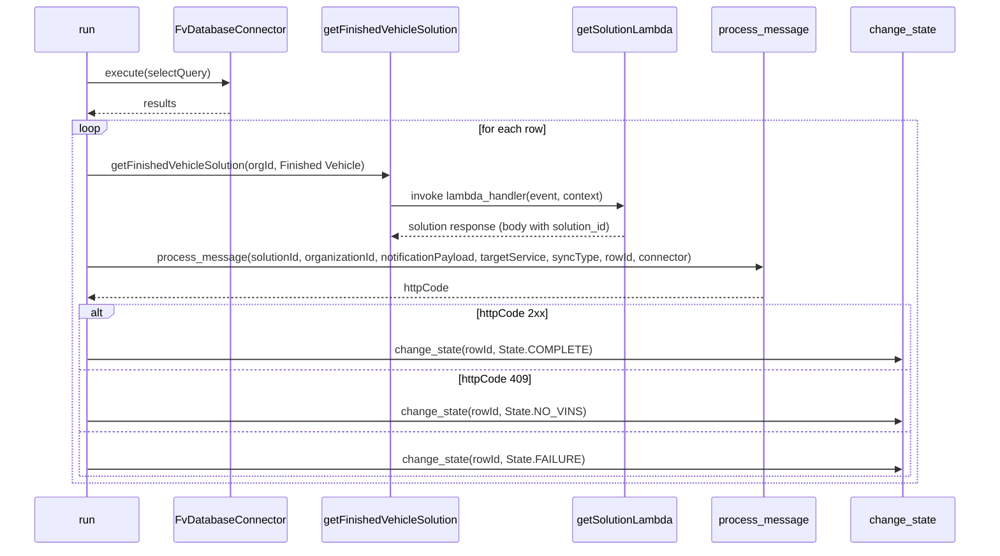
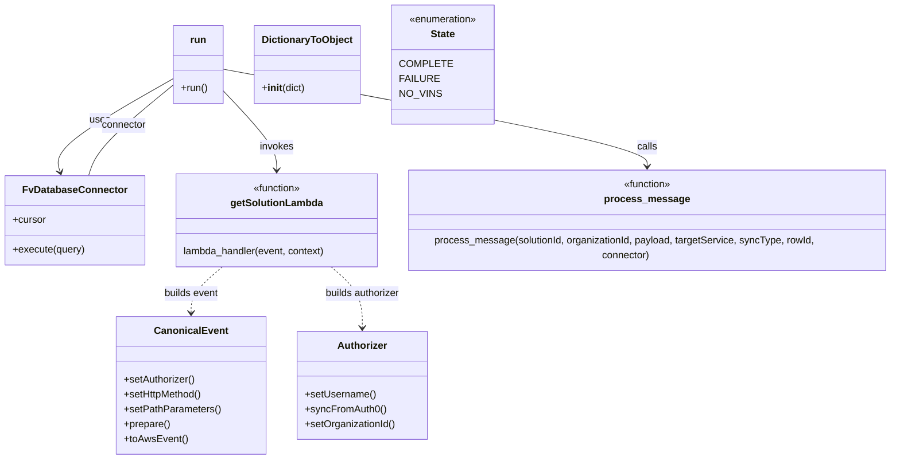

# Diagram: platform/tools/ide_local_testing/localTest/utility/runFinishedVehicleNotificationById.py


> Auto-generated by Obscura crawlers

## Diagram 1

```mermaid
flowchart TD
  Run[run()]
  Query[connector.cursor.execute(selectQuery)]
  Fetch[cursor.fetchall() -> results]
  HasRows{results rows?}
  Row[extract rowId<br>organizationId<br>notificationPayload<br>targetService]
  GetSol[getFinishedVehicleSolution(organizationId, Finished Vehicle)]
  Process[process_message(solutionId, organizationId, notificationPayload, targetService, syncType, rowId, connector)]
  Except[Exception -> httpCode = 500]
  Decision{httpCode?}
  Success[change_state(rowId, State.COMPLETE)]
  NoVins[change_state(rowId, State.NO_VINS)]
  Failure[change_state(rowId, State.FAILURE)]
  End[end]
  Run --> Query --> Fetch --> HasRows
  HasRows -->|yes| Row --> GetSol --> Process
  Process -.-> Except
  Except --> Decision
  Process --> Decision
  Decision -->|2xx| Success --> HasRows
  Decision -->|409| NoVins --> HasRows
  Decision -->|other| Failure --> HasRows
  HasRows -->|no| End
```

> SVG rendering failed for this diagram.

## Diagram 2



### SVG

<svg id="container" width="1498" xmlns="http://www.w3.org/2000/svg" height="831" viewBox="-50 -10 1498 831" role="graphics-document document" aria-roledescription="sequence"><g><rect x="1248" y="745" fill="#eaeaea" stroke="#666" width="150" height="65" name="StateMgr" rx="3" ry="3" class="actor actor-bottom"></rect><text x="1323" y="777.5" dominant-baseline="central" alignment-baseline="central" class="actor actor-box" style="text-anchor: middle; font-size: 16px; font-weight: 400;"><tspan x="1323" dy="0">change_state</tspan></text></g><g><rect x="1048" y="745" fill="#eaeaea" stroke="#666" width="150" height="65" name="Orchestrator" rx="3" ry="3" class="actor actor-bottom"></rect><text x="1123" y="777.5" dominant-baseline="central" alignment-baseline="central" class="actor actor-box" style="text-anchor: middle; font-size: 16px; font-weight: 400;"><tspan x="1123" dy="0">process_message</tspan></text></g><g><rect x="836" y="745" fill="#eaeaea" stroke="#666" width="162" height="65" name="Lambda" rx="3" ry="3" class="actor actor-bottom"></rect><text x="917" y="777.5" dominant-baseline="central" alignment-baseline="central" class="actor actor-box" style="text-anchor: middle; font-size: 16px; font-weight: 400;"><tspan x="917" dy="0">getSolutionLambda</tspan></text></g><g><rect x="435.5" y="745" fill="#eaeaea" stroke="#666" width="217" height="65" name="Solution" rx="3" ry="3" class="actor actor-bottom"></rect><text x="544" y="777.5" dominant-baseline="central" alignment-baseline="central" class="actor actor-box" style="text-anchor: middle; font-size: 16px; font-weight: 400;"><tspan x="544" dy="0">getFinishedVehicleSolution</tspan></text></g><g><rect x="208.5" y="745" fill="#eaeaea" stroke="#666" width="177" height="65" name="DB" rx="3" ry="3" class="actor actor-bottom"></rect><text x="297" y="777.5" dominant-baseline="central" alignment-baseline="central" class="actor actor-box" style="text-anchor: middle; font-size: 16px; font-weight: 400;"><tspan x="297" dy="0">FvDatabaseConnector</tspan></text></g><g><rect x="0" y="745" fill="#eaeaea" stroke="#666" width="150" height="65" name="Run" rx="3" ry="3" class="actor actor-bottom"></rect><text x="75" y="777.5" dominant-baseline="central" alignment-baseline="central" class="actor actor-box" style="text-anchor: middle; font-size: 16px; font-weight: 400;"><tspan x="75" dy="0">run</tspan></text></g><g><line id="actor5" x1="1323" y1="65" x2="1323" y2="745" class="actor-line 200" stroke-width="0.5px" stroke="#999" name="StateMgr"></line><g id="root-5"><rect x="1248" y="0" fill="#eaeaea" stroke="#666" width="150" height="65" name="StateMgr" rx="3" ry="3" class="actor actor-top"></rect><text x="1323" y="32.5" dominant-baseline="central" alignment-baseline="central" class="actor actor-box" style="text-anchor: middle; font-size: 16px; font-weight: 400;"><tspan x="1323" dy="0">change_state</tspan></text></g></g><g><line id="actor4" x1="1123" y1="65" x2="1123" y2="745" class="actor-line 200" stroke-width="0.5px" stroke="#999" name="Orchestrator"></line><g id="root-4"><rect x="1048" y="0" fill="#eaeaea" stroke="#666" width="150" height="65" name="Orchestrator" rx="3" ry="3" class="actor actor-top"></rect><text x="1123" y="32.5" dominant-baseline="central" alignment-baseline="central" class="actor actor-box" style="text-anchor: middle; font-size: 16px; font-weight: 400;"><tspan x="1123" dy="0">process_message</tspan></text></g></g><g><line id="actor3" x1="917" y1="65" x2="917" y2="745" class="actor-line 200" stroke-width="0.5px" stroke="#999" name="Lambda"></line><g id="root-3"><rect x="836" y="0" fill="#eaeaea" stroke="#666" width="162" height="65" name="Lambda" rx="3" ry="3" class="actor actor-top"></rect><text x="917" y="32.5" dominant-baseline="central" alignment-baseline="central" class="actor actor-box" style="text-anchor: middle; font-size: 16px; font-weight: 400;"><tspan x="917" dy="0">getSolutionLambda</tspan></text></g></g><g><line id="actor2" x1="544" y1="65" x2="544" y2="745" class="actor-line 200" stroke-width="0.5px" stroke="#999" name="Solution"></line><g id="root-2"><rect x="435.5" y="0" fill="#eaeaea" stroke="#666" width="217" height="65" name="Solution" rx="3" ry="3" class="actor actor-top"></rect><text x="544" y="32.5" dominant-baseline="central" alignment-baseline="central" class="actor actor-box" style="text-anchor: middle; font-size: 16px; font-weight: 400;"><tspan x="544" dy="0">getFinishedVehicleSolution</tspan></text></g></g><g><line id="actor1" x1="297" y1="65" x2="297" y2="745" class="actor-line 200" stroke-width="0.5px" stroke="#999" name="DB"></line><g id="root-1"><rect x="208.5" y="0" fill="#eaeaea" stroke="#666" width="177" height="65" name="DB" rx="3" ry="3" class="actor actor-top"></rect><text x="297" y="32.5" dominant-baseline="central" alignment-baseline="central" class="actor actor-box" style="text-anchor: middle; font-size: 16px; font-weight: 400;"><tspan x="297" dy="0">FvDatabaseConnector</tspan></text></g></g><g><line id="actor0" x1="75" y1="65" x2="75" y2="745" class="actor-line 200" stroke-width="0.5px" stroke="#999" name="Run"></line><g id="root-0"><rect x="0" y="0" fill="#eaeaea" stroke="#666" width="150" height="65" name="Run" rx="3" ry="3" class="actor actor-top"></rect><text x="75" y="32.5" dominant-baseline="central" alignment-baseline="central" class="actor actor-box" style="text-anchor: middle; font-size: 16px; font-weight: 400;"><tspan x="75" dy="0">run</tspan></text></g></g><style>#container{font-family:"trebuchet ms",verdana,arial,sans-serif;font-size:16px;fill:#333;}@keyframes edge-animation-frame{from{stroke-dashoffset:0;}}@keyframes dash{to{stroke-dashoffset:0;}}#container .edge-animation-slow{stroke-dasharray:9,5!important;stroke-dashoffset:900;animation:dash 50s linear infinite;stroke-linecap:round;}#container .edge-animation-fast{stroke-dasharray:9,5!important;stroke-dashoffset:900;animation:dash 20s linear infinite;stroke-linecap:round;}#container .error-icon{fill:#552222;}#container .error-text{fill:#552222;stroke:#552222;}#container .edge-thickness-normal{stroke-width:1px;}#container .edge-thickness-thick{stroke-width:3.5px;}#container .edge-pattern-solid{stroke-dasharray:0;}#container .edge-thickness-invisible{stroke-width:0;fill:none;}#container .edge-pattern-dashed{stroke-dasharray:3;}#container .edge-pattern-dotted{stroke-dasharray:2;}#container .marker{fill:#333333;stroke:#333333;}#container .marker.cross{stroke:#333333;}#container svg{font-family:"trebuchet ms",verdana,arial,sans-serif;font-size:16px;}#container p{margin:0;}#container .actor{stroke:hsl(259.6261682243, 59.7765363128%, 87.9019607843%);fill:#ECECFF;}#container text.actor&gt;tspan{fill:black;stroke:none;}#container .actor-line{stroke:hsl(259.6261682243, 59.7765363128%, 87.9019607843%);}#container .innerArc{stroke-width:1.5;stroke-dasharray:none;}#container .messageLine0{stroke-width:1.5;stroke-dasharray:none;stroke:#333;}#container .messageLine1{stroke-width:1.5;stroke-dasharray:2,2;stroke:#333;}#container #arrowhead path{fill:#333;stroke:#333;}#container .sequenceNumber{fill:white;}#container #sequencenumber{fill:#333;}#container #crosshead path{fill:#333;stroke:#333;}#container .messageText{fill:#333;stroke:none;}#container .labelBox{stroke:hsl(259.6261682243, 59.7765363128%, 87.9019607843%);fill:#ECECFF;}#container .labelText,#container .labelText&gt;tspan{fill:black;stroke:none;}#container .loopText,#container .loopText&gt;tspan{fill:black;stroke:none;}#container .loopLine{stroke-width:2px;stroke-dasharray:2,2;stroke:hsl(259.6261682243, 59.7765363128%, 87.9019607843%);fill:hsl(259.6261682243, 59.7765363128%, 87.9019607843%);}#container .note{stroke:#aaaa33;fill:#fff5ad;}#container .noteText,#container .noteText&gt;tspan{fill:black;stroke:none;}#container .activation0{fill:#f4f4f4;stroke:#666;}#container .activation1{fill:#f4f4f4;stroke:#666;}#container .activation2{fill:#f4f4f4;stroke:#666;}#container .actorPopupMenu{position:absolute;}#container .actorPopupMenuPanel{position:absolute;fill:#ECECFF;box-shadow:0px 8px 16px 0px rgba(0,0,0,0.2);filter:drop-shadow(3px 5px 2px rgb(0 0 0 / 0.4));}#container .actor-man line{stroke:hsl(259.6261682243, 59.7765363128%, 87.9019607843%);fill:#ECECFF;}#container .actor-man circle,#container line{stroke:hsl(259.6261682243, 59.7765363128%, 87.9019607843%);fill:#ECECFF;stroke-width:2px;}#container :root{--mermaid-font-family:"trebuchet ms",verdana,arial,sans-serif;}</style><g></g><defs><symbol id="computer" width="24" height="24"><path transform="scale(.5)" d="M2 2v13h20v-13h-20zm18 11h-16v-9h16v9zm-10.228 6l.466-1h3.524l.467 1h-4.457zm14.228 3h-24l2-6h2.104l-1.33 4h18.45l-1.297-4h2.073l2 6zm-5-10h-14v-7h14v7z"></path></symbol></defs><defs><symbol id="database" fill-rule="evenodd" clip-rule="evenodd"><path transform="scale(.5)" d="M12.258.001l.256.004.255.005.253.008.251.01.249.012.247.015.246.016.242.019.241.02.239.023.236.024.233.027.231.028.229.031.225.032.223.034.22.036.217.038.214.04.211.041.208.043.205.045.201.046.198.048.194.05.191.051.187.053.183.054.18.056.175.057.172.059.168.06.163.061.16.063.155.064.15.066.074.033.073.033.071.034.07.034.069.035.068.035.067.035.066.035.064.036.064.036.062.036.06.036.06.037.058.037.058.037.055.038.055.038.053.038.052.038.051.039.05.039.048.039.047.039.045.04.044.04.043.04.041.04.04.041.039.041.037.041.036.041.034.041.033.042.032.042.03.042.029.042.027.042.026.043.024.043.023.043.021.043.02.043.018.044.017.043.015.044.013.044.012.044.011.045.009.044.007.045.006.045.004.045.002.045.001.045v17l-.001.045-.002.045-.004.045-.006.045-.007.045-.009.044-.011.045-.012.044-.013.044-.015.044-.017.043-.018.044-.02.043-.021.043-.023.043-.024.043-.026.043-.027.042-.029.042-.03.042-.032.042-.033.042-.034.041-.036.041-.037.041-.039.041-.04.041-.041.04-.043.04-.044.04-.045.04-.047.039-.048.039-.05.039-.051.039-.052.038-.053.038-.055.038-.055.038-.058.037-.058.037-.06.037-.06.036-.062.036-.064.036-.064.036-.066.035-.067.035-.068.035-.069.035-.07.034-.071.034-.073.033-.074.033-.15.066-.155.064-.16.063-.163.061-.168.06-.172.059-.175.057-.18.056-.183.054-.187.053-.191.051-.194.05-.198.048-.201.046-.205.045-.208.043-.211.041-.214.04-.217.038-.22.036-.223.034-.225.032-.229.031-.231.028-.233.027-.236.024-.239.023-.241.02-.242.019-.246.016-.247.015-.249.012-.251.01-.253.008-.255.005-.256.004-.258.001-.258-.001-.256-.004-.255-.005-.253-.008-.251-.01-.249-.012-.247-.015-.245-.016-.243-.019-.241-.02-.238-.023-.236-.024-.234-.027-.231-.028-.228-.031-.226-.032-.223-.034-.22-.036-.217-.038-.214-.04-.211-.041-.208-.043-.204-.045-.201-.046-.198-.048-.195-.05-.19-.051-.187-.053-.184-.054-.179-.056-.176-.057-.172-.059-.167-.06-.164-.061-.159-.063-.155-.064-.151-.066-.074-.033-.072-.033-.072-.034-.07-.034-.069-.035-.068-.035-.067-.035-.066-.035-.064-.036-.063-.036-.062-.036-.061-.036-.06-.037-.058-.037-.057-.037-.056-.038-.055-.038-.053-.038-.052-.038-.051-.039-.049-.039-.049-.039-.046-.039-.046-.04-.044-.04-.043-.04-.041-.04-.04-.041-.039-.041-.037-.041-.036-.041-.034-.041-.033-.042-.032-.042-.03-.042-.029-.042-.027-.042-.026-.043-.024-.043-.023-.043-.021-.043-.02-.043-.018-.044-.017-.043-.015-.044-.013-.044-.012-.044-.011-.045-.009-.044-.007-.045-.006-.045-.004-.045-.002-.045-.001-.045v-17l.001-.045.002-.045.004-.045.006-.045.007-.045.009-.044.011-.045.012-.044.013-.044.015-.044.017-.043.018-.044.02-.043.021-.043.023-.043.024-.043.026-.043.027-.042.029-.042.03-.042.032-.042.033-.042.034-.041.036-.041.037-.041.039-.041.04-.041.041-.04.043-.04.044-.04.046-.04.046-.039.049-.039.049-.039.051-.039.052-.038.053-.038.055-.038.056-.038.057-.037.058-.037.06-.037.061-.036.062-.036.063-.036.064-.036.066-.035.067-.035.068-.035.069-.035.07-.034.072-.034.072-.033.074-.033.151-.066.155-.064.159-.063.164-.061.167-.06.172-.059.176-.057.179-.056.184-.054.187-.053.19-.051.195-.05.198-.048.201-.046.204-.045.208-.043.211-.041.214-.04.217-.038.22-.036.223-.034.226-.032.228-.031.231-.028.234-.027.236-.024.238-.023.241-.02.243-.019.245-.016.247-.015.249-.012.251-.01.253-.008.255-.005.256-.004.258-.001.258.001zm-9.258 20.499v.01l.001.021.003.021.004.022.005.021.006.022.007.022.009.023.01.022.011.023.012.023.013.023.015.023.016.024.017.023.018.024.019.024.021.024.022.025.023.024.024.025.052.049.056.05.061.051.066.051.07.051.075.051.079.052.084.052.088.052.092.052.097.052.102.051.105.052.11.052.114.051.119.051.123.051.127.05.131.05.135.05.139.048.144.049.147.047.152.047.155.047.16.045.163.045.167.043.171.043.176.041.178.041.183.039.187.039.19.037.194.035.197.035.202.033.204.031.209.03.212.029.216.027.219.025.222.024.226.021.23.02.233.018.236.016.24.015.243.012.246.01.249.008.253.005.256.004.259.001.26-.001.257-.004.254-.005.25-.008.247-.011.244-.012.241-.014.237-.016.233-.018.231-.021.226-.021.224-.024.22-.026.216-.027.212-.028.21-.031.205-.031.202-.034.198-.034.194-.036.191-.037.187-.039.183-.04.179-.04.175-.042.172-.043.168-.044.163-.045.16-.046.155-.046.152-.047.148-.048.143-.049.139-.049.136-.05.131-.05.126-.05.123-.051.118-.052.114-.051.11-.052.106-.052.101-.052.096-.052.092-.052.088-.053.083-.051.079-.052.074-.052.07-.051.065-.051.06-.051.056-.05.051-.05.023-.024.023-.025.021-.024.02-.024.019-.024.018-.024.017-.024.015-.023.014-.024.013-.023.012-.023.01-.023.01-.022.008-.022.006-.022.006-.022.004-.022.004-.021.001-.021.001-.021v-4.127l-.077.055-.08.053-.083.054-.085.053-.087.052-.09.052-.093.051-.095.05-.097.05-.1.049-.102.049-.105.048-.106.047-.109.047-.111.046-.114.045-.115.045-.118.044-.12.043-.122.042-.124.042-.126.041-.128.04-.13.04-.132.038-.134.038-.135.037-.138.037-.139.035-.142.035-.143.034-.144.033-.147.032-.148.031-.15.03-.151.03-.153.029-.154.027-.156.027-.158.026-.159.025-.161.024-.162.023-.163.022-.165.021-.166.02-.167.019-.169.018-.169.017-.171.016-.173.015-.173.014-.175.013-.175.012-.177.011-.178.01-.179.008-.179.008-.181.006-.182.005-.182.004-.184.003-.184.002h-.37l-.184-.002-.184-.003-.182-.004-.182-.005-.181-.006-.179-.008-.179-.008-.178-.01-.176-.011-.176-.012-.175-.013-.173-.014-.172-.015-.171-.016-.17-.017-.169-.018-.167-.019-.166-.02-.165-.021-.163-.022-.162-.023-.161-.024-.159-.025-.157-.026-.156-.027-.155-.027-.153-.029-.151-.03-.15-.03-.148-.031-.146-.032-.145-.033-.143-.034-.141-.035-.14-.035-.137-.037-.136-.037-.134-.038-.132-.038-.13-.04-.128-.04-.126-.041-.124-.042-.122-.042-.12-.044-.117-.043-.116-.045-.113-.045-.112-.046-.109-.047-.106-.047-.105-.048-.102-.049-.1-.049-.097-.05-.095-.05-.093-.052-.09-.051-.087-.052-.085-.053-.083-.054-.08-.054-.077-.054v4.127zm0-5.654v.011l.001.021.003.021.004.021.005.022.006.022.007.022.009.022.01.022.011.023.012.023.013.023.015.024.016.023.017.024.018.024.019.024.021.024.022.024.023.025.024.024.052.05.056.05.061.05.066.051.07.051.075.052.079.051.084.052.088.052.092.052.097.052.102.052.105.052.11.051.114.051.119.052.123.05.127.051.131.05.135.049.139.049.144.048.147.048.152.047.155.046.16.045.163.045.167.044.171.042.176.042.178.04.183.04.187.038.19.037.194.036.197.034.202.033.204.032.209.03.212.028.216.027.219.025.222.024.226.022.23.02.233.018.236.016.24.014.243.012.246.01.249.008.253.006.256.003.259.001.26-.001.257-.003.254-.006.25-.008.247-.01.244-.012.241-.015.237-.016.233-.018.231-.02.226-.022.224-.024.22-.025.216-.027.212-.029.21-.03.205-.032.202-.033.198-.035.194-.036.191-.037.187-.039.183-.039.179-.041.175-.042.172-.043.168-.044.163-.045.16-.045.155-.047.152-.047.148-.048.143-.048.139-.05.136-.049.131-.05.126-.051.123-.051.118-.051.114-.052.11-.052.106-.052.101-.052.096-.052.092-.052.088-.052.083-.052.079-.052.074-.051.07-.052.065-.051.06-.05.056-.051.051-.049.023-.025.023-.024.021-.025.02-.024.019-.024.018-.024.017-.024.015-.023.014-.023.013-.024.012-.022.01-.023.01-.023.008-.022.006-.022.006-.022.004-.021.004-.022.001-.021.001-.021v-4.139l-.077.054-.08.054-.083.054-.085.052-.087.053-.09.051-.093.051-.095.051-.097.05-.1.049-.102.049-.105.048-.106.047-.109.047-.111.046-.114.045-.115.044-.118.044-.12.044-.122.042-.124.042-.126.041-.128.04-.13.039-.132.039-.134.038-.135.037-.138.036-.139.036-.142.035-.143.033-.144.033-.147.033-.148.031-.15.03-.151.03-.153.028-.154.028-.156.027-.158.026-.159.025-.161.024-.162.023-.163.022-.165.021-.166.02-.167.019-.169.018-.169.017-.171.016-.173.015-.173.014-.175.013-.175.012-.177.011-.178.009-.179.009-.179.007-.181.007-.182.005-.182.004-.184.003-.184.002h-.37l-.184-.002-.184-.003-.182-.004-.182-.005-.181-.007-.179-.007-.179-.009-.178-.009-.176-.011-.176-.012-.175-.013-.173-.014-.172-.015-.171-.016-.17-.017-.169-.018-.167-.019-.166-.02-.165-.021-.163-.022-.162-.023-.161-.024-.159-.025-.157-.026-.156-.027-.155-.028-.153-.028-.151-.03-.15-.03-.148-.031-.146-.033-.145-.033-.143-.033-.141-.035-.14-.036-.137-.036-.136-.037-.134-.038-.132-.039-.13-.039-.128-.04-.126-.041-.124-.042-.122-.043-.12-.043-.117-.044-.116-.044-.113-.046-.112-.046-.109-.046-.106-.047-.105-.048-.102-.049-.1-.049-.097-.05-.095-.051-.093-.051-.09-.051-.087-.053-.085-.052-.083-.054-.08-.054-.077-.054v4.139zm0-5.666v.011l.001.02.003.022.004.021.005.022.006.021.007.022.009.023.01.022.011.023.012.023.013.023.015.023.016.024.017.024.018.023.019.024.021.025.022.024.023.024.024.025.052.05.056.05.061.05.066.051.07.051.075.052.079.051.084.052.088.052.092.052.097.052.102.052.105.051.11.052.114.051.119.051.123.051.127.05.131.05.135.05.139.049.144.048.147.048.152.047.155.046.16.045.163.045.167.043.171.043.176.042.178.04.183.04.187.038.19.037.194.036.197.034.202.033.204.032.209.03.212.028.216.027.219.025.222.024.226.021.23.02.233.018.236.017.24.014.243.012.246.01.249.008.253.006.256.003.259.001.26-.001.257-.003.254-.006.25-.008.247-.01.244-.013.241-.014.237-.016.233-.018.231-.02.226-.022.224-.024.22-.025.216-.027.212-.029.21-.03.205-.032.202-.033.198-.035.194-.036.191-.037.187-.039.183-.039.179-.041.175-.042.172-.043.168-.044.163-.045.16-.045.155-.047.152-.047.148-.048.143-.049.139-.049.136-.049.131-.051.126-.05.123-.051.118-.052.114-.051.11-.052.106-.052.101-.052.096-.052.092-.052.088-.052.083-.052.079-.052.074-.052.07-.051.065-.051.06-.051.056-.05.051-.049.023-.025.023-.025.021-.024.02-.024.019-.024.018-.024.017-.024.015-.023.014-.024.013-.023.012-.023.01-.022.01-.023.008-.022.006-.022.006-.022.004-.022.004-.021.001-.021.001-.021v-4.153l-.077.054-.08.054-.083.053-.085.053-.087.053-.09.051-.093.051-.095.051-.097.05-.1.049-.102.048-.105.048-.106.048-.109.046-.111.046-.114.046-.115.044-.118.044-.12.043-.122.043-.124.042-.126.041-.128.04-.13.039-.132.039-.134.038-.135.037-.138.036-.139.036-.142.034-.143.034-.144.033-.147.032-.148.032-.15.03-.151.03-.153.028-.154.028-.156.027-.158.026-.159.024-.161.024-.162.023-.163.023-.165.021-.166.02-.167.019-.169.018-.169.017-.171.016-.173.015-.173.014-.175.013-.175.012-.177.01-.178.01-.179.009-.179.007-.181.006-.182.006-.182.004-.184.003-.184.001-.185.001-.185-.001-.184-.001-.184-.003-.182-.004-.182-.006-.181-.006-.179-.007-.179-.009-.178-.01-.176-.01-.176-.012-.175-.013-.173-.014-.172-.015-.171-.016-.17-.017-.169-.018-.167-.019-.166-.02-.165-.021-.163-.023-.162-.023-.161-.024-.159-.024-.157-.026-.156-.027-.155-.028-.153-.028-.151-.03-.15-.03-.148-.032-.146-.032-.145-.033-.143-.034-.141-.034-.14-.036-.137-.036-.136-.037-.134-.038-.132-.039-.13-.039-.128-.041-.126-.041-.124-.041-.122-.043-.12-.043-.117-.044-.116-.044-.113-.046-.112-.046-.109-.046-.106-.048-.105-.048-.102-.048-.1-.05-.097-.049-.095-.051-.093-.051-.09-.052-.087-.052-.085-.053-.083-.053-.08-.054-.077-.054v4.153zm8.74-8.179l-.257.004-.254.005-.25.008-.247.011-.244.012-.241.014-.237.016-.233.018-.231.021-.226.022-.224.023-.22.026-.216.027-.212.028-.21.031-.205.032-.202.033-.198.034-.194.036-.191.038-.187.038-.183.04-.179.041-.175.042-.172.043-.168.043-.163.045-.16.046-.155.046-.152.048-.148.048-.143.048-.139.049-.136.05-.131.05-.126.051-.123.051-.118.051-.114.052-.11.052-.106.052-.101.052-.096.052-.092.052-.088.052-.083.052-.079.052-.074.051-.07.052-.065.051-.06.05-.056.05-.051.05-.023.025-.023.024-.021.024-.02.025-.019.024-.018.024-.017.023-.015.024-.014.023-.013.023-.012.023-.01.023-.01.022-.008.022-.006.023-.006.021-.004.022-.004.021-.001.021-.001.021.001.021.001.021.004.021.004.022.006.021.006.023.008.022.01.022.01.023.012.023.013.023.014.023.015.024.017.023.018.024.019.024.02.025.021.024.023.024.023.025.051.05.056.05.06.05.065.051.07.052.074.051.079.052.083.052.088.052.092.052.096.052.101.052.106.052.11.052.114.052.118.051.123.051.126.051.131.05.136.05.139.049.143.048.148.048.152.048.155.046.16.046.163.045.168.043.172.043.175.042.179.041.183.04.187.038.191.038.194.036.198.034.202.033.205.032.21.031.212.028.216.027.22.026.224.023.226.022.231.021.233.018.237.016.241.014.244.012.247.011.25.008.254.005.257.004.26.001.26-.001.257-.004.254-.005.25-.008.247-.011.244-.012.241-.014.237-.016.233-.018.231-.021.226-.022.224-.023.22-.026.216-.027.212-.028.21-.031.205-.032.202-.033.198-.034.194-.036.191-.038.187-.038.183-.04.179-.041.175-.042.172-.043.168-.043.163-.045.16-.046.155-.046.152-.048.148-.048.143-.048.139-.049.136-.05.131-.05.126-.051.123-.051.118-.051.114-.052.11-.052.106-.052.101-.052.096-.052.092-.052.088-.052.083-.052.079-.052.074-.051.07-.052.065-.051.06-.05.056-.05.051-.05.023-.025.023-.024.021-.024.02-.025.019-.024.018-.024.017-.023.015-.024.014-.023.013-.023.012-.023.01-.023.01-.022.008-.022.006-.023.006-.021.004-.022.004-.021.001-.021.001-.021-.001-.021-.001-.021-.004-.021-.004-.022-.006-.021-.006-.023-.008-.022-.01-.022-.01-.023-.012-.023-.013-.023-.014-.023-.015-.024-.017-.023-.018-.024-.019-.024-.02-.025-.021-.024-.023-.024-.023-.025-.051-.05-.056-.05-.06-.05-.065-.051-.07-.052-.074-.051-.079-.052-.083-.052-.088-.052-.092-.052-.096-.052-.101-.052-.106-.052-.11-.052-.114-.052-.118-.051-.123-.051-.126-.051-.131-.05-.136-.05-.139-.049-.143-.048-.148-.048-.152-.048-.155-.046-.16-.046-.163-.045-.168-.043-.172-.043-.175-.042-.179-.041-.183-.04-.187-.038-.191-.038-.194-.036-.198-.034-.202-.033-.205-.032-.21-.031-.212-.028-.216-.027-.22-.026-.224-.023-.226-.022-.231-.021-.233-.018-.237-.016-.241-.014-.244-.012-.247-.011-.25-.008-.254-.005-.257-.004-.26-.001-.26.001z"></path></symbol></defs><defs><symbol id="clock" width="24" height="24"><path transform="scale(.5)" d="M12 2c5.514 0 10 4.486 10 10s-4.486 10-10 10-10-4.486-10-10 4.486-10 10-10zm0-2c-6.627 0-12 5.373-12 12s5.373 12 12 12 12-5.373 12-12-5.373-12-12-12zm5.848 12.459c.202.038.202.333.001.372-1.907.361-6.045 1.111-6.547 1.111-.719 0-1.301-.582-1.301-1.301 0-.512.77-5.447 1.125-7.445.034-.192.312-.181.343.014l.985 6.238 5.394 1.011z"></path></symbol></defs><defs><marker id="arrowhead" refX="7.9" refY="5" markerUnits="userSpaceOnUse" markerWidth="12" markerHeight="12" orient="auto-start-reverse"><path d="M -1 0 L 10 5 L 0 10 z"></path></marker></defs><defs><marker id="crosshead" markerWidth="15" markerHeight="8" orient="auto" refX="4" refY="4.5"><path fill="none" stroke="#000000" stroke-width="1pt" d="M 1,2 L 6,7 M 6,2 L 1,7" style="stroke-dasharray: 0, 0;"></path></marker></defs><defs><marker id="filled-head" refX="15.5" refY="7" markerWidth="20" markerHeight="28" orient="auto"><path d="M 18,7 L9,13 L14,7 L9,1 Z"></path></marker></defs><defs><marker id="sequencenumber" refX="15" refY="15" markerWidth="60" markerHeight="40" orient="auto"><circle cx="15" cy="15" r="6"></circle></marker></defs><g><line x1="64" y1="456" x2="1334" y2="456" class="loopLine"></line><line x1="1334" y1="456" x2="1334" y2="715" class="loopLine"></line><line x1="64" y1="715" x2="1334" y2="715" class="loopLine"></line><line x1="64" y1="456" x2="64" y2="715" class="loopLine"></line><line x1="64" y1="554" x2="1334" y2="554" class="loopLine" style="stroke-dasharray: 3, 3;"></line><line x1="64" y1="647" x2="1334" y2="647" class="loopLine" style="stroke-dasharray: 3, 3;"></line><polygon points="64,456 114,456 114,469 105.6,476 64,476" class="labelBox"></polygon><text x="89" y="469" text-anchor="middle" dominant-baseline="middle" alignment-baseline="middle" class="labelText" style="font-size: 16px; font-weight: 400;">alt</text><text x="724" y="474" text-anchor="middle" class="loopText" style="font-size: 16px; font-weight: 400;"><tspan x="724">[httpCode 2xx]</tspan></text><text x="699" y="572" text-anchor="middle" class="loopText" style="font-size: 16px; font-weight: 400;">[httpCode 409]</text></g><g><line x1="54" y1="171" x2="1344" y2="171" class="loopLine"></line><line x1="1344" y1="171" x2="1344" y2="725" class="loopLine"></line><line x1="54" y1="725" x2="1344" y2="725" class="loopLine"></line><line x1="54" y1="171" x2="54" y2="725" class="loopLine"></line><polygon points="54,171 104,171 104,184 95.6,191 54,191" class="labelBox"></polygon><text x="79" y="184" text-anchor="middle" dominant-baseline="middle" alignment-baseline="middle" class="labelText" style="font-size: 16px; font-weight: 400;">loop</text><text x="724" y="189" text-anchor="middle" class="loopText" style="font-size: 16px; font-weight: 400;"><tspan x="724">[for each row]</tspan></text></g><text x="185" y="80" text-anchor="middle" dominant-baseline="middle" alignment-baseline="middle" class="messageText" dy="1em" style="font-size: 16px; font-weight: 400;">execute(selectQuery)</text><line x1="76" y1="113" x2="293" y2="113" class="messageLine0" stroke-width="2" stroke="none" marker-end="url(#arrowhead)" style="fill: none;"></line><text x="188" y="128" text-anchor="middle" dominant-baseline="middle" alignment-baseline="middle" class="messageText" dy="1em" style="font-size: 16px; font-weight: 400;">results</text><line x1="296" y1="161" x2="79" y2="161" class="messageLine1" stroke-width="2" stroke="none" marker-end="url(#arrowhead)" style="stroke-dasharray: 3, 3; fill: none;"></line><text x="308" y="221" text-anchor="middle" dominant-baseline="middle" alignment-baseline="middle" class="messageText" dy="1em" style="font-size: 16px; font-weight: 400;">getFinishedVehicleSolution(orgId, Finished Vehicle)</text><line x1="76" y1="254" x2="540" y2="254" class="messageLine0" stroke-width="2" stroke="none" marker-end="url(#arrowhead)" style="fill: none;"></line><text x="729" y="269" text-anchor="middle" dominant-baseline="middle" alignment-baseline="middle" class="messageText" dy="1em" style="font-size: 16px; font-weight: 400;">invoke lambda_handler(event, context)</text><line x1="545" y1="302" x2="913" y2="302" class="messageLine0" stroke-width="2" stroke="none" marker-end="url(#arrowhead)" style="fill: none;"></line><text x="732" y="317" text-anchor="middle" dominant-baseline="middle" alignment-baseline="middle" class="messageText" dy="1em" style="font-size: 16px; font-weight: 400;">solution response (body with solution_id)</text><line x1="916" y1="350" x2="548" y2="350" class="messageLine1" stroke-width="2" stroke="none" marker-end="url(#arrowhead)" style="stroke-dasharray: 3, 3; fill: none;"></line><text x="598" y="365" text-anchor="middle" dominant-baseline="middle" alignment-baseline="middle" class="messageText" dy="1em" style="font-size: 16px; font-weight: 400;">process_message(solutionId, organizationId, notificationPayload, targetService, syncType, rowId, connector)</text><line x1="76" y1="398" x2="1119" y2="398" class="messageLine0" stroke-width="2" stroke="none" marker-end="url(#arrowhead)" style="fill: none;"></line><text x="601" y="413" text-anchor="middle" dominant-baseline="middle" alignment-baseline="middle" class="messageText" dy="1em" style="font-size: 16px; font-weight: 400;">httpCode</text><line x1="1122" y1="446" x2="79" y2="446" class="messageLine1" stroke-width="2" stroke="none" marker-end="url(#arrowhead)" style="stroke-dasharray: 3, 3; fill: none;"></line><text x="698" y="506" text-anchor="middle" dominant-baseline="middle" alignment-baseline="middle" class="messageText" dy="1em" style="font-size: 16px; font-weight: 400;">change_state(rowId, State.COMPLETE)</text><line x1="76" y1="539" x2="1319" y2="539" class="messageLine0" stroke-width="2" stroke="none" marker-end="url(#arrowhead)" style="fill: none;"></line><text x="698" y="599" text-anchor="middle" dominant-baseline="middle" alignment-baseline="middle" class="messageText" dy="1em" style="font-size: 16px; font-weight: 400;">change_state(rowId, State.NO_VINS)</text><line x1="76" y1="632" x2="1319" y2="632" class="messageLine0" stroke-width="2" stroke="none" marker-end="url(#arrowhead)" style="fill: none;"></line><text x="698" y="672" text-anchor="middle" dominant-baseline="middle" alignment-baseline="middle" class="messageText" dy="1em" style="font-size: 16px; font-weight: 400;">change_state(rowId, State.FAILURE)</text><line x1="76" y1="705" x2="1319" y2="705" class="messageLine0" stroke-width="2" stroke="none" marker-end="url(#arrowhead)" style="fill: none;"></line></svg>

## Diagram 3



### SVG

<svg id="container" width="1446.25" xmlns="http://www.w3.org/2000/svg" class="classDiagram" height="728" viewBox="0 0 1446.25 728" role="graphics-document document" aria-roledescription="class"><style>#container{font-family:"trebuchet ms",verdana,arial,sans-serif;font-size:16px;fill:#333;}@keyframes edge-animation-frame{from{stroke-dashoffset:0;}}@keyframes dash{to{stroke-dashoffset:0;}}#container .edge-animation-slow{stroke-dasharray:9,5!important;stroke-dashoffset:900;animation:dash 50s linear infinite;stroke-linecap:round;}#container .edge-animation-fast{stroke-dasharray:9,5!important;stroke-dashoffset:900;animation:dash 20s linear infinite;stroke-linecap:round;}#container .error-icon{fill:#552222;}#container .error-text{fill:#552222;stroke:#552222;}#container .edge-thickness-normal{stroke-width:1px;}#container .edge-thickness-thick{stroke-width:3.5px;}#container .edge-pattern-solid{stroke-dasharray:0;}#container .edge-thickness-invisible{stroke-width:0;fill:none;}#container .edge-pattern-dashed{stroke-dasharray:3;}#container .edge-pattern-dotted{stroke-dasharray:2;}#container .marker{fill:#333333;stroke:#333333;}#container .marker.cross{stroke:#333333;}#container svg{font-family:"trebuchet ms",verdana,arial,sans-serif;font-size:16px;}#container p{margin:0;}#container g.classGroup text{fill:#9370DB;stroke:none;font-family:"trebuchet ms",verdana,arial,sans-serif;font-size:10px;}#container g.classGroup text .title{font-weight:bolder;}#container .nodeLabel,#container .edgeLabel{color:#131300;}#container .edgeLabel .label rect{fill:#ECECFF;}#container .label text{fill:#131300;}#container .labelBkg{background:#ECECFF;}#container .edgeLabel .label span{background:#ECECFF;}#container .classTitle{font-weight:bolder;}#container .node rect,#container .node circle,#container .node ellipse,#container .node polygon,#container .node path{fill:#ECECFF;stroke:#9370DB;stroke-width:1px;}#container .divider{stroke:#9370DB;stroke-width:1;}#container g.clickable{cursor:pointer;}#container g.classGroup rect{fill:#ECECFF;stroke:#9370DB;}#container g.classGroup line{stroke:#9370DB;stroke-width:1;}#container .classLabel .box{stroke:none;stroke-width:0;fill:#ECECFF;opacity:0.5;}#container .classLabel .label{fill:#9370DB;font-size:10px;}#container .relation{stroke:#333333;stroke-width:1;fill:none;}#container .dashed-line{stroke-dasharray:3;}#container .dotted-line{stroke-dasharray:1 2;}#container #compositionStart,#container .composition{fill:#333333!important;stroke:#333333!important;stroke-width:1;}#container #compositionEnd,#container .composition{fill:#333333!important;stroke:#333333!important;stroke-width:1;}#container #dependencyStart,#container .dependency{fill:#333333!important;stroke:#333333!important;stroke-width:1;}#container #dependencyStart,#container .dependency{fill:#333333!important;stroke:#333333!important;stroke-width:1;}#container #extensionStart,#container .extension{fill:transparent!important;stroke:#333333!important;stroke-width:1;}#container #extensionEnd,#container .extension{fill:transparent!important;stroke:#333333!important;stroke-width:1;}#container #aggregationStart,#container .aggregation{fill:transparent!important;stroke:#333333!important;stroke-width:1;}#container #aggregationEnd,#container .aggregation{fill:transparent!important;stroke:#333333!important;stroke-width:1;}#container #lollipopStart,#container .lollipop{fill:#ECECFF!important;stroke:#333333!important;stroke-width:1;}#container #lollipopEnd,#container .lollipop{fill:#ECECFF!important;stroke:#333333!important;stroke-width:1;}#container .edgeTerminals{font-size:11px;line-height:initial;}#container .classTitleText{text-anchor:middle;font-size:18px;fill:#333;}#container .label-icon{display:inline-block;height:1em;overflow:visible;vertical-align:-0.125em;}#container .node .label-icon path{fill:currentColor;stroke:revert;stroke-width:revert;}#container :root{--mermaid-font-family:"trebuchet ms",verdana,arial,sans-serif;}</style><g><defs><marker id="container_class-aggregationStart" class="marker aggregation class" refX="18" refY="7" markerWidth="190" markerHeight="240" orient="auto"><path d="M 18,7 L9,13 L1,7 L9,1 Z"></path></marker></defs><defs><marker id="container_class-aggregationEnd" class="marker aggregation class" refX="1" refY="7" markerWidth="20" markerHeight="28" orient="auto"><path d="M 18,7 L9,13 L1,7 L9,1 Z"></path></marker></defs><defs><marker id="container_class-extensionStart" class="marker extension class" refX="18" refY="7" markerWidth="190" markerHeight="240" orient="auto"><path d="M 1,7 L18,13 V 1 Z"></path></marker></defs><defs><marker id="container_class-extensionEnd" class="marker extension class" refX="1" refY="7" markerWidth="20" markerHeight="28" orient="auto"><path d="M 1,1 V 13 L18,7 Z"></path></marker></defs><defs><marker id="container_class-compositionStart" class="marker composition class" refX="18" refY="7" markerWidth="190" markerHeight="240" orient="auto"><path d="M 18,7 L9,13 L1,7 L9,1 Z"></path></marker></defs><defs><marker id="container_class-compositionEnd" class="marker composition class" refX="1" refY="7" markerWidth="20" markerHeight="28" orient="auto"><path d="M 18,7 L9,13 L1,7 L9,1 Z"></path></marker></defs><defs><marker id="container_class-dependencyStart" class="marker dependency class" refX="6" refY="7" markerWidth="190" markerHeight="240" orient="auto"><path d="M 5,7 L9,13 L1,7 L9,1 Z"></path></marker></defs><defs><marker id="container_class-dependencyEnd" class="marker dependency class" refX="13" refY="7" markerWidth="20" markerHeight="28" orient="auto"><path d="M 18,7 L9,13 L14,7 L9,1 Z"></path></marker></defs><defs><marker id="container_class-lollipopStart" class="marker lollipop class" refX="13" refY="7" markerWidth="190" markerHeight="240" orient="auto"><circle stroke="black" fill="transparent" cx="7" cy="7" r="6"></circle></marker></defs><defs><marker id="container_class-lollipopEnd" class="marker lollipop class" refX="1" refY="7" markerWidth="190" markerHeight="240" orient="auto"><circle stroke="black" fill="transparent" cx="7" cy="7" r="6"></circle></marker></defs><g class="root"><g class="clusters"></g><g class="edgePaths"><path d="M276.08,126.559L243.596,144.966C211.112,163.373,146.144,200.186,115.521,224.309C84.897,248.432,88.619,259.863,90.479,265.579L92.34,271.295" id="id_run_FvDatabaseConnector_1" class="edge-thickness-normal edge-pattern-solid relation" style=";;;" data-edge="true" data-et="edge" data-id="id_run_FvDatabaseConnector_1" data-points="W3sieCI6Mjc2LjA4MDA3ODEyNSwieSI6MTI2LjU1OTM2NzU4ODkzMjh9LHsieCI6ODEuMTc1NzgxMjUsInkiOjIzN30seyJ4Ijo5NC4xOTc1NDQ2NDI4NTcxNCwieSI6Mjc3fV0=" marker-end="url(#container_class-dependencyEnd)"></path><path d="M355.705,146.248L369.959,161.373C384.212,176.498,412.719,206.749,426.973,227.041C441.227,247.333,441.227,257.667,441.227,262.833L441.227,268" id="id_run_getSolutionLambda_2" class="edge-thickness-normal edge-pattern-solid relation" style=";;;" data-edge="true" data-et="edge" data-id="id_run_getSolutionLambda_2" data-points="W3sieCI6MzU1LjcwNTA3ODEyNSwieSI6MTQ2LjI0NzYxOTY0MTI3MDk3fSx7IngiOjQ0MS4yMjY1NjI1LCJ5IjoyMzd9LHsieCI6NDQxLjIyNjU2MjUsInkiOjI3NH1d" marker-end="url(#container_class-dependencyEnd)"></path><path d="M355.705,111.245L470.873,132.204C586.042,153.164,816.378,195.082,931.547,221.208C1046.715,247.333,1046.715,257.667,1046.715,262.833L1046.715,268" id="id_run_process_message_3" class="edge-thickness-normal edge-pattern-solid relation" style=";;;" data-edge="true" data-et="edge" data-id="id_run_process_message_3" data-points="W3sieCI6MzU1LjcwNTA3ODEyNSwieSI6MTExLjI0NTM0OTE3NTkzMzU3fSx7IngiOjEwNDYuNzE0ODQzNzUsInkiOjIzN30seyJ4IjoxMDQ2LjcxNDg0Mzc1LCJ5IjoyNzR9XQ==" marker-end="url(#container_class-dependencyEnd)"></path><path d="M350.336,424L342.862,430.167C335.389,436.333,320.443,448.667,312.969,460C305.496,471.333,305.496,481.667,305.496,486.833L305.496,492" id="id_getSolutionLambda_CanonicalEvent_4" class="edge-thickness-normal edge-pattern-dashed relation" style=";;;" data-edge="true" data-et="edge" data-id="id_getSolutionLambda_CanonicalEvent_4" data-points="W3sieCI6MzUwLjMzNTYyMzYwNDkxMDcsInkiOjQyNH0seyJ4IjozMDUuNDk2MDkzNzUsInkiOjQ2MX0seyJ4IjozMDUuNDk2MDkzNzUsInkiOjQ5OH1d" marker-end="url(#container_class-dependencyEnd)"></path><path d="M532.118,424L539.591,430.167C547.064,436.333,562.011,448.667,569.484,464C576.957,479.333,576.957,497.667,576.957,506.833L576.957,516" id="id_getSolutionLambda_Authorizer_5" class="edge-thickness-normal edge-pattern-dashed relation" style=";;;" data-edge="true" data-et="edge" data-id="id_getSolutionLambda_Authorizer_5" data-points="W3sieCI6NTMyLjExNzUwMTM5NTA4OTMsInkiOjQyNH0seyJ4Ijo1NzYuOTU3MDMxMjUsInkiOjQ2MX0seyJ4Ijo1NzYuOTU3MDMxMjUsInkiOjUyMn1d" marker-end="url(#container_class-dependencyEnd)"></path><path d="M141.076,277L143.246,270.333C145.416,263.667,149.757,250.333,172.258,226.955C194.758,203.576,235.419,170.151,255.75,153.439L276.08,136.727" id="id_FvDatabaseConnector_run_6" class="edge-thickness-normal edge-pattern-solid relation" style=";;;" data-edge="true" data-et="edge" data-id="id_FvDatabaseConnector_run_6" data-points="W3sieCI6MTQxLjA3NTg5Mjg1NzE0Mjg2LCJ5IjoyNzd9LHsieCI6MTU0LjA5NzY1NjI1LCJ5IjoyMzd9LHsieCI6Mjc2LjA4MDA3ODEyNSwieSI6MTM2LjcyNzAwMDU2NzM2NTYyfV0="></path></g><g class="edgeLabels"><g class="edgeLabel" transform="translate(160.32845, 192.1489)"><g class="label" data-id="id_run_FvDatabaseConnector_1" transform="translate(-16.4921875, -12)"><foreignObject width="32.984375" height="24"><div xmlns="http://www.w3.org/1999/xhtml" class="labelBkg" style="display: table-cell; white-space: nowrap; line-height: 1.5; max-width: 200px; text-align: center;"><span class="edgeLabel"><p>uses</p></span></div></foreignObject></g></g><g class="edgeLabel" transform="translate(441.2265625, 237)"><g class="label" data-id="id_run_getSolutionLambda_2" transform="translate(-27.5859375, -12)"><foreignObject width="55.171875" height="24"><div xmlns="http://www.w3.org/1999/xhtml" class="labelBkg" style="display: table-cell; white-space: nowrap; line-height: 1.5; max-width: 200px; text-align: center;"><span class="edgeLabel"><p>invokes</p></span></div></foreignObject></g></g><g class="edgeLabel" transform="translate(1046.71484375, 237)"><g class="label" data-id="id_run_process_message_3" transform="translate(-16.4453125, -12)"><foreignObject width="32.890625" height="24"><div xmlns="http://www.w3.org/1999/xhtml" class="labelBkg" style="display: table-cell; white-space: nowrap; line-height: 1.5; max-width: 200px; text-align: center;"><span class="edgeLabel"><p>calls</p></span></div></foreignObject></g></g><g class="edgeLabel" transform="translate(305.49609375, 461)"><g class="label" data-id="id_getSolutionLambda_CanonicalEvent_4" transform="translate(-44.78125, -12)"><foreignObject width="89.5625" height="24"><div xmlns="http://www.w3.org/1999/xhtml" class="labelBkg" style="display: table-cell; white-space: nowrap; line-height: 1.5; max-width: 200px; text-align: center;"><span class="edgeLabel"><p>builds event</p></span></div></foreignObject></g></g><g class="edgeLabel" transform="translate(576.95703125, 461)"><g class="label" data-id="id_getSolutionLambda_Authorizer_5" transform="translate(-62.1015625, -12)"><foreignObject width="124.203125" height="24"><div xmlns="http://www.w3.org/1999/xhtml" class="labelBkg" style="display: table-cell; white-space: nowrap; line-height: 1.5; max-width: 200px; text-align: center;"><span class="edgeLabel"><p>builds authorizer</p></span></div></foreignObject></g></g><g class="edgeLabel" transform="translate(198.84081, 200.21986)"><g class="label" data-id="id_FvDatabaseConnector_run_6" transform="translate(-36.4296875, -12)"><foreignObject width="72.859375" height="24"><div xmlns="http://www.w3.org/1999/xhtml" class="labelBkg" style="display: table-cell; white-space: nowrap; line-height: 1.5; max-width: 200px; text-align: center;"><span class="edgeLabel"><p>connector</p></span></div></foreignObject></g></g></g><g class="nodes"><g class="node default" id="classId-run-0" transform="translate(315.892578125, 104)"><g class="basic label-container"><path d="M-39.8125 -63 L39.8125 -63 L39.8125 63 L-39.8125 63" stroke="none" stroke-width="0" fill="#ECECFF" style=""></path><path d="M-39.8125 -63 C-19.582160789839776 -63, 0.6481784203204484 -63, 39.8125 -63 M-39.8125 -63 C-15.013386259160942 -63, 9.785727481678116 -63, 39.8125 -63 M39.8125 -63 C39.8125 -37.15836505618692, 39.8125 -11.31673011237384, 39.8125 63 M39.8125 -63 C39.8125 -27.051912908719203, 39.8125 8.896174182561595, 39.8125 63 M39.8125 63 C22.014713438121717 63, 4.216926876243434 63, -39.8125 63 M39.8125 63 C17.733286509900353 63, -4.345926980199295 63, -39.8125 63 M-39.8125 63 C-39.8125 18.427712823901615, -39.8125 -26.14457435219677, -39.8125 -63 M-39.8125 63 C-39.8125 27.795378305759243, -39.8125 -7.409243388481514, -39.8125 -63" stroke="#9370DB" stroke-width="1.3" fill="none" stroke-dasharray="0 0" style=""></path></g><g class="annotation-group text" transform="translate(0, -39)"></g><g class="label-group text" transform="translate(-12.40625, -39)"><g class="label" style="font-weight: bolder" transform="translate(0,-12)"><foreignObject width="24.8125" height="24"><div xmlns="http://www.w3.org/1999/xhtml" style="display: table-cell; white-space: nowrap; line-height: 1.5; max-width: 75px; text-align: center;"><span class="nodeLabel markdown-node-label" style=""><p>run</p></span></div></foreignObject></g></g><g class="members-group text" transform="translate(-27.8125, 9)"></g><g class="methods-group text" transform="translate(-27.8125, 39)"><g class="label" style="" transform="translate(0,-12)"><foreignObject width="43.21875" height="24"><div xmlns="http://www.w3.org/1999/xhtml" style="display: table-cell; white-space: nowrap; line-height: 1.5; max-width: 101px; text-align: center;"><span class="nodeLabel markdown-node-label" style=""><p>+run()</p></span></div></foreignObject></g></g><g class="divider" style=""><path d="M-39.8125 -15 C-9.543298029843658 -15, 20.725903940312683 -15, 39.8125 -15 M-39.8125 -15 C-21.495945104669293 -15, -3.1793902093385853 -15, 39.8125 -15" stroke="#9370DB" stroke-width="1.3" fill="none" stroke-dasharray="0 0" style=""></path></g><g class="divider" style=""><path d="M-39.8125 9 C-19.98454601066678 9, -0.15659202133355876 9, 39.8125 9 M-39.8125 9 C-8.930133865264441 9, 21.952232269471118 9, 39.8125 9" stroke="#9370DB" stroke-width="1.3" fill="none" stroke-dasharray="0 0" style=""></path></g></g><g class="node default" id="classId-FvDatabaseConnector-1" transform="translate(117.63671875, 349)"><g class="basic label-container"><path d="M-109.63671875 -72 L109.63671875 -72 L109.63671875 72 L-109.63671875 72" stroke="none" stroke-width="0" fill="#ECECFF" style=""></path><path d="M-109.63671875 -72 C-51.312313322966475 -72, 7.012092104067051 -72, 109.63671875 -72 M-109.63671875 -72 C-62.818460187620744 -72, -16.000201625241488 -72, 109.63671875 -72 M109.63671875 -72 C109.63671875 -15.762133666044242, 109.63671875 40.475732667911515, 109.63671875 72 M109.63671875 -72 C109.63671875 -15.466078139656254, 109.63671875 41.06784372068749, 109.63671875 72 M109.63671875 72 C52.70847031776318 72, -4.219778114473641 72, -109.63671875 72 M109.63671875 72 C39.00753768487073 72, -31.621643380258547 72, -109.63671875 72 M-109.63671875 72 C-109.63671875 15.267255931726332, -109.63671875 -41.465488136547336, -109.63671875 -72 M-109.63671875 72 C-109.63671875 35.414300311313326, -109.63671875 -1.1713993773733478, -109.63671875 -72" stroke="#9370DB" stroke-width="1.3" fill="none" stroke-dasharray="0 0" style=""></path></g><g class="annotation-group text" transform="translate(0, -48)"></g><g class="label-group text" transform="translate(-79.3046875, -48)"><g class="label" style="font-weight: bolder" transform="translate(0,-12)"><foreignObject width="158.609375" height="24"><div xmlns="http://www.w3.org/1999/xhtml" style="display: table-cell; white-space: nowrap; line-height: 1.5; max-width: 207px; text-align: center;"><span class="nodeLabel markdown-node-label" style=""><p>FvDatabaseConnector</p></span></div></foreignObject></g></g><g class="members-group text" transform="translate(-97.63671875, 0)"><g class="label" style="" transform="translate(0,-12)"><foreignObject width="53.71875" height="24"><div xmlns="http://www.w3.org/1999/xhtml" style="display: table-cell; white-space: nowrap; line-height: 1.5; max-width: 112px; text-align: center;"><span class="nodeLabel markdown-node-label" style=""><p>+cursor</p></span></div></foreignObject></g></g><g class="methods-group text" transform="translate(-97.63671875, 48)"><g class="label" style="" transform="translate(0,-12)"><foreignObject width="115.96875" height="24"><div xmlns="http://www.w3.org/1999/xhtml" style="display: table-cell; white-space: nowrap; line-height: 1.5; max-width: 173px; text-align: center;"><span class="nodeLabel markdown-node-label" style=""><p>+execute(query)</p></span></div></foreignObject></g></g><g class="divider" style=""><path d="M-109.63671875 -24 C-22.857870841962978 -24, 63.920977066074045 -24, 109.63671875 -24 M-109.63671875 -24 C-23.812952649386347 -24, 62.01081345122731 -24, 109.63671875 -24" stroke="#9370DB" stroke-width="1.3" fill="none" stroke-dasharray="0 0" style=""></path></g><g class="divider" style=""><path d="M-109.63671875 24 C-35.48675817895459 24, 38.663202392090824 24, 109.63671875 24 M-109.63671875 24 C-62.146087456074895 24, -14.65545616214979 24, 109.63671875 24" stroke="#9370DB" stroke-width="1.3" fill="none" stroke-dasharray="0 0" style=""></path></g></g><g class="node default" id="classId-CanonicalEvent-2" transform="translate(305.49609375, 609)"><g class="basic label-container"><path d="M-116.92578125 -111 L116.92578125 -111 L116.92578125 111 L-116.92578125 111" stroke="none" stroke-width="0" fill="#ECECFF" style=""></path><path d="M-116.92578125 -111 C-68.80348577495046 -111, -20.68119029990092 -111, 116.92578125 -111 M-116.92578125 -111 C-27.329772203580333 -111, 62.266236842839334 -111, 116.92578125 -111 M116.92578125 -111 C116.92578125 -32.50602825247688, 116.92578125 45.98794349504624, 116.92578125 111 M116.92578125 -111 C116.92578125 -46.86212396713209, 116.92578125 17.275752065735816, 116.92578125 111 M116.92578125 111 C38.136507201906355 111, -40.65276684618729 111, -116.92578125 111 M116.92578125 111 C34.8146458142144 111, -47.2964896215712 111, -116.92578125 111 M-116.92578125 111 C-116.92578125 55.96224909614139, -116.92578125 0.9244981922827833, -116.92578125 -111 M-116.92578125 111 C-116.92578125 54.39030344576936, -116.92578125 -2.2193931084612757, -116.92578125 -111" stroke="#9370DB" stroke-width="1.3" fill="none" stroke-dasharray="0 0" style=""></path></g><g class="annotation-group text" transform="translate(0, -87)"></g><g class="label-group text" transform="translate(-55.7109375, -87)"><g class="label" style="font-weight: bolder" transform="translate(0,-12)"><foreignObject width="111.421875" height="24"><div xmlns="http://www.w3.org/1999/xhtml" style="display: table-cell; white-space: nowrap; line-height: 1.5; max-width: 161px; text-align: center;"><span class="nodeLabel markdown-node-label" style=""><p>CanonicalEvent</p></span></div></foreignObject></g></g><g class="members-group text" transform="translate(-104.92578125, -39)"></g><g class="methods-group text" transform="translate(-104.92578125, -9)"><g class="label" style="" transform="translate(0,-12)"><foreignObject width="115.765625" height="24"><div xmlns="http://www.w3.org/1999/xhtml" style="display: table-cell; white-space: nowrap; line-height: 1.5; max-width: 173px; text-align: center;"><span class="nodeLabel markdown-node-label" style=""><p>+setAuthorizer()</p></span></div></foreignObject></g><g class="label" style="" transform="translate(0,12)"><foreignObject width="127.5" height="24"><div xmlns="http://www.w3.org/1999/xhtml" style="display: table-cell; white-space: nowrap; line-height: 1.5; max-width: 185px; text-align: center;"><span class="nodeLabel markdown-node-label" style=""><p>+setHttpMethod()</p></span></div></foreignObject></g><g class="label" style="" transform="translate(0,36)"><foreignObject width="154.140625" height="24"><div xmlns="http://www.w3.org/1999/xhtml" style="display: table-cell; white-space: nowrap; line-height: 1.5; max-width: 212px; text-align: center;"><span class="nodeLabel markdown-node-label" style=""><p>+setPathParameters()</p></span></div></foreignObject></g><g class="label" style="" transform="translate(0,60)"><foreignObject width="74.75" height="24"><div xmlns="http://www.w3.org/1999/xhtml" style="display: table-cell; white-space: nowrap; line-height: 1.5; max-width: 132px; text-align: center;"><span class="nodeLabel markdown-node-label" style=""><p>+prepare()</p></span></div></foreignObject></g><g class="label" style="" transform="translate(0,84)"><foreignObject width="101.1875" height="24"><div xmlns="http://www.w3.org/1999/xhtml" style="display: table-cell; white-space: nowrap; line-height: 1.5; max-width: 159px; text-align: center;"><span class="nodeLabel markdown-node-label" style=""><p>+toAwsEvent()</p></span></div></foreignObject></g></g><g class="divider" style=""><path d="M-116.92578125 -63 C-63.09193003299075 -63, -9.258078815981506 -63, 116.92578125 -63 M-116.92578125 -63 C-29.18461352032432 -63, 58.55655420935136 -63, 116.92578125 -63" stroke="#9370DB" stroke-width="1.3" fill="none" stroke-dasharray="0 0" style=""></path></g><g class="divider" style=""><path d="M-116.92578125 -39 C-69.45511516961719 -39, -21.98444908923436 -39, 116.92578125 -39 M-116.92578125 -39 C-57.179397220484326 -39, 2.5669868090313486 -39, 116.92578125 -39" stroke="#9370DB" stroke-width="1.3" fill="none" stroke-dasharray="0 0" style=""></path></g></g><g class="node default" id="classId-Authorizer-3" transform="translate(576.95703125, 609)"><g class="basic label-container"><path d="M-104.53515625 -87 L104.53515625 -87 L104.53515625 87 L-104.53515625 87" stroke="none" stroke-width="0" fill="#ECECFF" style=""></path><path d="M-104.53515625 -87 C-28.784386908203388 -87, 46.966382433593225 -87, 104.53515625 -87 M-104.53515625 -87 C-46.349839394808654 -87, 11.835477460382691 -87, 104.53515625 -87 M104.53515625 -87 C104.53515625 -33.43566934932927, 104.53515625 20.128661301341467, 104.53515625 87 M104.53515625 -87 C104.53515625 -46.52412121121782, 104.53515625 -6.048242422435635, 104.53515625 87 M104.53515625 87 C43.468429333731876 87, -17.598297582536247 87, -104.53515625 87 M104.53515625 87 C59.52200574239681 87, 14.508855234793614 87, -104.53515625 87 M-104.53515625 87 C-104.53515625 22.004033502332973, -104.53515625 -42.991932995334054, -104.53515625 -87 M-104.53515625 87 C-104.53515625 47.968832638310516, -104.53515625 8.937665276621033, -104.53515625 -87" stroke="#9370DB" stroke-width="1.3" fill="none" stroke-dasharray="0 0" style=""></path></g><g class="annotation-group text" transform="translate(0, -63)"></g><g class="label-group text" transform="translate(-38.3671875, -63)"><g class="label" style="font-weight: bolder" transform="translate(0,-12)"><foreignObject width="76.734375" height="24"><div xmlns="http://www.w3.org/1999/xhtml" style="display: table-cell; white-space: nowrap; line-height: 1.5; max-width: 126px; text-align: center;"><span class="nodeLabel markdown-node-label" style=""><p>Authorizer</p></span></div></foreignObject></g></g><g class="members-group text" transform="translate(-92.53515625, -15)"></g><g class="methods-group text" transform="translate(-92.53515625, 15)"><g class="label" style="" transform="translate(0,-12)"><foreignObject width="113.71875" height="24"><div xmlns="http://www.w3.org/1999/xhtml" style="display: table-cell; white-space: nowrap; line-height: 1.5; max-width: 171px; text-align: center;"><span class="nodeLabel markdown-node-label" style=""><p>+setUsername()</p></span></div></foreignObject></g><g class="label" style="" transform="translate(0,12)"><foreignObject width="129.0625" height="24"><div xmlns="http://www.w3.org/1999/xhtml" style="display: table-cell; white-space: nowrap; line-height: 1.5; max-width: 186px; text-align: center;"><span class="nodeLabel markdown-node-label" style=""><p>+syncFromAuth0()</p></span></div></foreignObject></g><g class="label" style="" transform="translate(0,36)"><foreignObject width="146.703125" height="24"><div xmlns="http://www.w3.org/1999/xhtml" style="display: table-cell; white-space: nowrap; line-height: 1.5; max-width: 204px; text-align: center;"><span class="nodeLabel markdown-node-label" style=""><p>+setOrganizationId()</p></span></div></foreignObject></g></g><g class="divider" style=""><path d="M-104.53515625 -39 C-50.04170817026517 -39, 4.451739909469666 -39, 104.53515625 -39 M-104.53515625 -39 C-43.997447719744756 -39, 16.54026081051049 -39, 104.53515625 -39" stroke="#9370DB" stroke-width="1.3" fill="none" stroke-dasharray="0 0" style=""></path></g><g class="divider" style=""><path d="M-104.53515625 -15 C-51.745571320649624 -15, 1.0440136087007517 -15, 104.53515625 -15 M-104.53515625 -15 C-43.36909612273671 -15, 17.796964004526586 -15, 104.53515625 -15" stroke="#9370DB" stroke-width="1.3" fill="none" stroke-dasharray="0 0" style=""></path></g></g><g class="node default" id="classId-DictionaryToObject-4" transform="translate(487.908203125, 104)"><g class="basic label-container"><path d="M-82.203125 -63 L82.203125 -63 L82.203125 63 L-82.203125 63" stroke="none" stroke-width="0" fill="#ECECFF" style=""></path><path d="M-82.203125 -63 C-38.83726198856392 -63, 4.5286010228721665 -63, 82.203125 -63 M-82.203125 -63 C-40.10348375787643 -63, 1.996157484247135 -63, 82.203125 -63 M82.203125 -63 C82.203125 -36.1878696149837, 82.203125 -9.375739229967401, 82.203125 63 M82.203125 -63 C82.203125 -14.559569334790012, 82.203125 33.880861330419975, 82.203125 63 M82.203125 63 C22.73174009096808 63, -36.73964481806384 63, -82.203125 63 M82.203125 63 C20.92005437652285 63, -40.3630162469543 63, -82.203125 63 M-82.203125 63 C-82.203125 28.884611858180094, -82.203125 -5.230776283639813, -82.203125 -63 M-82.203125 63 C-82.203125 34.213603125578345, -82.203125 5.427206251156683, -82.203125 -63" stroke="#9370DB" stroke-width="1.3" fill="none" stroke-dasharray="0 0" style=""></path></g><g class="annotation-group text" transform="translate(0, -39)"></g><g class="label-group text" transform="translate(-70.109375, -39)"><g class="label" style="font-weight: bolder" transform="translate(0,-12)"><foreignObject width="140.21875" height="24"><div xmlns="http://www.w3.org/1999/xhtml" style="display: table-cell; white-space: nowrap; line-height: 1.5; max-width: 188px; text-align: center;"><span class="nodeLabel markdown-node-label" style=""><p>DictionaryToObject</p></span></div></foreignObject></g></g><g class="members-group text" transform="translate(-70.203125, 9)"></g><g class="methods-group text" transform="translate(-70.203125, 39)"><g class="label" style="" transform="translate(0,-12)"><foreignObject width="70.296875" height="24"><div xmlns="http://www.w3.org/1999/xhtml" style="display: table-cell; white-space: nowrap; line-height: 1.5; max-width: 159px; text-align: center;"><span class="nodeLabel markdown-node-label" style=""><p>+<strong>init</strong>(dict)</p></span></div></foreignObject></g></g><g class="divider" style=""><path d="M-82.203125 -15 C-44.86997923436598 -15, -7.536833468731956 -15, 82.203125 -15 M-82.203125 -15 C-21.2113647086476 -15, 39.7803955827048 -15, 82.203125 -15" stroke="#9370DB" stroke-width="1.3" fill="none" stroke-dasharray="0 0" style=""></path></g><g class="divider" style=""><path d="M-82.203125 9 C-30.470249737544187 9, 21.262625524911627 9, 82.203125 9 M-82.203125 9 C-16.705787991707467 9, 48.791549016585066 9, 82.203125 9" stroke="#9370DB" stroke-width="1.3" fill="none" stroke-dasharray="0 0" style=""></path></g></g><g class="node default" id="classId-State-5" transform="translate(697.248046875, 104)"><g class="basic label-container"><path d="M-77.13671875 -96 L77.13671875 -96 L77.13671875 96 L-77.13671875 96" stroke="none" stroke-width="0" fill="#ECECFF" style=""></path><path d="M-77.13671875 -96 C-37.669738572973564 -96, 1.7972416040528714 -96, 77.13671875 -96 M-77.13671875 -96 C-20.83130367296726 -96, 35.47411140406548 -96, 77.13671875 -96 M77.13671875 -96 C77.13671875 -29.809952132737237, 77.13671875 36.380095734525526, 77.13671875 96 M77.13671875 -96 C77.13671875 -36.433808193759745, 77.13671875 23.13238361248051, 77.13671875 96 M77.13671875 96 C20.199777259353603 96, -36.737164231292795 96, -77.13671875 96 M77.13671875 96 C36.203339229906234 96, -4.730040290187532 96, -77.13671875 96 M-77.13671875 96 C-77.13671875 52.14085822395283, -77.13671875 8.281716447905666, -77.13671875 -96 M-77.13671875 96 C-77.13671875 40.85192831848362, -77.13671875 -14.296143363032755, -77.13671875 -96" stroke="#9370DB" stroke-width="1.3" fill="none" stroke-dasharray="0 0" style=""></path></g><g class="annotation-group text" transform="translate(-55.5546875, -72)"><g class="label" style="" transform="translate(0,-12)"><foreignObject width="111.109375" height="24"><div xmlns="http://www.w3.org/1999/xhtml" style="display: table-cell; white-space: nowrap; line-height: 1.5; max-width: 161px; text-align: center;"><span class="nodeLabel markdown-node-label" style=""><p>«enumeration»</p></span></div></foreignObject></g></g><g class="label-group text" transform="translate(-19.3125, -48)"><g class="label" style="font-weight: bolder" transform="translate(0,-12)"><foreignObject width="38.625" height="24"><div xmlns="http://www.w3.org/1999/xhtml" style="display: table-cell; white-space: nowrap; line-height: 1.5; max-width: 87px; text-align: center;"><span class="nodeLabel markdown-node-label" style=""><p>State</p></span></div></foreignObject></g></g><g class="members-group text" transform="translate(-65.13671875, 0)"><g class="label" style="" transform="translate(0,-12)"><foreignObject width="74.71875" height="24"><div xmlns="http://www.w3.org/1999/xhtml" style="display: table-cell; white-space: nowrap; line-height: 1.5; max-width: 125px; text-align: center;"><span class="nodeLabel markdown-node-label" style=""><p>COMPLETE</p></span></div></foreignObject></g><g class="label" style="" transform="translate(0,12)"><foreignObject width="57.359375" height="24"><div xmlns="http://www.w3.org/1999/xhtml" style="display: table-cell; white-space: nowrap; line-height: 1.5; max-width: 107px; text-align: center;"><span class="nodeLabel markdown-node-label" style=""><p>FAILURE</p></span></div></foreignObject></g><g class="label" style="" transform="translate(0,36)"><foreignObject width="62.15625" height="24"><div xmlns="http://www.w3.org/1999/xhtml" style="display: table-cell; white-space: nowrap; line-height: 1.5; max-width: 112px; text-align: center;"><span class="nodeLabel markdown-node-label" style=""><p>NO_VINS</p></span></div></foreignObject></g></g><g class="methods-group text" transform="translate(-65.13671875, 96)"></g><g class="divider" style=""><path d="M-77.13671875 -24 C-29.747695928801058 -24, 17.641326892397885 -24, 77.13671875 -24 M-77.13671875 -24 C-44.134192674743566 -24, -11.131666599487133 -24, 77.13671875 -24" stroke="#9370DB" stroke-width="1.3" fill="none" stroke-dasharray="0 0" style=""></path></g><g class="divider" style=""><path d="M-77.13671875 72 C-26.954238397541445 72, 23.22824195491711 72, 77.13671875 72 M-77.13671875 72 C-24.937006160881694 72, 27.262706428236612 72, 77.13671875 72" stroke="#9370DB" stroke-width="1.3" fill="none" stroke-dasharray="0 0" style=""></path></g></g><g class="node default" id="classId-getSolutionLambda-6" transform="translate(441.2265625, 349)"><g class="basic label-container"><path d="M-163.953125 -75 L163.953125 -75 L163.953125 75 L-163.953125 75" stroke="none" stroke-width="0" fill="#ECECFF" style=""></path><path d="M-163.953125 -75 C-44.65379062520306 -75, 74.64554374959388 -75, 163.953125 -75 M-163.953125 -75 C-46.46571148320568 -75, 71.02170203358864 -75, 163.953125 -75 M163.953125 -75 C163.953125 -17.31636096665438, 163.953125 40.36727806669124, 163.953125 75 M163.953125 -75 C163.953125 -31.963908789194903, 163.953125 11.072182421610194, 163.953125 75 M163.953125 75 C40.033232347260125 75, -83.88666030547975 75, -163.953125 75 M163.953125 75 C74.06833741616853 75, -15.816450167662936 75, -163.953125 75 M-163.953125 75 C-163.953125 17.200043160020833, -163.953125 -40.599913679958334, -163.953125 -75 M-163.953125 75 C-163.953125 33.25210127211735, -163.953125 -8.495797455765299, -163.953125 -75" stroke="#9370DB" stroke-width="1.3" fill="none" stroke-dasharray="0 0" style=""></path></g><g class="annotation-group text" transform="translate(-39.484375, -51)"><g class="label" style="" transform="translate(0,-12)"><foreignObject width="78.96875" height="24"><div xmlns="http://www.w3.org/1999/xhtml" style="display: table-cell; white-space: nowrap; line-height: 1.5; max-width: 129px; text-align: center;"><span class="nodeLabel markdown-node-label" style=""><p>«function»</p></span></div></foreignObject></g></g><g class="label-group text" transform="translate(-71.703125, -27)"><g class="label" style="font-weight: bolder" transform="translate(0,-12)"><foreignObject width="143.40625" height="24"><div xmlns="http://www.w3.org/1999/xhtml" style="display: table-cell; white-space: nowrap; line-height: 1.5; max-width: 192px; text-align: center;"><span class="nodeLabel markdown-node-label" style=""><p>getSolutionLambda</p></span></div></foreignObject></g></g><g class="members-group text" transform="translate(-151.953125, 21)"></g><g class="methods-group text" transform="translate(-151.953125, 51)"><g class="label" style="" transform="translate(0,-12)"><foreignObject width="232.203125" height="24"><div xmlns="http://www.w3.org/1999/xhtml" style="display: table-cell; white-space: nowrap; line-height: 1.5; max-width: 282px; text-align: center;"><span class="nodeLabel markdown-node-label" style=""><p>lambda_handler(event, context)</p></span></div></foreignObject></g></g><g class="divider" style=""><path d="M-163.953125 -3 C-69.89965226354738 -3, 24.153820472905238 -3, 163.953125 -3 M-163.953125 -3 C-43.88847744631636 -3, 76.17617010736728 -3, 163.953125 -3" stroke="#9370DB" stroke-width="1.3" fill="none" stroke-dasharray="0 0" style=""></path></g><g class="divider" style=""><path d="M-163.953125 21 C-97.99063533136074 21, -32.02814566272147 21, 163.953125 21 M-163.953125 21 C-44.121618406399975 21, 75.70988818720005 21, 163.953125 21" stroke="#9370DB" stroke-width="1.3" fill="none" stroke-dasharray="0 0" style=""></path></g></g><g class="node default" id="classId-process_message-7" transform="translate(1046.71484375, 349)"><g class="basic label-container"><path d="M-391.53515625 -75 L391.53515625 -75 L391.53515625 75 L-391.53515625 75" stroke="none" stroke-width="0" fill="#ECECFF" style=""></path><path d="M-391.53515625 -75 C-205.20481877168052 -75, -18.874481293361043 -75, 391.53515625 -75 M-391.53515625 -75 C-155.14737364103695 -75, 81.2404089679261 -75, 391.53515625 -75 M391.53515625 -75 C391.53515625 -36.70518031891915, 391.53515625 1.589639362161705, 391.53515625 75 M391.53515625 -75 C391.53515625 -34.30666426492509, 391.53515625 6.386671470149821, 391.53515625 75 M391.53515625 75 C158.19723987871325 75, -75.1406764925735 75, -391.53515625 75 M391.53515625 75 C155.60994158243062 75, -80.31527308513876 75, -391.53515625 75 M-391.53515625 75 C-391.53515625 24.71204768868411, -391.53515625 -25.575904622631782, -391.53515625 -75 M-391.53515625 75 C-391.53515625 40.065357785320984, -391.53515625 5.130715570641968, -391.53515625 -75" stroke="#9370DB" stroke-width="1.3" fill="none" stroke-dasharray="0 0" style=""></path></g><g class="annotation-group text" transform="translate(-39.484375, -51)"><g class="label" style="" transform="translate(0,-12)"><foreignObject width="78.96875" height="24"><div xmlns="http://www.w3.org/1999/xhtml" style="display: table-cell; white-space: nowrap; line-height: 1.5; max-width: 129px; text-align: center;"><span class="nodeLabel markdown-node-label" style=""><p>«function»</p></span></div></foreignObject></g></g><g class="label-group text" transform="translate(-63.8984375, -27)"><g class="label" style="font-weight: bolder" transform="translate(0,-12)"><foreignObject width="127.796875" height="24"><div xmlns="http://www.w3.org/1999/xhtml" style="display: table-cell; white-space: nowrap; line-height: 1.5; max-width: 176px; text-align: center;"><span class="nodeLabel markdown-node-label" style=""><p>process_message</p></span></div></foreignObject></g></g><g class="members-group text" transform="translate(-379.53515625, 21)"></g><g class="methods-group text" transform="translate(-379.53515625, 51)"><g class="label" style="" transform="translate(0,-12)"><foreignObject width="695.171875" height="24"><div xmlns="http://www.w3.org/1999/xhtml" style="display: table-cell; white-space: nowrap; line-height: 1.5; max-width: 745px; text-align: center;"><span class="nodeLabel markdown-node-label" style=""><p>process_message(solutionId, organizationId, payload, targetService, syncType, rowId, connector)</p></span></div></foreignObject></g></g><g class="divider" style=""><path d="M-391.53515625 -3 C-212.02233506715274 -3, -32.50951388430548 -3, 391.53515625 -3 M-391.53515625 -3 C-80.16117531950215 -3, 231.2128056109957 -3, 391.53515625 -3" stroke="#9370DB" stroke-width="1.3" fill="none" stroke-dasharray="0 0" style=""></path></g><g class="divider" style=""><path d="M-391.53515625 21 C-137.33822422442648 21, 116.85870780114703 21, 391.53515625 21 M-391.53515625 21 C-211.33921098016643 21, -31.143265710332855 21, 391.53515625 21" stroke="#9370DB" stroke-width="1.3" fill="none" stroke-dasharray="0 0" style=""></path></g></g></g></g></g></svg>
