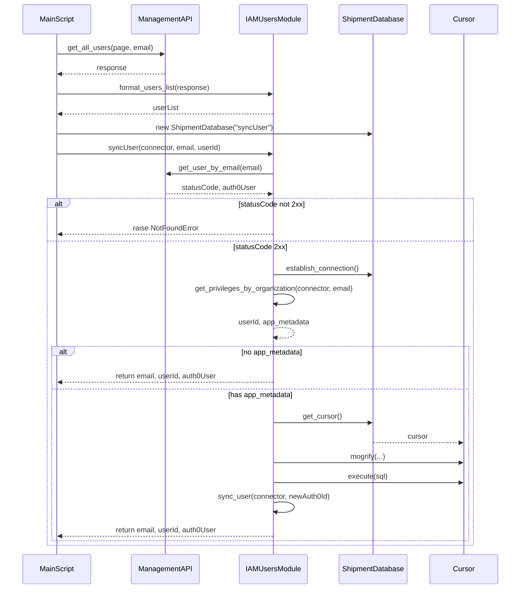
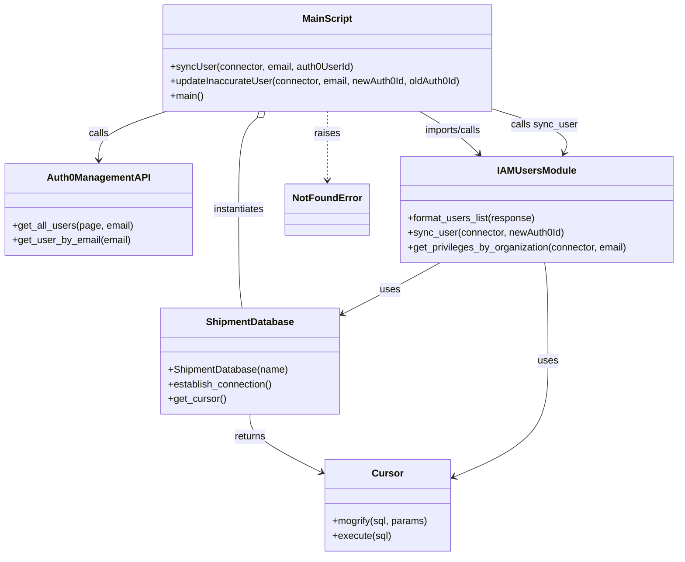

# Diagram: platform/tools/ide_local_testing/localTest/utility/syncUsersFromUserTable.py


> Auto-generated by Obscura crawlers

## Diagram 1

```mermaid
flowchart TD
Start([Start]) --> PageLoop([Page loop 0..98])
PageLoop --> GetAll[management_api.get_all_users(page, email)]
GetAll --> HasResp{response length > 0?}
HasResp -- yes --> Format[format_users_list(response)]
Format --> ForEach{for each user in userList}
ForEach --> MakeDB[connector = ShipmentDatabase("syncUser")]
MakeDB --> CallSync[call syncUser(connector, email, userId)]
CallSync --> SU_getUser
subgraph syncUser
SU_getUser[management_api.get_user_by_email(email)]
SU_getUser --> SU_status{statusCode 2xx?}
SU_status -- no --> SU_raise[raise NotFoundError]
SU_status -- yes --> SU_conn[connector.establish_connection()]
SU_conn --> SU_priv[get_privileges_by_organization(connector, email)]
SU_priv --> SU_meta{app_metadata?}
SU_meta -- no --> SU_return_empty[return email, userId, auth0User]
SU_meta -- yes --> SU_mismatch{userId && auth0UserId && ("_"+userId) != auth0UserId?}
SU_mismatch -- yes --> SU_update[updateInaccurateUser(connector, email, auth0UserId, userId)]
SU_update --> SU_cursor[connector.get_cursor()]
SU_cursor --> SU_mogrify[cursor.mogrify(UPDATE ...)]
SU_mogrify --> SU_execute[cursor.execute(sql)]
SU_execute --> SU_import_sync[sync_user(connector, newAuth0Id)]
SU_import_sync --> SU_return[return email, userId, auth0User]
SU_mismatch -- no --> SU_return
end
SU_return --> ForEach
HasResp -- no --> Break[break loop]
Break --> End([End])
ForEach --> Processed[print total processed so far]
Processed --> PageLoop
```

> SVG rendering failed for this diagram.

## Diagram 2



### SVG

<svg id="container" width="1205" xmlns="http://www.w3.org/2000/svg" height="1373" viewBox="-50 -10 1205 1373" role="graphics-document document" aria-roledescription="sequence"><g><rect x="955" y="1287" fill="#eaeaea" stroke="#666" width="150" height="65" name="Cursor" rx="3" ry="3" class="actor actor-bottom"></rect><text x="1030" y="1319.5" dominant-baseline="central" alignment-baseline="central" class="actor actor-box" style="text-anchor: middle; font-size: 16px; font-weight: 400;"><tspan x="1030" dy="0">Cursor</tspan></text></g><g><rect x="748" y="1287" fill="#eaeaea" stroke="#666" width="157" height="65" name="DB" rx="3" ry="3" class="actor actor-bottom"></rect><text x="826.5" y="1319.5" dominant-baseline="central" alignment-baseline="central" class="actor actor-box" style="text-anchor: middle; font-size: 16px; font-weight: 400;"><tspan x="826.5" dy="0">ShipmentDatabase</tspan></text></g><g><rect x="514" y="1287" fill="#eaeaea" stroke="#666" width="150" height="65" name="IAM" rx="3" ry="3" class="actor actor-bottom"></rect><text x="589" y="1319.5" dominant-baseline="central" alignment-baseline="central" class="actor actor-box" style="text-anchor: middle; font-size: 16px; font-weight: 400;"><tspan x="589" dy="0">IAMUsersModule</tspan></text></g><g><rect x="259" y="1287" fill="#eaeaea" stroke="#666" width="150" height="65" name="Auth0" rx="3" ry="3" class="actor actor-bottom"></rect><text x="334" y="1319.5" dominant-baseline="central" alignment-baseline="central" class="actor actor-box" style="text-anchor: middle; font-size: 16px; font-weight: 400;"><tspan x="334" dy="0">ManagementAPI</tspan></text></g><g><rect x="0" y="1287" fill="#eaeaea" stroke="#666" width="150" height="65" name="MainScript" rx="3" ry="3" class="actor actor-bottom"></rect><text x="75" y="1319.5" dominant-baseline="central" alignment-baseline="central" class="actor actor-box" style="text-anchor: middle; font-size: 16px; font-weight: 400;"><tspan x="75" dy="0">MainScript</tspan></text></g><g><line id="actor4" x1="1030" y1="65" x2="1030" y2="1287" class="actor-line 200" stroke-width="0.5px" stroke="#999" name="Cursor"></line><g id="root-4"><rect x="955" y="0" fill="#eaeaea" stroke="#666" width="150" height="65" name="Cursor" rx="3" ry="3" class="actor actor-top"></rect><text x="1030" y="32.5" dominant-baseline="central" alignment-baseline="central" class="actor actor-box" style="text-anchor: middle; font-size: 16px; font-weight: 400;"><tspan x="1030" dy="0">Cursor</tspan></text></g></g><g><line id="actor3" x1="826.5" y1="65" x2="826.5" y2="1287" class="actor-line 200" stroke-width="0.5px" stroke="#999" name="DB"></line><g id="root-3"><rect x="748" y="0" fill="#eaeaea" stroke="#666" width="157" height="65" name="DB" rx="3" ry="3" class="actor actor-top"></rect><text x="826.5" y="32.5" dominant-baseline="central" alignment-baseline="central" class="actor actor-box" style="text-anchor: middle; font-size: 16px; font-weight: 400;"><tspan x="826.5" dy="0">ShipmentDatabase</tspan></text></g></g><g><line id="actor2" x1="589" y1="65" x2="589" y2="1287" class="actor-line 200" stroke-width="0.5px" stroke="#999" name="IAM"></line><g id="root-2"><rect x="514" y="0" fill="#eaeaea" stroke="#666" width="150" height="65" name="IAM" rx="3" ry="3" class="actor actor-top"></rect><text x="589" y="32.5" dominant-baseline="central" alignment-baseline="central" class="actor actor-box" style="text-anchor: middle; font-size: 16px; font-weight: 400;"><tspan x="589" dy="0">IAMUsersModule</tspan></text></g></g><g><line id="actor1" x1="334" y1="65" x2="334" y2="1287" class="actor-line 200" stroke-width="0.5px" stroke="#999" name="Auth0"></line><g id="root-1"><rect x="259" y="0" fill="#eaeaea" stroke="#666" width="150" height="65" name="Auth0" rx="3" ry="3" class="actor actor-top"></rect><text x="334" y="32.5" dominant-baseline="central" alignment-baseline="central" class="actor actor-box" style="text-anchor: middle; font-size: 16px; font-weight: 400;"><tspan x="334" dy="0">ManagementAPI</tspan></text></g></g><g><line id="actor0" x1="75" y1="65" x2="75" y2="1287" class="actor-line 200" stroke-width="0.5px" stroke="#999" name="MainScript"></line><g id="root-0"><rect x="0" y="0" fill="#eaeaea" stroke="#666" width="150" height="65" name="MainScript" rx="3" ry="3" class="actor actor-top"></rect><text x="75" y="32.5" dominant-baseline="central" alignment-baseline="central" class="actor actor-box" style="text-anchor: middle; font-size: 16px; font-weight: 400;"><tspan x="75" dy="0">MainScript</tspan></text></g></g><style>#container{font-family:"trebuchet ms",verdana,arial,sans-serif;font-size:16px;fill:#333;}@keyframes edge-animation-frame{from{stroke-dashoffset:0;}}@keyframes dash{to{stroke-dashoffset:0;}}#container .edge-animation-slow{stroke-dasharray:9,5!important;stroke-dashoffset:900;animation:dash 50s linear infinite;stroke-linecap:round;}#container .edge-animation-fast{stroke-dasharray:9,5!important;stroke-dashoffset:900;animation:dash 20s linear infinite;stroke-linecap:round;}#container .error-icon{fill:#552222;}#container .error-text{fill:#552222;stroke:#552222;}#container .edge-thickness-normal{stroke-width:1px;}#container .edge-thickness-thick{stroke-width:3.5px;}#container .edge-pattern-solid{stroke-dasharray:0;}#container .edge-thickness-invisible{stroke-width:0;fill:none;}#container .edge-pattern-dashed{stroke-dasharray:3;}#container .edge-pattern-dotted{stroke-dasharray:2;}#container .marker{fill:#333333;stroke:#333333;}#container .marker.cross{stroke:#333333;}#container svg{font-family:"trebuchet ms",verdana,arial,sans-serif;font-size:16px;}#container p{margin:0;}#container .actor{stroke:hsl(259.6261682243, 59.7765363128%, 87.9019607843%);fill:#ECECFF;}#container text.actor&gt;tspan{fill:black;stroke:none;}#container .actor-line{stroke:hsl(259.6261682243, 59.7765363128%, 87.9019607843%);}#container .innerArc{stroke-width:1.5;stroke-dasharray:none;}#container .messageLine0{stroke-width:1.5;stroke-dasharray:none;stroke:#333;}#container .messageLine1{stroke-width:1.5;stroke-dasharray:2,2;stroke:#333;}#container #arrowhead path{fill:#333;stroke:#333;}#container .sequenceNumber{fill:white;}#container #sequencenumber{fill:#333;}#container #crosshead path{fill:#333;stroke:#333;}#container .messageText{fill:#333;stroke:none;}#container .labelBox{stroke:hsl(259.6261682243, 59.7765363128%, 87.9019607843%);fill:#ECECFF;}#container .labelText,#container .labelText&gt;tspan{fill:black;stroke:none;}#container .loopText,#container .loopText&gt;tspan{fill:black;stroke:none;}#container .loopLine{stroke-width:2px;stroke-dasharray:2,2;stroke:hsl(259.6261682243, 59.7765363128%, 87.9019607843%);fill:hsl(259.6261682243, 59.7765363128%, 87.9019607843%);}#container .note{stroke:#aaaa33;fill:#fff5ad;}#container .noteText,#container .noteText&gt;tspan{fill:black;stroke:none;}#container .activation0{fill:#f4f4f4;stroke:#666;}#container .activation1{fill:#f4f4f4;stroke:#666;}#container .activation2{fill:#f4f4f4;stroke:#666;}#container .actorPopupMenu{position:absolute;}#container .actorPopupMenuPanel{position:absolute;fill:#ECECFF;box-shadow:0px 8px 16px 0px rgba(0,0,0,0.2);filter:drop-shadow(3px 5px 2px rgb(0 0 0 / 0.4));}#container .actor-man line{stroke:hsl(259.6261682243, 59.7765363128%, 87.9019607843%);fill:#ECECFF;}#container .actor-man circle,#container line{stroke:hsl(259.6261682243, 59.7765363128%, 87.9019607843%);fill:#ECECFF;stroke-width:2px;}#container :root{--mermaid-font-family:"trebuchet ms",verdana,arial,sans-serif;}</style><g></g><defs><symbol id="computer" width="24" height="24"><path transform="scale(.5)" d="M2 2v13h20v-13h-20zm18 11h-16v-9h16v9zm-10.228 6l.466-1h3.524l.467 1h-4.457zm14.228 3h-24l2-6h2.104l-1.33 4h18.45l-1.297-4h2.073l2 6zm-5-10h-14v-7h14v7z"></path></symbol></defs><defs><symbol id="database" fill-rule="evenodd" clip-rule="evenodd"><path transform="scale(.5)" d="M12.258.001l.256.004.255.005.253.008.251.01.249.012.247.015.246.016.242.019.241.02.239.023.236.024.233.027.231.028.229.031.225.032.223.034.22.036.217.038.214.04.211.041.208.043.205.045.201.046.198.048.194.05.191.051.187.053.183.054.18.056.175.057.172.059.168.06.163.061.16.063.155.064.15.066.074.033.073.033.071.034.07.034.069.035.068.035.067.035.066.035.064.036.064.036.062.036.06.036.06.037.058.037.058.037.055.038.055.038.053.038.052.038.051.039.05.039.048.039.047.039.045.04.044.04.043.04.041.04.04.041.039.041.037.041.036.041.034.041.033.042.032.042.03.042.029.042.027.042.026.043.024.043.023.043.021.043.02.043.018.044.017.043.015.044.013.044.012.044.011.045.009.044.007.045.006.045.004.045.002.045.001.045v17l-.001.045-.002.045-.004.045-.006.045-.007.045-.009.044-.011.045-.012.044-.013.044-.015.044-.017.043-.018.044-.02.043-.021.043-.023.043-.024.043-.026.043-.027.042-.029.042-.03.042-.032.042-.033.042-.034.041-.036.041-.037.041-.039.041-.04.041-.041.04-.043.04-.044.04-.045.04-.047.039-.048.039-.05.039-.051.039-.052.038-.053.038-.055.038-.055.038-.058.037-.058.037-.06.037-.06.036-.062.036-.064.036-.064.036-.066.035-.067.035-.068.035-.069.035-.07.034-.071.034-.073.033-.074.033-.15.066-.155.064-.16.063-.163.061-.168.06-.172.059-.175.057-.18.056-.183.054-.187.053-.191.051-.194.05-.198.048-.201.046-.205.045-.208.043-.211.041-.214.04-.217.038-.22.036-.223.034-.225.032-.229.031-.231.028-.233.027-.236.024-.239.023-.241.02-.242.019-.246.016-.247.015-.249.012-.251.01-.253.008-.255.005-.256.004-.258.001-.258-.001-.256-.004-.255-.005-.253-.008-.251-.01-.249-.012-.247-.015-.245-.016-.243-.019-.241-.02-.238-.023-.236-.024-.234-.027-.231-.028-.228-.031-.226-.032-.223-.034-.22-.036-.217-.038-.214-.04-.211-.041-.208-.043-.204-.045-.201-.046-.198-.048-.195-.05-.19-.051-.187-.053-.184-.054-.179-.056-.176-.057-.172-.059-.167-.06-.164-.061-.159-.063-.155-.064-.151-.066-.074-.033-.072-.033-.072-.034-.07-.034-.069-.035-.068-.035-.067-.035-.066-.035-.064-.036-.063-.036-.062-.036-.061-.036-.06-.037-.058-.037-.057-.037-.056-.038-.055-.038-.053-.038-.052-.038-.051-.039-.049-.039-.049-.039-.046-.039-.046-.04-.044-.04-.043-.04-.041-.04-.04-.041-.039-.041-.037-.041-.036-.041-.034-.041-.033-.042-.032-.042-.03-.042-.029-.042-.027-.042-.026-.043-.024-.043-.023-.043-.021-.043-.02-.043-.018-.044-.017-.043-.015-.044-.013-.044-.012-.044-.011-.045-.009-.044-.007-.045-.006-.045-.004-.045-.002-.045-.001-.045v-17l.001-.045.002-.045.004-.045.006-.045.007-.045.009-.044.011-.045.012-.044.013-.044.015-.044.017-.043.018-.044.02-.043.021-.043.023-.043.024-.043.026-.043.027-.042.029-.042.03-.042.032-.042.033-.042.034-.041.036-.041.037-.041.039-.041.04-.041.041-.04.043-.04.044-.04.046-.04.046-.039.049-.039.049-.039.051-.039.052-.038.053-.038.055-.038.056-.038.057-.037.058-.037.06-.037.061-.036.062-.036.063-.036.064-.036.066-.035.067-.035.068-.035.069-.035.07-.034.072-.034.072-.033.074-.033.151-.066.155-.064.159-.063.164-.061.167-.06.172-.059.176-.057.179-.056.184-.054.187-.053.19-.051.195-.05.198-.048.201-.046.204-.045.208-.043.211-.041.214-.04.217-.038.22-.036.223-.034.226-.032.228-.031.231-.028.234-.027.236-.024.238-.023.241-.02.243-.019.245-.016.247-.015.249-.012.251-.01.253-.008.255-.005.256-.004.258-.001.258.001zm-9.258 20.499v.01l.001.021.003.021.004.022.005.021.006.022.007.022.009.023.01.022.011.023.012.023.013.023.015.023.016.024.017.023.018.024.019.024.021.024.022.025.023.024.024.025.052.049.056.05.061.051.066.051.07.051.075.051.079.052.084.052.088.052.092.052.097.052.102.051.105.052.11.052.114.051.119.051.123.051.127.05.131.05.135.05.139.048.144.049.147.047.152.047.155.047.16.045.163.045.167.043.171.043.176.041.178.041.183.039.187.039.19.037.194.035.197.035.202.033.204.031.209.03.212.029.216.027.219.025.222.024.226.021.23.02.233.018.236.016.24.015.243.012.246.01.249.008.253.005.256.004.259.001.26-.001.257-.004.254-.005.25-.008.247-.011.244-.012.241-.014.237-.016.233-.018.231-.021.226-.021.224-.024.22-.026.216-.027.212-.028.21-.031.205-.031.202-.034.198-.034.194-.036.191-.037.187-.039.183-.04.179-.04.175-.042.172-.043.168-.044.163-.045.16-.046.155-.046.152-.047.148-.048.143-.049.139-.049.136-.05.131-.05.126-.05.123-.051.118-.052.114-.051.11-.052.106-.052.101-.052.096-.052.092-.052.088-.053.083-.051.079-.052.074-.052.07-.051.065-.051.06-.051.056-.05.051-.05.023-.024.023-.025.021-.024.02-.024.019-.024.018-.024.017-.024.015-.023.014-.024.013-.023.012-.023.01-.023.01-.022.008-.022.006-.022.006-.022.004-.022.004-.021.001-.021.001-.021v-4.127l-.077.055-.08.053-.083.054-.085.053-.087.052-.09.052-.093.051-.095.05-.097.05-.1.049-.102.049-.105.048-.106.047-.109.047-.111.046-.114.045-.115.045-.118.044-.12.043-.122.042-.124.042-.126.041-.128.04-.13.04-.132.038-.134.038-.135.037-.138.037-.139.035-.142.035-.143.034-.144.033-.147.032-.148.031-.15.03-.151.03-.153.029-.154.027-.156.027-.158.026-.159.025-.161.024-.162.023-.163.022-.165.021-.166.02-.167.019-.169.018-.169.017-.171.016-.173.015-.173.014-.175.013-.175.012-.177.011-.178.01-.179.008-.179.008-.181.006-.182.005-.182.004-.184.003-.184.002h-.37l-.184-.002-.184-.003-.182-.004-.182-.005-.181-.006-.179-.008-.179-.008-.178-.01-.176-.011-.176-.012-.175-.013-.173-.014-.172-.015-.171-.016-.17-.017-.169-.018-.167-.019-.166-.02-.165-.021-.163-.022-.162-.023-.161-.024-.159-.025-.157-.026-.156-.027-.155-.027-.153-.029-.151-.03-.15-.03-.148-.031-.146-.032-.145-.033-.143-.034-.141-.035-.14-.035-.137-.037-.136-.037-.134-.038-.132-.038-.13-.04-.128-.04-.126-.041-.124-.042-.122-.042-.12-.044-.117-.043-.116-.045-.113-.045-.112-.046-.109-.047-.106-.047-.105-.048-.102-.049-.1-.049-.097-.05-.095-.05-.093-.052-.09-.051-.087-.052-.085-.053-.083-.054-.08-.054-.077-.054v4.127zm0-5.654v.011l.001.021.003.021.004.021.005.022.006.022.007.022.009.022.01.022.011.023.012.023.013.023.015.024.016.023.017.024.018.024.019.024.021.024.022.024.023.025.024.024.052.05.056.05.061.05.066.051.07.051.075.052.079.051.084.052.088.052.092.052.097.052.102.052.105.052.11.051.114.051.119.052.123.05.127.051.131.05.135.049.139.049.144.048.147.048.152.047.155.046.16.045.163.045.167.044.171.042.176.042.178.04.183.04.187.038.19.037.194.036.197.034.202.033.204.032.209.03.212.028.216.027.219.025.222.024.226.022.23.02.233.018.236.016.24.014.243.012.246.01.249.008.253.006.256.003.259.001.26-.001.257-.003.254-.006.25-.008.247-.01.244-.012.241-.015.237-.016.233-.018.231-.02.226-.022.224-.024.22-.025.216-.027.212-.029.21-.03.205-.032.202-.033.198-.035.194-.036.191-.037.187-.039.183-.039.179-.041.175-.042.172-.043.168-.044.163-.045.16-.045.155-.047.152-.047.148-.048.143-.048.139-.05.136-.049.131-.05.126-.051.123-.051.118-.051.114-.052.11-.052.106-.052.101-.052.096-.052.092-.052.088-.052.083-.052.079-.052.074-.051.07-.052.065-.051.06-.05.056-.051.051-.049.023-.025.023-.024.021-.025.02-.024.019-.024.018-.024.017-.024.015-.023.014-.023.013-.024.012-.022.01-.023.01-.023.008-.022.006-.022.006-.022.004-.021.004-.022.001-.021.001-.021v-4.139l-.077.054-.08.054-.083.054-.085.052-.087.053-.09.051-.093.051-.095.051-.097.05-.1.049-.102.049-.105.048-.106.047-.109.047-.111.046-.114.045-.115.044-.118.044-.12.044-.122.042-.124.042-.126.041-.128.04-.13.039-.132.039-.134.038-.135.037-.138.036-.139.036-.142.035-.143.033-.144.033-.147.033-.148.031-.15.03-.151.03-.153.028-.154.028-.156.027-.158.026-.159.025-.161.024-.162.023-.163.022-.165.021-.166.02-.167.019-.169.018-.169.017-.171.016-.173.015-.173.014-.175.013-.175.012-.177.011-.178.009-.179.009-.179.007-.181.007-.182.005-.182.004-.184.003-.184.002h-.37l-.184-.002-.184-.003-.182-.004-.182-.005-.181-.007-.179-.007-.179-.009-.178-.009-.176-.011-.176-.012-.175-.013-.173-.014-.172-.015-.171-.016-.17-.017-.169-.018-.167-.019-.166-.02-.165-.021-.163-.022-.162-.023-.161-.024-.159-.025-.157-.026-.156-.027-.155-.028-.153-.028-.151-.03-.15-.03-.148-.031-.146-.033-.145-.033-.143-.033-.141-.035-.14-.036-.137-.036-.136-.037-.134-.038-.132-.039-.13-.039-.128-.04-.126-.041-.124-.042-.122-.043-.12-.043-.117-.044-.116-.044-.113-.046-.112-.046-.109-.046-.106-.047-.105-.048-.102-.049-.1-.049-.097-.05-.095-.051-.093-.051-.09-.051-.087-.053-.085-.052-.083-.054-.08-.054-.077-.054v4.139zm0-5.666v.011l.001.02.003.022.004.021.005.022.006.021.007.022.009.023.01.022.011.023.012.023.013.023.015.023.016.024.017.024.018.023.019.024.021.025.022.024.023.024.024.025.052.05.056.05.061.05.066.051.07.051.075.052.079.051.084.052.088.052.092.052.097.052.102.052.105.051.11.052.114.051.119.051.123.051.127.05.131.05.135.05.139.049.144.048.147.048.152.047.155.046.16.045.163.045.167.043.171.043.176.042.178.04.183.04.187.038.19.037.194.036.197.034.202.033.204.032.209.03.212.028.216.027.219.025.222.024.226.021.23.02.233.018.236.017.24.014.243.012.246.01.249.008.253.006.256.003.259.001.26-.001.257-.003.254-.006.25-.008.247-.01.244-.013.241-.014.237-.016.233-.018.231-.02.226-.022.224-.024.22-.025.216-.027.212-.029.21-.03.205-.032.202-.033.198-.035.194-.036.191-.037.187-.039.183-.039.179-.041.175-.042.172-.043.168-.044.163-.045.16-.045.155-.047.152-.047.148-.048.143-.049.139-.049.136-.049.131-.051.126-.05.123-.051.118-.052.114-.051.11-.052.106-.052.101-.052.096-.052.092-.052.088-.052.083-.052.079-.052.074-.052.07-.051.065-.051.06-.051.056-.05.051-.049.023-.025.023-.025.021-.024.02-.024.019-.024.018-.024.017-.024.015-.023.014-.024.013-.023.012-.023.01-.022.01-.023.008-.022.006-.022.006-.022.004-.022.004-.021.001-.021.001-.021v-4.153l-.077.054-.08.054-.083.053-.085.053-.087.053-.09.051-.093.051-.095.051-.097.05-.1.049-.102.048-.105.048-.106.048-.109.046-.111.046-.114.046-.115.044-.118.044-.12.043-.122.043-.124.042-.126.041-.128.04-.13.039-.132.039-.134.038-.135.037-.138.036-.139.036-.142.034-.143.034-.144.033-.147.032-.148.032-.15.03-.151.03-.153.028-.154.028-.156.027-.158.026-.159.024-.161.024-.162.023-.163.023-.165.021-.166.02-.167.019-.169.018-.169.017-.171.016-.173.015-.173.014-.175.013-.175.012-.177.01-.178.01-.179.009-.179.007-.181.006-.182.006-.182.004-.184.003-.184.001-.185.001-.185-.001-.184-.001-.184-.003-.182-.004-.182-.006-.181-.006-.179-.007-.179-.009-.178-.01-.176-.01-.176-.012-.175-.013-.173-.014-.172-.015-.171-.016-.17-.017-.169-.018-.167-.019-.166-.02-.165-.021-.163-.023-.162-.023-.161-.024-.159-.024-.157-.026-.156-.027-.155-.028-.153-.028-.151-.03-.15-.03-.148-.032-.146-.032-.145-.033-.143-.034-.141-.034-.14-.036-.137-.036-.136-.037-.134-.038-.132-.039-.13-.039-.128-.041-.126-.041-.124-.041-.122-.043-.12-.043-.117-.044-.116-.044-.113-.046-.112-.046-.109-.046-.106-.048-.105-.048-.102-.048-.1-.05-.097-.049-.095-.051-.093-.051-.09-.052-.087-.052-.085-.053-.083-.053-.08-.054-.077-.054v4.153zm8.74-8.179l-.257.004-.254.005-.25.008-.247.011-.244.012-.241.014-.237.016-.233.018-.231.021-.226.022-.224.023-.22.026-.216.027-.212.028-.21.031-.205.032-.202.033-.198.034-.194.036-.191.038-.187.038-.183.04-.179.041-.175.042-.172.043-.168.043-.163.045-.16.046-.155.046-.152.048-.148.048-.143.048-.139.049-.136.05-.131.05-.126.051-.123.051-.118.051-.114.052-.11.052-.106.052-.101.052-.096.052-.092.052-.088.052-.083.052-.079.052-.074.051-.07.052-.065.051-.06.05-.056.05-.051.05-.023.025-.023.024-.021.024-.02.025-.019.024-.018.024-.017.023-.015.024-.014.023-.013.023-.012.023-.01.023-.01.022-.008.022-.006.023-.006.021-.004.022-.004.021-.001.021-.001.021.001.021.001.021.004.021.004.022.006.021.006.023.008.022.01.022.01.023.012.023.013.023.014.023.015.024.017.023.018.024.019.024.02.025.021.024.023.024.023.025.051.05.056.05.06.05.065.051.07.052.074.051.079.052.083.052.088.052.092.052.096.052.101.052.106.052.11.052.114.052.118.051.123.051.126.051.131.05.136.05.139.049.143.048.148.048.152.048.155.046.16.046.163.045.168.043.172.043.175.042.179.041.183.04.187.038.191.038.194.036.198.034.202.033.205.032.21.031.212.028.216.027.22.026.224.023.226.022.231.021.233.018.237.016.241.014.244.012.247.011.25.008.254.005.257.004.26.001.26-.001.257-.004.254-.005.25-.008.247-.011.244-.012.241-.014.237-.016.233-.018.231-.021.226-.022.224-.023.22-.026.216-.027.212-.028.21-.031.205-.032.202-.033.198-.034.194-.036.191-.038.187-.038.183-.04.179-.041.175-.042.172-.043.168-.043.163-.045.16-.046.155-.046.152-.048.148-.048.143-.048.139-.049.136-.05.131-.05.126-.051.123-.051.118-.051.114-.052.11-.052.106-.052.101-.052.096-.052.092-.052.088-.052.083-.052.079-.052.074-.051.07-.052.065-.051.06-.05.056-.05.051-.05.023-.025.023-.024.021-.024.02-.025.019-.024.018-.024.017-.023.015-.024.014-.023.013-.023.012-.023.01-.023.01-.022.008-.022.006-.023.006-.021.004-.022.004-.021.001-.021.001-.021-.001-.021-.001-.021-.004-.021-.004-.022-.006-.021-.006-.023-.008-.022-.01-.022-.01-.023-.012-.023-.013-.023-.014-.023-.015-.024-.017-.023-.018-.024-.019-.024-.02-.025-.021-.024-.023-.024-.023-.025-.051-.05-.056-.05-.06-.05-.065-.051-.07-.052-.074-.051-.079-.052-.083-.052-.088-.052-.092-.052-.096-.052-.101-.052-.106-.052-.11-.052-.114-.052-.118-.051-.123-.051-.126-.051-.131-.05-.136-.05-.139-.049-.143-.048-.148-.048-.152-.048-.155-.046-.16-.046-.163-.045-.168-.043-.172-.043-.175-.042-.179-.041-.183-.04-.187-.038-.191-.038-.194-.036-.198-.034-.202-.033-.205-.032-.21-.031-.212-.028-.216-.027-.22-.026-.224-.023-.226-.022-.231-.021-.233-.018-.237-.016-.241-.014-.244-.012-.247-.011-.25-.008-.254-.005-.257-.004-.26-.001-.26.001z"></path></symbol></defs><defs><symbol id="clock" width="24" height="24"><path transform="scale(.5)" d="M12 2c5.514 0 10 4.486 10 10s-4.486 10-10 10-10-4.486-10-10 4.486-10 10-10zm0-2c-6.627 0-12 5.373-12 12s5.373 12 12 12 12-5.373 12-12-5.373-12-12-12zm5.848 12.459c.202.038.202.333.001.372-1.907.361-6.045 1.111-6.547 1.111-.719 0-1.301-.582-1.301-1.301 0-.512.77-5.447 1.125-7.445.034-.192.312-.181.343.014l.985 6.238 5.394 1.011z"></path></symbol></defs><defs><marker id="arrowhead" refX="7.9" refY="5" markerUnits="userSpaceOnUse" markerWidth="12" markerHeight="12" orient="auto-start-reverse"><path d="M -1 0 L 10 5 L 0 10 z"></path></marker></defs><defs><marker id="crosshead" markerWidth="15" markerHeight="8" orient="auto" refX="4" refY="4.5"><path fill="none" stroke="#000000" stroke-width="1pt" d="M 1,2 L 6,7 M 6,2 L 1,7" style="stroke-dasharray: 0, 0;"></path></marker></defs><defs><marker id="filled-head" refX="15.5" refY="7" markerWidth="20" markerHeight="28" orient="auto"><path d="M 18,7 L9,13 L14,7 L9,1 Z"></path></marker></defs><defs><marker id="sequencenumber" refX="15" refY="15" markerWidth="60" markerHeight="40" orient="auto"><circle cx="15" cy="15" r="6"></circle></marker></defs><g><line x1="64" y1="801" x2="1041" y2="801" class="loopLine"></line><line x1="1041" y1="801" x2="1041" y2="1257" class="loopLine"></line><line x1="64" y1="1257" x2="1041" y2="1257" class="loopLine"></line><line x1="64" y1="801" x2="64" y2="1257" class="loopLine"></line><line x1="64" y1="899" x2="1041" y2="899" class="loopLine" style="stroke-dasharray: 3, 3;"></line><polygon points="64,801 114,801 114,814 105.6,821 64,821" class="labelBox"></polygon><text x="89" y="814" text-anchor="middle" dominant-baseline="middle" alignment-baseline="middle" class="labelText" style="font-size: 16px; font-weight: 400;">alt</text><text x="577.5" y="819" text-anchor="middle" class="loopText" style="font-size: 16px; font-weight: 400;"><tspan x="577.5">[no app_metadata]</tspan></text><text x="552.5" y="917" text-anchor="middle" class="loopText" style="font-size: 16px; font-weight: 400;">[has app_metadata]</text></g><g><line x1="54" y1="459" x2="1051" y2="459" class="loopLine"></line><line x1="1051" y1="459" x2="1051" y2="1267" class="loopLine"></line><line x1="54" y1="1267" x2="1051" y2="1267" class="loopLine"></line><line x1="54" y1="459" x2="54" y2="1267" class="loopLine"></line><line x1="54" y1="557" x2="1051" y2="557" class="loopLine" style="stroke-dasharray: 3, 3;"></line><polygon points="54,459 104,459 104,472 95.6,479 54,479" class="labelBox"></polygon><text x="79" y="472" text-anchor="middle" dominant-baseline="middle" alignment-baseline="middle" class="labelText" style="font-size: 16px; font-weight: 400;">alt</text><text x="577.5" y="477" text-anchor="middle" class="loopText" style="font-size: 16px; font-weight: 400;"><tspan x="577.5">[statusCode not 2xx]</tspan></text><text x="552.5" y="575" text-anchor="middle" class="loopText" style="font-size: 16px; font-weight: 400;">[statusCode 2xx]</text></g><text x="203" y="80" text-anchor="middle" dominant-baseline="middle" alignment-baseline="middle" class="messageText" dy="1em" style="font-size: 16px; font-weight: 400;">get_all_users(page, email)</text><line x1="76" y1="113" x2="330" y2="113" class="messageLine0" stroke-width="2" stroke="none" marker-end="url(#arrowhead)" style="fill: none;"></line><text x="206" y="128" text-anchor="middle" dominant-baseline="middle" alignment-baseline="middle" class="messageText" dy="1em" style="font-size: 16px; font-weight: 400;">response</text><line x1="333" y1="161" x2="79" y2="161" class="messageLine1" stroke-width="2" stroke="none" marker-end="url(#arrowhead)" style="stroke-dasharray: 3, 3; fill: none;"></line><text x="331" y="176" text-anchor="middle" dominant-baseline="middle" alignment-baseline="middle" class="messageText" dy="1em" style="font-size: 16px; font-weight: 400;">format_users_list(response)</text><line x1="76" y1="209" x2="585" y2="209" class="messageLine0" stroke-width="2" stroke="none" marker-end="url(#arrowhead)" style="fill: none;"></line><text x="334" y="224" text-anchor="middle" dominant-baseline="middle" alignment-baseline="middle" class="messageText" dy="1em" style="font-size: 16px; font-weight: 400;">userList</text><line x1="588" y1="257" x2="79" y2="257" class="messageLine1" stroke-width="2" stroke="none" marker-end="url(#arrowhead)" style="stroke-dasharray: 3, 3; fill: none;"></line><text x="449" y="272" text-anchor="middle" dominant-baseline="middle" alignment-baseline="middle" class="messageText" dy="1em" style="font-size: 16px; font-weight: 400;">new ShipmentDatabase("syncUser")</text><line x1="76" y1="305" x2="822.5" y2="305" class="messageLine0" stroke-width="2" stroke="none" marker-end="url(#arrowhead)" style="fill: none;"></line><text x="331" y="320" text-anchor="middle" dominant-baseline="middle" alignment-baseline="middle" class="messageText" dy="1em" style="font-size: 16px; font-weight: 400;">syncUser(connector, email, userId)</text><line x1="76" y1="353" x2="585" y2="353" class="messageLine0" stroke-width="2" stroke="none" marker-end="url(#arrowhead)" style="fill: none;"></line><text x="463" y="368" text-anchor="middle" dominant-baseline="middle" alignment-baseline="middle" class="messageText" dy="1em" style="font-size: 16px; font-weight: 400;">get_user_by_email(email)</text><line x1="588" y1="401" x2="338" y2="401" class="messageLine0" stroke-width="2" stroke="none" marker-end="url(#arrowhead)" style="fill: none;"></line><text x="460" y="416" text-anchor="middle" dominant-baseline="middle" alignment-baseline="middle" class="messageText" dy="1em" style="font-size: 16px; font-weight: 400;">statusCode, auth0User</text><line x1="335" y1="449" x2="585" y2="449" class="messageLine1" stroke-width="2" stroke="none" marker-end="url(#arrowhead)" style="stroke-dasharray: 3, 3; fill: none;"></line><text x="334" y="509" text-anchor="middle" dominant-baseline="middle" alignment-baseline="middle" class="messageText" dy="1em" style="font-size: 16px; font-weight: 400;">raise NotFoundError</text><line x1="588" y1="542" x2="79" y2="542" class="messageLine1" stroke-width="2" stroke="none" marker-end="url(#arrowhead)" style="stroke-dasharray: 3, 3; fill: none;"></line><text x="706" y="602" text-anchor="middle" dominant-baseline="middle" alignment-baseline="middle" class="messageText" dy="1em" style="font-size: 16px; font-weight: 400;">establish_connection()</text><line x1="590" y1="635" x2="822.5" y2="635" class="messageLine0" stroke-width="2" stroke="none" marker-end="url(#arrowhead)" style="fill: none;"></line><text x="590" y="650" text-anchor="middle" dominant-baseline="middle" alignment-baseline="middle" class="messageText" dy="1em" style="font-size: 16px; font-weight: 400;">get_privileges_by_organization(connector, email)</text><path d="M 590,683 C 650,673 650,713 590,703" class="messageLine0" stroke-width="2" stroke="none" marker-end="url(#arrowhead)" style="fill: none;"></path><text x="590" y="728" text-anchor="middle" dominant-baseline="middle" alignment-baseline="middle" class="messageText" dy="1em" style="font-size: 16px; font-weight: 400;">userId, app_metadata</text><path d="M 590,761 C 650,751 650,791 590,781" class="messageLine1" stroke-width="2" stroke="none" marker-end="url(#arrowhead)" style="stroke-dasharray: 3, 3; fill: none;"></path><text x="334" y="851" text-anchor="middle" dominant-baseline="middle" alignment-baseline="middle" class="messageText" dy="1em" style="font-size: 16px; font-weight: 400;">return email, userId, auth0User</text><line x1="588" y1="884" x2="79" y2="884" class="messageLine1" stroke-width="2" stroke="none" marker-end="url(#arrowhead)" style="stroke-dasharray: 3, 3; fill: none;"></line><text x="706" y="944" text-anchor="middle" dominant-baseline="middle" alignment-baseline="middle" class="messageText" dy="1em" style="font-size: 16px; font-weight: 400;">get_cursor()</text><line x1="590" y1="977" x2="822.5" y2="977" class="messageLine0" stroke-width="2" stroke="none" marker-end="url(#arrowhead)" style="fill: none;"></line><text x="927" y="992" text-anchor="middle" dominant-baseline="middle" alignment-baseline="middle" class="messageText" dy="1em" style="font-size: 16px; font-weight: 400;">cursor</text><line x1="827.5" y1="1025" x2="1026" y2="1025" class="messageLine1" stroke-width="2" stroke="none" marker-end="url(#arrowhead)" style="stroke-dasharray: 3, 3; fill: none;"></line><text x="808" y="1040" text-anchor="middle" dominant-baseline="middle" alignment-baseline="middle" class="messageText" dy="1em" style="font-size: 16px; font-weight: 400;">mogrify(...)</text><line x1="590" y1="1073" x2="1026" y2="1073" class="messageLine0" stroke-width="2" stroke="none" marker-end="url(#arrowhead)" style="fill: none;"></line><text x="808" y="1088" text-anchor="middle" dominant-baseline="middle" alignment-baseline="middle" class="messageText" dy="1em" style="font-size: 16px; font-weight: 400;">execute(sql)</text><line x1="590" y1="1121" x2="1026" y2="1121" class="messageLine0" stroke-width="2" stroke="none" marker-end="url(#arrowhead)" style="fill: none;"></line><text x="590" y="1136" text-anchor="middle" dominant-baseline="middle" alignment-baseline="middle" class="messageText" dy="1em" style="font-size: 16px; font-weight: 400;">sync_user(connector, newAuth0Id)</text><path d="M 590,1169 C 650,1159 650,1199 590,1189" class="messageLine0" stroke-width="2" stroke="none" marker-end="url(#arrowhead)" style="fill: none;"></path><text x="334" y="1214" text-anchor="middle" dominant-baseline="middle" alignment-baseline="middle" class="messageText" dy="1em" style="font-size: 16px; font-weight: 400;">return email, userId, auth0User</text><line x1="588" y1="1247" x2="79" y2="1247" class="messageLine1" stroke-width="2" stroke="none" marker-end="url(#arrowhead)" style="stroke-dasharray: 3, 3; fill: none;"></line></svg>

## Diagram 3



### SVG

<svg id="container" width="1101.6796875" xmlns="http://www.w3.org/2000/svg" class="classDiagram" height="910" viewBox="0 0 1101.6796875 910" role="graphics-document document" aria-roledescription="class"><style>#container{font-family:"trebuchet ms",verdana,arial,sans-serif;font-size:16px;fill:#333;}@keyframes edge-animation-frame{from{stroke-dashoffset:0;}}@keyframes dash{to{stroke-dashoffset:0;}}#container .edge-animation-slow{stroke-dasharray:9,5!important;stroke-dashoffset:900;animation:dash 50s linear infinite;stroke-linecap:round;}#container .edge-animation-fast{stroke-dasharray:9,5!important;stroke-dashoffset:900;animation:dash 20s linear infinite;stroke-linecap:round;}#container .error-icon{fill:#552222;}#container .error-text{fill:#552222;stroke:#552222;}#container .edge-thickness-normal{stroke-width:1px;}#container .edge-thickness-thick{stroke-width:3.5px;}#container .edge-pattern-solid{stroke-dasharray:0;}#container .edge-thickness-invisible{stroke-width:0;fill:none;}#container .edge-pattern-dashed{stroke-dasharray:3;}#container .edge-pattern-dotted{stroke-dasharray:2;}#container .marker{fill:#333333;stroke:#333333;}#container .marker.cross{stroke:#333333;}#container svg{font-family:"trebuchet ms",verdana,arial,sans-serif;font-size:16px;}#container p{margin:0;}#container g.classGroup text{fill:#9370DB;stroke:none;font-family:"trebuchet ms",verdana,arial,sans-serif;font-size:10px;}#container g.classGroup text .title{font-weight:bolder;}#container .nodeLabel,#container .edgeLabel{color:#131300;}#container .edgeLabel .label rect{fill:#ECECFF;}#container .label text{fill:#131300;}#container .labelBkg{background:#ECECFF;}#container .edgeLabel .label span{background:#ECECFF;}#container .classTitle{font-weight:bolder;}#container .node rect,#container .node circle,#container .node ellipse,#container .node polygon,#container .node path{fill:#ECECFF;stroke:#9370DB;stroke-width:1px;}#container .divider{stroke:#9370DB;stroke-width:1;}#container g.clickable{cursor:pointer;}#container g.classGroup rect{fill:#ECECFF;stroke:#9370DB;}#container g.classGroup line{stroke:#9370DB;stroke-width:1;}#container .classLabel .box{stroke:none;stroke-width:0;fill:#ECECFF;opacity:0.5;}#container .classLabel .label{fill:#9370DB;font-size:10px;}#container .relation{stroke:#333333;stroke-width:1;fill:none;}#container .dashed-line{stroke-dasharray:3;}#container .dotted-line{stroke-dasharray:1 2;}#container #compositionStart,#container .composition{fill:#333333!important;stroke:#333333!important;stroke-width:1;}#container #compositionEnd,#container .composition{fill:#333333!important;stroke:#333333!important;stroke-width:1;}#container #dependencyStart,#container .dependency{fill:#333333!important;stroke:#333333!important;stroke-width:1;}#container #dependencyStart,#container .dependency{fill:#333333!important;stroke:#333333!important;stroke-width:1;}#container #extensionStart,#container .extension{fill:transparent!important;stroke:#333333!important;stroke-width:1;}#container #extensionEnd,#container .extension{fill:transparent!important;stroke:#333333!important;stroke-width:1;}#container #aggregationStart,#container .aggregation{fill:transparent!important;stroke:#333333!important;stroke-width:1;}#container #aggregationEnd,#container .aggregation{fill:transparent!important;stroke:#333333!important;stroke-width:1;}#container #lollipopStart,#container .lollipop{fill:#ECECFF!important;stroke:#333333!important;stroke-width:1;}#container #lollipopEnd,#container .lollipop{fill:#ECECFF!important;stroke:#333333!important;stroke-width:1;}#container .edgeTerminals{font-size:11px;line-height:initial;}#container .classTitleText{text-anchor:middle;font-size:18px;fill:#333;}#container .label-icon{display:inline-block;height:1em;overflow:visible;vertical-align:-0.125em;}#container .node .label-icon path{fill:currentColor;stroke:revert;stroke-width:revert;}#container :root{--mermaid-font-family:"trebuchet ms",verdana,arial,sans-serif;}</style><g><defs><marker id="container_class-aggregationStart" class="marker aggregation class" refX="18" refY="7" markerWidth="190" markerHeight="240" orient="auto"><path d="M 18,7 L9,13 L1,7 L9,1 Z"></path></marker></defs><defs><marker id="container_class-aggregationEnd" class="marker aggregation class" refX="1" refY="7" markerWidth="20" markerHeight="28" orient="auto"><path d="M 18,7 L9,13 L1,7 L9,1 Z"></path></marker></defs><defs><marker id="container_class-extensionStart" class="marker extension class" refX="18" refY="7" markerWidth="190" markerHeight="240" orient="auto"><path d="M 1,7 L18,13 V 1 Z"></path></marker></defs><defs><marker id="container_class-extensionEnd" class="marker extension class" refX="1" refY="7" markerWidth="20" markerHeight="28" orient="auto"><path d="M 1,1 V 13 L18,7 Z"></path></marker></defs><defs><marker id="container_class-compositionStart" class="marker composition class" refX="18" refY="7" markerWidth="190" markerHeight="240" orient="auto"><path d="M 18,7 L9,13 L1,7 L9,1 Z"></path></marker></defs><defs><marker id="container_class-compositionEnd" class="marker composition class" refX="1" refY="7" markerWidth="20" markerHeight="28" orient="auto"><path d="M 18,7 L9,13 L1,7 L9,1 Z"></path></marker></defs><defs><marker id="container_class-dependencyStart" class="marker dependency class" refX="6" refY="7" markerWidth="190" markerHeight="240" orient="auto"><path d="M 5,7 L9,13 L1,7 L9,1 Z"></path></marker></defs><defs><marker id="container_class-dependencyEnd" class="marker dependency class" refX="13" refY="7" markerWidth="20" markerHeight="28" orient="auto"><path d="M 18,7 L9,13 L14,7 L9,1 Z"></path></marker></defs><defs><marker id="container_class-lollipopStart" class="marker lollipop class" refX="13" refY="7" markerWidth="190" markerHeight="240" orient="auto"><circle stroke="black" fill="transparent" cx="7" cy="7" r="6"></circle></marker></defs><defs><marker id="container_class-lollipopEnd" class="marker lollipop class" refX="1" refY="7" markerWidth="190" markerHeight="240" orient="auto"><circle stroke="black" fill="transparent" cx="7" cy="7" r="6"></circle></marker></defs><g class="root"><g class="clusters"></g><g class="edgePaths"><path d="M269.691,182L251.189,188.167C232.687,194.333,195.684,206.667,177.182,220C158.68,233.333,158.68,247.667,158.68,254.833L158.68,262" id="id_MainScript_Auth0ManagementAPI_1" class="edge-thickness-normal edge-pattern-solid relation" style=";;;" data-edge="true" data-et="edge" data-id="id_MainScript_Auth0ManagementAPI_1" data-points="W3sieCI6MjY5LjY5MTM0MzI0NTk2Nzc0LCJ5IjoxODJ9LHsieCI6MTU4LjY3OTY4NzUsInkiOjIxOX0seyJ4IjoxNTguNjc5Njg3NSwieSI6MjY4fV0=" marker-end="url(#container_class-dependencyEnd)"></path><path d="M681.197,182L691.863,188.167C702.529,194.333,723.861,206.667,740.023,218.295C756.185,229.924,767.176,240.847,772.672,246.309L778.168,251.771" id="id_MainScript_IAMUsersModule_2" class="edge-thickness-normal edge-pattern-solid relation" style=";;;" data-edge="true" data-et="edge" data-id="id_MainScript_IAMUsersModule_2" data-points="W3sieCI6NjgxLjE5NjkwMzM1MTgxNDUsInkiOjE4Mn0seyJ4Ijo3NDUuMTkzMzU5Mzc1LCJ5IjoyMTl9LHsieCI6NzgyLjQyMzU2MDM1Nzg2MjksInkiOjI1Nn1d" marker-end="url(#container_class-dependencyEnd)"></path><path d="M417.026,193.281L412.067,197.567C407.108,201.854,397.191,210.427,392.232,235.38C387.273,260.333,387.273,301.667,387.273,343C387.273,384.333,387.273,425.667,388.181,452.5C389.088,479.333,390.903,491.667,391.81,497.833L392.718,504" id="id_MainScript_ShipmentDatabase_3" class="edge-thickness-normal edge-pattern-solid relation" style=";;;" data-edge="true" data-et="edge" data-id="id_MainScript_ShipmentDatabase_3" data-points="W3sieCI6NDMwLjA3NTY2Nzg0Mjc0MTk1LCJ5IjoxODJ9LHsieCI6Mzg3LjI3MzQzNzUsInkiOjIxOX0seyJ4IjozODcuMjczNDM3NSwieSI6MzQzfSx7IngiOjM4Ny4yNzM0Mzc1LCJ5Ijo0Njd9LHsieCI6MzkyLjcxNzgzNjQ0MTUzMjI2LCJ5Ijo1MDR9XQ==" marker-start="url(#container_class-aggregationStart)"></path><path d="M713.435,430L702.34,436.167C691.245,442.333,669.055,454.667,642.666,468.691C616.278,482.715,585.69,498.431,570.396,506.289L555.102,514.146" id="id_IAMUsersModule_ShipmentDatabase_4" class="edge-thickness-normal edge-pattern-solid relation" style=";;;" data-edge="true" data-et="edge" data-id="id_IAMUsersModule_ShipmentDatabase_4" data-points="W3sieCI6NzEzLjQzNTI3OTEwNzg2MjksInkiOjQzMH0seyJ4Ijo2NDYuODY1MjM0Mzc1LCJ5Ijo0Njd9LHsieCI6NTQ5Ljc2NTYyNSwieSI6NTE2Ljg4ODQwMjQzMTAzMDV9XQ==" marker-end="url(#container_class-dependencyEnd)"></path><path d="M405.52,678L405.52,684.167C405.52,690.333,405.52,702.667,424.727,718.476C443.935,734.285,482.35,753.57,501.557,763.213L520.765,772.855" id="id_ShipmentDatabase_Cursor_5" class="edge-thickness-normal edge-pattern-solid relation" style=";;;" data-edge="true" data-et="edge" data-id="id_ShipmentDatabase_Cursor_5" data-points="W3sieCI6NDA1LjUxOTUzMTI1LCJ5Ijo2Nzh9LHsieCI6NDA1LjUxOTUzMTI1LCJ5Ijo3MTV9LHsieCI6NTI2LjEyNjk1MzEyNSwieSI6Nzc1LjU0NzA4NjA2NTQ2NjF9XQ==" marker-end="url(#container_class-dependencyEnd)"></path><path d="M882.767,430L883.674,436.167C884.581,442.333,886.396,454.667,887.304,481.5C888.211,508.333,888.211,549.667,888.211,591C888.211,632.333,888.211,673.667,862.946,705.234C837.681,736.801,787.151,758.602,761.886,769.503L736.62,780.403" id="id_IAMUsersModule_Cursor_6" class="edge-thickness-normal edge-pattern-solid relation" style=";;;" data-edge="true" data-et="edge" data-id="id_IAMUsersModule_Cursor_6" data-points="W3sieCI6ODgyLjc2NjUzODU1ODQ2NzcsInkiOjQzMH0seyJ4Ijo4ODguMjEwOTM3NSwieSI6NDY3fSx7IngiOjg4OC4yMTA5Mzc1LCJ5Ijo1OTF9LHsieCI6ODg4LjIxMDkzNzUsInkiOjcxNX0seyJ4Ijo3MzEuMTExMzI4MTI1LCJ5Ijo3ODIuNzgwMDkzNDQ1OTkwMX1d" marker-end="url(#container_class-dependencyEnd)"></path><path d="M530.719,182L530.719,188.167C530.719,194.333,530.719,206.667,530.719,225.5C530.719,244.333,530.719,269.667,530.719,282.333L530.719,295" id="id_MainScript_NotFoundError_7" class="edge-thickness-normal edge-pattern-dashed relation" style=";;;" data-edge="true" data-et="edge" data-id="id_MainScript_NotFoundError_7" data-points="W3sieCI6NTMwLjcxODc1LCJ5IjoxODJ9LHsieCI6NTMwLjcxODc1LCJ5IjoyMTl9LHsieCI6NTMwLjcxODc1LCJ5IjozMDF9XQ==" marker-end="url(#container_class-dependencyEnd)"></path><path d="M802.898,179.228L824.318,185.857C845.738,192.486,888.578,205.743,907.386,217.642C926.194,229.541,920.97,240.083,918.358,245.353L915.745,250.624" id="id_MainScript_IAMUsersModule_8" class="edge-thickness-normal edge-pattern-solid relation" style=";;;" data-edge="true" data-et="edge" data-id="id_MainScript_IAMUsersModule_8" data-points="W3sieCI6ODAyLjg5ODQzNzUsInkiOjE3OS4yMjg0Njc4MTUwNDk4N30seyJ4Ijo5MzEuNDE3OTY4NzUsInkiOjIxOX0seyJ4Ijo5MTMuMDgxMTQ5MTkzNTQ4NCwieSI6MjU2fV0=" marker-end="url(#container_class-dependencyEnd)"></path></g><g class="edgeLabels"><g class="edgeLabel" transform="translate(158.6796875, 219)"><g class="label" data-id="id_MainScript_Auth0ManagementAPI_1" transform="translate(-16.4453125, -12)"><foreignObject width="32.890625" height="24"><div xmlns="http://www.w3.org/1999/xhtml" class="labelBkg" style="display: table-cell; white-space: nowrap; line-height: 1.5; max-width: 200px; text-align: center;"><span class="edgeLabel"><p>calls</p></span></div></foreignObject></g></g><g class="edgeLabel" transform="translate(735.91556, 213.63598)"><g class="label" data-id="id_MainScript_IAMUsersModule_2" transform="translate(-48.453125, -12)"><foreignObject width="96.90625" height="24"><div xmlns="http://www.w3.org/1999/xhtml" class="labelBkg" style="display: table-cell; white-space: nowrap; line-height: 1.5; max-width: 200px; text-align: center;"><span class="edgeLabel"><p>imports/calls</p></span></div></foreignObject></g></g><g class="edgeLabel" transform="translate(387.2734375, 343)"><g class="label" data-id="id_MainScript_ShipmentDatabase_3" transform="translate(-42.9140625, -12)"><foreignObject width="85.828125" height="24"><div xmlns="http://www.w3.org/1999/xhtml" class="labelBkg" style="display: table-cell; white-space: nowrap; line-height: 1.5; max-width: 200px; text-align: center;"><span class="edgeLabel"><p>instantiates</p></span></div></foreignObject></g></g><g class="edgeLabel" transform="translate(632.18705, 474.54144)"><g class="label" data-id="id_IAMUsersModule_ShipmentDatabase_4" transform="translate(-16.4921875, -12)"><foreignObject width="32.984375" height="24"><div xmlns="http://www.w3.org/1999/xhtml" class="labelBkg" style="display: table-cell; white-space: nowrap; line-height: 1.5; max-width: 200px; text-align: center;"><span class="edgeLabel"><p>uses</p></span></div></foreignObject></g></g><g class="edgeLabel" transform="translate(405.51953125, 715)"><g class="label" data-id="id_ShipmentDatabase_Cursor_5" transform="translate(-26.265625, -12)"><foreignObject width="52.53125" height="24"><div xmlns="http://www.w3.org/1999/xhtml" class="labelBkg" style="display: table-cell; white-space: nowrap; line-height: 1.5; max-width: 200px; text-align: center;"><span class="edgeLabel"><p>returns</p></span></div></foreignObject></g></g><g class="edgeLabel" transform="translate(888.2109375, 591)"><g class="label" data-id="id_IAMUsersModule_Cursor_6" transform="translate(-16.4921875, -12)"><foreignObject width="32.984375" height="24"><div xmlns="http://www.w3.org/1999/xhtml" class="labelBkg" style="display: table-cell; white-space: nowrap; line-height: 1.5; max-width: 200px; text-align: center;"><span class="edgeLabel"><p>uses</p></span></div></foreignObject></g></g><g class="edgeLabel" transform="translate(530.71875, 219)"><g class="label" data-id="id_MainScript_NotFoundError_7" transform="translate(-21.25, -12)"><foreignObject width="42.5" height="24"><div xmlns="http://www.w3.org/1999/xhtml" class="labelBkg" style="display: table-cell; white-space: nowrap; line-height: 1.5; max-width: 200px; text-align: center;"><span class="edgeLabel"><p>raises</p></span></div></foreignObject></g></g><g class="edgeLabel" transform="translate(886.88261, 205.21813)"><g class="label" data-id="id_MainScript_IAMUsersModule_8" transform="translate(-54.453125, -12)"><foreignObject width="108.90625" height="24"><div xmlns="http://www.w3.org/1999/xhtml" class="labelBkg" style="display: table-cell; white-space: nowrap; line-height: 1.5; max-width: 200px; text-align: center;"><span class="edgeLabel"><p>calls sync_user</p></span></div></foreignObject></g></g></g><g class="nodes"><g class="node default" id="classId-MainScript-0" transform="translate(530.71875, 95)"><g class="basic label-container"><path d="M-272.1796875 -87 L272.1796875 -87 L272.1796875 87 L-272.1796875 87" stroke="none" stroke-width="0" fill="#ECECFF" style=""></path><path d="M-272.1796875 -87 C-155.06973267276584 -87, -37.95977784553165 -87, 272.1796875 -87 M-272.1796875 -87 C-115.36223397851597 -87, 41.45521954296805 -87, 272.1796875 -87 M272.1796875 -87 C272.1796875 -33.737260279555265, 272.1796875 19.52547944088947, 272.1796875 87 M272.1796875 -87 C272.1796875 -39.51185502568279, 272.1796875 7.976289948634417, 272.1796875 87 M272.1796875 87 C107.4517827861697 87, -57.2761219276606 87, -272.1796875 87 M272.1796875 87 C133.78965842097705 87, -4.600370658045904 87, -272.1796875 87 M-272.1796875 87 C-272.1796875 33.93820942072173, -272.1796875 -19.123581158556533, -272.1796875 -87 M-272.1796875 87 C-272.1796875 48.59794106332778, -272.1796875 10.195882126655562, -272.1796875 -87" stroke="#9370DB" stroke-width="1.3" fill="none" stroke-dasharray="0 0" style=""></path></g><g class="annotation-group text" transform="translate(0, -63)"></g><g class="label-group text" transform="translate(-39.28125, -63)"><g class="label" style="font-weight: bolder" transform="translate(0,-12)"><foreignObject width="78.5625" height="24"><div xmlns="http://www.w3.org/1999/xhtml" style="display: table-cell; white-space: nowrap; line-height: 1.5; max-width: 128px; text-align: center;"><span class="nodeLabel markdown-node-label" style=""><p>MainScript</p></span></div></foreignObject></g></g><g class="members-group text" transform="translate(-260.1796875, -15)"></g><g class="methods-group text" transform="translate(-260.1796875, 15)"><g class="label" style="" transform="translate(0,-12)"><foreignObject width="300.734375" height="24"><div xmlns="http://www.w3.org/1999/xhtml" style="display: table-cell; white-space: nowrap; line-height: 1.5; max-width: 358px; text-align: center;"><span class="nodeLabel markdown-node-label" style=""><p>+syncUser(connector, email, auth0UserId)</p></span></div></foreignObject></g><g class="label" style="" transform="translate(0,12)"><foreignObject width="481.078125" height="24"><div xmlns="http://www.w3.org/1999/xhtml" style="display: table-cell; white-space: nowrap; line-height: 1.5; max-width: 538px; text-align: center;"><span class="nodeLabel markdown-node-label" style=""><p>+updateInaccurateUser(connector, email, newAuth0Id, oldAuth0Id)</p></span></div></foreignObject></g><g class="label" style="" transform="translate(0,36)"><foreignObject width="54.65625" height="24"><div xmlns="http://www.w3.org/1999/xhtml" style="display: table-cell; white-space: nowrap; line-height: 1.5; max-width: 112px; text-align: center;"><span class="nodeLabel markdown-node-label" style=""><p>+main()</p></span></div></foreignObject></g></g><g class="divider" style=""><path d="M-272.1796875 -39 C-108.17288085222924 -39, 55.83392579554152 -39, 272.1796875 -39 M-272.1796875 -39 C-105.90120534896843 -39, 60.377276802063136 -39, 272.1796875 -39" stroke="#9370DB" stroke-width="1.3" fill="none" stroke-dasharray="0 0" style=""></path></g><g class="divider" style=""><path d="M-272.1796875 -15 C-152.69912237676442 -15, -33.21855725352887 -15, 272.1796875 -15 M-272.1796875 -15 C-107.25388950558678 -15, 57.67190848882643 -15, 272.1796875 -15" stroke="#9370DB" stroke-width="1.3" fill="none" stroke-dasharray="0 0" style=""></path></g></g><g class="node default" id="classId-Auth0ManagementAPI-1" transform="translate(158.6796875, 343)"><g class="basic label-container"><path d="M-150.6796875 -75 L150.6796875 -75 L150.6796875 75 L-150.6796875 75" stroke="none" stroke-width="0" fill="#ECECFF" style=""></path><path d="M-150.6796875 -75 C-56.703546605244554 -75, 37.27259428951089 -75, 150.6796875 -75 M-150.6796875 -75 C-31.89898943920103 -75, 86.88170862159794 -75, 150.6796875 -75 M150.6796875 -75 C150.6796875 -27.29492075532496, 150.6796875 20.41015848935008, 150.6796875 75 M150.6796875 -75 C150.6796875 -44.65032746299812, 150.6796875 -14.300654925996248, 150.6796875 75 M150.6796875 75 C87.4260048801479 75, 24.172322260295815 75, -150.6796875 75 M150.6796875 75 C66.54796377970484 75, -17.583759940590312 75, -150.6796875 75 M-150.6796875 75 C-150.6796875 39.422150060896485, -150.6796875 3.844300121792969, -150.6796875 -75 M-150.6796875 75 C-150.6796875 39.951169094868185, -150.6796875 4.902338189736369, -150.6796875 -75" stroke="#9370DB" stroke-width="1.3" fill="none" stroke-dasharray="0 0" style=""></path></g><g class="annotation-group text" transform="translate(0, -51)"></g><g class="label-group text" transform="translate(-80.671875, -51)"><g class="label" style="font-weight: bolder" transform="translate(0,-12)"><foreignObject width="161.34375" height="24"><div xmlns="http://www.w3.org/1999/xhtml" style="display: table-cell; white-space: nowrap; line-height: 1.5; max-width: 209px; text-align: center;"><span class="nodeLabel markdown-node-label" style=""><p>Auth0ManagementAPI</p></span></div></foreignObject></g></g><g class="members-group text" transform="translate(-138.6796875, -3)"></g><g class="methods-group text" transform="translate(-138.6796875, 27)"><g class="label" style="" transform="translate(0,-12)"><foreignObject width="196.6875" height="24"><div xmlns="http://www.w3.org/1999/xhtml" style="display: table-cell; white-space: nowrap; line-height: 1.5; max-width: 254px; text-align: center;"><span class="nodeLabel markdown-node-label" style=""><p>+get_all_users(page, email)</p></span></div></foreignObject></g><g class="label" style="" transform="translate(0,12)"><foreignObject width="193.140625" height="24"><div xmlns="http://www.w3.org/1999/xhtml" style="display: table-cell; white-space: nowrap; line-height: 1.5; max-width: 251px; text-align: center;"><span class="nodeLabel markdown-node-label" style=""><p>+get_user_by_email(email)</p></span></div></foreignObject></g></g><g class="divider" style=""><path d="M-150.6796875 -27 C-82.84244702139657 -27, -15.005206542793132 -27, 150.6796875 -27 M-150.6796875 -27 C-83.76934854753846 -27, -16.859009595076913 -27, 150.6796875 -27" stroke="#9370DB" stroke-width="1.3" fill="none" stroke-dasharray="0 0" style=""></path></g><g class="divider" style=""><path d="M-150.6796875 -3 C-86.32005186477424 -3, -21.960416229548485 -3, 150.6796875 -3 M-150.6796875 -3 C-47.66006465284154 -3, 55.35955819431692 -3, 150.6796875 -3" stroke="#9370DB" stroke-width="1.3" fill="none" stroke-dasharray="0 0" style=""></path></g></g><g class="node default" id="classId-IAMUsersModule-2" transform="translate(869.96484375, 343)"><g class="basic label-container"><path d="M-223.71484375 -87 L223.71484375 -87 L223.71484375 87 L-223.71484375 87" stroke="none" stroke-width="0" fill="#ECECFF" style=""></path><path d="M-223.71484375 -87 C-94.67103594615034 -87, 34.37277185769932 -87, 223.71484375 -87 M-223.71484375 -87 C-125.1059569599359 -87, -26.49707016987179 -87, 223.71484375 -87 M223.71484375 -87 C223.71484375 -49.97718656260666, 223.71484375 -12.954373125213323, 223.71484375 87 M223.71484375 -87 C223.71484375 -36.40064780682833, 223.71484375 14.198704386343337, 223.71484375 87 M223.71484375 87 C108.47811268814887 87, -6.758618373702262 87, -223.71484375 87 M223.71484375 87 C45.587241231187534 87, -132.54036128762493 87, -223.71484375 87 M-223.71484375 87 C-223.71484375 29.76426203836845, -223.71484375 -27.4714759232631, -223.71484375 -87 M-223.71484375 87 C-223.71484375 50.32625616415691, -223.71484375 13.652512328313819, -223.71484375 -87" stroke="#9370DB" stroke-width="1.3" fill="none" stroke-dasharray="0 0" style=""></path></g><g class="annotation-group text" transform="translate(0, -63)"></g><g class="label-group text" transform="translate(-60.8671875, -63)"><g class="label" style="font-weight: bolder" transform="translate(0,-12)"><foreignObject width="121.734375" height="24"><div xmlns="http://www.w3.org/1999/xhtml" style="display: table-cell; white-space: nowrap; line-height: 1.5; max-width: 170px; text-align: center;"><span class="nodeLabel markdown-node-label" style=""><p>IAMUsersModule</p></span></div></foreignObject></g></g><g class="members-group text" transform="translate(-211.71484375, -15)"></g><g class="methods-group text" transform="translate(-211.71484375, 15)"><g class="label" style="" transform="translate(0,-12)"><foreignObject width="210.53125" height="24"><div xmlns="http://www.w3.org/1999/xhtml" style="display: table-cell; white-space: nowrap; line-height: 1.5; max-width: 268px; text-align: center;"><span class="nodeLabel markdown-node-label" style=""><p>+format_users_list(response)</p></span></div></foreignObject></g><g class="label" style="" transform="translate(0,12)"><foreignObject width="256.203125" height="24"><div xmlns="http://www.w3.org/1999/xhtml" style="display: table-cell; white-space: nowrap; line-height: 1.5; max-width: 314px; text-align: center;"><span class="nodeLabel markdown-node-label" style=""><p>+sync_user(connector, newAuth0Id)</p></span></div></foreignObject></g><g class="label" style="" transform="translate(0,36)"><foreignObject width="362.5625" height="24"><div xmlns="http://www.w3.org/1999/xhtml" style="display: table-cell; white-space: nowrap; line-height: 1.5; max-width: 420px; text-align: center;"><span class="nodeLabel markdown-node-label" style=""><p>+get_privileges_by_organization(connector, email)</p></span></div></foreignObject></g></g><g class="divider" style=""><path d="M-223.71484375 -39 C-79.2064643702987 -39, 65.30191500940259 -39, 223.71484375 -39 M-223.71484375 -39 C-68.46145314162925 -39, 86.7919374667415 -39, 223.71484375 -39" stroke="#9370DB" stroke-width="1.3" fill="none" stroke-dasharray="0 0" style=""></path></g><g class="divider" style=""><path d="M-223.71484375 -15 C-105.91300353611085 -15, 11.8888366777783 -15, 223.71484375 -15 M-223.71484375 -15 C-71.68744164165423 -15, 80.33996046669154 -15, 223.71484375 -15" stroke="#9370DB" stroke-width="1.3" fill="none" stroke-dasharray="0 0" style=""></path></g></g><g class="node default" id="classId-ShipmentDatabase-3" transform="translate(405.51953125, 591)"><g class="basic label-container"><path d="M-144.24609375 -87 L144.24609375 -87 L144.24609375 87 L-144.24609375 87" stroke="none" stroke-width="0" fill="#ECECFF" style=""></path><path d="M-144.24609375 -87 C-70.47826465516368 -87, 3.289564439672631 -87, 144.24609375 -87 M-144.24609375 -87 C-83.11820184869205 -87, -21.99030994738409 -87, 144.24609375 -87 M144.24609375 -87 C144.24609375 -42.89488624627751, 144.24609375 1.2102275074449835, 144.24609375 87 M144.24609375 -87 C144.24609375 -40.43501286650594, 144.24609375 6.129974266988114, 144.24609375 87 M144.24609375 87 C76.54018934055112 87, 8.834284931102246 87, -144.24609375 87 M144.24609375 87 C60.27731630965887 87, -23.691461130682256 87, -144.24609375 87 M-144.24609375 87 C-144.24609375 48.624061862681806, -144.24609375 10.248123725363612, -144.24609375 -87 M-144.24609375 87 C-144.24609375 39.59343872796754, -144.24609375 -7.813122544064925, -144.24609375 -87" stroke="#9370DB" stroke-width="1.3" fill="none" stroke-dasharray="0 0" style=""></path></g><g class="annotation-group text" transform="translate(0, -63)"></g><g class="label-group text" transform="translate(-69.2734375, -63)"><g class="label" style="font-weight: bolder" transform="translate(0,-12)"><foreignObject width="138.546875" height="24"><div xmlns="http://www.w3.org/1999/xhtml" style="display: table-cell; white-space: nowrap; line-height: 1.5; max-width: 187px; text-align: center;"><span class="nodeLabel markdown-node-label" style=""><p>ShipmentDatabase</p></span></div></foreignObject></g></g><g class="members-group text" transform="translate(-132.24609375, -15)"></g><g class="methods-group text" transform="translate(-132.24609375, 15)"><g class="label" style="" transform="translate(0,-12)"><foreignObject width="195.21875" height="24"><div xmlns="http://www.w3.org/1999/xhtml" style="display: table-cell; white-space: nowrap; line-height: 1.5; max-width: 253px; text-align: center;"><span class="nodeLabel markdown-node-label" style=""><p>+ShipmentDatabase(name)</p></span></div></foreignObject></g><g class="label" style="" transform="translate(0,12)"><foreignObject width="173.265625" height="24"><div xmlns="http://www.w3.org/1999/xhtml" style="display: table-cell; white-space: nowrap; line-height: 1.5; max-width: 231px; text-align: center;"><span class="nodeLabel markdown-node-label" style=""><p>+establish_connection()</p></span></div></foreignObject></g><g class="label" style="" transform="translate(0,36)"><foreignObject width="94.640625" height="24"><div xmlns="http://www.w3.org/1999/xhtml" style="display: table-cell; white-space: nowrap; line-height: 1.5; max-width: 152px; text-align: center;"><span class="nodeLabel markdown-node-label" style=""><p>+get_cursor()</p></span></div></foreignObject></g></g><g class="divider" style=""><path d="M-144.24609375 -39 C-76.97584220029682 -39, -9.70559065059365 -39, 144.24609375 -39 M-144.24609375 -39 C-49.58899265791396 -39, 45.068108434172075 -39, 144.24609375 -39" stroke="#9370DB" stroke-width="1.3" fill="none" stroke-dasharray="0 0" style=""></path></g><g class="divider" style=""><path d="M-144.24609375 -15 C-33.69450712013054 -15, 76.85707950973892 -15, 144.24609375 -15 M-144.24609375 -15 C-65.157801716172 -15, 13.930490317655995 -15, 144.24609375 -15" stroke="#9370DB" stroke-width="1.3" fill="none" stroke-dasharray="0 0" style=""></path></g></g><g class="node default" id="classId-Cursor-4" transform="translate(628.619140625, 827)"><g class="basic label-container"><path d="M-102.4921875 -75 L102.4921875 -75 L102.4921875 75 L-102.4921875 75" stroke="none" stroke-width="0" fill="#ECECFF" style=""></path><path d="M-102.4921875 -75 C-56.07954622608272 -75, -9.666904952165439 -75, 102.4921875 -75 M-102.4921875 -75 C-23.722592569394052 -75, 55.047002361211895 -75, 102.4921875 -75 M102.4921875 -75 C102.4921875 -23.15304385298043, 102.4921875 28.693912294039137, 102.4921875 75 M102.4921875 -75 C102.4921875 -25.630936081455957, 102.4921875 23.738127837088086, 102.4921875 75 M102.4921875 75 C38.4519071127404 75, -25.5883732745192 75, -102.4921875 75 M102.4921875 75 C56.38303550820111 75, 10.273883516402222 75, -102.4921875 75 M-102.4921875 75 C-102.4921875 34.27383412597208, -102.4921875 -6.45233174805584, -102.4921875 -75 M-102.4921875 75 C-102.4921875 44.07084337331641, -102.4921875 13.141686746632821, -102.4921875 -75" stroke="#9370DB" stroke-width="1.3" fill="none" stroke-dasharray="0 0" style=""></path></g><g class="annotation-group text" transform="translate(0, -51)"></g><g class="label-group text" transform="translate(-23.90625, -51)"><g class="label" style="font-weight: bolder" transform="translate(0,-12)"><foreignObject width="47.8125" height="24"><div xmlns="http://www.w3.org/1999/xhtml" style="display: table-cell; white-space: nowrap; line-height: 1.5; max-width: 98px; text-align: center;"><span class="nodeLabel markdown-node-label" style=""><p>Cursor</p></span></div></foreignObject></g></g><g class="members-group text" transform="translate(-90.4921875, -3)"></g><g class="methods-group text" transform="translate(-90.4921875, 27)"><g class="label" style="" transform="translate(0,-12)"><foreignObject width="157.078125" height="24"><div xmlns="http://www.w3.org/1999/xhtml" style="display: table-cell; white-space: nowrap; line-height: 1.5; max-width: 214px; text-align: center;"><span class="nodeLabel markdown-node-label" style=""><p>+mogrify(sql, params)</p></span></div></foreignObject></g><g class="label" style="" transform="translate(0,12)"><foreignObject width="96.0625" height="24"><div xmlns="http://www.w3.org/1999/xhtml" style="display: table-cell; white-space: nowrap; line-height: 1.5; max-width: 153px; text-align: center;"><span class="nodeLabel markdown-node-label" style=""><p>+execute(sql)</p></span></div></foreignObject></g></g><g class="divider" style=""><path d="M-102.4921875 -27 C-55.96562988144323 -27, -9.439072262886455 -27, 102.4921875 -27 M-102.4921875 -27 C-22.10486485518524 -27, 58.28245778962952 -27, 102.4921875 -27" stroke="#9370DB" stroke-width="1.3" fill="none" stroke-dasharray="0 0" style=""></path></g><g class="divider" style=""><path d="M-102.4921875 -3 C-22.908390048752693 -3, 56.67540740249461 -3, 102.4921875 -3 M-102.4921875 -3 C-50.21007103203522 -3, 2.072045435929553 -3, 102.4921875 -3" stroke="#9370DB" stroke-width="1.3" fill="none" stroke-dasharray="0 0" style=""></path></g></g><g class="node default" id="classId-NotFoundError-5" transform="translate(530.71875, 343)"><g class="basic label-container"><path d="M-65.53125 -42 L65.53125 -42 L65.53125 42 L-65.53125 42" stroke="none" stroke-width="0" fill="#ECECFF" style=""></path><path d="M-65.53125 -42 C-38.721508628429596 -42, -11.911767256859193 -42, 65.53125 -42 M-65.53125 -42 C-21.725919487361153 -42, 22.079411025277693 -42, 65.53125 -42 M65.53125 -42 C65.53125 -19.98552805671941, 65.53125 2.02894388656118, 65.53125 42 M65.53125 -42 C65.53125 -9.840403737358685, 65.53125 22.31919252528263, 65.53125 42 M65.53125 42 C17.45718861880964 42, -30.616872762380723 42, -65.53125 42 M65.53125 42 C33.18167208326692 42, 0.8320941665338353 42, -65.53125 42 M-65.53125 42 C-65.53125 8.812748497169757, -65.53125 -24.374503005660486, -65.53125 -42 M-65.53125 42 C-65.53125 16.677867915541974, -65.53125 -8.644264168916052, -65.53125 -42" stroke="#9370DB" stroke-width="1.3" fill="none" stroke-dasharray="0 0" style=""></path></g><g class="annotation-group text" transform="translate(0, -18)"></g><g class="label-group text" transform="translate(-53.53125, -18)"><g class="label" style="font-weight: bolder" transform="translate(0,-12)"><foreignObject width="107.0625" height="24"><div xmlns="http://www.w3.org/1999/xhtml" style="display: table-cell; white-space: nowrap; line-height: 1.5; max-width: 158px; text-align: center;"><span class="nodeLabel markdown-node-label" style=""><p>NotFoundError</p></span></div></foreignObject></g></g><g class="members-group text" transform="translate(-53.53125, 30)"></g><g class="methods-group text" transform="translate(-53.53125, 60)"></g><g class="divider" style=""><path d="M-65.53125 6 C-16.024433742079133 6, 33.482382515841735 6, 65.53125 6 M-65.53125 6 C-27.121306070818534 6, 11.288637858362932 6, 65.53125 6" stroke="#9370DB" stroke-width="1.3" fill="none" stroke-dasharray="0 0" style=""></path></g><g class="divider" style=""><path d="M-65.53125 24 C-20.436040823938995 24, 24.65916835212201 24, 65.53125 24 M-65.53125 24 C-38.910871242586765 24, -12.290492485173523 24, 65.53125 24" stroke="#9370DB" stroke-width="1.3" fill="none" stroke-dasharray="0 0" style=""></path></g></g></g></g></g></svg>
