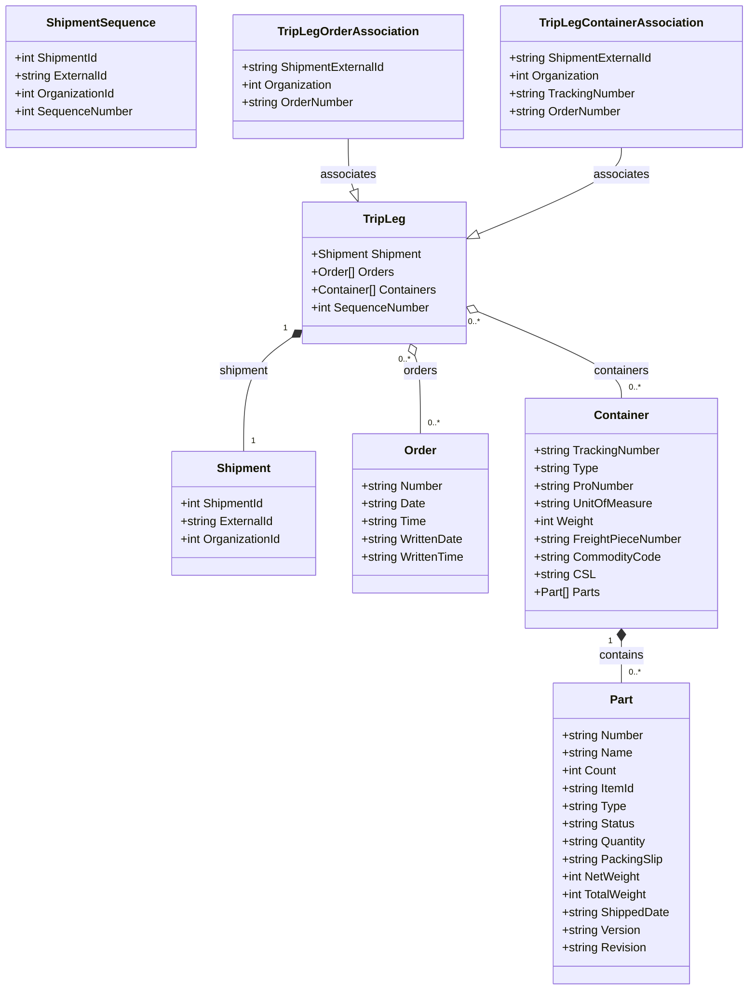

# Diagram: platform/tools/ide_local_testing/resources/PartsTripLeg.yaml


> Auto-generated by Obscura crawlers

## Diagram 1



### SVG

<svg id="container" width="1008.6796875" xmlns="http://www.w3.org/2000/svg" class="classDiagram" height="1342" viewBox="0 0 1008.6796875 1342" role="graphics-document document" aria-roledescription="class"><style>#container{font-family:"trebuchet ms",verdana,arial,sans-serif;font-size:16px;fill:#333;}@keyframes edge-animation-frame{from{stroke-dashoffset:0;}}@keyframes dash{to{stroke-dashoffset:0;}}#container .edge-animation-slow{stroke-dasharray:9,5!important;stroke-dashoffset:900;animation:dash 50s linear infinite;stroke-linecap:round;}#container .edge-animation-fast{stroke-dasharray:9,5!important;stroke-dashoffset:900;animation:dash 20s linear infinite;stroke-linecap:round;}#container .error-icon{fill:#552222;}#container .error-text{fill:#552222;stroke:#552222;}#container .edge-thickness-normal{stroke-width:1px;}#container .edge-thickness-thick{stroke-width:3.5px;}#container .edge-pattern-solid{stroke-dasharray:0;}#container .edge-thickness-invisible{stroke-width:0;fill:none;}#container .edge-pattern-dashed{stroke-dasharray:3;}#container .edge-pattern-dotted{stroke-dasharray:2;}#container .marker{fill:#333333;stroke:#333333;}#container .marker.cross{stroke:#333333;}#container svg{font-family:"trebuchet ms",verdana,arial,sans-serif;font-size:16px;}#container p{margin:0;}#container g.classGroup text{fill:#9370DB;stroke:none;font-family:"trebuchet ms",verdana,arial,sans-serif;font-size:10px;}#container g.classGroup text .title{font-weight:bolder;}#container .nodeLabel,#container .edgeLabel{color:#131300;}#container .edgeLabel .label rect{fill:#ECECFF;}#container .label text{fill:#131300;}#container .labelBkg{background:#ECECFF;}#container .edgeLabel .label span{background:#ECECFF;}#container .classTitle{font-weight:bolder;}#container .node rect,#container .node circle,#container .node ellipse,#container .node polygon,#container .node path{fill:#ECECFF;stroke:#9370DB;stroke-width:1px;}#container .divider{stroke:#9370DB;stroke-width:1;}#container g.clickable{cursor:pointer;}#container g.classGroup rect{fill:#ECECFF;stroke:#9370DB;}#container g.classGroup line{stroke:#9370DB;stroke-width:1;}#container .classLabel .box{stroke:none;stroke-width:0;fill:#ECECFF;opacity:0.5;}#container .classLabel .label{fill:#9370DB;font-size:10px;}#container .relation{stroke:#333333;stroke-width:1;fill:none;}#container .dashed-line{stroke-dasharray:3;}#container .dotted-line{stroke-dasharray:1 2;}#container #compositionStart,#container .composition{fill:#333333!important;stroke:#333333!important;stroke-width:1;}#container #compositionEnd,#container .composition{fill:#333333!important;stroke:#333333!important;stroke-width:1;}#container #dependencyStart,#container .dependency{fill:#333333!important;stroke:#333333!important;stroke-width:1;}#container #dependencyStart,#container .dependency{fill:#333333!important;stroke:#333333!important;stroke-width:1;}#container #extensionStart,#container .extension{fill:transparent!important;stroke:#333333!important;stroke-width:1;}#container #extensionEnd,#container .extension{fill:transparent!important;stroke:#333333!important;stroke-width:1;}#container #aggregationStart,#container .aggregation{fill:transparent!important;stroke:#333333!important;stroke-width:1;}#container #aggregationEnd,#container .aggregation{fill:transparent!important;stroke:#333333!important;stroke-width:1;}#container #lollipopStart,#container .lollipop{fill:#ECECFF!important;stroke:#333333!important;stroke-width:1;}#container #lollipopEnd,#container .lollipop{fill:#ECECFF!important;stroke:#333333!important;stroke-width:1;}#container .edgeTerminals{font-size:11px;line-height:initial;}#container .classTitleText{text-anchor:middle;font-size:18px;fill:#333;}#container .label-icon{display:inline-block;height:1em;overflow:visible;vertical-align:-0.125em;}#container .node .label-icon path{fill:currentColor;stroke:revert;stroke-width:revert;}#container :root{--mermaid-font-family:"trebuchet ms",verdana,arial,sans-serif;}</style><g><defs><marker id="container_class-aggregationStart" class="marker aggregation class" refX="18" refY="7" markerWidth="190" markerHeight="240" orient="auto"><path d="M 18,7 L9,13 L1,7 L9,1 Z"></path></marker></defs><defs><marker id="container_class-aggregationEnd" class="marker aggregation class" refX="1" refY="7" markerWidth="20" markerHeight="28" orient="auto"><path d="M 18,7 L9,13 L1,7 L9,1 Z"></path></marker></defs><defs><marker id="container_class-extensionStart" class="marker extension class" refX="18" refY="7" markerWidth="190" markerHeight="240" orient="auto"><path d="M 1,7 L18,13 V 1 Z"></path></marker></defs><defs><marker id="container_class-extensionEnd" class="marker extension class" refX="1" refY="7" markerWidth="20" markerHeight="28" orient="auto"><path d="M 1,1 V 13 L18,7 Z"></path></marker></defs><defs><marker id="container_class-compositionStart" class="marker composition class" refX="18" refY="7" markerWidth="190" markerHeight="240" orient="auto"><path d="M 18,7 L9,13 L1,7 L9,1 Z"></path></marker></defs><defs><marker id="container_class-compositionEnd" class="marker composition class" refX="1" refY="7" markerWidth="20" markerHeight="28" orient="auto"><path d="M 18,7 L9,13 L1,7 L9,1 Z"></path></marker></defs><defs><marker id="container_class-dependencyStart" class="marker dependency class" refX="6" refY="7" markerWidth="190" markerHeight="240" orient="auto"><path d="M 5,7 L9,13 L1,7 L9,1 Z"></path></marker></defs><defs><marker id="container_class-dependencyEnd" class="marker dependency class" refX="13" refY="7" markerWidth="20" markerHeight="28" orient="auto"><path d="M 18,7 L9,13 L14,7 L9,1 Z"></path></marker></defs><defs><marker id="container_class-lollipopStart" class="marker lollipop class" refX="13" refY="7" markerWidth="190" markerHeight="240" orient="auto"><circle stroke="black" fill="transparent" cx="7" cy="7" r="6"></circle></marker></defs><defs><marker id="container_class-lollipopEnd" class="marker lollipop class" refX="1" refY="7" markerWidth="190" markerHeight="240" orient="auto"><circle stroke="black" fill="transparent" cx="7" cy="7" r="6"></circle></marker></defs><g class="root"><g class="clusters"></g><g class="edgePaths"><path d="M837.668,869.25L837.668,872.542C837.668,875.833,837.668,882.417,837.668,891.875C837.668,901.333,837.668,913.667,837.668,919.833L837.668,926" id="id_Container_Part_1" class="edge-thickness-normal edge-pattern-solid relation" style=";;;" data-edge="true" data-et="edge" data-id="id_Container_Part_1" data-points="W3sieCI6ODM3LjY2Nzk2ODc1LCJ5Ijo4NTJ9LHsieCI6ODM3LjY2Nzk2ODc1LCJ5Ijo4ODl9LHsieCI6ODM3LjY2Nzk2ODc1LCJ5Ijo5MjZ9XQ==" marker-start="url(#container_class-compositionStart)"></path><path d="M391.324,455.464L379.721,463.387C368.117,471.31,344.91,487.155,333.307,513.244C321.703,539.333,321.703,575.667,321.703,593.833L321.703,612" id="id_TripLeg_Shipment_2" class="edge-thickness-normal edge-pattern-solid relation" style=";;;" data-edge="true" data-et="edge" data-id="id_TripLeg_Shipment_2" data-points="W3sieCI6NDA1LjU3MDMxMjUsInkiOjQ0NS43Mzc0ODE3MDEzMjU1fSx7IngiOjMyMS43MDMxMjUsInkiOjUwM30seyJ4IjozMjEuNzAzMTI1LCJ5Ijo2MTJ9XQ==" marker-start="url(#container_class-compositionStart)"></path><path d="M556.593,482.245L557.829,485.704C559.065,489.163,561.536,496.082,562.772,513.707C564.008,531.333,564.008,559.667,564.008,573.833L564.008,588" id="id_TripLeg_Order_3" class="edge-thickness-normal edge-pattern-solid relation" style=";;;" data-edge="true" data-et="edge" data-id="id_TripLeg_Order_3" data-points="W3sieCI6NTUwLjc5MDI2NjY4MjMzMDksInkiOjQ2Nn0seyJ4Ijo1NjQuMDA3ODEyNSwieSI6NTAzfSx7IngiOjU2NC4wMDc4MTI1LCJ5Ijo1ODh9XQ==" marker-start="url(#container_class-aggregationStart)"></path><path d="M643.359,422.535L675.744,435.946C708.129,449.357,772.898,476.178,805.283,495.756C837.668,515.333,837.668,527.667,837.668,533.833L837.668,540" id="id_TripLeg_Container_4" class="edge-thickness-normal edge-pattern-solid relation" style=";;;" data-edge="true" data-et="edge" data-id="id_TripLeg_Container_4" data-points="W3sieCI6NjI3LjQyMTg3NSwieSI6NDE1LjkzNTMwNzcxMTAxOTJ9LHsieCI6ODM3LjY2Nzk2ODc1LCJ5Ijo1MDN9LHsieCI6ODM3LjY2Nzk2ODc1LCJ5Ijo1NDB9XQ==" marker-start="url(#container_class-aggregationStart)"></path><path d="M468.984,188L468.984,196.167C468.984,204.333,468.984,220.667,470.22,232.293C471.456,243.918,473.927,250.837,475.163,254.296L476.399,257.755" id="id_TripLegOrderAssociation_TripLeg_5" class="edge-thickness-normal edge-pattern-solid relation" style=";;;" data-edge="true" data-et="edge" data-id="id_TripLegOrderAssociation_TripLeg_5" data-points="W3sieCI6NDY4Ljk4NDM3NSwieSI6MTg4fSx7IngiOjQ2OC45ODQzNzUsInkiOjIzN30seyJ4Ijo0ODIuMjAxOTIwODE3NjY5MiwieSI6Mjc0fV0=" marker-end="url(#container_class-extensionEnd)"></path><path d="M837.668,200L837.668,206.167C837.668,212.333,837.668,224.667,805.283,244.244C772.898,263.822,708.129,290.643,675.744,304.054L643.359,317.465" id="id_TripLegContainerAssociation_TripLeg_6" class="edge-thickness-normal edge-pattern-solid relation" style=";;;" data-edge="true" data-et="edge" data-id="id_TripLegContainerAssociation_TripLeg_6" data-points="W3sieCI6ODM3LjY2Nzk2ODc1LCJ5IjoyMDB9LHsieCI6ODM3LjY2Nzk2ODc1LCJ5IjoyMzd9LHsieCI6NjI3LjQyMTg3NSwieSI6MzI0LjA2NDY5MjI4ODk4MDh9XQ==" marker-end="url(#container_class-extensionEnd)"></path></g><g class="edgeLabels"><g class="edgeLabel" transform="translate(837.66796875, 889)"><g class="label" data-id="id_Container_Part_1" transform="translate(-30.890625, -12)"><foreignObject width="61.78125" height="24"><div xmlns="http://www.w3.org/1999/xhtml" class="labelBkg" style="display: table-cell; white-space: nowrap; line-height: 1.5; max-width: 200px; text-align: center;"><span class="edgeLabel"><p>contains</p></span></div></foreignObject></g></g><g class="edgeLabel" transform="translate(321.703125, 503)"><g class="label" data-id="id_TripLeg_Shipment_2" transform="translate(-34.2265625, -12)"><foreignObject width="68.453125" height="24"><div xmlns="http://www.w3.org/1999/xhtml" class="labelBkg" style="display: table-cell; white-space: nowrap; line-height: 1.5; max-width: 200px; text-align: center;"><span class="edgeLabel"><p>shipment</p></span></div></foreignObject></g></g><g class="edgeLabel" transform="translate(564.0078125, 503)"><g class="label" data-id="id_TripLeg_Order_3" transform="translate(-23.375, -12)"><foreignObject width="46.75" height="24"><div xmlns="http://www.w3.org/1999/xhtml" class="labelBkg" style="display: table-cell; white-space: nowrap; line-height: 1.5; max-width: 200px; text-align: center;"><span class="edgeLabel"><p>orders</p></span></div></foreignObject></g></g><g class="edgeLabel" transform="translate(837.66796875, 503)"><g class="label" data-id="id_TripLeg_Container_4" transform="translate(-38.21875, -12)"><foreignObject width="76.4375" height="24"><div xmlns="http://www.w3.org/1999/xhtml" class="labelBkg" style="display: table-cell; white-space: nowrap; line-height: 1.5; max-width: 200px; text-align: center;"><span class="edgeLabel"><p>containers</p></span></div></foreignObject></g></g><g class="edgeLabel" transform="translate(468.984375, 237)"><g class="label" data-id="id_TripLegOrderAssociation_TripLeg_5" transform="translate(-37.6328125, -12)"><foreignObject width="75.265625" height="24"><div xmlns="http://www.w3.org/1999/xhtml" class="labelBkg" style="display: table-cell; white-space: nowrap; line-height: 1.5; max-width: 200px; text-align: center;"><span class="edgeLabel"><p>associates</p></span></div></foreignObject></g></g><g class="edgeLabel" transform="translate(837.66796875, 237)"><g class="label" data-id="id_TripLegContainerAssociation_TripLeg_6" transform="translate(-37.6328125, -12)"><foreignObject width="75.265625" height="24"><div xmlns="http://www.w3.org/1999/xhtml" class="labelBkg" style="display: table-cell; white-space: nowrap; line-height: 1.5; max-width: 200px; text-align: center;"><span class="edgeLabel"><p>associates</p></span></div></foreignObject></g></g><g class="edgeTerminals" transform="translate(822.667969375, 869.5000005357143)"><g class="inner" transform="translate(0, 0)"><foreignObject style="width: 9px; height: 12px;"><div xmlns="http://www.w3.org/1999/xhtml" style="display: inline-block; padding-right: 1px; white-space: nowrap;"><span class="edgeLabel">1</span></div></foreignObject></g></g><g class="edgeTerminals" transform="translate(382.65962922815976, 443.2174420775787)"><g class="inner" transform="translate(0, 0)"><foreignObject style="width: 9px; height: 12px;"><div xmlns="http://www.w3.org/1999/xhtml" style="display: inline-block; padding-right: 1px; white-space: nowrap;"><span class="edgeLabel">1</span></div></foreignObject></g></g><g class="edgeTerminals" transform="translate(542.5517093107351, 487.52617582033275)"><g class="inner" transform="translate(0, 0)"><foreignObject style="width: 36px; height: 12px;"><div xmlns="http://www.w3.org/1999/xhtml" style="display: inline-block; padding-right: 1px; white-space: nowrap;"><span class="edgeLabel">0..*</span></div></foreignObject></g></g><g class="edgeTerminals" transform="translate(637.8513581275602, 436.4895262780309)"><g class="inner" transform="translate(0, 0)"><foreignObject style="width: 36px; height: 12px;"><div xmlns="http://www.w3.org/1999/xhtml" style="display: inline-block; padding-right: 1px; white-space: nowrap;"><span class="edgeLabel">0..*</span></div></foreignObject></g></g><g class="edgeTerminals" transform="translate(847.667969375, 903.5000005357143)"><g class="inner" transform="translate(0, 0)"></g><foreignObject style="width: 36px; height: 12px;"><div xmlns="http://www.w3.org/1999/xhtml" style="display: inline-block; padding-right: 1px; white-space: nowrap;"><span class="edgeLabel">0..*</span></div></foreignObject></g><g class="edgeTerminals" transform="translate(331.7031274999998, 589.5000021428572)"><g class="inner" transform="translate(0, 0)"></g><foreignObject style="width: 9px; height: 12px;"><div xmlns="http://www.w3.org/1999/xhtml" style="display: inline-block; padding-right: 1px; white-space: nowrap;"><span class="edgeLabel">1</span></div></foreignObject></g><g class="edgeTerminals" transform="translate(574.00781125, 565.4999989285714)"><g class="inner" transform="translate(0, 0)"></g><foreignObject style="width: 36px; height: 12px;"><div xmlns="http://www.w3.org/1999/xhtml" style="display: inline-block; padding-right: 1px; white-space: nowrap;"><span class="edgeLabel">0..*</span></div></foreignObject></g><g class="edgeTerminals" transform="translate(847.667969375, 517.5000005357143)"><g class="inner" transform="translate(0, 0)"></g><foreignObject style="width: 36px; height: 12px;"><div xmlns="http://www.w3.org/1999/xhtml" style="display: inline-block; padding-right: 1px; white-space: nowrap;"><span class="edgeLabel">0..*</span></div></foreignObject></g></g><g class="nodes"><g class="node default" id="classId-ShipmentSequence-0" transform="translate(135.65625, 104)"><g class="basic label-container"><path d="M-127.65625 -96 L127.65625 -96 L127.65625 96 L-127.65625 96" stroke="none" stroke-width="0" fill="#ECECFF" style=""></path><path d="M-127.65625 -96 C-58.32022182855535 -96, 11.015806342889306 -96, 127.65625 -96 M-127.65625 -96 C-41.09315072011138 -96, 45.46994855977724 -96, 127.65625 -96 M127.65625 -96 C127.65625 -37.608732209891826, 127.65625 20.782535580216347, 127.65625 96 M127.65625 -96 C127.65625 -32.87801351809572, 127.65625 30.24397296380856, 127.65625 96 M127.65625 96 C72.72479028390016 96, 17.793330567800325 96, -127.65625 96 M127.65625 96 C44.810886087127585 96, -38.03447782574483 96, -127.65625 96 M-127.65625 96 C-127.65625 21.060358194771823, -127.65625 -53.879283610456355, -127.65625 -96 M-127.65625 96 C-127.65625 46.82988067722001, -127.65625 -2.340238645559978, -127.65625 -96" stroke="#9370DB" stroke-width="1.3" fill="none" stroke-dasharray="0 0" style=""></path></g><g class="annotation-group text" transform="translate(0, -72)"></g><g class="label-group text" transform="translate(-70.59375, -72)"><g class="label" style="font-weight: bolder" transform="translate(0,-12)"><foreignObject width="141.1875" height="24"><div xmlns="http://www.w3.org/1999/xhtml" style="display: table-cell; white-space: nowrap; line-height: 1.5; max-width: 190px; text-align: center;"><span class="nodeLabel markdown-node-label" style=""><p>ShipmentSequence</p></span></div></foreignObject></g></g><g class="members-group text" transform="translate(-115.65625, -24)"><g class="label" style="" transform="translate(0,-12)"><foreignObject width="115.875" height="24"><div xmlns="http://www.w3.org/1999/xhtml" style="display: table-cell; white-space: nowrap; line-height: 1.5; max-width: 173px; text-align: center;"><span class="nodeLabel markdown-node-label" style=""><p>+int ShipmentId</p></span></div></foreignObject></g><g class="label" style="" transform="translate(0,12)"><foreignObject width="127.515625" height="24"><div xmlns="http://www.w3.org/1999/xhtml" style="display: table-cell; white-space: nowrap; line-height: 1.5; max-width: 185px; text-align: center;"><span class="nodeLabel markdown-node-label" style=""><p>+string ExternalId</p></span></div></foreignObject></g><g class="label" style="" transform="translate(0,36)"><foreignObject width="138.265625" height="24"><div xmlns="http://www.w3.org/1999/xhtml" style="display: table-cell; white-space: nowrap; line-height: 1.5; max-width: 196px; text-align: center;"><span class="nodeLabel markdown-node-label" style=""><p>+int OrganizationId</p></span></div></foreignObject></g><g class="label" style="" transform="translate(0,60)"><foreignObject width="160.71875" height="24"><div xmlns="http://www.w3.org/1999/xhtml" style="display: table-cell; white-space: nowrap; line-height: 1.5; max-width: 219px; text-align: center;"><span class="nodeLabel markdown-node-label" style=""><p>+int SequenceNumber</p></span></div></foreignObject></g></g><g class="methods-group text" transform="translate(-115.65625, 96)"></g><g class="divider" style=""><path d="M-127.65625 -48 C-72.87845122522492 -48, -18.10065245044983 -48, 127.65625 -48 M-127.65625 -48 C-69.58764742665265 -48, -11.519044853305303 -48, 127.65625 -48" stroke="#9370DB" stroke-width="1.3" fill="none" stroke-dasharray="0 0" style=""></path></g><g class="divider" style=""><path d="M-127.65625 72 C-39.0405050638831 72, 49.575239872233794 72, 127.65625 72 M-127.65625 72 C-66.51697617723735 72, -5.377702354474707 72, 127.65625 72" stroke="#9370DB" stroke-width="1.3" fill="none" stroke-dasharray="0 0" style=""></path></g></g><g class="node default" id="classId-Shipment-1" transform="translate(321.703125, 696)"><g class="basic label-container"><path d="M-98.6875 -84 L98.6875 -84 L98.6875 84 L-98.6875 84" stroke="none" stroke-width="0" fill="#ECECFF" style=""></path><path d="M-98.6875 -84 C-31.996414271033245 -84, 34.69467145793351 -84, 98.6875 -84 M-98.6875 -84 C-55.84159294765316 -84, -12.995685895306323 -84, 98.6875 -84 M98.6875 -84 C98.6875 -36.8189254642454, 98.6875 10.362149071509194, 98.6875 84 M98.6875 -84 C98.6875 -25.705685843217054, 98.6875 32.58862831356589, 98.6875 84 M98.6875 84 C44.53773606264105 84, -9.612027874717896 84, -98.6875 84 M98.6875 84 C46.010999521311426 84, -6.665500957377148 84, -98.6875 84 M-98.6875 84 C-98.6875 49.485950308946514, -98.6875 14.971900617893027, -98.6875 -84 M-98.6875 84 C-98.6875 33.62226563635142, -98.6875 -16.755468727297156, -98.6875 -84" stroke="#9370DB" stroke-width="1.3" fill="none" stroke-dasharray="0 0" style=""></path></g><g class="annotation-group text" transform="translate(0, -60)"></g><g class="label-group text" transform="translate(-35.109375, -60)"><g class="label" style="font-weight: bolder" transform="translate(0,-12)"><foreignObject width="70.21875" height="24"><div xmlns="http://www.w3.org/1999/xhtml" style="display: table-cell; white-space: nowrap; line-height: 1.5; max-width: 120px; text-align: center;"><span class="nodeLabel markdown-node-label" style=""><p>Shipment</p></span></div></foreignObject></g></g><g class="members-group text" transform="translate(-86.6875, -12)"><g class="label" style="" transform="translate(0,-12)"><foreignObject width="115.875" height="24"><div xmlns="http://www.w3.org/1999/xhtml" style="display: table-cell; white-space: nowrap; line-height: 1.5; max-width: 173px; text-align: center;"><span class="nodeLabel markdown-node-label" style=""><p>+int ShipmentId</p></span></div></foreignObject></g><g class="label" style="" transform="translate(0,12)"><foreignObject width="127.515625" height="24"><div xmlns="http://www.w3.org/1999/xhtml" style="display: table-cell; white-space: nowrap; line-height: 1.5; max-width: 185px; text-align: center;"><span class="nodeLabel markdown-node-label" style=""><p>+string ExternalId</p></span></div></foreignObject></g><g class="label" style="" transform="translate(0,36)"><foreignObject width="138.265625" height="24"><div xmlns="http://www.w3.org/1999/xhtml" style="display: table-cell; white-space: nowrap; line-height: 1.5; max-width: 196px; text-align: center;"><span class="nodeLabel markdown-node-label" style=""><p>+int OrganizationId</p></span></div></foreignObject></g></g><g class="methods-group text" transform="translate(-86.6875, 84)"></g><g class="divider" style=""><path d="M-98.6875 -36 C-45.41981117171456 -36, 7.847877656570887 -36, 98.6875 -36 M-98.6875 -36 C-50.5152152281262 -36, -2.342930456252404 -36, 98.6875 -36" stroke="#9370DB" stroke-width="1.3" fill="none" stroke-dasharray="0 0" style=""></path></g><g class="divider" style=""><path d="M-98.6875 60 C-58.1293623804587 60, -17.571224760917403 60, 98.6875 60 M-98.6875 60 C-35.69436114188048 60, 27.298777716239044 60, 98.6875 60" stroke="#9370DB" stroke-width="1.3" fill="none" stroke-dasharray="0 0" style=""></path></g></g><g class="node default" id="classId-Order-2" transform="translate(564.0078125, 696)"><g class="basic label-container"><path d="M-93.6171875 -108 L93.6171875 -108 L93.6171875 108 L-93.6171875 108" stroke="none" stroke-width="0" fill="#ECECFF" style=""></path><path d="M-93.6171875 -108 C-24.43291720571152 -108, 44.75135308857696 -108, 93.6171875 -108 M-93.6171875 -108 C-55.234873097948984 -108, -16.85255869589797 -108, 93.6171875 -108 M93.6171875 -108 C93.6171875 -59.781690906621314, 93.6171875 -11.563381813242628, 93.6171875 108 M93.6171875 -108 C93.6171875 -44.896373547844874, 93.6171875 18.207252904310252, 93.6171875 108 M93.6171875 108 C47.641387467360595 108, 1.6655874347211892 108, -93.6171875 108 M93.6171875 108 C38.024702053278816 108, -17.56778339344237 108, -93.6171875 108 M-93.6171875 108 C-93.6171875 41.03726608581671, -93.6171875 -25.92546782836658, -93.6171875 -108 M-93.6171875 108 C-93.6171875 48.341486606327436, -93.6171875 -11.317026787345128, -93.6171875 -108" stroke="#9370DB" stroke-width="1.3" fill="none" stroke-dasharray="0 0" style=""></path></g><g class="annotation-group text" transform="translate(0, -84)"></g><g class="label-group text" transform="translate(-20.921875, -84)"><g class="label" style="font-weight: bolder" transform="translate(0,-12)"><foreignObject width="41.84375" height="24"><div xmlns="http://www.w3.org/1999/xhtml" style="display: table-cell; white-space: nowrap; line-height: 1.5; max-width: 92px; text-align: center;"><span class="nodeLabel markdown-node-label" style=""><p>Order</p></span></div></foreignObject></g></g><g class="members-group text" transform="translate(-81.6171875, -36)"><g class="label" style="" transform="translate(0,-12)"><foreignObject width="112.21875" height="24"><div xmlns="http://www.w3.org/1999/xhtml" style="display: table-cell; white-space: nowrap; line-height: 1.5; max-width: 170px; text-align: center;"><span class="nodeLabel markdown-node-label" style=""><p>+string Number</p></span></div></foreignObject></g><g class="label" style="" transform="translate(0,12)"><foreignObject width="86.96875" height="24"><div xmlns="http://www.w3.org/1999/xhtml" style="display: table-cell; white-space: nowrap; line-height: 1.5; max-width: 144px; text-align: center;"><span class="nodeLabel markdown-node-label" style=""><p>+string Date</p></span></div></foreignObject></g><g class="label" style="" transform="translate(0,36)"><foreignObject width="89.078125" height="24"><div xmlns="http://www.w3.org/1999/xhtml" style="display: table-cell; white-space: nowrap; line-height: 1.5; max-width: 146px; text-align: center;"><span class="nodeLabel markdown-node-label" style=""><p>+string Time</p></span></div></foreignObject></g><g class="label" style="" transform="translate(0,60)"><foreignObject width="140.203125" height="24"><div xmlns="http://www.w3.org/1999/xhtml" style="display: table-cell; white-space: nowrap; line-height: 1.5; max-width: 198px; text-align: center;"><span class="nodeLabel markdown-node-label" style=""><p>+string WrittenDate</p></span></div></foreignObject></g><g class="label" style="" transform="translate(0,84)"><foreignObject width="142.3125" height="24"><div xmlns="http://www.w3.org/1999/xhtml" style="display: table-cell; white-space: nowrap; line-height: 1.5; max-width: 200px; text-align: center;"><span class="nodeLabel markdown-node-label" style=""><p>+string WrittenTime</p></span></div></foreignObject></g></g><g class="methods-group text" transform="translate(-81.6171875, 108)"></g><g class="divider" style=""><path d="M-93.6171875 -60 C-45.41655359472477 -60, 2.784080310550465 -60, 93.6171875 -60 M-93.6171875 -60 C-22.753709674870464 -60, 48.10976815025907 -60, 93.6171875 -60" stroke="#9370DB" stroke-width="1.3" fill="none" stroke-dasharray="0 0" style=""></path></g><g class="divider" style=""><path d="M-93.6171875 84 C-20.004362392107254 84, 53.60846271578549 84, 93.6171875 84 M-93.6171875 84 C-39.29608960563209 84, 15.025008288735819 84, 93.6171875 84" stroke="#9370DB" stroke-width="1.3" fill="none" stroke-dasharray="0 0" style=""></path></g></g><g class="node default" id="classId-Part-3" transform="translate(837.66796875, 1130)"><g class="basic label-container"><path d="M-92.97265625 -204 L92.97265625 -204 L92.97265625 204 L-92.97265625 204" stroke="none" stroke-width="0" fill="#ECECFF" style=""></path><path d="M-92.97265625 -204 C-19.582004139674737 -204, 53.808647970650526 -204, 92.97265625 -204 M-92.97265625 -204 C-47.10160276561521 -204, -1.2305492812304237 -204, 92.97265625 -204 M92.97265625 -204 C92.97265625 -90.4318722745129, 92.97265625 23.136255450974204, 92.97265625 204 M92.97265625 -204 C92.97265625 -86.61441675443176, 92.97265625 30.771166491136484, 92.97265625 204 M92.97265625 204 C50.52364894198615 204, 8.074641633972305 204, -92.97265625 204 M92.97265625 204 C19.244831096200798 204, -54.482994057598404 204, -92.97265625 204 M-92.97265625 204 C-92.97265625 73.125482680148, -92.97265625 -57.74903463970401, -92.97265625 -204 M-92.97265625 204 C-92.97265625 103.13998365609955, -92.97265625 2.2799673121990907, -92.97265625 -204" stroke="#9370DB" stroke-width="1.3" fill="none" stroke-dasharray="0 0" style=""></path></g><g class="annotation-group text" transform="translate(0, -180)"></g><g class="label-group text" transform="translate(-15.0703125, -180)"><g class="label" style="font-weight: bolder" transform="translate(0,-12)"><foreignObject width="30.140625" height="24"><div xmlns="http://www.w3.org/1999/xhtml" style="display: table-cell; white-space: nowrap; line-height: 1.5; max-width: 79px; text-align: center;"><span class="nodeLabel markdown-node-label" style=""><p>Part</p></span></div></foreignObject></g></g><g class="members-group text" transform="translate(-80.97265625, -132)"><g class="label" style="" transform="translate(0,-12)"><foreignObject width="112.21875" height="24"><div xmlns="http://www.w3.org/1999/xhtml" style="display: table-cell; white-space: nowrap; line-height: 1.5; max-width: 170px; text-align: center;"><span class="nodeLabel markdown-node-label" style=""><p>+string Number</p></span></div></foreignObject></g><g class="label" style="" transform="translate(0,12)"><foreignObject width="95.921875" height="24"><div xmlns="http://www.w3.org/1999/xhtml" style="display: table-cell; white-space: nowrap; line-height: 1.5; max-width: 153px; text-align: center;"><span class="nodeLabel markdown-node-label" style=""><p>+string Name</p></span></div></foreignObject></g><g class="label" style="" transform="translate(0,36)"><foreignObject width="74.34375" height="24"><div xmlns="http://www.w3.org/1999/xhtml" style="display: table-cell; white-space: nowrap; line-height: 1.5; max-width: 132px; text-align: center;"><span class="nodeLabel markdown-node-label" style=""><p>+int Count</p></span></div></foreignObject></g><g class="label" style="" transform="translate(0,60)"><foreignObject width="100.84375" height="24"><div xmlns="http://www.w3.org/1999/xhtml" style="display: table-cell; white-space: nowrap; line-height: 1.5; max-width: 158px; text-align: center;"><span class="nodeLabel markdown-node-label" style=""><p>+string ItemId</p></span></div></foreignObject></g><g class="label" style="" transform="translate(0,84)"><foreignObject width="87.59375" height="24"><div xmlns="http://www.w3.org/1999/xhtml" style="display: table-cell; white-space: nowrap; line-height: 1.5; max-width: 145px; text-align: center;"><span class="nodeLabel markdown-node-label" style=""><p>+string Type</p></span></div></foreignObject></g><g class="label" style="" transform="translate(0,108)"><foreignObject width="99.515625" height="24"><div xmlns="http://www.w3.org/1999/xhtml" style="display: table-cell; white-space: nowrap; line-height: 1.5; max-width: 157px; text-align: center;"><span class="nodeLabel markdown-node-label" style=""><p>+string Status</p></span></div></foreignObject></g><g class="label" style="" transform="translate(0,132)"><foreignObject width="116.171875" height="24"><div xmlns="http://www.w3.org/1999/xhtml" style="display: table-cell; white-space: nowrap; line-height: 1.5; max-width: 174px; text-align: center;"><span class="nodeLabel markdown-node-label" style=""><p>+string Quantity</p></span></div></foreignObject></g><g class="label" style="" transform="translate(0,156)"><foreignObject width="136.453125" height="24"><div xmlns="http://www.w3.org/1999/xhtml" style="display: table-cell; white-space: nowrap; line-height: 1.5; max-width: 194px; text-align: center;"><span class="nodeLabel markdown-node-label" style=""><p>+string PackingSlip</p></span></div></foreignObject></g><g class="label" style="" transform="translate(0,180)"><foreignObject width="107.078125" height="24"><div xmlns="http://www.w3.org/1999/xhtml" style="display: table-cell; white-space: nowrap; line-height: 1.5; max-width: 165px; text-align: center;"><span class="nodeLabel markdown-node-label" style=""><p>+int NetWeight</p></span></div></foreignObject></g><g class="label" style="" transform="translate(0,204)"><foreignObject width="117.28125" height="24"><div xmlns="http://www.w3.org/1999/xhtml" style="display: table-cell; white-space: nowrap; line-height: 1.5; max-width: 175px; text-align: center;"><span class="nodeLabel markdown-node-label" style=""><p>+int TotalWeight</p></span></div></foreignObject></g><g class="label" style="" transform="translate(0,228)"><foreignObject width="146.875" height="24"><div xmlns="http://www.w3.org/1999/xhtml" style="display: table-cell; white-space: nowrap; line-height: 1.5; max-width: 204px; text-align: center;"><span class="nodeLabel markdown-node-label" style=""><p>+string ShippedDate</p></span></div></foreignObject></g><g class="label" style="" transform="translate(0,252)"><foreignObject width="107.71875" height="24"><div xmlns="http://www.w3.org/1999/xhtml" style="display: table-cell; white-space: nowrap; line-height: 1.5; max-width: 165px; text-align: center;"><span class="nodeLabel markdown-node-label" style=""><p>+string Version</p></span></div></foreignObject></g><g class="label" style="" transform="translate(0,276)"><foreignObject width="115.046875" height="24"><div xmlns="http://www.w3.org/1999/xhtml" style="display: table-cell; white-space: nowrap; line-height: 1.5; max-width: 172px; text-align: center;"><span class="nodeLabel markdown-node-label" style=""><p>+string Revision</p></span></div></foreignObject></g></g><g class="methods-group text" transform="translate(-80.97265625, 204)"></g><g class="divider" style=""><path d="M-92.97265625 -156 C-30.501681219221375 -156, 31.96929381155725 -156, 92.97265625 -156 M-92.97265625 -156 C-27.36343914055378 -156, 38.24577796889244 -156, 92.97265625 -156" stroke="#9370DB" stroke-width="1.3" fill="none" stroke-dasharray="0 0" style=""></path></g><g class="divider" style=""><path d="M-92.97265625 180 C-32.333050121531706 180, 28.30655600693659 180, 92.97265625 180 M-92.97265625 180 C-21.439152509786553 180, 50.094351230426895 180, 92.97265625 180" stroke="#9370DB" stroke-width="1.3" fill="none" stroke-dasharray="0 0" style=""></path></g></g><g class="node default" id="classId-Container-4" transform="translate(837.66796875, 696)"><g class="basic label-container"><path d="M-130.04296875 -156 L130.04296875 -156 L130.04296875 156 L-130.04296875 156" stroke="none" stroke-width="0" fill="#ECECFF" style=""></path><path d="M-130.04296875 -156 C-64.40171115743733 -156, 1.2395464351253338 -156, 130.04296875 -156 M-130.04296875 -156 C-32.69884681260665 -156, 64.6452751247867 -156, 130.04296875 -156 M130.04296875 -156 C130.04296875 -80.72259590524995, 130.04296875 -5.445191810499892, 130.04296875 156 M130.04296875 -156 C130.04296875 -80.17903789076512, 130.04296875 -4.358075781530232, 130.04296875 156 M130.04296875 156 C69.4377355481945 156, 8.832502346389006 156, -130.04296875 156 M130.04296875 156 C28.351490761527344 156, -73.33998722694531 156, -130.04296875 156 M-130.04296875 156 C-130.04296875 50.688763207375075, -130.04296875 -54.62247358524985, -130.04296875 -156 M-130.04296875 156 C-130.04296875 34.79393795798303, -130.04296875 -86.41212408403393, -130.04296875 -156" stroke="#9370DB" stroke-width="1.3" fill="none" stroke-dasharray="0 0" style=""></path></g><g class="annotation-group text" transform="translate(0, -132)"></g><g class="label-group text" transform="translate(-35.6015625, -132)"><g class="label" style="font-weight: bolder" transform="translate(0,-12)"><foreignObject width="71.203125" height="24"><div xmlns="http://www.w3.org/1999/xhtml" style="display: table-cell; white-space: nowrap; line-height: 1.5; max-width: 121px; text-align: center;"><span class="nodeLabel markdown-node-label" style=""><p>Container</p></span></div></foreignObject></g></g><g class="members-group text" transform="translate(-118.04296875, -84)"><g class="label" style="" transform="translate(0,-12)"><foreignObject width="172.375" height="24"><div xmlns="http://www.w3.org/1999/xhtml" style="display: table-cell; white-space: nowrap; line-height: 1.5; max-width: 231px; text-align: center;"><span class="nodeLabel markdown-node-label" style=""><p>+string TrackingNumber</p></span></div></foreignObject></g><g class="label" style="" transform="translate(0,12)"><foreignObject width="87.59375" height="24"><div xmlns="http://www.w3.org/1999/xhtml" style="display: table-cell; white-space: nowrap; line-height: 1.5; max-width: 145px; text-align: center;"><span class="nodeLabel markdown-node-label" style=""><p>+string Type</p></span></div></foreignObject></g><g class="label" style="" transform="translate(0,36)"><foreignObject width="136.234375" height="24"><div xmlns="http://www.w3.org/1999/xhtml" style="display: table-cell; white-space: nowrap; line-height: 1.5; max-width: 194px; text-align: center;"><span class="nodeLabel markdown-node-label" style=""><p>+string ProNumber</p></span></div></foreignObject></g><g class="label" style="" transform="translate(0,60)"><foreignObject width="161.296875" height="24"><div xmlns="http://www.w3.org/1999/xhtml" style="display: table-cell; white-space: nowrap; line-height: 1.5; max-width: 219px; text-align: center;"><span class="nodeLabel markdown-node-label" style=""><p>+string UnitOfMeasure</p></span></div></foreignObject></g><g class="label" style="" transform="translate(0,84)"><foreignObject width="81.65625" height="24"><div xmlns="http://www.w3.org/1999/xhtml" style="display: table-cell; white-space: nowrap; line-height: 1.5; max-width: 139px; text-align: center;"><span class="nodeLabel markdown-node-label" style=""><p>+int Weight</p></span></div></foreignObject></g><g class="label" style="" transform="translate(0,108)"><foreignObject width="200.484375" height="24"><div xmlns="http://www.w3.org/1999/xhtml" style="display: table-cell; white-space: nowrap; line-height: 1.5; max-width: 259px; text-align: center;"><span class="nodeLabel markdown-node-label" style=""><p>+string FreightPieceNumber</p></span></div></foreignObject></g><g class="label" style="" transform="translate(0,132)"><foreignObject width="172.53125" height="24"><div xmlns="http://www.w3.org/1999/xhtml" style="display: table-cell; white-space: nowrap; line-height: 1.5; max-width: 230px; text-align: center;"><span class="nodeLabel markdown-node-label" style=""><p>+string CommodityCode</p></span></div></foreignObject></g><g class="label" style="" transform="translate(0,156)"><foreignObject width="79.359375" height="24"><div xmlns="http://www.w3.org/1999/xhtml" style="display: table-cell; white-space: nowrap; line-height: 1.5; max-width: 137px; text-align: center;"><span class="nodeLabel markdown-node-label" style=""><p>+string CSL</p></span></div></foreignObject></g><g class="label" style="" transform="translate(0,180)"><foreignObject width="88.15625" height="24"><div xmlns="http://www.w3.org/1999/xhtml" style="display: table-cell; white-space: nowrap; line-height: 1.5; max-width: 146px; text-align: center;"><span class="nodeLabel markdown-node-label" style=""><p>+Part[] Parts</p></span></div></foreignObject></g></g><g class="methods-group text" transform="translate(-118.04296875, 156)"></g><g class="divider" style=""><path d="M-130.04296875 -108 C-30.95728758153284 -108, 68.12839358693432 -108, 130.04296875 -108 M-130.04296875 -108 C-75.08492701453476 -108, -20.126885279069512 -108, 130.04296875 -108" stroke="#9370DB" stroke-width="1.3" fill="none" stroke-dasharray="0 0" style=""></path></g><g class="divider" style=""><path d="M-130.04296875 132 C-61.83856714998302 132, 6.365834450033958 132, 130.04296875 132 M-130.04296875 132 C-70.55273738473184 132, -11.062506019463669 132, 130.04296875 132" stroke="#9370DB" stroke-width="1.3" fill="none" stroke-dasharray="0 0" style=""></path></g></g><g class="node default" id="classId-TripLeg-5" transform="translate(516.49609375, 370)"><g class="basic label-container"><path d="M-110.92578125 -96 L110.92578125 -96 L110.92578125 96 L-110.92578125 96" stroke="none" stroke-width="0" fill="#ECECFF" style=""></path><path d="M-110.92578125 -96 C-65.834833407887 -96, -20.743885565773994 -96, 110.92578125 -96 M-110.92578125 -96 C-54.62253723449761 -96, 1.6807067810047869 -96, 110.92578125 -96 M110.92578125 -96 C110.92578125 -34.815855408174144, 110.92578125 26.36828918365171, 110.92578125 96 M110.92578125 -96 C110.92578125 -41.07726697924606, 110.92578125 13.845466041507876, 110.92578125 96 M110.92578125 96 C41.86059452225 96, -27.204592205500006 96, -110.92578125 96 M110.92578125 96 C35.56169146454641 96, -39.80239832090717 96, -110.92578125 96 M-110.92578125 96 C-110.92578125 54.66748244819617, -110.92578125 13.334964896392336, -110.92578125 -96 M-110.92578125 96 C-110.92578125 19.97860604868653, -110.92578125 -56.04278790262694, -110.92578125 -96" stroke="#9370DB" stroke-width="1.3" fill="none" stroke-dasharray="0 0" style=""></path></g><g class="annotation-group text" transform="translate(0, -72)"></g><g class="label-group text" transform="translate(-27.0546875, -72)"><g class="label" style="font-weight: bolder" transform="translate(0,-12)"><foreignObject width="54.109375" height="24"><div xmlns="http://www.w3.org/1999/xhtml" style="display: table-cell; white-space: nowrap; line-height: 1.5; max-width: 103px; text-align: center;"><span class="nodeLabel markdown-node-label" style=""><p>TripLeg</p></span></div></foreignObject></g></g><g class="members-group text" transform="translate(-98.92578125, -24)"><g class="label" style="" transform="translate(0,-12)"><foreignObject width="150.984375" height="24"><div xmlns="http://www.w3.org/1999/xhtml" style="display: table-cell; white-space: nowrap; line-height: 1.5; max-width: 209px; text-align: center;"><span class="nodeLabel markdown-node-label" style=""><p>+Shipment Shipment</p></span></div></foreignObject></g><g class="label" style="" transform="translate(0,12)"><foreignObject width="112.234375" height="24"><div xmlns="http://www.w3.org/1999/xhtml" style="display: table-cell; white-space: nowrap; line-height: 1.5; max-width: 170px; text-align: center;"><span class="nodeLabel markdown-node-label" style=""><p>+Order[] Orders</p></span></div></foreignObject></g><g class="label" style="" transform="translate(0,36)"><foreignObject width="170.796875" height="24"><div xmlns="http://www.w3.org/1999/xhtml" style="display: table-cell; white-space: nowrap; line-height: 1.5; max-width: 228px; text-align: center;"><span class="nodeLabel markdown-node-label" style=""><p>+Container[] Containers</p></span></div></foreignObject></g><g class="label" style="" transform="translate(0,60)"><foreignObject width="160.71875" height="24"><div xmlns="http://www.w3.org/1999/xhtml" style="display: table-cell; white-space: nowrap; line-height: 1.5; max-width: 219px; text-align: center;"><span class="nodeLabel markdown-node-label" style=""><p>+int SequenceNumber</p></span></div></foreignObject></g></g><g class="methods-group text" transform="translate(-98.92578125, 96)"></g><g class="divider" style=""><path d="M-110.92578125 -48 C-59.04342737493271 -48, -7.161073499865424 -48, 110.92578125 -48 M-110.92578125 -48 C-54.74587277216814 -48, 1.4340357056637174 -48, 110.92578125 -48" stroke="#9370DB" stroke-width="1.3" fill="none" stroke-dasharray="0 0" style=""></path></g><g class="divider" style=""><path d="M-110.92578125 72 C-47.614359953640616 72, 15.697061342718769 72, 110.92578125 72 M-110.92578125 72 C-39.899714107163135 72, 31.12635303567373 72, 110.92578125 72" stroke="#9370DB" stroke-width="1.3" fill="none" stroke-dasharray="0 0" style=""></path></g></g><g class="node default" id="classId-TripLegOrderAssociation-6" transform="translate(468.984375, 104)"><g class="basic label-container"><path d="M-155.671875 -84 L155.671875 -84 L155.671875 84 L-155.671875 84" stroke="none" stroke-width="0" fill="#ECECFF" style=""></path><path d="M-155.671875 -84 C-64.34102059208993 -84, 26.989833815820134 -84, 155.671875 -84 M-155.671875 -84 C-40.50126659202793 -84, 74.66934181594414 -84, 155.671875 -84 M155.671875 -84 C155.671875 -19.963975314722944, 155.671875 44.07204937055411, 155.671875 84 M155.671875 -84 C155.671875 -27.52279017732983, 155.671875 28.954419645340337, 155.671875 84 M155.671875 84 C49.31899214195958 84, -57.03389071608083 84, -155.671875 84 M155.671875 84 C46.34641233462041 84, -62.97905033075918 84, -155.671875 84 M-155.671875 84 C-155.671875 36.49808890921927, -155.671875 -11.00382218156146, -155.671875 -84 M-155.671875 84 C-155.671875 47.36725479687663, -155.671875 10.734509593753259, -155.671875 -84" stroke="#9370DB" stroke-width="1.3" fill="none" stroke-dasharray="0 0" style=""></path></g><g class="annotation-group text" transform="translate(0, -60)"></g><g class="label-group text" transform="translate(-90.140625, -60)"><g class="label" style="font-weight: bolder" transform="translate(0,-12)"><foreignObject width="180.28125" height="24"><div xmlns="http://www.w3.org/1999/xhtml" style="display: table-cell; white-space: nowrap; line-height: 1.5; max-width: 227px; text-align: center;"><span class="nodeLabel markdown-node-label" style=""><p>TripLegOrderAssociation</p></span></div></foreignObject></g></g><g class="members-group text" transform="translate(-143.671875, -12)"><g class="label" style="" transform="translate(0,-12)"><foreignObject width="197.203125" height="24"><div xmlns="http://www.w3.org/1999/xhtml" style="display: table-cell; white-space: nowrap; line-height: 1.5; max-width: 255px; text-align: center;"><span class="nodeLabel markdown-node-label" style=""><p>+string ShipmentExternalId</p></span></div></foreignObject></g><g class="label" style="" transform="translate(0,12)"><foreignObject width="123.96875" height="24"><div xmlns="http://www.w3.org/1999/xhtml" style="display: table-cell; white-space: nowrap; line-height: 1.5; max-width: 181px; text-align: center;"><span class="nodeLabel markdown-node-label" style=""><p>+int Organization</p></span></div></foreignObject></g><g class="label" style="" transform="translate(0,36)"><foreignObject width="153.453125" height="24"><div xmlns="http://www.w3.org/1999/xhtml" style="display: table-cell; white-space: nowrap; line-height: 1.5; max-width: 212px; text-align: center;"><span class="nodeLabel markdown-node-label" style=""><p>+string OrderNumber</p></span></div></foreignObject></g></g><g class="methods-group text" transform="translate(-143.671875, 84)"></g><g class="divider" style=""><path d="M-155.671875 -36 C-40.295161344298606 -36, 75.08155231140279 -36, 155.671875 -36 M-155.671875 -36 C-72.93431634619206 -36, 9.803242307615875 -36, 155.671875 -36" stroke="#9370DB" stroke-width="1.3" fill="none" stroke-dasharray="0 0" style=""></path></g><g class="divider" style=""><path d="M-155.671875 60 C-36.780807557516425 60, 82.11025988496715 60, 155.671875 60 M-155.671875 60 C-41.82117674030354 60, 72.02952151939292 60, 155.671875 60" stroke="#9370DB" stroke-width="1.3" fill="none" stroke-dasharray="0 0" style=""></path></g></g><g class="node default" id="classId-TripLegContainerAssociation-7" transform="translate(837.66796875, 104)"><g class="basic label-container"><path d="M-163.01171875 -96 L163.01171875 -96 L163.01171875 96 L-163.01171875 96" stroke="none" stroke-width="0" fill="#ECECFF" style=""></path><path d="M-163.01171875 -96 C-40.12052877238561 -96, 82.77066120522878 -96, 163.01171875 -96 M-163.01171875 -96 C-46.594417885993636 -96, 69.82288297801273 -96, 163.01171875 -96 M163.01171875 -96 C163.01171875 -43.09609437644022, 163.01171875 9.80781124711956, 163.01171875 96 M163.01171875 -96 C163.01171875 -50.89766078273878, 163.01171875 -5.795321565477565, 163.01171875 96 M163.01171875 96 C51.92126344075787 96, -59.16919186848426 96, -163.01171875 96 M163.01171875 96 C81.503014560971 96, -0.005689628058007656 96, -163.01171875 96 M-163.01171875 96 C-163.01171875 47.30364760353678, -163.01171875 -1.3927047929264376, -163.01171875 -96 M-163.01171875 96 C-163.01171875 23.171234765893743, -163.01171875 -49.657530468212514, -163.01171875 -96" stroke="#9370DB" stroke-width="1.3" fill="none" stroke-dasharray="0 0" style=""></path></g><g class="annotation-group text" transform="translate(0, -72)"></g><g class="label-group text" transform="translate(-104.8203125, -72)"><g class="label" style="font-weight: bolder" transform="translate(0,-12)"><foreignObject width="209.640625" height="24"><div xmlns="http://www.w3.org/1999/xhtml" style="display: table-cell; white-space: nowrap; line-height: 1.5; max-width: 256px; text-align: center;"><span class="nodeLabel markdown-node-label" style=""><p>TripLegContainerAssociation</p></span></div></foreignObject></g></g><g class="members-group text" transform="translate(-151.01171875, -24)"><g class="label" style="" transform="translate(0,-12)"><foreignObject width="197.203125" height="24"><div xmlns="http://www.w3.org/1999/xhtml" style="display: table-cell; white-space: nowrap; line-height: 1.5; max-width: 255px; text-align: center;"><span class="nodeLabel markdown-node-label" style=""><p>+string ShipmentExternalId</p></span></div></foreignObject></g><g class="label" style="" transform="translate(0,12)"><foreignObject width="123.96875" height="24"><div xmlns="http://www.w3.org/1999/xhtml" style="display: table-cell; white-space: nowrap; line-height: 1.5; max-width: 181px; text-align: center;"><span class="nodeLabel markdown-node-label" style=""><p>+int Organization</p></span></div></foreignObject></g><g class="label" style="" transform="translate(0,36)"><foreignObject width="172.375" height="24"><div xmlns="http://www.w3.org/1999/xhtml" style="display: table-cell; white-space: nowrap; line-height: 1.5; max-width: 231px; text-align: center;"><span class="nodeLabel markdown-node-label" style=""><p>+string TrackingNumber</p></span></div></foreignObject></g><g class="label" style="" transform="translate(0,60)"><foreignObject width="153.453125" height="24"><div xmlns="http://www.w3.org/1999/xhtml" style="display: table-cell; white-space: nowrap; line-height: 1.5; max-width: 212px; text-align: center;"><span class="nodeLabel markdown-node-label" style=""><p>+string OrderNumber</p></span></div></foreignObject></g></g><g class="methods-group text" transform="translate(-151.01171875, 96)"></g><g class="divider" style=""><path d="M-163.01171875 -48 C-71.2884408941226 -48, 20.434836961754797 -48, 163.01171875 -48 M-163.01171875 -48 C-70.34941537883643 -48, 22.31288799232715 -48, 163.01171875 -48" stroke="#9370DB" stroke-width="1.3" fill="none" stroke-dasharray="0 0" style=""></path></g><g class="divider" style=""><path d="M-163.01171875 72 C-52.80914462205553 72, 57.393429505888946 72, 163.01171875 72 M-163.01171875 72 C-62.73224631670767 72, 37.54722611658465 72, 163.01171875 72" stroke="#9370DB" stroke-width="1.3" fill="none" stroke-dasharray="0 0" style=""></path></g></g></g></g></g></svg>

## Diagram 2

```mermaid
flowchart TD
    Client[Client] --> API[API Title\n(OpenAPI v1.0)]
    API --> Auth[BasicAuth (HTTP Basic)]
    subgraph TripLegEndpoints
      direction TB
      POST_TL[POST /tripleg]
      PUT_TL[PUT /tripleg/{ShipmentExternalId}]
      PATCH_TL[PATCH /tripleg/{ShipmentExternalId}]
      DELETE_TL[DELETE /tripleg/{ShipmentExternalId}]
    end
    subgraph ContainerEndpoints
      direction TB
      POST_C[POST /container]
      PUT_C[PUT /container/{TrackingNumber}]
      PATCH_C[PATCH /container/{TrackingNumber}]
      DELETE_C[DELETE /container/{TrackingNumber}]
    end
    API --> POST_TL
    API --> PUT_TL
    API --> PATCH_TL
    API --> DELETE_TL
    API --> POST_C
    API --> PUT_C
    API --> PATCH_C
    API --> DELETE_C
    POST_TL --> CREATED_TL["201 Created\nTripLeg"]
    POST_TL --> BAD1["400 Bad Request"]
    POST_TL --> FORB1["403 Forbidden"]
    POST_TL --> CONFLICT1["409 Conflict"]
    PUT_TL --> OK1["200 Updated\nTripLeg"]
    PUT_TL --> BAD2["400 Bad Request"]
    PUT_TL --> FORB2["403 Forbidden"]
    PUT_TL --> NOTF1["404 Not Found"]
    PATCH_TL --> OK2["200 Updated\nTripLeg"]
    PATCH_TL --> BAD3["400 Bad Request"]
    PATCH_TL --> FORB3["403 Forbidden"]
    PATCH_TL --> NOTF2["404 Not Found"]
    DELETE_TL --> OK3["200 Deleted\nTripLeg"]
    DELETE_TL --> BAD4["400 Bad Request"]
    DELETE_TL --> FORB4["403 Forbidden"]
    DELETE_TL --> NOTF3["404 Not Found"]
    POST_C --> CREATED_C["201 Created\nContainer"]
    POST_C --> CBAD1["400 Bad Request"]
    POST_C --> CFORB1["403 Forbidden"]
    POST_C --> CCONFLICT1["409 Conflict"]
    PUT_C --> COK1["200 Updated\nContainer"]
    PUT_C --> CBAD2["400 Bad Request"]
    PUT_C --> CFORB2["403 Forbidden"]
    PUT_C --> CNOTF1["404 Not Found"]
    PATCH_C --> COK2["200 Updated\nContainer"]
    PATCH_C --> CBAD3["400 Bad Request"]
    PATCH_C --> CFORB3["403 Forbidden"]
    PATCH_C --> CNOTF2["404 Not Found"]
    DELETE_C --> COK3["200 Deleted\nContainer"]
    DELETE_C --> CBAD4["400 Bad Request"]
    DELETE_C --> CFORB4["403 Forbidden"]
    DELETE_C --> CNOTF3["404 Not Found"]
    POST_TL --> Schema_TL[Schema: TripLeg]
    PUT_TL --> Schema_TL
    PATCH_TL --> Schema_TL
    DELETE_TL --> Schema_TL
    POST_C --> Schema_C[Schema: Container]
    PUT_C --> Schema_C
    PATCH_C --> Schema_C
    DELETE_C --> Schema_C
```

> SVG rendering failed for this diagram.
