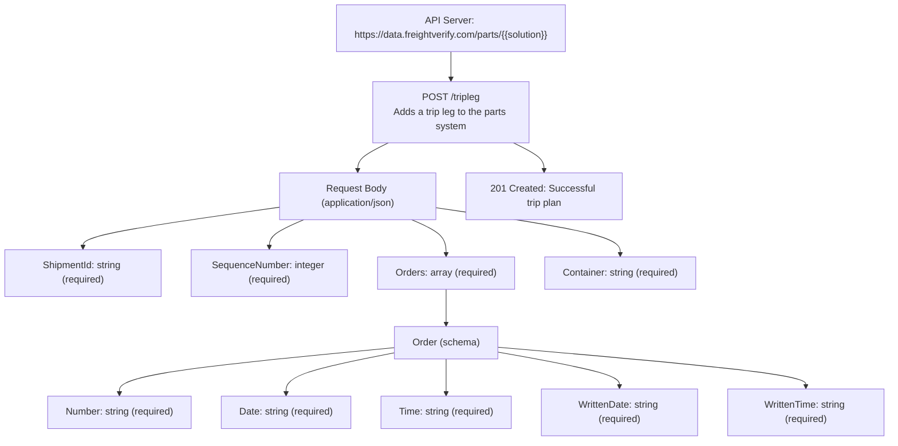

# Diagram: platform/tools/ide_local_testing/resources/workingSample.yaml


> Auto-generated by Obscura crawlers

## Diagram 1

```mermaid
classDiagram
class TripLegRequest {
  +string ShipmentId
  +integer SequenceNumber
  +Order[] Orders
  +string Container
}
class Order {
  +string Number
  +string Date
  +string Time
  +string WrittenDate
  +string WrittenTime
}
TripLegRequest "1" o-- "*" Order : Orders
note left of TripLegRequest
Required: ShipmentId, SequenceNumber, Orders, Container
end note
note right of Order
Required: Number, Date, Time, WrittenDate, WrittenTime
end note
```

> SVG rendering failed for this diagram.

## Diagram 2



### SVG

<svg id="container" width="1481.5625" xmlns="http://www.w3.org/2000/svg" class="flowchart" height="734" viewBox="0 0 1481.5625 734" role="graphics-document document" aria-roledescription="flowchart-v2"><style>#container{font-family:"trebuchet ms",verdana,arial,sans-serif;font-size:16px;fill:#333;}@keyframes edge-animation-frame{from{stroke-dashoffset:0;}}@keyframes dash{to{stroke-dashoffset:0;}}#container .edge-animation-slow{stroke-dasharray:9,5!important;stroke-dashoffset:900;animation:dash 50s linear infinite;stroke-linecap:round;}#container .edge-animation-fast{stroke-dasharray:9,5!important;stroke-dashoffset:900;animation:dash 20s linear infinite;stroke-linecap:round;}#container .error-icon{fill:#552222;}#container .error-text{fill:#552222;stroke:#552222;}#container .edge-thickness-normal{stroke-width:1px;}#container .edge-thickness-thick{stroke-width:3.5px;}#container .edge-pattern-solid{stroke-dasharray:0;}#container .edge-thickness-invisible{stroke-width:0;fill:none;}#container .edge-pattern-dashed{stroke-dasharray:3;}#container .edge-pattern-dotted{stroke-dasharray:2;}#container .marker{fill:#333333;stroke:#333333;}#container .marker.cross{stroke:#333333;}#container svg{font-family:"trebuchet ms",verdana,arial,sans-serif;font-size:16px;}#container p{margin:0;}#container .label{font-family:"trebuchet ms",verdana,arial,sans-serif;color:#333;}#container .cluster-label text{fill:#333;}#container .cluster-label span{color:#333;}#container .cluster-label span p{background-color:transparent;}#container .label text,#container span{fill:#333;color:#333;}#container .node rect,#container .node circle,#container .node ellipse,#container .node polygon,#container .node path{fill:#ECECFF;stroke:#9370DB;stroke-width:1px;}#container .rough-node .label text,#container .node .label text,#container .image-shape .label,#container .icon-shape .label{text-anchor:middle;}#container .node .katex path{fill:#000;stroke:#000;stroke-width:1px;}#container .rough-node .label,#container .node .label,#container .image-shape .label,#container .icon-shape .label{text-align:center;}#container .node.clickable{cursor:pointer;}#container .root .anchor path{fill:#333333!important;stroke-width:0;stroke:#333333;}#container .arrowheadPath{fill:#333333;}#container .edgePath .path{stroke:#333333;stroke-width:2.0px;}#container .flowchart-link{stroke:#333333;fill:none;}#container .edgeLabel{background-color:rgba(232,232,232, 0.8);text-align:center;}#container .edgeLabel p{background-color:rgba(232,232,232, 0.8);}#container .edgeLabel rect{opacity:0.5;background-color:rgba(232,232,232, 0.8);fill:rgba(232,232,232, 0.8);}#container .labelBkg{background-color:rgba(232, 232, 232, 0.5);}#container .cluster rect{fill:#ffffde;stroke:#aaaa33;stroke-width:1px;}#container .cluster text{fill:#333;}#container .cluster span{color:#333;}#container div.mermaidTooltip{position:absolute;text-align:center;max-width:200px;padding:2px;font-family:"trebuchet ms",verdana,arial,sans-serif;font-size:12px;background:hsl(80, 100%, 96.2745098039%);border:1px solid #aaaa33;border-radius:2px;pointer-events:none;z-index:100;}#container .flowchartTitleText{text-anchor:middle;font-size:18px;fill:#333;}#container rect.text{fill:none;stroke-width:0;}#container .icon-shape,#container .image-shape{background-color:rgba(232,232,232, 0.8);text-align:center;}#container .icon-shape p,#container .image-shape p{background-color:rgba(232,232,232, 0.8);padding:2px;}#container .icon-shape rect,#container .image-shape rect{opacity:0.5;background-color:rgba(232,232,232, 0.8);fill:rgba(232,232,232, 0.8);}#container .label-icon{display:inline-block;height:1em;overflow:visible;vertical-align:-0.125em;}#container .node .label-icon path{fill:currentColor;stroke:revert;stroke-width:revert;}#container :root{--mermaid-font-family:"trebuchet ms",verdana,arial,sans-serif;}</style><g><marker id="container_flowchart-v2-pointEnd" class="marker flowchart-v2" viewBox="0 0 10 10" refX="5" refY="5" markerUnits="userSpaceOnUse" markerWidth="8" markerHeight="8" orient="auto"><path d="M 0 0 L 10 5 L 0 10 z" class="arrowMarkerPath" style="stroke-width: 1; stroke-dasharray: 1, 0;"></path></marker><marker id="container_flowchart-v2-pointStart" class="marker flowchart-v2" viewBox="0 0 10 10" refX="4.5" refY="5" markerUnits="userSpaceOnUse" markerWidth="8" markerHeight="8" orient="auto"><path d="M 0 5 L 10 10 L 10 0 z" class="arrowMarkerPath" style="stroke-width: 1; stroke-dasharray: 1, 0;"></path></marker><marker id="container_flowchart-v2-circleEnd" class="marker flowchart-v2" viewBox="0 0 10 10" refX="11" refY="5" markerUnits="userSpaceOnUse" markerWidth="11" markerHeight="11" orient="auto"><circle cx="5" cy="5" r="5" class="arrowMarkerPath" style="stroke-width: 1; stroke-dasharray: 1, 0;"></circle></marker><marker id="container_flowchart-v2-circleStart" class="marker flowchart-v2" viewBox="0 0 10 10" refX="-1" refY="5" markerUnits="userSpaceOnUse" markerWidth="11" markerHeight="11" orient="auto"><circle cx="5" cy="5" r="5" class="arrowMarkerPath" style="stroke-width: 1; stroke-dasharray: 1, 0;"></circle></marker><marker id="container_flowchart-v2-crossEnd" class="marker cross flowchart-v2" viewBox="0 0 11 11" refX="12" refY="5.2" markerUnits="userSpaceOnUse" markerWidth="11" markerHeight="11" orient="auto"><path d="M 1,1 l 9,9 M 10,1 l -9,9" class="arrowMarkerPath" style="stroke-width: 2; stroke-dasharray: 1, 0;"></path></marker><marker id="container_flowchart-v2-crossStart" class="marker cross flowchart-v2" viewBox="0 0 11 11" refX="-1" refY="5.2" markerUnits="userSpaceOnUse" markerWidth="11" markerHeight="11" orient="auto"><path d="M 1,1 l 9,9 M 10,1 l -9,9" class="arrowMarkerPath" style="stroke-width: 2; stroke-dasharray: 1, 0;"></path></marker><g class="root"><g class="clusters"></g><g class="edgePaths"><path d="M750.445,86L750.445,90.167C750.445,94.333,750.445,102.667,750.445,110.333C750.445,118,750.445,125,750.445,128.5L750.445,132" id="L_A_B_0" class="edge-thickness-normal edge-pattern-solid edge-thickness-normal edge-pattern-solid flowchart-link" style=";" data-edge="true" data-et="edge" data-id="L_A_B_0" data-points="W3sieCI6NzUwLjQ0NTMxMjUsInkiOjg2fSx7IngiOjc1MC40NDUzMTI1LCJ5IjoxMTF9LHsieCI6NzUwLjQ0NTMxMjUsInkiOjEzNn1d" marker-end="url(#container_flowchart-v2-pointEnd)"></path><path d="M646.432,238L637.934,242.167C629.437,246.333,612.441,254.667,603.943,262.333C595.445,270,595.445,277,595.445,280.5L595.445,284" id="L_B_C_0" class="edge-thickness-normal edge-pattern-solid edge-thickness-normal edge-pattern-solid flowchart-link" style=";" data-edge="true" data-et="edge" data-id="L_B_C_0" data-points="W3sieCI6NjQ2LjQzMjE1NDYwNTI2MzEsInkiOjIzOH0seyJ4Ijo1OTUuNDQ1MzEyNSwieSI6MjYzfSx7IngiOjU5NS40NDUzMTI1LCJ5IjoyODh9XQ==" marker-end="url(#container_flowchart-v2-pointEnd)"></path><path d="M465.445,345.188L410.871,352.823C356.297,360.459,247.148,375.729,192.574,386.865C138,398,138,405,138,408.5L138,412" id="L_C_D_0" class="edge-thickness-normal edge-pattern-solid edge-thickness-normal edge-pattern-solid flowchart-link" style=";" data-edge="true" data-et="edge" data-id="L_C_D_0" data-points="W3sieCI6NDY1LjQ0NTMxMjUsInkiOjM0NS4xODc5NjY0NTc3MzkxNX0seyJ4IjoxMzgsInkiOjM5MX0seyJ4IjoxMzgsInkiOjQxNn1d" marker-end="url(#container_flowchart-v2-pointEnd)"></path><path d="M505.596,366L495.997,370.167C486.397,374.333,467.199,382.667,457.599,390.333C448,398,448,405,448,408.5L448,412" id="L_C_E_0" class="edge-thickness-normal edge-pattern-solid edge-thickness-normal edge-pattern-solid flowchart-link" style=";" data-edge="true" data-et="edge" data-id="L_C_E_0" data-points="W3sieCI6NTA1LjU5NTgyNTE5NTMxMjUsInkiOjM2Nn0seyJ4Ijo0NDgsInkiOjM5MX0seyJ4Ijo0NDgsInkiOjQxNn1d" marker-end="url(#container_flowchart-v2-pointEnd)"></path><path d="M685.295,366L694.894,370.167C704.493,374.333,723.692,382.667,733.291,392.333C742.891,402,742.891,413,742.891,418.5L742.891,424" id="L_C_F_0" class="edge-thickness-normal edge-pattern-solid edge-thickness-normal edge-pattern-solid flowchart-link" style=";" data-edge="true" data-et="edge" data-id="L_C_F_0" data-points="W3sieCI6Njg1LjI5NDc5OTgwNDY4NzUsInkiOjM2Nn0seyJ4Ijo3NDIuODkwNjI1LCJ5IjozOTF9LHsieCI6NzQyLjg5MDYyNSwieSI6NDI4fV0=" marker-end="url(#container_flowchart-v2-pointEnd)"></path><path d="M725.445,345.878L777.234,353.398C829.023,360.918,932.602,375.959,984.391,388.98C1036.18,402,1036.18,413,1036.18,418.5L1036.18,424" id="L_C_G_0" class="edge-thickness-normal edge-pattern-solid edge-thickness-normal edge-pattern-solid flowchart-link" style=";" data-edge="true" data-et="edge" data-id="L_C_G_0" data-points="W3sieCI6NzI1LjQ0NTMxMjUsInkiOjM0NS44Nzc1ODM1Nzg1NDQzfSx7IngiOjEwMzYuMTc5Njg3NSwieSI6MzkxfSx7IngiOjEwMzYuMTc5Njg3NSwieSI6NDI4fV0=" marker-end="url(#container_flowchart-v2-pointEnd)"></path><path d="M742.891,482L742.891,488.167C742.891,494.333,742.891,506.667,742.891,516.333C742.891,526,742.891,533,742.891,536.5L742.891,540" id="L_F_H_0" class="edge-thickness-normal edge-pattern-solid edge-thickness-normal edge-pattern-solid flowchart-link" style=";" data-edge="true" data-et="edge" data-id="L_F_H_0" data-points="W3sieCI6NzQyLjg5MDYyNSwieSI6NDgyfSx7IngiOjc0Mi44OTA2MjUsInkiOjUxOX0seyJ4Ijo3NDIuODkwNjI1LCJ5Ijo1NDR9XQ==" marker-end="url(#container_flowchart-v2-pointEnd)"></path><path d="M657.148,579.074L579.405,586.395C501.661,593.716,346.174,608.358,268.431,621.179C190.688,634,190.688,645,190.688,650.5L190.688,656" id="L_H_I_0" class="edge-thickness-normal edge-pattern-solid edge-thickness-normal edge-pattern-solid flowchart-link" style=";" data-edge="true" data-et="edge" data-id="L_H_I_0" data-points="W3sieCI6NjU3LjE0ODQzNzUsInkiOjU3OS4wNzQxOTE0NDkwMjUyfSx7IngiOjE5MC42ODc1LCJ5Ijo2MjN9LHsieCI6MTkwLjY4NzUsInkiOjY2MH1d" marker-end="url(#container_flowchart-v2-pointEnd)"></path><path d="M657.148,587.496L626.392,593.413C595.635,599.331,534.122,611.165,503.366,622.583C472.609,634,472.609,645,472.609,650.5L472.609,656" id="L_H_J_0" class="edge-thickness-normal edge-pattern-solid edge-thickness-normal edge-pattern-solid flowchart-link" style=";" data-edge="true" data-et="edge" data-id="L_H_J_0" data-points="W3sieCI6NjU3LjE0ODQzNzUsInkiOjU4Ny40OTYxMjY3MTk4NTJ9LHsieCI6NDcyLjYwOTM3NSwieSI6NjIzfSx7IngiOjQ3Mi42MDkzNzUsInkiOjY2MH1d" marker-end="url(#container_flowchart-v2-pointEnd)"></path><path d="M742.891,598L742.891,602.167C742.891,606.333,742.891,614.667,742.891,624.333C742.891,634,742.891,645,742.891,650.5L742.891,656" id="L_H_K_0" class="edge-thickness-normal edge-pattern-solid edge-thickness-normal edge-pattern-solid flowchart-link" style=";" data-edge="true" data-et="edge" data-id="L_H_K_0" data-points="W3sieCI6NzQyLjg5MDYyNSwieSI6NTk4fSx7IngiOjc0Mi44OTA2MjUsInkiOjYyM30seyJ4Ijo3NDIuODkwNjI1LCJ5Ijo2NjB9XQ==" marker-end="url(#container_flowchart-v2-pointEnd)"></path><path d="M828.633,586.339L862.788,592.449C896.943,598.559,965.253,610.78,999.408,620.39C1033.563,630,1033.563,637,1033.563,640.5L1033.563,644" id="L_H_L_0" class="edge-thickness-normal edge-pattern-solid edge-thickness-normal edge-pattern-solid flowchart-link" style=";" data-edge="true" data-et="edge" data-id="L_H_L_0" data-points="W3sieCI6ODI4LjYzMjgxMjUsInkiOjU4Ni4zMzg5MjM4Mjk0ODk5fSx7IngiOjEwMzMuNTYyNSwieSI6NjIzfSx7IngiOjEwMzMuNTYyNSwieSI6NjQ4fV0=" marker-end="url(#container_flowchart-v2-pointEnd)"></path><path d="M828.633,578.423L914.454,585.852C1000.276,593.282,1171.919,608.141,1257.741,619.07C1343.563,630,1343.563,637,1343.563,640.5L1343.563,644" id="L_H_M_0" class="edge-thickness-normal edge-pattern-solid edge-thickness-normal edge-pattern-solid flowchart-link" style=";" data-edge="true" data-et="edge" data-id="L_H_M_0" data-points="W3sieCI6ODI4LjYzMjgxMjUsInkiOjU3OC40MjI2Nzc3MzA2NjYyfSx7IngiOjEzNDMuNTYyNSwieSI6NjIzfSx7IngiOjEzNDMuNTYyNSwieSI6NjQ4fV0=" marker-end="url(#container_flowchart-v2-pointEnd)"></path><path d="M854.458,238L862.956,242.167C871.454,246.333,888.45,254.667,896.948,262.333C905.445,270,905.445,277,905.445,280.5L905.445,284" id="L_B_N_0" class="edge-thickness-normal edge-pattern-solid edge-thickness-normal edge-pattern-solid flowchart-link" style=";" data-edge="true" data-et="edge" data-id="L_B_N_0" data-points="W3sieCI6ODU0LjQ1ODQ3MDM5NDczNjksInkiOjIzOH0seyJ4Ijo5MDUuNDQ1MzEyNSwieSI6MjYzfSx7IngiOjkwNS40NDUzMTI1LCJ5IjoyODh9XQ==" marker-end="url(#container_flowchart-v2-pointEnd)"></path></g><g class="edgeLabels"><g class="edgeLabel"><g class="label" data-id="L_A_B_0" transform="translate(0, 0)"><foreignObject width="0" height="0"><div xmlns="http://www.w3.org/1999/xhtml" class="labelBkg" style="display: table-cell; white-space: nowrap; line-height: 1.5; max-width: 200px; text-align: center;"><span class="edgeLabel"></span></div></foreignObject></g></g><g class="edgeLabel"><g class="label" data-id="L_B_C_0" transform="translate(0, 0)"><foreignObject width="0" height="0"><div xmlns="http://www.w3.org/1999/xhtml" class="labelBkg" style="display: table-cell; white-space: nowrap; line-height: 1.5; max-width: 200px; text-align: center;"><span class="edgeLabel"></span></div></foreignObject></g></g><g class="edgeLabel"><g class="label" data-id="L_C_D_0" transform="translate(0, 0)"><foreignObject width="0" height="0"><div xmlns="http://www.w3.org/1999/xhtml" class="labelBkg" style="display: table-cell; white-space: nowrap; line-height: 1.5; max-width: 200px; text-align: center;"><span class="edgeLabel"></span></div></foreignObject></g></g><g class="edgeLabel"><g class="label" data-id="L_C_E_0" transform="translate(0, 0)"><foreignObject width="0" height="0"><div xmlns="http://www.w3.org/1999/xhtml" class="labelBkg" style="display: table-cell; white-space: nowrap; line-height: 1.5; max-width: 200px; text-align: center;"><span class="edgeLabel"></span></div></foreignObject></g></g><g class="edgeLabel"><g class="label" data-id="L_C_F_0" transform="translate(0, 0)"><foreignObject width="0" height="0"><div xmlns="http://www.w3.org/1999/xhtml" class="labelBkg" style="display: table-cell; white-space: nowrap; line-height: 1.5; max-width: 200px; text-align: center;"><span class="edgeLabel"></span></div></foreignObject></g></g><g class="edgeLabel"><g class="label" data-id="L_C_G_0" transform="translate(0, 0)"><foreignObject width="0" height="0"><div xmlns="http://www.w3.org/1999/xhtml" class="labelBkg" style="display: table-cell; white-space: nowrap; line-height: 1.5; max-width: 200px; text-align: center;"><span class="edgeLabel"></span></div></foreignObject></g></g><g class="edgeLabel"><g class="label" data-id="L_F_H_0" transform="translate(0, 0)"><foreignObject width="0" height="0"><div xmlns="http://www.w3.org/1999/xhtml" class="labelBkg" style="display: table-cell; white-space: nowrap; line-height: 1.5; max-width: 200px; text-align: center;"><span class="edgeLabel"></span></div></foreignObject></g></g><g class="edgeLabel"><g class="label" data-id="L_H_I_0" transform="translate(0, 0)"><foreignObject width="0" height="0"><div xmlns="http://www.w3.org/1999/xhtml" class="labelBkg" style="display: table-cell; white-space: nowrap; line-height: 1.5; max-width: 200px; text-align: center;"><span class="edgeLabel"></span></div></foreignObject></g></g><g class="edgeLabel"><g class="label" data-id="L_H_J_0" transform="translate(0, 0)"><foreignObject width="0" height="0"><div xmlns="http://www.w3.org/1999/xhtml" class="labelBkg" style="display: table-cell; white-space: nowrap; line-height: 1.5; max-width: 200px; text-align: center;"><span class="edgeLabel"></span></div></foreignObject></g></g><g class="edgeLabel"><g class="label" data-id="L_H_K_0" transform="translate(0, 0)"><foreignObject width="0" height="0"><div xmlns="http://www.w3.org/1999/xhtml" class="labelBkg" style="display: table-cell; white-space: nowrap; line-height: 1.5; max-width: 200px; text-align: center;"><span class="edgeLabel"></span></div></foreignObject></g></g><g class="edgeLabel"><g class="label" data-id="L_H_L_0" transform="translate(0, 0)"><foreignObject width="0" height="0"><div xmlns="http://www.w3.org/1999/xhtml" class="labelBkg" style="display: table-cell; white-space: nowrap; line-height: 1.5; max-width: 200px; text-align: center;"><span class="edgeLabel"></span></div></foreignObject></g></g><g class="edgeLabel"><g class="label" data-id="L_H_M_0" transform="translate(0, 0)"><foreignObject width="0" height="0"><div xmlns="http://www.w3.org/1999/xhtml" class="labelBkg" style="display: table-cell; white-space: nowrap; line-height: 1.5; max-width: 200px; text-align: center;"><span class="edgeLabel"></span></div></foreignObject></g></g><g class="edgeLabel"><g class="label" data-id="L_B_N_0" transform="translate(0, 0)"><foreignObject width="0" height="0"><div xmlns="http://www.w3.org/1999/xhtml" class="labelBkg" style="display: table-cell; white-space: nowrap; line-height: 1.5; max-width: 200px; text-align: center;"><span class="edgeLabel"></span></div></foreignObject></g></g></g><g class="nodes"><g class="node default" id="flowchart-A-0" transform="translate(750.4453125, 47)"><rect class="basic label-container" style="" x="-203.7734375" y="-39" width="407.546875" height="78"></rect><g class="label" style="" transform="translate(-173.7734375, -24)"><rect></rect><foreignObject width="347.546875" height="48"><div xmlns="http://www.w3.org/1999/xhtml" style="display: table; white-space: break-spaces; line-height: 1.5; max-width: 200px; text-align: center; width: 200px;"><span class="nodeLabel"><p>API Server: https://data.freightverify.com/parts/{{solution}}</p></span></div></foreignObject></g></g><g class="node default" id="flowchart-B-1" transform="translate(750.4453125, 187)"><rect class="basic label-container" style="" x="-130" y="-51" width="260" height="102"></rect><g class="label" style="" transform="translate(-100, -36)"><rect></rect><foreignObject width="200" height="72"><div xmlns="http://www.w3.org/1999/xhtml" style="display: table; white-space: break-spaces; line-height: 1.5; max-width: 200px; text-align: center; width: 200px;"><span class="nodeLabel"><p>POST /tripleg<br/>Adds a trip leg to the parts system</p></span></div></foreignObject></g></g><g class="node default" id="flowchart-C-5" transform="translate(595.4453125, 327)"><rect class="basic label-container" style="" x="-130" y="-39" width="260" height="78"></rect><g class="label" style="" transform="translate(-100, -24)"><rect></rect><foreignObject width="200" height="48"><div xmlns="http://www.w3.org/1999/xhtml" style="display: table; white-space: break-spaces; line-height: 1.5; max-width: 200px; text-align: center; width: 200px;"><span class="nodeLabel"><p>Request Body (application/json)</p></span></div></foreignObject></g></g><g class="node default" id="flowchart-D-7" transform="translate(138, 455)"><rect class="basic label-container" style="" x="-130" y="-39" width="260" height="78"></rect><g class="label" style="" transform="translate(-100, -24)"><rect></rect><foreignObject width="200" height="48"><div xmlns="http://www.w3.org/1999/xhtml" style="display: table; white-space: break-spaces; line-height: 1.5; max-width: 200px; text-align: center; width: 200px;"><span class="nodeLabel"><p>ShipmentId: string (required)</p></span></div></foreignObject></g></g><g class="node default" id="flowchart-E-9" transform="translate(448, 455)"><rect class="basic label-container" style="" x="-130" y="-39" width="260" height="78"></rect><g class="label" style="" transform="translate(-100, -24)"><rect></rect><foreignObject width="200" height="48"><div xmlns="http://www.w3.org/1999/xhtml" style="display: table; white-space: break-spaces; line-height: 1.5; max-width: 200px; text-align: center; width: 200px;"><span class="nodeLabel"><p>SequenceNumber: integer (required)</p></span></div></foreignObject></g></g><g class="node default" id="flowchart-F-11" transform="translate(742.890625, 455)"><rect class="basic label-container" style="" x="-114.890625" y="-27" width="229.78125" height="54"></rect><g class="label" style="" transform="translate(-84.890625, -12)"><rect></rect><foreignObject width="169.78125" height="24"><div xmlns="http://www.w3.org/1999/xhtml" style="display: table-cell; white-space: nowrap; line-height: 1.5; max-width: 200px; text-align: center;"><span class="nodeLabel"><p>Orders: array (required)</p></span></div></foreignObject></g></g><g class="node default" id="flowchart-G-13" transform="translate(1036.1796875, 455)"><rect class="basic label-container" style="" x="-128.3984375" y="-27" width="256.796875" height="54"></rect><g class="label" style="" transform="translate(-98.3984375, -12)"><rect></rect><foreignObject width="196.796875" height="24"><div xmlns="http://www.w3.org/1999/xhtml" style="display: table-cell; white-space: nowrap; line-height: 1.5; max-width: 200px; text-align: center;"><span class="nodeLabel"><p>Container: string (required)</p></span></div></foreignObject></g></g><g class="node default" id="flowchart-H-15" transform="translate(742.890625, 571)"><rect class="basic label-container" style="" x="-85.7421875" y="-27" width="171.484375" height="54"></rect><g class="label" style="" transform="translate(-55.7421875, -12)"><rect></rect><foreignObject width="111.484375" height="24"><div xmlns="http://www.w3.org/1999/xhtml" style="display: table-cell; white-space: nowrap; line-height: 1.5; max-width: 200px; text-align: center;"><span class="nodeLabel"><p>Order (schema)</p></span></div></foreignObject></g></g><g class="node default" id="flowchart-I-17" transform="translate(190.6875, 687)"><rect class="basic label-container" style="" x="-122.3125" y="-27" width="244.625" height="54"></rect><g class="label" style="" transform="translate(-92.3125, -12)"><rect></rect><foreignObject width="184.625" height="24"><div xmlns="http://www.w3.org/1999/xhtml" style="display: table-cell; white-space: nowrap; line-height: 1.5; max-width: 200px; text-align: center;"><span class="nodeLabel"><p>Number: string (required)</p></span></div></foreignObject></g></g><g class="node default" id="flowchart-J-19" transform="translate(472.609375, 687)"><rect class="basic label-container" style="" x="-109.609375" y="-27" width="219.21875" height="54"></rect><g class="label" style="" transform="translate(-79.609375, -12)"><rect></rect><foreignObject width="159.21875" height="24"><div xmlns="http://www.w3.org/1999/xhtml" style="display: table-cell; white-space: nowrap; line-height: 1.5; max-width: 200px; text-align: center;"><span class="nodeLabel"><p>Date: string (required)</p></span></div></foreignObject></g></g><g class="node default" id="flowchart-K-21" transform="translate(742.890625, 687)"><rect class="basic label-container" style="" x="-110.671875" y="-27" width="221.34375" height="54"></rect><g class="label" style="" transform="translate(-80.671875, -12)"><rect></rect><foreignObject width="161.34375" height="24"><div xmlns="http://www.w3.org/1999/xhtml" style="display: table-cell; white-space: nowrap; line-height: 1.5; max-width: 200px; text-align: center;"><span class="nodeLabel"><p>Time: string (required)</p></span></div></foreignObject></g></g><g class="node default" id="flowchart-L-23" transform="translate(1033.5625, 687)"><rect class="basic label-container" style="" x="-130" y="-39" width="260" height="78"></rect><g class="label" style="" transform="translate(-100, -24)"><rect></rect><foreignObject width="200" height="48"><div xmlns="http://www.w3.org/1999/xhtml" style="display: table; white-space: break-spaces; line-height: 1.5; max-width: 200px; text-align: center; width: 200px;"><span class="nodeLabel"><p>WrittenDate: string (required)</p></span></div></foreignObject></g></g><g class="node default" id="flowchart-M-25" transform="translate(1343.5625, 687)"><rect class="basic label-container" style="" x="-130" y="-39" width="260" height="78"></rect><g class="label" style="" transform="translate(-100, -24)"><rect></rect><foreignObject width="200" height="48"><div xmlns="http://www.w3.org/1999/xhtml" style="display: table; white-space: break-spaces; line-height: 1.5; max-width: 200px; text-align: center; width: 200px;"><span class="nodeLabel"><p>WrittenTime: string (required)</p></span></div></foreignObject></g></g><g class="node default" id="flowchart-N-27" transform="translate(905.4453125, 327)"><rect class="basic label-container" style="" x="-130" y="-39" width="260" height="78"></rect><g class="label" style="" transform="translate(-100, -24)"><rect></rect><foreignObject width="200" height="48"><div xmlns="http://www.w3.org/1999/xhtml" style="display: table; white-space: break-spaces; line-height: 1.5; max-width: 200px; text-align: center; width: 200px;"><span class="nodeLabel"><p>201 Created: Successful trip plan</p></span></div></foreignObject></g></g></g></g></g></svg>
