# Diagram: research/.gitlab-ci.yml

> Auto-generated by Obscura crawlers

## Mermaid

```mermaid
graph TD
  subgraph Templates
    ml_eta_pip[".ml-eta-pip"]
    py_test_template[".py-test-template"]
    sls_ml_eta_lambdas[".sls-ml-eta-lambdas"]
    sls[".sls"]
    sls_manual[".sls-manual"]
  end

  subgraph Jobs
    eta_research_tests["eta-research-tests"]
    get_ml_eta_prod_qsp_tests["get_ml_eta-prod-qsp-tests"]
    eta_research_ruff["eta-research-ruff"]
    eta_research_pyright["eta-research-pyright"]
    sls_manual_deploy["sls-manual-deploy-ml-eta-stack"]
    sls_deploy_on_push["sls-deploy-ml-eta-stack-on-push"]
    eta_research_orchestrator["eta-research-orchestrator"]
    docker_runner["docker_gitlab_runner_login"]
    deploy_paths["deploy-change-paths (anchor)"]
  end

  %% extends relationships
  ml_eta_pip --> eta_research_tests
  py_test_template --> eta_research_tests

  ml_eta_pip --> get_ml_eta_prod_qsp_tests
  py_test_template --> get_ml_eta_prod_qsp_tests

  ml_eta_pip --> eta_research_ruff
  ml_eta_pip --> eta_research_pyright

  sls --> sls_ml_eta_lambdas
  sls_ml_eta_lambdas --> sls_manual_deploy
  sls_ml_eta_lambdas --> sls_deploy_on_push
  sls_manual --> sls_manual_deploy

  %% change-paths anchor used by both deploy jobs
  deploy_paths --> sls_manual_deploy
  deploy_paths --> sls_deploy_on_push

  %% needs / dependencies for push deploy
  docker_runner --> sls_deploy_on_push
  eta_research_tests --> sls_deploy_on_push
  get_ml_eta_prod_qsp_tests --> sls_deploy_on_push

  %% standalone orchestrator job
  eta_research_orchestrator

  classDef template fill:#f9f,stroke:#333,stroke-width:1px;
  classDef job fill:#9fdf9f,stroke:#333,stroke-width:1px;
  class ml_eta_pip,py_test_template,sls_ml_eta_lambdas,sls,sls_manual template;
  class eta_research_tests,get_ml_eta_prod_qsp_tests,eta_research_ruff,eta_research_pyright,sls_manual_deploy,sls_deploy_on_push,eta_research_orchestrator,docker_runner,deploy_paths job;
```

### SVG

<svg id="container" width="2878.0625" xmlns="http://www.w3.org/2000/svg" class="flowchart" height="426" viewBox="0 0 2878.0625 426" role="graphics-document document" aria-roledescription="flowchart-v2"><g><marker id="container_flowchart-v2-pointEnd" class="marker flowchart-v2" viewBox="0 0 10 10" refX="5" refY="5" markerUnits="userSpaceOnUse" markerWidth="8" markerHeight="8" orient="auto"><path d="M 0 0 L 10 5 L 0 10 z" class="arrowMarkerPath" style="stroke-width: 1; stroke-dasharray: 1, 0;"></path></marker><marker id="container_flowchart-v2-pointStart" class="marker flowchart-v2" viewBox="0 0 10 10" refX="4.5" refY="5" markerUnits="userSpaceOnUse" markerWidth="8" markerHeight="8" orient="auto"><path d="M 0 5 L 10 10 L 10 0 z" class="arrowMarkerPath" style="stroke-width: 1; stroke-dasharray: 1, 0;"></path></marker><marker id="container_flowchart-v2-circleEnd" class="marker flowchart-v2" viewBox="0 0 10 10" refX="11" refY="5" markerUnits="userSpaceOnUse" markerWidth="11" markerHeight="11" orient="auto"><circle cx="5" cy="5" r="5" class="arrowMarkerPath" style="stroke-width: 1; stroke-dasharray: 1, 0;"></circle></marker><marker id="container_flowchart-v2-circleStart" class="marker flowchart-v2" viewBox="0 0 10 10" refX="-1" refY="5" markerUnits="userSpaceOnUse" markerWidth="11" markerHeight="11" orient="auto"><circle cx="5" cy="5" r="5" class="arrowMarkerPath" style="stroke-width: 1; stroke-dasharray: 1, 0;"></circle></marker><marker id="container_flowchart-v2-crossEnd" class="marker cross flowchart-v2" viewBox="0 0 11 11" refX="12" refY="5.2" markerUnits="userSpaceOnUse" markerWidth="11" markerHeight="11" orient="auto"><path d="M 1,1 l 9,9 M 10,1 l -9,9" class="arrowMarkerPath" style="stroke-width: 2; stroke-dasharray: 1, 0;"></path></marker><marker id="container_flowchart-v2-crossStart" class="marker cross flowchart-v2" viewBox="0 0 11 11" refX="-1" refY="5.2" markerUnits="userSpaceOnUse" markerWidth="11" markerHeight="11" orient="auto"><path d="M 1,1 l 9,9 M 10,1 l -9,9" class="arrowMarkerPath" style="stroke-width: 2; stroke-dasharray: 1, 0;"></path></marker><g class="root"><g class="clusters"><g class="cluster" id="Jobs" data-look="classic"><rect style="" x="8" y="137" width="2006.03125" height="281"></rect><g class="cluster-label" transform="translate(995.4140625, 137)"><foreignObject width="31.203125" height="24">

Jobs

</foreignObject></g></g><g class="cluster" id="Templates" data-look="classic"><rect style="" x="2034.03125" y="8" width="836.03125" height="257"></rect><g class="cluster-label" transform="translate(2414.859375, 8)"><foreignObject width="74.375" height="24">

Templates

</foreignObject></g></g></g><g class="edgePaths"><path d="M2195.188,87L2203.743,91.167C2212.299,95.333,2229.409,103.667,2237.964,112C2246.52,120.333,2246.52,128.667,2045.062,142.683C1843.605,156.699,1440.691,176.398,1239.234,186.247L1037.776,196.097" id="L_ml_eta_pip_eta_research_tests_0" class="edge-thickness-normal edge-pattern-solid edge-thickness-normal edge-pattern-solid flowchart-link" style=";" data-edge="true" data-et="edge" data-id="L_ml_eta_pip_eta_research_tests_0" data-points="W3sieCI6MjE5NS4xODgwMjU4NDEzNDYsInkiOjg3fSx7IngiOjIyNDYuNTE5NTMxMjUsInkiOjExMn0seyJ4IjoyMjQ2LjUxOTUzMTI1LCJ5IjoxMzd9LHsieCI6MTAzMy43ODEyNSwieSI6MTk2LjI5MTk1MjI2Njg0NzN9XQ==" marker-end="url(#container_flowchart-v2-pointEnd)"></path><path d="M2396.02,87L2402.614,91.167C2409.209,95.333,2422.397,103.667,2428.992,112C2435.586,120.333,2435.586,128.667,2202.618,142.786C1969.65,156.905,1503.714,176.81,1270.746,186.763L1037.778,196.715" id="L_py_test_template_eta_research_tests_0" class="edge-thickness-normal edge-pattern-solid edge-thickness-normal edge-pattern-solid flowchart-link" style=";" data-edge="true" data-et="edge" data-id="L_py_test_template_eta_research_tests_0" data-points="W3sieCI6MjM5Ni4wMjAxMzIyMTE1Mzg2LCJ5Ijo4N30seyJ4IjoyNDM1LjU4NTkzNzUsInkiOjExMn0seyJ4IjoyNDM1LjU4NTkzNzUsInkiOjEzN30seyJ4IjoxMDMzLjc4MTI1LCJ5IjoxOTYuODg2MTI2NzEyNDUzNzd9XQ==" marker-end="url(#container_flowchart-v2-pointEnd)"></path><path d="M2184.803,87L2191.756,91.167C2198.709,95.333,2212.614,103.667,2219.567,112C2226.52,120.333,2226.52,128.667,1987.964,142.602C1749.408,156.538,1272.296,176.075,1033.74,185.844L795.184,195.613" id="L_ml_eta_pip_get_ml_eta_prod_qsp_tests_0" class="edge-thickness-normal edge-pattern-solid edge-thickness-normal edge-pattern-solid flowchart-link" style=";" data-edge="true" data-et="edge" data-id="L_ml_eta_pip_get_ml_eta_prod_qsp_tests_0" data-points="W3sieCI6MjE4NC44MDM0MTA0NTY3MzEsInkiOjg3fSx7IngiOjIyMjYuNTE5NTMxMjUsInkiOjExMn0seyJ4IjoyMjI2LjUxOTUzMTI1LCJ5IjoxMzd9LHsieCI6NzkxLjE4NzUsInkiOjE5NS43NzY2NTI3Nzg0MzczMn1d" marker-end="url(#container_flowchart-v2-pointEnd)"></path><path d="M2308.236,87L2301.283,91.167C2294.33,95.333,2280.425,103.667,2273.472,112C2266.52,120.333,2266.52,128.667,2021.297,142.625C1776.074,156.582,1285.629,176.165,1040.407,185.956L795.184,195.747" id="L_py_test_template_get_ml_eta_prod_qsp_tests_0" class="edge-thickness-normal edge-pattern-solid edge-thickness-normal edge-pattern-solid flowchart-link" style=";" data-edge="true" data-et="edge" data-id="L_py_test_template_get_ml_eta_prod_qsp_tests_0" data-points="W3sieCI6MjMwOC4yMzU2NTIwNDMyNjksInkiOjg3fSx7IngiOjIyNjYuNTE5NTMxMjUsInkiOjExMn0seyJ4IjoyMjY2LjUxOTUzMTI1LCJ5IjoxMzd9LHsieCI6NzkxLjE4NzUsInkiOjE5NS45MDcwMDEyODQzMDM5Nn1d" marker-end="url(#container_flowchart-v2-pointEnd)"></path><path d="M2122.688,87L2120.055,91.167C2117.422,95.333,2112.157,103.667,2109.524,112C2106.891,120.333,2106.891,128.667,1837.421,142.902C1567.952,157.138,1029.014,177.276,759.545,187.346L490.075,197.415" id="L_ml_eta_pip_eta_research_ruff_0" class="edge-thickness-normal edge-pattern-solid edge-thickness-normal edge-pattern-solid flowchart-link" style=";" data-edge="true" data-et="edge" data-id="L_ml_eta_pip_eta_research_ruff_0" data-points="W3sieCI6MjEyMi42ODg0MDE0NDIzMDc2LCJ5Ijo4N30seyJ4IjoyMTA2Ljg5MDYyNSwieSI6MTEyfSx7IngiOjIxMDYuODkwNjI1LCJ5IjoxMzd9LHsieCI6NDg2LjA3ODEyNSwieSI6MTk3LjU2NDAzNjYwMDE2MjM4fV0=" marker-end="url(#container_flowchart-v2-pointEnd)"></path><path d="M2112.304,87L2108.068,91.167C2103.833,95.333,2095.362,103.667,2091.126,112C2086.891,120.333,2086.891,128.667,1781.77,142.903C1476.65,157.139,866.41,177.278,561.29,187.347L256.17,197.417" id="L_ml_eta_pip_eta_research_pyright_0" class="edge-thickness-normal edge-pattern-solid edge-thickness-normal edge-pattern-solid flowchart-link" style=";" data-edge="true" data-et="edge" data-id="L_ml_eta_pip_eta_research_pyright_0" data-points="W3sieCI6MjExMi4zMDM3ODYwNTc2OTI0LCJ5Ijo4N30seyJ4IjoyMDg2Ljg5MDYyNSwieSI6MTEyfSx7IngiOjIwODYuODkwNjI1LCJ5IjoxMzd9LHsieCI6MjUyLjE3MTg3NSwieSI6MTk3LjU0ODUwNTIyMjk1NzY2fV0=" marker-end="url(#container_flowchart-v2-pointEnd)"></path><path d="M2537.883,87L2537.883,91.167C2537.883,95.333,2537.883,103.667,2537.883,112C2537.883,120.333,2537.883,128.667,2537.883,138.333C2537.883,148,2537.883,159,2537.883,164.5L2537.883,170" id="L_sls_sls_ml_eta_lambdas_0" class="edge-thickness-normal edge-pattern-solid edge-thickness-normal edge-pattern-solid flowchart-link" style=";" data-edge="true" data-et="edge" data-id="L_sls_sls_ml_eta_lambdas_0" data-points="W3sieCI6MjUzNy44ODI4MTI1LCJ5Ijo4N30seyJ4IjoyNTM3Ljg4MjgxMjUsInkiOjExMn0seyJ4IjoyNTM3Ljg4MjgxMjUsInkiOjEzN30seyJ4IjoyNTM3Ljg4MjgxMjUsInkiOjE3NH1d" marker-end="url(#container_flowchart-v2-pointEnd)"></path><path d="M2581.145,228L2591.026,234.167C2600.906,240.333,2620.668,252.667,2452.464,263C2284.26,273.333,1928.091,281.667,1748.903,289.364C1569.715,297.061,1567.509,304.121,1566.406,307.652L1565.302,311.182" id="L_sls_ml_eta_lambdas_sls_manual_deploy_0" class="edge-thickness-normal edge-pattern-solid edge-thickness-normal edge-pattern-solid flowchart-link" style=";" data-edge="true" data-et="edge" data-id="L_sls_ml_eta_lambdas_sls_manual_deploy_0" data-points="W3sieCI6MjU4MS4xNDQ3NzUzOTA2MjUsInkiOjIyOH0seyJ4IjoyNjQwLjQyOTY4NzUsInkiOjI2NX0seyJ4IjoxNTcxLjkyMTg3NSwieSI6MjkwfSx7IngiOjE1NjQuMTA5Mzc1LCJ5IjozMTV9XQ==" marker-end="url(#container_flowchart-v2-pointEnd)"></path><path d="M2440.039,228L2417.692,234.167C2395.345,240.333,2350.651,252.667,2202.632,263C2054.612,273.333,1803.267,281.667,1643.404,292.287C1483.542,302.907,1415.162,315.814,1380.972,322.267L1346.782,328.72" id="L_sls_ml_eta_lambdas_sls_deploy_on_push_0" class="edge-thickness-normal edge-pattern-solid edge-thickness-normal edge-pattern-solid flowchart-link" style=";" data-edge="true" data-et="edge" data-id="L_sls_ml_eta_lambdas_sls_deploy_on_push_0" data-points="W3sieCI6MjQ0MC4wMzkxMjM1MzUxNTYyLCJ5IjoyMjh9LHsieCI6MjMwNS45NTcwMzEyNSwieSI6MjY1fSx7IngiOjE1NTEuOTIxODc1LCJ5IjoyOTB9LHsieCI6MTM0Mi44NTE1NjI1LCJ5IjozMjkuNDYyMzE2NTM2NDg1MzN9XQ==" marker-end="url(#container_flowchart-v2-pointEnd)"></path><path d="M2762.977,228L2762.977,234.167C2762.977,240.333,2762.977,252.667,2599.643,263C2436.31,273.333,2109.643,281.667,1930.11,290.321C1750.577,298.974,1718.177,307.949,1701.977,312.436L1685.777,316.923" id="L_sls_manual_sls_manual_deploy_0" class="edge-thickness-normal edge-pattern-solid edge-thickness-normal edge-pattern-solid flowchart-link" style=";" data-edge="true" data-et="edge" data-id="L_sls_manual_sls_manual_deploy_0" data-points="W3sieCI6Mjc2Mi45NzY1NjI1LCJ5IjoyMjh9LHsieCI6Mjc2Mi45NzY1NjI1LCJ5IjoyNjV9LHsieCI6MTc4Mi45NzY1NjI1LCJ5IjoyOTB9LHsieCI6MTY4MS45MjE4NzUsInkiOjMxNy45OTEyMDg3OTEyMDg4fV0=" marker-end="url(#container_flowchart-v2-pointEnd)"></path><path d="M1528.016,240L1528.667,244.167C1529.318,248.333,1530.62,256.667,1531.271,265C1531.922,273.333,1531.922,281.667,1533.025,289.364C1534.128,297.061,1536.335,304.121,1537.438,307.652L1538.541,311.182" id="L_deploy_paths_sls_manual_deploy_0" class="edge-thickness-normal edge-pattern-solid edge-thickness-normal edge-pattern-solid flowchart-link" style=";" data-edge="true" data-et="edge" data-id="L_deploy_paths_sls_manual_deploy_0" data-points="W3sieCI6MTUyOC4wMTU2MjUsInkiOjI0MH0seyJ4IjoxNTMxLjkyMTg3NSwieSI6MjY1fSx7IngiOjE1MzEuOTIxODc1LCJ5IjoyOTB9LHsieCI6MTUzOS43MzQzNzUsInkiOjMxNX1d" marker-end="url(#container_flowchart-v2-pointEnd)"></path><path d="M1433.846,240L1424.436,244.167C1415.026,248.333,1396.206,256.667,1386.797,265C1377.387,273.333,1377.387,281.667,1367.296,289.758C1357.206,297.85,1337.024,305.7,1326.934,309.625L1316.843,313.55" id="L_deploy_paths_sls_deploy_on_push_0" class="edge-thickness-normal edge-pattern-solid edge-thickness-normal edge-pattern-solid flowchart-link" style=";" data-edge="true" data-et="edge" data-id="L_deploy_paths_sls_deploy_on_push_0" data-points="W3sieCI6MTQzMy44NDU3NjQxNjAxNTYyLCJ5IjoyNDB9LHsieCI6MTM3Ny4zODY3MTg3NSwieSI6MjY1fSx7IngiOjEzNzcuMzg2NzE4NzUsInkiOjI5MH0seyJ4IjoxMzEzLjExNTE3MzMzOTg0MzgsInkiOjMxNX1d" marker-end="url(#container_flowchart-v2-pointEnd)"></path><path d="M1212.852,228L1212.852,234.167C1212.852,240.333,1212.852,252.667,1212.852,263C1212.852,273.333,1212.852,281.667,1212.852,289.333C1212.852,297,1212.852,304,1212.852,307.5L1212.852,311" id="L_docker_runner_sls_deploy_on_push_0" class="edge-thickness-normal edge-pattern-solid edge-thickness-normal edge-pattern-solid flowchart-link" style=";" data-edge="true" data-et="edge" data-id="L_docker_runner_sls_deploy_on_push_0" data-points="W3sieCI6MTIxMi44NTE1NjI1LCJ5IjoyMjh9LHsieCI6MTIxMi44NTE1NjI1LCJ5IjoyNjV9LHsieCI6MTIxMi44NTE1NjI1LCJ5IjoyOTB9LHsieCI6MTIxMi44NTE1NjI1LCJ5IjozMTV9XQ==" marker-end="url(#container_flowchart-v2-pointEnd)"></path><path d="M937.484,228L937.484,234.167C937.484,240.333,937.484,252.667,937.484,263C937.484,273.333,937.484,281.667,961.063,291.313C984.641,300.96,1031.798,311.92,1055.377,317.4L1078.955,322.88" id="L_eta_research_tests_sls_deploy_on_push_0" class="edge-thickness-normal edge-pattern-solid edge-thickness-normal edge-pattern-solid flowchart-link" style=";" data-edge="true" data-et="edge" data-id="L_eta_research_tests_sls_deploy_on_push_0" data-points="W3sieCI6OTM3LjQ4NDM3NSwieSI6MjI4fSx7IngiOjkzNy40ODQzNzUsInkiOjI2NX0seyJ4Ijo5MzcuNDg0Mzc1LCJ5IjoyOTB9LHsieCI6MTA4Mi44NTE1NjI1LCJ5IjozMjMuNzg1Nzk3MzcyODI2MDR9XQ==" marker-end="url(#container_flowchart-v2-pointEnd)"></path><path d="M663.633,228L663.633,234.167C663.633,240.333,663.633,252.667,663.633,263C663.633,273.333,663.633,281.667,732.84,293.898C802.048,306.129,940.463,322.259,1009.671,330.324L1078.878,338.388" id="L_get_ml_eta_prod_qsp_tests_sls_deploy_on_push_0" class="edge-thickness-normal edge-pattern-solid edge-thickness-normal edge-pattern-solid flowchart-link" style=";" data-edge="true" data-et="edge" data-id="L_get_ml_eta_prod_qsp_tests_sls_deploy_on_push_0" data-points="W3sieCI6NjYzLjYzMjgxMjUsInkiOjIyOH0seyJ4Ijo2NjMuNjMyODEyNSwieSI6MjY1fSx7IngiOjY2My42MzI4MTI1LCJ5IjoyOTB9LHsieCI6MTA4Mi44NTE1NjI1LCJ5IjozMzguODUxMjA5MTAzODQwN31d" marker-end="url(#container_flowchart-v2-pointEnd)"></path></g><g class="edgeLabels"><g class="edgeLabel"><g class="label" data-id="L_ml_eta_pip_eta_research_tests_0" transform="translate(0, 0)"><foreignObject width="0" height="0">

</foreignObject></g></g><g class="edgeLabel"><g class="label" data-id="L_py_test_template_eta_research_tests_0" transform="translate(0, 0)"><foreignObject width="0" height="0">

</foreignObject></g></g><g class="edgeLabel"><g class="label" data-id="L_ml_eta_pip_get_ml_eta_prod_qsp_tests_0" transform="translate(0, 0)"><foreignObject width="0" height="0">

</foreignObject></g></g><g class="edgeLabel"><g class="label" data-id="L_py_test_template_get_ml_eta_prod_qsp_tests_0" transform="translate(0, 0)"><foreignObject width="0" height="0">

</foreignObject></g></g><g class="edgeLabel"><g class="label" data-id="L_ml_eta_pip_eta_research_ruff_0" transform="translate(0, 0)"><foreignObject width="0" height="0">

</foreignObject></g></g><g class="edgeLabel"><g class="label" data-id="L_ml_eta_pip_eta_research_pyright_0" transform="translate(0, 0)"><foreignObject width="0" height="0">

</foreignObject></g></g><g class="edgeLabel"><g class="label" data-id="L_sls_sls_ml_eta_lambdas_0" transform="translate(0, 0)"><foreignObject width="0" height="0">

</foreignObject></g></g><g class="edgeLabel"><g class="label" data-id="L_sls_ml_eta_lambdas_sls_manual_deploy_0" transform="translate(0, 0)"><foreignObject width="0" height="0">

</foreignObject></g></g><g class="edgeLabel"><g class="label" data-id="L_sls_ml_eta_lambdas_sls_deploy_on_push_0" transform="translate(0, 0)"><foreignObject width="0" height="0">

</foreignObject></g></g><g class="edgeLabel"><g class="label" data-id="L_sls_manual_sls_manual_deploy_0" transform="translate(0, 0)"><foreignObject width="0" height="0">

</foreignObject></g></g><g class="edgeLabel"><g class="label" data-id="L_deploy_paths_sls_manual_deploy_0" transform="translate(0, 0)"><foreignObject width="0" height="0">

</foreignObject></g></g><g class="edgeLabel"><g class="label" data-id="L_deploy_paths_sls_deploy_on_push_0" transform="translate(0, 0)"><foreignObject width="0" height="0">

</foreignObject></g></g><g class="edgeLabel"><g class="label" data-id="L_docker_runner_sls_deploy_on_push_0" transform="translate(0, 0)"><foreignObject width="0" height="0">

</foreignObject></g></g><g class="edgeLabel"><g class="label" data-id="L_eta_research_tests_sls_deploy_on_push_0" transform="translate(0, 0)"><foreignObject width="0" height="0">

</foreignObject></g></g><g class="edgeLabel"><g class="label" data-id="L_get_ml_eta_prod_qsp_tests_sls_deploy_on_push_0" transform="translate(0, 0)"><foreignObject width="0" height="0">

</foreignObject></g></g></g><g class="nodes"><g class="node default template" id="flowchart-ml_eta_pip-0" transform="translate(2139.75, 60)"><rect class="basic label-container" style="fill:#f9f !important;stroke:#333 !important;stroke-width:1px !important" x="-70.71875" y="-27" width="141.4375" height="54"></rect><g class="label" style="" transform="translate(-40.71875, -12)"><rect></rect><foreignObject width="81.4375" height="24">

.ml-eta-pip

</foreignObject></g></g><g class="node default template" id="flowchart-py_test_template-1" transform="translate(2353.2890625, 60)"><rect class="basic label-container" style="fill:#f9f !important;stroke:#333 !important;stroke-width:1px !important" x="-92.8203125" y="-27" width="185.640625" height="54"></rect><g class="label" style="" transform="translate(-62.8203125, -12)"><rect></rect><foreignObject width="125.640625" height="24">

.py-test-template

</foreignObject></g></g><g class="node default template" id="flowchart-sls_ml_eta_lambdas-2" transform="translate(2537.8828125, 201)"><rect class="basic label-container" style="fill:#f9f !important;stroke:#333 !important;stroke-width:1px !important" x="-103.0078125" y="-27" width="206.015625" height="54"></rect><g class="label" style="" transform="translate(-73.0078125, -12)"><rect></rect><foreignObject width="146.015625" height="24">

.sls-ml-eta-lambdas

</foreignObject></g></g><g class="node default template" id="flowchart-sls-3" transform="translate(2537.8828125, 60)"><rect class="basic label-container" style="fill:#f9f !important;stroke:#333 !important;stroke-width:1px !important" x="-41.7734375" y="-27" width="83.546875" height="54"></rect><g class="label" style="" transform="translate(-11.7734375, -12)"><rect></rect><foreignObject width="23.546875" height="24">

.sls

</foreignObject></g></g><g class="node default template" id="flowchart-sls_manual-4" transform="translate(2762.9765625, 201)"><rect class="basic label-container" style="fill:#f9f !important;stroke:#333 !important;stroke-width:1px !important" x="-72.0859375" y="-27" width="144.171875" height="54"></rect><g class="label" style="" transform="translate(-42.0859375, -12)"><rect></rect><foreignObject width="84.171875" height="24">

.sls-manual

</foreignObject></g></g><g class="node default job" id="flowchart-eta_research_tests-5" transform="translate(937.484375, 201)"><rect class="basic label-container" style="fill:#9fdf9f !important;stroke:#333 !important;stroke-width:1px !important" x="-96.296875" y="-27" width="192.59375" height="54"></rect><g class="label" style="" transform="translate(-66.296875, -12)"><rect></rect><foreignObject width="132.59375" height="24">

eta-research-tests

</foreignObject></g></g><g class="node default job" id="flowchart-get_ml_eta_prod_qsp_tests-6" transform="translate(663.6328125, 201)"><rect class="basic label-container" style="fill:#9fdf9f !important;stroke:#333 !important;stroke-width:1px !important" x="-127.5546875" y="-27" width="255.109375" height="54"></rect><g class="label" style="" transform="translate(-97.5546875, -12)"><rect></rect><foreignObject width="195.109375" height="24">

get_ml_eta-prod-qsp-tests

</foreignObject></g></g><g class="node default job" id="flowchart-eta_research_ruff-7" transform="translate(394.125, 201)"><rect class="basic label-container" style="fill:#9fdf9f !important;stroke:#333 !important;stroke-width:1px !important" x="-91.953125" y="-27" width="183.90625" height="54"></rect><g class="label" style="" transform="translate(-61.953125, -12)"><rect></rect><foreignObject width="123.90625" height="24">

eta-research-ruff

</foreignObject></g></g><g class="node default job" id="flowchart-eta_research_pyright-8" transform="translate(147.5859375, 201)"><rect class="basic label-container" style="fill:#9fdf9f !important;stroke:#333 !important;stroke-width:1px !important" x="-104.5859375" y="-27" width="209.171875" height="54"></rect><g class="label" style="" transform="translate(-74.5859375, -12)"><rect></rect><foreignObject width="149.171875" height="24">

eta-research-pyright

</foreignObject></g></g><g class="node default job" id="flowchart-sls_manual_deploy-9" transform="translate(1551.921875, 354)"><rect class="basic label-container" style="fill:#9fdf9f !important;stroke:#333 !important;stroke-width:1px !important" x="-130" y="-39" width="260" height="78"></rect><g class="label" style="" transform="translate(-100, -24)"><rect></rect><foreignObject width="200" height="48">

sls-manual-deploy-ml-eta-stack

</foreignObject></g></g><g class="node default job" id="flowchart-sls_deploy_on_push-10" transform="translate(1212.8515625, 354)"><rect class="basic label-container" style="fill:#9fdf9f !important;stroke:#333 !important;stroke-width:1px !important" x="-130" y="-39" width="260" height="78"></rect><g class="label" style="" transform="translate(-100, -24)"><rect></rect><foreignObject width="200" height="48">

sls-deploy-ml-eta-stack-on-push

</foreignObject></g></g><g class="node default job" id="flowchart-eta_research_orchestrator-11" transform="translate(1855.4765625, 354)"><rect class="basic label-container" style="fill:#9fdf9f !important;stroke:#333 !important;stroke-width:1px !important" x="-123.5546875" y="-27" width="247.109375" height="54"></rect><g class="label" style="" transform="translate(-93.5546875, -12)"><rect></rect><foreignObject width="187.109375" height="24">

eta-research-orchestrator

</foreignObject></g></g><g class="node default job" id="flowchart-docker_runner-12" transform="translate(1212.8515625, 201)"><rect class="basic label-container" style="fill:#9fdf9f !important;stroke:#333 !important;stroke-width:1px !important" x="-129.0703125" y="-27" width="258.140625" height="54"></rect><g class="label" style="" transform="translate(-99.0703125, -12)"><rect></rect><foreignObject width="198.140625" height="24">

docker_gitlab_runner_login

</foreignObject></g></g><g class="node default job" id="flowchart-deploy_paths-13" transform="translate(1521.921875, 201)"><rect class="basic label-container" style="fill:#9fdf9f !important;stroke:#333 !important;stroke-width:1px !important" x="-130" y="-39" width="260" height="78"></rect><g class="label" style="" transform="translate(-100, -24)"><rect></rect><foreignObject width="200" height="48">

deploy-change-paths (anchor)

</foreignObject></g></g></g></g></g></svg>
