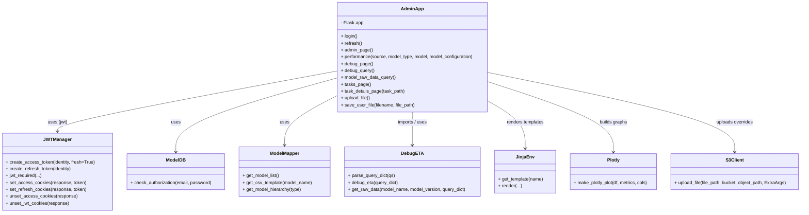
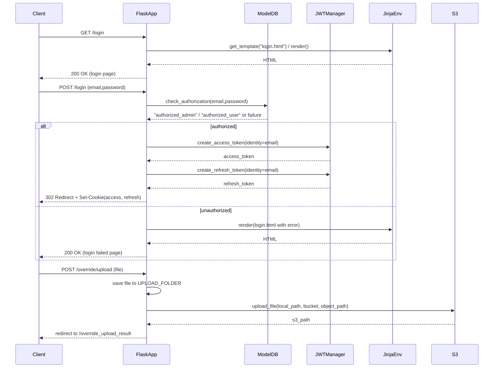

# Diagram: research/admin_app/admin_app.py


> Auto-generated by Obscura crawlers

## Diagram 1

```mermaid
flowchart LR
    Client(("Client Request")) --> Router{Route}
    Router --> Login[/login]
    Router --> Refresh[/refresh]
    Router --> Root[/]
    Router --> Performance[/performance/...]
    Router --> DebugQuery[/debug_query]
    Router --> ModelRawDataQuery[/model_raw_data_query]
    Router --> Tasks[/tasks/...]
    Router --> OverrideUpload[/override/upload]
    Router --> OverrideDownload[/override/download/<name>]

    subgraph AUTH[Authentication]
        JWTGuard{{"@jwt_required\n(optional/refresh/required)"}}
    end

    Login -->|GET| LoginGET["Render login.html via Jinja"]
    Login -->|POST| LoginPOST["Validate credentials"]
    LoginPOST --> AuthDB[model_db.check_authorization()]
    AuthDB --> LoginPOST
    LoginPOST -->|authorized| SetCookies["create_access_token / create_refresh_token\nset_access_cookies / set_refresh_cookies"]
    SetCookies --> RedirectAdmin["302 Redirect to / (admin_page)"]
    LoginPOST -->|unauthorized| LoginFail["Render login.html with error"]

    Refresh -->|POST + refresh token| JWTRefresh["create_access_token(fresh=False)"]
    JWTRefresh --> Refresh

    Root -->|optional JWT| AdminPage["admin_page() renders index.html"]
    Performance -->|reads parquet| S3Perf["s3://.../perf.parquet via pyarrow.pq"]
    S3Perf --> Performance
    Performance --> Plot["make_plotly_plot() -> plotly JSON"]

    DebugQuery --> DebugETA[debug_eta.parse_query_dict / debug_eta.debug_eta]
    DebugETA --> DebugQuery

    ModelRawDataQuery --> DebugETA
    ModelRawDataQuery --> RawDataFetch["debug_eta.get_raw_data(...) -> list"]
    RawDataFetch --> ModelRawDataQuery
    ModelRawDataQuery -->|format=csv| CSVResp["Return CSV attachment"]

    Tasks --> TaskData[get_task_data() reads task_data.json]
    TaskData --> Tasks

    OverrideUpload -->|GET| OverrideUploadForm["Render override_upload.html"]
    OverrideUpload -->|POST| OverrideUploadSave["Save to UPLOAD_FOLDER then save_user_file()"]
    OverrideUploadSave --> S3Upload[s3 upload via boto3 client]
    S3Upload --> OverrideUploadSave
    OverrideUploadSave --> OverrideResult["redirect override_upload_result"]

    OverrideDownload --> FileServe["send_from_directory(UPLOAD_FOLDER, name)"]
```

> SVG rendering failed for this diagram.

## Diagram 2



### SVG

<svg id="container" width="2798.8984375" xmlns="http://www.w3.org/2000/svg" class="classDiagram" height="744" viewBox="0 0 2798.8984375 744" role="graphics-document document" aria-roledescription="class"><style>#container{font-family:"trebuchet ms",verdana,arial,sans-serif;font-size:16px;fill:#333;}@keyframes edge-animation-frame{from{stroke-dashoffset:0;}}@keyframes dash{to{stroke-dashoffset:0;}}#container .edge-animation-slow{stroke-dasharray:9,5!important;stroke-dashoffset:900;animation:dash 50s linear infinite;stroke-linecap:round;}#container .edge-animation-fast{stroke-dasharray:9,5!important;stroke-dashoffset:900;animation:dash 20s linear infinite;stroke-linecap:round;}#container .error-icon{fill:#552222;}#container .error-text{fill:#552222;stroke:#552222;}#container .edge-thickness-normal{stroke-width:1px;}#container .edge-thickness-thick{stroke-width:3.5px;}#container .edge-pattern-solid{stroke-dasharray:0;}#container .edge-thickness-invisible{stroke-width:0;fill:none;}#container .edge-pattern-dashed{stroke-dasharray:3;}#container .edge-pattern-dotted{stroke-dasharray:2;}#container .marker{fill:#333333;stroke:#333333;}#container .marker.cross{stroke:#333333;}#container svg{font-family:"trebuchet ms",verdana,arial,sans-serif;font-size:16px;}#container p{margin:0;}#container g.classGroup text{fill:#9370DB;stroke:none;font-family:"trebuchet ms",verdana,arial,sans-serif;font-size:10px;}#container g.classGroup text .title{font-weight:bolder;}#container .nodeLabel,#container .edgeLabel{color:#131300;}#container .edgeLabel .label rect{fill:#ECECFF;}#container .label text{fill:#131300;}#container .labelBkg{background:#ECECFF;}#container .edgeLabel .label span{background:#ECECFF;}#container .classTitle{font-weight:bolder;}#container .node rect,#container .node circle,#container .node ellipse,#container .node polygon,#container .node path{fill:#ECECFF;stroke:#9370DB;stroke-width:1px;}#container .divider{stroke:#9370DB;stroke-width:1;}#container g.clickable{cursor:pointer;}#container g.classGroup rect{fill:#ECECFF;stroke:#9370DB;}#container g.classGroup line{stroke:#9370DB;stroke-width:1;}#container .classLabel .box{stroke:none;stroke-width:0;fill:#ECECFF;opacity:0.5;}#container .classLabel .label{fill:#9370DB;font-size:10px;}#container .relation{stroke:#333333;stroke-width:1;fill:none;}#container .dashed-line{stroke-dasharray:3;}#container .dotted-line{stroke-dasharray:1 2;}#container #compositionStart,#container .composition{fill:#333333!important;stroke:#333333!important;stroke-width:1;}#container #compositionEnd,#container .composition{fill:#333333!important;stroke:#333333!important;stroke-width:1;}#container #dependencyStart,#container .dependency{fill:#333333!important;stroke:#333333!important;stroke-width:1;}#container #dependencyStart,#container .dependency{fill:#333333!important;stroke:#333333!important;stroke-width:1;}#container #extensionStart,#container .extension{fill:transparent!important;stroke:#333333!important;stroke-width:1;}#container #extensionEnd,#container .extension{fill:transparent!important;stroke:#333333!important;stroke-width:1;}#container #aggregationStart,#container .aggregation{fill:transparent!important;stroke:#333333!important;stroke-width:1;}#container #aggregationEnd,#container .aggregation{fill:transparent!important;stroke:#333333!important;stroke-width:1;}#container #lollipopStart,#container .lollipop{fill:#ECECFF!important;stroke:#333333!important;stroke-width:1;}#container #lollipopEnd,#container .lollipop{fill:#ECECFF!important;stroke:#333333!important;stroke-width:1;}#container .edgeTerminals{font-size:11px;line-height:initial;}#container .classTitleText{text-anchor:middle;font-size:18px;fill:#333;}#container .label-icon{display:inline-block;height:1em;overflow:visible;vertical-align:-0.125em;}#container .node .label-icon path{fill:currentColor;stroke:revert;stroke-width:revert;}#container :root{--mermaid-font-family:"trebuchet ms",verdana,arial,sans-serif;}</style><g><defs><marker id="container_class-aggregationStart" class="marker aggregation class" refX="18" refY="7" markerWidth="190" markerHeight="240" orient="auto"><path d="M 18,7 L9,13 L1,7 L9,1 Z"></path></marker></defs><defs><marker id="container_class-aggregationEnd" class="marker aggregation class" refX="1" refY="7" markerWidth="20" markerHeight="28" orient="auto"><path d="M 18,7 L9,13 L1,7 L9,1 Z"></path></marker></defs><defs><marker id="container_class-extensionStart" class="marker extension class" refX="18" refY="7" markerWidth="190" markerHeight="240" orient="auto"><path d="M 1,7 L18,13 V 1 Z"></path></marker></defs><defs><marker id="container_class-extensionEnd" class="marker extension class" refX="1" refY="7" markerWidth="20" markerHeight="28" orient="auto"><path d="M 1,1 V 13 L18,7 Z"></path></marker></defs><defs><marker id="container_class-compositionStart" class="marker composition class" refX="18" refY="7" markerWidth="190" markerHeight="240" orient="auto"><path d="M 18,7 L9,13 L1,7 L9,1 Z"></path></marker></defs><defs><marker id="container_class-compositionEnd" class="marker composition class" refX="1" refY="7" markerWidth="20" markerHeight="28" orient="auto"><path d="M 18,7 L9,13 L1,7 L9,1 Z"></path></marker></defs><defs><marker id="container_class-dependencyStart" class="marker dependency class" refX="6" refY="7" markerWidth="190" markerHeight="240" orient="auto"><path d="M 5,7 L9,13 L1,7 L9,1 Z"></path></marker></defs><defs><marker id="container_class-dependencyEnd" class="marker dependency class" refX="13" refY="7" markerWidth="20" markerHeight="28" orient="auto"><path d="M 18,7 L9,13 L14,7 L9,1 Z"></path></marker></defs><defs><marker id="container_class-lollipopStart" class="marker lollipop class" refX="13" refY="7" markerWidth="190" markerHeight="240" orient="auto"><circle stroke="black" fill="transparent" cx="7" cy="7" r="6"></circle></marker></defs><defs><marker id="container_class-lollipopEnd" class="marker lollipop class" refX="1" refY="7" markerWidth="190" markerHeight="240" orient="auto"><circle stroke="black" fill="transparent" cx="7" cy="7" r="6"></circle></marker></defs><g class="root"><g class="clusters"></g><g class="edgePaths"><path d="M1170.879,249.075L1008.71,279.063C846.542,309.05,522.204,369.025,360.036,404.179C197.867,439.333,197.867,449.667,197.867,454.833L197.867,460" id="id_AdminApp_JWTManager_1" class="edge-thickness-normal edge-pattern-solid relation" style=";;;" data-edge="true" data-et="edge" data-id="id_AdminApp_JWTManager_1" data-points="W3sieCI6MTE3MC44Nzg5MDYyNSwieSI6MjQ5LjA3NTQ1Mjk1MTEyMTY2fSx7IngiOjE5Ny44NjcxODc1LCJ5Ijo0Mjl9LHsieCI6MTk3Ljg2NzE4NzUsInkiOjQ2Nn1d" marker-end="url(#container_class-dependencyEnd)"></path><path d="M1170.879,273.515L1077.327,299.429C983.776,325.344,796.673,377.172,703.122,420.253C609.57,463.333,609.57,497.667,609.57,514.833L609.57,532" id="id_AdminApp_ModelDB_2" class="edge-thickness-normal edge-pattern-solid relation" style=";;;" data-edge="true" data-et="edge" data-id="id_AdminApp_ModelDB_2" data-points="W3sieCI6MTE3MC44Nzg5MDYyNSwieSI6MjczLjUxNTMyMzQ3OTkzNzI1fSx7IngiOjYwOS41NzAzMTI1LCJ5Ijo0Mjl9LHsieCI6NjA5LjU3MDMxMjUsInkiOjUzOH1d" marker-end="url(#container_class-dependencyEnd)"></path><path d="M1170.879,336.263L1140.775,351.719C1110.672,367.175,1050.465,398.088,1020.361,426.71C990.258,455.333,990.258,481.667,990.258,494.833L990.258,508" id="id_AdminApp_ModelMapper_3" class="edge-thickness-normal edge-pattern-solid relation" style=";;;" data-edge="true" data-et="edge" data-id="id_AdminApp_ModelMapper_3" data-points="W3sieCI6MTE3MC44Nzg5MDYyNSwieSI6MzM2LjI2MjgyMTg2MDIyMDd9LHsieCI6OTkwLjI1NzgxMjUsInkiOjQyOX0seyJ4Ijo5OTAuMjU3ODEyNSwieSI6NTE0fV0=" marker-end="url(#container_class-dependencyEnd)"></path><path d="M1436.273,392L1436.273,398.167C1436.273,404.333,1436.273,416.667,1436.273,436C1436.273,455.333,1436.273,481.667,1436.273,494.833L1436.273,508" id="id_AdminApp_DebugETA_4" class="edge-thickness-normal edge-pattern-solid relation" style=";;;" data-edge="true" data-et="edge" data-id="id_AdminApp_DebugETA_4" data-points="W3sieCI6MTQzNi4yNzM0Mzc1LCJ5IjozOTJ9LHsieCI6MTQzNi4yNzM0Mzc1LCJ5Ijo0Mjl9LHsieCI6MTQzNi4yNzM0Mzc1LCJ5Ijo1MTR9XQ==" marker-end="url(#container_class-dependencyEnd)"></path><path d="M1701.668,354.666L1722.926,367.055C1744.185,379.444,1786.702,404.222,1807.96,431.778C1829.219,459.333,1829.219,489.667,1829.219,504.833L1829.219,520" id="id_AdminApp_JinjaEnv_5" class="edge-thickness-normal edge-pattern-solid relation" style=";;;" data-edge="true" data-et="edge" data-id="id_AdminApp_JinjaEnv_5" data-points="W3sieCI6MTcwMS42Njc5Njg3NSwieSI6MzU0LjY2NjE3MjkzMjc3OTN9LHsieCI6MTgyOS4yMTg3NSwieSI6NDI5fSx7IngiOjE4MjkuMjE4NzUsInkiOjUyNn1d" marker-end="url(#container_class-dependencyEnd)"></path><path d="M1701.668,286.568L1774.444,310.307C1847.22,334.046,1992.772,381.523,2065.548,422.428C2138.324,463.333,2138.324,497.667,2138.324,514.833L2138.324,532" id="id_AdminApp_Plotly_6" class="edge-thickness-normal edge-pattern-solid relation" style=";;;" data-edge="true" data-et="edge" data-id="id_AdminApp_Plotly_6" data-points="W3sieCI6MTcwMS42Njc5Njg3NSwieSI6Mjg2LjU2ODMwNzEzNTkwMjA1fSx7IngiOjIxMzguMzI0MjE4NzUsInkiOjQyOX0seyJ4IjoyMTM4LjMyNDIxODc1LCJ5Ijo1Mzh9XQ==" marker-end="url(#container_class-dependencyEnd)"></path><path d="M1701.668,253.783L1845.769,282.986C1989.87,312.189,2278.072,370.594,2422.173,416.964C2566.273,463.333,2566.273,497.667,2566.273,514.833L2566.273,532" id="id_AdminApp_S3Client_7" class="edge-thickness-normal edge-pattern-solid relation" style=";;;" data-edge="true" data-et="edge" data-id="id_AdminApp_S3Client_7" data-points="W3sieCI6MTcwMS42Njc5Njg3NSwieSI6MjUzLjc4MzQ5MzUwMTEwNjJ9LHsieCI6MjU2Ni4yNzM0Mzc1LCJ5Ijo0Mjl9LHsieCI6MjU2Ni4yNzM0Mzc1LCJ5Ijo1Mzh9XQ==" marker-end="url(#container_class-dependencyEnd)"></path></g><g class="edgeLabels"><g class="edgeLabel" transform="translate(197.8671875, 429)"><g class="label" data-id="id_AdminApp_JWTManager_1" transform="translate(-34.9453125, -12)"><foreignObject width="69.890625" height="24"><div xmlns="http://www.w3.org/1999/xhtml" class="labelBkg" style="display: table-cell; white-space: nowrap; line-height: 1.5; max-width: 200px; text-align: center;"><span class="edgeLabel"><p>uses (jwt)</p></span></div></foreignObject></g></g><g class="edgeLabel" transform="translate(609.5703125, 429)"><g class="label" data-id="id_AdminApp_ModelDB_2" transform="translate(-16.4921875, -12)"><foreignObject width="32.984375" height="24"><div xmlns="http://www.w3.org/1999/xhtml" class="labelBkg" style="display: table-cell; white-space: nowrap; line-height: 1.5; max-width: 200px; text-align: center;"><span class="edgeLabel"><p>uses</p></span></div></foreignObject></g></g><g class="edgeLabel" transform="translate(990.2578125, 429)"><g class="label" data-id="id_AdminApp_ModelMapper_3" transform="translate(-16.4921875, -12)"><foreignObject width="32.984375" height="24"><div xmlns="http://www.w3.org/1999/xhtml" class="labelBkg" style="display: table-cell; white-space: nowrap; line-height: 1.5; max-width: 200px; text-align: center;"><span class="edgeLabel"><p>uses</p></span></div></foreignObject></g></g><g class="edgeLabel" transform="translate(1436.2734375, 429)"><g class="label" data-id="id_AdminApp_DebugETA_4" transform="translate(-53.140625, -12)"><foreignObject width="106.28125" height="24"><div xmlns="http://www.w3.org/1999/xhtml" class="labelBkg" style="display: table-cell; white-space: nowrap; line-height: 1.5; max-width: 200px; text-align: center;"><span class="edgeLabel"><p>imports / uses</p></span></div></foreignObject></g></g><g class="edgeLabel" transform="translate(1829.21875, 429)"><g class="label" data-id="id_AdminApp_JinjaEnv_5" transform="translate(-66.125, -12)"><foreignObject width="132.25" height="24"><div xmlns="http://www.w3.org/1999/xhtml" class="labelBkg" style="display: table-cell; white-space: nowrap; line-height: 1.5; max-width: 200px; text-align: center;"><span class="edgeLabel"><p>renders templates</p></span></div></foreignObject></g></g><g class="edgeLabel" transform="translate(2138.32421875, 429)"><g class="label" data-id="id_AdminApp_Plotly_6" transform="translate(-49.109375, -12)"><foreignObject width="98.21875" height="24"><div xmlns="http://www.w3.org/1999/xhtml" class="labelBkg" style="display: table-cell; white-space: nowrap; line-height: 1.5; max-width: 200px; text-align: center;"><span class="edgeLabel"><p>builds graphs</p></span></div></foreignObject></g></g><g class="edgeLabel" transform="translate(2566.2734375, 429)"><g class="label" data-id="id_AdminApp_S3Client_7" transform="translate(-65.515625, -12)"><foreignObject width="131.03125" height="24"><div xmlns="http://www.w3.org/1999/xhtml" class="labelBkg" style="display: table-cell; white-space: nowrap; line-height: 1.5; max-width: 200px; text-align: center;"><span class="edgeLabel"><p>uploads overrides</p></span></div></foreignObject></g></g></g><g class="nodes"><g class="node default" id="classId-AdminApp-0" transform="translate(1436.2734375, 200)"><g class="basic label-container"><path d="M-265.39453125 -192 L265.39453125 -192 L265.39453125 192 L-265.39453125 192" stroke="none" stroke-width="0" fill="#ECECFF" style=""></path><path d="M-265.39453125 -192 C-109.9086760826601 -192, 45.57717908467981 -192, 265.39453125 -192 M-265.39453125 -192 C-130.66962658452894 -192, 4.0552780809421165 -192, 265.39453125 -192 M265.39453125 -192 C265.39453125 -104.46574988769423, 265.39453125 -16.93149977538846, 265.39453125 192 M265.39453125 -192 C265.39453125 -76.94056214765075, 265.39453125 38.118875704698496, 265.39453125 192 M265.39453125 192 C127.9871170047941 192, -9.420297240411799 192, -265.39453125 192 M265.39453125 192 C102.180763961189 192, -61.033003327622 192, -265.39453125 192 M-265.39453125 192 C-265.39453125 74.03816586899269, -265.39453125 -43.923668262014615, -265.39453125 -192 M-265.39453125 192 C-265.39453125 98.0374204166226, -265.39453125 4.07484083324519, -265.39453125 -192" stroke="#9370DB" stroke-width="1.3" fill="none" stroke-dasharray="0 0" style=""></path></g><g class="annotation-group text" transform="translate(0, -168)"></g><g class="label-group text" transform="translate(-37.4296875, -168)"><g class="label" style="font-weight: bolder" transform="translate(0,-12)"><foreignObject width="74.859375" height="24"><div xmlns="http://www.w3.org/1999/xhtml" style="display: table-cell; white-space: nowrap; line-height: 1.5; max-width: 125px; text-align: center;"><span class="nodeLabel markdown-node-label" style=""><p>AdminApp</p></span></div></foreignObject></g></g><g class="members-group text" transform="translate(-253.39453125, -120)"><g class="label" style="" transform="translate(0,-12)"><foreignObject width="79.15625" height="24"><div xmlns="http://www.w3.org/1999/xhtml" style="display: table-cell; white-space: nowrap; line-height: 1.5; max-width: 137px; text-align: center;"><span class="nodeLabel markdown-node-label" style=""><p>- Flask app</p></span></div></foreignObject></g></g><g class="methods-group text" transform="translate(-253.39453125, -72)"><g class="label" style="" transform="translate(0,-12)"><foreignObject width="58.765625" height="24"><div xmlns="http://www.w3.org/1999/xhtml" style="display: table-cell; white-space: nowrap; line-height: 1.5; max-width: 116px; text-align: center;"><span class="nodeLabel markdown-node-label" style=""><p>+ login()</p></span></div></foreignObject></g><g class="label" style="" transform="translate(0,12)"><foreignObject width="73.640625" height="24"><div xmlns="http://www.w3.org/1999/xhtml" style="display: table-cell; white-space: nowrap; line-height: 1.5; max-width: 131px; text-align: center;"><span class="nodeLabel markdown-node-label" style=""><p>+ refresh()</p></span></div></foreignObject></g><g class="label" style="" transform="translate(0,36)"><foreignObject width="111.46875" height="24"><div xmlns="http://www.w3.org/1999/xhtml" style="display: table-cell; white-space: nowrap; line-height: 1.5; max-width: 169px; text-align: center;"><span class="nodeLabel markdown-node-label" style=""><p>+ admin_page()</p></span></div></foreignObject></g><g class="label" style="" transform="translate(0,60)"><foreignObject width="469.359375" height="24"><div xmlns="http://www.w3.org/1999/xhtml" style="display: table-cell; white-space: nowrap; line-height: 1.5; max-width: 527px; text-align: center;"><span class="nodeLabel markdown-node-label" style=""><p>+ performance(source, model_type, model, model_configuration)</p></span></div></foreignObject></g><g class="label" style="" transform="translate(0,84)"><foreignObject width="111.078125" height="24"><div xmlns="http://www.w3.org/1999/xhtml" style="display: table-cell; white-space: nowrap; line-height: 1.5; max-width: 168px; text-align: center;"><span class="nodeLabel markdown-node-label" style=""><p>+ debug_page()</p></span></div></foreignObject></g><g class="label" style="" transform="translate(0,108)"><foreignObject width="117.734375" height="24"><div xmlns="http://www.w3.org/1999/xhtml" style="display: table-cell; white-space: nowrap; line-height: 1.5; max-width: 175px; text-align: center;"><span class="nodeLabel markdown-node-label" style=""><p>+ debug_query()</p></span></div></foreignObject></g><g class="label" style="" transform="translate(0,132)"><foreignObject width="192.625" height="24"><div xmlns="http://www.w3.org/1999/xhtml" style="display: table-cell; white-space: nowrap; line-height: 1.5; max-width: 250px; text-align: center;"><span class="nodeLabel markdown-node-label" style=""><p>+ model_raw_data_query()</p></span></div></foreignObject></g><g class="label" style="" transform="translate(0,156)"><foreignObject width="102.53125" height="24"><div xmlns="http://www.w3.org/1999/xhtml" style="display: table-cell; white-space: nowrap; line-height: 1.5; max-width: 160px; text-align: center;"><span class="nodeLabel markdown-node-label" style=""><p>+ tasks_page()</p></span></div></foreignObject></g><g class="label" style="" transform="translate(0,180)"><foreignObject width="223.859375" height="24"><div xmlns="http://www.w3.org/1999/xhtml" style="display: table-cell; white-space: nowrap; line-height: 1.5; max-width: 281px; text-align: center;"><span class="nodeLabel markdown-node-label" style=""><p>+ task_details_page(task_path)</p></span></div></foreignObject></g><g class="label" style="" transform="translate(0,204)"><foreignObject width="104.015625" height="24"><div xmlns="http://www.w3.org/1999/xhtml" style="display: table-cell; white-space: nowrap; line-height: 1.5; max-width: 161px; text-align: center;"><span class="nodeLabel markdown-node-label" style=""><p>+ upload_file()</p></span></div></foreignObject></g><g class="label" style="" transform="translate(0,228)"><foreignObject width="258.203125" height="24"><div xmlns="http://www.w3.org/1999/xhtml" style="display: table-cell; white-space: nowrap; line-height: 1.5; max-width: 316px; text-align: center;"><span class="nodeLabel markdown-node-label" style=""><p>+ save_user_file(filename, file_path)</p></span></div></foreignObject></g></g><g class="divider" style=""><path d="M-265.39453125 -144 C-107.3317772609322 -144, 50.7309767281356 -144, 265.39453125 -144 M-265.39453125 -144 C-127.60416230857359 -144, 10.186206632852816 -144, 265.39453125 -144" stroke="#9370DB" stroke-width="1.3" fill="none" stroke-dasharray="0 0" style=""></path></g><g class="divider" style=""><path d="M-265.39453125 -96 C-60.25984498428258 -96, 144.87484128143484 -96, 265.39453125 -96 M-265.39453125 -96 C-55.20611569132652 -96, 154.98229986734697 -96, 265.39453125 -96" stroke="#9370DB" stroke-width="1.3" fill="none" stroke-dasharray="0 0" style=""></path></g></g><g class="node default" id="classId-JWTManager-1" transform="translate(197.8671875, 601)"><g class="basic label-container"><path d="M-189.8671875 -135 L189.8671875 -135 L189.8671875 135 L-189.8671875 135" stroke="none" stroke-width="0" fill="#ECECFF" style=""></path><path d="M-189.8671875 -135 C-43.5257467027713 -135, 102.8156940944574 -135, 189.8671875 -135 M-189.8671875 -135 C-78.07791937215387 -135, 33.711348755692256 -135, 189.8671875 -135 M189.8671875 -135 C189.8671875 -51.979196183292004, 189.8671875 31.041607633415992, 189.8671875 135 M189.8671875 -135 C189.8671875 -64.18569287397901, 189.8671875 6.628614252041984, 189.8671875 135 M189.8671875 135 C45.64160968846653 135, -98.58396812306694 135, -189.8671875 135 M189.8671875 135 C88.2907078236292 135, -13.28577185274159 135, -189.8671875 135 M-189.8671875 135 C-189.8671875 67.26975063099356, -189.8671875 -0.46049873801288754, -189.8671875 -135 M-189.8671875 135 C-189.8671875 59.59745097440786, -189.8671875 -15.805098051184274, -189.8671875 -135" stroke="#9370DB" stroke-width="1.3" fill="none" stroke-dasharray="0 0" style=""></path></g><g class="annotation-group text" transform="translate(0, -111)"></g><g class="label-group text" transform="translate(-44.921875, -111)"><g class="label" style="font-weight: bolder" transform="translate(0,-12)"><foreignObject width="89.84375" height="24"><div xmlns="http://www.w3.org/1999/xhtml" style="display: table-cell; white-space: nowrap; line-height: 1.5; max-width: 139px; text-align: center;"><span class="nodeLabel markdown-node-label" style=""><p>JWTManager</p></span></div></foreignObject></g></g><g class="members-group text" transform="translate(-177.8671875, -63)"></g><g class="methods-group text" transform="translate(-177.8671875, -33)"><g class="label" style="" transform="translate(0,-12)"><foreignObject width="310.8125" height="24"><div xmlns="http://www.w3.org/1999/xhtml" style="display: table-cell; white-space: nowrap; line-height: 1.5; max-width: 368px; text-align: center;"><span class="nodeLabel markdown-node-label" style=""><p>+ create_access_token(identity, fresh=True)</p></span></div></foreignObject></g><g class="label" style="" transform="translate(0,12)"><foreignObject width="231.5625" height="24"><div xmlns="http://www.w3.org/1999/xhtml" style="display: table-cell; white-space: nowrap; line-height: 1.5; max-width: 289px; text-align: center;"><span class="nodeLabel markdown-node-label" style=""><p>+ create_refresh_token(identity)</p></span></div></foreignObject></g><g class="label" style="" transform="translate(0,36)"><foreignObject width="125.953125" height="24"><div xmlns="http://www.w3.org/1999/xhtml" style="display: table-cell; white-space: nowrap; line-height: 1.5; max-width: 183px; text-align: center;"><span class="nodeLabel markdown-node-label" style=""><p>+ jwt_required(...)</p></span></div></foreignObject></g><g class="label" style="" transform="translate(0,60)"><foreignObject width="277.265625" height="24"><div xmlns="http://www.w3.org/1999/xhtml" style="display: table-cell; white-space: nowrap; line-height: 1.5; max-width: 335px; text-align: center;"><span class="nodeLabel markdown-node-label" style=""><p>+ set_access_cookies(response, token)</p></span></div></foreignObject></g><g class="label" style="" transform="translate(0,84)"><foreignObject width="282.09375" height="24"><div xmlns="http://www.w3.org/1999/xhtml" style="display: table-cell; white-space: nowrap; line-height: 1.5; max-width: 339px; text-align: center;"><span class="nodeLabel markdown-node-label" style=""><p>+ set_refresh_cookies(response, token)</p></span></div></foreignObject></g><g class="label" style="" transform="translate(0,108)"><foreignObject width="247.015625" height="24"><div xmlns="http://www.w3.org/1999/xhtml" style="display: table-cell; white-space: nowrap; line-height: 1.5; max-width: 304px; text-align: center;"><span class="nodeLabel markdown-node-label" style=""><p>+ unset_access_cookies(response)</p></span></div></foreignObject></g><g class="label" style="" transform="translate(0,132)"><foreignObject width="223.09375" height="24"><div xmlns="http://www.w3.org/1999/xhtml" style="display: table-cell; white-space: nowrap; line-height: 1.5; max-width: 280px; text-align: center;"><span class="nodeLabel markdown-node-label" style=""><p>+ unset_jwt_cookies(response)</p></span></div></foreignObject></g></g><g class="divider" style=""><path d="M-189.8671875 -87 C-47.55424375370794 -87, 94.75869999258413 -87, 189.8671875 -87 M-189.8671875 -87 C-83.94976140479012 -87, 21.967664690419753 -87, 189.8671875 -87" stroke="#9370DB" stroke-width="1.3" fill="none" stroke-dasharray="0 0" style=""></path></g><g class="divider" style=""><path d="M-189.8671875 -63 C-38.38906302046328 -63, 113.08906145907343 -63, 189.8671875 -63 M-189.8671875 -63 C-108.14197488177793 -63, -26.416762263555853 -63, 189.8671875 -63" stroke="#9370DB" stroke-width="1.3" fill="none" stroke-dasharray="0 0" style=""></path></g></g><g class="node default" id="classId-ModelDB-2" transform="translate(609.5703125, 601)"><g class="basic label-container"><path d="M-171.8359375 -63 L171.8359375 -63 L171.8359375 63 L-171.8359375 63" stroke="none" stroke-width="0" fill="#ECECFF" style=""></path><path d="M-171.8359375 -63 C-40.0886792325399 -63, 91.6585790349202 -63, 171.8359375 -63 M-171.8359375 -63 C-80.32008215549646 -63, 11.19577318900707 -63, 171.8359375 -63 M171.8359375 -63 C171.8359375 -18.06301182051798, 171.8359375 26.873976358964043, 171.8359375 63 M171.8359375 -63 C171.8359375 -37.43054114285371, 171.8359375 -11.861082285707425, 171.8359375 63 M171.8359375 63 C81.43191827953974 63, -8.972100940920512 63, -171.8359375 63 M171.8359375 63 C41.22874807573373 63, -89.37844134853253 63, -171.8359375 63 M-171.8359375 63 C-171.8359375 33.77396467845723, -171.8359375 4.547929356914459, -171.8359375 -63 M-171.8359375 63 C-171.8359375 30.639455646482034, -171.8359375 -1.721088707035932, -171.8359375 -63" stroke="#9370DB" stroke-width="1.3" fill="none" stroke-dasharray="0 0" style=""></path></g><g class="annotation-group text" transform="translate(0, -39)"></g><g class="label-group text" transform="translate(-32.703125, -39)"><g class="label" style="font-weight: bolder" transform="translate(0,-12)"><foreignObject width="65.40625" height="24"><div xmlns="http://www.w3.org/1999/xhtml" style="display: table-cell; white-space: nowrap; line-height: 1.5; max-width: 115px; text-align: center;"><span class="nodeLabel markdown-node-label" style=""><p>ModelDB</p></span></div></foreignObject></g></g><g class="members-group text" transform="translate(-159.8359375, 9)"></g><g class="methods-group text" transform="translate(-159.8359375, 39)"><g class="label" style="" transform="translate(0,-12)"><foreignObject width="286.96875" height="24"><div xmlns="http://www.w3.org/1999/xhtml" style="display: table-cell; white-space: nowrap; line-height: 1.5; max-width: 344px; text-align: center;"><span class="nodeLabel markdown-node-label" style=""><p>+ check_authorization(email, password)</p></span></div></foreignObject></g></g><g class="divider" style=""><path d="M-171.8359375 -15 C-76.51224121076814 -15, 18.811455078463723 -15, 171.8359375 -15 M-171.8359375 -15 C-63.77775196414645 -15, 44.28043357170711 -15, 171.8359375 -15" stroke="#9370DB" stroke-width="1.3" fill="none" stroke-dasharray="0 0" style=""></path></g><g class="divider" style=""><path d="M-171.8359375 9 C-88.09066303695379 9, -4.34538857390757 9, 171.8359375 9 M-171.8359375 9 C-74.50801383292365 9, 22.819909834152696 9, 171.8359375 9" stroke="#9370DB" stroke-width="1.3" fill="none" stroke-dasharray="0 0" style=""></path></g></g><g class="node default" id="classId-ModelMapper-3" transform="translate(990.2578125, 601)"><g class="basic label-container"><path d="M-158.8515625 -87 L158.8515625 -87 L158.8515625 87 L-158.8515625 87" stroke="none" stroke-width="0" fill="#ECECFF" style=""></path><path d="M-158.8515625 -87 C-54.03198825762452 -87, 50.78758598475096 -87, 158.8515625 -87 M-158.8515625 -87 C-76.9842051438152 -87, 4.883152212369595 -87, 158.8515625 -87 M158.8515625 -87 C158.8515625 -18.1642512029632, 158.8515625 50.6714975940736, 158.8515625 87 M158.8515625 -87 C158.8515625 -26.851211307041623, 158.8515625 33.29757738591675, 158.8515625 87 M158.8515625 87 C40.922201982197336 87, -77.00715853560533 87, -158.8515625 87 M158.8515625 87 C80.53388317873946 87, 2.2162038574789165 87, -158.8515625 87 M-158.8515625 87 C-158.8515625 20.034730479403407, -158.8515625 -46.930539041193185, -158.8515625 -87 M-158.8515625 87 C-158.8515625 47.37656608384206, -158.8515625 7.7531321676841145, -158.8515625 -87" stroke="#9370DB" stroke-width="1.3" fill="none" stroke-dasharray="0 0" style=""></path></g><g class="annotation-group text" transform="translate(0, -63)"></g><g class="label-group text" transform="translate(-50.40625, -63)"><g class="label" style="font-weight: bolder" transform="translate(0,-12)"><foreignObject width="100.8125" height="24"><div xmlns="http://www.w3.org/1999/xhtml" style="display: table-cell; white-space: nowrap; line-height: 1.5; max-width: 151px; text-align: center;"><span class="nodeLabel markdown-node-label" style=""><p>ModelMapper</p></span></div></foreignObject></g></g><g class="members-group text" transform="translate(-146.8515625, -15)"></g><g class="methods-group text" transform="translate(-146.8515625, 15)"><g class="label" style="" transform="translate(0,-12)"><foreignObject width="130.125" height="24"><div xmlns="http://www.w3.org/1999/xhtml" style="display: table-cell; white-space: nowrap; line-height: 1.5; max-width: 187px; text-align: center;"><span class="nodeLabel markdown-node-label" style=""><p>+ get_model_list()</p></span></div></foreignObject></g><g class="label" style="" transform="translate(0,12)"><foreignObject width="243.296875" height="24"><div xmlns="http://www.w3.org/1999/xhtml" style="display: table-cell; white-space: nowrap; line-height: 1.5; max-width: 301px; text-align: center;"><span class="nodeLabel markdown-node-label" style=""><p>+ get_csv_template(model_name)</p></span></div></foreignObject></g><g class="label" style="" transform="translate(0,36)"><foreignObject width="207.03125" height="24"><div xmlns="http://www.w3.org/1999/xhtml" style="display: table-cell; white-space: nowrap; line-height: 1.5; max-width: 264px; text-align: center;"><span class="nodeLabel markdown-node-label" style=""><p>+ get_model_hierarchy(type)</p></span></div></foreignObject></g></g><g class="divider" style=""><path d="M-158.8515625 -39 C-51.52803404147886 -39, 55.79549441704228 -39, 158.8515625 -39 M-158.8515625 -39 C-80.55140898783576 -39, -2.2512554756715133 -39, 158.8515625 -39" stroke="#9370DB" stroke-width="1.3" fill="none" stroke-dasharray="0 0" style=""></path></g><g class="divider" style=""><path d="M-158.8515625 -15 C-65.35554438724866 -15, 28.140473725502687 -15, 158.8515625 -15 M-158.8515625 -15 C-73.50539983270282 -15, 11.840762834594358 -15, 158.8515625 -15" stroke="#9370DB" stroke-width="1.3" fill="none" stroke-dasharray="0 0" style=""></path></g></g><g class="node default" id="classId-DebugETA-4" transform="translate(1436.2734375, 601)"><g class="basic label-container"><path d="M-237.1640625 -87 L237.1640625 -87 L237.1640625 87 L-237.1640625 87" stroke="none" stroke-width="0" fill="#ECECFF" style=""></path><path d="M-237.1640625 -87 C-101.57841875737955 -87, 34.007224985240896 -87, 237.1640625 -87 M-237.1640625 -87 C-129.2650856270762 -87, -21.36610875415238 -87, 237.1640625 -87 M237.1640625 -87 C237.1640625 -36.024898014648166, 237.1640625 14.950203970703669, 237.1640625 87 M237.1640625 -87 C237.1640625 -26.41543475809525, 237.1640625 34.1691304838095, 237.1640625 87 M237.1640625 87 C135.12017544709698 87, 33.076288394193995 87, -237.1640625 87 M237.1640625 87 C92.2476068990791 87, -52.668848701841796 87, -237.1640625 87 M-237.1640625 87 C-237.1640625 29.732446405523177, -237.1640625 -27.535107188953646, -237.1640625 -87 M-237.1640625 87 C-237.1640625 42.57839312326142, -237.1640625 -1.8432137534771584, -237.1640625 -87" stroke="#9370DB" stroke-width="1.3" fill="none" stroke-dasharray="0 0" style=""></path></g><g class="annotation-group text" transform="translate(0, -63)"></g><g class="label-group text" transform="translate(-36.234375, -63)"><g class="label" style="font-weight: bolder" transform="translate(0,-12)"><foreignObject width="72.46875" height="24"><div xmlns="http://www.w3.org/1999/xhtml" style="display: table-cell; white-space: nowrap; line-height: 1.5; max-width: 122px; text-align: center;"><span class="nodeLabel markdown-node-label" style=""><p>DebugETA</p></span></div></foreignObject></g></g><g class="members-group text" transform="translate(-225.1640625, -15)"></g><g class="methods-group text" transform="translate(-225.1640625, 15)"><g class="label" style="" transform="translate(0,-12)"><foreignObject width="164.171875" height="24"><div xmlns="http://www.w3.org/1999/xhtml" style="display: table-cell; white-space: nowrap; line-height: 1.5; max-width: 222px; text-align: center;"><span class="nodeLabel markdown-node-label" style=""><p>+ parse_query_dict(qs)</p></span></div></foreignObject></g><g class="label" style="" transform="translate(0,12)"><foreignObject width="175.84375" height="24"><div xmlns="http://www.w3.org/1999/xhtml" style="display: table-cell; white-space: nowrap; line-height: 1.5; max-width: 233px; text-align: center;"><span class="nodeLabel markdown-node-label" style=""><p>+ debug_eta(query_dict)</p></span></div></foreignObject></g><g class="label" style="" transform="translate(0,36)"><foreignObject width="414.09375" height="24"><div xmlns="http://www.w3.org/1999/xhtml" style="display: table-cell; white-space: nowrap; line-height: 1.5; max-width: 471px; text-align: center;"><span class="nodeLabel markdown-node-label" style=""><p>+ get_raw_data(model_name, model_version, query_dict)</p></span></div></foreignObject></g></g><g class="divider" style=""><path d="M-237.1640625 -39 C-90.94385117815568 -39, 55.276360143688635 -39, 237.1640625 -39 M-237.1640625 -39 C-79.75243361439993 -39, 77.65919527120013 -39, 237.1640625 -39" stroke="#9370DB" stroke-width="1.3" fill="none" stroke-dasharray="0 0" style=""></path></g><g class="divider" style=""><path d="M-237.1640625 -15 C-73.24959496223985 -15, 90.66487257552029 -15, 237.1640625 -15 M-237.1640625 -15 C-136.86294527000257 -15, -36.56182804000514 -15, 237.1640625 -15" stroke="#9370DB" stroke-width="1.3" fill="none" stroke-dasharray="0 0" style=""></path></g></g><g class="node default" id="classId-JinjaEnv-5" transform="translate(1829.21875, 601)"><g class="basic label-container"><path d="M-105.78125 -75 L105.78125 -75 L105.78125 75 L-105.78125 75" stroke="none" stroke-width="0" fill="#ECECFF" style=""></path><path d="M-105.78125 -75 C-52.650703080592116 -75, 0.47984383881576775 -75, 105.78125 -75 M-105.78125 -75 C-48.42564052786655 -75, 8.929968944266903 -75, 105.78125 -75 M105.78125 -75 C105.78125 -34.03440721826737, 105.78125 6.931185563465263, 105.78125 75 M105.78125 -75 C105.78125 -27.641207099582346, 105.78125 19.71758580083531, 105.78125 75 M105.78125 75 C53.80393850103488 75, 1.8266270020697561 75, -105.78125 75 M105.78125 75 C46.43616311826953 75, -12.908923763460933 75, -105.78125 75 M-105.78125 75 C-105.78125 22.087995824498222, -105.78125 -30.824008351003556, -105.78125 -75 M-105.78125 75 C-105.78125 37.81685027359419, -105.78125 0.6337005471883828, -105.78125 -75" stroke="#9370DB" stroke-width="1.3" fill="none" stroke-dasharray="0 0" style=""></path></g><g class="annotation-group text" transform="translate(0, -51)"></g><g class="label-group text" transform="translate(-28.84375, -51)"><g class="label" style="font-weight: bolder" transform="translate(0,-12)"><foreignObject width="57.6875" height="24"><div xmlns="http://www.w3.org/1999/xhtml" style="display: table-cell; white-space: nowrap; line-height: 1.5; max-width: 108px; text-align: center;"><span class="nodeLabel markdown-node-label" style=""><p>JinjaEnv</p></span></div></foreignObject></g></g><g class="members-group text" transform="translate(-93.78125, -3)"></g><g class="methods-group text" transform="translate(-93.78125, 27)"><g class="label" style="" transform="translate(0,-12)"><foreignObject width="158.71875" height="24"><div xmlns="http://www.w3.org/1999/xhtml" style="display: table-cell; white-space: nowrap; line-height: 1.5; max-width: 216px; text-align: center;"><span class="nodeLabel markdown-node-label" style=""><p>+ get_template(name)</p></span></div></foreignObject></g><g class="label" style="" transform="translate(0,12)"><foreignObject width="82.375" height="24"><div xmlns="http://www.w3.org/1999/xhtml" style="display: table-cell; white-space: nowrap; line-height: 1.5; max-width: 140px; text-align: center;"><span class="nodeLabel markdown-node-label" style=""><p>+ render(...)</p></span></div></foreignObject></g></g><g class="divider" style=""><path d="M-105.78125 -27 C-22.64634872112036 -27, 60.48855255775928 -27, 105.78125 -27 M-105.78125 -27 C-30.569282161088267 -27, 44.642685677823465 -27, 105.78125 -27" stroke="#9370DB" stroke-width="1.3" fill="none" stroke-dasharray="0 0" style=""></path></g><g class="divider" style=""><path d="M-105.78125 -3 C-42.894597817786355 -3, 19.99205436442729 -3, 105.78125 -3 M-105.78125 -3 C-27.79125096454183 -3, 50.19874807091634 -3, 105.78125 -3" stroke="#9370DB" stroke-width="1.3" fill="none" stroke-dasharray="0 0" style=""></path></g></g><g class="node default" id="classId-Plotly-6" transform="translate(2138.32421875, 601)"><g class="basic label-container"><path d="M-153.32421875 -63 L153.32421875 -63 L153.32421875 63 L-153.32421875 63" stroke="none" stroke-width="0" fill="#ECECFF" style=""></path><path d="M-153.32421875 -63 C-39.52946331287869 -63, 74.26529212424262 -63, 153.32421875 -63 M-153.32421875 -63 C-52.30493130261996 -63, 48.714356144760075 -63, 153.32421875 -63 M153.32421875 -63 C153.32421875 -19.783711902012413, 153.32421875 23.432576195975173, 153.32421875 63 M153.32421875 -63 C153.32421875 -20.77845806181034, 153.32421875 21.44308387637932, 153.32421875 63 M153.32421875 63 C39.95170385074546 63, -73.42081104850908 63, -153.32421875 63 M153.32421875 63 C80.66104638099524 63, 7.99787401199049 63, -153.32421875 63 M-153.32421875 63 C-153.32421875 28.5231455233545, -153.32421875 -5.953708953290999, -153.32421875 -63 M-153.32421875 63 C-153.32421875 31.687393605475112, -153.32421875 0.37478721095022394, -153.32421875 -63" stroke="#9370DB" stroke-width="1.3" fill="none" stroke-dasharray="0 0" style=""></path></g><g class="annotation-group text" transform="translate(0, -39)"></g><g class="label-group text" transform="translate(-21.1796875, -39)"><g class="label" style="font-weight: bolder" transform="translate(0,-12)"><foreignObject width="42.359375" height="24"><div xmlns="http://www.w3.org/1999/xhtml" style="display: table-cell; white-space: nowrap; line-height: 1.5; max-width: 91px; text-align: center;"><span class="nodeLabel markdown-node-label" style=""><p>Plotly</p></span></div></foreignObject></g></g><g class="members-group text" transform="translate(-141.32421875, 9)"></g><g class="methods-group text" transform="translate(-141.32421875, 39)"><g class="label" style="" transform="translate(0,-12)"><foreignObject width="261.46875" height="24"><div xmlns="http://www.w3.org/1999/xhtml" style="display: table-cell; white-space: nowrap; line-height: 1.5; max-width: 319px; text-align: center;"><span class="nodeLabel markdown-node-label" style=""><p>+ make_plotly_plot(df, metrics, cols)</p></span></div></foreignObject></g></g><g class="divider" style=""><path d="M-153.32421875 -15 C-38.2872134248782 -15, 76.7497919002436 -15, 153.32421875 -15 M-153.32421875 -15 C-91.13270326498193 -15, -28.941187779963855 -15, 153.32421875 -15" stroke="#9370DB" stroke-width="1.3" fill="none" stroke-dasharray="0 0" style=""></path></g><g class="divider" style=""><path d="M-153.32421875 9 C-88.64111051220424 9, -23.95800227440847 9, 153.32421875 9 M-153.32421875 9 C-60.50103190878784 9, 32.322154932424326 9, 153.32421875 9" stroke="#9370DB" stroke-width="1.3" fill="none" stroke-dasharray="0 0" style=""></path></g></g><g class="node default" id="classId-S3Client-7" transform="translate(2566.2734375, 601)"><g class="basic label-container"><path d="M-224.625 -63 L224.625 -63 L224.625 63 L-224.625 63" stroke="none" stroke-width="0" fill="#ECECFF" style=""></path><path d="M-224.625 -63 C-64.0500014733897 -63, 96.5249970532206 -63, 224.625 -63 M-224.625 -63 C-75.34089755381981 -63, 73.94320489236037 -63, 224.625 -63 M224.625 -63 C224.625 -12.61334942225136, 224.625 37.77330115549728, 224.625 63 M224.625 -63 C224.625 -13.465913071234127, 224.625 36.06817385753175, 224.625 63 M224.625 63 C52.21947914982769 63, -120.18604170034462 63, -224.625 63 M224.625 63 C124.86735505479598 63, 25.10971010959196 63, -224.625 63 M-224.625 63 C-224.625 28.168211337809154, -224.625 -6.663577324381691, -224.625 -63 M-224.625 63 C-224.625 27.606777731377022, -224.625 -7.786444537245956, -224.625 -63" stroke="#9370DB" stroke-width="1.3" fill="none" stroke-dasharray="0 0" style=""></path></g><g class="annotation-group text" transform="translate(0, -39)"></g><g class="label-group text" transform="translate(-30.015625, -39)"><g class="label" style="font-weight: bolder" transform="translate(0,-12)"><foreignObject width="60.03125" height="24"><div xmlns="http://www.w3.org/1999/xhtml" style="display: table-cell; white-space: nowrap; line-height: 1.5; max-width: 109px; text-align: center;"><span class="nodeLabel markdown-node-label" style=""><p>S3Client</p></span></div></foreignObject></g></g><g class="members-group text" transform="translate(-212.625, 9)"></g><g class="methods-group text" transform="translate(-212.625, 39)"><g class="label" style="" transform="translate(0,-12)"><foreignObject width="395.234375" height="24"><div xmlns="http://www.w3.org/1999/xhtml" style="display: table-cell; white-space: nowrap; line-height: 1.5; max-width: 453px; text-align: center;"><span class="nodeLabel markdown-node-label" style=""><p>+ upload_file(file_path, bucket, object_path, ExtraArgs)</p></span></div></foreignObject></g></g><g class="divider" style=""><path d="M-224.625 -15 C-50.81730758388798 -15, 122.99038483222404 -15, 224.625 -15 M-224.625 -15 C-75.84813009654664 -15, 72.92873980690672 -15, 224.625 -15" stroke="#9370DB" stroke-width="1.3" fill="none" stroke-dasharray="0 0" style=""></path></g><g class="divider" style=""><path d="M-224.625 9 C-64.77990229214953 9, 95.06519541570094 9, 224.625 9 M-224.625 9 C-81.42879078999394 9, 61.76741842001212 9, 224.625 9" stroke="#9370DB" stroke-width="1.3" fill="none" stroke-dasharray="0 0" style=""></path></g></g></g></g></g></svg>

## Diagram 3



### SVG

<svg id="container" width="1653" xmlns="http://www.w3.org/2000/svg" height="1261" viewBox="-50 -10 1653 1261" role="graphics-document document" aria-roledescription="sequence"><g><rect x="1403" y="1175" fill="#eaeaea" stroke="#666" width="150" height="65" name="S3" rx="3" ry="3" class="actor actor-bottom"></rect><text x="1478" y="1207.5" dominant-baseline="central" alignment-baseline="central" class="actor actor-box" style="text-anchor: middle; font-size: 16px; font-weight: 400;"><tspan x="1478" dy="0">S3</tspan></text></g><g><rect x="1203" y="1175" fill="#eaeaea" stroke="#666" width="150" height="65" name="JinjaEnv" rx="3" ry="3" class="actor actor-bottom"></rect><text x="1278" y="1207.5" dominant-baseline="central" alignment-baseline="central" class="actor actor-box" style="text-anchor: middle; font-size: 16px; font-weight: 400;"><tspan x="1278" dy="0">JinjaEnv</tspan></text></g><g><rect x="1003" y="1175" fill="#eaeaea" stroke="#666" width="150" height="65" name="JWTManager" rx="3" ry="3" class="actor actor-bottom"></rect><text x="1078" y="1207.5" dominant-baseline="central" alignment-baseline="central" class="actor actor-box" style="text-anchor: middle; font-size: 16px; font-weight: 400;"><tspan x="1078" dy="0">JWTManager</tspan></text></g><g><rect x="803" y="1175" fill="#eaeaea" stroke="#666" width="150" height="65" name="ModelDB" rx="3" ry="3" class="actor actor-bottom"></rect><text x="878" y="1207.5" dominant-baseline="central" alignment-baseline="central" class="actor actor-box" style="text-anchor: middle; font-size: 16px; font-weight: 400;"><tspan x="878" dy="0">ModelDB</tspan></text></g><g><rect x="370" y="1175" fill="#eaeaea" stroke="#666" width="150" height="65" name="FlaskApp" rx="3" ry="3" class="actor actor-bottom"></rect><text x="445" y="1207.5" dominant-baseline="central" alignment-baseline="central" class="actor actor-box" style="text-anchor: middle; font-size: 16px; font-weight: 400;"><tspan x="445" dy="0">FlaskApp</tspan></text></g><g><rect x="0" y="1175" fill="#eaeaea" stroke="#666" width="150" height="65" name="Client" rx="3" ry="3" class="actor actor-bottom"></rect><text x="75" y="1207.5" dominant-baseline="central" alignment-baseline="central" class="actor actor-box" style="text-anchor: middle; font-size: 16px; font-weight: 400;"><tspan x="75" dy="0">Client</tspan></text></g><g><line id="actor5" x1="1478" y1="65" x2="1478" y2="1175" class="actor-line 200" stroke-width="0.5px" stroke="#999" name="S3"></line><g id="root-5"><rect x="1403" y="0" fill="#eaeaea" stroke="#666" width="150" height="65" name="S3" rx="3" ry="3" class="actor actor-top"></rect><text x="1478" y="32.5" dominant-baseline="central" alignment-baseline="central" class="actor actor-box" style="text-anchor: middle; font-size: 16px; font-weight: 400;"><tspan x="1478" dy="0">S3</tspan></text></g></g><g><line id="actor4" x1="1278" y1="65" x2="1278" y2="1175" class="actor-line 200" stroke-width="0.5px" stroke="#999" name="JinjaEnv"></line><g id="root-4"><rect x="1203" y="0" fill="#eaeaea" stroke="#666" width="150" height="65" name="JinjaEnv" rx="3" ry="3" class="actor actor-top"></rect><text x="1278" y="32.5" dominant-baseline="central" alignment-baseline="central" class="actor actor-box" style="text-anchor: middle; font-size: 16px; font-weight: 400;"><tspan x="1278" dy="0">JinjaEnv</tspan></text></g></g><g><line id="actor3" x1="1078" y1="65" x2="1078" y2="1175" class="actor-line 200" stroke-width="0.5px" stroke="#999" name="JWTManager"></line><g id="root-3"><rect x="1003" y="0" fill="#eaeaea" stroke="#666" width="150" height="65" name="JWTManager" rx="3" ry="3" class="actor actor-top"></rect><text x="1078" y="32.5" dominant-baseline="central" alignment-baseline="central" class="actor actor-box" style="text-anchor: middle; font-size: 16px; font-weight: 400;"><tspan x="1078" dy="0">JWTManager</tspan></text></g></g><g><line id="actor2" x1="878" y1="65" x2="878" y2="1175" class="actor-line 200" stroke-width="0.5px" stroke="#999" name="ModelDB"></line><g id="root-2"><rect x="803" y="0" fill="#eaeaea" stroke="#666" width="150" height="65" name="ModelDB" rx="3" ry="3" class="actor actor-top"></rect><text x="878" y="32.5" dominant-baseline="central" alignment-baseline="central" class="actor actor-box" style="text-anchor: middle; font-size: 16px; font-weight: 400;"><tspan x="878" dy="0">ModelDB</tspan></text></g></g><g><line id="actor1" x1="445" y1="65" x2="445" y2="1175" class="actor-line 200" stroke-width="0.5px" stroke="#999" name="FlaskApp"></line><g id="root-1"><rect x="370" y="0" fill="#eaeaea" stroke="#666" width="150" height="65" name="FlaskApp" rx="3" ry="3" class="actor actor-top"></rect><text x="445" y="32.5" dominant-baseline="central" alignment-baseline="central" class="actor actor-box" style="text-anchor: middle; font-size: 16px; font-weight: 400;"><tspan x="445" dy="0">FlaskApp</tspan></text></g></g><g><line id="actor0" x1="75" y1="65" x2="75" y2="1175" class="actor-line 200" stroke-width="0.5px" stroke="#999" name="Client"></line><g id="root-0"><rect x="0" y="0" fill="#eaeaea" stroke="#666" width="150" height="65" name="Client" rx="3" ry="3" class="actor actor-top"></rect><text x="75" y="32.5" dominant-baseline="central" alignment-baseline="central" class="actor actor-box" style="text-anchor: middle; font-size: 16px; font-weight: 400;"><tspan x="75" dy="0">Client</tspan></text></g></g><style>#container{font-family:"trebuchet ms",verdana,arial,sans-serif;font-size:16px;fill:#333;}@keyframes edge-animation-frame{from{stroke-dashoffset:0;}}@keyframes dash{to{stroke-dashoffset:0;}}#container .edge-animation-slow{stroke-dasharray:9,5!important;stroke-dashoffset:900;animation:dash 50s linear infinite;stroke-linecap:round;}#container .edge-animation-fast{stroke-dasharray:9,5!important;stroke-dashoffset:900;animation:dash 20s linear infinite;stroke-linecap:round;}#container .error-icon{fill:#552222;}#container .error-text{fill:#552222;stroke:#552222;}#container .edge-thickness-normal{stroke-width:1px;}#container .edge-thickness-thick{stroke-width:3.5px;}#container .edge-pattern-solid{stroke-dasharray:0;}#container .edge-thickness-invisible{stroke-width:0;fill:none;}#container .edge-pattern-dashed{stroke-dasharray:3;}#container .edge-pattern-dotted{stroke-dasharray:2;}#container .marker{fill:#333333;stroke:#333333;}#container .marker.cross{stroke:#333333;}#container svg{font-family:"trebuchet ms",verdana,arial,sans-serif;font-size:16px;}#container p{margin:0;}#container .actor{stroke:hsl(259.6261682243, 59.7765363128%, 87.9019607843%);fill:#ECECFF;}#container text.actor&gt;tspan{fill:black;stroke:none;}#container .actor-line{stroke:hsl(259.6261682243, 59.7765363128%, 87.9019607843%);}#container .innerArc{stroke-width:1.5;stroke-dasharray:none;}#container .messageLine0{stroke-width:1.5;stroke-dasharray:none;stroke:#333;}#container .messageLine1{stroke-width:1.5;stroke-dasharray:2,2;stroke:#333;}#container #arrowhead path{fill:#333;stroke:#333;}#container .sequenceNumber{fill:white;}#container #sequencenumber{fill:#333;}#container #crosshead path{fill:#333;stroke:#333;}#container .messageText{fill:#333;stroke:none;}#container .labelBox{stroke:hsl(259.6261682243, 59.7765363128%, 87.9019607843%);fill:#ECECFF;}#container .labelText,#container .labelText&gt;tspan{fill:black;stroke:none;}#container .loopText,#container .loopText&gt;tspan{fill:black;stroke:none;}#container .loopLine{stroke-width:2px;stroke-dasharray:2,2;stroke:hsl(259.6261682243, 59.7765363128%, 87.9019607843%);fill:hsl(259.6261682243, 59.7765363128%, 87.9019607843%);}#container .note{stroke:#aaaa33;fill:#fff5ad;}#container .noteText,#container .noteText&gt;tspan{fill:black;stroke:none;}#container .activation0{fill:#f4f4f4;stroke:#666;}#container .activation1{fill:#f4f4f4;stroke:#666;}#container .activation2{fill:#f4f4f4;stroke:#666;}#container .actorPopupMenu{position:absolute;}#container .actorPopupMenuPanel{position:absolute;fill:#ECECFF;box-shadow:0px 8px 16px 0px rgba(0,0,0,0.2);filter:drop-shadow(3px 5px 2px rgb(0 0 0 / 0.4));}#container .actor-man line{stroke:hsl(259.6261682243, 59.7765363128%, 87.9019607843%);fill:#ECECFF;}#container .actor-man circle,#container line{stroke:hsl(259.6261682243, 59.7765363128%, 87.9019607843%);fill:#ECECFF;stroke-width:2px;}#container :root{--mermaid-font-family:"trebuchet ms",verdana,arial,sans-serif;}</style><g></g><defs><symbol id="computer" width="24" height="24"><path transform="scale(.5)" d="M2 2v13h20v-13h-20zm18 11h-16v-9h16v9zm-10.228 6l.466-1h3.524l.467 1h-4.457zm14.228 3h-24l2-6h2.104l-1.33 4h18.45l-1.297-4h2.073l2 6zm-5-10h-14v-7h14v7z"></path></symbol></defs><defs><symbol id="database" fill-rule="evenodd" clip-rule="evenodd"><path transform="scale(.5)" d="M12.258.001l.256.004.255.005.253.008.251.01.249.012.247.015.246.016.242.019.241.02.239.023.236.024.233.027.231.028.229.031.225.032.223.034.22.036.217.038.214.04.211.041.208.043.205.045.201.046.198.048.194.05.191.051.187.053.183.054.18.056.175.057.172.059.168.06.163.061.16.063.155.064.15.066.074.033.073.033.071.034.07.034.069.035.068.035.067.035.066.035.064.036.064.036.062.036.06.036.06.037.058.037.058.037.055.038.055.038.053.038.052.038.051.039.05.039.048.039.047.039.045.04.044.04.043.04.041.04.04.041.039.041.037.041.036.041.034.041.033.042.032.042.03.042.029.042.027.042.026.043.024.043.023.043.021.043.02.043.018.044.017.043.015.044.013.044.012.044.011.045.009.044.007.045.006.045.004.045.002.045.001.045v17l-.001.045-.002.045-.004.045-.006.045-.007.045-.009.044-.011.045-.012.044-.013.044-.015.044-.017.043-.018.044-.02.043-.021.043-.023.043-.024.043-.026.043-.027.042-.029.042-.03.042-.032.042-.033.042-.034.041-.036.041-.037.041-.039.041-.04.041-.041.04-.043.04-.044.04-.045.04-.047.039-.048.039-.05.039-.051.039-.052.038-.053.038-.055.038-.055.038-.058.037-.058.037-.06.037-.06.036-.062.036-.064.036-.064.036-.066.035-.067.035-.068.035-.069.035-.07.034-.071.034-.073.033-.074.033-.15.066-.155.064-.16.063-.163.061-.168.06-.172.059-.175.057-.18.056-.183.054-.187.053-.191.051-.194.05-.198.048-.201.046-.205.045-.208.043-.211.041-.214.04-.217.038-.22.036-.223.034-.225.032-.229.031-.231.028-.233.027-.236.024-.239.023-.241.02-.242.019-.246.016-.247.015-.249.012-.251.01-.253.008-.255.005-.256.004-.258.001-.258-.001-.256-.004-.255-.005-.253-.008-.251-.01-.249-.012-.247-.015-.245-.016-.243-.019-.241-.02-.238-.023-.236-.024-.234-.027-.231-.028-.228-.031-.226-.032-.223-.034-.22-.036-.217-.038-.214-.04-.211-.041-.208-.043-.204-.045-.201-.046-.198-.048-.195-.05-.19-.051-.187-.053-.184-.054-.179-.056-.176-.057-.172-.059-.167-.06-.164-.061-.159-.063-.155-.064-.151-.066-.074-.033-.072-.033-.072-.034-.07-.034-.069-.035-.068-.035-.067-.035-.066-.035-.064-.036-.063-.036-.062-.036-.061-.036-.06-.037-.058-.037-.057-.037-.056-.038-.055-.038-.053-.038-.052-.038-.051-.039-.049-.039-.049-.039-.046-.039-.046-.04-.044-.04-.043-.04-.041-.04-.04-.041-.039-.041-.037-.041-.036-.041-.034-.041-.033-.042-.032-.042-.03-.042-.029-.042-.027-.042-.026-.043-.024-.043-.023-.043-.021-.043-.02-.043-.018-.044-.017-.043-.015-.044-.013-.044-.012-.044-.011-.045-.009-.044-.007-.045-.006-.045-.004-.045-.002-.045-.001-.045v-17l.001-.045.002-.045.004-.045.006-.045.007-.045.009-.044.011-.045.012-.044.013-.044.015-.044.017-.043.018-.044.02-.043.021-.043.023-.043.024-.043.026-.043.027-.042.029-.042.03-.042.032-.042.033-.042.034-.041.036-.041.037-.041.039-.041.04-.041.041-.04.043-.04.044-.04.046-.04.046-.039.049-.039.049-.039.051-.039.052-.038.053-.038.055-.038.056-.038.057-.037.058-.037.06-.037.061-.036.062-.036.063-.036.064-.036.066-.035.067-.035.068-.035.069-.035.07-.034.072-.034.072-.033.074-.033.151-.066.155-.064.159-.063.164-.061.167-.06.172-.059.176-.057.179-.056.184-.054.187-.053.19-.051.195-.05.198-.048.201-.046.204-.045.208-.043.211-.041.214-.04.217-.038.22-.036.223-.034.226-.032.228-.031.231-.028.234-.027.236-.024.238-.023.241-.02.243-.019.245-.016.247-.015.249-.012.251-.01.253-.008.255-.005.256-.004.258-.001.258.001zm-9.258 20.499v.01l.001.021.003.021.004.022.005.021.006.022.007.022.009.023.01.022.011.023.012.023.013.023.015.023.016.024.017.023.018.024.019.024.021.024.022.025.023.024.024.025.052.049.056.05.061.051.066.051.07.051.075.051.079.052.084.052.088.052.092.052.097.052.102.051.105.052.11.052.114.051.119.051.123.051.127.05.131.05.135.05.139.048.144.049.147.047.152.047.155.047.16.045.163.045.167.043.171.043.176.041.178.041.183.039.187.039.19.037.194.035.197.035.202.033.204.031.209.03.212.029.216.027.219.025.222.024.226.021.23.02.233.018.236.016.24.015.243.012.246.01.249.008.253.005.256.004.259.001.26-.001.257-.004.254-.005.25-.008.247-.011.244-.012.241-.014.237-.016.233-.018.231-.021.226-.021.224-.024.22-.026.216-.027.212-.028.21-.031.205-.031.202-.034.198-.034.194-.036.191-.037.187-.039.183-.04.179-.04.175-.042.172-.043.168-.044.163-.045.16-.046.155-.046.152-.047.148-.048.143-.049.139-.049.136-.05.131-.05.126-.05.123-.051.118-.052.114-.051.11-.052.106-.052.101-.052.096-.052.092-.052.088-.053.083-.051.079-.052.074-.052.07-.051.065-.051.06-.051.056-.05.051-.05.023-.024.023-.025.021-.024.02-.024.019-.024.018-.024.017-.024.015-.023.014-.024.013-.023.012-.023.01-.023.01-.022.008-.022.006-.022.006-.022.004-.022.004-.021.001-.021.001-.021v-4.127l-.077.055-.08.053-.083.054-.085.053-.087.052-.09.052-.093.051-.095.05-.097.05-.1.049-.102.049-.105.048-.106.047-.109.047-.111.046-.114.045-.115.045-.118.044-.12.043-.122.042-.124.042-.126.041-.128.04-.13.04-.132.038-.134.038-.135.037-.138.037-.139.035-.142.035-.143.034-.144.033-.147.032-.148.031-.15.03-.151.03-.153.029-.154.027-.156.027-.158.026-.159.025-.161.024-.162.023-.163.022-.165.021-.166.02-.167.019-.169.018-.169.017-.171.016-.173.015-.173.014-.175.013-.175.012-.177.011-.178.01-.179.008-.179.008-.181.006-.182.005-.182.004-.184.003-.184.002h-.37l-.184-.002-.184-.003-.182-.004-.182-.005-.181-.006-.179-.008-.179-.008-.178-.01-.176-.011-.176-.012-.175-.013-.173-.014-.172-.015-.171-.016-.17-.017-.169-.018-.167-.019-.166-.02-.165-.021-.163-.022-.162-.023-.161-.024-.159-.025-.157-.026-.156-.027-.155-.027-.153-.029-.151-.03-.15-.03-.148-.031-.146-.032-.145-.033-.143-.034-.141-.035-.14-.035-.137-.037-.136-.037-.134-.038-.132-.038-.13-.04-.128-.04-.126-.041-.124-.042-.122-.042-.12-.044-.117-.043-.116-.045-.113-.045-.112-.046-.109-.047-.106-.047-.105-.048-.102-.049-.1-.049-.097-.05-.095-.05-.093-.052-.09-.051-.087-.052-.085-.053-.083-.054-.08-.054-.077-.054v4.127zm0-5.654v.011l.001.021.003.021.004.021.005.022.006.022.007.022.009.022.01.022.011.023.012.023.013.023.015.024.016.023.017.024.018.024.019.024.021.024.022.024.023.025.024.024.052.05.056.05.061.05.066.051.07.051.075.052.079.051.084.052.088.052.092.052.097.052.102.052.105.052.11.051.114.051.119.052.123.05.127.051.131.05.135.049.139.049.144.048.147.048.152.047.155.046.16.045.163.045.167.044.171.042.176.042.178.04.183.04.187.038.19.037.194.036.197.034.202.033.204.032.209.03.212.028.216.027.219.025.222.024.226.022.23.02.233.018.236.016.24.014.243.012.246.01.249.008.253.006.256.003.259.001.26-.001.257-.003.254-.006.25-.008.247-.01.244-.012.241-.015.237-.016.233-.018.231-.02.226-.022.224-.024.22-.025.216-.027.212-.029.21-.03.205-.032.202-.033.198-.035.194-.036.191-.037.187-.039.183-.039.179-.041.175-.042.172-.043.168-.044.163-.045.16-.045.155-.047.152-.047.148-.048.143-.048.139-.05.136-.049.131-.05.126-.051.123-.051.118-.051.114-.052.11-.052.106-.052.101-.052.096-.052.092-.052.088-.052.083-.052.079-.052.074-.051.07-.052.065-.051.06-.05.056-.051.051-.049.023-.025.023-.024.021-.025.02-.024.019-.024.018-.024.017-.024.015-.023.014-.023.013-.024.012-.022.01-.023.01-.023.008-.022.006-.022.006-.022.004-.021.004-.022.001-.021.001-.021v-4.139l-.077.054-.08.054-.083.054-.085.052-.087.053-.09.051-.093.051-.095.051-.097.05-.1.049-.102.049-.105.048-.106.047-.109.047-.111.046-.114.045-.115.044-.118.044-.12.044-.122.042-.124.042-.126.041-.128.04-.13.039-.132.039-.134.038-.135.037-.138.036-.139.036-.142.035-.143.033-.144.033-.147.033-.148.031-.15.03-.151.03-.153.028-.154.028-.156.027-.158.026-.159.025-.161.024-.162.023-.163.022-.165.021-.166.02-.167.019-.169.018-.169.017-.171.016-.173.015-.173.014-.175.013-.175.012-.177.011-.178.009-.179.009-.179.007-.181.007-.182.005-.182.004-.184.003-.184.002h-.37l-.184-.002-.184-.003-.182-.004-.182-.005-.181-.007-.179-.007-.179-.009-.178-.009-.176-.011-.176-.012-.175-.013-.173-.014-.172-.015-.171-.016-.17-.017-.169-.018-.167-.019-.166-.02-.165-.021-.163-.022-.162-.023-.161-.024-.159-.025-.157-.026-.156-.027-.155-.028-.153-.028-.151-.03-.15-.03-.148-.031-.146-.033-.145-.033-.143-.033-.141-.035-.14-.036-.137-.036-.136-.037-.134-.038-.132-.039-.13-.039-.128-.04-.126-.041-.124-.042-.122-.043-.12-.043-.117-.044-.116-.044-.113-.046-.112-.046-.109-.046-.106-.047-.105-.048-.102-.049-.1-.049-.097-.05-.095-.051-.093-.051-.09-.051-.087-.053-.085-.052-.083-.054-.08-.054-.077-.054v4.139zm0-5.666v.011l.001.02.003.022.004.021.005.022.006.021.007.022.009.023.01.022.011.023.012.023.013.023.015.023.016.024.017.024.018.023.019.024.021.025.022.024.023.024.024.025.052.05.056.05.061.05.066.051.07.051.075.052.079.051.084.052.088.052.092.052.097.052.102.052.105.051.11.052.114.051.119.051.123.051.127.05.131.05.135.05.139.049.144.048.147.048.152.047.155.046.16.045.163.045.167.043.171.043.176.042.178.04.183.04.187.038.19.037.194.036.197.034.202.033.204.032.209.03.212.028.216.027.219.025.222.024.226.021.23.02.233.018.236.017.24.014.243.012.246.01.249.008.253.006.256.003.259.001.26-.001.257-.003.254-.006.25-.008.247-.01.244-.013.241-.014.237-.016.233-.018.231-.02.226-.022.224-.024.22-.025.216-.027.212-.029.21-.03.205-.032.202-.033.198-.035.194-.036.191-.037.187-.039.183-.039.179-.041.175-.042.172-.043.168-.044.163-.045.16-.045.155-.047.152-.047.148-.048.143-.049.139-.049.136-.049.131-.051.126-.05.123-.051.118-.052.114-.051.11-.052.106-.052.101-.052.096-.052.092-.052.088-.052.083-.052.079-.052.074-.052.07-.051.065-.051.06-.051.056-.05.051-.049.023-.025.023-.025.021-.024.02-.024.019-.024.018-.024.017-.024.015-.023.014-.024.013-.023.012-.023.01-.022.01-.023.008-.022.006-.022.006-.022.004-.022.004-.021.001-.021.001-.021v-4.153l-.077.054-.08.054-.083.053-.085.053-.087.053-.09.051-.093.051-.095.051-.097.05-.1.049-.102.048-.105.048-.106.048-.109.046-.111.046-.114.046-.115.044-.118.044-.12.043-.122.043-.124.042-.126.041-.128.04-.13.039-.132.039-.134.038-.135.037-.138.036-.139.036-.142.034-.143.034-.144.033-.147.032-.148.032-.15.03-.151.03-.153.028-.154.028-.156.027-.158.026-.159.024-.161.024-.162.023-.163.023-.165.021-.166.02-.167.019-.169.018-.169.017-.171.016-.173.015-.173.014-.175.013-.175.012-.177.01-.178.01-.179.009-.179.007-.181.006-.182.006-.182.004-.184.003-.184.001-.185.001-.185-.001-.184-.001-.184-.003-.182-.004-.182-.006-.181-.006-.179-.007-.179-.009-.178-.01-.176-.01-.176-.012-.175-.013-.173-.014-.172-.015-.171-.016-.17-.017-.169-.018-.167-.019-.166-.02-.165-.021-.163-.023-.162-.023-.161-.024-.159-.024-.157-.026-.156-.027-.155-.028-.153-.028-.151-.03-.15-.03-.148-.032-.146-.032-.145-.033-.143-.034-.141-.034-.14-.036-.137-.036-.136-.037-.134-.038-.132-.039-.13-.039-.128-.041-.126-.041-.124-.041-.122-.043-.12-.043-.117-.044-.116-.044-.113-.046-.112-.046-.109-.046-.106-.048-.105-.048-.102-.048-.1-.05-.097-.049-.095-.051-.093-.051-.09-.052-.087-.052-.085-.053-.083-.053-.08-.054-.077-.054v4.153zm8.74-8.179l-.257.004-.254.005-.25.008-.247.011-.244.012-.241.014-.237.016-.233.018-.231.021-.226.022-.224.023-.22.026-.216.027-.212.028-.21.031-.205.032-.202.033-.198.034-.194.036-.191.038-.187.038-.183.04-.179.041-.175.042-.172.043-.168.043-.163.045-.16.046-.155.046-.152.048-.148.048-.143.048-.139.049-.136.05-.131.05-.126.051-.123.051-.118.051-.114.052-.11.052-.106.052-.101.052-.096.052-.092.052-.088.052-.083.052-.079.052-.074.051-.07.052-.065.051-.06.05-.056.05-.051.05-.023.025-.023.024-.021.024-.02.025-.019.024-.018.024-.017.023-.015.024-.014.023-.013.023-.012.023-.01.023-.01.022-.008.022-.006.023-.006.021-.004.022-.004.021-.001.021-.001.021.001.021.001.021.004.021.004.022.006.021.006.023.008.022.01.022.01.023.012.023.013.023.014.023.015.024.017.023.018.024.019.024.02.025.021.024.023.024.023.025.051.05.056.05.06.05.065.051.07.052.074.051.079.052.083.052.088.052.092.052.096.052.101.052.106.052.11.052.114.052.118.051.123.051.126.051.131.05.136.05.139.049.143.048.148.048.152.048.155.046.16.046.163.045.168.043.172.043.175.042.179.041.183.04.187.038.191.038.194.036.198.034.202.033.205.032.21.031.212.028.216.027.22.026.224.023.226.022.231.021.233.018.237.016.241.014.244.012.247.011.25.008.254.005.257.004.26.001.26-.001.257-.004.254-.005.25-.008.247-.011.244-.012.241-.014.237-.016.233-.018.231-.021.226-.022.224-.023.22-.026.216-.027.212-.028.21-.031.205-.032.202-.033.198-.034.194-.036.191-.038.187-.038.183-.04.179-.041.175-.042.172-.043.168-.043.163-.045.16-.046.155-.046.152-.048.148-.048.143-.048.139-.049.136-.05.131-.05.126-.051.123-.051.118-.051.114-.052.11-.052.106-.052.101-.052.096-.052.092-.052.088-.052.083-.052.079-.052.074-.051.07-.052.065-.051.06-.05.056-.05.051-.05.023-.025.023-.024.021-.024.02-.025.019-.024.018-.024.017-.023.015-.024.014-.023.013-.023.012-.023.01-.023.01-.022.008-.022.006-.023.006-.021.004-.022.004-.021.001-.021.001-.021-.001-.021-.001-.021-.004-.021-.004-.022-.006-.021-.006-.023-.008-.022-.01-.022-.01-.023-.012-.023-.013-.023-.014-.023-.015-.024-.017-.023-.018-.024-.019-.024-.02-.025-.021-.024-.023-.024-.023-.025-.051-.05-.056-.05-.06-.05-.065-.051-.07-.052-.074-.051-.079-.052-.083-.052-.088-.052-.092-.052-.096-.052-.101-.052-.106-.052-.11-.052-.114-.052-.118-.051-.123-.051-.126-.051-.131-.05-.136-.05-.139-.049-.143-.048-.148-.048-.152-.048-.155-.046-.16-.046-.163-.045-.168-.043-.172-.043-.175-.042-.179-.041-.183-.04-.187-.038-.191-.038-.194-.036-.198-.034-.202-.033-.205-.032-.21-.031-.212-.028-.216-.027-.22-.026-.224-.023-.226-.022-.231-.021-.233-.018-.237-.016-.241-.014-.244-.012-.247-.011-.25-.008-.254-.005-.257-.004-.26-.001-.26.001z"></path></symbol></defs><defs><symbol id="clock" width="24" height="24"><path transform="scale(.5)" d="M12 2c5.514 0 10 4.486 10 10s-4.486 10-10 10-10-4.486-10-10 4.486-10 10-10zm0-2c-6.627 0-12 5.373-12 12s5.373 12 12 12 12-5.373 12-12-5.373-12-12-12zm5.848 12.459c.202.038.202.333.001.372-1.907.361-6.045 1.111-6.547 1.111-.719 0-1.301-.582-1.301-1.301 0-.512.77-5.447 1.125-7.445.034-.192.312-.181.343.014l.985 6.238 5.394 1.011z"></path></symbol></defs><defs><marker id="arrowhead" refX="7.9" refY="5" markerUnits="userSpaceOnUse" markerWidth="12" markerHeight="12" orient="auto-start-reverse"><path d="M -1 0 L 10 5 L 0 10 z"></path></marker></defs><defs><marker id="crosshead" markerWidth="15" markerHeight="8" orient="auto" refX="4" refY="4.5"><path fill="none" stroke="#000000" stroke-width="1pt" d="M 1,2 L 6,7 M 6,2 L 1,7" style="stroke-dasharray: 0, 0;"></path></marker></defs><defs><marker id="filled-head" refX="15.5" refY="7" markerWidth="20" markerHeight="28" orient="auto"><path d="M 18,7 L9,13 L14,7 L9,1 Z"></path></marker></defs><defs><marker id="sequencenumber" refX="15" refY="15" markerWidth="60" markerHeight="40" orient="auto"><circle cx="15" cy="15" r="6"></circle></marker></defs><g><line x1="64" y1="411" x2="1289" y2="411" class="loopLine"></line><line x1="1289" y1="411" x2="1289" y2="885" class="loopLine"></line><line x1="64" y1="885" x2="1289" y2="885" class="loopLine"></line><line x1="64" y1="411" x2="64" y2="885" class="loopLine"></line><line x1="64" y1="701" x2="1289" y2="701" class="loopLine" style="stroke-dasharray: 3, 3;"></line><polygon points="64,411 114,411 114,424 105.6,431 64,431" class="labelBox"></polygon><text x="89" y="424" text-anchor="middle" dominant-baseline="middle" alignment-baseline="middle" class="labelText" style="font-size: 16px; font-weight: 400;">alt</text><text x="701.5" y="429" text-anchor="middle" class="loopText" style="font-size: 16px; font-weight: 400;"><tspan x="701.5">[authorized]</tspan></text><text x="676.5" y="719" text-anchor="middle" class="loopText" style="font-size: 16px; font-weight: 400;">[unauthorized]</text></g><text x="259" y="80" text-anchor="middle" dominant-baseline="middle" alignment-baseline="middle" class="messageText" dy="1em" style="font-size: 16px; font-weight: 400;">GET /login</text><line x1="76" y1="113" x2="441" y2="113" class="messageLine0" stroke-width="2" stroke="none" marker-end="url(#arrowhead)" style="fill: none;"></line><text x="860" y="128" text-anchor="middle" dominant-baseline="middle" alignment-baseline="middle" class="messageText" dy="1em" style="font-size: 16px; font-weight: 400;">get_template("login.html") / render()</text><line x1="446" y1="161" x2="1274" y2="161" class="messageLine0" stroke-width="2" stroke="none" marker-end="url(#arrowhead)" style="fill: none;"></line><text x="863" y="176" text-anchor="middle" dominant-baseline="middle" alignment-baseline="middle" class="messageText" dy="1em" style="font-size: 16px; font-weight: 400;">HTML</text><line x1="1277" y1="209" x2="449" y2="209" class="messageLine1" stroke-width="2" stroke="none" marker-end="url(#arrowhead)" style="stroke-dasharray: 3, 3; fill: none;"></line><text x="262" y="224" text-anchor="middle" dominant-baseline="middle" alignment-baseline="middle" class="messageText" dy="1em" style="font-size: 16px; font-weight: 400;">200 OK (login page)</text><line x1="444" y1="257" x2="79" y2="257" class="messageLine1" stroke-width="2" stroke="none" marker-end="url(#arrowhead)" style="stroke-dasharray: 3, 3; fill: none;"></line><text x="259" y="272" text-anchor="middle" dominant-baseline="middle" alignment-baseline="middle" class="messageText" dy="1em" style="font-size: 16px; font-weight: 400;">POST /login (email,password)</text><line x1="76" y1="305" x2="441" y2="305" class="messageLine0" stroke-width="2" stroke="none" marker-end="url(#arrowhead)" style="fill: none;"></line><text x="660" y="320" text-anchor="middle" dominant-baseline="middle" alignment-baseline="middle" class="messageText" dy="1em" style="font-size: 16px; font-weight: 400;">check_authorization(email,password)</text><line x1="446" y1="353" x2="874" y2="353" class="messageLine0" stroke-width="2" stroke="none" marker-end="url(#arrowhead)" style="fill: none;"></line><text x="663" y="368" text-anchor="middle" dominant-baseline="middle" alignment-baseline="middle" class="messageText" dy="1em" style="font-size: 16px; font-weight: 400;">"authorized_admin" / "authorized_user" or failure</text><line x1="877" y1="401" x2="449" y2="401" class="messageLine1" stroke-width="2" stroke="none" marker-end="url(#arrowhead)" style="stroke-dasharray: 3, 3; fill: none;"></line><text x="760" y="461" text-anchor="middle" dominant-baseline="middle" alignment-baseline="middle" class="messageText" dy="1em" style="font-size: 16px; font-weight: 400;">create_access_token(identity=email)</text><line x1="446" y1="494" x2="1074" y2="494" class="messageLine0" stroke-width="2" stroke="none" marker-end="url(#arrowhead)" style="fill: none;"></line><text x="763" y="509" text-anchor="middle" dominant-baseline="middle" alignment-baseline="middle" class="messageText" dy="1em" style="font-size: 16px; font-weight: 400;">access_token</text><line x1="1077" y1="542" x2="449" y2="542" class="messageLine1" stroke-width="2" stroke="none" marker-end="url(#arrowhead)" style="stroke-dasharray: 3, 3; fill: none;"></line><text x="760" y="557" text-anchor="middle" dominant-baseline="middle" alignment-baseline="middle" class="messageText" dy="1em" style="font-size: 16px; font-weight: 400;">create_refresh_token(identity=email)</text><line x1="446" y1="590" x2="1074" y2="590" class="messageLine0" stroke-width="2" stroke="none" marker-end="url(#arrowhead)" style="fill: none;"></line><text x="763" y="605" text-anchor="middle" dominant-baseline="middle" alignment-baseline="middle" class="messageText" dy="1em" style="font-size: 16px; font-weight: 400;">refresh_token</text><line x1="1077" y1="638" x2="449" y2="638" class="messageLine1" stroke-width="2" stroke="none" marker-end="url(#arrowhead)" style="stroke-dasharray: 3, 3; fill: none;"></line><text x="262" y="653" text-anchor="middle" dominant-baseline="middle" alignment-baseline="middle" class="messageText" dy="1em" style="font-size: 16px; font-weight: 400;">302 Redirect + Set-Cookie(access, refresh)</text><line x1="444" y1="686" x2="79" y2="686" class="messageLine1" stroke-width="2" stroke="none" marker-end="url(#arrowhead)" style="stroke-dasharray: 3, 3; fill: none;"></line><text x="860" y="746" text-anchor="middle" dominant-baseline="middle" alignment-baseline="middle" class="messageText" dy="1em" style="font-size: 16px; font-weight: 400;">render(login.html with error)</text><line x1="446" y1="779" x2="1274" y2="779" class="messageLine0" stroke-width="2" stroke="none" marker-end="url(#arrowhead)" style="fill: none;"></line><text x="863" y="794" text-anchor="middle" dominant-baseline="middle" alignment-baseline="middle" class="messageText" dy="1em" style="font-size: 16px; font-weight: 400;">HTML</text><line x1="1277" y1="827" x2="449" y2="827" class="messageLine1" stroke-width="2" stroke="none" marker-end="url(#arrowhead)" style="stroke-dasharray: 3, 3; fill: none;"></line><text x="262" y="842" text-anchor="middle" dominant-baseline="middle" alignment-baseline="middle" class="messageText" dy="1em" style="font-size: 16px; font-weight: 400;">200 OK (login failed page)</text><line x1="444" y1="875" x2="79" y2="875" class="messageLine1" stroke-width="2" stroke="none" marker-end="url(#arrowhead)" style="stroke-dasharray: 3, 3; fill: none;"></line><text x="259" y="900" text-anchor="middle" dominant-baseline="middle" alignment-baseline="middle" class="messageText" dy="1em" style="font-size: 16px; font-weight: 400;">POST /override/upload (file)</text><line x1="76" y1="933" x2="441" y2="933" class="messageLine0" stroke-width="2" stroke="none" marker-end="url(#arrowhead)" style="fill: none;"></line><text x="446" y="948" text-anchor="middle" dominant-baseline="middle" alignment-baseline="middle" class="messageText" dy="1em" style="font-size: 16px; font-weight: 400;">save file to UPLOAD_FOLDER</text><path d="M 446,981 C 506,971 506,1011 446,1001" class="messageLine0" stroke-width="2" stroke="none" marker-end="url(#arrowhead)" style="fill: none;"></path><text x="960" y="1026" text-anchor="middle" dominant-baseline="middle" alignment-baseline="middle" class="messageText" dy="1em" style="font-size: 16px; font-weight: 400;">upload_file(local_path, bucket, object_path)</text><line x1="446" y1="1059" x2="1474" y2="1059" class="messageLine0" stroke-width="2" stroke="none" marker-end="url(#arrowhead)" style="fill: none;"></line><text x="963" y="1074" text-anchor="middle" dominant-baseline="middle" alignment-baseline="middle" class="messageText" dy="1em" style="font-size: 16px; font-weight: 400;">s3_path</text><line x1="1477" y1="1107" x2="449" y2="1107" class="messageLine1" stroke-width="2" stroke="none" marker-end="url(#arrowhead)" style="stroke-dasharray: 3, 3; fill: none;"></line><text x="262" y="1122" text-anchor="middle" dominant-baseline="middle" alignment-baseline="middle" class="messageText" dy="1em" style="font-size: 16px; font-weight: 400;">redirect to /override_upload_result</text><line x1="444" y1="1155" x2="79" y2="1155" class="messageLine1" stroke-width="2" stroke="none" marker-end="url(#arrowhead)" style="stroke-dasharray: 3, 3; fill: none;"></line></svg>
