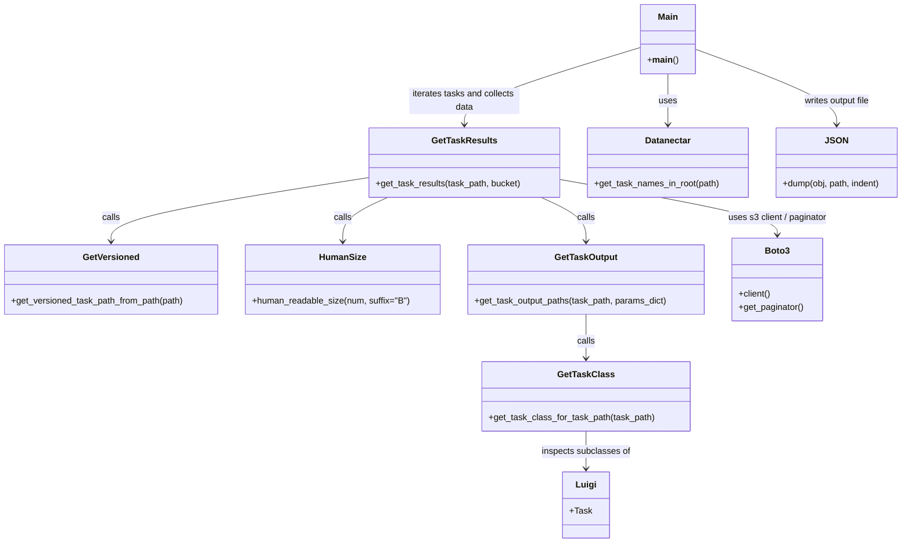

# Diagram: research/admin_app/collect_task_data.py

> Auto-generated by Obscura crawlers

## Mermaid

### SVG

<svg id="container" width="1639.705078125" xmlns="http://www.w3.org/2000/svg" class="classDiagram" height="984" viewBox="0 0 1639.705078125 984" role="graphics-document document" aria-roledescription="class"><g><defs><marker id="container_class-aggregationStart" class="marker aggregation class" refX="18" refY="7" markerWidth="190" markerHeight="240" orient="auto"><path d="M 18,7 L9,13 L1,7 L9,1 Z"></path></marker></defs><defs><marker id="container_class-aggregationEnd" class="marker aggregation class" refX="1" refY="7" markerWidth="20" markerHeight="28" orient="auto"><path d="M 18,7 L9,13 L1,7 L9,1 Z"></path></marker></defs><defs><marker id="container_class-extensionStart" class="marker extension class" refX="18" refY="7" markerWidth="190" markerHeight="240" orient="auto"><path d="M 1,7 L18,13 V 1 Z"></path></marker></defs><defs><marker id="container_class-extensionEnd" class="marker extension class" refX="1" refY="7" markerWidth="20" markerHeight="28" orient="auto"><path d="M 1,1 V 13 L18,7 Z"></path></marker></defs><defs><marker id="container_class-compositionStart" class="marker composition class" refX="18" refY="7" markerWidth="190" markerHeight="240" orient="auto"><path d="M 18,7 L9,13 L1,7 L9,1 Z"></path></marker></defs><defs><marker id="container_class-compositionEnd" class="marker composition class" refX="1" refY="7" markerWidth="20" markerHeight="28" orient="auto"><path d="M 18,7 L9,13 L1,7 L9,1 Z"></path></marker></defs><defs><marker id="container_class-dependencyStart" class="marker dependency class" refX="6" refY="7" markerWidth="190" markerHeight="240" orient="auto"><path d="M 5,7 L9,13 L1,7 L9,1 Z"></path></marker></defs><defs><marker id="container_class-dependencyEnd" class="marker dependency class" refX="13" refY="7" markerWidth="20" markerHeight="28" orient="auto"><path d="M 18,7 L9,13 L14,7 L9,1 Z"></path></marker></defs><defs><marker id="container_class-lollipopStart" class="marker lollipop class" refX="13" refY="7" markerWidth="190" markerHeight="240" orient="auto"><circle stroke="black" fill="transparent" cx="7" cy="7" r="6"></circle></marker></defs><defs><marker id="container_class-lollipopEnd" class="marker lollipop class" refX="1" refY="7" markerWidth="190" markerHeight="240" orient="auto"><circle stroke="black" fill="transparent" cx="7" cy="7" r="6"></circle></marker></defs><g class="root"><g class="clusters"></g><g class="edgePaths"><path d="M671.369,321.903L593.276,334.086C515.182,346.269,358.995,370.634,280.902,389.984C202.809,409.333,202.809,423.667,202.809,430.833L202.809,438" id="id_GetTaskResults_GetVersioned_1" class="edge-thickness-normal edge-pattern-solid relation" style=";;;" data-edge="true" data-et="edge" data-id="id_GetTaskResults_GetVersioned_1" data-points="W3sieCI6NjcxLjM2OTE0MDYyNSwieSI6MzIxLjkwMzE4OTgzMjk5NzY3fSx7IngiOjIwMi44MDg1OTM3NSwieSI6Mzk1fSx7IngiOjIwMi44MDg1OTM3NSwieSI6NDQ0fV0=" marker-end="url(#container_class-dependencyEnd)"></path><path d="M704.778,358L691.168,364.167C677.558,370.333,650.337,382.667,636.727,396C623.117,409.333,623.117,423.667,623.117,430.833L623.117,438" id="id_GetTaskResults_HumanSize_2" class="edge-thickness-normal edge-pattern-solid relation" style=";;;" data-edge="true" data-et="edge" data-id="id_GetTaskResults_HumanSize_2" data-points="W3sieCI6NzA0Ljc3ODA2NjQwNjI1LCJ5IjozNTh9LHsieCI6NjIzLjExNzE4NzUsInkiOjM5NX0seyJ4Ijo2MjMuMTE3MTg3NSwieSI6NDQ0fV0=" marker-end="url(#container_class-dependencyEnd)"></path><path d="M982.866,358L996.477,364.167C1010.087,370.333,1037.307,382.667,1050.917,396C1064.527,409.333,1064.527,423.667,1064.527,430.833L1064.527,438" id="id_GetTaskResults_GetTaskOutput_3" class="edge-thickness-normal edge-pattern-solid relation" style=";;;" data-edge="true" data-et="edge" data-id="id_GetTaskResults_GetTaskOutput_3" data-points="W3sieCI6OTgyLjg2NjQ2NDg0Mzc1LCJ5IjozNTh9LHsieCI6MTA2NC41MjczNDM3NSwieSI6Mzk1fSx7IngiOjEwNjQuNTI3MzQzNzUsInkiOjQ0NH1d" marker-end="url(#container_class-dependencyEnd)"></path><path d="M1016.275,325.32L1082.329,336.933C1148.383,348.547,1280.49,371.773,1346.544,388.553C1412.598,405.333,1412.598,415.667,1412.598,420.833L1412.598,426" id="id_GetTaskResults_Boto3_4" class="edge-thickness-normal edge-pattern-solid relation" style=";;;" data-edge="true" data-et="edge" data-id="id_GetTaskResults_Boto3_4" data-points="W3sieCI6MTAxNi4yNzUzOTA2MjUsInkiOjMyNS4zMjAwNzQ5OTY2NTE5NX0seyJ4IjoxNDEyLjU5NzY1NjI1LCJ5IjozOTV9LHsieCI6MTQxMi41OTc2NTYyNSwieSI6NDMyfV0=" marker-end="url(#container_class-dependencyEnd)"></path><path d="M1064.527,570L1064.527,578.167C1064.527,586.333,1064.527,602.667,1064.527,616C1064.527,629.333,1064.527,639.667,1064.527,644.833L1064.527,650" id="id_GetTaskOutput_GetTaskClass_5" class="edge-thickness-normal edge-pattern-solid relation" style=";;;" data-edge="true" data-et="edge" data-id="id_GetTaskOutput_GetTaskClass_5" data-points="W3sieCI6MTA2NC41MjczNDM3NSwieSI6NTcwfSx7IngiOjEwNjQuNTI3MzQzNzUsInkiOjYxOX0seyJ4IjoxMDY0LjUyNzM0Mzc1LCJ5Ijo2NTZ9XQ==" marker-end="url(#container_class-dependencyEnd)"></path><path d="M1064.527,782L1064.527,788.167C1064.527,794.333,1064.527,806.667,1064.527,818C1064.527,829.333,1064.527,839.667,1064.527,844.833L1064.527,850" id="id_GetTaskClass_Luigi_6" class="edge-thickness-normal edge-pattern-solid relation" style=";;;" data-edge="true" data-et="edge" data-id="id_GetTaskClass_Luigi_6" data-points="W3sieCI6MTA2NC41MjczNDM3NSwieSI6NzgyfSx7IngiOjEwNjQuNTI3MzQzNzUsInkiOjgxOX0seyJ4IjoxMDY0LjUyNzM0Mzc1LCJ5Ijo4NTZ9XQ==" marker-end="url(#container_class-dependencyEnd)"></path><path d="M1212.783,134L1212.783,142.167C1212.783,150.333,1212.783,166.667,1212.783,182C1212.783,197.333,1212.783,211.667,1212.783,218.833L1212.783,226" id="id_Main_Datanectar_7" class="edge-thickness-normal edge-pattern-solid relation" style=";;;" data-edge="true" data-et="edge" data-id="id_Main_Datanectar_7" data-points="W3sieCI6MTIxMi43ODMyMDMxMjUsInkiOjEzNH0seyJ4IjoxMjEyLjc4MzIwMzEyNSwieSI6MTgzfSx7IngiOjEyMTIuNzgzMjAzMTI1LCJ5IjoyMzJ9XQ==" marker-end="url(#container_class-dependencyEnd)"></path><path d="M1164.807,85.564L1111.309,101.803C1057.812,118.042,950.817,150.521,897.32,173.927C843.822,197.333,843.822,211.667,843.822,218.833L843.822,226" id="id_Main_GetTaskResults_8" class="edge-thickness-normal edge-pattern-solid relation" style=";;;" data-edge="true" data-et="edge" data-id="id_Main_GetTaskResults_8" data-points="W3sieCI6MTE2NC44MDY2NDA2MjUsInkiOjg1LjU2MzUzMzU3MTg5NzQ0fSx7IngiOjg0My44MjIyNjU2MjUsInkiOjE4M30seyJ4Ijo4NDMuODIyMjY1NjI1LCJ5IjoyMzJ9XQ==" marker-end="url(#container_class-dependencyEnd)"></path><path d="M1260.76,88.462L1304.049,104.218C1347.339,119.975,1433.919,151.487,1477.208,174.41C1520.498,197.333,1520.498,211.667,1520.498,218.833L1520.498,226" id="id_Main_JSON_9" class="edge-thickness-normal edge-pattern-solid relation" style=";;;" data-edge="true" data-et="edge" data-id="id_Main_JSON_9" data-points="W3sieCI6MTI2MC43NTk3NjU2MjUsInkiOjg4LjQ2MjE4OTc4MTAyMTg5fSx7IngiOjE1MjAuNDk4MDQ2ODc1LCJ5IjoxODN9LHsieCI6MTUyMC40OTgwNDY4NzUsInkiOjIzMn1d" marker-end="url(#container_class-dependencyEnd)"></path></g><g class="edgeLabels"><g class="edgeLabel" transform="translate(202.80859375, 395)"><g class="label" data-id="id_GetTaskResults_GetVersioned_1" transform="translate(-16.4453125, -12)"><foreignObject width="32.890625" height="24">

calls

</foreignObject></g></g><g class="edgeLabel" transform="translate(623.1171875, 395)"><g class="label" data-id="id_GetTaskResults_HumanSize_2" transform="translate(-16.4453125, -12)"><foreignObject width="32.890625" height="24">

calls

</foreignObject></g></g><g class="edgeLabel" transform="translate(1064.52734375, 395)"><g class="label" data-id="id_GetTaskResults_GetTaskOutput_3" transform="translate(-16.4453125, -12)"><foreignObject width="32.890625" height="24">

calls

</foreignObject></g></g><g class="edgeLabel" transform="translate(1412.59765625, 395)"><g class="label" data-id="id_GetTaskResults_Boto3_4" transform="translate(-92.1484375, -12)"><foreignObject width="184.296875" height="24">

uses s3 client / paginator

</foreignObject></g></g><g class="edgeLabel" transform="translate(1064.52734375, 619)"><g class="label" data-id="id_GetTaskOutput_GetTaskClass_5" transform="translate(-16.4453125, -12)"><foreignObject width="32.890625" height="24">

calls

</foreignObject></g></g><g class="edgeLabel" transform="translate(1064.52734375, 819)"><g class="label" data-id="id_GetTaskClass_Luigi_6" transform="translate(-80.8671875, -12)"><foreignObject width="161.734375" height="24">

inspects subclasses of

</foreignObject></g></g><g class="edgeLabel" transform="translate(1212.783203125, 183)"><g class="label" data-id="id_Main_Datanectar_7" transform="translate(-16.4921875, -12)"><foreignObject width="32.984375" height="24">

uses

</foreignObject></g></g><g class="edgeLabel" transform="translate(843.822265625, 183)"><g class="label" data-id="id_Main_GetTaskResults_8" transform="translate(-100, -24)"><foreignObject width="200" height="48">

iterates tasks and collects data

</foreignObject></g></g><g class="edgeLabel" transform="translate(1520.498046875, 183)"><g class="label" data-id="id_Main_JSON_9" transform="translate(-61.9609375, -12)"><foreignObject width="123.921875" height="24">

writes output file

</foreignObject></g></g></g><g class="nodes"><g class="node default" id="classId-GetVersioned-0" transform="translate(202.80859375, 507)"><g class="basic label-container"><path d="M-194.80859375 -63 L194.80859375 -63 L194.80859375 63 L-194.80859375 63" stroke="none" stroke-width="0" fill="#ECECFF" style=""></path><path d="M-194.80859375 -63 C-92.95974140896111 -63, 8.889110932077784 -63, 194.80859375 -63 M-194.80859375 -63 C-95.47104730871091 -63, 3.866499132578184 -63, 194.80859375 -63 M194.80859375 -63 C194.80859375 -16.657845108071307, 194.80859375 29.684309783857387, 194.80859375 63 M194.80859375 -63 C194.80859375 -35.18132896958482, 194.80859375 -7.362657939169637, 194.80859375 63 M194.80859375 63 C107.79531357457917 63, 20.782033399158337 63, -194.80859375 63 M194.80859375 63 C111.79383277706636 63, 28.779071804132712 63, -194.80859375 63 M-194.80859375 63 C-194.80859375 21.88905410677117, -194.80859375 -19.22189178645766, -194.80859375 -63 M-194.80859375 63 C-194.80859375 14.132879187418155, -194.80859375 -34.73424162516369, -194.80859375 -63" stroke="#9370DB" stroke-width="1.3" fill="none" stroke-dasharray="0 0" style=""></path></g><g class="annotation-group text" transform="translate(0, -39)"></g><g class="label-group text" transform="translate(-49.1796875, -39)"><g class="label" style="font-weight: bolder" transform="translate(0,-12)"><foreignObject width="98.359375" height="24">

GetVersioned

</foreignObject></g></g><g class="members-group text" transform="translate(-182.80859375, 9)"></g><g class="methods-group text" transform="translate(-182.80859375, 39)"><g class="label" style="" transform="translate(0,-12)"><foreignObject width="316.4375" height="24">

+get_versioned_task_path_from_path(path)

</foreignObject></g></g><g class="divider" style=""><path d="M-194.80859375 -15 C-73.39824123364025 -15, 48.0121112827195 -15, 194.80859375 -15 M-194.80859375 -15 C-69.79976552417993 -15, 55.209062701640136 -15, 194.80859375 -15" stroke="#9370DB" stroke-width="1.3" fill="none" stroke-dasharray="0 0" style=""></path></g><g class="divider" style=""><path d="M-194.80859375 9 C-55.08672654951988 9, 84.63514065096024 9, 194.80859375 9 M-194.80859375 9 C-79.97121151246127 9, 34.86617072507747 9, 194.80859375 9" stroke="#9370DB" stroke-width="1.3" fill="none" stroke-dasharray="0 0" style=""></path></g></g><g class="node default" id="classId-HumanSize-1" transform="translate(623.1171875, 507)"><g class="basic label-container"><path d="M-175.5 -63 L175.5 -63 L175.5 63 L-175.5 63" stroke="none" stroke-width="0" fill="#ECECFF" style=""></path><path d="M-175.5 -63 C-89.24862169102468 -63, -2.997243382049362 -63, 175.5 -63 M-175.5 -63 C-70.11309061849519 -63, 35.273818763009615 -63, 175.5 -63 M175.5 -63 C175.5 -24.431566840886425, 175.5 14.136866318227149, 175.5 63 M175.5 -63 C175.5 -29.85147769259425, 175.5 3.2970446148114974, 175.5 63 M175.5 63 C89.0568800211063 63, 2.61376004221259 63, -175.5 63 M175.5 63 C101.24512712292133 63, 26.990254245842664 63, -175.5 63 M-175.5 63 C-175.5 16.994452136680614, -175.5 -29.01109572663877, -175.5 -63 M-175.5 63 C-175.5 36.96750203539333, -175.5 10.935004070786661, -175.5 -63" stroke="#9370DB" stroke-width="1.3" fill="none" stroke-dasharray="0 0" style=""></path></g><g class="annotation-group text" transform="translate(0, -39)"></g><g class="label-group text" transform="translate(-40.515625, -39)"><g class="label" style="font-weight: bolder" transform="translate(0,-12)"><foreignObject width="81.03125" height="24">

HumanSize

</foreignObject></g></g><g class="members-group text" transform="translate(-163.5, 9)"></g><g class="methods-group text" transform="translate(-163.5, 39)"><g class="label" style="" transform="translate(0,-12)"><foreignObject width="286.484375" height="24">

+human_readable_size(num, suffix="B")

</foreignObject></g></g><g class="divider" style=""><path d="M-175.5 -15 C-72.01332748466687 -15, 31.473345030666252 -15, 175.5 -15 M-175.5 -15 C-86.89410235646696 -15, 1.7117952870660815 -15, 175.5 -15" stroke="#9370DB" stroke-width="1.3" fill="none" stroke-dasharray="0 0" style=""></path></g><g class="divider" style=""><path d="M-175.5 9 C-98.35871401406197 9, -21.217428028123948 9, 175.5 9 M-175.5 9 C-55.05616946896855 9, 65.3876610620629 9, 175.5 9" stroke="#9370DB" stroke-width="1.3" fill="none" stroke-dasharray="0 0" style=""></path></g></g><g class="node default" id="classId-GetTaskResults-2" transform="translate(843.822265625, 295)"><g class="basic label-container"><path d="M-172.453125 -63 L172.453125 -63 L172.453125 63 L-172.453125 63" stroke="none" stroke-width="0" fill="#ECECFF" style=""></path><path d="M-172.453125 -63 C-34.834146219729575 -63, 102.78483256054085 -63, 172.453125 -63 M-172.453125 -63 C-85.48237046290537 -63, 1.4883840741892698 -63, 172.453125 -63 M172.453125 -63 C172.453125 -21.65307798866612, 172.453125 19.69384402266776, 172.453125 63 M172.453125 -63 C172.453125 -23.980748971324488, 172.453125 15.038502057351025, 172.453125 63 M172.453125 63 C83.78025512758288 63, -4.892614744834248 63, -172.453125 63 M172.453125 63 C95.44706035539294 63, 18.44099571078587 63, -172.453125 63 M-172.453125 63 C-172.453125 35.366708547486766, -172.453125 7.733417094973525, -172.453125 -63 M-172.453125 63 C-172.453125 21.79332396703414, -172.453125 -19.41335206593172, -172.453125 -63" stroke="#9370DB" stroke-width="1.3" fill="none" stroke-dasharray="0 0" style=""></path></g><g class="annotation-group text" transform="translate(0, -39)"></g><g class="label-group text" transform="translate(-56.171875, -39)"><g class="label" style="font-weight: bolder" transform="translate(0,-12)"><foreignObject width="112.34375" height="24">

GetTaskResults

</foreignObject></g></g><g class="members-group text" transform="translate(-160.453125, 9)"></g><g class="methods-group text" transform="translate(-160.453125, 39)"><g class="label" style="" transform="translate(0,-12)"><foreignObject width="264.734375" height="24">

+get_task_results(task_path, bucket)

</foreignObject></g></g><g class="divider" style=""><path d="M-172.453125 -15 C-77.5180468560434 -15, 17.417031287913204 -15, 172.453125 -15 M-172.453125 -15 C-74.49622384971961 -15, 23.460677300560775 -15, 172.453125 -15" stroke="#9370DB" stroke-width="1.3" fill="none" stroke-dasharray="0 0" style=""></path></g><g class="divider" style=""><path d="M-172.453125 9 C-90.32333211817775 9, -8.193539236355491 9, 172.453125 9 M-172.453125 9 C-37.50573099863459 9, 97.44166300273082 9, 172.453125 9" stroke="#9370DB" stroke-width="1.3" fill="none" stroke-dasharray="0 0" style=""></path></g></g><g class="node default" id="classId-GetTaskOutput-3" transform="translate(1064.52734375, 507)"><g class="basic label-container"><path d="M-215.91015625 -63 L215.91015625 -63 L215.91015625 63 L-215.91015625 63" stroke="none" stroke-width="0" fill="#ECECFF" style=""></path><path d="M-215.91015625 -63 C-52.7357641486478 -63, 110.4386279527044 -63, 215.91015625 -63 M-215.91015625 -63 C-94.89082699120142 -63, 26.128502267597156 -63, 215.91015625 -63 M215.91015625 -63 C215.91015625 -28.776737704471074, 215.91015625 5.446524591057852, 215.91015625 63 M215.91015625 -63 C215.91015625 -29.767085839205258, 215.91015625 3.465828321589484, 215.91015625 63 M215.91015625 63 C74.99155033805047 63, -65.92705557389905 63, -215.91015625 63 M215.91015625 63 C86.78134908947112 63, -42.34745807105776 63, -215.91015625 63 M-215.91015625 63 C-215.91015625 16.847740513015857, -215.91015625 -29.304518973968285, -215.91015625 -63 M-215.91015625 63 C-215.91015625 21.450221986182413, -215.91015625 -20.099556027635174, -215.91015625 -63" stroke="#9370DB" stroke-width="1.3" fill="none" stroke-dasharray="0 0" style=""></path></g><g class="annotation-group text" transform="translate(0, -39)"></g><g class="label-group text" transform="translate(-54.8046875, -39)"><g class="label" style="font-weight: bolder" transform="translate(0,-12)"><foreignObject width="109.609375" height="24">

GetTaskOutput

</foreignObject></g></g><g class="members-group text" transform="translate(-203.91015625, 9)"></g><g class="methods-group text" transform="translate(-203.91015625, 39)"><g class="label" style="" transform="translate(0,-12)"><foreignObject width="353.015625" height="24">

+get_task_output_paths(task_path, params_dict)

</foreignObject></g></g><g class="divider" style=""><path d="M-215.91015625 -15 C-66.61143823306301 -15, 82.68727978387398 -15, 215.91015625 -15 M-215.91015625 -15 C-46.286750675007426 -15, 123.33665489998515 -15, 215.91015625 -15" stroke="#9370DB" stroke-width="1.3" fill="none" stroke-dasharray="0 0" style=""></path></g><g class="divider" style=""><path d="M-215.91015625 9 C-101.77866297060397 9, 12.35283030879205 9, 215.91015625 9 M-215.91015625 9 C-86.86666487928193 9, 42.176826491436145 9, 215.91015625 9" stroke="#9370DB" stroke-width="1.3" fill="none" stroke-dasharray="0 0" style=""></path></g></g><g class="node default" id="classId-GetTaskClass-4" transform="translate(1064.52734375, 719)"><g class="basic label-container"><path d="M-186.14453125 -63 L186.14453125 -63 L186.14453125 63 L-186.14453125 63" stroke="none" stroke-width="0" fill="#ECECFF" style=""></path><path d="M-186.14453125 -63 C-83.96355404924587 -63, 18.217423151508257 -63, 186.14453125 -63 M-186.14453125 -63 C-57.82054350987079 -63, 70.50344423025842 -63, 186.14453125 -63 M186.14453125 -63 C186.14453125 -33.13349190213287, 186.14453125 -3.2669838042657346, 186.14453125 63 M186.14453125 -63 C186.14453125 -12.80949872080324, 186.14453125 37.38100255839352, 186.14453125 63 M186.14453125 63 C54.159512354189985 63, -77.82550654162003 63, -186.14453125 63 M186.14453125 63 C42.50821869764761 63, -101.12809385470479 63, -186.14453125 63 M-186.14453125 63 C-186.14453125 16.61558591553456, -186.14453125 -29.76882816893088, -186.14453125 -63 M-186.14453125 63 C-186.14453125 36.9297149157395, -186.14453125 10.859429831479005, -186.14453125 -63" stroke="#9370DB" stroke-width="1.3" fill="none" stroke-dasharray="0 0" style=""></path></g><g class="annotation-group text" transform="translate(0, -39)"></g><g class="label-group text" transform="translate(-48.0078125, -39)"><g class="label" style="font-weight: bolder" transform="translate(0,-12)"><foreignObject width="96.015625" height="24">

GetTaskClass

</foreignObject></g></g><g class="members-group text" transform="translate(-174.14453125, 9)"></g><g class="methods-group text" transform="translate(-174.14453125, 39)"><g class="label" style="" transform="translate(0,-12)"><foreignObject width="300.28125" height="24">

+get_task_class_for_task_path(task_path)

</foreignObject></g></g><g class="divider" style=""><path d="M-186.14453125 -15 C-63.84701073407386 -15, 58.450509781852276 -15, 186.14453125 -15 M-186.14453125 -15 C-107.90376121505534 -15, -29.66299118011068 -15, 186.14453125 -15" stroke="#9370DB" stroke-width="1.3" fill="none" stroke-dasharray="0 0" style=""></path></g><g class="divider" style=""><path d="M-186.14453125 9 C-77.82456321085158 9, 30.49540482829684 9, 186.14453125 9 M-186.14453125 9 C-73.60027365474134 9, 38.94398394051731 9, 186.14453125 9" stroke="#9370DB" stroke-width="1.3" fill="none" stroke-dasharray="0 0" style=""></path></g></g><g class="node default" id="classId-Main-5" transform="translate(1212.783203125, 71)"><g class="basic label-container"><path d="M-47.9765625 -63 L47.9765625 -63 L47.9765625 63 L-47.9765625 63" stroke="none" stroke-width="0" fill="#ECECFF" style=""></path><path d="M-47.9765625 -63 C-18.079825292337325 -63, 11.816911915325349 -63, 47.9765625 -63 M-47.9765625 -63 C-20.914635285907426 -63, 6.1472919281851475 -63, 47.9765625 -63 M47.9765625 -63 C47.9765625 -27.449249666793385, 47.9765625 8.10150066641323, 47.9765625 63 M47.9765625 -63 C47.9765625 -23.552026427577005, 47.9765625 15.89594714484599, 47.9765625 63 M47.9765625 63 C23.606387106355584 63, -0.7637882872888326 63, -47.9765625 63 M47.9765625 63 C12.674059475158359 63, -22.628443549683283 63, -47.9765625 63 M-47.9765625 63 C-47.9765625 15.623474507136514, -47.9765625 -31.753050985726972, -47.9765625 -63 M-47.9765625 63 C-47.9765625 27.97876590394442, -47.9765625 -7.0424681921111585, -47.9765625 -63" stroke="#9370DB" stroke-width="1.3" fill="none" stroke-dasharray="0 0" style=""></path></g><g class="annotation-group text" transform="translate(0, -39)"></g><g class="label-group text" transform="translate(-17.546875, -39)"><g class="label" style="font-weight: bolder" transform="translate(0,-12)"><foreignObject width="35.09375" height="24">

Main

</foreignObject></g></g><g class="members-group text" transform="translate(-35.9765625, 9)"></g><g class="methods-group text" transform="translate(-35.9765625, 39)"><g class="label" style="" transform="translate(0,-12)"><foreignObject width="54.40625" height="24">

+<strong>main</strong>()

</foreignObject></g></g><g class="divider" style=""><path d="M-47.9765625 -15 C-20.762876781467106 -15, 6.450808937065787 -15, 47.9765625 -15 M-47.9765625 -15 C-13.248333764180892 -15, 21.479894971638217 -15, 47.9765625 -15" stroke="#9370DB" stroke-width="1.3" fill="none" stroke-dasharray="0 0" style=""></path></g><g class="divider" style=""><path d="M-47.9765625 9 C-25.641009704654394 9, -3.3054569093087878 9, 47.9765625 9 M-47.9765625 9 C-21.094442814839173 9, 5.787676870321654 9, 47.9765625 9" stroke="#9370DB" stroke-width="1.3" fill="none" stroke-dasharray="0 0" style=""></path></g></g><g class="node default" id="classId-Boto3-6" transform="translate(1412.59765625, 507)"><g class="basic label-container"><path d="M-82.16015625 -75 L82.16015625 -75 L82.16015625 75 L-82.16015625 75" stroke="none" stroke-width="0" fill="#ECECFF" style=""></path><path d="M-82.16015625 -75 C-47.43818877667591 -75, -12.716221303351816 -75, 82.16015625 -75 M-82.16015625 -75 C-21.40905878371185 -75, 39.3420386825763 -75, 82.16015625 -75 M82.16015625 -75 C82.16015625 -28.78960810275006, 82.16015625 17.420783794499883, 82.16015625 75 M82.16015625 -75 C82.16015625 -40.867029696014875, 82.16015625 -6.734059392029749, 82.16015625 75 M82.16015625 75 C48.107201603860815 75, 14.054246957721631 75, -82.16015625 75 M82.16015625 75 C35.00585596106174 75, -12.148444327876518 75, -82.16015625 75 M-82.16015625 75 C-82.16015625 20.93649786053878, -82.16015625 -33.12700427892244, -82.16015625 -75 M-82.16015625 75 C-82.16015625 28.465571043010222, -82.16015625 -18.068857913979556, -82.16015625 -75" stroke="#9370DB" stroke-width="1.3" fill="none" stroke-dasharray="0 0" style=""></path></g><g class="annotation-group text" transform="translate(0, -51)"></g><g class="label-group text" transform="translate(-21.2265625, -51)"><g class="label" style="font-weight: bolder" transform="translate(0,-12)"><foreignObject width="42.453125" height="24">

Boto3

</foreignObject></g></g><g class="members-group text" transform="translate(-70.16015625, -3)"></g><g class="methods-group text" transform="translate(-70.16015625, 27)"><g class="label" style="" transform="translate(0,-12)"><foreignObject width="59.078125" height="24">

+client()

</foreignObject></g><g class="label" style="" transform="translate(0,12)"><foreignObject width="119.09375" height="24">

+get_paginator()

</foreignObject></g></g><g class="divider" style=""><path d="M-82.16015625 -27 C-46.0680322311339 -27, -9.975908212267797 -27, 82.16015625 -27 M-82.16015625 -27 C-32.482742305648586 -27, 17.19467163870283 -27, 82.16015625 -27" stroke="#9370DB" stroke-width="1.3" fill="none" stroke-dasharray="0 0" style=""></path></g><g class="divider" style=""><path d="M-82.16015625 -3 C-29.00989036735706 -3, 24.140375515285882 -3, 82.16015625 -3 M-82.16015625 -3 C-48.56868221792747 -3, -14.977208185854934 -3, 82.16015625 -3" stroke="#9370DB" stroke-width="1.3" fill="none" stroke-dasharray="0 0" style=""></path></g></g><g class="node default" id="classId-Datanectar-7" transform="translate(1212.783203125, 295)"><g class="basic label-container"><path d="M-146.5078125 -63 L146.5078125 -63 L146.5078125 63 L-146.5078125 63" stroke="none" stroke-width="0" fill="#ECECFF" style=""></path><path d="M-146.5078125 -63 C-47.010358062287324 -63, 52.48709637542535 -63, 146.5078125 -63 M-146.5078125 -63 C-36.85182422879757 -63, 72.80416404240486 -63, 146.5078125 -63 M146.5078125 -63 C146.5078125 -21.49015259780103, 146.5078125 20.019694804397943, 146.5078125 63 M146.5078125 -63 C146.5078125 -24.85795710691916, 146.5078125 13.284085786161683, 146.5078125 63 M146.5078125 63 C53.0770854739325 63, -40.353641552135 63, -146.5078125 63 M146.5078125 63 C65.7042184043934 63, -15.099375691213197 63, -146.5078125 63 M-146.5078125 63 C-146.5078125 22.122339962008567, -146.5078125 -18.755320075982866, -146.5078125 -63 M-146.5078125 63 C-146.5078125 23.736585294805224, -146.5078125 -15.526829410389553, -146.5078125 -63" stroke="#9370DB" stroke-width="1.3" fill="none" stroke-dasharray="0 0" style=""></path></g><g class="annotation-group text" transform="translate(0, -39)"></g><g class="label-group text" transform="translate(-40.34375, -39)"><g class="label" style="font-weight: bolder" transform="translate(0,-12)"><foreignObject width="80.6875" height="24">

Datanectar

</foreignObject></g></g><g class="members-group text" transform="translate(-134.5078125, 9)"></g><g class="methods-group text" transform="translate(-134.5078125, 39)"><g class="label" style="" transform="translate(0,-12)"><foreignObject width="228.671875" height="24">

+get_task_names_in_root(path)

</foreignObject></g></g><g class="divider" style=""><path d="M-146.5078125 -15 C-63.23305689934497 -15, 20.041698701310054 -15, 146.5078125 -15 M-146.5078125 -15 C-39.39659619119517 -15, 67.71462011760966 -15, 146.5078125 -15" stroke="#9370DB" stroke-width="1.3" fill="none" stroke-dasharray="0 0" style=""></path></g><g class="divider" style=""><path d="M-146.5078125 9 C-55.853128840911964 9, 34.80155481817607 9, 146.5078125 9 M-146.5078125 9 C-33.47933135699216 9, 79.54914978601568 9, 146.5078125 9" stroke="#9370DB" stroke-width="1.3" fill="none" stroke-dasharray="0 0" style=""></path></g></g><g class="node default" id="classId-Luigi-8" transform="translate(1064.52734375, 916)"><g class="basic label-container"><path d="M-40.1796875 -60 L40.1796875 -60 L40.1796875 60 L-40.1796875 60" stroke="none" stroke-width="0" fill="#ECECFF" style=""></path><path d="M-40.1796875 -60 C-22.085422296933146 -60, -3.991157093866292 -60, 40.1796875 -60 M-40.1796875 -60 C-12.742767052793234 -60, 14.694153394413533 -60, 40.1796875 -60 M40.1796875 -60 C40.1796875 -13.084457854847962, 40.1796875 33.83108429030408, 40.1796875 60 M40.1796875 -60 C40.1796875 -33.23035961393164, 40.1796875 -6.4607192278632795, 40.1796875 60 M40.1796875 60 C20.3084426846758 60, 0.4371978693515999 60, -40.1796875 60 M40.1796875 60 C17.164237390663153 60, -5.851212718673693 60, -40.1796875 60 M-40.1796875 60 C-40.1796875 24.78427410146562, -40.1796875 -10.43145179706876, -40.1796875 -60 M-40.1796875 60 C-40.1796875 31.069074469941302, -40.1796875 2.138148939882605, -40.1796875 -60" stroke="#9370DB" stroke-width="1.3" fill="none" stroke-dasharray="0 0" style=""></path></g><g class="annotation-group text" transform="translate(0, -36)"></g><g class="label-group text" transform="translate(-17.484375, -36)"><g class="label" style="font-weight: bolder" transform="translate(0,-12)"><foreignObject width="34.96875" height="24">

Luigi

</foreignObject></g></g><g class="members-group text" transform="translate(-28.1796875, 12)"><g class="label" style="" transform="translate(0,-12)"><foreignObject width="38.875" height="24">

+Task

</foreignObject></g></g><g class="methods-group text" transform="translate(-28.1796875, 60)"></g><g class="divider" style=""><path d="M-40.1796875 -12 C-17.140386812185206 -12, 5.898913875629589 -12, 40.1796875 -12 M-40.1796875 -12 C-18.385913556304992 -12, 3.4078603873900164 -12, 40.1796875 -12" stroke="#9370DB" stroke-width="1.3" fill="none" stroke-dasharray="0 0" style=""></path></g><g class="divider" style=""><path d="M-40.1796875 36 C-23.965143970372587 36, -7.750600440745174 36, 40.1796875 36 M-40.1796875 36 C-10.136974627070622 36, 19.905738245858757 36, 40.1796875 36" stroke="#9370DB" stroke-width="1.3" fill="none" stroke-dasharray="0 0" style=""></path></g></g><g class="node default" id="classId-JSON-9" transform="translate(1520.498046875, 295)"><g class="basic label-container"><path d="M-111.20703125 -63 L111.20703125 -63 L111.20703125 63 L-111.20703125 63" stroke="none" stroke-width="0" fill="#ECECFF" style=""></path><path d="M-111.20703125 -63 C-36.97889164722844 -63, 37.249247955543126 -63, 111.20703125 -63 M-111.20703125 -63 C-46.256320587445884 -63, 18.69439007510823 -63, 111.20703125 -63 M111.20703125 -63 C111.20703125 -32.05200198710864, 111.20703125 -1.104003974217271, 111.20703125 63 M111.20703125 -63 C111.20703125 -18.61760996270977, 111.20703125 25.764780074580457, 111.20703125 63 M111.20703125 63 C29.453023498579952 63, -52.300984252840095 63, -111.20703125 63 M111.20703125 63 C24.470596872855992 63, -62.265837504288015 63, -111.20703125 63 M-111.20703125 63 C-111.20703125 34.07084357434306, -111.20703125 5.141687148686117, -111.20703125 -63 M-111.20703125 63 C-111.20703125 32.16582370725891, -111.20703125 1.3316474145178105, -111.20703125 -63" stroke="#9370DB" stroke-width="1.3" fill="none" stroke-dasharray="0 0" style=""></path></g><g class="annotation-group text" transform="translate(0, -39)"></g><g class="label-group text" transform="translate(-17.9453125, -39)"><g class="label" style="font-weight: bolder" transform="translate(0,-12)"><foreignObject width="35.890625" height="24">

JSON

</foreignObject></g></g><g class="members-group text" transform="translate(-99.20703125, 9)"></g><g class="methods-group text" transform="translate(-99.20703125, 39)"><g class="label" style="" transform="translate(0,-12)"><foreignObject width="180.46875" height="24">

+dump(obj, path, indent)

</foreignObject></g></g><g class="divider" style=""><path d="M-111.20703125 -15 C-26.56998390921082 -15, 58.06706343157836 -15, 111.20703125 -15 M-111.20703125 -15 C-47.21316871980705 -15, 16.7806938103859 -15, 111.20703125 -15" stroke="#9370DB" stroke-width="1.3" fill="none" stroke-dasharray="0 0" style=""></path></g><g class="divider" style=""><path d="M-111.20703125 9 C-50.2723033227833 9, 10.662424604433397 9, 111.20703125 9 M-111.20703125 9 C-29.884005265385582 9, 51.439020719228836 9, 111.20703125 9" stroke="#9370DB" stroke-width="1.3" fill="none" stroke-dasharray="0 0" style=""></path></g></g></g></g></g></svg>
