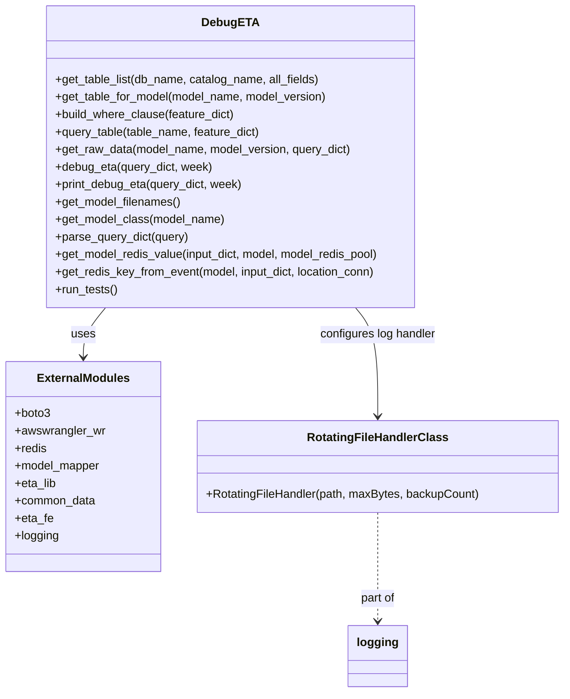

# Diagram: research/admin_app/debug_eta.py


> Auto-generated by Obscura crawlers

## Diagram 1



### SVG

<svg id="container" width="766.078125" xmlns="http://www.w3.org/2000/svg" class="classDiagram" height="950" viewBox="0 0 766.078125 950" role="graphics-document document" aria-roledescription="class"><style>#container{font-family:"trebuchet ms",verdana,arial,sans-serif;font-size:16px;fill:#333;}@keyframes edge-animation-frame{from{stroke-dashoffset:0;}}@keyframes dash{to{stroke-dashoffset:0;}}#container .edge-animation-slow{stroke-dasharray:9,5!important;stroke-dashoffset:900;animation:dash 50s linear infinite;stroke-linecap:round;}#container .edge-animation-fast{stroke-dasharray:9,5!important;stroke-dashoffset:900;animation:dash 20s linear infinite;stroke-linecap:round;}#container .error-icon{fill:#552222;}#container .error-text{fill:#552222;stroke:#552222;}#container .edge-thickness-normal{stroke-width:1px;}#container .edge-thickness-thick{stroke-width:3.5px;}#container .edge-pattern-solid{stroke-dasharray:0;}#container .edge-thickness-invisible{stroke-width:0;fill:none;}#container .edge-pattern-dashed{stroke-dasharray:3;}#container .edge-pattern-dotted{stroke-dasharray:2;}#container .marker{fill:#333333;stroke:#333333;}#container .marker.cross{stroke:#333333;}#container svg{font-family:"trebuchet ms",verdana,arial,sans-serif;font-size:16px;}#container p{margin:0;}#container g.classGroup text{fill:#9370DB;stroke:none;font-family:"trebuchet ms",verdana,arial,sans-serif;font-size:10px;}#container g.classGroup text .title{font-weight:bolder;}#container .nodeLabel,#container .edgeLabel{color:#131300;}#container .edgeLabel .label rect{fill:#ECECFF;}#container .label text{fill:#131300;}#container .labelBkg{background:#ECECFF;}#container .edgeLabel .label span{background:#ECECFF;}#container .classTitle{font-weight:bolder;}#container .node rect,#container .node circle,#container .node ellipse,#container .node polygon,#container .node path{fill:#ECECFF;stroke:#9370DB;stroke-width:1px;}#container .divider{stroke:#9370DB;stroke-width:1;}#container g.clickable{cursor:pointer;}#container g.classGroup rect{fill:#ECECFF;stroke:#9370DB;}#container g.classGroup line{stroke:#9370DB;stroke-width:1;}#container .classLabel .box{stroke:none;stroke-width:0;fill:#ECECFF;opacity:0.5;}#container .classLabel .label{fill:#9370DB;font-size:10px;}#container .relation{stroke:#333333;stroke-width:1;fill:none;}#container .dashed-line{stroke-dasharray:3;}#container .dotted-line{stroke-dasharray:1 2;}#container #compositionStart,#container .composition{fill:#333333!important;stroke:#333333!important;stroke-width:1;}#container #compositionEnd,#container .composition{fill:#333333!important;stroke:#333333!important;stroke-width:1;}#container #dependencyStart,#container .dependency{fill:#333333!important;stroke:#333333!important;stroke-width:1;}#container #dependencyStart,#container .dependency{fill:#333333!important;stroke:#333333!important;stroke-width:1;}#container #extensionStart,#container .extension{fill:transparent!important;stroke:#333333!important;stroke-width:1;}#container #extensionEnd,#container .extension{fill:transparent!important;stroke:#333333!important;stroke-width:1;}#container #aggregationStart,#container .aggregation{fill:transparent!important;stroke:#333333!important;stroke-width:1;}#container #aggregationEnd,#container .aggregation{fill:transparent!important;stroke:#333333!important;stroke-width:1;}#container #lollipopStart,#container .lollipop{fill:#ECECFF!important;stroke:#333333!important;stroke-width:1;}#container #lollipopEnd,#container .lollipop{fill:#ECECFF!important;stroke:#333333!important;stroke-width:1;}#container .edgeTerminals{font-size:11px;line-height:initial;}#container .classTitleText{text-anchor:middle;font-size:18px;fill:#333;}#container .label-icon{display:inline-block;height:1em;overflow:visible;vertical-align:-0.125em;}#container .node .label-icon path{fill:currentColor;stroke:revert;stroke-width:revert;}#container :root{--mermaid-font-family:"trebuchet ms",verdana,arial,sans-serif;}</style><g><defs><marker id="container_class-aggregationStart" class="marker aggregation class" refX="18" refY="7" markerWidth="190" markerHeight="240" orient="auto"><path d="M 18,7 L9,13 L1,7 L9,1 Z"></path></marker></defs><defs><marker id="container_class-aggregationEnd" class="marker aggregation class" refX="1" refY="7" markerWidth="20" markerHeight="28" orient="auto"><path d="M 18,7 L9,13 L1,7 L9,1 Z"></path></marker></defs><defs><marker id="container_class-extensionStart" class="marker extension class" refX="18" refY="7" markerWidth="190" markerHeight="240" orient="auto"><path d="M 1,7 L18,13 V 1 Z"></path></marker></defs><defs><marker id="container_class-extensionEnd" class="marker extension class" refX="1" refY="7" markerWidth="20" markerHeight="28" orient="auto"><path d="M 1,1 V 13 L18,7 Z"></path></marker></defs><defs><marker id="container_class-compositionStart" class="marker composition class" refX="18" refY="7" markerWidth="190" markerHeight="240" orient="auto"><path d="M 18,7 L9,13 L1,7 L9,1 Z"></path></marker></defs><defs><marker id="container_class-compositionEnd" class="marker composition class" refX="1" refY="7" markerWidth="20" markerHeight="28" orient="auto"><path d="M 18,7 L9,13 L1,7 L9,1 Z"></path></marker></defs><defs><marker id="container_class-dependencyStart" class="marker dependency class" refX="6" refY="7" markerWidth="190" markerHeight="240" orient="auto"><path d="M 5,7 L9,13 L1,7 L9,1 Z"></path></marker></defs><defs><marker id="container_class-dependencyEnd" class="marker dependency class" refX="13" refY="7" markerWidth="20" markerHeight="28" orient="auto"><path d="M 18,7 L9,13 L14,7 L9,1 Z"></path></marker></defs><defs><marker id="container_class-lollipopStart" class="marker lollipop class" refX="13" refY="7" markerWidth="190" markerHeight="240" orient="auto"><circle stroke="black" fill="transparent" cx="7" cy="7" r="6"></circle></marker></defs><defs><marker id="container_class-lollipopEnd" class="marker lollipop class" refX="1" refY="7" markerWidth="190" markerHeight="240" orient="auto"><circle stroke="black" fill="transparent" cx="7" cy="7" r="6"></circle></marker></defs><g class="root"><g class="clusters"></g><g class="edgePaths"><path d="M142.175,422L137.119,428.167C132.064,434.333,121.954,446.667,116.899,458C111.844,469.333,111.844,479.667,111.844,484.833L111.844,490" id="id_DebugETA_ExternalModules_1" class="edge-thickness-normal edge-pattern-solid relation" style=";;;" data-edge="true" data-et="edge" data-id="id_DebugETA_ExternalModules_1" data-points="W3sieCI6MTQyLjE3NDU4MDU1ODQwMTYzLCJ5Ijo0MjJ9LHsieCI6MTExLjg0Mzc1LCJ5Ijo0NTl9LHsieCI6MTExLjg0Mzc1LCJ5Ijo0OTZ9XQ==" marker-end="url(#container_class-dependencyEnd)"></path><path d="M481.552,422L486.607,428.167C491.662,434.333,501.773,446.667,506.828,471.5C511.883,496.333,511.883,533.667,511.883,552.333L511.883,571" id="id_DebugETA_RotatingFileHandlerClass_2" class="edge-thickness-normal edge-pattern-solid relation" style=";;;" data-edge="true" data-et="edge" data-id="id_DebugETA_RotatingFileHandlerClass_2" data-points="W3sieCI6NDgxLjU1MTk4MTk0MTU5ODM0LCJ5Ijo0MjJ9LHsieCI6NTExLjg4MjgxMjUsInkiOjQ1OX0seyJ4Ijo1MTEuODgyODEyNSwieSI6NTc3fV0=" marker-end="url(#container_class-dependencyEnd)"></path><path d="M511.883,703L511.883,722.667C511.883,742.333,511.883,781.667,511.883,806.5C511.883,831.333,511.883,841.667,511.883,846.833L511.883,852" id="id_RotatingFileHandlerClass_logging_3" class="edge-thickness-normal edge-pattern-dashed relation" style=";;;" data-edge="true" data-et="edge" data-id="id_RotatingFileHandlerClass_logging_3" data-points="W3sieCI6NTExLjg4MjgxMjUsInkiOjcwM30seyJ4Ijo1MTEuODgyODEyNSwieSI6ODIxfSx7IngiOjUxMS44ODI4MTI1LCJ5Ijo4NTh9XQ==" marker-end="url(#container_class-dependencyEnd)"></path></g><g class="edgeLabels"><g class="edgeLabel" transform="translate(111.84375, 459)"><g class="label" data-id="id_DebugETA_ExternalModules_1" transform="translate(-16.4921875, -12)"><foreignObject width="32.984375" height="24"><div xmlns="http://www.w3.org/1999/xhtml" class="labelBkg" style="display: table-cell; white-space: nowrap; line-height: 1.5; max-width: 200px; text-align: center;"><span class="edgeLabel"><p>uses</p></span></div></foreignObject></g></g><g class="edgeLabel" transform="translate(511.8828125, 459)"><g class="label" data-id="id_DebugETA_RotatingFileHandlerClass_2" transform="translate(-80.9453125, -12)"><foreignObject width="161.890625" height="24"><div xmlns="http://www.w3.org/1999/xhtml" class="labelBkg" style="display: table-cell; white-space: nowrap; line-height: 1.5; max-width: 200px; text-align: center;"><span class="edgeLabel"><p>configures log handler</p></span></div></foreignObject></g></g><g class="edgeLabel" transform="translate(511.8828125, 821)"><g class="label" data-id="id_RotatingFileHandlerClass_logging_3" transform="translate(-24.4765625, -12)"><foreignObject width="48.953125" height="24"><div xmlns="http://www.w3.org/1999/xhtml" class="labelBkg" style="display: table-cell; white-space: nowrap; line-height: 1.5; max-width: 200px; text-align: center;"><span class="edgeLabel"><p>part of</p></span></div></foreignObject></g></g></g><g class="nodes"><g class="node default" id="classId-DebugETA-0" transform="translate(311.86328125, 215)"><g class="basic label-container"><path d="M-256.8515625 -207 L256.8515625 -207 L256.8515625 207 L-256.8515625 207" stroke="none" stroke-width="0" fill="#ECECFF" style=""></path><path d="M-256.8515625 -207 C-101.6552636927934 -207, 53.541035114413205 -207, 256.8515625 -207 M-256.8515625 -207 C-130.14943537517274 -207, -3.4473082503455146 -207, 256.8515625 -207 M256.8515625 -207 C256.8515625 -62.51077267973636, 256.8515625 81.97845464052727, 256.8515625 207 M256.8515625 -207 C256.8515625 -73.35232883097842, 256.8515625 60.295342338043156, 256.8515625 207 M256.8515625 207 C72.71350309422479 207, -111.42455631155042 207, -256.8515625 207 M256.8515625 207 C100.25706266732104 207, -56.337437165357926 207, -256.8515625 207 M-256.8515625 207 C-256.8515625 89.50934447363197, -256.8515625 -27.98131105273606, -256.8515625 -207 M-256.8515625 207 C-256.8515625 46.54011794376328, -256.8515625 -113.91976411247344, -256.8515625 -207" stroke="#9370DB" stroke-width="1.3" fill="none" stroke-dasharray="0 0" style=""></path></g><g class="annotation-group text" transform="translate(0, -183)"></g><g class="label-group text" transform="translate(-36.234375, -183)"><g class="label" style="font-weight: bolder" transform="translate(0,-12)"><foreignObject width="72.46875" height="24"><div xmlns="http://www.w3.org/1999/xhtml" style="display: table-cell; white-space: nowrap; line-height: 1.5; max-width: 122px; text-align: center;"><span class="nodeLabel markdown-node-label" style=""><p>DebugETA</p></span></div></foreignObject></g></g><g class="members-group text" transform="translate(-244.8515625, -135)"></g><g class="methods-group text" transform="translate(-244.8515625, -105)"><g class="label" style="" transform="translate(0,-12)"><foreignObject width="366.890625" height="24"><div xmlns="http://www.w3.org/1999/xhtml" style="display: table-cell; white-space: nowrap; line-height: 1.5; max-width: 424px; text-align: center;"><span class="nodeLabel markdown-node-label" style=""><p>+get_table_list(db_name, catalog_name, all_fields)</p></span></div></foreignObject></g><g class="label" style="" transform="translate(0,12)"><foreignObject width="377.421875" height="24"><div xmlns="http://www.w3.org/1999/xhtml" style="display: table-cell; white-space: nowrap; line-height: 1.5; max-width: 435px; text-align: center;"><span class="nodeLabel markdown-node-label" style=""><p>+get_table_for_model(model_name, model_version)</p></span></div></foreignObject></g><g class="label" style="" transform="translate(0,36)"><foreignObject width="249.140625" height="24"><div xmlns="http://www.w3.org/1999/xhtml" style="display: table-cell; white-space: nowrap; line-height: 1.5; max-width: 307px; text-align: center;"><span class="nodeLabel markdown-node-label" style=""><p>+build_where_clause(feature_dict)</p></span></div></foreignObject></g><g class="label" style="" transform="translate(0,60)"><foreignObject width="285.515625" height="24"><div xmlns="http://www.w3.org/1999/xhtml" style="display: table-cell; white-space: nowrap; line-height: 1.5; max-width: 343px; text-align: center;"><span class="nodeLabel markdown-node-label" style=""><p>+query_table(table_name, feature_dict)</p></span></div></foreignObject></g><g class="label" style="" transform="translate(0,84)"><foreignObject width="409.84375" height="24"><div xmlns="http://www.w3.org/1999/xhtml" style="display: table-cell; white-space: nowrap; line-height: 1.5; max-width: 467px; text-align: center;"><span class="nodeLabel markdown-node-label" style=""><p>+get_raw_data(model_name, model_version, query_dict)</p></span></div></foreignObject></g><g class="label" style="" transform="translate(0,108)"><foreignObject width="216.859375" height="24"><div xmlns="http://www.w3.org/1999/xhtml" style="display: table-cell; white-space: nowrap; line-height: 1.5; max-width: 274px; text-align: center;"><span class="nodeLabel markdown-node-label" style=""><p>+debug_eta(query_dict, week)</p></span></div></foreignObject></g><g class="label" style="" transform="translate(0,132)"><foreignObject width="260.203125" height="24"><div xmlns="http://www.w3.org/1999/xhtml" style="display: table-cell; white-space: nowrap; line-height: 1.5; max-width: 318px; text-align: center;"><span class="nodeLabel markdown-node-label" style=""><p>+print_debug_eta(query_dict, week)</p></span></div></foreignObject></g><g class="label" style="" transform="translate(0,156)"><foreignObject width="173.78125" height="24"><div xmlns="http://www.w3.org/1999/xhtml" style="display: table-cell; white-space: nowrap; line-height: 1.5; max-width: 231px; text-align: center;"><span class="nodeLabel markdown-node-label" style=""><p>+get_model_filenames()</p></span></div></foreignObject></g><g class="label" style="" transform="translate(0,180)"><foreignObject width="233.71875" height="24"><div xmlns="http://www.w3.org/1999/xhtml" style="display: table-cell; white-space: nowrap; line-height: 1.5; max-width: 291px; text-align: center;"><span class="nodeLabel markdown-node-label" style=""><p>+get_model_class(model_name)</p></span></div></foreignObject></g><g class="label" style="" transform="translate(0,204)"><foreignObject width="184.53125" height="24"><div xmlns="http://www.w3.org/1999/xhtml" style="display: table-cell; white-space: nowrap; line-height: 1.5; max-width: 242px; text-align: center;"><span class="nodeLabel markdown-node-label" style=""><p>+parse_query_dict(query)</p></span></div></foreignObject></g><g class="label" style="" transform="translate(0,228)"><foreignObject width="453.46875" height="24"><div xmlns="http://www.w3.org/1999/xhtml" style="display: table-cell; white-space: nowrap; line-height: 1.5; max-width: 511px; text-align: center;"><span class="nodeLabel markdown-node-label" style=""><p>+get_model_redis_value(input_dict, model, model_redis_pool)</p></span></div></foreignObject></g><g class="label" style="" transform="translate(0,252)"><foreignObject width="446.625" height="24"><div xmlns="http://www.w3.org/1999/xhtml" style="display: table-cell; white-space: nowrap; line-height: 1.5; max-width: 504px; text-align: center;"><span class="nodeLabel markdown-node-label" style=""><p>+get_redis_key_from_event(model, input_dict, location_conn)</p></span></div></foreignObject></g><g class="label" style="" transform="translate(0,276)"><foreignObject width="86.203125" height="24"><div xmlns="http://www.w3.org/1999/xhtml" style="display: table-cell; white-space: nowrap; line-height: 1.5; max-width: 144px; text-align: center;"><span class="nodeLabel markdown-node-label" style=""><p>+run_tests()</p></span></div></foreignObject></g></g><g class="divider" style=""><path d="M-256.8515625 -159 C-76.60053832081135 -159, 103.6504858583773 -159, 256.8515625 -159 M-256.8515625 -159 C-52.23385592532392 -159, 152.38385064935215 -159, 256.8515625 -159" stroke="#9370DB" stroke-width="1.3" fill="none" stroke-dasharray="0 0" style=""></path></g><g class="divider" style=""><path d="M-256.8515625 -135 C-139.75358197945752 -135, -22.655601458915044 -135, 256.8515625 -135 M-256.8515625 -135 C-116.90867322778556 -135, 23.034216044428888 -135, 256.8515625 -135" stroke="#9370DB" stroke-width="1.3" fill="none" stroke-dasharray="0 0" style=""></path></g></g><g class="node default" id="classId-ExternalModules-1" transform="translate(111.84375, 640)"><g class="basic label-container"><path d="M-103.84375 -144 L103.84375 -144 L103.84375 144 L-103.84375 144" stroke="none" stroke-width="0" fill="#ECECFF" style=""></path><path d="M-103.84375 -144 C-21.79669385661036 -144, 60.25036228677928 -144, 103.84375 -144 M-103.84375 -144 C-59.64550962270469 -144, -15.447269245409373 -144, 103.84375 -144 M103.84375 -144 C103.84375 -74.29529595858544, 103.84375 -4.590591917170883, 103.84375 144 M103.84375 -144 C103.84375 -58.53396863790226, 103.84375 26.932062724195475, 103.84375 144 M103.84375 144 C39.792895237257994 144, -24.25795952548401 144, -103.84375 144 M103.84375 144 C59.57559586905377 144, 15.307441738107542 144, -103.84375 144 M-103.84375 144 C-103.84375 55.77806666917188, -103.84375 -32.443866661656244, -103.84375 -144 M-103.84375 144 C-103.84375 43.22450129618086, -103.84375 -57.55099740763828, -103.84375 -144" stroke="#9370DB" stroke-width="1.3" fill="none" stroke-dasharray="0 0" style=""></path></g><g class="annotation-group text" transform="translate(0, -120)"></g><g class="label-group text" transform="translate(-61.125, -120)"><g class="label" style="font-weight: bolder" transform="translate(0,-12)"><foreignObject width="122.25" height="24"><div xmlns="http://www.w3.org/1999/xhtml" style="display: table-cell; white-space: nowrap; line-height: 1.5; max-width: 171px; text-align: center;"><span class="nodeLabel markdown-node-label" style=""><p>ExternalModules</p></span></div></foreignObject></g></g><g class="members-group text" transform="translate(-91.84375, -72)"><g class="label" style="" transform="translate(0,-12)"><foreignObject width="49.390625" height="24"><div xmlns="http://www.w3.org/1999/xhtml" style="display: table-cell; white-space: nowrap; line-height: 1.5; max-width: 107px; text-align: center;"><span class="nodeLabel markdown-node-label" style=""><p>+boto3</p></span></div></foreignObject></g><g class="label" style="" transform="translate(0,12)"><foreignObject width="122.5625" height="24"><div xmlns="http://www.w3.org/1999/xhtml" style="display: table-cell; white-space: nowrap; line-height: 1.5; max-width: 181px; text-align: center;"><span class="nodeLabel markdown-node-label" style=""><p>+awswrangler_wr</p></span></div></foreignObject></g><g class="label" style="" transform="translate(0,36)"><foreignObject width="43.953125" height="24"><div xmlns="http://www.w3.org/1999/xhtml" style="display: table-cell; white-space: nowrap; line-height: 1.5; max-width: 101px; text-align: center;"><span class="nodeLabel markdown-node-label" style=""><p>+redis</p></span></div></foreignObject></g><g class="label" style="" transform="translate(0,60)"><foreignObject width="118.65625" height="24"><div xmlns="http://www.w3.org/1999/xhtml" style="display: table-cell; white-space: nowrap; line-height: 1.5; max-width: 177px; text-align: center;"><span class="nodeLabel markdown-node-label" style=""><p>+model_mapper</p></span></div></foreignObject></g><g class="label" style="" transform="translate(0,84)"><foreignObject width="57.9375" height="24"><div xmlns="http://www.w3.org/1999/xhtml" style="display: table-cell; white-space: nowrap; line-height: 1.5; max-width: 115px; text-align: center;"><span class="nodeLabel markdown-node-label" style=""><p>+eta_lib</p></span></div></foreignObject></g><g class="label" style="" transform="translate(0,108)"><foreignObject width="111.453125" height="24"><div xmlns="http://www.w3.org/1999/xhtml" style="display: table-cell; white-space: nowrap; line-height: 1.5; max-width: 169px; text-align: center;"><span class="nodeLabel markdown-node-label" style=""><p>+common_data</p></span></div></foreignObject></g><g class="label" style="" transform="translate(0,132)"><foreignObject width="53" height="24"><div xmlns="http://www.w3.org/1999/xhtml" style="display: table-cell; white-space: nowrap; line-height: 1.5; max-width: 110px; text-align: center;"><span class="nodeLabel markdown-node-label" style=""><p>+eta_fe</p></span></div></foreignObject></g><g class="label" style="" transform="translate(0,156)"><foreignObject width="60.796875" height="24"><div xmlns="http://www.w3.org/1999/xhtml" style="display: table-cell; white-space: nowrap; line-height: 1.5; max-width: 119px; text-align: center;"><span class="nodeLabel markdown-node-label" style=""><p>+logging</p></span></div></foreignObject></g></g><g class="methods-group text" transform="translate(-91.84375, 144)"></g><g class="divider" style=""><path d="M-103.84375 -96 C-30.905464601632616 -96, 42.03282079673477 -96, 103.84375 -96 M-103.84375 -96 C-58.51774230050444 -96, -13.191734601008875 -96, 103.84375 -96" stroke="#9370DB" stroke-width="1.3" fill="none" stroke-dasharray="0 0" style=""></path></g><g class="divider" style=""><path d="M-103.84375 120 C-35.31136080176421 120, 33.22102839647158 120, 103.84375 120 M-103.84375 120 C-57.954263061246 120, -12.064776122492006 120, 103.84375 120" stroke="#9370DB" stroke-width="1.3" fill="none" stroke-dasharray="0 0" style=""></path></g></g><g class="node default" id="classId-RotatingFileHandlerClass-2" transform="translate(511.8828125, 640)"><g class="basic label-container"><path d="M-246.1953125 -63 L246.1953125 -63 L246.1953125 63 L-246.1953125 63" stroke="none" stroke-width="0" fill="#ECECFF" style=""></path><path d="M-246.1953125 -63 C-136.1892599465573 -63, -26.18320739311463 -63, 246.1953125 -63 M-246.1953125 -63 C-63.31200042403941 -63, 119.57131165192118 -63, 246.1953125 -63 M246.1953125 -63 C246.1953125 -31.155995600026316, 246.1953125 0.6880087999473687, 246.1953125 63 M246.1953125 -63 C246.1953125 -25.434729833901734, 246.1953125 12.130540332196531, 246.1953125 63 M246.1953125 63 C139.19257821241138 63, 32.189843924822725 63, -246.1953125 63 M246.1953125 63 C51.34342330071655 63, -143.5084658985669 63, -246.1953125 63 M-246.1953125 63 C-246.1953125 29.94823400256282, -246.1953125 -3.103531994874359, -246.1953125 -63 M-246.1953125 63 C-246.1953125 14.307209014965913, -246.1953125 -34.38558197006817, -246.1953125 -63" stroke="#9370DB" stroke-width="1.3" fill="none" stroke-dasharray="0 0" style=""></path></g><g class="annotation-group text" transform="translate(0, -39)"></g><g class="label-group text" transform="translate(-91.828125, -39)"><g class="label" style="font-weight: bolder" transform="translate(0,-12)"><foreignObject width="183.65625" height="24"><div xmlns="http://www.w3.org/1999/xhtml" style="display: table-cell; white-space: nowrap; line-height: 1.5; max-width: 231px; text-align: center;"><span class="nodeLabel markdown-node-label" style=""><p>RotatingFileHandlerClass</p></span></div></foreignObject></g></g><g class="members-group text" transform="translate(-234.1953125, 9)"></g><g class="methods-group text" transform="translate(-234.1953125, 39)"><g class="label" style="" transform="translate(0,-12)"><foreignObject width="376.5625" height="24"><div xmlns="http://www.w3.org/1999/xhtml" style="display: table-cell; white-space: nowrap; line-height: 1.5; max-width: 434px; text-align: center;"><span class="nodeLabel markdown-node-label" style=""><p>+RotatingFileHandler(path, maxBytes, backupCount)</p></span></div></foreignObject></g></g><g class="divider" style=""><path d="M-246.1953125 -15 C-104.38162258218946 -15, 37.43206733562107 -15, 246.1953125 -15 M-246.1953125 -15 C-122.31480084354074 -15, 1.5657108129185247 -15, 246.1953125 -15" stroke="#9370DB" stroke-width="1.3" fill="none" stroke-dasharray="0 0" style=""></path></g><g class="divider" style=""><path d="M-246.1953125 9 C-108.6969273242166 9, 28.801457851566795 9, 246.1953125 9 M-246.1953125 9 C-106.85772774174015 9, 32.4798570165197 9, 246.1953125 9" stroke="#9370DB" stroke-width="1.3" fill="none" stroke-dasharray="0 0" style=""></path></g></g><g class="node default" id="classId-logging-3" transform="translate(511.8828125, 900)"><g class="basic label-container"><path d="M-39.109375 -42 L39.109375 -42 L39.109375 42 L-39.109375 42" stroke="none" stroke-width="0" fill="#ECECFF" style=""></path><path d="M-39.109375 -42 C-17.062768576065793 -42, 4.983837847868415 -42, 39.109375 -42 M-39.109375 -42 C-22.438281151734476 -42, -5.767187303468951 -42, 39.109375 -42 M39.109375 -42 C39.109375 -11.79959742934167, 39.109375 18.40080514131666, 39.109375 42 M39.109375 -42 C39.109375 -22.87490791962391, 39.109375 -3.749815839247823, 39.109375 42 M39.109375 42 C10.365437537631102 42, -18.378499924737795 42, -39.109375 42 M39.109375 42 C9.832684506781906 42, -19.44400598643619 42, -39.109375 42 M-39.109375 42 C-39.109375 17.81073806306594, -39.109375 -6.378523873868119, -39.109375 -42 M-39.109375 42 C-39.109375 22.24181497254198, -39.109375 2.483629945083962, -39.109375 -42" stroke="#9370DB" stroke-width="1.3" fill="none" stroke-dasharray="0 0" style=""></path></g><g class="annotation-group text" transform="translate(0, -18)"></g><g class="label-group text" transform="translate(-27.109375, -18)"><g class="label" style="font-weight: bolder" transform="translate(0,-12)"><foreignObject width="54.21875" height="24"><div xmlns="http://www.w3.org/1999/xhtml" style="display: table-cell; white-space: nowrap; line-height: 1.5; max-width: 103px; text-align: center;"><span class="nodeLabel markdown-node-label" style=""><p>logging</p></span></div></foreignObject></g></g><g class="members-group text" transform="translate(-27.109375, 30)"></g><g class="methods-group text" transform="translate(-27.109375, 60)"></g><g class="divider" style=""><path d="M-39.109375 6 C-8.637096013439283 6, 21.835182973121434 6, 39.109375 6 M-39.109375 6 C-18.805177541097315 6, 1.49901991780537 6, 39.109375 6" stroke="#9370DB" stroke-width="1.3" fill="none" stroke-dasharray="0 0" style=""></path></g><g class="divider" style=""><path d="M-39.109375 24 C-15.985750168003094 24, 7.137874663993813 24, 39.109375 24 M-39.109375 24 C-21.505460550020462 24, -3.9015461000409246 24, 39.109375 24" stroke="#9370DB" stroke-width="1.3" fill="none" stroke-dasharray="0 0" style=""></path></g></g></g></g></g></svg>

## Diagram 2

```mermaid
flowchart TD
    A[Start: query_dict input] --> B[get_eta_batch(query_dict)]
    B --> C{eta_response exists?}
    C -- yes --> D[eta_dict.response = eta_response]
    C --> E[get_model_type(query_dict) --> model_type]
    D --> E
    E --> F[get_model_hierarchy(model_type) --> model_hierarchy]
    F --> G[initialize model_redis_pool and feature_dict]
    G --> H[Loop over model_hierarchy]
    H --> I[get_redis_key_from_event(model, query_dict)]
    I --> J[get_model_redis_value(query_dict, model, model_redis_pool)]
    J --> K[get_model_feature_dict(model, feature_dict)]
    K --> L{redis_value and contains model_s3_path?}
    L -- yes --> M[model_s3_path = redis_value.model_s3_path]
    M --> N[build model_raw_data_url & download_model_raw_data_url]
    L -- no --> O[model_s3_path = (fallback or None)]
    N --> P[model_dict populated with redis_key, redis_value, feature_dict, urls, model_s3_path]
    O --> P
    P --> Q[eta_dict.model_data[model] = model_dict]
    Q --> R{more models in hierarchy?}
    R -- yes --> H
    R -- no --> S[Return eta_dict]
    S --> T[End]
```

> SVG rendering failed for this diagram.
